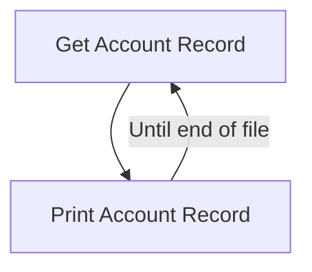

The <SwmToken path="/app/cbl/CBACT01C.cbl" pos="71:14:14" line-data="           DISPLAY &#39;START OF EXECUTION OF PROGRAM CBACT01C&#39;.                    " repo-id="Z2l0aHViJTNBJTNBa3luZHJ5bC1hd3MtbWFpbmZyYW1lLW1vZGVybml6YXRpb24tY2FyZGRlbW8lM0ElM0FTd2ltbS1EZW1v" repo-name="aws-mainframe-modernization-carddemo">`CBACT01C`</SwmToken> program reads and prints all the account records.



<SwmSnippet path="app/cbl/CBACT01C.cbl" line="70" repo-id="Z2l0aHViJTNBJTNBa3luZHJ5bC1hd3MtbWFpbmZyYW1lLW1vZGVybml6YXRpb24tY2FyZGRlbW8lM0ElM0FTd2ltbS1EZW1v">

---

The program begins by opening the account file by calling the <SwmToken path="/app/cbl/CBACT01C.cbl" pos="72:3:7" line-data="           PERFORM 0000-ACCTFILE-OPEN.                                          " repo-id="Z2l0aHViJTNBJTNBa3luZHJ5bC1hd3MtbWFpbmZyYW1lLW1vZGVybml6YXRpb24tY2FyZGRlbW8lM0ElM0FTd2ltbS1EZW1v" repo-name="aws-mainframe-modernization-carddemo">`0000-ACCTFILE-OPEN`</SwmToken> function. The main logic of the program is encapsulated in a <SwmToken path="/app/cbl/CBACT01C.cbl" pos="74:1:3" line-data="           PERFORM UNTIL END-OF-FILE = &#39;Y&#39;                                      " repo-id="Z2l0aHViJTNBJTNBa3luZHJ5bC1hd3MtbWFpbmZyYW1lLW1vZGVybml6YXRpb24tY2FyZGRlbW8lM0ElM0FTd2ltbS1EZW1v" repo-name="aws-mainframe-modernization-carddemo">`PERFORM UNTIL`</SwmToken> loop that continues until the <SwmToken path="/app/cbl/CBACT01C.cbl" pos="108:9:13" line-data="                   MOVE &#39;Y&#39; TO END-OF-FILE                                      " repo-id="Z2l0aHViJTNBJTNBa3luZHJ5bC1hd3MtbWFpbmZyYW1lLW1vZGVybml6YXRpb24tY2FyZGRlbW8lM0ElM0FTd2ltbS1EZW1v" repo-name="aws-mainframe-modernization-carddemo">`END-OF-FILE`</SwmToken> flag is set to 'Y'.

Within the loop, the program checks if <SwmToken path="/app/cbl/CBACT01C.cbl" pos="108:9:13" line-data="                   MOVE &#39;Y&#39; TO END-OF-FILE                                      " repo-id="Z2l0aHViJTNBJTNBa3luZHJ5bC1hd3MtbWFpbmZyYW1lLW1vZGVybml6YXRpb24tY2FyZGRlbW8lM0ElM0FTd2ltbS1EZW1v" repo-name="aws-mainframe-modernization-carddemo">`END-OF-FILE`</SwmToken> is 'N'. If so, it calls the <SwmToken path="/app/cbl/CBACT01C.cbl" pos="76:3:9" line-data="                   PERFORM 1000-ACCTFILE-GET-NEXT                               " repo-id="Z2l0aHViJTNBJTNBa3luZHJ5bC1hd3MtbWFpbmZyYW1lLW1vZGVybml6YXRpb24tY2FyZGRlbW8lM0ElM0FTd2ltbS1EZW1v" repo-name="aws-mainframe-modernization-carddemo">`1000-ACCTFILE-GET-NEXT`</SwmToken> function to read the next account record. If the end of the file has not been reached, it displays the <SwmToken path="/app/cbl/CBACT01C.cbl" pos="78:3:5" line-data="                       DISPLAY ACCOUNT-RECORD                                   " repo-id="Z2l0aHViJTNBJTNBa3luZHJ5bC1hd3MtbWFpbmZyYW1lLW1vZGVybml6YXRpb24tY2FyZGRlbW8lM0ElM0FTd2ltbS1EZW1v" repo-name="aws-mainframe-modernization-carddemo">`ACCOUNT-RECORD`</SwmToken>. This process repeats until the end of the file is reached.

```
       PROCEDURE DIVISION.                                                      
           DISPLAY 'START OF EXECUTION OF PROGRAM CBACT01C'.                    
           PERFORM 0000-ACCTFILE-OPEN.                                          
                                                                                
           PERFORM UNTIL END-OF-FILE = 'Y'                                      
               IF  END-OF-FILE = 'N'                                            
                   PERFORM 1000-ACCTFILE-GET-NEXT                               
                   IF  END-OF-FILE = 'N'                                        
                       DISPLAY ACCOUNT-RECORD                                   
                   END-IF                                                       
               END-IF                                                           
           END-PERFORM.                                                         
```

---

</SwmSnippet>

## Opening the Account File

<SwmSnippet path="app/cbl/CBACT01C.cbl" line="133" repo-id="Z2l0aHViJTNBJTNBa3luZHJ5bC1hd3MtbWFpbmZyYW1lLW1vZGVybml6YXRpb24tY2FyZGRlbW8lM0ElM0FTd2ltbS1EZW1v">

---

The <SwmToken path="/app/cbl/CBACT01C.cbl" pos="133:1:5" line-data="       0000-ACCTFILE-OPEN.                                                      " repo-id="Z2l0aHViJTNBJTNBa3luZHJ5bC1hd3MtbWFpbmZyYW1lLW1vZGVybml6YXRpb24tY2FyZGRlbW8lM0ElM0FTd2ltbS1EZW1v" repo-name="aws-mainframe-modernization-carddemo">`0000-ACCTFILE-OPEN`</SwmToken> function is responsible for opening the account file. If the application result indicates success (<SwmToken path="/app/cbl/CBACT01C.cbl" pos="104:3:5" line-data="           IF  APPL-AOK                                                         " repo-id="Z2l0aHViJTNBJTNBa3luZHJ5bC1hd3MtbWFpbmZyYW1lLW1vZGVybml6YXRpb24tY2FyZGRlbW8lM0ElM0FTd2ltbS1EZW1v" repo-name="aws-mainframe-modernization-carddemo">`APPL-AOK`</SwmToken>), the function continues. If not, it displays an error message, sets the <SwmToken path="/app/cbl/CBACT01C.cbl" pos="176:5:7" line-data="       9910-DISPLAY-IO-STATUS.                                                  " repo-id="Z2l0aHViJTNBJTNBa3luZHJ5bC1hd3MtbWFpbmZyYW1lLW1vZGVybml6YXRpb24tY2FyZGRlbW8lM0ElM0FTd2ltbS1EZW1v" repo-name="aws-mainframe-modernization-carddemo">`IO-STATUS`</SwmToken>, and calls the <SwmToken path="/app/cbl/CBACT01C.cbl" pos="176:1:7" line-data="       9910-DISPLAY-IO-STATUS.                                                  " repo-id="Z2l0aHViJTNBJTNBa3luZHJ5bC1hd3MtbWFpbmZyYW1lLW1vZGVybml6YXRpb24tY2FyZGRlbW8lM0ElM0FTd2ltbS1EZW1v" repo-name="aws-mainframe-modernization-carddemo">`9910-DISPLAY-IO-STATUS`</SwmToken> and <SwmToken path="/app/cbl/CBACT01C.cbl" pos="169:1:5" line-data="       9999-ABEND-PROGRAM.                                                      " repo-id="Z2l0aHViJTNBJTNBa3luZHJ5bC1hd3MtbWFpbmZyYW1lLW1vZGVybml6YXRpb24tY2FyZGRlbW8lM0ElM0FTd2ltbS1EZW1v" repo-name="aws-mainframe-modernization-carddemo">`9999-ABEND-PROGRAM`</SwmToken> functions to handle the error and abort the program.

```
       0000-ACCTFILE-OPEN.                                                      
           MOVE 8 TO APPL-RESULT.                                               
           OPEN INPUT ACCTFILE-FILE                                             
           IF  ACCTFILE-STATUS = '00'                                           
               MOVE 0 TO APPL-RESULT                                            
           ELSE                                                                 
               MOVE 12 TO APPL-RESULT                                           
           END-IF                                                               
           IF  APPL-AOK                                                         
               CONTINUE                                                         
           ELSE                                                                 
               DISPLAY 'ERROR OPENING ACCTFILE'                                 
               MOVE ACCTFILE-STATUS TO IO-STATUS                                
               PERFORM 9910-DISPLAY-IO-STATUS                                   
               PERFORM 9999-ABEND-PROGRAM                                       
           END-IF                                                               
           EXIT.                                                                
```

---

</SwmSnippet>

&nbsp;

*This is an auto-generated document by Swimm 🌊 and has not yet been verified by a human*

<SwmMeta version="3.0.0"><sup>Powered by [Swimm](https://app.swimm.io/)</sup></SwmMeta>
