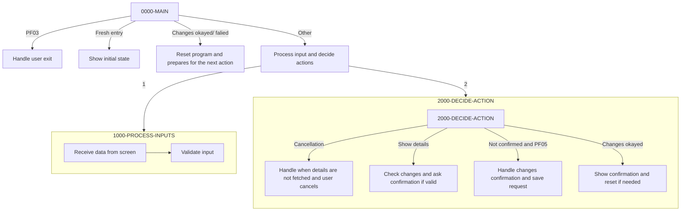

The document outlines the process of handling and validating account update inputs within a mainframe application. It describes how the program manages different scenarios such as user exit, fresh entry, account data change review, user input processing, user cancellation, changes confirmation, and resetting. The input for this process is the account update details, and the output is the validation status and updated account data.



## <SwmToken path="/app/cbl/COACTUPC.cbl" pos="859:1:3" line-data="       0000-MAIN." repo-id="Z2l0aHViJTNBJTNBYXdzLW1haW5mcmFtZS1tb2Rlcm5pemF0aW9uLWNhcmRkZW1vJTNBJTNBU3dpbW0tRGVtbw==" repo-name="aws-mainframe-modernization-carddemo">`0000-MAIN`</SwmToken> function

The <SwmToken path="/app/cbl/COACTUPC.cbl" pos="859:1:3" line-data="       0000-MAIN." repo-id="Z2l0aHViJTNBJTNBYXdzLW1haW5mcmFtZS1tb2Rlcm5pemF0aW9uLWNhcmRkZW1vJTNBJTNBU3dpbW0tRGVtbw==" repo-name="aws-mainframe-modernization-carddemo">`0000-MAIN`</SwmToken> function serves as the primary control flow for the account update process. It handles different states of the application including user navigation, initial entry, data review, and input processing. The function evaluates the current state and directs the program flow to the appropriate handling routine based on user actions.

<SwmSnippet path="/app/cbl/COACTUPC.cbl" line="921" repo-id="Z2l0aHViJTNBJTNBYXdzLW1haW5mcmFtZS1tb2Rlcm5pemF0aW9uLWNhcmRkZW1vJTNBJTNBU3dpbW0tRGVtbw==">

---

### Handling User Exit

First, the program handles the case where the user pressed the PF03 key. This is managed by checking if <SwmToken path="/app/cbl/COACTUPC.cbl" pos="927:3:7" line-data="              WHEN CCARD-AID-PFK03" repo-id="Z2l0aHViJTNBJTNBYXdzLW1haW5mcmFtZS1tb2Rlcm5pemF0aW9uLWNhcmRkZW1vJTNBJTNBU3dpbW0tRGVtbw==" repo-name="aws-mainframe-modernization-carddemo">`CCARD-AID-PFK03`</SwmToken> (indicating the PF03 key press) is true. If so, the program sets the <SwmToken path="/app/cbl/COACTUPC.cbl" pos="932:9:13" line-data="                      MOVE LIT-MENUTRANID  TO CDEMO-TO-TRANID" repo-id="Z2l0aHViJTNBJTNBYXdzLW1haW5mcmFtZS1tb2Rlcm5pemF0aW9uLWNhcmRkZW1vJTNBJTNBU3dpbW0tRGVtbw==" repo-name="aws-mainframe-modernization-carddemo">`CDEMO-TO-TRANID`</SwmToken> and <SwmToken path="/app/cbl/COACTUPC.cbl" pos="939:9:13" line-data="                      MOVE LIT-MENUPGM     TO CDEMO-TO-PROGRAM" repo-id="Z2l0aHViJTNBJTNBYXdzLW1haW5mcmFtZS1tb2Rlcm5pemF0aW9uLWNhcmRkZW1vJTNBJTNBU3dpbW0tRGVtbw==" repo-name="aws-mainframe-modernization-carddemo">`CDEMO-TO-PROGRAM`</SwmToken> to either the main menu or the calling program, depending on the values of <SwmToken path="/app/cbl/COACTUPC.cbl" pos="930:3:7" line-data="                   IF CDEMO-FROM-TRANID    EQUAL LOW-VALUES" repo-id="Z2l0aHViJTNBJTNBYXdzLW1haW5mcmFtZS1tb2Rlcm5pemF0aW9uLWNhcmRkZW1vJTNBJTNBU3dpbW0tRGVtbw==" repo-name="aws-mainframe-modernization-carddemo">`CDEMO-FROM-TRANID`</SwmToken> and <SwmToken path="/app/cbl/COACTUPC.cbl" pos="966:3:7" line-data="              WHEN CDEMO-FROM-PROGRAM   EQUAL LIT-MENUPGM" repo-id="Z2l0aHViJTNBJTNBYXdzLW1haW5mcmFtZS1tb2Rlcm5pemF0aW9uLWNhcmRkZW1vJTNBJTNBU3dpbW0tRGVtbw==" repo-name="aws-mainframe-modernization-carddemo">`CDEMO-FROM-PROGRAM`</SwmToken>.

```cobol
           EVALUATE TRUE
      ******************************************************************
      *       USER PRESSES PF03 TO EXIT
      *  OR   USER IS DONE WITH UPDATE
      *            XCTL TO CALLING PROGRAM OR MAIN MENU
      ******************************************************************
              WHEN CCARD-AID-PFK03
                   SET CCARD-AID-PFK03     TO TRUE

                   IF CDEMO-FROM-TRANID    EQUAL LOW-VALUES
                   OR CDEMO-FROM-TRANID    EQUAL SPACES
                      MOVE LIT-MENUTRANID  TO CDEMO-TO-TRANID
                   ELSE
                      MOVE CDEMO-FROM-TRANID  TO CDEMO-TO-TRANID
                   END-IF
```

---

</SwmSnippet>

<SwmSnippet path="/app/cbl/COACTUPC.cbl" line="956" repo-id="Z2l0aHViJTNBJTNBYXdzLW1haW5mcmFtZS1tb2Rlcm5pemF0aW9uLWNhcmRkZW1vJTNBJTNBU3dpbW0tRGVtbw==">

---

The value in <SwmToken path="/app/cbl/COACTUPC.cbl" pos="932:9:13" line-data="                      MOVE LIT-MENUTRANID  TO CDEMO-TO-TRANID" repo-id="Z2l0aHViJTNBJTNBYXdzLW1haW5mcmFtZS1tb2Rlcm5pemF0aW9uLWNhcmRkZW1vJTNBJTNBU3dpbW0tRGVtbw==" repo-name="aws-mainframe-modernization-carddemo">`CDEMO-TO-TRANID`</SwmToken> and <SwmToken path="/app/cbl/COACTUPC.cbl" pos="939:9:13" line-data="                      MOVE LIT-MENUPGM     TO CDEMO-TO-PROGRAM" repo-id="Z2l0aHViJTNBJTNBYXdzLW1haW5mcmFtZS1tb2Rlcm5pemF0aW9uLWNhcmRkZW1vJTNBJTNBU3dpbW0tRGVtbw==" repo-name="aws-mainframe-modernization-carddemo">`CDEMO-TO-PROGRAM`</SwmToken> are used in the CICS command to transfers control to the either the main menu or the current program.

```cobol
                   EXEC CICS XCTL
                        PROGRAM (CDEMO-TO-PROGRAM)
                        COMMAREA(CARDDEMO-COMMAREA)
                   END-EXEC
```

---

</SwmSnippet>

<SwmSnippet path="/app/cbl/COACTUPC.cbl" line="964" repo-id="Z2l0aHViJTNBJTNBYXdzLW1haW5mcmFtZS1tb2Rlcm5pemF0aW9uLWNhcmRkZW1vJTNBJTNBU3dpbW0tRGVtbw==">

---

### Handling Fresh Entry

Next, the program handles the fresh entry scenario. This occurs when the user first enters the program or comes from the menu. The program shows the initial search screen using <SwmToken path="/app/cbl/COACTUPC.cbl" pos="969:3:7" line-data="                   PERFORM 3000-SEND-MAP THRU" repo-id="Z2l0aHViJTNBJTNBYXdzLW1haW5mcmFtZS1tb2Rlcm5pemF0aW9uLWNhcmRkZW1vJTNBJTNBU3dpbW0tRGVtbw==" repo-name="aws-mainframe-modernization-carddemo">`3000-SEND-MAP`</SwmToken>.

```cobol
              WHEN ACUP-DETAILS-NOT-FETCHED
               AND CDEMO-PGM-ENTER
              WHEN CDEMO-FROM-PROGRAM   EQUAL LIT-MENUPGM
               AND NOT CDEMO-PGM-REENTER
                   INITIALIZE WS-THIS-PROGCOMMAREA
                   PERFORM 3000-SEND-MAP THRU
                           3000-SEND-MAP-EXIT
                   SET CDEMO-PGM-REENTER        TO TRUE
                   SET ACUP-DETAILS-NOT-FETCHED TO TRUE
                   GO TO COMMON-RETURN
```

---

</SwmSnippet>

<SwmSnippet path="/app/cbl/COACTUPC.cbl" line="979" repo-id="Z2l0aHViJTNBJTNBYXdzLW1haW5mcmFtZS1tb2Rlcm5pemF0aW9uLWNhcmRkZW1vJTNBJTNBU3dpbW0tRGVtbw==">

---

### Handling Account Data Change Review

Then, the program handles the scenario where account data changes have been reviewed and either successfully completed (<SwmToken path="/app/cbl/COACTUPC.cbl" pos="2625:3:11" line-data="              WHEN ACUP-CHANGES-OKAYED-AND-DONE" repo-id="Z2l0aHViJTNBJTNBYXdzLW1haW5mcmFtZS1tb2Rlcm5pemF0aW9uLWNhcmRkZW1vJTNBJTNBU3dpbW0tRGVtbw==" repo-name="aws-mainframe-modernization-carddemo">`ACUP-CHANGES-OKAYED-AND-DONE`</SwmToken> ) or failed (<SwmToken path="/app/cbl/COACTUPC.cbl" pos="980:3:7" line-data="              WHEN ACUP-CHANGES-FAILED" repo-id="Z2l0aHViJTNBJTNBYXdzLW1haW5mcmFtZS1tb2Rlcm5pemF0aW9uLWNhcmRkZW1vJTNBJTNBU3dpbW0tRGVtbw==" repo-name="aws-mainframe-modernization-carddemo">`ACUP-CHANGES-FAILED`</SwmToken>`)`. In either case, it resets the program to start fresh and shows the initial screen to the user (<SwmToken path="/app/cbl/COACTUPC.cbl" pos="969:3:7" line-data="                   PERFORM 3000-SEND-MAP THRU" repo-id="Z2l0aHViJTNBJTNBYXdzLW1haW5mcmFtZS1tb2Rlcm5pemF0aW9uLWNhcmRkZW1vJTNBJTNBU3dpbW0tRGVtbw==" repo-name="aws-mainframe-modernization-carddemo">`3000-SEND-MAP`</SwmToken>) and prepares for the next user action.

```cobol
              WHEN ACUP-CHANGES-OKAYED-AND-DONE
              WHEN ACUP-CHANGES-FAILED
                   INITIALIZE WS-THIS-PROGCOMMAREA
                              WS-MISC-STORAGE
                              CDEMO-ACCT-ID
                   SET CDEMO-PGM-ENTER            TO TRUE
                   PERFORM 3000-SEND-MAP THRU
                           3000-SEND-MAP-EXIT
                   SET CDEMO-PGM-REENTER          TO TRUE
                   SET ACUP-DETAILS-NOT-FETCHED   TO TRUE
                   GO TO COMMON-RETURN
```

---

</SwmSnippet>

<SwmSnippet path="/app/cbl/COACTUPC.cbl" line="996" repo-id="Z2l0aHViJTNBJTNBYXdzLW1haW5mcmFtZS1tb2Rlcm5pemF0aW9uLWNhcmRkZW1vJTNBJTNBU3dpbW0tRGVtbw==">

---

### Processing User Input

Finally, for all other cases, the program processes user input, decides what action to take, and shows the appropriate screen. This is done by performing the <SwmToken path="/app/cbl/COACTUPC.cbl" pos="997:3:7" line-data="                   PERFORM 1000-PROCESS-INPUTS" repo-id="Z2l0aHViJTNBJTNBYXdzLW1haW5mcmFtZS1tb2Rlcm5pemF0aW9uLWNhcmRkZW1vJTNBJTNBU3dpbW0tRGVtbw==" repo-name="aws-mainframe-modernization-carddemo">`1000-PROCESS-INPUTS`</SwmToken> and <SwmToken path="/app/cbl/COACTUPC.cbl" pos="999:3:7" line-data="                   PERFORM 2000-DECIDE-ACTION" repo-id="Z2l0aHViJTNBJTNBYXdzLW1haW5mcmFtZS1tb2Rlcm5pemF0aW9uLWNhcmRkZW1vJTNBJTNBU3dpbW0tRGVtbw==" repo-name="aws-mainframe-modernization-carddemo">`2000-DECIDE-ACTION`</SwmToken> functions.

```cobol
              WHEN OTHER
                   PERFORM 1000-PROCESS-INPUTS
                      THRU 1000-PROCESS-INPUTS-EXIT
                   PERFORM 2000-DECIDE-ACTION
                      THRU 2000-DECIDE-ACTION-EXIT
                   PERFORM 3000-SEND-MAP
                      THRU 3000-SEND-MAP-EXIT
                   GO TO COMMON-RETURN
```

---

</SwmSnippet>

## <SwmToken path="/app/cbl/COACTUPC.cbl" pos="1025:1:5" line-data="       1000-PROCESS-INPUTS." repo-id="Z2l0aHViJTNBJTNBYXdzLW1haW5mcmFtZS1tb2Rlcm5pemF0aW9uLWNhcmRkZW1vJTNBJTNBU3dpbW0tRGVtbw==" repo-name="aws-mainframe-modernization-carddemo">`1000-PROCESS-INPUTS`</SwmToken> function

<SwmSnippet path="/app/cbl/COACTUPC.cbl" line="1040" repo-id="Z2l0aHViJTNBJTNBYXdzLW1haW5mcmFtZS1tb2Rlcm5pemF0aW9uLWNhcmRkZW1vJTNBJTNBU3dpbW0tRGVtbw==">

---

The <SwmToken path="/app/cbl/COACTUPC.cbl" pos="1025:1:5" line-data="       1000-PROCESS-INPUTS." repo-id="Z2l0aHViJTNBJTNBYXdzLW1haW5mcmFtZS1tb2Rlcm5pemF0aW9uLWNhcmRkZW1vJTNBJTNBU3dpbW0tRGVtbw==" repo-name="aws-mainframe-modernization-carddemo">`1000-PROCESS-INPUTS`</SwmToken> function starts by calling the <SwmToken path="/app/cbl/COACTUPC.cbl" pos="1039:1:5" line-data="       1100-RECEIVE-MAP." repo-id="Z2l0aHViJTNBJTNBYXdzLW1haW5mcmFtZS1tb2Rlcm5pemF0aW9uLWNhcmRkZW1vJTNBJTNBU3dpbW0tRGVtbw==" repo-name="aws-mainframe-modernization-carddemo">`1100-RECEIVE-MAP`</SwmToken> function. This function starts by receiving data from the screen for the CACTUPA map (stored in <SwmToken path="/app/cbl/COACTUPC.cbl" pos="1040:9:11" line-data="           EXEC CICS RECEIVE MAP(LIT-THISMAP)" repo-id="Z2l0aHViJTNBJTNBYXdzLW1haW5mcmFtZS1tb2Rlcm5pemF0aW9uLWNhcmRkZW1vJTNBJTNBU3dpbW0tRGVtbw==" repo-name="aws-mainframe-modernization-carddemo">`LIT-THISMAP`</SwmToken>). It then processes and validates each field, and creates a complete new record of all the fields in <SwmToken path="/app/cbl/COACTUPC.cbl" pos="757:3:7" line-data="          05 ACUP-NEW-DETAILS." repo-id="Z2l0aHViJTNBJTNBYXdzLW1haW5mcmFtZS1tb2Rlcm5pemF0aW9uLWNhcmRkZW1vJTNBJTNBU3dpbW0tRGVtbw==" repo-name="aws-mainframe-modernization-carddemo">`ACUP-NEW-DETAILS`</SwmToken>.

```cobol
           EXEC CICS RECEIVE MAP(LIT-THISMAP)
                     MAPSET(LIT-THISMAPSET)
                     INTO(CACTUPAI)
                     RESP(WS-RESP-CD)
                     RESP2(WS-REAS-CD)
           END-EXEC
```

---

</SwmSnippet>

The <SwmToken path="/app/cbl/COACTUPC.cbl" pos="1025:1:5" line-data="       1000-PROCESS-INPUTS." repo-id="Z2l0aHViJTNBJTNBYXdzLW1haW5mcmFtZS1tb2Rlcm5pemF0aW9uLWNhcmRkZW1vJTNBJTNBU3dpbW0tRGVtbw==" repo-name="aws-mainframe-modernization-carddemo">`1000-PROCESS-INPUTS`</SwmToken> function then calls the <SwmToken path="/app/cbl/COACTUPC.cbl" pos="1429:1:7" line-data="       1200-EDIT-MAP-INPUTS." repo-id="Z2l0aHViJTNBJTNBYXdzLW1haW5mcmFtZS1tb2Rlcm5pemF0aW9uLWNhcmRkZW1vJTNBJTNBU3dpbW0tRGVtbw==" repo-name="aws-mainframe-modernization-carddemo">`1200-EDIT-MAP-INPUTS`</SwmToken> function which is the main validation routine for account updates.

<SwmSnippet path="/app/cbl/COACTUPC.cbl" line="1433" repo-id="Z2l0aHViJTNBJTNBYXdzLW1haW5mcmFtZS1tb2Rlcm5pemF0aW9uLWNhcmRkZW1vJTNBJTNBU3dpbW0tRGVtbw==">

---

This block handles processing for new records.

```cobol
           IF  ACUP-DETAILS-NOT-FETCHED
      *        VALIDATE THE SEARCH KEYS
               PERFORM 1210-EDIT-ACCOUNT
                  THRU 1210-EDIT-ACCOUNT-EXIT

               MOVE LOW-VALUES           TO ACUP-OLD-ACCT-DATA

      *       IF THE SEARCH CONDITIONS HAVE PROBLEMS FLAG THEM
              IF  FLG-ACCTFILTER-BLANK
                  SET NO-SEARCH-CRITERIA-RECEIVED TO TRUE
              END-IF

      *       AT THIS STAGE. NO DETAILS FETCHED. NOTHING MORE TO EDIT.
              GO TO 1200-EDIT-MAP-INPUTS-EXIT
```

---

</SwmSnippet>

<SwmSnippet path="/app/cbl/COACTUPC.cbl" line="1460" repo-id="Z2l0aHViJTNBJTNBYXdzLW1haW5mcmFtZS1tb2Rlcm5pemF0aW9uLWNhcmRkZW1vJTNBJTNBU3dpbW0tRGVtbw==">

---

For existing records, it compares the original (old) values with the new input values to detect if any changes were made. If not it exits.

```
           PERFORM 1205-COMPARE-OLD-NEW
              THRU 1205-COMPARE-OLD-NEW-EXIT

           IF  NO-CHANGES-FOUND
           OR  ACUP-CHANGES-OK-NOT-CONFIRMED
           OR  ACUP-CHANGES-OKAYED-AND-DONE
               MOVE LOW-VALUES           TO WS-NON-KEY-FLAGS
               GO TO 1200-EDIT-MAP-INPUTS-EXIT
           END-IF
```

---

</SwmSnippet>

<SwmSnippet path="/app/cbl/COACTUPC.cbl" line="1470" repo-id="Z2l0aHViJTNBJTNBYXdzLW1haW5mcmFtZS1tb2Rlcm5pemF0aW9uLWNhcmRkZW1vJTNBJTNBU3dpbW0tRGVtbw==">

---

For changed fields, it validates them.

```cobol
           SET ACUP-CHANGES-NOT-OK       TO TRUE

           MOVE 'Account Status'          TO WS-EDIT-VARIABLE-NAME
           MOVE ACUP-NEW-ACTIVE-STATUS    TO WS-EDIT-YES-NO
           PERFORM 1220-EDIT-YESNO
              THRU 1220-EDIT-YESNO-EXIT
           MOVE WS-EDIT-YES-NO            TO WS-EDIT-ACCT-STATUS

           MOVE 'Open Date'              TO WS-EDIT-VARIABLE-NAME
           MOVE ACUP-NEW-OPEN-DATE       TO WS-EDIT-DATE-CCYYMMDD
           PERFORM EDIT-DATE-CCYYMMDD
              THRU EDIT-DATE-CCYYMMDD-EXIT
           MOVE WS-EDIT-DATE-FLGS        TO WS-EDIT-OPEN-DATE-FLGS

           MOVE 'Credit Limit'           TO WS-EDIT-VARIABLE-NAME
           MOVE ACUP-NEW-CREDIT-LIMIT-X  TO WS-EDIT-SIGNED-NUMBER-9V2-X
           PERFORM 1250-EDIT-SIGNED-9V2
              THRU 1250-EDIT-SIGNED-9V2-EXIT
           MOVE WS-FLG-SIGNED-NUMBER-EDIT  TO WS-EDIT-CREDIT-LIMIT

           MOVE 'Expiry Date'            TO WS-EDIT-VARIABLE-NAME
           MOVE ACUP-NEW-EXPIRAION-DATE  TO WS-EDIT-DATE-CCYYMMDD
           PERFORM EDIT-DATE-CCYYMMDD
              THRU EDIT-DATE-CCYYMMDD-EXIT
           MOVE WS-EDIT-DATE-FLGS        TO WS-EXPIRY-DATE-FLGS
```

---

</SwmSnippet>

## <SwmToken path="/app/cbl/COACTUPC.cbl" pos="2562:1:5" line-data="       2000-DECIDE-ACTION." repo-id="Z2l0aHViJTNBJTNBYXdzLW1haW5mcmFtZS1tb2Rlcm5pemF0aW9uLWNhcmRkZW1vJTNBJTNBU3dpbW0tRGVtbw==" repo-name="aws-mainframe-modernization-carddemo">`2000-DECIDE-ACTION`</SwmToken> function

The <SwmToken path="/app/cbl/COACTUPC.cbl" pos="999:3:7" line-data="                   PERFORM 2000-DECIDE-ACTION" repo-id="Z2l0aHViJTNBJTNBYXdzLW1haW5mcmFtZS1tb2Rlcm5pemF0aW9uLWNhcmRkZW1vJTNBJTNBU3dpbW0tRGVtbw==" repo-name="aws-mainframe-modernization-carddemo">`2000-DECIDE-ACTION`</SwmToken> function manages the business logic for account updates by evaluating user actions and current program state.&nbsp;

<SwmSnippet path="/app/cbl/COACTUPC.cbl" line="2562" repo-id="Z2l0aHViJTNBJTNBYXdzLW1haW5mcmFtZS1tb2Rlcm5pemF0aW9uLWNhcmRkZW1vJTNBJTNBU3dpbW0tRGVtbw==">

---

### Handling User Cancellation

The function first handles the scenario where details are not fetched (<SwmToken path="/app/cbl/COACTUPC.cbl" pos="2568:3:9" line-data="              WHEN ACUP-DETAILS-NOT-FETCHED" repo-id="Z2l0aHViJTNBJTNBYXdzLW1haW5mcmFtZS1tb2Rlcm5pemF0aW9uLWNhcmRkZW1vJTNBJTNBU3dpbW0tRGVtbw==" repo-name="aws-mainframe-modernization-carddemo">`ACUP-DETAILS-NOT-FETCHED`</SwmToken>) and the user cancels (<SwmToken path="/app/cbl/COACTUPC.cbl" pos="2572:3:7" line-data="              WHEN CCARD-AID-PFK12" repo-id="Z2l0aHViJTNBJTNBYXdzLW1haW5mcmFtZS1tb2Rlcm5pemF0aW9uLWNhcmRkZW1vJTNBJTNBU3dpbW0tRGVtbw==" repo-name="aws-mainframe-modernization-carddemo">`CCARD-AID-PFK12`</SwmToken>). In this case, the function checks if the account filter is valid (<SwmToken path="/app/cbl/COACTUPC.cbl" pos="2573:3:7" line-data="                 IF  FLG-ACCTFILTER-ISVALID" repo-id="Z2l0aHViJTNBJTNBYXdzLW1haW5mcmFtZS1tb2Rlcm5pemF0aW9uLWNhcmRkZW1vJTNBJTNBU3dpbW0tRGVtbw==" repo-name="aws-mainframe-modernization-carddemo">`FLG-ACCTFILTER-ISVALID`</SwmToken>) and if so, it reads the account details and sets the flag to show details if the customer is found in the master file.

```
       2000-DECIDE-ACTION.
           EVALUATE TRUE
      ******************************************************************
      *       NO DETAILS SHOWN.
      *       SO GET THEM AND SETUP DETAIL EDIT SCREEN
      ******************************************************************
              WHEN ACUP-DETAILS-NOT-FETCHED
      ******************************************************************
      *       CHANGES MADE. BUT USER CANCELS
      ******************************************************************
              WHEN CCARD-AID-PFK12
                 IF  FLG-ACCTFILTER-ISVALID
                     SET WS-RETURN-MSG-OFF       TO TRUE
                     PERFORM 9000-READ-ACCT
                        THRU 9000-READ-ACCT-EXIT
                     IF FOUND-CUST-IN-MASTER
                        SET ACUP-SHOW-DETAILS    TO TRUE
                     END-IF
                 END-IF
```

---

</SwmSnippet>

<SwmSnippet path="/app/cbl/COACTUPC.cbl" line="2585" repo-id="Z2l0aHViJTNBJTNBYXdzLW1haW5mcmFtZS1tb2Rlcm5pemF0aW9uLWNhcmRkZW1vJTNBJTNBU3dpbW0tRGVtbw==">

---

### Checking Changes and Asking for Confirmation

If not, it checks if the<SwmToken path="/app/cbl/COACTUPC.cbl" pos="2585:3:7" line-data="              WHEN ACUP-SHOW-DETAILS" repo-id="Z2l0aHViJTNBJTNBYXdzLW1haW5mcmFtZS1tb2Rlcm5pemF0aW9uLWNhcmRkZW1vJTNBJTNBU3dpbW0tRGVtbw==" repo-name="aws-mainframe-modernization-carddemo">`ACUP-SHOW-DETAILS`</SwmToken> flag is true which indicates the program should display account details to the user. It checks for input errors or if no changes are detected. If neither condition is met, it sets the flag <SwmToken path="/app/cbl/COACTUPC.cbl" pos="2602:3:11" line-data="              WHEN ACUP-CHANGES-OK-NOT-CONFIRMED" repo-id="Z2l0aHViJTNBJTNBYXdzLW1haW5mcmFtZS1tb2Rlcm5pemF0aW9uLWNhcmRkZW1vJTNBJTNBU3dpbW0tRGVtbw==" repo-name="aws-mainframe-modernization-carddemo">`ACUP-CHANGES-OK-NOT-CONFIRMED`</SwmToken> to true.

```cobol
              WHEN ACUP-SHOW-DETAILS
                 IF INPUT-ERROR
                 OR NO-CHANGES-DETECTED
                    CONTINUE
                 ELSE
                    SET ACUP-CHANGES-OK-NOT-CONFIRMED TO TRUE
                 END-IF
```

---

</SwmSnippet>

<SwmSnippet path="/app/cbl/COACTUPC.cbl" line="2602" repo-id="Z2l0aHViJTNBJTNBYXdzLW1haW5mcmFtZS1tb2Rlcm5pemF0aW9uLWNhcmRkZW1vJTNBJTNBU3dpbW0tRGVtbw==">

---

### Handling Changes Confirmation

Another case is when the <SwmToken path="/app/cbl/COACTUPC.cbl" pos="2602:3:11" line-data="              WHEN ACUP-CHANGES-OK-NOT-CONFIRMED" repo-id="Z2l0aHViJTNBJTNBYXdzLW1haW5mcmFtZS1tb2Rlcm5pemF0aW9uLWNhcmRkZW1vJTNBJTNBU3dpbW0tRGVtbw==" repo-name="aws-mainframe-modernization-carddemo">`ACUP-CHANGES-OK-NOT-CONFIRMED`</SwmToken> flag is true and the PF05 key is pressed, which indicates that the changes were confirmed. This case performs the write processing, and depending on the outcome, it sets various flags to indicate whether the changes were successfully saved, failed, or if there was a lock error.

```cobol
              WHEN ACUP-CHANGES-OK-NOT-CONFIRMED
               AND CCARD-AID-PFK05
                 PERFORM 9600-WRITE-PROCESSING
                    THRU 9600-WRITE-PROCESSING-EXIT
                 EVALUATE TRUE
                    WHEN COULD-NOT-LOCK-ACCT-FOR-UPDATE
                         SET ACUP-CHANGES-OKAYED-LOCK-ERROR TO TRUE
                    WHEN LOCKED-BUT-UPDATE-FAILED
                       SET ACUP-CHANGES-OKAYED-BUT-FAILED TO TRUE
                    WHEN DATA-WAS-CHANGED-BEFORE-UPDATE
                        SET ACUP-SHOW-DETAILS            TO TRUE
                    WHEN OTHER
                       SET ACUP-CHANGES-OKAYED-AND-DONE   TO TRUE
                 END-EVALUATE
```

---

</SwmSnippet>

<SwmSnippet path="/app/cbl/COACTUPC.cbl" line="2625" repo-id="Z2l0aHViJTNBJTNBYXdzLW1haW5mcmFtZS1tb2Rlcm5pemF0aW9uLWNhcmRkZW1vJTNBJTNBU3dpbW0tRGVtbw==">

---

### Showing Confirmation and Resetting

The last case, if `ACUP-CHANGES-OKAYED-AND-DONE` is true, the program shows confirmation and resets if needed.&nbsp;

```cobol
              WHEN ACUP-CHANGES-OKAYED-AND-DONE
                  SET ACUP-SHOW-DETAILS TO TRUE
                  IF CDEMO-FROM-TRANID    EQUAL LOW-VALUES
                  OR CDEMO-FROM-TRANID    EQUAL SPACES
                     MOVE ZEROES       TO CDEMO-ACCT-ID
                                          CDEMO-CARD-NUM
                     MOVE LOW-VALUES   TO CDEMO-ACCT-STATUS
                  END-IF
```

---

</SwmSnippet>

&nbsp;

*This is an auto-generated document by Swimm 🌊 and has not yet been verified by a human*

<SwmMeta version="3.0.0"><sup>Powered by [Swimm](https://staging.swimm.cloud/)</sup></SwmMeta>
