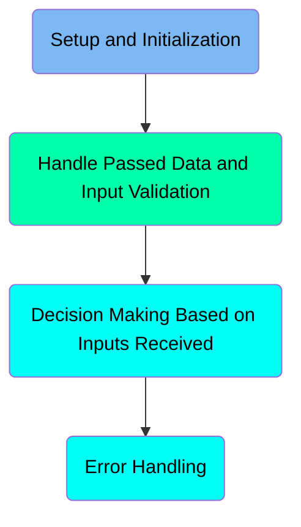
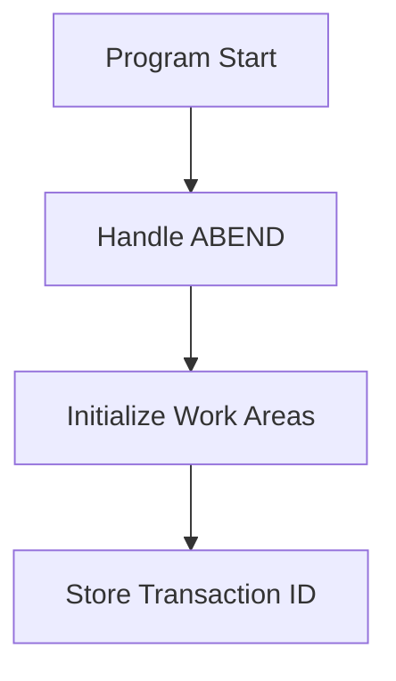
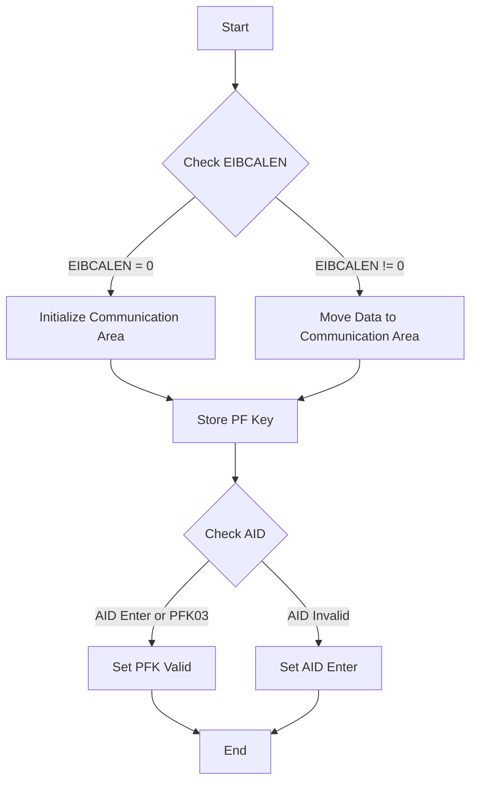
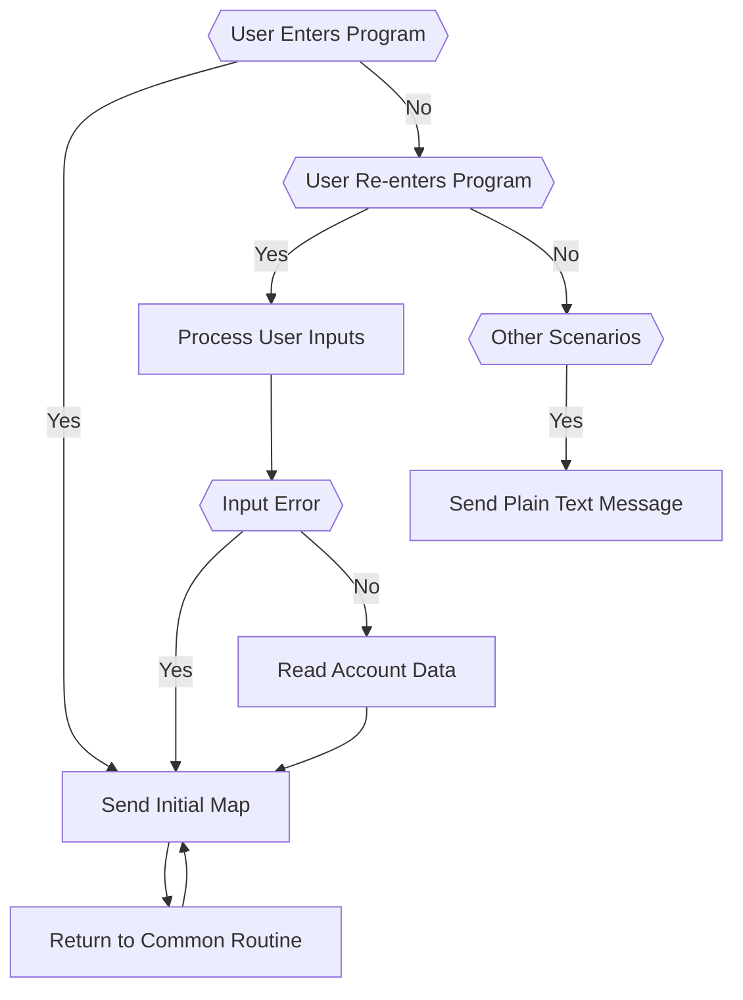
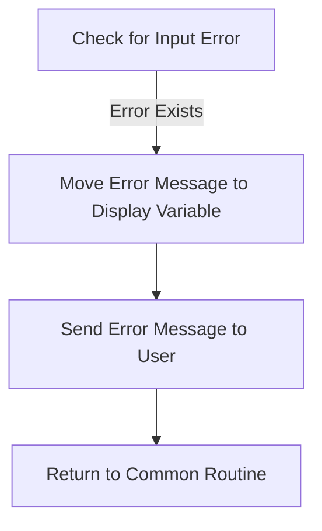

The COACTVWC program is designed to handle various user interactions within the CardDemo mainframe application. It manages the setup and initialization of work areas, processes user inputs, and handles decision-making based on the inputs received. The program ensures smooth user experience by handling errors gracefully and providing appropriate feedback to the user.

The COACTVWC program starts by setting up necessary work areas and handling any abnormal ends (ABENDs). It then processes user inputs, validates them, and makes decisions based on the inputs received. If any errors occur, the program handles them by sending appropriate error messages to the user and returning to a stable state. The program also manages the flow of user interactions by sending initial maps, processing re-entries, and handling other scenarios as needed.

Here is a high level diagram of the program:



# Setup and Initialization



<SwmSnippet path="/app/cbl/COACTVWC.cbl" line="263">

---

## Handling ABEND

First, the program sets up an ABEND (abnormal end) handling routine using the <SwmToken path="app/cbl/COACTVWC.cbl" pos="263:1:7" line-data="           EXEC CICS HANDLE ABEND                                               ">`EXEC CICS HANDLE ABEND`</SwmToken> command. This ensures that if an unexpected error occurs, the program will transfer control to the <SwmToken path="app/cbl/COACTVWC.cbl" pos="264:3:5" line-data="                     LABEL(ABEND-ROUTINE)                                       ">`ABEND-ROUTINE`</SwmToken> for error handling.

```cobol
           EXEC CICS HANDLE ABEND                                               
                     LABEL(ABEND-ROUTINE)                                       
           END-EXEC                                                             
```

---

</SwmSnippet>

<SwmSnippet path="/app/cbl/COACTVWC.cbl" line="267">

---

## Initializing Work Areas

Next, the program initializes several work areas including <SwmToken path="app/cbl/COACTVWC.cbl" pos="267:3:7" line-data="           INITIALIZE CC-WORK-AREA                                              ">`CC-WORK-AREA`</SwmToken>, <SwmToken path="app/cbl/COACTVWC.cbl" pos="268:1:5" line-data="                      WS-MISC-STORAGE                                           ">`WS-MISC-STORAGE`</SwmToken>, and <SwmToken path="app/cbl/COACTVWC.cbl" pos="269:1:3" line-data="                      WS-COMMAREA                                               ">`WS-COMMAREA`</SwmToken>. This step prepares the necessary storage areas for the program's operations.

```cobol
           INITIALIZE CC-WORK-AREA                                              
                      WS-MISC-STORAGE                                           
                      WS-COMMAREA                                               
```

---

</SwmSnippet>

<SwmSnippet path="/app/cbl/COACTVWC.cbl" line="273">

---

## Storing Transaction ID

Then, the program stores the current transaction ID by moving <SwmToken path="app/cbl/COACTVWC.cbl" pos="273:3:5" line-data="           MOVE LIT-THISTRANID       TO WS-TRANID                               ">`LIT-THISTRANID`</SwmToken> to <SwmToken path="app/cbl/COACTVWC.cbl" pos="273:9:11" line-data="           MOVE LIT-THISTRANID       TO WS-TRANID                               ">`WS-TRANID`</SwmToken>. This helps in maintaining the context of the current transaction throughout the program's execution.

```cobol
           MOVE LIT-THISTRANID       TO WS-TRANID                               
```

---

</SwmSnippet>

# Handle Passed Data and Input Validation



<SwmSnippet path="/app/cbl/COACTVWC.cbl" line="277">

---

## Initializing Communication Area

First, the code checks if <SwmToken path="app/cbl/COACTVWC.cbl" pos="281:3:3" line-data="           IF EIBCALEN IS EQUAL TO 0                                            ">`EIBCALEN`</SwmToken> is equal to 0 or if the program is being called from the menu program and is not a re-entry. If either condition is true, it initializes the communication area by setting <SwmToken path="app/cbl/COACTVWC.cbl" pos="284:3:5" line-data="              INITIALIZE CARDDEMO-COMMAREA                                      ">`CARDDEMO-COMMAREA`</SwmToken> and <SwmToken path="app/cbl/COACTVWC.cbl" pos="285:1:5" line-data="                         WS-THIS-PROGCOMMAREA                                   ">`WS-THIS-PROGCOMMAREA`</SwmToken> to their initial states. Otherwise, it moves the data from <SwmToken path="app/cbl/COACTVWC.cbl" pos="287:3:3" line-data="              MOVE DFHCOMMAREA (1:LENGTH OF CARDDEMO-COMMAREA)  TO              ">`DFHCOMMAREA`</SwmToken> to <SwmToken path="app/cbl/COACTVWC.cbl" pos="284:3:5" line-data="              INITIALIZE CARDDEMO-COMMAREA                                      ">`CARDDEMO-COMMAREA`</SwmToken> and <SwmToken path="app/cbl/COACTVWC.cbl" pos="285:1:5" line-data="                         WS-THIS-PROGCOMMAREA                                   ">`WS-THIS-PROGCOMMAREA`</SwmToken>.

```cobol
           SET WS-RETURN-MSG-OFF  TO TRUE                                       
      *****************************************************************         
      * Store passed data if  any                *                              
      *****************************************************************         
           IF EIBCALEN IS EQUAL TO 0                                            
               OR (CDEMO-FROM-PROGRAM = LIT-MENUPGM                             
               AND NOT CDEMO-PGM-REENTER)                                       
              INITIALIZE CARDDEMO-COMMAREA                                      
                         WS-THIS-PROGCOMMAREA                                   
           ELSE                                                                 
              MOVE DFHCOMMAREA (1:LENGTH OF CARDDEMO-COMMAREA)  TO              
                                CARDDEMO-COMMAREA                               
              MOVE DFHCOMMAREA(LENGTH OF CARDDEMO-COMMAREA + 1:                 
                               LENGTH OF WS-THIS-PROGCOMMAREA ) TO              
                                WS-THIS-PROGCOMMAREA                            
```

---

</SwmSnippet>

<SwmSnippet path="/app/cbl/COACTVWC.cbl" line="298">

---

## Storing PF Key

Next, the code performs the <SwmToken path="app/cbl/COACTVWC.cbl" pos="298:3:7" line-data="           PERFORM YYYY-STORE-PFKEY                                             ">`YYYY-STORE-PFKEY`</SwmToken> routine to remap and store the PF keys as needed.

```cobol
           PERFORM YYYY-STORE-PFKEY                                             
              THRU YYYY-STORE-PFKEY-EXIT                                        
```

---

</SwmSnippet>

<SwmSnippet path="/app/cbl/COACTVWC.cbl" line="305">

---

## Checking AID

Then, the code checks the AID to see if it is valid at this point. If the AID is either <SwmToken path="app/cbl/COACTVWC.cbl" pos="306:3:7" line-data="           IF CCARD-AID-ENTER OR                                                ">`CCARD-AID-ENTER`</SwmToken> or <SwmToken path="app/cbl/COACTVWC.cbl" pos="307:1:5" line-data="              CCARD-AID-PFK03                                                   ">`CCARD-AID-PFK03`</SwmToken>, it sets <SwmToken path="app/cbl/COACTVWC.cbl" pos="308:3:5" line-data="              SET PFK-VALID TO TRUE                                             ">`PFK-VALID`</SwmToken> to true. If the AID is invalid, it sets <SwmToken path="app/cbl/COACTVWC.cbl" pos="306:3:7" line-data="           IF CCARD-AID-ENTER OR                                                ">`CCARD-AID-ENTER`</SwmToken> to true.

```cobol
           SET PFK-INVALID TO TRUE                                              
           IF CCARD-AID-ENTER OR                                                
              CCARD-AID-PFK03                                                   
              SET PFK-VALID TO TRUE                                             
           END-IF                                                               
                                                                                
           IF PFK-INVALID                                                       
              SET CCARD-AID-ENTER TO TRUE                                       
           END-IF                                                               
```

---

</SwmSnippet>

## Interim Summary

So far, we saw how the program handles ABEND, initializes work areas, stores the transaction ID, and processes passed data and input validation. Now, we will focus on decision making based on the inputs received.

# Decision Making Based on Inputs Received



<SwmSnippet path="/app/cbl/COACTVWC.cbl" line="352">

---

## User Enters Program

When the user enters the program, the system performs the <SwmToken path="app/cbl/COACTVWC.cbl" pos="357:3:7" line-data="                   PERFORM 1000-SEND-MAP THRU                                   ">`1000-SEND-MAP`</SwmToken> function to send the initial map to the user. This is followed by a transition to the <SwmToken path="app/cbl/COACTVWC.cbl" pos="359:5:7" line-data="                   GO TO COMMON-RETURN                                          ">`COMMON-RETURN`</SwmToken> routine.

```cobol
              WHEN CDEMO-PGM-ENTER                                              
      ******************************************************************        
      *            COMING FROM SOME OTHER CONTEXT                               
      *            SELECTION CRITERIA TO BE GATHERED                            
      ******************************************************************        
                   PERFORM 1000-SEND-MAP THRU                                   
                           1000-SEND-MAP-EXIT                                   
                   GO TO COMMON-RETURN                                          
```

---

</SwmSnippet>

<SwmSnippet path="/app/cbl/COACTVWC.cbl" line="360">

---

## User Re-enters Program

When the user re-enters the program, the system performs the <SwmToken path="app/cbl/COACTVWC.cbl" pos="361:3:7" line-data="                   PERFORM 2000-PROCESS-INPUTS                                  ">`2000-PROCESS-INPUTS`</SwmToken> function to process the user inputs. If there is an input error, it sends the initial map again. Otherwise, it reads the account data using the <SwmToken path="app/cbl/COACTVWC.cbl" pos="368:3:7" line-data="                      PERFORM 9000-READ-ACCT                                    ">`9000-READ-ACCT`</SwmToken> function and then sends the initial map.

```cobol
              WHEN CDEMO-PGM-REENTER                                            
                   PERFORM 2000-PROCESS-INPUTS                                  
                      THRU 2000-PROCESS-INPUTS-EXIT                             
                   IF INPUT-ERROR                                               
                      PERFORM 1000-SEND-MAP                                     
                         THRU 1000-SEND-MAP-EXIT                                
                      GO TO COMMON-RETURN                                       
                   ELSE                                                         
                      PERFORM 9000-READ-ACCT                                    
                         THRU 9000-READ-ACCT-EXIT                               
                      PERFORM 1000-SEND-MAP                                     
                         THRU 1000-SEND-MAP-EXIT                                
                      GO TO COMMON-RETURN                                       
                   END-IF                                                       
```

---

</SwmSnippet>

<SwmSnippet path="/app/cbl/COACTVWC.cbl" line="374">

---

## Other Scenarios

For any other scenarios, the system moves specific literals to the <SwmToken path="app/cbl/COACTVWC.cbl" pos="375:9:11" line-data="                   MOVE LIT-THISPGM    TO ABEND-CULPRIT                         ">`ABEND-CULPRIT`</SwmToken>, <SwmToken path="app/cbl/COACTVWC.cbl" pos="376:9:11" line-data="                   MOVE &#39;0001&#39;         TO ABEND-CODE                            ">`ABEND-CODE`</SwmToken>, and <SwmToken path="app/cbl/COACTVWC.cbl" pos="379:3:7" line-data="                                       TO WS-RETURN-MSG                         ">`WS-RETURN-MSG`</SwmToken> variables and then performs the <SwmToken path="app/cbl/COACTVWC.cbl" pos="380:3:7" line-data="                   PERFORM SEND-PLAIN-TEXT                                      ">`SEND-PLAIN-TEXT`</SwmToken> function to send a plain text message to the user.

```cobol
             WHEN OTHER                                                         
                   MOVE LIT-THISPGM    TO ABEND-CULPRIT                         
                   MOVE '0001'         TO ABEND-CODE                            
                   MOVE SPACES         TO ABEND-REASON                          
                   MOVE 'UNEXPECTED DATA SCENARIO'                              
                                       TO WS-RETURN-MSG                         
                   PERFORM SEND-PLAIN-TEXT                                      
                      THRU SEND-PLAIN-TEXT-EXIT                                 
           END-EVALUATE                                                         
```

---

</SwmSnippet>

<SwmSnippet path="/app/cbl/COACTVWC.cbl" line="415">

---

### Sending Initial Map

The <SwmToken path="app/cbl/COACTVWC.cbl" pos="415:1:5" line-data="       1000-SEND-MAP.                                                           ">`1000-SEND-MAP`</SwmToken> function initializes the screen, sets up screen variables and attributes, and sends the screen to the user.

```cobol
       1000-SEND-MAP.                                                           
           PERFORM 1100-SCREEN-INIT                                             
              THRU 1100-SCREEN-INIT-EXIT                                        
           PERFORM 1200-SETUP-SCREEN-VARS                                       
              THRU 1200-SETUP-SCREEN-VARS-EXIT                                  
           PERFORM 1300-SETUP-SCREEN-ATTRS                                      
              THRU 1300-SETUP-SCREEN-ATTRS-EXIT                                 
           PERFORM 1400-SEND-SCREEN                                             
              THRU 1400-SEND-SCREEN-EXIT                                        
           .                                                                    
```

---

</SwmSnippet>

<SwmSnippet path="/app/cbl/COACTVWC.cbl" line="595">

---

### Processing User Inputs

The <SwmToken path="app/cbl/COACTVWC.cbl" pos="595:1:5" line-data="       2000-PROCESS-INPUTS.                                                     ">`2000-PROCESS-INPUTS`</SwmToken> function receives the map, edits the map inputs, and sets up the next program, mapset, and map.

```cobol
       2000-PROCESS-INPUTS.                                                     
           PERFORM 2100-RECEIVE-MAP                                             
              THRU 2100-RECEIVE-MAP-EXIT                                        
           PERFORM 2200-EDIT-MAP-INPUTS                                         
              THRU 2200-EDIT-MAP-INPUTS-EXIT                                    
           MOVE WS-RETURN-MSG  TO CCARD-ERROR-MSG                               
           MOVE LIT-THISPGM    TO CCARD-NEXT-PROG                               
           MOVE LIT-THISMAPSET TO CCARD-NEXT-MAPSET                             
           MOVE LIT-THISMAP    TO CCARD-NEXT-MAP                                
           .                                                                    
```

---

</SwmSnippet>

<SwmSnippet path="/app/cbl/COACTVWC.cbl" line="686">

---

### Reading Account Data

The <SwmToken path="app/cbl/COACTVWC.cbl" pos="686:1:5" line-data="       9000-READ-ACCT.                                                          ">`9000-READ-ACCT`</SwmToken> function reads the account data by performing several sub-operations to get card cross-reference, account data, and customer data.

```cobol
       9000-READ-ACCT.                                                          
                                                                                
           SET  WS-NO-INFO-MESSAGE  TO TRUE
           
           MOVE CDEMO-ACCT-ID TO WS-CARD-RID-ACCT-ID                            
                                                                                
           PERFORM 9200-GETCARDXREF-BYACCT                                      
              THRU 9200-GETCARDXREF-BYACCT-EXIT                                 
                                                                                
      *    IF DID-NOT-FIND-ACCT-IN-CARDXREF                                     
           IF FLG-ACCTFILTER-NOT-OK                                             
              GO TO 9000-READ-ACCT-EXIT                                         
           END-IF                                                               
                                                                                
           PERFORM 9300-GETACCTDATA-BYACCT                                      
              THRU 9300-GETACCTDATA-BYACCT-EXIT                                 
                                                                                
           IF DID-NOT-FIND-ACCT-IN-ACCTDAT                                      
              GO TO 9000-READ-ACCT-EXIT                                         
           END-IF                                                               
                                                                                
```

---

</SwmSnippet>

<SwmSnippet path="/app/cbl/COACTVWC.cbl" line="876">

---

### Sending Plain Text Message

The <SwmToken path="app/cbl/COACTVWC.cbl" pos="876:1:5" line-data="       SEND-PLAIN-TEXT.                                                         ">`SEND-PLAIN-TEXT`</SwmToken> function sends a plain text message to the user and then returns control to CICS.

```cobol
       SEND-PLAIN-TEXT.                                                         
           EXEC CICS SEND TEXT                                                  
                     FROM(WS-RETURN-MSG)                                        
                     LENGTH(LENGTH OF WS-RETURN-MSG)                            
                     ERASE                                                      
                     FREEKB                                                     
           END-EXEC                                                             
                                                                                
           EXEC CICS RETURN                                                     
           END-EXEC                                                             
           .                                                                    
```

---

</SwmSnippet>

<SwmSnippet path="/app/cbl/COACTVWC.cbl" line="393">

---

### Returning to Common Routine

The <SwmToken path="app/cbl/COACTVWC.cbl" pos="393:1:3" line-data="       COMMON-RETURN.                                                           ">`COMMON-RETURN`</SwmToken> function moves the return message to the error message field, sets up the commarea, and returns control to CICS with the transaction ID and commarea.

```cobol
       COMMON-RETURN.                                                           
           MOVE WS-RETURN-MSG     TO CCARD-ERROR-MSG                            
                                                                                
           MOVE  CARDDEMO-COMMAREA    TO WS-COMMAREA                            
           MOVE  WS-THIS-PROGCOMMAREA TO                                        
                  WS-COMMAREA(LENGTH OF CARDDEMO-COMMAREA + 1:                  
                               LENGTH OF WS-THIS-PROGCOMMAREA )                 
                                                                                
           EXEC CICS RETURN                                                     
                TRANSID (LIT-THISTRANID)                                        
                COMMAREA (WS-COMMAREA)                                          
                LENGTH(LENGTH OF WS-COMMAREA)                                   
           END-EXEC                                                             
           .                                                                    
```

---

</SwmSnippet>

# Error Handling



<SwmSnippet path="/app/cbl/COACTVWC.cbl" line="386">

---

## Handling Input Errors

First, the code checks if there is an input error by evaluating the <SwmToken path="app/cbl/COACTVWC.cbl" pos="386:3:5" line-data="           IF INPUT-ERROR                                                       ">`INPUT-ERROR`</SwmToken> flag. If an error is detected, it moves the error message stored in <SwmToken path="app/cbl/COACTVWC.cbl" pos="387:3:7" line-data="              MOVE WS-RETURN-MSG  TO CCARD-ERROR-MSG                            ">`WS-RETURN-MSG`</SwmToken> to <SwmToken path="app/cbl/COACTVWC.cbl" pos="387:11:15" line-data="              MOVE WS-RETURN-MSG  TO CCARD-ERROR-MSG                            ">`CCARD-ERROR-MSG`</SwmToken>, which is used for displaying the error message to the user.

```cobol
           IF INPUT-ERROR                                                       
              MOVE WS-RETURN-MSG  TO CCARD-ERROR-MSG                            
              PERFORM 1000-SEND-MAP                                             
                 THRU 1000-SEND-MAP-EXIT                                        
              GO TO COMMON-RETURN                                               
           END-IF                                                               
```

---

</SwmSnippet>

<SwmSnippet path="/app/cbl/COACTVWC.cbl" line="388">

---

## Sending Error Message to User

Next, the code performs the <SwmToken path="app/cbl/COACTVWC.cbl" pos="388:3:7" line-data="              PERFORM 1000-SEND-MAP                                             ">`1000-SEND-MAP`</SwmToken> routine, which is responsible for sending the error message to the user's screen. This ensures that the user is informed about the input error.

```cobol
              PERFORM 1000-SEND-MAP                                             
                 THRU 1000-SEND-MAP-EXIT                                        
```

---

</SwmSnippet>

<SwmSnippet path="/app/cbl/COACTVWC.cbl" line="390">

---

## Returning to Common Routine

Finally, the code executes a <SwmToken path="app/cbl/COACTVWC.cbl" pos="390:1:7" line-data="              GO TO COMMON-RETURN                                               ">`GO TO COMMON-RETURN`</SwmToken> statement, which directs the flow to a common return routine, ensuring that the program handles the error gracefully and returns to a stable state.

```cobol
              GO TO COMMON-RETURN                                               
           END-IF                                                               
```

---

</SwmSnippet>

&nbsp;

*This is an auto-generated document by Swimm 🌊 and has not yet been verified by a human*

<SwmMeta version="3.0.0" repo-id="Z2l0aHViJTNBJTNBa3luZHJ5bC1hd3MtbWFpbmZyYW1lLW1vZGVybml6YXRpb24tY2FyZGRlbW8lM0ElM0FTd2ltbS1EZW1v" repo-name="kyndryl-aws-mainframe-modernization-carddemo"><sup>Powered by [Swimm](https://staging.swimm.cloud/)</sup></SwmMeta>
