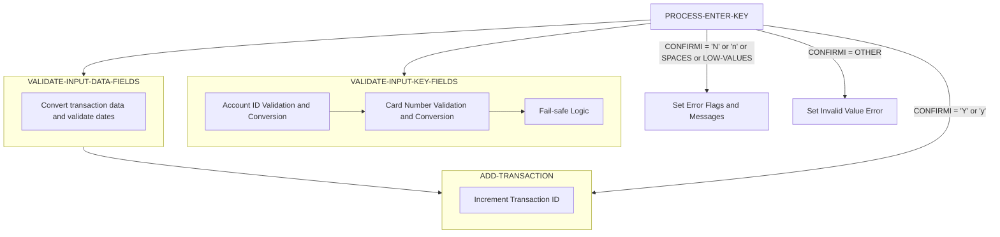

In the CardDemo application, adding a new transaction involves displaying an input screen, processing user input, and validating and converting field data. The process starts with the user entering transaction details, which are then validated for correctness. If the input is valid, the transaction is added to the transaction file; otherwise, error messages are displayed to guide the user in correcting the input.



## Processing User Input

The <SwmToken path="/app/cbl/COTRN02C.cbl" pos="164:1:5" line-data="       PROCESS-ENTER-KEY." repo-id="Z2l0aHViJTNBJTNBa3luZHJ5bC1hd3MtbWFpbmZyYW1lLW1vZGVybml6YXRpb24tY2FyZGRlbW8lM0ElM0FTd2ltbS1EZW1v" repo-name="aws-mainframe-modernization-carddemo">`PROCESS-ENTER-KEY`</SwmToken> paragraph acts as a central hub in this program for adding a new transaction. It called from sevral places in this program:

- From <SwmToken path="/app/cbl/COTRN02C.cbl" pos="107:1:3" line-data="       MAIN-PARA." repo-id="Z2l0aHViJTNBJTNBa3luZHJ5bC1hd3MtbWFpbmZyYW1lLW1vZGVybml6YXRpb24tY2FyZGRlbW8lM0ElM0FTd2ltbS1EZW1v" repo-name="aws-mainframe-modernization-carddemo">`MAIN-PARA`</SwmToken> when:
  - First time entry with pre-selected transaction
  - User hits ENTER key (DFHENTER)&nbsp;
- From <SwmToken path="/app/cbl/COTRN02C.cbl" pos="147:3:9" line-data="                           PERFORM COPY-LAST-TRAN-DATA" repo-id="Z2l0aHViJTNBJTNBa3luZHJ5bC1hd3MtbWFpbmZyYW1lLW1vZGVybml6YXRpb24tY2FyZGRlbW8lM0ElM0FTd2ltbS1EZW1v" repo-name="aws-mainframe-modernization-carddemo">`COPY-LAST-TRAN-DATA`</SwmToken> after copying previous transaction

<SwmSnippet path="/app/cbl/COTRN02C.cbl" line="164" repo-id="Z2l0aHViJTNBJTNBa3luZHJ5bC1hd3MtbWFpbmZyYW1lLW1vZGVybml6YXRpb24tY2FyZGRlbW8lM0ElM0FTd2ltbS1EZW1v">

---

The <SwmToken path="/app/cbl/COTRN02C.cbl" pos="164:1:5" line-data="       PROCESS-ENTER-KEY." repo-id="Z2l0aHViJTNBJTNBa3luZHJ5bC1hd3MtbWFpbmZyYW1lLW1vZGVybml6YXRpb24tY2FyZGRlbW8lM0ElM0FTd2ltbS1EZW1v" repo-name="aws-mainframe-modernization-carddemo">`PROCESS-ENTER-KEY`</SwmToken> function begins by calling the <SwmToken path="/app/cbl/COTRN02C.cbl" pos="166:3:9" line-data="           PERFORM VALIDATE-INPUT-KEY-FIELDS" repo-id="Z2l0aHViJTNBJTNBa3luZHJ5bC1hd3MtbWFpbmZyYW1lLW1vZGVybml6YXRpb24tY2FyZGRlbW8lM0ElM0FTd2ltbS1EZW1v" repo-name="aws-mainframe-modernization-carddemo">`VALIDATE-INPUT-KEY-FIELDS`</SwmToken> function to validate the input account or card number, followed by the <SwmToken path="/app/cbl/COTRN02C.cbl" pos="167:3:9" line-data="           PERFORM VALIDATE-INPUT-DATA-FIELDS." repo-id="Z2l0aHViJTNBJTNBa3luZHJ5bC1hd3MtbWFpbmZyYW1lLW1vZGVybml6YXRpb24tY2FyZGRlbW8lM0ElM0FTd2ltbS1EZW1v" repo-name="aws-mainframe-modernization-carddemo">`VALIDATE-INPUT-DATA-FIELDS`</SwmToken> function to validate various input fields of the transaction.

```
       PROCESS-ENTER-KEY.

           PERFORM VALIDATE-INPUT-KEY-FIELDS
           PERFORM VALIDATE-INPUT-DATA-FIELDS.
```

---

</SwmSnippet>

<SwmSnippet path="/app/cbl/COTRN02C.cbl" line="193" repo-id="Z2l0aHViJTNBJTNBa3luZHJ5bC1hd3MtbWFpbmZyYW1lLW1vZGVybml6YXRpb24tY2FyZGRlbW8lM0ElM0FTd2ltbS1EZW1v">

---

## Validating Input Key Fields

The <SwmToken path="/app/cbl/COTRN02C.cbl" pos="166:3:9" line-data="           PERFORM VALIDATE-INPUT-KEY-FIELDS" repo-id="Z2l0aHViJTNBJTNBa3luZHJ5bC1hd3MtbWFpbmZyYW1lLW1vZGVybml6YXRpb24tY2FyZGRlbW8lM0ElM0FTd2ltbS1EZW1v" repo-name="aws-mainframe-modernization-carddemo">`VALIDATE-INPUT-KEY-FIELDS`</SwmToken> function is responsible for validating the input account or card number.&nbsp;

For the account ID (<SwmToken path="/app/cbl/COTRN02C.cbl" pos="223:11:15" line-data="                   MOVE XREF-ACCT-ID         TO ACTIDINI OF COTRN2AI" repo-id="Z2l0aHViJTNBJTNBa3luZHJ5bC1hd3MtbWFpbmZyYW1lLW1vZGVybml6YXRpb24tY2FyZGRlbW8lM0ElM0FTd2ltbS1EZW1v" repo-name="aws-mainframe-modernization-carddemo">`ACTIDINI OF COTRN2AI`</SwmToken>) it validates that it's numeric and has a corresponding card number using <SwmToken path="/app/cbl/COTRN02C.cbl" pos="208:3:7" line-data="                   PERFORM READ-CXACAIX-FILE" repo-id="Z2l0aHViJTNBJTNBa3luZHJ5bC1hd3MtbWFpbmZyYW1lLW1vZGVybml6YXRpb24tY2FyZGRlbW8lM0ElM0FTd2ltbS1EZW1v" repo-name="aws-mainframe-modernization-carddemo">`READ-CXACAIX-FILE`</SwmToken>

```
       VALIDATE-INPUT-KEY-FIELDS.

           EVALUATE TRUE
               WHEN ACTIDINI OF COTRN2AI NOT = SPACES AND LOW-VALUES
                   IF ACTIDINI OF COTRN2AI IS NOT NUMERIC
                       MOVE 'Y'     TO WS-ERR-FLG
                       MOVE 'Account ID must be Numeric...' TO
                                       WS-MESSAGE
                       MOVE -1       TO ACTIDINL OF COTRN2AI
                       PERFORM SEND-TRNADD-SCREEN
                   END-IF
                   COMPUTE WS-ACCT-ID-N = FUNCTION NUMVAL(ACTIDINI OF
                   COTRN2AI)
                   MOVE WS-ACCT-ID-N            TO XREF-ACCT-ID
                                                ACTIDINI OF COTRN2AI
                   PERFORM READ-CXACAIX-FILE
                   MOVE XREF-CARD-NUM         TO CARDNINI OF COTRN2AI
```

---

</SwmSnippet>

<SwmSnippet path="/app/cbl/COTRN02C.cbl" line="210" repo-id="Z2l0aHViJTNBJTNBa3luZHJ5bC1hd3MtbWFpbmZyYW1lLW1vZGVybml6YXRpb24tY2FyZGRlbW8lM0ElM0FTd2ltbS1EZW1v">

---

For the card number (`CARDNINI OF COTRN2AI`) it validates that it's numeric and has a corresponding account ID using <SwmToken path="/app/cbl/COTRN02C.cbl" pos="222:3:7" line-data="                   PERFORM READ-CCXREF-FILE" repo-id="Z2l0aHViJTNBJTNBa3luZHJ5bC1hd3MtbWFpbmZyYW1lLW1vZGVybml6YXRpb24tY2FyZGRlbW8lM0ElM0FTd2ltbS1EZW1v" repo-name="aws-mainframe-modernization-carddemo">`READ-CCXREF-FILE`</SwmToken>.

```
               WHEN CARDNINI OF COTRN2AI NOT = SPACES AND LOW-VALUES
                   IF CARDNINI OF COTRN2AI IS NOT NUMERIC
                       MOVE 'Y'     TO WS-ERR-FLG
                       MOVE 'Card Number must be Numeric...' TO
                                       WS-MESSAGE
                       MOVE -1       TO CARDNINL OF COTRN2AI
                       PERFORM SEND-TRNADD-SCREEN
                   END-IF
                   COMPUTE WS-CARD-NUM-N = FUNCTION NUMVAL(CARDNINI OF
                   COTRN2AI)
                   MOVE WS-CARD-NUM-N        TO XREF-CARD-NUM
                                                CARDNINI OF COTRN2AI
                   PERFORM READ-CCXREF-FILE
                   MOVE XREF-ACCT-ID         TO ACTIDINI OF COTRN2AI
```

---

</SwmSnippet>

<SwmSnippet path="/app/cbl/COTRN02C.cbl" line="224" repo-id="Z2l0aHViJTNBJTNBa3luZHJ5bC1hd3MtbWFpbmZyYW1lLW1vZGVybml6YXRpb24tY2FyZGRlbW8lM0ElM0FTd2ltbS1EZW1v">

---

If neither the account ID nor the card number is provided, an error flag is set, and an error message is displayed to prompt the user to enter either an account or card number.

```cobol
               WHEN OTHER
                   MOVE 'Y'     TO WS-ERR-FLG
                   MOVE 'Account or Card Number must be entered...' TO
                                   WS-MESSAGE
                   MOVE -1       TO ACTIDINL OF COTRN2AI
                   PERFORM SEND-TRNADD-SCREEN
           END-EVALUATE.
```

---

</SwmSnippet>

<SwmSnippet path="/app/cbl/COTRN02C.cbl" line="251" repo-id="Z2l0aHViJTNBJTNBa3luZHJ5bC1hd3MtbWFpbmZyYW1lLW1vZGVybml6YXRpb24tY2FyZGRlbW8lM0ElM0FTd2ltbS1EZW1v">

---

## Validating Input Data Fields

The `VALIDATE-INPUT-DATA-FIELDS` function validates various input fields of the transaction. It first checks if any of the required fields are empty or contain low-values, setting an error flag and displaying an appropriate error message for each empty field.

```cobol
           EVALUATE TRUE
               WHEN TTYPCDI OF COTRN2AI = SPACES OR LOW-VALUES
                   MOVE 'Y'     TO WS-ERR-FLG
                   MOVE 'Type CD can NOT be empty...' TO
                                   WS-MESSAGE
                   MOVE -1       TO TTYPCDL OF COTRN2AI
                   PERFORM SEND-TRNADD-SCREEN
               WHEN TCATCDI OF COTRN2AI = SPACES OR LOW-VALUES
                   MOVE 'Y'     TO WS-ERR-FLG
                   MOVE 'Category CD can NOT be empty...' TO
                                   WS-MESSAGE
                   MOVE -1       TO TCATCDL OF COTRN2AI
                   PERFORM SEND-TRNADD-SCREEN
               WHEN TRNSRCI OF COTRN2AI = SPACES OR LOW-VALUES
                   MOVE 'Y'     TO WS-ERR-FLG
                   MOVE 'Source can NOT be empty...' TO
                                   WS-MESSAGE
                   MOVE -1       TO TRNSRCL OF COTRN2AI
                   PERFORM SEND-TRNADD-SCREEN
               WHEN TDESCI OF COTRN2AI = SPACES OR LOW-VALUES
                   MOVE 'Y'     TO WS-ERR-FLG
                   MOVE 'Description can NOT be empty...' TO
                                   WS-MESSAGE
                   MOVE -1       TO TDESCL OF COTRN2AI
                   PERFORM SEND-TRNADD-SCREEN
               WHEN TRNAMTI OF COTRN2AI = SPACES OR LOW-VALUES
                   MOVE 'Y'     TO WS-ERR-FLG
                   MOVE 'Amount can NOT be empty...' TO
                                   WS-MESSAGE
                   MOVE -1       TO TRNAMTL OF COTRN2AI
                   PERFORM SEND-TRNADD-SCREEN
               WHEN TORIGDTI OF COTRN2AI = SPACES OR LOW-VALUES
                   MOVE 'Y'     TO WS-ERR-FLG
                   MOVE 'Orig Date can NOT be empty...' TO
                                   WS-MESSAGE
                   MOVE -1       TO TORIGDTL OF COTRN2AI
                   PERFORM SEND-TRNADD-SCREEN
               WHEN TPROCDTI OF COTRN2AI = SPACES OR LOW-VALUES
                   MOVE 'Y'     TO WS-ERR-FLG
                   MOVE 'Proc Date can NOT be empty...' TO
                                   WS-MESSAGE
                   MOVE -1       TO TPROCDTL OF COTRN2AI
                   PERFORM SEND-TRNADD-SCREEN
               WHEN MIDI OF COTRN2AI = SPACES OR LOW-VALUES
                   MOVE 'Y'     TO WS-ERR-FLG
                   MOVE 'Merchant ID can NOT be empty...' TO
                                   WS-MESSAGE
                   MOVE -1       TO MIDL OF COTRN2AI
                   PERFORM SEND-TRNADD-SCREEN
               WHEN MNAMEI OF COTRN2AI = SPACES OR LOW-VALUES
                   MOVE 'Y'     TO WS-ERR-FLG
                   MOVE 'Merchant Name can NOT be empty...' TO
                                   WS-MESSAGE
                   MOVE -1       TO MNAMEL OF COTRN2AI
                   PERFORM SEND-TRNADD-SCREEN
               WHEN MCITYI OF COTRN2AI = SPACES OR LOW-VALUES
                   MOVE 'Y'     TO WS-ERR-FLG
                   MOVE 'Merchant City can NOT be empty...' TO
                                   WS-MESSAGE
                   MOVE -1       TO MCITYL OF COTRN2AI
                   PERFORM SEND-TRNADD-SCREEN
               WHEN MZIPI OF COTRN2AI = SPACES OR LOW-VALUES
                   MOVE 'Y'     TO WS-ERR-FLG
                   MOVE 'Merchant Zip can NOT be empty...' TO
                                   WS-MESSAGE
                   MOVE -1       TO MZIPL OF COTRN2AI
                   PERFORM SEND-TRNADD-SCREEN
```

---

</SwmSnippet>

<SwmSnippet path="/app/cbl/COTRN02C.cbl" line="323" repo-id="Z2l0aHViJTNBJTNBa3luZHJ5bC1hd3MtbWFpbmZyYW1lLW1vZGVybml6YXRpb24tY2FyZGRlbW8lM0ElM0FTd2ltbS1EZW1v">

---

Next, the function checks if the transaction type code (<SwmToken path="/app/cbl/COTRN02C.cbl" pos="323:3:7" line-data="               WHEN TTYPCDI OF COTRN2AI NOT NUMERIC" repo-id="Z2l0aHViJTNBJTNBa3luZHJ5bC1hd3MtbWFpbmZyYW1lLW1vZGVybml6YXRpb24tY2FyZGRlbW8lM0ElM0FTd2ltbS1EZW1v" repo-name="aws-mainframe-modernization-carddemo">`TTYPCDI OF COTRN2AI`</SwmToken>) and the transaction category code (<SwmToken path="/app/cbl/COTRN02C.cbl" pos="329:3:7" line-data="               WHEN TCATCDI OF COTRN2AI NOT NUMERIC" repo-id="Z2l0aHViJTNBJTNBa3luZHJ5bC1hd3MtbWFpbmZyYW1lLW1vZGVybml6YXRpb24tY2FyZGRlbW8lM0ElM0FTd2ltbS1EZW1v" repo-name="aws-mainframe-modernization-carddemo">`TCATCDI OF COTRN2AI`</SwmToken>) are numeric, setting an error flag and displaying an appropriate error message if they are not.

```cobol
               WHEN TTYPCDI OF COTRN2AI NOT NUMERIC
                   MOVE 'Y'     TO WS-ERR-FLG
                   MOVE 'Type CD must be Numeric...' TO
                                   WS-MESSAGE
                   MOVE -1       TO TTYPCDL OF COTRN2AI
                   PERFORM SEND-TRNADD-SCREEN
               WHEN TCATCDI OF COTRN2AI NOT NUMERIC
                   MOVE 'Y'     TO WS-ERR-FLG
                   MOVE 'Category CD must be Numeric...' TO
                                   WS-MESSAGE
                   MOVE -1       TO TCATCDL OF COTRN2AI
                   PERFORM SEND-TRNADD-SCREEN
```

---

</SwmSnippet>

<SwmSnippet path="/app/cbl/COTRN02C.cbl" line="339" repo-id="Z2l0aHViJTNBJTNBa3luZHJ5bC1hd3MtbWFpbmZyYW1lLW1vZGVybml6YXRpb24tY2FyZGRlbW8lM0ElM0FTd2ltbS1EZW1v">

---

The function then validates the format of the <SwmToken path="/app/cbl/COTRN02C.cbl" pos="386:13:17" line-data="           MOVE WS-TRAN-AMT-E TO TRNAMTI OF COTRN2AI" repo-id="Z2l0aHViJTNBJTNBa3luZHJ5bC1hd3MtbWFpbmZyYW1lLW1vZGVybml6YXRpb24tY2FyZGRlbW8lM0ElM0FTd2ltbS1EZW1v" repo-name="aws-mainframe-modernization-carddemo">`TRNAMTI OF COTRN2AI`</SwmToken> (transaction amount) to ensure it follows the format <SwmToken path="/app/cbl/COTRN02C.cbl" pos="345:14:17" line-data="                   MOVE &#39;Amount should be in format -99999999.99&#39; TO" repo-id="Z2l0aHViJTNBJTNBa3luZHJ5bC1hd3MtbWFpbmZyYW1lLW1vZGVybml6YXRpb24tY2FyZGRlbW8lM0ElM0FTd2ltbS1EZW1v" repo-name="aws-mainframe-modernization-carddemo">`-99999999.99`</SwmToken>, setting an error flag and displaying an error message if it does not.

```cobol
           EVALUATE TRUE
               WHEN TRNAMTI OF COTRN2AI(1:1) NOT EQUAL '-' AND '+'
               WHEN TRNAMTI OF COTRN2AI(2:8) NOT NUMERIC
               WHEN TRNAMTI OF COTRN2AI(10:1) NOT = '.'
               WHEN TRNAMTI OF COTRN2AI(11:2) IS NOT NUMERIC
                   MOVE 'Y'     TO WS-ERR-FLG
                   MOVE 'Amount should be in format -99999999.99' TO
                                   WS-MESSAGE
                   MOVE -1       TO TRNAMTL OF COTRN2AI
                   PERFORM SEND-TRNADD-SCREEN
```

---

</SwmSnippet>

<SwmSnippet path="/app/cbl/COTRN02C.cbl" line="353" repo-id="Z2l0aHViJTNBJTNBa3luZHJ5bC1hd3MtbWFpbmZyYW1lLW1vZGVybml6YXRpb24tY2FyZGRlbW8lM0ElM0FTd2ltbS1EZW1v">

---

Similarly, the function validates the format of the <SwmToken path="/app/cbl/COTRN02C.cbl" pos="354:3:7" line-data="               WHEN TORIGDTI OF COTRN2AI(1:4) IS NOT NUMERIC" repo-id="Z2l0aHViJTNBJTNBa3luZHJ5bC1hd3MtbWFpbmZyYW1lLW1vZGVybml6YXRpb24tY2FyZGRlbW8lM0ElM0FTd2ltbS1EZW1v" repo-name="aws-mainframe-modernization-carddemo">`TORIGDTI OF COTRN2AI`</SwmToken> (original date) and <SwmToken path="/app/cbl/COTRN02C.cbl" pos="369:3:7" line-data="               WHEN TPROCDTI OF COTRN2AI(1:4) IS NOT NUMERIC" repo-id="Z2l0aHViJTNBJTNBa3luZHJ5bC1hd3MtbWFpbmZyYW1lLW1vZGVybml6YXRpb24tY2FyZGRlbW8lM0ElM0FTd2ltbS1EZW1v" repo-name="aws-mainframe-modernization-carddemo">`TPROCDTI OF COTRN2AI`</SwmToken> (processing date) to ensure they follow the format <SwmToken path="/app/cbl/COTRN02C.cbl" pos="360:16:20" line-data="                   MOVE &#39;Orig Date should be in format YYYY-MM-DD&#39; TO" repo-id="Z2l0aHViJTNBJTNBa3luZHJ5bC1hd3MtbWFpbmZyYW1lLW1vZGVybml6YXRpb24tY2FyZGRlbW8lM0ElM0FTd2ltbS1EZW1v" repo-name="aws-mainframe-modernization-carddemo">`YYYY-MM-DD`</SwmToken>, setting an error flag and displaying an error message if they do not.

```cobol
           EVALUATE TRUE
               WHEN TORIGDTI OF COTRN2AI(1:4) IS NOT NUMERIC
               WHEN TORIGDTI OF COTRN2AI(5:1) NOT EQUAL '-'
               WHEN TORIGDTI OF COTRN2AI(6:2) NOT NUMERIC
               WHEN TORIGDTI OF COTRN2AI(8:1) NOT EQUAL '-'
               WHEN TORIGDTI OF COTRN2AI(9:2) NOT NUMERIC
                   MOVE 'Y'     TO WS-ERR-FLG
                   MOVE 'Orig Date should be in format YYYY-MM-DD' TO
                                   WS-MESSAGE
                   MOVE -1       TO TORIGDTL OF COTRN2AI
                   PERFORM SEND-TRNADD-SCREEN
               WHEN OTHER
                   CONTINUE
           END-EVALUATE

           EVALUATE TRUE
               WHEN TPROCDTI OF COTRN2AI(1:4) IS NOT NUMERIC
               WHEN TPROCDTI OF COTRN2AI(5:1) NOT EQUAL '-'
               WHEN TPROCDTI OF COTRN2AI(6:2) NOT NUMERIC
               WHEN TPROCDTI OF COTRN2AI(8:1) NOT EQUAL '-'
               WHEN TPROCDTI OF COTRN2AI(9:2) NOT NUMERIC
                   MOVE 'Y'     TO WS-ERR-FLG
                   MOVE 'Proc Date should be in format YYYY-MM-DD' TO
                                   WS-MESSAGE
                   MOVE -1       TO TPROCDTL OF COTRN2AI
                   PERFORM SEND-TRNADD-SCREEN
               WHEN OTHER
                   CONTINUE
           END-EVALUATE
```

---

</SwmSnippet>

<SwmSnippet path="/app/cbl/COTRN02C.cbl" line="383" repo-id="Z2l0aHViJTNBJTNBa3luZHJ5bC1hd3MtbWFpbmZyYW1lLW1vZGVybml6YXRpb24tY2FyZGRlbW8lM0ElM0FTd2ltbS1EZW1v">

---

The transaction amount is then converted to a numeric value and stored in <SwmToken path="/app/cbl/COTRN02C.cbl" pos="383:3:9" line-data="           COMPUTE WS-TRAN-AMT-N = FUNCTION NUMVAL-C(TRNAMTI OF" repo-id="Z2l0aHViJTNBJTNBa3luZHJ5bC1hd3MtbWFpbmZyYW1lLW1vZGVybml6YXRpb24tY2FyZGRlbW8lM0ElM0FTd2ltbS1EZW1v" repo-name="aws-mainframe-modernization-carddemo">`WS-TRAN-AMT-N`</SwmToken>, which is subsequently moved to <SwmToken path="/app/cbl/COTRN02C.cbl" pos="385:13:19" line-data="           MOVE WS-TRAN-AMT-N TO WS-TRAN-AMT-E" repo-id="Z2l0aHViJTNBJTNBa3luZHJ5bC1hd3MtbWFpbmZyYW1lLW1vZGVybml6YXRpb24tY2FyZGRlbW8lM0ElM0FTd2ltbS1EZW1v" repo-name="aws-mainframe-modernization-carddemo">`WS-TRAN-AMT-E`</SwmToken> and then back to <SwmToken path="/app/cbl/COTRN02C.cbl" pos="386:13:17" line-data="           MOVE WS-TRAN-AMT-E TO TRNAMTI OF COTRN2AI" repo-id="Z2l0aHViJTNBJTNBa3luZHJ5bC1hd3MtbWFpbmZyYW1lLW1vZGVybml6YXRpb24tY2FyZGRlbW8lM0ElM0FTd2ltbS1EZW1v" repo-name="aws-mainframe-modernization-carddemo">`TRNAMTI OF COTRN2AI`</SwmToken>.

```cobol
           COMPUTE WS-TRAN-AMT-N = FUNCTION NUMVAL-C(TRNAMTI OF
           COTRN2AI)
           MOVE WS-TRAN-AMT-N TO WS-TRAN-AMT-E
           MOVE WS-TRAN-AMT-E TO TRNAMTI OF COTRN2AI
```

---

</SwmSnippet>

<SwmSnippet path="/app/cbl/COTRN02C.cbl" line="389" repo-id="Z2l0aHViJTNBJTNBa3luZHJ5bC1hd3MtbWFpbmZyYW1lLW1vZGVybml6YXRpb24tY2FyZGRlbW8lM0ElM0FTd2ltbS1EZW1v">

---

The function also validates the original and processing dates by calling the <SwmToken path="/app/cbl/COTRN02C.cbl" pos="389:11:11" line-data="           MOVE TORIGDTI OF COTRN2AI TO CSUTLDTC-DATE" repo-id="Z2l0aHViJTNBJTNBa3luZHJ5bC1hd3MtbWFpbmZyYW1lLW1vZGVybml6YXRpb24tY2FyZGRlbW8lM0ElM0FTd2ltbS1EZW1v" repo-name="aws-mainframe-modernization-carddemo">`CSUTLDTC`</SwmToken> subroutine, which checks the date format and sets an error flag if the dates are not valid.

```cobol
           MOVE TORIGDTI OF COTRN2AI TO CSUTLDTC-DATE
           MOVE WS-DATE-FORMAT       TO CSUTLDTC-DATE-FORMAT
           MOVE SPACES               TO CSUTLDTC-RESULT

           CALL 'CSUTLDTC' USING   CSUTLDTC-DATE
                                   CSUTLDTC-DATE-FORMAT
                                   CSUTLDTC-RESULT

           IF CSUTLDTC-RESULT-SEV-CD = '0000'
               CONTINUE
           ELSE
               IF CSUTLDTC-RESULT-MSG-NUM NOT = '2513'
                   MOVE 'Orig Date - Not a valid date...'
                     TO WS-MESSAGE
                   MOVE 'Y'     TO WS-ERR-FLG
                   MOVE -1       TO TORIGDTL OF COTRN2AI
                   PERFORM SEND-TRNADD-SCREEN
               END-IF
           END-IF

           MOVE TPROCDTI OF COTRN2AI TO CSUTLDTC-DATE
           MOVE WS-DATE-FORMAT       TO CSUTLDTC-DATE-FORMAT
           MOVE SPACES               TO CSUTLDTC-RESULT

           CALL 'CSUTLDTC' USING   CSUTLDTC-DATE
                                   CSUTLDTC-DATE-FORMAT
                                   CSUTLDTC-RESULT

           IF CSUTLDTC-RESULT-SEV-CD = '0000'
               CONTINUE
           ELSE
               IF CSUTLDTC-RESULT-MSG-NUM NOT = '2513'
                   MOVE 'Proc Date - Not a valid date...'
                     TO WS-MESSAGE
                   MOVE 'Y'     TO WS-ERR-FLG
                   MOVE -1       TO TPROCDTL OF COTRN2AI
                   PERFORM SEND-TRNADD-SCREEN
               END-IF
           END-IF
```

---

</SwmSnippet>

<SwmSnippet path="/app/cbl/COTRN02C.cbl" line="169" repo-id="Z2l0aHViJTNBJTNBa3luZHJ5bC1hd3MtbWFpbmZyYW1lLW1vZGVybml6YXRpb24tY2FyZGRlbW8lM0ElM0FTd2ltbS1EZW1v">

---

## Adding a New Transaction

After validating the inputs, the <SwmToken path="/app/cbl/COTRN02C.cbl" pos="164:1:5" line-data="       PROCESS-ENTER-KEY." repo-id="Z2l0aHViJTNBJTNBa3luZHJ5bC1hd3MtbWFpbmZyYW1lLW1vZGVybml6YXRpb24tY2FyZGRlbW8lM0ElM0FTd2ltbS1EZW1v" repo-name="aws-mainframe-modernization-carddemo">`PROCESS-ENTER-KEY`</SwmToken> function checks if the user confirms the transaction. If the user confirms (by entering 'Y' or 'y'), the <SwmToken path="/app/cbl/COTRN02C.cbl" pos="172:3:5" line-data="                   PERFORM ADD-TRANSACTION" repo-id="Z2l0aHViJTNBJTNBa3luZHJ5bC1hd3MtbWFpbmZyYW1lLW1vZGVybml6YXRpb24tY2FyZGRlbW8lM0ElM0FTd2ltbS1EZW1v" repo-name="aws-mainframe-modernization-carddemo">`ADD-TRANSACTION`</SwmToken> function is called to add the new transaction. If the user enters 'N', 'n', spaces, or low-values, an error flag is set, and a confirmation message is displayed to prompt the user to confirm the transaction.

```cobol
           EVALUATE CONFIRMI OF COTRN2AI
               WHEN 'Y'
               WHEN 'y'
                   PERFORM ADD-TRANSACTION
               WHEN 'N'
               WHEN 'n'
               WHEN SPACES
               WHEN LOW-VALUES
                   MOVE 'Y'     TO WS-ERR-FLG
                   MOVE 'Confirm to add this transaction...'
                                TO WS-MESSAGE
                   MOVE -1      TO CONFIRML OF COTRN2AI
                   PERFORM SEND-TRNADD-SCREEN
```

---

</SwmSnippet>

<SwmSnippet path="/app/cbl/COTRN02C.cbl" line="442" repo-id="Z2l0aHViJTNBJTNBa3luZHJ5bC1hd3MtbWFpbmZyYW1lLW1vZGVybml6YXRpb24tY2FyZGRlbW8lM0ElM0FTd2ltbS1EZW1v">

---

The <SwmToken path="/app/cbl/COTRN02C.cbl" pos="172:3:5" line-data="                   PERFORM ADD-TRANSACTION" repo-id="Z2l0aHViJTNBJTNBa3luZHJ5bC1hd3MtbWFpbmZyYW1lLW1vZGVybml6YXRpb24tY2FyZGRlbW8lM0ElM0FTd2ltbS1EZW1v" repo-name="aws-mainframe-modernization-carddemo">`ADD-TRANSACTION`</SwmToken> function begins by setting the <SwmToken path="/app/cbl/COTRN02C.cbl" pos="448:3:5" line-data="           MOVE TRAN-ID     TO WS-TRAN-ID-N" repo-id="Z2l0aHViJTNBJTNBa3luZHJ5bC1hd3MtbWFpbmZyYW1lLW1vZGVybml6YXRpb24tY2FyZGRlbW8lM0ElM0FTd2ltbS1EZW1v" repo-name="aws-mainframe-modernization-carddemo">`TRAN-ID`</SwmToken> to high-values and then gets the last transaction ID from the transaction file.

```
       ADD-TRANSACTION.

           MOVE HIGH-VALUES TO TRAN-ID
           PERFORM STARTBR-TRANSACT-FILE
           PERFORM READPREV-TRANSACT-FILE
           PERFORM ENDBR-TRANSACT-FILE
```

---

</SwmSnippet>

<SwmSnippet path="/app/cbl/COTRN02C.cbl" line="448" repo-id="Z2l0aHViJTNBJTNBa3luZHJ5bC1hd3MtbWFpbmZyYW1lLW1vZGVybml6YXRpb24tY2FyZGRlbW8lM0ElM0FTd2ltbS1EZW1v">

---

Then it generates a new transaction ID and initializes a new transaction record with the screen data.

```cobol
           MOVE TRAN-ID     TO WS-TRAN-ID-N
           ADD 1 TO WS-TRAN-ID-N
           INITIALIZE TRAN-RECORD
           MOVE WS-TRAN-ID-N         TO TRAN-ID
           MOVE TTYPCDI  OF COTRN2AI TO TRAN-TYPE-CD
           MOVE TCATCDI  OF COTRN2AI TO TRAN-CAT-CD
           MOVE TRNSRCI  OF COTRN2AI TO TRAN-SOURCE
           MOVE TDESCI   OF COTRN2AI TO TRAN-DESC
           COMPUTE WS-TRAN-AMT-N = FUNCTION NUMVAL-C(TRNAMTI OF
           COTRN2AI)
           MOVE WS-TRAN-AMT-N TO TRAN-AMT
           MOVE CARDNINI OF COTRN2AI TO TRAN-CARD-NUM
           MOVE MIDI     OF COTRN2AI TO TRAN-MERCHANT-ID
           MOVE MNAMEI   OF COTRN2AI TO TRAN-MERCHANT-NAME
           MOVE MCITYI   OF COTRN2AI TO TRAN-MERCHANT-CITY
           MOVE MZIPI    OF COTRN2AI TO TRAN-MERCHANT-ZIP
           MOVE TORIGDTI OF COTRN2AI TO TRAN-ORIG-TS
           MOVE TPROCDTI OF COTRN2AI TO TRAN-PROC-TS
```

---

</SwmSnippet>

<SwmSnippet path="/app/cbl/COTRN02C.cbl" line="466" repo-id="Z2l0aHViJTNBJTNBa3luZHJ5bC1hd3MtbWFpbmZyYW1lLW1vZGVybml6YXRpb24tY2FyZGRlbW8lM0ElM0FTd2ltbS1EZW1v">

---

Finally, the <SwmToken path="/app/cbl/COTRN02C.cbl" pos="466:3:7" line-data="           PERFORM WRITE-TRANSACT-FILE." repo-id="Z2l0aHViJTNBJTNBa3luZHJ5bC1hd3MtbWFpbmZyYW1lLW1vZGVybml6YXRpb24tY2FyZGRlbW8lM0ElM0FTd2ltbS1EZW1v" repo-name="aws-mainframe-modernization-carddemo">`WRITE-TRANSACT-FILE`</SwmToken> function is called to write the new transaction to the transaction file.

```cobol
           PERFORM WRITE-TRANSACT-FILE.
```

---

</SwmSnippet>

&nbsp;

_This is an auto-generated document by Swimm 🌊 and has not yet been verified by a human_

<SwmMeta version="3.0.0"><sup>Powered by [Swimm](https://staging.swimm.cloud/)</sup></SwmMeta>
