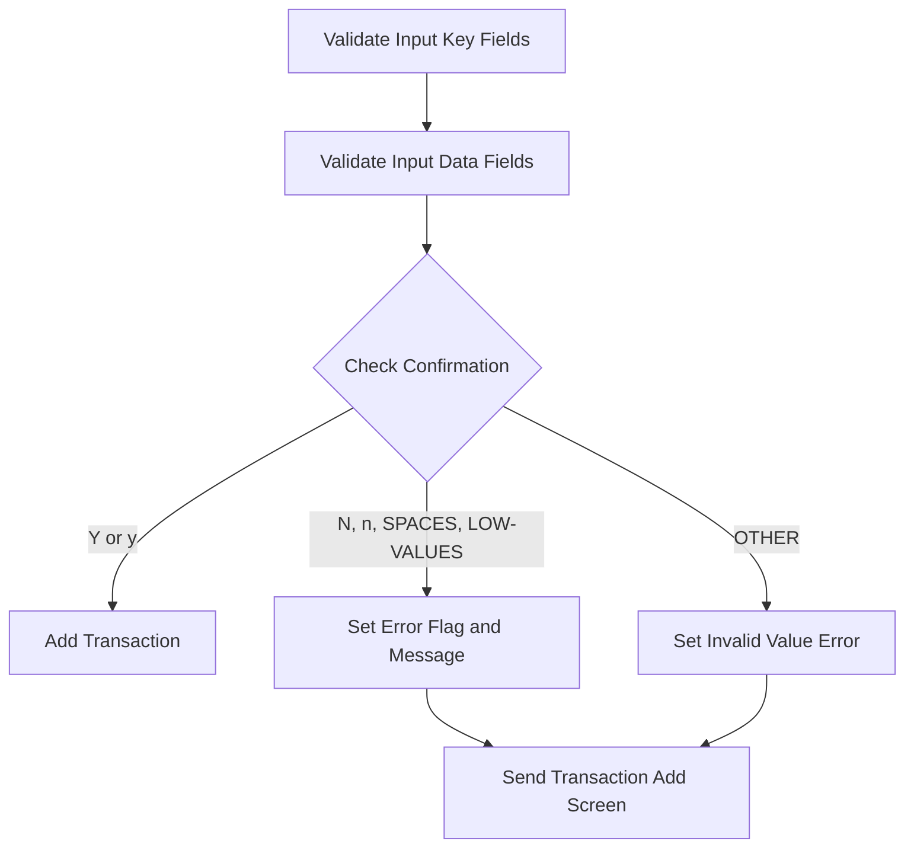
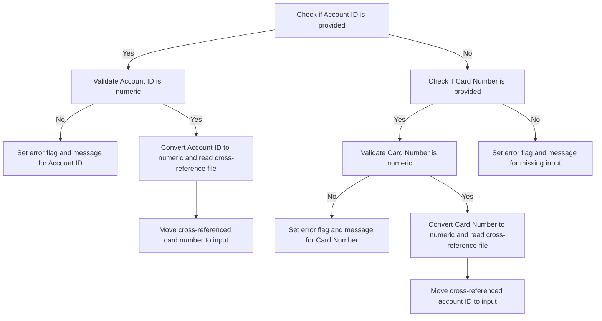
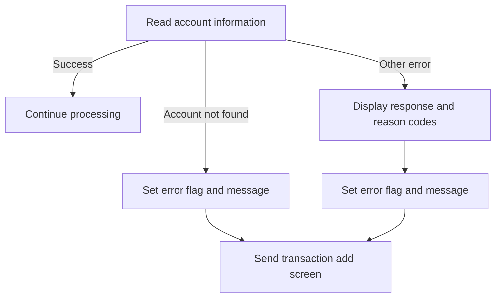
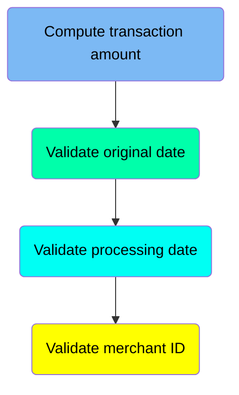
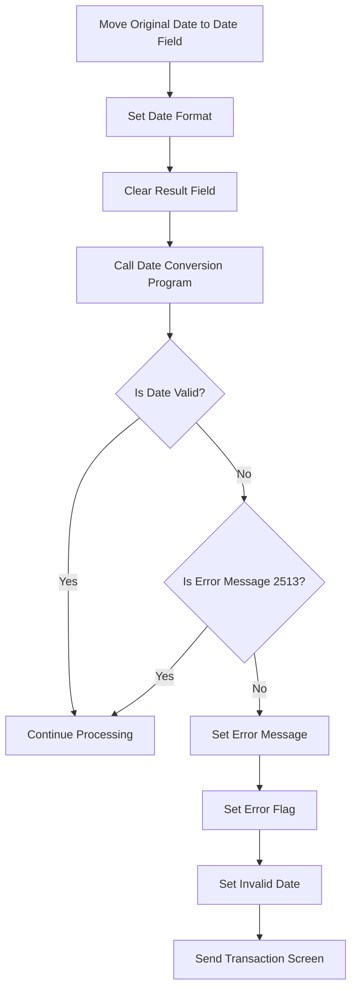
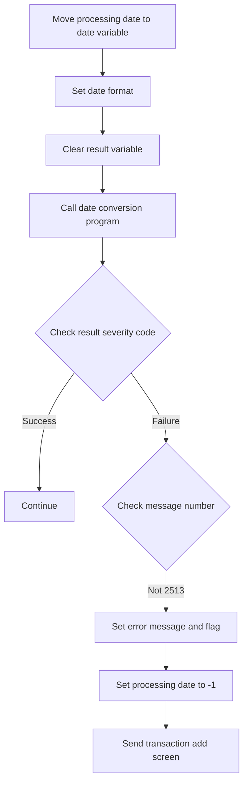
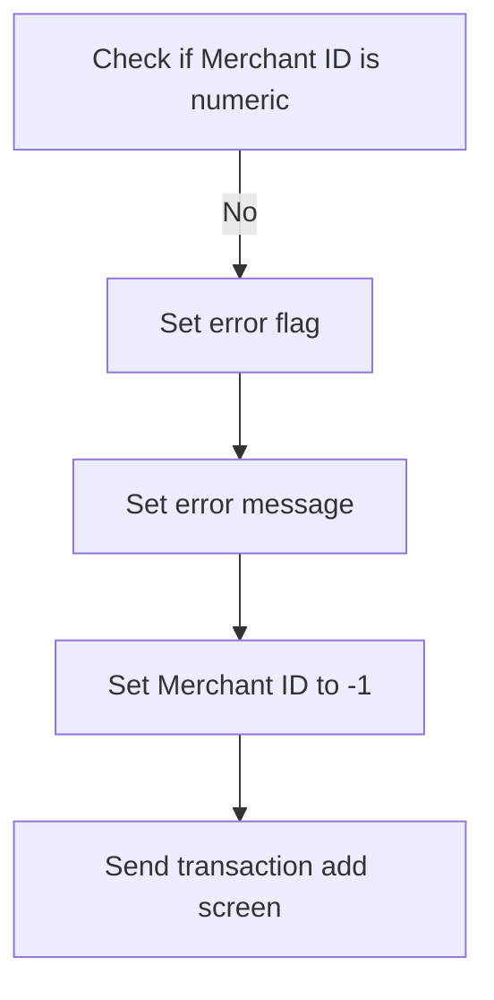

```mermaid
graph TD
  A[Check if EIBCALEN is 0] -->|Yes| B[Set CDEMO-TO-PROGRAM to COSGN00C]
  A -->|No| C[Move DFHCOMMAREA to CARDDEMO-COMMAREA]
  C --> D[Check if CDEMO-PGM-REENTER is not set]
  D -->|Yes| E[Set CDEMO-PGM-REENTER to TRUE]
  E --> F[Move LOW-VALUES to COTRN2AO]
  F --> G[Move -1 to ACTIDINL of COTRN2AI]
  G --> H[Check if CDEMO-CT02-TRN-SELECTED is not SPACES and LOW-VALUES]
  H -->|Yes| I[Move CDEMO-CT02-TRN-SELECTED to CARDNINI of COTRN2AI]
  I --> J[Perform PROCESS-ENTER-KEY]
  H -->|No| K[Perform SEND-TRNADD-SCREEN]
  D -->|No| L[Perform RECEIVE-TRNADD-SCREEN]
  L --> M[EVALUATE EIBAID]
  M -->|DFHENTER| N[Perform PROCESS-ENTER-KEY]
  M -->|DFHPF3| O[Check if CDEMO-FROM-PROGRAM is SPACES or LOW-VALUES]
  O -->|Yes| P[Move COMEN01C to CDEMO-TO-PROGRAM]
  O -->|No| Q[Move CDEMO-FROM-PROGRAM to CDEMO-TO-PROGRAM]
  P --> R[Perform RETURN-TO-PREV-SCREEN]
  Q --> R
  M -->|DFHPF4| S[Perform CLEAR-CURRENT-SCREEN]
  M -->|DFHPF5| T[Perform COPY-LAST-TRAN-DATA]
  M -->|Other| U[Set WS-ERR-FLG to Y]
  U --> V[Move CCDA-MSG-INVALID-KEY to WS-MESSAGE]
  V --> W[Perform SEND-TRNADD-SCREEN]

%% Swimm:
%% graph TD
%%   A[Check if EIBCALEN is 0] -->|Yes| B[Set <SwmToken path="app/cbl/COTRN02C.cbl" pos="116:9:13" line-data="               MOVE &#39;COSGN00C&#39; TO CDEMO-TO-PROGRAM">`CDEMO-TO-PROGRAM`</SwmToken> to <SwmToken path="app/cbl/COTRN02C.cbl" pos="116:4:4" line-data="               MOVE &#39;COSGN00C&#39; TO CDEMO-TO-PROGRAM">`COSGN00C`</SwmToken>]
%%   A -->|No| C[Move DFHCOMMAREA to <SwmToken path="app/cbl/COTRN02C.cbl" pos="119:12:14" line-data="               MOVE DFHCOMMAREA(1:EIBCALEN) TO CARDDEMO-COMMAREA">`CARDDEMO-COMMAREA`</SwmToken>]
%%   C --> D[Check if <SwmToken path="app/cbl/COTRN02C.cbl" pos="120:5:9" line-data="               IF NOT CDEMO-PGM-REENTER">`CDEMO-PGM-REENTER`</SwmToken> is not set]
%%   D -->|Yes| E[Set <SwmToken path="app/cbl/COTRN02C.cbl" pos="120:5:9" line-data="               IF NOT CDEMO-PGM-REENTER">`CDEMO-PGM-REENTER`</SwmToken> to TRUE]
%%   E --> F[Move <SwmToken path="app/cbl/COTRN02C.cbl" pos="122:3:5" line-data="                   MOVE LOW-VALUES          TO COTRN2AO">`LOW-VALUES`</SwmToken> to <SwmToken path="app/cbl/COTRN02C.cbl" pos="113:5:5" line-data="                          ERRMSGO OF COTRN2AO">`COTRN2AO`</SwmToken>]
%%   F --> G[Move -1 to ACTIDINL of <SwmToken path="app/cbl/COTRN02C.cbl" pos="123:12:12" line-data="                   MOVE -1       TO ACTIDINL OF COTRN2AI">`COTRN2AI`</SwmToken>]
%%   G --> H[Check if <SwmToken path="app/cbl/COTRN02C.cbl" pos="124:3:9" line-data="                   IF CDEMO-CT02-TRN-SELECTED NOT =">`CDEMO-CT02-TRN-SELECTED`</SwmToken> is not SPACES and <SwmToken path="app/cbl/COTRN02C.cbl" pos="122:3:5" line-data="                   MOVE LOW-VALUES          TO COTRN2AO">`LOW-VALUES`</SwmToken>]
%%   H -->|Yes| I[Move <SwmToken path="app/cbl/COTRN02C.cbl" pos="124:3:9" line-data="                   IF CDEMO-CT02-TRN-SELECTED NOT =">`CDEMO-CT02-TRN-SELECTED`</SwmToken> to CARDNINI of <SwmToken path="app/cbl/COTRN02C.cbl" pos="123:12:12" line-data="                   MOVE -1       TO ACTIDINL OF COTRN2AI">`COTRN2AI`</SwmToken>]
%%   I --> J[Perform <SwmToken path="app/cbl/COTRN02C.cbl" pos="128:3:7" line-data="                       PERFORM PROCESS-ENTER-KEY">`PROCESS-ENTER-KEY`</SwmToken>]
%%   H -->|No| K[Perform <SwmToken path="app/cbl/COTRN02C.cbl" pos="130:3:7" line-data="                   PERFORM SEND-TRNADD-SCREEN">`SEND-TRNADD-SCREEN`</SwmToken>]
%%   D -->|No| L[Perform <SwmToken path="app/cbl/COTRN02C.cbl" pos="132:3:7" line-data="                   PERFORM RECEIVE-TRNADD-SCREEN">`RECEIVE-TRNADD-SCREEN`</SwmToken>]
%%   L --> M[EVALUATE EIBAID]
%%   M -->|DFHENTER| N[Perform <SwmToken path="app/cbl/COTRN02C.cbl" pos="128:3:7" line-data="                       PERFORM PROCESS-ENTER-KEY">`PROCESS-ENTER-KEY`</SwmToken>]
%%   M -->|<SwmToken path="app/cbl/COTRN02C.cbl" pos="136:3:3" line-data="                       WHEN DFHPF3">`DFHPF3`</SwmToken>| O[Check if <SwmToken path="app/cbl/COTRN02C.cbl" pos="137:3:7" line-data="                           IF CDEMO-FROM-PROGRAM = SPACES OR LOW-VALUES">`CDEMO-FROM-PROGRAM`</SwmToken> is SPACES or <SwmToken path="app/cbl/COTRN02C.cbl" pos="122:3:5" line-data="                   MOVE LOW-VALUES          TO COTRN2AO">`LOW-VALUES`</SwmToken>]
%%   O -->|Yes| P[Move <SwmToken path="app/cbl/COTRN02C.cbl" pos="138:4:4" line-data="                               MOVE &#39;COMEN01C&#39; TO CDEMO-TO-PROGRAM">`COMEN01C`</SwmToken> to <SwmToken path="app/cbl/COTRN02C.cbl" pos="116:9:13" line-data="               MOVE &#39;COSGN00C&#39; TO CDEMO-TO-PROGRAM">`CDEMO-TO-PROGRAM`</SwmToken>]
%%   O -->|No| Q[Move <SwmToken path="app/cbl/COTRN02C.cbl" pos="137:3:7" line-data="                           IF CDEMO-FROM-PROGRAM = SPACES OR LOW-VALUES">`CDEMO-FROM-PROGRAM`</SwmToken> to <SwmToken path="app/cbl/COTRN02C.cbl" pos="116:9:13" line-data="               MOVE &#39;COSGN00C&#39; TO CDEMO-TO-PROGRAM">`CDEMO-TO-PROGRAM`</SwmToken>]
%%   P --> R[Perform <SwmToken path="app/cbl/COTRN02C.cbl" pos="117:3:9" line-data="               PERFORM RETURN-TO-PREV-SCREEN">`RETURN-TO-PREV-SCREEN`</SwmToken>]
%%   Q --> R
%%   M -->|<SwmToken path="app/cbl/COTRN02C.cbl" pos="144:3:3" line-data="                       WHEN DFHPF4">`DFHPF4`</SwmToken>| S[Perform <SwmToken path="app/cbl/COTRN02C.cbl" pos="145:3:7" line-data="                           PERFORM CLEAR-CURRENT-SCREEN">`CLEAR-CURRENT-SCREEN`</SwmToken>]
%%   M -->|<SwmToken path="app/cbl/COTRN02C.cbl" pos="146:3:3" line-data="                       WHEN DFHPF5">`DFHPF5`</SwmToken>| T[Perform <SwmToken path="app/cbl/COTRN02C.cbl" pos="147:3:9" line-data="                           PERFORM COPY-LAST-TRAN-DATA">`COPY-LAST-TRAN-DATA`</SwmToken>]
%%   M -->|Other| U[Set <SwmToken path="app/cbl/COTRN02C.cbl" pos="149:9:13" line-data="                           MOVE &#39;Y&#39;                       TO WS-ERR-FLG">`WS-ERR-FLG`</SwmToken> to Y]
%%   U --> V[Move <SwmToken path="app/cbl/COTRN02C.cbl" pos="150:3:9" line-data="                           MOVE CCDA-MSG-INVALID-KEY      TO WS-MESSAGE">`CCDA-MSG-INVALID-KEY`</SwmToken> to <SwmToken path="app/cbl/COTRN02C.cbl" pos="112:7:9" line-data="           MOVE SPACES TO WS-MESSAGE">`WS-MESSAGE`</SwmToken>]
%%   V --> W[Perform <SwmToken path="app/cbl/COTRN02C.cbl" pos="130:3:7" line-data="                   PERFORM SEND-TRNADD-SCREEN">`SEND-TRNADD-SCREEN`</SwmToken>]
```

The Add Transaction (<SwmToken path="app/cbl/COTRN02C.cbl" pos="107:1:3" line-data="       MAIN-PARA.">`MAIN-PARA`</SwmToken>) document describes the flow of adding a new transaction to the TRANSACT file. This process is part of the <SwmToken path="app/cbl/COTRN02C.cbl" pos="3:7:7" line-data="      * Application : CardDemo">`CardDemo`</SwmToken> application, which is designed to handle various card-related transactions. The program checks initial conditions, processes user input, validates data, and updates the transaction file accordingly.

For instance, when a user initiates a transaction, the program validates the input fields such as Account ID and Card Number, processes the transaction details, and updates the TRANSACT file with the new transaction data.

# Add Transaction (<SwmToken path="app/cbl/COTRN02C.cbl" pos="107:1:3" line-data="       MAIN-PARA.">`MAIN-PARA`</SwmToken>)

Lets' zoom into the program flow:



<SwmSnippet path="/app/cbl/COTRN02C.cbl" line="107">

---

### Initial Setup

Going into the initial setup, the code sets the error flag to off (<SwmToken path="app/cbl/COTRN02C.cbl" pos="109:3:7" line-data="           SET ERR-FLG-OFF     TO TRUE">`ERR-FLG-OFF`</SwmToken>), indicating that there are no errors, and sets the user modified flag to true (<SwmToken path="app/cbl/COTRN02C.cbl" pos="110:3:7" line-data="           SET USR-MODIFIED-NO TO TRUE">`USR-MODIFIED-NO`</SwmToken>), indicating that the user data has not been modified. It also clears any existing messages by moving spaces to <SwmToken path="app/cbl/COTRN02C.cbl" pos="112:7:9" line-data="           MOVE SPACES TO WS-MESSAGE">`WS-MESSAGE`</SwmToken>.

```cobol
       MAIN-PARA.

           SET ERR-FLG-OFF     TO TRUE
           SET USR-MODIFIED-NO TO TRUE

           MOVE SPACES TO WS-MESSAGE
                          ERRMSGO OF COTRN2AO
```

---

</SwmSnippet>

<SwmSnippet path="/app/cbl/COTRN02C.cbl" line="115">

---

### Handling Initial Call

Now, the code checks if the length of the communication area (<SwmToken path="app/cbl/COTRN02C.cbl" pos="115:3:3" line-data="           IF EIBCALEN = 0">`EIBCALEN`</SwmToken>) is 0. If it is, it sets the target program (<SwmToken path="app/cbl/COTRN02C.cbl" pos="116:9:13" line-data="               MOVE &#39;COSGN00C&#39; TO CDEMO-TO-PROGRAM">`CDEMO-TO-PROGRAM`</SwmToken>) to <SwmToken path="app/cbl/COTRN02C.cbl" pos="116:4:4" line-data="               MOVE &#39;COSGN00C&#39; TO CDEMO-TO-PROGRAM">`COSGN00C`</SwmToken> and returns to the previous screen, effectively terminating the process.

```cobol
           IF EIBCALEN = 0
               MOVE 'COSGN00C' TO CDEMO-TO-PROGRAM
               PERFORM RETURN-TO-PREV-SCREEN
```

---

</SwmSnippet>

<SwmSnippet path="/app/cbl/COTRN02C.cbl" line="118">

---

### Processing Communication Area

Next, if the communication area length is not 0, the code moves the communication area to <SwmToken path="app/cbl/COTRN02C.cbl" pos="119:12:14" line-data="               MOVE DFHCOMMAREA(1:EIBCALEN) TO CARDDEMO-COMMAREA">`CARDDEMO-COMMAREA`</SwmToken>. It then checks if the program re-enter flag (<SwmToken path="app/cbl/COTRN02C.cbl" pos="120:5:9" line-data="               IF NOT CDEMO-PGM-REENTER">`CDEMO-PGM-REENTER`</SwmToken>) is not set and sets it to true if it is not. It also clears the transaction details (<SwmToken path="app/cbl/COTRN02C.cbl" pos="122:9:9" line-data="                   MOVE LOW-VALUES          TO COTRN2AO">`COTRN2AO`</SwmToken>) and sets the action identifier to -1. If a transaction has been selected (<SwmToken path="app/cbl/COTRN02C.cbl" pos="124:3:9" line-data="                   IF CDEMO-CT02-TRN-SELECTED NOT =">`CDEMO-CT02-TRN-SELECTED`</SwmToken>), it moves the selected transaction to the appropriate field and processes the enter key. Finally, it sends the new transaction screen.

```cobol
           ELSE
               MOVE DFHCOMMAREA(1:EIBCALEN) TO CARDDEMO-COMMAREA
               IF NOT CDEMO-PGM-REENTER
                   SET CDEMO-PGM-REENTER    TO TRUE
                   MOVE LOW-VALUES          TO COTRN2AO
                   MOVE -1       TO ACTIDINL OF COTRN2AI
                   IF CDEMO-CT02-TRN-SELECTED NOT =
                                              SPACES AND LOW-VALUES
                       MOVE CDEMO-CT02-TRN-SELECTED TO
                            CARDNINI OF COTRN2AI
                       PERFORM PROCESS-ENTER-KEY
                   END-IF
                   PERFORM SEND-TRNADD-SCREEN
```

---

</SwmSnippet>

<SwmSnippet path="/app/cbl/COTRN02C.cbl" line="131">

---

### Receiving Transaction Screen

Then, if the program re-enter flag (<SwmToken path="app/cbl/COTRN02C.cbl" pos="120:5:9" line-data="               IF NOT CDEMO-PGM-REENTER">`CDEMO-PGM-REENTER`</SwmToken>) is set, the code receives the transaction add screen from the terminal.

```cobol
               ELSE
                   PERFORM RECEIVE-TRNADD-SCREEN
```

---

</SwmSnippet>

<SwmSnippet path="/app/cbl/COTRN02C.cbl" line="133">

---

### Evaluating User Input

Diving into the evaluation of user input, the code evaluates the user action identifier (<SwmToken path="app/cbl/COTRN02C.cbl" pos="133:3:3" line-data="                   EVALUATE EIBAID">`EIBAID`</SwmToken>) to determine the action based on the key pressed. If the enter key is pressed, it processes the enter key. If the PF3 key is pressed, it checks if the source program is not set and sets the target program to <SwmToken path="app/cbl/COTRN02C.cbl" pos="138:4:4" line-data="                               MOVE &#39;COMEN01C&#39; TO CDEMO-TO-PROGRAM">`COMEN01C`</SwmToken> if it is. Otherwise, it moves the source program to the target program and returns to the previous screen. If the PF4 key is pressed, it clears the current screen. If the PF5 key is pressed, it copies the last transaction data. For any other key, it sets the error flag, moves the invalid key message to the workspace message, and sends the new transaction screen.

```cobol
                   EVALUATE EIBAID
                       WHEN DFHENTER
                           PERFORM PROCESS-ENTER-KEY
                       WHEN DFHPF3
                           IF CDEMO-FROM-PROGRAM = SPACES OR LOW-VALUES
                               MOVE 'COMEN01C' TO CDEMO-TO-PROGRAM
                           ELSE
                               MOVE CDEMO-FROM-PROGRAM TO
                               CDEMO-TO-PROGRAM
                           END-IF
                           PERFORM RETURN-TO-PREV-SCREEN
                       WHEN DFHPF4
                           PERFORM CLEAR-CURRENT-SCREEN
                       WHEN DFHPF5
                           PERFORM COPY-LAST-TRAN-DATA
                       WHEN OTHER
                           MOVE 'Y'                       TO WS-ERR-FLG
                           MOVE CCDA-MSG-INVALID-KEY      TO WS-MESSAGE
                           PERFORM SEND-TRNADD-SCREEN
                   END-EVALUATE
```

---

</SwmSnippet>

# Return to Previous Screen (<SwmToken path="app/cbl/COTRN02C.cbl" pos="117:3:9" line-data="               PERFORM RETURN-TO-PREV-SCREEN">`RETURN-TO-PREV-SCREEN`</SwmToken>)

<SwmSnippet path="/app/cbl/COTRN02C.cbl" line="500">

---

### Setting the target program

Going into the first snippet, the code checks if <SwmToken path="app/cbl/COTRN02C.cbl" pos="502:3:7" line-data="           IF CDEMO-TO-PROGRAM = LOW-VALUES OR SPACES">`CDEMO-TO-PROGRAM`</SwmToken> (the target program name) is either uninitialized or empty. If it is, it sets <SwmToken path="app/cbl/COTRN02C.cbl" pos="502:3:7" line-data="           IF CDEMO-TO-PROGRAM = LOW-VALUES OR SPACES">`CDEMO-TO-PROGRAM`</SwmToken> to <SwmToken path="app/cbl/COTRN02C.cbl" pos="503:4:4" line-data="               MOVE &#39;COSGN00C&#39; TO CDEMO-TO-PROGRAM">`COSGN00C`</SwmToken>, ensuring that there is always a valid target program to return to.

```cobol
       RETURN-TO-PREV-SCREEN.

           IF CDEMO-TO-PROGRAM = LOW-VALUES OR SPACES
               MOVE 'COSGN00C' TO CDEMO-TO-PROGRAM
           END-IF
```

---

</SwmSnippet>

<SwmSnippet path="/app/cbl/COTRN02C.cbl" line="505">

---

### Transferring control to the target program

Next, the second snippet transfers control to the target program. It sets <SwmToken path="app/cbl/COTRN02C.cbl" pos="505:9:13" line-data="           MOVE WS-TRANID    TO CDEMO-FROM-TRANID">`CDEMO-FROM-TRANID`</SwmToken> (the current transaction ID) and <SwmToken path="app/cbl/COTRN02C.cbl" pos="506:9:13" line-data="           MOVE WS-PGMNAME   TO CDEMO-FROM-PROGRAM">`CDEMO-FROM-PROGRAM`</SwmToken> (the current program name) to their respective values. It also resets <SwmToken path="app/cbl/COTRN02C.cbl" pos="507:7:11" line-data="           MOVE ZEROS        TO CDEMO-PGM-CONTEXT">`CDEMO-PGM-CONTEXT`</SwmToken> (the program context) to zero. Finally, it uses the <SwmToken path="app/cbl/COTRN02C.cbl" pos="509:1:1" line-data="               XCTL PROGRAM(CDEMO-TO-PROGRAM)">`XCTL`</SwmToken> command to transfer control to the program specified in <SwmToken path="app/cbl/COTRN02C.cbl" pos="509:5:9" line-data="               XCTL PROGRAM(CDEMO-TO-PROGRAM)">`CDEMO-TO-PROGRAM`</SwmToken>, passing along the <SwmToken path="app/cbl/COTRN02C.cbl" pos="510:3:5" line-data="               COMMAREA(CARDDEMO-COMMAREA)">`CARDDEMO-COMMAREA`</SwmToken> (communication area) to maintain the application's state.

```cobol
           MOVE WS-TRANID    TO CDEMO-FROM-TRANID
           MOVE WS-PGMNAME   TO CDEMO-FROM-PROGRAM
           MOVE ZEROS        TO CDEMO-PGM-CONTEXT
           EXEC CICS
               XCTL PROGRAM(CDEMO-TO-PROGRAM)
               COMMAREA(CARDDEMO-COMMAREA)
           END-EXEC.
```

---

</SwmSnippet>

# Process Transaction Input (<SwmToken path="app/cbl/COTRN02C.cbl" pos="128:3:7" line-data="                       PERFORM PROCESS-ENTER-KEY">`PROCESS-ENTER-KEY`</SwmToken>)

Lets' zoom into the program flow:



<SwmSnippet path="/app/cbl/COTRN02C.cbl" line="164">

---

### Validating Input Fields

Going into the code, the first step is to validate the input key fields, ensuring that the account ID and card number are correct. Next, it validates the input data fields to check for any errors in the transaction data.

```cobol
       PROCESS-ENTER-KEY.

           PERFORM VALIDATE-INPUT-KEY-FIELDS
           PERFORM VALIDATE-INPUT-DATA-FIELDS.
```

---

</SwmSnippet>

<SwmSnippet path="/app/cbl/COTRN02C.cbl" line="169">

---

### Processing Transaction Confirmation

Next, the code evaluates the confirmation input. If the confirmation is 'Y' or 'y', it proceeds to add the transaction. If the confirmation is 'N', 'n', spaces, or low-values, it sets an error flag and message, then sends the transaction add screen. For any other values, it sets an invalid value error and sends the transaction add screen.

```cobol
           EVALUATE CONFIRMI OF COTRN2AI
               WHEN 'Y'
               WHEN 'y'
                   PERFORM ADD-TRANSACTION
               WHEN 'N'
               WHEN 'n'
               WHEN SPACES
               WHEN LOW-VALUES
                   MOVE 'Y'     TO WS-ERR-FLG
                   MOVE 'Confirm to add this transaction...'
                                TO WS-MESSAGE
                   MOVE -1      TO CONFIRML OF COTRN2AI
                   PERFORM SEND-TRNADD-SCREEN
               WHEN OTHER
                   MOVE 'Y'     TO WS-ERR-FLG
                   MOVE 'Invalid value. Valid values are (Y/N)...'
                                TO WS-MESSAGE
                   MOVE -1      TO CONFIRML OF COTRN2AI
                   PERFORM SEND-TRNADD-SCREEN
           END-EVALUATE.
```

---

</SwmSnippet>

# Validate Input Key Fields (<SwmToken path="app/cbl/COTRN02C.cbl" pos="166:3:9" line-data="           PERFORM VALIDATE-INPUT-KEY-FIELDS">`VALIDATE-INPUT-KEY-FIELDS`</SwmToken>)

Lets' zoom into the program flow:



<SwmSnippet path="/app/cbl/COTRN02C.cbl" line="193">

---

### Validating Account ID

Going into the first snippet, the code checks if the Account ID is provided and not empty. If the Account ID is not numeric, it sets an error flag and message indicating that the Account ID must be numeric. It then performs the <SwmToken path="app/cbl/COTRN02C.cbl" pos="202:3:7" line-data="                       PERFORM SEND-TRNADD-SCREEN">`SEND-TRNADD-SCREEN`</SwmToken> to display the error message to the user. If the Account ID is numeric, it reads the account cross-reference file to retrieve the associated card number.

```cobol
       VALIDATE-INPUT-KEY-FIELDS.

           EVALUATE TRUE
               WHEN ACTIDINI OF COTRN2AI NOT = SPACES AND LOW-VALUES
                   IF ACTIDINI OF COTRN2AI IS NOT NUMERIC
                       MOVE 'Y'     TO WS-ERR-FLG
                       MOVE 'Account ID must be Numeric...' TO
                                       WS-MESSAGE
                       MOVE -1       TO ACTIDINL OF COTRN2AI
                       PERFORM SEND-TRNADD-SCREEN
                   END-IF
                   COMPUTE WS-ACCT-ID-N = FUNCTION NUMVAL(ACTIDINI OF
                   COTRN2AI)
                   MOVE WS-ACCT-ID-N            TO XREF-ACCT-ID
                                                ACTIDINI OF COTRN2AI
                   PERFORM READ-CXACAIX-FILE
                   MOVE XREF-CARD-NUM         TO CARDNINI OF COTRN2AI
```

---

</SwmSnippet>

<SwmSnippet path="/app/cbl/COTRN02C.cbl" line="210">

---

### Validating Card Number

Moving to the second snippet, the code checks if the Card Number is provided and not empty. If the Card Number is not numeric, it sets an error flag and message indicating that the Card Number must be numeric. It then performs the <SwmToken path="app/cbl/COTRN02C.cbl" pos="216:3:7" line-data="                       PERFORM SEND-TRNADD-SCREEN">`SEND-TRNADD-SCREEN`</SwmToken> to display the error message to the user. If the Card Number is numeric, it reads the card cross-reference file to retrieve the associated account ID.

```cobol
               WHEN CARDNINI OF COTRN2AI NOT = SPACES AND LOW-VALUES
                   IF CARDNINI OF COTRN2AI IS NOT NUMERIC
                       MOVE 'Y'     TO WS-ERR-FLG
                       MOVE 'Card Number must be Numeric...' TO
                                       WS-MESSAGE
                       MOVE -1       TO CARDNINL OF COTRN2AI
                       PERFORM SEND-TRNADD-SCREEN
                   END-IF
                   COMPUTE WS-CARD-NUM-N = FUNCTION NUMVAL(CARDNINI OF
                   COTRN2AI)
                   MOVE WS-CARD-NUM-N        TO XREF-CARD-NUM
                                                CARDNINI OF COTRN2AI
                   PERFORM READ-CCXREF-FILE
                   MOVE XREF-ACCT-ID         TO ACTIDINI OF COTRN2AI
```

---

</SwmSnippet>

<SwmSnippet path="/app/cbl/COTRN02C.cbl" line="224">

---

### Handling Missing Input

Next, the third snippet handles the case where neither the Account ID nor the Card Number is provided. It sets an error flag and message indicating that either the Account ID or Card Number must be entered. It then performs the <SwmToken path="app/cbl/COTRN02C.cbl" pos="229:3:7" line-data="                   PERFORM SEND-TRNADD-SCREEN">`SEND-TRNADD-SCREEN`</SwmToken> to display the error message to the user.

```cobol
               WHEN OTHER
                   MOVE 'Y'     TO WS-ERR-FLG
                   MOVE 'Account or Card Number must be entered...' TO
                                   WS-MESSAGE
                   MOVE -1       TO ACTIDINL OF COTRN2AI
                   PERFORM SEND-TRNADD-SCREEN
           END-EVALUATE.
```

---

</SwmSnippet>

# Send Transaction Screen (<SwmToken path="app/cbl/COTRN02C.cbl" pos="130:3:7" line-data="                   PERFORM SEND-TRNADD-SCREEN">`SEND-TRNADD-SCREEN`</SwmToken>)

<SwmSnippet path="/app/cbl/COTRN02C.cbl" line="516">

---

### Populating Header Information

Going into the <SwmToken path="app/cbl/COTRN02C.cbl" pos="516:1:5" line-data="       SEND-TRNADD-SCREEN.">`SEND-TRNADD-SCREEN`</SwmToken> function, the first step is to perform the <SwmToken path="app/cbl/COTRN02C.cbl" pos="518:3:7" line-data="           PERFORM POPULATE-HEADER-INFO">`POPULATE-HEADER-INFO`</SwmToken> routine. This routine is responsible for populating the header information for the new transaction screen.

```cobol
       SEND-TRNADD-SCREEN.

           PERFORM POPULATE-HEADER-INFO
```

---

</SwmSnippet>

<SwmSnippet path="/app/cbl/COTRN02C.cbl" line="520">

---

### Sending the Transaction Addition Screen

Next, the function moves the workspace message to the error message field of the screen map. This message could be a prompt or an error message for the user. Then, it sends the <SwmToken path="app/cbl/COTRN02C.cbl" pos="523:4:4" line-data="                     MAP(&#39;COTRN2A&#39;)">`COTRN2A`</SwmToken> map to the user, which is part of the <SwmToken path="app/cbl/COTRN02C.cbl" pos="524:4:4" line-data="                     MAPSET(&#39;COTRN02&#39;)">`COTRN02`</SwmToken> mapset. This map displays the transaction addition screen to the user. Finally, the function returns control to the user with the transaction ID and communication area.

```cobol
           MOVE WS-MESSAGE TO ERRMSGO OF COTRN2AO

           EXEC CICS SEND
                     MAP('COTRN2A')
                     MAPSET('COTRN02')
                     FROM(COTRN2AO)
                     ERASE
                     CURSOR
           END-EXEC.

           EXEC CICS RETURN
                     TRANSID (WS-TRANID)
                     COMMAREA (CARDDEMO-COMMAREA)
      *              LENGTH(LENGTH OF CARDDEMO-COMMAREA)
           END-EXEC.
```

---

</SwmSnippet>

# Populate Header Information (<SwmToken path="app/cbl/COTRN02C.cbl" pos="518:3:7" line-data="           PERFORM POPULATE-HEADER-INFO">`POPULATE-HEADER-INFO`</SwmToken>)

<SwmSnippet path="/app/cbl/COTRN02C.cbl" line="552">

---

### Populating Header Information

Going into the <SwmToken path="app/cbl/COTRN02C.cbl" pos="552:1:5" line-data="       POPULATE-HEADER-INFO.">`POPULATE-HEADER-INFO`</SwmToken> function, it starts by setting the current date and time. The function then assigns titles and program identifiers to the transaction record. It formats the current date and time into specific fields for the transaction record.

```cobol
       POPULATE-HEADER-INFO.

           MOVE FUNCTION CURRENT-DATE  TO WS-CURDATE-DATA

           MOVE CCDA-TITLE01           TO TITLE01O OF COTRN2AO
           MOVE CCDA-TITLE02           TO TITLE02O OF COTRN2AO
           MOVE WS-TRANID              TO TRNNAMEO OF COTRN2AO
           MOVE WS-PGMNAME             TO PGMNAMEO OF COTRN2AO

           MOVE WS-CURDATE-MONTH       TO WS-CURDATE-MM
           MOVE WS-CURDATE-DAY         TO WS-CURDATE-DD
           MOVE WS-CURDATE-YEAR(3:2)   TO WS-CURDATE-YY

           MOVE WS-CURDATE-MM-DD-YY    TO CURDATEO OF COTRN2AO

           MOVE WS-CURTIME-HOURS       TO WS-CURTIME-HH
           MOVE WS-CURTIME-MINUTE      TO WS-CURTIME-MM
           MOVE WS-CURTIME-SECOND      TO WS-CURTIME-SS

           MOVE WS-CURTIME-HH-MM-SS    TO CURTIMEO OF COTRN2AO.
```

---

</SwmSnippet>

# Read Account X-Ref (<SwmToken path="app/cbl/COTRN02C.cbl" pos="208:3:7" line-data="                   PERFORM READ-CXACAIX-FILE">`READ-CXACAIX-FILE`</SwmToken>)

Lets' zoom into the program flow:



<SwmSnippet path="/app/cbl/COTRN02C.cbl" line="576">

---

### Reading account information

Going into the <SwmToken path="app/cbl/COTRN02C.cbl" pos="576:1:5" line-data="       READ-CXACAIX-FILE.">`READ-CXACAIX-FILE`</SwmToken> function, the code reads the account information from the cross-reference file. This step attempts to retrieve the data associated with the account ID from the cross-reference file and stores it in the relevant record.

```cobol
       READ-CXACAIX-FILE.

           EXEC CICS READ
                DATASET   (WS-CXACAIX-FILE)
                INTO      (CARD-XREF-RECORD)
                LENGTH    (LENGTH OF CARD-XREF-RECORD)
                RIDFLD    (XREF-ACCT-ID)
                KEYLENGTH (LENGTH OF XREF-ACCT-ID)
                RESP      (WS-RESP-CD)
                RESP2     (WS-REAS-CD)
           END-EXEC
```

---

</SwmSnippet>

<SwmSnippet path="/app/cbl/COTRN02C.cbl" line="588">

---

### Handling read response

Next, the code evaluates the response code from the read operation. If the response is normal, it continues processing. If the account ID is not found, it sets an error flag, updates the message to indicate the account ID was not found, and sends the transaction add screen. For any other response, it displays the response and reason codes, sets an error flag, updates the message to indicate an issue with looking up the account, and sends the transaction add screen.

```cobol
           EVALUATE WS-RESP-CD
               WHEN DFHRESP(NORMAL)
                   CONTINUE
               WHEN DFHRESP(NOTFND)
                   MOVE 'Y'     TO WS-ERR-FLG
                   MOVE 'Account ID NOT found...' TO
                                   WS-MESSAGE
                   MOVE -1       TO ACTIDINL OF COTRN2AI
                   PERFORM SEND-TRNADD-SCREEN
               WHEN OTHER
                   DISPLAY 'RESP:' WS-RESP-CD 'REAS:' WS-REAS-CD
                   MOVE 'Y'     TO WS-ERR-FLG
                   MOVE 'Unable to lookup Acct in XREF AIX file...' TO
                                   WS-MESSAGE
                   MOVE -1       TO ACTIDINL OF COTRN2AI
                   PERFORM SEND-TRNADD-SCREEN
           END-EVALUATE.
```

---

</SwmSnippet>

# Validate input data (<SwmToken path="app/cbl/COTRN02C.cbl" pos="167:3:9" line-data="           PERFORM VALIDATE-INPUT-DATA-FIELDS.">`VALIDATE-INPUT-DATA-FIELDS`</SwmToken>)

Let's split this section into smaller parts:



## Compute transaction amount

<SwmSnippet path="/app/cbl/COTRN02C.cbl" line="383">

---

Going into the snippet, the code converts the transaction amount to a numeric format to ensure it is valid for further processing. The numeric value is then formatted and validated.

```cobol
           COMPUTE WS-TRAN-AMT-N = FUNCTION NUMVAL-C(TRNAMTI OF
           COTRN2AI)
           MOVE WS-TRAN-AMT-N TO WS-TRAN-AMT-E
           MOVE WS-TRAN-AMT-E TO TRNAMTI OF COTRN2AI
```

---

</SwmSnippet>

## Validate original date

Now, lets zoom into this section of the flow:



<SwmSnippet path="/app/cbl/COTRN02C.cbl" line="389">

---

### Validating Original Date

Moving to the validation of the original date, the code snippet first moves the original date to the date field, sets the date format, and clears the result field. It then calls the date conversion program to validate the date. If the date is valid, processing continues. If the date is not valid and the error message number is not 2513, it sets an error message indicating that the original date is not valid, sets the error flag, marks the date as invalid, and sends the transaction screen.

```cobol
           MOVE TORIGDTI OF COTRN2AI TO CSUTLDTC-DATE
           MOVE WS-DATE-FORMAT       TO CSUTLDTC-DATE-FORMAT
           MOVE SPACES               TO CSUTLDTC-RESULT

           CALL 'CSUTLDTC' USING   CSUTLDTC-DATE
                                   CSUTLDTC-DATE-FORMAT
                                   CSUTLDTC-RESULT

           IF CSUTLDTC-RESULT-SEV-CD = '0000'
               CONTINUE
           ELSE
               IF CSUTLDTC-RESULT-MSG-NUM NOT = '2513'
                   MOVE 'Orig Date - Not a valid date...'
                     TO WS-MESSAGE
                   MOVE 'Y'     TO WS-ERR-FLG
                   MOVE -1       TO TORIGDTL OF COTRN2AI
                   PERFORM SEND-TRNADD-SCREEN
               END-IF
```

---

</SwmSnippet>

## Validate processing date

Now, lets zoom into this section of the flow:



<SwmSnippet path="/app/cbl/COTRN02C.cbl" line="409">

---

### Validating the Processing Date Field

Going into the snippet, the processing date is validated by calling a date conversion program. If the date is invalid and the error message number is not 2513, an error message is set, the error flag is raised, the processing date is invalidated, and the transaction add screen is sent.

```cobol
           MOVE TPROCDTI OF COTRN2AI TO CSUTLDTC-DATE
           MOVE WS-DATE-FORMAT       TO CSUTLDTC-DATE-FORMAT
           MOVE SPACES               TO CSUTLDTC-RESULT

           CALL 'CSUTLDTC' USING   CSUTLDTC-DATE
                                   CSUTLDTC-DATE-FORMAT
                                   CSUTLDTC-RESULT

           IF CSUTLDTC-RESULT-SEV-CD = '0000'
               CONTINUE
           ELSE
               IF CSUTLDTC-RESULT-MSG-NUM NOT = '2513'
                   MOVE 'Proc Date - Not a valid date...'
                     TO WS-MESSAGE
                   MOVE 'Y'     TO WS-ERR-FLG
                   MOVE -1       TO TPROCDTL OF COTRN2AI
                   PERFORM SEND-TRNADD-SCREEN
               END-IF
```

---

</SwmSnippet>

## Validate merchant ID

Now, lets zoom into this section of the flow:



<SwmSnippet path="/app/cbl/COTRN02C.cbl" line="430">

---

### Validating Merchant ID

Going into the snippet, the code checks if the Merchant ID is numeric. If it is not, it sets an error flag, updates the error message to indicate that the Merchant ID must be numeric, and then sends the transaction add screen.

```cobol
           IF MIDI OF COTRN2AI IS NOT NUMERIC
               MOVE 'Y'     TO WS-ERR-FLG
               MOVE 'Merchant ID must be Numeric...' TO
                               WS-MESSAGE
               MOVE -1       TO MIDL OF COTRN2AI
               PERFORM SEND-TRNADD-SCREEN
           END-IF
```

---

</SwmSnippet>

# Receive Transaction Add Screen (<SwmToken path="app/cbl/COTRN02C.cbl" pos="132:3:7" line-data="                   PERFORM RECEIVE-TRNADD-SCREEN">`RECEIVE-TRNADD-SCREEN`</SwmToken>)

<SwmSnippet path="/app/cbl/COTRN02C.cbl" line="539">

---

### Receiving user input

Going into the <SwmToken path="app/cbl/COTRN02C.cbl" pos="539:1:5" line-data="       RECEIVE-TRNADD-SCREEN.">`RECEIVE-TRNADD-SCREEN`</SwmToken> function, it is responsible for receiving user input from the screen. It uses the <SwmToken path="app/cbl/COTRN02C.cbl" pos="541:1:5" line-data="           EXEC CICS RECEIVE">`EXEC CICS RECEIVE`</SwmToken> command to capture the data entered by the user into the specified map and mapset. This data is then stored in the <SwmToken path="app/cbl/COTRN02C.cbl" pos="544:3:3" line-data="                     INTO(COTRN2AI)">`COTRN2AI`</SwmToken> area for further processing.

```cobol
       RECEIVE-TRNADD-SCREEN.

           EXEC CICS RECEIVE
                     MAP('COTRN2A')
                     MAPSET('COTRN02')
                     INTO(COTRN2AI)
                     RESP(WS-RESP-CD)
                     RESP2(WS-REAS-CD)
           END-EXEC.
```

---

</SwmSnippet>

&nbsp;

*This is an auto-generated document by Swimm 🌊 and has not yet been verified by a human*

<SwmMeta version="3.0.0" repo-id="Z2l0aHViJTNBJTNBa3luZHJ5bC1hd3MtbWFpbmZyYW1lLW1vZGVybml6YXRpb24tY2FyZGRlbW8lM0ElM0FTd2ltbS1EZW1v" repo-name="kyndryl-aws-mainframe-modernization-carddemo"><sup>Powered by [Swimm](/)</sup></SwmMeta>
