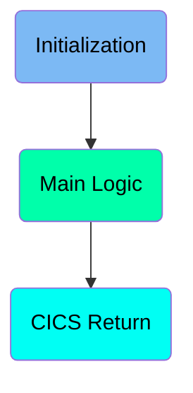
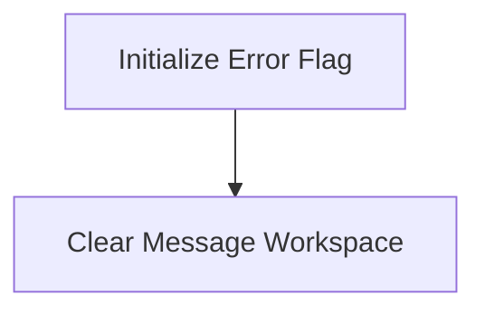
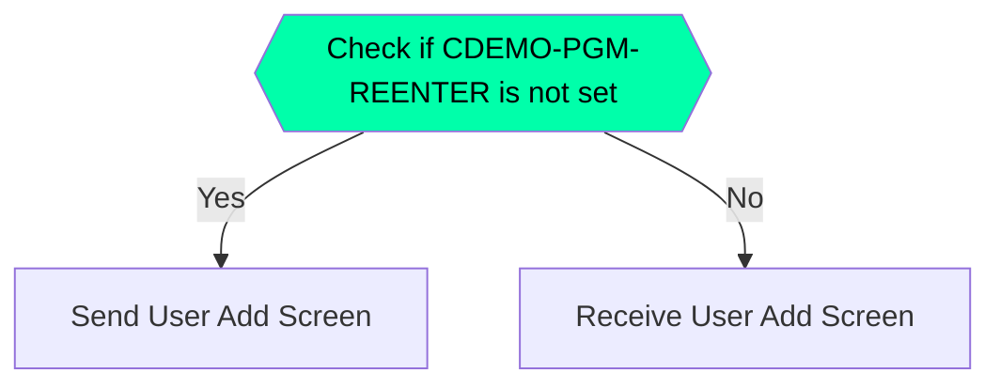
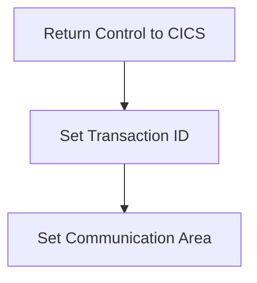

The <SwmToken path="app/cbl/COUSR01C.cbl" pos="2:7:7" line-data="      * Program     : COUSR01C.CBL">`COUSR01C`</SwmToken> program is responsible for handling user addition in the <SwmToken path="app/cbl/COUSR01C.cbl" pos="3:7:7" line-data="      * Application : CardDemo">`CardDemo`</SwmToken> application. It initializes necessary flags and workspaces, manages the display and reception of the user add screen, and ensures proper communication with the CICS system. The program achieves this by following a structured flow that includes initialization, main logic, and returning control to CICS.

The <SwmToken path="app/cbl/COUSR01C.cbl" pos="2:7:7" line-data="      * Program     : COUSR01C.CBL">`COUSR01C`</SwmToken> program starts by initializing error flags and clearing message workspaces. It then checks if the user is entering the add user screen for the first time. If so, it sends the user add screen to the terminal. If not, it receives the user input from the screen. Finally, it returns control to the CICS system, setting the transaction ID and communication area for further processing.

Here is a high level diagram of the program:



# Initialization



<SwmSnippet path="/app/cbl/COUSR01C.cbl" line="73">

---

## Initialize Error Flag

First, the error flag is set to off by setting <SwmToken path="app/cbl/COUSR01C.cbl" pos="73:3:7" line-data="           SET ERR-FLG-OFF TO TRUE">`ERR-FLG-OFF`</SwmToken> to TRUE. This ensures that any previous error states are cleared and the program starts with a clean slate.

```cobol
           SET ERR-FLG-OFF TO TRUE
```

---

</SwmSnippet>

<SwmSnippet path="/app/cbl/COUSR01C.cbl" line="75">

---

## Clear Message Workspace

Next, the message workspace <SwmToken path="app/cbl/COUSR01C.cbl" pos="75:7:9" line-data="           MOVE SPACES TO WS-MESSAGE">`WS-MESSAGE`</SwmToken> is cleared by moving spaces to it. This prepares the workspace for any new messages that need to be displayed during the program execution.

```cobol
           MOVE SPACES TO WS-MESSAGE
                          ERRMSGO OF COUSR1AO
```

---

</SwmSnippet>

# Main Logic



<SwmSnippet path="/app/cbl/COUSR01C.cbl" line="83">

---

## Check if <SwmToken path="app/cbl/COUSR01C.cbl" pos="83:5:9" line-data="               IF NOT CDEMO-PGM-REENTER">`CDEMO-PGM-REENTER`</SwmToken> is not set

First, the code checks if <SwmToken path="app/cbl/COUSR01C.cbl" pos="83:5:9" line-data="               IF NOT CDEMO-PGM-REENTER">`CDEMO-PGM-REENTER`</SwmToken> is not set. If it is not set, it means this is the first time the user is entering the screen for adding a new user. This condition helps in determining whether to initialize the screen or to receive user input.

```cobol
               IF NOT CDEMO-PGM-REENTER
                   SET CDEMO-PGM-REENTER    TO TRUE
```

---

</SwmSnippet>

<SwmSnippet path="/app/cbl/COUSR01C.cbl" line="87">

---

## Send User Add Screen

Next, if <SwmToken path="app/cbl/COUSR01C.cbl" pos="83:5:9" line-data="               IF NOT CDEMO-PGM-REENTER">`CDEMO-PGM-REENTER`</SwmToken> is not set, the code performs the <SwmToken path="app/cbl/COUSR01C.cbl" pos="87:3:7" line-data="                   PERFORM SEND-USRADD-SCREEN">`SEND-USRADD-SCREEN`</SwmToken> paragraph. This paragraph is responsible for displaying the screen to the user where they can add a new user.

```cobol
                   PERFORM SEND-USRADD-SCREEN
```

---

</SwmSnippet>

<SwmSnippet path="/app/cbl/COUSR01C.cbl" line="184">

---

### <SwmToken path="app/cbl/COUSR01C.cbl" pos="184:1:5" line-data="       SEND-USRADD-SCREEN.">`SEND-USRADD-SCREEN`</SwmToken>

The <SwmToken path="app/cbl/COUSR01C.cbl" pos="184:1:5" line-data="       SEND-USRADD-SCREEN.">`SEND-USRADD-SCREEN`</SwmToken> paragraph populates the header information and sends the user add screen to the terminal. This allows the user to see the form where they can input details for adding a new user.

```cobol
       SEND-USRADD-SCREEN.

           PERFORM POPULATE-HEADER-INFO

           MOVE WS-MESSAGE TO ERRMSGO OF COUSR1AO

           EXEC CICS SEND
                     MAP('COUSR1A')
                     MAPSET('COUSR01')
                     FROM(COUSR1AO)
                     ERASE
                     CURSOR
           END-EXEC.
```

---

</SwmSnippet>

<SwmSnippet path="/app/cbl/COUSR01C.cbl" line="89">

---

## Receive User Add Screen

If <SwmToken path="app/cbl/COUSR01C.cbl" pos="83:5:9" line-data="               IF NOT CDEMO-PGM-REENTER">`CDEMO-PGM-REENTER`</SwmToken> is set, the code performs the <SwmToken path="app/cbl/COUSR01C.cbl" pos="89:3:7" line-data="                   PERFORM RECEIVE-USRADD-SCREEN">`RECEIVE-USRADD-SCREEN`</SwmToken> paragraph. This paragraph is responsible for receiving the user input from the screen where they have added a new user.

```cobol
                   PERFORM RECEIVE-USRADD-SCREEN
```

---

</SwmSnippet>

<SwmSnippet path="/app/cbl/COUSR01C.cbl" line="201">

---

### <SwmToken path="app/cbl/COUSR01C.cbl" pos="201:1:5" line-data="       RECEIVE-USRADD-SCREEN.">`RECEIVE-USRADD-SCREEN`</SwmToken>

The <SwmToken path="app/cbl/COUSR01C.cbl" pos="201:1:5" line-data="       RECEIVE-USRADD-SCREEN.">`RECEIVE-USRADD-SCREEN`</SwmToken> paragraph receives the data entered by the user on the user add screen. This data is then processed further based on the user's actions.

```cobol
       RECEIVE-USRADD-SCREEN.

           EXEC CICS RECEIVE
                     MAP('COUSR1A')
                     MAPSET('COUSR01')
                     INTO(COUSR1AI)
                     RESP(WS-RESP-CD)
                     RESP2(WS-REAS-CD)
           END-EXEC.
```

---

</SwmSnippet>

# CICS Return

This is the next section of the flow.



<SwmSnippet path="/app/cbl/COUSR01C.cbl" line="107">

---

## Returning Control to CICS

First, the <SwmToken path="app/cbl/COUSR01C.cbl" pos="107:1:5" line-data="           EXEC CICS RETURN">`EXEC CICS RETURN`</SwmToken> command is used to return control to the CICS system. This is essential for ending the current task and passing control back to CICS.

```cobol
           EXEC CICS RETURN
                     TRANSID (WS-TRANID)
                     COMMAREA (CARDDEMO-COMMAREA)
           END-EXEC.
```

---

</SwmSnippet>

<SwmSnippet path="/app/cbl/COUSR01C.cbl" line="108">

---

## Setting Transaction ID

Next, the <SwmToken path="app/cbl/COUSR01C.cbl" pos="108:1:1" line-data="                     TRANSID (WS-TRANID)">`TRANSID`</SwmToken> parameter is set with <SwmToken path="app/cbl/COUSR01C.cbl" pos="108:4:6" line-data="                     TRANSID (WS-TRANID)">`WS-TRANID`</SwmToken> (which holds the transaction ID). This specifies the transaction to be executed next.

```cobol
                     TRANSID (WS-TRANID)
```

---

</SwmSnippet>

<SwmSnippet path="/app/cbl/COUSR01C.cbl" line="109">

---

## Setting Communication Area

Then, the <SwmToken path="app/cbl/COUSR01C.cbl" pos="109:1:1" line-data="                     COMMAREA (CARDDEMO-COMMAREA)">`COMMAREA`</SwmToken> parameter is set with <SwmToken path="app/cbl/COUSR01C.cbl" pos="109:4:6" line-data="                     COMMAREA (CARDDEMO-COMMAREA)">`CARDDEMO-COMMAREA`</SwmToken> (which holds the communication area). This is used to pass data between tasks.

```cobol
                     COMMAREA (CARDDEMO-COMMAREA)
```

---

</SwmSnippet>

&nbsp;

*This is an auto-generated document by Swimm 🌊 and has not yet been verified by a human*

<SwmMeta version="3.0.0" repo-id="Z2l0aHViJTNBJTNBa3luZHJ5bC1hd3MtbWFpbmZyYW1lLW1vZGVybml6YXRpb24tY2FyZGRlbW8lM0ElM0FTd2ltbS1EZW1v" repo-name="kyndryl-aws-mainframe-modernization-carddemo"><sup>Powered by [Swimm](/)</sup></SwmMeta>
