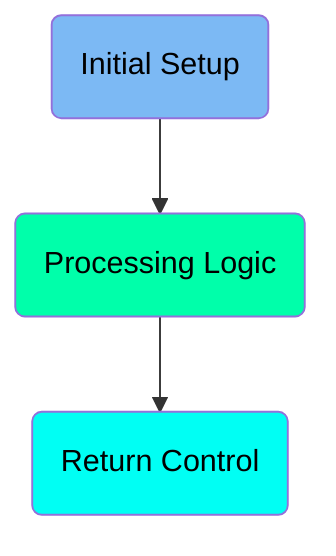
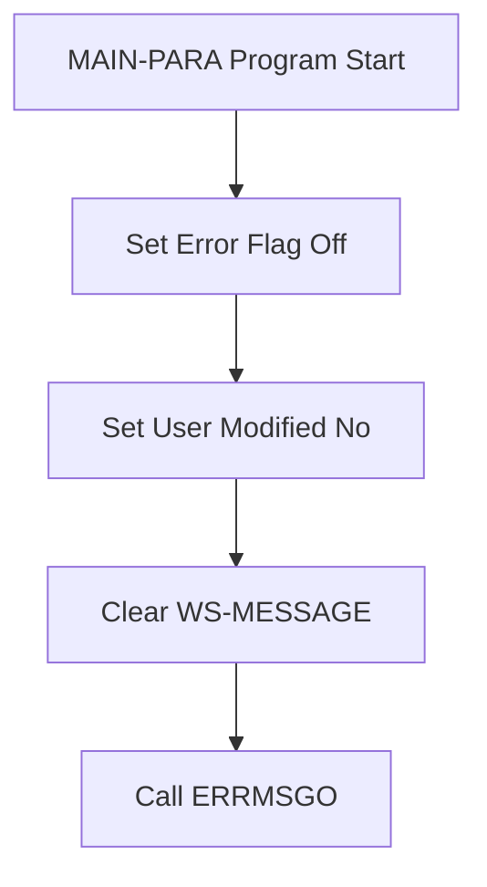
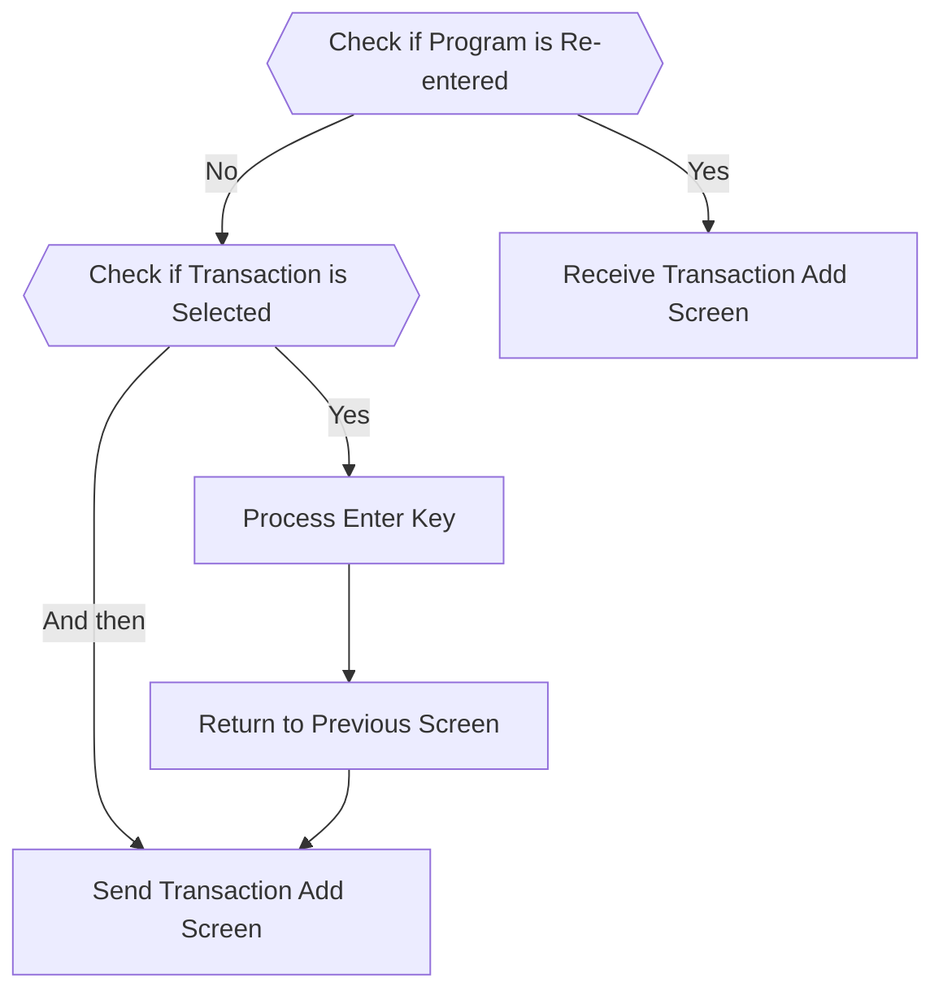
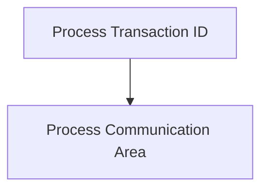

The <SwmToken path="app/cbl/COTRN02C.cbl" pos="2:7:7" line-data="      * Program     : COTRN02C.CBL">`COTRN02C`</SwmToken> program is designed to handle transaction processing within the <SwmToken path="app/cbl/COTRN02C.cbl" pos="3:7:7" line-data="      * Application : CardDemo">`CardDemo`</SwmToken> mainframe application. It achieves this by setting initial flags, processing user inputs, and managing transaction screens. The program ensures that transactions are correctly selected, processed, and displayed to the user.

The flow starts with setting initial flags to ensure no errors and that no user modifications have been made. It then processes user inputs to determine if a transaction is selected and handles the enter key logic. Finally, it sends the appropriate transaction screen to the user and evaluates further user inputs to perform corresponding actions.

Here is a high level diagram of the program:



# Initial Setup



<SwmSnippet path="/app/cbl/COTRN02C.cbl" line="109">

---

## Setting Error Flag Off

First, the error flag is set to off, indicating that there are no errors at the start of the program. This is done by setting <SwmToken path="app/cbl/COTRN02C.cbl" pos="109:3:7" line-data="           SET ERR-FLG-OFF     TO TRUE">`ERR-FLG-OFF`</SwmToken> to TRUE.

```cobol
           SET ERR-FLG-OFF     TO TRUE
```

---

</SwmSnippet>

<SwmSnippet path="/app/cbl/COTRN02C.cbl" line="110">

---

## Setting User Modified No

Next, the user modification status is set to no, indicating that the user has not modified any data yet. This is done by setting <SwmToken path="app/cbl/COTRN02C.cbl" pos="110:3:7" line-data="           SET USR-MODIFIED-NO TO TRUE">`USR-MODIFIED-NO`</SwmToken> to TRUE.

```cobol
           SET USR-MODIFIED-NO TO TRUE
```

---

</SwmSnippet>

<SwmSnippet path="/app/cbl/COTRN02C.cbl" line="112">

---

## Clearing <SwmToken path="app/cbl/COTRN02C.cbl" pos="112:7:9" line-data="           MOVE SPACES TO WS-MESSAGE">`WS-MESSAGE`</SwmToken>

Then, the <SwmToken path="app/cbl/COTRN02C.cbl" pos="112:7:9" line-data="           MOVE SPACES TO WS-MESSAGE">`WS-MESSAGE`</SwmToken> field is cleared by moving spaces to it. This ensures that any previous messages are removed.

```cobol
           MOVE SPACES TO WS-MESSAGE
```

---

</SwmSnippet>

<SwmSnippet path="/app/cbl/COTRN02C.cbl" line="113">

---

## Calling ERRMSGO

Finally, the <SwmToken path="app/cbl/COTRN02C.cbl" pos="113:1:1" line-data="                          ERRMSGO OF COTRN2AO">`ERRMSGO`</SwmToken> function of <SwmToken path="app/cbl/COTRN02C.cbl" pos="113:5:5" line-data="                          ERRMSGO OF COTRN2AO">`COTRN2AO`</SwmToken> is called. This function likely handles any error messages that need to be displayed.

```cobol
                          ERRMSGO OF COTRN2AO
```

---

</SwmSnippet>

# Processing Logic



<SwmSnippet path="/app/cbl/COTRN02C.cbl" line="120">

---

## Check if Program is Re-entered

First, the code checks if the program is being re-entered by evaluating <SwmToken path="app/cbl/COTRN02C.cbl" pos="120:5:9" line-data="               IF NOT CDEMO-PGM-REENTER">`CDEMO-PGM-REENTER`</SwmToken>. If it is not re-entered, it sets <SwmToken path="app/cbl/COTRN02C.cbl" pos="120:5:9" line-data="               IF NOT CDEMO-PGM-REENTER">`CDEMO-PGM-REENTER`</SwmToken> to TRUE to mark it as re-entered.

```cobol
               IF NOT CDEMO-PGM-REENTER
                   SET CDEMO-PGM-REENTER    TO TRUE
```

---

</SwmSnippet>

<SwmSnippet path="/app/cbl/COTRN02C.cbl" line="124">

---

## Check if Transaction is Selected

Next, the code checks if a transaction has been selected by evaluating <SwmToken path="app/cbl/COTRN02C.cbl" pos="124:3:9" line-data="                   IF CDEMO-CT02-TRN-SELECTED NOT =">`CDEMO-CT02-TRN-SELECTED`</SwmToken> to ensure it is not empty or contains low-values.

```cobol
                   IF CDEMO-CT02-TRN-SELECTED NOT =
                                              SPACES AND LOW-VALUES
```

---

</SwmSnippet>

<SwmSnippet path="/app/cbl/COTRN02C.cbl" line="128">

---

## Process Enter Key

If a transaction is selected, the code performs the <SwmToken path="app/cbl/COTRN02C.cbl" pos="128:3:7" line-data="                       PERFORM PROCESS-ENTER-KEY">`PROCESS-ENTER-KEY`</SwmToken> paragraph to handle the enter key logic.

```cobol
                       PERFORM PROCESS-ENTER-KEY
```

---

</SwmSnippet>

<SwmSnippet path="/app/cbl/COTRN02C.cbl" line="130">

---

## Send Transaction Add Screen

After processing the enter key, the code performs the <SwmToken path="app/cbl/COTRN02C.cbl" pos="130:3:7" line-data="                   PERFORM SEND-TRNADD-SCREEN">`SEND-TRNADD-SCREEN`</SwmToken> paragraph to send the transaction add screen to the user.

```cobol
                   PERFORM SEND-TRNADD-SCREEN
```

---

</SwmSnippet>

<SwmSnippet path="/app/cbl/COTRN02C.cbl" line="132">

---

## Receive Transaction Add Screen

If the program is re-entered, the code performs the <SwmToken path="app/cbl/COTRN02C.cbl" pos="132:3:7" line-data="                   PERFORM RECEIVE-TRNADD-SCREEN">`RECEIVE-TRNADD-SCREEN`</SwmToken> paragraph to receive the transaction add screen input from the user.

```cobol
                   PERFORM RECEIVE-TRNADD-SCREEN
```

---

</SwmSnippet>

<SwmSnippet path="/app/cbl/COTRN02C.cbl" line="133">

---

## Evaluate User Input

The code then evaluates the user input (<SwmToken path="app/cbl/COTRN02C.cbl" pos="133:3:3" line-data="                   EVALUATE EIBAID">`EIBAID`</SwmToken>) to determine the action to take. It handles different keys such as Enter, PF3, PF4, and PF5, performing corresponding actions like processing the enter key, returning to the previous screen, clearing the current screen, or copying the last transaction data.

```cobol
                   EVALUATE EIBAID
                       WHEN DFHENTER
                           PERFORM PROCESS-ENTER-KEY
                       WHEN DFHPF3
                           IF CDEMO-FROM-PROGRAM = SPACES OR LOW-VALUES
                               MOVE 'COMEN01C' TO CDEMO-TO-PROGRAM
                           ELSE
                               MOVE CDEMO-FROM-PROGRAM TO
                               CDEMO-TO-PROGRAM
                           END-IF
                           PERFORM RETURN-TO-PREV-SCREEN
                       WHEN DFHPF4
                           PERFORM CLEAR-CURRENT-SCREEN
                       WHEN DFHPF5
                           PERFORM COPY-LAST-TRAN-DATA
                       WHEN OTHER
                           MOVE 'Y'                       TO WS-ERR-FLG
                           MOVE CCDA-MSG-INVALID-KEY      TO WS-MESSAGE
                           PERFORM SEND-TRNADD-SCREEN
                   END-EVALUATE
```

---

</SwmSnippet>

# Return Control

This is the next section of the flow.



<SwmSnippet path="/app/cbl/COTRN02C.cbl" line="157">

---

## Process Transaction ID

First, the transaction ID is processed using the <SwmToken path="app/cbl/COTRN02C.cbl" pos="157:1:1" line-data="                     TRANSID (WS-TRANID)">`TRANSID`</SwmToken> variable. This step is crucial as it identifies the specific transaction being handled.

```cobol
                     TRANSID (WS-TRANID)
```

---

</SwmSnippet>

<SwmSnippet path="/app/cbl/COTRN02C.cbl" line="158">

---

## Process Communication Area

Next, the communication area is processed using the <SwmToken path="app/cbl/COTRN02C.cbl" pos="158:1:1" line-data="                     COMMAREA (CARDDEMO-COMMAREA)">`COMMAREA`</SwmToken> variable. This area holds the data passed between programs, ensuring that the necessary information is available for the transaction.

```cobol
                     COMMAREA (CARDDEMO-COMMAREA)
```

---

</SwmSnippet>

<SwmSnippet path="/app/cbl/COTRN02C.cbl" line="159">

---

## End of EXEC CICS

Then, the <SwmToken path="app/cbl/COTRN02C.cbl" pos="159:1:3" line-data="           END-EXEC.">`END-EXEC`</SwmToken> statement marks the end of the EXEC CICS command, indicating that the processing of the transaction ID and communication area is complete.

```cobol
           END-EXEC.
```

---

</SwmSnippet>

<SwmSnippet path="/app/cbl/COTRN02C.cbl" line="162">

---

## Process Enter Key

Finally, the <SwmToken path="app/cbl/COTRN02C.cbl" pos="162:3:7" line-data="      *                      PROCESS-ENTER-KEY">`PROCESS-ENTER-KEY`</SwmToken> section is a placeholder for handling the Enter key event, which may involve further processing or navigation within the application.

```cobol
      *                      PROCESS-ENTER-KEY
```

---

</SwmSnippet>

&nbsp;

*This is an auto-generated document by Swimm 🌊 and has not yet been verified by a human*

<SwmMeta version="3.0.0" repo-id="Z2l0aHViJTNBJTNBa3luZHJ5bC1hd3MtbWFpbmZyYW1lLW1vZGVybml6YXRpb24tY2FyZGRlbW8lM0ElM0FTd2ltbS1EZW1v" repo-name="kyndryl-aws-mainframe-modernization-carddemo"><sup>Powered by [Swimm](https://staging.swimm.cloud/)</sup></SwmMeta>
