This document details the flow for adding a new Regular or Admin user to the USRSEC file. The process is initiated by checking the length of the communication area and proceeds through various steps to handle user input and actions.

For instance, if the communication area length is zero, the system sets the next program to the sign-on program and returns to the previous screen. If the length is not zero, it prepares the system to receive user input for adding a new user.

# Add <SwmToken path="app/cbl/COUSR01C.cbl" pos="5:13:15" line-data="      * Function    : Add a new Regular/Admin user to USRSEC file">`Regular/Admin`</SwmToken> User (<SwmToken path="app/cbl/COUSR01C.cbl" pos="71:1:3" line-data="       MAIN-PARA.">`MAIN-PARA`</SwmToken>)

Lets' zoom into the program flow:

```mermaid
graph TD
  A[Check if EIBCALEN is 0] -->|Yes| B[Set next program to COSGN00C]
  A -->|No| C[Move DFHCOMMAREA to CARDDEMO-COMMAREA]
  C --> D[Check if CDEMO-PGM-REENTER is not set]
  D -->|Yes| E[Set CDEMO-PGM-REENTER to TRUE]
  E --> F[Move LOW-VALUES to COUSR1AO]
  F --> G[Move -1 to FNAMEL of COUSR1AI]
  G --> H[Send user addition screen]
  D -->|No| I[Receive user addition screen]
  I --> J[Evaluate EIBAID]
  J -->|DFHENTER| K[Process enter key]
  J -->|DFHPF3| L[Set next program to COADM01C]
  L --> M[Return to previous screen]
  J -->|DFHPF4| N[Clear current screen]
  J -->|Other| O[Set error flag to Y]
  O --> P[Move -1 to FNAMEL of COUSR1AI]
  P --> Q[Set invalid key message]
  Q --> R[Send user addition screen]

%% Swimm:
%% graph TD
%%   A[Check if EIBCALEN is 0] -->|Yes| B[Set next program to <SwmToken path="app/cbl/COUSR01C.cbl" pos="79:4:4" line-data="               MOVE &#39;COSGN00C&#39; TO CDEMO-TO-PROGRAM">`COSGN00C`</SwmToken>]
%%   A -->|No| C[Move DFHCOMMAREA to <SwmToken path="app/cbl/COUSR01C.cbl" pos="82:12:14" line-data="               MOVE DFHCOMMAREA(1:EIBCALEN) TO CARDDEMO-COMMAREA">`CARDDEMO-COMMAREA`</SwmToken>]
%%   C --> D[Check if <SwmToken path="app/cbl/COUSR01C.cbl" pos="83:5:9" line-data="               IF NOT CDEMO-PGM-REENTER">`CDEMO-PGM-REENTER`</SwmToken> is not set]
%%   D -->|Yes| E[Set <SwmToken path="app/cbl/COUSR01C.cbl" pos="83:5:9" line-data="               IF NOT CDEMO-PGM-REENTER">`CDEMO-PGM-REENTER`</SwmToken> to TRUE]
%%   E --> F[Move <SwmToken path="app/cbl/COUSR01C.cbl" pos="85:3:5" line-data="                   MOVE LOW-VALUES          TO COUSR1AO">`LOW-VALUES`</SwmToken> to <SwmToken path="app/cbl/COUSR01C.cbl" pos="76:5:5" line-data="                          ERRMSGO OF COUSR1AO">`COUSR1AO`</SwmToken>]
%%   F --> G[Move -1 to FNAMEL of <SwmToken path="app/cbl/COUSR01C.cbl" pos="86:12:12" line-data="                   MOVE -1       TO FNAMEL OF COUSR1AI">`COUSR1AI`</SwmToken>]
%%   G --> H[Send user addition screen]
%%   D -->|No| I[Receive user addition screen]
%%   I --> J[Evaluate EIBAID]
%%   J -->|DFHENTER| K[Process enter key]
%%   J -->|<SwmToken path="app/cbl/COUSR01C.cbl" pos="93:3:3" line-data="                       WHEN DFHPF3">`DFHPF3`</SwmToken>| L[Set next program to <SwmToken path="app/cbl/COUSR01C.cbl" pos="94:4:4" line-data="                           MOVE &#39;COADM01C&#39; TO CDEMO-TO-PROGRAM">`COADM01C`</SwmToken>]
%%   L --> M[Return to previous screen]
%%   J -->|<SwmToken path="app/cbl/COUSR01C.cbl" pos="96:3:3" line-data="                       WHEN DFHPF4">`DFHPF4`</SwmToken>| N[Clear current screen]
%%   J -->|Other| O[Set error flag to Y]
%%   O --> P[Move -1 to FNAMEL of <SwmToken path="app/cbl/COUSR01C.cbl" pos="86:12:12" line-data="                   MOVE -1       TO FNAMEL OF COUSR1AI">`COUSR1AI`</SwmToken>]
%%   P --> Q[Set invalid key message]
%%   Q --> R[Send user addition screen]
```



<SwmSnippet path="/app/cbl/COUSR01C.cbl" line="71">

---

### Setting initial values

Going into the <SwmToken path="app/cbl/COUSR01C.cbl" pos="71:1:3" line-data="       MAIN-PARA.">`MAIN-PARA`</SwmToken> function, the initial steps involve setting the error flag to off and clearing any existing messages. This ensures that the process starts with a clean state, free of any previous errors or messages.

```cobol
       MAIN-PARA.

           SET ERR-FLG-OFF TO TRUE

           MOVE SPACES TO WS-MESSAGE
                          ERRMSGO OF COUSR1AO
```

---

</SwmSnippet>

<SwmSnippet path="/app/cbl/COUSR01C.cbl" line="78">

---

### Handling initial call

Next, the function checks if the length of the communication area is zero. If it is, it sets the next program to the sign-on program and returns to the previous screen. This ensures that the user is properly signed on before proceeding.

```cobol
           IF EIBCALEN = 0
               MOVE 'COSGN00C' TO CDEMO-TO-PROGRAM
               PERFORM RETURN-TO-PREV-SCREEN
```

---

</SwmSnippet>

<SwmSnippet path="/app/cbl/COUSR01C.cbl" line="81">

---

### Processing user input

If the communication area length is not zero, the function moves the communication area data to the appropriate variable and checks if the program re-enter flag is not set. If it is not set, it sets the flag, initializes certain fields, and sends the user addition screen. This prepares the system to receive user input for adding a new user.

```cobol
           ELSE
               MOVE DFHCOMMAREA(1:EIBCALEN) TO CARDDEMO-COMMAREA
               IF NOT CDEMO-PGM-REENTER
                   SET CDEMO-PGM-REENTER    TO TRUE
                   MOVE LOW-VALUES          TO COUSR1AO
                   MOVE -1       TO FNAMEL OF COUSR1AI
                   PERFORM SEND-USRADD-SCREEN
```

---

</SwmSnippet>

<SwmSnippet path="/app/cbl/COUSR01C.cbl" line="88">

---

### Evaluating user actions

If the program re-enter flag is set, the function receives the user addition screen and evaluates the user action. Depending on the action, it either processes the enter key, returns to the previous screen, clears the current screen, or sets an error flag and sends an error message. This ensures that the user's actions are appropriately handled and the system responds accordingly.

```cobol
               ELSE
                   PERFORM RECEIVE-USRADD-SCREEN
                   EVALUATE EIBAID
                       WHEN DFHENTER
                           PERFORM PROCESS-ENTER-KEY
                       WHEN DFHPF3
                           MOVE 'COADM01C' TO CDEMO-TO-PROGRAM
                           PERFORM RETURN-TO-PREV-SCREEN
                       WHEN DFHPF4
                           PERFORM CLEAR-CURRENT-SCREEN
                       WHEN OTHER
                           MOVE 'Y'                       TO WS-ERR-FLG
                           MOVE -1       TO FNAMEL OF COUSR1AI
                           MOVE CCDA-MSG-INVALID-KEY      TO WS-MESSAGE
                           PERFORM SEND-USRADD-SCREEN
                   END-EVALUATE
               END-IF
```

---

</SwmSnippet>

# Return to Previous Screen (<SwmToken path="app/cbl/COUSR01C.cbl" pos="80:3:9" line-data="               PERFORM RETURN-TO-PREV-SCREEN">`RETURN-TO-PREV-SCREEN`</SwmToken>)

<SwmSnippet path="/app/cbl/COUSR01C.cbl" line="165">

---

Going into the <SwmToken path="app/cbl/COUSR01C.cbl" pos="165:1:7" line-data="       RETURN-TO-PREV-SCREEN.">`RETURN-TO-PREV-SCREEN`</SwmToken> function, the code first checks if <SwmToken path="app/cbl/COUSR01C.cbl" pos="167:3:7" line-data="           IF CDEMO-TO-PROGRAM = LOW-VALUES OR SPACES">`CDEMO-TO-PROGRAM`</SwmToken> (the next program to be executed) is either uninitialized or set to spaces. If so, it sets <SwmToken path="app/cbl/COUSR01C.cbl" pos="167:3:7" line-data="           IF CDEMO-TO-PROGRAM = LOW-VALUES OR SPACES">`CDEMO-TO-PROGRAM`</SwmToken> to <SwmToken path="app/cbl/COUSR01C.cbl" pos="168:4:4" line-data="               MOVE &#39;COSGN00C&#39; TO CDEMO-TO-PROGRAM">`COSGN00C`</SwmToken>, which is the program for handling sign-on operations.

```cobol
       RETURN-TO-PREV-SCREEN.

           IF CDEMO-TO-PROGRAM = LOW-VALUES OR SPACES
               MOVE 'COSGN00C' TO CDEMO-TO-PROGRAM
           END-IF
```

---

</SwmSnippet>

<SwmSnippet path="/app/cbl/COUSR01C.cbl" line="170">

---

Next, the function sets <SwmToken path="app/cbl/COUSR01C.cbl" pos="170:9:13" line-data="           MOVE WS-TRANID    TO CDEMO-FROM-TRANID">`CDEMO-FROM-TRANID`</SwmToken> (the transaction ID of the current operation) and <SwmToken path="app/cbl/COUSR01C.cbl" pos="171:9:13" line-data="           MOVE WS-PGMNAME   TO CDEMO-FROM-PROGRAM">`CDEMO-FROM-PROGRAM`</SwmToken> (the name of the current program) to their respective values. It then clears <SwmToken path="app/cbl/COUSR01C.cbl" pos="174:7:11" line-data="           MOVE ZEROS        TO CDEMO-PGM-CONTEXT">`CDEMO-PGM-CONTEXT`</SwmToken> (the context of the program) and executes the <SwmToken path="app/cbl/COUSR01C.cbl" pos="176:1:1" line-data="               XCTL PROGRAM(CDEMO-TO-PROGRAM)">`XCTL`</SwmToken> command to transfer control to the program specified in <SwmToken path="app/cbl/COUSR01C.cbl" pos="176:5:9" line-data="               XCTL PROGRAM(CDEMO-TO-PROGRAM)">`CDEMO-TO-PROGRAM`</SwmToken>, passing along the <SwmToken path="app/cbl/COUSR01C.cbl" pos="177:3:5" line-data="               COMMAREA(CARDDEMO-COMMAREA)">`CARDDEMO-COMMAREA`</SwmToken> (the communication area).

```cobol
           MOVE WS-TRANID    TO CDEMO-FROM-TRANID
           MOVE WS-PGMNAME   TO CDEMO-FROM-PROGRAM
      *    MOVE WS-USER-ID   TO CDEMO-USER-ID
      *    MOVE SEC-USR-TYPE TO CDEMO-USER-TYPE
           MOVE ZEROS        TO CDEMO-PGM-CONTEXT
           EXEC CICS
               XCTL PROGRAM(CDEMO-TO-PROGRAM)
               COMMAREA(CARDDEMO-COMMAREA)
           END-EXEC.
```

---

</SwmSnippet>

# Send User Addition Screen (<SwmToken path="app/cbl/COUSR01C.cbl" pos="87:3:7" line-data="                   PERFORM SEND-USRADD-SCREEN">`SEND-USRADD-SCREEN`</SwmToken>)

<SwmSnippet path="/app/cbl/COUSR01C.cbl" line="184">

---

### Populating header information

Going into the <SwmToken path="app/cbl/COUSR01C.cbl" pos="184:1:5" line-data="       SEND-USRADD-SCREEN.">`SEND-USRADD-SCREEN`</SwmToken> function, the first step is to perform the <SwmToken path="app/cbl/COUSR01C.cbl" pos="186:3:7" line-data="           PERFORM POPULATE-HEADER-INFO">`POPULATE-HEADER-INFO`</SwmToken> operation. This step is crucial as it ensures that the header information is correctly populated before displaying the user addition screen.

```cobol
       SEND-USRADD-SCREEN.

           PERFORM POPULATE-HEADER-INFO
```

---

</SwmSnippet>

<SwmSnippet path="/app/cbl/COUSR01C.cbl" line="188">

---

### Sending the user addition screen

Next, the function moves the message stored in <SwmToken path="app/cbl/COUSR01C.cbl" pos="188:3:5" line-data="           MOVE WS-MESSAGE TO ERRMSGO OF COUSR1AO">`WS-MESSAGE`</SwmToken> to the <SwmToken path="app/cbl/COUSR01C.cbl" pos="188:9:9" line-data="           MOVE WS-MESSAGE TO ERRMSGO OF COUSR1AO">`ERRMSGO`</SwmToken> field of <SwmToken path="app/cbl/COUSR01C.cbl" pos="188:13:13" line-data="           MOVE WS-MESSAGE TO ERRMSGO OF COUSR1AO">`COUSR1AO`</SwmToken>. This message could be a prompt or an error message that needs to be displayed to the user. Then, the function sends the <SwmToken path="app/cbl/COUSR01C.cbl" pos="191:4:4" line-data="                     MAP(&#39;COUSR1A&#39;)">`COUSR1A`</SwmToken> map from the <SwmToken path="app/cbl/COUSR01C.cbl" pos="192:4:4" line-data="                     MAPSET(&#39;COUSR01&#39;)">`COUSR01`</SwmToken> mapset to the user terminal. This action effectively displays the user addition screen to the user, allowing them to interact with it.

```cobol
           MOVE WS-MESSAGE TO ERRMSGO OF COUSR1AO

           EXEC CICS SEND
                     MAP('COUSR1A')
                     MAPSET('COUSR01')
                     FROM(COUSR1AO)
                     ERASE
                     CURSOR
           END-EXEC.
```

---

</SwmSnippet>

# Populate Header Information (<SwmToken path="app/cbl/COUSR01C.cbl" pos="186:3:7" line-data="           PERFORM POPULATE-HEADER-INFO">`POPULATE-HEADER-INFO`</SwmToken>)

<SwmSnippet path="/app/cbl/COUSR01C.cbl" line="214">

---

### Populating Header Information

Going into the <SwmToken path="app/cbl/COUSR01C.cbl" pos="214:1:5" line-data="       POPULATE-HEADER-INFO.">`POPULATE-HEADER-INFO`</SwmToken> function, the code begins by obtaining the current date and time. It then assigns various title and transaction details to the header structure. The function also formats the current date and time into specific fields for month, day, year, hours, minutes, and seconds, and assigns these formatted values to the header structure. This ensures that the header contains accurate and up-to-date information for user operations.

```cobol
       POPULATE-HEADER-INFO.

           MOVE FUNCTION CURRENT-DATE  TO WS-CURDATE-DATA

           MOVE CCDA-TITLE01           TO TITLE01O OF COUSR1AO
           MOVE CCDA-TITLE02           TO TITLE02O OF COUSR1AO
           MOVE WS-TRANID              TO TRNNAMEO OF COUSR1AO
           MOVE WS-PGMNAME             TO PGMNAMEO OF COUSR1AO

           MOVE WS-CURDATE-MONTH       TO WS-CURDATE-MM
           MOVE WS-CURDATE-DAY         TO WS-CURDATE-DD
           MOVE WS-CURDATE-YEAR(3:2)   TO WS-CURDATE-YY

           MOVE WS-CURDATE-MM-DD-YY    TO CURDATEO OF COUSR1AO

           MOVE WS-CURTIME-HOURS       TO WS-CURTIME-HH
           MOVE WS-CURTIME-MINUTE      TO WS-CURTIME-MM
           MOVE WS-CURTIME-SECOND      TO WS-CURTIME-SS

           MOVE WS-CURTIME-HH-MM-SS    TO CURTIMEO OF COUSR1AO.
```

---

</SwmSnippet>

# Receive User Input (<SwmToken path="app/cbl/COUSR01C.cbl" pos="89:3:7" line-data="                   PERFORM RECEIVE-USRADD-SCREEN">`RECEIVE-USRADD-SCREEN`</SwmToken>)

<SwmSnippet path="/app/cbl/COUSR01C.cbl" line="201">

---

### Receiving user addition screen data

The <SwmToken path="app/cbl/COUSR01C.cbl" pos="201:1:5" line-data="       RECEIVE-USRADD-SCREEN.">`RECEIVE-USRADD-SCREEN`</SwmToken> function is responsible for receiving data from the user addition screen. It uses the <SwmToken path="app/cbl/COUSR01C.cbl" pos="203:1:5" line-data="           EXEC CICS RECEIVE">`EXEC CICS RECEIVE`</SwmToken> command to receive the map <SwmToken path="app/cbl/COUSR01C.cbl" pos="204:4:4" line-data="                     MAP(&#39;COUSR1A&#39;)">`COUSR1A`</SwmToken> from the mapset <SwmToken path="app/cbl/COUSR01C.cbl" pos="205:4:4" line-data="                     MAPSET(&#39;COUSR01&#39;)">`COUSR01`</SwmToken> into the <SwmToken path="app/cbl/COUSR01C.cbl" pos="206:3:3" line-data="                     INTO(COUSR1AI)">`COUSR1AI`</SwmToken> area. The response codes <SwmToken path="app/cbl/COUSR01C.cbl" pos="207:3:7" line-data="                     RESP(WS-RESP-CD)">`WS-RESP-CD`</SwmToken> and <SwmToken path="app/cbl/COUSR01C.cbl" pos="208:3:7" line-data="                     RESP2(WS-REAS-CD)">`WS-REAS-CD`</SwmToken> are used to handle any potential errors during the receive operation.

```cobol
       RECEIVE-USRADD-SCREEN.

           EXEC CICS RECEIVE
                     MAP('COUSR1A')
                     MAPSET('COUSR01')
                     INTO(COUSR1AI)
                     RESP(WS-RESP-CD)
                     RESP2(WS-REAS-CD)
           END-EXEC.
```

---

</SwmSnippet>

&nbsp;

*This is an auto-generated document by Swimm 🌊 and has not yet been verified by a human*

<SwmMeta version="3.0.0" repo-id="Z2l0aHViJTNBJTNBa3luZHJ5bC1hd3MtbWFpbmZyYW1lLW1vZGVybml6YXRpb24tY2FyZGRlbW8lM0ElM0FTd2ltbS1EZW1v" repo-name="kyndryl-aws-mainframe-modernization-carddemo"><sup>Powered by [Swimm](/)</sup></SwmMeta>
