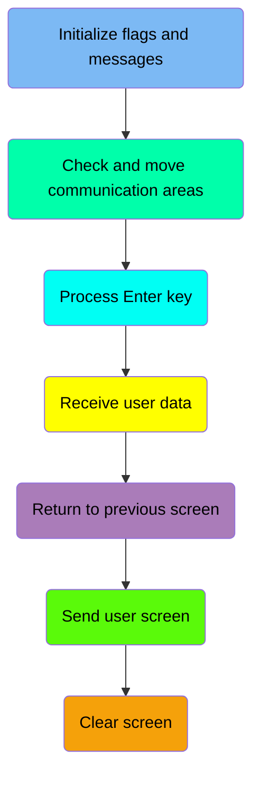
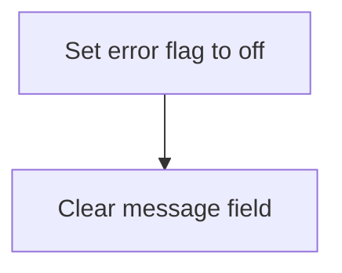
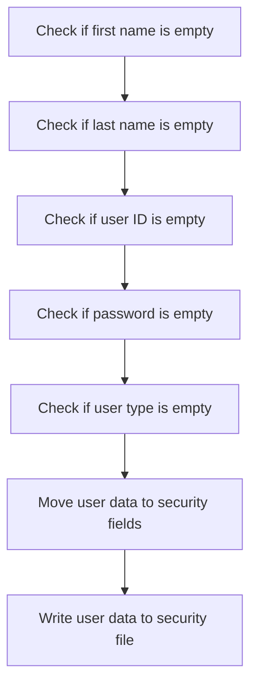
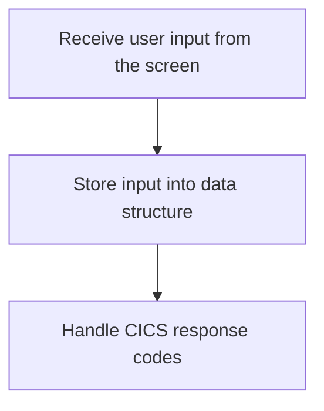
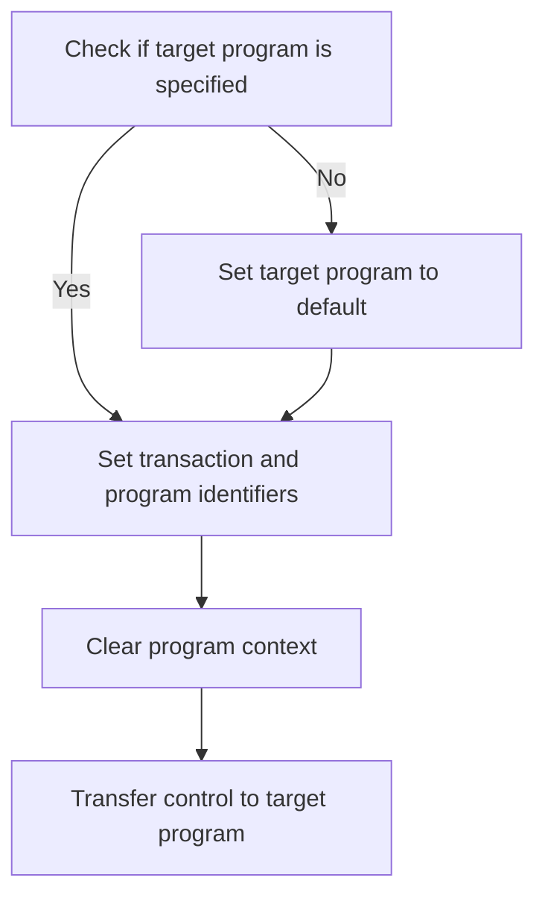
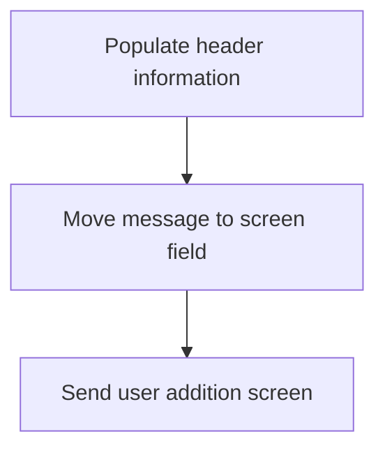
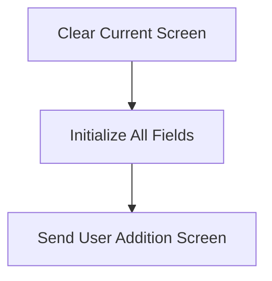

```mermaid
graph TD
  A[Check if communication area length is zero] -->|Yes| B[Set target program to COSGN00C]
  B --> C[Return to previous screen]
  A -->|No| D[Move data from communication area to working storage]
  D --> E[Check if program is re-entered]
  E -->|No| F[Set program re-enter flag to true]
  F --> G[Initialize fields]
  G --> H[Send user addition screen]
  E -->|Yes| I[Receive user addition screen]
  I --> J[Evaluate user action]
  J -->|Enter| K[Process enter key]
  J -->|PF3| L[Set target program to COADM01C]
  L --> M[Return to previous screen]
  J -->|PF4| N[Clear current screen]
  J -->|Other| O[Set error flag]
  O --> P[Initialize fields]
  P --> Q[Send user addition screen]

%% Swimm:
%% graph TD
%%   A[Check if communication area length is zero] -->|Yes| B[Set target program to <SwmToken path="app/cbl/COUSR01C.cbl" pos="79:4:4" line-data="               MOVE &#39;COSGN00C&#39; TO CDEMO-TO-PROGRAM">`COSGN00C`</SwmToken>]
%%   B --> C[Return to previous screen]
%%   A -->|No| D[Move data from communication area to working storage]
%%   D --> E[Check if program is re-entered]
%%   E -->|No| F[Set program re-enter flag to true]
%%   F --> G[Initialize fields]
%%   G --> H[Send user addition screen]
%%   E -->|Yes| I[Receive user addition screen]
%%   I --> J[Evaluate user action]
%%   J -->|Enter| K[Process enter key]
%%   J -->|PF3| L[Set target program to <SwmToken path="app/cbl/COUSR01C.cbl" pos="94:4:4" line-data="                           MOVE &#39;COADM01C&#39; TO CDEMO-TO-PROGRAM">`COADM01C`</SwmToken>]
%%   L --> M[Return to previous screen]
%%   J -->|PF4| N[Clear current screen]
%%   J -->|Other| O[Set error flag]
%%   O --> P[Initialize fields]
%%   P --> Q[Send user addition screen]
```

The document describes the process of adding a new user (<SwmToken path="app/cbl/COUSR01C.cbl" pos="2:7:7" line-data="      * Program     : COUSR01C.CBL">`COUSR01C`</SwmToken>) in the <SwmToken path="app/cbl/COUSR01C.cbl" pos="3:7:7" line-data="      * Application : CardDemo">`CardDemo`</SwmToken> application. This process involves initializing flags and messages, checking and moving communication areas, processing the Enter key, receiving user data, returning to the previous screen, sending the user screen, and clearing the screen. Each step ensures that the user data is correctly validated and stored in the USRSEC file.

The flow for adding a new user involves several steps to ensure data integrity and proper user interface interaction. It starts with initializing necessary flags and messages, followed by checking and moving communication areas. The Enter key processing step validates user input fields, and the user data is then received and stored. The process also includes returning to the previous screen if needed, sending the user screen for further input, and clearing the screen to prepare for new data entry.

Here is a high level diagram of the program:



## Initialize flags and messages

First, we'll zoom into this section of the flow:



<SwmSnippet path="/app/cbl/COUSR01C.cbl" line="73">

---

First, we set the error flag to off. This indicates that there are no errors at the start of the process, ensuring that any subsequent operations are not prematurely halted due to a false error condition.

```cobol
           SET ERR-FLG-OFF TO TRUE
```

---

</SwmSnippet>

<SwmSnippet path="/app/cbl/COUSR01C.cbl" line="75">

---

Next, we clear the message field by moving spaces to it. This prepares the message field to display new messages, ensuring that any old or irrelevant messages are removed before new operations begin.

```cobol
           MOVE SPACES TO WS-MESSAGE
                          ERRMSGO OF COUSR1AO
```

---

</SwmSnippet>

## Check and move communication areas

Now, lets zoom into this section of the flow:



<SwmSnippet path="/app/cbl/COUSR01C.cbl" line="78">

---

First, the program checks if the communication area length (<SwmToken path="app/cbl/COUSR01C.cbl" pos="78:3:3" line-data="           IF EIBCALEN = 0">`EIBCALEN`</SwmToken>) is zero. If it is, it sets the target program to <SwmToken path="app/cbl/COUSR01C.cbl" pos="79:4:4" line-data="               MOVE &#39;COSGN00C&#39; TO CDEMO-TO-PROGRAM">`COSGN00C`</SwmToken> and returns to the previous screen.

```cobol
           IF EIBCALEN = 0
               MOVE 'COSGN00C' TO CDEMO-TO-PROGRAM
               PERFORM RETURN-TO-PREV-SCREEN
```

---

</SwmSnippet>

<SwmSnippet path="/app/cbl/COUSR01C.cbl" line="81">

---

Next, if the communication area length is not zero, the program moves data from the communication area to the working storage (<SwmToken path="app/cbl/COUSR01C.cbl" pos="82:12:14" line-data="               MOVE DFHCOMMAREA(1:EIBCALEN) TO CARDDEMO-COMMAREA">`CARDDEMO-COMMAREA`</SwmToken>). It then checks if the program is being re-entered. If not, it sets the re-enter flag to true, initializes fields, and sends the user addition screen. If the program is being re-entered, it receives the user addition screen and evaluates the user action to perform corresponding operations such as processing the enter key, returning to the previous screen, clearing the current screen, or setting an error flag and sending the user addition screen again.

```cobol
           ELSE
               MOVE DFHCOMMAREA(1:EIBCALEN) TO CARDDEMO-COMMAREA
               IF NOT CDEMO-PGM-REENTER
                   SET CDEMO-PGM-REENTER    TO TRUE
                   MOVE LOW-VALUES          TO COUSR1AO
                   MOVE -1       TO FNAMEL OF COUSR1AI
                   PERFORM SEND-USRADD-SCREEN
               ELSE
                   PERFORM RECEIVE-USRADD-SCREEN
                   EVALUATE EIBAID
                       WHEN DFHENTER
                           PERFORM PROCESS-ENTER-KEY
                       WHEN DFHPF3
                           MOVE 'COADM01C' TO CDEMO-TO-PROGRAM
                           PERFORM RETURN-TO-PREV-SCREEN
                       WHEN DFHPF4
                           PERFORM CLEAR-CURRENT-SCREEN
                       WHEN OTHER
                           MOVE 'Y'                       TO WS-ERR-FLG
                           MOVE -1       TO FNAMEL OF COUSR1AI
                           MOVE CCDA-MSG-INVALID-KEY      TO WS-MESSAGE
```

---

</SwmSnippet>

## Process Enter key

Now, lets zoom into this section of the flow:



<SwmSnippet path="/app/cbl/COUSR01C.cbl" line="117">

---

### Validating user input fields

First, we check if the first name is empty. If it is, an error flag is set, an error message is populated, and the user addition screen is sent back to the user interface.

```cobol
           EVALUATE TRUE
               WHEN FNAMEI OF COUSR1AI = SPACES OR LOW-VALUES
                   MOVE 'Y'     TO WS-ERR-FLG
                   MOVE 'First Name can NOT be empty...' TO
                                   WS-MESSAGE
                   MOVE -1       TO FNAMEL OF COUSR1AI
                   PERFORM SEND-USRADD-SCREEN
```

---

</SwmSnippet>

<SwmSnippet path="/app/cbl/COUSR01C.cbl" line="124">

---

Next, we check if the last name is empty. Similar to the first name check, if the last name is empty, an error flag is set, an error message is populated, and the user addition screen is sent back to the user interface.

```cobol
               WHEN LNAMEI OF COUSR1AI = SPACES OR LOW-VALUES
                   MOVE 'Y'     TO WS-ERR-FLG
                   MOVE 'Last Name can NOT be empty...' TO
                                   WS-MESSAGE
                   MOVE -1       TO LNAMEL OF COUSR1AI
                   PERFORM SEND-USRADD-SCREEN
```

---

</SwmSnippet>

<SwmSnippet path="/app/cbl/COUSR01C.cbl" line="130">

---

Then, we check if the user ID is empty. If it is, an error flag is set, an error message is populated, and the user addition screen is sent back to the user interface.

```cobol
               WHEN USERIDI OF COUSR1AI = SPACES OR LOW-VALUES
                   MOVE 'Y'     TO WS-ERR-FLG
                   MOVE 'User ID can NOT be empty...' TO
                                   WS-MESSAGE
                   MOVE -1       TO USERIDL OF COUSR1AI
                   PERFORM SEND-USRADD-SCREEN
```

---

</SwmSnippet>

<SwmSnippet path="/app/cbl/COUSR01C.cbl" line="136">

---

Moving to the next step, we check if the password is empty. If it is, an error flag is set, an error message is populated, and the user addition screen is sent back to the user interface.

```cobol
               WHEN PASSWDI OF COUSR1AI = SPACES OR LOW-VALUES
                   MOVE 'Y'     TO WS-ERR-FLG
                   MOVE 'Password can NOT be empty...' TO
                                   WS-MESSAGE
                   MOVE -1       TO PASSWDL OF COUSR1AI
                   PERFORM SEND-USRADD-SCREEN
```

---

</SwmSnippet>

## Receive user data

This is the next section of the flow.



<SwmSnippet path="/app/cbl/COUSR01C.cbl" line="201">

---

### Receiving user input

The function begins by receiving user input from the screen. This input is necessary for adding a new user to the system. The input is then stored into the appropriate data structure for further processing. Finally, the function handles the response codes from the CICS transaction to ensure that the input was received correctly and to manage any potential errors.

```cobol
       RECEIVE-USRADD-SCREEN.

           EXEC CICS RECEIVE
                     MAP('COUSR1A')
                     MAPSET('COUSR01')
                     INTO(COUSR1AI)
                     RESP(WS-RESP-CD)
                     RESP2(WS-REAS-CD)
           END-EXEC.
```

---

</SwmSnippet>

## Return to previous screen

This is the next section of the flow.



<SwmSnippet path="/app/cbl/COUSR01C.cbl" line="167">

---

### Check if the target program is specified

First, we check if <SwmToken path="app/cbl/COUSR01C.cbl" pos="167:3:7" line-data="           IF CDEMO-TO-PROGRAM = LOW-VALUES OR SPACES">`CDEMO-TO-PROGRAM`</SwmToken> (which holds the target program identifier) is either uninitialized or contains spaces. If it is, we set it to the default program identifier <SwmToken path="app/cbl/COUSR01C.cbl" pos="168:4:4" line-data="               MOVE &#39;COSGN00C&#39; TO CDEMO-TO-PROGRAM">`COSGN00C`</SwmToken>.

```cobol
           IF CDEMO-TO-PROGRAM = LOW-VALUES OR SPACES
               MOVE 'COSGN00C' TO CDEMO-TO-PROGRAM
           END-IF
```

---

</SwmSnippet>

<SwmSnippet path="/app/cbl/COUSR01C.cbl" line="170">

---

### Set the transaction and program identifiers

Next, we set <SwmToken path="app/cbl/COUSR01C.cbl" pos="170:9:13" line-data="           MOVE WS-TRANID    TO CDEMO-FROM-TRANID">`CDEMO-FROM-TRANID`</SwmToken> and <SwmToken path="app/cbl/COUSR01C.cbl" pos="171:9:13" line-data="           MOVE WS-PGMNAME   TO CDEMO-FROM-PROGRAM">`CDEMO-FROM-PROGRAM`</SwmToken> with the current transaction and program identifiers respectively. We also clear the program context by setting <SwmToken path="app/cbl/COUSR01C.cbl" pos="174:7:11" line-data="           MOVE ZEROS        TO CDEMO-PGM-CONTEXT">`CDEMO-PGM-CONTEXT`</SwmToken> to zeros. Finally, we transfer control to the target program specified in <SwmToken path="app/cbl/COUSR01C.cbl" pos="176:5:9" line-data="               XCTL PROGRAM(CDEMO-TO-PROGRAM)">`CDEMO-TO-PROGRAM`</SwmToken>.

```cobol
           MOVE WS-TRANID    TO CDEMO-FROM-TRANID
           MOVE WS-PGMNAME   TO CDEMO-FROM-PROGRAM
      *    MOVE WS-USER-ID   TO CDEMO-USER-ID
      *    MOVE SEC-USR-TYPE TO CDEMO-USER-TYPE
           MOVE ZEROS        TO CDEMO-PGM-CONTEXT
           EXEC CICS
               XCTL PROGRAM(CDEMO-TO-PROGRAM)
               COMMAREA(CARDDEMO-COMMAREA)
           END-EXEC.
```

---

</SwmSnippet>

## Send user screen

Now, lets zoom into this section of the flow:



<SwmSnippet path="/app/cbl/COUSR01C.cbl" line="186">

---

First, the header information is populated to ensure that the screen displays the correct context and user information.

```cobol
           PERFORM POPULATE-HEADER-INFO
```

---

</SwmSnippet>

<SwmSnippet path="/app/cbl/COUSR01C.cbl" line="188">

---

Next, the message stored in <SwmToken path="app/cbl/COUSR01C.cbl" pos="188:3:5" line-data="           MOVE WS-MESSAGE TO ERRMSGO OF COUSR1AO">`WS-MESSAGE`</SwmToken> (which holds any error or status messages) is moved to the <SwmToken path="app/cbl/COUSR01C.cbl" pos="188:9:9" line-data="           MOVE WS-MESSAGE TO ERRMSGO OF COUSR1AO">`ERRMSGO`</SwmToken> field of the screen map <SwmToken path="app/cbl/COUSR01C.cbl" pos="188:13:13" line-data="           MOVE WS-MESSAGE TO ERRMSGO OF COUSR1AO">`COUSR1AO`</SwmToken>.

```cobol
           MOVE WS-MESSAGE TO ERRMSGO OF COUSR1AO
```

---

</SwmSnippet>

## Clear screen

Now, lets zoom into this section of the flow:



<SwmSnippet path="/app/cbl/COUSR01C.cbl" line="279">

---

The first step is to clear the current screen, ensuring that any previous data or messages are removed, providing a clean slate for the user addition process.

```cobol
       CLEAR-CURRENT-SCREEN.
```

---

</SwmSnippet>

<SwmSnippet path="/app/cbl/COUSR01C.cbl" line="281">

---

Next, all fields are initialized to their default values. This step is crucial to ensure that no residual data from previous operations interferes with the current user addition process.

```cobol
           PERFORM INITIALIZE-ALL-FIELDS.
```

---

</SwmSnippet>

<SwmSnippet path="/app/cbl/COUSR01C.cbl" line="282">

---

Finally, the user addition screen is sent to the user. This screen allows the user to input the necessary details for adding a new regular or admin user to the USRSEC file.

```cobol
           PERFORM SEND-USRADD-SCREEN.
```

---

</SwmSnippet>

&nbsp;

*This is an auto-generated document by Swimm 🌊 and has not yet been verified by a human*

<SwmMeta version="3.0.0" repo-id="Z2l0aHViJTNBJTNBa3luZHJ5bC1hd3MtbWFpbmZyYW1lLW1vZGVybml6YXRpb24tY2FyZGRlbW8lM0ElM0FTd2ltbS1EZW1v" repo-name="kyndryl-aws-mainframe-modernization-carddemo"><sup>Powered by [Swimm](/)</sup></SwmMeta>
