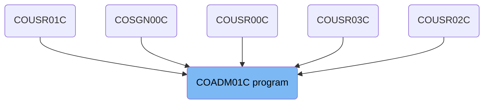
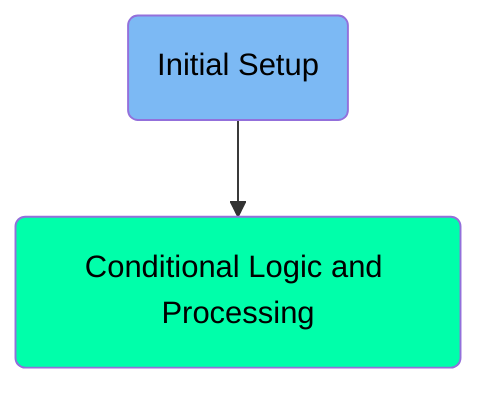
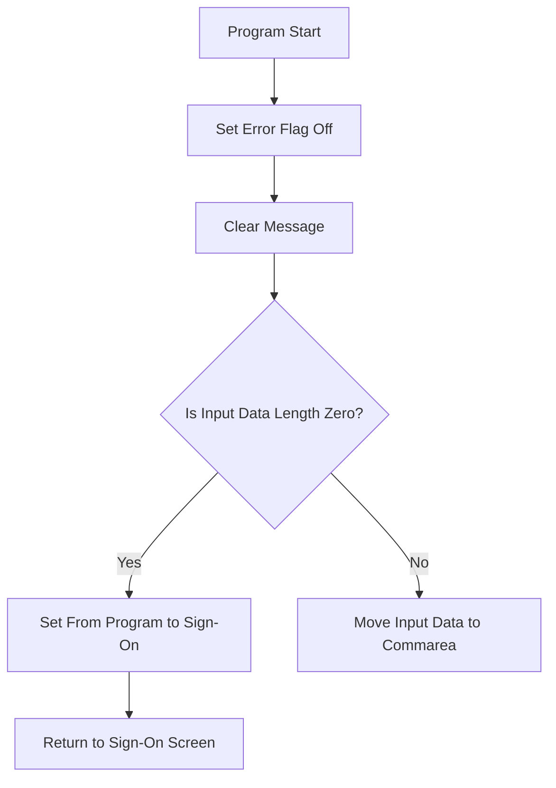
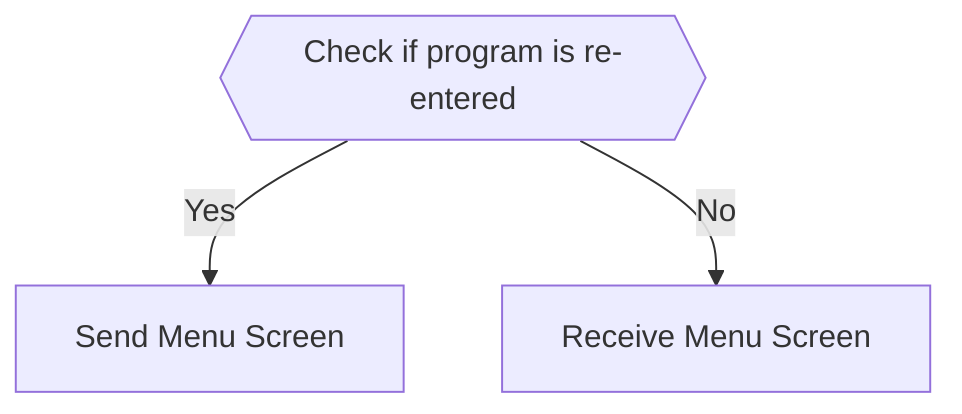

The <SwmToken path="app/cbl/COADM01C.cbl" pos="2:7:7" line-data="      * Program     : COADM01C.CBL">`COADM01C`</SwmToken> program is responsible for handling the initial setup and conditional logic processing within the <SwmToken path="app/cbl/COADM01C.cbl" pos="3:7:7" line-data="      * Application : CardDemo">`CardDemo`</SwmToken> application. It ensures that the user is either redirected to the sign-on screen or proceeds with the menu screen based on the input data length and re-entry flag.

The flow starts with the initial setup where the error flag is set off, and the message workspace is cleared. It then checks the input data length to determine if the user should be redirected to the sign-on screen or proceed with further processing. If the program is re-entered, it receives the menu screen input; otherwise, it sends the menu screen to the user.

# Where is this program used?

This program is used multiple times in the codebase as represented in the following diagram:



Here is a high level diagram of the program:



# Initial Setup



<SwmSnippet path="/app/cbl/COADM01C.cbl" line="77">

---

## Setting Error Flag Off

First, the error flag is set to off to ensure that no previous errors affect the current execution.

```cobol
           SET ERR-FLG-OFF TO TRUE
```

---

</SwmSnippet>

<SwmSnippet path="/app/cbl/COADM01C.cbl" line="79">

---

## Clearing the Message

Next, the message workspace is cleared to ensure no residual messages are present from previous operations.

```cobol
           MOVE SPACES TO WS-MESSAGE
                          ERRMSGO OF COADM1AO
```

---

</SwmSnippet>

<SwmSnippet path="/app/cbl/COADM01C.cbl" line="82">

---

## Checking Input Data Length

Then, the program checks if the input data length (<SwmToken path="app/cbl/COADM01C.cbl" pos="82:3:3" line-data="           IF EIBCALEN = 0">`EIBCALEN`</SwmToken>) is zero. This determines if the program is being called for the first time or being re-entered.

```cobol
           IF EIBCALEN = 0
```

---

</SwmSnippet>

<SwmSnippet path="/app/cbl/COADM01C.cbl" line="83">

---

## Handling Zero Input Data Length

If the input data length is zero, the program sets the from program to <SwmToken path="app/cbl/COADM01C.cbl" pos="83:4:4" line-data="               MOVE &#39;COSGN00C&#39; TO CDEMO-FROM-PROGRAM">`COSGN00C`</SwmToken> and performs the <SwmToken path="app/cbl/COADM01C.cbl" pos="84:3:9" line-data="               PERFORM RETURN-TO-SIGNON-SCREEN">`RETURN-TO-SIGNON-SCREEN`</SwmToken> to redirect the user to the sign-on screen.

```cobol
               MOVE 'COSGN00C' TO CDEMO-FROM-PROGRAM
               PERFORM RETURN-TO-SIGNON-SCREEN
```

---

</SwmSnippet>

<SwmSnippet path="/app/cbl/COADM01C.cbl" line="86">

---

## Moving Input Data to Commarea

If the input data length is not zero, the program moves the input data to the <SwmToken path="app/cbl/COADM01C.cbl" pos="86:12:14" line-data="               MOVE DFHCOMMAREA(1:EIBCALEN) TO CARDDEMO-COMMAREA">`CARDDEMO-COMMAREA`</SwmToken> for further processing.

```cobol
               MOVE DFHCOMMAREA(1:EIBCALEN) TO CARDDEMO-COMMAREA
```

---

</SwmSnippet>

# Conditional Logic and Processing



<SwmSnippet path="/app/cbl/COADM01C.cbl" line="87">

---

## Check if Program is Re-entered

First, the code checks if the program is being re-entered by evaluating the <SwmToken path="app/cbl/COADM01C.cbl" pos="87:5:9" line-data="               IF NOT CDEMO-PGM-REENTER">`CDEMO-PGM-REENTER`</SwmToken> flag. If it is not re-entered, it sets this flag to true to indicate that the program has been entered.

```cobol
               IF NOT CDEMO-PGM-REENTER
                   SET CDEMO-PGM-REENTER    TO TRUE
```

---

</SwmSnippet>

<SwmSnippet path="/app/cbl/COADM01C.cbl" line="89">

---

## Send Menu Screen

Next, if the program is not being re-entered, it moves low values to <SwmToken path="app/cbl/COADM01C.cbl" pos="89:9:9" line-data="                   MOVE LOW-VALUES          TO COADM1AO">`COADM1AO`</SwmToken> and performs the <SwmToken path="app/cbl/COADM01C.cbl" pos="90:3:7" line-data="                   PERFORM SEND-MENU-SCREEN">`SEND-MENU-SCREEN`</SwmToken> paragraph to display the menu screen to the user.

```cobol
                   MOVE LOW-VALUES          TO COADM1AO
                   PERFORM SEND-MENU-SCREEN
```

---

</SwmSnippet>

<SwmSnippet path="/app/cbl/COADM01C.cbl" line="91">

---

## Receive Menu Screen

If the program is being re-entered, it performs the <SwmToken path="app/cbl/COADM01C.cbl" pos="92:3:7" line-data="                   PERFORM RECEIVE-MENU-SCREEN">`RECEIVE-MENU-SCREEN`</SwmToken> paragraph to receive input from the user.

```cobol
               ELSE
                   PERFORM RECEIVE-MENU-SCREEN
```

---

</SwmSnippet>

<SwmSnippet path="/app/cbl/COADM01C.cbl" line="172">

---

## Send Menu Screen Function

The <SwmToken path="app/cbl/COADM01C.cbl" pos="172:1:5" line-data="       SEND-MENU-SCREEN.">`SEND-MENU-SCREEN`</SwmToken> function populates header information, builds menu options, and sends the menu screen to the user using CICS.

```cobol
       SEND-MENU-SCREEN.

           PERFORM POPULATE-HEADER-INFO
           PERFORM BUILD-MENU-OPTIONS

           MOVE WS-MESSAGE TO ERRMSGO OF COADM1AO

           EXEC CICS SEND
                     MAP('COADM1A')
                     MAPSET('COADM01')
                     FROM(COADM1AO)
                     ERASE
           END-EXEC.
```

---

</SwmSnippet>

<SwmSnippet path="/app/cbl/COADM01C.cbl" line="189">

---

## Receive Menu Screen Function

The <SwmToken path="app/cbl/COADM01C.cbl" pos="189:1:5" line-data="       RECEIVE-MENU-SCREEN.">`RECEIVE-MENU-SCREEN`</SwmToken> function receives the menu screen input from the user using CICS and stores it in <SwmToken path="app/cbl/COADM01C.cbl" pos="194:3:3" line-data="                     INTO(COADM1AI)">`COADM1AI`</SwmToken>.

```cobol
       RECEIVE-MENU-SCREEN.

           EXEC CICS RECEIVE
                     MAP('COADM1A')
                     MAPSET('COADM01')
                     INTO(COADM1AI)
                     RESP(WS-RESP-CD)
                     RESP2(WS-REAS-CD)
           END-EXEC.
```

---

</SwmSnippet>

&nbsp;

*This is an auto-generated document by Swimm 🌊 and has not yet been verified by a human*

<SwmMeta version="3.0.0" repo-id="Z2l0aHViJTNBJTNBa3luZHJ5bC1hd3MtbWFpbmZyYW1lLW1vZGVybml6YXRpb24tY2FyZGRlbW8lM0ElM0FTd2ltbS1EZW1v" repo-name="kyndryl-aws-mainframe-modernization-carddemo"><sup>Powered by [Swimm](/)</sup></SwmMeta>
