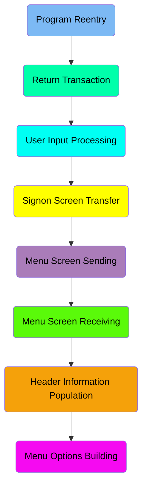
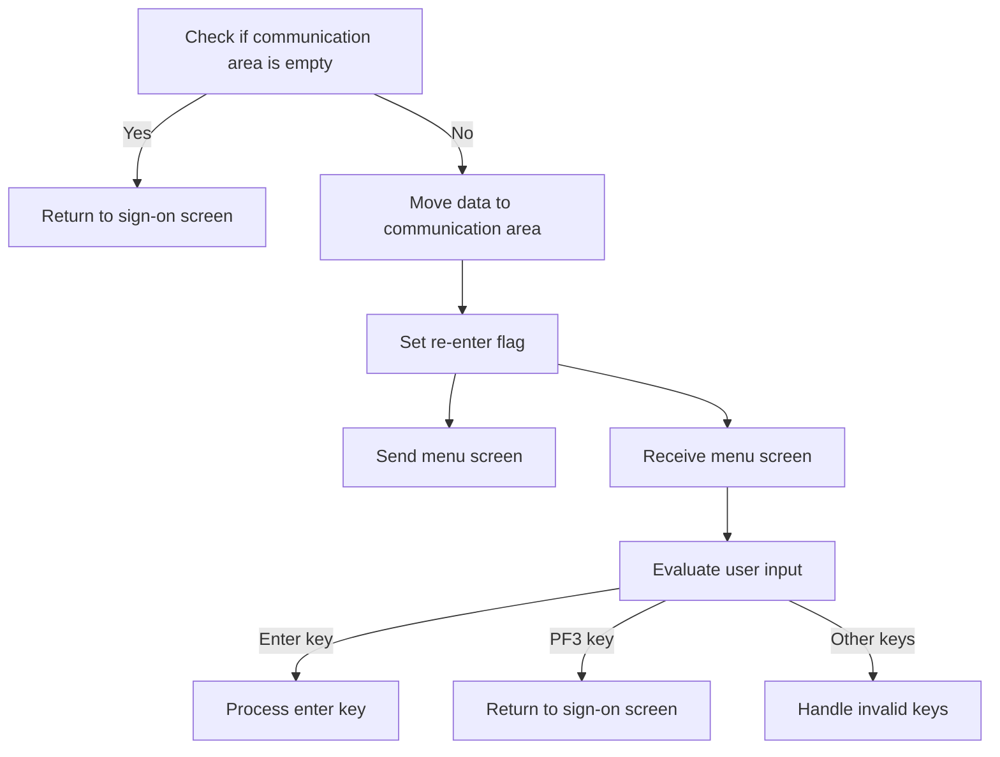
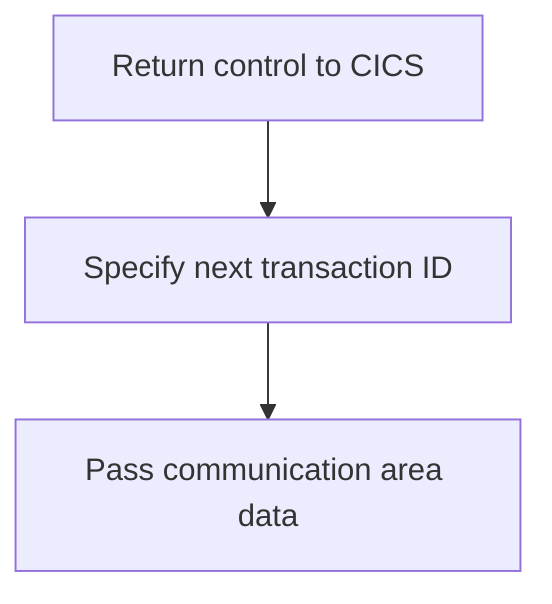
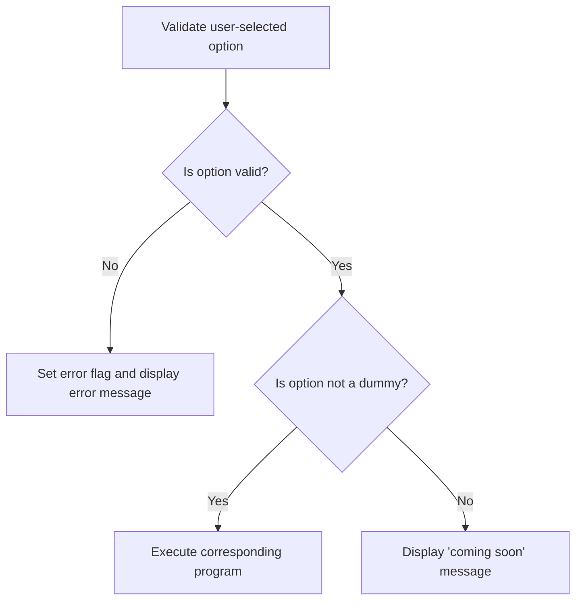
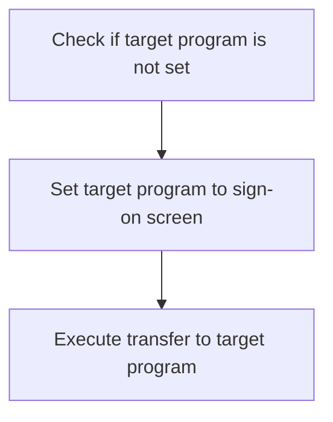
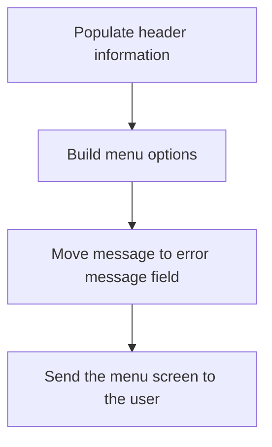
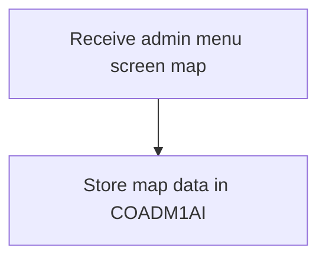
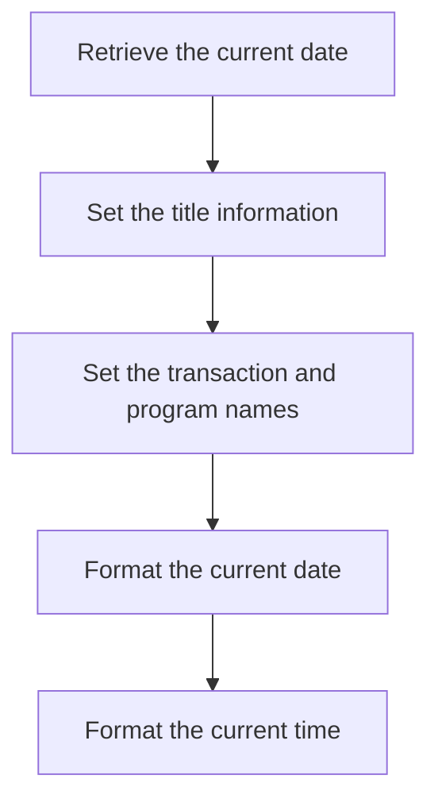

```mermaid
graph TD
  A[Iterate through admin options] --> B[Format option for display]
  B --> C{Option index}
  C -->|1| D[Assign to OPTN001O]
  C -->|2| E[Assign to OPTN002O]
  C -->|3| F[Assign to OPTN003O]
  C -->|4| G[Assign to OPTN004O]
  C -->|5| H[Assign to OPTN005O]
  C -->|6| I[Assign to OPTN006O]
  C -->|7| J[Assign to OPTN007O]
  C -->|8| K[Assign to OPTN008O]
  C -->|9| L[Assign to OPTN009O]
  C -->|10| M[Assign to OPTN010O]

%% Swimm:
%% graph TD
%%   A[Iterate through admin options] --> B[Format option for display]
%%   B --> C{Option index}
%%   C -->|1| D[Assign to <SwmToken path="app/cbl/COADM01C.cbl" pos="240:13:13" line-data="                       MOVE WS-ADMIN-OPT-TXT TO OPTN001O">`OPTN001O`</SwmToken>]
%%   C -->|2| E[Assign to <SwmToken path="app/cbl/COADM01C.cbl" pos="242:13:13" line-data="                       MOVE WS-ADMIN-OPT-TXT TO OPTN002O">`OPTN002O`</SwmToken>]
%%   C -->|3| F[Assign to <SwmToken path="app/cbl/COADM01C.cbl" pos="244:13:13" line-data="                       MOVE WS-ADMIN-OPT-TXT TO OPTN003O">`OPTN003O`</SwmToken>]
%%   C -->|4| G[Assign to <SwmToken path="app/cbl/COADM01C.cbl" pos="246:13:13" line-data="                       MOVE WS-ADMIN-OPT-TXT TO OPTN004O">`OPTN004O`</SwmToken>]
%%   C -->|5| H[Assign to <SwmToken path="app/cbl/COADM01C.cbl" pos="248:13:13" line-data="                       MOVE WS-ADMIN-OPT-TXT TO OPTN005O">`OPTN005O`</SwmToken>]
%%   C -->|6| I[Assign to <SwmToken path="app/cbl/COADM01C.cbl" pos="250:13:13" line-data="                       MOVE WS-ADMIN-OPT-TXT TO OPTN006O">`OPTN006O`</SwmToken>]
%%   C -->|7| J[Assign to <SwmToken path="app/cbl/COADM01C.cbl" pos="252:13:13" line-data="                       MOVE WS-ADMIN-OPT-TXT TO OPTN007O">`OPTN007O`</SwmToken>]
%%   C -->|8| K[Assign to <SwmToken path="app/cbl/COADM01C.cbl" pos="254:13:13" line-data="                       MOVE WS-ADMIN-OPT-TXT TO OPTN008O">`OPTN008O`</SwmToken>]
%%   C -->|9| L[Assign to <SwmToken path="app/cbl/COADM01C.cbl" pos="256:13:13" line-data="                       MOVE WS-ADMIN-OPT-TXT TO OPTN009O">`OPTN009O`</SwmToken>]
%%   C -->|10| M[Assign to <SwmToken path="app/cbl/COADM01C.cbl" pos="258:13:13" line-data="                       MOVE WS-ADMIN-OPT-TXT TO OPTN010O">`OPTN010O`</SwmToken>]
```

The Admin Menu (<SwmToken path="app/cbl/COADM01C.cbl" pos="2:7:7" line-data="      * Program     : COADM01C.CBL">`COADM01C`</SwmToken>) is a CICS COBOL program within the <SwmToken path="app/cbl/COADM01C.cbl" pos="3:7:7" line-data="      * Application : CardDemo">`CardDemo`</SwmToken> application that provides administrative functions for admin users. This program allows admin users to navigate through various administrative options such as listing, adding, updating, and deleting users. It handles user input, validates options, and directs the flow to the appropriate administrative function based on the selected option.

The Admin Menu (<SwmToken path="app/cbl/COADM01C.cbl" pos="2:7:7" line-data="      * Program     : COADM01C.CBL">`COADM01C`</SwmToken>) program starts by checking if the communication area is empty and either returns to the sign-on screen or proceeds to handle user input. It validates the user-selected option, sets error flags if necessary, and executes the corresponding program if the option is valid. The program also manages the transfer to the sign-on screen and sends the menu screen to the user, ensuring that the admin menu displays the correct context and relevant details.

# Where is this program used?

```mermaid
graph TD
COSGN00C(COSGN00C) --> COADM01C("COADM01C program"):::currentProgram
  classDef currentProgram color:#000000,fill:#7CB9F4

%% Swimm:
%% graph TD
%% <SwmToken path="app/cbl/COADM01C.cbl" pos="83:4:4" line-data="               MOVE &#39;COSGN00C&#39; TO CDEMO-FROM-PROGRAM">`COSGN00C`</SwmToken>(<SwmToken path="app/cbl/COADM01C.cbl" pos="83:4:4" line-data="               MOVE &#39;COSGN00C&#39; TO CDEMO-FROM-PROGRAM">`COSGN00C`</SwmToken>) --> <SwmToken path="app/cbl/COADM01C.cbl" pos="2:7:7" line-data="      * Program     : COADM01C.CBL">`COADM01C`</SwmToken>("<SwmToken path="app/cbl/COADM01C.cbl" pos="2:7:7" line-data="      * Program     : COADM01C.CBL">`COADM01C`</SwmToken> program"):::currentProgram
%%   classDef currentProgram color:#000000,fill:#7CB9F4
```

This program is used once, in a flow starting from <SwmToken path="app/cbl/COADM01C.cbl" pos="83:4:4" line-data="               MOVE &#39;COSGN00C&#39; TO CDEMO-FROM-PROGRAM">`COSGN00C`</SwmToken> as represented in the following diagram:



Here is a high level diagram of the program:



## Program Reentry

First, we'll zoom into this section of the flow:



<SwmSnippet path="/app/cbl/COADM01C.cbl" line="82">

---

First, we check if the communication area is empty by evaluating <SwmToken path="app/cbl/COADM01C.cbl" pos="82:3:3" line-data="           IF EIBCALEN = 0">`EIBCALEN`</SwmToken>. If it is empty, we move to the sign-on screen by setting <SwmToken path="app/cbl/COADM01C.cbl" pos="83:9:13" line-data="               MOVE &#39;COSGN00C&#39; TO CDEMO-FROM-PROGRAM">`CDEMO-FROM-PROGRAM`</SwmToken> to <SwmToken path="app/cbl/COADM01C.cbl" pos="83:4:4" line-data="               MOVE &#39;COSGN00C&#39; TO CDEMO-FROM-PROGRAM">`COSGN00C`</SwmToken> and performing the <SwmToken path="app/cbl/COADM01C.cbl" pos="84:3:9" line-data="               PERFORM RETURN-TO-SIGNON-SCREEN">`RETURN-TO-SIGNON-SCREEN`</SwmToken> operation.

```cobol
           IF EIBCALEN = 0
               MOVE 'COSGN00C' TO CDEMO-FROM-PROGRAM
               PERFORM RETURN-TO-SIGNON-SCREEN
```

---

</SwmSnippet>

<SwmSnippet path="/app/cbl/COADM01C.cbl" line="85">

---

Next, if the communication area is not empty, we move the data to <SwmToken path="app/cbl/COADM01C.cbl" pos="86:12:14" line-data="               MOVE DFHCOMMAREA(1:EIBCALEN) TO CARDDEMO-COMMAREA">`CARDDEMO-COMMAREA`</SwmToken> and check if the program is not re-entered by evaluating <SwmToken path="app/cbl/COADM01C.cbl" pos="87:5:9" line-data="               IF NOT CDEMO-PGM-REENTER">`CDEMO-PGM-REENTER`</SwmToken>. If it is not re-entered, we set the re-enter flag to true, clear <SwmToken path="app/cbl/COADM01C.cbl" pos="89:9:9" line-data="                   MOVE LOW-VALUES          TO COADM1AO">`COADM1AO`</SwmToken>, and send the menu screen by performing <SwmToken path="app/cbl/COADM01C.cbl" pos="90:3:7" line-data="                   PERFORM SEND-MENU-SCREEN">`SEND-MENU-SCREEN`</SwmToken>. Otherwise, we receive the menu screen by performing <SwmToken path="app/cbl/COADM01C.cbl" pos="92:3:7" line-data="                   PERFORM RECEIVE-MENU-SCREEN">`RECEIVE-MENU-SCREEN`</SwmToken> and evaluate the user input using <SwmToken path="app/cbl/COADM01C.cbl" pos="93:3:3" line-data="                   EVALUATE EIBAID">`EIBAID`</SwmToken>. Depending on the user input, we either process the enter key, handle the PF3 key, or handle invalid keys.

```cobol
           ELSE
               MOVE DFHCOMMAREA(1:EIBCALEN) TO CARDDEMO-COMMAREA
               IF NOT CDEMO-PGM-REENTER
                   SET CDEMO-PGM-REENTER    TO TRUE
                   MOVE LOW-VALUES          TO COADM1AO
                   PERFORM SEND-MENU-SCREEN
               ELSE
                   PERFORM RECEIVE-MENU-SCREEN
                   EVALUATE EIBAID
                       WHEN DFHENTER
                           PERFORM PROCESS-ENTER-KEY
                       WHEN DFHPF3
                           MOVE 'COSGN00C' TO CDEMO-TO-PROGRAM
                           PERFORM RETURN-TO-SIGNON-SCREEN
                       WHEN OTHER
                           MOVE 'Y'                       TO WS-ERR-FLG
                           MOVE CCDA-MSG-INVALID-KEY      TO WS-MESSAGE
                           PERFORM SEND-MENU-SCREEN
                   END-EVALUATE
               END-IF
           END-IF
```

---

</SwmSnippet>

## Return Transaction

This is the next section of the flow.



<SwmSnippet path="/app/cbl/COADM01C.cbl" line="107">

---

The function returns control to the CICS system, ensuring that the application can continue processing other tasks or transactions. This is crucial for maintaining the flow of operations within the mainframe environment.

```cobol
           EXEC CICS RETURN
                     TRANSID (WS-TRANID)
                     COMMAREA (CARDDEMO-COMMAREA)
           END-EXEC.
```

---

</SwmSnippet>

## User Input Processing

Now, lets zoom into this section of the flow:



<SwmSnippet path="/app/cbl/COADM01C.cbl" line="127">

---

First, the user-selected option is validated by checking if it is numeric, within the valid range, and not zero. This ensures that the input is a valid menu option.

```cobol
           IF WS-OPTION IS NOT NUMERIC OR
              WS-OPTION > CDEMO-ADMIN-OPT-COUNT OR
              WS-OPTION = ZEROS
```

---

</SwmSnippet>

<SwmSnippet path="/app/cbl/COADM01C.cbl" line="130">

---

Next, if the option is invalid, an error flag is set, and an error message is displayed to prompt the user to enter a valid option number.

```cobol
               MOVE 'Y'     TO WS-ERR-FLG
               MOVE 'Please enter a valid option number...' TO
                                       WS-MESSAGE
               PERFORM SEND-MENU-SCREEN
```

---

</SwmSnippet>

<SwmSnippet path="/app/cbl/COADM01C.cbl" line="137">

---

Then, if there are no errors and the selected option is not a dummy, the corresponding program is executed using the CICS XCTL command, which transfers control to the specified program.

```cobol
           IF NOT ERR-FLG-ON
               IF CDEMO-ADMIN-OPT-PGMNAME(WS-OPTION)(1:5) NOT = 'DUMMY'
                   MOVE WS-TRANID    TO CDEMO-FROM-TRANID
                   MOVE WS-PGMNAME   TO CDEMO-FROM-PROGRAM
                   MOVE ZEROS        TO CDEMO-PGM-CONTEXT
                   EXEC CICS
                       XCTL PROGRAM(CDEMO-ADMIN-OPT-PGMNAME(WS-OPTION))
                       COMMAREA(CARDDEMO-COMMAREA)
                   END-EXEC
```

---

</SwmSnippet>

## Signon Screen Transfer

This is the next section of the flow.



The first step is to check if the target program, <SwmToken path="app/cbl/COADM01C.cbl" pos="97:9:13" line-data="                           MOVE &#39;COSGN00C&#39; TO CDEMO-TO-PROGRAM">`CDEMO-TO-PROGRAM`</SwmToken>, is not set or contains low values or spaces. If this condition is met, it indicates that the user should be redirected to the sign-on screen.

Next, the target program is set to <SwmToken path="app/cbl/COADM01C.cbl" pos="83:4:4" line-data="               MOVE &#39;COSGN00C&#39; TO CDEMO-FROM-PROGRAM">`COSGN00C`</SwmToken>, which corresponds to the sign-on screen. This ensures that the user is directed to the appropriate screen for signing on.

## Interim Summary

So far, we saw how the program handles user input processing, including validating the user-selected option, setting error flags, and executing the corresponding program if the option is valid. We also covered the sign-on screen transfer, where the target program is set to the sign-on screen if not already specified. Now, we will focus on the menu screen sending, where the program populates header information, builds menu options, and sends the menu screen to the user.

## Menu Screen Sending

Now, lets zoom into this section of the flow:



<SwmSnippet path="/app/cbl/COADM01C.cbl" line="174">

---

First, the header information is populated to ensure that the admin menu screen displays the correct context and relevant details for the user.

```cobol
           PERFORM POPULATE-HEADER-INFO
```

---

</SwmSnippet>

<SwmSnippet path="/app/cbl/COADM01C.cbl" line="175">

---

Next, the menu options are built by iterating through the list of admin options and formatting them for display. This ensures that the user sees all available administrative actions they can perform.

```cobol
           PERFORM BUILD-MENU-OPTIONS
```

---

</SwmSnippet>

## Menu Screen Receiving

This is the next section of the flow.



<SwmSnippet path="/app/cbl/COADM01C.cbl" line="189">

---

### Receiving the admin menu screen

The function receives the admin menu screen map from the user terminal. This is done by executing a CICS RECEIVE command, which retrieves the map <SwmToken path="app/cbl/COADM01C.cbl" pos="192:4:4" line-data="                     MAP(&#39;COADM1A&#39;)">`COADM1A`</SwmToken> from the mapset <SwmToken path="app/cbl/COADM01C.cbl" pos="193:4:4" line-data="                     MAPSET(&#39;COADM01&#39;)">`COADM01`</SwmToken> and stores the data into the <SwmToken path="app/cbl/COADM01C.cbl" pos="194:3:3" line-data="                     INTO(COADM1AI)">`COADM1AI`</SwmToken> variable (which holds the map data). The response codes <SwmToken path="app/cbl/COADM01C.cbl" pos="195:3:7" line-data="                     RESP(WS-RESP-CD)">`WS-RESP-CD`</SwmToken> and <SwmToken path="app/cbl/COADM01C.cbl" pos="196:3:7" line-data="                     RESP2(WS-REAS-CD)">`WS-REAS-CD`</SwmToken> are used to handle any potential errors during the receive operation.

```cobol
       RECEIVE-MENU-SCREEN.

           EXEC CICS RECEIVE
                     MAP('COADM1A')
                     MAPSET('COADM01')
                     INTO(COADM1AI)
                     RESP(WS-RESP-CD)
                     RESP2(WS-REAS-CD)
           END-EXEC.
```

---

</SwmSnippet>

## Header Information Population

This is the next section of the flow.



<SwmSnippet path="/app/cbl/COADM01C.cbl" line="204">

---

First, the current date is retrieved and stored in <SwmToken path="app/cbl/COADM01C.cbl" pos="204:11:15" line-data="           MOVE FUNCTION CURRENT-DATE  TO WS-CURDATE-DATA">`WS-CURDATE-DATA`</SwmToken>.

```cobol
           MOVE FUNCTION CURRENT-DATE  TO WS-CURDATE-DATA
```

---

</SwmSnippet>

<SwmSnippet path="/app/cbl/COADM01C.cbl" line="206">

---

Moving to setting the title information, the titles are moved to the respective fields in <SwmToken path="app/cbl/COADM01C.cbl" pos="206:13:13" line-data="           MOVE CCDA-TITLE01           TO TITLE01O OF COADM1AO">`COADM1AO`</SwmToken>.

```cobol
           MOVE CCDA-TITLE01           TO TITLE01O OF COADM1AO
           MOVE CCDA-TITLE02           TO TITLE02O OF COADM1AO
```

---

</SwmSnippet>

<SwmSnippet path="/app/cbl/COADM01C.cbl" line="208">

---

Next, the transaction name and program name are set by moving <SwmToken path="app/cbl/COADM01C.cbl" pos="208:3:5" line-data="           MOVE WS-TRANID              TO TRNNAMEO OF COADM1AO">`WS-TRANID`</SwmToken> and <SwmToken path="app/cbl/COADM01C.cbl" pos="209:3:5" line-data="           MOVE WS-PGMNAME             TO PGMNAMEO OF COADM1AO">`WS-PGMNAME`</SwmToken> to their respective fields in <SwmToken path="app/cbl/COADM01C.cbl" pos="208:13:13" line-data="           MOVE WS-TRANID              TO TRNNAMEO OF COADM1AO">`COADM1AO`</SwmToken>.

```cobol
           MOVE WS-TRANID              TO TRNNAMEO OF COADM1AO
           MOVE WS-PGMNAME             TO PGMNAMEO OF COADM1AO
```

---

</SwmSnippet>

<SwmSnippet path="/app/cbl/COADM01C.cbl" line="211">

---

Then, the current date is formatted by moving the month, day, and year parts to <SwmToken path="app/cbl/COADM01C.cbl" pos="211:11:15" line-data="           MOVE WS-CURDATE-MONTH       TO WS-CURDATE-MM">`WS-CURDATE-MM`</SwmToken>, <SwmToken path="app/cbl/COADM01C.cbl" pos="212:11:15" line-data="           MOVE WS-CURDATE-DAY         TO WS-CURDATE-DD">`WS-CURDATE-DD`</SwmToken>, and <SwmToken path="app/cbl/COADM01C.cbl" pos="213:16:20" line-data="           MOVE WS-CURDATE-YEAR(3:2)   TO WS-CURDATE-YY">`WS-CURDATE-YY`</SwmToken> respectively, and then combining them into <SwmToken path="app/cbl/COADM01C.cbl" pos="215:3:11" line-data="           MOVE WS-CURDATE-MM-DD-YY    TO CURDATEO OF COADM1AO">`WS-CURDATE-MM-DD-YY`</SwmToken>.

```cobol
           MOVE WS-CURDATE-MONTH       TO WS-CURDATE-MM
           MOVE WS-CURDATE-DAY         TO WS-CURDATE-DD
           MOVE WS-CURDATE-YEAR(3:2)   TO WS-CURDATE-YY

           MOVE WS-CURDATE-MM-DD-YY    TO CURDATEO OF COADM1AO
```

---

</SwmSnippet>

<SwmSnippet path="/app/cbl/COADM01C.cbl" line="217">

---

Finally, the current time is formatted by moving the hours, minutes, and seconds to <SwmToken path="app/cbl/COADM01C.cbl" pos="217:11:15" line-data="           MOVE WS-CURTIME-HOURS       TO WS-CURTIME-HH">`WS-CURTIME-HH`</SwmToken>, <SwmToken path="app/cbl/COADM01C.cbl" pos="218:11:15" line-data="           MOVE WS-CURTIME-MINUTE      TO WS-CURTIME-MM">`WS-CURTIME-MM`</SwmToken>, and <SwmToken path="app/cbl/COADM01C.cbl" pos="219:11:15" line-data="           MOVE WS-CURTIME-SECOND      TO WS-CURTIME-SS">`WS-CURTIME-SS`</SwmToken> respectively, and then combining them into <SwmToken path="app/cbl/COADM01C.cbl" pos="221:3:11" line-data="           MOVE WS-CURTIME-HH-MM-SS    TO CURTIMEO OF COADM1AO.">`WS-CURTIME-HH-MM-SS`</SwmToken>.

```cobol
           MOVE WS-CURTIME-HOURS       TO WS-CURTIME-HH
           MOVE WS-CURTIME-MINUTE      TO WS-CURTIME-MM
           MOVE WS-CURTIME-SECOND      TO WS-CURTIME-SS

           MOVE WS-CURTIME-HH-MM-SS    TO CURTIMEO OF COADM1AO.
```

---

</SwmSnippet>

## Menu Options Building

This is the next section of the flow.



<SwmSnippet path="/app/cbl/COADM01C.cbl" line="228">

---

First, we iterate through the admin options using a loop that runs from 1 to the total count of admin options.

```cobol
           PERFORM VARYING WS-IDX FROM 1 BY 1 UNTIL
                           WS-IDX > CDEMO-ADMIN-OPT-COUNT
```

---

</SwmSnippet>

<SwmSnippet path="/app/cbl/COADM01C.cbl" line="231">

---

Next, each option is formatted for display by concatenating the option number and name into a single string.

```cobol
               MOVE SPACES             TO WS-ADMIN-OPT-TXT

               STRING CDEMO-ADMIN-OPT-NUM(WS-IDX)  DELIMITED BY SIZE
                      '. '                         DELIMITED BY SIZE
                      CDEMO-ADMIN-OPT-NAME(WS-IDX) DELIMITED BY SIZE
                 INTO WS-ADMIN-OPT-TXT
```

---

</SwmSnippet>

<SwmSnippet path="/app/cbl/COADM01C.cbl" line="238">

---

Then, based on the index of the option, the formatted string is assigned to the corresponding display field (e.g., <SwmToken path="app/cbl/COADM01C.cbl" pos="240:13:13" line-data="                       MOVE WS-ADMIN-OPT-TXT TO OPTN001O">`OPTN001O`</SwmToken>, <SwmToken path="app/cbl/COADM01C.cbl" pos="242:13:13" line-data="                       MOVE WS-ADMIN-OPT-TXT TO OPTN002O">`OPTN002O`</SwmToken>, etc.).

```cobol
               EVALUATE WS-IDX
                   WHEN 1
                       MOVE WS-ADMIN-OPT-TXT TO OPTN001O
                   WHEN 2
                       MOVE WS-ADMIN-OPT-TXT TO OPTN002O
                   WHEN 3
                       MOVE WS-ADMIN-OPT-TXT TO OPTN003O
                   WHEN 4
                       MOVE WS-ADMIN-OPT-TXT TO OPTN004O
                   WHEN 5
                       MOVE WS-ADMIN-OPT-TXT TO OPTN005O
                   WHEN 6
                       MOVE WS-ADMIN-OPT-TXT TO OPTN006O
                   WHEN 7
                       MOVE WS-ADMIN-OPT-TXT TO OPTN007O
                   WHEN 8
                       MOVE WS-ADMIN-OPT-TXT TO OPTN008O
                   WHEN 9
                       MOVE WS-ADMIN-OPT-TXT TO OPTN009O
                   WHEN 10
                       MOVE WS-ADMIN-OPT-TXT TO OPTN010O
```

---

</SwmSnippet>

&nbsp;

*This is an auto-generated document by Swimm 🌊 and has not yet been verified by a human*

<SwmMeta version="3.0.0" repo-id="Z2l0aHViJTNBJTNBa3luZHJ5bC1hd3MtbWFpbmZyYW1lLW1vZGVybml6YXRpb24tY2FyZGRlbW8lM0ElM0FTd2ltbS1EZW1v" repo-name="kyndryl-aws-mainframe-modernization-carddemo"><sup>Powered by [Swimm](/)</sup></SwmMeta>
