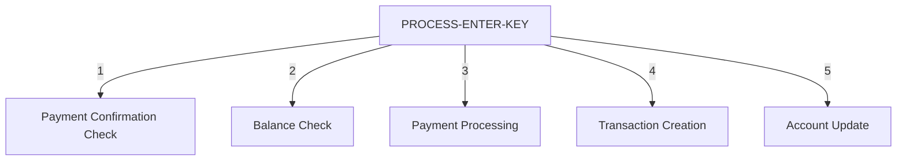

This document provides a detailed overview of the bill payment transaction flow. It explains how user inputs are processed, account balances are updated, and payment transactions are recorded.



# Bill Payment Transaction Flow

<SwmSnippet path="/app/cbl/COBIL00C.cbl" line="173" repo-id="Z2l0aHViJTNBJTNBYXdzLW1haW5mcmFtZS1tb2Rlcm5pemF0aW9uLWNhcmRkZW1vJTNBJTNBU3dpbW0tRGVtbw==">

---

## <SwmToken path="/app/cbl/COBIL00C.cbl" pos="120:3:7" line-data="                       PERFORM PROCESS-ENTER-KEY" repo-id="Z2l0aHViJTNBJTNBYXdzLW1haW5mcmFtZS1tb2Rlcm5pemF0aW9uLWNhcmRkZW1vJTNBJTNBU3dpbW0tRGVtbw==" repo-name="aws-mainframe-modernization-carddemo">`PROCESS-ENTER-KEY`</SwmToken>

The <SwmToken path="/app/cbl/COBIL00C.cbl" pos="120:3:7" line-data="                       PERFORM PROCESS-ENTER-KEY" repo-id="Z2l0aHViJTNBJTNBYXdzLW1haW5mcmFtZS1tb2Rlcm5pemF0aW9uLWNhcmRkZW1vJTNBJTNBU3dpbW0tRGVtbw==" repo-name="aws-mainframe-modernization-carddemo">`PROCESS-ENTER-KEY`</SwmToken> function handles main bill payment logic. First, it checks for payment confirmation. If the user confirms the payment, the account data file is read. If the user declines, the current screen is cleared, and an error flag is set. For any other input, an error message is displayed, and the bill payment screen is sent to the user interface.

```cobol
               EVALUATE CONFIRMI OF COBIL0AI
                   WHEN 'Y'
                   WHEN 'y'
                       SET CONF-PAY-YES TO TRUE
                       PERFORM READ-ACCTDAT-FILE
                   WHEN 'N'
                   WHEN 'n'
                       PERFORM CLEAR-CURRENT-SCREEN
                       MOVE 'Y'     TO WS-ERR-FLG
                   WHEN SPACES
                   WHEN LOW-VALUES
                       PERFORM READ-ACCTDAT-FILE
                   WHEN OTHER
                       MOVE 'Y'     TO WS-ERR-FLG
                       MOVE 'Invalid value. Valid values are (Y/N)...'
                                    TO WS-MESSAGE
                       MOVE -1      TO CONFIRML OF COBIL0AI
                       PERFORM SEND-BILLPAY-SCREEN
               END-EVALUATE
```

---

</SwmSnippet>

<SwmSnippet path="/app/cbl/COBIL00C.cbl" line="197" repo-id="Z2l0aHViJTNBJTNBYXdzLW1haW5mcmFtZS1tb2Rlcm5pemF0aW9uLWNhcmRkZW1vJTNBJTNBU3dpbW0tRGVtbw==">

---

Next, the account balance is checked to ensure there is an amount to pay. If the balance is zero or less, an error message is displayed, and the bill payment screen is sent to the user interface.

```cobol
           IF NOT ERR-FLG-ON
               IF ACCT-CURR-BAL <= ZEROS AND
                  ACTIDINI OF COBIL0AI NOT = SPACES AND LOW-VALUES
                   MOVE 'Y'     TO WS-ERR-FLG
                   MOVE 'You have nothing to pay...' TO
                                   WS-MESSAGE
                   MOVE -1       TO ACTIDINL OF COBIL0AI
                   PERFORM SEND-BILLPAY-SCREEN
               END-IF
           END-IF
```

---

</SwmSnippet>

<SwmSnippet path="/app/cbl/COBIL00C.cbl" line="208" repo-id="Z2l0aHViJTNBJTNBYXdzLW1haW5mcmFtZS1tb2Rlcm5pemF0aW9uLWNhcmRkZW1vJTNBJTNBU3dpbW0tRGVtbw==">

---

If there are no errors and the payment is confirmed, the payment processing steps are executed. The account record is read, the transaction file is browsed to find the transaction ID, and the transaction ID number is incremented by 1.

```cobol
           IF NOT ERR-FLG-ON

               IF CONF-PAY-YES
                   PERFORM READ-CXACAIX-FILE
                   MOVE HIGH-VALUES TO TRAN-ID
                   PERFORM STARTBR-TRANSACT-FILE
                   PERFORM READPREV-TRANSACT-FILE
                   PERFORM ENDBR-TRANSACT-FILE
                   MOVE TRAN-ID     TO WS-TRAN-ID-NUM
                   ADD 1 TO WS-TRAN-ID-NUM
```

---

</SwmSnippet>

<SwmSnippet path="/app/cbl/COBIL00C.cbl" line="218" repo-id="Z2l0aHViJTNBJTNBYXdzLW1haW5mcmFtZS1tb2Rlcm5pemF0aW9uLWNhcmRkZW1vJTNBJTNBU3dpbW0tRGVtbw==">

---

Following this, the transaction record is created, and various transaction details are set, including the transaction type, category, source, description, amount, card number, merchant details, and timestamp.

```cobol
                   INITIALIZE TRAN-RECORD
                   MOVE WS-TRAN-ID-NUM       TO TRAN-ID
                   MOVE '02'                 TO TRAN-TYPE-CD
                   MOVE 2                    TO TRAN-CAT-CD
                   MOVE 'POS TERM'           TO TRAN-SOURCE
                   MOVE 'BILL PAYMENT - ONLINE' TO TRAN-DESC
                   MOVE ACCT-CURR-BAL        TO TRAN-AMT
                   MOVE XREF-CARD-NUM        TO TRAN-CARD-NUM
                   MOVE 999999999            TO TRAN-MERCHANT-ID
                   MOVE 'BILL PAYMENT'       TO TRAN-MERCHANT-NAME
                   MOVE 'N/A'                TO TRAN-MERCHANT-CITY
                   MOVE 'N/A'                TO TRAN-MERCHANT-ZIP
                   PERFORM GET-CURRENT-TIMESTAMP
                   MOVE WS-TIMESTAMP         TO TRAN-ORIG-TS
                                                TRAN-PROC-TS
                   PERFORM WRITE-TRANSACT-FILE
```

---

</SwmSnippet>

<SwmSnippet path="/app/cbl/COBIL00C.cbl" line="234" repo-id="Z2l0aHViJTNBJTNBYXdzLW1haW5mcmFtZS1tb2Rlcm5pemF0aW9uLWNhcmRkZW1vJTNBJTNBU3dpbW0tRGVtbw==">

---

Finally, the account balance is updated by deducting the transaction amount from the account current balance. The account data file is then updated.&nbsp;

```
                   COMPUTE ACCT-CURR-BAL = ACCT-CURR-BAL - TRAN-AMT
                   PERFORM UPDATE-ACCTDAT-FILE
```

---

</SwmSnippet>

&nbsp;

*This is an auto-generated document by Swimm 🌊 and has not yet been verified by a human*

<SwmMeta version="3.0.0"><sup>Powered by [Swimm](https://staging.swimm.cloud/)</sup></SwmMeta>
