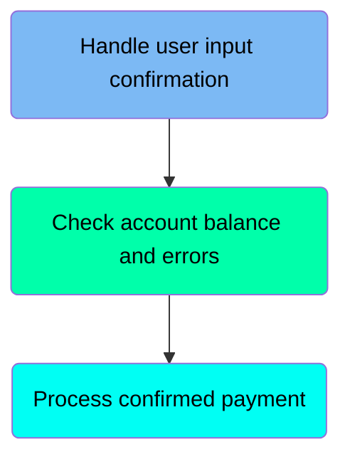
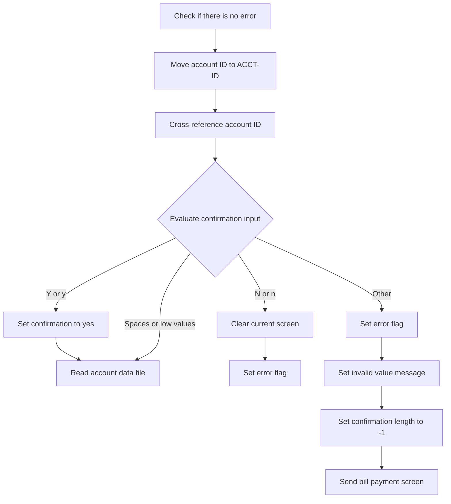
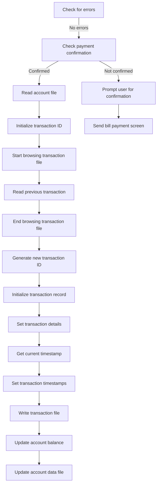
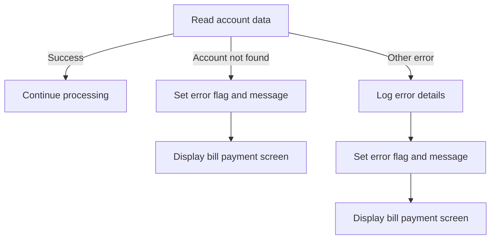

```mermaid
graph TD
  A[Set error flag off] --> B[Set user modified flag to no] --> C[Clear message field] --> D{Check if EIBCALEN is 0}
  D -- Yes --> E[Set program to COSGN00C] --> F[Return to previous screen]
  D -- No --> G[Move DFHCOMMAREA to CARDDEMO-COMMAREA] --> H{Check if program re-enter flag is not set}
  H -- Yes --> I[Set program re-enter flag to true] --> J[Clear COBIL0AO] --> K[Set ACTIDINL to -1] --> L{Check if transaction selected is not spaces or low-values}
  L -- Yes --> M[Move transaction selected to ACTIDINI] --> N[Process enter key]
  L -- No --> O[Send bill pay screen]
  H -- No --> P[Receive bill pay screen]
  P --> Q{Evaluate EIBAID}
  Q -- DFHENTER --> R[Process enter key]
  Q -- DFHPF3 --> S{Check if from program is spaces or low-values}
  S -- Yes --> T[Set program to COMEN01C] --> U[Return to previous screen]
  S -- No --> V[Move from program to to program] --> U
  Q -- DFHPF4 --> W[Clear current screen]
  Q -- Other --> X[Set error flag to Y] --> Y[Set message to invalid key] --> Z[Send bill pay screen]

%% Swimm:
%% graph TD
%%   A[Set error flag off] --> B[Set user modified flag to no] --> C[Clear message field] --> D{Check if EIBCALEN is 0}
%%   D -- Yes --> E[Set program to <SwmToken path="app/cbl/COBIL00C.cbl" pos="108:4:4" line-data="               MOVE &#39;COSGN00C&#39; TO CDEMO-TO-PROGRAM">`COSGN00C`</SwmToken>] --> F[Return to previous screen]
%%   D -- No --> G[Move DFHCOMMAREA to <SwmToken path="app/cbl/COBIL00C.cbl" pos="111:12:14" line-data="               MOVE DFHCOMMAREA(1:EIBCALEN) TO CARDDEMO-COMMAREA">`CARDDEMO-COMMAREA`</SwmToken>] --> H{Check if program re-enter flag is not set}
%%   H -- Yes --> I[Set program re-enter flag to true] --> J[Clear <SwmToken path="app/cbl/COBIL00C.cbl" pos="105:5:5" line-data="                          ERRMSGO OF COBIL0AO">`COBIL0AO`</SwmToken>] --> K[Set ACTIDINL to -1] --> L{Check if transaction selected is not spaces or low-values}
%%   L -- Yes --> M[Move transaction selected to ACTIDINI] --> N[Process enter key]
%%   L -- No --> O[Send bill pay screen]
%%   H -- No --> P[Receive bill pay screen]
%%   P --> Q{Evaluate EIBAID}
%%   Q -- DFHENTER --> R[Process enter key]
%%   Q -- <SwmToken path="app/cbl/COBIL00C.cbl" pos="128:3:3" line-data="                       WHEN DFHPF3">`DFHPF3`</SwmToken> --> S{Check if from program is spaces or low-values}
%%   S -- Yes --> T[Set program to <SwmToken path="app/cbl/COBIL00C.cbl" pos="130:4:4" line-data="                               MOVE &#39;COMEN01C&#39; TO CDEMO-TO-PROGRAM">`COMEN01C`</SwmToken>] --> U[Return to previous screen]
%%   S -- No --> V[Move from program to to program] --> U
%%   Q -- <SwmToken path="app/cbl/COBIL00C.cbl" pos="136:3:3" line-data="                       WHEN DFHPF4">`DFHPF4`</SwmToken> --> W[Clear current screen]
%%   Q -- Other --> X[Set error flag to Y] --> Y[Set message to invalid key] --> Z[Send bill pay screen]
```

The Handle Bill Payment (<SwmToken path="app/cbl/COBIL00C.cbl" pos="99:1:3" line-data="       MAIN-PARA.">`MAIN-PARA`</SwmToken>) document describes the process of handling bill payments within the <SwmToken path="app/cbl/COBIL00C.cbl" pos="3:7:7" line-data="      * Application : CardDemo">`CardDemo`</SwmToken> application. This flow ensures that users can pay their account balance in full through an online bill payment transaction. The program starts by setting initial flags and clearing messages, then validates user input, handles re-entry and transaction selection, processes user actions, and finally sends the bill payment screen.

For instance, if a user initiates a bill payment, the program will validate the input, check for any errors, and process the payment if confirmed. If the user input is invalid, an error message will be displayed, prompting the user to correct the input.

# Handle Bill Payment (<SwmToken path="app/cbl/COBIL00C.cbl" pos="99:1:3" line-data="       MAIN-PARA.">`MAIN-PARA`</SwmToken>)

Lets' zoom into the program flow:



<SwmSnippet path="/app/cbl/COBIL00C.cbl" line="99">

---

### Initial Setup

Going into the initial setup, the code sets the error flag to off and the user modified flag to no. It then clears the message field to ensure no previous messages are displayed.

```cobol
       MAIN-PARA.

           SET ERR-FLG-OFF     TO TRUE
           SET USR-MODIFIED-NO TO TRUE

           MOVE SPACES TO WS-MESSAGE
                          ERRMSGO OF COBIL0AO
```

---

</SwmSnippet>

<SwmSnippet path="/app/cbl/COBIL00C.cbl" line="107">

---

### User Input Validation

Now, the code checks if the communication area length is zero. If it is, it sets the target program to the sign-on screen and returns to the previous screen.

```cobol
           IF EIBCALEN = 0
               MOVE 'COSGN00C' TO CDEMO-TO-PROGRAM
               PERFORM RETURN-TO-PREV-SCREEN
```

---

</SwmSnippet>

<SwmSnippet path="/app/cbl/COBIL00C.cbl" line="110">

---

### Handling Re-entry and Transaction Selection

Next, if the communication area length is not zero, the code moves the communication area data to the card demo communication area. It then checks if the program re-enter flag is not set. If it is not set, it sets the flag to true, clears the relevant fields, and sets the account ID to -1. If a transaction is selected, it moves the selected transaction to the account ID and processes the enter key. Finally, it sends the bill pay screen.

```cobol
           ELSE
               MOVE DFHCOMMAREA(1:EIBCALEN) TO CARDDEMO-COMMAREA
               IF NOT CDEMO-PGM-REENTER
                   SET CDEMO-PGM-REENTER    TO TRUE
                   MOVE LOW-VALUES          TO COBIL0AO
                   MOVE -1       TO ACTIDINL OF COBIL0AI
                   IF CDEMO-CB00-TRN-SELECTED NOT =
                                              SPACES AND LOW-VALUES
                       MOVE CDEMO-CB00-TRN-SELECTED TO
                            ACTIDINI OF COBIL0AI
                       PERFORM PROCESS-ENTER-KEY
                   END-IF
                   PERFORM SEND-BILLPAY-SCREEN
```

---

</SwmSnippet>

<SwmSnippet path="/app/cbl/COBIL00C.cbl" line="123">

---

### Receiving Bill Pay Screen

Then, if the program re-enter flag is set, the code receives the bill pay screen data to continue the process.

```cobol
               ELSE
                   PERFORM RECEIVE-BILLPAY-SCREEN
```

---

</SwmSnippet>

<SwmSnippet path="/app/cbl/COBIL00C.cbl" line="125">

---

### Evaluating User Actions

Finally, the code evaluates the user action. If the user pressed enter, it processes the enter key. If the user pressed PF3, it checks if the from program is empty or has low-values. If it is, it sets the target program to the main menu and returns to the previous screen. Otherwise, it moves the from program to the target program and returns to the previous screen. If the user pressed PF4, it clears the current screen. For any other action, it sets the error flag to indicate an error, sets the message to indicate an invalid key, and sends the bill pay screen.

```cobol
                   EVALUATE EIBAID
                       WHEN DFHENTER
                           PERFORM PROCESS-ENTER-KEY
                       WHEN DFHPF3
                           IF CDEMO-FROM-PROGRAM = SPACES OR LOW-VALUES
                               MOVE 'COMEN01C' TO CDEMO-TO-PROGRAM
                           ELSE
                               MOVE CDEMO-FROM-PROGRAM TO
                               CDEMO-TO-PROGRAM
                           END-IF
                           PERFORM RETURN-TO-PREV-SCREEN
                       WHEN DFHPF4
                           PERFORM CLEAR-CURRENT-SCREEN
                       WHEN OTHER
                           MOVE 'Y'                       TO WS-ERR-FLG
                           MOVE CCDA-MSG-INVALID-KEY      TO WS-MESSAGE
                           PERFORM SEND-BILLPAY-SCREEN
                   END-EVALUATE
```

---

</SwmSnippet>

# Return To Previous Screen (<SwmToken path="app/cbl/COBIL00C.cbl" pos="109:3:9" line-data="               PERFORM RETURN-TO-PREV-SCREEN">`RETURN-TO-PREV-SCREEN`</SwmToken>)

<SwmSnippet path="/app/cbl/COBIL00C.cbl" line="273">

---

### Setting the target program

Going into the first snippet, the code checks if the target program name is either uninitialized or empty. If it is, it sets a default program to ensure there is a program to return to.

```cobol
       RETURN-TO-PREV-SCREEN.

           IF CDEMO-TO-PROGRAM = LOW-VALUES OR SPACES
               MOVE 'COSGN00C' TO CDEMO-TO-PROGRAM
           END-IF
```

---

</SwmSnippet>

<SwmSnippet path="/app/cbl/COBIL00C.cbl" line="278">

---

### Transferring control to the target program

Next, the second snippet prepares the necessary fields and transfers control to the target program, ensuring the state is maintained.

```cobol
           MOVE WS-TRANID    TO CDEMO-FROM-TRANID
           MOVE WS-PGMNAME   TO CDEMO-FROM-PROGRAM
           MOVE ZEROS        TO CDEMO-PGM-CONTEXT
           EXEC CICS
               XCTL PROGRAM(CDEMO-TO-PROGRAM)
               COMMAREA(CARDDEMO-COMMAREA)
           END-EXEC.
```

---

</SwmSnippet>

# Process ENTER key (<SwmToken path="app/cbl/COBIL00C.cbl" pos="120:3:7" line-data="                       PERFORM PROCESS-ENTER-KEY">`PROCESS-ENTER-KEY`</SwmToken>)

Let's split this section into smaller parts:



## Handle user input confirmation

First, we'll zoom into this section of the flow:



<SwmSnippet path="/app/cbl/COBIL00C.cbl" line="169">

---

### Handling user confirmation for bill payment

Going into the snippet, the code first checks if there is no error. If there is no error, it moves the account ID from the input and cross-references it. Then, it evaluates the user's confirmation input. If the input is 'Y' or 'y', it sets the confirmation to yes and reads the account data file. If the input is 'N' or 'n', it clears the current screen and sets the error flag. If the input is spaces or low values, it reads the account data file. For any other input, it sets the error flag, displays an invalid value message, sets the confirmation length to -1, and sends the bill payment screen.

```cobol
           IF NOT ERR-FLG-ON
               MOVE ACTIDINI  OF COBIL0AI TO ACCT-ID
                                             XREF-ACCT-ID

               EVALUATE CONFIRMI OF COBIL0AI
                   WHEN 'Y'
                   WHEN 'y'
                       SET CONF-PAY-YES TO TRUE
                       PERFORM READ-ACCTDAT-FILE
                   WHEN 'N'
                   WHEN 'n'
                       PERFORM CLEAR-CURRENT-SCREEN
                       MOVE 'Y'     TO WS-ERR-FLG
                   WHEN SPACES
                   WHEN LOW-VALUES
                       PERFORM READ-ACCTDAT-FILE
                   WHEN OTHER
                       MOVE 'Y'     TO WS-ERR-FLG
                       MOVE 'Invalid value. Valid values are (Y/N)...'
                                    TO WS-MESSAGE
                       MOVE -1      TO CONFIRML OF COBIL0AI
                       PERFORM SEND-BILLPAY-SCREEN
               END-EVALUATE
```

---

</SwmSnippet>

<SwmSnippet path="/app/cbl/COBIL00C.cbl" line="193">

---

### Updating account balance

Next, the code moves the current account balance to a working storage variable and then updates the input field with this balance.

```cobol
               MOVE ACCT-CURR-BAL TO WS-CURR-BAL
               MOVE WS-CURR-BAL   TO CURBALI    OF COBIL0AI
           END-IF
```

---

</SwmSnippet>

## Check account balance and errors

<SwmSnippet path="/app/cbl/COBIL00C.cbl" line="197">

---

Going into the snippet, the code first checks if there is no error flag set. If the account balance is zero or less and the account ID is not empty, it sets an error flag and displays a message indicating that there is nothing to pay. It then performs the action to send the bill payment screen.

```cobol
           IF NOT ERR-FLG-ON
               IF ACCT-CURR-BAL <= ZEROS AND
                  ACTIDINI OF COBIL0AI NOT = SPACES AND LOW-VALUES
                   MOVE 'Y'     TO WS-ERR-FLG
                   MOVE 'You have nothing to pay...' TO
                                   WS-MESSAGE
                   MOVE -1       TO ACTIDINL OF COBIL0AI
                   PERFORM SEND-BILLPAY-SCREEN
               END-IF
           END-IF
```

---

</SwmSnippet>

## Process confirmed payment

Now, lets zoom into this section of the flow:



<SwmSnippet path="/app/cbl/COBIL00C.cbl" line="208">

---

### Checking for errors and payment confirmation

Going into the first snippet, the code checks if there are no errors. If there are no errors, it then checks if the payment has been confirmed. If the payment is confirmed, it proceeds to read the account file.

```cobol
           IF NOT ERR-FLG-ON

               IF CONF-PAY-YES
                   PERFORM READ-CXACAIX-FILE
```

---

</SwmSnippet>

<SwmSnippet path="/app/cbl/COBIL00C.cbl" line="212">

---

### Initializing and browsing transaction file

Now, the code initializes the transaction ID to a high value and starts browsing the transaction file to check if the transaction ID exists. It reads the previous transaction and then ends the browsing of the transaction file.

```cobol
                   MOVE HIGH-VALUES TO TRAN-ID
                   PERFORM STARTBR-TRANSACT-FILE
                   PERFORM READPREV-TRANSACT-FILE
                   PERFORM ENDBR-TRANSACT-FILE
```

---

</SwmSnippet>

<SwmSnippet path="/app/cbl/COBIL00C.cbl" line="216">

---

### Generating new transaction ID and initializing transaction record

Next, the code generates a new transaction ID by incrementing the existing one. It then initializes the transaction record and sets various details such as transaction type, category, source, description, amount, card number, merchant ID, merchant name, city, and ZIP code.

```cobol
                   MOVE TRAN-ID     TO WS-TRAN-ID-NUM
                   ADD 1 TO WS-TRAN-ID-NUM
                   INITIALIZE TRAN-RECORD
                   MOVE WS-TRAN-ID-NUM       TO TRAN-ID
                   MOVE '02'                 TO TRAN-TYPE-CD
                   MOVE 2                    TO TRAN-CAT-CD
                   MOVE 'POS TERM'           TO TRAN-SOURCE
                   MOVE 'BILL PAYMENT - ONLINE' TO TRAN-DESC
                   MOVE ACCT-CURR-BAL        TO TRAN-AMT
                   MOVE XREF-CARD-NUM        TO TRAN-CARD-NUM
                   MOVE 999999999            TO TRAN-MERCHANT-ID
                   MOVE 'BILL PAYMENT'       TO TRAN-MERCHANT-NAME
                   MOVE 'N/A'                TO TRAN-MERCHANT-CITY
                   MOVE 'N/A'                TO TRAN-MERCHANT-ZIP
```

---

</SwmSnippet>

<SwmSnippet path="/app/cbl/COBIL00C.cbl" line="230">

---

### Getting current timestamp

Then, the code performs a call to get the current timestamp, which is necessary for recording the transaction time.

```cobol
                   PERFORM GET-CURRENT-TIMESTAMP
```

---

</SwmSnippet>

<SwmSnippet path="/app/cbl/COBIL00C.cbl" line="231">

---

### Setting transaction timestamps and writing transaction file

Moving to the next snippet, the code sets the transaction's original timestamp and processing timestamp. It then writes the transaction to the transaction file and updates the account balance by subtracting the transaction amount. Finally, it updates the account data file.

```cobol
                   MOVE WS-TIMESTAMP         TO TRAN-ORIG-TS
                                                TRAN-PROC-TS
                   PERFORM WRITE-TRANSACT-FILE
                   COMPUTE ACCT-CURR-BAL = ACCT-CURR-BAL - TRAN-AMT
                   PERFORM UPDATE-ACCTDAT-FILE
```

---

</SwmSnippet>

<SwmSnippet path="/app/cbl/COBIL00C.cbl" line="236">

---

### Prompting user for confirmation

Finally, if the payment is not confirmed, the code prompts the user to confirm the bill payment and sends the bill payment screen.

```cobol
               ELSE
                   MOVE 'Confirm to make a bill payment...' TO
                                   WS-MESSAGE
                   MOVE -1       TO CONFIRML OF COBIL0AI
               END-IF

               PERFORM SEND-BILLPAY-SCREEN

           END-IF.
```

---

</SwmSnippet>

# Display Bill Payment Screen (<SwmToken path="app/cbl/COBIL00C.cbl" pos="122:3:7" line-data="                   PERFORM SEND-BILLPAY-SCREEN">`SEND-BILLPAY-SCREEN`</SwmToken>)

<SwmSnippet path="/app/cbl/COBIL00C.cbl" line="289">

---

### Populating Header Information

Going into the <SwmToken path="app/cbl/COBIL00C.cbl" pos="289:1:5" line-data="       SEND-BILLPAY-SCREEN.">`SEND-BILLPAY-SCREEN`</SwmToken> function, the first step is to populate the header information, which includes the current date, time, titles, and identifiers.

```cobol
       SEND-BILLPAY-SCREEN.

           PERFORM POPULATE-HEADER-INFO
```

---

</SwmSnippet>

<SwmSnippet path="/app/cbl/COBIL00C.cbl" line="293">

---

### Sending the Bill Payment Screen

Next, the function prepares and sends the bill payment screen to the user, including any relevant messages or prompts.

```cobol
           MOVE WS-MESSAGE TO ERRMSGO OF COBIL0AO

           EXEC CICS SEND
                     MAP('COBIL0A')
                     MAPSET('COBIL00')
                     FROM(COBIL0AO)
                     ERASE
                     CURSOR
           END-EXEC.
```

---

</SwmSnippet>

# Populate Header Information (<SwmToken path="app/cbl/COBIL00C.cbl" pos="291:3:7" line-data="           PERFORM POPULATE-HEADER-INFO">`POPULATE-HEADER-INFO`</SwmToken>)

<SwmSnippet path="/app/cbl/COBIL00C.cbl" line="319">

---

### Populating Header Information

The <SwmToken path="app/cbl/COBIL00C.cbl" pos="319:1:5" line-data="       POPULATE-HEADER-INFO.">`POPULATE-HEADER-INFO`</SwmToken> function starts by retrieving the current date and time. It then assigns various titles and identifiers to the header fields, such as titles for display, transaction ID, and program name. The function also formats the current date and time into specific fields for month, day, year, hours, minutes, and seconds, and assigns these formatted values to the header.

```cobol
       POPULATE-HEADER-INFO.

           MOVE FUNCTION CURRENT-DATE  TO WS-CURDATE-DATA

           MOVE CCDA-TITLE01           TO TITLE01O OF COBIL0AO
           MOVE CCDA-TITLE02           TO TITLE02O OF COBIL0AO
           MOVE WS-TRANID              TO TRNNAMEO OF COBIL0AO
           MOVE WS-PGMNAME             TO PGMNAMEO OF COBIL0AO

           MOVE WS-CURDATE-MONTH       TO WS-CURDATE-MM
           MOVE WS-CURDATE-DAY         TO WS-CURDATE-DD
           MOVE WS-CURDATE-YEAR(3:2)   TO WS-CURDATE-YY

           MOVE WS-CURDATE-MM-DD-YY    TO CURDATEO OF COBIL0AO

           MOVE WS-CURTIME-HOURS       TO WS-CURTIME-HH
           MOVE WS-CURTIME-MINUTE      TO WS-CURTIME-MM
           MOVE WS-CURTIME-SECOND      TO WS-CURTIME-SS

           MOVE WS-CURTIME-HH-MM-SS    TO CURTIMEO OF COBIL0AO.
```

---

</SwmSnippet>

# Read Account Data (<SwmToken path="app/cbl/COBIL00C.cbl" pos="177:3:7" line-data="                       PERFORM READ-ACCTDAT-FILE">`READ-ACCTDAT-FILE`</SwmToken>)

Lets' zoom into the program flow:



<SwmSnippet path="/app/cbl/COBIL00C.cbl" line="343">

---

### Reading account data

Going into the <SwmToken path="app/cbl/COBIL00C.cbl" pos="343:1:5" line-data="       READ-ACCTDAT-FILE.">`READ-ACCTDAT-FILE`</SwmToken> function, the code reads the account data from the dataset based on the account ID and stores it in the account record.

```cobol
       READ-ACCTDAT-FILE.

           EXEC CICS READ
                DATASET   (WS-ACCTDAT-FILE)
                INTO      (ACCOUNT-RECORD)
                LENGTH    (LENGTH OF ACCOUNT-RECORD)
                RIDFLD    (ACCT-ID)
                KEYLENGTH (LENGTH OF ACCT-ID)
                UPDATE
                RESP      (WS-RESP-CD)
                RESP2     (WS-REAS-CD)
           END-EXEC
```

---

</SwmSnippet>

<SwmSnippet path="/app/cbl/COBIL00C.cbl" line="356">

---

### Evaluating response codes

Next, the code evaluates the response code from the read operation. If the response is normal, it continues processing. If the account ID is not found, it sets an error flag, updates the message to indicate the account was not found, and displays the bill payment screen. For other errors, it logs the error details, sets an error flag, updates the message to indicate an issue with looking up the account, and displays the bill payment screen.

```cobol
           EVALUATE WS-RESP-CD
               WHEN DFHRESP(NORMAL)
                   CONTINUE
               WHEN DFHRESP(NOTFND)
                   MOVE 'Y'     TO WS-ERR-FLG
                   MOVE 'Account ID NOT found...' TO
                                   WS-MESSAGE
                   MOVE -1       TO ACTIDINL OF COBIL0AI
                   PERFORM SEND-BILLPAY-SCREEN
               WHEN OTHER
                   DISPLAY 'RESP:' WS-RESP-CD 'REAS:' WS-REAS-CD
                   MOVE 'Y'     TO WS-ERR-FLG
                   MOVE 'Unable to lookup Account...' TO
                                   WS-MESSAGE
                   MOVE -1       TO ACTIDINL OF COBIL0AI
                   PERFORM SEND-BILLPAY-SCREEN
           END-EVALUATE.
```

---

</SwmSnippet>

# Receive Bill Payment Screen (<SwmToken path="app/cbl/COBIL00C.cbl" pos="124:3:7" line-data="                   PERFORM RECEIVE-BILLPAY-SCREEN">`RECEIVE-BILLPAY-SCREEN`</SwmToken>)

<SwmSnippet path="/app/cbl/COBIL00C.cbl" line="306">

---

Diving into the <SwmToken path="app/cbl/COBIL00C.cbl" pos="306:1:5" line-data="       RECEIVE-BILLPAY-SCREEN.">`RECEIVE-BILLPAY-SCREEN`</SwmToken> function, it begins by receiving user input from the bill payment screen. This step captures the data entered by the user, which is essential for processing the bill payment transaction.

```cobol
       RECEIVE-BILLPAY-SCREEN.

           EXEC CICS RECEIVE
                     MAP('COBIL0A')
                     MAPSET('COBIL00')
                     INTO(COBIL0AI)
                     RESP(WS-RESP-CD)
                     RESP2(WS-REAS-CD)
           END-EXEC.
```

---

</SwmSnippet>

&nbsp;

*This is an auto-generated document by Swimm 🌊 and has not yet been verified by a human*

<SwmMeta version="3.0.0" repo-id="Z2l0aHViJTNBJTNBa3luZHJ5bC1hd3MtbWFpbmZyYW1lLW1vZGVybml6YXRpb24tY2FyZGRlbW8lM0ElM0FTd2ltbS1EZW1v" repo-name="kyndryl-aws-mainframe-modernization-carddemo"><sup>Powered by [Swimm](/)</sup></SwmMeta>
