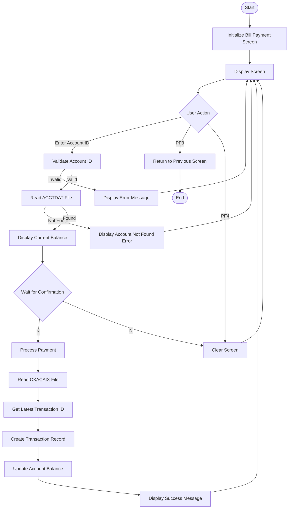

The Bill Payment screen (COBIL00) is a CICS COBOL program that allows users to pay their credit card balance in full through an online interface.

### Bill Payment Screen Layout

## \
Bill Payment Process Flow

## Screen Components (COBIL00.bms)

### Header Section

- Transaction ID (CB00) display

- Program Name (COBIL00C) display

- Current Date (mm/dd/yy format)

- Current Time (hh:mm:ss format)

- Application titles:

  - "AWS Mainframe Modernization"

  - "CardDemo"

### Main Content Area

1. Account ID Input Field (ACTIDIN)

   - Length: 11 characters

   - Required field

   - Underlined, green color

   - Protected field after initial entry

2. Current Balance Display (CURBAL)

   - Format: Signed numeric, displayed as +9999999999.99

   - Read-only field

   - Color: Blue

3. Payment Confirmation (CONFIRM)

   - Single character input field (Y/N)

   - Underlined, green color

   - Case-insensitive validation

### Footer Section

- Error message display area (ERRMSG)

  - Length: 78 characters

  - Color: Red for errors, Green for success

- Function key display:

  - ENTER=Continue

  - F3=Back

  - F4=Clear

## Implemented Functionality

### File Interactions

1. ACCTDAT File

   - Read: Retrieves account details using Account ID

   - Update: Reduces balance after successful payment

2. CXACAIX File

   - Read: Retrieves card number using Account ID

   - Used for transaction record creation

3. TRANSACT File

   - Read: Gets latest transaction ID

   - Write: Creates new payment transaction

### Validation Rules (from PROCESS-ENTER-KEY)

1. Account ID:

   - Must not be empty

   - Must exist in ACCTDAT file

   - Current balance must be greater than zero

2. Confirmation Input:

   - Valid values: Y, y, N, n, space

   - Spaces/low-values trigger balance display only

### Transaction Processing

When confirmation is 'Y':

1. Reads CXACAIX file for card details

2. Gets next transaction ID

3. Creates transaction record with:

   - Transaction Type: 02

   - Category Code: 2

   - Source: POS TERM

   - Description: BILL PAYMENT - ONLINE

   - Amount: Full current balance

   - Merchant ID: 999999999

   - Merchant Name: BILL PAYMENT

   - Merchant City/ZIP: N/A

4. Updates account balance

### Error Handling

- Implemented error messages:

  - "Acct ID can NOT be empty..."

  - "Account ID NOT found..."

  - "You have nothing to pay..."

  - "Invalid value. Valid values are (Y/N)..."

  - "Confirm to make a bill payment..."

- Sets cursor position to error field (-1 to field length)

- Preserves entered data on error

### Screen Navigation

- PF3: Returns to previous screen (or COMEN01C if no previous)

- PF4: Clears current screen

- ENTER: Processes input

- Other keys: Shows invalid key error

### Date/Time Handling

- Uses CICS ASKTIME for transaction timestamp

- Formats date as YYYY-MM-DD

- Formats time as HH:MM:SS

- Includes microseconds for transaction timestamps

## Screen Colors (from BMS)

- Normal text: Blue

- Headers/Titles: Yellow

- Input Fields: Green

- Error Messages: Red

- Balance Information: Turquoise

## Error Recovery

- Transaction rollback on file operation failures

- Error flag (WS-ERR-FLG) controls processing flow

- Clear error messages on screen refresh

## Dependencies

- Required Copybooks:

  - COCOM01Y: Common data structures

  - COBIL00: Screen layout

  - COTTL01Y: Screen titles

  - CSDAT01Y: Date/time handling

  - CSMSG01Y: Common messages

  - CVACT01Y: Account record structure

  - CVACT03Y: Card cross-reference

  - CVTRA05Y: Transaction record structure

<SwmMeta version="3.0.0" repo-id="Z2l0aHViJTNBJTNBa3luZHJ5bC1hd3MtbWFpbmZyYW1lLW1vZGVybml6YXRpb24tY2FyZGRlbW8lM0ElM0FTd2ltbS1EZW1v" repo-name="aws-mainframe-modernization-carddemo">Powered by [Swimm](https://app.swimm.io/)</SwmMeta>
