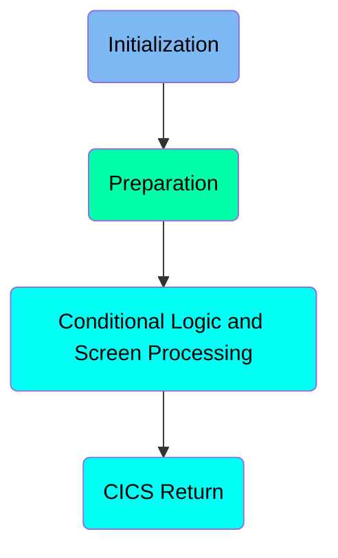
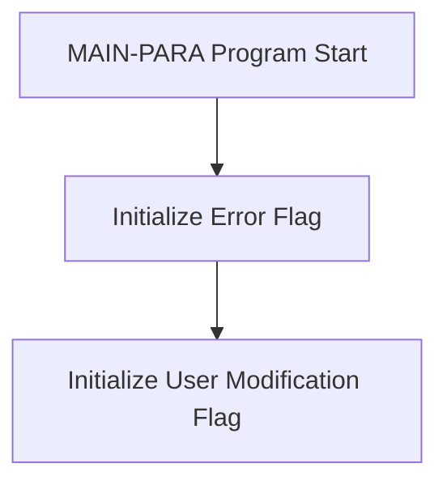
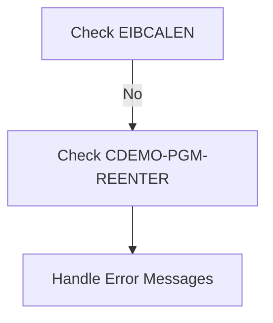
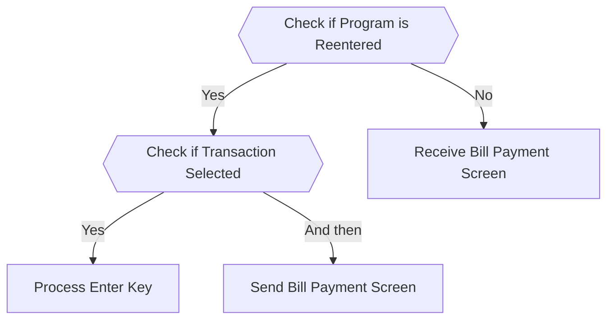
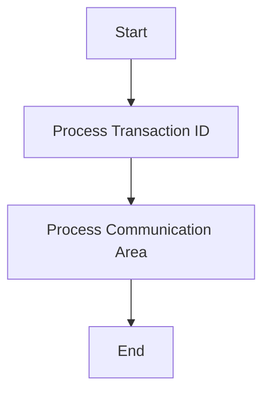

The <SwmToken path="app/cbl/COBIL00C.cbl" pos="2:7:7" line-data="      * Program     : COBIL00C.CBL">`COBIL00C`</SwmToken> program is used for initializing, preparing, and processing user interactions within the <SwmToken path="app/cbl/COBIL00C.cbl" pos="3:7:7" line-data="      * Application : CardDemo">`CardDemo`</SwmToken> application. It starts by setting initial flags, checks conditions, handles error messages, processes user inputs, and manages screen interactions. The program ensures smooth user experience by evaluating inputs and performing corresponding actions.

The <SwmToken path="app/cbl/COBIL00C.cbl" pos="2:7:7" line-data="      * Program     : COBIL00C.CBL">`COBIL00C`</SwmToken> program begins by initializing error and user modification flags. It then checks certain conditions and handles any error messages. The program processes user inputs by evaluating the input type and performing actions like sending or receiving screens, processing transactions, or returning to previous screens. This ensures that user interactions are handled efficiently and accurately.

Here is a high level diagram of the program:



# Initialization



<SwmSnippet path="/app/cbl/COBIL00C.cbl" line="101">

---

## Initializing Error Flag

First, the error flag is set to off. This ensures that any previous error states are cleared and the program starts with a clean slate.

```cobol
           SET ERR-FLG-OFF     TO TRUE
```

---

</SwmSnippet>

<SwmSnippet path="/app/cbl/COBIL00C.cbl" line="102">

---

## Initializing User Modification Flag

Next, the user modification flag is set to no. This indicates that no user modifications have been made at the start of the program.

```cobol
           SET USR-MODIFIED-NO TO TRUE
```

---

</SwmSnippet>

# Preparation



<SwmSnippet path="/app/cbl/COBIL00C.cbl" line="105">

---

## Handling Error Messages

First, the program checks if <SwmToken path="app/cbl/COBIL00C.cbl" pos="107:3:3" line-data="           IF EIBCALEN = 0">`EIBCALEN`</SwmToken> is zero. If it is not, it then checks if <SwmToken path="app/cbl/COBIL00C.cbl" pos="112:5:9" line-data="               IF NOT CDEMO-PGM-REENTER">`CDEMO-PGM-REENTER`</SwmToken> is not set. If both conditions are met, it proceeds to handle error messages by calling the <SwmToken path="app/cbl/COBIL00C.cbl" pos="105:1:1" line-data="                          ERRMSGO OF COBIL0AO">`ERRMSGO`</SwmToken> function of the <SwmToken path="app/cbl/COBIL00C.cbl" pos="105:5:5" line-data="                          ERRMSGO OF COBIL0AO">`COBIL0AO`</SwmToken> program.

```cobol
                          ERRMSGO OF COBIL0AO

           IF EIBCALEN = 0
```

---

</SwmSnippet>

## Interim Summary

So far, we saw the initialization process, where the error flag and user modification flag are set. We also covered the preparation steps, including handling error messages and checking conditions. Now, we will focus on the conditional logic and screen processing.

# Conditional Logic and Screen Processing



<SwmSnippet path="/app/cbl/COBIL00C.cbl" line="112">

---

## Check if Program is Reentered

First, the code checks if the program has been reentered by evaluating the <SwmToken path="app/cbl/COBIL00C.cbl" pos="112:5:9" line-data="               IF NOT CDEMO-PGM-REENTER">`CDEMO-PGM-REENTER`</SwmToken> flag. If it has not been reentered, it sets this flag to true to indicate that the program is now being reentered.

```cobol
               IF NOT CDEMO-PGM-REENTER
                   SET CDEMO-PGM-REENTER    TO TRUE
```

---

</SwmSnippet>

<SwmSnippet path="/app/cbl/COBIL00C.cbl" line="116">

---

## Check if Transaction Selected

Next, the code checks if a transaction has been selected by evaluating if <SwmToken path="app/cbl/COBIL00C.cbl" pos="116:3:9" line-data="                   IF CDEMO-CB00-TRN-SELECTED NOT =">`CDEMO-CB00-TRN-SELECTED`</SwmToken> is not equal to spaces and low-values. If a transaction is selected, it moves the selected transaction to <SwmToken path="app/cbl/COBIL00C.cbl" pos="119:1:1" line-data="                            ACTIDINI OF COBIL0AI">`ACTIDINI`</SwmToken> and performs the <SwmToken path="app/cbl/COBIL00C.cbl" pos="120:3:7" line-data="                       PERFORM PROCESS-ENTER-KEY">`PROCESS-ENTER-KEY`</SwmToken> paragraph.

```cobol
                   IF CDEMO-CB00-TRN-SELECTED NOT =
                                              SPACES AND LOW-VALUES
                       MOVE CDEMO-CB00-TRN-SELECTED TO
                            ACTIDINI OF COBIL0AI
                       PERFORM PROCESS-ENTER-KEY
                   END-IF
```

---

</SwmSnippet>

<SwmSnippet path="/app/cbl/COBIL00C.cbl" line="122">

---

## Send Bill Payment Screen

Then, the code performs the <SwmToken path="app/cbl/COBIL00C.cbl" pos="122:3:7" line-data="                   PERFORM SEND-BILLPAY-SCREEN">`SEND-BILLPAY-SCREEN`</SwmToken> paragraph to send the bill payment screen to the user.

```cobol
                   PERFORM SEND-BILLPAY-SCREEN
```

---

</SwmSnippet>

<SwmSnippet path="/app/cbl/COBIL00C.cbl" line="124">

---

## Receive Bill Payment Screen

If the program has been reentered, the code performs the <SwmToken path="app/cbl/COBIL00C.cbl" pos="124:3:7" line-data="                   PERFORM RECEIVE-BILLPAY-SCREEN">`RECEIVE-BILLPAY-SCREEN`</SwmToken> paragraph to receive input from the bill payment screen.

```cobol
                   PERFORM RECEIVE-BILLPAY-SCREEN
```

---

</SwmSnippet>

<SwmSnippet path="/app/cbl/COBIL00C.cbl" line="125">

---

## Evaluate User Input

The code then evaluates the user input using the <SwmToken path="app/cbl/COBIL00C.cbl" pos="125:3:3" line-data="                   EVALUATE EIBAID">`EIBAID`</SwmToken> field. Depending on the input, it performs different actions: if the Enter key is pressed, it performs the <SwmToken path="app/cbl/COBIL00C.cbl" pos="127:3:7" line-data="                           PERFORM PROCESS-ENTER-KEY">`PROCESS-ENTER-KEY`</SwmToken> paragraph; if PF3 is pressed, it determines the next program to call and performs the <SwmToken path="app/cbl/COBIL00C.cbl" pos="135:3:9" line-data="                           PERFORM RETURN-TO-PREV-SCREEN">`RETURN-TO-PREV-SCREEN`</SwmToken> paragraph; if PF4 is pressed, it performs the <SwmToken path="app/cbl/COBIL00C.cbl" pos="137:3:7" line-data="                           PERFORM CLEAR-CURRENT-SCREEN">`CLEAR-CURRENT-SCREEN`</SwmToken> paragraph; for any other input, it sets an error flag and sends an error message to the user.

```cobol
                   EVALUATE EIBAID
                       WHEN DFHENTER
                           PERFORM PROCESS-ENTER-KEY
                       WHEN DFHPF3
                           IF CDEMO-FROM-PROGRAM = SPACES OR LOW-VALUES
                               MOVE 'COMEN01C' TO CDEMO-TO-PROGRAM
                           ELSE
                               MOVE CDEMO-FROM-PROGRAM TO
                               CDEMO-TO-PROGRAM
                           END-IF
                           PERFORM RETURN-TO-PREV-SCREEN
                       WHEN DFHPF4
                           PERFORM CLEAR-CURRENT-SCREEN
                       WHEN OTHER
                           MOVE 'Y'                       TO WS-ERR-FLG
                           MOVE CCDA-MSG-INVALID-KEY      TO WS-MESSAGE
                           PERFORM SEND-BILLPAY-SCREEN
                   END-EVALUATE
```

---

</SwmSnippet>

# CICS Return

This is the next section of the flow.



<SwmSnippet path="/app/cbl/COBIL00C.cbl" line="147">

---

## Processing Transaction ID

First, the transaction ID (<SwmToken path="app/cbl/COBIL00C.cbl" pos="147:1:1" line-data="                     TRANSID (WS-TRANID)">`TRANSID`</SwmToken>) is processed. This ID is crucial for identifying the specific transaction being handled in the <SwmToken path="app/cbl/COBIL00C.cbl" pos="3:7:7" line-data="      * Application : CardDemo">`CardDemo`</SwmToken> application.

```cobol
                     TRANSID (WS-TRANID)
```

---

</SwmSnippet>

<SwmSnippet path="/app/cbl/COBIL00C.cbl" line="148">

---

## Processing Communication Area

Next, the communication area (<SwmToken path="app/cbl/COBIL00C.cbl" pos="148:1:1" line-data="                     COMMAREA (CARDDEMO-COMMAREA)">`COMMAREA`</SwmToken>) is processed. This area holds the data that needs to be passed between different parts of the application, ensuring that all necessary information is available for transaction processing.

```cobol
                     COMMAREA (CARDDEMO-COMMAREA)
```

---

</SwmSnippet>

<SwmSnippet path="/app/cbl/COBIL00C.cbl" line="149">

---

## End of Processing

Finally, the processing of the transaction ID and communication area is completed, and the program moves to the next step in the flow.

```cobol
           END-EXEC.
```

---

</SwmSnippet>

&nbsp;

*This is an auto-generated document by Swimm 🌊 and has not yet been verified by a human*

<SwmMeta version="3.0.0" repo-id="Z2l0aHViJTNBJTNBa3luZHJ5bC1hd3MtbWFpbmZyYW1lLW1vZGVybml6YXRpb24tY2FyZGRlbW8lM0ElM0FTd2ltbS1EZW1v" repo-name="kyndryl-aws-mainframe-modernization-carddemo"><sup>Powered by [Swimm](https://staging.swimm.cloud/)</sup></SwmMeta>
