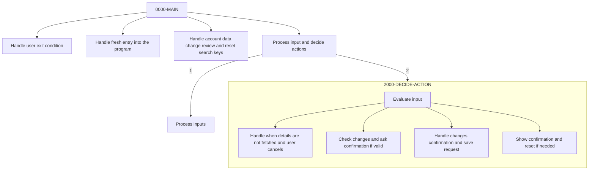

The program allows users to update credit card details through a screen interface, managing the display of relevant information. The document outlines the steps taken by the program to handle user exits, fetch card details, request keys for updates, handle card data changes, and process user inputs.



<SwmSnippet path="/app/cbl/COCRDUPC.cbl" line="429" repo-id="Z2l0aHViJTNBJTNBYXdzLW1haW5mcmFtZS1tb2Rlcm5pemF0aW9uLWNhcmRkZW1vJTNBJTNBU3dpbW0tRGVtbw==" repo-name="aws-mainframe-modernization-carddemo">

---

## Handling User Exit and Update Completion

First, the program evaluates the users input. First scenario is when the user has pressed the PF03 key to exit or if the update process is completed or failed.

In this case the program determines the next transaction and program to call by checking the <SwmToken path="/app/cbl/COCRDUPC.cbl" pos="442:3:7" line-data="                   IF CDEMO-FROM-TRANID    EQUAL LOW-VALUES                     " repo-id="Z2l0aHViJTNBJTNBYXdzLW1haW5mcmFtZS1tb2Rlcm5pemF0aW9uLWNhcmRkZW1vJTNBJTNBU3dpbW0tRGVtbw==" repo-name="aws-mainframe-modernization-carddemo">`CDEMO-FROM-TRANID`</SwmToken> and <SwmToken path="/app/cbl/COCRDUPC.cbl" pos="483:3:7" line-data="               AND CDEMO-FROM-PROGRAM  EQUAL LIT-CCLISTPGM                      " repo-id="Z2l0aHViJTNBJTNBYXdzLW1haW5mcmFtZS1tb2Rlcm5pemF0aW9uLWNhcmRkZW1vJTNBJTNBU3dpbW0tRGVtbw==" repo-name="aws-mainframe-modernization-carddemo">`CDEMO-FROM-PROGRAM`</SwmToken> variables. If these variables are empty, it sets them to default values (the <SwmToken path="/app/cbl/COCRDUPC.cbl" pos="238:4:4" line-data="                                                   VALUE &#39;CM00&#39;.                " repo-id="Z2l0aHViJTNBJTNBYXdzLW1haW5mcmFtZS1tb2Rlcm5pemF0aW9uLWNhcmRkZW1vJTNBJTNBU3dpbW0tRGVtbw==" repo-name="aws-mainframe-modernization-carddemo">`CM00`</SwmToken> transaction, and the <SwmToken path="/app/cbl/COCRDUPC.cbl" pos="236:4:4" line-data="                                                   VALUE &#39;COMEN01C&#39;.            " repo-id="Z2l0aHViJTNBJTNBYXdzLW1haW5mcmFtZS1tb2Rlcm5pemF0aW9uLWNhcmRkZW1vJTNBJTNBU3dpbW0tRGVtbw==" repo-name="aws-mainframe-modernization-carddemo">`COMEN01C`</SwmToken> program).&nbsp;

```cobol
           EVALUATE TRUE                                                        
      ******************************************************************        
      *       USER PRESSES PF03 TO EXIT                                         
      *  OR   USER IS DONE WITH UPDATE                                          
      *            XCTL TO CALLING PROGRAM OR MAIN MENU                         
      ******************************************************************        
              WHEN CCARD-AID-PFK03                                              
              WHEN (CCUP-CHANGES-OKAYED-AND-DONE                                
               AND  CDEMO-LAST-MAPSET   EQUAL LIT-CCLISTMAPSET)                 
              WHEN (CCUP-CHANGES-FAILED                                         
               AND  CDEMO-LAST-MAPSET   EQUAL LIT-CCLISTMAPSET)                 
                   SET CCARD-AID-PFK03     TO TRUE                              
                                                                                
                   IF CDEMO-FROM-TRANID    EQUAL LOW-VALUES                     
                   OR CDEMO-FROM-TRANID    EQUAL SPACES                         
                      MOVE LIT-MENUTRANID  TO CDEMO-TO-TRANID                   
                   ELSE                                                         
                      MOVE CDEMO-FROM-TRANID  TO CDEMO-TO-TRANID                
                   END-IF                                                       
                                                                                
                   IF CDEMO-FROM-PROGRAM   EQUAL LOW-VALUES                     
                   OR CDEMO-FROM-PROGRAM   EQUAL SPACES                         
                      MOVE LIT-MENUPGM     TO CDEMO-TO-PROGRAM                  
                   ELSE                                                         
                      MOVE CDEMO-FROM-PROGRAM TO CDEMO-TO-PROGRAM               
                   END-IF                                                       
                                                                                
                   MOVE LIT-THISTRANID     TO CDEMO-FROM-TRANID                 
                   MOVE LIT-THISPGM        TO CDEMO-FROM-PROGRAM                
                                                                                
                   IF CDEMO-LAST-MAPSET    EQUAL LIT-CCLISTMAPSET               
                       MOVE ZEROS          TO CDEMO-ACCT-ID                     
                                              CDEMO-CARD-NUM                    
                   END-IF                                                       
                                                                                
                   SET  CDEMO-USRTYP-USER  TO TRUE                              
                   SET  CDEMO-PGM-ENTER    TO TRUE                              
                   MOVE LIT-THISMAPSET     TO CDEMO-LAST-MAPSET                 
                   MOVE LIT-THISMAP        TO CDEMO-LAST-MAP                    
                                                                                
                   EXEC CICS                                                    
                        SYNCPOINT                                               
                   END-EXEC                                                     
      *                                                                         
                   EXEC CICS XCTL                                               
                        PROGRAM (CDEMO-TO-PROGRAM)                              
                        COMMAREA(CARDDEMO-COMMAREA)                             
                   END-EXEC                                                     
```

---

</SwmSnippet>

<SwmSnippet path="/app/cbl/COCRDUPC.cbl" line="477" repo-id="Z2l0aHViJTNBJTNBYXdzLW1haW5mcmFtZS1tb2Rlcm5pemF0aW9uLWNhcmRkZW1vJTNBJTNBU3dpbW0tRGVtbw==" repo-name="aws-mainframe-modernization-carddemo">

---

## Fetching Card Details for Update

The next case checks if the user has entered the program from the credit card list screen (<SwmToken path="/app/cbl/COCRDUPC.cbl" pos="483:3:7" line-data="               AND CDEMO-FROM-PROGRAM  EQUAL LIT-CCLISTPGM                      " repo-id="Z2l0aHViJTNBJTNBYXdzLW1haW5mcmFtZS1tb2Rlcm5pemF0aW9uLWNhcmRkZW1vJTNBJTNBU3dpbW0tRGVtbw==" repo-name="aws-mainframe-modernization-carddemo">`CDEMO-FROM-PROGRAM`</SwmToken>) or pressed the PF12 key (to cancel). If either condition is met, it sets several flags and then then performs the <SwmToken path="/app/cbl/COCRDUPC.cbl" pos="492:3:7" line-data="                   PERFORM 9000-READ-DATA                                       " repo-id="Z2l0aHViJTNBJTNBYXdzLW1haW5mcmFtZS1tb2Rlcm5pemF0aW9uLWNhcmRkZW1vJTNBJTNBU3dpbW0tRGVtbw==" repo-name="aws-mainframe-modernization-carddemo">`9000-READ-DATA`</SwmToken> routine to fetch the card details. Using the <SwmToken path="/app/cbl/COCRDUPC.cbl" pos="495:3:7" line-data="                   PERFORM 3000-SEND-MAP                                        " repo-id="Z2l0aHViJTNBJTNBYXdzLW1haW5mcmFtZS1tb2Rlcm5pemF0aW9uLWNhcmRkZW1vJTNBJTNBU3dpbW0tRGVtbw==" repo-name="aws-mainframe-modernization-carddemo">`3000-SEND-MAP`</SwmToken> function it displays the screen to the user and then returns to CICS to wait for the users input.

```cobol
      ******************************************************************        
      *       USER CAME FROM CREDIT CARD LIST SCREEN                            
      *            SO WE ALREADY HAVE THE FILTER KEYS                           
      *            FETCH THE ASSSOCIATED CARD DETAILS FOR UPDATE                
      ******************************************************************        
              WHEN CDEMO-PGM-ENTER                                              
               AND CDEMO-FROM-PROGRAM  EQUAL LIT-CCLISTPGM                      
              WHEN CCARD-AID-PFK12                                              
               AND CDEMO-FROM-PROGRAM  EQUAL LIT-CCLISTPGM                      
                   SET CDEMO-PGM-REENTER    TO TRUE                             
                   SET INPUT-OK             TO TRUE                             
                   SET FLG-ACCTFILTER-ISVALID  TO TRUE                          
                   SET FLG-CARDFILTER-ISVALID  TO TRUE                          
                   MOVE CDEMO-ACCT-ID       TO CC-ACCT-ID-N                     
                   MOVE CDEMO-CARD-NUM      TO CC-CARD-NUM-N                    
                   PERFORM 9000-READ-DATA                                       
                      THRU 9000-READ-DATA-EXIT                                  
                   SET CCUP-SHOW-DETAILS TO TRUE                                
                   PERFORM 3000-SEND-MAP                                        
                      THRU 3000-SEND-MAP-EXIT                                   
                   GO TO COMMON-RETURN                                          
```

---

</SwmSnippet>

<SwmSnippet path="/app/cbl/COCRDUPC.cbl" line="498" repo-id="Z2l0aHViJTNBJTNBYXdzLW1haW5mcmFtZS1tb2Rlcm5pemF0aW9uLWNhcmRkZW1vJTNBJTNBU3dpbW0tRGVtbw==" repo-name="aws-mainframe-modernization-carddemo">

---

## Requesting Keys for Card Update

If the program is entered freshly and the card details have not been fetched (<SwmToken path="/app/cbl/COCRDUPC.cbl" pos="502:3:9" line-data="              WHEN CCUP-DETAILS-NOT-FETCHED                                     " repo-id="Z2l0aHViJTNBJTNBYXdzLW1haW5mcmFtZS1tb2Rlcm5pemF0aW9uLWNhcmRkZW1vJTNBJTNBU3dpbW0tRGVtbw==" repo-name="aws-mainframe-modernization-carddemo">`CCUP-DETAILS-NOT-FETCHED`</SwmToken> is true), the program initializes the working storage area (<SwmToken path="/app/cbl/COCRDUPC.cbl" pos="506:3:7" line-data="                   INITIALIZE WS-THIS-PROGCOMMAREA                              " repo-id="Z2l0aHViJTNBJTNBYXdzLW1haW5mcmFtZS1tb2Rlcm5pemF0aW9uLWNhcmRkZW1vJTNBJTNBU3dpbW0tRGVtbw==" repo-name="aws-mainframe-modernization-carddemo">`WS-THIS-PROGCOMMAREA`</SwmToken>) and sends a map to the user to request the keys needed to fetch the card details. It then sets the <SwmToken path="/app/cbl/COCRDUPC.cbl" pos="526:3:7" line-data="                   SET CDEMO-PGM-REENTER          TO TRUE                       " repo-id="Z2l0aHViJTNBJTNBYXdzLW1haW5mcmFtZS1tb2Rlcm5pemF0aW9uLWNhcmRkZW1vJTNBJTNBU3dpbW0tRGVtbw==" repo-name="aws-mainframe-modernization-carddemo">`CDEMO-PGM-REENTER`</SwmToken> and <SwmToken path="/app/cbl/COCRDUPC.cbl" pos="502:3:9" line-data="              WHEN CCUP-DETAILS-NOT-FETCHED                                     " repo-id="Z2l0aHViJTNBJTNBYXdzLW1haW5mcmFtZS1tb2Rlcm5pemF0aW9uLWNhcmRkZW1vJTNBJTNBU3dpbW0tRGVtbw==" repo-name="aws-mainframe-modernization-carddemo">`CCUP-DETAILS-NOT-FETCHED`</SwmToken> flags to true, indicating that the program is ready for re-entry and the card details are yet to be fetched.

```cobol
      ******************************************************************        
      *       FRESH ENTRY INTO PROGRAM                                          
      *            ASK THE USER FOR THE KEYS TO FETCH CARD TO BE UPDATED        
      ******************************************************************        
              WHEN CCUP-DETAILS-NOT-FETCHED                                     
               AND CDEMO-PGM-ENTER                                              
              WHEN CDEMO-FROM-PROGRAM   EQUAL LIT-MENUPGM                       
               AND NOT CDEMO-PGM-REENTER                                        
                   INITIALIZE WS-THIS-PROGCOMMAREA                              
                   PERFORM 3000-SEND-MAP THRU                                   
                           3000-SEND-MAP-EXIT                                   
                   SET CDEMO-PGM-REENTER        TO TRUE                         
                   SET CCUP-DETAILS-NOT-FETCHED TO TRUE                         
                   GO TO COMMON-RETURN                                          
```

---

</SwmSnippet>

<SwmSnippet path="/app/cbl/COCRDUPC.cbl" line="512" repo-id="Z2l0aHViJTNBJTNBYXdzLW1haW5mcmFtZS1tb2Rlcm5pemF0aW9uLWNhcmRkZW1vJTNBJTNBU3dpbW0tRGVtbw==" repo-name="aws-mainframe-modernization-carddemo">

---

## Handling Card Data Changes

When the card data changes are reviewed and either successfully completed (<SwmToken path="/app/cbl/COCRDUPC.cbl" pos="517:3:11" line-data="              WHEN CCUP-CHANGES-OKAYED-AND-DONE                                 " repo-id="Z2l0aHViJTNBJTNBYXdzLW1haW5mcmFtZS1tb2Rlcm5pemF0aW9uLWNhcmRkZW1vJTNBJTNBU3dpbW0tRGVtbw==" repo-name="aws-mainframe-modernization-carddemo">`CCUP-CHANGES-OKAYED-AND-DONE`</SwmToken>) or failed (<SwmToken path="/app/cbl/COCRDUPC.cbl" pos="518:3:7" line-data="              WHEN CCUP-CHANGES-FAILED                                          " repo-id="Z2l0aHViJTNBJTNBYXdzLW1haW5mcmFtZS1tb2Rlcm5pemF0aW9uLWNhcmRkZW1vJTNBJTNBU3dpbW0tRGVtbw==" repo-name="aws-mainframe-modernization-carddemo">`CCUP-CHANGES-FAILED`</SwmToken>), the program resets the account ID and card number. It then shows a screen to the user to request fresh search criteria for the next operation.

```cobol
      ******************************************************************        
      *       CARD DATA CHANGES REVIEWED, OKAYED AND DONE SUCESSFULLY           
      *            RESET THE SEARCH KEYS                                        
      *            ASK THE USER FOR FRESH SEARCH CRITERIA                       
      ******************************************************************        
              WHEN CCUP-CHANGES-OKAYED-AND-DONE                                 
              WHEN CCUP-CHANGES-FAILED                                          
                   INITIALIZE WS-THIS-PROGCOMMAREA                              
                              WS-MISC-STORAGE                                   
                              CDEMO-ACCT-ID                                     
                              CDEMO-CARD-NUM                                    
                   SET CDEMO-PGM-ENTER            TO TRUE                       
                   PERFORM 3000-SEND-MAP THRU                                   
                           3000-SEND-MAP-EXIT                                   
                   SET CDEMO-PGM-REENTER          TO TRUE                       
                   SET CCUP-DETAILS-NOT-FETCHED   TO TRUE                       
                   GO TO COMMON-RETURN                                          
```

---

</SwmSnippet>

<SwmSnippet path="/app/cbl/COCRDUPC.cbl" line="529" repo-id="Z2l0aHViJTNBJTNBYXdzLW1haW5mcmFtZS1tb2Rlcm5pemF0aW9uLWNhcmRkZW1vJTNBJTNBU3dpbW0tRGVtbw==" repo-name="aws-mainframe-modernization-carddemo">

---

## Processing User Inputs

Finally, if none of the previous conditions are met, the program processes the user inputs by performing the <SwmToken path="/app/cbl/COCRDUPC.cbl" pos="536:3:7" line-data="                   PERFORM 1000-PROCESS-INPUTS                                  " repo-id="Z2l0aHViJTNBJTNBYXdzLW1haW5mcmFtZS1tb2Rlcm5pemF0aW9uLWNhcmRkZW1vJTNBJTNBU3dpbW0tRGVtbw==" repo-name="aws-mainframe-modernization-carddemo">`1000-PROCESS-INPUTS`</SwmToken> routine, which includes receiving and editing the screen inputs. It then decides the next action by performing the <SwmToken path="/app/cbl/COCRDUPC.cbl" pos="538:3:7" line-data="                   PERFORM 2000-DECIDE-ACTION                                   " repo-id="Z2l0aHViJTNBJTNBYXdzLW1haW5mcmFtZS1tb2Rlcm5pemF0aW9uLWNhcmRkZW1vJTNBJTNBU3dpbW0tRGVtbw==" repo-name="aws-mainframe-modernization-carddemo">`2000-DECIDE-ACTION`</SwmToken> routine. After deciding the action, the program a screen to the user for further interaction.

```cobol
      ******************************************************************        
      *      CARD DATA HAS BEEN PRESENTED TO USER                               
      *            CHECK THE USER INPUTS                                        
      *            DECIDE WHAT TO DO                                            
      *            PRESENT NEXT STEPS TO USER                                   
      ******************************************************************        
              WHEN OTHER                                                        
                   PERFORM 1000-PROCESS-INPUTS                                  
                      THRU 1000-PROCESS-INPUTS-EXIT                             
                   PERFORM 2000-DECIDE-ACTION                                   
                      THRU 2000-DECIDE-ACTION-EXIT                              
                   PERFORM 3000-SEND-MAP                                        
                      THRU 3000-SEND-MAP-EXIT                                   
                   GO TO COMMON-RETURN                                          
           END-EVALUATE                                                         
```

---

</SwmSnippet>

<SwmSnippet path="/app/cbl/COCRDUPC.cbl" line="578" repo-id="Z2l0aHViJTNBJTNBYXdzLW1haW5mcmFtZS1tb2Rlcm5pemF0aW9uLWNhcmRkZW1vJTNBJTNBU3dpbW0tRGVtbw==" repo-name="aws-mainframe-modernization-carddemo">

---

### Retrieving and validating the inputs

The <SwmToken path="/app/cbl/COCRDUPC.cbl" pos="536:3:7" line-data="                   PERFORM 1000-PROCESS-INPUTS                                  " repo-id="Z2l0aHViJTNBJTNBYXdzLW1haW5mcmFtZS1tb2Rlcm5pemF0aW9uLWNhcmRkZW1vJTNBJTNBU3dpbW0tRGVtbw==" repo-name="aws-mainframe-modernization-carddemo">`1000-PROCESS-INPUTS`</SwmToken> function performs two main tasks: receiving the map and editing the map inputs. The <SwmToken path="/app/cbl/COCRDUPC.cbl" pos="578:1:5" line-data="       1100-RECEIVE-MAP.                                                        " repo-id="Z2l0aHViJTNBJTNBYXdzLW1haW5mcmFtZS1tb2Rlcm5pemF0aW9uLWNhcmRkZW1vJTNBJTNBU3dpbW0tRGVtbw==" repo-name="aws-mainframe-modernization-carddemo">`1100-RECEIVE-MAP`</SwmToken> function is responsible for mapping the user input from the screen into the CCRDUPAI data structure defined in the <SwmPath repo-id="Z2l0aHViJTNBJTNBYXdzLW1haW5mcmFtZS1tb2Rlcm5pemF0aW9uLWNhcmRkZW1vJTNBJTNBU3dpbW0tRGVtbw==" repo-name="aws-mainframe-modernization-carddemo" path="/app/csd/CARDDEMO.CSD">`(aws-mainframe-modernization-carddemo) app/csd/CARDDEMO.CSD`</SwmPath>.

```cobol
       1100-RECEIVE-MAP.                                                        
           EXEC CICS RECEIVE MAP(LIT-THISMAP)                                   
                     MAPSET(LIT-THISMAPSET)                                     
                     INTO(CCRDUPAI)                                             
                     RESP(WS-RESP-CD)                                           
                     RESP2(WS-REAS-CD)                                          
           END-EXEC                                                             
                                                                                
           INITIALIZE CCUP-NEW-DETAILS                                          
```

---

</SwmSnippet>

<SwmSnippet path="/app/cbl/COCRDUPC.cbl" line="641" repo-id="Z2l0aHViJTNBJTNBYXdzLW1haW5mcmFtZS1tb2Rlcm5pemF0aW9uLWNhcmRkZW1vJTNBJTNBU3dpbW0tRGVtbw==" repo-name="aws-mainframe-modernization-carddemo">

---

Following this, the <SwmToken path="/app/cbl/COCRDUPC.cbl" pos="536:3:7" line-data="                   PERFORM 1000-PROCESS-INPUTS                                  " repo-id="Z2l0aHViJTNBJTNBYXdzLW1haW5mcmFtZS1tb2Rlcm5pemF0aW9uLWNhcmRkZW1vJTNBJTNBU3dpbW0tRGVtbw==" repo-name="aws-mainframe-modernization-carddemo">`1000-PROCESS-INPUTS`</SwmToken> function calls the <SwmToken path="/app/cbl/COCRDUPC.cbl" pos="661:5:11" line-data="               GO TO 1200-EDIT-MAP-INPUTS-EXIT                                  " repo-id="Z2l0aHViJTNBJTNBYXdzLW1haW5mcmFtZS1tb2Rlcm5pemF0aW9uLWNhcmRkZW1vJTNBJTNBU3dpbW0tRGVtbw==" repo-name="aws-mainframe-modernization-carddemo">`1200-EDIT-MAP-INPUTS`</SwmToken> function to validate and edit the credit card inputs. This function performs several validation checks, such as ensuring that the account and card filters are not blank, and comparing the old and new card data to detect any changes. If no changes are detected, it sets the appropriate flags and skips further edits. Otherwise, it performs additional validation on the card name, status, expiry month, and year.

```
       1200-EDIT-MAP-INPUTS.                                                    
                                                                                
           SET INPUT-OK                  TO TRUE                                
                                                                                
           IF  CCUP-DETAILS-NOT-FETCHED                                         
      *        VALIDATE THE SEARCH KEYS                                         
               PERFORM 1210-EDIT-ACCOUNT                                        
                  THRU 1210-EDIT-ACCOUNT-EXIT                                   
                                                                                
               PERFORM 1220-EDIT-CARD                                           
                  THRU 1220-EDIT-CARD-EXIT                                      
                                                                                
               MOVE LOW-VALUES                 TO CCUP-NEW-CARDDATA             
                                                                                
      *       IF THE SEARCH CONDITIONS HAVE PROBLEMS SKIP OTHER EDITS           
               IF  FLG-ACCTFILTER-BLANK                                         
               AND FLG-CARDFILTER-BLANK                                         
                   SET NO-SEARCH-CRITERIA-RECEIVED TO TRUE                      
               END-IF                                                           
                                                                                
               GO TO 1200-EDIT-MAP-INPUTS-EXIT                                  
```

---

</SwmSnippet>

<SwmSnippet path="/app/cbl/COCRDUPC.cbl" line="949" repo-id="Z2l0aHViJTNBJTNBYXdzLW1haW5mcmFtZS1tb2Rlcm5pemF0aW9uLWNhcmRkZW1vJTNBJTNBU3dpbW0tRGVtbw==" repo-name="aws-mainframe-modernization-carddemo">

---

Finally, the <SwmToken path="/app/cbl/COCRDUPC.cbl" pos="538:3:7" line-data="                   PERFORM 2000-DECIDE-ACTION                                   " repo-id="Z2l0aHViJTNBJTNBYXdzLW1haW5mcmFtZS1tb2Rlcm5pemF0aW9uLWNhcmRkZW1vJTNBJTNBU3dpbW0tRGVtbw==" repo-name="aws-mainframe-modernization-carddemo">`2000-DECIDE-ACTION`</SwmToken> function is called to determine the next actions based on the processed inputs.&nbsp;

The first condition checks if this is a first entry or if the changes where canceled (PF12 pressed). If so it checks if search criteria and if so reads the card data again.

```cobol
           EVALUATE TRUE                                                        
      ******************************************************************        
      *       NO DETAILS SHOWN.                                                 
      *       SO GET THEM AND SETUP DETAIL EDIT SCREEN                          
      ******************************************************************        
              WHEN CCUP-DETAILS-NOT-FETCHED                                     
      ******************************************************************        
      *       CHANGES MADE. BUT USER CANCELS                                    
      ******************************************************************        
              WHEN CCARD-AID-PFK12                                              
                 IF  FLG-ACCTFILTER-ISVALID                                     
                 AND FLG-CARDFILTER-ISVALID                                     
                     PERFORM 9000-READ-DATA                                     
                        THRU 9000-READ-DATA-EXIT                                
                     IF FOUND-CARDS-FOR-ACCOUNT                                 
                        SET CCUP-SHOW-DETAILS    TO TRUE                        
                     END-IF                                                     
                 END-IF                                                         
```

---

</SwmSnippet>

<SwmSnippet path="/app/cbl/COCRDUPC.cbl" line="967" repo-id="Z2l0aHViJTNBJTNBYXdzLW1haW5mcmFtZS1tb2Rlcm5pemF0aW9uLWNhcmRkZW1vJTNBJTNBU3dpbW0tRGVtbw==" repo-name="aws-mainframe-modernization-carddemo">

---

The second condition checks if the screen is already showing card details. If everything is valid a confirmation prompt will be triggered.

```cobol
      ******************************************************************        
      *       DETAILS SHOWN                                                     
      *       CHECK CHANGES AND ASK CONFIRMATION IF GOOD                        
      ******************************************************************        
              WHEN CCUP-SHOW-DETAILS                                            
                 IF INPUT-ERROR                                                 
                 OR NO-CHANGES-DETECTED                                         
                    CONTINUE                                                    
                 ELSE                                                           
                    SET CCUP-CHANGES-OK-NOT-CONFIRMED TO TRUE                   
                 END-IF                                                         
```

---

</SwmSnippet>

<SwmSnippet path="/app/cbl/COCRDUPC.cbl" line="984" repo-id="Z2l0aHViJTNBJTNBYXdzLW1haW5mcmFtZS1tb2Rlcm5pemF0aW9uLWNhcmRkZW1vJTNBJTNBU3dpbW0tRGVtbw==" repo-name="aws-mainframe-modernization-carddemo">

---

When the changes have been validated and are ready for saving and the user has pressed PF5 to confirm the save it attempts to write changes to the database and handles failures.

```cobol
      ******************************************************************        
      *       DETAILS EDITED , FOUND OK, CONFIRM SAVE REQUESTED                 
      *       CONFIRMATION GIVEN.SO SAVE THE CHANGES                            
      ******************************************************************        
              WHEN CCUP-CHANGES-OK-NOT-CONFIRMED                                
               AND CCARD-AID-PFK05                                              
                 PERFORM 9200-WRITE-PROCESSING                                  
                    THRU 9200-WRITE-PROCESSING-EXIT                             
                 EVALUATE TRUE                                                  
                    WHEN COULD-NOT-LOCK-FOR-UPDATE                              
                         SET CCUP-CHANGES-OKAYED-LOCK-ERROR TO TRUE             
                    WHEN LOCKED-BUT-UPDATE-FAILED                               
                       SET CCUP-CHANGES-OKAYED-BUT-FAILED TO TRUE               
                    WHEN DATA-WAS-CHANGED-BEFORE-UPDATE                         
                        SET CCUP-SHOW-DETAILS            TO TRUE                
                    WHEN OTHER                                                  
                       SET CCUP-CHANGES-OKAYED-AND-DONE   TO TRUE               
                 END-EVALUATE                                                   
```

---

</SwmSnippet>

<SwmSnippet path="/app/cbl/COCRDUPC.cbl" line="1008" repo-id="Z2l0aHViJTNBJTNBYXdzLW1haW5mcmFtZS1tb2Rlcm5pemF0aW9uLWNhcmRkZW1vJTNBJTNBU3dpbW0tRGVtbw==" repo-name="aws-mainframe-modernization-carddemo">

---

If the changes are confirmed and done, the program sets the flag to show the details again and resets the search keys for fresh criteria.

```cobol
      ******************************************************************        
      *       SHOW CONFIRMATION. GO BACK TO SQUARE 1                            
      ******************************************************************        
              WHEN CCUP-CHANGES-OKAYED-AND-DONE                                 
                  SET CCUP-SHOW-DETAILS TO TRUE                                 
                  IF CDEMO-FROM-TRANID    EQUAL LOW-VALUES                      
                  OR CDEMO-FROM-TRANID    EQUAL SPACES                          
                     MOVE ZEROES       TO CDEMO-ACCT-ID                         
                                          CDEMO-CARD-NUM                        
                     MOVE LOW-VALUES   TO CDEMO-ACCT-STATUS                     
                  END-IF                                                        
```

---

</SwmSnippet>

<SwmSnippet path="/app/cbl/COCRDUPC.cbl" line="1019" repo-id="Z2l0aHViJTNBJTNBYXdzLW1haW5mcmFtZS1tb2Rlcm5pemF0aW9uLWNhcmRkZW1vJTNBJTNBU3dpbW0tRGVtbw==" repo-name="aws-mainframe-modernization-carddemo">

---

In case of any unexpected data scenarios, the program moves appropriate values to the abend variables and performs the abend routine to handle the abnormal termination.

```cobol
              WHEN OTHER                                                        
                   MOVE LIT-THISPGM    TO ABEND-CULPRIT                         
                   MOVE '0001'         TO ABEND-CODE                            
                   MOVE SPACES         TO ABEND-REASON                          
                   MOVE 'UNEXPECTED DATA SCENARIO'                              
                                       TO ABEND-MSG                             
                   PERFORM ABEND-ROUTINE                                        
                      THRU ABEND-ROUTINE-EXIT                                   
           END-EVALUATE                                                         
```

---

</SwmSnippet>

&nbsp;

*This is an auto-generated document by Swimm 🌊 and has not yet been verified by a human*

<SwmMeta version="3.0.0"><sup>Powered by [Swimm](https://staging.swimm.cloud/)</sup></SwmMeta>
