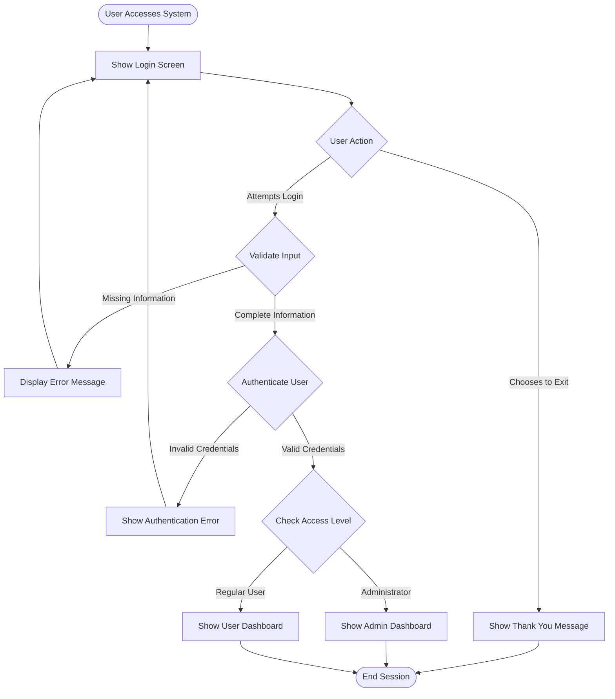

&nbsp;

&nbsp;

## 1\. Overview

The login screen serves as the secure entry point for the CardDemo application, controlling access to both administrative and user functions of the credit card management system.

## 2\. Screen Requirements

### 2.1 Header Information

- Display current date and time

- Show application name and system identifier

- Present application title: "Credit Card Demo Application for Mainframe Modernization"

### 2.2 Visual Elements

- Display decorative credit card themed artwork in the center of the screen

- Use color coding for different elements:

  - Error messages in red

  - Input fields in green

  - Headers in blue

  - Titles in yellow

### 2.3 Input Fields

- User ID field:

  - Visible text entry

  - Maximum length: 8 characters

- Password field:

  - Hidden text entry (masked with asterisks)

  - Maximum length: 8 characters

## 3\. Business Rules

### 3.1 User Types

- Administrator Access:

  - Full system access

  - Access to administrative dashboard

- Regular User Access:

  - Limited system access

  - Access to user dashboard

### 3.2 Authentication Rules

- Both username and password are required

- Credentials are not case-sensitive

- User must exist in the system

- Password must match exactly

- Failed login attempts return to login screen

- Successful login directs user to appropriate dashboard based on access level

### 3.3 Error Handling

Display appropriate error message for:

- Empty user ID: "Please enter User ID..."

- Empty password: "Please enter Password..."

- Invalid user: "User not found. Try again..."

- Wrong password: "Wrong Password. Try again..."

- System issues: "Unable to verify the User..."

## 4\. User Interaction

### 4.1 Navigation

- Enter key: Process login attempt

- F3 key: Exit application

- Invalid key presses show help message

### 4.2 User Experience

- Clear error messages

- Cursor automatically positioned to error field

- Immediate feedback on all actions

- Graceful error handling

- Clean exit with confirmation message

## 5\. Security Requirements

### 5.1 Password Security

- Password field must mask all entered characters

- No password information displayed in error messages

- System errors must not reveal internal details

### 5.2 Session Management

- Start new secure session upon successful login

- Maintain user context throughout session

- Clean session termination on exit

## 6\. Performance Requirements

- Login screen must appear immediately upon application access

- All error messages must display instantly

- Authentication should complete within 2 seconds

- Screen transitions must be immediate

## 7\. Accessibility Requirements

- Clear visual hierarchy

- High contrast color scheme

- Readable font sizes

- Clear error indicators

- Keyboard navigation support

## 8\. Data Model

### 8.1 User Profile

A user record contains:

- User ID - unique identifier

- First Name

- Last Name

- Password

- User Type (Administrator or Regular User)

### 8.2 Session Information

During an active session, the system maintains:

- Current user information

  - User ID

  - Access level

### 8.3 Navigation Context

The system tracks:

- Previous screen

- Current screen

- Next destination

### 8.4 Customer Information

The system can associate users with:

- Customer Details

  - Customer ID

  - Full Name (First, Middle, Last)

  - Account Status

  - Card Number (16 digits)

### 8.5 Data Validation Rules

1. User Identification

   - User ID must be unique in the system

   - No special characters allowed in User ID

   - User type must be either Administrator or Regular User

2. Customer Data

   - Customer ID must be numeric and unique

   - Card numbers must be valid 16-digit numbers

   - Account must have a valid status

3. Audit Requirements

   - All login attempts must be traceable

   - Session information must be maintained for active users

   - System must track user navigation between screens

<SwmMeta version="3.0.0" repo-id="Z2l0aHViJTNBJTNBa3luZHJ5bC1hd3MtbWFpbmZyYW1lLW1vZGVybml6YXRpb24tY2FyZGRlbW8lM0ElM0FTd2ltbS1EZW1v" repo-name="aws-mainframe-modernization-carddemo">Powered by [Swimm](https://app.swimm.io/)</SwmMeta>
