# Overview

This document explains the flow of generating account statements for customers. The process reads transaction, cross-reference, customer, and account data, assembles the necessary information, and produces formatted statements in both plain text and HTML formats.

## Dependencies

### Programs

- CBSTM03A (app/cbl/CBSTM03A.CBL)
- CBSTM03B (app/cbl/CBSTM03B.CBL)
- CEE3ABD

### Copybooks

- COSTM01 (app/cpy/COSTM01.CPY)
- CVACT03Y (app/cpy/CVACT03Y.cpy)
- CUSTREC (app/cpy/CUSTREC.cpy)
- CVACT01Y (app/cpy/CVACT01Y.cpy)

# Where is this program used?

This program is used once, as represented in the following diagram:

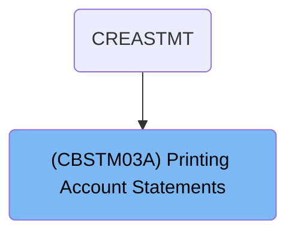

# Workflow

# Startup and JCL Context Setup

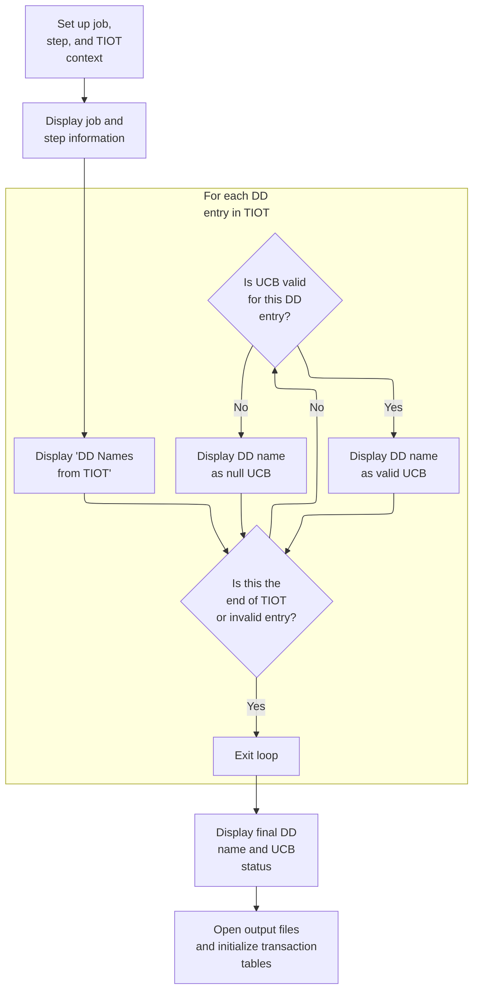

This section initializes the batch job's runtime context, displays job and step information, iterates through DD entries to report their status, and prepares output files and tables for main processing.

| Rule ID | Code Location      | Category       | Rule Name                          | Description                                                                                                                                                                                | Conditions                                                                 | Remarks                                                                                                                                                                                            |
| ------- | ------------------ | -------------- | ---------------------------------- | ------------------------------------------------------------------------------------------------------------------------------------------------------------------------------------------ | -------------------------------------------------------------------------- | -------------------------------------------------------------------------------------------------------------------------------------------------------------------------------------------------- |
| BR-001  | PROCEDURE DIVISION | Business logic | Display JCL Job and Step           | The current JCL job name and step name must be displayed at the start of the batch job.                                                                                                    | At the start of the batch job, after pointers are set to control blocks.   | The job name and step name are displayed as strings, each 8 characters long, in the format: 'Running JCL : <jobname> Step <stepname>'.                                                             |
| BR-002  | PROCEDURE DIVISION | Business logic | Display DD Name and UCB Status     | All DD entries in the TIOT must be displayed with their DD name and UCB validity status. If the UCB address is not LOW-VALUES, the DD is marked as valid; otherwise, it is marked as null. | For each DD entry in the TIOT during the batch job's initialization phase. | The DD name is displayed as an 8-character string. The UCB status is shown as either '-- valid UCB' or '-- null UCB' appended to the DD name. The check for null UCB uses the constant LOW-VALUES. |
| BR-003  | PROCEDURE DIVISION | Business logic | Final DD Entry Display             | After iterating through all DD entries, the current DD entry's name and UCB status must be displayed one final time to ensure no entry is missed.                                          | After the PERFORM loop over TIOT entries completes.                        | The DD name is displayed as an 8-character string, with the UCB status shown as either '-- valid UCB' or '-- null UCB'.                                                                            |
| BR-004  | PROCEDURE DIVISION | Technical step | Initialize Output Files and Tables | Output files and transaction tables must be opened and initialized before main processing begins.                                                                                          | After displaying all DD entries and before main logic is invoked.          | The output files and transaction tables are prepared for use in subsequent processing steps. No specific format is displayed to the user.                                                          |

<SwmSnippet path="/app/cbl/CBSTM03A.CBL" line="262" repo-id="Z2l0aHViJTNBJTNBa3luZHJ5bC1hd3MtbWFpbmZyYW1lLW1vZGVybml6YXRpb24tY2FyZGRlbW8lM0ElM0FTd2ltbS1EZW1v">

---

In PROCEDURE-DIVISION, we kick off by setting up pointers to control blocks (PSA, TCB, TIOT), display the current JCL job and step, and prep for iterating over DD names. This sets up the runtime context for the rest of the batch job.

```cobol
       PROCEDURE DIVISION.
      *****************************************************************
      *    Check Unit Control blocks                                  *
      *****************************************************************
           SET ADDRESS OF PSA-BLOCK   TO PSAPTR.
           SET ADDRESS OF TCB-BLOCK   TO TCB-POINT.
           SET ADDRESS OF TIOT-BLOCK  TO TIOT-POINT.
           SET TIOT-INDEX             TO TIOT-POINT.
           DISPLAY 'Running JCL : ' TIOTNJOB ' Step ' TIOTJSTP.

           COMPUTE BUMP-TIOT = BUMP-TIOT + LENGTH OF TIOT-BLOCK.
           SET ADDRESS OF TIOT-ENTRY  TO TIOT-INDEX.

           DISPLAY 'DD Names from TIOT: '.
```

---

</SwmSnippet>

<SwmSnippet path="/app/cbl/CBSTM03A.CBL" line="276" repo-id="Z2l0aHViJTNBJTNBa3luZHJ5bC1hd3MtbWFpbmZyYW1lLW1vZGVybml6YXRpb24tY2FyZGRlbW8lM0ElM0FTd2ltbS1EZW1v">

---

We scan the DD names and show which ones are usable for file operations.

```cobol
           PERFORM UNTIL END-OF-TIOT
                      OR TIO-LEN = LOW-VALUES
               IF NOT NULL-UCB
                   DISPLAY ': ' TIOCDDNM ' -- valid UCB'
               ELSE
                   DISPLAY ': ' TIOCDDNM ' --  null UCB'
               END-IF
               COMPUTE BUMP-TIOT = BUMP-TIOT + LENGTH OF TIOT-SEG
               SET ADDRESS OF TIOT-ENTRY TO TIOT-INDEX
           END-PERFORM.
```

---

</SwmSnippet>

<SwmSnippet path="/app/cbl/CBSTM03A.CBL" line="287" repo-id="Z2l0aHViJTNBJTNBa3luZHJ5bC1hd3MtbWFpbmZyYW1lLW1vZGVybml6YXRpb24tY2FyZGRlbW8lM0ElM0FTd2ltbS1EZW1v">

---

After looping, we do a final check on the current TIOT entry to display its DD name and UCB status, making sure nothing is missed before moving on.

```cobol
           IF NOT NULL-UCB
               DISPLAY ': ' TIOCDDNM ' -- valid UCB'
           ELSE
               DISPLAY ': ' TIOCDDNM ' -- null  UCB'
           END-IF.
```

---

</SwmSnippet>

<SwmSnippet path="/app/cbl/CBSTM03A.CBL" line="293" repo-id="Z2l0aHViJTNBJTNBa3luZHJ5bC1hd3MtbWFpbmZyYW1lLW1vZGVybml6YXRpb24tY2FyZGRlbW8lM0ElM0FTd2ltbS1EZW1v">

---

We prep files/tables and hand off to the main logic entry point.

```cobol
           OPEN OUTPUT STMT-FILE HTML-FILE.
           INITIALIZE WS-TRNX-TABLE WS-TRN-TBL-CNTR.

       0000-START.
```

---

</SwmSnippet>

# File Selection and Operation Dispatch

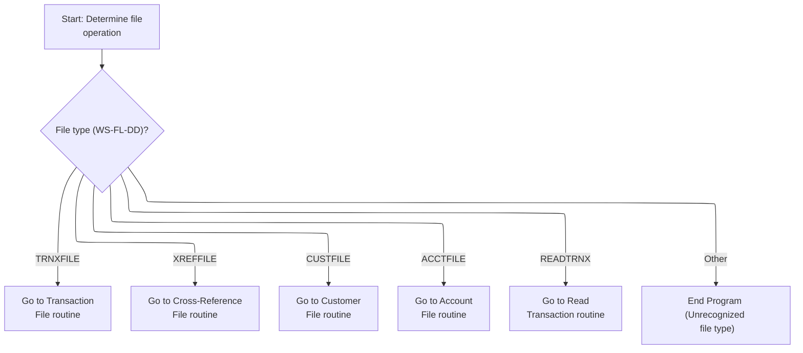

This section determines which file operation routine to execute based on the file type indicator. It ensures that the correct business logic is invoked for each supported file type and handles unrecognized types by terminating the program.

| Rule ID | Code Location | Category       | Rule Name                       | Description                                                                                                                                         | Conditions                                                                                             | Remarks                                                                                                                                   |
| ------- | ------------- | -------------- | ------------------------------- | --------------------------------------------------------------------------------------------------------------------------------------------------- | ------------------------------------------------------------------------------------------------------ | ----------------------------------------------------------------------------------------------------------------------------------------- |
| BR-001  | 0000-START    | Business logic | Transaction File Dispatch       | When the file type indicator is set to 'TRNXFILE', the program must dispatch control to the Transaction File open routine.                          | The file type indicator equals 'TRNXFILE'.                                                             | The recognized value is the string 'TRNXFILE', which is 8 characters long and left-aligned. No padding or special formatting is required. |
| BR-002  | 0000-START    | Business logic | Cross-Reference File Dispatch   | When the file type indicator is set to 'XREFFILE', the program must dispatch control to the Cross-Reference File open routine.                      | The file type indicator equals 'XREFFILE'.                                                             | The recognized value is the string 'XREFFILE', which is 8 characters long and left-aligned.                                               |
| BR-003  | 0000-START    | Business logic | Customer File Dispatch          | When the file type indicator is set to 'CUSTFILE', the program must dispatch control to the Customer File open routine.                             | The file type indicator equals 'CUSTFILE'.                                                             | The recognized value is the string 'CUSTFILE', which is 8 characters long and left-aligned.                                               |
| BR-004  | 0000-START    | Business logic | Account File Dispatch           | When the file type indicator is set to 'ACCTFILE', the program must dispatch control to the Account File open routine.                              | The file type indicator equals 'ACCTFILE'.                                                             | The recognized value is the string 'ACCTFILE', which is 8 characters long and left-aligned.                                               |
| BR-005  | 0000-START    | Business logic | Read Transaction Dispatch       | When the file type indicator is set to 'READTRNX', the program must dispatch control to the Read Transaction routine.                               | The file type indicator equals 'READTRNX'.                                                             | The recognized value is the string 'READTRNX', which is 8 characters long and left-aligned.                                               |
| BR-006  | 0000-START    | Error handling | Unrecognized File Type Handling | When the file type indicator is set to any value other than the recognized file types, the program must terminate and return control to the caller. | The file type indicator is not equal to 'TRNXFILE', 'XREFFILE', 'CUSTFILE', 'ACCTFILE', or 'READTRNX'. | Any value not matching the recognized 8-character strings will trigger program termination.                                               |

<SwmSnippet path="/app/cbl/CBSTM03A.CBL" line="296" repo-id="Z2l0aHViJTNBJTNBa3luZHJ5bC1hd3MtbWFpbmZyYW1lLW1vZGVybml6YXRpb24tY2FyZGRlbW8lM0ElM0FTd2ltbS1EZW1v">

---

`0000-START` checks which file we're working with and routes control to the right open/read logic using ALTER and GO TO. If it's a file open, we jump to 8100-FILE-OPEN next.

```cobol
       0000-START.

           EVALUATE WS-FL-DD
             WHEN 'TRNXFILE'
               ALTER 8100-FILE-OPEN TO PROCEED TO 8100-TRNXFILE-OPEN
               GO TO 8100-FILE-OPEN
             WHEN 'XREFFILE'
               ALTER 8100-FILE-OPEN TO PROCEED TO 8200-XREFFILE-OPEN
               GO TO 8100-FILE-OPEN
             WHEN 'CUSTFILE'
               ALTER 8100-FILE-OPEN TO PROCEED TO 8300-CUSTFILE-OPEN
               GO TO 8100-FILE-OPEN
             WHEN 'ACCTFILE'
               ALTER 8100-FILE-OPEN TO PROCEED TO 8400-ACCTFILE-OPEN
               GO TO 8100-FILE-OPEN
             WHEN 'READTRNX'
               GO TO 8500-READTRNX-READ
             WHEN OTHER
               GO TO 9999-GOBACK.
```

---

</SwmSnippet>

# File Open Routing

This section ensures that when the file open process is initiated, control is routed to the correct logic for opening the transaction file. It acts as a technical routing step in the program flow.

| Rule ID | Code Location  | Category       | Rule Name         | Description                                                                                            | Conditions                                                                 | Remarks                                                                                      |
| ------- | -------------- | -------------- | ----------------- | ------------------------------------------------------------------------------------------------------ | -------------------------------------------------------------------------- | -------------------------------------------------------------------------------------------- |
| BR-001  | 8100-FILE-OPEN | Technical step | File Open Routing | When the file open process is initiated, control is routed to the transaction file open logic section. | The file open process is started by invoking the 8100-FILE-OPEN paragraph. | No constants or specific formats are involved. This rule is about program flow control only. |

<SwmSnippet path="/app/cbl/CBSTM03A.CBL" line="726" repo-id="Z2l0aHViJTNBJTNBa3luZHJ5bC1hd3MtbWFpbmZyYW1lLW1vZGVybml6YXRpb24tY2FyZGRlbW8lM0ElM0FTd2ltbS1EZW1v">

---

`8100-FILE-OPEN` just routes control straight to 8100-TRNXFILE-OPEN, so all the real file open logic happens there.

```cobol
       8100-FILE-OPEN.
           GO TO 8100-TRNXFILE-OPEN
           .
```

---

</SwmSnippet>

# Transaction File Open and Initial Read

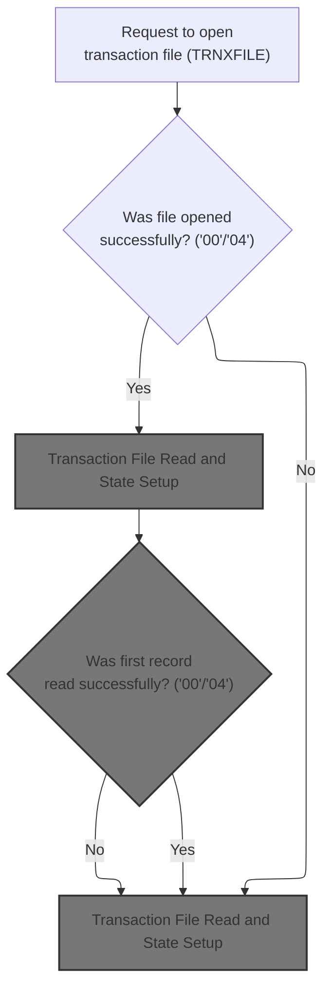

This section governs the business logic for opening the transaction file (TRNXFILE), determining success or failure based on return codes, and handling errors appropriately.

| Rule ID | Code Location      | Category        | Rule Name                              | Description                                                                                                                                        | Conditions                                                                  | Remarks                                                                                                                                   |
| ------- | ------------------ | --------------- | -------------------------------------- | -------------------------------------------------------------------------------------------------------------------------------------------------- | --------------------------------------------------------------------------- | ----------------------------------------------------------------------------------------------------------------------------------------- |
| BR-001  | 8100-TRNXFILE-OPEN | Data validation | Transaction File Identification        | The transaction file to be opened must be identified as 'TRNXFILE' before the open operation is attempted.                                         | A request to open the transaction file is received.                         | The file name used for the open operation is 'TRNXFILE', which is an 8-character string.                                                  |
| BR-002  | 8100-TRNXFILE-OPEN | Business logic  | Transaction File Open Success          | If the transaction file open operation returns a code of '00' or '04', the process continues without error.                                        | The transaction file open operation returns a code of '00' or '04'.         | The accepted return codes for a successful open are '00' and '04'. The file name involved is 'TRNXFILE'.                                  |
| BR-003  | 8100-TRNXFILE-OPEN | Error handling  | Transaction File Open Failure Handling | If the transaction file open operation returns any code other than '00' or '04', an error is reported and the error handling routine is triggered. | The transaction file open operation returns a code other than '00' or '04'. | Any return code other than '00' or '04' is considered a failure. The error handling routine is invoked, and error messages are displayed. |

<SwmSnippet path="/app/cbl/CBSTM03A.CBL" line="730" repo-id="Z2l0aHViJTNBJTNBa3luZHJ5bC1hd3MtbWFpbmZyYW1lLW1vZGVybml6YXRpb24tY2FyZGRlbW8lM0ElM0FTd2ltbS1EZW1v">

---

In 8100-TRNXFILE-OPEN, we set up the workspace for 'TRNXFILE', call CBSTM03B to open it, check the return code, and handle errors. This delegates file handling to a shared routine.

```cobol
       8100-TRNXFILE-OPEN.
           MOVE 'TRNXFILE' TO WS-M03B-DD.
           SET M03B-OPEN TO TRUE.
           MOVE ZERO TO WS-M03B-RC.
           CALL 'CBSTM03B' USING WS-M03B-AREA.

           IF WS-M03B-RC = '00' OR '04'
               CONTINUE
           ELSE
               DISPLAY 'ERROR OPENING TRNXFILE'
               DISPLAY 'RETURN CODE: ' WS-M03B-RC
               PERFORM 9999-ABEND-PROGRAM
           END-IF.
```

---

</SwmSnippet>

## File Operation Dispatch (CBSTM03B)

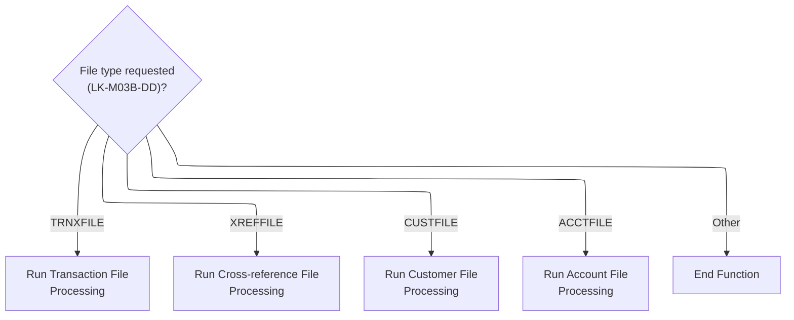

This section dispatches file operation requests to the appropriate processing routines based on the file type specified in the input. It ensures that only supported file types are processed and that unsupported requests are safely terminated.

| Rule ID | Code Location | Category       | Rule Name                      | Description                                                                                                                                                   | Conditions                                                                          | Remarks                                                                                                                |
| ------- | ------------- | -------------- | ------------------------------ | ------------------------------------------------------------------------------------------------------------------------------------------------------------- | ----------------------------------------------------------------------------------- | ---------------------------------------------------------------------------------------------------------------------- |
| BR-001  | 0000-START    | Business logic | Transaction File Dispatch      | If the file type requested is 'TRNXFILE', the transaction file processing routine is invoked.                                                                 | LK-M03B-DD equals 'TRNXFILE'.                                                       | The file type value must be the exact string 'TRNXFILE' (8 characters, left-aligned, padded with spaces if necessary). |
| BR-002  | 0000-START    | Business logic | Cross-reference File Dispatch  | If the file type requested is 'XREFFILE', the cross-reference file processing routine is invoked.                                                             | LK-M03B-DD equals 'XREFFILE'.                                                       | The file type value must be the exact string 'XREFFILE' (8 characters, left-aligned, padded with spaces if necessary). |
| BR-003  | 0000-START    | Business logic | Customer File Dispatch         | If the file type requested is 'CUSTFILE', the customer file processing routine is invoked.                                                                    | LK-M03B-DD equals 'CUSTFILE'.                                                       | The file type value must be the exact string 'CUSTFILE' (8 characters, left-aligned, padded with spaces if necessary). |
| BR-004  | 0000-START    | Business logic | Account File Dispatch          | If the file type requested is 'ACCTFILE', the account file processing routine is invoked.                                                                     | LK-M03B-DD equals 'ACCTFILE'.                                                       | The file type value must be the exact string 'ACCTFILE' (8 characters, left-aligned, padded with spaces if necessary). |
| BR-005  | 0000-START    | Error handling | Unsupported File Type Handling | If the file type requested does not match any of the supported values ('TRNXFILE', 'XREFFILE', 'CUSTFILE', 'ACCTFILE'), the function ends without processing. | LK-M03B-DD does not equal any of 'TRNXFILE', 'XREFFILE', 'CUSTFILE', or 'ACCTFILE'. | Any value other than the four supported file types will result in immediate termination of the function.               |

<SwmSnippet path="/app/cbl/CBSTM03B.CBL" line="116" repo-id="Z2l0aHViJTNBJTNBa3luZHJ5bC1hd3MtbWFpbmZyYW1lLW1vZGVybml6YXRpb24tY2FyZGRlbW8lM0ElM0FTd2ltbS1EZW1v">

---

In CBSTM03B's 0000-START, we pick the file type from LK-M03B-DD and jump to the right file operation handler using PERFORM THRU.

```cobol
       0000-START.

           EVALUATE LK-M03B-DD
             WHEN 'TRNXFILE'
               PERFORM 1000-TRNXFILE-PROC THRU 1999-EXIT
             WHEN 'XREFFILE'
               PERFORM 2000-XREFFILE-PROC THRU 2999-EXIT
             WHEN 'CUSTFILE'
               PERFORM 3000-CUSTFILE-PROC THRU 3999-EXIT
             WHEN 'ACCTFILE'
               PERFORM 4000-ACCTFILE-PROC THRU 4999-EXIT
             WHEN OTHER
               GO TO 9999-GOBACK.
```

---

</SwmSnippet>

## Transaction File Handler

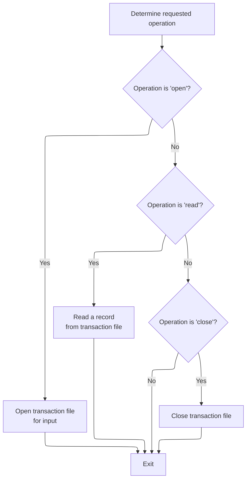

This section determines and executes the requested operation (open, read, or close) on the transaction file based on the provided operation code.

| Rule ID | Code Location      | Category       | Rule Name                            | Description                                                                                       | Conditions                                  | Remarks                                                                                                 |
| ------- | ------------------ | -------------- | ------------------------------------ | ------------------------------------------------------------------------------------------------- | ------------------------------------------- | ------------------------------------------------------------------------------------------------------- |
| BR-001  | 1000-TRNXFILE-PROC | Business logic | Open Transaction File                | When the operation code is 'O', the transaction file is opened for input.                         | The operation code is set to 'O'.           | The operation code is a single character string. The value 'O' triggers the open action.                |
| BR-002  | 1000-TRNXFILE-PROC | Business logic | Read Transaction File Record         | When the operation code is 'R', a record is read from the transaction file.                       | The operation code is set to 'R'.           | The operation code is a single character string. The value 'R' triggers the read action.                |
| BR-003  | 1000-TRNXFILE-PROC | Business logic | Close Transaction File               | When the operation code is 'C', the transaction file is closed.                                   | The operation code is set to 'C'.           | The operation code is a single character string. The value 'C' triggers the close action.               |
| BR-004  | 1000-TRNXFILE-PROC | Business logic | No Action for Unrecognized Operation | If the operation code is not 'O', 'R', or 'C', no file action is performed and the section exits. | The operation code is not 'O', 'R', or 'C'. | The operation code is a single character string. Only 'O', 'R', and 'C' are recognized in this section. |

<SwmSnippet path="/app/cbl/CBSTM03B.CBL" line="133" repo-id="Z2l0aHViJTNBJTNBa3luZHJ5bC1hd3MtbWFpbmZyYW1lLW1vZGVybml6YXRpb24tY2FyZGRlbW8lM0ElM0FTd2ltbS1EZW1v">

---

In 1000-TRNXFILE-PROC, we check which operation flag is set and perform open, read, or close on the transaction file, then exit.

```cobol
       1000-TRNXFILE-PROC.

           IF M03B-OPEN
               OPEN INPUT TRNX-FILE
               GO TO 1900-EXIT
           END-IF.

           IF M03B-READ
               READ TRNX-FILE INTO LK-M03B-FLDT
               END-READ
               GO TO 1900-EXIT
           END-IF.

           IF M03B-CLOSE
               CLOSE TRNX-FILE
               GO TO 1900-EXIT
           END-IF.
```

---

</SwmSnippet>

## XREF and Customer File Handlers

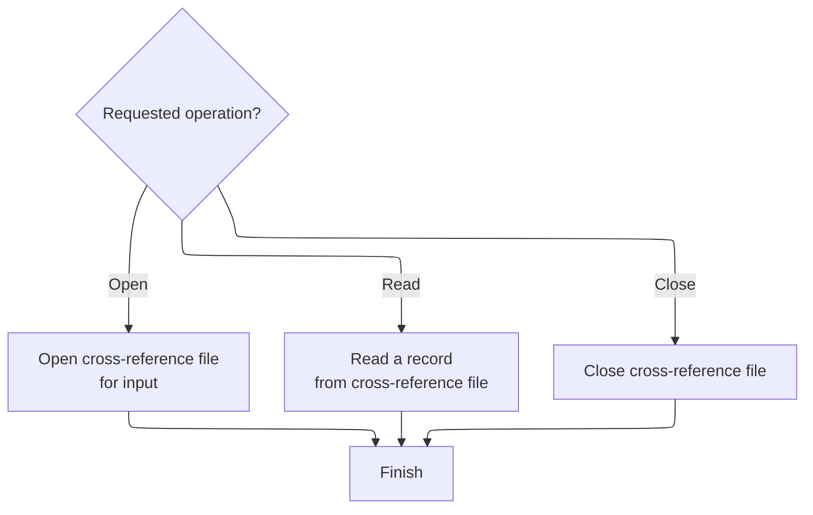

This section governs how the cross-reference and customer files are accessed and managed based on the requested operation, ensuring that files are opened, read, and closed according to business requirements.

| Rule ID | Code Location                          | Category       | Rule Name                 | Description                                                                                                                                                                 | Conditions                                                                                                     | Remarks                                                                                                                                                                                                                     |
| ------- | -------------------------------------- | -------------- | ------------------------- | --------------------------------------------------------------------------------------------------------------------------------------------------------------------------- | -------------------------------------------------------------------------------------------------------------- | --------------------------------------------------------------------------------------------------------------------------------------------------------------------------------------------------------------------------- |
| BR-001  | 2000-XREFFILE-PROC, 3000-CUSTFILE-PROC | Business logic | File Open Requirement     | When the requested operation is 'Open', the corresponding file (cross-reference or customer) must be opened for input before any read or close operations can be performed. | The operation flag is set to 'O' (Open) for the target file.                                                   | Operation flag values: 'O' for open. Applies to both XREF and customer files. No specific output format is required for this operation.                                                                                     |
| BR-002  | 2000-XREFFILE-PROC                     | Business logic | Cross-Reference File Read | When the requested operation is 'Read', a record must be read from the cross-reference file and placed into the designated output area.                                     | The operation flag is set to 'R' (Read) for the cross-reference file.                                          | Operation flag value: 'R' for read. The output is a record from the cross-reference file, placed into the designated output area. No specific format constraints are stated.                                                |
| BR-003  | 3000-CUSTFILE-PROC                     | Business logic | Customer File Read by Key | When the requested operation is 'Read by Key', the key value must be set in the customer ID field before reading the corresponding record from the customer file.           | The operation flag is set to 'K' (Read by Key) for the customer file, and a key value and length are provided. | Operation flag value: 'K' for read by key. The key is a string of up to 25 characters, and its length is specified. The output is a record from the customer file matching the key, placed into the designated output area. |
| BR-004  | 2000-XREFFILE-PROC, 3000-CUSTFILE-PROC | Business logic | File Close Requirement    | When the requested operation is 'Close', the corresponding file (cross-reference or customer) must be closed to release resources and complete the transaction.             | The operation flag is set to 'C' (Close) for the target file.                                                  | Operation flag value: 'C' for close. Applies to both XREF and customer files. No specific output format is required for this operation.                                                                                     |

<SwmSnippet path="/app/cbl/CBSTM03B.CBL" line="157" repo-id="Z2l0aHViJTNBJTNBa3luZHJ5bC1hd3MtbWFpbmZyYW1lLW1vZGVybml6YXRpb24tY2FyZGRlbW8lM0ElM0FTd2ltbS1EZW1v">

---

In 2000-XREFFILE-PROC, we use flags to decide if we're opening, reading, or closing XREF-FILE, then jump to exit after each operation. The caller is responsible for setting the right flag.

```cobol
       2000-XREFFILE-PROC.

           IF M03B-OPEN
               OPEN INPUT XREF-FILE
               GO TO 2900-EXIT
           END-IF.

           IF M03B-READ
               READ XREF-FILE INTO LK-M03B-FLDT
               END-READ
               GO TO 2900-EXIT
           END-IF.

           IF M03B-CLOSE
               CLOSE XREF-FILE
               GO TO 2900-EXIT
           END-IF.
```

---

</SwmSnippet>

<SwmSnippet path="/app/cbl/CBSTM03B.CBL" line="181" repo-id="Z2l0aHViJTNBJTNBa3luZHJ5bC1hd3MtbWFpbmZyYW1lLW1vZGVybml6YXRpb24tY2FyZGRlbW8lM0ElM0FTd2ltbS1EZW1v">

---

In 3000-CUSTFILE-PROC, we use flags to pick open, read-by-key, or close. For reads, we copy the key to the customer ID field before reading, then exit.

```cobol
       3000-CUSTFILE-PROC.

           IF M03B-OPEN
               OPEN INPUT CUST-FILE
               GO TO 3900-EXIT
           END-IF.

           IF M03B-READ-K
               MOVE LK-M03B-KEY (1:LK-M03B-KEY-LN) TO FD-CUST-ID
               READ CUST-FILE INTO LK-M03B-FLDT
               END-READ
               GO TO 3900-EXIT
           END-IF.

           IF M03B-CLOSE
               CLOSE CUST-FILE
               GO TO 3900-EXIT
           END-IF.
```

---

</SwmSnippet>

## Transaction File Read and State Setup

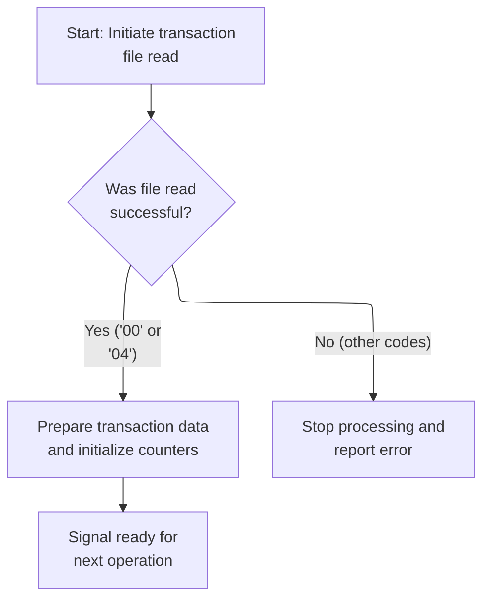

This section governs the reading of the transaction file and the setup of initial state for transaction processing, including error handling and readiness signaling.

| Rule ID | Code Location | Category       | Rule Name                                    | Description                                                                                                                         | Conditions                                                                    | Remarks                                                                                                                                                                                                                       |
| ------- | ------------- | -------------- | -------------------------------------------- | ----------------------------------------------------------------------------------------------------------------------------------- | ----------------------------------------------------------------------------- | ----------------------------------------------------------------------------------------------------------------------------------------------------------------------------------------------------------------------------- |
| BR-001  | MAIN-LOGIC    | Business logic | Transaction file read success initialization | If the transaction file read result code is '00' or '04', transaction data is prepared and counters are initialized for processing. | The transaction file read result code is equal to '00' or '04'.               | Transaction data is prepared by moving the file data to the transaction record. The card number is saved. The counter for cards is set to 1 and the transaction counter is set to 0. The readiness flag is set to 'READTRNX'. |
| BR-002  | MAIN-LOGIC    | Business logic | Signal readiness for next operation          | After successful transaction file read and initialization, the system signals readiness for the next operation.                     | Transaction file read was successful and initialization steps were completed. | Readiness is signaled by setting the readiness flag to 'READTRNX' and transferring control to the main entry point.                                                                                                           |
| BR-003  | MAIN-LOGIC    | Error handling | Transaction file read error handling         | If the transaction file read result code is not '00' or '04', processing is stopped and an error message is reported.               | The transaction file read result code is not equal to '00' or '04'.           | Error messages are displayed as strings: 'ERROR READING TRNXFILE' and 'RETURN CODE: <code>'. Processing is terminated via program abend.                                                                                      |

<SwmSnippet path="/app/cbl/CBSTM03A.CBL" line="744" repo-id="Z2l0aHViJTNBJTNBa3luZHJ5bC1hd3MtbWFpbmZyYW1lLW1vZGVybml6YXRpb24tY2FyZGRlbW8lM0ElM0FTd2ltbS1EZW1v">

---

We check the read result and bail out if it failed.

```cobol
           SET M03B-READ TO TRUE.
           MOVE SPACES TO WS-M03B-FLDT.
           CALL 'CBSTM03B' USING WS-M03B-AREA.

           IF WS-M03B-RC = '00' OR '04'
               CONTINUE
           ELSE
               DISPLAY 'ERROR READING TRNXFILE'
               DISPLAY 'RETURN CODE: ' WS-M03B-RC
               PERFORM 9999-ABEND-PROGRAM
           END-IF.
```

---

</SwmSnippet>

<SwmSnippet path="/app/cbl/CBSTM03A.CBL" line="756" repo-id="Z2l0aHViJTNBJTNBa3luZHJ5bC1hd3MtbWFpbmZyYW1lLW1vZGVybml6YXRpb24tY2FyZGRlbW8lM0ElM0FTd2ltbS1EZW1v">

---

We prep transaction state and loop back to the main entry.

```cobol
           MOVE WS-M03B-FLDT TO TRNX-RECORD.
           MOVE TRNX-CARD-NUM TO WS-SAVE-CARD.
           MOVE 1 TO CR-CNT.
           MOVE 0 TO TR-CNT.
           MOVE 'READTRNX' TO WS-FL-DD.
           GO TO 0000-START.
           EXIT.
```

---

</SwmSnippet>

# Mainline Loop and XREF Record Fetch

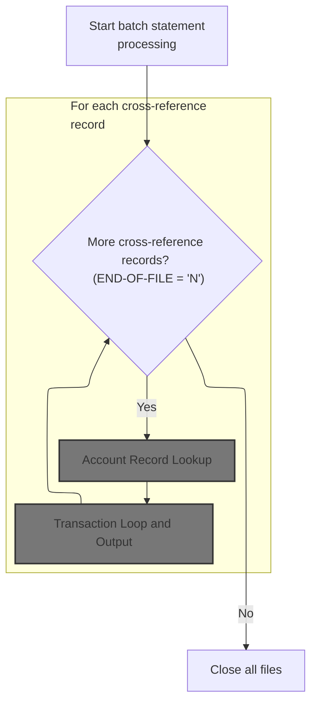

This section governs the main batch processing loop for cross-reference records, ensuring each record is processed in sequence, handling errors, and managing record-level initialization.

| Rule ID | Code Location                         | Category       | Rule Name                    | Description                                                                                                                                                                                | Conditions                                                                   | Remarks                                                                                                                                                                       |
| ------- | ------------------------------------- | -------------- | ---------------------------- | ------------------------------------------------------------------------------------------------------------------------------------------------------------------------------------------ | ---------------------------------------------------------------------------- | ----------------------------------------------------------------------------------------------------------------------------------------------------------------------------- |
| BR-001  | 1000-MAINLINE, 1000-XREFFILE-GET-NEXT | Business logic | End-of-file termination      | Processing continues for each cross-reference record until the end-of-file condition is reached. When END-OF-FILE is set to 'Y', no further records are processed and the loop terminates. | END-OF-FILE is set to 'Y' after reading a cross-reference record.            | END-OF-FILE is a single-character flag with possible values 'N' (not end) and 'Y' (end).                                                                                      |
| BR-002  | 1000-MAINLINE                         | Business logic | Sequential record processing | For each cross-reference record, the system performs customer record lookup, account record lookup, statement creation, and transaction processing in sequence.                            | END-OF-FILE is 'N' after fetching a cross-reference record.                  | Each record triggers a sequence of actions: customer lookup, account lookup, statement creation, transaction processing. No specific output format is enforced at this stage. |
| BR-003  | 1000-MAINLINE                         | Business logic | Record initialization        | At the start of processing each cross-reference record, the jump counter is set to 1 and the total amount accumulator is reset to zero.                                                    | After statement creation for each cross-reference record.                    | Jump counter is set to 1 (numeric), total amount accumulator is set to zero (numeric with two decimal places).                                                                |
| BR-004  | 1000-XREFFILE-GET-NEXT                | Error handling | Error handling on XREF read  | If an error occurs while reading a cross-reference record (return code other than '00' or '10'), the system displays an error message and terminates the program.                          | Return code from XREF file read is not '00' (success) or '10' (end-of-file). | Error message is displayed as a string, including the return code value. Program termination is triggered.                                                                    |

<SwmSnippet path="/app/cbl/CBSTM03A.CBL" line="316" repo-id="Z2l0aHViJTNBJTNBa3luZHJ5bC1hd3MtbWFpbmZyYW1lLW1vZGVybml6YXRpb24tY2FyZGRlbW8lM0ElM0FTd2ltbS1EZW1v">

---

In 1000-MAINLINE, we loop until all records are processed, calling 1000-XREFFILE-GET-NEXT each time to fetch the next XREF record.

```cobol
       1000-MAINLINE.
           PERFORM UNTIL END-OF-FILE = 'Y'
               IF  END-OF-FILE = 'N'
                   PERFORM 1000-XREFFILE-GET-NEXT
                   IF  END-OF-FILE = 'N'
                       PERFORM 2000-CUSTFILE-GET
                       PERFORM 3000-ACCTFILE-GET
                       PERFORM 5000-CREATE-STATEMENT
                       MOVE 1 TO CR-JMP
                       MOVE ZERO TO WS-TOTAL-AMT
                       PERFORM 4000-TRNXFILE-GET
                   END-IF
               END-IF
           END-PERFORM.
```

---

</SwmSnippet>

<SwmSnippet path="/app/cbl/CBSTM03A.CBL" line="345" repo-id="Z2l0aHViJTNBJTNBa3luZHJ5bC1hd3MtbWFpbmZyYW1lLW1vZGVybml6YXRpb24tY2FyZGRlbW8lM0ElM0FTd2ltbS1EZW1v">

---

In 1000-XREFFILE-GET-NEXT, we set up the workspace for XREF file, call CBSTM03B to read the next record, check the return code for EOF or errors, and copy the buffer to CARD-XREF-RECORD.

```cobol
       1000-XREFFILE-GET-NEXT.

           MOVE 'XREFFILE' TO WS-M03B-DD.
           SET M03B-READ TO TRUE.
           MOVE ZERO TO WS-M03B-RC.
           MOVE SPACES TO WS-M03B-FLDT.
           CALL 'CBSTM03B' USING WS-M03B-AREA.

           EVALUATE WS-M03B-RC
             WHEN '00'
               CONTINUE
             WHEN '10'
               MOVE 'Y' TO END-OF-FILE
             WHEN OTHER
               DISPLAY 'ERROR READING XREFFILE'
               DISPLAY 'RETURN CODE: ' WS-M03B-RC
               PERFORM 9999-ABEND-PROGRAM
           END-EVALUATE.

           MOVE WS-M03B-FLDT TO CARD-XREF-RECORD.

           EXIT.
```

---

</SwmSnippet>

## Customer Record Lookup

This section governs the process of looking up a customer record by customer ID, handling both successful retrievals and errors, and mapping the result to the output buffer.

| Rule ID | Code Location     | Category       | Rule Name                               | Description                                                                                                                                   | Conditions                                                | Remarks                                                                                                            |
| ------- | ----------------- | -------------- | --------------------------------------- | --------------------------------------------------------------------------------------------------------------------------------------------- | --------------------------------------------------------- | ------------------------------------------------------------------------------------------------------------------ |
| BR-001  | 2000-CUSTFILE-GET | Business logic | Successful customer record retrieval    | When a customer record is successfully found using the provided customer ID, the retrieved customer data is returned as the output.           | The read operation returns a result code of '00'.         | The customer record is returned as a string of up to 1000 bytes, matching the format of the retrieved data buffer. |
| BR-002  | 2000-CUSTFILE-GET | Business logic | Customer record output mapping          | The customer record output is always mapped directly from the retrieved data buffer after a lookup attempt, regardless of success or failure. | After the read operation completes.                       | The output format is a string of up to 1000 bytes, matching the retrieved data buffer.                             |
| BR-003  | 2000-CUSTFILE-GET | Error handling | Customer record lookup failure handling | If the customer record lookup fails, an error message is displayed and the program is abended.                                                | The read operation returns a result code other than '00'. | The error message includes the text 'ERROR READING CUSTFILE' and the actual return code value.                     |

<SwmSnippet path="/app/cbl/CBSTM03A.CBL" line="368" repo-id="Z2l0aHViJTNBJTNBa3luZHJ5bC1hd3MtbWFpbmZyYW1lLW1vZGVybml6YXRpb24tY2FyZGRlbW8lM0ElM0FTd2ltbS1EZW1v">

---

In 2000-CUSTFILE-GET, we prep the workspace for a key-based read, copy the customer ID as the key, set the key length, and call CBSTM03B to fetch the record.

```cobol
       2000-CUSTFILE-GET.

           MOVE 'CUSTFILE' TO WS-M03B-DD.
           SET M03B-READ-K TO TRUE.
           MOVE XREF-CUST-ID TO WS-M03B-KEY.
           MOVE ZERO TO WS-M03B-KEY-LN.
           COMPUTE WS-M03B-KEY-LN = LENGTH OF XREF-CUST-ID.
           MOVE ZERO TO WS-M03B-RC.
           MOVE SPACES TO WS-M03B-FLDT.
           CALL 'CBSTM03B' USING WS-M03B-AREA.
```

---

</SwmSnippet>

<SwmSnippet path="/app/cbl/CBSTM03A.CBL" line="379" repo-id="Z2l0aHViJTNBJTNBa3luZHJ5bC1hd3MtbWFpbmZyYW1lLW1vZGVybml6YXRpb24tY2FyZGRlbW8lM0ElM0FTd2ltbS1EZW1v">

---

Back in 2000-CUSTFILE-GET, after returning from CBSTM03B, we check the read result and copy the buffer to CUSTOMER-RECORD if successful, or handle errors if not.

```cobol
           EVALUATE WS-M03B-RC
             WHEN '00'
               CONTINUE
             WHEN OTHER
               DISPLAY 'ERROR READING CUSTFILE'
               DISPLAY 'RETURN CODE: ' WS-M03B-RC
               PERFORM 9999-ABEND-PROGRAM
           END-EVALUATE.

           MOVE WS-M03B-FLDT TO CUSTOMER-RECORD.

           EXIT.
```

---

</SwmSnippet>

## Account Record Lookup

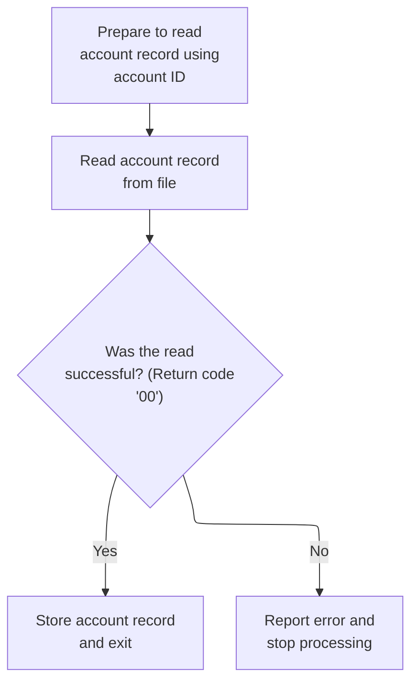

This section governs the business logic for looking up an account record using an account ID, handling both successful retrievals and error scenarios.

| Rule ID | Code Location     | Category        | Rule Name                            | Description                                                                                                                                                            | Conditions                                                  | Remarks                                                                                              |
| ------- | ----------------- | --------------- | ------------------------------------ | ---------------------------------------------------------------------------------------------------------------------------------------------------------------------- | ----------------------------------------------------------- | ---------------------------------------------------------------------------------------------------- |
| BR-001  | 3000-ACCTFILE-GET | Data validation | Account ID Key Requirement           | When an account record is requested, the system must use the provided account ID as the lookup key. The key must be exactly 11 digits, matching the account ID format. | An account record lookup is initiated.                      | The account ID must be 11 digits. The lookup key is set to the account ID before the read operation. |
| BR-002  | 3000-ACCTFILE-GET | Business logic  | Successful Account Record Retrieval  | If the account record is successfully found using the account ID, the system must return the account record as a 1000-byte alphanumeric string.                        | The account record lookup returns a success code ('00').    | The account record is returned as a 1000-byte alphanumeric string.                                   |
| BR-003  | 3000-ACCTFILE-GET | Error handling  | Account Record Lookup Error Handling | If the account record cannot be found or an error occurs during lookup, the system must report an error message and terminate processing.                              | The account record lookup returns any code other than '00'. | Error messages are displayed and processing is terminated.                                           |

<SwmSnippet path="/app/cbl/CBSTM03A.CBL" line="392" repo-id="Z2l0aHViJTNBJTNBa3luZHJ5bC1hd3MtbWFpbmZyYW1lLW1vZGVybml6YXRpb24tY2FyZGRlbW8lM0ElM0FTd2ltbS1EZW1v">

---

In 3000-ACCTFILE-GET, we prep the workspace for a key-based read, copy the account ID as the key, set the key length, and call CBSTM03B to fetch the record.

```cobol
       3000-ACCTFILE-GET.

           MOVE 'ACCTFILE' TO WS-M03B-DD.
           SET M03B-READ-K TO TRUE.
           MOVE XREF-ACCT-ID TO WS-M03B-KEY.
           MOVE ZERO TO WS-M03B-KEY-LN.
           COMPUTE WS-M03B-KEY-LN = LENGTH OF XREF-ACCT-ID.
           MOVE ZERO TO WS-M03B-RC.
           MOVE SPACES TO WS-M03B-FLDT.
           CALL 'CBSTM03B' USING WS-M03B-AREA.
```

---

</SwmSnippet>

<SwmSnippet path="/app/cbl/CBSTM03A.CBL" line="403" repo-id="Z2l0aHViJTNBJTNBa3luZHJ5bC1hd3MtbWFpbmZyYW1lLW1vZGVybml6YXRpb24tY2FyZGRlbW8lM0ElM0FTd2ltbS1EZW1v">

---

Back in 3000-ACCTFILE-GET, after returning from CBSTM03B, we check the read result and copy the buffer to ACCOUNT-RECORD if successful, or handle errors if not.

```cobol
           EVALUATE WS-M03B-RC
             WHEN '00'
               CONTINUE
             WHEN OTHER
               DISPLAY 'ERROR READING ACCTFILE'
               DISPLAY 'RETURN CODE: ' WS-M03B-RC
               PERFORM 9999-ABEND-PROGRAM
           END-EVALUATE.

           MOVE WS-M03B-FLDT TO ACCOUNT-RECORD.

           EXIT.
```

---

</SwmSnippet>

## Statement Generation

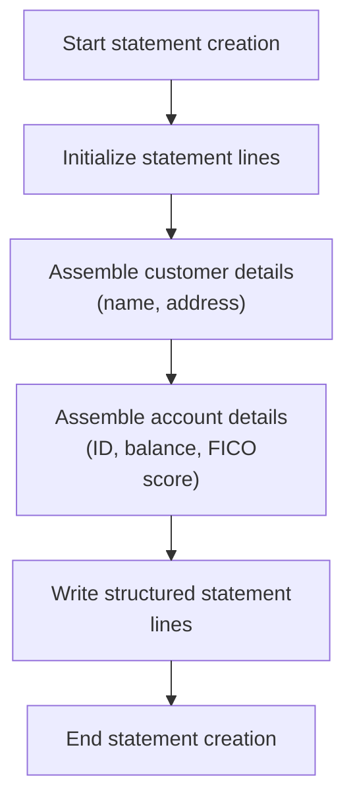

This section generates a formatted credit card statement for a customer, assembling customer and account details into a structured output with fixed-format lines and section headings.

| Rule ID | Code Location         | Category        | Rule Name                               | Description                                                                                                                                                                                            | Conditions                                  | Remarks                                                                                                                                                                                                                    |
| ------- | --------------------- | --------------- | --------------------------------------- | ------------------------------------------------------------------------------------------------------------------------------------------------------------------------------------------------------ | ------------------------------------------- | -------------------------------------------------------------------------------------------------------------------------------------------------------------------------------------------------------------------------- |
| BR-001  | 5000-CREATE-STATEMENT | Data validation | No Input Validation                     | No validation is performed on input fields during statement generation; all input data is assumed to be correct and complete.                                                                          | During statement generation.                | If input fields are missing or incorrect, the output will reflect this without error handling in this section.                                                                                                             |
| BR-002  | 5000-CREATE-STATEMENT | Business logic  | Customer Name Inclusion                 | The statement must include the customer's full name, assembled from first, middle, and last names, and placed in the designated name line of the statement.                                            | When generating a statement for a customer. | The name is assembled as a single string, up to 75 characters, left-aligned, and placed in the first data line after the header.                                                                                           |
| BR-003  | 5000-CREATE-STATEMENT | Business logic  | Customer Address Inclusion              | The statement must include the customer's address, split across three lines, with each line containing specific address components.                                                                    | When generating a statement for a customer. | Address line 1 and 2 are each up to 50 characters, left-aligned. Address line 3 combines address line 3, state code, country code, and ZIP, up to 80 characters.                                                           |
| BR-004  | 5000-CREATE-STATEMENT | Business logic  | Account Details Inclusion               | The statement must include the account ID, current balance, and FICO credit score, each in their designated lines with fixed labels and formats.                                                       | When generating a statement for a customer. | Account ID is up to 20 characters, left-aligned. Current balance is a numeric value with up to 9 digits before the decimal and 2 after, right-aligned. FICO score is up to 20 characters, left-aligned.                    |
| BR-005  | 5000-CREATE-STATEMENT | Business logic  | Statement Header and Section Formatting | The statement must begin with a header line containing the text 'START OF STATEMENT' surrounded by asterisks, and must include fixed-format section headings and separator lines at defined positions. | For every generated statement.              | Header: 80 characters, with 'START OF STATEMENT' centered and padded with asterisks. Section headings such as 'Basic Details' and 'TRANSACTION SUMMARY' are included in specific lines, with separator lines of 80 dashes. |
| BR-006  | 5000-CREATE-STATEMENT | Business logic  | Statement Line Order and Structure      | The statement output must follow a strict line order and structure, with each line corresponding to a specific part of the statement as defined in the STATEMENT-LINES structure.                      | For every generated statement.              | Lines are written in the order: header, name, address lines, section headings, account details, transaction summary, etc., as defined in STATEMENT-LINES. Each line has a fixed length and content as per the structure.   |

<SwmSnippet path="/app/cbl/CBSTM03A.CBL" line="458" repo-id="Z2l0aHViJTNBJTNBa3luZHJ5bC1hd3MtbWFpbmZyYW1lLW1vZGVybml6YXRpb24tY2FyZGRlbW8lM0ElM0FTd2ltbS1EZW1v">

---

In 5000-CREATE-STATEMENT, we initialize statement lines, write the header, and call a subroutine to write the HTML header before building the rest of the statement.

```cobol
       5000-CREATE-STATEMENT.
           INITIALIZE STATEMENT-LINES.
           WRITE FD-STMTFILE-REC FROM ST-LINE0.
           PERFORM 5100-WRITE-HTML-HEADER THRU 5100-EXIT.
```

---

</SwmSnippet>

<SwmSnippet path="/app/cbl/CBSTM03A.CBL" line="462" repo-id="Z2l0aHViJTNBJTNBa3luZHJ5bC1hd3MtbWFpbmZyYW1lLW1vZGVybml6YXRpb24tY2FyZGRlbW8lM0ElM0FTd2ltbS1EZW1v">

---

Next we use STRING to build the customer name and address lines, then move account and credit score data into the statement fields. No validation is done here, so the input fields need to be correct.

```cobol
           STRING CUST-FIRST-NAME DELIMITED BY ' '
                  ' ' DELIMITED BY SIZE
                  CUST-MIDDLE-NAME DELIMITED BY ' '
                  ' ' DELIMITED BY SIZE
                  CUST-LAST-NAME DELIMITED BY ' '
                  ' ' DELIMITED BY SIZE
                  INTO ST-NAME
           END-STRING.
           MOVE CUST-ADDR-LINE-1 TO ST-ADD1.
           MOVE CUST-ADDR-LINE-2 TO ST-ADD2.
           STRING CUST-ADDR-LINE-3 DELIMITED BY ' '
                  ' ' DELIMITED BY SIZE
                  CUST-ADDR-STATE-CD DELIMITED BY ' '
                  ' ' DELIMITED BY SIZE
                  CUST-ADDR-COUNTRY-CD DELIMITED BY ' '
                  ' ' DELIMITED BY SIZE
                  CUST-ADDR-ZIP DELIMITED BY ' '
                  ' ' DELIMITED BY SIZE
                  INTO ST-ADD3
           END-STRING.

           MOVE ACCT-ID TO ST-ACCT-ID.
           MOVE ACCT-CURR-BAL TO ST-CURR-BAL.
           MOVE CUST-FICO-CREDIT-SCORE TO ST-FICO-SCORE.
```

---

</SwmSnippet>

<SwmSnippet path="/app/cbl/CBSTM03A.CBL" line="486" repo-id="Z2l0aHViJTNBJTNBa3luZHJ5bC1hd3MtbWFpbmZyYW1lLW1vZGVybml6YXRpb24tY2FyZGRlbW8lM0ElM0FTd2ltbS1EZW1v">

---

Then we call a subroutine to write HTML or NMADBS content, adding formatted output to the statement before writing the rest of the lines.

```cobol
           PERFORM 5200-WRITE-HTML-NMADBS THRU 5200-EXIT.
```

---

</SwmSnippet>

<SwmSnippet path="/app/cbl/CBSTM03A.CBL" line="488" repo-id="Z2l0aHViJTNBJTNBa3luZHJ5bC1hd3MtbWFpbmZyYW1lLW1vZGVybml6YXRpb24tY2FyZGRlbW8lM0ElM0FTd2ltbS1EZW1v">

---

Finally we write all the statement lines, including some repeated ones for formatting, then exit. This shapes the final output layout.

```cobol
           WRITE FD-STMTFILE-REC FROM ST-LINE1.
           WRITE FD-STMTFILE-REC FROM ST-LINE2.
           WRITE FD-STMTFILE-REC FROM ST-LINE3.
           WRITE FD-STMTFILE-REC FROM ST-LINE4.
           WRITE FD-STMTFILE-REC FROM ST-LINE5.
           WRITE FD-STMTFILE-REC FROM ST-LINE6.
           WRITE FD-STMTFILE-REC FROM ST-LINE5.
           WRITE FD-STMTFILE-REC FROM ST-LINE7.
           WRITE FD-STMTFILE-REC FROM ST-LINE8.
           WRITE FD-STMTFILE-REC FROM ST-LINE9.
           WRITE FD-STMTFILE-REC FROM ST-LINE10.
           WRITE FD-STMTFILE-REC FROM ST-LINE11.
           WRITE FD-STMTFILE-REC FROM ST-LINE12.
           WRITE FD-STMTFILE-REC FROM ST-LINE13.
           WRITE FD-STMTFILE-REC FROM ST-LINE12.

           EXIT.
```

---

</SwmSnippet>

## Transaction Loop and Output

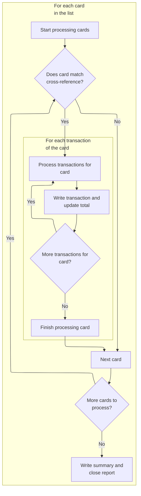

This section governs how card transactions are selected, formatted, and output to both statement and HTML files, including per-transaction details and per-card summary totals.

| Rule ID | Code Location     | Category       | Rule Name                         | Description                                                                                                                                                                                                   | Conditions                                                                                      | Remarks                                                                                                                                                                                                                                                                                   |
| ------- | ----------------- | -------------- | --------------------------------- | ------------------------------------------------------------------------------------------------------------------------------------------------------------------------------------------------------------- | ----------------------------------------------------------------------------------------------- | ----------------------------------------------------------------------------------------------------------------------------------------------------------------------------------------------------------------------------------------------------------------------------------------- |
| BR-001  | 4000-TRNXFILE-GET | Business logic | Card Cross-Reference Filtering    | Only cards whose card number matches an entry in the cross-reference list are processed for transaction output. Cards without a matching cross-reference are skipped and not included in the output.          | A card is processed if its card number matches a card number in the cross-reference list.       | Card numbers are 16-character alphanumeric strings. Only matched cards are included in the output; unmatched cards are skipped.                                                                                                                                                           |
| BR-002  | 6000-WRITE-TRANS  | Business logic | Transaction Output Formatting     | For each transaction of a matched card, a statement record and multiple HTML records are generated, each containing the transaction ID, description, and amount, formatted according to predefined templates. | For every transaction associated with a matched card, output records are generated.             | Statement output includes fields: transaction ID (16 characters), description (100 characters), and amount (numeric, up to 9 digits with 2 decimals). HTML output uses templates such as '<tr>', '<td>', and '<p>' tags, with transaction fields inserted into table rows and paragraphs. |
| BR-003  | 4000-TRNXFILE-GET | Business logic | Card Total Calculation and Output | The total transaction amount for each card is accumulated and output as a summary line in both the statement and HTML files after all transactions for the card have been processed.                          | After all transactions for a matched card have been processed, the accumulated total is output. | The total amount is a numeric value with up to 9 digits and 2 decimal places. The summary is written using specific statement and HTML templates, including lines such as '<h3>End of Statement</h3>', '</table>', '</body>', and '</html>'.                                              |

<SwmSnippet path="/app/cbl/CBSTM03A.CBL" line="416" repo-id="Z2l0aHViJTNBJTNBa3luZHJ5bC1hd3MtbWFpbmZyYW1lLW1vZGVybml6YXRpb24tY2FyZGRlbW8lM0ElM0FTd2ltbS1EZW1v">

---

In 4000-TRNXFILE-GET, we loop through card and transaction numbers, and for each match, we call 6000-WRITE-TRANS to output the transaction and update totals.

```cobol
       4000-TRNXFILE-GET.
           PERFORM VARYING CR-JMP FROM 1 BY 1
             UNTIL CR-JMP > CR-CNT
             OR (WS-CARD-NUM (CR-JMP) > XREF-CARD-NUM)
               IF XREF-CARD-NUM = WS-CARD-NUM (CR-JMP)
                   MOVE WS-CARD-NUM (CR-JMP) TO TRNX-CARD-NUM
                   PERFORM VARYING TR-JMP FROM 1 BY 1
                     UNTIL (TR-JMP > WS-TRCT (CR-JMP))
                       MOVE WS-TRAN-NUM (CR-JMP, TR-JMP)
                         TO TRNX-ID
                       MOVE WS-TRAN-REST (CR-JMP, TR-JMP)
                         TO TRNX-REST
                       PERFORM 6000-WRITE-TRANS
                       ADD TRNX-AMT TO WS-TOTAL-AMT
                   END-PERFORM
               END-IF
           END-PERFORM.
```

---

</SwmSnippet>

<SwmSnippet path="/app/cbl/CBSTM03A.CBL" line="675" repo-id="Z2l0aHViJTNBJTNBa3luZHJ5bC1hd3MtbWFpbmZyYW1lLW1vZGVybml6YXRpb24tY2FyZGRlbW8lM0ElM0FTd2ltbS1EZW1v">

---

In 6000-WRITE-TRANS, we format and write each transaction to both the statement and HTML files. For HTML, we use template lines and STRING to build table rows, which is specific to this repo.

```cobol
       6000-WRITE-TRANS.
           MOVE TRNX-ID TO ST-TRANID.
           MOVE TRNX-DESC TO ST-TRANDT.
           MOVE TRNX-AMT TO ST-TRANAMT.
           WRITE FD-STMTFILE-REC FROM ST-LINE14.

           SET HTML-LTRS TO TRUE.
           WRITE FD-HTMLFILE-REC FROM HTML-FIXED-LN.

           SET HTML-L58 TO TRUE.
           WRITE FD-HTMLFILE-REC FROM HTML-FIXED-LN.
           MOVE SPACES TO HTML-TRAN-LN.
           STRING '<p>' DELIMITED BY '*'
                  ST-TRANID DELIMITED BY '*'
                  '</p>' DELIMITED BY '*'
                  INTO HTML-TRAN-LN
           END-STRING.
           WRITE FD-HTMLFILE-REC FROM HTML-TRAN-LN.
           SET HTML-LTDE TO TRUE.
           WRITE FD-HTMLFILE-REC FROM HTML-FIXED-LN.

           SET HTML-L61 TO TRUE.
           WRITE FD-HTMLFILE-REC FROM HTML-FIXED-LN.
           MOVE SPACES TO HTML-TRAN-LN.
           STRING '<p>' DELIMITED BY '*'
                  ST-TRANDT DELIMITED BY '*'
                  '</p>' DELIMITED BY '*'
                  INTO HTML-TRAN-LN
           END-STRING.
           WRITE FD-HTMLFILE-REC FROM HTML-TRAN-LN.
           SET HTML-LTDE TO TRUE.
           WRITE FD-HTMLFILE-REC FROM HTML-FIXED-LN.

           SET HTML-L64 TO TRUE.
           WRITE FD-HTMLFILE-REC FROM HTML-FIXED-LN.
           MOVE SPACES TO HTML-TRAN-LN.
           STRING '<p>' DELIMITED BY '*'
                  ST-TRANAMT DELIMITED BY '*'
                  '</p>' DELIMITED BY '*'
                  INTO HTML-TRAN-LN
           END-STRING.
           WRITE FD-HTMLFILE-REC FROM HTML-TRAN-LN.
           SET HTML-LTDE TO TRUE.
           WRITE FD-HTMLFILE-REC FROM HTML-FIXED-LN.

           SET HTML-LTRE TO TRUE.
           WRITE FD-HTMLFILE-REC FROM HTML-FIXED-LN.

           EXIT.
```

---

</SwmSnippet>

<SwmSnippet path="/app/cbl/CBSTM03A.CBL" line="433" repo-id="Z2l0aHViJTNBJTNBa3luZHJ5bC1hd3MtbWFpbmZyYW1lLW1vZGVybml6YXRpb24tY2FyZGRlbW8lM0ElM0FTd2ltbS1EZW1v">

---

Back in 4000-TRNXFILE-GET, after returning from 6000-WRITE-TRANS, we write the totals and final lines to both statement and HTML files, closing out the transaction section.

```cobol
           MOVE WS-TOTAL-AMT TO WS-TRN-AMT.
           MOVE WS-TRN-AMT TO ST-TOTAL-TRAMT.
           WRITE FD-STMTFILE-REC FROM ST-LINE12.
           WRITE FD-STMTFILE-REC FROM ST-LINE14A.
           WRITE FD-STMTFILE-REC FROM ST-LINE15.

           SET HTML-LTRS TO TRUE.
           WRITE FD-HTMLFILE-REC FROM HTML-FIXED-LN.
           SET HTML-L10 TO TRUE.
           WRITE FD-HTMLFILE-REC FROM HTML-FIXED-LN.
           SET HTML-L75 TO TRUE.
           WRITE FD-HTMLFILE-REC FROM HTML-FIXED-LN.
           SET HTML-LTDE TO TRUE.
           WRITE FD-HTMLFILE-REC FROM HTML-FIXED-LN.
           SET HTML-LTRE TO TRUE.
           WRITE FD-HTMLFILE-REC FROM HTML-FIXED-LN.
           SET HTML-L78 TO TRUE.
           WRITE FD-HTMLFILE-REC FROM HTML-FIXED-LN.
           SET HTML-L79 TO TRUE.
           WRITE FD-HTMLFILE-REC FROM HTML-FIXED-LN.
           SET HTML-L80 TO TRUE.
           WRITE FD-HTMLFILE-REC FROM HTML-FIXED-LN.

           EXIT.
```

---

</SwmSnippet>

## Final Cleanup and File Closure

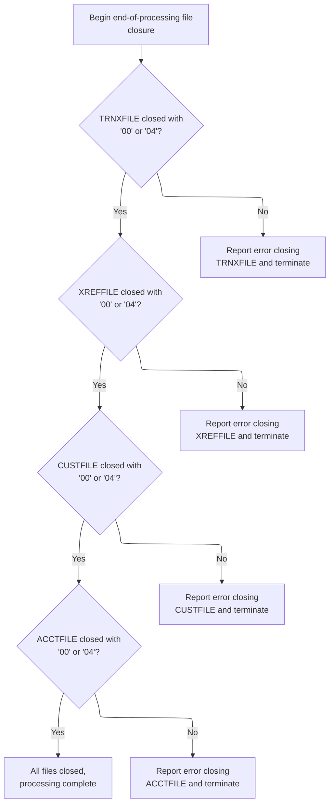

This section ensures that all files used during transaction processing are closed in a strict sequence, with immediate error reporting and termination if any file fails to close properly. This guarantees data integrity and clear operational outcomes at the end of processing.

| Rule ID | Code Location                                                                      | Category       | Rule Name                                                       | Description                                                                                                                                                                                                                                                             | Conditions                                                                                                               | Remarks                                                                                                                                                                                                                           |
| ------- | ---------------------------------------------------------------------------------- | -------------- | --------------------------------------------------------------- | ----------------------------------------------------------------------------------------------------------------------------------------------------------------------------------------------------------------------------------------------------------------------- | ------------------------------------------------------------------------------------------------------------------------ | --------------------------------------------------------------------------------------------------------------------------------------------------------------------------------------------------------------------------------- |
| BR-001  | 9100-TRNXFILE-CLOSE                                                                | Business logic | Transaction File Closure Precedence                             | The transaction file must be closed first, and processing cannot continue to close other files unless the transaction file is closed successfully with a return code of '00' or '04'.                                                                                   | This rule applies when the application has completed transaction processing and is beginning the file closure sequence.  | The only acceptable return codes for a successful close are '00' and '04'. Any other code is treated as an error. The transaction file must be closed before attempting to close the cross-reference, customer, or account files. |
| BR-002  | 9200-XREFFILE-CLOSE, 9300-CUSTFILE-CLOSE, 9400-ACCTFILE-CLOSE                      | Business logic | Sequential File Closure with Error Halt                         | Each file (cross-reference, customer, account) must be closed in a specific sequence, and each must return a code of '00' or '04' to be considered successfully closed. If any file fails to close with these codes, processing is terminated and an error is reported. | This rule applies during the final cleanup phase after the transaction file has been closed successfully.                | The closure sequence is: cross-reference file, customer file, account file. Acceptable return codes are '00' and '04'. Any other code results in immediate error reporting and program termination.                               |
| BR-003  | 9100-TRNXFILE-CLOSE, 9200-XREFFILE-CLOSE, 9300-CUSTFILE-CLOSE, 9400-ACCTFILE-CLOSE | Error handling | Immediate Error Reporting and Termination on File Close Failure | If any file fails to close with a return code of '00' or '04', an error message must be displayed indicating which file failed and the return code, and the program must terminate immediately.                                                                         | This rule applies whenever a file close operation returns a code other than '00' or '04' during the final cleanup phase. | The error message must include the file name and the return code. Program termination is immediate upon error.                                                                                                                    |

<SwmSnippet path="/app/cbl/CBSTM03A.CBL" line="331" repo-id="Z2l0aHViJTNBJTNBa3luZHJ5bC1hd3MtbWFpbmZyYW1lLW1vZGVybml6YXRpb24tY2FyZGRlbW8lM0ElM0FTd2ltbS1EZW1v">

---

After processing transactions, 1000-MAINLINE calls 9100-TRNXFILE-CLOSE to wrap up transaction file handling before closing everything else.

```cobol
           PERFORM 9100-TRNXFILE-CLOSE.

           PERFORM 9200-XREFFILE-CLOSE.

           PERFORM 9300-CUSTFILE-CLOSE.

           PERFORM 9400-ACCTFILE-CLOSE.

           CLOSE STMT-FILE HTML-FILE.
```

---

</SwmSnippet>

<SwmSnippet path="/app/cbl/CBSTM03A.CBL" line="856" repo-id="Z2l0aHViJTNBJTNBa3luZHJ5bC1hd3MtbWFpbmZyYW1lLW1vZGVybml6YXRpb24tY2FyZGRlbW8lM0ElM0FTd2ltbS1EZW1v">

---

9100-TRNXFILE-CLOSE sets up the workspace to close the transaction file and calls CBSTM03B, which actually performs the close. This lets us reuse the same logic for all file operations and handle errors consistently.

```cobol
       9100-TRNXFILE-CLOSE.
           MOVE 'TRNXFILE' TO WS-M03B-DD.
           SET M03B-CLOSE TO TRUE.
           MOVE ZERO TO WS-M03B-RC.
           CALL 'CBSTM03B' USING WS-M03B-AREA.

           IF WS-M03B-RC = '00' OR '04'
               CONTINUE
           ELSE
               DISPLAY 'ERROR CLOSING TRNXFILE'
               DISPLAY 'RETURN CODE: ' WS-M03B-RC
               PERFORM 9999-ABEND-PROGRAM
           END-IF.

           EXIT.
```

---

</SwmSnippet>

<SwmSnippet path="/app/cbl/CBSTM03A.CBL" line="873" repo-id="Z2l0aHViJTNBJTNBa3luZHJ5bC1hd3MtbWFpbmZyYW1lLW1vZGVybml6YXRpb24tY2FyZGRlbW8lM0ElM0FTd2ltbS1EZW1v">

---

9200-XREFFILE-CLOSE sets up the workspace to close the XREF file and calls CBSTM03B to do the actual close. This keeps file handling consistent and lets us catch any errors right away.

```cobol
       9200-XREFFILE-CLOSE.
           MOVE 'XREFFILE' TO WS-M03B-DD.
           SET M03B-CLOSE TO TRUE.
           MOVE ZERO TO WS-M03B-RC.
           CALL 'CBSTM03B' USING WS-M03B-AREA.

           IF WS-M03B-RC = '00' OR '04'
               CONTINUE
           ELSE
               DISPLAY 'ERROR CLOSING XREFFILE'
               DISPLAY 'RETURN CODE: ' WS-M03B-RC
               PERFORM 9999-ABEND-PROGRAM
           END-IF.

           EXIT.
```

---

</SwmSnippet>

<SwmSnippet path="/app/cbl/CBSTM03A.CBL" line="889" repo-id="Z2l0aHViJTNBJTNBa3luZHJ5bC1hd3MtbWFpbmZyYW1lLW1vZGVybml6YXRpb24tY2FyZGRlbW8lM0ElM0FTd2ltbS1EZW1v">

---

9300-CUSTFILE-CLOSE sets up the workspace for closing the customer file and calls CBSTM03B to do the actual work. This way, all file closes go through the same logic and error checks.

```cobol
       9300-CUSTFILE-CLOSE.
           MOVE 'CUSTFILE' TO WS-M03B-DD.
           SET M03B-CLOSE TO TRUE.
           MOVE ZERO TO WS-M03B-RC.
           CALL 'CBSTM03B' USING WS-M03B-AREA.

           IF WS-M03B-RC = '00' OR '04'
               CONTINUE
           ELSE
               DISPLAY 'ERROR CLOSING CUSTFILE'
               DISPLAY 'RETURN CODE: ' WS-M03B-RC
               PERFORM 9999-ABEND-PROGRAM
           END-IF.

           EXIT.
```

---

</SwmSnippet>

<SwmSnippet path="/app/cbl/CBSTM03A.CBL" line="905" repo-id="Z2l0aHViJTNBJTNBa3luZHJ5bC1hd3MtbWFpbmZyYW1lLW1vZGVybml6YXRpb24tY2FyZGRlbW8lM0ElM0FTd2ltbS1EZW1v">

---

9400-ACCTFILE-CLOSE sets up the workspace for closing the account file and calls CBSTM03B to do the actual close. This keeps all file operations going through the same path and makes error handling easier.

```cobol
       9400-ACCTFILE-CLOSE.
           MOVE 'ACCTFILE' TO WS-M03B-DD.
           SET M03B-CLOSE TO TRUE.
           MOVE ZERO TO WS-M03B-RC.
           CALL 'CBSTM03B' USING WS-M03B-AREA.

           IF WS-M03B-RC = '00' OR '04'
               CONTINUE
           ELSE
               DISPLAY 'ERROR CLOSING ACCTFILE'
               DISPLAY 'RETURN CODE: ' WS-M03B-RC
               PERFORM 9999-ABEND-PROGRAM
           END-IF.

           EXIT.
```

---

</SwmSnippet>

# Transaction Record Read and Loop Exit

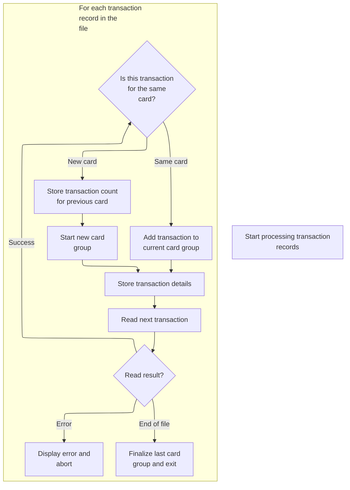

This section processes transaction records by grouping them according to card number, counting transactions per card, storing transaction details, and handling end-of-file and error conditions. It ensures that transactions are accurately grouped and counted for reporting and further processing.

| Rule ID | Code Location                 | Category       | Rule Name                                 | Description                                                                                                                                                                                                    | Conditions                                                                                                  | Remarks                                                                                                                                                          |
| ------- | ----------------------------- | -------------- | ----------------------------------------- | -------------------------------------------------------------------------------------------------------------------------------------------------------------------------------------------------------------- | ----------------------------------------------------------------------------------------------------------- | ---------------------------------------------------------------------------------------------------------------------------------------------------------------- |
| BR-001  | 8500-READTRNX-READ            | Business logic | Increment transaction count for same card | When a transaction record is read and its card number matches the current card group, increment the transaction count for that card group.                                                                     | A transaction record is read and its card number matches the card number of the current group.              | The transaction count is incremented by 1 for each matching transaction. The card number is a string of 16 characters.                                           |
| BR-002  | 8500-READTRNX-READ            | Business logic | Start new card group on card change       | When a transaction record is read and its card number does not match the current card group, store the transaction count for the previous card group, start a new card group, and reset the transaction count. | A transaction record is read and its card number does not match the card number of the current group.       | The transaction count for the previous card group is stored as a number. The new card group is started with a count of 1 for the first transaction.              |
| BR-003  | 8500-READTRNX-READ, 8599-EXIT | Business logic | Finalize card group on end-of-file        | When the end of the transaction file is reached, store the transaction count for the current card group and exit the processing loop.                                                                          | The file read operation returns an end-of-file status.                                                      | The transaction count for the current card group is stored as a number. The process then exits the transaction processing loop.                                  |
| BR-004  | 8500-READTRNX-READ            | Business logic | Store transaction details in card group   | Each transaction record is stored in the group for its card, with the card number, transaction ID, and all other transaction details preserved.                                                                | A transaction record is read, regardless of whether it starts a new group or is added to an existing group. | The card number is a string of 16 characters. The transaction ID is a string of 16 characters. The transaction details are stored as a string of 318 characters. |
| BR-005  | 8500-READTRNX-READ            | Error handling | Abort on file read error                  | If a file read operation returns an error status other than end-of-file, display an error message and abort processing.                                                                                        | A file read operation returns an error status that is not end-of-file or success.                           | An error message is displayed, including the return code. Processing is aborted immediately.                                                                     |

<SwmSnippet path="/app/cbl/CBSTM03A.CBL" line="818" repo-id="Z2l0aHViJTNBJTNBa3luZHJ5bC1hd3MtbWFpbmZyYW1lLW1vZGVybml6YXRpb24tY2FyZGRlbW8lM0ElM0FTd2ltbS1EZW1v">

---

In 8500-READTRNX-READ, we check if the current transaction belongs to the same card as the previous one. If not, we update counters and prep for the next card, so transactions are grouped correctly.

```cobol
       8500-READTRNX-READ.
           IF WS-SAVE-CARD = TRNX-CARD-NUM
               ADD 1 TO TR-CNT
           ELSE
               MOVE TR-CNT TO WS-TRCT (CR-CNT)
               ADD 1 TO CR-CNT
               MOVE 1 TO TR-CNT
           END-IF.
```

---

</SwmSnippet>

<SwmSnippet path="/app/cbl/CBSTM03A.CBL" line="827" repo-id="Z2l0aHViJTNBJTNBa3luZHJ5bC1hd3MtbWFpbmZyYW1lLW1vZGVybml6YXRpb24tY2FyZGRlbW8lM0ElM0FTd2ltbS1EZW1v">

---

Next we copy transaction data into the table, set up for a read, and call CBSTM03B to fetch the next transaction record. This keeps the loop moving through all transactions.

```cobol
           MOVE TRNX-CARD-NUM TO WS-CARD-NUM (CR-CNT).
           MOVE TRNX-ID TO WS-TRAN-NUM (CR-CNT, TR-CNT).
           MOVE TRNX-REST TO WS-TRAN-REST (CR-CNT, TR-CNT).
           MOVE TRNX-CARD-NUM TO WS-SAVE-CARD.

           MOVE 'TRNXFILE' TO WS-M03B-DD.
           SET M03B-READ TO TRUE.
           MOVE SPACES TO WS-M03B-FLDT.
           CALL 'CBSTM03B' USING WS-M03B-AREA.
```

---

</SwmSnippet>

<SwmSnippet path="/app/cbl/CBSTM03A.CBL" line="837" repo-id="Z2l0aHViJTNBJTNBa3luZHJ5bC1hd3MtbWFpbmZyYW1lLW1vZGVybml6YXRpb24tY2FyZGRlbW8lM0ElM0FTd2ltbS1EZW1v">

---

After returning from CBSTM03B in 8500-READTRNX-READ, we check the return code. If it's end-of-file, we jump to 8599-EXIT to wrap up transaction grouping and exit the loop.

```cobol
           EVALUATE WS-M03B-RC
             WHEN '00'
               MOVE WS-M03B-FLDT TO TRNX-RECORD
               GO TO 8500-READTRNX-READ
             WHEN '10'
               GO TO 8599-EXIT
             WHEN OTHER
               DISPLAY 'ERROR READING TRNXFILE'
               DISPLAY 'RETURN CODE: ' WS-M03B-RC
               PERFORM 9999-ABEND-PROGRAM
           END-EVALUATE.
```

---

</SwmSnippet>

<SwmSnippet path="/app/cbl/CBSTM03A.CBL" line="849" repo-id="Z2l0aHViJTNBJTNBa3luZHJ5bC1hd3MtbWFpbmZyYW1lLW1vZGVybml6YXRpb24tY2FyZGRlbW8lM0ElM0FTd2ltbS1EZW1v">

---

8599-EXIT wraps up the current card and restarts the flow for the next one.

```cobol
       8599-EXIT.
           MOVE TR-CNT TO WS-TRCT (CR-CNT).
           MOVE 'XREFFILE' TO WS-FL-DD.
           GO TO 0000-START.
           EXIT.
```

---

</SwmSnippet>

&nbsp;

*This is an auto-generated document by Swimm 🌊 and has not yet been verified by a human*

<SwmMeta version="3.0.0"><sup>Powered by [Swimm](https://staging.swimm.cloud/)</sup></SwmMeta>
