# Overview

This document describes the flow for generating account statements by aggregating transaction data and combining it with customer and account information. The process reads transaction, cross-reference, customer, and account files, groups transactions by card, and produces formatted statements for each customer in both plain text and HTML formats.

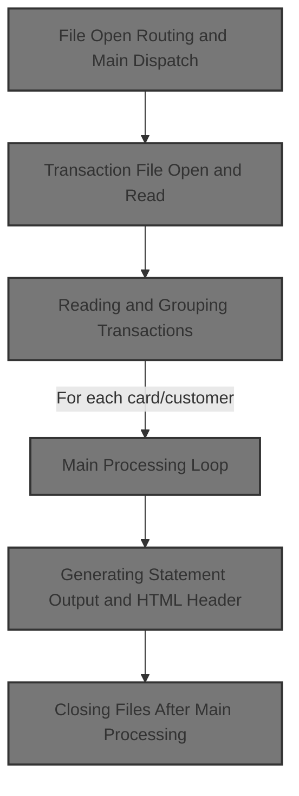
```mermaid
flowchart TD
    node1["File Open Routing and Main Dispatch"]:::HeadingStyle --> node2["Transaction File Open and Read"]:::HeadingStyle
    node2 --> node3["Reading and Grouping Transactions"]:::HeadingStyle
    node3 -- "For each card/customer" --> node4["Main Processing Loop"]:::HeadingStyle
    node4 --> node5["Generating Statement Output and HTML Header"]:::HeadingStyle
    node5 --> node6["Closing Files After Main Processing"]:::HeadingStyle

    click node1 goToHeading "File Open Routing and Main Dispatch"
    click node2 goToHeading "Transaction File Open and Read"
    click node3 goToHeading "Reading and Grouping Transactions"
    click node4 goToHeading "Main Processing Loop"
    click node5 goToHeading "Generating Statement Output and HTML Header"
    click node5 goToHeading "Processing Transactions for Each Card"
    click node6 goToHeading "Closing Files After Main Processing"
classDef HeadingStyle fill:#777777,stroke:#333,stroke-width:2px;
```

## Dependencies

### Programs

- CBSTM03A (app/cbl/CBSTM03A.CBL)
- CBSTM03B (app/cbl/CBSTM03B.CBL)
- CEE3ABD

### Copybooks

- COSTM01 (app/cpy/COSTM01.CPY)
- CVACT03Y (app/cpy/CVACT03Y.cpy)
- CUSTREC (app/cpy/CUSTREC.cpy)
- CVACT01Y (app/cpy/CVACT01Y.cpy)

# Where is this program used?

This program is used once, as represented in the following diagram:

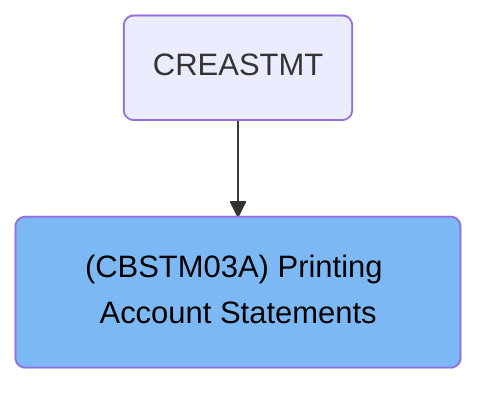
```mermaid
graph TD
  hrziw("CREASTMT") --> yf5bp("(CBSTM03A) Printing Account Statements"):::currentEntity
click hrziw openCode "app/jcl/CREASTMT.JCL:1"
  
  
click yf5bp openCode "app/cbl/CBSTM03A.CBL:1"
    classDef currentEntity color:#000000,fill:#7CB9F4
```

# Workflow

# Startup and JCL/TIOT Inspection

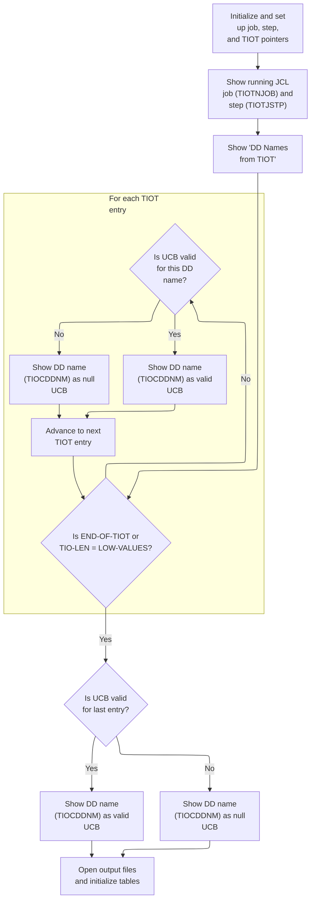
```mermaid
%%{init: {"flowchart": {"defaultRenderer": "elk"}} }%%
flowchart TD
    node0["Initialize and set 
 up job, step, 
 and TIOT pointers"] --> node1["Show running JCL 
 job (TIOTNJOB) and 
 step (TIOTJSTP)"]
    click node0 openCode "app/cbl/CBSTM03A.CBL:266:269"
    node1 --> node2["Show 'DD Names 
 from TIOT'"]
    click node1 openCode "app/cbl/CBSTM03A.CBL:270:270"
    node2 --> node3{"Is END-OF-TIOT or 
 TIO-LEN = LOW-VALUES?"}
    click node2 openCode "app/cbl/CBSTM03A.CBL:275:275"
    subgraph loop1["For each TIOT 
 entry"]
      node3 -->|"No"| node4{"Is UCB valid 
 for this DD 
 name?"}
      click node3 openCode "app/cbl/CBSTM03A.CBL:276:277"
      node4 -->|"Yes"| node5["Show DD name 
 (TIOCDDNM) as valid 
 UCB"]
      click node4 openCode "app/cbl/CBSTM03A.CBL:278:279"
      node4 -->|"No"| node6["Show DD name 
 (TIOCDDNM) as null 
 UCB"]
      click node6 openCode "app/cbl/CBSTM03A.CBL:280:281"
      node5 --> node7["Advance to next 
 TIOT entry"]
      node6 --> node7
      node7["Advance to next 
 TIOT entry"] --> node3
      click node7 openCode "app/cbl/CBSTM03A.CBL:283:284"
    end
    node3 -->|"Yes"| node8{"Is UCB valid 
 for last entry?"}
    click node8 openCode "app/cbl/CBSTM03A.CBL:287:287"
    node8 -->|"Yes"| node9["Show DD name 
 (TIOCDDNM) as valid 
 UCB"]
    click node9 openCode "app/cbl/CBSTM03A.CBL:288:288"
    node8 -->|"No"| node10["Show DD name 
 (TIOCDDNM) as null 
 UCB"]
    click node10 openCode "app/cbl/CBSTM03A.CBL:290:290"
    node9 --> node11["Open output files 
 and initialize tables"]
    node10 --> node11
    node11["Open output files 
 and initialize tables"]
    click node11 openCode "app/cbl/CBSTM03A.CBL:293:294"
classDef HeadingStyle fill:#777777,stroke:#333,stroke-width:2px;
```

This section initializes system control block pointers, displays the current JCL job and step, scans and displays DD names with device status from the TIOT, and prepares output files and tables for further processing.

| Rule ID | Code Location      | Category       | Rule Name                       | Description                                                                                                         | Conditions                                                                  | Remarks                                                                                                                                                                       |
| ------- | ------------------ | -------------- | ------------------------------- | ------------------------------------------------------------------------------------------------------------------- | --------------------------------------------------------------------------- | ----------------------------------------------------------------------------------------------------------------------------------------------------------------------------- |
| BR-001  | PROCEDURE DIVISION | Business logic | Show job and step context       | Display the running JCL job name and step name at startup to provide context for the inspection.                    | When the section is entered and pointers to control blocks are initialized. | Job name and step name are displayed as strings, each up to 8 characters, left-aligned, with no padding. Format: 'Running JCL : <jobname> Step <stepname>'.                   |
| BR-002  | PROCEDURE DIVISION | Business logic | Show DD name device status      | For each DD name in the TIOT, display whether it is associated with a valid device or not, based on the UCB status. | For each TIOT entry while not at END-OF-TIOT and TIO-LEN is not LOW-VALUES. | DD name is displayed as a string of up to 8 characters, left-aligned. Device status is shown as either '-- valid UCB' or '-- null UCB'. 'LOW-VALUES' indicates a null device. |
| BR-003  | PROCEDURE DIVISION | Business logic | Show last DD name device status | After scanning all TIOT entries, display the device status for the last DD name entry to ensure completeness.       | After the TIOT entry loop completes.                                        | DD name is displayed as a string of up to 8 characters, left-aligned. Device status is shown as either '-- valid UCB' or '-- null UCB'.                                       |
| BR-004  | PROCEDURE DIVISION | Technical step | Initialize outputs and tables   | Initialize output files and working tables to prepare for subsequent processing steps.                              | After all DD names have been displayed and before main logic begins.        | Output files are opened for writing; working tables are initialized to zero or blank values. No specific format constraints are imposed at this stage.                        |

<SwmSnippet path="/app/cbl/CBSTM03A.CBL" line="262" repo-id="Z2l0aHViJTNBJTNBa3luZHJ5bC1hd3MtbWFpbmZyYW1lLW1vZGVybml6YXRpb24tY2FyZGRlbW8lM0ElM0FTd2ltbS1EZW1v">

---

In `PROCEDURE DIVISION`, this is the entry point. It sets up pointers to system control blocks (PSA, TCB, TIOT), displays which JCL job and step are running, and starts walking through the TIOT to prep for DD name inspection. BUMP-TIOT is incremented to track the offset as we walk the TIOT entries. This is just setup and context for the rest of the job.

```cobol
       PROCEDURE DIVISION.
      *****************************************************************
      *    Check Unit Control blocks                                  *
      *****************************************************************
           SET ADDRESS OF PSA-BLOCK   TO PSAPTR.
           SET ADDRESS OF TCB-BLOCK   TO TCB-POINT.
           SET ADDRESS OF TIOT-BLOCK  TO TIOT-POINT.
           SET TIOT-INDEX             TO TIOT-POINT.
           DISPLAY 'Running JCL : ' TIOTNJOB ' Step ' TIOTJSTP.

           COMPUTE BUMP-TIOT = BUMP-TIOT + LENGTH OF TIOT-BLOCK.
           SET ADDRESS OF TIOT-ENTRY  TO TIOT-INDEX.

           DISPLAY 'DD Names from TIOT: '.
```

---

</SwmSnippet>

<SwmSnippet path="/app/cbl/CBSTM03A.CBL" line="276" repo-id="Z2l0aHViJTNBJTNBa3luZHJ5bC1hd3MtbWFpbmZyYW1lLW1vZGVybml6YXRpb24tY2FyZGRlbW8lM0ElM0FTd2ltbS1EZW1v">

---

Next, we loop through the TIOT entries, displaying each DD name and whether it has a valid device (UCB) or not. We bump the TIOT offset and update the entry pointer each time. This is just scanning all DD names before moving on to file operations.

```cobol
           PERFORM UNTIL END-OF-TIOT
                      OR TIO-LEN = LOW-VALUES
               IF NOT NULL-UCB
                   DISPLAY ': ' TIOCDDNM ' -- valid UCB'
               ELSE
                   DISPLAY ': ' TIOCDDNM ' --  null UCB'
               END-IF
               COMPUTE BUMP-TIOT = BUMP-TIOT + LENGTH OF TIOT-SEG
               SET ADDRESS OF TIOT-ENTRY TO TIOT-INDEX
           END-PERFORM.
```

---

</SwmSnippet>

<SwmSnippet path="/app/cbl/CBSTM03A.CBL" line="287" repo-id="Z2l0aHViJTNBJTNBa3luZHJ5bC1hd3MtbWFpbmZyYW1lLW1vZGVybml6YXRpb24tY2FyZGRlbW8lM0ElM0FTd2ltbS1EZW1v">

---

Next, we handle the last DD name entry outside the loop to make sure it's displayed.

```cobol
           IF NOT NULL-UCB
               DISPLAY ': ' TIOCDDNM ' -- valid UCB'
           ELSE
               DISPLAY ': ' TIOCDDNM ' -- null  UCB'
           END-IF.
```

---

</SwmSnippet>

<SwmSnippet path="/app/cbl/CBSTM03A.CBL" line="293" repo-id="Z2l0aHViJTNBJTNBa3luZHJ5bC1hd3MtbWFpbmZyYW1lLW1vZGVybml6YXRpb24tY2FyZGRlbW8lM0ElM0FTd2ltbS1EZW1v">

---

Finally, we open the output files and initialize working tables, then jump to 0000-START to kick off the main logic. All setup is done at this point.

```cobol
           OPEN OUTPUT STMT-FILE HTML-FILE.
           INITIALIZE WS-TRNX-TABLE WS-TRN-TBL-CNTR.

       0000-START.
```

---

</SwmSnippet>

# File Open Routing and Main Dispatch

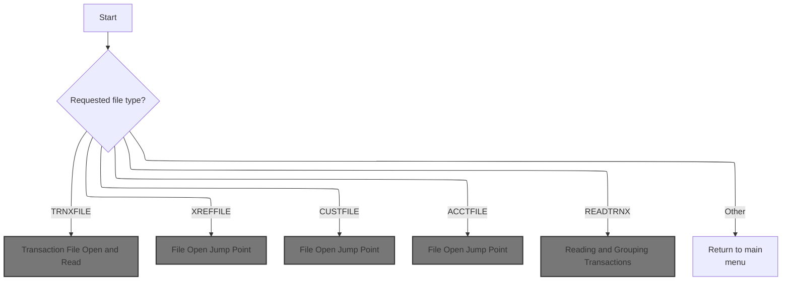
```mermaid
%%{init: {"flowchart": {"defaultRenderer": "elk"}} }%%
flowchart TD
    node1["Start"] --> node5{"Requested file type?"}
    click node1 openCode "app/cbl/CBSTM03A.CBL:296:297"
    node5 -->|"TRNXFILE"| node3["Transaction File Open and Read"]
    click node5 openCode "app/cbl/CBSTM03A.CBL:298:314"
    
    node5 -->|"XREFFILE"| node6["File Open Jump Point"]
    
    node5 -->|"CUSTFILE"| node7["File Open Jump Point"]
    
    node5 -->|"ACCTFILE"| node8["File Open Jump Point"]
    
    node5 -->|"READTRNX"| node4["Reading and Grouping Transactions"]
    
    node5 -->|"Other"| node9["Return to main 
 menu"]
    click node9 openCode "app/cbl/CBSTM03A.CBL:314:314"
classDef HeadingStyle fill:#777777,stroke:#333,stroke-width:2px;
click node3 goToHeading "Transaction File Open and Read"
node3:::HeadingStyle
click node6 goToHeading "File Open Jump Point"
node6:::HeadingStyle
click node7 goToHeading "File Open Jump Point"
node7:::HeadingStyle
click node8 goToHeading "File Open Jump Point"
node8:::HeadingStyle
click node4 goToHeading "Reading and Grouping Transactions"
node4:::HeadingStyle
click node3 goToHeading "Transaction File Open and Read"
node3:::HeadingStyle
click node6 goToHeading "File Open Jump Point"
node6:::HeadingStyle
click node7 goToHeading "File Open Jump Point"
node7:::HeadingStyle
click node8 goToHeading "File Open Jump Point"
node8:::HeadingStyle
click node4 goToHeading "Reading and Grouping Transactions"
node4:::HeadingStyle
```

This section routes file open and read requests to the appropriate routines based on the requested file type, ensuring that only supported file types are processed and providing a fallback for unrecognized requests.

| Rule ID | Code Location | Category       | Rule Name                       | Description                                                                                                                | Conditions                                                                                                                       | Remarks                                                                                                                       |
| ------- | ------------- | -------------- | ------------------------------- | -------------------------------------------------------------------------------------------------------------------------- | -------------------------------------------------------------------------------------------------------------------------------- | ----------------------------------------------------------------------------------------------------------------------------- |
| BR-001  | 0000-START    | Business logic | Transaction File Routing        | When the requested file type is 'TRNXFILE', the system routes the request to the transaction file open routine.            | The requested file type is 'TRNXFILE'.                                                                                           | The file type constant is 'TRNXFILE', an 8-character string.                                                                  |
| BR-002  | 0000-START    | Business logic | Cross-Reference File Routing    | When the requested file type is 'XREFFILE', the system routes the request to the cross-reference file open routine.        | The requested file type is 'XREFFILE'.                                                                                           | The file type constant is 'XREFFILE', an 8-character string.                                                                  |
| BR-003  | 0000-START    | Business logic | Customer File Routing           | When the requested file type is 'CUSTFILE', the system routes the request to the customer file open routine.               | The requested file type is 'CUSTFILE'.                                                                                           | The file type constant is 'CUSTFILE', an 8-character string.                                                                  |
| BR-004  | 0000-START    | Business logic | Account File Routing            | When the requested file type is 'ACCTFILE', the system routes the request to the account file open routine.                | The requested file type is 'ACCTFILE'.                                                                                           | The file type constant is 'ACCTFILE', an 8-character string.                                                                  |
| BR-005  | 0000-START    | Business logic | Transaction Read Routing        | When the requested file type is 'READTRNX', the system routes the request to the transaction reading and grouping routine. | The requested file type is 'READTRNX'.                                                                                           | The file type constant is 'READTRNX', an 8-character string.                                                                  |
| BR-006  | 0000-START    | Error handling | Unrecognized File Type Handling | When the requested file type is not recognized, the system returns to the main menu.                                       | The requested file type does not match any of the supported values ('TRNXFILE', 'XREFFILE', 'CUSTFILE', 'ACCTFILE', 'READTRNX'). | Supported file type constants are 'TRNXFILE', 'XREFFILE', 'CUSTFILE', 'ACCTFILE', and 'READTRNX', each an 8-character string. |

<SwmSnippet path="/app/cbl/CBSTM03A.CBL" line="296" repo-id="Z2l0aHViJTNBJTNBa3luZHJ5bC1hd3MtbWFpbmZyYW1lLW1vZGVybml6YXRpb24tY2FyZGRlbW8lM0ElM0FTd2ltbS1EZW1v">

---

In `0000-START`, we use EVALUATE to check WS-FL-DD and ALTER the 8100-FILE-OPEN target to the right file open routine. Then we GO TO 8100-FILE-OPEN, which jumps to the correct open logic. If it's 'READTRNX', we jump to the read routine. If it's not recognized, we bail out. This keeps file open routing centralized and flexible.

```cobol
       0000-START.

           EVALUATE WS-FL-DD
             WHEN 'TRNXFILE'
               ALTER 8100-FILE-OPEN TO PROCEED TO 8100-TRNXFILE-OPEN
               GO TO 8100-FILE-OPEN
             WHEN 'XREFFILE'
               ALTER 8100-FILE-OPEN TO PROCEED TO 8200-XREFFILE-OPEN
               GO TO 8100-FILE-OPEN
             WHEN 'CUSTFILE'
               ALTER 8100-FILE-OPEN TO PROCEED TO 8300-CUSTFILE-OPEN
               GO TO 8100-FILE-OPEN
             WHEN 'ACCTFILE'
               ALTER 8100-FILE-OPEN TO PROCEED TO 8400-ACCTFILE-OPEN
               GO TO 8100-FILE-OPEN
             WHEN 'READTRNX'
               GO TO 8500-READTRNX-READ
             WHEN OTHER
               GO TO 9999-GOBACK.
```

---

</SwmSnippet>

## File Open Jump Point

This section serves as a technical jump point, routing program control to the appropriate file open logic as configured by the dispatcher.

| Rule ID | Code Location  | Category       | Rule Name              | Description                                                                                                                                | Conditions                                                   | Remarks                                                                                                |
| ------- | -------------- | -------------- | ---------------------- | ------------------------------------------------------------------------------------------------------------------------------------------ | ------------------------------------------------------------ | ------------------------------------------------------------------------------------------------------ |
| BR-001  | 8100-FILE-OPEN | Technical step | File open jump routing | Whenever this section is entered, program control is immediately transferred to the file open logic as determined by the dispatcher setup. | This rule applies whenever program flow enters this section. | No constants or output formats are involved. The only action is the unconditional transfer of control. |

<SwmSnippet path="/app/cbl/CBSTM03A.CBL" line="726" repo-id="Z2l0aHViJTNBJTNBa3luZHJ5bC1hd3MtbWFpbmZyYW1lLW1vZGVybml6YXRpb24tY2FyZGRlbW8lM0ElM0FTd2ltbS1EZW1v">

---

`8100-FILE-OPEN` is just a jump point. The GO TO here sends control to the actual file open logic (like 8100-TRNXFILE-OPEN), as set up by the ALTER in the dispatcher. Keeps things modular and lets us swap open routines easily.

```cobol
       8100-FILE-OPEN.
           GO TO 8100-TRNXFILE-OPEN
           .
```

---

</SwmSnippet>

## Transaction File Open and Read

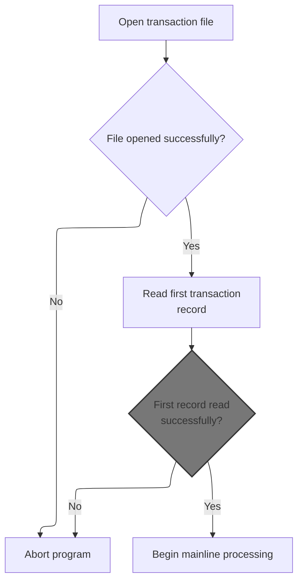
```mermaid
%%{init: {"flowchart": {"defaultRenderer": "elk"}} }%%
flowchart TD
    node1["Open transaction file"]
    click node1 openCode "app/cbl/CBSTM03A.CBL:730:734"
    node1 --> node2{"File opened successfully?"}
    click node2 openCode "app/cbl/CBSTM03A.CBL:736:742"
    node2 -->|"Yes"| node3["Read first transaction 
 record"]
    click node3 openCode "app/cbl/CBSTM03A.CBL:744:746"
    node2 -->|"No"| node5["Abort program"]
    click node5 openCode "app/cbl/CBSTM03A.CBL:921:923"
    node3 --> node4{"First record read 
 successfully?"}
    
    node4 -->|"Yes"| node6["Begin mainline processing"]
    click node6 openCode "app/cbl/CBSTM03A.CBL:316:316"
    node4 -->|"No"| node5

classDef HeadingStyle fill:#777777,stroke:#333,stroke-width:2px;
click node4 goToHeading "Main Processing Loop"
node4:::HeadingStyle
```

This section manages the opening of the transaction file and the initial read operation, ensuring that processing only continues if the file is accessible and the first record can be read. It provides error handling to prevent further processing in case of file access issues.

| Rule ID | Code Location      | Category        | Rule Name                              | Description                                                                                                                                         | Conditions                                                      | Remarks                                                                                                                                             |
| ------- | ------------------ | --------------- | -------------------------------------- | --------------------------------------------------------------------------------------------------------------------------------------------------- | --------------------------------------------------------------- | --------------------------------------------------------------------------------------------------------------------------------------------------- |
| BR-001  | 8100-TRNXFILE-OPEN | Data validation | Transaction file open success          | If the transaction file open operation returns a code of '00' or '04', the file is considered successfully opened and processing continues.         | The file open operation returns a code of '00' or '04'.         | Accepted return codes are '00' and '04'. Any other code is considered a failure. The file name used is 'TRNXFILE'.                                  |
| BR-002  | 8100-TRNXFILE-OPEN | Error handling  | Transaction file open failure handling | If the transaction file open operation fails (returns a code other than '00' or '04'), an error message is displayed and the program is terminated. | The file open operation returns a code other than '00' or '04'. | Any return code other than '00' or '04' triggers an error. The error message includes the text 'ERROR OPENING TRNXFILE' and the actual return code. |

<SwmSnippet path="/app/cbl/CBSTM03A.CBL" line="730" repo-id="Z2l0aHViJTNBJTNBa3luZHJ5bC1hd3MtbWFpbmZyYW1lLW1vZGVybml6YXRpb24tY2FyZGRlbW8lM0ElM0FTd2ltbS1EZW1v">

---

In `8100-TRNXFILE-OPEN`, we prep the file open parameters, call CBSTM03B to actually open the transaction file, and check the return code. If it's not '00' or '04', we display an error and abend. This keeps file handling centralized and consistent.

```cobol
       8100-TRNXFILE-OPEN.
           MOVE 'TRNXFILE' TO WS-M03B-DD.
           SET M03B-OPEN TO TRUE.
           MOVE ZERO TO WS-M03B-RC.
           CALL 'CBSTM03B' USING WS-M03B-AREA.

           IF WS-M03B-RC = '00' OR '04'
               CONTINUE
           ELSE
               DISPLAY 'ERROR OPENING TRNXFILE'
               DISPLAY 'RETURN CODE: ' WS-M03B-RC
               PERFORM 9999-ABEND-PROGRAM
           END-IF.
```

---

</SwmSnippet>

### File Operation Dispatch (CBSTM03B Entry)

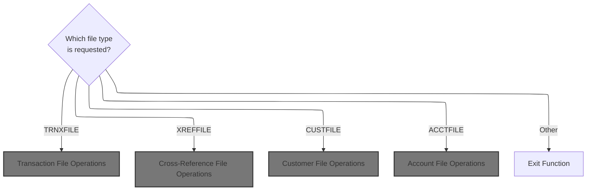
```mermaid
%%{init: {"flowchart": {"defaultRenderer": "elk"}} }%%
flowchart TD
  node1{"Which file type 
 is requested?"}
  click node1 openCode "app/cbl/CBSTM03B.CBL:118:128"
  node1 -->|"TRNXFILE"| node2["Transaction File Operations"]
  
  node1 -->|"XREFFILE"| node3["Cross-Reference File Operations"]
  
  node1 -->|"CUSTFILE"| node4["Customer File Operations"]
  
  node1 -->|"ACCTFILE"| node5["Account File Operations"]
  
  node1 -->|"Other"| node6["Exit Function"]
  click node6 openCode "app/cbl/CBSTM03B.CBL:130:131"

classDef HeadingStyle fill:#777777,stroke:#333,stroke-width:2px;
click node2 goToHeading "Transaction File Operations"
node2:::HeadingStyle
click node3 goToHeading "Cross-Reference File Operations"
node3:::HeadingStyle
click node4 goToHeading "Customer File Operations"
node4:::HeadingStyle
click node5 goToHeading "Account File Operations"
node5:::HeadingStyle
click node2 goToHeading "Transaction File Operations"
node2:::HeadingStyle
click node3 goToHeading "Cross-Reference File Operations"
node3:::HeadingStyle
click node4 goToHeading "Customer File Operations"
node4:::HeadingStyle
click node5 goToHeading "Account File Operations"
node5:::HeadingStyle
```

This section determines which file operation block to execute based on the requested file type, ensuring that only valid file types trigger their respective business logic and that unrecognized requests are safely exited.

| Rule ID | Code Location | Category       | Rule Name                     | Description                                                                                                                                                     | Conditions                                                            | Remarks                                                                                                                           |
| ------- | ------------- | -------------- | ----------------------------- | --------------------------------------------------------------------------------------------------------------------------------------------------------------- | --------------------------------------------------------------------- | --------------------------------------------------------------------------------------------------------------------------------- |
| BR-001  | 0000-START    | Business logic | Transaction File Dispatch     | If the requested file type is 'TRNXFILE', the system will execute the transaction file operations block.                                                        | The file type identifier equals 'TRNXFILE'.                           | The file type identifier must be the exact string 'TRNXFILE', left-aligned in an 8-character field.                               |
| BR-002  | 0000-START    | Business logic | Cross-Reference File Dispatch | If the requested file type is 'XREFFILE', the system will execute the cross-reference file operations block.                                                    | The file type identifier equals 'XREFFILE'.                           | The file type identifier must be the exact string 'XREFFILE', left-aligned in an 8-character field.                               |
| BR-003  | 0000-START    | Business logic | Customer File Dispatch        | If the requested file type is 'CUSTFILE', the system will execute the customer file operations block.                                                           | The file type identifier equals 'CUSTFILE'.                           | The file type identifier must be the exact string 'CUSTFILE', left-aligned in an 8-character field.                               |
| BR-004  | 0000-START    | Business logic | Account File Dispatch         | If the requested file type is 'ACCTFILE', the system will execute the account file operations block.                                                            | The file type identifier equals 'ACCTFILE'.                           | The file type identifier must be the exact string 'ACCTFILE', left-aligned in an 8-character field.                               |
| BR-005  | 0000-START    | Error handling | Unrecognized File Type Exit   | If the requested file type is not recognized as 'TRNXFILE', 'XREFFILE', 'CUSTFILE', or 'ACCTFILE', the system will exit without performing any file operations. | The file type identifier does not match any of the recognized values. | Recognized file type identifiers are: 'TRNXFILE', 'XREFFILE', 'CUSTFILE', 'ACCTFILE'. Any other value triggers an immediate exit. |

<SwmSnippet path="/app/cbl/CBSTM03B.CBL" line="116" repo-id="Z2l0aHViJTNBJTNBa3luZHJ5bC1hd3MtbWFpbmZyYW1lLW1vZGVybml6YXRpb24tY2FyZGRlbW8lM0ElM0FTd2ltbS1EZW1v">

---

In `0000-START` of CBSTM03B, we use EVALUATE to pick which file operation block to run (TRNXFILE, XREFFILE, CUSTFILE, ACCTFILE). Each block is a PERFORM THRU, so only the relevant code runs. If the file type isn't recognized, we just exit.

```cobol
       0000-START.

           EVALUATE LK-M03B-DD
             WHEN 'TRNXFILE'
               PERFORM 1000-TRNXFILE-PROC THRU 1999-EXIT
             WHEN 'XREFFILE'
               PERFORM 2000-XREFFILE-PROC THRU 2999-EXIT
             WHEN 'CUSTFILE'
               PERFORM 3000-CUSTFILE-PROC THRU 3999-EXIT
             WHEN 'ACCTFILE'
               PERFORM 4000-ACCTFILE-PROC THRU 4999-EXIT
             WHEN OTHER
               GO TO 9999-GOBACK.
```

---

</SwmSnippet>

#### Transaction File Operations

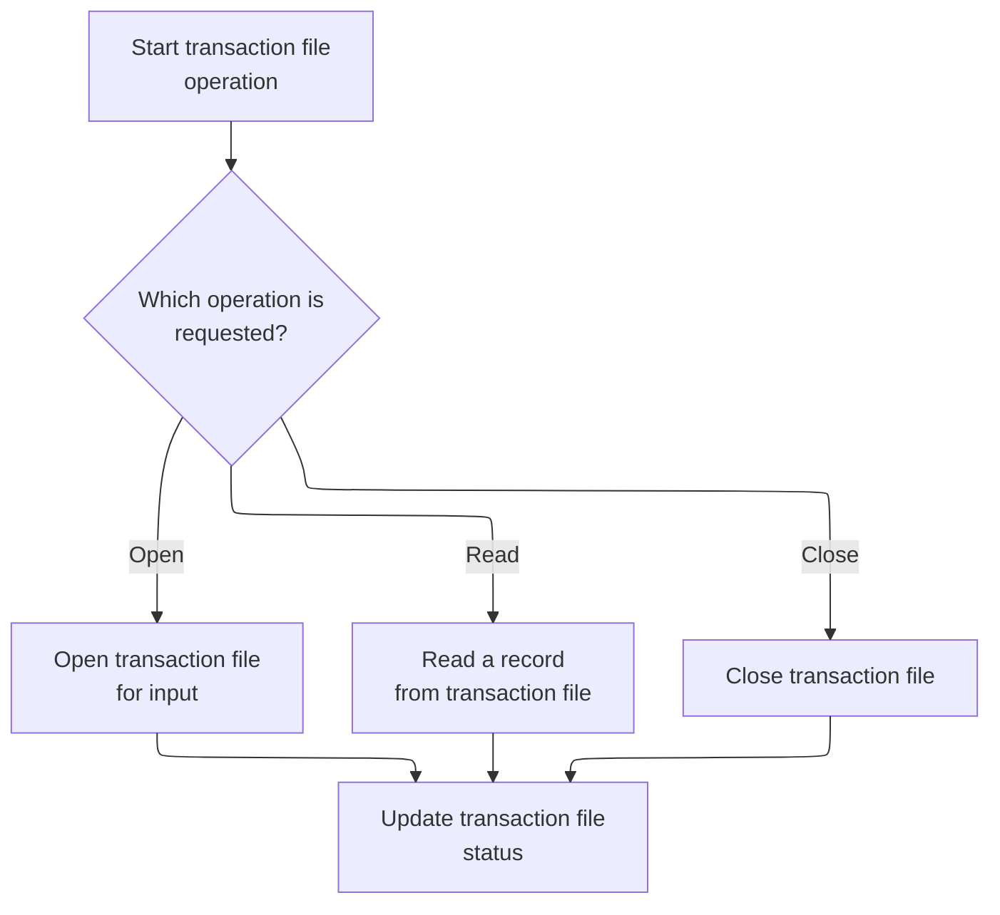
```mermaid
%%{init: {"flowchart": {"defaultRenderer": "elk"}} }%%
flowchart TD
    node1["Start transaction file 
 operation"]
    click node1 openCode "app/cbl/CBSTM03B.CBL:133:134"
    node1 --> node2{"Which operation is 
 requested?"}
    click node2 openCode "app/cbl/CBSTM03B.CBL:135:146"
    node2 -->|"Open"| node3["Open transaction file 
 for input"]
    click node3 openCode "app/cbl/CBSTM03B.CBL:136:137"
    node2 -->|"Read"| node4["Read a record 
 from transaction file"]
    click node4 openCode "app/cbl/CBSTM03B.CBL:141:143"
    node2 -->|"Close"| node5["Close transaction file"]
    click node5 openCode "app/cbl/CBSTM03B.CBL:147:148"
    node3 --> node6["Update transaction file 
 status"]
    node4 --> node6
    node5 --> node6
    click node6 openCode "app/cbl/CBSTM03B.CBL:151:152"
classDef HeadingStyle fill:#777777,stroke:#333,stroke-width:2px;
```

This section manages operations on the transaction file, including opening, reading, and closing the file, and communicates the status of each operation to the caller.

| Rule ID | Code Location                 | Category       | Rule Name               | Description                                                                                                                           | Conditions                                   | Remarks                                                                                                                                             |
| ------- | ----------------------------- | -------------- | ----------------------- | ------------------------------------------------------------------------------------------------------------------------------------- | -------------------------------------------- | --------------------------------------------------------------------------------------------------------------------------------------------------- |
| BR-001  | 1000-TRNXFILE-PROC, 1900-EXIT | Business logic | Open transaction file   | When the operation code is 'O', the transaction file is opened for input and the status of the operation is returned to the caller.   | The operation code is 'O'.                   | Operation code 'O' triggers the open action. The status code is returned as a 2-character string.                                                   |
| BR-002  | 1000-TRNXFILE-PROC, 1900-EXIT | Business logic | Read transaction record | When the operation code is 'R', a record is read from the transaction file and the status of the operation is returned to the caller. | The operation code is 'R'.                   | Operation code 'R' triggers the read action. The status code is returned as a 2-character string. The record is read into a designated output area. |
| BR-003  | 1000-TRNXFILE-PROC, 1900-EXIT | Business logic | Close transaction file  | When the operation code is 'C', the transaction file is closed and the status of the operation is returned to the caller.             | The operation code is 'C'.                   | Operation code 'C' triggers the close action. The status code is returned as a 2-character string.                                                  |
| BR-004  | 1900-EXIT                     | Business logic | Return operation status | After any transaction file operation (open, read, close), the status code of the operation is returned to the caller.                 | Any transaction file operation is performed. | The status code is returned as a 2-character string after each operation.                                                                           |

<SwmSnippet path="/app/cbl/CBSTM03B.CBL" line="133" repo-id="Z2l0aHViJTNBJTNBa3luZHJ5bC1hd3MtbWFpbmZyYW1lLW1vZGVybml6YXRpb24tY2FyZGRlbW8lM0ElM0FTd2ltbS1EZW1v">

---

`1900-EXIT` just copies the TRNXFILE-STATUS to LK-M03B-RC so the caller can check if the last operation worked.

```cobol
       1000-TRNXFILE-PROC.

           IF M03B-OPEN
               OPEN INPUT TRNX-FILE
               GO TO 1900-EXIT
           END-IF.

           IF M03B-READ
               READ TRNX-FILE INTO LK-M03B-FLDT
               END-READ
               GO TO 1900-EXIT
           END-IF.

           IF M03B-CLOSE
               CLOSE TRNX-FILE
               GO TO 1900-EXIT
           END-IF.
```

---

</SwmSnippet>

<SwmSnippet path="/app/cbl/CBSTM03B.CBL" line="151" repo-id="Z2l0aHViJTNBJTNBa3luZHJ5bC1hd3MtbWFpbmZyYW1lLW1vZGVybml6YXRpb24tY2FyZGRlbW8lM0ElM0FTd2ltbS1EZW1v">

---

`1900-EXIT` just copies the TRNXFILE-STATUS to LK-M03B-RC so the caller can check if the last operation worked.

```cobol
       1900-EXIT.
           MOVE TRNXFILE-STATUS TO LK-M03B-RC.
```

---

</SwmSnippet>

#### Cross-Reference File Operations

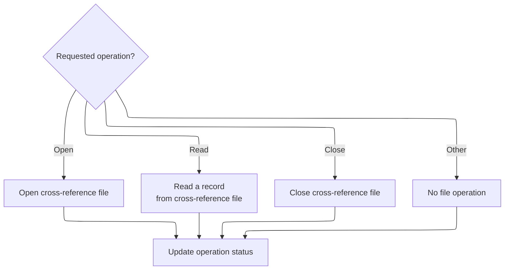
```mermaid
%%{init: {"flowchart": {"defaultRenderer": "elk"}} }%%
flowchart TD
    node1{"Requested operation?"}
    click node1 openCode "app/cbl/CBSTM03B.CBL:159:173"
    node1 -->|"Open"| node2["Open cross-reference file"]
    click node2 openCode "app/cbl/CBSTM03B.CBL:160:161"
    node1 -->|"Read"| node3["Read a record 
 from cross-reference file"]
    click node3 openCode "app/cbl/CBSTM03B.CBL:165:167"
    node1 -->|"Close"| node4["Close cross-reference file"]
    click node4 openCode "app/cbl/CBSTM03B.CBL:171:172"
    node1 -->|"Other"| node5["No file operation"]
    click node5 openCode "app/cbl/CBSTM03B.CBL:159:173"
    node2 --> node6["Update operation status"]
    node3 --> node6
    node4 --> node6
    node5 --> node6
    click node6 openCode "app/cbl/CBSTM03B.CBL:176:176"
classDef HeadingStyle fill:#777777,stroke:#333,stroke-width:2px;
```

This section manages requests to open, read, or close the cross-reference file, and reports the result of each operation to the caller.

| Rule ID | Code Location                 | Category       | Rule Name                             | Description                                                                                                                                                                       | Conditions                                                      | Remarks                                                                                                                                          |
| ------- | ----------------------------- | -------------- | ------------------------------------- | --------------------------------------------------------------------------------------------------------------------------------------------------------------------------------- | --------------------------------------------------------------- | ------------------------------------------------------------------------------------------------------------------------------------------------ |
| BR-001  | 2000-XREFFILE-PROC, 2900-EXIT | Business logic | Open file request                     | When a request to open the cross-reference file is received, the system will attempt to open the file for input. The result of the operation is then reported back to the caller. | The operation request is set to 'open'.                         | The operation request value for 'open' is 'O'. The result code is returned as a 2-character string indicating the status of the file operation.  |
| BR-002  | 2000-XREFFILE-PROC, 2900-EXIT | Business logic | Read file request                     | When a request to read from the cross-reference file is received, the system will attempt to read a record from the file and report the result to the caller.                     | The operation request is set to 'read'.                         | The operation request value for 'read' is 'R'. The result code is returned as a 2-character string indicating the status of the file operation.  |
| BR-003  | 2000-XREFFILE-PROC, 2900-EXIT | Business logic | Close file request                    | When a request to close the cross-reference file is received, the system will attempt to close the file and report the result to the caller.                                      | The operation request is set to 'close'.                        | The operation request value for 'close' is 'C'. The result code is returned as a 2-character string indicating the status of the file operation. |
| BR-004  | 2900-EXIT                     | Business logic | Operation status reporting            | After any cross-reference file operation (open, read, close), the system will report the status of the operation to the caller using a result code.                               | Any file operation (open, read, close) is performed.            | The result code is a 2-character string that communicates the status of the last file operation.                                                 |
| BR-005  | 2000-XREFFILE-PROC, 2900-EXIT | Business logic | No operation for unsupported requests | If the requested operation is not open, read, or close, no file operation is performed and the status is reported to the caller.                                                  | The operation request is not set to 'open', 'read', or 'close'. | Supported operation request values are 'O' (open), 'R' (read), and 'C' (close). The result code is a 2-character string indicating the status.   |

<SwmSnippet path="/app/cbl/CBSTM03B.CBL" line="157" repo-id="Z2l0aHViJTNBJTNBa3luZHJ5bC1hd3MtbWFpbmZyYW1lLW1vZGVybml6YXRpb24tY2FyZGRlbW8lM0ElM0FTd2ltbS1EZW1v">

---

`2000-XREFFILE-PROC` checks which XREF-FILE operation is needed (open, read, close), does it, and exits. Keeps all XREF logic in one spot.

```cobol
       2000-XREFFILE-PROC.

           IF M03B-OPEN
               OPEN INPUT XREF-FILE
               GO TO 2900-EXIT
           END-IF.

           IF M03B-READ
               READ XREF-FILE INTO LK-M03B-FLDT
               END-READ
               GO TO 2900-EXIT
           END-IF.

           IF M03B-CLOSE
               CLOSE XREF-FILE
               GO TO 2900-EXIT
           END-IF.
```

---

</SwmSnippet>

<SwmSnippet path="/app/cbl/CBSTM03B.CBL" line="175" repo-id="Z2l0aHViJTNBJTNBa3luZHJ5bC1hd3MtbWFpbmZyYW1lLW1vZGVybml6YXRpb24tY2FyZGRlbW8lM0ElM0FTd2ltbS1EZW1v">

---

`2900-EXIT` just copies XREFFILE-STATUS to LK-M03B-RC so the caller can check the result of the last XREF file operation.

```cobol
       2900-EXIT.
           MOVE XREFFILE-STATUS TO LK-M03B-RC.
```

---

</SwmSnippet>

#### Customer File Operations

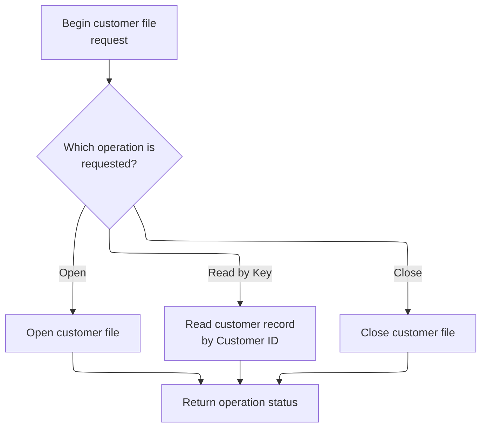
```mermaid
%%{init: {"flowchart": {"defaultRenderer": "elk"}} }%%
flowchart TD
    node1["Begin customer file 
 request"] --> node2{"Which operation is 
 requested?"}
    click node1 openCode "app/cbl/CBSTM03B.CBL:181:182"
    node2 -->|"Open"| node3["Open customer file"]
    click node2 openCode "app/cbl/CBSTM03B.CBL:183:186"
    node2 -->|"Read by Key"| node4["Read customer record 
 by Customer ID"]
    click node4 openCode "app/cbl/CBSTM03B.CBL:188:193"
    node2 -->|"Close"| node5["Close customer file"]
    click node5 openCode "app/cbl/CBSTM03B.CBL:195:198"
    node3 --> node6["Return operation status"]
    click node3 openCode "app/cbl/CBSTM03B.CBL:184:186"
    node4 --> node6
    node5 --> node6
    click node6 openCode "app/cbl/CBSTM03B.CBL:200:201"
classDef HeadingStyle fill:#777777,stroke:#333,stroke-width:2px;
```

This section manages customer file operations, allowing requests to open, read by key, or close the customer file, and returns the status of each operation to the caller.

| Rule ID | Code Location                 | Category       | Rule Name                   | Description                                                                                                                                                                                                  | Conditions                                                                                                       | Remarks                                                                                                                                                                                                                                                                        |
| ------- | ----------------------------- | -------------- | --------------------------- | ------------------------------------------------------------------------------------------------------------------------------------------------------------------------------------------------------------ | ---------------------------------------------------------------------------------------------------------------- | ------------------------------------------------------------------------------------------------------------------------------------------------------------------------------------------------------------------------------------------------------------------------------ |
| BR-001  | 3000-CUSTFILE-PROC, 3900-EXIT | Business logic | Customer file open request  | When a request to open the customer file is received, the system attempts to open the file for input. The operation status is then returned to the caller.                                                   | The operation type specified in the request is 'Open'.                                                           | The operation type for 'Open' is represented by the constant value 'O'. The status is returned as a 2-character string indicating the result of the open operation.                                                                                                            |
| BR-002  | 3000-CUSTFILE-PROC, 3900-EXIT | Business logic | Customer record read by key | When a request to read a customer record by key is received, the system uses the provided customer ID key and key length to locate and read the record. The operation status is then returned to the caller. | The operation type specified in the request is 'Read by Key', and a customer ID key and key length are provided. | The operation type for 'Read by Key' is represented by the constant value 'K'. The customer ID key is a string up to 25 characters, and the key length is a signed 4-digit number. The status is returned as a 2-character string indicating the result of the read operation. |
| BR-003  | 3000-CUSTFILE-PROC, 3900-EXIT | Business logic | Customer file close request | When a request to close the customer file is received, the system attempts to close the file. The operation status is then returned to the caller.                                                           | The operation type specified in the request is 'Close'.                                                          | The operation type for 'Close' is represented by the constant value 'C'. The status is returned as a 2-character string indicating the result of the close operation.                                                                                                          |
| BR-004  | 3900-EXIT                     | Business logic | Operation status return     | After any customer file operation (open, read by key, or close), the system returns the status of the operation to the caller.                                                                               | Any customer file operation (open, read by key, or close) is performed.                                          | The status is returned as a 2-character string indicating the result of the last customer file operation.                                                                                                                                                                      |

<SwmSnippet path="/app/cbl/CBSTM03B.CBL" line="181" repo-id="Z2l0aHViJTNBJTNBa3luZHJ5bC1hd3MtbWFpbmZyYW1lLW1vZGVybml6YXRpb24tY2FyZGRlbW8lM0ElM0FTd2ltbS1EZW1v">

---

`3000-CUSTFILE-PROC` checks if we're opening, reading by key, or closing CUST-FILE. For reads, it moves the key to FD-CUST-ID, reads the record, and exits. Keeps all CUST-FILE logic together.

```cobol
       3000-CUSTFILE-PROC.

           IF M03B-OPEN
               OPEN INPUT CUST-FILE
               GO TO 3900-EXIT
           END-IF.

           IF M03B-READ-K
               MOVE LK-M03B-KEY (1:LK-M03B-KEY-LN) TO FD-CUST-ID
               READ CUST-FILE INTO LK-M03B-FLDT
               END-READ
               GO TO 3900-EXIT
           END-IF.

           IF M03B-CLOSE
               CLOSE CUST-FILE
               GO TO 3900-EXIT
           END-IF.
```

---

</SwmSnippet>

<SwmSnippet path="/app/cbl/CBSTM03B.CBL" line="200" repo-id="Z2l0aHViJTNBJTNBa3luZHJ5bC1hd3MtbWFpbmZyYW1lLW1vZGVybml6YXRpb24tY2FyZGRlbW8lM0ElM0FTd2ltbS1EZW1v">

---

`3900-EXIT` just copies CUSTFILE-STATUS to LK-M03B-RC so the caller can check the result of the last CUST file operation.

```cobol
       3900-EXIT.
           MOVE CUSTFILE-STATUS TO LK-M03B-RC.
```

---

</SwmSnippet>

#### Account File Operations

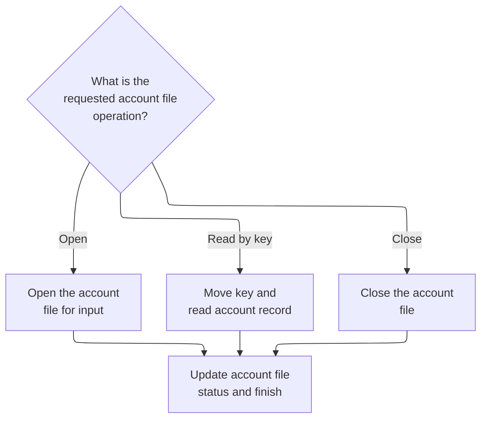
```mermaid
%%{init: {"flowchart": {"defaultRenderer": "elk"}} }%%
flowchart TD
    node1{"What is the 
 requested account file 
 operation?"}
    click node1 openCode "app/cbl/CBSTM03B.CBL:208:223"
    node1 -->|"Open"| node2["Open the account 
 file for input"]
    click node2 openCode "app/cbl/CBSTM03B.CBL:209:210"
    node1 -->|"Read by key"| node3["Move key and 
 read account record"]
    click node3 openCode "app/cbl/CBSTM03B.CBL:214:217"
    node1 -->|"Close"| node4["Close the account 
 file"]
    click node4 openCode "app/cbl/CBSTM03B.CBL:221:222"
    node2 --> node5["Update account file 
 status and finish"]
    node3 --> node5
    node4 --> node5
    click node5 openCode "app/cbl/CBSTM03B.CBL:225:226"
classDef HeadingStyle fill:#777777,stroke:#333,stroke-width:2px;
```

This section manages account file operations, allowing the caller to open the file for input, read records by key, and close the file, with the result of each operation returned for further processing.

| Rule ID | Code Location                 | Category       | Rule Name                  | Description                                                                                                                                                                                  | Conditions                                                                           | Remarks                                                                                                                                                                                                                  |
| ------- | ----------------------------- | -------------- | -------------------------- | -------------------------------------------------------------------------------------------------------------------------------------------------------------------------------------------- | ------------------------------------------------------------------------------------ | ------------------------------------------------------------------------------------------------------------------------------------------------------------------------------------------------------------------------ |
| BR-001  | 4000-ACCTFILE-PROC, 4900-EXIT | Business logic | Open account file          | When the requested operation is 'Open', the account file is opened for input and the status of the operation is returned to the caller.                                                      | The operation code is 'O' (open).                                                    | The operation code 'O' is used to indicate an open request. The status/result code is returned as a 2-character string.                                                                                                  |
| BR-002  | 4000-ACCTFILE-PROC, 4900-EXIT | Business logic | Read account record by key | When the requested operation is 'Read by key', the provided key and its length are used to read the corresponding account record, and the status of the operation is returned to the caller. | The operation code is 'K' (read by key) and a key value with its length is provided. | The operation code 'K' is used to indicate a read by key request. The key is a string of up to 25 characters, and the key length is a signed 4-digit number. The status/result code is returned as a 2-character string. |
| BR-003  | 4000-ACCTFILE-PROC, 4900-EXIT | Business logic | Close account file         | When the requested operation is 'Close', the account file is closed and the status of the operation is returned to the caller.                                                               | The operation code is 'C' (close).                                                   | The operation code 'C' is used to indicate a close request. The status/result code is returned as a 2-character string.                                                                                                  |
| BR-004  | 4900-EXIT                     | Business logic | Return operation status    | After any account file operation (open, read by key, close), the status/result code of the last operation is returned to the caller for further processing.                                  | Any account file operation (open, read by key, close) has been performed.            | The status/result code is returned as a 2-character string after each operation.                                                                                                                                         |

<SwmSnippet path="/app/cbl/CBSTM03B.CBL" line="206" repo-id="Z2l0aHViJTNBJTNBa3luZHJ5bC1hd3MtbWFpbmZyYW1lLW1vZGVybml6YXRpb24tY2FyZGRlbW8lM0ElM0FTd2ltbS1EZW1v">

---

`4000-ACCTFILE-PROC` checks if we're opening, reading by key, or closing ACCT-FILE. For reads, it moves the key to FD-ACCT-ID, reads the record, and exits. Keeps all ACCT-FILE logic together.

```cobol
       4000-ACCTFILE-PROC.

           IF M03B-OPEN
               OPEN INPUT ACCT-FILE
               GO TO 4900-EXIT
           END-IF.

           IF M03B-READ-K
               MOVE LK-M03B-KEY (1:LK-M03B-KEY-LN) TO FD-ACCT-ID
               READ ACCT-FILE INTO LK-M03B-FLDT
               END-READ
               GO TO 4900-EXIT
           END-IF.

           IF M03B-CLOSE
               CLOSE ACCT-FILE
               GO TO 4900-EXIT
           END-IF.
```

---

</SwmSnippet>

<SwmSnippet path="/app/cbl/CBSTM03B.CBL" line="225" repo-id="Z2l0aHViJTNBJTNBa3luZHJ5bC1hd3MtbWFpbmZyYW1lLW1vZGVybml6YXRpb24tY2FyZGRlbW8lM0ElM0FTd2ltbS1EZW1v">

---

`4900-EXIT` just copies ACCTFILE-STATUS to LK-M03B-RC so the caller can check the result of the last ACCT file operation.

```cobol
       4900-EXIT.
           MOVE ACCTFILE-STATUS TO LK-M03B-RC.
```

---

</SwmSnippet>

#### File Operation Dispatch (CBSTM03B Exit)


```mermaid
%%{init: {"flowchart": {"defaultRenderer": "elk"}} }%%
flowchart TD
  node1{"Which file type 
 is requested?"}
  click node1 openCode "app/cbl/CBSTM03B.CBL:118:128"
  node1 -->|"TRNXFILE"| node2["Transaction File Operations"]
  
  node1 -->|"XREFFILE"| node3["Cross-Reference File Operations"]
  
  node1 -->|"CUSTFILE"| node4["Customer File Operations"]
  
  node1 -->|"ACCTFILE"| node5["Account File Operations"]
  
  node1 -->|"Other"| node6["Exit Function"]
  click node6 openCode "app/cbl/CBSTM03B.CBL:130:131"

classDef HeadingStyle fill:#777777,stroke:#333,stroke-width:2px;
click node2 goToHeading "Transaction File Operations"
node2:::HeadingStyle
click node3 goToHeading "Cross-Reference File Operations"
node3:::HeadingStyle
click node4 goToHeading "Customer File Operations"
node4:::HeadingStyle
click node5 goToHeading "Account File Operations"
node5:::HeadingStyle
click node2 goToHeading "Transaction File Operations"
node2:::HeadingStyle
click node3 goToHeading "Cross-Reference File Operations"
node3:::HeadingStyle
click node4 goToHeading "Customer File Operations"
node4:::HeadingStyle
click node5 goToHeading "Account File Operations"
node5:::HeadingStyle
```

This section determines which file operation block to execute based on the requested file type, ensuring that only valid file types trigger their respective business logic and that unrecognized requests are safely exited.

| Rule ID | Code Location | Category       | Rule Name                     | Description                                                                                                                                                     | Conditions                                                            | Remarks                                                                                                                           |
| ------- | ------------- | -------------- | ----------------------------- | --------------------------------------------------------------------------------------------------------------------------------------------------------------- | --------------------------------------------------------------------- | --------------------------------------------------------------------------------------------------------------------------------- |
| BR-001  | 0000-START    | Business logic | Transaction File Dispatch     | If the requested file type is 'TRNXFILE', the system will execute the transaction file operations block.                                                        | The file type identifier equals 'TRNXFILE'.                           | The file type identifier must be the exact string 'TRNXFILE', left-aligned in an 8-character field.                               |
| BR-002  | 0000-START    | Business logic | Cross-Reference File Dispatch | If the requested file type is 'XREFFILE', the system will execute the cross-reference file operations block.                                                    | The file type identifier equals 'XREFFILE'.                           | The file type identifier must be the exact string 'XREFFILE', left-aligned in an 8-character field.                               |
| BR-003  | 0000-START    | Business logic | Customer File Dispatch        | If the requested file type is 'CUSTFILE', the system will execute the customer file operations block.                                                           | The file type identifier equals 'CUSTFILE'.                           | The file type identifier must be the exact string 'CUSTFILE', left-aligned in an 8-character field.                               |
| BR-004  | 0000-START    | Business logic | Account File Dispatch         | If the requested file type is 'ACCTFILE', the system will execute the account file operations block.                                                            | The file type identifier equals 'ACCTFILE'.                           | The file type identifier must be the exact string 'ACCTFILE', left-aligned in an 8-character field.                               |
| BR-005  | 0000-START    | Error handling | Unrecognized File Type Exit   | If the requested file type is not recognized as 'TRNXFILE', 'XREFFILE', 'CUSTFILE', or 'ACCTFILE', the system will exit without performing any file operations. | The file type identifier does not match any of the recognized values. | Recognized file type identifiers are: 'TRNXFILE', 'XREFFILE', 'CUSTFILE', 'ACCTFILE'. Any other value triggers an immediate exit. |

<SwmSnippet path="/app/cbl/CBSTM03B.CBL" line="116" repo-id="Z2l0aHViJTNBJTNBa3luZHJ5bC1hd3MtbWFpbmZyYW1lLW1vZGVybml6YXRpb24tY2FyZGRlbW8lM0ElM0FTd2ltbS1EZW1v">

---

After returning from CBSTM03B, we hit the dispatcher logic again. It checks which file operation to run next based on LK-M03B-DD, using EVALUATE and PERFORM THRU. This keeps file handling modular and lets us add or change file routines easily.

```cobol
       0000-START.

           EVALUATE LK-M03B-DD
             WHEN 'TRNXFILE'
               PERFORM 1000-TRNXFILE-PROC THRU 1999-EXIT
             WHEN 'XREFFILE'
               PERFORM 2000-XREFFILE-PROC THRU 2999-EXIT
             WHEN 'CUSTFILE'
               PERFORM 3000-CUSTFILE-PROC THRU 3999-EXIT
             WHEN 'ACCTFILE'
               PERFORM 4000-ACCTFILE-PROC THRU 4999-EXIT
             WHEN OTHER
               GO TO 9999-GOBACK.
```

---

</SwmSnippet>

<SwmSnippet path="/app/cbl/CBSTM03B.CBL" line="130" repo-id="Z2l0aHViJTNBJTNBa3luZHJ5bC1hd3MtbWFpbmZyYW1lLW1vZGVybml6YXRpb24tY2FyZGRlbW8lM0ElM0FTd2ltbS1EZW1v">

---

`9999-GOBACK` just ends the program and returns to the caller or OS. No cleanup, just exit.

```cobol
       9999-GOBACK.
           GOBACK.
```

---

</SwmSnippet>

### Error Handling and Read Logic

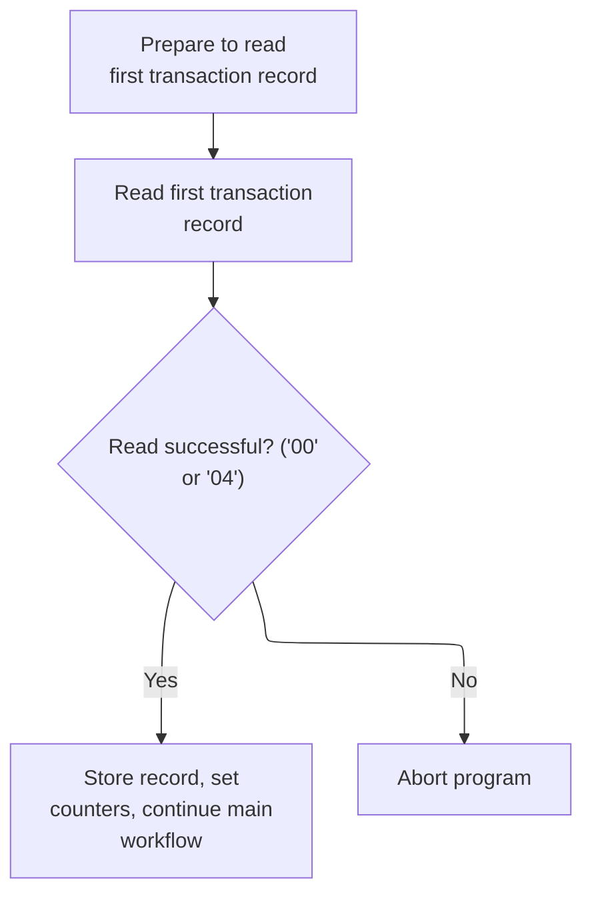
```mermaid
%%{init: {"flowchart": {"defaultRenderer": "elk"}} }%%
flowchart TD
    node1["Prepare to read 
 first transaction record"]
    click node1 openCode "app/cbl/CBSTM03A.CBL:744:746"
    node1 --> node2["Read first transaction 
 record"]
    click node2 openCode "app/cbl/CBSTM03A.CBL:746:746"
    node2 --> node3{"Read successful? ('00' 
 or '04')"}
    click node3 openCode "app/cbl/CBSTM03A.CBL:748:754"
    node3 -->|"Yes"| node4["Store record, set 
 counters, continue main 
 workflow"]
    click node4 openCode "app/cbl/CBSTM03A.CBL:756:761"
    node3 -->|"No"| node5["Abort program"]
    click node5 openCode "app/cbl/CBSTM03A.CBL:751:753"

classDef HeadingStyle fill:#777777,stroke:#333,stroke-width:2px;
```

This section manages the initial read of the transaction file, handling both successful and failed read attempts, and sets up the workflow for further transaction processing or aborts the program in case of errors.

| Rule ID | Code Location                          | Category       | Rule Name                         | Description                                                                                                                                                          | Conditions                                                            | Remarks                                                                                                                                                                                                                                                                                                                                                                                                                                                                                                                                                                                                                                                                               |
| ------- | -------------------------------------- | -------------- | --------------------------------- | -------------------------------------------------------------------------------------------------------------------------------------------------------------------- | --------------------------------------------------------------------- | ------------------------------------------------------------------------------------------------------------------------------------------------------------------------------------------------------------------------------------------------------------------------------------------------------------------------------------------------------------------------------------------------------------------------------------------------------------------------------------------------------------------------------------------------------------------------------------------------------------------------------------------------------------------------------------- |
| BR-001  | 8100-TRNXFILE-OPEN                     | Business logic | Successful transaction read       | If the attempt to read the first transaction record returns a code of '00' or '04', the record is stored, counters are initialized, and the main workflow continues. | The return code from the read operation is '00' or '04'.              | Return codes '00' and '04' are considered successful for the initial read. The transaction record is stored in a structure with fields for card number (16 characters), transaction ID (16 characters), type code (2 characters), category code (4 digits), source (10 characters), description (100 characters), amount (signed number with 9 digits and 2 decimals), merchant ID (9 digits), merchant name (50 characters), merchant city (50 characters), merchant zip (10 characters), original timestamp (26 characters), processed timestamp (26 characters), and filler (20 characters). Counters are set: CR-CNT to 1, TR-CNT to 0, and the workflow indicator to 'READTRNX'. |
| BR-002  | 8100-TRNXFILE-OPEN                     | Business logic | Card number preservation          | When a transaction record is successfully read, the card number from the record is saved for use in subsequent processing steps.                                     | A transaction record is successfully read (return code '00' or '04'). | The card number is a string of 16 characters, extracted from the transaction record and stored for later use.                                                                                                                                                                                                                                                                                                                                                                                                                                                                                                                                                                         |
| BR-003  | 8100-TRNXFILE-OPEN, 9999-ABEND-PROGRAM | Error handling | Transaction read failure handling | If the attempt to read the first transaction record does not return a code of '00' or '04', an error message is displayed and the program is aborted.                | The return code from the read operation is not '00' or '04'.          | Any return code other than '00' or '04' is considered a failure. The error message 'ERROR READING TRNXFILE' and the actual return code are displayed. The program is then forcibly terminated with an abend and a dump for debugging.                                                                                                                                                                                                                                                                                                                                                                                                                                                 |

<SwmSnippet path="/app/cbl/CBSTM03A.CBL" line="921" repo-id="Z2l0aHViJTNBJTNBa3luZHJ5bC1hd3MtbWFpbmZyYW1lLW1vZGVybml6YXRpb24tY2FyZGRlbW8lM0ElM0FTd2ltbS1EZW1v">

---

`9999-ABEND-PROGRAM` displays a message and calls 'CEE3ABD' to force an abend and dump for debugging. No recovery, just a hard stop.

```cobol
       9999-ABEND-PROGRAM.
           DISPLAY 'ABENDING PROGRAM'
           CALL 'CEE3ABD'.
```

---

</SwmSnippet>

<SwmSnippet path="/app/cbl/CBSTM03A.CBL" line="744" repo-id="Z2l0aHViJTNBJTNBa3luZHJ5bC1hd3MtbWFpbmZyYW1lLW1vZGVybml6YXRpb24tY2FyZGRlbW8lM0ElM0FTd2ltbS1EZW1v">

---

After returning from 9999-ABEND-PROGRAM, we're back in `8100-TRNXFILE-OPEN`. Here, we set up for a read, call CBSTM03B to do the actual read, and check the return code. If it fails, we abend. If it works, we keep going. Keeps file ops and error handling tight.

```cobol
           SET M03B-READ TO TRUE.
           MOVE SPACES TO WS-M03B-FLDT.
           CALL 'CBSTM03B' USING WS-M03B-AREA.

           IF WS-M03B-RC = '00' OR '04'
               CONTINUE
           ELSE
               DISPLAY 'ERROR READING TRNXFILE'
               DISPLAY 'RETURN CODE: ' WS-M03B-RC
               PERFORM 9999-ABEND-PROGRAM
           END-IF.
```

---

</SwmSnippet>

<SwmSnippet path="/app/cbl/CBSTM03A.CBL" line="756" repo-id="Z2l0aHViJTNBJTNBa3luZHJ5bC1hd3MtbWFpbmZyYW1lLW1vZGVybml6YXRpb24tY2FyZGRlbW8lM0ElM0FTd2ltbS1EZW1v">

---

We finish up by prepping for the next phase and jumping to 0000-START.

```cobol
           MOVE WS-M03B-FLDT TO TRNX-RECORD.
           MOVE TRNX-CARD-NUM TO WS-SAVE-CARD.
           MOVE 1 TO CR-CNT.
           MOVE 0 TO TR-CNT.
           MOVE 'READTRNX' TO WS-FL-DD.
           GO TO 0000-START.
           EXIT.
```

---

</SwmSnippet>

### Main Processing Loop

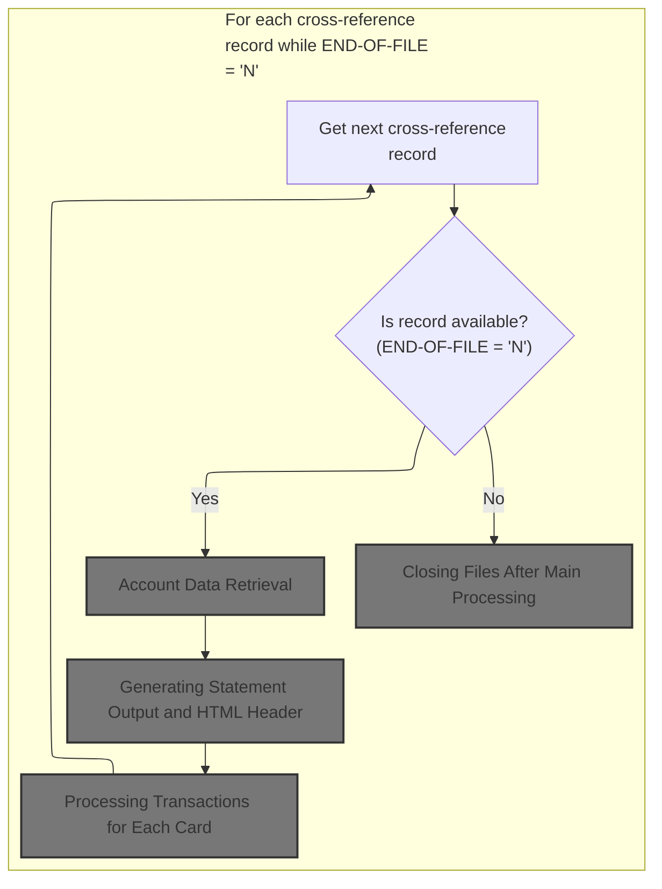
```mermaid
%%{init: {"flowchart": {"defaultRenderer": "elk"}} }%%
flowchart TD
    subgraph loop1["For each cross-reference 
 record while END-OF-FILE 
 = 'N'"]
        node1["Get next cross-reference 
 record"]
        click node1 openCode "app/cbl/CBSTM03A.CBL:317:329"
        node1 --> node2{"Is record available? 
 (END-OF-FILE = 'N')"}
        click node2 openCode "app/cbl/CBSTM03A.CBL:317:329"
        node2 -->|"Yes"| node3["Account Data Retrieval"]
        
        node3 --> node4["Generating Statement Output and HTML Header"]
        
        node4 --> node5["Processing Transactions for Each Card"]
        
        node5 --> node1
        node2 -->|"No"| node6["Closing Files After Main Processing"]
    end
    

classDef HeadingStyle fill:#777777,stroke:#333,stroke-width:2px;
click node3 goToHeading "Customer Data Retrieval"
node3:::HeadingStyle
click node3 goToHeading "Account Data Retrieval"
node3:::HeadingStyle
click node4 goToHeading "Generating Statement Output and HTML Header"
node4:::HeadingStyle
click node5 goToHeading "Processing Transactions for Each Card"
node5:::HeadingStyle
click node6 goToHeading "Closing Files After Main Processing"
node6:::HeadingStyle
```

This section manages the main processing loop for generating card statements, handling record retrieval, statement generation, and error conditions.

| Rule ID | Code Location          | Category       | Rule Name                | Description                                                                                                                                                                                                                                                                     | Conditions                                                                                         | Remarks                                                                                                                                                     |
| ------- | ---------------------- | -------------- | ------------------------ | ------------------------------------------------------------------------------------------------------------------------------------------------------------------------------------------------------------------------------------------------------------------------------- | -------------------------------------------------------------------------------------------------- | ----------------------------------------------------------------------------------------------------------------------------------------------------------- |
| BR-001  | 1000-MAINLINE          | Business logic | Record Processing Loop   | Each cross-reference record is processed only if the end-of-file flag is not set to 'Y'. For each available record, the program retrieves customer and account data, generates a statement, resets the jump and total amount counters, and processes transactions for the card. | END-OF-FILE flag is 'N' when entering the loop and after each record retrieval.                    | END-OF-FILE is a single-character flag with values 'N' (not end) and 'Y' (end). CR-JMP is reset to 1, WS-TOTAL-AMT is reset to 0 for each record processed. |
| BR-002  | 1000-MAINLINE          | Business logic | Statement Initialization | For each cross-reference record processed, the jump counter is set to 1 and the total amount is reset to zero before processing transactions.                                                                                                                                   | After generating the statement for a cross-reference record and before processing transactions.    | CR-JMP is set to 1, WS-TOTAL-AMT is set to 0. CR-JMP is a signed 4-digit number, WS-TOTAL-AMT is a signed number with 9 digits and 2 decimal places.        |
| BR-003  | 1000-XREFFILE-GET-NEXT | Error handling | End-of-File Handling     | If the cross-reference file read returns a code indicating end-of-file, the end-of-file flag is set, and no further records are processed.                                                                                                                                      | File read return code is '10' after attempting to get the next cross-reference record.             | Return code '10' indicates end-of-file. END-OF-FILE flag is set to 'Y'.                                                                                     |
| BR-004  | 1000-XREFFILE-GET-NEXT | Error handling | File Read Error Handling | If the cross-reference file read returns any error code other than '00' (success) or '10' (end-of-file), an error message is displayed and the program is abended.                                                                                                              | File read return code is not '00' or '10' after attempting to get the next cross-reference record. | Return codes other than '00' (success) and '10' (end-of-file) are treated as errors. Error messages are displayed, and the program is abended.              |

<SwmSnippet path="/app/cbl/CBSTM03A.CBL" line="316" repo-id="Z2l0aHViJTNBJTNBa3luZHJ5bC1hd3MtbWFpbmZyYW1lLW1vZGVybml6YXRpb24tY2FyZGRlbW8lM0ElM0FTd2ltbS1EZW1v">

---

In `1000-MAINLINE`, we loop through all records, process each, and reset for the next.

```cobol
       1000-MAINLINE.
           PERFORM UNTIL END-OF-FILE = 'Y'
               IF  END-OF-FILE = 'N'
                   PERFORM 1000-XREFFILE-GET-NEXT
                   IF  END-OF-FILE = 'N'
                       PERFORM 2000-CUSTFILE-GET
                       PERFORM 3000-ACCTFILE-GET
                       PERFORM 5000-CREATE-STATEMENT
                       MOVE 1 TO CR-JMP
                       MOVE ZERO TO WS-TOTAL-AMT
                       PERFORM 4000-TRNXFILE-GET
                   END-IF
               END-IF
           END-PERFORM.
```

---

</SwmSnippet>

<SwmSnippet path="/app/cbl/CBSTM03A.CBL" line="345" repo-id="Z2l0aHViJTNBJTNBa3luZHJ5bC1hd3MtbWFpbmZyYW1lLW1vZGVybml6YXRpb24tY2FyZGRlbW8lM0ElM0FTd2ltbS1EZW1v">

---

In `1000-XREFFILE-GET-NEXT`, we set up to read the next XREF record by prepping WS-M03B-AREA, call CBSTM03B to do the read, and handle the return code. If it's EOF, we set the flag. If it's an error, we abend. Then we move the buffer to CARD-XREF-RECORD for use in the next steps.

```cobol
       1000-XREFFILE-GET-NEXT.

           MOVE 'XREFFILE' TO WS-M03B-DD.
           SET M03B-READ TO TRUE.
           MOVE ZERO TO WS-M03B-RC.
           MOVE SPACES TO WS-M03B-FLDT.
           CALL 'CBSTM03B' USING WS-M03B-AREA.

           EVALUATE WS-M03B-RC
             WHEN '00'
               CONTINUE
             WHEN '10'
               MOVE 'Y' TO END-OF-FILE
             WHEN OTHER
               DISPLAY 'ERROR READING XREFFILE'
               DISPLAY 'RETURN CODE: ' WS-M03B-RC
               PERFORM 9999-ABEND-PROGRAM
           END-EVALUATE.

           MOVE WS-M03B-FLDT TO CARD-XREF-RECORD.

           EXIT.
```

---

</SwmSnippet>

#### Customer Data Retrieval

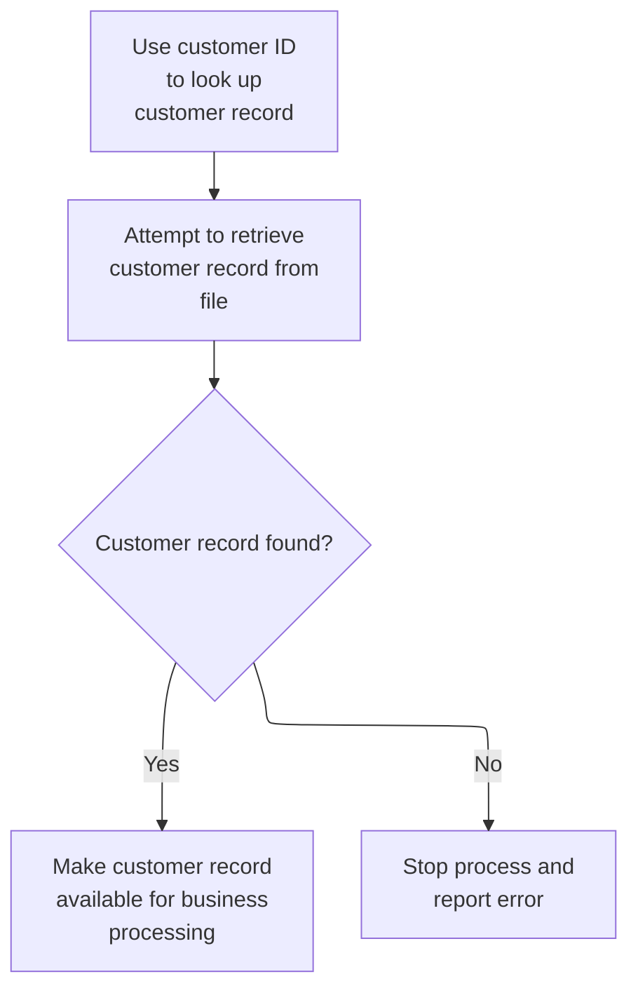
```mermaid
%%{init: {"flowchart": {"defaultRenderer": "elk"}} }%%
flowchart TD
    node1["Use customer ID 
 to look up 
 customer record"]
    click node1 openCode "app/cbl/CBSTM03A.CBL:370:374"
    node1 --> node2["Attempt to retrieve 
 customer record from 
 file"]
    click node2 openCode "app/cbl/CBSTM03A.CBL:377:377"
    node2 --> node3{"Customer record found?"}
    click node3 openCode "app/cbl/CBSTM03A.CBL:379:386"
    node3 -->|"Yes"| node4["Make customer record 
 available for business 
 processing"]
    click node4 openCode "app/cbl/CBSTM03A.CBL:388:388"
    node3 -->|"No"| node5["Stop process and 
 report error"]
    click node5 openCode "app/cbl/CBSTM03A.CBL:383:385"

classDef HeadingStyle fill:#777777,stroke:#333,stroke-width:2px;
```

This section governs the retrieval of customer data using a customer ID, ensuring that records are made available for business processing only when successfully retrieved, and that errors are reported and handled appropriately when retrieval fails.

| Rule ID | Code Location     | Category        | Rule Name                                | Description                                                                                                                                                                         | Conditions                                                                                                                    | Remarks                                                                                                                                                            |
| ------- | ----------------- | --------------- | ---------------------------------------- | ----------------------------------------------------------------------------------------------------------------------------------------------------------------------------------- | ----------------------------------------------------------------------------------------------------------------------------- | ------------------------------------------------------------------------------------------------------------------------------------------------------------------ |
| BR-001  | 2000-CUSTFILE-GET | Data validation | Customer record availability condition   | The customer record is only made available for business processing if the retrieval operation returns a success code ('00').                                                        | The retrieval operation for the customer record returns a success code ('00').                                                | The customer record is transferred to the business processing buffer only if the return code is '00'. The buffer size is up to 1000 bytes.                         |
| BR-002  | 2000-CUSTFILE-GET | Business logic  | Customer record retrieval                | When a customer ID is provided, the system attempts to retrieve the corresponding customer record. If the record is found, it is made available for subsequent business processing. | A valid customer ID is provided and the customer record exists in the file.                                                   | The customer record is made available in a buffer of up to 1000 bytes. The record is transferred for further processing only if the retrieval return code is '00'. |
| BR-003  | 2000-CUSTFILE-GET | Error handling  | Customer record retrieval error handling | If the customer record cannot be retrieved (i.e., the return code is not '00'), the system stops further processing and reports an error.                                           | A customer ID is provided but the customer record does not exist or cannot be retrieved, resulting in a non-'00' return code. | Error messages are displayed indicating the failure and the specific return code. The process is terminated immediately after the error is reported.               |

<SwmSnippet path="/app/cbl/CBSTM03A.CBL" line="368" repo-id="Z2l0aHViJTNBJTNBa3luZHJ5bC1hd3MtbWFpbmZyYW1lLW1vZGVybml6YXRpb24tY2FyZGRlbW8lM0ElM0FTd2ltbS1EZW1v">

---

`2000-CUSTFILE-GET` sets up a keyed read for customer data and calls CBSTM03B to do the work.

```cobol
       2000-CUSTFILE-GET.

           MOVE 'CUSTFILE' TO WS-M03B-DD.
           SET M03B-READ-K TO TRUE.
           MOVE XREF-CUST-ID TO WS-M03B-KEY.
           MOVE ZERO TO WS-M03B-KEY-LN.
           COMPUTE WS-M03B-KEY-LN = LENGTH OF XREF-CUST-ID.
           MOVE ZERO TO WS-M03B-RC.
           MOVE SPACES TO WS-M03B-FLDT.
           CALL 'CBSTM03B' USING WS-M03B-AREA.
```

---

</SwmSnippet>

<SwmSnippet path="/app/cbl/CBSTM03A.CBL" line="379" repo-id="Z2l0aHViJTNBJTNBa3luZHJ5bC1hd3MtbWFpbmZyYW1lLW1vZGVybml6YXRpb24tY2FyZGRlbW8lM0ElM0FTd2ltbS1EZW1v">

---

After returning from CBSTM03B in `2000-CUSTFILE-GET`, we check the return code. If it's not '00', we display an error and abend. If it's good, we copy the buffer to CUSTOMER-RECORD for use in the next steps.

```cobol
           EVALUATE WS-M03B-RC
             WHEN '00'
               CONTINUE
             WHEN OTHER
               DISPLAY 'ERROR READING CUSTFILE'
               DISPLAY 'RETURN CODE: ' WS-M03B-RC
               PERFORM 9999-ABEND-PROGRAM
           END-EVALUATE.

           MOVE WS-M03B-FLDT TO CUSTOMER-RECORD.

           EXIT.
```

---

</SwmSnippet>

#### Account Data Retrieval

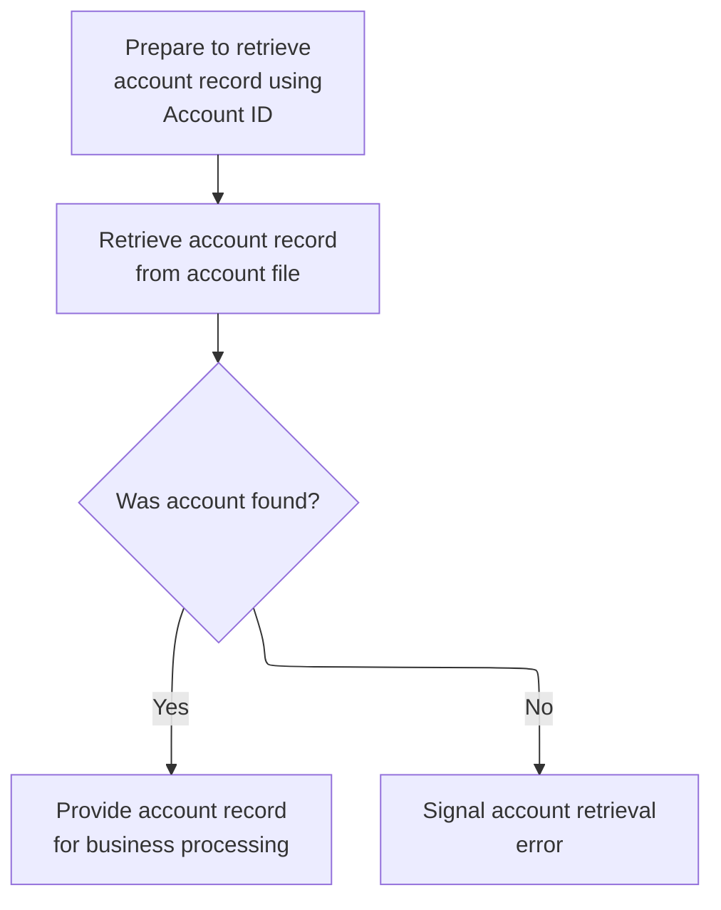
```mermaid
%%{init: {"flowchart": {"defaultRenderer": "elk"}} }%%
flowchart TD
    node1["Prepare to retrieve 
 account record using 
 Account ID"]
    click node1 openCode "app/cbl/CBSTM03A.CBL:394:398"
    node1 --> node2["Retrieve account record 
 from account file"]
    click node2 openCode "app/cbl/CBSTM03A.CBL:401:401"
    node2 --> node3{"Was account found?"}
    click node3 openCode "app/cbl/CBSTM03A.CBL:403:410"
    node3 -->|"Yes"| node4["Provide account record 
 for business processing"]
    click node4 openCode "app/cbl/CBSTM03A.CBL:412:412"
    node3 -->|"No"| node5["Signal account retrieval 
 error"]
    click node5 openCode "app/cbl/CBSTM03A.CBL:407:409"

classDef HeadingStyle fill:#777777,stroke:#333,stroke-width:2px;
```

This section is responsible for retrieving account data using a provided Account ID, ensuring that the correct record is made available for business processing or signaling an error if retrieval fails.

| Rule ID | Code Location     | Category        | Rule Name                           | Description                                                                                                                                       | Conditions                                                                                               | Remarks                                                                                                                                                                     |
| ------- | ----------------- | --------------- | ----------------------------------- | ------------------------------------------------------------------------------------------------------------------------------------------------- | -------------------------------------------------------------------------------------------------------- | --------------------------------------------------------------------------------------------------------------------------------------------------------------------------- |
| BR-001  | 3000-ACCTFILE-GET | Data validation | Account record matches requested ID | The account record provided for business processing must correspond to the Account ID used for retrieval.                                         | The retrieval operation is performed using the provided Account ID as the key.                           | The Account ID is used as the key for retrieval. The output record is a string of up to 1000 bytes, representing the account data associated with the requested Account ID. |
| BR-002  | 3000-ACCTFILE-GET | Business logic  | Successful account retrieval        | If the account record is successfully found using the provided Account ID, the account data is made available for subsequent business processing. | The account file returns a success code ('00') after attempting to retrieve the record by Account ID.    | The success code is '00'. The account record is provided as a string of up to 1000 bytes, containing all account data fields required for downstream processing.            |
| BR-003  | 3000-ACCTFILE-GET | Error handling  | Account retrieval error handling    | If the account record cannot be found or an error occurs during retrieval, an error is signaled and business processing is halted.                | The account file returns any code other than '00' after attempting to retrieve the record by Account ID. | Any return code other than '00' triggers an error. The error is signaled by displaying an error message and halting further processing.                                     |

<SwmSnippet path="/app/cbl/CBSTM03A.CBL" line="392" repo-id="Z2l0aHViJTNBJTNBa3luZHJ5bC1hd3MtbWFpbmZyYW1lLW1vZGVybml6YXRpb24tY2FyZGRlbW8lM0ElM0FTd2ltbS1EZW1v">

---

`3000-ACCTFILE-GET` sets up a keyed read for account data and calls CBSTM03B to do the work.

```cobol
       3000-ACCTFILE-GET.

           MOVE 'ACCTFILE' TO WS-M03B-DD.
           SET M03B-READ-K TO TRUE.
           MOVE XREF-ACCT-ID TO WS-M03B-KEY.
           MOVE ZERO TO WS-M03B-KEY-LN.
           COMPUTE WS-M03B-KEY-LN = LENGTH OF XREF-ACCT-ID.
           MOVE ZERO TO WS-M03B-RC.
           MOVE SPACES TO WS-M03B-FLDT.
           CALL 'CBSTM03B' USING WS-M03B-AREA.
```

---

</SwmSnippet>

<SwmSnippet path="/app/cbl/CBSTM03A.CBL" line="403" repo-id="Z2l0aHViJTNBJTNBa3luZHJ5bC1hd3MtbWFpbmZyYW1lLW1vZGVybml6YXRpb24tY2FyZGRlbW8lM0ElM0FTd2ltbS1EZW1v">

---

Back in 3000-ACCTFILE-GET, we just returned from calling CBSTM03B using WS-M03B-AREA to read the account file by key. If the return code isn't '00', we call 9999-ABEND-PROGRAM to halt everything and dump the error, since we can't trust the data. If the read is good, we move the result from WS-M03B-FLDT to ACCOUNT-RECORD for use in the rest of the flow.

```cobol
           EVALUATE WS-M03B-RC
             WHEN '00'
               CONTINUE
             WHEN OTHER
               DISPLAY 'ERROR READING ACCTFILE'
               DISPLAY 'RETURN CODE: ' WS-M03B-RC
               PERFORM 9999-ABEND-PROGRAM
           END-EVALUATE.

           MOVE WS-M03B-FLDT TO ACCOUNT-RECORD.

           EXIT.
```

---

</SwmSnippet>

#### Generating Statement Output and HTML Header

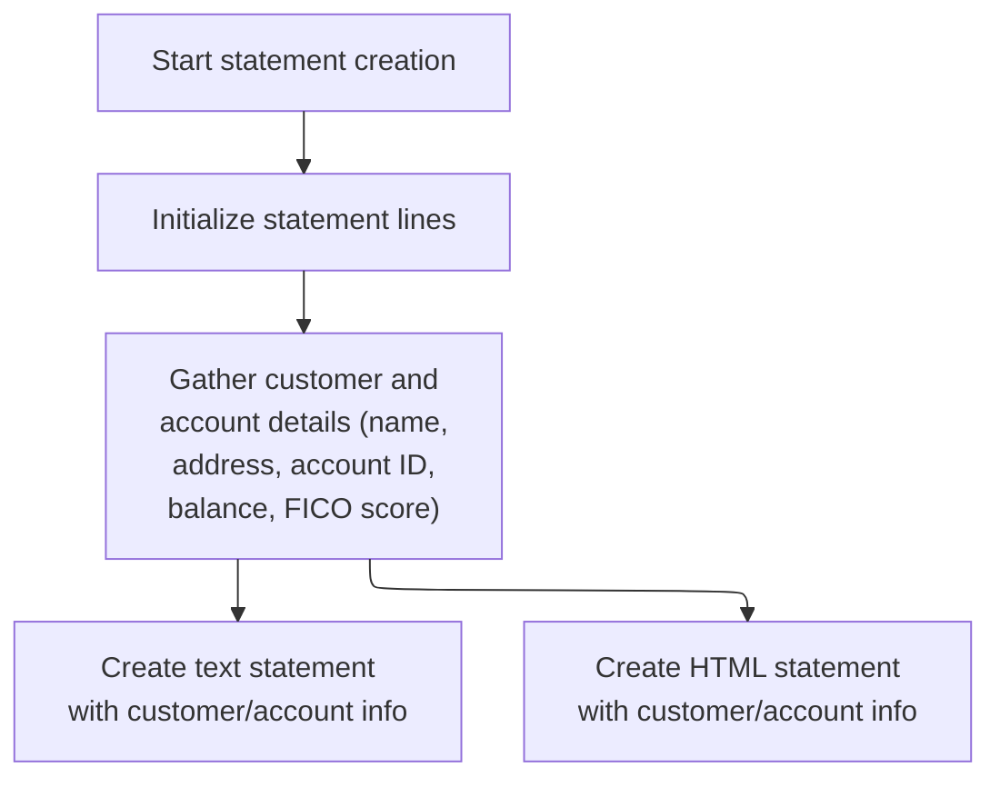
```mermaid
%%{init: {"flowchart": {"defaultRenderer": "elk"}} }%%
flowchart TD
    node1["Start statement creation"]
    click node1 openCode "app/cbl/CBSTM03A.CBL:458:458"
    node2["Initialize statement lines"]
    click node2 openCode "app/cbl/CBSTM03A.CBL:459:460"
    node3["Gather customer and 
 account details (name, 
 address, account ID, 
 balance, FICO score)"]
    click node3 openCode "app/cbl/CBSTM03A.CBL:462:485"
    node4["Create text statement 
 with customer/account info"]
    click node4 openCode "app/cbl/CBSTM03A.CBL:488:504"
    node5["Create HTML statement 
 with customer/account info"]
    click node5 openCode "app/cbl/CBSTM03A.CBL:506:669"
    node1 --> node2
    node2 --> node3
    node3 --> node4
    node3 --> node5
classDef HeadingStyle fill:#777777,stroke:#333,stroke-width:2px;
```

This section generates the customer account statement in both text and HTML formats, ensuring all required customer and account details are included and properly formatted for business presentation.

| Rule ID | Code Location                                 | Category       | Rule Name                       | Description                                                                                                                                                        | Conditions                                                | Remarks                                                                                                                                                                                                                                                                                                            |
| ------- | --------------------------------------------- | -------------- | ------------------------------- | ------------------------------------------------------------------------------------------------------------------------------------------------------------------ | --------------------------------------------------------- | ------------------------------------------------------------------------------------------------------------------------------------------------------------------------------------------------------------------------------------------------------------------------------------------------------------------ |
| BR-001  | 5000-CREATE-STATEMENT, 5200-WRITE-HTML-NMADBS | Business logic | Full name inclusion             | The statement must include the customer's full name, constructed from first, middle, and last names, and presented as a single line in both text and HTML outputs. | Whenever a statement is generated for a customer.         | The full name is presented as a single string of up to 75 characters in the text output (ST-NAME field, 75 chars). In HTML, it is wrapped in a <p> tag with font-size 16px.                                                                                                                                        |
| BR-002  | 5000-CREATE-STATEMENT, 5200-WRITE-HTML-NMADBS | Business logic | Address inclusion               | The statement must include the customer's address, composed of three lines, and presented in both text and HTML outputs.                                           | Whenever a statement is generated for a customer.         | Address lines are presented as follows: ST-ADD1 and ST-ADD2 are each up to 50 characters, ST-ADD3 is up to 80 characters. In HTML, each line is wrapped in a <p> tag.                                                                                                                                              |
| BR-003  | 5000-CREATE-STATEMENT, 5200-WRITE-HTML-NMADBS | Business logic | Account details inclusion       | The statement must include the account ID, current balance, and FICO score, each presented in both text and HTML outputs.                                          | Whenever a statement is generated for a customer account. | Account ID is up to 20 characters in text (ST-ACCT-ID), current balance is a numeric field (9 digits, 2 decimals, sign), FICO score is up to 20 characters. In HTML, each is presented in a <p> tag with a label.                                                                                                  |
| BR-004  | 5100-WRITE-HTML-HEADER                        | Business logic | HTML header and table structure | The HTML statement output must begin with a header and table structure, including static lines and the account ID.                                                 | Whenever an HTML statement is generated.                  | HTML output starts with multiple static lines, each corresponding to a specific snippet (HTML-L01, HTML-L02, etc.), followed by the account ID inserted into the table. The sequence is fixed and includes table and section headers.                                                                              |
| BR-005  | 5000-CREATE-STATEMENT                         | Business logic | Statement line sequencing       | The statement output must follow a specific sequence and repetition of lines to ensure proper formatting and readability.                                          | Whenever a statement is generated.                        | Text output writes lines in the following order: ST-LINE0, ST-LINE1, ST-LINE2, ST-LINE3, ST-LINE4, ST-LINE5, ST-LINE6, ST-LINE5 (repeated), ST-LINE7, ST-LINE8, ST-LINE9, ST-LINE10, ST-LINE11, ST-LINE12, ST-LINE13, ST-LINE12 (repeated). Each line has a fixed format and length as defined in STATEMENT-LINES. |

<SwmSnippet path="/app/cbl/CBSTM03A.CBL" line="458" repo-id="Z2l0aHViJTNBJTNBa3luZHJ5bC1hd3MtbWFpbmZyYW1lLW1vZGVybml6YXRpb24tY2FyZGRlbW8lM0ElM0FTd2ltbS1EZW1v">

---

We set up the statement lines, write the header, and call 5100-WRITE-HTML-HEADER to kick off the HTML output right away.

```cobol
       5000-CREATE-STATEMENT.
           INITIALIZE STATEMENT-LINES.
           WRITE FD-STMTFILE-REC FROM ST-LINE0.
           PERFORM 5100-WRITE-HTML-HEADER THRU 5100-EXIT.
```

---

</SwmSnippet>

<SwmSnippet path="/app/cbl/CBSTM03A.CBL" line="506" repo-id="Z2l0aHViJTNBJTNBa3luZHJ5bC1hd3MtbWFpbmZyYW1lLW1vZGVybml6YXRpb24tY2FyZGRlbW8lM0ElM0FTd2ltbS1EZW1v">

---

5100-WRITE-HTML-HEADER builds the HTML header and table structure by setting 88-level flags for each HTML snippet, writing them out in order. It inserts the account ID where needed, then continues with more table and section headers. All output goes to the HTML file buffer.

```cobol
       5100-WRITE-HTML-HEADER.

           SET HTML-L01 TO TRUE.
           WRITE FD-HTMLFILE-REC FROM HTML-FIXED-LN.
           SET HTML-L02 TO TRUE.
           WRITE FD-HTMLFILE-REC FROM HTML-FIXED-LN.
           SET HTML-L03 TO TRUE.
           WRITE FD-HTMLFILE-REC FROM HTML-FIXED-LN.
           SET HTML-L04 TO TRUE.
           WRITE FD-HTMLFILE-REC FROM HTML-FIXED-LN.
           SET HTML-L05 TO TRUE.
           WRITE FD-HTMLFILE-REC FROM HTML-FIXED-LN.
           SET HTML-L06 TO TRUE.
           WRITE FD-HTMLFILE-REC FROM HTML-FIXED-LN.
           SET HTML-L07 TO TRUE.
           WRITE FD-HTMLFILE-REC FROM HTML-FIXED-LN.
           SET HTML-L08 TO TRUE.
           WRITE FD-HTMLFILE-REC FROM HTML-FIXED-LN.
           SET HTML-LTRS TO TRUE.
           WRITE FD-HTMLFILE-REC FROM HTML-FIXED-LN.
           SET HTML-L10 TO TRUE.
           WRITE FD-HTMLFILE-REC FROM HTML-FIXED-LN.

           MOVE ACCT-ID TO L11-ACCT.
           WRITE FD-HTMLFILE-REC FROM HTML-L11.
           SET HTML-LTDE TO TRUE.
           WRITE FD-HTMLFILE-REC FROM HTML-FIXED-LN.
           SET HTML-LTRE TO TRUE.
           WRITE FD-HTMLFILE-REC FROM HTML-FIXED-LN.
           SET HTML-LTRS TO TRUE.
           WRITE FD-HTMLFILE-REC FROM HTML-FIXED-LN.
           SET HTML-L15 TO TRUE.
           WRITE FD-HTMLFILE-REC FROM HTML-FIXED-LN.
           SET HTML-L16 TO TRUE.
           WRITE FD-HTMLFILE-REC FROM HTML-FIXED-LN.
           SET HTML-L17 TO TRUE.
           WRITE FD-HTMLFILE-REC FROM HTML-FIXED-LN.
           SET HTML-L18 TO TRUE.
           WRITE FD-HTMLFILE-REC FROM HTML-FIXED-LN.
           SET HTML-LTDE TO TRUE.
           WRITE FD-HTMLFILE-REC FROM HTML-FIXED-LN.
           SET HTML-LTRE TO TRUE.
           WRITE FD-HTMLFILE-REC FROM HTML-FIXED-LN.
           SET HTML-LTRS TO TRUE.
           WRITE FD-HTMLFILE-REC FROM HTML-FIXED-LN.
           SET HTML-L22-35 TO TRUE.
           WRITE FD-HTMLFILE-REC FROM HTML-FIXED-LN.
```

---

</SwmSnippet>

<SwmSnippet path="/app/cbl/CBSTM03A.CBL" line="462" repo-id="Z2l0aHViJTNBJTNBa3luZHJ5bC1hd3MtbWFpbmZyYW1lLW1vZGVybml6YXRpb24tY2FyZGRlbW8lM0ElM0FTd2ltbS1EZW1v">

---

We just returned from 5100-WRITE-HTML-HEADER in 5000-CREATE-STATEMENT. Now we build the customer's full name and address using STRING and MOVE, prepping them for both outputs. We also move account and credit score data into the statement lines for the next steps.

```cobol
           STRING CUST-FIRST-NAME DELIMITED BY ' '
                  ' ' DELIMITED BY SIZE
                  CUST-MIDDLE-NAME DELIMITED BY ' '
                  ' ' DELIMITED BY SIZE
                  CUST-LAST-NAME DELIMITED BY ' '
                  ' ' DELIMITED BY SIZE
                  INTO ST-NAME
           END-STRING.
           MOVE CUST-ADDR-LINE-1 TO ST-ADD1.
           MOVE CUST-ADDR-LINE-2 TO ST-ADD2.
           STRING CUST-ADDR-LINE-3 DELIMITED BY ' '
                  ' ' DELIMITED BY SIZE
                  CUST-ADDR-STATE-CD DELIMITED BY ' '
                  ' ' DELIMITED BY SIZE
                  CUST-ADDR-COUNTRY-CD DELIMITED BY ' '
                  ' ' DELIMITED BY SIZE
                  CUST-ADDR-ZIP DELIMITED BY ' '
                  ' ' DELIMITED BY SIZE
                  INTO ST-ADD3
           END-STRING.

           MOVE ACCT-ID TO ST-ACCT-ID.
           MOVE ACCT-CURR-BAL TO ST-CURR-BAL.
           MOVE CUST-FICO-CREDIT-SCORE TO ST-FICO-SCORE.
```

---

</SwmSnippet>

<SwmSnippet path="/app/cbl/CBSTM03A.CBL" line="486" repo-id="Z2l0aHViJTNBJTNBa3luZHJ5bC1hd3MtbWFpbmZyYW1lLW1vZGVybml6YXRpb24tY2FyZGRlbW8lM0ElM0FTd2ltbS1EZW1v">

---

After setting up the main fields, we call the HTML output routine to write them out.

```cobol
           PERFORM 5200-WRITE-HTML-NMADBS THRU 5200-EXIT.
```

---

</SwmSnippet>

<SwmSnippet path="/app/cbl/CBSTM03A.CBL" line="558" repo-id="Z2l0aHViJTNBJTNBa3luZHJ5bC1hd3MtbWFpbmZyYW1lLW1vZGVybml6YXRpb24tY2FyZGRlbW8lM0ElM0FTd2ltbS1EZW1v">

---

5200-WRITE-HTML-NMADBS builds the HTML output for name, address, and account info. It uses STRING to insert COBOL data into HTML lines, and SET to load static HTML snippets for structure. Each line is written to the HTML file buffer, alternating between dynamic and static content.

```cobol
       5200-WRITE-HTML-NMADBS.

           MOVE ST-NAME TO L23-NAME.
           MOVE SPACES TO FD-HTMLFILE-REC
           STRING '<p style="font-size:16px">' DELIMITED BY '*'
                  L23-NAME DELIMITED BY '  '
                  '  ' DELIMITED BY SIZE
                  '</p>' DELIMITED BY '*'
                  INTO FD-HTMLFILE-REC
           END-STRING.
           WRITE FD-HTMLFILE-REC.
           MOVE SPACES TO HTML-ADDR-LN.
           STRING '<p>' DELIMITED BY '*'
                  ST-ADD1 DELIMITED BY '  '
                  '  ' DELIMITED BY SIZE
                  '</p>' DELIMITED BY '*'
                  INTO HTML-ADDR-LN
           END-STRING.
           WRITE FD-HTMLFILE-REC FROM HTML-ADDR-LN.
           MOVE SPACES TO HTML-ADDR-LN.
           STRING '<p>' DELIMITED BY '*'
                  ST-ADD2 DELIMITED BY '  '
                  '  ' DELIMITED BY SIZE
                  '</p>' DELIMITED BY '*'
                  INTO HTML-ADDR-LN
           END-STRING.
           WRITE FD-HTMLFILE-REC FROM HTML-ADDR-LN.
           MOVE SPACES TO HTML-ADDR-LN.
           STRING '<p>' DELIMITED BY '*'
                  ST-ADD3 DELIMITED BY '  '
                  '  ' DELIMITED BY SIZE
                  '</p>' DELIMITED BY '*'
                  INTO HTML-ADDR-LN
           END-STRING.
           WRITE FD-HTMLFILE-REC FROM HTML-ADDR-LN.

           SET HTML-LTDE TO TRUE.
           WRITE FD-HTMLFILE-REC FROM HTML-FIXED-LN.
           SET HTML-LTRE TO TRUE.
           WRITE FD-HTMLFILE-REC FROM HTML-FIXED-LN.
           SET HTML-LTRS TO TRUE.
           WRITE FD-HTMLFILE-REC FROM HTML-FIXED-LN.
           SET HTML-L30-42 TO TRUE.
           WRITE FD-HTMLFILE-REC FROM HTML-FIXED-LN.
           SET HTML-L31 TO TRUE.
           WRITE FD-HTMLFILE-REC FROM HTML-FIXED-LN.
           SET HTML-LTDE TO TRUE.
           WRITE FD-HTMLFILE-REC FROM HTML-FIXED-LN.
           SET HTML-LTRE TO TRUE.
           WRITE FD-HTMLFILE-REC FROM HTML-FIXED-LN.
           SET HTML-LTRS TO TRUE.
           WRITE FD-HTMLFILE-REC FROM HTML-FIXED-LN.
           SET HTML-L22-35 TO TRUE.
           WRITE FD-HTMLFILE-REC FROM HTML-FIXED-LN.

           MOVE SPACES TO HTML-BSIC-LN.
           STRING '<p>Account ID         : ' DELIMITED BY '*'
                  ST-ACCT-ID DELIMITED BY '*'
                  '</p>' DELIMITED BY '*'
                  INTO HTML-BSIC-LN
           END-STRING.
           WRITE FD-HTMLFILE-REC FROM HTML-BSIC-LN.
           MOVE SPACES TO HTML-BSIC-LN.
           STRING '<p>Current Balance    : ' DELIMITED BY '*'
                  ST-CURR-BAL DELIMITED BY '*'
                  '</p>' DELIMITED BY '*'
                  INTO HTML-BSIC-LN
           END-STRING.
           WRITE FD-HTMLFILE-REC FROM HTML-BSIC-LN.
           MOVE SPACES TO HTML-BSIC-LN.
           STRING '<p>FICO Score         : ' DELIMITED BY '*'
                  ST-FICO-SCORE DELIMITED BY '*'
                  '</p>' DELIMITED BY '*'
                  INTO HTML-BSIC-LN
           END-STRING.
           WRITE FD-HTMLFILE-REC FROM HTML-BSIC-LN.
           SET HTML-LTDE TO TRUE.
           WRITE FD-HTMLFILE-REC FROM HTML-FIXED-LN.
           SET HTML-LTRE TO TRUE.
           WRITE FD-HTMLFILE-REC FROM HTML-FIXED-LN.
           SET HTML-LTRS TO TRUE.
           WRITE FD-HTMLFILE-REC FROM HTML-FIXED-LN.
           SET HTML-L30-42 TO TRUE.
           WRITE FD-HTMLFILE-REC FROM HTML-FIXED-LN.
           SET HTML-L43 TO TRUE.
           WRITE FD-HTMLFILE-REC FROM HTML-FIXED-LN.
           SET HTML-LTDE TO TRUE.
           WRITE FD-HTMLFILE-REC FROM HTML-FIXED-LN.
           SET HTML-LTRE TO TRUE.
           WRITE FD-HTMLFILE-REC FROM HTML-FIXED-LN.
           SET HTML-LTRS TO TRUE.
           WRITE FD-HTMLFILE-REC FROM HTML-FIXED-LN.
           SET HTML-L47 TO TRUE.
           WRITE FD-HTMLFILE-REC FROM HTML-FIXED-LN.
           SET HTML-L48 TO TRUE.
           WRITE FD-HTMLFILE-REC FROM HTML-FIXED-LN.
           SET HTML-LTDE TO TRUE.
           WRITE FD-HTMLFILE-REC FROM HTML-FIXED-LN.
           SET HTML-L50 TO TRUE.
           WRITE FD-HTMLFILE-REC FROM HTML-FIXED-LN.
           SET HTML-L51 TO TRUE.
           WRITE FD-HTMLFILE-REC FROM HTML-FIXED-LN.
           SET HTML-LTDE TO TRUE.
           WRITE FD-HTMLFILE-REC FROM HTML-FIXED-LN.
           SET HTML-L53 TO TRUE.
           WRITE FD-HTMLFILE-REC FROM HTML-FIXED-LN.
           SET HTML-L54 TO TRUE.
           WRITE FD-HTMLFILE-REC FROM HTML-FIXED-LN.
           SET HTML-LTDE TO TRUE.
           WRITE FD-HTMLFILE-REC FROM HTML-FIXED-LN.
           SET HTML-LTRE TO TRUE.
           WRITE FD-HTMLFILE-REC FROM HTML-FIXED-LN.
```

---

</SwmSnippet>

<SwmSnippet path="/app/cbl/CBSTM03A.CBL" line="488" repo-id="Z2l0aHViJTNBJTNBa3luZHJ5bC1hd3MtbWFpbmZyYW1lLW1vZGVybml6YXRpb24tY2FyZGRlbW8lM0ElM0FTd2ltbS1EZW1v">

---

After returning from 5200-WRITE-HTML-NMADBS in 5000-CREATE-STATEMENT, we write out all the statement lines (name, address, headers, transaction summary, etc.) to the statement file. The sequence and repetition make sure the output is formatted as expected.

```cobol
           WRITE FD-STMTFILE-REC FROM ST-LINE1.
           WRITE FD-STMTFILE-REC FROM ST-LINE2.
           WRITE FD-STMTFILE-REC FROM ST-LINE3.
           WRITE FD-STMTFILE-REC FROM ST-LINE4.
           WRITE FD-STMTFILE-REC FROM ST-LINE5.
           WRITE FD-STMTFILE-REC FROM ST-LINE6.
           WRITE FD-STMTFILE-REC FROM ST-LINE5.
           WRITE FD-STMTFILE-REC FROM ST-LINE7.
           WRITE FD-STMTFILE-REC FROM ST-LINE8.
           WRITE FD-STMTFILE-REC FROM ST-LINE9.
           WRITE FD-STMTFILE-REC FROM ST-LINE10.
           WRITE FD-STMTFILE-REC FROM ST-LINE11.
           WRITE FD-STMTFILE-REC FROM ST-LINE12.
           WRITE FD-STMTFILE-REC FROM ST-LINE13.
           WRITE FD-STMTFILE-REC FROM ST-LINE12.

           EXIT.
```

---

</SwmSnippet>

#### Processing Transactions for Each Card

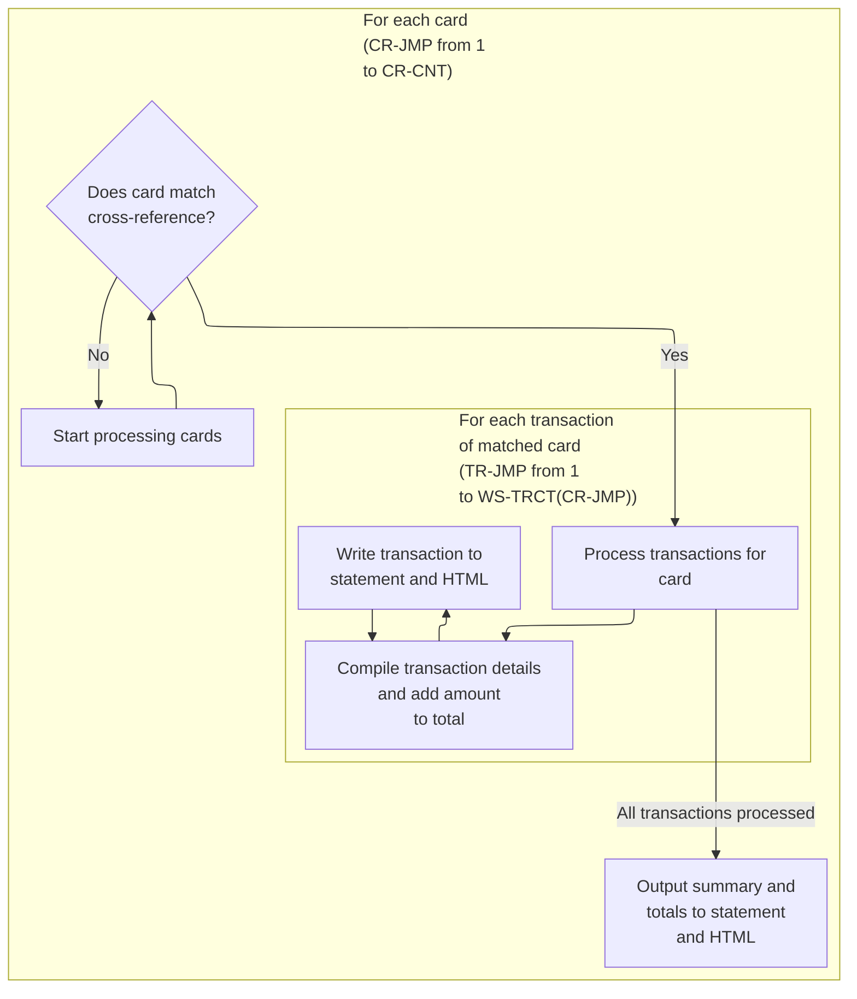
```mermaid
%%{init: {"flowchart": {"defaultRenderer": "elk"}} }%%
flowchart TD
    node1["Start processing cards"]
    click node1 openCode "app/cbl/CBSTM03A.CBL:416:417"
    subgraph loop1["For each card 
 (CR-JMP from 1 
 to CR-CNT)"]
        node1 --> node2{"Does card match 
 cross-reference?"}
        click node2 openCode "app/cbl/CBSTM03A.CBL:419:420"
        node2 -->|"Yes"| node3["Process transactions for 
 card"]
        node2 -->|"No"| node1
        subgraph loop2["For each transaction 
 of matched card 
 (TR-JMP from 1 
 to WS-TRCT(CR-JMP))"]
            node3 --> node4["Compile transaction details 
 and add amount 
 to total"]
            click node4 openCode "app/cbl/CBSTM03A.CBL:424:429"
            node4 --> node5["Write transaction to 
 statement and HTML"]
            click node5 openCode "app/cbl/CBSTM03A.CBL:428:429"
            node5 --> node4
        end
        node3 -->|"All transactions processed"| node6["Output summary and 
 totals to statement 
 and HTML"]
        click node6 openCode "app/cbl/CBSTM03A.CBL:433:454"
    end
classDef HeadingStyle fill:#777777,stroke:#333,stroke-width:2px;
```

This section processes transactions for each card, compiling transaction details and totals, and outputs formatted records and summaries to both statement and HTML files for matched cards.

| Rule ID | Code Location     | Category       | Rule Name                     | Description                                                                                                                                                                                          | Conditions                                                                                                    | Remarks                                                                                                                                                                                                                                                                                         |
| ------- | ----------------- | -------------- | ----------------------------- | ---------------------------------------------------------------------------------------------------------------------------------------------------------------------------------------------------- | ------------------------------------------------------------------------------------------------------------- | ----------------------------------------------------------------------------------------------------------------------------------------------------------------------------------------------------------------------------------------------------------------------------------------------- |
| BR-001  | 4000-TRNXFILE-GET | Business logic | Card cross-reference match    | Only cards whose card number matches the cross-reference card number are processed for transaction output and summary.                                                                               | A card is included in processing when its card number is equal to the cross-reference card number.            | Card numbers are 16-character alphanumeric strings. Only cards with matching numbers are processed for transaction output and summary.                                                                                                                                                          |
| BR-002  | 4000-TRNXFILE-GET | Business logic | Transaction aggregation       | For each transaction of a matched card, the transaction details are compiled and the transaction amount is added to the card's total.                                                                | For every transaction associated with a matched card, the transaction amount is included in the card's total. | Transaction amounts are signed numbers with up to 9 digits and 2 decimal places. The total is the sum of all transaction amounts for the card.                                                                                                                                                  |
| BR-003  | 6000-WRITE-TRANS  | Business logic | Transaction output formatting | Each transaction for a matched card is output to both the statement file and the HTML file, with the HTML output formatted as table rows and cells using specific HTML fragments.                    | For every transaction of a matched card, output is generated for both statement and HTML files.               | Statement output uses fixed-width fields: transaction ID (16 characters), transaction description (100 characters), and transaction amount (signed, 9 digits, 2 decimals). HTML output wraps each field in <p> tags and uses table row/cell fragments such as '<tr>', '</tr>', '<td>', '</td>'. |
| BR-004  | 4000-TRNXFILE-GET | Business logic | Summary output formatting     | After all transactions for a matched card are processed, the total transaction amount is output as a summary to both the statement file and the HTML file, using defined formats and HTML fragments. | After processing all transactions for a matched card, output the total transaction amount and summary lines.  | Statement summary uses fixed-width fields for total amount (signed, 9 digits, 2 decimals). HTML summary uses fragments such as '<h3>End of Statement</h3>', '</table>', '</body>', and '</html>' to close the output.                                                                           |

<SwmSnippet path="/app/cbl/CBSTM03A.CBL" line="416" repo-id="Z2l0aHViJTNBJTNBa3luZHJ5bC1hd3MtbWFpbmZyYW1lLW1vZGVybml6YXRpb24tY2FyZGRlbW8lM0ElM0FTd2ltbS1EZW1v">

---

In 4000-TRNXFILE-GET, we loop through all cards and their transactions. When a card matches the cross-reference, we process each transaction for that card and call 6000-WRITE-TRANS to output the details. We also add up the transaction amounts as we go.

```cobol
       4000-TRNXFILE-GET.
           PERFORM VARYING CR-JMP FROM 1 BY 1
             UNTIL CR-JMP > CR-CNT
             OR (WS-CARD-NUM (CR-JMP) > XREF-CARD-NUM)
               IF XREF-CARD-NUM = WS-CARD-NUM (CR-JMP)
                   MOVE WS-CARD-NUM (CR-JMP) TO TRNX-CARD-NUM
                   PERFORM VARYING TR-JMP FROM 1 BY 1
                     UNTIL (TR-JMP > WS-TRCT (CR-JMP))
                       MOVE WS-TRAN-NUM (CR-JMP, TR-JMP)
                         TO TRNX-ID
                       MOVE WS-TRAN-REST (CR-JMP, TR-JMP)
                         TO TRNX-REST
                       PERFORM 6000-WRITE-TRANS
                       ADD TRNX-AMT TO WS-TOTAL-AMT
                   END-PERFORM
               END-IF
           END-PERFORM.
```

---

</SwmSnippet>

<SwmSnippet path="/app/cbl/CBSTM03A.CBL" line="675" repo-id="Z2l0aHViJTNBJTNBa3luZHJ5bC1hd3MtbWFpbmZyYW1lLW1vZGVybml6YXRpb24tY2FyZGRlbW8lM0ElM0FTd2ltbS1EZW1v">

---

6000-WRITE-TRANS writes the transaction data to both the statement file and the HTML file. For HTML, it sets flags for each table cell, writes the fragments, and uses STRING to wrap the transaction fields in paragraph tags. This builds a full table row for each transaction.

```cobol
       6000-WRITE-TRANS.
           MOVE TRNX-ID TO ST-TRANID.
           MOVE TRNX-DESC TO ST-TRANDT.
           MOVE TRNX-AMT TO ST-TRANAMT.
           WRITE FD-STMTFILE-REC FROM ST-LINE14.

           SET HTML-LTRS TO TRUE.
           WRITE FD-HTMLFILE-REC FROM HTML-FIXED-LN.

           SET HTML-L58 TO TRUE.
           WRITE FD-HTMLFILE-REC FROM HTML-FIXED-LN.
           MOVE SPACES TO HTML-TRAN-LN.
           STRING '<p>' DELIMITED BY '*'
                  ST-TRANID DELIMITED BY '*'
                  '</p>' DELIMITED BY '*'
                  INTO HTML-TRAN-LN
           END-STRING.
           WRITE FD-HTMLFILE-REC FROM HTML-TRAN-LN.
           SET HTML-LTDE TO TRUE.
           WRITE FD-HTMLFILE-REC FROM HTML-FIXED-LN.

           SET HTML-L61 TO TRUE.
           WRITE FD-HTMLFILE-REC FROM HTML-FIXED-LN.
           MOVE SPACES TO HTML-TRAN-LN.
           STRING '<p>' DELIMITED BY '*'
                  ST-TRANDT DELIMITED BY '*'
                  '</p>' DELIMITED BY '*'
                  INTO HTML-TRAN-LN
           END-STRING.
           WRITE FD-HTMLFILE-REC FROM HTML-TRAN-LN.
           SET HTML-LTDE TO TRUE.
           WRITE FD-HTMLFILE-REC FROM HTML-FIXED-LN.

           SET HTML-L64 TO TRUE.
           WRITE FD-HTMLFILE-REC FROM HTML-FIXED-LN.
           MOVE SPACES TO HTML-TRAN-LN.
           STRING '<p>' DELIMITED BY '*'
                  ST-TRANAMT DELIMITED BY '*'
                  '</p>' DELIMITED BY '*'
                  INTO HTML-TRAN-LN
           END-STRING.
           WRITE FD-HTMLFILE-REC FROM HTML-TRAN-LN.
           SET HTML-LTDE TO TRUE.
           WRITE FD-HTMLFILE-REC FROM HTML-FIXED-LN.

           SET HTML-LTRE TO TRUE.
           WRITE FD-HTMLFILE-REC FROM HTML-FIXED-LN.

           EXIT.
```

---

</SwmSnippet>

<SwmSnippet path="/app/cbl/CBSTM03A.CBL" line="433" repo-id="Z2l0aHViJTNBJTNBa3luZHJ5bC1hd3MtbWFpbmZyYW1lLW1vZGVybml6YXRpb24tY2FyZGRlbW8lM0ElM0FTd2ltbS1EZW1v">

---

After returning from 6000-WRITE-TRANS in 4000-TRNXFILE-GET, we move the total transaction amount to the output fields, write the summary lines to the statement file, and output the closing HTML fragments to the HTML file. This wraps up the output for the card.

```cobol
           MOVE WS-TOTAL-AMT TO WS-TRN-AMT.
           MOVE WS-TRN-AMT TO ST-TOTAL-TRAMT.
           WRITE FD-STMTFILE-REC FROM ST-LINE12.
           WRITE FD-STMTFILE-REC FROM ST-LINE14A.
           WRITE FD-STMTFILE-REC FROM ST-LINE15.

           SET HTML-LTRS TO TRUE.
           WRITE FD-HTMLFILE-REC FROM HTML-FIXED-LN.
           SET HTML-L10 TO TRUE.
           WRITE FD-HTMLFILE-REC FROM HTML-FIXED-LN.
           SET HTML-L75 TO TRUE.
           WRITE FD-HTMLFILE-REC FROM HTML-FIXED-LN.
           SET HTML-LTDE TO TRUE.
           WRITE FD-HTMLFILE-REC FROM HTML-FIXED-LN.
           SET HTML-LTRE TO TRUE.
           WRITE FD-HTMLFILE-REC FROM HTML-FIXED-LN.
           SET HTML-L78 TO TRUE.
           WRITE FD-HTMLFILE-REC FROM HTML-FIXED-LN.
           SET HTML-L79 TO TRUE.
           WRITE FD-HTMLFILE-REC FROM HTML-FIXED-LN.
           SET HTML-L80 TO TRUE.
           WRITE FD-HTMLFILE-REC FROM HTML-FIXED-LN.

           EXIT.
```

---

</SwmSnippet>

#### Closing Files After Main Processing

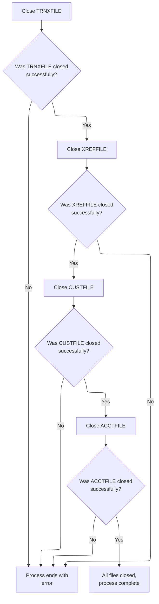
```mermaid
%%{init: {"flowchart": {"defaultRenderer": "elk"}} }%%
flowchart TD
    node1["Close TRNXFILE"] --> node2{"Was TRNXFILE closed 
 successfully?"}
    click node1 openCode "app/cbl/CBSTM03A.CBL:856:870"
    click node2 openCode "app/cbl/CBSTM03A.CBL:862:868"
    node2 -->|"Yes"| node3["Close XREFFILE"]
    node2 -->|"No"| node6["Process ends with 
 error"]
    click node3 openCode "app/cbl/CBSTM03A.CBL:873:887"
    node3 --> node4{"Was XREFFILE closed 
 successfully?"}
    click node4 openCode "app/cbl/CBSTM03A.CBL:879:885"
    node4 -->|"Yes"| node5["Close CUSTFILE"]
    node4 -->|"No"| node6
    click node5 openCode "app/cbl/CBSTM03A.CBL:889:903"
    node5 --> node7{"Was CUSTFILE closed 
 successfully?"}
    click node7 openCode "app/cbl/CBSTM03A.CBL:895:901"
    node7 -->|"Yes"| node8["Close ACCTFILE"]
    node7 -->|"No"| node6
    click node8 openCode "app/cbl/CBSTM03A.CBL:905:919"
    node8 --> node9{"Was ACCTFILE closed 
 successfully?"}
    click node9 openCode "app/cbl/CBSTM03A.CBL:911:917"
    node9 -->|"Yes"| node10["All files closed, 
 process complete"]
    node9 -->|"No"| node6
    click node10 openCode "app/cbl/CBSTM03A.CBL:339:339"
    click node6 openCode "app/cbl/CBSTM03A.CBL:865:867"
classDef HeadingStyle fill:#777777,stroke:#333,stroke-width:2px;
```

This section ensures that all files used during main processing are closed in a specific order, and handles errors if any file fails to close properly. The goal is to guarantee data integrity and proper process completion.

| Rule ID | Code Location                                                                                  | Category       | Rule Name                     | Description                                                                                                                                                                 | Conditions                                                        | Remarks                                                                                                                                                             |
| ------- | ---------------------------------------------------------------------------------------------- | -------------- | ----------------------------- | --------------------------------------------------------------------------------------------------------------------------------------------------------------------------- | ----------------------------------------------------------------- | ------------------------------------------------------------------------------------------------------------------------------------------------------------------- |
| BR-001  | 9100-TRNXFILE-CLOSE, 9200-XREFFILE-CLOSE, 9300-CUSTFILE-CLOSE, 9400-ACCTFILE-CLOSE, MAIN-LOGIC | Business logic | File closure order            | After main processing, all files must be closed in the following order: transaction file, cross-reference file, customer file, account file, statement file, and HTML file. | Main processing has completed and files are ready to be closed.   | The files are closed in the following order: transaction, cross-reference, customer, account, statement, HTML. No specific output format is required for this rule. |
| BR-002  | 9100-TRNXFILE-CLOSE, 9200-XREFFILE-CLOSE, 9300-CUSTFILE-CLOSE, 9400-ACCTFILE-CLOSE, MAIN-LOGIC | Business logic | Successful closure completion | If all files are closed successfully, the process completes and no error is reported.                                                                                       | All file closure operations return codes '00' or '04'.            | No error message is displayed if all files close successfully. The process completes normally.                                                                      |
| BR-003  | 9100-TRNXFILE-CLOSE, 9200-XREFFILE-CLOSE, 9300-CUSTFILE-CLOSE, 9400-ACCTFILE-CLOSE             | Error handling | File closure error handling   | If a file closure operation returns a code other than '00' or '04', an error message is displayed and the process ends with an error.                                       | A file closure operation returns a code that is not '00' or '04'. | Return codes '00' and '04' are considered successful. Any other code triggers an error message and process termination.                                             |

<SwmSnippet path="/app/cbl/CBSTM03A.CBL" line="331" repo-id="Z2l0aHViJTNBJTNBa3luZHJ5bC1hd3MtbWFpbmZyYW1lLW1vZGVybml6YXRpb24tY2FyZGRlbW8lM0ElM0FTd2ltbS1EZW1v">

---

After returning from 4000-TRNXFILE-GET in 1000-MAINLINE, we close all the files in order: transaction, cross-reference, customer, account, then the statement and HTML files. This makes sure everything is cleaned up properly.

```cobol
           PERFORM 9100-TRNXFILE-CLOSE.

           PERFORM 9200-XREFFILE-CLOSE.

           PERFORM 9300-CUSTFILE-CLOSE.

           PERFORM 9400-ACCTFILE-CLOSE.

           CLOSE STMT-FILE HTML-FILE.
```

---

</SwmSnippet>

<SwmSnippet path="/app/cbl/CBSTM03A.CBL" line="856" repo-id="Z2l0aHViJTNBJTNBa3luZHJ5bC1hd3MtbWFpbmZyYW1lLW1vZGVybml6YXRpb24tY2FyZGRlbW8lM0ElM0FTd2ltbS1EZW1v">

---

9100-TRNXFILE-CLOSE sets up WS-M03B-AREA for a close operation on the transaction file and calls CBSTM03B to do the work. If the return code isn't '00' or '04', we display an error and abend. Otherwise, we just exit.

```cobol
       9100-TRNXFILE-CLOSE.
           MOVE 'TRNXFILE' TO WS-M03B-DD.
           SET M03B-CLOSE TO TRUE.
           MOVE ZERO TO WS-M03B-RC.
           CALL 'CBSTM03B' USING WS-M03B-AREA.

           IF WS-M03B-RC = '00' OR '04'
               CONTINUE
           ELSE
               DISPLAY 'ERROR CLOSING TRNXFILE'
               DISPLAY 'RETURN CODE: ' WS-M03B-RC
               PERFORM 9999-ABEND-PROGRAM
           END-IF.

           EXIT.
```

---

</SwmSnippet>

<SwmSnippet path="/app/cbl/CBSTM03A.CBL" line="873" repo-id="Z2l0aHViJTNBJTNBa3luZHJ5bC1hd3MtbWFpbmZyYW1lLW1vZGVybml6YXRpb24tY2FyZGRlbW8lM0ElM0FTd2ltbS1EZW1v">

---

9200-XREFFILE-CLOSE sets up WS-M03B-AREA for a close on the cross-reference file and calls CBSTM03B. If the return code isn't '00' or '04', we display an error and abend. Otherwise, we exit.

```cobol
       9200-XREFFILE-CLOSE.
           MOVE 'XREFFILE' TO WS-M03B-DD.
           SET M03B-CLOSE TO TRUE.
           MOVE ZERO TO WS-M03B-RC.
           CALL 'CBSTM03B' USING WS-M03B-AREA.

           IF WS-M03B-RC = '00' OR '04'
               CONTINUE
           ELSE
               DISPLAY 'ERROR CLOSING XREFFILE'
               DISPLAY 'RETURN CODE: ' WS-M03B-RC
               PERFORM 9999-ABEND-PROGRAM
           END-IF.

           EXIT.
```

---

</SwmSnippet>

<SwmSnippet path="/app/cbl/CBSTM03A.CBL" line="889" repo-id="Z2l0aHViJTNBJTNBa3luZHJ5bC1hd3MtbWFpbmZyYW1lLW1vZGVybml6YXRpb24tY2FyZGRlbW8lM0ElM0FTd2ltbS1EZW1v">

---

9300-CUSTFILE-CLOSE sets up WS-M03B-AREA for a close on the customer file and calls CBSTM03B. If the return code isn't '00' or '04', we display an error and abend. Otherwise, we exit.

```cobol
       9300-CUSTFILE-CLOSE.
           MOVE 'CUSTFILE' TO WS-M03B-DD.
           SET M03B-CLOSE TO TRUE.
           MOVE ZERO TO WS-M03B-RC.
           CALL 'CBSTM03B' USING WS-M03B-AREA.

           IF WS-M03B-RC = '00' OR '04'
               CONTINUE
           ELSE
               DISPLAY 'ERROR CLOSING CUSTFILE'
               DISPLAY 'RETURN CODE: ' WS-M03B-RC
               PERFORM 9999-ABEND-PROGRAM
           END-IF.

           EXIT.
```

---

</SwmSnippet>

<SwmSnippet path="/app/cbl/CBSTM03A.CBL" line="905" repo-id="Z2l0aHViJTNBJTNBa3luZHJ5bC1hd3MtbWFpbmZyYW1lLW1vZGVybml6YXRpb24tY2FyZGRlbW8lM0ElM0FTd2ltbS1EZW1v">

---

9400-ACCTFILE-CLOSE sets up WS-M03B-AREA for a close on the account file and calls CBSTM03B. If the return code isn't '00' or '04', we display an error and abend. Otherwise, we exit.

```cobol
       9400-ACCTFILE-CLOSE.
           MOVE 'ACCTFILE' TO WS-M03B-DD.
           SET M03B-CLOSE TO TRUE.
           MOVE ZERO TO WS-M03B-RC.
           CALL 'CBSTM03B' USING WS-M03B-AREA.

           IF WS-M03B-RC = '00' OR '04'
               CONTINUE
           ELSE
               DISPLAY 'ERROR CLOSING ACCTFILE'
               DISPLAY 'RETURN CODE: ' WS-M03B-RC
               PERFORM 9999-ABEND-PROGRAM
           END-IF.

           EXIT.
```

---

</SwmSnippet>

### Program Termination

<SwmSnippet path="/app/cbl/CBSTM03A.CBL" line="341" repo-id="Z2l0aHViJTNBJTNBa3luZHJ5bC1hd3MtbWFpbmZyYW1lLW1vZGVybml6YXRpb24tY2FyZGRlbW8lM0ElM0FTd2ltbS1EZW1v">

---

9999-GOBACK just ends the program with a GOBACK statement. No cleanup, just a clean exit.

```cobol
       9999-GOBACK.
           GOBACK.
```

---

</SwmSnippet>

## Reading and Grouping Transactions

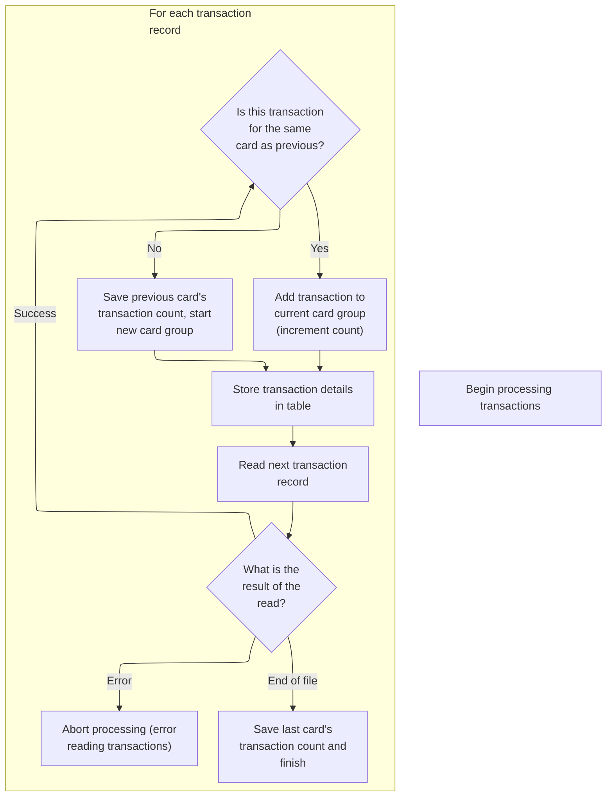
```mermaid
%%{init: {"flowchart": {"defaultRenderer": "elk"}} }%%
flowchart TD
    node1["Begin processing transactions"]
    click node1 openCode "app/cbl/CBSTM03A.CBL:818:819"
    subgraph loop1["For each transaction 
 record"]
        node2{"Is this transaction 
 for the same 
 card as previous?"}
        click node2 openCode "app/cbl/CBSTM03A.CBL:819:825"
        node2 -->|"Yes"| node3["Add transaction to 
 current card group 
 (increment count)"]
        click node3 openCode "app/cbl/CBSTM03A.CBL:820:820"
        node2 -->|"No"| node4["Save previous card's 
 transaction count, start 
 new card group"]
        click node4 openCode "app/cbl/CBSTM03A.CBL:822:824"
        node3 --> node5["Store transaction details 
 in table"]
        click node5 openCode "app/cbl/CBSTM03A.CBL:827:829"
        node4 --> node5
        node5 --> node6["Read next transaction 
 record"]
        click node6 openCode "app/cbl/CBSTM03A.CBL:832:835"
        node6 --> node7{"What is the 
 result of the 
 read?"}
        click node7 openCode "app/cbl/CBSTM03A.CBL:837:847"
        node7 -->|"Success"| node2
        node7 -->|"End of file"| node8["Save last card's 
 transaction count and 
 finish"]
        click node8 openCode "app/cbl/CBSTM03A.CBL:850:852"
        node7 -->|"Error"| node9["Abort processing (error 
 reading transactions)"]
        click node9 openCode "app/cbl/CBSTM03A.CBL:844:846"
    end
classDef HeadingStyle fill:#777777,stroke:#333,stroke-width:2px;
```

This section reads transaction records, groups them by card number, counts transactions per card, and stores transaction details in a structured table. It also handles end-of-file and error scenarios to ensure accurate and reliable processing.

| Rule ID | Code Location                 | Category       | Rule Name                               | Description                                                                                                                                                                                              | Conditions                                                                                | Remarks                                                                                                                                                                                                                 |
| ------- | ----------------------------- | -------------- | --------------------------------------- | -------------------------------------------------------------------------------------------------------------------------------------------------------------------------------------------------------- | ----------------------------------------------------------------------------------------- | ----------------------------------------------------------------------------------------------------------------------------------------------------------------------------------------------------------------------- |
| BR-001  | 8500-READTRNX-READ            | Business logic | Transaction grouping by card            | Transactions are grouped by card number. When a transaction for a new card number is encountered, the count of transactions for the previous card is saved, and a new group is started for the new card. | A transaction record is read and its card number does not match the previous card number. | Card numbers are strings of 16 characters. Transaction counts are stored as signed 4-digit numbers. Each card group can contain up to 10 transactions, and there can be up to 51 card groups.                           |
| BR-002  | 8500-READTRNX-READ            | Business logic | Transaction count per card              | The count of transactions for each card is incremented for every transaction belonging to the same card group.                                                                                           | A transaction record is read and its card number matches the previous card number.        | Transaction counts are stored as signed 4-digit numbers. Each card group can contain up to 10 transactions.                                                                                                             |
| BR-003  | 8500-READTRNX-READ, 8599-EXIT | Business logic | Finalize last card group on end-of-file | When the end of the transaction file is reached, the count of transactions for the last card group is saved, and processing is finalized.                                                                | The read operation returns an end-of-file status.                                         | Transaction counts are stored as signed 4-digit numbers. Card numbers are strings of 16 characters.                                                                                                                     |
| BR-004  | 8500-READTRNX-READ            | Business logic | Transaction table structure             | Transaction details for each card group are stored in a table, with each card group able to contain up to 10 transactions and up to 51 card groups in total.                                             | A transaction record is read and processed for grouping and counting.                     | Card numbers are strings of 16 characters. Transaction IDs are strings of 16 characters. Transaction details are strings of 318 characters. The table supports up to 51 card groups and 10 transactions per card group. |
| BR-005  | 8500-READTRNX-READ            | Error handling | Abort on transaction read error         | If an error occurs while reading a transaction record, processing is aborted and an error message is displayed.                                                                                          | The read operation returns an error status other than success or end-of-file.             | Error messages are displayed to the user. Processing is terminated immediately.                                                                                                                                         |

<SwmSnippet path="/app/cbl/CBSTM03A.CBL" line="818" repo-id="Z2l0aHViJTNBJTNBa3luZHJ5bC1hd3MtbWFpbmZyYW1lLW1vZGVybml6YXRpb24tY2FyZGRlbW8lM0ElM0FTd2ltbS1EZW1v">

---

In 8500-READTRNX-READ, we check if the card number matches the previous one. If not, we store the transaction count for the last card, bump the card counter, and reset the transaction counter. Then we store the new card and transaction details.

```cobol
       8500-READTRNX-READ.
           IF WS-SAVE-CARD = TRNX-CARD-NUM
               ADD 1 TO TR-CNT
           ELSE
               MOVE TR-CNT TO WS-TRCT (CR-CNT)
               ADD 1 TO CR-CNT
               MOVE 1 TO TR-CNT
           END-IF.
```

---

</SwmSnippet>

<SwmSnippet path="/app/cbl/CBSTM03A.CBL" line="827" repo-id="Z2l0aHViJTNBJTNBa3luZHJ5bC1hd3MtbWFpbmZyYW1lLW1vZGVybml6YXRpb24tY2FyZGRlbW8lM0ElM0FTd2ltbS1EZW1v">

---

After storing the transaction details, we set up WS-M03B-AREA for a read on the transaction file and call CBSTM03B. The return code decides if we keep looping, exit, or abend on error.

```cobol
           MOVE TRNX-CARD-NUM TO WS-CARD-NUM (CR-CNT).
           MOVE TRNX-ID TO WS-TRAN-NUM (CR-CNT, TR-CNT).
           MOVE TRNX-REST TO WS-TRAN-REST (CR-CNT, TR-CNT).
           MOVE TRNX-CARD-NUM TO WS-SAVE-CARD.

           MOVE 'TRNXFILE' TO WS-M03B-DD.
           SET M03B-READ TO TRUE.
           MOVE SPACES TO WS-M03B-FLDT.
           CALL 'CBSTM03B' USING WS-M03B-AREA.
```

---

</SwmSnippet>

<SwmSnippet path="/app/cbl/CBSTM03A.CBL" line="837" repo-id="Z2l0aHViJTNBJTNBa3luZHJ5bC1hd3MtbWFpbmZyYW1lLW1vZGVybml6YXRpb24tY2FyZGRlbW8lM0ElM0FTd2ltbS1EZW1v">

---

After returning from CBSTM03B in 8500-READTRNX-READ, if we hit EOF ('10'), we go to 8599-EXIT. There, we store the last transaction count, switch WS-FL-DD to 'XREFFILE', and jump back to the main start routine.

```cobol
           EVALUATE WS-M03B-RC
             WHEN '00'
               MOVE WS-M03B-FLDT TO TRNX-RECORD
               GO TO 8500-READTRNX-READ
             WHEN '10'
               GO TO 8599-EXIT
             WHEN OTHER
               DISPLAY 'ERROR READING TRNXFILE'
               DISPLAY 'RETURN CODE: ' WS-M03B-RC
               PERFORM 9999-ABEND-PROGRAM
           END-EVALUATE.
```

---

</SwmSnippet>

<SwmSnippet path="/app/cbl/CBSTM03A.CBL" line="849" repo-id="Z2l0aHViJTNBJTNBa3luZHJ5bC1hd3MtbWFpbmZyYW1lLW1vZGVybml6YXRpb24tY2FyZGRlbW8lM0ElM0FTd2ltbS1EZW1v">

---

We store the last count, switch to the next file, and restart the main routine.

```cobol
       8599-EXIT.
           MOVE TR-CNT TO WS-TRCT (CR-CNT).
           MOVE 'XREFFILE' TO WS-FL-DD.
           GO TO 0000-START.
           EXIT.
```

---

</SwmSnippet>

## Dispatching to Next File Operation or Exit


```mermaid
%%{init: {"flowchart": {"defaultRenderer": "elk"}} }%%
flowchart TD
    node1["Start"] --> node5{"Requested file type?"}
    click node1 openCode "app/cbl/CBSTM03A.CBL:296:297"
    node5 -->|"TRNXFILE"| node3["Transaction File Open and Read"]
    click node5 openCode "app/cbl/CBSTM03A.CBL:298:314"
    
    node5 -->|"XREFFILE"| node6["File Open Jump Point"]
    
    node5 -->|"CUSTFILE"| node7["File Open Jump Point"]
    
    node5 -->|"ACCTFILE"| node8["File Open Jump Point"]
    
    node5 -->|"READTRNX"| node4["Reading and Grouping Transactions"]
    
    node5 -->|"Other"| node9["Return to main 
 menu"]
    click node9 openCode "app/cbl/CBSTM03A.CBL:314:314"
classDef HeadingStyle fill:#777777,stroke:#333,stroke-width:2px;
click node3 goToHeading "Transaction File Open and Read"
node3:::HeadingStyle
click node6 goToHeading "File Open Jump Point"
node6:::HeadingStyle
click node7 goToHeading "File Open Jump Point"
node7:::HeadingStyle
click node8 goToHeading "File Open Jump Point"
node8:::HeadingStyle
click node4 goToHeading "Reading and Grouping Transactions"
node4:::HeadingStyle
click node3 goToHeading "Transaction File Open and Read"
node3:::HeadingStyle
click node6 goToHeading "File Open Jump Point"
node6:::HeadingStyle
click node7 goToHeading "File Open Jump Point"
node7:::HeadingStyle
click node8 goToHeading "File Open Jump Point"
node8:::HeadingStyle
click node4 goToHeading "Reading and Grouping Transactions"
node4:::HeadingStyle
```

This section routes file open and read requests to the appropriate routines based on the requested file type, ensuring that only supported file types are processed and providing a fallback for unrecognized requests.

| Rule ID | Code Location | Category       | Rule Name                       | Description                                                                                                                | Conditions                                                                                                                       | Remarks                                                                                                                       |
| ------- | ------------- | -------------- | ------------------------------- | -------------------------------------------------------------------------------------------------------------------------- | -------------------------------------------------------------------------------------------------------------------------------- | ----------------------------------------------------------------------------------------------------------------------------- |
| BR-001  | 0000-START    | Business logic | Transaction File Routing        | When the requested file type is 'TRNXFILE', the system routes the request to the transaction file open routine.            | The requested file type is 'TRNXFILE'.                                                                                           | The file type constant is 'TRNXFILE', an 8-character string.                                                                  |
| BR-002  | 0000-START    | Business logic | Cross-Reference File Routing    | When the requested file type is 'XREFFILE', the system routes the request to the cross-reference file open routine.        | The requested file type is 'XREFFILE'.                                                                                           | The file type constant is 'XREFFILE', an 8-character string.                                                                  |
| BR-003  | 0000-START    | Business logic | Customer File Routing           | When the requested file type is 'CUSTFILE', the system routes the request to the customer file open routine.               | The requested file type is 'CUSTFILE'.                                                                                           | The file type constant is 'CUSTFILE', an 8-character string.                                                                  |
| BR-004  | 0000-START    | Business logic | Account File Routing            | When the requested file type is 'ACCTFILE', the system routes the request to the account file open routine.                | The requested file type is 'ACCTFILE'.                                                                                           | The file type constant is 'ACCTFILE', an 8-character string.                                                                  |
| BR-005  | 0000-START    | Business logic | Transaction Read Routing        | When the requested file type is 'READTRNX', the system routes the request to the transaction reading and grouping routine. | The requested file type is 'READTRNX'.                                                                                           | The file type constant is 'READTRNX', an 8-character string.                                                                  |
| BR-006  | 0000-START    | Error handling | Unrecognized File Type Handling | When the requested file type is not recognized, the system returns to the main menu.                                       | The requested file type does not match any of the supported values ('TRNXFILE', 'XREFFILE', 'CUSTFILE', 'ACCTFILE', 'READTRNX'). | Supported file type constants are 'TRNXFILE', 'XREFFILE', 'CUSTFILE', 'ACCTFILE', and 'READTRNX', each an 8-character string. |

<SwmSnippet path="/app/cbl/CBSTM03A.CBL" line="296" repo-id="Z2l0aHViJTNBJTNBa3luZHJ5bC1hd3MtbWFpbmZyYW1lLW1vZGVybml6YXRpb24tY2FyZGRlbW8lM0ElM0FTd2ltbS1EZW1v">

---

After returning from 8500-READTRNX-READ in 0000-START, we use EVALUATE and ALTER to route to the right file open or read routine based on WS-FL-DD. If it's not recognized, we just exit.

```cobol
       0000-START.

           EVALUATE WS-FL-DD
             WHEN 'TRNXFILE'
               ALTER 8100-FILE-OPEN TO PROCEED TO 8100-TRNXFILE-OPEN
               GO TO 8100-FILE-OPEN
             WHEN 'XREFFILE'
               ALTER 8100-FILE-OPEN TO PROCEED TO 8200-XREFFILE-OPEN
               GO TO 8100-FILE-OPEN
             WHEN 'CUSTFILE'
               ALTER 8100-FILE-OPEN TO PROCEED TO 8300-CUSTFILE-OPEN
               GO TO 8100-FILE-OPEN
             WHEN 'ACCTFILE'
               ALTER 8100-FILE-OPEN TO PROCEED TO 8400-ACCTFILE-OPEN
               GO TO 8100-FILE-OPEN
             WHEN 'READTRNX'
               GO TO 8500-READTRNX-READ
             WHEN OTHER
               GO TO 9999-GOBACK.
```

---

</SwmSnippet>

&nbsp;

*This is an auto-generated document by Swimm 🌊 and has not yet been verified by a human*

<SwmMeta version="3.0.0"><sup>Powered by [Swimm](https://staging.swimm.cloud/)</sup></SwmMeta>
