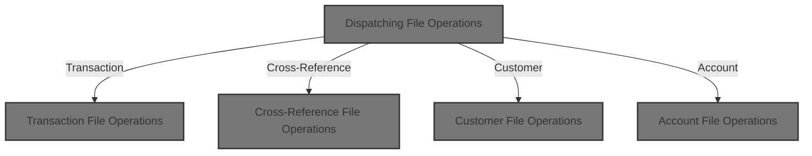
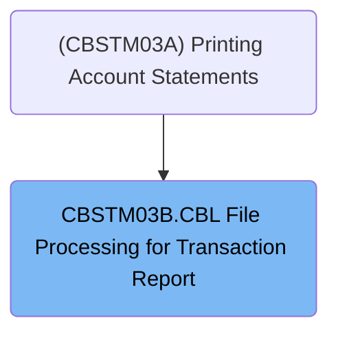
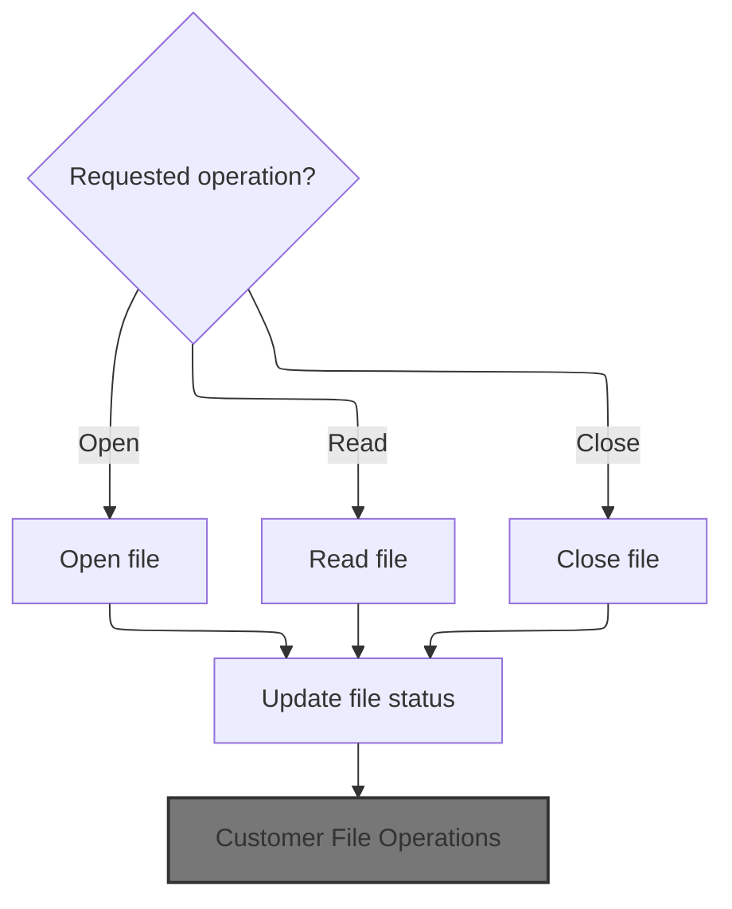
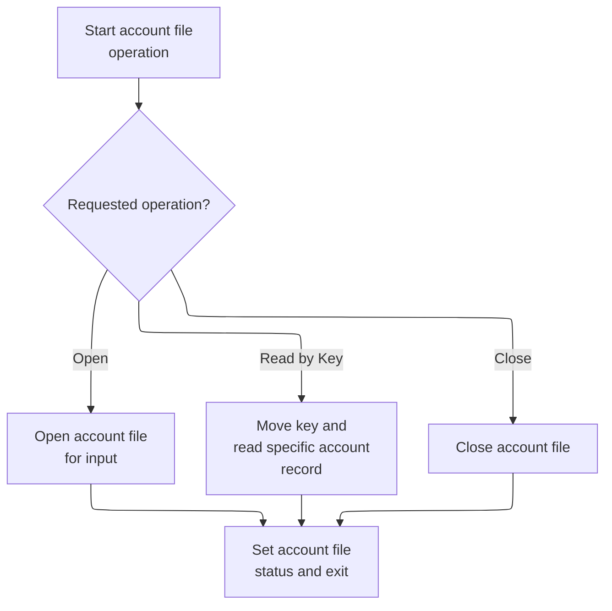
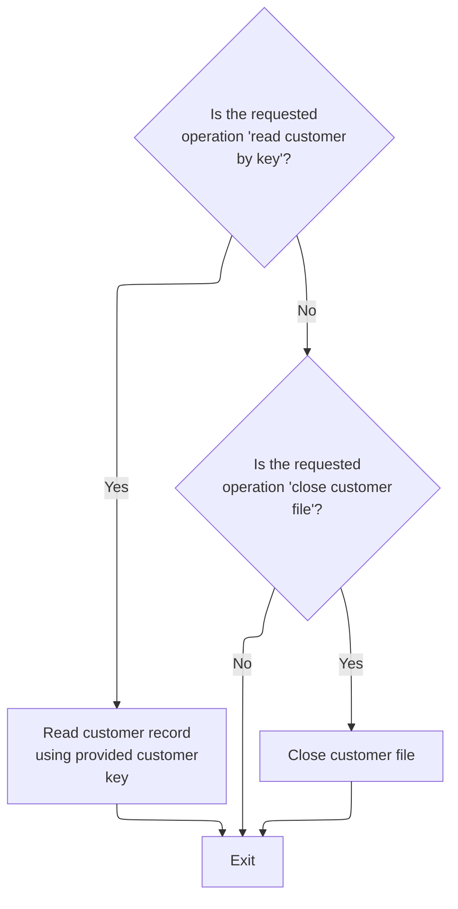
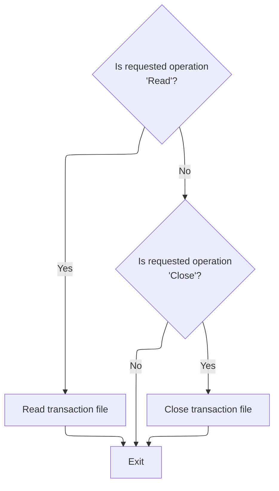

# Overview

This document explains the flow of file operations for transaction, cross-reference, customer, and account files. The system receives a request indicating the file type and desired operation, routes it to the appropriate handler, and performs the requested action, returning the outcome to the caller.



## Dependencies

### Program

- CBSTM03B (app/cbl/CBSTM03B.CBL)

# Where is this program used?

This program is used once, as represented in the following diagram:



# Workflow

# Dispatching File Operations

This section determines which file operation logic to invoke based on the provided file type indicator, ensuring that requests are routed to the appropriate handler or exited if the file type is not recognized.

| Rule ID | Code Location | Category       | Rule Name                     | Description                                                                                                                        | Conditions                                                                                | Remarks                                                                                                                                                          |
| ------- | ------------- | -------------- | ----------------------------- | ---------------------------------------------------------------------------------------------------------------------------------- | ----------------------------------------------------------------------------------------- | ---------------------------------------------------------------------------------------------------------------------------------------------------------------- |
| BR-001  | 0000-START    | Business logic | Transaction file dispatch     | When the file type indicator is set to 'TRNXFILE', the system must route the request to the transaction file handler logic.        | The file type indicator equals 'TRNXFILE'.                                                | The file type indicator must be the exact string 'TRNXFILE', which is 8 characters long and left-aligned. No padding or truncation is performed in this section. |
| BR-002  | 0000-START    | Business logic | Cross-reference file dispatch | When the file type indicator is set to 'XREFFILE', the system must route the request to the cross-reference file handler logic.    | The file type indicator equals 'XREFFILE'.                                                | The file type indicator must be the exact string 'XREFFILE', which is 8 characters long and left-aligned.                                                        |
| BR-003  | 0000-START    | Business logic | Customer file dispatch        | When the file type indicator is set to 'CUSTFILE', the system must route the request to the customer file handler logic.           | The file type indicator equals 'CUSTFILE'.                                                | The file type indicator must be the exact string 'CUSTFILE', which is 8 characters long and left-aligned.                                                        |
| BR-004  | 0000-START    | Business logic | Account file dispatch         | When the file type indicator is set to 'ACCTFILE', the system must route the request to the account file handler logic.            | The file type indicator equals 'ACCTFILE'.                                                | The file type indicator must be the exact string 'ACCTFILE', which is 8 characters long and left-aligned.                                                        |
| BR-005  | 0000-START    | Error handling | Unrecognized file type exit   | When the file type indicator does not match any recognized file type, the system must exit without performing any file operations. | The file type indicator does not equal 'TRNXFILE', 'XREFFILE', 'CUSTFILE', or 'ACCTFILE'. | Any value other than the four recognized file types will trigger program exit. No error message or status code is set in this section.                           |

<SwmSnippet path="/app/cbl/CBSTM03B.CBL" line="116" repo-id="Z2l0aHViJTNBJTNBa3luZHJ5bC1hd3MtbWFpbmZyYW1lLW1vZGVybml6YXRpb24tY2FyZGRlbW8lM0ElM0FTd2ltbS1EZW1v">

---

In `0000-START` we're at the entry point. The code checks LK-M03B-DD to see which file type we're working with. Based on its value, it jumps to the corresponding file handler. If it's 'TRNXFILE', it calls 1000-TRNXFILE-PROC (and through 1999-EXIT). This is how the program routes the request to the right file logic. If the value doesn't match any known file type, it just exits. Calling 1000-TRNXFILE-PROC next means we're about to handle transaction file operations, which is what you want if LK-M03B-DD is set to 'TRNXFILE'.

```cobol
       0000-START.

           EVALUATE LK-M03B-DD
             WHEN 'TRNXFILE'
               PERFORM 1000-TRNXFILE-PROC THRU 1999-EXIT
             WHEN 'XREFFILE'
               PERFORM 2000-XREFFILE-PROC THRU 2999-EXIT
             WHEN 'CUSTFILE'
               PERFORM 3000-CUSTFILE-PROC THRU 3999-EXIT
             WHEN 'ACCTFILE'
               PERFORM 4000-ACCTFILE-PROC THRU 4999-EXIT
             WHEN OTHER
               GO TO 9999-GOBACK.
```

---

</SwmSnippet>

## Transaction File Operations

This section manages transaction file operations by performing a single requested operation per invocation and reporting the outcome to the caller.

| Rule ID | Code Location                 | Category       | Rule Name                         | Description                                                                                                                                          | Conditions                                    | Remarks                                                                                                                                                    |
| ------- | ----------------------------- | -------------- | --------------------------------- | ---------------------------------------------------------------------------------------------------------------------------------------------------- | --------------------------------------------- | ---------------------------------------------------------------------------------------------------------------------------------------------------------- |
| BR-001  | 1000-TRNXFILE-PROC            | Business logic | Transaction file open operation   | When the operation code indicates an 'open' request, the transaction file is opened for input and the process exits immediately after the operation. | The operation code provided is set to 'open'. | The operation code for 'open' is represented by the value 'O'. The output status code is a 2-character string indicating the result of the file operation. |
| BR-002  | 1900-EXIT                     | Business logic | Transaction file status reporting | After any transaction file operation, the status of the transaction file is returned to the caller as a status code.                                 | Any transaction file operation is performed.  | The status code is a 2-character string that reflects the outcome of the transaction file operation.                                                       |
| BR-003  | 1000-TRNXFILE-PROC, 1900-EXIT | Business logic | Single operation per invocation   | Only one transaction file operation is performed per invocation, and the process exits immediately after the operation.                              | Any transaction file operation is requested.  | The process flow is designed to perform one operation and then exit, ensuring modularity and clarity in file handling.                                     |

<SwmSnippet path="/app/cbl/CBSTM03B.CBL" line="133" repo-id="Z2l0aHViJTNBJTNBa3luZHJ5bC1hd3MtbWFpbmZyYW1lLW1vZGVybml6YXRpb24tY2FyZGRlbW8lM0ElM0FTd2ltbS1EZW1v">

---

In `1000-TRNXFILE-PROC` we're checking if the operation is to open the transaction file. If so, we open it and immediately jump to 1900-EXIT to wrap up. This keeps the logic tight—one operation per call, then exit.

```cobol
       1000-TRNXFILE-PROC.

           IF M03B-OPEN
               OPEN INPUT TRNX-FILE
               GO TO 1900-EXIT
           END-IF.
```

---

</SwmSnippet>

<SwmSnippet path="/app/cbl/CBSTM03B.CBL" line="151" repo-id="Z2l0aHViJTNBJTNBa3luZHJ5bC1hd3MtbWFpbmZyYW1lLW1vZGVybml6YXRpb24tY2FyZGRlbW8lM0ElM0FTd2ltbS1EZW1v">

---

`1900-EXIT` just copies the transaction file status into the return code field, so the caller can see how the operation went.

```cobol
       1900-EXIT.
           MOVE TRNXFILE-STATUS TO LK-M03B-RC.
```

---

</SwmSnippet>

### Cross-Reference File Operations



This section manages cross-reference file operations, allowing the caller to request opening, reading, or closing the file, and returns the file status after each operation.

| Rule ID | Code Location                 | Category       | Rule Name                 | Description                                                                                                                                        | Conditions                                           | Remarks                                                                                                                                                |
| ------- | ----------------------------- | -------------- | ------------------------- | -------------------------------------------------------------------------------------------------------------------------------------------------- | ---------------------------------------------------- | ------------------------------------------------------------------------------------------------------------------------------------------------------ |
| BR-001  | 2000-XREFFILE-PROC, 2900-EXIT | Business logic | Open file operation       | When the operation code is 'O', the cross-reference file is opened for input and the file status is returned to the caller.                        | The operation code provided is 'O'.                  | The operation code must be 'O'. The file status is returned as a two-character string in the output status field.                                      |
| BR-002  | 2000-XREFFILE-PROC            | Business logic | Single operation per call | Only one file operation (open, read, or close) is performed per invocation; once the requested operation is completed, processing ends.            | A file operation is requested.                       | The section processes only one operation per call, determined by the operation code. No additional operations are performed until the next invocation. |
| BR-003  | 2900-EXIT                     | Error handling | Return file status        | After any file operation (open, read, close), the status of the cross-reference file is returned to the caller for error checking or confirmation. | Any file operation is performed (open, read, close). | The file status is returned as a two-character string in the output status field, which the caller can use to determine success or failure.            |

<SwmSnippet path="/app/cbl/CBSTM03B.CBL" line="157" repo-id="Z2l0aHViJTNBJTNBa3luZHJ5bC1hd3MtbWFpbmZyYW1lLW1vZGVybml6YXRpb24tY2FyZGRlbW8lM0ElM0FTd2ltbS1EZW1v">

---

In `2000-XREFFILE-PROC`, if the operation is 'open', we open the cross-reference file and jump to 2900-EXIT to finish up. Only one operation happens per call.

```cobol
       2000-XREFFILE-PROC.

           IF M03B-OPEN
               OPEN INPUT XREF-FILE
               GO TO 2900-EXIT
           END-IF.
```

---

</SwmSnippet>

<SwmSnippet path="/app/cbl/CBSTM03B.CBL" line="175" repo-id="Z2l0aHViJTNBJTNBa3luZHJ5bC1hd3MtbWFpbmZyYW1lLW1vZGVybml6YXRpb24tY2FyZGRlbW8lM0ElM0FTd2ltbS1EZW1v">

---

`2900-EXIT` just copies the XREF file status into the return code field for the caller to check.

```cobol
       2900-EXIT.
           MOVE XREFFILE-STATUS TO LK-M03B-RC.
```

---

</SwmSnippet>

#### Customer File Operations

This section manages customer file operations by executing the requested action and returning the status of the operation to the caller.

| Rule ID | Code Location                 | Category       | Rule Name                      | Description                                                                                                                 | Conditions                                | Remarks                                                                                                                                      |
| ------- | ----------------------------- | -------------- | ------------------------------ | --------------------------------------------------------------------------------------------------------------------------- | ----------------------------------------- | -------------------------------------------------------------------------------------------------------------------------------------------- |
| BR-001  | 3000-CUSTFILE-PROC, 3900-EXIT | Business logic | Customer file open operation   | When the operation code is set to 'O', the customer file is opened for input and the file status is returned to the caller. | The operation code provided is 'O'.       | The operation code 'O' is mapped to the business meaning of 'open'. The file status is returned as a 2-character string in the output field. |
| BR-002  | 3900-EXIT                     | Business logic | Return operation status        | After any customer file operation, the status of the operation is returned to the caller for further decision-making.       | Any customer file operation is performed. | The status is returned as a 2-character string in the output field.                                                                          |
| BR-003  | 3000-CUSTFILE-PROC            | Business logic | Independent operation handling | Each customer file operation is handled independently and the section exits immediately after the operation is performed.   | A customer file operation is requested.   | Each operation is processed in isolation and the section exits after completion.                                                             |

<SwmSnippet path="/app/cbl/CBSTM03B.CBL" line="181" repo-id="Z2l0aHViJTNBJTNBa3luZHJ5bC1hd3MtbWFpbmZyYW1lLW1vZGVybml6YXRpb24tY2FyZGRlbW8lM0ElM0FTd2ltbS1EZW1v">

---

In `3000-CUSTFILE-PROC`, if the operation is 'open', we open the customer file and go straight to 3900-EXIT. Each operation is handled separately and exits right after.

```cobol
       3000-CUSTFILE-PROC.

           IF M03B-OPEN
               OPEN INPUT CUST-FILE
               GO TO 3900-EXIT
           END-IF.
```

---

</SwmSnippet>

<SwmSnippet path="/app/cbl/CBSTM03B.CBL" line="200" repo-id="Z2l0aHViJTNBJTNBa3luZHJ5bC1hd3MtbWFpbmZyYW1lLW1vZGVybml6YXRpb24tY2FyZGRlbW8lM0ElM0FTd2ltbS1EZW1v">

---

`3900-EXIT` just copies the customer file status into the return code field for the caller to check.

```cobol
       3900-EXIT.
           MOVE CUSTFILE-STATUS TO LK-M03B-RC.
```

---

</SwmSnippet>

##### Account File Operations



This section manages account file operations, including opening, reading by key, and closing the file, and ensures that the result of each operation is communicated to the caller via a status code.

| Rule ID | Code Location                 | Category       | Rule Name                               | Description                                                                                                                                                                                                                                                             | Conditions                                                                    | Remarks                                                                                                                                                                                                                                          |
| ------- | ----------------------------- | -------------- | --------------------------------------- | ----------------------------------------------------------------------------------------------------------------------------------------------------------------------------------------------------------------------------------------------------------------------- | ----------------------------------------------------------------------------- | ------------------------------------------------------------------------------------------------------------------------------------------------------------------------------------------------------------------------------------------------ |
| BR-001  | 4000-ACCTFILE-PROC, 4900-EXIT | Business logic | Account file open operation             | When the requested operation is 'open', the account file must be opened for input. After attempting to open, the status code is set to indicate success or failure.                                                                                                     | The operation code is 'O' (open).                                             | The operation code must be 'O'. The status code is a 2-character string indicating the result of the open operation.                                                                                                                             |
| BR-002  | 4000-ACCTFILE-PROC, 4900-EXIT | Business logic | Account file keyed read operation       | When the requested operation is 'read by key', the provided key (up to the specified length) must be used to locate and read the corresponding account record. The status code is set to indicate success or failure, and the account record data is returned if found. | The operation code is 'K' (keyed read) and a key with its length is provided. | The operation code must be 'K'. The key is a string of up to 25 characters, with the actual length specified. The status code is a 2-character string. The account record consists of an 11-digit account ID and 289 characters of account data. |
| BR-003  | 4000-ACCTFILE-PROC, 4900-EXIT | Business logic | Account file close operation            | When the requested operation is 'close', the account file must be closed. After attempting to close, the status code is set to indicate success or failure.                                                                                                             | The operation code is 'C' (close).                                            | The operation code must be 'C'. The status code is a 2-character string indicating the result of the close operation.                                                                                                                            |
| BR-004  | 4900-EXIT                     | Business logic | Account file operation status reporting | After any account file operation (open, keyed read, or close), the status code must be set to indicate the result of the operation for the caller to check.                                                                                                             | Any account file operation (open, keyed read, close) is performed.            | The status code is a 2-character string. It is set after each operation to indicate success or failure.                                                                                                                                          |

<SwmSnippet path="/app/cbl/CBSTM03B.CBL" line="206" repo-id="Z2l0aHViJTNBJTNBa3luZHJ5bC1hd3MtbWFpbmZyYW1lLW1vZGVybml6YXRpb24tY2FyZGRlbW8lM0ElM0FTd2ltbS1EZW1v">

---

In `4000-ACCTFILE-PROC`, if the operation is 'open', we open the account file and go straight to 4900-EXIT. Each operation is handled separately and exits right after.

```cobol
       4000-ACCTFILE-PROC.

           IF M03B-OPEN
               OPEN INPUT ACCT-FILE
               GO TO 4900-EXIT
           END-IF.
```

---

</SwmSnippet>

<SwmSnippet path="/app/cbl/CBSTM03B.CBL" line="225" repo-id="Z2l0aHViJTNBJTNBa3luZHJ5bC1hd3MtbWFpbmZyYW1lLW1vZGVybml6YXRpb24tY2FyZGRlbW8lM0ElM0FTd2ltbS1EZW1v">

---

`4900-EXIT` just copies the account file status into the return code field for the caller to check.

```cobol
       4900-EXIT.
           MOVE ACCTFILE-STATUS TO LK-M03B-RC.
```

---

</SwmSnippet>

<SwmSnippet path="/app/cbl/CBSTM03B.CBL" line="213" repo-id="Z2l0aHViJTNBJTNBa3luZHJ5bC1hd3MtbWFpbmZyYW1lLW1vZGVybml6YXRpb24tY2FyZGRlbW8lM0ElM0FTd2ltbS1EZW1v">

---

We just returned from `4900-EXIT` in `4000-ACCTFILE-PROC`. Here, if the operation is a keyed read, we move the key (up to the specified length) into FD-ACCT-ID and read the account file. After the read, we exit to 4900-EXIT to set the status code.

```cobol
           IF M03B-READ-K
               MOVE LK-M03B-KEY (1:LK-M03B-KEY-LN) TO FD-ACCT-ID
               READ ACCT-FILE INTO LK-M03B-FLDT
               END-READ
               GO TO 4900-EXIT
           END-IF.
```

---

</SwmSnippet>

<SwmSnippet path="/app/cbl/CBSTM03B.CBL" line="220" repo-id="Z2l0aHViJTNBJTNBa3luZHJ5bC1hd3MtbWFpbmZyYW1lLW1vZGVybml6YXRpb24tY2FyZGRlbW8lM0ElM0FTd2ltbS1EZW1v">

---

After handling open or read, if the operation is 'close', we close the account file and exit. Each operation sets the return code before returning.

```cobol
           IF M03B-CLOSE
               CLOSE ACCT-FILE
               GO TO 4900-EXIT
           END-IF.
```

---

</SwmSnippet>

##### Customer File Keyed Read and Close



This section manages customer file operations, specifically reading a customer record by key and closing the customer file, based on the requested operation code.

| Rule ID | Code Location      | Category       | Rule Name                       | Description                                                                                                                                                                            | Conditions                                                                             | Remarks                                                                                                                                                                                                                                                                                                                                  |
| ------- | ------------------ | -------------- | ------------------------------- | -------------------------------------------------------------------------------------------------------------------------------------------------------------------------------------- | -------------------------------------------------------------------------------------- | ---------------------------------------------------------------------------------------------------------------------------------------------------------------------------------------------------------------------------------------------------------------------------------------------------------------------------------------- |
| BR-001  | 3000-CUSTFILE-PROC | Business logic | Keyed customer record retrieval | When a keyed read operation is requested, the system retrieves the customer record that matches the provided customer key, using only the specified number of characters from the key. | The operation code is 'K' (keyed read) and a customer key and its length are provided. | The operation code for keyed read is 'K'. The customer key is up to 25 characters, and the length is specified by LK-M03B-KEY-LN. The customer ID field is 9 characters, and the customer data field is 491 characters. The output format is a record containing a string customer ID (9 characters) and customer data (491 characters). |
| BR-002  | 3000-CUSTFILE-PROC | Business logic | Customer file close operation   | When a close operation is requested, the system closes the customer file.                                                                                                              | The operation code is 'C' (close).                                                     | The operation code for close is 'C'. No additional input is required. The output is the closing of the customer file.                                                                                                                                                                                                                    |
| BR-003  | 3000-CUSTFILE-PROC | Business logic | No operation fallback           | If neither a keyed read nor a close operation is requested, the system does not perform any customer file operation and proceeds to exit.                                              | The operation code is not 'K' (keyed read) and not 'C' (close).                        | If the operation code is not 'K' or 'C', no customer file operation is performed. The output is an immediate exit.                                                                                                                                                                                                                       |

<SwmSnippet path="/app/cbl/CBSTM03B.CBL" line="188" repo-id="Z2l0aHViJTNBJTNBa3luZHJ5bC1hd3MtbWFpbmZyYW1lLW1vZGVybml6YXRpb24tY2FyZGRlbW8lM0ElM0FTd2ltbS1EZW1v">

---

After returning from `4000-ACCTFILE-PROC`, in `3000-CUSTFILE-PROC`, if a keyed read is requested, we move the key (up to the specified length) into FD-CUST-ID and read the customer file. After the read, we exit to 3900-EXIT to set the status code.

```cobol
           IF M03B-READ-K
               MOVE LK-M03B-KEY (1:LK-M03B-KEY-LN) TO FD-CUST-ID
               READ CUST-FILE INTO LK-M03B-FLDT
               END-READ
               GO TO 3900-EXIT
           END-IF.
```

---

</SwmSnippet>

<SwmSnippet path="/app/cbl/CBSTM03B.CBL" line="195" repo-id="Z2l0aHViJTNBJTNBa3luZHJ5bC1hd3MtbWFpbmZyYW1lLW1vZGVybml6YXRpb24tY2FyZGRlbW8lM0ElM0FTd2ltbS1EZW1v">

---

After handling open or read, if the operation is 'close', we close the customer file and exit. Each operation sets the return code before returning.

```cobol
           IF M03B-CLOSE
               CLOSE CUST-FILE
               GO TO 3900-EXIT
           END-IF.
```

---

</SwmSnippet>

#### Cross-Reference File Read and Close

This section manages the reading and closing of the Cross-Reference file, ensuring that requested operations are performed and their outcomes are communicated via status codes.

| Rule ID | Code Location                 | Category       | Rule Name                  | Description                                                                                                                                          | Conditions                                                  | Remarks                                                                                                                                                                                                    |
| ------- | ----------------------------- | -------------- | -------------------------- | ---------------------------------------------------------------------------------------------------------------------------------------------------- | ----------------------------------------------------------- | ---------------------------------------------------------------------------------------------------------------------------------------------------------------------------------------------------------- |
| BR-001  | 2000-XREFFILE-PROC            | Business logic | Cross-Reference File Read  | When a read operation is requested, the system reads a record from the Cross-Reference file and makes its contents available for further processing. | The operation code is set to 'R' (read) in the input area.  | The operation code must be 'R'. The record read from the file is made available in a buffer for further use. The buffer format is determined by the file definition, but is not specified in this section. |
| BR-002  | 2000-XREFFILE-PROC            | Business logic | Cross-Reference File Close | When a close operation is requested, the system closes the Cross-Reference file to complete the transaction.                                         | The operation code is set to 'C' (close) in the input area. | The operation code must be 'C'. No data is returned; the file is closed and the status code is set.                                                                                                        |
| BR-003  | 2000-XREFFILE-PROC, 2900-EXIT | Error handling | Operation Status Code Set  | After each read or close operation, the system sets a status code to indicate the result of the operation before returning control.                  | A read or close operation has been performed.               | The status code is set in a designated field after each operation. The format is a 2-character string.                                                                                                     |

<SwmSnippet path="/app/cbl/CBSTM03B.CBL" line="164" repo-id="Z2l0aHViJTNBJTNBa3luZHJ5bC1hd3MtbWFpbmZyYW1lLW1vZGVybml6YXRpb24tY2FyZGRlbW8lM0ElM0FTd2ltbS1EZW1v">

---

After returning from `3000-CUSTFILE-PROC`, in `2000-XREFFILE-PROC`, if a read is requested, we read the XREF file into LK-M03B-FLDT and exit to 2900-EXIT to set the status code.

```cobol
           IF M03B-READ
               READ XREF-FILE INTO LK-M03B-FLDT
               END-READ
               GO TO 2900-EXIT
           END-IF.
```

---

</SwmSnippet>

<SwmSnippet path="/app/cbl/CBSTM03B.CBL" line="170" repo-id="Z2l0aHViJTNBJTNBa3luZHJ5bC1hd3MtbWFpbmZyYW1lLW1vZGVybml6YXRpb24tY2FyZGRlbW8lM0ElM0FTd2ltbS1EZW1v">

---

After handling open or read, if the operation is 'close', we close the XREF file and exit. Each operation sets the return code before returning.

```cobol
           IF M03B-CLOSE
               CLOSE XREF-FILE
               GO TO 2900-EXIT
           END-IF.
```

---

</SwmSnippet>

### Transaction File Read and Close



This section manages transaction file operations, specifically reading and closing the file based on the requested operation code. It ensures the correct action is taken and the status code is set before returning.

| Rule ID | Code Location      | Category       | Rule Name                     | Description                                                                                                                                                                             | Conditions                                      | Remarks                                                                                                                                       |
| ------- | ------------------ | -------------- | ----------------------------- | --------------------------------------------------------------------------------------------------------------------------------------------------------------------------------------- | ----------------------------------------------- | --------------------------------------------------------------------------------------------------------------------------------------------- |
| BR-001  | 1000-TRNXFILE-PROC | Business logic | Transaction file read         | When the requested operation is 'Read', the system reads the next transaction record from the transaction file into the designated output area and then exits, setting the status code. | The requested operation code is 'R'.            | Operation code for read is 'R'. The output area receives the transaction record as a string or structured data, depending on the file format. |
| BR-002  | 1000-TRNXFILE-PROC | Business logic | Transaction file close        | When the requested operation is 'Close', the system closes the transaction file and then exits, setting the status code.                                                                | The requested operation code is 'C'.            | Operation code for close is 'C'. No output data is produced except for the status code.                                                       |
| BR-003  | 1000-TRNXFILE-PROC | Business logic | No transaction file operation | If the requested operation is neither 'Read' nor 'Close', the system exits without performing any transaction file operation, setting the status code.                                  | The requested operation code is not 'R' or 'C'. | Operation codes for read and close are 'R' and 'C' respectively. Any other code results in no file operation.                                 |

<SwmSnippet path="/app/cbl/CBSTM03B.CBL" line="140" repo-id="Z2l0aHViJTNBJTNBa3luZHJ5bC1hd3MtbWFpbmZyYW1lLW1vZGVybml6YXRpb24tY2FyZGRlbW8lM0ElM0FTd2ltbS1EZW1v">

---

After returning from `2000-XREFFILE-PROC`, in `1000-TRNXFILE-PROC`, if a read is requested, we read the transaction file into LK-M03B-FLDT and exit to 1900-EXIT to set the status code.

```cobol
           IF M03B-READ
               READ TRNX-FILE INTO LK-M03B-FLDT
               END-READ
               GO TO 1900-EXIT
           END-IF.
```

---

</SwmSnippet>

<SwmSnippet path="/app/cbl/CBSTM03B.CBL" line="146" repo-id="Z2l0aHViJTNBJTNBa3luZHJ5bC1hd3MtbWFpbmZyYW1lLW1vZGVybml6YXRpb24tY2FyZGRlbW8lM0ElM0FTd2ltbS1EZW1v">

---

After handling open or read, if the operation is 'close', we close the transaction file and exit. Each operation sets the return code before returning.

```cobol
           IF M03B-CLOSE
               CLOSE TRNX-FILE
               GO TO 1900-EXIT
           END-IF.
```

---

</SwmSnippet>

## Finishing Up the Main Dispatch

This section determines which file operation logic to invoke based on the provided file type indicator, ensuring that requests are routed to the appropriate handler or exited if the file type is not recognized.

| Rule ID | Code Location | Category       | Rule Name                     | Description                                                                                                                        | Conditions                                                                                | Remarks                                                                                                                                                          |
| ------- | ------------- | -------------- | ----------------------------- | ---------------------------------------------------------------------------------------------------------------------------------- | ----------------------------------------------------------------------------------------- | ---------------------------------------------------------------------------------------------------------------------------------------------------------------- |
| BR-001  | 0000-START    | Business logic | Transaction file dispatch     | When the file type indicator is set to 'TRNXFILE', the system must route the request to the transaction file handler logic.        | The file type indicator equals 'TRNXFILE'.                                                | The file type indicator must be the exact string 'TRNXFILE', which is 8 characters long and left-aligned. No padding or truncation is performed in this section. |
| BR-002  | 0000-START    | Business logic | Cross-reference file dispatch | When the file type indicator is set to 'XREFFILE', the system must route the request to the cross-reference file handler logic.    | The file type indicator equals 'XREFFILE'.                                                | The file type indicator must be the exact string 'XREFFILE', which is 8 characters long and left-aligned.                                                        |
| BR-003  | 0000-START    | Business logic | Customer file dispatch        | When the file type indicator is set to 'CUSTFILE', the system must route the request to the customer file handler logic.           | The file type indicator equals 'CUSTFILE'.                                                | The file type indicator must be the exact string 'CUSTFILE', which is 8 characters long and left-aligned.                                                        |
| BR-004  | 0000-START    | Business logic | Account file dispatch         | When the file type indicator is set to 'ACCTFILE', the system must route the request to the account file handler logic.            | The file type indicator equals 'ACCTFILE'.                                                | The file type indicator must be the exact string 'ACCTFILE', which is 8 characters long and left-aligned.                                                        |
| BR-005  | 0000-START    | Error handling | Unrecognized file type exit   | When the file type indicator does not match any recognized file type, the system must exit without performing any file operations. | The file type indicator does not equal 'TRNXFILE', 'XREFFILE', 'CUSTFILE', or 'ACCTFILE'. | Any value other than the four recognized file types will trigger program exit. No error message or status code is set in this section.                           |

<SwmSnippet path="/app/cbl/CBSTM03B.CBL" line="116" repo-id="Z2l0aHViJTNBJTNBa3luZHJ5bC1hd3MtbWFpbmZyYW1lLW1vZGVybml6YXRpb24tY2FyZGRlbW8lM0ElM0FTd2ltbS1EZW1v">

---

After returning from `4000-ACCTFILE-PROC`, in `0000-START`, we hit the end of the dispatch logic. If the file type wasn't recognized, or after all file operations, we call 9999-GOBACK to return control to the caller.

```cobol
       0000-START.

           EVALUATE LK-M03B-DD
             WHEN 'TRNXFILE'
               PERFORM 1000-TRNXFILE-PROC THRU 1999-EXIT
             WHEN 'XREFFILE'
               PERFORM 2000-XREFFILE-PROC THRU 2999-EXIT
             WHEN 'CUSTFILE'
               PERFORM 3000-CUSTFILE-PROC THRU 3999-EXIT
             WHEN 'ACCTFILE'
               PERFORM 4000-ACCTFILE-PROC THRU 4999-EXIT
             WHEN OTHER
               GO TO 9999-GOBACK.
```

---

</SwmSnippet>

<SwmSnippet path="/app/cbl/CBSTM03B.CBL" line="130" repo-id="Z2l0aHViJTNBJTNBa3luZHJ5bC1hd3MtbWFpbmZyYW1lLW1vZGVybml6YXRpb24tY2FyZGRlbW8lM0ElM0FTd2ltbS1EZW1v">

---

`9999-GOBACK` just returns control to whoever called this program. That's it—no extra logic.

```cobol
       9999-GOBACK.
           GOBACK.
```

---

</SwmSnippet>

&nbsp;

*This is an auto-generated document by Swimm 🌊 and has not yet been verified by a human*

<SwmMeta version="3.0.0"><sup>Powered by [Swimm](https://staging.swimm.cloud/)</sup></SwmMeta>
