# Overview

This document explains the flow of daily transaction processing. Each transaction record is validated against card and account reference files, with transaction details displayed and errors reported for missing cards or accounts.

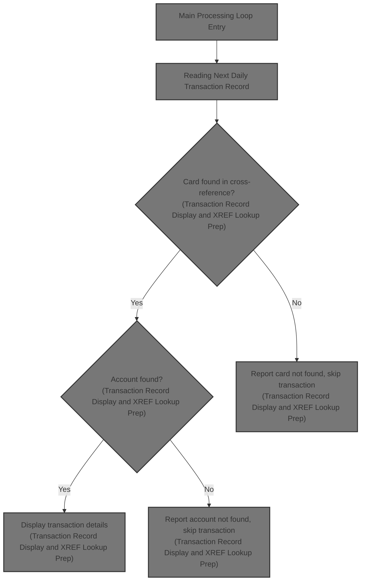

## Dependencies

### Programs

- CBTRN01C (app/cbl/CBTRN01C.cbl)
- CEE3ABD

### Copybooks

- CVTRA06Y (app/cpy/CVTRA06Y.cpy)
- CVCUS01Y (app/cpy/CVCUS01Y.cpy)
- CVACT03Y (app/cpy/CVACT03Y.cpy)
- CVACT02Y (app/cpy/CVACT02Y.cpy)
- CVACT01Y (app/cpy/CVACT01Y.cpy)
- CVTRA05Y (app/cpy/CVTRA05Y.cpy)

# Workflow

# Startup and File Initialization

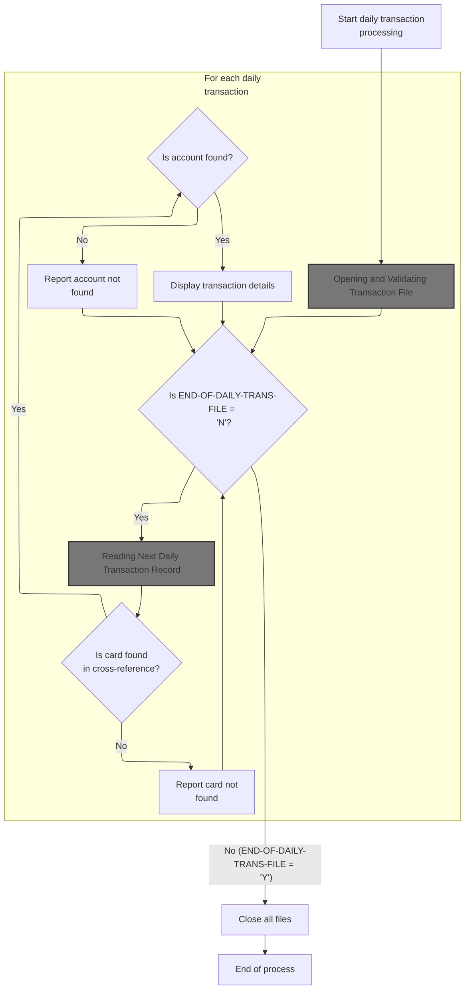

This section governs the startup and file initialization for daily transaction processing, ensuring all required files are available and setting the flow for transaction validation and reporting.

| Rule ID | Code Location | Category        | Rule Name                       | Description                                                                                                                                                                            | Conditions                                                                 | Remarks                                                                                                                                                 |
| ------- | ------------- | --------------- | ------------------------------- | -------------------------------------------------------------------------------------------------------------------------------------------------------------------------------------- | -------------------------------------------------------------------------- | ------------------------------------------------------------------------------------------------------------------------------------------------------- |
| BR-001  | MAIN-PARA     | Data validation | File Availability Prerequisite  | All required files must be open before any daily transaction processing can begin. If any file is not available, processing cannot proceed.                                            | At the start of the process, before reading any daily transaction records. | The required files are: daily transaction file, customer file, cross-reference file, card file, account file, and transaction file.                     |
| BR-002  | MAIN-PARA     | Data validation | Card Existence Validation       | Each daily transaction must be checked for a matching card in the cross-reference file. If no matching card is found, the transaction is reported as 'card not found'.                 | For each daily transaction record read from the file.                      | The card number from the transaction is compared to the card number in the cross-reference file. If not found, the output is a 'card not found' report. |
| BR-003  | MAIN-PARA     | Data validation | Account Existence Validation    | If a card is found in the cross-reference file, the associated account must be checked for existence. If the account is not found, the transaction is reported as 'account not found'. | For each transaction where the card is found in the cross-reference file.  | The account ID from the cross-reference is used to check for account existence. If not found, the output is a 'account not found' report.               |
| BR-004  | MAIN-PARA     | Business logic  | Transaction Display Requirement | If both the card and account are found, the transaction details must be displayed.                                                                                                     | For each transaction where both card and account are found.                | The transaction details displayed include all fields from the transaction record, such as transaction ID, type, amount, merchant info, and timestamps.  |
| BR-005  | MAIN-PARA     | Technical step  | End-of-File Closure             | When the end of the daily transaction file is reached, all files must be closed and the process ends.                                                                                  | When END-OF-DAILY-TRANS-FILE is equal to 'Y'.                              | All files opened at the start must be closed in this step.                                                                                              |

<SwmSnippet path="/app/cbl/CBTRN01C.cbl" line="155" repo-id="Z2l0aHViJTNBJTNBa3luZHJ5bC1hd3MtbWFpbmZyYW1lLW1vZGVybml6YXRpb24tY2FyZGRlbW8lM0ElM0FTd2ltbS1EZW1v">

---

In `MAIN-PARA`, we start by opening the daily transaction file since all further processing depends on it being available.

```cobol
       MAIN-PARA.
           DISPLAY 'START OF EXECUTION OF PROGRAM CBTRN01C'.
           PERFORM 0000-DALYTRAN-OPEN.
           PERFORM 0100-CUSTFILE-OPEN.
           PERFORM 0200-XREFFILE-OPEN.
           PERFORM 0300-CARDFILE-OPEN.
           PERFORM 0400-ACCTFILE-OPEN.
           PERFORM 0500-TRANFILE-OPEN.
```

---

</SwmSnippet>

## Opening and Validating Daily Transaction File

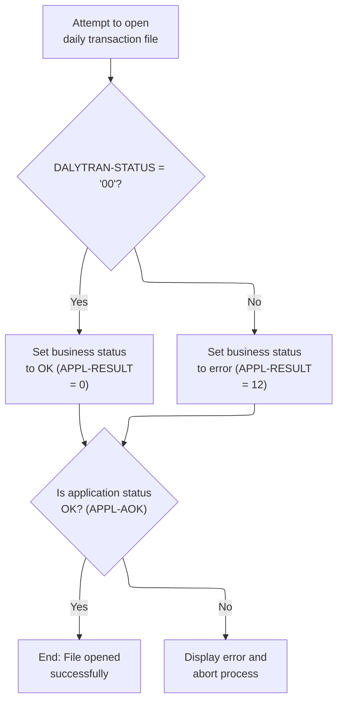

This section manages the opening and validation of the daily transaction file, setting business status based on the outcome, reporting errors, and performing controlled termination if necessary.

| Rule ID | Code Location       | Category       | Rule Name                      | Description                                                                                                                                                             | Conditions                                                          | Remarks                                                                                                                                                                                                                                                 |
| ------- | ------------------- | -------------- | ------------------------------ | ----------------------------------------------------------------------------------------------------------------------------------------------------------------------- | ------------------------------------------------------------------- | ------------------------------------------------------------------------------------------------------------------------------------------------------------------------------------------------------------------------------------------------------- |
| BR-001  | 0000-DALYTRAN-OPEN  | Business logic | Successful file open           | If the daily transaction file is opened successfully, the business status is set to OK and processing continues.                                                        | The file open operation returns a status code of '00'.              | The business status is set to OK, represented by the value 0. No error message is displayed. The output is a status code (number) indicating success.                                                                                                   |
| BR-002  | 0000-DALYTRAN-OPEN  | Error handling | File open failure              | If the daily transaction file fails to open, the business status is set to error and an error message is displayed.                                                     | The file open operation returns a status code other than '00'.      | The business status is set to error, represented by the value 12. An error message is displayed: 'ERROR OPENING DAILY TRANSACTION FILE'. The output includes the error status code (number) and the error message (string).                             |
| BR-003  | Z-DISPLAY-IO-STATUS | Error handling | IO status reporting            | When a file open error occurs, the IO status code is reported to the user in a formatted manner, with special encoding if the status is non-numeric or starts with '9'. | A file open error has occurred and the IO status code is available. | If the IO status code is non-numeric or starts with '9', it is encoded in a special format for reporting. Otherwise, it is displayed as a 4-digit string. The output format is a string: 'FILE STATUS IS: NNNN', where NNNN is the formatted IO status. |
| BR-004  | Z-ABEND-PROGRAM     | Error handling | Controlled program termination | If a file open error occurs, the process is aborted and a controlled program termination is performed, generating a dump for diagnostics.                               | A file open error has occurred and error reporting is complete.     | A termination message is displayed: 'ABENDING PROGRAM'. The program sets timing to 0 and abend code to 999 before terminating. The output is a termination message (string) and a program dump.                                                         |

<SwmSnippet path="/app/cbl/CBTRN01C.cbl" line="252" repo-id="Z2l0aHViJTNBJTNBa3luZHJ5bC1hd3MtbWFpbmZyYW1lLW1vZGVybml6YXRpb24tY2FyZGRlbW8lM0ElM0FTd2ltbS1EZW1v">

---

In `0000-DALYTRAN-OPEN` we try to open the daily transaction file and set APPL-RESULT based on the outcome. If the open is successful, APPL-RESULT is set to 0; otherwise, it's set to 12. This status is used to decide what to do next.

```cobol
       0000-DALYTRAN-OPEN.
           MOVE 8 TO APPL-RESULT.
           OPEN INPUT DALYTRAN-FILE
           IF  DALYTRAN-STATUS = '00'
               MOVE 0 TO APPL-RESULT
           ELSE
               MOVE 12 TO APPL-RESULT
           END-IF
```

---

</SwmSnippet>

<SwmSnippet path="/app/cbl/CBTRN01C.cbl" line="260" repo-id="Z2l0aHViJTNBJTNBa3luZHJ5bC1hd3MtbWFpbmZyYW1lLW1vZGVybml6YXRpb24tY2FyZGRlbW8lM0ElM0FTd2ltbS1EZW1v">

---

After trying to open the file, we check if it worked. If not, we display an error message, copy the file status for reporting, and call Z-DISPLAY-IO-STATUS to show the exact IO error before stopping the program.

```cobol
           IF  APPL-AOK
               CONTINUE
           ELSE
               DISPLAY 'ERROR OPENING DAILY TRANSACTION FILE'
               MOVE DALYTRAN-STATUS TO IO-STATUS
               PERFORM Z-DISPLAY-IO-STATUS
               PERFORM Z-ABEND-PROGRAM
           END-IF
           EXIT.
```

---

</SwmSnippet>

<SwmSnippet path="/app/cbl/CBTRN01C.cbl" line="476" repo-id="Z2l0aHViJTNBJTNBa3luZHJ5bC1hd3MtbWFpbmZyYW1lLW1vZGVybml6YXRpb24tY2FyZGRlbW8lM0ElM0FTd2ltbS1EZW1v">

---

`Z-DISPLAY-IO-STATUS` checks if the IO status is non-numeric or starts with '9'. If so, it encodes the status in a special format for error reporting. Otherwise, it just displays the numeric status as a 4-digit string.

```cobol
       Z-DISPLAY-IO-STATUS.
           IF  IO-STATUS NOT NUMERIC
           OR  IO-STAT1 = '9'
               MOVE IO-STAT1 TO IO-STATUS-04(1:1)
               MOVE 0        TO TWO-BYTES-BINARY
               MOVE IO-STAT2 TO TWO-BYTES-RIGHT
               MOVE TWO-BYTES-BINARY TO IO-STATUS-0403
               DISPLAY 'FILE STATUS IS: NNNN' IO-STATUS-04
           ELSE
               MOVE '0000' TO IO-STATUS-04
               MOVE IO-STATUS TO IO-STATUS-04(3:2)
               DISPLAY 'FILE STATUS IS: NNNN' IO-STATUS-04
           END-IF
           EXIT.
```

---

</SwmSnippet>

<SwmSnippet path="/app/cbl/CBTRN01C.cbl" line="469" repo-id="Z2l0aHViJTNBJTNBa3luZHJ5bC1hd3MtbWFpbmZyYW1lLW1vZGVybml6YXRpb24tY2FyZGRlbW8lM0ElM0FTd2ltbS1EZW1v">

---

`Z-ABEND-PROGRAM` displays an abend message, sets the timing and abend code, then calls 'CEE3ABD' to force a controlled program termination and generate a dump.

```cobol
       Z-ABEND-PROGRAM.
           DISPLAY 'ABENDING PROGRAM'
           MOVE 0 TO TIMING
           MOVE 999 TO ABCODE
           CALL 'CEE3ABD'.
```

---

</SwmSnippet>

## Opening and Validating Customer File

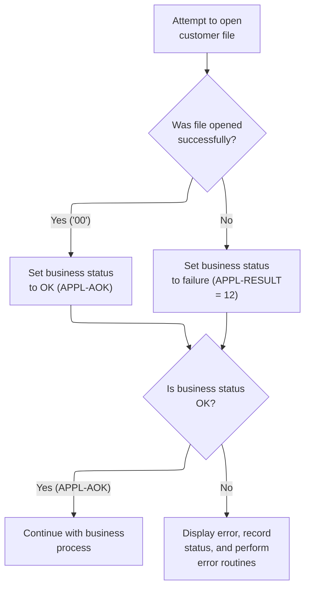

This section manages the opening of the customer file and determines whether the business process can proceed based on the outcome. It ensures that errors are handled consistently and that users are informed of any issues encountered during file access.

| Rule ID | Code Location      | Category       | Rule Name                     | Description                                                                                                                                                              | Conditions                                                                                  | Remarks                                                                                                                                                                                     |
| ------- | ------------------ | -------------- | ----------------------------- | ------------------------------------------------------------------------------------------------------------------------------------------------------------------------ | ------------------------------------------------------------------------------------------- | ------------------------------------------------------------------------------------------------------------------------------------------------------------------------------------------- |
| BR-001  | 0100-CUSTFILE-OPEN | Business logic | Successful file open          | When the customer file is opened successfully, the business status is set to OK, allowing the business process to continue.                                              | The customer file status equals '00' after attempting to open the file.                     | The business status code for success is 0. This is represented by APPL-RESULT = 0 (APPL-AOK).                                                                                               |
| BR-002  | 0100-CUSTFILE-OPEN | Business logic | Business process continuation | The business process only continues if the business status is OK after attempting to open the customer file.                                                             | The business status code is OK (APPL-RESULT = 0, APPL-AOK) after opening the customer file. | The business status code for continuation is 0 (APPL-AOK).                                                                                                                                  |
| BR-003  | 0100-CUSTFILE-OPEN | Error handling | File open failure handling    | If the customer file fails to open, the business status is set to failure, an error message is displayed, the file status is recorded, and error routines are performed. | The customer file status does not equal '00' after attempting to open the file.             | The business status code for failure is 12. This is represented by APPL-RESULT = 12. The error message displayed is 'ERROR OPENING CUSTOMER FILE'. The file status is copied for reporting. |

<SwmSnippet path="/app/cbl/CBTRN01C.cbl" line="271" repo-id="Z2l0aHViJTNBJTNBa3luZHJ5bC1hd3MtbWFpbmZyYW1lLW1vZGVybml6YXRpb24tY2FyZGRlbW8lM0ElM0FTd2ltbS1EZW1v">

---

In `0100-CUSTFILE-OPEN` we open the customer file and set APPL-RESULT based on the outcome. The same status handling logic is used as for other files, so errors are handled uniformly.

```cobol
       0100-CUSTFILE-OPEN.
           MOVE 8 TO APPL-RESULT.
           OPEN INPUT CUSTOMER-FILE
           IF  CUSTFILE-STATUS = '00'
               MOVE 0 TO APPL-RESULT
           ELSE
               MOVE 12 TO APPL-RESULT
           END-IF
```

---

</SwmSnippet>

<SwmSnippet path="/app/cbl/CBTRN01C.cbl" line="279" repo-id="Z2l0aHViJTNBJTNBa3luZHJ5bC1hd3MtbWFpbmZyYW1lLW1vZGVybml6YXRpb24tY2FyZGRlbW8lM0ElM0FTd2ltbS1EZW1v">

---

After opening the customer file, we check if it worked. If not, we display an error message, copy the file status for reporting, and call Z-DISPLAY-IO-STATUS to show the exact IO error before stopping the program.

```cobol
           IF  APPL-AOK
               CONTINUE
           ELSE
               DISPLAY 'ERROR OPENING CUSTOMER FILE'
               MOVE CUSTFILE-STATUS TO IO-STATUS
               PERFORM Z-DISPLAY-IO-STATUS
               PERFORM Z-ABEND-PROGRAM
           END-IF
           EXIT.
```

---

</SwmSnippet>

## Opening and Validating Cross Reference File

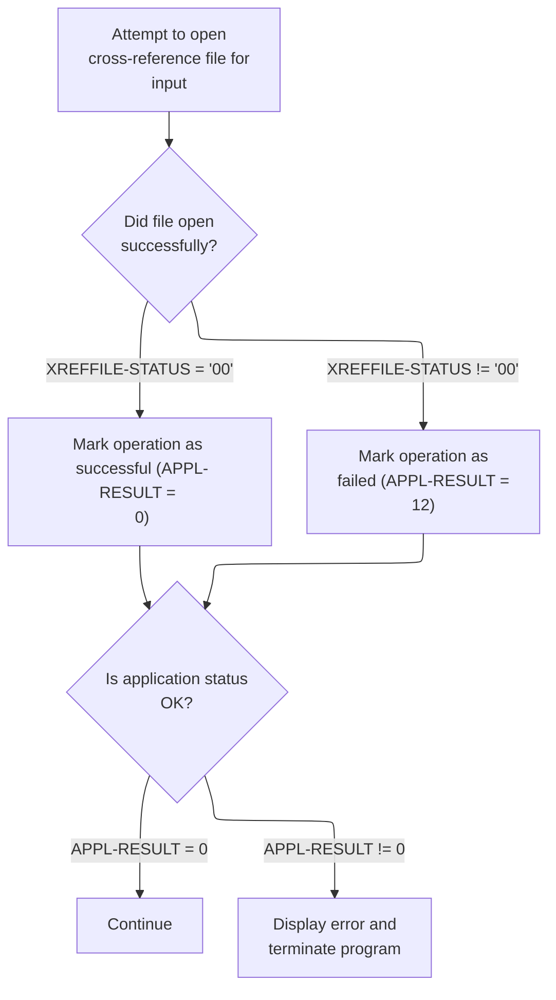

This section manages the opening and validation of the cross-reference file required for mapping card numbers to accounts. It ensures that processing only continues if the file is available and provides clear error handling and reporting if the file cannot be accessed.

| Rule ID | Code Location      | Category        | Rule Name                  | Description                                                                                                                                                               | Conditions                                                                          | Remarks                                                                                                                                                                                                                                              |
| ------- | ------------------ | --------------- | -------------------------- | ------------------------------------------------------------------------------------------------------------------------------------------------------------------------- | ----------------------------------------------------------------------------------- | ---------------------------------------------------------------------------------------------------------------------------------------------------------------------------------------------------------------------------------------------------- |
| BR-001  | 0200-XREFFILE-OPEN | Data validation | Application status check   | Processing continues only if the application status indicates success after attempting to open the cross-reference file.                                                  | The operation result is set to 0 after attempting to open the cross-reference file. | The application status is considered OK if the operation result is 0. No further action is taken and processing continues.                                                                                                                           |
| BR-002  | 0200-XREFFILE-OPEN | Business logic  | Successful file open       | If the cross-reference file is successfully opened, the operation is marked as successful and processing continues.                                                       | The cross-reference file open operation returns a status code of '00'.              | The status code '00' indicates a successful file open. The operation result is set to 0 to indicate success.                                                                                                                                         |
| BR-003  | 0200-XREFFILE-OPEN | Error handling  | File open failure handling | If the cross-reference file cannot be opened, the operation is marked as failed, an error message is displayed, the IO status is reported, and the program is terminated. | The cross-reference file open operation returns a status code other than '00'.      | The status code not equal to '00' indicates a failure to open the file. The operation result is set to 12 to indicate failure. The error message 'ERROR OPENING CROSS REF FILE' is displayed, and the IO status is reported for diagnostic purposes. |

<SwmSnippet path="/app/cbl/CBTRN01C.cbl" line="289" repo-id="Z2l0aHViJTNBJTNBa3luZHJ5bC1hd3MtbWFpbmZyYW1lLW1vZGVybml6YXRpb24tY2FyZGRlbW8lM0ElM0FTd2ltbS1EZW1v">

---

In `0200-XREFFILE-OPEN` we open the cross reference file and set APPL-RESULT based on the outcome. This file is needed to map card numbers to accounts for transaction validation.

```cobol
       0200-XREFFILE-OPEN.
           MOVE 8 TO APPL-RESULT.
           OPEN INPUT XREF-FILE
           IF  XREFFILE-STATUS = '00'
               MOVE 0 TO APPL-RESULT
           ELSE
               MOVE 12 TO APPL-RESULT
           END-IF
```

---

</SwmSnippet>

<SwmSnippet path="/app/cbl/CBTRN01C.cbl" line="297" repo-id="Z2l0aHViJTNBJTNBa3luZHJ5bC1hd3MtbWFpbmZyYW1lLW1vZGVybml6YXRpb24tY2FyZGRlbW8lM0ElM0FTd2ltbS1EZW1v">

---

After opening the cross reference file, we check if it worked. If not, we display an error message, copy the file status for reporting, and call Z-DISPLAY-IO-STATUS to show the exact IO error before stopping the program.

```cobol
           IF  APPL-AOK
               CONTINUE
           ELSE
               DISPLAY 'ERROR OPENING CROSS REF FILE'
               MOVE XREFFILE-STATUS TO IO-STATUS
               PERFORM Z-DISPLAY-IO-STATUS
               PERFORM Z-ABEND-PROGRAM
           END-IF
           EXIT.
```

---

</SwmSnippet>

## Opening and Validating Card File

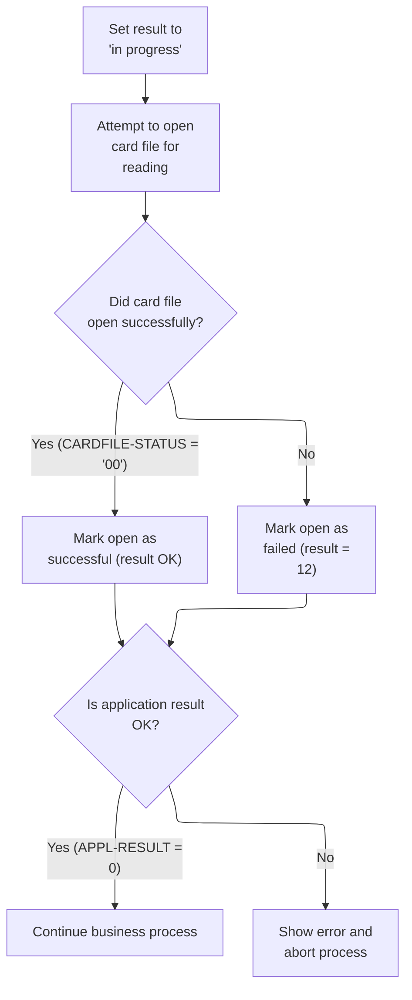

This section is responsible for opening the card file and validating the outcome, setting status codes for success or failure, and handling errors by reporting and aborting the process if necessary.

| Rule ID | Code Location      | Category        | Rule Name                       | Description                                                                                                                                                           | Conditions                                                          | Remarks                                                                                                                                                                                          |
| ------- | ------------------ | --------------- | ------------------------------- | --------------------------------------------------------------------------------------------------------------------------------------------------------------------- | ------------------------------------------------------------------- | ------------------------------------------------------------------------------------------------------------------------------------------------------------------------------------------------ |
| BR-001  | 0300-CARDFILE-OPEN | Data validation | Application result validation   | After attempting to open the card file, the process checks if the application result indicates success before proceeding with further business logic.                 | The application result code is 0 (APPL-AOK).                        | The application result code is a numeric value. A value of 0 indicates success and allows the process to continue.                                                                               |
| BR-002  | 0300-CARDFILE-OPEN | Business logic  | Card file open success          | When attempting to open the card file, if the file status indicates success, the process marks the operation as successful and continues with further business logic. | The card file open operation returns a status code of '00'.         | A status code of 0 is used to indicate success. The status code is a numeric value. No additional output format is specified in this section.                                                    |
| BR-003  | 0300-CARDFILE-OPEN | Error handling  | Card file open failure handling | If the card file fails to open, the process marks the operation as failed, displays an error message, copies the file status for reporting, and aborts the process.   | The card file open operation does not return a status code of '00'. | A status code of 12 is used to indicate failure. The error message 'ERROR OPENING CARD FILE' is displayed. The file status is copied for reporting. The process is aborted after error handling. |

<SwmSnippet path="/app/cbl/CBTRN01C.cbl" line="307" repo-id="Z2l0aHViJTNBJTNBa3luZHJ5bC1hd3MtbWFpbmZyYW1lLW1vZGVybml6YXRpb24tY2FyZGRlbW8lM0ElM0FTd2ltbS1EZW1v">

---

In `0300-CARDFILE-OPEN`, we open the card file and set a status code for error handling.

```cobol
       0300-CARDFILE-OPEN.
           MOVE 8 TO APPL-RESULT.
           OPEN INPUT CARD-FILE
           IF  CARDFILE-STATUS = '00'
               MOVE 0 TO APPL-RESULT
           ELSE
               MOVE 12 TO APPL-RESULT
           END-IF
```

---

</SwmSnippet>

<SwmSnippet path="/app/cbl/CBTRN01C.cbl" line="315" repo-id="Z2l0aHViJTNBJTNBa3luZHJ5bC1hd3MtbWFpbmZyYW1lLW1vZGVybml6YXRpb24tY2FyZGRlbW8lM0ElM0FTd2ltbS1EZW1v">

---

After opening the card file, we check if it worked. If not, we display an error message, copy the file status for reporting, and call Z-DISPLAY-IO-STATUS to show the exact IO error before stopping the program.

```cobol
           IF  APPL-AOK
               CONTINUE
           ELSE
               DISPLAY 'ERROR OPENING CARD FILE'
               MOVE CARDFILE-STATUS TO IO-STATUS
               PERFORM Z-DISPLAY-IO-STATUS
               PERFORM Z-ABEND-PROGRAM
           END-IF
           EXIT.
```

---

</SwmSnippet>

## Opening and Validating Account File

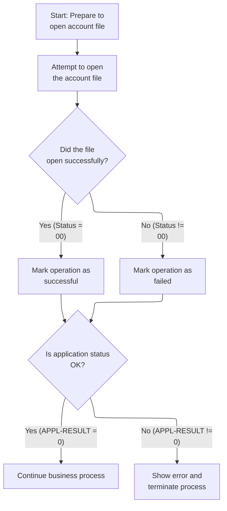

This section manages the opening of the account file and determines the outcome of the operation, setting status codes and handling errors as needed.

| Rule ID | Code Location      | Category       | Rule Name                           | Description                                                                                                                           | Conditions                                                                      | Remarks                                                                                                                                                                      |
| ------- | ------------------ | -------------- | ----------------------------------- | ------------------------------------------------------------------------------------------------------------------------------------- | ------------------------------------------------------------------------------- | ---------------------------------------------------------------------------------------------------------------------------------------------------------------------------- |
| BR-001  | 0400-ACCTFILE-OPEN | Business logic | Initial operation status assignment | Before attempting to open the account file, the operation status is set to indicate a pending or initial state.                       | Whenever the account file open operation is about to begin.                     | The initial status code assigned is 8, which represents a pending or not-yet-successful operation.                                                                           |
| BR-002  | 0400-ACCTFILE-OPEN | Business logic | Successful file open status         | If the account file is opened successfully, the operation status is updated to indicate success.                                      | The account file open operation returns a status code of '00'.                  | A status code of '00' from the file open operation indicates success. The application status code is set to 0 to reflect this.                                               |
| BR-003  | 0400-ACCTFILE-OPEN | Business logic | Failed file open status             | If the account file cannot be opened, the operation status is updated to indicate failure.                                            | The account file open operation returns a status code other than '00'.          | Any file status code other than '00' indicates failure. The application status code is set to 12 to reflect this.                                                            |
| BR-004  | 0400-ACCTFILE-OPEN | Business logic | Continue on success                 | If the operation status indicates success, the business process continues without interruption.                                       | The application status code is 0 after attempting to open the account file.     | A status code of 0 indicates success and allows the process to continue.                                                                                                     |
| BR-005  | 0400-ACCTFILE-OPEN | Error handling | Error reporting and termination     | If the operation status indicates failure, an error message is displayed, the file status is reported, and the process is terminated. | The application status code is not 0 after attempting to open the account file. | If the application status code is not 0, an error message 'ERROR OPENING ACCOUNT FILE' is displayed, the file status is copied for reporting, and the process is terminated. |

<SwmSnippet path="/app/cbl/CBTRN01C.cbl" line="325" repo-id="Z2l0aHViJTNBJTNBa3luZHJ5bC1hd3MtbWFpbmZyYW1lLW1vZGVybml6YXRpb24tY2FyZGRlbW8lM0ElM0FTd2ltbS1EZW1v">

---

In `0400-ACCTFILE-OPEN`, we open the account file and set a status code for error handling.

```cobol
       0400-ACCTFILE-OPEN.
           MOVE 8 TO APPL-RESULT.
           OPEN INPUT ACCOUNT-FILE
           IF  ACCTFILE-STATUS = '00'
               MOVE 0 TO APPL-RESULT
           ELSE
               MOVE 12 TO APPL-RESULT
           END-IF
```

---

</SwmSnippet>

<SwmSnippet path="/app/cbl/CBTRN01C.cbl" line="333" repo-id="Z2l0aHViJTNBJTNBa3luZHJ5bC1hd3MtbWFpbmZyYW1lLW1vZGVybml6YXRpb24tY2FyZGRlbW8lM0ElM0FTd2ltbS1EZW1v">

---

After opening the account file, we check if it worked. If not, we display an error message, copy the file status for reporting, and call Z-DISPLAY-IO-STATUS to show the exact IO error before stopping the program.

```cobol
           IF  APPL-AOK
               CONTINUE
           ELSE
               DISPLAY 'ERROR OPENING ACCOUNT FILE'
               MOVE ACCTFILE-STATUS TO IO-STATUS
               PERFORM Z-DISPLAY-IO-STATUS
               PERFORM Z-ABEND-PROGRAM
           END-IF
           EXIT.
```

---

</SwmSnippet>

## Opening Transaction File and Entering Main Loop

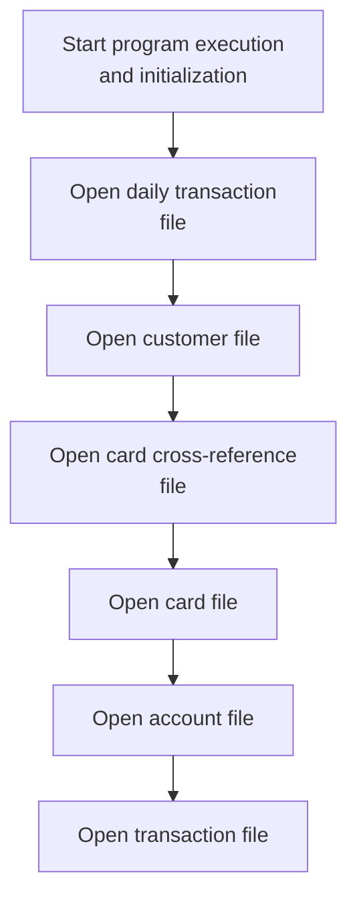

This section is responsible for opening all necessary files before transaction processing can begin, ensuring that all required data sources are available and properly initialized.

| Rule ID | Code Location | Category        | Rule Name                             | Description                                                                                                                                                                                                            | Conditions                                                  | Remarks                                                                                                                                                                                                                        |
| ------- | ------------- | --------------- | ------------------------------------- | ---------------------------------------------------------------------------------------------------------------------------------------------------------------------------------------------------------------------- | ----------------------------------------------------------- | ------------------------------------------------------------------------------------------------------------------------------------------------------------------------------------------------------------------------------ |
| BR-001  | MAIN-PARA     | Data validation | File open precondition for processing | Transaction processing cannot begin unless all required files have been successfully opened.                                                                                                                           | All file open operations complete without error.            | If any file fails to open, transaction processing is not started. No specific error message format is defined in this section.                                                                                                 |
| BR-002  | MAIN-PARA     | Business logic  | Sequential file opening requirement   | All required files must be opened in sequence before transaction processing can begin. The files are: daily transaction file, customer file, card cross-reference file, card file, account file, and transaction file. | Program execution starts and initialization is complete.    | The files must be opened in the following order: daily transaction file, customer file, card cross-reference file, card file, account file, transaction file. No specific format requirements for file contents at this stage. |
| BR-003  | MAIN-PARA     | Business logic  | Daily transaction file initialization | The daily transaction file is the first file to be opened, and its status variable END-OF-DAILY-TRANS-FILE is initialized to 'N'.                                                                                      | Program initialization and before any file open operations. | END-OF-DAILY-TRANS-FILE is set to 'N' at initialization, indicating the file is not yet at end-of-file.                                                                                                                        |

<SwmSnippet path="/app/cbl/CBTRN01C.cbl" line="155" repo-id="Z2l0aHViJTNBJTNBa3luZHJ5bC1hd3MtbWFpbmZyYW1lLW1vZGVybml6YXRpb24tY2FyZGRlbW8lM0ElM0FTd2ltbS1EZW1v">

---

After opening the account file, we open the transaction file so we can start processing transactions.

```cobol
       MAIN-PARA.
           DISPLAY 'START OF EXECUTION OF PROGRAM CBTRN01C'.
           PERFORM 0000-DALYTRAN-OPEN.
           PERFORM 0100-CUSTFILE-OPEN.
           PERFORM 0200-XREFFILE-OPEN.
           PERFORM 0300-CARDFILE-OPEN.
           PERFORM 0400-ACCTFILE-OPEN.
           PERFORM 0500-TRANFILE-OPEN.
```

---

</SwmSnippet>

## Opening and Validating Transaction File

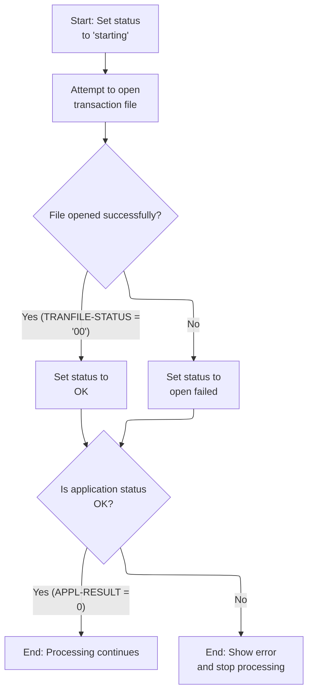

This section manages the opening and validation of the transaction file, setting application status codes based on the outcome and handling errors to ensure reliable business processing.

| Rule ID | Code Location      | Category       | Rule Name                      | Description                                                                                                                                                                              | Conditions                                                                         | Remarks                                                                                                                                                                                                           |
| ------- | ------------------ | -------------- | ------------------------------ | ---------------------------------------------------------------------------------------------------------------------------------------------------------------------------------------- | ---------------------------------------------------------------------------------- | ----------------------------------------------------------------------------------------------------------------------------------------------------------------------------------------------------------------- |
| BR-001  | 0500-TRANFILE-OPEN | Business logic | Initial status set to starting | When attempting to open the transaction file, the application status is initially set to 'starting' (value 8) before the open operation.                                                 | Whenever the transaction file open operation is initiated.                         | The status code '8' is used to indicate the starting state. This is a numeric value.                                                                                                                              |
| BR-002  | 0500-TRANFILE-OPEN | Business logic | Successful file open status    | If the transaction file is opened successfully, the application status is set to OK (value 0).                                                                                           | After attempting to open the transaction file, if the file status equals '00'.     | The status code '0' is used to indicate success. The file status '00' is the success indicator for file operations.                                                                                               |
| BR-003  | 0500-TRANFILE-OPEN | Business logic | Continue on success            | If the application status is OK after attempting to open the transaction file, processing continues.                                                                                     | After opening the transaction file, if application status is OK (APPL-RESULT = 0). | The status code '0' is used to indicate success and allow processing to continue.                                                                                                                                 |
| BR-004  | 0500-TRANFILE-OPEN | Error handling | File open failure handling     | If the transaction file open fails, the application status is set to 'open failed' (value 12), and an error message is displayed, the file status is reported, and processing is halted. | After attempting to open the transaction file, if the file status is not '00'.     | The status code '12' is used to indicate file open failure. The error message displayed is 'ERROR OPENING TRANSACTION FILE'. The file status is copied for reporting. Processing is halted after error reporting. |

<SwmSnippet path="/app/cbl/CBTRN01C.cbl" line="343" repo-id="Z2l0aHViJTNBJTNBa3luZHJ5bC1hd3MtbWFpbmZyYW1lLW1vZGVybml6YXRpb24tY2FyZGRlbW8lM0ElM0FTd2ltbS1EZW1v">

---

In `0500-TRANFILE-OPEN` we open the transaction file and set APPL-RESULT based on the outcome. If the open fails, we handle the error just like with the other files.

```cobol
       0500-TRANFILE-OPEN.
           MOVE 8 TO APPL-RESULT.
           OPEN INPUT TRANSACT-FILE
           IF  TRANFILE-STATUS = '00'
               MOVE 0 TO APPL-RESULT
           ELSE
               MOVE 12 TO APPL-RESULT
           END-IF
```

---

</SwmSnippet>

<SwmSnippet path="/app/cbl/CBTRN01C.cbl" line="351" repo-id="Z2l0aHViJTNBJTNBa3luZHJ5bC1hd3MtbWFpbmZyYW1lLW1vZGVybml6YXRpb24tY2FyZGRlbW8lM0ElM0FTd2ltbS1EZW1v">

---

After opening the transaction file, we check if it worked. If not, we display an error message, copy the file status for reporting, and call Z-DISPLAY-IO-STATUS to show the exact IO error before stopping the program.

```cobol
           IF  APPL-AOK
               CONTINUE
           ELSE
               DISPLAY 'ERROR OPENING TRANSACTION FILE'
               MOVE TRANFILE-STATUS TO IO-STATUS
               PERFORM Z-DISPLAY-IO-STATUS
               PERFORM Z-ABEND-PROGRAM
           END-IF
           EXIT.
```

---

</SwmSnippet>

## Main Processing Loop Entry

This section manages the main processing loop for daily transaction records, ensuring that records are processed sequentially until the end of the file is reached.

| Rule ID | Code Location | Category       | Rule Name                             | Description                                                                                    | Conditions                                | Remarks                                                                                                                                      |
| ------- | ------------- | -------------- | ------------------------------------- | ---------------------------------------------------------------------------------------------- | ----------------------------------------- | -------------------------------------------------------------------------------------------------------------------------------------------- |
| BR-001  | MAIN-PARA     | Business logic | Continue Processing Until End-of-File | Processing of transaction records continues as long as the end-of-file flag is not set to 'Y'. | The end-of-file flag is not equal to 'Y'. | The end-of-file flag uses the value 'Y' to indicate the end of the transaction file. Any value other than 'Y' allows processing to continue. |
| BR-002  | MAIN-PARA     | Business logic | Fetch Next Transaction Record         | The next transaction record is fetched only if the end-of-file flag is not set to 'Y'.         | The end-of-file flag is equal to 'N'.     | The fetch operation is performed only when the end-of-file flag is 'N'.                                                                      |

<SwmSnippet path="/app/cbl/CBTRN01C.cbl" line="164" repo-id="Z2l0aHViJTNBJTNBa3luZHJ5bC1hd3MtbWFpbmZyYW1lLW1vZGVybml6YXRpb24tY2FyZGRlbW8lM0ElM0FTd2ltbS1EZW1v">

---

After opening all files in `MAIN-PARA`, we enter the main loop. We use END-OF-DAILY-TRANS-FILE as a flag to control when to stop. The next step is to call 1000-DALYTRAN-GET-NEXT to fetch the next transaction record.

```cobol
           PERFORM UNTIL END-OF-DAILY-TRANS-FILE = 'Y'
               IF  END-OF-DAILY-TRANS-FILE = 'N'
                   PERFORM 1000-DALYTRAN-GET-NEXT
```

---

</SwmSnippet>

## Reading Next Daily Transaction Record

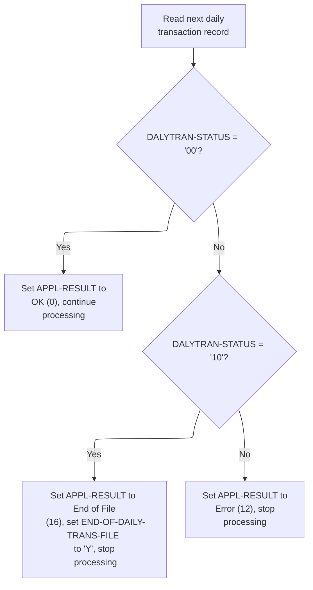

This section manages the reading of daily transaction records from the transaction file, determining the business outcome based on the result of each read operation. It ensures that normal processing, end-of-file, and error conditions are handled according to business requirements.

| Rule ID | Code Location          | Category       | Rule Name            | Description                                                                                                                                                                                                      | Conditions                                                                      | Remarks                                                                                                                                                                                                  |
| ------- | ---------------------- | -------------- | -------------------- | ---------------------------------------------------------------------------------------------------------------------------------------------------------------------------------------------------------------- | ------------------------------------------------------------------------------- | -------------------------------------------------------------------------------------------------------------------------------------------------------------------------------------------------------- |
| BR-001  | 1000-DALYTRAN-GET-NEXT | Business logic | Normal Read Success  | When the next daily transaction record is read and the status code indicates a normal read (status '00'), the operation is considered successful and processing continues.                                       | The status code returned from reading the transaction file is '00'.             | The status code '00' represents a successful read. The result code is set to 0, which means 'OK'.                                                                                                        |
| BR-002  | 1000-DALYTRAN-GET-NEXT | Business logic | End of File Handling | When the next daily transaction record is read and the status code indicates end-of-file (status '10'), the operation is considered complete, the end-of-file flag is set, and processing is stopped.            | The status code returned from reading the transaction file is '10'.             | The status code '10' represents end-of-file. The result code is set to 16, which means 'End of File'. The end-of-file flag is set to 'Y'.                                                                |
| BR-003  | 1000-DALYTRAN-GET-NEXT | Error handling | Read Error Handling  | When the next daily transaction record is read and the status code indicates an error (any value other than '00' or '10'), an error result is set, an error message is displayed, and the program is terminated. | The status code returned from reading the transaction file is not '00' or '10'. | Any status code other than '00' (success) or '10' (end-of-file) is treated as an error. The result code is set to 12, which means 'Error'. An error message is displayed, and the program is terminated. |

<SwmSnippet path="/app/cbl/CBTRN01C.cbl" line="202" repo-id="Z2l0aHViJTNBJTNBa3luZHJ5bC1hd3MtbWFpbmZyYW1lLW1vZGVybml6YXRpb24tY2FyZGRlbW8lM0ElM0FTd2ltbS1EZW1v">

---

In `1000-DALYTRAN-GET-NEXT` we read the next daily transaction record. We check the status: if it's a normal read, we continue; if it's end-of-file, we set the flag; otherwise, we handle the error.

```cobol
       1000-DALYTRAN-GET-NEXT.
           READ DALYTRAN-FILE INTO DALYTRAN-RECORD.
           IF  DALYTRAN-STATUS = '00'
               MOVE 0 TO APPL-RESULT
           ELSE
               IF  DALYTRAN-STATUS = '10'
                   MOVE 16 TO APPL-RESULT
               ELSE
                   MOVE 12 TO APPL-RESULT
               END-IF
           END-IF
```

---

</SwmSnippet>

<SwmSnippet path="/app/cbl/CBTRN01C.cbl" line="213" repo-id="Z2l0aHViJTNBJTNBa3luZHJ5bC1hd3MtbWFpbmZyYW1lLW1vZGVybml6YXRpb24tY2FyZGRlbW8lM0ElM0FTd2ltbS1EZW1v">

---

After reading the transaction, if it's not a normal read or EOF, we display the IO status for debugging and then terminate.

```cobol
           IF  APPL-AOK
               CONTINUE
           ELSE
               IF  APPL-EOF
                   MOVE 'Y' TO END-OF-DAILY-TRANS-FILE
               ELSE
                   DISPLAY 'ERROR READING DAILY TRANSACTION FILE'
                   MOVE DALYTRAN-STATUS TO IO-STATUS
                   PERFORM Z-DISPLAY-IO-STATUS
                   PERFORM Z-ABEND-PROGRAM
               END-IF
           END-IF
           EXIT.
```

---

</SwmSnippet>

## Transaction Record Display and XREF Lookup Prep

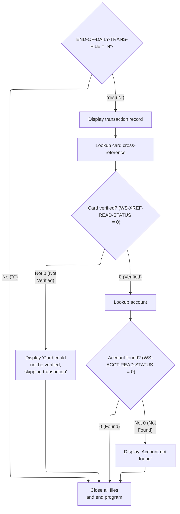

This section manages the display of transaction records, cross-reference lookups for card verification, account lookups, error messaging for failed lookups, and the closure of files at the end of processing.

| Rule ID | Code Location | Category       | Rule Name                          | Description                                                                                                                                                 | Conditions                                                                                                                    | Remarks                                                                                                                                                                                                                                                                                                                                                                                                                                                                                         |
| ------- | ------------- | -------------- | ---------------------------------- | ----------------------------------------------------------------------------------------------------------------------------------------------------------- | ----------------------------------------------------------------------------------------------------------------------------- | ----------------------------------------------------------------------------------------------------------------------------------------------------------------------------------------------------------------------------------------------------------------------------------------------------------------------------------------------------------------------------------------------------------------------------------------------------------------------------------------------- |
| BR-001  | MAIN-PARA     | Business logic | Transaction record display         | If the end of the daily transaction file has not been reached, the transaction record is displayed to provide visibility into the record being processed.   | Triggered when the end-of-file indicator for the daily transaction file is 'N'.                                               | The transaction record is displayed in its entirety. The format includes fields such as transaction ID (16 characters), type code (2 characters), category code (4 digits), source (10 characters), description (100 characters), amount (11 digits with 2 decimals), merchant ID (9 digits), merchant name (50 characters), merchant city (50 characters), merchant zip (10 characters), card number (16 characters), original timestamp (26 characters), processed timestamp (26 characters). |
| BR-002  | MAIN-PARA     | Business logic | End of processing and file closure | At the end of processing, all files are closed and a completion message is displayed to indicate the end of program execution.                              | Triggered when the end-of-file indicator for the daily transaction file is 'Y' or after all transactions have been processed. | The completion message is: 'END OF EXECUTION OF PROGRAM CBTRN01C'.                                                                                                                                                                                                                                                                                                                                                                                                                              |
| BR-003  | MAIN-PARA     | Error handling | Card verification failure handling | If the card number from the transaction record cannot be verified via cross-reference lookup, an error message is displayed and the transaction is skipped. | Triggered when the cross-reference lookup status is not 0 after attempting to find the card number.                           | The error message format is: 'CARD NUMBER <card number> COULD NOT BE VERIFIED. SKIPPING TRANSACTION ID-<transaction id>'.                                                                                                                                                                                                                                                                                                                                                                       |
| BR-004  | MAIN-PARA     | Error handling | Account not found error messaging  | If the account associated with a verified card cannot be found, an error message is displayed to indicate the missing account.                              | Triggered when the account lookup status is not 0 after attempting to find the account ID.                                    | The error message format is: 'ACCOUNT <account id> NOT FOUND'.                                                                                                                                                                                                                                                                                                                                                                                                                                  |

<SwmSnippet path="/app/cbl/CBTRN01C.cbl" line="167" repo-id="Z2l0aHViJTNBJTNBa3luZHJ5bC1hd3MtbWFpbmZyYW1lLW1vZGVybml6YXRpb24tY2FyZGRlbW8lM0ElM0FTd2ltbS1EZW1v">

---

Back in `MAIN-PARA`, after getting the next transaction, if we're not at EOF, we display the transaction record. This makes it clear in logs which record is being processed.

```cobol
                   IF  END-OF-DAILY-TRANS-FILE = 'N'
                       DISPLAY DALYTRAN-RECORD
                   END-IF
```

---

</SwmSnippet>

<SwmSnippet path="/app/cbl/CBTRN01C.cbl" line="170" repo-id="Z2l0aHViJTNBJTNBa3luZHJ5bC1hd3MtbWFpbmZyYW1lLW1vZGVybml6YXRpb24tY2FyZGRlbW8lM0ElM0FTd2ltbS1EZW1v">

---

Here we prep for the cross-reference lookup by resetting the XREF read status and copying the card number from the transaction to XREF-CARD-NUM. Then we call 2000-LOOKUP-XREF to find the account info for this card.

```cobol
                   MOVE 0                 TO WS-XREF-READ-STATUS
                   MOVE DALYTRAN-CARD-NUM TO XREF-CARD-NUM
                   PERFORM 2000-LOOKUP-XREF
```

---

</SwmSnippet>

<SwmSnippet path="/app/cbl/CBTRN01C.cbl" line="227" repo-id="Z2l0aHViJTNBJTNBa3luZHJ5bC1hd3MtbWFpbmZyYW1lLW1vZGVybml6YXRpb24tY2FyZGRlbW8lM0ElM0FTd2ltbS1EZW1v">

---

`2000-LOOKUP-XREF` copies the card number to the file key, reads the cross-reference file, and sets a status code depending on whether the card was found. It also logs the result for traceability.

```cobol
       2000-LOOKUP-XREF.
           MOVE XREF-CARD-NUM TO FD-XREF-CARD-NUM
           READ XREF-FILE  RECORD INTO CARD-XREF-RECORD
           KEY IS FD-XREF-CARD-NUM
                INVALID KEY
                  DISPLAY 'INVALID CARD NUMBER FOR XREF'
                  MOVE 4 TO WS-XREF-READ-STATUS
                NOT INVALID KEY
                  DISPLAY 'SUCCESSFUL READ OF XREF'
                  DISPLAY 'CARD NUMBER: ' XREF-CARD-NUM
                  DISPLAY 'ACCOUNT ID : ' XREF-ACCT-ID
                  DISPLAY 'CUSTOMER ID: ' XREF-CUST-ID
           END-READ.
```

---

</SwmSnippet>

<SwmSnippet path="/app/cbl/CBTRN01C.cbl" line="173" repo-id="Z2l0aHViJTNBJTNBa3luZHJ5bC1hd3MtbWFpbmZyYW1lLW1vZGVybml6YXRpb24tY2FyZGRlbW8lM0ElM0FTd2ltbS1EZW1v">

---

Back in `MAIN-PARA`, after the XREF lookup, if the card was found, we prep for the account read by setting the account ID and status, then call 3000-READ-ACCOUNT. If the account isn't found, we log an error. If the card wasn't found, we log that and skip the transaction.

```cobol
                   IF WS-XREF-READ-STATUS = 0
                     MOVE 0            TO WS-ACCT-READ-STATUS
                     MOVE XREF-ACCT-ID TO ACCT-ID
                     PERFORM 3000-READ-ACCOUNT
                     IF WS-ACCT-READ-STATUS NOT = 0
                         DISPLAY 'ACCOUNT ' ACCT-ID ' NOT FOUND'
                     END-IF
                   ELSE
                     DISPLAY 'CARD NUMBER ' DALYTRAN-CARD-NUM
                     ' COULD NOT BE VERIFIED. SKIPPING TRANSACTION ID-'
                     DALYTRAN-ID
                   END-IF
               END-IF
           END-PERFORM.
```

---

</SwmSnippet>

<SwmSnippet path="/app/cbl/CBTRN01C.cbl" line="241" repo-id="Z2l0aHViJTNBJTNBa3luZHJ5bC1hd3MtbWFpbmZyYW1lLW1vZGVybml6YXRpb24tY2FyZGRlbW8lM0ElM0FTd2ltbS1EZW1v">

---

`3000-READ-ACCOUNT` copies the account ID to the file key, reads the account file, and sets a status code depending on whether the account was found. It logs the result for traceability.

```cobol
       3000-READ-ACCOUNT.
           MOVE ACCT-ID TO FD-ACCT-ID
           READ ACCOUNT-FILE RECORD INTO ACCOUNT-RECORD
           KEY IS FD-ACCT-ID
                INVALID KEY
                  DISPLAY 'INVALID ACCOUNT NUMBER FOUND'
                  MOVE 4 TO WS-ACCT-READ-STATUS
                NOT INVALID KEY
                  DISPLAY 'SUCCESSFUL READ OF ACCOUNT FILE'
           END-READ.
```

---

</SwmSnippet>

<SwmSnippet path="/app/cbl/CBTRN01C.cbl" line="188" repo-id="Z2l0aHViJTNBJTNBa3luZHJ5bC1hd3MtbWFpbmZyYW1lLW1vZGVybml6YXRpb24tY2FyZGRlbW8lM0ElM0FTd2ltbS1EZW1v">

---

After all processing, we close all files and end the program.

```cobol
           PERFORM 9000-DALYTRAN-CLOSE.
           PERFORM 9100-CUSTFILE-CLOSE.
           PERFORM 9200-XREFFILE-CLOSE.
           PERFORM 9300-CARDFILE-CLOSE.
           PERFORM 9400-ACCTFILE-CLOSE.
           PERFORM 9500-TRANFILE-CLOSE.

           DISPLAY 'END OF EXECUTION OF PROGRAM CBTRN01C'.

           GOBACK.
```

---

</SwmSnippet>

# Closing and Validating Daily Transaction File

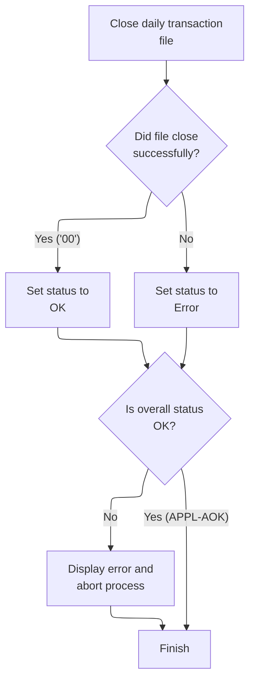

This section manages the closing of the daily transaction file and validates the outcome, setting appropriate status codes and handling errors if the close operation fails.

| Rule ID | Code Location       | Category       | Rule Name                            | Description                                                                                                                                            | Conditions                                                                  | Remarks                                                                                                                                          |
| ------- | ------------------- | -------------- | ------------------------------------ | ------------------------------------------------------------------------------------------------------------------------------------------------------ | --------------------------------------------------------------------------- | ------------------------------------------------------------------------------------------------------------------------------------------------ |
| BR-001  | 9000-DALYTRAN-CLOSE | Business logic | Successful file close status         | If the daily transaction file is closed and the IO status is '00', the overall status is set to OK (APPL-RESULT = 0).                                  | The daily transaction file is closed and the IO status equals '00'.         | The IO status '00' indicates a successful close. The status code for OK is 0.                                                                    |
| BR-002  | 9000-DALYTRAN-CLOSE | Business logic | File close error status              | If the daily transaction file is closed and the IO status is not '00', the overall status is set to Error (APPL-RESULT = 12).                          | The daily transaction file is closed and the IO status does not equal '00'. | Any IO status other than '00' indicates an error. The status code for error is 12.                                                               |
| BR-003  | 9000-DALYTRAN-CLOSE | Error handling | Error handling on file close failure | If the overall status is not OK (APPL-RESULT != 0), an error message is displayed, the IO status is updated for debugging, and the process is aborted. | The overall status after closing the file is not OK (APPL-RESULT != 0).     | The error message displayed is 'ERROR CLOSING CUSTOMER FILE'. The IO status is updated and displayed for debugging. The process is then aborted. |

<SwmSnippet path="/app/cbl/CBTRN01C.cbl" line="361" repo-id="Z2l0aHViJTNBJTNBa3luZHJ5bC1hd3MtbWFpbmZyYW1lLW1vZGVybml6YXRpb24tY2FyZGRlbW8lM0ElM0FTd2ltbS1EZW1v">

---

In `9000-DALYTRAN-CLOSE` we close the daily transaction file and set APPL-RESULT based on the outcome. If the close fails, we handle the error just like with opens and reads.

```cobol
       9000-DALYTRAN-CLOSE.
           ADD 8 TO ZERO GIVING APPL-RESULT.
           CLOSE DALYTRAN-FILE
           IF  DALYTRAN-STATUS = '00'
               MOVE 0 TO APPL-RESULT
           ELSE
               MOVE 12 TO APPL-RESULT
           END-IF
```

---

</SwmSnippet>

<SwmSnippet path="/app/cbl/CBTRN01C.cbl" line="369" repo-id="Z2l0aHViJTNBJTNBa3luZHJ5bC1hd3MtbWFpbmZyYW1lLW1vZGVybml6YXRpb24tY2FyZGRlbW8lM0ElM0FTd2ltbS1EZW1v">

---

After closing the daily transaction file, if the close fails, we display the IO status for debugging and then terminate.

```cobol
           IF  APPL-AOK
               CONTINUE
           ELSE
               DISPLAY 'ERROR CLOSING CUSTOMER FILE'
               MOVE CUSTFILE-STATUS TO IO-STATUS
               PERFORM Z-DISPLAY-IO-STATUS
               PERFORM Z-ABEND-PROGRAM
           END-IF
           EXIT.
```

---

</SwmSnippet>

# Closing Customer File and Handling Errors

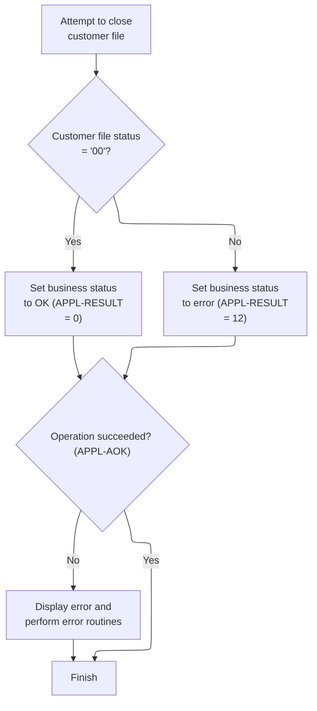

This section manages the closing of the customer file and ensures that any errors encountered during the close operation are properly handled and reported.

| Rule ID | Code Location       | Category       | Rule Name                      | Description                                                                                                                             | Conditions                                                                   | Remarks                                                                                                                                                                  |
| ------- | ------------------- | -------------- | ------------------------------ | --------------------------------------------------------------------------------------------------------------------------------------- | ---------------------------------------------------------------------------- | ------------------------------------------------------------------------------------------------------------------------------------------------------------------------ |
| BR-001  | 9100-CUSTFILE-CLOSE | Business logic | Default error status on close  | When closing the customer file, the business status is initially set to a default error code (8) before attempting the close operation. | Whenever the customer file close operation is initiated.                     | The default error code is 8. This is set before attempting to close the file, ensuring that any unexpected outcome defaults to an error unless explicitly set otherwise. |
| BR-002  | 9100-CUSTFILE-CLOSE | Business logic | Successful close status        | If the customer file closes successfully (status code '00'), the business status is set to 0, indicating success.                       | After attempting to close the customer file, if the file status is '00'.     | Success is indicated by status code 0. The file status '00' is the indicator for a successful close operation.                                                           |
| BR-003  | 9100-CUSTFILE-CLOSE | Business logic | Error status on failed close   | If the customer file does not close successfully (status code not '00'), the business status is set to 12, indicating an error.         | After attempting to close the customer file, if the file status is not '00'. | Error is indicated by status code 12. Any file status other than '00' triggers this error code.                                                                          |
| BR-004  | 9100-CUSTFILE-CLOSE | Error handling | Error handling on failed close | If the business status is not success (not 0), an error message is displayed, the file status is logged, and the program is terminated. | After closing the customer file, if the business status is not 0.            | The error message 'ERROR CLOSING CUSTOMER FILE' is displayed. The file status is logged for diagnostic purposes before program termination.                              |

<SwmSnippet path="/app/cbl/CBTRN01C.cbl" line="379" repo-id="Z2l0aHViJTNBJTNBa3luZHJ5bC1hd3MtbWFpbmZyYW1lLW1vZGVybml6YXRpb24tY2FyZGRlbW8lM0ElM0FTd2ltbS1EZW1v">

---

In `9100-CUSTFILE-CLOSE` we set APPL-RESULT to 8 as a default error code, then close the customer file. If the close status is '00', we set APPL-RESULT to 0 (success); otherwise, we set it to 12 (error). This sets up the result code for the error handling logic that follows.

```cobol
       9100-CUSTFILE-CLOSE.
           ADD 8 TO ZERO GIVING APPL-RESULT.
           CLOSE CUSTOMER-FILE
           IF  CUSTFILE-STATUS = '00'
               MOVE 0 TO APPL-RESULT
           ELSE
               MOVE 12 TO APPL-RESULT
           END-IF
```

---

</SwmSnippet>

<SwmSnippet path="/app/cbl/CBTRN01C.cbl" line="387" repo-id="Z2l0aHViJTNBJTNBa3luZHJ5bC1hd3MtbWFpbmZyYW1lLW1vZGVybml6YXRpb24tY2FyZGRlbW8lM0ElM0FTd2ltbS1EZW1v">

---

After closing the customer file, if APPL-RESULT isn't 0, we display an error, move the file status to IO-STATUS, call Z-DISPLAY-IO-STATUS to show the actual error code, and then abend. This makes sure we log the failure reason before stopping.

```cobol
           IF  APPL-AOK
               CONTINUE
           ELSE
               DISPLAY 'ERROR CLOSING CUSTOMER FILE'
               MOVE CUSTFILE-STATUS TO IO-STATUS
               PERFORM Z-DISPLAY-IO-STATUS
               PERFORM Z-ABEND-PROGRAM
           END-IF
           EXIT.
```

---

</SwmSnippet>

# Closing Cross Reference File and Handling Errors

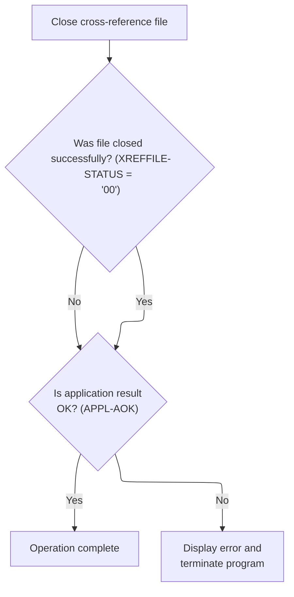

This section manages the closing of the cross-reference file and handles any errors that may occur during the close operation. It ensures that the outcome of the close is clearly determined and that any failures are communicated to the user and result in program termination.

| Rule ID | Code Location       | Category       | Rule Name                          | Description                                                                                                                               | Conditions                                                                                        | Remarks                                                                                                                                                                                                             |
| ------- | ------------------- | -------------- | ---------------------------------- | ----------------------------------------------------------------------------------------------------------------------------------------- | ------------------------------------------------------------------------------------------------- | ------------------------------------------------------------------------------------------------------------------------------------------------------------------------------------------------------------------- |
| BR-001  | 9200-XREFFILE-CLOSE | Business logic | Successful Close Completion        | If the cross-reference file is closed successfully, the operation is considered complete and no error is displayed.                       | The cross-reference file close status is '00'.                                                    | The status code '00' indicates a successful close. The application result code is set to 0 to indicate success.                                                                                                     |
| BR-002  | 9200-XREFFILE-CLOSE | Business logic | Set Initial Close Operation Result | The application result code is set to 8 before attempting to close the cross-reference file, indicating the start of the close operation. | Before the close operation is attempted.                                                          | The application result code is set to 8 to indicate that the close operation is in progress.                                                                                                                        |
| BR-003  | 9200-XREFFILE-CLOSE | Error handling | Error Handling on Close Failure    | If the cross-reference file fails to close, an error message is displayed and the program is terminated.                                  | The cross-reference file close status is not '00', resulting in an application result code of 12. | The status code not equal to '00' indicates a failure. The application result code is set to 12 to indicate an error. The error message 'ERROR CLOSING CROSS REF FILE' is displayed, and the program is terminated. |

<SwmSnippet path="/app/cbl/CBTRN01C.cbl" line="397" repo-id="Z2l0aHViJTNBJTNBa3luZHJ5bC1hd3MtbWFpbmZyYW1lLW1vZGVybml6YXRpb24tY2FyZGRlbW8lM0ElM0FTd2ltbS1EZW1v">

---

In `9200-XREFFILE-CLOSE` we set APPL-RESULT to 8, close the cross reference file, and update APPL-RESULT based on the close status. If the close worked, APPL-RESULT is 0; if not, it's 12. This sets up the error handling that follows.

```cobol
       9200-XREFFILE-CLOSE.
           ADD 8 TO ZERO GIVING APPL-RESULT.
           CLOSE XREF-FILE
           IF  XREFFILE-STATUS = '00'
               MOVE 0 TO APPL-RESULT
           ELSE
               MOVE 12 TO APPL-RESULT
           END-IF
```

---

</SwmSnippet>

<SwmSnippet path="/app/cbl/CBTRN01C.cbl" line="405" repo-id="Z2l0aHViJTNBJTNBa3luZHJ5bC1hd3MtbWFpbmZyYW1lLW1vZGVybml6YXRpb24tY2FyZGRlbW8lM0ElM0FTd2ltbS1EZW1v">

---

After closing the cross reference file, if APPL-RESULT isn't 0, we log the error, move the file status to IO-STATUS, call Z-DISPLAY-IO-STATUS to show the error code, and then abend. This makes sure the failure reason is visible.

```cobol
           IF  APPL-AOK
               CONTINUE
           ELSE
               DISPLAY 'ERROR CLOSING CROSS REF FILE'
               MOVE XREFFILE-STATUS TO IO-STATUS
               PERFORM Z-DISPLAY-IO-STATUS
               PERFORM Z-ABEND-PROGRAM
           END-IF
           EXIT.
```

---

</SwmSnippet>

# Closing Card File and Handling Errors

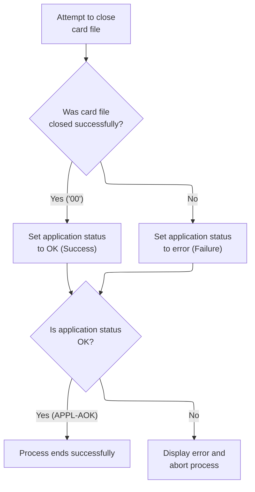

This section manages the closing of the card file and ensures that any errors encountered during the close operation are properly handled and communicated.

| Rule ID | Code Location       | Category       | Rule Name                                 | Description                                                                                                                                           | Conditions                                                                                       | Remarks                                                                                                                                                        |
| ------- | ------------------- | -------------- | ----------------------------------------- | ----------------------------------------------------------------------------------------------------------------------------------------------------- | ------------------------------------------------------------------------------------------------ | -------------------------------------------------------------------------------------------------------------------------------------------------------------- |
| BR-001  | 9300-CARDFILE-CLOSE | Business logic | Successful card file close                | When closing the card file, if the file status is '00', the application status is set to success.                                                     | The card file close operation returns a status of '00'.                                          | The constant '00' indicates a successful close. The application status is set to 0 (APPL-RESULT = 0), which is also represented by APPL-AOK.                   |
| BR-002  | 9300-CARDFILE-CLOSE | Business logic | Card file close failure                   | If the card file close operation does not return status '00', the application status is set to error.                                                 | The card file close operation returns a status other than '00'.                                  | Any status other than '00' indicates a failure. The application status is set to 12 (APPL-RESULT = 12).                                                        |
| BR-003  | 9300-CARDFILE-CLOSE | Error handling | Error handling on card file close failure | If the application status is not OK after closing the card file, an error message is displayed, the IO status is updated, and the process is aborted. | The application status is not OK (APPL-RESULT is not 0) after attempting to close the card file. | The error message 'ERROR CLOSING CARD FILE' is displayed. The card file status is moved to IO status, and the error code is shown before aborting the process. |

<SwmSnippet path="/app/cbl/CBTRN01C.cbl" line="415" repo-id="Z2l0aHViJTNBJTNBa3luZHJ5bC1hd3MtbWFpbmZyYW1lLW1vZGVybml6YXRpb24tY2FyZGRlbW8lM0ElM0FTd2ltbS1EZW1v">

---

In `9300-CARDFILE-CLOSE` we set APPL-RESULT to 8, close the card file, and update APPL-RESULT based on the close status. If the close worked, APPL-RESULT is 0; if not, it's 12. This sets up the error handling that follows.

```cobol
       9300-CARDFILE-CLOSE.
           ADD 8 TO ZERO GIVING APPL-RESULT.
           CLOSE CARD-FILE
           IF  CARDFILE-STATUS = '00'
               MOVE 0 TO APPL-RESULT
           ELSE
               MOVE 12 TO APPL-RESULT
           END-IF
```

---

</SwmSnippet>

<SwmSnippet path="/app/cbl/CBTRN01C.cbl" line="423" repo-id="Z2l0aHViJTNBJTNBa3luZHJ5bC1hd3MtbWFpbmZyYW1lLW1vZGVybml6YXRpb24tY2FyZGRlbW8lM0ElM0FTd2ltbS1EZW1v">

---

After closing the card file, if APPL-RESULT isn't 0, we log the error, move the file status to IO-STATUS, call Z-DISPLAY-IO-STATUS to show the error code, and then abend. This makes sure the failure reason is visible.

```cobol
           IF  APPL-AOK
               CONTINUE
           ELSE
               DISPLAY 'ERROR CLOSING CARD FILE'
               MOVE CARDFILE-STATUS TO IO-STATUS
               PERFORM Z-DISPLAY-IO-STATUS
               PERFORM Z-ABEND-PROGRAM
           END-IF
           EXIT.
```

---

</SwmSnippet>

# Closing Account File and Handling Errors

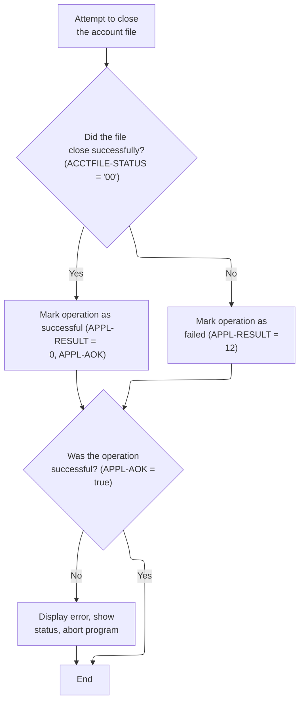

This section manages the closing of the account file and handles any errors that occur during the process, ensuring that the outcome is clearly marked and communicated.

| Rule ID | Code Location       | Category       | Rule Name                       | Description                                                                                                                                      | Conditions                                                                                          | Remarks                                                                                                                                                                                               |
| ------- | ------------------- | -------------- | ------------------------------- | ------------------------------------------------------------------------------------------------------------------------------------------------ | --------------------------------------------------------------------------------------------------- | ----------------------------------------------------------------------------------------------------------------------------------------------------------------------------------------------------- |
| BR-001  | 9400-ACCTFILE-CLOSE | Business logic | Initial close operation marking | When attempting to close the account file, the operation is initially marked with a result code of 8 to indicate the start of the close process. | Whenever the account file close operation is initiated.                                             | The result code is set to 8 at the start of the close process. This is a numeric value used to track the operation's state.                                                                           |
| BR-002  | 9400-ACCTFILE-CLOSE | Business logic | Successful file close           | If the account file closes successfully, the operation is marked as successful with a result code of 0.                                          | After attempting to close the account file, if the file status indicates success ('00').            | The result code for a successful close is 0. This is a numeric value indicating success.                                                                                                              |
| BR-003  | 9400-ACCTFILE-CLOSE | Business logic | Failed file close               | If the account file fails to close, the operation is marked as failed with a result code of 12.                                                  | After attempting to close the account file, if the file status does not indicate success ('00').    | The result code for a failed close is 12. This is a numeric value indicating failure.                                                                                                                 |
| BR-004  | 9400-ACCTFILE-CLOSE | Error handling | Error handling for failed close | If the file close operation is not successful, an error message is displayed, the file status is shown, and the program is aborted.              | After attempting to close the account file, if the result code is not 0 (operation not successful). | The error message 'ERROR CLOSING ACCOUNT FILE' is displayed. The file status is shown to the user, and the program is aborted. The output includes the file status as a string and the error message. |

<SwmSnippet path="/app/cbl/CBTRN01C.cbl" line="433" repo-id="Z2l0aHViJTNBJTNBa3luZHJ5bC1hd3MtbWFpbmZyYW1lLW1vZGVybml6YXRpb24tY2FyZGRlbW8lM0ElM0FTd2ltbS1EZW1v">

---

In `9400-ACCTFILE-CLOSE` we set APPL-RESULT to 8, close the account file, and update APPL-RESULT based on the close status. If the close worked, APPL-RESULT is 0; if not, it's 12. This sets up the error handling that follows.

```cobol
       9400-ACCTFILE-CLOSE.
           ADD 8 TO ZERO GIVING APPL-RESULT.
           CLOSE ACCOUNT-FILE
           IF  ACCTFILE-STATUS = '00'
               MOVE 0 TO APPL-RESULT
           ELSE
               MOVE 12 TO APPL-RESULT
           END-IF
```

---

</SwmSnippet>

<SwmSnippet path="/app/cbl/CBTRN01C.cbl" line="441" repo-id="Z2l0aHViJTNBJTNBa3luZHJ5bC1hd3MtbWFpbmZyYW1lLW1vZGVybml6YXRpb24tY2FyZGRlbW8lM0ElM0FTd2ltbS1EZW1v">

---

After closing the account file, if APPL-RESULT isn't 0, we log the error, move the file status to IO-STATUS, call Z-DISPLAY-IO-STATUS to show the error code, and then abend. This makes sure the failure reason is visible.

```cobol
           IF  APPL-AOK
               CONTINUE
           ELSE
               DISPLAY 'ERROR CLOSING ACCOUNT FILE'
               MOVE ACCTFILE-STATUS TO IO-STATUS
               PERFORM Z-DISPLAY-IO-STATUS
               PERFORM Z-ABEND-PROGRAM
           END-IF
           EXIT.
```

---

</SwmSnippet>

# Closing Transaction File and Handling Errors

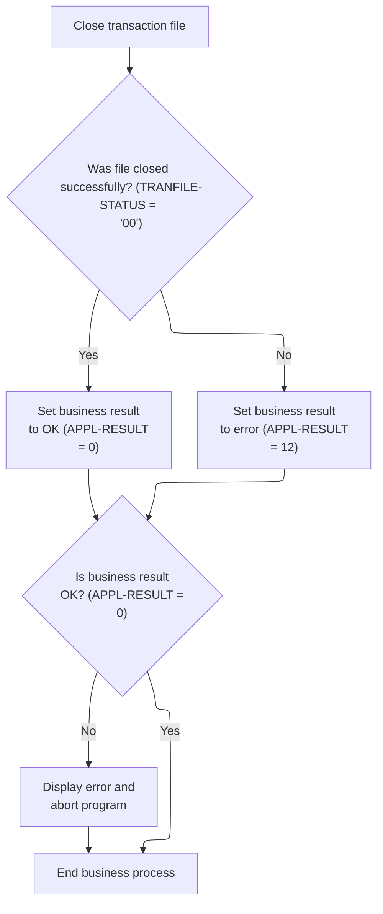

This section manages the closing of the transaction file and handles any errors that occur during the close operation, ensuring that the business process either completes successfully or terminates with clear error reporting.

| Rule ID | Code Location       | Category       | Rule Name                 | Description                                                                                                                                                                     | Conditions                                                                 | Remarks                                                                                                                                          |
| ------- | ------------------- | -------------- | ------------------------- | ------------------------------------------------------------------------------------------------------------------------------------------------------------------------------- | -------------------------------------------------------------------------- | ------------------------------------------------------------------------------------------------------------------------------------------------ |
| BR-001  | 9500-TRANFILE-CLOSE | Business logic | Successful file close     | If the transaction file is closed successfully, the business result is set to OK, indicating the process can continue normally.                                                 | The transaction file status equals '00' after the close operation.         | The business result code for success is 0. This is represented as a numeric value. No error message is displayed in this case.                   |
| BR-002  | 9500-TRANFILE-CLOSE | Error handling | File close error          | If the transaction file fails to close, the business result is set to error, and the process moves to error handling.                                                           | The transaction file status does not equal '00' after the close operation. | The business result code for error is 12. This is represented as a numeric value. This triggers error handling actions.                          |
| BR-003  | 9500-TRANFILE-CLOSE | Error handling | Error reporting and abort | If the business result indicates an error after attempting to close the transaction file, an error message is displayed, the file status is logged, and the program is aborted. | The business result code is not 0 after closing the transaction file.      | The error message 'ERROR CLOSING TRANSACTION FILE' is displayed. The file status is logged for diagnostic purposes. The program is then aborted. |

<SwmSnippet path="/app/cbl/CBTRN01C.cbl" line="451" repo-id="Z2l0aHViJTNBJTNBa3luZHJ5bC1hd3MtbWFpbmZyYW1lLW1vZGVybml6YXRpb24tY2FyZGRlbW8lM0ElM0FTd2ltbS1EZW1v">

---

In `9500-TRANFILE-CLOSE` we set APPL-RESULT to 8, close the transaction file, and update APPL-RESULT based on the close status. If the close worked, APPL-RESULT is 0; if not, it's 12. This sets up the error handling that follows.

```cobol
       9500-TRANFILE-CLOSE.
           ADD 8 TO ZERO GIVING APPL-RESULT.
           CLOSE TRANSACT-FILE
           IF  TRANFILE-STATUS = '00'
               MOVE 0 TO APPL-RESULT
           ELSE
               MOVE 12 TO APPL-RESULT
           END-IF
```

---

</SwmSnippet>

<SwmSnippet path="/app/cbl/CBTRN01C.cbl" line="459" repo-id="Z2l0aHViJTNBJTNBa3luZHJ5bC1hd3MtbWFpbmZyYW1lLW1vZGVybml6YXRpb24tY2FyZGRlbW8lM0ElM0FTd2ltbS1EZW1v">

---

After closing the transaction file, if APPL-RESULT isn't 0, we log the error, move the file status to IO-STATUS, call Z-DISPLAY-IO-STATUS to show the error code, and then abend. This makes sure the failure reason is visible.

```cobol
           IF  APPL-AOK
               CONTINUE
           ELSE
               DISPLAY 'ERROR CLOSING TRANSACTION FILE'
               MOVE TRANFILE-STATUS TO IO-STATUS
               PERFORM Z-DISPLAY-IO-STATUS
               PERFORM Z-ABEND-PROGRAM
           END-IF
           EXIT.
```

---

</SwmSnippet>

&nbsp;

*This is an auto-generated document by Swimm 🌊 and has not yet been verified by a human*

<SwmMeta version="3.0.0"><sup>Powered by [Swimm](https://staging.swimm.cloud/)</sup></SwmMeta>
