# Overview

This document explains the flow of generating the transaction detail report. The process reads credit card transactions, filters and groups them, and produces a formatted report with account, page, and grand totals for business analysis.

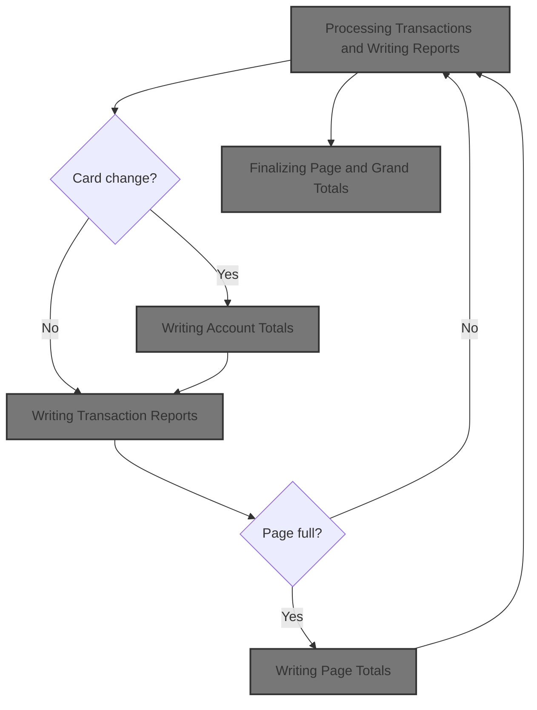

## Dependencies

### Programs

- CBTRN03C (app/cbl/CBTRN03C.cbl)
- CEE3ABD

### Copybooks

- CVTRA05Y (app/cpy/CVTRA05Y.cpy)
- CVACT03Y (app/cpy/CVACT03Y.cpy)
- CVTRA03Y (app/cpy/CVTRA03Y.cpy)
- CVTRA04Y (app/cpy/CVTRA04Y.cpy)
- CVTRA07Y (app/cpy/CVTRA07Y.cpy)

# Where is this program used?

This program is used multiple times in the codebase as represented in the following diagram:

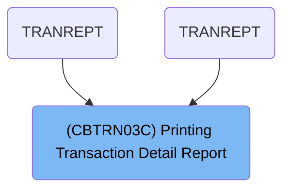

# Workflow

# Initializing and Opening Files

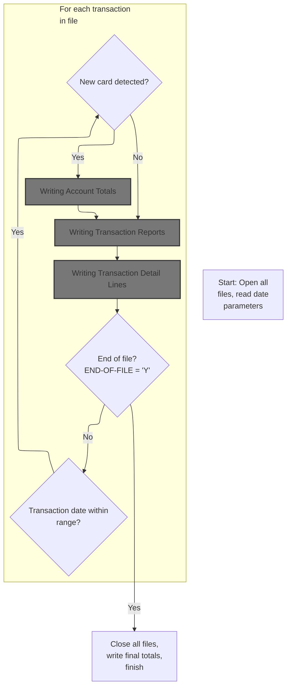

This section initializes the program by opening all necessary files and reading date parameters, then processes transaction records by filtering them according to date range, detecting card changes to finalize account totals, and writing transaction reports and details. It ensures proper setup and finalization for accurate reporting.

| Rule ID | Code Location                                                                                                          | Category        | Rule Name                                 | Description                                                                                                                                                   | Conditions                                                                                                                                                | Remarks                                                                                                                                                                                                           |
| ------- | ---------------------------------------------------------------------------------------------------------------------- | --------------- | ----------------------------------------- | ------------------------------------------------------------------------------------------------------------------------------------------------------------- | --------------------------------------------------------------------------------------------------------------------------------------------------------- | ----------------------------------------------------------------------------------------------------------------------------------------------------------------------------------------------------------------- |
| BR-001  | MAIN-LOGIC                                                                                                             | Data validation | Transaction Date Filtering                | Only transactions with a processing date within the specified start and end date range are processed and reported.                                            | For each transaction record, the transaction processing timestamp must be greater than or equal to the start date and less than or equal to the end date. | Date range is defined by two string fields: start date and end date, each 10 characters long. Only transactions with a processing timestamp (first 10 characters) within this range are considered for reporting. |
| BR-002  | MAIN-LOGIC                                                                                                             | Business logic  | Account Total Finalization on Card Change | When a new card number is detected in the transaction stream, account totals for the previous card are written before processing the new card's transactions. | If the current card number does not match the transaction card number and it is not the first record processed.                                           | Account totals are written for the previous card before updating to the new card number. The card number is a 16-character string.                                                                                |
| BR-003  | 0000-TRANFILE-OPEN, 0100-REPTFILE-OPEN, 0200-CARDXREF-OPEN, 0300-TRANTYPE-OPEN, 0400-TRANCATG-OPEN, 0500-DATEPARM-OPEN | Technical step  | File Initialization Requirement           | All required files for transaction processing and reporting must be opened before any transaction records are processed.                                      | At the start of program execution, before entering the main transaction loop.                                                                             | Files opened include transaction file, report file, card cross-reference file, transaction type file, transaction category file, and date parameter file. No specific output format is enforced at this stage.    |
| BR-004  | MAIN-LOGIC                                                                                                             | Technical step  | Finalization and File Closure             | At the end of transaction processing, all files are closed and final totals are written to the output.                                                        | When the end-of-file indicator is set to 'Y' after processing all transaction records.                                                                    | All open files are closed and final totals are written. No specific output format is enforced at this stage.                                                                                                      |

<SwmSnippet path="/app/cbl/CBTRN03C.cbl" line="159" repo-id="Z2l0aHViJTNBJTNBa3luZHJ5bC1hd3MtbWFpbmZyYW1lLW1vZGVybml6YXRpb24tY2FyZGRlbW8lM0ElM0FTd2ltbS1EZW1v">

---

We open all the files needed for transaction and reporting, and grab the date range parameters before starting the main processing loop.

```cobol
       PROCEDURE DIVISION.                                                      
           DISPLAY 'START OF EXECUTION OF PROGRAM CBTRN03C'.                    
           PERFORM 0000-TRANFILE-OPEN.                                          
           PERFORM 0100-REPTFILE-OPEN.                                          
           PERFORM 0200-CARDXREF-OPEN.                                          
           PERFORM 0300-TRANTYPE-OPEN.                                          
           PERFORM 0400-TRANCATG-OPEN.                                          
           PERFORM 0500-DATEPARM-OPEN.                                          
                                                                                
           PERFORM 0550-DATEPARM-READ.                                          
```

---

</SwmSnippet>

<SwmSnippet path="/app/cbl/CBTRN03C.cbl" line="170" repo-id="Z2l0aHViJTNBJTNBa3luZHJ5bC1hd3MtbWFpbmZyYW1lLW1vZGVybml6YXRpb24tY2FyZGRlbW8lM0ElM0FTd2ltbS1EZW1v">

---

After opening files and reading parameters, we enter the main loop in PROCEDURE-DIVISION. Here, we keep reading transaction records until END-OF-FILE is 'Y'. Each iteration checks if there are more records to process.

```cobol
           PERFORM UNTIL END-OF-FILE = 'Y'                                      
             IF END-OF-FILE = 'N'                                               
                PERFORM 1000-TRANFILE-GET-NEXT                                  
```

---

</SwmSnippet>

<SwmSnippet path="/app/cbl/CBTRN03C.cbl" line="173" repo-id="Z2l0aHViJTNBJTNBa3luZHJ5bC1hd3MtbWFpbmZyYW1lLW1vZGVybml6YXRpb24tY2FyZGRlbW8lM0ElM0FTd2ltbS1EZW1v">

---

We filter each transaction by date, so only records within the range move forward in the flow.

```cobol
                IF TRAN-PROC-TS (1:10) >= WS-START-DATE                         
                   AND TRAN-PROC-TS (1:10) <= WS-END-DATE                       
                   CONTINUE                                                     
                ELSE                                                            
                   NEXT SENTENCE                                                
                END-IF                                                          
```

---

</SwmSnippet>

<SwmSnippet path="/app/cbl/CBTRN03C.cbl" line="179" repo-id="Z2l0aHViJTNBJTNBa3luZHJ5bC1hd3MtbWFpbmZyYW1lLW1vZGVybml6YXRpb24tY2FyZGRlbW8lM0ElM0FTd2ltbS1EZW1v">

---

When we hit a new card number, we write out the totals for the previous card (unless it's the first record), update the current card number, and run lookups to pull extra info before writing the transaction report. Calling 1120-WRITE-ACCOUNT-TOTALS here finalizes the totals for the previous card.

```cobol
                IF END-OF-FILE = 'N'                                            
                   DISPLAY TRAN-RECORD                                          
                   IF WS-CURR-CARD-NUM NOT= TRAN-CARD-NUM                       
                     IF WS-FIRST-TIME = 'N'                                     
                       PERFORM 1120-WRITE-ACCOUNT-TOTALS                        
                     END-IF                                                     
                     MOVE TRAN-CARD-NUM TO WS-CURR-CARD-NUM                     
                     MOVE TRAN-CARD-NUM TO FD-XREF-CARD-NUM                     
                     PERFORM 1500-A-LOOKUP-XREF                                 
                   END-IF                                                       
                   MOVE TRAN-TYPE-CD OF TRAN-RECORD TO FD-TRAN-TYPE             
                   PERFORM 1500-B-LOOKUP-TRANTYPE                               
                   MOVE TRAN-TYPE-CD OF TRAN-RECORD                             
                     TO FD-TRAN-TYPE-CD OF FD-TRAN-CAT-KEY                      
                   MOVE TRAN-CAT-CD OF TRAN-RECORD                              
                     TO FD-TRAN-CAT-CD OF FD-TRAN-CAT-KEY                       
                   PERFORM 1500-C-LOOKUP-TRANCATG                               
                   PERFORM 1100-WRITE-TRANSACTION-REPORT                        
```

---

</SwmSnippet>

## Writing Account Totals

This section ensures that the account total is formatted and included in the report output according to business reporting requirements.

| Rule ID | Code Location             | Category       | Rule Name                     | Description                                                                                                                                                                                                                                                    | Conditions                                                                   | Remarks                                                                                                                                                                                  |
| ------- | ------------------------- | -------------- | ----------------------------- | -------------------------------------------------------------------------------------------------------------------------------------------------------------------------------------------------------------------------------------------------------------- | ---------------------------------------------------------------------------- | ---------------------------------------------------------------------------------------------------------------------------------------------------------------------------------------- |
| BR-001  | 1120-WRITE-ACCOUNT-TOTALS | Business logic | Account Total Line Formatting | The account total line in the report must include the label 'Account Total' (13 characters), followed by 84 periods as padding, and then the formatted account total value, right-aligned and formatted as a signed number with commas and two decimal places. | When writing the account total line to the report file.                      | The label is 'Account Total' (13 characters). Padding is 84 periods ('.'). The account total is formatted as a signed number with commas and two decimal places (e.g., '+1,234,567.89'). |
| BR-002  | 1120-WRITE-ACCOUNT-TOTALS | Business logic | Current Account Total Value   | The value of the account total included in the report must be the current accumulated account total at the time the line is written.                                                                                                                           | When preparing the account total line for the report.                        | The account total value is taken from the accumulated result at the time of writing.                                                                                                     |
| BR-003  | 1120-WRITE-ACCOUNT-TOTALS | Business logic | Write Account Total Record    | The account total line must be written to the report file as a single, complete record after it is prepared.                                                                                                                                                   | After the account total line is prepared and formatted in the report record. | The entire report record, including label, padding, and formatted total, is written as a single output operation.                                                                        |

<SwmSnippet path="/app/cbl/CBTRN03C.cbl" line="306" repo-id="Z2l0aHViJTNBJTNBa3luZHJ5bC1hd3MtbWFpbmZyYW1lLW1vZGVybml6YXRpb24tY2FyZGRlbW8lM0ElM0FTd2ltbS1EZW1v">

---

In 1120-WRITE-ACCOUNT-TOTALS, we prep the account totals and move them into the report record, then call 1111-WRITE-REPORT-REC to actually write them out to the report file.

```cobol
       1120-WRITE-ACCOUNT-TOTALS.                                               
           MOVE WS-ACCOUNT-TOTAL   TO REPT-ACCOUNT-TOTAL                        
           MOVE REPORT-ACCOUNT-TOTALS TO FD-REPTFILE-REC                        
           PERFORM 1111-WRITE-REPORT-REC                                        
```

---

</SwmSnippet>

### Writing a Report Record

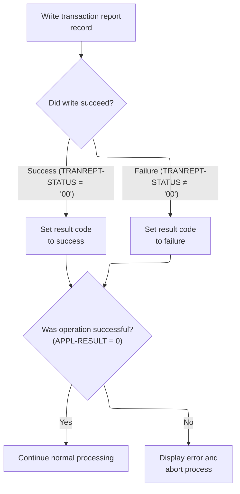

This section governs how the application writes a transaction report record, determines the outcome of the write operation, and handles errors if the write fails.

| Rule ID | Code Location         | Category       | Rule Name                    | Description                                                                                                                       | Conditions                                                 | Remarks                                                                                                                                                                 |
| ------- | --------------------- | -------------- | ---------------------------- | --------------------------------------------------------------------------------------------------------------------------------- | ---------------------------------------------------------- | ----------------------------------------------------------------------------------------------------------------------------------------------------------------------- |
| BR-001  | 1111-WRITE-REPORT-REC | Business logic | Report Write Success Mapping | If the transaction report record is written successfully (status code '00'), the result code is set to indicate success.          | The write operation returns a status code of '00'.         | The status code '00' indicates a successful write. The result code for success is 0.                                                                                    |
| BR-002  | 1111-WRITE-REPORT-REC | Business logic | Report Write Failure Mapping | If the transaction report record write fails (status code not '00'), the result code is set to indicate failure.                  | The write operation returns a status code other than '00'. | Any status code other than '00' indicates a failure. The result code for failure is 12.                                                                                 |
| BR-003  | 1111-WRITE-REPORT-REC | Error handling | Report Write Error Handling  | If the result code does not indicate success, an error message is displayed, the IO status is logged, and the process is aborted. | The result code is not 0 (APPL-AOK is false).              | The result code for success is 0. Any other value triggers error handling, which includes displaying an error message, logging the IO status, and aborting the process. |

<SwmSnippet path="/app/cbl/CBTRN03C.cbl" line="343" repo-id="Z2l0aHViJTNBJTNBa3luZHJ5bC1hd3MtbWFpbmZyYW1lLW1vZGVybml6YXRpb24tY2FyZGRlbW8lM0ElM0FTd2ltbS1EZW1v">

---

In 1111-WRITE-REPORT-REC, we write the report record to the output file and check the status. If it's '00', we mark success; if not, we set an error code. Error handling kicks in if the write fails.

```cobol
       1111-WRITE-REPORT-REC.                                                   
                                                                                
           WRITE FD-REPTFILE-REC                                                
           IF TRANREPT-STATUS = '00'                                            
              MOVE 0 TO APPL-RESULT                                             
           ELSE                                                                 
              MOVE 12 TO APPL-RESULT                                            
           END-IF                                                               
```

---

</SwmSnippet>

<SwmSnippet path="/app/cbl/CBTRN03C.cbl" line="351" repo-id="Z2l0aHViJTNBJTNBa3luZHJ5bC1hd3MtbWFpbmZyYW1lLW1vZGVybml6YXRpb24tY2FyZGRlbW8lM0ElM0FTd2ltbS1EZW1v">

---

After writing the report record, if APPL-AOK isn't true, we display an error, log the IO status, and abend the program. Otherwise, we just continue.

```cobol
           IF APPL-AOK                                                          
              CONTINUE                                                          
           ELSE                                                                 
              DISPLAY 'ERROR WRITING REPTFILE'                                  
              MOVE TRANREPT-STATUS TO IO-STATUS                                 
              PERFORM 9910-DISPLAY-IO-STATUS                                    
              PERFORM 9999-ABEND-PROGRAM                                        
           END-IF                                                               
           EXIT.                                                                
```

---

</SwmSnippet>

### Finalizing Account Totals

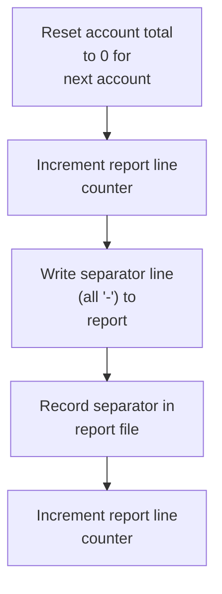

This section finalizes the reporting for an account by resetting the account total, writing a separator line, and updating the report line counter to ensure the report is correctly formatted for the next account.

| Rule ID | Code Location             | Category       | Rule Name                                          | Description                                                                                                                                                                                         | Conditions                                                                                                                                      | Remarks                                                                                                                                              |
| ------- | ------------------------- | -------------- | -------------------------------------------------- | --------------------------------------------------------------------------------------------------------------------------------------------------------------------------------------------------- | ----------------------------------------------------------------------------------------------------------------------------------------------- | ---------------------------------------------------------------------------------------------------------------------------------------------------- |
| BR-001  | 1120-WRITE-ACCOUNT-TOTALS | Business logic | Write Separator Line After Account Totals          | A separator line consisting entirely of dashes must be written to the report after each account's totals to visually separate account sections in the report output.                                | This rule applies after the account total has been finalized and before the next account's transactions are processed.                          | The separator line is a string of dashes ('-') matching the width of the report line. The format is a single line of 133 characters, all set to '-'. |
| BR-002  | 1120-WRITE-ACCOUNT-TOTALS | Technical step | Reset Account Total After Reporting                | After an account's totals are written to the report, the accumulated total for the account must be reset to zero to prepare for the next account's transactions.                                    | This rule applies after the account total has been written to the report and before processing the next account.                                | The accumulated result is set to 0. The format is a numeric value with two decimal places, matching the report's total field.                        |
| BR-003  | 1120-WRITE-ACCOUNT-TOTALS | Technical step | Increment Report Line Counter for Each Output Line | The report line counter must be incremented each time a new line (such as a separator or total line) is added to the report, to maintain accurate line tracking for pagination or summary purposes. | This rule applies whenever a new line is written to the report, including after writing the separator line and after writing the account total. | The line counter is a numeric value incremented by 1 for each new line added to the report.                                                          |

<SwmSnippet path="/app/cbl/CBTRN03C.cbl" line="310" repo-id="Z2l0aHViJTNBJTNBa3luZHJ5bC1hd3MtbWFpbmZyYW1lLW1vZGVybml6YXRpb24tY2FyZGRlbW8lM0ElM0FTd2ltbS1EZW1v">

---

After coming back from 1111-WRITE-REPORT-REC in 1120-WRITE-ACCOUNT-TOTALS, we reset the account total, bump the line counter, write a header line, and call 1111-WRITE-REPORT-REC again to output it.

```cobol
           MOVE 0 TO WS-ACCOUNT-TOTAL                                           
           ADD 1 TO WS-LINE-COUNTER                                             
           MOVE TRANSACTION-HEADER-2 TO FD-REPTFILE-REC                         
           PERFORM 1111-WRITE-REPORT-REC                                        
           ADD 1 TO WS-LINE-COUNTER                                             
                                                                                
           EXIT.                                                                
```

---

</SwmSnippet>

## Processing Transactions and Writing Reports

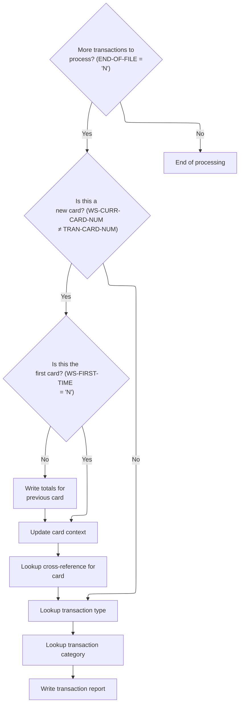

This section processes credit card transactions, writing totals for each card, performing reference lookups, and generating detailed transaction reports for each record in the input stream.

| Rule ID | Code Location | Category       | Rule Name                                     | Description                                                                                                                                                                                                                        | Conditions                                                                                                                                                              | Remarks                                                                                                                                                                                                  |
| ------- | ------------- | -------------- | --------------------------------------------- | ---------------------------------------------------------------------------------------------------------------------------------------------------------------------------------------------------------------------------------- | ----------------------------------------------------------------------------------------------------------------------------------------------------------------------- | -------------------------------------------------------------------------------------------------------------------------------------------------------------------------------------------------------- |
| BR-001  | MAIN-LOGIC    | Business logic | Write previous card totals on card change     | When a new card number is detected in the transaction stream, the system writes the accumulated totals for the previous card before updating the context to the new card.                                                          | A new card number is detected (the current card number does not match the transaction's card number) and this is not the first card processed (first-time flag is 'N'). | The accumulated totals are written before the context is updated. The card number field is 16 characters. The first-time flag is a single character with initial value 'Y'.                              |
| BR-002  | MAIN-LOGIC    | Business logic | Perform lookups for card, type, and category  | For each transaction processed, the system performs a lookup to determine the cross-reference information for the card, the transaction type, and the transaction category, using the relevant fields from the transaction record. | A transaction is being processed (end-of-file is 'N').                                                                                                                  | The card number is 16 characters, transaction type is 2 characters, and transaction category is 4 digits. Lookups are performed for each transaction, regardless of whether the card number has changed. |
| BR-003  | MAIN-LOGIC    | Business logic | Write transaction report for each transaction | A detailed transaction report is written for each transaction processed, after all lookups and context updates are complete.                                                                                                       | A transaction is being processed (end-of-file is 'N').                                                                                                                  | The transaction report includes all relevant transaction details and lookup results. The format is determined by the report-writing routine, which is called for each transaction.                       |
| BR-004  | MAIN-LOGIC    | Technical step | Continue processing until end of file         | Transaction processing continues as long as there are more transactions to process, as indicated by the end-of-file flag.                                                                                                          | The end-of-file flag is 'N'.                                                                                                                                            | The end-of-file flag is a single character with initial value 'N'. Processing stops when this flag is not 'N'.                                                                                           |

<SwmSnippet path="/app/cbl/CBTRN03C.cbl" line="179" repo-id="Z2l0aHViJTNBJTNBa3luZHJ5bC1hd3MtbWFpbmZyYW1lLW1vZGVybml6YXRpb24tY2FyZGRlbW8lM0ElM0FTd2ltbS1EZW1v">

---

After returning from 1120-WRITE-ACCOUNT-TOTALS in PROCEDURE-DIVISION, we update the card context, run lookups for cross-reference, type, and category, then call 1100-WRITE-TRANSACTION-REPORT to write the detailed transaction info.

```cobol
                IF END-OF-FILE = 'N'                                            
                   DISPLAY TRAN-RECORD                                          
                   IF WS-CURR-CARD-NUM NOT= TRAN-CARD-NUM                       
                     IF WS-FIRST-TIME = 'N'                                     
                       PERFORM 1120-WRITE-ACCOUNT-TOTALS                        
                     END-IF                                                     
                     MOVE TRAN-CARD-NUM TO WS-CURR-CARD-NUM                     
                     MOVE TRAN-CARD-NUM TO FD-XREF-CARD-NUM                     
                     PERFORM 1500-A-LOOKUP-XREF                                 
                   END-IF                                                       
                   MOVE TRAN-TYPE-CD OF TRAN-RECORD TO FD-TRAN-TYPE             
                   PERFORM 1500-B-LOOKUP-TRANTYPE                               
                   MOVE TRAN-TYPE-CD OF TRAN-RECORD                             
                     TO FD-TRAN-TYPE-CD OF FD-TRAN-CAT-KEY                      
                   MOVE TRAN-CAT-CD OF TRAN-RECORD                              
                     TO FD-TRAN-CAT-CD OF FD-TRAN-CAT-KEY                       
                   PERFORM 1500-C-LOOKUP-TRANCATG                               
                   PERFORM 1100-WRITE-TRANSACTION-REPORT                        
```

---

</SwmSnippet>

## Writing Transaction Reports

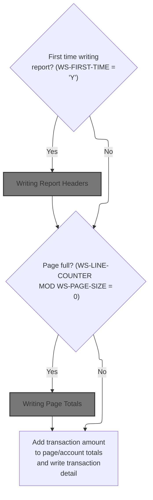

This section manages the generation of transaction reports, ensuring that headers, page totals, and transaction details are written in the correct order and format for business reporting.

| Rule ID | Code Location                 | Category       | Rule Name                               | Description                                                                                                                                               | Conditions                                                                                | Remarks                                                                                                                                                                                                                   |
| ------- | ----------------------------- | -------------- | --------------------------------------- | --------------------------------------------------------------------------------------------------------------------------------------------------------- | ----------------------------------------------------------------------------------------- | ------------------------------------------------------------------------------------------------------------------------------------------------------------------------------------------------------------------------- |
| BR-001  | 1100-WRITE-TRANSACTION-REPORT | Business logic | Initial Report Header                   | The report header, including the report name and date range, must be written at the start of the report, before any transaction details are written.      | This rule applies when the report is being written for the first time in the current run. | The report header includes the short name (38 characters), long name (41 characters), and a date range in the format 'Date Range: YYYY-MM-DD to YYYY-MM-DD'. The date range is set from the provided start and end dates. |
| BR-002  | 1100-WRITE-TRANSACTION-REPORT | Business logic | Page Totals After 20 Transactions       | Page totals must be written to the report after every 20 transactions, before starting a new page of transaction details.                                 | This rule applies whenever the number of transaction lines written is a multiple of 20.   | A page consists of 20 transaction lines. After every 20 transactions, a page total is written before continuing with the next set of transactions.                                                                        |
| BR-003  | 1100-WRITE-TRANSACTION-REPORT | Business logic | Accumulate and Write Transaction Detail | Each transaction's amount must be added to the running totals for the current page and account, and the transaction detail must be written to the report. | This rule applies for every transaction processed, regardless of position in the report.  | Transaction details include all fields from the transaction record (e.g., ID, type, amount, merchant info, card number, timestamps). Totals are accumulated as numbers with two decimal places.                           |

<SwmSnippet path="/app/cbl/CBTRN03C.cbl" line="274" repo-id="Z2l0aHViJTNBJTNBa3luZHJ5bC1hd3MtbWFpbmZyYW1lLW1vZGVybml6YXRpb24tY2FyZGRlbW8lM0ElM0FTd2ltbS1EZW1v">

---

In 1100-WRITE-TRANSACTION-REPORT, if it's the first transaction, we flip the WS-FIRST-TIME flag, set up the date range, and call 1120-WRITE-HEADERS to write the report headers.

```cobol
       1100-WRITE-TRANSACTION-REPORT.                                           
           IF WS-FIRST-TIME = 'Y'                                               
              MOVE 'N' TO WS-FIRST-TIME                                         
              MOVE WS-START-DATE TO REPT-START-DATE                             
              MOVE WS-END-DATE TO REPT-END-DATE                                 
              PERFORM 1120-WRITE-HEADERS                                        
           END-IF                                                               
```

---

</SwmSnippet>

### Writing Report Headers

This section defines the structure and content of the report header, ensuring that the report output begins with the correct sequence of header, blank, transaction, and separator lines, and that the line count is accurately tracked.

| Rule ID | Code Location      | Category       | Rule Name                               | Description                                                                                                                                        | Conditions                                                       | Remarks                                                                                                                                                     |
| ------- | ------------------ | -------------- | --------------------------------------- | -------------------------------------------------------------------------------------------------------------------------------------------------- | ---------------------------------------------------------------- | ----------------------------------------------------------------------------------------------------------------------------------------------------------- |
| BR-001  | 1120-WRITE-HEADERS | Business logic | Report Name Header                      | The report must begin with a header line containing the report name, which is written as the first line of the report output.                      | When generating the report header section.                       | The report name header is a string value that is written as the first line of the report. The format and length are determined by the report specification. |
| BR-002  | 1120-WRITE-HEADERS | Business logic | Blank Line After Header                 | A blank line must be inserted immediately after the report name header to visually separate the header from the transaction details.               | After writing the report name header line.                       | The blank line consists of 133 spaces, matching the report line width.                                                                                      |
| BR-003  | 1120-WRITE-HEADERS | Business logic | Transaction Header Line                 | A transaction header line must be written after the blank line to introduce the transaction section of the report.                                 | After writing the blank line in the header section.              | The transaction header line is a string value defined by the report specification.                                                                          |
| BR-004  | 1120-WRITE-HEADERS | Business logic | Separator Line After Transaction Header | A separator line consisting of dashes must be written after the transaction header line to visually separate the header from the transaction data. | After writing the transaction header line in the header section. | The separator line consists of all '-' characters, matching the report line width.                                                                          |
| BR-005  | 1120-WRITE-HEADERS | Business logic | Line Counter Increment                  | The line counter must be incremented after each line is written to the report to accurately track the number of lines output.                      | Each time a line is written to the report in the header section. | The line counter is incremented by 1 after each write operation.                                                                                            |

<SwmSnippet path="/app/cbl/CBTRN03C.cbl" line="324" repo-id="Z2l0aHViJTNBJTNBa3luZHJ5bC1hd3MtbWFpbmZyYW1lLW1vZGVybml6YXRpb24tY2FyZGRlbW8lM0ElM0FTd2ltbS1EZW1v">

---

In 1120-WRITE-HEADERS, we move the header data into the report record and call 1111-WRITE-REPORT-REC to write it out to the report file.

```cobol
       1120-WRITE-HEADERS.                                                      
           MOVE REPORT-NAME-HEADER TO FD-REPTFILE-REC                           
           PERFORM 1111-WRITE-REPORT-REC                                        
```

---

</SwmSnippet>

<SwmSnippet path="/app/cbl/CBTRN03C.cbl" line="327" repo-id="Z2l0aHViJTNBJTNBa3luZHJ5bC1hd3MtbWFpbmZyYW1lLW1vZGVybml6YXRpb24tY2FyZGRlbW8lM0ElM0FTd2ltbS1EZW1v">

---

After returning from 1111-WRITE-REPORT-REC in 1120-WRITE-HEADERS, we bump the line counter, add a blank line to the report, and write it out to keep the report readable.

```cobol
           ADD 1 TO WS-LINE-COUNTER                                             
                                                                                
           MOVE WS-BLANK-LINE TO FD-REPTFILE-REC                                
           PERFORM 1111-WRITE-REPORT-REC                                        
```

---

</SwmSnippet>

<SwmSnippet path="/app/cbl/CBTRN03C.cbl" line="331" repo-id="Z2l0aHViJTNBJTNBa3luZHJ5bC1hd3MtbWFpbmZyYW1lLW1vZGVybml6YXRpb24tY2FyZGRlbW8lM0ElM0FTd2ltbS1EZW1v">

---

After the blank line, we write another header line (TRANSACTION-HEADER-1) to the report, again using 1111-WRITE-REPORT-REC.

```cobol
           ADD 1 TO WS-LINE-COUNTER                                             
                                                                                
           MOVE TRANSACTION-HEADER-1 TO FD-REPTFILE-REC                         
           PERFORM 1111-WRITE-REPORT-REC                                        
```

---

</SwmSnippet>

<SwmSnippet path="/app/cbl/CBTRN03C.cbl" line="335" repo-id="Z2l0aHViJTNBJTNBa3luZHJ5bC1hd3MtbWFpbmZyYW1lLW1vZGVybml6YXRpb24tY2FyZGRlbW8lM0ElM0FTd2ltbS1EZW1v">

---

After writing the last header line, we add a separator line (TRANSACTION-HEADER-2) and write it out, then bump the line counter again before exiting the header routine.

```cobol
           ADD 1 TO WS-LINE-COUNTER                                             
                                                                                
           MOVE TRANSACTION-HEADER-2 TO FD-REPTFILE-REC                         
           PERFORM 1111-WRITE-REPORT-REC                                        
           ADD 1 TO WS-LINE-COUNTER                                             
                                                                                
           EXIT.                                                                
```

---

</SwmSnippet>

### Handling Pagination and Page Totals

This section manages pagination for the transaction report, ensuring that page totals and headers are output every time the page size limit is reached.

| Rule ID | Code Location                 | Category       | Rule Name             | Description                                                                                                                            | Conditions                                                 | Remarks                                                                                                                                                    |
| ------- | ----------------------------- | -------------- | --------------------- | -------------------------------------------------------------------------------------------------------------------------------------- | ---------------------------------------------------------- | ---------------------------------------------------------------------------------------------------------------------------------------------------------- |
| BR-001  | 1100-WRITE-TRANSACTION-REPORT | Business logic | Page Break and Totals | When the number of lines written reaches the defined page size, the report must include page totals and start a new page with headers. | The current line counter modulo the page size equals zero. | The page size is set to 20 lines. Page totals and headers are output at each page break. The output format for headers and totals is determined elsewhere. |

<SwmSnippet path="/app/cbl/CBTRN03C.cbl" line="282" repo-id="Z2l0aHViJTNBJTNBa3luZHJ5bC1hd3MtbWFpbmZyYW1lLW1vZGVybml6YXRpb24tY2FyZGRlbW8lM0ElM0FTd2ltbS1EZW1v">

---

After returning from 1120-WRITE-HEADERS in 1100-WRITE-TRANSACTION-REPORT, we check if we've hit the page size limit. If so, we write page totals and headers for the next page.

```cobol
           IF FUNCTION MOD(WS-LINE-COUNTER, WS-PAGE-SIZE) = 0                   
              PERFORM 1110-WRITE-PAGE-TOTALS                                    
              PERFORM 1120-WRITE-HEADERS                                        
           END-IF                                                               
```

---

</SwmSnippet>

### Writing Page Totals

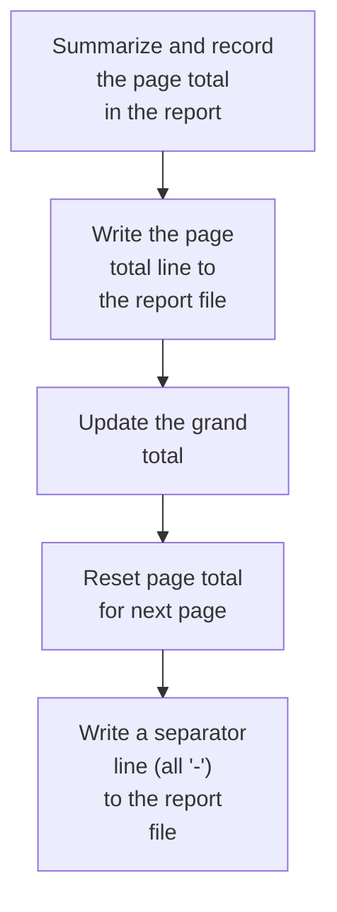

This section handles the end-of-page processing for the report, ensuring that page totals are recorded, grand totals are updated, and the report output is formatted with totals and separator lines for clarity.

| Rule ID | Code Location          | Category       | Rule Name                  | Description                                                                                                                                                                                                                                                                                                                                         | Conditions                                                      | Remarks                                                                                                                                                                                               |
| ------- | ---------------------- | -------------- | -------------------------- | --------------------------------------------------------------------------------------------------------------------------------------------------------------------------------------------------------------------------------------------------------------------------------------------------------------------------------------------------- | --------------------------------------------------------------- | ----------------------------------------------------------------------------------------------------------------------------------------------------------------------------------------------------- |
| BR-001  | 1110-WRITE-PAGE-TOTALS | Business logic | Page Total Line Formatting | At the end of each report page, the accumulated page total must be summarized and recorded in the report output in a specific format: the line must begin with the label 'Page Total', followed by a series of dots, and then the page total value right-aligned and formatted as a signed number with thousands separators and two decimal places. | When a page total is to be written at the end of a report page. | The output line must start with 'Page Total', followed by 86 dots, and the page total value formatted as '+ZZZ,ZZZ,ZZZ.ZZ' (signed, right-aligned, with thousands separators and two decimal places). |
| BR-002  | 1110-WRITE-PAGE-TOTALS | Business logic | Grand Total Accumulation   | After writing the page total line, the value of the page total must be added to the grand total, ensuring that the grand total reflects all page totals accumulated so far in the report.                                                                                                                                                           | After the page total line is written to the report file.        | The grand total is a running sum of all page totals written so far. It is formatted as a signed number with two decimal places.                                                                       |
| BR-003  | 1110-WRITE-PAGE-TOTALS | Business logic | Reset Page Total           | After the page total is added to the grand total, the page total must be reset to zero to prepare for accumulation of the next page's totals.                                                                                                                                                                                                       | After the page total has been added to the grand total.         | The page total is reset to zero (0.00) after each page's totals are processed.                                                                                                                        |
| BR-004  | 1110-WRITE-PAGE-TOTALS | Business logic | Separator Line Output      | After processing the page total, a separator line consisting entirely of dashes ('-') must be written to the report file to visually separate sections in the report.                                                                                                                                                                               | After the page total has been written and the page total reset. | The separator line must be a line of dashes ('-'), matching the width of the report output.                                                                                                           |

<SwmSnippet path="/app/cbl/CBTRN03C.cbl" line="293" repo-id="Z2l0aHViJTNBJTNBa3luZHJ5bC1hd3MtbWFpbmZyYW1lLW1vZGVybml6YXRpb24tY2FyZGRlbW8lM0ElM0FTd2ltbS1EZW1v">

---

In 1110-WRITE-PAGE-TOTALS, we prep the page total, move it into the report record, and call 1111-WRITE-REPORT-REC to write it out.

```cobol
       1110-WRITE-PAGE-TOTALS.                                                  
           MOVE WS-PAGE-TOTAL TO REPT-PAGE-TOTAL                                
           MOVE REPORT-PAGE-TOTALS TO FD-REPTFILE-REC                           
           PERFORM 1111-WRITE-REPORT-REC                                        
```

---

</SwmSnippet>

<SwmSnippet path="/app/cbl/CBTRN03C.cbl" line="297" repo-id="Z2l0aHViJTNBJTNBa3luZHJ5bC1hd3MtbWFpbmZyYW1lLW1vZGVybml6YXRpb24tY2FyZGRlbW8lM0ElM0FTd2ltbS1EZW1v">

---

After returning from 1111-WRITE-REPORT-REC in 1110-WRITE-PAGE-TOTALS, we add the page total to the grand total, reset the page total, bump the line counter, write a separator line, and call 1111-WRITE-REPORT-REC again.

```cobol
           ADD WS-PAGE-TOTAL TO WS-GRAND-TOTAL                                  
           MOVE 0 TO WS-PAGE-TOTAL                                              
           ADD 1 TO WS-LINE-COUNTER                                             
           MOVE TRANSACTION-HEADER-2 TO FD-REPTFILE-REC                         
           PERFORM 1111-WRITE-REPORT-REC                                        
           ADD 1 TO WS-LINE-COUNTER                                             
                                                                                
           EXIT.                                                                
```

---

</SwmSnippet>

### Writing Transaction Details

This section updates running totals for the current page and account, and writes a transaction detail line for each transaction processed in the transaction report.

| Rule ID | Code Location                 | Category       | Rule Name                  | Description                                                                                                                            | Conditions                                      | Remarks                                                                                                                                                                                                                                                                                                                                                                                                                                                                                                                       |
| ------- | ----------------------------- | -------------- | -------------------------- | -------------------------------------------------------------------------------------------------------------------------------------- | ----------------------------------------------- | ----------------------------------------------------------------------------------------------------------------------------------------------------------------------------------------------------------------------------------------------------------------------------------------------------------------------------------------------------------------------------------------------------------------------------------------------------------------------------------------------------------------------------- |
| BR-001  | 1100-WRITE-TRANSACTION-REPORT | Business logic | Page total accumulation    | The transaction amount must be added to the running total for the current page whenever a transaction is processed in this context.    | A transaction is being processed for reporting. | The page total starts at 0 and is incremented by the transaction amount for each transaction. The transaction amount is a signed number with two decimal places.                                                                                                                                                                                                                                                                                                                                                              |
| BR-002  | 1100-WRITE-TRANSACTION-REPORT | Business logic | Account total accumulation | The transaction amount must be added to the running total for the current account whenever a transaction is processed in this context. | A transaction is being processed for reporting. | The account total starts at 0 and is incremented by the transaction amount for each transaction. The transaction amount is a signed number with two decimal places.                                                                                                                                                                                                                                                                                                                                                           |
| BR-003  | 1100-WRITE-TRANSACTION-REPORT | Business logic | Transaction detail output  | A transaction detail line must be written for each transaction processed in this context.                                              | A transaction is being processed for reporting. | The detail line must include all fields from the transaction record, such as transaction ID (16 characters), type code (2 characters), category code (4 digits), source (10 characters), description (100 characters), amount (signed number with two decimal places), merchant ID (9 digits), merchant name (50 characters), merchant city (50 characters), merchant zip (10 characters), card number (16 characters), original timestamp (26 characters), processed timestamp (26 characters), and 20 characters of filler. |

<SwmSnippet path="/app/cbl/CBTRN03C.cbl" line="287" repo-id="Z2l0aHViJTNBJTNBa3luZHJ5bC1hd3MtbWFpbmZyYW1lLW1vZGVybml6YXRpb24tY2FyZGRlbW8lM0ElM0FTd2ltbS1EZW1v">

---

After returning from 1110-WRITE-PAGE-TOTALS in 1100-WRITE-TRANSACTION-REPORT, we add the transaction amount to both page and account totals, then call 1120-WRITE-DETAIL to write the transaction detail line.

```cobol
           ADD TRAN-AMT TO WS-PAGE-TOTAL                                        
                           WS-ACCOUNT-TOTAL                                     
           PERFORM 1120-WRITE-DETAIL                                            
           EXIT.                                                                
```

---

</SwmSnippet>

## Writing Transaction Detail Lines

This section prepares and writes a formatted transaction detail line to the report file, ensuring all required transaction attributes are included and the line count is updated.

| Rule ID | Code Location     | Category       | Rule Name                           | Description                                                                                                                                                                                                                                                                                                | Conditions                                                         | Remarks                                                                                                                                                                                                                                                                                                                                                                                                                                                |
| ------- | ----------------- | -------------- | ----------------------------------- | ---------------------------------------------------------------------------------------------------------------------------------------------------------------------------------------------------------------------------------------------------------------------------------------------------------- | ------------------------------------------------------------------ | ------------------------------------------------------------------------------------------------------------------------------------------------------------------------------------------------------------------------------------------------------------------------------------------------------------------------------------------------------------------------------------------------------------------------------------------------------ |
| BR-001  | 1120-WRITE-DETAIL | Business logic | Transaction Detail Line Composition | Each transaction detail line in the report must include the transaction ID, account ID, transaction type code, transaction type description, transaction category code, transaction category description, transaction source, and transaction amount, formatted according to the defined output structure. | When a transaction is to be written to the detail report.          | The output format is: transaction ID (16 characters), account ID (11 characters), transaction type code (2 characters), transaction type description (15 characters), transaction category code (4 digits), transaction category description (29 characters), transaction source (10 characters), transaction amount (formatted as -ZZZ,ZZZ,ZZZ.ZZ). Fields are separated by spaces or dashes as specified in the TRANSACTION-DETAIL-REPORT structure. |
| BR-002  | 1120-WRITE-DETAIL | Business logic | Line Counter Increment              | Each time a transaction detail line is written to the report, the line counter must be incremented by one to reflect the total number of detail lines produced.                                                                                                                                            | After a transaction detail line is written to the report.          | The line counter starts at 0 and is incremented by 1 for each detail line written.                                                                                                                                                                                                                                                                                                                                                                     |
| BR-003  | 1120-WRITE-DETAIL | Business logic | Transaction Amount Formatting       | The transaction amount in the report must be formatted as a signed number with commas and two decimal places, matching the format -ZZZ,ZZZ,ZZZ.ZZ.                                                                                                                                                         | When the transaction amount is included in the detail report line. | The amount field is formatted as a signed number with commas and two decimal places (e.g., -1,234,567.89).                                                                                                                                                                                                                                                                                                                                             |

<SwmSnippet path="/app/cbl/CBTRN03C.cbl" line="361" repo-id="Z2l0aHViJTNBJTNBa3luZHJ5bC1hd3MtbWFpbmZyYW1lLW1vZGVybml6YXRpb24tY2FyZGRlbW8lM0ElM0FTd2ltbS1EZW1v">

---

In 1120-WRITE-DETAIL, we set up the transaction detail report by moving all the relevant fields—ID, account, type, category, source, and amount—into the output record.

```cobol
       1120-WRITE-DETAIL.                                                       
           INITIALIZE TRANSACTION-DETAIL-REPORT                                 
           MOVE TRAN-ID TO TRAN-REPORT-TRANS-ID                                 
           MOVE XREF-ACCT-ID TO TRAN-REPORT-ACCOUNT-ID                          
           MOVE TRAN-TYPE-CD OF TRAN-RECORD TO TRAN-REPORT-TYPE-CD              
           MOVE TRAN-TYPE-DESC TO TRAN-REPORT-TYPE-DESC                         
           MOVE TRAN-CAT-CD OF TRAN-RECORD  TO TRAN-REPORT-CAT-CD               
           MOVE TRAN-CAT-TYPE-DESC TO TRAN-REPORT-CAT-DESC                      
           MOVE TRAN-SOURCE TO TRAN-REPORT-SOURCE                               
           MOVE TRAN-AMT TO TRAN-REPORT-AMT                                     
           MOVE TRANSACTION-DETAIL-REPORT TO FD-REPTFILE-REC                    
```

---

</SwmSnippet>

<SwmSnippet path="/app/cbl/CBTRN03C.cbl" line="372" repo-id="Z2l0aHViJTNBJTNBa3luZHJ5bC1hd3MtbWFpbmZyYW1lLW1vZGVybml6YXRpb24tY2FyZGRlbW8lM0ElM0FTd2ltbS1EZW1v">

---

After prepping the detail line in 1120-WRITE-DETAIL, we call 1111-WRITE-REPORT-REC to write it out, then bump the line counter before exiting.

```cobol
           PERFORM 1111-WRITE-REPORT-REC                                        
           ADD 1 TO WS-LINE-COUNTER                                             
           EXIT.                                                                
```

---

</SwmSnippet>

## Finalizing Page and Grand Totals

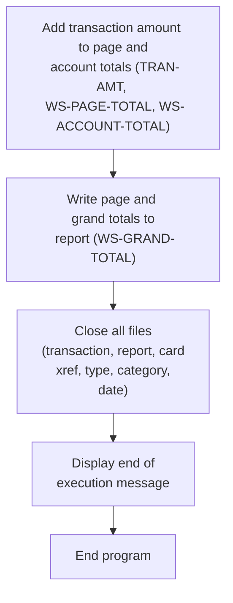

This section finalizes the reporting process by accumulating transaction totals, writing summary totals to the report, closing all files, and displaying a completion message. It ensures the integrity and completeness of the report output and program execution.

| Rule ID | Code Location                       | Category       | Rule Name                        | Description                                                                                                                                                                             | Conditions                                                                          | Remarks                                                                                                                                                  |
| ------- | ----------------------------------- | -------------- | -------------------------------- | --------------------------------------------------------------------------------------------------------------------------------------------------------------------------------------- | ----------------------------------------------------------------------------------- | -------------------------------------------------------------------------------------------------------------------------------------------------------- |
| BR-001  | MAIN-LOGIC                          | Business logic | Accumulate Transaction Totals    | Each transaction amount is added to both the page total and the account total, ensuring that running totals are maintained for reporting purposes.                                      | When a transaction is processed and the end-of-file condition has not been reached. | The transaction amount is a signed number with two decimal places. The page and account totals are also signed numbers with two decimal places.          |
| BR-002  | MAIN-LOGIC, 1110-WRITE-GRAND-TOTALS | Business logic | Write Totals to Report           | At the end of processing, the page total and grand total are written to the report to provide a summary of all processed transactions.                                                  | After all transactions have been processed and totals have been accumulated.        | The report output includes the page total and grand total as signed numbers with two decimal places, formatted according to the report record structure. |
| BR-003  | MAIN-LOGIC                          | Technical step | Close All Files                  | All files used during processing (transaction, report, card cross-reference, type, category, and date parameter files) must be closed at the end of execution to ensure data integrity. | After all report writing is complete and before program termination.                | The files closed include the transaction, report, card cross-reference, type, category, and date parameter files.                                        |
| BR-004  | MAIN-LOGIC                          | Technical step | Display End of Execution Message | An end-of-execution message is displayed to indicate successful completion of the program.                                                                                              | After all files have been closed and before the program terminates.                 | The message displayed is 'END OF EXECUTION OF PROGRAM CBTRN03C'.                                                                                         |

<SwmSnippet path="/app/cbl/CBTRN03C.cbl" line="197" repo-id="Z2l0aHViJTNBJTNBa3luZHJ5bC1hd3MtbWFpbmZyYW1lLW1vZGVybml6YXRpb24tY2FyZGRlbW8lM0ElM0FTd2ltbS1EZW1v">

---

After returning from 1100-WRITE-TRANSACTION-REPORT in PROCEDURE-DIVISION, we add the transaction amount to the running totals, then call 1110-WRITE-PAGE-TOTALS and 1110-WRITE-GRAND-TOTALS to write out the summary lines.

```cobol
                ELSE                                                            
                 DISPLAY 'TRAN-AMT ' TRAN-AMT                                   
                 DISPLAY 'WS-PAGE-TOTAL'  WS-PAGE-TOTAL                         
                 ADD TRAN-AMT TO WS-PAGE-TOTAL                                  
                                 WS-ACCOUNT-TOTAL                               
                 PERFORM 1110-WRITE-PAGE-TOTALS                                 
                 PERFORM 1110-WRITE-GRAND-TOTALS                                
                END-IF                                                          
             END-IF                                                             
           END-PERFORM.                                                         
```

---

</SwmSnippet>

<SwmSnippet path="/app/cbl/CBTRN03C.cbl" line="318" repo-id="Z2l0aHViJTNBJTNBa3luZHJ5bC1hd3MtbWFpbmZyYW1lLW1vZGVybml6YXRpb24tY2FyZGRlbW8lM0ElM0FTd2ltbS1EZW1v">

---

In 1110-WRITE-GRAND-TOTALS, we prep the grand total, move it into the report record, and call 1111-WRITE-REPORT-REC to write it out.

```cobol
       1110-WRITE-GRAND-TOTALS.                                                 
           MOVE WS-GRAND-TOTAL TO REPT-GRAND-TOTAL                              
           MOVE REPORT-GRAND-TOTALS TO FD-REPTFILE-REC                          
           PERFORM 1111-WRITE-REPORT-REC                                        
           EXIT.                                                                
```

---

</SwmSnippet>

<SwmSnippet path="/app/cbl/CBTRN03C.cbl" line="208" repo-id="Z2l0aHViJTNBJTNBa3luZHJ5bC1hd3MtbWFpbmZyYW1lLW1vZGVybml6YXRpb24tY2FyZGRlbW8lM0ElM0FTd2ltbS1EZW1v">

---

After returning from 1110-WRITE-GRAND-TOTALS in PROCEDURE-DIVISION, we close all the files we opened at the start—transaction, report, cross-reference, type, category, and date parameter files—then display an end message and exit.

```cobol
           PERFORM 9000-TRANFILE-CLOSE.                                         
           PERFORM 9100-REPTFILE-CLOSE.                                         
           PERFORM 9200-CARDXREF-CLOSE.                                         
           PERFORM 9300-TRANTYPE-CLOSE.                                         
           PERFORM 9400-TRANCATG-CLOSE.                                         
           PERFORM 9500-DATEPARM-CLOSE.                                         
                                                                                
           DISPLAY 'END OF EXECUTION OF PROGRAM CBTRN03C'.                      
                                                                                
           GOBACK.                                                              
```

---

</SwmSnippet>

# Closing the Transaction File

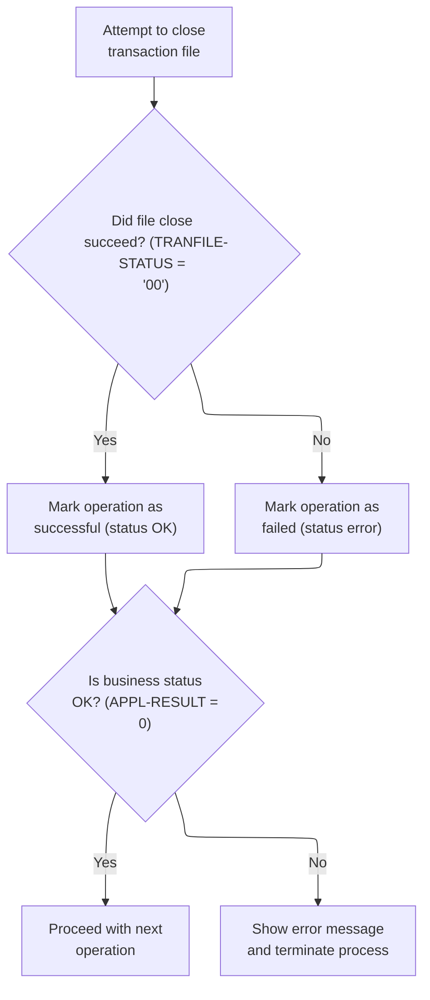

This section governs the closing of the transaction file, determining whether the operation is successful or failed, and handling errors by displaying messages and terminating the process if necessary.

| Rule ID | Code Location       | Category       | Rule Name                                | Description                                                                                                                                                                                                                                                                                              | Conditions                                                                           | Remarks                                                                                                                                                                                     |
| ------- | ------------------- | -------------- | ---------------------------------------- | -------------------------------------------------------------------------------------------------------------------------------------------------------------------------------------------------------------------------------------------------------------------------------------------------------- | ------------------------------------------------------------------------------------ | ------------------------------------------------------------------------------------------------------------------------------------------------------------------------------------------- |
| BR-001  | 9000-TRANFILE-CLOSE | Business logic | Transaction File Close Status Assignment | When closing the transaction file, the operation is initially flagged as pending error by setting the result code to 8. After attempting to close, if the file status indicates success, the result code is reset to 0 (OK). If the file status indicates failure, the result code is set to 12 (error). | This rule applies whenever the transaction file is being closed.                     | Result code values: 0 (OK), 8 (pre-close/pending error), 12 (error). The result code is used to communicate the outcome of the file close operation to downstream logic.                    |
| BR-002  | 9000-TRANFILE-CLOSE | Business logic | Continue on Successful File Close        | If the transaction file close operation is successful (result code is 0), the workflow continues to the next operation without interruption.                                                                                                                                                             | This rule applies when the result code after closing the transaction file is 0 (OK). | Result code value: 0 (OK). No error message is displayed, and the process continues normally.                                                                                               |
| BR-003  | 9000-TRANFILE-CLOSE | Error handling | Error Handling on File Close Failure     | If the transaction file close operation fails (result code is not 0), an error message is displayed, the file status is logged, and the process is terminated.                                                                                                                                           | This rule applies when the result code after closing the transaction file is not 0.  | Result code values: any non-zero value indicates failure. The error message 'ERROR CLOSING POSTED TRANSACTION FILE' is displayed, the file status is logged, and the process is terminated. |

<SwmSnippet path="/app/cbl/CBTRN03C.cbl" line="514" repo-id="Z2l0aHViJTNBJTNBa3luZHJ5bC1hd3MtbWFpbmZyYW1lLW1vZGVybml6YXRpb24tY2FyZGRlbW8lM0ElM0FTd2ltbS1EZW1v">

---

In 9000-TRANFILE-CLOSE, we set APPL-RESULT to 8 before closing the file, then adjust it based on the file status—reset to zero for success, set to 12 for error. This flags the result for downstream error handling.

```cobol
       9000-TRANFILE-CLOSE.                                                     
           ADD 8 TO ZERO GIVING APPL-RESULT.                                    
           CLOSE TRANSACT-FILE                                                  
           IF TRANFILE-STATUS = '00'                                            
              SUBTRACT APPL-RESULT FROM APPL-RESULT                             
           ELSE                                                                 
              ADD 12 TO ZERO GIVING APPL-RESULT                                 
           END-IF                                                               
```

---

</SwmSnippet>

<SwmSnippet path="/app/cbl/CBTRN03C.cbl" line="522" repo-id="Z2l0aHViJTNBJTNBa3luZHJ5bC1hd3MtbWFpbmZyYW1lLW1vZGVybml6YXRpb24tY2FyZGRlbW8lM0ElM0FTd2ltbS1EZW1v">

---

After closing the transaction file, if APPL-AOK isn't true, we display an error, log the IO status, and abend the program. Otherwise, we just continue.

```cobol
           IF APPL-AOK                                                          
              CONTINUE                                                          
           ELSE                                                                 
              DISPLAY 'ERROR CLOSING POSTED TRANSACTION FILE'                   
              MOVE TRANFILE-STATUS TO IO-STATUS                                 
              PERFORM 9910-DISPLAY-IO-STATUS                                    
              PERFORM 9999-ABEND-PROGRAM                                        
           END-IF                                                               
           EXIT.                                                                
```

---

</SwmSnippet>

# Closing the Report File

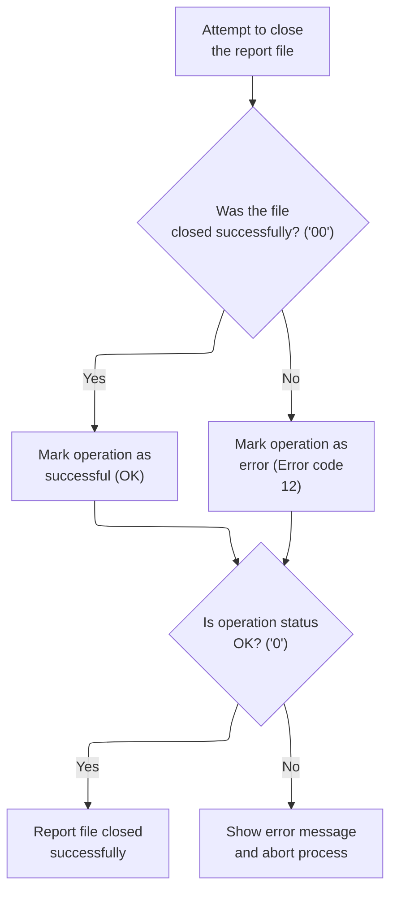

This section governs the closing of the report file, ensuring that the outcome is clearly communicated and that errors are handled consistently. It defines the conditions for success and failure, and specifies the actions taken in each case.

| Rule ID | Code Location       | Category       | Rule Name                            | Description                                                                                                                          | Conditions                                                                        | Remarks                                                                                                                                                         |
| ------- | ------------------- | -------------- | ------------------------------------ | ------------------------------------------------------------------------------------------------------------------------------------ | --------------------------------------------------------------------------------- | --------------------------------------------------------------------------------------------------------------------------------------------------------------- |
| BR-001  | 9100-REPTFILE-CLOSE | Business logic | Report file close success            | When closing the report file, the operation is marked as successful if the file close status code is '00'.                           | The report file close status code is '00'.                                        | The status code '00' indicates a successful close. The operation result is set to 0 to indicate success.                                                        |
| BR-002  | 9100-REPTFILE-CLOSE | Error handling | Report file close failure            | If the report file close status code is not '00', the operation is marked as an error with result code 12.                           | The report file close status code is not '00'.                                    | The error result code is 12, which indicates a file close failure.                                                                                              |
| BR-003  | 9100-REPTFILE-CLOSE | Error handling | Error handling on file close failure | If the operation result is not OK (i.e., not 0), an error message is displayed, the IO status is logged, and the process is aborted. | The operation result is not OK (not 0) after attempting to close the report file. | The error message 'ERROR CLOSING REPORT FILE' is displayed. The IO status is logged and the process is terminated. The operation result code for failure is 12. |

<SwmSnippet path="/app/cbl/CBTRN03C.cbl" line="532" repo-id="Z2l0aHViJTNBJTNBa3luZHJ5bC1hd3MtbWFpbmZyYW1lLW1vZGVybml6YXRpb24tY2FyZGRlbW8lM0ElM0FTd2ltbS1EZW1v">

---

In 9100-REPTFILE-CLOSE, we use the same numeric codes as before—set APPL-RESULT to 8, close the file, reset to zero for success, or set to 12 for error. This keeps error handling consistent.

```cobol
       9100-REPTFILE-CLOSE.                                                     
           ADD 8 TO ZERO GIVING APPL-RESULT.                                    
           CLOSE REPORT-FILE                                                    
           IF TRANREPT-STATUS = '00'                                            
              SUBTRACT APPL-RESULT FROM APPL-RESULT                             
           ELSE                                                                 
              ADD 12 TO ZERO GIVING APPL-RESULT                                 
           END-IF                                                               
```

---

</SwmSnippet>

<SwmSnippet path="/app/cbl/CBTRN03C.cbl" line="540" repo-id="Z2l0aHViJTNBJTNBa3luZHJ5bC1hd3MtbWFpbmZyYW1lLW1vZGVybml6YXRpb24tY2FyZGRlbW8lM0ElM0FTd2ltbS1EZW1v">

---

After closing the report file, we check APPL-AOK to see if the close was successful. If not, we display an error, log the IO status, and abend the program. This keeps the flow tight and avoids running anything after a failed close.

```cobol
           IF APPL-AOK                                                          
              CONTINUE                                                          
           ELSE                                                                 
              DISPLAY 'ERROR CLOSING REPORT FILE'                               
              MOVE TRANREPT-STATUS TO IO-STATUS                                 
              PERFORM 9910-DISPLAY-IO-STATUS                                    
              PERFORM 9999-ABEND-PROGRAM                                        
           END-IF                                                               
           EXIT.                                                                
```

---

</SwmSnippet>

# Closing the Cross-Reference File

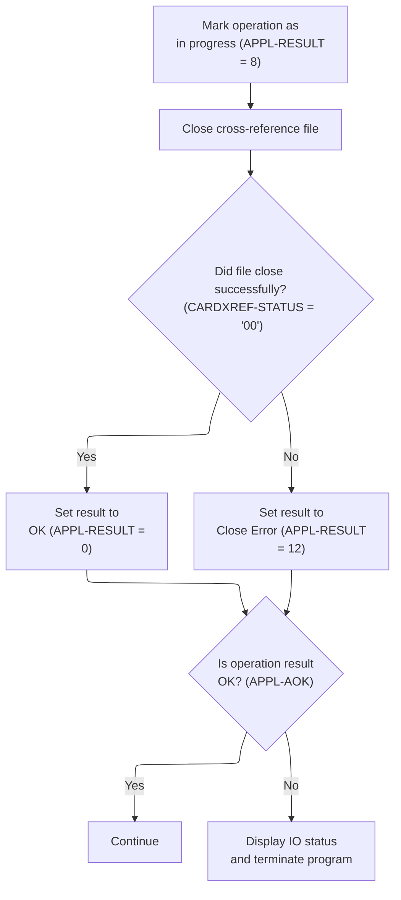

This section governs the business logic for closing the cross-reference file, including marking the operation as in progress, determining the outcome based on the file status, and handling errors by displaying messages and terminating the program if necessary.

| Rule ID | Code Location       | Category       | Rule Name                          | Description                                                                                                                                                                   | Conditions                                                                      | Remarks                                                                                                                                 |
| ------- | ------------------- | -------------- | ---------------------------------- | ----------------------------------------------------------------------------------------------------------------------------------------------------------------------------- | ------------------------------------------------------------------------------- | --------------------------------------------------------------------------------------------------------------------------------------- |
| BR-001  | 9200-CARDXREF-CLOSE | Business logic | Successful Close                   | If the cross-reference file closes successfully (status code is '00'), the result code is set to 0 to indicate success.                                                       | The cross-reference file close operation returns a status code of '00'.         | A result code of 0 indicates success. The status code '00' is a string representing successful closure.                                 |
| BR-002  | 9200-CARDXREF-CLOSE | Error handling | Close Error Handling               | If the cross-reference file does not close successfully (status code is not '00'), the result code is set to 12 to indicate a close error.                                    | The cross-reference file close operation returns a status code other than '00'. | A result code of 12 indicates a close error. The status code is a string representing the outcome of the close operation.               |
| BR-003  | 9200-CARDXREF-CLOSE | Error handling | Display and Abort on Close Failure | If the result code after attempting to close the file is not 0 (i.e., not successful), an error message is displayed, the IO status is logged, and the program is terminated. | The result code after closing the cross-reference file is not 0.                | The error message 'ERROR CLOSING CROSS REF FILE' is displayed. The IO status is logged. The program is terminated via an abend routine. |
| BR-004  | 9200-CARDXREF-CLOSE | Technical step | Mark Close In Progress             | When the close operation for the cross-reference file begins, the operation is marked as in progress by setting the result code to 8.                                         | The close operation for the cross-reference file is initiated.                  | The result code is set to 8 to indicate an in-progress state. This is a numeric value.                                                  |

<SwmSnippet path="/app/cbl/CBTRN03C.cbl" line="551" repo-id="Z2l0aHViJTNBJTNBa3luZHJ5bC1hd3MtbWFpbmZyYW1lLW1vZGVybml6YXRpb24tY2FyZGRlbW8lM0ElM0FTd2ltbS1EZW1v">

---

In `9200-CARDXREF-CLOSE`, we set APPL-RESULT to 8, close the cross-reference file, then check CARDXREF-STATUS. If it's '00', we set APPL-RESULT to 0 (success); otherwise, we set it to 12 (error). This sets up the flow for error handling right after.

```cobol
       9200-CARDXREF-CLOSE.                                                     
           MOVE 8 TO APPL-RESULT.                                               
           CLOSE XREF-FILE                                                      
           IF  CARDXREF-STATUS = '00'                                           
               MOVE 0 TO APPL-RESULT                                            
           ELSE                                                                 
               MOVE 12 TO APPL-RESULT                                           
           END-IF                                                               
```

---

</SwmSnippet>

<SwmSnippet path="/app/cbl/CBTRN03C.cbl" line="559" repo-id="Z2l0aHViJTNBJTNBa3luZHJ5bC1hd3MtbWFpbmZyYW1lLW1vZGVybml6YXRpb24tY2FyZGRlbW8lM0ElM0FTd2ltbS1EZW1v">

---

After closing the cross-reference file, we use APPL-AOK to decide if we keep going or bail out. If closing fails, we show an error, log the IO status, and abend, just like with the other file closes.

```cobol
           IF  APPL-AOK                                                         
               CONTINUE                                                         
           ELSE                                                                 
               DISPLAY 'ERROR CLOSING CROSS REF FILE'                           
               MOVE CARDXREF-STATUS TO IO-STATUS                                
               PERFORM 9910-DISPLAY-IO-STATUS                                   
               PERFORM 9999-ABEND-PROGRAM                                       
           END-IF                                                               
           EXIT.                                                                
```

---

</SwmSnippet>

&nbsp;

*This is an auto-generated document by Swimm 🌊 and has not yet been verified by a human*

<SwmMeta version="3.0.0"><sup>Powered by [Swimm](https://staging.swimm.cloud/)</sup></SwmMeta>
