# Overview

This document describes the flow for updating account and customer information. Users interact with a terminal screen to view and update account and customer data. The flow validates input, manages data retrieval and comparison, and updates records if changes are confirmed, displaying results or errors to the user.

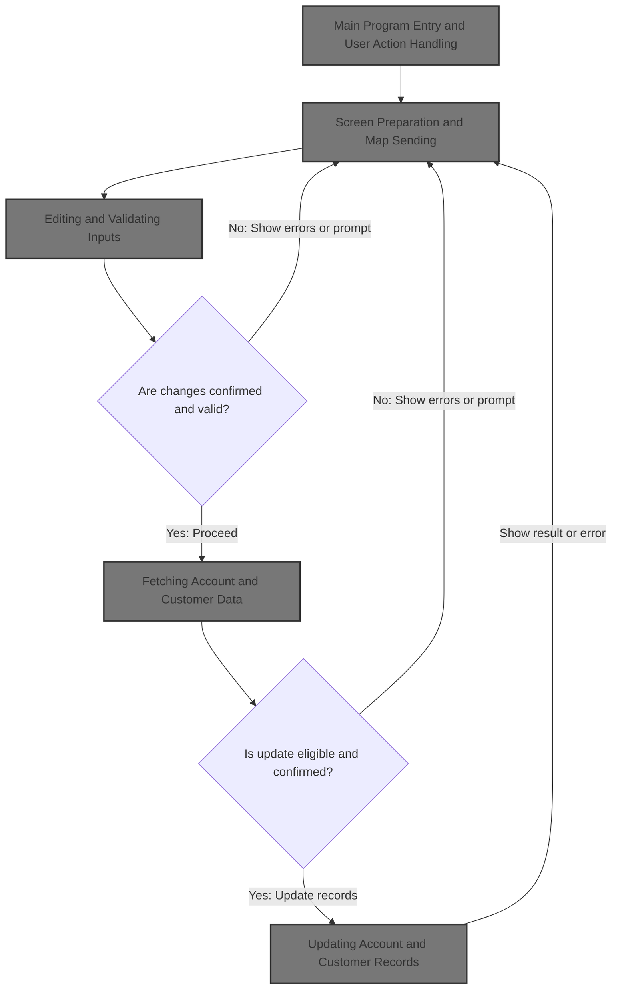

## Dependencies

### Programs

- COACTUPC (app/cbl/COACTUPC.cbl)
- LIT-MENUPGM
- CDEMO-FROM-PROGRAM
- CAUP

### Copybooks

- CSUTLDWY (app/cpy/CSUTLDWY.cpy)
- CVCRD01Y (app/cpy/CVCRD01Y.cpy)
- CSLKPCDY (app/cpy/CSLKPCDY.cpy)
- DFHBMSCA
- DFHAID
- COTTL01Y (app/cpy/COTTL01Y.cpy)
- COACTUP (app/cpy-bms/COACTUP.CPY)
- CSDAT01Y (app/cpy/CSDAT01Y.cpy)
- CSMSG01Y (app/cpy/CSMSG01Y.cpy)
- CSMSG02Y (app/cpy/CSMSG02Y.cpy)
- CSUSR01Y (app/cpy/CSUSR01Y.cpy)
- CVACT01Y (app/cpy/CVACT01Y.cpy)
- CVACT03Y (app/cpy/CVACT03Y.cpy)
- CVCUS01Y (app/cpy/CVCUS01Y.cpy)
- COCOM01Y (app/cpy/COCOM01Y.cpy)
- CSSTRPFY (app/cpy/CSSTRPFY.cpy)
- CSUTLDPY (app/cpy/CSUTLDPY.cpy)

## Input and Output Tables/Files used in the Program

| Table / File Name          | Type | Description                                                  | Usage Mode   | Key Fields / Layout Highlights |
| -------------------------- | ---- | ------------------------------------------------------------ | ------------ | ------------------------------ |
| LIT-ACCTFILENAME           | File | Account master: status, balance, limits, dates, group id     | Input/Output | File resource                  |
| LIT-CARDXREFNAME-ACCT-PATH | File | Card-to-account cross-reference (card num, cust id, acct id) | Input        | File resource                  |
| LIT-CUSTFILENAME           | File | Customer master: name, address, SSN, phone, FICO, DOB        | Input/Output | File resource                  |

&nbsp;

# Workflow

# Main Program Entry and User Action Handling

This section manages program entry, user action handling, session context initialization, and program flow control based on user input and session state. It ensures that user actions are interpreted correctly, session state is managed consistently, and control is transferred reliably to the appropriate program or menu.

| Rule ID | Code Location            | Category       | Rule Name                        | Description                                                                                                                                                                                                                  | Conditions                                                                                                          | Remarks                                                                                                                                                                                             |
| ------- | ------------------------ | -------------- | -------------------------------- | ---------------------------------------------------------------------------------------------------------------------------------------------------------------------------------------------------------------------------- | ------------------------------------------------------------------------------------------------------------------- | --------------------------------------------------------------------------------------------------------------------------------------------------------------------------------------------------- |
| BR-001  | 0000-MAIN                | Business logic | Session context initialization   | If the program is entered without a session context (COMMAREA), or if returning from the menu and not re-entering, a new session context is initialized for both shared and program-specific data.                           | Triggered when COMMAREA length is zero, or when returning from the menu and not re-entering.                        | Session context includes shared (CARDDEMO-COMMAREA) and program-specific (WS-THIS-PROGCOMMAREA) data. Initialization ensures all fields are set to their default values.                            |
| BR-002  | YYYY-STORE-PFKEY         | Business logic | PF key mapping                   | User actions are interpreted by mapping the pressed key (AID/PF key) to business actions. PF keys 13-24 are treated as PF1-12, so the same business action occurs regardless of which set is pressed.                        | Triggered whenever a user action (AID/PF key) is received.                                                          | PF keys are mapped such that PF13-24 are treated as PF1-12. For example, PF13 is mapped to PF1, PF14 to PF2, etc. This ensures consistent business behavior regardless of which PF key set is used. |
| BR-003  | 0000-MAIN                | Business logic | Exit destination determination   | When the user chooses to exit (PF3), the program determines the next destination. If the originating program or transaction is blank, control is transferred to the main menu; otherwise, it returns to the original caller. | Triggered when PF3 is pressed.                                                                                      | If originating program/transaction is blank or low-values, use menu program ('COMEN01C') and menu transaction ID ('CM00'). Otherwise, use the original caller's program and transaction ID.         |
| BR-004  | 0000-MAIN                | Business logic | Session commit and transfer      | Before transferring control to another program, the session context is updated and any changes are committed to ensure data consistency.                                                                                     | Triggered when exiting to another program or menu.                                                                  | Session context includes transaction ID, program name, user type, and last map/mapset. Changes are committed using SYNCPOINT before transfer.                                                       |
| BR-005  | 0000-MAIN, 3000-SEND-MAP | Business logic | Screen display on entry or reset | When the program needs to display the screen (such as on first entry or after a reset), it initializes the program-specific context and sends the map to the user terminal.                                                  | Triggered when details are not fetched and program is entered, or when returning from the menu and not re-entering. | Screen fields are initialized and the map is sent to the terminal. Program-specific context is reset to default values.                                                                             |
| BR-006  | 0000-MAIN                | Error handling | Unsupported key handling         | If the user presses a key that is not valid for the current session state, the program treats it as if ENTER was pressed, ensuring unsupported actions do not disrupt the flow.                                              | Triggered when the pressed key is not among the valid keys for the current session state.                           | Valid keys depend on session state, such as whether changes are confirmed or details are fetched. If the key is invalid, the business action defaults to ENTER.                                     |

<SwmSnippet path="/app/cbl/COACTUPC.cbl" line="859" repo-id="Z2l0aHViJTNBJTNBa3luZHJ5bC1hd3MtbWFpbmZyYW1lLW1vZGVybml6YXRpb24tY2FyZGRlbW8lM0ElM0FTd2ltbS1EZW1v">

---

In `0000-MAIN` this is the entry point. The code sets up the ABEND handler so any program failure jumps to a controlled routine. This is the very first step before any business logic, making sure the program doesn't leave the terminal hanging if something blows up.

```cobol
       0000-MAIN.


           EXEC CICS HANDLE ABEND
                     LABEL(ABEND-ROUTINE)
           END-EXEC
```

---

</SwmSnippet>

<SwmSnippet path="/app/cbl/COACTUPC.cbl" line="866" repo-id="Z2l0aHViJTNBJTNBa3luZHJ5bC1hd3MtbWFpbmZyYW1lLW1vZGVybml6YXRpb24tY2FyZGRlbW8lM0ElM0FTd2ltbS1EZW1v">

---

Right after setting up error handling, the code initializes all working storage, sets the transaction ID, and clears any previous error message. This is just prepping the environment so nothing from a previous run leaks into this one.

```cobol
           INITIALIZE CC-WORK-AREA
                      WS-MISC-STORAGE
                      WS-COMMAREA
      *****************************************************************
      * Store our context
      *****************************************************************
           MOVE LIT-THISTRANID       TO WS-TRANID
      *****************************************************************
      * Ensure error message is cleared                               *
      *****************************************************************
           SET WS-RETURN-MSG-OFF  TO TRUE
```

---

</SwmSnippet>

<SwmSnippet path="/app/cbl/COACTUPC.cbl" line="880" repo-id="Z2l0aHViJTNBJTNBa3luZHJ5bC1hd3MtbWFpbmZyYW1lLW1vZGVybml6YXRpb24tY2FyZGRlbW8lM0ElM0FTd2ltbS1EZW1v">

---

After prepping the environment, the code checks if there's a COMMAREA or if we're coming from the menu. If not, it initializes both the shared and program-specific context. If there is, it splits the incoming COMMAREA into CARDDEMO-COMMAREA (shared) and WS-THIS-PROGCOMMAREA (local), so each part of the flow gets its own state.

```cobol
           IF EIBCALEN IS EQUAL TO 0
               OR (CDEMO-FROM-PROGRAM = LIT-MENUPGM
               AND NOT CDEMO-PGM-REENTER)
              INITIALIZE CARDDEMO-COMMAREA
                         WS-THIS-PROGCOMMAREA
              SET CDEMO-PGM-ENTER TO TRUE
              SET ACUP-DETAILS-NOT-FETCHED TO TRUE
           ELSE
              MOVE DFHCOMMAREA (1:LENGTH OF CARDDEMO-COMMAREA)  TO
                                CARDDEMO-COMMAREA
              MOVE DFHCOMMAREA(LENGTH OF CARDDEMO-COMMAREA + 1:
                               LENGTH OF WS-THIS-PROGCOMMAREA ) TO
                                WS-THIS-PROGCOMMAREA
           END-IF
```

---

</SwmSnippet>

<SwmSnippet path="/app/cbl/COACTUPC.cbl" line="898" repo-id="Z2l0aHViJTNBJTNBa3luZHJ5bC1hd3MtbWFpbmZyYW1lLW1vZGVybml6YXRpb24tY2FyZGRlbW8lM0ElM0FTd2ltbS1EZW1v">

---

After splitting the COMMAREA, the code calls YYYY-STORE-PFKEY. This is where we decode which PF key or AID the user pressed, so the rest of the logic knows what action to take.

```cobol
           PERFORM YYYY-STORE-PFKEY
              THRU YYYY-STORE-PFKEY-EXIT
```

---

</SwmSnippet>

<SwmSnippet path="/app/cpy/CSSTRPFY.cpy" line="17" repo-id="Z2l0aHViJTNBJTNBa3luZHJ5bC1hd3MtbWFpbmZyYW1lLW1vZGVybml6YXRpb24tY2FyZGRlbW8lM0ElM0FTd2ltbS1EZW1v">

---

`YYYY-STORE-PFKEY` maps the raw EIBAID value (what key the user pressed) to a set of flags in CCARD-AID. It uses EVALUATE TRUE (like a switch/case) to set the right flag. PF13-24 just map back to PF1-12, so the program doesn't care if you hit PF1 or PF13, for example.

```cobol
       YYYY-STORE-PFKEY.                                                        
      *****************************************************************         
      * Map AID to PFKey in COMMON Area                                         
      *****************************************************************         
           EVALUATE TRUE                                                        
             WHEN EIBAID IS EQUAL TO DFHENTER                                   
               SET CCARD-AID-ENTER TO TRUE                                      
             WHEN EIBAID IS EQUAL TO DFHCLEAR                                   
               SET CCARD-AID-CLEAR TO TRUE                                      
             WHEN EIBAID IS EQUAL TO DFHPA1                                     
               SET CCARD-AID-PA1  TO TRUE                                       
             WHEN EIBAID IS EQUAL TO DFHPA2                                     
               SET CCARD-AID-PA2  TO TRUE                                       
             WHEN EIBAID IS EQUAL TO DFHPF1                                     
               SET CCARD-AID-PFK01 TO TRUE                                      
             WHEN EIBAID IS EQUAL TO DFHPF2                                     
               SET CCARD-AID-PFK02 TO TRUE                                      
             WHEN EIBAID IS EQUAL TO DFHPF3                                     
               SET CCARD-AID-PFK03 TO TRUE                                      
             WHEN EIBAID IS EQUAL TO DFHPF4                                     
               SET CCARD-AID-PFK04 TO TRUE                                      
             WHEN EIBAID IS EQUAL TO DFHPF5                                     
               SET CCARD-AID-PFK05 TO TRUE                                      
             WHEN EIBAID IS EQUAL TO DFHPF6                                     
               SET CCARD-AID-PFK06 TO TRUE                                      
             WHEN EIBAID IS EQUAL TO DFHPF7                                     
               SET CCARD-AID-PFK07 TO TRUE                                      
             WHEN EIBAID IS EQUAL TO DFHPF8                                     
               SET CCARD-AID-PFK08 TO TRUE                                      
             WHEN EIBAID IS EQUAL TO DFHPF9                                     
               SET CCARD-AID-PFK09 TO TRUE                                      
             WHEN EIBAID IS EQUAL TO DFHPF10                                    
               SET CCARD-AID-PFK10 TO TRUE                                      
             WHEN EIBAID IS EQUAL TO DFHPF11                                    
               SET CCARD-AID-PFK11 TO TRUE                                      
             WHEN EIBAID IS EQUAL TO DFHPF12                                    
               SET CCARD-AID-PFK12 TO TRUE                                      
             WHEN EIBAID IS EQUAL TO DFHPF13                                    
               SET CCARD-AID-PFK01 TO TRUE                                      
             WHEN EIBAID IS EQUAL TO DFHPF14                                    
               SET CCARD-AID-PFK02 TO TRUE                                      
             WHEN EIBAID IS EQUAL TO DFHPF15                                    
               SET CCARD-AID-PFK03 TO TRUE                                      
             WHEN EIBAID IS EQUAL TO DFHPF16                                    
               SET CCARD-AID-PFK04 TO TRUE                                      
             WHEN EIBAID IS EQUAL TO DFHPF17                                    
               SET CCARD-AID-PFK05 TO TRUE                                      
             WHEN EIBAID IS EQUAL TO DFHPF18                                    
               SET CCARD-AID-PFK06 TO TRUE                                      
             WHEN EIBAID IS EQUAL TO DFHPF19                                    
               SET CCARD-AID-PFK07 TO TRUE                                      
             WHEN EIBAID IS EQUAL TO DFHPF20                                    
               SET CCARD-AID-PFK08 TO TRUE                                      
             WHEN EIBAID IS EQUAL TO DFHPF21                                    
               SET CCARD-AID-PFK09 TO TRUE                                      
             WHEN EIBAID IS EQUAL TO DFHPF22                                    
               SET CCARD-AID-PFK10 TO TRUE                                      
             WHEN EIBAID IS EQUAL TO DFHPF23                                    
               SET CCARD-AID-PFK11 TO TRUE                                      
             WHEN EIBAID IS EQUAL TO DFHPF24                                    
               SET CCARD-AID-PFK12 TO TRUE                                      
           END-EVALUATE                                                         
```

---

</SwmSnippet>

<SwmSnippet path="/app/cbl/COACTUPC.cbl" line="905" repo-id="Z2l0aHViJTNBJTNBa3luZHJ5bC1hd3MtbWFpbmZyYW1lLW1vZGVybml6YXRpb24tY2FyZGRlbW8lM0ElM0FTd2ltbS1EZW1v">

---

Back in `0000-MAIN`, after decoding the PF key, the code checks if the key pressed is allowed for the current state. If not, it just acts like ENTER was pressed. This keeps the flow predictable and blocks unsupported actions.

```cobol
           SET PFK-INVALID TO TRUE
           IF CCARD-AID-ENTER OR
              CCARD-AID-PFK03 OR
              (CCARD-AID-PFK05 AND ACUP-CHANGES-OK-NOT-CONFIRMED)
                              OR
              (CCARD-AID-PFK12 AND NOT ACUP-DETAILS-NOT-FETCHED)
              SET PFK-VALID TO TRUE
           END-IF
```

---

</SwmSnippet>

<SwmSnippet path="/app/cbl/COACTUPC.cbl" line="914" repo-id="Z2l0aHViJTNBJTNBa3luZHJ5bC1hd3MtbWFpbmZyYW1lLW1vZGVybml6YXRpb24tY2FyZGRlbW8lM0ElM0FTd2ltbS1EZW1v">

---

If the PF key pressed wasn't valid, the code just sets the ENTER flag so the rest of the logic acts like the user hit ENTER. This keeps the flow from getting stuck on unsupported actions.

```cobol
           IF PFK-INVALID
              SET CCARD-AID-ENTER TO TRUE
           END-IF
```

---

</SwmSnippet>

<SwmSnippet path="/app/cbl/COACTUPC.cbl" line="921" repo-id="Z2l0aHViJTNBJTNBa3luZHJ5bC1hd3MtbWFpbmZyYW1lLW1vZGVybml6YXRpb24tY2FyZGRlbW8lM0ElM0FTd2ltbS1EZW1v">

---

This is where the program decides what to do next based on the key pressed and current state.

```cobol
           EVALUATE TRUE
      ******************************************************************
      *       USER PRESSES PF03 TO EXIT
      *  OR   USER IS DONE WITH UPDATE
      *            XCTL TO CALLING PROGRAM OR MAIN MENU
      ******************************************************************
              WHEN CCARD-AID-PFK03
                   SET CCARD-AID-PFK03     TO TRUE

                   IF CDEMO-FROM-TRANID    EQUAL LOW-VALUES
                   OR CDEMO-FROM-TRANID    EQUAL SPACES
                      MOVE LIT-MENUTRANID  TO CDEMO-TO-TRANID
                   ELSE
                      MOVE CDEMO-FROM-TRANID  TO CDEMO-TO-TRANID
                   END-IF
```

---

</SwmSnippet>

<SwmSnippet path="/app/cbl/COACTUPC.cbl" line="937" repo-id="Z2l0aHViJTNBJTNBa3luZHJ5bC1hd3MtbWFpbmZyYW1lLW1vZGVybml6YXRpb24tY2FyZGRlbW8lM0ElM0FTd2ltbS1EZW1v">

---

After deciding to exit, the code figures out where to send control next. If the originating program/transaction is blank, it defaults to the menu; otherwise, it uses the original caller. This makes sure the user always lands somewhere valid.

```cobol
                   IF CDEMO-FROM-PROGRAM   EQUAL LOW-VALUES
                   OR CDEMO-FROM-PROGRAM   EQUAL SPACES
                      MOVE LIT-MENUPGM     TO CDEMO-TO-PROGRAM
                   ELSE
                      MOVE CDEMO-FROM-PROGRAM TO CDEMO-TO-PROGRAM
                   END-IF
```

---

</SwmSnippet>

<SwmSnippet path="/app/cbl/COACTUPC.cbl" line="944" repo-id="Z2l0aHViJTNBJTNBa3luZHJ5bC1hd3MtbWFpbmZyYW1lLW1vZGVybml6YXRpb24tY2FyZGRlbW8lM0ElM0FTd2ltbS1EZW1v">

---

This is just updating session context before handing off control.

```cobol
                   MOVE LIT-THISTRANID     TO CDEMO-FROM-TRANID
                   MOVE LIT-THISPGM        TO CDEMO-FROM-PROGRAM

                   SET  CDEMO-USRTYP-USER  TO TRUE
                   SET  CDEMO-PGM-ENTER    TO TRUE
                   MOVE LIT-THISMAPSET     TO CDEMO-LAST-MAPSET
                   MOVE LIT-THISMAP        TO CDEMO-LAST-MAP

                   EXEC CICS
                        SYNCPOINT
                   END-EXEC
```

---

</SwmSnippet>

<SwmSnippet path="/app/cbl/COACTUPC.cbl" line="956" repo-id="Z2l0aHViJTNBJTNBa3luZHJ5bC1hd3MtbWFpbmZyYW1lLW1vZGVybml6YXRpb24tY2FyZGRlbW8lM0ElM0FTd2ltbS1EZW1v">

---

After setting up the context, the code does a SYNCPOINT to commit any changes, then XCTL to transfer control to the next program, passing along the updated COMMAREA. This is the clean exit path.

```cobol
                   EXEC CICS XCTL
                        PROGRAM (CDEMO-TO-PROGRAM)
                        COMMAREA(CARDDEMO-COMMAREA)
                   END-EXEC
```

---

</SwmSnippet>

<SwmSnippet path="/app/cbl/COACTUPC.cbl" line="964" repo-id="Z2l0aHViJTNBJTNBa3luZHJ5bC1hd3MtbWFpbmZyYW1lLW1vZGVybml6YXRpb24tY2FyZGRlbW8lM0ElM0FTd2ltbS1EZW1v">

---

When the program needs to show the screen (like on first entry or after a reset), it calls 3000-SEND-MAP. This sets up all the screen fields and sends the map to the terminal.

```cobol
              WHEN ACUP-DETAILS-NOT-FETCHED
               AND CDEMO-PGM-ENTER
              WHEN CDEMO-FROM-PROGRAM   EQUAL LIT-MENUPGM
               AND NOT CDEMO-PGM-REENTER
                   INITIALIZE WS-THIS-PROGCOMMAREA
                   PERFORM 3000-SEND-MAP THRU
                           3000-SEND-MAP-EXIT
                   SET CDEMO-PGM-REENTER        TO TRUE
                   SET ACUP-DETAILS-NOT-FETCHED TO TRUE
                   GO TO COMMON-RETURN
```

---

</SwmSnippet>

## Screen Preparation and Map Sending

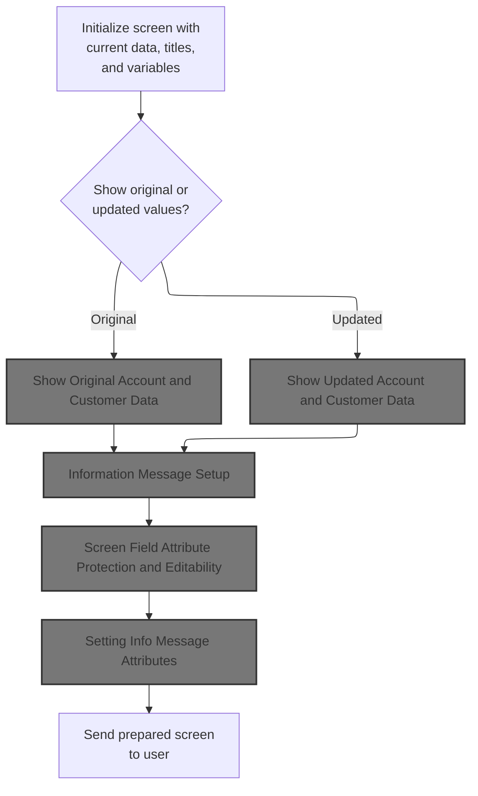

This section prepares and sends the account update screen to the user, ensuring all necessary information, messages, and field attributes are set according to business requirements.

| Rule ID | Code Location           | Category       | Rule Name                        | Description                                                                                                                                                     | Conditions                                                                                | Remarks                                                                                                                                                                                                |
| ------- | ----------------------- | -------------- | -------------------------------- | --------------------------------------------------------------------------------------------------------------------------------------------------------------- | ----------------------------------------------------------------------------------------- | ------------------------------------------------------------------------------------------------------------------------------------------------------------------------------------------------------ |
| BR-001  | 3100-SCREEN-INIT        | Business logic | Screen Initialization            | The screen must be initialized with the current date, time, static titles, program name, and transaction name before any account or customer data is displayed. | Whenever the screen is prepared for sending to the user.                                  | Static titles are set to the values of CCDA-TITLE01 and CCDA-TITLE02. Program name and transaction name are set to LIT-THISPGM and LIT-THISTRANID. Date is formatted as MM-DD-YY and time as HH-MM-SS. |
| BR-002  | 3200-SETUP-SCREEN-VARS  | Business logic | Display Data Version             | The screen must display either the original or updated account and customer data, depending on the current context or user action.                              | When preparing the screen, a decision is made whether to show original or updated values. | The displayed data format matches the account and customer data structure. The choice of version is determined by a condition evaluated in the screen setup logic.                                     |
| BR-003  | 3250-SETUP-INFOMSG      | Business logic | Information Message Display      | An information message must be set up and displayed on the screen, providing feedback or status to the user.                                                    | Whenever the screen is prepared, an information message is set up for display.            | The information message format is alphanumeric and is placed in a designated message area on the screen.                                                                                               |
| BR-004  | 3300-SETUP-SCREEN-ATTRS | Business logic | Field Protection and Editability | Screen fields must be set as protected or editable according to the current context, ensuring that only appropriate fields can be modified by the user.         | When preparing the screen, field attributes are set to control editability.               | Field attributes are set to either protected (read-only) or editable (modifiable) based on business logic.                                                                                             |
| BR-005  | 3400-SEND-SCREEN        | Business logic | Send Prepared Screen             | The prepared screen, with all data, messages, and attributes set, must be sent to the user for interaction.                                                     | After all screen preparation steps are complete.                                          | The output is the fully prepared screen, ready for user interaction.                                                                                                                                   |

<SwmSnippet path="/app/cbl/COACTUPC.cbl" line="2649" repo-id="Z2l0aHViJTNBJTNBa3luZHJ5bC1hd3MtbWFpbmZyYW1lLW1vZGVybml6YXRpb24tY2FyZGRlbW8lM0ElM0FTd2ltbS1EZW1v">

---

`3000-SEND-MAP` runs the whole screen setup sequence: it starts by initializing the screen, then sets up variables, info messages, field attributes, and finally sends the map. Each step is a PERFORM to a subroutine, starting with 3100-SCREEN-INIT to clear and prep the screen data.

```cobol
       3000-SEND-MAP.
           PERFORM 3100-SCREEN-INIT
              THRU 3100-SCREEN-INIT-EXIT
           PERFORM 3200-SETUP-SCREEN-VARS
              THRU 3200-SETUP-SCREEN-VARS-EXIT
           PERFORM 3250-SETUP-INFOMSG
              THRU 3250-SETUP-INFOMSG-EXIT
           PERFORM 3300-SETUP-SCREEN-ATTRS
              THRU 3300-SETUP-SCREEN-ATTRS-EXIT
           PERFORM 3390-SETUP-INFOMSG-ATTRS
              THRU 3390-SETUP-INFOMSG-ATTRS-EXIT
           PERFORM 3400-SEND-SCREEN
              THRU 3400-SEND-SCREEN-EXIT
```

---

</SwmSnippet>

<SwmSnippet path="/app/cbl/COACTUPC.cbl" line="2668" repo-id="Z2l0aHViJTNBJTNBa3luZHJ5bC1hd3MtbWFpbmZyYW1lLW1vZGVybml6YXRpb24tY2FyZGRlbW8lM0ElM0FTd2ltbS1EZW1v">

---

`3100-SCREEN-INIT` clears the screen data, then fills in the current date, time, and static titles. It formats the date/time for display and puts the program and transaction names in the header fields.

```cobol
       3100-SCREEN-INIT.
           MOVE LOW-VALUES TO CACTUPAO

           MOVE FUNCTION CURRENT-DATE     TO WS-CURDATE-DATA

           MOVE CCDA-TITLE01              TO TITLE01O OF CACTUPAO
           MOVE CCDA-TITLE02              TO TITLE02O OF CACTUPAO
           MOVE LIT-THISTRANID            TO TRNNAMEO OF CACTUPAO
           MOVE LIT-THISPGM               TO PGMNAMEO OF CACTUPAO

           MOVE FUNCTION CURRENT-DATE     TO WS-CURDATE-DATA

           MOVE WS-CURDATE-MONTH          TO WS-CURDATE-MM
           MOVE WS-CURDATE-DAY            TO WS-CURDATE-DD
           MOVE WS-CURDATE-YEAR(3:2)      TO WS-CURDATE-YY

           MOVE WS-CURDATE-MM-DD-YY       TO CURDATEO OF CACTUPAO

           MOVE WS-CURTIME-HOURS          TO WS-CURTIME-HH
           MOVE WS-CURTIME-MINUTE         TO WS-CURTIME-MM
           MOVE WS-CURTIME-SECOND         TO WS-CURTIME-SS

           MOVE WS-CURTIME-HH-MM-SS       TO CURTIMEO OF CACTUPAO

           .
```

---

</SwmSnippet>

### Screen Variable Setup and Initial Value Logic

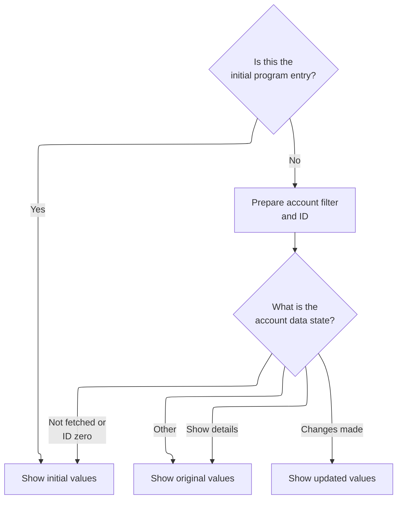

This section determines which set of account and customer data is displayed to the user on the screen, based on the program entry state and the current account data state.

| Rule ID | Code Location                                     | Category       | Rule Name                                               | Description                                                                                                                            | Conditions                                                                          | Remarks                                                                                                                                                                                        |
| ------- | ------------------------------------------------- | -------------- | ------------------------------------------------------- | -------------------------------------------------------------------------------------------------------------------------------------- | ----------------------------------------------------------------------------------- | ---------------------------------------------------------------------------------------------------------------------------------------------------------------------------------------------- |
| BR-001  | 3200-SETUP-SCREEN-VARS, 3201-SHOW-INITIAL-VALUES  | Business logic | Initial entry blank screen                              | When the program is entered for the first time, all account and customer fields on the screen are shown as blank to the user.          | Program entry state is initial (context equals 0).                                  | All fields are set to blank (LOW-VALUES), including account status, limits, dates, customer data, address, and contact info. Format: alphanumeric fields are blank, numeric fields are zeroed. |
| BR-002  | 3200-SETUP-SCREEN-VARS                            | Business logic | Blank account ID on valid filter                        | If the account ID is zero and the account filter is valid, the account ID field is blanked out on the screen.                          | Account ID equals zero AND account filter is valid.                                 | Account ID field is set to blank (LOW-VALUES). Format: alphanumeric field is blank.                                                                                                            |
| BR-003  | 3200-SETUP-SCREEN-VARS                            | Business logic | Show account ID on invalid filter or nonzero ID         | If the account ID is not zero or the account filter is not valid, the account ID field is populated with the current account ID value. | Account ID is not zero OR account filter is not valid.                              | Account ID field is set to the current account ID value. Format: alphanumeric field populated with account ID.                                                                                 |
| BR-004  | 3200-SETUP-SCREEN-VARS, 3201-SHOW-INITIAL-VALUES  | Business logic | Show initial values when details not fetched or ID zero | If account details have not been fetched or the account ID is zero, the screen displays initial blank values for all fields.           | Account details not fetched OR account ID equals zero.                              | All fields are set to blank (LOW-VALUES). Format: alphanumeric fields are blank, numeric fields are zeroed.                                                                                    |
| BR-005  | 3200-SETUP-SCREEN-VARS, 3202-SHOW-ORIGINAL-VALUES | Business logic | Show original values on details action                  | If the current action state indicates that details should be shown, the screen displays the original values for all fields.            | Current action state is 'show details'.                                             | All fields are populated with original account and customer values. Format: fields are filled with data from the original record.                                                              |
| BR-006  | 3200-SETUP-SCREEN-VARS, 3203-SHOW-UPDATED-VALUES  | Business logic | Show updated values on changes made                     | If the current action state indicates that changes have been made, the screen displays the updated values for all fields.              | Current action state indicates changes have been made ('E', 'N', 'C', 'L', or 'F'). | All fields are populated with updated account and customer values. Format: fields are filled with data from the updated record.                                                                |
| BR-007  | 3200-SETUP-SCREEN-VARS, 3202-SHOW-ORIGINAL-VALUES | Business logic | Show original values on other actions                   | If none of the specific action states apply, the screen displays the original values for all fields.                                   | Current action state does not match any specific case.                              | All fields are populated with original account and customer values. Format: fields are filled with data from the original record.                                                              |

<SwmSnippet path="/app/cbl/COACTUPC.cbl" line="2698" repo-id="Z2l0aHViJTNBJTNBa3luZHJ5bC1hd3MtbWFpbmZyYW1lLW1vZGVybml6YXRpb24tY2FyZGRlbW8lM0ElM0FTd2ltbS1EZW1v">

---

In `3200-SETUP-SCREEN-VARS`, the code checks if this is the first entry. If not, it decides whether to blank out the account ID field or show the current value, depending on the filter and input state.

```cobol
       3200-SETUP-SCREEN-VARS.
      *    INITIALIZE SEARCH CRITERIA
           IF CDEMO-PGM-ENTER
              CONTINUE
```

---

</SwmSnippet>

<SwmSnippet path="/app/cbl/COACTUPC.cbl" line="2702" repo-id="Z2l0aHViJTNBJTNBa3luZHJ5bC1hd3MtbWFpbmZyYW1lLW1vZGVybml6YXRpb24tY2FyZGRlbW8lM0ElM0FTd2ltbS1EZW1v">

---

After setting up the search field, the code uses EVALUATE to decide which set of values to show: initial, original, or updated. It calls the right subroutine based on the current action state.

```cobol
           ELSE
              IF CC-ACCT-ID-N = 0
              AND FLG-ACCTFILTER-ISVALID
                 MOVE LOW-VALUES                TO ACCTSIDO OF CACTUPAO
              ELSE
                 MOVE CC-ACCT-ID                TO ACCTSIDO OF CACTUPAO
              END-IF

              EVALUATE TRUE
                WHEN ACUP-DETAILS-NOT-FETCHED
                WHEN CC-ACCT-ID-N =  0
                  PERFORM 3201-SHOW-INITIAL-VALUES
                     THRU 3201-SHOW-INITIAL-VALUES-EXIT
               WHEN ACUP-SHOW-DETAILS
                  PERFORM 3202-SHOW-ORIGINAL-VALUES
                     THRU 3202-SHOW-ORIGINAL-VALUES-EXIT
               WHEN ACUP-CHANGES-MADE
                  PERFORM 3203-SHOW-UPDATED-VALUES
                     THRU 3203-SHOW-UPDATED-VALUES-EXIT
               WHEN OTHER
                  PERFORM 3202-SHOW-ORIGINAL-VALUES
                     THRU 3202-SHOW-ORIGINAL-VALUES-EXIT
              END-EVALUATE
```

---

</SwmSnippet>

<SwmSnippet path="/app/cbl/COACTUPC.cbl" line="2731" repo-id="Z2l0aHViJTNBJTNBa3luZHJ5bC1hd3MtbWFpbmZyYW1lLW1vZGVybml6YXRpb24tY2FyZGRlbW8lM0ElM0FTd2ltbS1EZW1v">

---

`3201-SHOW-INITIAL-VALUES` just clears out all the account and customer fields on the screen. Everything gets set to LOW-VALUES so the user sees a blank form.

```cobol
       3201-SHOW-INITIAL-VALUES.
           MOVE LOW-VALUES                     TO  ACSTTUSO OF CACTUPAO
                                                   ACRDLIMO OF CACTUPAO
      *Account Limits
                                                   ACURBALO OF CACTUPAO
                                                   ACSHLIMO OF CACTUPAO
                                                   ACRCYCRO OF CACTUPAO
                                                   ACRCYDBO OF CACTUPAO
      *Account Dates
                                                   OPNYEARO OF CACTUPAO
                                                   OPNMONO  OF CACTUPAO
                                                   OPNDAYO  OF CACTUPAO
                                                   EXPYEARO OF CACTUPAO
                                                   EXPMONO  OF CACTUPAO
                                                   EXPDAYO  OF CACTUPAO
                                                   RISYEARO OF CACTUPAO
                                                   RISMONO  OF CACTUPAO
                                                   RISDAYO  OF CACTUPAO
                                                   AADDGRPO OF CACTUPAO
      *Customer data
                                                   ACSTNUMO OF CACTUPAO
                                                   ACTSSN1O OF CACTUPAO
                                                   ACTSSN2O OF CACTUPAO
                                                   ACTSSN3O OF CACTUPAO
                                                   ACSTFCOO OF CACTUPAO
                                                   DOBYEARO OF CACTUPAO
                                                   DOBMONO  OF CACTUPAO
                                                   DOBDAYO  OF CACTUPAO
                                                   ACSFNAMO OF CACTUPAO
                                                   ACSMNAMO OF CACTUPAO
                                                   ACSLNAMO OF CACTUPAO
      *Customer address and contact info
                                                   ACSADL1O OF CACTUPAO
                                                   ACSADL2O OF CACTUPAO
                                                   ACSCITYO OF CACTUPAO
                                                   ACSSTTEO OF CACTUPAO
                                                   ACSZIPCO OF CACTUPAO
                                                   ACSCTRYO OF CACTUPAO

                                                   ACSPH1AO OF CACTUPAO
                                                   ACSPH1BO OF CACTUPAO
                                                   ACSPH1CO OF CACTUPAO
                                                   ACSPH2AO OF CACTUPAO
                                                   ACSPH2BO OF CACTUPAO
                                                   ACSPH2CO OF CACTUPAO

      *Customer other good stuff
                                                   ACSGOVTO OF CACTUPAO
                                                   ACSEFTCO OF CACTUPAO
                                                   ACSPFLGO OF CACTUPAO
           .
```

---

</SwmSnippet>

### Show Original Account and Customer Data

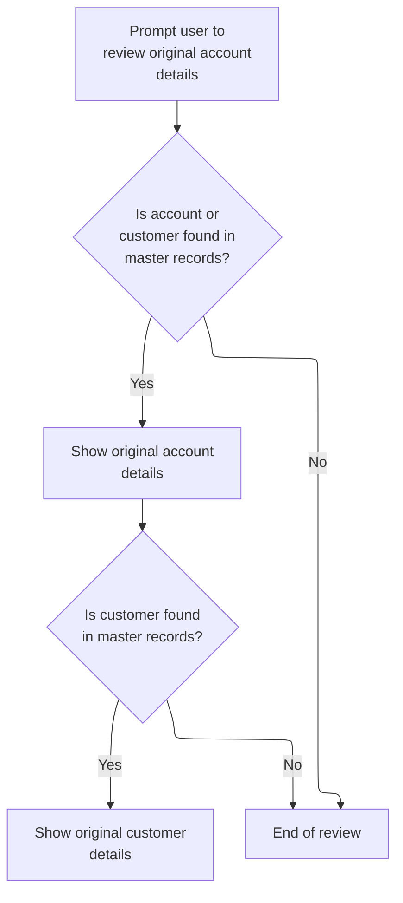

This section displays the original account and customer data for user review, prompting for changes if applicable and ending the review if no records are found.

| Rule ID | Code Location             | Category       | Rule Name                      | Description                                                                                                                                    | Conditions                                                   | Remarks                                                                                                                                                                                                                                                                                                                                                                                                                                                |
| ------- | ------------------------- | -------------- | ------------------------------ | ---------------------------------------------------------------------------------------------------------------------------------------------- | ------------------------------------------------------------ | ------------------------------------------------------------------------------------------------------------------------------------------------------------------------------------------------------------------------------------------------------------------------------------------------------------------------------------------------------------------------------------------------------------------------------------------------------ |
| BR-001  | 3202-SHOW-ORIGINAL-VALUES | Business logic | Prompt for changes             | When the user enters the review screen, the system prompts them to review the original account details and indicates that changes can be made. | Whenever the review screen is entered.                       | The prompt message is set to 'Update account details presented above.' and is displayed to the user.                                                                                                                                                                                                                                                                                                                                                   |
| BR-002  | 3202-SHOW-ORIGINAL-VALUES | Business logic | Show original account details  | If either the account or customer record is found in the master data, the system displays the original account details for user review.        | Account or customer record is found in master data.          | Account details include status, current balance, credit limit, cash credit limit, current cycle credit and debit, open date, expiration date, reissue date, and group ID. Currency fields are formatted for display as numbers with two decimal places.                                                                                                                                                                                                |
| BR-003  | 3202-SHOW-ORIGINAL-VALUES | Business logic | Show original customer details | If the customer record is found in the master data, the system displays the original customer details for user review.                         | Customer record is found in master data.                     | Customer details include customer ID, SSN split into three parts, FICO score, date of birth split into year, month, day, first/middle/last name, address lines, state, zip, country, phone numbers split into three parts each, government-issued ID, EFT account ID, and primary cardholder indicator. All fields are displayed in the format expected by the UI (e.g., SSN as three separate strings, phone numbers as three separate strings each). |
| BR-004  | 3202-SHOW-ORIGINAL-VALUES | Business logic | End review if not found        | If neither the account nor customer record is found in the master data, the review ends and no details are displayed.                          | Neither account nor customer record is found in master data. | No account or customer details are displayed; the review process ends immediately.                                                                                                                                                                                                                                                                                                                                                                     |

<SwmSnippet path="/app/cbl/COACTUPC.cbl" line="2787" repo-id="Z2l0aHViJTNBJTNBa3luZHJ5bC1hd3MtbWFpbmZyYW1lLW1vZGVybml6YXRpb24tY2FyZGRlbW8lM0ElM0FTd2ltbS1EZW1v">

---

In `3202-SHOW-ORIGINAL-VALUES`, the code sets PROMPT-FOR-CHANGES to TRUE so the UI knows to prompt the user for updates. Then it starts prepping the fields for display.

```cobol
       3202-SHOW-ORIGINAL-VALUES.

           MOVE LOW-VALUES                     TO WS-NON-KEY-FLAGS

           SET PROMPT-FOR-CHANGES              TO TRUE
```

---

</SwmSnippet>

<SwmSnippet path="/app/cbl/COACTUPC.cbl" line="2793" repo-id="Z2l0aHViJTNBJTNBa3luZHJ5bC1hd3MtbWFpbmZyYW1lLW1vZGVybml6YXRpb24tY2FyZGRlbW8lM0ElM0FTd2ltbS1EZW1v">

---

If the account or customer master record was found, the code fills in the screen fields with the old values. Currency fields go through a formatting variable before display, so the numbers look right.

```cobol
           IF FOUND-ACCT-IN-MASTER
           OR FOUND-CUST-IN-MASTER
              MOVE ACUP-OLD-ACTIVE-STATUS      TO ACSTTUSO OF CACTUPAO

              MOVE ACUP-OLD-CURR-BAL-N         TO WS-EDIT-CURRENCY-9-2-F
              MOVE WS-EDIT-CURRENCY-9-2-F      TO ACURBALO OF CACTUPAO

              MOVE ACUP-OLD-CREDIT-LIMIT-N     TO WS-EDIT-CURRENCY-9-2-F
              MOVE WS-EDIT-CURRENCY-9-2-F      TO ACRDLIMO OF CACTUPAO

              MOVE ACUP-OLD-CASH-CREDIT-LIMIT-N
                                               TO WS-EDIT-CURRENCY-9-2-F
              MOVE WS-EDIT-CURRENCY-9-2-F      TO ACSHLIMO OF CACTUPAO

              MOVE ACUP-OLD-CURR-CYC-CREDIT-N  TO WS-EDIT-CURRENCY-9-2-F
              MOVE WS-EDIT-CURRENCY-9-2-F      TO ACRCYCRO OF CACTUPAO

              MOVE ACUP-OLD-CURR-CYC-DEBIT-N   TO WS-EDIT-CURRENCY-9-2-F
              MOVE WS-EDIT-CURRENCY-9-2-F      TO ACRCYDBO OF CACTUPAO

              MOVE ACUP-OLD-OPEN-YEAR          TO OPNYEARO OF CACTUPAO
              MOVE ACUP-OLD-OPEN-MON           TO OPNMONO  OF CACTUPAO
              MOVE ACUP-OLD-OPEN-DAY           TO OPNDAYO  OF CACTUPAO

              MOVE ACUP-OLD-EXP-YEAR           TO EXPYEARO OF CACTUPAO
              MOVE ACUP-OLD-EXP-MON            TO EXPMONO  OF CACTUPAO
              MOVE ACUP-OLD-EXP-DAY            TO EXPDAYO  OF CACTUPAO

              MOVE ACUP-OLD-REISSUE-YEAR       TO RISYEARO OF CACTUPAO
              MOVE ACUP-OLD-REISSUE-MON        TO RISMONO  OF CACTUPAO
              MOVE ACUP-OLD-REISSUE-DAY        TO RISDAYO  OF CACTUPAO
              MOVE ACUP-OLD-GROUP-ID           TO AADDGRPO OF CACTUPAO
           END-IF
```

---

</SwmSnippet>

<SwmSnippet path="/app/cbl/COACTUPC.cbl" line="2827" repo-id="Z2l0aHViJTNBJTNBa3luZHJ5bC1hd3MtbWFpbmZyYW1lLW1vZGVybml6YXRpb24tY2FyZGRlbW8lM0ElM0FTd2ltbS1EZW1v">

---

After filling in the main fields, the code splits out composite fields like SSN and phone numbers into their parts for the screen. This matches the UI layout and makes validation easier.

```cobol
           IF FOUND-CUST-IN-MASTER
              MOVE ACUP-OLD-CUST-ID-X          TO ACSTNUMO OF CACTUPAO
              MOVE ACUP-OLD-CUST-SSN-X(1:3)    TO ACTSSN1O OF CACTUPAO
              MOVE ACUP-OLD-CUST-SSN-X(4:2)    TO ACTSSN2O OF CACTUPAO
              MOVE ACUP-OLD-CUST-SSN-X(6:4)    TO ACTSSN3O OF CACTUPAO
              MOVE ACUP-OLD-CUST-FICO-SCORE-X  TO ACSTFCOO OF CACTUPAO
              MOVE ACUP-OLD-CUST-DOB-YEAR      TO DOBYEARO OF CACTUPAO
              MOVE ACUP-OLD-CUST-DOB-MON       TO DOBMONO  OF CACTUPAO
              MOVE ACUP-OLD-CUST-DOB-DAY       TO DOBDAYO  OF CACTUPAO
              MOVE ACUP-OLD-CUST-FIRST-NAME    TO ACSFNAMO OF CACTUPAO
              MOVE ACUP-OLD-CUST-MIDDLE-NAME   TO ACSMNAMO OF CACTUPAO
              MOVE ACUP-OLD-CUST-LAST-NAME     TO ACSLNAMO OF CACTUPAO
              MOVE ACUP-OLD-CUST-ADDR-LINE-1   TO ACSADL1O OF CACTUPAO
              MOVE ACUP-OLD-CUST-ADDR-LINE-2   TO ACSADL2O OF CACTUPAO
              MOVE ACUP-OLD-CUST-ADDR-LINE-3   TO ACSCITYO OF CACTUPAO
              MOVE ACUP-OLD-CUST-ADDR-STATE-CD TO ACSSTTEO OF CACTUPAO
              MOVE ACUP-OLD-CUST-ADDR-ZIP      TO ACSZIPCO OF CACTUPAO
              MOVE ACUP-OLD-CUST-ADDR-COUNTRY-CD
                                               TO ACSCTRYO OF CACTUPAO
              MOVE ACUP-OLD-CUST-PHONE-NUM-1(2:3)
                                               TO ACSPH1AO OF CACTUPAO
              MOVE ACUP-OLD-CUST-PHONE-NUM-1(6:3)
                                               TO ACSPH1BO OF CACTUPAO
              MOVE ACUP-OLD-CUST-PHONE-NUM-1(10:4)
                                               TO ACSPH1CO OF CACTUPAO
              MOVE ACUP-OLD-CUST-PHONE-NUM-2(2:3)
                                               TO ACSPH2AO OF CACTUPAO
              MOVE ACUP-OLD-CUST-PHONE-NUM-2(6:3)
                                               TO ACSPH2BO OF CACTUPAO
              MOVE ACUP-OLD-CUST-PHONE-NUM-2(10:4)
                                               TO ACSPH2CO OF CACTUPAO
              MOVE ACUP-OLD-CUST-GOVT-ISSUED-ID
                                               TO ACSGOVTO OF CACTUPAO
              MOVE ACUP-OLD-CUST-EFT-ACCOUNT-ID
                                               TO ACSEFTCO OF CACTUPAO
              MOVE ACUP-OLD-CUST-PRI-HOLDER-IND
                                               TO ACSPFLGO OF CACTUPAO
           END-IF
```

---

</SwmSnippet>

### Show Updated Account and Customer Data

```mermaid
%%{init: {"flowchart": {"defaultRenderer": "elk"}} }%%
flowchart TD
    node1["Update account status 
 in output"]
    click node1 openCode "app/cbl/COACTUPC.cbl:2872:2872"
    node1 --> node2{"Is credit limit 
 valid?"}
    click node2 openCode "app/cbl/COACTUPC.cbl:2874:2879"
    node2 -->|"Yes"| node3["Update credit limit 
 with validated value"]
    click node3 openCode "app/cbl/COACTUPC.cbl:2875:2876"
    node2 -->|"No"| node4["Update credit limit 
 with raw value"]
    click node4 openCode "app/cbl/COACTUPC.cbl:2878:2878"
    node3 --> node5{"Is cash credit 
 limit valid?"}
    node4 --> node5
    click node5 openCode "app/cbl/COACTUPC.cbl:2881:2888"
    node5 -->|"Yes"| node6["Update cash credit 
 limit with validated 
 value"]
    click node6 openCode "app/cbl/COACTUPC.cbl:2882:2884"
    node5 -->|"No"| node7["Update cash credit 
 limit with raw 
 value"]
    click node7 openCode "app/cbl/COACTUPC.cbl:2886:2887"
    node6 --> node8{"Is current balance 
 valid?"}
    node7 --> node8
    click node8 openCode "app/cbl/COACTUPC.cbl:2890:2895"
    node8 -->|"Yes"| node9["Update current balance 
 with validated value"]
    click node9 openCode "app/cbl/COACTUPC.cbl:2891:2892"
    node8 -->|"No"| node10["Update current balance 
 with raw value"]
    click node10 openCode "app/cbl/COACTUPC.cbl:2894:2894"
    node9 --> node11{"Is current cycle 
 credit valid?"}
    node10 --> node11
    click node11 openCode "app/cbl/COACTUPC.cbl:2897:2902"
    node11 -->|"Yes"| node12["Update current cycle 
 credit with validated 
 value"]
    click node12 openCode "app/cbl/COACTUPC.cbl:2898:2899"
    node11 -->|"No"| node13["Update current cycle 
 credit with raw 
 value"]
    click node13 openCode "app/cbl/COACTUPC.cbl:2901:2901"
    node12 --> node14{"Is current cycle 
 debit valid?"}
    node13 --> node14
    click node14 openCode "app/cbl/COACTUPC.cbl:2904:2909"
    node14 -->|"Yes"| node15["Update current cycle 
 debit with validated 
 value"]
    click node15 openCode "app/cbl/COACTUPC.cbl:2905:2906"
    node14 -->|"No"| node16["Update current cycle 
 debit with raw 
 value"]
    click node16 openCode "app/cbl/COACTUPC.cbl:2908:2908"
    node15 --> node17["Update all other 
 fields with new 
 values"]
    node16 --> node17
    click node17 openCode "app/cbl/COACTUPC.cbl:2911:2949"
classDef HeadingStyle fill:#777777,stroke:#333,stroke-width:2px;
```

This section displays updated account and customer data, ensuring that currency fields are validated and formatted before display, while all other fields are shown with their latest values.

| Rule ID | Code Location            | Category       | Rule Name                          | Description                                                                                                                                     | Conditions                                                                   | Remarks                                                                                                               |
| ------- | ------------------------ | -------------- | ---------------------------------- | ----------------------------------------------------------------------------------------------------------------------------------------------- | ---------------------------------------------------------------------------- | --------------------------------------------------------------------------------------------------------------------- |
| BR-001  | 3203-SHOW-UPDATED-VALUES | Business logic | Account status update              | The account status is updated and displayed using the latest available value.                                                                   | Whenever the account status is changed.                                      | The account status is displayed as a single character string. No formatting or validation is applied.                 |
| BR-002  | 3203-SHOW-UPDATED-VALUES | Business logic | Credit limit display logic         | If the credit limit is valid, display the formatted value; otherwise, display the raw input value.                                              | When the credit limit field is updated and the validity flag is set.         | Formatted value is shown as a currency string with two decimal places. Raw value is shown as entered by the user.     |
| BR-003  | 3203-SHOW-UPDATED-VALUES | Business logic | Cash credit limit display logic    | If the cash credit limit is valid, display the formatted value; otherwise, display the raw input value.                                         | When the cash credit limit field is updated and the validity flag is set.    | Formatted value is shown as a currency string with two decimal places. Raw value is shown as entered by the user.     |
| BR-004  | 3203-SHOW-UPDATED-VALUES | Business logic | Current balance display logic      | If the current balance is valid, display the formatted value; otherwise, display the raw input value.                                           | When the current balance field is updated and the validity flag is set.      | Formatted value is shown as a currency string with two decimal places. Raw value is shown as entered by the user.     |
| BR-005  | 3203-SHOW-UPDATED-VALUES | Business logic | Current cycle credit display logic | If the current cycle credit is valid, display the formatted value; otherwise, display the raw input value.                                      | When the current cycle credit field is updated and the validity flag is set. | Formatted value is shown as a currency string with two decimal places. Raw value is shown as entered by the user.     |
| BR-006  | 3203-SHOW-UPDATED-VALUES | Business logic | Current cycle debit display logic  | If the current cycle debit is valid, display the formatted value; otherwise, display the raw input value.                                       | When the current cycle debit field is updated and the validity flag is set.  | Formatted value is shown as a currency string with two decimal places. Raw value is shown as entered by the user.     |
| BR-007  | 3203-SHOW-UPDATED-VALUES | Business logic | Other fields update                | All other account and customer fields are updated and displayed using the latest available values, without additional validation or formatting. | Whenever any non-currency account or customer field is changed.              | Fields are displayed as strings, numbers, or dates as appropriate. No additional formatting or validation is applied. |

<SwmSnippet path="/app/cbl/COACTUPC.cbl" line="2870" repo-id="Z2l0aHViJTNBJTNBa3luZHJ5bC1hd3MtbWFpbmZyYW1lLW1vZGVybml6YXRpb24tY2FyZGRlbW8lM0ElM0FTd2ltbS1EZW1v">

---

In `3203-SHOW-UPDATED-VALUES`, the code checks if each currency field is valid before formatting and displaying it. If not, it uses the alternate value. All other fields just get the latest value from working storage.

```cobol
       3203-SHOW-UPDATED-VALUES.

           MOVE ACUP-NEW-ACTIVE-STATUS         TO ACSTTUSO OF CACTUPAO

           IF FLG-CRED-LIMIT-ISVALID
              MOVE ACUP-NEW-CREDIT-LIMIT-N     TO WS-EDIT-CURRENCY-9-2-F
              MOVE WS-EDIT-CURRENCY-9-2-F      TO ACRDLIMO OF CACTUPAO
           ELSE
              MOVE ACUP-NEW-CREDIT-LIMIT-X     TO ACRDLIMO OF CACTUPAO
           END-IF
```

---

</SwmSnippet>

<SwmSnippet path="/app/cbl/COACTUPC.cbl" line="2881" repo-id="Z2l0aHViJTNBJTNBa3luZHJ5bC1hd3MtbWFpbmZyYW1lLW1vZGVybml6YXRpb24tY2FyZGRlbW8lM0ElM0FTd2ltbS1EZW1v">

---

Same pattern as before: for cash credit limit, if it's valid, format and display it; if not, show the alternate value. This keeps each field's display logic independent.

```cobol
           IF FLG-CASH-CREDIT-LIMIT-ISVALID
              MOVE ACUP-NEW-CASH-CREDIT-LIMIT-N
                                               TO WS-EDIT-CURRENCY-9-2-F
              MOVE WS-EDIT-CURRENCY-9-2-F      TO ACSHLIMO OF CACTUPAO
           ELSE
              MOVE ACUP-NEW-CASH-CREDIT-LIMIT-X
                                               TO ACSHLIMO OF CACTUPAO
           END-IF
```

---

</SwmSnippet>

<SwmSnippet path="/app/cbl/COACTUPC.cbl" line="2890" repo-id="Z2l0aHViJTNBJTNBa3luZHJ5bC1hd3MtbWFpbmZyYW1lLW1vZGVybml6YXRpb24tY2FyZGRlbW8lM0ElM0FTd2ltbS1EZW1v">

---

For current balance, if it's valid, format and display it; otherwise, show the raw input. This helps the user see what they typed if it's not valid.

```cobol
           IF FLG-CURR-BAL-ISVALID
              MOVE ACUP-NEW-CURR-BAL-N         TO WS-EDIT-CURRENCY-9-2-F
              MOVE WS-EDIT-CURRENCY-9-2-F      TO ACURBALO OF CACTUPAO
           ELSE
              MOVE ACUP-NEW-CURR-BAL-X         TO ACURBALO OF CACTUPAO
           END-IF
```

---

</SwmSnippet>

<SwmSnippet path="/app/cbl/COACTUPC.cbl" line="2897" repo-id="Z2l0aHViJTNBJTNBa3luZHJ5bC1hd3MtbWFpbmZyYW1lLW1vZGVybml6YXRpb24tY2FyZGRlbW8lM0ElM0FTd2ltbS1EZW1v">

---

For current cycle credit, same deal: valid values get formatted, invalid ones just show what the user typed. Keeps the feedback clear.

```cobol
           IF FLG-CURR-CYC-CREDIT-ISVALID
              MOVE ACUP-NEW-CURR-CYC-CREDIT-N  TO WS-EDIT-CURRENCY-9-2-F
              MOVE WS-EDIT-CURRENCY-9-2-F      TO ACRCYCRO OF CACTUPAO
           ELSE
              MOVE ACUP-NEW-CURR-CYC-CREDIT-X  TO ACRCYCRO OF CACTUPAO
           END-IF
```

---

</SwmSnippet>

<SwmSnippet path="/app/cbl/COACTUPC.cbl" line="2904" repo-id="Z2l0aHViJTNBJTNBa3luZHJ5bC1hd3MtbWFpbmZyYW1lLW1vZGVybml6YXRpb24tY2FyZGRlbW8lM0ElM0FTd2ltbS1EZW1v">

---

For current cycle debit, it's the same: only valid values get formatted and displayed, otherwise the raw input is shown. This keeps the UI consistent and safe.

```cobol
           IF FLG-CURR-CYC-DEBIT-ISVALID
              MOVE ACUP-NEW-CURR-CYC-DEBIT-N   TO WS-EDIT-CURRENCY-9-2-F
              MOVE WS-EDIT-CURRENCY-9-2-F      TO ACRCYDBO OF CACTUPAO
           ELSE
              MOVE ACUP-NEW-CURR-CYC-DEBIT-X   TO ACRCYDBO OF CACTUPAO
           END-IF
```

---

</SwmSnippet>

<SwmSnippet path="/app/cbl/COACTUPC.cbl" line="2911" repo-id="Z2l0aHViJTNBJTNBa3luZHJ5bC1hd3MtbWFpbmZyYW1lLW1vZGVybml6YXRpb24tY2FyZGRlbW8lM0ElM0FTd2ltbS1EZW1v">

---

After all the validation, the code just copies the rest of the updated fields from working storage to the screen structure. This keeps everything in sync and avoids missing any updates.

```cobol
           MOVE ACUP-NEW-OPEN-YEAR             TO OPNYEARO OF CACTUPAO
           MOVE ACUP-NEW-OPEN-MON              TO OPNMONO  OF CACTUPAO
           MOVE ACUP-NEW-OPEN-DAY              TO OPNDAYO  OF CACTUPAO

           MOVE ACUP-NEW-EXP-YEAR              TO EXPYEARO OF CACTUPAO
           MOVE ACUP-NEW-EXP-MON               TO EXPMONO  OF CACTUPAO
           MOVE ACUP-NEW-EXP-DAY               TO EXPDAYO  OF CACTUPAO
           MOVE ACUP-NEW-REISSUE-YEAR          TO RISYEARO OF CACTUPAO
           MOVE ACUP-NEW-REISSUE-MON           TO RISMONO  OF CACTUPAO
           MOVE ACUP-NEW-REISSUE-DAY           TO RISDAYO  OF CACTUPAO
           MOVE ACUP-NEW-GROUP-ID              TO AADDGRPO OF CACTUPAO
           MOVE ACUP-NEW-CUST-ID-X             TO ACSTNUMO OF CACTUPAO
           MOVE ACUP-NEW-CUST-SSN-1            TO ACTSSN1O OF CACTUPAO
           MOVE ACUP-NEW-CUST-SSN-2            TO ACTSSN2O OF CACTUPAO
           MOVE ACUP-NEW-CUST-SSN-3            TO ACTSSN3O OF CACTUPAO
           MOVE ACUP-NEW-CUST-FICO-SCORE-X     TO ACSTFCOO OF CACTUPAO
           MOVE ACUP-NEW-CUST-DOB-YEAR         TO DOBYEARO OF CACTUPAO
           MOVE ACUP-NEW-CUST-DOB-MON          TO DOBMONO  OF CACTUPAO
           MOVE ACUP-NEW-CUST-DOB-DAY          TO DOBDAYO  OF CACTUPAO
           MOVE ACUP-NEW-CUST-FIRST-NAME       TO ACSFNAMO OF CACTUPAO
           MOVE ACUP-NEW-CUST-MIDDLE-NAME      TO ACSMNAMO OF CACTUPAO
           MOVE ACUP-NEW-CUST-LAST-NAME        TO ACSLNAMO OF CACTUPAO
           MOVE ACUP-NEW-CUST-ADDR-LINE-1      TO ACSADL1O OF CACTUPAO
           MOVE ACUP-NEW-CUST-ADDR-LINE-2      TO ACSADL2O OF CACTUPAO
           MOVE ACUP-NEW-CUST-ADDR-LINE-3      TO ACSCITYO OF CACTUPAO
           MOVE ACUP-NEW-CUST-ADDR-STATE-CD    TO ACSSTTEO OF CACTUPAO
           MOVE ACUP-NEW-CUST-ADDR-ZIP         TO ACSZIPCO OF CACTUPAO
           MOVE ACUP-NEW-CUST-ADDR-COUNTRY-CD  TO ACSCTRYO OF CACTUPAO
           MOVE ACUP-NEW-CUST-PHONE-NUM-1A     TO ACSPH1AO OF CACTUPAO
           MOVE ACUP-NEW-CUST-PHONE-NUM-1B     TO ACSPH1BO OF CACTUPAO
           MOVE ACUP-NEW-CUST-PHONE-NUM-1C     TO ACSPH1CO OF CACTUPAO
           MOVE ACUP-NEW-CUST-PHONE-NUM-2A     TO ACSPH2AO OF CACTUPAO
           MOVE ACUP-NEW-CUST-PHONE-NUM-2B     TO ACSPH2BO OF CACTUPAO
           MOVE ACUP-NEW-CUST-PHONE-NUM-2C     TO ACSPH2CO OF CACTUPAO
           MOVE ACUP-NEW-CUST-GOVT-ISSUED-ID   TO ACSGOVTO OF CACTUPAO
           MOVE ACUP-NEW-CUST-EFT-ACCOUNT-ID   TO ACSEFTCO OF CACTUPAO
           MOVE ACUP-NEW-CUST-PRI-HOLDER-IND   TO ACSPFLGO OF CACTUPAO

           .
```

---

</SwmSnippet>

### Information Message Setup

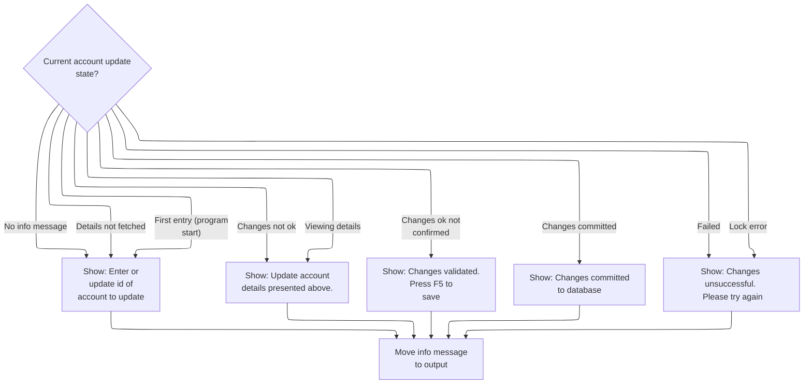

This section determines which information message is shown to the user during the account update process, based on the current state, and ensures the message is presented in the UI.

| Rule ID | Code Location      | Category       | Rule Name                         | Description                                                                                                                                                | Conditions                                                                                                                                    | Remarks                                                                                                                                                      |
| ------- | ------------------ | -------------- | --------------------------------- | ---------------------------------------------------------------------------------------------------------------------------------------------------------- | --------------------------------------------------------------------------------------------------------------------------------------------- | ------------------------------------------------------------------------------------------------------------------------------------------------------------ |
| BR-001  | 3250-SETUP-INFOMSG | Business logic | Prompt for account ID             | When the account update process is at program start or details have not been fetched, the user is prompted to enter or update the account ID.              | If CDEMO-PGM-CONTEXT = 0 (program start) or ACUP-CHANGE-ACTION is LOW-VALUES or SPACES (details not fetched), or if there is no info message. | The message shown is: 'Enter or update id of account to update'. This is an alphanumeric string presented to the user.                                       |
| BR-002  | 3250-SETUP-INFOMSG | Business logic | Prompt for account update details | When the user is viewing account details or changes are not okay, the user is prompted to update the account details presented.                            | If ACUP-CHANGE-ACTION = 'S' (show details) or 'E' (changes not ok).                                                                           | The message shown is: 'Update account details presented above.'. This is an alphanumeric string presented to the user.                                       |
| BR-003  | 3250-SETUP-INFOMSG | Business logic | Prompt for confirmation           | When changes have been validated but not confirmed, the user is prompted to confirm and save the changes.                                                  | If ACUP-CHANGE-ACTION = 'N' (changes ok not confirmed).                                                                                       | The message shown is: 'Changes validated.Press F5 to save'. This is an alphanumeric string presented to the user.                                            |
| BR-004  | 3250-SETUP-INFOMSG | Business logic | Show commit success               | When changes have been successfully committed, the user is informed that changes were committed to the database.                                           | If ACUP-CHANGE-ACTION = 'C' (changes okayed and done).                                                                                        | The message shown is: 'Changes committed to database'. This is an alphanumeric string presented to the user.                                                 |
| BR-005  | 3250-SETUP-INFOMSG | Business logic | Show commit failure               | When a lock error or failure occurs after attempting to commit changes, the user is informed that the changes were unsuccessful and prompted to try again. | If ACUP-CHANGE-ACTION = 'L' (lock error) or 'F' (failed).                                                                                     | The message shown is: 'Changes unsuccessful. Please try again'. This is an alphanumeric string presented to the user.                                        |
| BR-006  | 3250-SETUP-INFOMSG | Business logic | Copy messages to output           | After the appropriate message is selected, the information and error messages are copied to the output fields for display to the user.                     | After any message selection in the account update process.                                                                                    | The info message and error message are copied as alphanumeric strings to the output fields for the UI. Output fields are sized to match the message content. |

<SwmSnippet path="/app/cbl/COACTUPC.cbl" line="2955" repo-id="Z2l0aHViJTNBJTNBa3luZHJ5bC1hd3MtbWFpbmZyYW1lLW1vZGVybml6YXRpb24tY2FyZGRlbW8lM0ElM0FTd2ltbS1EZW1v">

---

In `3250-SETUP-INFOMSG`, the code uses EVALUATE to check the current state and sets the right info message flag. This controls what the user sees as a prompt or status message.

```cobol
       3250-SETUP-INFOMSG.
      *    SETUP INFORMATION MESSAGE
           EVALUATE TRUE
               WHEN CDEMO-PGM-ENTER
                    SET  PROMPT-FOR-SEARCH-KEYS TO TRUE
               WHEN ACUP-DETAILS-NOT-FETCHED
                   SET PROMPT-FOR-SEARCH-KEYS      TO TRUE
               WHEN ACUP-SHOW-DETAILS
                    SET PROMPT-FOR-CHANGES         TO TRUE
               WHEN ACUP-CHANGES-NOT-OK
                    SET PROMPT-FOR-CHANGES         TO TRUE
               WHEN ACUP-CHANGES-OK-NOT-CONFIRMED
                    SET PROMPT-FOR-CONFIRMATION    TO TRUE
               WHEN ACUP-CHANGES-OKAYED-AND-DONE
                    SET CONFIRM-UPDATE-SUCCESS     TO TRUE

               WHEN ACUP-CHANGES-OKAYED-LOCK-ERROR
                    SET INFORM-FAILURE             TO TRUE
               WHEN ACUP-CHANGES-OKAYED-BUT-FAILED
                    SET INFORM-FAILURE             TO TRUE
               WHEN WS-NO-INFO-MESSAGE
                   SET PROMPT-FOR-SEARCH-KEYS      TO TRUE
           END-EVALUATE
```

---

</SwmSnippet>

<SwmSnippet path="/app/cbl/COACTUPC.cbl" line="2979" repo-id="Z2l0aHViJTNBJTNBa3luZHJ5bC1hd3MtbWFpbmZyYW1lLW1vZGVybml6YXRpb24tY2FyZGRlbW8lM0ElM0FTd2ltbS1EZW1v">

---

After picking the right message, the code copies the info and error messages to the output fields for the UI. This is how the user sees prompts and errors.

```cobol
           MOVE WS-INFO-MSG                    TO INFOMSGO OF CACTUPAO

           MOVE WS-RETURN-MSG                  TO ERRMSGO OF CACTUPAO
           .
```

---

</SwmSnippet>

### Screen Field Attribute Protection and Editability

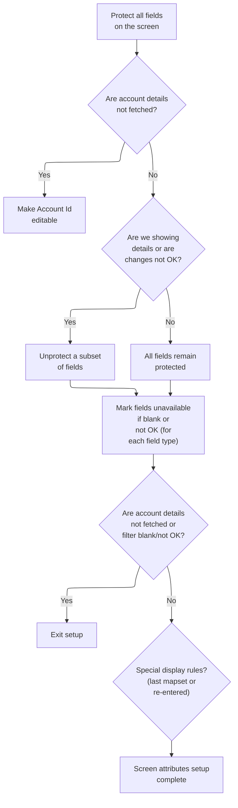

This section sets up the screen field attributes for the account update screen, determining which fields are editable or protected, how errors are highlighted, and how the user is guided to correct input issues.

| Rule ID | Code Location                                     | Category        | Rule Name                              | Description                                                                                                                                                                    | Conditions                                                                                                   | Remarks                                                                                                                                                                                                                            |
| ------- | ------------------------------------------------- | --------------- | -------------------------------------- | ------------------------------------------------------------------------------------------------------------------------------------------------------------------------------ | ------------------------------------------------------------------------------------------------------------ | ---------------------------------------------------------------------------------------------------------------------------------------------------------------------------------------------------------------------------------- |
| BR-001  | 3300-SETUP-SCREEN-ATTRS                           | Data validation | Cursor positioning on validation error | If any field fails validation (is blank or not OK), the cursor is positioned on the first such field to guide the user to correct their input.                                 | When any field's validation flag indicates blank or not OK.                                                  | Cursor position is set by moving -1 to the location variable for the field. This applies to all fields listed in the EVALUATE block.                                                                                               |
| BR-002  | 3300-SETUP-SCREEN-ATTRS, 3310-PROTECT-ALL-ATTRS   | Business logic  | Initial field protection               | All fields on the account update screen are initially set to protected (read-only) to prevent editing until further business logic determines which fields should be editable. | Whenever the account update screen is being set up, regardless of the account state.                         | All fields listed in the code are set to protected using the DFHBMPRF constant. This applies to account ID, status, limits, dates, customer data, address, phone, and other fields. Protected fields are not editable by the user. |
| BR-003  | 3300-SETUP-SCREEN-ATTRS                           | Business logic  | Editable Account ID on missing details | If account details have not been fetched, only the Account ID field is made editable so the user can enter or correct it.                                                      | When ACUP-DETAILS-NOT-FETCHED is true (ACUP-CHANGE-ACTION is LOW-VALUES or SPACES).                          | The Account ID field is set to editable using the DFHBMFSE constant. All other fields remain protected.                                                                                                                            |
| BR-004  | 3300-SETUP-SCREEN-ATTRS, 3320-UNPROTECT-FEW-ATTRS | Business logic  | Contextual field editability           | If the screen is in 'show details' mode or changes are not OK, a subset of fields relevant to the current state are made editable, while others remain protected.              | When ACUP-SHOW-DETAILS (ACUP-CHANGE-ACTION = 'S') or ACUP-CHANGES-NOT-OK (ACUP-CHANGE-ACTION = 'E') is true. | Editable fields are set using DFHBMFSE, while some remain protected using DFHBMPRF. The subset includes status, limits, dates, customer data, address, phone, and other fields as listed in the code.                              |
| BR-005  | 3300-SETUP-SCREEN-ATTRS                           | Business logic  | Reset field color on screen transition | When returning from the list screen, the Account ID field color is reset to the default to ensure a clean UI state.                                                            | When CDEMO-LAST-MAPSET equals LIT-CCLISTMAPSET ('COCRDLI').                                                  | The Account ID field color is set to DFHDFCOL (default color constant).                                                                                                                                                            |
| BR-006  | 3300-SETUP-SCREEN-ATTRS                           | Business logic  | Consistent screen attribute setup      | Screen attributes for all fields are set up using a macro to ensure consistent formatting and maintainability across all fields.                                               | Whenever the screen attribute setup process is not aborted.                                                  | Attributes are set for all fields using the COPY CSSETATY REPLACING macro, ensuring consistent formatting for status, limits, dates, customer data, address, phone, and other fields.                                              |
| BR-007  | 3300-SETUP-SCREEN-ATTRS                           | Error handling  | Error highlighting for Account ID      | If the account filter is invalid or blank, the Account ID field is highlighted in red and may display an asterisk to indicate an error.                                        | When FLG-ACCTFILTER-NOT-OK or FLG-ACCTFILTER-BLANK is true.                                                  | The Account ID field color is set to DFHRED. If blank and in re-entry mode, an asterisk is displayed in the output field.                                                                                                          |
| BR-008  | 3300-SETUP-SCREEN-ATTRS                           | Error handling  | Abort setup on missing or invalid data | If account details are not fetched or the account filter is blank or invalid, the screen attribute setup process is aborted and no further setup occurs.                       | When ACUP-DETAILS-NOT-FETCHED, FLG-ACCTFILTER-BLANK, or FLG-ACCTFILTER-NOT-OK is true.                       | No further screen attribute setup is performed if these conditions are met.                                                                                                                                                        |

<SwmSnippet path="/app/cbl/COACTUPC.cbl" line="2986" repo-id="Z2l0aHViJTNBJTNBa3luZHJ5bC1hd3MtbWFpbmZyYW1lLW1vZGVybml6YXRpb24tY2FyZGRlbW8lM0ElM0FTd2ltbS1EZW1v">

---

In `3300-SETUP-SCREEN-ATTRS`, the code first protects all fields by calling 3310-PROTECT-ALL-ATTRS. This locks down the UI so only the right fields are editable later.

```cobol
       3300-SETUP-SCREEN-ATTRS.

      *    PROTECT ALL FIELDS
           PERFORM 3310-PROTECT-ALL-ATTRS
              THRU 3310-PROTECT-ALL-ATTRS-EXIT
```

---

</SwmSnippet>

<SwmSnippet path="/app/cbl/COACTUPC.cbl" line="3441" repo-id="Z2l0aHViJTNBJTNBa3luZHJ5bC1hd3MtbWFpbmZyYW1lLW1vZGVybml6YXRpb24tY2FyZGRlbW8lM0ElM0FTd2ltbS1EZW1v">

---

`3310-PROTECT-ALL-ATTRS` copies all the relevant field attributes from DFHBMPRF to CACTUPAI, one by one. This locks down all fields so nothing is editable until we say so.

```cobol
       3310-PROTECT-ALL-ATTRS.
           MOVE DFHBMPRF              TO ACCTSIDA OF CACTUPAI
                                         ACSTTUSA OF CACTUPAI
      *Account Limits
                                         ACRDLIMA OF CACTUPAI
                                         ACSHLIMA OF CACTUPAI
                                         ACURBALA OF CACTUPAI
                                         ACRCYCRA OF CACTUPAI
                                         ACRCYDBA OF CACTUPAI
      *Account dates
                                         OPNYEARA OF CACTUPAI
                                         OPNMONA  OF CACTUPAI
                                         OPNDAYA  OF CACTUPAI
                                         EXPYEARA OF CACTUPAI
                                         EXPMONA  OF CACTUPAI
                                         EXPDAYA  OF CACTUPAI
                                         RISYEARA OF CACTUPAI
                                         RISMONA  OF CACTUPAI
                                         RISDAYA  OF CACTUPAI

                                         AADDGRPA OF CACTUPAI
      *Customer data
                                         ACSTNUMA OF CACTUPAI
                                         ACTSSN1A OF CACTUPAI
                                         ACTSSN2A OF CACTUPAI
                                         ACTSSN3A OF CACTUPAI
                                         ACSTFCOA OF CACTUPAI
      *Date of Birth
                                         DOBYEARA OF CACTUPAI
                                         DOBMONA  OF CACTUPAI
                                         DOBDAYA  OF CACTUPAI

                                         ACSFNAMA OF CACTUPAI
                                         ACSMNAMA OF CACTUPAI
                                         ACSLNAMA OF CACTUPAI
      *Address
                                         ACSADL1A OF CACTUPAI
                                         ACSADL2A OF CACTUPAI
                                         ACSCITYA OF CACTUPAI
                                         ACSSTTEA OF CACTUPAI
                                         ACSZIPCA OF CACTUPAI
                                         ACSCTRYA OF CACTUPAI

                                         ACSPH1AA OF CACTUPAI
                                         ACSPH1BA OF CACTUPAI
                                         ACSPH1CA OF CACTUPAI
                                         ACSPH2AA OF CACTUPAI
                                         ACSPH2BA OF CACTUPAI
                                         ACSPH2CA OF CACTUPAI

                                         ACSGOVTA OF CACTUPAI
                                         ACSEFTCA OF CACTUPAI
                                         ACSPFLGA OF CACTUPAI
                                         INFOMSGA OF CACTUPAI
           .
```

---

</SwmSnippet>

<SwmSnippet path="/app/cbl/COACTUPC.cbl" line="2993" repo-id="Z2l0aHViJTNBJTNBa3luZHJ5bC1hd3MtbWFpbmZyYW1lLW1vZGVybml6YXRpb24tY2FyZGRlbW8lM0ElM0FTd2ltbS1EZW1v">

---

Back in `3300-SETUP-SCREEN-ATTRS`, after protecting all fields, the code checks the current state and either makes the account ID editable or calls 3320-UNPROTECT-FEW-ATTRS to open up more fields for editing. This keeps the UI tight and context-aware.

```cobol
           EVALUATE TRUE
              WHEN ACUP-DETAILS-NOT-FETCHED
      *            Make Account Id editable
                   MOVE DFHBMFSE      TO ACCTSIDA OF CACTUPAI
              WHEN  ACUP-SHOW-DETAILS
              WHEN  ACUP-CHANGES-NOT-OK
                   PERFORM 3320-UNPROTECT-FEW-ATTRS
                      THRU 3320-UNPROTECT-FEW-ATTRS-EXIT
              WHEN ACUP-CHANGES-OK-NOT-CONFIRMED
              WHEN ACUP-CHANGES-OKAYED-AND-DONE
                   CONTINUE
              WHEN OTHER
                   MOVE DFHBMFSE      TO ACCTSIDA OF CACTUPAI
           END-EVALUATE
```

---

</SwmSnippet>

<SwmSnippet path="/app/cbl/COACTUPC.cbl" line="3500" repo-id="Z2l0aHViJTNBJTNBa3luZHJ5bC1hd3MtbWFpbmZyYW1lLW1vZGVybml6YXRpb24tY2FyZGRlbW8lM0ElM0FTd2ltbS1EZW1v">

---

`3320-UNPROTECT-FEW-ATTRS` sets certain fields to unprotected (editable) by moving DFHBMFSE or DFHBMPRF to the right places in CACTUPAI. Only the fields relevant for the current state get unlocked.

```cobol
       3320-UNPROTECT-FEW-ATTRS.

           MOVE DFHBMFSE              TO ACSTTUSA OF CACTUPAI
      *Account Limits
                                         ACRDLIMA OF CACTUPAI
                                         ACSHLIMA OF CACTUPAI
                                         ACURBALA OF CACTUPAI
                                         ACRCYCRA OF CACTUPAI
                                         ACRCYDBA OF CACTUPAI
      *Account dates
      *Open Date
                                         OPNYEARA OF CACTUPAI
                                         OPNMONA  OF CACTUPAI
                                         OPNDAYA  OF CACTUPAI
      *Expiry date
                                         EXPYEARA OF CACTUPAI
                                         EXPMONA  OF CACTUPAI
                                         EXPDAYA  OF CACTUPAI
      *Reissue date
                                         RISYEARA OF CACTUPAI
                                         RISMONA  OF CACTUPAI
                                         RISDAYA  OF CACTUPAI
      *Date of Birth
                                         DOBYEARA OF CACTUPAI
                                         DOBMONA  OF CACTUPAI
                                         DOBDAYA  OF CACTUPAI


                                         AADDGRPA OF CACTUPAI
      *Customer data
            MOVE DFHBMPRF            TO  ACSTNUMA OF CACTUPAI
            MOVE DFHBMFSE            TO  ACTSSN1A OF CACTUPAI         
                                         ACTSSN2A OF CACTUPAI
                                         ACTSSN3A OF CACTUPAI
                                         ACSTFCOA OF CACTUPAI

                                         ACSFNAMA OF CACTUPAI
                                         ACSMNAMA OF CACTUPAI
                                         ACSLNAMA OF CACTUPAI
      *Address
                                         ACSADL1A OF CACTUPAI
                                         ACSADL2A OF CACTUPAI
                                         ACSCITYA OF CACTUPAI
                                         ACSSTTEA OF CACTUPAI
                                         ACSZIPCA OF CACTUPAI
      *Since most of the edits are USA specific protected country
           MOVE DFHBMPRF              TO ACSCTRYA OF CACTUPAI

           MOVE DFHBMFSE              TO ACSPH1AA OF CACTUPAI
                                         ACSPH1BA OF CACTUPAI
                                         ACSPH1CA OF CACTUPAI

           MOVE DFHBMFSE              TO ACSPH2AA OF CACTUPAI
                                         ACSPH2BA OF CACTUPAI
                                         ACSPH2CA OF CACTUPAI

                                         ACSGOVTA OF CACTUPAI
                                         ACSEFTCA OF CACTUPAI
                                         ACSPFLGA OF CACTUPAI
           MOVE DFHBMPRF              TO INFOMSGA OF CACTUPAI
           .
```

---

</SwmSnippet>

<SwmSnippet path="/app/cbl/COACTUPC.cbl" line="3009" repo-id="Z2l0aHViJTNBJTNBa3luZHJ5bC1hd3MtbWFpbmZyYW1lLW1vZGVybml6YXRpb24tY2FyZGRlbW8lM0ElM0FTd2ltbS1EZW1v">

---

Back in `3300-SETUP-SCREEN-ATTRS`, after unlocking the right fields, the code checks validation flags and sets the cursor to the first field with an error or blank. This makes it easy for the user to see where to fix their input.

```cobol
           EVALUATE TRUE
              WHEN FOUND-ACCOUNT-DATA
              WHEN NO-CHANGES-DETECTED
                  MOVE -1              TO ACSTTUSL OF CACTUPAI
              WHEN FLG-ACCTFILTER-NOT-OK
              WHEN FLG-ACCTFILTER-BLANK
                   MOVE -1             TO ACCTSIDL OF CACTUPAI
      *    Account Status
              WHEN FLG-ACCT-STATUS-NOT-OK
              WHEN FLG-ACCT-STATUS-BLANK
                  MOVE -1              TO ACSTTUSL OF CACTUPAI
      *    Open Year
              WHEN FLG-OPEN-YEAR-NOT-OK
              WHEN FLG-OPEN-YEAR-BLANK
                  MOVE -1              TO OPNYEARL OF CACTUPAI
      *    Open Month
              WHEN FLG-OPEN-MONTH-NOT-OK
              WHEN FLG-OPEN-MONTH-BLANK
                  MOVE -1              TO OPNMONL  OF CACTUPAI
      *    Open Day
              WHEN FLG-OPEN-DAY-NOT-OK
              WHEN FLG-OPEN-DAY-BLANK
                  MOVE -1              TO OPNDAYL  OF CACTUPAI
      *    Credit Limit
              WHEN FLG-CRED-LIMIT-NOT-OK
              WHEN FLG-CRED-LIMIT-BLANK
                  MOVE -1              TO ACRDLIML OF CACTUPAI
      *    Expiry Year
              WHEN FLG-EXPIRY-YEAR-NOT-OK
              WHEN FLG-EXPIRY-YEAR-BLANK
                  MOVE -1              TO EXPYEARL OF CACTUPAI
      *    Expiry Month
              WHEN FLG-EXPIRY-MONTH-NOT-OK
              WHEN FLG-EXPIRY-MONTH-BLANK
                  MOVE -1              TO EXPMONL  OF CACTUPAI
      *    Expiry Day
              WHEN FLG-EXPIRY-DAY-NOT-OK
              WHEN FLG-EXPIRY-DAY-BLANK
                  MOVE -1              TO EXPDAYL  OF CACTUPAI
      *    Cash credit limit
              WHEN FLG-CASH-CREDIT-LIMIT-NOT-OK
              WHEN FLG-CASH-CREDIT-LIMIT-BLANK
                  MOVE -1              TO ACSHLIML OF CACTUPAI
      *    Reissue Year
              WHEN FLG-REISSUE-YEAR-NOT-OK
              WHEN FLG-REISSUE-YEAR-BLANK
                  MOVE -1              TO RISYEARL OF CACTUPAI
      *    Expiry Month
              WHEN FLG-REISSUE-MONTH-NOT-OK
              WHEN FLG-REISSUE-MONTH-BLANK
                  MOVE -1              TO RISMONL  OF CACTUPAI
```

---

</SwmSnippet>

<SwmSnippet path="/app/cbl/COACTUPC.cbl" line="3061" repo-id="Z2l0aHViJTNBJTNBa3luZHJ5bC1hd3MtbWFpbmZyYW1lLW1vZGVybml6YXRpb24tY2FyZGRlbW8lM0ElM0FTd2ltbS1EZW1v">

---

Here, the code checks if the 'Reissue Day' field is blank or invalid and moves -1 to RISDAYL OF CACTUPAI. This means the cursor will jump to this field on the screen, guiding the user to fix their input. It's part of the cursor positioning logic that highlights the first field with an error. The next snippet continues this pattern for other fields.

```cobol
              WHEN FLG-REISSUE-DAY-NOT-OK
              WHEN FLG-REISSUE-DAY-BLANK
                  MOVE -1              TO RISDAYL  OF CACTUPAI
```

---

</SwmSnippet>

<SwmSnippet path="/app/cbl/COACTUPC.cbl" line="3066" repo-id="Z2l0aHViJTNBJTNBa3luZHJ5bC1hd3MtbWFpbmZyYW1lLW1vZGVybml6YXRpb24tY2FyZGRlbW8lM0ElM0FTd2ltbS1EZW1v">

---

Next, the code keeps looping through all the fields that might be invalid or blank, moving -1 to their cursor location variable if needed. This keeps the cursor logic consistent—whichever field fails validation first gets the cursor. The following snippet continues this for the remaining fields.

```cobol
              WHEN FLG-CURR-BAL-NOT-OK
              WHEN FLG-CURR-BAL-BLANK
                  MOVE -1              TO ACURBALL OF CACTUPAI
      *    Current Cycle Credit
              WHEN FLG-CURR-CYC-CREDIT-NOT-OK
              WHEN FLG-CURR-CYC-CREDIT-BLANK
                  MOVE -1              TO ACRCYCRL OF CACTUPAI
      *    Current Cycle Debit
              WHEN FLG-CURR-CYC-DEBIT-NOT-OK
              WHEN FLG-CURR-CYC-DEBIT-BLANK
                  MOVE -1              TO ACRCYDBL OF CACTUPAI
      *    SSN Part 1
              WHEN FLG-EDIT-US-SSN-PART1-NOT-OK
              WHEN FLG-EDIT-US-SSN-PART1-BLANK
                  MOVE -1              TO ACTSSN1L OF CACTUPAI
      *    SSN Part 2
              WHEN FLG-EDIT-US-SSN-PART2-NOT-OK
              WHEN FLG-EDIT-US-SSN-PART2-BLANK
                  MOVE -1              TO ACTSSN2L  OF CACTUPAI
      *    SSN Part 3
              WHEN FLG-EDIT-US-SSN-PART3-NOT-OK
              WHEN FLG-EDIT-US-SSN-PART3-BLANK
                  MOVE -1              TO ACTSSN3L  OF CACTUPAI
      *    Date of Birth Year
              WHEN FLG-DT-OF-BIRTH-YEAR-NOT-OK
              WHEN FLG-DT-OF-BIRTH-YEAR-BLANK
                  MOVE -1              TO DOBYEARL OF CACTUPAI
      *    Date of Birth Month
              WHEN FLG-DT-OF-BIRTH-MONTH-NOT-OK
              WHEN FLG-DT-OF-BIRTH-MONTH-BLANK
                  MOVE -1              TO DOBMONL  OF CACTUPAI
      *    Date of Birth Day
              WHEN FLG-DT-OF-BIRTH-DAY-NOT-OK
              WHEN FLG-DT-OF-BIRTH-DAY-BLANK
                  MOVE -1              TO DOBDAYL  OF CACTUPAI
      *    FICO Score
              WHEN FLG-FICO-SCORE-NOT-OK
              WHEN FLG-FICO-SCORE-BLANK
                  MOVE -1              TO ACSTFCOL OF CACTUPAI
      *    First Name
              WHEN FLG-FIRST-NAME-NOT-OK
              WHEN FLG-FIRST-NAME-BLANK
                  MOVE -1              TO ACSFNAML OF CACTUPAI
      *    Middle Name
              WHEN FLG-MIDDLE-NAME-NOT-OK
                  MOVE -1              TO ACSMNAML OF CACTUPAI
      *    Last Name
              WHEN FLG-LAST-NAME-NOT-OK
              WHEN FLG-LAST-NAME-BLANK
                  MOVE -1              TO ACSLNAML OF CACTUPAI
      *    Address Line 1
              WHEN FLG-ADDRESS-LINE-1-NOT-OK
              WHEN FLG-ADDRESS-LINE-1-BLANK
                  MOVE -1              TO ACSADL1L OF CACTUPAI
```

---

</SwmSnippet>

<SwmSnippet path="/app/cbl/COACTUPC.cbl" line="3121" repo-id="Z2l0aHViJTNBJTNBa3luZHJ5bC1hd3MtbWFpbmZyYW1lLW1vZGVybml6YXRpb24tY2FyZGRlbW8lM0ElM0FTd2ltbS1EZW1v">

---

Here, the code checks if the state field is blank or invalid and sets the cursor there if needed. It's just another field in the error/cursor scan. The next snippet continues with zip code and other fields.

```cobol
              WHEN FLG-STATE-NOT-OK
              WHEN FLG-STATE-BLANK
                  MOVE -1              TO ACSSTTEL OF CACTUPAI
```

---

</SwmSnippet>

<SwmSnippet path="/app/cbl/COACTUPC.cbl" line="3126" repo-id="Z2l0aHViJTNBJTNBa3luZHJ5bC1hd3MtbWFpbmZyYW1lLW1vZGVybml6YXRpb24tY2FyZGRlbW8lM0ElM0FTd2ltbS1EZW1v">

---

Here, the code finishes the EVALUATE block for cursor positioning. It checks the rest of the fields (zip, city, country, phone, etc.) and sets the cursor to the first one with an error or blank. If none match, it defaults to the account ID field. This wraps up the cursor logic before moving on to color and attribute handling.

```cobol
              WHEN FLG-ZIPCODE-NOT-OK
              WHEN FLG-ZIPCODE-BLANK
                  MOVE -1              TO ACSZIPCL OF CACTUPAI
      *    Address Line 3 (City)
              WHEN FLG-CITY-NOT-OK
              WHEN FLG-CITY-BLANK
                  MOVE -1              TO ACSCITYL OF CACTUPAI
      *    Country edits.
              WHEN FLG-COUNTRY-NOT-OK
              WHEN FLG-COUNTRY-BLANK
                  MOVE -1              TO ACSCTRYL OF CACTUPAI
      *    Phone 1
              WHEN FLG-PHONE-NUM-1A-NOT-OK
              WHEN FLG-PHONE-NUM-1A-BLANK
                  MOVE -1              TO ACSPH1AL OF CACTUPAI
              WHEN FLG-PHONE-NUM-1B-NOT-OK
              WHEN FLG-PHONE-NUM-1B-BLANK
                  MOVE -1              TO ACSPH1BL OF CACTUPAI
              WHEN FLG-PHONE-NUM-1C-NOT-OK
              WHEN FLG-PHONE-NUM-1C-BLANK
                  MOVE -1              TO ACSPH1CL OF CACTUPAI
      *    Phone 2
              WHEN FLG-PHONE-NUM-2A-NOT-OK
              WHEN FLG-PHONE-NUM-2A-BLANK
                  MOVE -1              TO ACSPH2AL OF CACTUPAI
              WHEN FLG-PHONE-NUM-2B-NOT-OK
              WHEN FLG-PHONE-NUM-2B-BLANK
                  MOVE -1              TO ACSPH2BL OF CACTUPAI
              WHEN FLG-PHONE-NUM-2C-NOT-OK
              WHEN FLG-PHONE-NUM-2C-BLANK
                  MOVE -1              TO ACSPH2CL OF CACTUPAI
      *    EFT Account Id
              WHEN FLG-EFT-ACCOUNT-ID-NOT-OK
              WHEN FLG-EFT-ACCOUNT-ID-BLANK
                  MOVE -1              TO ACSEFTCL OF CACTUPAI
      *    Primary Card Holder
              WHEN FLG-PRI-CARDHOLDER-NOT-OK
              WHEN FLG-PRI-CARDHOLDER-BLANK
                  MOVE -1              TO ACSPFLGL OF CACTUPAI
              WHEN OTHER
                  MOVE -1              TO ACCTSIDL OF CACTUPAI
            END-EVALUATE
```

---

</SwmSnippet>

<SwmSnippet path="/app/cbl/COACTUPC.cbl" line="3171" repo-id="Z2l0aHViJTNBJTNBa3luZHJ5bC1hd3MtbWFpbmZyYW1lLW1vZGVybml6YXRpb24tY2FyZGRlbW8lM0ElM0FTd2ltbS1EZW1v">

---

Here, the code checks if the last mapset was the list screen and resets the account ID field color to default. This keeps the UI clean when switching screens. The next snippet handles error coloring for invalid account IDs.

```cobol
           IF CDEMO-LAST-MAPSET   EQUAL LIT-CCLISTMAPSET
              MOVE DFHDFCOL            TO ACCTSIDC OF CACTUPAO
           END-IF
```

---

</SwmSnippet>

<SwmSnippet path="/app/cbl/COACTUPC.cbl" line="3176" repo-id="Z2l0aHViJTNBJTNBa3luZHJ5bC1hd3MtbWFpbmZyYW1lLW1vZGVybml6YXRpb24tY2FyZGRlbW8lM0ElM0FTd2ltbS1EZW1v">

---

Here, if the account filter isn't valid, the code sets the account ID field color to red. This visually flags the error for the user. The next snippet adds an output marker for blank account IDs.

```cobol
           IF FLG-ACCTFILTER-NOT-OK
              MOVE DFHRED              TO ACCTSIDC OF CACTUPAO
           END-IF
```

---

</SwmSnippet>

<SwmSnippet path="/app/cbl/COACTUPC.cbl" line="3180" repo-id="Z2l0aHViJTNBJTNBa3luZHJ5bC1hd3MtbWFpbmZyYW1lLW1vZGVybml6YXRpb24tY2FyZGRlbW8lM0ElM0FTd2ltbS1EZW1v">

---

Here, if the account filter is blank and we're in re-entry mode, the code puts an asterisk in the output field and sets the color to red. This double-highlights the field so the user can't miss it. The next snippet handles early exit if details aren't fetched or the filter is still bad.

```cobol
           IF  FLG-ACCTFILTER-BLANK
           AND CDEMO-PGM-REENTER
               MOVE '*'                TO ACCTSIDO OF CACTUPAO
               MOVE DFHRED             TO ACCTSIDC OF CACTUPAO
           END-IF
```

---

</SwmSnippet>

<SwmSnippet path="/app/cbl/COACTUPC.cbl" line="3186" repo-id="Z2l0aHViJTNBJTNBa3luZHJ5bC1hd3MtbWFpbmZyYW1lLW1vZGVybml6YXRpb24tY2FyZGRlbW8lM0ElM0FTd2ltbS1EZW1v">

---

This just bails out of the attribute setup if the account details aren't ready or the filter is bad.

```cobol
           IF ACUP-DETAILS-NOT-FETCHED
           OR FLG-ACCTFILTER-BLANK
           OR FLG-ACCTFILTER-NOT-OK
              GO TO 3300-SETUP-SCREEN-ATTRS-EXIT
           ELSE
              CONTINUE
           END-IF
```

---

</SwmSnippet>

<SwmSnippet path="/app/cbl/COACTUPC.cbl" line="3208" repo-id="Z2l0aHViJTNBJTNBa3luZHJ5bC1hd3MtbWFpbmZyYW1lLW1vZGVybml6YXRpb24tY2FyZGRlbW8lM0ElM0FTd2ltbS1EZW1v">

---

Finally, the code sets up screen attributes for all the remaining fields using COPY CSSETATY REPLACING. This is just a macro trick to avoid repeating the same logic for every field. It keeps things maintainable and consistent. After this, the function is done and returns.

```cobol
           COPY CSSETATY REPLACING
             ==(TESTVAR1)== BY ==ACCT-STATUS==
             ==(SCRNVAR2)== BY ==ACSTTUS==
             ==(MAPNAME3)== BY ==CACTUPA== .

      *    Open Year
           COPY CSSETATY REPLACING
             ==(TESTVAR1)== BY ==OPEN-YEAR==
             ==(SCRNVAR2)== BY ==OPNYEAR==
             ==(MAPNAME3)== BY ==CACTUPA== .

      *    Open Month
           COPY CSSETATY REPLACING
             ==(TESTVAR1)== BY ==OPEN-MONTH==
             ==(SCRNVAR2)== BY ==OPNMON==
             ==(MAPNAME3)== BY ==CACTUPA== .

      *    Open Day
           COPY CSSETATY REPLACING
             ==(TESTVAR1)== BY ==OPEN-DAY==
             ==(SCRNVAR2)== BY ==OPNDAY==
             ==(MAPNAME3)== BY ==CACTUPA== .

      *    Credit Limit
           COPY CSSETATY REPLACING
             ==(TESTVAR1)== BY ==CRED-LIMIT==
             ==(SCRNVAR2)== BY ==ACRDLIM==
             ==(MAPNAME3)== BY ==CACTUPA== .

      *    Expiry Year
           COPY CSSETATY REPLACING
             ==(TESTVAR1)== BY ==EXPIRY-YEAR==
             ==(SCRNVAR2)== BY ==EXPYEAR==
             ==(MAPNAME3)== BY ==CACTUPA== .

      *    Expiry Month
           COPY CSSETATY REPLACING
             ==(TESTVAR1)== BY ==EXPIRY-MONTH==
             ==(SCRNVAR2)== BY ==EXPMON==
             ==(MAPNAME3)== BY ==CACTUPA== .

      *    Expiry Day
           COPY CSSETATY REPLACING
             ==(TESTVAR1)== BY ==EXPIRY-DAY==
             ==(SCRNVAR2)== BY ==EXPDAY==
             ==(MAPNAME3)== BY ==CACTUPA== .

      *    Cash Credit Limit
           COPY CSSETATY REPLACING
             ==(TESTVAR1)== BY ==CASH-CREDIT-LIMIT==
             ==(SCRNVAR2)== BY ==ACSHLIM==
             ==(MAPNAME3)== BY ==CACTUPA== .

      *    Reissue Year
           COPY CSSETATY REPLACING
             ==(TESTVAR1)== BY ==REISSUE-YEAR==
             ==(SCRNVAR2)== BY ==RISYEAR==
             ==(MAPNAME3)== BY ==CACTUPA== .

      *    Reissue Month
           COPY CSSETATY REPLACING
             ==(TESTVAR1)== BY ==REISSUE-MONTH==
             ==(SCRNVAR2)== BY ==RISMON==
             ==(MAPNAME3)== BY ==CACTUPA== .

      *    Reissue Day
           COPY CSSETATY REPLACING
             ==(TESTVAR1)== BY ==REISSUE-DAY==
             ==(SCRNVAR2)== BY ==RISDAY==
             ==(MAPNAME3)== BY ==CACTUPA== .

      *    Current Balance
           COPY CSSETATY REPLACING
             ==(TESTVAR1)== BY ==CURR-BAL==
             ==(SCRNVAR2)== BY ==ACURBAL==
             ==(MAPNAME3)== BY ==CACTUPA== .

      *    Current Cycle Credit
           COPY CSSETATY REPLACING
             ==(TESTVAR1)== BY ==CURR-CYC-CREDIT==
             ==(SCRNVAR2)== BY ==ACRCYCR==
             ==(MAPNAME3)== BY ==CACTUPA== .

      *    Current Cycle Debit
           COPY CSSETATY REPLACING
             ==(TESTVAR1)== BY ==CURR-CYC-DEBIT==
             ==(SCRNVAR2)== BY ==ACRCYDB==
             ==(MAPNAME3)== BY ==CACTUPA== .

      *    SSN Part 1
           COPY CSSETATY REPLACING
             ==(TESTVAR1)== BY ==EDIT-US-SSN-PART1==
             ==(SCRNVAR2)== BY ==ACTSSN1==
             ==(MAPNAME3)== BY ==CACTUPA== .

      *    SSN Part 2
           COPY CSSETATY REPLACING
             ==(TESTVAR1)== BY ==EDIT-US-SSN-PART2==
             ==(SCRNVAR2)== BY ==ACTSSN2==
             ==(MAPNAME3)== BY ==CACTUPA== .

      *    SSN Part 3
           COPY CSSETATY REPLACING
             ==(TESTVAR1)== BY ==EDIT-US-SSN-PART3==
             ==(SCRNVAR2)== BY ==ACTSSN3==
             ==(MAPNAME3)== BY ==CACTUPA== .

      *    Date of Birth Year
           COPY CSSETATY REPLACING
             ==(TESTVAR1)== BY ==DT-OF-BIRTH-YEAR==
             ==(SCRNVAR2)== BY ==DOBYEAR==
             ==(MAPNAME3)== BY ==CACTUPA== .

      *    Date of Birth Month
           COPY CSSETATY REPLACING
             ==(TESTVAR1)== BY ==DT-OF-BIRTH-MONTH==
             ==(SCRNVAR2)== BY ==DOBMON==
             ==(MAPNAME3)== BY ==CACTUPA== .

      *    Date of Birth Day
           COPY CSSETATY REPLACING
             ==(TESTVAR1)== BY ==DT-OF-BIRTH-DAY==
             ==(SCRNVAR2)== BY ==DOBDAY==
             ==(MAPNAME3)== BY ==CACTUPA== .

      *    FICO Score
           COPY CSSETATY REPLACING
             ==(TESTVAR1)== BY ==FICO-SCORE==
             ==(SCRNVAR2)== BY ==ACSTFCO==
             ==(MAPNAME3)== BY ==CACTUPA== .

      *    First Name
           COPY CSSETATY REPLACING
             ==(TESTVAR1)== BY ==FIRST-NAME==
             ==(SCRNVAR2)== BY ==ACSFNAM==
             ==(MAPNAME3)== BY ==CACTUPA== .

      *    Middle Name (no edits coded)
           COPY CSSETATY REPLACING
             ==(TESTVAR1)== BY ==MIDDLE-NAME==
             ==(SCRNVAR2)== BY ==ACSMNAM==
             ==(MAPNAME3)== BY ==CACTUPA== .

      *    Last Name
           COPY CSSETATY REPLACING
             ==(TESTVAR1)== BY ==LAST-NAME==
             ==(SCRNVAR2)== BY ==ACSLNAM==
             ==(MAPNAME3)== BY ==CACTUPA== .

      *    Address Line 1
           COPY CSSETATY REPLACING
             ==(TESTVAR1)== BY ==ADDRESS-LINE-1==
             ==(SCRNVAR2)== BY ==ACSADL1==
             ==(MAPNAME3)== BY ==CACTUPA== .

      *    State
           COPY CSSETATY REPLACING
             ==(TESTVAR1)== BY ==STATE==
             ==(SCRNVAR2)== BY ==ACSSTTE==
             ==(MAPNAME3)== BY ==CACTUPA== .

      *    Address Line 2 (NO EDITS CODED AS YET)
           COPY CSSETATY REPLACING
             ==(TESTVAR1)== BY ==ADDRESS-LINE-2==
             ==(SCRNVAR2)== BY ==ACSADL2==
             ==(MAPNAME3)== BY ==CACTUPA== .

      *    State
           COPY CSSETATY REPLACING
             ==(TESTVAR1)== BY ==ZIPCODE==
             ==(SCRNVAR2)== BY ==ACSZIPC==
             ==(MAPNAME3)== BY ==CACTUPA== .

      *    City
           COPY CSSETATY REPLACING
             ==(TESTVAR1)== BY ==CITY==
             ==(SCRNVAR2)== BY ==ACSCITY==
             ==(MAPNAME3)== BY ==CACTUPA== .

      *    Country
           COPY CSSETATY REPLACING
             ==(TESTVAR1)== BY ==COUNTRY==
             ==(SCRNVAR2)== BY ==ACSCTRY==
             ==(MAPNAME3)== BY ==CACTUPA== .

      *    Phone 1 Area Code
           COPY CSSETATY REPLACING
             ==(TESTVAR1)== BY ==PHONE-NUM-1A==
             ==(SCRNVAR2)== BY ==ACSPH1A==
             ==(MAPNAME3)== BY ==CACTUPA== .

      *    Phone 1 Prefix
           COPY CSSETATY REPLACING
             ==(TESTVAR1)== BY ==PHONE-NUM-1B==
             ==(SCRNVAR2)== BY ==ACSPH1B==
             ==(MAPNAME3)== BY ==CACTUPA== .
      *    Phone 1 Line number
           COPY CSSETATY REPLACING
             ==(TESTVAR1)== BY ==PHONE-NUM-1C==
             ==(SCRNVAR2)== BY ==ACSPH1C==
             ==(MAPNAME3)== BY ==CACTUPA== .

      *    Phone 2 Area Code
           COPY CSSETATY REPLACING
             ==(TESTVAR1)== BY ==PHONE-NUM-2A==
             ==(SCRNVAR2)== BY ==ACSPH2A==
             ==(MAPNAME3)== BY ==CACTUPA== .

      *    Phone 2 Prefix
           COPY CSSETATY REPLACING
             ==(TESTVAR1)== BY ==PHONE-NUM-2B==
             ==(SCRNVAR2)== BY ==ACSPH2B==
             ==(MAPNAME3)== BY ==CACTUPA== .
      *    Phone 2 Line number
           COPY CSSETATY REPLACING
             ==(TESTVAR1)== BY ==PHONE-NUM-2C==
             ==(SCRNVAR2)== BY ==ACSPH2C==
             ==(MAPNAME3)== BY ==CACTUPA== .
      *    EFT Account Id
           COPY CSSETATY REPLACING
             ==(TESTVAR1)== BY ==PRI-CARDHOLDER==
             ==(SCRNVAR2)== BY ==ACSPFLG==
             ==(MAPNAME3)== BY ==CACTUPA== .
      *    Primary Card Holder
           COPY CSSETATY REPLACING
             ==(TESTVAR1)== BY ==EFT-ACCOUNT-ID==
             ==(SCRNVAR2)== BY ==ACSEFTC==
             ==(MAPNAME3)== BY ==CACTUPA== .
           .
```

---

</SwmSnippet>

### Setting Info Message Attributes

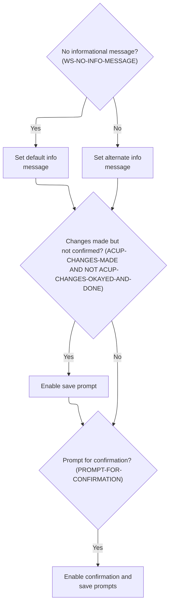

This section sets up the visual attributes for informational messages and action prompts on the account update screen, ensuring users are clearly informed about available actions and required confirmations.

| Rule ID | Code Location            | Category       | Rule Name                        | Description                                                                                                                                                                                                                      | Conditions                                                                                | Remarks                                                                                                                                                                                                                |
| ------- | ------------------------ | -------------- | -------------------------------- | -------------------------------------------------------------------------------------------------------------------------------------------------------------------------------------------------------------------------------- | ----------------------------------------------------------------------------------------- | ---------------------------------------------------------------------------------------------------------------------------------------------------------------------------------------------------------------------- |
| BR-001  | 3390-SETUP-INFOMSG-ATTRS | Business logic | Default info message display     | If there is no informational message to display (i.e., the info message is blank or contains low-values), the info message area is set to its default visual attribute.                                                          | WS-INFO-MSG is blank (spaces) or contains low-values.                                     | The info message area is set to the default attribute. The output format is a visual area on the screen with standard (non-highlighted) appearance.                                                                    |
| BR-002  | 3390-SETUP-INFOMSG-ATTRS | Business logic | Highlighted info message display | If there is an informational message to display, the info message area is set to a highlighted visual attribute to draw the user's attention.                                                                                    | WS-INFO-MSG contains any value other than blank (spaces) or low-values.                   | The info message area is set to a highlighted attribute. The output format is a visual area on the screen with a highlighted appearance to indicate an active message.                                                 |
| BR-003  | 3390-SETUP-INFOMSG-ATTRS | Business logic | Save prompt for unsaved changes  | If there are unsaved changes and those changes have not been confirmed, the save action key (FKEY12A) is highlighted to prompt the user to save or confirm their changes.                                                        | ACUP-CHANGE-ACTION is one of ('E', 'N', 'C', 'L', 'F') and ACUP-CHANGE-ACTION is not 'C'. | The save action key is set to a highlighted attribute. The output format is a visual key on the screen (FKEY12A) with a highlighted appearance, indicating that saving or confirmation is required.                    |
| BR-004  | 3390-SETUP-INFOMSG-ATTRS | Business logic | Confirmation and save prompt     | If the info message is prompting for confirmation (i.e., the info message equals 'Changes validated.Press F5 to save'), both the confirm (FKEY05A) and save (FKEY12A) action keys are highlighted to indicate available actions. | WS-INFO-MSG equals 'Changes validated.Press F5 to save'.                                  | Both confirm and save action keys are set to highlighted attributes. The output format is two visual keys on the screen (FKEY05A and FKEY12A) with highlighted appearance, indicating that either action can be taken. |

<SwmSnippet path="/app/cbl/COACTUPC.cbl" line="3566" repo-id="Z2l0aHViJTNBJTNBa3luZHJ5bC1hd3MtbWFpbmZyYW1lLW1vZGVybml6YXRpb24tY2FyZGRlbW8lM0ElM0FTd2ltbS1EZW1v">

---

In `3390-SETUP-INFOMSG-ATTRS`, the code checks if there's an info message to show. If not, it sets a default (probably blank) attribute; if there is, it sets the attribute to highlight the info message area. This is the start of setting up info message attributes for the screen.

```cobol
       3390-SETUP-INFOMSG-ATTRS.
           IF  WS-NO-INFO-MESSAGE
               MOVE DFHBMDAR           TO INFOMSGA OF CACTUPAI
           ELSE
               MOVE DFHBMASB           TO INFOMSGA OF CACTUPAI
           END-IF
```

---

</SwmSnippet>

<SwmSnippet path="/app/cbl/COACTUPC.cbl" line="3573" repo-id="Z2l0aHViJTNBJTNBa3luZHJ5bC1hd3MtbWFpbmZyYW1lLW1vZGVybml6YXRpb24tY2FyZGRlbW8lM0ElM0FTd2ltbS1EZW1v">

---

Here, if there are unsaved changes, the code highlights FKEY12A so the user knows they can take an action (like save or confirm). If changes are already confirmed, it skips this. The next snippet handles the confirmation prompt state.

```cobol
           IF ACUP-CHANGES-MADE
           AND NOT ACUP-CHANGES-OKAYED-AND-DONE
               MOVE DFHBMASB           TO FKEY12A  OF CACTUPAI
           END-IF
```

---

</SwmSnippet>

<SwmSnippet path="/app/cbl/COACTUPC.cbl" line="3578" repo-id="Z2l0aHViJTNBJTNBa3luZHJ5bC1hd3MtbWFpbmZyYW1lLW1vZGVybml6YXRpb24tY2FyZGRlbW8lM0ElM0FTd2ltbS1EZW1v">

---

Finally, if the info message is prompting for confirmation, the code highlights both FKEY05A and FKEY12A. This makes it clear to the user that they can confirm/save with either key. After this, the function returns.

```cobol
           IF PROMPT-FOR-CONFIRMATION
               MOVE DFHBMASB           TO FKEY05A  OF CACTUPAI
               MOVE DFHBMASB           TO FKEY12A  OF CACTUPAI
           END-IF
```

---

</SwmSnippet>

### Sending the Screen to the User

This section is responsible for presenting a user interface screen to the user, ensuring the display is clean and ready for new interaction.

| Rule ID | Code Location    | Category       | Rule Name                   | Description                                                                                                                            | Conditions                                                                                       | Remarks                                                                                                                                                            |
| ------- | ---------------- | -------------- | --------------------------- | -------------------------------------------------------------------------------------------------------------------------------------- | ------------------------------------------------------------------------------------------------ | ------------------------------------------------------------------------------------------------------------------------------------------------------------------ |
| BR-001  | 3400-SEND-SCREEN | Business logic | Screen display selection    | The system must display the designated screen to the user, using the specified map and mapset identifiers.                             | When the section is executed, the map and mapset identifiers are set to their designated values. | The mapset and map identifiers are set to the values of LIT-THISMAPSET and LIT-THISMAP, respectively. These constants determine which screen is shown to the user. |
| BR-002  | 3400-SEND-SCREEN | Business logic | Screen erase before display | The system must clear the user interface before displaying the new screen, ensuring no residual data from previous screens is visible. | Whenever a screen is sent to the user in this section.                                           | The ERASE operation ensures that the entire screen is cleared before new data is displayed. The output is a blank screen followed by the new content.              |
| BR-003  | 3400-SEND-SCREEN | Business logic | Keyboard buffer reset       | The system must reset the keyboard buffer when displaying the screen, so the user starts with a fresh input state.                     | Whenever a screen is sent to the user in this section.                                           | The FREEKB operation resets the keyboard buffer, ensuring no previous keystrokes affect the current screen interaction.                                            |

<SwmSnippet path="/app/cbl/COACTUPC.cbl" line="3589" repo-id="Z2l0aHViJTNBJTNBa3luZHJ5bC1hd3MtbWFpbmZyYW1lLW1vZGVybml6YXRpb24tY2FyZGRlbW8lM0ElM0FTd2ltbS1EZW1v">

---

`3400-SEND-SCREEN` sets up which map and mapset to send, then calls EXEC CICS SEND MAP to actually display the screen. It uses ERASE to clear the screen and FREEKB to reset the keyboard buffer, so the user gets a clean slate. The next step is returning from the main logic.

```cobol
       3400-SEND-SCREEN.

           MOVE LIT-THISMAPSET         TO CCARD-NEXT-MAPSET
           MOVE LIT-THISMAP            TO CCARD-NEXT-MAP

           EXEC CICS SEND MAP(CCARD-NEXT-MAP)
                          MAPSET(CCARD-NEXT-MAPSET)
                          FROM(CACTUPAO)
                          CURSOR
                          ERASE
                          FREEKB
                          RESP(WS-RESP-CD)
           END-EXEC
```

---

</SwmSnippet>

## Returning Control After Sending the Screen

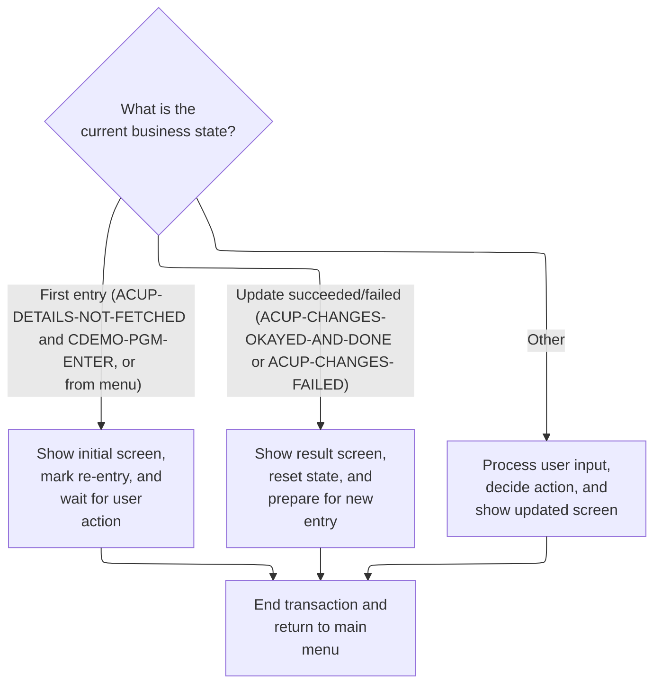

This section determines what happens after the screen is sent to the user, based on the current business state. It routes control to show the correct screen, update the business state, and return control to the main menu or caller.

| Rule ID | Code Location | Category       | Rule Name                            | Description                                                                                                                                                                                       | Conditions                                                                                                                            | Remarks                                                                                                                                                                                                                                                               |
| ------- | ------------- | -------------- | ------------------------------------ | ------------------------------------------------------------------------------------------------------------------------------------------------------------------------------------------------- | ------------------------------------------------------------------------------------------------------------------------------------- | --------------------------------------------------------------------------------------------------------------------------------------------------------------------------------------------------------------------------------------------------------------------- |
| BR-001  | 0000-MAIN     | Business logic | Initial entry screen                 | When the user first enters the program or returns from the menu, the initial account update screen is displayed, the state is marked for re-entry, and the program waits for further user action. | ACUP-DETAILS-NOT-FETCHED is true and CDEMO-PGM-ENTER is true, or CDEMO-FROM-PROGRAM equals 'COMEN01C' and CDEMO-PGM-REENTER is false. | ACUP-DETAILS-NOT-FETCHED is true when ACUP-CHANGE-ACTION is LOW-VALUES or SPACES. CDEMO-PGM-ENTER is true when CDEMO-PGM-CONTEXT = 0. CDEMO-FROM-PROGRAM is 'COMEN01C' (menu program). The initial screen format is determined by the map sent in 3000-SEND-MAP.      |
| BR-002  | 0000-MAIN     | Business logic | Update result screen                 | When an account update succeeds or fails, the result screen is displayed, the state is reset for a new entry, and the program prepares for the next transaction.                                  | ACUP-CHANGES-OKAYED-AND-DONE is true or ACUP-CHANGES-FAILED is true.                                                                  | ACUP-CHANGES-OKAYED-AND-DONE is true when ACUP-CHANGE-ACTION = 'C'. ACUP-CHANGES-FAILED is true when ACUP-CHANGE-ACTION = 'L' or 'F'. The result screen format is determined by the map sent in 3000-SEND-MAP.                                                        |
| BR-003  | 0000-MAIN     | Business logic | Process user input and update screen | For all other business states, user input is processed, the appropriate business action is decided, and the updated screen is displayed.                                                          | None of the special cases for initial entry or update result are true.                                                                | This applies when the business state does not match initial entry or update result. The updated screen format is determined by the map sent in 3000-SEND-MAP.                                                                                                         |
| BR-004  | COMMON-RETURN | Business logic | Transaction end and return control   | After sending the screen in any business state, the transaction is ended and control is returned to the main menu or caller, with all relevant messages and state information passed back.        | After any screen is sent and before program exit.                                                                                     | The return message is copied to the common error message field (75 characters, alphanumeric). The commarea is built by concatenating the shared and program-specific areas. Control is returned via CICS RETURN with the transaction ID 'CAUP' and the full commarea. |

<SwmSnippet path="/app/cbl/COACTUPC.cbl" line="964" repo-id="Z2l0aHViJTNBJTNBa3luZHJ5bC1hd3MtbWFpbmZyYW1lLW1vZGVybml6YXRpb24tY2FyZGRlbW8lM0ElM0FTd2ltbS1EZW1v">

---

Back in 0000-MAIN, after sending the map, the code immediately jumps to COMMON-RETURN. This hands control back to CICS, making sure any updated state or messages are passed along. No extra logic here—just a clean exit after the screen is sent.

```cobol
              WHEN ACUP-DETAILS-NOT-FETCHED
               AND CDEMO-PGM-ENTER
              WHEN CDEMO-FROM-PROGRAM   EQUAL LIT-MENUPGM
               AND NOT CDEMO-PGM-REENTER
                   INITIALIZE WS-THIS-PROGCOMMAREA
                   PERFORM 3000-SEND-MAP THRU
                           3000-SEND-MAP-EXIT
                   SET CDEMO-PGM-REENTER        TO TRUE
                   SET ACUP-DETAILS-NOT-FETCHED TO TRUE
                   GO TO COMMON-RETURN
```

---

</SwmSnippet>

<SwmSnippet path="/app/cbl/COACTUPC.cbl" line="1007" repo-id="Z2l0aHViJTNBJTNBa3luZHJ5bC1hd3MtbWFpbmZyYW1lLW1vZGVybml6YXRpb24tY2FyZGRlbW8lM0ElM0FTd2ltbS1EZW1v">

---

`COMMON-RETURN` copies any return message to the common error message field, then builds the commarea by concatenating the shared and program-specific areas. Finally, it calls EXEC CICS RETURN to hand control (and all state) back to the caller. That's the last step before the program ends or waits for the next input.

```cobol
       COMMON-RETURN.
           MOVE WS-RETURN-MSG     TO CCARD-ERROR-MSG

           MOVE  CARDDEMO-COMMAREA    TO WS-COMMAREA
           MOVE  WS-THIS-PROGCOMMAREA TO
                  WS-COMMAREA(LENGTH OF CARDDEMO-COMMAREA + 1:
                               LENGTH OF WS-THIS-PROGCOMMAREA )

           EXEC CICS RETURN
                TRANSID (LIT-THISTRANID)
                COMMAREA (WS-COMMAREA)
                LENGTH(LENGTH OF WS-COMMAREA)
           END-EXEC
```

---

</SwmSnippet>

<SwmSnippet path="/app/cbl/COACTUPC.cbl" line="979" repo-id="Z2l0aHViJTNBJTNBa3luZHJ5bC1hd3MtbWFpbmZyYW1lLW1vZGVybml6YXRpb24tY2FyZGRlbW8lM0ElM0FTd2ltbS1EZW1v">

---

Back in 0000-MAIN, after COMMON-RETURN, the program is done for this transaction. Control is back with CICS, and nothing else in this path runs until the next user input triggers a new transaction.

```cobol
              WHEN ACUP-CHANGES-OKAYED-AND-DONE
              WHEN ACUP-CHANGES-FAILED
                   INITIALIZE WS-THIS-PROGCOMMAREA
                              WS-MISC-STORAGE
                              CDEMO-ACCT-ID
                   SET CDEMO-PGM-ENTER            TO TRUE
                   PERFORM 3000-SEND-MAP THRU
                           3000-SEND-MAP-EXIT
                   SET CDEMO-PGM-REENTER          TO TRUE
                   SET ACUP-DETAILS-NOT-FETCHED   TO TRUE
                   GO TO COMMON-RETURN
```

---

</SwmSnippet>

<SwmSnippet path="/app/cbl/COACTUPC.cbl" line="996" repo-id="Z2l0aHViJTNBJTNBa3luZHJ5bC1hd3MtbWFpbmZyYW1lLW1vZGVybml6YXRpb24tY2FyZGRlbW8lM0ElM0FTd2ltbS1EZW1v">

---

At the end of 0000-MAIN, if none of the special cases matched, the code calls 1000-PROCESS-INPUTS. This is where user input is actually processed and validated. The main EVALUATE block acts as a state machine, routing control based on what just happened or what the user did.

```cobol
              WHEN OTHER
                   PERFORM 1000-PROCESS-INPUTS
                      THRU 1000-PROCESS-INPUTS-EXIT
                   PERFORM 2000-DECIDE-ACTION
                      THRU 2000-DECIDE-ACTION-EXIT
                   PERFORM 3000-SEND-MAP
                      THRU 3000-SEND-MAP-EXIT
                   GO TO COMMON-RETURN
           END-EVALUATE
```

---

</SwmSnippet>

# Processing User Inputs

This section is responsible for orchestrating the processing of user input from the screen, ensuring that input is received and validated in the correct sequence before further business logic is applied.

| Rule ID | Code Location       | Category       | Rule Name                           | Description                                                                                                                           | Conditions                                                    | Remarks                                                                                                                                                                             |
| ------- | ------------------- | -------------- | ----------------------------------- | ------------------------------------------------------------------------------------------------------------------------------------- | ------------------------------------------------------------- | ----------------------------------------------------------------------------------------------------------------------------------------------------------------------------------- |
| BR-001  | 1000-PROCESS-INPUTS | Business logic | Input Reception Precedes Validation | User input from the screen must be received before any validation or editing is performed.                                            | Whenever user input is to be processed in this section.       | This rule ensures that the raw user input is always captured before any validation or editing logic is applied. No specific field formats are enforced at this orchestration level. |
| BR-002  | 1000-PROCESS-INPUTS | Business logic | Mandatory Input Validation          | Validation and editing of user input must always be performed after input is received.                                                | Whenever user input is processed in this section.             | This rule ensures that all user input is subject to validation and editing before any further processing. The specifics of validation are handled in a different paragraph.         |
| BR-003  | 1000-PROCESS-INPUTS | Technical step | Input Processing Orchestration      | The section must orchestrate the input processing sequence by invoking the input reception and validation steps in the correct order. | Whenever the section is executed as part of the program flow. | This rule ensures the correct sequence of operations for input processing. No specific data formats are enforced at this orchestration level.                                       |

<SwmSnippet path="/app/cbl/COACTUPC.cbl" line="1025" repo-id="Z2l0aHViJTNBJTNBa3luZHJ5bC1hd3MtbWFpbmZyYW1lLW1vZGVybml6YXRpb24tY2FyZGRlbW8lM0ElM0FTd2ltbS1EZW1v">

---

In `1000-PROCESS-INPUTS`, the code first grabs the user's input from the screen (PERFORM 1100-RECEIVE-MAP), then runs validation and edit logic (PERFORM 1200-EDIT-MAP-INPUTS). After that, it sets up the next screen and error message fields. The next step is to actually receive the map data.

```cobol
       1000-PROCESS-INPUTS.
           PERFORM 1100-RECEIVE-MAP
              THRU 1100-RECEIVE-MAP-EXIT
           PERFORM 1200-EDIT-MAP-INPUTS
              THRU 1200-EDIT-MAP-INPUTS-EXIT
```

---

</SwmSnippet>

## Receiving Screen Input

This section receives and interprets user input from the account update screen, mapping it into the system's internal fields and preparing it for further processing.

| Rule ID | Code Location    | Category       | Rule Name                            | Description                                                                                                                                                      | Conditions                                                                             | Remarks                                                                                                                                                                                                           |
| ------- | ---------------- | -------------- | ------------------------------------ | ---------------------------------------------------------------------------------------------------------------------------------------------------------------- | -------------------------------------------------------------------------------------- | ----------------------------------------------------------------------------------------------------------------------------------------------------------------------------------------------------------------- |
| BR-001  | 1100-RECEIVE-MAP | Business logic | Clear Field on Blank or Star         | If a user enters '\*' or leaves a field blank, the corresponding field is cleared in the system, indicating the user wishes to remove or reset the value.        | The user input for a field is either '\*' or blank (spaces).                           | The '\*' character and blank (spaces) are treated as signals to clear the field. The cleared value is represented internally as 'LOW-VALUES', which is a system-specific way to indicate an empty or reset field. |
| BR-002  | 1100-RECEIVE-MAP | Business logic | Update Field with User Input         | If a user enters a value that is not '\*' or blank, the system updates the corresponding field with the provided value.                                          | The user input for a field is not '\*' and not blank (spaces).                         | The input value is copied as-is to the corresponding working field. No transformation is applied unless the field is numeric (see separate rule).                                                                 |
| BR-003  | 1100-RECEIVE-MAP | Business logic | Early Exit on Details Not Fetched    | If the system determines that details have not been fetched, it exits the input processing logic early and does not process further input.                       | The details-not-fetched flag is set (i.e., the change action is LOW-VALUES or SPACES). | The system checks a flag representing whether details are available. If not, it skips further input processing.                                                                                                   |
| BR-004  | 1100-RECEIVE-MAP | Business logic | Currency String to Number Conversion | When a user enters a currency-formatted string for a numeric field, the system converts the string to a numeric value, handling currency symbols and formatting. | The user input for a numeric field contains a currency-formatted string.               | The input may include currency symbols, commas, or other formatting. The system converts this to a numeric value for internal use.                                                                                |

<SwmSnippet path="/app/cbl/COACTUPC.cbl" line="1039" repo-id="Z2l0aHViJTNBJTNBa3luZHJ5bC1hd3MtbWFpbmZyYW1lLW1vZGVybml6YXRpb24tY2FyZGRlbW8lM0ElM0FTd2ltbS1EZW1v">

---

In `1100-RECEIVE-MAP`, the code uses EXEC CICS RECEIVE MAP to pull the user's input from the screen into the CACTUPAI area. This is the first step in handling user input after a screen is displayed.

```cobol
       1100-RECEIVE-MAP.
           EXEC CICS RECEIVE MAP(LIT-THISMAP)
                     MAPSET(LIT-THISMAPSET)
                     INTO(CACTUPAI)
                     RESP(WS-RESP-CD)
                     RESP2(WS-REAS-CD)
           END-EXEC
```

---

</SwmSnippet>

<SwmSnippet path="/app/cbl/COACTUPC.cbl" line="1047" repo-id="Z2l0aHViJTNBJTNBa3luZHJ5bC1hd3MtbWFpbmZyYW1lLW1vZGVybml6YXRpb24tY2FyZGRlbW8lM0ElM0FTd2ltbS1EZW1v">

---

After receiving the map, the code loops through each input field. If the user entered '\*' or left it blank, it clears the corresponding working field. Otherwise, it copies the value over and, for numbers, tries to convert it. This keeps the working storage in sync with what the user actually entered. The next step checks if we should exit early if details aren't fetched.

```cobol
           INITIALIZE ACUP-NEW-DETAILS
      ******************************************************************
      *    Account Master data
      ******************************************************************
           IF  ACCTSIDI OF CACTUPAI = '*'
           OR  ACCTSIDI OF CACTUPAI = SPACES
               MOVE LOW-VALUES           TO CC-ACCT-ID
                                            ACUP-NEW-ACCT-ID-X
           ELSE
               MOVE ACCTSIDI OF CACTUPAI TO CC-ACCT-ID
                                            ACUP-NEW-ACCT-ID-X
           END-IF
```

---

</SwmSnippet>

<SwmSnippet path="/app/cbl/COACTUPC.cbl" line="1060" repo-id="Z2l0aHViJTNBJTNBa3luZHJ5bC1hd3MtbWFpbmZyYW1lLW1vZGVybml6YXRpb24tY2FyZGRlbW8lM0ElM0FTd2ltbS1EZW1v">

---

If details aren't fetched, we just bail out early and skip the rest of the input logic.

```cobol
           IF ACUP-DETAILS-NOT-FETCHED
              GO TO 1100-RECEIVE-MAP-EXIT
           END-IF
```

---

</SwmSnippet>

### Editing and Validating Inputs

```mermaid
%%{init: {"flowchart": {"defaultRenderer": "elk"}} }%%
flowchart TD
    node1["Start input validation"]
    click node1 openCode "app/cbl/COACTUPC.cbl:1429:1432"
    node1 --> node2{"Details fetched? (ACUP-DETAILS-NOT-FETCHED)"}
    click node2 openCode "app/cbl/COACTUPC.cbl:1433:1433"
    node2 -->|"No"| node10
    node2 -->|"Yes"| node3["Validating Account ID"]
    
    node3 --> node4{"Search criteria missing? 
 (FLG-ACCTFILTER-BLANK)"}
    click node4 openCode "app/cbl/COACTUPC.cbl:1441:1441"
    node4 -->|"Yes"| node5["Set 'No search 
 criteria received'"]
    click node5 openCode "app/cbl/COACTUPC.cbl:1442:1442"
    node5 --> node17["End"]
    node4 -->|"No"| node6["Set account/customer found 
 flags"]
    click node6 openCode "app/cbl/COACTUPC.cbl:1452:1457"
    node6 --> node7["Comparing Old and New Data"]
    
    node7 --> node8{"No changes or 
 already confirmed/done?"}
    click node8 openCode "app/cbl/COACTUPC.cbl:1463:1465"
    node8 -->|"Yes"| node9["Clear non-key flags"]
    click node9 openCode "app/cbl/COACTUPC.cbl:1466:1467"
    node9 --> node17
    node8 -->|"No"| node10["Validate account status 
 (1220-EDIT-YESNO)"]
    click node10 openCode "app/cbl/COACTUPC.cbl:1472:1475"
    node10 --> node11["Validate open date 
 (EDIT-DATE-CCYYMMDD)"]
    click node11 openCode "app/cpy/CSUTLDPY.cpy:18:20"
    node11 --> node12["Validate credit limit 
 (1250-EDIT-SIGNED-9V2)"]
    click node12 openCode "app/cbl/COACTUPC.cbl:1484:1487"
    node12 --> node13["Validate expiry date 
 (EDIT-DATE-CCYYMMDD)"]
    click node13 openCode "app/cpy/CSUTLDPY.cpy:18:20"
    node13 --> node14["Validate cash credit 
 limit (1250-EDIT-SIGNED-9V2)"]
    click node14 openCode "app/cbl/COACTUPC.cbl:1496:1500"
    node14 --> node15["Validate reissue date 
 (EDIT-DATE-CCYYMMDD)"]
    click node15 openCode "app/cpy/CSUTLDPY.cpy:18:20"
    node15 --> node16["Validate current balance 
 (1250-EDIT-SIGNED-9V2)"]
    click node16 openCode "app/cbl/COACTUPC.cbl:1509:1512"
    node16 --> node18["Validate cycle credit 
 limit (1250-EDIT-SIGNED-9V2)"]
    click node18 openCode "app/cbl/COACTUPC.cbl:1515:1519"
    node18 --> node19["Validate cycle debit 
 limit (1250-EDIT-SIGNED-9V2)"]
    click node19 openCode "app/cbl/COACTUPC.cbl:1522:1526"
    node19 --> node20["Validate SSN (1265-EDIT-US-SSN)"]
    click node20 openCode "app/cbl/COACTUPC.cbl:1529:1531"
    node20 --> node21["Enforcing Date of Birth Rules"]
    
    node21 --> node22{"Date of birth 
 valid?"}
    click node22 openCode "app/cbl/COACTUPC.cbl:1539:1543"
    node22 -->|"Yes"| node23["Further date of 
 birth validation"]
    click node23 openCode "app/cpy/CSUTLDPY.cpy:341:360"
    node22 -->|"No"| node24["Continue"]
    node23 --> node24
    node24 --> node25["Validate FICO score 
 (1245-EDIT-NUM-REQD)"]
    click node25 openCode "app/cbl/COACTUPC.cbl:1545:1550"
    node25 --> node26{"FICO score valid?"}
    click node26 openCode "app/cbl/COACTUPC.cbl:1553:1556"
    node26 -->|"Yes"| node27["Enforcing FICO Score Range"]
    
    node26 -->|"No"| node28["Continue"]
    node27 --> node28
    node28 --> node29["Validate names, address, 
 phone, EFT, cardholder"]
    click node29 openCode "app/cbl/COACTUPC.cbl:1560:1661"
    node29 --> node30{"State and zip 
 valid?"}
    click node30 openCode "app/cbl/COACTUPC.cbl:1665:1667"
    node30 -->|"Yes"| node31["Cross-Validating State and ZIP Code"]
    
    node31 --> node32["Continue"]
    node30 -->|"No"| node32["Continue"]
    node32 --> node33{"INPUT-ERROR?"}
    click node33 openCode "app/cbl/COACTUPC.cbl:1671:1675"
    node33 -->|"Yes"| node17
    node33 -->|"No"| node34["Set 'Changes OK 
 not confirmed'"]
    click node34 openCode "app/cbl/COACTUPC.cbl:1674:1674"
    node34 --> node17["End"]

classDef HeadingStyle fill:#777777,stroke:#333,stroke-width:2px;
click node3 goToHeading "Validating Account ID"
node3:::HeadingStyle
click node7 goToHeading "Comparing Old and New Data"
node7:::HeadingStyle
click node21 goToHeading "Enforcing Date of Birth Rules"
node21:::HeadingStyle
click node27 goToHeading "Enforcing FICO Score Range"
node27:::HeadingStyle
click node31 goToHeading "Cross-Validating State and ZIP Code"
node31:::HeadingStyle
```

This section validates and edits user inputs for account updates, ensuring all required fields are present and correct before changes are accepted.

| Rule ID | Code Location        | Category        | Rule Name                      | Description                                                                                                                                                                                                                                                                                                                                                                                    | Conditions                                                       | Remarks                                                                                                                                                                                                                                                                                            |
| ------- | -------------------- | --------------- | ------------------------------ | ---------------------------------------------------------------------------------------------------------------------------------------------------------------------------------------------------------------------------------------------------------------------------------------------------------------------------------------------------------------------------------------------- | ---------------------------------------------------------------- | -------------------------------------------------------------------------------------------------------------------------------------------------------------------------------------------------------------------------------------------------------------------------------------------------- |
| BR-001  | 1200-EDIT-MAP-INPUTS | Data validation | Required search criteria       | If account details have not been fetched, the system requires valid search criteria to proceed. If no search criteria are received, an error message is set and validation ends.                                                                                                                                                                                                               | Account details are not fetched AND search criteria are missing. | Error message returned is 'No input received'. Search criteria must be present for validation to continue.                                                                                                                                                                                         |
| BR-002  | 1200-EDIT-MAP-INPUTS | Data validation | Field-level validation         | Each field in the account update form (account status, open date, credit limit, expiry date, cash credit limit, reissue date, current balance, cycle credit limit, cycle debit limit, SSN, date of birth, FICO score, names, address, phone, EFT, cardholder indicator) is validated according to its type and business rules. Invalid fields set error flags and may halt further processing. | Account details are present AND changes are detected.            | Field formats include: status (single character), dates (YYYYMMDD, 8 bytes), credit limits and balances (signed number, 12 bytes), SSN (9 digits), FICO score (number, required), names (alphanumeric), address (alphanumeric), phone (US format), EFT (alphanumeric), cardholder indicator (Y/N). |
| BR-003  | 1200-EDIT-MAP-INPUTS | Data validation | State and ZIP cross-validation | State and ZIP code fields are cross-validated to ensure they are both valid and consistent. If both are valid, further cross-validation is performed.                                                                                                                                                                                                                                          | State and ZIP code fields are both valid.                        | State code is a 2-character string, ZIP code is a 5- or 9-digit string. Both must be valid and consistent according to business rules.                                                                                                                                                             |
| BR-004  | 1200-EDIT-MAP-INPUTS | Business logic  | No changes detected            | If no changes are detected in the account data or changes are already confirmed/done, non-key flags are cleared and validation ends.                                                                                                                                                                                                                                                           | No changes found OR changes are already confirmed/done.          | No changes found is indicated by a flag. Changes confirmed/done are indicated by ACUP-CHANGE-ACTION = 'C'.                                                                                                                                                                                         |
| BR-005  | 1200-EDIT-MAP-INPUTS | Error handling  | Error flagging and messaging   | If any field validation fails, the input error flag is set and validation ends. If all validations pass, the system marks the changes as OK but not confirmed.                                                                                                                                                                                                                                 | Any field fails validation OR all validations pass.              | Error flag is set to '1' for input errors. Success is marked by setting 'Changes OK not confirmed'.                                                                                                                                                                                                |

<SwmSnippet path="/app/cbl/COACTUPC.cbl" line="1429" repo-id="Z2l0aHViJTNBJTNBa3luZHJ5bC1hd3MtbWFpbmZyYW1lLW1vZGVybml6YXRpb24tY2FyZGRlbW8lM0ElM0FTd2ltbS1EZW1v">

---

In `1200-EDIT-MAP-INPUTS`, the code checks if details aren't fetched. If so, it validates the search keys (PERFORM 1210-EDIT-ACCOUNT) and exits early if nothing is entered. If details are present, it marks the account/customer as found, compares old/new data, and runs validation for each field. Flags are used everywhere to track what passed or failed. The next step is to validate the account ID.

```cobol
       1200-EDIT-MAP-INPUTS.

           SET INPUT-OK                  TO TRUE

           IF  ACUP-DETAILS-NOT-FETCHED
      *        VALIDATE THE SEARCH KEYS
               PERFORM 1210-EDIT-ACCOUNT
                  THRU 1210-EDIT-ACCOUNT-EXIT
```

---

</SwmSnippet>

#### Validating Account ID

This section validates the Account ID input during account update operations, ensuring that only non-blank and non-invalid Account IDs are accepted before proceeding to further mandatory field checks.

| Rule ID | Code Location     | Category        | Rule Name                             | Description                                                                                                                                                                                     | Conditions                                                        | Remarks                                                                                                                                                                                                                                                                                                |
| ------- | ----------------- | --------------- | ------------------------------------- | ----------------------------------------------------------------------------------------------------------------------------------------------------------------------------------------------- | ----------------------------------------------------------------- | ------------------------------------------------------------------------------------------------------------------------------------------------------------------------------------------------------------------------------------------------------------------------------------------------------ |
| BR-001  | 1210-EDIT-ACCOUNT | Data validation | Account ID blank or invalid rejection | If the Account ID is blank (all spaces) or contains low-values, the system must reject the input, set error indicators, and prompt the user to provide a valid Account ID before proceeding.    | Account ID is equal to spaces or low-values.                      | Account ID is considered blank if it consists entirely of spaces, or invalid if it contains low-values. The prompt message is 'Account number not provided'. Error indicators are set to signal input error and blank account ID. The output fields for Account ID are set to zeroes in this scenario. |
| BR-002  | 1210-EDIT-ACCOUNT | Data validation | Account ID validation pass            | If the Account ID passes the blank and low-value checks, it is considered valid for this context and is copied to the output fields, allowing subsequent mandatory field validation to proceed. | Account ID is not blank and does not contain low-values.          | A valid Account ID is any value that is not all spaces or low-values. The Account ID is copied to output fields for further processing.                                                                                                                                                                |
| BR-003  | 1210-EDIT-ACCOUNT | Error handling  | Early exit on invalid Account ID      | When the Account ID is rejected due to being blank or invalid, the system must not proceed to mandatory field validation and must terminate the current validation flow.                        | Account ID is blank or contains low-values, triggering rejection. | Validation flow is terminated immediately upon detection of blank or invalid Account ID. No further mandatory field checks are performed in this context.                                                                                                                                              |

<SwmSnippet path="/app/cbl/COACTUPC.cbl" line="1783" repo-id="Z2l0aHViJTNBJTNBa3luZHJ5bC1hd3MtbWFpbmZyYW1lLW1vZGVybml6YXRpb24tY2FyZGRlbW8lM0ElM0FTd2ltbS1EZW1v">

---

In `1210-EDIT-ACCOUNT`, the code checks if the account ID is blank or invalid. If so, it sets error flags, prompts for input, and exits early. If the ID is valid, it copies it to the right fields and marks it as valid. The next step is to check mandatory fields.

```cobol
       1210-EDIT-ACCOUNT.
           SET FLG-ACCTFILTER-NOT-OK    TO TRUE

      *    Not supplied
           IF CC-ACCT-ID   EQUAL LOW-VALUES
           OR CC-ACCT-ID   EQUAL SPACES
              SET INPUT-ERROR           TO TRUE
              SET FLG-ACCTFILTER-BLANK  TO TRUE
              IF WS-RETURN-MSG-OFF
                 SET WS-PROMPT-FOR-ACCT TO TRUE
              END-IF
              MOVE ZEROES               TO CDEMO-ACCT-ID
                                           ACUP-NEW-ACCT-ID
              GO TO  1210-EDIT-ACCOUNT-EXIT
           END-IF
```

---

</SwmSnippet>

##### Checking Mandatory Fields

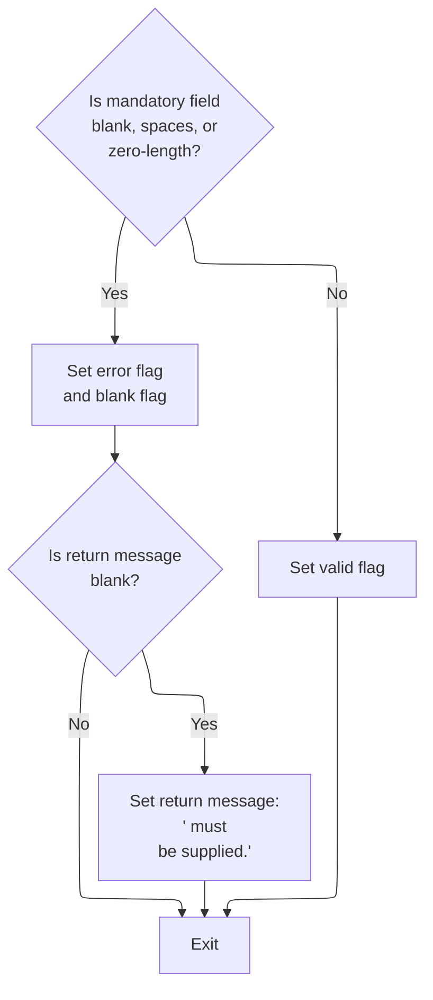

This section validates that mandatory fields are present in the input and provides error feedback if they are missing.

| Rule ID | Code Location       | Category        | Rule Name                                 | Description                                                                                                                                        | Conditions                                                                             | Remarks                                                                                                                                            |
| ------- | ------------------- | --------------- | ----------------------------------------- | -------------------------------------------------------------------------------------------------------------------------------------------------- | -------------------------------------------------------------------------------------- | -------------------------------------------------------------------------------------------------------------------------------------------------- |
| BR-001  | 1215-EDIT-MANDATORY | Data validation | Mandatory field missing                   | If a mandatory field is blank, contains only spaces, or is zero-length, an error is triggered and the field is marked as missing.                  | The field value is blank, contains only spaces, or its trimmed length is zero.         | A field is considered missing if it is blank, contains only spaces, or its trimmed length is zero. The missing flag is set to 'B'.                 |
| BR-002  | 1215-EDIT-MANDATORY | Data validation | Mandatory field valid                     | If a mandatory field is present and not blank, it is marked as valid.                                                                              | The field value is not blank, not spaces, and its trimmed length is greater than zero. | A field is considered valid if it is not blank, not spaces, and its trimmed length is greater than zero. The valid flag is set to LOW-VALUES.      |
| BR-003  | 1215-EDIT-MANDATORY | Error handling  | Error message for missing mandatory field | If a mandatory field is missing and no previous error message exists, an error message is generated in the format '<field name> must be supplied.' | The field is missing and the return message is blank.                                  | The error message is constructed as '<field name> must be supplied.' where <field name> is the display name of the field. The message is a string. |

<SwmSnippet path="/app/cbl/COACTUPC.cbl" line="1824" repo-id="Z2l0aHViJTNBJTNBa3luZHJ5bC1hd3MtbWFpbmZyYW1lLW1vZGVybml6YXRpb24tY2FyZGRlbW8lM0ElM0FTd2ltbS1EZW1v">

---

`1215-EDIT-MANDATORY` checks if a required field is blank (in any way), sets error flags, and builds an error message if needed. If the field is present, it marks it as valid. The next step is to check yes/no fields.

```cobol
       1215-EDIT-MANDATORY.
      *    Initialize
           SET FLG-MANDATORY-NOT-OK    TO TRUE

      *    Not supplied
           IF WS-EDIT-ALPHANUM-ONLY(1:WS-EDIT-ALPHANUM-LENGTH)
                                       EQUAL LOW-VALUES
           OR WS-EDIT-ALPHANUM-ONLY(1:WS-EDIT-ALPHANUM-LENGTH)
                                       EQUAL SPACES
           OR FUNCTION LENGTH(FUNCTION TRIM(
              WS-EDIT-ALPHANUM-ONLY(1:WS-EDIT-ALPHANUM-LENGTH))) = 0

              SET INPUT-ERROR          TO TRUE
              SET FLG-MANDATORY-BLANK  TO TRUE
              IF WS-RETURN-MSG-OFF
                 STRING
                   FUNCTION TRIM(WS-EDIT-VARIABLE-NAME)
                   ' must be supplied.'
                   DELIMITED BY SIZE
                   INTO WS-RETURN-MSG
                 END-STRING
              END-IF

              GO TO  1215-EDIT-MANDATORY-EXIT
           END-IF

           SET FLG-MANDATORY-ISVALID   TO TRUE
           .
```

---

</SwmSnippet>

##### Validating Yes/No Fields

This section validates yes/no input fields, ensuring they are supplied and contain only accepted values, and provides clear error messages when validation fails.

| Rule ID | Code Location   | Category        | Rule Name                             | Description                                                                                                                                                      | Conditions                                                                     | Remarks                                                                                                                                                                                                            |
| ------- | --------------- | --------------- | ------------------------------------- | ---------------------------------------------------------------------------------------------------------------------------------------------------------------- | ------------------------------------------------------------------------------ | ------------------------------------------------------------------------------------------------------------------------------------------------------------------------------------------------------------------ |
| BR-001  | 1220-EDIT-YESNO | Data validation | Required yes/no field                 | If the yes/no field is blank, contains only spaces, or is zero, an error is triggered and the user is informed that the field must be supplied.                  | The yes/no field is blank, contains spaces, or contains zero.                  | Accepted blank values are: LOW-VALUES, SPACES, ZEROS. The error message format is: '\[field name\] must be supplied.' where field name is trimmed and concatenated with the message.                               |
| BR-002  | 1220-EDIT-YESNO | Data validation | Acceptable yes/no values              | If the yes/no field contains a value other than 'Y' or 'N', an error is triggered and the user is informed that only 'Y' or 'N' are accepted.                    | The yes/no field is not blank, not zero, and does not contain 'Y' or 'N'.      | Accepted values are: 'Y', 'N'. Any other value is invalid. The error message format is: '\[field name\] must be Y or N.'                                                                                           |
| BR-003  | 1220-EDIT-YESNO | Error handling  | Error messaging for yes/no validation | When an error is detected in the yes/no field, an error message is constructed and presented to the user, specifying the field name and the nature of the error. | An error is detected due to blank, zero, or invalid value in the yes/no field. | The error message is constructed using the trimmed field name and a descriptive message, e.g., '\[field name\] must be supplied.' or '\[field name\] must be Y or N.'. The message is stored in a string variable. |

<SwmSnippet path="/app/cbl/COACTUPC.cbl" line="1856" repo-id="Z2l0aHViJTNBJTNBa3luZHJ5bC1hd3MtbWFpbmZyYW1lLW1vZGVybml6YXRpb24tY2FyZGRlbW8lM0ElM0FTd2ltbS1EZW1v">

---

In `1220-EDIT-YESNO`, the code checks if the yes/no field is blank or zero, sets errors if so, and builds a message if needed. If the value isn't 'Y' or 'N', it also sets an error and tells the user. The next step is to check required alpha fields.

```cobol
       1220-EDIT-YESNO.
      *    Must be Y or N
      *    SET FLG-YES-NO-NOT-OK         TO TRUE
      *
      *    Not supplied
           IF WS-EDIT-YES-NO             EQUAL LOW-VALUES
           OR WS-EDIT-YES-NO             EQUAL SPACES
           OR WS-EDIT-YES-NO             EQUAL ZEROS
              SET INPUT-ERROR            TO TRUE
              SET FLG-YES-NO-BLANK       TO TRUE
              IF WS-RETURN-MSG-OFF
                 STRING
                   FUNCTION TRIM(WS-EDIT-VARIABLE-NAME)
                   ' must be supplied.'
                   DELIMITED BY SIZE
                   INTO WS-RETURN-MSG
                 END-STRING
              END-IF
              GO TO  1220-EDIT-YESNO-EXIT
           END-IF
```

---

</SwmSnippet>

###### Validating Required Alpha Fields

This section validates that required alpha fields are present in user input and generates error messages if they are missing.

| Rule ID | Code Location        | Category        | Rule Name                     | Description                                                                                                                                                                    | Conditions                                                             | Remarks                                                                                                                                                                                                                |
| ------- | -------------------- | --------------- | ----------------------------- | ------------------------------------------------------------------------------------------------------------------------------------------------------------------------------ | ---------------------------------------------------------------------- | ---------------------------------------------------------------------------------------------------------------------------------------------------------------------------------------------------------------------- |
| BR-001  | 1225-EDIT-ALPHA-REQD | Data validation | Required alpha field presence | If a required alpha field is blank, contains only spaces, or contains only low-values, an error is triggered and a message is generated indicating the field must be supplied. | The field is blank, contains only spaces, or contains only low-values. | The error message format is: '<field name> must be supplied.' The field name is trimmed of leading and trailing spaces before being inserted into the message. The message is a string and is stored for user display. |
| BR-002  | 1225-EDIT-ALPHA-REQD | Data validation | Alpha field valid input       | If a required alpha field is present and not blank, no error message is generated and the field is marked as valid for further processing.                                     | The field contains at least one non-space, non-low-value character.    | No error message is generated. The field is considered valid and processing continues to the next validation step.                                                                                                     |

<SwmSnippet path="/app/cbl/COACTUPC.cbl" line="1898" repo-id="Z2l0aHViJTNBJTNBa3luZHJ5bC1hd3MtbWFpbmZyYW1lLW1vZGVybml6YXRpb24tY2FyZGRlbW8lM0ElM0FTd2ltbS1EZW1v">

---

In `1225-EDIT-ALPHA-REQD`, the code checks if a required field is blank or contains non-alphabetic characters. If so, it sets errors and builds a message. If it's valid, it marks it as such. The next step is to check required alphanumeric fields.

```cobol
       1225-EDIT-ALPHA-REQD.
      *    Initialize
           SET FLG-ALPHA-NOT-OK              TO TRUE

      *    Not supplied
           IF WS-EDIT-ALPHANUM-ONLY(1:WS-EDIT-ALPHANUM-LENGTH)
                                             EQUAL LOW-VALUES
           OR WS-EDIT-ALPHANUM-ONLY(1:WS-EDIT-ALPHANUM-LENGTH)
               EQUAL SPACES
           OR FUNCTION LENGTH(FUNCTION TRIM(
              WS-EDIT-ALPHANUM-ONLY(1:WS-EDIT-ALPHANUM-LENGTH))) = 0

              SET INPUT-ERROR                TO TRUE
              SET FLG-ALPHA-BLANK            TO TRUE
              IF WS-RETURN-MSG-OFF
                 STRING
                   FUNCTION TRIM(WS-EDIT-VARIABLE-NAME)
                   ' must be supplied.'
                   DELIMITED BY SIZE
                   INTO WS-RETURN-MSG
                 END-STRING
              END-IF

              GO TO  1225-EDIT-ALPHA-REQD-EXIT
           END-IF
```

---

</SwmSnippet>

####### Validating Required Alphanumeric Fields

This section validates required alphanumeric fields, ensuring that blank fields are flagged as errors and appropriate messages are generated for missing input.

| Rule ID | Code Location           | Category        | Rule Name                              | Description                                                                                                                                                                                                | Conditions                                                                                       | Remarks                                                                                                                                                                                                                                                          |
| ------- | ----------------------- | --------------- | -------------------------------------- | ---------------------------------------------------------------------------------------------------------------------------------------------------------------------------------------------------------- | ------------------------------------------------------------------------------------------------ | ---------------------------------------------------------------------------------------------------------------------------------------------------------------------------------------------------------------------------------------------------------------- |
| BR-001  | 1230-EDIT-ALPHANUM-REQD | Data validation | Required field blank error             | If a required alphanumeric field is blank (contains only spaces, low-values, or is trimmed to zero length), an error is triggered and an error message is generated indicating the field must be supplied. | The required alphanumeric field contains only spaces, low-values, or its trimmed length is zero. | Blank is defined as any of: all spaces, all low-values, or trimmed length zero. The error message format is: '<field name> must be supplied.' where <field name> is the trimmed name of the field. The message is a string and is stored for display or logging. |
| BR-002  | 1230-EDIT-ALPHANUM-REQD | Data validation | Invalid input blocking                 | When a required alphanumeric field is blank, the system marks the input as invalid and prevents further processing for this field.                                                                         | The required alphanumeric field is blank as defined above.                                       | Blank is defined as spaces, low-values, or trimmed length zero. The field is marked as invalid and processing for this field is halted.                                                                                                                          |
| BR-003  | 1230-EDIT-ALPHANUM-REQD | Data validation | Non-blank input proceeds to validation | If a required alphanumeric field is not blank, it is marked as not yet validated and further checks are performed in subsequent steps.                                                                     | The required alphanumeric field is not blank (does not meet blank criteria).                     | Non-blank is any value not all spaces, not all low-values, and trimmed length greater than zero. The field is marked as not yet validated and will be checked for alphanumeric content in subsequent logic.                                                      |

<SwmSnippet path="/app/cbl/COACTUPC.cbl" line="1955" repo-id="Z2l0aHViJTNBJTNBa3luZHJ5bC1hd3MtbWFpbmZyYW1lLW1vZGVybml6YXRpb24tY2FyZGRlbW8lM0ElM0FTd2ltbS1EZW1v">

---

In `1230-EDIT-ALPHANUM-REQD`, the code checks if a required field is blank or contains non-alphanumeric characters. If so, it sets errors and builds a message. If it's valid, it marks it as such. The next step is to check optional alpha fields.

```cobol
       1230-EDIT-ALPHANUM-REQD.
      *    Initialize
           SET FLG-ALPHNANUM-NOT-OK          TO TRUE

      *    Not supplied
           IF WS-EDIT-ALPHANUM-ONLY(1:WS-EDIT-ALPHANUM-LENGTH)
                                             EQUAL LOW-VALUES
           OR WS-EDIT-ALPHANUM-ONLY(1:WS-EDIT-ALPHANUM-LENGTH)
               EQUAL SPACES
           OR FUNCTION LENGTH(FUNCTION TRIM(
              WS-EDIT-ALPHANUM-ONLY(1:WS-EDIT-ALPHANUM-LENGTH))) = 0

              SET INPUT-ERROR                TO TRUE
              SET FLG-ALPHNANUM-BLANK        TO TRUE
              IF WS-RETURN-MSG-OFF
                 STRING
                   FUNCTION TRIM(WS-EDIT-VARIABLE-NAME)
                   ' must be supplied.'
                   DELIMITED BY SIZE
                   INTO WS-RETURN-MSG
                 END-STRING
              END-IF

              GO TO  1230-EDIT-ALPHANUM-REQD-EXIT
           END-IF
```

---

</SwmSnippet>

######## Validating Optional Alpha Fields

This section validates optional alpha fields, ensuring they are either blank or contain only alphabetic characters. It sets errors for invalid input and allows valid input to proceed.

| Rule ID | Code Location       | Category        | Rule Name                          | Description                                                                                                                                     | Conditions                                                                 | Remarks                                                                                                                                         |
| ------- | ------------------- | --------------- | ---------------------------------- | ----------------------------------------------------------------------------------------------------------------------------------------------- | -------------------------------------------------------------------------- | ----------------------------------------------------------------------------------------------------------------------------------------------- |
| BR-001  | 1235-EDIT-ALPHA-OPT | Data validation | Blank optional field acceptance    | If the optional field is blank (contains only spaces, low-values, or has a trimmed length of zero), it is considered valid and no error is set. | The field contains only spaces, low-values, or its trimmed length is zero. | Blank is defined as the field being all spaces, all low-values, or having a trimmed length of zero. The field is a string up to 256 characters. |
| BR-002  | 1235-EDIT-ALPHA-OPT | Data validation | Non-alphabetic character rejection | If the optional field contains any non-alphabetic characters, it is considered invalid and an error is set.                                     | The field is not blank and contains one or more non-alphabetic characters. | The field is a string up to 256 characters. Non-alphabetic characters include any character that is not A-Z or a-z.                             |
| BR-003  | 1235-EDIT-ALPHA-OPT | Business logic  | Valid optional field processing    | If the optional field is valid (either blank or contains only alphabetic characters), no error message is generated and processing continues.   | The field is blank or contains only alphabetic characters.                 | The field is a string up to 256 characters. Valid input is either blank or all alphabetic characters.                                           |

<SwmSnippet path="/app/cbl/COACTUPC.cbl" line="2012" repo-id="Z2l0aHViJTNBJTNBa3luZHJ5bC1hd3MtbWFpbmZyYW1lLW1vZGVybml6YXRpb24tY2FyZGRlbW8lM0ElM0FTd2ltbS1EZW1v">

---

In `1235-EDIT-ALPHA-OPT`, the code checks if an optional field is blank or contains only alphabets. If it's blank, it's fine. If it has non-alphabetic characters, it sets an error and builds a message. The next step is to check optional alphanumeric fields.

```cobol
       1235-EDIT-ALPHA-OPT.
      *    Initialize
           SET FLG-ALPHA-NOT-OK              TO TRUE

      *    Not supplied
           IF WS-EDIT-ALPHANUM-ONLY(1:WS-EDIT-ALPHANUM-LENGTH)
                                             EQUAL LOW-VALUES
           OR WS-EDIT-ALPHANUM-ONLY(1:WS-EDIT-ALPHANUM-LENGTH)
               EQUAL SPACES
           OR FUNCTION LENGTH(FUNCTION TRIM(
              WS-EDIT-ALPHANUM-ONLY(1:WS-EDIT-ALPHANUM-LENGTH))) = 0

              SET FLG-ALPHA-ISVALID          TO TRUE
              GO TO  1235-EDIT-ALPHA-OPT-EXIT
           ELSE
              CONTINUE
           END-IF
```

---

</SwmSnippet>

######### Validating Optional Alphanumeric Fields

This section validates optional alphanumeric fields, ensuring that blank fields are accepted, non-blank fields are checked for alphanumeric content, and numeric validation is delegated when required.

| Rule ID | Code Location          | Category        | Rule Name                          | Description                                                                                                                                                                                                    | Conditions                                                                                    | Remarks                                                                                                                                                                                       |
| ------- | ---------------------- | --------------- | ---------------------------------- | -------------------------------------------------------------------------------------------------------------------------------------------------------------------------------------------------------------- | --------------------------------------------------------------------------------------------- | --------------------------------------------------------------------------------------------------------------------------------------------------------------------------------------------- |
| BR-001  | 1240-EDIT-ALPHANUM-OPT | Data validation | Blank optional field acceptance    | If the optional alphanumeric field is blank, contains only spaces, or is trimmed to zero length, it is considered valid and no error is set.                                                                   | The field is blank, contains only spaces, or is trimmed to zero length.                       | Blank is defined as either all bytes set to the lowest possible value, all spaces, or a string whose trimmed length is zero. The output is a validation result indicating the field is valid. |
| BR-002  | 1240-EDIT-ALPHANUM-OPT | Data validation | Alphanumeric character enforcement | If the optional alphanumeric field is not blank, it must contain only alphanumeric characters to be considered valid. If any character is not alphanumeric, an error is set and an error message is generated. | The field is not blank, not all spaces, and not trimmed to zero length.                       | Valid input must consist solely of alphanumeric characters (letters and digits). If any character fails this, the output is an error flag and an error message.                               |
| BR-003  | 1240-EDIT-ALPHANUM-OPT | Business logic  | Delegation to numeric validation   | If the field is required to be numeric, stricter numeric validation is delegated to another section.                                                                                                           | The field is required to be numeric (as determined by business context outside this section). | Numeric validation is not performed in this section but is handled by a separate function. The output is a delegation to another validation routine.                                          |

<SwmSnippet path="/app/cbl/COACTUPC.cbl" line="2061" repo-id="Z2l0aHViJTNBJTNBa3luZHJ5bC1hd3MtbWFpbmZyYW1lLW1vZGVybml6YXRpb24tY2FyZGRlbW8lM0ElM0FTd2ltbS1EZW1v">

---

In `1240-EDIT-ALPHANUM-OPT`, the code starts by assuming the input isn't valid. It then checks if the field is blank (low-values, spaces, or trimmed to zero length). If so, it marks the field as valid and exits—no error, since it's optional. If the field isn't blank, it will later check if all characters are alphanumeric. If not, it sets error flags and builds an error message. The next step is to call 1245-EDIT-NUM-REQD if the field is required to be numeric, which handles stricter validation for required numeric fields.

```cobol
       1240-EDIT-ALPHANUM-OPT.
      *    Initialize
           SET FLG-ALPHNANUM-NOT-OK          TO TRUE

      *    Not supplied, but ok as optional
           IF WS-EDIT-ALPHANUM-ONLY(1:WS-EDIT-ALPHANUM-LENGTH)
                                             EQUAL LOW-VALUES
           OR WS-EDIT-ALPHANUM-ONLY(1:WS-EDIT-ALPHANUM-LENGTH)
               EQUAL SPACES
           OR FUNCTION LENGTH(FUNCTION TRIM(
              WS-EDIT-ALPHANUM-ONLY(1:WS-EDIT-ALPHANUM-LENGTH))) = 0
              SET FLG-ALPHNANUM-ISVALID     TO TRUE
              GO TO  1240-EDIT-ALPHANUM-OPT-EXIT
           ELSE
              CONTINUE
           END-IF
```

---

</SwmSnippet>

########## Validating Required Numeric Fields

This section validates that required numeric fields are present and not blank, setting error flags and user-facing messages if the input is missing, and enabling further numeric validation if the input passes initial checks.

| Rule ID | Code Location      | Category        | Rule Name                                      | Description                                                                                                                                                                                 | Conditions                                                                  | Remarks                                                                                                                                                                             |
| ------- | ------------------ | --------------- | ---------------------------------------------- | ------------------------------------------------------------------------------------------------------------------------------------------------------------------------------------------- | --------------------------------------------------------------------------- | ----------------------------------------------------------------------------------------------------------------------------------------------------------------------------------- |
| BR-001  | 1245-EDIT-NUM-REQD | Data validation | Mandatory numeric field presence               | If the required numeric field is blank, contains only spaces, or is not supplied, an error is triggered and a message is generated for the user indicating that the field must be supplied. | The input string is blank, contains only spaces, or is equal to low-values. | The error message format is: '<field name> must be supplied.' The field name is trimmed and concatenated with the message. The error flag is set, and the blank flag is set to 'B'. |
| BR-002  | 1245-EDIT-NUM-REQD | Business logic  | Valid input enables further numeric validation | If the required numeric field passes the presence check, it is marked as not invalid, and further numeric validation (such as signed/decimal checks) may be performed.                      | The input string is not blank, not spaces, and not low-values.              | The not-OK flag is set to '0' initially, but if the input passes the presence check, it is eligible for further numeric validation in subsequent sections.                          |
| BR-003  | 1245-EDIT-NUM-REQD | Error handling  | Invalid input halts further validation         | When a required numeric field fails the presence check, the system sets an error flag to indicate invalid input and prevents further numeric validation.                                    | The input string fails the blank, spaces, or low-values check.              | The error flag is set to indicate invalid input, and the process exits without further numeric checks.                                                                              |

<SwmSnippet path="/app/cbl/COACTUPC.cbl" line="2109" repo-id="Z2l0aHViJTNBJTNBa3luZHJ5bC1hd3MtbWFpbmZyYW1lLW1vZGVybml6YXRpb24tY2FyZGRlbW8lM0ElM0FTd2ltbS1EZW1v">

---

In `1245-EDIT-NUM-REQD`, the code checks if the input is blank, not numeric, or zero. Any of those cases set error flags and build a message for the user. If the input passes all checks, it's marked as valid. The next step is to call 1250-EDIT-SIGNED-9V2 if the field needs to handle signed/decimal numbers, which covers more complex numeric validation.

```cobol
       1245-EDIT-NUM-REQD.
      *    Initialize
           SET FLG-ALPHNANUM-NOT-OK          TO TRUE

      *    Not supplied
           IF WS-EDIT-ALPHANUM-ONLY(1:WS-EDIT-ALPHANUM-LENGTH)
                                             EQUAL LOW-VALUES
           OR WS-EDIT-ALPHANUM-ONLY(1:WS-EDIT-ALPHANUM-LENGTH)
               EQUAL SPACES
           OR FUNCTION LENGTH(FUNCTION TRIM(
              WS-EDIT-ALPHANUM-ONLY(1:WS-EDIT-ALPHANUM-LENGTH))) = 0

              SET INPUT-ERROR                TO TRUE
              SET FLG-ALPHNANUM-BLANK        TO TRUE
              IF WS-RETURN-MSG-OFF
                 STRING
                   FUNCTION TRIM(WS-EDIT-VARIABLE-NAME)
                   ' must be supplied.'
                   DELIMITED BY SIZE
                   INTO WS-RETURN-MSG
                 END-STRING
              END-IF

              GO TO  1245-EDIT-NUM-REQD-EXIT
           END-IF
```

---

</SwmSnippet>

########### Validating Signed Decimal Numbers

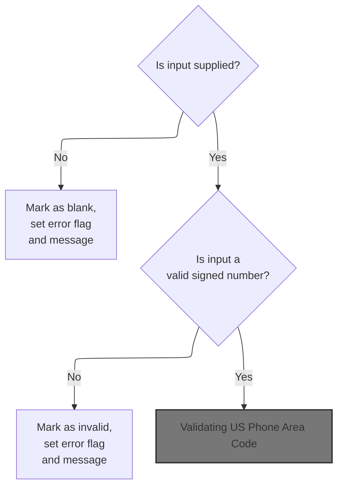

This section validates signed decimal number inputs, ensuring required fields are supplied and that values conform to expected formats. It sets error flags and user messages when inputs are missing or invalid.

| Rule ID | Code Location        | Category        | Rule Name                   | Description                                                                                                                                                                                                                              | Conditions                                                                                            | Remarks                                                                                                                                                                                                                                  |
| ------- | -------------------- | --------------- | --------------------------- | ---------------------------------------------------------------------------------------------------------------------------------------------------------------------------------------------------------------------------------------- | ----------------------------------------------------------------------------------------------------- | ---------------------------------------------------------------------------------------------------------------------------------------------------------------------------------------------------------------------------------------- |
| BR-001  | 1250-EDIT-SIGNED-9V2 | Data validation | Blank input required        | If the signed decimal number input is blank or contains only spaces, the field is marked as blank, an error flag is set, and the user is notified that the value is required.                                                            | The input value is blank or contains only spaces.                                                     | The error flag is set to '1'. The blank flag is set to 'B'. The user message is constructed as: '\[field name\] must be supplied.' The message is a string, concatenated from the trimmed field name and the phrase ' must be supplied.' |
| BR-002  | 1250-EDIT-SIGNED-9V2 | Data validation | Invalid signed number input | If the signed decimal number input is not blank, the system checks whether it is a valid signed decimal number. If it is not valid, the field is marked as invalid, an error flag is set, and the user is notified of the invalid input. | The input value is not blank or spaces, but does not conform to a valid signed decimal number format. | The error flag is set to '1'. The invalid flag is set to '0'. The user message format is not shown in the provided code, but the error state is set.                                                                                     |
| BR-003  | 1250-EDIT-SIGNED-9V2 | Data validation | Valid signed number input   | If the signed decimal number input is supplied and is valid, the field is marked as valid and no error is set.                                                                                                                           | The input value is supplied and conforms to a valid signed decimal number format.                     | The valid flag is set to LOW-VALUES. No error flag is set. No user message is generated.                                                                                                                                                 |

<SwmSnippet path="/app/cbl/COACTUPC.cbl" line="2180" repo-id="Z2l0aHViJTNBJTNBa3luZHJ5bC1hd3MtbWFpbmZyYW1lLW1vZGVybml6YXRpb24tY2FyZGRlbW8lM0ElM0FTd2ltbS1EZW1v">

---

In `1250-EDIT-SIGNED-9V2`, the code checks if the signed number input is blank (low-values or spaces). If so, it sets error flags and tells the user the value is required. If not blank, it will check if the value is a valid signed/decimal number and set errors if not. If everything checks out, it marks the field as valid.

```cobol
       1250-EDIT-SIGNED-9V2.
           SET FLG-SIGNED-NUMBER-NOT-OK    TO TRUE

      *    Not supplied
           IF WS-EDIT-SIGNED-NUMBER-9V2-X  EQUAL LOW-VALUES
           OR WS-EDIT-SIGNED-NUMBER-9V2-X  EQUAL SPACES
              SET INPUT-ERROR              TO TRUE
              SET FLG-SIGNED-NUMBER-BLANK  TO TRUE
              IF WS-RETURN-MSG-OFF
                 STRING
                   FUNCTION TRIM(WS-EDIT-VARIABLE-NAME)
                   ' must be supplied.'
                   DELIMITED BY SIZE
                   INTO WS-RETURN-MSG
                 END-STRING
              END-IF
```

---

</SwmSnippet>

############ Validating US Phone Number Fields

This section validates US phone number fields, determining whether the field is optional, present, and valid for further processing.

| Rule ID | Code Location          | Category        | Rule Name                                 | Description                                                                                                                                                      | Conditions                                                                      | Remarks                                                                                                                                                                                                                          |
| ------- | ---------------------- | --------------- | ----------------------------------------- | ---------------------------------------------------------------------------------------------------------------------------------------------------------------- | ------------------------------------------------------------------------------- | -------------------------------------------------------------------------------------------------------------------------------------------------------------------------------------------------------------------------------- |
| BR-001  | 1260-EDIT-US-PHONE-NUM | Data validation | Optional phone number acceptance          | If all three parts of the US phone number field are blank or contain low-values, the phone number is considered optional and is marked as valid.                 | All three phone number components are blank or contain low-values.              | A blank field is defined as containing only spaces. A low-value field is defined as containing the lowest possible value for the data type. The phone number is considered optional if all three components meet these criteria. |
| BR-002  | 1260-EDIT-US-PHONE-NUM | Data validation | Phone number presence triggers validation | If any part of the US phone number field contains data (i.e., is not blank or low-values), the phone number is treated as present and must be validated further. | At least one phone number component contains data (is not blank or low-values). | A field is considered to contain data if it is neither blank nor low-values. The presence of any data in any component triggers further validation steps.                                                                        |
| BR-003  | 1260-EDIT-US-PHONE-NUM | Data validation | Default invalid phone number status       | The default status for the US phone number field is invalid until proven otherwise by validation checks.                                                         | Upon entering the phone number validation routine.                              | The phone number field is assumed invalid unless validation logic marks it as valid. This ensures that only explicitly validated phone numbers are accepted.                                                                     |

<SwmSnippet path="/app/cbl/COACTUPC.cbl" line="2225" repo-id="Z2l0aHViJTNBJTNBa3luZHJ5bC1hd3MtbWFpbmZyYW1lLW1vZGVybml6YXRpb24tY2FyZGRlbW8lM0ElM0FTd2ltbS1EZW1v">

---

In `1260-EDIT-US-PHONE-NUM`, the code starts by marking the phone number as invalid. It then checks if all three phone number parts are blank or low-values. If so, it marks the field as valid and exits, since phone numbers are optional. If not, it continues to validate the parts. After this, the next step is to call the SSN validation routine, which handles the next set of required fields.

```cobol
       1260-EDIT-US-PHONE-NUM.

      *    The database stores date in X(15) format (999)999-9999
      *                                             1234567890123
      *    So we take the X(15) input into WS-EDIT-US-PHONE-NUM
      *    and edit it

           SET WS-EDIT-US-PHONE-IS-INVALID TO TRUE
      *    Not mandatory to enter a phone number
           IF  (WS-EDIT-US-PHONE-NUMA EQUAL SPACES
           OR   WS-EDIT-US-PHONE-NUMA EQUAL LOW-VALUES)
           AND (WS-EDIT-US-PHONE-NUMB EQUAL SPACES
           OR   WS-EDIT-US-PHONE-NUMB EQUAL LOW-VALUES)
           AND (WS-EDIT-US-PHONE-NUMA EQUAL SPACES
           OR   WS-EDIT-US-PHONE-NUMC EQUAL LOW-VALUES)
                SET WS-EDIT-US-PHONE-IS-VALID TO TRUE
                GO TO EDIT-US-PHONE-EXIT
           ELSE
                CONTINUE
           END-IF
```

---

</SwmSnippet>

############ Validating US Social Security Number

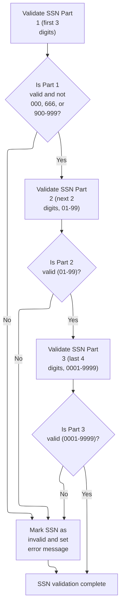

This section validates US Social Security Numbers by checking each part for numeric content, length, and specific value constraints, and generates error messages for invalid entries.

| Rule ID | Code Location    | Category        | Rule Name                   | Description                                                                                                                                                                                                                 | Conditions                                                                                                             | Remarks                                                                                                                                                                                |
| ------- | ---------------- | --------------- | --------------------------- | --------------------------------------------------------------------------------------------------------------------------------------------------------------------------------------------------------------------------- | ---------------------------------------------------------------------------------------------------------------------- | -------------------------------------------------------------------------------------------------------------------------------------------------------------------------------------- |
| BR-001  | 1265-EDIT-US-SSN | Data validation | SSN Part 1 Forbidden Values | The first part of the SSN must be a valid three-digit number and must not be '000', '666', or any value between '900' and '999'. If the value is forbidden, the SSN is marked as invalid and an error message is generated. | The first part of the SSN is valid as a three-digit number, but its value is '000', '666', or between '900' and '999'. | Forbidden values for the first part are: '000', '666', and any value from '900' to '999'. The error message format is: '<field name>: should not be 000, 666, or between 900 and 999'. |
| BR-002  | 1265-EDIT-US-SSN | Data validation | SSN Part 2 Range Validation | The second part of the SSN must be a valid two-digit number between '01' and '99'. If the value is outside this range or not numeric, the SSN is marked as invalid.                                                         | The second part of the SSN is provided and must be a two-digit number between '01' and '99'.                           | Valid values for the second part are numeric strings from '01' to '99'.                                                                                                                |
| BR-003  | 1265-EDIT-US-SSN | Data validation | SSN Part 3 Range Validation | The third part of the SSN must be a valid four-digit number between '0001' and '9999'. If the value is outside this range or not numeric, the SSN is marked as invalid.                                                     | The third part of the SSN is provided and must be a four-digit number between '0001' and '9999'.                       | Valid values for the third part are numeric strings from '0001' to '9999'.                                                                                                             |
| BR-004  | 1265-EDIT-US-SSN | Error handling  | SSN Error Messaging         | If any part of the SSN fails validation, an error message is generated indicating which part is invalid and why.                                                                                                            | Any SSN part fails its respective validation check.                                                                    | Error messages specify the part and reason for failure, e.g., 'SSN: First 3 chars: should not be 000, 666, or between 900 and 999'.                                                    |

<SwmSnippet path="/app/cbl/COACTUPC.cbl" line="2431" repo-id="Z2l0aHViJTNBJTNBa3luZHJ5bC1hd3MtbWFpbmZyYW1lLW1vZGVybml6YXRpb24tY2FyZGRlbW8lM0ElM0FTd2ltbS1EZW1v">

---

In `1265-EDIT-US-SSN`, the code starts by validating the first part of the SSN. It moves the first 3 digits into a working variable, sets the variable name, and length, then calls 1245-EDIT-NUM-REQD to check if it's a valid 3-digit number. After that, it checks for special invalid values like '000', '666', or '900'-'999'.

```cobol
       1265-EDIT-US-SSN.
      *Format xxx-xx-xxxx
      *Part1 :should have 3 digits
      *Part2 :should have 2 digits and it should be from 01 to 99
      *Part3 should have 4 digits from 0001 to 9999.
      ******************************************************************
      *    Edit SSN Part 1
      ******************************************************************
           MOVE 'SSN: First 3 chars'     TO WS-EDIT-VARIABLE-NAME
           MOVE ACUP-NEW-CUST-SSN-1      TO WS-EDIT-ALPHANUM-ONLY
           MOVE 3                        TO WS-EDIT-ALPHANUM-LENGTH
```

---

</SwmSnippet>

<SwmSnippet path="/app/cbl/COACTUPC.cbl" line="2442" repo-id="Z2l0aHViJTNBJTNBa3luZHJ5bC1hd3MtbWFpbmZyYW1lLW1vZGVybml6YXRpb24tY2FyZGRlbW8lM0ElM0FTd2ltbS1EZW1v">

---

After prepping the first SSN part, the code calls 1245-EDIT-NUM-REQD to check if it's a valid 3-digit number. This routine handles the numeric and length checks, and sets the right flags for later error handling.

```cobol
           PERFORM 1245-EDIT-NUM-REQD
              THRU 1245-EDIT-NUM-REQD-EXIT
```

---

</SwmSnippet>

<SwmSnippet path="/app/cbl/COACTUPC.cbl" line="2444" repo-id="Z2l0aHViJTNBJTNBa3luZHJ5bC1hd3MtbWFpbmZyYW1lLW1vZGVybml6YXRpb24tY2FyZGRlbW8lM0ElM0FTd2ltbS1EZW1v">

---

Back in `1265-EDIT-US-SSN`, after returning from 1245-EDIT-NUM-REQD, the code copies the validation flags for the first part. If the part is valid but matches a forbidden value ('000', '666', or '900'-'999'), it sets error flags and builds an error message for the user.

```cobol
           MOVE WS-EDIT-ALPHANUM-ONLY-FLAGS
                                         TO WS-EDIT-US-SSN-PART1-FLGS

      *Part1 :should not be 000, 666, or between 900 and 999
           IF FLG-EDIT-US-SSN-PART1-ISVALID
              MOVE ACUP-NEW-CUST-SSN-1   TO WS-EDIT-US-SSN-PART1
              IF INVALID-SSN-PART1
              SET INPUT-ERROR            TO TRUE
              SET FLG-EDIT-US-SSN-PART1-NOT-OK
                                 TO TRUE
              IF WS-RETURN-MSG-OFF
                 STRING
                   FUNCTION TRIM(WS-EDIT-VARIABLE-NAME)
                   ': should not be 000, 666, or between 900 and 999'
                   DELIMITED BY SIZE
                   INTO WS-RETURN-MSG
                 END-STRING
              ELSE
                CONTINUE
              END-IF
```

---

</SwmSnippet>

<SwmSnippet path="/app/cbl/COACTUPC.cbl" line="2469" repo-id="Z2l0aHViJTNBJTNBa3luZHJ5bC1hd3MtbWFpbmZyYW1lLW1vZGVybml6YXRpb24tY2FyZGRlbW8lM0ElM0FTd2ltbS1EZW1v">

---

After handling the first SSN part, the code sets up the second part (4th and 5th digits), moves it into the working variable, and calls the same numeric validation routine. This keeps the validation logic consistent for each segment.

```cobol
           MOVE 'SSN 4th & 5th chars'    TO WS-EDIT-VARIABLE-NAME
           MOVE ACUP-NEW-CUST-SSN-2      TO WS-EDIT-ALPHANUM-ONLY
           MOVE 2                        TO WS-EDIT-ALPHANUM-LENGTH
           PERFORM 1245-EDIT-NUM-REQD
              THRU 1245-EDIT-NUM-REQD-EXIT
```

---

</SwmSnippet>

<SwmSnippet path="/app/cbl/COACTUPC.cbl" line="2474" repo-id="Z2l0aHViJTNBJTNBa3luZHJ5bC1hd3MtbWFpbmZyYW1lLW1vZGVybml6YXRpb24tY2FyZGRlbW8lM0ElM0FTd2ltbS1EZW1v">

---

After validating the second SSN part, the code copies the validation flags, then sets up the third part (last 4 digits) and calls the numeric validation routine again. Each part gets its own check and error handling.

```cobol
           MOVE WS-EDIT-ALPHANUM-ONLY-FLAGS
                                         TO WS-EDIT-US-SSN-PART2-FLGS


      ******************************************************************
      *    Edit SSN Part 3
      ******************************************************************
           MOVE 'SSN Last 4 chars'       TO WS-EDIT-VARIABLE-NAME
           MOVE ACUP-NEW-CUST-SSN-3      TO WS-EDIT-ALPHANUM-ONLY
           MOVE 4                        TO WS-EDIT-ALPHANUM-LENGTH
```

---

</SwmSnippet>

<SwmSnippet path="/app/cbl/COACTUPC.cbl" line="2484" repo-id="Z2l0aHViJTNBJTNBa3luZHJ5bC1hd3MtbWFpbmZyYW1lLW1vZGVybml6YXRpb24tY2FyZGRlbW8lM0ElM0FTd2ltbS1EZW1v">

---

For the last SSN part, the code calls 1245-EDIT-NUM-REQD to check if it's a valid 4-digit number. This is the last segment check before wrapping up SSN validation.

```cobol
           PERFORM 1245-EDIT-NUM-REQD
              THRU 1245-EDIT-NUM-REQD-EXIT
```

---

</SwmSnippet>

<SwmSnippet path="/app/cbl/COACTUPC.cbl" line="2486" repo-id="Z2l0aHViJTNBJTNBa3luZHJ5bC1hd3MtbWFpbmZyYW1lLW1vZGVybml6YXRpb24tY2FyZGRlbW8lM0ElM0FTd2ltbS1EZW1v">

---

After all three SSN parts are validated, the code copies the validation flags for the last part. The function leaves each part's validation status in its own flag variable for later checks.

```cobol
           MOVE WS-EDIT-ALPHANUM-ONLY-FLAGS
                                         TO WS-EDIT-US-SSN-PART3-FLGS
           .
```

---

</SwmSnippet>

############ Validating US Phone Area Code

This section validates the US phone area code input by the user, ensuring it is present, numeric, non-zero, and part of the official North American area code list. It provides user-facing error messages and sets error flags for downstream processing.

| Rule ID | Code Location  | Category        | Rule Name                  | Description                                                                                                                                                 | Conditions                                                                       | Remarks                                                                                                                                                                                                                  |
| ------- | -------------- | --------------- | -------------------------- | ----------------------------------------------------------------------------------------------------------------------------------------------------------- | -------------------------------------------------------------------------------- | ------------------------------------------------------------------------------------------------------------------------------------------------------------------------------------------------------------------------ |
| BR-001  | EDIT-AREA-CODE | Data validation | Mandatory area code        | If the area code input is blank or contains low-values, an error is triggered and the user is informed that the area code must be supplied.                 | The area code input is blank or contains low-values.                             | The error message is: '<field name>: Area code must be supplied.' The error flag is set to indicate a blank area code. The output message is a string, concatenated from the field name and the error text.              |
| BR-002  | EDIT-AREA-CODE | Data validation | Numeric area code required | If the area code input is not numeric or is zero, an error is triggered and the user is informed that the area code must be a valid non-zero number.        | The area code input contains non-numeric characters or is zero.                  | The error message indicates that the area code must be a valid non-zero number. The error flag is set to indicate an invalid or zero area code. The output message is a string, specifying the invalidity.               |
| BR-003  | EDIT-AREA-CODE | Data validation | Valid area code list       | If the area code input is not in the list of valid North American area codes, an error is triggered and the user is informed that the area code is invalid. | The area code input is not found in the list of valid North American area codes. | The list of valid area codes is explicitly defined and includes codes such as '201', '202', '203', etc. The error message indicates the area code is invalid. The output message is a string, specifying the invalidity. |

<SwmSnippet path="/app/cbl/COACTUPC.cbl" line="2246" repo-id="Z2l0aHViJTNBJTNBa3luZHJ5bC1hd3MtbWFpbmZyYW1lLW1vZGVybml6YXRpb24tY2FyZGRlbW8lM0ElM0FTd2ltbS1EZW1v">

---

In `EDIT-AREA-CODE`, the code checks if the area code is blank or low-values, and errors out if so. It then checks if it's numeric and not zero, and finally if it's in the list of valid area codes. Each failure sets error flags and a message for the user.

```cobol
       EDIT-AREA-CODE.
           IF WS-EDIT-US-PHONE-NUMA EQUAL SPACES
           OR WS-EDIT-US-PHONE-NUMA EQUAL LOW-VALUES
              SET INPUT-ERROR              TO TRUE
              SET FLG-EDIT-US-PHONEA-BLANK    TO TRUE
              IF WS-RETURN-MSG-OFF
                 STRING
                   FUNCTION TRIM(WS-EDIT-VARIABLE-NAME)
                   ': Area code must be supplied.'
                   DELIMITED BY SIZE
                   INTO WS-RETURN-MSG
                 END-STRING
              END-IF
```

---

</SwmSnippet>

############# Validating US Phone Prefix

This section validates the US phone prefix input, ensuring it is present, numeric, and non-zero, and provides user-facing error messages for invalid entries.

| Rule ID | Code Location        | Category        | Rule Name                   | Description                                                                                                                                                                   | Conditions                                               | Remarks                                                                                                                                         |
| ------- | -------------------- | --------------- | --------------------------- | ----------------------------------------------------------------------------------------------------------------------------------------------------------------------------- | -------------------------------------------------------- | ----------------------------------------------------------------------------------------------------------------------------------------------- |
| BR-001  | EDIT-US-PHONE-PREFIX | Data validation | Mandatory prefix entry      | If the US phone prefix is blank or contains only low-values, the input is considered invalid and an error message is generated stating that the prefix code must be supplied. | The US phone prefix is blank or contains low-values.     | The error message format is: '<variable name>: Prefix code must be supplied.' The prefix must be a non-empty string and not contain low-values. |
| BR-002  | EDIT-US-PHONE-PREFIX | Data validation | Numeric prefix requirement  | If the US phone prefix contains non-numeric characters, the input is considered invalid and an error message is generated indicating that the prefix must be numeric.         | The US phone prefix contains any non-numeric characters. | The prefix must consist only of numeric characters (0-9). The error message format is: '<variable name>: Prefix code must be numeric.'          |
| BR-003  | EDIT-US-PHONE-PREFIX | Data validation | Non-zero prefix requirement | If the US phone prefix is zero, the input is considered invalid and an error message is generated stating that the prefix code cannot be zero.                                | The US phone prefix is '0'.                              | The prefix must not be '0'. The error message format is: '<variable name>: Prefix code cannot be zero.'                                         |
| BR-004  | EDIT-US-PHONE-PREFIX | Business logic  | Valid prefix acceptance     | If the US phone prefix passes all validation checks (not blank, not low-values, numeric, and not zero), the prefix is marked as valid.                                        | The US phone prefix is present, numeric, and not zero.   | No error message is generated. The prefix is accepted as valid.                                                                                 |

<SwmSnippet path="/app/cbl/COACTUPC.cbl" line="2316" repo-id="Z2l0aHViJTNBJTNBa3luZHJ5bC1hd3MtbWFpbmZyYW1lLW1vZGVybml6YXRpb24tY2FyZGRlbW8lM0ElM0FTd2ltbS1EZW1v">

---

In `EDIT-US-PHONE-PREFIX`, the code checks if the prefix is blank or low-values, then if it's numeric, and finally if it's zero. Each failure sets error flags and a message. If all checks pass, the prefix is marked as valid.

```cobol
       EDIT-US-PHONE-PREFIX.

           IF WS-EDIT-US-PHONE-NUMB EQUAL SPACES
           OR WS-EDIT-US-PHONE-NUMB EQUAL LOW-VALUES
              SET INPUT-ERROR              TO TRUE
              SET FLG-EDIT-US-PHONEB-BLANK    TO TRUE
              IF WS-RETURN-MSG-OFF
                 STRING
                   FUNCTION TRIM(WS-EDIT-VARIABLE-NAME)
                   ': Prefix code must be supplied.'
                   DELIMITED BY SIZE
                   INTO WS-RETURN-MSG
                 END-STRING
              END-IF
```

---

</SwmSnippet>

############## Validating US Phone Line Number

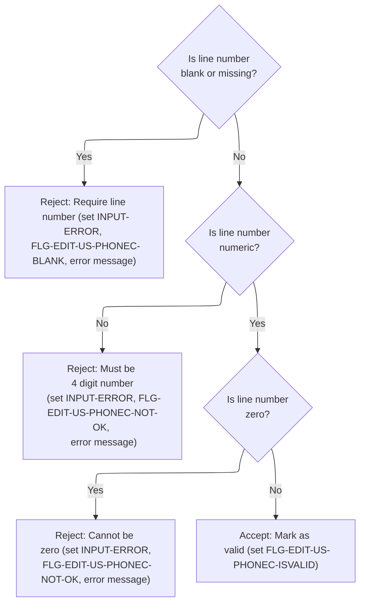

This section validates the US phone line number input, ensuring it meets business requirements for presence, numeric format, and non-zero value. It sets error flags and messages for invalid inputs and marks valid entries for further processing.

| Rule ID | Code Location         | Category        | Rule Name                    | Description                                                                                                                                                          | Conditions                                                | Remarks                                                                                                                                                                                                                                                                                                 |
| ------- | --------------------- | --------------- | ---------------------------- | -------------------------------------------------------------------------------------------------------------------------------------------------------------------- | --------------------------------------------------------- | ------------------------------------------------------------------------------------------------------------------------------------------------------------------------------------------------------------------------------------------------------------------------------------------------------- |
| BR-001  | EDIT-US-PHONE-LINENUM | Data validation | Line number required         | A US phone line number must be provided. If the line number is blank or missing, the input is rejected and an error message is generated.                            | The line number is blank or contains only missing values. | If the line number is missing, the error flag is set and the error message 'Line number code must be supplied.' is generated. The error flag value is '1', and the blank flag value is 'B'. The error message is a string appended to the variable name and must be presented to the user.              |
| BR-002  | EDIT-US-PHONE-LINENUM | Data validation | Line number must be numeric  | A US phone line number must be a numeric 4-digit value. If the line number contains non-numeric characters, the input is rejected and an error message is generated. | The line number contains any non-numeric characters.      | If the line number is not numeric, the error flag is set and the error message 'Line number code must be A 4 digit number.' is generated. The error flag value is '1', and the not-ok flag value is '0'. The error message is a string appended to the variable name and must be presented to the user. |
| BR-003  | EDIT-US-PHONE-LINENUM | Data validation | Line number cannot be zero   | A US phone line number cannot be zero. If the line number is zero, the input is rejected and an error message is generated.                                          | The line number is numeric and its value is zero.         | If the line number is zero, the error flag is set and the error message 'Line number code cannot be zero' is generated. The error flag value is '1', and the not-ok flag value is '0'. The error message is a string appended to the variable name and must be presented to the user.                   |
| BR-004  | EDIT-US-PHONE-LINENUM | Business logic  | Valid line number acceptance | If the US phone line number is present, numeric, and non-zero, it is accepted as valid.                                                                              | The line number is present, numeric, and not zero.        | If the line number passes all checks, the valid flag is set to indicate acceptance. The valid flag value is LOW-VALUES.                                                                                                                                                                                 |

<SwmSnippet path="/app/cbl/COACTUPC.cbl" line="2370" repo-id="Z2l0aHViJTNBJTNBa3luZHJ5bC1hd3MtbWFpbmZyYW1lLW1vZGVybml6YXRpb24tY2FyZGRlbW8lM0ElM0FTd2ltbS1EZW1v">

---

In `EDIT-US-PHONE-LINENUM`, the code checks if the line number is blank or low-values, then if it's numeric, and finally if it's zero. Each failure sets error flags and a message. If all checks pass, the line number is marked as valid.

```cobol
       EDIT-US-PHONE-LINENUM.
           IF WS-EDIT-US-PHONE-NUMC EQUAL SPACES
           OR WS-EDIT-US-PHONE-NUMC EQUAL LOW-VALUES
              SET INPUT-ERROR              TO TRUE
              SET FLG-EDIT-US-PHONEC-BLANK    TO TRUE
              IF WS-RETURN-MSG-OFF
                 STRING
                   FUNCTION TRIM(WS-EDIT-VARIABLE-NAME)
                   ': Line number code must be supplied.'
                   DELIMITED BY SIZE
                   INTO WS-RETURN-MSG
                 END-STRING
              END-IF
```

---

</SwmSnippet>

<SwmSnippet path="/app/cbl/COACTUPC.cbl" line="2384" repo-id="Z2l0aHViJTNBJTNBa3luZHJ5bC1hd3MtbWFpbmZyYW1lLW1vZGVybml6YXRpb24tY2FyZGRlbW8lM0ElM0FTd2ltbS1EZW1v">

---

Back in `EDIT-US-PHONE-LINENUM`, after finishing SSN validation, the code continues with line number checks. The flow just moves from one field to the next, keeping each validation separate.

```cobol
           ELSE
              CONTINUE
           END-IF
```

---

</SwmSnippet>

<SwmSnippet path="/app/cbl/COACTUPC.cbl" line="2388" repo-id="Z2l0aHViJTNBJTNBa3luZHJ5bC1hd3MtbWFpbmZyYW1lLW1vZGVybml6YXRpb24tY2FyZGRlbW8lM0ElM0FTd2ltbS1EZW1v">

---

If the line number is numeric, the code just moves on to check if it's zero. No errors are set yet—just more validation.

```cobol
           IF  WS-EDIT-US-PHONE-NUMC          IS NUMERIC
              CONTINUE
```

---

</SwmSnippet>

<SwmSnippet path="/app/cbl/COACTUPC.cbl" line="2390" repo-id="Z2l0aHViJTNBJTNBa3luZHJ5bC1hd3MtbWFpbmZyYW1lLW1vZGVybml6YXRpb24tY2FyZGRlbW8lM0ElM0FTd2ltbS1EZW1v">

---

If the line number isn't numeric, the code sets error flags, builds an error message, and exits the validation for this field. No further checks are done for this input.

```cobol
           ELSE
              SET INPUT-ERROR                 TO TRUE
              SET  FLG-EDIT-US-PHONEC-NOT-OK  TO TRUE
              IF WS-RETURN-MSG-OFF
                 STRING
                   FUNCTION TRIM(WS-EDIT-VARIABLE-NAME)
                   ': Line number code must be A 4 digit number.'
                   DELIMITED BY SIZE
                   INTO WS-RETURN-MSG
                 END-STRING
              END-IF
              GO TO  EDIT-US-PHONE-EXIT
           END-IF
```

---

</SwmSnippet>

<SwmSnippet path="/app/cbl/COACTUPC.cbl" line="2404" repo-id="Z2l0aHViJTNBJTNBa3luZHJ5bC1hd3MtbWFpbmZyYW1lLW1vZGVybml6YXRpb24tY2FyZGRlbW8lM0ElM0FTd2ltbS1EZW1v">

---

If the line number is zero, the code sets error flags, builds an error message, and exits validation for this field. No further checks are done.

```cobol
           IF  WS-EDIT-US-PHONE-NUMC-N = 0
              SET INPUT-ERROR              TO TRUE
              SET  FLG-EDIT-US-PHONEC-NOT-OK  TO TRUE
              IF WS-RETURN-MSG-OFF
                 STRING
                   FUNCTION TRIM(WS-EDIT-VARIABLE-NAME)
                   ': Line number code cannot be zero'
                   DELIMITED BY SIZE
                   INTO WS-RETURN-MSG
                 END-STRING
              END-IF
              GO TO  EDIT-US-PHONE-EXIT
```

---

</SwmSnippet>

<SwmSnippet path="/app/cbl/COACTUPC.cbl" line="2416" repo-id="Z2l0aHViJTNBJTNBa3luZHJ5bC1hd3MtbWFpbmZyYW1lLW1vZGVybml6YXRpb24tY2FyZGRlbW8lM0ElM0FTd2ltbS1EZW1v">

---

After all checks, if the line number passes, the code sets the valid flag. The function leaves the validation result in the flag variable for later logic.

```cobol
           ELSE
               CONTINUE
           END-IF


           SET FLG-EDIT-US-PHONEC-ISVALID    TO TRUE
           .
```

---

</SwmSnippet>

############## Continuing US Phone Prefix Validation

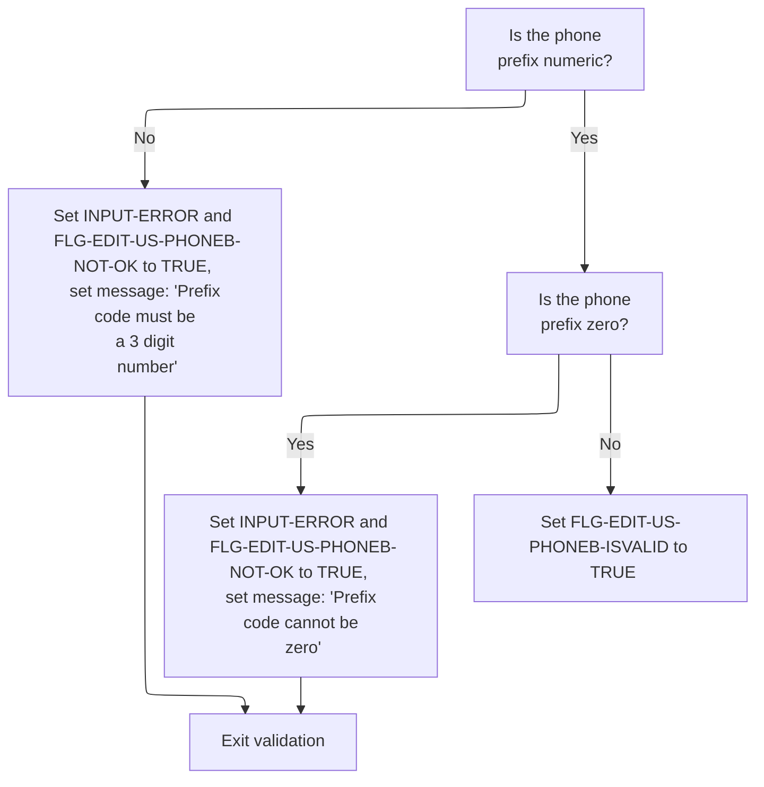

This section validates the US phone prefix field, ensuring it meets business requirements for format and value before marking it as valid or returning an error message.

| Rule ID | Code Location        | Category        | Rule Name                | Description                                                                                                                          | Conditions                                                  | Remarks                                                                                                                                                                                                                                 |
| ------- | -------------------- | --------------- | ------------------------ | ------------------------------------------------------------------------------------------------------------------------------------ | ----------------------------------------------------------- | --------------------------------------------------------------------------------------------------------------------------------------------------------------------------------------------------------------------------------------- |
| BR-001  | EDIT-US-PHONE-PREFIX | Data validation | Numeric prefix required  | If the US phone prefix is not numeric, an error is triggered and the user is informed that the prefix code must be a 3-digit number. | The US phone prefix field contains non-numeric characters.  | The error message is: ': Prefix code must be A 3 digit number.' The error flags set are INPUT-ERROR = TRUE and FLG-EDIT-US-PHONEB-NOT-OK = TRUE. The message is constructed only if WS-RETURN-MSG-OFF is true (WS-RETURN-MSG = SPACES). |
| BR-002  | EDIT-US-PHONE-PREFIX | Data validation | Non-zero prefix required | If the US phone prefix is zero, an error is triggered and the user is informed that the prefix code cannot be zero.                  | The US phone prefix field is numeric and its value is zero. | The error message is: ': Prefix code cannot be zero'. The error flags set are INPUT-ERROR = TRUE and FLG-EDIT-US-PHONEB-NOT-OK = TRUE. The message is constructed only if WS-RETURN-MSG-OFF is true (WS-RETURN-MSG = SPACES).           |
| BR-003  | EDIT-US-PHONE-PREFIX | Business logic  | Valid prefix flag        | If the US phone prefix passes both the numeric and non-zero checks, it is marked as valid for further processing.                    | The US phone prefix field is numeric and not zero.          | The valid flag FLG-EDIT-US-PHONEB-ISVALID is set to TRUE. No error message is constructed and no error flags are set.                                                                                                                   |

<SwmSnippet path="/app/cbl/COACTUPC.cbl" line="2331" repo-id="Z2l0aHViJTNBJTNBa3luZHJ5bC1hd3MtbWFpbmZyYW1lLW1vZGVybml6YXRpb24tY2FyZGRlbW8lM0ElM0FTd2ltbS1EZW1v">

---

Back in `EDIT-US-PHONE-PREFIX`, after finishing line number validation, the code continues with prefix checks. The flow just moves from one field to the next, keeping each validation separate.

```cobol
           ELSE
              CONTINUE
           END-IF
```

---

</SwmSnippet>

<SwmSnippet path="/app/cbl/COACTUPC.cbl" line="2335" repo-id="Z2l0aHViJTNBJTNBa3luZHJ5bC1hd3MtbWFpbmZyYW1lLW1vZGVybml6YXRpb24tY2FyZGRlbW8lM0ElM0FTd2ltbS1EZW1v">

---

If the prefix is numeric, the code just moves on to check if it's zero. No errors are set yet—just more validation.

```cobol
           IF  WS-EDIT-US-PHONE-NUMB          IS NUMERIC
              CONTINUE
```

---

</SwmSnippet>

<SwmSnippet path="/app/cbl/COACTUPC.cbl" line="2337" repo-id="Z2l0aHViJTNBJTNBa3luZHJ5bC1hd3MtbWFpbmZyYW1lLW1vZGVybml6YXRpb24tY2FyZGRlbW8lM0ElM0FTd2ltbS1EZW1v">

---

If the prefix isn't numeric, the code sets error flags, builds an error message, and jumps to line number validation. No further checks are done for this input.

```cobol
           ELSE
              SET INPUT-ERROR                 TO TRUE
              SET  FLG-EDIT-US-PHONEB-NOT-OK  TO TRUE
              IF WS-RETURN-MSG-OFF
                 STRING
                   FUNCTION TRIM(WS-EDIT-VARIABLE-NAME)
                   ': Prefix code must be A 3 digit number.'
                   DELIMITED BY SIZE
                   INTO WS-RETURN-MSG
                 END-STRING
              END-IF
              GO TO  EDIT-US-PHONE-LINENUM
           END-IF
```

---

</SwmSnippet>

<SwmSnippet path="/app/cbl/COACTUPC.cbl" line="2351" repo-id="Z2l0aHViJTNBJTNBa3luZHJ5bC1hd3MtbWFpbmZyYW1lLW1vZGVybml6YXRpb24tY2FyZGRlbW8lM0ElM0FTd2ltbS1EZW1v">

---

If the prefix is zero, the code sets error flags, builds an error message, and jumps to line number validation. This gives the user a clear message about the problem.

```cobol
           IF  WS-EDIT-US-PHONE-NUMB-N = 0
              SET INPUT-ERROR              TO TRUE
              SET  FLG-EDIT-US-PHONEB-NOT-OK  TO TRUE
              IF WS-RETURN-MSG-OFF
                 STRING
                   FUNCTION TRIM(WS-EDIT-VARIABLE-NAME)
                   ': Prefix code cannot be zero'
                   DELIMITED BY SIZE
                   INTO WS-RETURN-MSG
                 END-STRING
              END-IF
              GO TO  EDIT-US-PHONE-LINENUM
```

---

</SwmSnippet>

<SwmSnippet path="/app/cbl/COACTUPC.cbl" line="2363" repo-id="Z2l0aHViJTNBJTNBa3luZHJ5bC1hd3MtbWFpbmZyYW1lLW1vZGVybml6YXRpb24tY2FyZGRlbW8lM0ElM0FTd2ltbS1EZW1v">

---

After all checks, if the prefix passes, the code sets the valid flag. The function leaves the validation result in the flag variable for later logic.

```cobol
           ELSE
              CONTINUE
           END-IF

           SET FLG-EDIT-US-PHONEB-ISVALID    TO TRUE
           .
```

---

</SwmSnippet>

############# Continuing US Phone Area Code Validation

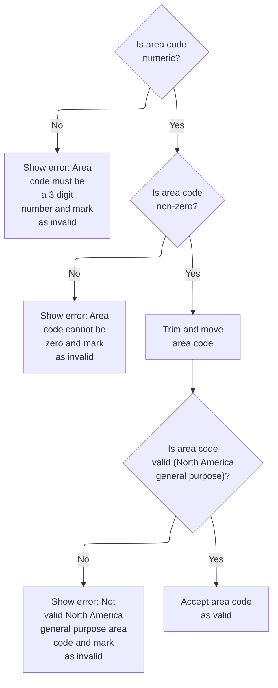

This section validates the US phone area code field, ensuring it meets business requirements for numeric format, non-zero value, and inclusion in the North America general purpose area code list. It provides user-facing error messages and marks the field as valid or invalid based on the outcome.

| Rule ID | Code Location  | Category        | Rule Name                                 | Description                                                                                                                                                                                                                                                   | Conditions                                                                                                       | Remarks                                                                                                                                                                                                                                                                                      |
| ------- | -------------- | --------------- | ----------------------------------------- | ------------------------------------------------------------------------------------------------------------------------------------------------------------------------------------------------------------------------------------------------------------- | ---------------------------------------------------------------------------------------------------------------- | -------------------------------------------------------------------------------------------------------------------------------------------------------------------------------------------------------------------------------------------------------------------------------------------- |
| BR-001  | EDIT-AREA-CODE | Data validation | Numeric area code requirement             | The area code must be a numeric value consisting of exactly three digits. If the area code is not numeric, an error message is shown to the user stating that the area code must be a 3 digit number, and the field is marked as invalid.                     | The area code input is not numeric.                                                                              | Error message shown: '<field name>: Area code must be A 3 digit number.' The area code must be a string of three numeric digits (0-9).                                                                                                                                                       |
| BR-002  | EDIT-AREA-CODE | Data validation | Non-zero area code requirement            | The area code must not be zero. If the area code is zero, an error message is shown to the user stating that the area code cannot be zero, and the field is marked as invalid.                                                                                | The area code input is numeric and equal to zero.                                                                | Error message shown: '<field name>: Area code cannot be zero'. The area code must be a string of three numeric digits, and the value must not be '000'.                                                                                                                                      |
| BR-003  | EDIT-AREA-CODE | Data validation | Valid North America area code requirement | The area code must be included in the list of valid North America general purpose area codes. If the area code is not in the allowed list, an error message is shown to the user stating that the area code is not valid, and the field is marked as invalid. | The area code input is numeric, non-zero, and not in the list of valid North America general purpose area codes. | Error message shown: '<field name>: Not valid North America general purpose area code'. The area code must be a string of three numeric digits and must match one of the allowed values, which include: '201', '202', '203', ..., '989' (full list as per VALID-GENERAL-PURP-CODE constant). |
| BR-004  | EDIT-AREA-CODE | Business logic  | Accept valid area code                    | If the area code passes all validation checks (numeric, non-zero, and valid North America area code), it is accepted as valid and marked as such.                                                                                                             | The area code input is numeric, non-zero, and in the list of valid North America general purpose area codes.     | The area code is accepted and marked as valid. No error message is shown. The field is flagged as valid for further processing.                                                                                                                                                              |

<SwmSnippet path="/app/cbl/COACTUPC.cbl" line="2260" repo-id="Z2l0aHViJTNBJTNBa3luZHJ5bC1hd3MtbWFpbmZyYW1lLW1vZGVybml6YXRpb24tY2FyZGRlbW8lM0ElM0FTd2ltbS1EZW1v">

---

Back in `EDIT-AREA-CODE`, after finishing line number validation, the code continues with area code checks. The flow just moves from one field to the next, keeping each validation separate.

```cobol
           ELSE
              CONTINUE
           END-IF
```

---

</SwmSnippet>

<SwmSnippet path="/app/cbl/COACTUPC.cbl" line="2264" repo-id="Z2l0aHViJTNBJTNBa3luZHJ5bC1hd3MtbWFpbmZyYW1lLW1vZGVybml6YXRpb24tY2FyZGRlbW8lM0ElM0FTd2ltbS1EZW1v">

---

If the area code is numeric, the code just moves on to check if it's zero. No errors are set yet—just more validation.

```cobol
           IF  WS-EDIT-US-PHONE-NUMA       IS NUMERIC
              CONTINUE
```

---

</SwmSnippet>

<SwmSnippet path="/app/cbl/COACTUPC.cbl" line="2266" repo-id="Z2l0aHViJTNBJTNBa3luZHJ5bC1hd3MtbWFpbmZyYW1lLW1vZGVybml6YXRpb24tY2FyZGRlbW8lM0ElM0FTd2ltbS1EZW1v">

---

If the area code isn't numeric, the code sets error flags, builds an error message, and jumps to prefix validation. No further checks are done for this input.

```cobol
           ELSE
              SET INPUT-ERROR                 TO TRUE
              SET  FLG-EDIT-US-PHONEA-NOT-OK  TO TRUE
              IF WS-RETURN-MSG-OFF
                 STRING
                   FUNCTION TRIM(WS-EDIT-VARIABLE-NAME)
                   ': Area code must be A 3 digit number.'
                   DELIMITED BY SIZE
                   INTO WS-RETURN-MSG
                 END-STRING
              END-IF
              GO TO  EDIT-US-PHONE-PREFIX
           END-IF
```

---

</SwmSnippet>

<SwmSnippet path="/app/cbl/COACTUPC.cbl" line="2280" repo-id="Z2l0aHViJTNBJTNBa3luZHJ5bC1hd3MtbWFpbmZyYW1lLW1vZGVybml6YXRpb24tY2FyZGRlbW8lM0ElM0FTd2ltbS1EZW1v">

---

If the area code is zero, the code sets error flags, builds an error message, and jumps to prefix validation. This gives the user a clear message about the problem.

```cobol
           IF  WS-EDIT-US-PHONE-NUMA-N = 0
              SET INPUT-ERROR              TO TRUE
              SET  FLG-EDIT-US-PHONEA-NOT-OK  TO TRUE
              IF WS-RETURN-MSG-OFF
                 STRING
                   FUNCTION TRIM(WS-EDIT-VARIABLE-NAME)
                   ': Area code cannot be zero'
                   DELIMITED BY SIZE
                   INTO WS-RETURN-MSG
                 END-STRING
              END-IF
              GO TO  EDIT-US-PHONE-PREFIX
```

---

</SwmSnippet>

<SwmSnippet path="/app/cbl/COACTUPC.cbl" line="2292" repo-id="Z2l0aHViJTNBJTNBa3luZHJ5bC1hd3MtbWFpbmZyYW1lLW1vZGVybml6YXRpb24tY2FyZGRlbW8lM0ElM0FTd2ltbS1EZW1v">

---

If the area code isn't zero, the code just moves on to check if it's in the valid area code list. No errors are set yet—just more validation.

```cobol
           ELSE
              CONTINUE
           END-IF
```

---

</SwmSnippet>

<SwmSnippet path="/app/cbl/COACTUPC.cbl" line="2296" repo-id="Z2l0aHViJTNBJTNBa3luZHJ5bC1hd3MtbWFpbmZyYW1lLW1vZGVybml6YXRpb24tY2FyZGRlbW8lM0ElM0FTd2ltbS1EZW1v">

---

After all the basic checks, the code trims the area code and checks if it's in the valid area code list using a COBOL 88-level condition. If it's not valid, the code will set errors in the next lines.

```cobol
           MOVE FUNCTION TRIM (WS-EDIT-US-PHONE-NUMA)
             TO WS-US-PHONE-AREA-CODE-TO-EDIT
           IF VALID-GENERAL-PURP-CODE
               CONTINUE
```

---

</SwmSnippet>

<SwmSnippet path="/app/cbl/COACTUPC.cbl" line="2300" repo-id="Z2l0aHViJTNBJTNBa3luZHJ5bC1hd3MtbWFpbmZyYW1lLW1vZGVybml6YXRpb24tY2FyZGRlbW8lM0ElM0FTd2ltbS1EZW1v">

---

Here, the code checks if the area code is in the allowed list (VALID-GENERAL-PURP-CODE). If not, it sets the error flags and builds an error message for the user. If the area code passes all checks, it marks it as valid. This wraps up the area code validation logic and hands off to the next field (prefix).

```cobol
           ELSE
              SET INPUT-ERROR              TO TRUE
              SET  FLG-EDIT-US-PHONEA-NOT-OK  TO TRUE
              IF WS-RETURN-MSG-OFF
                 STRING
                   FUNCTION TRIM(WS-EDIT-VARIABLE-NAME)
                   ': Not valid North America general purpose area code'
                   DELIMITED BY SIZE
                   INTO WS-RETURN-MSG
                 END-STRING
              END-IF
              GO TO  EDIT-US-PHONE-PREFIX
           END-IF

           SET FLG-EDIT-US-PHONEA-ISVALID    TO TRUE
           .
```

---

</SwmSnippet>

############ Validating Signed Numeric Input After Area Code

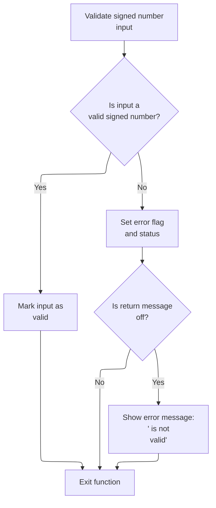

This section validates a signed numeric input after the area code has been checked, ensuring only valid signed numbers are accepted and providing error handling and messaging for invalid inputs.

| Rule ID | Code Location        | Category        | Rule Name                                 | Description                                                                                                                                                       | Conditions                                                                            | Remarks                                                                                                                                                         |
| ------- | -------------------- | --------------- | ----------------------------------------- | ----------------------------------------------------------------------------------------------------------------------------------------------------------------- | ------------------------------------------------------------------------------------- | --------------------------------------------------------------------------------------------------------------------------------------------------------------- |
| BR-001  | 1250-EDIT-SIGNED-9V2 | Data validation | Signed number validity check              | If the signed numeric input is not a valid signed number, the system sets an error status and marks the input as invalid.                                         | The signed numeric input is provided and the area code validation has already passed. | The error status is indicated by setting the error flag to '1' and the invalid flag to '0'. The input is considered invalid if it fails the signed number test. |
| BR-002  | 1250-EDIT-SIGNED-9V2 | Business logic  | Mark signed number as valid               | If the signed numeric input passes all validation checks, the system marks the input as valid.                                                                    | The signed numeric input passes the signed number validation check.                   | The valid status is indicated by setting the valid flag to LOW-VALUES. No error message is generated.                                                           |
| BR-003  | 1250-EDIT-SIGNED-9V2 | Error handling  | Error messaging for invalid signed number | When the signed numeric input is invalid and the return message is enabled, the system constructs and returns an error message indicating the field is not valid. | The signed numeric input is invalid and the return message flag is enabled.           | The error message format is: '<field name> is not valid', where <field name> is trimmed of leading and trailing spaces. The message is returned as a string.    |

<SwmSnippet path="/app/cbl/COACTUPC.cbl" line="2197" repo-id="Z2l0aHViJTNBJTNBa3luZHJ5bC1hd3MtbWFpbmZyYW1lLW1vZGVybml6YXRpb24tY2FyZGRlbW8lM0ElM0FTd2ltbS1EZW1v">

---

Back in 1250-EDIT-SIGNED-9V2, after returning from EDIT-AREA-CODE, the code continues only if the area code was valid. If there was an error, we would have exited already. This keeps the validation chain tight—each field only gets checked if the previous one passed.

```cobol
           ELSE
              CONTINUE
           END-IF
```

---

</SwmSnippet>

<SwmSnippet path="/app/cbl/COACTUPC.cbl" line="2201" repo-id="Z2l0aHViJTNBJTNBa3luZHJ5bC1hd3MtbWFpbmZyYW1lLW1vZGVybml6YXRpb24tY2FyZGRlbW8lM0ElM0FTd2ltbS1EZW1v">

---

Here, the code checks if the signed number input is actually numeric using TEST-NUMVAL-C. If it passes, we keep going. If not, the function sets error flags, builds an error message, and exits early. This is the main numeric validation step for signed numbers.

```cobol
           IF FUNCTION TEST-NUMVAL-C(WS-EDIT-SIGNED-NUMBER-9V2-X) = 0
              CONTINUE
```

---

</SwmSnippet>

<SwmSnippet path="/app/cbl/COACTUPC.cbl" line="2203" repo-id="Z2l0aHViJTNBJTNBa3luZHJ5bC1hd3MtbWFpbmZyYW1lLW1vZGVybml6YXRpb24tY2FyZGRlbW8lM0ElM0FTd2ltbS1EZW1v">

---

Here, if the signed number input passes all checks, the code sets the valid flag and that's it. If there was an error, it would have exited earlier. This is the last step in 1250-EDIT-SIGNED-9V2 before returning.

```cobol
           ELSE
              SET INPUT-ERROR             TO TRUE
              SET FLG-SIGNED-NUMBER-NOT-OK   TO TRUE
              IF WS-RETURN-MSG-OFF
                 STRING
                   FUNCTION TRIM(WS-EDIT-VARIABLE-NAME)
                   ' is not valid'
                   DELIMITED BY SIZE
                   INTO WS-RETURN-MSG
              END-IF
              GO TO  1250-EDIT-SIGNED-9V2-EXIT

           END-IF

      *    If we got here all edits were cleared
           SET FLG-SIGNED-NUMBER-ISVALID  TO TRUE
           .
```

---

</SwmSnippet>

########### Validating Required Numeric Input After Signed Number

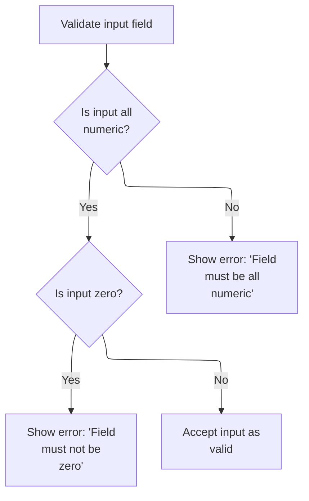

This section validates required numeric input fields after signed number editing, ensuring that only numeric and non-zero values are accepted. It provides clear error feedback for invalid input and sets flags to indicate validation status.

| Rule ID | Code Location      | Category        | Rule Name                      | Description                                                                                                                                                    | Conditions                                                   | Remarks                                                                                                                                                                                                                                        |
| ------- | ------------------ | --------------- | ------------------------------ | -------------------------------------------------------------------------------------------------------------------------------------------------------------- | ------------------------------------------------------------ | ---------------------------------------------------------------------------------------------------------------------------------------------------------------------------------------------------------------------------------------------- |
| BR-001  | 1245-EDIT-NUM-REQD | Data validation | Numeric-only input required    | If the input field contains any non-numeric characters, the input is rejected and an error message is displayed indicating that the field must be all numeric. | The input field contains one or more non-numeric characters. | The error message format is: '<field name> must be all numeric.' The error flag INPUT-ERROR is set to '1'. The flag FLG-ALPHNANUM-NOT-OK is set to '0'. The message is constructed only if WS-RETURN-MSG-OFF is true (WS-RETURN-MSG = SPACES). |
| BR-002  | 1245-EDIT-NUM-REQD | Data validation | Non-zero input required        | If the input field is numeric but its value is zero, the input is rejected and an error message is displayed indicating that the field must not be zero.       | The input field is numeric and its value is zero.            | The error message format is: '<field name> must not be zero.' The error flag INPUT-ERROR is set to '1'. The flag FLG-ALPHNANUM-NOT-OK is set to '0'. The message is constructed only if WS-RETURN-MSG-OFF is true (WS-RETURN-MSG = SPACES).    |
| BR-003  | 1245-EDIT-NUM-REQD | Business logic  | Valid numeric input acceptance | If the input field passes both the numeric-only and non-zero checks, the input is accepted as valid and the valid flag is set.                                 | The input field is numeric and its value is not zero.        | The valid flag FLG-ALPHNANUM-ISVALID is set to LOW-VALUES. No error message is constructed.                                                                                                                                                    |

<SwmSnippet path="/app/cbl/COACTUPC.cbl" line="2137" repo-id="Z2l0aHViJTNBJTNBa3luZHJ5bC1hd3MtbWFpbmZyYW1lLW1vZGVybml6YXRpb24tY2FyZGRlbW8lM0ElM0FTd2ltbS1EZW1v">

---

Back in 1245-EDIT-NUM-REQD, after returning from 1250-EDIT-SIGNED-9V2, the code checks if the input is numeric. If not, it sets error flags, builds an error message, and exits. This keeps the validation strict for required numeric fields.

```cobol
           IF WS-EDIT-ALPHANUM-ONLY(1:WS-EDIT-ALPHANUM-LENGTH)
                  IS NUMERIC
              CONTINUE
```

---

</SwmSnippet>

<SwmSnippet path="/app/cbl/COACTUPC.cbl" line="2140" repo-id="Z2l0aHViJTNBJTNBa3luZHJ5bC1hd3MtbWFpbmZyYW1lLW1vZGVybml6YXRpb24tY2FyZGRlbW8lM0ElM0FTd2ltbS1EZW1v">

---

Here, if the input isn't numeric, the code sets error flags, builds an error message, and exits. This is the main numeric validation step for required fields. If the input is numeric, the function keeps going to the next check.

```cobol
           ELSE
              SET INPUT-ERROR           TO TRUE
              SET FLG-ALPHNANUM-NOT-OK  TO TRUE
              IF WS-RETURN-MSG-OFF
                 STRING
                   FUNCTION TRIM(WS-EDIT-VARIABLE-NAME)
                   ' must be all numeric.'
                   DELIMITED BY SIZE
                   INTO WS-RETURN-MSG
                 END-STRING
              END-IF
              GO TO  1245-EDIT-NUM-REQD-EXIT
           END-IF
```

---

</SwmSnippet>

<SwmSnippet path="/app/cbl/COACTUPC.cbl" line="2156" repo-id="Z2l0aHViJTNBJTNBa3luZHJ5bC1hd3MtbWFpbmZyYW1lLW1vZGVybml6YXRpb24tY2FyZGRlbW8lM0ElM0FTd2ltbS1EZW1v">

---

Here, after confirming the input is numeric, the code checks if it's zero. If so, it sets error flags, builds a message, and exits. If not zero, the function keeps going. This makes sure required fields aren't just filled with zeros.

```cobol
           IF FUNCTION NUMVAL(WS-EDIT-ALPHANUM-ONLY(1:
                              WS-EDIT-ALPHANUM-LENGTH)) = 0
              SET INPUT-ERROR           TO TRUE
              SET FLG-ALPHNANUM-NOT-OK  TO TRUE
              IF WS-RETURN-MSG-OFF
                 STRING
                   FUNCTION TRIM(WS-EDIT-VARIABLE-NAME)
                   ' must not be zero.'
                   DELIMITED BY SIZE
                   INTO WS-RETURN-MSG
                 END-STRING
              END-IF
```

---

</SwmSnippet>

<SwmSnippet path="/app/cbl/COACTUPC.cbl" line="2169" repo-id="Z2l0aHViJTNBJTNBa3luZHJ5bC1hd3MtbWFpbmZyYW1lLW1vZGVybml6YXRpb24tY2FyZGRlbW8lM0ElM0FTd2ltbS1EZW1v">

---

Here, if the input passes all checks (not blank, numeric, not zero), the code sets the valid flag and that's it. If there was an error, it would have exited earlier. This is the last step in 1245-EDIT-NUM-REQD before returning.

```cobol
           ELSE
              CONTINUE
           END-IF


           SET FLG-ALPHNANUM-ISVALID    TO TRUE
           .
```

---

</SwmSnippet>

########## Validating Optional Alphanumeric Input

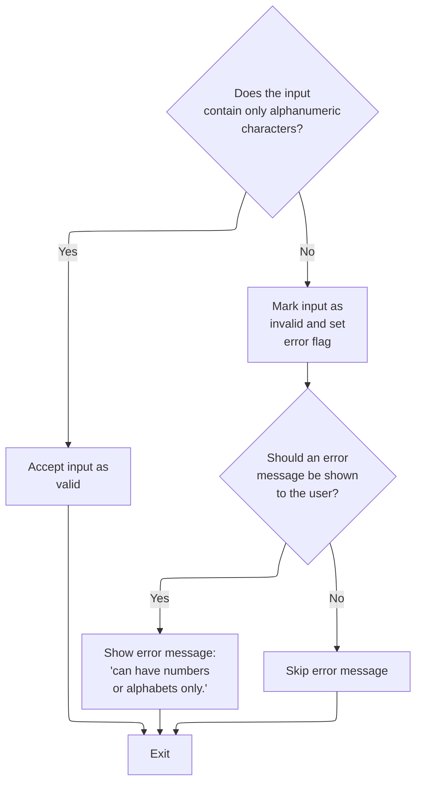

This section validates optional alphanumeric input fields, ensuring only letters and numbers are accepted, and provides error handling and messaging for invalid input.

| Rule ID | Code Location          | Category        | Rule Name                    | Description                                                                                                                                  | Conditions                                                           | Remarks                                                                                                                                                                         |
| ------- | ---------------------- | --------------- | ---------------------------- | -------------------------------------------------------------------------------------------------------------------------------------------- | -------------------------------------------------------------------- | ------------------------------------------------------------------------------------------------------------------------------------------------------------------------------- |
| BR-001  | 1240-EDIT-ALPHANUM-OPT | Data validation | Alphanumeric acceptance      | Input is accepted as valid if it contains only alphanumeric characters (letters and numbers) or is blank after trimming.                     | The trimmed input contains only alphanumeric characters or is blank. | No error message is generated. The valid flag is set to LOW-VALUES. The input field may be up to 256 characters, and is treated as a string.                                    |
| BR-002  | 1240-EDIT-ALPHANUM-OPT | Data validation | Alphanumeric rejection       | If the input contains any non-alphanumeric characters, the input is marked as invalid and error flags are set.                               | The trimmed input contains any non-alphanumeric characters.          | The invalid flag is set to '0'. The error flag is set to '1'. The input field may be up to 256 characters, and is treated as a string.                                          |
| BR-003  | 1240-EDIT-ALPHANUM-OPT | Error handling  | Alphanumeric error messaging | If the input is invalid and the error message flag is not set, display the error message: '<field name> can have numbers or alphabets only.' | The input is invalid and the error message flag is not set.          | The error message format is: '<field name> can have numbers or alphabets only.' The field name is trimmed and concatenated with the message. The message is stored as a string. |

<SwmSnippet path="/app/cbl/COACTUPC.cbl" line="2079" repo-id="Z2l0aHViJTNBJTNBa3luZHJ5bC1hd3MtbWFpbmZyYW1lLW1vZGVybml6YXRpb24tY2FyZGRlbW8lM0ElM0FTd2ltbS1EZW1v">

---

Back in 1240-EDIT-ALPHANUM-OPT, after returning from 1245-EDIT-NUM-REQD, the code sets up a conversion table and uses INSPECT ... CONVERTING to swap allowed alphanumeric characters for spaces. This is how it checks for any non-alphanumeric junk left in the input.

```cobol
           MOVE LIT-ALL-ALPHANUM-FROM-X TO LIT-ALL-ALPHANUM-FROM
           INSPECT WS-EDIT-ALPHANUM-ONLY(1:WS-EDIT-ALPHANUM-LENGTH)
             CONVERTING LIT-ALL-ALPHANUM-FROM
                     TO LIT-ALPHANUM-SPACES-TO
```

---

</SwmSnippet>

<SwmSnippet path="/app/cbl/COACTUPC.cbl" line="2084" repo-id="Z2l0aHViJTNBJTNBa3luZHJ5bC1hd3MtbWFpbmZyYW1lLW1vZGVybml6YXRpb24tY2FyZGRlbW8lM0ElM0FTd2ltbS1EZW1v">

---

Here, the code checks if the trimmed input length is zero after conversion. If it is, the input is valid and we move on. If not, the next snippet will handle the error case.

```cobol
           IF FUNCTION LENGTH(
                   FUNCTION TRIM(
                   WS-EDIT-ALPHANUM-ONLY(1:WS-EDIT-ALPHANUM-LENGTH)
                                  )) = 0
              CONTINUE
```

---

</SwmSnippet>

<SwmSnippet path="/app/cbl/COACTUPC.cbl" line="2089" repo-id="Z2l0aHViJTNBJTNBa3luZHJ5bC1hd3MtbWFpbmZyYW1lLW1vZGVybml6YXRpb24tY2FyZGRlbW8lM0ElM0FTd2ltbS1EZW1v">

---

Here, if the input is blank or only has allowed characters, the code marks it as valid and exits. If not, it sets error flags and builds an error message. This is the last step for optional alphanumeric validation.

```cobol
           ELSE
              SET INPUT-ERROR           TO TRUE
              SET FLG-ALPHNANUM-NOT-OK  TO TRUE
              IF WS-RETURN-MSG-OFF
                 STRING
                   FUNCTION TRIM(WS-EDIT-VARIABLE-NAME)
                   ' can have numbers or alphabets only.'
                   DELIMITED BY SIZE
                   INTO WS-RETURN-MSG
                 END-STRING
              END-IF
              GO TO  1240-EDIT-ALPHANUM-OPT-EXIT
           END-IF

           SET FLG-ALPHNANUM-ISVALID    TO TRUE
           .
```

---

</SwmSnippet>

######### Validating Optional Alpha Input

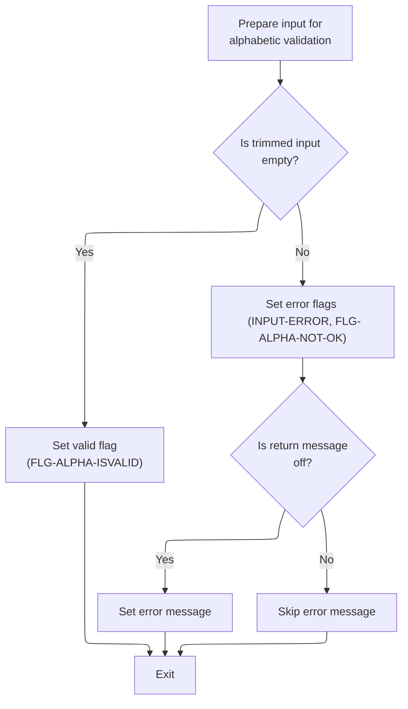

This section validates optional alphabetic input fields, determining whether the input is valid, setting error flags for invalid input, and generating error messages when appropriate.

| Rule ID | Code Location | Category        | Rule Name                             | Description                                                                                                                                                 | Conditions                                                                                 | Remarks                                                                                                                                                                                                      |
| ------- | ------------- | --------------- | ------------------------------------- | ----------------------------------------------------------------------------------------------------------------------------------------------------------- | ------------------------------------------------------------------------------------------ | ------------------------------------------------------------------------------------------------------------------------------------------------------------------------------------------------------------ |
| BR-001  | MAIN-LOGIC    | Data validation | Empty optional alpha input is valid   | If the trimmed input is empty, the input is considered valid and no error is flagged.                                                                       | The trimmed input field contains no characters after removing leading and trailing spaces. | The valid flag is set to its lowest possible value (LOW-VALUES). No error message is generated. The input field may be up to 256 characters in length, but only emptiness is checked here.                   |
| BR-002  | MAIN-LOGIC    | Data validation | Non-alphabetic input triggers error   | If the trimmed input is not empty and contains non-alphabetic characters, the input is considered invalid and error flags are set.                          | The trimmed input field contains one or more non-alphabetic characters.                    | The error flag is set to '1', and the not-OK flag is set to '0'. The input field may be up to 256 characters in length. No specific format for the error message is required at this stage.                  |
| BR-003  | MAIN-LOGIC    | Error handling  | Error message for invalid alpha input | If an error is triggered and the return message display is enabled, an error message is constructed indicating that only alphabetic characters are allowed. | The input is invalid and the return message display is enabled.                            | The error message is constructed as a string: '\[field name\] can have alphabets only.' The field name is trimmed and concatenated with the error message. The message is stored in a generic message field. |

<SwmSnippet path="/app/cbl/COACTUPC.cbl" line="2031" repo-id="Z2l0aHViJTNBJTNBa3luZHJ5bC1hd3MtbWFpbmZyYW1lLW1vZGVybml6YXRpb24tY2FyZGRlbW8lM0ElM0FTd2ltbS1EZW1v">

---

Back in 1235-EDIT-ALPHA-OPT, after returning from 1240-EDIT-ALPHANUM-OPT, the code sets up a conversion table and uses INSPECT ... CONVERTING to replace all alphabets with spaces. This is how it checks for any non-alphabetic junk left in the input.

```cobol
           MOVE LIT-ALL-ALPHA-FROM-X    TO LIT-ALL-ALPHA-FROM
           INSPECT WS-EDIT-ALPHANUM-ONLY(1:WS-EDIT-ALPHANUM-LENGTH)
             CONVERTING LIT-ALL-ALPHA-FROM
                     TO LIT-ALPHA-SPACES-TO
```

---

</SwmSnippet>

<SwmSnippet path="/app/cbl/COACTUPC.cbl" line="2036" repo-id="Z2l0aHViJTNBJTNBa3luZHJ5bC1hd3MtbWFpbmZyYW1lLW1vZGVybml6YXRpb24tY2FyZGRlbW8lM0ElM0FTd2ltbS1EZW1v">

---

Here, the code checks if the trimmed input length is zero after conversion. If it is, the input is valid and we move on. If not, the next snippet will handle the error case.

```cobol
           IF FUNCTION LENGTH(
                   FUNCTION TRIM(
                   WS-EDIT-ALPHANUM-ONLY(1:WS-EDIT-ALPHANUM-LENGTH)
                                  )) = 0
              CONTINUE
```

---

</SwmSnippet>

<SwmSnippet path="/app/cbl/COACTUPC.cbl" line="2041" repo-id="Z2l0aHViJTNBJTNBa3luZHJ5bC1hd3MtbWFpbmZyYW1lLW1vZGVybml6YXRpb24tY2FyZGRlbW8lM0ElM0FTd2ltbS1EZW1v">

---

Here, if the input is blank or only has allowed characters, the code marks it as valid and exits. If not, it sets error flags and builds an error message. This is the last step for optional alpha validation.

```cobol
           ELSE
              SET INPUT-ERROR           TO TRUE
              SET FLG-ALPHA-NOT-OK      TO TRUE
              IF WS-RETURN-MSG-OFF
                 STRING
                   FUNCTION TRIM(WS-EDIT-VARIABLE-NAME)
                   ' can have alphabets only.'
                   DELIMITED BY SIZE
                   INTO WS-RETURN-MSG
                 END-STRING
              END-IF
              GO TO  1235-EDIT-ALPHA-OPT-EXIT
           END-IF

           SET FLG-ALPHA-ISVALID        TO TRUE
           .
```

---

</SwmSnippet>

######## Validating Required Alphanumeric Input

This section validates that required input fields contain only alphanumeric characters, flags errors for invalid input, and sets status flags for downstream processing.

| Rule ID | Code Location           | Category        | Rule Name                         | Description                                                                                                                                             | Conditions                                                                                      | Remarks                                                                                                                                                                                                                          |
| ------- | ----------------------- | --------------- | --------------------------------- | ------------------------------------------------------------------------------------------------------------------------------------------------------- | ----------------------------------------------------------------------------------------------- | -------------------------------------------------------------------------------------------------------------------------------------------------------------------------------------------------------------------------------- |
| BR-001  | 1230-EDIT-ALPHANUM-REQD | Data validation | Alphanumeric input required       | If the required input field contains only alphanumeric characters (letters and numbers), it is considered valid and processing continues without error. | The input field is not blank and contains only alphanumeric characters.                         | Alphanumeric characters are defined as letters (A-Z, a-z) and numbers (0-9). The input is checked after converting all allowed characters to spaces and trimming the result. If the trimmed result is empty, the input is valid. |
| BR-002  | 1230-EDIT-ALPHANUM-REQD | Business logic  | Alphanumeric input valid flag     | When the input is valid, a flag is set to indicate successful validation for downstream processing.                                                     | The input field passes the alphanumeric validation check.                                       | The valid flag is set to indicate that the input has passed validation and can be used in subsequent processing steps.                                                                                                           |
| BR-003  | 1230-EDIT-ALPHANUM-REQD | Error handling  | Alphanumeric input error handling | If the required input field contains any non-alphanumeric characters or is blank, an error is flagged and an error message is generated for the user.   | The input field contains non-alphanumeric characters or is blank after conversion and trimming. | Error flags are set to indicate invalid input. The error message format is: '<field name> can have numbers or alphabets only.' The field name is trimmed and concatenated with the message.                                      |

<SwmSnippet path="/app/cbl/COACTUPC.cbl" line="1982" repo-id="Z2l0aHViJTNBJTNBa3luZHJ5bC1hd3MtbWFpbmZyYW1lLW1vZGVybml6YXRpb24tY2FyZGRlbW8lM0ElM0FTd2ltbS1EZW1v">

---

Back in 1230-EDIT-ALPHANUM-REQD, after returning from 1235-EDIT-ALPHA-OPT, the code sets up a conversion table and uses INSPECT ... CONVERTING to replace all allowed alphanumeric characters with spaces. This is how it checks for any non-alphanumeric junk left in the input.

```cobol
           MOVE LIT-ALL-ALPHANUM-FROM-X TO LIT-ALL-ALPHANUM-FROM

           INSPECT WS-EDIT-ALPHANUM-ONLY(1:WS-EDIT-ALPHANUM-LENGTH)
             CONVERTING LIT-ALL-ALPHANUM-FROM
                     TO LIT-ALPHANUM-SPACES-TO
```

---

</SwmSnippet>

<SwmSnippet path="/app/cbl/COACTUPC.cbl" line="1988" repo-id="Z2l0aHViJTNBJTNBa3luZHJ5bC1hd3MtbWFpbmZyYW1lLW1vZGVybml6YXRpb24tY2FyZGRlbW8lM0ElM0FTd2ltbS1EZW1v">

---

Here, the code checks if the trimmed input length is zero after conversion. If it is, the input is valid and we move on. If not, the next snippet will handle the error case.

```cobol
           IF FUNCTION LENGTH(
                   FUNCTION TRIM(
                   WS-EDIT-ALPHANUM-ONLY(1:WS-EDIT-ALPHANUM-LENGTH)
                                  )) = 0
              CONTINUE
```

---

</SwmSnippet>

<SwmSnippet path="/app/cbl/COACTUPC.cbl" line="1993" repo-id="Z2l0aHViJTNBJTNBa3luZHJ5bC1hd3MtbWFpbmZyYW1lLW1vZGVybml6YXRpb24tY2FyZGRlbW8lM0ElM0FTd2ltbS1EZW1v">

---

Here, if the input is blank or has invalid characters, the code sets error flags and builds an error message. If the input is valid, it marks it as valid and continues. This is the last step for required alphanumeric validation.

```cobol
           ELSE
              SET INPUT-ERROR           TO TRUE
              SET FLG-ALPHNANUM-NOT-OK  TO TRUE
              IF WS-RETURN-MSG-OFF
                 STRING
                   FUNCTION TRIM(WS-EDIT-VARIABLE-NAME)
                   ' can have numbers or alphabets only.'
                   DELIMITED BY SIZE
                   INTO WS-RETURN-MSG
                 END-STRING
              END-IF
              GO TO  1230-EDIT-ALPHANUM-REQD-EXIT
           END-IF

           SET FLG-ALPHNANUM-ISVALID    TO TRUE
           .
```

---

</SwmSnippet>

####### Validating Required Alpha Input

```mermaid
%%{init: {"flowchart": {"defaultRenderer": "elk"}} }%%
flowchart TD
    node2{"Is trimmed input 
 empty?"}
    click node2 openCode "app/cbl/COACTUPC.cbl:1930:1934"
    node2 -->|"Yes"| node3["Input accepted (set 
 FLG-ALPHA-ISVALID to TRUE)"]
    click node3 openCode "app/cbl/COACTUPC.cbl:1949:1950"
    node2 -->|"No"| node4["Input rejected: set 
 INPUT-ERROR and FLG-ALPHA-NOT-OK 
 to TRUE"]
    click node4 openCode "app/cbl/COACTUPC.cbl:1935:1937"
    node4 --> node5{"Is WS-RETURN-MSG-OFF true?"}
    click node5 openCode "app/cbl/COACTUPC.cbl:1938:1945"
    node5 -->|"Yes"| node6["Set error message: 
 '<field> can have 
 alphabets only.'"]
    click node6 openCode "app/cbl/COACTUPC.cbl:1939:1944"
    node5 -->|"No"| node7["Skip error message"]
    click node7 openCode "app/cbl/COACTUPC.cbl:1945:1945"
classDef HeadingStyle fill:#777777,stroke:#333,stroke-width:2px;
```

This section validates that a required input field contains only alphabetic characters and is not empty, setting appropriate flags and error messages based on the validation outcome.

| Rule ID | Code Location        | Category        | Rule Name                   | Description                                                                                                                                                        | Conditions                                                               | Remarks                                                                                                                                                                                                                                     |
| ------- | -------------------- | --------------- | --------------------------- | ------------------------------------------------------------------------------------------------------------------------------------------------------------------ | ------------------------------------------------------------------------ | ------------------------------------------------------------------------------------------------------------------------------------------------------------------------------------------------------------------------------------------- |
| BR-001  | 1225-EDIT-ALPHA-REQD | Data validation | Accept blank input          | If the trimmed input field is empty, the input is accepted as valid and no error is flagged.                                                                       | The trimmed input field contains zero characters.                        | No error message is generated. The validity flag is set to indicate acceptance. The input is considered valid even if it is blank.                                                                                                          |
| BR-002  | 1225-EDIT-ALPHA-REQD | Data validation | Reject non-alphabetic input | If the trimmed input field is not empty and contains non-alphabetic characters, the input is rejected, error flags are set, and an error message may be generated. | The trimmed input field contains one or more non-alphabetic characters.  | Error flags are set to indicate invalid input. The error message format is: '<field> can have alphabets only.' where <field> is replaced by the field name. The error message is only generated if the message suppression flag is not set. |
| BR-003  | 1225-EDIT-ALPHA-REQD | Data validation | Mark valid input            | If the trimmed input field is empty or contains only alphabetic characters, the input is marked as valid.                                                          | The trimmed input field is empty or contains only alphabetic characters. | The validity flag is set to indicate acceptance. No error message is generated.                                                                                                                                                             |
| BR-004  | 1225-EDIT-ALPHA-REQD | Error handling  | Conditional error messaging | If the input is rejected due to non-alphabetic characters, the error message is only generated if the message suppression flag is not set.                         | Input is rejected and message suppression flag is not set.               | The error message format is: '<field> can have alphabets only.' The message is omitted if the suppression flag is set.                                                                                                                      |

<SwmSnippet path="/app/cbl/COACTUPC.cbl" line="1925" repo-id="Z2l0aHViJTNBJTNBa3luZHJ5bC1hd3MtbWFpbmZyYW1lLW1vZGVybml6YXRpb24tY2FyZGRlbW8lM0ElM0FTd2ltbS1EZW1v">

---

Back in 1225-EDIT-ALPHA-REQD, after returning from 1230-EDIT-ALPHANUM-REQD, the code sets up a conversion table and uses INSPECT ... CONVERTING to replace all alphabets with spaces. This is how it checks for any non-alphabetic junk left in the input.

```cobol
           MOVE LIT-ALL-ALPHA-FROM-X   TO LIT-ALL-ALPHA-FROM
           INSPECT WS-EDIT-ALPHANUM-ONLY(1:WS-EDIT-ALPHANUM-LENGTH)
             CONVERTING LIT-ALL-ALPHA-FROM
                     TO LIT-ALPHA-SPACES-TO
```

---

</SwmSnippet>

<SwmSnippet path="/app/cbl/COACTUPC.cbl" line="1930" repo-id="Z2l0aHViJTNBJTNBa3luZHJ5bC1hd3MtbWFpbmZyYW1lLW1vZGVybml6YXRpb24tY2FyZGRlbW8lM0ElM0FTd2ltbS1EZW1v">

---

Here, the code checks if the trimmed input length is zero after conversion. If it is, the input is valid and we move on. If not, the next snippet will handle the error case.

```cobol
           IF FUNCTION LENGTH(
                   FUNCTION TRIM(
                   WS-EDIT-ALPHANUM-ONLY(1:WS-EDIT-ALPHANUM-LENGTH)
                                  )) = 0
              CONTINUE
```

---

</SwmSnippet>

<SwmSnippet path="/app/cbl/COACTUPC.cbl" line="1935" repo-id="Z2l0aHViJTNBJTNBa3luZHJ5bC1hd3MtbWFpbmZyYW1lLW1vZGVybml6YXRpb24tY2FyZGRlbW8lM0ElM0FTd2ltbS1EZW1v">

---

Here, if the input is blank or has invalid characters, the code sets error flags and builds an error message. If the input is valid, it marks it as valid and continues. This is the last step for required alpha validation.

```cobol
           ELSE
              SET INPUT-ERROR           TO TRUE
              SET FLG-ALPHA-NOT-OK      TO TRUE
              IF WS-RETURN-MSG-OFF
                 STRING
                   FUNCTION TRIM(WS-EDIT-VARIABLE-NAME)
                   ' can have alphabets only.'
                   DELIMITED BY SIZE
                   INTO WS-RETURN-MSG
                 END-STRING
              END-IF
              GO TO  1225-EDIT-ALPHA-REQD-EXIT
           END-IF

           SET FLG-ALPHA-ISVALID        TO TRUE
           .
```

---

</SwmSnippet>

###### Validating Yes/No Input

```mermaid
%%{init: {"flowchart": {"defaultRenderer": "elk"}} }%%
flowchart TD
    node1{"Is Yes/No input 
 'Y' or 'N'?"}
    click node1 openCode "app/cbl/COACTUPC.cbl:1878:1879"
    node1 -->|"Yes"| node2["Input accepted"]
    click node2 openCode "app/cbl/COACTUPC.cbl:1879:1879"
    node2 --> node6["Exit"]
    click node6 openCode "app/cbl/COACTUPC.cbl:1891:1892"
    node1 -->|"No"| node3["Mark input as 
 error and set 
 error flag"]
    click node3 openCode "app/cbl/COACTUPC.cbl:1881:1882"
    node3 --> node4{"Show error message 
 to user?"}
    click node4 openCode "app/cbl/COACTUPC.cbl:1883:1890"
    node4 -->|"Yes"| node5["Display: '<Field> must 
 be Y or 
 N.'"]
    click node5 openCode "app/cbl/COACTUPC.cbl:1884:1889"
    node5 --> node6
    node4 -->|"No"| node6
classDef HeadingStyle fill:#777777,stroke:#333,stroke-width:2px;
```

This section validates Yes/No input fields, ensuring only 'Y' or 'N' are accepted, and provides error handling and user feedback for invalid entries.

| Rule ID | Code Location   | Category        | Rule Name                            | Description                                                                                                                                                                            | Conditions                                                                                     | Remarks                                                                                                                                                                   |
| ------- | --------------- | --------------- | ------------------------------------ | -------------------------------------------------------------------------------------------------------------------------------------------------------------------------------------- | ---------------------------------------------------------------------------------------------- | ------------------------------------------------------------------------------------------------------------------------------------------------------------------------- |
| BR-001  | 1220-EDIT-YESNO | Data validation | Strict Yes/No acceptance             | The Yes/No input field is accepted only if its value is 'Y' or 'N'. Any other value is considered invalid.                                                                             | The input value must be exactly 'Y' or 'N'.                                                    | Accepted values are 'Y' and 'N' (single character, uppercase). Any other value triggers error handling.                                                                   |
| BR-002  | 1220-EDIT-YESNO | Error handling  | Error flagging for invalid Yes/No    | If the Yes/No input is not valid, the system marks the input as erroneous and sets error flags to indicate the failure.                                                                | The input value is not 'Y' or 'N'.                                                             | Error flags are set to indicate invalid input. The error flag values are: INPUT-ERROR = TRUE, FLG-YES-NO-NOT-OK = TRUE.                                                   |
| BR-003  | 1220-EDIT-YESNO | Error handling  | User-facing error message for Yes/No | When an invalid Yes/No input is detected and error messaging is enabled, the system constructs and displays an error message to the user indicating that the field must be 'Y' or 'N'. | The input value is not 'Y' or 'N', and error messaging is enabled (WS-RETURN-MSG-OFF is true). | The error message format is: '<FieldName> must be Y or N.' where <FieldName> is trimmed and inserted dynamically. The message is a string, left-aligned, with no padding. |

<SwmSnippet path="/app/cbl/COACTUPC.cbl" line="1878" repo-id="Z2l0aHViJTNBJTNBa3luZHJ5bC1hd3MtbWFpbmZyYW1lLW1vZGVybml6YXRpb24tY2FyZGRlbW8lM0ElM0FTd2ltbS1EZW1v">

---

Back in 1220-EDIT-YESNO, after returning from 1225-EDIT-ALPHA-REQD, the code checks if the input is 'Y' or 'N'. If not, it sets error flags, builds an error message, and exits. This keeps the yes/no validation strict.

```cobol
           IF FLG-YES-NO-ISVALID
              CONTINUE
```

---

</SwmSnippet>

<SwmSnippet path="/app/cbl/COACTUPC.cbl" line="1880" repo-id="Z2l0aHViJTNBJTNBa3luZHJ5bC1hd3MtbWFpbmZyYW1lLW1vZGVybml6YXRpb24tY2FyZGRlbW8lM0ElM0FTd2ltbS1EZW1v">

---

Here, if the input isn't 'Y' or 'N', the code sets error flags and builds an error message. If the input is valid, it just continues. This is the last step for yes/no validation.

```cobol
           ELSE
              SET INPUT-ERROR             TO TRUE
              SET FLG-YES-NO-NOT-OK       TO TRUE
              IF WS-RETURN-MSG-OFF
                 STRING
                   FUNCTION TRIM(WS-EDIT-VARIABLE-NAME)
                   ' must be Y or N.'
                   DELIMITED BY SIZE
                   INTO WS-RETURN-MSG
                 END-STRING
              END-IF
              GO TO  1220-EDIT-YESNO-EXIT
           END-IF
```

---

</SwmSnippet>

##### Validating Account ID Input

This section validates the Account ID input, ensuring it meets strict business requirements before allowing further processing or displaying error messages.

| Rule ID | Code Location     | Category        | Rule Name                                  | Description                                                                                                                                                         | Conditions                                                                                | Remarks                                                                                                                                                                                        |
| ------- | ----------------- | --------------- | ------------------------------------------ | ------------------------------------------------------------------------------------------------------------------------------------------------------------------- | ----------------------------------------------------------------------------------------- | ---------------------------------------------------------------------------------------------------------------------------------------------------------------------------------------------- |
| BR-001  | 1210-EDIT-ACCOUNT | Data validation | Account ID Numeric and Non-Zero Validation | If the Account ID is not numeric or is all zeros, the input is rejected, error flags are set, the Account ID field is cleared, and an error message is constructed. | Account ID is provided, and either it contains non-numeric characters or it is all zeros. | Account ID must be an 11-digit number. If invalid, the error message states: 'Account Number if supplied must be a 11 digit Non-Zero Number'. The Account ID field is cleared (set to zeroes). |
| BR-002  | 1210-EDIT-ACCOUNT | Business logic  | Valid Account ID Acceptance                | If the Account ID passes numeric and non-zero checks, it is accepted and marked as valid for further processing.                                                    | Account ID is provided, is numeric, and is not all zeros.                                 | Account ID must be an 11-digit number. If valid, it is moved to the output field and a validity flag is set.                                                                                   |
| BR-003  | 1210-EDIT-ACCOUNT | Error handling  | Account ID Error Messaging                 | When an invalid Account ID is detected, an error message is constructed and displayed to the user, indicating the specific validation failure.                      | Account ID fails numeric or non-zero validation and the return message flag is off.       | Error message format: 'Account Number if supplied must be a 11 digit Non-Zero Number'. Message is constructed only if the return message flag is off.                                          |

<SwmSnippet path="/app/cbl/COACTUPC.cbl" line="1801" repo-id="Z2l0aHViJTNBJTNBa3luZHJ5bC1hd3MtbWFpbmZyYW1lLW1vZGVybml6YXRpb24tY2FyZGRlbW8lM0ElM0FTd2ltbS1EZW1v">

---

Back in 1210-EDIT-ACCOUNT, after returning from 1215-EDIT-MANDATORY, the code checks if the account ID is numeric and not all zeros. If not, it sets error flags, builds an error message, zeroes out the account ID, and exits. This keeps the account ID validation strict.

```cobol
           MOVE CC-ACCT-ID              TO ACUP-NEW-ACCT-ID
           IF CC-ACCT-ID   IS NOT NUMERIC
           OR CC-ACCT-ID-N EQUAL ZEROS
              SET INPUT-ERROR TO TRUE
              IF WS-RETURN-MSG-OFF
                STRING
                 'Account Number if supplied must be a 11 digit'
                 ' Non-Zero Number'
                DELIMITED BY SIZE
                INTO WS-RETURN-MSG
              END-IF
              MOVE ZEROES               TO CDEMO-ACCT-ID
              GO TO 1210-EDIT-ACCOUNT-EXIT
```

---

</SwmSnippet>

<SwmSnippet path="/app/cbl/COACTUPC.cbl" line="1814" repo-id="Z2l0aHViJTNBJTNBa3luZHJ5bC1hd3MtbWFpbmZyYW1lLW1vZGVybml6YXRpb24tY2FyZGRlbW8lM0ElM0FTd2ltbS1EZW1v">

---

Here, if the account ID is missing or invalid, the code sets error flags, clears the field, and builds an error message. If the input is valid, it marks it as valid and continues. This is the last step for account ID validation.

```cobol
           ELSE
              MOVE CC-ACCT-ID TO CDEMO-ACCT-ID
              SET FLG-ACCTFILTER-ISVALID TO TRUE
           END-IF
```

---

</SwmSnippet>

#### Handling Search Criteria and Early Exit

This section manages the handling of user-provided search criteria, determines whether to proceed with further processing or exit early, and sets flags to indicate the validity and presence of account and customer data. It also triggers a comparison to detect changes in account data.

| Rule ID | Code Location                              | Category        | Rule Name                               | Description                                                                                                                                                                                                  | Conditions                                                                     | Remarks                                                                                                                                                                                                             |
| ------- | ------------------------------------------ | --------------- | --------------------------------------- | ------------------------------------------------------------------------------------------------------------------------------------------------------------------------------------------------------------ | ------------------------------------------------------------------------------ | ------------------------------------------------------------------------------------------------------------------------------------------------------------------------------------------------------------------- |
| BR-001  | 1200-EDIT-MAP-INPUTS                       | Data validation | Early exit on blank search criteria     | If no search criteria are provided (account filter is blank), the system sets a flag indicating no search criteria were received and exits early without processing further.                                 | The account filter is blank.                                                   | The flag NO-SEARCH-CRITERIA-RECEIVED is set to TRUE, which maps to WS-RETURN-MSG = 'No input received'. No further account or customer data is processed in this case.                                              |
| BR-002  | 1200-EDIT-MAP-INPUTS                       | Business logic  | Set valid data flags on search criteria | When valid search criteria are present, the system sets flags to indicate that account and customer data are valid and available for further processing.                                                     | The account filter is not blank and passes validation.                         | The flags FOUND-ACCOUNT-DATA, FOUND-ACCT-IN-MASTER, FLG-ACCTFILTER-ISVALID, FOUND-CUST-IN-MASTER, and FLG-CUSTFILTER-ISVALID are set to TRUE, indicating that both account and customer data are valid and present. |
| BR-003  | 1200-EDIT-MAP-INPUTS, 1205-COMPARE-OLD-NEW | Business logic  | Detect changes in account data          | After validating the presence of search criteria and data, the system compares the old and new account data to determine if any changes have been made, which informs whether an update should be processed. | Valid account and customer data are present and search criteria are not blank. | The comparison is performed by calling the 1205-COMPARE-OLD-NEW paragraph. The outcome determines if an update is necessary.                                                                                        |

<SwmSnippet path="/app/cbl/COACTUPC.cbl" line="1438" repo-id="Z2l0aHViJTNBJTNBa3luZHJ5bC1hd3MtbWFpbmZyYW1lLW1vZGVybml6YXRpb24tY2FyZGRlbW8lM0ElM0FTd2ltbS1EZW1v">

---

Back in 1200-EDIT-MAP-INPUTS, after returning from 1210-EDIT-ACCOUNT, the code clears the old account data and checks if the account filter is blank. If so, it sets a flag and exits early—no point in continuing without search criteria.

```cobol
               MOVE LOW-VALUES           TO ACUP-OLD-ACCT-DATA

      *       IF THE SEARCH CONDITIONS HAVE PROBLEMS FLAG THEM
              IF  FLG-ACCTFILTER-BLANK
                  SET NO-SEARCH-CRITERIA-RECEIVED TO TRUE
              END-IF

      *       AT THIS STAGE. NO DETAILS FETCHED. NOTHING MORE TO EDIT.
              GO TO 1200-EDIT-MAP-INPUTS-EXIT
```

---

</SwmSnippet>

<SwmSnippet path="/app/cbl/COACTUPC.cbl" line="1447" repo-id="Z2l0aHViJTNBJTNBa3luZHJ5bC1hd3MtbWFpbmZyYW1lLW1vZGVybml6YXRpb24tY2FyZGRlbW8lM0ElM0FTd2ltbS1EZW1v">

---

Here, if the account filter isn't blank, the code just continues to the next validation steps. No early exit, just more checks ahead.

```cobol
           ELSE
               CONTINUE
           END-IF
```

---

</SwmSnippet>

<SwmSnippet path="/app/cbl/COACTUPC.cbl" line="1452" repo-id="Z2l0aHViJTNBJTNBa3luZHJ5bC1hd3MtbWFpbmZyYW1lLW1vZGVybml6YXRpb24tY2FyZGRlbW8lM0ElM0FTd2ltbS1EZW1v">

---

These flags tell the rest of the code that the account and customer data are good to go.

```cobol
           SET FOUND-ACCOUNT-DATA        TO TRUE
           SET FOUND-ACCT-IN-MASTER      TO TRUE
           SET FLG-ACCTFILTER-ISVALID    TO TRUE

           SET FOUND-CUST-IN-MASTER      TO TRUE
           SET FLG-CUSTFILTER-ISVALID    TO TRUE
```

---

</SwmSnippet>

<SwmSnippet path="/app/cbl/COACTUPC.cbl" line="1460" repo-id="Z2l0aHViJTNBJTNBa3luZHJ5bC1hd3MtbWFpbmZyYW1lLW1vZGVybml6YXRpb24tY2FyZGRlbW8lM0ElM0FTd2ltbS1EZW1v">

---

Here, the code calls 1205-COMPARE-OLD-NEW to see if the user actually changed anything compared to the original data. This is how the program decides if it should process an update or just skip it.

```cobol
           PERFORM 1205-COMPARE-OLD-NEW
              THRU 1205-COMPARE-OLD-NEW-EXIT
```

---

</SwmSnippet>

#### Comparing Old and New Data

```mermaid
%%{init: {"flowchart": {"defaultRenderer": "elk"}} }%%
flowchart TD
    node1["Set NO-CHANGES-FOUND to 
 true"]
    click node1 openCode "app/cbl/COACTUPC.cbl:1682:1682"
    node1 --> node2{"Are all account 
 fields unchanged?"}
    click node2 openCode "app/cbl/COACTUPC.cbl:1684:1701"
    node2 -->|"Yes"| node3{"Are all customer 
 fields unchanged?"}
    click node3 openCode "app/cbl/COACTUPC.cbl:1708:1769"
    node2 -->|"No"| node4["Set CHANGE-HAS-OCCURRED to 
 true"]
    click node4 openCode "app/cbl/COACTUPC.cbl:1703:1704"
    node3 -->|"Yes"| node5["Set NO-CHANGES-DETECTED to 
 true"]
    click node5 openCode "app/cbl/COACTUPC.cbl:1769:1769"
    node3 -->|"No"| node4
classDef HeadingStyle fill:#777777,stroke:#333,stroke-width:2px;
```

This section compares old and new account and customer data to detect any changes, setting flags that inform subsequent business logic about whether updates or confirmations are needed.

| Rule ID | Code Location        | Category       | Rule Name                                 | Description                                                                                                                                                                                                                                                     | Conditions                                                                                                                                                                                                                                                      | Remarks                                                                                                                                                                                                                                                                                                                                                                                                                                                                                                                                                                                                                                                 |
| ------- | -------------------- | -------------- | ----------------------------------------- | --------------------------------------------------------------------------------------------------------------------------------------------------------------------------------------------------------------------------------------------------------------- | --------------------------------------------------------------------------------------------------------------------------------------------------------------------------------------------------------------------------------------------------------------- | ------------------------------------------------------------------------------------------------------------------------------------------------------------------------------------------------------------------------------------------------------------------------------------------------------------------------------------------------------------------------------------------------------------------------------------------------------------------------------------------------------------------------------------------------------------------------------------------------------------------------------------------------------- |
| BR-001  | 1205-COMPARE-OLD-NEW | Business logic | Account-level change detection            | If all account-level fields match between the new and old data, the system proceeds to compare customer-level fields. If any account-level field differs, the system immediately flags that a change has occurred and exits the comparison.                     | All account-level fields (ID, status, balances, limits, dates, group ID, etc.) must match between new and old data, with string fields compared in upper-case and trimmed form.                                                                                 | String fields are normalized using upper-case and trimming before comparison. Numeric and date fields are compared directly. The relevant fields include: account ID (string, 11 bytes), active status (string, 1 byte), current balance (string, 12 bytes), credit limit (string, 12 bytes), cash credit limit (string, 12 bytes), open date (string, 8 bytes), expiration date (string, 8 bytes), reissue date (string, 8 bytes), current cycle credit (string, 12 bytes), current cycle debit (string, 12 bytes), group ID (string, 11 bytes).                                                                                                       |
| BR-002  | 1205-COMPARE-OLD-NEW | Business logic | Customer-level change detection           | If all customer-level fields match between the new and old data, the system flags that no changes have been detected. If any customer-level field differs, the system flags that a change has occurred and exits.                                               | All customer-level fields (ID, names, addresses, phone numbers, SSN, government ID, date of birth, EFT account ID, primary holder indicator, FICO score, etc.) must match between new and old data, with string fields compared in upper-case and trimmed form. | String fields are normalized using upper-case and trimming before comparison. Numeric and date fields are compared directly. The relevant fields include: customer ID (string, 11 bytes), first/middle/last names (string, 30 bytes each), address lines (string, 40 bytes each), state code (string, 2 bytes), country code (string, 3 bytes), ZIP code (string, 10 bytes), phone numbers (string, 3 bytes each for area/exchange/line), SSN (string, 9 bytes), government-issued ID (string, 20 bytes), date of birth (string, 10 bytes), EFT account ID (string, 12 bytes), primary holder indicator (string, 1 byte), FICO score (string, 3 bytes). |
| BR-003  | 1205-COMPARE-OLD-NEW | Business logic | String normalization for change detection | String fields are compared in a normalized form, where both values are converted to upper-case and trimmed of leading/trailing spaces before comparison. This ensures that only substantive changes are detected, ignoring differences in case or extra spaces. | Any string field comparison between new and old data.                                                                                                                                                                                                           | Normalization uses upper-case conversion and trimming. This applies to all string fields, including IDs, names, addresses, status, group ID, government-issued ID, and primary holder indicator.                                                                                                                                                                                                                                                                                                                                                                                                                                                        |
| BR-004  | 1205-COMPARE-OLD-NEW | Business logic | Early exit on first detected change       | If any field at either the account or customer level differs between the new and old data, the system flags that a change has occurred and exits the comparison logic early.                                                                                    | Any field comparison at either account or customer level fails (fields do not match after normalization).                                                                                                                                                       | The change flag is set immediately upon detecting a difference, and the function exits without further comparisons.                                                                                                                                                                                                                                                                                                                                                                                                                                                                                                                                     |
| BR-005  | 1205-COMPARE-OLD-NEW | Business logic | Default no-change assumption              | At the start of the comparison, the system assumes no changes have been found by setting the 'no changes found' flag to true. This flag is only overridden if a difference is detected during the comparison.                                                   | Start of the comparison logic.                                                                                                                                                                                                                                  | The 'no changes found' flag is set to true at the beginning of the comparison. It remains true unless a change is detected.                                                                                                                                                                                                                                                                                                                                                                                                                                                                                                                             |

<SwmSnippet path="/app/cbl/COACTUPC.cbl" line="1681" repo-id="Z2l0aHViJTNBJTNBa3luZHJ5bC1hd3MtbWFpbmZyYW1lLW1vZGVybml6YXRpb24tY2FyZGRlbW8lM0ElM0FTd2ltbS1EZW1v">

---

The code checks all fields for changes and flags if anything is different.

```cobol
       1205-COMPARE-OLD-NEW.
           SET NO-CHANGES-FOUND           TO TRUE

           IF  ACUP-NEW-ACCT-ID-X         = ACUP-OLD-ACCT-ID-X
           AND FUNCTION UPPER-CASE (
               ACUP-NEW-ACTIVE-STATUS)    =
               FUNCTION UPPER-CASE (
               ACUP-OLD-ACTIVE-STATUS)
           AND ACUP-NEW-CURR-BAL          = ACUP-OLD-CURR-BAL
           AND ACUP-NEW-CREDIT-LIMIT      = ACUP-OLD-CREDIT-LIMIT
           AND ACUP-NEW-CASH-CREDIT-LIMIT = ACUP-OLD-CASH-CREDIT-LIMIT
           AND ACUP-NEW-OPEN-DATE         = ACUP-OLD-OPEN-DATE
           AND ACUP-NEW-EXPIRAION-DATE    = ACUP-OLD-EXPIRAION-DATE
           AND ACUP-NEW-REISSUE-DATE      = ACUP-OLD-REISSUE-DATE
           AND ACUP-NEW-CURR-CYC-CREDIT   = ACUP-OLD-CURR-CYC-CREDIT
           AND ACUP-NEW-CURR-CYC-DEBIT    = ACUP-OLD-CURR-CYC-DEBIT
           AND FUNCTION UPPER-CASE (
               FUNCTION TRIM (ACUP-NEW-GROUP-ID))=
               FUNCTION UPPER-CASE (
               FUNCTION TRIM (ACUP-OLD-GROUP-ID))
               CONTINUE
```

---

</SwmSnippet>

<SwmSnippet path="/app/cbl/COACTUPC.cbl" line="1702" repo-id="Z2l0aHViJTNBJTNBa3luZHJ5bC1hd3MtbWFpbmZyYW1lLW1vZGVybml6YXRpb24tY2FyZGRlbW8lM0ElM0FTd2ltbS1EZW1v">

---

Here, the code calls 1210-EDIT-ACCOUNT again to make sure the account ID is still valid after all the field comparisons. This is a final check before moving on to any updates.

```cobol
           ELSE
               SET CHANGE-HAS-OCCURRED   TO TRUE
               GO TO 1205-COMPARE-OLD-NEW-EXIT
           END-IF
```

---

</SwmSnippet>

<SwmSnippet path="/app/cbl/COACTUPC.cbl" line="1708" repo-id="Z2l0aHViJTNBJTNBa3luZHJ5bC1hd3MtbWFpbmZyYW1lLW1vZGVybml6YXRpb24tY2FyZGRlbW8lM0ElM0FTd2ltbS1EZW1v">

---

Back in 1205-COMPARE-OLD-NEW, right after returning from 1210-EDIT-ACCOUNT, the code compares all customer-level fields between the new and old values. It uses FUNCTION UPPER-CASE and FUNCTION TRIM on every string field to make sure the comparison ignores case and extra spaces, so only real changes are flagged. If all fields match, it sets NO-CHANGES-DETECTED to TRUE; otherwise, it marks that a change has occurred. This block is the last part of the field-by-field comparison before the function exits.

```cobol
           IF  FUNCTION UPPER-CASE (
               FUNCTION TRIM (ACUP-NEW-CUST-ID-X))=
               FUNCTION UPPER-CASE (
               FUNCTION TRIM (ACUP-OLD-CUST-ID-X))
           AND FUNCTION UPPER-CASE (
               FUNCTION TRIM (ACUP-NEW-CUST-FIRST-NAME))=
               FUNCTION UPPER-CASE (
               FUNCTION TRIM (ACUP-OLD-CUST-FIRST-NAME))
           AND FUNCTION UPPER-CASE (
               FUNCTION TRIM (ACUP-NEW-CUST-MIDDLE-NAME))=
               FUNCTION UPPER-CASE (
               FUNCTION TRIM (ACUP-OLD-CUST-MIDDLE-NAME))
           AND FUNCTION UPPER-CASE (
               FUNCTION TRIM (ACUP-NEW-CUST-LAST-NAME))=
               FUNCTION UPPER-CASE (
               FUNCTION TRIM (ACUP-OLD-CUST-LAST-NAME))
           AND FUNCTION UPPER-CASE (
               FUNCTION TRIM (ACUP-NEW-CUST-ADDR-LINE-1))=
               FUNCTION UPPER-CASE (
               FUNCTION TRIM (ACUP-OLD-CUST-ADDR-LINE-1))
           AND FUNCTION UPPER-CASE (
               FUNCTION TRIM (ACUP-NEW-CUST-ADDR-LINE-2))=
               FUNCTION UPPER-CASE (
               FUNCTION TRIM (ACUP-OLD-CUST-ADDR-LINE-2))
           AND FUNCTION UPPER-CASE (
               FUNCTION TRIM (ACUP-NEW-CUST-ADDR-LINE-3))=
               FUNCTION UPPER-CASE (
               FUNCTION TRIM (ACUP-OLD-CUST-ADDR-LINE-3))
           AND FUNCTION UPPER-CASE (
               FUNCTION TRIM (ACUP-NEW-CUST-ADDR-STATE-CD))=
               FUNCTION UPPER-CASE (
               FUNCTION TRIM (ACUP-OLD-CUST-ADDR-STATE-CD))
           AND FUNCTION UPPER-CASE (
               FUNCTION TRIM (ACUP-NEW-CUST-ADDR-COUNTRY-CD))=
               FUNCTION UPPER-CASE (
               FUNCTION TRIM (ACUP-OLD-CUST-ADDR-COUNTRY-CD))
           AND FUNCTION UPPER-CASE (
               FUNCTION TRIM (ACUP-NEW-CUST-ADDR-ZIP))=
               FUNCTION UPPER-CASE (
               FUNCTION TRIM (ACUP-OLD-CUST-ADDR-ZIP))
           AND ACUP-NEW-CUST-PHONE-NUM-1A = ACUP-OLD-CUST-PHONE-NUM-1A
           AND ACUP-NEW-CUST-PHONE-NUM-1B = ACUP-OLD-CUST-PHONE-NUM-1B
           AND ACUP-NEW-CUST-PHONE-NUM-1C = ACUP-OLD-CUST-PHONE-NUM-1C
           AND ACUP-NEW-CUST-PHONE-NUM-2A = ACUP-OLD-CUST-PHONE-NUM-2A
           AND ACUP-NEW-CUST-PHONE-NUM-2B = ACUP-OLD-CUST-PHONE-NUM-2B
           AND ACUP-NEW-CUST-PHONE-NUM-2C = ACUP-OLD-CUST-PHONE-NUM-2C
           AND ACUP-NEW-CUST-SSN-X       = ACUP-OLD-CUST-SSN-X
           AND FUNCTION UPPER-CASE (
               FUNCTION TRIM (ACUP-NEW-CUST-GOVT-ISSUED-ID ))=
               FUNCTION UPPER-CASE (
               FUNCTION TRIM (ACUP-OLD-CUST-GOVT-ISSUED-ID))
           AND ACUP-NEW-CUST-DOB-YYYY-MM-DD
                                     = ACUP-OLD-CUST-DOB-YYYY-MM-DD
           AND ACUP-NEW-CUST-EFT-ACCOUNT-ID
                                     = ACUP-OLD-CUST-EFT-ACCOUNT-ID
           AND FUNCTION UPPER-CASE (
               FUNCTION TRIM (ACUP-NEW-CUST-PRI-HOLDER-IND))=
               FUNCTION UPPER-CASE (
               FUNCTION TRIM (ACUP-OLD-CUST-PRI-HOLDER-IND))
           AND ACUP-NEW-CUST-FICO-SCORE-X
                                     = ACUP-OLD-CUST-FICO-SCORE-X
               SET NO-CHANGES-DETECTED   TO TRUE
```

---

</SwmSnippet>

<SwmSnippet path="/app/cbl/COACTUPC.cbl" line="1770" repo-id="Z2l0aHViJTNBJTNBa3luZHJ5bC1hd3MtbWFpbmZyYW1lLW1vZGVybml6YXRpb24tY2FyZGRlbW8lM0ElM0FTd2ltbS1EZW1v">

---

After all the comparisons in 1205-COMPARE-OLD-NEW, the code sets flags to indicate if any changes were found. NO-CHANGES-FOUND is set at the start, and if any field differs, CHANGE-HAS-OCCURRED is set and the function exits. If all fields match, NO-CHANGES-DETECTED is set. The two-level IF structure (account-level first, then customer-level) means the function can bail out early if it finds a difference, so it doesn't bother checking the rest. These flags are used later to decide if the program should prompt for confirmation, skip updates, or just move on.

```cobol
           ELSE
               SET CHANGE-HAS-OCCURRED   TO TRUE
               GO TO 1205-COMPARE-OLD-NEW-EXIT
           END-IF
```

---

</SwmSnippet>

#### Handling Change Detection and Early Exit

```mermaid
%%{init: {"flowchart": {"defaultRenderer": "elk"}} }%%
flowchart TD
    node1{"No changes found 
 (NO-CHANGES-FOUND), changes not 
 confirmed (ACUP-CHANGES-OK-NOT-CONFIRMED), or 
 changes completed (ACUP-CHANGES-OKAYED-AND-DONE)?"}
    click node1 openCode "app/cbl/COACTUPC.cbl:1463:1468"
    node1 -->|"Yes"| node2["Skip all input 
 validation and exit"]
    click node2 openCode "app/cbl/COACTUPC.cbl:1466:1468"
    node1 -->|"No"| node3["Validate all account 
 update fields (status, 
 dates, limits, SSN, 
 etc.)"]
    click node3 openCode "app/cbl/COACTUPC.cbl:1470:1537"
    node3 --> node4{"Is date of 
 birth valid? (WS-EDIT-DT-OF-BIRTH-ISVALID)"}
    click node4 openCode "app/cbl/COACTUPC.cbl:1539:1543"
    node4 -->|"Yes"| node5["Perform additional date 
 of birth validation"]
    click node5 openCode "app/cbl/COACTUPC.cbl:1540:1542"
    node4 -->|"No"| node6["Finish validation and 
 exit"]
    click node6 openCode "app/cbl/COACTUPC.cbl:1543:1543"
    node5 --> node6
classDef HeadingStyle fill:#777777,stroke:#333,stroke-width:2px;
```

This section manages change detection and input validation for account updates, ensuring that only relevant fields are validated and enforcing business rules such as date of birth constraints.

| Rule ID | Code Location        | Category        | Rule Name                         | Description                                                                                                                                          | Conditions                                                                                                                                          | Remarks                                                                                                                                                                                                                                                                                                                                                            |
| ------- | -------------------- | --------------- | --------------------------------- | ---------------------------------------------------------------------------------------------------------------------------------------------------- | --------------------------------------------------------------------------------------------------------------------------------------------------- | ------------------------------------------------------------------------------------------------------------------------------------------------------------------------------------------------------------------------------------------------------------------------------------------------------------------------------------------------------------------ |
| BR-001  | 1200-EDIT-MAP-INPUTS | Data validation | Field-level validation on change  | When changes are detected and not yet handled, each account update field must be validated according to its type (yes/no, date, signed number, SSN). | Changes detected and not yet handled (not 'E', 'N', or 'C').                                                                                        | Fields validated include: Account Status (yes/no), Open Date (CCYYMMDD), Credit Limit (signed decimal), Expiry Date (CCYYMMDD), Cash Credit Limit (signed decimal), Reissue Date (CCYYMMDD), Current Balance (signed decimal), Current Cycle Credit Limit (signed decimal), Current Cycle Debit Limit (signed decimal), SSN (US format), Date of Birth (CCYYMMDD). |
| BR-002  | 1200-EDIT-MAP-INPUTS | Data validation | Date of birth must be in the past | If the date of birth passes basic validation, an additional check is performed to ensure it is not a future date.                                    | Date of birth field is valid according to CCYYMMDD format.                                                                                          | Date of birth must be in CCYYMMDD format and represent a date in the past.                                                                                                                                                                                                                                                                                         |
| BR-003  | 1200-EDIT-MAP-INPUTS | Business logic  | Early exit on no changes          | If no changes are detected, changes are not confirmed, or changes are completed, the system skips all input validation and exits early.              | No changes detected (NO-CHANGES-FOUND), changes not confirmed (ACUP-CHANGES-OK-NOT-CONFIRMED), or changes completed (ACUP-CHANGES-OKAYED-AND-DONE). | Change detection is based on the values: 'E' (not OK), 'N' (not confirmed), 'C' (okay and done).                                                                                                                                                                                                                                                                   |

<SwmSnippet path="/app/cbl/COACTUPC.cbl" line="1463" repo-id="Z2l0aHViJTNBJTNBa3luZHJ5bC1hd3MtbWFpbmZyYW1lLW1vZGVybml6YXRpb24tY2FyZGRlbW8lM0ElM0FTd2ltbS1EZW1v">

---

After 1205-COMPARE-OLD-NEW, 1200-EDIT-MAP-INPUTS exits early if nothing changed or changes are already handled.

```cobol
           IF  NO-CHANGES-FOUND
           OR  ACUP-CHANGES-OK-NOT-CONFIRMED
           OR  ACUP-CHANGES-OKAYED-AND-DONE
               MOVE LOW-VALUES           TO WS-NON-KEY-FLAGS
               GO TO 1200-EDIT-MAP-INPUTS-EXIT
           END-IF
```

---

</SwmSnippet>

<SwmSnippet path="/app/cbl/COACTUPC.cbl" line="1470" repo-id="Z2l0aHViJTNBJTNBa3luZHJ5bC1hd3MtbWFpbmZyYW1lLW1vZGVybml6YXRpb24tY2FyZGRlbW8lM0ElM0FTd2ltbS1EZW1v">

---

Here the code sets up to validate 'Account Status' as a yes/no field. It uses PERFORM 1220-EDIT-YESNO THRU 1220-EDIT-YESNO-EXIT, which is the COBOL way to modularize validation. This pattern repeats for every field type, so each gets its own check.

```cobol
           SET ACUP-CHANGES-NOT-OK       TO TRUE

           MOVE 'Account Status'          TO WS-EDIT-VARIABLE-NAME
           MOVE ACUP-NEW-ACTIVE-STATUS    TO WS-EDIT-YES-NO
           PERFORM 1220-EDIT-YESNO
              THRU 1220-EDIT-YESNO-EXIT
```

---

</SwmSnippet>

<SwmSnippet path="/app/cbl/COACTUPC.cbl" line="1476" repo-id="Z2l0aHViJTNBJTNBa3luZHJ5bC1hd3MtbWFpbmZyYW1lLW1vZGVybml6YXRpb24tY2FyZGRlbW8lM0ElM0FTd2ltbS1EZW1v">

---

After 1220-EDIT-YESNO, the code sets up to validate 'Open Date' by calling the date validation routine in app/cpy/CSUTLDPY.cpy. Each field gets its own check, so after yes/no, we move on to dates.

```cobol
           MOVE WS-EDIT-YES-NO            TO WS-EDIT-ACCT-STATUS

           MOVE 'Open Date'              TO WS-EDIT-VARIABLE-NAME
           MOVE ACUP-NEW-OPEN-DATE       TO WS-EDIT-DATE-CCYYMMDD
           PERFORM EDIT-DATE-CCYYMMDD
              THRU EDIT-DATE-CCYYMMDD-EXIT
```

---

</SwmSnippet>

<SwmSnippet path="/app/cpy/CSUTLDPY.cpy" line="18" repo-id="Z2l0aHViJTNBJTNBa3luZHJ5bC1hd3MtbWFpbmZyYW1lLW1vZGVybml6YXRpb24tY2FyZGRlbW8lM0ElM0FTd2ltbS1EZW1v">

---

EDIT-DATE-CCYYMMDD in app/cpy/CSUTLDPY.cpy starts by marking the date as invalid, then runs checks to see if the input is a valid CCYYMMDD date. If it passes, the flag gets flipped to valid. This routine is used for all date fields in this format.

```cobol
       EDIT-DATE-CCYYMMDD.
           SET WS-EDIT-DATE-IS-INVALID   TO TRUE
           .
```

---

</SwmSnippet>

<SwmSnippet path="/app/cbl/COACTUPC.cbl" line="1482" repo-id="Z2l0aHViJTNBJTNBa3luZHJ5bC1hd3MtbWFpbmZyYW1lLW1vZGVybml6YXRpb24tY2FyZGRlbW8lM0ElM0FTd2ltbS1EZW1v">

---

After returning from the date validation, the code sets up to validate 'Credit Limit' as a signed decimal number by calling 1250-EDIT-SIGNED-9V2. Each field gets its own check, so after dates, we move on to signed numbers.

```cobol
           MOVE WS-EDIT-DATE-FLGS        TO WS-EDIT-OPEN-DATE-FLGS

           MOVE 'Credit Limit'           TO WS-EDIT-VARIABLE-NAME
           MOVE ACUP-NEW-CREDIT-LIMIT-X  TO WS-EDIT-SIGNED-NUMBER-9V2-X
           PERFORM 1250-EDIT-SIGNED-9V2
              THRU 1250-EDIT-SIGNED-9V2-EXIT
```

---

</SwmSnippet>

<SwmSnippet path="/app/cbl/COACTUPC.cbl" line="1488" repo-id="Z2l0aHViJTNBJTNBa3luZHJ5bC1hd3MtbWFpbmZyYW1lLW1vZGVybml6YXRpb24tY2FyZGRlbW8lM0ElM0FTd2ltbS1EZW1v">

---

After returning from 1250-EDIT-SIGNED-9V2, the code copies the validation flag to WS-EDIT-CREDIT-LIMIT. This lets the rest of 1200-EDIT-MAP-INPUTS know if the credit limit field passed validation. Same pattern is used for other numeric fields.

```cobol
           MOVE WS-FLG-SIGNED-NUMBER-EDIT  TO WS-EDIT-CREDIT-LIMIT

           MOVE 'Expiry Date'            TO WS-EDIT-VARIABLE-NAME
           MOVE ACUP-NEW-EXPIRAION-DATE  TO WS-EDIT-DATE-CCYYMMDD
           PERFORM EDIT-DATE-CCYYMMDD
              THRU EDIT-DATE-CCYYMMDD-EXIT
```

---

</SwmSnippet>

<SwmSnippet path="/app/cbl/COACTUPC.cbl" line="1494" repo-id="Z2l0aHViJTNBJTNBa3luZHJ5bC1hd3MtbWFpbmZyYW1lLW1vZGVybml6YXRpb24tY2FyZGRlbW8lM0ElM0FTd2ltbS1EZW1v">

---

Right after handling 'Credit Limit', the code sets up and calls the same date validation routine for 'Expiry Date'. This keeps the validation logic consistent across all date fields. The next step is to handle 'Cash Credit Limit' with the signed number validation.

```cobol
           MOVE WS-EDIT-DATE-FLGS        TO WS-EXPIRY-DATE-FLGS

           MOVE 'Cash Credit Limit'      TO WS-EDIT-VARIABLE-NAME
           MOVE ACUP-NEW-CASH-CREDIT-LIMIT-X
                                         TO WS-EDIT-SIGNED-NUMBER-9V2-X
           PERFORM 1250-EDIT-SIGNED-9V2
              THRU 1250-EDIT-SIGNED-9V2-EXIT
```

---

</SwmSnippet>

<SwmSnippet path="/app/cbl/COACTUPC.cbl" line="1501" repo-id="Z2l0aHViJTNBJTNBa3luZHJ5bC1hd3MtbWFpbmZyYW1lLW1vZGVybml6YXRpb24tY2FyZGRlbW8lM0ElM0FTd2ltbS1EZW1v">

---

After validating 'Expiry Date', the code sets up and calls 1250-EDIT-SIGNED-9V2 for 'Cash Credit Limit'. This keeps the validation logic consistent for all signed numeric fields. Next up is 'Reissue Date', which goes through the date validation routine again.

```cobol
           MOVE WS-FLG-SIGNED-NUMBER-EDIT TO WS-EDIT-CASH-CREDIT-LIMIT

           MOVE 'Reissue Date'           TO WS-EDIT-VARIABLE-NAME
           MOVE ACUP-NEW-REISSUE-DATE    TO WS-EDIT-DATE-CCYYMMDD
           PERFORM EDIT-DATE-CCYYMMDD
              THRU EDIT-DATE-CCYYMMDD-EXIT
```

---

</SwmSnippet>

<SwmSnippet path="/app/cbl/COACTUPC.cbl" line="1507" repo-id="Z2l0aHViJTNBJTNBa3luZHJ5bC1hd3MtbWFpbmZyYW1lLW1vZGVybml6YXRpb24tY2FyZGRlbW8lM0ElM0FTd2ltbS1EZW1v">

---

After handling 'Cash Credit Limit', the code sets up and calls the date validation routine for 'Reissue Date'. This keeps the validation logic consistent for all date fields. Next, it moves on to 'Current Balance' with the signed number validation.

```cobol
           MOVE WS-EDIT-DATE-FLGS        TO WS-EDIT-REISSUE-DATE-FLGS

           MOVE 'Current Balance'        TO WS-EDIT-VARIABLE-NAME
           MOVE ACUP-NEW-CURR-BAL-X      TO WS-EDIT-SIGNED-NUMBER-9V2-X
           PERFORM 1250-EDIT-SIGNED-9V2
              THRU 1250-EDIT-SIGNED-9V2-EXIT
```

---

</SwmSnippet>

<SwmSnippet path="/app/cbl/COACTUPC.cbl" line="1513" repo-id="Z2l0aHViJTNBJTNBa3luZHJ5bC1hd3MtbWFpbmZyYW1lLW1vZGVybml6YXRpb24tY2FyZGRlbW8lM0ElM0FTd2ltbS1EZW1v">

---

After validating 'Reissue Date', the code sets up and calls 1250-EDIT-SIGNED-9V2 for 'Current Balance'. This keeps the validation logic consistent for all signed numeric fields. Next up is 'Current Cycle Credit Limit', which also goes through the signed number validation.

```cobol
           MOVE WS-FLG-SIGNED-NUMBER-EDIT   TO WS-EDIT-CURR-BAL

           MOVE 'Current Cycle Credit Limit' TO WS-EDIT-VARIABLE-NAME
           MOVE ACUP-NEW-CURR-CYC-CREDIT-X
                                         TO WS-EDIT-SIGNED-NUMBER-9V2-X
           PERFORM 1250-EDIT-SIGNED-9V2
              THRU 1250-EDIT-SIGNED-9V2-EXIT
```

---

</SwmSnippet>

<SwmSnippet path="/app/cbl/COACTUPC.cbl" line="1520" repo-id="Z2l0aHViJTNBJTNBa3luZHJ5bC1hd3MtbWFpbmZyYW1lLW1vZGVybml6YXRpb24tY2FyZGRlbW8lM0ElM0FTd2ltbS1EZW1v">

---

After handling 'Current Balance', the code sets up and calls 1250-EDIT-SIGNED-9V2 for 'Current Cycle Credit Limit'. This keeps the validation logic consistent for all signed numeric fields. Next, it moves on to 'Current Cycle Debit Limit' with the same routine.

```cobol
           MOVE WS-FLG-SIGNED-NUMBER-EDIT   TO WS-EDIT-CURR-CYC-CREDIT

           MOVE 'Current Cycle Debit Limit' TO WS-EDIT-VARIABLE-NAME
           MOVE ACUP-NEW-CURR-CYC-DEBIT-X
                                         TO WS-EDIT-SIGNED-NUMBER-9V2-X
           PERFORM 1250-EDIT-SIGNED-9V2
              THRU 1250-EDIT-SIGNED-9V2-EXIT
```

---

</SwmSnippet>

<SwmSnippet path="/app/cbl/COACTUPC.cbl" line="1527" repo-id="Z2l0aHViJTNBJTNBa3luZHJ5bC1hd3MtbWFpbmZyYW1lLW1vZGVybml6YXRpb24tY2FyZGRlbW8lM0ElM0FTd2ltbS1EZW1v">

---

After handling all the signed numeric fields, the code sets up and calls 1265-EDIT-US-SSN to validate the Social Security Number. This routine checks all three parts and flags any forbidden values. Next up is 'Date of Birth', which goes through the date validation routine.

```cobol
           MOVE WS-FLG-SIGNED-NUMBER-EDIT   TO WS-EDIT-CURR-CYC-DEBIT

           MOVE 'SSN'                    TO WS-EDIT-VARIABLE-NAME
           PERFORM 1265-EDIT-US-SSN
              THRU 1265-EDIT-US-SSN-EXIT
```

---

</SwmSnippet>

<SwmSnippet path="/app/cbl/COACTUPC.cbl" line="1533" repo-id="Z2l0aHViJTNBJTNBa3luZHJ5bC1hd3MtbWFpbmZyYW1lLW1vZGVybml6YXRpb24tY2FyZGRlbW8lM0ElM0FTd2ltbS1EZW1v">

---

After returning from 1265-EDIT-US-SSN, the code sets up and calls the date validation routine for 'Date of Birth'. This keeps the validation logic consistent for all date fields. The next step is to check if the date is valid and, if so, run extra checks for future dates.

```cobol
           MOVE 'Date of Birth'          TO WS-EDIT-VARIABLE-NAME
           MOVE   ACUP-NEW-CUST-DOB-YYYY-MM-DD
                                         TO WS-EDIT-DATE-CCYYMMDD
           PERFORM EDIT-DATE-CCYYMMDD
              THRU EDIT-DATE-CCYYMMDD-EXIT
```

---

</SwmSnippet>

<SwmSnippet path="/app/cbl/COACTUPC.cbl" line="1538" repo-id="Z2l0aHViJTNBJTNBa3luZHJ5bC1hd3MtbWFpbmZyYW1lLW1vZGVybml6YXRpb24tY2FyZGRlbW8lM0ElM0FTd2ltbS1EZW1v">

---

After the basic date validation, the code checks if the date of birth is actually in the past by calling EDIT-DATE-OF-BIRTH in app/cpy/CSUTLDPY.cpy. This is an extra business rule check to make sure the user didn't enter a future date. If the date is valid, it runs this extra logic; otherwise, it skips it.

```cobol
           MOVE WS-EDIT-DATE-FLGS        TO WS-EDIT-DT-OF-BIRTH-FLGS
           IF WS-EDIT-DT-OF-BIRTH-ISVALID
              PERFORM  EDIT-DATE-OF-BIRTH
                 THRU  EDIT-DATE-OF-BIRTH-EXIT
              MOVE WS-EDIT-DATE-FLGS    TO WS-EDIT-DT-OF-BIRTH-FLGS
           END-IF
```

---

</SwmSnippet>

#### Enforcing Date of Birth Rules

```mermaid
%%{init: {"flowchart": {"defaultRenderer": "elk"}} }%%
flowchart TD
    node1["Check date of 
 birth against current 
 date"]
    click node1 openCode "app/cpy/CSUTLDPY.cpy:341:348"
    node1 --> node2{"Is today after 
 entered date of 
 birth?"}
    click node2 openCode "app/cpy/CSUTLDPY.cpy:350:354"
    node2 -->|"Yes"| node3["Date of birth 
 is valid, continue"]
    click node3 openCode "app/cpy/CSUTLDPY.cpy:354:354"
    node2 -->|"No"| node4["Set error flags 
 and return message"]
    click node4 openCode "app/cpy/CSUTLDPY.cpy:355:367"
    node4 --> node5["Exit function"]
    click node5 openCode "app/cpy/CSUTLDPY.cpy:367:368"

classDef HeadingStyle fill:#777777,stroke:#333,stroke-width:2px;
```

This section validates the entered date of birth against the current date, ensuring it is not in the future, and provides clear error messaging when the rule is violated.

| Rule ID | Code Location      | Category        | Rule Name                                     | Description                                                                                                                                                                                          | Conditions                                                                                 | Remarks                                                                                                                                                                                                                        |
| ------- | ------------------ | --------------- | --------------------------------------------- | ---------------------------------------------------------------------------------------------------------------------------------------------------------------------------------------------------- | ------------------------------------------------------------------------------------------ | ------------------------------------------------------------------------------------------------------------------------------------------------------------------------------------------------------------------------------ |
| BR-001  | EDIT-DATE-OF-BIRTH | Data validation | Date of birth not in future                   | The entered date of birth must not be in the future compared to the current system date. If the entered date is in the future, error flags are set and an error message is returned.                 | This rule applies when a date of birth is entered and compared to the current system date. | The error message format is: '<field name>:cannot be in the future'. The error flags set are: INPUT-ERROR, FLG-DAY-NOT-OK, FLG-MONTH-NOT-OK, FLG-YEAR-NOT-OK. The message is constructed as a string and returned to the user. |
| BR-002  | EDIT-DATE-OF-BIRTH | Error handling  | Error message format for future date of birth | When the entered date of birth is in the future, the error message returned to the user must include the field name and the phrase ':cannot be in the future'.                                       | This rule applies when the entered date of birth is found to be in the future.             | The error message is constructed as: '<field name>:cannot be in the future'. The field name is trimmed of spaces before concatenation.                                                                                         |
| BR-003  | EDIT-DATE-OF-BIRTH | Technical step  | Date to integer conversion                    | Both the entered date of birth and the current system date are converted from YYYYMMDD format to integer values representing days since a base date, enabling direct date arithmetic and comparison. | This rule applies whenever a date needs to be compared or used in arithmetic operations.   | The conversion uses the intrinsic FUNCTION INTEGER-OF-DATE. Input format is YYYYMMDD as a number. Output is an integer representing days since a base date.                                                                    |

<SwmSnippet path="/app/cpy/CSUTLDPY.cpy" line="341" repo-id="Z2l0aHViJTNBJTNBa3luZHJ5bC1hd3MtbWFpbmZyYW1lLW1vZGVybml6YXRpb24tY2FyZGRlbW8lM0ElM0FTd2ltbS1EZW1v">

---

In EDIT-DATE-OF-BIRTH, the code converts both the current date and the entered date of birth to binary integers using FUNCTION INTEGER-OF-DATE. This lets it compare the two dates directly and see if the entered date is in the future.

```cobol
       EDIT-DATE-OF-BIRTH.

           MOVE FUNCTION CURRENT-DATE TO WS-CURRENT-DATE-YYYYMMDD

           COMPUTE WS-EDIT-DATE-BINARY =
               FUNCTION INTEGER-OF-DATE (WS-EDIT-DATE-CCYYMMDD-N)
           COMPUTE WS-CURRENT-DATE-BINARY =
               FUNCTION INTEGER-OF-DATE (WS-CURRENT-DATE-YYYYMMDD-N)
```

---

</SwmSnippet>

<SwmSnippet path="/app/cpy/CSUTLDPY.cpy" line="350" repo-id="Z2l0aHViJTNBJTNBa3luZHJ5bC1hd3MtbWFpbmZyYW1lLW1vZGVybml6YXRpb24tY2FyZGRlbW8lM0ElM0FTd2ltbS1EZW1v">

---

After converting the dates to integers, the code checks if the current date is greater than the entered date. If not, it sets error flags and builds an error message. There's some commented-out code for FIND-DURATION, but it's not used—just a straight integer compare here.

```cobol
           IF WS-CURRENT-DATE-BINARY > WS-EDIT-DATE-BINARY
      *    IF FUNCTION FIND-DURATION(FUNCTION CURRENT-DATE
      *                             ,WS-EDIT-DATE-CCYYMMDD)
      *                             ,DAYS) > 0
              CONTINUE
```

---

</SwmSnippet>

<SwmSnippet path="/app/cpy/CSUTLDPY.cpy" line="355" repo-id="Z2l0aHViJTNBJTNBa3luZHJ5bC1hd3MtbWFpbmZyYW1lLW1vZGVybml6YXRpb24tY2FyZGRlbW8lM0ElM0FTd2ltbS1EZW1v">

---

If the date is valid (not in the future), the function just continues. If not, it sets INPUT-ERROR and the NOT-OK flags for day, month, and year, and builds an error message like 'Date of Birth: cannot be in the future'.

```cobol
           ELSE
              SET INPUT-ERROR                TO TRUE
              SET FLG-DAY-NOT-OK             TO TRUE
              SET FLG-MONTH-NOT-OK           TO TRUE
              SET FLG-YEAR-NOT-OK            TO TRUE
              IF WS-RETURN-MSG-OFF
              STRING
                FUNCTION TRIM(WS-EDIT-VARIABLE-NAME)
                ':cannot be in the future '
                DELIMITED BY SIZE
               INTO WS-RETURN-MSG
              END-IF
              GO TO EDIT-DATE-OF-BIRTH-EXIT
           END-IF
```

---

</SwmSnippet>

#### Validating FICO Score and Address Fields

```mermaid
%%{init: {"flowchart": {"defaultRenderer": "elk"}} }%%
flowchart TD
    node1["Map customer FICO 
 score input"] --> node2["Validate FICO score 
 input"]
    click node1 openCode "app/cbl/COACTUPC.cbl:1545:1548"
    node2 --> node3{"Is FICO score 
 valid?"}
    click node2 openCode "app/cbl/COACTUPC.cbl:1549:1552"
    node3 -->|"Yes"| node4["Process FICO score"]
    click node3 openCode "app/cbl/COACTUPC.cbl:1553:1556"
    node3 -->|"No"| node5["Reject FICO score 
 input"]
    click node5 openCode "app/cbl/COACTUPC.cbl:1553:1556"
    click node4 openCode "app/cbl/COACTUPC.cbl:1554:1555"
classDef HeadingStyle fill:#777777,stroke:#333,stroke-width:2px;
```

This section validates customer FICO score input, ensuring it is present, numeric, and within the allowed range, and rejects invalid scores.

| Rule ID | Code Location                                        | Category        | Rule Name                             | Description                                                                                                                                                             | Conditions                                                                                                  | Remarks                                                                                                                             |
| ------- | ---------------------------------------------------- | --------------- | ------------------------------------- | ----------------------------------------------------------------------------------------------------------------------------------------------------------------------- | ----------------------------------------------------------------------------------------------------------- | ----------------------------------------------------------------------------------------------------------------------------------- |
| BR-001  | MAIN-LOGIC, 1245-EDIT-NUM-REQD                       | Data validation | FICO score required and numeric       | The FICO score must be present and must be a numeric value greater than zero. If the score is missing, non-numeric, or zero, the input is rejected and an error is set. | This rule applies when a customer FICO score is provided for validation.                                    | The FICO score must be a numeric value and cannot be zero. The input is rejected if these conditions are not met.                   |
| BR-002  | MAIN-LOGIC, 1275-EDIT-FICO-SCORE                     | Data validation | FICO score range validation           | The FICO score must be within the allowed range of 300 to 850. If the score is outside this range, the input is rejected and an error is set.                           | This rule applies when the FICO score has passed the required numeric validation.                           | The allowed FICO score range is 300 to 850, inclusive. Scores outside this range are rejected.                                      |
| BR-003  | MAIN-LOGIC, 1245-EDIT-NUM-REQD, 1275-EDIT-FICO-SCORE | Error handling  | FICO score rejection on invalid input | If the FICO score input fails validation (missing, non-numeric, zero, or out of range), the input is rejected and an error message is set.                              | This rule applies when the FICO score fails either the required numeric validation or the range validation. | Any FICO score input that is missing, non-numeric, zero, or outside the range of 300-850 is rejected and triggers an error message. |

<SwmSnippet path="/app/cbl/COACTUPC.cbl" line="1545" repo-id="Z2l0aHViJTNBJTNBa3luZHJ5bC1hd3MtbWFpbmZyYW1lLW1vZGVybml6YXRpb24tY2FyZGRlbW8lM0ElM0FTd2ltbS1EZW1v">

---

After returning from the date of birth check, the code sets up and calls 1245-EDIT-NUM-REQD to validate the FICO Score. This routine checks that the score is present, numeric, and not zero. If it's valid, the code moves on to more specific FICO logic.

```cobol
           MOVE 'FICO Score'             TO WS-EDIT-VARIABLE-NAME
           MOVE ACUP-NEW-CUST-FICO-SCORE-X
                                         TO WS-EDIT-ALPHANUM-ONLY
           MOVE 3                        TO WS-EDIT-ALPHANUM-LENGTH
           PERFORM 1245-EDIT-NUM-REQD
              THRU 1245-EDIT-NUM-REQD-EXIT
```

---

</SwmSnippet>

<SwmSnippet path="/app/cbl/COACTUPC.cbl" line="1551" repo-id="Z2l0aHViJTNBJTNBa3luZHJ5bC1hd3MtbWFpbmZyYW1lLW1vZGVybml6YXRpb24tY2FyZGRlbW8lM0ElM0FTd2ltbS1EZW1v">

---

After returning from 1245-EDIT-NUM-REQD, the code checks if the FICO Score is valid. If so, it calls 1275-EDIT-FICO-SCORE to make sure the score is in the allowed range (300-850). If not, it sets error flags and a message.

```cobol
           MOVE WS-EDIT-ALPHANUM-ONLY-FLAGS
                                         TO WS-EDIT-FICO-SCORE-FLGS
           IF FLG-FICO-SCORE-ISVALID
              PERFORM  1275-EDIT-FICO-SCORE
                 THRU  1275-EDIT-FICO-SCORE-EXIT
           END-IF
```

---

</SwmSnippet>

#### Enforcing FICO Score Range

```mermaid
%%{init: {"flowchart": {"defaultRenderer": "elk"}} }%%
flowchart TD
  node1{"Is FICO score 
 between 300 and 
 850?"}
  click node1 openCode "app/cbl/COACTUPC.cbl:2515:2515"
  node1 -->|"Yes"| node2["Accept score, continue"]
  click node2 openCode "app/cbl/COACTUPC.cbl:2516:2516"
  node2 --> node6["Exit"]
  click node6 openCode "app/cbl/COACTUPC.cbl:2528:2529"
  node1 -->|"No"| node3["Mark input as 
 error and set 
 FICO not OK 
 flag"]
  click node3 openCode "app/cbl/COACTUPC.cbl:2518:2519"
  node3 --> node4{"Is return message 
 currently off?"}
  click node4 openCode "app/cbl/COACTUPC.cbl:2520:2520"
  node4 -->|"Yes"| node5["Show message: '<field>: 
 should be between 
 300 and 850'"]
  click node5 openCode "app/cbl/COACTUPC.cbl:2521:2526"
  node5 --> node6
  node4 -->|"No"| node6
classDef HeadingStyle fill:#777777,stroke:#333,stroke-width:2px;
```

This section validates the FICO score provided in customer account updates, ensuring it falls within the accepted range and providing user feedback when it does not.

| Rule ID | Code Location        | Category        | Rule Name                         | Description                                                                                                                                                | Conditions                                                         | Remarks                                                                                                                             |
| ------- | -------------------- | --------------- | --------------------------------- | ---------------------------------------------------------------------------------------------------------------------------------------------------------- | ------------------------------------------------------------------ | ----------------------------------------------------------------------------------------------------------------------------------- |
| BR-001  | 1275-EDIT-FICO-SCORE | Data validation | FICO score range enforcement      | A FICO score is considered valid only if it is between 300 and 850, inclusive. If the score is outside this range, it is rejected and an error is flagged. | The FICO score is provided as part of the input data.              | The valid range is 300 to 850, inclusive. Any score outside this range is invalid.                                                  |
| BR-002  | 1275-EDIT-FICO-SCORE | Error handling  | Invalid FICO score error flagging | If the FICO score is invalid, the system marks the input as erroneous and sets a flag indicating the FICO score is not OK.                                 | The FICO score is outside the valid range of 300 to 850.           | The error flag is set whenever the score is outside the valid range.                                                                |
| BR-003  | 1275-EDIT-FICO-SCORE | Error handling  | FICO score error message display  | When the FICO score is invalid and the return message is currently off, the system displays an error message indicating the required FICO score range.     | The FICO score is invalid and the return message is currently off. | The error message format is: '<field>: should be between 300 and 850'. The field name is trimmed and concatenated with the message. |

<SwmSnippet path="/app/cbl/COACTUPC.cbl" line="2514" repo-id="Z2l0aHViJTNBJTNBa3luZHJ5bC1hd3MtbWFpbmZyYW1lLW1vZGVybml6YXRpb24tY2FyZGRlbW8lM0ElM0FTd2ltbS1EZW1v">

---

In 1275-EDIT-FICO-SCORE, the code checks if the FICO Score is between 300 and 850. If it's not, it sets error flags and builds an error message. If it's valid, it just continues.

```cobol
       1275-EDIT-FICO-SCORE.
           IF FICO-RANGE-IS-VALID
               CONTINUE
```

---

</SwmSnippet>

<SwmSnippet path="/app/cbl/COACTUPC.cbl" line="2517" repo-id="Z2l0aHViJTNBJTNBa3luZHJ5bC1hd3MtbWFpbmZyYW1lLW1vZGVybml6YXRpb24tY2FyZGRlbW8lM0ElM0FTd2ltbS1EZW1v">

---

After finishing 1275-EDIT-FICO-SCORE, if the score is invalid, error flags and a message are set. The code then moves on to validate the state and ZIP code combo with 1280-EDIT-US-STATE-ZIP-CD. This pattern of field-by-field validation keeps things modular.

```cobol
           ELSE
              SET INPUT-ERROR              TO TRUE
              SET FLG-FICO-SCORE-NOT-OK    TO TRUE
              IF WS-RETURN-MSG-OFF
                 STRING
                   FUNCTION TRIM(WS-EDIT-VARIABLE-NAME)
                   ': should be between 300 and 850'
                   DELIMITED BY SIZE
                   INTO WS-RETURN-MSG
                 END-STRING
              END-IF
              GO TO  1275-EDIT-FICO-SCORE-EXIT
           END-IF
```

---

</SwmSnippet>

#### Cross-Validating State and ZIP Code

```mermaid
%%{init: {"flowchart": {"defaultRenderer": "elk"}} }%%
flowchart TD
    node1["Check if state 
 code and first 
 two digits of 
 ZIP code are 
 a valid combination"] --> node2{"Valid combination?"}
    click node1 openCode "app/cbl/COACTUPC.cbl:2536:2541"
    node2 -->|"Yes"| node3["Continue (no errors)"]
    click node2 openCode "app/cbl/COACTUPC.cbl:2542:2543"
    node2 -->|"No"| node4["Set input, state, 
 and ZIP code 
 error flags"]
    click node4 openCode "app/cbl/COACTUPC.cbl:2545:2547"
    node4 --> node5{"Show error message? 
 (WS-RETURN-MSG-OFF)"}
    click node5 openCode "app/cbl/COACTUPC.cbl:2548:2554"
    node5 -->|"Yes"| node6["Display 'Invalid zip 
 code for state' 
 message"]
    click node6 openCode "app/cbl/COACTUPC.cbl:2549:2553"
    node5 -->|"No"| node7["No message displayed"]
    node6 --> node8["Exit function"]
    node7 --> node8
    node4 --> node8
    node3 --> node8["Exit function"]
    click node8 openCode "app/cbl/COACTUPC.cbl:2555:2556"
classDef HeadingStyle fill:#777777,stroke:#333,stroke-width:2px;
```

This section validates the combination of US state code and ZIP code prefix for customer address updates, ensuring only valid combinations are accepted and providing clear error feedback when necessary.

| Rule ID | Code Location             | Category        | Rule Name                         | Description                                                                                                                                                                                                                   | Conditions                                                                                                                            | Remarks                                                                                                                                                                                          |
| ------- | ------------------------- | --------------- | --------------------------------- | ----------------------------------------------------------------------------------------------------------------------------------------------------------------------------------------------------------------------------- | ------------------------------------------------------------------------------------------------------------------------------------- | ------------------------------------------------------------------------------------------------------------------------------------------------------------------------------------------------ |
| BR-001  | 1280-EDIT-US-STATE-ZIP-CD | Data validation | State/ZIP Combination Validation  | If the combination of the US state code and the first two digits of the ZIP code is not in the list of valid combinations, the system marks the input as invalid and sets error flags for both the state and ZIP code fields. | The state code and first two ZIP digits are provided and their concatenation does not match any entry in the valid combinations list. | The valid combinations are explicitly listed, e.g., 'CA90', 'NY10', etc. Error flags are set for both state and ZIP code fields. The error status is represented as a boolean flag (true/false). |
| BR-002  | 1280-EDIT-US-STATE-ZIP-CD | Business logic  | Valid State/ZIP Acceptance        | If the state/ZIP combination is valid, the system allows the process to continue without setting any error flags or displaying error messages.                                                                                | The concatenated state code and first two ZIP digits match an entry in the valid combinations list.                                   | No error flags are set and no error message is displayed. The process continues to the next step.                                                                                                |
| BR-003  | 1280-EDIT-US-STATE-ZIP-CD | Error handling  | Invalid State/ZIP Error Messaging | If the state/ZIP combination is invalid and no error message has been set yet, the system displays the message 'Invalid zip code for state' to the user.                                                                      | The state/ZIP combination is invalid and the error message field is currently empty.                                                  | The error message is a string: 'Invalid zip code for state'. The message is only set if the error message field is empty (spaces).                                                               |

<SwmSnippet path="/app/cbl/COACTUPC.cbl" line="2536" repo-id="Z2l0aHViJTNBJTNBa3luZHJ5bC1hd3MtbWFpbmZyYW1lLW1vZGVybml6YXRpb24tY2FyZGRlbW8lM0ElM0FTd2ltbS1EZW1v">

---

In 1280-EDIT-US-STATE-ZIP-CD, the code builds a string from the state code and the first two ZIP digits, then checks if it's in the valid list. If not, it sets error flags and a message. If it's valid, it just continues.

```cobol
       1280-EDIT-US-STATE-ZIP-CD.
           STRING ACUP-NEW-CUST-ADDR-STATE-CD
                  ACUP-NEW-CUST-ADDR-ZIP(1:2)
             DELIMITED BY SIZE
             INTO US-STATE-AND-FIRST-ZIP2
```

---

</SwmSnippet>

<SwmSnippet path="/app/cbl/COACTUPC.cbl" line="2542" repo-id="Z2l0aHViJTNBJTNBa3luZHJ5bC1hd3MtbWFpbmZyYW1lLW1vZGVybml6YXRpb24tY2FyZGRlbW8lM0ElM0FTd2ltbS1EZW1v">

---

If the state and ZIP combo isn't valid, the code sets INPUT-ERROR, FLG-STATE-NOT-OK, and FLG-ZIPCODE-NOT-OK. If there's no error message yet, it sets 'Invalid zip code for state' and exits. If it's valid, it just continues.

```cobol
           IF VALID-US-STATE-ZIP-CD2-COMBO
               CONTINUE
```

---

</SwmSnippet>

<SwmSnippet path="/app/cbl/COACTUPC.cbl" line="2544" repo-id="Z2l0aHViJTNBJTNBa3luZHJ5bC1hd3MtbWFpbmZyYW1lLW1vZGVybml6YXRpb24tY2FyZGRlbW8lM0ElM0FTd2ltbS1EZW1v">

---

After finishing state/ZIP validation, the code jumps to 2000-DECIDE-ACTION. This is where the program decides what to do next—show errors, fetch details, or process updates—based on all the validation results and user actions.

```cobol
           ELSE
              SET INPUT-ERROR              TO TRUE
              SET FLG-STATE-NOT-OK         TO TRUE
              SET FLG-ZIPCODE-NOT-OK       TO TRUE
              IF WS-RETURN-MSG-OFF
                 STRING
                   'Invalid zip code for state'
                   DELIMITED BY SIZE
                   INTO WS-RETURN-MSG
                 END-STRING
              END-IF
              GO TO  1280-EDIT-US-STATE-ZIP-CD-EXIT
           END-IF
```

---

</SwmSnippet>

#### Driving the Main State Machine

```mermaid
%%{init: {"flowchart": {"defaultRenderer": "elk"}} }%%
flowchart TD
    node1{"What is the 
 current action state?"}
    click node1 openCode "app/cbl/COACTUPC.cbl:2562:2584"
    node1 -->|"Details not fetched"| node2["Fetching Account and Customer Data"]
    
    node1 -->|"User pressed Cancel 
 (PFK12)"| node3["Show details"]
    click node3 openCode "app/cbl/COACTUPC.cbl:2585:2595"
    node1 -->|"Show details requested"| node3
    node1 -->|"Changes ready to 
 confirm (PFK05)"| node4["Updating Account and Customer Records"]
    
    node4 -->|"Write successful"| node5["Finalize and show 
 details"]
    click node5 openCode "app/cbl/COACTUPC.cbl:2625:2632"
    node4 -->|"Write failed or 
 unexpected"| node5
    node1 -->|"Other or error"| node5
classDef HeadingStyle fill:#777777,stroke:#333,stroke-width:2px;
click node2 goToHeading "Fetching Account and Customer Data"
node2:::HeadingStyle
click node4 goToHeading "Updating Account and Customer Records"
node4:::HeadingStyle
```

This section drives the main state machine for account updates, determining the next business action based on the current state and user input.

| Rule ID | Code Location      | Category       | Rule Name                               | Description                                                                                                                                                    | Conditions                                                                      | Remarks                                                                                                                                                                                |
| ------- | ------------------ | -------------- | --------------------------------------- | -------------------------------------------------------------------------------------------------------------------------------------------------------------- | ------------------------------------------------------------------------------- | -------------------------------------------------------------------------------------------------------------------------------------------------------------------------------------- |
| BR-001  | 2000-DECIDE-ACTION | Business logic | Fetch details if missing                | If account details have not been fetched, the system must fetch account and customer data and prepare the detail edit screen.                                  | Account details are not fetched (action state is 'LOW-VALUES' or 'SPACES').     | Account details are considered not fetched if the action state is either 'LOW-VALUES' or 'SPACES'. The output is a prepared detail edit screen with fetched account and customer data. |
| BR-002  | 2000-DECIDE-ACTION | Business logic | Cancel triggers details reload          | If the user presses Cancel (PFK12) and the account filter is valid, the system must fetch account details again and show them if a matching customer is found. | User presses Cancel (PFK12) and account filter is valid.                        | Cancel is triggered by function key PFK12. Account filter is valid if the filter flag is '1'. Details are shown only if a matching customer is found.                                  |
| BR-003  | 2000-DECIDE-ACTION | Business logic | Show details on request or after cancel | Details are shown to the user when either the user requests to see details or after a cancel action with a valid account filter and a matching customer.       | User requests to show details or cancel action leads to a valid customer match. | Details are shown if the action state is set to 'S' (show details) or after a cancel action with valid filter and customer match.                                                      |

<SwmSnippet path="/app/cbl/COACTUPC.cbl" line="2562" repo-id="Z2l0aHViJTNBJTNBa3luZHJ5bC1hd3MtbWFpbmZyYW1lLW1vZGVybml6YXRpb24tY2FyZGRlbW8lM0ElM0FTd2ltbS1EZW1v">

---

In 2000-DECIDE-ACTION, the code acts as a state machine. It checks the current state and user actions, then branches to the right logic. If the user cancels and the account filter is valid, it fetches account details again by calling 9000-READ-ACCT. This keeps the flow predictable and user-driven.

```cobol
       2000-DECIDE-ACTION.
           EVALUATE TRUE
      ******************************************************************
      *       NO DETAILS SHOWN.
      *       SO GET THEM AND SETUP DETAIL EDIT SCREEN
      ******************************************************************
              WHEN ACUP-DETAILS-NOT-FETCHED
      ******************************************************************
      *       CHANGES MADE. BUT USER CANCELS
      ******************************************************************
              WHEN CCARD-AID-PFK12
                 IF  FLG-ACCTFILTER-ISVALID
                     SET WS-RETURN-MSG-OFF       TO TRUE
                     PERFORM 9000-READ-ACCT
                        THRU 9000-READ-ACCT-EXIT
                     IF FOUND-CUST-IN-MASTER
                        SET ACUP-SHOW-DETAILS    TO TRUE
                     END-IF
                 END-IF
```

---

</SwmSnippet>

##### Fetching Account and Customer Data

```mermaid
%%{init: {"flowchart": {"defaultRenderer": "elk"}} }%%
flowchart TD
  node1["Prepare account context 
 and initialize details"]
  click node1 openCode "app/cbl/COACTUPC.cbl:3608:3617"
  node1 --> node2["Looking Up Card Cross-Reference"]
  
  node2 --> node3{"Is account filter 
 valid?"}
  click node3 openCode "app/cbl/COACTUPC.cbl:3620:3622"
  node3 -->|"No"| node7["Stop: Account not 
 eligible"]
  click node7 openCode "app/cbl/COACTUPC.cbl:3621:3622"
  node3 -->|"Yes"| node4["Fetching Account Master Data"]
  
  node4 --> node5{"Was account found?"}
  click node5 openCode "app/cbl/COACTUPC.cbl:3627:3629"
  node5 -->|"No"| node7
  node5 -->|"Yes"| node6["Fetching Customer Master Data"]
  

classDef HeadingStyle fill:#777777,stroke:#333,stroke-width:2px;
click node2 goToHeading "Looking Up Card Cross-Reference"
node2:::HeadingStyle
click node4 goToHeading "Fetching Account Master Data"
node4:::HeadingStyle
click node6 goToHeading "Fetching Customer Master Data"
node6:::HeadingStyle
```

This section manages the process of fetching account and customer data, ensuring that only eligible and existing accounts and customers are processed and that unnecessary info messages are suppressed for a cleaner user experience.

| Rule ID | Code Location  | Category        | Rule Name                      | Description                                                                                                                                                         | Conditions                                                                                                                  | Remarks                                                                                                                                                                                                                                                                                                                 |
| ------- | -------------- | --------------- | ------------------------------ | ------------------------------------------------------------------------------------------------------------------------------------------------------------------- | --------------------------------------------------------------------------------------------------------------------------- | ----------------------------------------------------------------------------------------------------------------------------------------------------------------------------------------------------------------------------------------------------------------------------------------------------------------------- |
| BR-001  | 9000-READ-ACCT | Data validation | Account filter eligibility     | If the account filter is not valid, the account lookup process is stopped and the account is deemed not eligible for further processing.                            | The account filter is checked for validity before any account or customer data is fetched.                                  | The constant FLG-ACCTFILTER-NOT-OK is used to indicate an invalid filter (WS-EDIT-ACCT-FLAG = '0'). If invalid, no further data fetch is attempted and an error message is set.                                                                                                                                         |
| BR-002  | 9000-READ-ACCT | Data validation | Account existence requirement  | If the account is not found in the account master file, the process is stopped and an error message is returned indicating the account was not found.               | After passing the account filter, the account master file is checked for the existence of the account.                      | The constant DID-NOT-FIND-ACCT-IN-ACCTDAT is used to indicate this error (WS-RETURN-MSG = 'Did not find this account in account master file').                                                                                                                                                                          |
| BR-003  | 9000-READ-ACCT | Data validation | Customer existence requirement | If the associated customer is not found in the customer master file, the process is stopped and an error message is returned indicating the customer was not found. | After successfully fetching account data, the customer master file is checked for the existence of the associated customer. | The constant DID-NOT-FIND-CUST-IN-CUSTDAT is used to indicate this error (WS-RETURN-MSG = 'Did not find associated customer in master file').                                                                                                                                                                           |
| BR-004  | 9000-READ-ACCT | Business logic  | Conditional detail population  | Account and customer details are only initialized and populated if all prior eligibility and existence checks pass.                                                 | Initialization and population of details occurs only after successful filter, account, and customer checks.                 | Details are stored in the account and customer detail structures, including account ID, status, balance, credit limits, open/expiration/reissue dates, and customer name fields. Formats: account ID (string, 11 chars), customer ID (string, 9 chars), balance and limits (string, 12 chars), dates (string, 8 chars). |
| BR-005  | 9000-READ-ACCT | Business logic  | Suppress info messages         | Informational messages are suppressed during the account and customer data fetch process to avoid unnecessary user notifications.                                   | Info message suppression is set at the start of the process.                                                                | The constant WS-NO-INFO-MESSAGE is set to TRUE, which means info messages (WS-INFO-MSG = SPACES or LOW-VALUES) are not shown.                                                                                                                                                                                           |

<SwmSnippet path="/app/cbl/COACTUPC.cbl" line="3608" repo-id="Z2l0aHViJTNBJTNBa3luZHJ5bC1hd3MtbWFpbmZyYW1lLW1vZGVybml6YXRpb24tY2FyZGRlbW8lM0ElM0FTd2ltbS1EZW1v">

---

In 9000-READ-ACCT, the code initializes details, suppresses info messages, and starts a chain of PERFORMs to fetch card xref, account data, customer data, and finally store everything. Each step depends on the previous one, and if any fail, the function exits early. The first step is 9200-GETCARDXREF-BYACCT to link the account to the customer and card.

```cobol
       9000-READ-ACCT.

           INITIALIZE ACUP-OLD-DETAILS

           SET  WS-NO-INFO-MESSAGE      TO TRUE

           MOVE CC-ACCT-ID              TO ACUP-OLD-ACCT-ID
                                           WS-CARD-RID-ACCT-ID

           PERFORM 9200-GETCARDXREF-BYACCT
              THRU 9200-GETCARDXREF-BYACCT-EXIT
```

---

</SwmSnippet>

###### Looking Up Card Cross-Reference

```mermaid
%%{init: {"flowchart": {"defaultRenderer": "elk"}} }%%
flowchart TD
    node1["Read card cross-reference 
 by account (using 
 Account ID)"] --> node2{"Was record found?"}
    click node1 openCode "app/cbl/COACTUPC.cbl:3652:3662"
    node2 -->|"Yes"| node3["Populate customer ID 
 and card number"]
    click node2 openCode "app/cbl/COACTUPC.cbl:3664:3664"
    click node3 openCode "app/cbl/COACTUPC.cbl:3665:3667"
    node2 -->|"No (not found)"| node4["Set INPUT-ERROR and 
 FLG-ACCTFILTER-NOT-OK to TRUE; 
 Prepare 'Account not 
 found' message"]
    click node4 openCode "app/cbl/COACTUPC.cbl:3668:3685"
    node2 -->|"Other error"| node5["Set INPUT-ERROR and 
 FLG-ACCTFILTER-NOT-OK to TRUE; 
 Prepare error message"]
    click node5 openCode "app/cbl/COACTUPC.cbl:3686:3696"
classDef HeadingStyle fill:#777777,stroke:#333,stroke-width:2px;
```

This section governs the business logic for looking up a card cross-reference record by account ID, handling successful lookups, not found errors, and other error conditions.

| Rule ID | Code Location           | Category       | Rule Name                                  | Description                                                                                                                                                                  | Conditions                                                                                            | Remarks                                                                                                                                                                                                                                                            |
| ------- | ----------------------- | -------------- | ------------------------------------------ | ---------------------------------------------------------------------------------------------------------------------------------------------------------------------------- | ----------------------------------------------------------------------------------------------------- | ------------------------------------------------------------------------------------------------------------------------------------------------------------------------------------------------------------------------------------------------------------------ |
| BR-001  | 9200-GETCARDXREF-BYACCT | Business logic | Populate card and customer info on success | When a card cross-reference record is found for the provided account ID, the customer ID and card number are populated in the output communication area.                     | A card cross-reference record exists for the provided account ID and the response code is NORMAL.     | The customer ID is a numeric string of 9 digits, and the card number is a numeric string of 16 digits. These are placed in the output communication area fields for customer ID and card number.                                                                   |
| BR-002  | 9200-GETCARDXREF-BYACCT | Error handling | Account not found error handling           | If no card cross-reference record is found for the provided account ID, error flags are set and a message indicating 'Account not found' is prepared for the user interface. | No card cross-reference record exists for the provided account ID and the response code is NOTFND.    | The error message includes the account ID, response code, and reason code. The message format is: 'Account:<account id> not found in Cross ref file.  Resp:<resp code> Reas:<reason code>'. The error flags INPUT-ERROR and FLG-ACCTFILTER-NOT-OK are set to TRUE. |
| BR-003  | 9200-GETCARDXREF-BYACCT | Error handling | Other error handling                       | If an error other than 'not found' occurs during the card cross-reference lookup, error flags are set and a generic error message is prepared for troubleshooting.           | An error occurs during the card cross-reference lookup and the response code is not NORMAL or NOTFND. | The error message includes the operation name ('READ'), the dataset name ('CXACAIX '), response code, reason code, and a file error message. The error flags INPUT-ERROR and FLG-ACCTFILTER-NOT-OK are set to TRUE.                                                |

<SwmSnippet path="/app/cbl/COACTUPC.cbl" line="3650" repo-id="Z2l0aHViJTNBJTNBa3luZHJ5bC1hd3MtbWFpbmZyYW1lLW1vZGVybml6YXRpb24tY2FyZGRlbW8lM0ElM0FTd2ltbS1EZW1v">

---

In 9200-GETCARDXREF-BYACCT, the code does a CICS READ using the account ID as the key (alternate index). If it finds the record, it moves the customer ID and card number to the commarea. If not, it sets error flags and builds an error message. Other errors get flagged and logged too.

```cobol
       9200-GETCARDXREF-BYACCT.

      *    Read the Card file. Access via alternate index ACCTID
      *
           EXEC CICS READ
                DATASET   (LIT-CARDXREFNAME-ACCT-PATH)
                RIDFLD    (WS-CARD-RID-ACCT-ID-X)
                KEYLENGTH (LENGTH OF WS-CARD-RID-ACCT-ID-X)
                INTO      (CARD-XREF-RECORD)
                LENGTH    (LENGTH OF CARD-XREF-RECORD)
                RESP      (WS-RESP-CD)
                RESP2     (WS-REAS-CD)
           END-EXEC
```

---

</SwmSnippet>

<SwmSnippet path="/app/cbl/COACTUPC.cbl" line="3664" repo-id="Z2l0aHViJTNBJTNBa3luZHJ5bC1hd3MtbWFpbmZyYW1lLW1vZGVybml6YXRpb24tY2FyZGRlbW8lM0ElM0FTd2ltbS1EZW1v">

---

After the READ, the code checks the response. If it's NORMAL, it moves the customer ID and card number. If it's NOTFND, it sets error flags and builds an error message. Other errors get flagged and error details are captured for troubleshooting.

```cobol
           EVALUATE WS-RESP-CD
               WHEN DFHRESP(NORMAL)
                  MOVE XREF-CUST-ID               TO CDEMO-CUST-ID
                  MOVE XREF-CARD-NUM              TO CDEMO-CARD-NUM
```

---

</SwmSnippet>

<SwmSnippet path="/app/cbl/COACTUPC.cbl" line="3668" repo-id="Z2l0aHViJTNBJTNBa3luZHJ5bC1hd3MtbWFpbmZyYW1lLW1vZGVybml6YXRpb24tY2FyZGRlbW8lM0ElM0FTd2ltbS1EZW1v">

---

If the account isn't found, the code sets error flags and builds an error message with the account ID and response codes. This message goes into WS-RETURN-MSG for the UI to show. The function then exits this path.

```cobol
               WHEN DFHRESP(NOTFND)
                  SET INPUT-ERROR                 TO TRUE
                  SET FLG-ACCTFILTER-NOT-OK       TO TRUE
                  IF WS-RETURN-MSG-OFF
                    MOVE WS-RESP-CD               TO ERROR-RESP
                    MOVE WS-REAS-CD               TO ERROR-RESP2
                    STRING
                    'Account:'
                     WS-CARD-RID-ACCT-ID-X
                    ' not found in'
                    ' Cross ref file.  Resp:'
                    ERROR-RESP
                    ' Reas:'
                    ERROR-RESP2
                    DELIMITED BY SIZE
                    INTO WS-RETURN-MSG
                    END-STRING
                  END-IF
```

---

</SwmSnippet>

<SwmSnippet path="/app/cbl/COACTUPC.cbl" line="3686" repo-id="Z2l0aHViJTNBJTNBa3luZHJ5bC1hd3MtbWFpbmZyYW1lLW1vZGVybml6YXRpb24tY2FyZGRlbW8lM0ElM0FTd2ltbS1EZW1v">

---

After handling the response code, the function either moves the data to the commarea (if found), sets error flags and a message (if not found), or logs error details for other failures. This pattern is used for all file reads in the flow.

```cobol
               WHEN OTHER
                  SET INPUT-ERROR                 TO TRUE
                  SET FLG-ACCTFILTER-NOT-OK                TO TRUE
                  MOVE 'READ'                     TO ERROR-OPNAME
                  MOVE LIT-CARDXREFNAME-ACCT-PATH TO ERROR-FILE
                  MOVE WS-RESP-CD                 TO ERROR-RESP
                  MOVE WS-REAS-CD                 TO ERROR-RESP2
                  MOVE WS-FILE-ERROR-MESSAGE      TO WS-RETURN-MSG
      *                                              WS-LONG-MSG
      *          PERFORM SEND-LONG-TEXT
           END-EVALUATE
```

---

</SwmSnippet>

###### Checking Account Filter and Early Exit

This section controls the flow for account data retrieval, using a filter flag to determine whether to proceed or exit early. It ensures that only valid accounts are processed and prevents unnecessary operations on invalid or missing account data.

| Rule ID | Code Location  | Category       | Rule Name                          | Description                                                                                                         | Conditions                                                     | Remarks                                                                                                                                                                              |
| ------- | -------------- | -------------- | ---------------------------------- | ------------------------------------------------------------------------------------------------------------------- | -------------------------------------------------------------- | ------------------------------------------------------------------------------------------------------------------------------------------------------------------------------------ |
| BR-001  | 9000-READ-ACCT | Business logic | Account filter early exit          | If the account filter is not OK, the process exits immediately and no further account data is fetched or processed. | The account filter flag (FLG-ACCTFILTER-NOT-OK) is set to '0'. | The flag value '0' indicates the filter is not OK. No account data is retrieved, and no screen updates or further processing occur in this context.                                  |
| BR-002  | 9000-READ-ACCT | Business logic | Fetch account data on valid filter | Account details are fetched from the master file only if the account filter passes.                                 | The account filter flag (FLG-ACCTFILTER-NOT-OK) is not set.    | Account data is retrieved only for accounts that pass the filter. The details include account ID, status, balance, credit limits, and dates as defined in the master file structure. |

<SwmSnippet path="/app/cbl/COACTUPC.cbl" line="3620" repo-id="Z2l0aHViJTNBJTNBa3luZHJ5bC1hd3MtbWFpbmZyYW1lLW1vZGVybml6YXRpb24tY2FyZGRlbW8lM0ElM0FTd2ltbS1EZW1v">

---

Right after returning from 9200-GETCARDXREF-BYACCT, 9000-READ-ACCT checks FLG-ACCTFILTER-NOT-OK. If it's set, the function bails out immediately—no further data fetches, no screen updates. This keeps the flow clean and avoids working with bad or missing account data. The flags here are the main gatekeepers for early exit.

```cobol
           IF FLG-ACCTFILTER-NOT-OK
              GO TO 9000-READ-ACCT-EXIT
           END-IF
```

---

</SwmSnippet>

<SwmSnippet path="/app/cbl/COACTUPC.cbl" line="3624" repo-id="Z2l0aHViJTNBJTNBa3luZHJ5bC1hd3MtbWFpbmZyYW1lLW1vZGVybml6YXRpb24tY2FyZGRlbW8lM0ElM0FTd2ltbS1EZW1v">

---

After making sure the account filter is OK, the code calls 9300-GETACCTDATA-BYACCT to pull the actual account record from the master file. This is where we get all the details needed for the rest of the flow—no point in continuing without it.

```cobol
           PERFORM 9300-GETACCTDATA-BYACCT
              THRU 9300-GETACCTDATA-BYACCT-EXIT
```

---

</SwmSnippet>

###### Fetching Account Master Data

```mermaid
%%{init: {"flowchart": {"defaultRenderer": "elk"}} }%%
flowchart TD
    node1["Read account data 
 from master file"]
    click node1 openCode "app/cbl/COACTUPC.cbl:3703:3711"
    node1 --> node2{"Was account found?"}
    click node2 openCode "app/cbl/COACTUPC.cbl:3713:3716"
    node2 -->|"Yes"| node3["Set 'Account found' 
 flag"]
    click node3 openCode "app/cbl/COACTUPC.cbl:3715:3715"
    node2 -->|"No"| node4["Set 'Input error' 
 and 'Account filter 
 not ok' flags, 
 build not found 
 message with account 
 ID and response 
 codes"]
    click node4 openCode "app/cbl/COACTUPC.cbl:3717:3734"
    node2 -->|"Other error"| node5["Set 'Input error' 
 and 'Account filter 
 not ok' flags, 
 build error message 
 with operation name 
 and file"]
    click node5 openCode "app/cbl/COACTUPC.cbl:3737:3746"

classDef HeadingStyle fill:#777777,stroke:#333,stroke-width:2px;
```

This section governs the retrieval of account master data and the handling of outcomes when an account is found, not found, or when an unexpected error occurs during the read operation.

| Rule ID | Code Location           | Category       | Rule Name                          | Description                                                                                                                                                                                                                                               | Conditions                                                                                            | Remarks                                                                                                                                                                                                                                        |
| ------- | ----------------------- | -------------- | ---------------------------------- | --------------------------------------------------------------------------------------------------------------------------------------------------------------------------------------------------------------------------------------------------------- | ----------------------------------------------------------------------------------------------------- | ---------------------------------------------------------------------------------------------------------------------------------------------------------------------------------------------------------------------------------------------- |
| BR-001  | 9300-GETACCTDATA-BYACCT | Business logic | Account found flag                 | If the account master file contains a record matching the provided account ID, the system marks the account as found for subsequent processing.                                                                                                           | The account master file returns a successful response for the provided account ID.                    | The account master file is named 'ACCTDAT '. The 'account found' flag is set for downstream logic. No error message is generated in this scenario.                                                                                             |
| BR-002  | 9300-GETACCTDATA-BYACCT | Error handling | Account not found error message    | If the account master file does not contain a record for the provided account ID, the system sets error flags and, if no error message exists yet, generates a message indicating the account was not found, including the account ID and response codes. | The account master file returns a 'not found' response for the provided account ID.                   | The error message format is: 'Account:<account ID> not found in Acct Master file.Resp:<response code> Reas:<reason code>'. The account master file is named 'ACCTDAT '. Error flags are set to indicate input error and account filter not ok. |
| BR-003  | 9300-GETACCTDATA-BYACCT | Error handling | Generic account read error message | If the account master file read fails for any reason other than 'not found', the system sets error flags and generates a generic error message including the operation name ('READ'), file name ('ACCTDAT '), and response codes.                         | The account master file returns an error response other than 'not found' for the provided account ID. | The error message is taken from a generic file error message field. The operation name is set to 'READ', and the file name is set to 'ACCTDAT '. Error flags are set to indicate input error and account filter not ok.                        |

<SwmSnippet path="/app/cbl/COACTUPC.cbl" line="3701" repo-id="Z2l0aHViJTNBJTNBa3luZHJ5bC1hd3MtbWFpbmZyYW1lLW1vZGVybml6YXRpb24tY2FyZGRlbW8lM0ElM0FTd2ltbS1EZW1v">

---

In 9300-GETACCTDATA-BYACCT, the code does a CICS READ on the account master file using the account ID as the key. The result lands in ACCOUNT-RECORD, and the response codes tell us if the read worked, failed, or the record wasn't found. The rest of the logic branches based on those codes.

```cobol
       9300-GETACCTDATA-BYACCT.

           EXEC CICS READ
                DATASET   (LIT-ACCTFILENAME)
                RIDFLD    (WS-CARD-RID-ACCT-ID-X)
                KEYLENGTH (LENGTH OF WS-CARD-RID-ACCT-ID-X)
                INTO      (ACCOUNT-RECORD)
                LENGTH    (LENGTH OF ACCOUNT-RECORD)
                RESP      (WS-RESP-CD)
                RESP2     (WS-REAS-CD)
           END-EXEC
```

---

</SwmSnippet>

<SwmSnippet path="/app/cbl/COACTUPC.cbl" line="3713" repo-id="Z2l0aHViJTNBJTNBa3luZHJ5bC1hd3MtbWFpbmZyYW1lLW1vZGVybml6YXRpb24tY2FyZGRlbW8lM0ElM0FTd2ltbS1EZW1v">

---

After reading the account, the code uses EVALUATE to branch on the response code. If it's NORMAL, we mark the account as found. If it's NOTFND, we set error flags and, if there's no message yet, build one for the UI. Any other error gets flagged and details are moved into error fields for troubleshooting.

```cobol
           EVALUATE WS-RESP-CD
               WHEN DFHRESP(NORMAL)
                  SET FOUND-ACCT-IN-MASTER        TO TRUE
```

---

</SwmSnippet>

<SwmSnippet path="/app/cbl/COACTUPC.cbl" line="3716" repo-id="Z2l0aHViJTNBJTNBa3luZHJ5bC1hd3MtbWFpbmZyYW1lLW1vZGVybml6YXRpb24tY2FyZGRlbW8lM0ElM0FTd2ltbS1EZW1v">

---

If the account isn't found, the code sets error flags and, only if WS-RETURN-MSG is blank, builds a detailed error message with the account ID and response codes. This way, the user gets a clear message about what went wrong, but we don't overwrite any existing error info.

```cobol
               WHEN DFHRESP(NOTFND)
                  SET INPUT-ERROR                 TO TRUE
                  SET FLG-ACCTFILTER-NOT-OK       TO TRUE
      *           SET DID-NOT-FIND-ACCT-IN-ACCTDAT TO TRUE
                  IF WS-RETURN-MSG-OFF
                    MOVE WS-RESP-CD               TO ERROR-RESP
                    MOVE WS-REAS-CD               TO ERROR-RESP2
                    STRING
                    'Account:'
                     WS-CARD-RID-ACCT-ID-X
                    ' not found in'
                    ' Acct Master file.Resp:'
                    ERROR-RESP
                    ' Reas:'
                    ERROR-RESP2
                    DELIMITED BY SIZE
                    INTO WS-RETURN-MSG
                    END-STRING
                  END-IF
```

---

</SwmSnippet>

<SwmSnippet path="/app/cbl/COACTUPC.cbl" line="3736" repo-id="Z2l0aHViJTNBJTNBa3luZHJ5bC1hd3MtbWFpbmZyYW1lLW1vZGVybml6YXRpb24tY2FyZGRlbW8lM0ElM0FTd2ltbS1EZW1v">

---

If the read fails for any reason other than 'not found', the code sets error flags, fills in the operation and file names, and puts a generic error message in WS-RETURN-MSG. This way, any unexpected error is surfaced for the UI or logs, and the function exits without trying to process bad data.

```cobol
               WHEN OTHER
                  SET INPUT-ERROR                 TO TRUE
                  SET FLG-ACCTFILTER-NOT-OK                TO TRUE
                  MOVE 'READ'                     TO ERROR-OPNAME
                  MOVE LIT-ACCTFILENAME           TO ERROR-FILE
                  MOVE WS-RESP-CD                 TO ERROR-RESP
                  MOVE WS-REAS-CD                 TO ERROR-RESP2
                  MOVE WS-FILE-ERROR-MESSAGE      TO WS-RETURN-MSG
      *                                              WS-LONG-MSG
      *           PERFORM SEND-LONG-TEXT
           END-EVALUATE
```

---

</SwmSnippet>

###### Checking Account Data Retrieval Result

This section manages the retrieval of account and customer data, ensuring that processing only continues when both are available. It enforces early exit on missing account data and prepares customer information for downstream business logic.

| Rule ID | Code Location  | Category       | Rule Name                       | Description                                                                                                                                                                 | Conditions                                                                   | Remarks                                                                                                                                                                                                                                          |
| ------- | -------------- | -------------- | ------------------------------- | --------------------------------------------------------------------------------------------------------------------------------------------------------------------------- | ---------------------------------------------------------------------------- | ------------------------------------------------------------------------------------------------------------------------------------------------------------------------------------------------------------------------------------------------ |
| BR-001  | 9000-READ-ACCT | Business logic | Account existence required      | If the account data for the provided account identifier is not found in the account master file, the process exits early and no further actions are taken for this account. | The account identifier does not match any record in the account master file. | The error message associated with this condition is 'Did not find this account in account master file'. No further outputs are produced for this account.                                                                                        |
| BR-002  | 9000-READ-ACCT | Business logic | Customer ID transfer for lookup | After confirming the account exists, the associated customer ID is transferred for use in subsequent customer data retrieval.                                               | Account data retrieval is successful and account exists.                     | The customer ID is transferred as a numeric string of up to 9 digits, matching the format in the communication area struct.                                                                                                                      |
| BR-003  | 9000-READ-ACCT | Business logic | Customer data retrieval         | Once the customer ID is prepared, the process retrieves the customer data associated with the account for use in subsequent business logic.                                 | Customer ID has been set after successful account lookup.                    | Customer data is retrieved using the customer ID and includes fields such as first name, middle name, last name, and customer status. Formats are: first/middle/last name as strings up to 25 characters, customer status as a single character. |

<SwmSnippet path="/app/cbl/COACTUPC.cbl" line="3627" repo-id="Z2l0aHViJTNBJTNBa3luZHJ5bC1hd3MtbWFpbmZyYW1lLW1vZGVybml6YXRpb24tY2FyZGRlbW8lM0ElM0FTd2ltbS1EZW1v">

---

Back in 9000-READ-ACCT, right after returning from 9300-GETACCTDATA-BYACCT, the code checks DID-NOT-FIND-ACCT-IN-ACCTDAT. If it's set, we exit early—no point in continuing if the account isn't there. This keeps the flow from running off the rails with missing data.

```cobol
           IF DID-NOT-FIND-ACCT-IN-ACCTDAT
              GO TO 9000-READ-ACCT-EXIT
           END-IF
```

---

</SwmSnippet>

<SwmSnippet path="/app/cbl/COACTUPC.cbl" line="3631" repo-id="Z2l0aHViJTNBJTNBa3luZHJ5bC1hd3MtbWFpbmZyYW1lLW1vZGVybml6YXRpb24tY2FyZGRlbW8lM0ElM0FTd2ltbS1EZW1v">

---

After confirming the account exists, the code moves the customer ID into a working variable and calls 9400-GETCUSTDATA-BYCUST. This fetches the customer record tied to the account, which we need for the rest of the flow. Using working storage for the ID keeps the subroutine interface simple.

```cobol
           MOVE CDEMO-CUST-ID TO WS-CARD-RID-CUST-ID

           PERFORM 9400-GETCUSTDATA-BYCUST
              THRU 9400-GETCUSTDATA-BYCUST-EXIT
```

---

</SwmSnippet>

###### Fetching Customer Master Data

```mermaid
%%{init: {"flowchart": {"defaultRenderer": "elk"}} }%%
flowchart TD
    node1["Read customer data 
 by customer ID"] --> node2{"Was customer found, 
 not found, or 
 was there another 
 error?"}
    click node1 openCode "app/cbl/COACTUPC.cbl:3752:3761"
    node2 -->|"Found"| node3["Mark customer as 
 found"]
    click node2 openCode "app/cbl/COACTUPC.cbl:3763:3765"
    click node3 openCode "app/cbl/COACTUPC.cbl:3764:3765"
    node2 -->|"Not found"| node4["Mark input error, 
 customer filter failed, 
 prepare 'not found' 
 message with error 
 codes"]
    click node4 openCode "app/cbl/COACTUPC.cbl:3766:3784"
    node2 -->|"Other error"| node5["Mark input error, 
 customer filter failed, 
 prepare error message 
 with error codes"]
    click node5 openCode "app/cbl/COACTUPC.cbl:3785:3795"

classDef HeadingStyle fill:#777777,stroke:#333,stroke-width:2px;
```

This section governs the business logic for fetching customer master data by customer ID, handling successful lookups, 'not found' cases, and other errors with appropriate messaging and flags.

| Rule ID | Code Location           | Category       | Rule Name                         | Description                                                                                                                                                                                                                                                           | Conditions                                                                               | Remarks                                                                                                                                                                                                                    |
| ------- | ----------------------- | -------------- | --------------------------------- | --------------------------------------------------------------------------------------------------------------------------------------------------------------------------------------------------------------------------------------------------------------------- | ---------------------------------------------------------------------------------------- | -------------------------------------------------------------------------------------------------------------------------------------------------------------------------------------------------------------------------- |
| BR-001  | 9400-GETCUSTDATA-BYCUST | Business logic | Customer found confirmation       | If the customer master record is found for the provided customer ID, the system marks the customer as found for further processing.                                                                                                                                   | The customer master file lookup returns a 'NORMAL' response code.                        | No error message is generated. The customer is marked as found for downstream logic. No changes to error flags or codes.                                                                                                   |
| BR-002  | 9400-GETCUSTDATA-BYCUST | Error handling | Customer not found error handling | If the customer master record is not found for the provided customer ID, the system marks an input error, flags the customer filter as failed, and, if no error message exists, prepares a detailed 'not found' message including the customer ID and response codes. | The customer master file lookup returns a 'NOTFND' response code.                        | Error flags are set. If no error message exists, a message is generated in the format: 'CustId:<customer ID> not found in customer master.Resp: <response code> REAS:<reason code>'. The customer file name is 'CUSTDAT '. |
| BR-003  | 9400-GETCUSTDATA-BYCUST | Error handling | Other error handling              | If the customer master file lookup fails for any reason other than 'not found', the system marks an input error, flags the customer filter as failed, records the operation and file name, and prepares a generic error message for the user interface or logs.       | The customer master file lookup returns a response code other than 'NORMAL' or 'NOTFND'. | Error flags are set. The operation name is set to 'READ'. The customer file name is 'CUSTDAT '. The error message is set to a generic file error message.                                                                  |

<SwmSnippet path="/app/cbl/COACTUPC.cbl" line="3752" repo-id="Z2l0aHViJTNBJTNBa3luZHJ5bC1hd3MtbWFpbmZyYW1lLW1vZGVybml6YXRpb24tY2FyZGRlbW8lM0ElM0FTd2ltbS1EZW1v">

---

In 9400-GETCUSTDATA-BYCUST, the code does a CICS READ on the customer master file using the customer ID as the key. The result lands in CUSTOMER-RECORD, and the response codes tell us if the read worked, failed, or the record wasn't found. The rest of the logic branches based on those codes.

```cobol
       9400-GETCUSTDATA-BYCUST.
           EXEC CICS READ
                DATASET   (LIT-CUSTFILENAME)
                RIDFLD    (WS-CARD-RID-CUST-ID-X)
                KEYLENGTH (LENGTH OF WS-CARD-RID-CUST-ID-X)
                INTO      (CUSTOMER-RECORD)
                LENGTH    (LENGTH OF CUSTOMER-RECORD)
                RESP      (WS-RESP-CD)
                RESP2     (WS-REAS-CD)
           END-EXEC
```

---

</SwmSnippet>

<SwmSnippet path="/app/cbl/COACTUPC.cbl" line="3763" repo-id="Z2l0aHViJTNBJTNBa3luZHJ5bC1hd3MtbWFpbmZyYW1lLW1vZGVybml6YXRpb24tY2FyZGRlbW8lM0ElM0FTd2ltbS1EZW1v">

---

After reading the customer, the code uses EVALUATE to branch on the response code. If it's NORMAL, we mark the customer as found. If it's NOTFND, we set error flags, move the response codes to error variables, and, if there's no message yet, build one for the UI. Any other error gets flagged and details are moved into error fields for troubleshooting.

```cobol
           EVALUATE WS-RESP-CD
               WHEN DFHRESP(NORMAL)
                  SET FOUND-CUST-IN-MASTER        TO TRUE
```

---

</SwmSnippet>

<SwmSnippet path="/app/cbl/COACTUPC.cbl" line="3766" repo-id="Z2l0aHViJTNBJTNBa3luZHJ5bC1hd3MtbWFpbmZyYW1lLW1vZGVybml6YXRpb24tY2FyZGRlbW8lM0ElM0FTd2ltbS1EZW1v">

---

If the customer isn't found, the code sets error flags and, only if WS-RETURN-MSG is blank, builds a detailed error message with the customer ID and response codes. This way, the user gets a clear message about what went wrong, but we don't overwrite any existing error info.

```cobol
               WHEN DFHRESP(NOTFND)
                  SET INPUT-ERROR                 TO TRUE
                  SET FLG-CUSTFILTER-NOT-OK       TO TRUE
      *           SET DID-NOT-FIND-CUST-IN-CUSTDAT TO TRUE
                  MOVE WS-RESP-CD               TO ERROR-RESP
                  MOVE WS-REAS-CD               TO ERROR-RESP2
                  IF WS-RETURN-MSG-OFF
                    STRING
                    'CustId:'
                     WS-CARD-RID-CUST-ID-X
                    ' not found'
                    ' in customer master.Resp: '
                    ERROR-RESP
                    ' REAS:'
                    ERROR-RESP2
                    DELIMITED BY SIZE
                    INTO WS-RETURN-MSG
                    END-STRING
                  END-IF
```

---

</SwmSnippet>

<SwmSnippet path="/app/cbl/COACTUPC.cbl" line="3785" repo-id="Z2l0aHViJTNBJTNBa3luZHJ5bC1hd3MtbWFpbmZyYW1lLW1vZGVybml6YXRpb24tY2FyZGRlbW8lM0ElM0FTd2ltbS1EZW1v">

---

If the read fails for any reason other than 'not found', the code sets error flags, fills in the operation and file names, and puts a generic error message in WS-RETURN-MSG. This way, any unexpected error is surfaced for the UI or logs, and the function exits without trying to process bad data.

```cobol
               WHEN OTHER
                  SET INPUT-ERROR                 TO TRUE
                  SET FLG-CUSTFILTER-NOT-OK                TO TRUE
                  MOVE 'READ'                     TO ERROR-OPNAME
                  MOVE LIT-CUSTFILENAME           TO ERROR-FILE
                  MOVE WS-RESP-CD                 TO ERROR-RESP
                  MOVE WS-REAS-CD                 TO ERROR-RESP2
                  MOVE WS-FILE-ERROR-MESSAGE      TO WS-RETURN-MSG
      *                                              WS-LONG-MSG
      *           PERFORM SEND-LONG-TEXT
           END-EVALUATE
```

---

</SwmSnippet>

###### Checking Customer Data Retrieval Result

This section manages the results of customer data retrieval, ensuring that only valid data is processed and stored for subsequent use. It coordinates the flow based on whether customer data is found and prepares all relevant details for downstream business logic.

| Rule ID | Code Location           | Category        | Rule Name                                               | Description                                                                                                                                                              | Conditions                                                 | Remarks                                                                                                                                                                                                                                            |
| ------- | ----------------------- | --------------- | ------------------------------------------------------- | ------------------------------------------------------------------------------------------------------------------------------------------------------------------------ | ---------------------------------------------------------- | -------------------------------------------------------------------------------------------------------------------------------------------------------------------------------------------------------------------------------------------------- |
| BR-001  | 9000-READ-ACCT          | Data validation | Customer data required for continuation                 | If customer data is not found after retrieval, the process exits without storing any details.                                                                            | Customer data retrieval flag indicates data was not found. | The flag DID-NOT-FIND-CUST-IN-CUSTDAT is set when WS-RETURN-MSG = 'Did not find associated customer in master file'. No further processing occurs if this flag is set.                                                                             |
| BR-002  | 9500-STORE-FETCHED-DATA | Business logic  | Store fetched details for session and inter-program use | All fetched account and customer details are stored in both the communication area and working storage for use in subsequent processing steps.                           | Customer data retrieval flag indicates data was found.     | Details such as account ID, customer ID, names, status, card number, and other fields are copied. Formats include numeric and alphanumeric fields, with specific sizes (e.g., account ID: 11 digits, customer ID: 9 digits, names: 25 characters). |
| BR-003  | 9500-STORE-FETCHED-DATA | Business logic  | Split date fields for usability                         | Date fields for account open, expiry, reissue, and customer birth dates are split into year, month, and day components for easier display and validation in later steps. | Fetched data includes date fields in YYYYMMDD format.      | Date fields are split into three components: year (4 characters), month (2 characters), day (2 characters). This applies to account open date, expiry date, reissue date, and customer date of birth.                                              |
| BR-004  | 9500-STORE-FETCHED-DATA | Business logic  | Initialize working storage before update                | Before storing fetched details, the working storage structure is initialized to prevent stale data from previous operations.                                             | Storage routine is invoked to store new fetched details.   | The working storage structure ACUP-OLD-DETAILS is initialized before new data is copied in.                                                                                                                                                        |

<SwmSnippet path="/app/cbl/COACTUPC.cbl" line="3636" repo-id="Z2l0aHViJTNBJTNBa3luZHJ5bC1hd3MtbWFpbmZyYW1lLW1vZGVybml6YXRpb24tY2FyZGRlbW8lM0ElM0FTd2ltbS1EZW1v">

---

After returning from 9400-GETCUSTDATA-BYCUST, 9000-READ-ACCT checks if customer data was found. If not, it exits. If everything is good, it calls 9500-STORE-FETCHED-DATA to stash all the fetched details in the right places for the rest of the flow. Each PERFORMed subroutine handles its own piece, and the main function just coordinates and checks flags.

```cobol
           IF DID-NOT-FIND-CUST-IN-CUSTDAT
              GO TO 9000-READ-ACCT-EXIT
           END-IF


           PERFORM 9500-STORE-FETCHED-DATA
              THRU 9500-STORE-FETCHED-DATA-EXIT
```

---

</SwmSnippet>

<SwmSnippet path="/app/cbl/COACTUPC.cbl" line="3801" repo-id="Z2l0aHViJTNBJTNBa3luZHJ5bC1hd3MtbWFpbmZyYW1lLW1vZGVybml6YXRpb24tY2FyZGRlbW8lM0ElM0FTd2ltbS1EZW1v">

---

9500-STORE-FETCHED-DATA copies all the fetched account and customer data into both the commarea (for inter-program state) and the working storage (for screen/session state). It splits date fields into year, month, and day parts instead of just moving the whole string, which makes later display and validation easier. The function also initializes the working storage structure first to avoid stale data.

```cobol
       9500-STORE-FETCHED-DATA.

      *    Store Context in Commarea
      *
           MOVE ACCT-ID                   TO CDEMO-ACCT-ID
           MOVE CUST-ID                   TO CDEMO-CUST-ID
           MOVE CUST-FIRST-NAME           TO CDEMO-CUST-FNAME
           MOVE CUST-MIDDLE-NAME          TO CDEMO-CUST-MNAME
           MOVE CUST-LAST-NAME            TO CDEMO-CUST-LNAME
           MOVE ACCT-ACTIVE-STATUS        TO CDEMO-ACCT-STATUS
           MOVE XREF-CARD-NUM             TO CDEMO-CARD-NUM

           INITIALIZE ACUP-OLD-DETAILS
      ******************************************************************
      *    Account Master data
      ******************************************************************
           MOVE ACCT-ID                  TO ACUP-OLD-ACCT-ID
      * Active Status
           MOVE ACCT-ACTIVE-STATUS       TO ACUP-OLD-ACTIVE-STATUS
      * Current Balance
           MOVE ACCT-CURR-BAL            TO ACUP-OLD-CURR-BAL-N
      * Credit Limit
           MOVE ACCT-CREDIT-LIMIT        TO ACUP-OLD-CREDIT-LIMIT-N
      * Cash Limit
           MOVE ACCT-CASH-CREDIT-LIMIT   TO ACUP-OLD-CASH-CREDIT-LIMIT-N
      * Current Cycle Credit
           MOVE ACCT-CURR-CYC-CREDIT     TO ACUP-OLD-CURR-CYC-CREDIT-N
      * Current Cycle Debit
           MOVE ACCT-CURR-CYC-DEBIT      TO ACUP-OLD-CURR-CYC-DEBIT-N
      * Open date
      *    MOVE ACCT-OPEN-DATE           TO ACUP-OLD-OPEN-DATE
           MOVE ACCT-OPEN-DATE(1:4)      TO ACUP-OLD-OPEN-YEAR
           MOVE ACCT-OPEN-DATE(6:2)      TO ACUP-OLD-OPEN-MON
           MOVE ACCT-OPEN-DATE(9:2)      TO ACUP-OLD-OPEN-DAY
      * Expiry date
      *    MOVE ACCT-EXPIRAION-DATE      TO ACUP-OLD-EXPIRAION-DATE
           MOVE ACCT-EXPIRAION-DATE(1:4) TO ACUP-OLD-EXP-YEAR
           MOVE ACCT-EXPIRAION-DATE(6:2) TO ACUP-OLD-EXP-MON
           MOVE ACCT-EXPIRAION-DATE(9:2) TO ACUP-OLD-EXP-DAY

      * Reissue date
      *    MOVE ACCT-REISSUE-DATE        TO ACUP-OLD-REISSUE-DATE
           MOVE ACCT-REISSUE-DATE(1:4)   TO ACUP-OLD-REISSUE-YEAR
           MOVE ACCT-REISSUE-DATE(6:2)   TO ACUP-OLD-REISSUE-MON
           MOVE ACCT-REISSUE-DATE(9:2)   TO ACUP-OLD-REISSUE-DAY
      * Account Group
           MOVE ACCT-GROUP-ID            TO ACUP-OLD-GROUP-ID
      ******************************************************************
      *    Customer Master data
      ******************************************************************
      *Customer Id (actually not editable)
           MOVE CUST-ID                  TO ACUP-OLD-CUST-ID
      *Social Security Number
           MOVE CUST-SSN                 TO ACUP-OLD-CUST-SSN
      *Date of birth
      *    MOVE CUST-DOB-YYYY-MM-DD      TO ACUP-OLD-CUST-DOB-YYYY-MM-DD
           MOVE CUST-DOB-YYYY-MM-DD(1:4) TO ACUP-OLD-CUST-DOB-YEAR
           MOVE CUST-DOB-YYYY-MM-DD(6:2) TO ACUP-OLD-CUST-DOB-MON
           MOVE CUST-DOB-YYYY-MM-DD(9:2) TO ACUP-OLD-CUST-DOB-DAY
      *FICO
           MOVE CUST-FICO-CREDIT-SCORE   TO ACUP-OLD-CUST-FICO-SCORE
      *First Name
           MOVE CUST-FIRST-NAME          TO ACUP-OLD-CUST-FIRST-NAME
      *Middle Name
           MOVE CUST-MIDDLE-NAME         TO ACUP-OLD-CUST-MIDDLE-NAME
      *Last Name
           MOVE CUST-LAST-NAME           TO ACUP-OLD-CUST-LAST-NAME
      *Address
           MOVE CUST-ADDR-LINE-1         TO ACUP-OLD-CUST-ADDR-LINE-1
           MOVE CUST-ADDR-LINE-2         TO ACUP-OLD-CUST-ADDR-LINE-2
           MOVE CUST-ADDR-LINE-3         TO ACUP-OLD-CUST-ADDR-LINE-3
           MOVE CUST-ADDR-STATE-CD       TO ACUP-OLD-CUST-ADDR-STATE-CD
           MOVE CUST-ADDR-COUNTRY-CD     TO
                                          ACUP-OLD-CUST-ADDR-COUNTRY-CD
           MOVE CUST-ADDR-ZIP            TO ACUP-OLD-CUST-ADDR-ZIP
           MOVE CUST-PHONE-NUM-1         TO ACUP-OLD-CUST-PHONE-NUM-1
           MOVE CUST-PHONE-NUM-2         TO ACUP-OLD-CUST-PHONE-NUM-2
      *Government Id
           MOVE CUST-GOVT-ISSUED-ID      TO ACUP-OLD-CUST-GOVT-ISSUED-ID
      *EFT Code
           MOVE CUST-EFT-ACCOUNT-ID      TO ACUP-OLD-CUST-EFT-ACCOUNT-ID
      *Primary Holder Indicator
           MOVE CUST-PRI-CARD-HOLDER-IND TO ACUP-OLD-CUST-PRI-HOLDER-IND
           .
```

---

</SwmSnippet>

##### Handling Post-Fetch State and Change Detection

```mermaid
%%{init: {"flowchart": {"defaultRenderer": "elk"}} }%%
flowchart TD
    node1{"What is the 
 requested action?"}
    click node1 openCode "app/cbl/COACTUPC.cbl:2585:2595"
    node1 -->|"Show details"| node2{"Are there input 
 errors or no 
 changes detected?"}
    click node2 openCode "app/cbl/COACTUPC.cbl:2586:2588"
    node2 -->|"Yes"| node3["No action taken"]
    click node3 openCode "app/cbl/COACTUPC.cbl:2588:2588"
    node2 -->|"No"| node4["Mark changes as 
 pending confirmation"]
    click node4 openCode "app/cbl/COACTUPC.cbl:2590:2591"
    node1 -->|"Changes not OK"| node5["No action taken"]
    click node5 openCode "app/cbl/COACTUPC.cbl:2596:2597"
    node1 -->|"Confirm changes & 
 PFK05"| node6["Process account update"]
    click node6 openCode "app/cbl/COACTUPC.cbl:2604:2605"
    node6 --> node7{"What was the 
 update result?"}
    click node7 openCode "app/cbl/COACTUPC.cbl:2606:2615"
    node7 -->|"Could not lock 
 account"| node8["Mark as lock 
 error"]
    click node8 openCode "app/cbl/COACTUPC.cbl:2607:2608"
    node7 -->|"Update failed"| node9["Mark as update 
 failed"]
    click node9 openCode "app/cbl/COACTUPC.cbl:2609:2610"
    node7 -->|"Data changed before 
 update"| node10["Show details"]
    click node10 openCode "app/cbl/COACTUPC.cbl:2611:2612"
    node7 -->|"Update successful"| node11["Mark changes as 
 done"]
    click node11 openCode "app/cbl/COACTUPC.cbl:2613:2614"

classDef HeadingStyle fill:#777777,stroke:#333,stroke-width:2px;
```

This section manages the state transitions and error handling after account data is fetched and when changes are detected or confirmed. It determines what actions are taken based on user input, detected changes, and update results, controlling the workflow and UI state.

| Rule ID | Code Location      | Category       | Rule Name                              | Description                                                                                                                                                                     | Conditions                                                                                      | Remarks                                                                                                                                                                                                                                                                                                                                                                                                                                                                                                               |
| ------- | ------------------ | -------------- | -------------------------------------- | ------------------------------------------------------------------------------------------------------------------------------------------------------------------------------- | ----------------------------------------------------------------------------------------------- | --------------------------------------------------------------------------------------------------------------------------------------------------------------------------------------------------------------------------------------------------------------------------------------------------------------------------------------------------------------------------------------------------------------------------------------------------------------------------------------------------------------------- |
| BR-001  | 2000-DECIDE-ACTION | Business logic | No action on input error or no changes | If the requested action is to show details, and there are input errors or no changes detected, no further action is taken and the state remains unchanged.                      | Requested action is 'Show details'; input error flag is set OR no changes detected flag is set. | The input error flag is set when WS-INPUT-FLAG = '1'. The no changes detected flag is set when WS-RETURN-MSG = 'No change detected with respect to values fetched.'                                                                                                                                                                                                                                                                                                                                                   |
| BR-002  | 2000-DECIDE-ACTION | Business logic | Mark changes pending confirmation      | If the requested action is to show details and there are no input errors and changes have been detected, mark the changes as pending confirmation.                              | Requested action is 'Show details'; input error flag is not set; changes have been detected.    | The pending confirmation state is set by ACUP-CHANGES-OK-NOT-CONFIRMED, which means ACUP-CHANGE-ACTION = 'N'.                                                                                                                                                                                                                                                                                                                                                                                                         |
| BR-003  | 2000-DECIDE-ACTION | Business logic | No action on changes not OK            | If the requested action is 'Changes not OK', no action is taken and the state remains unchanged.                                                                                | Requested action is 'Changes not OK'.                                                           | The 'Changes not OK' state is represented by ACUP-CHANGES-NOT-OK, which means ACUP-CHANGE-ACTION = 'E'.                                                                                                                                                                                                                                                                                                                                                                                                               |
| BR-004  | 2000-DECIDE-ACTION | Business logic | Process account update on confirmation | If the requested action is to confirm changes and the user presses PFK05, the system processes the account update and sets the next state based on the result.                  | Requested action is 'Changes OK not confirmed'; user action is PFK05.                           | PFK05 is represented by CCARD-AID = 'PFK05'. The account update is processed by calling 9600-WRITE-PROCESSING.                                                                                                                                                                                                                                                                                                                                                                                                        |
| BR-005  | 2000-DECIDE-ACTION | Error handling | Account update result mapping          | After attempting to process an account update, the system sets the next state based on the result: lock error, update failed, data changed before update, or update successful. | Account update has been attempted.                                                              | Lock error: WS-RETURN-MSG = 'Could not lock account record for update' (sets ACUP-CHANGES-OKAYED-LOCK-ERROR, ACUP-CHANGE-ACTION = 'L'). Update failed: WS-RETURN-MSG = 'Update of record failed' (sets ACUP-CHANGES-OKAYED-BUT-FAILED, ACUP-CHANGE-ACTION = 'F'). Data changed before update: WS-RETURN-MSG = 'Record changed by some one else. Please review' (sets ACUP-SHOW-DETAILS, ACUP-CHANGE-ACTION = 'S'). Update successful: any other result (sets ACUP-CHANGES-OKAYED-AND-DONE, ACUP-CHANGE-ACTION = 'C'). |

<SwmSnippet path="/app/cbl/COACTUPC.cbl" line="2585" repo-id="Z2l0aHViJTNBJTNBa3luZHJ5bC1hd3MtbWFpbmZyYW1lLW1vZGVybml6YXRpb24tY2FyZGRlbW8lM0ElM0FTd2ltbS1EZW1v">

---

Back in 2000-DECIDE-ACTION, after returning from 9000-READ-ACCT, the code checks if there was an input error or if nothing changed. If either is true, it just continues. If not, it sets the flag to indicate there are changes waiting for confirmation. This controls what the UI does next.

```cobol
              WHEN ACUP-SHOW-DETAILS
                 IF INPUT-ERROR
                 OR NO-CHANGES-DETECTED
                    CONTINUE
                 ELSE
                    SET ACUP-CHANGES-OK-NOT-CONFIRMED TO TRUE
                 END-IF
```

---

</SwmSnippet>

<SwmSnippet path="/app/cbl/COACTUPC.cbl" line="2596" repo-id="Z2l0aHViJTNBJTNBa3luZHJ5bC1hd3MtbWFpbmZyYW1lLW1vZGVybml6YXRpb24tY2FyZGRlbW8lM0ElM0FTd2ltbS1EZW1v">

---

If the state is ACUP-CHANGES-NOT-OK, the code just CONTINUEs—no extra logic, no state changes. This is a no-op for this branch of the state machine.

```cobol
              WHEN ACUP-CHANGES-NOT-OK
                  CONTINUE
```

---

</SwmSnippet>

<SwmSnippet path="/app/cbl/COACTUPC.cbl" line="2602" repo-id="Z2l0aHViJTNBJTNBa3luZHJ5bC1hd3MtbWFpbmZyYW1lLW1vZGVybml6YXRpb24tY2FyZGRlbW8lM0ElM0FTd2ltbS1EZW1v">

---

On save confirmation, we call 9600-WRITE-PROCESSING and set the next state based on the result.

```cobol
              WHEN ACUP-CHANGES-OK-NOT-CONFIRMED
               AND CCARD-AID-PFK05
                 PERFORM 9600-WRITE-PROCESSING
                    THRU 9600-WRITE-PROCESSING-EXIT
                 EVALUATE TRUE
                    WHEN COULD-NOT-LOCK-ACCT-FOR-UPDATE
                         SET ACUP-CHANGES-OKAYED-LOCK-ERROR TO TRUE
                    WHEN LOCKED-BUT-UPDATE-FAILED
                       SET ACUP-CHANGES-OKAYED-BUT-FAILED TO TRUE
                    WHEN DATA-WAS-CHANGED-BEFORE-UPDATE
                        SET ACUP-SHOW-DETAILS            TO TRUE
                    WHEN OTHER
                       SET ACUP-CHANGES-OKAYED-AND-DONE   TO TRUE
                 END-EVALUATE
```

---

</SwmSnippet>

##### Updating Account and Customer Records

This section manages the update of account and customer records, ensuring that updates are only performed when both records can be locked and no concurrent modifications have occurred. It provides error handling and user feedback for lock failures and data conflicts.

| Rule ID | Code Location                                   | Category        | Rule Name                            | Description                                                                                                                                                                                                          | Conditions                                                                           | Remarks                                                                                                                                                                        |
| ------- | ----------------------------------------------- | --------------- | ------------------------------------ | -------------------------------------------------------------------------------------------------------------------------------------------------------------------------------------------------------------------- | ------------------------------------------------------------------------------------ | ------------------------------------------------------------------------------------------------------------------------------------------------------------------------------ |
| BR-001  | 9600-WRITE-PROCESSING                           | Data validation | Record locking required for update   | Both the account and customer records must be locked for update before any changes are applied. If either record cannot be locked, the update process is aborted and an error message is set for the user interface. | Attempting to update account and customer records.                                   | Error messages are set as follows: 'Could not lock account record for update' or 'Could not lock customer record for update'. No partial updates are allowed if locking fails. |
| BR-002  | 9600-WRITE-PROCESSING, 9700-CHECK-CHANGE-IN-REC | Data validation | Concurrent modification check        | If either the account or customer record has been changed by another user since the data was last fetched, the update is aborted and an error message is set to inform the user that the record was modified.        | Both records are successfully locked and update is about to be performed.            | Error message set: 'Record changed by some one else. Please review'. This prevents overwriting another user's changes.                                                         |
| BR-003  | 9600-WRITE-PROCESSING                           | Error handling  | No retry on lock or conflict failure | No retry attempts are made if a record lock fails or a concurrent modification is detected; the process exits immediately and the user is informed of the issue.                                                     | Locking of account or customer record fails, or concurrent modification is detected. | The process is designed to fail fast, with error messages provided for lock failures or concurrent modification. No retry logic is present.                                    |

<SwmSnippet path="/app/cbl/COACTUPC.cbl" line="3888" repo-id="Z2l0aHViJTNBJTNBa3luZHJ5bC1hd3MtbWFpbmZyYW1lLW1vZGVybml6YXRpb24tY2FyZGRlbW8lM0ElM0FTd2ltbS1EZW1v">

---

We lock both records before updating to avoid conflicts and partial updates.

```cobol
       9600-WRITE-PROCESSING.

      *    Read the account file for update

           MOVE CC-ACCT-ID              TO WS-CARD-RID-ACCT-ID

           EXEC CICS READ
                FILE      (LIT-ACCTFILENAME)
                UPDATE
                RIDFLD    (WS-CARD-RID-ACCT-ID-X)
                KEYLENGTH (LENGTH OF WS-CARD-RID-ACCT-ID-X)
                INTO      (ACCOUNT-RECORD)
                LENGTH    (LENGTH OF ACCOUNT-RECORD)
                RESP      (WS-RESP-CD)
                RESP2     (WS-REAS-CD)
           END-EXEC
```

---

</SwmSnippet>

<SwmSnippet path="/app/cbl/COACTUPC.cbl" line="3907" repo-id="Z2l0aHViJTNBJTNBa3luZHJ5bC1hd3MtbWFpbmZyYW1lLW1vZGVybml6YXRpb24tY2FyZGRlbW8lM0ElM0FTd2ltbS1EZW1v">

---

After trying to lock the account record, if the lock fails, the code sets the lock error flag and exits. No retry, just a clean exit so the UI can show the right message.

```cobol
           IF WS-RESP-CD EQUAL TO DFHRESP(NORMAL)
              CONTINUE
           ELSE
              SET INPUT-ERROR                    TO TRUE
              IF  WS-RETURN-MSG-OFF
                  SET COULD-NOT-LOCK-ACCT-FOR-UPDATE  TO TRUE
              END-IF
              GO TO 9600-WRITE-PROCESSING-EXIT
           END-IF
```

---

</SwmSnippet>

<SwmSnippet path="/app/cbl/COACTUPC.cbl" line="3919" repo-id="Z2l0aHViJTNBJTNBa3luZHJ5bC1hd3MtbWFpbmZyYW1lLW1vZGVybml6YXRpb24tY2FyZGRlbW8lM0ElM0FTd2ltbS1EZW1v">

---

After locking the account, the code tries to lock the customer record. If that fails, it sets the lock error flag and exits—no partial updates, no retry. The UI gets a message about the lock issue.

```cobol
           MOVE CDEMO-CUST-ID                   TO WS-CARD-RID-CUST-ID

           EXEC CICS READ
                FILE      (LIT-CUSTFILENAME)
                UPDATE
                RIDFLD    (WS-CARD-RID-CUST-ID-X)
                KEYLENGTH (LENGTH OF WS-CARD-RID-CUST-ID-X)
                INTO      (CUSTOMER-RECORD)
                LENGTH    (LENGTH OF CUSTOMER-RECORD)
                RESP      (WS-RESP-CD)
                RESP2     (WS-REAS-CD)
           END-EXEC
```

---

</SwmSnippet>

<SwmSnippet path="/app/cbl/COACTUPC.cbl" line="3934" repo-id="Z2l0aHViJTNBJTNBa3luZHJ5bC1hd3MtbWFpbmZyYW1lLW1vZGVybml6YXRpb24tY2FyZGRlbW8lM0ElM0FTd2ltbS1EZW1v">

---

After locking both records, the code calls 9700-CHECK-CHANGE-IN-REC to see if anything changed since we last fetched the data. If it finds a difference, it sets a flag and exits—no update happens. This prevents overwriting someone else's changes.

```cobol
           IF WS-RESP-CD EQUAL TO DFHRESP(NORMAL)
              CONTINUE
           ELSE
              SET INPUT-ERROR                    TO TRUE
              IF  WS-RETURN-MSG-OFF
                  SET COULD-NOT-LOCK-CUST-FOR-UPDATE  TO TRUE
              END-IF
              GO TO 9600-WRITE-PROCESSING-EXIT
           END-IF
```

---

</SwmSnippet>

<SwmSnippet path="/app/cbl/COACTUPC.cbl" line="3947" repo-id="Z2l0aHViJTNBJTNBa3luZHJ5bC1hd3MtbWFpbmZyYW1lLW1vZGVybml6YXRpb24tY2FyZGRlbW8lM0ElM0FTd2ltbS1EZW1v">

---

After both records are locked, the code calls 9700-CHECK-CHANGE-IN-REC to compare the current data with what we fetched earlier. If anything changed, we bail out—this is optimistic locking to prevent lost updates.

```cobol
           PERFORM 9700-CHECK-CHANGE-IN-REC
              THRU 9700-CHECK-CHANGE-IN-REC-EXIT
```

---

</SwmSnippet>

###### Detecting Concurrent Data Changes

This section ensures that updates to account and customer records are only allowed if no concurrent changes have occurred since the data was fetched. It compares all relevant fields and blocks updates if any differences are detected, notifying the user to review the latest data.

| Rule ID | Code Location            | Category       | Rule Name                                   | Description                                                                                                                                                           | Conditions                                                                                                    | Remarks                                                                                                                                                                                                                                                             |
| ------- | ------------------------ | -------------- | ------------------------------------------- | --------------------------------------------------------------------------------------------------------------------------------------------------------------------- | ------------------------------------------------------------------------------------------------------------- | ------------------------------------------------------------------------------------------------------------------------------------------------------------------------------------------------------------------------------------------------------------------- |
| BR-001  | 9700-CHECK-CHANGE-IN-REC | Business logic | Block update on concurrent change           | If any field in the account or customer record does not match the previously fetched value, the update is blocked and the user is notified to review the latest data. | Any field in the account or customer record differs from the previously fetched value.                        | The notification message is 'Record changed by some one else. Please review'. All fields listed in the comparison are included: status, balances, limits, dates (year, month, day), names, addresses, phone numbers, government IDs, and other customer attributes. |
| BR-002  | 9700-CHECK-CHANGE-IN-REC | Business logic | Case-insensitive comparison for text fields | Case differences in names, addresses, and certain other fields do not block updates; comparisons are case-insensitive for these fields.                               | Names, addresses, and other specified text fields are compared using case-insensitive logic.                  | Fields compared case-insensitively include first name, middle name, last name, address lines, state code, country code, and government-issued ID. The comparison treats 'Smith' and 'SMITH' as equal.                                                               |
| BR-003  | 9700-CHECK-CHANGE-IN-REC | Business logic | Date component comparison                   | Date fields are compared by their year, month, and day components to detect changes.                                                                                  | Date fields (open date, expiry date, reissue date, date of birth) are compared by year, month, and day parts. | Date fields are split into year (4 characters), month (2 characters), and day (2 characters) for comparison. Format is string, left-aligned, no padding.                                                                                                            |
| BR-004  | 9700-CHECK-CHANGE-IN-REC | Business logic | Allow update if no concurrent change        | If all fields match the previously fetched values, the update proceeds without interruption.                                                                          | All fields in the account and customer records match the previously fetched values.                           | All fields listed in the comparison must match exactly (case-insensitive for specified fields, date components by part).                                                                                                                                            |

<SwmSnippet path="/app/cbl/COACTUPC.cbl" line="4109" repo-id="Z2l0aHViJTNBJTNBa3luZHJ5bC1hd3MtbWFpbmZyYW1lLW1vZGVybml6YXRpb24tY2FyZGRlbW8lM0ElM0FTd2ltbS1EZW1v">

---

In 9700-CHECK-CHANGE-IN-REC, the code compares every field in the account and customer records to the old values we fetched earlier. If anything doesn't match, it sets a flag and exits. Some fields use case-insensitive checks, and dates are compared by year, month, and day parts. This is all about catching any concurrent change before we update.

```cobol
       9700-CHECK-CHANGE-IN-REC.


      ******************************************************************
      *    Account Master data
      ******************************************************************
           IF  ACCT-ACTIVE-STATUS      EQUAL ACUP-OLD-ACTIVE-STATUS
      * Current Balance
           AND ACCT-CURR-BAL           EQUAL ACUP-OLD-CURR-BAL-N
      * Credit Limit
           AND ACCT-CREDIT-LIMIT       EQUAL ACUP-OLD-CREDIT-LIMIT-N
      * Cash Limit
           AND ACCT-CASH-CREDIT-LIMIT EQUAL ACUP-OLD-CASH-CREDIT-LIMIT-N
      * Current Cycle Credit
           AND ACCT-CURR-CYC-CREDIT    EQUAL ACUP-OLD-CURR-CYC-CREDIT-N
      * Current Cycle Debit
           AND ACCT-CURR-CYC-DEBIT     EQUAL ACUP-OLD-CURR-CYC-DEBIT-N
      * Open date
           AND ACCT-OPEN-DATE(1:4)     EQUAL ACUP-OLD-OPEN-YEAR
           AND ACCT-OPEN-DATE(6:2)     EQUAL ACUP-OLD-OPEN-MON
           AND ACCT-OPEN-DATE(9:2)     EQUAL ACUP-OLD-OPEN-DAY
      * Expiry date
           AND ACCT-EXPIRAION-DATE(1:4)EQUAL ACUP-OLD-EXP-YEAR
           AND ACCT-EXPIRAION-DATE(6:2)EQUAL ACUP-OLD-EXP-MON
           AND ACCT-EXPIRAION-DATE(9:2)EQUAL ACUP-OLD-EXP-DAY
      * Reissue date
           AND ACCT-REISSUE-DATE(1:4)  EQUAL ACUP-OLD-REISSUE-YEAR
           AND ACCT-REISSUE-DATE(6:2)  EQUAL ACUP-OLD-REISSUE-MON
           AND ACCT-REISSUE-DATE(9:2)  EQUAL ACUP-OLD-REISSUE-DAY
      * Account Group
           AND FUNCTION LOWER-CASE (ACCT-GROUP-ID)           EQUAL
               FUNCTION LOWER-CASE (ACUP-OLD-GROUP-ID)
               CONTINUE
```

---

</SwmSnippet>

<SwmSnippet path="/app/cbl/COACTUPC.cbl" line="4142" repo-id="Z2l0aHViJTNBJTNBa3luZHJ5bC1hd3MtbWFpbmZyYW1lLW1vZGVybml6YXRpb24tY2FyZGRlbW8lM0ElM0FTd2ltbS1EZW1v">

---

If any field doesn't match, the code sets DATA-WAS-CHANGED-BEFORE-UPDATE and jumps out. No update happens, and the UI will tell the user to review the latest data.

```cobol
           ELSE
              SET DATA-WAS-CHANGED-BEFORE-UPDATE TO TRUE
              GO TO 9600-WRITE-PROCESSING-EXIT
           END-IF
```

---

</SwmSnippet>

<SwmSnippet path="/app/cbl/COACTUPC.cbl" line="4152" repo-id="Z2l0aHViJTNBJTNBa3luZHJ5bC1hd3MtbWFpbmZyYW1lLW1vZGVybml6YXRpb24tY2FyZGRlbW8lM0ElM0FTd2ltbS1EZW1v">

---

For names, addresses, and some other fields, the code uses FUNCTION UPPER-CASE or LOWER-CASE to compare values. This way, 'Smith' and 'SMITH' are treated as the same, so we don't block updates just because of case differences.

```cobol
           IF  FUNCTION UPPER-CASE (CUST-FIRST-NAME          ) EQUAL
               FUNCTION UPPER-CASE (ACUP-OLD-CUST-FIRST-NAME )
           AND FUNCTION UPPER-CASE (CUST-MIDDLE-NAME         ) EQUAL
               FUNCTION UPPER-CASE (ACUP-OLD-CUST-MIDDLE-NAME)
           AND FUNCTION UPPER-CASE (CUST-LAST-NAME           ) EQUAL
               FUNCTION UPPER-CASE (ACUP-OLD-CUST-LAST-NAME  )
           AND FUNCTION UPPER-CASE (CUST-ADDR-LINE-1         ) EQUAL
               FUNCTION UPPER-CASE (ACUP-OLD-CUST-ADDR-LINE-1)
           AND FUNCTION UPPER-CASE (CUST-ADDR-LINE-2         ) EQUAL
               FUNCTION UPPER-CASE (ACUP-OLD-CUST-ADDR-LINE-2)
           AND FUNCTION UPPER-CASE (CUST-ADDR-LINE-3         ) EQUAL
               FUNCTION UPPER-CASE (ACUP-OLD-CUST-ADDR-LINE-3)
           AND FUNCTION UPPER-CASE (CUST-ADDR-STATE-CD       ) EQUAL
               FUNCTION UPPER-CASE (ACUP-OLD-CUST-ADDR-STATE-CD)
           AND FUNCTION UPPER-CASE (CUST-ADDR-COUNTRY-CD     ) EQUAL
               FUNCTION UPPER-CASE (ACUP-OLD-CUST-ADDR-COUNTRY-CD )
           AND CUST-ADDR-ZIP           EQUAL ACUP-OLD-CUST-ADDR-ZIP
           AND CUST-PHONE-NUM-1        EQUAL ACUP-OLD-CUST-PHONE-NUM-1
           AND CUST-PHONE-NUM-2        EQUAL ACUP-OLD-CUST-PHONE-NUM-2
           AND CUST-SSN                EQUAL ACUP-OLD-CUST-SSN
           AND FUNCTION UPPER-CASE (CUST-GOVT-ISSUED-ID      ) EQUAL
               FUNCTION UPPER-CASE (ACUP-OLD-CUST-GOVT-ISSUED-ID )
           AND CUST-DOB-YYYY-MM-DD (1:4)                       EQUAL
               ACUP-OLD-CUST-DOB-YYYY-MM-DD (1:4)
           AND CUST-DOB-YYYY-MM-DD (6:2)                       EQUAL
               ACUP-OLD-CUST-DOB-YYYY-MM-DD (5:2)
           AND CUST-DOB-YYYY-MM-DD (9:2)                       EQUAL
               ACUP-OLD-CUST-DOB-YYYY-MM-DD (7:2)

           AND CUST-EFT-ACCOUNT-ID     EQUAL
                                            ACUP-OLD-CUST-EFT-ACCOUNT-ID
           AND CUST-PRI-CARD-HOLDER-IND
                                       EQUAL
                                            ACUP-OLD-CUST-PRI-HOLDER-IND
           AND CUST-FICO-CREDIT-SCORE  EQUAL ACUP-OLD-CUST-FICO-SCORE
               CONTINUE
```

---

</SwmSnippet>

<SwmSnippet path="/app/cbl/COACTUPC.cbl" line="4188" repo-id="Z2l0aHViJTNBJTNBa3luZHJ5bC1hd3MtbWFpbmZyYW1lLW1vZGVybml6YXRpb24tY2FyZGRlbW8lM0ElM0FTd2ltbS1EZW1v">

---

If all fields match, the code just continues and the update goes through. If any field is different, it sets the flag and exits—no partial updates, no silent overwrites.

```cobol
           ELSE
              SET DATA-WAS-CHANGED-BEFORE-UPDATE TO TRUE
              GO TO 9600-WRITE-PROCESSING-EXIT
           END-IF
```

---

</SwmSnippet>

###### Preparing and Writing Updated Records

```mermaid
%%{init: {"flowchart": {"defaultRenderer": "elk"}} }%%
flowchart TD
    node1{"Was data changed 
 before update? (DATA-WAS-CHANGED-BEFORE-UPDATE)"}
    click node1 openCode "app/cbl/COACTUPC.cbl:3950:3952"
    node2["Update account with 
 new data"]
    click node2 openCode "app/cbl/COACTUPC.cbl:3956:4003"
    node3{"Did account update 
 succeed? (WS-RESP-CD = 
 DFHRESP(NORMAL))"}
    click node3 openCode "app/cbl/COACTUPC.cbl:4076:4081"
    node4["Update customer with 
 new data"]
    click node4 openCode "app/cbl/COACTUPC.cbl:4007:4059"
    node5{"Did customer update 
 succeed? (WS-RESP-CD = 
 DFHRESP(NORMAL))"}
    click node5 openCode "app/cbl/COACTUPC.cbl:4095:4103"
    node6["Both updates succeeded"]
    click node6 openCode "app/cbl/COACTUPC.cbl:4103:4103"
    node7["Mark update as 
 failed and exit"]
    click node7 openCode "app/cbl/COACTUPC.cbl:4079:4080"
    node8["Rollback transaction and 
 exit"]
    click node8 openCode "app/cbl/COACTUPC.cbl:4098:4102"
    node1 -->|"No"| node2
    node1 -->|"Yes"| node6
    node2 --> node3
    node3 -->|"Yes"| node4
    node3 -->|"No"| node7
    node4 --> node5
    node5 -->|"Yes"| node6
    node5 -->|"No"| node8
classDef HeadingStyle fill:#777777,stroke:#333,stroke-width:2px;
```

This section manages the preparation and atomic writing of updated account and customer records, ensuring data integrity, proper formatting, and robust error handling for the CardDemo application.

| Rule ID | Code Location | Category        | Rule Name                    | Description                                                                                                                                                                   | Conditions                                                                                                               | Remarks                                                                                                                                            |
| ------- | ------------- | --------------- | ---------------------------- | ----------------------------------------------------------------------------------------------------------------------------------------------------------------------------- | ------------------------------------------------------------------------------------------------------------------------ | -------------------------------------------------------------------------------------------------------------------------------------------------- |
| BR-001  | MAIN-LOGIC    | Data validation | Concurrent change protection | If a concurrent change is detected before the update, no updates are performed and the process exits with an error message indicating the record was changed by someone else. | The concurrent change flag is set (DATA-WAS-CHANGED-BEFORE-UPDATE is true).                                              | Error message: 'Record changed by some one else. Please review'. No account or customer data is updated.                                           |
| BR-002  | MAIN-LOGIC    | Business logic  | Data formatting for output   | Date fields and phone numbers must be formatted in a specific way before being written to the database and UI.                                                                | Before writing updates, date fields are concatenated as 'YYYY-MM-DD' and phone numbers are formatted as '(XXX)XXX-XXXX'. | Date format: 'YYYY-MM-DD' (string, 10 bytes). Phone number format: '(XXX)XXX-XXXX' (string, 13 bytes).                                             |
| BR-003  | MAIN-LOGIC    | Business logic  | Successful update completion | If both account and customer updates succeed, the process completes and the UI can display a success message.                                                                 | Both account and customer updates succeed (WS-RESP-CD equals DFHRESP(NORMAL) for both updates).                          | Success message is implied by completion; no error message is set.                                                                                 |
| BR-004  | MAIN-LOGIC    | Error handling  | Atomic update enforcement    | Account and customer records must be updated together; if either update fails, the transaction is rolled back and an error message is returned.                               | Account update succeeds, then customer update is attempted. If either update fails, rollback is triggered.               | Error message: 'Update of record failed'. Both account and customer records are only updated if both succeed; otherwise, no changes are committed. |
| BR-005  | MAIN-LOGIC    | Error handling  | Account update prerequisite  | If the account update fails, no customer update is attempted and the process exits with an error message.                                                                     | Account update fails (WS-RESP-CD not equal to DFHRESP(NORMAL)).                                                          | Error message: 'Update of record failed'. No customer data is updated if account update fails.                                                     |

<SwmSnippet path="/app/cbl/COACTUPC.cbl" line="3950" repo-id="Z2l0aHViJTNBJTNBa3luZHJ5bC1hd3MtbWFpbmZyYW1lLW1vZGVybml6YXRpb24tY2FyZGRlbW8lM0ElM0FTd2ltbS1EZW1v">

---

If the concurrent change flag is set, we exit and don't update anything.

```cobol
           IF DATA-WAS-CHANGED-BEFORE-UPDATE
              GO TO 9600-WRITE-PROCESSING-EXIT
           END-IF
```

---

</SwmSnippet>

<SwmSnippet path="/app/cbl/COACTUPC.cbl" line="3956" repo-id="Z2l0aHViJTNBJTNBa3luZHJ5bC1hd3MtbWFpbmZyYW1lLW1vZGVybml6YXRpb24tY2FyZGRlbW8lM0ElM0FTd2ltbS1EZW1v">

---

Before writing the updates, the code builds date fields by concatenating year, month, and day with dashes, and formats phone numbers with parentheses and hyphens. This makes sure the data lands in the right format for the database and UI.

```cobol
           INITIALIZE ACCT-UPDATE-RECORD
      ******************************************************************
      *    Account Master data
      ******************************************************************
           MOVE ACUP-NEW-ACCT-ID         TO ACCT-UPDATE-ID
      * Active Status
           MOVE ACUP-NEW-ACTIVE-STATUS   TO ACCT-UPDATE-ACTIVE-STATUS
      * Current Balance
           MOVE ACUP-NEW-CURR-BAL-N      TO ACCT-UPDATE-CURR-BAL
      * Credit Limit
           MOVE ACUP-NEW-CREDIT-LIMIT-N  TO ACCT-UPDATE-CREDIT-LIMIT
      * Cash Limit
           MOVE ACUP-NEW-CASH-CREDIT-LIMIT-N
                                      TO ACCT-UPDATE-CASH-CREDIT-LIMIT
      * Current Cycle Credit
           MOVE ACUP-NEW-CURR-CYC-CREDIT-N
                                          TO ACCT-UPDATE-CURR-CYC-CREDIT
      * Current Cycle Debit
           MOVE ACUP-NEW-CURR-CYC-DEBIT-N TO ACCT-UPDATE-CURR-CYC-DEBIT
      * Open date
           STRING ACUP-NEW-OPEN-YEAR
                  '-'
                  ACUP-NEW-OPEN-MON
                  '-'
                  ACUP-NEW-OPEN-DAY
           DELIMITED BY SIZE
                                       INTO ACCT-UPDATE-OPEN-DATE
      * Expiry date
           STRING ACUP-NEW-EXP-YEAR
                  '-'
                  ACUP-NEW-EXP-MON
                  '-'
                  ACUP-NEW-EXP-DAY
           DELIMITED BY SIZE
                                       INTO ACCT-UPDATE-EXPIRAION-DATE

      * Reissue date
           MOVE ACCT-REISSUE-DATE        TO ACCT-UPDATE-REISSUE-DATE
           STRING ACUP-NEW-REISSUE-YEAR
                  '-'
                  ACUP-NEW-REISSUE-MON
                  '-'
                  ACUP-NEW-REISSUE-DAY
           DELIMITED BY SIZE
                                       INTO ACCT-UPDATE-REISSUE-DATE
      * Account Group
           MOVE ACUP-NEW-GROUP-ID        TO ACCT-UPDATE-GROUP-ID

      ******************************************************************
      *    Customer data
      ******************************************************************
           INITIALIZE CUST-UPDATE-RECORD

           MOVE  ACUP-NEW-CUST-ID        TO CUST-UPDATE-ID
           MOVE  ACUP-NEW-CUST-FIRST-NAME
                                   TO CUST-UPDATE-FIRST-NAME
           MOVE  ACUP-NEW-CUST-MIDDLE-NAME
                                   TO CUST-UPDATE-MIDDLE-NAME
           MOVE  ACUP-NEW-CUST-LAST-NAME TO CUST-UPDATE-LAST-NAME
           MOVE  ACUP-NEW-CUST-ADDR-LINE-1
                                   TO CUST-UPDATE-ADDR-LINE-1
           MOVE  ACUP-NEW-CUST-ADDR-LINE-2
                                   TO CUST-UPDATE-ADDR-LINE-2
           MOVE  ACUP-NEW-CUST-ADDR-LINE-3
                                   TO CUST-UPDATE-ADDR-LINE-3
           MOVE  ACUP-NEW-CUST-ADDR-STATE-CD
                                   TO CUST-UPDATE-ADDR-STATE-CD
           MOVE  ACUP-NEW-CUST-ADDR-COUNTRY-CD
                                   TO CUST-UPDATE-ADDR-COUNTRY-CD
           MOVE  ACUP-NEW-CUST-ADDR-ZIP  TO CUST-UPDATE-ADDR-ZIP

           STRING '(',
                  ACUP-NEW-CUST-PHONE-NUM-1A,
                  ')',
                  ACUP-NEW-CUST-PHONE-NUM-1B,
                  '-',
                  ACUP-NEW-CUST-PHONE-NUM-1C
           DELIMITED BY SIZE    INTO CUST-UPDATE-PHONE-NUM-1

           STRING '(',
                  ACUP-NEW-CUST-PHONE-NUM-2A,
                  ')',
                  ACUP-NEW-CUST-PHONE-NUM-2B,
                  '-',
                  ACUP-NEW-CUST-PHONE-NUM-2C
           DELIMITED BY SIZE    INTO CUST-UPDATE-PHONE-NUM-2


           MOVE  ACUP-NEW-CUST-SSN       TO CUST-UPDATE-SSN
           MOVE  ACUP-NEW-CUST-GOVT-ISSUED-ID
                                   TO CUST-UPDATE-GOVT-ISSUED-ID
           STRING ACUP-NEW-CUST-DOB-YEAR
                  '-'
                  ACUP-NEW-CUST-DOB-MON
                  '-'
                  ACUP-NEW-CUST-DOB-DAY
           DELIMITED BY SIZE           INTO CUST-UPDATE-DOB-YYYY-MM-DD

           MOVE ACUP-NEW-CUST-EFT-ACCOUNT-ID
                                         TO CUST-UPDATE-EFT-ACCOUNT-ID
           MOVE ACUP-NEW-CUST-PRI-HOLDER-IND
                                         TO CUST-UPDATE-PRI-CARD-IND
           MOVE ACUP-NEW-CUST-FICO-SCORE TO
                                   CUST-UPDATE-FICO-CREDIT-SCORE
```

---

</SwmSnippet>

<SwmSnippet path="/app/cbl/COACTUPC.cbl" line="4065" repo-id="Z2l0aHViJTNBJTNBa3luZHJ5bC1hd3MtbWFpbmZyYW1lLW1vZGVybml6YXRpb24tY2FyZGRlbW8lM0ElM0FTd2ltbS1EZW1v">

---

After prepping the update record, the code rewrites the account data. If this fails, it sets an error and exits—no customer update, no partial writes. The UI gets an error message about the failure.

```cobol
           EXEC CICS
                REWRITE FILE(LIT-ACCTFILENAME)
                        FROM(ACCT-UPDATE-RECORD)
                        LENGTH(LENGTH OF ACCT-UPDATE-RECORD)
                        RESP      (WS-RESP-CD)
                        RESP2     (WS-REAS-CD)
           END-EXEC.
```

---

</SwmSnippet>

<SwmSnippet path="/app/cbl/COACTUPC.cbl" line="4076" repo-id="Z2l0aHViJTNBJTNBa3luZHJ5bC1hd3MtbWFpbmZyYW1lLW1vZGVybml6YXRpb24tY2FyZGRlbW8lM0ElM0FTd2ltbS1EZW1v">

---

After updating the account, the code rewrites the customer data. If this fails, the function should roll back both updates to keep things atomic. The UI will show an error if anything goes wrong.

```cobol
           IF WS-RESP-CD EQUAL TO DFHRESP(NORMAL)
             CONTINUE
           ELSE
             SET LOCKED-BUT-UPDATE-FAILED    TO TRUE
             GO TO 9600-WRITE-PROCESSING-EXIT
           END-IF
```

---

</SwmSnippet>

<SwmSnippet path="/app/cbl/COACTUPC.cbl" line="4085" repo-id="Z2l0aHViJTNBJTNBa3luZHJ5bC1hd3MtbWFpbmZyYW1lLW1vZGVybml6YXRpb24tY2FyZGRlbW8lM0ElM0FTd2ltbS1EZW1v">

---

After both updates go through, the function just finishes up. The UI can now show a success message and move on to the next state.

```cobol
           EXEC CICS
                        REWRITE FILE(LIT-CUSTFILENAME)
                        FROM(CUST-UPDATE-RECORD)
                        LENGTH(LENGTH OF CUST-UPDATE-RECORD)
                        RESP      (WS-RESP-CD)
                        RESP2     (WS-REAS-CD)
           END-EXEC.
```

---

</SwmSnippet>

<SwmSnippet path="/app/cbl/COACTUPC.cbl" line="4095" repo-id="Z2l0aHViJTNBJTNBa3luZHJ5bC1hd3MtbWFpbmZyYW1lLW1vZGVybml6YXRpb24tY2FyZGRlbW8lM0ElM0FTd2ltbS1EZW1v">

---

If the update fails after locking, the code rolls back the transaction and flags the failure before exiting the update logic.

```cobol
           IF WS-RESP-CD EQUAL TO DFHRESP(NORMAL)
             CONTINUE
           ELSE
             SET LOCKED-BUT-UPDATE-FAILED    TO TRUE
             EXEC CICS
                SYNCPOINT ROLLBACK
             END-EXEC
             GO TO 9600-WRITE-PROCESSING-EXIT
           END-IF
```

---

</SwmSnippet>

##### Handling Post-Update State

```mermaid
%%{init: {"flowchart": {"defaultRenderer": "elk"}} }%%
flowchart TD
    node1{"What is the 
 result of the 
 change operation?"}
    click node1 openCode "app/cbl/COACTUPC.cbl:2620:2641"
    node1 -->|"Not confirmed ('N')"| node2["Await confirmation of 
 changes"]
    click node2 openCode "app/cbl/COACTUPC.cbl:2620:2621"
    node1 -->|"Confirmed and done 
 ('C')"| node3["Set to show 
 updated details"]
    click node3 openCode "app/cbl/COACTUPC.cbl:2625:2626"
    node3 --> node4{"Is source transaction 
 missing? (CDEMO-FROM-TRANID is 
 LOW-VALUES or SPACES)"}
    click node4 openCode "app/cbl/COACTUPC.cbl:2627:2628"
    node4 -->|"Yes"| node5["Reset account and 
 card information"]
    click node5 openCode "app/cbl/COACTUPC.cbl:2629:2632"
    node4 -->|"No"| node6["Show updated details"]
    click node6 openCode "app/cbl/COACTUPC.cbl:2626:2626"
    node1 -->|"Other"| node7["Report error and 
 perform error routine"]
    click node7 openCode "app/cbl/COACTUPC.cbl:2633:2640"
classDef HeadingStyle fill:#777777,stroke:#333,stroke-width:2px;
```

This section determines the system's response after an account or card update operation, ensuring the correct UI state or error handling based on the outcome.

| Rule ID | Code Location      | Category       | Rule Name                          | Description                                                                                                                                                                                                | Conditions                                                                               | Remarks                                                                                                                                                              |
| ------- | ------------------ | -------------- | ---------------------------------- | ---------------------------------------------------------------------------------------------------------------------------------------------------------------------------------------------------------- | ---------------------------------------------------------------------------------------- | -------------------------------------------------------------------------------------------------------------------------------------------------------------------- |
| BR-001  | 2000-DECIDE-ACTION | Business logic | Await confirmation of changes      | If the result of the change operation is 'not confirmed', the system should await further confirmation from the user before proceeding.                                                                    | The change operation result is 'N' (not confirmed).                                      | The constant 'N' represents the 'not confirmed' state. No output or UI update occurs; the system waits for the next user action.                                     |
| BR-002  | 2000-DECIDE-ACTION | Business logic | Show updated details               | If the result of the change operation is 'confirmed and done', the system should display the updated account and card details to the user.                                                                 | The change operation result is 'C' (confirmed and done).                                 | The constant 'C' represents the 'confirmed and done' state. The UI is set to show updated details.                                                                   |
| BR-003  | 2000-DECIDE-ACTION | Business logic | Reset account and card information | If the change operation is confirmed and done, but the source transaction is missing (transaction ID is blank or low-values), the system should reset the account and card information to a cleared state. | The change operation result is 'C' and the source transaction ID is blank or low-values. | The constants for blank and low-values are used to detect missing transaction ID. Account ID and card number are set to zeroes, account status is set to low-values. |
| BR-004  | 2000-DECIDE-ACTION | Error handling | Report unexpected state error      | If the result of the change operation is not recognized (i.e., not 'N' or 'C'), the system should report an error and perform an error routine to prevent silent failures.                                 | The change operation result is not 'N' or 'C'.                                           | Error code '0001' is set, culprit is set to 'COACTUPC', reason is blank, and message is 'UNEXPECTED DATA SCENARIO'. Error routine is performed.                      |

<SwmSnippet path="/app/cbl/COACTUPC.cbl" line="2620" repo-id="Z2l0aHViJTNBJTNBa3luZHJ5bC1hd3MtbWFpbmZyYW1lLW1vZGVybml6YXRpb24tY2FyZGRlbW8lM0ElM0FTd2ltbS1EZW1v">

---

After returning from 9600-WRITE-PROCESSING, 2000-DECIDE-ACTION checks if we're in the 'changes ok not confirmed' state and just waits for the next user action.

```cobol
              WHEN ACUP-CHANGES-OK-NOT-CONFIRMED
                  CONTINUE
```

---

</SwmSnippet>

<SwmSnippet path="/app/cbl/COACTUPC.cbl" line="2625" repo-id="Z2l0aHViJTNBJTNBa3luZHJ5bC1hd3MtbWFpbmZyYW1lLW1vZGVybml6YXRpb24tY2FyZGRlbW8lM0ElM0FTd2ltbS1EZW1v">

---

After a successful operation in 2000-DECIDE-ACTION (ACUP-CHANGES-OKAYED-AND-DONE), the code sets ACUP-SHOW-DETAILS to TRUE and, if the transaction is from the expected ID or blank, clears out account and card numbers and sets account status to LOW-VALUES. This resets the UI for the next operation or a cleared state.

```cobol
              WHEN ACUP-CHANGES-OKAYED-AND-DONE
                  SET ACUP-SHOW-DETAILS TO TRUE
                  IF CDEMO-FROM-TRANID    EQUAL LOW-VALUES
                  OR CDEMO-FROM-TRANID    EQUAL SPACES
                     MOVE ZEROES       TO CDEMO-ACCT-ID
                                          CDEMO-CARD-NUM
                     MOVE LOW-VALUES   TO CDEMO-ACCT-STATUS
                  END-IF
```

---

</SwmSnippet>

<SwmSnippet path="/app/cbl/COACTUPC.cbl" line="2633" repo-id="Z2l0aHViJTNBJTNBa3luZHJ5bC1hd3MtbWFpbmZyYW1lLW1vZGVybml6YXRpb24tY2FyZGRlbW8lM0ElM0FTd2ltbS1EZW1v">

---

At the end of 2000-DECIDE-ACTION, if none of the WHEN branches match, the code sets up diagnostic info (culprit, code, reason, message) and calls ABEND-ROUTINE. This is the catch-all for unexpected states—if the state machine gets somewhere it shouldn't, we force an abend with details for debugging. This keeps the program from failing silently or getting stuck.

```cobol
              WHEN OTHER
                   MOVE LIT-THISPGM    TO ABEND-CULPRIT
                   MOVE '0001'         TO ABEND-CODE
                   MOVE SPACES         TO ABEND-REASON
                   MOVE 'UNEXPECTED DATA SCENARIO'
                                       TO ABEND-MSG
                   PERFORM ABEND-ROUTINE
                      THRU ABEND-ROUTINE-EXIT
           END-EVALUATE
```

---

</SwmSnippet>

#### Controlled Program Termination

```mermaid
%%{init: {"flowchart": {"defaultRenderer": "elk"}} }%%
flowchart TD
    node1{"Is there an 
 error message present?"}
    click node1 openCode "app/cbl/COACTUPC.cbl:4205:4207"
    node1 -->|"No"| node2["Set error message 
 to 'UNEXPECTED ABEND 
 OCCURRED.'"]
    click node2 openCode "app/cbl/COACTUPC.cbl:4206:4207"
    node1 -->|"Yes"| node4["Identify program as 
 source of error"]
    node2 --> node4
    click node4 openCode "app/cbl/COACTUPC.cbl:4209:4209"
    node4 --> node5["Notify user of 
 error using ABEND-DATA"]
    click node5 openCode "app/cbl/COACTUPC.cbl:4211:4216"
    node5 --> node6["Terminate transaction"]
    click node6 openCode "app/cbl/COACTUPC.cbl:4218:4224"
classDef HeadingStyle fill:#777777,stroke:#333,stroke-width:2px;
```

This section manages controlled program termination by ensuring that meaningful error information is always provided to the user, the source of the error is identified, and the transaction is terminated in a traceable and reliable manner.

| Rule ID | Code Location | Category       | Rule Name                          | Description                                                                                                                                                               | Conditions                                                   | Remarks                                                                                                                                                                                                                                |
| ------- | ------------- | -------------- | ---------------------------------- | ------------------------------------------------------------------------------------------------------------------------------------------------------------------------- | ------------------------------------------------------------ | -------------------------------------------------------------------------------------------------------------------------------------------------------------------------------------------------------------------------------------- |
| BR-001  | ABEND-ROUTINE | Business logic | Error source identification        | The program is identified as the source of the error in the error notification sent to the user.                                                                          | An error notification is being prepared for the user.        | The program identifier is set to 'COACTUPC', which is an 8-character string.                                                                                                                                                           |
| BR-002  | ABEND-ROUTINE | Error handling | Default error message              | If the error message field is blank, a default error message 'UNEXPECTED ABEND OCCURRED.' is set to ensure that the user always receives a meaningful error notification. | The error message field is blank (contains only low values). | The default error message is 'UNEXPECTED ABEND OCCURRED.'. The error message field is a string of up to 72 characters.                                                                                                                 |
| BR-003  | ABEND-ROUTINE | Error handling | User error notification            | The user is notified of the error by sending the structured error data, including the error message and program identifier, to the terminal.                              | An error has occurred and error data is available.           | The error notification includes the error message (up to 72 characters), program identifier (8 characters), and other structured error data. The notification is sent to the user's terminal and the screen is cleared before display. |
| BR-004  | ABEND-ROUTINE | Error handling | Controlled transaction termination | The transaction is terminated with a specific error code ('9999') to ensure controlled program termination and clear error signaling.                                     | An error notification has been sent to the user.             | The transaction is terminated with error code '9999', which is a 4-character string.                                                                                                                                                   |

<SwmSnippet path="/app/cbl/COACTUPC.cbl" line="4203" repo-id="Z2l0aHViJTNBJTNBa3luZHJ5bC1hd3MtbWFpbmZyYW1lLW1vZGVybml6YXRpb24tY2FyZGRlbW8lM0ElM0FTd2ltbS1EZW1v">

---

In ABEND-ROUTINE, the code checks if ABEND-MSG is LOW-VALUES (blank). If so, it sets a default message 'UNEXPECTED ABEND OCCURRED.' so there's always something to display or log for debugging. This is the first step in controlled abend handling.

```cobol
       ABEND-ROUTINE.

           IF ABEND-MSG EQUAL LOW-VALUES
              MOVE 'UNEXPECTED ABEND OCCURRED.' TO ABEND-MSG
           END-IF
```

---

</SwmSnippet>

<SwmSnippet path="/app/cbl/COACTUPC.cbl" line="4209" repo-id="Z2l0aHViJTNBJTNBa3luZHJ5bC1hd3MtbWFpbmZyYW1lLW1vZGVybml6YXRpb24tY2FyZGRlbW8lM0ElM0FTd2ltbS1EZW1v">

---

After setting up the abend message, the code moves LIT-THISPGM to ABEND-CULPRIT, then sends the ABEND-DATA structure to the terminal using EXEC CICS SEND. NOHANDLE means no error handling for the send, and ERASE clears the screen. Then it cancels default CICS abend handling and forces an abend with code '9999'. This makes sure the error is visible and the program doesn't just die silently.

```cobol
           MOVE LIT-THISPGM       TO ABEND-CULPRIT

           EXEC CICS SEND
                            FROM (ABEND-DATA)
                            LENGTH(LENGTH OF ABEND-DATA)
                            NOHANDLE
                            ERASE
           END-EXEC

           EXEC CICS HANDLE ABEND
                CANCEL
           END-EXEC

           EXEC CICS ABEND
                ABCODE('9999')
           END-EXEC
```

---

</SwmSnippet>

#### Validating Customer Name and Address Fields

```mermaid
%%{init: {"flowchart": {"defaultRenderer": "elk"}} }%%
flowchart TD
    node1["Validate required First 
 Name"]
    click node1 openCode "app/cbl/COACTUPC.cbl:1560:1564"
    node1 --> node2["Store First Name 
 validation result"]
    click node2 openCode "app/cbl/COACTUPC.cbl:1565:1566"
    node2 --> node3["Validate optional Middle 
 Name"]
    click node3 openCode "app/cbl/COACTUPC.cbl:1568:1572"
    node3 --> node4["Store Middle Name 
 validation result"]
    click node4 openCode "app/cbl/COACTUPC.cbl:1573:1574"
    node4 --> node5["Validate required Last 
 Name"]
    click node5 openCode "app/cbl/COACTUPC.cbl:1576:1580"
    node5 --> node6["Store Last Name 
 validation result"]
    click node6 openCode "app/cbl/COACTUPC.cbl:1581:1582"
    node6 --> node7["Validate mandatory Address 
 Line 1"]
    click node7 openCode "app/cbl/COACTUPC.cbl:1584:1588"
    node7 --> node8["Store Address Line 
 1 validation result"]
    click node8 openCode "app/cbl/COACTUPC.cbl:1589:1590"
    node8 --> node9["Validate required State 
 Code"]
    click node9 openCode "app/cbl/COACTUPC.cbl:1592:1596"
    node9 --> node10["Store State Code 
 validation result"]
    click node10 openCode "app/cbl/COACTUPC.cbl:1597:1598"
    node10 --> node11{"Is State Code 
 Alpha Valid?"}
    click node11 openCode "app/cbl/COACTUPC.cbl:1599:1599"
    node11 -->|"Yes"| node12["Validate US State 
 Code"]
    click node12 openCode "app/cbl/COACTUPC.cbl:1600:1601"
    node12 --> node13["Continue to next 
 business step"]
    click node13 openCode "app/cbl/COACTUPC.cbl:1602:1602"
    node11 -->|"No"| node13
classDef HeadingStyle fill:#777777,stroke:#333,stroke-width:2px;
```

This section validates customer name and address fields to ensure all required information is present, correctly formatted, and meets business requirements before proceeding with customer updates.

| Rule ID | Code Location                                                     | Category        | Rule Name                                   | Description                                                                                                                                                                                                             | Conditions                                                                                                                                                                                                                                       | Remarks                                                                                                                                                                                                                                                                                                      |
| ------- | ----------------------------------------------------------------- | --------------- | ------------------------------------------- | ----------------------------------------------------------------------------------------------------------------------------------------------------------------------------------------------------------------------- | ------------------------------------------------------------------------------------------------------------------------------------------------------------------------------------------------------------------------------------------------ | ------------------------------------------------------------------------------------------------------------------------------------------------------------------------------------------------------------------------------------------------------------------------------------------------------------ |
| BR-001  | 1200-EDIT-MAP-INPUTS, 1225-EDIT-ALPHA-REQD                        | Data validation | First Name Required Alpha Validation        | The First Name field must be present and contain only alphabetic characters. The field must not be blank and must not exceed 25 characters.                                                                             | When validating a customer record, the First Name field is checked for presence and alphabetic content, with a maximum length of 25 characters.                                                                                                  | Maximum length: 25 characters. Field must be non-blank and contain only alphabetic characters. If the field is blank or contains invalid characters, the validation result is flagged as not valid.                                                                                                          |
| BR-002  | 1200-EDIT-MAP-INPUTS, 1235-EDIT-ALPHA-OPT                         | Data validation | Middle Name Optional Alpha Validation       | The Middle Name field is optional but, if provided, must contain only alphabetic characters and must not exceed 25 characters.                                                                                          | When validating a customer record, the Middle Name field is checked for alphabetic content if present, with a maximum length of 25 characters.                                                                                                   | Maximum length: 25 characters. Field may be blank. If provided, must contain only alphabetic characters. If the field contains invalid characters, the validation result is flagged as not valid.                                                                                                            |
| BR-003  | 1200-EDIT-MAP-INPUTS, 1225-EDIT-ALPHA-REQD                        | Data validation | Last Name Required Alpha Validation         | The Last Name field must be present and contain only alphabetic characters. The field must not be blank and must not exceed 25 characters.                                                                              | When validating a customer record, the Last Name field is checked for presence and alphabetic content, with a maximum length of 25 characters.                                                                                                   | Maximum length: 25 characters. Field must be non-blank and contain only alphabetic characters. If the field is blank or contains invalid characters, the validation result is flagged as not valid.                                                                                                          |
| BR-004  | 1200-EDIT-MAP-INPUTS, 1215-EDIT-MANDATORY                         | Data validation | Address Line 1 Mandatory Validation         | The Address Line 1 field must be present and must not be blank. The field must not exceed 50 characters.                                                                                                                | When validating a customer record, the Address Line 1 field is checked for presence, with a maximum length of 50 characters.                                                                                                                     | Maximum length: 50 characters. Field must be non-blank. If the field is blank, the validation result is flagged as not valid.                                                                                                                                                                                |
| BR-005  | 1200-EDIT-MAP-INPUTS, 1225-EDIT-ALPHA-REQD, 1270-EDIT-US-STATE-CD | Data validation | State Code Required and US State Validation | The State Code field must be present and contain only alphabetic characters. The field must not be blank and must be exactly 2 characters. If the field passes alpha validation, it must also be a valid US state code. | When validating a customer record, the State Code field is checked for presence and alphabetic content, with a length of 2 characters. If the field passes alpha validation, it is further validated against the list of allowed US state codes. | Length: exactly 2 characters. Field must be non-blank and contain only alphabetic characters. If the field passes alpha validation, it must match a valid US state code. If the field is blank, contains invalid characters, or is not a valid US state code, the validation result is flagged as not valid. |

<SwmSnippet path="/app/cbl/COACTUPC.cbl" line="1560" repo-id="Z2l0aHViJTNBJTNBa3luZHJ5bC1hd3MtbWFpbmZyYW1lLW1vZGVybml6YXRpb24tY2FyZGRlbW8lM0ElM0FTd2ltbS1EZW1v">

---

Right after returning from 1275-EDIT-FICO-SCORE, 1200-EDIT-MAP-INPUTS sets up to validate 'First Name' as a required alpha field by calling 1225-EDIT-ALPHA-REQD. This keeps the validation chain moving through all the customer fields, making sure each one is checked in turn.

```cobol
           MOVE 'First Name'             TO WS-EDIT-VARIABLE-NAME
           MOVE ACUP-NEW-CUST-FIRST-NAME TO WS-EDIT-ALPHANUM-ONLY
           MOVE 25                       TO WS-EDIT-ALPHANUM-LENGTH
           PERFORM 1225-EDIT-ALPHA-REQD
              THRU 1225-EDIT-ALPHA-REQD-EXIT
```

---

</SwmSnippet>

<SwmSnippet path="/app/cbl/COACTUPC.cbl" line="1565" repo-id="Z2l0aHViJTNBJTNBa3luZHJ5bC1hd3MtbWFpbmZyYW1lLW1vZGVybml6YXRpb24tY2FyZGRlbW8lM0ElM0FTd2ltbS1EZW1v">

---

After returning from 1225-EDIT-ALPHA-REQD, 1200-EDIT-MAP-INPUTS copies the validation flags for first name, then sets up to validate 'Middle Name' as an optional alpha field by calling 1235-EDIT-ALPHA-OPT. This keeps the validation modular and lets each field have its own rules.

```cobol
           MOVE WS-EDIT-ALPHA-ONLY-FLAGS
                                         TO WS-EDIT-FIRST-NAME-FLGS

           MOVE 'Middle Name'            TO WS-EDIT-VARIABLE-NAME
           MOVE ACUP-NEW-CUST-MIDDLE-NAME TO WS-EDIT-ALPHANUM-ONLY
           MOVE 25                       TO WS-EDIT-ALPHANUM-LENGTH
           PERFORM 1235-EDIT-ALPHA-OPT
              THRU 1235-EDIT-ALPHA-OPT-EXIT
```

---

</SwmSnippet>

<SwmSnippet path="/app/cbl/COACTUPC.cbl" line="1573" repo-id="Z2l0aHViJTNBJTNBa3luZHJ5bC1hd3MtbWFpbmZyYW1lLW1vZGVybml6YXRpb24tY2FyZGRlbW8lM0ElM0FTd2ltbS1EZW1v">

---

After returning from 1235-EDIT-ALPHA-OPT, 1200-EDIT-MAP-INPUTS copies the validation flags for middle name, then sets up to validate 'Last Name' as a required alpha field by calling 1225-EDIT-ALPHA-REQD. The flow just keeps moving field by field.

```cobol
           MOVE WS-EDIT-ALPHA-ONLY-FLAGS
                                         TO WS-EDIT-MIDDLE-NAME-FLGS

           MOVE 'Last Name'              TO WS-EDIT-VARIABLE-NAME
           MOVE ACUP-NEW-CUST-LAST-NAME  TO WS-EDIT-ALPHANUM-ONLY
           MOVE 25                       TO WS-EDIT-ALPHANUM-LENGTH
           PERFORM 1225-EDIT-ALPHA-REQD
              THRU 1225-EDIT-ALPHA-REQD-EXIT
```

---

</SwmSnippet>

<SwmSnippet path="/app/cbl/COACTUPC.cbl" line="1581" repo-id="Z2l0aHViJTNBJTNBa3luZHJ5bC1hd3MtbWFpbmZyYW1lLW1vZGVybml6YXRpb24tY2FyZGRlbW8lM0ElM0FTd2ltbS1EZW1v">

---

After validating last name, the code sets up to check 'Address Line 1' as a mandatory field by calling 1215-EDIT-MANDATORY. This makes sure the address isn't blank, which is a basic requirement for customer records.

```cobol
           MOVE WS-EDIT-ALPHA-ONLY-FLAGS
                                        TO WS-EDIT-LAST-NAME-FLGS

           MOVE 'Address Line 1'         TO WS-EDIT-VARIABLE-NAME
           MOVE ACUP-NEW-CUST-ADDR-LINE-1 TO WS-EDIT-ALPHANUM-ONLY
           MOVE 50                       TO WS-EDIT-ALPHANUM-LENGTH
           PERFORM 1215-EDIT-MANDATORY
              THRU 1215-EDIT-MANDATORY-EXIT
```

---

</SwmSnippet>

<SwmSnippet path="/app/cbl/COACTUPC.cbl" line="1589" repo-id="Z2l0aHViJTNBJTNBa3luZHJ5bC1hd3MtbWFpbmZyYW1lLW1vZGVybml6YXRpb24tY2FyZGRlbW8lM0ElM0FTd2ltbS1EZW1v">

---

After returning from 1215-EDIT-MANDATORY, 1200-EDIT-MAP-INPUTS copies the validation flags for address line 1, then sets up to validate 'State' as a required alpha field by calling 1225-EDIT-ALPHA-REQD. The flow keeps each field's validation separate and clear.

```cobol
           MOVE WS-EDIT-MANDATORY-FLAGS
                                         TO WS-EDIT-ADDRESS-LINE-1-FLGS

           MOVE 'State'                  TO WS-EDIT-VARIABLE-NAME
           MOVE ACUP-NEW-CUST-ADDR-STATE-CD TO WS-EDIT-ALPHANUM-ONLY
           MOVE 2                       TO WS-EDIT-ALPHANUM-LENGTH
           PERFORM 1225-EDIT-ALPHA-REQD
              THRU 1225-EDIT-ALPHA-REQD-EXIT
```

---

</SwmSnippet>

<SwmSnippet path="/app/cbl/COACTUPC.cbl" line="1597" repo-id="Z2l0aHViJTNBJTNBa3luZHJ5bC1hd3MtbWFpbmZyYW1lLW1vZGVybml6YXRpb24tY2FyZGRlbW8lM0ElM0FTd2ltbS1EZW1v">

---

After validating the state field, the code checks if the state is valid (FLG-ALPHA-ISVALID). If so, it calls 1270-EDIT-US-STATE-CD to validate the state code against the list of allowed US states. This is where the code enforces that only real state codes are accepted, not just any two letters.

```cobol
           MOVE WS-EDIT-ALPHA-ONLY-FLAGS
                                         TO WS-EDIT-STATE-FLGS
           IF FLG-ALPHA-ISVALID
           PERFORM 1270-EDIT-US-STATE-CD
              THRU 1270-EDIT-US-STATE-CD-EXIT
           END-IF
```

---

</SwmSnippet>

#### Validating US State Code

```mermaid
%%{init: {"flowchart": {"defaultRenderer": "elk"}} }%%
flowchart TD
    node1["Validate entered US 
 state code"] --> node2{"Is the state 
 code valid?"}
    click node1 openCode "app/cbl/COACTUPC.cbl:2494:2495"
    click node2 openCode "app/cbl/COACTUPC.cbl:2495:2495"
    node2 -->|"Yes"| node5["Continue"]
    click node5 openCode "app/cbl/COACTUPC.cbl:2496:2496"
    node2 -->|"No"| node3["Flag error: mark 
 input as invalid"]
    click node3 openCode "app/cbl/COACTUPC.cbl:2498:2499"
    node3 --> node4{"Show error message? 
 (WS-RETURN-MSG-OFF)"}
    click node4 openCode "app/cbl/COACTUPC.cbl:2500:2507"
    node4 -->|"Yes"| node6["Display 'not a 
 valid state code' 
 message"]
    click node6 openCode "app/cbl/COACTUPC.cbl:2501:2506"
    node4 -->|"No"| node7["Skip message"]
    click node7 openCode "app/cbl/COACTUPC.cbl:2507:2507"
    node6 --> node8["Exit"]
    node7 --> node8
    node5 --> node8["Exit"]
    click node8 openCode "app/cbl/COACTUPC.cbl:2508:2509"

classDef HeadingStyle fill:#777777,stroke:#333,stroke-width:2px;
```

This section validates the US state code entered by the user, ensuring it matches a list of allowed codes and handling errors and messaging for invalid input.

| Rule ID | Code Location         | Category        | Rule Name                          | Description                                                                                                                                                | Conditions                                                           | Remarks                                                                                                                                                                                                                                            |
| ------- | --------------------- | --------------- | ---------------------------------- | ---------------------------------------------------------------------------------------------------------------------------------------------------------- | -------------------------------------------------------------------- | -------------------------------------------------------------------------------------------------------------------------------------------------------------------------------------------------------------------------------------------------- |
| BR-001  | 1270-EDIT-US-STATE-CD | Data validation | Valid state code acceptance        | If the entered US state code matches one of the allowed codes, the input is accepted and processing continues without error.                               | The entered state code is in the list of valid US state codes.       | Allowed codes are: AL, AK, AZ, AR, CA, CO, CT, DE, FL, GA, HI, ID, IL, IN, IA, KS, KY, LA, ME, MD, MA, MI, MN, MS, MO, MT, NE, NV, NH, NJ, NM, NY, NC, ND, OH, OK, OR, PA, RI, SC, SD, TN, TX, UT, VT, VA, WA, WV, WI, WY, DC, AS, GU, MP, PR, VI. |
| BR-002  | 1270-EDIT-US-STATE-CD | Error handling  | Invalid state code error flagging  | If the entered US state code does not match any allowed code, the input is flagged as invalid and error flags are set.                                     | The entered state code is not in the list of valid US state codes.   | Error flags set: INPUT-ERROR and FLG-STATE-NOT-OK.                                                                                                                                                                                                 |
| BR-003  | 1270-EDIT-US-STATE-CD | Error handling  | Invalid state code error messaging | If the entered US state code is invalid and no error message has been set, an error message is constructed indicating the field is not a valid state code. | The entered state code is invalid and the error message flag is off. | Error message format: '<field name>: is not a valid state code'. The field name is trimmed and concatenated with the message.                                                                                                                      |

<SwmSnippet path="/app/cbl/COACTUPC.cbl" line="2493" repo-id="Z2l0aHViJTNBJTNBa3luZHJ5bC1hd3MtbWFpbmZyYW1lLW1vZGVybml6YXRpb24tY2FyZGRlbW8lM0ElM0FTd2ltbS1EZW1v">

---

In 1270-EDIT-US-STATE-CD, the code moves the new state code to a working variable and checks if it's in the list of valid US state codes. If it is, it just continues; otherwise, it sets error flags and builds an error message. This is the main US state code validation logic.

```cobol
       1270-EDIT-US-STATE-CD.
           MOVE ACUP-NEW-CUST-ADDR-STATE-CD TO US-STATE-CODE-TO-EDIT
           IF VALID-US-STATE-CODE
               CONTINUE
```

---

</SwmSnippet>

<SwmSnippet path="/app/cbl/COACTUPC.cbl" line="2497" repo-id="Z2l0aHViJTNBJTNBa3luZHJ5bC1hd3MtbWFpbmZyYW1lLW1vZGVybml6YXRpb24tY2FyZGRlbW8lM0ElM0FTd2ltbS1EZW1v">

---

If the state code isn't valid, the code sets INPUT-ERROR and FLG-STATE-NOT-OK, and if there's no error message yet, it builds one saying the variable isn't a valid state code. Then it jumps to the exit. If the state is valid, it just continues. After this, the next field (zip code) gets validated.

```cobol
           ELSE
              SET INPUT-ERROR              TO TRUE
              SET FLG-STATE-NOT-OK         TO TRUE
              IF WS-RETURN-MSG-OFF
                 STRING
                   FUNCTION TRIM(WS-EDIT-VARIABLE-NAME)
                   ': is not a valid state code'
                   DELIMITED BY SIZE
                   INTO WS-RETURN-MSG
                 END-STRING
              END-IF
              GO TO  1270-EDIT-US-STATE-CD-EXIT
           END-IF
```

---

</SwmSnippet>

#### Validating Zip, City, and Country Fields

```mermaid
%%{init: {"flowchart": {"defaultRenderer": "elk"}} }%%
flowchart TD
    node1["Validate Zip"]
    click node1 openCode "app/cbl/COACTUPC.cbl:1605:1612"
    node1 --> node2["Validate City"]
    click node2 openCode "app/cbl/COACTUPC.cbl:1615:1622"
    node2 --> node3["Validate Country"]
    click node3 openCode "app/cbl/COACTUPC.cbl:1623:1631"
    node3 --> node4["Validate Phone Number 
 1"]
    click node4 openCode "app/cbl/COACTUPC.cbl:1632:1639"
    node4 --> node5["Validate Phone Number 
 2"]
    click node5 openCode "app/cbl/COACTUPC.cbl:1640:1647"
    node5 --> node6["Validate EFT Account 
 Id"]
    click node6 openCode "app/cbl/COACTUPC.cbl:1648:1656"
    node6 --> node7["Validate Primary Card 
 Holder"]
    click node7 openCode "app/cbl/COACTUPC.cbl:1657:1663"
    node7 --> node8{"Are both state 
 and zip code 
 valid?"}
    click node8 openCode "app/cbl/COACTUPC.cbl:1665:1668"
    node8 -->|"Yes"| node9["Cross-field validation: State 
 & Zip"]
    click node9 openCode "app/cbl/COACTUPC.cbl:1667:1668"
    node8 -->|"No"| node10["Done"]
    click node10 openCode "app/cbl/COACTUPC.cbl:1669:1669"
classDef HeadingStyle fill:#777777,stroke:#333,stroke-width:2px;
```

This section validates customer address and contact fields, ensuring required presence, correct format, and consistency between state and zip code.

| Rule ID | Code Location        | Category        | Rule Name                                    | Description                                                                                                                                                                                                    | Conditions                                                                                | Remarks                                                                                                                                                                        |
| ------- | -------------------- | --------------- | -------------------------------------------- | -------------------------------------------------------------------------------------------------------------------------------------------------------------------------------------------------------------- | ----------------------------------------------------------------------------------------- | ------------------------------------------------------------------------------------------------------------------------------------------------------------------------------ |
| BR-001  | 1200-EDIT-MAP-INPUTS | Data validation | Zip code required numeric validation         | The Zip field must be present and contain only numeric characters. The field must be exactly 5 characters long. If the field is missing or contains non-numeric characters, it is marked as invalid.           | When validating the Zip field in the customer address input.                              | Zip must be a string of exactly 5 numeric characters. If blank or non-numeric, the field is flagged as invalid.                                                                |
| BR-002  | 1200-EDIT-MAP-INPUTS | Data validation | City required alphabetic validation          | The City field must be present and contain only alphabetic characters. The field must be no longer than 50 characters. If the field is missing or contains non-alphabetic characters, it is marked as invalid. | When validating the City field in the customer address input.                             | City must be a string of up to 50 alphabetic characters. If blank or contains non-alphabetic characters, the field is flagged as invalid.                                      |
| BR-003  | 1200-EDIT-MAP-INPUTS | Data validation | Country required alphabetic validation       | The Country field must be present and contain only alphabetic characters. The field must be exactly 3 characters long. If the field is missing or contains non-alphabetic characters, it is marked as invalid. | When validating the Country field in the customer address input.                          | Country must be a string of exactly 3 alphabetic characters. If blank or contains non-alphabetic characters, the field is flagged as invalid.                                  |
| BR-004  | 1200-EDIT-MAP-INPUTS | Data validation | Phone Number 1 required US format validation | Phone Number 1 must be present and conform to the required US phone number format. If the field is missing or does not match the expected format, it is marked as invalid.                                     | When validating Phone Number 1 in the customer contact input.                             | Phone Number 1 must be a string matching the US phone number format (details enforced by the validation routine). If blank or invalid format, the field is flagged as invalid. |
| BR-005  | 1200-EDIT-MAP-INPUTS | Data validation | Phone Number 2 required US format validation | Phone Number 2 must be present and conform to the required US phone number format. If the field is missing or does not match the expected format, it is marked as invalid.                                     | When validating Phone Number 2 in the customer contact input.                             | Phone Number 2 must be a string matching the US phone number format (details enforced by the validation routine). If blank or invalid format, the field is flagged as invalid. |
| BR-006  | 1200-EDIT-MAP-INPUTS | Data validation | EFT Account Id required numeric validation   | EFT Account Id must be present and contain only numeric characters. The field must be exactly 10 characters long. If the field is missing or contains non-numeric characters, it is marked as invalid.         | When validating the EFT Account Id field in the customer input.                           | EFT Account Id must be a string of exactly 10 numeric characters. If blank or non-numeric, the field is flagged as invalid.                                                    |
| BR-007  | 1200-EDIT-MAP-INPUTS | Data validation | Primary Card Holder yes/no validation        | Primary Card Holder must be present and must be either 'Y' or 'N'. If the field is missing or contains any other value, it is marked as invalid.                                                               | When validating the Primary Card Holder field in the customer input.                      | Primary Card Holder must be a single character, either 'Y' or 'N'. If blank or any other value, the field is flagged as invalid.                                               |
| BR-008  | 1200-EDIT-MAP-INPUTS | Business logic  | State and Zip cross-field validation         | If both the state and zip code fields are individually valid, a cross-field validation is performed to ensure the combination of state and zip code is allowed.                                                | When both state and zip code fields are individually valid in the customer address input. | Cross-field validation is only performed if both state and zip code are valid. The allowed combinations are enforced by the cross-field validation routine.                    |

<SwmSnippet path="/app/cbl/COACTUPC.cbl" line="1605" repo-id="Z2l0aHViJTNBJTNBa3luZHJ5bC1hd3MtbWFpbmZyYW1lLW1vZGVybml6YXRpb24tY2FyZGRlbW8lM0ElM0FTd2ltbS1EZW1v">

---

After returning from 1270-EDIT-US-STATE-CD, 1200-EDIT-MAP-INPUTS sets up to validate 'Zip' as a required numeric field by calling 1245-EDIT-NUM-REQD. This keeps the validation chain moving through all the address fields.

```cobol
           MOVE 'Zip'                    TO WS-EDIT-VARIABLE-NAME
           MOVE ACUP-NEW-CUST-ADDR-ZIP   TO WS-EDIT-ALPHANUM-ONLY
           MOVE 5                        TO WS-EDIT-ALPHANUM-LENGTH
           PERFORM 1245-EDIT-NUM-REQD
              THRU 1245-EDIT-NUM-REQD-EXIT
```

---

</SwmSnippet>

<SwmSnippet path="/app/cbl/COACTUPC.cbl" line="1610" repo-id="Z2l0aHViJTNBJTNBa3luZHJ5bC1hd3MtbWFpbmZyYW1lLW1vZGVybml6YXRpb24tY2FyZGRlbW8lM0ElM0FTd2ltbS1EZW1v">

---

After validating zip, the code copies the validation flags, skips Address Line 2 (optional), and sets up to validate 'City' as a required alpha field by calling 1225-EDIT-ALPHA-REQD. The flow just keeps moving field by field.

```cobol
           MOVE WS-EDIT-ALPHANUM-ONLY-FLAGS
                                         TO WS-EDIT-ZIPCODE-FLGS

      *    Address Line 2 is optional
      *    MOVE 'Address Line 2'         TO WS-EDIT-VARIABLE-NAME
           MOVE 'City'                   TO WS-EDIT-VARIABLE-NAME
           MOVE ACUP-NEW-CUST-ADDR-LINE-3 TO WS-EDIT-ALPHANUM-ONLY
           MOVE 50                       TO WS-EDIT-ALPHANUM-LENGTH
           PERFORM 1225-EDIT-ALPHA-REQD
              THRU 1225-EDIT-ALPHA-REQD-EXIT
```

---

</SwmSnippet>

<SwmSnippet path="/app/cbl/COACTUPC.cbl" line="1620" repo-id="Z2l0aHViJTNBJTNBa3luZHJ5bC1hd3MtbWFpbmZyYW1lLW1vZGVybml6YXRpb24tY2FyZGRlbW8lM0ElM0FTd2ltbS1EZW1v">

---

After validating city, the code copies the flags and sets up to validate 'Country' as a required alpha field by calling 1225-EDIT-ALPHA-REQD. The validation sequence just keeps rolling through the address fields.

```cobol
           MOVE WS-EDIT-ALPHA-ONLY-FLAGS
                                         TO WS-EDIT-CITY-FLGS

           MOVE 'Country'                TO WS-EDIT-VARIABLE-NAME
           MOVE ACUP-NEW-CUST-ADDR-COUNTRY-CD
                                        TO WS-EDIT-ALPHANUM-ONLY
           MOVE 3                       TO WS-EDIT-ALPHANUM-LENGTH
           PERFORM 1225-EDIT-ALPHA-REQD
              THRU 1225-EDIT-ALPHA-REQD-EXIT
```

---

</SwmSnippet>

<SwmSnippet path="/app/cbl/COACTUPC.cbl" line="1629" repo-id="Z2l0aHViJTNBJTNBa3luZHJ5bC1hd3MtbWFpbmZyYW1lLW1vZGVybml6YXRpb24tY2FyZGRlbW8lM0ElM0FTd2ltbS1EZW1v">

---

After validating country, the code sets up to validate 'Phone Number 1' by calling 1260-EDIT-US-PHONE-NUM. This routine checks all the phone number parts and flags any errors. This is where the code enforces phone number format and presence rules.

```cobol
           MOVE WS-EDIT-ALPHA-ONLY-FLAGS
                                         TO WS-EDIT-COUNTRY-FLGS

           MOVE 'Phone Number 1'         TO WS-EDIT-VARIABLE-NAME
           MOVE ACUP-NEW-CUST-PHONE-NUM-1
                                         TO WS-EDIT-US-PHONE-NUM
           PERFORM 1260-EDIT-US-PHONE-NUM
              THRU 1260-EDIT-US-PHONE-NUM-EXIT
```

---

</SwmSnippet>

<SwmSnippet path="/app/cbl/COACTUPC.cbl" line="1637" repo-id="Z2l0aHViJTNBJTNBa3luZHJ5bC1hd3MtbWFpbmZyYW1lLW1vZGVybml6YXRpb24tY2FyZGRlbW8lM0ElM0FTd2ltbS1EZW1v">

---

After returning from 1260-EDIT-US-PHONE-NUM, 1200-EDIT-MAP-INPUTS copies the validation flags for phone number 1, then sets up to validate 'Phone Number 2' using the same routine. The flow just keeps moving through all the contact fields.

```cobol
           MOVE WS-EDIT-US-PHONE-NUM-FLGS
                                         TO  WS-EDIT-PHONE-NUM-1-FLGS

           MOVE 'Phone Number 2'         TO WS-EDIT-VARIABLE-NAME
           MOVE ACUP-NEW-CUST-PHONE-NUM-2
                                         TO WS-EDIT-US-PHONE-NUM
           PERFORM 1260-EDIT-US-PHONE-NUM
              THRU 1260-EDIT-US-PHONE-NUM-EXIT
```

---

</SwmSnippet>

<SwmSnippet path="/app/cbl/COACTUPC.cbl" line="1645" repo-id="Z2l0aHViJTNBJTNBa3luZHJ5bC1hd3MtbWFpbmZyYW1lLW1vZGVybml6YXRpb24tY2FyZGRlbW8lM0ElM0FTd2ltbS1EZW1v">

---

After validating phone number 2, the code copies the flags and sets up to validate 'EFT Account Id' as a required numeric field by calling 1245-EDIT-NUM-REQD. The flow just keeps moving field by field.

```cobol
           MOVE WS-EDIT-US-PHONE-NUM-FLGS
                                         TO WS-EDIT-PHONE-NUM-2-FLGS

           MOVE 'EFT Account Id'         TO WS-EDIT-VARIABLE-NAME
           MOVE ACUP-NEW-CUST-EFT-ACCOUNT-ID
                                         TO WS-EDIT-ALPHANUM-ONLY
           MOVE 10                       TO WS-EDIT-ALPHANUM-LENGTH
           PERFORM 1245-EDIT-NUM-REQD
              THRU 1245-EDIT-NUM-REQD-EXIT
```

---

</SwmSnippet>

<SwmSnippet path="/app/cbl/COACTUPC.cbl" line="1654" repo-id="Z2l0aHViJTNBJTNBa3luZHJ5bC1hd3MtbWFpbmZyYW1lLW1vZGVybml6YXRpb24tY2FyZGRlbW8lM0ElM0FTd2ltbS1EZW1v">

---

After validating EFT Account Id, the code copies the flags and sets up to validate 'Primary Card Holder' as a yes/no field by calling 1220-EDIT-YESNO. The flow just keeps moving through all the customer fields.

```cobol
           MOVE WS-EDIT-ALPHANUM-ONLY-FLAGS
                                         TO WS-EFT-ACCOUNT-ID-FLGS

           MOVE 'Primary Card Holder'    TO WS-EDIT-VARIABLE-NAME
           MOVE ACUP-NEW-CUST-PRI-HOLDER-IND
                                         TO WS-EDIT-YES-NO
           PERFORM 1220-EDIT-YESNO
              THRU 1220-EDIT-YESNO-EXIT
```

---

</SwmSnippet>

<SwmSnippet path="/app/cbl/COACTUPC.cbl" line="1662" repo-id="Z2l0aHViJTNBJTNBa3luZHJ5bC1hd3MtbWFpbmZyYW1lLW1vZGVybml6YXRpb24tY2FyZGRlbW8lM0ElM0FTd2ltbS1EZW1v">

---

After all the individual field validations, the code checks if both state and zip code are valid. If so, it calls 1280-EDIT-US-STATE-ZIP-CD for cross-field validation. This makes sure the state and zip code combo is allowed, not just the fields individually.

```cobol
           MOVE WS-EDIT-YES-NO           TO WS-EDIT-PRI-CARDHOLDER

      *    Cross field edits begin here
           IF  FLG-STATE-ISVALID
           AND FLG-ZIPCODE-ISVALID
               PERFORM 1280-EDIT-US-STATE-ZIP-CD
                  THRU 1280-EDIT-US-STATE-ZIP-CD-EXIT
           END-IF
```

---

</SwmSnippet>

#### Validating Year Input

This section validates the year portion of a date input, ensuring that users provide a valid year and receive clear error messages when the input is missing or invalid.

| Rule ID | Code Location  | Category        | Rule Name     | Description                                                                                                                                                  | Conditions                                       | Remarks                                                                                                                                                                                                                           |
| ------- | -------------- | --------------- | ------------- | ------------------------------------------------------------------------------------------------------------------------------------------------------------ | ------------------------------------------------ | --------------------------------------------------------------------------------------------------------------------------------------------------------------------------------------------------------------------------------- |
| BR-001  | EDIT-YEAR-CCYY | Data validation | Year required | If the year input is blank or contains only spaces, the system must reject the input and display an error message indicating that the year must be supplied. | The year input is blank or contains only spaces. | The error message displayed is: '<field name> : Year must be supplied.' The field name is dynamically inserted based on the input variable name. The year input is expected to be a string representing a four-digit year (CCYY). |

<SwmSnippet path="/app/cpy/CSUTLDPY.cpy" line="25" repo-id="Z2l0aHViJTNBJTNBa3luZHJ5bC1hd3MtbWFpbmZyYW1lLW1vZGVybml6YXRpb24tY2FyZGRlbW8lM0ElM0FTd2ltbS1EZW1v">

---

In EDIT-YEAR-CCYY (app/cpy/CSUTLDPY.cpy), the code validates the year part of a date input. It checks if the year is blank, numeric, and if the century is 19 or 20. If any check fails, it sets error flags and a message, then exits. This keeps year input strict and avoids garbage dates.

```cobol
       EDIT-YEAR-CCYY.

           SET FLG-YEAR-NOT-OK             TO TRUE

      *    Not supplied
           IF WS-EDIT-DATE-CCYY            EQUAL LOW-VALUES
           OR WS-EDIT-DATE-CCYY            EQUAL SPACES
              SET INPUT-ERROR              TO TRUE
              SET  FLG-YEAR-BLANK          TO TRUE
              IF WS-RETURN-MSG-OFF
                 STRING
                   FUNCTION TRIM(WS-EDIT-VARIABLE-NAME)
                   ' : Year must be supplied.'
                   DELIMITED BY SIZE
                   INTO WS-RETURN-MSG
              END-IF
      *       Intentional violation of structured programming norms
              GO TO EDIT-YEAR-CCYY-EXIT
```

---

</SwmSnippet>

##### Validating Month Input

This section validates the month portion of a date input, ensuring that it is present and properly formatted for further processing.

| Rule ID | Code Location | Category        | Rule Name                         | Description                                                                                                                                   | Conditions                                                              | Remarks                                                                                                                                                       |
| ------- | ------------- | --------------- | --------------------------------- | --------------------------------------------------------------------------------------------------------------------------------------------- | ----------------------------------------------------------------------- | ------------------------------------------------------------------------------------------------------------------------------------------------------------- |
| BR-001  | EDIT-MONTH    | Data validation | Month required                    | If the month input is blank or contains low-values, an error is triggered and a message is generated stating that the month must be supplied. | The month input is blank or contains low-values.                        | The error message format is: '<field name> : Month must be supplied.' The field name is trimmed of spaces. The error flag is set to indicate a missing month. |
| BR-002  | EDIT-MONTH    | Business logic  | Month string-to-number conversion | When the month input is provided as a string, it is converted to a numeric value for further validation and processing.                       | The month input is not blank or low-values and is provided as a string. | The conversion uses a string-to-number function to ensure the month is processed as a numeric value for subsequent logic.                                     |

<SwmSnippet path="/app/cpy/CSUTLDPY.cpy" line="91" repo-id="Z2l0aHViJTNBJTNBa3luZHJ5bC1hd3MtbWFpbmZyYW1lLW1vZGVybml6YXRpb24tY2FyZGRlbW8lM0ElM0FTd2ltbS1EZW1v">

---

In EDIT-MONTH (app/cpy/CSUTLDPY.cpy), the code validates the month part of a date input. It checks if the month is blank, and if so, sets error flags and a message, then exits. If not blank, it keeps going with more checks. This keeps month input strict and avoids missing values.

```cobol
       EDIT-MONTH.
           SET FLG-MONTH-NOT-OK            TO TRUE

           IF WS-EDIT-DATE-MM              EQUAL LOW-VALUES
           OR WS-EDIT-DATE-MM              EQUAL SPACES
              SET INPUT-ERROR              TO TRUE
              SET  FLG-MONTH-BLANK         TO TRUE
              IF WS-RETURN-MSG-OFF
                 STRING
                   FUNCTION TRIM(WS-EDIT-VARIABLE-NAME)
                   ' : Month must be supplied.'
                   DELIMITED BY SIZE
                   INTO WS-RETURN-MSG
              END-IF
              GO TO EDIT-MONTH-EXIT
```

---

</SwmSnippet>

###### Validating Day Input

This section ensures that the day part of a date input is present, numeric, and within the valid calendar range, providing error feedback when requirements are not met.

| Rule ID | Code Location | Category        | Rule Name                       | Description                                                                                                                                   | Conditions                                                  | Remarks                                                                                                                   |
| ------- | ------------- | --------------- | ------------------------------- | --------------------------------------------------------------------------------------------------------------------------------------------- | ----------------------------------------------------------- | ------------------------------------------------------------------------------------------------------------------------- |
| BR-001  | EDIT-DAY      | Data validation | Day required                    | If the day input is blank or contains only spaces, an error is triggered and a message is generated indicating that the day must be supplied. | The day input is blank or contains only spaces.             | The error message format is: '<field name> : Day must be supplied.' The field name is trimmed of leading/trailing spaces. |
| BR-002  | EDIT-DAY      | Data validation | Day numeric and range           | The day input must be numeric and within the valid range (1 to 31) to be considered valid.                                                    | The day input is not blank and contains numeric characters. | Valid day values are integers from 1 to 31, inclusive.                                                                    |
| BR-003  | EDIT-DAY      | Business logic  | Day string-to-number conversion | The day input string is converted to a numeric value to enable numeric validation and processing.                                             | The day input is not blank and is being validated.          | The conversion uses a string-to-number function to interpret the day input as an integer.                                 |

<SwmSnippet path="/app/cpy/CSUTLDPY.cpy" line="150" repo-id="Z2l0aHViJTNBJTNBa3luZHJ5bC1hd3MtbWFpbmZyYW1lLW1vZGVybml6YXRpb24tY2FyZGRlbW8lM0ElM0FTd2ltbS1EZW1v">

---

In EDIT-DAY (app/cpy/CSUTLDPY.cpy), the code validates the day part of a date input. It checks if the day is blank, sets error flags and a message if so, and exits. If not blank, it checks if the day is numeric and in the valid range (1-31). This keeps day input strict and avoids garbage dates.

```cobol
       EDIT-DAY.

           SET FLG-DAY-ISVALID             TO TRUE

           IF WS-EDIT-DATE-DD              EQUAL LOW-VALUES
           OR WS-EDIT-DATE-DD              EQUAL SPACES
              SET INPUT-ERROR              TO TRUE
              SET  FLG-DAY-BLANK           TO TRUE
              IF WS-RETURN-MSG-OFF
                 STRING
                   FUNCTION TRIM(WS-EDIT-VARIABLE-NAME)
                   ' : Day must be supplied.'
                   DELIMITED BY SIZE
                   INTO WS-RETURN-MSG
              END-IF
              GO TO EDIT-DAY-EXIT
```

---

</SwmSnippet>

####### Validating Day/Month Combinations

```mermaid
%%{init: {"flowchart": {"defaultRenderer": "elk"}} }%%
flowchart TD
    node1["Start date validation"] --> node2{"Is day 31 
 in a 30-day 
 month?"}
    click node1 openCode "app/cpy/CSUTLDPY.cpy:209:213"
    node2 -->|"Yes"| node3["Invalid: 31 days not allowed in this month
Set error flags, show message"]
    click node2 openCode "app/cpy/CSUTLDPY.cpy:213:225"
    click node3 openCode "app/cpy/CSUTLDPY.cpy:213:225"
    node3 --> node12["Exit"]
    node2 -->|"No"| node4{"Is day 30 
 in February?"}
    click node4 openCode "app/cpy/CSUTLDPY.cpy:228:241"
    node4 -->|"Yes"| node5["Invalid: 30 days not allowed in February
Set error flags, show message"]
    click node5 openCode "app/cpy/CSUTLDPY.cpy:228:241"
    node5 --> node12
    node4 -->|"No"| node6{"Is day 29 
 in February?"}
    click node6 openCode "app/cpy/CSUTLDPY.cpy:243:271"
    node6 -->|"Yes"| node7{"Is year a 
 leap year? (divisible 
 by 4 or 
 400)"}
    click node7 openCode "app/cpy/CSUTLDPY.cpy:245:249"
    node7 -->|"No"| node8["Invalid: 29 days not allowed in non-leap year
Set error flags, show message"]
    click node8 openCode "app/cpy/CSUTLDPY.cpy:258:271"
    node8 --> node12
    node7 -->|"Yes"| node9["Date is valid"]
    click node9 openCode "app/cpy/CSUTLDPY.cpy:274:276"
    node9 --> node12
    node6 -->|"No"| node9
    node9 --> node12
    node12["Exit"]
    click node12 openCode "app/cpy/CSUTLDPY.cpy:225:278"

classDef HeadingStyle fill:#777777,stroke:#333,stroke-width:2px;
```

This section validates the logical correctness of day, month, and year combinations for date inputs, ensuring that only possible calendar dates are accepted and providing clear error feedback for invalid entries.

| Rule ID | Code Location       | Category        | Rule Name                           | Description                                                                                                                                                                                                                                                      | Conditions                                                                                               | Remarks                                                                                                                                                                                                                                                                                                                                             |
| ------- | ------------------- | --------------- | ----------------------------------- | ---------------------------------------------------------------------------------------------------------------------------------------------------------------------------------------------------------------------------------------------------------------- | -------------------------------------------------------------------------------------------------------- | --------------------------------------------------------------------------------------------------------------------------------------------------------------------------------------------------------------------------------------------------------------------------------------------------------------------------------------------------- |
| BR-001  | EDIT-DAY-MONTH-YEAR | Data validation | 31-day month restriction            | Dates with 31 days in months that do not have 31 days are considered invalid. When such a combination is detected, error flags for day and month are set, and an error message is generated stating that 31 days are not allowed in this month.                  | The day value is 31 and the month is not one of the months that allow 31 days.                           | The error message generated is ':Cannot have 31 days in this month.' The error flags for day and month are set to true. The output message is a string, concatenated with the variable name and the error text.                                                                                                                                     |
| BR-002  | EDIT-DAY-MONTH-YEAR | Data validation | February 30th restriction           | Dates with 30 days in February are considered invalid. When this combination is detected, error flags for day and month are set, and an error message is generated stating that 30 days are not allowed in this month.                                           | The month is February and the day value is 30.                                                           | The error message generated is ':Cannot have 30 days in this month.' The error flags for day and month are set to true. The output message is a string, concatenated with the variable name and the error text.                                                                                                                                     |
| BR-003  | EDIT-DAY-MONTH-YEAR | Data validation | Leap year February 29th restriction | Dates with 29 days in February are only valid if the year is a leap year. If the year is not a leap year, error flags for day, month, and year are set, and an error message is generated stating that 29 days are not allowed in this month for non-leap years. | The month is February, the day value is 29, and the year is not a leap year (not divisible by 4 or 400). | Leap year is determined by divisibility: if the year ends in '00', it must be divisible by 400; otherwise, by 4. The error message generated is ':Not a leap year.Cannot have 29 days in this month.' Error flags for day, month, and year are set to true. The output message is a string, concatenated with the variable name and the error text. |

<SwmSnippet path="/app/cpy/CSUTLDPY.cpy" line="209" repo-id="Z2l0aHViJTNBJTNBa3luZHJ5bC1hd3MtbWFpbmZyYW1lLW1vZGVybml6YXRpb24tY2FyZGRlbW8lM0ElM0FTd2ltbS1EZW1v">

---

In EDIT-DAY-MONTH-YEAR (app/cpy/CSUTLDPY.cpy), the code checks if the day/month combo is valid. It blocks 31 days in months that don't have 31, and blocks 30 days in February. If it finds a bad combo, it sets error flags and a message, then exits. This prevents impossible dates.

```cobol
       EDIT-DAY-MONTH-YEAR.
      ******************************************************************
      *    Checking for any other combinations
      ******************************************************************
           IF  NOT WS-31-DAY-MONTH
           AND WS-DAY-31
              SET INPUT-ERROR              TO TRUE
              SET FLG-DAY-NOT-OK           TO TRUE
              SET FLG-MONTH-NOT-OK         TO TRUE
              IF WS-RETURN-MSG-OFF
                 STRING
                   FUNCTION TRIM(WS-EDIT-VARIABLE-NAME)
                   ':Cannot have 31 days in this month.'
                   DELIMITED BY SIZE
                   INTO WS-RETURN-MSG
              END-IF
              GO TO EDIT-DATE-CCYYMMDD-EXIT
           END-IF
```

---

</SwmSnippet>

<SwmSnippet path="/app/cpy/CSUTLDPY.cpy" line="228" repo-id="Z2l0aHViJTNBJTNBa3luZHJ5bC1hd3MtbWFpbmZyYW1lLW1vZGVybml6YXRpb24tY2FyZGRlbW8lM0ElM0FTd2ltbS1EZW1v">

---

After the basic day/month checks, the code handles February 29. If it's Feb 29, it checks if the year is a leap year. If not, it sets error flags and a message, then exits. This is the leap year validation step.

```cobol
           IF  WS-FEBRUARY
           AND WS-DAY-30
              SET INPUT-ERROR              TO TRUE
              SET FLG-DAY-NOT-OK           TO TRUE
              SET FLG-MONTH-NOT-OK         TO TRUE
              IF WS-RETURN-MSG-OFF
                 STRING
                   FUNCTION TRIM(WS-EDIT-VARIABLE-NAME)
                   ':Cannot have 30 days in this month.'
                   DELIMITED BY SIZE
                   INTO WS-RETURN-MSG
              END-IF
              GO TO EDIT-DATE-CCYYMMDD-EXIT
           END-IF
```

---

</SwmSnippet>

<SwmSnippet path="/app/cpy/CSUTLDPY.cpy" line="243" repo-id="Z2l0aHViJTNBJTNBa3luZHJ5bC1hd3MtbWFpbmZyYW1lLW1vZGVybml6YXRpb24tY2FyZGRlbW8lM0ElM0FTd2ltbS1EZW1v">

---

For leap year validation, the code figures out if the year is divisible by 400 or 4 (depending on the century). It sets up the divisor for the leap year check before dividing.

```cobol
           IF  WS-FEBRUARY
           AND WS-DAY-29
               IF WS-EDIT-DATE-YY-N = 0
                  MOVE 400                TO  WS-DIV-BY
               ELSE
                  MOVE 4                  TO  WS-DIV-BY
               END-IF
```

---

</SwmSnippet>

<SwmSnippet path="/app/cpy/CSUTLDPY.cpy" line="251" repo-id="Z2l0aHViJTNBJTNBa3luZHJ5bC1hd3MtbWFpbmZyYW1lLW1vZGVybml6YXRpb24tY2FyZGRlbW8lM0ElM0FTd2ltbS1EZW1v">

---

The code divides the year by the divisor (400 or 4) and checks the remainder. This is the actual leap year calculation step.

```cobol
               DIVIDE WS-EDIT-DATE-CCYY-N
                   BY WS-DIV-BY
               GIVING WS-DIVIDEND
               REMAINDER WS-REMAINDER
```

---

</SwmSnippet>

<SwmSnippet path="/app/cpy/CSUTLDPY.cpy" line="256" repo-id="Z2l0aHViJTNBJTNBa3luZHJ5bC1hd3MtbWFpbmZyYW1lLW1vZGVybml6YXRpb24tY2FyZGRlbW8lM0ElM0FTd2ltbS1EZW1v">

---

If the remainder is zero, it's a leap year and the code continues. If not, the next snippet handles the error case for invalid Feb 29.

```cobol
               IF WS-REMAINDER = ZEROES
                  CONTINUE
```

---

</SwmSnippet>

<SwmSnippet path="/app/cpy/CSUTLDPY.cpy" line="258" repo-id="Z2l0aHViJTNBJTNBa3luZHJ5bC1hd3MtbWFpbmZyYW1lLW1vZGVybml6YXRpb24tY2FyZGRlbW8lM0ElM0FTd2ltbS1EZW1v">

---

If the year isn't a leap year, the code sets error flags for day, month, and year, builds an error message, and exits. This is the final check for leap year validity in the date validation logic.

```cobol
               ELSE
                  SET INPUT-ERROR          TO TRUE
                  SET FLG-DAY-NOT-OK       TO TRUE
                  SET FLG-MONTH-NOT-OK     TO TRUE
                  SET FLG-YEAR-NOT-OK      TO TRUE
                  IF WS-RETURN-MSG-OFF
                  STRING
                    FUNCTION TRIM(WS-EDIT-VARIABLE-NAME)
                   ':Not a leap year.Cannot have 29 days in this month.'
                    DELIMITED BY SIZE
                   INTO WS-RETURN-MSG
                  END-IF
                  GO TO EDIT-DATE-CCYYMMDD-EXIT
               END-IF
```

---

</SwmSnippet>

<SwmSnippet path="/app/cpy/CSUTLDPY.cpy" line="274" repo-id="Z2l0aHViJTNBJTNBa3luZHJ5bC1hd3MtbWFpbmZyYW1lLW1vZGVybml6YXRpb24tY2FyZGRlbW8lM0ElM0FTd2ltbS1EZW1v">

---

If the date isn't valid, the function bails out immediately and doesn't let any more logic run for that input.

```cobol
           IF WS-EDIT-DATE-IS-VALID
              CONTINUE
           ELSE
              GO TO EDIT-DATE-CCYYMMDD-EXIT
           END-IF
```

---

</SwmSnippet>

####### Day Field Numeric Validation

```mermaid
%%{init: {"flowchart": {"defaultRenderer": "elk"}} }%%
flowchart TD
    node1["Validate day input"] --> node2{"Is day a 
 number?"}
    click node1 openCode "app/cpy/CSUTLDPY.cpy:166:170"
    node2 -->|"Yes"| node3{"Is day between 
 1 and 31?"}
    click node2 openCode "app/cpy/CSUTLDPY.cpy:170:173"
    node2 -->|"No"| node4["Set error flags, 
 show message: 'day 
 must be a 
 number between 1 
 and 31.'"]
    click node4 openCode "app/cpy/CSUTLDPY.cpy:174:185"
    node3 -->|"Yes"| node5["Mark day as 
 valid"]
    click node3 openCode "app/cpy/CSUTLDPY.cpy:203:204"
    node3 -->|"No"| node4
    node5 --> node6["Done"]
    click node5 openCode "app/cpy/CSUTLDPY.cpy:203:204"
    node4 --> node6
    click node6 openCode "app/cpy/CSUTLDPY.cpy:201:204"
classDef HeadingStyle fill:#777777,stroke:#333,stroke-width:2px;
```

This section validates the day field of a date input, ensuring it is numeric and within the allowed range, and sets appropriate flags and messages based on the outcome.

| Rule ID | Code Location       | Category        | Rule Name                       | Description                                                                                                                                                     | Conditions                                                  | Remarks                                                                                                                                                                               |
| ------- | ------------------- | --------------- | ------------------------------- | --------------------------------------------------------------------------------------------------------------------------------------------------------------- | ----------------------------------------------------------- | ------------------------------------------------------------------------------------------------------------------------------------------------------------------------------------- |
| BR-001  | EDIT-DAY-VALIDATION | Data validation | Day must be numeric             | If the day field is not a numeric value, the system sets error flags and displays a message indicating that the day must be a number between 1 and 31.          | The day field contains non-numeric characters.              | The error message displayed is ':day must be a number between 1 and 31.' The message is constructed as a string and shown to the user. Error flags are set to indicate invalid input. |
| BR-002  | EDIT-DAY-VALIDATION | Data validation | Day range validation            | If the numeric day value is not between 1 and 31, the system sets error flags and displays a message indicating that the day must be a number between 1 and 31. | The numeric day value is less than 1 or greater than 31.    | The valid range for the day field is 1 to 31, inclusive. The error message displayed is ':day must be a number between 1 and 31.' Error flags are set to indicate invalid input.      |
| BR-003  | EDIT-DAY-VALIDATION | Business logic  | Day string-to-number conversion | If the day field is numeric, it is converted from a string to a number for further validation and processing.                                                   | The day field contains only numeric characters.             | The conversion uses a string-to-number function to interpret the input as a numeric value. This enables subsequent range validation and ensures consistent data processing.           |
| BR-004  | EDIT-DAY-VALIDATION | Business logic  | Mark day as valid               | If the day field passes both numeric and range validation, the system marks the day as valid and continues processing.                                          | The day field is numeric and the value is between 1 and 31. | A flag is set to indicate that the day field is valid. No error message is displayed.                                                                                                 |

<SwmSnippet path="/app/cpy/CSUTLDPY.cpy" line="166" repo-id="Z2l0aHViJTNBJTNBa3luZHJ5bC1hd3MtbWFpbmZyYW1lLW1vZGVybml6YXRpb24tY2FyZGRlbW8lM0ElM0FTd2ltbS1EZW1v">

---

If the previous date check passed, we keep going with the next validation for the day field.

```cobol
           ELSE
              CONTINUE
           END-IF
```

---

</SwmSnippet>

<SwmSnippet path="/app/cpy/CSUTLDPY.cpy" line="170" repo-id="Z2l0aHViJTNBJTNBa3luZHJ5bC1hd3MtbWFpbmZyYW1lLW1vZGVybml6YXRpb24tY2FyZGRlbW8lM0ElM0FTd2ltbS1EZW1v">

---

After the format check, we make sure the day is numeric and convert it if it is.

```cobol
           IF FUNCTION TEST-NUMVAL (WS-EDIT-DATE-DD) = 0
              COMPUTE WS-EDIT-DATE-DD-N
                          = FUNCTION NUMVAL (WS-EDIT-DATE-DD)
              END-COMPUTE
```

---

</SwmSnippet>

<SwmSnippet path="/app/cpy/CSUTLDPY.cpy" line="174" repo-id="Z2l0aHViJTNBJTNBa3luZHJ5bC1hd3MtbWFpbmZyYW1lLW1vZGVybml6YXRpb24tY2FyZGRlbW8lM0ElM0FTd2ltbS1EZW1v">

---

If the day isn't numeric, we set errors, show a message, and bail out.

```cobol
           ELSE
              SET INPUT-ERROR              TO TRUE
              SET  FLG-DAY-NOT-OK          TO TRUE
              IF WS-RETURN-MSG-OFF
                 STRING
                   FUNCTION TRIM(WS-EDIT-VARIABLE-NAME)
                   ':day must be a number between 1 and 31.'
                   DELIMITED BY SIZE
                   INTO WS-RETURN-MSG
              END-IF
              GO TO EDIT-DAY-EXIT
           END-IF
```

---

</SwmSnippet>

<SwmSnippet path="/app/cpy/CSUTLDPY.cpy" line="187" repo-id="Z2l0aHViJTNBJTNBa3luZHJ5bC1hd3MtbWFpbmZyYW1lLW1vZGVybml6YXRpb24tY2FyZGRlbW8lM0ElM0FTd2ltbS1EZW1v">

---

If the day isn't 1-31, we set errors and bail out; otherwise, we keep going.

```cobol
           IF WS-VALID-DAY
              CONTINUE
```

---

</SwmSnippet>

<SwmSnippet path="/app/cpy/CSUTLDPY.cpy" line="189" repo-id="Z2l0aHViJTNBJTNBa3luZHJ5bC1hd3MtbWFpbmZyYW1lLW1vZGVybml6YXRpb24tY2FyZGRlbW8lM0ElM0FTd2ltbS1EZW1v">

---

If the day is valid, we set the valid flag; if not, we set errors and a message.

```cobol
           ELSE
              SET INPUT-ERROR              TO TRUE
              SET FLG-DAY-NOT-OK          TO TRUE
              IF WS-RETURN-MSG-OFF
                 STRING
                   FUNCTION TRIM(WS-EDIT-VARIABLE-NAME)
                   ':day must be a number between 1 and 31.'
                   DELIMITED BY SIZE
                   INTO WS-RETURN-MSG
              END-IF
              GO TO EDIT-DAY-EXIT
           END-IF
           .

           SET FLG-DAY-ISVALID           TO TRUE
           .
```

---

</SwmSnippet>

###### Month Field Numeric Validation

```mermaid
%%{init: {"flowchart": {"defaultRenderer": "elk"}} }%%
flowchart TD
    node1{"Is month value 
 valid (1-12)?"}
    click node1 openCode "app/cpy/CSUTLDPY.cpy:111:112"
    node1 -->|"Yes"| node2{"Is month value 
 numeric?"}
    click node2 openCode "app/cpy/CSUTLDPY.cpy:126:126"
    node1 -->|"No"| node3["Set input error, 
 month not ok"]
    click node3 openCode "app/cpy/CSUTLDPY.cpy:114:115"
    node3 --> node4{"Should set error 
 message?"}
    click node4 openCode "app/cpy/CSUTLDPY.cpy:116:116"
    node4 -->|"Yes"| node5["Set error message: 
 'Month must be 
 a number between 
 1 and 12.'"]
    click node5 openCode "app/cpy/CSUTLDPY.cpy:117:121"
    node4 -->|"No"| node6["Exit with error"]
    click node6 openCode "app/cpy/CSUTLDPY.cpy:123:123"
    node5 --> node6
    node2 -->|"Yes"| node7["Convert month value 
 to number"]
    click node7 openCode "app/cpy/CSUTLDPY.cpy:127:128"
    node2 -->|"No"| node8["Set input error, 
 month not ok"]
    click node8 openCode "app/cpy/CSUTLDPY.cpy:131:132"
    node8 --> node9{"Should set error 
 message?"}
    click node9 openCode "app/cpy/CSUTLDPY.cpy:133:133"
    node9 -->|"Yes"| node10["Set error message: 
 'Month must be 
 a number between 
 1 and 12.'"]
    click node10 openCode "app/cpy/CSUTLDPY.cpy:134:138"
    node9 -->|"No"| node11["Exit with error"]
    click node11 openCode "app/cpy/CSUTLDPY.cpy:140:140"
    node10 --> node11
    node7 --> node12["Set month is 
 valid flag (month 
 accepted)"]
    click node12 openCode "app/cpy/CSUTLDPY.cpy:143:143"

classDef HeadingStyle fill:#777777,stroke:#333,stroke-width:2px;
```

This section validates the month field in user input, ensuring it is both numeric and within the valid range (1-12), and handles error messaging and conversion for accepted values.

| Rule ID | Code Location   | Category        | Rule Name                       | Description                                                                                                                                      | Conditions                                                     | Remarks                                                                                                                                                                     |
| ------- | --------------- | --------------- | ------------------------------- | ------------------------------------------------------------------------------------------------------------------------------------------------ | -------------------------------------------------------------- | --------------------------------------------------------------------------------------------------------------------------------------------------------------------------- |
| BR-001  | EDIT-MONTH-EXIT | Data validation | Month range validation          | If the month value is not between 1 and 12, an input error is set and the error message 'Month must be a number between 1 and 12.' is generated. | The month value provided is outside the range 1-12.            | The error message is: 'Month must be a number between 1 and 12.' The message is prefixed by the trimmed variable name and separated by ': '. The output format is a string. |
| BR-002  | EDIT-MONTH-EXIT | Data validation | Month numeric validation        | If the month value is not numeric, an input error is set and the error message 'Month must be a number between 1 and 12.' is generated.          | The month value provided is not a numeric string.              | The error message is: 'Month must be a number between 1 and 12.' The message is prefixed by the trimmed variable name and separated by ': '. The output format is a string. |
| BR-003  | EDIT-MONTH-EXIT | Business logic  | Month acceptance and conversion | If the month value passes both range and numeric validation, it is converted from string to number and flagged as accepted.                      | The month value provided is numeric and within the range 1-12. | The month value is converted from string to number using a numeric conversion function. The accepted value is stored as a number for further processing.                    |

<SwmSnippet path="/app/cpy/CSUTLDPY.cpy" line="106" repo-id="Z2l0aHViJTNBJTNBa3luZHJ5bC1hd3MtbWFpbmZyYW1lLW1vZGVybml6YXRpb24tY2FyZGRlbW8lM0ElM0FTd2ltbS1EZW1v">

---

If the previous check passed, we keep going with the month validation.

```cobol
           ELSE
              CONTINUE
           END-IF
```

---

</SwmSnippet>

<SwmSnippet path="/app/cpy/CSUTLDPY.cpy" line="111" repo-id="Z2l0aHViJTNBJTNBa3luZHJ5bC1hd3MtbWFpbmZyYW1lLW1vZGVybml6YXRpb24tY2FyZGRlbW8lM0ElM0FTd2ltbS1EZW1v">

---

If the month isn't 1-12, we set errors and bail out; otherwise, we keep going.

```cobol
           IF WS-VALID-MONTH
              CONTINUE
```

---

</SwmSnippet>

<SwmSnippet path="/app/cpy/CSUTLDPY.cpy" line="113" repo-id="Z2l0aHViJTNBJTNBa3luZHJ5bC1hd3MtbWFpbmZyYW1lLW1vZGVybml6YXRpb24tY2FyZGRlbW8lM0ElM0FTd2ltbS1EZW1v">

---

After the range check, we make sure the month is numeric and convert it if it is.

```cobol
           ELSE
              SET INPUT-ERROR              TO TRUE
              SET  FLG-MONTH-NOT-OK        TO TRUE
              IF WS-RETURN-MSG-OFF
                 STRING
                   FUNCTION TRIM(WS-EDIT-VARIABLE-NAME)
                   ': Month must be a number between 1 and 12.'
                   DELIMITED BY SIZE
                   INTO WS-RETURN-MSG
              END-IF
              GO TO EDIT-MONTH-EXIT
           END-IF
```

---

</SwmSnippet>

<SwmSnippet path="/app/cpy/CSUTLDPY.cpy" line="126" repo-id="Z2l0aHViJTNBJTNBa3luZHJ5bC1hd3MtbWFpbmZyYW1lLW1vZGVybml6YXRpb24tY2FyZGRlbW8lM0ElM0FTd2ltbS1EZW1v">

---

If the month is valid, we set the valid flag; if not, we set errors and a message.

```cobol
           IF FUNCTION TEST-NUMVAL (WS-EDIT-DATE-MM) = 0
              COMPUTE WS-EDIT-DATE-MM-N
                          = FUNCTION NUMVAL (WS-EDIT-DATE-MM)
              END-COMPUTE
```

---

</SwmSnippet>

<SwmSnippet path="/app/cpy/CSUTLDPY.cpy" line="130" repo-id="Z2l0aHViJTNBJTNBa3luZHJ5bC1hd3MtbWFpbmZyYW1lLW1vZGVybml6YXRpb24tY2FyZGRlbW8lM0ElM0FTd2ltbS1EZW1v">

---

If the month is valid, we set the valid flag; if not, we set errors and a message.

```cobol
           ELSE
              SET INPUT-ERROR              TO TRUE
              SET  FLG-MONTH-NOT-OK        TO TRUE
              IF WS-RETURN-MSG-OFF
                 STRING
                   FUNCTION TRIM(WS-EDIT-VARIABLE-NAME)
                   ': Month must be a number between 1 and 12.'
                   DELIMITED BY SIZE
                   INTO WS-RETURN-MSG
              END-IF
              GO TO EDIT-MONTH-EXIT
           END-IF

           SET FLG-MONTH-ISVALID           TO TRUE
           .
```

---

</SwmSnippet>

##### Year Field Numeric and Century Validation

```mermaid
%%{init: {"flowchart": {"defaultRenderer": "elk"}} }%%
flowchart TD
    node1["Start: Validate year 
 input"] --> node2{"Is year a 
 4-digit number?"}
    click node1 openCode "app/cpy/CSUTLDPY.cpy:43:44"
    node2 -->|"No"| node3["Set INPUT-ERROR, FLG-YEAR-NOT-OK, 
 and error message: 
 'must be 4 
 digit number'"]
    click node2 openCode "app/cpy/CSUTLDPY.cpy:48:58"
    node3 --> node7["Exit validation"]
    click node3 openCode "app/cpy/CSUTLDPY.cpy:49:58"
    node2 -->|"Yes"| node4{"Is century valid? 
 (current or last 
 century)"}
    click node4 openCode "app/cpy/CSUTLDPY.cpy:70:84"
    node4 -->|"No"| node5["Set INPUT-ERROR, FLG-YEAR-NOT-OK, 
 and error message: 
 'Century is not 
 valid'"]
    click node5 openCode "app/cpy/CSUTLDPY.cpy:74:83"
    node5 --> node7
    node4 -->|"Yes"| node6["Set FLG-YEAR-ISVALID"]
    click node6 openCode "app/cpy/CSUTLDPY.cpy:86:87"
    node6 --> node7
    node7["End"]
    click node7 openCode "app/cpy/CSUTLDPY.cpy:87:87"

classDef HeadingStyle fill:#777777,stroke:#333,stroke-width:2px;
```

This section validates the year field input, ensuring it meets format and century requirements, and communicates errors or success to the user.

| Rule ID | Code Location  | Category        | Rule Name                  | Description                                                                                                                                                  | Conditions                                                                  | Remarks                                                                                                                                             |
| ------- | -------------- | --------------- | -------------------------- | ------------------------------------------------------------------------------------------------------------------------------------------------------------ | --------------------------------------------------------------------------- | --------------------------------------------------------------------------------------------------------------------------------------------------- |
| BR-001  | EDIT-YEAR-CCYY | Data validation | Year format validation     | If the year field is not a 4-digit numeric value, an error is triggered and the user is informed that the year must be a 4-digit number.                     | The year field is provided for validation.                                  | The year must be a string of exactly 4 numeric digits. If not, the error message returned is: '\[field name\] must be 4 digit number.'              |
| BR-002  | EDIT-YEAR-CCYY | Data validation | Century validity check     | If the century portion of the year is not valid (not current or last century), an error is triggered and the user is informed that the century is not valid. | The year field passes the numeric and 4-digit validation.                   | The century must be either the current century or the last century. If not, the error message returned is: '\[field name\] : Century is not valid.' |
| BR-003  | EDIT-YEAR-CCYY | Business logic  | Year validity confirmation | If the year field passes both the numeric and century validations, the year is marked as valid.                                                              | The year field is a 4-digit numeric value and its century portion is valid. | No error message is returned. The year is considered valid and processing continues.                                                                |

<SwmSnippet path="/app/cpy/CSUTLDPY.cpy" line="43" repo-id="Z2l0aHViJTNBJTNBa3luZHJ5bC1hd3MtbWFpbmZyYW1lLW1vZGVybml6YXRpb24tY2FyZGRlbW8lM0ElM0FTd2ltbS1EZW1v">

---

If the previous check passed, we keep going with the year validation.

```cobol
           ELSE
              CONTINUE
           END-IF
```

---

</SwmSnippet>

<SwmSnippet path="/app/cpy/CSUTLDPY.cpy" line="48" repo-id="Z2l0aHViJTNBJTNBa3luZHJ5bC1hd3MtbWFpbmZyYW1lLW1vZGVybml6YXRpb24tY2FyZGRlbW8lM0ElM0FTd2ltbS1EZW1v">

---

If the year isn't numeric, we set errors, show a message, and bail out.

```cobol
           IF WS-EDIT-DATE-CCYY            IS NOT NUMERIC
              SET INPUT-ERROR              TO TRUE
              SET  FLG-YEAR-NOT-OK         TO TRUE
              IF WS-RETURN-MSG-OFF
                 STRING
                   FUNCTION TRIM(WS-EDIT-VARIABLE-NAME)
                   ' must be 4 digit number.'
                   DELIMITED BY SIZE
                   INTO WS-RETURN-MSG
              END-IF
              GO TO EDIT-YEAR-CCYY-EXIT
```

---

</SwmSnippet>

<SwmSnippet path="/app/cpy/CSUTLDPY.cpy" line="59" repo-id="Z2l0aHViJTNBJTNBa3luZHJ5bC1hd3MtbWFpbmZyYW1lLW1vZGVybml6YXRpb24tY2FyZGRlbW8lM0ElM0FTd2ltbS1EZW1v">

---

If the year is numeric, we keep going.

```cobol
           ELSE
              CONTINUE
           END-IF
```

---

</SwmSnippet>

<SwmSnippet path="/app/cpy/CSUTLDPY.cpy" line="70" repo-id="Z2l0aHViJTNBJTNBa3luZHJ5bC1hd3MtbWFpbmZyYW1lLW1vZGVybml6YXRpb24tY2FyZGRlbW8lM0ElM0FTd2ltbS1EZW1v">

---

If the century isn't 19 or 20, we set errors and bail out; otherwise, we keep going.

```cobol
           IF THIS-CENTURY
           OR LAST-CENTURY
              CONTINUE
```

---

</SwmSnippet>

<SwmSnippet path="/app/cpy/CSUTLDPY.cpy" line="73" repo-id="Z2l0aHViJTNBJTNBa3luZHJ5bC1hd3MtbWFpbmZyYW1lLW1vZGVybml6YXRpb24tY2FyZGRlbW8lM0ElM0FTd2ltbS1EZW1v">

---

If the year is valid, we set the valid flag; if not, we set errors and a message.

```cobol
           ELSE
              SET INPUT-ERROR              TO TRUE
              SET  FLG-YEAR-NOT-OK         TO TRUE
              IF WS-RETURN-MSG-OFF
                 STRING
                   FUNCTION TRIM(WS-EDIT-VARIABLE-NAME)
                   ' : Century is not valid.'
                   DELIMITED BY SIZE
                   INTO WS-RETURN-MSG
              END-IF
              GO TO EDIT-YEAR-CCYY-EXIT
           END-IF

           SET FLG-YEAR-ISVALID            TO TRUE
           .
```

---

</SwmSnippet>

#### External Date Validation with LE Services

This section ensures that dates are validated using an external LE service after passing local checks, guaranteeing that only valid calendar dates are accepted.

| Rule ID | Code Location | Category       | Rule Name                    | Description                                                                                                             | Conditions                                                                                 | Remarks                                                                                                                                                 |
| ------- | ------------- | -------------- | ---------------------------- | ----------------------------------------------------------------------------------------------------------------------- | ------------------------------------------------------------------------------------------ | ------------------------------------------------------------------------------------------------------------------------------------------------------- |
| BR-001  | EDIT-DATE-LE  | Business logic | External calendar validation | After local date checks, the date must be validated using an external LE service to ensure it is a valid calendar date. | A date value has passed all local validation checks and is available in 'YYYYMMDD' format. | The date must be in 'YYYYMMDD' format (8 characters, numeric). The LE service is called to validate the date, and the result is stored for further use. |

<SwmSnippet path="/app/cpy/CSUTLDPY.cpy" line="284" repo-id="Z2l0aHViJTNBJTNBa3luZHJ5bC1hd3MtbWFpbmZyYW1lLW1vZGVybml6YXRpb24tY2FyZGRlbW8lM0ElM0FTd2ltbS1EZW1v">

---

After local checks, we call CSUTLDTC to catch any weird calendar errors.

```cobol
       EDIT-DATE-LE.
      ******************************************************************
      *    In case some one managed to enter a bad date that passsed all
      *    the edits above ......
      *                  Use LE Services to verify the supplied date
      ******************************************************************
           INITIALIZE WS-DATE-VALIDATION-RESULT
           MOVE 'YYYYMMDD'                   TO WS-DATE-FORMAT

005100     CALL 'CSUTLDTC'
           USING WS-EDIT-DATE-CCYYMMDD
               , WS-DATE-FORMAT
               , WS-DATE-VALIDATION-RESULT
```

---

</SwmSnippet>

##### Main Date Validation Routine

```mermaid
%%{init: {"flowchart": {"defaultRenderer": "elk"}} }%%
flowchart TD
    node1["Validate date input 
 and format"] --> node2{"What is the 
 validation outcome?"}
    click node1 openCode "app/cbl/CSUTLDTC.cbl:90:116"
    node2 -->|"Valid"| node3["Set result message: 
 'Date is valid'"]
    click node2 openCode "app/cbl/CSUTLDTC.cbl:128:149"
    node2 -->|"Insufficient data"| node4["Set result message: 
 'Insufficient'"]
    node2 -->|"Bad value"| node5["Set result message: 
 'Datevalue error'"]
    node2 -->|"Invalid era"| node6["Set result message: 
 'Invalid Era'"]
    node2 -->|"Unsupported range"| node7["Set result message: 
 'Unsupp. Range'"]
    node2 -->|"Invalid month"| node8["Set result message: 
 'Invalid month'"]
    node2 -->|"Bad pic string"| node9["Set result message: 
 'Bad Pic String'"]
    node2 -->|"Non-numeric data"| node10["Set result message: 
 'Nonnumeric data'"]
    node2 -->|"Year in era 
 zero"| node11["Set result message: 
 'YearInEra is 0'"]
    node2 -->|"Other"| node12["Set result message: 
 'Date is invalid'"]
    node3 --> node13["Return result message 
 and severity code"]
    node4 --> node13
    node5 --> node13
    node6 --> node13
    node7 --> node13
    node8 --> node13
    node9 --> node13
    node10 --> node13
    node11 --> node13
    node12 --> node13
    click node3 openCode "app/cbl/CSUTLDTC.cbl:130:130"
    click node4 openCode "app/cbl/CSUTLDTC.cbl:132:132"
    click node5 openCode "app/cbl/CSUTLDTC.cbl:134:134"
    click node6 openCode "app/cbl/CSUTLDTC.cbl:136:136"
    click node7 openCode "app/cbl/CSUTLDTC.cbl:138:138"
    click node8 openCode "app/cbl/CSUTLDTC.cbl:140:140"
    click node9 openCode "app/cbl/CSUTLDTC.cbl:142:142"
    click node10 openCode "app/cbl/CSUTLDTC.cbl:144:144"
    click node11 openCode "app/cbl/CSUTLDTC.cbl:146:146"
    click node12 openCode "app/cbl/CSUTLDTC.cbl:148:148"
    click node13 openCode "app/cbl/CSUTLDTC.cbl:97:98"

classDef HeadingStyle fill:#777777,stroke:#333,stroke-width:2px;
```

This section validates a date input and returns a result message and severity code based on the outcome of the validation.

| Rule ID | Code Location | Category       | Rule Name                 | Description                                                                                                            | Conditions                                                                                      | Remarks                                                                   |
| ------- | ------------- | -------------- | ------------------------- | ---------------------------------------------------------------------------------------------------------------------- | ----------------------------------------------------------------------------------------------- | ------------------------------------------------------------------------- |
| BR-001  | A000-MAIN     | Business logic | Valid date result         | If the date input is valid, the result message is set to 'Date is valid'.                                              | The feedback code from the date validation indicates a valid date.                              | The result message is a string of up to 15 characters: 'Date is valid'.   |
| BR-002  | A000-MAIN     | Business logic | Insufficient data result  | If the date input is insufficient, the result message is set to 'Insufficient'.                                        | The feedback code from the date validation indicates insufficient data.                         | The result message is a string of up to 15 characters: 'Insufficient'.    |
| BR-003  | A000-MAIN     | Business logic | Bad value result          | If the date input contains a bad value, the result message is set to 'Datevalue error'.                                | The feedback code from the date validation indicates a bad date value.                          | The result message is a string of up to 15 characters: 'Datevalue error'. |
| BR-004  | A000-MAIN     | Business logic | Invalid era result        | If the date input contains an invalid era, the result message is set to 'Invalid Era'.                                 | The feedback code from the date validation indicates an invalid era.                            | The result message is a string of up to 15 characters: 'Invalid Era'.     |
| BR-005  | A000-MAIN     | Business logic | Unsupported range result  | If the date input is outside the supported range, the result message is set to 'Unsupp. Range'.                        | The feedback code from the date validation indicates an unsupported range.                      | The result message is a string of up to 15 characters: 'Unsupp. Range'.   |
| BR-006  | A000-MAIN     | Business logic | Invalid month result      | If the date input contains an invalid month, the result message is set to 'Invalid month'.                             | The feedback code from the date validation indicates an invalid month.                          | The result message is a string of up to 15 characters: 'Invalid month'.   |
| BR-007  | A000-MAIN     | Business logic | Bad pic string result     | If the date input contains a bad picture string, the result message is set to 'Bad Pic String'.                        | The feedback code from the date validation indicates a bad picture string.                      | The result message is a string of up to 15 characters: 'Bad Pic String'.  |
| BR-008  | A000-MAIN     | Business logic | Non-numeric data result   | If the date input contains non-numeric data, the result message is set to 'Nonnumeric data'.                           | The feedback code from the date validation indicates non-numeric data.                          | The result message is a string of up to 15 characters: 'Nonnumeric data'. |
| BR-009  | A000-MAIN     | Business logic | Year in era zero result   | If the year in the era is zero, the result message is set to 'YearInEra is 0'.                                         | The feedback code from the date validation indicates the year in the era is zero.               | The result message is a string of up to 15 characters: 'YearInEra is 0'.  |
| BR-010  | A000-MAIN     | Business logic | Other invalid date result | If the date input does not match any of the specific error conditions, the result message is set to 'Date is invalid'. | The feedback code from the date validation does not match any of the specific error conditions. | The result message is a string of up to 15 characters: 'Date is invalid'. |

<SwmSnippet path="/app/cbl/CSUTLDTC.cbl" line="88" repo-id="Z2l0aHViJTNBJTNBa3luZHJ5bC1hd3MtbWFpbmZyYW1lLW1vZGVybml6YXRpb24tY2FyZGRlbW8lM0ElM0FTd2ltbS1EZW1v">

---

The procedure sets up, runs the main logic, and returns the result and status to the caller.

```cobol
       PROCEDURE DIVISION USING LS-DATE, LS-DATE-FORMAT, LS-RESULT.             
           
           INITIALIZE WS-MESSAGE
           MOVE SPACES TO WS-DATE
                                                                        
           PERFORM A000-MAIN                                                    
              THRU A000-MAIN-EXIT                                               

      *    DISPLAY WS-MESSAGE                                                   
           MOVE WS-MESSAGE                 TO LS-RESULT 
           MOVE WS-SEVERITY-N              TO RETURN-CODE          
                                                                                
           EXIT PROGRAM                                                         
      *    GOBACK                                                               
           .                                                                    
```

---

</SwmSnippet>

<SwmSnippet path="/app/cbl/CSUTLDTC.cbl" line="103" repo-id="Z2l0aHViJTNBJTNBa3luZHJ5bC1hd3MtbWFpbmZyYW1lLW1vZGVybml6YXRpb24tY2FyZGRlbW8lM0ElM0FTd2ltbS1EZW1v">

---

We call CEEDAYS, check the result, and set a message for each possible outcome.

```cobol
       A000-MAIN.                                                               
                                                                                
           MOVE LENGTH OF LS-DATE                                               
                        TO VSTRING-LENGTH  OF WS-DATE-TO-TEST                   
           MOVE LS-DATE TO VSTRING-TEXT    OF WS-DATE-TO-TEST
                           WS-DATE                  
           MOVE LENGTH OF LS-DATE-FORMAT                                        
                         TO VSTRING-LENGTH OF WS-DATE-FORMAT                    
           MOVE LS-DATE-FORMAT                                                  
                         TO VSTRING-TEXT   OF WS-DATE-FORMAT   
                            WS-DATE-FMT  
           MOVE 0        TO OUTPUT-LILLIAN                              
                                                                        
           CALL "CEEDAYS" USING                                                 
                  WS-DATE-TO-TEST,                                              
                  WS-DATE-FORMAT,                                               
                  OUTPUT-LILLIAN,                                               
                  FEEDBACK-CODE                                                 
                                                                                
           MOVE WS-DATE-TO-TEST            TO WS-DATE                           
           MOVE SEVERITY OF FEEDBACK-CODE  TO WS-SEVERITY-N                     
           MOVE MSG-NO OF FEEDBACK-CODE    TO WS-MSG-NO-N                       
                                                                 
      *    WS-RESULT IS 15 CHARACTERS                                           
      *                123456789012345'                                         
           EVALUATE TRUE                                                        
              WHEN FC-INVALID-DATE                                   
                 MOVE 'Date is valid'      TO WS-RESULT              
              WHEN FC-INSUFFICIENT-DATA                              
                 MOVE 'Insufficient'       TO WS-RESULT              
              WHEN FC-BAD-DATE-VALUE                                 
                 MOVE 'Datevalue error'    TO WS-RESULT              
              WHEN FC-INVALID-ERA                                    
                 MOVE 'Invalid Era    '    TO WS-RESULT              
              WHEN FC-UNSUPP-RANGE                                   
                 MOVE 'Unsupp. Range  '    TO WS-RESULT              
              WHEN FC-INVALID-MONTH                                  
                 MOVE 'Invalid month  '    TO WS-RESULT              
              WHEN FC-BAD-PIC-STRING                                 
                 MOVE 'Bad Pic String '    TO WS-RESULT              
              WHEN FC-NON-NUMERIC-DATA                               
                 MOVE 'Nonnumeric data'    TO WS-RESULT              
              WHEN FC-YEAR-IN-ERA-ZERO                               
                 MOVE 'YearInEra is 0 '    TO WS-RESULT              
              WHEN OTHER                                             
                 MOVE 'Date is invalid'    TO WS-RESULT 
           END-EVALUATE                                                         
                                                                                
           .                                                                    
```

---

</SwmSnippet>

##### Handling LE Validation Results

```mermaid
%%{init: {"flowchart": {"defaultRenderer": "elk"}} }%%
flowchart TD
  node1{"Is severity code 
 zero?"}
  click node1 openCode "app/cpy/CSUTLDPY.cpy:298:299"
  node1 -->|"Yes"| node2["Date is valid, 
 continue"]
  click node2 openCode "app/cpy/CSUTLDPY.cpy:299:299"
  node1 -->|"No"| node3["Mark input as 
 error, set day/month/year 
 as not OK"]
  click node3 openCode "app/cpy/CSUTLDPY.cpy:301:304"
  node3 --> node4{"Is return message 
 flag off?"}
  click node4 openCode "app/cpy/CSUTLDPY.cpy:305:305"
  node4 -->|"Yes"| node5["Create validation error 
 message"]
  click node5 openCode "app/cpy/CSUTLDPY.cpy:306:313"
  node4 -->|"No"| node6["Skip message"]
  click node6 openCode "app/cpy/CSUTLDPY.cpy:314:314"
  node5 --> node7["Exit"]
  node6 --> node7
  node2 --> node7
  click node7 openCode "app/cpy/CSUTLDPY.cpy:323:324"
  node7 --> node8{"Was input error 
 detected?"}
  click node8 openCode "app/cpy/CSUTLDPY.cpy:318:318"
  node8 -->|"No"| node9["Set day valid 
 flag"]
  click node9 openCode "app/cpy/CSUTLDPY.cpy:319:319"
  node8 -->|"Yes"| node10["Skip setting day 
 valid flag"]
  click node10 openCode "app/cpy/CSUTLDPY.cpy:320:320"
  node9 --> node11["Set date valid 
 flag"]
  click node11 openCode "app/cpy/CSUTLDPY.cpy:327:327"
  node10 --> node11
  click node11 openCode "app/cpy/CSUTLDPY.cpy:327:327"

classDef HeadingStyle fill:#777777,stroke:#333,stroke-width:2px;
```

This section governs how date validation results are handled, including setting error flags, generating error messages, and marking date and day fields as valid or invalid based on the severity code and related flags.

| Rule ID | Code Location     | Category       | Rule Name                         | Description                                                                                                                                                       | Conditions                                                | Remarks                                                                                                                                                                                                     |
| ------- | ----------------- | -------------- | --------------------------------- | ----------------------------------------------------------------------------------------------------------------------------------------------------------------- | --------------------------------------------------------- | ----------------------------------------------------------------------------------------------------------------------------------------------------------------------------------------------------------- |
| BR-001  | MAIN-LOGIC        | Business logic | Valid date pass-through           | If the severity code is zero, the date is considered valid and processing continues without marking any error flags or generating error messages.                 | Severity code equals zero.                                | A severity code of zero is the only value that triggers this rule. No error flags are set and no error message is generated.                                                                                |
| BR-002  | MAIN-LOGIC        | Business logic | Invalid date error marking        | If the severity code is not zero, the input is marked as an error and all day, month, and year error flags are set to indicate invalidity.                        | Severity code is not zero.                                | Any non-zero severity code triggers this rule. All error flags for day, month, and year are set to indicate invalidity.                                                                                     |
| BR-003  | MAIN-LOGIC        | Business logic | Day validity flag setting         | If no input error was detected, the day valid flag is set to indicate the day part of the date is valid.                                                          | No input error detected.                                  | The day valid flag is set only if no input error is present. This flag indicates the day part of the date is valid.                                                                                         |
| BR-004  | EDIT-DATE-LE-EXIT | Business logic | Date validity flag setting        | After all edits are cleared, the date valid flag is set to indicate the entire date is valid.                                                                     | All edits are cleared and no errors remain.               | The date valid flag is set only after all edits are cleared and no errors remain. This flag indicates the entire date is valid.                                                                             |
| BR-005  | MAIN-LOGIC        | Error handling | Validation error message creation | If the input is invalid and the return message flag is off, a validation error message is constructed containing the field name, severity code, and message code. | Severity code is not zero and return message flag is off. | The error message includes the field name (trimmed of spaces), the text 'validation error Sev code: ', the severity code, the text 'Message code: ', and the message code, concatenated as a single string. |

<SwmSnippet path="/app/cpy/CSUTLDPY.cpy" line="298" repo-id="Z2l0aHViJTNBJTNBa3luZHJ5bC1hd3MtbWFpbmZyYW1lLW1vZGVybml6YXRpb24tY2FyZGRlbW8lM0ElM0FTd2ltbS1EZW1v">

---

If the date is bad, we set all the error flags and build a message; otherwise, we keep going.

```cobol
           IF WS-SEVERITY-N = 0
              CONTINUE
```

---

</SwmSnippet>

<SwmSnippet path="/app/cpy/CSUTLDPY.cpy" line="300" repo-id="Z2l0aHViJTNBJTNBa3luZHJ5bC1hd3MtbWFpbmZyYW1lLW1vZGVybml6YXRpb24tY2FyZGRlbW8lM0ElM0FTd2ltbS1EZW1v">

---

If the date failed validation, we set all the error flags and message so nothing else runs with a bad date.

```cobol
           ELSE
              SET INPUT-ERROR                TO TRUE
              SET FLG-DAY-NOT-OK             TO TRUE
              SET FLG-MONTH-NOT-OK           TO TRUE
              SET FLG-YEAR-NOT-OK            TO TRUE
              IF WS-RETURN-MSG-OFF
              STRING
                FUNCTION TRIM(WS-EDIT-VARIABLE-NAME)
                ' validation error Sev code: '
                WS-SEVERITY
                ' Message code: '
                WS-MSG-NO
                DELIMITED BY SIZE
               INTO WS-RETURN-MSG
              END-IF
              GO TO EDIT-DATE-LE-EXIT
           END-IF
```

---

</SwmSnippet>

<SwmSnippet path="/app/cpy/CSUTLDPY.cpy" line="323" repo-id="Z2l0aHViJTNBJTNBa3luZHJ5bC1hd3MtbWFpbmZyYW1lLW1vZGVybml6YXRpb24tY2FyZGRlbW8lM0ElM0FTd2ltbS1EZW1v">

---

If we get here, the date is valid and we set the flag.

```cobol
       EDIT-DATE-LE-EXIT.
           EXIT
           .
      *    If we got here all edits were cleared
           SET WS-EDIT-DATE-IS-VALID        TO TRUE
           .
```

---

</SwmSnippet>

<SwmSnippet path="/app/cpy/CSUTLDPY.cpy" line="318" repo-id="Z2l0aHViJTNBJTNBa3luZHJ5bC1hd3MtbWFpbmZyYW1lLW1vZGVybml6YXRpb24tY2FyZGRlbW8lM0ElM0FTd2ltbS1EZW1v">

---

If there were no errors, we set the valid flag for the day part.

```cobol
           IF NOT INPUT-ERROR
              SET FLG-DAY-ISVALID           TO TRUE
           END-IF
```

---

</SwmSnippet>

#### Finalizing Input Validation and Change State

This section finalizes input validation and determines whether the user should be prompted to confirm their changes based on the presence or absence of input errors.

| Rule ID | Code Location | Category       | Rule Name                              | Description                                                                                                           | Conditions                                        | Remarks                                                                                                            |
| ------- | ------------- | -------------- | -------------------------------------- | --------------------------------------------------------------------------------------------------------------------- | ------------------------------------------------- | ------------------------------------------------------------------------------------------------------------------ |
| BR-001  | MAIN-LOGIC    | Business logic | No confirmation on input error         | If an input error is detected, the system does not prompt the user for confirmation and simply continues the process. | An input error is present (INPUT-ERROR is true).  | INPUT-ERROR is defined as WS-INPUT-FLAG = '1'. No confirmation flag is set in this case.                           |
| BR-002  | MAIN-LOGIC    | Business logic | Prompt for confirmation on valid input | If no input error is detected, the system sets the flag to prompt the user for confirmation of changes.               | No input error is present (INPUT-ERROR is false). | The confirmation flag ACUP-CHANGES-OK-NOT-CONFIRMED is set to TRUE, which corresponds to ACUP-CHANGE-ACTION = 'N'. |

<SwmSnippet path="/app/cbl/COACTUPC.cbl" line="1671" repo-id="Z2l0aHViJTNBJTNBa3luZHJ5bC1hd3MtbWFpbmZyYW1lLW1vZGVybml6YXRpb24tY2FyZGRlbW8lM0ElM0FTd2ltbS1EZW1v">

---

If there's no input error, we set the flag to prompt for confirmation; otherwise, we just continue.

```cobol
           IF INPUT-ERROR
              CONTINUE
           ELSE
              SET ACUP-CHANGES-OK-NOT-CONFIRMED TO TRUE
           END-IF
```

---

</SwmSnippet>

### Normalizing and Converting Screen Input

```mermaid
%%{init: {"flowchart": {"defaultRenderer": "elk"}} }%%
flowchart TD
    node1["Start receiving account 
 update data"]
    click node1 openCode "app/cbl/COACTUPC.cbl:1065:1424"
    node1 --> loop1
    subgraph loop1["For each account 
 field (status, limits, 
 balances, dates, customer 
 info, etc.)"]
      node2{"Is input blank 
 or placeholder ('*' 
 or spaces)?"}
      click node2 openCode "app/cbl/COACTUPC.cbl:1065:1424"
      node2 -->|"Yes"| node3["Mark field as 
 'not provided'"]
      click node3 openCode "app/cbl/COACTUPC.cbl:1065:1424"
      node2 -->|"No"| node4{"Is field numeric?"}
      click node4 openCode "app/cbl/COACTUPC.cbl:1078:1139"
      node4 -->|"Yes"| node5{"Is value a 
 valid number?"}
      click node5 openCode "app/cbl/COACTUPC.cbl:1078:1139"
      node5 -->|"Yes"| node6["Convert and store 
 number"]
      click node6 openCode "app/cbl/COACTUPC.cbl:1079:1139"
      node5 -->|"No"| node7["Store as text 
 value"]
      click node7 openCode "app/cbl/COACTUPC.cbl:1082:1139"
      node4 -->|"No"| node8["Store provided value"]
      click node8 openCode "app/cbl/COACTUPC.cbl:1069:1424"
    end
classDef HeadingStyle fill:#777777,stroke:#333,stroke-width:2px;
```

This section normalizes and converts all account update screen input fields, ensuring that blanks and placeholders are marked as 'not provided', numeric fields are validated and converted, and all other fields are consistently prepared for further business processing.

| Rule ID | Code Location                  | Category        | Rule Name                               | Description                                                                                                                                                                                                                   | Conditions                                                                   | Remarks                                                                                                                                                                                                                                           |
| ------- | ------------------------------ | --------------- | --------------------------------------- | ----------------------------------------------------------------------------------------------------------------------------------------------------------------------------------------------------------------------------- | ---------------------------------------------------------------------------- | ------------------------------------------------------------------------------------------------------------------------------------------------------------------------------------------------------------------------------------------------- |
| BR-001  | app/cbl/COACTUPC.cbl:1065:1424 | Data validation | Numeric Field Validation and Conversion | For numeric fields, if the provided value is not blank or a placeholder, and is a valid number, it is converted to a numeric format for further processing. If the value is not a valid number, it is stored as text.         | Field is numeric, value is not blank or '\*', and passes numeric validation. | Constants: Numeric validation via NUMVAL-C. Output format: If valid, output is a number; if not valid, output is a string copy of the input value.                                                                                                |
| BR-002  | app/cbl/COACTUPC.cbl:1065:1424 | Business logic  | Blank and Placeholder Normalization     | If a field value is blank or contains a placeholder ('\*'), it is marked as 'not provided' in the normalized output. Otherwise, the provided value is copied for further processing.                                          | Field value is blank (spaces) or equals '\*'.                                | Constants: '*' (asterisk), spaces, LOW-VALUES (used to mark 'not provided'). Output format: For any field, if blank or '*', output is set to a special 'not provided' marker (LOW-VALUES); otherwise, output is a string copy of the input value. |
| BR-003  | app/cbl/COACTUPC.cbl:1065:1424 | Business logic  | Currency String to Number Conversion    | Currency-formatted strings in numeric fields are converted to numeric values using currency-aware conversion, allowing for proper handling of currency symbols and formatting.                                                | Field is numeric, value is not blank or '\*', and passes numeric validation. | Constants: NUMVAL-C intrinsic function. Output format: Numeric value derived from currency-formatted string input.                                                                                                                                |
| BR-004  | app/cbl/COACTUPC.cbl:1065:1424 | Business logic  | Date Field Normalization                | Date fields (year, month, day) are normalized such that blanks or placeholders are marked as 'not provided', and otherwise the provided value is copied for further processing.                                               | Field is a date part (year, month, day), value is blank or '\*'.             | Constants: '*' (asterisk), spaces, LOW-VALUES. Output format: For any date part, if blank or '*', output is set to 'not provided' marker; otherwise, output is a string copy of the input value.                                                  |
| BR-005  | app/cbl/COACTUPC.cbl:1065:1424 | Business logic  | Personal Information Normalization      | Personal information fields (such as name, address, phone, SSN, government ID) are normalized so that blanks or placeholders are marked as 'not provided', and otherwise the provided value is copied for further processing. | Field is a personal information field, value is blank or '\*'.               | Constants: '*' (asterisk), spaces, LOW-VALUES. Output format: For any personal info field, if blank or '*', output is set to 'not provided' marker; otherwise, output is a string copy of the input value.                                        |

<SwmSnippet path="/app/cbl/COACTUPC.cbl" line="1065" repo-id="Z2l0aHViJTNBJTNBa3luZHJ5bC1hd3MtbWFpbmZyYW1lLW1vZGVybml6YXRpb24tY2FyZGRlbW8lM0ElM0FTd2ltbS1EZW1v">

---

After validation, we clean up and copy the input fields for further processing.

```cobol
           IF  ACSTTUSI OF CACTUPAI = '*'
           OR  ACSTTUSI OF CACTUPAI = SPACES
               MOVE LOW-VALUES           TO ACUP-NEW-ACTIVE-STATUS
           ELSE
               MOVE ACSTTUSI OF CACTUPAI TO ACUP-NEW-ACTIVE-STATUS
           END-IF
```

---

</SwmSnippet>

<SwmSnippet path="/app/cbl/COACTUPC.cbl" line="1073" repo-id="Z2l0aHViJTNBJTNBa3luZHJ5bC1hd3MtbWFpbmZyYW1lLW1vZGVybml6YXRpb24tY2FyZGRlbW8lM0ElM0FTd2ltbS1EZW1v">

---

Only valid numbers get converted and stored for later use.

```cobol
           IF  ACRDLIMI OF CACTUPAI = '*'
           OR  ACRDLIMI OF CACTUPAI = SPACES
               MOVE LOW-VALUES           TO ACUP-NEW-CREDIT-LIMIT-X
           ELSE
               MOVE ACRDLIMI OF CACTUPAI TO ACUP-NEW-CREDIT-LIMIT-X
               IF FUNCTION TEST-NUMVAL-C(ACUP-NEW-CREDIT-LIMIT-X) = 0
                  COMPUTE ACUP-NEW-CREDIT-LIMIT-N =
                     FUNCTION NUMVAL-C(ACRDLIMI OF CACTUPAI)
               ELSE
                  CONTINUE
               END-IF
           END-IF
```

---

</SwmSnippet>

<SwmSnippet path="/app/cbl/COACTUPC.cbl" line="1087" repo-id="Z2l0aHViJTNBJTNBa3luZHJ5bC1hd3MtbWFpbmZyYW1lLW1vZGVybml6YXRpb24tY2FyZGRlbW8lM0ElM0FTd2ltbS1EZW1v">

---

Every numeric field gets checked and converted the same way.

```cobol
           IF  ACSHLIMI OF CACTUPAI = '*'
           OR  ACSHLIMI OF CACTUPAI = SPACES
             MOVE LOW-VALUES           TO ACUP-NEW-CASH-CREDIT-LIMIT-X
           ELSE
             MOVE ACSHLIMI OF CACTUPAI TO ACUP-NEW-CASH-CREDIT-LIMIT-X
             IF FUNCTION TEST-NUMVAL-C(ACUP-NEW-CASH-CREDIT-LIMIT-X) = 0
                COMPUTE ACUP-NEW-CASH-CREDIT-LIMIT-N =
                     FUNCTION NUMVAL-C(ACSHLIMI OF CACTUPAI)
             ELSE
                CONTINUE
             END-IF
           END-IF
```

---

</SwmSnippet>

<SwmSnippet path="/app/cbl/COACTUPC.cbl" line="1101" repo-id="Z2l0aHViJTNBJTNBa3luZHJ5bC1hd3MtbWFpbmZyYW1lLW1vZGVybml6YXRpb24tY2FyZGRlbW8lM0ElM0FTd2ltbS1EZW1v">

---

Every numeric field gets checked and converted the same way.

```cobol
           IF  ACURBALI OF CACTUPAI = '*'
           OR  ACURBALI OF CACTUPAI = SPACES
               MOVE LOW-VALUES           TO ACUP-NEW-CURR-BAL-X
           ELSE
               MOVE ACURBALI OF CACTUPAI TO ACUP-NEW-CURR-BAL-X
               IF  FUNCTION TEST-NUMVAL-C(ACUP-NEW-CURR-BAL-X) = 0
                   COMPUTE ACUP-NEW-CURR-BAL-N =
                     FUNCTION NUMVAL-C(ACUP-NEW-CURR-BAL-X)
               ELSE
                   CONTINUE
               END-IF
           END-IF
```

---

</SwmSnippet>

<SwmSnippet path="/app/cbl/COACTUPC.cbl" line="1115" repo-id="Z2l0aHViJTNBJTNBa3luZHJ5bC1hd3MtbWFpbmZyYW1lLW1vZGVybml6YXRpb24tY2FyZGRlbW8lM0ElM0FTd2ltbS1EZW1v">

---

Every numeric field gets checked and converted the same way.

```cobol
           IF  ACRCYCRI OF CACTUPAI = '*'
           OR  ACRCYCRI OF CACTUPAI = SPACES
               MOVE LOW-VALUES           TO ACUP-NEW-CURR-CYC-CREDIT-X
           ELSE
               MOVE ACRCYCRI OF CACTUPAI TO ACUP-NEW-CURR-CYC-CREDIT-X
               IF FUNCTION TEST-NUMVAL-C(ACUP-NEW-CURR-CYC-CREDIT-X) = 0
                   COMPUTE ACUP-NEW-CURR-CYC-CREDIT-N =
                     FUNCTION NUMVAL-C(ACRCYCRI OF CACTUPAI)
               ELSE
                   CONTINUE
               END-IF
           END-IF
```

---

</SwmSnippet>

<SwmSnippet path="/app/cbl/COACTUPC.cbl" line="1129" repo-id="Z2l0aHViJTNBJTNBa3luZHJ5bC1hd3MtbWFpbmZyYW1lLW1vZGVybml6YXRpb24tY2FyZGRlbW8lM0ElM0FTd2ltbS1EZW1v">

---

Every numeric field gets checked and converted the same way.

```cobol
           IF  ACRCYDBI OF CACTUPAI = '*'
           OR  ACRCYDBI OF CACTUPAI = SPACES
               MOVE LOW-VALUES           TO ACUP-NEW-CURR-CYC-DEBIT-X
           ELSE
               MOVE ACRCYDBI OF CACTUPAI TO ACUP-NEW-CURR-CYC-DEBIT-X
               IF  FUNCTION TEST-NUMVAL-C(ACUP-NEW-CURR-CYC-DEBIT-X) = 0
                   COMPUTE ACUP-NEW-CURR-CYC-DEBIT-N =
                     FUNCTION NUMVAL-C(ACRCYDBI OF CACTUPAI)
               ELSE
                   CONTINUE
               END-IF
           END-IF
```

---

</SwmSnippet>

<SwmSnippet path="/app/cbl/COACTUPC.cbl" line="1144" repo-id="Z2l0aHViJTNBJTNBa3luZHJ5bC1hd3MtbWFpbmZyYW1lLW1vZGVybml6YXRpb24tY2FyZGRlbW8lM0ElM0FTd2ltbS1EZW1v">

---

For date parts like year, we just copy or blank them out.

```cobol
           IF  OPNYEARI OF CACTUPAI = '*'
           OR  OPNYEARI OF CACTUPAI = SPACES
               MOVE LOW-VALUES           TO ACUP-NEW-OPEN-YEAR
           ELSE
               MOVE OPNYEARI OF CACTUPAI TO ACUP-NEW-OPEN-YEAR
           END-IF
```

---

</SwmSnippet>

<SwmSnippet path="/app/cbl/COACTUPC.cbl" line="1151" repo-id="Z2l0aHViJTNBJTNBa3luZHJ5bC1hd3MtbWFpbmZyYW1lLW1vZGVybml6YXRpb24tY2FyZGRlbW8lM0ElM0FTd2ltbS1EZW1v">

---

For date parts like month, we just copy or blank them out.

```cobol
           IF  OPNMONI OF CACTUPAI = '*'
           OR  OPNMONI OF CACTUPAI = SPACES
               MOVE LOW-VALUES           TO ACUP-NEW-OPEN-MON
           ELSE
               MOVE OPNMONI OF CACTUPAI TO  ACUP-NEW-OPEN-MON
           END-IF
```

---

</SwmSnippet>

<SwmSnippet path="/app/cbl/COACTUPC.cbl" line="1158" repo-id="Z2l0aHViJTNBJTNBa3luZHJ5bC1hd3MtbWFpbmZyYW1lLW1vZGVybml6YXRpb24tY2FyZGRlbW8lM0ElM0FTd2ltbS1EZW1v">

---

Here, the code handles the open day field from the input map. If the user entered '\*' or left it blank, it clears the working field (sets LOW-VALUES). Otherwise, it copies the value over. This is part of the normalization step for date fields, and the next snippet does the same for expiry year.

```cobol
           IF  OPNDAYI OF CACTUPAI = '*'
           OR  OPNDAYI OF CACTUPAI = SPACES
               MOVE LOW-VALUES           TO ACUP-NEW-OPEN-DAY
           ELSE
               MOVE OPNDAYI OF CACTUPAI TO  ACUP-NEW-OPEN-DAY
           END-IF
```

---

</SwmSnippet>

<SwmSnippet path="/app/cbl/COACTUPC.cbl" line="1167" repo-id="Z2l0aHViJTNBJTNBa3luZHJ5bC1hd3MtbWFpbmZyYW1lLW1vZGVybml6YXRpb24tY2FyZGRlbW8lM0ElM0FTd2ltbS1EZW1v">

---

Next, the code does the same normalization for the expiry year field—if it's '\*' or blank, it gets cleared out. This keeps all date parts consistent. The following snippet handles expiry month.

```cobol
           IF  EXPYEARI OF CACTUPAI = '*'
           OR  EXPYEARI OF CACTUPAI = SPACES
               MOVE LOW-VALUES           TO ACUP-NEW-EXP-YEAR
           ELSE
               MOVE EXPYEARI OF CACTUPAI TO ACUP-NEW-EXP-YEAR
           END-IF
```

---

</SwmSnippet>

<SwmSnippet path="/app/cbl/COACTUPC.cbl" line="1174" repo-id="Z2l0aHViJTNBJTNBa3luZHJ5bC1hd3MtbWFpbmZyYW1lLW1vZGVybml6YXRpb24tY2FyZGRlbW8lM0ElM0FTd2ltbS1EZW1v">

---

Here, expiry month gets the same treatment—'\*' or blank means clear it, otherwise copy the value. This keeps the date normalization logic tight. Next up is expiry day.

```cobol
           IF  EXPMONI OF CACTUPAI = '*'
           OR  EXPMONI OF CACTUPAI = SPACES
               MOVE LOW-VALUES           TO ACUP-NEW-EXP-MON
           ELSE
               MOVE EXPMONI OF CACTUPAI TO  ACUP-NEW-EXP-MON
           END-IF
```

---

</SwmSnippet>

<SwmSnippet path="/app/cbl/COACTUPC.cbl" line="1181" repo-id="Z2l0aHViJTNBJTNBa3luZHJ5bC1hd3MtbWFpbmZyYW1lLW1vZGVybml6YXRpb24tY2FyZGRlbW8lM0ElM0FTd2ltbS1EZW1v">

---

Here, expiry day is normalized—'\*' or blank clears it, otherwise the value is copied. This is just part of the field-by-field normalization. The next snippet starts reissue date normalization.

```cobol
           IF  EXPDAYI OF CACTUPAI = '*'
           OR  EXPDAYI OF CACTUPAI = SPACES
               MOVE LOW-VALUES           TO ACUP-NEW-EXP-DAY
           ELSE
               MOVE EXPDAYI OF CACTUPAI TO  ACUP-NEW-EXP-DAY
           END-IF
```

---

</SwmSnippet>

<SwmSnippet path="/app/cbl/COACTUPC.cbl" line="1190" repo-id="Z2l0aHViJTNBJTNBa3luZHJ5bC1hd3MtbWFpbmZyYW1lLW1vZGVybml6YXRpb24tY2FyZGRlbW8lM0ElM0FTd2ltbS1EZW1v">

---

Here, reissue year is normalized—'\*' or blank clears it, otherwise the value is copied. The next snippet does the same for reissue month.

```cobol
           IF  RISYEARI OF CACTUPAI = '*'
           OR  RISYEARI OF CACTUPAI = SPACES
               MOVE LOW-VALUES           TO ACUP-NEW-REISSUE-YEAR
           ELSE
               MOVE RISYEARI OF CACTUPAI TO ACUP-NEW-REISSUE-YEAR
           END-IF
```

---

</SwmSnippet>

<SwmSnippet path="/app/cbl/COACTUPC.cbl" line="1197" repo-id="Z2l0aHViJTNBJTNBa3luZHJ5bC1hd3MtbWFpbmZyYW1lLW1vZGVybml6YXRpb24tY2FyZGRlbW8lM0ElM0FTd2ltbS1EZW1v">

---

Here, reissue month is normalized—'\*' or blank clears it, otherwise the value is copied. The next snippet handles reissue day.

```cobol
           IF  RISMONI OF CACTUPAI = '*'
           OR  RISMONI OF CACTUPAI = SPACES
               MOVE LOW-VALUES           TO ACUP-NEW-REISSUE-MON
           ELSE
               MOVE RISMONI OF CACTUPAI TO  ACUP-NEW-REISSUE-MON
           END-IF
```

---

</SwmSnippet>

<SwmSnippet path="/app/cbl/COACTUPC.cbl" line="1204" repo-id="Z2l0aHViJTNBJTNBa3luZHJ5bC1hd3MtbWFpbmZyYW1lLW1vZGVybml6YXRpb24tY2FyZGRlbW8lM0ElM0FTd2ltbS1EZW1v">

---

Here, reissue day is normalized—'\*' or blank clears it, otherwise the value is copied. The next snippet moves on to group ID normalization.

```cobol
           IF  RISDAYI OF CACTUPAI = '*'
           OR  RISDAYI OF CACTUPAI = SPACES
               MOVE LOW-VALUES           TO ACUP-NEW-REISSUE-DAY
           ELSE
               MOVE RISDAYI OF CACTUPAI TO  ACUP-NEW-REISSUE-DAY
           END-IF
```

---

</SwmSnippet>

<SwmSnippet path="/app/cbl/COACTUPC.cbl" line="1213" repo-id="Z2l0aHViJTNBJTNBa3luZHJ5bC1hd3MtbWFpbmZyYW1lLW1vZGVybml6YXRpb24tY2FyZGRlbW8lM0ElM0FTd2ltbS1EZW1v">

---

Here, group ID is normalized—'\*' or blank clears it, otherwise the value is copied. The next snippet handles customer ID normalization.

```cobol
           IF  AADDGRPI OF CACTUPAI = '*'
           OR  AADDGRPI OF CACTUPAI = SPACES
               MOVE LOW-VALUES           TO ACUP-NEW-GROUP-ID
           ELSE
               MOVE AADDGRPI OF CACTUPAI TO ACUP-NEW-GROUP-ID
           END-IF
```

---

</SwmSnippet>

<SwmSnippet path="/app/cbl/COACTUPC.cbl" line="1224" repo-id="Z2l0aHViJTNBJTNBa3luZHJ5bC1hd3MtbWFpbmZyYW1lLW1vZGVybml6YXRpb24tY2FyZGRlbW8lM0ElM0FTd2ltbS1EZW1v">

---

Here, customer ID is normalized—'\*' or blank clears it, otherwise the value is copied. The next snippet handles SSN part 1 normalization.

```cobol
           IF  ACSTNUMI OF CACTUPAI = '*'
           OR  ACSTNUMI OF CACTUPAI = SPACES
               MOVE LOW-VALUES           TO ACUP-NEW-CUST-ID-X
           ELSE
               MOVE ACSTNUMI OF CACTUPAI TO ACUP-NEW-CUST-ID-X
           END-IF
```

---

</SwmSnippet>

<SwmSnippet path="/app/cbl/COACTUPC.cbl" line="1233" repo-id="Z2l0aHViJTNBJTNBa3luZHJ5bC1hd3MtbWFpbmZyYW1lLW1vZGVybml6YXRpb24tY2FyZGRlbW8lM0ElM0FTd2ltbS1EZW1v">

---

Here, SSN part 1 is normalized—'\*' or blank clears it, otherwise the value is copied. The next snippet handles SSN part 2.

```cobol
           IF  ACTSSN1I OF CACTUPAI = '*'
           OR  ACTSSN1I OF CACTUPAI = SPACES
               MOVE LOW-VALUES           TO ACUP-NEW-CUST-SSN-1
           ELSE
               MOVE ACTSSN1I OF CACTUPAI TO ACUP-NEW-CUST-SSN-1
           END-IF
```

---

</SwmSnippet>

<SwmSnippet path="/app/cbl/COACTUPC.cbl" line="1240" repo-id="Z2l0aHViJTNBJTNBa3luZHJ5bC1hd3MtbWFpbmZyYW1lLW1vZGVybml6YXRpb24tY2FyZGRlbW8lM0ElM0FTd2ltbS1EZW1v">

---

Here, SSN part 2 is normalized—'\*' or blank clears it, otherwise the value is copied. The next snippet handles SSN part 3.

```cobol
           IF  ACTSSN2I OF CACTUPAI = '*'
           OR  ACTSSN2I OF CACTUPAI = SPACES
               MOVE LOW-VALUES           TO ACUP-NEW-CUST-SSN-2
           ELSE
               MOVE ACTSSN2I OF CACTUPAI TO ACUP-NEW-CUST-SSN-2
           END-IF
```

---

</SwmSnippet>

<SwmSnippet path="/app/cbl/COACTUPC.cbl" line="1247" repo-id="Z2l0aHViJTNBJTNBa3luZHJ5bC1hd3MtbWFpbmZyYW1lLW1vZGVybml6YXRpb24tY2FyZGRlbW8lM0ElM0FTd2ltbS1EZW1v">

---

Here, SSN part 3 is normalized—'\*' or blank clears it, otherwise the value is copied. The next snippet handles date of birth year normalization.

```cobol
           IF  ACTSSN3I OF CACTUPAI = '*'
           OR  ACTSSN3I OF CACTUPAI = SPACES
               MOVE LOW-VALUES           TO ACUP-NEW-CUST-SSN-3
           ELSE
               MOVE ACTSSN3I OF CACTUPAI TO ACUP-NEW-CUST-SSN-3
           END-IF
```

---

</SwmSnippet>

<SwmSnippet path="/app/cbl/COACTUPC.cbl" line="1256" repo-id="Z2l0aHViJTNBJTNBa3luZHJ5bC1hd3MtbWFpbmZyYW1lLW1vZGVybml6YXRpb24tY2FyZGRlbW8lM0ElM0FTd2ltbS1EZW1v">

---

Here, date of birth year is normalized—'\*' or blank clears it, otherwise the value is copied. The next snippet handles DOB month normalization.

```cobol
           IF  DOBYEARI OF CACTUPAI = '*'
           OR  DOBYEARI OF CACTUPAI = SPACES
               MOVE LOW-VALUES           TO ACUP-NEW-CUST-DOB-YEAR
           ELSE
               MOVE DOBYEARI OF CACTUPAI TO ACUP-NEW-CUST-DOB-YEAR
           END-IF
```

---

</SwmSnippet>

<SwmSnippet path="/app/cbl/COACTUPC.cbl" line="1263" repo-id="Z2l0aHViJTNBJTNBa3luZHJ5bC1hd3MtbWFpbmZyYW1lLW1vZGVybml6YXRpb24tY2FyZGRlbW8lM0ElM0FTd2ltbS1EZW1v">

---

Here, DOB month is normalized—'\*' or blank clears it, otherwise the value is copied. The next snippet handles DOB day normalization.

```cobol
           IF  DOBMONI OF CACTUPAI = '*'
           OR  DOBMONI OF CACTUPAI = SPACES
               MOVE LOW-VALUES           TO ACUP-NEW-CUST-DOB-MON
           ELSE
               MOVE DOBMONI OF CACTUPAI  TO ACUP-NEW-CUST-DOB-MON
           END-IF
```

---

</SwmSnippet>

<SwmSnippet path="/app/cbl/COACTUPC.cbl" line="1270" repo-id="Z2l0aHViJTNBJTNBa3luZHJ5bC1hd3MtbWFpbmZyYW1lLW1vZGVybml6YXRpb24tY2FyZGRlbW8lM0ElM0FTd2ltbS1EZW1v">

---

Here, DOB day is normalized—'\*' or blank clears it, otherwise the value is copied. The next snippet handles FICO score normalization.

```cobol
           IF  DOBDAYI OF CACTUPAI = '*'
           OR  DOBDAYI OF CACTUPAI = SPACES
               MOVE LOW-VALUES           TO ACUP-NEW-CUST-DOB-DAY
           ELSE
               MOVE DOBDAYI OF CACTUPAI  TO ACUP-NEW-CUST-DOB-DAY
           END-IF
```

---

</SwmSnippet>

<SwmSnippet path="/app/cbl/COACTUPC.cbl" line="1279" repo-id="Z2l0aHViJTNBJTNBa3luZHJ5bC1hd3MtbWFpbmZyYW1lLW1vZGVybml6YXRpb24tY2FyZGRlbW8lM0ElM0FTd2ltbS1EZW1v">

---

Here, FICO score is normalized—'\*' or blank clears it, otherwise the value is copied. The next snippet handles first name normalization.

```cobol
           IF  ACSTFCOI OF CACTUPAI = '*'
           OR  ACSTFCOI OF CACTUPAI = SPACES
               MOVE LOW-VALUES           TO ACUP-NEW-CUST-FICO-SCORE-X
           ELSE
               MOVE ACSTFCOI OF CACTUPAI TO ACUP-NEW-CUST-FICO-SCORE-X
           END-IF
```

---

</SwmSnippet>

<SwmSnippet path="/app/cbl/COACTUPC.cbl" line="1288" repo-id="Z2l0aHViJTNBJTNBa3luZHJ5bC1hd3MtbWFpbmZyYW1lLW1vZGVybml6YXRpb24tY2FyZGRlbW8lM0ElM0FTd2ltbS1EZW1v">

---

Here, first name is normalized—'\*' or blank clears it, otherwise the value is copied. The next snippet handles middle name normalization.

```cobol
           IF  ACSFNAMI OF CACTUPAI = '*'
           OR  ACSFNAMI OF CACTUPAI = SPACES
               MOVE LOW-VALUES           TO ACUP-NEW-CUST-FIRST-NAME
           ELSE
               MOVE ACSFNAMI OF CACTUPAI TO ACUP-NEW-CUST-FIRST-NAME
           END-IF
```

---

</SwmSnippet>

<SwmSnippet path="/app/cbl/COACTUPC.cbl" line="1297" repo-id="Z2l0aHViJTNBJTNBa3luZHJ5bC1hd3MtbWFpbmZyYW1lLW1vZGVybml6YXRpb24tY2FyZGRlbW8lM0ElM0FTd2ltbS1EZW1v">

---

Here, middle name is normalized—'\*' or blank clears it, otherwise the value is copied. The next snippet handles last name normalization.

```cobol
           IF  ACSMNAMI OF CACTUPAI = '*'
           OR  ACSMNAMI OF CACTUPAI = SPACES
               MOVE LOW-VALUES           TO ACUP-NEW-CUST-MIDDLE-NAME
           ELSE
               MOVE ACSMNAMI OF CACTUPAI TO ACUP-NEW-CUST-MIDDLE-NAME
           END-IF
```

---

</SwmSnippet>

<SwmSnippet path="/app/cbl/COACTUPC.cbl" line="1306" repo-id="Z2l0aHViJTNBJTNBa3luZHJ5bC1hd3MtbWFpbmZyYW1lLW1vZGVybml6YXRpb24tY2FyZGRlbW8lM0ElM0FTd2ltbS1EZW1v">

---

Here, last name is normalized—'\*' or blank clears it, otherwise the value is copied. The next snippet handles address line 1 normalization.

```cobol
           IF  ACSLNAMI OF CACTUPAI = '*'
           OR  ACSLNAMI OF CACTUPAI = SPACES
               MOVE LOW-VALUES           TO ACUP-NEW-CUST-LAST-NAME
           ELSE
               MOVE ACSLNAMI OF CACTUPAI TO ACUP-NEW-CUST-LAST-NAME
           END-IF
```

---

</SwmSnippet>

<SwmSnippet path="/app/cbl/COACTUPC.cbl" line="1315" repo-id="Z2l0aHViJTNBJTNBa3luZHJ5bC1hd3MtbWFpbmZyYW1lLW1vZGVybml6YXRpb24tY2FyZGRlbW8lM0ElM0FTd2ltbS1EZW1v">

---

Here, address line 1 is normalized—'\*' or blank clears it, otherwise the value is copied. The next snippet handles address line 2 normalization.

```cobol
           IF  ACSADL1I OF CACTUPAI = '*'
           OR  ACSADL1I OF CACTUPAI = SPACES
               MOVE LOW-VALUES           TO ACUP-NEW-CUST-ADDR-LINE-1
           ELSE
               MOVE ACSADL1I OF CACTUPAI TO ACUP-NEW-CUST-ADDR-LINE-1
           END-IF
```

---

</SwmSnippet>

<SwmSnippet path="/app/cbl/COACTUPC.cbl" line="1322" repo-id="Z2l0aHViJTNBJTNBa3luZHJ5bC1hd3MtbWFpbmZyYW1lLW1vZGVybml6YXRpb24tY2FyZGRlbW8lM0ElM0FTd2ltbS1EZW1v">

---

Here, address line 2 is normalized—'\*' or blank clears it, otherwise the value is copied. The next snippet handles address line 3 (city) normalization.

```cobol
           IF  ACSADL2I OF CACTUPAI = '*'
           OR  ACSADL2I OF CACTUPAI = SPACES
               MOVE LOW-VALUES           TO ACUP-NEW-CUST-ADDR-LINE-2
           ELSE
               MOVE ACSADL2I OF CACTUPAI TO ACUP-NEW-CUST-ADDR-LINE-2
           END-IF
```

---

</SwmSnippet>

<SwmSnippet path="/app/cbl/COACTUPC.cbl" line="1329" repo-id="Z2l0aHViJTNBJTNBa3luZHJ5bC1hd3MtbWFpbmZyYW1lLW1vZGVybml6YXRpb24tY2FyZGRlbW8lM0ElM0FTd2ltbS1EZW1v">

---

Here, city (address line 3) is normalized—'\*' or blank clears it, otherwise the value is copied. The next snippet handles state normalization.

```cobol
           IF  ACSCITYI OF CACTUPAI = '*'
           OR  ACSCITYI OF CACTUPAI = SPACES
               MOVE LOW-VALUES           TO ACUP-NEW-CUST-ADDR-LINE-3
           ELSE
               MOVE ACSCITYI OF CACTUPAI TO ACUP-NEW-CUST-ADDR-LINE-3
           END-IF
```

---

</SwmSnippet>

<SwmSnippet path="/app/cbl/COACTUPC.cbl" line="1336" repo-id="Z2l0aHViJTNBJTNBa3luZHJ5bC1hd3MtbWFpbmZyYW1lLW1vZGVybml6YXRpb24tY2FyZGRlbW8lM0ElM0FTd2ltbS1EZW1v">

---

Here, state is normalized—'\*' or blank clears it, otherwise the value is copied. The next snippet handles country normalization.

```cobol
           IF  ACSSTTEI OF CACTUPAI = '*'
           OR  ACSSTTEI OF CACTUPAI = SPACES
               MOVE LOW-VALUES           TO ACUP-NEW-CUST-ADDR-STATE-CD
           ELSE
               MOVE ACSSTTEI OF CACTUPAI TO ACUP-NEW-CUST-ADDR-STATE-CD
           END-IF
```

---

</SwmSnippet>

<SwmSnippet path="/app/cbl/COACTUPC.cbl" line="1343" repo-id="Z2l0aHViJTNBJTNBa3luZHJ5bC1hd3MtbWFpbmZyYW1lLW1vZGVybml6YXRpb24tY2FyZGRlbW8lM0ElM0FTd2ltbS1EZW1v">

---

Here, country is normalized—'\*' or blank clears it, otherwise the value is copied. The next snippet handles zip code normalization.

```cobol
           IF  ACSCTRYI OF CACTUPAI = '*'
           OR  ACSCTRYI OF CACTUPAI = SPACES
              MOVE LOW-VALUES           TO ACUP-NEW-CUST-ADDR-COUNTRY-CD
           ELSE
              MOVE ACSCTRYI OF CACTUPAI TO ACUP-NEW-CUST-ADDR-COUNTRY-CD
           END-IF
```

---

</SwmSnippet>

<SwmSnippet path="/app/cbl/COACTUPC.cbl" line="1350" repo-id="Z2l0aHViJTNBJTNBa3luZHJ5bC1hd3MtbWFpbmZyYW1lLW1vZGVybml6YXRpb24tY2FyZGRlbW8lM0ElM0FTd2ltbS1EZW1v">

---

Here, zip code is normalized—'\*' or blank clears it, otherwise the value is copied. The next snippet handles phone number 1A normalization.

```cobol
           IF  ACSZIPCI OF CACTUPAI = '*'
           OR  ACSZIPCI OF CACTUPAI = SPACES
               MOVE LOW-VALUES           TO ACUP-NEW-CUST-ADDR-ZIP
           ELSE
               MOVE ACSZIPCI OF CACTUPAI TO ACUP-NEW-CUST-ADDR-ZIP
           END-IF
```

---

</SwmSnippet>

<SwmSnippet path="/app/cbl/COACTUPC.cbl" line="1357" repo-id="Z2l0aHViJTNBJTNBa3luZHJ5bC1hd3MtbWFpbmZyYW1lLW1vZGVybml6YXRpb24tY2FyZGRlbW8lM0ElM0FTd2ltbS1EZW1v">

---

Here, phone number 1A is normalized—'\*' or blank clears it, otherwise the value is copied. The next snippet handles phone number 1B normalization.

```cobol
           IF  ACSPH1AI OF CACTUPAI = '*'
           OR  ACSPH1AI OF CACTUPAI = SPACES
               MOVE LOW-VALUES           TO ACUP-NEW-CUST-PHONE-NUM-1A
           ELSE
               MOVE ACSPH1AI OF CACTUPAI TO ACUP-NEW-CUST-PHONE-NUM-1A
           END-IF
```

---

</SwmSnippet>

<SwmSnippet path="/app/cbl/COACTUPC.cbl" line="1364" repo-id="Z2l0aHViJTNBJTNBa3luZHJ5bC1hd3MtbWFpbmZyYW1lLW1vZGVybml6YXRpb24tY2FyZGRlbW8lM0ElM0FTd2ltbS1EZW1v">

---

Here, phone number 1B is normalized—'\*' or blank clears it, otherwise the value is copied. The next snippet handles phone number 1C normalization.

```cobol
           IF  ACSPH1BI OF CACTUPAI = '*'
           OR  ACSPH1BI OF CACTUPAI = SPACES
               MOVE LOW-VALUES           TO ACUP-NEW-CUST-PHONE-NUM-1B
           ELSE
               MOVE ACSPH1BI OF CACTUPAI TO ACUP-NEW-CUST-PHONE-NUM-1B
           END-IF
```

---

</SwmSnippet>

<SwmSnippet path="/app/cbl/COACTUPC.cbl" line="1371" repo-id="Z2l0aHViJTNBJTNBa3luZHJ5bC1hd3MtbWFpbmZyYW1lLW1vZGVybml6YXRpb24tY2FyZGRlbW8lM0ElM0FTd2ltbS1EZW1v">

---

Here, phone number 1C is normalized—'\*' or blank clears it, otherwise the value is copied. The next snippet handles phone number 2A normalization.

```cobol
           IF  ACSPH1CI OF CACTUPAI = '*'
           OR  ACSPH1CI OF CACTUPAI = SPACES
               MOVE LOW-VALUES           TO ACUP-NEW-CUST-PHONE-NUM-1C
           ELSE
               MOVE ACSPH1CI OF CACTUPAI TO ACUP-NEW-CUST-PHONE-NUM-1C
           END-IF
```

---

</SwmSnippet>

<SwmSnippet path="/app/cbl/COACTUPC.cbl" line="1378" repo-id="Z2l0aHViJTNBJTNBa3luZHJ5bC1hd3MtbWFpbmZyYW1lLW1vZGVybml6YXRpb24tY2FyZGRlbW8lM0ElM0FTd2ltbS1EZW1v">

---

Here, phone number 2A is normalized—'\*' or blank clears it, otherwise the value is copied. The next snippet handles phone number 2B normalization.

```cobol
           IF  ACSPH2AI OF CACTUPAI = '*'
           OR  ACSPH2AI OF CACTUPAI = SPACES
               MOVE LOW-VALUES           TO ACUP-NEW-CUST-PHONE-NUM-2A
           ELSE
               MOVE ACSPH2AI OF CACTUPAI TO ACUP-NEW-CUST-PHONE-NUM-2A
           END-IF
```

---

</SwmSnippet>

<SwmSnippet path="/app/cbl/COACTUPC.cbl" line="1385" repo-id="Z2l0aHViJTNBJTNBa3luZHJ5bC1hd3MtbWFpbmZyYW1lLW1vZGVybml6YXRpb24tY2FyZGRlbW8lM0ElM0FTd2ltbS1EZW1v">

---

Here, phone number 2B is normalized—'\*' or blank clears it, otherwise the value is copied. The next snippet handles phone number 2C normalization.

```cobol
           IF  ACSPH2BI OF CACTUPAI = '*'
           OR  ACSPH2BI OF CACTUPAI = SPACES
               MOVE LOW-VALUES           TO ACUP-NEW-CUST-PHONE-NUM-2B
           ELSE
               MOVE ACSPH2BI OF CACTUPAI TO ACUP-NEW-CUST-PHONE-NUM-2B
           END-IF
```

---

</SwmSnippet>

<SwmSnippet path="/app/cbl/COACTUPC.cbl" line="1392" repo-id="Z2l0aHViJTNBJTNBa3luZHJ5bC1hd3MtbWFpbmZyYW1lLW1vZGVybml6YXRpb24tY2FyZGRlbW8lM0ElM0FTd2ltbS1EZW1v">

---

Here, phone number 2C is normalized—'\*' or blank clears it, otherwise the value is copied. The next snippet handles government-issued ID normalization.

```cobol
           IF  ACSPH2CI OF CACTUPAI = '*'
           OR  ACSPH2CI OF CACTUPAI = SPACES
               MOVE LOW-VALUES           TO ACUP-NEW-CUST-PHONE-NUM-2C
           ELSE
               MOVE ACSPH2CI OF CACTUPAI TO ACUP-NEW-CUST-PHONE-NUM-2C
           END-IF
```

---

</SwmSnippet>

<SwmSnippet path="/app/cbl/COACTUPC.cbl" line="1401" repo-id="Z2l0aHViJTNBJTNBa3luZHJ5bC1hd3MtbWFpbmZyYW1lLW1vZGVybml6YXRpb24tY2FyZGRlbW8lM0ElM0FTd2ltbS1EZW1v">

---

Here, government-issued ID is normalized—'\*' or blank clears it, otherwise the value is copied. The next snippet handles EFT account ID normalization.

```cobol
           IF  ACSGOVTI OF CACTUPAI = '*'
           OR  ACSGOVTI OF CACTUPAI = SPACES
               MOVE LOW-VALUES           TO ACUP-NEW-CUST-GOVT-ISSUED-ID
           ELSE
               MOVE ACSGOVTI OF CACTUPAI TO ACUP-NEW-CUST-GOVT-ISSUED-ID
           END-IF
```

---

</SwmSnippet>

<SwmSnippet path="/app/cbl/COACTUPC.cbl" line="1410" repo-id="Z2l0aHViJTNBJTNBa3luZHJ5bC1hd3MtbWFpbmZyYW1lLW1vZGVybml6YXRpb24tY2FyZGRlbW8lM0ElM0FTd2ltbS1EZW1v">

---

Here, EFT account ID is normalized—'\*' or blank clears it, otherwise the value is copied. The next snippet handles primary card holder indicator normalization.

```cobol
           IF  ACSEFTCI OF CACTUPAI = '*'
           OR  ACSEFTCI OF CACTUPAI = SPACES
               MOVE LOW-VALUES           TO ACUP-NEW-CUST-EFT-ACCOUNT-ID
           ELSE
               MOVE ACSEFTCI OF CACTUPAI TO ACUP-NEW-CUST-EFT-ACCOUNT-ID
           END-IF
```

---

</SwmSnippet>

<SwmSnippet path="/app/cbl/COACTUPC.cbl" line="1419" repo-id="Z2l0aHViJTNBJTNBa3luZHJ5bC1hd3MtbWFpbmZyYW1lLW1vZGVybml6YXRpb24tY2FyZGRlbW8lM0ElM0FTd2ltbS1EZW1v">

---

All input fields are normalized and converted here, so the rest of the code doesn't have to deal with '\*' or blanks.

```cobol
           IF  ACSPFLGI OF CACTUPAI = '*'
           OR  ACSPFLGI OF CACTUPAI = SPACES
              MOVE LOW-VALUES            TO ACUP-NEW-CUST-PRI-HOLDER-IND
           ELSE
              MOVE ACSPFLGI OF CACTUPAI  TO ACUP-NEW-CUST-PRI-HOLDER-IND
           END-IF
```

---

</SwmSnippet>

## Setting Up Next Screen and Error Message

This section prepares the next screen for user interaction by displaying any error or status messages and ensuring the user remains on the same screen for further input or correction.

| Rule ID | Code Location       | Category       | Rule Name                              | Description                                                                                                                                     | Conditions                                                                           | Remarks                                                                                                                                                                                |
| ------- | ------------------- | -------------- | -------------------------------------- | ----------------------------------------------------------------------------------------------------------------------------------------------- | ------------------------------------------------------------------------------------ | -------------------------------------------------------------------------------------------------------------------------------------------------------------------------------------- |
| BR-001  | 1000-PROCESS-INPUTS | Business logic | Display error or status message        | Any error or status message generated during input editing is displayed to the user on the next screen.                                         | After input editing is completed and a return message is present.                    | The message is displayed in a string field of up to 75 characters. If no message is present, the field may be blank.                                                                   |
| BR-002  | 1000-PROCESS-INPUTS | Business logic | Stay on current screen after input     | After processing input, the user remains on the same screen for further input or correction.                                                    | After input processing, regardless of whether an error or status message is present. | The next program, mapset, and map are set to the current values: program 'COACTUPC' (8 characters), mapset 'COACTUP ' (8 characters, padded with space), map 'CACTUPA' (7 characters). |
| BR-003  | 1000-PROCESS-INPUTS | Business logic | Set navigation context for next action | The navigation context for the next user action is explicitly set to the current program, mapset, and map, ensuring consistent user experience. | After input processing is completed.                                                 | Program: 'COACTUPC' (8 characters), Mapset: 'COACTUP ' (8 characters, padded with space), Map: 'CACTUPA' (7 characters). These values are set regardless of the input outcome.         |

<SwmSnippet path="/app/cbl/COACTUPC.cbl" line="1030" repo-id="Z2l0aHViJTNBJTNBa3luZHJ5bC1hd3MtbWFpbmZyYW1lLW1vZGVybml6YXRpb24tY2FyZGRlbW8lM0ElM0FTd2ltbS1EZW1v">

---

Back in 1000-PROCESS-INPUTS, after returning from 1200-EDIT-MAP-INPUTS, the code copies any return message to the error message field and sets up the next program, mapset, and map to itself. This means the UI will show the same screen again, with any error or status message ready to display. It's just prepping for the next round of user input or feedback.

```cobol
           MOVE WS-RETURN-MSG  TO CCARD-ERROR-MSG
           MOVE LIT-THISPGM    TO CCARD-NEXT-PROG
           MOVE LIT-THISMAPSET TO CCARD-NEXT-MAPSET
           MOVE LIT-THISMAP    TO CCARD-NEXT-MAP
           .
```

---

</SwmSnippet>

&nbsp;

*This is an auto-generated document by Swimm 🌊 and has not yet been verified by a human*

<SwmMeta version="3.0.0"><sup>Powered by [Swimm](https://staging.swimm.cloud/)</sup></SwmMeta>
