# Overview

This document explains the flow for updating account and customer information. Users interact with a CICS screen to view, edit, and confirm changes, with all input validated and updates applied atomically, ensuring business rules and concurrency controls are enforced.

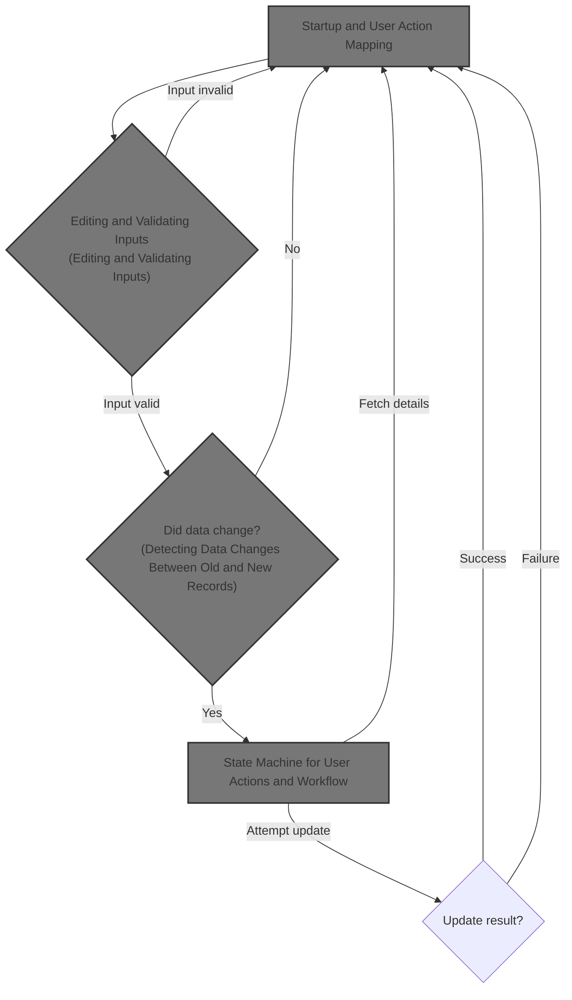

## Dependencies

### Programs

- COACTUPC (app/cbl/COACTUPC.cbl)
- LIT-MENUPGM
- CDEMO-FROM-PROGRAM
- CAUP

### Copybooks

- CSUTLDWY (app/cpy/CSUTLDWY.cpy)
- CVCRD01Y (app/cpy/CVCRD01Y.cpy)
- CSLKPCDY (app/cpy/CSLKPCDY.cpy)
- DFHBMSCA
- DFHAID
- COTTL01Y (app/cpy/COTTL01Y.cpy)
- COACTUP (app/cpy-bms/COACTUP.CPY)
- CSDAT01Y (app/cpy/CSDAT01Y.cpy)
- CSMSG01Y (app/cpy/CSMSG01Y.cpy)
- CSMSG02Y (app/cpy/CSMSG02Y.cpy)
- CSUSR01Y (app/cpy/CSUSR01Y.cpy)
- CVACT01Y (app/cpy/CVACT01Y.cpy)
- CVACT03Y (app/cpy/CVACT03Y.cpy)
- CVCUS01Y (app/cpy/CVCUS01Y.cpy)
- COCOM01Y (app/cpy/COCOM01Y.cpy)
- CSSTRPFY (app/cpy/CSSTRPFY.cpy)
- CSUTLDPY (app/cpy/CSUTLDPY.cpy)

## Input and Output Tables/Files used in the Program

| Table / File Name          | Type | Description                              | Usage Mode   | Key Fields / Layout Highlights |
| -------------------------- | ---- | ---------------------------------------- | ------------ | ------------------------------ |
| LIT-ACCTFILENAME           | File | Credit card account balances and limits  | Input/Output | File resource                  |
| LIT-CARDXREFNAME-ACCT-PATH | File | Card-to-account cross-reference mappings | Input        | File resource                  |
| LIT-CUSTFILENAME           | File | Customer personal and contact details    | Input/Output | File resource                  |

&nbsp;

# Workflow

# Startup and User Action Mapping

This section manages program startup, user action mapping, and dispatching the next step based on user input and current context. It ensures clean initialization, interprets user actions, validates allowed actions, and maintains navigation and state across program flows.

| Rule ID | Code Location    | Category       | Rule Name                          | Description                                                                                                                                                                                           | Conditions                                                                                         | Remarks                                                                                                                                          |
| ------- | ---------------- | -------------- | ---------------------------------- | ----------------------------------------------------------------------------------------------------------------------------------------------------------------------------------------------------- | -------------------------------------------------------------------------------------------------- | ------------------------------------------------------------------------------------------------------------------------------------------------ |
| BR-001  | 0000-MAIN        | Business logic | Fresh Start Initialization         | When the program is started without a prior context (fresh entry), all working areas and communication areas must be initialized, and the error message area must be cleared to ensure a clean start. | The communication area length is zero, or the program is entered from the menu and not re-entered. | A fresh start is detected when EIBCALEN = 0 or (CDEMO-FROM-PROGRAM = LIT-MENUPGM and not CDEMO-PGM-REENTER).                                     |
| BR-002  | YYYY-STORE-PFKEY | Business logic | User Action Mapping                | User keypresses must be mapped to internal action flags so that the application can determine which function to perform next.                                                                         | A user keypress (AID) is received from the terminal.                                               | Supported keys include ENTER, CLEAR, PA1, PA2, PF1-PF24. Each is mapped to a corresponding internal flag.                                        |
| BR-003  | 0000-MAIN        | Business logic | Exit or Complete Update Navigation | When the user requests to exit (PF03) or completes an update, the application must transfer control to the main menu or the previous program, preserving navigation context.                          | User presses PF03 or completes an update.                                                          | If there is no previous program, transfer to the main menu (LIT-MENUPGM, LIT-MENUTRANID); otherwise, return to the last program and transaction. |
| BR-004  | 0000-MAIN        | Business logic | Send Screen for User Input         | After preparing for a fresh entry, the application must send the appropriate screen to the user to collect input for the next step.                                                                   | The program is entered fresh, or the user is returning from the menu and not re-entering.          | The screen sent is determined by the current program context and mapset/map values.                                                              |
| BR-005  | 0000-MAIN        | Error handling | Invalid Key Fallback               | If the user's keypress does not correspond to a valid action for the current screen, the application must treat the action as if the ENTER key was pressed.                                           | The keypress is not mapped as a valid action for the current screen.                               | This ensures that unsupported keys do not cause errors and that the flow continues as a default ENTER action.                                    |
| BR-006  | 0000-MAIN        | Technical step | CICS ABEND Handling                | If a runtime error occurs during program execution, the application must transfer control to a dedicated error handling routine to ensure clean failure handling.                                     | A runtime error (ABEND) occurs during program execution.                                           | The error handler is always invoked on ABEND, ensuring consistent error management.                                                              |

<SwmSnippet path="/app/cbl/COACTUPC.cbl" line="859" repo-id="Z2l0aHViJTNBJTNBa3luZHJ5bC1hd3MtbWFpbmZyYW1lLW1vZGVybml6YXRpb24tY2FyZGRlbW8lM0ElM0FTd2ltbS1EZW1v">

---

In `0000-MAIN` we kick off the flow by setting up a CICS ABEND handler. This means any runtime error will jump to ABEND-ROUTINE, so we can handle failures cleanly right from the start.

```cobol
       0000-MAIN.


           EXEC CICS HANDLE ABEND
                     LABEL(ABEND-ROUTINE)
           END-EXEC
```

---

</SwmSnippet>

<SwmSnippet path="/app/cbl/COACTUPC.cbl" line="866" repo-id="Z2l0aHViJTNBJTNBa3luZHJ5bC1hd3MtbWFpbmZyYW1lLW1vZGVybml6YXRpb24tY2FyZGRlbW8lM0ElM0FTd2ltbS1EZW1v">

---

Here we prep the working areas, store the current transaction ID, and clear any previous error message. This sets up the context so we can tell if we're starting fresh or restoring state from a previous invocation.

```cobol
           INITIALIZE CC-WORK-AREA
                      WS-MISC-STORAGE
                      WS-COMMAREA
      *****************************************************************
      * Store our context
      *****************************************************************
           MOVE LIT-THISTRANID       TO WS-TRANID
      *****************************************************************
      * Ensure error message is cleared                               *
      *****************************************************************
           SET WS-RETURN-MSG-OFF  TO TRUE
```

---

</SwmSnippet>

<SwmSnippet path="/app/cbl/COACTUPC.cbl" line="880" repo-id="Z2l0aHViJTNBJTNBa3luZHJ5bC1hd3MtbWFpbmZyYW1lLW1vZGVybml6YXRpb24tY2FyZGRlbW8lM0ElM0FTd2ltbS1EZW1v">

---

Next we check if we're starting fresh or restoring state. If it's a new entry, we initialize the commareas and set flags for a clean start. If not, we pull the context from DFHCOMMAREA so we keep user state across transactions.

```cobol
           IF EIBCALEN IS EQUAL TO 0
               OR (CDEMO-FROM-PROGRAM = LIT-MENUPGM
               AND NOT CDEMO-PGM-REENTER)
              INITIALIZE CARDDEMO-COMMAREA
                         WS-THIS-PROGCOMMAREA
              SET CDEMO-PGM-ENTER TO TRUE
              SET ACUP-DETAILS-NOT-FETCHED TO TRUE
           ELSE
              MOVE DFHCOMMAREA (1:LENGTH OF CARDDEMO-COMMAREA)  TO
                                CARDDEMO-COMMAREA
              MOVE DFHCOMMAREA(LENGTH OF CARDDEMO-COMMAREA + 1:
                               LENGTH OF WS-THIS-PROGCOMMAREA ) TO
                                WS-THIS-PROGCOMMAREA
           END-IF
```

---

</SwmSnippet>

<SwmSnippet path="/app/cbl/COACTUPC.cbl" line="898" repo-id="Z2l0aHViJTNBJTNBa3luZHJ5bC1hd3MtbWFpbmZyYW1lLW1vZGVybml6YXRpb24tY2FyZGRlbW8lM0ElM0FTd2ltbS1EZW1v">

---

After context setup, we call YYYY-STORE-PFKEY to map the user's keypress to internal flags. This lets us know which action to process next.

```cobol
           PERFORM YYYY-STORE-PFKEY
              THRU YYYY-STORE-PFKEY-EXIT
```

---

</SwmSnippet>

<SwmSnippet path="/app/cpy/CSSTRPFY.cpy" line="17" repo-id="Z2l0aHViJTNBJTNBa3luZHJ5bC1hd3MtbWFpbmZyYW1lLW1vZGVybml6YXRpb24tY2FyZGRlbW8lM0ElM0FTd2ltbS1EZW1v">

---

`YYYY-STORE-PFKEY` checks which key the user pressed and sets the right flag in CCARD-AID. This way, the rest of the flow can branch based on what the user did.

```cobol
       YYYY-STORE-PFKEY.                                                        
      *****************************************************************         
      * Map AID to PFKey in COMMON Area                                         
      *****************************************************************         
           EVALUATE TRUE                                                        
             WHEN EIBAID IS EQUAL TO DFHENTER                                   
               SET CCARD-AID-ENTER TO TRUE                                      
             WHEN EIBAID IS EQUAL TO DFHCLEAR                                   
               SET CCARD-AID-CLEAR TO TRUE                                      
             WHEN EIBAID IS EQUAL TO DFHPA1                                     
               SET CCARD-AID-PA1  TO TRUE                                       
             WHEN EIBAID IS EQUAL TO DFHPA2                                     
               SET CCARD-AID-PA2  TO TRUE                                       
             WHEN EIBAID IS EQUAL TO DFHPF1                                     
               SET CCARD-AID-PFK01 TO TRUE                                      
             WHEN EIBAID IS EQUAL TO DFHPF2                                     
               SET CCARD-AID-PFK02 TO TRUE                                      
             WHEN EIBAID IS EQUAL TO DFHPF3                                     
               SET CCARD-AID-PFK03 TO TRUE                                      
             WHEN EIBAID IS EQUAL TO DFHPF4                                     
               SET CCARD-AID-PFK04 TO TRUE                                      
             WHEN EIBAID IS EQUAL TO DFHPF5                                     
               SET CCARD-AID-PFK05 TO TRUE                                      
             WHEN EIBAID IS EQUAL TO DFHPF6                                     
               SET CCARD-AID-PFK06 TO TRUE                                      
             WHEN EIBAID IS EQUAL TO DFHPF7                                     
               SET CCARD-AID-PFK07 TO TRUE                                      
             WHEN EIBAID IS EQUAL TO DFHPF8                                     
               SET CCARD-AID-PFK08 TO TRUE                                      
             WHEN EIBAID IS EQUAL TO DFHPF9                                     
               SET CCARD-AID-PFK09 TO TRUE                                      
             WHEN EIBAID IS EQUAL TO DFHPF10                                    
               SET CCARD-AID-PFK10 TO TRUE                                      
             WHEN EIBAID IS EQUAL TO DFHPF11                                    
               SET CCARD-AID-PFK11 TO TRUE                                      
             WHEN EIBAID IS EQUAL TO DFHPF12                                    
               SET CCARD-AID-PFK12 TO TRUE                                      
             WHEN EIBAID IS EQUAL TO DFHPF13                                    
               SET CCARD-AID-PFK01 TO TRUE                                      
             WHEN EIBAID IS EQUAL TO DFHPF14                                    
               SET CCARD-AID-PFK02 TO TRUE                                      
             WHEN EIBAID IS EQUAL TO DFHPF15                                    
               SET CCARD-AID-PFK03 TO TRUE                                      
             WHEN EIBAID IS EQUAL TO DFHPF16                                    
               SET CCARD-AID-PFK04 TO TRUE                                      
             WHEN EIBAID IS EQUAL TO DFHPF17                                    
               SET CCARD-AID-PFK05 TO TRUE                                      
             WHEN EIBAID IS EQUAL TO DFHPF18                                    
               SET CCARD-AID-PFK06 TO TRUE                                      
             WHEN EIBAID IS EQUAL TO DFHPF19                                    
               SET CCARD-AID-PFK07 TO TRUE                                      
             WHEN EIBAID IS EQUAL TO DFHPF20                                    
               SET CCARD-AID-PFK08 TO TRUE                                      
             WHEN EIBAID IS EQUAL TO DFHPF21                                    
               SET CCARD-AID-PFK09 TO TRUE                                      
             WHEN EIBAID IS EQUAL TO DFHPF22                                    
               SET CCARD-AID-PFK10 TO TRUE                                      
             WHEN EIBAID IS EQUAL TO DFHPF23                                    
               SET CCARD-AID-PFK11 TO TRUE                                      
             WHEN EIBAID IS EQUAL TO DFHPF24                                    
               SET CCARD-AID-PFK12 TO TRUE                                      
           END-EVALUATE                                                         
```

---

</SwmSnippet>

<SwmSnippet path="/app/cbl/COACTUPC.cbl" line="905" repo-id="Z2l0aHViJTNBJTNBa3luZHJ5bC1hd3MtbWFpbmZyYW1lLW1vZGVybml6YXRpb24tY2FyZGRlbW8lM0ElM0FTd2ltbS1EZW1v">

---

Back in `0000-MAIN` after mapping the PFKey, we check if the user's action is valid for this screen. If not, we set a flag so we can handle it as a default ENTER action.

```cobol
           SET PFK-INVALID TO TRUE
           IF CCARD-AID-ENTER OR
              CCARD-AID-PFK03 OR
              (CCARD-AID-PFK05 AND ACUP-CHANGES-OK-NOT-CONFIRMED)
                              OR
              (CCARD-AID-PFK12 AND NOT ACUP-DETAILS-NOT-FETCHED)
              SET PFK-VALID TO TRUE
           END-IF
```

---

</SwmSnippet>

<SwmSnippet path="/app/cbl/COACTUPC.cbl" line="914" repo-id="Z2l0aHViJTNBJTNBa3luZHJ5bC1hd3MtbWFpbmZyYW1lLW1vZGVybml6YXRpb24tY2FyZGRlbW8lM0ElM0FTd2ltbS1EZW1v">

---

If the key is still invalid after our checks, we just set the ENTER flag so the flow continues as if the user pressed ENTER.

```cobol
           IF PFK-INVALID
              SET CCARD-AID-ENTER TO TRUE
           END-IF
```

---

</SwmSnippet>

<SwmSnippet path="/app/cbl/COACTUPC.cbl" line="921" repo-id="Z2l0aHViJTNBJTNBa3luZHJ5bC1hd3MtbWFpbmZyYW1lLW1vZGVybml6YXRpb24tY2FyZGRlbW8lM0ElM0FTd2ltbS1EZW1v">

---

Here we hit the main dispatcher. Based on the user's action and current state, we branch to exit, input, update, or error handling. This is where the flow decides what happens next.

```cobol
           EVALUATE TRUE
      ******************************************************************
      *       USER PRESSES PF03 TO EXIT
      *  OR   USER IS DONE WITH UPDATE
      *            XCTL TO CALLING PROGRAM OR MAIN MENU
      ******************************************************************
              WHEN CCARD-AID-PFK03
                   SET CCARD-AID-PFK03     TO TRUE

                   IF CDEMO-FROM-TRANID    EQUAL LOW-VALUES
                   OR CDEMO-FROM-TRANID    EQUAL SPACES
                      MOVE LIT-MENUTRANID  TO CDEMO-TO-TRANID
                   ELSE
                      MOVE CDEMO-FROM-TRANID  TO CDEMO-TO-TRANID
                   END-IF
```

---

</SwmSnippet>

<SwmSnippet path="/app/cbl/COACTUPC.cbl" line="937" repo-id="Z2l0aHViJTNBJTNBa3luZHJ5bC1hd3MtbWFpbmZyYW1lLW1vZGVybml6YXRpb24tY2FyZGRlbW8lM0ElM0FTd2ltbS1EZW1v">

---

Next we set up which program we're returning to. If there's no previous program, we default to the main menu; otherwise, we use the last one.

```cobol
                   IF CDEMO-FROM-PROGRAM   EQUAL LOW-VALUES
                   OR CDEMO-FROM-PROGRAM   EQUAL SPACES
                      MOVE LIT-MENUPGM     TO CDEMO-TO-PROGRAM
                   ELSE
                      MOVE CDEMO-FROM-PROGRAM TO CDEMO-TO-PROGRAM
                   END-IF
```

---

</SwmSnippet>

<SwmSnippet path="/app/cbl/COACTUPC.cbl" line="944" repo-id="Z2l0aHViJTNBJTNBa3luZHJ5bC1hd3MtbWFpbmZyYW1lLW1vZGVybml6YXRpb24tY2FyZGRlbW8lM0ElM0FTd2ltbS1EZW1v">

---

We update the FROM-TRANID and FROM-PROGRAM fields so the next program knows where we came from. This keeps navigation context intact.

```cobol
                   MOVE LIT-THISTRANID     TO CDEMO-FROM-TRANID
                   MOVE LIT-THISPGM        TO CDEMO-FROM-PROGRAM

                   SET  CDEMO-USRTYP-USER  TO TRUE
                   SET  CDEMO-PGM-ENTER    TO TRUE
                   MOVE LIT-THISMAPSET     TO CDEMO-LAST-MAPSET
                   MOVE LIT-THISMAP        TO CDEMO-LAST-MAP

                   EXEC CICS
                        SYNCPOINT
                   END-EXEC
```

---

</SwmSnippet>

<SwmSnippet path="/app/cbl/COACTUPC.cbl" line="956" repo-id="Z2l0aHViJTNBJTNBa3luZHJ5bC1hd3MtbWFpbmZyYW1lLW1vZGVybml6YXRpb24tY2FyZGRlbW8lM0ElM0FTd2ltbS1EZW1v">

---

Before we transfer control to the next program, we commit any changes with SYNCPOINT, then XCTL to the target program with the current context.

```cobol
                   EXEC CICS XCTL
                        PROGRAM (CDEMO-TO-PROGRAM)
                        COMMAREA(CARDDEMO-COMMAREA)
                   END-EXEC
```

---

</SwmSnippet>

<SwmSnippet path="/app/cbl/COACTUPC.cbl" line="964" repo-id="Z2l0aHViJTNBJTNBa3luZHJ5bC1hd3MtbWFpbmZyYW1lLW1vZGVybml6YXRpb24tY2FyZGRlbW8lM0ElM0FTd2ltbS1EZW1v">

---

After prepping for a fresh entry, we call 3000-SEND-MAP to send the screen to the user. This is how we get user input for the next step.

```cobol
              WHEN ACUP-DETAILS-NOT-FETCHED
               AND CDEMO-PGM-ENTER
              WHEN CDEMO-FROM-PROGRAM   EQUAL LIT-MENUPGM
               AND NOT CDEMO-PGM-REENTER
                   INITIALIZE WS-THIS-PROGCOMMAREA
                   PERFORM 3000-SEND-MAP THRU
                           3000-SEND-MAP-EXIT
                   SET CDEMO-PGM-REENTER        TO TRUE
                   SET ACUP-DETAILS-NOT-FETCHED TO TRUE
                   GO TO COMMON-RETURN
```

---

</SwmSnippet>

## Screen Preparation and Initialization

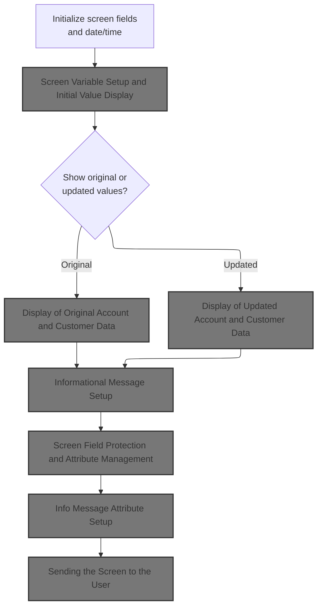

This section governs the preparation and initialization of the user screen, ensuring that all necessary information, messages, and protections are set before the screen is displayed to the user.

| Rule ID | Code Location                                                               | Category       | Rule Name                        | Description                                                                                                                                                  | Conditions                                                                                               | Remarks                                                                                                                           |
| ------- | --------------------------------------------------------------------------- | -------------- | -------------------------------- | ------------------------------------------------------------------------------------------------------------------------------------------------------------ | -------------------------------------------------------------------------------------------------------- | --------------------------------------------------------------------------------------------------------------------------------- |
| BR-001  | 3100-SCREEN-INIT                                                            | Business logic | Header and Timestamp Display     | The screen header must display the current date and time, formatted as MM-DD-YY and HH:MM:SS respectively, along with static titles and program information. | Whenever the screen is initialized for display.                                                          | Date format: MM-DD-YY (string, 8 bytes); Time format: HH:MM:SS (string, 8 bytes); Titles and program info are static strings.     |
| BR-002  | 3200-SETUP-SCREEN-VARS, 3202-SHOW-ORIGINAL-VALUES, 3203-SHOW-UPDATED-VALUES | Business logic | Original vs Updated Data Display | The screen must display either the original or updated account and customer data, depending on the user's context or action.                                 | When preparing the screen for display, the system determines whether to show original or updated values. | Account and customer data are displayed as alphanumeric fields; the choice between original and updated is based on user context. |
| BR-003  | 3250-SETUP-INFOMSG                                                          | Business logic | Informational Message Display    | Informational messages must be set up and displayed to the user as part of the screen preparation process.                                                   | Whenever the screen is prepared for display.                                                             | Informational messages are displayed as alphanumeric strings in designated message fields.                                        |
| BR-004  | 3300-SETUP-SCREEN-ATTRS                                                     | Business logic | Screen Field Protection          | Screen fields must be protected or made editable according to their attributes, ensuring that only appropriate fields can be modified by the user.           | Whenever the screen is prepared for display.                                                             | Field protection is managed via attribute settings; protected fields cannot be edited by the user.                                |
| BR-005  | 3390-SETUP-INFOMSG-ATTRS                                                    | Business logic | Info Message Attribute Setup     | Informational message attributes must be set to ensure proper display and protection of message fields.                                                      | Whenever an informational message is displayed.                                                          | Message attributes control display formatting and protection.                                                                     |
| BR-006  | 3400-SEND-SCREEN                                                            | Business logic | Screen Send to User              | The prepared screen, with all initialized fields, messages, and attributes, must be sent to the user for interaction.                                        | After all screen preparation steps are complete.                                                         | The screen includes header, timestamp, account/customer data, informational messages, and protected fields.                       |

<SwmSnippet path="/app/cbl/COACTUPC.cbl" line="2649" repo-id="Z2l0aHViJTNBJTNBa3luZHJ5bC1hd3MtbWFpbmZyYW1lLW1vZGVybml6YXRpb24tY2FyZGRlbW8lM0ElM0FTd2ltbS1EZW1v">

---

`3000-SEND-MAP` runs a sequence of routines to prep the screen: init, set variables, set messages, set attributes, and finally send the map. We start with 3100-SCREEN-INIT to clear and set up the base screen area.

```cobol
       3000-SEND-MAP.
           PERFORM 3100-SCREEN-INIT
              THRU 3100-SCREEN-INIT-EXIT
           PERFORM 3200-SETUP-SCREEN-VARS
              THRU 3200-SETUP-SCREEN-VARS-EXIT
           PERFORM 3250-SETUP-INFOMSG
              THRU 3250-SETUP-INFOMSG-EXIT
           PERFORM 3300-SETUP-SCREEN-ATTRS
              THRU 3300-SETUP-SCREEN-ATTRS-EXIT
           PERFORM 3390-SETUP-INFOMSG-ATTRS
              THRU 3390-SETUP-INFOMSG-ATTRS-EXIT
           PERFORM 3400-SEND-SCREEN
              THRU 3400-SEND-SCREEN-EXIT
```

---

</SwmSnippet>

<SwmSnippet path="/app/cbl/COACTUPC.cbl" line="2668" repo-id="Z2l0aHViJTNBJTNBa3luZHJ5bC1hd3MtbWFpbmZyYW1lLW1vZGVybml6YXRpb24tY2FyZGRlbW8lM0ElM0FTd2ltbS1EZW1v">

---

`3100-SCREEN-INIT` clears the screen area, grabs the current date and time, formats them, and sets up the static titles and program info for display. This sets up the header and timestamp for the screen.

```cobol
       3100-SCREEN-INIT.
           MOVE LOW-VALUES TO CACTUPAO

           MOVE FUNCTION CURRENT-DATE     TO WS-CURDATE-DATA

           MOVE CCDA-TITLE01              TO TITLE01O OF CACTUPAO
           MOVE CCDA-TITLE02              TO TITLE02O OF CACTUPAO
           MOVE LIT-THISTRANID            TO TRNNAMEO OF CACTUPAO
           MOVE LIT-THISPGM               TO PGMNAMEO OF CACTUPAO

           MOVE FUNCTION CURRENT-DATE     TO WS-CURDATE-DATA

           MOVE WS-CURDATE-MONTH          TO WS-CURDATE-MM
           MOVE WS-CURDATE-DAY            TO WS-CURDATE-DD
           MOVE WS-CURDATE-YEAR(3:2)      TO WS-CURDATE-YY

           MOVE WS-CURDATE-MM-DD-YY       TO CURDATEO OF CACTUPAO

           MOVE WS-CURTIME-HOURS          TO WS-CURTIME-HH
           MOVE WS-CURTIME-MINUTE         TO WS-CURTIME-MM
           MOVE WS-CURTIME-SECOND         TO WS-CURTIME-SS

           MOVE WS-CURTIME-HH-MM-SS       TO CURTIMEO OF CACTUPAO

           .
```

---

</SwmSnippet>

### Screen Variable Setup and Initial Value Display

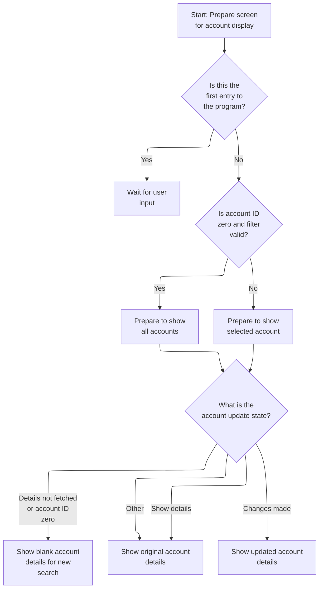

This section determines what account and customer information is displayed to the user when entering the account update screen, based on entry context, account filter validity, and workflow state.

| Rule ID | Code Location                                    | Category       | Rule Name                         | Description                                                                                                                                            | Conditions                                                                                                                              | Remarks                                                                                                                                                                          |
| ------- | ------------------------------------------------ | -------------- | --------------------------------- | ------------------------------------------------------------------------------------------------------------------------------------------------------ | --------------------------------------------------------------------------------------------------------------------------------------- | -------------------------------------------------------------------------------------------------------------------------------------------------------------------------------- |
| BR-001  | 3200-SETUP-SCREEN-VARS                           | Business logic | First entry wait                  | If this is the user's first entry to the account update screen, the system waits for user input and does not display any account details.              | Triggered when the program context indicates first entry (CDEMO-PGM-CONTEXT = 0).                                                       | No account details are displayed; the screen is prepared for user input. The constant for first entry is 0.                                                                      |
| BR-002  | 3200-SETUP-SCREEN-VARS                           | Business logic | Show all accounts on valid filter | If the account ID is zero and the account filter is valid, the system prepares to show all accounts by clearing the account ID field.                  | Triggered when account ID is zero and the account filter is valid (CC-ACCT-ID-N = 0 and FLG-ACCTFILTER-ISVALID).                        | The account ID field is cleared (set to LOW-VALUES) to indicate all accounts should be shown. LOW-VALUES is used as the constant for clearing.                                   |
| BR-003  | 3200-SETUP-SCREEN-VARS, 3201-SHOW-INITIAL-VALUES | Business logic | Blank fields for new search       | If account details have not been fetched or the account ID is zero, the system displays blank account and customer fields to allow for a fresh search. | Triggered when ACUP-DETAILS-NOT-FETCHED is true or account ID is zero (ACUP-CHANGE-ACTION = LOW-VALUES or SPACES, or CC-ACCT-ID-N = 0). | All account and customer fields are set to blank (LOW-VALUES). This includes status, limits, dates, customer info, address, and contact fields. LOW-VALUES is used for clearing. |
| BR-004  | 3200-SETUP-SCREEN-VARS                           | Business logic | Show original account details     | If the workflow state indicates that original account details should be shown, the system displays the original account and customer information.      | Triggered when ACUP-SHOW-DETAILS is true (ACUP-CHANGE-ACTION = 'S') or in the default case.                                             | Original account and customer details are displayed. The constant for showing details is 'S'.                                                                                    |
| BR-005  | 3200-SETUP-SCREEN-VARS                           | Business logic | Show updated account details      | If changes have been made to the account, the system displays the updated account and customer information.                                            | Triggered when ACUP-CHANGES-MADE is true (ACUP-CHANGE-ACTION = 'E', 'N', 'C', 'L', or 'F').                                             | Updated account and customer details are displayed. The constants for changes made are 'E', 'N', 'C', 'L', 'F'.                                                                  |

<SwmSnippet path="/app/cbl/COACTUPC.cbl" line="2698" repo-id="Z2l0aHViJTNBJTNBa3luZHJ5bC1hd3MtbWFpbmZyYW1lLW1vZGVybml6YXRpb24tY2FyZGRlbW8lM0ElM0FTd2ltbS1EZW1v">

---

In `3200-SETUP-SCREEN-VARS` we check if this is the first entry. If not, we set up the account ID and branch to show initial, original, or updated values depending on the workflow state.

```cobol
       3200-SETUP-SCREEN-VARS.
      *    INITIALIZE SEARCH CRITERIA
           IF CDEMO-PGM-ENTER
              CONTINUE
```

---

</SwmSnippet>

<SwmSnippet path="/app/cbl/COACTUPC.cbl" line="2702" repo-id="Z2l0aHViJTNBJTNBa3luZHJ5bC1hd3MtbWFpbmZyYW1lLW1vZGVybml6YXRpb24tY2FyZGRlbW8lM0ElM0FTd2ltbS1EZW1v">

---

After setting up the account ID, we branch based on ACUP-CHANGE-ACTION. If details aren't fetched or account ID is zero, we call 3201-SHOW-INITIAL-VALUES to clear the fields for fresh input.

```cobol
           ELSE
              IF CC-ACCT-ID-N = 0
              AND FLG-ACCTFILTER-ISVALID
                 MOVE LOW-VALUES                TO ACCTSIDO OF CACTUPAO
              ELSE
                 MOVE CC-ACCT-ID                TO ACCTSIDO OF CACTUPAO
              END-IF

              EVALUATE TRUE
                WHEN ACUP-DETAILS-NOT-FETCHED
                WHEN CC-ACCT-ID-N =  0
                  PERFORM 3201-SHOW-INITIAL-VALUES
                     THRU 3201-SHOW-INITIAL-VALUES-EXIT
               WHEN ACUP-SHOW-DETAILS
                  PERFORM 3202-SHOW-ORIGINAL-VALUES
                     THRU 3202-SHOW-ORIGINAL-VALUES-EXIT
               WHEN ACUP-CHANGES-MADE
                  PERFORM 3203-SHOW-UPDATED-VALUES
                     THRU 3203-SHOW-UPDATED-VALUES-EXIT
               WHEN OTHER
                  PERFORM 3202-SHOW-ORIGINAL-VALUES
                     THRU 3202-SHOW-ORIGINAL-VALUES-EXIT
              END-EVALUATE
```

---

</SwmSnippet>

<SwmSnippet path="/app/cbl/COACTUPC.cbl" line="2731" repo-id="Z2l0aHViJTNBJTNBa3luZHJ5bC1hd3MtbWFpbmZyYW1lLW1vZGVybml6YXRpb24tY2FyZGRlbW8lM0ElM0FTd2ltbS1EZW1v">

---

`3201-SHOW-INITIAL-VALUES` clears all the account and customer fields in CACTUPAO to LOW-VALUES. This resets the screen for fresh input.

```cobol
       3201-SHOW-INITIAL-VALUES.
           MOVE LOW-VALUES                     TO  ACSTTUSO OF CACTUPAO
                                                   ACRDLIMO OF CACTUPAO
      *Account Limits
                                                   ACURBALO OF CACTUPAO
                                                   ACSHLIMO OF CACTUPAO
                                                   ACRCYCRO OF CACTUPAO
                                                   ACRCYDBO OF CACTUPAO
      *Account Dates
                                                   OPNYEARO OF CACTUPAO
                                                   OPNMONO  OF CACTUPAO
                                                   OPNDAYO  OF CACTUPAO
                                                   EXPYEARO OF CACTUPAO
                                                   EXPMONO  OF CACTUPAO
                                                   EXPDAYO  OF CACTUPAO
                                                   RISYEARO OF CACTUPAO
                                                   RISMONO  OF CACTUPAO
                                                   RISDAYO  OF CACTUPAO
                                                   AADDGRPO OF CACTUPAO
      *Customer data
                                                   ACSTNUMO OF CACTUPAO
                                                   ACTSSN1O OF CACTUPAO
                                                   ACTSSN2O OF CACTUPAO
                                                   ACTSSN3O OF CACTUPAO
                                                   ACSTFCOO OF CACTUPAO
                                                   DOBYEARO OF CACTUPAO
                                                   DOBMONO  OF CACTUPAO
                                                   DOBDAYO  OF CACTUPAO
                                                   ACSFNAMO OF CACTUPAO
                                                   ACSMNAMO OF CACTUPAO
                                                   ACSLNAMO OF CACTUPAO
      *Customer address and contact info
                                                   ACSADL1O OF CACTUPAO
                                                   ACSADL2O OF CACTUPAO
                                                   ACSCITYO OF CACTUPAO
                                                   ACSSTTEO OF CACTUPAO
                                                   ACSZIPCO OF CACTUPAO
                                                   ACSCTRYO OF CACTUPAO

                                                   ACSPH1AO OF CACTUPAO
                                                   ACSPH1BO OF CACTUPAO
                                                   ACSPH1CO OF CACTUPAO
                                                   ACSPH2AO OF CACTUPAO
                                                   ACSPH2BO OF CACTUPAO
                                                   ACSPH2CO OF CACTUPAO

      *Customer other good stuff
                                                   ACSGOVTO OF CACTUPAO
                                                   ACSEFTCO OF CACTUPAO
                                                   ACSPFLGO OF CACTUPAO
           .
```

---

</SwmSnippet>

### Display of Original Account and Customer Data

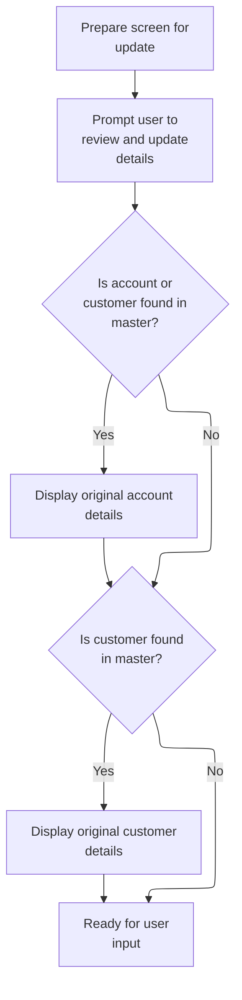

This section governs the display of original account and customer data on the update screen, ensuring users can review current values before making changes.

| Rule ID | Code Location             | Category       | Rule Name                         | Description                                                                                                                                                           | Conditions                                                                           | Remarks                                                                                                                                                                                                                                                                                                                                                                                                                                                                                       |
| ------- | ------------------------- | -------------- | --------------------------------- | --------------------------------------------------------------------------------------------------------------------------------------------------------------------- | ------------------------------------------------------------------------------------ | --------------------------------------------------------------------------------------------------------------------------------------------------------------------------------------------------------------------------------------------------------------------------------------------------------------------------------------------------------------------------------------------------------------------------------------------------------------------------------------------- |
| BR-001  | 3202-SHOW-ORIGINAL-VALUES | Business logic | Prompt for Changes                | When the user enters the update screen, a prompt must be displayed instructing the user to review and update the account details presented.                           | This rule applies whenever the update screen is prepared for user input.             | The prompt message is: 'Update account details presented above.'                                                                                                                                                                                                                                                                                                                                                                                                                              |
| BR-002  | 3202-SHOW-ORIGINAL-VALUES | Business logic | Display Original Account Details  | If either the account or customer is found in the master files, the original account details must be displayed to the user for review and editing.                    | This rule applies when either FOUND-ACCT-IN-MASTER or FOUND-CUST-IN-MASTER is true.  | Account details include: active status (1 character), current balance (formatted as currency, 12 characters), credit limit (currency, 12 characters), cash credit limit (currency, 12 characters), current cycle credit (currency, 12 characters), current cycle debit (currency, 12 characters), open date (year 4, month 2, day 2), expiration date (year 4, month 2, day 2), reissue date (year 4, month 2, day 2), group ID (variable length). Currency fields are formatted for display. |
| BR-003  | 3202-SHOW-ORIGINAL-VALUES | Business logic | Display Original Customer Details | If the customer is found in the master file, the original customer details must be displayed to the user for review and editing.                                      | This rule applies when FOUND-CUST-IN-MASTER is true.                                 | Customer details include: customer ID (variable length), SSN (split into three fields: 3, 2, and 4 characters), FICO score, date of birth (year 4, month 2, day 2), first/middle/last name, address (lines 1-3, state, zip, country), two phone numbers (each split into three fields: 3, 3, and 4 characters), government-issued ID, EFT account ID, primary holder indicator. Fields are split and formatted for display as required by the UI.                                             |
| BR-004  | 3202-SHOW-ORIGINAL-VALUES | Business logic | No Data Found Fallback            | If neither the account nor the customer is found in the master files, the screen is prepared for user input without displaying any original account or customer data. | This rule applies when both FOUND-ACCT-IN-MASTER and FOUND-CUST-IN-MASTER are false. | No original account or customer data is displayed; the screen is ready for new input.                                                                                                                                                                                                                                                                                                                                                                                                         |
| BR-005  | 3202-SHOW-ORIGINAL-VALUES | Business logic | Currency Formatting for Display   | Currency values for account fields must be formatted for display before being shown to the user.                                                                      | This rule applies whenever account currency fields are displayed.                    | Currency fields are formatted as 12-character strings with two decimal places for display.                                                                                                                                                                                                                                                                                                                                                                                                    |
| BR-006  | 3202-SHOW-ORIGINAL-VALUES | Business logic | Split SSN and Phone for Display   | SSN and phone number fields must be split into multiple display fields to match the UI's expected format.                                                             | This rule applies whenever customer SSN or phone numbers are displayed.              | SSN is split into three fields: 3, 2, and 4 characters. Each phone number is split into three fields: 3, 3, and 4 characters.                                                                                                                                                                                                                                                                                                                                                                 |

<SwmSnippet path="/app/cbl/COACTUPC.cbl" line="2787" repo-id="Z2l0aHViJTNBJTNBa3luZHJ5bC1hd3MtbWFpbmZyYW1lLW1vZGVybml6YXRpb24tY2FyZGRlbW8lM0ElM0FTd2ltbS1EZW1v">

---

In `3202-SHOW-ORIGINAL-VALUES` we set a prompt for changes, then fill the output fields with original account and customer data if found in the master files. This lets the user see current values before editing.

```cobol
       3202-SHOW-ORIGINAL-VALUES.

           MOVE LOW-VALUES                     TO WS-NON-KEY-FLAGS

           SET PROMPT-FOR-CHANGES              TO TRUE
```

---

</SwmSnippet>

<SwmSnippet path="/app/cbl/COACTUPC.cbl" line="2793" repo-id="Z2l0aHViJTNBJTNBa3luZHJ5bC1hd3MtbWFpbmZyYW1lLW1vZGVybml6YXRpb24tY2FyZGRlbW8lM0ElM0FTd2ltbS1EZW1v">

---

We fill in account and customer fields if found, formatting currency as needed.

```cobol
           IF FOUND-ACCT-IN-MASTER
           OR FOUND-CUST-IN-MASTER
              MOVE ACUP-OLD-ACTIVE-STATUS      TO ACSTTUSO OF CACTUPAO

              MOVE ACUP-OLD-CURR-BAL-N         TO WS-EDIT-CURRENCY-9-2-F
              MOVE WS-EDIT-CURRENCY-9-2-F      TO ACURBALO OF CACTUPAO

              MOVE ACUP-OLD-CREDIT-LIMIT-N     TO WS-EDIT-CURRENCY-9-2-F
              MOVE WS-EDIT-CURRENCY-9-2-F      TO ACRDLIMO OF CACTUPAO

              MOVE ACUP-OLD-CASH-CREDIT-LIMIT-N
                                               TO WS-EDIT-CURRENCY-9-2-F
              MOVE WS-EDIT-CURRENCY-9-2-F      TO ACSHLIMO OF CACTUPAO

              MOVE ACUP-OLD-CURR-CYC-CREDIT-N  TO WS-EDIT-CURRENCY-9-2-F
              MOVE WS-EDIT-CURRENCY-9-2-F      TO ACRCYCRO OF CACTUPAO

              MOVE ACUP-OLD-CURR-CYC-DEBIT-N   TO WS-EDIT-CURRENCY-9-2-F
              MOVE WS-EDIT-CURRENCY-9-2-F      TO ACRCYDBO OF CACTUPAO

              MOVE ACUP-OLD-OPEN-YEAR          TO OPNYEARO OF CACTUPAO
              MOVE ACUP-OLD-OPEN-MON           TO OPNMONO  OF CACTUPAO
              MOVE ACUP-OLD-OPEN-DAY           TO OPNDAYO  OF CACTUPAO

              MOVE ACUP-OLD-EXP-YEAR           TO EXPYEARO OF CACTUPAO
              MOVE ACUP-OLD-EXP-MON            TO EXPMONO  OF CACTUPAO
              MOVE ACUP-OLD-EXP-DAY            TO EXPDAYO  OF CACTUPAO

              MOVE ACUP-OLD-REISSUE-YEAR       TO RISYEARO OF CACTUPAO
              MOVE ACUP-OLD-REISSUE-MON        TO RISMONO  OF CACTUPAO
              MOVE ACUP-OLD-REISSUE-DAY        TO RISDAYO  OF CACTUPAO
              MOVE ACUP-OLD-GROUP-ID           TO AADDGRPO OF CACTUPAO
           END-IF
```

---

</SwmSnippet>

<SwmSnippet path="/app/cbl/COACTUPC.cbl" line="2827" repo-id="Z2l0aHViJTNBJTNBa3luZHJ5bC1hd3MtbWFpbmZyYW1lLW1vZGVybml6YXRpb24tY2FyZGRlbW8lM0ElM0FTd2ltbS1EZW1v">

---

For customer fields like SSN and phone numbers, we split the data into separate output fields using substring moves. This matches what the UI expects for display and validation.

```cobol
           IF FOUND-CUST-IN-MASTER
              MOVE ACUP-OLD-CUST-ID-X          TO ACSTNUMO OF CACTUPAO
              MOVE ACUP-OLD-CUST-SSN-X(1:3)    TO ACTSSN1O OF CACTUPAO
              MOVE ACUP-OLD-CUST-SSN-X(4:2)    TO ACTSSN2O OF CACTUPAO
              MOVE ACUP-OLD-CUST-SSN-X(6:4)    TO ACTSSN3O OF CACTUPAO
              MOVE ACUP-OLD-CUST-FICO-SCORE-X  TO ACSTFCOO OF CACTUPAO
              MOVE ACUP-OLD-CUST-DOB-YEAR      TO DOBYEARO OF CACTUPAO
              MOVE ACUP-OLD-CUST-DOB-MON       TO DOBMONO  OF CACTUPAO
              MOVE ACUP-OLD-CUST-DOB-DAY       TO DOBDAYO  OF CACTUPAO
              MOVE ACUP-OLD-CUST-FIRST-NAME    TO ACSFNAMO OF CACTUPAO
              MOVE ACUP-OLD-CUST-MIDDLE-NAME   TO ACSMNAMO OF CACTUPAO
              MOVE ACUP-OLD-CUST-LAST-NAME     TO ACSLNAMO OF CACTUPAO
              MOVE ACUP-OLD-CUST-ADDR-LINE-1   TO ACSADL1O OF CACTUPAO
              MOVE ACUP-OLD-CUST-ADDR-LINE-2   TO ACSADL2O OF CACTUPAO
              MOVE ACUP-OLD-CUST-ADDR-LINE-3   TO ACSCITYO OF CACTUPAO
              MOVE ACUP-OLD-CUST-ADDR-STATE-CD TO ACSSTTEO OF CACTUPAO
              MOVE ACUP-OLD-CUST-ADDR-ZIP      TO ACSZIPCO OF CACTUPAO
              MOVE ACUP-OLD-CUST-ADDR-COUNTRY-CD
                                               TO ACSCTRYO OF CACTUPAO
              MOVE ACUP-OLD-CUST-PHONE-NUM-1(2:3)
                                               TO ACSPH1AO OF CACTUPAO
              MOVE ACUP-OLD-CUST-PHONE-NUM-1(6:3)
                                               TO ACSPH1BO OF CACTUPAO
              MOVE ACUP-OLD-CUST-PHONE-NUM-1(10:4)
                                               TO ACSPH1CO OF CACTUPAO
              MOVE ACUP-OLD-CUST-PHONE-NUM-2(2:3)
                                               TO ACSPH2AO OF CACTUPAO
              MOVE ACUP-OLD-CUST-PHONE-NUM-2(6:3)
                                               TO ACSPH2BO OF CACTUPAO
              MOVE ACUP-OLD-CUST-PHONE-NUM-2(10:4)
                                               TO ACSPH2CO OF CACTUPAO
              MOVE ACUP-OLD-CUST-GOVT-ISSUED-ID
                                               TO ACSGOVTO OF CACTUPAO
              MOVE ACUP-OLD-CUST-EFT-ACCOUNT-ID
                                               TO ACSEFTCO OF CACTUPAO
              MOVE ACUP-OLD-CUST-PRI-HOLDER-IND
                                               TO ACSPFLGO OF CACTUPAO
           END-IF
```

---

</SwmSnippet>

### Display of Updated Account and Customer Data

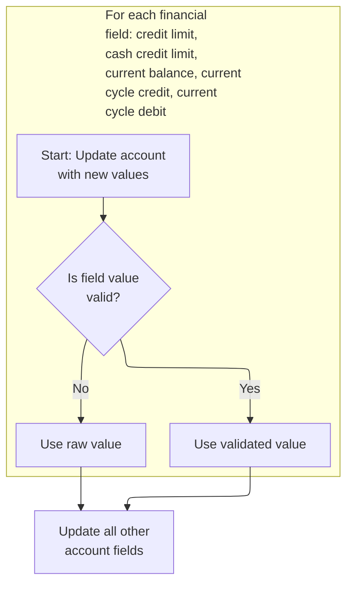

This section governs how updated account and customer data is displayed after an update, ensuring that only valid values are shown and alternates are used for invalid or missing data.

| Rule ID | Code Location            | Category       | Rule Name                    | Description                                                                                                                                                           | Conditions                                                               | Remarks                                                                                                                                                                                                             |
| ------- | ------------------------ | -------------- | ---------------------------- | --------------------------------------------------------------------------------------------------------------------------------------------------------------------- | ------------------------------------------------------------------------ | ------------------------------------------------------------------------------------------------------------------------------------------------------------------------------------------------------------------- |
| BR-001  | 3203-SHOW-UPDATED-VALUES | Business logic | Credit limit display         | When displaying the updated credit limit, show the formatted value if the credit limit is valid; otherwise, show the alternate value (such as blanks or LOW-VALUES).  | The credit limit validity flag is set.                                   | If valid, the credit limit is shown as a formatted currency string (up to 12 characters, right-aligned, with 2 decimal places). If not valid, the alternate value (could be blanks or LOW-VALUES) is shown.         |
| BR-002  | 3203-SHOW-UPDATED-VALUES | Business logic | Cash credit limit display    | When displaying the updated cash credit limit, show the formatted value if the cash credit limit is valid; otherwise, show the alternate value.                       | The cash credit limit validity flag is set.                              | If valid, the cash credit limit is shown as a formatted currency string (up to 12 characters, right-aligned, with 2 decimal places). If not valid, the alternate value (could be blanks or LOW-VALUES) is shown.    |
| BR-003  | 3203-SHOW-UPDATED-VALUES | Business logic | Current balance display      | When displaying the updated current balance, show the formatted value if the current balance is valid; otherwise, show the alternate value.                           | The current balance validity flag is set.                                | If valid, the current balance is shown as a formatted currency string (up to 12 characters, right-aligned, with 2 decimal places). If not valid, the alternate value (could be blanks or LOW-VALUES) is shown.      |
| BR-004  | 3203-SHOW-UPDATED-VALUES | Business logic | Current cycle credit display | When displaying the updated current cycle credit, show the formatted value if the current cycle credit is valid; otherwise, show the alternate value.                 | The current cycle credit validity flag is set.                           | If valid, the current cycle credit is shown as a formatted currency string (up to 12 characters, right-aligned, with 2 decimal places). If not valid, the alternate value (could be blanks or LOW-VALUES) is shown. |
| BR-005  | 3203-SHOW-UPDATED-VALUES | Business logic | Current cycle debit display  | When displaying the updated current cycle debit, show the formatted value if the current cycle debit is valid; otherwise, show the alternate value.                   | The current cycle debit validity flag is set.                            | If valid, the current cycle debit is shown as a formatted currency string (up to 12 characters, right-aligned, with 2 decimal places). If not valid, the alternate value (could be blanks or LOW-VALUES) is shown.  |
| BR-006  | 3203-SHOW-UPDATED-VALUES | Business logic | General field display        | For all other account and customer fields, display the updated value unless the input was invalid (such as '\*', SPACES), in which case display blanks or LOW-VALUES. | The field is not one of the numeric fields with explicit validity flags. | Fields are displayed as updated unless their input was invalid, in which case blanks or LOW-VALUES are shown. Formats vary: strings, dates (year/month/day as separate fields), alphanumeric, etc.                  |

<SwmSnippet path="/app/cbl/COACTUPC.cbl" line="2870" repo-id="Z2l0aHViJTNBJTNBa3luZHJ5bC1hd3MtbWFpbmZyYW1lLW1vZGVybml6YXRpb24tY2FyZGRlbW8lM0ElM0FTd2ltbS1EZW1v">

---

We show updated values only if they're valid, otherwise we show blanks or alternates.

```cobol
       3203-SHOW-UPDATED-VALUES.

           MOVE ACUP-NEW-ACTIVE-STATUS         TO ACSTTUSO OF CACTUPAO

           IF FLG-CRED-LIMIT-ISVALID
              MOVE ACUP-NEW-CREDIT-LIMIT-N     TO WS-EDIT-CURRENCY-9-2-F
              MOVE WS-EDIT-CURRENCY-9-2-F      TO ACRDLIMO OF CACTUPAO
           ELSE
              MOVE ACUP-NEW-CREDIT-LIMIT-X     TO ACRDLIMO OF CACTUPAO
           END-IF
```

---

</SwmSnippet>

<SwmSnippet path="/app/cbl/COACTUPC.cbl" line="2881" repo-id="Z2l0aHViJTNBJTNBa3luZHJ5bC1hd3MtbWFpbmZyYW1lLW1vZGVybml6YXRpb24tY2FyZGRlbW8lM0ElM0FTd2ltbS1EZW1v">

---

For each numeric field like cash credit limit, we check its validity flag and display either the formatted value or an alternate, just like with credit limit.

```cobol
           IF FLG-CASH-CREDIT-LIMIT-ISVALID
              MOVE ACUP-NEW-CASH-CREDIT-LIMIT-N
                                               TO WS-EDIT-CURRENCY-9-2-F
              MOVE WS-EDIT-CURRENCY-9-2-F      TO ACSHLIMO OF CACTUPAO
           ELSE
              MOVE ACUP-NEW-CASH-CREDIT-LIMIT-X
                                               TO ACSHLIMO OF CACTUPAO
           END-IF
```

---

</SwmSnippet>

<SwmSnippet path="/app/cbl/COACTUPC.cbl" line="2890" repo-id="Z2l0aHViJTNBJTNBa3luZHJ5bC1hd3MtbWFpbmZyYW1lLW1vZGVybml6YXRpb24tY2FyZGRlbW8lM0ElM0FTd2ltbS1EZW1v">

---

Same pattern here for current balance: check validity, display formatted value if valid, alternate if not.

```cobol
           IF FLG-CURR-BAL-ISVALID
              MOVE ACUP-NEW-CURR-BAL-N         TO WS-EDIT-CURRENCY-9-2-F
              MOVE WS-EDIT-CURRENCY-9-2-F      TO ACURBALO OF CACTUPAO
           ELSE
              MOVE ACUP-NEW-CURR-BAL-X         TO ACURBALO OF CACTUPAO
           END-IF
```

---

</SwmSnippet>

<SwmSnippet path="/app/cbl/COACTUPC.cbl" line="2897" repo-id="Z2l0aHViJTNBJTNBa3luZHJ5bC1hd3MtbWFpbmZyYW1lLW1vZGVybml6YXRpb24tY2FyZGRlbW8lM0ElM0FTd2ltbS1EZW1v">

---

For current cycle credit and debit, we use the same validity check and formatting logic to keep things consistent.

```cobol
           IF FLG-CURR-CYC-CREDIT-ISVALID
              MOVE ACUP-NEW-CURR-CYC-CREDIT-N  TO WS-EDIT-CURRENCY-9-2-F
              MOVE WS-EDIT-CURRENCY-9-2-F      TO ACRCYCRO OF CACTUPAO
           ELSE
              MOVE ACUP-NEW-CURR-CYC-CREDIT-X  TO ACRCYCRO OF CACTUPAO
           END-IF
```

---

</SwmSnippet>

<SwmSnippet path="/app/cbl/COACTUPC.cbl" line="2904" repo-id="Z2l0aHViJTNBJTNBa3luZHJ5bC1hd3MtbWFpbmZyYW1lLW1vZGVybml6YXRpb24tY2FyZGRlbW8lM0ElM0FTd2ltbS1EZW1v">

---

We keep using the same pattern for each numeric field: check validity, display formatted value if valid, alternate if not. This keeps the output clean.

```cobol
           IF FLG-CURR-CYC-DEBIT-ISVALID
              MOVE ACUP-NEW-CURR-CYC-DEBIT-N   TO WS-EDIT-CURRENCY-9-2-F
              MOVE WS-EDIT-CURRENCY-9-2-F      TO ACRCYDBO OF CACTUPAO
           ELSE
              MOVE ACUP-NEW-CURR-CYC-DEBIT-X   TO ACRCYDBO OF CACTUPAO
           END-IF
```

---

</SwmSnippet>

<SwmSnippet path="/app/cbl/COACTUPC.cbl" line="2911" repo-id="Z2l0aHViJTNBJTNBa3luZHJ5bC1hd3MtbWFpbmZyYW1lLW1vZGVybml6YXRpb24tY2FyZGRlbW8lM0ElM0FTd2ltbS1EZW1v">

---

After handling the numeric fields, we bulk move all updated account and customer fields from working storage to the output area. This gets everything ready for display or the next step.

```cobol
           MOVE ACUP-NEW-OPEN-YEAR             TO OPNYEARO OF CACTUPAO
           MOVE ACUP-NEW-OPEN-MON              TO OPNMONO  OF CACTUPAO
           MOVE ACUP-NEW-OPEN-DAY              TO OPNDAYO  OF CACTUPAO

           MOVE ACUP-NEW-EXP-YEAR              TO EXPYEARO OF CACTUPAO
           MOVE ACUP-NEW-EXP-MON               TO EXPMONO  OF CACTUPAO
           MOVE ACUP-NEW-EXP-DAY               TO EXPDAYO  OF CACTUPAO
           MOVE ACUP-NEW-REISSUE-YEAR          TO RISYEARO OF CACTUPAO
           MOVE ACUP-NEW-REISSUE-MON           TO RISMONO  OF CACTUPAO
           MOVE ACUP-NEW-REISSUE-DAY           TO RISDAYO  OF CACTUPAO
           MOVE ACUP-NEW-GROUP-ID              TO AADDGRPO OF CACTUPAO
           MOVE ACUP-NEW-CUST-ID-X             TO ACSTNUMO OF CACTUPAO
           MOVE ACUP-NEW-CUST-SSN-1            TO ACTSSN1O OF CACTUPAO
           MOVE ACUP-NEW-CUST-SSN-2            TO ACTSSN2O OF CACTUPAO
           MOVE ACUP-NEW-CUST-SSN-3            TO ACTSSN3O OF CACTUPAO
           MOVE ACUP-NEW-CUST-FICO-SCORE-X     TO ACSTFCOO OF CACTUPAO
           MOVE ACUP-NEW-CUST-DOB-YEAR         TO DOBYEARO OF CACTUPAO
           MOVE ACUP-NEW-CUST-DOB-MON          TO DOBMONO  OF CACTUPAO
           MOVE ACUP-NEW-CUST-DOB-DAY          TO DOBDAYO  OF CACTUPAO
           MOVE ACUP-NEW-CUST-FIRST-NAME       TO ACSFNAMO OF CACTUPAO
           MOVE ACUP-NEW-CUST-MIDDLE-NAME      TO ACSMNAMO OF CACTUPAO
           MOVE ACUP-NEW-CUST-LAST-NAME        TO ACSLNAMO OF CACTUPAO
           MOVE ACUP-NEW-CUST-ADDR-LINE-1      TO ACSADL1O OF CACTUPAO
           MOVE ACUP-NEW-CUST-ADDR-LINE-2      TO ACSADL2O OF CACTUPAO
           MOVE ACUP-NEW-CUST-ADDR-LINE-3      TO ACSCITYO OF CACTUPAO
           MOVE ACUP-NEW-CUST-ADDR-STATE-CD    TO ACSSTTEO OF CACTUPAO
           MOVE ACUP-NEW-CUST-ADDR-ZIP         TO ACSZIPCO OF CACTUPAO
           MOVE ACUP-NEW-CUST-ADDR-COUNTRY-CD  TO ACSCTRYO OF CACTUPAO
           MOVE ACUP-NEW-CUST-PHONE-NUM-1A     TO ACSPH1AO OF CACTUPAO
           MOVE ACUP-NEW-CUST-PHONE-NUM-1B     TO ACSPH1BO OF CACTUPAO
           MOVE ACUP-NEW-CUST-PHONE-NUM-1C     TO ACSPH1CO OF CACTUPAO
           MOVE ACUP-NEW-CUST-PHONE-NUM-2A     TO ACSPH2AO OF CACTUPAO
           MOVE ACUP-NEW-CUST-PHONE-NUM-2B     TO ACSPH2BO OF CACTUPAO
           MOVE ACUP-NEW-CUST-PHONE-NUM-2C     TO ACSPH2CO OF CACTUPAO
           MOVE ACUP-NEW-CUST-GOVT-ISSUED-ID   TO ACSGOVTO OF CACTUPAO
           MOVE ACUP-NEW-CUST-EFT-ACCOUNT-ID   TO ACSEFTCO OF CACTUPAO
           MOVE ACUP-NEW-CUST-PRI-HOLDER-IND   TO ACSPFLGO OF CACTUPAO

           .
```

---

</SwmSnippet>

### Informational Message Setup

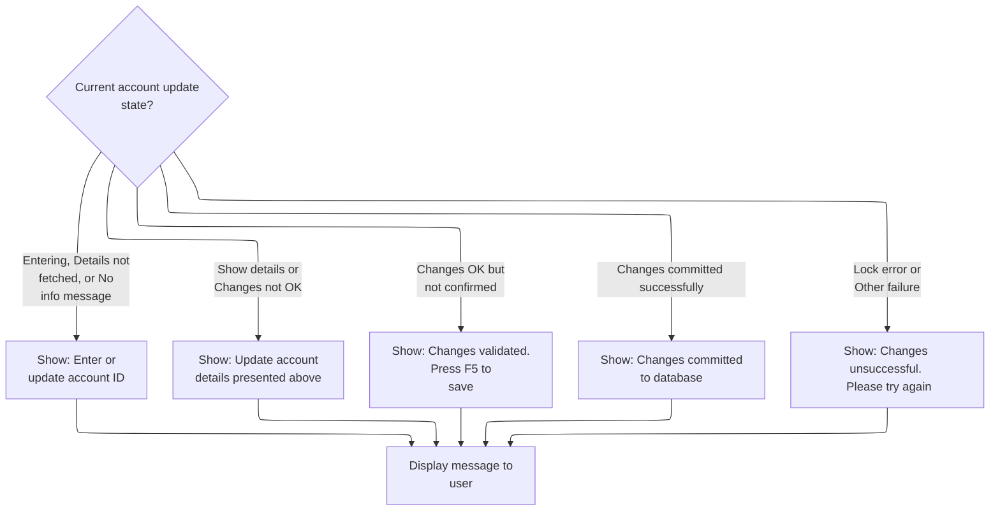

This section determines which informational or prompt message is displayed to the user during the account update workflow, based on the current state of the process. It ensures that users receive clear guidance or feedback at each step, including prompts for input, confirmation, success, or failure.

| Rule ID | Code Location      | Category       | Rule Name                                | Description                                                                                                                                                                 | Conditions                                                                                                                                                                                                       | Remarks                                                                                                                                                                              |
| ------- | ------------------ | -------------- | ---------------------------------------- | --------------------------------------------------------------------------------------------------------------------------------------------------------------------------- | ---------------------------------------------------------------------------------------------------------------------------------------------------------------------------------------------------------------- | ------------------------------------------------------------------------------------------------------------------------------------------------------------------------------------ |
| BR-001  | 3250-SETUP-INFOMSG | Business logic | Prompt for Account ID                    | When the user is entering the program or account details have not been fetched, the system prompts the user to enter or update the account ID.                              | The workflow state is either program entry (CDEMO-PGM-CONTEXT = 0) or account details not fetched (ACUP-CHANGE-ACTION = LOW-VALUES or SPACES), or there is no info message (WS-INFO-MSG = SPACES or LOW-VALUES). | The prompt message is: 'Enter or update id of account to update'. This is a string message presented to the user.                                                                    |
| BR-002  | 3250-SETUP-INFOMSG | Business logic | Prompt for Account Update                | When account details are shown or changes are not OK, the system prompts the user to update the account details presented.                                                  | The workflow state is either showing details (ACUP-CHANGE-ACTION = 'S') or changes not OK (ACUP-CHANGE-ACTION = 'E').                                                                                            | The prompt message is: 'Update account details presented above.'. This is a string message presented to the user.                                                                    |
| BR-003  | 3250-SETUP-INFOMSG | Business logic | Prompt for Confirmation                  | When changes are validated but not yet confirmed, the system prompts the user to confirm and save the changes.                                                              | The workflow state is changes OK but not confirmed (ACUP-CHANGE-ACTION = 'N').                                                                                                                                   | The prompt message is: 'Changes validated.Press F5 to save'. This is a string message presented to the user.                                                                         |
| BR-004  | 3250-SETUP-INFOMSG | Business logic | Inform Commit Success                    | When changes are committed successfully, the system informs the user that changes have been committed to the database.                                                      | The workflow state is changes OK and done (ACUP-CHANGE-ACTION = 'C').                                                                                                                                            | The informational message is: 'Changes committed to database'. This is a string message presented to the user.                                                                       |
| BR-005  | 3250-SETUP-INFOMSG | Business logic | Display Informational and Error Messages | After the appropriate message flag is set, the system moves the informational and error messages to the output fields for display to the user.                              | Any of the above workflow states have set a message flag and prepared a message.                                                                                                                                 | The informational message is moved to the output info message field, and the error message is moved to the output error message field. Both are string fields displayed to the user. |
| BR-006  | 3250-SETUP-INFOMSG | Error handling | Inform Commit Failure                    | When a lock error or other failure occurs after attempting to commit changes, the system informs the user that the changes were unsuccessful and prompts them to try again. | The workflow state is changes OK but failed (ACUP-CHANGE-ACTION = 'F') or lock error (ACUP-CHANGE-ACTION = 'L').                                                                                                 | The informational message is: 'Changes unsuccessful. Please try again'. This is a string message presented to the user.                                                              |

<SwmSnippet path="/app/cbl/COACTUPC.cbl" line="2955" repo-id="Z2l0aHViJTNBJTNBa3luZHJ5bC1hd3MtbWFpbmZyYW1lLW1vZGVybml6YXRpb24tY2FyZGRlbW8lM0ElM0FTd2ltbS1EZW1v">

---

In `3250-SETUP-INFOMSG` we use a big EVALUATE block to set the right message flag based on workflow state. This controls what prompt or info the user sees next.

```cobol
       3250-SETUP-INFOMSG.
      *    SETUP INFORMATION MESSAGE
           EVALUATE TRUE
               WHEN CDEMO-PGM-ENTER
                    SET  PROMPT-FOR-SEARCH-KEYS TO TRUE
               WHEN ACUP-DETAILS-NOT-FETCHED
                   SET PROMPT-FOR-SEARCH-KEYS      TO TRUE
               WHEN ACUP-SHOW-DETAILS
                    SET PROMPT-FOR-CHANGES         TO TRUE
               WHEN ACUP-CHANGES-NOT-OK
                    SET PROMPT-FOR-CHANGES         TO TRUE
               WHEN ACUP-CHANGES-OK-NOT-CONFIRMED
                    SET PROMPT-FOR-CONFIRMATION    TO TRUE
               WHEN ACUP-CHANGES-OKAYED-AND-DONE
                    SET CONFIRM-UPDATE-SUCCESS     TO TRUE

               WHEN ACUP-CHANGES-OKAYED-LOCK-ERROR
                    SET INFORM-FAILURE             TO TRUE
               WHEN ACUP-CHANGES-OKAYED-BUT-FAILED
                    SET INFORM-FAILURE             TO TRUE
               WHEN WS-NO-INFO-MESSAGE
                   SET PROMPT-FOR-SEARCH-KEYS      TO TRUE
           END-EVALUATE
```

---

</SwmSnippet>

<SwmSnippet path="/app/cbl/COACTUPC.cbl" line="2979" repo-id="Z2l0aHViJTNBJTNBa3luZHJ5bC1hd3MtbWFpbmZyYW1lLW1vZGVybml6YXRpb24tY2FyZGRlbW8lM0ElM0FTd2ltbS1EZW1v">

---

After setting the message flags, we move the actual info and error messages to the output fields so they're ready for display.

```cobol
           MOVE WS-INFO-MSG                    TO INFOMSGO OF CACTUPAO

           MOVE WS-RETURN-MSG                  TO ERRMSGO OF CACTUPAO
           .
```

---

</SwmSnippet>

### Screen Field Protection and Attribute Management

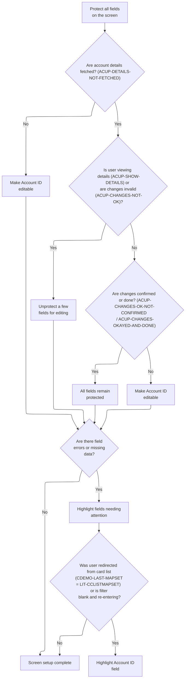

This section manages the protection, editability, and visual feedback of screen fields in the account update workflow, ensuring the UI reflects the current workflow state and validation results.

| Rule ID | Code Location                                     | Category        | Rule Name                       | Description                                                                                                                                            | Conditions                                                                                                               | Remarks                                                                                                                                                          |
| ------- | ------------------------------------------------- | --------------- | ------------------------------- | ------------------------------------------------------------------------------------------------------------------------------------------------------ | ------------------------------------------------------------------------------------------------------------------------ | ---------------------------------------------------------------------------------------------------------------------------------------------------------------- |
| BR-001  | 3300-SETUP-SCREEN-ATTRS                           | Data validation | Error Field Cursor Positioning  | If any field is invalid or missing, the cursor is positioned on that field to prompt user correction.                                                  | When a field's validation flag indicates 'not OK' or 'blank'.                                                            | The cursor is positioned by setting the field's location value to -1. This applies to all fields with validation flags.                                          |
| BR-002  | 3300-SETUP-SCREEN-ATTRS                           | Data validation | Error Field Highlighting        | Fields with validation errors are visually highlighted to indicate they require user attention.                                                        | When the account filter is invalid or blank, or when returning from the card list.                                       | The Account ID field is colored red (DFHRED) for errors, or default (DFHDFCOL) when returning from the card list. If blank and re-entering, a '\*' is displayed. |
| BR-003  | 3300-SETUP-SCREEN-ATTRS                           | Business logic  | Account ID Editability          | The Account ID field is made editable if account details have not been fetched, or if the workflow state does not match any recognized state.          | When account details are not fetched (ACUP-DETAILS-NOT-FETCHED), or when workflow state falls into the 'OTHER' category. | The Account ID field is set to editable using the DFHBMFSE attribute.                                                                                            |
| BR-004  | 3300-SETUP-SCREEN-ATTRS, 3320-UNPROTECT-FEW-ATTRS | Business logic  | Selective Field Unlocking       | A subset of fields is unlocked for editing when the user is viewing details or when changes are invalid.                                               | When the workflow state is 'show details' (ACUP-SHOW-DETAILS) or 'changes not OK' (ACUP-CHANGES-NOT-OK).                 | Fields are set to editable using DFHBMFSE, except for certain fields which remain protected (e.g., country, customer number).                                    |
| BR-005  | 3300-SETUP-SCREEN-ATTRS                           | Error handling  | Early Exit on Missing Data      | If account details are not fetched or the account filter is blank/invalid, the screen attribute setup is exited early to avoid unnecessary UI updates. | When account details are not fetched, or the account filter is blank or invalid.                                         | No further attribute logic is applied if these conditions are met.                                                                                               |
| BR-006  | 3300-SETUP-SCREEN-ATTRS, 3310-PROTECT-ALL-ATTRS   | Technical step  | Initial Field Protection        | All fields on the account update screen are initially set to read-only (protected) before any workflow-specific logic is applied.                      | Whenever the screen is being set up for account update, regardless of workflow state.                                    | All fields are set to protected using a bulk attribute value (DFHBMPRF). This ensures no field is editable until explicitly unlocked.                            |
| BR-007  | 3300-SETUP-SCREEN-ATTRS                           | Technical step  | Bulk Field Attribute Assignment | Field attributes for display and editability are set in bulk for all fields at the end of screen setup, ensuring consistency and maintainability.      | At the end of screen setup, after all workflow and validation logic.                                                     | Attributes are set using a bulk copy mechanism (COPY CSSETATY REPLACING), which applies to all fields.                                                           |

<SwmSnippet path="/app/cbl/COACTUPC.cbl" line="2986" repo-id="Z2l0aHViJTNBJTNBa3luZHJ5bC1hd3MtbWFpbmZyYW1lLW1vZGVybml6YXRpb24tY2FyZGRlbW8lM0ElM0FTd2ltbS1EZW1v">

---

In `3300-SETUP-SCREEN-ATTRS` we start by protecting all fields, then use workflow state to decide which ones to unlock or make editable. This keeps the UI in sync with validation and workflow.

```cobol
       3300-SETUP-SCREEN-ATTRS.

      *    PROTECT ALL FIELDS
           PERFORM 3310-PROTECT-ALL-ATTRS
              THRU 3310-PROTECT-ALL-ATTRS-EXIT
```

---

</SwmSnippet>

<SwmSnippet path="/app/cbl/COACTUPC.cbl" line="3441" repo-id="Z2l0aHViJTNBJTNBa3luZHJ5bC1hd3MtbWFpbmZyYW1lLW1vZGVybml6YXRpb24tY2FyZGRlbW8lM0ElM0FTd2ltbS1EZW1v">

---

`3310-PROTECT-ALL-ATTRS` moves a batch of attributes to the input area, marking all fields as protected (read-only) until we decide to unlock them.

```cobol
       3310-PROTECT-ALL-ATTRS.
           MOVE DFHBMPRF              TO ACCTSIDA OF CACTUPAI
                                         ACSTTUSA OF CACTUPAI
      *Account Limits
                                         ACRDLIMA OF CACTUPAI
                                         ACSHLIMA OF CACTUPAI
                                         ACURBALA OF CACTUPAI
                                         ACRCYCRA OF CACTUPAI
                                         ACRCYDBA OF CACTUPAI
      *Account dates
                                         OPNYEARA OF CACTUPAI
                                         OPNMONA  OF CACTUPAI
                                         OPNDAYA  OF CACTUPAI
                                         EXPYEARA OF CACTUPAI
                                         EXPMONA  OF CACTUPAI
                                         EXPDAYA  OF CACTUPAI
                                         RISYEARA OF CACTUPAI
                                         RISMONA  OF CACTUPAI
                                         RISDAYA  OF CACTUPAI

                                         AADDGRPA OF CACTUPAI
      *Customer data
                                         ACSTNUMA OF CACTUPAI
                                         ACTSSN1A OF CACTUPAI
                                         ACTSSN2A OF CACTUPAI
                                         ACTSSN3A OF CACTUPAI
                                         ACSTFCOA OF CACTUPAI
      *Date of Birth
                                         DOBYEARA OF CACTUPAI
                                         DOBMONA  OF CACTUPAI
                                         DOBDAYA  OF CACTUPAI

                                         ACSFNAMA OF CACTUPAI
                                         ACSMNAMA OF CACTUPAI
                                         ACSLNAMA OF CACTUPAI
      *Address
                                         ACSADL1A OF CACTUPAI
                                         ACSADL2A OF CACTUPAI
                                         ACSCITYA OF CACTUPAI
                                         ACSSTTEA OF CACTUPAI
                                         ACSZIPCA OF CACTUPAI
                                         ACSCTRYA OF CACTUPAI

                                         ACSPH1AA OF CACTUPAI
                                         ACSPH1BA OF CACTUPAI
                                         ACSPH1CA OF CACTUPAI
                                         ACSPH2AA OF CACTUPAI
                                         ACSPH2BA OF CACTUPAI
                                         ACSPH2CA OF CACTUPAI

                                         ACSGOVTA OF CACTUPAI
                                         ACSEFTCA OF CACTUPAI
                                         ACSPFLGA OF CACTUPAI
                                         INFOMSGA OF CACTUPAI
           .
```

---

</SwmSnippet>

<SwmSnippet path="/app/cbl/COACTUPC.cbl" line="2993" repo-id="Z2l0aHViJTNBJTNBa3luZHJ5bC1hd3MtbWFpbmZyYW1lLW1vZGVybml6YXRpb24tY2FyZGRlbW8lM0ElM0FTd2ltbS1EZW1v">

---

Back in `3300-SETUP-SCREEN-ATTRS` after protecting all fields, we use workflow state to decide which fields to unlock and where to position the cursor. If details aren't fetched, we make Account Id editable; if showing details or changes not OK, we call 3320-UNPROTECT-FEW-ATTRS to unlock more fields.

```cobol
           EVALUATE TRUE
              WHEN ACUP-DETAILS-NOT-FETCHED
      *            Make Account Id editable
                   MOVE DFHBMFSE      TO ACCTSIDA OF CACTUPAI
              WHEN  ACUP-SHOW-DETAILS
              WHEN  ACUP-CHANGES-NOT-OK
                   PERFORM 3320-UNPROTECT-FEW-ATTRS
                      THRU 3320-UNPROTECT-FEW-ATTRS-EXIT
              WHEN ACUP-CHANGES-OK-NOT-CONFIRMED
              WHEN ACUP-CHANGES-OKAYED-AND-DONE
                   CONTINUE
              WHEN OTHER
                   MOVE DFHBMFSE      TO ACCTSIDA OF CACTUPAI
           END-EVALUATE
```

---

</SwmSnippet>

<SwmSnippet path="/app/cbl/COACTUPC.cbl" line="3500" repo-id="Z2l0aHViJTNBJTNBa3luZHJ5bC1hd3MtbWFpbmZyYW1lLW1vZGVybml6YXRpb24tY2FyZGRlbW8lM0ElM0FTd2ltbS1EZW1v">

---

`3320-UNPROTECT-FEW-ATTRS` unlocks just the fields needed for editing, copying data from source fields to the input area so the user can update them.

```cobol
       3320-UNPROTECT-FEW-ATTRS.

           MOVE DFHBMFSE              TO ACSTTUSA OF CACTUPAI
      *Account Limits
                                         ACRDLIMA OF CACTUPAI
                                         ACSHLIMA OF CACTUPAI
                                         ACURBALA OF CACTUPAI
                                         ACRCYCRA OF CACTUPAI
                                         ACRCYDBA OF CACTUPAI
      *Account dates
      *Open Date
                                         OPNYEARA OF CACTUPAI
                                         OPNMONA  OF CACTUPAI
                                         OPNDAYA  OF CACTUPAI
      *Expiry date
                                         EXPYEARA OF CACTUPAI
                                         EXPMONA  OF CACTUPAI
                                         EXPDAYA  OF CACTUPAI
      *Reissue date
                                         RISYEARA OF CACTUPAI
                                         RISMONA  OF CACTUPAI
                                         RISDAYA  OF CACTUPAI
      *Date of Birth
                                         DOBYEARA OF CACTUPAI
                                         DOBMONA  OF CACTUPAI
                                         DOBDAYA  OF CACTUPAI


                                         AADDGRPA OF CACTUPAI
      *Customer data
            MOVE DFHBMPRF            TO  ACSTNUMA OF CACTUPAI
            MOVE DFHBMFSE            TO  ACTSSN1A OF CACTUPAI         
                                         ACTSSN2A OF CACTUPAI
                                         ACTSSN3A OF CACTUPAI
                                         ACSTFCOA OF CACTUPAI

                                         ACSFNAMA OF CACTUPAI
                                         ACSMNAMA OF CACTUPAI
                                         ACSLNAMA OF CACTUPAI
      *Address
                                         ACSADL1A OF CACTUPAI
                                         ACSADL2A OF CACTUPAI
                                         ACSCITYA OF CACTUPAI
                                         ACSSTTEA OF CACTUPAI
                                         ACSZIPCA OF CACTUPAI
      *Since most of the edits are USA specific protected country
           MOVE DFHBMPRF              TO ACSCTRYA OF CACTUPAI

           MOVE DFHBMFSE              TO ACSPH1AA OF CACTUPAI
                                         ACSPH1BA OF CACTUPAI
                                         ACSPH1CA OF CACTUPAI

           MOVE DFHBMFSE              TO ACSPH2AA OF CACTUPAI
                                         ACSPH2BA OF CACTUPAI
                                         ACSPH2CA OF CACTUPAI

                                         ACSGOVTA OF CACTUPAI
                                         ACSEFTCA OF CACTUPAI
                                         ACSPFLGA OF CACTUPAI
           MOVE DFHBMPRF              TO INFOMSGA OF CACTUPAI
           .
```

---

</SwmSnippet>

<SwmSnippet path="/app/cbl/COACTUPC.cbl" line="3009" repo-id="Z2l0aHViJTNBJTNBa3luZHJ5bC1hd3MtbWFpbmZyYW1lLW1vZGVybml6YXRpb24tY2FyZGRlbW8lM0ElM0FTd2ltbS1EZW1v">

---

After unlocking fields in `3300-SETUP-SCREEN-ATTRS`, we check validation flags and move -1 to the location fields for any that need attention. This puts the cursor right where the user needs to fix something.

```cobol
           EVALUATE TRUE
              WHEN FOUND-ACCOUNT-DATA
              WHEN NO-CHANGES-DETECTED
                  MOVE -1              TO ACSTTUSL OF CACTUPAI
              WHEN FLG-ACCTFILTER-NOT-OK
              WHEN FLG-ACCTFILTER-BLANK
                   MOVE -1             TO ACCTSIDL OF CACTUPAI
      *    Account Status
              WHEN FLG-ACCT-STATUS-NOT-OK
              WHEN FLG-ACCT-STATUS-BLANK
                  MOVE -1              TO ACSTTUSL OF CACTUPAI
      *    Open Year
              WHEN FLG-OPEN-YEAR-NOT-OK
              WHEN FLG-OPEN-YEAR-BLANK
                  MOVE -1              TO OPNYEARL OF CACTUPAI
      *    Open Month
              WHEN FLG-OPEN-MONTH-NOT-OK
              WHEN FLG-OPEN-MONTH-BLANK
                  MOVE -1              TO OPNMONL  OF CACTUPAI
      *    Open Day
              WHEN FLG-OPEN-DAY-NOT-OK
              WHEN FLG-OPEN-DAY-BLANK
                  MOVE -1              TO OPNDAYL  OF CACTUPAI
      *    Credit Limit
              WHEN FLG-CRED-LIMIT-NOT-OK
              WHEN FLG-CRED-LIMIT-BLANK
                  MOVE -1              TO ACRDLIML OF CACTUPAI
      *    Expiry Year
              WHEN FLG-EXPIRY-YEAR-NOT-OK
              WHEN FLG-EXPIRY-YEAR-BLANK
                  MOVE -1              TO EXPYEARL OF CACTUPAI
      *    Expiry Month
              WHEN FLG-EXPIRY-MONTH-NOT-OK
              WHEN FLG-EXPIRY-MONTH-BLANK
                  MOVE -1              TO EXPMONL  OF CACTUPAI
      *    Expiry Day
              WHEN FLG-EXPIRY-DAY-NOT-OK
              WHEN FLG-EXPIRY-DAY-BLANK
                  MOVE -1              TO EXPDAYL  OF CACTUPAI
      *    Cash credit limit
              WHEN FLG-CASH-CREDIT-LIMIT-NOT-OK
              WHEN FLG-CASH-CREDIT-LIMIT-BLANK
                  MOVE -1              TO ACSHLIML OF CACTUPAI
      *    Reissue Year
              WHEN FLG-REISSUE-YEAR-NOT-OK
              WHEN FLG-REISSUE-YEAR-BLANK
                  MOVE -1              TO RISYEARL OF CACTUPAI
      *    Expiry Month
              WHEN FLG-REISSUE-MONTH-NOT-OK
              WHEN FLG-REISSUE-MONTH-BLANK
                  MOVE -1              TO RISMONL  OF CACTUPAI
```

---

</SwmSnippet>

<SwmSnippet path="/app/cbl/COACTUPC.cbl" line="3061" repo-id="Z2l0aHViJTNBJTNBa3luZHJ5bC1hd3MtbWFpbmZyYW1lLW1vZGVybml6YXRpb24tY2FyZGRlbW8lM0ElM0FTd2ltbS1EZW1v">

---

Here we check if the 'Reissue Day' field is invalid or blank, and if so, we move -1 to RISDAYL. This positions the cursor on that field, prompting the user to fix it. It's part of the broader logic that guides users to fields needing correction.

```cobol
              WHEN FLG-REISSUE-DAY-NOT-OK
              WHEN FLG-REISSUE-DAY-BLANK
                  MOVE -1              TO RISDAYL  OF CACTUPAI
```

---

</SwmSnippet>

<SwmSnippet path="/app/cbl/COACTUPC.cbl" line="3066" repo-id="Z2l0aHViJTNBJTNBa3luZHJ5bC1hd3MtbWFpbmZyYW1lLW1vZGVybml6YXRpb24tY2FyZGRlbW8lM0ElM0FTd2ltbS1EZW1v">

---

Next we apply the same cursor positioning logic to a bunch of fields: current balance, cycle credit/debit, SSN parts, DOB, FICO, names, address, phone, etc. Each time a field is invalid or blank, we set its location to -1 so the cursor jumps there for user correction.

```cobol
              WHEN FLG-CURR-BAL-NOT-OK
              WHEN FLG-CURR-BAL-BLANK
                  MOVE -1              TO ACURBALL OF CACTUPAI
      *    Current Cycle Credit
              WHEN FLG-CURR-CYC-CREDIT-NOT-OK
              WHEN FLG-CURR-CYC-CREDIT-BLANK
                  MOVE -1              TO ACRCYCRL OF CACTUPAI
      *    Current Cycle Debit
              WHEN FLG-CURR-CYC-DEBIT-NOT-OK
              WHEN FLG-CURR-CYC-DEBIT-BLANK
                  MOVE -1              TO ACRCYDBL OF CACTUPAI
      *    SSN Part 1
              WHEN FLG-EDIT-US-SSN-PART1-NOT-OK
              WHEN FLG-EDIT-US-SSN-PART1-BLANK
                  MOVE -1              TO ACTSSN1L OF CACTUPAI
      *    SSN Part 2
              WHEN FLG-EDIT-US-SSN-PART2-NOT-OK
              WHEN FLG-EDIT-US-SSN-PART2-BLANK
                  MOVE -1              TO ACTSSN2L  OF CACTUPAI
      *    SSN Part 3
              WHEN FLG-EDIT-US-SSN-PART3-NOT-OK
              WHEN FLG-EDIT-US-SSN-PART3-BLANK
                  MOVE -1              TO ACTSSN3L  OF CACTUPAI
      *    Date of Birth Year
              WHEN FLG-DT-OF-BIRTH-YEAR-NOT-OK
              WHEN FLG-DT-OF-BIRTH-YEAR-BLANK
                  MOVE -1              TO DOBYEARL OF CACTUPAI
      *    Date of Birth Month
              WHEN FLG-DT-OF-BIRTH-MONTH-NOT-OK
              WHEN FLG-DT-OF-BIRTH-MONTH-BLANK
                  MOVE -1              TO DOBMONL  OF CACTUPAI
      *    Date of Birth Day
              WHEN FLG-DT-OF-BIRTH-DAY-NOT-OK
              WHEN FLG-DT-OF-BIRTH-DAY-BLANK
                  MOVE -1              TO DOBDAYL  OF CACTUPAI
      *    FICO Score
              WHEN FLG-FICO-SCORE-NOT-OK
              WHEN FLG-FICO-SCORE-BLANK
                  MOVE -1              TO ACSTFCOL OF CACTUPAI
      *    First Name
              WHEN FLG-FIRST-NAME-NOT-OK
              WHEN FLG-FIRST-NAME-BLANK
                  MOVE -1              TO ACSFNAML OF CACTUPAI
      *    Middle Name
              WHEN FLG-MIDDLE-NAME-NOT-OK
                  MOVE -1              TO ACSMNAML OF CACTUPAI
      *    Last Name
              WHEN FLG-LAST-NAME-NOT-OK
              WHEN FLG-LAST-NAME-BLANK
                  MOVE -1              TO ACSLNAML OF CACTUPAI
      *    Address Line 1
              WHEN FLG-ADDRESS-LINE-1-NOT-OK
              WHEN FLG-ADDRESS-LINE-1-BLANK
                  MOVE -1              TO ACSADL1L OF CACTUPAI
```

---

</SwmSnippet>

<SwmSnippet path="/app/cbl/COACTUPC.cbl" line="3121" repo-id="Z2l0aHViJTNBJTNBa3luZHJ5bC1hd3MtbWFpbmZyYW1lLW1vZGVybml6YXRpb24tY2FyZGRlbW8lM0ElM0FTd2ltbS1EZW1v">

---

Here we check if the state field is blank or invalid and set its location to -1. This keeps the cursor on the state field if it needs fixing, right before handling zip, city, and country.

```cobol
              WHEN FLG-STATE-NOT-OK
              WHEN FLG-STATE-BLANK
                  MOVE -1              TO ACSSTTEL OF CACTUPAI
```

---

</SwmSnippet>

<SwmSnippet path="/app/cbl/COACTUPC.cbl" line="3126" repo-id="Z2l0aHViJTNBJTNBa3luZHJ5bC1hd3MtbWFpbmZyYW1lLW1vZGVybml6YXRpb24tY2FyZGRlbW8lM0ElM0FTd2ltbS1EZW1v">

---

This chunk wraps up the EVALUATE TRUE block, handling cursor positioning for zip, city, country, phone, EFT, cardholder, and a catch-all for any other field. It's the tail end of the dynamic UI logic that guides users to errors and sets up field protection/unprotection based on workflow state.

```cobol
              WHEN FLG-ZIPCODE-NOT-OK
              WHEN FLG-ZIPCODE-BLANK
                  MOVE -1              TO ACSZIPCL OF CACTUPAI
      *    Address Line 3 (City)
              WHEN FLG-CITY-NOT-OK
              WHEN FLG-CITY-BLANK
                  MOVE -1              TO ACSCITYL OF CACTUPAI
      *    Country edits.
              WHEN FLG-COUNTRY-NOT-OK
              WHEN FLG-COUNTRY-BLANK
                  MOVE -1              TO ACSCTRYL OF CACTUPAI
      *    Phone 1
              WHEN FLG-PHONE-NUM-1A-NOT-OK
              WHEN FLG-PHONE-NUM-1A-BLANK
                  MOVE -1              TO ACSPH1AL OF CACTUPAI
              WHEN FLG-PHONE-NUM-1B-NOT-OK
              WHEN FLG-PHONE-NUM-1B-BLANK
                  MOVE -1              TO ACSPH1BL OF CACTUPAI
              WHEN FLG-PHONE-NUM-1C-NOT-OK
              WHEN FLG-PHONE-NUM-1C-BLANK
                  MOVE -1              TO ACSPH1CL OF CACTUPAI
      *    Phone 2
              WHEN FLG-PHONE-NUM-2A-NOT-OK
              WHEN FLG-PHONE-NUM-2A-BLANK
                  MOVE -1              TO ACSPH2AL OF CACTUPAI
              WHEN FLG-PHONE-NUM-2B-NOT-OK
              WHEN FLG-PHONE-NUM-2B-BLANK
                  MOVE -1              TO ACSPH2BL OF CACTUPAI
              WHEN FLG-PHONE-NUM-2C-NOT-OK
              WHEN FLG-PHONE-NUM-2C-BLANK
                  MOVE -1              TO ACSPH2CL OF CACTUPAI
      *    EFT Account Id
              WHEN FLG-EFT-ACCOUNT-ID-NOT-OK
              WHEN FLG-EFT-ACCOUNT-ID-BLANK
                  MOVE -1              TO ACSEFTCL OF CACTUPAI
      *    Primary Card Holder
              WHEN FLG-PRI-CARDHOLDER-NOT-OK
              WHEN FLG-PRI-CARDHOLDER-BLANK
                  MOVE -1              TO ACSPFLGL OF CACTUPAI
              WHEN OTHER
                  MOVE -1              TO ACCTSIDL OF CACTUPAI
            END-EVALUATE
```

---

</SwmSnippet>

<SwmSnippet path="/app/cbl/COACTUPC.cbl" line="3171" repo-id="Z2l0aHViJTNBJTNBa3luZHJ5bC1hd3MtbWFpbmZyYW1lLW1vZGVybml6YXRpb24tY2FyZGRlbW8lM0ElM0FTd2ltbS1EZW1v">

---

Here we check if we're coming from the account list mapset and set the Account Id field's color to default. This is part of the UI feedback, so the field isn't highlighted as an error.

```cobol
           IF CDEMO-LAST-MAPSET   EQUAL LIT-CCLISTMAPSET
              MOVE DFHDFCOL            TO ACCTSIDC OF CACTUPAO
           END-IF
```

---

</SwmSnippet>

<SwmSnippet path="/app/cbl/COACTUPC.cbl" line="3176" repo-id="Z2l0aHViJTNBJTNBa3luZHJ5bC1hd3MtbWFpbmZyYW1lLW1vZGVybml6YXRpb24tY2FyZGRlbW8lM0ElM0FTd2ltbS1EZW1v">

---

If the account filter isn't valid, we set the Account Id field's color to red. This makes it obvious to the user that there's an error to fix.

```cobol
           IF FLG-ACCTFILTER-NOT-OK
              MOVE DFHRED              TO ACCTSIDC OF CACTUPAO
           END-IF
```

---

</SwmSnippet>

<SwmSnippet path="/app/cbl/COACTUPC.cbl" line="3180" repo-id="Z2l0aHViJTNBJTNBa3luZHJ5bC1hd3MtbWFpbmZyYW1lLW1vZGVybml6YXRpb24tY2FyZGRlbW8lM0ElM0FTd2ltbS1EZW1v">

---

If the account filter is blank and we're re-entering, we put a '\*' in the field and color it red. This signals to the user that input is required.

```cobol
           IF  FLG-ACCTFILTER-BLANK
           AND CDEMO-PGM-REENTER
               MOVE '*'                TO ACCTSIDO OF CACTUPAO
               MOVE DFHRED             TO ACCTSIDC OF CACTUPAO
           END-IF
```

---

</SwmSnippet>

<SwmSnippet path="/app/cbl/COACTUPC.cbl" line="3186" repo-id="Z2l0aHViJTNBJTNBa3luZHJ5bC1hd3MtbWFpbmZyYW1lLW1vZGVybml6YXRpb24tY2FyZGRlbW8lM0ElM0FTd2ltbS1EZW1v">

---

If details aren't fetched or the account filter is blank/invalid, we bail out of the attribute setup. Otherwise, we keep going. This keeps the UI logic tight and avoids unnecessary updates.

```cobol
           IF ACUP-DETAILS-NOT-FETCHED
           OR FLG-ACCTFILTER-BLANK
           OR FLG-ACCTFILTER-NOT-OK
              GO TO 3300-SETUP-SCREEN-ATTRS-EXIT
           ELSE
              CONTINUE
           END-IF
```

---

</SwmSnippet>

<SwmSnippet path="/app/cbl/COACTUPC.cbl" line="3208" repo-id="Z2l0aHViJTNBJTNBa3luZHJ5bC1hd3MtbWFpbmZyYW1lLW1vZGVybml6YXRpb24tY2FyZGRlbW8lM0ElM0FTd2ltbS1EZW1v">

---

Finally we use COPY CSSETATY REPLACING to set up attributes for every field in bulk. This keeps the code DRY and makes it easy to add or change fields without rewriting attribute logic. The UI state is now fully set for all fields.

```cobol
           COPY CSSETATY REPLACING
             ==(TESTVAR1)== BY ==ACCT-STATUS==
             ==(SCRNVAR2)== BY ==ACSTTUS==
             ==(MAPNAME3)== BY ==CACTUPA== .

      *    Open Year
           COPY CSSETATY REPLACING
             ==(TESTVAR1)== BY ==OPEN-YEAR==
             ==(SCRNVAR2)== BY ==OPNYEAR==
             ==(MAPNAME3)== BY ==CACTUPA== .

      *    Open Month
           COPY CSSETATY REPLACING
             ==(TESTVAR1)== BY ==OPEN-MONTH==
             ==(SCRNVAR2)== BY ==OPNMON==
             ==(MAPNAME3)== BY ==CACTUPA== .

      *    Open Day
           COPY CSSETATY REPLACING
             ==(TESTVAR1)== BY ==OPEN-DAY==
             ==(SCRNVAR2)== BY ==OPNDAY==
             ==(MAPNAME3)== BY ==CACTUPA== .

      *    Credit Limit
           COPY CSSETATY REPLACING
             ==(TESTVAR1)== BY ==CRED-LIMIT==
             ==(SCRNVAR2)== BY ==ACRDLIM==
             ==(MAPNAME3)== BY ==CACTUPA== .

      *    Expiry Year
           COPY CSSETATY REPLACING
             ==(TESTVAR1)== BY ==EXPIRY-YEAR==
             ==(SCRNVAR2)== BY ==EXPYEAR==
             ==(MAPNAME3)== BY ==CACTUPA== .

      *    Expiry Month
           COPY CSSETATY REPLACING
             ==(TESTVAR1)== BY ==EXPIRY-MONTH==
             ==(SCRNVAR2)== BY ==EXPMON==
             ==(MAPNAME3)== BY ==CACTUPA== .

      *    Expiry Day
           COPY CSSETATY REPLACING
             ==(TESTVAR1)== BY ==EXPIRY-DAY==
             ==(SCRNVAR2)== BY ==EXPDAY==
             ==(MAPNAME3)== BY ==CACTUPA== .

      *    Cash Credit Limit
           COPY CSSETATY REPLACING
             ==(TESTVAR1)== BY ==CASH-CREDIT-LIMIT==
             ==(SCRNVAR2)== BY ==ACSHLIM==
             ==(MAPNAME3)== BY ==CACTUPA== .

      *    Reissue Year
           COPY CSSETATY REPLACING
             ==(TESTVAR1)== BY ==REISSUE-YEAR==
             ==(SCRNVAR2)== BY ==RISYEAR==
             ==(MAPNAME3)== BY ==CACTUPA== .

      *    Reissue Month
           COPY CSSETATY REPLACING
             ==(TESTVAR1)== BY ==REISSUE-MONTH==
             ==(SCRNVAR2)== BY ==RISMON==
             ==(MAPNAME3)== BY ==CACTUPA== .

      *    Reissue Day
           COPY CSSETATY REPLACING
             ==(TESTVAR1)== BY ==REISSUE-DAY==
             ==(SCRNVAR2)== BY ==RISDAY==
             ==(MAPNAME3)== BY ==CACTUPA== .

      *    Current Balance
           COPY CSSETATY REPLACING
             ==(TESTVAR1)== BY ==CURR-BAL==
             ==(SCRNVAR2)== BY ==ACURBAL==
             ==(MAPNAME3)== BY ==CACTUPA== .

      *    Current Cycle Credit
           COPY CSSETATY REPLACING
             ==(TESTVAR1)== BY ==CURR-CYC-CREDIT==
             ==(SCRNVAR2)== BY ==ACRCYCR==
             ==(MAPNAME3)== BY ==CACTUPA== .

      *    Current Cycle Debit
           COPY CSSETATY REPLACING
             ==(TESTVAR1)== BY ==CURR-CYC-DEBIT==
             ==(SCRNVAR2)== BY ==ACRCYDB==
             ==(MAPNAME3)== BY ==CACTUPA== .

      *    SSN Part 1
           COPY CSSETATY REPLACING
             ==(TESTVAR1)== BY ==EDIT-US-SSN-PART1==
             ==(SCRNVAR2)== BY ==ACTSSN1==
             ==(MAPNAME3)== BY ==CACTUPA== .

      *    SSN Part 2
           COPY CSSETATY REPLACING
             ==(TESTVAR1)== BY ==EDIT-US-SSN-PART2==
             ==(SCRNVAR2)== BY ==ACTSSN2==
             ==(MAPNAME3)== BY ==CACTUPA== .

      *    SSN Part 3
           COPY CSSETATY REPLACING
             ==(TESTVAR1)== BY ==EDIT-US-SSN-PART3==
             ==(SCRNVAR2)== BY ==ACTSSN3==
             ==(MAPNAME3)== BY ==CACTUPA== .

      *    Date of Birth Year
           COPY CSSETATY REPLACING
             ==(TESTVAR1)== BY ==DT-OF-BIRTH-YEAR==
             ==(SCRNVAR2)== BY ==DOBYEAR==
             ==(MAPNAME3)== BY ==CACTUPA== .

      *    Date of Birth Month
           COPY CSSETATY REPLACING
             ==(TESTVAR1)== BY ==DT-OF-BIRTH-MONTH==
             ==(SCRNVAR2)== BY ==DOBMON==
             ==(MAPNAME3)== BY ==CACTUPA== .

      *    Date of Birth Day
           COPY CSSETATY REPLACING
             ==(TESTVAR1)== BY ==DT-OF-BIRTH-DAY==
             ==(SCRNVAR2)== BY ==DOBDAY==
             ==(MAPNAME3)== BY ==CACTUPA== .

      *    FICO Score
           COPY CSSETATY REPLACING
             ==(TESTVAR1)== BY ==FICO-SCORE==
             ==(SCRNVAR2)== BY ==ACSTFCO==
             ==(MAPNAME3)== BY ==CACTUPA== .

      *    First Name
           COPY CSSETATY REPLACING
             ==(TESTVAR1)== BY ==FIRST-NAME==
             ==(SCRNVAR2)== BY ==ACSFNAM==
             ==(MAPNAME3)== BY ==CACTUPA== .

      *    Middle Name (no edits coded)
           COPY CSSETATY REPLACING
             ==(TESTVAR1)== BY ==MIDDLE-NAME==
             ==(SCRNVAR2)== BY ==ACSMNAM==
             ==(MAPNAME3)== BY ==CACTUPA== .

      *    Last Name
           COPY CSSETATY REPLACING
             ==(TESTVAR1)== BY ==LAST-NAME==
             ==(SCRNVAR2)== BY ==ACSLNAM==
             ==(MAPNAME3)== BY ==CACTUPA== .

      *    Address Line 1
           COPY CSSETATY REPLACING
             ==(TESTVAR1)== BY ==ADDRESS-LINE-1==
             ==(SCRNVAR2)== BY ==ACSADL1==
             ==(MAPNAME3)== BY ==CACTUPA== .

      *    State
           COPY CSSETATY REPLACING
             ==(TESTVAR1)== BY ==STATE==
             ==(SCRNVAR2)== BY ==ACSSTTE==
             ==(MAPNAME3)== BY ==CACTUPA== .

      *    Address Line 2 (NO EDITS CODED AS YET)
           COPY CSSETATY REPLACING
             ==(TESTVAR1)== BY ==ADDRESS-LINE-2==
             ==(SCRNVAR2)== BY ==ACSADL2==
             ==(MAPNAME3)== BY ==CACTUPA== .

      *    State
           COPY CSSETATY REPLACING
             ==(TESTVAR1)== BY ==ZIPCODE==
             ==(SCRNVAR2)== BY ==ACSZIPC==
             ==(MAPNAME3)== BY ==CACTUPA== .

      *    City
           COPY CSSETATY REPLACING
             ==(TESTVAR1)== BY ==CITY==
             ==(SCRNVAR2)== BY ==ACSCITY==
             ==(MAPNAME3)== BY ==CACTUPA== .

      *    Country
           COPY CSSETATY REPLACING
             ==(TESTVAR1)== BY ==COUNTRY==
             ==(SCRNVAR2)== BY ==ACSCTRY==
             ==(MAPNAME3)== BY ==CACTUPA== .

      *    Phone 1 Area Code
           COPY CSSETATY REPLACING
             ==(TESTVAR1)== BY ==PHONE-NUM-1A==
             ==(SCRNVAR2)== BY ==ACSPH1A==
             ==(MAPNAME3)== BY ==CACTUPA== .

      *    Phone 1 Prefix
           COPY CSSETATY REPLACING
             ==(TESTVAR1)== BY ==PHONE-NUM-1B==
             ==(SCRNVAR2)== BY ==ACSPH1B==
             ==(MAPNAME3)== BY ==CACTUPA== .
      *    Phone 1 Line number
           COPY CSSETATY REPLACING
             ==(TESTVAR1)== BY ==PHONE-NUM-1C==
             ==(SCRNVAR2)== BY ==ACSPH1C==
             ==(MAPNAME3)== BY ==CACTUPA== .

      *    Phone 2 Area Code
           COPY CSSETATY REPLACING
             ==(TESTVAR1)== BY ==PHONE-NUM-2A==
             ==(SCRNVAR2)== BY ==ACSPH2A==
             ==(MAPNAME3)== BY ==CACTUPA== .

      *    Phone 2 Prefix
           COPY CSSETATY REPLACING
             ==(TESTVAR1)== BY ==PHONE-NUM-2B==
             ==(SCRNVAR2)== BY ==ACSPH2B==
             ==(MAPNAME3)== BY ==CACTUPA== .
      *    Phone 2 Line number
           COPY CSSETATY REPLACING
             ==(TESTVAR1)== BY ==PHONE-NUM-2C==
             ==(SCRNVAR2)== BY ==ACSPH2C==
             ==(MAPNAME3)== BY ==CACTUPA== .
      *    EFT Account Id
           COPY CSSETATY REPLACING
             ==(TESTVAR1)== BY ==PRI-CARDHOLDER==
             ==(SCRNVAR2)== BY ==ACSPFLG==
             ==(MAPNAME3)== BY ==CACTUPA== .
      *    Primary Card Holder
           COPY CSSETATY REPLACING
             ==(TESTVAR1)== BY ==EFT-ACCOUNT-ID==
             ==(SCRNVAR2)== BY ==ACSEFTC==
             ==(MAPNAME3)== BY ==CACTUPA== .
           .
```

---

</SwmSnippet>

### Info Message Attribute Setup

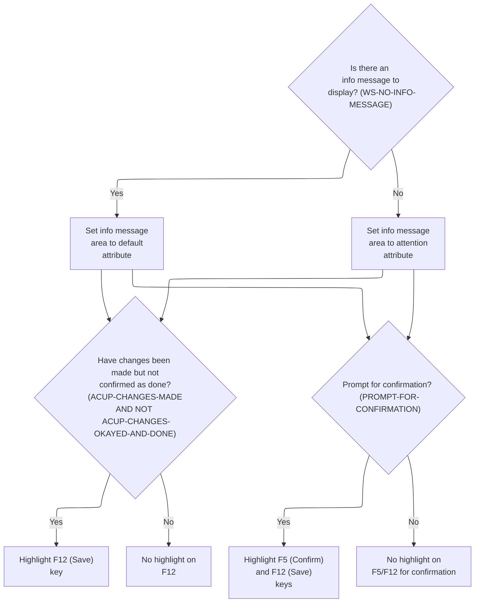

This section determines the visual feedback provided to the user in the info message area and on the function keys, based on the current state of messages and pending changes. It ensures that users are clearly informed about required actions such as saving or confirming changes.

| Rule ID | Code Location            | Category       | Rule Name                                              | Description                                                                                                                                                                                                                                          | Conditions                                                                                                                                                                                                                           | Remarks                                                                                                                                                                                                                  |
| ------- | ------------------------ | -------------- | ------------------------------------------------------ | ---------------------------------------------------------------------------------------------------------------------------------------------------------------------------------------------------------------------------------------------------- | ------------------------------------------------------------------------------------------------------------------------------------------------------------------------------------------------------------------------------------ | ------------------------------------------------------------------------------------------------------------------------------------------------------------------------------------------------------------------------ |
| BR-001  | 3390-SETUP-INFOMSG-ATTRS | Business logic | Info Message Area Attribute                            | If there is no info message to display (the info message is blank or contains only low-values), the info message area is shown with the default attribute. If there is an info message, the info message area is shown with the attention attribute. | The info message is considered absent if it is blank (spaces) or contains only low-values. Otherwise, it is present.                                                                                                                 | The absence of an info message is defined as WS-INFO-MSG being SPACES or LOW-VALUES. The info message area can be set to either the default attribute or the attention attribute, which are display properties.          |
| BR-002  | 3390-SETUP-INFOMSG-ATTRS | Business logic | Highlight Save Key on Pending Changes                  | If changes have been made but not confirmed as done, the F12 (Save) key is highlighted to indicate that a save action is pending.                                                                                                                    | Changes are considered made if the change action is one of 'E', 'N', 'C', 'L', or 'F'. Changes are considered confirmed as done if the change action is 'C'. The rule applies when changes have been made and not confirmed as done. | Highlighting the F12 key signals to the user that a save or confirmation action is required. The relevant constants are ACUP-CHANGES-MADE (values 'E', 'N', 'C', 'L', 'F') and ACUP-CHANGES-OKAYED-AND-DONE (value 'C'). |
| BR-003  | 3390-SETUP-INFOMSG-ATTRS | Business logic | Highlight Confirm and Save Keys on Confirmation Prompt | If a confirmation prompt is required, both the F5 (Confirm) and F12 (Save) keys are highlighted to indicate that the user can confirm or save their changes.                                                                                         | A confirmation prompt is required when the info message is exactly 'Changes validated.Press F5 to save'.                                                                                                                             | Highlighting both F5 and F12 keys signals to the user that either action is available. The relevant constant is PROMPT-FOR-CONFIRMATION, which is true when WS-INFO-MSG = 'Changes validated.Press F5 to save'.          |

<SwmSnippet path="/app/cbl/COACTUPC.cbl" line="3566" repo-id="Z2l0aHViJTNBJTNBa3luZHJ5bC1hd3MtbWFpbmZyYW1lLW1vZGVybml6YXRpb24tY2FyZGRlbW8lM0ElM0FTd2ltbS1EZW1v">

---

In `3390-SETUP-INFOMSG-ATTRS` we check if there's an info message to show. If not, we set the info area to default; if there is, we highlight it. This controls what the user sees in the info message area.

```cobol
       3390-SETUP-INFOMSG-ATTRS.
           IF  WS-NO-INFO-MESSAGE
               MOVE DFHBMDAR           TO INFOMSGA OF CACTUPAI
           ELSE
               MOVE DFHBMASB           TO INFOMSGA OF CACTUPAI
           END-IF
```

---

</SwmSnippet>

<SwmSnippet path="/app/cbl/COACTUPC.cbl" line="3573" repo-id="Z2l0aHViJTNBJTNBa3luZHJ5bC1hd3MtbWFpbmZyYW1lLW1vZGVybml6YXRpb24tY2FyZGRlbW8lM0ElM0FTd2ltbS1EZW1v">

---

If changes are made but not confirmed, we highlight FKEY12A. This signals to the user that there's an action pending, like saving or confirming changes.

```cobol
           IF ACUP-CHANGES-MADE
           AND NOT ACUP-CHANGES-OKAYED-AND-DONE
               MOVE DFHBMASB           TO FKEY12A  OF CACTUPAI
           END-IF
```

---

</SwmSnippet>

<SwmSnippet path="/app/cbl/COACTUPC.cbl" line="3578" repo-id="Z2l0aHViJTNBJTNBa3luZHJ5bC1hd3MtbWFpbmZyYW1lLW1vZGVybml6YXRpb24tY2FyZGRlbW8lM0ElM0FTd2ltbS1EZW1v">

---

If we're prompting for confirmation, we highlight both F5 and F12 function keys. This makes it clear to the user they can use either to save their changes.

```cobol
           IF PROMPT-FOR-CONFIRMATION
               MOVE DFHBMASB           TO FKEY05A  OF CACTUPAI
               MOVE DFHBMASB           TO FKEY12A  OF CACTUPAI
           END-IF
```

---

</SwmSnippet>

### Sending the Screen to the User

This section governs how the UI screen is sent to the user's terminal, ensuring the correct layout, a clean display, and immediate readiness for user input.

| Rule ID | Code Location    | Category       | Rule Name                     | Description                                                                                                              | Conditions                                              | Remarks                                                                                                                                                 |
| ------- | ---------------- | -------------- | ----------------------------- | ------------------------------------------------------------------------------------------------------------------------ | ------------------------------------------------------- | ------------------------------------------------------------------------------------------------------------------------------------------------------- |
| BR-001  | 3400-SEND-SCREEN | Business logic | UI Map Selection              | Whenever the screen is sent to the user, the specified mapset and map names are used to determine which UI is displayed. | The screen is being sent to the user.                   | The mapset and map names are set to the values of LIT-THISMAPSET and LIT-THISMAP, respectively. These constants determine which UI layout is presented. |
| BR-002  | 3400-SEND-SCREEN | Business logic | Screen Erasure Before Display | When the screen is sent to the user, the display is always erased before rendering the new UI.                           | The SEND MAP operation is performed to send the screen. | The ERASE flag ensures that any previous content on the user's terminal is cleared before the new screen is displayed.                                  |
| BR-003  | 3400-SEND-SCREEN | Business logic | Cursor Positioning for Input  | When the screen is sent to the user, the cursor is positioned for immediate user input.                                  | The SEND MAP operation is performed to send the screen. | The CURSOR flag ensures that the cursor is placed at the designated input location on the screen.                                                       |
| BR-004  | 3400-SEND-SCREEN | Business logic | Keyboard Unlock for Input     | When the screen is sent to the user, the keyboard is unlocked to allow immediate user input.                             | The SEND MAP operation is performed to send the screen. | The FREEKB flag ensures that the user's keyboard is enabled for input as soon as the screen is displayed.                                               |

<SwmSnippet path="/app/cbl/COACTUPC.cbl" line="3589" repo-id="Z2l0aHViJTNBJTNBa3luZHJ5bC1hd3MtbWFpbmZyYW1lLW1vZGVybml6YXRpb24tY2FyZGRlbW8lM0ElM0FTd2ltbS1EZW1v">

---

`3400-SEND-SCREEN` sets up the mapset and map names, then calls SEND MAP to push the screen to the user's terminal. This is how the UI gets displayed for user input.

```cobol
       3400-SEND-SCREEN.

           MOVE LIT-THISMAPSET         TO CCARD-NEXT-MAPSET
           MOVE LIT-THISMAP            TO CCARD-NEXT-MAP

           EXEC CICS SEND MAP(CCARD-NEXT-MAP)
                          MAPSET(CCARD-NEXT-MAPSET)
                          FROM(CACTUPAO)
                          CURSOR
                          ERASE
                          FREEKB
                          RESP(WS-RESP-CD)
           END-EXEC
```

---

</SwmSnippet>

## Returning Control After Sending the Map

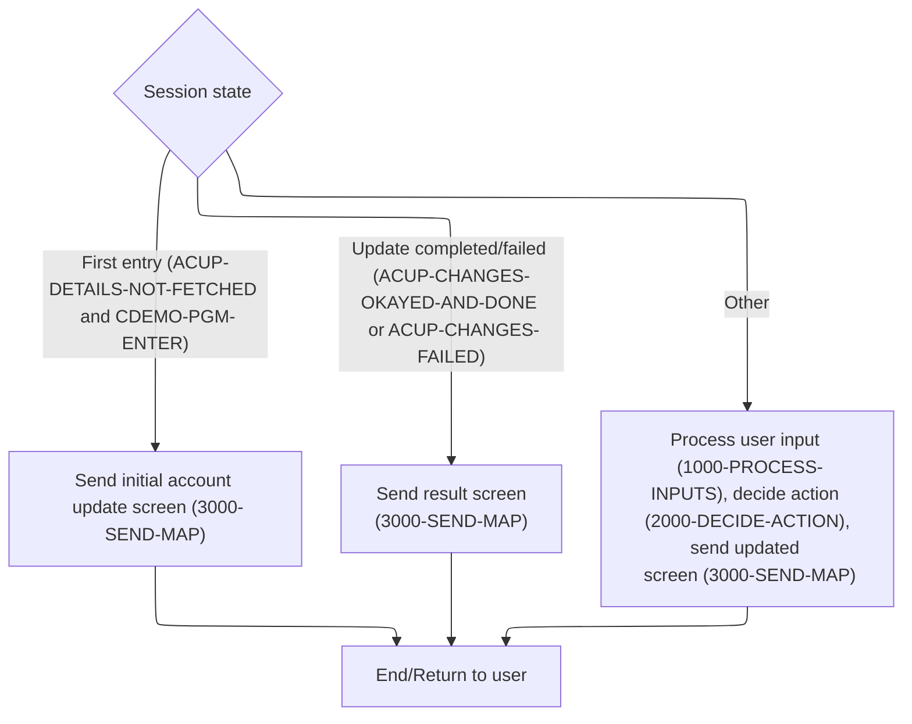

This section manages the logic for sending screens to the user and returning control to CICS, ensuring that the correct screen is shown based on session state and user actions, and that all relevant context and messages are preserved for the next transaction step.

| Rule ID | Code Location | Category       | Rule Name                                  | Description                                                                                                                                                                                          | Conditions                                                                                                          | Remarks                                                                                                                                                                                                 |
| ------- | ------------- | -------------- | ------------------------------------------ | ---------------------------------------------------------------------------------------------------------------------------------------------------------------------------------------------------- | ------------------------------------------------------------------------------------------------------------------- | ------------------------------------------------------------------------------------------------------------------------------------------------------------------------------------------------------- |
| BR-001  | 0000-MAIN     | Business logic | Initial account update screen              | When the session indicates that account details have not been fetched and the program is being entered for the first time, the initial account update screen is sent to the user.                    | ACUP-CHANGE-ACTION is LOW-VALUES or SPACES (ACUP-DETAILS-NOT-FETCHED) and CDEMO-PGM-CONTEXT is 0 (CDEMO-PGM-ENTER). | ACUP-DETAILS-NOT-FETCHED is true when ACUP-CHANGE-ACTION is LOW-VALUES or SPACES. CDEMO-PGM-ENTER is true when CDEMO-PGM-CONTEXT is 0. The initial account update screen is sent using the map CACTUPA. |
| BR-002  | 0000-MAIN     | Business logic | Result screen after update attempt         | When an account update has been completed or failed, the result screen is sent to the user, allowing them to retry or start a new search.                                                            | ACUP-CHANGE-ACTION is 'C' (ACUP-CHANGES-OKAYED-AND-DONE) or 'L'/'F' (ACUP-CHANGES-FAILED).                          | ACUP-CHANGES-OKAYED-AND-DONE is true when ACUP-CHANGE-ACTION is 'C'. ACUP-CHANGES-FAILED is true when ACUP-CHANGE-ACTION is 'L' or 'F'. The result screen is sent using the map CACTUPA.                |
| BR-003  | 0000-MAIN     | Business logic | Process user input and send updated screen | If none of the special cases for initial entry or update completion/failure apply, user input is processed, the next action is decided, the updated screen is sent, and control is returned to CICS. | Session state does not match initial entry or update completion/failure (WHEN OTHER in EVALUATE TRUE).              | This rule applies when none of the other WHEN conditions are met in the EVALUATE TRUE block. The updated screen is sent using the map CACTUPA.                                                          |
| BR-004  | COMMON-RETURN | Business logic | Preserve messages and context on return    | After sending any screen, the application preserves error messages and session context by copying them to the communication area before returning control to CICS.                                   | Any time control is returned to CICS after sending a map.                                                           | Error messages are preserved in a 75-character string. The communication area includes both common and program-specific chunks, concatenated for the next transaction step.                             |

<SwmSnippet path="/app/cbl/COACTUPC.cbl" line="964" repo-id="Z2l0aHViJTNBJTNBa3luZHJ5bC1hd3MtbWFpbmZyYW1lLW1vZGVybml6YXRpb24tY2FyZGRlbW8lM0ElM0FTd2ltbS1EZW1v">

---

In 0000-MAIN, after sending the map, we jump to COMMON-RETURN. This hands control back to CICS, passing along any messages and context so the user can work with the new screen.

```cobol
              WHEN ACUP-DETAILS-NOT-FETCHED
               AND CDEMO-PGM-ENTER
              WHEN CDEMO-FROM-PROGRAM   EQUAL LIT-MENUPGM
               AND NOT CDEMO-PGM-REENTER
                   INITIALIZE WS-THIS-PROGCOMMAREA
                   PERFORM 3000-SEND-MAP THRU
                           3000-SEND-MAP-EXIT
                   SET CDEMO-PGM-REENTER        TO TRUE
                   SET ACUP-DETAILS-NOT-FETCHED TO TRUE
                   GO TO COMMON-RETURN
```

---

</SwmSnippet>

<SwmSnippet path="/app/cbl/COACTUPC.cbl" line="1007" repo-id="Z2l0aHViJTNBJTNBa3luZHJ5bC1hd3MtbWFpbmZyYW1lLW1vZGVybml6YXRpb24tY2FyZGRlbW8lM0ElM0FTd2ltbS1EZW1v">

---

`COMMON-RETURN` copies any error message to the shared area, builds the full commarea from both common and program-specific chunks, and calls EXEC CICS RETURN to hand control back to the transaction. This keeps all context and messages intact for the next step.

```cobol
       COMMON-RETURN.
           MOVE WS-RETURN-MSG     TO CCARD-ERROR-MSG

           MOVE  CARDDEMO-COMMAREA    TO WS-COMMAREA
           MOVE  WS-THIS-PROGCOMMAREA TO
                  WS-COMMAREA(LENGTH OF CARDDEMO-COMMAREA + 1:
                               LENGTH OF WS-THIS-PROGCOMMAREA )

           EXEC CICS RETURN
                TRANSID (LIT-THISTRANID)
                COMMAREA (WS-COMMAREA)
                LENGTH(LENGTH OF WS-COMMAREA)
           END-EXEC
```

---

</SwmSnippet>

<SwmSnippet path="/app/cbl/COACTUPC.cbl" line="979" repo-id="Z2l0aHViJTNBJTNBa3luZHJ5bC1hd3MtbWFpbmZyYW1lLW1vZGVybml6YXRpb24tY2FyZGRlbW8lM0ElM0FTd2ltbS1EZW1v">

---

Back in 0000-MAIN, if changes are done or failed, we reset the working storage, send the map again, and return control. This lets the user retry or start a new search.

```cobol
              WHEN ACUP-CHANGES-OKAYED-AND-DONE
              WHEN ACUP-CHANGES-FAILED
                   INITIALIZE WS-THIS-PROGCOMMAREA
                              WS-MISC-STORAGE
                              CDEMO-ACCT-ID
                   SET CDEMO-PGM-ENTER            TO TRUE
                   PERFORM 3000-SEND-MAP THRU
                           3000-SEND-MAP-EXIT
                   SET CDEMO-PGM-REENTER          TO TRUE
                   SET ACUP-DETAILS-NOT-FETCHED   TO TRUE
                   GO TO COMMON-RETURN
```

---

</SwmSnippet>

<SwmSnippet path="/app/cbl/COACTUPC.cbl" line="996" repo-id="Z2l0aHViJTNBJTNBa3luZHJ5bC1hd3MtbWFpbmZyYW1lLW1vZGVybml6YXRpb24tY2FyZGRlbW8lM0ElM0FTd2ltbS1EZW1v">

---

At the end of 0000-MAIN, we use EVALUATE TRUE to branch based on user action and state. If none of the special cases match, we process inputs, decide what to do, send the map, and return control. This keeps the flow tight and user-driven.

```cobol
              WHEN OTHER
                   PERFORM 1000-PROCESS-INPUTS
                      THRU 1000-PROCESS-INPUTS-EXIT
                   PERFORM 2000-DECIDE-ACTION
                      THRU 2000-DECIDE-ACTION-EXIT
                   PERFORM 3000-SEND-MAP
                      THRU 3000-SEND-MAP-EXIT
                   GO TO COMMON-RETURN
           END-EVALUATE
```

---

</SwmSnippet>

# Processing User Inputs

This section is responsible for processing user input, validating and editing the input, handling error messaging, and setting up navigation to the next screen or program.

| Rule ID | Code Location       | Category        | Rule Name                             | Description                                                                                                                                                                               | Conditions                                                                     | Remarks                                                                                                                                             |
| ------- | ------------------- | --------------- | ------------------------------------- | ----------------------------------------------------------------------------------------------------------------------------------------------------------------------------------------- | ------------------------------------------------------------------------------ | --------------------------------------------------------------------------------------------------------------------------------------------------- |
| BR-001  | 1000-PROCESS-INPUTS | Data validation | Input Validation and Editing          | User input from the screen must be validated and edited before proceeding to the next step. If validation fails, an error message is set and the user is prompted to correct their input. | This rule applies whenever user input is received from the screen.             | Error messages are stored in a 75-character string. Validation is performed in the 1200-EDIT-MAP-INPUTS section.                                    |
| BR-002  | 1000-PROCESS-INPUTS | Business logic  | Navigation Context Setup              | After successful validation, the context for the next screen or program is set, including the next map, mapset, and program names.                                                        | This rule applies after user input has been successfully validated and edited. | The next map is set to 'CACTUPA', the next mapset to 'COACTUP ', and the next program to 'COACTUPC'. These are stored in 7- or 8-character strings. |
| BR-003  | 1000-PROCESS-INPUTS | Error handling  | Error Messaging on Validation Failure | If validation fails, an error message is set for the user, and the error message is stored in a 75-character string.                                                                      | This rule applies when input validation fails during the editing process.      | Error messages are stored in a 75-character string. The error message variable is CCARD-ERROR-MSG, which is equal to WS-RETURN-MSG.                 |

<SwmSnippet path="/app/cbl/COACTUPC.cbl" line="1025" repo-id="Z2l0aHViJTNBJTNBa3luZHJ5bC1hd3MtbWFpbmZyYW1lLW1vZGVybml6YXRpb24tY2FyZGRlbW8lM0ElM0FTd2ltbS1EZW1v">

---

In `1000-PROCESS-INPUTS` we first grab the user's input from the screen, then run validation and edits. After that, we set up messages and context for the next screen or program.

```cobol
       1000-PROCESS-INPUTS.
           PERFORM 1100-RECEIVE-MAP
              THRU 1100-RECEIVE-MAP-EXIT
           PERFORM 1200-EDIT-MAP-INPUTS
              THRU 1200-EDIT-MAP-INPUTS-EXIT
```

---

</SwmSnippet>

## Receiving Screen Input

This section is responsible for receiving and interpreting user input from the terminal screen, mapping it into internal variables, and preparing the data for further validation and processing.

| Rule ID | Code Location    | Category       | Rule Name                         | Description                                                                                                                                                                                                             | Conditions                                                                                   | Remarks                                                                                                                                                                                                            |
| ------- | ---------------- | -------------- | --------------------------------- | ----------------------------------------------------------------------------------------------------------------------------------------------------------------------------------------------------------------------- | -------------------------------------------------------------------------------------------- | ------------------------------------------------------------------------------------------------------------------------------------------------------------------------------------------------------------------ |
| BR-001  | 1100-RECEIVE-MAP | Business logic | Field Reset on Blank or Star      | If a user enters '\*' or leaves a field blank for any input field, the corresponding internal variable is reset to its default value, indicating that the field should be cleared or ignored in further processing.     | The input field contains either '\*' or is blank (spaces).                                   | The default value is LOW-VALUES for all fields. Input fields are alphanumeric. This applies to all mapped fields, including account ID, status, credit limits, balances, address, dates, and personal information. |
| BR-002  | 1100-RECEIVE-MAP | Business logic | Early Exit on Details Not Fetched | If the details for the current transaction have not been fetched (i.e., the change action is blank or LOW-VALUES), the process exits immediately after receiving input, and no further processing or validation occurs. | The change action field is blank (spaces) or LOW-VALUES, indicating details are not fetched. | This prevents unnecessary processing and validation when there is no data to act upon. The check is performed immediately after mapping input fields.                                                              |
| BR-003  | 1100-RECEIVE-MAP | Technical step | Initialize Input Fields           | All mapped input fields are initialized before being populated with user input, ensuring that no residual data from previous transactions affects the current processing.                                               | At the start of input processing, before mapping user input to internal variables.           | All fields in the new details structure are set to their default state (typically LOW-VALUES or equivalent) before any user input is processed.                                                                    |

<SwmSnippet path="/app/cbl/COACTUPC.cbl" line="1039" repo-id="Z2l0aHViJTNBJTNBa3luZHJ5bC1hd3MtbWFpbmZyYW1lLW1vZGVybml6YXRpb24tY2FyZGRlbW8lM0ElM0FTd2ltbS1EZW1v">

---

In `1100-RECEIVE-MAP` we use EXEC CICS RECEIVE MAP to pull the user's input from the terminal into CACTUPAI. This is the entry point for handling user data.

```cobol
       1100-RECEIVE-MAP.
           EXEC CICS RECEIVE MAP(LIT-THISMAP)
                     MAPSET(LIT-THISMAPSET)
                     INTO(CACTUPAI)
                     RESP(WS-RESP-CD)
                     RESP2(WS-REAS-CD)
           END-EXEC
```

---

</SwmSnippet>

<SwmSnippet path="/app/cbl/COACTUPC.cbl" line="1047" repo-id="Z2l0aHViJTNBJTNBa3luZHJ5bC1hd3MtbWFpbmZyYW1lLW1vZGVybml6YXRpb24tY2FyZGRlbW8lM0ElM0FTd2ltbS1EZW1v">

---

After receiving the map, we loop through each input field. If it's '\*' or blank, we reset the internal variable; otherwise, we copy the value and convert it if it's numeric. This keeps our working storage clean and ready for validation.

```cobol
           INITIALIZE ACUP-NEW-DETAILS
      ******************************************************************
      *    Account Master data
      ******************************************************************
           IF  ACCTSIDI OF CACTUPAI = '*'
           OR  ACCTSIDI OF CACTUPAI = SPACES
               MOVE LOW-VALUES           TO CC-ACCT-ID
                                            ACUP-NEW-ACCT-ID-X
           ELSE
               MOVE ACCTSIDI OF CACTUPAI TO CC-ACCT-ID
                                            ACUP-NEW-ACCT-ID-X
           END-IF
```

---

</SwmSnippet>

<SwmSnippet path="/app/cbl/COACTUPC.cbl" line="1060" repo-id="Z2l0aHViJTNBJTNBa3luZHJ5bC1hd3MtbWFpbmZyYW1lLW1vZGVybml6YXRpb24tY2FyZGRlbW8lM0ElM0FTd2ltbS1EZW1v">

---

Right after mapping inputs, we check if details aren't fetched. If so, we skip the rest and exit, saving cycles and avoiding pointless validation.

```cobol
           IF ACUP-DETAILS-NOT-FETCHED
              GO TO 1100-RECEIVE-MAP-EXIT
           END-IF
```

---

</SwmSnippet>

### Editing and Validating Inputs

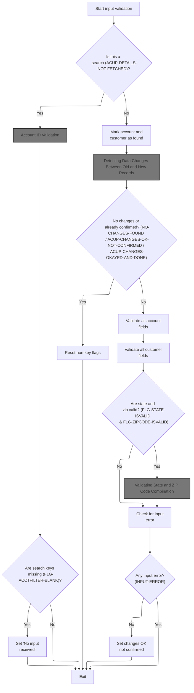

This section validates and edits user inputs for account and customer data, ensuring all required fields are present and correctly formatted before allowing changes to be confirmed.

| Rule ID | Code Location                                  | Category        | Rule Name                 | Description                                                                                                                                                      | Conditions                                                                                       | Remarks                                                                                                                                                                                        |
| ------- | ---------------------------------------------- | --------------- | ------------------------- | ---------------------------------------------------------------------------------------------------------------------------------------------------------------- | ------------------------------------------------------------------------------------------------ | ---------------------------------------------------------------------------------------------------------------------------------------------------------------------------------------------- |
| BR-001  | 1200-EDIT-MAP-INPUTS, 1210-EDIT-ACCOUNT        | Data validation | Search input required     | If the operation is a search and no search keys are provided, the system sets the message 'No input received' and exits without further processing.              | The operation is a search (details not fetched) and all search keys are missing.                 | The output message is 'No input received'. This is set when the search keys are blank.                                                                                                         |
| BR-002  | 1220-EDIT-ACCOUNT-FIELDS                       | Data validation | Account field validation  | All account fields must be validated for correct format and logical consistency when changes are detected and not yet confirmed.                                 | The operation is not a search, changes are detected, and changes are not yet confirmed.          | Fields validated include account status, credit limits, balances, and dates. Formats include numeric, date (YYYYMMDD), and mandatory fields. Errors set flags and prevent confirmation.        |
| BR-003  | 1230-EDIT-CUSTOMER-FIELDS                      | Data validation | Customer field validation | All customer fields must be validated for correct format and logical consistency when changes are detected and not yet confirmed.                                | The operation is not a search, changes are detected, and changes are not yet confirmed.          | Fields validated include names, address lines, phone numbers, and FICO score. Formats include alphanumeric, mandatory, and US phone number formats. Errors set flags and prevent confirmation. |
| BR-004  | 1280-EDIT-US-STATE-ZIP-CD                      | Data validation | State and ZIP validation  | State and ZIP code fields must both be valid before the system checks their combination for logical consistency.                                                 | State and ZIP code fields are present and individually valid.                                    | State codes must be valid US state abbreviations; ZIP codes must be valid US ZIP formats. Only if both are valid does the system check their combination.                                      |
| BR-005  | 1200-EDIT-MAP-INPUTS, 1260-RESET-NON-KEY-FLAGS | Business logic  | No changes detected       | When editing account or customer details, if no changes are detected or changes have already been confirmed, the system resets non-key workflow flags and exits. | The operation is not a search, and either no changes are found or changes are already confirmed. | Workflow flags related to non-key fields are reset. No further validation is performed.                                                                                                        |
| BR-006  | 1200-EDIT-MAP-INPUTS                           | Business logic  | Changes OK not confirmed  | If all validations pass and no input errors are detected, the system sets the workflow flag indicating changes are OK but not yet confirmed.                     | All validations pass and no input error flag is set.                                             | The workflow flag is set to indicate that changes are ready for confirmation but have not yet been finalized.                                                                                  |
| BR-007  | 1200-EDIT-MAP-INPUTS                           | Error handling  | Input error handling      | If any input error is detected during validation, the system exits without confirming changes.                                                                   | Any input error flag is set during validation.                                                   | The error flag prevents confirmation of changes and triggers exit from the validation flow.                                                                                                    |

<SwmSnippet path="/app/cbl/COACTUPC.cbl" line="1429" repo-id="Z2l0aHViJTNBJTNBa3luZHJ5bC1hd3MtbWFpbmZyYW1lLW1vZGVybml6YXRpb24tY2FyZGRlbW8lM0ElM0FTd2ltbS1EZW1v">

---

In `1200-EDIT-MAP-INPUTS` we check if details are fetched. If not, we validate search keys and exit early if needed. If details are present, we compare old/new data, run field and cross-field validations, and set flags for workflow state.

```cobol
       1200-EDIT-MAP-INPUTS.

           SET INPUT-OK                  TO TRUE

           IF  ACUP-DETAILS-NOT-FETCHED
      *        VALIDATE THE SEARCH KEYS
               PERFORM 1210-EDIT-ACCOUNT
                  THRU 1210-EDIT-ACCOUNT-EXIT
```

---

</SwmSnippet>

#### Account ID Validation

This section ensures that the Account ID field is validated as mandatory during account update operations, providing error handling and user prompts when the field is missing.

| Rule ID | Code Location     | Category        | Rule Name                         | Description                                                                                                                                                                                                                                                    | Conditions                                                                     | Remarks                                                                                                                                                                                                                              |
| ------- | ----------------- | --------------- | --------------------------------- | -------------------------------------------------------------------------------------------------------------------------------------------------------------------------------------------------------------------------------------------------------------- | ------------------------------------------------------------------------------ | ------------------------------------------------------------------------------------------------------------------------------------------------------------------------------------------------------------------------------------ |
| BR-001  | 1210-EDIT-ACCOUNT | Data validation | Account ID mandatory              | If the Account ID field is blank (either all spaces or LOW-VALUES), the system marks the input as erroneous, sets the blank flag, and prompts the user for the Account ID if no return message is present. The process exits early without further validation. | Account ID is equal to LOW-VALUES or SPACES.                                   | The error is triggered for Account ID values that are either all spaces or all LOW-VALUES. The prompt message is 'Account number not provided'. The blank flag is set, and the accumulated result for Account ID is reset to zeroes. |
| BR-002  | 1210-EDIT-ACCOUNT | Business logic  | Proceed to mandatory field checks | If the Account ID passes the blank check, the system marks the Account ID filter as not OK and proceeds to further mandatory field checks.                                                                                                                     | Account ID is not blank (not LOW-VALUES and not SPACES).                       | The Account ID filter is marked as not OK before further validation. No error or prompt is triggered if the Account ID is present.                                                                                                   |
| BR-003  | 1210-EDIT-ACCOUNT | Error handling  | Prompt for missing Account ID     | When the Account ID is blank and no return message is present, the system prompts the user with a specific message to provide the Account ID.                                                                                                                  | Account ID is blank (LOW-VALUES or SPACES) and the return message flag is off. | The prompt message shown to the user is 'Account number not provided'.                                                                                                                                                               |

<SwmSnippet path="/app/cbl/COACTUPC.cbl" line="1783" repo-id="Z2l0aHViJTNBJTNBa3luZHJ5bC1hd3MtbWFpbmZyYW1lLW1vZGVybml6YXRpb24tY2FyZGRlbW8lM0ElM0FTd2ltbS1EZW1v">

---

In `1210-EDIT-ACCOUNT` we check if the account ID is blank or invalid, set flags and messages, and bail out early if needed. If valid, we set the right flag and move on to mandatory field checks.

```cobol
       1210-EDIT-ACCOUNT.
           SET FLG-ACCTFILTER-NOT-OK    TO TRUE

      *    Not supplied
           IF CC-ACCT-ID   EQUAL LOW-VALUES
           OR CC-ACCT-ID   EQUAL SPACES
              SET INPUT-ERROR           TO TRUE
              SET FLG-ACCTFILTER-BLANK  TO TRUE
              IF WS-RETURN-MSG-OFF
                 SET WS-PROMPT-FOR-ACCT TO TRUE
              END-IF
              MOVE ZEROES               TO CDEMO-ACCT-ID
                                           ACUP-NEW-ACCT-ID
              GO TO  1210-EDIT-ACCOUNT-EXIT
           END-IF
```

---

</SwmSnippet>

##### Mandatory Field Validation

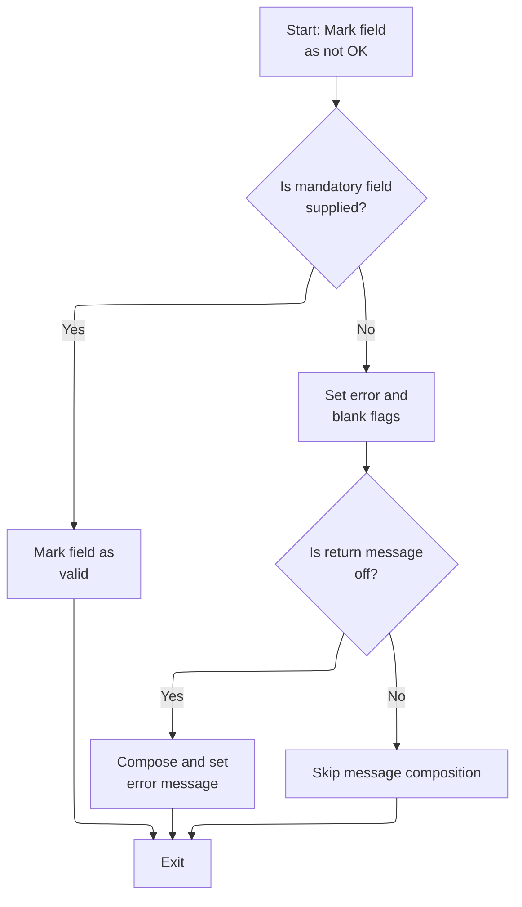

This section ensures that all mandatory fields are supplied by the user and provides error handling and messaging when required fields are missing.

| Rule ID | Code Location       | Category        | Rule Name                                 | Description                                                                                                                                                                               | Conditions                                                                           | Remarks                                                                                                                                                                       |
| ------- | ------------------- | --------------- | ----------------------------------------- | ----------------------------------------------------------------------------------------------------------------------------------------------------------------------------------------- | ------------------------------------------------------------------------------------ | ----------------------------------------------------------------------------------------------------------------------------------------------------------------------------- |
| BR-001  | 1215-EDIT-MANDATORY | Data validation | Mandatory Field Required                  | If a mandatory field is not supplied (i.e., it is blank, contains only spaces, or is set to low-values), the system must flag the input as an error and indicate that the field is blank. | The field value is blank, contains only spaces, or is set to low-values.             | A field is considered missing if it is blank, contains only spaces, or is set to low-values. The blank flag is represented by 'B', and the not OK flag is represented by '0'. |
| BR-002  | 1215-EDIT-MANDATORY | Data validation | Mandatory Field Valid                     | If a mandatory field is supplied (i.e., not blank, not spaces, and not low-values), the system must mark the field as valid.                                                              | The field value is not blank, not spaces, and not low-values.                        | A valid field is indicated by the flag set to LOW-VALUES.                                                                                                                     |
| BR-003  | 1215-EDIT-MANDATORY | Error handling  | Error Message for Missing Mandatory Field | If a mandatory field is missing and return messages are enabled, an error message must be composed indicating which field is missing.                                                     | The field is missing (blank, spaces, or low-values) and return messages are enabled. | The error message format is: '<field name> must be supplied.' where <field name> is the trimmed name of the field. The message is stored as a string.                         |

<SwmSnippet path="/app/cbl/COACTUPC.cbl" line="1824" repo-id="Z2l0aHViJTNBJTNBa3luZHJ5bC1hd3MtbWFpbmZyYW1lLW1vZGVybml6YXRpb24tY2FyZGRlbW8lM0ElM0FTd2ltbS1EZW1v">

---

`1215-EDIT-MANDATORY` checks if a required field is blank using three conditions, sets error flags and messages, and exits if needed. If valid, we move on to yes/no validation.

```cobol
       1215-EDIT-MANDATORY.
      *    Initialize
           SET FLG-MANDATORY-NOT-OK    TO TRUE

      *    Not supplied
           IF WS-EDIT-ALPHANUM-ONLY(1:WS-EDIT-ALPHANUM-LENGTH)
                                       EQUAL LOW-VALUES
           OR WS-EDIT-ALPHANUM-ONLY(1:WS-EDIT-ALPHANUM-LENGTH)
                                       EQUAL SPACES
           OR FUNCTION LENGTH(FUNCTION TRIM(
              WS-EDIT-ALPHANUM-ONLY(1:WS-EDIT-ALPHANUM-LENGTH))) = 0

              SET INPUT-ERROR          TO TRUE
              SET FLG-MANDATORY-BLANK  TO TRUE
              IF WS-RETURN-MSG-OFF
                 STRING
                   FUNCTION TRIM(WS-EDIT-VARIABLE-NAME)
                   ' must be supplied.'
                   DELIMITED BY SIZE
                   INTO WS-RETURN-MSG
                 END-STRING
              END-IF

              GO TO  1215-EDIT-MANDATORY-EXIT
           END-IF

           SET FLG-MANDATORY-ISVALID   TO TRUE
           .
```

---

</SwmSnippet>

##### Yes/No Field Validation

This section validates a Yes/No input field, ensuring it is not blank and conforms to accepted values, and sets error messages and flags as needed.

| Rule ID | Code Location   | Category        | Rule Name                   | Description                                                                                                                                                                                        | Conditions                                              | Remarks                                                                                                                                                                               |
| ------- | --------------- | --------------- | --------------------------- | -------------------------------------------------------------------------------------------------------------------------------------------------------------------------------------------------- | ------------------------------------------------------- | ------------------------------------------------------------------------------------------------------------------------------------------------------------------------------------- |
| BR-001  | 1220-EDIT-YESNO | Data validation | Blank Yes/No Field Required | If the Yes/No field is blank (contains LOW-VALUES, SPACES, or ZEROS), an input error is flagged, a blank-specific flag is set, and a message is generated stating that the field must be supplied. | The Yes/No field contains LOW-VALUES, SPACES, or ZEROS. | The accepted blank values are LOW-VALUES, SPACES, or ZEROS. The error message format is: '<field name> must be supplied.' where <field name> is trimmed from the input variable name. |

<SwmSnippet path="/app/cbl/COACTUPC.cbl" line="1856" repo-id="Z2l0aHViJTNBJTNBa3luZHJ5bC1hd3MtbWFpbmZyYW1lLW1vZGVybml6YXRpb24tY2FyZGRlbW8lM0ElM0FTd2ltbS1EZW1v">

---

In `1220-EDIT-YESNO` we check if the yes/no field is blank, valid, or invalid, set flags and messages, and exit if needed. If valid, we move on to alpha-required validation.

```cobol
       1220-EDIT-YESNO.
      *    Must be Y or N
      *    SET FLG-YES-NO-NOT-OK         TO TRUE
      *
      *    Not supplied
           IF WS-EDIT-YES-NO             EQUAL LOW-VALUES
           OR WS-EDIT-YES-NO             EQUAL SPACES
           OR WS-EDIT-YES-NO             EQUAL ZEROS
              SET INPUT-ERROR            TO TRUE
              SET FLG-YES-NO-BLANK       TO TRUE
              IF WS-RETURN-MSG-OFF
                 STRING
                   FUNCTION TRIM(WS-EDIT-VARIABLE-NAME)
                   ' must be supplied.'
                   DELIMITED BY SIZE
                   INTO WS-RETURN-MSG
                 END-STRING
              END-IF
              GO TO  1220-EDIT-YESNO-EXIT
           END-IF
```

---

</SwmSnippet>

###### Alpha-Only Required Field Validation

This section validates that a required input field is not blank and contains only alphabetic characters and spaces. It enforces business rules for required field presence and triggers user-facing error messages when the rules are violated.

| Rule ID | Code Location        | Category        | Rule Name                       | Description                                                                                                                                                                                                                       | Conditions                                                                                            | Remarks                                                                                                                                                                                                                                                |
| ------- | -------------------- | --------------- | ------------------------------- | --------------------------------------------------------------------------------------------------------------------------------------------------------------------------------------------------------------------------------- | ----------------------------------------------------------------------------------------------------- | ------------------------------------------------------------------------------------------------------------------------------------------------------------------------------------------------------------------------------------------------------ |
| BR-001  | 1225-EDIT-ALPHA-REQD | Data validation | Required Field Must Be Supplied | If the required field is blank (contains only spaces, low-values, or is empty after trimming), an error is triggered, the field is marked as blank, and a user-facing message is generated indicating the field must be supplied. | The input field is blank, contains only spaces, contains only low-values, or is empty after trimming. | A field is considered blank if it contains only spaces, low-values, or is empty after trimming. The error message format is: '<field name> must be supplied.' where <field name> is the trimmed variable name. The error flag for blank is set to 'B'. |

<SwmSnippet path="/app/cbl/COACTUPC.cbl" line="1898" repo-id="Z2l0aHViJTNBJTNBa3luZHJ5bC1hd3MtbWFpbmZyYW1lLW1vZGVybml6YXRpb24tY2FyZGRlbW8lM0ElM0FTd2ltbS1EZW1v">

---

In `1225-EDIT-ALPHA-REQD` we check if the field is blank, then validate that it only contains alphabets and spaces. If not, we set error flags and messages, and exit. If valid, we move on to alphanum-required validation.

```cobol
       1225-EDIT-ALPHA-REQD.
      *    Initialize
           SET FLG-ALPHA-NOT-OK              TO TRUE

      *    Not supplied
           IF WS-EDIT-ALPHANUM-ONLY(1:WS-EDIT-ALPHANUM-LENGTH)
                                             EQUAL LOW-VALUES
           OR WS-EDIT-ALPHANUM-ONLY(1:WS-EDIT-ALPHANUM-LENGTH)
               EQUAL SPACES
           OR FUNCTION LENGTH(FUNCTION TRIM(
              WS-EDIT-ALPHANUM-ONLY(1:WS-EDIT-ALPHANUM-LENGTH))) = 0

              SET INPUT-ERROR                TO TRUE
              SET FLG-ALPHA-BLANK            TO TRUE
              IF WS-RETURN-MSG-OFF
                 STRING
                   FUNCTION TRIM(WS-EDIT-VARIABLE-NAME)
                   ' must be supplied.'
                   DELIMITED BY SIZE
                   INTO WS-RETURN-MSG
                 END-STRING
              END-IF

              GO TO  1225-EDIT-ALPHA-REQD-EXIT
           END-IF
```

---

</SwmSnippet>

####### Alphanumeric Required Field Validation

This section ensures that required alphanumeric fields are present and valid, providing clear error messages when validation fails.

| Rule ID | Code Location           | Category        | Rule Name                                     | Description                                                                                                                                                                                                | Conditions                                                                                            | Remarks                                                                                                                                                              |
| ------- | ----------------------- | --------------- | --------------------------------------------- | ---------------------------------------------------------------------------------------------------------------------------------------------------------------------------------------------------------- | ----------------------------------------------------------------------------------------------------- | -------------------------------------------------------------------------------------------------------------------------------------------------------------------- |
| BR-001  | 1230-EDIT-ALPHANUM-REQD | Data validation | Required field blank error                    | If the required alphanumeric field is blank (contains only spaces, low-values, or is empty after trimming), an error is triggered and an error message is generated indicating the field must be supplied. | The input field is blank, contains only spaces, contains only low-values, or is empty after trimming. | The error message format is: '<field name> must be supplied.' The field name is trimmed of spaces. The error flag is set and the process exits this validation step. |
| BR-002  | 1230-EDIT-ALPHANUM-REQD | Data validation | Alphanumeric content validation pass          | If the required alphanumeric field contains only valid alphanumeric characters and is not blank, the validation passes and the process continues to the next validation step.                              | The input field is not blank and contains only valid alphanumeric characters.                         | No error message is generated. The process continues to the next validation step, which is alpha-optional validation.                                                |
| BR-003  | 1230-EDIT-ALPHANUM-REQD | Error handling  | Error message format for blank required field | When an error is triggered due to a blank required field, the error message provided to the user must include the name of the field and the phrase 'must be supplied.'                                     | An error is triggered due to the required field being blank.                                          | The error message format is: '<field name> must be supplied.' The field name is trimmed of spaces before concatenation.                                              |

<SwmSnippet path="/app/cbl/COACTUPC.cbl" line="1955" repo-id="Z2l0aHViJTNBJTNBa3luZHJ5bC1hd3MtbWFpbmZyYW1lLW1vZGVybml6YXRpb24tY2FyZGRlbW8lM0ElM0FTd2ltbS1EZW1v">

---

In `1230-EDIT-ALPHANUM-REQD` we check if the field is blank, then validate that it only contains alphanum chars. If not, we set error flags and messages, and exit. If valid, we move on to alpha-optional validation.

```cobol
       1230-EDIT-ALPHANUM-REQD.
      *    Initialize
           SET FLG-ALPHNANUM-NOT-OK          TO TRUE

      *    Not supplied
           IF WS-EDIT-ALPHANUM-ONLY(1:WS-EDIT-ALPHANUM-LENGTH)
                                             EQUAL LOW-VALUES
           OR WS-EDIT-ALPHANUM-ONLY(1:WS-EDIT-ALPHANUM-LENGTH)
               EQUAL SPACES
           OR FUNCTION LENGTH(FUNCTION TRIM(
              WS-EDIT-ALPHANUM-ONLY(1:WS-EDIT-ALPHANUM-LENGTH))) = 0

              SET INPUT-ERROR                TO TRUE
              SET FLG-ALPHNANUM-BLANK        TO TRUE
              IF WS-RETURN-MSG-OFF
                 STRING
                   FUNCTION TRIM(WS-EDIT-VARIABLE-NAME)
                   ' must be supplied.'
                   DELIMITED BY SIZE
                   INTO WS-RETURN-MSG
                 END-STRING
              END-IF

              GO TO  1230-EDIT-ALPHANUM-REQD-EXIT
           END-IF
```

---

</SwmSnippet>

######## Alpha-Only Optional Field Validation

This section validates an optional input field to ensure it is either blank or contains only alphabetic characters, setting error flags and messages if invalid input is detected.

| Rule ID | Code Location       | Category        | Rule Name                             | Description                                                                                                                         | Conditions                                                                                             | Remarks                                                                                                                                                    |
| ------- | ------------------- | --------------- | ------------------------------------- | ----------------------------------------------------------------------------------------------------------------------------------- | ------------------------------------------------------------------------------------------------------ | ---------------------------------------------------------------------------------------------------------------------------------------------------------- |
| BR-001  | 1235-EDIT-ALPHA-OPT | Data validation | Blank Optional Field Acceptance       | If the optional field is blank (spaces, low-values, or trimmed length zero), it is accepted as valid and no error is set.           | The field is blank, defined as containing only spaces, low-values, or having a trimmed length of zero. | Blank is defined as: all spaces, all low-values, or trimmed length equals zero. The field may be up to 256 characters in length.                           |
| BR-002  | 1235-EDIT-ALPHA-OPT | Data validation | Alpha-Only Optional Field Requirement | If the optional field is not blank, it must contain only alphabetic characters to be accepted as valid.                             | The field is not blank (does not meet blank criteria) and contains only alphabetic characters.         | Valid input is any non-blank string consisting solely of alphabetic characters (A-Z, case-insensitive), up to 256 characters.                              |
| BR-003  | 1235-EDIT-ALPHA-OPT | Error handling  | Alpha-Only Field Error Handling       | If the optional field is not blank and contains any non-alphabetic characters, it is flagged as invalid and error messages are set. | The field is not blank and contains one or more non-alphabetic characters.                             | Invalid input is any non-blank string containing characters other than A-Z (case-insensitive). Error flags and messages are set to indicate invalid input. |

<SwmSnippet path="/app/cbl/COACTUPC.cbl" line="2012" repo-id="Z2l0aHViJTNBJTNBa3luZHJ5bC1hd3MtbWFpbmZyYW1lLW1vZGVybml6YXRpb24tY2FyZGRlbW8lM0ElM0FTd2ltbS1EZW1v">

---

In `1235-EDIT-ALPHA-OPT` we check if the field is blank (which is fine for optional), otherwise we validate it's alpha-only. If not, we set error flags and messages, and exit. If valid, we move on to alphanum-optional validation.

```cobol
       1235-EDIT-ALPHA-OPT.
      *    Initialize
           SET FLG-ALPHA-NOT-OK              TO TRUE

      *    Not supplied
           IF WS-EDIT-ALPHANUM-ONLY(1:WS-EDIT-ALPHANUM-LENGTH)
                                             EQUAL LOW-VALUES
           OR WS-EDIT-ALPHANUM-ONLY(1:WS-EDIT-ALPHANUM-LENGTH)
               EQUAL SPACES
           OR FUNCTION LENGTH(FUNCTION TRIM(
              WS-EDIT-ALPHANUM-ONLY(1:WS-EDIT-ALPHANUM-LENGTH))) = 0

              SET FLG-ALPHA-ISVALID          TO TRUE
              GO TO  1235-EDIT-ALPHA-OPT-EXIT
           ELSE
              CONTINUE
           END-IF
```

---

</SwmSnippet>

######### Optional Alphanumeric Field Validation

This section governs the validation of an optional alphanumeric input field, determining when it is considered valid and when further validation or error handling is required. It also manages the transition to the next field's validation in the workflow.

| Rule ID | Code Location          | Category        | Rule Name                                       | Description                                                                                                                                                                                              | Conditions                                                               | Remarks                                                                                                                                                                    |
| ------- | ---------------------- | --------------- | ----------------------------------------------- | -------------------------------------------------------------------------------------------------------------------------------------------------------------------------------------------------------- | ------------------------------------------------------------------------ | -------------------------------------------------------------------------------------------------------------------------------------------------------------------------- |
| BR-001  | 1240-EDIT-ALPHANUM-OPT | Data validation | Optional Alphanumeric Blank Acceptance          | If the optional alphanumeric field is blank, contains only spaces, or is trimmed to zero length, it is considered valid and no further validation is performed on this field.                            | The field is blank, contains only spaces, or its trimmed length is zero. | A blank field is defined as containing only spaces or low-values, or having a trimmed length of zero. The field is alphanumeric and may be up to 256 characters in length. |
| BR-002  | 1240-EDIT-ALPHANUM-OPT | Data validation | Optional Alphanumeric Character Validation      | If the optional alphanumeric field is not blank, spaces, or zero-length, it must be validated for allowed characters. If it fails this validation, error flags are set and an error message is prepared. | The field contains non-blank, non-space, non-zero-length content.        | The field must contain only allowed alphanumeric characters. If invalid characters are present, error flags are set and an error message is prepared.                      |
| BR-003  | 1240-EDIT-ALPHANUM-OPT | Business logic  | Transition to Required Numeric Field Validation | After validating the optional alphanumeric field, the process must proceed to validate the next required numeric field.                                                                                  | The optional alphanumeric field validation is complete.                  | The next field in the workflow is a required numeric field, which must be validated according to its own rules.                                                            |

<SwmSnippet path="/app/cbl/COACTUPC.cbl" line="2061" repo-id="Z2l0aHViJTNBJTNBa3luZHJ5bC1hd3MtbWFpbmZyYW1lLW1vZGVybml6YXRpb24tY2FyZGRlbW8lM0ElM0FTd2ltbS1EZW1v">

---

In `1240-EDIT-ALPHANUM-OPT` we kick off by marking the field as not valid, then check if the input is blank, spaces, or trimmed to zero length. If so, we mark it valid and bail out early. If not, we keep going to check for allowed characters. If the input fails those checks, we set error flags and prep an error message. If it passes, we mark it valid. We need to call 1245-EDIT-NUM-REQD next because the next field in the workflow is a required numeric field, so we switch validation logic to handle that case.

```cobol
       1240-EDIT-ALPHANUM-OPT.
      *    Initialize
           SET FLG-ALPHNANUM-NOT-OK          TO TRUE

      *    Not supplied, but ok as optional
           IF WS-EDIT-ALPHANUM-ONLY(1:WS-EDIT-ALPHANUM-LENGTH)
                                             EQUAL LOW-VALUES
           OR WS-EDIT-ALPHANUM-ONLY(1:WS-EDIT-ALPHANUM-LENGTH)
               EQUAL SPACES
           OR FUNCTION LENGTH(FUNCTION TRIM(
              WS-EDIT-ALPHANUM-ONLY(1:WS-EDIT-ALPHANUM-LENGTH))) = 0
              SET FLG-ALPHNANUM-ISVALID     TO TRUE
              GO TO  1240-EDIT-ALPHANUM-OPT-EXIT
           ELSE
              CONTINUE
           END-IF
```

---

</SwmSnippet>

########## Required Numeric Field Validation

This section validates that a required numeric field is present and correctly formatted before further processing. It ensures that missing or invalid input is flagged and that only valid numeric fields proceed to the next validation step.

| Rule ID | Code Location      | Category        | Rule Name                       | Description                                                                                                                                                                                                                   | Conditions                                                                    | Remarks                                                                                                                                                                                                                      |
| ------- | ------------------ | --------------- | ------------------------------- | ----------------------------------------------------------------------------------------------------------------------------------------------------------------------------------------------------------------------------- | ----------------------------------------------------------------------------- | ---------------------------------------------------------------------------------------------------------------------------------------------------------------------------------------------------------------------------- |
| BR-001  | 1245-EDIT-NUM-REQD | Data validation | Required Numeric Field Presence | If the required numeric field is blank, contains only spaces, or is trimmed to zero length, the field is considered missing and an error is triggered. An error message is generated stating that the field must be supplied. | The input field is blank, contains only spaces, or is trimmed to zero length. | A field is considered blank if it contains only spaces or has zero length after trimming. The error message format is: '<field name> must be supplied.' where <field name> is the trimmed name of the field being validated. |
| BR-002  | 1245-EDIT-NUM-REQD | Data validation | Numeric Content Validation      | If the required numeric field is present and not blank, further validation is performed to ensure it is numeric and not zero.                                                                                                 | The input field is not blank, not spaces, and not trimmed to zero length.     | The field must contain only numeric characters and must not represent a zero value. The specifics of numeric validation and zero checking are handled in subsequent logic (not shown in the provided code).                  |
| BR-003  | 1245-EDIT-NUM-REQD | Business logic  | Valid Numeric Field Progression | If the required numeric field passes all presence and numeric content checks, the field is marked as valid and the next validation step for signed numbers and decimals is triggered.                                         | The input field is present, not blank, and passes all numeric content checks. | A field is considered valid if it is present and contains a valid numeric value. The next step is to validate for signed numbers and decimals.                                                                               |

<SwmSnippet path="/app/cbl/COACTUPC.cbl" line="2109" repo-id="Z2l0aHViJTNBJTNBa3luZHJ5bC1hd3MtbWFpbmZyYW1lLW1vZGVybml6YXRpb24tY2FyZGRlbW8lM0ElM0FTd2ltbS1EZW1v">

---

In `1245-EDIT-NUM-REQD` we start by marking the field as not valid, then check if the input is blank, spaces, or trimmed to zero. If so, we set error flags and build an error message. If it's not blank, we check if it's numeric and not zero, setting errors if it fails. If it passes all checks, we mark it valid. We call 1250-EDIT-SIGNED-9V2 next because the next field in the workflow is a signed numeric field, so we need to validate for signed numbers and decimals.

```cobol
       1245-EDIT-NUM-REQD.
      *    Initialize
           SET FLG-ALPHNANUM-NOT-OK          TO TRUE

      *    Not supplied
           IF WS-EDIT-ALPHANUM-ONLY(1:WS-EDIT-ALPHANUM-LENGTH)
                                             EQUAL LOW-VALUES
           OR WS-EDIT-ALPHANUM-ONLY(1:WS-EDIT-ALPHANUM-LENGTH)
               EQUAL SPACES
           OR FUNCTION LENGTH(FUNCTION TRIM(
              WS-EDIT-ALPHANUM-ONLY(1:WS-EDIT-ALPHANUM-LENGTH))) = 0

              SET INPUT-ERROR                TO TRUE
              SET FLG-ALPHNANUM-BLANK        TO TRUE
              IF WS-RETURN-MSG-OFF
                 STRING
                   FUNCTION TRIM(WS-EDIT-VARIABLE-NAME)
                   ' must be supplied.'
                   DELIMITED BY SIZE
                   INTO WS-RETURN-MSG
                 END-STRING
              END-IF

              GO TO  1245-EDIT-NUM-REQD-EXIT
           END-IF
```

---

</SwmSnippet>

########### Signed Number Field Validation

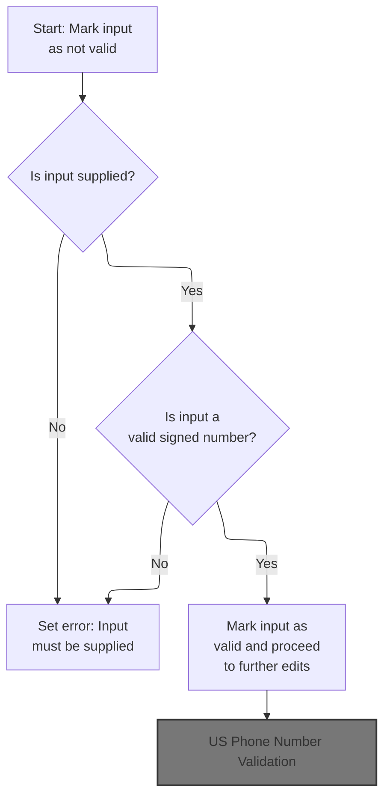

This section validates that a signed number input field is present and contains a valid signed number with up to two decimal places. It ensures that missing or invalid inputs are flagged with appropriate error messages for the user.

| Rule ID | Code Location        | Category        | Rule Name                       | Description                                                                                                                                                             | Conditions                                                                   | Remarks                                                                                                                                                                                                                         |
| ------- | -------------------- | --------------- | ------------------------------- | ----------------------------------------------------------------------------------------------------------------------------------------------------------------------- | ---------------------------------------------------------------------------- | ------------------------------------------------------------------------------------------------------------------------------------------------------------------------------------------------------------------------------- |
| BR-001  | 1250-EDIT-SIGNED-9V2 | Data validation | Mandatory signed number field   | If the signed number input field is blank, contains only spaces, or contains only low-values, an error is set and the user is informed that the field must be supplied. | The input field is blank, contains only spaces, or contains only low-values. | The error message constructed is: '\[field name\] must be supplied.' The field name is trimmed of leading and trailing spaces. The input is expected to be a string representing a signed number with up to two decimal places. |
| BR-002  | 1250-EDIT-SIGNED-9V2 | Data validation | Signed number format validation | If the signed number input field is supplied but does not contain a valid signed number, an error is set and the user is informed that the value is not valid.          | The input field is not blank, but does not represent a valid signed number.  | The error message constructed is: '\[field name\] not valid.' The field name is trimmed of leading and trailing spaces. The input is expected to be a string representing a signed number with up to two decimal places.        |
| BR-003  | 1250-EDIT-SIGNED-9V2 | Data validation | Valid signed number acceptance  | If the signed number input field is supplied and contains a valid signed number, the input is marked as valid and processing continues to further edits.                | The input field is not blank and contains a valid signed number.             | The input is expected to be a string representing a signed number with up to two decimal places. No error message is generated in this case.                                                                                    |

<SwmSnippet path="/app/cbl/COACTUPC.cbl" line="2180" repo-id="Z2l0aHViJTNBJTNBa3luZHJ5bC1hd3MtbWFpbmZyYW1lLW1vZGVybml6YXRpb24tY2FyZGRlbW8lM0ElM0FTd2ltbS1EZW1v">

---

In `1250-EDIT-SIGNED-9V2` we start by marking the signed number field as not valid, then check if the input is blank or spaces. If so, we set error flags and build a 'must be supplied' message. If it's not blank, we check if it's a valid signed number using TEST-NUMVAL-C. If it fails, we set error flags and build a 'not valid' message. If it passes, we mark it valid and move on.

```cobol
       1250-EDIT-SIGNED-9V2.
           SET FLG-SIGNED-NUMBER-NOT-OK    TO TRUE

      *    Not supplied
           IF WS-EDIT-SIGNED-NUMBER-9V2-X  EQUAL LOW-VALUES
           OR WS-EDIT-SIGNED-NUMBER-9V2-X  EQUAL SPACES
              SET INPUT-ERROR              TO TRUE
              SET FLG-SIGNED-NUMBER-BLANK  TO TRUE
              IF WS-RETURN-MSG-OFF
                 STRING
                   FUNCTION TRIM(WS-EDIT-VARIABLE-NAME)
                   ' must be supplied.'
                   DELIMITED BY SIZE
                   INTO WS-RETURN-MSG
                 END-STRING
              END-IF
```

---

</SwmSnippet>

############ US Phone Number Validation

This section validates US phone number input, determining whether it is required and if the provided value is acceptable for further processing.

| Rule ID | Code Location          | Category        | Rule Name                                          | Description                                                                                                                                          | Conditions                                                            | Remarks                                                                                                                                                                |
| ------- | ---------------------- | --------------- | -------------------------------------------------- | ---------------------------------------------------------------------------------------------------------------------------------------------------- | --------------------------------------------------------------------- | ---------------------------------------------------------------------------------------------------------------------------------------------------------------------- |
| BR-001  | 1260-EDIT-US-PHONE-NUM | Data validation | Blank or Low-Value Phone Number Accepted           | If all three parts of the phone number are blank or contain low-values, the phone number is considered valid and no further validation is performed. | All three phone number parts are either blank or contain low-values.  | A blank is an empty string; a low-value is the lowest possible value for a character field. The phone number is split into three parts, each checked for these values. |
| BR-002  | 1260-EDIT-US-PHONE-NUM | Data validation | Phone Number Not Mandatory                         | Phone number entry is not mandatory; if the phone number is left blank or contains only low-values, it is accepted as valid.                         | The phone number input is blank or contains only low-values.          | A blank is an empty string; a low-value is the lowest possible value for a character field. This applies to all three parts of the phone number.                       |
| BR-003  | 1260-EDIT-US-PHONE-NUM | Data validation | Non-Blank Phone Number Requires Further Validation | If the phone number is not blank or low-value in all parts, the validation process continues to further checks (not shown in this section).          | At least one part of the phone number is not blank and not low-value. | The phone number is split into three parts. If any part contains a value other than blank or low-value, further validation is required.                                |

<SwmSnippet path="/app/cbl/COACTUPC.cbl" line="2225" repo-id="Z2l0aHViJTNBJTNBa3luZHJ5bC1hd3MtbWFpbmZyYW1lLW1vZGVybml6YXRpb24tY2FyZGRlbW8lM0ElM0FTd2ltbS1EZW1v">

---

In `1260-EDIT-US-PHONE-NUM` we start by marking the phone number as invalid, then check if all three parts are blank or low-values. If so, we mark it valid and exit. If not, we keep going to validate the actual number. Next, we call 1265-EDIT-US-SSN because the workflow moves on to validating the user's SSN, which is a required field.

```cobol
       1260-EDIT-US-PHONE-NUM.

      *    The database stores date in X(15) format (999)999-9999
      *                                             1234567890123
      *    So we take the X(15) input into WS-EDIT-US-PHONE-NUM
      *    and edit it

           SET WS-EDIT-US-PHONE-IS-INVALID TO TRUE
      *    Not mandatory to enter a phone number
           IF  (WS-EDIT-US-PHONE-NUMA EQUAL SPACES
           OR   WS-EDIT-US-PHONE-NUMA EQUAL LOW-VALUES)
           AND (WS-EDIT-US-PHONE-NUMB EQUAL SPACES
           OR   WS-EDIT-US-PHONE-NUMB EQUAL LOW-VALUES)
           AND (WS-EDIT-US-PHONE-NUMA EQUAL SPACES
           OR   WS-EDIT-US-PHONE-NUMC EQUAL LOW-VALUES)
                SET WS-EDIT-US-PHONE-IS-VALID TO TRUE
                GO TO EDIT-US-PHONE-EXIT
           ELSE
                CONTINUE
           END-IF
```

---

</SwmSnippet>

############ US SSN Validation

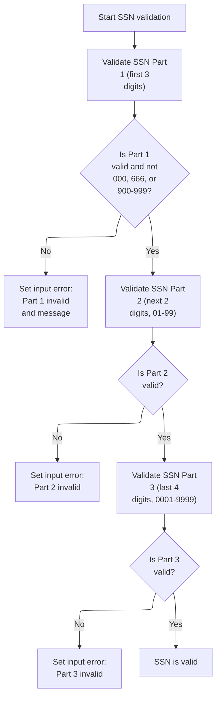

This section validates US Social Security Numbers by enforcing business rules for each of the three SSN parts, ensuring compliance with regulatory standards and providing clear error feedback when validation fails.

| Rule ID | Code Location    | Category        | Rule Name                   | Description                                                                                                                                                                                               | Conditions                                                               | Remarks                                                                                                                           |
| ------- | ---------------- | --------------- | --------------------------- | --------------------------------------------------------------------------------------------------------------------------------------------------------------------------------------------------------- | ------------------------------------------------------------------------ | --------------------------------------------------------------------------------------------------------------------------------- |
| BR-001  | 1265-EDIT-US-SSN | Data validation | SSN Part 1 Forbidden Values | The first part of the SSN must be a 3-digit numeric value and must not be 000, 666, or any value from 900 to 999. If this part is invalid, an input error is flagged and a specific error message is set. | The first part of the SSN is provided and passes the numeric validation. | Forbidden values are: 000, 666, and any value from 900 to 999. The part must be exactly 3 numeric digits.                         |
| BR-002  | 1265-EDIT-US-SSN | Data validation | SSN Part 2 Range Validation | The second part of the SSN must be a 2-digit numeric value between 01 and 99, inclusive. If this part is not a valid 2-digit number in this range, an input error is flagged.                             | The second part of the SSN is provided.                                  | Valid values are numeric strings from 01 to 99, inclusive. The part must be exactly 2 digits.                                     |
| BR-003  | 1265-EDIT-US-SSN | Data validation | SSN Part 3 Range Validation | The third part of the SSN must be a 4-digit numeric value between 0001 and 9999, inclusive. If this part is not a valid 4-digit number in this range, an input error is flagged.                          | The third part of the SSN is provided.                                   | Valid values are numeric strings from 0001 to 9999, inclusive. The part must be exactly 4 digits.                                 |
| BR-004  | 1265-EDIT-US-SSN | Error handling  | SSN Input Error Handling    | If any part of the SSN fails its validation, an input error flag is set and an error message is generated for the user, specifying which part is invalid and why.                                         | Any SSN part fails its respective validation.                            | The error message includes the part name and a description of the error (e.g., 'should not be 000, 666, or between 900 and 999'). |

<SwmSnippet path="/app/cbl/COACTUPC.cbl" line="2431" repo-id="Z2l0aHViJTNBJTNBa3luZHJ5bC1hd3MtbWFpbmZyYW1lLW1vZGVybml6YXRpb24tY2FyZGRlbW8lM0ElM0FTd2ltbS1EZW1v">

---

In `1265-EDIT-US-SSN` we start by prepping the first SSN part for validation, moving its value and length to the working area, and then calling 1245-EDIT-NUM-REQD to check if it's a valid 3-digit number. This sets up the flags for further checks and error handling.

```cobol
       1265-EDIT-US-SSN.
      *Format xxx-xx-xxxx
      *Part1 :should have 3 digits
      *Part2 :should have 2 digits and it should be from 01 to 99
      *Part3 should have 4 digits from 0001 to 9999.
      ******************************************************************
      *    Edit SSN Part 1
      ******************************************************************
           MOVE 'SSN: First 3 chars'     TO WS-EDIT-VARIABLE-NAME
           MOVE ACUP-NEW-CUST-SSN-1      TO WS-EDIT-ALPHANUM-ONLY
           MOVE 3                        TO WS-EDIT-ALPHANUM-LENGTH
```

---

</SwmSnippet>

<SwmSnippet path="/app/cbl/COACTUPC.cbl" line="2442" repo-id="Z2l0aHViJTNBJTNBa3luZHJ5bC1hd3MtbWFpbmZyYW1lLW1vZGVybml6YXRpb24tY2FyZGRlbW8lM0ElM0FTd2ltbS1EZW1v">

---

We call 1245-EDIT-NUM-REQD here to run the numeric validation on the first SSN part. This routine checks if the input is a valid number and sets the right flags for error handling.

```cobol
           PERFORM 1245-EDIT-NUM-REQD
              THRU 1245-EDIT-NUM-REQD-EXIT
```

---

</SwmSnippet>

<SwmSnippet path="/app/cbl/COACTUPC.cbl" line="2444" repo-id="Z2l0aHViJTNBJTNBa3luZHJ5bC1hd3MtbWFpbmZyYW1lLW1vZGVybml6YXRpb24tY2FyZGRlbW8lM0ElM0FTd2ltbS1EZW1v">

---

Back in `1265-EDIT-US-SSN` after running the numeric validation, we move the result flags to the SSN part 1 flag area. If the part is valid, we do an extra check for forbidden values like 000, 666, or 900-999, and set error flags and messages if needed.

```cobol
           MOVE WS-EDIT-ALPHANUM-ONLY-FLAGS
                                         TO WS-EDIT-US-SSN-PART1-FLGS

      *Part1 :should not be 000, 666, or between 900 and 999
           IF FLG-EDIT-US-SSN-PART1-ISVALID
              MOVE ACUP-NEW-CUST-SSN-1   TO WS-EDIT-US-SSN-PART1
              IF INVALID-SSN-PART1
              SET INPUT-ERROR            TO TRUE
              SET FLG-EDIT-US-SSN-PART1-NOT-OK
                                 TO TRUE
              IF WS-RETURN-MSG-OFF
                 STRING
                   FUNCTION TRIM(WS-EDIT-VARIABLE-NAME)
                   ': should not be 000, 666, or between 900 and 999'
                   DELIMITED BY SIZE
                   INTO WS-RETURN-MSG
                 END-STRING
              ELSE
                CONTINUE
              END-IF
```

---

</SwmSnippet>

<SwmSnippet path="/app/cbl/COACTUPC.cbl" line="2469" repo-id="Z2l0aHViJTNBJTNBa3luZHJ5bC1hd3MtbWFpbmZyYW1lLW1vZGVybml6YXRpb24tY2FyZGRlbW8lM0ElM0FTd2ltbS1EZW1v">

---

Now we prep the second SSN part, set its variable name and length, and call the numeric validation routine again. This keeps the checks consistent for each segment.

```cobol
           MOVE 'SSN 4th & 5th chars'    TO WS-EDIT-VARIABLE-NAME
           MOVE ACUP-NEW-CUST-SSN-2      TO WS-EDIT-ALPHANUM-ONLY
           MOVE 2                        TO WS-EDIT-ALPHANUM-LENGTH
           PERFORM 1245-EDIT-NUM-REQD
              THRU 1245-EDIT-NUM-REQD-EXIT
```

---

</SwmSnippet>

<SwmSnippet path="/app/cbl/COACTUPC.cbl" line="2474" repo-id="Z2l0aHViJTNBJTNBa3luZHJ5bC1hd3MtbWFpbmZyYW1lLW1vZGVybml6YXRpb24tY2FyZGRlbW8lM0ElM0FTd2ltbS1EZW1v">

---

After validating the second SSN part, we move the result flags to the SSN part 2 flag area. This keeps the validation state for each segment separate.

```cobol
           MOVE WS-EDIT-ALPHANUM-ONLY-FLAGS
                                         TO WS-EDIT-US-SSN-PART2-FLGS


      ******************************************************************
      *    Edit SSN Part 3
      ******************************************************************
           MOVE 'SSN Last 4 chars'       TO WS-EDIT-VARIABLE-NAME
           MOVE ACUP-NEW-CUST-SSN-3      TO WS-EDIT-ALPHANUM-ONLY
           MOVE 4                        TO WS-EDIT-ALPHANUM-LENGTH
```

---

</SwmSnippet>

<SwmSnippet path="/app/cbl/COACTUPC.cbl" line="2484" repo-id="Z2l0aHViJTNBJTNBa3luZHJ5bC1hd3MtbWFpbmZyYW1lLW1vZGVybml6YXRpb24tY2FyZGRlbW8lM0ElM0FTd2ltbS1EZW1v">

---

Now we prep the third SSN part, set its variable name and length, and get ready to run the numeric validation routine for it.

```cobol
           PERFORM 1245-EDIT-NUM-REQD
              THRU 1245-EDIT-NUM-REQD-EXIT
```

---

</SwmSnippet>

<SwmSnippet path="/app/cbl/COACTUPC.cbl" line="2486" repo-id="Z2l0aHViJTNBJTNBa3luZHJ5bC1hd3MtbWFpbmZyYW1lLW1vZGVybml6YXRpb24tY2FyZGRlbW8lM0ElM0FTd2ltbS1EZW1v">

---

After validating all three SSN parts, we store the flags for each segment. Only the first part gets extra range checks; the other two just need to be numeric and the right length. The function returns with all flags set so downstream logic knows which part failed.

```cobol
           MOVE WS-EDIT-ALPHANUM-ONLY-FLAGS
                                         TO WS-EDIT-US-SSN-PART3-FLGS
           .
```

---

</SwmSnippet>

############ US Phone Area Code Validation

This section validates the area code portion of a US phone number, ensuring it is present, numeric, non-zero, and matches a valid North American area code. It provides user-facing error messages when validation fails.

| Rule ID | Code Location  | Category        | Rule Name                       | Description                                                                                                                                                                                | Conditions                                                  | Remarks                                                                                                                                           |
| ------- | -------------- | --------------- | ------------------------------- | ------------------------------------------------------------------------------------------------------------------------------------------------------------------------------------------ | ----------------------------------------------------------- | ------------------------------------------------------------------------------------------------------------------------------------------------- |
| BR-001  | EDIT-AREA-CODE | Data validation | Mandatory area code             | If the area code field is blank or contains low-values, an error is triggered and the area code is marked as blank. An error message stating 'Area code must be supplied.' is constructed. | The area code input is blank or contains low-values.        | Error flag FLG-EDIT-US-PHONEA-BLANK is set to 'B'. INPUT-ERROR is set to '1'. Error message format: '\[Field Name\]: Area code must be supplied.' |
| BR-002  | EDIT-AREA-CODE | Data validation | Numeric and non-zero area code  | If the area code is not blank, it must be numeric and not equal to zero. If not, an error is triggered and the area code is marked as not valid.                                           | The area code input is not blank or low-values.             | Area code must be a numeric string and not '000'. Error flag FLG-EDIT-US-PHONEA-NOT-OK is set to '0'.                                             |
| BR-003  | EDIT-AREA-CODE | Data validation | Valid area code list membership | The area code must match one of the valid North American area codes. If it does not, an error is triggered and the area code is marked as not valid.                                       | The area code input is not blank, is numeric, and not zero. | Valid area codes are listed explicitly (see VALID-GENERAL-PURP-CODE constant). Error flag FLG-EDIT-US-PHONEA-NOT-OK is set to '0'.                |
| BR-004  | EDIT-AREA-CODE | Error handling  | Error message construction      | When an error is triggered during area code validation, an error message is constructed using the field name and a specific reason for the failure.                                        | Any validation failure in area code input.                  | Error message format: '\[Field Name\]: \[Reason\]'. Reasons include 'Area code must be supplied.' and others depending on failure.                |

<SwmSnippet path="/app/cbl/COACTUPC.cbl" line="2246" repo-id="Z2l0aHViJTNBJTNBa3luZHJ5bC1hd3MtbWFpbmZyYW1lLW1vZGVybml6YXRpb24tY2FyZGRlbW8lM0ElM0FTd2ltbS1EZW1v">

---

In `EDIT-AREA-CODE` we start by checking if the area code is blank or low-values. If so, we set error flags and build an error message. If it's not blank, we check if it's numeric and not zero, then trim and check against the valid area code list. If it passes all checks, we mark it valid.

```cobol
       EDIT-AREA-CODE.
           IF WS-EDIT-US-PHONE-NUMA EQUAL SPACES
           OR WS-EDIT-US-PHONE-NUMA EQUAL LOW-VALUES
              SET INPUT-ERROR              TO TRUE
              SET FLG-EDIT-US-PHONEA-BLANK    TO TRUE
              IF WS-RETURN-MSG-OFF
                 STRING
                   FUNCTION TRIM(WS-EDIT-VARIABLE-NAME)
                   ': Area code must be supplied.'
                   DELIMITED BY SIZE
                   INTO WS-RETURN-MSG
                 END-STRING
              END-IF
```

---

</SwmSnippet>

############# US Phone Prefix Validation

This section validates the US phone prefix input, ensuring it is present, numeric, and non-zero, and sets appropriate error flags and messages for invalid input.

| Rule ID | Code Location        | Category        | Rule Name                          | Description                                                                                                                                                                                                                 | Conditions                                                                                                 | Remarks                                                                                                                                                                                                   |
| ------- | -------------------- | --------------- | ---------------------------------- | --------------------------------------------------------------------------------------------------------------------------------------------------------------------------------------------------------------------------- | ---------------------------------------------------------------------------------------------------------- | --------------------------------------------------------------------------------------------------------------------------------------------------------------------------------------------------------- |
| BR-001  | EDIT-US-PHONE-PREFIX | Data validation | Blank or Low-Value Prefix Required | If the US phone prefix is blank or contains only low-values, the input is considered invalid, an error flag is set, and an error message stating 'Prefix code must be supplied.' is generated if message output is enabled. | The US phone prefix field is either blank (all spaces) or contains only low-values.                        | A blank is defined as all spaces; low-values is a COBOL constant representing the lowest possible value for a character field. The error message format is: '<field name>: Prefix code must be supplied.' |
| BR-002  | EDIT-US-PHONE-PREFIX | Data validation | Prefix Must Be Numeric             | If the US phone prefix is not blank or low-values, but contains non-numeric characters, the input is considered invalid and an error flag is set.                                                                           | The US phone prefix field is not blank or low-values, and contains any non-numeric character.              | A valid prefix must consist only of numeric characters (0-9).                                                                                                                                             |
| BR-003  | EDIT-US-PHONE-PREFIX | Data validation | Prefix Cannot Be Zero              | If the US phone prefix is numeric but equals zero, the input is considered invalid and an error flag is set.                                                                                                                | The US phone prefix field is numeric and its value is zero.                                                | A prefix of zero is not allowed. The field must be a non-zero numeric value.                                                                                                                              |
| BR-004  | EDIT-US-PHONE-PREFIX | Data validation | Valid Prefix Marking               | If the US phone prefix passes all validation checks (not blank, not low-values, numeric, and not zero), the prefix is marked as valid.                                                                                      | The US phone prefix field is not blank, not low-values, contains only numeric characters, and is not zero. | A valid prefix is any non-blank, non-low-value, numeric, non-zero string.                                                                                                                                 |

<SwmSnippet path="/app/cbl/COACTUPC.cbl" line="2316" repo-id="Z2l0aHViJTNBJTNBa3luZHJ5bC1hd3MtbWFpbmZyYW1lLW1vZGVybml6YXRpb24tY2FyZGRlbW8lM0ElM0FTd2ltbS1EZW1v">

---

In `EDIT-US-PHONE-PREFIX` we start by checking if the prefix is blank or low-values. If so, we set error flags and build an error message. If it's not blank, we check if it's numeric and not zero, setting errors if it fails. If it passes all checks, we mark it valid.

```cobol
       EDIT-US-PHONE-PREFIX.

           IF WS-EDIT-US-PHONE-NUMB EQUAL SPACES
           OR WS-EDIT-US-PHONE-NUMB EQUAL LOW-VALUES
              SET INPUT-ERROR              TO TRUE
              SET FLG-EDIT-US-PHONEB-BLANK    TO TRUE
              IF WS-RETURN-MSG-OFF
                 STRING
                   FUNCTION TRIM(WS-EDIT-VARIABLE-NAME)
                   ': Prefix code must be supplied.'
                   DELIMITED BY SIZE
                   INTO WS-RETURN-MSG
                 END-STRING
              END-IF
```

---

</SwmSnippet>

############## US Phone Line Number Validation

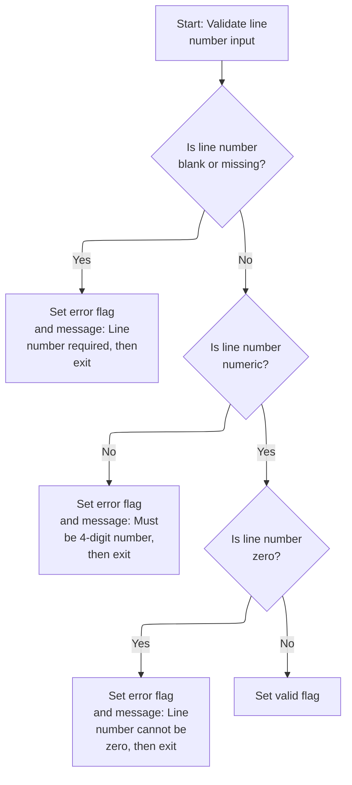

This section validates the US phone line number input, ensuring it is present, numeric, and non-zero before marking it as valid for further processing.

| Rule ID | Code Location         | Category        | Rule Name                   | Description                                                                                                                                                   | Conditions                                                       | Remarks                                                                                                                                                              |
| ------- | --------------------- | --------------- | --------------------------- | ------------------------------------------------------------------------------------------------------------------------------------------------------------- | ---------------------------------------------------------------- | -------------------------------------------------------------------------------------------------------------------------------------------------------------------- |
| BR-001  | EDIT-US-PHONE-LINENUM | Data validation | Line number required        | If the US phone line number field is blank or contains low-values, an error is triggered and the user is informed that the line number code must be supplied. | The line number field is blank or contains low-values.           | Error flag INPUT-ERROR is set to '1'. Flag FLG-EDIT-US-PHONEC-BLANK is set to 'B'. The error message is: '<field name>: Line number code must be supplied.'          |
| BR-002  | EDIT-US-PHONE-LINENUM | Data validation | Line number must be numeric | If the US phone line number field is not numeric, an error is triggered and the user is informed that the line number code must be a 4-digit number.          | The line number field is not numeric.                            | Error flag INPUT-ERROR is set to '1'. Flag FLG-EDIT-US-PHONEC-NOT-OK is set to '0'. The error message is: '<field name>: Line number code must be A 4 digit number.' |
| BR-003  | EDIT-US-PHONE-LINENUM | Data validation | Line number cannot be zero  | If the US phone line number field is numeric but zero, an error is triggered and the user is informed that the line number code cannot be zero.               | The line number field is numeric and equal to zero.              | Error flag INPUT-ERROR is set to '1'. Flag FLG-EDIT-US-PHONEC-NOT-OK is set to '0'. The error message is: '<field name>: Line number code cannot be zero'.           |
| BR-004  | EDIT-US-PHONE-LINENUM | Business logic  | Line number is valid        | If the US phone line number field passes all validation checks (not blank, numeric, not zero), it is marked as valid for further processing.                  | The line number field is not blank, is numeric, and is not zero. | Flag FLG-EDIT-US-PHONEC-ISVALID is set to LOW-VALUES, indicating the field is valid.                                                                                 |

<SwmSnippet path="/app/cbl/COACTUPC.cbl" line="2370" repo-id="Z2l0aHViJTNBJTNBa3luZHJ5bC1hd3MtbWFpbmZyYW1lLW1vZGVybml6YXRpb24tY2FyZGRlbW8lM0ElM0FTd2ltbS1EZW1v">

---

In `EDIT-US-PHONE-LINENUM` we start by checking if the line number is blank or low-values. If so, we set error flags and build an error message. If it's not blank, we check if it's numeric and not zero, setting errors if it fails. If it passes all checks, we mark it valid.

```cobol
       EDIT-US-PHONE-LINENUM.
           IF WS-EDIT-US-PHONE-NUMC EQUAL SPACES
           OR WS-EDIT-US-PHONE-NUMC EQUAL LOW-VALUES
              SET INPUT-ERROR              TO TRUE
              SET FLG-EDIT-US-PHONEC-BLANK    TO TRUE
              IF WS-RETURN-MSG-OFF
                 STRING
                   FUNCTION TRIM(WS-EDIT-VARIABLE-NAME)
                   ': Line number code must be supplied.'
                   DELIMITED BY SIZE
                   INTO WS-RETURN-MSG
                 END-STRING
              END-IF
```

---

</SwmSnippet>

<SwmSnippet path="/app/cbl/COACTUPC.cbl" line="2384" repo-id="Z2l0aHViJTNBJTNBa3luZHJ5bC1hd3MtbWFpbmZyYW1lLW1vZGVybml6YXRpb24tY2FyZGRlbW8lM0ElM0FTd2ltbS1EZW1v">

---

We just finished SSN validation and now, in `EDIT-US-PHONE-LINENUM`, we keep going to check if the line number is blank or not. Each field gets its own validation regardless of previous errors.

```cobol
           ELSE
              CONTINUE
           END-IF
```

---

</SwmSnippet>

<SwmSnippet path="/app/cbl/COACTUPC.cbl" line="2388" repo-id="Z2l0aHViJTNBJTNBa3luZHJ5bC1hd3MtbWFpbmZyYW1lLW1vZGVybml6YXRpb24tY2FyZGRlbW8lM0ElM0FTd2ltbS1EZW1v">

---

After making sure the line number isn't blank, we check if it's numeric. If it is, we keep going; if not, we set error flags and prep an error message.

```cobol
           IF  WS-EDIT-US-PHONE-NUMC          IS NUMERIC
              CONTINUE
```

---

</SwmSnippet>

<SwmSnippet path="/app/cbl/COACTUPC.cbl" line="2390" repo-id="Z2l0aHViJTNBJTNBa3luZHJ5bC1hd3MtbWFpbmZyYW1lLW1vZGVybml6YXRpb24tY2FyZGRlbW8lM0ElM0FTd2ltbS1EZW1v">

---

If the line number isn't numeric, we set error flags, build an error message, and jump to the exit. No need to keep checking after a hard fail.

```cobol
           ELSE
              SET INPUT-ERROR                 TO TRUE
              SET  FLG-EDIT-US-PHONEC-NOT-OK  TO TRUE
              IF WS-RETURN-MSG-OFF
                 STRING
                   FUNCTION TRIM(WS-EDIT-VARIABLE-NAME)
                   ': Line number code must be A 4 digit number.'
                   DELIMITED BY SIZE
                   INTO WS-RETURN-MSG
                 END-STRING
              END-IF
              GO TO  EDIT-US-PHONE-EXIT
           END-IF
```

---

</SwmSnippet>

<SwmSnippet path="/app/cbl/COACTUPC.cbl" line="2404" repo-id="Z2l0aHViJTNBJTNBa3luZHJ5bC1hd3MtbWFpbmZyYW1lLW1vZGVybml6YXRpb24tY2FyZGRlbW8lM0ElM0FTd2ltbS1EZW1v">

---

After confirming the line number is numeric, we check if it's zero. If it is, we set error flags, build an error message, and bail out to the exit.

```cobol
           IF  WS-EDIT-US-PHONE-NUMC-N = 0
              SET INPUT-ERROR              TO TRUE
              SET  FLG-EDIT-US-PHONEC-NOT-OK  TO TRUE
              IF WS-RETURN-MSG-OFF
                 STRING
                   FUNCTION TRIM(WS-EDIT-VARIABLE-NAME)
                   ': Line number code cannot be zero'
                   DELIMITED BY SIZE
                   INTO WS-RETURN-MSG
                 END-STRING
              END-IF
              GO TO  EDIT-US-PHONE-EXIT
```

---

</SwmSnippet>

<SwmSnippet path="/app/cbl/COACTUPC.cbl" line="2416" repo-id="Z2l0aHViJTNBJTNBa3luZHJ5bC1hd3MtbWFpbmZyYW1lLW1vZGVybml6YXRpb24tY2FyZGRlbW8lM0ElM0FTd2ltbS1EZW1v">

---

After all the checks, if the line number passes, we set the valid flag. This lets the rest of the flow know the field is good and can be used.

```cobol
           ELSE
               CONTINUE
           END-IF


           SET FLG-EDIT-US-PHONEC-ISVALID    TO TRUE
           .
```

---

</SwmSnippet>

############## US Phone Prefix Numeric Check

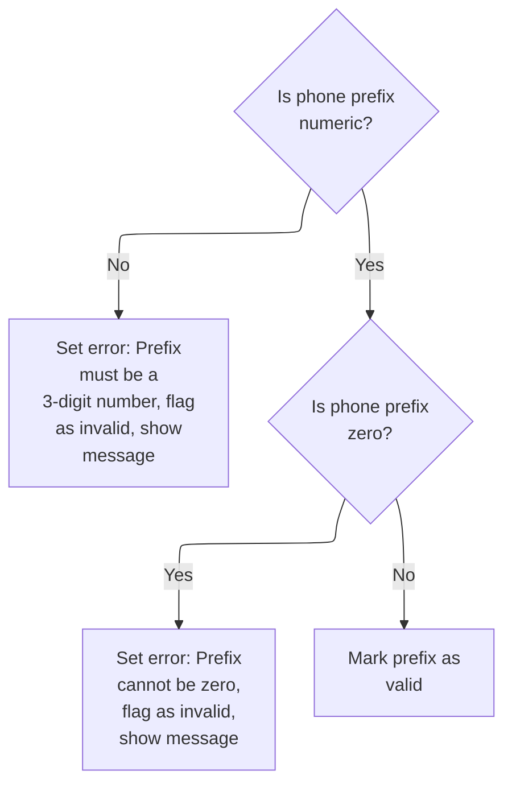

This section validates the US phone prefix field, ensuring it is numeric, not zero, and sets appropriate flags and messages for user feedback and further processing.

| Rule ID | Code Location        | Category        | Rule Name                    | Description                                                                                                                                 | Conditions                                                  | Remarks                                                                                                                                                                           |
| ------- | -------------------- | --------------- | ---------------------------- | ------------------------------------------------------------------------------------------------------------------------------------------- | ----------------------------------------------------------- | --------------------------------------------------------------------------------------------------------------------------------------------------------------------------------- |
| BR-001  | EDIT-US-PHONE-PREFIX | Data validation | Prefix Numeric Validation    | If the US phone prefix is not numeric, an error is flagged and a message is generated stating that the prefix must be a 3-digit number.     | The US phone prefix field contains non-numeric characters.  | Error message format: '<field name>: Prefix code must be A 3 digit number.' The error flag is set to indicate invalid input. The message is stored as a string for user feedback. |
| BR-002  | EDIT-US-PHONE-PREFIX | Data validation | Prefix Zero Value Validation | If the US phone prefix is numeric but equal to zero, an error is flagged and a message is generated stating that the prefix cannot be zero. | The US phone prefix field is numeric and its value is zero. | Error message format: '<field name>: Prefix code cannot be zero' The error flag is set to indicate invalid input. The message is stored as a string for user feedback.            |
| BR-003  | EDIT-US-PHONE-PREFIX | Business logic  | Prefix Valid Flag            | If the US phone prefix passes all checks (is numeric and not zero), it is marked as valid for further processing.                           | The US phone prefix field is numeric and not zero.          | The valid flag is set to indicate the prefix can be used in subsequent processing. No error message is generated.                                                                 |

<SwmSnippet path="/app/cbl/COACTUPC.cbl" line="2331" repo-id="Z2l0aHViJTNBJTNBa3luZHJ5bC1hd3MtbWFpbmZyYW1lLW1vZGVybml6YXRpb24tY2FyZGRlbW8lM0ElM0FTd2ltbS1EZW1v">

---

We just finished validating the line number and now, in `EDIT-US-PHONE-PREFIX`, we keep going to check if the prefix is blank or not. Each field gets its own validation regardless of previous errors.

```cobol
           ELSE
              CONTINUE
           END-IF
```

---

</SwmSnippet>

<SwmSnippet path="/app/cbl/COACTUPC.cbl" line="2335" repo-id="Z2l0aHViJTNBJTNBa3luZHJ5bC1hd3MtbWFpbmZyYW1lLW1vZGVybml6YXRpb24tY2FyZGRlbW8lM0ElM0FTd2ltbS1EZW1v">

---

After making sure the prefix isn't blank, we check if it's numeric. If it is, we keep going; if not, we set error flags and prep an error message.

```cobol
           IF  WS-EDIT-US-PHONE-NUMB          IS NUMERIC
              CONTINUE
```

---

</SwmSnippet>

<SwmSnippet path="/app/cbl/COACTUPC.cbl" line="2337" repo-id="Z2l0aHViJTNBJTNBa3luZHJ5bC1hd3MtbWFpbmZyYW1lLW1vZGVybml6YXRpb24tY2FyZGRlbW8lM0ElM0FTd2ltbS1EZW1v">

---

If the prefix isn't numeric, we set error flags, build an error message, and jump to the next validation routine. No need to keep checking after a hard fail.

```cobol
           ELSE
              SET INPUT-ERROR                 TO TRUE
              SET  FLG-EDIT-US-PHONEB-NOT-OK  TO TRUE
              IF WS-RETURN-MSG-OFF
                 STRING
                   FUNCTION TRIM(WS-EDIT-VARIABLE-NAME)
                   ': Prefix code must be A 3 digit number.'
                   DELIMITED BY SIZE
                   INTO WS-RETURN-MSG
                 END-STRING
              END-IF
              GO TO  EDIT-US-PHONE-LINENUM
           END-IF
```

---

</SwmSnippet>

<SwmSnippet path="/app/cbl/COACTUPC.cbl" line="2351" repo-id="Z2l0aHViJTNBJTNBa3luZHJ5bC1hd3MtbWFpbmZyYW1lLW1vZGVybml6YXRpb24tY2FyZGRlbW8lM0ElM0FTd2ltbS1EZW1v">

---

After confirming the prefix is numeric, we check if it's zero. If it is, we set error flags, build an error message, and bail out to the next routine.

```cobol
           IF  WS-EDIT-US-PHONE-NUMB-N = 0
              SET INPUT-ERROR              TO TRUE
              SET  FLG-EDIT-US-PHONEB-NOT-OK  TO TRUE
              IF WS-RETURN-MSG-OFF
                 STRING
                   FUNCTION TRIM(WS-EDIT-VARIABLE-NAME)
                   ': Prefix code cannot be zero'
                   DELIMITED BY SIZE
                   INTO WS-RETURN-MSG
                 END-STRING
              END-IF
              GO TO  EDIT-US-PHONE-LINENUM
```

---

</SwmSnippet>

<SwmSnippet path="/app/cbl/COACTUPC.cbl" line="2363" repo-id="Z2l0aHViJTNBJTNBa3luZHJ5bC1hd3MtbWFpbmZyYW1lLW1vZGVybml6YXRpb24tY2FyZGRlbW8lM0ElM0FTd2ltbS1EZW1v">

---

After all the checks, if the prefix passes, we set the valid flag. This lets the rest of the flow know the field is good and can be used.

```cobol
           ELSE
              CONTINUE
           END-IF

           SET FLG-EDIT-US-PHONEB-ISVALID    TO TRUE
           .
```

---

</SwmSnippet>

############# US Phone Area Code Numeric Check

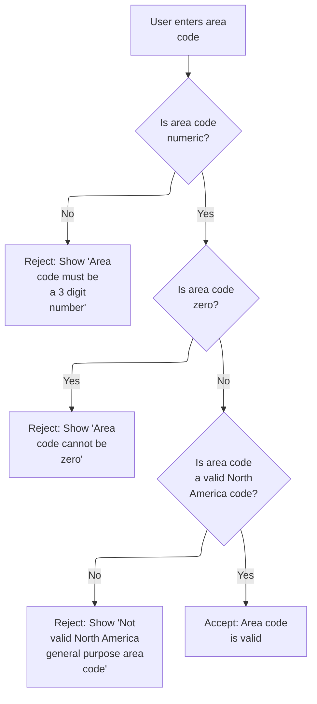

This section validates the US phone area code field, ensuring it is numeric, non-zero, and matches a valid North American area code. Each validation step provides a specific error message for user feedback.

| Rule ID | Code Location  | Category        | Rule Name                                  | Description                                                                                                                                                                                                       | Conditions                                                                                        | Remarks                                                                                                                                                                                                                    |
| ------- | -------------- | --------------- | ------------------------------------------ | ----------------------------------------------------------------------------------------------------------------------------------------------------------------------------------------------------------------- | ------------------------------------------------------------------------------------------------- | -------------------------------------------------------------------------------------------------------------------------------------------------------------------------------------------------------------------------- |
| BR-001  | EDIT-AREA-CODE | Data validation | Area code must be numeric                  | If the area code is not numeric, the input is rejected and an error message is shown stating 'Area code must be a 3 digit number'.                                                                                | The area code field contains any non-numeric characters.                                          | The area code must be a 3-digit number. If not, the error message 'Area code must be a 3 digit number' is displayed.                                                                                                       |
| BR-002  | EDIT-AREA-CODE | Data validation | Area code cannot be zero                   | If the area code is numeric but equals zero, the input is rejected and an error message is shown stating 'Area code cannot be zero'.                                                                              | The area code field is numeric and its value is zero.                                             | The area code must not be zero. If it is, the error message 'Area code cannot be zero' is displayed.                                                                                                                       |
| BR-003  | EDIT-AREA-CODE | Data validation | Area code must be valid North America code | If the area code is numeric and non-zero but not in the list of valid North American area codes, the input is rejected and an error message is shown stating 'Not valid North America general purpose area code'. | The area code field is numeric, non-zero, and not in the list of valid North American area codes. | The area code must be one of the valid North American area codes as defined by the North America Numbering Plan Administrator. If not, the error message 'Not valid North America general purpose area code' is displayed. |
| BR-004  | EDIT-AREA-CODE | Data validation | Area code accepted if valid                | If the area code passes all checks (numeric, non-zero, and valid), it is accepted as valid.                                                                                                                       | The area code field is numeric, non-zero, and in the list of valid North American area codes.     | The area code must be a 3-digit number, not zero, and in the valid area code list. If so, it is accepted as valid.                                                                                                         |

<SwmSnippet path="/app/cbl/COACTUPC.cbl" line="2260" repo-id="Z2l0aHViJTNBJTNBa3luZHJ5bC1hd3MtbWFpbmZyYW1lLW1vZGVybml6YXRpb24tY2FyZGRlbW8lM0ElM0FTd2ltbS1EZW1v">

---

We just finished validating the line number and now, in `EDIT-AREA-CODE`, we keep going to check if the area code is blank or not. Each field gets its own validation regardless of previous errors.

```cobol
           ELSE
              CONTINUE
           END-IF
```

---

</SwmSnippet>

<SwmSnippet path="/app/cbl/COACTUPC.cbl" line="2264" repo-id="Z2l0aHViJTNBJTNBa3luZHJ5bC1hd3MtbWFpbmZyYW1lLW1vZGVybml6YXRpb24tY2FyZGRlbW8lM0ElM0FTd2ltbS1EZW1v">

---

After making sure the area code isn't blank, we check if it's numeric. If it is, we keep going; if not, we set error flags and prep an error message.

```cobol
           IF  WS-EDIT-US-PHONE-NUMA       IS NUMERIC
              CONTINUE
```

---

</SwmSnippet>

<SwmSnippet path="/app/cbl/COACTUPC.cbl" line="2266" repo-id="Z2l0aHViJTNBJTNBa3luZHJ5bC1hd3MtbWFpbmZyYW1lLW1vZGVybml6YXRpb24tY2FyZGRlbW8lM0ElM0FTd2ltbS1EZW1v">

---

If the area code isn't numeric, we set error flags, build an error message, and jump to the next validation routine. No need to keep checking after a hard fail.

```cobol
           ELSE
              SET INPUT-ERROR                 TO TRUE
              SET  FLG-EDIT-US-PHONEA-NOT-OK  TO TRUE
              IF WS-RETURN-MSG-OFF
                 STRING
                   FUNCTION TRIM(WS-EDIT-VARIABLE-NAME)
                   ': Area code must be A 3 digit number.'
                   DELIMITED BY SIZE
                   INTO WS-RETURN-MSG
                 END-STRING
              END-IF
              GO TO  EDIT-US-PHONE-PREFIX
           END-IF
```

---

</SwmSnippet>

<SwmSnippet path="/app/cbl/COACTUPC.cbl" line="2280" repo-id="Z2l0aHViJTNBJTNBa3luZHJ5bC1hd3MtbWFpbmZyYW1lLW1vZGVybml6YXRpb24tY2FyZGRlbW8lM0ElM0FTd2ltbS1EZW1v">

---

After confirming the area code is numeric, we check if it's zero. If it is, we set error flags, build an error message, and bail out to the next routine.

```cobol
           IF  WS-EDIT-US-PHONE-NUMA-N = 0
              SET INPUT-ERROR              TO TRUE
              SET  FLG-EDIT-US-PHONEA-NOT-OK  TO TRUE
              IF WS-RETURN-MSG-OFF
                 STRING
                   FUNCTION TRIM(WS-EDIT-VARIABLE-NAME)
                   ': Area code cannot be zero'
                   DELIMITED BY SIZE
                   INTO WS-RETURN-MSG
                 END-STRING
              END-IF
              GO TO  EDIT-US-PHONE-PREFIX
```

---

</SwmSnippet>

<SwmSnippet path="/app/cbl/COACTUPC.cbl" line="2292" repo-id="Z2l0aHViJTNBJTNBa3luZHJ5bC1hd3MtbWFpbmZyYW1lLW1vZGVybml6YXRpb24tY2FyZGRlbW8lM0ElM0FTd2ltbS1EZW1v">

---

If the area code isn't zero, we keep going to the next check to see if it's in the valid area code list.

```cobol
           ELSE
              CONTINUE
           END-IF
```

---

</SwmSnippet>

<SwmSnippet path="/app/cbl/COACTUPC.cbl" line="2296" repo-id="Z2l0aHViJTNBJTNBa3luZHJ5bC1hd3MtbWFpbmZyYW1lLW1vZGVybml6YXRpb24tY2FyZGRlbW8lM0ElM0FTd2ltbS1EZW1v">

---

After trimming the area code, we check if it's in the hardcoded valid list. If it is, we keep going; if not, we set errors and bail out. This keeps the input tight and prevents bogus area codes.

```cobol
           MOVE FUNCTION TRIM (WS-EDIT-US-PHONE-NUMA)
             TO WS-US-PHONE-AREA-CODE-TO-EDIT
           IF VALID-GENERAL-PURP-CODE
               CONTINUE
```

---

</SwmSnippet>

<SwmSnippet path="/app/cbl/COACTUPC.cbl" line="2300" repo-id="Z2l0aHViJTNBJTNBa3luZHJ5bC1hd3MtbWFpbmZyYW1lLW1vZGVybml6YXRpb24tY2FyZGRlbW8lM0ElM0FTd2ltbS1EZW1v">

---

After all the checks, if the area code isn't in the valid North American list, we set error flags and build an error message. If it passes, we mark it valid. The function uses 88-level flags to track blank, not-ok, and valid states, and always returns a clear error message for each failure mode.

```cobol
           ELSE
              SET INPUT-ERROR              TO TRUE
              SET  FLG-EDIT-US-PHONEA-NOT-OK  TO TRUE
              IF WS-RETURN-MSG-OFF
                 STRING
                   FUNCTION TRIM(WS-EDIT-VARIABLE-NAME)
                   ': Not valid North America general purpose area code'
                   DELIMITED BY SIZE
                   INTO WS-RETURN-MSG
                 END-STRING
              END-IF
              GO TO  EDIT-US-PHONE-PREFIX
           END-IF

           SET FLG-EDIT-US-PHONEA-ISVALID    TO TRUE
           .
```

---

</SwmSnippet>

############ Signed Number Validation After Area Code Check

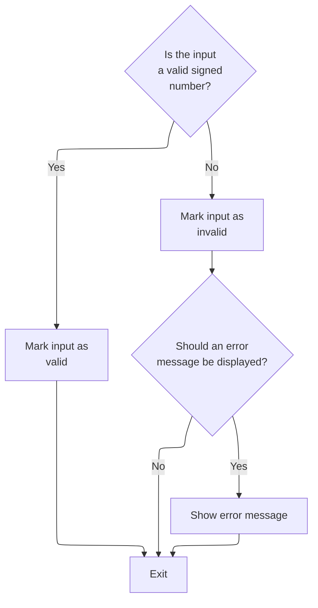

This section validates a signed number input after area code validation, marking it as valid or invalid and generating an error message if necessary.

| Rule ID | Code Location        | Category        | Rule Name                      | Description                                                                                                                                                                                         | Conditions                                                                                            | Remarks                                                                                                                                                                                                              |
| ------- | -------------------- | --------------- | ------------------------------ | --------------------------------------------------------------------------------------------------------------------------------------------------------------------------------------------------- | ----------------------------------------------------------------------------------------------------- | -------------------------------------------------------------------------------------------------------------------------------------------------------------------------------------------------------------------- |
| BR-001  | 1250-EDIT-SIGNED-9V2 | Data validation | Invalid Signed Number Handling | If the signed number input is not numeric, the input is marked as invalid, error flags are set, and, if error messages are enabled, an error message is prepared indicating the field is not valid. | This rule applies when the signed number input is present but contains non-numeric characters.        | The error flag is set to '0' for invalid input. If error messages are enabled, the message format is: '<field name> is not valid', where <field name> is trimmed of spaces. The error message is stored as a string. |
| BR-002  | 1250-EDIT-SIGNED-9V2 | Data validation | Valid Signed Number Acceptance | If the signed number input is numeric, the input is marked as valid and no error message is generated.                                                                                              | This rule applies when the signed number input contains only numeric characters (with optional sign). | The valid flag is set to LOW-VALUES to indicate the input is valid.                                                                                                                                                  |
| BR-003  | 1250-EDIT-SIGNED-9V2 | Error handling  | Error Message Formatting       | If the signed number input is invalid and error messages are enabled, the error message must include the trimmed field name followed by 'is not valid'.                                             | This rule applies when the signed number input is invalid and error messages are enabled.             | The error message format is: '<field name> is not valid', where <field name> is the trimmed name of the input field. The message is stored as a string.                                                              |

<SwmSnippet path="/app/cbl/COACTUPC.cbl" line="2197" repo-id="Z2l0aHViJTNBJTNBa3luZHJ5bC1hd3MtbWFpbmZyYW1lLW1vZGVybml6YXRpb24tY2FyZGRlbW8lM0ElM0FTd2ltbS1EZW1v">

---

We just finished area code validation and now, in 1250-EDIT-SIGNED-9V2, we check if the signed number input is blank or not numeric. If it passes, we keep going; if not, we set error flags and prep an error message. Each validation is independent.

```cobol
           ELSE
              CONTINUE
           END-IF
```

---

</SwmSnippet>

<SwmSnippet path="/app/cbl/COACTUPC.cbl" line="2201" repo-id="Z2l0aHViJTNBJTNBa3luZHJ5bC1hd3MtbWFpbmZyYW1lLW1vZGVybml6YXRpb24tY2FyZGRlbW8lM0ElM0FTd2ltbS1EZW1v">

---

After handling blanks, we use TEST-NUMVAL-C to check if the signed number is actually numeric. If it passes, we keep going; if not, we handle the error next.

```cobol
           IF FUNCTION TEST-NUMVAL-C(WS-EDIT-SIGNED-NUMBER-9V2-X) = 0
              CONTINUE
```

---

</SwmSnippet>

<SwmSnippet path="/app/cbl/COACTUPC.cbl" line="2203" repo-id="Z2l0aHViJTNBJTNBa3luZHJ5bC1hd3MtbWFpbmZyYW1lLW1vZGVybml6YXRpb24tY2FyZGRlbW8lM0ElM0FTd2ltbS1EZW1v">

---

If the signed number isn't numeric, we set error flags and build a message. If it passes all checks, we mark it valid. The flags (blank, not-ok, isvalid) make it easy to see the result of validation for this field.

```cobol
           ELSE
              SET INPUT-ERROR             TO TRUE
              SET FLG-SIGNED-NUMBER-NOT-OK   TO TRUE
              IF WS-RETURN-MSG-OFF
                 STRING
                   FUNCTION TRIM(WS-EDIT-VARIABLE-NAME)
                   ' is not valid'
                   DELIMITED BY SIZE
                   INTO WS-RETURN-MSG
              END-IF
              GO TO  1250-EDIT-SIGNED-9V2-EXIT

           END-IF

      *    If we got here all edits were cleared
           SET FLG-SIGNED-NUMBER-ISVALID  TO TRUE
           .
```

---

</SwmSnippet>

########### Numeric Field Validation After Signed Number Check

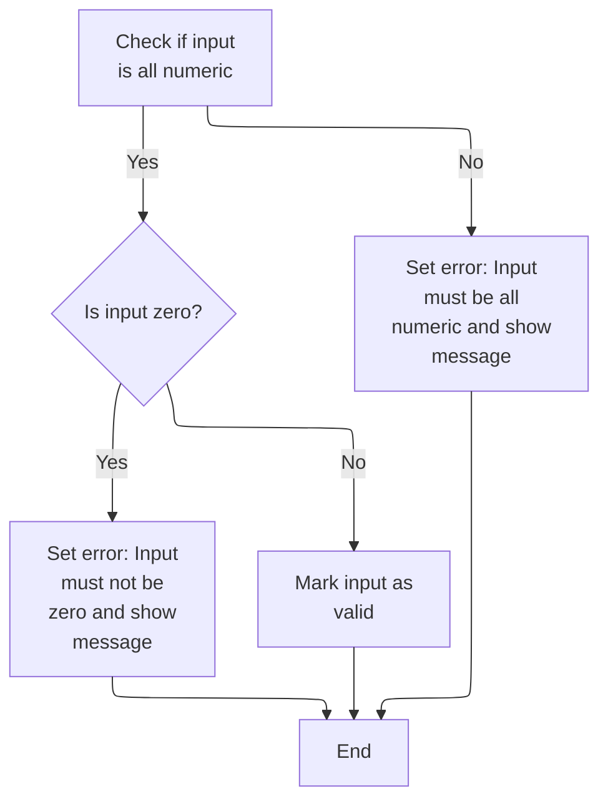

This section validates that a field contains a numeric value and is not zero after a signed number check. It ensures that only valid numeric inputs are accepted and provides clear error messages for invalid cases.

| Rule ID | Code Location      | Category        | Rule Name                       | Description                                                                                                                                                 | Conditions                                                   | Remarks                                                                                                                                       |
| ------- | ------------------ | --------------- | ------------------------------- | ----------------------------------------------------------------------------------------------------------------------------------------------------------- | ------------------------------------------------------------ | --------------------------------------------------------------------------------------------------------------------------------------------- |
| BR-001  | 1245-EDIT-NUM-REQD | Data validation | Numeric-only input required     | If the input field contains any non-numeric characters, the input is rejected and an error message is generated stating that the field must be all numeric. | The input field contains one or more non-numeric characters. | Error message format: '<field name> must be all numeric.' The error flag is set to indicate invalid input. The flag value for invalid is '0'. |
| BR-002  | 1245-EDIT-NUM-REQD | Data validation | Non-zero numeric input required | If the input field is numeric but represents a zero value, the input is rejected and an error message is generated stating that the field must not be zero. | The input field is numeric and its value is zero.            | Error message format: '<field name> must not be zero.' The error flag is set to indicate invalid input. The flag value for invalid is '0'.    |
| BR-003  | 1245-EDIT-NUM-REQD | Data validation | Valid numeric input acceptance  | If the input field is numeric and not zero, the input is accepted and marked as valid.                                                                      | The input field is numeric and its value is not zero.        | The valid flag is set to indicate successful validation. The flag value for valid is LOW-VALUES.                                              |

<SwmSnippet path="/app/cbl/COACTUPC.cbl" line="2137" repo-id="Z2l0aHViJTNBJTNBa3luZHJ5bC1hd3MtbWFpbmZyYW1lLW1vZGVybml6YXRpb24tY2FyZGRlbW8lM0ElM0FTd2ltbS1EZW1v">

---

After finishing signed number validation, we jump into 1245-EDIT-NUM-REQD to check if the input is numeric. If it passes, we keep going; if not, we set error flags and prep an error message. Each validation is independent.

```cobol
           IF WS-EDIT-ALPHANUM-ONLY(1:WS-EDIT-ALPHANUM-LENGTH)
                  IS NUMERIC
              CONTINUE
```

---

</SwmSnippet>

<SwmSnippet path="/app/cbl/COACTUPC.cbl" line="2140" repo-id="Z2l0aHViJTNBJTNBa3luZHJ5bC1hd3MtbWFpbmZyYW1lLW1vZGVybml6YXRpb24tY2FyZGRlbW8lM0ElM0FTd2ltbS1EZW1v">

---

If the input isn't numeric, we set error flags, build an error message, and bail out. This is the error handling branch for non-numeric input in 1245-EDIT-NUM-REQD.

```cobol
           ELSE
              SET INPUT-ERROR           TO TRUE
              SET FLG-ALPHNANUM-NOT-OK  TO TRUE
              IF WS-RETURN-MSG-OFF
                 STRING
                   FUNCTION TRIM(WS-EDIT-VARIABLE-NAME)
                   ' must be all numeric.'
                   DELIMITED BY SIZE
                   INTO WS-RETURN-MSG
                 END-STRING
              END-IF
              GO TO  1245-EDIT-NUM-REQD-EXIT
           END-IF
```

---

</SwmSnippet>

<SwmSnippet path="/app/cbl/COACTUPC.cbl" line="2156" repo-id="Z2l0aHViJTNBJTNBa3luZHJ5bC1hd3MtbWFpbmZyYW1lLW1vZGVybml6YXRpb24tY2FyZGRlbW8lM0ElM0FTd2ltbS1EZW1v">

---

After confirming the input is numeric, we check if it's zero. If it is, we set error flags and build an error message, then bail out. Zero isn't valid for this field.

```cobol
           IF FUNCTION NUMVAL(WS-EDIT-ALPHANUM-ONLY(1:
                              WS-EDIT-ALPHANUM-LENGTH)) = 0
              SET INPUT-ERROR           TO TRUE
              SET FLG-ALPHNANUM-NOT-OK  TO TRUE
              IF WS-RETURN-MSG-OFF
                 STRING
                   FUNCTION TRIM(WS-EDIT-VARIABLE-NAME)
                   ' must not be zero.'
                   DELIMITED BY SIZE
                   INTO WS-RETURN-MSG
                 END-STRING
              END-IF
```

---

</SwmSnippet>

<SwmSnippet path="/app/cbl/COACTUPC.cbl" line="2169" repo-id="Z2l0aHViJTNBJTNBa3luZHJ5bC1hd3MtbWFpbmZyYW1lLW1vZGVybml6YXRpb24tY2FyZGRlbW8lM0ElM0FTd2ltbS1EZW1v">

---

After all the checks, if the input is valid (not blank, numeric, and not zero), we set the valid flag. Otherwise, we set error flags and build a message. The flags (blank, not-ok, isvalid) make it easy to see the result of validation for this field.

```cobol
           ELSE
              CONTINUE
           END-IF


           SET FLG-ALPHNANUM-ISVALID    TO TRUE
           .
```

---

</SwmSnippet>

########## Optional Alphanumeric Field Validation

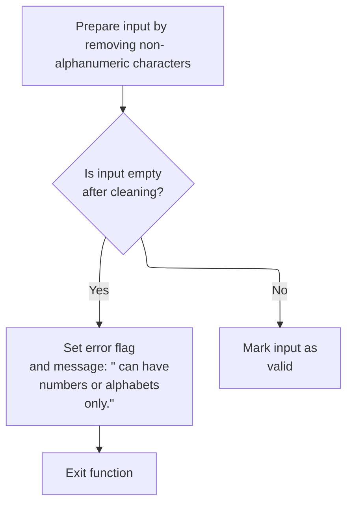

This section validates optional alphanumeric input fields, ensuring that only allowed characters are present and providing clear feedback when the input is invalid or blank.

| Rule ID | Code Location          | Category        | Rule Name                          | Description                                                                                                                                                                                         | Conditions                                                                                                                                 | Remarks                                                                                                                                                                      |
| ------- | ---------------------- | --------------- | ---------------------------------- | --------------------------------------------------------------------------------------------------------------------------------------------------------------------------------------------------- | ------------------------------------------------------------------------------------------------------------------------------------------ | ---------------------------------------------------------------------------------------------------------------------------------------------------------------------------- |
| BR-001  | 1240-EDIT-ALPHANUM-OPT | Data validation | Optional blank acceptance          | If the cleaned input is empty (all spaces or blank), the field is considered valid for optional alphanumeric fields and no error is set.                                                            | The input, after removing non-alphanumeric characters and trimming spaces, is empty.                                                       | No error message is generated. The valid flag (FLG-ALPHNANUM-ISVALID) is set to LOW-VALUES. Blank input is accepted for optional fields.                                     |
| BR-002  | 1240-EDIT-ALPHANUM-OPT | Data validation | Alphanumeric character enforcement | If the cleaned input is not empty and contains non-alphanumeric characters, the field is marked as invalid and an error message is generated indicating that only numbers or alphabets are allowed. | The input, after removing non-alphanumeric characters and trimming spaces, is not empty and contains invalid characters.                   | Error flag (INPUT-ERROR) is set to TRUE ('1'). Not-ok flag (FLG-ALPHNANUM-NOT-OK) is set to '0'. Error message format: '<Variable Name> can have numbers or alphabets only.' |
| BR-003  | 1240-EDIT-ALPHANUM-OPT | Data validation | Valid alphanumeric input           | If the cleaned input is not empty and contains only allowed alphanumeric characters, the field is marked as valid.                                                                                  | The input, after removing non-alphanumeric characters and trimming spaces, is not empty and contains only allowed alphanumeric characters. | Valid flag (FLG-ALPHNANUM-ISVALID) is set to LOW-VALUES. No error message is generated.                                                                                      |

<SwmSnippet path="/app/cbl/COACTUPC.cbl" line="2079" repo-id="Z2l0aHViJTNBJTNBa3luZHJ5bC1hd3MtbWFpbmZyYW1lLW1vZGVybml6YXRpb24tY2FyZGRlbW8lM0ElM0FTd2ltbS1EZW1v">

---

After finishing numeric validation, we jump into 1240-EDIT-ALPHANUM-OPT to check if the input is valid alphanumeric. We use INSPECT to convert allowed characters and prep for further checks. Each validation is independent.

```cobol
           MOVE LIT-ALL-ALPHANUM-FROM-X TO LIT-ALL-ALPHANUM-FROM
           INSPECT WS-EDIT-ALPHANUM-ONLY(1:WS-EDIT-ALPHANUM-LENGTH)
             CONVERTING LIT-ALL-ALPHANUM-FROM
                     TO LIT-ALPHANUM-SPACES-TO
```

---

</SwmSnippet>

<SwmSnippet path="/app/cbl/COACTUPC.cbl" line="2084" repo-id="Z2l0aHViJTNBJTNBa3luZHJ5bC1hd3MtbWFpbmZyYW1lLW1vZGVybml6YXRpb24tY2FyZGRlbW8lM0ElM0FTd2ltbS1EZW1v">

---

After converting allowed characters, we check if the trimmed length is zero. If so, we skip error handling since blank is valid for optional fields.

```cobol
           IF FUNCTION LENGTH(
                   FUNCTION TRIM(
                   WS-EDIT-ALPHANUM-ONLY(1:WS-EDIT-ALPHANUM-LENGTH)
                                  )) = 0
              CONTINUE
```

---

</SwmSnippet>

<SwmSnippet path="/app/cbl/COACTUPC.cbl" line="2089" repo-id="Z2l0aHViJTNBJTNBa3luZHJ5bC1hd3MtbWFpbmZyYW1lLW1vZGVybml6YXRpb24tY2FyZGRlbW8lM0ElM0FTd2ltbS1EZW1v">

---

If the input is blank or all spaces, we mark it valid and exit. If not, we check for allowed characters and set error flags if needed. The flags (blank, not-ok, isvalid) make it easy to see the result of validation for this field.

```cobol
           ELSE
              SET INPUT-ERROR           TO TRUE
              SET FLG-ALPHNANUM-NOT-OK  TO TRUE
              IF WS-RETURN-MSG-OFF
                 STRING
                   FUNCTION TRIM(WS-EDIT-VARIABLE-NAME)
                   ' can have numbers or alphabets only.'
                   DELIMITED BY SIZE
                   INTO WS-RETURN-MSG
                 END-STRING
              END-IF
              GO TO  1240-EDIT-ALPHANUM-OPT-EXIT
           END-IF

           SET FLG-ALPHNANUM-ISVALID    TO TRUE
           .
```

---

</SwmSnippet>

######### Optional Alpha-Only Field Validation

This section validates optional alpha-only input fields, ensuring they are either blank or contain only alphabetic characters, and sets appropriate flags and error messages based on the validation outcome.

| Rule ID | Code Location       | Category        | Rule Name                 | Description                                                                                                                                                | Conditions                                                              | Remarks                                                                                                                                                                                          |
| ------- | ------------------- | --------------- | ------------------------- | ---------------------------------------------------------------------------------------------------------------------------------------------------------- | ----------------------------------------------------------------------- | ------------------------------------------------------------------------------------------------------------------------------------------------------------------------------------------------ |
| BR-001  | 1235-EDIT-ALPHA-OPT | Data validation | Optional blank acceptance | If the optional alpha-only field is blank or contains only spaces after trimming, it is considered valid and no error is set.                              | The trimmed length of the input field is zero.                          | A blank field is defined as a string of length zero after trimming spaces. No error message is generated. The flag FLG-ALPHA-ISVALID is set to LOW-VALUES to indicate validity.                  |
| BR-002  | 1235-EDIT-ALPHA-OPT | Data validation | Alpha-only enforcement    | If the optional alpha-only field contains any non-alphabetic characters, it is marked as invalid and an error message is generated for the user.           | The trimmed input field contains non-alphabetic characters.             | The error flag INPUT-ERROR is set to TRUE (WS-INPUT-FLAG = '1'). The flag FLG-ALPHA-NOT-OK is set to '0'. An error message is generated in the format: '\[field name\] can have alphabets only.' |
| BR-003  | 1235-EDIT-ALPHA-OPT | Business logic  | Alpha-only valid flag     | If the optional alpha-only field passes validation (either blank or contains only alphabetic characters), the validity flag is set to indicate acceptance. | The input field is either blank or contains only alphabetic characters. | The flag FLG-ALPHA-ISVALID is set to LOW-VALUES to indicate the field is valid. No error message is generated.                                                                                   |

<SwmSnippet path="/app/cbl/COACTUPC.cbl" line="2031" repo-id="Z2l0aHViJTNBJTNBa3luZHJ5bC1hd3MtbWFpbmZyYW1lLW1vZGVybml6YXRpb24tY2FyZGRlbW8lM0ElM0FTd2ltbS1EZW1v">

---

After finishing alphanumeric validation, we jump into 1235-EDIT-ALPHA-OPT to check if the input is valid alpha-only. We use INSPECT to convert allowed characters and prep for further checks. Each validation is independent.

```cobol
           MOVE LIT-ALL-ALPHA-FROM-X    TO LIT-ALL-ALPHA-FROM
           INSPECT WS-EDIT-ALPHANUM-ONLY(1:WS-EDIT-ALPHANUM-LENGTH)
             CONVERTING LIT-ALL-ALPHA-FROM
                     TO LIT-ALPHA-SPACES-TO
```

---

</SwmSnippet>

<SwmSnippet path="/app/cbl/COACTUPC.cbl" line="2036" repo-id="Z2l0aHViJTNBJTNBa3luZHJ5bC1hd3MtbWFpbmZyYW1lLW1vZGVybml6YXRpb24tY2FyZGRlbW8lM0ElM0FTd2ltbS1EZW1v">

---

After converting allowed characters, we check if the trimmed length is zero. If so, we skip error handling since blank is valid for optional fields.

```cobol
           IF FUNCTION LENGTH(
                   FUNCTION TRIM(
                   WS-EDIT-ALPHANUM-ONLY(1:WS-EDIT-ALPHANUM-LENGTH)
                                  )) = 0
              CONTINUE
```

---

</SwmSnippet>

<SwmSnippet path="/app/cbl/COACTUPC.cbl" line="2041" repo-id="Z2l0aHViJTNBJTNBa3luZHJ5bC1hd3MtbWFpbmZyYW1lLW1vZGVybml6YXRpb24tY2FyZGRlbW8lM0ElM0FTd2ltbS1EZW1v">

---

If the input is blank or all spaces, we mark it valid and exit. If not, we check for allowed characters and set error flags if needed. The flags (blank, not-ok, isvalid) make it easy to see the result of validation for this field.

```cobol
           ELSE
              SET INPUT-ERROR           TO TRUE
              SET FLG-ALPHA-NOT-OK      TO TRUE
              IF WS-RETURN-MSG-OFF
                 STRING
                   FUNCTION TRIM(WS-EDIT-VARIABLE-NAME)
                   ' can have alphabets only.'
                   DELIMITED BY SIZE
                   INTO WS-RETURN-MSG
                 END-STRING
              END-IF
              GO TO  1235-EDIT-ALPHA-OPT-EXIT
           END-IF

           SET FLG-ALPHA-ISVALID        TO TRUE
           .
```

---

</SwmSnippet>

######## Required Alphanumeric Field Validation

This section validates that required alphanumeric fields are not blank and contain only numbers or alphabetic characters. It sets error flags and messages if validation fails, and marks the field as valid if all checks pass.

| Rule ID | Code Location           | Category        | Rule Name                    | Description                                                                                                                                                                 | Conditions                                                                                                     | Remarks                                                                                                                                                                                          |
| ------- | ----------------------- | --------------- | ---------------------------- | --------------------------------------------------------------------------------------------------------------------------------------------------------------------------- | -------------------------------------------------------------------------------------------------------------- | ------------------------------------------------------------------------------------------------------------------------------------------------------------------------------------------------ |
| BR-001  | 1230-EDIT-ALPHANUM-REQD | Data validation | Required field not blank     | A required alphanumeric field must not be blank or contain only spaces. If the field is blank, error flags are set and an error message is generated.                       | The field is required and the trimmed input length is zero (i.e., the field is blank or contains only spaces). | The error message generated is: '\[field name\] can have numbers or alphabets only.' The field name is trimmed and concatenated with the message. The output format for the message is a string. |
| BR-002  | 1230-EDIT-ALPHANUM-REQD | Data validation | Alphanumeric only validation | A required alphanumeric field must contain only numbers or alphabetic characters. If any other character is present, error flags are set and an error message is generated. | The field is required and contains at least one non-alphanumeric character after allowed character conversion. | The error message generated is: '\[field name\] can have numbers or alphabets only.' The field name is trimmed and concatenated with the message. The output format for the message is a string. |
| BR-003  | 1230-EDIT-ALPHANUM-REQD | Data validation | Valid alphanumeric field     | If the required alphanumeric field passes all checks (not blank and contains only alphanumeric characters), the field is marked as valid.                                   | The field is required, not blank, and contains only alphanumeric characters.                                   | No error message is generated. The field is marked as valid by setting the appropriate flag.                                                                                                     |

<SwmSnippet path="/app/cbl/COACTUPC.cbl" line="1982" repo-id="Z2l0aHViJTNBJTNBa3luZHJ5bC1hd3MtbWFpbmZyYW1lLW1vZGVybml6YXRpb24tY2FyZGRlbW8lM0ElM0FTd2ltbS1EZW1v">

---

After finishing alpha-only validation, we jump into 1230-EDIT-ALPHANUM-REQD to check if the input is valid alphanumeric. We use INSPECT to convert allowed characters and prep for further checks. Each validation is independent.

```cobol
           MOVE LIT-ALL-ALPHANUM-FROM-X TO LIT-ALL-ALPHANUM-FROM

           INSPECT WS-EDIT-ALPHANUM-ONLY(1:WS-EDIT-ALPHANUM-LENGTH)
             CONVERTING LIT-ALL-ALPHANUM-FROM
                     TO LIT-ALPHANUM-SPACES-TO
```

---

</SwmSnippet>

<SwmSnippet path="/app/cbl/COACTUPC.cbl" line="1988" repo-id="Z2l0aHViJTNBJTNBa3luZHJ5bC1hd3MtbWFpbmZyYW1lLW1vZGVybml6YXRpb24tY2FyZGRlbW8lM0ElM0FTd2ltbS1EZW1v">

---

After converting allowed characters, we check if the trimmed length is zero. If so, we skip error handling since blank is not valid for required fields.

```cobol
           IF FUNCTION LENGTH(
                   FUNCTION TRIM(
                   WS-EDIT-ALPHANUM-ONLY(1:WS-EDIT-ALPHANUM-LENGTH)
                                  )) = 0
              CONTINUE
```

---

</SwmSnippet>

<SwmSnippet path="/app/cbl/COACTUPC.cbl" line="1993" repo-id="Z2l0aHViJTNBJTNBa3luZHJ5bC1hd3MtbWFpbmZyYW1lLW1vZGVybml6YXRpb24tY2FyZGRlbW8lM0ElM0FTd2ltbS1EZW1v">

---

If the input is blank or all spaces, we set error flags and build a message. If not, we check for allowed characters and set error flags if needed. The flags (blank, not-ok, isvalid) make it easy to see the result of validation for this field.

```cobol
           ELSE
              SET INPUT-ERROR           TO TRUE
              SET FLG-ALPHNANUM-NOT-OK  TO TRUE
              IF WS-RETURN-MSG-OFF
                 STRING
                   FUNCTION TRIM(WS-EDIT-VARIABLE-NAME)
                   ' can have numbers or alphabets only.'
                   DELIMITED BY SIZE
                   INTO WS-RETURN-MSG
                 END-STRING
              END-IF
              GO TO  1230-EDIT-ALPHANUM-REQD-EXIT
           END-IF

           SET FLG-ALPHNANUM-ISVALID    TO TRUE
           .
```

---

</SwmSnippet>

####### Required Alpha-Only Field Validation

This section validates that a required input field contains only alphabetic characters and is not blank. It sets validation flags and error messages based on the outcome of these checks.

| Rule ID | Code Location        | Category        | Rule Name                 | Description                                                                                                                                                                                                   | Conditions                                                                                   | Remarks                                                                                                                                                |
| ------- | -------------------- | --------------- | ------------------------- | ------------------------------------------------------------------------------------------------------------------------------------------------------------------------------------------------------------- | -------------------------------------------------------------------------------------------- | ------------------------------------------------------------------------------------------------------------------------------------------------------ |
| BR-001  | 1225-EDIT-ALPHA-REQD | Data validation | Required field not blank  | If the required field is blank (contains only spaces or is empty), the input is considered invalid, and error flags are set to indicate a blank input.                                                        | The input field, after trimming spaces, has a length of zero.                                | A blank input is detected if the trimmed string length is zero. The error flag for blank is set using a constant value 'B'.                            |
| BR-002  | 1225-EDIT-ALPHA-REQD | Data validation | Alpha-only input required | If the required field contains any non-alphabetic characters, the input is considered invalid, error flags are set, and an error message is generated indicating that only alphabetic characters are allowed. | The input field contains characters other than alphabetic letters after the conversion step. | The error flag for invalid (non-alpha) input is set using the constant value '0'. The error message format is: '<field name> can have alphabets only.' |
| BR-003  | 1225-EDIT-ALPHA-REQD | Data validation | Valid alpha-only input    | If the required field passes both the blank and alpha-only checks, the input is marked as valid by setting the appropriate validation flag.                                                                   | The input field is not blank and contains only alphabetic characters.                        | The valid input flag is set using the constant LOW-VALUES.                                                                                             |

<SwmSnippet path="/app/cbl/COACTUPC.cbl" line="1925" repo-id="Z2l0aHViJTNBJTNBa3luZHJ5bC1hd3MtbWFpbmZyYW1lLW1vZGVybml6YXRpb24tY2FyZGRlbW8lM0ElM0FTd2ltbS1EZW1v">

---

After finishing alphanumeric validation, we jump into 1225-EDIT-ALPHA-REQD to check if the input is valid alpha-only. We use INSPECT to convert allowed characters and prep for further checks. Each validation is independent.

```cobol
           MOVE LIT-ALL-ALPHA-FROM-X   TO LIT-ALL-ALPHA-FROM
           INSPECT WS-EDIT-ALPHANUM-ONLY(1:WS-EDIT-ALPHANUM-LENGTH)
             CONVERTING LIT-ALL-ALPHA-FROM
                     TO LIT-ALPHA-SPACES-TO
```

---

</SwmSnippet>

<SwmSnippet path="/app/cbl/COACTUPC.cbl" line="1930" repo-id="Z2l0aHViJTNBJTNBa3luZHJ5bC1hd3MtbWFpbmZyYW1lLW1vZGVybml6YXRpb24tY2FyZGRlbW8lM0ElM0FTd2ltbS1EZW1v">

---

After converting allowed characters, we check if the trimmed length is zero. If so, we skip error handling since blank is not valid for required fields.

```cobol
           IF FUNCTION LENGTH(
                   FUNCTION TRIM(
                   WS-EDIT-ALPHANUM-ONLY(1:WS-EDIT-ALPHANUM-LENGTH)
                                  )) = 0
              CONTINUE
```

---

</SwmSnippet>

<SwmSnippet path="/app/cbl/COACTUPC.cbl" line="1935" repo-id="Z2l0aHViJTNBJTNBa3luZHJ5bC1hd3MtbWFpbmZyYW1lLW1vZGVybml6YXRpb24tY2FyZGRlbW8lM0ElM0FTd2ltbS1EZW1v">

---

If the input is blank or all spaces, we set error flags and build a message. If not, we check for allowed characters and set error flags if needed. The flags (blank, not-ok, isvalid) make it easy to see the result of validation for this field.

```cobol
           ELSE
              SET INPUT-ERROR           TO TRUE
              SET FLG-ALPHA-NOT-OK      TO TRUE
              IF WS-RETURN-MSG-OFF
                 STRING
                   FUNCTION TRIM(WS-EDIT-VARIABLE-NAME)
                   ' can have alphabets only.'
                   DELIMITED BY SIZE
                   INTO WS-RETURN-MSG
                 END-STRING
              END-IF
              GO TO  1225-EDIT-ALPHA-REQD-EXIT
           END-IF

           SET FLG-ALPHA-ISVALID        TO TRUE
           .
```

---

</SwmSnippet>

###### Yes/No Field Validation

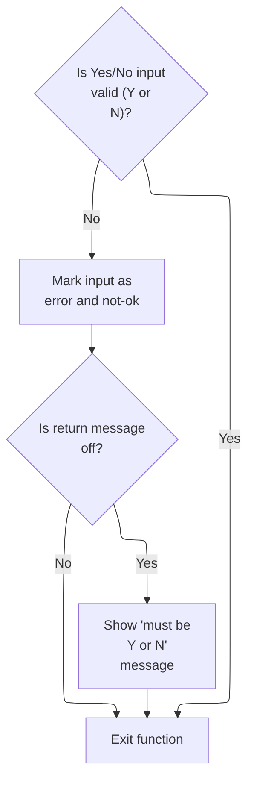

This section validates Yes/No input fields, ensuring only 'Y' or 'N' are accepted, and provides user feedback when invalid values are entered.

| Rule ID | Code Location   | Category        | Rule Name                        | Description                                                                                                                                     | Conditions                                                                                   | Remarks                                                                                                                          |
| ------- | --------------- | --------------- | -------------------------------- | ----------------------------------------------------------------------------------------------------------------------------------------------- | -------------------------------------------------------------------------------------------- | -------------------------------------------------------------------------------------------------------------------------------- |
| BR-001  | 1220-EDIT-YESNO | Data validation | Yes/No Value Restriction         | The Yes/No input field is valid only if its value is 'Y' or 'N'. Any other value is considered invalid.                                         | This rule applies whenever a Yes/No input field is being validated.                          | Accepted values are 'Y' and 'N' (single character, uppercase). Any other value is invalid.                                       |
| BR-002  | 1220-EDIT-YESNO | Error handling  | Invalid Input Error Flagging     | If the Yes/No input field is invalid, the system marks the input as erroneous and not-okay.                                                     | This rule applies when the Yes/No input field contains a value other than 'Y' or 'N'.        | The error state is tracked internally and may be used to prevent further processing of invalid input.                            |
| BR-003  | 1220-EDIT-YESNO | Error handling  | Error Message for Invalid Yes/No | If the Yes/No input field is invalid and the return message flag is off, an error message is generated indicating the field must be 'Y' or 'N'. | This rule applies when the Yes/No input field is invalid and the return message flag is off. | The error message format is: '<field name> must be Y or N.' where <field name> is the trimmed name of the field being validated. |

<SwmSnippet path="/app/cbl/COACTUPC.cbl" line="1878" repo-id="Z2l0aHViJTNBJTNBa3luZHJ5bC1hd3MtbWFpbmZyYW1lLW1vZGVybml6YXRpb24tY2FyZGRlbW8lM0ElM0FTd2ltbS1EZW1v">

---

After finishing alpha-only validation, we jump into 1220-EDIT-YESNO to check if the input is valid yes/no. We use flags to track blank, valid, and not-ok states. Each validation is independent.

```cobol
           IF FLG-YES-NO-ISVALID
              CONTINUE
```

---

</SwmSnippet>

<SwmSnippet path="/app/cbl/COACTUPC.cbl" line="1880" repo-id="Z2l0aHViJTNBJTNBa3luZHJ5bC1hd3MtbWFpbmZyYW1lLW1vZGVybml6YXRpb24tY2FyZGRlbW8lM0ElM0FTd2ltbS1EZW1v">

---

If the input isn't 'Y' or 'N', we set error flags and build a message. If it passes, we keep going. The flags (blank, not-ok, isvalid) make it easy to see the result of validation for this field.

```cobol
           ELSE
              SET INPUT-ERROR             TO TRUE
              SET FLG-YES-NO-NOT-OK       TO TRUE
              IF WS-RETURN-MSG-OFF
                 STRING
                   FUNCTION TRIM(WS-EDIT-VARIABLE-NAME)
                   ' must be Y or N.'
                   DELIMITED BY SIZE
                   INTO WS-RETURN-MSG
                 END-STRING
              END-IF
              GO TO  1220-EDIT-YESNO-EXIT
           END-IF
```

---

</SwmSnippet>

##### Account ID Validation and Early Exit

This section validates the Account ID field, ensuring only numeric and non-zero values are accepted, and handles errors by setting flags and exiting early if validation fails.

| Rule ID | Code Location | Category        | Rule Name                                  | Description                                                                                                                                                                                                            | Conditions                                        | Remarks                                                                                                                                                                            |
| ------- | ------------- | --------------- | ------------------------------------------ | ---------------------------------------------------------------------------------------------------------------------------------------------------------------------------------------------------------------------- | ------------------------------------------------- | ---------------------------------------------------------------------------------------------------------------------------------------------------------------------------------- |
| BR-001  | MAIN-LOGIC    | Data validation | Account ID Numeric and Non-Zero Validation | If the Account ID is not numeric or is zero, the system sets an error flag and generates an error message indicating that the Account Number must be an 11-digit non-zero number. Processing exits early in this case. | Account ID is not numeric OR Account ID is zero.  | The error message generated is: 'Account Number if supplied must be a 11 digit Non-Zero Number'. The Account ID must be an 11-digit numeric value, and zero is considered invalid. |
| BR-002  | MAIN-LOGIC    | Business logic  | Account ID Valid Marking                   | If the Account ID passes numeric and non-zero checks, it is marked as valid and stored for further processing.                                                                                                         | Account ID is numeric AND Account ID is not zero. | A valid Account ID is an 11-digit numeric value that is not zero. The field is stored for subsequent use and a validity flag is set.                                               |
| BR-003  | MAIN-LOGIC    | Error handling  | Early Exit on Invalid Account ID           | When an invalid Account ID is detected, the system sets the Account ID field to zero and exits the validation process early, preventing further processing.                                                            | Account ID is not numeric OR Account ID is zero.  | The Account ID field is set to zero and processing jumps to the exit paragraph, halting further validation or updates.                                                             |

<SwmSnippet path="/app/cbl/COACTUPC.cbl" line="1801" repo-id="Z2l0aHViJTNBJTNBa3luZHJ5bC1hd3MtbWFpbmZyYW1lLW1vZGVybml6YXRpb24tY2FyZGRlbW8lM0ElM0FTd2ltbS1EZW1v">

---

After mandatory checks, we validate account ID and bail out early if it's blank or invalid.

```cobol
           MOVE CC-ACCT-ID              TO ACUP-NEW-ACCT-ID
           IF CC-ACCT-ID   IS NOT NUMERIC
           OR CC-ACCT-ID-N EQUAL ZEROS
              SET INPUT-ERROR TO TRUE
              IF WS-RETURN-MSG-OFF
                STRING
                 'Account Number if supplied must be a 11 digit'
                 ' Non-Zero Number'
                DELIMITED BY SIZE
                INTO WS-RETURN-MSG
              END-IF
              MOVE ZEROES               TO CDEMO-ACCT-ID
              GO TO 1210-EDIT-ACCOUNT-EXIT
```

---

</SwmSnippet>

<SwmSnippet path="/app/cbl/COACTUPC.cbl" line="1814" repo-id="Z2l0aHViJTNBJTNBa3luZHJ5bC1hd3MtbWFpbmZyYW1lLW1vZGVybml6YXRpb24tY2FyZGRlbW8lM0ElM0FTd2ltbS1EZW1v">

---

If the account ID is blank or not numeric, we set error flags and build a message. If it passes all checks, we mark it valid. The flags (blank, not-ok, isvalid) make it easy to see the result of validation for this field.

```cobol
           ELSE
              MOVE CC-ACCT-ID TO CDEMO-ACCT-ID
              SET FLG-ACCTFILTER-ISVALID TO TRUE
           END-IF
```

---

</SwmSnippet>

#### Search Criteria Validation and Early Exit

```mermaid
%%{init: {"flowchart": {"defaultRenderer": "elk"}} }%%
flowchart TD
    node1["Start: User submits 
 account update request"] --> node2{"Did user provide 
 search criteria?"}
    click node1 openCode "app/cbl/COACTUPC.cbl:1438:1439"
    node2 -->|"No"| node3["Inform user: No 
 input received. Stop."]
    click node2 openCode "app/cbl/COACTUPC.cbl:1441:1446"
    click node3 openCode "app/cbl/COACTUPC.cbl:1442:1446"
    node2 -->|"Yes"| node4["Confirm account and 
 customer found. Prepare 
 for comparison."]
    click node4 openCode "app/cbl/COACTUPC.cbl:1452:1457"
    node4 --> node5["Compare old and 
 new account data 
 for changes"]
    click node5 openCode "app/cbl/COACTUPC.cbl:1460:1461"
classDef HeadingStyle fill:#777777,stroke:#333,stroke-width:2px;
```

This section validates the presence of search criteria in account update requests, determines whether to proceed or exit early, and sets flags for downstream processing based on the input.

| Rule ID | Code Location        | Category        | Rule Name                               | Description                                                                                                                                                                                                                                 | Conditions                                                                          | Remarks                                                                                                                                                                                                                                        |
| ------- | -------------------- | --------------- | --------------------------------------- | ------------------------------------------------------------------------------------------------------------------------------------------------------------------------------------------------------------------------------------------- | ----------------------------------------------------------------------------------- | ---------------------------------------------------------------------------------------------------------------------------------------------------------------------------------------------------------------------------------------------- |
| BR-001  | 1200-EDIT-MAP-INPUTS | Data validation | Blank search criteria early exit        | If the user does not provide any search criteria when submitting an account update request, the system will immediately inform the user that no input was received and will exit the update flow without performing any further processing. | Triggered when the search criteria are blank at the time of account update request. | The output message is 'No input received'. This is set in the system's return message field. No further account or customer data is fetched or processed.                                                                                      |
| BR-002  | 1200-EDIT-MAP-INPUTS | Business logic  | Account and customer found confirmation | If valid search criteria are provided, the system will confirm that account and customer data have been found and will set flags to indicate that these records are available for further processing.                                       | Triggered when search criteria are present and valid.                               | Flags for 'found account data', 'found account in master', 'account filter is valid', 'found customer in master', and 'customer filter is valid' are set to true. These flags inform downstream logic that the relevant records are available. |
| BR-003  | 1200-EDIT-MAP-INPUTS | Business logic  | Account data comparison trigger         | When valid search criteria are present and account/customer data have been found, the system will compare the old and new account data to detect any changes before proceeding.                                                             | Triggered after confirming valid search criteria and found account/customer data.   | The comparison routine is called to check for changes between old and new account data. No specific output format is defined at this stage; the result of the comparison informs subsequent processing.                                        |

<SwmSnippet path="/app/cbl/COACTUPC.cbl" line="1438" repo-id="Z2l0aHViJTNBJTNBa3luZHJ5bC1hd3MtbWFpbmZyYW1lLW1vZGVybml6YXRpb24tY2FyZGRlbW8lM0ElM0FTd2ltbS1EZW1v">

---

After account ID validation in 1210-EDIT-ACCOUNT, we reset old account data and check if the search criteria are blank. If so, we set a flag and bail out early in 1200-EDIT-MAP-INPUTS.

```cobol
               MOVE LOW-VALUES           TO ACUP-OLD-ACCT-DATA

      *       IF THE SEARCH CONDITIONS HAVE PROBLEMS FLAG THEM
              IF  FLG-ACCTFILTER-BLANK
                  SET NO-SEARCH-CRITERIA-RECEIVED TO TRUE
              END-IF

      *       AT THIS STAGE. NO DETAILS FETCHED. NOTHING MORE TO EDIT.
              GO TO 1200-EDIT-MAP-INPUTS-EXIT
```

---

</SwmSnippet>

<SwmSnippet path="/app/cbl/COACTUPC.cbl" line="1447" repo-id="Z2l0aHViJTNBJTNBa3luZHJ5bC1hd3MtbWFpbmZyYW1lLW1vZGVybml6YXRpb24tY2FyZGRlbW8lM0ElM0FTd2ltbS1EZW1v">

---

This part keeps the flow moving if the search criteria are valid.

```cobol
           ELSE
               CONTINUE
           END-IF
```

---

</SwmSnippet>

<SwmSnippet path="/app/cbl/COACTUPC.cbl" line="1452" repo-id="Z2l0aHViJTNBJTNBa3luZHJ5bC1hd3MtbWFpbmZyYW1lLW1vZGVybml6YXRpb24tY2FyZGRlbW8lM0ElM0FTd2ltbS1EZW1v">

---

After validating search criteria, we set flags for found account and customer data. This lets downstream logic know what was found and what to process next.

```cobol
           SET FOUND-ACCOUNT-DATA        TO TRUE
           SET FOUND-ACCT-IN-MASTER      TO TRUE
           SET FLG-ACCTFILTER-ISVALID    TO TRUE

           SET FOUND-CUST-IN-MASTER      TO TRUE
           SET FLG-CUSTFILTER-ISVALID    TO TRUE
```

---

</SwmSnippet>

<SwmSnippet path="/app/cbl/COACTUPC.cbl" line="1460" repo-id="Z2l0aHViJTNBJTNBa3luZHJ5bC1hd3MtbWFpbmZyYW1lLW1vZGVybml6YXRpb24tY2FyZGRlbW8lM0ElM0FTd2ltbS1EZW1v">

---

We call the comparison routine to check for changes before moving on.

```cobol
           PERFORM 1205-COMPARE-OLD-NEW
              THRU 1205-COMPARE-OLD-NEW-EXIT
```

---

</SwmSnippet>

#### Detecting Data Changes Between Old and New Records

```mermaid
%%{init: {"flowchart": {"defaultRenderer": "elk"}} }%%
flowchart TD
    node1["Start: Compare all 
 account fields"]
    click node1 openCode "app/cbl/COACTUPC.cbl:1681:1684"
    node1 --> node2{"Are all account 
 fields unchanged?"}
    click node2 openCode "app/cbl/COACTUPC.cbl:1684:1701"
    node2 -->|"No"| node3["Set 'Change has 
 occurred' and exit"]
    click node3 openCode "app/cbl/COACTUPC.cbl:1702:1705"
    node2 -->|"Yes"| node4{"Are all customer 
 fields unchanged?"}
    click node4 openCode "app/cbl/COACTUPC.cbl:1708:1768"
    node4 -->|"No"| node3
    node4 -->|"Yes"| node5["Set 'No changes 
 detected' and exit"]
    click node5 openCode "app/cbl/COACTUPC.cbl:1769:1769"
    
classDef HeadingStyle fill:#777777,stroke:#333,stroke-width:2px;
```

This section determines whether any changes have occurred between old and new account and customer records by performing detailed field-by-field comparisons and setting flags to drive subsequent update or validation actions.

| Rule ID | Code Location        | Category       | Rule Name                                           | Description                                                                                                                                                | Conditions                                                                                                                                   | Remarks                                                                                                                                                                                                                                                                                                                                                                                                     |
| ------- | -------------------- | -------------- | --------------------------------------------------- | ---------------------------------------------------------------------------------------------------------------------------------------------------------- | -------------------------------------------------------------------------------------------------------------------------------------------- | ----------------------------------------------------------------------------------------------------------------------------------------------------------------------------------------------------------------------------------------------------------------------------------------------------------------------------------------------------------------------------------------------------------- |
| BR-001  | 1205-COMPARE-OLD-NEW | Business logic | Account field change detection                      | If any account field differs between the old and new records, the system marks that a change has occurred and exits the comparison process.                | Any account field in the new record does not match the corresponding field in the old record.                                                | Account fields compared include account ID, active status, current balance, credit limit, cash credit limit, open date, expiration date, reissue date, current cycle credit, current cycle debit, and group ID. String fields are compared case-insensitively and with leading/trailing whitespace removed. Numeric fields are compared for exact equality.                                                 |
| BR-002  | 1205-COMPARE-OLD-NEW | Business logic | Customer field change detection after account match | If all account fields match between the old and new records, the system proceeds to compare all customer fields to determine if any changes have occurred. | All account fields in the new record match the corresponding fields in the old record.                                                       | Customer fields compared include customer ID, first name, middle name, last name, address lines 1-3, state code, country code, zip code, phone numbers, SSN, government-issued ID, date of birth, EFT account ID, primary cardholder indicator, and FICO score. String fields are compared case-insensitively and with leading/trailing whitespace removed. Numeric fields are compared for exact equality. |
| BR-003  | 1205-COMPARE-OLD-NEW | Business logic | String field normalization for change detection     | String fields are considered unchanged if they match after converting both values to uppercase and removing leading/trailing whitespace.                   | String fields in old and new records are compared after applying uppercase conversion and trimming whitespace.                               | String fields include account ID, active status, group ID, customer ID, names, address lines, state code, country code, zip code, government-issued ID, and primary cardholder indicator. The normalization ensures that differences in case or extra spaces do not count as changes.                                                                                                                       |
| BR-004  | 1205-COMPARE-OLD-NEW | Business logic | Numeric field exact match for change detection      | Numeric fields are considered unchanged only if their values match exactly between the old and new records.                                                | Numeric fields in old and new records are compared for exact equality.                                                                       | Numeric fields include current balance, credit limit, cash credit limit, current cycle credit, current cycle debit, phone numbers, SSN, date of birth, EFT account ID, and FICO score. No normalization is applied; values must match exactly.                                                                                                                                                              |
| BR-005  | 1205-COMPARE-OLD-NEW | Business logic | No changes detected flag                            | If all account and customer fields match after normalization and comparison, the system sets a flag indicating that no changes have been detected.         | All account and customer fields match between old and new records after normalization and comparison.                                        | The flag is set to indicate 'No change detected with respect to values fetched.' This output is used to inform the user or downstream processes that no update is necessary.                                                                                                                                                                                                                                |
| BR-006  | 1205-COMPARE-OLD-NEW | Business logic | Change detected flag                                | If any account or customer field differs after normalization and comparison, the system sets a flag indicating that a change has occurred.                 | Any account or customer field in the new record does not match the corresponding field in the old record after normalization and comparison. | The flag is set to indicate that a change has occurred. This output is used to trigger update or validation actions.                                                                                                                                                                                                                                                                                        |

<SwmSnippet path="/app/cbl/COACTUPC.cbl" line="1681" repo-id="Z2l0aHViJTNBJTNBa3luZHJ5bC1hd3MtbWFpbmZyYW1lLW1vZGVybml6YXRpb24tY2FyZGRlbW8lM0ElM0FTd2ltbS1EZW1v">

---

We compare all fields and set flags to track changes, only prompting for updates if something actually changed.

```cobol
       1205-COMPARE-OLD-NEW.
           SET NO-CHANGES-FOUND           TO TRUE

           IF  ACUP-NEW-ACCT-ID-X         = ACUP-OLD-ACCT-ID-X
           AND FUNCTION UPPER-CASE (
               ACUP-NEW-ACTIVE-STATUS)    =
               FUNCTION UPPER-CASE (
               ACUP-OLD-ACTIVE-STATUS)
           AND ACUP-NEW-CURR-BAL          = ACUP-OLD-CURR-BAL
           AND ACUP-NEW-CREDIT-LIMIT      = ACUP-OLD-CREDIT-LIMIT
           AND ACUP-NEW-CASH-CREDIT-LIMIT = ACUP-OLD-CASH-CREDIT-LIMIT
           AND ACUP-NEW-OPEN-DATE         = ACUP-OLD-OPEN-DATE
           AND ACUP-NEW-EXPIRAION-DATE    = ACUP-OLD-EXPIRAION-DATE
           AND ACUP-NEW-REISSUE-DATE      = ACUP-OLD-REISSUE-DATE
           AND ACUP-NEW-CURR-CYC-CREDIT   = ACUP-OLD-CURR-CYC-CREDIT
           AND ACUP-NEW-CURR-CYC-DEBIT    = ACUP-OLD-CURR-CYC-DEBIT
           AND FUNCTION UPPER-CASE (
               FUNCTION TRIM (ACUP-NEW-GROUP-ID))=
               FUNCTION UPPER-CASE (
               FUNCTION TRIM (ACUP-OLD-GROUP-ID))
               CONTINUE
```

---

</SwmSnippet>

<SwmSnippet path="/app/cbl/COACTUPC.cbl" line="1702" repo-id="Z2l0aHViJTNBJTNBa3luZHJ5bC1hd3MtbWFpbmZyYW1lLW1vZGVybml6YXRpb24tY2FyZGRlbW8lM0ElM0FTd2ltbS1EZW1v">

---

After comparing old and new data, we call 1210-EDIT-ACCOUNT to validate the new account info if a change was found. This makes sure only valid updates go through.

```cobol
           ELSE
               SET CHANGE-HAS-OCCURRED   TO TRUE
               GO TO 1205-COMPARE-OLD-NEW-EXIT
           END-IF
```

---

</SwmSnippet>

<SwmSnippet path="/app/cbl/COACTUPC.cbl" line="1708" repo-id="Z2l0aHViJTNBJTNBa3luZHJ5bC1hd3MtbWFpbmZyYW1lLW1vZGVybml6YXRpb24tY2FyZGRlbW8lM0ElM0FTd2ltbS1EZW1v">

---

After returning from 1210-EDIT-ACCOUNT, 1205-COMPARE-OLD-NEW runs a full field-by-field comparison between the new and old customer/account data. For string fields, it uses FUNCTION UPPER-CASE and FUNCTION TRIM to ignore case and whitespace differences, so only real changes count. Numeric fields are compared directly. If all fields match, it sets NO-CHANGES-DETECTED; otherwise, it flags that a change occurred.

```cobol
           IF  FUNCTION UPPER-CASE (
               FUNCTION TRIM (ACUP-NEW-CUST-ID-X))=
               FUNCTION UPPER-CASE (
               FUNCTION TRIM (ACUP-OLD-CUST-ID-X))
           AND FUNCTION UPPER-CASE (
               FUNCTION TRIM (ACUP-NEW-CUST-FIRST-NAME))=
               FUNCTION UPPER-CASE (
               FUNCTION TRIM (ACUP-OLD-CUST-FIRST-NAME))
           AND FUNCTION UPPER-CASE (
               FUNCTION TRIM (ACUP-NEW-CUST-MIDDLE-NAME))=
               FUNCTION UPPER-CASE (
               FUNCTION TRIM (ACUP-OLD-CUST-MIDDLE-NAME))
           AND FUNCTION UPPER-CASE (
               FUNCTION TRIM (ACUP-NEW-CUST-LAST-NAME))=
               FUNCTION UPPER-CASE (
               FUNCTION TRIM (ACUP-OLD-CUST-LAST-NAME))
           AND FUNCTION UPPER-CASE (
               FUNCTION TRIM (ACUP-NEW-CUST-ADDR-LINE-1))=
               FUNCTION UPPER-CASE (
               FUNCTION TRIM (ACUP-OLD-CUST-ADDR-LINE-1))
           AND FUNCTION UPPER-CASE (
               FUNCTION TRIM (ACUP-NEW-CUST-ADDR-LINE-2))=
               FUNCTION UPPER-CASE (
               FUNCTION TRIM (ACUP-OLD-CUST-ADDR-LINE-2))
           AND FUNCTION UPPER-CASE (
               FUNCTION TRIM (ACUP-NEW-CUST-ADDR-LINE-3))=
               FUNCTION UPPER-CASE (
               FUNCTION TRIM (ACUP-OLD-CUST-ADDR-LINE-3))
           AND FUNCTION UPPER-CASE (
               FUNCTION TRIM (ACUP-NEW-CUST-ADDR-STATE-CD))=
               FUNCTION UPPER-CASE (
               FUNCTION TRIM (ACUP-OLD-CUST-ADDR-STATE-CD))
           AND FUNCTION UPPER-CASE (
               FUNCTION TRIM (ACUP-NEW-CUST-ADDR-COUNTRY-CD))=
               FUNCTION UPPER-CASE (
               FUNCTION TRIM (ACUP-OLD-CUST-ADDR-COUNTRY-CD))
           AND FUNCTION UPPER-CASE (
               FUNCTION TRIM (ACUP-NEW-CUST-ADDR-ZIP))=
               FUNCTION UPPER-CASE (
               FUNCTION TRIM (ACUP-OLD-CUST-ADDR-ZIP))
           AND ACUP-NEW-CUST-PHONE-NUM-1A = ACUP-OLD-CUST-PHONE-NUM-1A
           AND ACUP-NEW-CUST-PHONE-NUM-1B = ACUP-OLD-CUST-PHONE-NUM-1B
           AND ACUP-NEW-CUST-PHONE-NUM-1C = ACUP-OLD-CUST-PHONE-NUM-1C
           AND ACUP-NEW-CUST-PHONE-NUM-2A = ACUP-OLD-CUST-PHONE-NUM-2A
           AND ACUP-NEW-CUST-PHONE-NUM-2B = ACUP-OLD-CUST-PHONE-NUM-2B
           AND ACUP-NEW-CUST-PHONE-NUM-2C = ACUP-OLD-CUST-PHONE-NUM-2C
           AND ACUP-NEW-CUST-SSN-X       = ACUP-OLD-CUST-SSN-X
           AND FUNCTION UPPER-CASE (
               FUNCTION TRIM (ACUP-NEW-CUST-GOVT-ISSUED-ID ))=
               FUNCTION UPPER-CASE (
               FUNCTION TRIM (ACUP-OLD-CUST-GOVT-ISSUED-ID))
           AND ACUP-NEW-CUST-DOB-YYYY-MM-DD
                                     = ACUP-OLD-CUST-DOB-YYYY-MM-DD
           AND ACUP-NEW-CUST-EFT-ACCOUNT-ID
                                     = ACUP-OLD-CUST-EFT-ACCOUNT-ID
           AND FUNCTION UPPER-CASE (
               FUNCTION TRIM (ACUP-NEW-CUST-PRI-HOLDER-IND))=
               FUNCTION UPPER-CASE (
               FUNCTION TRIM (ACUP-OLD-CUST-PRI-HOLDER-IND))
           AND ACUP-NEW-CUST-FICO-SCORE-X
                                     = ACUP-OLD-CUST-FICO-SCORE-X
               SET NO-CHANGES-DETECTED   TO TRUE
```

---

</SwmSnippet>

<SwmSnippet path="/app/cbl/COACTUPC.cbl" line="1770" repo-id="Z2l0aHViJTNBJTNBa3luZHJ5bC1hd3MtbWFpbmZyYW1lLW1vZGVybml6YXRpb24tY2FyZGRlbW8lM0ElM0FTd2ltbS1EZW1v">

---

After comparing fields, 1205-COMPARE-OLD-NEW sets one of three flags: NO-CHANGES-FOUND (account fields match), NO-CHANGES-DETECTED (customer fields match), or CHANGE-HAS-OCCURRED (any field differs). These flags drive what happens next in the update flow.

```cobol
           ELSE
               SET CHANGE-HAS-OCCURRED   TO TRUE
               GO TO 1205-COMPARE-OLD-NEW-EXIT
           END-IF
```

---

</SwmSnippet>

#### Branching Based on Change Detection

```mermaid
%%{init: {"flowchart": {"defaultRenderer": "elk"}} }%%
flowchart TD
    node1{"Are there changes 
 to process, or 
 are changes already 
 confirmed/completed?"}
    click node1 openCode "app/cbl/COACTUPC.cbl:1463:1468"
    node1 -->|"No changes or 
 already done"| node2["Skip input validation"]
    click node2 openCode "app/cbl/COACTUPC.cbl:1466:1468"
    node1 -->|"Changes to process"| node3["Validate account status 
 (Yes/No)"]
    click node3 openCode "app/cbl/COACTUPC.cbl:1470:1476"
    node3 --> node4["Validate dates (Open, 
 Expiry, Reissue, DOB)"]
    click node4 openCode "app/cbl/COACTUPC.cbl:1478:1507"
    node4 --> node5["Validate credit limits 
 and balances"]
    click node5 openCode "app/cbl/COACTUPC.cbl:1484:1527"
    node5 --> node6["Validate SSN"]
    click node6 openCode "app/cbl/COACTUPC.cbl:1529:1531"
    node6 --> node7["Additional validation for 
 date of birth"]
    click node7 openCode "app/cbl/COACTUPC.cbl:1533:1543"
    node2 --> node8["Exit"]
    click node8 openCode "app/cbl/COACTUPC.cbl:1468:1468"
    node7 --> node8

classDef HeadingStyle fill:#777777,stroke:#333,stroke-width:2px;
```

This section determines whether input validation should occur based on the presence and status of changes, and performs sequential field-level validation for account update data when required.

| Rule ID | Code Location        | Category        | Rule Name                       | Description                                                                                                                                                                                                                          | Conditions                                                                                                                           | Remarks                                                                                                                                 |
| ------- | -------------------- | --------------- | ------------------------------- | ------------------------------------------------------------------------------------------------------------------------------------------------------------------------------------------------------------------------------------ | ------------------------------------------------------------------------------------------------------------------------------------ | --------------------------------------------------------------------------------------------------------------------------------------- |
| BR-001  | 1200-EDIT-MAP-INPUTS | Data validation | Account status validation       | When changes are present and require processing, the account status field must be validated to ensure it contains a valid value ('Y' or 'N').                                                                                        | Changes to process (not skipped); account status field is present.                                                                   | Valid values for account status: 'Y' or 'N'. Invalid values are flagged for error handling.                                             |
| BR-002  | 1200-EDIT-MAP-INPUTS | Data validation | Date format validation          | Date fields (Open Date, Expiry Date, Reissue Date, Date of Birth) must be validated to ensure they are in the correct CCYYMMDD format and represent valid calendar dates.                                                            | Changes to process; date fields are present.                                                                                         | Date format required: CCYYMMDD (8 characters, numeric). Invalid dates are flagged for error handling.                                   |
| BR-003  | 1200-EDIT-MAP-INPUTS | Data validation | Signed numeric field validation | Signed numeric fields (Credit Limit, Cash Credit Limit, Current Balance, Current Cycle Credit Limit, Current Cycle Debit Limit) must be validated to ensure they are valid signed numbers with up to 10 digits and 2 decimal places. | Changes to process; signed numeric fields are present.                                                                               | Format required: signed number, up to 10 digits before decimal, 2 digits after decimal. Invalid numbers are flagged for error handling. |
| BR-004  | 1200-EDIT-MAP-INPUTS | Data validation | SSN format validation           | The SSN field must be validated to ensure all three segments are present, formatted correctly, and do not contain forbidden values.                                                                                                  | Changes to process; SSN field is present.                                                                                            | SSN format required: three segments (AAA-GG-SSSS), numeric, no forbidden values. Invalid SSNs are flagged for error handling.           |
| BR-005  | 1200-EDIT-MAP-INPUTS | Data validation | Date of birth future date check | The date of birth field must be validated to ensure it is not a future date. If the input date is in the future, an error is set.                                                                                                    | Changes to process; date of birth field is present and passes format validation.                                                     | Date of birth must not be later than the current date. Format: CCYYMMDD. Future dates are flagged for error handling.                   |
| BR-006  | 1200-EDIT-MAP-INPUTS | Business logic  | Skip validation when no changes | If no changes are detected, or if changes are already confirmed or completed, input validation is skipped and the process exits early.                                                                                               | No changes found (WS-DATACHANGED-FLAG = '0'), or ACUP-CHANGE-ACTION is 'N' (changes OK not confirmed), or 'C' (changes OK and done). | Change status constants: 'E' (not OK), 'N' (OK not confirmed), 'C' (OK and done). No validation flags are set when skipping.            |

<SwmSnippet path="/app/cbl/COACTUPC.cbl" line="1463" repo-id="Z2l0aHViJTNBJTNBa3luZHJ5bC1hd3MtbWFpbmZyYW1lLW1vZGVybml6YXRpb24tY2FyZGRlbW8lM0ElM0FTd2ltbS1EZW1v">

---

After returning from 1205-COMPARE-OLD-NEW, 1200-EDIT-MAP-INPUTS checks the change flags and ACUP-CHANGE-ACTION. If no changes or changes are already confirmed, it exits early. Otherwise, it keeps going with field-level validation.

```cobol
           IF  NO-CHANGES-FOUND
           OR  ACUP-CHANGES-OK-NOT-CONFIRMED
           OR  ACUP-CHANGES-OKAYED-AND-DONE
               MOVE LOW-VALUES           TO WS-NON-KEY-FLAGS
               GO TO 1200-EDIT-MAP-INPUTS-EXIT
           END-IF
```

---

</SwmSnippet>

<SwmSnippet path="/app/cbl/COACTUPC.cbl" line="1470" repo-id="Z2l0aHViJTNBJTNBa3luZHJ5bC1hd3MtbWFpbmZyYW1lLW1vZGVybml6YXRpb24tY2FyZGRlbW8lM0ElM0FTd2ltbS1EZW1v">

---

Here we start validating individual fields in 1200-EDIT-MAP-INPUTS. For 'Account Status', we move the value to a working variable and call 1220-EDIT-YESNO to check if it's valid. The result goes into a flag for later checks.

```cobol
           SET ACUP-CHANGES-NOT-OK       TO TRUE

           MOVE 'Account Status'          TO WS-EDIT-VARIABLE-NAME
           MOVE ACUP-NEW-ACTIVE-STATUS    TO WS-EDIT-YES-NO
           PERFORM 1220-EDIT-YESNO
              THRU 1220-EDIT-YESNO-EXIT
```

---

</SwmSnippet>

<SwmSnippet path="/app/cbl/COACTUPC.cbl" line="1476" repo-id="Z2l0aHViJTNBJTNBa3luZHJ5bC1hd3MtbWFpbmZyYW1lLW1vZGVybml6YXRpb24tY2FyZGRlbW8lM0ElM0FTd2ltbS1EZW1v">

---

After validating account status in 1200-EDIT-MAP-INPUTS, we move on to 'Open Date'. The value is set up and we call EDIT-DATE-CCYYMMDD (from CSUTLDPY.cpy) to check if the date is valid. The result is stored for later error handling.

```cobol
           MOVE WS-EDIT-YES-NO            TO WS-EDIT-ACCT-STATUS

           MOVE 'Open Date'              TO WS-EDIT-VARIABLE-NAME
           MOVE ACUP-NEW-OPEN-DATE       TO WS-EDIT-DATE-CCYYMMDD
           PERFORM EDIT-DATE-CCYYMMDD
              THRU EDIT-DATE-CCYYMMDD-EXIT
```

---

</SwmSnippet>

<SwmSnippet path="/app/cpy/CSUTLDPY.cpy" line="18" repo-id="Z2l0aHViJTNBJTNBa3luZHJ5bC1hd3MtbWFpbmZyYW1lLW1vZGVybml6YXRpb24tY2FyZGRlbW8lM0ElM0FTd2ltbS1EZW1v">

---

EDIT-DATE-CCYYMMDD in CSUTLDPY.cpy checks if the date is in the right format and if the year/century are valid. If not, it sets a flag so downstream logic knows the date is bad.

```cobol
       EDIT-DATE-CCYYMMDD.
           SET WS-EDIT-DATE-IS-INVALID   TO TRUE
           .
```

---

</SwmSnippet>

<SwmSnippet path="/app/cbl/COACTUPC.cbl" line="1482" repo-id="Z2l0aHViJTNBJTNBa3luZHJ5bC1hd3MtbWFpbmZyYW1lLW1vZGVybml6YXRpb24tY2FyZGRlbW8lM0ElM0FTd2ltbS1EZW1v">

---

After validating the open date in 1200-EDIT-MAP-INPUTS, we move to 'Credit Limit'. The value is set up and we call 1250-EDIT-SIGNED-9V2 to check if it's a valid signed number. The result is stored for later checks.

```cobol
           MOVE WS-EDIT-DATE-FLGS        TO WS-EDIT-OPEN-DATE-FLGS

           MOVE 'Credit Limit'           TO WS-EDIT-VARIABLE-NAME
           MOVE ACUP-NEW-CREDIT-LIMIT-X  TO WS-EDIT-SIGNED-NUMBER-9V2-X
           PERFORM 1250-EDIT-SIGNED-9V2
              THRU 1250-EDIT-SIGNED-9V2-EXIT
```

---

</SwmSnippet>

<SwmSnippet path="/app/cbl/COACTUPC.cbl" line="1488" repo-id="Z2l0aHViJTNBJTNBa3luZHJ5bC1hd3MtbWFpbmZyYW1lLW1vZGVybml6YXRpb24tY2FyZGRlbW8lM0ElM0FTd2ltbS1EZW1v">

---

After 1250-EDIT-SIGNED-9V2 in 1200-EDIT-MAP-INPUTS, we store the validation result for 'Credit Limit' and move on to 'Expiry Date', prepping for another date validation.

```cobol
           MOVE WS-FLG-SIGNED-NUMBER-EDIT  TO WS-EDIT-CREDIT-LIMIT

           MOVE 'Expiry Date'            TO WS-EDIT-VARIABLE-NAME
           MOVE ACUP-NEW-EXPIRAION-DATE  TO WS-EDIT-DATE-CCYYMMDD
           PERFORM EDIT-DATE-CCYYMMDD
              THRU EDIT-DATE-CCYYMMDD-EXIT
```

---

</SwmSnippet>

<SwmSnippet path="/app/cbl/COACTUPC.cbl" line="1494" repo-id="Z2l0aHViJTNBJTNBa3luZHJ5bC1hd3MtbWFpbmZyYW1lLW1vZGVybml6YXRpb24tY2FyZGRlbW8lM0ElM0FTd2ltbS1EZW1v">

---

After expiry date validation, we store the result and move on to 'Cash Credit Limit', prepping for another signed number check. Each field is handled in sequence.

```cobol
           MOVE WS-EDIT-DATE-FLGS        TO WS-EXPIRY-DATE-FLGS

           MOVE 'Cash Credit Limit'      TO WS-EDIT-VARIABLE-NAME
           MOVE ACUP-NEW-CASH-CREDIT-LIMIT-X
                                         TO WS-EDIT-SIGNED-NUMBER-9V2-X
           PERFORM 1250-EDIT-SIGNED-9V2
              THRU 1250-EDIT-SIGNED-9V2-EXIT
```

---

</SwmSnippet>

<SwmSnippet path="/app/cbl/COACTUPC.cbl" line="1501" repo-id="Z2l0aHViJTNBJTNBa3luZHJ5bC1hd3MtbWFpbmZyYW1lLW1vZGVybml6YXRpb24tY2FyZGRlbW8lM0ElM0FTd2ltbS1EZW1v">

---

After validating 'Cash Credit Limit', we store the result and move on to 'Reissue Date', prepping for another date validation. The flow keeps moving field by field.

```cobol
           MOVE WS-FLG-SIGNED-NUMBER-EDIT TO WS-EDIT-CASH-CREDIT-LIMIT

           MOVE 'Reissue Date'           TO WS-EDIT-VARIABLE-NAME
           MOVE ACUP-NEW-REISSUE-DATE    TO WS-EDIT-DATE-CCYYMMDD
           PERFORM EDIT-DATE-CCYYMMDD
              THRU EDIT-DATE-CCYYMMDD-EXIT
```

---

</SwmSnippet>

<SwmSnippet path="/app/cbl/COACTUPC.cbl" line="1507" repo-id="Z2l0aHViJTNBJTNBa3luZHJ5bC1hd3MtbWFpbmZyYW1lLW1vZGVybml6YXRpb24tY2FyZGRlbW8lM0ElM0FTd2ltbS1EZW1v">

---

After reissue date validation, we store the result and move on to 'Current Balance', prepping for another signed number check. The flow is strictly sequential.

```cobol
           MOVE WS-EDIT-DATE-FLGS        TO WS-EDIT-REISSUE-DATE-FLGS

           MOVE 'Current Balance'        TO WS-EDIT-VARIABLE-NAME
           MOVE ACUP-NEW-CURR-BAL-X      TO WS-EDIT-SIGNED-NUMBER-9V2-X
           PERFORM 1250-EDIT-SIGNED-9V2
              THRU 1250-EDIT-SIGNED-9V2-EXIT
```

---

</SwmSnippet>

<SwmSnippet path="/app/cbl/COACTUPC.cbl" line="1513" repo-id="Z2l0aHViJTNBJTNBa3luZHJ5bC1hd3MtbWFpbmZyYW1lLW1vZGVybml6YXRpb24tY2FyZGRlbW8lM0ElM0FTd2ltbS1EZW1v">

---

After validating 'Current Balance', we store the result and move on to 'Current Cycle Credit Limit', prepping for another signed number check. The same logic repeats for each numeric field.

```cobol
           MOVE WS-FLG-SIGNED-NUMBER-EDIT   TO WS-EDIT-CURR-BAL

           MOVE 'Current Cycle Credit Limit' TO WS-EDIT-VARIABLE-NAME
           MOVE ACUP-NEW-CURR-CYC-CREDIT-X
                                         TO WS-EDIT-SIGNED-NUMBER-9V2-X
           PERFORM 1250-EDIT-SIGNED-9V2
              THRU 1250-EDIT-SIGNED-9V2-EXIT
```

---

</SwmSnippet>

<SwmSnippet path="/app/cbl/COACTUPC.cbl" line="1520" repo-id="Z2l0aHViJTNBJTNBa3luZHJ5bC1hd3MtbWFpbmZyYW1lLW1vZGVybml6YXRpb24tY2FyZGRlbW8lM0ElM0FTd2ltbS1EZW1v">

---

After validating 'Current Cycle Credit Limit', we store the result and move on to 'Current Cycle Debit Limit', using the same signed number check. The flow is consistent for all these fields.

```cobol
           MOVE WS-FLG-SIGNED-NUMBER-EDIT   TO WS-EDIT-CURR-CYC-CREDIT

           MOVE 'Current Cycle Debit Limit' TO WS-EDIT-VARIABLE-NAME
           MOVE ACUP-NEW-CURR-CYC-DEBIT-X
                                         TO WS-EDIT-SIGNED-NUMBER-9V2-X
           PERFORM 1250-EDIT-SIGNED-9V2
              THRU 1250-EDIT-SIGNED-9V2-EXIT
```

---

</SwmSnippet>

<SwmSnippet path="/app/cbl/COACTUPC.cbl" line="1527" repo-id="Z2l0aHViJTNBJTNBa3luZHJ5bC1hd3MtbWFpbmZyYW1lLW1vZGVybml6YXRpb24tY2FyZGRlbW8lM0ElM0FTd2ltbS1EZW1v">

---

After finishing numeric field validations, we move to SSN. We call 1265-EDIT-US-SSN to check all three SSN parts for valid format and forbidden values, storing flags for each segment.

```cobol
           MOVE WS-FLG-SIGNED-NUMBER-EDIT   TO WS-EDIT-CURR-CYC-DEBIT

           MOVE 'SSN'                    TO WS-EDIT-VARIABLE-NAME
           PERFORM 1265-EDIT-US-SSN
              THRU 1265-EDIT-US-SSN-EXIT
```

---

</SwmSnippet>

<SwmSnippet path="/app/cbl/COACTUPC.cbl" line="1533" repo-id="Z2l0aHViJTNBJTNBa3luZHJ5bC1hd3MtbWFpbmZyYW1lLW1vZGVybml6YXRpb24tY2FyZGRlbW8lM0ElM0FTd2ltbS1EZW1v">

---

After SSN validation in 1200-EDIT-MAP-INPUTS, we move to 'Date of Birth'. The value is set up and we call EDIT-DATE-CCYYMMDD to check format, then EDIT-DATE-OF-BIRTH to make sure it's not a future date.

```cobol
           MOVE 'Date of Birth'          TO WS-EDIT-VARIABLE-NAME
           MOVE   ACUP-NEW-CUST-DOB-YYYY-MM-DD
                                         TO WS-EDIT-DATE-CCYYMMDD
           PERFORM EDIT-DATE-CCYYMMDD
              THRU EDIT-DATE-CCYYMMDD-EXIT
```

---

</SwmSnippet>

<SwmSnippet path="/app/cbl/COACTUPC.cbl" line="1538" repo-id="Z2l0aHViJTNBJTNBa3luZHJ5bC1hd3MtbWFpbmZyYW1lLW1vZGVybml6YXRpb24tY2FyZGRlbW8lM0ElM0FTd2ltbS1EZW1v">

---

After confirming the date of birth format, we call EDIT-DATE-OF-BIRTH in CSUTLDPY.cpy to compare the input date to the current date. If the input is in the future, it sets error flags and builds an error message.

```cobol
           MOVE WS-EDIT-DATE-FLGS        TO WS-EDIT-DT-OF-BIRTH-FLGS
           IF WS-EDIT-DT-OF-BIRTH-ISVALID
              PERFORM  EDIT-DATE-OF-BIRTH
                 THRU  EDIT-DATE-OF-BIRTH-EXIT
              MOVE WS-EDIT-DATE-FLGS    TO WS-EDIT-DT-OF-BIRTH-FLGS
           END-IF
```

---

</SwmSnippet>

#### Validating Date of Birth Against Current Date

```mermaid
%%{init: {"flowchart": {"defaultRenderer": "elk"}} }%%
flowchart TD
    node1["Start date of 
 birth validation"]
    click node1 openCode "app/cpy/CSUTLDPY.cpy:341:343"
    node2{"Is date of 
 birth in the 
 future?"}
    click node2 openCode "app/cpy/CSUTLDPY.cpy:350:350"
    node1 --> node2
    node2 -->|"No"| node3["Accept date of 
 birth"]
    click node3 openCode "app/cpy/CSUTLDPY.cpy:354:354"
    node2 -->|"Yes"| node4["Set error flags 
 (input error, day/month/year 
 not ok)"]
    click node4 openCode "app/cpy/CSUTLDPY.cpy:356:359"
    node4 --> node5{"Is return message 
 off?"}
    click node5 openCode "app/cpy/CSUTLDPY.cpy:360:360"
    node5 -->|"Yes"| node6["Show error message: 
 'cannot be in 
 the future'"]
    click node6 openCode "app/cpy/CSUTLDPY.cpy:361:366"
    node5 -->|"No"| node7["Skip error message"]
    click node7 openCode "app/cpy/CSUTLDPY.cpy:360:366"
    node6 --> node8["Exit"]
    click node8 openCode "app/cpy/CSUTLDPY.cpy:367:368"
    node7 --> node8
    node3 --> node8
classDef HeadingStyle fill:#777777,stroke:#333,stroke-width:2px;
```

This section ensures that a user's date of birth is not set in the future. If the date is invalid, it sets error flags and optionally returns a clear error message to the user.

| Rule ID | Code Location      | Category        | Rule Name                                | Description                                                                                                                                                          | Conditions                                                                                              | Remarks                                                                                                                                                                                         |
| ------- | ------------------ | --------------- | ---------------------------------------- | -------------------------------------------------------------------------------------------------------------------------------------------------------------------- | ------------------------------------------------------------------------------------------------------- | ----------------------------------------------------------------------------------------------------------------------------------------------------------------------------------------------- |
| BR-001  | EDIT-DATE-OF-BIRTH | Data validation | No Future Date of Birth                  | A date of birth is accepted if it is not in the future compared to the current date.                                                                                 | The input date of birth is less than or equal to the current date.                                      | The comparison is based on the full date (year, month, day). No specific format is enforced by this rule, only the relative value of the dates.                                                 |
| BR-002  | EDIT-DATE-OF-BIRTH | Error handling  | Set Error Flags for Future Date of Birth | If the date of birth is in the future, error flags are set for the input, day, month, and year fields.                                                               | The input date of birth is greater than the current date.                                               | Error flags are set for the input as a whole and for each date component (day, month, year).                                                                                                    |
| BR-003  | EDIT-DATE-OF-BIRTH | Error handling  | Error Message for Future Date of Birth   | If the date of birth is in the future and the return message flag is not set to off, an error message stating 'cannot be in the future' is constructed and returned. | The input date of birth is greater than the current date and the return message flag is not set to off. | The error message is constructed as: '\[field name\]:cannot be in the future'. The field name is trimmed of spaces. The message is a string with no specified maximum length in the code shown. |

<SwmSnippet path="/app/cpy/CSUTLDPY.cpy" line="341" repo-id="Z2l0aHViJTNBJTNBa3luZHJ5bC1hd3MtbWFpbmZyYW1lLW1vZGVybml6YXRpb24tY2FyZGRlbW8lM0ElM0FTd2ltbS1EZW1v">

---

In EDIT-DATE-OF-BIRTH, we grab the current date using FUNCTION CURRENT-DATE, convert both the input and current dates to integers, and use those for comparison. This makes it easy to check if the input date is in the future.

```cobol
       EDIT-DATE-OF-BIRTH.

           MOVE FUNCTION CURRENT-DATE TO WS-CURRENT-DATE-YYYYMMDD

           COMPUTE WS-EDIT-DATE-BINARY =
               FUNCTION INTEGER-OF-DATE (WS-EDIT-DATE-CCYYMMDD-N)
           COMPUTE WS-CURRENT-DATE-BINARY =
               FUNCTION INTEGER-OF-DATE (WS-CURRENT-DATE-YYYYMMDD-N)
```

---

</SwmSnippet>

<SwmSnippet path="/app/cpy/CSUTLDPY.cpy" line="350" repo-id="Z2l0aHViJTNBJTNBa3luZHJ5bC1hd3MtbWFpbmZyYW1lLW1vZGVybml6YXRpb24tY2FyZGRlbW8lM0ElM0FTd2ltbS1EZW1v">

---

After converting dates to integers, we compare them directly. If the input date is in the future, we set error flags and build an error message. There's a commented-out alternative using FIND-DURATION, but it's not used.

```cobol
           IF WS-CURRENT-DATE-BINARY > WS-EDIT-DATE-BINARY
      *    IF FUNCTION FIND-DURATION(FUNCTION CURRENT-DATE
      *                             ,WS-EDIT-DATE-CCYYMMDD)
      *                             ,DAYS) > 0
              CONTINUE
```

---

</SwmSnippet>

<SwmSnippet path="/app/cpy/CSUTLDPY.cpy" line="355" repo-id="Z2l0aHViJTNBJTNBa3luZHJ5bC1hd3MtbWFpbmZyYW1lLW1vZGVybml6YXRpb24tY2FyZGRlbW8lM0ElM0FTd2ltbS1EZW1v">

---

If the input date is in the future, we set error flags and build a message like 'Date of Birth:cannot be in the future'. Then we exit the routine.

```cobol
           ELSE
              SET INPUT-ERROR                TO TRUE
              SET FLG-DAY-NOT-OK             TO TRUE
              SET FLG-MONTH-NOT-OK           TO TRUE
              SET FLG-YEAR-NOT-OK            TO TRUE
              IF WS-RETURN-MSG-OFF
              STRING
                FUNCTION TRIM(WS-EDIT-VARIABLE-NAME)
                ':cannot be in the future '
                DELIMITED BY SIZE
               INTO WS-RETURN-MSG
              END-IF
              GO TO EDIT-DATE-OF-BIRTH-EXIT
           END-IF
```

---

</SwmSnippet>

#### Validating FICO Score and Address Data

```mermaid
%%{init: {"flowchart": {"defaultRenderer": "elk"}} }%%
flowchart TD
    node1["Prepare FICO score 
 input"]
    click node1 openCode "app/cbl/COACTUPC.cbl:1545:1548"
    node1 --> node2["Validate FICO score 
 is present and 
 numeric"]
    click node2 openCode "app/cbl/COACTUPC.cbl:1549:1550"
    node2 --> node3{"Is FICO score 
 valid?"}
    click node3 openCode "app/cbl/COACTUPC.cbl:1551:1553"
    node3 -->|"Yes"| node4["Accept and further 
 validate FICO score"]
    click node4 openCode "app/cbl/COACTUPC.cbl:1554:1555"
    node3 -->|"No"| node5["Reject FICO score 
 input"]
    click node5 openCode "app/cbl/COACTUPC.cbl:1556:1556"
classDef HeadingStyle fill:#777777,stroke:#333,stroke-width:2px;
```

This section validates the FICO score input for customer or account updates, ensuring the score is present, numeric, and within the accepted range before allowing further processing.

| Rule ID | Code Location                                                  | Category        | Rule Name                       | Description                                                                                                                                                                     | Conditions                                                                            | Remarks                                                                                                         |
| ------- | -------------------------------------------------------------- | --------------- | ------------------------------- | ------------------------------------------------------------------------------------------------------------------------------------------------------------------------------- | ------------------------------------------------------------------------------------- | --------------------------------------------------------------------------------------------------------------- |
| BR-001  | 1200-EDIT-MAP-INPUTS, 1245-EDIT-NUM-REQD                       | Data validation | FICO Score Required and Numeric | The FICO score must be present and contain only numeric characters. If the FICO score is missing or contains non-numeric characters, the input is rejected and an error is set. | This rule applies when a FICO score is provided as part of the input.                 | The FICO score must be a string of exactly 3 numeric digits (e.g., '720').                                      |
| BR-002  | 1275-EDIT-FICO-SCORE                                           | Data validation | FICO Score Range Validation     | The FICO score must be within the valid range of 300 to 850 inclusive. If the score is outside this range, the input is rejected and an error is set.                           | This rule applies after the FICO score has been confirmed to be present and numeric.  | The valid FICO score range is 300 to 850, inclusive. The score must be a 3-digit number within this range.      |
| BR-003  | 1200-EDIT-MAP-INPUTS, 1245-EDIT-NUM-REQD, 1275-EDIT-FICO-SCORE | Error handling  | FICO Score Error Handling       | If the FICO score fails any validation (missing, not numeric, or out of range), the input is rejected and an error is set, preventing further processing of the FICO score.     | This rule applies whenever the FICO score does not meet the required format or range. | Error handling is triggered for any invalid FICO score input, regardless of the specific reason for invalidity. |

<SwmSnippet path="/app/cbl/COACTUPC.cbl" line="1545" repo-id="Z2l0aHViJTNBJTNBa3luZHJ5bC1hd3MtbWFpbmZyYW1lLW1vZGVybml6YXRpb24tY2FyZGRlbW8lM0ElM0FTd2ltbS1EZW1v">

---

After validating date of birth in 1200-EDIT-MAP-INPUTS, we move to 'FICO Score'. The value is set up and we call 1245-EDIT-NUM-REQD to check if it's a valid 3-digit number. The result is stored for later checks.

```cobol
           MOVE 'FICO Score'             TO WS-EDIT-VARIABLE-NAME
           MOVE ACUP-NEW-CUST-FICO-SCORE-X
                                         TO WS-EDIT-ALPHANUM-ONLY
           MOVE 3                        TO WS-EDIT-ALPHANUM-LENGTH
           PERFORM 1245-EDIT-NUM-REQD
              THRU 1245-EDIT-NUM-REQD-EXIT
```

---

</SwmSnippet>

<SwmSnippet path="/app/cbl/COACTUPC.cbl" line="1551" repo-id="Z2l0aHViJTNBJTNBa3luZHJ5bC1hd3MtbWFpbmZyYW1lLW1vZGVybml6YXRpb24tY2FyZGRlbW8lM0ElM0FTd2ltbS1EZW1v">

---

After validating the FICO score format in 1200-EDIT-MAP-INPUTS, we call 1275-EDIT-FICO-SCORE to check if the score is in the valid range (300-850). If not, it sets error flags and builds an error message.

```cobol
           MOVE WS-EDIT-ALPHANUM-ONLY-FLAGS
                                         TO WS-EDIT-FICO-SCORE-FLGS
           IF FLG-FICO-SCORE-ISVALID
              PERFORM  1275-EDIT-FICO-SCORE
                 THRU  1275-EDIT-FICO-SCORE-EXIT
           END-IF
```

---

</SwmSnippet>

#### Checking FICO Score Range

```mermaid
%%{init: {"flowchart": {"defaultRenderer": "elk"}} }%%
flowchart TD
    node1{"Is FICO score 
 between 300 and 
 850?"}
    click node1 openCode "app/cbl/COACTUPC.cbl:2515:2515"
    node1 -->|"Yes"| node2["Continue processing"]
    click node2 openCode "app/cbl/COACTUPC.cbl:2516:2516"
    node1 -->|"No"| node3["Mark input as 
 error"]
    click node3 openCode "app/cbl/COACTUPC.cbl:2518:2518"
    node3 --> node4["Set FICO score 
 not OK flag"]
    click node4 openCode "app/cbl/COACTUPC.cbl:2519:2519"
    node4 --> node5{"Is return message 
 off?"}
    click node5 openCode "app/cbl/COACTUPC.cbl:2520:2520"
    node5 -->|"Yes"| node6["Show message: should 
 be between 300 
 and 850"]
    click node6 openCode "app/cbl/COACTUPC.cbl:2521:2526"
    node5 -->|"No"| node7["Skip message"]
    click node7 openCode "app/cbl/COACTUPC.cbl:2527:2527"
classDef HeadingStyle fill:#777777,stroke:#333,stroke-width:2px;
```

This section validates the FICO score input during account updates, ensuring it falls within the accepted range and handling errors and messaging accordingly.

| Rule ID | Code Location        | Category        | Rule Name                         | Description                                                                                                                                               | Conditions                                                                               | Remarks                                                                                                                             |
| ------- | -------------------- | --------------- | --------------------------------- | --------------------------------------------------------------------------------------------------------------------------------------------------------- | ---------------------------------------------------------------------------------------- | ----------------------------------------------------------------------------------------------------------------------------------- |
| BR-001  | 1275-EDIT-FICO-SCORE | Data validation | FICO score range validation       | The FICO score must be between 300 and 850 inclusive for the input to be considered valid.                                                                | This rule applies when a FICO score is provided during account update.                   | Valid FICO score range is 300 to 850 inclusive. The score must be a number within this range.                                       |
| BR-002  | 1275-EDIT-FICO-SCORE | Error handling  | Invalid FICO score error flagging | If the FICO score is outside the valid range, the input is marked as erroneous and a FICO score not OK flag is set.                                       | This rule applies when the FICO score is not between 300 and 850.                        | When the score is invalid, the input error flag and FICO score not OK flag are set.                                                 |
| BR-003  | 1275-EDIT-FICO-SCORE | Error handling  | FICO score error messaging        | If the FICO score is invalid and the return message is not suppressed, an error message stating 'FICO Score: should be between 300 and 850' is displayed. | This rule applies when the FICO score is invalid and the return message flag is off.     | Error message format: '\[Field Name\]: should be between 300 and 850'. The field name is trimmed and concatenated with the message. |
| BR-004  | 1275-EDIT-FICO-SCORE | Error handling  | Suppress FICO score error message | If the FICO score is invalid but the return message is suppressed, no error message is displayed.                                                         | This rule applies when the FICO score is invalid and the return message flag is not off. | No error message is displayed if the suppression flag is set.                                                                       |

<SwmSnippet path="/app/cbl/COACTUPC.cbl" line="2514" repo-id="Z2l0aHViJTNBJTNBa3luZHJ5bC1hd3MtbWFpbmZyYW1lLW1vZGVybml6YXRpb24tY2FyZGRlbW8lM0ElM0FTd2ltbS1EZW1v">

---

In 1275-EDIT-FICO-SCORE, we check if the FICO score is between 300 and 850. If it is, we continue; if not, we flag an error.

```cobol
       1275-EDIT-FICO-SCORE.
           IF FICO-RANGE-IS-VALID
               CONTINUE
```

---

</SwmSnippet>

<SwmSnippet path="/app/cbl/COACTUPC.cbl" line="2517" repo-id="Z2l0aHViJTNBJTNBa3luZHJ5bC1hd3MtbWFpbmZyYW1lLW1vZGVybml6YXRpb24tY2FyZGRlbW8lM0ElM0FTd2ltbS1EZW1v">

---

If the FICO score is out of range, we set error flags and build a message like 'FICO Score: should be between 300 and 850'. Then we exit and move on to state/ZIP validation.

```cobol
           ELSE
              SET INPUT-ERROR              TO TRUE
              SET FLG-FICO-SCORE-NOT-OK    TO TRUE
              IF WS-RETURN-MSG-OFF
                 STRING
                   FUNCTION TRIM(WS-EDIT-VARIABLE-NAME)
                   ': should be between 300 and 850'
                   DELIMITED BY SIZE
                   INTO WS-RETURN-MSG
                 END-STRING
              END-IF
              GO TO  1275-EDIT-FICO-SCORE-EXIT
           END-IF
```

---

</SwmSnippet>

#### Validating State and ZIP Code Combination

This section validates the combination of US state code and ZIP code prefix for customer addresses, ensuring only valid combinations are accepted and providing clear error feedback for invalid entries.

| Rule ID | Code Location             | Category        | Rule Name                           | Description                                                                                                                                                                                                                                                      | Conditions                                                                    | Remarks                                                                                                                                                                                                                                     |
| ------- | ------------------------- | --------------- | ----------------------------------- | ---------------------------------------------------------------------------------------------------------------------------------------------------------------------------------------------------------------------------------------------------------------- | ----------------------------------------------------------------------------- | ------------------------------------------------------------------------------------------------------------------------------------------------------------------------------------------------------------------------------------------- |
| BR-001  | 1280-EDIT-US-STATE-ZIP-CD | Data validation | Invalid State/ZIP Combination       | If the combination of the US state code and the first two digits of the ZIP code does not match any entry in the predefined list of valid state/ZIP combinations, the system sets error flags and generates an error message indicating the invalid combination. | The constructed state/ZIP string is not found in the valid combinations list. | The valid combinations list includes entries such as 'AA34', 'AE90', 'AK99', etc. The error message generated is 'Invalid zip code for state', stored as a string. Error flags set include: input error, state not OK, and ZIP code not OK. |
| BR-002  | 1280-EDIT-US-STATE-ZIP-CD | Data validation | Valid State/ZIP Combination         | If the combination of the US state code and the first two digits of the ZIP code matches an entry in the predefined valid combinations list, the system allows further processing of the customer address without setting error flags.                           | The constructed state/ZIP string is found in the valid combinations list.     | The valid combinations list includes entries such as 'AA34', 'AE90', 'AK99', etc. No error message is generated and no error flags are set.                                                                                                 |
| BR-003  | 1280-EDIT-US-STATE-ZIP-CD | Error handling  | Error Message for Invalid State/ZIP | When an invalid state/ZIP combination is detected and the return message is currently blank, the system generates a specific error message: 'Invalid zip code for state'.                                                                                        | The state/ZIP combination is invalid and the return message is blank.         | The error message is 'Invalid zip code for state', stored as a string. The message is only set if the return message is currently blank.                                                                                                    |

<SwmSnippet path="/app/cbl/COACTUPC.cbl" line="2536" repo-id="Z2l0aHViJTNBJTNBa3luZHJ5bC1hd3MtbWFpbmZyYW1lLW1vZGVybml6YXRpb24tY2FyZGRlbW8lM0ElM0FTd2ltbS1EZW1v">

---

In 1280-EDIT-US-STATE-ZIP-CD, we build a string from the state code and first two ZIP digits, then check if it's in the valid combo list. If not, we set error flags and build an error message.

```cobol
       1280-EDIT-US-STATE-ZIP-CD.
           STRING ACUP-NEW-CUST-ADDR-STATE-CD
                  ACUP-NEW-CUST-ADDR-ZIP(1:2)
             DELIMITED BY SIZE
             INTO US-STATE-AND-FIRST-ZIP2
```

---

</SwmSnippet>

<SwmSnippet path="/app/cbl/COACTUPC.cbl" line="2542" repo-id="Z2l0aHViJTNBJTNBa3luZHJ5bC1hd3MtbWFpbmZyYW1lLW1vZGVybml6YXRpb24tY2FyZGRlbW8lM0ElM0FTd2ltbS1EZW1v">

---

After checking the state/ZIP combo, if it's not valid, we set error flags and build a message like 'Invalid zip code for state'. Then we exit the routine.

```cobol
           IF VALID-US-STATE-ZIP-CD2-COMBO
               CONTINUE
```

---

</SwmSnippet>

<SwmSnippet path="/app/cbl/COACTUPC.cbl" line="2544" repo-id="Z2l0aHViJTNBJTNBa3luZHJ5bC1hd3MtbWFpbmZyYW1lLW1vZGVybml6YXRpb24tY2FyZGRlbW8lM0ElM0FTd2ltbS1EZW1v">

---

After finishing state/ZIP validation, if the combo is valid, we move on to 2000-DECIDE-ACTION to figure out what happens next in the flow. If not, we exit with error flags and a message.

```cobol
           ELSE
              SET INPUT-ERROR              TO TRUE
              SET FLG-STATE-NOT-OK         TO TRUE
              SET FLG-ZIPCODE-NOT-OK       TO TRUE
              IF WS-RETURN-MSG-OFF
                 STRING
                   'Invalid zip code for state'
                   DELIMITED BY SIZE
                   INTO WS-RETURN-MSG
                 END-STRING
              END-IF
              GO TO  1280-EDIT-US-STATE-ZIP-CD-EXIT
           END-IF
```

---

</SwmSnippet>

#### State Machine for User Actions and Workflow

```mermaid
%%{init: {"flowchart": {"defaultRenderer": "elk"}} }%%
flowchart TD
    node1{"What is the 
 current action/state?"}
    click node1 openCode "app/cbl/COACTUPC.cbl:2562:2580"
    node1 -->|"Details not fetched"| node2["Fetching Account and Customer Data"]
    
    node1 -->|"User cancels (PFK12)"| node3["Reload account details"]
    click node3 openCode "app/cbl/COACTUPC.cbl:2572:2580"
    node1 -->|"Show details"| node4["Show details or 
 handle input errors"]
    click node4 openCode "app/cbl/COACTUPC.cbl:2585:2591"
    node1 -->|"Confirm changes (PFK05)"| node5["Atomic Update and Locking for Account and Customer"]
    

classDef HeadingStyle fill:#777777,stroke:#333,stroke-width:2px;
click node2 goToHeading "Fetching Account and Customer Data"
node2:::HeadingStyle
click node5 goToHeading "Atomic Update and Locking for Account and Customer"
node5:::HeadingStyle
```

This section manages the workflow transitions for user actions in the account update process, determining when to fetch data, reload details, and display information based on current state and user input.

| Rule ID | Code Location      | Category        | Rule Name                           | Description                                                                                                                                                   | Conditions                                                                                                        | Remarks                                                                                                                                       |
| ------- | ------------------ | --------------- | ----------------------------------- | ------------------------------------------------------------------------------------------------------------------------------------------------------------- | ----------------------------------------------------------------------------------------------------------------- | --------------------------------------------------------------------------------------------------------------------------------------------- |
| BR-001  | 2000-DECIDE-ACTION | Data validation | Customer must exist to show details | If the customer is not found in the master data after attempting to reload, the system does not display account details.                                      | After reloading account data, customer is not found (FOUND-CUST-IN-MASTER is false).                              | FOUND-CUST-IN-MASTER is true when WS-CUST-MASTER-READ-FLAG = '1'. If not true, details are not shown.                                         |
| BR-002  | 2000-DECIDE-ACTION | Business logic  | Fetch details before edit           | If account details have not been fetched, the system must fetch account and customer data before allowing the user to view or edit details.                   | Account details are not fetched (ACUP-DETAILS-NOT-FETCHED is true) and the user requests to view or edit details. | ACUP-DETAILS-NOT-FETCHED is true when ACUP-CHANGE-ACTION equals LOW-VALUES or SPACES. Data fetched includes account and customer information. |
| BR-003  | 2000-DECIDE-ACTION | Business logic  | Cancel changes and reload details   | If the user cancels changes by pressing PFK12 and the account filter is valid, the system reloads account details and displays them if the customer is found. | User presses PFK12 (CCARD-AID-PFK12 is true) and account filter is valid (FLG-ACCTFILTER-ISVALID is true).        | PFK12 is represented by CCARD-AID = 'PFK12'. FLG-ACCTFILTER-ISVALID is true when WS-EDIT-ACCT-FLAG = '1'.                                     |

<SwmSnippet path="/app/cbl/COACTUPC.cbl" line="2562" repo-id="Z2l0aHViJTNBJTNBa3luZHJ5bC1hd3MtbWFpbmZyYW1lLW1vZGVybml6YXRpb24tY2FyZGRlbW8lM0ElM0FTd2ltbS1EZW1v">

---

In 2000-DECIDE-ACTION, we use EVALUATE to branch based on ACUP-CHANGE-ACTION and user keypresses. If details aren't fetched and the user hits PFK12, we call 9000-READ-ACCT to load account/customer data before showing details.

```cobol
       2000-DECIDE-ACTION.
           EVALUATE TRUE
      ******************************************************************
      *       NO DETAILS SHOWN.
      *       SO GET THEM AND SETUP DETAIL EDIT SCREEN
      ******************************************************************
              WHEN ACUP-DETAILS-NOT-FETCHED
      ******************************************************************
      *       CHANGES MADE. BUT USER CANCELS
      ******************************************************************
              WHEN CCARD-AID-PFK12
                 IF  FLG-ACCTFILTER-ISVALID
                     SET WS-RETURN-MSG-OFF       TO TRUE
                     PERFORM 9000-READ-ACCT
                        THRU 9000-READ-ACCT-EXIT
                     IF FOUND-CUST-IN-MASTER
                        SET ACUP-SHOW-DETAILS    TO TRUE
                     END-IF
                 END-IF
```

---

</SwmSnippet>

##### Fetching Account and Customer Data

```mermaid
%%{init: {"flowchart": {"defaultRenderer": "elk"}} }%%
flowchart TD
    node1["Start: Prepare to 
 read account data"]
    click node1 openCode "app/cbl/COACTUPC.cbl:3608:3617"
    node1 --> node2["Reading Card Cross-Reference by Account"]
    
    node2 --> node3{"Is account filter 
 valid?"}
    click node3 openCode "app/cbl/COACTUPC.cbl:3620:3622"
    node3 -->|"No"| node7["Exit: Account or 
 customer not found"]
    node3 -->|"Yes"| node4["Reading Account Master Record"]
    
    node4 --> node5{"Was account found?"}
    click node5 openCode "app/cbl/COACTUPC.cbl:3627:3629"
    node5 -->|"No"| node7
    node5 -->|"Yes"| node6["Reading Customer Master Record"]
    
    node6 --> node8{"Was customer found?"}
    click node8 openCode "app/cbl/COACTUPC.cbl:3636:3638"
    node8 -->|"No"| node7
    node8 -->|"Yes"| node9["Assemble and store 
 all account and 
 customer data"]
    click node9 openCode "app/cbl/COACTUPC.cbl:3801:3884"
classDef HeadingStyle fill:#777777,stroke:#333,stroke-width:2px;
click node2 goToHeading "Reading Card Cross-Reference by Account"
node2:::HeadingStyle
click node4 goToHeading "Reading Account Master Record"
node4:::HeadingStyle
click node6 goToHeading "Reading Customer Master Record"
node6:::HeadingStyle
```

This section governs the process of fetching account and customer data, ensuring that only valid and complete information is assembled and returned. It enforces strict validation and error handling to maintain data integrity.

| Rule ID | Code Location  | Category        | Rule Name                          | Description                                                                                                                                             | Conditions                                                                                                                                                        | Remarks                                                                                                                                                                                                                                                                                                                     |
| ------- | -------------- | --------------- | ---------------------------------- | ------------------------------------------------------------------------------------------------------------------------------------------------------- | ----------------------------------------------------------------------------------------------------------------------------------------------------------------- | --------------------------------------------------------------------------------------------------------------------------------------------------------------------------------------------------------------------------------------------------------------------------------------------------------------------------- |
| BR-001  | 9000-READ-ACCT | Data validation | Account filter validation          | If the account filter is not valid, the process exits and no account or customer data is fetched.                                                       | The account filter is checked for validity before any data retrieval. If the filter is not valid, the process does not proceed to fetch account or customer data. | The filter is considered invalid if WS-EDIT-ACCT-FLAG = '0', which maps to FLG-ACCTFILTER-NOT-OK. No account or customer details are returned in this case.                                                                                                                                                                 |
| BR-002  | 9000-READ-ACCT | Data validation | Account existence check            | If the account master record is not found, the process exits and no customer data is fetched.                                                           | After passing the account filter validation, the system attempts to read the account master record. If the account is not found, the process exits.               | The absence of an account is indicated by WS-RETURN-MSG = 'Did not find this account in account master file', which maps to DID-NOT-FIND-ACCT-IN-ACCTDAT. No customer details are returned in this case.                                                                                                                    |
| BR-003  | 9000-READ-ACCT | Data validation | Customer existence check           | If the customer master record is not found after finding the account, the process exits and no account/customer details are assembled.                  | After successfully finding the account master record, the system attempts to read the customer master record. If the customer is not found, the process exits.    | The absence of a customer is indicated by WS-RETURN-MSG = 'Did not find associated customer in master file', which maps to DID-NOT-FIND-CUST-IN-CUSTDAT. No account/customer details are returned in this case.                                                                                                             |
| BR-004  | 9000-READ-ACCT | Business logic  | Assemble account and customer data | If both account and customer records are found, all account and customer data is assembled and stored for further use.                                  | Both account and customer master records must be found for data assembly to occur.                                                                                | The assembled data includes account ID (string, 11 bytes), customer ID (string, 9 bytes), account status (string, 1 byte), card number (string, 16 bytes), and other details as defined in the communication area and working storage structures. Data is stored in a format suitable for downstream processing or display. |
| BR-005  | 9000-READ-ACCT | Error handling  | Early exit on error                | If any step fails (invalid filter, account not found, customer not found), the process exits early and does not return assembled account/customer data. | Any failure in filter validation, account lookup, or customer lookup triggers an early exit.                                                                      | No account or customer details are returned if any error occurs. The process halts at the point of failure.                                                                                                                                                                                                                 |

<SwmSnippet path="/app/cbl/COACTUPC.cbl" line="3608" repo-id="Z2l0aHViJTNBJTNBa3luZHJ5bC1hd3MtbWFpbmZyYW1lLW1vZGVybml6YXRpb24tY2FyZGRlbW8lM0ElM0FTd2ltbS1EZW1v">

---

In 9000-READ-ACCT, we initialize old details, set up working storage, and call 9200-GETCARDXREF-BYACCT to get card cross-reference data. If that fails, we exit early; otherwise, we keep fetching account and customer data.

```cobol
       9000-READ-ACCT.

           INITIALIZE ACUP-OLD-DETAILS

           SET  WS-NO-INFO-MESSAGE      TO TRUE

           MOVE CC-ACCT-ID              TO ACUP-OLD-ACCT-ID
                                           WS-CARD-RID-ACCT-ID

           PERFORM 9200-GETCARDXREF-BYACCT
              THRU 9200-GETCARDXREF-BYACCT-EXIT
```

---

</SwmSnippet>

###### Reading Card Cross-Reference by Account

```mermaid
%%{init: {"flowchart": {"defaultRenderer": "elk"}} }%%
flowchart TD
    node1["Read card cross-reference 
 for account"] --> node2{"Was record found?"}
    click node1 openCode "app/cbl/COACTUPC.cbl:3654:3662"
    node2 -->|"Yes"| node3["Update customer ID 
 and card number"]
    click node2 openCode "app/cbl/COACTUPC.cbl:3664:3664"
    click node3 openCode "app/cbl/COACTUPC.cbl:3666:3667"
    node2 -->|"No"| node4["Set error flags, 
 prepare 'account not 
 found' message"]
    click node4 openCode "app/cbl/COACTUPC.cbl:3669:3685"
    node2 -->|"Other error"| node5["Set error flags, 
 prepare error message"]
    click node5 openCode "app/cbl/COACTUPC.cbl:3687:3693"
classDef HeadingStyle fill:#777777,stroke:#333,stroke-width:2px;
```

This section reads the card cross-reference file by account ID and determines what information or error messages are returned based on the outcome of the read operation.

| Rule ID | Code Location           | Category       | Rule Name                              | Description                                                                                                                                                                                                                                   | Conditions                                                                                         | Remarks                                                                                                                                                                                                                                                                                                            |
| ------- | ----------------------- | -------------- | -------------------------------------- | --------------------------------------------------------------------------------------------------------------------------------------------------------------------------------------------------------------------------------------------- | -------------------------------------------------------------------------------------------------- | ------------------------------------------------------------------------------------------------------------------------------------------------------------------------------------------------------------------------------------------------------------------------------------------------------------------ |
| BR-001  | 9200-GETCARDXREF-BYACCT | Business logic | Return customer and card info on match | When a card cross-reference record is found for the provided account ID, the customer ID and card number from the record are returned in the communication area for downstream processing.                                                    | A card cross-reference record exists for the provided account ID and the response code is NORMAL.  | Returned customer ID is a number (9 digits), card number is a number (16 digits), both placed in the communication area. Format: customer ID (9 digits, right-aligned, zero-padded if needed), card number (16 digits, right-aligned, zero-padded if needed).                                                      |
| BR-002  | 9200-GETCARDXREF-BYACCT | Error handling | Account not found error reporting      | If no card cross-reference record is found for the provided account ID, error flags are set and an error message is constructed containing the account ID, response code, and reason code for troubleshooting and user feedback.              | No card cross-reference record exists for the provided account ID and the response code is NOTFND. | Error flags set: INPUT-ERROR (TRUE), FLG-ACCTFILTER-NOT-OK (TRUE). Error message format: 'Account:' + account ID (11 digits, right-aligned, zero-padded if needed) + ' not found in Cross ref file. Resp:' + response code (9 digits) + ' Reas:' + reason code (9 digits). Message is a string, delimited by size. |
| BR-003  | 9200-GETCARDXREF-BYACCT | Error handling | Other error reporting                  | If an error other than 'not found' occurs during the card cross-reference read, error flags are set and a generic error message is constructed including the operation name, file name, response code, reason code, and a file error message. | A read error occurs that is not a NORMAL or NOTFND response code.                                  | Error flags set: INPUT-ERROR (TRUE), FLG-ACCTFILTER-NOT-OK (TRUE). Error message format: operation name ('READ'), file name ('CXACAIX '), response code (9 digits), reason code (9 digits), file error message (string).                                                                                           |

<SwmSnippet path="/app/cbl/COACTUPC.cbl" line="3650" repo-id="Z2l0aHViJTNBJTNBa3luZHJ5bC1hd3MtbWFpbmZyYW1lLW1vZGVybml6YXRpb24tY2FyZGRlbW8lM0ElM0FTd2ltbS1EZW1v">

---

We use CICS READ to get card cross-reference data by account ID.

```cobol
       9200-GETCARDXREF-BYACCT.

      *    Read the Card file. Access via alternate index ACCTID
      *
           EXEC CICS READ
                DATASET   (LIT-CARDXREFNAME-ACCT-PATH)
                RIDFLD    (WS-CARD-RID-ACCT-ID-X)
                KEYLENGTH (LENGTH OF WS-CARD-RID-ACCT-ID-X)
                INTO      (CARD-XREF-RECORD)
                LENGTH    (LENGTH OF CARD-XREF-RECORD)
                RESP      (WS-RESP-CD)
                RESP2     (WS-REAS-CD)
           END-EXEC
```

---

</SwmSnippet>

<SwmSnippet path="/app/cbl/COACTUPC.cbl" line="3664" repo-id="Z2l0aHViJTNBJTNBa3luZHJ5bC1hd3MtbWFpbmZyYW1lLW1vZGVybml6YXRpb24tY2FyZGRlbW8lM0ElM0FTd2ltbS1EZW1v">

---

After the CICS READ, we branch on the response code. If NORMAL, we move customer/card data to the commarea. If NOTFND or OTHER, we set error flags and build error messages for downstream handling.

```cobol
           EVALUATE WS-RESP-CD
               WHEN DFHRESP(NORMAL)
                  MOVE XREF-CUST-ID               TO CDEMO-CUST-ID
                  MOVE XREF-CARD-NUM              TO CDEMO-CARD-NUM
```

---

</SwmSnippet>

<SwmSnippet path="/app/cbl/COACTUPC.cbl" line="3668" repo-id="Z2l0aHViJTNBJTNBa3luZHJ5bC1hd3MtbWFpbmZyYW1lLW1vZGVybml6YXRpb24tY2FyZGRlbW8lM0ElM0FTd2ltbS1EZW1v">

---

If the account isn't found, we set error flags and build a message with the account ID, response code, and reason code. This helps with troubleshooting and user feedback.

```cobol
               WHEN DFHRESP(NOTFND)
                  SET INPUT-ERROR                 TO TRUE
                  SET FLG-ACCTFILTER-NOT-OK       TO TRUE
                  IF WS-RETURN-MSG-OFF
                    MOVE WS-RESP-CD               TO ERROR-RESP
                    MOVE WS-REAS-CD               TO ERROR-RESP2
                    STRING
                    'Account:'
                     WS-CARD-RID-ACCT-ID-X
                    ' not found in'
                    ' Cross ref file.  Resp:'
                    ERROR-RESP
                    ' Reas:'
                    ERROR-RESP2
                    DELIMITED BY SIZE
                    INTO WS-RETURN-MSG
                    END-STRING
                  END-IF
```

---

</SwmSnippet>

<SwmSnippet path="/app/cbl/COACTUPC.cbl" line="3686" repo-id="Z2l0aHViJTNBJTNBa3luZHJ5bC1hd3MtbWFpbmZyYW1lLW1vZGVybml6YXRpb24tY2FyZGRlbW8lM0ElM0FTd2ltbS1EZW1v">

---

We set flags and messages based on the read result, controlling what happens next.

```cobol
               WHEN OTHER
                  SET INPUT-ERROR                 TO TRUE
                  SET FLG-ACCTFILTER-NOT-OK                TO TRUE
                  MOVE 'READ'                     TO ERROR-OPNAME
                  MOVE LIT-CARDXREFNAME-ACCT-PATH TO ERROR-FILE
                  MOVE WS-RESP-CD                 TO ERROR-RESP
                  MOVE WS-REAS-CD                 TO ERROR-RESP2
                  MOVE WS-FILE-ERROR-MESSAGE      TO WS-RETURN-MSG
      *                                              WS-LONG-MSG
      *          PERFORM SEND-LONG-TEXT
           END-EVALUATE
```

---

</SwmSnippet>

###### Account Filter Check and Early Exit

This section acts as a gatekeeper, ensuring that only accounts passing a filter check are processed further. It prevents unnecessary operations on invalid accounts and ensures that valid accounts have their data retrieved for downstream logic.

| Rule ID | Code Location | Category        | Rule Name                                | Description                                                                                                                                                  | Conditions                                                                                   | Remarks                                                                                                                                                             |
| ------- | ------------- | --------------- | ---------------------------------------- | ------------------------------------------------------------------------------------------------------------------------------------------------------------ | -------------------------------------------------------------------------------------------- | ------------------------------------------------------------------------------------------------------------------------------------------------------------------- |
| BR-001  | MAIN-LOGIC    | Data validation | Account Filter Early Exit                | If the account filter flag indicates the account is not valid, the program exits this section immediately and does not process or retrieve any account data. | The filter flag is set to indicate the account is not valid (FLG-ACCTFILTER-NOT-OK is true). | The filter flag is considered 'not ok' when WS-EDIT-ACCT-FLAG equals '0'. No account data is retrieved or processed if this condition is met.                       |
| BR-002  | MAIN-LOGIC    | Business logic  | Retrieve Account Data for Valid Accounts | If the account passes the filter check, the program retrieves the full account master record for use in downstream logic.                                    | The filter flag does not indicate 'not ok' (FLG-ACCTFILTER-NOT-OK is false).                 | The account master record is retrieved only if the filter flag is not set to 'not ok'. The retrieval is performed by invoking the logic in 9300-GETACCTDATA-BYACCT. |

<SwmSnippet path="/app/cbl/COACTUPC.cbl" line="3620" repo-id="Z2l0aHViJTNBJTNBa3luZHJ5bC1hd3MtbWFpbmZyYW1lLW1vZGVybml6YXRpb24tY2FyZGRlbW8lM0ElM0FTd2ltbS1EZW1v">

---

We check the filter flag and exit if the account isn't valid, skipping the rest of the logic.

```cobol
           IF FLG-ACCTFILTER-NOT-OK
              GO TO 9000-READ-ACCT-EXIT
           END-IF
```

---

</SwmSnippet>

<SwmSnippet path="/app/cbl/COACTUPC.cbl" line="3624" repo-id="Z2l0aHViJTNBJTNBa3luZHJ5bC1hd3MtbWFpbmZyYW1lLW1vZGVybml6YXRpb24tY2FyZGRlbW8lM0ElM0FTd2ltbS1EZW1v">

---

After confirming the account passed the filter, we call 9300-GETACCTDATA-BYACCT to pull the full account master record. This is needed for any downstream logic that shows details, validates, or updates the account.

```cobol
           PERFORM 9300-GETACCTDATA-BYACCT
              THRU 9300-GETACCTDATA-BYACCT-EXIT
```

---

</SwmSnippet>

###### Reading Account Master Record

```mermaid
%%{init: {"flowchart": {"defaultRenderer": "elk"}} }%%
flowchart TD
    node1["Read account data 
 by account ID 
 from master file"] --> node2{"Result of account 
 read?"}
    click node1 openCode "app/cbl/COACTUPC.cbl:3703:3711"
    node2 -->|"Found"| node3["Set 'account found' 
 flag (FOUND-ACCT-IN-MASTER = 
 true)"]
    click node2 openCode "app/cbl/COACTUPC.cbl:3713:3713"
    node2 -->|"Not found"| node4["Set input error 
 (INPUT-ERROR = true), 
 account filter not 
 OK (FLG-ACCTFILTER-NOT-OK = 
 true), prepare not 
 found message"]
    node2 -->|"Other error"| node5["Set input error 
 (INPUT-ERROR = true), 
 account filter not 
 OK (FLG-ACCTFILTER-NOT-OK = 
 true), prepare error 
 message"]
    click node3 openCode "app/cbl/COACTUPC.cbl:3714:3715"
    click node4 openCode "app/cbl/COACTUPC.cbl:3716:3734"
    click node5 openCode "app/cbl/COACTUPC.cbl:3736:3743"
classDef HeadingStyle fill:#777777,stroke:#333,stroke-width:2px;
```

This section governs the business logic for reading an account master record by account ID, determining whether the account is found, and handling error conditions with appropriate flags and messages.

| Rule ID | Code Location           | Category       | Rule Name                  | Description                                                                                                                                                                                                                   | Conditions                                                                                                                  | Remarks                                                                                                                                                                                                                                      |
| ------- | ----------------------- | -------------- | -------------------------- | ----------------------------------------------------------------------------------------------------------------------------------------------------------------------------------------------------------------------------- | --------------------------------------------------------------------------------------------------------------------------- | -------------------------------------------------------------------------------------------------------------------------------------------------------------------------------------------------------------------------------------------- |
| BR-001  | 9300-GETACCTDATA-BYACCT | Business logic | Account Found Flag         | If the account master record is found for the given account ID, the system marks the account as found for downstream logic.                                                                                                   | The account master record exists for the provided account ID and the read operation returns a NORMAL response code.         | The account is considered found when the response code is NORMAL. The flag indicating account found is set to true (FOUND-ACCT-IN-MASTER).                                                                                                   |
| BR-002  | 9300-GETACCTDATA-BYACCT | Error handling | Account Not Found Handling | If the account master record is not found for the given account ID, the system sets error flags and, if no prior return message exists, constructs a detailed error message including the account ID and response codes.      | The account master record does not exist for the provided account ID and the read operation returns a NOTFND response code. | The error message includes the literal 'Account:', the account ID, 'not found in Acct Master file.Resp:', the response code, and 'Reas:' followed by the reason code. The error flags INPUT-ERROR and FLG-ACCTFILTER-NOT-OK are set to true. |
| BR-003  | 9300-GETACCTDATA-BYACCT | Error handling | Other Read Error Handling  | If the read operation for the account master record fails for reasons other than 'not found', the system sets error flags and constructs a generic error message including the operation name, file name, and response codes. | The read operation returns a response code other than NORMAL or NOTFND.                                                     | The error message includes the operation name ('READ'), the file name ('ACCTDAT '), the response code, and the reason code. The error flags INPUT-ERROR and FLG-ACCTFILTER-NOT-OK are set to true.                                           |

<SwmSnippet path="/app/cbl/COACTUPC.cbl" line="3701" repo-id="Z2l0aHViJTNBJTNBa3luZHJ5bC1hd3MtbWFpbmZyYW1lLW1vZGVybml6YXRpb24tY2FyZGRlbW8lM0ElM0FTd2ltbS1EZW1v">

---

In 9300-GETACCTDATA-BYACCT, we use EXEC CICS READ to grab the account record from ACCTDAT using the account ID as the key. The result lands in ACCOUNT-RECORD, and we track the outcome with response codes.

```cobol
       9300-GETACCTDATA-BYACCT.

           EXEC CICS READ
                DATASET   (LIT-ACCTFILENAME)
                RIDFLD    (WS-CARD-RID-ACCT-ID-X)
                KEYLENGTH (LENGTH OF WS-CARD-RID-ACCT-ID-X)
                INTO      (ACCOUNT-RECORD)
                LENGTH    (LENGTH OF ACCOUNT-RECORD)
                RESP      (WS-RESP-CD)
                RESP2     (WS-REAS-CD)
           END-EXEC
```

---

</SwmSnippet>

<SwmSnippet path="/app/cbl/COACTUPC.cbl" line="3713" repo-id="Z2l0aHViJTNBJTNBa3luZHJ5bC1hd3MtbWFpbmZyYW1lLW1vZGVybml6YXRpb24tY2FyZGRlbW8lM0ElM0FTd2ltbS1EZW1v">

---

After reading the account, we branch on the response code. If it's NORMAL, we mark the account as found. If NOTFND or OTHER, we set error flags and prep error messages, so later logic knows to bail out or show errors.

```cobol
           EVALUATE WS-RESP-CD
               WHEN DFHRESP(NORMAL)
                  SET FOUND-ACCT-IN-MASTER        TO TRUE
```

---

</SwmSnippet>

<SwmSnippet path="/app/cbl/COACTUPC.cbl" line="3716" repo-id="Z2l0aHViJTNBJTNBa3luZHJ5bC1hd3MtbWFpbmZyYW1lLW1vZGVybml6YXRpb24tY2FyZGRlbW8lM0ElM0FTd2ltbS1EZW1v">

---

If the account isn't found and there's no existing return message, we build a detailed error string with the account ID and response codes. This makes it easy to see what went wrong and why.

```cobol
               WHEN DFHRESP(NOTFND)
                  SET INPUT-ERROR                 TO TRUE
                  SET FLG-ACCTFILTER-NOT-OK       TO TRUE
      *           SET DID-NOT-FIND-ACCT-IN-ACCTDAT TO TRUE
                  IF WS-RETURN-MSG-OFF
                    MOVE WS-RESP-CD               TO ERROR-RESP
                    MOVE WS-REAS-CD               TO ERROR-RESP2
                    STRING
                    'Account:'
                     WS-CARD-RID-ACCT-ID-X
                    ' not found in'
                    ' Acct Master file.Resp:'
                    ERROR-RESP
                    ' Reas:'
                    ERROR-RESP2
                    DELIMITED BY SIZE
                    INTO WS-RETURN-MSG
                    END-STRING
                  END-IF
```

---

</SwmSnippet>

<SwmSnippet path="/app/cbl/COACTUPC.cbl" line="3736" repo-id="Z2l0aHViJTNBJTNBa3luZHJ5bC1hd3MtbWFpbmZyYW1lLW1vZGVybml6YXRpb24tY2FyZGRlbW8lM0ElM0FTd2ltbS1EZW1v">

---

After handling the read response, we set flags for found, not found, or error. For OTHER errors, we fill out error details and messages so downstream logic knows exactly what failed.

```cobol
               WHEN OTHER
                  SET INPUT-ERROR                 TO TRUE
                  SET FLG-ACCTFILTER-NOT-OK                TO TRUE
                  MOVE 'READ'                     TO ERROR-OPNAME
                  MOVE LIT-ACCTFILENAME           TO ERROR-FILE
                  MOVE WS-RESP-CD                 TO ERROR-RESP
                  MOVE WS-REAS-CD                 TO ERROR-RESP2
                  MOVE WS-FILE-ERROR-MESSAGE      TO WS-RETURN-MSG
      *                                              WS-LONG-MSG
      *           PERFORM SEND-LONG-TEXT
           END-EVALUATE
```

---

</SwmSnippet>

###### Account Existence Check and Early Exit

This section ensures that account-related operations only proceed if the account exists, and initiates customer data retrieval for valid accounts. It prevents unnecessary processing and errors for missing accounts.

| Rule ID | Code Location  | Category       | Rule Name                             | Description                                                                                                                                                                                      | Conditions                                                                                                             | Remarks                                                                                                                                                                                             |
| ------- | -------------- | -------------- | ------------------------------------- | ------------------------------------------------------------------------------------------------------------------------------------------------------------------------------------------------ | ---------------------------------------------------------------------------------------------------------------------- | --------------------------------------------------------------------------------------------------------------------------------------------------------------------------------------------------- |
| BR-001  | 9000-READ-ACCT | Business logic | Early exit on missing account         | If the account does not exist in the account master file, account processing is halted immediately and no further customer data retrieval or account-related logic is performed in this section. | The flag indicating account not found (DID-NOT-FIND-ACCT-IN-ACCTDAT) is set after attempting to retrieve account data. | The flag DID-NOT-FIND-ACCT-IN-ACCTDAT is set when WS-RETURN-MSG equals 'Did not find this account in account master file'. No further output or processing occurs for this account in this section. |
| BR-002  | 9000-READ-ACCT | Business logic | Customer data fetch for valid account | Customer data retrieval is performed only if the account exists in the account master file.                                                                                                      | The account data retrieval did not set the 'account not found' flag (DID-NOT-FIND-ACCT-IN-ACCTDAT is not set).         | Customer ID is set up using the value from the account data, and customer master record retrieval is initiated. No customer data is fetched for missing accounts.                                   |

<SwmSnippet path="/app/cbl/COACTUPC.cbl" line="3627" repo-id="Z2l0aHViJTNBJTNBa3luZHJ5bC1hd3MtbWFpbmZyYW1lLW1vZGVybml6YXRpb24tY2FyZGRlbW8lM0ElM0FTd2ltbS1EZW1v">

---

After coming back from 9300-GETACCTDATA-BYACCT, we check if DID-NOT-FIND-ACCT-IN-ACCTDAT is set. If so, we exit 9000-READ-ACCT early, so we don't try to process or fetch customer data for a missing account.

```cobol
           IF DID-NOT-FIND-ACCT-IN-ACCTDAT
              GO TO 9000-READ-ACCT-EXIT
           END-IF
```

---

</SwmSnippet>

<SwmSnippet path="/app/cbl/COACTUPC.cbl" line="3631" repo-id="Z2l0aHViJTNBJTNBa3luZHJ5bC1hd3MtbWFpbmZyYW1lLW1vZGVybml6YXRpb24tY2FyZGRlbW8lM0ElM0FTd2ltbS1EZW1v">

---

Once we've confirmed the account exists, we set up the customer ID and call 9400-GETCUSTDATA-BYCUST to pull the customer master record. This is needed for any downstream logic that shows, validates, or updates customer info.

```cobol
           MOVE CDEMO-CUST-ID TO WS-CARD-RID-CUST-ID

           PERFORM 9400-GETCUSTDATA-BYCUST
              THRU 9400-GETCUSTDATA-BYCUST-EXIT
```

---

</SwmSnippet>

###### Reading Customer Master Record

```mermaid
%%{init: {"flowchart": {"defaultRenderer": "elk"}} }%%
flowchart TD
    node1["Attempt to retrieve 
 customer data by 
 customer ID"]
    click node1 openCode "app/cbl/COACTUPC.cbl:3752:3761"
    node1 --> node2{"Was customer found 
 in master file?"}
    click node2 openCode "app/cbl/COACTUPC.cbl:3763:3763"
    node2 -->|"Yes"| node3["Set 'customer found' 
 flag"]
    click node3 openCode "app/cbl/COACTUPC.cbl:3764:3765"
    node2 -->|"No (not found)"| node4["Set 'input error' 
 and 'customer filter 
 not ok' flags, 
 build 'not found' 
 message"]
    click node4 openCode "app/cbl/COACTUPC.cbl:3766:3784"
    node2 -->|"Unexpected error"| node5["Set 'input error' 
 and 'customer filter 
 not ok' flags, 
 set error details 
 message"]
    click node5 openCode "app/cbl/COACTUPC.cbl:3785:3795"
classDef HeadingStyle fill:#777777,stroke:#333,stroke-width:2px;
```

This section governs the retrieval of customer master records by customer ID, setting status flags and generating error messages based on the outcome of the read operation.

| Rule ID | Code Location           | Category       | Rule Name                         | Description                                                                                                                                                                                                                                                   | Conditions                                                                                                       | Remarks                                                                                                                                                                                                                    |
| ------- | ----------------------- | -------------- | --------------------------------- | ------------------------------------------------------------------------------------------------------------------------------------------------------------------------------------------------------------------------------------------------------------- | ---------------------------------------------------------------------------------------------------------------- | -------------------------------------------------------------------------------------------------------------------------------------------------------------------------------------------------------------------------- |
| BR-001  | 9400-GETCUSTDATA-BYCUST | Business logic | Customer found status             | If a customer record is successfully found in the master file using the provided customer ID, the system marks the customer as found for downstream processing.                                                                                               | The customer ID exists in the CUSTDAT master file and the read operation returns a NORMAL response code.         | The dataset name is 'CUSTDAT '. The 'customer found' flag is set to indicate successful retrieval. No error message is generated in this case.                                                                             |
| BR-002  | 9400-GETCUSTDATA-BYCUST | Error handling | Customer not found error handling | If the customer record is not found in the master file, the system marks the input as erroneous, sets the customer filter to not ok, and, if no prior return message exists, generates a detailed error message including the customer ID and response codes. | The customer ID does not exist in the CUSTDAT master file and the read operation returns a NOTFND response code. | The error message format is: 'CustId:\[customer ID\] not found in customer master.Resp: \[response code\] REAS:\[reason code\]'. The dataset name is 'CUSTDAT '. The input error and customer filter not ok flags are set. |
| BR-003  | 9400-GETCUSTDATA-BYCUST | Error handling | Unexpected error handling         | If an unexpected error occurs during the customer record read operation, the system marks the input as erroneous, sets the customer filter to not ok, and generates an error message with operation name, file name, response code, and reason code.          | The read operation returns a response code other than NORMAL or NOTFND.                                          | The error message includes the operation name ('READ'), file name ('CUSTDAT '), response code, and reason code. Input error and customer filter not ok flags are set.                                                      |

<SwmSnippet path="/app/cbl/COACTUPC.cbl" line="3752" repo-id="Z2l0aHViJTNBJTNBa3luZHJ5bC1hd3MtbWFpbmZyYW1lLW1vZGVybml6YXRpb24tY2FyZGRlbW8lM0ElM0FTd2ltbS1EZW1v">

---

In 9400-GETCUSTDATA-BYCUST, we use EXEC CICS READ to grab the customer record from CUSTDAT using the customer ID as the key. The result lands in CUSTOMER-RECORD, and we track the outcome with response codes. The logic branches based on whether the record is found, not found, or there's another error.

```cobol
       9400-GETCUSTDATA-BYCUST.
           EXEC CICS READ
                DATASET   (LIT-CUSTFILENAME)
                RIDFLD    (WS-CARD-RID-CUST-ID-X)
                KEYLENGTH (LENGTH OF WS-CARD-RID-CUST-ID-X)
                INTO      (CUSTOMER-RECORD)
                LENGTH    (LENGTH OF CUSTOMER-RECORD)
                RESP      (WS-RESP-CD)
                RESP2     (WS-REAS-CD)
           END-EXEC
```

---

</SwmSnippet>

<SwmSnippet path="/app/cbl/COACTUPC.cbl" line="3763" repo-id="Z2l0aHViJTNBJTNBa3luZHJ5bC1hd3MtbWFpbmZyYW1lLW1vZGVybml6YXRpb24tY2FyZGRlbW8lM0ElM0FTd2ltbS1EZW1v">

---

After reading the customer record, we branch on the response code. If it's NORMAL, we mark the customer as found. If NOTFND or OTHER, we set error flags and prep error messages, so later logic knows to bail out or show errors.

```cobol
           EVALUATE WS-RESP-CD
               WHEN DFHRESP(NORMAL)
                  SET FOUND-CUST-IN-MASTER        TO TRUE
```

---

</SwmSnippet>

<SwmSnippet path="/app/cbl/COACTUPC.cbl" line="3766" repo-id="Z2l0aHViJTNBJTNBa3luZHJ5bC1hd3MtbWFpbmZyYW1lLW1vZGVybml6YXRpb24tY2FyZGRlbW8lM0ElM0FTd2ltbS1EZW1v">

---

If the customer isn't found and there's no existing return message, we build a detailed error string with the customer ID and response codes. This makes it easy to see what went wrong and why.

```cobol
               WHEN DFHRESP(NOTFND)
                  SET INPUT-ERROR                 TO TRUE
                  SET FLG-CUSTFILTER-NOT-OK       TO TRUE
      *           SET DID-NOT-FIND-CUST-IN-CUSTDAT TO TRUE
                  MOVE WS-RESP-CD               TO ERROR-RESP
                  MOVE WS-REAS-CD               TO ERROR-RESP2
                  IF WS-RETURN-MSG-OFF
                    STRING
                    'CustId:'
                     WS-CARD-RID-CUST-ID-X
                    ' not found'
                    ' in customer master.Resp: '
                    ERROR-RESP
                    ' REAS:'
                    ERROR-RESP2
                    DELIMITED BY SIZE
                    INTO WS-RETURN-MSG
                    END-STRING
                  END-IF
```

---

</SwmSnippet>

<SwmSnippet path="/app/cbl/COACTUPC.cbl" line="3785" repo-id="Z2l0aHViJTNBJTNBa3luZHJ5bC1hd3MtbWFpbmZyYW1lLW1vZGVybml6YXRpb24tY2FyZGRlbW8lM0ElM0FTd2ltbS1EZW1v">

---

After handling the read response, we set flags for found, not found, or error. For OTHER errors, we fill out error details and messages so downstream logic knows exactly what failed.

```cobol
               WHEN OTHER
                  SET INPUT-ERROR                 TO TRUE
                  SET FLG-CUSTFILTER-NOT-OK                TO TRUE
                  MOVE 'READ'                     TO ERROR-OPNAME
                  MOVE LIT-CUSTFILENAME           TO ERROR-FILE
                  MOVE WS-RESP-CD                 TO ERROR-RESP
                  MOVE WS-REAS-CD                 TO ERROR-RESP2
                  MOVE WS-FILE-ERROR-MESSAGE      TO WS-RETURN-MSG
      *                                              WS-LONG-MSG
      *           PERFORM SEND-LONG-TEXT
           END-EVALUATE
```

---

</SwmSnippet>

###### Customer Existence Check and Data Storage

This section ensures that customer data exists before proceeding and prepares all relevant account and customer data for subsequent processing, validation, and UI display.

| Rule ID | Code Location           | Category        | Rule Name                               | Description                                                                                                                                                               | Conditions                                                                                                | Remarks                                                                                                                                                                                                                               |
| ------- | ----------------------- | --------------- | --------------------------------------- | ------------------------------------------------------------------------------------------------------------------------------------------------------------------------- | --------------------------------------------------------------------------------------------------------- | ------------------------------------------------------------------------------------------------------------------------------------------------------------------------------------------------------------------------------------- |
| BR-001  | MAIN-LOGIC              | Data validation | Customer Existence Required             | If the customer is not found in the customer master data, the process must immediately exit and no further processing or data storage occurs.                             | This rule applies when the customer lookup indicates that the customer does not exist in the master data. | The process halts if the customer is not found, ensuring that no downstream logic is executed with missing customer context.                                                                                                          |
| BR-002  | 9500-STORE-FETCHED-DATA | Business logic  | Fetched Data Storage and Date Splitting | All fetched account and customer data must be stored in a structured format for later use, including splitting date fields into separate year, month, and day components. | This rule applies when the customer exists and data has been successfully fetched.                        | Date fields are split into three separate string fields: year (4 characters), month (2 characters), and day (2 characters). All other fields are stored in their respective structured locations for later validation and UI display. |
| BR-003  | 9500-STORE-FETCHED-DATA | Business logic  | Context Synchronization                 | Key context fields must be copied into both the communication area and local storage to ensure consistency for downstream logic and change detection.                     | This rule applies after successful customer and account data retrieval.                                   | Context fields include account ID, customer ID, customer name fields, account status, and card number. These are stored in both the communication area and local storage for consistent access.                                       |

<SwmSnippet path="/app/cbl/COACTUPC.cbl" line="3636" repo-id="Z2l0aHViJTNBJTNBa3luZHJ5bC1hd3MtbWFpbmZyYW1lLW1vZGVybml6YXRpb24tY2FyZGRlbW8lM0ElM0FTd2ltbS1EZW1v">

---

We bail out if the customer wasn't found, otherwise we store all the fetched data for the next steps.

```cobol
           IF DID-NOT-FIND-CUST-IN-CUSTDAT
              GO TO 9000-READ-ACCT-EXIT
           END-IF


           PERFORM 9500-STORE-FETCHED-DATA
              THRU 9500-STORE-FETCHED-DATA-EXIT
```

---

</SwmSnippet>

<SwmSnippet path="/app/cbl/COACTUPC.cbl" line="3801" repo-id="Z2l0aHViJTNBJTNBa3luZHJ5bC1hd3MtbWFpbmZyYW1lLW1vZGVybml6YXRpb24tY2FyZGRlbW8lM0ElM0FTd2ltbS1EZW1v">

---

In 9500-STORE-FETCHED-DATA, we stash all the fetched account and customer data into ACUP-OLD-DETAILS, splitting out date fields into year, month, and day. This makes later validation and UI display easier. We also copy key context fields into both the commarea and local storage so everything's ready for change detection and downstream logic.

```cobol
       9500-STORE-FETCHED-DATA.

      *    Store Context in Commarea
      *
           MOVE ACCT-ID                   TO CDEMO-ACCT-ID
           MOVE CUST-ID                   TO CDEMO-CUST-ID
           MOVE CUST-FIRST-NAME           TO CDEMO-CUST-FNAME
           MOVE CUST-MIDDLE-NAME          TO CDEMO-CUST-MNAME
           MOVE CUST-LAST-NAME            TO CDEMO-CUST-LNAME
           MOVE ACCT-ACTIVE-STATUS        TO CDEMO-ACCT-STATUS
           MOVE XREF-CARD-NUM             TO CDEMO-CARD-NUM

           INITIALIZE ACUP-OLD-DETAILS
      ******************************************************************
      *    Account Master data
      ******************************************************************
           MOVE ACCT-ID                  TO ACUP-OLD-ACCT-ID
      * Active Status
           MOVE ACCT-ACTIVE-STATUS       TO ACUP-OLD-ACTIVE-STATUS
      * Current Balance
           MOVE ACCT-CURR-BAL            TO ACUP-OLD-CURR-BAL-N
      * Credit Limit
           MOVE ACCT-CREDIT-LIMIT        TO ACUP-OLD-CREDIT-LIMIT-N
      * Cash Limit
           MOVE ACCT-CASH-CREDIT-LIMIT   TO ACUP-OLD-CASH-CREDIT-LIMIT-N
      * Current Cycle Credit
           MOVE ACCT-CURR-CYC-CREDIT     TO ACUP-OLD-CURR-CYC-CREDIT-N
      * Current Cycle Debit
           MOVE ACCT-CURR-CYC-DEBIT      TO ACUP-OLD-CURR-CYC-DEBIT-N
      * Open date
      *    MOVE ACCT-OPEN-DATE           TO ACUP-OLD-OPEN-DATE
           MOVE ACCT-OPEN-DATE(1:4)      TO ACUP-OLD-OPEN-YEAR
           MOVE ACCT-OPEN-DATE(6:2)      TO ACUP-OLD-OPEN-MON
           MOVE ACCT-OPEN-DATE(9:2)      TO ACUP-OLD-OPEN-DAY
      * Expiry date
      *    MOVE ACCT-EXPIRAION-DATE      TO ACUP-OLD-EXPIRAION-DATE
           MOVE ACCT-EXPIRAION-DATE(1:4) TO ACUP-OLD-EXP-YEAR
           MOVE ACCT-EXPIRAION-DATE(6:2) TO ACUP-OLD-EXP-MON
           MOVE ACCT-EXPIRAION-DATE(9:2) TO ACUP-OLD-EXP-DAY

      * Reissue date
      *    MOVE ACCT-REISSUE-DATE        TO ACUP-OLD-REISSUE-DATE
           MOVE ACCT-REISSUE-DATE(1:4)   TO ACUP-OLD-REISSUE-YEAR
           MOVE ACCT-REISSUE-DATE(6:2)   TO ACUP-OLD-REISSUE-MON
           MOVE ACCT-REISSUE-DATE(9:2)   TO ACUP-OLD-REISSUE-DAY
      * Account Group
           MOVE ACCT-GROUP-ID            TO ACUP-OLD-GROUP-ID
      ******************************************************************
      *    Customer Master data
      ******************************************************************
      *Customer Id (actually not editable)
           MOVE CUST-ID                  TO ACUP-OLD-CUST-ID
      *Social Security Number
           MOVE CUST-SSN                 TO ACUP-OLD-CUST-SSN
      *Date of birth
      *    MOVE CUST-DOB-YYYY-MM-DD      TO ACUP-OLD-CUST-DOB-YYYY-MM-DD
           MOVE CUST-DOB-YYYY-MM-DD(1:4) TO ACUP-OLD-CUST-DOB-YEAR
           MOVE CUST-DOB-YYYY-MM-DD(6:2) TO ACUP-OLD-CUST-DOB-MON
           MOVE CUST-DOB-YYYY-MM-DD(9:2) TO ACUP-OLD-CUST-DOB-DAY
      *FICO
           MOVE CUST-FICO-CREDIT-SCORE   TO ACUP-OLD-CUST-FICO-SCORE
      *First Name
           MOVE CUST-FIRST-NAME          TO ACUP-OLD-CUST-FIRST-NAME
      *Middle Name
           MOVE CUST-MIDDLE-NAME         TO ACUP-OLD-CUST-MIDDLE-NAME
      *Last Name
           MOVE CUST-LAST-NAME           TO ACUP-OLD-CUST-LAST-NAME
      *Address
           MOVE CUST-ADDR-LINE-1         TO ACUP-OLD-CUST-ADDR-LINE-1
           MOVE CUST-ADDR-LINE-2         TO ACUP-OLD-CUST-ADDR-LINE-2
           MOVE CUST-ADDR-LINE-3         TO ACUP-OLD-CUST-ADDR-LINE-3
           MOVE CUST-ADDR-STATE-CD       TO ACUP-OLD-CUST-ADDR-STATE-CD
           MOVE CUST-ADDR-COUNTRY-CD     TO
                                          ACUP-OLD-CUST-ADDR-COUNTRY-CD
           MOVE CUST-ADDR-ZIP            TO ACUP-OLD-CUST-ADDR-ZIP
           MOVE CUST-PHONE-NUM-1         TO ACUP-OLD-CUST-PHONE-NUM-1
           MOVE CUST-PHONE-NUM-2         TO ACUP-OLD-CUST-PHONE-NUM-2
      *Government Id
           MOVE CUST-GOVT-ISSUED-ID      TO ACUP-OLD-CUST-GOVT-ISSUED-ID
      *EFT Code
           MOVE CUST-EFT-ACCOUNT-ID      TO ACUP-OLD-CUST-EFT-ACCOUNT-ID
      *Primary Holder Indicator
           MOVE CUST-PRI-CARD-HOLDER-IND TO ACUP-OLD-CUST-PRI-HOLDER-IND
           .
```

---

</SwmSnippet>

##### Branching on Data Fetch and Change State

```mermaid
%%{init: {"flowchart": {"defaultRenderer": "elk"}} }%%
flowchart TD
    node1{"User action"}
    click node1 openCode "app/cbl/COACTUPC.cbl:2585:2615"
    node1 -->|"Show details"| node2{"Input error or 
 no changes?"}
    click node2 openCode "app/cbl/COACTUPC.cbl:2586:2588"
    node2 -->|"Yes"| node3["Stay on details 
 screen"]
    click node3 openCode "app/cbl/COACTUPC.cbl:2588:2588"
    node2 -->|"No"| node4["Awaiting user confirmation"]
    click node4 openCode "app/cbl/COACTUPC.cbl:2590:2591"
    node1 -->|"Changes not OK"| node5["Stay on details 
 screen"]
    click node5 openCode "app/cbl/COACTUPC.cbl:2597:2597"
    node1 -->|"Confirm changes (PFK05)"| node6["Attempt account update"]
    click node6 openCode "app/cbl/COACTUPC.cbl:2604:2605"
    node6 --> node7{"Update outcome"}
    click node7 openCode "app/cbl/COACTUPC.cbl:2606:2615"
    node7 -->|"Lock error"| node8["Inform user: Could 
 not lock account"]
    click node8 openCode "app/cbl/COACTUPC.cbl:2608:2608"
    node7 -->|"Update failed"| node9["Inform user: Update 
 failed"]
    click node9 openCode "app/cbl/COACTUPC.cbl:2610:2610"
    node7 -->|"Data changed"| node10["Show details again"]
    click node10 openCode "app/cbl/COACTUPC.cbl:2612:2612"
    node10 --> node3
    node7 -->|"Success"| node11["Confirm update completed"]
    click node11 openCode "app/cbl/COACTUPC.cbl:2614:2614"

classDef HeadingStyle fill:#777777,stroke:#333,stroke-width:2px;
```

This section manages the decision flow after account data is fetched and when a user attempts to change account details, determining whether confirmation is needed, whether updates are attempted, and how outcomes are communicated to the user.

| Rule ID | Code Location                 | Category       | Rule Name                             | Description                                                                                                                                                                                                                                                 | Conditions                                                                                                                                                                                                       | Remarks                                                                                                                                                                                             |
| ------- | ----------------------------- | -------------- | ------------------------------------- | ----------------------------------------------------------------------------------------------------------------------------------------------------------------------------------------------------------------------------------------------------------- | ---------------------------------------------------------------------------------------------------------------------------------------------------------------------------------------------------------------- | --------------------------------------------------------------------------------------------------------------------------------------------------------------------------------------------------- |
| BR-001  | ACUP-SHOW-DETAILS             | Business logic | No Confirmation on Error or No Change | If the user requests to show details and either an input error is present or no changes are detected, the system will not prompt for confirmation and will remain on the details screen.                                                                    | User action is 'Show details' (ACUP-CHANGE-ACTION = 'S'), and either input error flag is set (WS-INPUT-FLAG = '1') or no changes detected (WS-RETURN-MSG = 'No change detected with respect to values fetched.') | ACUP-CHANGE-ACTION = 'S' triggers this rule. Input error is flagged by WS-INPUT-FLAG = '1'. No changes detected is flagged by WS-RETURN-MSG = 'No change detected with respect to values fetched.'. |
| BR-002  | ACUP-CHANGES-NOT-OK           | Business logic | Skip Update on Invalid Change         | If the change state is 'not OK', the system will not attempt to update the account and will remain on the details screen.                                                                                                                                   | Change state is 'not OK' (ACUP-CHANGE-ACTION = 'E')                                                                                                                                                              | ACUP-CHANGE-ACTION = 'E' triggers this rule.                                                                                                                                                        |
| BR-003  | ACUP-CHANGES-OK-NOT-CONFIRMED | Business logic | Update Attempt and Outcome Handling   | When the user confirms changes (by pressing PFK05) and changes are ready but not yet confirmed, the system attempts to update the account and handles the outcome by informing the user of success, lock error, update failure, or data concurrency issues. | Change state is 'OK but not confirmed' (ACUP-CHANGE-ACTION = 'N') and user action is PFK05 (CCARD-AID = 'PFK05')                                                                                                 | ACUP-CHANGE-ACTION = 'N' and CCARD-AID = 'PFK05' trigger the update attempt. Outcomes are:                                                                                                          |

- Lock error: WS-RETURN-MSG = 'Could not lock account record for update'
- Update failed: WS-RETURN-MSG = 'Update of record failed'
- Data changed: WS-RETURN-MSG = 'Record changed by some one else. Please review'
- Success: Any other outcome. |

<SwmSnippet path="/app/cbl/COACTUPC.cbl" line="2585" repo-id="Z2l0aHViJTNBJTNBa3luZHJ5bC1hd3MtbWFpbmZyYW1lLW1vZGVybml6YXRpb24tY2FyZGRlbW8lM0ElM0FTd2ltbS1EZW1v">

---

After coming back from 9000-READ-ACCT, we check if there's an input error or no changes detected. If either is set, we skip prompting for confirmation and just continue. Otherwise, we set a flag to show the changes are ready for confirmation.

```cobol
              WHEN ACUP-SHOW-DETAILS
                 IF INPUT-ERROR
                 OR NO-CHANGES-DETECTED
                    CONTINUE
                 ELSE
                    SET ACUP-CHANGES-OK-NOT-CONFIRMED TO TRUE
                 END-IF
```

---

</SwmSnippet>

<SwmSnippet path="/app/cbl/COACTUPC.cbl" line="2596" repo-id="Z2l0aHViJTNBJTNBa3luZHJ5bC1hd3MtbWFpbmZyYW1lLW1vZGVybml6YXRpb24tY2FyZGRlbW8lM0ElM0FTd2ltbS1EZW1v">

---

If the change state is ACUP-CHANGES-NOT-OK, we just CONTINUE. This skips any update logic and keeps the flow moving for invalid changes.

```cobol
              WHEN ACUP-CHANGES-NOT-OK
                  CONTINUE
```

---

</SwmSnippet>

<SwmSnippet path="/app/cbl/COACTUPC.cbl" line="2602" repo-id="Z2l0aHViJTNBJTNBa3luZHJ5bC1hd3MtbWFpbmZyYW1lLW1vZGVybml6YXRpb24tY2FyZGRlbW8lM0ElM0FTd2ltbS1EZW1v">

---

We save changes only after confirmation, then handle lock, update, or concurrency issues.

```cobol
              WHEN ACUP-CHANGES-OK-NOT-CONFIRMED
               AND CCARD-AID-PFK05
                 PERFORM 9600-WRITE-PROCESSING
                    THRU 9600-WRITE-PROCESSING-EXIT
                 EVALUATE TRUE
                    WHEN COULD-NOT-LOCK-ACCT-FOR-UPDATE
                         SET ACUP-CHANGES-OKAYED-LOCK-ERROR TO TRUE
                    WHEN LOCKED-BUT-UPDATE-FAILED
                       SET ACUP-CHANGES-OKAYED-BUT-FAILED TO TRUE
                    WHEN DATA-WAS-CHANGED-BEFORE-UPDATE
                        SET ACUP-SHOW-DETAILS            TO TRUE
                    WHEN OTHER
                       SET ACUP-CHANGES-OKAYED-AND-DONE   TO TRUE
                 END-EVALUATE
```

---

</SwmSnippet>

##### Atomic Update and Locking for Account and Customer

This section ensures that updates to account and customer records are performed atomically, with proper locking and conflict detection to prevent data corruption and inform users of any issues.

| Rule ID | Code Location                                   | Category       | Rule Name                     | Description                                                                                                                                                                                                                  | Conditions                                                                              | Remarks                                                                                                                                                                                                                                                             |
| ------- | ----------------------------------------------- | -------------- | ----------------------------- | ---------------------------------------------------------------------------------------------------------------------------------------------------------------------------------------------------------------------------- | --------------------------------------------------------------------------------------- | ------------------------------------------------------------------------------------------------------------------------------------------------------------------------------------------------------------------------------------------------------------------- |
| BR-001  | 9600-WRITE-PROCESSING                           | Business logic | Atomic Lock Requirement       | Both the account and customer records must be locked for update before any changes are made. If either record cannot be locked, no update is performed and the user is notified of the lock failure.                         | A request is made to update both an account and a customer record.                      | If the account lock fails, the user receives the message 'Could not lock account record for update'. If the customer lock fails, the user receives the message 'Could not lock customer record for update'. No changes are made to either record if any lock fails. |
| BR-002  | 9600-WRITE-PROCESSING, 9700-CHECK-CHANGE-IN-REC | Business logic | Concurrent Modification Check | After both records are locked, the system checks if either record was changed by another user since it was last read. If any changes are detected, the update is aborted and the user is prompted to review the latest data. | Both account and customer records are successfully locked for update.                   | If a concurrent modification is detected, the user receives the message 'Record changed by some one else. Please review'. No update is performed if this occurs.                                                                                                    |
| BR-003  | 9600-WRITE-PROCESSING, 9700-CHECK-CHANGE-IN-REC | Business logic | Atomic Update Guarantee       | The update operation is atomic: either both the account and customer records are updated together, or neither is updated if any error or conflict occurs.                                                                    | An update request is made for both account and customer records.                        | No partial updates are allowed. If any error (lock failure or concurrent modification) occurs, neither record is updated.                                                                                                                                           |
| BR-004  | 9600-WRITE-PROCESSING                           | Error handling | Lock Failure Handling         | If either the account or customer record cannot be locked for update, the update operation is aborted and the user is informed of the specific lock failure.                                                                 | A lock attempt on either the account or customer record fails during an update request. | The error message for account lock failure is 'Could not lock account record for update'. The error message for customer lock failure is 'Could not lock customer record for update'.                                                                               |

<SwmSnippet path="/app/cbl/COACTUPC.cbl" line="3888" repo-id="Z2l0aHViJTNBJTNBa3luZHJ5bC1hd3MtbWFpbmZyYW1lLW1vZGVybml6YXRpb24tY2FyZGRlbW8lM0ElM0FTd2ltbS1EZW1v">

---

We lock both records, update them together, and roll back if anything fails.

```cobol
       9600-WRITE-PROCESSING.

      *    Read the account file for update

           MOVE CC-ACCT-ID              TO WS-CARD-RID-ACCT-ID

           EXEC CICS READ
                FILE      (LIT-ACCTFILENAME)
                UPDATE
                RIDFLD    (WS-CARD-RID-ACCT-ID-X)
                KEYLENGTH (LENGTH OF WS-CARD-RID-ACCT-ID-X)
                INTO      (ACCOUNT-RECORD)
                LENGTH    (LENGTH OF ACCOUNT-RECORD)
                RESP      (WS-RESP-CD)
                RESP2     (WS-REAS-CD)
           END-EXEC
```

---

</SwmSnippet>

<SwmSnippet path="/app/cbl/COACTUPC.cbl" line="3907" repo-id="Z2l0aHViJTNBJTNBa3luZHJ5bC1hd3MtbWFpbmZyYW1lLW1vZGVybml6YXRpb24tY2FyZGRlbW8lM0ElM0FTd2ltbS1EZW1v">

---

After trying to lock the account record, if the lock fails, we set an error flag and exit. No update happens and the user gets a lock error.

```cobol
           IF WS-RESP-CD EQUAL TO DFHRESP(NORMAL)
              CONTINUE
           ELSE
              SET INPUT-ERROR                    TO TRUE
              IF  WS-RETURN-MSG-OFF
                  SET COULD-NOT-LOCK-ACCT-FOR-UPDATE  TO TRUE
              END-IF
              GO TO 9600-WRITE-PROCESSING-EXIT
           END-IF
```

---

</SwmSnippet>

<SwmSnippet path="/app/cbl/COACTUPC.cbl" line="3919" repo-id="Z2l0aHViJTNBJTNBa3luZHJ5bC1hd3MtbWFpbmZyYW1lLW1vZGVybml6YXRpb24tY2FyZGRlbW8lM0ElM0FTd2ltbS1EZW1v">

---

After trying to lock the customer record, if the lock fails, we set an error flag and exit. No update happens and the user gets a lock error.

```cobol
           MOVE CDEMO-CUST-ID                   TO WS-CARD-RID-CUST-ID

           EXEC CICS READ
                FILE      (LIT-CUSTFILENAME)
                UPDATE
                RIDFLD    (WS-CARD-RID-CUST-ID-X)
                KEYLENGTH (LENGTH OF WS-CARD-RID-CUST-ID-X)
                INTO      (CUSTOMER-RECORD)
                LENGTH    (LENGTH OF CUSTOMER-RECORD)
                RESP      (WS-RESP-CD)
                RESP2     (WS-REAS-CD)
           END-EXEC
```

---

</SwmSnippet>

<SwmSnippet path="/app/cbl/COACTUPC.cbl" line="3934" repo-id="Z2l0aHViJTNBJTNBa3luZHJ5bC1hd3MtbWFpbmZyYW1lLW1vZGVybml6YXRpb24tY2FyZGRlbW8lM0ElM0FTd2ltbS1EZW1v">

---

After locking both records, we call 9700-CHECK-CHANGE-IN-REC to see if the data was changed by someone else. If it was, we exit and prompt the user to review before updating.

```cobol
           IF WS-RESP-CD EQUAL TO DFHRESP(NORMAL)
              CONTINUE
           ELSE
              SET INPUT-ERROR                    TO TRUE
              IF  WS-RETURN-MSG-OFF
                  SET COULD-NOT-LOCK-CUST-FOR-UPDATE  TO TRUE
              END-IF
              GO TO 9600-WRITE-PROCESSING-EXIT
           END-IF
```

---

</SwmSnippet>

<SwmSnippet path="/app/cbl/COACTUPC.cbl" line="3947" repo-id="Z2l0aHViJTNBJTNBa3luZHJ5bC1hd3MtbWFpbmZyYW1lLW1vZGVybml6YXRpb24tY2FyZGRlbW8lM0ElM0FTd2ltbS1EZW1v">

---

After locking both records, we call 9700-CHECK-CHANGE-IN-REC to compare all fields to the old values. If anything changed, we set a flag and exit, so we don't overwrite concurrent updates.

```cobol
           PERFORM 9700-CHECK-CHANGE-IN-REC
              THRU 9700-CHECK-CHANGE-IN-REC-EXIT
```

---

</SwmSnippet>

###### Detecting Concurrent Data Changes

This section ensures that updates to account and customer records are only allowed if no concurrent changes have been made since the data was last fetched by the user. It prevents overwriting changes made by others by comparing all relevant fields and blocking the update if any differences are detected.

| Rule ID | Code Location            | Category        | Rule Name                       | Description                                                                                                                                                                                                                                                                                       | Conditions                                                                                                                                                                                                                                        | Remarks                                                                                                                                                                                                                                       |
| ------- | ------------------------ | --------------- | ------------------------------- | ------------------------------------------------------------------------------------------------------------------------------------------------------------------------------------------------------------------------------------------------------------------------------------------------- | ------------------------------------------------------------------------------------------------------------------------------------------------------------------------------------------------------------------------------------------------- | --------------------------------------------------------------------------------------------------------------------------------------------------------------------------------------------------------------------------------------------- |
| BR-001  | 9700-CHECK-CHANGE-IN-REC | Data validation | Account Field Change Detection  | If any field in the account record (including status, balances, limits, dates, and group ID) does not match the previously fetched value, the update is blocked and the user is prompted to review the changes.                                                                                   | Any account field (active status, current balance, credit limit, cash limit, current cycle credit, current cycle debit, open date, expiry date, reissue date, group ID) does not match the corresponding old value.                               | String fields are compared case-insensitively. Date fields are compared by year, month, and day components. The group ID is compared in lower-case. If a mismatch is detected, the update is blocked and the user is prompted with a message. |
| BR-002  | 9700-CHECK-CHANGE-IN-REC | Data validation | Customer Field Change Detection | If any field in the customer record (including names, addresses, phone numbers, SSN, government ID, date of birth, EFT account, primary card holder indicator, and FICO score) does not match the previously fetched value, the update is blocked and the user is prompted to review the changes. | Any customer field (first, middle, last name, address lines, state, country, zip, phone numbers, SSN, government-issued ID, date of birth, EFT account ID, primary card holder indicator, FICO score) does not match the corresponding old value. | String fields are compared case-insensitively using upper-case. Date of birth is compared by year, month, and day components. If a mismatch is detected, the update is blocked and the user is prompted with a message.                       |
| BR-003  | 9700-CHECK-CHANGE-IN-REC | Error handling  | Concurrent Update Prevention    | If any account or customer field has changed since the data was last fetched, the update is blocked, and the user is prompted with a message indicating that the record was changed by someone else.                                                                                              | Any mismatch is detected in the comparison of account or customer fields.                                                                                                                                                                         | The message shown to the user is 'Record changed by some one else. Please review'. No update is performed until the user confirms again.                                                                                                      |

<SwmSnippet path="/app/cbl/COACTUPC.cbl" line="4109" repo-id="Z2l0aHViJTNBJTNBa3luZHJ5bC1hd3MtbWFpbmZyYW1lLW1vZGVybml6YXRpb24tY2FyZGRlbW8lM0ElM0FTd2ltbS1EZW1v">

---

In 9700-CHECK-CHANGE-IN-REC, we compare every field in the account and customer records to the old values. For strings, we use case-insensitive checks. For dates, we split out year, month, and day. If everything matches, we keep going; if not, we bail out to avoid overwriting someone else's changes.

```cobol
       9700-CHECK-CHANGE-IN-REC.


      ******************************************************************
      *    Account Master data
      ******************************************************************
           IF  ACCT-ACTIVE-STATUS      EQUAL ACUP-OLD-ACTIVE-STATUS
      * Current Balance
           AND ACCT-CURR-BAL           EQUAL ACUP-OLD-CURR-BAL-N
      * Credit Limit
           AND ACCT-CREDIT-LIMIT       EQUAL ACUP-OLD-CREDIT-LIMIT-N
      * Cash Limit
           AND ACCT-CASH-CREDIT-LIMIT EQUAL ACUP-OLD-CASH-CREDIT-LIMIT-N
      * Current Cycle Credit
           AND ACCT-CURR-CYC-CREDIT    EQUAL ACUP-OLD-CURR-CYC-CREDIT-N
      * Current Cycle Debit
           AND ACCT-CURR-CYC-DEBIT     EQUAL ACUP-OLD-CURR-CYC-DEBIT-N
      * Open date
           AND ACCT-OPEN-DATE(1:4)     EQUAL ACUP-OLD-OPEN-YEAR
           AND ACCT-OPEN-DATE(6:2)     EQUAL ACUP-OLD-OPEN-MON
           AND ACCT-OPEN-DATE(9:2)     EQUAL ACUP-OLD-OPEN-DAY
      * Expiry date
           AND ACCT-EXPIRAION-DATE(1:4)EQUAL ACUP-OLD-EXP-YEAR
           AND ACCT-EXPIRAION-DATE(6:2)EQUAL ACUP-OLD-EXP-MON
           AND ACCT-EXPIRAION-DATE(9:2)EQUAL ACUP-OLD-EXP-DAY
      * Reissue date
           AND ACCT-REISSUE-DATE(1:4)  EQUAL ACUP-OLD-REISSUE-YEAR
           AND ACCT-REISSUE-DATE(6:2)  EQUAL ACUP-OLD-REISSUE-MON
           AND ACCT-REISSUE-DATE(9:2)  EQUAL ACUP-OLD-REISSUE-DAY
      * Account Group
           AND FUNCTION LOWER-CASE (ACCT-GROUP-ID)           EQUAL
               FUNCTION LOWER-CASE (ACUP-OLD-GROUP-ID)
               CONTINUE
```

---

</SwmSnippet>

<SwmSnippet path="/app/cbl/COACTUPC.cbl" line="4142" repo-id="Z2l0aHViJTNBJTNBa3luZHJ5bC1hd3MtbWFpbmZyYW1lLW1vZGVybml6YXRpb24tY2FyZGRlbW8lM0ElM0FTd2ltbS1EZW1v">

---

If any field doesn't match, we set DATA-WAS-CHANGED-BEFORE-UPDATE and exit. This stops the update and prompts the user to review before trying again.

```cobol
           ELSE
              SET DATA-WAS-CHANGED-BEFORE-UPDATE TO TRUE
              GO TO 9600-WRITE-PROCESSING-EXIT
           END-IF
```

---

</SwmSnippet>

<SwmSnippet path="/app/cbl/COACTUPC.cbl" line="4152" repo-id="Z2l0aHViJTNBJTNBa3luZHJ5bC1hd3MtbWFpbmZyYW1lLW1vZGVybml6YXRpb24tY2FyZGRlbW8lM0ElM0FTd2ltbS1EZW1v">

---

For customer fields, we use FUNCTION UPPER-CASE to compare names, addresses, and other strings. This way, we only detect real changes, not just casing differences.

```cobol
           IF  FUNCTION UPPER-CASE (CUST-FIRST-NAME          ) EQUAL
               FUNCTION UPPER-CASE (ACUP-OLD-CUST-FIRST-NAME )
           AND FUNCTION UPPER-CASE (CUST-MIDDLE-NAME         ) EQUAL
               FUNCTION UPPER-CASE (ACUP-OLD-CUST-MIDDLE-NAME)
           AND FUNCTION UPPER-CASE (CUST-LAST-NAME           ) EQUAL
               FUNCTION UPPER-CASE (ACUP-OLD-CUST-LAST-NAME  )
           AND FUNCTION UPPER-CASE (CUST-ADDR-LINE-1         ) EQUAL
               FUNCTION UPPER-CASE (ACUP-OLD-CUST-ADDR-LINE-1)
           AND FUNCTION UPPER-CASE (CUST-ADDR-LINE-2         ) EQUAL
               FUNCTION UPPER-CASE (ACUP-OLD-CUST-ADDR-LINE-2)
           AND FUNCTION UPPER-CASE (CUST-ADDR-LINE-3         ) EQUAL
               FUNCTION UPPER-CASE (ACUP-OLD-CUST-ADDR-LINE-3)
           AND FUNCTION UPPER-CASE (CUST-ADDR-STATE-CD       ) EQUAL
               FUNCTION UPPER-CASE (ACUP-OLD-CUST-ADDR-STATE-CD)
           AND FUNCTION UPPER-CASE (CUST-ADDR-COUNTRY-CD     ) EQUAL
               FUNCTION UPPER-CASE (ACUP-OLD-CUST-ADDR-COUNTRY-CD )
           AND CUST-ADDR-ZIP           EQUAL ACUP-OLD-CUST-ADDR-ZIP
           AND CUST-PHONE-NUM-1        EQUAL ACUP-OLD-CUST-PHONE-NUM-1
           AND CUST-PHONE-NUM-2        EQUAL ACUP-OLD-CUST-PHONE-NUM-2
           AND CUST-SSN                EQUAL ACUP-OLD-CUST-SSN
           AND FUNCTION UPPER-CASE (CUST-GOVT-ISSUED-ID      ) EQUAL
               FUNCTION UPPER-CASE (ACUP-OLD-CUST-GOVT-ISSUED-ID )
           AND CUST-DOB-YYYY-MM-DD (1:4)                       EQUAL
               ACUP-OLD-CUST-DOB-YYYY-MM-DD (1:4)
           AND CUST-DOB-YYYY-MM-DD (6:2)                       EQUAL
               ACUP-OLD-CUST-DOB-YYYY-MM-DD (5:2)
           AND CUST-DOB-YYYY-MM-DD (9:2)                       EQUAL
               ACUP-OLD-CUST-DOB-YYYY-MM-DD (7:2)

           AND CUST-EFT-ACCOUNT-ID     EQUAL
                                            ACUP-OLD-CUST-EFT-ACCOUNT-ID
           AND CUST-PRI-CARD-HOLDER-IND
                                       EQUAL
                                            ACUP-OLD-CUST-PRI-HOLDER-IND
           AND CUST-FICO-CREDIT-SCORE  EQUAL ACUP-OLD-CUST-FICO-SCORE
               CONTINUE
```

---

</SwmSnippet>

<SwmSnippet path="/app/cbl/COACTUPC.cbl" line="4188" repo-id="Z2l0aHViJTNBJTNBa3luZHJ5bC1hd3MtbWFpbmZyYW1lLW1vZGVybml6YXRpb24tY2FyZGRlbW8lM0ElM0FTd2ltbS1EZW1v">

---

If DATA-WAS-CHANGED-BEFORE-UPDATE is set, we exit and prompt the user to review. No update happens until the user confirms again.

```cobol
           ELSE
              SET DATA-WAS-CHANGED-BEFORE-UPDATE TO TRUE
              GO TO 9600-WRITE-PROCESSING-EXIT
           END-IF
```

---

</SwmSnippet>

###### Preparing Update Records and Writing Changes

```mermaid
%%{init: {"flowchart": {"defaultRenderer": "elk"}} }%%
flowchart TD
    node1{"Was data changed 
 by someone else 
 before update?"}
    click node1 openCode "app/cbl/COACTUPC.cbl:3950:3952"
    node1 -->|"Yes (DATA-WAS-CHANGED-BEFORE-UPDATE)"| node2["Exit without updating"]
    click node2 openCode "app/cbl/COACTUPC.cbl:3951:3952"
    node1 -->|"No"| node3["Update account record 
 with new data"]
    click node3 openCode "app/cbl/COACTUPC.cbl:3956:4071"
    node3 --> node4{"Did account update 
 succeed? (WS-RESP-CD = 
 DFHRESP(NORMAL))"}
    click node4 openCode "app/cbl/COACTUPC.cbl:4076:4081"
    node4 -->|"No"| node5["Mark update as 
 failed and exit"]
    click node5 openCode "app/cbl/COACTUPC.cbl:4079:4081"
    node4 -->|"Yes"| node6["Update customer record 
 with new data"]
    click node6 openCode "app/cbl/COACTUPC.cbl:4085:4091"
    node6 --> node7{"Did customer update 
 succeed? (WS-RESP-CD = 
 DFHRESP(NORMAL))"}
    click node7 openCode "app/cbl/COACTUPC.cbl:4095:4103"
    node7 -->|"No"| node8["Mark update as 
 failed, rollback, and 
 exit"]
    click node8 openCode "app/cbl/COACTUPC.cbl:4098:4103"
    node7 -->|"Yes"| node9["Both updates succeeded, 
 finish processing"]
    click node9 openCode "app/cbl/COACTUPC.cbl:4103:4103"
classDef HeadingStyle fill:#777777,stroke:#333,stroke-width:2px;
```

This section manages the preparation and transactional update of account and customer records, ensuring data integrity through concurrency checks, standardized formatting, and error/rollback handling.

| Rule ID | Code Location | Category        | Rule Name                            | Description                                                                                                                                                               | Conditions                                                                          | Remarks                                                                                                                                                   |
| ------- | ------------- | --------------- | ------------------------------------ | ------------------------------------------------------------------------------------------------------------------------------------------------------------------------- | ----------------------------------------------------------------------------------- | --------------------------------------------------------------------------------------------------------------------------------------------------------- |
| BR-001  | MAIN-LOGIC    | Data validation | Concurrency check before update      | If the data was changed by someone else before the update attempt, the update is aborted and no changes are made. The user must review the latest data before proceeding. | DATA-WAS-CHANGED-BEFORE-UPDATE is true                                              | DATA-WAS-CHANGED-BEFORE-UPDATE is set when WS-RETURN-MSG = 'Record changed by some one else. Please review'. No update is performed if this flag is set.  |
| BR-002  | MAIN-LOGIC    | Business logic  | Standardized date formatting         | Dates for account open, expiry, reissue, and customer date of birth are formatted as 'YYYY-MM-DD' strings before being stored in the update record.                       | When preparing update records for account and customer entities                     | Dates are formatted as strings in the format 'YYYY-MM-DD', with year, month, and day fields concatenated and separated by hyphens. Example: '2024-06-01'. |
| BR-003  | MAIN-LOGIC    | Business logic  | Standardized phone number formatting | Phone numbers are formatted as '(AAA)BBB-CCCC' strings before being stored in the update record.                                                                          | When preparing update records for customer entities                                 | Phone numbers are formatted as strings in the format '(AAA)BBB-CCCC', where AAA, BBB, and CCCC are the respective parts of the phone number.              |
| BR-004  | MAIN-LOGIC    | Business logic  | Transactional update requirement     | Both account and customer updates must succeed for the changes to be committed and the process to finish successfully.                                                    | Both account and customer update response codes are DFHRESP(NORMAL)                 | Only when both updates succeed is the transaction considered complete and successful.                                                                     |
| BR-005  | MAIN-LOGIC    | Error handling  | Account update failure handling      | If the account record update fails, the update process is aborted, an error flag is set, and no changes are made to either account or customer records.                   | Account update response code is not DFHRESP(NORMAL)                                 | Error flag LOCKED-BUT-UPDATE-FAILED is set to TRUE. No further updates are attempted.                                                                     |
| BR-006  | MAIN-LOGIC    | Error handling  | Customer update failure and rollback | If the customer record update fails after a successful account update, the process sets an error flag, rolls back all changes, and exits to prevent partial updates.      | Customer update response code is not DFHRESP(NORMAL) after account update succeeded | Error flag LOCKED-BUT-UPDATE-FAILED is set to TRUE. SYNCPOINT ROLLBACK is called to undo changes.                                                         |

<SwmSnippet path="/app/cbl/COACTUPC.cbl" line="3950" repo-id="Z2l0aHViJTNBJTNBa3luZHJ5bC1hd3MtbWFpbmZyYW1lLW1vZGVybml6YXRpb24tY2FyZGRlbW8lM0ElM0FTd2ltbS1EZW1v">

---

We exit if the data was changed, so the user can review before updating.

```cobol
           IF DATA-WAS-CHANGED-BEFORE-UPDATE
              GO TO 9600-WRITE-PROCESSING-EXIT
           END-IF
```

---

</SwmSnippet>

<SwmSnippet path="/app/cbl/COACTUPC.cbl" line="3956" repo-id="Z2l0aHViJTNBJTNBa3luZHJ5bC1hd3MtbWFpbmZyYW1lLW1vZGVybml6YXRpb24tY2FyZGRlbW8lM0ElM0FTd2ltbS1EZW1v">

---

After passing the concurrency check, we prep the update records. Dates are built from year, month, and day fields, and phone numbers are formatted from their parts. This keeps everything in a standard format for storage and display.

```cobol
           INITIALIZE ACCT-UPDATE-RECORD
      ******************************************************************
      *    Account Master data
      ******************************************************************
           MOVE ACUP-NEW-ACCT-ID         TO ACCT-UPDATE-ID
      * Active Status
           MOVE ACUP-NEW-ACTIVE-STATUS   TO ACCT-UPDATE-ACTIVE-STATUS
      * Current Balance
           MOVE ACUP-NEW-CURR-BAL-N      TO ACCT-UPDATE-CURR-BAL
      * Credit Limit
           MOVE ACUP-NEW-CREDIT-LIMIT-N  TO ACCT-UPDATE-CREDIT-LIMIT
      * Cash Limit
           MOVE ACUP-NEW-CASH-CREDIT-LIMIT-N
                                      TO ACCT-UPDATE-CASH-CREDIT-LIMIT
      * Current Cycle Credit
           MOVE ACUP-NEW-CURR-CYC-CREDIT-N
                                          TO ACCT-UPDATE-CURR-CYC-CREDIT
      * Current Cycle Debit
           MOVE ACUP-NEW-CURR-CYC-DEBIT-N TO ACCT-UPDATE-CURR-CYC-DEBIT
      * Open date
           STRING ACUP-NEW-OPEN-YEAR
                  '-'
                  ACUP-NEW-OPEN-MON
                  '-'
                  ACUP-NEW-OPEN-DAY
           DELIMITED BY SIZE
                                       INTO ACCT-UPDATE-OPEN-DATE
      * Expiry date
           STRING ACUP-NEW-EXP-YEAR
                  '-'
                  ACUP-NEW-EXP-MON
                  '-'
                  ACUP-NEW-EXP-DAY
           DELIMITED BY SIZE
                                       INTO ACCT-UPDATE-EXPIRAION-DATE

      * Reissue date
           MOVE ACCT-REISSUE-DATE        TO ACCT-UPDATE-REISSUE-DATE
           STRING ACUP-NEW-REISSUE-YEAR
                  '-'
                  ACUP-NEW-REISSUE-MON
                  '-'
                  ACUP-NEW-REISSUE-DAY
           DELIMITED BY SIZE
                                       INTO ACCT-UPDATE-REISSUE-DATE
      * Account Group
           MOVE ACUP-NEW-GROUP-ID        TO ACCT-UPDATE-GROUP-ID

      ******************************************************************
      *    Customer data
      ******************************************************************
           INITIALIZE CUST-UPDATE-RECORD

           MOVE  ACUP-NEW-CUST-ID        TO CUST-UPDATE-ID
           MOVE  ACUP-NEW-CUST-FIRST-NAME
                                   TO CUST-UPDATE-FIRST-NAME
           MOVE  ACUP-NEW-CUST-MIDDLE-NAME
                                   TO CUST-UPDATE-MIDDLE-NAME
           MOVE  ACUP-NEW-CUST-LAST-NAME TO CUST-UPDATE-LAST-NAME
           MOVE  ACUP-NEW-CUST-ADDR-LINE-1
                                   TO CUST-UPDATE-ADDR-LINE-1
           MOVE  ACUP-NEW-CUST-ADDR-LINE-2
                                   TO CUST-UPDATE-ADDR-LINE-2
           MOVE  ACUP-NEW-CUST-ADDR-LINE-3
                                   TO CUST-UPDATE-ADDR-LINE-3
           MOVE  ACUP-NEW-CUST-ADDR-STATE-CD
                                   TO CUST-UPDATE-ADDR-STATE-CD
           MOVE  ACUP-NEW-CUST-ADDR-COUNTRY-CD
                                   TO CUST-UPDATE-ADDR-COUNTRY-CD
           MOVE  ACUP-NEW-CUST-ADDR-ZIP  TO CUST-UPDATE-ADDR-ZIP

           STRING '(',
                  ACUP-NEW-CUST-PHONE-NUM-1A,
                  ')',
                  ACUP-NEW-CUST-PHONE-NUM-1B,
                  '-',
                  ACUP-NEW-CUST-PHONE-NUM-1C
           DELIMITED BY SIZE    INTO CUST-UPDATE-PHONE-NUM-1

           STRING '(',
                  ACUP-NEW-CUST-PHONE-NUM-2A,
                  ')',
                  ACUP-NEW-CUST-PHONE-NUM-2B,
                  '-',
                  ACUP-NEW-CUST-PHONE-NUM-2C
           DELIMITED BY SIZE    INTO CUST-UPDATE-PHONE-NUM-2


           MOVE  ACUP-NEW-CUST-SSN       TO CUST-UPDATE-SSN
           MOVE  ACUP-NEW-CUST-GOVT-ISSUED-ID
                                   TO CUST-UPDATE-GOVT-ISSUED-ID
           STRING ACUP-NEW-CUST-DOB-YEAR
                  '-'
                  ACUP-NEW-CUST-DOB-MON
                  '-'
                  ACUP-NEW-CUST-DOB-DAY
           DELIMITED BY SIZE           INTO CUST-UPDATE-DOB-YYYY-MM-DD

           MOVE ACUP-NEW-CUST-EFT-ACCOUNT-ID
                                         TO CUST-UPDATE-EFT-ACCOUNT-ID
           MOVE ACUP-NEW-CUST-PRI-HOLDER-IND
                                         TO CUST-UPDATE-PRI-CARD-IND
           MOVE ACUP-NEW-CUST-FICO-SCORE TO
                                   CUST-UPDATE-FICO-CREDIT-SCORE
```

---

</SwmSnippet>

<SwmSnippet path="/app/cbl/COACTUPC.cbl" line="4065" repo-id="Z2l0aHViJTNBJTNBa3luZHJ5bC1hd3MtbWFpbmZyYW1lLW1vZGVybml6YXRpb24tY2FyZGRlbW8lM0ElM0FTd2ltbS1EZW1v">

---

After prepping the update record, we try to rewrite the account record. If it fails, we set an error flag and bail out. No changes are made and the user gets an error.

```cobol
           EXEC CICS
                REWRITE FILE(LIT-ACCTFILENAME)
                        FROM(ACCT-UPDATE-RECORD)
                        LENGTH(LENGTH OF ACCT-UPDATE-RECORD)
                        RESP      (WS-RESP-CD)
                        RESP2     (WS-REAS-CD)
           END-EXEC.
```

---

</SwmSnippet>

<SwmSnippet path="/app/cbl/COACTUPC.cbl" line="4076" repo-id="Z2l0aHViJTNBJTNBa3luZHJ5bC1hd3MtbWFpbmZyYW1lLW1vZGVybml6YXRpb24tY2FyZGRlbW8lM0ElM0FTd2ltbS1EZW1v">

---

After updating the account, we rewrite the customer record. If that fails, we set an error flag and bail out. If the account update already happened, we roll back to keep things consistent.

```cobol
           IF WS-RESP-CD EQUAL TO DFHRESP(NORMAL)
             CONTINUE
           ELSE
             SET LOCKED-BUT-UPDATE-FAILED    TO TRUE
             GO TO 9600-WRITE-PROCESSING-EXIT
           END-IF
```

---

</SwmSnippet>

<SwmSnippet path="/app/cbl/COACTUPC.cbl" line="4085" repo-id="Z2l0aHViJTNBJTNBa3luZHJ5bC1hd3MtbWFpbmZyYW1lLW1vZGVybml6YXRpb24tY2FyZGRlbW8lM0ElM0FTd2ltbS1EZW1v">

---

After both account and customer rewrites succeed, the changes are committed and the flow moves on. The user gets a confirmation message and everything's done.

```cobol
           EXEC CICS
                        REWRITE FILE(LIT-CUSTFILENAME)
                        FROM(CUST-UPDATE-RECORD)
                        LENGTH(LENGTH OF CUST-UPDATE-RECORD)
                        RESP      (WS-RESP-CD)
                        RESP2     (WS-REAS-CD)
           END-EXEC.
```

---

</SwmSnippet>

<SwmSnippet path="/app/cbl/COACTUPC.cbl" line="4095" repo-id="Z2l0aHViJTNBJTNBa3luZHJ5bC1hd3MtbWFpbmZyYW1lLW1vZGVybml6YXRpb24tY2FyZGRlbW8lM0ElM0FTd2ltbS1EZW1v">

---

After trying to update the record, if the response code isn't NORMAL, we set a failure flag and call SYNCPOINT ROLLBACK to undo any changes. Then we exit the write routine. This makes sure we don't leave the database in a half-updated state if something goes wrong.

```cobol
           IF WS-RESP-CD EQUAL TO DFHRESP(NORMAL)
             CONTINUE
           ELSE
             SET LOCKED-BUT-UPDATE-FAILED    TO TRUE
             EXEC CICS
                SYNCPOINT ROLLBACK
             END-EXEC
             GO TO 9600-WRITE-PROCESSING-EXIT
           END-IF
```

---

</SwmSnippet>

##### Handling Change Confirmation and State Transitions

```mermaid
%%{init: {"flowchart": {"defaultRenderer": "elk"}} }%%
flowchart TD
    node1{"What is the 
 result of the 
 account update? (ACUP-CHANGE-ACTION)"}
    click node1 openCode "app/cbl/COACTUPC.cbl:2620:2641"
    node1 -->|"Not Confirmed ('N')"| node2["No further action"]
    click node2 openCode "app/cbl/COACTUPC.cbl:2620:2621"
    node1 -->|"Confirmed and Done 
 ('C')"| node3{"Is origin set? 
 (CDEMO-FROM-TRANID is LOW-VALUES 
 or SPACES)"}
    click node3 openCode "app/cbl/COACTUPC.cbl:2627:2632"
    node3 -->|"Yes"| node5["Reset account and 
 card fields, show 
 details"]
    click node5 openCode "app/cbl/COACTUPC.cbl:2629:2632"
    node3 -->|"No"| node6["Show account details"]
    click node6 openCode "app/cbl/COACTUPC.cbl:2626:2626"
    node1 -->|"Unexpected value"| node4["Set error info 
 and call ABEND-ROUTINE"]
    click node4 openCode "app/cbl/COACTUPC.cbl:2634:2640"
classDef HeadingStyle fill:#777777,stroke:#333,stroke-width:2px;
```

This section determines the next action after an account update based on the confirmation state. It ensures the system either waits for further input, resets fields for new entries, or logs errors for unexpected states.

| Rule ID | Code Location      | Category       | Rule Name                                  | Description                                                                                                                                                                                                                                                                                          | Conditions                                                                                                                           | Remarks                                                                                                                                                                                                                                                                                |
| ------- | ------------------ | -------------- | ------------------------------------------ | ---------------------------------------------------------------------------------------------------------------------------------------------------------------------------------------------------------------------------------------------------------------------------------------------------- | ------------------------------------------------------------------------------------------------------------------------------------ | -------------------------------------------------------------------------------------------------------------------------------------------------------------------------------------------------------------------------------------------------------------------------------------- |
| BR-001  | 2000-DECIDE-ACTION | Business logic | No Action on Unconfirmed Change            | If the account update is not confirmed (ACUP-CHANGE-ACTION = 'N'), the system takes no further action and waits for the next user input.                                                                                                                                                             | The account update confirmation indicator is set to 'N' (not confirmed).                                                             | 'N' means not confirmed. No fields are changed, and the system remains in the current state.                                                                                                                                                                                           |
| BR-002  | 2000-DECIDE-ACTION | Business logic | Show Details and Reset on Confirmed Change | If the account update is confirmed and completed (ACUP-CHANGE-ACTION = 'C'), the system displays account details. If the transaction did not originate from a specific source (origin is LOW-VALUES or SPACES), the account ID, card number, and status fields are reset to prepare for a new entry. | The account update confirmation indicator is set to 'C' (confirmed and done). The transaction origin is either LOW-VALUES or SPACES. | 'C' means confirmed and done. LOW-VALUES and SPACES are special values indicating no specific origin. The account ID is an 11-digit number, the card number is a 16-digit number, and the status is a 1-character code. These fields are reset to zeroes or low-values as appropriate. |
| BR-003  | 2000-DECIDE-ACTION | Error handling | Error on Unexpected Update State           | If the account update confirmation indicator has an unexpected value, the system logs an error with a specific message and stops further processing.                                                                                                                                                 | The account update confirmation indicator does not match any expected value.                                                         | The error code is set to '0001', the culprit is set to 'COACTUPC', and the message is 'UNEXPECTED DATA SCENARIO'. All error fields are alphanumeric strings of specified lengths.                                                                                                      |

<SwmSnippet path="/app/cbl/COACTUPC.cbl" line="2620" repo-id="Z2l0aHViJTNBJTNBa3luZHJ5bC1hd3MtbWFpbmZyYW1lLW1vZGVybml6YXRpb24tY2FyZGRlbW8lM0ElM0FTd2ltbS1EZW1v">

---

After the update, we check the state and just continue if changes aren't confirmed, waiting for the next user action.

```cobol
              WHEN ACUP-CHANGES-OK-NOT-CONFIRMED
                  CONTINUE
```

---

</SwmSnippet>

<SwmSnippet path="/app/cbl/COACTUPC.cbl" line="2625" repo-id="Z2l0aHViJTNBJTNBa3luZHJ5bC1hd3MtbWFpbmZyYW1lLW1vZGVybml6YXRpb24tY2FyZGRlbW8lM0ElM0FTd2ltbS1EZW1v">

---

After a successful update in 2000-DECIDE-ACTION, if the transaction didn't come from a specific origin, we clear the account ID, card number, and status fields. This resets the screen for the next entry and avoids carrying over stale data.

```cobol
              WHEN ACUP-CHANGES-OKAYED-AND-DONE
                  SET ACUP-SHOW-DETAILS TO TRUE
                  IF CDEMO-FROM-TRANID    EQUAL LOW-VALUES
                  OR CDEMO-FROM-TRANID    EQUAL SPACES
                     MOVE ZEROES       TO CDEMO-ACCT-ID
                                          CDEMO-CARD-NUM
                     MOVE LOW-VALUES   TO CDEMO-ACCT-STATUS
                  END-IF
```

---

</SwmSnippet>

<SwmSnippet path="/app/cbl/COACTUPC.cbl" line="2633" repo-id="Z2l0aHViJTNBJTNBa3luZHJ5bC1hd3MtbWFpbmZyYW1lLW1vZGVybml6YXRpb24tY2FyZGRlbW8lM0ElM0FTd2ltbS1EZW1v">

---

If we hit a state that doesn't match any expected workflow in 2000-DECIDE-ACTION, we set up an abend message and call ABEND-ROUTINE. This stops the flow and logs the error so we don't continue with unexpected data.

```cobol
              WHEN OTHER
                   MOVE LIT-THISPGM    TO ABEND-CULPRIT
                   MOVE '0001'         TO ABEND-CODE
                   MOVE SPACES         TO ABEND-REASON
                   MOVE 'UNEXPECTED DATA SCENARIO'
                                       TO ABEND-MSG
                   PERFORM ABEND-ROUTINE
                      THRU ABEND-ROUTINE-EXIT
           END-EVALUATE
```

---

</SwmSnippet>

#### Handling Unexpected Errors and Abends

```mermaid
%%{init: {"flowchart": {"defaultRenderer": "elk"}} }%%
flowchart TD
    node1{"Is there an 
 error message?"}
    click node1 openCode "app/cbl/COACTUPC.cbl:4205:4207"
    node1 -->|"No"| node2["Set default error 
 message"]
    click node2 openCode "app/cbl/COACTUPC.cbl:4206:4206"
    node1 -->|"Yes"| node3["Set program name 
 as error source"]
    click node3 openCode "app/cbl/COACTUPC.cbl:4209:4209"
    node2 --> node3
    node3 --> node4["Send error details 
 (message and program 
 name) to user"]
    click node4 openCode "app/cbl/COACTUPC.cbl:4211:4216"
    node4 --> node5["End transaction due 
 to error"]
    click node5 openCode "app/cbl/COACTUPC.cbl:4218:4224"

classDef HeadingStyle fill:#777777,stroke:#333,stroke-width:2px;
```

This section defines the business rules for handling unexpected errors and program abends, ensuring users are informed of the error and its source, and that the transaction is safely terminated.

| Rule ID | Code Location | Category       | Rule Name                     | Description                                                                                                                     | Conditions                                                                             | Remarks                                                                                                                                              |
| ------- | ------------- | -------------- | ----------------------------- | ------------------------------------------------------------------------------------------------------------------------------- | -------------------------------------------------------------------------------------- | ---------------------------------------------------------------------------------------------------------------------------------------------------- |
| BR-001  | ABEND-ROUTINE | Error handling | Default abend message         | If an error occurs and no error message is present, a default message 'UNEXPECTED ABEND OCCURRED.' is set as the error message. | An unexpected error or abend occurs and the error message is blank.                    | The default error message is the string 'UNEXPECTED ABEND OCCURRED.'. The error message is presented as a string up to 72 characters.                |
| BR-002  | ABEND-ROUTINE | Error handling | Record error source program   | When an error or abend occurs, the program name is recorded as the source of the error.                                         | An unexpected error or abend occurs.                                                   | The program name is set to 'COACTUPC' (8 characters). This is included in the error details shown to the user.                                       |
| BR-003  | ABEND-ROUTINE | Error handling | Display abend details to user | When an error or abend occurs, the error message and program name are presented to the user.                                    | An unexpected error or abend occurs.                                                   | The error details include the error message (up to 72 characters) and the program name (8 characters). The message is displayed on a cleared screen. |
| BR-004  | ABEND-ROUTINE | Error handling | Force transaction abend       | After presenting error details, the transaction is forcibly ended with a specific abend code ('9999').                          | An unexpected error or abend occurs and error details have been presented to the user. | The abend code used is '9999' (4 characters). This signals a forced termination due to an unexpected error.                                          |

<SwmSnippet path="/app/cbl/COACTUPC.cbl" line="4203" repo-id="Z2l0aHViJTNBJTNBa3luZHJ5bC1hd3MtbWFpbmZyYW1lLW1vZGVybml6YXRpb24tY2FyZGRlbW8lM0ElM0FTd2ltbS1EZW1v">

---

In ABEND-ROUTINE, if the error message is blank, we set it to 'UNEXPECTED ABEND OCCURRED.' and always mark the program name as the culprit. This makes it easy to spot which program failed when looking at logs.

```cobol
       ABEND-ROUTINE.

           IF ABEND-MSG EQUAL LOW-VALUES
              MOVE 'UNEXPECTED ABEND OCCURRED.' TO ABEND-MSG
           END-IF
```

---

</SwmSnippet>

<SwmSnippet path="/app/cbl/COACTUPC.cbl" line="4209" repo-id="Z2l0aHViJTNBJTNBa3luZHJ5bC1hd3MtbWFpbmZyYW1lLW1vZGVybml6YXRpb24tY2FyZGRlbW8lM0ElM0FTd2ltbS1EZW1v">

---

After setting up the abend data, we send the error message to the terminal with ERASE so the screen is clean, and NOHANDLE so we control error handling. Then we cancel any default CICS abend handling and force an abend with code '9999'. The user sees a clear error message and the program name.

```cobol
           MOVE LIT-THISPGM       TO ABEND-CULPRIT

           EXEC CICS SEND
                            FROM (ABEND-DATA)
                            LENGTH(LENGTH OF ABEND-DATA)
                            NOHANDLE
                            ERASE
           END-EXEC

           EXEC CICS HANDLE ABEND
                CANCEL
           END-EXEC

           EXEC CICS ABEND
                ABCODE('9999')
           END-EXEC
```

---

</SwmSnippet>

#### Validating Customer Name Fields

```mermaid
%%{init: {"flowchart": {"defaultRenderer": "elk"}} }%%
flowchart TD
    node1["Validate and standardize 
 First Name (required)"]
    click node1 openCode "app/cbl/COACTUPC.cbl:1560:1564"
    node1 --> node2["Validate and standardize 
 Middle Name (optional)"]
    click node2 openCode "app/cbl/COACTUPC.cbl:1568:1572"
    node2 --> node3["Validate and standardize 
 Last Name (required)"]
    click node3 openCode "app/cbl/COACTUPC.cbl:1576:1580"
    node3 --> node4["Validate and standardize 
 Address Line 1 
 (mandatory)"]
    click node4 openCode "app/cbl/COACTUPC.cbl:1584:1588"
    node4 --> node5["Validate and standardize 
 State (required)"]
    click node5 openCode "app/cbl/COACTUPC.cbl:1592:1596"
    node5 --> node6{"Is State format 
 valid?"}
    click node6 openCode "app/cbl/COACTUPC.cbl:1599:1602"
    node6 -->|"Yes"| node7["Check US State 
 Code"]
    click node7 openCode "app/cbl/COACTUPC.cbl:1600:1601"
    node6 -->|"No"| node8["All fields validated 
 and ready for 
 account update"]
    node7 --> node8
    click node8 openCode "app/cbl/COACTUPC.cbl:1602:1602"
classDef HeadingStyle fill:#777777,stroke:#333,stroke-width:2px;
```

This section validates and standardizes customer name and address fields to ensure data quality and compliance with business requirements before updating or creating an account.

| Rule ID | Code Location                                                     | Category        | Rule Name                       | Description                                                                                                                                      | Conditions                                                                                                                                                                          | Remarks                                                                                                                                               |
| ------- | ----------------------------------------------------------------- | --------------- | ------------------------------- | ------------------------------------------------------------------------------------------------------------------------------------------------ | ----------------------------------------------------------------------------------------------------------------------------------------------------------------------------------- | ----------------------------------------------------------------------------------------------------------------------------------------------------- |
| BR-001  | 1200-EDIT-MAP-INPUTS, 1225-EDIT-ALPHA-REQD                        | Data validation | First Name Required Alphabetic  | The first name field is required and must contain only alphabetic characters, with a maximum length of 25 characters.                            | When a customer account is being updated or created, the first name field must be present and contain only alphabetic characters.                                                   | The first name must be a string of up to 25 alphabetic characters. No numbers or special characters are allowed. The field cannot be blank.           |
| BR-002  | 1200-EDIT-MAP-INPUTS, 1235-EDIT-ALPHA-OPT                         | Data validation | Middle Name Optional Alphabetic | The middle name field is optional, but if provided, it must contain only alphabetic characters and be no longer than 25 characters.              | When a customer account is being updated or created, the middle name field may be left blank, but if filled in, it must contain only alphabetic characters.                         | The middle name, if present, must be a string of up to 25 alphabetic characters. No numbers or special characters are allowed.                        |
| BR-003  | 1200-EDIT-MAP-INPUTS, 1225-EDIT-ALPHA-REQD                        | Data validation | Last Name Required Alphabetic   | The last name field is required and must contain only alphabetic characters, with a maximum length of 25 characters.                             | When a customer account is being updated or created, the last name field must be present and contain only alphabetic characters.                                                    | The last name must be a string of up to 25 alphabetic characters. No numbers or special characters are allowed. The field cannot be blank.            |
| BR-004  | 1200-EDIT-MAP-INPUTS, 1215-EDIT-MANDATORY                         | Data validation | Address Line 1 Mandatory        | The address line 1 field is mandatory and must not be blank, with a maximum length of 50 characters.                                             | When a customer account is being updated or created, the address line 1 field must be present and not blank.                                                                        | The address line 1 must be a string of up to 50 characters. The field cannot be blank.                                                                |
| BR-005  | 1200-EDIT-MAP-INPUTS, 1225-EDIT-ALPHA-REQD, 1270-EDIT-US-STATE-CD | Data validation | State Required and Validated    | The state field is required, must contain only alphabetic characters, must be exactly 2 characters in length, and must be a valid US state code. | When a customer account is being updated or created, the state field must be present, contain only alphabetic characters, be exactly 2 characters, and match a valid US state code. | The state must be a 2-character alphabetic string representing a valid US state code. The field cannot be blank or contain non-alphabetic characters. |

<SwmSnippet path="/app/cbl/COACTUPC.cbl" line="1560" repo-id="Z2l0aHViJTNBJTNBa3luZHJ5bC1hd3MtbWFpbmZyYW1lLW1vZGVybml6YXRpb24tY2FyZGRlbW8lM0ElM0FTd2ltbS1EZW1v">

---

In 1200-EDIT-MAP-INPUTS, after validating the FICO score, we set up the first name and call 1225-EDIT-ALPHA-REQD to make sure it's present and only has alphabetic characters. This keeps the input clean before moving on.

```cobol
           MOVE 'First Name'             TO WS-EDIT-VARIABLE-NAME
           MOVE ACUP-NEW-CUST-FIRST-NAME TO WS-EDIT-ALPHANUM-ONLY
           MOVE 25                       TO WS-EDIT-ALPHANUM-LENGTH
           PERFORM 1225-EDIT-ALPHA-REQD
              THRU 1225-EDIT-ALPHA-REQD-EXIT
```

---

</SwmSnippet>

<SwmSnippet path="/app/cbl/COACTUPC.cbl" line="1565" repo-id="Z2l0aHViJTNBJTNBa3luZHJ5bC1hd3MtbWFpbmZyYW1lLW1vZGVybml6YXRpb24tY2FyZGRlbW8lM0ElM0FTd2ltbS1EZW1v">

---

In 1200-EDIT-MAP-INPUTS, after checking the first name, we set up the middle name and call 1235-EDIT-ALPHA-OPT. It's optional, but if filled in, it has to be alphabetic.

```cobol
           MOVE WS-EDIT-ALPHA-ONLY-FLAGS
                                         TO WS-EDIT-FIRST-NAME-FLGS

           MOVE 'Middle Name'            TO WS-EDIT-VARIABLE-NAME
           MOVE ACUP-NEW-CUST-MIDDLE-NAME TO WS-EDIT-ALPHANUM-ONLY
           MOVE 25                       TO WS-EDIT-ALPHANUM-LENGTH
           PERFORM 1235-EDIT-ALPHA-OPT
              THRU 1235-EDIT-ALPHA-OPT-EXIT
```

---

</SwmSnippet>

<SwmSnippet path="/app/cbl/COACTUPC.cbl" line="1573" repo-id="Z2l0aHViJTNBJTNBa3luZHJ5bC1hd3MtbWFpbmZyYW1lLW1vZGVybml6YXRpb24tY2FyZGRlbW8lM0ElM0FTd2ltbS1EZW1v">

---

In 1200-EDIT-MAP-INPUTS, after middle name, we set up last name and call 1225-EDIT-ALPHA-REQD. Last name is required and must be alphabetic, so we check for that before moving on.

```cobol
           MOVE WS-EDIT-ALPHA-ONLY-FLAGS
                                         TO WS-EDIT-MIDDLE-NAME-FLGS

           MOVE 'Last Name'              TO WS-EDIT-VARIABLE-NAME
           MOVE ACUP-NEW-CUST-LAST-NAME  TO WS-EDIT-ALPHANUM-ONLY
           MOVE 25                       TO WS-EDIT-ALPHANUM-LENGTH
           PERFORM 1225-EDIT-ALPHA-REQD
              THRU 1225-EDIT-ALPHA-REQD-EXIT
```

---

</SwmSnippet>

<SwmSnippet path="/app/cbl/COACTUPC.cbl" line="1581" repo-id="Z2l0aHViJTNBJTNBa3luZHJ5bC1hd3MtbWFpbmZyYW1lLW1vZGVybml6YXRpb24tY2FyZGRlbW8lM0ElM0FTd2ltbS1EZW1v">

---

After last name, we set up address line 1 and call 1215-EDIT-MANDATORY. This field can't be blank, so we check for that before moving on.

```cobol
           MOVE WS-EDIT-ALPHA-ONLY-FLAGS
                                        TO WS-EDIT-LAST-NAME-FLGS

           MOVE 'Address Line 1'         TO WS-EDIT-VARIABLE-NAME
           MOVE ACUP-NEW-CUST-ADDR-LINE-1 TO WS-EDIT-ALPHANUM-ONLY
           MOVE 50                       TO WS-EDIT-ALPHANUM-LENGTH
           PERFORM 1215-EDIT-MANDATORY
              THRU 1215-EDIT-MANDATORY-EXIT
```

---

</SwmSnippet>

<SwmSnippet path="/app/cbl/COACTUPC.cbl" line="1589" repo-id="Z2l0aHViJTNBJTNBa3luZHJ5bC1hd3MtbWFpbmZyYW1lLW1vZGVybml6YXRpb24tY2FyZGRlbW8lM0ElM0FTd2ltbS1EZW1v">

---

In 1200-EDIT-MAP-INPUTS, after address line 1, we set up state and call 1225-EDIT-ALPHA-REQD. State is required and must be alphabetic, so we check for that before moving on.

```cobol
           MOVE WS-EDIT-MANDATORY-FLAGS
                                         TO WS-EDIT-ADDRESS-LINE-1-FLGS

           MOVE 'State'                  TO WS-EDIT-VARIABLE-NAME
           MOVE ACUP-NEW-CUST-ADDR-STATE-CD TO WS-EDIT-ALPHANUM-ONLY
           MOVE 2                       TO WS-EDIT-ALPHANUM-LENGTH
           PERFORM 1225-EDIT-ALPHA-REQD
              THRU 1225-EDIT-ALPHA-REQD-EXIT
```

---

</SwmSnippet>

<SwmSnippet path="/app/cbl/COACTUPC.cbl" line="1597" repo-id="Z2l0aHViJTNBJTNBa3luZHJ5bC1hd3MtbWFpbmZyYW1lLW1vZGVybml6YXRpb24tY2FyZGRlbW8lM0ElM0FTd2ltbS1EZW1v">

---

After validating state as alpha-only, we check if it's a valid US state code by calling 1270-EDIT-US-STATE-CD. This step weeds out typos and keeps the data clean.

```cobol
           MOVE WS-EDIT-ALPHA-ONLY-FLAGS
                                         TO WS-EDIT-STATE-FLGS
           IF FLG-ALPHA-ISVALID
           PERFORM 1270-EDIT-US-STATE-CD
              THRU 1270-EDIT-US-STATE-CD-EXIT
           END-IF
```

---

</SwmSnippet>

#### Validating US State Code

```mermaid
%%{init: {"flowchart": {"defaultRenderer": "elk"}} }%%
flowchart TD
    node1["User enters a 
 US state code"] --> node2{"Is the state 
 code valid?"}
    click node1 openCode "app/cbl/COACTUPC.cbl:2494:2494"
    node2 -->|"Yes"| node5["Accept the state 
 code"]
    click node2 openCode "app/cbl/COACTUPC.cbl:2495:2496"
    node2 -->|"No"| node3["Mark input as 
 error and set 
 flags"]
    click node3 openCode "app/cbl/COACTUPC.cbl:2497:2499"
    node3 --> node4{"Is return message 
 blank?"}
    click node4 openCode "app/cbl/COACTUPC.cbl:2500:2500"
    node4 -->|"Yes"| node6["Show 'not a 
 valid state code' 
 message"]
    click node6 openCode "app/cbl/COACTUPC.cbl:2501:2506"
    node4 -->|"No"| node7["Do not change 
 message"]
    click node7 openCode "app/cbl/COACTUPC.cbl:2507:2507"
    node5 --> node8["Continue"]
    click node8 openCode "app/cbl/COACTUPC.cbl:2509:2509"
    node6 --> node8
    node7 --> node8
classDef HeadingStyle fill:#777777,stroke:#333,stroke-width:2px;
```

This section validates US state and territory codes entered by the user, ensuring only valid codes are accepted and providing clear error feedback for invalid entries.

| Rule ID | Code Location         | Category        | Rule Name                                 | Description                                                                                                                                                                                                                                                                                                                                                                   | Conditions                                                                                   | Remarks                                                                                                                                                                                                                                                                                                                                 |
| ------- | --------------------- | --------------- | ----------------------------------------- | ----------------------------------------------------------------------------------------------------------------------------------------------------------------------------------------------------------------------------------------------------------------------------------------------------------------------------------------------------------------------------- | -------------------------------------------------------------------------------------------- | --------------------------------------------------------------------------------------------------------------------------------------------------------------------------------------------------------------------------------------------------------------------------------------------------------------------------------------- |
| BR-001  | 1270-EDIT-US-STATE-CD | Data validation | Valid state code acceptance               | A US state or territory code is considered valid if it matches one of the following values: AL, AK, AZ, AR, CA, CO, CT, DE, FL, GA, HI, ID, IL, IN, IA, KS, KY, LA, ME, MD, MA, MI, MN, MS, MO, MT, NE, NV, NH, NJ, NM, NY, NC, ND, OH, OK, OR, PA, RI, SC, SD, TN, TX, UT, VT, VA, WA, WV, WI, WY, DC, AS, GU, MP, PR, VI. If the code matches one of these, it is accepted. | The user enters a two-character code that matches one of the valid state or territory codes. | The valid codes are: AL, AK, AZ, AR, CA, CO, CT, DE, FL, GA, HI, ID, IL, IN, IA, KS, KY, LA, ME, MD, MA, MI, MN, MS, MO, MT, NE, NV, NH, NJ, NM, NY, NC, ND, OH, OK, OR, PA, RI, SC, SD, TN, TX, UT, VT, VA, WA, WV, WI, WY, DC, AS, GU, MP, PR, VI. The code must be exactly two characters, uppercase, and match one of these values. |
| BR-002  | 1270-EDIT-US-STATE-CD | Error handling  | Invalid state code error flagging         | If the entered state code does not match any valid US state or territory code, the input is marked as an error and error flags are set.                                                                                                                                                                                                                                       | The user enters a code that does not match any valid state or territory code.                | The error flags set are: input error flag and state-not-ok flag. No specific format for the flags is exposed to the user.                                                                                                                                                                                                               |
| BR-003  | 1270-EDIT-US-STATE-CD | Error handling  | Invalid state code error message creation | If the entered state code is invalid and no return message is currently set, the system creates a message in the format '<field name>: is not a valid state code' and stores it for user feedback.                                                                                                                                                                            | The user enters an invalid state code and the return message is currently blank.             | The error message format is: '<field name>: is not a valid state code', where <field name> is the trimmed name of the field being validated. The message is a string.                                                                                                                                                                   |
| BR-004  | 1270-EDIT-US-STATE-CD | Error handling  | Preserve existing error message           | If the entered state code is invalid but a return message is already present, the system does not overwrite the existing message.                                                                                                                                                                                                                                             | The user enters an invalid state code and a return message is already set.                   | No new message is created or shown; the existing message remains unchanged.                                                                                                                                                                                                                                                             |

<SwmSnippet path="/app/cbl/COACTUPC.cbl" line="2493" repo-id="Z2l0aHViJTNBJTNBa3luZHJ5bC1hd3MtbWFpbmZyYW1lLW1vZGVybml6YXRpb24tY2FyZGRlbW8lM0ElM0FTd2ltbS1EZW1v">

---

In 1270-EDIT-US-STATE-CD, we move the state code to a working variable and check it against a hardcoded list of valid US states and territories. If it's valid, we keep going; if not, we flag an error and prep a message.

```cobol
       1270-EDIT-US-STATE-CD.
           MOVE ACUP-NEW-CUST-ADDR-STATE-CD TO US-STATE-CODE-TO-EDIT
           IF VALID-US-STATE-CODE
               CONTINUE
```

---

</SwmSnippet>

<SwmSnippet path="/app/cbl/COACTUPC.cbl" line="2497" repo-id="Z2l0aHViJTNBJTNBa3luZHJ5bC1hd3MtbWFpbmZyYW1lLW1vZGVybml6YXRpb24tY2FyZGRlbW8lM0ElM0FTd2ltbS1EZW1v">

---

If the state code isn't valid, we flag an error and build a message like 'State: is not a valid state code'. If a message isn't already set, we create one and exit the routine.

```cobol
           ELSE
              SET INPUT-ERROR              TO TRUE
              SET FLG-STATE-NOT-OK         TO TRUE
              IF WS-RETURN-MSG-OFF
                 STRING
                   FUNCTION TRIM(WS-EDIT-VARIABLE-NAME)
                   ': is not a valid state code'
                   DELIMITED BY SIZE
                   INTO WS-RETURN-MSG
                 END-STRING
              END-IF
              GO TO  1270-EDIT-US-STATE-CD-EXIT
           END-IF
```

---

</SwmSnippet>

#### Validating ZIP, City, and Country Fields

This section validates key customer address and contact fields during account update, ensuring each field meets business requirements for format and mandatory status, and that state and ZIP code are consistent.

| Rule ID | Code Location                                   | Category        | Rule Name                             | Description                                                                                                                                                                                                                        | Conditions                                                                    | Remarks                                                                                                                        |
| ------- | ----------------------------------------------- | --------------- | ------------------------------------- | ---------------------------------------------------------------------------------------------------------------------------------------------------------------------------------------------------------------------------------- | ----------------------------------------------------------------------------- | ------------------------------------------------------------------------------------------------------------------------------ |
| BR-001  | 1200-EDIT-MAP-INPUTS, 1245-EDIT-NUM-REQD        | Data validation | ZIP code numeric required             | ZIP code is required and must be numeric. If the ZIP code is missing or contains non-numeric characters, an error is set and the process does not continue until corrected.                                                        | ZIP code field is being validated during account update.                      | ZIP code must be a string of exactly 5 numeric characters. No alphabetic or special characters allowed.                        |
| BR-002  | 1200-EDIT-MAP-INPUTS, 1225-EDIT-ALPHA-REQD      | Data validation | City alphabetic required              | City is required and must contain only alphabetic characters. If the city field is missing or contains non-alphabetic characters, an error is set and the process does not continue until corrected.                               | City field is being validated during account update.                          | City must be a string of up to 50 alphabetic characters. No numeric or special characters allowed.                             |
| BR-003  | 1200-EDIT-MAP-INPUTS, 1225-EDIT-ALPHA-REQD      | Data validation | Country alphabetic required           | Country is required and must contain only alphabetic characters. If the country field is missing or contains non-alphabetic characters, an error is set and the process does not continue until corrected.                         | Country field is being validated during account update.                       | Country must be a string of exactly 3 alphabetic characters. No numeric or special characters allowed.                         |
| BR-004  | 1200-EDIT-MAP-INPUTS, 1260-EDIT-US-PHONE-NUM    | Data validation | Phone Number 1 US format required     | Phone Number 1 is required and must match the US phone number format. If the phone number is missing or does not match the format, an error is set and the process does not continue until corrected.                              | Phone Number 1 field is being validated during account update.                | Phone Number 1 must be a string of up to 15 characters matching US phone number format (e.g., (XXX) XXX-XXXX or XXX-XXX-XXXX). |
| BR-005  | 1200-EDIT-MAP-INPUTS, 1260-EDIT-US-PHONE-NUM    | Data validation | Phone Number 2 US format required     | Phone Number 2 is required and must match the US phone number format. If the phone number is missing or does not match the format, an error is set and the process does not continue until corrected.                              | Phone Number 2 field is being validated during account update.                | Phone Number 2 must be a string of up to 15 characters matching US phone number format (e.g., (XXX) XXX-XXXX or XXX-XXX-XXXX). |
| BR-006  | 1200-EDIT-MAP-INPUTS, 1245-EDIT-NUM-REQD        | Data validation | EFT Account Id numeric required       | EFT Account Id is required and must be numeric. If the EFT Account Id is missing or contains non-numeric characters, an error is set and the process does not continue until corrected.                                            | EFT Account Id field is being validated during account update.                | EFT Account Id must be a string of exactly 10 numeric characters. No alphabetic or special characters allowed.                 |
| BR-007  | 1200-EDIT-MAP-INPUTS, 1220-EDIT-YESNO           | Data validation | Primary Card Holder Yes/No required   | Primary Card Holder indicator is required and must be either 'Y' or 'N'. If the indicator is missing or contains any other value, an error is set and the process does not continue until corrected.                               | Primary Card Holder indicator field is being validated during account update. | Primary Card Holder indicator must be a single character, either 'Y' or 'N'. No other values allowed.                          |
| BR-008  | 1200-EDIT-MAP-INPUTS, 1280-EDIT-US-STATE-ZIP-CD | Data validation | State and ZIP cross-field consistency | If both state and ZIP code are valid, a cross-field validation is performed to ensure the ZIP code matches the state. If the ZIP code does not match the state, an error is set and the process does not continue until corrected. | Both state and ZIP code fields are valid during account update.               | State and ZIP code must be consistent according to US postal standards. No mismatches allowed.                                 |

<SwmSnippet path="/app/cbl/COACTUPC.cbl" line="1605" repo-id="Z2l0aHViJTNBJTNBa3luZHJ5bC1hd3MtbWFpbmZyYW1lLW1vZGVybml6YXRpb24tY2FyZGRlbW8lM0ElM0FTd2ltbS1EZW1v">

---

In 1200-EDIT-MAP-INPUTS, after state, we set up ZIP and call 1245-EDIT-NUM-REQD. ZIP is required and must be numeric, so we check for that before moving on.

```cobol
           MOVE 'Zip'                    TO WS-EDIT-VARIABLE-NAME
           MOVE ACUP-NEW-CUST-ADDR-ZIP   TO WS-EDIT-ALPHANUM-ONLY
           MOVE 5                        TO WS-EDIT-ALPHANUM-LENGTH
           PERFORM 1245-EDIT-NUM-REQD
              THRU 1245-EDIT-NUM-REQD-EXIT
```

---

</SwmSnippet>

<SwmSnippet path="/app/cbl/COACTUPC.cbl" line="1610" repo-id="Z2l0aHViJTNBJTNBa3luZHJ5bC1hd3MtbWFpbmZyYW1lLW1vZGVybml6YXRpb24tY2FyZGRlbW8lM0ElM0FTd2ltbS1EZW1v">

---

After ZIP, we set up city and call 1225-EDIT-ALPHA-REQD. City is required and must be alphabetic, so we check for that before moving on.

```cobol
           MOVE WS-EDIT-ALPHANUM-ONLY-FLAGS
                                         TO WS-EDIT-ZIPCODE-FLGS

      *    Address Line 2 is optional
      *    MOVE 'Address Line 2'         TO WS-EDIT-VARIABLE-NAME
           MOVE 'City'                   TO WS-EDIT-VARIABLE-NAME
           MOVE ACUP-NEW-CUST-ADDR-LINE-3 TO WS-EDIT-ALPHANUM-ONLY
           MOVE 50                       TO WS-EDIT-ALPHANUM-LENGTH
           PERFORM 1225-EDIT-ALPHA-REQD
              THRU 1225-EDIT-ALPHA-REQD-EXIT
```

---

</SwmSnippet>

<SwmSnippet path="/app/cbl/COACTUPC.cbl" line="1620" repo-id="Z2l0aHViJTNBJTNBa3luZHJ5bC1hd3MtbWFpbmZyYW1lLW1vZGVybml6YXRpb24tY2FyZGRlbW8lM0ElM0FTd2ltbS1EZW1v">

---

After city, we set up country and call 1225-EDIT-ALPHA-REQD. Country is required and must be alphabetic, so we check for that before moving on.

```cobol
           MOVE WS-EDIT-ALPHA-ONLY-FLAGS
                                         TO WS-EDIT-CITY-FLGS

           MOVE 'Country'                TO WS-EDIT-VARIABLE-NAME
           MOVE ACUP-NEW-CUST-ADDR-COUNTRY-CD
                                        TO WS-EDIT-ALPHANUM-ONLY
           MOVE 3                       TO WS-EDIT-ALPHANUM-LENGTH
           PERFORM 1225-EDIT-ALPHA-REQD
              THRU 1225-EDIT-ALPHA-REQD-EXIT
```

---

</SwmSnippet>

<SwmSnippet path="/app/cbl/COACTUPC.cbl" line="1629" repo-id="Z2l0aHViJTNBJTNBa3luZHJ5bC1hd3MtbWFpbmZyYW1lLW1vZGVybml6YXRpb24tY2FyZGRlbW8lM0ElM0FTd2ltbS1EZW1v">

---

After country, we set up phone number and call 1260-EDIT-US-PHONE-NUM. Phone number is required and must match US format, so we check for that before moving on.

```cobol
           MOVE WS-EDIT-ALPHA-ONLY-FLAGS
                                         TO WS-EDIT-COUNTRY-FLGS

           MOVE 'Phone Number 1'         TO WS-EDIT-VARIABLE-NAME
           MOVE ACUP-NEW-CUST-PHONE-NUM-1
                                         TO WS-EDIT-US-PHONE-NUM
           PERFORM 1260-EDIT-US-PHONE-NUM
              THRU 1260-EDIT-US-PHONE-NUM-EXIT
```

---

</SwmSnippet>

<SwmSnippet path="/app/cbl/COACTUPC.cbl" line="1637" repo-id="Z2l0aHViJTNBJTNBa3luZHJ5bC1hd3MtbWFpbmZyYW1lLW1vZGVybml6YXRpb24tY2FyZGRlbW8lM0ElM0FTd2ltbS1EZW1v">

---

In 1200-EDIT-MAP-INPUTS, after phone number 1, we set up phone number 2 and call 1260-EDIT-US-PHONE-NUM. Phone number 2 is required and must match US format, so we check for that before moving on.

```cobol
           MOVE WS-EDIT-US-PHONE-NUM-FLGS
                                         TO  WS-EDIT-PHONE-NUM-1-FLGS

           MOVE 'Phone Number 2'         TO WS-EDIT-VARIABLE-NAME
           MOVE ACUP-NEW-CUST-PHONE-NUM-2
                                         TO WS-EDIT-US-PHONE-NUM
           PERFORM 1260-EDIT-US-PHONE-NUM
              THRU 1260-EDIT-US-PHONE-NUM-EXIT
```

---

</SwmSnippet>

<SwmSnippet path="/app/cbl/COACTUPC.cbl" line="1645" repo-id="Z2l0aHViJTNBJTNBa3luZHJ5bC1hd3MtbWFpbmZyYW1lLW1vZGVybml6YXRpb24tY2FyZGRlbW8lM0ElM0FTd2ltbS1EZW1v">

---

After phone numbers, we set up EFT Account Id and call 1245-EDIT-NUM-REQD. It's required and must be numeric, so we check for that before moving on.

```cobol
           MOVE WS-EDIT-US-PHONE-NUM-FLGS
                                         TO WS-EDIT-PHONE-NUM-2-FLGS

           MOVE 'EFT Account Id'         TO WS-EDIT-VARIABLE-NAME
           MOVE ACUP-NEW-CUST-EFT-ACCOUNT-ID
                                         TO WS-EDIT-ALPHANUM-ONLY
           MOVE 10                       TO WS-EDIT-ALPHANUM-LENGTH
           PERFORM 1245-EDIT-NUM-REQD
              THRU 1245-EDIT-NUM-REQD-EXIT
```

---

</SwmSnippet>

<SwmSnippet path="/app/cbl/COACTUPC.cbl" line="1654" repo-id="Z2l0aHViJTNBJTNBa3luZHJ5bC1hd3MtbWFpbmZyYW1lLW1vZGVybml6YXRpb24tY2FyZGRlbW8lM0ElM0FTd2ltbS1EZW1v">

---

After EFT Account Id, we set up Primary Card Holder and call 1220-EDIT-YESNO. It's required and must be 'Y' or 'N', so we check for that before moving on.

```cobol
           MOVE WS-EDIT-ALPHANUM-ONLY-FLAGS
                                         TO WS-EFT-ACCOUNT-ID-FLGS

           MOVE 'Primary Card Holder'    TO WS-EDIT-VARIABLE-NAME
           MOVE ACUP-NEW-CUST-PRI-HOLDER-IND
                                         TO WS-EDIT-YES-NO
           PERFORM 1220-EDIT-YESNO
              THRU 1220-EDIT-YESNO-EXIT
```

---

</SwmSnippet>

<SwmSnippet path="/app/cbl/COACTUPC.cbl" line="1662" repo-id="Z2l0aHViJTNBJTNBa3luZHJ5bC1hd3MtbWFpbmZyYW1lLW1vZGVybml6YXRpb24tY2FyZGRlbW8lM0ElM0FTd2ltbS1EZW1v">

---

After all the individual field checks, we do a cross-field validation for state and ZIP. If both are valid, we call 1280-EDIT-US-STATE-ZIP-CD to make sure the ZIP matches the state. This catches errors that single-field checks miss.

```cobol
           MOVE WS-EDIT-YES-NO           TO WS-EDIT-PRI-CARDHOLDER

      *    Cross field edits begin here
           IF  FLG-STATE-ISVALID
           AND FLG-ZIPCODE-ISVALID
               PERFORM 1280-EDIT-US-STATE-ZIP-CD
                  THRU 1280-EDIT-US-STATE-ZIP-CD-EXIT
           END-IF
```

---

</SwmSnippet>

#### Validating Year Input

This section validates the year portion of a date input, ensuring that it is present and meets basic format requirements before further processing.

| Rule ID | Code Location  | Category        | Rule Name     | Description                                                                                                                                                                                             | Conditions                                              | Remarks                                                                                                                                                              |
| ------- | -------------- | --------------- | ------------- | ------------------------------------------------------------------------------------------------------------------------------------------------------------------------------------------------------- | ------------------------------------------------------- | -------------------------------------------------------------------------------------------------------------------------------------------------------------------- |
| BR-001  | EDIT-YEAR-CCYY | Data validation | Year Required | If the year input is blank (either all spaces or all low-values), the system must set the year as invalid, trigger an input error, and prepare an error message stating that the year must be supplied. | The year input is blank (all spaces or all low-values). | The error message must include the field name and the text ': Year must be supplied.' The message is a string, concatenated with the field name, and is user-facing. |

<SwmSnippet path="/app/cpy/CSUTLDPY.cpy" line="25" repo-id="Z2l0aHViJTNBJTNBa3luZHJ5bC1hd3MtbWFpbmZyYW1lLW1vZGVybml6YXRpb24tY2FyZGRlbW8lM0ElM0FTd2ltbS1EZW1v">

---

In EDIT-YEAR-CCYY, we check if the year is blank, not numeric, or has a bad century. If any check fails, we set error flags and bail out with GO TO. This keeps the validation tight and avoids extra work.

```cobol
       EDIT-YEAR-CCYY.

           SET FLG-YEAR-NOT-OK             TO TRUE

      *    Not supplied
           IF WS-EDIT-DATE-CCYY            EQUAL LOW-VALUES
           OR WS-EDIT-DATE-CCYY            EQUAL SPACES
              SET INPUT-ERROR              TO TRUE
              SET  FLG-YEAR-BLANK          TO TRUE
              IF WS-RETURN-MSG-OFF
                 STRING
                   FUNCTION TRIM(WS-EDIT-VARIABLE-NAME)
                   ' : Year must be supplied.'
                   DELIMITED BY SIZE
                   INTO WS-RETURN-MSG
              END-IF
      *       Intentional violation of structured programming norms
              GO TO EDIT-YEAR-CCYY-EXIT
```

---

</SwmSnippet>

##### Validating Month Input

This section validates the month input for a date field, ensuring that it is not blank and providing user feedback if the validation fails.

| Rule ID | Code Location | Category        | Rule Name         | Description                                                                                                                                                                 | Conditions                                                  | Remarks                                                                                                                                |
| ------- | ------------- | --------------- | ----------------- | --------------------------------------------------------------------------------------------------------------------------------------------------------------------------- | ----------------------------------------------------------- | -------------------------------------------------------------------------------------------------------------------------------------- |
| BR-001  | EDIT-MONTH    | Data validation | Month is required | The month field must not be blank. If the month is blank (either all low-values or spaces), an error is triggered and the user is informed that the month must be supplied. | The month input is blank (either all low-values or spaces). | A blank month is defined as either all low-values or all spaces. The error message format is: '<field name> : Month must be supplied.' |

<SwmSnippet path="/app/cpy/CSUTLDPY.cpy" line="91" repo-id="Z2l0aHViJTNBJTNBa3luZHJ5bC1hd3MtbWFpbmZyYW1lLW1vZGVybml6YXRpb24tY2FyZGRlbW8lM0ElM0FTd2ltbS1EZW1v">

---

In EDIT-MONTH, we check if the month is blank, in the valid range, and numeric. If any check fails, we set error flags and bail out. If all pass, we convert and mark it valid.

```cobol
       EDIT-MONTH.
           SET FLG-MONTH-NOT-OK            TO TRUE

           IF WS-EDIT-DATE-MM              EQUAL LOW-VALUES
           OR WS-EDIT-DATE-MM              EQUAL SPACES
              SET INPUT-ERROR              TO TRUE
              SET  FLG-MONTH-BLANK         TO TRUE
              IF WS-RETURN-MSG-OFF
                 STRING
                   FUNCTION TRIM(WS-EDIT-VARIABLE-NAME)
                   ' : Month must be supplied.'
                   DELIMITED BY SIZE
                   INTO WS-RETURN-MSG
              END-IF
              GO TO EDIT-MONTH-EXIT
```

---

</SwmSnippet>

###### Validating Day Input

This section ensures that the day input for a date is present and valid, enforcing business rules around required fields and user feedback for missing data.

| Rule ID | Code Location | Category        | Rule Name          | Description                                                                                                                                                                                                           | Conditions                                                      | Remarks                                                                                                                                               |
| ------- | ------------- | --------------- | ------------------ | --------------------------------------------------------------------------------------------------------------------------------------------------------------------------------------------------------------------- | --------------------------------------------------------------- | ----------------------------------------------------------------------------------------------------------------------------------------------------- |
| BR-001  | EDIT-DAY      | Data validation | Blank Day Required | If the day input is blank (either all spaces or low-values), the system must flag the input as invalid, set a specific error flag for blank day, and generate an error message stating that the day must be supplied. | The day input is either all spaces or contains only low-values. | A blank day is defined as the input being either all spaces or all low-values. The error message generated is: '<field name> : Day must be supplied.' |

<SwmSnippet path="/app/cpy/CSUTLDPY.cpy" line="150" repo-id="Z2l0aHViJTNBJTNBa3luZHJ5bC1hd3MtbWFpbmZyYW1lLW1vZGVybml6YXRpb24tY2FyZGRlbW8lM0ElM0FTd2ltbS1EZW1v">

---

In EDIT-DAY, we check if the day is blank, numeric, and in the valid range. If any check fails, we set error flags and bail out. If all pass, we convert and mark it valid.

```cobol
       EDIT-DAY.

           SET FLG-DAY-ISVALID             TO TRUE

           IF WS-EDIT-DATE-DD              EQUAL LOW-VALUES
           OR WS-EDIT-DATE-DD              EQUAL SPACES
              SET INPUT-ERROR              TO TRUE
              SET  FLG-DAY-BLANK           TO TRUE
              IF WS-RETURN-MSG-OFF
                 STRING
                   FUNCTION TRIM(WS-EDIT-VARIABLE-NAME)
                   ' : Day must be supplied.'
                   DELIMITED BY SIZE
                   INTO WS-RETURN-MSG
              END-IF
              GO TO EDIT-DAY-EXIT
```

---

</SwmSnippet>

####### Validating Day-Month Combinations

```mermaid
%%{init: {"flowchart": {"defaultRenderer": "elk"}} }%%
flowchart TD
    node1["Start date validation"] --> node2{"Is day 31 
 in a month 
 without 31 days?"}
    click node1 openCode "app/cpy/CSUTLDPY.cpy:209:213"
    node2 -->|"Yes"| node3["Set error: 31 
 days not allowed. 
 Show message. Exit"]
    click node2 openCode "app/cpy/CSUTLDPY.cpy:213:226"
    click node3 openCode "app/cpy/CSUTLDPY.cpy:215:225"
    node2 -->|"No"| node4{"Is day 30 
 in February?"}
    click node4 openCode "app/cpy/CSUTLDPY.cpy:228:241"
    node4 -->|"Yes"| node5["Set error: 30 
 days not allowed 
 in February. Show 
 message. Exit"]
    click node5 openCode "app/cpy/CSUTLDPY.cpy:230:240"
    node4 -->|"No"| node6{"Is day 29 
 in February?"}
    click node6 openCode "app/cpy/CSUTLDPY.cpy:243:244"
    node6 -->|"Yes"| node7["Calculate leap year: 
 Divide year by 
 4 or 400"]
    click node7 openCode "app/cpy/CSUTLDPY.cpy:245:254"
    node7 --> node8{"Is remainder zero? 
 (Leap year)"}
    click node8 openCode "app/cpy/CSUTLDPY.cpy:256:257"
    node8 -->|"Yes"| node13["Continue"]
    click node13 openCode "app/cpy/CSUTLDPY.cpy:257:257"
    node8 -->|"No"| node9["Set error: Not 
 a leap year. 
 29 days not 
 allowed. Show message. 
 Exit"]
    click node9 openCode "app/cpy/CSUTLDPY.cpy:259:270"
    node6 -->|"No"| node10{"Is date valid?"}
    click node10 openCode "app/cpy/CSUTLDPY.cpy:274:278"
    node10 -->|"Yes"| node11["Continue"]
    click node11 openCode "app/cpy/CSUTLDPY.cpy:275:275"
    node10 -->|"No"| node12["Set error: Invalid 
 date. Exit"]
    click node12 openCode "app/cpy/CSUTLDPY.cpy:277:277"

classDef HeadingStyle fill:#777777,stroke:#333,stroke-width:2px;
```

This section ensures that the day value provided for a date is valid for the specified month, including special handling for February and leap years. It prevents invalid date combinations from being processed and provides clear error messages to guide users.

| Rule ID | Code Location       | Category        | Rule Name                            | Description                                                                                                                                                                                                                                                                   | Conditions                                                                               | Remarks                                                                                                                                                                                                                                                                                                                                                              |
| ------- | ------------------- | --------------- | ------------------------------------ | ----------------------------------------------------------------------------------------------------------------------------------------------------------------------------------------------------------------------------------------------------------------------------- | ---------------------------------------------------------------------------------------- | -------------------------------------------------------------------------------------------------------------------------------------------------------------------------------------------------------------------------------------------------------------------------------------------------------------------------------------------------------------------- |
| BR-001  | EDIT-DAY-MONTH-YEAR | Data validation | No 31st in 30-day month              | If the day value is 31 and the month does not have 31 days, an error is set, an error message is generated stating 'Cannot have 31 days in this month.', and date validation is terminated.                                                                                   | The day value is 31 and the month is not one of the months with 31 days.                 | The error message is a string in the format: '<field name>:Cannot have 31 days in this month.' The field name is trimmed and concatenated with the message. The error state is set and validation exits immediately.                                                                                                                                                 |
| BR-002  | EDIT-DAY-MONTH-YEAR | Data validation | No 30th in February                  | If the day value is 30 and the month is February, an error is set, an error message is generated stating 'Cannot have 30 days in this month.', and date validation is terminated.                                                                                             | The day value is 30 and the month is February.                                           | The error message is a string in the format: '<field name>:Cannot have 30 days in this month.' The field name is trimmed and concatenated with the message. The error state is set and validation exits immediately.                                                                                                                                                 |
| BR-003  | EDIT-DAY-MONTH-YEAR | Data validation | Leap year required for Feb 29        | If the day value is 29 in February, the year must be a leap year (divisible by 4, or by 400 if the year is zero); otherwise, an error is set, an error message is generated stating 'Not a leap year. Cannot have 29 days in this month.', and date validation is terminated. | The day value is 29 and the month is February. The year is checked for leap year status. | Leap year is determined by dividing the year by 4 (or 400 if year is zero) and checking for zero remainder. The error message is a string in the format: '<field name>:Not a leap year. Cannot have 29 days in this month.' The field name is trimmed and concatenated with the message. The error state is set and validation exits immediately if not a leap year. |
| BR-004  | EDIT-DAY-MONTH-YEAR | Data validation | Valid date required for continuation | If the date passes all specific day/month combination checks, processing continues; otherwise, an error is set and validation exits.                                                                                                                                          | All previous day/month combination checks pass and the date is marked as valid.          | If the date is valid, processing continues. If not, validation exits. No error message is generated at this step, as previous checks handle messaging.                                                                                                                                                                                                               |

<SwmSnippet path="/app/cpy/CSUTLDPY.cpy" line="209" repo-id="Z2l0aHViJTNBJTNBa3luZHJ5bC1hd3MtbWFpbmZyYW1lLW1vZGVybml6YXRpb24tY2FyZGRlbW8lM0ElM0FTd2ltbS1EZW1v">

---

In EDIT-DAY-MONTH-YEAR, we check if the month doesn't have 31 days and the day is 31, or if February has 30 days. If so, we flag an error and bail out. For Feb 29, we do a leap year check next.

```cobol
       EDIT-DAY-MONTH-YEAR.
      ******************************************************************
      *    Checking for any other combinations
      ******************************************************************
           IF  NOT WS-31-DAY-MONTH
           AND WS-DAY-31
              SET INPUT-ERROR              TO TRUE
              SET FLG-DAY-NOT-OK           TO TRUE
              SET FLG-MONTH-NOT-OK         TO TRUE
              IF WS-RETURN-MSG-OFF
                 STRING
                   FUNCTION TRIM(WS-EDIT-VARIABLE-NAME)
                   ':Cannot have 31 days in this month.'
                   DELIMITED BY SIZE
                   INTO WS-RETURN-MSG
              END-IF
              GO TO EDIT-DATE-CCYYMMDD-EXIT
           END-IF
```

---

</SwmSnippet>

<SwmSnippet path="/app/cpy/CSUTLDPY.cpy" line="228" repo-id="Z2l0aHViJTNBJTNBa3luZHJ5bC1hd3MtbWFpbmZyYW1lLW1vZGVybml6YXRpb24tY2FyZGRlbW8lM0ElM0FTd2ltbS1EZW1v">

---

After checking for 31-day months, we look for February 30. If found, we flag an error, build a message, and bail out of the date validation routine.

```cobol
           IF  WS-FEBRUARY
           AND WS-DAY-30
              SET INPUT-ERROR              TO TRUE
              SET FLG-DAY-NOT-OK           TO TRUE
              SET FLG-MONTH-NOT-OK         TO TRUE
              IF WS-RETURN-MSG-OFF
                 STRING
                   FUNCTION TRIM(WS-EDIT-VARIABLE-NAME)
                   ':Cannot have 30 days in this month.'
                   DELIMITED BY SIZE
                   INTO WS-RETURN-MSG
              END-IF
              GO TO EDIT-DATE-CCYYMMDD-EXIT
           END-IF
```

---

</SwmSnippet>

<SwmSnippet path="/app/cpy/CSUTLDPY.cpy" line="243" repo-id="Z2l0aHViJTNBJTNBa3luZHJ5bC1hd3MtbWFpbmZyYW1lLW1vZGVybml6YXRpb24tY2FyZGRlbW8lM0ElM0FTd2ltbS1EZW1v">

---

For Feb 29, we check if the year is a leap year by dividing by 4 (or 400 for year 0). If the remainder is zero, it's valid; otherwise, we flag an error and bail out.

```cobol
           IF  WS-FEBRUARY
           AND WS-DAY-29
               IF WS-EDIT-DATE-YY-N = 0
                  MOVE 400                TO  WS-DIV-BY
               ELSE
                  MOVE 4                  TO  WS-DIV-BY
               END-IF
```

---

</SwmSnippet>

<SwmSnippet path="/app/cpy/CSUTLDPY.cpy" line="251" repo-id="Z2l0aHViJTNBJTNBa3luZHJ5bC1hd3MtbWFpbmZyYW1lLW1vZGVybml6YXRpb24tY2FyZGRlbW8lM0ElM0FTd2ltbS1EZW1v">

---

We divide the year by the divisor and check the remainder. If it's zero, Feb 29 is valid; if not, we bail out with an error.

```cobol
               DIVIDE WS-EDIT-DATE-CCYY-N
                   BY WS-DIV-BY
               GIVING WS-DIVIDEND
               REMAINDER WS-REMAINDER
```

---

</SwmSnippet>

<SwmSnippet path="/app/cpy/CSUTLDPY.cpy" line="256" repo-id="Z2l0aHViJTNBJTNBa3luZHJ5bC1hd3MtbWFpbmZyYW1lLW1vZGVybml6YXRpb24tY2FyZGRlbW8lM0ElM0FTd2ltbS1EZW1v">

---

If the remainder is zero after dividing, it's a leap year and we keep going. If not, we bail out with an error.

```cobol
               IF WS-REMAINDER = ZEROES
                  CONTINUE
```

---

</SwmSnippet>

<SwmSnippet path="/app/cpy/CSUTLDPY.cpy" line="258" repo-id="Z2l0aHViJTNBJTNBa3luZHJ5bC1hd3MtbWFpbmZyYW1lLW1vZGVybml6YXRpb24tY2FyZGRlbW8lM0ElM0FTd2ltbS1EZW1v">

---

If it's not a leap year, we set error flags and build a message saying Feb 29 isn't allowed. Then we bail out of the date validation routine.

```cobol
               ELSE
                  SET INPUT-ERROR          TO TRUE
                  SET FLG-DAY-NOT-OK       TO TRUE
                  SET FLG-MONTH-NOT-OK     TO TRUE
                  SET FLG-YEAR-NOT-OK      TO TRUE
                  IF WS-RETURN-MSG-OFF
                  STRING
                    FUNCTION TRIM(WS-EDIT-VARIABLE-NAME)
                   ':Not a leap year.Cannot have 29 days in this month.'
                    DELIMITED BY SIZE
                   INTO WS-RETURN-MSG
                  END-IF
                  GO TO EDIT-DATE-CCYYMMDD-EXIT
               END-IF
```

---

</SwmSnippet>

<SwmSnippet path="/app/cpy/CSUTLDPY.cpy" line="274" repo-id="Z2l0aHViJTNBJTNBa3luZHJ5bC1hd3MtbWFpbmZyYW1lLW1vZGVybml6YXRpb24tY2FyZGRlbW8lM0ElM0FTd2ltbS1EZW1v">

---

This chunk wraps up the day/month combo validation. If the day is valid for the month (including leap year logic for Feb 29), we keep going. If not, we set error flags and build a message, then bail out. This is the last gate before moving on to field-level day checks.

```cobol
           IF WS-EDIT-DATE-IS-VALID
              CONTINUE
           ELSE
              GO TO EDIT-DATE-CCYYMMDD-EXIT
           END-IF
```

---

</SwmSnippet>

####### Day Field Numeric and Range Checks

```mermaid
%%{init: {"flowchart": {"defaultRenderer": "elk"}} }%%
flowchart TD
    node1["Start: Receive day 
 input"] --> node2{"Is day a 
 valid number?"}
    click node1 openCode "app/cpy/CSUTLDPY.cpy:166:170"
    node2 -->|"Yes"| node3{"Is day between 
 1 and 31?"}
    click node2 openCode "app/cpy/CSUTLDPY.cpy:170:174"
    node2 -->|"No"| node4["Set error flags 
 and message: 'day 
 must be a 
 number between 1 
 and 31'"]
    click node4 openCode "app/cpy/CSUTLDPY.cpy:174:185"
    node3 -->|"Yes"| node5["Mark day as 
 valid"]
    click node3 openCode "app/cpy/CSUTLDPY.cpy:187:188"
    node3 -->|"No"| node4
    node5 --> node6["Finish"]
    click node5 openCode "app/cpy/CSUTLDPY.cpy:203:204"
    node4 --> node6["Finish"]
    click node6 openCode "app/cpy/CSUTLDPY.cpy:184:204"
classDef HeadingStyle fill:#777777,stroke:#333,stroke-width:2px;
```

This section validates the day field of a date input, ensuring it is numeric and within the range 1 to 31. It sets error flags and messages for invalid input, or marks the day as valid for further processing.

| Rule ID | Code Location | Category        | Rule Name              | Description                                                                                                                                                                                                                                    | Conditions                                                                                        | Remarks                                                                                                                                    |
| ------- | ------------- | --------------- | ---------------------- | ---------------------------------------------------------------------------------------------------------------------------------------------------------------------------------------------------------------------------------------------- | ------------------------------------------------------------------------------------------------- | ------------------------------------------------------------------------------------------------------------------------------------------ |
| BR-001  | EDIT-DAY-EXIT | Data validation | Day Must Be Numeric    | The day field must contain only numeric characters. If the day field contains any non-numeric characters, the input is rejected, error flags are set, and the user is shown the message: '<field name>:day must be a number between 1 and 31.' | This rule applies when the day field is not blank and has passed the day/month combination check. | The error message format is: '<field name>:day must be a number between 1 and 31.' The valid input must be a string representing a number. |
| BR-002  | EDIT-DAY-EXIT | Data validation | Day Range Validation   | The day field must represent a number between 1 and 31, inclusive. If the day is outside this range, the input is rejected, error flags are set, and the user is shown the message: '<field name>:day must be a number between 1 and 31.'      | This rule applies when the day field is numeric.                                                  | The valid range for the day is 1 to 31, inclusive. The error message format is: '<field name>:day must be a number between 1 and 31.'      |
| BR-003  | EDIT-DAY-EXIT | Business logic  | Valid Day Confirmation | If the day field passes both the numeric and range checks, the day is marked as valid and processing continues.                                                                                                                                | This rule applies when the day field is numeric and between 1 and 31, inclusive.                  | The valid day is confirmed by setting a flag. No error message is generated.                                                               |

<SwmSnippet path="/app/cpy/CSUTLDPY.cpy" line="166" repo-id="Z2l0aHViJTNBJTNBa3luZHJ5bC1hd3MtbWFpbmZyYW1lLW1vZGVybml6YXRpb24tY2FyZGRlbW8lM0ElM0FTd2ltbS1EZW1v">

---

We just came back from the day/month combo check in app/cpy/CSUTLDPY.cpy. If the combo passed, we keep going; if not, we exit. This CONTINUE is the pass-through for valid results.

```cobol
           ELSE
              CONTINUE
           END-IF
```

---

</SwmSnippet>

<SwmSnippet path="/app/cpy/CSUTLDPY.cpy" line="170" repo-id="Z2l0aHViJTNBJTNBa3luZHJ5bC1hd3MtbWFpbmZyYW1lLW1vZGVybml6YXRpb24tY2FyZGRlbW8lM0ElM0FTd2ltbS1EZW1v">

---

After confirming the day isn't blank or invalid, we check if it's numeric. If so, we convert it to a number for further checks. This sets up the next validation step.

```cobol
           IF FUNCTION TEST-NUMVAL (WS-EDIT-DATE-DD) = 0
              COMPUTE WS-EDIT-DATE-DD-N
                          = FUNCTION NUMVAL (WS-EDIT-DATE-DD)
              END-COMPUTE
```

---

</SwmSnippet>

<SwmSnippet path="/app/cpy/CSUTLDPY.cpy" line="174" repo-id="Z2l0aHViJTNBJTNBa3luZHJ5bC1hd3MtbWFpbmZyYW1lLW1vZGVybml6YXRpb24tY2FyZGRlbW8lM0ElM0FTd2ltbS1EZW1v">

---

If the day isn't numeric, we set error flags, build an error message, and exit. This is the hard fail branch for bad day input.

```cobol
           ELSE
              SET INPUT-ERROR              TO TRUE
              SET  FLG-DAY-NOT-OK          TO TRUE
              IF WS-RETURN-MSG-OFF
                 STRING
                   FUNCTION TRIM(WS-EDIT-VARIABLE-NAME)
                   ':day must be a number between 1 and 31.'
                   DELIMITED BY SIZE
                   INTO WS-RETURN-MSG
              END-IF
              GO TO EDIT-DAY-EXIT
           END-IF
```

---

</SwmSnippet>

<SwmSnippet path="/app/cpy/CSUTLDPY.cpy" line="187" repo-id="Z2l0aHViJTNBJTNBa3luZHJ5bC1hd3MtbWFpbmZyYW1lLW1vZGVybml6YXRpb24tY2FyZGRlbW8lM0ElM0FTd2ltbS1EZW1v">

---

After converting the day, we check if it's in the valid range. If it is, we keep going; if not, we handle the error next.

```cobol
           IF WS-VALID-DAY
              CONTINUE
```

---

</SwmSnippet>

<SwmSnippet path="/app/cpy/CSUTLDPY.cpy" line="189" repo-id="Z2l0aHViJTNBJTNBa3luZHJ5bC1hd3MtbWFpbmZyYW1lLW1vZGVybml6YXRpb24tY2FyZGRlbW8lM0ElM0FTd2ltbS1EZW1v">

---

This wraps up day validation. If the day is valid, we set the flag and move on. If not, we set error flags, build a message, and exit. This is the final check for the day field before returning to the caller.

```cobol
           ELSE
              SET INPUT-ERROR              TO TRUE
              SET FLG-DAY-NOT-OK          TO TRUE
              IF WS-RETURN-MSG-OFF
                 STRING
                   FUNCTION TRIM(WS-EDIT-VARIABLE-NAME)
                   ':day must be a number between 1 and 31.'
                   DELIMITED BY SIZE
                   INTO WS-RETURN-MSG
              END-IF
              GO TO EDIT-DAY-EXIT
           END-IF
           .

           SET FLG-DAY-ISVALID           TO TRUE
           .
```

---

</SwmSnippet>

###### Month Field Numeric and Range Checks

```mermaid
%%{init: {"flowchart": {"defaultRenderer": "elk"}} }%%
flowchart TD
    node1["Start month validation"] --> node2{"Is month value 
 between 1 and 
 12?"}
    click node1 openCode "app/cpy/CSUTLDPY.cpy:111:112"
    node2 -->|"Yes"| node3{"Is month value 
 numeric?"}
    click node2 openCode "app/cpy/CSUTLDPY.cpy:111:112"
    node2 -->|"No"| node4["Set input error, 
 mark month as 
 not valid, show 
 message if allowed"]
    click node4 openCode "app/cpy/CSUTLDPY.cpy:113:123"
    node3 -->|"Yes"| node5["Mark month as 
 valid"]
    click node3 openCode "app/cpy/CSUTLDPY.cpy:126:129"
    node3 -->|"No"| node4
    node5 --> node6["End"]
    click node5 openCode "app/cpy/CSUTLDPY.cpy:143:144"
    node4 --> node6["End"]
    click node6 openCode "app/cpy/CSUTLDPY.cpy:144:144"
classDef HeadingStyle fill:#777777,stroke:#333,stroke-width:2px;
```

This section validates the month field of a date input, ensuring it is numeric and within the valid calendar range. It provides user feedback for invalid input and marks valid months for further processing.

| Rule ID | Code Location   | Category        | Rule Name                | Description                                                                                                                                                                                      | Conditions                                                                           | Remarks                                                                                                                                    |
| ------- | --------------- | --------------- | ------------------------ | ------------------------------------------------------------------------------------------------------------------------------------------------------------------------------------------------ | ------------------------------------------------------------------------------------ | ------------------------------------------------------------------------------------------------------------------------------------------ |
| BR-001  | EDIT-MONTH-EXIT | Data validation | Month Range Validation   | The month field must contain a numeric value between 1 and 12. If the value is outside this range, the input is marked as invalid, an error flag is set, and a message is prepared for the user. | This rule applies whenever a month value is provided for validation.                 | The valid range for the month is 1 to 12, inclusive. The error message format is: '<field name>: Month must be a number between 1 and 12.' |
| BR-002  | EDIT-MONTH-EXIT | Data validation | Month Numeric Validation | The month field must be numeric. If the value is not numeric, the input is marked as invalid, an error flag is set, and a message is prepared for the user.                                      | This rule applies whenever a month value is provided for validation.                 | The error message format is: '<field name>: Month must be a number between 1 and 12.'                                                      |
| BR-003  | EDIT-MONTH-EXIT | Business logic  | Mark Valid Month         | If the month field passes both the numeric and range checks, it is marked as valid for further processing.                                                                                       | This rule applies when the month value is both numeric and within the range 1 to 12. | No error message is generated when the month is valid. The field is flagged as valid for downstream logic.                                 |

<SwmSnippet path="/app/cpy/CSUTLDPY.cpy" line="106" repo-id="Z2l0aHViJTNBJTNBa3luZHJ5bC1hd3MtbWFpbmZyYW1lLW1vZGVybml6YXRpb24tY2FyZGRlbW8lM0ElM0FTd2ltbS1EZW1v">

---

We just came back from day validation in app/cpy/CSUTLDPY.cpy. If the day passed, we keep going; if not, we exit. This CONTINUE is the pass-through for valid results.

```cobol
           ELSE
              CONTINUE
           END-IF
```

---

</SwmSnippet>

<SwmSnippet path="/app/cpy/CSUTLDPY.cpy" line="111" repo-id="Z2l0aHViJTNBJTNBa3luZHJ5bC1hd3MtbWFpbmZyYW1lLW1vZGVybml6YXRpb24tY2FyZGRlbW8lM0ElM0FTd2ltbS1EZW1v">

---

After confirming the month isn't blank or invalid, we check if it's in the valid range. If it is, we keep going; if not, we handle the error next.

```cobol
           IF WS-VALID-MONTH
              CONTINUE
```

---

</SwmSnippet>

<SwmSnippet path="/app/cpy/CSUTLDPY.cpy" line="113" repo-id="Z2l0aHViJTNBJTNBa3luZHJ5bC1hd3MtbWFpbmZyYW1lLW1vZGVybml6YXRpb24tY2FyZGRlbW8lM0ElM0FTd2ltbS1EZW1v">

---

If the month isn't valid, we set error flags, build an error message, and exit. This is the hard fail branch for bad month input.

```cobol
           ELSE
              SET INPUT-ERROR              TO TRUE
              SET  FLG-MONTH-NOT-OK        TO TRUE
              IF WS-RETURN-MSG-OFF
                 STRING
                   FUNCTION TRIM(WS-EDIT-VARIABLE-NAME)
                   ': Month must be a number between 1 and 12.'
                   DELIMITED BY SIZE
                   INTO WS-RETURN-MSG
              END-IF
              GO TO EDIT-MONTH-EXIT
           END-IF
```

---

</SwmSnippet>

<SwmSnippet path="/app/cpy/CSUTLDPY.cpy" line="126" repo-id="Z2l0aHViJTNBJTNBa3luZHJ5bC1hd3MtbWFpbmZyYW1lLW1vZGVybml6YXRpb24tY2FyZGRlbW8lM0ElM0FTd2ltbS1EZW1v">

---

If the month is numeric, we convert it to a number for further checks. This sets up the next validation step.

```cobol
           IF FUNCTION TEST-NUMVAL (WS-EDIT-DATE-MM) = 0
              COMPUTE WS-EDIT-DATE-MM-N
                          = FUNCTION NUMVAL (WS-EDIT-DATE-MM)
              END-COMPUTE
```

---

</SwmSnippet>

<SwmSnippet path="/app/cpy/CSUTLDPY.cpy" line="130" repo-id="Z2l0aHViJTNBJTNBa3luZHJ5bC1hd3MtbWFpbmZyYW1lLW1vZGVybml6YXRpb24tY2FyZGRlbW8lM0ElM0FTd2ltbS1EZW1v">

---

This wraps up month validation. If the month is valid, we set the flag and move on. If not, we set error flags, build a message, and exit. This is the final check for the month field before returning to the caller.

```cobol
           ELSE
              SET INPUT-ERROR              TO TRUE
              SET  FLG-MONTH-NOT-OK        TO TRUE
              IF WS-RETURN-MSG-OFF
                 STRING
                   FUNCTION TRIM(WS-EDIT-VARIABLE-NAME)
                   ': Month must be a number between 1 and 12.'
                   DELIMITED BY SIZE
                   INTO WS-RETURN-MSG
              END-IF
              GO TO EDIT-MONTH-EXIT
           END-IF

           SET FLG-MONTH-ISVALID           TO TRUE
           .
```

---

</SwmSnippet>

##### Year Field Numeric and Century Checks

```mermaid
%%{init: {"flowchart": {"defaultRenderer": "elk"}} }%%
flowchart TD
    node1["Start year validation"] --> node2{"Is year a 
 4-digit number?"}
    click node1 openCode "app/cpy/CSUTLDPY.cpy:43:48"
    node2 -->|"No"| node3["Set error flags"]
    click node2 openCode "app/cpy/CSUTLDPY.cpy:48:58"
    node3 --> node7{"Show error message 
 to user?"}
    click node3 openCode "app/cpy/CSUTLDPY.cpy:49:57"
    node7 -->|"Yes"| node8["Display: 'Year must 
 be 4 digit 
 number.'"]
    click node7 openCode "app/cpy/CSUTLDPY.cpy:51:57"
    node7 -->|"No"| node9["Exit validation"]
    click node8 openCode "app/cpy/CSUTLDPY.cpy:52:57"
    node8 --> node9
    node2 -->|"Yes"| node4{"Is century valid? 
 (Current or Last)"}
    click node4 openCode "app/cpy/CSUTLDPY.cpy:70:84"
    node4 -->|"No"| node5["Set error flags"]
    click node5 openCode "app/cpy/CSUTLDPY.cpy:74:82"
    node5 --> node10{"Show error message 
 to user?"}
    click node10 openCode "app/cpy/CSUTLDPY.cpy:76:82"
    node10 -->|"Yes"| node11["Display: 'Century is 
 not valid.'"]
    click node11 openCode "app/cpy/CSUTLDPY.cpy:77:82"
    node10 -->|"No"| node9
    node11 --> node9
    node4 -->|"Yes"| node6["Mark year as 
 valid"]
    click node6 openCode "app/cpy/CSUTLDPY.cpy:86:87"
    node6 --> node9["Exit validation"]
    click node9 openCode "app/cpy/CSUTLDPY.cpy:58:87"

classDef HeadingStyle fill:#777777,stroke:#333,stroke-width:2px;
```

This section validates the year field of a date input, ensuring it is a four-digit numeric value and that its century is either 19 or 20. It also manages error handling and user messaging for invalid input.

| Rule ID | Code Location  | Category        | Rule Name                   | Description                                                                                                                                                                                                                        | Conditions                                                                                                | Remarks                                                                                                                                                               |
| ------- | -------------- | --------------- | --------------------------- | ---------------------------------------------------------------------------------------------------------------------------------------------------------------------------------------------------------------------------------- | --------------------------------------------------------------------------------------------------------- | --------------------------------------------------------------------------------------------------------------------------------------------------------------------- |
| BR-001  | EDIT-YEAR-CCYY | Data validation | Year Numeric Validation     | The year field must be a four-digit numeric value. If the year is not numeric, an error is triggered and a message stating 'Year must be 4 digit number.' may be displayed to the user.                                            | This rule applies when the year field is being validated after month validation has passed.               | The year must be a numeric value consisting of exactly four digits. If this condition is not met, the error message format is: '<field name> must be 4 digit number.' |
| BR-002  | EDIT-YEAR-CCYY | Data validation | Century Validation          | The century component of the year must be either the current century (20) or the last century (19). If the century is not valid, an error is triggered and a message stating 'Century is not valid.' may be displayed to the user. | This rule applies after the year field has been confirmed to be numeric.                                  | Valid centuries are 19 and 20. If the century is not one of these, the error message format is: '<field name> : Century is not valid.'                                |
| BR-003  | EDIT-YEAR-CCYY | Business logic  | Year Validity Confirmation  | If the year field passes both numeric and century validation, it is marked as valid and processing continues.                                                                                                                      | This rule applies when the year field is numeric and the century is either 19 or 20.                      | No error message is generated if the year is valid. The year is marked as valid for further processing.                                                               |
| BR-004  | EDIT-YEAR-CCYY | Error handling  | Conditional Error Messaging | If validation fails at any step, an error message may be constructed and displayed to the user, depending on the return message flag.                                                                                              | This rule applies when either numeric or century validation fails and the return message flag is enabled. | Error messages are constructed using the field name and a specific error description. The message is only shown if the return message flag is enabled.                |

<SwmSnippet path="/app/cpy/CSUTLDPY.cpy" line="43" repo-id="Z2l0aHViJTNBJTNBa3luZHJ5bC1hd3MtbWFpbmZyYW1lLW1vZGVybml6YXRpb24tY2FyZGRlbW8lM0ElM0FTd2ltbS1EZW1v">

---

We just came back from month validation in app/cpy/CSUTLDPY.cpy. If the month passed, we keep going; if not, we exit. This CONTINUE is the pass-through for valid results.

```cobol
           ELSE
              CONTINUE
           END-IF
```

---

</SwmSnippet>

<SwmSnippet path="/app/cpy/CSUTLDPY.cpy" line="48" repo-id="Z2l0aHViJTNBJTNBa3luZHJ5bC1hd3MtbWFpbmZyYW1lLW1vZGVybml6YXRpb24tY2FyZGRlbW8lM0ElM0FTd2ltbS1EZW1v">

---

After confirming the year isn't blank, we check if it's numeric. If not, we set error flags, build a message, and exit. This is the hard fail branch for bad year input.

```cobol
           IF WS-EDIT-DATE-CCYY            IS NOT NUMERIC
              SET INPUT-ERROR              TO TRUE
              SET  FLG-YEAR-NOT-OK         TO TRUE
              IF WS-RETURN-MSG-OFF
                 STRING
                   FUNCTION TRIM(WS-EDIT-VARIABLE-NAME)
                   ' must be 4 digit number.'
                   DELIMITED BY SIZE
                   INTO WS-RETURN-MSG
              END-IF
              GO TO EDIT-YEAR-CCYY-EXIT
```

---

</SwmSnippet>

<SwmSnippet path="/app/cpy/CSUTLDPY.cpy" line="59" repo-id="Z2l0aHViJTNBJTNBa3luZHJ5bC1hd3MtbWFpbmZyYW1lLW1vZGVybml6YXRpb24tY2FyZGRlbW8lM0ElM0FTd2ltbS1EZW1v">

---

If the year is numeric, we keep going to century validation. This is the pass-through for valid year input.

```cobol
           ELSE
              CONTINUE
           END-IF
```

---

</SwmSnippet>

<SwmSnippet path="/app/cpy/CSUTLDPY.cpy" line="70" repo-id="Z2l0aHViJTNBJTNBa3luZHJ5bC1hd3MtbWFpbmZyYW1lLW1vZGVybml6YXRpb24tY2FyZGRlbW8lM0ElM0FTd2ltbS1EZW1v">

---

After confirming the year is numeric, we check if the century is 19 or 20. If it is, we keep going; if not, we handle the error next.

```cobol
           IF THIS-CENTURY
           OR LAST-CENTURY
              CONTINUE
```

---

</SwmSnippet>

<SwmSnippet path="/app/cpy/CSUTLDPY.cpy" line="73" repo-id="Z2l0aHViJTNBJTNBa3luZHJ5bC1hd3MtbWFpbmZyYW1lLW1vZGVybml6YXRpb24tY2FyZGRlbW8lM0ElM0FTd2ltbS1EZW1v">

---

This wraps up year validation. If the year is valid and the century is 19 or 20, we set the flag and move on. If not, we set error flags, build a message, and exit. This is the final check for the year field before returning to the caller.

```cobol
           ELSE
              SET INPUT-ERROR              TO TRUE
              SET  FLG-YEAR-NOT-OK         TO TRUE
              IF WS-RETURN-MSG-OFF
                 STRING
                   FUNCTION TRIM(WS-EDIT-VARIABLE-NAME)
                   ' : Century is not valid.'
                   DELIMITED BY SIZE
                   INTO WS-RETURN-MSG
              END-IF
              GO TO EDIT-YEAR-CCYY-EXIT
           END-IF

           SET FLG-YEAR-ISVALID            TO TRUE
           .
```

---

</SwmSnippet>

#### External Date Validation via LE Services

This section ensures that all date values are subject to final validation using an external authoritative service, providing an additional layer of data integrity for the application.

| Rule ID | Code Location | Category        | Rule Name                  | Description                                                                                                                                                  | Conditions                                                               | Remarks                                                                                                                  |
| ------- | ------------- | --------------- | -------------------------- | ------------------------------------------------------------------------------------------------------------------------------------------------------------ | ------------------------------------------------------------------------ | ------------------------------------------------------------------------------------------------------------------------ |
| BR-001  | EDIT-DATE-LE  | Data validation | External date verification | Any date value that has passed previous internal validation must be verified for correctness using LE Services before it is accepted for further processing. | A date value is present and has passed prior internal validation checks. | The date must be in the format 'YYYYMMDD', which is an 8-character string representing year, month, and day in sequence. |
| BR-002  | EDIT-DATE-LE  | Data validation | Date format enforcement    | The date format used for external validation must be 'YYYYMMDD', ensuring consistency and compatibility with the LE Services routine.                        | A date is being prepared for external validation.                        | The format 'YYYYMMDD' is an 8-character string: 4 digits for year, 2 for month, 2 for day.                               |
| BR-003  | EDIT-DATE-LE  | Business logic  | Store validation result    | The result of the external date validation must be stored for subsequent decision-making regarding the acceptance or rejection of the date.                  | External date validation has been performed.                             | The validation result is stored in a designated result field for further processing.                                     |

<SwmSnippet path="/app/cpy/CSUTLDPY.cpy" line="284" repo-id="Z2l0aHViJTNBJTNBa3luZHJ5bC1hd3MtbWFpbmZyYW1lLW1vZGVybml6YXRpb24tY2FyZGRlbW8lM0ElM0FTd2ltbS1EZW1v">

---

In EDIT-DATE-LE we call out to CSUTLDTC to do a final check on the date using LE Services. This is the last line of defense for catching weird date errors that slip past our own logic.

```cobol
       EDIT-DATE-LE.
      ******************************************************************
      *    In case some one managed to enter a bad date that passsed all
      *    the edits above ......
      *                  Use LE Services to verify the supplied date
      ******************************************************************
           INITIALIZE WS-DATE-VALIDATION-RESULT
           MOVE 'YYYYMMDD'                   TO WS-DATE-FORMAT

005100     CALL 'CSUTLDTC'
           USING WS-EDIT-DATE-CCYYMMDD
               , WS-DATE-FORMAT
               , WS-DATE-VALIDATION-RESULT
```

---

</SwmSnippet>

##### Date Validation Main Routine

```mermaid
%%{init: {"flowchart": {"defaultRenderer": "elk"}} }%%
flowchart TD
    node1["Receive date and 
 format inputs"] --> node2["Initialize result message 
 fields"]
    click node1 openCode "app/cbl/CSUTLDTC.cbl:88:89"
    click node2 openCode "app/cbl/CSUTLDTC.cbl:90:91"
    node2 --> node3["Validate date using 
 CEEDAYS"]
    click node3 openCode "app/cbl/CSUTLDTC.cbl:116:121"
    node3 --> node4{"What is the 
 validation result?"}
    click node4 openCode "app/cbl/CSUTLDTC.cbl:128:149"
    node4 -->|"Valid date"| node5["Set result: 'Date 
 is valid'"]
    click node5 openCode "app/cbl/CSUTLDTC.cbl:130:130"
    node4 -->|"Insufficient data"| node6["Set result: 'Insufficient'"]
    click node6 openCode "app/cbl/CSUTLDTC.cbl:132:132"
    node4 -->|"Date value error"| node7["Set result: 'Datevalue 
 error'"]
    click node7 openCode "app/cbl/CSUTLDTC.cbl:134:134"
    node4 -->|"Invalid era"| node8["Set result: 'Invalid 
 Era'"]
    click node8 openCode "app/cbl/CSUTLDTC.cbl:136:136"
    node4 -->|"Unsupported range"| node9["Set result: 'Unsupp. 
 Range'"]
    click node9 openCode "app/cbl/CSUTLDTC.cbl:138:138"
    node4 -->|"Invalid month"| node10["Set result: 'Invalid 
 month'"]
    click node10 openCode "app/cbl/CSUTLDTC.cbl:140:140"
    node4 -->|"Bad picture string"| node11["Set result: 'Bad 
 Pic String'"]
    click node11 openCode "app/cbl/CSUTLDTC.cbl:142:142"
    node4 -->|"Non-numeric data"| node12["Set result: 'Nonnumeric 
 data'"]
    click node12 openCode "app/cbl/CSUTLDTC.cbl:144:144"
    node4 -->|"Year in era 
 is zero"| node13["Set result: 'YearInEra 
 is 0'"]
    click node13 openCode "app/cbl/CSUTLDTC.cbl:146:146"
    node4 -->|"Other"| node14["Set result: 'Date 
 is invalid'"]
    click node14 openCode "app/cbl/CSUTLDTC.cbl:148:148"
    node5 --> node15["Assign severity code 
 and return result"]
    node6 --> node15
    node7 --> node15
    node8 --> node15
    node9 --> node15
    node10 --> node15
    node11 --> node15
    node12 --> node15
    node13 --> node15
    node14 --> node15
    click node15 openCode "app/cbl/CSUTLDTC.cbl:97:100"
classDef HeadingStyle fill:#777777,stroke:#333,stroke-width:2px;
```

This section validates a date input against a specified format and returns a structured result message and severity code, providing clear feedback on the validation outcome.

| Rule ID | Code Location                 | Category       | Rule Name                  | Description                                                                                                                                                                                                                                                   | Conditions                                                                               | Remarks                                                                                                                                                                                                                                                                    |
| ------- | ----------------------------- | -------------- | -------------------------- | ------------------------------------------------------------------------------------------------------------------------------------------------------------------------------------------------------------------------------------------------------------- | ---------------------------------------------------------------------------------------- | -------------------------------------------------------------------------------------------------------------------------------------------------------------------------------------------------------------------------------------------------------------------------- |
| BR-001  | A000-MAIN                     | Business logic | Valid date result          | If the date input matches the specified format and is a valid date, the result message is set to 'Date is valid' and the severity code is set to the value provided by the validation feedback.                                                               | The validation feedback indicates the date is valid (FC-INVALID-DATE).                   | The result message is 'Date is valid', left-aligned, 15 characters. The severity code is a 4-digit number as returned by the validation feedback. The output message includes the result, severity, message code, date, and format, as defined in the message structure.   |
| BR-002  | A000-MAIN                     | Business logic | Insufficient data result   | If the date input is missing required data, the result message is set to 'Insufficient' and the severity code is set to the value provided by the validation feedback.                                                                                        | The validation feedback indicates insufficient data (FC-INSUFFICIENT-DATA).              | The result message is 'Insufficient', left-aligned, 15 characters. The severity code is a 4-digit number as returned by the validation feedback. The output message includes the result, severity, message code, date, and format, as defined in the message structure.    |
| BR-003  | A000-MAIN                     | Business logic | Date value error result    | If the date input contains a value error (e.g., out-of-range day or month), the result message is set to 'Datevalue error' and the severity code is set to the value provided by the validation feedback.                                                     | The validation feedback indicates a date value error (FC-BAD-DATE-VALUE).                | The result message is 'Datevalue error', left-aligned, 15 characters. The severity code is a 4-digit number as returned by the validation feedback. The output message includes the result, severity, message code, date, and format, as defined in the message structure. |
| BR-004  | A000-MAIN                     | Business logic | Invalid era result         | If the date input specifies an invalid era, the result message is set to 'Invalid Era' and the severity code is set to the value provided by the validation feedback.                                                                                         | The validation feedback indicates an invalid era (FC-INVALID-ERA).                       | The result message is 'Invalid Era', left-aligned, 15 characters. The severity code is a 4-digit number as returned by the validation feedback. The output message includes the result, severity, message code, date, and format, as defined in the message structure.     |
| BR-005  | A000-MAIN                     | Business logic | Unsupported range result   | If the date input is outside the supported range, the result message is set to 'Unsupp. Range' and the severity code is set to the value provided by the validation feedback.                                                                                 | The validation feedback indicates an unsupported range (FC-UNSUPP-RANGE).                | The result message is 'Unsupp. Range', left-aligned, 15 characters. The severity code is a 4-digit number as returned by the validation feedback. The output message includes the result, severity, message code, date, and format, as defined in the message structure.   |
| BR-006  | A000-MAIN                     | Business logic | Invalid month result       | If the date input contains an invalid month, the result message is set to 'Invalid month' and the severity code is set to the value provided by the validation feedback.                                                                                      | The validation feedback indicates an invalid month (FC-INVALID-MONTH).                   | The result message is 'Invalid month', left-aligned, 15 characters. The severity code is a 4-digit number as returned by the validation feedback. The output message includes the result, severity, message code, date, and format, as defined in the message structure.   |
| BR-007  | A000-MAIN                     | Business logic | Bad picture string result  | If the date input contains an invalid picture string, the result message is set to 'Bad Pic String' and the severity code is set to the value provided by the validation feedback.                                                                            | The validation feedback indicates a bad picture string (FC-BAD-PIC-STRING).              | The result message is 'Bad Pic String', left-aligned, 15 characters. The severity code is a 4-digit number as returned by the validation feedback. The output message includes the result, severity, message code, date, and format, as defined in the message structure.  |
| BR-008  | A000-MAIN                     | Business logic | Non-numeric data result    | If the date input contains non-numeric data, the result message is set to 'Nonnumeric data' and the severity code is set to the value provided by the validation feedback.                                                                                    | The validation feedback indicates non-numeric data (FC-NON-NUMERIC-DATA).                | The result message is 'Nonnumeric data', left-aligned, 15 characters. The severity code is a 4-digit number as returned by the validation feedback. The output message includes the result, severity, message code, date, and format, as defined in the message structure. |
| BR-009  | A000-MAIN                     | Business logic | Year in era is zero result | If the date input specifies a year-in-era value of zero, the result message is set to 'YearInEra is 0' and the severity code is set to the value provided by the validation feedback.                                                                         | The validation feedback indicates year in era is zero (FC-YEAR-IN-ERA-ZERO).             | The result message is 'YearInEra is 0', left-aligned, 15 characters. The severity code is a 4-digit number as returned by the validation feedback. The output message includes the result, severity, message code, date, and format, as defined in the message structure.  |
| BR-010  | A000-MAIN                     | Business logic | Other invalid date result  | If the date input fails validation for any other reason not explicitly handled, the result message is set to 'Date is invalid' and the severity code is set to the value provided by the validation feedback.                                                 | The validation feedback does not match any of the explicitly handled cases (WHEN OTHER). | The result message is 'Date is invalid', left-aligned, 15 characters. The severity code is a 4-digit number as returned by the validation feedback. The output message includes the result, severity, message code, date, and format, as defined in the message structure. |
| BR-011  | PROCEDURE DIVISION, A000-MAIN | Business logic | Output message structure   | The output message structure must always include the severity code (4 digits), message code (4 digits), result message (15 characters, left-aligned, space-padded), the tested date (10 characters), and the date format used (10 characters), in that order. | Any validation result is produced.                                                       | Severity code: 4 digits; Message code: 4 digits; Result message: 15 characters, left-aligned, space-padded; Tested date: 10 characters; Date format: 10 characters. The structure is fixed and fields are always present in the output.                                    |

<SwmSnippet path="/app/cbl/CSUTLDTC.cbl" line="88" repo-id="Z2l0aHViJTNBJTNBa3luZHJ5bC1hd3MtbWFpbmZyYW1lLW1vZGVybml6YXRpb24tY2FyZGRlbW8lM0ElM0FTd2ltbS1EZW1v">

---

PROCEDURE DIVISION in CSUTLDTC.cbl sets up the message structure, runs the main date validation logic, and returns the result and severity code. This is the entry and exit point for the external date check.

```cobol
       PROCEDURE DIVISION USING LS-DATE, LS-DATE-FORMAT, LS-RESULT.             
           
           INITIALIZE WS-MESSAGE
           MOVE SPACES TO WS-DATE
                                                                        
           PERFORM A000-MAIN                                                    
              THRU A000-MAIN-EXIT                                               

      *    DISPLAY WS-MESSAGE                                                   
           MOVE WS-MESSAGE                 TO LS-RESULT 
           MOVE WS-SEVERITY-N              TO RETURN-CODE          
                                                                                
           EXIT PROGRAM                                                         
      *    GOBACK                                                               
           .                                                                    
```

---

</SwmSnippet>

<SwmSnippet path="/app/cbl/CSUTLDTC.cbl" line="103" repo-id="Z2l0aHViJTNBJTNBa3luZHJ5bC1hd3MtbWFpbmZyYW1lLW1vZGVybml6YXRpb24tY2FyZGRlbW8lM0ElM0FTd2ltbS1EZW1v">

---

A000-MAIN in CSUTLDTC.cbl builds the date and format strings, calls CEEDAYS to validate, and then interprets the feedback code to set a result message. This is where the actual external date validation happens.

```cobol
       A000-MAIN.                                                               
                                                                                
           MOVE LENGTH OF LS-DATE                                               
                        TO VSTRING-LENGTH  OF WS-DATE-TO-TEST                   
           MOVE LS-DATE TO VSTRING-TEXT    OF WS-DATE-TO-TEST
                           WS-DATE                  
           MOVE LENGTH OF LS-DATE-FORMAT                                        
                         TO VSTRING-LENGTH OF WS-DATE-FORMAT                    
           MOVE LS-DATE-FORMAT                                                  
                         TO VSTRING-TEXT   OF WS-DATE-FORMAT   
                            WS-DATE-FMT  
           MOVE 0        TO OUTPUT-LILLIAN                              
                                                                        
           CALL "CEEDAYS" USING                                                 
                  WS-DATE-TO-TEST,                                              
                  WS-DATE-FORMAT,                                               
                  OUTPUT-LILLIAN,                                               
                  FEEDBACK-CODE                                                 
                                                                                
           MOVE WS-DATE-TO-TEST            TO WS-DATE                           
           MOVE SEVERITY OF FEEDBACK-CODE  TO WS-SEVERITY-N                     
           MOVE MSG-NO OF FEEDBACK-CODE    TO WS-MSG-NO-N                       
                                                                 
      *    WS-RESULT IS 15 CHARACTERS                                           
      *                123456789012345'                                         
           EVALUATE TRUE                                                        
              WHEN FC-INVALID-DATE                                   
                 MOVE 'Date is valid'      TO WS-RESULT              
              WHEN FC-INSUFFICIENT-DATA                              
                 MOVE 'Insufficient'       TO WS-RESULT              
              WHEN FC-BAD-DATE-VALUE                                 
                 MOVE 'Datevalue error'    TO WS-RESULT              
              WHEN FC-INVALID-ERA                                    
                 MOVE 'Invalid Era    '    TO WS-RESULT              
              WHEN FC-UNSUPP-RANGE                                   
                 MOVE 'Unsupp. Range  '    TO WS-RESULT              
              WHEN FC-INVALID-MONTH                                  
                 MOVE 'Invalid month  '    TO WS-RESULT              
              WHEN FC-BAD-PIC-STRING                                 
                 MOVE 'Bad Pic String '    TO WS-RESULT              
              WHEN FC-NON-NUMERIC-DATA                               
                 MOVE 'Nonnumeric data'    TO WS-RESULT              
              WHEN FC-YEAR-IN-ERA-ZERO                               
                 MOVE 'YearInEra is 0 '    TO WS-RESULT              
              WHEN OTHER                                             
                 MOVE 'Date is invalid'    TO WS-RESULT 
           END-EVALUATE                                                         
                                                                                
           .                                                                    
```

---

</SwmSnippet>

##### Handling LE Date Validation Result

```mermaid
%%{init: {"flowchart": {"defaultRenderer": "elk"}} }%%
flowchart TD
    node1{"Is severity code 
 zero?"}
    click node1 openCode "app/cpy/CSUTLDPY.cpy:298:299"
    node1 -->|"Yes"| node2["Mark date as 
 valid"]
    click node2 openCode "app/cpy/CSUTLDPY.cpy:327:328"
    node2 --> node3{"Is input error 
 not set?"}
    click node3 openCode "app/cpy/CSUTLDPY.cpy:318:320"
    node3 -->|"Yes"| node4["Mark day as 
 valid"]
    click node4 openCode "app/cpy/CSUTLDPY.cpy:319:320"
    node3 -->|"No"| node5["Exit"]
    click node5 openCode "app/cpy/CSUTLDPY.cpy:324:325"
    node4 --> node5
    node1 -->|"No"| node6["Set error flags 
 (day/month/year not ok, 
 input error)"]
    click node6 openCode "app/cpy/CSUTLDPY.cpy:301:304"
    node6 --> node7{"Is return message 
 off?"}
    click node7 openCode "app/cpy/CSUTLDPY.cpy:305:314"
    node7 -->|"Yes"| node8["Generate validation error 
 message"]
    click node8 openCode "app/cpy/CSUTLDPY.cpy:306:313"
    node8 --> node5
    node7 -->|"No"| node5
classDef HeadingStyle fill:#777777,stroke:#333,stroke-width:2px;
```

This section interprets the result of a date validation operation, setting validity or error flags and generating error messages as appropriate. It ensures that only valid dates are accepted and provides detailed feedback when validation fails.

| Rule ID | Code Location     | Category       | Rule Name                           | Description                                                                                                                                                                   | Conditions                                                                                  | Remarks                                                                                                                                                                                                                                         |
| ------- | ----------------- | -------------- | ----------------------------------- | ----------------------------------------------------------------------------------------------------------------------------------------------------------------------------- | ------------------------------------------------------------------------------------------- | ----------------------------------------------------------------------------------------------------------------------------------------------------------------------------------------------------------------------------------------------- |
| BR-001  | EDIT-DATE-LE-EXIT | Business logic | Date Validity Flag                  | If the severity code from date validation is zero, the date is considered valid and the valid flag is set.                                                                    | The severity code returned from date validation is zero.                                    | The severity code must be exactly 0 for the date to be marked as valid. The valid flag is set to indicate this status. No error message is generated in this case.                                                                              |
| BR-002  | EDIT-DATE-LE-EXIT | Business logic | Day Validity Flag                   | If no input error is recorded after date validation, the day valid flag is set.                                                                                               | No input error is recorded after date validation completes.                                 | The day valid flag is set only if there is no input error. This indicates that the day component of the date is considered valid for further processing.                                                                                        |
| BR-003  | EDIT-DATE-LE-EXIT | Error handling | Date Error Flags                    | If the severity code from date validation is not zero, error flags for day, month, and year are set, and an input error is recorded.                                          | The severity code returned from date validation is not zero.                                | All error flags for day, month, and year are set to indicate invalid input. An input error is also recorded. No valid flag is set in this case.                                                                                                 |
| BR-004  | EDIT-DATE-LE-EXIT | Error handling | Validation Error Message Generation | If the severity code is not zero and return messages are enabled, a detailed validation error message is generated including the field name, severity code, and message code. | The severity code is not zero and return messages are enabled (return message flag is off). | The error message includes the trimmed field name, the text 'validation error Sev code: ', the severity code, the text 'Message code: ', and the message code. The message is constructed as a single string and stored for display or logging. |

<SwmSnippet path="/app/cpy/CSUTLDPY.cpy" line="298" repo-id="Z2l0aHViJTNBJTNBa3luZHJ5bC1hd3MtbWFpbmZyYW1lLW1vZGVybml6YXRpb24tY2FyZGRlbW8lM0ElM0FTd2ltbS1EZW1v">

---

We just got back from CSUTLDTC.cbl in app/cpy/CSUTLDPY.cpy. If the severity code is zero, the date is valid and we keep going. If not, we set error flags for day, month, and year, build an error message, and bail out.

```cobol
           IF WS-SEVERITY-N = 0
              CONTINUE
```

---

</SwmSnippet>

<SwmSnippet path="/app/cpy/CSUTLDPY.cpy" line="300" repo-id="Z2l0aHViJTNBJTNBa3luZHJ5bC1hd3MtbWFpbmZyYW1lLW1vZGVybml6YXRpb24tY2FyZGRlbW8lM0ElM0FTd2ltbS1EZW1v">

---

If the LE date validation fails, we set all the error flags, build a detailed error message, and exit. This is the last error handling branch for date validation.

```cobol
           ELSE
              SET INPUT-ERROR                TO TRUE
              SET FLG-DAY-NOT-OK             TO TRUE
              SET FLG-MONTH-NOT-OK           TO TRUE
              SET FLG-YEAR-NOT-OK            TO TRUE
              IF WS-RETURN-MSG-OFF
              STRING
                FUNCTION TRIM(WS-EDIT-VARIABLE-NAME)
                ' validation error Sev code: '
                WS-SEVERITY
                ' Message code: '
                WS-MSG-NO
                DELIMITED BY SIZE
               INTO WS-RETURN-MSG
              END-IF
              GO TO EDIT-DATE-LE-EXIT
           END-IF
```

---

</SwmSnippet>

<SwmSnippet path="/app/cpy/CSUTLDPY.cpy" line="323" repo-id="Z2l0aHViJTNBJTNBa3luZHJ5bC1hd3MtbWFpbmZyYW1lLW1vZGVybml6YXRpb24tY2FyZGRlbW8lM0ElM0FTd2ltbS1EZW1v">

---

EDIT-DATE-LE-EXIT is the final exit for date validation. If we get here, all edits passed and we set the valid flag.

```cobol
       EDIT-DATE-LE-EXIT.
           EXIT
           .
      *    If we got here all edits were cleared
           SET WS-EDIT-DATE-IS-VALID        TO TRUE
           .
```

---

</SwmSnippet>

<SwmSnippet path="/app/cpy/CSUTLDPY.cpy" line="318" repo-id="Z2l0aHViJTNBJTNBa3luZHJ5bC1hd3MtbWFpbmZyYW1lLW1vZGVybml6YXRpb24tY2FyZGRlbW8lM0ElM0FTd2ltbS1EZW1v">

---

After returning from app/cpy/CSUTLDPY.cpy, if there was no input error, we set the day valid flag. This is the last step before returning control.

```cobol
           IF NOT INPUT-ERROR
              SET FLG-DAY-ISVALID           TO TRUE
           END-IF
```

---

</SwmSnippet>

#### Change Confirmation Flagging

This section determines whether changes to account data are ready to proceed to the confirmation stage, based on the outcome of input validation for the phone line number.

| Rule ID | Code Location        | Category        | Rule Name                                  | Description                                                                                                                                                                                                                    | Conditions                                                                          | Remarks                                                                                                                                                                                |
| ------- | -------------------- | --------------- | ------------------------------------------ | ------------------------------------------------------------------------------------------------------------------------------------------------------------------------------------------------------------------------------ | ----------------------------------------------------------------------------------- | -------------------------------------------------------------------------------------------------------------------------------------------------------------------------------------- |
| BR-001  | 1200-EDIT-MAP-INPUTS | Data validation | Change Not Ready for Confirmation on Error | If there are input errors after editing the phone line number, the system must not set the 'changes OK but not confirmed' flag, and the workflow continues without marking the changes as ready for confirmation.              | This rule applies when the INPUT-ERROR indicator is set after input validation.     | The INPUT-ERROR indicator is set when WS-INPUT-FLAG = '1'. The 'changes OK but not confirmed' flag (ACUP-CHANGES-OK-NOT-CONFIRMED) is not set in this case.                            |
| BR-002  | 1200-EDIT-MAP-INPUTS | Business logic  | Change Ready for Confirmation              | If there are no input errors after editing the phone line number, the system must set the 'changes OK but not confirmed' flag to true, indicating that the changes are ready for confirmation but have not yet been confirmed. | This rule applies when the INPUT-ERROR indicator is not set after input validation. | The 'changes OK but not confirmed' flag corresponds to ACUP-CHANGES-OK-NOT-CONFIRMED, which means ACUP-CHANGE-ACTION = 'N'. The INPUT-ERROR indicator is set when WS-INPUT-FLAG = '1'. |

<SwmSnippet path="/app/cbl/COACTUPC.cbl" line="1671" repo-id="Z2l0aHViJTNBJTNBa3luZHJ5bC1hd3MtbWFpbmZyYW1lLW1vZGVybml6YXRpb24tY2FyZGRlbW8lM0ElM0FTd2ltbS1EZW1v">

---

We just finished validating the phone line number in 1200-EDIT-MAP-INPUTS. If there was an input error, we continue; if not, we set the flag that changes are OK but not confirmed. This controls the next workflow branch.

```cobol
           IF INPUT-ERROR
              CONTINUE
           ELSE
              SET ACUP-CHANGES-OK-NOT-CONFIRMED TO TRUE
           END-IF
```

---

</SwmSnippet>

### Receiving and Normalizing User Input

```mermaid
%%{init: {"flowchart": {"defaultRenderer": "elk"}} }%%
flowchart TD
    node1["Start processing account 
 update fields"]
    click node1 openCode "app/cbl/COACTUPC.cbl:1065:1424"
    subgraph loop1["For each field 
 in the input"]
      node2{"Is field blank 
 or '*'?"}
      click node2 openCode "app/cbl/COACTUPC.cbl:1065:1424"
      node2 -->|"Yes"| node3["Mark field as 
 missing (LOW-VALUES)"]
      click node3 openCode "app/cbl/COACTUPC.cbl:1065:1424"
      node2 -->|"No"| node4{"Is field numeric?"}
      click node4 openCode "app/cbl/COACTUPC.cbl:1073:1139"
      node4 -->|"Yes"| node5{"Is input a 
 valid number?"}
      click node5 openCode "app/cbl/COACTUPC.cbl:1078:1136"
      node5 -->|"Yes"| node6["Convert and store 
 numeric value"]
      click node6 openCode "app/cbl/COACTUPC.cbl:1079:1136"
      node5 -->|"No"| node7["Store input as 
 is"]
      click node7 openCode "app/cbl/COACTUPC.cbl:1082:1138"
      node4 -->|"No"| node8["Store input value"]
      click node8 openCode "app/cbl/COACTUPC.cbl:1069:1424"
    end
    node3 --> node10["All fields processed"]
    node6 --> node10
    node7 --> node10
    node8 --> node10
    node10["End of processing"]
    click node10 openCode "app/cbl/COACTUPC.cbl:1424:1424"
classDef HeadingStyle fill:#777777,stroke:#333,stroke-width:2px;
```

This section receives user input for account updates and normalizes each field, ensuring that missing or intentionally cleared fields are marked as missing, valid numeric fields are converted for calculations, and all other input is preserved as provided. This prepares the data for consistent downstream validation and business logic.

| Rule ID | Code Location | Category       | Rule Name                   | Description                                                                                                                                                                                                                                                                                   | Conditions                                                                        | Remarks                                                                                                                                                                                                                                                                                                                                       |
| ------- | ------------- | -------------- | --------------------------- | --------------------------------------------------------------------------------------------------------------------------------------------------------------------------------------------------------------------------------------------------------------------------------------------- | --------------------------------------------------------------------------------- | --------------------------------------------------------------------------------------------------------------------------------------------------------------------------------------------------------------------------------------------------------------------------------------------------------------------------------------------- |
| BR-001  | MAIN-LOGIC    | Business logic | Missing value normalization | If a user input field is blank or contains '\*', the field is marked as missing by setting its internal value to a special missing value. This applies to all account update fields, ensuring that missing or intentionally cleared fields are consistently represented for downstream logic. | The user input for a field is blank or contains '\*'.                             | The missing value is represented by the constant LOW-VALUES. This applies to all fields, including status, credit limits, balances, dates, customer information, and contact details. The output format for a missing field is the internal field set to LOW-VALUES.                                                                          |
| BR-002  | MAIN-LOGIC    | Business logic | Copy provided input         | If a user input field is not blank and does not contain '\*', the field value is copied as-is to the internal representation. This ensures that all provided user data is preserved for further processing.                                                                                   | The user input for a field is not blank and does not contain '\*'.                | The value is copied as-is from the user input to the internal field. Applies to all fields, including status, credit limits, balances, dates, customer information, and contact details. The output format is the internal field set to the same value as the input.                                                                          |
| BR-003  | MAIN-LOGIC    | Business logic | Numeric input conversion    | For numeric fields, if the input is not blank or '\*', and the input is a valid number, the value is converted and stored as a numeric type for downstream calculations. If the input is not a valid number, the value is stored as-is for later validation.                                  | The user input for a numeric field is not blank, not '\*', and is a valid number. | Numeric fields include credit limit, cash credit limit, current balance, current cycle credit, and current cycle debit. If the input is valid, it is converted to a numeric type; otherwise, the original input is stored as-is. The output format for a valid numeric input is a number; for invalid input, the original string is retained. |

<SwmSnippet path="/app/cbl/COACTUPC.cbl" line="1065" repo-id="Z2l0aHViJTNBJTNBa3luZHJ5bC1hd3MtbWFpbmZyYW1lLW1vZGVybml6YXRpb24tY2FyZGRlbW8lM0ElM0FTd2ltbS1EZW1v">

---

We just came back from 1200-EDIT-MAP-INPUTS in 1100-RECEIVE-MAP. For account status, if the input is '\*' or blank, we reset the internal variable; otherwise, we copy the value. This normalizes the input for downstream logic.

```cobol
           IF  ACSTTUSI OF CACTUPAI = '*'
           OR  ACSTTUSI OF CACTUPAI = SPACES
               MOVE LOW-VALUES           TO ACUP-NEW-ACTIVE-STATUS
           ELSE
               MOVE ACSTTUSI OF CACTUPAI TO ACUP-NEW-ACTIVE-STATUS
           END-IF
```

---

</SwmSnippet>

<SwmSnippet path="/app/cbl/COACTUPC.cbl" line="1073" repo-id="Z2l0aHViJTNBJTNBa3luZHJ5bC1hd3MtbWFpbmZyYW1lLW1vZGVybml6YXRpb24tY2FyZGRlbW8lM0ElM0FTd2ltbS1EZW1v">

---

For credit limit input, we check for blanks or '\*', reset if found, otherwise copy and convert to numeric if valid. This sets up the value for later validation and calculations.

```cobol
           IF  ACRDLIMI OF CACTUPAI = '*'
           OR  ACRDLIMI OF CACTUPAI = SPACES
               MOVE LOW-VALUES           TO ACUP-NEW-CREDIT-LIMIT-X
           ELSE
               MOVE ACRDLIMI OF CACTUPAI TO ACUP-NEW-CREDIT-LIMIT-X
               IF FUNCTION TEST-NUMVAL-C(ACUP-NEW-CREDIT-LIMIT-X) = 0
                  COMPUTE ACUP-NEW-CREDIT-LIMIT-N =
                     FUNCTION NUMVAL-C(ACRDLIMI OF CACTUPAI)
               ELSE
                  CONTINUE
               END-IF
           END-IF
```

---

</SwmSnippet>

<SwmSnippet path="/app/cbl/COACTUPC.cbl" line="1087" repo-id="Z2l0aHViJTNBJTNBa3luZHJ5bC1hd3MtbWFpbmZyYW1lLW1vZGVybml6YXRpb24tY2FyZGRlbW8lM0ElM0FTd2ltbS1EZW1v">

---

Same pattern for cash credit limit: check for blanks or '\*', reset if found, otherwise copy and convert to numeric if valid. This keeps the input clean for downstream logic.

```cobol
           IF  ACSHLIMI OF CACTUPAI = '*'
           OR  ACSHLIMI OF CACTUPAI = SPACES
             MOVE LOW-VALUES           TO ACUP-NEW-CASH-CREDIT-LIMIT-X
           ELSE
             MOVE ACSHLIMI OF CACTUPAI TO ACUP-NEW-CASH-CREDIT-LIMIT-X
             IF FUNCTION TEST-NUMVAL-C(ACUP-NEW-CASH-CREDIT-LIMIT-X) = 0
                COMPUTE ACUP-NEW-CASH-CREDIT-LIMIT-N =
                     FUNCTION NUMVAL-C(ACSHLIMI OF CACTUPAI)
             ELSE
                CONTINUE
             END-IF
           END-IF
```

---

</SwmSnippet>

<SwmSnippet path="/app/cbl/COACTUPC.cbl" line="1101" repo-id="Z2l0aHViJTNBJTNBa3luZHJ5bC1hd3MtbWFpbmZyYW1lLW1vZGVybml6YXRpb24tY2FyZGRlbW8lM0ElM0FTd2ltbS1EZW1v">

---

For current balance, we check for blanks or '\*', reset if found, otherwise copy and convert to numeric if valid. This keeps the input ready for validation and calculations.

```cobol
           IF  ACURBALI OF CACTUPAI = '*'
           OR  ACURBALI OF CACTUPAI = SPACES
               MOVE LOW-VALUES           TO ACUP-NEW-CURR-BAL-X
           ELSE
               MOVE ACURBALI OF CACTUPAI TO ACUP-NEW-CURR-BAL-X
               IF  FUNCTION TEST-NUMVAL-C(ACUP-NEW-CURR-BAL-X) = 0
                   COMPUTE ACUP-NEW-CURR-BAL-N =
                     FUNCTION NUMVAL-C(ACUP-NEW-CURR-BAL-X)
               ELSE
                   CONTINUE
               END-IF
           END-IF
```

---

</SwmSnippet>

<SwmSnippet path="/app/cbl/COACTUPC.cbl" line="1115" repo-id="Z2l0aHViJTNBJTNBa3luZHJ5bC1hd3MtbWFpbmZyYW1lLW1vZGVybml6YXRpb24tY2FyZGRlbW8lM0ElM0FTd2ltbS1EZW1v">

---

For current cycle credit, we use the same logic: check for blanks or '\*', reset if found, otherwise copy and convert to numeric if valid. This keeps the input consistent for later checks.

```cobol
           IF  ACRCYCRI OF CACTUPAI = '*'
           OR  ACRCYCRI OF CACTUPAI = SPACES
               MOVE LOW-VALUES           TO ACUP-NEW-CURR-CYC-CREDIT-X
           ELSE
               MOVE ACRCYCRI OF CACTUPAI TO ACUP-NEW-CURR-CYC-CREDIT-X
               IF FUNCTION TEST-NUMVAL-C(ACUP-NEW-CURR-CYC-CREDIT-X) = 0
                   COMPUTE ACUP-NEW-CURR-CYC-CREDIT-N =
                     FUNCTION NUMVAL-C(ACRCYCRI OF CACTUPAI)
               ELSE
                   CONTINUE
               END-IF
           END-IF
```

---

</SwmSnippet>

<SwmSnippet path="/app/cbl/COACTUPC.cbl" line="1129" repo-id="Z2l0aHViJTNBJTNBa3luZHJ5bC1hd3MtbWFpbmZyYW1lLW1vZGVybml6YXRpb24tY2FyZGRlbW8lM0ElM0FTd2ltbS1EZW1v">

---

For current cycle debit, we repeat the same logic: check for blanks or '\*', reset if found, otherwise copy and convert to numeric if valid. This keeps the input consistent for later checks.

```cobol
           IF  ACRCYDBI OF CACTUPAI = '*'
           OR  ACRCYDBI OF CACTUPAI = SPACES
               MOVE LOW-VALUES           TO ACUP-NEW-CURR-CYC-DEBIT-X
           ELSE
               MOVE ACRCYDBI OF CACTUPAI TO ACUP-NEW-CURR-CYC-DEBIT-X
               IF  FUNCTION TEST-NUMVAL-C(ACUP-NEW-CURR-CYC-DEBIT-X) = 0
                   COMPUTE ACUP-NEW-CURR-CYC-DEBIT-N =
                     FUNCTION NUMVAL-C(ACRCYDBI OF CACTUPAI)
               ELSE
                   CONTINUE
               END-IF
           END-IF
```

---

</SwmSnippet>

<SwmSnippet path="/app/cbl/COACTUPC.cbl" line="1144" repo-id="Z2l0aHViJTNBJTNBa3luZHJ5bC1hd3MtbWFpbmZyYW1lLW1vZGVybml6YXRpb24tY2FyZGRlbW8lM0ElM0FTd2ltbS1EZW1v">

---

For open year, we check for blanks or '\*', reset if found, otherwise copy the value. This sets up the year for later validation.

```cobol
           IF  OPNYEARI OF CACTUPAI = '*'
           OR  OPNYEARI OF CACTUPAI = SPACES
               MOVE LOW-VALUES           TO ACUP-NEW-OPEN-YEAR
           ELSE
               MOVE OPNYEARI OF CACTUPAI TO ACUP-NEW-OPEN-YEAR
           END-IF
```

---

</SwmSnippet>

<SwmSnippet path="/app/cbl/COACTUPC.cbl" line="1151" repo-id="Z2l0aHViJTNBJTNBa3luZHJ5bC1hd3MtbWFpbmZyYW1lLW1vZGVybml6YXRpb24tY2FyZGRlbW8lM0ElM0FTd2ltbS1EZW1v">

---

For open month, we check for blanks or '\*', reset if found, otherwise copy the value. This sets up the month for later validation.

```cobol
           IF  OPNMONI OF CACTUPAI = '*'
           OR  OPNMONI OF CACTUPAI = SPACES
               MOVE LOW-VALUES           TO ACUP-NEW-OPEN-MON
           ELSE
               MOVE OPNMONI OF CACTUPAI TO  ACUP-NEW-OPEN-MON
           END-IF
```

---

</SwmSnippet>

<SwmSnippet path="/app/cbl/COACTUPC.cbl" line="1158" repo-id="Z2l0aHViJTNBJTNBa3luZHJ5bC1hd3MtbWFpbmZyYW1lLW1vZGVybml6YXRpb24tY2FyZGRlbW8lM0ElM0FTd2ltbS1EZW1v">

---

Here we normalize the 'Open Day' input from the screen. If the user entered '\*' or left it blank, we reset the internal value to LOW-VALUES. Otherwise, we copy the input as-is. This fits into the sequence of input normalization for each field, prepping everything for downstream validation.

```cobol
           IF  OPNDAYI OF CACTUPAI = '*'
           OR  OPNDAYI OF CACTUPAI = SPACES
               MOVE LOW-VALUES           TO ACUP-NEW-OPEN-DAY
           ELSE
               MOVE OPNDAYI OF CACTUPAI TO  ACUP-NEW-OPEN-DAY
           END-IF
```

---

</SwmSnippet>

<SwmSnippet path="/app/cbl/COACTUPC.cbl" line="1167" repo-id="Z2l0aHViJTNBJTNBa3luZHJ5bC1hd3MtbWFpbmZyYW1lLW1vZGVybml6YXRpb24tY2FyZGRlbW8lM0ElM0FTd2ltbS1EZW1v">

---

Here we normalize the 'Expiry Year' input. '\*' or blank gets reset to LOW-VALUES, otherwise we copy the value. This keeps the input consistent for later date validation, just like the previous and next fields.

```cobol
           IF  EXPYEARI OF CACTUPAI = '*'
           OR  EXPYEARI OF CACTUPAI = SPACES
               MOVE LOW-VALUES           TO ACUP-NEW-EXP-YEAR
           ELSE
               MOVE EXPYEARI OF CACTUPAI TO ACUP-NEW-EXP-YEAR
           END-IF
```

---

</SwmSnippet>

<SwmSnippet path="/app/cbl/COACTUPC.cbl" line="1174" repo-id="Z2l0aHViJTNBJTNBa3luZHJ5bC1hd3MtbWFpbmZyYW1lLW1vZGVybml6YXRpb24tY2FyZGRlbW8lM0ElM0FTd2ltbS1EZW1v">

---

Here we normalize the 'Expiry Month' input. '\*' or blank gets LOW-VALUES, otherwise we copy the value. This matches the pattern for all date fields, so validation downstream is straightforward.

```cobol
           IF  EXPMONI OF CACTUPAI = '*'
           OR  EXPMONI OF CACTUPAI = SPACES
               MOVE LOW-VALUES           TO ACUP-NEW-EXP-MON
           ELSE
               MOVE EXPMONI OF CACTUPAI TO  ACUP-NEW-EXP-MON
           END-IF
```

---

</SwmSnippet>

<SwmSnippet path="/app/cbl/COACTUPC.cbl" line="1181" repo-id="Z2l0aHViJTNBJTNBa3luZHJ5bC1hd3MtbWFpbmZyYW1lLW1vZGVybml6YXRpb24tY2FyZGRlbW8lM0ElM0FTd2ltbS1EZW1v">

---

Here we normalize the 'Expiry Day' input. '\*' or blank gets LOW-VALUES, otherwise we copy the value. This keeps the expiry date handling consistent with open and reissue dates.

```cobol
           IF  EXPDAYI OF CACTUPAI = '*'
           OR  EXPDAYI OF CACTUPAI = SPACES
               MOVE LOW-VALUES           TO ACUP-NEW-EXP-DAY
           ELSE
               MOVE EXPDAYI OF CACTUPAI TO  ACUP-NEW-EXP-DAY
           END-IF
```

---

</SwmSnippet>

<SwmSnippet path="/app/cbl/COACTUPC.cbl" line="1190" repo-id="Z2l0aHViJTNBJTNBa3luZHJ5bC1hd3MtbWFpbmZyYW1lLW1vZGVybml6YXRpb24tY2FyZGRlbW8lM0ElM0FTd2ltbS1EZW1v">

---

Here we normalize the 'Reissue Year' input. '\*' or blank gets LOW-VALUES, otherwise we copy the value. This keeps the reissue date logic in sync with other date fields for validation and business rules.

```cobol
           IF  RISYEARI OF CACTUPAI = '*'
           OR  RISYEARI OF CACTUPAI = SPACES
               MOVE LOW-VALUES           TO ACUP-NEW-REISSUE-YEAR
           ELSE
               MOVE RISYEARI OF CACTUPAI TO ACUP-NEW-REISSUE-YEAR
           END-IF
```

---

</SwmSnippet>

<SwmSnippet path="/app/cbl/COACTUPC.cbl" line="1197" repo-id="Z2l0aHViJTNBJTNBa3luZHJ5bC1hd3MtbWFpbmZyYW1lLW1vZGVybml6YXRpb24tY2FyZGRlbW8lM0ElM0FTd2ltbS1EZW1v">

---

Here we normalize the 'Reissue Month' input. '\*' or blank gets LOW-VALUES, otherwise we copy the value. This keeps the reissue date logic consistent for downstream validation.

```cobol
           IF  RISMONI OF CACTUPAI = '*'
           OR  RISMONI OF CACTUPAI = SPACES
               MOVE LOW-VALUES           TO ACUP-NEW-REISSUE-MON
           ELSE
               MOVE RISMONI OF CACTUPAI TO  ACUP-NEW-REISSUE-MON
           END-IF
```

---

</SwmSnippet>

<SwmSnippet path="/app/cbl/COACTUPC.cbl" line="1204" repo-id="Z2l0aHViJTNBJTNBa3luZHJ5bC1hd3MtbWFpbmZyYW1lLW1vZGVybml6YXRpb24tY2FyZGRlbW8lM0ElM0FTd2ltbS1EZW1v">

---

Here we normalize the 'Reissue Day' input. '\*' or blank gets LOW-VALUES, otherwise we copy the value. This keeps the reissue date logic consistent for downstream checks.

```cobol
           IF  RISDAYI OF CACTUPAI = '*'
           OR  RISDAYI OF CACTUPAI = SPACES
               MOVE LOW-VALUES           TO ACUP-NEW-REISSUE-DAY
           ELSE
               MOVE RISDAYI OF CACTUPAI TO  ACUP-NEW-REISSUE-DAY
           END-IF
```

---

</SwmSnippet>

<SwmSnippet path="/app/cbl/COACTUPC.cbl" line="1213" repo-id="Z2l0aHViJTNBJTNBa3luZHJ5bC1hd3MtbWFpbmZyYW1lLW1vZGVybml6YXRpb24tY2FyZGRlbW8lM0ElM0FTd2ltbS1EZW1v">

---

Here we normalize the 'Group ID' input. '\*' or blank gets LOW-VALUES, otherwise we copy the value. This keeps the group ID logic consistent for downstream checks.

```cobol
           IF  AADDGRPI OF CACTUPAI = '*'
           OR  AADDGRPI OF CACTUPAI = SPACES
               MOVE LOW-VALUES           TO ACUP-NEW-GROUP-ID
           ELSE
               MOVE AADDGRPI OF CACTUPAI TO ACUP-NEW-GROUP-ID
           END-IF
```

---

</SwmSnippet>

<SwmSnippet path="/app/cbl/COACTUPC.cbl" line="1224" repo-id="Z2l0aHViJTNBJTNBa3luZHJ5bC1hd3MtbWFpbmZyYW1lLW1vZGVybml6YXRpb24tY2FyZGRlbW8lM0ElM0FTd2ltbS1EZW1v">

---

Here we normalize the 'Customer ID' input. '\*' or blank gets LOW-VALUES, otherwise we copy the value. This keeps the customer ID logic consistent for downstream checks and lookups.

```cobol
           IF  ACSTNUMI OF CACTUPAI = '*'
           OR  ACSTNUMI OF CACTUPAI = SPACES
               MOVE LOW-VALUES           TO ACUP-NEW-CUST-ID-X
           ELSE
               MOVE ACSTNUMI OF CACTUPAI TO ACUP-NEW-CUST-ID-X
           END-IF
```

---

</SwmSnippet>

<SwmSnippet path="/app/cbl/COACTUPC.cbl" line="1233" repo-id="Z2l0aHViJTNBJTNBa3luZHJ5bC1hd3MtbWFpbmZyYW1lLW1vZGVybml6YXRpb24tY2FyZGRlbW8lM0ElM0FTd2ltbS1EZW1v">

---

Here we normalize the 'SSN Part 1' input. '\*' or blank gets LOW-VALUES, otherwise we copy the value. This keeps SSN validation logic consistent for downstream checks.

```cobol
           IF  ACTSSN1I OF CACTUPAI = '*'
           OR  ACTSSN1I OF CACTUPAI = SPACES
               MOVE LOW-VALUES           TO ACUP-NEW-CUST-SSN-1
           ELSE
               MOVE ACTSSN1I OF CACTUPAI TO ACUP-NEW-CUST-SSN-1
           END-IF
```

---

</SwmSnippet>

<SwmSnippet path="/app/cbl/COACTUPC.cbl" line="1240" repo-id="Z2l0aHViJTNBJTNBa3luZHJ5bC1hd3MtbWFpbmZyYW1lLW1vZGVybml6YXRpb24tY2FyZGRlbW8lM0ElM0FTd2ltbS1EZW1v">

---

Here we normalize the 'SSN Part 2' input. '\*' or blank gets LOW-VALUES, otherwise we copy the value. This keeps SSN validation logic consistent for downstream checks.

```cobol
           IF  ACTSSN2I OF CACTUPAI = '*'
           OR  ACTSSN2I OF CACTUPAI = SPACES
               MOVE LOW-VALUES           TO ACUP-NEW-CUST-SSN-2
           ELSE
               MOVE ACTSSN2I OF CACTUPAI TO ACUP-NEW-CUST-SSN-2
           END-IF
```

---

</SwmSnippet>

<SwmSnippet path="/app/cbl/COACTUPC.cbl" line="1247" repo-id="Z2l0aHViJTNBJTNBa3luZHJ5bC1hd3MtbWFpbmZyYW1lLW1vZGVybml6YXRpb24tY2FyZGRlbW8lM0ElM0FTd2ltbS1EZW1v">

---

Here we normalize the 'SSN Part 3' input. '\*' or blank gets LOW-VALUES, otherwise we copy the value. This keeps SSN validation logic consistent for downstream checks.

```cobol
           IF  ACTSSN3I OF CACTUPAI = '*'
           OR  ACTSSN3I OF CACTUPAI = SPACES
               MOVE LOW-VALUES           TO ACUP-NEW-CUST-SSN-3
           ELSE
               MOVE ACTSSN3I OF CACTUPAI TO ACUP-NEW-CUST-SSN-3
           END-IF
```

---

</SwmSnippet>

<SwmSnippet path="/app/cbl/COACTUPC.cbl" line="1256" repo-id="Z2l0aHViJTNBJTNBa3luZHJ5bC1hd3MtbWFpbmZyYW1lLW1vZGVybml6YXRpb24tY2FyZGRlbW8lM0ElM0FTd2ltbS1EZW1v">

---

Here we normalize the 'DOB Year' input. '\*' or blank gets LOW-VALUES, otherwise we copy the value. This keeps DOB validation logic consistent for downstream checks.

```cobol
           IF  DOBYEARI OF CACTUPAI = '*'
           OR  DOBYEARI OF CACTUPAI = SPACES
               MOVE LOW-VALUES           TO ACUP-NEW-CUST-DOB-YEAR
           ELSE
               MOVE DOBYEARI OF CACTUPAI TO ACUP-NEW-CUST-DOB-YEAR
           END-IF
```

---

</SwmSnippet>

<SwmSnippet path="/app/cbl/COACTUPC.cbl" line="1263" repo-id="Z2l0aHViJTNBJTNBa3luZHJ5bC1hd3MtbWFpbmZyYW1lLW1vZGVybml6YXRpb24tY2FyZGRlbW8lM0ElM0FTd2ltbS1EZW1v">

---

Here we normalize the 'DOB Month' input. '\*' or blank gets LOW-VALUES, otherwise we copy the value. This keeps DOB validation logic consistent for downstream checks.

```cobol
           IF  DOBMONI OF CACTUPAI = '*'
           OR  DOBMONI OF CACTUPAI = SPACES
               MOVE LOW-VALUES           TO ACUP-NEW-CUST-DOB-MON
           ELSE
               MOVE DOBMONI OF CACTUPAI  TO ACUP-NEW-CUST-DOB-MON
           END-IF
```

---

</SwmSnippet>

<SwmSnippet path="/app/cbl/COACTUPC.cbl" line="1270" repo-id="Z2l0aHViJTNBJTNBa3luZHJ5bC1hd3MtbWFpbmZyYW1lLW1vZGVybml6YXRpb24tY2FyZGRlbW8lM0ElM0FTd2ltbS1EZW1v">

---

Here we normalize the 'DOB Day' input. '\*' or blank gets LOW-VALUES, otherwise we copy the value. This keeps DOB validation logic consistent for downstream checks.

```cobol
           IF  DOBDAYI OF CACTUPAI = '*'
           OR  DOBDAYI OF CACTUPAI = SPACES
               MOVE LOW-VALUES           TO ACUP-NEW-CUST-DOB-DAY
           ELSE
               MOVE DOBDAYI OF CACTUPAI  TO ACUP-NEW-CUST-DOB-DAY
           END-IF
```

---

</SwmSnippet>

<SwmSnippet path="/app/cbl/COACTUPC.cbl" line="1279" repo-id="Z2l0aHViJTNBJTNBa3luZHJ5bC1hd3MtbWFpbmZyYW1lLW1vZGVybml6YXRpb24tY2FyZGRlbW8lM0ElM0FTd2ltbS1EZW1v">

---

Here we normalize the 'FICO Score' input. '\*' or blank gets LOW-VALUES, otherwise we copy the value. This keeps FICO validation logic consistent for downstream checks.

```cobol
           IF  ACSTFCOI OF CACTUPAI = '*'
           OR  ACSTFCOI OF CACTUPAI = SPACES
               MOVE LOW-VALUES           TO ACUP-NEW-CUST-FICO-SCORE-X
           ELSE
               MOVE ACSTFCOI OF CACTUPAI TO ACUP-NEW-CUST-FICO-SCORE-X
           END-IF
```

---

</SwmSnippet>

<SwmSnippet path="/app/cbl/COACTUPC.cbl" line="1288" repo-id="Z2l0aHViJTNBJTNBa3luZHJ5bC1hd3MtbWFpbmZyYW1lLW1vZGVybml6YXRpb24tY2FyZGRlbW8lM0ElM0FTd2ltbS1EZW1v">

---

Here we normalize the 'First Name' input. '\*' or blank gets LOW-VALUES, otherwise we copy the value. This keeps name validation logic consistent for downstream checks.

```cobol
           IF  ACSFNAMI OF CACTUPAI = '*'
           OR  ACSFNAMI OF CACTUPAI = SPACES
               MOVE LOW-VALUES           TO ACUP-NEW-CUST-FIRST-NAME
           ELSE
               MOVE ACSFNAMI OF CACTUPAI TO ACUP-NEW-CUST-FIRST-NAME
           END-IF
```

---

</SwmSnippet>

<SwmSnippet path="/app/cbl/COACTUPC.cbl" line="1297" repo-id="Z2l0aHViJTNBJTNBa3luZHJ5bC1hd3MtbWFpbmZyYW1lLW1vZGVybml6YXRpb24tY2FyZGRlbW8lM0ElM0FTd2ltbS1EZW1v">

---

Here we normalize the 'Middle Name' input. '\*' or blank gets LOW-VALUES, otherwise we copy the value. This keeps name validation logic consistent for downstream checks.

```cobol
           IF  ACSMNAMI OF CACTUPAI = '*'
           OR  ACSMNAMI OF CACTUPAI = SPACES
               MOVE LOW-VALUES           TO ACUP-NEW-CUST-MIDDLE-NAME
           ELSE
               MOVE ACSMNAMI OF CACTUPAI TO ACUP-NEW-CUST-MIDDLE-NAME
           END-IF
```

---

</SwmSnippet>

<SwmSnippet path="/app/cbl/COACTUPC.cbl" line="1306" repo-id="Z2l0aHViJTNBJTNBa3luZHJ5bC1hd3MtbWFpbmZyYW1lLW1vZGVybml6YXRpb24tY2FyZGRlbW8lM0ElM0FTd2ltbS1EZW1v">

---

Here we normalize the 'Last Name' input. '\*' or blank gets LOW-VALUES, otherwise we copy the value. This keeps name validation logic consistent for downstream checks.

```cobol
           IF  ACSLNAMI OF CACTUPAI = '*'
           OR  ACSLNAMI OF CACTUPAI = SPACES
               MOVE LOW-VALUES           TO ACUP-NEW-CUST-LAST-NAME
           ELSE
               MOVE ACSLNAMI OF CACTUPAI TO ACUP-NEW-CUST-LAST-NAME
           END-IF
```

---

</SwmSnippet>

<SwmSnippet path="/app/cbl/COACTUPC.cbl" line="1315" repo-id="Z2l0aHViJTNBJTNBa3luZHJ5bC1hd3MtbWFpbmZyYW1lLW1vZGVybml6YXRpb24tY2FyZGRlbW8lM0ElM0FTd2ltbS1EZW1v">

---

Here we normalize the 'Address Line 1' input. '\*' or blank gets LOW-VALUES, otherwise we copy the value. This keeps address validation logic consistent for downstream checks.

```cobol
           IF  ACSADL1I OF CACTUPAI = '*'
           OR  ACSADL1I OF CACTUPAI = SPACES
               MOVE LOW-VALUES           TO ACUP-NEW-CUST-ADDR-LINE-1
           ELSE
               MOVE ACSADL1I OF CACTUPAI TO ACUP-NEW-CUST-ADDR-LINE-1
           END-IF
```

---

</SwmSnippet>

<SwmSnippet path="/app/cbl/COACTUPC.cbl" line="1322" repo-id="Z2l0aHViJTNBJTNBa3luZHJ5bC1hd3MtbWFpbmZyYW1lLW1vZGVybml6YXRpb24tY2FyZGRlbW8lM0ElM0FTd2ltbS1EZW1v">

---

Here we normalize the 'Address Line 2' input. '\*' or blank gets LOW-VALUES, otherwise we copy the value. This keeps address validation logic consistent for downstream checks.

```cobol
           IF  ACSADL2I OF CACTUPAI = '*'
           OR  ACSADL2I OF CACTUPAI = SPACES
               MOVE LOW-VALUES           TO ACUP-NEW-CUST-ADDR-LINE-2
           ELSE
               MOVE ACSADL2I OF CACTUPAI TO ACUP-NEW-CUST-ADDR-LINE-2
           END-IF
```

---

</SwmSnippet>

<SwmSnippet path="/app/cbl/COACTUPC.cbl" line="1329" repo-id="Z2l0aHViJTNBJTNBa3luZHJ5bC1hd3MtbWFpbmZyYW1lLW1vZGVybml6YXRpb24tY2FyZGRlbW8lM0ElM0FTd2ltbS1EZW1v">

---

Here we normalize the 'City' input. '\*' or blank gets LOW-VALUES, otherwise we copy the value. This keeps address validation logic consistent for downstream checks.

```cobol
           IF  ACSCITYI OF CACTUPAI = '*'
           OR  ACSCITYI OF CACTUPAI = SPACES
               MOVE LOW-VALUES           TO ACUP-NEW-CUST-ADDR-LINE-3
           ELSE
               MOVE ACSCITYI OF CACTUPAI TO ACUP-NEW-CUST-ADDR-LINE-3
           END-IF
```

---

</SwmSnippet>

<SwmSnippet path="/app/cbl/COACTUPC.cbl" line="1336" repo-id="Z2l0aHViJTNBJTNBa3luZHJ5bC1hd3MtbWFpbmZyYW1lLW1vZGVybml6YXRpb24tY2FyZGRlbW8lM0ElM0FTd2ltbS1EZW1v">

---

Here we normalize the 'State Code' input. '\*' or blank gets LOW-VALUES, otherwise we copy the value. This keeps state validation logic consistent for downstream checks.

```cobol
           IF  ACSSTTEI OF CACTUPAI = '*'
           OR  ACSSTTEI OF CACTUPAI = SPACES
               MOVE LOW-VALUES           TO ACUP-NEW-CUST-ADDR-STATE-CD
           ELSE
               MOVE ACSSTTEI OF CACTUPAI TO ACUP-NEW-CUST-ADDR-STATE-CD
           END-IF
```

---

</SwmSnippet>

<SwmSnippet path="/app/cbl/COACTUPC.cbl" line="1343" repo-id="Z2l0aHViJTNBJTNBa3luZHJ5bC1hd3MtbWFpbmZyYW1lLW1vZGVybml6YXRpb24tY2FyZGRlbW8lM0ElM0FTd2ltbS1EZW1v">

---

Here we normalize the 'Country Code' input. '\*' or blank gets LOW-VALUES, otherwise we copy the value. This keeps country validation logic consistent for downstream checks.

```cobol
           IF  ACSCTRYI OF CACTUPAI = '*'
           OR  ACSCTRYI OF CACTUPAI = SPACES
              MOVE LOW-VALUES           TO ACUP-NEW-CUST-ADDR-COUNTRY-CD
           ELSE
              MOVE ACSCTRYI OF CACTUPAI TO ACUP-NEW-CUST-ADDR-COUNTRY-CD
           END-IF
```

---

</SwmSnippet>

<SwmSnippet path="/app/cbl/COACTUPC.cbl" line="1350" repo-id="Z2l0aHViJTNBJTNBa3luZHJ5bC1hd3MtbWFpbmZyYW1lLW1vZGVybml6YXRpb24tY2FyZGRlbW8lM0ElM0FTd2ltbS1EZW1v">

---

Here we normalize the 'ZIP Code' input. '\*' or blank gets LOW-VALUES, otherwise we copy the value. This keeps ZIP validation logic consistent for downstream checks.

```cobol
           IF  ACSZIPCI OF CACTUPAI = '*'
           OR  ACSZIPCI OF CACTUPAI = SPACES
               MOVE LOW-VALUES           TO ACUP-NEW-CUST-ADDR-ZIP
           ELSE
               MOVE ACSZIPCI OF CACTUPAI TO ACUP-NEW-CUST-ADDR-ZIP
           END-IF
```

---

</SwmSnippet>

<SwmSnippet path="/app/cbl/COACTUPC.cbl" line="1357" repo-id="Z2l0aHViJTNBJTNBa3luZHJ5bC1hd3MtbWFpbmZyYW1lLW1vZGVybml6YXRpb24tY2FyZGRlbW8lM0ElM0FTd2ltbS1EZW1v">

---

Here we normalize the 'Phone Number 1A' input. '\*' or blank gets LOW-VALUES, otherwise we copy the value. This keeps phone validation logic consistent for downstream checks.

```cobol
           IF  ACSPH1AI OF CACTUPAI = '*'
           OR  ACSPH1AI OF CACTUPAI = SPACES
               MOVE LOW-VALUES           TO ACUP-NEW-CUST-PHONE-NUM-1A
           ELSE
               MOVE ACSPH1AI OF CACTUPAI TO ACUP-NEW-CUST-PHONE-NUM-1A
           END-IF
```

---

</SwmSnippet>

<SwmSnippet path="/app/cbl/COACTUPC.cbl" line="1364" repo-id="Z2l0aHViJTNBJTNBa3luZHJ5bC1hd3MtbWFpbmZyYW1lLW1vZGVybml6YXRpb24tY2FyZGRlbW8lM0ElM0FTd2ltbS1EZW1v">

---

Here we normalize the 'Phone Number 1B' input. '\*' or blank gets LOW-VALUES, otherwise we copy the value. This keeps phone validation logic consistent for downstream checks.

```cobol
           IF  ACSPH1BI OF CACTUPAI = '*'
           OR  ACSPH1BI OF CACTUPAI = SPACES
               MOVE LOW-VALUES           TO ACUP-NEW-CUST-PHONE-NUM-1B
           ELSE
               MOVE ACSPH1BI OF CACTUPAI TO ACUP-NEW-CUST-PHONE-NUM-1B
           END-IF
```

---

</SwmSnippet>

<SwmSnippet path="/app/cbl/COACTUPC.cbl" line="1371" repo-id="Z2l0aHViJTNBJTNBa3luZHJ5bC1hd3MtbWFpbmZyYW1lLW1vZGVybml6YXRpb24tY2FyZGRlbW8lM0ElM0FTd2ltbS1EZW1v">

---

Here we normalize the 'Phone Number 1C' input. '\*' or blank gets LOW-VALUES, otherwise we copy the value. This keeps phone validation logic consistent for downstream checks.

```cobol
           IF  ACSPH1CI OF CACTUPAI = '*'
           OR  ACSPH1CI OF CACTUPAI = SPACES
               MOVE LOW-VALUES           TO ACUP-NEW-CUST-PHONE-NUM-1C
           ELSE
               MOVE ACSPH1CI OF CACTUPAI TO ACUP-NEW-CUST-PHONE-NUM-1C
           END-IF
```

---

</SwmSnippet>

<SwmSnippet path="/app/cbl/COACTUPC.cbl" line="1378" repo-id="Z2l0aHViJTNBJTNBa3luZHJ5bC1hd3MtbWFpbmZyYW1lLW1vZGVybml6YXRpb24tY2FyZGRlbW8lM0ElM0FTd2ltbS1EZW1v">

---

Here we normalize the 'Phone Number 2A' input. '\*' or blank gets LOW-VALUES, otherwise we copy the value. This keeps phone validation logic consistent for downstream checks.

```cobol
           IF  ACSPH2AI OF CACTUPAI = '*'
           OR  ACSPH2AI OF CACTUPAI = SPACES
               MOVE LOW-VALUES           TO ACUP-NEW-CUST-PHONE-NUM-2A
           ELSE
               MOVE ACSPH2AI OF CACTUPAI TO ACUP-NEW-CUST-PHONE-NUM-2A
           END-IF
```

---

</SwmSnippet>

<SwmSnippet path="/app/cbl/COACTUPC.cbl" line="1385" repo-id="Z2l0aHViJTNBJTNBa3luZHJ5bC1hd3MtbWFpbmZyYW1lLW1vZGVybml6YXRpb24tY2FyZGRlbW8lM0ElM0FTd2ltbS1EZW1v">

---

Here we normalize the 'Phone Number 2B' input. '\*' or blank gets LOW-VALUES, otherwise we copy the value. This keeps phone validation logic consistent for downstream checks.

```cobol
           IF  ACSPH2BI OF CACTUPAI = '*'
           OR  ACSPH2BI OF CACTUPAI = SPACES
               MOVE LOW-VALUES           TO ACUP-NEW-CUST-PHONE-NUM-2B
           ELSE
               MOVE ACSPH2BI OF CACTUPAI TO ACUP-NEW-CUST-PHONE-NUM-2B
           END-IF
```

---

</SwmSnippet>

<SwmSnippet path="/app/cbl/COACTUPC.cbl" line="1392" repo-id="Z2l0aHViJTNBJTNBa3luZHJ5bC1hd3MtbWFpbmZyYW1lLW1vZGVybml6YXRpb24tY2FyZGRlbW8lM0ElM0FTd2ltbS1EZW1v">

---

Here we normalize the 'Phone Number 2C' input. '\*' or blank gets LOW-VALUES, otherwise we copy the value. This keeps phone validation logic consistent for downstream checks.

```cobol
           IF  ACSPH2CI OF CACTUPAI = '*'
           OR  ACSPH2CI OF CACTUPAI = SPACES
               MOVE LOW-VALUES           TO ACUP-NEW-CUST-PHONE-NUM-2C
           ELSE
               MOVE ACSPH2CI OF CACTUPAI TO ACUP-NEW-CUST-PHONE-NUM-2C
           END-IF
```

---

</SwmSnippet>

<SwmSnippet path="/app/cbl/COACTUPC.cbl" line="1401" repo-id="Z2l0aHViJTNBJTNBa3luZHJ5bC1hd3MtbWFpbmZyYW1lLW1vZGVybml6YXRpb24tY2FyZGRlbW8lM0ElM0FTd2ltbS1EZW1v">

---

Here we normalize the 'Government-Issued ID' input. '\*' or blank gets LOW-VALUES, otherwise we copy the value. This keeps ID validation logic consistent for downstream checks.

```cobol
           IF  ACSGOVTI OF CACTUPAI = '*'
           OR  ACSGOVTI OF CACTUPAI = SPACES
               MOVE LOW-VALUES           TO ACUP-NEW-CUST-GOVT-ISSUED-ID
           ELSE
               MOVE ACSGOVTI OF CACTUPAI TO ACUP-NEW-CUST-GOVT-ISSUED-ID
           END-IF
```

---

</SwmSnippet>

<SwmSnippet path="/app/cbl/COACTUPC.cbl" line="1410" repo-id="Z2l0aHViJTNBJTNBa3luZHJ5bC1hd3MtbWFpbmZyYW1lLW1vZGVybml6YXRpb24tY2FyZGRlbW8lM0ElM0FTd2ltbS1EZW1v">

---

Here we normalize the 'EFT Account ID' input. '\*' or blank gets LOW-VALUES, otherwise we copy the value. This keeps EFT validation logic consistent for downstream checks.

```cobol
           IF  ACSEFTCI OF CACTUPAI = '*'
           OR  ACSEFTCI OF CACTUPAI = SPACES
               MOVE LOW-VALUES           TO ACUP-NEW-CUST-EFT-ACCOUNT-ID
           ELSE
               MOVE ACSEFTCI OF CACTUPAI TO ACUP-NEW-CUST-EFT-ACCOUNT-ID
           END-IF
```

---

</SwmSnippet>

<SwmSnippet path="/app/cbl/COACTUPC.cbl" line="1419" repo-id="Z2l0aHViJTNBJTNBa3luZHJ5bC1hd3MtbWFpbmZyYW1lLW1vZGVybml6YXRpb24tY2FyZGRlbW8lM0ElM0FTd2ltbS1EZW1v">

---

Here we wrap up input normalization by handling the 'Primary Card Holder Indicator'. '\*' or blank gets LOW-VALUES, otherwise we copy the value. This is the last field in the input normalization sequence before moving on to validation.

```cobol
           IF  ACSPFLGI OF CACTUPAI = '*'
           OR  ACSPFLGI OF CACTUPAI = SPACES
              MOVE LOW-VALUES            TO ACUP-NEW-CUST-PRI-HOLDER-IND
           ELSE
              MOVE ACSPFLGI OF CACTUPAI  TO ACUP-NEW-CUST-PRI-HOLDER-IND
           END-IF
```

---

</SwmSnippet>

## Setting Up Error Messaging and Next Screen Context

This section ensures that any error messages from input editing are displayed to the user and that the application remains on the current screen for corrections or next steps by explicitly setting the next program, mapset, and map context.

| Rule ID | Code Location | Category       | Rule Name                          | Description                                                                                                                                                          | Conditions                                                                              | Remarks                                                                                                                                 |
| ------- | ------------- | -------------- | ---------------------------------- | -------------------------------------------------------------------------------------------------------------------------------------------------------------------- | --------------------------------------------------------------------------------------- | --------------------------------------------------------------------------------------------------------------------------------------- |
| BR-001  | MAIN-LOGIC    | Business logic | Display input error message        | Any error message generated during input editing is displayed to the user by transferring it to the user-facing error message field.                                 | An error message exists in the working storage error message field after input editing. | The error message is a string of up to 75 characters. If no error, the field may be blank.                                              |
| BR-002  | MAIN-LOGIC    | Business logic | Set next program to current        | After processing input, the next program to be executed is set to the current program, ensuring the user remains on the same screen unless redirected elsewhere.     | After returning from input editing, regardless of error presence.                       | The program name is set to 'COACTUPC', an alphanumeric string of 8 characters.                                                          |
| BR-003  | MAIN-LOGIC    | Business logic | Set next mapset and map to current | After processing input, the next mapset and map are set to the current mapset and map, ensuring the user interface remains consistent for corrections or next steps. | After returning from input editing, regardless of error presence.                       | The mapset is set to 'COACTUP ', a string of 8 characters (with trailing space). The map is set to 'CACTUPA', a string of 7 characters. |

<SwmSnippet path="/app/cbl/COACTUPC.cbl" line="1030" repo-id="Z2l0aHViJTNBJTNBa3luZHJ5bC1hd3MtbWFpbmZyYW1lLW1vZGVybml6YXRpb24tY2FyZGRlbW8lM0ElM0FTd2ltbS1EZW1v">

---

We just returned from 1200-EDIT-MAP-INPUTS in 1000-PROCESS-INPUTS. Here, we move any error message from WS-RETURN-MSG to CCARD-ERROR-MSG, then set the next program, mapset, and map to the current ones. This keeps the user on the same screen for corrections or next steps, unless the flow branches elsewhere.

```cobol
           MOVE WS-RETURN-MSG  TO CCARD-ERROR-MSG
           MOVE LIT-THISPGM    TO CCARD-NEXT-PROG
           MOVE LIT-THISMAPSET TO CCARD-NEXT-MAPSET
           MOVE LIT-THISMAP    TO CCARD-NEXT-MAP
           .
```

---

</SwmSnippet>

&nbsp;

*This is an auto-generated document by Swimm 🌊 and has not yet been verified by a human*

<SwmMeta version="3.0.0"><sup>Powered by [Swimm](https://staging.swimm.cloud/)</sup></SwmMeta>
