# Overview

This document explains the flow of updating account information. Users interact with the account update screen to enter or modify account details. The flow validates all input according to business rules, highlights errors, and provides confirmation prompts before any changes are applied.

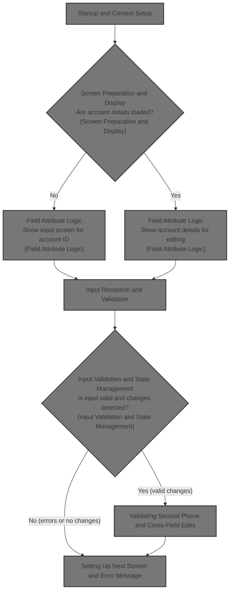
```mermaid
flowchart TD
    node1["Startup and Context Setup"]:::HeadingStyle
    click node1 goToHeading "Startup and Context Setup"
    node1 --> node2{"Screen Preparation and Display
Are account details loaded?
(Screen Preparation and Display)"}:::HeadingStyle
    click node2 goToHeading "Screen Preparation and Display"
    node2 -->|"No"| node3["Field Attribute Logic
Show input screen for account ID
(Field Attribute Logic)"]:::HeadingStyle
    click node3 goToHeading "Field Attribute Logic"
    node2 -->|"Yes"| node4["Field Attribute Logic
Show account details for editing
(Field Attribute Logic)"]:::HeadingStyle
    click node4 goToHeading "Field Attribute Logic"
    node3 --> node5["Input Reception and Validation"]:::HeadingStyle
    click node5 goToHeading "Input Reception and Validation"
    node4 --> node5
    node5 --> node6{"Input Validation and State Management
Is input valid and changes detected?
(Input Validation and State Management)"}:::HeadingStyle
    click node6 goToHeading "Input Validation and State Management"
    node6 -->|"No (errors or no changes)"| node7["Setting Up Next Screen and Error Message"]:::HeadingStyle
    click node7 goToHeading "Setting Up Next Screen and Error Message"
    node6 -->|"Yes (valid changes)"| node8["Validating Second Phone and Cross-Field Edits"]:::HeadingStyle
    click node8 goToHeading "Validating Second Phone and Cross-Field Edits"
    node8 --> node7
classDef HeadingStyle fill:#777777,stroke:#333,stroke-width:2px;
```

## Dependencies

### Programs

- COACTUPC (app/cbl/COACTUPC.cbl)
- LIT-MENUPGM
- CDEMO-FROM-PROGRAM
- CAUP

### Copybooks

- CSUTLDWY (app/cpy/CSUTLDWY.cpy)
- CVCRD01Y (app/cpy/CVCRD01Y.cpy)
- CSLKPCDY (app/cpy/CSLKPCDY.cpy)
- DFHBMSCA
- DFHAID
- COTTL01Y (app/cpy/COTTL01Y.cpy)
- COACTUP (app/cpy-bms/COACTUP.CPY)
- CSDAT01Y (app/cpy/CSDAT01Y.cpy)
- CSMSG01Y (app/cpy/CSMSG01Y.cpy)
- CSMSG02Y (app/cpy/CSMSG02Y.cpy)
- CSUSR01Y (app/cpy/CSUSR01Y.cpy)
- CVACT01Y (app/cpy/CVACT01Y.cpy)
- CVACT03Y (app/cpy/CVACT03Y.cpy)
- CVCUS01Y (app/cpy/CVCUS01Y.cpy)
- COCOM01Y (app/cpy/COCOM01Y.cpy)
- CSSTRPFY (app/cpy/CSSTRPFY.cpy)
- CSUTLDPY (app/cpy/CSUTLDPY.cpy)

## Input and Output Tables/Files used in the Program

| Table / File Name          | Type | Description                              | Usage Mode   | Key Fields / Layout Highlights |
| -------------------------- | ---- | ---------------------------------------- | ------------ | ------------------------------ |
| LIT-ACCTFILENAME           | File | Credit card account master records       | Input/Output | File resource                  |
| LIT-CARDXREFNAME-ACCT-PATH | File | Card-to-account cross-reference mappings | Input        | File resource                  |
| LIT-CUSTFILENAME           | File | Customer personal and contact details    | Input/Output | File resource                  |

&nbsp;

# Workflow

# Startup and Context Setup

This section manages the startup and context setup for a CardDemo transaction, including error handling, context initialization, PF key validation, and routing to the appropriate next step based on user actions and transaction state.

| Rule ID | Code Location | Category        | Rule Name                                              | Description                                                                                                                                                                                                     | Conditions                                                                                                | Remarks                                                                                                                                                                                                                                                                                                                                                 |
| ------- | ------------- | --------------- | ------------------------------------------------------ | --------------------------------------------------------------------------------------------------------------------------------------------------------------------------------------------------------------- | --------------------------------------------------------------------------------------------------------- | ------------------------------------------------------------------------------------------------------------------------------------------------------------------------------------------------------------------------------------------------------------------------------------------------------------------------------------------------------- |
| BR-001  | 0000-MAIN     | Data validation | PF Key Validation                                      | A PF key is considered valid only if it matches one of the allowed actions: ENTER, PFK03, PFK05 (when changes are not confirmed), or PFK12 (when details are fetched). Otherwise, the PF key is marked invalid. | PF key pressed is checked against allowed actions and relevant flags.                                     | Allowed PF keys: 'ENTER', 'PFK03', 'PFK05' (if ACUP-CHANGES-OK-NOT-CONFIRMED), 'PFK12' (if not ACUP-DETAILS-NOT-FETCHED).                                                                                                                                                                                                                               |
| BR-002  | 0000-MAIN     | Business logic  | New Transaction Initialization                         | If the transaction is a new entry (no commarea or coming from the menu without re-entry), all context areas are initialized and entry flags are set to indicate a fresh start.                                  | EIBCALEN is zero, or the previous program is the menu and not a re-entry.                                 | The commarea and working storage are initialized. Entry flags are set to indicate a new transaction. No specific field formats are enforced here.                                                                                                                                                                                                       |
| BR-003  | 0000-MAIN     | Business logic  | Re-entry Context Restoration                           | If the transaction is a re-entry (commarea present and not from menu entry), the commarea data is unpacked into local structures to restore context.                                                            | EIBCALEN is not zero and not coming from the menu as a new entry.                                         | The commarea is split into CARDDEMO-COMMAREA and WS-THIS-PROGCOMMAREA. No specific field formats are enforced here.                                                                                                                                                                                                                                     |
| BR-004  | 0000-MAIN     | Business logic  | PF03 Exit or Transfer                                  | When PF03 is pressed, the program prepares to transfer control to either the main menu or the calling program, updating context fields accordingly.                                                             | PF03 key is pressed.                                                                                      | If CDEMO-FROM-TRANID is LOW-VALUES or SPACES, transfer to menu (LIT-MENUTRANID = 'CM00', LIT-MENUPGM = 'COMEN01C'). Otherwise, transfer to the calling program. Context fields such as CDEMO-TO-TRANID, CDEMO-TO-PROGRAM, CDEMO-FROM-TRANID, CDEMO-FROM-PROGRAM, CDEMO-USRTYP-USER, CDEMO-PGM-ENTER, CDEMO-LAST-MAPSET, and CDEMO-LAST-MAP are updated. |
| BR-005  | 0000-MAIN     | Business logic  | Display Input Screen on Fresh Entry or Missing Details | If details are not loaded or the transaction is entered from the menu, the working area is reset and the input screen is displayed for the user.                                                                | ACUP-DETAILS-NOT-FETCHED is TRUE and CDEMO-PGM-ENTER is TRUE, or coming from the menu and not a re-entry. | The working area is initialized and 3000-SEND-MAP is performed to display the input screen. No specific field formats are enforced here.                                                                                                                                                                                                                |
| BR-006  | 0000-MAIN     | Error handling  | Abend Handling                                         | If an abnormal termination occurs during processing, control is transferred to the ABEND handler to ensure proper error handling.                                                                               | Any abnormal termination (ABEND) occurs during transaction processing.                                    | The handler is registered at the start of the transaction. No specific error codes or formats are defined in this section.                                                                                                                                                                                                                              |
| BR-007  | 0000-MAIN     | Error handling  | Default to ENTER on Invalid PF Key                     | If the PF key is not valid after validation, the program defaults to treating the action as ENTER to prevent the transaction from getting stuck.                                                                | PFK-INVALID is TRUE after validation logic.                                                               | No specific field formats are enforced. The action is forced to ENTER regardless of the original PF key.                                                                                                                                                                                                                                                |

<SwmSnippet path="/app/cbl/COACTUPC.cbl" line="859" repo-id="Z2l0aHViJTNBJTNBa3luZHJ5bC1hd3MtbWFpbmZyYW1lLW1vZGVybml6YXRpb24tY2FyZGRlbW8lM0ElM0FTd2ltbS1EZW1v">

---

In `0000-MAIN` we kick off the flow by registering an ABEND handler with CICS. This means any abnormal termination will jump to ABEND-ROUTINE, so error handling is in place before anything else happens.

```cobol
       0000-MAIN.


           EXEC CICS HANDLE ABEND
                     LABEL(ABEND-ROUTINE)
           END-EXEC
```

---

</SwmSnippet>

<SwmSnippet path="/app/cbl/COACTUPC.cbl" line="866" repo-id="Z2l0aHViJTNBJTNBa3luZHJ5bC1hd3MtbWFpbmZyYW1lLW1vZGVybml6YXRpb24tY2FyZGRlbW8lM0ElM0FTd2ltbS1EZW1v">

---

After setting up error handling, we initialize all working storage and commarea fields, store the current transaction ID, and clear any leftover error messages. This preps the environment for a clean transaction.

```cobol
           INITIALIZE CC-WORK-AREA
                      WS-MISC-STORAGE
                      WS-COMMAREA
      *****************************************************************
      * Store our context
      *****************************************************************
           MOVE LIT-THISTRANID       TO WS-TRANID
      *****************************************************************
      * Ensure error message is cleared                               *
      *****************************************************************
           SET WS-RETURN-MSG-OFF  TO TRUE
```

---

</SwmSnippet>

<SwmSnippet path="/app/cbl/COACTUPC.cbl" line="880" repo-id="Z2l0aHViJTNBJTNBa3luZHJ5bC1hd3MtbWFpbmZyYW1lLW1vZGVybml6YXRpb24tY2FyZGRlbW8lM0ElM0FTd2ltbS1EZW1v">

---

Here we decide if we're starting fresh or re-entering. If it's a new transaction or menu entry, we initialize the commareas and set entry flags. Otherwise, we unpack the commarea data from DFHCOMMAREA into our local structures.

```cobol
           IF EIBCALEN IS EQUAL TO 0
               OR (CDEMO-FROM-PROGRAM = LIT-MENUPGM
               AND NOT CDEMO-PGM-REENTER)
              INITIALIZE CARDDEMO-COMMAREA
                         WS-THIS-PROGCOMMAREA
              SET CDEMO-PGM-ENTER TO TRUE
              SET ACUP-DETAILS-NOT-FETCHED TO TRUE
           ELSE
              MOVE DFHCOMMAREA (1:LENGTH OF CARDDEMO-COMMAREA)  TO
                                CARDDEMO-COMMAREA
              MOVE DFHCOMMAREA(LENGTH OF CARDDEMO-COMMAREA + 1:
                               LENGTH OF WS-THIS-PROGCOMMAREA ) TO
                                WS-THIS-PROGCOMMAREA
           END-IF
```

---

</SwmSnippet>

<SwmSnippet path="/app/cbl/COACTUPC.cbl" line="898" repo-id="Z2l0aHViJTNBJTNBa3luZHJ5bC1hd3MtbWFpbmZyYW1lLW1vZGVybml6YXRpb24tY2FyZGRlbW8lM0ElM0FTd2ltbS1EZW1v">

---

Next we call YYYY-STORE-PFKEY to capture which PF key the user pressed. This info drives the next decision logic.

```cobol
           PERFORM YYYY-STORE-PFKEY
              THRU YYYY-STORE-PFKEY-EXIT
```

---

</SwmSnippet>

<SwmSnippet path="/app/cbl/COACTUPC.cbl" line="905" repo-id="Z2l0aHViJTNBJTNBa3luZHJ5bC1hd3MtbWFpbmZyYW1lLW1vZGVybml6YXRpb24tY2FyZGRlbW8lM0ElM0FTd2ltbS1EZW1v">

---

Here we default to marking the PF key as invalid, then check if the pressed key matches any allowed actions (ENTER, PFK03, PFK05, PFK12 with certain flags) and flip the valid flag if so.

```cobol
           SET PFK-INVALID TO TRUE
           IF CCARD-AID-ENTER OR
              CCARD-AID-PFK03 OR
              (CCARD-AID-PFK05 AND ACUP-CHANGES-OK-NOT-CONFIRMED)
                              OR
              (CCARD-AID-PFK12 AND NOT ACUP-DETAILS-NOT-FETCHED)
              SET PFK-VALID TO TRUE
           END-IF
```

---

</SwmSnippet>

<SwmSnippet path="/app/cbl/COACTUPC.cbl" line="914" repo-id="Z2l0aHViJTNBJTNBa3luZHJ5bC1hd3MtbWFpbmZyYW1lLW1vZGVybml6YXRpb24tY2FyZGRlbW8lM0ElM0FTd2ltbS1EZW1v">

---

If the PF key is still marked invalid, we force the flow to treat it as an ENTER action so the program doesn't get stuck.

```cobol
           IF PFK-INVALID
              SET CCARD-AID-ENTER TO TRUE
           END-IF
```

---

</SwmSnippet>

<SwmSnippet path="/app/cbl/COACTUPC.cbl" line="921" repo-id="Z2l0aHViJTNBJTNBa3luZHJ5bC1hd3MtbWFpbmZyYW1lLW1vZGVybml6YXRpb24tY2FyZGRlbW8lM0ElM0FTd2ltbS1EZW1v">

---

When PF03 is pressed, we prep for exit or transfer by setting up the next transaction ID, choosing either the menu or the calling program based on context.

```cobol
           EVALUATE TRUE
      ******************************************************************
      *       USER PRESSES PF03 TO EXIT
      *  OR   USER IS DONE WITH UPDATE
      *            XCTL TO CALLING PROGRAM OR MAIN MENU
      ******************************************************************
              WHEN CCARD-AID-PFK03
                   SET CCARD-AID-PFK03     TO TRUE

                   IF CDEMO-FROM-TRANID    EQUAL LOW-VALUES
                   OR CDEMO-FROM-TRANID    EQUAL SPACES
                      MOVE LIT-MENUTRANID  TO CDEMO-TO-TRANID
                   ELSE
                      MOVE CDEMO-FROM-TRANID  TO CDEMO-TO-TRANID
                   END-IF
```

---

</SwmSnippet>

<SwmSnippet path="/app/cbl/COACTUPC.cbl" line="937" repo-id="Z2l0aHViJTNBJTNBa3luZHJ5bC1hd3MtbWFpbmZyYW1lLW1vZGVybml6YXRpb24tY2FyZGRlbW8lM0ElM0FTd2ltbS1EZW1v">

---

Next we set up the target program for the XCTL call, picking either the menu program or the calling program depending on context.

```cobol
                   IF CDEMO-FROM-PROGRAM   EQUAL LOW-VALUES
                   OR CDEMO-FROM-PROGRAM   EQUAL SPACES
                      MOVE LIT-MENUPGM     TO CDEMO-TO-PROGRAM
                   ELSE
                      MOVE CDEMO-FROM-PROGRAM TO CDEMO-TO-PROGRAM
                   END-IF
```

---

</SwmSnippet>

<SwmSnippet path="/app/cbl/COACTUPC.cbl" line="944" repo-id="Z2l0aHViJTNBJTNBa3luZHJ5bC1hd3MtbWFpbmZyYW1lLW1vZGVybml6YXRpb24tY2FyZGRlbW8lM0ElM0FTd2ltbS1EZW1v">

---

Before syncing and transferring control, we update the context fields to show where we came from, set user type, entry flags, and last map info.

```cobol
                   MOVE LIT-THISTRANID     TO CDEMO-FROM-TRANID
                   MOVE LIT-THISPGM        TO CDEMO-FROM-PROGRAM

                   SET  CDEMO-USRTYP-USER  TO TRUE
                   SET  CDEMO-PGM-ENTER    TO TRUE
                   MOVE LIT-THISMAPSET     TO CDEMO-LAST-MAPSET
                   MOVE LIT-THISMAP        TO CDEMO-LAST-MAP

                   EXEC CICS
                        SYNCPOINT
                   END-EXEC
```

---

</SwmSnippet>

<SwmSnippet path="/app/cbl/COACTUPC.cbl" line="956" repo-id="Z2l0aHViJTNBJTNBa3luZHJ5bC1hd3MtbWFpbmZyYW1lLW1vZGVybml6YXRpb24tY2FyZGRlbW8lM0ElM0FTd2ltbS1EZW1v">

---

Finally we call XCTL to jump to the next program, handing off all our context in CARDDEMO-COMMAREA.

```cobol
                   EXEC CICS XCTL
                        PROGRAM (CDEMO-TO-PROGRAM)
                        COMMAREA(CARDDEMO-COMMAREA)
                   END-EXEC
```

---

</SwmSnippet>

<SwmSnippet path="/app/cbl/COACTUPC.cbl" line="964" repo-id="Z2l0aHViJTNBJTNBa3luZHJ5bC1hd3MtbWFpbmZyYW1lLW1vZGVybml6YXRpb24tY2FyZGRlbW8lM0ElM0FTd2ltbS1EZW1v">

---

When details aren't loaded or we're coming from the menu, we reset the working area and call 3000-SEND-MAP to display the screen for user input.

```cobol
              WHEN ACUP-DETAILS-NOT-FETCHED
               AND CDEMO-PGM-ENTER
              WHEN CDEMO-FROM-PROGRAM   EQUAL LIT-MENUPGM
               AND NOT CDEMO-PGM-REENTER
                   INITIALIZE WS-THIS-PROGCOMMAREA
                   PERFORM 3000-SEND-MAP THRU
                           3000-SEND-MAP-EXIT
                   SET CDEMO-PGM-REENTER        TO TRUE
                   SET ACUP-DETAILS-NOT-FETCHED TO TRUE
                   GO TO COMMON-RETURN
```

---

</SwmSnippet>

## Screen Preparation and Display

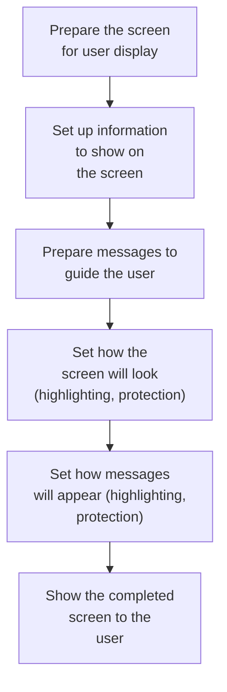
```mermaid
%%{init: {"flowchart": {"defaultRenderer": "elk"}} }%%
flowchart TD
    node1["Prepare the screen 
 for user display"]
    click node1 openCode "app/cbl/COACTUPC.cbl:2650:2651"
    node1 --> node2["Set up information 
 to show on 
 the screen"]
    click node2 openCode "app/cbl/COACTUPC.cbl:2652:2653"
    node2 --> node3["Prepare messages to 
 guide the user"]
    click node3 openCode "app/cbl/COACTUPC.cbl:2654:2655"
    node3 --> node4["Set how the 
 screen will look 
 (highlighting, protection)"]
    click node4 openCode "app/cbl/COACTUPC.cbl:2656:2657"
    node4 --> node5["Set how messages 
 will appear (highlighting, 
 protection)"]
    click node5 openCode "app/cbl/COACTUPC.cbl:2658:2659"
    node5 --> node6["Show the completed 
 screen to the 
 user"]
    click node6 openCode "app/cbl/COACTUPC.cbl:2660:2661"

classDef HeadingStyle fill:#777777,stroke:#333,stroke-width:2px;
```

This section prepares and displays the user interface screen, ensuring all fields, messages, and attributes are set up according to business requirements before the screen is shown to the user.

| Rule ID | Code Location                           | Category       | Rule Name                        | Description                                                                                                                                  | Conditions                                                | Remarks                                                                                                                                               |
| ------- | --------------------------------------- | -------------- | -------------------------------- | -------------------------------------------------------------------------------------------------------------------------------------------- | --------------------------------------------------------- | ----------------------------------------------------------------------------------------------------------------------------------------------------- |
| BR-001  | 3000-SEND-MAP, 3100-SCREEN-INIT         | Business logic | Screen Initialization            | The screen must be initialized before any information is displayed to the user, ensuring that all fields are in a consistent starting state. | Whenever the screen is about to be displayed to the user. | Initialization ensures no residual data or attributes from previous screens are present. All fields are reset to their default state.                 |
| BR-002  | 3000-SEND-MAP, 3200-SETUP-SCREEN-VARS   | Business logic | Screen Variable Setup            | All information and data relevant to the current user interaction must be set up and displayed on the screen.                                | Each time the screen is prepared for display.             | Displayed information includes user data, account details, or any context-specific information required for the current operation.                    |
| BR-003  | 3000-SEND-MAP, 3250-SETUP-INFOMSG       | Business logic | User Guidance Message            | An information message must be prepared and displayed to guide the user during their interaction with the screen.                            | Whenever the screen is displayed to the user.             | The information message provides context-sensitive guidance or instructions. The format is typically a string displayed in a designated message area. |
| BR-004  | 3000-SEND-MAP, 3300-SETUP-SCREEN-ATTRS  | Business logic | Field Protection and Editability | Screen fields must be configured to be either editable or protected, according to business requirements for the current operation.           | Each time the screen is prepared for display.             | Editable fields allow user input; protected fields are read-only. The configuration depends on the current operation or user role.                    |
| BR-005  | 3000-SEND-MAP, 3390-SETUP-INFOMSG-ATTRS | Business logic | Message Appearance Configuration | The appearance of information messages (such as highlighting or protection) must be set to ensure clarity and emphasis for the user.         | Each time an information message is displayed.            | Message appearance may include highlighting, color, or protection from editing. The format is determined by business requirements for visibility.     |
| BR-006  | 3000-SEND-MAP, 3400-SEND-SCREEN         | Business logic | Screen Display                   | The fully prepared screen, with all fields and messages set up, must be displayed to the user.                                               | After all preparation steps are complete.                 | The screen includes all data, field attributes, and messages as configured in previous steps.                                                         |

<SwmSnippet path="/app/cbl/COACTUPC.cbl" line="2649" repo-id="Z2l0aHViJTNBJTNBa3luZHJ5bC1hd3MtbWFpbmZyYW1lLW1vZGVybml6YXRpb24tY2FyZGRlbW8lM0ElM0FTd2ltbS1EZW1v">

---

`3000-SEND-MAP` runs a bunch of setup routines to prep the screen, including initializing, setting variables, info messages, and then calls 3300-SETUP-SCREEN-ATTRS to set which fields are editable or protected.

```cobol
       3000-SEND-MAP.
           PERFORM 3100-SCREEN-INIT
              THRU 3100-SCREEN-INIT-EXIT
           PERFORM 3200-SETUP-SCREEN-VARS
              THRU 3200-SETUP-SCREEN-VARS-EXIT
           PERFORM 3250-SETUP-INFOMSG
              THRU 3250-SETUP-INFOMSG-EXIT
           PERFORM 3300-SETUP-SCREEN-ATTRS
              THRU 3300-SETUP-SCREEN-ATTRS-EXIT
           PERFORM 3390-SETUP-INFOMSG-ATTRS
              THRU 3390-SETUP-INFOMSG-ATTRS-EXIT
           PERFORM 3400-SEND-SCREEN
              THRU 3400-SEND-SCREEN-EXIT
```

---

</SwmSnippet>

## Field Attribute Logic

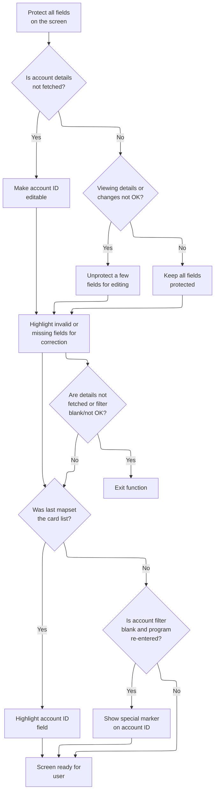
```mermaid
%%{init: {"flowchart": {"defaultRenderer": "elk"}} }%%
flowchart TD
    node1["Protect all fields 
 on the screen"]
    click node1 openCode "app/cbl/COACTUPC.cbl:2988:2990"
    node1 --> node2{"Is account details 
 not fetched?"}
    click node2 openCode "app/cbl/COACTUPC.cbl:2993:2996"
    node2 -->|"Yes"| node3["Make account ID 
 editable"]
    click node3 openCode "app/cbl/COACTUPC.cbl:2996:2996"
    node2 -->|"No"| node4{"Viewing details or 
 changes not OK?"}
    click node4 openCode "app/cbl/COACTUPC.cbl:2997:3000"
    node4 -->|"Yes"| node5["Unprotect a few 
 fields for editing"]
    click node5 openCode "app/cbl/COACTUPC.cbl:2999:3000"
    node4 -->|"No"| node6["Keep all fields 
 protected"]
    click node6 openCode "app/cbl/COACTUPC.cbl:2988:2990"
    node3 --> node7["Highlight invalid or 
 missing fields for 
 correction"]
    node5 --> node7
    node6 --> node7
    click node7 openCode "app/cbl/COACTUPC.cbl:3009:3167"
    node7 --> node8{"Was last mapset 
 the card list?"}
    click node8 openCode "app/cbl/COACTUPC.cbl:3171:3173"
    node8 -->|"Yes"| node9["Highlight account ID 
 field"]
    click node9 openCode "app/cbl/COACTUPC.cbl:3172:3172"
    node8 -->|"No"| node10{"Is account filter 
 blank and program 
 re-entered?"}
    click node10 openCode "app/cbl/COACTUPC.cbl:3180:3183"
    node10 -->|"Yes"| node11["Show special marker 
 on account ID"]
    click node11 openCode "app/cbl/COACTUPC.cbl:3182:3183"
    node10 -->|"No"| node12["Screen ready for 
 user"]
    click node12 openCode "app/cbl/COACTUPC.cbl:3192:3192"
    node9 --> node12
    node11 --> node12
    node7 --> node13{"Are details not 
 fetched or filter 
 blank/not OK?"}
    click node13 openCode "app/cbl/COACTUPC.cbl:3186:3189"
    node13 -->|"Yes"| node14["Exit function"]
    click node14 openCode "app/cbl/COACTUPC.cbl:3189:3189"
    node13 -->|"No"| node8
classDef HeadingStyle fill:#777777,stroke:#333,stroke-width:2px;
```

This section governs how fields on the account update screen are protected, made editable, and visually highlighted based on the current context and validation status, ensuring users are guided to correct errors and only allowed to edit appropriate fields.

| Rule ID | Code Location                                   | Category        | Rule Name                                           | Description                                                                                                                                                                     | Conditions                                                                                                       | Remarks                                                                                                                                         |
| ------- | ----------------------------------------------- | --------------- | --------------------------------------------------- | ------------------------------------------------------------------------------------------------------------------------------------------------------------------------------- | ---------------------------------------------------------------------------------------------------------------- | ----------------------------------------------------------------------------------------------------------------------------------------------- |
| BR-001  | 3300-SETUP-SCREEN-ATTRS                         | Data validation | Highlight invalid or missing fields                 | Any field that is invalid or blank is visually highlighted and the cursor is positioned on it, guiding the user to correct the error.                                           | When any field's validation flag indicates it is blank or not OK.                                                | The field's length is set to -1 to position the cursor, and the field is visually highlighted (e.g., color change or marker).                   |
| BR-002  | 3300-SETUP-SCREEN-ATTRS                         | Data validation | Red highlight for invalid account filter            | If the account filter is invalid, the account ID field is highlighted in red to alert the user to the error.                                                                    | When the account filter is not OK (FLG-ACCTFILTER-NOT-OK is true).                                               | Account ID field color is set to red using the DFHRED constant.                                                                                 |
| BR-003  | 3300-SETUP-SCREEN-ATTRS                         | Data validation | Special marker for blank account filter on re-entry | If the account filter is blank and the program is re-entered, a special marker '\*' is shown on the account ID field and it is highlighted in red to prompt the user for input. | When the account filter is blank (FLG-ACCTFILTER-BLANK) and the program context is re-enter (CDEMO-PGM-REENTER). | Account ID field displays a '\*' and is colored red.                                                                                            |
| BR-004  | 3300-SETUP-SCREEN-ATTRS, 3310-PROTECT-ALL-ATTRS | Business logic  | Default field protection                            | All fields on the account update screen are protected from editing by default, ensuring that no accidental changes can be made until the appropriate context is determined.     | Whenever the account update screen is being set up, regardless of user action or data state.                     | All fields are set to protected status using the CICS protection attribute. This applies to every field in the account update screen structure. |
| BR-005  | 3300-SETUP-SCREEN-ATTRS                         | Business logic  | Editable account ID on missing details              | If account details are not fetched, only the account ID field is editable, allowing the user to enter or correct the account identifier.                                        | When the account details have not been fetched (ACUP-DETAILS-NOT-FETCHED is true).                               | Account ID field is set to editable status using the CICS unprotected attribute. All other fields remain protected.                             |
| BR-006  | 3300-SETUP-SCREEN-ATTRS                         | Business logic  | Selective field editing for corrections             | If the user is viewing details or changes are not OK, a subset of fields is made editable to allow corrections or updates.                                                      | When the user is viewing details (ACUP-SHOW-DETAILS) or changes are not OK (ACUP-CHANGES-NOT-OK).                | Only specific fields relevant to the correction or update are made editable; all others remain protected.                                       |
| BR-007  | 3300-SETUP-SCREEN-ATTRS                         | Business logic  | Default account ID color on card list               | If the last mapset was the card list, the account ID field is displayed in the default color to indicate normal status.                                                         | When the last mapset is equal to the card list mapset (CDEMO-LAST-MAPSET = LIT-CCLISTMAPSET).                    | Account ID field color is set to the default color constant.                                                                                    |
| BR-008  | 3300-SETUP-SCREEN-ATTRS                         | Error handling  | Early exit on missing or invalid data               | If account details are not fetched or the account filter is blank or invalid, the attribute setup process exits early and no further field attributes are set.                  | When account details are not fetched, or account filter is blank or not OK.                                      | No further field attribute setup occurs; the screen remains in its current state.                                                               |

<SwmSnippet path="/app/cbl/COACTUPC.cbl" line="2986" repo-id="Z2l0aHViJTNBJTNBa3luZHJ5bC1hd3MtbWFpbmZyYW1lLW1vZGVybml6YXRpb24tY2FyZGRlbW8lM0ElM0FTd2ltbS1EZW1v">

---

In `3300-SETUP-SCREEN-ATTRS` we start by protecting every field using 3310-PROTECT-ALL-ATTRS. This lets us later unprotect only the fields we want, based on the current action/context.

```cobol
       3300-SETUP-SCREEN-ATTRS.

      *    PROTECT ALL FIELDS
           PERFORM 3310-PROTECT-ALL-ATTRS
              THRU 3310-PROTECT-ALL-ATTRS-EXIT
```

---

</SwmSnippet>

<SwmSnippet path="/app/cbl/COACTUPC.cbl" line="3441" repo-id="Z2l0aHViJTNBJTNBa3luZHJ5bC1hd3MtbWFpbmZyYW1lLW1vZGVybml6YXRpb24tY2FyZGRlbW8lM0ElM0FTd2ltbS1EZW1v">

---

`3310-PROTECT-ALL-ATTRS` just sets the CICS protection attribute (DFHBMPRF) on every field in the CACTUPAI structure, grouped by type for readability.

```cobol
       3310-PROTECT-ALL-ATTRS.
           MOVE DFHBMPRF              TO ACCTSIDA OF CACTUPAI
                                         ACSTTUSA OF CACTUPAI
      *Account Limits
                                         ACRDLIMA OF CACTUPAI
                                         ACSHLIMA OF CACTUPAI
                                         ACURBALA OF CACTUPAI
                                         ACRCYCRA OF CACTUPAI
                                         ACRCYDBA OF CACTUPAI
      *Account dates
                                         OPNYEARA OF CACTUPAI
                                         OPNMONA  OF CACTUPAI
                                         OPNDAYA  OF CACTUPAI
                                         EXPYEARA OF CACTUPAI
                                         EXPMONA  OF CACTUPAI
                                         EXPDAYA  OF CACTUPAI
                                         RISYEARA OF CACTUPAI
                                         RISMONA  OF CACTUPAI
                                         RISDAYA  OF CACTUPAI

                                         AADDGRPA OF CACTUPAI
      *Customer data
                                         ACSTNUMA OF CACTUPAI
                                         ACTSSN1A OF CACTUPAI
                                         ACTSSN2A OF CACTUPAI
                                         ACTSSN3A OF CACTUPAI
                                         ACSTFCOA OF CACTUPAI
      *Date of Birth
                                         DOBYEARA OF CACTUPAI
                                         DOBMONA  OF CACTUPAI
                                         DOBDAYA  OF CACTUPAI

                                         ACSFNAMA OF CACTUPAI
                                         ACSMNAMA OF CACTUPAI
                                         ACSLNAMA OF CACTUPAI
      *Address
                                         ACSADL1A OF CACTUPAI
                                         ACSADL2A OF CACTUPAI
                                         ACSCITYA OF CACTUPAI
                                         ACSSTTEA OF CACTUPAI
                                         ACSZIPCA OF CACTUPAI
                                         ACSCTRYA OF CACTUPAI

                                         ACSPH1AA OF CACTUPAI
                                         ACSPH1BA OF CACTUPAI
                                         ACSPH1CA OF CACTUPAI
                                         ACSPH2AA OF CACTUPAI
                                         ACSPH2BA OF CACTUPAI
                                         ACSPH2CA OF CACTUPAI

                                         ACSGOVTA OF CACTUPAI
                                         ACSEFTCA OF CACTUPAI
                                         ACSPFLGA OF CACTUPAI
                                         INFOMSGA OF CACTUPAI
           .
```

---

</SwmSnippet>

<SwmSnippet path="/app/cbl/COACTUPC.cbl" line="2993" repo-id="Z2l0aHViJTNBJTNBa3luZHJ5bC1hd3MtbWFpbmZyYW1lLW1vZGVybml6YXRpb24tY2FyZGRlbW8lM0ElM0FTd2ltbS1EZW1v">

---

Back in `3300-SETUP-SCREEN-ATTRS`, after protecting everything, we use EVALUATE to selectively unlock fields based on the current action. For example, if details aren't fetched, we make Account Id editable; if we're showing details or editing, we unlock a few more fields.

```cobol
           EVALUATE TRUE
              WHEN ACUP-DETAILS-NOT-FETCHED
      *            Make Account Id editable
                   MOVE DFHBMFSE      TO ACCTSIDA OF CACTUPAI
              WHEN  ACUP-SHOW-DETAILS
              WHEN  ACUP-CHANGES-NOT-OK
                   PERFORM 3320-UNPROTECT-FEW-ATTRS
                      THRU 3320-UNPROTECT-FEW-ATTRS-EXIT
              WHEN ACUP-CHANGES-OK-NOT-CONFIRMED
              WHEN ACUP-CHANGES-OKAYED-AND-DONE
                   CONTINUE
              WHEN OTHER
                   MOVE DFHBMFSE      TO ACCTSIDA OF CACTUPAI
           END-EVALUATE
```

---

</SwmSnippet>

<SwmSnippet path="/app/cbl/COACTUPC.cbl" line="3009" repo-id="Z2l0aHViJTNBJTNBa3luZHJ5bC1hd3MtbWFpbmZyYW1lLW1vZGVybml6YXRpb24tY2FyZGRlbW8lM0ElM0FTd2ltbS1EZW1v">

---

Now we run through a big EVALUATE to set the cursor position. If a field isn't valid or is blank, we set its length to -1 so the cursor jumps there for user input.

```cobol
           EVALUATE TRUE
              WHEN FOUND-ACCOUNT-DATA
              WHEN NO-CHANGES-DETECTED
                  MOVE -1              TO ACSTTUSL OF CACTUPAI
              WHEN FLG-ACCTFILTER-NOT-OK
              WHEN FLG-ACCTFILTER-BLANK
                   MOVE -1             TO ACCTSIDL OF CACTUPAI
      *    Account Status
              WHEN FLG-ACCT-STATUS-NOT-OK
              WHEN FLG-ACCT-STATUS-BLANK
                  MOVE -1              TO ACSTTUSL OF CACTUPAI
      *    Open Year
              WHEN FLG-OPEN-YEAR-NOT-OK
              WHEN FLG-OPEN-YEAR-BLANK
                  MOVE -1              TO OPNYEARL OF CACTUPAI
      *    Open Month
              WHEN FLG-OPEN-MONTH-NOT-OK
              WHEN FLG-OPEN-MONTH-BLANK
                  MOVE -1              TO OPNMONL  OF CACTUPAI
      *    Open Day
              WHEN FLG-OPEN-DAY-NOT-OK
              WHEN FLG-OPEN-DAY-BLANK
                  MOVE -1              TO OPNDAYL  OF CACTUPAI
      *    Credit Limit
              WHEN FLG-CRED-LIMIT-NOT-OK
              WHEN FLG-CRED-LIMIT-BLANK
                  MOVE -1              TO ACRDLIML OF CACTUPAI
      *    Expiry Year
              WHEN FLG-EXPIRY-YEAR-NOT-OK
              WHEN FLG-EXPIRY-YEAR-BLANK
                  MOVE -1              TO EXPYEARL OF CACTUPAI
      *    Expiry Month
              WHEN FLG-EXPIRY-MONTH-NOT-OK
              WHEN FLG-EXPIRY-MONTH-BLANK
                  MOVE -1              TO EXPMONL  OF CACTUPAI
      *    Expiry Day
              WHEN FLG-EXPIRY-DAY-NOT-OK
              WHEN FLG-EXPIRY-DAY-BLANK
                  MOVE -1              TO EXPDAYL  OF CACTUPAI
      *    Cash credit limit
              WHEN FLG-CASH-CREDIT-LIMIT-NOT-OK
              WHEN FLG-CASH-CREDIT-LIMIT-BLANK
                  MOVE -1              TO ACSHLIML OF CACTUPAI
      *    Reissue Year
              WHEN FLG-REISSUE-YEAR-NOT-OK
              WHEN FLG-REISSUE-YEAR-BLANK
                  MOVE -1              TO RISYEARL OF CACTUPAI
      *    Expiry Month
              WHEN FLG-REISSUE-MONTH-NOT-OK
              WHEN FLG-REISSUE-MONTH-BLANK
                  MOVE -1              TO RISMONL  OF CACTUPAI
```

---

</SwmSnippet>

<SwmSnippet path="/app/cbl/COACTUPC.cbl" line="3061" repo-id="Z2l0aHViJTNBJTNBa3luZHJ5bC1hd3MtbWFpbmZyYW1lLW1vZGVybml6YXRpb24tY2FyZGRlbW8lM0ElM0FTd2ltbS1EZW1v">

---

We keep going with the cursor logic, now handling reissue day errors and blanks.

```cobol
              WHEN FLG-REISSUE-DAY-NOT-OK
              WHEN FLG-REISSUE-DAY-BLANK
                  MOVE -1              TO RISDAYL  OF CACTUPAI
```

---

</SwmSnippet>

<SwmSnippet path="/app/cbl/COACTUPC.cbl" line="3066" repo-id="Z2l0aHViJTNBJTNBa3luZHJ5bC1hd3MtbWFpbmZyYW1lLW1vZGVybml6YXRpb24tY2FyZGRlbW8lM0ElM0FTd2ltbS1EZW1v">

---

We continue the error checks for balance, cycle credit/debit, SSN, DOB, FICO, names, and address fields, all in order of priority for cursor placement.

```cobol
              WHEN FLG-CURR-BAL-NOT-OK
              WHEN FLG-CURR-BAL-BLANK
                  MOVE -1              TO ACURBALL OF CACTUPAI
      *    Current Cycle Credit
              WHEN FLG-CURR-CYC-CREDIT-NOT-OK
              WHEN FLG-CURR-CYC-CREDIT-BLANK
                  MOVE -1              TO ACRCYCRL OF CACTUPAI
      *    Current Cycle Debit
              WHEN FLG-CURR-CYC-DEBIT-NOT-OK
              WHEN FLG-CURR-CYC-DEBIT-BLANK
                  MOVE -1              TO ACRCYDBL OF CACTUPAI
      *    SSN Part 1
              WHEN FLG-EDIT-US-SSN-PART1-NOT-OK
              WHEN FLG-EDIT-US-SSN-PART1-BLANK
                  MOVE -1              TO ACTSSN1L OF CACTUPAI
      *    SSN Part 2
              WHEN FLG-EDIT-US-SSN-PART2-NOT-OK
              WHEN FLG-EDIT-US-SSN-PART2-BLANK
                  MOVE -1              TO ACTSSN2L  OF CACTUPAI
      *    SSN Part 3
              WHEN FLG-EDIT-US-SSN-PART3-NOT-OK
              WHEN FLG-EDIT-US-SSN-PART3-BLANK
                  MOVE -1              TO ACTSSN3L  OF CACTUPAI
      *    Date of Birth Year
              WHEN FLG-DT-OF-BIRTH-YEAR-NOT-OK
              WHEN FLG-DT-OF-BIRTH-YEAR-BLANK
                  MOVE -1              TO DOBYEARL OF CACTUPAI
      *    Date of Birth Month
              WHEN FLG-DT-OF-BIRTH-MONTH-NOT-OK
              WHEN FLG-DT-OF-BIRTH-MONTH-BLANK
                  MOVE -1              TO DOBMONL  OF CACTUPAI
      *    Date of Birth Day
              WHEN FLG-DT-OF-BIRTH-DAY-NOT-OK
              WHEN FLG-DT-OF-BIRTH-DAY-BLANK
                  MOVE -1              TO DOBDAYL  OF CACTUPAI
      *    FICO Score
              WHEN FLG-FICO-SCORE-NOT-OK
              WHEN FLG-FICO-SCORE-BLANK
                  MOVE -1              TO ACSTFCOL OF CACTUPAI
      *    First Name
              WHEN FLG-FIRST-NAME-NOT-OK
              WHEN FLG-FIRST-NAME-BLANK
                  MOVE -1              TO ACSFNAML OF CACTUPAI
      *    Middle Name
              WHEN FLG-MIDDLE-NAME-NOT-OK
                  MOVE -1              TO ACSMNAML OF CACTUPAI
      *    Last Name
              WHEN FLG-LAST-NAME-NOT-OK
              WHEN FLG-LAST-NAME-BLANK
                  MOVE -1              TO ACSLNAML OF CACTUPAI
      *    Address Line 1
              WHEN FLG-ADDRESS-LINE-1-NOT-OK
              WHEN FLG-ADDRESS-LINE-1-BLANK
                  MOVE -1              TO ACSADL1L OF CACTUPAI
```

---

</SwmSnippet>

<SwmSnippet path="/app/cbl/COACTUPC.cbl" line="3121" repo-id="Z2l0aHViJTNBJTNBa3luZHJ5bC1hd3MtbWFpbmZyYW1lLW1vZGVybml6YXRpb24tY2FyZGRlbW8lM0ElM0FTd2ltbS1EZW1v">

---

Here we check the state field for errors and set the cursor if needed.

```cobol
              WHEN FLG-STATE-NOT-OK
              WHEN FLG-STATE-BLANK
                  MOVE -1              TO ACSSTTEL OF CACTUPAI
```

---

</SwmSnippet>

<SwmSnippet path="/app/cbl/COACTUPC.cbl" line="3126" repo-id="Z2l0aHViJTNBJTNBa3luZHJ5bC1hd3MtbWFpbmZyYW1lLW1vZGVybml6YXRpb24tY2FyZGRlbW8lM0ElM0FTd2ltbS1EZW1v">

---

We keep running through the rest of the fields—zipcode, city, country, phone numbers, EFT, and cardholder—setting the cursor if any are invalid or blank.

```cobol
              WHEN FLG-ZIPCODE-NOT-OK
              WHEN FLG-ZIPCODE-BLANK
                  MOVE -1              TO ACSZIPCL OF CACTUPAI
      *    Address Line 3 (City)
              WHEN FLG-CITY-NOT-OK
              WHEN FLG-CITY-BLANK
                  MOVE -1              TO ACSCITYL OF CACTUPAI
      *    Country edits.
              WHEN FLG-COUNTRY-NOT-OK
              WHEN FLG-COUNTRY-BLANK
                  MOVE -1              TO ACSCTRYL OF CACTUPAI
      *    Phone 1
              WHEN FLG-PHONE-NUM-1A-NOT-OK
              WHEN FLG-PHONE-NUM-1A-BLANK
                  MOVE -1              TO ACSPH1AL OF CACTUPAI
              WHEN FLG-PHONE-NUM-1B-NOT-OK
              WHEN FLG-PHONE-NUM-1B-BLANK
                  MOVE -1              TO ACSPH1BL OF CACTUPAI
              WHEN FLG-PHONE-NUM-1C-NOT-OK
              WHEN FLG-PHONE-NUM-1C-BLANK
                  MOVE -1              TO ACSPH1CL OF CACTUPAI
      *    Phone 2
              WHEN FLG-PHONE-NUM-2A-NOT-OK
              WHEN FLG-PHONE-NUM-2A-BLANK
                  MOVE -1              TO ACSPH2AL OF CACTUPAI
              WHEN FLG-PHONE-NUM-2B-NOT-OK
              WHEN FLG-PHONE-NUM-2B-BLANK
                  MOVE -1              TO ACSPH2BL OF CACTUPAI
              WHEN FLG-PHONE-NUM-2C-NOT-OK
              WHEN FLG-PHONE-NUM-2C-BLANK
                  MOVE -1              TO ACSPH2CL OF CACTUPAI
      *    EFT Account Id
              WHEN FLG-EFT-ACCOUNT-ID-NOT-OK
              WHEN FLG-EFT-ACCOUNT-ID-BLANK
                  MOVE -1              TO ACSEFTCL OF CACTUPAI
      *    Primary Card Holder
              WHEN FLG-PRI-CARDHOLDER-NOT-OK
              WHEN FLG-PRI-CARDHOLDER-BLANK
                  MOVE -1              TO ACSPFLGL OF CACTUPAI
              WHEN OTHER
                  MOVE -1              TO ACCTSIDL OF CACTUPAI
            END-EVALUATE
```

---

</SwmSnippet>

<SwmSnippet path="/app/cbl/COACTUPC.cbl" line="3171" repo-id="Z2l0aHViJTNBJTNBa3luZHJ5bC1hd3MtbWFpbmZyYW1lLW1vZGVybml6YXRpb24tY2FyZGRlbW8lM0ElM0FTd2ltbS1EZW1v">

---

Now we set the Account Id color to default if we're on the account list mapset, so the field looks normal unless there's an error.

```cobol
           IF CDEMO-LAST-MAPSET   EQUAL LIT-CCLISTMAPSET
              MOVE DFHDFCOL            TO ACCTSIDC OF CACTUPAO
           END-IF
```

---

</SwmSnippet>

<SwmSnippet path="/app/cbl/COACTUPC.cbl" line="3176" repo-id="Z2l0aHViJTNBJTNBa3luZHJ5bC1hd3MtbWFpbmZyYW1lLW1vZGVybml6YXRpb24tY2FyZGRlbW8lM0ElM0FTd2ltbS1EZW1v">

---

If the account filter isn't valid, we set the Account Id color to red to flag it for the user.

```cobol
           IF FLG-ACCTFILTER-NOT-OK
              MOVE DFHRED              TO ACCTSIDC OF CACTUPAO
           END-IF
```

---

</SwmSnippet>

<SwmSnippet path="/app/cbl/COACTUPC.cbl" line="3180" repo-id="Z2l0aHViJTNBJTNBa3luZHJ5bC1hd3MtbWFpbmZyYW1lLW1vZGVybml6YXRpb24tY2FyZGRlbW8lM0ElM0FTd2ltbS1EZW1v">

---

If the filter is blank and we're re-entering, we show a '\*' and set the color to red so the user knows they need to fill it in.

```cobol
           IF  FLG-ACCTFILTER-BLANK
           AND CDEMO-PGM-REENTER
               MOVE '*'                TO ACCTSIDO OF CACTUPAO
               MOVE DFHRED             TO ACCTSIDC OF CACTUPAO
           END-IF
```

---

</SwmSnippet>

<SwmSnippet path="/app/cbl/COACTUPC.cbl" line="3186" repo-id="Z2l0aHViJTNBJTNBa3luZHJ5bC1hd3MtbWFpbmZyYW1lLW1vZGVybml6YXRpb24tY2FyZGRlbW8lM0ElM0FTd2ltbS1EZW1v">

---

If details aren't loaded or the filter is blank/invalid, we bail out early and skip the rest of the attribute setup.

```cobol
           IF ACUP-DETAILS-NOT-FETCHED
           OR FLG-ACCTFILTER-BLANK
           OR FLG-ACCTFILTER-NOT-OK
              GO TO 3300-SETUP-SCREEN-ATTRS-EXIT
           ELSE
              CONTINUE
           END-IF
```

---

</SwmSnippet>

<SwmSnippet path="/app/cbl/COACTUPC.cbl" line="3208" repo-id="Z2l0aHViJTNBJTNBa3luZHJ5bC1hd3MtbWFpbmZyYW1lLW1vZGVybml6YXRpb24tY2FyZGRlbW8lM0ElM0FTd2ltbS1EZW1v">

---

We set up all field attributes in bulk using templates.

```cobol
           COPY CSSETATY REPLACING
             ==(TESTVAR1)== BY ==ACCT-STATUS==
             ==(SCRNVAR2)== BY ==ACSTTUS==
             ==(MAPNAME3)== BY ==CACTUPA== .

      *    Open Year
           COPY CSSETATY REPLACING
             ==(TESTVAR1)== BY ==OPEN-YEAR==
             ==(SCRNVAR2)== BY ==OPNYEAR==
             ==(MAPNAME3)== BY ==CACTUPA== .

      *    Open Month
           COPY CSSETATY REPLACING
             ==(TESTVAR1)== BY ==OPEN-MONTH==
             ==(SCRNVAR2)== BY ==OPNMON==
             ==(MAPNAME3)== BY ==CACTUPA== .

      *    Open Day
           COPY CSSETATY REPLACING
             ==(TESTVAR1)== BY ==OPEN-DAY==
             ==(SCRNVAR2)== BY ==OPNDAY==
             ==(MAPNAME3)== BY ==CACTUPA== .

      *    Credit Limit
           COPY CSSETATY REPLACING
             ==(TESTVAR1)== BY ==CRED-LIMIT==
             ==(SCRNVAR2)== BY ==ACRDLIM==
             ==(MAPNAME3)== BY ==CACTUPA== .

      *    Expiry Year
           COPY CSSETATY REPLACING
             ==(TESTVAR1)== BY ==EXPIRY-YEAR==
             ==(SCRNVAR2)== BY ==EXPYEAR==
             ==(MAPNAME3)== BY ==CACTUPA== .

      *    Expiry Month
           COPY CSSETATY REPLACING
             ==(TESTVAR1)== BY ==EXPIRY-MONTH==
             ==(SCRNVAR2)== BY ==EXPMON==
             ==(MAPNAME3)== BY ==CACTUPA== .

      *    Expiry Day
           COPY CSSETATY REPLACING
             ==(TESTVAR1)== BY ==EXPIRY-DAY==
             ==(SCRNVAR2)== BY ==EXPDAY==
             ==(MAPNAME3)== BY ==CACTUPA== .

      *    Cash Credit Limit
           COPY CSSETATY REPLACING
             ==(TESTVAR1)== BY ==CASH-CREDIT-LIMIT==
             ==(SCRNVAR2)== BY ==ACSHLIM==
             ==(MAPNAME3)== BY ==CACTUPA== .

      *    Reissue Year
           COPY CSSETATY REPLACING
             ==(TESTVAR1)== BY ==REISSUE-YEAR==
             ==(SCRNVAR2)== BY ==RISYEAR==
             ==(MAPNAME3)== BY ==CACTUPA== .

      *    Reissue Month
           COPY CSSETATY REPLACING
             ==(TESTVAR1)== BY ==REISSUE-MONTH==
             ==(SCRNVAR2)== BY ==RISMON==
             ==(MAPNAME3)== BY ==CACTUPA== .

      *    Reissue Day
           COPY CSSETATY REPLACING
             ==(TESTVAR1)== BY ==REISSUE-DAY==
             ==(SCRNVAR2)== BY ==RISDAY==
             ==(MAPNAME3)== BY ==CACTUPA== .

      *    Current Balance
           COPY CSSETATY REPLACING
             ==(TESTVAR1)== BY ==CURR-BAL==
             ==(SCRNVAR2)== BY ==ACURBAL==
             ==(MAPNAME3)== BY ==CACTUPA== .

      *    Current Cycle Credit
           COPY CSSETATY REPLACING
             ==(TESTVAR1)== BY ==CURR-CYC-CREDIT==
             ==(SCRNVAR2)== BY ==ACRCYCR==
             ==(MAPNAME3)== BY ==CACTUPA== .

      *    Current Cycle Debit
           COPY CSSETATY REPLACING
             ==(TESTVAR1)== BY ==CURR-CYC-DEBIT==
             ==(SCRNVAR2)== BY ==ACRCYDB==
             ==(MAPNAME3)== BY ==CACTUPA== .

      *    SSN Part 1
           COPY CSSETATY REPLACING
             ==(TESTVAR1)== BY ==EDIT-US-SSN-PART1==
             ==(SCRNVAR2)== BY ==ACTSSN1==
             ==(MAPNAME3)== BY ==CACTUPA== .

      *    SSN Part 2
           COPY CSSETATY REPLACING
             ==(TESTVAR1)== BY ==EDIT-US-SSN-PART2==
             ==(SCRNVAR2)== BY ==ACTSSN2==
             ==(MAPNAME3)== BY ==CACTUPA== .

      *    SSN Part 3
           COPY CSSETATY REPLACING
             ==(TESTVAR1)== BY ==EDIT-US-SSN-PART3==
             ==(SCRNVAR2)== BY ==ACTSSN3==
             ==(MAPNAME3)== BY ==CACTUPA== .

      *    Date of Birth Year
           COPY CSSETATY REPLACING
             ==(TESTVAR1)== BY ==DT-OF-BIRTH-YEAR==
             ==(SCRNVAR2)== BY ==DOBYEAR==
             ==(MAPNAME3)== BY ==CACTUPA== .

      *    Date of Birth Month
           COPY CSSETATY REPLACING
             ==(TESTVAR1)== BY ==DT-OF-BIRTH-MONTH==
             ==(SCRNVAR2)== BY ==DOBMON==
             ==(MAPNAME3)== BY ==CACTUPA== .

      *    Date of Birth Day
           COPY CSSETATY REPLACING
             ==(TESTVAR1)== BY ==DT-OF-BIRTH-DAY==
             ==(SCRNVAR2)== BY ==DOBDAY==
             ==(MAPNAME3)== BY ==CACTUPA== .

      *    FICO Score
           COPY CSSETATY REPLACING
             ==(TESTVAR1)== BY ==FICO-SCORE==
             ==(SCRNVAR2)== BY ==ACSTFCO==
             ==(MAPNAME3)== BY ==CACTUPA== .

      *    First Name
           COPY CSSETATY REPLACING
             ==(TESTVAR1)== BY ==FIRST-NAME==
             ==(SCRNVAR2)== BY ==ACSFNAM==
             ==(MAPNAME3)== BY ==CACTUPA== .

      *    Middle Name (no edits coded)
           COPY CSSETATY REPLACING
             ==(TESTVAR1)== BY ==MIDDLE-NAME==
             ==(SCRNVAR2)== BY ==ACSMNAM==
             ==(MAPNAME3)== BY ==CACTUPA== .

      *    Last Name
           COPY CSSETATY REPLACING
             ==(TESTVAR1)== BY ==LAST-NAME==
             ==(SCRNVAR2)== BY ==ACSLNAM==
             ==(MAPNAME3)== BY ==CACTUPA== .

      *    Address Line 1
           COPY CSSETATY REPLACING
             ==(TESTVAR1)== BY ==ADDRESS-LINE-1==
             ==(SCRNVAR2)== BY ==ACSADL1==
             ==(MAPNAME3)== BY ==CACTUPA== .

      *    State
           COPY CSSETATY REPLACING
             ==(TESTVAR1)== BY ==STATE==
             ==(SCRNVAR2)== BY ==ACSSTTE==
             ==(MAPNAME3)== BY ==CACTUPA== .

      *    Address Line 2 (NO EDITS CODED AS YET)
           COPY CSSETATY REPLACING
             ==(TESTVAR1)== BY ==ADDRESS-LINE-2==
             ==(SCRNVAR2)== BY ==ACSADL2==
             ==(MAPNAME3)== BY ==CACTUPA== .

      *    State
           COPY CSSETATY REPLACING
             ==(TESTVAR1)== BY ==ZIPCODE==
             ==(SCRNVAR2)== BY ==ACSZIPC==
             ==(MAPNAME3)== BY ==CACTUPA== .

      *    City
           COPY CSSETATY REPLACING
             ==(TESTVAR1)== BY ==CITY==
             ==(SCRNVAR2)== BY ==ACSCITY==
             ==(MAPNAME3)== BY ==CACTUPA== .

      *    Country
           COPY CSSETATY REPLACING
             ==(TESTVAR1)== BY ==COUNTRY==
             ==(SCRNVAR2)== BY ==ACSCTRY==
             ==(MAPNAME3)== BY ==CACTUPA== .

      *    Phone 1 Area Code
           COPY CSSETATY REPLACING
             ==(TESTVAR1)== BY ==PHONE-NUM-1A==
             ==(SCRNVAR2)== BY ==ACSPH1A==
             ==(MAPNAME3)== BY ==CACTUPA== .

      *    Phone 1 Prefix
           COPY CSSETATY REPLACING
             ==(TESTVAR1)== BY ==PHONE-NUM-1B==
             ==(SCRNVAR2)== BY ==ACSPH1B==
             ==(MAPNAME3)== BY ==CACTUPA== .
      *    Phone 1 Line number
           COPY CSSETATY REPLACING
             ==(TESTVAR1)== BY ==PHONE-NUM-1C==
             ==(SCRNVAR2)== BY ==ACSPH1C==
             ==(MAPNAME3)== BY ==CACTUPA== .

      *    Phone 2 Area Code
           COPY CSSETATY REPLACING
             ==(TESTVAR1)== BY ==PHONE-NUM-2A==
             ==(SCRNVAR2)== BY ==ACSPH2A==
             ==(MAPNAME3)== BY ==CACTUPA== .

      *    Phone 2 Prefix
           COPY CSSETATY REPLACING
             ==(TESTVAR1)== BY ==PHONE-NUM-2B==
             ==(SCRNVAR2)== BY ==ACSPH2B==
             ==(MAPNAME3)== BY ==CACTUPA== .
      *    Phone 2 Line number
           COPY CSSETATY REPLACING
             ==(TESTVAR1)== BY ==PHONE-NUM-2C==
             ==(SCRNVAR2)== BY ==ACSPH2C==
             ==(MAPNAME3)== BY ==CACTUPA== .
      *    EFT Account Id
           COPY CSSETATY REPLACING
             ==(TESTVAR1)== BY ==PRI-CARDHOLDER==
             ==(SCRNVAR2)== BY ==ACSPFLG==
             ==(MAPNAME3)== BY ==CACTUPA== .
      *    Primary Card Holder
           COPY CSSETATY REPLACING
             ==(TESTVAR1)== BY ==EFT-ACCOUNT-ID==
             ==(SCRNVAR2)== BY ==ACSEFTC==
             ==(MAPNAME3)== BY ==CACTUPA== .
           .
```

---

</SwmSnippet>

## Post-Display State Handling

This section manages the application's behavior after the main account update screen is displayed, ensuring the user is either given a fresh start after changes or allowed to continue interacting with the application based on their input.

| Rule ID | Code Location | Category       | Rule Name                              | Description                                                                                                                                                                                                         | Conditions                                                                         | Remarks                                                                                                                                                        |
| ------- | ------------- | -------------- | -------------------------------------- | ------------------------------------------------------------------------------------------------------------------------------------------------------------------------------------------------------------------- | ---------------------------------------------------------------------------------- | -------------------------------------------------------------------------------------------------------------------------------------------------------------- |
| BR-001  | 0000-MAIN     | Business logic | Post-Change Reset and Redisplay        | If changes to the account have been confirmed and processed successfully, or if changes have failed, all working areas and flags are reset and the account update screen is redisplayed for a fresh start or retry. | ACUP-CHANGE-ACTION is 'C' (confirmed and done), 'L' (lock error), or 'F' (failed). | ACUP-CHANGE-ACTION values: 'C' means changes confirmed and done, 'L' means lock error, 'F' means failed. The screen is redisplayed for a new attempt or retry. |
| BR-002  | 0000-MAIN     | Business logic | Default Input Processing and Redisplay | For all other cases not covered by post-change reset, user input is processed, the next action is determined, and the account update screen is redisplayed.                                                         | ACUP-CHANGE-ACTION is not 'C', 'L', or 'F'.                                        | Covers all flows not explicitly handled by the post-change reset logic. Ensures the screen is always redisplayed after processing.                             |

<SwmSnippet path="/app/cbl/COACTUPC.cbl" line="979" repo-id="Z2l0aHViJTNBJTNBa3luZHJ5bC1hd3MtbWFpbmZyYW1lLW1vZGVybml6YXRpb24tY2FyZGRlbW8lM0ElM0FTd2ltbS1EZW1v">

---

Back in `0000-MAIN`, after returning from 3000-SEND-MAP, if changes are done or failed, we reset all working areas and flags, then send the screen again for a fresh start or retry.

```cobol
              WHEN ACUP-CHANGES-OKAYED-AND-DONE
              WHEN ACUP-CHANGES-FAILED
                   INITIALIZE WS-THIS-PROGCOMMAREA
                              WS-MISC-STORAGE
                              CDEMO-ACCT-ID
                   SET CDEMO-PGM-ENTER            TO TRUE
                   PERFORM 3000-SEND-MAP THRU
                           3000-SEND-MAP-EXIT
                   SET CDEMO-PGM-REENTER          TO TRUE
                   SET ACUP-DETAILS-NOT-FETCHED   TO TRUE
                   GO TO COMMON-RETURN
```

---

</SwmSnippet>

<SwmSnippet path="/app/cbl/COACTUPC.cbl" line="996" repo-id="Z2l0aHViJTNBJTNBa3luZHJ5bC1hd3MtbWFpbmZyYW1lLW1vZGVybml6YXRpb24tY2FyZGRlbW8lM0ElM0FTd2ltbS1EZW1v">

---

For any other flow, we process user inputs, decide what to do next, and send the screen again. This covers all cases not handled by the earlier logic.

```cobol
              WHEN OTHER
                   PERFORM 1000-PROCESS-INPUTS
                      THRU 1000-PROCESS-INPUTS-EXIT
                   PERFORM 2000-DECIDE-ACTION
                      THRU 2000-DECIDE-ACTION-EXIT
                   PERFORM 3000-SEND-MAP
                      THRU 3000-SEND-MAP-EXIT
                   GO TO COMMON-RETURN
           END-EVALUATE
```

---

</SwmSnippet>

# Input Reception and Validation

This section is responsible for receiving user input from the screen and ensuring that all inputs are validated and edited according to business rules before further processing. If validation fails, an error message is set for the user.

| Rule ID | Code Location       | Category        | Rule Name                             | Description                                                                                                                                                                                  | Conditions                                                                    | Remarks                                                                                                                                                                                                        |
| ------- | ------------------- | --------------- | ------------------------------------- | -------------------------------------------------------------------------------------------------------------------------------------------------------------------------------------------- | ----------------------------------------------------------------------------- | -------------------------------------------------------------------------------------------------------------------------------------------------------------------------------------------------------------- |
| BR-001  | 1000-PROCESS-INPUTS | Data validation | Input Reception Required              | User input must be received from the screen before any validation or editing is performed. If input is not received, no further processing occurs.                                           | This rule applies whenever the process is initiated to handle user input.     | Input is expected to be received from a user interface screen. No specific format is enforced at this stage.                                                                                                   |
| BR-002  | 1000-PROCESS-INPUTS | Data validation | Input Validation and Editing          | All user inputs must be validated and edited according to business rules before further processing. If any input fails validation, an error message is set and further processing is halted. | This rule applies after input has been received from the user.                | Validation may include checks for mandatory fields, correct data types (e.g., numeric, alphanumeric, yes/no), and business-specific constraints. Error messages are displayed to the user if validation fails. |
| BR-003  | 1000-PROCESS-INPUTS | Error handling  | Error Messaging on Validation Failure | If input validation fails, an error message must be set and made available for display to the user, indicating the nature of the input error.                                                | This rule applies whenever input validation fails during the editing process. | Error messages are stored in a 75-character alphanumeric field and are intended to be displayed to the user.                                                                                                   |

<SwmSnippet path="/app/cbl/COACTUPC.cbl" line="1025" repo-id="Z2l0aHViJTNBJTNBa3luZHJ5bC1hd3MtbWFpbmZyYW1lLW1vZGVybml6YXRpb24tY2FyZGRlbW8lM0ElM0FTd2ltbS1EZW1v">

---

In `1000-PROCESS-INPUTS` we start by grabbing the user's input from the screen using 1100-RECEIVE-MAP, then move on to editing and validating those inputs.

```cobol
       1000-PROCESS-INPUTS.
           PERFORM 1100-RECEIVE-MAP
              THRU 1100-RECEIVE-MAP-EXIT
           PERFORM 1200-EDIT-MAP-INPUTS
              THRU 1200-EDIT-MAP-INPUTS-EXIT
```

---

</SwmSnippet>

## Screen Input Extraction

This section extracts user input from the screen, normalizes it by treating '\*' and blank fields as empty, and determines whether to proceed with input validation based on whether account details have been fetched.

| Rule ID | Code Location    | Category        | Rule Name                                        | Description                                                                                                                                                     | Conditions                                                                                      | Remarks                                                                                                                                                                                                                            |
| ------- | ---------------- | --------------- | ------------------------------------------------ | --------------------------------------------------------------------------------------------------------------------------------------------------------------- | ----------------------------------------------------------------------------------------------- | ---------------------------------------------------------------------------------------------------------------------------------------------------------------------------------------------------------------------------------- |
| BR-001  | 1100-RECEIVE-MAP | Data validation | Skip Processing When Details Not Fetched         | If account details are not fetched (i.e., the change action is blank or empty), the system skips further input processing and exits the input extraction logic. | If the change action field is blank (LOW-VALUES or SPACES), indicating details are not fetched. | The condition is determined by the ACUP-DETAILS-NOT-FETCHED flag, which is true when the change action is LOW-VALUES or SPACES.                                                                                                    |
| BR-002  | 1100-RECEIVE-MAP | Data validation | Proceed to Input Validation When Details Fetched | After extracting and normalizing input, the system proceeds to validate and clean up the input data only if details have been fetched.                          | If details have been fetched (change action is not blank or empty).                             | Input validation and cleanup is performed in the next step (1200-EDIT-MAP-INPUTS) only if the details-not-fetched flag is not set.                                                                                                 |
| BR-003  | 1100-RECEIVE-MAP | Business logic  | Asterisk and Blank Treated as Empty              | When a user enters '\*' or leaves a field blank on the screen, the system treats that field as empty and does not process it as a real input value.             | If any input field from the screen contains '\*' or is blank (spaces).                          | The special values '\*' and SPACES are interpreted as empty. The internal representation for empty is LOW-VALUES. This applies to all mapped fields, including account ID, status, credit limits, balances, customer details, etc. |

<SwmSnippet path="/app/cbl/COACTUPC.cbl" line="1039" repo-id="Z2l0aHViJTNBJTNBa3luZHJ5bC1hd3MtbWFpbmZyYW1lLW1vZGVybml6YXRpb24tY2FyZGRlbW8lM0ElM0FTd2ltbS1EZW1v">

---

We grab all user input from the screen into our data area.

```cobol
       1100-RECEIVE-MAP.
           EXEC CICS RECEIVE MAP(LIT-THISMAP)
                     MAPSET(LIT-THISMAPSET)
                     INTO(CACTUPAI)
                     RESP(WS-RESP-CD)
                     RESP2(WS-REAS-CD)
           END-EXEC
```

---

</SwmSnippet>

<SwmSnippet path="/app/cbl/COACTUPC.cbl" line="1047" repo-id="Z2l0aHViJTNBJTNBa3luZHJ5bC1hd3MtbWFpbmZyYW1lLW1vZGVybml6YXRpb24tY2FyZGRlbW8lM0ElM0FTd2ltbS1EZW1v">

---

After receiving input, we copy each field from CACTUPAI to our working variables, treating '\*' and SPACES as empty by setting LOW-VALUES. This makes sure only real input gets processed.

```cobol
           INITIALIZE ACUP-NEW-DETAILS
      ******************************************************************
      *    Account Master data
      ******************************************************************
           IF  ACCTSIDI OF CACTUPAI = '*'
           OR  ACCTSIDI OF CACTUPAI = SPACES
               MOVE LOW-VALUES           TO CC-ACCT-ID
                                            ACUP-NEW-ACCT-ID-X
           ELSE
               MOVE ACCTSIDI OF CACTUPAI TO CC-ACCT-ID
                                            ACUP-NEW-ACCT-ID-X
           END-IF
```

---

</SwmSnippet>

<SwmSnippet path="/app/cbl/COACTUPC.cbl" line="1060" repo-id="Z2l0aHViJTNBJTNBa3luZHJ5bC1hd3MtbWFpbmZyYW1lLW1vZGVybml6YXRpb24tY2FyZGRlbW8lM0ElM0FTd2ltbS1EZW1v">

---

If details aren't fetched, we skip editing and exit. Otherwise, we move on to 1200-EDIT-MAP-INPUTS to validate and clean up the input data.

```cobol
           IF ACUP-DETAILS-NOT-FETCHED
              GO TO 1100-RECEIVE-MAP-EXIT
           END-IF
```

---

</SwmSnippet>

### Input Validation and State Management

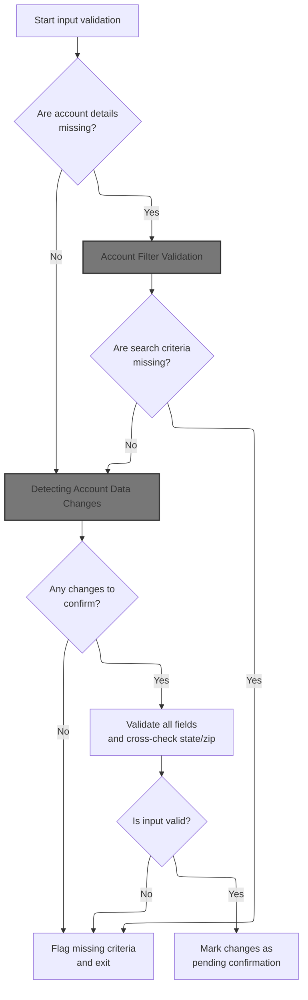
```mermaid
%%{init: {"flowchart": {"defaultRenderer": "elk"}} }%%
flowchart TD
    node1["Start input validation"]
    click node1 openCode "app/cbl/COACTUPC.cbl:1429:1432"
    node1 --> node2{"Are account details 
 missing?"}
    click node2 openCode "app/cbl/COACTUPC.cbl:1433:1433"
    node2 -->|"Yes"| node3["Account Filter Validation"]
    
    node3 --> node4{"Are search criteria 
 missing?"}
    click node4 openCode "app/cbl/COACTUPC.cbl:1441:1442"
    node4 -->|"Yes"| node5["Flag missing criteria 
 and exit"]
    click node5 openCode "app/cbl/COACTUPC.cbl:1442:1446"
    node4 -->|"No"| node6["Detecting Account Data Changes"]
    
    node2 -->|"No"| node6
    node6 --> node7{"Any changes to 
 confirm?"}
    click node7 openCode "app/cbl/COACTUPC.cbl:1463:1465"
    node7 -->|"No"| node5
    node7 -->|"Yes"| node8["Validate all fields 
 and cross-check state/zip"]
    click node8 openCode "app/cbl/COACTUPC.cbl:1470:1669"
    node8 --> node9{"Is input valid?"}
    click node9 openCode "app/cbl/COACTUPC.cbl:1671:1675"
    node9 -->|"No"| node5
    node9 -->|"Yes"| node10["Mark changes as 
 pending confirmation"]
    click node10 openCode "app/cbl/COACTUPC.cbl:1674:1675"
classDef HeadingStyle fill:#777777,stroke:#333,stroke-width:2px;
click node3 goToHeading "Account Filter Validation"
node3:::HeadingStyle
click node6 goToHeading "Detecting Account Data Changes"
node6:::HeadingStyle
```

This section validates user input for account updates and manages the state transitions for pending, confirmed, or rejected changes based on input validity.

| Rule ID | Code Location        | Category        | Rule Name                                 | Description                                                                                                                                                                                                                                      | Conditions                                                                                          | Remarks                                                                                                                                                                                               |
| ------- | -------------------- | --------------- | ----------------------------------------- | ------------------------------------------------------------------------------------------------------------------------------------------------------------------------------------------------------------------------------------------------ | --------------------------------------------------------------------------------------------------- | ----------------------------------------------------------------------------------------------------------------------------------------------------------------------------------------------------- |
| BR-001  | 1200-EDIT-MAP-INPUTS | Data validation | Search Criteria Validation Before Details | If account details have not been fetched, the system validates the search criteria before proceeding with any further processing.                                                                                                                | Account details are not fetched (ACUP-CHANGE-ACTION is LOW-VALUES or SPACES).                       | Account details are considered not fetched if the action code is either LOW-VALUES or a single space character. Search criteria must be validated before any other processing occurs in this context. |
| BR-002  | 1210-EDIT-ACCOUNT    | Data validation | Missing Search Criteria Handling          | If search criteria are missing when account details are not fetched, the system flags the missing criteria and exits input validation without proceeding further.                                                                                | Account details are not fetched and search criteria are missing.                                    | If search criteria are missing, an error message is set and input validation is terminated. The output message is 'No input received'.                                                                |
| BR-003  | 1200-EDIT-MAP-INPUTS | Data validation | Full Field Validation on Change           | If changes to account data are detected, all input fields are validated, including cross-checking the state and zip code for consistency. If any input is invalid, the system flags the error and does not mark changes as pending confirmation. | Changes to account data are detected (ACUP-CHANGE-ACTION is not LOW-VALUES or SPACES, and not 'C'). | All fields must be validated, including cross-checks between state and zip code. If any field is invalid, input is flagged as error and changes are not marked as pending confirmation.               |
| BR-004  | 1200-EDIT-MAP-INPUTS | Business logic  | Pending Confirmation State                | If all input is valid after changes are detected, the system marks the changes as pending confirmation, allowing the user to review and confirm the updates.                                                                                     | All input fields are valid after changes are detected.                                              | When all input is valid, the system transitions to a state where changes are pending confirmation. This is indicated by setting the action code to 'N'.                                               |

<SwmSnippet path="/app/cbl/COACTUPC.cbl" line="1429" repo-id="Z2l0aHViJTNBJTNBa3luZHJ5bC1hd3MtbWFpbmZyYW1lLW1vZGVybml6YXRpb24tY2FyZGRlbW8lM0ElM0FTd2ltbS1EZW1v">

---

In `1200-EDIT-MAP-INPUTS` we start by marking input as OK, then if details aren't fetched, we validate the search keys using 1210-EDIT-ACCOUNT before doing anything else.

```cobol
       1200-EDIT-MAP-INPUTS.

           SET INPUT-OK                  TO TRUE

           IF  ACUP-DETAILS-NOT-FETCHED
      *        VALIDATE THE SEARCH KEYS
               PERFORM 1210-EDIT-ACCOUNT
                  THRU 1210-EDIT-ACCOUNT-EXIT
```

---

</SwmSnippet>

#### Account Filter Validation

This section ensures that an account ID is provided before any further processing. If the account ID is missing, the user is prompted to enter it and no further validation occurs until a valid account ID is supplied.

| Rule ID | Code Location     | Category        | Rule Name                       | Description                                                                                                                                                                              | Conditions                                                               | Remarks                                                                                                                                                    |
| ------- | ----------------- | --------------- | ------------------------------- | ---------------------------------------------------------------------------------------------------------------------------------------------------------------------------------------- | ------------------------------------------------------------------------ | ---------------------------------------------------------------------------------------------------------------------------------------------------------- |
| BR-001  | 1210-EDIT-ACCOUNT | Data validation | Account ID Required             | If the account ID is blank or set to LOW-VALUES, the system must flag the input as an error, prompt the user to provide an account ID, and halt further validation for mandatory fields. | The account ID field is equal to SPACES or LOW-VALUES.                   | A blank account ID is defined as either all spaces or all LOW-VALUES. The prompt message is set only if the return message is currently off (i.e., blank). |
| BR-002  | 1210-EDIT-ACCOUNT | Data validation | Proceed to Mandatory Validation | If the account ID is present (not blank or LOW-VALUES), the system must proceed to validate other mandatory fields.                                                                      | The account ID field is not equal to SPACES and not equal to LOW-VALUES. | Mandatory field validation is only triggered if a valid account ID is present.                                                                             |
| BR-003  | 1210-EDIT-ACCOUNT | Error handling  | Reset Account ID on Error       | When the account ID is missing, the system must reset the account ID fields to zeroes to ensure no partial or invalid data is retained.                                                  | The account ID field is equal to SPACES or LOW-VALUES.                   | Both the main account ID field and the new account ID field are set to all zeroes (numeric string of length 11).                                           |

<SwmSnippet path="/app/cbl/COACTUPC.cbl" line="1783" repo-id="Z2l0aHViJTNBJTNBa3luZHJ5bC1hd3MtbWFpbmZyYW1lLW1vZGVybml6YXRpb24tY2FyZGRlbW8lM0ElM0FTd2ltbS1EZW1v">

---

In `1210-EDIT-ACCOUNT` we check if the account ID is blank or low-values. If it is, we set error flags, prompt for account, and exit early. If not, we move on to 1215-EDIT-MANDATORY to validate that required fields are present, since we only care about mandatory edits once we have a non-blank account ID.

```cobol
       1210-EDIT-ACCOUNT.
           SET FLG-ACCTFILTER-NOT-OK    TO TRUE

      *    Not supplied
           IF CC-ACCT-ID   EQUAL LOW-VALUES
           OR CC-ACCT-ID   EQUAL SPACES
              SET INPUT-ERROR           TO TRUE
              SET FLG-ACCTFILTER-BLANK  TO TRUE
              IF WS-RETURN-MSG-OFF
                 SET WS-PROMPT-FOR-ACCT TO TRUE
              END-IF
              MOVE ZEROES               TO CDEMO-ACCT-ID
                                           ACUP-NEW-ACCT-ID
              GO TO  1210-EDIT-ACCOUNT-EXIT
           END-IF
```

---

</SwmSnippet>

##### Required Field Check

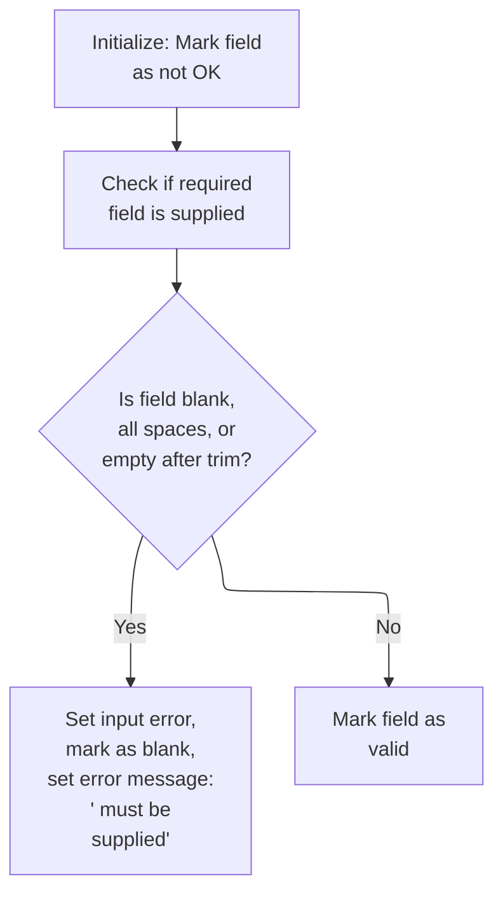
```mermaid
%%{init: {"flowchart": {"defaultRenderer": "elk"}} }%%
flowchart TD
    node0["Initialize: Mark field 
 as not OK"]
    click node0 openCode "app/cbl/COACTUPC.cbl:1826:1826"
    node0 --> node1["Check if required 
 field is supplied"]
    click node1 openCode "app/cbl/COACTUPC.cbl:1829:1835"
    node1 --> node2{"Is field blank, 
 all spaces, or 
 empty after trim?"}
    click node2 openCode "app/cbl/COACTUPC.cbl:1829:1835"
    node2 -->|"Yes"| node3["Set input error, 
 mark as blank, 
 set error message: 
 '<field> must be 
 supplied'"]
    click node3 openCode "app/cbl/COACTUPC.cbl:1836:1847"
    node2 -->|"No"| node4["Mark field as 
 valid"]
    click node4 openCode "app/cbl/COACTUPC.cbl:1850:1850"
classDef HeadingStyle fill:#777777,stroke:#333,stroke-width:2px;
```

This section ensures that required fields are validated for presence and non-blankness, and provides user-facing error messages when these requirements are not met. It is a foundational part of input validation for the CardDemo application.

| Rule ID | Code Location       | Category        | Rule Name                               | Description                                                                                                                                                                                                           | Conditions                                                                                            | Remarks                                                                                                                                                                                                                                                    |
| ------- | ------------------- | --------------- | --------------------------------------- | --------------------------------------------------------------------------------------------------------------------------------------------------------------------------------------------------------------------- | ----------------------------------------------------------------------------------------------------- | ---------------------------------------------------------------------------------------------------------------------------------------------------------------------------------------------------------------------------------------------------------- |
| BR-001  | 1215-EDIT-MANDATORY | Data validation | Required Field Must Be Supplied         | If a required field is blank, contains only spaces, or is empty after trimming, the system must flag the field as missing, set an input error, and generate an error message stating that the field must be supplied. | The field is required and the input value is blank, all spaces, or empty after trimming.              | The error message format is: '<field> must be supplied.' where <field> is the trimmed name of the field. The error flag is set to indicate an input error. The blank flag is set to indicate the field is missing. The valid flag is not set in this case. |
| BR-002  | 1215-EDIT-MANDATORY | Data validation | Required Field Validity                 | If a required field is present and not blank, the system must mark the field as valid.                                                                                                                                | The field is required and the input value is not blank, not all spaces, and not empty after trimming. | The valid flag is set to indicate the field is present and valid. No error message is generated in this case.                                                                                                                                              |
| BR-003  | 1215-EDIT-MANDATORY | Data validation | Initial Not OK State for Required Field | When a required field is being checked, the system must initially mark the field as not OK before performing any validation.                                                                                          | Any time a required field is being validated.                                                         | The not OK flag is set before any further validation occurs. This ensures that unless proven valid, the field is considered not OK.                                                                                                                        |

<SwmSnippet path="/app/cbl/COACTUPC.cbl" line="1824" repo-id="Z2l0aHViJTNBJTNBa3luZHJ5bC1hd3MtbWFpbmZyYW1lLW1vZGVybml6YXRpb24tY2FyZGRlbW8lM0ElM0FTd2ltbS1EZW1v">

---

`1215-EDIT-MANDATORY` checks if a required field is blank or just spaces. If so, it sets error flags and builds an error message. If the field is present, we mark it valid and move on to 1220-EDIT-YESNO to check yes/no fields, since those need to be validated separately.

```cobol
       1215-EDIT-MANDATORY.
      *    Initialize
           SET FLG-MANDATORY-NOT-OK    TO TRUE

      *    Not supplied
           IF WS-EDIT-ALPHANUM-ONLY(1:WS-EDIT-ALPHANUM-LENGTH)
                                       EQUAL LOW-VALUES
           OR WS-EDIT-ALPHANUM-ONLY(1:WS-EDIT-ALPHANUM-LENGTH)
                                       EQUAL SPACES
           OR FUNCTION LENGTH(FUNCTION TRIM(
              WS-EDIT-ALPHANUM-ONLY(1:WS-EDIT-ALPHANUM-LENGTH))) = 0

              SET INPUT-ERROR          TO TRUE
              SET FLG-MANDATORY-BLANK  TO TRUE
              IF WS-RETURN-MSG-OFF
                 STRING
                   FUNCTION TRIM(WS-EDIT-VARIABLE-NAME)
                   ' must be supplied.'
                   DELIMITED BY SIZE
                   INTO WS-RETURN-MSG
                 END-STRING
              END-IF

              GO TO  1215-EDIT-MANDATORY-EXIT
           END-IF

           SET FLG-MANDATORY-ISVALID   TO TRUE
           .
```

---

</SwmSnippet>

##### Yes/No Field Validation

This section validates a Yes/No input field, ensuring it is supplied and contains a valid value ('Y' or 'N'), and constructs appropriate error messages when validation fails.

| Rule ID | Code Location   | Category        | Rule Name                      | Description                                                                                                                                                        | Conditions                                                           | Remarks                                                                                                                                                                              |
| ------- | --------------- | --------------- | ------------------------------ | ------------------------------------------------------------------------------------------------------------------------------------------------------------------ | -------------------------------------------------------------------- | ------------------------------------------------------------------------------------------------------------------------------------------------------------------------------------ |
| BR-001  | 1220-EDIT-YESNO | Data validation | Yes/No Required Field          | If the Yes/No field is blank, contains spaces, or contains zeros, an error is triggered and an error message is constructed indicating the field must be supplied. | The Yes/No field is blank, spaces, or zeros.                         | Blank is represented by LOW-VALUES, spaces by SPACES, and zeros by ZEROS. The error message format is: '\[field name\] must be supplied.' where \[field name\] is trimmed of spaces. |
| BR-002  | 1220-EDIT-YESNO | Data validation | Yes/No Valid Value             | If the Yes/No field contains any value other than 'Y' or 'N', an error is triggered and an error message is constructed indicating the field must be 'Y' or 'N'.   | The Yes/No field is not blank, spaces, zeros, and is not 'Y' or 'N'. | Valid values are 'Y' and 'N'. The error message format is: '\[field name\] must be Y or N.' where \[field name\] is trimmed of spaces.                                               |
| BR-003  | 1220-EDIT-YESNO | Business logic  | Alpha Field Validation Trigger | If the Yes/No field passes validation, the next step is to validate required alpha fields.                                                                         | The Yes/No field is valid ('Y' or 'N').                              | No constants or formats are involved in this rule; it is a process flow rule.                                                                                                        |

<SwmSnippet path="/app/cbl/COACTUPC.cbl" line="1856" repo-id="Z2l0aHViJTNBJTNBa3luZHJ5bC1hd3MtbWFpbmZyYW1lLW1vZGVybml6YXRpb24tY2FyZGRlbW8lM0ElM0FTd2ltbS1EZW1v">

---

In `1220-EDIT-YESNO` we check if the yes/no field is blank, spaces, or zeros. If so, we set error flags and build an error message. If not, we check if it's 'Y' or 'N', and set errors if it's anything else. Next, we move on to 1225-EDIT-ALPHA-REQD to validate required alpha fields.

```cobol
       1220-EDIT-YESNO.
      *    Must be Y or N
      *    SET FLG-YES-NO-NOT-OK         TO TRUE
      *
      *    Not supplied
           IF WS-EDIT-YES-NO             EQUAL LOW-VALUES
           OR WS-EDIT-YES-NO             EQUAL SPACES
           OR WS-EDIT-YES-NO             EQUAL ZEROS
              SET INPUT-ERROR            TO TRUE
              SET FLG-YES-NO-BLANK       TO TRUE
              IF WS-RETURN-MSG-OFF
                 STRING
                   FUNCTION TRIM(WS-EDIT-VARIABLE-NAME)
                   ' must be supplied.'
                   DELIMITED BY SIZE
                   INTO WS-RETURN-MSG
                 END-STRING
              END-IF
              GO TO  1220-EDIT-YESNO-EXIT
           END-IF
```

---

</SwmSnippet>

###### Required Alpha Field Validation

This section enforces the business requirement that required alpha fields must be supplied by the user and provides clear error handling and messaging when this requirement is not met.

| Rule ID | Code Location        | Category        | Rule Name                                      | Description                                                                                                                                                                  | Conditions                                                                                | Remarks                                                                                                                                                                                                                                                                                                                                |
| ------- | -------------------- | --------------- | ---------------------------------------------- | ---------------------------------------------------------------------------------------------------------------------------------------------------------------------------- | ----------------------------------------------------------------------------------------- | -------------------------------------------------------------------------------------------------------------------------------------------------------------------------------------------------------------------------------------------------------------------------------------------------------------------------------------- |
| BR-001  | 1225-EDIT-ALPHA-REQD | Data validation | Required Alpha Field Must Be Supplied          | If the required alpha field is blank, contains only spaces, or is trimmed to zero length, an error is triggered and the user is informed that the field must be supplied.    | The required alpha field is blank, contains only spaces, or is trimmed to zero length.    | The error message is constructed by concatenating the trimmed field name and the string ' must be supplied.'. The error flags set include: INPUT-ERROR, FLG-ALPHA-BLANK, and FLG-ALPHA-NOT-OK. The error message is stored in a string field. No specific format for the field value is enforced beyond being non-blank and non-empty. |
| BR-002  | 1225-EDIT-ALPHA-REQD | Data validation | Alpha Field Presence Allows Further Validation | If the required alpha field is not blank, not all spaces, and not trimmed to zero length, validation passes and the process continues to the next required field validation. | The required alpha field contains at least one non-space character and is not blank.      | No error flags are set and no error message is constructed. The process continues to the next validation step for required alphanumeric fields.                                                                                                                                                                                        |
| BR-003  | 1225-EDIT-ALPHA-REQD | Error handling  | Single Error Message Construction              | When an error is triggered due to a missing required alpha field, the error message is only constructed if the return message is currently empty.                            | An error is triggered for a missing required alpha field and the return message is empty. | The error message format is: '<trimmed field name> must be supplied.'. The message is only constructed if the return message is currently empty (WS-RETURN-MSG-OFF).                                                                                                                                                                   |

<SwmSnippet path="/app/cbl/COACTUPC.cbl" line="1898" repo-id="Z2l0aHViJTNBJTNBa3luZHJ5bC1hd3MtbWFpbmZyYW1lLW1vZGVybml6YXRpb24tY2FyZGRlbW8lM0ElM0FTd2ltbS1EZW1v">

---

In `1225-EDIT-ALPHA-REQD` we check if the required alpha field is blank, spaces, or trimmed to zero length. If so, we set error flags and build an error message. If not, we move on to 1230-EDIT-ALPHANUM-REQD to validate required alphanumeric fields.

```cobol
       1225-EDIT-ALPHA-REQD.
      *    Initialize
           SET FLG-ALPHA-NOT-OK              TO TRUE

      *    Not supplied
           IF WS-EDIT-ALPHANUM-ONLY(1:WS-EDIT-ALPHANUM-LENGTH)
                                             EQUAL LOW-VALUES
           OR WS-EDIT-ALPHANUM-ONLY(1:WS-EDIT-ALPHANUM-LENGTH)
               EQUAL SPACES
           OR FUNCTION LENGTH(FUNCTION TRIM(
              WS-EDIT-ALPHANUM-ONLY(1:WS-EDIT-ALPHANUM-LENGTH))) = 0

              SET INPUT-ERROR                TO TRUE
              SET FLG-ALPHA-BLANK            TO TRUE
              IF WS-RETURN-MSG-OFF
                 STRING
                   FUNCTION TRIM(WS-EDIT-VARIABLE-NAME)
                   ' must be supplied.'
                   DELIMITED BY SIZE
                   INTO WS-RETURN-MSG
                 END-STRING
              END-IF

              GO TO  1225-EDIT-ALPHA-REQD-EXIT
           END-IF
```

---

</SwmSnippet>

####### Required Alphanumeric Field Validation

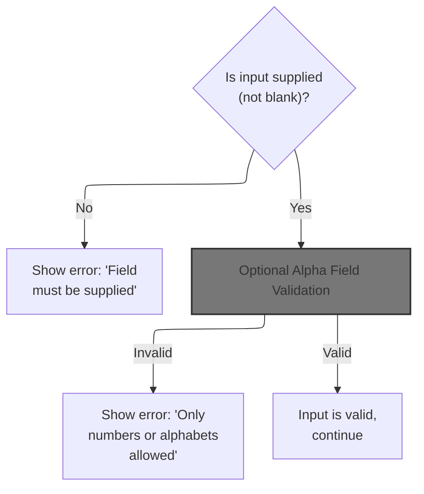
```mermaid
%%{init: {"flowchart": {"defaultRenderer": "elk"}} }%%
flowchart TD
    node1{"Is input supplied 
 (not blank)?"}
    click node1 openCode "app/cbl/COACTUPC.cbl:1960:1979"
    node2["Show error: 'Field 
 must be supplied'"]
    click node2 openCode "app/cbl/COACTUPC.cbl:1967:1978"
    node3["Optional Alpha Field Validation"]
    
    node4["Show error: 'Only 
 numbers or alphabets 
 allowed'"]
    click node4 openCode "app/cbl/COACTUPC.cbl:1994:2004"
    node5["Input is valid, 
 continue"]
    click node5 openCode "app/cbl/COACTUPC.cbl:2007:2008"
    node1 -->|"No"| node2
    node1 -->|"Yes"| node3
    node3 -->|"Invalid"| node4
    node3 -->|"Valid"| node5
classDef HeadingStyle fill:#777777,stroke:#333,stroke-width:2px;
click node3 goToHeading "Optional Alpha Field Validation"
node3:::HeadingStyle
```

This section ensures that required alphanumeric fields are not left blank by the user. If the field is not supplied, an error is triggered and a message is generated to inform the user that the field must be supplied.

| Rule ID | Code Location           | Category        | Rule Name               | Description                                                                                                                                                                                                                     | Conditions                                                              | Remarks                                                                                                                                                                                                                       |
| ------- | ----------------------- | --------------- | ----------------------- | ------------------------------------------------------------------------------------------------------------------------------------------------------------------------------------------------------------------------------- | ----------------------------------------------------------------------- | ----------------------------------------------------------------------------------------------------------------------------------------------------------------------------------------------------------------------------- |
| BR-001  | 1230-EDIT-ALPHANUM-REQD | Data validation | Required Field Presence | If the required alphanumeric field is not supplied (i.e., it is blank, contains only spaces, or is trimmed to zero length), an error is triggered and an error message is generated indicating that the field must be supplied. | The field is blank, contains only spaces, or is trimmed to zero length. | The error message is constructed by concatenating the trimmed field name and the string ' must be supplied.'. The check for blank includes low-values, spaces, and zero-length after trimming. The error message is a string. |

<SwmSnippet path="/app/cbl/COACTUPC.cbl" line="1955" repo-id="Z2l0aHViJTNBJTNBa3luZHJ5bC1hd3MtbWFpbmZyYW1lLW1vZGVybml6YXRpb24tY2FyZGRlbW8lM0ElM0FTd2ltbS1EZW1v">

---

In `1230-EDIT-ALPHANUM-REQD` we check if the required alphanumeric field is blank, spaces, or trimmed to zero length. If so, we set error flags and build an error message. If not, we move on to 1235-EDIT-ALPHA-OPT to validate optional alpha fields.

```cobol
       1230-EDIT-ALPHANUM-REQD.
      *    Initialize
           SET FLG-ALPHNANUM-NOT-OK          TO TRUE

      *    Not supplied
           IF WS-EDIT-ALPHANUM-ONLY(1:WS-EDIT-ALPHANUM-LENGTH)
                                             EQUAL LOW-VALUES
           OR WS-EDIT-ALPHANUM-ONLY(1:WS-EDIT-ALPHANUM-LENGTH)
               EQUAL SPACES
           OR FUNCTION LENGTH(FUNCTION TRIM(
              WS-EDIT-ALPHANUM-ONLY(1:WS-EDIT-ALPHANUM-LENGTH))) = 0

              SET INPUT-ERROR                TO TRUE
              SET FLG-ALPHNANUM-BLANK        TO TRUE
              IF WS-RETURN-MSG-OFF
                 STRING
                   FUNCTION TRIM(WS-EDIT-VARIABLE-NAME)
                   ' must be supplied.'
                   DELIMITED BY SIZE
                   INTO WS-RETURN-MSG
                 END-STRING
              END-IF

              GO TO  1230-EDIT-ALPHANUM-REQD-EXIT
           END-IF
```

---

</SwmSnippet>

######## Optional Alpha Field Validation

This section determines the validity of an optional alpha field, marking it valid if blank or empty, and requiring further validation if it contains any other value.

| Rule ID | Code Location       | Category        | Rule Name                                             | Description                                                                                                                                                             | Conditions                                                                              | Remarks                                                                                                                                                                                                                             |
| ------- | ------------------- | --------------- | ----------------------------------------------------- | ----------------------------------------------------------------------------------------------------------------------------------------------------------------------- | --------------------------------------------------------------------------------------- | ----------------------------------------------------------------------------------------------------------------------------------------------------------------------------------------------------------------------------------- |
| BR-001  | 1235-EDIT-ALPHA-OPT | Data validation | Optional Alpha Field Blank Validity                   | If the optional alpha field is blank, contains only spaces, or is trimmed to zero length, it is considered valid and no further validation is performed for this field. | The optional alpha field is blank, contains only spaces, or its trimmed length is zero. | Blank is defined as all bytes set to LOW-VALUES, spaces is defined as all bytes set to SPACES, and zero-length is determined by trimming spaces and checking if the result is empty. The field is a string of up to 256 characters. |
| BR-002  | 1235-EDIT-ALPHA-OPT | Business logic  | Optional Alpha Field Requires Alphanumeric Validation | If the optional alpha field is not blank, not spaces, and not trimmed to zero length, further validation is required as an optional alphanumeric field.                 | The optional alpha field contains any non-space, non-blank, non-empty value.            | Any value other than blank (LOW-VALUES), spaces (SPACES), or zero-length triggers further validation. The field is a string of up to 256 characters.                                                                                |

<SwmSnippet path="/app/cbl/COACTUPC.cbl" line="2012" repo-id="Z2l0aHViJTNBJTNBa3luZHJ5bC1hd3MtbWFpbmZyYW1lLW1vZGVybml6YXRpb24tY2FyZGRlbW8lM0ElM0FTd2ltbS1EZW1v">

---

In `1235-EDIT-ALPHA-OPT` we check if the optional alpha field is blank, spaces, or trimmed to zero length. If so, we mark it valid and exit. If not, we continue to 1240-EDIT-ALPHANUM-OPT to validate optional alphanumeric fields.

```cobol
       1235-EDIT-ALPHA-OPT.
      *    Initialize
           SET FLG-ALPHA-NOT-OK              TO TRUE

      *    Not supplied
           IF WS-EDIT-ALPHANUM-ONLY(1:WS-EDIT-ALPHANUM-LENGTH)
                                             EQUAL LOW-VALUES
           OR WS-EDIT-ALPHANUM-ONLY(1:WS-EDIT-ALPHANUM-LENGTH)
               EQUAL SPACES
           OR FUNCTION LENGTH(FUNCTION TRIM(
              WS-EDIT-ALPHANUM-ONLY(1:WS-EDIT-ALPHANUM-LENGTH))) = 0

              SET FLG-ALPHA-ISVALID          TO TRUE
              GO TO  1235-EDIT-ALPHA-OPT-EXIT
           ELSE
              CONTINUE
           END-IF
```

---

</SwmSnippet>

######### Optional Alphanumeric Field Validation

This section validates optional alphanumeric fields, ensuring that blank or empty fields are accepted as valid input. It sets the groundwork for further validation steps by clearly defining what is considered a valid optional entry.

| Rule ID | Code Location          | Category        | Rule Name                            | Description                                                                                                                                      | Conditions                                                                     | Remarks                                                                                                                                                                                                                                          |
| ------- | ---------------------- | --------------- | ------------------------------------ | ------------------------------------------------------------------------------------------------------------------------------------------------ | ------------------------------------------------------------------------------ | ------------------------------------------------------------------------------------------------------------------------------------------------------------------------------------------------------------------------------------------------ |
| BR-001  | 1240-EDIT-ALPHANUM-OPT | Data validation | Blank Optional Alphanumeric Is Valid | If the optional alphanumeric field is blank (all spaces, all low-values, or trimmed length is zero), it is considered valid and no error is set. | The field is either all spaces, all low-values, or its trimmed length is zero. | A blank field is defined as one where all characters are spaces, all characters are low-values, or the trimmed length is zero. The validity flag is set to indicate the field is valid. No error message is generated for blank optional fields. |

<SwmSnippet path="/app/cbl/COACTUPC.cbl" line="2061" repo-id="Z2l0aHViJTNBJTNBa3luZHJ5bC1hd3MtbWFpbmZyYW1lLW1vZGVybml6YXRpb24tY2FyZGRlbW8lM0ElM0FTd2ltbS1EZW1v">

---

In `1240-EDIT-ALPHANUM-OPT` we treat blank optional alphanumeric fields as valid. If present, we use INSPECT/CONVERTING to check for allowed characters. If valid, we continue; if not, we set errors. Next, we move on to 1245-EDIT-NUM-REQD to validate required numeric fields.

```cobol
       1240-EDIT-ALPHANUM-OPT.
      *    Initialize
           SET FLG-ALPHNANUM-NOT-OK          TO TRUE

      *    Not supplied, but ok as optional
           IF WS-EDIT-ALPHANUM-ONLY(1:WS-EDIT-ALPHANUM-LENGTH)
                                             EQUAL LOW-VALUES
           OR WS-EDIT-ALPHANUM-ONLY(1:WS-EDIT-ALPHANUM-LENGTH)
               EQUAL SPACES
           OR FUNCTION LENGTH(FUNCTION TRIM(
              WS-EDIT-ALPHANUM-ONLY(1:WS-EDIT-ALPHANUM-LENGTH))) = 0
              SET FLG-ALPHNANUM-ISVALID     TO TRUE
              GO TO  1240-EDIT-ALPHANUM-OPT-EXIT
           ELSE
              CONTINUE
           END-IF
```

---

</SwmSnippet>

########## Required Numeric Field Validation

This section enforces that required numeric fields are not left blank by users and provides clear error messaging when this requirement is not met.

| Rule ID | Code Location      | Category        | Rule Name                           | Description                                                                                                                                                     | Conditions                                                                                | Remarks                                                                                                                                                                                                    |
| ------- | ------------------ | --------------- | ----------------------------------- | --------------------------------------------------------------------------------------------------------------------------------------------------------------- | ----------------------------------------------------------------------------------------- | ---------------------------------------------------------------------------------------------------------------------------------------------------------------------------------------------------------- |
| BR-001  | 1245-EDIT-NUM-REQD | Data validation | Required Numeric Field Presence     | A required numeric field must be supplied by the user. If the field is blank, contains only spaces, or is entirely empty after trimming, an error is triggered. | This rule applies when a numeric field is designated as required.                         | A field is considered missing if it is all low-values, all spaces, or trims to zero length. The error message format is: '<field name> must be supplied.' where <field name> is the trimmed variable name. |
| BR-002  | 1245-EDIT-NUM-REQD | Error handling  | Missing Numeric Field Error Message | When a required numeric field is missing, an error message is generated stating that the field must be supplied, using the field's display name.                | This rule applies when a required numeric field is found to be missing during validation. | The error message format is: '<field name> must be supplied.' where <field name> is the trimmed variable name provided for the field.                                                                      |

<SwmSnippet path="/app/cbl/COACTUPC.cbl" line="2109" repo-id="Z2l0aHViJTNBJTNBa3luZHJ5bC1hd3MtbWFpbmZyYW1lLW1vZGVybml6YXRpb24tY2FyZGRlbW8lM0ElM0FTd2ltbS1EZW1v">

---

In `1245-EDIT-NUM-REQD` we check if the required numeric field is blank, spaces, or trimmed to zero length. If so, we set error flags and build an error message. If not, we move on to 1250-EDIT-SIGNED-9V2 to validate signed numeric fields.

```cobol
       1245-EDIT-NUM-REQD.
      *    Initialize
           SET FLG-ALPHNANUM-NOT-OK          TO TRUE

      *    Not supplied
           IF WS-EDIT-ALPHANUM-ONLY(1:WS-EDIT-ALPHANUM-LENGTH)
                                             EQUAL LOW-VALUES
           OR WS-EDIT-ALPHANUM-ONLY(1:WS-EDIT-ALPHANUM-LENGTH)
               EQUAL SPACES
           OR FUNCTION LENGTH(FUNCTION TRIM(
              WS-EDIT-ALPHANUM-ONLY(1:WS-EDIT-ALPHANUM-LENGTH))) = 0

              SET INPUT-ERROR                TO TRUE
              SET FLG-ALPHNANUM-BLANK        TO TRUE
              IF WS-RETURN-MSG-OFF
                 STRING
                   FUNCTION TRIM(WS-EDIT-VARIABLE-NAME)
                   ' must be supplied.'
                   DELIMITED BY SIZE
                   INTO WS-RETURN-MSG
                 END-STRING
              END-IF

              GO TO  1245-EDIT-NUM-REQD-EXIT
           END-IF
```

---

</SwmSnippet>

########### Signed Numeric Field Validation

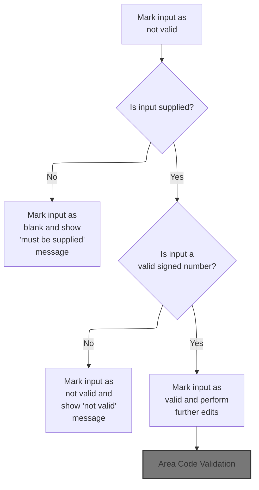
```mermaid
%%{init: {"flowchart": {"defaultRenderer": "elk"}} }%%
flowchart TD
    node1["Mark input as 
 not valid"] --> node2{"Is input supplied?"}
    click node1 openCode "app/cbl/COACTUPC.cbl:2181:2181"
    node2 -->|"No"| node3["Mark input as 
 blank and show 
 'must be supplied' 
 message"]
    click node2 openCode "app/cbl/COACTUPC.cbl:2184:2188"
    click node3 openCode "app/cbl/COACTUPC.cbl:2186:2195"
    node2 -->|"Yes"| node4{"Is input a 
 valid signed number?"}
    click node4 openCode "app/cbl/COACTUPC.cbl:2201:2202"
    node4 -->|"No"| node5["Mark input as 
 not valid and 
 show 'not valid' 
 message"]
    click node5 openCode "app/cbl/COACTUPC.cbl:2204:2213"
    node4 -->|"Yes"| node6["Mark input as 
 valid and perform 
 further edits"]
    click node6 openCode "app/cbl/COACTUPC.cbl:2218:2219"
    node6 --> node7["Area Code Validation"]
    

classDef HeadingStyle fill:#777777,stroke:#333,stroke-width:2px;
click node7 goToHeading "US Phone Number Validation"
node7:::HeadingStyle
click node7 goToHeading "US SSN Validation"
node7:::HeadingStyle
click node7 goToHeading "Area Code Validation"
node7:::HeadingStyle
```

This section validates signed numeric input fields, ensuring that missing or invalid values are flagged with appropriate error messages and only valid signed numbers are accepted for further processing.

| Rule ID | Code Location        | Category        | Rule Name                        | Description                                                                                                                                                                                 | Conditions                                                                                | Remarks                                                                                                                                                    |
| ------- | -------------------- | --------------- | -------------------------------- | ------------------------------------------------------------------------------------------------------------------------------------------------------------------------------------------- | ----------------------------------------------------------------------------------------- | ---------------------------------------------------------------------------------------------------------------------------------------------------------- |
| BR-001  | 1250-EDIT-SIGNED-9V2 | Data validation | Signed Numeric Required          | If the signed numeric input is missing (either all spaces or all low-values), the input is marked as blank, an error is set, and a message is generated stating the field must be supplied. | The input field is either all spaces or all low-values.                                   | The error message is constructed by trimming the field name and appending ' must be supplied.' The blank flag is set to 'B'. The error flag is set to '1'. |
| BR-002  | 1250-EDIT-SIGNED-9V2 | Data validation | Signed Numeric Format Validation | If the signed numeric input is supplied but is not a valid signed number, the input is marked as not valid, an error is set, and a message is generated stating the value is not valid.     | The input field is not blank or low-values, but does not represent a valid signed number. | The error message is constructed by trimming the field name and appending ' not valid.' The not valid flag is set to '0'. The error flag is set to '1'.    |
| BR-003  | 1250-EDIT-SIGNED-9V2 | Data validation | Signed Numeric Valid Acceptance  | If the signed numeric input is supplied and is a valid signed number, the input is marked as valid and further edits are performed.                                                         | The input field is not blank or low-values and represents a valid signed number.          | The valid flag is set to LOW-VALUES. No error message is generated. Further edits are performed after this validation step.                                |

<SwmSnippet path="/app/cbl/COACTUPC.cbl" line="2180" repo-id="Z2l0aHViJTNBJTNBa3luZHJ5bC1hd3MtbWFpbmZyYW1lLW1vZGVybml6YXRpb24tY2FyZGRlbW8lM0ElM0FTd2ltbS1EZW1v">

---

We check for missing signed numeric input and set errors if needed.

```cobol
       1250-EDIT-SIGNED-9V2.
           SET FLG-SIGNED-NUMBER-NOT-OK    TO TRUE

      *    Not supplied
           IF WS-EDIT-SIGNED-NUMBER-9V2-X  EQUAL LOW-VALUES
           OR WS-EDIT-SIGNED-NUMBER-9V2-X  EQUAL SPACES
              SET INPUT-ERROR              TO TRUE
              SET FLG-SIGNED-NUMBER-BLANK  TO TRUE
              IF WS-RETURN-MSG-OFF
                 STRING
                   FUNCTION TRIM(WS-EDIT-VARIABLE-NAME)
                   ' must be supplied.'
                   DELIMITED BY SIZE
                   INTO WS-RETURN-MSG
                 END-STRING
              END-IF
```

---

</SwmSnippet>

############ US Phone Number Validation

This section validates US phone number input fields, determining whether the input is valid based on whether the fields are blank or contain data. It enforces the business rule that the phone number is not mandatory, and triggers further validation only if data is present.

| Rule ID | Code Location          | Category        | Rule Name                                          | Description                                                                                                                                                                           | Conditions                                                                                | Remarks                                                                                                                                                                                     |
| ------- | ---------------------- | --------------- | -------------------------------------------------- | ------------------------------------------------------------------------------------------------------------------------------------------------------------------------------------- | ----------------------------------------------------------------------------------------- | ------------------------------------------------------------------------------------------------------------------------------------------------------------------------------------------- |
| BR-001  | 1260-EDIT-US-PHONE-NUM | Data validation | Blank or Low-Value Phone Number Accepted           | If all parts of the US phone number input are blank or contain low-values, the phone number is considered valid and no error is set.                                                  | All three phone number input fields are either blank or contain low-values.               | A blank field means it contains only spaces; a low-value field means it contains the lowest possible value for a character. The phone number is not required, so it is valid if left empty. |
| BR-002  | 1260-EDIT-US-PHONE-NUM | Data validation | Non-Blank Phone Number Requires Further Validation | If any part of the US phone number input contains data (i.e., is not blank or low-values), the phone number is not automatically considered valid and further validation is required. | At least one of the phone number input fields contains data (is not blank or low-values). | The phone number is only considered valid without further checks if all fields are blank or low-values. Otherwise, additional validation steps are triggered (not shown in this section).   |
| BR-003  | 1260-EDIT-US-PHONE-NUM | Data validation | Phone Number Not Mandatory                         | The phone number field is not mandatory; users are allowed to leave it blank without causing a validation error.                                                                      | The phone number input fields are left blank or contain low-values.                       | This rule allows users to submit forms without providing a phone number, as long as all phone number fields are empty or contain low-values.                                                |

<SwmSnippet path="/app/cbl/COACTUPC.cbl" line="2225" repo-id="Z2l0aHViJTNBJTNBa3luZHJ5bC1hd3MtbWFpbmZyYW1lLW1vZGVybml6YXRpb24tY2FyZGRlbW8lM0ElM0FTd2ltbS1EZW1v">

---

In `1260-EDIT-US-PHONE-NUM` we check if all phone number parts are blank or low-values. If so, we mark it valid and exit. If not, we continue with further validation. Next, we move on to 1265-EDIT-US-SSN to validate the SSN field.

```cobol
       1260-EDIT-US-PHONE-NUM.

      *    The database stores date in X(15) format (999)999-9999
      *                                             1234567890123
      *    So we take the X(15) input into WS-EDIT-US-PHONE-NUM
      *    and edit it

           SET WS-EDIT-US-PHONE-IS-INVALID TO TRUE
      *    Not mandatory to enter a phone number
           IF  (WS-EDIT-US-PHONE-NUMA EQUAL SPACES
           OR   WS-EDIT-US-PHONE-NUMA EQUAL LOW-VALUES)
           AND (WS-EDIT-US-PHONE-NUMB EQUAL SPACES
           OR   WS-EDIT-US-PHONE-NUMB EQUAL LOW-VALUES)
           AND (WS-EDIT-US-PHONE-NUMA EQUAL SPACES
           OR   WS-EDIT-US-PHONE-NUMC EQUAL LOW-VALUES)
                SET WS-EDIT-US-PHONE-IS-VALID TO TRUE
                GO TO EDIT-US-PHONE-EXIT
           ELSE
                CONTINUE
           END-IF
```

---

</SwmSnippet>

############ US SSN Validation

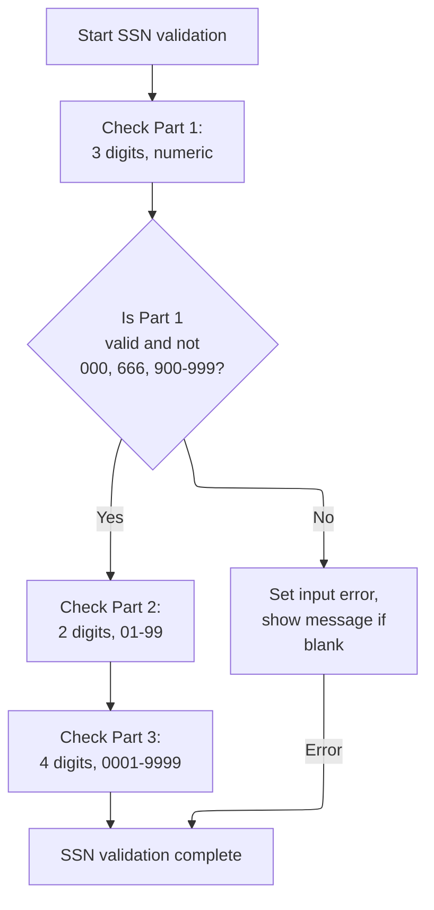
```mermaid
%%{init: {"flowchart": {"defaultRenderer": "elk"}} }%%
flowchart TD
    node1["Start SSN validation"] --> node2["Check Part 1: 
 3 digits, numeric"]
    click node1 openCode "app/cbl/COACTUPC.cbl:2431:2439"
    click node2 openCode "app/cbl/COACTUPC.cbl:2439:2443"
    node2 --> node3{"Is Part 1 
 valid and not 
 000, 666, 900-999?"}
    click node3 openCode "app/cbl/COACTUPC.cbl:2444:2454"
    node3 -->|"Yes"| node4["Check Part 2: 
 2 digits, 01-99"]
    click node4 openCode "app/cbl/COACTUPC.cbl:2469:2475"
    node3 -->|"No"| node7["Set input error, 
 show message if 
 blank"]
    click node7 openCode "app/cbl/COACTUPC.cbl:2455:2463"
    node4 --> node5["Check Part 3: 
 4 digits, 0001-9999"]
    click node5 openCode "app/cbl/COACTUPC.cbl:2481:2487"
    node5 --> node6["SSN validation complete"]
    click node6 openCode "app/cbl/COACTUPC.cbl:2488:2488"
    node7 -->|"Error"| node6
classDef HeadingStyle fill:#777777,stroke:#333,stroke-width:2px;
```

This section validates a US Social Security Number (SSN) input, ensuring each part meets strict format and value requirements and providing clear error feedback if any part is invalid.

| Rule ID | Code Location    | Category        | Rule Name                              | Description                                                                                                                                                                                                                              | Conditions                                                                                                | Remarks                                                                                                                                                                                                                                               |
| ------- | ---------------- | --------------- | -------------------------------------- | ---------------------------------------------------------------------------------------------------------------------------------------------------------------------------------------------------------------------------------------- | --------------------------------------------------------------------------------------------------------- | ----------------------------------------------------------------------------------------------------------------------------------------------------------------------------------------------------------------------------------------------------- |
| BR-001  | 1265-EDIT-US-SSN | Data validation | SSN Part 1 Format and Forbidden Values | The first part of the SSN must be exactly 3 digits, all numeric, and must not be '000', '666', or any value between '900' and '999' inclusive. If this part is invalid, an input error is set and a specific error message is generated. | This rule applies when validating the first part of the SSN during the SSN validation process.            | The first part must be a string of exactly 3 numeric digits. Forbidden values are '000', '666', and any value from '900' to '999' inclusive. If invalid, the error message format is: '<field name>: should not be 000, 666, or between 900 and 999'. |
| BR-002  | 1265-EDIT-US-SSN | Data validation | SSN Part 2 Format and Range            | The second part of the SSN must be exactly 2 digits, all numeric, and must be in the range '01' to '99' inclusive. If this part is invalid, an input error is set.                                                                       | This rule applies when validating the second part of the SSN during the SSN validation process.           | The second part must be a string of exactly 2 numeric digits, with valid values from '01' to '99' inclusive.                                                                                                                                          |
| BR-003  | 1265-EDIT-US-SSN | Data validation | SSN Part 3 Format and Range            | The third part of the SSN must be exactly 4 digits, all numeric, and must be in the range '0001' to '9999' inclusive. If this part is invalid, an input error is set.                                                                    | This rule applies when validating the third part of the SSN during the SSN validation process.            | The third part must be a string of exactly 4 numeric digits, with valid values from '0001' to '9999' inclusive.                                                                                                                                       |
| BR-004  | 1265-EDIT-US-SSN | Error handling  | SSN Input Error Handling and Messaging | If any part of the SSN fails validation, an input error is flagged and a user-facing error message is generated for the first invalid part.                                                                                              | This rule applies when any part of the SSN fails its validation checks during the SSN validation process. | The error message is generated for the first invalid part, using the format: '<field name>: <error description>'.                                                                                                                                     |

<SwmSnippet path="/app/cbl/COACTUPC.cbl" line="2431" repo-id="Z2l0aHViJTNBJTNBa3luZHJ5bC1hd3MtbWFpbmZyYW1lLW1vZGVybml6YXRpb24tY2FyZGRlbW8lM0ElM0FTd2ltbS1EZW1v">

---

In `1265-EDIT-US-SSN` we start by setting up the first SSN part for validation, moving its value and length to the edit variables, then calling 1245-EDIT-NUM-REQD to check if it's a valid number.

```cobol
       1265-EDIT-US-SSN.
      *Format xxx-xx-xxxx
      *Part1 :should have 3 digits
      *Part2 :should have 2 digits and it should be from 01 to 99
      *Part3 should have 4 digits from 0001 to 9999.
      ******************************************************************
      *    Edit SSN Part 1
      ******************************************************************
           MOVE 'SSN: First 3 chars'     TO WS-EDIT-VARIABLE-NAME
           MOVE ACUP-NEW-CUST-SSN-1      TO WS-EDIT-ALPHANUM-ONLY
           MOVE 3                        TO WS-EDIT-ALPHANUM-LENGTH
```

---

</SwmSnippet>

<SwmSnippet path="/app/cbl/COACTUPC.cbl" line="2442" repo-id="Z2l0aHViJTNBJTNBa3luZHJ5bC1hd3MtbWFpbmZyYW1lLW1vZGVybml6YXRpb24tY2FyZGRlbW8lM0ElM0FTd2ltbS1EZW1v">

---

We use the numeric validator for the SSN part.

```cobol
           PERFORM 1245-EDIT-NUM-REQD
              THRU 1245-EDIT-NUM-REQD-EXIT
```

---

</SwmSnippet>

<SwmSnippet path="/app/cbl/COACTUPC.cbl" line="2444" repo-id="Z2l0aHViJTNBJTNBa3luZHJ5bC1hd3MtbWFpbmZyYW1lLW1vZGVybml6YXRpb24tY2FyZGRlbW8lM0ElM0FTd2ltbS1EZW1v">

---

After returning from 1245-EDIT-NUM-REQD, we copy the validation flags to the SSN part's flag variable in 1265-EDIT-US-SSN. If valid, we do extra checks for forbidden values and set error messages if needed.

```cobol
           MOVE WS-EDIT-ALPHANUM-ONLY-FLAGS
                                         TO WS-EDIT-US-SSN-PART1-FLGS

      *Part1 :should not be 000, 666, or between 900 and 999
           IF FLG-EDIT-US-SSN-PART1-ISVALID
              MOVE ACUP-NEW-CUST-SSN-1   TO WS-EDIT-US-SSN-PART1
              IF INVALID-SSN-PART1
              SET INPUT-ERROR            TO TRUE
              SET FLG-EDIT-US-SSN-PART1-NOT-OK
                                 TO TRUE
              IF WS-RETURN-MSG-OFF
                 STRING
                   FUNCTION TRIM(WS-EDIT-VARIABLE-NAME)
                   ': should not be 000, 666, or between 900 and 999'
                   DELIMITED BY SIZE
                   INTO WS-RETURN-MSG
                 END-STRING
              ELSE
                CONTINUE
              END-IF
```

---

</SwmSnippet>

<SwmSnippet path="/app/cbl/COACTUPC.cbl" line="2469" repo-id="Z2l0aHViJTNBJTNBa3luZHJ5bC1hd3MtbWFpbmZyYW1lLW1vZGVybml6YXRpb24tY2FyZGRlbW8lM0ElM0FTd2ltbS1EZW1v">

---

After checking the first SSN part, we set up the second part for validation, move its value and length, and call the numeric validator again to check for errors.

```cobol
           MOVE 'SSN 4th & 5th chars'    TO WS-EDIT-VARIABLE-NAME
           MOVE ACUP-NEW-CUST-SSN-2      TO WS-EDIT-ALPHANUM-ONLY
           MOVE 2                        TO WS-EDIT-ALPHANUM-LENGTH
           PERFORM 1245-EDIT-NUM-REQD
              THRU 1245-EDIT-NUM-REQD-EXIT
```

---

</SwmSnippet>

<SwmSnippet path="/app/cbl/COACTUPC.cbl" line="2474" repo-id="Z2l0aHViJTNBJTNBa3luZHJ5bC1hd3MtbWFpbmZyYW1lLW1vZGVybml6YXRpb24tY2FyZGRlbW8lM0ElM0FTd2ltbS1EZW1v">

---

After validating the second SSN part, we copy the flags to its flag variable, then move on to prepping the third part for validation.

```cobol
           MOVE WS-EDIT-ALPHANUM-ONLY-FLAGS
                                         TO WS-EDIT-US-SSN-PART2-FLGS


      ******************************************************************
      *    Edit SSN Part 3
      ******************************************************************
           MOVE 'SSN Last 4 chars'       TO WS-EDIT-VARIABLE-NAME
           MOVE ACUP-NEW-CUST-SSN-3      TO WS-EDIT-ALPHANUM-ONLY
           MOVE 4                        TO WS-EDIT-ALPHANUM-LENGTH
```

---

</SwmSnippet>

<SwmSnippet path="/app/cbl/COACTUPC.cbl" line="2484" repo-id="Z2l0aHViJTNBJTNBa3luZHJ5bC1hd3MtbWFpbmZyYW1lLW1vZGVybml6YXRpb24tY2FyZGRlbW8lM0ElM0FTd2ltbS1EZW1v">

---

After prepping the third SSN part, we call the numeric validator again to check for errors, just like the previous parts.

```cobol
           PERFORM 1245-EDIT-NUM-REQD
              THRU 1245-EDIT-NUM-REQD-EXIT
```

---

</SwmSnippet>

<SwmSnippet path="/app/cbl/COACTUPC.cbl" line="2486" repo-id="Z2l0aHViJTNBJTNBa3luZHJ5bC1hd3MtbWFpbmZyYW1lLW1vZGVybml6YXRpb24tY2FyZGRlbW8lM0ElM0FTd2ltbS1EZW1v">

---

After validating all three SSN parts, we copy the flags for the third part to its variable. This wraps up SSN validation and lets us track which part failed if there's an error.

```cobol
           MOVE WS-EDIT-ALPHANUM-ONLY-FLAGS
                                         TO WS-EDIT-US-SSN-PART3-FLGS
           .
```

---

</SwmSnippet>

############ Area Code Validation

This section validates the area code portion of a US phone number, ensuring it is present, numeric, non-zero, and in the allowed list of North American area codes. Errors are set and messages generated if validation fails.

| Rule ID | Code Location  | Category        | Rule Name                              | Description                                                                                                                                                                  | Conditions                                                          | Remarks                                                                                                                                                                             |
| ------- | -------------- | --------------- | -------------------------------------- | ---------------------------------------------------------------------------------------------------------------------------------------------------------------------------- | ------------------------------------------------------------------- | ----------------------------------------------------------------------------------------------------------------------------------------------------------------------------------- |
| BR-001  | EDIT-AREA-CODE | Data validation | Area Code Required                     | If the area code input is blank or contains only low-values, an input error is set and an error message is generated stating that the area code must be supplied.            | The area code input is blank (spaces) or contains only low-values.  | The error message format is: '<field name>: Area code must be supplied.' The field name is trimmed and prepended to the message. The area code is expected as a string of 3 digits. |
| BR-002  | EDIT-AREA-CODE | Data validation | Area Code Must Be Valid                | If the area code input is not in the allowed list of North American area codes, an input error is set and an error message is generated indicating the area code is invalid. | The area code input is not found in the allowed list of area codes. | The allowed area codes are explicitly listed (e.g., '201', '202', ..., '989'). The area code is a 3-digit string. The error message format is: '<field name>: Invalid area code.'   |
| BR-003  | EDIT-AREA-CODE | Data validation | Area Code Must Be Numeric and Non-Zero | If the area code input is non-numeric or zero, an input error is set and an error message is generated indicating the area code is invalid.                                  | The area code input contains non-numeric characters or is '000'.    | The area code must be a 3-digit numeric string and cannot be '000'. The error message format is: '<field name>: Invalid area code.'                                                 |

<SwmSnippet path="/app/cbl/COACTUPC.cbl" line="2246" repo-id="Z2l0aHViJTNBJTNBa3luZHJ5bC1hd3MtbWFpbmZyYW1lLW1vZGVybml6YXRpb24tY2FyZGRlbW8lM0ElM0FTd2ltbS1EZW1v">

---

In `EDIT-AREA-CODE` we check if the area code is blank, non-numeric, or zero, and set errors if so. Then we trim and validate it against the allowed list, setting errors if it's not valid.

```cobol
       EDIT-AREA-CODE.
           IF WS-EDIT-US-PHONE-NUMA EQUAL SPACES
           OR WS-EDIT-US-PHONE-NUMA EQUAL LOW-VALUES
              SET INPUT-ERROR              TO TRUE
              SET FLG-EDIT-US-PHONEA-BLANK    TO TRUE
              IF WS-RETURN-MSG-OFF
                 STRING
                   FUNCTION TRIM(WS-EDIT-VARIABLE-NAME)
                   ': Area code must be supplied.'
                   DELIMITED BY SIZE
                   INTO WS-RETURN-MSG
                 END-STRING
              END-IF
```

---

</SwmSnippet>

############# Phone Prefix Validation

This section validates that the US phone prefix is provided by the user and is not blank or filled with low-values. If the input is invalid, it sets error flags and constructs a user-facing error message.

| Rule ID | Code Location        | Category        | Rule Name              | Description                                                                                                                                                                                                                      | Conditions                                                                                                | Remarks                                                                                                                                                                                                                                                                                                                                  |
| ------- | -------------------- | --------------- | ---------------------- | -------------------------------------------------------------------------------------------------------------------------------------------------------------------------------------------------------------------------------- | --------------------------------------------------------------------------------------------------------- | ---------------------------------------------------------------------------------------------------------------------------------------------------------------------------------------------------------------------------------------------------------------------------------------------------------------------------------------- |
| BR-001  | EDIT-US-PHONE-PREFIX | Data validation | Mandatory phone prefix | If the US phone prefix is blank or contains only low-values, an input error is flagged, a specific error flag for blank prefix is set, and an error message stating 'Prefix code must be supplied.' is constructed for the user. | The rule applies when the US phone prefix input is either blank (all spaces) or contains only low-values. | The error message format is: '\[Field Name\]: Prefix code must be supplied.' where \[Field Name\] is the trimmed name of the field being validated. The error flag is set to indicate an input error, and a specific flag for blank prefix is set. The error message is only constructed if the return message field is currently blank. |

<SwmSnippet path="/app/cbl/COACTUPC.cbl" line="2316" repo-id="Z2l0aHViJTNBJTNBa3luZHJ5bC1hd3MtbWFpbmZyYW1lLW1vZGVybml6YXRpb24tY2FyZGRlbW8lM0ElM0FTd2ltbS1EZW1v">

---

In `EDIT-US-PHONE-PREFIX` we check if the prefix is blank or low-values. If so, we set error flags and build an error message. If not, we continue with further validation.

```cobol
       EDIT-US-PHONE-PREFIX.

           IF WS-EDIT-US-PHONE-NUMB EQUAL SPACES
           OR WS-EDIT-US-PHONE-NUMB EQUAL LOW-VALUES
              SET INPUT-ERROR              TO TRUE
              SET FLG-EDIT-US-PHONEB-BLANK    TO TRUE
              IF WS-RETURN-MSG-OFF
                 STRING
                   FUNCTION TRIM(WS-EDIT-VARIABLE-NAME)
                   ': Prefix code must be supplied.'
                   DELIMITED BY SIZE
                   INTO WS-RETURN-MSG
                 END-STRING
              END-IF
```

---

</SwmSnippet>

############## Phone Line Number Validation

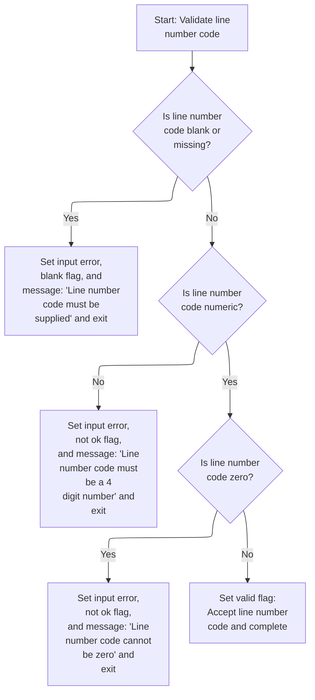
```mermaid
%%{init: {"flowchart": {"defaultRenderer": "elk"}} }%%
flowchart TD
    node1["Start: Validate line 
 number code"]
    click node1 openCode "app/cbl/COACTUPC.cbl:2370:2371"
    node1 --> node2{"Is line number 
 code blank or 
 missing?"}
    click node2 openCode "app/cbl/COACTUPC.cbl:2371:2372"
    node2 -->|"Yes"| node3["Set input error, 
 blank flag, and 
 message: 'Line number 
 code must be 
 supplied' and exit"]
    click node3 openCode "app/cbl/COACTUPC.cbl:2373:2382"
    node2 -->|"No"| node4{"Is line number 
 code numeric?"}
    click node4 openCode "app/cbl/COACTUPC.cbl:2388:2388"
    node4 -->|"No"| node5["Set input error, 
 not ok flag, 
 and message: 'Line 
 number code must 
 be a 4 
 digit number' and 
 exit"]
    click node5 openCode "app/cbl/COACTUPC.cbl:2391:2401"
    node4 -->|"Yes"| node6{"Is line number 
 code zero?"}
    click node6 openCode "app/cbl/COACTUPC.cbl:2404:2404"
    node6 -->|"Yes"| node7["Set input error, 
 not ok flag, 
 and message: 'Line 
 number code cannot 
 be zero' and 
 exit"]
    click node7 openCode "app/cbl/COACTUPC.cbl:2405:2415"
    node6 -->|"No"| node8["Set valid flag: 
 Accept line number 
 code and complete"]
    click node8 openCode "app/cbl/COACTUPC.cbl:2421:2422"
classDef HeadingStyle fill:#777777,stroke:#333,stroke-width:2px;
```

This section validates the phone line number code input, ensuring it is present, numeric, non-zero, and sets appropriate flags and error messages based on the validation outcome.

| Rule ID | Code Location         | Category        | Rule Name                   | Description                                                                                                                                                                                | Conditions                                                                | Remarks                                                                                                                                              |
| ------- | --------------------- | --------------- | --------------------------- | ------------------------------------------------------------------------------------------------------------------------------------------------------------------------------------------ | ------------------------------------------------------------------------- | ---------------------------------------------------------------------------------------------------------------------------------------------------- |
| BR-001  | EDIT-US-PHONE-LINENUM | Data validation | Line Number Required        | If the phone line number code is blank or contains only low-values, an input error is set, the blank flag is set, and the error message 'Line number code must be supplied.' is generated. | The phone line number code is blank (spaces) or contains only low-values. | The blank flag is set to 'B'. The error message is: '<field name>: Line number code must be supplied.'. The input error flag is set to '1'.          |
| BR-002  | EDIT-US-PHONE-LINENUM | Data validation | Line Number Must Be Numeric | If the phone line number code is not numeric, an input error is set, the not ok flag is set, and the error message 'Line number code must be a 4 digit number.' is generated.              | The phone line number code is not numeric.                                | The not ok flag is set to '0'. The error message is: '<field name>: Line number code must be a 4 digit number.'. The input error flag is set to '1'. |
| BR-003  | EDIT-US-PHONE-LINENUM | Data validation | Line Number Cannot Be Zero  | If the phone line number code is numeric but equal to zero, an input error is set, the not ok flag is set, and the error message 'Line number code cannot be zero' is generated.           | The phone line number code is numeric and its value is zero.              | The not ok flag is set to '0'. The error message is: '<field name>: Line number code cannot be zero'. The input error flag is set to '1'.            |
| BR-004  | EDIT-US-PHONE-LINENUM | Data validation | Line Number Valid           | If the phone line number code passes all previous checks (not blank, numeric, not zero), the valid flag is set to indicate the field is valid.                                             | The phone line number code is not blank, is numeric, and is not zero.     | The valid flag is set to LOW-VALUES.                                                                                                                 |

<SwmSnippet path="/app/cbl/COACTUPC.cbl" line="2370" repo-id="Z2l0aHViJTNBJTNBa3luZHJ5bC1hd3MtbWFpbmZyYW1lLW1vZGVybml6YXRpb24tY2FyZGRlbW8lM0ElM0FTd2ltbS1EZW1v">

---

In `EDIT-US-PHONE-LINENUM` we check if the line number is blank or low-values. If so, we set error flags and build an error message. If not, we continue with further validation.

```cobol
       EDIT-US-PHONE-LINENUM.
           IF WS-EDIT-US-PHONE-NUMC EQUAL SPACES
           OR WS-EDIT-US-PHONE-NUMC EQUAL LOW-VALUES
              SET INPUT-ERROR              TO TRUE
              SET FLG-EDIT-US-PHONEC-BLANK    TO TRUE
              IF WS-RETURN-MSG-OFF
                 STRING
                   FUNCTION TRIM(WS-EDIT-VARIABLE-NAME)
                   ': Line number code must be supplied.'
                   DELIMITED BY SIZE
                   INTO WS-RETURN-MSG
                 END-STRING
              END-IF
```

---

</SwmSnippet>

<SwmSnippet path="/app/cbl/COACTUPC.cbl" line="2384" repo-id="Z2l0aHViJTNBJTNBa3luZHJ5bC1hd3MtbWFpbmZyYW1lLW1vZGVybml6YXRpb24tY2FyZGRlbW8lM0ElM0FTd2ltbS1EZW1v">

---

After returning from 1265-EDIT-US-SSN, we continue with phone line number validation in EDIT-US-PHONE-LINENUM, making sure to check for blanks and errors.

```cobol
           ELSE
              CONTINUE
           END-IF
```

---

</SwmSnippet>

<SwmSnippet path="/app/cbl/COACTUPC.cbl" line="2388" repo-id="Z2l0aHViJTNBJTNBa3luZHJ5bC1hd3MtbWFpbmZyYW1lLW1vZGVybml6YXRpb24tY2FyZGRlbW8lM0ElM0FTd2ltbS1EZW1v">

---

After checking for blanks, we validate if the line number is numeric. If it is, we continue; if not, we set errors and exit.

```cobol
           IF  WS-EDIT-US-PHONE-NUMC          IS NUMERIC
              CONTINUE
```

---

</SwmSnippet>

<SwmSnippet path="/app/cbl/COACTUPC.cbl" line="2390" repo-id="Z2l0aHViJTNBJTNBa3luZHJ5bC1hd3MtbWFpbmZyYW1lLW1vZGVybml6YXRpb24tY2FyZGRlbW8lM0ElM0FTd2ltbS1EZW1v">

---

After checking if the line number is numeric, we check if it's zero. If so, we set errors and exit; otherwise, we continue.

```cobol
           ELSE
              SET INPUT-ERROR                 TO TRUE
              SET  FLG-EDIT-US-PHONEC-NOT-OK  TO TRUE
              IF WS-RETURN-MSG-OFF
                 STRING
                   FUNCTION TRIM(WS-EDIT-VARIABLE-NAME)
                   ': Line number code must be A 4 digit number.'
                   DELIMITED BY SIZE
                   INTO WS-RETURN-MSG
                 END-STRING
              END-IF
              GO TO  EDIT-US-PHONE-EXIT
           END-IF
```

---

</SwmSnippet>

<SwmSnippet path="/app/cbl/COACTUPC.cbl" line="2404" repo-id="Z2l0aHViJTNBJTNBa3luZHJ5bC1hd3MtbWFpbmZyYW1lLW1vZGVybml6YXRpb24tY2FyZGRlbW8lM0ElM0FTd2ltbS1EZW1v">

---

After all checks pass, we set the valid flag for the line number and finish up validation for this field.

```cobol
           IF  WS-EDIT-US-PHONE-NUMC-N = 0
              SET INPUT-ERROR              TO TRUE
              SET  FLG-EDIT-US-PHONEC-NOT-OK  TO TRUE
              IF WS-RETURN-MSG-OFF
                 STRING
                   FUNCTION TRIM(WS-EDIT-VARIABLE-NAME)
                   ': Line number code cannot be zero'
                   DELIMITED BY SIZE
                   INTO WS-RETURN-MSG
                 END-STRING
              END-IF
              GO TO  EDIT-US-PHONE-EXIT
```

---

</SwmSnippet>

<SwmSnippet path="/app/cbl/COACTUPC.cbl" line="2416" repo-id="Z2l0aHViJTNBJTNBa3luZHJ5bC1hd3MtbWFpbmZyYW1lLW1vZGVybml6YXRpb24tY2FyZGRlbW8lM0ElM0FTd2ltbS1EZW1v">

---

After validating the line number, we set the valid flag and finish up phone number validation.

```cobol
           ELSE
               CONTINUE
           END-IF


           SET FLG-EDIT-US-PHONEC-ISVALID    TO TRUE
           .
```

---

</SwmSnippet>

############## US Phone Prefix Validation Continuation

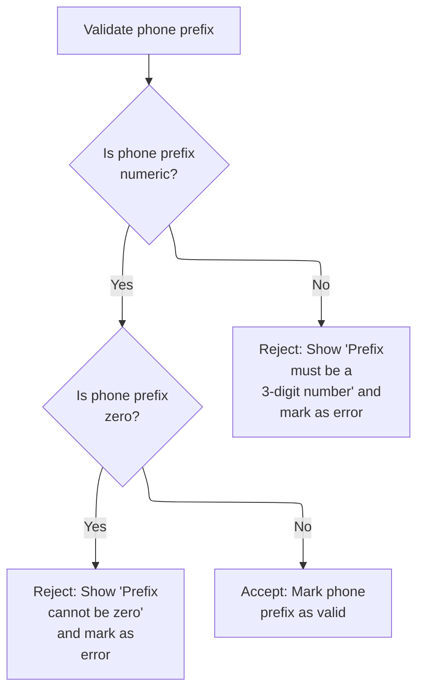
```mermaid
%%{init: {"flowchart": {"defaultRenderer": "elk"}} }%%
flowchart TD
    node1["Validate phone prefix"] --> node2{"Is phone prefix 
 numeric?"}
    click node1 openCode "app/cbl/COACTUPC.cbl:2335:2336"
    click node2 openCode "app/cbl/COACTUPC.cbl:2335:2336"
    node2 -->|"Yes"| node3{"Is phone prefix 
 zero?"}
    click node3 openCode "app/cbl/COACTUPC.cbl:2351:2365"
    node2 -->|"No"| node4["Reject: Show 'Prefix 
 must be a 
 3-digit number' and 
 mark as error"]
    click node4 openCode "app/cbl/COACTUPC.cbl:2337:2349"
    node3 -->|"Yes"| node5["Reject: Show 'Prefix 
 cannot be zero' 
 and mark as 
 error"]
    click node5 openCode "app/cbl/COACTUPC.cbl:2351:2362"
    node3 -->|"No"| node6["Accept: Mark phone 
 prefix as valid"]
    click node6 openCode "app/cbl/COACTUPC.cbl:2367:2368"

classDef HeadingStyle fill:#777777,stroke:#333,stroke-width:2px;
```

This section validates the US phone prefix as part of a credit card management application's input process. It ensures that the prefix is a valid, non-zero, 3-digit number and provides user feedback for correction if the input is invalid.

| Rule ID | Code Location        | Category        | Rule Name                | Description                                                                                                                                                                                                                       | Conditions                                            | Remarks                                                                                                                                                                                                                            |
| ------- | -------------------- | --------------- | ------------------------ | --------------------------------------------------------------------------------------------------------------------------------------------------------------------------------------------------------------------------------- | ----------------------------------------------------- | ---------------------------------------------------------------------------------------------------------------------------------------------------------------------------------------------------------------------------------- |
| BR-001  | EDIT-US-PHONE-PREFIX | Data validation | Numeric prefix required  | The phone prefix must consist only of numeric digits. If the prefix contains any non-numeric characters, the input is rejected and an error message is displayed to the user indicating that the prefix must be a 3-digit number. | The phone prefix contains any non-numeric characters. | The error message shown is: '\[Field Name\]: Prefix code must be a 3 digit number.' The prefix is expected to be a 3-digit numeric string. The error message is constructed by concatenating the field name and the fixed message. |
| BR-002  | EDIT-US-PHONE-PREFIX | Data validation | Non-zero prefix required | The phone prefix cannot be zero. If the prefix is '000', the input is rejected and an error message is displayed to the user indicating that the prefix cannot be zero.                                                           | The phone prefix is numeric and its value is zero.    | The error message shown is: '\[Field Name\]: Prefix code cannot be zero'. The prefix is expected to be a 3-digit numeric string, and the value '000' is not allowed.                                                               |
| BR-003  | EDIT-US-PHONE-PREFIX | Data validation | Accept valid prefix      | If the phone prefix passes all validation checks (is numeric and not zero), it is accepted as valid and the validation process continues to the next step.                                                                        | The phone prefix is numeric and not zero.             | No error message is shown. The prefix is marked as valid and the process continues to the next validation step.                                                                                                                    |

<SwmSnippet path="/app/cbl/COACTUPC.cbl" line="2331" repo-id="Z2l0aHViJTNBJTNBa3luZHJ5bC1hd3MtbWFpbmZyYW1lLW1vZGVybml6YXRpb24tY2FyZGRlbW8lM0ElM0FTd2ltbS1EZW1v">

---

We just returned from EDIT-US-PHONE-LINENUM, so in EDIT-US-PHONE-PREFIX, if the previous check failed, we CONTINUE to the next validation step. If the prefix is invalid, we jump back to EDIT-US-PHONE-LINENUM to re-validate the line number and keep error handling tight.

```cobol
           ELSE
              CONTINUE
           END-IF
```

---

</SwmSnippet>

<SwmSnippet path="/app/cbl/COACTUPC.cbl" line="2335" repo-id="Z2l0aHViJTNBJTNBa3luZHJ5bC1hd3MtbWFpbmZyYW1lLW1vZGVybml6YXRpb24tY2FyZGRlbW8lM0ElM0FTd2ltbS1EZW1v">

---

Here we check if the prefix is numeric. If it is, we CONTINUE to the next step; otherwise, we handle the error and jump back for re-validation.

```cobol
           IF  WS-EDIT-US-PHONE-NUMB          IS NUMERIC
              CONTINUE
```

---

</SwmSnippet>

<SwmSnippet path="/app/cbl/COACTUPC.cbl" line="2337" repo-id="Z2l0aHViJTNBJTNBa3luZHJ5bC1hd3MtbWFpbmZyYW1lLW1vZGVybml6YXRpb24tY2FyZGRlbW8lM0ElM0FTd2ltbS1EZW1v">

---

If the prefix isn't numeric, we set error flags, build an error message, and jump back to EDIT-US-PHONE-LINENUM for another round of validation.

```cobol
           ELSE
              SET INPUT-ERROR                 TO TRUE
              SET  FLG-EDIT-US-PHONEB-NOT-OK  TO TRUE
              IF WS-RETURN-MSG-OFF
                 STRING
                   FUNCTION TRIM(WS-EDIT-VARIABLE-NAME)
                   ': Prefix code must be A 3 digit number.'
                   DELIMITED BY SIZE
                   INTO WS-RETURN-MSG
                 END-STRING
              END-IF
              GO TO  EDIT-US-PHONE-LINENUM
           END-IF
```

---

</SwmSnippet>

<SwmSnippet path="/app/cbl/COACTUPC.cbl" line="2351" repo-id="Z2l0aHViJTNBJTNBa3luZHJ5bC1hd3MtbWFpbmZyYW1lLW1vZGVybml6YXRpb24tY2FyZGRlbW8lM0ElM0FTd2ltbS1EZW1v">

---

Here we check if the prefix is zero. If it is, we set error flags, build an error message, and jump back to EDIT-US-PHONE-LINENUM for correction.

```cobol
           IF  WS-EDIT-US-PHONE-NUMB-N = 0
              SET INPUT-ERROR              TO TRUE
              SET  FLG-EDIT-US-PHONEB-NOT-OK  TO TRUE
              IF WS-RETURN-MSG-OFF
                 STRING
                   FUNCTION TRIM(WS-EDIT-VARIABLE-NAME)
                   ': Prefix code cannot be zero'
                   DELIMITED BY SIZE
                   INTO WS-RETURN-MSG
                 END-STRING
              END-IF
              GO TO  EDIT-US-PHONE-LINENUM
```

---

</SwmSnippet>

<SwmSnippet path="/app/cbl/COACTUPC.cbl" line="2363" repo-id="Z2l0aHViJTNBJTNBa3luZHJ5bC1hd3MtbWFpbmZyYW1lLW1vZGVybml6YXRpb24tY2FyZGRlbW8lM0ElM0FTd2ltbS1EZW1v">

---

If all prefix checks pass, we mark the prefix as valid and move on to the next validation step.

```cobol
           ELSE
              CONTINUE
           END-IF

           SET FLG-EDIT-US-PHONEB-ISVALID    TO TRUE
           .
```

---

</SwmSnippet>

############# Area Code Validation Continuation

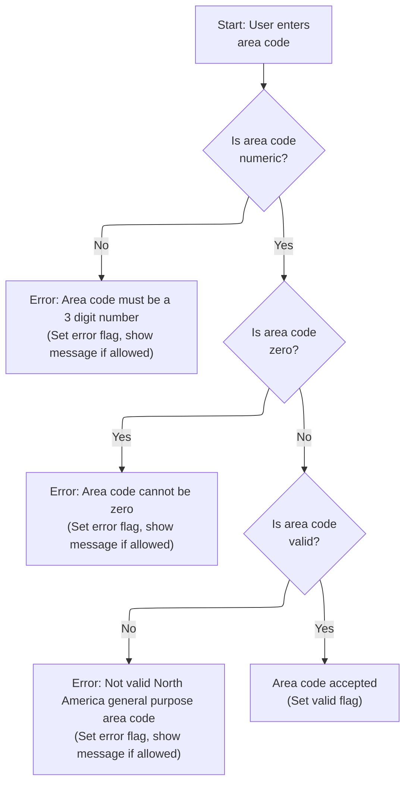
```mermaid
%%{init: {"flowchart": {"defaultRenderer": "elk"}} }%%
flowchart TD
    node1["Start: User enters 
 area code"] --> node2{"Is area code 
 numeric?"}
    click node1 openCode "app/cbl/COACTUPC.cbl:2264:2265"
    node2 -->|"No"| node3["Error: Area code must be a 3 digit number
(Set error flag, show message if allowed)"]
    click node2 openCode "app/cbl/COACTUPC.cbl:2266:2278"
    click node3 openCode "app/cbl/COACTUPC.cbl:2266:2278"
    node2 -->|"Yes"| node4{"Is area code 
 zero?"}
    click node4 openCode "app/cbl/COACTUPC.cbl:2280:2291"
    node4 -->|"Yes"| node5["Error: Area code cannot be zero
(Set error flag, show message if allowed)"]
    click node5 openCode "app/cbl/COACTUPC.cbl:2280:2291"
    node4 -->|"No"| node6{"Is area code 
 valid?"}
    click node6 openCode "app/cbl/COACTUPC.cbl:2296:2312"
    node6 -->|"No"| node7["Error: Not valid North America general purpose area code
(Set error flag, show message if allowed)"]
    click node7 openCode "app/cbl/COACTUPC.cbl:2300:2312"
    node6 -->|"Yes"| node8["Area code accepted
(Set valid flag)"]
    click node8 openCode "app/cbl/COACTUPC.cbl:2314:2315"

classDef HeadingStyle fill:#777777,stroke:#333,stroke-width:2px;
```

This section validates the area code portion of a US phone number, ensuring it is numeric, not zero, and matches a valid North American area code. It provides user-facing error messages for invalid input and marks the area code as valid if all checks pass.

| Rule ID | Code Location  | Category        | Rule Name                       | Description                                                                                                                                                                                                      | Conditions                                                                                | Remarks                                                                                                                                                                                                                                                                                                                                           |
| ------- | -------------- | --------------- | ------------------------------- | ---------------------------------------------------------------------------------------------------------------------------------------------------------------------------------------------------------------- | ----------------------------------------------------------------------------------------- | ------------------------------------------------------------------------------------------------------------------------------------------------------------------------------------------------------------------------------------------------------------------------------------------------------------------------------------------------- |
| BR-001  | EDIT-AREA-CODE | Data validation | Area code numeric validation    | The area code must consist of exactly three numeric digits. If the area code contains any non-numeric characters, an error is triggered and the user is notified that the area code must be a 3 digit number.    | This rule applies when the user provides an area code as part of a US phone number input. | The area code must be a string of three numeric digits (0-9). If the area code is not numeric, the error message presented is: '<field name>: Area code must be A 3 digit number.'                                                                                                                                                                |
| BR-002  | EDIT-AREA-CODE | Data validation | Area code zero value validation | The area code cannot be zero. If the area code is '000', an error is triggered and the user is notified that the area code cannot be zero.                                                                       | This rule applies after the area code has passed the numeric validation.                  | The area code must not be '000'. If the area code is zero, the error message presented is: '<field name>: Area code cannot be zero'.                                                                                                                                                                                                              |
| BR-003  | EDIT-AREA-CODE | Data validation | Area code list validation       | The area code must be a valid North American general purpose area code. If the area code is not in the list of valid area codes, an error is triggered and the user is notified that the area code is not valid. | This rule applies after the area code has passed the numeric and zero value validations.  | The area code must match one of the valid North American area codes as defined by the North America Numbering Plan Administrator (NANPA). The full list includes codes such as '201', '202', '203', ..., '989'. If the area code is not valid, the error message presented is: '<field name>: Not valid North America general purpose area code'. |
| BR-004  | EDIT-AREA-CODE | Business logic  | Area code acceptance            | If the area code passes all validation checks (numeric, not zero, and in the valid area code list), the area code is accepted and marked as valid.                                                               | This rule applies when the area code passes all previous validation checks.               | The area code is marked as valid and the validation process continues to the next step.                                                                                                                                                                                                                                                           |

<SwmSnippet path="/app/cbl/COACTUPC.cbl" line="2260" repo-id="Z2l0aHViJTNBJTNBa3luZHJ5bC1hd3MtbWFpbmZyYW1lLW1vZGVybml6YXRpb24tY2FyZGRlbW8lM0ElM0FTd2ltbS1EZW1v">

---

We just returned from EDIT-US-PHONE-LINENUM, so in EDIT-AREA-CODE, if the previous check was fine, we CONTINUE to the next validation step.

```cobol
           ELSE
              CONTINUE
           END-IF
```

---

</SwmSnippet>

<SwmSnippet path="/app/cbl/COACTUPC.cbl" line="2264" repo-id="Z2l0aHViJTNBJTNBa3luZHJ5bC1hd3MtbWFpbmZyYW1lLW1vZGVybml6YXRpb24tY2FyZGRlbW8lM0ElM0FTd2ltbS1EZW1v">

---

Here we check if the area code is numeric. If it is, we CONTINUE to the next step; otherwise, we handle the error and jump to the next validation.

```cobol
           IF  WS-EDIT-US-PHONE-NUMA       IS NUMERIC
              CONTINUE
```

---

</SwmSnippet>

<SwmSnippet path="/app/cbl/COACTUPC.cbl" line="2266" repo-id="Z2l0aHViJTNBJTNBa3luZHJ5bC1hd3MtbWFpbmZyYW1lLW1vZGVybml6YXRpb24tY2FyZGRlbW8lM0ElM0FTd2ltbS1EZW1v">

---

If the area code isn't numeric, we set error flags, build an error message, and jump to EDIT-US-PHONE-PREFIX for another round of validation.

```cobol
           ELSE
              SET INPUT-ERROR                 TO TRUE
              SET  FLG-EDIT-US-PHONEA-NOT-OK  TO TRUE
              IF WS-RETURN-MSG-OFF
                 STRING
                   FUNCTION TRIM(WS-EDIT-VARIABLE-NAME)
                   ': Area code must be A 3 digit number.'
                   DELIMITED BY SIZE
                   INTO WS-RETURN-MSG
                 END-STRING
              END-IF
              GO TO  EDIT-US-PHONE-PREFIX
           END-IF
```

---

</SwmSnippet>

<SwmSnippet path="/app/cbl/COACTUPC.cbl" line="2280" repo-id="Z2l0aHViJTNBJTNBa3luZHJ5bC1hd3MtbWFpbmZyYW1lLW1vZGVybml6YXRpb24tY2FyZGRlbW8lM0ElM0FTd2ltbS1EZW1v">

---

Here we check if the area code is zero. If it is, we set error flags, build an error message, and jump to EDIT-US-PHONE-PREFIX for correction.

```cobol
           IF  WS-EDIT-US-PHONE-NUMA-N = 0
              SET INPUT-ERROR              TO TRUE
              SET  FLG-EDIT-US-PHONEA-NOT-OK  TO TRUE
              IF WS-RETURN-MSG-OFF
                 STRING
                   FUNCTION TRIM(WS-EDIT-VARIABLE-NAME)
                   ': Area code cannot be zero'
                   DELIMITED BY SIZE
                   INTO WS-RETURN-MSG
                 END-STRING
              END-IF
              GO TO  EDIT-US-PHONE-PREFIX
```

---

</SwmSnippet>

<SwmSnippet path="/app/cbl/COACTUPC.cbl" line="2292" repo-id="Z2l0aHViJTNBJTNBa3luZHJ5bC1hd3MtbWFpbmZyYW1lLW1vZGVybml6YXRpb24tY2FyZGRlbW8lM0ElM0FTd2ltbS1EZW1v">

---

If all area code checks pass, we mark the area code as valid and move on to the next validation step.

```cobol
           ELSE
              CONTINUE
           END-IF
```

---

</SwmSnippet>

<SwmSnippet path="/app/cbl/COACTUPC.cbl" line="2296" repo-id="Z2l0aHViJTNBJTNBa3luZHJ5bC1hd3MtbWFpbmZyYW1lLW1vZGVybml6YXRpb24tY2FyZGRlbW8lM0ElM0FTd2ltbS1EZW1v">

---

After trimming the area code, we check it against a hardcoded list of valid North American area codes. If it's not in the list, we set error flags and jump to EDIT-US-PHONE-PREFIX.

```cobol
           MOVE FUNCTION TRIM (WS-EDIT-US-PHONE-NUMA)
             TO WS-US-PHONE-AREA-CODE-TO-EDIT
           IF VALID-GENERAL-PURP-CODE
               CONTINUE
```

---

</SwmSnippet>

<SwmSnippet path="/app/cbl/COACTUPC.cbl" line="2300" repo-id="Z2l0aHViJTNBJTNBa3luZHJ5bC1hd3MtbWFpbmZyYW1lLW1vZGVybml6YXRpb24tY2FyZGRlbW8lM0ElM0FTd2ltbS1EZW1v">

---

If all area code validations pass, we set the valid flag and finish up area code validation.

```cobol
           ELSE
              SET INPUT-ERROR              TO TRUE
              SET  FLG-EDIT-US-PHONEA-NOT-OK  TO TRUE
              IF WS-RETURN-MSG-OFF
                 STRING
                   FUNCTION TRIM(WS-EDIT-VARIABLE-NAME)
                   ': Not valid North America general purpose area code'
                   DELIMITED BY SIZE
                   INTO WS-RETURN-MSG
                 END-STRING
              END-IF
              GO TO  EDIT-US-PHONE-PREFIX
           END-IF

           SET FLG-EDIT-US-PHONEA-ISVALID    TO TRUE
           .
```

---

</SwmSnippet>

############ Signed Numeric Validation Continuation

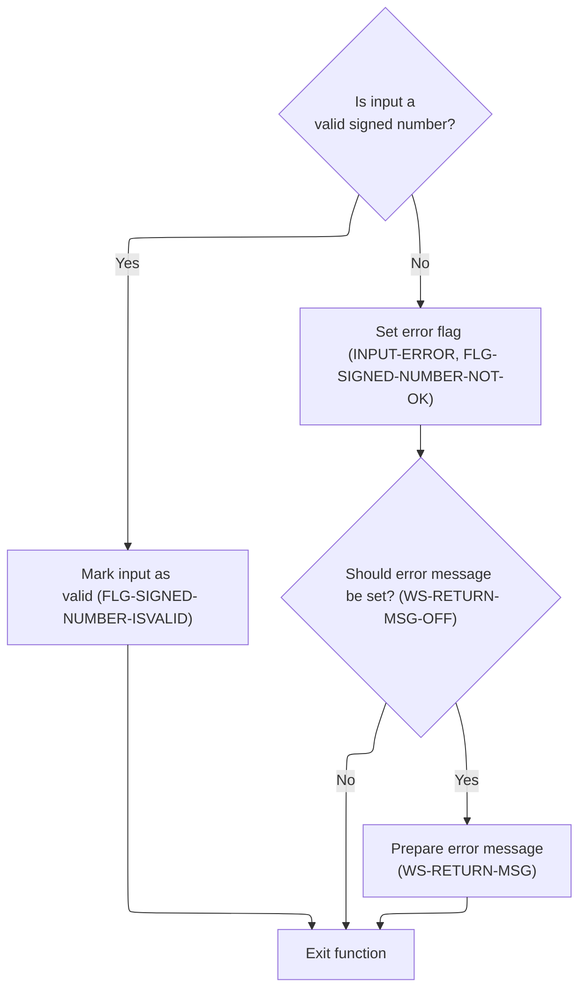
```mermaid
%%{init: {"flowchart": {"defaultRenderer": "elk"}} }%%
flowchart TD
    node1{"Is input a 
 valid signed number?"}
    click node1 openCode "app/cbl/COACTUPC.cbl:2201:2215"
    node1 -->|"Yes"| node2["Mark input as 
 valid (FLG-SIGNED-NUMBER-ISVALID)"]
    click node2 openCode "app/cbl/COACTUPC.cbl:2218:2219"
    node2 --> node7["Exit function"]
    click node7 openCode "app/cbl/COACTUPC.cbl:2213:2215"
    node1 -->|"No"| node3["Set error flag 
 (INPUT-ERROR, FLG-SIGNED-NUMBER-NOT-OK)"]
    click node3 openCode "app/cbl/COACTUPC.cbl:2204:2205"
    node3 --> node4{"Should error message 
 be set? (WS-RETURN-MSG-OFF)"}
    click node4 openCode "app/cbl/COACTUPC.cbl:2206:2212"
    node4 -->|"Yes"| node5["Prepare error message 
 (WS-RETURN-MSG)"]
    click node5 openCode "app/cbl/COACTUPC.cbl:2207:2211"
    node5 --> node7
    node4 -->|"No"| node7
classDef HeadingStyle fill:#777777,stroke:#333,stroke-width:2px;
```

This section validates whether an input field contains a valid signed numeric value. It sets validity or error flags and, if configured, generates an error message for invalid input.

| Rule ID | Code Location        | Category        | Rule Name                                | Description                                                                                                                             | Conditions                                                                                      | Remarks                                                                                                                                               |
| ------- | -------------------- | --------------- | ---------------------------------------- | --------------------------------------------------------------------------------------------------------------------------------------- | ----------------------------------------------------------------------------------------------- | ----------------------------------------------------------------------------------------------------------------------------------------------------- |
| BR-001  | 1250-EDIT-SIGNED-9V2 | Data validation | Valid Signed Number Acceptance           | If the input is a valid signed number, mark the input as valid by setting the corresponding validity flag.                              | The input field contains a value that passes the signed number validation check.                | The validity flag is set to indicate the input is valid. No error message is generated in this case.                                                  |
| BR-002  | 1250-EDIT-SIGNED-9V2 | Error handling  | Invalid Signed Number Error Flagging     | If the input is not a valid signed number, set error flags to indicate invalid input.                                                   | The input field fails the signed number validation check.                                       | The error flag is set to indicate invalid input. The invalid flag is set to '0'.                                                                      |
| BR-003  | 1250-EDIT-SIGNED-9V2 | Error handling  | Invalid Input Error Message Construction | If the input is not a valid signed number and error messages are enabled, construct an error message indicating the input is not valid. | The input field fails the signed number validation check and the error message flag is enabled. | The error message is constructed by trimming the input field name and appending ' is not valid'. The message is stored in a designated message field. |

<SwmSnippet path="/app/cbl/COACTUPC.cbl" line="2197" repo-id="Z2l0aHViJTNBJTNBa3luZHJ5bC1hd3MtbWFpbmZyYW1lLW1vZGVybml6YXRpb24tY2FyZGRlbW8lM0ElM0FTd2ltbS1EZW1v">

---

We just returned from EDIT-AREA-CODE, so in 1250-EDIT-SIGNED-9V2, if the previous check was fine, we CONTINUE to the next validation step.

```cobol
           ELSE
              CONTINUE
           END-IF
```

---

</SwmSnippet>

<SwmSnippet path="/app/cbl/COACTUPC.cbl" line="2201" repo-id="Z2l0aHViJTNBJTNBa3luZHJ5bC1hd3MtbWFpbmZyYW1lLW1vZGVybml6YXRpb24tY2FyZGRlbW8lM0ElM0FTd2ltbS1EZW1v">

---

Here we use TEST-NUMVAL-C to check if the signed number is valid. If it is, we CONTINUE; otherwise, we handle the error and exit.

```cobol
           IF FUNCTION TEST-NUMVAL-C(WS-EDIT-SIGNED-NUMBER-9V2-X) = 0
              CONTINUE
```

---

</SwmSnippet>

<SwmSnippet path="/app/cbl/COACTUPC.cbl" line="2203" repo-id="Z2l0aHViJTNBJTNBa3luZHJ5bC1hd3MtbWFpbmZyYW1lLW1vZGVybml6YXRpb24tY2FyZGRlbW8lM0ElM0FTd2ltbS1EZW1v">

---

If the signed number isn't valid, we set error flags, build an error message, and exit the validation routine.

```cobol
           ELSE
              SET INPUT-ERROR             TO TRUE
              SET FLG-SIGNED-NUMBER-NOT-OK   TO TRUE
              IF WS-RETURN-MSG-OFF
                 STRING
                   FUNCTION TRIM(WS-EDIT-VARIABLE-NAME)
                   ' is not valid'
                   DELIMITED BY SIZE
                   INTO WS-RETURN-MSG
              END-IF
              GO TO  1250-EDIT-SIGNED-9V2-EXIT

           END-IF

      *    If we got here all edits were cleared
           SET FLG-SIGNED-NUMBER-ISVALID  TO TRUE
           .
```

---

</SwmSnippet>

########### Required Numeric Validation Continuation

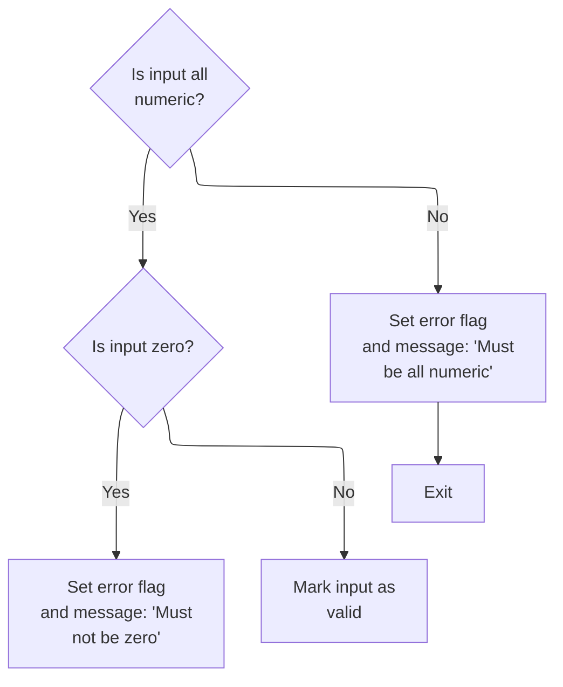
```mermaid
%%{init: {"flowchart": {"defaultRenderer": "elk"}} }%%
flowchart TD
    node1{"Is input all 
 numeric?"}
    click node1 openCode "app/cbl/COACTUPC.cbl:2137:2139"
    node1 -->|"Yes"| node2{"Is input zero?"}
    click node2 openCode "app/cbl/COACTUPC.cbl:2156:2157"
    node1 -->|"No"| node3["Set error flag 
 and message: 'Must 
 be all numeric'"]
    click node3 openCode "app/cbl/COACTUPC.cbl:2140:2151"
    node3 --> node6["Exit"]
    click node6 openCode "app/cbl/COACTUPC.cbl:2151:2151"
    node2 -->|"Yes"| node4["Set error flag 
 and message: 'Must 
 not be zero'"]
    click node4 openCode "app/cbl/COACTUPC.cbl:2158:2167"
    node2 -->|"No"| node5["Mark input as 
 valid"]
    click node5 openCode "app/cbl/COACTUPC.cbl:2174:2175"
classDef HeadingStyle fill:#777777,stroke:#333,stroke-width:2px;
```

This section enforces business rules for required numeric input validation, ensuring that only non-zero numeric values are accepted and providing clear error messages for invalid input.

| Rule ID | Code Location      | Category        | Rule Name                | Description                                                                                                                                              | Conditions                                                                          | Remarks                                                                                                                                                                  |
| ------- | ------------------ | --------------- | ------------------------ | -------------------------------------------------------------------------------------------------------------------------------------------------------- | ----------------------------------------------------------------------------------- | ------------------------------------------------------------------------------------------------------------------------------------------------------------------------ |
| BR-001  | 1245-EDIT-NUM-REQD | Data validation | Numeric Only Validation  | If the input contains any non-numeric characters, the input is rejected, an error flag is set, and the error message 'must be all numeric' is generated. | The input field contains one or more non-numeric characters.                        | The error message generated is: '\[field name\] must be all numeric.' The field name is trimmed of spaces before being included in the message. The message is a string. |
| BR-002  | 1245-EDIT-NUM-REQD | Data validation | Non-Zero Validation      | If the input is numeric but its value is zero, the input is rejected, an error flag is set, and the error message 'must not be zero' is generated.       | The input field contains only numeric characters and its numeric value is zero.     | The error message generated is: '\[field name\] must not be zero.' The field name is trimmed of spaces before being included in the message. The message is a string.    |
| BR-003  | 1245-EDIT-NUM-REQD | Data validation | Mark Valid Numeric Input | If the input passes both the numeric and non-zero checks, the input is accepted and marked as valid.                                                     | The input field contains only numeric characters and its numeric value is not zero. | No error message is generated. The input is marked as valid for further processing.                                                                                      |

<SwmSnippet path="/app/cbl/COACTUPC.cbl" line="2137" repo-id="Z2l0aHViJTNBJTNBa3luZHJ5bC1hd3MtbWFpbmZyYW1lLW1vZGVybml6YXRpb24tY2FyZGRlbW8lM0ElM0FTd2ltbS1EZW1v">

---

After returning from 1250-EDIT-SIGNED-9V2, 1245-EDIT-NUM-REQD checks if the input is numeric. If it is, we CONTINUE; otherwise, we handle the error and exit.

```cobol
           IF WS-EDIT-ALPHANUM-ONLY(1:WS-EDIT-ALPHANUM-LENGTH)
                  IS NUMERIC
              CONTINUE
```

---

</SwmSnippet>

<SwmSnippet path="/app/cbl/COACTUPC.cbl" line="2140" repo-id="Z2l0aHViJTNBJTNBa3luZHJ5bC1hd3MtbWFpbmZyYW1lLW1vZGVybml6YXRpb24tY2FyZGRlbW8lM0ElM0FTd2ltbS1EZW1v">

---

If the input isn't numeric, we set error flags, build an error message, and exit the validation routine.

```cobol
           ELSE
              SET INPUT-ERROR           TO TRUE
              SET FLG-ALPHNANUM-NOT-OK  TO TRUE
              IF WS-RETURN-MSG-OFF
                 STRING
                   FUNCTION TRIM(WS-EDIT-VARIABLE-NAME)
                   ' must be all numeric.'
                   DELIMITED BY SIZE
                   INTO WS-RETURN-MSG
                 END-STRING
              END-IF
              GO TO  1245-EDIT-NUM-REQD-EXIT
           END-IF
```

---

</SwmSnippet>

<SwmSnippet path="/app/cbl/COACTUPC.cbl" line="2156" repo-id="Z2l0aHViJTNBJTNBa3luZHJ5bC1hd3MtbWFpbmZyYW1lLW1vZGVybml6YXRpb24tY2FyZGRlbW8lM0ElM0FTd2ltbS1EZW1v">

---

Here we check if the input is zero. If it is, we set error flags, build an error message, and exit the validation routine.

```cobol
           IF FUNCTION NUMVAL(WS-EDIT-ALPHANUM-ONLY(1:
                              WS-EDIT-ALPHANUM-LENGTH)) = 0
              SET INPUT-ERROR           TO TRUE
              SET FLG-ALPHNANUM-NOT-OK  TO TRUE
              IF WS-RETURN-MSG-OFF
                 STRING
                   FUNCTION TRIM(WS-EDIT-VARIABLE-NAME)
                   ' must not be zero.'
                   DELIMITED BY SIZE
                   INTO WS-RETURN-MSG
                 END-STRING
              END-IF
```

---

</SwmSnippet>

<SwmSnippet path="/app/cbl/COACTUPC.cbl" line="2169" repo-id="Z2l0aHViJTNBJTNBa3luZHJ5bC1hd3MtbWFpbmZyYW1lLW1vZGVybml6YXRpb24tY2FyZGRlbW8lM0ElM0FTd2ltbS1EZW1v">

---

If all required numeric checks pass, we set the valid flag and finish up validation for this field.

```cobol
           ELSE
              CONTINUE
           END-IF


           SET FLG-ALPHNANUM-ISVALID    TO TRUE
           .
```

---

</SwmSnippet>

########## Optional Alphanumeric Validation Continuation

This section validates optional alphanumeric input fields, ensuring that blank input is accepted, only alphanumeric characters are allowed, and appropriate error handling is performed for invalid input.

| Rule ID | Code Location          | Category        | Rule Name                          | Description                                                                                                                                               | Conditions                                                                         | Remarks                                                                                                                                                                                                        |
| ------- | ---------------------- | --------------- | ---------------------------------- | --------------------------------------------------------------------------------------------------------------------------------------------------------- | ---------------------------------------------------------------------------------- | -------------------------------------------------------------------------------------------------------------------------------------------------------------------------------------------------------------- |
| BR-001  | 1240-EDIT-ALPHANUM-OPT | Data validation | Blank Optional Field Acceptance    | Blank input is accepted as valid for optional alphanumeric fields. No error is flagged and validation continues.                                          | The trimmed length of the input field is zero.                                     | A blank input is defined as an input where all characters are spaces. The field can be up to 256 characters. No error message is generated in this case.                                                       |
| BR-002  | 1240-EDIT-ALPHANUM-OPT | Data validation | Alphanumeric Character Restriction | Only alphanumeric characters are allowed in the optional input field. If any non-alphanumeric character is present, the input is considered invalid.      | The input field contains one or more non-alphanumeric characters.                  | Allowed characters are numbers and letters (A-Z, a-z, 0-9). The check applies to the entire input string.                                                                                                      |
| BR-003  | 1240-EDIT-ALPHANUM-OPT | Business logic  | Valid Input Flagging               | If the optional alphanumeric input passes validation, the valid flag is set to indicate successful validation.                                            | The input field is either blank or contains only alphanumeric characters.          | The valid flag is set to indicate that the input has passed validation. No error message is generated.                                                                                                         |
| BR-004  | 1240-EDIT-ALPHANUM-OPT | Error handling  | Invalid Character Error Handling   | If the optional alphanumeric input contains invalid characters, an input error is flagged, a specific error message is constructed, and validation exits. | The input field is not blank and contains one or more non-alphanumeric characters. | The error message format is: '<field name> can have numbers or alphabets only.' The field name is trimmed and concatenated with the error text. The input error flag and the alphanumeric-not-ok flag are set. |

<SwmSnippet path="/app/cbl/COACTUPC.cbl" line="2079" repo-id="Z2l0aHViJTNBJTNBa3luZHJ5bC1hd3MtbWFpbmZyYW1lLW1vZGVybml6YXRpb24tY2FyZGRlbW8lM0ElM0FTd2ltbS1EZW1v">

---

After returning from 1245-EDIT-NUM-REQD, 1240-EDIT-ALPHANUM-OPT uses INSPECT/CONVERTING to validate the optional alphanumeric input. If only allowed characters are present, we CONTINUE; otherwise, we handle the error and exit.

```cobol
           MOVE LIT-ALL-ALPHANUM-FROM-X TO LIT-ALL-ALPHANUM-FROM
           INSPECT WS-EDIT-ALPHANUM-ONLY(1:WS-EDIT-ALPHANUM-LENGTH)
             CONVERTING LIT-ALL-ALPHANUM-FROM
                     TO LIT-ALPHANUM-SPACES-TO
```

---

</SwmSnippet>

<SwmSnippet path="/app/cbl/COACTUPC.cbl" line="2084" repo-id="Z2l0aHViJTNBJTNBa3luZHJ5bC1hd3MtbWFpbmZyYW1lLW1vZGVybml6YXRpb24tY2FyZGRlbW8lM0ElM0FTd2ltbS1EZW1v">

---

Here we check if the trimmed length of the input is zero. If it is, we CONTINUE since blank input is valid for optional fields.

```cobol
           IF FUNCTION LENGTH(
                   FUNCTION TRIM(
                   WS-EDIT-ALPHANUM-ONLY(1:WS-EDIT-ALPHANUM-LENGTH)
                                  )) = 0
              CONTINUE
```

---

</SwmSnippet>

<SwmSnippet path="/app/cbl/COACTUPC.cbl" line="2089" repo-id="Z2l0aHViJTNBJTNBa3luZHJ5bC1hd3MtbWFpbmZyYW1lLW1vZGVybml6YXRpb24tY2FyZGRlbW8lM0ElM0FTd2ltbS1EZW1v">

---

If the optional alphanumeric input isn't valid, we set error flags, build an error message, and exit the validation routine.

```cobol
           ELSE
              SET INPUT-ERROR           TO TRUE
              SET FLG-ALPHNANUM-NOT-OK  TO TRUE
              IF WS-RETURN-MSG-OFF
                 STRING
                   FUNCTION TRIM(WS-EDIT-VARIABLE-NAME)
                   ' can have numbers or alphabets only.'
                   DELIMITED BY SIZE
                   INTO WS-RETURN-MSG
                 END-STRING
              END-IF
              GO TO  1240-EDIT-ALPHANUM-OPT-EXIT
           END-IF

           SET FLG-ALPHNANUM-ISVALID    TO TRUE
           .
```

---

</SwmSnippet>

######### Optional Alpha Validation Continuation

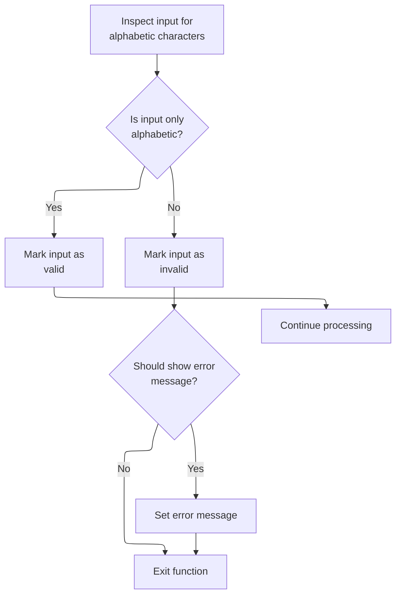
```mermaid
%%{init: {"flowchart": {"defaultRenderer": "elk"}} }%%
flowchart TD
    node1["Inspect input for 
 alphabetic characters"]
    click node1 openCode "app/cbl/COACTUPC.cbl:2031:2034"
    node1 --> node2{"Is input only 
 alphabetic?"}
    click node2 openCode "app/cbl/COACTUPC.cbl:2036:2040"
    node2 -->|"Yes"| node3["Mark input as 
 valid"]
    click node3 openCode "app/cbl/COACTUPC.cbl:2055:2056"
    node2 -->|"No"| node4["Mark input as 
 invalid"]
    click node4 openCode "app/cbl/COACTUPC.cbl:2042:2043"
    node4 --> node5{"Should show error 
 message?"}
    click node5 openCode "app/cbl/COACTUPC.cbl:2044:2051"
    node5 -->|"Yes"| node6["Set error message"]
    click node6 openCode "app/cbl/COACTUPC.cbl:2045:2050"
    node6 --> node7["Exit function"]
    click node7 openCode "app/cbl/COACTUPC.cbl:2052:2053"
    node5 -->|"No"| node7
    node3 --> node8["Continue processing"]
    click node8 openCode "app/cbl/COACTUPC.cbl:2056:2056"
classDef HeadingStyle fill:#777777,stroke:#333,stroke-width:2px;
```

This section validates optional input fields to ensure they contain only alphabetic characters or are blank, and provides user feedback if invalid input is detected.

| Rule ID | Code Location       | Category        | Rule Name                  | Description                                                                                                                                                                                        | Conditions                                                                                   | Remarks                                                                                                                                                     |
| ------- | ------------------- | --------------- | -------------------------- | -------------------------------------------------------------------------------------------------------------------------------------------------------------------------------------------------- | -------------------------------------------------------------------------------------------- | ----------------------------------------------------------------------------------------------------------------------------------------------------------- |
| BR-001  | 1235-EDIT-ALPHA-OPT | Data validation | Blank input allowed        | If the optional input field is blank (after trimming spaces), it is considered valid and processing continues.                                                                                     | The input field, after trimming leading and trailing spaces, has zero length.                | Blank input is accepted for optional fields. The input is treated as a string and is valid if, after removing spaces, its length is zero.                   |
| BR-002  | 1235-EDIT-ALPHA-OPT | Data validation | Alphabetic input required  | If the input contains only alphabetic characters, it is considered valid and processing continues.                                                                                                 | The input field contains only alphabetic characters (A-Z, a-z) and/or is blank.              | Only alphabetic characters are allowed. The input is treated as a string and must not contain digits, punctuation, or special characters.                   |
| BR-003  | 1235-EDIT-ALPHA-OPT | Error handling  | Non-alphabetic input error | If the input contains any non-alphabetic characters, the input is marked as invalid, and, if error messages are enabled, an error message is generated indicating that only alphabets are allowed. | The input field contains any character that is not an alphabetic character and is not blank. | The error message format is: '<field name> can have alphabets only.' where <field name> is the trimmed name of the input variable. The message is a string. |

<SwmSnippet path="/app/cbl/COACTUPC.cbl" line="2031" repo-id="Z2l0aHViJTNBJTNBa3luZHJ5bC1hd3MtbWFpbmZyYW1lLW1vZGVybml6YXRpb24tY2FyZGRlbW8lM0ElM0FTd2ltbS1EZW1v">

---

After returning from 1240-EDIT-ALPHANUM-OPT, 1235-EDIT-ALPHA-OPT uses INSPECT/CONVERTING to validate the optional alpha input. If only allowed characters are present, we CONTINUE; otherwise, we handle the error and exit.

```cobol
           MOVE LIT-ALL-ALPHA-FROM-X    TO LIT-ALL-ALPHA-FROM
           INSPECT WS-EDIT-ALPHANUM-ONLY(1:WS-EDIT-ALPHANUM-LENGTH)
             CONVERTING LIT-ALL-ALPHA-FROM
                     TO LIT-ALPHA-SPACES-TO
```

---

</SwmSnippet>

<SwmSnippet path="/app/cbl/COACTUPC.cbl" line="2036" repo-id="Z2l0aHViJTNBJTNBa3luZHJ5bC1hd3MtbWFpbmZyYW1lLW1vZGVybml6YXRpb24tY2FyZGRlbW8lM0ElM0FTd2ltbS1EZW1v">

---

Here we check if the trimmed length of the input is zero. If it is, we CONTINUE since blank input is valid for optional fields.

```cobol
           IF FUNCTION LENGTH(
                   FUNCTION TRIM(
                   WS-EDIT-ALPHANUM-ONLY(1:WS-EDIT-ALPHANUM-LENGTH)
                                  )) = 0
              CONTINUE
```

---

</SwmSnippet>

<SwmSnippet path="/app/cbl/COACTUPC.cbl" line="2041" repo-id="Z2l0aHViJTNBJTNBa3luZHJ5bC1hd3MtbWFpbmZyYW1lLW1vZGVybml6YXRpb24tY2FyZGRlbW8lM0ElM0FTd2ltbS1EZW1v">

---

If the optional alpha input isn't valid, we set error flags, build an error message, and exit the validation routine.

```cobol
           ELSE
              SET INPUT-ERROR           TO TRUE
              SET FLG-ALPHA-NOT-OK      TO TRUE
              IF WS-RETURN-MSG-OFF
                 STRING
                   FUNCTION TRIM(WS-EDIT-VARIABLE-NAME)
                   ' can have alphabets only.'
                   DELIMITED BY SIZE
                   INTO WS-RETURN-MSG
                 END-STRING
              END-IF
              GO TO  1235-EDIT-ALPHA-OPT-EXIT
           END-IF

           SET FLG-ALPHA-ISVALID        TO TRUE
           .
```

---

</SwmSnippet>

######## Required Alphanumeric Validation Continuation

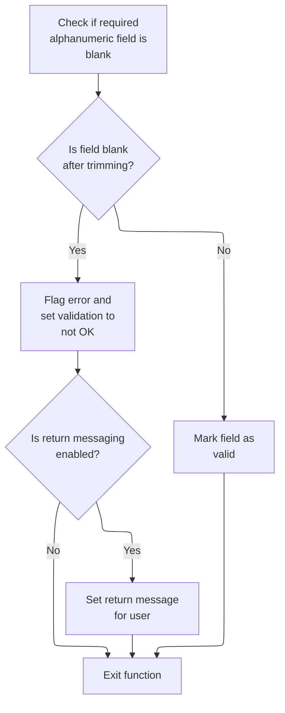
```mermaid
%%{init: {"flowchart": {"defaultRenderer": "elk"}} }%%
flowchart TD
    node1["Check if required 
 alphanumeric field is 
 blank"]
    click node1 openCode "app/cbl/COACTUPC.cbl:1982:1986"
    node1 --> node2{"Is field blank 
 after trimming?"}
    click node2 openCode "app/cbl/COACTUPC.cbl:1988:1992"
    node2 -->|"Yes"| node3["Flag error and 
 set validation to 
 not OK"]
    click node3 openCode "app/cbl/COACTUPC.cbl:1993:1995"
    node3 --> node4{"Is return messaging 
 enabled?"}
    click node4 openCode "app/cbl/COACTUPC.cbl:1996:2003"
    node4 -->|"Yes"| node5["Set return message 
 for user"]
    click node5 openCode "app/cbl/COACTUPC.cbl:1997:2002"
    node5 --> node6["Exit function"]
    click node6 openCode "app/cbl/COACTUPC.cbl:2004:2004"
    node4 -->|"No"| node6
    node2 -->|"No"| node7["Mark field as 
 valid"]
    click node7 openCode "app/cbl/COACTUPC.cbl:2007:2008"
    node7 --> node6
classDef HeadingStyle fill:#777777,stroke:#333,stroke-width:2px;
```

This section validates required alphanumeric input fields, ensuring they are either blank or contain only letters and numbers, and handles error reporting and status flags based on the validation outcome.

| Rule ID | Code Location           | Category        | Rule Name                     | Description                                                                                                                                                                      | Conditions                                                               | Remarks                                                                                                                                                                                     |
| ------- | ----------------------- | --------------- | ----------------------------- | -------------------------------------------------------------------------------------------------------------------------------------------------------------------------------- | ------------------------------------------------------------------------ | ------------------------------------------------------------------------------------------------------------------------------------------------------------------------------------------- |
| BR-001  | 1230-EDIT-ALPHANUM-REQD | Data validation | Blank Alphanumeric Accepted   | If the required alphanumeric field is blank after trimming, the input is considered valid and no error is flagged.                                                               | The trimmed input field has zero length.                                 | A blank input is defined as a string of zero length after removing leading and trailing spaces. No error message is generated in this case. The validation status is set to valid.          |
| BR-002  | 1230-EDIT-ALPHANUM-REQD | Data validation | Alphanumeric Only Enforcement | If the required alphanumeric field contains any non-alphanumeric characters, the input is considered invalid, error flags are set, and the field is marked as not valid.         | The input field contains any character that is not a letter or a number. | Only letters (A-Z, a-z) and numbers (0-9) are allowed. Any other character causes the field to be marked as invalid. The validation status is set to not valid, and error flags are raised. |
| BR-003  | 1230-EDIT-ALPHANUM-REQD | Data validation | Mark Valid Alphanumeric       | If the required alphanumeric field passes validation (is not blank and contains only allowed characters), the field is marked as valid.                                          | The input field is not blank and contains only letters and numbers.      | The validation status is set to valid. No error message is generated.                                                                                                                       |
| BR-004  | 1230-EDIT-ALPHANUM-REQD | Error handling  | User Error Messaging          | If the required alphanumeric field is invalid and return messaging is enabled, an error message is generated for the user indicating that only numbers or alphabets are allowed. | The input field is invalid and return messaging is enabled.              | The error message format is: '<field name> can have numbers or alphabets only.' The field name is trimmed and concatenated with the message. The message is a string presented to the user. |

<SwmSnippet path="/app/cbl/COACTUPC.cbl" line="1982" repo-id="Z2l0aHViJTNBJTNBa3luZHJ5bC1hd3MtbWFpbmZyYW1lLW1vZGVybml6YXRpb24tY2FyZGRlbW8lM0ElM0FTd2ltbS1EZW1v">

---

After returning from 1235-EDIT-ALPHA-OPT, 1230-EDIT-ALPHANUM-REQD uses INSPECT/CONVERTING to validate the required alphanumeric input. If only allowed characters are present, we CONTINUE; otherwise, we handle the error and exit.

```cobol
           MOVE LIT-ALL-ALPHANUM-FROM-X TO LIT-ALL-ALPHANUM-FROM

           INSPECT WS-EDIT-ALPHANUM-ONLY(1:WS-EDIT-ALPHANUM-LENGTH)
             CONVERTING LIT-ALL-ALPHANUM-FROM
                     TO LIT-ALPHANUM-SPACES-TO
```

---

</SwmSnippet>

<SwmSnippet path="/app/cbl/COACTUPC.cbl" line="1988" repo-id="Z2l0aHViJTNBJTNBa3luZHJ5bC1hd3MtbWFpbmZyYW1lLW1vZGVybml6YXRpb24tY2FyZGRlbW8lM0ElM0FTd2ltbS1EZW1v">

---

Here we check if the trimmed length of the input is zero. If it is, we CONTINUE since blank input is valid for required fields.

```cobol
           IF FUNCTION LENGTH(
                   FUNCTION TRIM(
                   WS-EDIT-ALPHANUM-ONLY(1:WS-EDIT-ALPHANUM-LENGTH)
                                  )) = 0
              CONTINUE
```

---

</SwmSnippet>

<SwmSnippet path="/app/cbl/COACTUPC.cbl" line="1993" repo-id="Z2l0aHViJTNBJTNBa3luZHJ5bC1hd3MtbWFpbmZyYW1lLW1vZGVybml6YXRpb24tY2FyZGRlbW8lM0ElM0FTd2ltbS1EZW1v">

---

If the required alphanumeric input isn't valid, we set error flags, build an error message, and exit the validation routine.

```cobol
           ELSE
              SET INPUT-ERROR           TO TRUE
              SET FLG-ALPHNANUM-NOT-OK  TO TRUE
              IF WS-RETURN-MSG-OFF
                 STRING
                   FUNCTION TRIM(WS-EDIT-VARIABLE-NAME)
                   ' can have numbers or alphabets only.'
                   DELIMITED BY SIZE
                   INTO WS-RETURN-MSG
                 END-STRING
              END-IF
              GO TO  1230-EDIT-ALPHANUM-REQD-EXIT
           END-IF

           SET FLG-ALPHNANUM-ISVALID    TO TRUE
           .
```

---

</SwmSnippet>

####### Required Alpha Validation Continuation

This section validates required alpha input fields, ensuring they are either blank or contain only alphabetic characters, and provides user feedback when validation fails.

| Rule ID | Code Location        | Category        | Rule Name                  | Description                                                                                                                                              | Conditions                                                                          | Remarks                                                                                                                                                                              |
| ------- | -------------------- | --------------- | -------------------------- | -------------------------------------------------------------------------------------------------------------------------------------------------------- | ----------------------------------------------------------------------------------- | ------------------------------------------------------------------------------------------------------------------------------------------------------------------------------------ |
| BR-001  | 1225-EDIT-ALPHA-REQD | Data validation | Blank Alpha Input Allowed  | Blank input is considered valid for required alpha fields. If the trimmed input length is zero, the validation passes without error.                     | The input field, after trimming spaces, has a length of zero.                       | A blank input (all spaces) is accepted as valid. No error message is generated in this case.                                                                                         |
| BR-002  | 1225-EDIT-ALPHA-REQD | Data validation | Alpha Characters Only      | Only alphabetic characters are allowed in required alpha input fields. If any non-alphabetic character is present, the input is invalid.                 | The input field contains any character that is not an alphabetic letter (A-Z, a-z). | The allowed characters are alphabetic letters. The check is performed using INSPECT/CONVERTING, which replaces allowed characters and checks for any remaining non-space characters. |
| BR-003  | 1225-EDIT-ALPHA-REQD | Business logic  | Alpha Input Valid Flag     | If the required alpha input passes validation, the valid flag is set to indicate successful validation.                                                  | The input field is either blank or contains only alphabetic characters.             | The valid flag set is FLG-ALPHA-ISVALID.                                                                                                                                             |
| BR-004  | 1225-EDIT-ALPHA-REQD | Error handling  | Alpha Input Error Handling | If the required alpha input is invalid, error flags are set and a user-friendly error message is constructed indicating that only alphabets are allowed. | The input field is not blank and contains non-alphabetic characters.                | The error message format is: '<field name> can have alphabets only.' The error flags set are INPUT-ERROR and FLG-ALPHA-NOT-OK.                                                       |

<SwmSnippet path="/app/cbl/COACTUPC.cbl" line="1925" repo-id="Z2l0aHViJTNBJTNBa3luZHJ5bC1hd3MtbWFpbmZyYW1lLW1vZGVybml6YXRpb24tY2FyZGRlbW8lM0ElM0FTd2ltbS1EZW1v">

---

After returning from 1230-EDIT-ALPHANUM-REQD, 1225-EDIT-ALPHA-REQD uses INSPECT/CONVERTING to validate the required alpha input. If only allowed characters are present, we CONTINUE; otherwise, we handle the error and exit.

```cobol
           MOVE LIT-ALL-ALPHA-FROM-X   TO LIT-ALL-ALPHA-FROM
           INSPECT WS-EDIT-ALPHANUM-ONLY(1:WS-EDIT-ALPHANUM-LENGTH)
             CONVERTING LIT-ALL-ALPHA-FROM
                     TO LIT-ALPHA-SPACES-TO
```

---

</SwmSnippet>

<SwmSnippet path="/app/cbl/COACTUPC.cbl" line="1930" repo-id="Z2l0aHViJTNBJTNBa3luZHJ5bC1hd3MtbWFpbmZyYW1lLW1vZGVybml6YXRpb24tY2FyZGRlbW8lM0ElM0FTd2ltbS1EZW1v">

---

Here we check if the trimmed length of the input is zero. If it is, we CONTINUE since blank input is valid for required fields.

```cobol
           IF FUNCTION LENGTH(
                   FUNCTION TRIM(
                   WS-EDIT-ALPHANUM-ONLY(1:WS-EDIT-ALPHANUM-LENGTH)
                                  )) = 0
              CONTINUE
```

---

</SwmSnippet>

<SwmSnippet path="/app/cbl/COACTUPC.cbl" line="1935" repo-id="Z2l0aHViJTNBJTNBa3luZHJ5bC1hd3MtbWFpbmZyYW1lLW1vZGVybml6YXRpb24tY2FyZGRlbW8lM0ElM0FTd2ltbS1EZW1v">

---

If the required alpha input isn't valid, we set error flags, build an error message, and exit the validation routine.

```cobol
           ELSE
              SET INPUT-ERROR           TO TRUE
              SET FLG-ALPHA-NOT-OK      TO TRUE
              IF WS-RETURN-MSG-OFF
                 STRING
                   FUNCTION TRIM(WS-EDIT-VARIABLE-NAME)
                   ' can have alphabets only.'
                   DELIMITED BY SIZE
                   INTO WS-RETURN-MSG
                 END-STRING
              END-IF
              GO TO  1225-EDIT-ALPHA-REQD-EXIT
           END-IF

           SET FLG-ALPHA-ISVALID        TO TRUE
           .
```

---

</SwmSnippet>

###### Validating Yes/No Field After Alpha Edit

This section validates a yes/no field after an alpha edit, ensuring only 'Y' or 'N' are accepted and providing clear error feedback if the input is invalid.

| Rule ID | Code Location   | Category        | Rule Name                      | Description                                                                                                                                | Conditions                                                                                           | Remarks                                                                                                                                                                                              |
| ------- | --------------- | --------------- | ------------------------------ | ------------------------------------------------------------------------------------------------------------------------------------------ | ---------------------------------------------------------------------------------------------------- | ---------------------------------------------------------------------------------------------------------------------------------------------------------------------------------------------------- |
| BR-001  | 1220-EDIT-YESNO | Data validation | Yes/No Value Restriction       | The yes/no field must contain either 'Y' or 'N'. Any other value is considered invalid.                                                    | This rule applies whenever the yes/no field is being validated after alpha edit.                     | Allowed values are 'Y' and 'N' (single character, uppercase). Any other value is rejected.                                                                                                           |
| BR-002  | 1220-EDIT-YESNO | Error handling  | Invalid Yes/No Error Messaging | If the yes/no field is invalid, an input error is flagged and a message is constructed to inform the user that the field must be 'Y or N'. | This rule applies when the yes/no field is not 'Y' or 'N' and the return message is currently blank. | The error message format is: \[field name\] must be Y or N. The field name is trimmed of spaces and concatenated with the message. The message is only set if the return message is currently blank. |

<SwmSnippet path="/app/cbl/COACTUPC.cbl" line="1878" repo-id="Z2l0aHViJTNBJTNBa3luZHJ5bC1hd3MtbWFpbmZyYW1lLW1vZGVybml6YXRpb24tY2FyZGRlbW8lM0ElM0FTd2ltbS1EZW1v">

---

After finishing 1225-EDIT-ALPHA-REQD, we're now in 1220-EDIT-YESNO. Here, we check if the yes/no field is valid ('Y' or 'N'). If it is, we continue; otherwise, we flag an input error and exit this validation branch.

```cobol
           IF FLG-YES-NO-ISVALID
              CONTINUE
```

---

</SwmSnippet>

<SwmSnippet path="/app/cbl/COACTUPC.cbl" line="1880" repo-id="Z2l0aHViJTNBJTNBa3luZHJ5bC1hd3MtbWFpbmZyYW1lLW1vZGVybml6YXRpb24tY2FyZGRlbW8lM0ElM0FTd2ltbS1EZW1v">

---

If the yes/no field isn't valid in 1220-EDIT-YESNO, we set error flags and build a message telling the user it must be 'Y or N', then exit this validation branch.

```cobol
           ELSE
              SET INPUT-ERROR             TO TRUE
              SET FLG-YES-NO-NOT-OK       TO TRUE
              IF WS-RETURN-MSG-OFF
                 STRING
                   FUNCTION TRIM(WS-EDIT-VARIABLE-NAME)
                   ' must be Y or N.'
                   DELIMITED BY SIZE
                   INTO WS-RETURN-MSG
                 END-STRING
              END-IF
              GO TO  1220-EDIT-YESNO-EXIT
           END-IF
```

---

</SwmSnippet>

##### Account Number Format and Value Check

This section validates the format and value of the account number input, ensuring only valid account numbers are accepted for further processing and providing clear error messaging for invalid inputs.

| Rule ID | Code Location     | Category        | Rule Name                          | Description                                                                                                                                                                         | Conditions                                                                                        | Remarks                                                                                                                                         |
| ------- | ----------------- | --------------- | ---------------------------------- | ----------------------------------------------------------------------------------------------------------------------------------------------------------------------------------- | ------------------------------------------------------------------------------------------------- | ----------------------------------------------------------------------------------------------------------------------------------------------- |
| BR-001  | 1210-EDIT-ACCOUNT | Data validation | Account Number Numeric Validation  | The account number must be a numeric value. If the account number contains any non-numeric characters, it is considered invalid and an error is triggered.                          | This rule applies when the account number field is supplied by the user.                          | The account number must contain only digits (0-9). Any alphabetic or special characters will cause the input to be rejected.                    |
| BR-002  | 1210-EDIT-ACCOUNT | Data validation | Account Number Non-Zero Validation | The account number must not be zero. If the account number is all zeros, it is considered invalid and an error is triggered.                                                        | This rule applies when the account number field is supplied by the user.                          | The account number must not be '00000000000'. Any account number consisting entirely of zeros will be rejected.                                 |
| BR-003  | 1210-EDIT-ACCOUNT | Business logic  | Account Number Valid Flagging      | If the account number passes all validation checks, it is copied to the main account field and a valid flag is set for downstream processing.                                       | This rule applies when the account number is numeric and not all zeros.                           | The account number is copied as an 11-digit string to the main account field. The valid flag is set to indicate successful validation.          |
| BR-004  | 1210-EDIT-ACCOUNT | Error handling  | Account Number Error Handling      | If the account number fails validation (not numeric or all zeros), an error flag is set, a specific error message is generated, and the process exits the account validation logic. | This rule applies when the account number fails either the numeric or non-zero validation checks. | The error message generated is: 'Account Number if supplied must be a 11 digit Non-Zero Number'. The error flag is set to indicate input error. |

<SwmSnippet path="/app/cbl/COACTUPC.cbl" line="1801" repo-id="Z2l0aHViJTNBJTNBa3luZHJ5bC1hd3MtbWFpbmZyYW1lLW1vZGVybml6YXRpb24tY2FyZGRlbW8lM0ElM0FTd2ltbS1EZW1v">

---

After 1215-EDIT-MANDATORY, 1210-EDIT-ACCOUNT checks if the account ID is a valid 11-digit number and not zero. If it fails, we set error flags, build an error message, and exit.

```cobol
           MOVE CC-ACCT-ID              TO ACUP-NEW-ACCT-ID
           IF CC-ACCT-ID   IS NOT NUMERIC
           OR CC-ACCT-ID-N EQUAL ZEROS
              SET INPUT-ERROR TO TRUE
              IF WS-RETURN-MSG-OFF
                STRING
                 'Account Number if supplied must be a 11 digit'
                 ' Non-Zero Number'
                DELIMITED BY SIZE
                INTO WS-RETURN-MSG
              END-IF
              MOVE ZEROES               TO CDEMO-ACCT-ID
              GO TO 1210-EDIT-ACCOUNT-EXIT
```

---

</SwmSnippet>

<SwmSnippet path="/app/cbl/COACTUPC.cbl" line="1814" repo-id="Z2l0aHViJTNBJTNBa3luZHJ5bC1hd3MtbWFpbmZyYW1lLW1vZGVybml6YXRpb24tY2FyZGRlbW8lM0ElM0FTd2ltbS1EZW1v">

---

If the account ID checks out in 1210-EDIT-ACCOUNT, we copy it to the main field and set the valid flag so downstream logic knows it's good.

```cobol
           ELSE
              MOVE CC-ACCT-ID TO CDEMO-ACCT-ID
              SET FLG-ACCTFILTER-ISVALID TO TRUE
           END-IF
```

---

</SwmSnippet>

#### Early Exit on Invalid Search Criteria

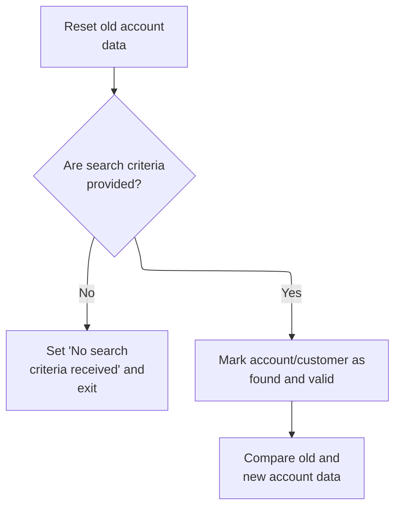
```mermaid
%%{init: {"flowchart": {"defaultRenderer": "elk"}} }%%
flowchart TD
    node1["Reset old account 
 data"]
    click node1 openCode "app/cbl/COACTUPC.cbl:1438:1439"
    node1 --> node2{"Are search criteria 
 provided?"}
    click node2 openCode "app/cbl/COACTUPC.cbl:1441:1449"
    node2 -->|"No"| node3["Set 'No search 
 criteria received' and 
 exit"]
    click node3 openCode "app/cbl/COACTUPC.cbl:1442:1446"
    node2 -->|"Yes"| node4["Mark account/customer as 
 found and valid"]
    click node4 openCode "app/cbl/COACTUPC.cbl:1452:1457"
    node4 --> node5["Compare old and 
 new account data"]
    click node5 openCode "app/cbl/COACTUPC.cbl:1460:1461"

classDef HeadingStyle fill:#777777,stroke:#333,stroke-width:2px;
```

This section ensures that account update processing only proceeds when valid search criteria are provided. If no criteria are present, the system exits early and informs the user. When criteria are present, the system marks the relevant data as valid and continues with further validation and comparison.

| Rule ID | Code Location        | Category        | Rule Name                  | Description                                                                                                                                                                                      | Conditions                                                                                                                  | Remarks                                                                                                                                       |
| ------- | -------------------- | --------------- | -------------------------- | ------------------------------------------------------------------------------------------------------------------------------------------------------------------------------------------------ | --------------------------------------------------------------------------------------------------------------------------- | --------------------------------------------------------------------------------------------------------------------------------------------- |
| BR-001  | 1200-EDIT-MAP-INPUTS | Data validation | Require Search Criteria    | If no search criteria are provided, the system must set a 'No search criteria received' message and exit the account update process without performing further edits.                            | This rule applies when the account filter is detected as blank during the edit process.                                     | The output message is 'No input received'. No further account or customer validation or comparison is performed in this case.                 |
| BR-002  | 1200-EDIT-MAP-INPUTS | Business logic  | Mark Valid Search Criteria | If valid search criteria are provided, the system must mark the account and customer as found and valid, enabling further processing such as data comparison.                                    | This rule applies when the account filter is not blank and valid account/customer data is found.                            | Flags are set to indicate account and customer are found and valid. This enables downstream logic to proceed with comparing old and new data. |
| BR-003  | 1200-EDIT-MAP-INPUTS | Business logic  | Compare Old and New Data   | When valid search criteria are present and account/customer are marked as found and valid, the system must compare the old and new account data to determine if changes exist before proceeding. | This rule applies after the account and customer have been marked as found and valid based on the provided search criteria. | The comparison is performed only if prior validations pass. The result of the comparison determines if further update actions are needed.     |

<SwmSnippet path="/app/cbl/COACTUPC.cbl" line="1438" repo-id="Z2l0aHViJTNBJTNBa3luZHJ5bC1hd3MtbWFpbmZyYW1lLW1vZGVybml6YXRpb24tY2FyZGRlbW8lM0ElM0FTd2ltbS1EZW1v">

---

After 1210-EDIT-ACCOUNT, 1200-EDIT-MAP-INPUTS checks if the account filter is blank. If so, we set a flag and exit early, skipping further edits.

```cobol
               MOVE LOW-VALUES           TO ACUP-OLD-ACCT-DATA

      *       IF THE SEARCH CONDITIONS HAVE PROBLEMS FLAG THEM
              IF  FLG-ACCTFILTER-BLANK
                  SET NO-SEARCH-CRITERIA-RECEIVED TO TRUE
              END-IF

      *       AT THIS STAGE. NO DETAILS FETCHED. NOTHING MORE TO EDIT.
              GO TO 1200-EDIT-MAP-INPUTS-EXIT
```

---

</SwmSnippet>

<SwmSnippet path="/app/cbl/COACTUPC.cbl" line="1447" repo-id="Z2l0aHViJTNBJTNBa3luZHJ5bC1hd3MtbWFpbmZyYW1lLW1vZGVybml6YXRpb24tY2FyZGRlbW8lM0ElM0FTd2ltbS1EZW1v">

---

If the account filter isn't blank, 1200-EDIT-MAP-INPUTS just continues to the next validation logic.

```cobol
           ELSE
               CONTINUE
           END-IF
```

---

</SwmSnippet>

<SwmSnippet path="/app/cbl/COACTUPC.cbl" line="1452" repo-id="Z2l0aHViJTNBJTNBa3luZHJ5bC1hd3MtbWFpbmZyYW1lLW1vZGVybml6YXRpb24tY2FyZGRlbW8lM0ElM0FTd2ltbS1EZW1v">

---

Once account and customer data are found, we set flags to mark them as valid so we can move on to comparing old and new data.

```cobol
           SET FOUND-ACCOUNT-DATA        TO TRUE
           SET FOUND-ACCT-IN-MASTER      TO TRUE
           SET FLG-ACCTFILTER-ISVALID    TO TRUE

           SET FOUND-CUST-IN-MASTER      TO TRUE
           SET FLG-CUSTFILTER-ISVALID    TO TRUE
```

---

</SwmSnippet>

<SwmSnippet path="/app/cbl/COACTUPC.cbl" line="1460" repo-id="Z2l0aHViJTNBJTNBa3luZHJ5bC1hd3MtbWFpbmZyYW1lLW1vZGVybml6YXRpb24tY2FyZGRlbW8lM0ElM0FTd2ltbS1EZW1v">

---

Now we call 1205-COMPARE-OLD-NEW to check if anything actually changed between the old and new account data before moving forward.

```cobol
           PERFORM 1205-COMPARE-OLD-NEW
              THRU 1205-COMPARE-OLD-NEW-EXIT
```

---

</SwmSnippet>

#### Detecting Account Data Changes

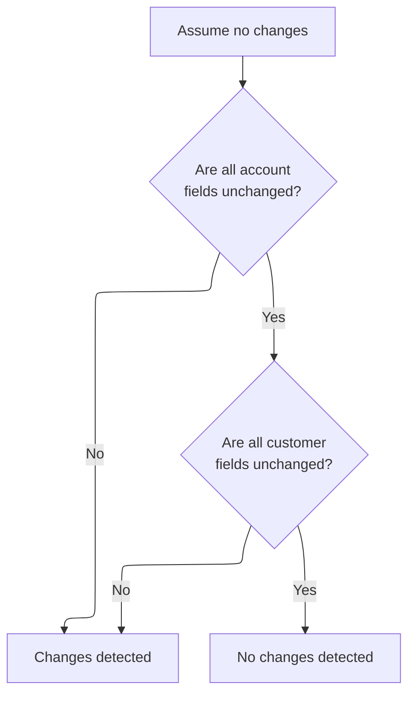
```mermaid
%%{init: {"flowchart": {"defaultRenderer": "elk"}} }%%
flowchart TD
    node1["Assume no changes"] --> node2{"Are all account 
 fields unchanged?"}
    click node1 openCode "app/cbl/COACTUPC.cbl:1682:1682"
    click node2 openCode "app/cbl/COACTUPC.cbl:1684:1701"
    node2 -->|"Yes"| node3{"Are all customer 
 fields unchanged?"}
    click node3 openCode "app/cbl/COACTUPC.cbl:1708:1768"
    node2 -->|"No"| node4["Changes detected"]
    click node4 openCode "app/cbl/COACTUPC.cbl:1703:1704"
    node3 -->|"Yes"| node5["No changes detected"]
    click node5 openCode "app/cbl/COACTUPC.cbl:1769:1769"
    node3 -->|"No"| node4
classDef HeadingStyle fill:#777777,stroke:#333,stroke-width:2px;
```

This section determines whether any changes have occurred between the old and new account and customer data, setting appropriate flags to indicate whether an update is required.

| Rule ID | Code Location        | Category       | Rule Name                       | Description                                                                                                                                                                                                                                                                                                                                                                                                                                                                      | Conditions                                                                                                             | Remarks                                                                                                                                                                                                                                      |
| ------- | -------------------- | -------------- | ------------------------------- | -------------------------------------------------------------------------------------------------------------------------------------------------------------------------------------------------------------------------------------------------------------------------------------------------------------------------------------------------------------------------------------------------------------------------------------------------------------------------------- | ---------------------------------------------------------------------------------------------------------------------- | -------------------------------------------------------------------------------------------------------------------------------------------------------------------------------------------------------------------------------------------- |
| BR-001  | 1205-COMPARE-OLD-NEW | Business logic | Account Field Change Detection  | A change is detected if any account field (including account ID, status, balances, credit limits, dates, or group ID) differs between the old and new data. Text fields are compared case-insensitively and with leading/trailing spaces removed. If any difference is found, the system flags that a change has occurred.                                                                                                                                                       | This rule applies when comparing the old and new account data fields.                                                  | Text fields are compared after converting to uppercase and trimming spaces. The change flag is set if any field does not match. The 'change detected' flag corresponds to the business meaning of 'an update is required for this account.'  |
| BR-002  | 1205-COMPARE-OLD-NEW | Business logic | Customer Field Change Detection | If all account fields match between the old and new data, the system proceeds to compare all customer fields. A change is detected if any customer field (such as customer ID, name, address, phone numbers, SSN, government ID, date of birth, EFT account ID, primary holder indicator, or FICO score) differs. Text fields are compared case-insensitively and with leading/trailing spaces removed. If any difference is found, the system flags that a change has occurred. | This rule applies after all account fields have been found to match, and the system is comparing customer data fields. | Text fields are compared after converting to uppercase and trimming spaces. The change flag is set if any field does not match. The 'change detected' flag corresponds to the business meaning of 'an update is required for this customer.' |
| BR-003  | 1205-COMPARE-OLD-NEW | Business logic | No Changes Detected Flag        | If all account and customer fields match between the old and new data, the system sets a flag indicating that no changes have been detected. This means no update action is required.                                                                                                                                                                                                                                                                                            | This rule applies when all account and customer fields match between the old and new data.                             | The 'no changes detected' flag corresponds to the business meaning of 'no update is required for this account and customer.'                                                                                                                 |

<SwmSnippet path="/app/cbl/COACTUPC.cbl" line="1681" repo-id="Z2l0aHViJTNBJTNBa3luZHJ5bC1hd3MtbWFpbmZyYW1lLW1vZGVybml6YXRpb24tY2FyZGRlbW8lM0ElM0FTd2ltbS1EZW1v">

---

In 1205-COMPARE-OLD-NEW, we compare all account fields (IDs, status, balances, dates, group IDs) and use case-insensitive checks for text fields. If everything matches, we continue; otherwise, we flag changes.

```cobol
       1205-COMPARE-OLD-NEW.
           SET NO-CHANGES-FOUND           TO TRUE

           IF  ACUP-NEW-ACCT-ID-X         = ACUP-OLD-ACCT-ID-X
           AND FUNCTION UPPER-CASE (
               ACUP-NEW-ACTIVE-STATUS)    =
               FUNCTION UPPER-CASE (
               ACUP-OLD-ACTIVE-STATUS)
           AND ACUP-NEW-CURR-BAL          = ACUP-OLD-CURR-BAL
           AND ACUP-NEW-CREDIT-LIMIT      = ACUP-OLD-CREDIT-LIMIT
           AND ACUP-NEW-CASH-CREDIT-LIMIT = ACUP-OLD-CASH-CREDIT-LIMIT
           AND ACUP-NEW-OPEN-DATE         = ACUP-OLD-OPEN-DATE
           AND ACUP-NEW-EXPIRAION-DATE    = ACUP-OLD-EXPIRAION-DATE
           AND ACUP-NEW-REISSUE-DATE      = ACUP-OLD-REISSUE-DATE
           AND ACUP-NEW-CURR-CYC-CREDIT   = ACUP-OLD-CURR-CYC-CREDIT
           AND ACUP-NEW-CURR-CYC-DEBIT    = ACUP-OLD-CURR-CYC-DEBIT
           AND FUNCTION UPPER-CASE (
               FUNCTION TRIM (ACUP-NEW-GROUP-ID))=
               FUNCTION UPPER-CASE (
               FUNCTION TRIM (ACUP-OLD-GROUP-ID))
               CONTINUE
```

---

</SwmSnippet>

<SwmSnippet path="/app/cbl/COACTUPC.cbl" line="1702" repo-id="Z2l0aHViJTNBJTNBa3luZHJ5bC1hd3MtbWFpbmZyYW1lLW1vZGVybml6YXRpb24tY2FyZGRlbW8lM0ElM0FTd2ltbS1EZW1v">

---

If any account field doesn't match, we set the change flag and exit the compare routine to handle the update.

```cobol
           ELSE
               SET CHANGE-HAS-OCCURRED   TO TRUE
               GO TO 1205-COMPARE-OLD-NEW-EXIT
           END-IF
```

---

</SwmSnippet>

<SwmSnippet path="/app/cbl/COACTUPC.cbl" line="1708" repo-id="Z2l0aHViJTNBJTNBa3luZHJ5bC1hd3MtbWFpbmZyYW1lLW1vZGVybml6YXRpb24tY2FyZGRlbW8lM0ElM0FTd2ltbS1EZW1v">

---

After account comparison, 1205-COMPARE-OLD-NEW checks all customer fields for changes. If everything matches, we set a flag for no changes detected.

```cobol
           IF  FUNCTION UPPER-CASE (
               FUNCTION TRIM (ACUP-NEW-CUST-ID-X))=
               FUNCTION UPPER-CASE (
               FUNCTION TRIM (ACUP-OLD-CUST-ID-X))
           AND FUNCTION UPPER-CASE (
               FUNCTION TRIM (ACUP-NEW-CUST-FIRST-NAME))=
               FUNCTION UPPER-CASE (
               FUNCTION TRIM (ACUP-OLD-CUST-FIRST-NAME))
           AND FUNCTION UPPER-CASE (
               FUNCTION TRIM (ACUP-NEW-CUST-MIDDLE-NAME))=
               FUNCTION UPPER-CASE (
               FUNCTION TRIM (ACUP-OLD-CUST-MIDDLE-NAME))
           AND FUNCTION UPPER-CASE (
               FUNCTION TRIM (ACUP-NEW-CUST-LAST-NAME))=
               FUNCTION UPPER-CASE (
               FUNCTION TRIM (ACUP-OLD-CUST-LAST-NAME))
           AND FUNCTION UPPER-CASE (
               FUNCTION TRIM (ACUP-NEW-CUST-ADDR-LINE-1))=
               FUNCTION UPPER-CASE (
               FUNCTION TRIM (ACUP-OLD-CUST-ADDR-LINE-1))
           AND FUNCTION UPPER-CASE (
               FUNCTION TRIM (ACUP-NEW-CUST-ADDR-LINE-2))=
               FUNCTION UPPER-CASE (
               FUNCTION TRIM (ACUP-OLD-CUST-ADDR-LINE-2))
           AND FUNCTION UPPER-CASE (
               FUNCTION TRIM (ACUP-NEW-CUST-ADDR-LINE-3))=
               FUNCTION UPPER-CASE (
               FUNCTION TRIM (ACUP-OLD-CUST-ADDR-LINE-3))
           AND FUNCTION UPPER-CASE (
               FUNCTION TRIM (ACUP-NEW-CUST-ADDR-STATE-CD))=
               FUNCTION UPPER-CASE (
               FUNCTION TRIM (ACUP-OLD-CUST-ADDR-STATE-CD))
           AND FUNCTION UPPER-CASE (
               FUNCTION TRIM (ACUP-NEW-CUST-ADDR-COUNTRY-CD))=
               FUNCTION UPPER-CASE (
               FUNCTION TRIM (ACUP-OLD-CUST-ADDR-COUNTRY-CD))
           AND FUNCTION UPPER-CASE (
               FUNCTION TRIM (ACUP-NEW-CUST-ADDR-ZIP))=
               FUNCTION UPPER-CASE (
               FUNCTION TRIM (ACUP-OLD-CUST-ADDR-ZIP))
           AND ACUP-NEW-CUST-PHONE-NUM-1A = ACUP-OLD-CUST-PHONE-NUM-1A
           AND ACUP-NEW-CUST-PHONE-NUM-1B = ACUP-OLD-CUST-PHONE-NUM-1B
           AND ACUP-NEW-CUST-PHONE-NUM-1C = ACUP-OLD-CUST-PHONE-NUM-1C
           AND ACUP-NEW-CUST-PHONE-NUM-2A = ACUP-OLD-CUST-PHONE-NUM-2A
           AND ACUP-NEW-CUST-PHONE-NUM-2B = ACUP-OLD-CUST-PHONE-NUM-2B
           AND ACUP-NEW-CUST-PHONE-NUM-2C = ACUP-OLD-CUST-PHONE-NUM-2C
           AND ACUP-NEW-CUST-SSN-X       = ACUP-OLD-CUST-SSN-X
           AND FUNCTION UPPER-CASE (
               FUNCTION TRIM (ACUP-NEW-CUST-GOVT-ISSUED-ID ))=
               FUNCTION UPPER-CASE (
               FUNCTION TRIM (ACUP-OLD-CUST-GOVT-ISSUED-ID))
           AND ACUP-NEW-CUST-DOB-YYYY-MM-DD
                                     = ACUP-OLD-CUST-DOB-YYYY-MM-DD
           AND ACUP-NEW-CUST-EFT-ACCOUNT-ID
                                     = ACUP-OLD-CUST-EFT-ACCOUNT-ID
           AND FUNCTION UPPER-CASE (
               FUNCTION TRIM (ACUP-NEW-CUST-PRI-HOLDER-IND))=
               FUNCTION UPPER-CASE (
               FUNCTION TRIM (ACUP-OLD-CUST-PRI-HOLDER-IND))
           AND ACUP-NEW-CUST-FICO-SCORE-X
                                     = ACUP-OLD-CUST-FICO-SCORE-X
               SET NO-CHANGES-DETECTED   TO TRUE
```

---

</SwmSnippet>

<SwmSnippet path="/app/cbl/COACTUPC.cbl" line="1770" repo-id="Z2l0aHViJTNBJTNBa3luZHJ5bC1hd3MtbWFpbmZyYW1lLW1vZGVybml6YXRpb24tY2FyZGRlbW8lM0ElM0FTd2ltbS1EZW1v">

---

If any customer field doesn't match, we set the change flag and exit the compare routine so the rest of the flow knows to handle updates.

```cobol
           ELSE
               SET CHANGE-HAS-OCCURRED   TO TRUE
               GO TO 1205-COMPARE-OLD-NEW-EXIT
           END-IF
```

---

</SwmSnippet>

#### Handling No Changes or Confirmation States

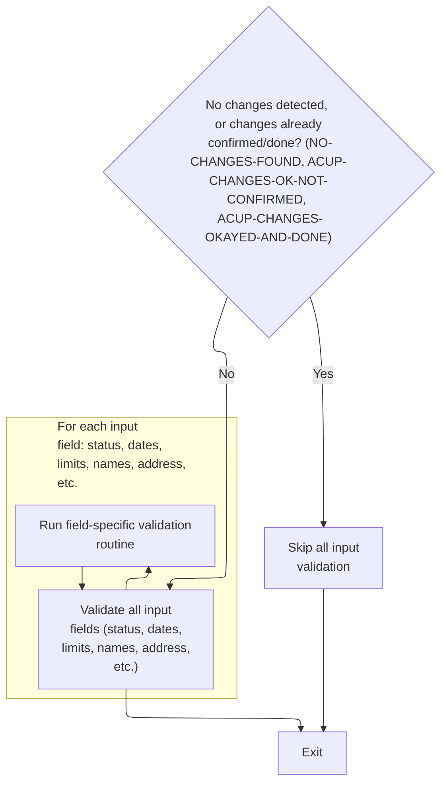
```mermaid
%%{init: {"flowchart": {"defaultRenderer": "elk"}} }%%
flowchart TD
    node1{"No changes detected, 
 or changes already 
 confirmed/done? (NO-CHANGES-FOUND, ACUP-CHANGES-OK-NOT-CONFIRMED, 
 ACUP-CHANGES-OKAYED-AND-DONE)"}
    click node1 openCode "app/cbl/COACTUPC.cbl:1463:1468"
    node1 -->|"Yes"| node2["Skip all input 
 validation"]
    click node2 openCode "app/cbl/COACTUPC.cbl:1466:1468"
    node1 -->|"No"| node3["Validate all input 
 fields (status, dates, 
 limits, names, address, 
 etc.)"]
    click node3 openCode "app/cbl/COACTUPC.cbl:1470:1636"
    subgraph loop1["For each input 
 field: status, dates, 
 limits, names, address, 
 etc."]
        node3 --> node4["Run field-specific validation 
 routine"]
        click node4 openCode "app/cbl/COACTUPC.cbl:1472:1636"
        node4 --> node3
    end
    node2 --> node5["Exit"]
    node3 --> node5["Exit"]
    click node5 openCode "app/cbl/COACTUPC.cbl:1468:1468"
classDef HeadingStyle fill:#777777,stroke:#333,stroke-width:2px;
```

This section governs the validation of all input fields for account updates, ensuring that each field meets business requirements for format, length, and presence, but only when changes are pending and not yet confirmed.

| Rule ID | Code Location        | Category        | Rule Name                                       | Description                                                                                                                                                                                                        | Conditions                                                                                                                               | Remarks                                                                                                                                                                                   |
| ------- | -------------------- | --------------- | ----------------------------------------------- | ------------------------------------------------------------------------------------------------------------------------------------------------------------------------------------------------------------------ | ---------------------------------------------------------------------------------------------------------------------------------------- | ----------------------------------------------------------------------------------------------------------------------------------------------------------------------------------------- |
| BR-001  | 1200-EDIT-MAP-INPUTS | Data validation | Skip validation for unchanged or confirmed data | If no changes are detected, or changes are already confirmed or completed, all input validation is skipped and the process exits early.                                                                            | This rule applies when the 'no changes found' flag is set, or the 'changes ok not confirmed' or 'changes okayed and done' flags are set. | The flags correspond to: NO-CHANGES-FOUND (WS-DATACHANGED-FLAG = '0'), ACUP-CHANGES-OK-NOT-CONFIRMED (ACUP-CHANGE-ACTION = 'N'), ACUP-CHANGES-OKAYED-AND-DONE (ACUP-CHANGE-ACTION = 'C'). |
| BR-002  | 1200-EDIT-MAP-INPUTS | Data validation | Account status yes/no validation                | Account status must be validated as a yes/no field whenever changes are pending.                                                                                                                                   | This rule applies when changes are pending and input validation is not skipped.                                                          | The account status must be a single character, either 'Y' or 'N'.                                                                                                                         |
| BR-003  | 1200-EDIT-MAP-INPUTS | Data validation | Date fields validation                          | Open date, expiry date, reissue date, and date of birth must each be validated as 8-digit dates in CCYYMMDD format when changes are pending.                                                                       | This rule applies when changes are pending and input validation is not skipped.                                                          | Each date field must be 8 characters, formatted as CCYYMMDD (e.g., 20231231).                                                                                                             |
| BR-004  | 1200-EDIT-MAP-INPUTS | Data validation | Signed number fields validation                 | Credit limit, cash credit limit, current balance, current cycle credit limit, and current cycle debit limit must each be validated as signed numbers with up to 10 digits and 2 decimals when changes are pending. | This rule applies when changes are pending and input validation is not skipped.                                                          | Each field must be a signed number with up to 10 digits before the decimal and 2 digits after the decimal (e.g., -1234567890.12).                                                         |
| BR-005  | 1200-EDIT-MAP-INPUTS | Data validation | FICO score validation                           | FICO score must be validated as a required 3-digit numeric field, and if valid, a secondary FICO score check is performed.                                                                                         | This rule applies when changes are pending and input validation is not skipped.                                                          | FICO score must be exactly 3 digits (e.g., 700).                                                                                                                                          |
| BR-006  | 1200-EDIT-MAP-INPUTS | Data validation | Name fields validation                          | First name and last name must be validated as required alpha fields with a maximum length of 25 characters; middle name is optional but must be alpha if present.                                                  | This rule applies when changes are pending and input validation is not skipped.                                                          | First and last names: required, up to 25 characters, alphabetic. Middle name: optional, up to 25 characters, alphabetic.                                                                  |
| BR-007  | 1200-EDIT-MAP-INPUTS | Data validation | Address line 1 mandatory validation             | Address line 1 must be validated as a mandatory field with a maximum length of 50 characters.                                                                                                                      | This rule applies when changes are pending and input validation is not skipped.                                                          | Address line 1: required, up to 50 characters, alphanumeric.                                                                                                                              |
| BR-008  | 1200-EDIT-MAP-INPUTS | Data validation | State code validation                           | State code must be validated as a required 2-character alpha field, and if valid, a secondary state code check is performed.                                                                                       | This rule applies when changes are pending and input validation is not skipped.                                                          | State code: required, exactly 2 alphabetic characters.                                                                                                                                    |
| BR-009  | 1200-EDIT-MAP-INPUTS | Data validation | Zip code validation                             | Zip code must be validated as a required 5-digit numeric field.                                                                                                                                                    | This rule applies when changes are pending and input validation is not skipped.                                                          | Zip code: required, exactly 5 digits.                                                                                                                                                     |
| BR-010  | 1200-EDIT-MAP-INPUTS | Data validation | City field validation                           | City must be validated as a required alpha field with a maximum length of 50 characters.                                                                                                                           | This rule applies when changes are pending and input validation is not skipped.                                                          | City: required, up to 50 characters, alphabetic.                                                                                                                                          |
| BR-011  | 1200-EDIT-MAP-INPUTS | Data validation | Country code validation                         | Country code must be validated as a required alpha field with a maximum length of 3 characters.                                                                                                                    | This rule applies when changes are pending and input validation is not skipped.                                                          | Country code: required, up to 3 characters, alphabetic.                                                                                                                                   |
| BR-012  | 1200-EDIT-MAP-INPUTS | Data validation | Phone number validation                         | Phone Number 1 must be validated as a US phone number when changes are pending.                                                                                                                                    | This rule applies when changes are pending and input validation is not skipped.                                                          | Phone Number 1: required, must match US phone number format (e.g., 123-456-7890).                                                                                                         |
| BR-013  | 1200-EDIT-MAP-INPUTS | Data validation | SSN validation                                  | SSN must be validated for correct US Social Security Number format when changes are pending.                                                                                                                       | This rule applies when changes are pending and input validation is not skipped.                                                          | SSN: required, must match US SSN format (e.g., 123-45-6789).                                                                                                                              |

<SwmSnippet path="/app/cbl/COACTUPC.cbl" line="1463" repo-id="Z2l0aHViJTNBJTNBa3luZHJ5bC1hd3MtbWFpbmZyYW1lLW1vZGVybml6YXRpb24tY2FyZGRlbW8lM0ElM0FTd2ltbS1EZW1v">

---

After 1205-COMPARE-OLD-NEW, 1200-EDIT-MAP-INPUTS checks for no changes or confirmed states. If so, we reset flags and exit early.

```cobol
           IF  NO-CHANGES-FOUND
           OR  ACUP-CHANGES-OK-NOT-CONFIRMED
           OR  ACUP-CHANGES-OKAYED-AND-DONE
               MOVE LOW-VALUES           TO WS-NON-KEY-FLAGS
               GO TO 1200-EDIT-MAP-INPUTS-EXIT
           END-IF
```

---

</SwmSnippet>

<SwmSnippet path="/app/cbl/COACTUPC.cbl" line="1470" repo-id="Z2l0aHViJTNBJTNBa3luZHJ5bC1hd3MtbWFpbmZyYW1lLW1vZGVybml6YXRpb24tY2FyZGRlbW8lM0ElM0FTd2ltbS1EZW1v">

---

Now we set up the account status as a yes/no field and call 1220-EDIT-YESNO to validate it before moving on.

```cobol
           SET ACUP-CHANGES-NOT-OK       TO TRUE

           MOVE 'Account Status'          TO WS-EDIT-VARIABLE-NAME
           MOVE ACUP-NEW-ACTIVE-STATUS    TO WS-EDIT-YES-NO
           PERFORM 1220-EDIT-YESNO
              THRU 1220-EDIT-YESNO-EXIT
```

---

</SwmSnippet>

<SwmSnippet path="/app/cbl/COACTUPC.cbl" line="1476" repo-id="Z2l0aHViJTNBJTNBa3luZHJ5bC1hd3MtbWFpbmZyYW1lLW1vZGVybml6YXRpb24tY2FyZGRlbW8lM0ElM0FTd2ltbS1EZW1v">

---

After 1220-EDIT-YESNO, 1200-EDIT-MAP-INPUTS copies the validated account status and sets up for open date validation.

```cobol
           MOVE WS-EDIT-YES-NO            TO WS-EDIT-ACCT-STATUS

           MOVE 'Open Date'              TO WS-EDIT-VARIABLE-NAME
           MOVE ACUP-NEW-OPEN-DATE       TO WS-EDIT-DATE-CCYYMMDD
           PERFORM EDIT-DATE-CCYYMMDD
              THRU EDIT-DATE-CCYYMMDD-EXIT
```

---

</SwmSnippet>

<SwmSnippet path="/app/cbl/COACTUPC.cbl" line="1482" repo-id="Z2l0aHViJTNBJTNBa3luZHJ5bC1hd3MtbWFpbmZyYW1lLW1vZGVybml6YXRpb24tY2FyZGRlbW8lM0ElM0FTd2ltbS1EZW1v">

---

Now we set up the credit limit and call 1250-EDIT-SIGNED-9V2 to make sure it's a valid signed number before moving on.

```cobol
           MOVE WS-EDIT-DATE-FLGS        TO WS-EDIT-OPEN-DATE-FLGS

           MOVE 'Credit Limit'           TO WS-EDIT-VARIABLE-NAME
           MOVE ACUP-NEW-CREDIT-LIMIT-X  TO WS-EDIT-SIGNED-NUMBER-9V2-X
           PERFORM 1250-EDIT-SIGNED-9V2
              THRU 1250-EDIT-SIGNED-9V2-EXIT
```

---

</SwmSnippet>

<SwmSnippet path="/app/cbl/COACTUPC.cbl" line="1488" repo-id="Z2l0aHViJTNBJTNBa3luZHJ5bC1hd3MtbWFpbmZyYW1lLW1vZGVybml6YXRpb24tY2FyZGRlbW8lM0ElM0FTd2ltbS1EZW1v">

---

After 1250-EDIT-SIGNED-9V2, 1200-EDIT-MAP-INPUTS copies the validation flag and sets up for expiry date validation.

```cobol
           MOVE WS-FLG-SIGNED-NUMBER-EDIT  TO WS-EDIT-CREDIT-LIMIT

           MOVE 'Expiry Date'            TO WS-EDIT-VARIABLE-NAME
           MOVE ACUP-NEW-EXPIRAION-DATE  TO WS-EDIT-DATE-CCYYMMDD
           PERFORM EDIT-DATE-CCYYMMDD
              THRU EDIT-DATE-CCYYMMDD-EXIT
```

---

</SwmSnippet>

<SwmSnippet path="/app/cbl/COACTUPC.cbl" line="1494" repo-id="Z2l0aHViJTNBJTNBa3luZHJ5bC1hd3MtbWFpbmZyYW1lLW1vZGVybml6YXRpb24tY2FyZGRlbW8lM0ElM0FTd2ltbS1EZW1v">

---

After expiry date validation, we copy the flag and set up for cash credit limit validation next.

```cobol
           MOVE WS-EDIT-DATE-FLGS        TO WS-EXPIRY-DATE-FLGS

           MOVE 'Cash Credit Limit'      TO WS-EDIT-VARIABLE-NAME
           MOVE ACUP-NEW-CASH-CREDIT-LIMIT-X
                                         TO WS-EDIT-SIGNED-NUMBER-9V2-X
           PERFORM 1250-EDIT-SIGNED-9V2
              THRU 1250-EDIT-SIGNED-9V2-EXIT
```

---

</SwmSnippet>

<SwmSnippet path="/app/cbl/COACTUPC.cbl" line="1501" repo-id="Z2l0aHViJTNBJTNBa3luZHJ5bC1hd3MtbWFpbmZyYW1lLW1vZGVybml6YXRpb24tY2FyZGRlbW8lM0ElM0FTd2ltbS1EZW1v">

---

After cash credit limit validation, we copy the flag and set up for reissue date validation next.

```cobol
           MOVE WS-FLG-SIGNED-NUMBER-EDIT TO WS-EDIT-CASH-CREDIT-LIMIT

           MOVE 'Reissue Date'           TO WS-EDIT-VARIABLE-NAME
           MOVE ACUP-NEW-REISSUE-DATE    TO WS-EDIT-DATE-CCYYMMDD
           PERFORM EDIT-DATE-CCYYMMDD
              THRU EDIT-DATE-CCYYMMDD-EXIT
```

---

</SwmSnippet>

<SwmSnippet path="/app/cbl/COACTUPC.cbl" line="1507" repo-id="Z2l0aHViJTNBJTNBa3luZHJ5bC1hd3MtbWFpbmZyYW1lLW1vZGVybml6YXRpb24tY2FyZGRlbW8lM0ElM0FTd2ltbS1EZW1v">

---

After reissue date validation, we copy the flag and set up for current balance validation next.

```cobol
           MOVE WS-EDIT-DATE-FLGS        TO WS-EDIT-REISSUE-DATE-FLGS

           MOVE 'Current Balance'        TO WS-EDIT-VARIABLE-NAME
           MOVE ACUP-NEW-CURR-BAL-X      TO WS-EDIT-SIGNED-NUMBER-9V2-X
           PERFORM 1250-EDIT-SIGNED-9V2
              THRU 1250-EDIT-SIGNED-9V2-EXIT
```

---

</SwmSnippet>

<SwmSnippet path="/app/cbl/COACTUPC.cbl" line="1513" repo-id="Z2l0aHViJTNBJTNBa3luZHJ5bC1hd3MtbWFpbmZyYW1lLW1vZGVybml6YXRpb24tY2FyZGRlbW8lM0ElM0FTd2ltbS1EZW1v">

---

After current balance validation, we copy the flag and set up for current cycle credit limit validation next.

```cobol
           MOVE WS-FLG-SIGNED-NUMBER-EDIT   TO WS-EDIT-CURR-BAL

           MOVE 'Current Cycle Credit Limit' TO WS-EDIT-VARIABLE-NAME
           MOVE ACUP-NEW-CURR-CYC-CREDIT-X
                                         TO WS-EDIT-SIGNED-NUMBER-9V2-X
           PERFORM 1250-EDIT-SIGNED-9V2
              THRU 1250-EDIT-SIGNED-9V2-EXIT
```

---

</SwmSnippet>

<SwmSnippet path="/app/cbl/COACTUPC.cbl" line="1520" repo-id="Z2l0aHViJTNBJTNBa3luZHJ5bC1hd3MtbWFpbmZyYW1lLW1vZGVybml6YXRpb24tY2FyZGRlbW8lM0ElM0FTd2ltbS1EZW1v">

---

After current cycle credit limit validation, we copy the flag and set up for current cycle debit limit validation next.

```cobol
           MOVE WS-FLG-SIGNED-NUMBER-EDIT   TO WS-EDIT-CURR-CYC-CREDIT

           MOVE 'Current Cycle Debit Limit' TO WS-EDIT-VARIABLE-NAME
           MOVE ACUP-NEW-CURR-CYC-DEBIT-X
                                         TO WS-EDIT-SIGNED-NUMBER-9V2-X
           PERFORM 1250-EDIT-SIGNED-9V2
              THRU 1250-EDIT-SIGNED-9V2-EXIT
```

---

</SwmSnippet>

<SwmSnippet path="/app/cbl/COACTUPC.cbl" line="1527" repo-id="Z2l0aHViJTNBJTNBa3luZHJ5bC1hd3MtbWFpbmZyYW1lLW1vZGVybml6YXRpb24tY2FyZGRlbW8lM0ElM0FTd2ltbS1EZW1v">

---

Now we set up SSN validation and call 1265-EDIT-US-SSN to make sure it's formatted and valid before moving on.

```cobol
           MOVE WS-FLG-SIGNED-NUMBER-EDIT   TO WS-EDIT-CURR-CYC-DEBIT

           MOVE 'SSN'                    TO WS-EDIT-VARIABLE-NAME
           PERFORM 1265-EDIT-US-SSN
              THRU 1265-EDIT-US-SSN-EXIT
```

---

</SwmSnippet>

<SwmSnippet path="/app/cbl/COACTUPC.cbl" line="1533" repo-id="Z2l0aHViJTNBJTNBa3luZHJ5bC1hd3MtbWFpbmZyYW1lLW1vZGVybml6YXRpb24tY2FyZGRlbW8lM0ElM0FTd2ltbS1EZW1v">

---

After 1265-EDIT-US-SSN, 1200-EDIT-MAP-INPUTS sets up for date of birth validation next.

```cobol
           MOVE 'Date of Birth'          TO WS-EDIT-VARIABLE-NAME
           MOVE   ACUP-NEW-CUST-DOB-YYYY-MM-DD
                                         TO WS-EDIT-DATE-CCYYMMDD
           PERFORM EDIT-DATE-CCYYMMDD
              THRU EDIT-DATE-CCYYMMDD-EXIT
```

---

</SwmSnippet>

<SwmSnippet path="/app/cbl/COACTUPC.cbl" line="1538" repo-id="Z2l0aHViJTNBJTNBa3luZHJ5bC1hd3MtbWFpbmZyYW1lLW1vZGVybml6YXRpb24tY2FyZGRlbW8lM0ElM0FTd2ltbS1EZW1v">

---

After date of birth validation, if it's valid, we run a secondary check to make sure the date is correct.

```cobol
           MOVE WS-EDIT-DATE-FLGS        TO WS-EDIT-DT-OF-BIRTH-FLGS
           IF WS-EDIT-DT-OF-BIRTH-ISVALID
              PERFORM  EDIT-DATE-OF-BIRTH
                 THRU  EDIT-DATE-OF-BIRTH-EXIT
              MOVE WS-EDIT-DATE-FLGS    TO WS-EDIT-DT-OF-BIRTH-FLGS
           END-IF
```

---

</SwmSnippet>

<SwmSnippet path="/app/cbl/COACTUPC.cbl" line="1545" repo-id="Z2l0aHViJTNBJTNBa3luZHJ5bC1hd3MtbWFpbmZyYW1lLW1vZGVybml6YXRpb24tY2FyZGRlbW8lM0ElM0FTd2ltbS1EZW1v">

---

Now we set up FICO score validation as a 3-digit field and call 1245-EDIT-NUM-REQD. These field lengths are baked into the business rules, not documented in the code.

```cobol
           MOVE 'FICO Score'             TO WS-EDIT-VARIABLE-NAME
           MOVE ACUP-NEW-CUST-FICO-SCORE-X
                                         TO WS-EDIT-ALPHANUM-ONLY
           MOVE 3                        TO WS-EDIT-ALPHANUM-LENGTH
           PERFORM 1245-EDIT-NUM-REQD
              THRU 1245-EDIT-NUM-REQD-EXIT
```

---

</SwmSnippet>

<SwmSnippet path="/app/cbl/COACTUPC.cbl" line="1551" repo-id="Z2l0aHViJTNBJTNBa3luZHJ5bC1hd3MtbWFpbmZyYW1lLW1vZGVybml6YXRpb24tY2FyZGRlbW8lM0ElM0FTd2ltbS1EZW1v">

---

After 1245-EDIT-NUM-REQD, 1200-EDIT-MAP-INPUTS runs a secondary FICO score check if the first validation passes.

```cobol
           MOVE WS-EDIT-ALPHANUM-ONLY-FLAGS
                                         TO WS-EDIT-FICO-SCORE-FLGS
           IF FLG-FICO-SCORE-ISVALID
              PERFORM  1275-EDIT-FICO-SCORE
                 THRU  1275-EDIT-FICO-SCORE-EXIT
           END-IF
```

---

</SwmSnippet>

<SwmSnippet path="/app/cbl/COACTUPC.cbl" line="1560" repo-id="Z2l0aHViJTNBJTNBa3luZHJ5bC1hd3MtbWFpbmZyYW1lLW1vZGVybml6YXRpb24tY2FyZGRlbW8lM0ElM0FTd2ltbS1EZW1v">

---

Now we set up first name validation as a required alpha field and call 1225-EDIT-ALPHA-REQD to check it before moving on.

```cobol
           MOVE 'First Name'             TO WS-EDIT-VARIABLE-NAME
           MOVE ACUP-NEW-CUST-FIRST-NAME TO WS-EDIT-ALPHANUM-ONLY
           MOVE 25                       TO WS-EDIT-ALPHANUM-LENGTH
           PERFORM 1225-EDIT-ALPHA-REQD
              THRU 1225-EDIT-ALPHA-REQD-EXIT
```

---

</SwmSnippet>

<SwmSnippet path="/app/cbl/COACTUPC.cbl" line="1565" repo-id="Z2l0aHViJTNBJTNBa3luZHJ5bC1hd3MtbWFpbmZyYW1lLW1vZGVybml6YXRpb24tY2FyZGRlbW8lM0ElM0FTd2ltbS1EZW1v">

---

After 1225-EDIT-ALPHA-REQD, 1200-EDIT-MAP-INPUTS sets up middle name validation as optional alpha and calls 1235-EDIT-ALPHA-OPT.

```cobol
           MOVE WS-EDIT-ALPHA-ONLY-FLAGS
                                         TO WS-EDIT-FIRST-NAME-FLGS

           MOVE 'Middle Name'            TO WS-EDIT-VARIABLE-NAME
           MOVE ACUP-NEW-CUST-MIDDLE-NAME TO WS-EDIT-ALPHANUM-ONLY
           MOVE 25                       TO WS-EDIT-ALPHANUM-LENGTH
           PERFORM 1235-EDIT-ALPHA-OPT
              THRU 1235-EDIT-ALPHA-OPT-EXIT
```

---

</SwmSnippet>

<SwmSnippet path="/app/cbl/COACTUPC.cbl" line="1573" repo-id="Z2l0aHViJTNBJTNBa3luZHJ5bC1hd3MtbWFpbmZyYW1lLW1vZGVybml6YXRpb24tY2FyZGRlbW8lM0ElM0FTd2ltbS1EZW1v">

---

After 1235-EDIT-ALPHA-OPT, 1200-EDIT-MAP-INPUTS copies the flag and sets up for last name validation next.

```cobol
           MOVE WS-EDIT-ALPHA-ONLY-FLAGS
                                         TO WS-EDIT-MIDDLE-NAME-FLGS

           MOVE 'Last Name'              TO WS-EDIT-VARIABLE-NAME
           MOVE ACUP-NEW-CUST-LAST-NAME  TO WS-EDIT-ALPHANUM-ONLY
           MOVE 25                       TO WS-EDIT-ALPHANUM-LENGTH
           PERFORM 1225-EDIT-ALPHA-REQD
              THRU 1225-EDIT-ALPHA-REQD-EXIT
```

---

</SwmSnippet>

<SwmSnippet path="/app/cbl/COACTUPC.cbl" line="1581" repo-id="Z2l0aHViJTNBJTNBa3luZHJ5bC1hd3MtbWFpbmZyYW1lLW1vZGVybml6YXRpb24tY2FyZGRlbW8lM0ElM0FTd2ltbS1EZW1v">

---

Now we set up address line 1 validation as mandatory and call 1215-EDIT-MANDATORY to check it before moving on.

```cobol
           MOVE WS-EDIT-ALPHA-ONLY-FLAGS
                                        TO WS-EDIT-LAST-NAME-FLGS

           MOVE 'Address Line 1'         TO WS-EDIT-VARIABLE-NAME
           MOVE ACUP-NEW-CUST-ADDR-LINE-1 TO WS-EDIT-ALPHANUM-ONLY
           MOVE 50                       TO WS-EDIT-ALPHANUM-LENGTH
           PERFORM 1215-EDIT-MANDATORY
              THRU 1215-EDIT-MANDATORY-EXIT
```

---

</SwmSnippet>

<SwmSnippet path="/app/cbl/COACTUPC.cbl" line="1589" repo-id="Z2l0aHViJTNBJTNBa3luZHJ5bC1hd3MtbWFpbmZyYW1lLW1vZGVybml6YXRpb24tY2FyZGRlbW8lM0ElM0FTd2ltbS1EZW1v">

---

After 1215-EDIT-MANDATORY, 1200-EDIT-MAP-INPUTS copies the flag and sets up for state validation next.

```cobol
           MOVE WS-EDIT-MANDATORY-FLAGS
                                         TO WS-EDIT-ADDRESS-LINE-1-FLGS

           MOVE 'State'                  TO WS-EDIT-VARIABLE-NAME
           MOVE ACUP-NEW-CUST-ADDR-STATE-CD TO WS-EDIT-ALPHANUM-ONLY
           MOVE 2                       TO WS-EDIT-ALPHANUM-LENGTH
           PERFORM 1225-EDIT-ALPHA-REQD
              THRU 1225-EDIT-ALPHA-REQD-EXIT
```

---

</SwmSnippet>

<SwmSnippet path="/app/cbl/COACTUPC.cbl" line="1597" repo-id="Z2l0aHViJTNBJTNBa3luZHJ5bC1hd3MtbWFpbmZyYW1lLW1vZGVybml6YXRpb24tY2FyZGRlbW8lM0ElM0FTd2ltbS1EZW1v">

---

After state validation, if it's valid, we run a secondary check for the state code.

```cobol
           MOVE WS-EDIT-ALPHA-ONLY-FLAGS
                                         TO WS-EDIT-STATE-FLGS
           IF FLG-ALPHA-ISVALID
           PERFORM 1270-EDIT-US-STATE-CD
              THRU 1270-EDIT-US-STATE-CD-EXIT
           END-IF
```

---

</SwmSnippet>

<SwmSnippet path="/app/cbl/COACTUPC.cbl" line="1605" repo-id="Z2l0aHViJTNBJTNBa3luZHJ5bC1hd3MtbWFpbmZyYW1lLW1vZGVybml6YXRpb24tY2FyZGRlbW8lM0ElM0FTd2ltbS1EZW1v">

---

After state code validation, we set up for zip code validation next.

```cobol
           MOVE 'Zip'                    TO WS-EDIT-VARIABLE-NAME
           MOVE ACUP-NEW-CUST-ADDR-ZIP   TO WS-EDIT-ALPHANUM-ONLY
           MOVE 5                        TO WS-EDIT-ALPHANUM-LENGTH
           PERFORM 1245-EDIT-NUM-REQD
              THRU 1245-EDIT-NUM-REQD-EXIT
```

---

</SwmSnippet>

<SwmSnippet path="/app/cbl/COACTUPC.cbl" line="1610" repo-id="Z2l0aHViJTNBJTNBa3luZHJ5bC1hd3MtbWFpbmZyYW1lLW1vZGVybml6YXRpb24tY2FyZGRlbW8lM0ElM0FTd2ltbS1EZW1v">

---

After zip code validation, we copy the flag and set up for city validation next.

```cobol
           MOVE WS-EDIT-ALPHANUM-ONLY-FLAGS
                                         TO WS-EDIT-ZIPCODE-FLGS

      *    Address Line 2 is optional
      *    MOVE 'Address Line 2'         TO WS-EDIT-VARIABLE-NAME
           MOVE 'City'                   TO WS-EDIT-VARIABLE-NAME
           MOVE ACUP-NEW-CUST-ADDR-LINE-3 TO WS-EDIT-ALPHANUM-ONLY
           MOVE 50                       TO WS-EDIT-ALPHANUM-LENGTH
           PERFORM 1225-EDIT-ALPHA-REQD
              THRU 1225-EDIT-ALPHA-REQD-EXIT
```

---

</SwmSnippet>

<SwmSnippet path="/app/cbl/COACTUPC.cbl" line="1620" repo-id="Z2l0aHViJTNBJTNBa3luZHJ5bC1hd3MtbWFpbmZyYW1lLW1vZGVybml6YXRpb24tY2FyZGRlbW8lM0ElM0FTd2ltbS1EZW1v">

---

We finish city validation, prep the country code, and run the required alpha validator for it.

```cobol
           MOVE WS-EDIT-ALPHA-ONLY-FLAGS
                                         TO WS-EDIT-CITY-FLGS

           MOVE 'Country'                TO WS-EDIT-VARIABLE-NAME
           MOVE ACUP-NEW-CUST-ADDR-COUNTRY-CD
                                        TO WS-EDIT-ALPHANUM-ONLY
           MOVE 3                       TO WS-EDIT-ALPHANUM-LENGTH
           PERFORM 1225-EDIT-ALPHA-REQD
              THRU 1225-EDIT-ALPHA-REQD-EXIT
```

---

</SwmSnippet>

<SwmSnippet path="/app/cbl/COACTUPC.cbl" line="1629" repo-id="Z2l0aHViJTNBJTNBa3luZHJ5bC1hd3MtbWFpbmZyYW1lLW1vZGVybml6YXRpb24tY2FyZGRlbW8lM0ElM0FTd2ltbS1EZW1v">

---

After country validation, we prep Phone Number 1 and call the US phone number validator to check its format.

```cobol
           MOVE WS-EDIT-ALPHA-ONLY-FLAGS
                                         TO WS-EDIT-COUNTRY-FLGS

           MOVE 'Phone Number 1'         TO WS-EDIT-VARIABLE-NAME
           MOVE ACUP-NEW-CUST-PHONE-NUM-1
                                         TO WS-EDIT-US-PHONE-NUM
           PERFORM 1260-EDIT-US-PHONE-NUM
              THRU 1260-EDIT-US-PHONE-NUM-EXIT
```

---

</SwmSnippet>

#### Validating Year Input

This section ensures that the year input for a date field is present and valid, providing immediate feedback and error messaging if the input is missing or uninitialized.

| Rule ID | Code Location  | Category        | Rule Name     | Description                                                                                                                                                                                   | Conditions                                                          | Remarks                                                                                                                                                                                                                                                              |
| ------- | -------------- | --------------- | ------------- | --------------------------------------------------------------------------------------------------------------------------------------------------------------------------------------------- | ------------------------------------------------------------------- | -------------------------------------------------------------------------------------------------------------------------------------------------------------------------------------------------------------------------------------------------------------------- |
| BR-001  | EDIT-YEAR-CCYY | Data validation | Year Required | If the year input is blank or contains low-values, the system marks the year as invalid, sets an input error flag, and constructs an error message indicating that the year must be supplied. | The year input is either blank (all spaces) or contains low-values. | Blank is defined as all spaces; low-values is a special non-printable value used to indicate uninitialized data. The error message format is: '\[variable name\] : Year must be supplied.' where \[variable name\] is the trimmed name of the field being validated. |

<SwmSnippet path="/app/cpy/CSUTLDPY.cpy" line="25" repo-id="Z2l0aHViJTNBJTNBa3luZHJ5bC1hd3MtbWFpbmZyYW1lLW1vZGVybml6YXRpb24tY2FyZGRlbW8lM0ElM0FTd2ltbS1EZW1v">

---

In `EDIT-YEAR-CCYY`, we start by marking the year as not OK, then check if the input is blank or low-values. If so, we set error flags and jump out using GO TO. This pattern repeats for numeric and century checks, with error messages built from the variable name. The use of GO TO lets us bail out fast on any validation failure, which is typical for legacy COBOL.

```cobol
       EDIT-YEAR-CCYY.

           SET FLG-YEAR-NOT-OK             TO TRUE

      *    Not supplied
           IF WS-EDIT-DATE-CCYY            EQUAL LOW-VALUES
           OR WS-EDIT-DATE-CCYY            EQUAL SPACES
              SET INPUT-ERROR              TO TRUE
              SET  FLG-YEAR-BLANK          TO TRUE
              IF WS-RETURN-MSG-OFF
                 STRING
                   FUNCTION TRIM(WS-EDIT-VARIABLE-NAME)
                   ' : Year must be supplied.'
                   DELIMITED BY SIZE
                   INTO WS-RETURN-MSG
              END-IF
      *       Intentional violation of structured programming norms
              GO TO EDIT-YEAR-CCYY-EXIT
```

---

</SwmSnippet>

##### Validating Month Input

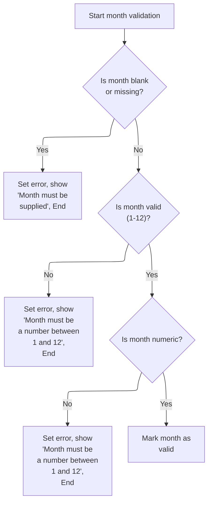
```mermaid
%%{init: {"flowchart": {"defaultRenderer": "elk"}} }%%
flowchart TD
    node1["Start month validation"]
    click node1 openCode "app/cpy/CSUTLDPY.cpy:91:92"
    node1 --> node2{"Is month blank 
 or missing?"}
    click node2 openCode "app/cpy/CSUTLDPY.cpy:94:97"
    node2 -->|"Yes"| node3["Set error, show 
 'Month must be 
 supplied', End"]
    click node3 openCode "app/cpy/CSUTLDPY.cpy:96:105"
    node2 -->|"No"| node4{"Is month valid 
 (1-12)?"}
    click node4 openCode "app/cpy/CSUTLDPY.cpy:111:112"
    node4 -->|"No"| node5["Set error, show 
 'Month must be 
 a number between 
 1 and 12', 
 End"]
    click node5 openCode "app/cpy/CSUTLDPY.cpy:114:123"
    node4 -->|"Yes"| node6{"Is month numeric?"}
    click node6 openCode "app/cpy/CSUTLDPY.cpy:126:129"
    node6 -->|"No"| node7["Set error, show 
 'Month must be 
 a number between 
 1 and 12', 
 End"]
    click node7 openCode "app/cpy/CSUTLDPY.cpy:131:140"
    node6 -->|"Yes"| node8["Mark month as 
 valid"]
    click node8 openCode "app/cpy/CSUTLDPY.cpy:143:144"
classDef HeadingStyle fill:#777777,stroke:#333,stroke-width:2px;
```

This section validates the month input for a date field, ensuring that it is present, numeric, and within the valid range of 1 to 12. It provides clear error messages for missing, out-of-range, or non-numeric input, and marks the input as valid if all checks pass.

| Rule ID | Code Location | Category        | Rule Name                | Description                                                                                                                                         | Conditions                                                         | Remarks                                                                                                                       |
| ------- | ------------- | --------------- | ------------------------ | --------------------------------------------------------------------------------------------------------------------------------------------------- | ------------------------------------------------------------------ | ----------------------------------------------------------------------------------------------------------------------------- |
| BR-001  | EDIT-MONTH    | Data validation | Month Required           | If the month input is blank or missing, an error is triggered and the message 'Month must be supplied.' is displayed.                               | The month input is blank or contains only spaces.                  | The error message shown is: 'Month must be supplied.' The input is considered blank if it is empty or contains only spaces.   |
| BR-002  | EDIT-MONTH    | Data validation | Month Range Validation   | If the month input is not a number between 1 and 12, an error is triggered and the message 'Month must be a number between 1 and 12.' is displayed. | The month input is not within the range 1 to 12.                   | The valid range for month input is 1 to 12, inclusive. The error message shown is: 'Month must be a number between 1 and 12.' |
| BR-003  | EDIT-MONTH    | Data validation | Month Numeric Validation | If the month input contains non-numeric characters, an error is triggered and the message 'Month must be a number between 1 and 12.' is displayed.  | The month input contains any non-numeric characters.               | The error message shown is: 'Month must be a number between 1 and 12.' The input must be numeric.                             |
| BR-004  | EDIT-MONTH    | Business logic  | Month Valid Marking      | If the month input passes all validation checks, it is marked as valid and can be used in downstream logic.                                         | The month input is present, numeric, and within the range 1 to 12. | No error message is shown. The input is accepted as valid.                                                                    |

<SwmSnippet path="/app/cpy/CSUTLDPY.cpy" line="91" repo-id="Z2l0aHViJTNBJTNBa3luZHJ5bC1hd3MtbWFpbmZyYW1lLW1vZGVybml6YXRpb24tY2FyZGRlbW8lM0ElM0FTd2ltbS1EZW1v">

---

In `EDIT-MONTH`, we start by marking the month as not OK, then check if the input is blank or low-values. If so, we set error flags and build an error message, then exit. The function uses repo-specific flags and variable names for error handling, and only moves on to numeric checks if the input passes the initial tests.

```cobol
       EDIT-MONTH.
           SET FLG-MONTH-NOT-OK            TO TRUE

           IF WS-EDIT-DATE-MM              EQUAL LOW-VALUES
           OR WS-EDIT-DATE-MM              EQUAL SPACES
              SET INPUT-ERROR              TO TRUE
              SET  FLG-MONTH-BLANK         TO TRUE
              IF WS-RETURN-MSG-OFF
                 STRING
                   FUNCTION TRIM(WS-EDIT-VARIABLE-NAME)
                   ' : Month must be supplied.'
                   DELIMITED BY SIZE
                   INTO WS-RETURN-MSG
              END-IF
              GO TO EDIT-MONTH-EXIT
```

---

</SwmSnippet>

<SwmSnippet path="/app/cpy/CSUTLDPY.cpy" line="106" repo-id="Z2l0aHViJTNBJTNBa3luZHJ5bC1hd3MtbWFpbmZyYW1lLW1vZGVybml6YXRpb24tY2FyZGRlbW8lM0ElM0FTd2ltbS1EZW1v">

---

If the month input isn't blank, we just CONTINUE and move on to the next check. This keeps the flow linear and avoids unnecessary branching.

```cobol
           ELSE
              CONTINUE
           END-IF
```

---

</SwmSnippet>

<SwmSnippet path="/app/cpy/CSUTLDPY.cpy" line="111" repo-id="Z2l0aHViJTNBJTNBa3luZHJ5bC1hd3MtbWFpbmZyYW1lLW1vZGVybml6YXRpb24tY2FyZGRlbW8lM0ElM0FTd2ltbS1EZW1v">

---

Here we check if WS-VALID-MONTH is set. If it is, we move on; if not, we handle the error and bail out before any conversion happens.

```cobol
           IF WS-VALID-MONTH
              CONTINUE
```

---

</SwmSnippet>

<SwmSnippet path="/app/cpy/CSUTLDPY.cpy" line="113" repo-id="Z2l0aHViJTNBJTNBa3luZHJ5bC1hd3MtbWFpbmZyYW1lLW1vZGVybml6YXRpb24tY2FyZGRlbW8lM0ElM0FTd2ltbS1EZW1v">

---

If the month isn't valid, we set error flags, build the error message, and jump out to EDIT-MONTH-EXIT. This stops the flow right there for bad input.

```cobol
           ELSE
              SET INPUT-ERROR              TO TRUE
              SET  FLG-MONTH-NOT-OK        TO TRUE
              IF WS-RETURN-MSG-OFF
                 STRING
                   FUNCTION TRIM(WS-EDIT-VARIABLE-NAME)
                   ': Month must be a number between 1 and 12.'
                   DELIMITED BY SIZE
                   INTO WS-RETURN-MSG
              END-IF
              GO TO EDIT-MONTH-EXIT
           END-IF
```

---

</SwmSnippet>

<SwmSnippet path="/app/cpy/CSUTLDPY.cpy" line="126" repo-id="Z2l0aHViJTNBJTNBa3luZHJ5bC1hd3MtbWFpbmZyYW1lLW1vZGVybml6YXRpb24tY2FyZGRlbW8lM0ElM0FTd2ltbS1EZW1v">

---

If the month input passes all previous checks, we test if it's numeric. If so, we convert it to a number for downstream logic.

```cobol
           IF FUNCTION TEST-NUMVAL (WS-EDIT-DATE-MM) = 0
              COMPUTE WS-EDIT-DATE-MM-N
                          = FUNCTION NUMVAL (WS-EDIT-DATE-MM)
              END-COMPUTE
```

---

</SwmSnippet>

<SwmSnippet path="/app/cpy/CSUTLDPY.cpy" line="130" repo-id="Z2l0aHViJTNBJTNBa3luZHJ5bC1hd3MtbWFpbmZyYW1lLW1vZGVybml6YXRpb24tY2FyZGRlbW8lM0ElM0FTd2ltbS1EZW1v">

---

After all checks, if the month is valid, we set FLG-MONTH-ISVALID to TRUE. If not, error flags and messages are set using repo-specific variables, so downstream logic knows exactly what failed.

```cobol
           ELSE
              SET INPUT-ERROR              TO TRUE
              SET  FLG-MONTH-NOT-OK        TO TRUE
              IF WS-RETURN-MSG-OFF
                 STRING
                   FUNCTION TRIM(WS-EDIT-VARIABLE-NAME)
                   ': Month must be a number between 1 and 12.'
                   DELIMITED BY SIZE
                   INTO WS-RETURN-MSG
              END-IF
              GO TO EDIT-MONTH-EXIT
           END-IF

           SET FLG-MONTH-ISVALID           TO TRUE
           .
```

---

</SwmSnippet>

##### Year Numeric and Century Checks

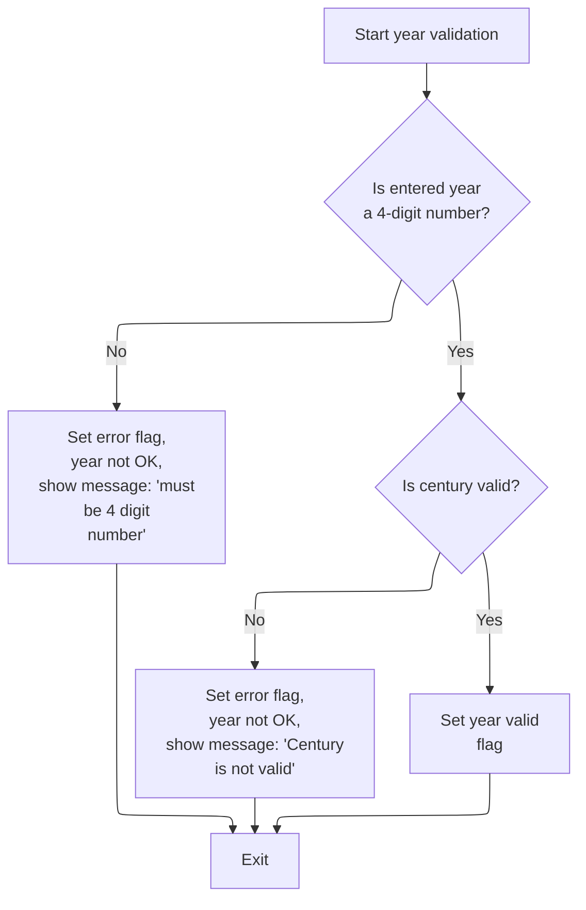
```mermaid
%%{init: {"flowchart": {"defaultRenderer": "elk"}} }%%
flowchart TD
    node1["Start year validation"] --> node2{"Is entered year 
 a 4-digit number?"}
    click node1 openCode "app/cpy/CSUTLDPY.cpy:43:45"
    node2 -->|"No"| node3["Set error flag, 
 year not OK, 
 show message: 'must 
 be 4 digit 
 number'"]
    click node2 openCode "app/cpy/CSUTLDPY.cpy:48:58"
    click node3 openCode "app/cpy/CSUTLDPY.cpy:48:58"
    node3 --> node7["Exit"]
    node2 -->|"Yes"| node4{"Is century valid?"}
    click node4 openCode "app/cpy/CSUTLDPY.cpy:70:72"
    node4 -->|"No"| node5["Set error flag, 
 year not OK, 
 show message: 'Century 
 is not valid'"]
    click node5 openCode "app/cpy/CSUTLDPY.cpy:73:84"
    node5 --> node7["Exit"]
    node4 -->|"Yes"| node6["Set year valid 
 flag"]
    click node6 openCode "app/cpy/CSUTLDPY.cpy:86:87"
    node6 --> node7["Exit"]
    click node7 openCode "app/cpy/CSUTLDPY.cpy:87:87"
classDef HeadingStyle fill:#777777,stroke:#333,stroke-width:2px;
```

This section validates the year portion of a date input, ensuring it is a 4-digit numeric value and that its century is either 19 or 20. It sets error flags and user-facing messages for invalid input, or marks the year as valid for further processing.

| Rule ID | Code Location  | Category        | Rule Name                                       | Description                                                                                                                                    | Conditions                                                          | Remarks                                                                                                                              |
| ------- | -------------- | --------------- | ----------------------------------------------- | ---------------------------------------------------------------------------------------------------------------------------------------------- | ------------------------------------------------------------------- | ------------------------------------------------------------------------------------------------------------------------------------ |
| BR-001  | EDIT-YEAR-CCYY | Data validation | Year must be 4-digit numeric                    | If the entered year is not a 4-digit numeric value, an error is flagged and the user is shown the message: 'must be 4 digit number.'           | The year input is present and is not a numeric value.               | The year must be a string of exactly 4 numeric digits. If not, the error message 'must be 4 digit number.' is shown to the user.     |
| BR-002  | EDIT-YEAR-CCYY | Data validation | Century must be 19 or 20                        | If the entered year is numeric but its century is not 19 or 20, an error is flagged and the user is shown the message: 'Century is not valid.' | The year input is numeric, but the century portion is not 19 or 20. | Allowed centuries are 19 and 20. If the century is not one of these, the error message 'Century is not valid.' is shown to the user. |
| BR-003  | EDIT-YEAR-CCYY | Business logic  | Year is valid if numeric and century is allowed | If the entered year passes both the numeric and century checks, the year is flagged as valid for downstream processing.                        | The year input is numeric and its century is 19 or 20.              | No error message is shown. The year is flagged as valid for further processing.                                                      |

<SwmSnippet path="/app/cpy/CSUTLDPY.cpy" line="43" repo-id="Z2l0aHViJTNBJTNBa3luZHJ5bC1hd3MtbWFpbmZyYW1lLW1vZGVybml6YXRpb24tY2FyZGRlbW8lM0ElM0FTd2ltbS1EZW1v">

---

We just came back from EDIT-MONTH in app/cpy/CSUTLDPY.cpy. If the year input isn't blank, we keep going with the next validation step. This keeps the flow moving only if previous checks passed.

```cobol
           ELSE
              CONTINUE
           END-IF
```

---

</SwmSnippet>

<SwmSnippet path="/app/cpy/CSUTLDPY.cpy" line="48" repo-id="Z2l0aHViJTNBJTNBa3luZHJ5bC1hd3MtbWFpbmZyYW1lLW1vZGVybml6YXRpb24tY2FyZGRlbW8lM0ElM0FTd2ltbS1EZW1v">

---

After confirming the year isn't blank, we check if it's numeric. If not, we set error flags, build the error message, and jump out early. This keeps error handling tight and avoids bad data.

```cobol
           IF WS-EDIT-DATE-CCYY            IS NOT NUMERIC
              SET INPUT-ERROR              TO TRUE
              SET  FLG-YEAR-NOT-OK         TO TRUE
              IF WS-RETURN-MSG-OFF
                 STRING
                   FUNCTION TRIM(WS-EDIT-VARIABLE-NAME)
                   ' must be 4 digit number.'
                   DELIMITED BY SIZE
                   INTO WS-RETURN-MSG
              END-IF
              GO TO EDIT-YEAR-CCYY-EXIT
```

---

</SwmSnippet>

<SwmSnippet path="/app/cpy/CSUTLDPY.cpy" line="59" repo-id="Z2l0aHViJTNBJTNBa3luZHJ5bC1hd3MtbWFpbmZyYW1lLW1vZGVybml6YXRpb24tY2FyZGRlbW8lM0ElM0FTd2ltbS1EZW1v">

---

If the year is numeric, we just CONTINUE and move on to the century check. Keeps the flow linear and avoids unnecessary branching.

```cobol
           ELSE
              CONTINUE
           END-IF
```

---

</SwmSnippet>

<SwmSnippet path="/app/cpy/CSUTLDPY.cpy" line="70" repo-id="Z2l0aHViJTNBJTNBa3luZHJ5bC1hd3MtbWFpbmZyYW1lLW1vZGVybml6YXRpb24tY2FyZGRlbW8lM0ElM0FTd2ltbS1EZW1v">

---

After confirming the year is numeric, we check if it's in the allowed centuries (19 or 20). If so, we CONTINUE; otherwise, we bail out with an error.

```cobol
           IF THIS-CENTURY
           OR LAST-CENTURY
              CONTINUE
```

---

</SwmSnippet>

<SwmSnippet path="/app/cpy/CSUTLDPY.cpy" line="73" repo-id="Z2l0aHViJTNBJTNBa3luZHJ5bC1hd3MtbWFpbmZyYW1lLW1vZGVybml6YXRpb24tY2FyZGRlbW8lM0ElM0FTd2ltbS1EZW1v">

---

After all checks, if the year is valid and in the allowed centuries, we set FLG-YEAR-ISVALID to TRUE. If not, error flags and messages are set so downstream logic knows exactly what failed.

```cobol
           ELSE
              SET INPUT-ERROR              TO TRUE
              SET  FLG-YEAR-NOT-OK         TO TRUE
              IF WS-RETURN-MSG-OFF
                 STRING
                   FUNCTION TRIM(WS-EDIT-VARIABLE-NAME)
                   ' : Century is not valid.'
                   DELIMITED BY SIZE
                   INTO WS-RETURN-MSG
              END-IF
              GO TO EDIT-YEAR-CCYY-EXIT
           END-IF

           SET FLG-YEAR-ISVALID            TO TRUE
           .
```

---

</SwmSnippet>

#### External Date Validation

```mermaid
%%{init: {"flowchart": {"defaultRenderer": "elk"}} }%%
flowchart TD
    node1["Verify date using 
 LE Services"] --> node2{"Is date valid?"}
    click node1 openCode "app/cpy/CSUTLDPY.cpy:290:296"
    click node2 openCode "app/cpy/CSUTLDPY.cpy:298:299"
    node2 -->|"Yes"| node5{"Is INPUT-ERROR set?"}
    click node5 openCode "app/cpy/CSUTLDPY.cpy:318:320"
    node5 -->|"No"| node3["Mark date as 
 valid"]
    click node3 openCode "app/cpy/CSUTLDPY.cpy:319:320"
    node5 -->|"Yes"| node6["End"]
    node2 -->|"No"| node4["Set error flags"]
    click node4 openCode "app/cpy/CSUTLDPY.cpy:301:304"
    node4 --> node7{"Is message construction 
 enabled?"}
    click node7 openCode "app/cpy/CSUTLDPY.cpy:305:314"
    node7 -->|"Yes"| node8["Construct error message"]
    click node8 openCode "app/cpy/CSUTLDPY.cpy:306:314"
    node7 -->|"No"| node6["End"]
    node8 --> node6["End"]

classDef HeadingStyle fill:#777777,stroke:#333,stroke-width:2px;
```

This section validates external date input using LE Services, setting validation flags and constructing error messages as needed based on the service's response.

| Rule ID | Code Location | Category        | Rule Name                                   | Description                                                                                                                                                                                                          | Conditions                                                                           | Remarks                                                                                                                                                                                                                                                                        |
| ------- | ------------- | --------------- | ------------------------------------------- | -------------------------------------------------------------------------------------------------------------------------------------------------------------------------------------------------------------------- | ------------------------------------------------------------------------------------ | ------------------------------------------------------------------------------------------------------------------------------------------------------------------------------------------------------------------------------------------------------------------------------ |
| BR-001  | EDIT-DATE-LE  | Data validation | Date Validity by Severity Code              | A date is considered valid if the external LE service returns a severity code of zero. In this case, the date validation result is marked as valid and no error flags are set.                                       | The LE service returns a severity code of zero for the input date.                   | The severity code must be exactly 0 for the date to be considered valid. The date string must be in 'YYYYMMDD' format. No error message is constructed in this case.                                                                                                           |
| BR-002  | EDIT-DATE-LE  | Error handling  | Date Invalidity and Error Flagging          | If the LE service returns a non-zero severity code, the date is marked as invalid, error flags for day, month, and year are set, and, if enabled, an error message is constructed detailing the failure.             | The LE service returns a non-zero severity code for the input date.                  | The severity code must not be 0. Error flags for day, month, and year are set to indicate invalid input. If message construction is enabled, an error message is built containing the trimmed variable name, the severity code, and a message code, concatenated as a string.  |
| BR-003  | EDIT-DATE-LE  | Error handling  | Error Message Construction for Invalid Date | If error message construction is enabled and the date is invalid, an error message is constructed that includes the trimmed variable name, the severity code, and a message code, concatenated into a single string. | The LE service returns a non-zero severity code and message construction is enabled. | The error message is a string composed of the trimmed variable name, the text ' validation error Sev code: ', the severity code, the text ' Message code: ', and the message code, concatenated in that order. The message is delimited by size and stored for downstream use. |

<SwmSnippet path="/app/cpy/CSUTLDPY.cpy" line="284" repo-id="Z2l0aHViJTNBJTNBa3luZHJ5bC1hd3MtbWFpbmZyYW1lLW1vZGVybml6YXRpb24tY2FyZGRlbW8lM0ElM0FTd2ltbS1EZW1v">

---

In `EDIT-DATE-LE`, we prep the date string and format, then call CSUTLDTC to validate the date. The service returns a severity code, which we use to decide if the date is good or needs error handling.

```cobol
       EDIT-DATE-LE.
      ******************************************************************
      *    In case some one managed to enter a bad date that passsed all
      *    the edits above ......
      *                  Use LE Services to verify the supplied date
      ******************************************************************
           INITIALIZE WS-DATE-VALIDATION-RESULT
           MOVE 'YYYYMMDD'                   TO WS-DATE-FORMAT

005100     CALL 'CSUTLDTC'
           USING WS-EDIT-DATE-CCYYMMDD
               , WS-DATE-FORMAT
               , WS-DATE-VALIDATION-RESULT
```

---

</SwmSnippet>

<SwmSnippet path="/app/cpy/CSUTLDPY.cpy" line="298" repo-id="Z2l0aHViJTNBJTNBa3luZHJ5bC1hd3MtbWFpbmZyYW1lLW1vZGVybml6YXRpb24tY2FyZGRlbW8lM0ElM0FTd2ltbS1EZW1v">

---

If the severity code from the service is zero, we keep going. If not, we set error flags for day, month, and year, build a detailed error message, and bail out.

```cobol
           IF WS-SEVERITY-N = 0
              CONTINUE
```

---

</SwmSnippet>

<SwmSnippet path="/app/cpy/CSUTLDPY.cpy" line="300" repo-id="Z2l0aHViJTNBJTNBa3luZHJ5bC1hd3MtbWFpbmZyYW1lLW1vZGVybml6YXRpb24tY2FyZGRlbW8lM0ElM0FTd2ltbS1EZW1v">

---

If the date validation passes (severity zero), we just CONTINUE. If not, we already bailed out, so this keeps the flow clean.

```cobol
           ELSE
              SET INPUT-ERROR                TO TRUE
              SET FLG-DAY-NOT-OK             TO TRUE
              SET FLG-MONTH-NOT-OK           TO TRUE
              SET FLG-YEAR-NOT-OK            TO TRUE
              IF WS-RETURN-MSG-OFF
              STRING
                FUNCTION TRIM(WS-EDIT-VARIABLE-NAME)
                ' validation error Sev code: '
                WS-SEVERITY
                ' Message code: '
                WS-MSG-NO
                DELIMITED BY SIZE
               INTO WS-RETURN-MSG
              END-IF
              GO TO EDIT-DATE-LE-EXIT
           END-IF
```

---

</SwmSnippet>

<SwmSnippet path="/app/cpy/CSUTLDPY.cpy" line="318" repo-id="Z2l0aHViJTNBJTNBa3luZHJ5bC1hd3MtbWFpbmZyYW1lLW1vZGVybml6YXRpb24tY2FyZGRlbW8lM0ElM0FTd2ltbS1EZW1v">

---

After the LE service call, if the date is valid, we set FLG-DAY-ISVALID to TRUE. If not, error flags and a message are set so downstream logic knows the date failed.

```cobol
           IF NOT INPUT-ERROR
              SET FLG-DAY-ISVALID           TO TRUE
           END-IF
```

---

</SwmSnippet>

#### Validating Second Phone and Cross-Field Edits

```mermaid
%%{init: {"flowchart": {"defaultRenderer": "elk"}} }%%
flowchart TD
    node1["Validate Phone Number 
 2 (customer input)"] --> node2["Validate EFT Account 
 ID (customer input)"]
    click node1 openCode "app/cbl/COACTUPC.cbl:1637:1644"
    node2 --> node3["Validate Primary Card 
 Holder (Yes/No)"]
    click node2 openCode "app/cbl/COACTUPC.cbl:1645:1653"
    node3 --> node4{"Are State and 
 ZIP code valid?"}
    click node3 openCode "app/cbl/COACTUPC.cbl:1654:1661"
    node4 -->|"Yes"| node5["Validate State and 
 ZIP Code Relationship"]
    click node4 openCode "app/cbl/COACTUPC.cbl:1665:1668"
    node4 -->|"No"| node6{"Any input error?"}
    node5 --> node6
    node6 -->|"Yes"| node7["Input error present 
 - changes not 
 confirmed"]
    click node6 openCode "app/cbl/COACTUPC.cbl:1671:1675"
    node6 -->|"No"| node8["All inputs valid 
 - changes ready 
 for confirmation"]
    click node7 openCode "app/cbl/COACTUPC.cbl:1671:1672"
    click node8 openCode "app/cbl/COACTUPC.cbl:1674:1675"

classDef HeadingStyle fill:#777777,stroke:#333,stroke-width:2px;
```

This section validates customer input fields (Second Phone Number, EFT Account ID, Primary Card Holder, State, ZIP code) and determines whether the changes are ready for confirmation or if errors are present.

| Rule ID | Code Location        | Category        | Rule Name                                       | Description                                                                                                                                                                                | Conditions                                                                        | Remarks                                                                                                                                                                                                           |
| ------- | -------------------- | --------------- | ----------------------------------------------- | ------------------------------------------------------------------------------------------------------------------------------------------------------------------------------------------ | --------------------------------------------------------------------------------- | ----------------------------------------------------------------------------------------------------------------------------------------------------------------------------------------------------------------- |
| BR-001  | 1200-EDIT-MAP-INPUTS | Data validation | Second Phone Number Validation                  | The Second Phone Number must be a valid US phone number according to the application's phone number validation logic. If the input is not valid, an input error is set.                    | When a Second Phone Number is provided as part of the customer input.             | The phone number must conform to the application's definition of a valid US phone number. The exact format is not specified here, but the validation is performed by a dedicated phone number validation routine. |
| BR-002  | 1200-EDIT-MAP-INPUTS | Data validation | EFT Account ID Validation                       | The EFT Account ID must be a required numeric field of exactly 10 characters. If the input is not a valid 10-digit number, an input error is set.                                          | When an EFT Account ID is provided as part of the customer input.                 | The EFT Account ID must be numeric and exactly 10 characters in length.                                                                                                                                           |
| BR-003  | 1200-EDIT-MAP-INPUTS | Data validation | Primary Card Holder Yes/No Validation           | The Primary Card Holder indicator must be either 'Y' (Yes) or 'N' (No). If the input is not one of these values, an input error is set.                                                    | When the Primary Card Holder indicator is provided as part of the customer input. | Valid values are 'Y' for Yes and 'N' for No. Any other value is invalid.                                                                                                                                          |
| BR-004  | 1200-EDIT-MAP-INPUTS | Data validation | State and ZIP Code Cross-Field Validation       | If both State and ZIP code fields are valid, their relationship is checked for consistency. If either field is invalid, the cross-field check is not performed.                            | When both State and ZIP code fields have been individually validated as valid.    | Both fields must be valid before their relationship is checked. The specific consistency rules are enforced by a dedicated cross-field validation routine.                                                        |
| BR-005  | 1200-EDIT-MAP-INPUTS | Error handling  | Input Error Handling and Confirmation Readiness | If any input error is present after all validations, the changes are not marked as ready for confirmation. If no input error is present, the changes are marked as ready for confirmation. | After all individual and cross-field validations have been performed.             | If any input error is present, the system does not proceed to confirmation. If no errors, the status is set to 'changes OK but not confirmed' (ACUP-CHANGE-ACTION = 'N').                                         |

<SwmSnippet path="/app/cbl/COACTUPC.cbl" line="1637" repo-id="Z2l0aHViJTNBJTNBa3luZHJ5bC1hd3MtbWFpbmZyYW1lLW1vZGVybml6YXRpb24tY2FyZGRlbW8lM0ElM0FTd2ltbS1EZW1v">

---

We just returned from EDIT-US-PHONE-LINENUM in 1200-EDIT-MAP-INPUTS. We copy the flags for Phone Number 1, then prep and validate Phone Number 2 right after, keeping the input checks rolling.

```cobol
           MOVE WS-EDIT-US-PHONE-NUM-FLGS
                                         TO  WS-EDIT-PHONE-NUM-1-FLGS

           MOVE 'Phone Number 2'         TO WS-EDIT-VARIABLE-NAME
           MOVE ACUP-NEW-CUST-PHONE-NUM-2
                                         TO WS-EDIT-US-PHONE-NUM
           PERFORM 1260-EDIT-US-PHONE-NUM
              THRU 1260-EDIT-US-PHONE-NUM-EXIT
```

---

</SwmSnippet>

<SwmSnippet path="/app/cbl/COACTUPC.cbl" line="1645" repo-id="Z2l0aHViJTNBJTNBa3luZHJ5bC1hd3MtbWFpbmZyYW1lLW1vZGVybml6YXRpb24tY2FyZGRlbW8lM0ElM0FTd2ltbS1EZW1v">

---

After Phone Number 2 validation, we set up the EFT Account Id for checking. We move the value and expected length (10) into the edit area, then call 1245-EDIT-NUM-REQD to make sure it's a valid required numeric field.

```cobol
           MOVE WS-EDIT-US-PHONE-NUM-FLGS
                                         TO WS-EDIT-PHONE-NUM-2-FLGS

           MOVE 'EFT Account Id'         TO WS-EDIT-VARIABLE-NAME
           MOVE ACUP-NEW-CUST-EFT-ACCOUNT-ID
                                         TO WS-EDIT-ALPHANUM-ONLY
           MOVE 10                       TO WS-EDIT-ALPHANUM-LENGTH
           PERFORM 1245-EDIT-NUM-REQD
              THRU 1245-EDIT-NUM-REQD-EXIT
```

---

</SwmSnippet>

<SwmSnippet path="/app/cbl/COACTUPC.cbl" line="1654" repo-id="Z2l0aHViJTNBJTNBa3luZHJ5bC1hd3MtbWFpbmZyYW1lLW1vZGVybml6YXRpb24tY2FyZGRlbW8lM0ElM0FTd2ltbS1EZW1v">

---

After EFT Account Id validation, we set up Primary Card Holder for yes/no checking. The flow uses hardcoded field lengths for each validation step, so you need to know the business rules to understand why each field is checked the way it is.

```cobol
           MOVE WS-EDIT-ALPHANUM-ONLY-FLAGS
                                         TO WS-EFT-ACCOUNT-ID-FLGS

           MOVE 'Primary Card Holder'    TO WS-EDIT-VARIABLE-NAME
           MOVE ACUP-NEW-CUST-PRI-HOLDER-IND
                                         TO WS-EDIT-YES-NO
           PERFORM 1220-EDIT-YESNO
              THRU 1220-EDIT-YESNO-EXIT
```

---

</SwmSnippet>

<SwmSnippet path="/app/cbl/COACTUPC.cbl" line="1662" repo-id="Z2l0aHViJTNBJTNBa3luZHJ5bC1hd3MtbWFpbmZyYW1lLW1vZGVybml6YXRpb24tY2FyZGRlbW8lM0ElM0FTd2ltbS1EZW1v">

---

After Primary Card Holder validation, we kick off cross-field edits. If both state and zip are valid, we run 1280-EDIT-US-STATE-ZIP-CD to check their consistency.

```cobol
           MOVE WS-EDIT-YES-NO           TO WS-EDIT-PRI-CARDHOLDER

      *    Cross field edits begin here
           IF  FLG-STATE-ISVALID
           AND FLG-ZIPCODE-ISVALID
               PERFORM 1280-EDIT-US-STATE-ZIP-CD
                  THRU 1280-EDIT-US-STATE-ZIP-CD-EXIT
           END-IF
```

---

</SwmSnippet>

<SwmSnippet path="/app/cbl/COACTUPC.cbl" line="1671" repo-id="Z2l0aHViJTNBJTNBa3luZHJ5bC1hd3MtbWFpbmZyYW1lLW1vZGVybml6YXRpb24tY2FyZGRlbW8lM0ElM0FTd2ltbS1EZW1v">

---

At the end of 1200-EDIT-MAP-INPUTS, if INPUT-ERROR is set, we just continue. If not, we set the flag for changes OK but not confirmed, so the next step knows to prompt for confirmation.

```cobol
           IF INPUT-ERROR
              CONTINUE
           ELSE
              SET ACUP-CHANGES-OK-NOT-CONFIRMED TO TRUE
           END-IF
```

---

</SwmSnippet>

### Post-Validation Field Extraction

```mermaid
%%{init: {"flowchart": {"defaultRenderer": "elk"}} }%%
flowchart TD
    node1["Start processing account 
 update input"]
    click node1 openCode "app/cbl/COACTUPC.cbl:1065:1424"
    node1 --> loop1
    subgraph loop1["For each field: 
 status, limits, balances, 
 dates, customer info"]
        node2{"Is input '*' 
 or blank?"}
        click node2 openCode "app/cbl/COACTUPC.cbl:1065:1424"
        node2 -->|"Yes"| node3["Set field to 
 default value (LOW-VALUES)"]
        click node3 openCode "app/cbl/COACTUPC.cbl:1067:1067"
        node2 -->|"No"| node4{"Is field numeric?"}
        click node4 openCode "app/cbl/COACTUPC.cbl:1078:1078"
        node4 -->|"Yes"| node5{"Is value a 
 valid number?"}
        click node5 openCode "app/cbl/COACTUPC.cbl:1078:1078"
        node5 -->|"Yes"| node6["Store converted number"]
        click node6 openCode "app/cbl/COACTUPC.cbl:1079:1080"
        node5 -->|"No"| node7["Store input as-is"]
        click node7 openCode "app/cbl/COACTUPC.cbl:1082:1082"
        node4 -->|"No"| node7
    end
    loop1 --> node8["All fields normalized 
 for business processing"]
    click node8 openCode "app/cbl/COACTUPC.cbl:1065:1424"
classDef HeadingStyle fill:#777777,stroke:#333,stroke-width:2px;
```

This section extracts and normalizes all account update input fields after validation, ensuring that each field is in a consistent state for downstream business logic. It handles empty values, numeric conversion, and preserves invalid input for error handling.

| Rule ID | Code Location                  | Category       | Rule Name                                | Description                                                                                                                                      | Conditions                                                                     | Remarks                                                                                                                                                                                                                                                              |
| ------- | ------------------------------ | -------------- | ---------------------------------------- | ------------------------------------------------------------------------------------------------------------------------------------------------ | ------------------------------------------------------------------------------ | -------------------------------------------------------------------------------------------------------------------------------------------------------------------------------------------------------------------------------------------------------------------- |
| BR-001  | app/cbl/COACTUPC.cbl:1065:1424 | Business logic | Empty Input Normalization                | If an input field contains '\*' or is blank, it is treated as empty and set to a default value for downstream processing.                        | The input field value is '\*' or consists of only spaces.                      | The default value is represented by LOW-VALUES. This rule applies to all fields processed in this section, including status, limits, balances, dates, customer info, etc.                                                                                            |
| BR-002  | app/cbl/COACTUPC.cbl:1065:1424 | Business logic | Numeric Field Conversion                 | If a numeric field is not empty, and contains a valid number, it is converted and stored as a numeric value for further calculations.            | The input field is not '\*' or blank, and passes the numeric validation check. | Numeric validation uses a function to test if the value is a valid number. If valid, the value is converted and stored as a number for later use. Applies to credit limit, cash credit limit, current balance, current cycle credit, and current cycle debit fields. |
| BR-003  | app/cbl/COACTUPC.cbl:1065:1424 | Business logic | Field Normalization for Downstream Logic | All fields are normalized so that downstream business logic can rely on a consistent representation of empty, valid, and invalid values.         | Any field is processed in this section.                                        | After processing, all fields are either set to LOW-VALUES (if empty), a valid number (if numeric and valid), or the original input (if invalid). This ensures predictable behavior for subsequent business logic.                                                    |
| BR-004  | app/cbl/COACTUPC.cbl:1065:1424 | Error handling | Preserve Invalid Numeric Input           | If a numeric field is not empty but does not contain a valid number, the input is preserved as-is for potential error handling or user feedback. | The input field is not '\*' or blank, but fails the numeric validation check.  | The original input is retained in the output field, allowing for later error handling or user notification. Applies to all numeric fields processed in this section.                                                                                                 |

<SwmSnippet path="/app/cbl/COACTUPC.cbl" line="1065" repo-id="Z2l0aHViJTNBJTNBa3luZHJ5bC1hd3MtbWFpbmZyYW1lLW1vZGVybml6YXRpb24tY2FyZGRlbW8lM0ElM0FTd2ltbS1EZW1v">

---

We just returned from 1200-EDIT-MAP-INPUTS in 1100-RECEIVE-MAP. For each field, we check if it's '\*' or spaces, and if so, we set it to LOW-VALUES; otherwise, we move the actual value. This keeps the data clean for downstream logic.

```cobol
           IF  ACSTTUSI OF CACTUPAI = '*'
           OR  ACSTTUSI OF CACTUPAI = SPACES
               MOVE LOW-VALUES           TO ACUP-NEW-ACTIVE-STATUS
           ELSE
               MOVE ACSTTUSI OF CACTUPAI TO ACUP-NEW-ACTIVE-STATUS
           END-IF
```

---

</SwmSnippet>

<SwmSnippet path="/app/cbl/COACTUPC.cbl" line="1073" repo-id="Z2l0aHViJTNBJTNBa3luZHJ5bC1hd3MtbWFpbmZyYW1lLW1vZGVybml6YXRpb24tY2FyZGRlbW8lM0ElM0FTd2ltbS1EZW1v">

---

For credit limit, we check for blanks, then move the value and convert it to numeric if possible. This sets up the field for later calculations or checks.

```cobol
           IF  ACRDLIMI OF CACTUPAI = '*'
           OR  ACRDLIMI OF CACTUPAI = SPACES
               MOVE LOW-VALUES           TO ACUP-NEW-CREDIT-LIMIT-X
           ELSE
               MOVE ACRDLIMI OF CACTUPAI TO ACUP-NEW-CREDIT-LIMIT-X
               IF FUNCTION TEST-NUMVAL-C(ACUP-NEW-CREDIT-LIMIT-X) = 0
                  COMPUTE ACUP-NEW-CREDIT-LIMIT-N =
                     FUNCTION NUMVAL-C(ACRDLIMI OF CACTUPAI)
               ELSE
                  CONTINUE
               END-IF
           END-IF
```

---

</SwmSnippet>

<SwmSnippet path="/app/cbl/COACTUPC.cbl" line="1087" repo-id="Z2l0aHViJTNBJTNBa3luZHJ5bC1hd3MtbWFpbmZyYW1lLW1vZGVybml6YXRpb24tY2FyZGRlbW8lM0ElM0FTd2ltbS1EZW1v">

---

For cash credit limit, we check for blanks, then move the value and convert it to numeric if possible. This sets up the field for later calculations or checks.

```cobol
           IF  ACSHLIMI OF CACTUPAI = '*'
           OR  ACSHLIMI OF CACTUPAI = SPACES
             MOVE LOW-VALUES           TO ACUP-NEW-CASH-CREDIT-LIMIT-X
           ELSE
             MOVE ACSHLIMI OF CACTUPAI TO ACUP-NEW-CASH-CREDIT-LIMIT-X
             IF FUNCTION TEST-NUMVAL-C(ACUP-NEW-CASH-CREDIT-LIMIT-X) = 0
                COMPUTE ACUP-NEW-CASH-CREDIT-LIMIT-N =
                     FUNCTION NUMVAL-C(ACSHLIMI OF CACTUPAI)
             ELSE
                CONTINUE
             END-IF
           END-IF
```

---

</SwmSnippet>

<SwmSnippet path="/app/cbl/COACTUPC.cbl" line="1101" repo-id="Z2l0aHViJTNBJTNBa3luZHJ5bC1hd3MtbWFpbmZyYW1lLW1vZGVybml6YXRpb24tY2FyZGRlbW8lM0ElM0FTd2ltbS1EZW1v">

---

For current balance, we check for blanks, then move the value and convert it to numeric if possible. This sets up the field for later calculations or checks.

```cobol
           IF  ACURBALI OF CACTUPAI = '*'
           OR  ACURBALI OF CACTUPAI = SPACES
               MOVE LOW-VALUES           TO ACUP-NEW-CURR-BAL-X
           ELSE
               MOVE ACURBALI OF CACTUPAI TO ACUP-NEW-CURR-BAL-X
               IF  FUNCTION TEST-NUMVAL-C(ACUP-NEW-CURR-BAL-X) = 0
                   COMPUTE ACUP-NEW-CURR-BAL-N =
                     FUNCTION NUMVAL-C(ACUP-NEW-CURR-BAL-X)
               ELSE
                   CONTINUE
               END-IF
           END-IF
```

---

</SwmSnippet>

<SwmSnippet path="/app/cbl/COACTUPC.cbl" line="1115" repo-id="Z2l0aHViJTNBJTNBa3luZHJ5bC1hd3MtbWFpbmZyYW1lLW1vZGVybml6YXRpb24tY2FyZGRlbW8lM0ElM0FTd2ltbS1EZW1v">

---

For current cycle credit, we check for blanks, then move the value and convert it to numeric if possible. This sets up the field for later calculations or checks.

```cobol
           IF  ACRCYCRI OF CACTUPAI = '*'
           OR  ACRCYCRI OF CACTUPAI = SPACES
               MOVE LOW-VALUES           TO ACUP-NEW-CURR-CYC-CREDIT-X
           ELSE
               MOVE ACRCYCRI OF CACTUPAI TO ACUP-NEW-CURR-CYC-CREDIT-X
               IF FUNCTION TEST-NUMVAL-C(ACUP-NEW-CURR-CYC-CREDIT-X) = 0
                   COMPUTE ACUP-NEW-CURR-CYC-CREDIT-N =
                     FUNCTION NUMVAL-C(ACRCYCRI OF CACTUPAI)
               ELSE
                   CONTINUE
               END-IF
           END-IF
```

---

</SwmSnippet>

<SwmSnippet path="/app/cbl/COACTUPC.cbl" line="1129" repo-id="Z2l0aHViJTNBJTNBa3luZHJ5bC1hd3MtbWFpbmZyYW1lLW1vZGVybml6YXRpb24tY2FyZGRlbW8lM0ElM0FTd2ltbS1EZW1v">

---

For current cycle debit, we check for blanks, then move the value and convert it to numeric if possible. This sets up the field for later calculations or checks.

```cobol
           IF  ACRCYDBI OF CACTUPAI = '*'
           OR  ACRCYDBI OF CACTUPAI = SPACES
               MOVE LOW-VALUES           TO ACUP-NEW-CURR-CYC-DEBIT-X
           ELSE
               MOVE ACRCYDBI OF CACTUPAI TO ACUP-NEW-CURR-CYC-DEBIT-X
               IF  FUNCTION TEST-NUMVAL-C(ACUP-NEW-CURR-CYC-DEBIT-X) = 0
                   COMPUTE ACUP-NEW-CURR-CYC-DEBIT-N =
                     FUNCTION NUMVAL-C(ACRCYDBI OF CACTUPAI)
               ELSE
                   CONTINUE
               END-IF
           END-IF
```

---

</SwmSnippet>

<SwmSnippet path="/app/cbl/COACTUPC.cbl" line="1144" repo-id="Z2l0aHViJTNBJTNBa3luZHJ5bC1hd3MtbWFpbmZyYW1lLW1vZGVybml6YXRpb24tY2FyZGRlbW8lM0ElM0FTd2ltbS1EZW1v">

---

For open year, we check for blanks and only move the value if it's present. This keeps the data clean for later logic.

```cobol
           IF  OPNYEARI OF CACTUPAI = '*'
           OR  OPNYEARI OF CACTUPAI = SPACES
               MOVE LOW-VALUES           TO ACUP-NEW-OPEN-YEAR
           ELSE
               MOVE OPNYEARI OF CACTUPAI TO ACUP-NEW-OPEN-YEAR
           END-IF
```

---

</SwmSnippet>

<SwmSnippet path="/app/cbl/COACTUPC.cbl" line="1151" repo-id="Z2l0aHViJTNBJTNBa3luZHJ5bC1hd3MtbWFpbmZyYW1lLW1vZGVybml6YXRpb24tY2FyZGRlbW8lM0ElM0FTd2ltbS1EZW1v">

---

For open month, we check for blanks and only move the value if it's present. This keeps the data clean for later logic.

```cobol
           IF  OPNMONI OF CACTUPAI = '*'
           OR  OPNMONI OF CACTUPAI = SPACES
               MOVE LOW-VALUES           TO ACUP-NEW-OPEN-MON
           ELSE
               MOVE OPNMONI OF CACTUPAI TO  ACUP-NEW-OPEN-MON
           END-IF
```

---

</SwmSnippet>

<SwmSnippet path="/app/cbl/COACTUPC.cbl" line="1158" repo-id="Z2l0aHViJTNBJTNBa3luZHJ5bC1hd3MtbWFpbmZyYW1lLW1vZGVybml6YXRpb24tY2FyZGRlbW8lM0ElM0FTd2ltbS1EZW1v">

---

For open day, we check for blanks and only move the value if it's present. This keeps the data clean for later logic.

```cobol
           IF  OPNDAYI OF CACTUPAI = '*'
           OR  OPNDAYI OF CACTUPAI = SPACES
               MOVE LOW-VALUES           TO ACUP-NEW-OPEN-DAY
           ELSE
               MOVE OPNDAYI OF CACTUPAI TO  ACUP-NEW-OPEN-DAY
           END-IF
```

---

</SwmSnippet>

<SwmSnippet path="/app/cbl/COACTUPC.cbl" line="1167" repo-id="Z2l0aHViJTNBJTNBa3luZHJ5bC1hd3MtbWFpbmZyYW1lLW1vZGVybml6YXRpb24tY2FyZGRlbW8lM0ElM0FTd2ltbS1EZW1v">

---

For expiry year, we check for blanks and only move the value if it's present. This keeps the data clean for later logic.

```cobol
           IF  EXPYEARI OF CACTUPAI = '*'
           OR  EXPYEARI OF CACTUPAI = SPACES
               MOVE LOW-VALUES           TO ACUP-NEW-EXP-YEAR
           ELSE
               MOVE EXPYEARI OF CACTUPAI TO ACUP-NEW-EXP-YEAR
           END-IF
```

---

</SwmSnippet>

<SwmSnippet path="/app/cbl/COACTUPC.cbl" line="1174" repo-id="Z2l0aHViJTNBJTNBa3luZHJ5bC1hd3MtbWFpbmZyYW1lLW1vZGVybml6YXRpb24tY2FyZGRlbW8lM0ElM0FTd2ltbS1EZW1v">

---

For expiry month, we check for blanks and only move the value if it's present. This keeps the data clean for later logic.

```cobol
           IF  EXPMONI OF CACTUPAI = '*'
           OR  EXPMONI OF CACTUPAI = SPACES
               MOVE LOW-VALUES           TO ACUP-NEW-EXP-MON
           ELSE
               MOVE EXPMONI OF CACTUPAI TO  ACUP-NEW-EXP-MON
           END-IF
```

---

</SwmSnippet>

<SwmSnippet path="/app/cbl/COACTUPC.cbl" line="1181" repo-id="Z2l0aHViJTNBJTNBa3luZHJ5bC1hd3MtbWFpbmZyYW1lLW1vZGVybml6YXRpb24tY2FyZGRlbW8lM0ElM0FTd2ltbS1EZW1v">

---

Here we're handling the expiry day field from the input map. If the user entered '\*' or left it blank, we set the target to LOW-VALUES, otherwise we copy the value. This keeps the field clean for downstream validation, just like the previous fields, and sets up the next field (reissue year) to be processed the same way.

```cobol
           IF  EXPDAYI OF CACTUPAI = '*'
           OR  EXPDAYI OF CACTUPAI = SPACES
               MOVE LOW-VALUES           TO ACUP-NEW-EXP-DAY
           ELSE
               MOVE EXPDAYI OF CACTUPAI TO  ACUP-NEW-EXP-DAY
           END-IF
```

---

</SwmSnippet>

<SwmSnippet path="/app/cbl/COACTUPC.cbl" line="1190" repo-id="Z2l0aHViJTNBJTNBa3luZHJ5bC1hd3MtbWFpbmZyYW1lLW1vZGVybml6YXRpb24tY2FyZGRlbW8lM0ElM0FTd2ltbS1EZW1v">

---

Next up is the reissue year field. We use the same logic as before—if it's '\*' or blank, set LOW-VALUES, otherwise copy the value. This keeps the input clean and predictable for later checks, and leads into handling the reissue month field.

```cobol
           IF  RISYEARI OF CACTUPAI = '*'
           OR  RISYEARI OF CACTUPAI = SPACES
               MOVE LOW-VALUES           TO ACUP-NEW-REISSUE-YEAR
           ELSE
               MOVE RISYEARI OF CACTUPAI TO ACUP-NEW-REISSUE-YEAR
           END-IF
```

---

</SwmSnippet>

<SwmSnippet path="/app/cbl/COACTUPC.cbl" line="1197" repo-id="Z2l0aHViJTNBJTNBa3luZHJ5bC1hd3MtbWFpbmZyYW1lLW1vZGVybml6YXRpb24tY2FyZGRlbW8lM0ElM0FTd2ltbS1EZW1v">

---

Now we're handling the reissue month field. Same deal—'\*' or blank gets LOW-VALUES, otherwise we copy the value. This keeps each date part isolated for validation, and sets up the next step for the reissue day.

```cobol
           IF  RISMONI OF CACTUPAI = '*'
           OR  RISMONI OF CACTUPAI = SPACES
               MOVE LOW-VALUES           TO ACUP-NEW-REISSUE-MON
           ELSE
               MOVE RISMONI OF CACTUPAI TO  ACUP-NEW-REISSUE-MON
           END-IF
```

---

</SwmSnippet>

<SwmSnippet path="/app/cbl/COACTUPC.cbl" line="1204" repo-id="Z2l0aHViJTNBJTNBa3luZHJ5bC1hd3MtbWFpbmZyYW1lLW1vZGVybml6YXRpb24tY2FyZGRlbW8lM0ElM0FTd2ltbS1EZW1v">

---

We process the reissue day input, treating '\*' and blanks as empty, prepping for group ID next.

```cobol
           IF  RISDAYI OF CACTUPAI = '*'
           OR  RISDAYI OF CACTUPAI = SPACES
               MOVE LOW-VALUES           TO ACUP-NEW-REISSUE-DAY
           ELSE
               MOVE RISDAYI OF CACTUPAI TO  ACUP-NEW-REISSUE-DAY
           END-IF
```

---

</SwmSnippet>

<SwmSnippet path="/app/cbl/COACTUPC.cbl" line="1213" repo-id="Z2l0aHViJTNBJTNBa3luZHJ5bC1hd3MtbWFpbmZyYW1lLW1vZGVybml6YXRpb24tY2FyZGRlbW8lM0ElM0FTd2ltbS1EZW1v">

---

Now we're handling the group ID field. '\*' or blank means LOW-VALUES, otherwise we copy the value. This keeps the group info clean for later logic and sets up the next field (customer ID).

```cobol
           IF  AADDGRPI OF CACTUPAI = '*'
           OR  AADDGRPI OF CACTUPAI = SPACES
               MOVE LOW-VALUES           TO ACUP-NEW-GROUP-ID
           ELSE
               MOVE AADDGRPI OF CACTUPAI TO ACUP-NEW-GROUP-ID
           END-IF
```

---

</SwmSnippet>

<SwmSnippet path="/app/cbl/COACTUPC.cbl" line="1224" repo-id="Z2l0aHViJTNBJTNBa3luZHJ5bC1hd3MtbWFpbmZyYW1lLW1vZGVybml6YXRpb24tY2FyZGRlbW8lM0ElM0FTd2ltbS1EZW1v">

---

We process the customer ID input, treating '\*' and blanks as empty, then move on to SSN part 1.

```cobol
           IF  ACSTNUMI OF CACTUPAI = '*'
           OR  ACSTNUMI OF CACTUPAI = SPACES
               MOVE LOW-VALUES           TO ACUP-NEW-CUST-ID-X
           ELSE
               MOVE ACSTNUMI OF CACTUPAI TO ACUP-NEW-CUST-ID-X
           END-IF
```

---

</SwmSnippet>

<SwmSnippet path="/app/cbl/COACTUPC.cbl" line="1233" repo-id="Z2l0aHViJTNBJTNBa3luZHJ5bC1hd3MtbWFpbmZyYW1lLW1vZGVybml6YXRpb24tY2FyZGRlbW8lM0ElM0FTd2ltbS1EZW1v">

---

Now we're handling SSN part 1. '\*' or blank means LOW-VALUES, otherwise we copy the value. This lets us validate each SSN part independently and sets up the next part (SSN part 2).

```cobol
           IF  ACTSSN1I OF CACTUPAI = '*'
           OR  ACTSSN1I OF CACTUPAI = SPACES
               MOVE LOW-VALUES           TO ACUP-NEW-CUST-SSN-1
           ELSE
               MOVE ACTSSN1I OF CACTUPAI TO ACUP-NEW-CUST-SSN-1
           END-IF
```

---

</SwmSnippet>

<SwmSnippet path="/app/cbl/COACTUPC.cbl" line="1240" repo-id="Z2l0aHViJTNBJTNBa3luZHJ5bC1hd3MtbWFpbmZyYW1lLW1vZGVybml6YXRpb24tY2FyZGRlbW8lM0ElM0FTd2ltbS1EZW1v">

---

We process SSN part 2, treating '\*' and blanks as empty, then move on to SSN part 3.

```cobol
           IF  ACTSSN2I OF CACTUPAI = '*'
           OR  ACTSSN2I OF CACTUPAI = SPACES
               MOVE LOW-VALUES           TO ACUP-NEW-CUST-SSN-2
           ELSE
               MOVE ACTSSN2I OF CACTUPAI TO ACUP-NEW-CUST-SSN-2
           END-IF
```

---

</SwmSnippet>

<SwmSnippet path="/app/cbl/COACTUPC.cbl" line="1247" repo-id="Z2l0aHViJTNBJTNBa3luZHJ5bC1hd3MtbWFpbmZyYW1lLW1vZGVybml6YXRpb24tY2FyZGRlbW8lM0ElM0FTd2ltbS1EZW1v">

---

Now we're handling SSN part 3. '\*' or blank means LOW-VALUES, otherwise we copy the value. This wraps up SSN input handling and sets up the next field (DOB year).

```cobol
           IF  ACTSSN3I OF CACTUPAI = '*'
           OR  ACTSSN3I OF CACTUPAI = SPACES
               MOVE LOW-VALUES           TO ACUP-NEW-CUST-SSN-3
           ELSE
               MOVE ACTSSN3I OF CACTUPAI TO ACUP-NEW-CUST-SSN-3
           END-IF
```

---

</SwmSnippet>

<SwmSnippet path="/app/cbl/COACTUPC.cbl" line="1256" repo-id="Z2l0aHViJTNBJTNBa3luZHJ5bC1hd3MtbWFpbmZyYW1lLW1vZGVybml6YXRpb24tY2FyZGRlbW8lM0ElM0FTd2ltbS1EZW1v">

---

We process DOB year, treating '\*' and blanks as empty, then move on to DOB month.

```cobol
           IF  DOBYEARI OF CACTUPAI = '*'
           OR  DOBYEARI OF CACTUPAI = SPACES
               MOVE LOW-VALUES           TO ACUP-NEW-CUST-DOB-YEAR
           ELSE
               MOVE DOBYEARI OF CACTUPAI TO ACUP-NEW-CUST-DOB-YEAR
           END-IF
```

---

</SwmSnippet>

<SwmSnippet path="/app/cbl/COACTUPC.cbl" line="1263" repo-id="Z2l0aHViJTNBJTNBa3luZHJ5bC1hd3MtbWFpbmZyYW1lLW1vZGVybml6YXRpb24tY2FyZGRlbW8lM0ElM0FTd2ltbS1EZW1v">

---

Now we're handling DOB month. '\*' or blank means LOW-VALUES, otherwise we copy the value. This keeps DOB validation granular and sets up the next part (DOB day).

```cobol
           IF  DOBMONI OF CACTUPAI = '*'
           OR  DOBMONI OF CACTUPAI = SPACES
               MOVE LOW-VALUES           TO ACUP-NEW-CUST-DOB-MON
           ELSE
               MOVE DOBMONI OF CACTUPAI  TO ACUP-NEW-CUST-DOB-MON
           END-IF
```

---

</SwmSnippet>

<SwmSnippet path="/app/cbl/COACTUPC.cbl" line="1270" repo-id="Z2l0aHViJTNBJTNBa3luZHJ5bC1hd3MtbWFpbmZyYW1lLW1vZGVybml6YXRpb24tY2FyZGRlbW8lM0ElM0FTd2ltbS1EZW1v">

---

We process DOB day, treating '\*' and blanks as empty, then move on to FICO score.

```cobol
           IF  DOBDAYI OF CACTUPAI = '*'
           OR  DOBDAYI OF CACTUPAI = SPACES
               MOVE LOW-VALUES           TO ACUP-NEW-CUST-DOB-DAY
           ELSE
               MOVE DOBDAYI OF CACTUPAI  TO ACUP-NEW-CUST-DOB-DAY
           END-IF
```

---

</SwmSnippet>

<SwmSnippet path="/app/cbl/COACTUPC.cbl" line="1279" repo-id="Z2l0aHViJTNBJTNBa3luZHJ5bC1hd3MtbWFpbmZyYW1lLW1vZGVybml6YXRpb24tY2FyZGRlbW8lM0ElM0FTd2ltbS1EZW1v">

---

Now we're handling the FICO score field. '\*' or blank means LOW-VALUES, otherwise we copy the value. This keeps the score clean for later checks and sets up the next field (first name).

```cobol
           IF  ACSTFCOI OF CACTUPAI = '*'
           OR  ACSTFCOI OF CACTUPAI = SPACES
               MOVE LOW-VALUES           TO ACUP-NEW-CUST-FICO-SCORE-X
           ELSE
               MOVE ACSTFCOI OF CACTUPAI TO ACUP-NEW-CUST-FICO-SCORE-X
           END-IF
```

---

</SwmSnippet>

<SwmSnippet path="/app/cbl/COACTUPC.cbl" line="1288" repo-id="Z2l0aHViJTNBJTNBa3luZHJ5bC1hd3MtbWFpbmZyYW1lLW1vZGVybml6YXRpb24tY2FyZGRlbW8lM0ElM0FTd2ltbS1EZW1v">

---

We process the first name input, treating '\*' and blanks as empty, then move on to middle name.

```cobol
           IF  ACSFNAMI OF CACTUPAI = '*'
           OR  ACSFNAMI OF CACTUPAI = SPACES
               MOVE LOW-VALUES           TO ACUP-NEW-CUST-FIRST-NAME
           ELSE
               MOVE ACSFNAMI OF CACTUPAI TO ACUP-NEW-CUST-FIRST-NAME
           END-IF
```

---

</SwmSnippet>

<SwmSnippet path="/app/cbl/COACTUPC.cbl" line="1297" repo-id="Z2l0aHViJTNBJTNBa3luZHJ5bC1hd3MtbWFpbmZyYW1lLW1vZGVybml6YXRpb24tY2FyZGRlbW8lM0ElM0FTd2ltbS1EZW1v">

---

Now we're handling the middle name field. '\*' or blank means LOW-VALUES, otherwise we copy the value. This keeps the name clean for later checks and sets up the next field (last name).

```cobol
           IF  ACSMNAMI OF CACTUPAI = '*'
           OR  ACSMNAMI OF CACTUPAI = SPACES
               MOVE LOW-VALUES           TO ACUP-NEW-CUST-MIDDLE-NAME
           ELSE
               MOVE ACSMNAMI OF CACTUPAI TO ACUP-NEW-CUST-MIDDLE-NAME
           END-IF
```

---

</SwmSnippet>

<SwmSnippet path="/app/cbl/COACTUPC.cbl" line="1306" repo-id="Z2l0aHViJTNBJTNBa3luZHJ5bC1hd3MtbWFpbmZyYW1lLW1vZGVybml6YXRpb24tY2FyZGRlbW8lM0ElM0FTd2ltbS1EZW1v">

---

We process the last name input, treating '\*' and blanks as empty, then move on to address line 1.

```cobol
           IF  ACSLNAMI OF CACTUPAI = '*'
           OR  ACSLNAMI OF CACTUPAI = SPACES
               MOVE LOW-VALUES           TO ACUP-NEW-CUST-LAST-NAME
           ELSE
               MOVE ACSLNAMI OF CACTUPAI TO ACUP-NEW-CUST-LAST-NAME
           END-IF
```

---

</SwmSnippet>

<SwmSnippet path="/app/cbl/COACTUPC.cbl" line="1315" repo-id="Z2l0aHViJTNBJTNBa3luZHJ5bC1hd3MtbWFpbmZyYW1lLW1vZGVybml6YXRpb24tY2FyZGRlbW8lM0ElM0FTd2ltbS1EZW1v">

---

Now we're handling address line 1. '\*' or blank means LOW-VALUES, otherwise we copy the value. This keeps the address clean for later checks and sets up the next field (address line 2).

```cobol
           IF  ACSADL1I OF CACTUPAI = '*'
           OR  ACSADL1I OF CACTUPAI = SPACES
               MOVE LOW-VALUES           TO ACUP-NEW-CUST-ADDR-LINE-1
           ELSE
               MOVE ACSADL1I OF CACTUPAI TO ACUP-NEW-CUST-ADDR-LINE-1
           END-IF
```

---

</SwmSnippet>

<SwmSnippet path="/app/cbl/COACTUPC.cbl" line="1322" repo-id="Z2l0aHViJTNBJTNBa3luZHJ5bC1hd3MtbWFpbmZyYW1lLW1vZGVybml6YXRpb24tY2FyZGRlbW8lM0ElM0FTd2ltbS1EZW1v">

---

We process address line 2, treating '\*' and blanks as empty, then move on to address line 3/city.

```cobol
           IF  ACSADL2I OF CACTUPAI = '*'
           OR  ACSADL2I OF CACTUPAI = SPACES
               MOVE LOW-VALUES           TO ACUP-NEW-CUST-ADDR-LINE-2
           ELSE
               MOVE ACSADL2I OF CACTUPAI TO ACUP-NEW-CUST-ADDR-LINE-2
           END-IF
```

---

</SwmSnippet>

<SwmSnippet path="/app/cbl/COACTUPC.cbl" line="1329" repo-id="Z2l0aHViJTNBJTNBa3luZHJ5bC1hd3MtbWFpbmZyYW1lLW1vZGVybml6YXRpb24tY2FyZGRlbW8lM0ElM0FTd2ltbS1EZW1v">

---

Now we're handling address line 3/city. '\*' or blank means LOW-VALUES, otherwise we copy the value. This keeps the address clean for later checks and sets up the next field (state code).

```cobol
           IF  ACSCITYI OF CACTUPAI = '*'
           OR  ACSCITYI OF CACTUPAI = SPACES
               MOVE LOW-VALUES           TO ACUP-NEW-CUST-ADDR-LINE-3
           ELSE
               MOVE ACSCITYI OF CACTUPAI TO ACUP-NEW-CUST-ADDR-LINE-3
           END-IF
```

---

</SwmSnippet>

<SwmSnippet path="/app/cbl/COACTUPC.cbl" line="1336" repo-id="Z2l0aHViJTNBJTNBa3luZHJ5bC1hd3MtbWFpbmZyYW1lLW1vZGVybml6YXRpb24tY2FyZGRlbW8lM0ElM0FTd2ltbS1EZW1v">

---

We process state code input, treating '\*' and blanks as empty, then move on to country code.

```cobol
           IF  ACSSTTEI OF CACTUPAI = '*'
           OR  ACSSTTEI OF CACTUPAI = SPACES
               MOVE LOW-VALUES           TO ACUP-NEW-CUST-ADDR-STATE-CD
           ELSE
               MOVE ACSSTTEI OF CACTUPAI TO ACUP-NEW-CUST-ADDR-STATE-CD
           END-IF
```

---

</SwmSnippet>

<SwmSnippet path="/app/cbl/COACTUPC.cbl" line="1343" repo-id="Z2l0aHViJTNBJTNBa3luZHJ5bC1hd3MtbWFpbmZyYW1lLW1vZGVybml6YXRpb24tY2FyZGRlbW8lM0ElM0FTd2ltbS1EZW1v">

---

Now we're handling country code. '\*' or blank means LOW-VALUES, otherwise we copy the value. This keeps the address clean for later checks and sets up the next field (zip code).

```cobol
           IF  ACSCTRYI OF CACTUPAI = '*'
           OR  ACSCTRYI OF CACTUPAI = SPACES
              MOVE LOW-VALUES           TO ACUP-NEW-CUST-ADDR-COUNTRY-CD
           ELSE
              MOVE ACSCTRYI OF CACTUPAI TO ACUP-NEW-CUST-ADDR-COUNTRY-CD
           END-IF
```

---

</SwmSnippet>

<SwmSnippet path="/app/cbl/COACTUPC.cbl" line="1350" repo-id="Z2l0aHViJTNBJTNBa3luZHJ5bC1hd3MtbWFpbmZyYW1lLW1vZGVybml6YXRpb24tY2FyZGRlbW8lM0ElM0FTd2ltbS1EZW1v">

---

We process zip code input, treating '\*' and blanks as empty, then move on to phone number 1A.

```cobol
           IF  ACSZIPCI OF CACTUPAI = '*'
           OR  ACSZIPCI OF CACTUPAI = SPACES
               MOVE LOW-VALUES           TO ACUP-NEW-CUST-ADDR-ZIP
           ELSE
               MOVE ACSZIPCI OF CACTUPAI TO ACUP-NEW-CUST-ADDR-ZIP
           END-IF
```

---

</SwmSnippet>

<SwmSnippet path="/app/cbl/COACTUPC.cbl" line="1357" repo-id="Z2l0aHViJTNBJTNBa3luZHJ5bC1hd3MtbWFpbmZyYW1lLW1vZGVybml6YXRpb24tY2FyZGRlbW8lM0ElM0FTd2ltbS1EZW1v">

---

Now we're handling phone number 1A. '\*' or blank means LOW-VALUES, otherwise we copy the value. This keeps the phone number clean for later checks and sets up the next field (phone number 1B).

```cobol
           IF  ACSPH1AI OF CACTUPAI = '*'
           OR  ACSPH1AI OF CACTUPAI = SPACES
               MOVE LOW-VALUES           TO ACUP-NEW-CUST-PHONE-NUM-1A
           ELSE
               MOVE ACSPH1AI OF CACTUPAI TO ACUP-NEW-CUST-PHONE-NUM-1A
           END-IF
```

---

</SwmSnippet>

<SwmSnippet path="/app/cbl/COACTUPC.cbl" line="1364" repo-id="Z2l0aHViJTNBJTNBa3luZHJ5bC1hd3MtbWFpbmZyYW1lLW1vZGVybml6YXRpb24tY2FyZGRlbW8lM0ElM0FTd2ltbS1EZW1v">

---

We process phone number 1B input, treating '\*' and blanks as empty, then move on to phone number 1C.

```cobol
           IF  ACSPH1BI OF CACTUPAI = '*'
           OR  ACSPH1BI OF CACTUPAI = SPACES
               MOVE LOW-VALUES           TO ACUP-NEW-CUST-PHONE-NUM-1B
           ELSE
               MOVE ACSPH1BI OF CACTUPAI TO ACUP-NEW-CUST-PHONE-NUM-1B
           END-IF
```

---

</SwmSnippet>

<SwmSnippet path="/app/cbl/COACTUPC.cbl" line="1371" repo-id="Z2l0aHViJTNBJTNBa3luZHJ5bC1hd3MtbWFpbmZyYW1lLW1vZGVybml6YXRpb24tY2FyZGRlbW8lM0ElM0FTd2ltbS1EZW1v">

---

Now we're handling phone number 1C. '\*' or blank means LOW-VALUES, otherwise we copy the value. This wraps up phone number 1 input and sets up the next field (phone number 2A).

```cobol
           IF  ACSPH1CI OF CACTUPAI = '*'
           OR  ACSPH1CI OF CACTUPAI = SPACES
               MOVE LOW-VALUES           TO ACUP-NEW-CUST-PHONE-NUM-1C
           ELSE
               MOVE ACSPH1CI OF CACTUPAI TO ACUP-NEW-CUST-PHONE-NUM-1C
           END-IF
```

---

</SwmSnippet>

<SwmSnippet path="/app/cbl/COACTUPC.cbl" line="1378" repo-id="Z2l0aHViJTNBJTNBa3luZHJ5bC1hd3MtbWFpbmZyYW1lLW1vZGVybml6YXRpb24tY2FyZGRlbW8lM0ElM0FTd2ltbS1EZW1v">

---

We process phone number 2A input, treating '\*' and blanks as empty, then move on to phone number 2B.

```cobol
           IF  ACSPH2AI OF CACTUPAI = '*'
           OR  ACSPH2AI OF CACTUPAI = SPACES
               MOVE LOW-VALUES           TO ACUP-NEW-CUST-PHONE-NUM-2A
           ELSE
               MOVE ACSPH2AI OF CACTUPAI TO ACUP-NEW-CUST-PHONE-NUM-2A
           END-IF
```

---

</SwmSnippet>

<SwmSnippet path="/app/cbl/COACTUPC.cbl" line="1385" repo-id="Z2l0aHViJTNBJTNBa3luZHJ5bC1hd3MtbWFpbmZyYW1lLW1vZGVybml6YXRpb24tY2FyZGRlbW8lM0ElM0FTd2ltbS1EZW1v">

---

Now we're handling phone number 2B. '\*' or blank means LOW-VALUES, otherwise we copy the value. This keeps the phone number clean for later checks and sets up the next field (phone number 2C).

```cobol
           IF  ACSPH2BI OF CACTUPAI = '*'
           OR  ACSPH2BI OF CACTUPAI = SPACES
               MOVE LOW-VALUES           TO ACUP-NEW-CUST-PHONE-NUM-2B
           ELSE
               MOVE ACSPH2BI OF CACTUPAI TO ACUP-NEW-CUST-PHONE-NUM-2B
           END-IF
```

---

</SwmSnippet>

<SwmSnippet path="/app/cbl/COACTUPC.cbl" line="1392" repo-id="Z2l0aHViJTNBJTNBa3luZHJ5bC1hd3MtbWFpbmZyYW1lLW1vZGVybml6YXRpb24tY2FyZGRlbW8lM0ElM0FTd2ltbS1EZW1v">

---

We process phone number 2C input, treating '\*' and blanks as empty, then move on to govt-issued ID.

```cobol
           IF  ACSPH2CI OF CACTUPAI = '*'
           OR  ACSPH2CI OF CACTUPAI = SPACES
               MOVE LOW-VALUES           TO ACUP-NEW-CUST-PHONE-NUM-2C
           ELSE
               MOVE ACSPH2CI OF CACTUPAI TO ACUP-NEW-CUST-PHONE-NUM-2C
           END-IF
```

---

</SwmSnippet>

<SwmSnippet path="/app/cbl/COACTUPC.cbl" line="1401" repo-id="Z2l0aHViJTNBJTNBa3luZHJ5bC1hd3MtbWFpbmZyYW1lLW1vZGVybml6YXRpb24tY2FyZGRlbW8lM0ElM0FTd2ltbS1EZW1v">

---

Now we're handling govt-issued ID. '\*' or blank means LOW-VALUES, otherwise we copy the value. This keeps the ID clean for later checks and sets up the next field (EFT account ID).

```cobol
           IF  ACSGOVTI OF CACTUPAI = '*'
           OR  ACSGOVTI OF CACTUPAI = SPACES
               MOVE LOW-VALUES           TO ACUP-NEW-CUST-GOVT-ISSUED-ID
           ELSE
               MOVE ACSGOVTI OF CACTUPAI TO ACUP-NEW-CUST-GOVT-ISSUED-ID
           END-IF
```

---

</SwmSnippet>

<SwmSnippet path="/app/cbl/COACTUPC.cbl" line="1410" repo-id="Z2l0aHViJTNBJTNBa3luZHJ5bC1hd3MtbWFpbmZyYW1lLW1vZGVybml6YXRpb24tY2FyZGRlbW8lM0ElM0FTd2ltbS1EZW1v">

---

We process EFT account ID input, treating '\*' and blanks as empty, then move on to primary cardholder indicator.

```cobol
           IF  ACSEFTCI OF CACTUPAI = '*'
           OR  ACSEFTCI OF CACTUPAI = SPACES
               MOVE LOW-VALUES           TO ACUP-NEW-CUST-EFT-ACCOUNT-ID
           ELSE
               MOVE ACSEFTCI OF CACTUPAI TO ACUP-NEW-CUST-EFT-ACCOUNT-ID
           END-IF
```

---

</SwmSnippet>

<SwmSnippet path="/app/cbl/COACTUPC.cbl" line="1419" repo-id="Z2l0aHViJTNBJTNBa3luZHJ5bC1hd3MtbWFpbmZyYW1lLW1vZGVybml6YXRpb24tY2FyZGRlbW8lM0ElM0FTd2ltbS1EZW1v">

---

After running through all the fields, 1100-RECEIVE-MAP returns a set of 'new' variables, each mapped from the input area. '\*' and SPACES are treated as 'empty', so those fields get LOW-VALUES. Numeric fields are validated and converted if possible. This logic is repeated for every field, making the function verbose and tightly tied to the repo's data model. If the input structure changes, this function will break or behave wrong, so any changes need to be made carefully.

```cobol
           IF  ACSPFLGI OF CACTUPAI = '*'
           OR  ACSPFLGI OF CACTUPAI = SPACES
              MOVE LOW-VALUES            TO ACUP-NEW-CUST-PRI-HOLDER-IND
           ELSE
              MOVE ACSPFLGI OF CACTUPAI  TO ACUP-NEW-CUST-PRI-HOLDER-IND
           END-IF
```

---

</SwmSnippet>

## Setting Up Next Screen and Error Message

This section ensures that, after processing user input, the UI is correctly set up to display the appropriate error message and navigate to the correct screen for the next user interaction.

| Rule ID | Code Location       | Category       | Rule Name                       | Description                                                                                                                                                | Conditions                                                                       | Remarks                                                                                                                           |
| ------- | ------------------- | -------------- | ------------------------------- | ---------------------------------------------------------------------------------------------------------------------------------------------------------- | -------------------------------------------------------------------------------- | --------------------------------------------------------------------------------------------------------------------------------- |
| BR-001  | 1000-PROCESS-INPUTS | Business logic | Display processed error message | The error message displayed on the next screen is set to the result of the input processing, ensuring the user is informed of any issues or confirmations. | After input processing is completed and before transitioning to the next screen. | The error message is a string of up to 75 characters. The content is determined by the result of input validation and processing. |
| BR-002  | 1000-PROCESS-INPUTS | Business logic | Set next program for navigation | The next program to be executed is set to the current program, ensuring the UI remains in the correct context for further user actions.                    | After input processing is completed and before transitioning to the next screen. | The program name is a string of up to 8 characters. The value is set to 'COACTUPC'.                                               |
| BR-003  | 1000-PROCESS-INPUTS | Business logic | Set next mapset and map for UI  | The next mapset and map to be displayed are set to specific values, ensuring the UI transitions to the correct screen layout.                              | After input processing is completed and before transitioning to the next screen. | The mapset is a string of up to 8 characters, set to 'COACTUP '. The map is a string of up to 7 characters, set to 'CACTUPA'.     |

<SwmSnippet path="/app/cbl/COACTUPC.cbl" line="1030" repo-id="Z2l0aHViJTNBJTNBa3luZHJ5bC1hd3MtbWFpbmZyYW1lLW1vZGVybml6YXRpb24tY2FyZGRlbW8lM0ElM0FTd2ltbS1EZW1v">

---

We just returned from 1200-EDIT-MAP-INPUTS, so here at the end of 1000-PROCESS-INPUTS, we set up the error message, next program, mapset, and map for the next screen. This makes sure the UI is ready to show the user what happened, whether it's an error or just the next step.

```cobol
           MOVE WS-RETURN-MSG  TO CCARD-ERROR-MSG
           MOVE LIT-THISPGM    TO CCARD-NEXT-PROG
           MOVE LIT-THISMAPSET TO CCARD-NEXT-MAPSET
           MOVE LIT-THISMAP    TO CCARD-NEXT-MAP
           .
```

---

</SwmSnippet>

&nbsp;

*This is an auto-generated document by Swimm 🌊 and has not yet been verified by a human*

<SwmMeta version="3.0.0"><sup>Powered by [Swimm](https://staging.swimm.cloud/)</sup></SwmMeta>
