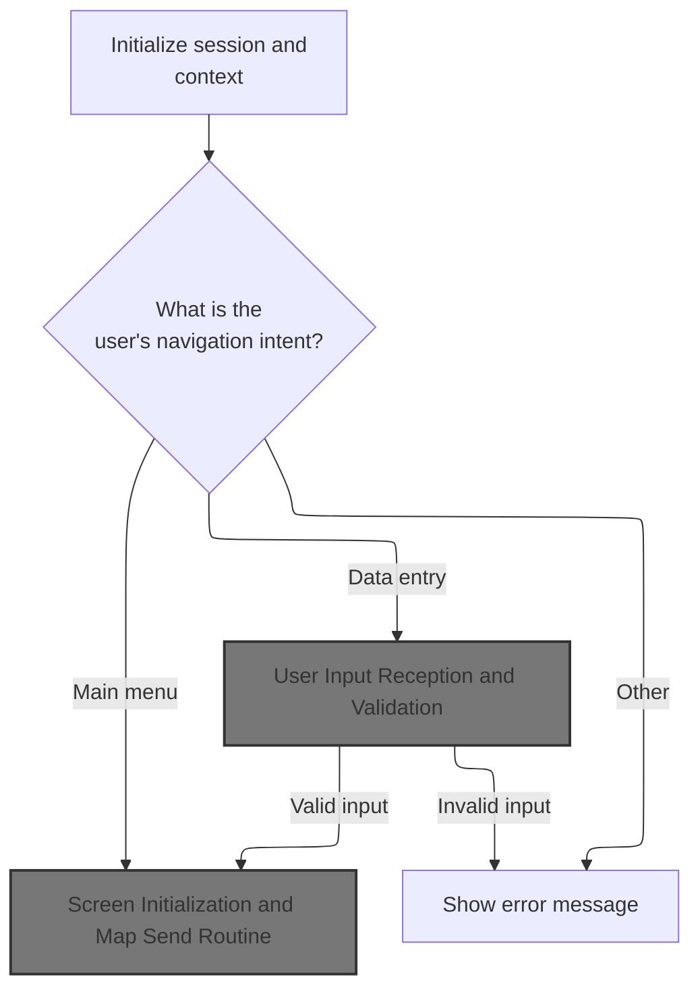
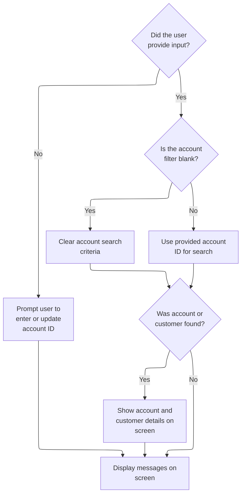
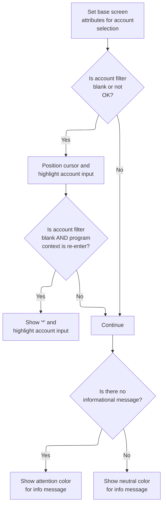
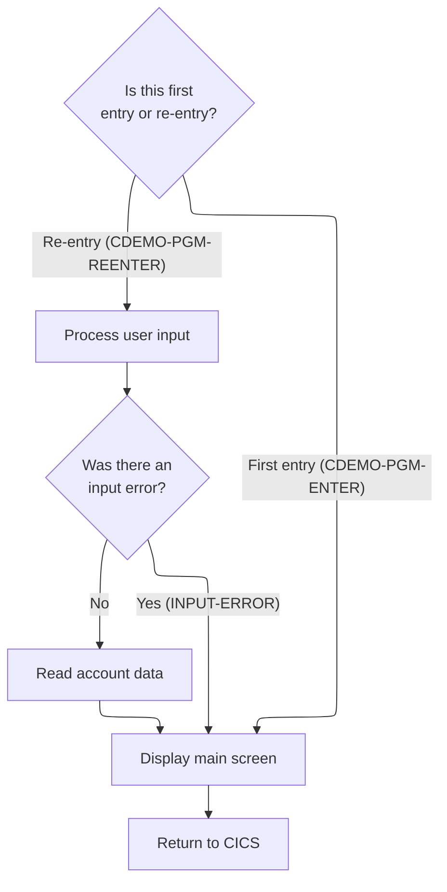
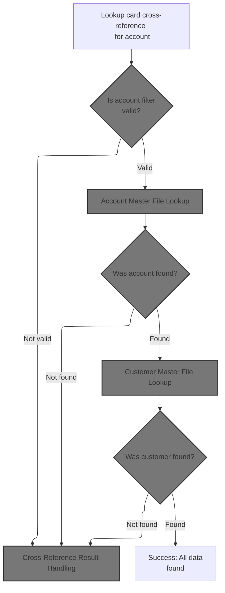
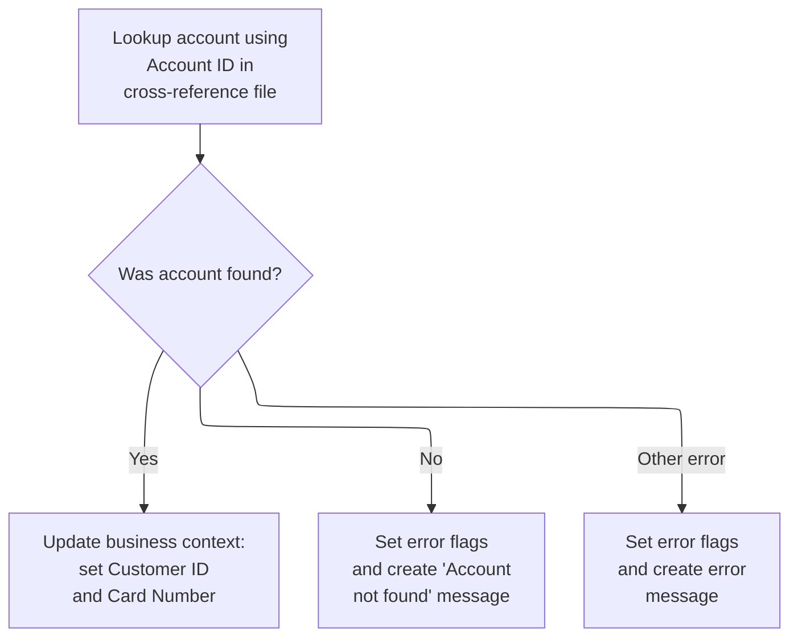
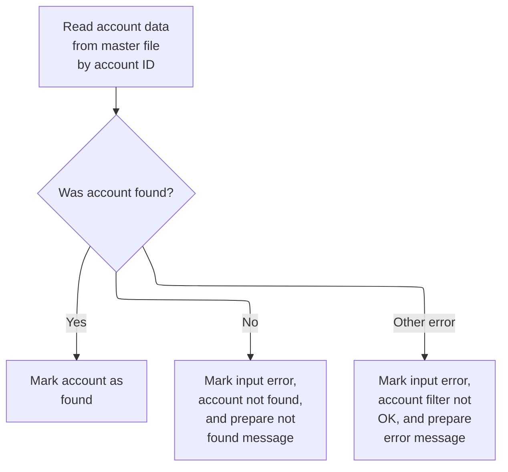
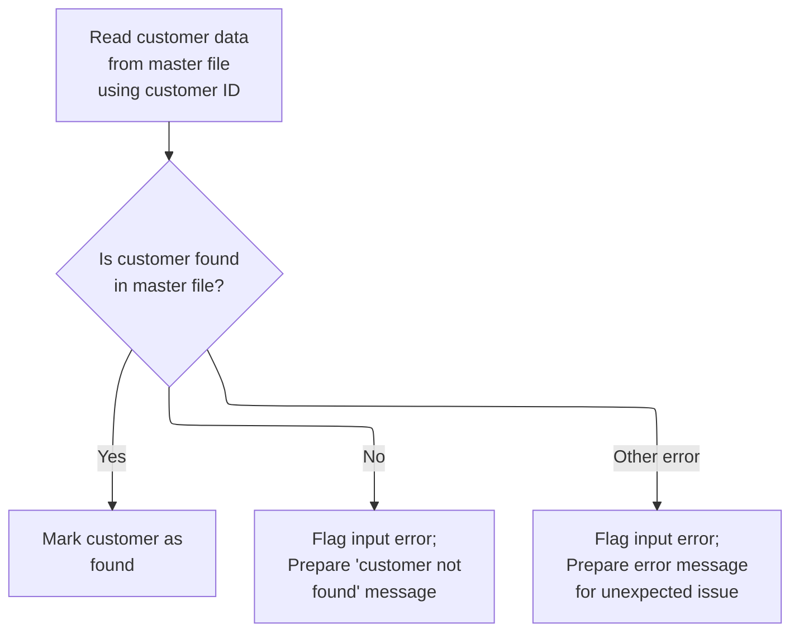
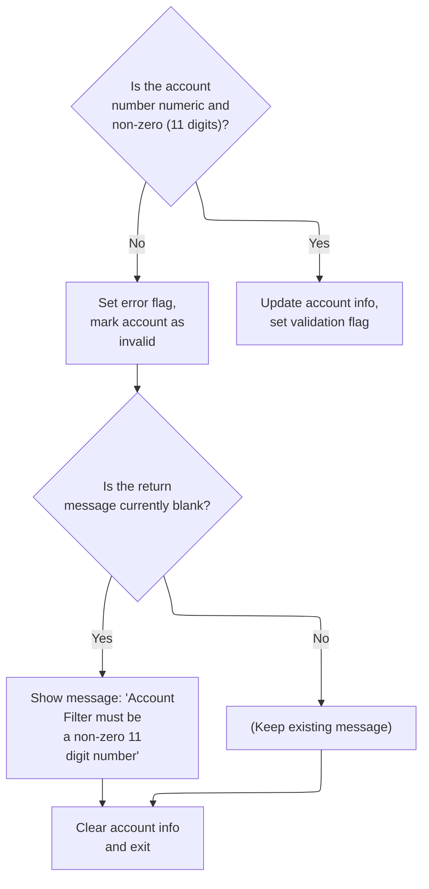

# Overview

This document explains the flow for viewing account and customer details. Users navigate to the Account View screen, enter an account ID, and the system validates the input, retrieves account and customer data, and displays the results or error messages.

## Dependencies

### Programs

- COACTVWC (app/cbl/COACTVWC.cbl)
- LIT-MENUPGM
- CDEMO-FROM-PROGRAM
- CAVW

### Copybooks

- CVCRD01Y (app/cpy/CVCRD01Y.cpy)
- COCOM01Y (app/cpy/COCOM01Y.cpy)
- DFHBMSCA
- DFHAID
- COTTL01Y (app/cpy/COTTL01Y.cpy)
- COACTVW (app/cpy-bms/COACTVW.CPY)
- CSDAT01Y (app/cpy/CSDAT01Y.cpy)
- CSMSG01Y (app/cpy/CSMSG01Y.cpy)
- CSMSG02Y (app/cpy/CSMSG02Y.cpy)
- CSUSR01Y (app/cpy/CSUSR01Y.cpy)
- CVACT01Y (app/cpy/CVACT01Y.cpy)
- CVACT02Y (app/cpy/CVACT02Y.cpy)
- CVACT03Y (app/cpy/CVACT03Y.cpy)
- CVCUS01Y (app/cpy/CVCUS01Y.cpy)
- CSSTRPFY (app/cpy/CSSTRPFY.cpy)

## Input and Output Tables/Files used in the Program

| Table / File Name          | Type | Description                             | Usage Mode | Key Fields / Layout Highlights |
| -------------------------- | ---- | --------------------------------------- | ---------- | ------------------------------ |
| LIT-ACCTFILENAME           | File | Account master details and balances     | Input      | File resource                  |
| LIT-CARDXREFNAME-ACCT-PATH | File | Account to card cross-reference records | Input      | File resource                  |
| LIT-CUSTFILENAME           | File | Customer personal and contact details   | Input      | File resource                  |

&nbsp;

# Workflow

# Main Entry, Context Setup, and PF Key Handling



This section initializes the session and context, handles abnormal end registration, maps user PF key input to internal flags, and routes navigation based on user intent and context.

| Rule ID | Code Location    | Category        | Rule Name                        | Description                                                                                                                                                                        | Conditions                                                                   | Remarks                                                                                                                                                   |
| ------- | ---------------- | --------------- | -------------------------------- | ---------------------------------------------------------------------------------------------------------------------------------------------------------------------------------- | ---------------------------------------------------------------------------- | --------------------------------------------------------------------------------------------------------------------------------------------------------- |
| BR-001  | 0000-MAIN        | Data validation | Valid Navigation Key Restriction | Only ENTER and PF3 are considered valid navigation actions at this point; all other keys are treated as invalid and default to ENTER behavior.                                     | After PF key mapping, check if ENTER or PF3 was pressed.                     | PFK-VALID is set only for ENTER or PF3. All other keys set PFK-INVALID and force ENTER behavior.                                                          |
| BR-002  | 0000-MAIN        | Business logic  | Commarea Initialization          | If no commarea data is passed in, or if the previous program is the main menu and not in re-entry mode, the shared and program-specific commareas are initialized to blank values. | EIBCALEN is zero, or previous program is main menu and not in re-entry mode. | The main menu program is 'COMEN01C' and transaction ID is 'CM00'. Both CARDDEMO-COMMAREA and WS-THIS-PROGCOMMAREA are initialized to blank values.        |
| BR-003  | YYYY-STORE-PFKEY | Business logic  | PF Key Mapping                   | PF keys pressed by the user are mapped to internal flags, with PF13-24 mapped to PF1-12 for compatibility. These flags determine which navigation actions are available.           | User presses a PF key or AID key on the terminal.                            | PF13-24 are mapped to PF1-12. Flags are set in the common area for each key. Supported keys include ENTER, CLEAR, PA1, PA2, PF1-12, PF13-24.              |
| BR-004  | 0000-MAIN        | Business logic  | PF3 Navigation Routing           | When PF3 is pressed, the program determines the next destination: if previous transaction or program is blank, route to main menu; otherwise, return to the calling program.       | PF3 flag is set after key mapping.                                           | Main menu program is 'COMEN01C', transaction ID is 'CM00'. If previous transaction/program is blank or spaces, route to main menu; else, route to caller. |
| BR-005  | 0000-MAIN        | Business logic  | Program Entry Screen Display     | When entering the program from another context, the program displays the selection criteria screen and prompts the user for input.                                                 | Program context is entry mode (CDEMO-PGM-ENTER is true).                     | Selection criteria screen is displayed using 1000-SEND-MAP. The user is prompted for input before proceeding.                                             |

<SwmSnippet path="/app/cbl/COACTVWC.cbl" line="262" repo-id="Z2l0aHViJTNBJTNBa3luZHJ5bC1hd3MtbWFpbmZyYW1lLW1vZGVybml6YXRpb24tY2FyZGRlbW8lM0ElM0FTd2ltbS1EZW1v">

---

This is just the ABEND handler registration at the start of `0000-MAIN` to catch any program errors right away.

```cobol
       0000-MAIN.                                                               
                                                                                
           EXEC CICS HANDLE ABEND                                               
                     LABEL(ABEND-ROUTINE)                                       
           END-EXEC                                                             
```

---

</SwmSnippet>

<SwmSnippet path="/app/cbl/COACTVWC.cbl" line="268" repo-id="Z2l0aHViJTNBJTNBa3luZHJ5bC1hd3MtbWFpbmZyYW1lLW1vZGVybml6YXRpb24tY2FyZGRlbW8lM0ElM0FTd2ltbS1EZW1v">

---

After setting up the ABEND handler, we clear out all the working storage and commarea fields, set the transaction ID, and make sure any error message is blanked out. This is just prepping the environment for the rest of the logic.

```cobol
           INITIALIZE CC-WORK-AREA                                              
                      WS-MISC-STORAGE                                           
                      WS-COMMAREA                                               
      *****************************************************************         
      * Store our context                                                       
      *****************************************************************         
           MOVE LIT-THISTRANID       TO WS-TRANID                               
      *****************************************************************         
      * Ensure error message is cleared                               *         
      *****************************************************************         
           SET WS-RETURN-MSG-OFF  TO TRUE                                       
```

---

</SwmSnippet>

<SwmSnippet path="/app/cbl/COACTVWC.cbl" line="282" repo-id="Z2l0aHViJTNBJTNBa3luZHJ5bC1hd3MtbWFpbmZyYW1lLW1vZGVybml6YXRpb24tY2FyZGRlbW8lM0ElM0FTd2ltbS1EZW1v">

---

After prepping the work areas, we check if any commarea data was passed in. If not, we initialize both the shared and program-specific commareas. If data exists, we split DFHCOMMAREA into CARDDEMO-COMMAREA and WS-THIS-PROGCOMMAREA so we can keep both shared and local state for this transaction.

```cobol
           IF EIBCALEN IS EQUAL TO 0                                            
               OR (CDEMO-FROM-PROGRAM = LIT-MENUPGM                             
               AND NOT CDEMO-PGM-REENTER)                                       
              INITIALIZE CARDDEMO-COMMAREA                                      
                         WS-THIS-PROGCOMMAREA                                   
           ELSE                                                                 
              MOVE DFHCOMMAREA (1:LENGTH OF CARDDEMO-COMMAREA)  TO              
                                CARDDEMO-COMMAREA                               
              MOVE DFHCOMMAREA(LENGTH OF CARDDEMO-COMMAREA + 1:                 
                               LENGTH OF WS-THIS-PROGCOMMAREA ) TO              
                                WS-THIS-PROGCOMMAREA                            
           END-IF                                                               
```

---

</SwmSnippet>

<SwmSnippet path="/app/cbl/COACTVWC.cbl" line="299" repo-id="Z2l0aHViJTNBJTNBa3luZHJ5bC1hd3MtbWFpbmZyYW1lLW1vZGVybml6YXRpb24tY2FyZGRlbW8lM0ElM0FTd2ltbS1EZW1v">

---

Here we call out to the PF key mapping routine. This is where we translate the raw AID key from the terminal into the PF key flags in the common area, so the rest of the logic can just check those flags instead of dealing with raw key codes.

```cobol
           PERFORM YYYY-STORE-PFKEY                                             
              THRU YYYY-STORE-PFKEY-EXIT                                        
```

---

</SwmSnippet>

<SwmSnippet path="/app/cpy/CSSTRPFY.cpy" line="17" repo-id="Z2l0aHViJTNBJTNBa3luZHJ5bC1hd3MtbWFpbmZyYW1lLW1vZGVybml6YXRpb24tY2FyZGRlbW8lM0ElM0FTd2ltbS1EZW1v">

---

`YYYY-STORE-PFKEY` is where we map the raw EIBAID value to the PF key flags in the common area. It checks which key was pressed and sets the corresponding flag, so later code can just check the flag instead of decoding the key value every time. PF13-24 are mapped to PF1-12 for compatibility.

```cobol
       YYYY-STORE-PFKEY.                                                        
      *****************************************************************         
      * Map AID to PFKey in COMMON Area                                         
      *****************************************************************         
           EVALUATE TRUE                                                        
             WHEN EIBAID IS EQUAL TO DFHENTER                                   
               SET CCARD-AID-ENTER TO TRUE                                      
             WHEN EIBAID IS EQUAL TO DFHCLEAR                                   
               SET CCARD-AID-CLEAR TO TRUE                                      
             WHEN EIBAID IS EQUAL TO DFHPA1                                     
               SET CCARD-AID-PA1  TO TRUE                                       
             WHEN EIBAID IS EQUAL TO DFHPA2                                     
               SET CCARD-AID-PA2  TO TRUE                                       
             WHEN EIBAID IS EQUAL TO DFHPF1                                     
               SET CCARD-AID-PFK01 TO TRUE                                      
             WHEN EIBAID IS EQUAL TO DFHPF2                                     
               SET CCARD-AID-PFK02 TO TRUE                                      
             WHEN EIBAID IS EQUAL TO DFHPF3                                     
               SET CCARD-AID-PFK03 TO TRUE                                      
             WHEN EIBAID IS EQUAL TO DFHPF4                                     
               SET CCARD-AID-PFK04 TO TRUE                                      
             WHEN EIBAID IS EQUAL TO DFHPF5                                     
               SET CCARD-AID-PFK05 TO TRUE                                      
             WHEN EIBAID IS EQUAL TO DFHPF6                                     
               SET CCARD-AID-PFK06 TO TRUE                                      
             WHEN EIBAID IS EQUAL TO DFHPF7                                     
               SET CCARD-AID-PFK07 TO TRUE                                      
             WHEN EIBAID IS EQUAL TO DFHPF8                                     
               SET CCARD-AID-PFK08 TO TRUE                                      
             WHEN EIBAID IS EQUAL TO DFHPF9                                     
               SET CCARD-AID-PFK09 TO TRUE                                      
             WHEN EIBAID IS EQUAL TO DFHPF10                                    
               SET CCARD-AID-PFK10 TO TRUE                                      
             WHEN EIBAID IS EQUAL TO DFHPF11                                    
               SET CCARD-AID-PFK11 TO TRUE                                      
             WHEN EIBAID IS EQUAL TO DFHPF12                                    
               SET CCARD-AID-PFK12 TO TRUE                                      
             WHEN EIBAID IS EQUAL TO DFHPF13                                    
               SET CCARD-AID-PFK01 TO TRUE                                      
             WHEN EIBAID IS EQUAL TO DFHPF14                                    
               SET CCARD-AID-PFK02 TO TRUE                                      
             WHEN EIBAID IS EQUAL TO DFHPF15                                    
               SET CCARD-AID-PFK03 TO TRUE                                      
             WHEN EIBAID IS EQUAL TO DFHPF16                                    
               SET CCARD-AID-PFK04 TO TRUE                                      
             WHEN EIBAID IS EQUAL TO DFHPF17                                    
               SET CCARD-AID-PFK05 TO TRUE                                      
             WHEN EIBAID IS EQUAL TO DFHPF18                                    
               SET CCARD-AID-PFK06 TO TRUE                                      
             WHEN EIBAID IS EQUAL TO DFHPF19                                    
               SET CCARD-AID-PFK07 TO TRUE                                      
             WHEN EIBAID IS EQUAL TO DFHPF20                                    
               SET CCARD-AID-PFK08 TO TRUE                                      
             WHEN EIBAID IS EQUAL TO DFHPF21                                    
               SET CCARD-AID-PFK09 TO TRUE                                      
             WHEN EIBAID IS EQUAL TO DFHPF22                                    
               SET CCARD-AID-PFK10 TO TRUE                                      
             WHEN EIBAID IS EQUAL TO DFHPF23                                    
               SET CCARD-AID-PFK11 TO TRUE                                      
             WHEN EIBAID IS EQUAL TO DFHPF24                                    
               SET CCARD-AID-PFK12 TO TRUE                                      
           END-EVALUATE                                                         
```

---

</SwmSnippet>

<SwmSnippet path="/app/cbl/COACTVWC.cbl" line="306" repo-id="Z2l0aHViJTNBJTNBa3luZHJ5bC1hd3MtbWFpbmZyYW1lLW1vZGVybml6YXRpb24tY2FyZGRlbW8lM0ElM0FTd2ltbS1EZW1v">

---

Back in `0000-MAIN`, after mapping the PF keys, we set PFK-INVALID by default, then check if the user pressed ENTER or PFK03. If so, we mark the key as valid. This narrows down the allowed actions at this point.

```cobol
           SET PFK-INVALID TO TRUE                                              
           IF CCARD-AID-ENTER OR                                                
              CCARD-AID-PFK03                                                   
              SET PFK-VALID TO TRUE                                             
           END-IF                                                               
```

---

</SwmSnippet>

<SwmSnippet path="/app/cbl/COACTVWC.cbl" line="312" repo-id="Z2l0aHViJTNBJTNBa3luZHJ5bC1hd3MtbWFpbmZyYW1lLW1vZGVybml6YXRpb24tY2FyZGRlbW8lM0ElM0FTd2ltbS1EZW1v">

---

If no valid key was pressed, we just force the logic to act like ENTER was pressed. This way, the program doesn't get stuck or error out on unsupported keys.

```cobol
           IF PFK-INVALID                                                       
              SET CCARD-AID-ENTER TO TRUE                                       
           END-IF                                                               
```

---

</SwmSnippet>

<SwmSnippet path="/app/cbl/COACTVWC.cbl" line="323" repo-id="Z2l0aHViJTNBJTNBa3luZHJ5bC1hd3MtbWFpbmZyYW1lLW1vZGVybml6YXRpb24tY2FyZGRlbW8lM0ElM0FTd2ltbS1EZW1v">

---

This is where the main decision logic kicks in. The EVALUATE TRUE block checks which key was pressed and what the program context is, then branches to the right action: exit, show screen, process input, or error.

```cobol
           EVALUATE TRUE                                                        
              WHEN CCARD-AID-PFK03                                              
      ******************************************************************        
      *            XCTL TO CALLING PROGRAM OR MAIN MENU                         
      ******************************************************************        
                   IF CDEMO-FROM-TRANID    EQUAL LOW-VALUES                     
                   OR CDEMO-FROM-TRANID    EQUAL SPACES                         
                      MOVE LIT-MENUTRANID  TO CDEMO-TO-TRANID                   
                   ELSE                                                         
                      MOVE CDEMO-FROM-TRANID  TO CDEMO-TO-TRANID                
                   END-IF                                                       
```

---

</SwmSnippet>

<SwmSnippet path="/app/cbl/COACTVWC.cbl" line="334" repo-id="Z2l0aHViJTNBJTNBa3luZHJ5bC1hd3MtbWFpbmZyYW1lLW1vZGVybml6YXRpb24tY2FyZGRlbW8lM0ElM0FTd2ltbS1EZW1v">

---

Here we decide where to send the user when PFK03 is pressed. If the previous transaction or program is blank, we set the destination to the main menu; otherwise, we go back to the caller.

```cobol
                   IF CDEMO-FROM-PROGRAM   EQUAL LOW-VALUES                     
                   OR CDEMO-FROM-PROGRAM   EQUAL SPACES                         
                      MOVE LIT-MENUPGM     TO CDEMO-TO-PROGRAM                  
                   ELSE                                                         
                      MOVE CDEMO-FROM-PROGRAM TO CDEMO-TO-PROGRAM               
                   END-IF                                                       
```

---

</SwmSnippet>

<SwmSnippet path="/app/cbl/COACTVWC.cbl" line="341" repo-id="Z2l0aHViJTNBJTNBa3luZHJ5bC1hd3MtbWFpbmZyYW1lLW1vZGVybml6YXRpb24tY2FyZGRlbW8lM0ElM0FTd2ltbS1EZW1v">

---

Before transferring control, we update the FROM fields to record where we're coming from, set the user type and context, and store the last map and mapset. Then we call XCTL to jump to the next program with the commarea.

```cobol
                   MOVE LIT-THISTRANID     TO CDEMO-FROM-TRANID                 
                   MOVE LIT-THISPGM        TO CDEMO-FROM-PROGRAM                
                                                                                
                   SET  CDEMO-USRTYP-USER  TO TRUE                              
                   SET  CDEMO-PGM-ENTER    TO TRUE                              
                   MOVE LIT-THISMAPSET     TO CDEMO-LAST-MAPSET                 
                   MOVE LIT-THISMAP        TO CDEMO-LAST-MAP                    
      *                                                                         
                   EXEC CICS XCTL                                               
                             PROGRAM (CDEMO-TO-PROGRAM)                         
                             COMMAREA(CARDDEMO-COMMAREA)                        
                   END-EXEC                                                     
```

---

</SwmSnippet>

<SwmSnippet path="/app/cbl/COACTVWC.cbl" line="353" repo-id="Z2l0aHViJTNBJTNBa3luZHJ5bC1hd3MtbWFpbmZyYW1lLW1vZGVybml6YXRpb24tY2FyZGRlbW8lM0ElM0FTd2ltbS1EZW1v">

---

When we're in program entry mode, we call 1000-SEND-MAP to display the screen and prompt for selection criteria. After that, we jump to COMMON-RETURN to finish up.

```cobol
              WHEN CDEMO-PGM-ENTER                                              
      ******************************************************************        
      *            COMING FROM SOME OTHER CONTEXT                               
      *            SELECTION CRITERIA TO BE GATHERED                            
      ******************************************************************        
                   PERFORM 1000-SEND-MAP THRU                                   
                           1000-SEND-MAP-EXIT                                   
                   GO TO COMMON-RETURN                                          
```

---

</SwmSnippet>

## Screen Initialization and Map Send Routine

This section is responsible for preparing and sending the main screen to the user, ensuring that all required static and dynamic information is displayed correctly.

| Rule ID | Code Location    | Category       | Rule Name                         | Description                                                                                                          | Conditions                                            | Remarks                                                                                                                                                                                            |
| ------- | ---------------- | -------------- | --------------------------------- | -------------------------------------------------------------------------------------------------------------------- | ----------------------------------------------------- | -------------------------------------------------------------------------------------------------------------------------------------------------------------------------------------------------- |
| BR-001  | 1100-SCREEN-INIT | Business logic | Screen output area clearing       | The output area must be cleared before any information is displayed to ensure no residual data is shown to the user. | Whenever the screen is being initialized for display. | The output area is cleared to a blank state before any other fields are populated. This ensures that all fields start with empty values and prevents display of outdated or incorrect information. |
| BR-002  | 1100-SCREEN-INIT | Business logic | Current date display              | The screen must display the current date in MM-DD-YY format in the designated date field.                            | Whenever the screen is initialized for display.       | The date is formatted as a string in MM-DD-YY format and shown in the date field. The month, day, and year are extracted from the system date and combined into the required format.               |
| BR-003  | 1100-SCREEN-INIT | Business logic | Current time display              | The screen must display the current time in HH:MM:SS format in the designated time field.                            | Whenever the screen is initialized for display.       | The time is formatted as a string in HH:MM:SS format and shown in the time field. The hours, minutes, and seconds are extracted from the system time and combined into the required format.        |
| BR-004  | 1100-SCREEN-INIT | Business logic | Static screen information display | The screen must display the designated screen title, transaction name, and program name in their respective fields.  | Whenever the screen is initialized for display.       | The screen title, transaction name, and program name are static values. These are displayed in their respective fields to identify the screen and its purpose to the user. The values are:         |

- Title line 1: value of CCDA-TITLE01
- Title line 2: value of CCDA-TITLE02
- Transaction name: value of LIT-THISTRANID
- Program name: value of LIT-THISPGM |

<SwmSnippet path="/app/cbl/COACTVWC.cbl" line="416" repo-id="Z2l0aHViJTNBJTNBa3luZHJ5bC1hd3MtbWFpbmZyYW1lLW1vZGVybml6YXRpb24tY2FyZGRlbW8lM0ElM0FTd2ltbS1EZW1v">

---

`1000-SEND-MAP` is the main routine for sending the screen. It runs four steps: screen init, setup screen variables, setup screen attributes, and finally sends the screen. Each step is a separate PERFORM for modularity.

```cobol
       1000-SEND-MAP.                                                           
           PERFORM 1100-SCREEN-INIT                                             
              THRU 1100-SCREEN-INIT-EXIT                                        
           PERFORM 1200-SETUP-SCREEN-VARS                                       
              THRU 1200-SETUP-SCREEN-VARS-EXIT                                  
           PERFORM 1300-SETUP-SCREEN-ATTRS                                      
              THRU 1300-SETUP-SCREEN-ATTRS-EXIT                                 
           PERFORM 1400-SEND-SCREEN                                             
              THRU 1400-SEND-SCREEN-EXIT                                        
```

---

</SwmSnippet>

<SwmSnippet path="/app/cbl/COACTVWC.cbl" line="431" repo-id="Z2l0aHViJTNBJTNBa3luZHJ5bC1hd3MtbWFpbmZyYW1lLW1vZGVybml6YXRpb24tY2FyZGRlbW8lM0ElM0FTd2ltbS1EZW1v">

---

`1100-SCREEN-INIT` clears the output area, grabs the current date and time, formats them, and sets up the screen title, transaction, and program name fields. This preps the screen with all the static info and current timestamp.

```cobol
       1100-SCREEN-INIT.                                                        
           MOVE LOW-VALUES             TO CACTVWAO                              
                                                                                
           MOVE FUNCTION CURRENT-DATE  TO WS-CURDATE-DATA                       
                                                                                
           MOVE CCDA-TITLE01           TO TITLE01O OF CACTVWAO                  
           MOVE CCDA-TITLE02           TO TITLE02O OF CACTVWAO                  
           MOVE LIT-THISTRANID         TO TRNNAMEO OF CACTVWAO                  
           MOVE LIT-THISPGM            TO PGMNAMEO OF CACTVWAO                  
                                                                                
           MOVE FUNCTION CURRENT-DATE  TO WS-CURDATE-DATA                       
                                                                                
           MOVE WS-CURDATE-MONTH       TO WS-CURDATE-MM                         
           MOVE WS-CURDATE-DAY         TO WS-CURDATE-DD                         
           MOVE WS-CURDATE-YEAR(3:2)   TO WS-CURDATE-YY                         
                                                                                
           MOVE WS-CURDATE-MM-DD-YY    TO CURDATEO OF CACTVWAO                  
                                                                                
           MOVE WS-CURTIME-HOURS       TO WS-CURTIME-HH                         
           MOVE WS-CURTIME-MINUTE      TO WS-CURTIME-MM                         
           MOVE WS-CURTIME-SECOND      TO WS-CURTIME-SS                         
                                                                                
           MOVE WS-CURTIME-HH-MM-SS    TO CURTIMEO OF CACTVWAO                  
                                                                                
           .                                                                    
```

---

</SwmSnippet>

### Screen Variable Population and Data Mapping



This section manages the population of screen variables and the mapping of account and customer data to output fields, ensuring users see accurate information and prompts based on their input and search results.

| Rule ID | Code Location          | Category        | Rule Name                            | Description                                                                                                                      | Conditions                                                              | Remarks                                                                                                                                                                                                                                               |
| ------- | ---------------------- | --------------- | ------------------------------------ | -------------------------------------------------------------------------------------------------------------------------------- | ----------------------------------------------------------------------- | ----------------------------------------------------------------------------------------------------------------------------------------------------------------------------------------------------------------------------------------------------- |
| BR-001  | 1200-SETUP-SCREEN-VARS | Data validation | Prompt for account ID input          | If no input data is provided, the system prompts the user to enter or update the account ID before proceeding.                   | Triggered when input length is zero (EIBCALEN = 0).                     | Prompt message is set to 'Enter or update id of account to display'.                                                                                                                                                                                  |
| BR-002  | 1200-SETUP-SCREEN-VARS | Business logic  | Clear account ID on blank filter     | If the account filter is blank, the account ID field on the screen is cleared to prevent displaying outdated or irrelevant data. | Triggered when the account filter flag is blank (FLG-ACCTFILTER-BLANK). | Account ID field is set to all low-values (binary zeroes).                                                                                                                                                                                            |
| BR-003  | 1200-SETUP-SCREEN-VARS | Business logic  | Display provided account ID          | If the account filter is not blank, the provided account ID is used for the search and displayed on the screen.                  | Triggered when the account filter flag is not blank.                    | Account ID field is populated with the provided account ID (string, 11 characters).                                                                                                                                                                   |
| BR-004  | 1200-SETUP-SCREEN-VARS | Business logic  | Display account and customer details | If an account or customer is found in the master files, their details are displayed on the screen.                               | Triggered when either account or customer found flag is set.            | Fields populated include account status (1 character), current balance (12 digits, 2 decimals), credit limits (12 digits, 2 decimals), open/expiration/reissue dates (10 characters each), group ID (10 characters), and similar for customer fields. |
| BR-005  | 1200-SETUP-SCREEN-VARS | Business logic  | Format SSN for display               | If a customer is found, the SSN is formatted with dashes before being displayed to improve readability.                          | Triggered when customer found flag is set.                              | SSN is formatted as 'XXX-XX-XXXX' (string, 11 characters).                                                                                                                                                                                            |
| BR-006  | 1200-SETUP-SCREEN-VARS | Business logic  | Display messages on screen           | Return and informational messages are always moved to the output fields for display at the end of the routine.                   | Always triggered at the end of the routine.                             | Return message (string, 75 characters) and info message (string, 75 characters) are displayed in dedicated output fields.                                                                                                                             |
| BR-007  | 1200-SETUP-SCREEN-VARS | Error handling  | Prompt when no info message          | If no informational message is present, the system prompts the user for input again.                                             | Triggered when info message is blank or low-values.                     | Prompt flag is set to true if info message is missing.                                                                                                                                                                                                |

<SwmSnippet path="/app/cbl/COACTVWC.cbl" line="460" repo-id="Z2l0aHViJTNBJTNBa3luZHJ5bC1hd3MtbWFpbmZyYW1lLW1vZGVybml6YXRpb24tY2FyZGRlbW8lM0ElM0FTd2ltbS1EZW1v">

---

In `1200-SETUP-SCREEN-VARS`, we check if there's any input data. If not, we set the prompt flag. Otherwise, we decide whether to blank out the account ID or fill it from the input, and prep for populating the rest of the screen fields.

```cobol
       1200-SETUP-SCREEN-VARS.                                                  
      *    INITIALIZE SEARCH CRITERIA                                           
           IF EIBCALEN = 0                                                      
              SET  WS-PROMPT-FOR-INPUT TO TRUE                                  
```

---

</SwmSnippet>

<SwmSnippet path="/app/cbl/COACTVWC.cbl" line="464" repo-id="Z2l0aHViJTNBJTNBa3luZHJ5bC1hd3MtbWFpbmZyYW1lLW1vZGVybml6YXRpb24tY2FyZGRlbW8lM0ElM0FTd2ltbS1EZW1v">

---

If the account filter is blank, we clear the account ID field on the screen. Otherwise, we show the actual account ID from the input. This keeps the display consistent with the filter state.

```cobol
           ELSE
              IF FLG-ACCTFILTER-BLANK  
                 MOVE LOW-VALUES   TO ACCTSIDO OF CACTVWAO                      
              ELSE                                                              
                 MOVE CC-ACCT-ID   TO ACCTSIDO OF CACTVWAO                      
              END-IF                                                            
```

---

</SwmSnippet>

<SwmSnippet path="/app/cbl/COACTVWC.cbl" line="471" repo-id="Z2l0aHViJTNBJTNBa3luZHJ5bC1hd3MtbWFpbmZyYW1lLW1vZGVybml6YXRpb24tY2FyZGRlbW8lM0ElM0FTd2ltbS1EZW1v">

---

If we found the account or customer in the master files, we fill in the screen fields from those records. Otherwise, those fields stay blank or unchanged.

```cobol
              IF FOUND-ACCT-IN-MASTER                                           
              OR FOUND-CUST-IN-MASTER                                           
                 MOVE ACCT-ACTIVE-STATUS  TO ACSTTUSO OF CACTVWAO               
                                                                                
                 MOVE ACCT-CURR-BAL       TO ACURBALO OF CACTVWAO               
                                                                                
                 MOVE ACCT-CREDIT-LIMIT   TO ACRDLIMO OF CACTVWAO               
                                                                                
                 MOVE ACCT-CASH-CREDIT-LIMIT
                                          TO ACSHLIMO OF CACTVWAO               
                                                                                
                 MOVE ACCT-CURR-CYC-CREDIT          
                                          TO ACRCYCRO OF CACTVWAO               
                                                                                
                 MOVE ACCT-CURR-CYC-DEBIT TO ACRCYDBO OF CACTVWAO               
                                                                                
                 MOVE ACCT-OPEN-DATE      TO ADTOPENO OF CACTVWAO               
                 MOVE ACCT-EXPIRAION-DATE TO AEXPDTO  OF CACTVWAO               
                 MOVE ACCT-REISSUE-DATE   TO AREISDTO OF CACTVWAO               
                 MOVE ACCT-GROUP-ID       TO AADDGRPO OF CACTVWAO               
              END-IF                                                            
```

---

</SwmSnippet>

<SwmSnippet path="/app/cbl/COACTVWC.cbl" line="493" repo-id="Z2l0aHViJTNBJTNBa3luZHJ5bC1hd3MtbWFpbmZyYW1lLW1vZGVybml6YXRpb24tY2FyZGRlbW8lM0ElM0FTd2ltbS1EZW1v">

---

If we found the customer, we fill in all the customer fields, and format the SSN with dashes before displaying it. This makes the SSN easier to read on the screen.

```cobol
              IF FOUND-CUST-IN-MASTER                                           
                MOVE CUST-ID              TO ACSTNUMO OF CACTVWAO               
      *         MOVE CUST-SSN             TO ACSTSSNO OF CACTVWAO       
                STRING 
                    CUST-SSN(1:3)
                    '-'                 
                    CUST-SSN(4:2)
                    '-'
                    CUST-SSN(6:4)
                    DELIMITED BY SIZE
                    INTO ACSTSSNO OF CACTVWAO
                END-STRING                                                      
                MOVE CUST-FICO-CREDIT-SCORE                                     
                                          TO ACSTFCOO OF CACTVWAO               
                MOVE CUST-DOB-YYYY-MM-DD  TO ACSTDOBO OF CACTVWAO               
                MOVE CUST-FIRST-NAME      TO ACSFNAMO OF CACTVWAO               
                MOVE CUST-MIDDLE-NAME     TO ACSMNAMO OF CACTVWAO               
                MOVE CUST-LAST-NAME       TO ACSLNAMO OF CACTVWAO               
                MOVE CUST-ADDR-LINE-1     TO ACSADL1O OF CACTVWAO               
                MOVE CUST-ADDR-LINE-2     TO ACSADL2O OF CACTVWAO               
                MOVE CUST-ADDR-LINE-3     TO ACSCITYO OF CACTVWAO               
                MOVE CUST-ADDR-STATE-CD   TO ACSSTTEO OF CACTVWAO               
                MOVE CUST-ADDR-ZIP        TO ACSZIPCO OF CACTVWAO               
                MOVE CUST-ADDR-COUNTRY-CD TO ACSCTRYO OF CACTVWAO               
                MOVE CUST-PHONE-NUM-1     TO ACSPHN1O OF CACTVWAO               
                MOVE CUST-PHONE-NUM-2     TO ACSPHN2O OF CACTVWAO               
                MOVE CUST-GOVT-ISSUED-ID  TO ACSGOVTO OF CACTVWAO               
                MOVE CUST-EFT-ACCOUNT-ID  TO ACSEFTCO OF CACTVWAO               
                MOVE CUST-PRI-CARD-HOLDER-IND                                   
                                          TO ACSPFLGO OF CACTVWAO               
              END-IF                                                            
```

---

</SwmSnippet>

<SwmSnippet path="/app/cbl/COACTVWC.cbl" line="528" repo-id="Z2l0aHViJTNBJTNBa3luZHJ5bC1hd3MtbWFpbmZyYW1lLW1vZGVybml6YXRpb24tY2FyZGRlbW8lM0ElM0FTd2ltbS1EZW1v">

---

If there's no info message, we set the prompt flag again. Then we move any return or info messages to the output fields for display.

```cobol
           IF WS-NO-INFO-MESSAGE                                                
             SET WS-PROMPT-FOR-INPUT TO TRUE                                    
           END-IF                                                               
```

---

</SwmSnippet>

<SwmSnippet path="/app/cbl/COACTVWC.cbl" line="532" repo-id="Z2l0aHViJTNBJTNBa3luZHJ5bC1hd3MtbWFpbmZyYW1lLW1vZGVybml6YXRpb24tY2FyZGRlbW8lM0ElM0FTd2ltbS1EZW1v">

---

At the end of this routine, we move the return and info messages to the output fields so they're ready to be shown on the screen.

```cobol
           MOVE WS-RETURN-MSG          TO ERRMSGO OF CACTVWAO                   
                                                                                
           MOVE WS-INFO-MSG            TO INFOMSGO OF CACTVWAO                  
           .                                                                    
```

---

</SwmSnippet>

### Screen Attribute and Field State Setup



This section configures the visual state of the account ID input field and informational message area based on the account filter status and program context, ensuring users receive clear visual cues for required actions and information.

| Rule ID | Code Location           | Category        | Rule Name                       | Description                                                                                                                                                                    | Conditions                                                                                                         | Remarks                                                                                                                                                        |
| ------- | ----------------------- | --------------- | ------------------------------- | ------------------------------------------------------------------------------------------------------------------------------------------------------------------------------ | ------------------------------------------------------------------------------------------------------------------ | -------------------------------------------------------------------------------------------------------------------------------------------------------------- |
| BR-001  | 1300-SETUP-SCREEN-ATTRS | Data validation | Invalid filter error highlight  | If the account filter is not OK, the account ID input field is colored red to indicate an error or required correction.                                                        | The account filter is not OK (WS-EDIT-ACCT-FLAG = '0').                                                            | The account ID input field is colored red. The color is a visual indicator for error or required correction.                                                   |
| BR-002  | 1300-SETUP-SCREEN-ATTRS | Business logic  | Account filter attention prompt | If the account filter is blank or not OK, the account ID input field is highlighted and the cursor is positioned to prompt user attention.                                     | The account filter is blank (WS-EDIT-ACCT-FLAG = ' ') or not OK (WS-EDIT-ACCT-FLAG = '0').                         | The account ID input field is visually highlighted and the cursor is positioned to the field. No specific format changes to the input value, only visual cues. |
| BR-003  | 1300-SETUP-SCREEN-ATTRS | Business logic  | Re-entry blank filter indicator | If the account filter is blank and the program is in re-entry mode, a '\*' is displayed in the account ID input field and the field is colored red to indicate required input. | The account filter is blank (WS-EDIT-ACCT-FLAG = ' ') and the program context is re-entry (CDEMO-PGM-CONTEXT = 1). | The account ID input field displays a single asterisk ('\*') and is colored red. The field is alphanumeric, and the color is set to a visual red indicator.    |
| BR-004  | 1300-SETUP-SCREEN-ATTRS | Business logic  | Informational message color     | The color of the informational message area is set to alert if there is no informational message, otherwise it is set to neutral.                                              | No informational message is present (WS-INFO-MSG is SPACES or LOW-VALUES).                                         | If no informational message, the color is set to alert (DFHBMDAR). If a message is present, the color is set to neutral (DFHNEUTR).                            |

<SwmSnippet path="/app/cbl/COACTVWC.cbl" line="541" repo-id="Z2l0aHViJTNBJTNBa3luZHJ5bC1hd3MtbWFpbmZyYW1lLW1vZGVybml6YXRpb24tY2FyZGRlbW8lM0ElM0FTd2ltbS1EZW1v">

---

In `1300-SETUP-SCREEN-ATTRS`, we set up the field attributes for the account ID input. If the filter isn't valid or is blank, we set the cursor to a special position and color the field red to flag it for the user.

```cobol
       1300-SETUP-SCREEN-ATTRS.                                                 
      *    PROTECT OR UNPROTECT BASED ON CONTEXT                                
           MOVE DFHBMFSE               TO ACCTSIDA OF CACTVWAI                  
                                                                                
      *    POSITION CURSOR                                                      
           EVALUATE TRUE                                                        
              WHEN FLG-ACCTFILTER-NOT-OK                                        
              WHEN FLG-ACCTFILTER-BLANK                                         
                   MOVE -1             TO ACCTSIDL OF CACTVWAI                  
              WHEN OTHER                                                        
                   MOVE -1             TO ACCTSIDL OF CACTVWAI                  
           END-EVALUATE                                                         
```

---

</SwmSnippet>

<SwmSnippet path="/app/cbl/COACTVWC.cbl" line="555" repo-id="Z2l0aHViJTNBJTNBa3luZHJ5bC1hd3MtbWFpbmZyYW1lLW1vZGVybml6YXRpb24tY2FyZGRlbW8lM0ElM0FTd2ltbS1EZW1v">

---

If the filter isn't valid, we set the account ID field color to red. Otherwise, it stays at the default color.

```cobol
           MOVE DFHDFCOL               TO ACCTSIDC OF CACTVWAO                  
                                                                                
           IF FLG-ACCTFILTER-NOT-OK                                             
              MOVE DFHRED              TO ACCTSIDC OF CACTVWAO                  
           END-IF                                                               
```

---

</SwmSnippet>

<SwmSnippet path="/app/cbl/COACTVWC.cbl" line="561" repo-id="Z2l0aHViJTNBJTNBa3luZHJ5bC1hd3MtbWFpbmZyYW1lLW1vZGVybml6YXRpb24tY2FyZGRlbW8lM0ElM0FTd2ltbS1EZW1v">

---

If the filter is blank and we're in re-entry mode, we put a '\*' in the field and color it red to make it obvious the user needs to enter something.

```cobol
           IF  FLG-ACCTFILTER-BLANK                                             
           AND CDEMO-PGM-REENTER                                                
               MOVE '*'                TO ACCTSIDO OF CACTVWAO                  
               MOVE DFHRED             TO ACCTSIDC OF CACTVWAO                  
           END-IF                                                               
```

---

</SwmSnippet>

<SwmSnippet path="/app/cbl/COACTVWC.cbl" line="567" repo-id="Z2l0aHViJTNBJTNBa3luZHJ5bC1hd3MtbWFpbmZyYW1lLW1vZGVybml6YXRpb24tY2FyZGRlbW8lM0ElM0FTd2ltbS1EZW1v">

---

At the end, we set the info message color based on whether there's a message to show. No message gets the alert color, otherwise it's neutral.

```cobol
           IF  WS-NO-INFO-MESSAGE                                               
               MOVE DFHBMDAR           TO INFOMSGC OF CACTVWAO                  
           ELSE                                                                 
               MOVE DFHNEUTR           TO INFOMSGC OF CACTVWAO                  
           END-IF                                                               
```

---

</SwmSnippet>

### Screen Send and Re-entry Flagging

This section prepares and sends the user interface screen, ensuring the correct map and mapset are displayed, the session is flagged for re-entry, and the screen is configured for optimal user interaction.

| Rule ID | Code Location    | Category       | Rule Name                   | Description                                                                                                                     | Conditions                                                   | Remarks                                                                                                                                                                                                        |
| ------- | ---------------- | -------------- | --------------------------- | ------------------------------------------------------------------------------------------------------------------------------- | ------------------------------------------------------------ | -------------------------------------------------------------------------------------------------------------------------------------------------------------------------------------------------------------- |
| BR-001  | 1400-SEND-SCREEN | Business logic | Screen and Mapset Selection | The system must display the screen using the designated map and mapset for the current operation.                               | Whenever a screen is to be sent to the user in this context. | The mapset and map names are set to specific values before sending. The output format is determined by the selected map and mapset, which define the layout and fields shown to the user.                      |
| BR-002  | 1400-SEND-SCREEN | Business logic | Re-entry Flagging           | The program must be flagged as re-entering after sending the screen, so that subsequent user actions are handled appropriately. | Whenever a screen is sent to the user in this context.       | The re-entry flag is set to TRUE, indicating the program should expect further user input after the screen is displayed.                                                                                       |
| BR-003  | 1400-SEND-SCREEN | Business logic | Screen Send Options         | The screen must be sent with the cursor positioned, the previous content erased, and the keyboard enabled for free input.       | Whenever a screen is sent to the user in this context.       | The screen is sent with the following options: cursor placement, erase previous content, and enable free keyboard input. These options ensure the user can interact with a fresh screen and enter data freely. |

<SwmSnippet path="/app/cbl/COACTVWC.cbl" line="577" repo-id="Z2l0aHViJTNBJTNBa3luZHJ5bC1hd3MtbWFpbmZyYW1lLW1vZGVybml6YXRpb24tY2FyZGRlbW8lM0ElM0FTd2ltbS1EZW1v">

---

`1400-SEND-SCREEN` sets up the map and mapset names, marks the program as re-entering, and sends the screen to the user with all the right options (cursor, erase, free keyboard).

```cobol
       1400-SEND-SCREEN.                                                        
                                                                                
           MOVE LIT-THISMAPSET         TO CCARD-NEXT-MAPSET                     
           MOVE LIT-THISMAP            TO CCARD-NEXT-MAP                        
           SET  CDEMO-PGM-REENTER TO TRUE                                       
                                                                                
           EXEC CICS SEND MAP(CCARD-NEXT-MAP)                                   
                          MAPSET(CCARD-NEXT-MAPSET)                             
                          FROM(CACTVWAO)                                        
                          CURSOR                                                
                          ERASE                                                 
                          FREEKB                                                
                          RESP(WS-RESP-CD)                                      
           END-EXEC                                                             
```

---

</SwmSnippet>

## Return to CICS and Input Processing Branch



This section manages the transition between main program logic and returning control to CICS, handling both first entry and re-entry scenarios, processing user input, handling errors, and bundling state and messages for return.

| Rule ID | Code Location | Category       | Rule Name                                   | Description                                                                                                                                    | Conditions                                                                                                        | Remarks                                                                                                                                                                                                                                    |
| ------- | ------------- | -------------- | ------------------------------------------- | ---------------------------------------------------------------------------------------------------------------------------------------------- | ----------------------------------------------------------------------------------------------------------------- | ------------------------------------------------------------------------------------------------------------------------------------------------------------------------------------------------------------------------------------------ |
| BR-001  | 0000-MAIN     | Business logic | Main screen display on first entry          | When the program is entered for the first time, the main screen is displayed to the user.                                                      | Program context indicates first entry (CDEMO-PGM-CONTEXT = 0).                                                    | The main screen is identified by the map name 'CACTVWA' and mapset 'COACTVW '. These are 7 and 8 character strings respectively, left-aligned and space-padded if necessary.                                                               |
| BR-002  | 0000-MAIN     | Business logic | Account data retrieval on valid input       | When user input is valid during re-entry, account data is read and the main screen is displayed with the retrieved data.                       | Program context indicates re-entry (CDEMO-PGM-CONTEXT = 1) and input error flag is not set (WS-INPUT-FLAG ≠ '1'). | Account data is retrieved and displayed on the main screen. The main screen uses map 'CACTVWA'.                                                                                                                                            |
| BR-003  | COMMON-RETURN | Business logic | Bundling state and messages for CICS return | When returning to CICS, the program bundles the return message and state into the communication area and passes it back to CICS.               | Any transition to COMMON-RETURN.                                                                                  | The return message is a 75-character string, left-aligned and space-padded. The communication area consists of the shared commarea followed by the program-specific commarea, concatenated and passed to CICS using transaction ID 'CAVW'. |
| BR-004  | 0000-MAIN     | Error handling | Input error handling on re-entry            | When the program is re-entered, user input is processed. If an input error is detected, the main screen is re-displayed with an error message. | Program context indicates re-entry (CDEMO-PGM-CONTEXT = 1) and input error flag is set (WS-INPUT-FLAG = '1').     | Error messages are displayed in the error message field, which is a 75-character string, left-aligned and space-padded. The main screen is identified by 'CACTVWA'.                                                                        |

<SwmSnippet path="/app/cbl/COACTVWC.cbl" line="353" repo-id="Z2l0aHViJTNBJTNBa3luZHJ5bC1hd3MtbWFpbmZyYW1lLW1vZGVybml6YXRpb24tY2FyZGRlbW8lM0ElM0FTd2ltbS1EZW1v">

---

After coming back from 1000-SEND-MAP in `0000-MAIN`, we jump to COMMON-RETURN to wrap up, return control to CICS, and pass back any state or messages.

```cobol
              WHEN CDEMO-PGM-ENTER                                              
      ******************************************************************        
      *            COMING FROM SOME OTHER CONTEXT                               
      *            SELECTION CRITERIA TO BE GATHERED                            
      ******************************************************************        
                   PERFORM 1000-SEND-MAP THRU                                   
                           1000-SEND-MAP-EXIT                                   
                   GO TO COMMON-RETURN                                          
```

---

</SwmSnippet>

<SwmSnippet path="/app/cbl/COACTVWC.cbl" line="394" repo-id="Z2l0aHViJTNBJTNBa3luZHJ5bC1hd3MtbWFpbmZyYW1lLW1vZGVybml6YXRpb24tY2FyZGRlbW8lM0ElM0FTd2ltbS1EZW1v">

---

`COMMON-RETURN` copies the return message to the error field, concatenates the shared and program-specific commareas, and returns control to CICS with all the state and messages bundled up.

```cobol
       COMMON-RETURN.                                                           
           MOVE WS-RETURN-MSG     TO CCARD-ERROR-MSG                            
                                                                                
           MOVE  CARDDEMO-COMMAREA    TO WS-COMMAREA                            
           MOVE  WS-THIS-PROGCOMMAREA TO                                        
                  WS-COMMAREA(LENGTH OF CARDDEMO-COMMAREA + 1:                  
                               LENGTH OF WS-THIS-PROGCOMMAREA )                 
                                                                                
           EXEC CICS RETURN                                                     
                TRANSID (LIT-THISTRANID)                                        
                COMMAREA (WS-COMMAREA)                                          
                LENGTH(LENGTH OF WS-COMMAREA)                                   
           END-EXEC                                                             
```

---

</SwmSnippet>

<SwmSnippet path="/app/cbl/COACTVWC.cbl" line="361" repo-id="Z2l0aHViJTNBJTNBa3luZHJ5bC1hd3MtbWFpbmZyYW1lLW1vZGVybml6YXRpb24tY2FyZGRlbW8lM0ElM0FTd2ltbS1EZW1v">

---

If we're re-entering, we process user input next.

```cobol
              WHEN CDEMO-PGM-REENTER                                            
                   PERFORM 2000-PROCESS-INPUTS                                  
                      THRU 2000-PROCESS-INPUTS-EXIT                             
                   IF INPUT-ERROR                                               
                      PERFORM 1000-SEND-MAP                                     
                         THRU 1000-SEND-MAP-EXIT                                
                      GO TO COMMON-RETURN                                       
                   ELSE                                                         
                      PERFORM 9000-READ-ACCT                                    
                         THRU 9000-READ-ACCT-EXIT                               
                      PERFORM 1000-SEND-MAP                                     
                         THRU 1000-SEND-MAP-EXIT                                
                      GO TO COMMON-RETURN                                       
                   END-IF                                                       
```

---

</SwmSnippet>

## User Input Reception and Validation

This section ensures that user input from the screen is reliably received and validated before any further business logic is applied.

| Rule ID | Code Location                             | Category        | Rule Name                      | Description                                                                                                                                                  | Conditions                                                          | Remarks                                                                                                                                                                                                                                                     |
| ------- | ----------------------------------------- | --------------- | ------------------------------ | ------------------------------------------------------------------------------------------------------------------------------------------------------------ | ------------------------------------------------------------------- | ----------------------------------------------------------------------------------------------------------------------------------------------------------------------------------------------------------------------------------------------------------- |
| BR-001  | 2000-PROCESS-INPUTS, 2200-EDIT-MAP-INPUTS | Data validation | Input validation enforcement   | All user input received from the screen must be validated before any further business logic is applied.                                                      | After user input is received from the screen.                       | Validation is performed in the 2200-EDIT-MAP-INPUTS section after input is received. The input includes account ID (string, 11 characters), card number (string, 16 characters), and customer ID (string, 9 characters).                                    |
| BR-002  | 2000-PROCESS-INPUTS, 2100-RECEIVE-MAP     | Business logic  | Latest input enforcement       | User input must be received from the screen before any validation is performed, ensuring that the latest data is always used for processing.                 | Whenever user input is required for processing in this section.     | Input is received using the CICS RECEIVE MAP command, with the map name 'CACTVWA' and mapset 'COACTVW '. The input includes fields such as account ID (string, 11 characters), card number (string, 16 characters), and customer ID (string, 9 characters). |
| BR-003  | 2100-RECEIVE-MAP                          | Error handling  | Input reception error handling | If an error is detected during the input reception process, as indicated by response codes, the input is considered invalid and error handling is triggered. | When the CICS RECEIVE MAP command returns a non-zero response code. | Response codes are checked using WS-RESP-CD and WS-REAS-CD. If an error is detected, input is not processed further until resolved.                                                                                                                         |

<SwmSnippet path="/app/cbl/COACTVWC.cbl" line="596" repo-id="Z2l0aHViJTNBJTNBa3luZHJ5bC1hd3MtbWFpbmZyYW1lLW1vZGVybml6YXRpb24tY2FyZGRlbW8lM0ElM0FTd2ltbS1EZW1v">

---

In `2000-PROCESS-INPUTS`, we first receive the user's input from the screen, then run the edit logic to validate it. This makes sure we're always working with the latest data.

```cobol
       2000-PROCESS-INPUTS.                                                     
           PERFORM 2100-RECEIVE-MAP                                             
              THRU 2100-RECEIVE-MAP-EXIT                                        
           PERFORM 2200-EDIT-MAP-INPUTS                                         
              THRU 2200-EDIT-MAP-INPUTS-EXIT                                    
```

---

</SwmSnippet>

<SwmSnippet path="/app/cbl/COACTVWC.cbl" line="610" repo-id="Z2l0aHViJTNBJTNBa3luZHJ5bC1hd3MtbWFpbmZyYW1lLW1vZGVybml6YXRpb24tY2FyZGRlbW8lM0ElM0FTd2ltbS1EZW1v">

---

`2100-RECEIVE-MAP` is where we actually pull the user's input from the screen into our input area, using the CICS RECEIVE MAP command. Response codes are checked for errors.

```cobol
       2100-RECEIVE-MAP.                                                        
           EXEC CICS RECEIVE MAP(LIT-THISMAP)                                   
                     MAPSET(LIT-THISMAPSET)                                     
                     INTO(CACTVWAI)                                             
                     RESP(WS-RESP-CD)                                           
                     RESP2(WS-REAS-CD)                                          
           END-EXEC                                                             
```

---

</SwmSnippet>

### Input Field Editing and Validation

This section is responsible for editing and validating input fields, with a focus on normalizing and validating the account ID field before delegating further account-specific validation.

| Rule ID | Code Location        | Category        | Rule Name                                      | Description                                                                                                                                                 | Conditions                                      | Remarks                                                                                                                                                                                   |
| ------- | -------------------- | --------------- | ---------------------------------------------- | ----------------------------------------------------------------------------------------------------------------------------------------------------------- | ----------------------------------------------- | ----------------------------------------------------------------------------------------------------------------------------------------------------------------------------------------- |
| BR-001  | 2200-EDIT-MAP-INPUTS | Data validation | Initial input validity marking                 | Upon starting input field editing, the input is marked as valid and the account filter is marked as valid before any normalization or validation occurs.    | Input field editing is initiated.               | The input validity status is set to indicate that the input is initially considered valid. This status may be updated by subsequent validation steps.                                     |
| BR-002  | 2200-EDIT-MAP-INPUTS | Data validation | Delegation to account validation               | After normalizing the account ID input, further account-specific edits and validation are delegated to a dedicated account validation process.              | Account ID input has been normalized.           | Further validation is performed by a separate process, which may update the validity status or produce error messages.                                                                    |
| BR-003  | 2200-EDIT-MAP-INPUTS | Business logic  | Account ID normalization for wildcard or blank | If the account ID input is a wildcard '\*' or is blank, it is normalized to a special low-value constant to indicate no specific account filter is applied. | The account ID input is either '\*' or blank.   | The normalized value is a special constant representing the lowest possible value for the field, used to indicate no filter. The account ID field is an 11-character alphanumeric string. |
| BR-004  | 2200-EDIT-MAP-INPUTS | Business logic  | Account ID direct copy for specific input      | If the account ID input is not a wildcard '\*' and not blank, the input value is used as the account ID for further processing.                             | The account ID input is neither '\*' nor blank. | The account ID field is an 11-character alphanumeric string. The input value is used as-is for filtering.                                                                                 |

<SwmSnippet path="/app/cbl/COACTVWC.cbl" line="622" repo-id="Z2l0aHViJTNBJTNBa3luZHJ5bC1hd3MtbWFpbmZyYW1lLW1vZGVybml6YXRpb24tY2FyZGRlbW8lM0ElM0FTd2ltbS1EZW1v">

---

In `2200-EDIT-MAP-INPUTS`, we start by marking the input as OK, then normalize the account ID field. If it's '\*' or blank, we set it to LOW-VALUES; otherwise, we copy the input as-is.

```cobol
       2200-EDIT-MAP-INPUTS.                                                    
                                                                                
           SET INPUT-OK                  TO TRUE                                
           SET FLG-ACCTFILTER-ISVALID    TO TRUE                                
                                                                                
      *    REPLACE * WITH LOW-VALUES                                            
           IF  ACCTSIDI OF CACTVWAI = '*'                                       
           OR  ACCTSIDI OF CACTVWAI = SPACES                                    
               MOVE LOW-VALUES           TO  CC-ACCT-ID                         
           ELSE                                                                 
               MOVE ACCTSIDI OF CACTVWAI TO  CC-ACCT-ID                         
           END-IF                                                               
```

---

</SwmSnippet>

<SwmSnippet path="/app/cbl/COACTVWC.cbl" line="636" repo-id="Z2l0aHViJTNBJTNBa3luZHJ5bC1hd3MtbWFpbmZyYW1lLW1vZGVybml6YXRpb24tY2FyZGRlbW8lM0ElM0FTd2ltbS1EZW1v">

---

After normalizing the input, we call out to 2210-EDIT-ACCOUNT to handle any specific edits or validation for the account fields.

```cobol
           PERFORM 2210-EDIT-ACCOUNT                                            
              THRU 2210-EDIT-ACCOUNT-EXIT                                       
```

---

</SwmSnippet>

#### Account Filter Validation

This section validates the account filter input, ensuring that only properly formatted and present account IDs are accepted for further processing.

| Rule ID | Code Location     | Category        | Rule Name           | Description                                                                                                                                                                                                                     | Conditions                                   | Remarks                                                                                                                                           |
| ------- | ----------------- | --------------- | ------------------- | ------------------------------------------------------------------------------------------------------------------------------------------------------------------------------------------------------------------------------- | -------------------------------------------- | ------------------------------------------------------------------------------------------------------------------------------------------------- |
| BR-001  | 2210-EDIT-ACCOUNT | Data validation | Account ID Required | If the account ID is missing or blank, the system marks the account filter as blank, sets an input error, prompts the user for account input if no message is set, zeroes out the account ID, and exits the validation process. | Account ID is equal to spaces or low-values. | Account ID must be a non-blank, non-low-value string of up to 11 characters. If missing, error status is set and the account ID is reset to zero. |

<SwmSnippet path="/app/cbl/COACTVWC.cbl" line="649" repo-id="Z2l0aHViJTNBJTNBa3luZHJ5bC1hd3MtbWFpbmZyYW1lLW1vZGVybml6YXRpb24tY2FyZGRlbW8lM0ElM0FTd2ltbS1EZW1v">

---

In `2210-EDIT-ACCOUNT`, we start by assuming the account filter is not valid. If the account ID is missing (LOW-VALUES or SPACES), we set error and blank flags, prompt for input if no message is set, zero out the account ID, and exit. If the account ID is present, we check if it's numeric and non-zero; if not, we set error flags, set an error message if needed, zero out the account ID, and exit. If it's valid, we move it to the commarea and mark the filter as valid. Next, we call 9000-READ-ACCT to actually look up the account and related data, since validation alone isn't enough—we need to check if the account exists in the files.

```cobol
       2210-EDIT-ACCOUNT.                                                       
           SET FLG-ACCTFILTER-NOT-OK TO TRUE                                    
                                                                                
      *    Not supplied                                                         
           IF CC-ACCT-ID   EQUAL LOW-VALUES                                     
           OR CC-ACCT-ID   EQUAL SPACES                                         
              SET INPUT-ERROR           TO TRUE                                 
              SET FLG-ACCTFILTER-BLANK  TO TRUE                                 
              IF WS-RETURN-MSG-OFF                                              
                 SET WS-PROMPT-FOR-ACCT TO TRUE                                 
              END-IF                                                            
              MOVE ZEROES       TO CDEMO-ACCT-ID                                
              GO TO  2210-EDIT-ACCOUNT-EXIT                                     
           END-IF                                                               
```

---

</SwmSnippet>

##### Account and Customer Data Retrieval



This section governs the retrieval of account and customer data by first performing a card cross-reference lookup to obtain the customer ID, then validating the account filter, and finally querying the account and customer master files. It ensures that only valid and complete data is returned, with clear error handling for missing records.

| Rule ID | Code Location                   | Category        | Rule Name                                | Description                                                                                                                                                                   | Conditions                                                                                                         | Remarks                                                                                                                                                                                       |
| ------- | ------------------------------- | --------------- | ---------------------------------------- | ----------------------------------------------------------------------------------------------------------------------------------------------------------------------------- | ------------------------------------------------------------------------------------------------------------------ | --------------------------------------------------------------------------------------------------------------------------------------------------------------------------------------------- |
| BR-001  | 9000-READ-ACCT                  | Data validation | Account filter validation and early exit | If the account filter is not valid and the card cross-reference is not found, the process exits early and does not attempt account or customer master file lookups.           | The account filter is marked as not valid ('0'), and the card cross-reference lookup does not yield a customer ID. | Account filter validity is indicated by '0' (not valid) and '1' (valid). Early exit prevents unnecessary file lookups and returns control to the caller.                                      |
| BR-002  | 9000-READ-ACCT                  | Business logic  | Card cross-reference prerequisite        | A card cross-reference lookup must be performed using the provided account ID to obtain the associated customer ID before any account or customer data retrieval can proceed. | An account ID is provided and the process is initiated for data retrieval.                                         | The account ID is an 11-digit number. The customer ID obtained from the cross-reference is a 9-digit number. No further lookups are performed until the cross-reference yields a customer ID. |
| BR-003  | Customer Master Result Handling | Business logic  | Successful data retrieval requirement    | Successful retrieval of account and customer data requires both the account and customer records to be found; only then is the process considered complete and successful.    | Both account and customer master file lookups yield matching records.                                              | Success is indicated when both lookups are successful. Output includes account and customer data as defined in the CARDDEMO-COMMAREA structure.                                               |
| BR-004  | Account Master Result Handling  | Error handling  | Account not found error                  | If the account is not found in the account master file, an error message 'Did not find this account in account master file' is returned.                                      | The account master file lookup does not yield a matching account record.                                           | Error message returned is 'Did not find this account in account master file'.                                                                                                                 |
| BR-005  | Customer Master Result Handling | Error handling  | Customer not found error                 | If the customer is not found in the customer master file, an error message 'Did not find associated customer in master file' is returned.                                     | The customer master file lookup does not yield a matching customer record.                                         | Error message returned is 'Did not find associated customer in master file'.                                                                                                                  |

<SwmSnippet path="/app/cbl/COACTVWC.cbl" line="687" repo-id="Z2l0aHViJTNBJTNBa3luZHJ5bC1hd3MtbWFpbmZyYW1lLW1vZGVybml6YXRpb24tY2FyZGRlbW8lM0ElM0FTd2ltbS1EZW1v">

---

In `9000-READ-ACCT`, we set a flag to suppress info messages, copy the account ID to working storage, and call 9200-GETCARDXREF-BYACCT to look up the card and customer linked to this account. This is needed because the cross-reference gives us the customer ID, which we need for the next steps. If the cross-reference isn't found, we bail out early unless the filter is already marked as OK. If found, we keep going to pull the rest of the data.

```cobol
       9000-READ-ACCT.                                                          
                                                                                
           SET  WS-NO-INFO-MESSAGE  TO TRUE
           
           MOVE CDEMO-ACCT-ID TO WS-CARD-RID-ACCT-ID                            
                                                                                
           PERFORM 9200-GETCARDXREF-BYACCT                                      
              THRU 9200-GETCARDXREF-BYACCT-EXIT                                 
```

---

</SwmSnippet>

###### Card Cross-Reference Lookup



This section governs the business logic for looking up a card cross-reference record using an account ID, updating the business context with customer and card information if found, or setting error flags and messages if not found or if other errors occur.

| Rule ID | Code Location           | Category       | Rule Name                        | Description                                                                                                                                                                                                   | Conditions                                                                                                      | Remarks                                                                                                                                                                                                                                                           |
| ------- | ----------------------- | -------------- | -------------------------------- | ------------------------------------------------------------------------------------------------------------------------------------------------------------------------------------------------------------- | --------------------------------------------------------------------------------------------------------------- | ----------------------------------------------------------------------------------------------------------------------------------------------------------------------------------------------------------------------------------------------------------------- |
| BR-001  | 9200-GETCARDXREF-BYACCT | Business logic | Successful account lookup        | When a card cross-reference record is found for the provided account ID, the customer ID and card number from the record are added to the business context for downstream processing.                         | A card cross-reference record exists for the provided account ID and the CICS response code is NORMAL.          | The customer ID is a 9-digit number and the card number is a 16-digit number, both copied from the cross-reference record to the business context. The output format is numeric, left-aligned, zero-padded if necessary.                                          |
| BR-002  | 9200-GETCARDXREF-BYACCT | Error handling | Account not found error handling | If no card cross-reference record is found for the provided account ID, error flags are set and a detailed error message is created, including the account ID and CICS response codes.                        | No card cross-reference record exists for the provided account ID and the CICS response code is NOTFND.         | The error message includes: 'Account:' followed by the account ID, 'not found in Cross ref file. Resp:' followed by the response code, and 'Reas:' followed by the reason code. All fields are alphanumeric, left-aligned, and concatenated into a single string. |
| BR-003  | 9200-GETCARDXREF-BYACCT | Error handling | Other error handling             | If an error other than 'not found' occurs during the card cross-reference lookup, error flags are set, the operation and file names are recorded, and a generic error message is created for troubleshooting. | An error occurs during the card cross-reference lookup and the CICS response code is neither NORMAL nor NOTFND. | The error message is copied from the file error message field. The operation name is set to 'READ' and the file name to 'CXACAIX '. All fields are alphanumeric, left-aligned, and concatenated for output.                                                       |

<SwmSnippet path="/app/cbl/COACTVWC.cbl" line="723" repo-id="Z2l0aHViJTNBJTNBa3luZHJ5bC1hd3MtbWFpbmZyYW1lLW1vZGVybml6YXRpb24tY2FyZGRlbW8lM0ElM0FTd2ltbS1EZW1v">

---

In `9200-GETCARDXREF-BYACCT`, we read the card cross-reference file using the account ID as the key. This gives us the card number and customer ID for the account, which we need for the rest of the lookups.

```cobol
       9200-GETCARDXREF-BYACCT.                                                 
                                                                                
      *    Read the Card file. Access via alternate index ACCTID                
      *                                                                         
           EXEC CICS READ                                                       
                DATASET   (LIT-CARDXREFNAME-ACCT-PATH)                          
                RIDFLD    (WS-CARD-RID-ACCT-ID-X)                               
                KEYLENGTH (LENGTH OF WS-CARD-RID-ACCT-ID-X)                     
                INTO      (CARD-XREF-RECORD)                                    
                LENGTH    (LENGTH OF CARD-XREF-RECORD)                          
                RESP      (WS-RESP-CD)                                          
                RESP2     (WS-REAS-CD)                                          
           END-EXEC                                                             
```

---

</SwmSnippet>

<SwmSnippet path="/app/cbl/COACTVWC.cbl" line="737" repo-id="Z2l0aHViJTNBJTNBa3luZHJ5bC1hd3MtbWFpbmZyYW1lLW1vZGVybml6YXRpb24tY2FyZGRlbW8lM0ElM0FTd2ltbS1EZW1v">

---

After the read in `9200-GETCARDXREF-BYACCT`, if we get a normal response, we copy the customer and card IDs to the commarea for use downstream. If not found, we set error flags and build an error message if needed. Other errors get flagged and logged for troubleshooting.

```cobol
           EVALUATE WS-RESP-CD                                                  
               WHEN DFHRESP(NORMAL)                                             
                  MOVE XREF-CUST-ID               TO CDEMO-CUST-ID              
                  MOVE XREF-CARD-NUM              TO CDEMO-CARD-NUM             
```

---

</SwmSnippet>

<SwmSnippet path="/app/cbl/COACTVWC.cbl" line="741" repo-id="Z2l0aHViJTNBJTNBa3luZHJ5bC1hd3MtbWFpbmZyYW1lLW1vZGVybml6YXRpb24tY2FyZGRlbW8lM0ElM0FTd2ltbS1EZW1v">

---

If the cross-reference isn't found in `9200-GETCARDXREF-BYACCT`, we set error flags and, if no message is set yet, build a detailed error message with the account ID and CICS response codes. This helps the user (or support) know exactly what failed.

```cobol
               WHEN DFHRESP(NOTFND)                                             
                  SET INPUT-ERROR                 TO TRUE                       
                  SET FLG-ACCTFILTER-NOT-OK       TO TRUE                       
                  IF WS-RETURN-MSG-OFF                                          
                    MOVE WS-RESP-CD               TO ERROR-RESP                 
                    MOVE WS-REAS-CD               TO ERROR-RESP2                
                    STRING                                                      
                    'Account:'                                                  
                     WS-CARD-RID-ACCT-ID-X                                      
                    ' not found in'                                             
                    ' Cross ref file.  Resp:'                                   
                    ERROR-RESP                                                  
                    ' Reas:'                                                    
                    ERROR-RESP2                                                 
                    DELIMITED BY SIZE                                           
                    INTO WS-RETURN-MSG                                          
                    END-STRING                                                  
                  END-IF                                                        
```

---

</SwmSnippet>

<SwmSnippet path="/app/cbl/COACTVWC.cbl" line="759" repo-id="Z2l0aHViJTNBJTNBa3luZHJ5bC1hd3MtbWFpbmZyYW1lLW1vZGVybml6YXRpb24tY2FyZGRlbW8lM0ElM0FTd2ltbS1EZW1v">

---

If we hit any other error in `9200-GETCARDXREF-BYACCT`, we set error flags, fill in the operation and file names, and copy the error message for troubleshooting. This keeps error handling consistent across the program.

```cobol
               WHEN OTHER                                                       
                  SET INPUT-ERROR                 TO TRUE                       
                  SET FLG-ACCTFILTER-NOT-OK                TO TRUE              
                  MOVE 'READ'                     TO ERROR-OPNAME               
                  MOVE LIT-CARDXREFNAME-ACCT-PATH TO ERROR-FILE                 
                  MOVE WS-RESP-CD                 TO ERROR-RESP                 
                  MOVE WS-REAS-CD                 TO ERROR-RESP2                
                  MOVE WS-FILE-ERROR-MESSAGE      TO WS-RETURN-MSG              
      *                                              WS-LONG-MSG                
      *          PERFORM SEND-LONG-TEXT                                         
           END-EVALUATE                                                         
```

---

</SwmSnippet>

###### Cross-Reference Result Handling

This section manages the handling of cross-reference results for account data, determining whether to proceed with account retrieval or terminate early based on the validity of the account filter.

| Rule ID | Code Location  | Category       | Rule Name                 | Description                                                                                                                                                               | Conditions                                                                                    | Remarks                                                                                                                                                |
| ------- | -------------- | -------------- | ------------------------- | ------------------------------------------------------------------------------------------------------------------------------------------------------------------------- | --------------------------------------------------------------------------------------------- | ------------------------------------------------------------------------------------------------------------------------------------------------------ |
| BR-001  | 9000-READ-ACCT | Business logic | Account filter early exit | If the account filter is marked as not OK after the cross-reference lookup, the account read process is terminated early and no further account data is retrieved.        | The account filter flag is set to 'not OK' after attempting to retrieve cross-reference data. | The flag value for 'not OK' is '0'. No further account data is retrieved if this condition is met.                                                     |
| BR-002  | 9000-READ-ACCT | Business logic | Account details retrieval | If the account filter is not marked as 'not OK', the system proceeds to retrieve the full account details using the account identifier obtained from the cross-reference. | The account filter flag is not set to 'not OK' after the cross-reference lookup.              | The account identifier used for retrieval is obtained from the cross-reference result. The retrieval process is performed only if the filter is valid. |

<SwmSnippet path="/app/cbl/COACTVWC.cbl" line="697" repo-id="Z2l0aHViJTNBJTNBa3luZHJ5bC1hd3MtbWFpbmZyYW1lLW1vZGVybml6YXRpb24tY2FyZGRlbW8lM0ElM0FTd2ltbS1EZW1v">

---

Back in `9000-READ-ACCT`, right after returning from 9200-GETCARDXREF-BYACCT, we check if the account filter is still marked as not OK. If so, we bail out early—no point in looking up more data if the account isn't valid or found.

```cobol
           IF FLG-ACCTFILTER-NOT-OK                                             
              GO TO 9000-READ-ACCT-EXIT                                         
           END-IF                                                               
```

---

</SwmSnippet>

<SwmSnippet path="/app/cbl/COACTVWC.cbl" line="701" repo-id="Z2l0aHViJTNBJTNBa3luZHJ5bC1hd3MtbWFpbmZyYW1lLW1vZGVybml6YXRpb24tY2FyZGRlbW8lM0ElM0FTd2ltbS1EZW1v">

---

Next in `9000-READ-ACCT`, we call 9300-GETACCTDATA-BYACCT to pull the actual account record. The cross-ref only gave us the link, but now we need the full account details.

```cobol
           PERFORM 9300-GETACCTDATA-BYACCT                                      
              THRU 9300-GETACCTDATA-BYACCT-EXIT                                 
```

---

</SwmSnippet>

###### Account Master File Lookup



This section governs the business logic for looking up account data in the master file by account ID, including handling of successful lookups, missing accounts, and other errors.

| Rule ID | Code Location           | Category       | Rule Name                        | Description                                                                                                                                                                                                                                                       | Conditions                                                                             | Remarks                                                                                                                                                                      |
| ------- | ----------------------- | -------------- | -------------------------------- | ----------------------------------------------------------------------------------------------------------------------------------------------------------------------------------------------------------------------------------------------------------------- | -------------------------------------------------------------------------------------- | ---------------------------------------------------------------------------------------------------------------------------------------------------------------------------- |
| BR-001  | 9300-GETACCTDATA-BYACCT | Business logic | Account found confirmation       | When an account is found in the master file using the provided account ID, the system marks the account as found and proceeds without error.                                                                                                                      | The account master file lookup returns a normal response code.                         | The file name used for lookup is 'ACCTDAT '. No error message is generated in this scenario.                                                                                 |
| BR-002  | 9300-GETACCTDATA-BYACCT | Error handling | Account not found error handling | If the account is not found in the master file, the system marks the input as erroneous, flags the account filter as not OK, and, if no message has been set yet, prepares a detailed error message including the account ID, file name, and CICS response codes. | The account master file lookup returns a not found response code.                      | The error message format includes: 'Account:' \[account ID\] ' not found in' \[file name\] '.Resp:' \[response code\] ' Reas:' \[reason code\]. The file name is 'ACCTDAT '. |
| BR-003  | 9300-GETACCTDATA-BYACCT | Error handling | Other error handling             | If any other error occurs during the account master file lookup, the system marks the input as erroneous, flags the account filter as not OK, records the operation name and file name, and copies the error message for troubleshooting.                         | The account master file lookup returns a response code other than normal or not found. | The operation name is set to 'READ'. The file name is 'ACCTDAT '. The error message is copied from the file error message variable.                                          |

<SwmSnippet path="/app/cbl/COACTVWC.cbl" line="774" repo-id="Z2l0aHViJTNBJTNBa3luZHJ5bC1hd3MtbWFpbmZyYW1lLW1vZGVybml6YXRpb24tY2FyZGRlbW8lM0ElM0FTd2ltbS1EZW1v">

---

We read the account master file by account ID.

```cobol
       9300-GETACCTDATA-BYACCT.                                                 
                                                                                
           EXEC CICS READ                                                       
                DATASET   (LIT-ACCTFILENAME)                                    
                RIDFLD    (WS-CARD-RID-ACCT-ID-X)                               
                KEYLENGTH (LENGTH OF WS-CARD-RID-ACCT-ID-X)                     
                INTO      (ACCOUNT-RECORD)                                      
                LENGTH    (LENGTH OF ACCOUNT-RECORD)                            
                RESP      (WS-RESP-CD)                                          
                RESP2     (WS-REAS-CD)                                          
           END-EXEC                                                             
```

---

</SwmSnippet>

<SwmSnippet path="/app/cbl/COACTVWC.cbl" line="786" repo-id="Z2l0aHViJTNBJTNBa3luZHJ5bC1hd3MtbWFpbmZyYW1lLW1vZGVybml6YXRpb24tY2FyZGRlbW8lM0ElM0FTd2ltbS1EZW1v">

---

After the read in `9300-GETACCTDATA-BYACCT`, if the account is found, we set a flag. If not found, we set error flags and build an error message if needed. Other errors get flagged and logged for troubleshooting.

```cobol
           EVALUATE WS-RESP-CD                                                  
               WHEN DFHRESP(NORMAL)                                             
                  SET FOUND-ACCT-IN-MASTER        TO TRUE                       
```

---

</SwmSnippet>

<SwmSnippet path="/app/cbl/COACTVWC.cbl" line="789" repo-id="Z2l0aHViJTNBJTNBa3luZHJ5bC1hd3MtbWFpbmZyYW1lLW1vZGVybml6YXRpb24tY2FyZGRlbW8lM0ElM0FTd2ltbS1EZW1v">

---

If the account isn't found in `9300-GETACCTDATA-BYACCT`, and no message is set yet, we build a message with the account ID, file name, and CICS codes. This helps with debugging and user feedback.

```cobol
               WHEN DFHRESP(NOTFND)                                             
                  SET INPUT-ERROR                 TO TRUE                       
                  SET FLG-ACCTFILTER-NOT-OK       TO TRUE                       
      *           SET DID-NOT-FIND-ACCT-IN-ACCTDAT TO TRUE                      
                  IF WS-RETURN-MSG-OFF                                          
                    MOVE WS-RESP-CD               TO ERROR-RESP                 
                    MOVE WS-REAS-CD               TO ERROR-RESP2                
                    STRING                                                      
                    'Account:'                                                  
                     WS-CARD-RID-ACCT-ID-X                                      
                    ' not found in'                                             
                    ' Acct Master file.Resp:'                                   
                    ERROR-RESP                                                  
                    ' Reas:'                                                    
                    ERROR-RESP2                                                 
                    DELIMITED BY SIZE                                           
                    INTO WS-RETURN-MSG                                          
                    END-STRING                                                  
                  END-IF                                                        
```

---

</SwmSnippet>

<SwmSnippet path="/app/cbl/COACTVWC.cbl" line="809" repo-id="Z2l0aHViJTNBJTNBa3luZHJ5bC1hd3MtbWFpbmZyYW1lLW1vZGVybml6YXRpb24tY2FyZGRlbW8lM0ElM0FTd2ltbS1EZW1v">

---

For any other error in `9300-GETACCTDATA-BYACCT`, we set error flags, fill in the operation and file names, and copy the error message for troubleshooting. This keeps error handling consistent.

```cobol
               WHEN OTHER                                                       
                  SET INPUT-ERROR                 TO TRUE                       
                  SET FLG-ACCTFILTER-NOT-OK                TO TRUE              
                  MOVE 'READ'                     TO ERROR-OPNAME               
                  MOVE LIT-ACCTFILENAME           TO ERROR-FILE                 
                  MOVE WS-RESP-CD                 TO ERROR-RESP                 
                  MOVE WS-REAS-CD                 TO ERROR-RESP2                
                  MOVE WS-FILE-ERROR-MESSAGE      TO WS-RETURN-MSG              
      *                                              WS-LONG-MSG                
      *           PERFORM SEND-LONG-TEXT                                        
           END-EVALUATE                                                         
```

---

</SwmSnippet>

###### Account Master Result Handling

This section governs how the program responds to the result of an account master file lookup, determining whether to proceed with customer detail retrieval or to stop processing if the account is not found.

| Rule ID | Code Location  | Category       | Rule Name                        | Description                                                                                                                                 | Conditions                                                     | Remarks                                                                                                                                                                            |
| ------- | -------------- | -------------- | -------------------------------- | ------------------------------------------------------------------------------------------------------------------------------------------- | -------------------------------------------------------------- | ---------------------------------------------------------------------------------------------------------------------------------------------------------------------------------- |
| BR-001  | 9000-READ-ACCT | Business logic | Account Not Found Early Exit     | If the account is not found in the account master file, processing for this path is stopped and no further customer lookup is performed.    | The account lookup result indicates the account was not found. | The condition is triggered when the account lookup result equals 'Did not find this account in account master file'. No further processing or customer lookup occurs in this path. |
| BR-002  | 9000-READ-ACCT | Business logic | Customer Lookup on Account Found | If the account is found in the account master file, the associated customer ID is used to retrieve customer details for further processing. | The account lookup result indicates the account was found.     | The customer ID is extracted from the account record and used to initiate a customer lookup. The customer ID is a numeric string of length 9.                                      |

<SwmSnippet path="/app/cbl/COACTVWC.cbl" line="704" repo-id="Z2l0aHViJTNBJTNBa3luZHJ5bC1hd3MtbWFpbmZyYW1lLW1vZGVybml6YXRpb24tY2FyZGRlbW8lM0ElM0FTd2ltbS1EZW1v">

---

Back in `9000-READ-ACCT`, after returning from 9300-GETACCTDATA-BYACCT, we check if the account was found. If not, we exit early—no reason to keep going if the account isn't in the master file.

```cobol
           IF DID-NOT-FIND-ACCT-IN-ACCTDAT                                      
              GO TO 9000-READ-ACCT-EXIT                                         
           END-IF                                                               
```

---

</SwmSnippet>

<SwmSnippet path="/app/cbl/COACTVWC.cbl" line="708" repo-id="Z2l0aHViJTNBJTNBa3luZHJ5bC1hd3MtbWFpbmZyYW1lLW1vZGVybml6YXRpb24tY2FyZGRlbW8lM0ElM0FTd2ltbS1EZW1v">

---

Next in `9000-READ-ACCT`, we copy the customer ID to working storage and call 9400-GETCUSTDATA-BYCUST. We need the customer details for the screen or any downstream logic.

```cobol
           MOVE CDEMO-CUST-ID TO WS-CARD-RID-CUST-ID                            
                                                                                
           PERFORM 9400-GETCUSTDATA-BYCUST                                      
              THRU 9400-GETCUSTDATA-BYCUST-EXIT                                 
```

---

</SwmSnippet>

###### Customer Master File Lookup



This section governs the lookup of customer data in the master file using a customer ID, and defines business rules for handling successful lookups, not found errors, and unexpected issues.

| Rule ID | Code Location           | Category       | Rule Name                 | Description                                                                                                                                                                                   | Conditions                                                                                           | Remarks                                                                                                                                                                                                                                                       |
| ------- | ----------------------- | -------------- | ------------------------- | --------------------------------------------------------------------------------------------------------------------------------------------------------------------------------------------- | ---------------------------------------------------------------------------------------------------- | ------------------------------------------------------------------------------------------------------------------------------------------------------------------------------------------------------------------------------------------------------------- |
| BR-001  | 9400-GETCUSTDATA-BYCUST | Business logic | Customer found flag       | If the customer ID exists in the master file, the system marks the customer as found for downstream processing.                                                                               | The customer ID matches a record in the master file and the response code is 'NORMAL'.               | The customer master file name is 'CUSTDAT '. The flag indicating the customer is found is set for further business logic. No output message is generated in this scenario.                                                                                    |
| BR-002  | 9400-GETCUSTDATA-BYCUST | Error handling | Customer not found error  | If the customer ID does not exist in the master file, the system flags an input error and prepares a detailed error message including the customer ID and CICS response codes.                | The customer ID does not match any record in the master file and the response code is 'NOTFND'.      | The error message format includes: 'CustId:' + customer ID (9 characters, left-aligned, padded as needed) + ' not found in customer master.Resp: ' + response code (numeric) + ' REAS:' + reason code (numeric). The customer master file name is 'CUSTDAT '. |
| BR-003  | 9400-GETCUSTDATA-BYCUST | Error handling | Unexpected error handling | If an unexpected error occurs during the customer master file lookup, the system flags an input error, records the operation and file name, and copies the error message for troubleshooting. | Any error occurs during the customer master file lookup that is not a 'NORMAL' or 'NOTFND' response. | The error message is copied from the system error message field. The operation name is set to 'READ', and the file name is set to 'CUSTDAT '. The response and reason codes are included in the error details.                                                |

<SwmSnippet path="/app/cbl/COACTVWC.cbl" line="825" repo-id="Z2l0aHViJTNBJTNBa3luZHJ5bC1hd3MtbWFpbmZyYW1lLW1vZGVybml6YXRpb24tY2FyZGRlbW8lM0ElM0FTd2ltbS1EZW1v">

---

We read the customer master file by customer ID.

```cobol
       9400-GETCUSTDATA-BYCUST.                                                 
           EXEC CICS READ                                                       
                DATASET   (LIT-CUSTFILENAME)                                    
                RIDFLD    (WS-CARD-RID-CUST-ID-X)                               
                KEYLENGTH (LENGTH OF WS-CARD-RID-CUST-ID-X)                     
                INTO      (CUSTOMER-RECORD)                                     
                LENGTH    (LENGTH OF CUSTOMER-RECORD)                           
                RESP      (WS-RESP-CD)                                          
                RESP2     (WS-REAS-CD)                                          
           END-EXEC                                                             
```

---

</SwmSnippet>

<SwmSnippet path="/app/cbl/COACTVWC.cbl" line="836" repo-id="Z2l0aHViJTNBJTNBa3luZHJ5bC1hd3MtbWFpbmZyYW1lLW1vZGVybml6YXRpb24tY2FyZGRlbW8lM0ElM0FTd2ltbS1EZW1v">

---

After the read in `9400-GETCUSTDATA-BYCUST`, if the customer is found, we set a flag. If not found, we set error flags and build an error message with the customer ID and CICS codes. Other errors get flagged and logged for troubleshooting.

```cobol
           EVALUATE WS-RESP-CD                                                  
               WHEN DFHRESP(NORMAL)                                             
                  SET FOUND-CUST-IN-MASTER        TO TRUE                       
```

---

</SwmSnippet>

<SwmSnippet path="/app/cbl/COACTVWC.cbl" line="839" repo-id="Z2l0aHViJTNBJTNBa3luZHJ5bC1hd3MtbWFpbmZyYW1lLW1vZGVybml6YXRpb24tY2FyZGRlbW8lM0ElM0FTd2ltbS1EZW1v">

---

If the customer isn't found in `9400-GETCUSTDATA-BYCUST`, and no message is set yet, we build a message with the customer ID and CICS codes. This helps with debugging and user feedback.

```cobol
               WHEN DFHRESP(NOTFND)                                             
                  SET INPUT-ERROR                 TO TRUE                       
                  SET FLG-CUSTFILTER-NOT-OK       TO TRUE                       
      *           SET DID-NOT-FIND-CUST-IN-CUSTDAT TO TRUE                      
                  MOVE WS-RESP-CD               TO ERROR-RESP                   
                  MOVE WS-REAS-CD               TO ERROR-RESP2                  
                  IF WS-RETURN-MSG-OFF                                          
                    STRING                                                      
                    'CustId:'                                                   
                     WS-CARD-RID-CUST-ID-X                                      
                    ' not found'                                                
                    ' in customer master.Resp: '                                
                    ERROR-RESP                                                  
                    ' REAS:'                                                    
                    ERROR-RESP2                                                 
                    DELIMITED BY SIZE                                           
                    INTO WS-RETURN-MSG                                          
                    END-STRING                                                  
                  END-IF                                                        
```

---

</SwmSnippet>

<SwmSnippet path="/app/cbl/COACTVWC.cbl" line="858" repo-id="Z2l0aHViJTNBJTNBa3luZHJ5bC1hd3MtbWFpbmZyYW1lLW1vZGVybml6YXRpb24tY2FyZGRlbW8lM0ElM0FTd2ltbS1EZW1v">

---

For any other error in `9400-GETCUSTDATA-BYCUST`, we set error flags, fill in the operation and file names, and copy the error message for troubleshooting. This keeps error handling consistent.

```cobol
               WHEN OTHER                                                       
                  SET INPUT-ERROR                 TO TRUE                       
                  SET FLG-CUSTFILTER-NOT-OK                TO TRUE              
                  MOVE 'READ'                     TO ERROR-OPNAME               
                  MOVE LIT-CUSTFILENAME           TO ERROR-FILE                 
                  MOVE WS-RESP-CD                 TO ERROR-RESP                 
                  MOVE WS-REAS-CD                 TO ERROR-RESP2                
                  MOVE WS-FILE-ERROR-MESSAGE      TO WS-RETURN-MSG              
      *                                              WS-LONG-MSG                
      *           PERFORM SEND-LONG-TEXT                                        
           END-EVALUATE                                                         
```

---

</SwmSnippet>

###### Customer Master Result Handling

<SwmSnippet path="/app/cbl/COACTVWC.cbl" line="713" repo-id="Z2l0aHViJTNBJTNBa3luZHJ5bC1hd3MtbWFpbmZyYW1lLW1vZGVybml6YXRpb24tY2FyZGRlbW8lM0ElM0FTd2ltbS1EZW1v">

---

Back in `9000-READ-ACCT`, after returning from 9400-GETCUSTDATA-BYCUST, we check if the customer was found. If not, we exit early—no reason to keep going if the customer isn't in the master file.

```cobol
           IF DID-NOT-FIND-CUST-IN-CUSTDAT                                      
              GO TO 9000-READ-ACCT-EXIT                                         
           END-IF                                                               
```

---

</SwmSnippet>

##### Account Filter Final Validation



This section performs the final validation of the account filter, ensuring that only valid account IDs are accepted and providing clear error messaging and state changes when validation fails.

| Rule ID | Code Location     | Category        | Rule Name                                  | Description                                                                                                                                         | Conditions                                                                                  | Remarks                                                                                                               |
| ------- | ----------------- | --------------- | ------------------------------------------ | --------------------------------------------------------------------------------------------------------------------------------------------------- | ------------------------------------------------------------------------------------------- | --------------------------------------------------------------------------------------------------------------------- |
| BR-001  | 2210-EDIT-ACCOUNT | Data validation | Account ID numeric and non-zero validation | If the account ID is not numeric or is zero, the account filter is marked as invalid, an error flag is set, and the account info is cleared.        | The account ID is not numeric, or the account ID is equal to zero.                          | Account ID must be an 11-digit number and not all zeroes. If invalid, the account info is cleared (set to zero).      |
| BR-002  | 2210-EDIT-ACCOUNT | Business logic  | Account filter valid marking               | If the account ID passes numeric and non-zero validation, the account info is updated and the filter is marked as valid.                            | The account ID is numeric and not zero.                                                     | Account ID is moved to the communication area for further use. The valid flag is set to signal downstream logic.      |
| BR-003  | 2210-EDIT-ACCOUNT | Error handling  | Account filter error messaging             | If the account ID fails validation and no error message is currently set, display the message: 'Account Filter must be a non-zero 11 digit number'. | The account ID fails numeric/non-zero validation and the return message is currently blank. | Error message shown is: 'Account Filter must be a non-zero 11 digit number'. Message is a string up to 75 characters. |

<SwmSnippet path="/app/cbl/COACTVWC.cbl" line="666" repo-id="Z2l0aHViJTNBJTNBa3luZHJ5bC1hd3MtbWFpbmZyYW1lLW1vZGVybml6YXRpb24tY2FyZGRlbW8lM0ElM0FTd2ltbS1EZW1v">

---

Back in `2210-EDIT-ACCOUNT` after returning from 9000-READ-ACCT, we do a final check to make sure the account ID is numeric and non-zero. If not, we set error flags and a message, zero out the account ID, and exit. This is a last line of defense before marking the filter as valid.

```cobol
           IF CC-ACCT-ID  IS NOT NUMERIC 
           OR CC-ACCT-ID  EQUAL ZEROES                                          
              SET INPUT-ERROR TO TRUE                                           
              SET FLG-ACCTFILTER-NOT-OK TO TRUE                                 
              IF WS-RETURN-MSG-OFF                                              
                MOVE                                                            
              'Account Filter must  be a non-zero 11 digit number'      00
                              TO WS-RETURN-MSG                                  
              END-IF                                                            
              MOVE ZERO       TO CDEMO-ACCT-ID                                  
              GO TO 2210-EDIT-ACCOUNT-EXIT                                      
```

---

</SwmSnippet>

<SwmSnippet path="/app/cbl/COACTVWC.cbl" line="677" repo-id="Z2l0aHViJTNBJTNBa3luZHJ5bC1hd3MtbWFpbmZyYW1lLW1vZGVybml6YXRpb24tY2FyZGRlbW8lM0ElM0FTd2ltbS1EZW1v">

---

If the account ID passes all checks in `2210-EDIT-ACCOUNT`, we move it to the commarea and set the valid flag. This signals to the rest of the program that the input is good to go.

```cobol
           ELSE                                                                 
              MOVE CC-ACCT-ID TO CDEMO-ACCT-ID                                  
              SET FLG-ACCTFILTER-ISVALID TO TRUE                                
           END-IF                                                               
```

---

</SwmSnippet>

#### Input Edit Finalization

<SwmSnippet path="/app/cbl/COACTVWC.cbl" line="640" repo-id="Z2l0aHViJTNBJTNBa3luZHJ5bC1hd3MtbWFpbmZyYW1lLW1vZGVybml6YXRpb24tY2FyZGRlbW8lM0ElM0FTd2ltbS1EZW1v">

---

If the filter is blank, we set a flag so the rest of the code knows no input was given.

```cobol
           IF  FLG-ACCTFILTER-BLANK                                             
               SET NO-SEARCH-CRITERIA-RECEIVED TO TRUE                          
           END-IF                                                               
```

---

</SwmSnippet>

### Input Processing Finalization

This section finalizes input processing by surfacing any error messages to the user and setting up the next navigation targets for the application flow.

| Rule ID | Code Location       | Category       | Rule Name                                    | Description                                                                                                             | Conditions                                                                                          | Remarks                                                                                                                                                          |
| ------- | ------------------- | -------------- | -------------------------------------------- | ----------------------------------------------------------------------------------------------------------------------- | --------------------------------------------------------------------------------------------------- | ---------------------------------------------------------------------------------------------------------------------------------------------------------------- |
| BR-001  | 2000-PROCESS-INPUTS | Business logic | Display error message after input processing | After input processing, any return message generated during input editing is displayed to the user as an error message. | A return message exists after input editing and validation.                                         | The error message is displayed in a string field with a maximum length of 75 characters. If no message is present, the field may be blank.                       |
| BR-002  | 2000-PROCESS-INPUTS | Business logic | Set next program for navigation              | After input processing, the application sets up the next program to be executed for subsequent navigation.              | Input processing is complete and the application is ready to determine the next navigation target.  | The next program is set to 'COACTVWC', an 8-character string constant.                                                                                           |
| BR-003  | 2000-PROCESS-INPUTS | Business logic | Set next mapset and map for navigation       | After input processing, the application sets up the next mapset and map for subsequent navigation.                      | Input processing is complete and the application is ready to determine the next navigation targets. | The next mapset is set to 'COACTVW ', an 8-character string constant (note the trailing space). The next map is set to 'CACTVWA', a 7-character string constant. |

<SwmSnippet path="/app/cbl/COACTVWC.cbl" line="601" repo-id="Z2l0aHViJTNBJTNBa3luZHJ5bC1hd3MtbWFpbmZyYW1lLW1vZGVybml6YXRpb24tY2FyZGRlbW8lM0ElM0FTd2ltbS1EZW1v">

---

Back in `2000-PROCESS-INPUTS` after returning from 2200-EDIT-MAP-INPUTS, we move any return message to the error message field and set up the next program, mapset, and map. This preps the app for the next screen or action based on the user's input.

```cobol
           MOVE WS-RETURN-MSG  TO CCARD-ERROR-MSG                               
           MOVE LIT-THISPGM    TO CCARD-NEXT-PROG                               
           MOVE LIT-THISMAPSET TO CCARD-NEXT-MAPSET                             
           MOVE LIT-THISMAP    TO CCARD-NEXT-MAP                                
           .                                                                    
```

---

</SwmSnippet>

## Main Error Handling and Message Send

This section manages error handling and user messaging after account read operations, ensuring users are informed of unexpected issues or input errors and are given a chance to correct mistakes or receive clear feedback.

| Rule ID | Code Location   | Category        | Rule Name                              | Description                                                                                                                                                                                             | Conditions                                                                                                               | Remarks                                                                                                                                                                                                                            |
| ------- | --------------- | --------------- | -------------------------------------- | ------------------------------------------------------------------------------------------------------------------------------------------------------------------------------------------------------- | ------------------------------------------------------------------------------------------------------------------------ | ---------------------------------------------------------------------------------------------------------------------------------------------------------------------------------------------------------------------------------- |
| BR-001  | 0000-MAIN       | Data validation | Input Error Redisplay                  | If an input error is detected after returning from sending a plain text message, the system displays the error message on the screen and allows the user to correct their input.                        | Triggered when the input error flag is set after returning from SEND-PLAIN-TEXT.                                         | The error message is displayed in the error message field on the screen. The user is given another opportunity to correct their input.                                                                                             |
| BR-002  | 0000-MAIN       | Error handling  | Unexpected Data Scenario Error Message | When an unexpected data scenario occurs after returning from the account read operation, the system sets a specific error code, culprit, and message, and sends a plain text error message to the user. | Triggered when the program encounters a scenario not explicitly handled after returning from the account read operation. | The error code is set to '0001', the culprit is set to the program name ('COACTVWC'), the reason is set to spaces, and the user-facing message is 'UNEXPECTED DATA SCENARIO'. The message sent to the user is a plain text string. |
| BR-003  | SEND-PLAIN-TEXT | Error handling  | Plain Text Error Message Delivery      | When a plain text error message is sent, the system clears the screen, frees the keyboard buffer, and ends the program cleanly, ensuring the user receives the error message.                           | Triggered when a plain text error message is set and the SEND-PLAIN-TEXT routine is called.                              | The message sent is the value of the return message field, as a plain text string. The screen is cleared and the keyboard buffer is freed before returning control.                                                                |

<SwmSnippet path="/app/cbl/COACTVWC.cbl" line="375" repo-id="Z2l0aHViJTNBJTNBa3luZHJ5bC1hd3MtbWFpbmZyYW1lLW1vZGVybml6YXRpb24tY2FyZGRlbW8lM0ElM0FTd2ltbS1EZW1v">

---

Back in `0000-MAIN` after returning from 9000-READ-ACCT, if we hit an unexpected scenario, we set up error details and call SEND-PLAIN-TEXT. This sends a plain error message to the user so they know something went wrong, instead of just failing silently.

```cobol
             WHEN OTHER                                                         
                   MOVE LIT-THISPGM    TO ABEND-CULPRIT                         
                   MOVE '0001'         TO ABEND-CODE                            
                   MOVE SPACES         TO ABEND-REASON                          
                   MOVE 'UNEXPECTED DATA SCENARIO'                              
                                       TO WS-RETURN-MSG                         
                   PERFORM SEND-PLAIN-TEXT                                      
                      THRU SEND-PLAIN-TEXT-EXIT                                 
           END-EVALUATE                                                         
```

---

</SwmSnippet>

<SwmSnippet path="/app/cbl/COACTVWC.cbl" line="877" repo-id="Z2l0aHViJTNBJTNBa3luZHJ5bC1hd3MtbWFpbmZyYW1lLW1vZGVybml6YXRpb24tY2FyZGRlbW8lM0ElM0FTd2ltbS1EZW1v">

---

`SEND-PLAIN-TEXT` sends the WS-RETURN-MSG as a plain text message to the user, clearing the screen and freeing the keyboard buffer. Then it returns control to CICS, ending the program cleanly.

```cobol
       SEND-PLAIN-TEXT.                                                         
           EXEC CICS SEND TEXT                                                  
                     FROM(WS-RETURN-MSG)                                        
                     LENGTH(LENGTH OF WS-RETURN-MSG)                            
                     ERASE                                                      
                     FREEKB                                                     
           END-EXEC                                                             
                                                                                
           EXEC CICS RETURN                                                     
           END-EXEC                                                             
```

---

</SwmSnippet>

<SwmSnippet path="/app/cbl/COACTVWC.cbl" line="387" repo-id="Z2l0aHViJTNBJTNBa3luZHJ5bC1hd3MtbWFpbmZyYW1lLW1vZGVybml6YXRpb24tY2FyZGRlbW8lM0ElM0FTd2ltbS1EZW1v">

---

Back in `0000-MAIN` after returning from SEND-PLAIN-TEXT, if there's still an input error, we move the message to the error field, redisplay the screen, and return to CICS. This gives the user another shot at fixing their input instead of just ending the session.

```cobol
           IF INPUT-ERROR                                                       
              MOVE WS-RETURN-MSG  TO CCARD-ERROR-MSG                            
              PERFORM 1000-SEND-MAP                                             
                 THRU 1000-SEND-MAP-EXIT                                        
              GO TO COMMON-RETURN                                               
           END-IF                                                               
```

---

</SwmSnippet>

&nbsp;

*This is an auto-generated document by Swimm 🌊 and has not yet been verified by a human*

<SwmMeta version="3.0.0"><sup>Powered by [Swimm](https://staging.swimm.cloud/)</sup></SwmMeta>
