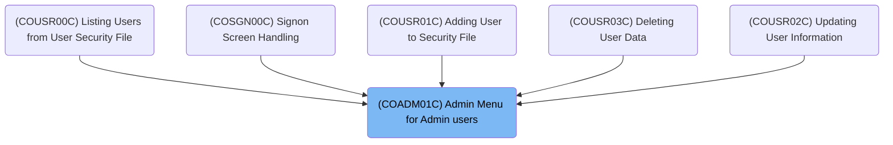
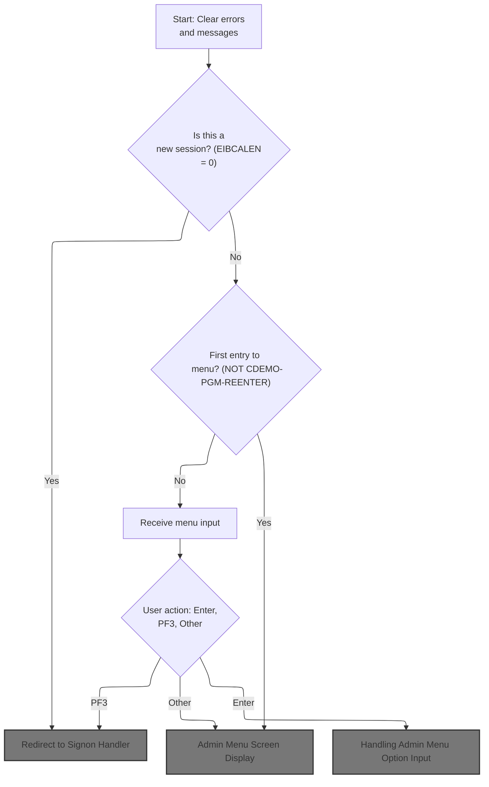
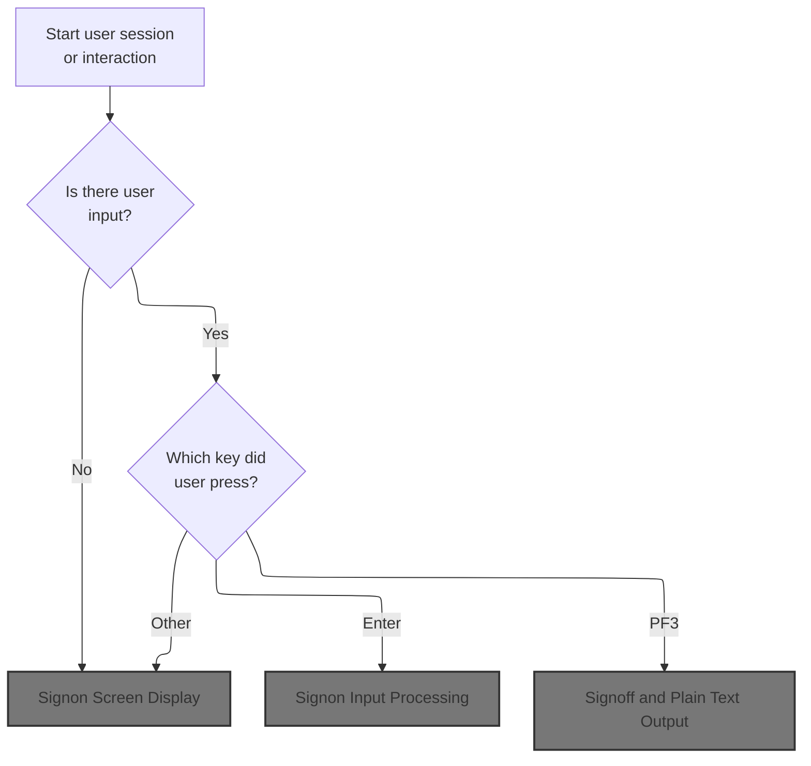
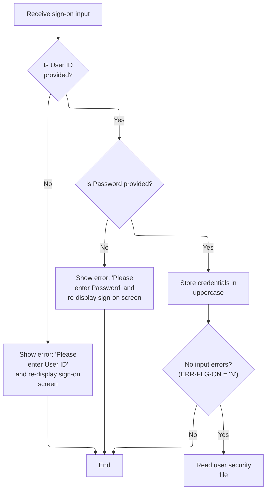
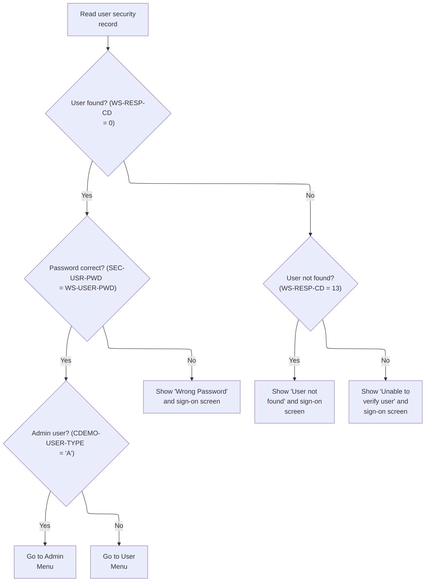
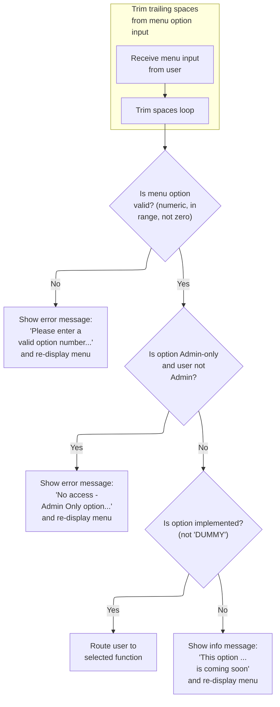
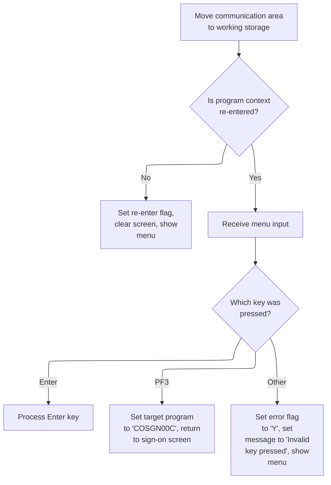
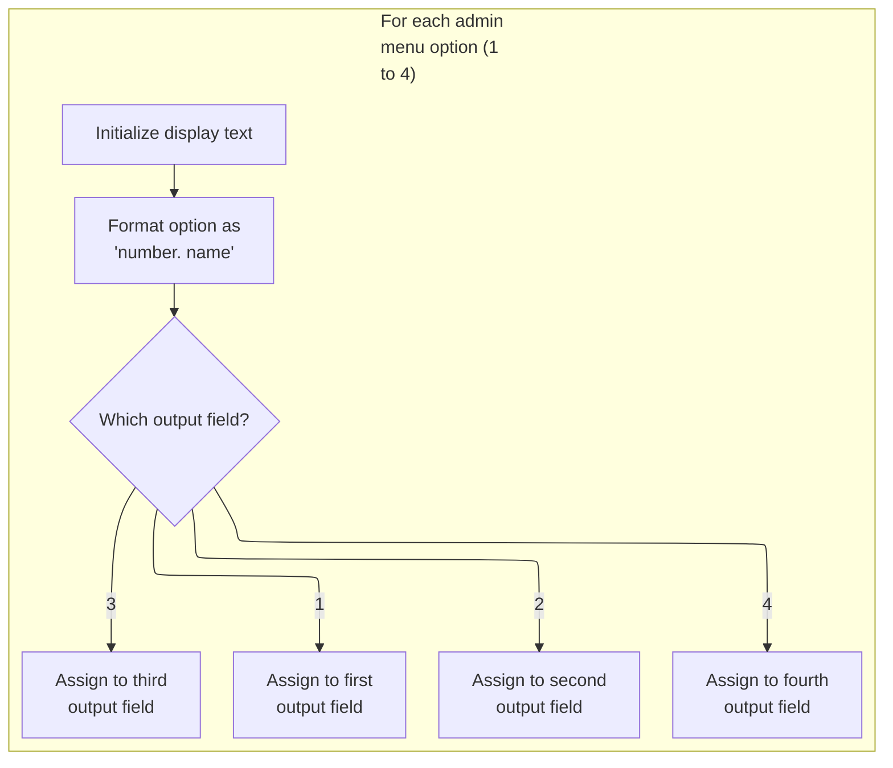
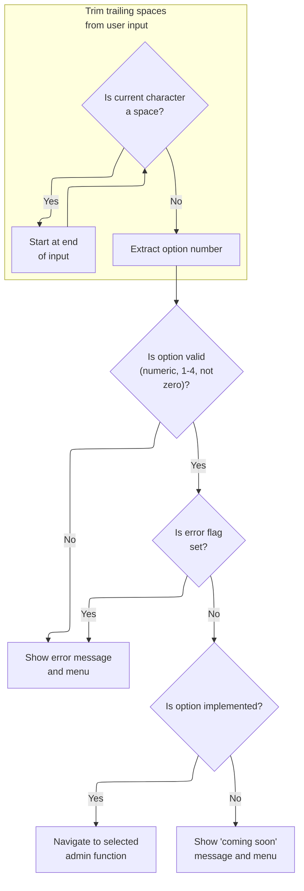

# Overview

This document explains the flow for presenting and handling the admin menu for admin users. The flow ensures authenticated admin users can access administrative functions, displays the menu, processes selections, and navigates to the chosen function or displays messages.

## Dependencies

### Programs

- COADM01C (app/cbl/COADM01C.cbl)
- CA00
- COSGN00C (app/cbl/COSGN00C.cbl)
- CC00
- COMEN01C (app/cbl/COMEN01C.cbl)
- CM00

### Copybooks

- COCOM01Y (app/cpy/COCOM01Y.cpy)
- COMEN02Y (app/cpy/COMEN02Y.cpy)
- COMEN01 (app/cpy-bms/COMEN01.CPY)
- COTTL01Y (app/cpy/COTTL01Y.cpy)
- CSDAT01Y (app/cpy/CSDAT01Y.cpy)
- CSMSG01Y (app/cpy/CSMSG01Y.cpy)
- CSUSR01Y (app/cpy/CSUSR01Y.cpy)
- DFHAID
- DFHBMSCA
- COSGN00 (app/cpy-bms/COSGN00.CPY)
- COADM02Y (app/cpy/COADM02Y.cpy)
- COADM01 (app/cpy-bms/COADM01.CPY)

# Where is this program used?

This program is used multiple times in the codebase as represented in the following diagram:



# Workflow

# Admin Menu Entry Point



This section manages the entry logic for the Admin Menu, ensuring session validity, initializing the user interface state, and routing users to the appropriate next step based on session and input context.

| Rule ID | Code Location | Category        | Rule Name                                               | Description                                                                                                                                             | Conditions                                                           | Remarks                                                                                                                                                                             |
| ------- | ------------- | --------------- | ------------------------------------------------------- | ------------------------------------------------------------------------------------------------------------------------------------------------------- | -------------------------------------------------------------------- | ----------------------------------------------------------------------------------------------------------------------------------------------------------------------------------- |
| BR-001  | MAIN-PARA     | Data validation | Session authentication required                         | If the session context is missing or invalid, the user is redirected to the signon screen for authentication before accessing the Admin Menu.           | When the session length (EIBCALEN) is zero at Admin Menu entry.      | The signon program name is 'COSGN00C'. This ensures that only authenticated sessions can proceed to the Admin Menu.                                                                 |
| BR-002  | MAIN-PARA     | Business logic  | Session error and message reset                         | At the start of each Admin Menu session, any previous error flags and user messages are cleared to ensure the user sees a clean state.                  | Whenever the Admin Menu entry point is invoked.                      | The error flag is set to 'off' and the user message is set to blank spaces. This ensures that no residual error or informational messages are displayed from previous interactions. |
| BR-003  | MAIN-PARA     | Business logic  | Menu display or input processing based on session state | If this is the user's first entry to the Admin Menu in the current session, the menu screen is displayed. If not, user input is received and processed. | When the session is valid and the Admin Menu entry point is invoked. | First entry is determined by the session context value (not equal to reentry). On first entry, the menu is displayed; otherwise, user input is processed.                           |

<SwmSnippet path="/app/cbl/COADM01C.cbl" line="75" repo-id="Z2l0aHViJTNBJTNBa3luZHJ5bC1hd3MtbWFpbmZyYW1lLW1vZGVybml6YXRpb24tY2FyZGRlbW8lM0ElM0FTd2ltbS1EZW1v">

---

In `MAIN-PARA`, this is the entry logic: error flag and message are reset, and if EIBCALEN is zero, we bail out to the signon screen. Otherwise, we prep the communication area, check if this is a reentry, and either send the menu or process user input depending on the state. The flow branches early based on whether this is a fresh entry or a continuation.

```cobol
       MAIN-PARA.

           SET ERR-FLG-OFF TO TRUE

           MOVE SPACES TO WS-MESSAGE
                          ERRMSGO OF COADM1AO
```

---

</SwmSnippet>

<SwmSnippet path="/app/cbl/COADM01C.cbl" line="82" repo-id="Z2l0aHViJTNBJTNBa3luZHJ5bC1hd3MtbWFpbmZyYW1lLW1vZGVybml6YXRpb24tY2FyZGRlbW8lM0ElM0FTd2ltbS1EZW1v">

---

Here, if EIBCALEN is zero, we set up the signon program name and call RETURN-TO-SIGNON-SCREEN to redirect the user to authentication. This avoids running menu logic without a valid session context.

```cobol
           IF EIBCALEN = 0
               MOVE 'COSGN00C' TO CDEMO-FROM-PROGRAM
               PERFORM RETURN-TO-SIGNON-SCREEN
```

---

</SwmSnippet>

## Redirect to Signon Handler

This section ensures users are always redirected to a valid screen, defaulting to the signon handler when necessary, and transfers control to the appropriate program.

| Rule ID | Code Location           | Category       | Rule Name                          | Description                                                                                                                      | Conditions                                                                                                                | Remarks                                                                                                                                                                           |
| ------- | ----------------------- | -------------- | ---------------------------------- | -------------------------------------------------------------------------------------------------------------------------------- | ------------------------------------------------------------------------------------------------------------------------- | --------------------------------------------------------------------------------------------------------------------------------------------------------------------------------- |
| BR-001  | RETURN-TO-SIGNON-SCREEN | Business logic | Default to Signon Handler          | If the target program is blank or uninitialized, redirect the user to the signon handler screen.                                 | The target program field is blank or contains uninitialized values.                                                       | The signon handler program name is 'COSGN00C', which is an 8-character alphanumeric string. Blank or uninitialized values are interpreted as either all spaces or all low-values. |
| BR-002  | RETURN-TO-SIGNON-SCREEN | Business logic | Transfer Control to Target Program | Always transfer control to the program specified in the target program field, ensuring the user is redirected to a valid screen. | The target program field contains a valid program name (either set by previous logic or defaulted to the signon handler). | The program name is an 8-character alphanumeric string. The transfer is unconditional after the target program field is set.                                                      |

<SwmSnippet path="/app/cbl/COADM01C.cbl" line="160" repo-id="Z2l0aHViJTNBJTNBa3luZHJ5bC1hd3MtbWFpbmZyYW1lLW1vZGVybml6YXRpb24tY2FyZGRlbW8lM0ElM0FTd2ltbS1EZW1v">

---

In `RETURN-TO-SIGNON-SCREEN`, we check if the target program is blank or uninitialized. If so, we set it to the signon handler ('COSGN00C') so the user always lands on a valid screen.

```cobol
       RETURN-TO-SIGNON-SCREEN.

           IF CDEMO-TO-PROGRAM = LOW-VALUES OR SPACES
               MOVE 'COSGN00C' TO CDEMO-TO-PROGRAM
           END-IF
```

---

</SwmSnippet>

<SwmSnippet path="/app/cbl/COADM01C.cbl" line="165" repo-id="Z2l0aHViJTNBJTNBa3luZHJ5bC1hd3MtbWFpbmZyYW1lLW1vZGVybml6YXRpb24tY2FyZGRlbW8lM0ElM0FTd2ltbS1EZW1v">

---

Here we finish up by calling XCTL to transfer control to whatever program is set in CDEMO-TO-PROGRAM (usually the signon handler). This jumps execution to the signon logic and ends the current program.

```cobol
           EXEC CICS
               XCTL PROGRAM(CDEMO-TO-PROGRAM)
           END-EXEC.
```

---

</SwmSnippet>

## Signon Screen Main Logic



This section manages the main logic for the signon screen in the CardDemo application, determining how the system responds to user input at the start of a session or during signon attempts. It governs the display of the signon screen, processing of signon attempts, handling of signoff requests, and error messaging for invalid input.

| Rule ID | Code Location | Category       | Rule Name                  | Description                                                                                                                                                         | Conditions                                                                                                          | Remarks                                                                                                                                                              |
| ------- | ------------- | -------------- | -------------------------- | ------------------------------------------------------------------------------------------------------------------------------------------------------------------- | ------------------------------------------------------------------------------------------------------------------- | -------------------------------------------------------------------------------------------------------------------------------------------------------------------- |
| BR-001  | MAIN-PARA     | Business logic | Fresh Entry Screen Display | When a user starts a new session (no input data is present), the signon screen is displayed with all fields cleared and no error or informational messages shown.   | This rule applies when the input data length is zero, indicating a new session or first entry to the signon screen. | All fields on the signon screen are cleared. No error or informational messages are shown. The signon area is reset to its initial state.                            |
| BR-002  | MAIN-PARA     | Business logic | Signon Attempt on Enter    | When the user presses the Enter key, the system processes the signon input (user ID and password) and proceeds with authentication.                                 | This rule applies when the user has provided input and pressed the Enter key.                                       | The signon input (user ID and password) is processed for authentication. The outcome (success or failure) is handled in the called logic, not in this section.       |
| BR-003  | MAIN-PARA     | Business logic | Signoff on PF3             | When the user presses the PF3 key, the system displays a thank you message and ends the session.                                                                    | This rule applies when the user has provided input and pressed the PF3 key.                                         | The thank you message displayed is: 'Thank you for using CardDemo application...      ' (50 characters, left-aligned, padded with spaces).                           |
| BR-004  | MAIN-PARA     | Error handling | Invalid Key Error          | When the user presses any key other than Enter or PF3, the system displays an error message indicating an invalid key was pressed and redisplays the signon screen. | This rule applies when the user has provided input and pressed a key that is not Enter or PF3.                      | The error message displayed is: 'Invalid key pressed. Please see below...         ' (50 characters, left-aligned, padded with spaces). The error flag is set to 'Y'. |

<SwmSnippet path="/app/cbl/COSGN00C.cbl" line="73" repo-id="Z2l0aHViJTNBJTNBa3luZHJ5bC1hd3MtbWFpbmZyYW1lLW1vZGVybml6YXRpb24tY2FyZGRlbW8lM0ElM0FTd2ltbS1EZW1v">

---

`MAIN-PARA` in the signon handler resets error/message state, clears the signon area if this is a fresh entry, and displays the signon screen. If we're reentered, it checks which key was pressed: Enter processes signon, PF3 shows a thank you message, and anything else is flagged as invalid input and redisplays the screen.

```cobol
       MAIN-PARA.

           SET ERR-FLG-OFF TO TRUE

           MOVE SPACES TO WS-MESSAGE
                          ERRMSGO OF COSGN0AO

           IF EIBCALEN = 0
               MOVE LOW-VALUES TO COSGN0AO
               MOVE -1       TO USERIDL OF COSGN0AI
               PERFORM SEND-SIGNON-SCREEN
           ELSE
               EVALUATE EIBAID
                   WHEN DFHENTER
                       PERFORM PROCESS-ENTER-KEY
                   WHEN DFHPF3
                       MOVE CCDA-MSG-THANK-YOU        TO WS-MESSAGE
                       PERFORM SEND-PLAIN-TEXT
                   WHEN OTHER
                       MOVE 'Y'                       TO WS-ERR-FLG
                       MOVE CCDA-MSG-INVALID-KEY      TO WS-MESSAGE
                       PERFORM SEND-SIGNON-SCREEN
               END-EVALUATE
           END-IF.

           EXEC CICS RETURN
                     TRANSID (WS-TRANID)
                     COMMAREA (CARDDEMO-COMMAREA)
                     LENGTH(LENGTH OF CARDDEMO-COMMAREA)
           END-EXEC.
```

---

</SwmSnippet>

### Signon Screen Display

This section prepares and displays the signon screen, ensuring that the header and error message fields are populated with the correct information for the user.

| Rule ID | Code Location        | Category       | Rule Name             | Description                                                                                                                            | Conditions                               | Remarks                                                                                                                                                                                                                                                                     |
| ------- | -------------------- | -------------- | --------------------- | -------------------------------------------------------------------------------------------------------------------------------------- | ---------------------------------------- | --------------------------------------------------------------------------------------------------------------------------------------------------------------------------------------------------------------------------------------------------------------------------- |
| BR-001  | POPULATE-HEADER-INFO | Business logic | Signon Header Content | The signon screen must display a header containing the current date, current time, program ID, transaction ID, and static title lines. | Whenever the signon screen is displayed. | The header includes: two static title lines (from constants), the program ID (8 characters), the transaction ID (4 characters), the current date in MM-DD-YY format, and the current time in HH-MM-SS format. All fields are alphanumeric and padded as needed for display. |
| BR-002  | POPULATE-HEADER-INFO | Business logic | CICS IDs in Header    | The signon screen must display the current CICS application ID and system ID in the header.                                            | Whenever the signon screen is displayed. | The application ID and system ID are displayed as alphanumeric fields, with values assigned by the CICS system at runtime.                                                                                                                                                  |
| BR-003  | SEND-SIGNON-SCREEN   | Business logic | Error Message Display | The signon screen must display an error message field, which is set to the current message value from working storage.                 | Whenever the signon screen is displayed. | The error message field is an 80-character alphanumeric string. If no error message is set, the field is blank (spaces).                                                                                                                                                    |

<SwmSnippet path="/app/cbl/COSGN00C.cbl" line="145" repo-id="Z2l0aHViJTNBJTNBa3luZHJ5bC1hd3MtbWFpbmZyYW1lLW1vZGVybml6YXRpb24tY2FyZGRlbW8lM0ElM0FTd2ltbS1EZW1v">

---

We prep the header, set the error message, and display the signon screen.

```cobol
       SEND-SIGNON-SCREEN.

           PERFORM POPULATE-HEADER-INFO

           MOVE WS-MESSAGE TO ERRMSGO OF COSGN0AO

           EXEC CICS SEND
                     MAP('COSGN0A')
                     MAPSET('COSGN00')
                     FROM(COSGN0AO)
                     ERASE
                     CURSOR
           END-EXEC.
```

---

</SwmSnippet>

<SwmSnippet path="/app/cbl/COSGN00C.cbl" line="177" repo-id="Z2l0aHViJTNBJTNBa3luZHJ5bC1hd3MtbWFpbmZyYW1lLW1vZGVybml6YXRpb24tY2FyZGRlbW8lM0ElM0FTd2ltbS1EZW1v">

---

`POPULATE-HEADER-INFO` fills in the signon screen header with the current date, time, program/transaction IDs, and static titles. It also pulls in the CICS application and system IDs for display.

```cobol
       POPULATE-HEADER-INFO.

           MOVE FUNCTION CURRENT-DATE  TO WS-CURDATE-DATA

           MOVE CCDA-TITLE01           TO TITLE01O OF COSGN0AO
           MOVE CCDA-TITLE02           TO TITLE02O OF COSGN0AO
           MOVE WS-TRANID              TO TRNNAMEO OF COSGN0AO
           MOVE WS-PGMNAME             TO PGMNAMEO OF COSGN0AO

           MOVE WS-CURDATE-MONTH       TO WS-CURDATE-MM
           MOVE WS-CURDATE-DAY         TO WS-CURDATE-DD
           MOVE WS-CURDATE-YEAR(3:2)   TO WS-CURDATE-YY

           MOVE WS-CURDATE-MM-DD-YY    TO CURDATEO OF COSGN0AO

           MOVE WS-CURTIME-HOURS       TO WS-CURTIME-HH
           MOVE WS-CURTIME-MINUTE      TO WS-CURTIME-MM
           MOVE WS-CURTIME-SECOND      TO WS-CURTIME-SS

           MOVE WS-CURTIME-HH-MM-SS    TO CURTIMEO OF COSGN0AO

           EXEC CICS ASSIGN
               APPLID(APPLIDO OF COSGN0AO)
           END-EXEC

           EXEC CICS ASSIGN
               SYSID(SYSIDO OF COSGN0AO)
           END-EXEC.
```

---

</SwmSnippet>

### Signon Input Processing



This section processes user sign-on input, validates required fields, transforms credentials to uppercase, and conditionally proceeds to authentication or displays error messages based on input validation.

| Rule ID | Code Location     | Category        | Rule Name                 | Description                                                                                                                                                  | Conditions                                                                                         | Remarks                                                                                                                                 |
| ------- | ----------------- | --------------- | ------------------------- | ------------------------------------------------------------------------------------------------------------------------------------------------------------ | -------------------------------------------------------------------------------------------------- | --------------------------------------------------------------------------------------------------------------------------------------- |
| BR-001  | PROCESS-ENTER-KEY | Data validation | User ID required          | If the User ID field is missing or blank, an error message is displayed prompting the user to enter their User ID, and the sign-on screen is re-displayed.   | Triggered when the User ID field is blank or contains only low-values.                             | The error message displayed is 'Please enter User ID ...'. The User ID field is expected to be a string of up to 8 characters.          |
| BR-002  | PROCESS-ENTER-KEY | Data validation | Password required         | If the Password field is missing or blank, an error message is displayed prompting the user to enter their Password, and the sign-on screen is re-displayed. | Triggered when the Password field is blank or contains only low-values.                            | The error message displayed is 'Please enter Password ...'. The Password field is expected to be a string of up to 8 characters.        |
| BR-003  | PROCESS-ENTER-KEY | Business logic  | Uppercase credentials     | When both User ID and Password are provided, the credentials are converted to uppercase before being stored for authentication.                              | Triggered when both User ID and Password fields are present and no input errors have been flagged. | Both User ID and Password are stored as uppercase strings, each up to 8 characters in length.                                           |
| BR-004  | PROCESS-ENTER-KEY | Business logic  | Proceed to authentication | If no input errors are present after validation, the system proceeds to authenticate the user by reading the user security file.                             | Triggered when the error flag is not set ('N') after input validation.                             | Authentication is attempted only if both credentials are present and valid. The user security file is accessed for authentication.      |
| BR-005  | PROCESS-ENTER-KEY | Error handling  | Halt on input error       | If any input error is detected during validation, further processing is halted and the sign-on screen is re-displayed with the relevant error message.       | Triggered when the error flag is set ('Y') after input validation.                                 | No further authentication or processing occurs if an input error is present. The sign-on screen is re-displayed with the error message. |

<SwmSnippet path="/app/cbl/COSGN00C.cbl" line="108" repo-id="Z2l0aHViJTNBJTNBa3luZHJ5bC1hd3MtbWFpbmZyYW1lLW1vZGVybml6YXRpb24tY2FyZGRlbW8lM0ElM0FTd2ltbS1EZW1v">

---

`PROCESS-ENTER-KEY` receives the signon input, checks for missing user ID or password, and displays errors if needed. If both are present, it uppercases the credentials and proceeds to user authentication by calling READ-USER-SEC-FILE.

```cobol
       PROCESS-ENTER-KEY.

           EXEC CICS RECEIVE
                     MAP('COSGN0A')
                     MAPSET('COSGN00')
                     RESP(WS-RESP-CD)
                     RESP2(WS-REAS-CD)
           END-EXEC.

           EVALUATE TRUE
               WHEN USERIDI OF COSGN0AI = SPACES OR LOW-VALUES
                   MOVE 'Y'      TO WS-ERR-FLG
                   MOVE 'Please enter User ID ...' TO WS-MESSAGE
                   MOVE -1       TO USERIDL OF COSGN0AI
                   PERFORM SEND-SIGNON-SCREEN
               WHEN PASSWDI OF COSGN0AI = SPACES OR LOW-VALUES
                   MOVE 'Y'      TO WS-ERR-FLG
                   MOVE 'Please enter Password ...' TO WS-MESSAGE
                   MOVE -1       TO PASSWDL OF COSGN0AI
                   PERFORM SEND-SIGNON-SCREEN
               WHEN OTHER
                   CONTINUE
           END-EVALUATE.

           MOVE FUNCTION UPPER-CASE(USERIDI OF COSGN0AI) TO
                           WS-USER-ID
                           CDEMO-USER-ID
           MOVE FUNCTION UPPER-CASE(PASSWDI OF COSGN0AI) TO
                           WS-USER-PWD

           IF NOT ERR-FLG-ON
               PERFORM READ-USER-SEC-FILE
           END-IF.
```

---

</SwmSnippet>

### User Authentication and Routing



This section authenticates users by validating their credentials and routes them to the appropriate menu based on their user type. It also handles error scenarios by displaying relevant messages and redisplaying the sign-on screen.

| Rule ID | Code Location      | Category       | Rule Name                             | Description                                                                                                                                                                                                  | Conditions                                                                                                | Remarks                                                                                                                                                         |
| ------- | ------------------ | -------------- | ------------------------------------- | ------------------------------------------------------------------------------------------------------------------------------------------------------------------------------------------------------------ | --------------------------------------------------------------------------------------------------------- | --------------------------------------------------------------------------------------------------------------------------------------------------------------- |
| BR-001  | READ-USER-SEC-FILE | Business logic | Successful authentication and routing | If a user is found and the password matches, the user is routed to the appropriate menu based on their user type. Admin users are routed to the Admin Menu, while regular users are routed to the User Menu. | A user record is found (response code is 0) and the provided password matches the stored password.        | Admin users are identified by user type 'A'. Routing is to the Admin Menu for admins and User Menu for others. No other user types are handled in this section. |
| BR-002  | READ-USER-SEC-FILE | Error handling | Wrong password error                  | If a user is found but the password does not match, an error message 'Wrong Password. Try again ...' is displayed and the sign-on screen is redisplayed.                                                     | A user record is found (response code is 0) but the provided password does not match the stored password. | The error message is exactly 'Wrong Password. Try again ...'. The sign-on screen is redisplayed.                                                                |
| BR-003  | READ-USER-SEC-FILE | Error handling | User not found error                  | If the user is not found (response code is 13), an error message 'User not found. Try again ...' is displayed and the sign-on screen is redisplayed.                                                         | The user lookup returns response code 13.                                                                 | The error message is exactly 'User not found. Try again ...'. The sign-on screen is redisplayed.                                                                |
| BR-004  | READ-USER-SEC-FILE | Error handling | General user verification error       | If the user lookup fails for any reason other than 'not found', an error message 'Unable to verify the User ...' is displayed and the sign-on screen is redisplayed.                                         | The user lookup returns a response code other than 0 or 13.                                               | The error message is exactly 'Unable to verify the User ...'. The sign-on screen is redisplayed.                                                                |

<SwmSnippet path="/app/cbl/COSGN00C.cbl" line="209" repo-id="Z2l0aHViJTNBJTNBa3luZHJ5bC1hd3MtbWFpbmZyYW1lLW1vZGVybml6YXRpb24tY2FyZGRlbW8lM0ElM0FTd2ltbS1EZW1v">

---

`READ-USER-SEC-FILE` reads the user record, checks the password, and sets up the session context. If the user is admin, we call the admin menu; if not, we call the main menu. Errors (user not found, wrong password, etc.) show messages and redisplay signon.

```cobol
       READ-USER-SEC-FILE.

           EXEC CICS READ
                DATASET   (WS-USRSEC-FILE)
                INTO      (SEC-USER-DATA)
                LENGTH    (LENGTH OF SEC-USER-DATA)
                RIDFLD    (WS-USER-ID)
                KEYLENGTH (LENGTH OF WS-USER-ID)
                RESP      (WS-RESP-CD)
                RESP2     (WS-REAS-CD)
           END-EXEC.

           EVALUATE WS-RESP-CD
               WHEN 0
                   IF SEC-USR-PWD = WS-USER-PWD
                       MOVE WS-TRANID    TO CDEMO-FROM-TRANID
                       MOVE WS-PGMNAME   TO CDEMO-FROM-PROGRAM
                       MOVE WS-USER-ID   TO CDEMO-USER-ID
                       MOVE SEC-USR-TYPE TO CDEMO-USER-TYPE
                       MOVE ZEROS        TO CDEMO-PGM-CONTEXT

                       IF CDEMO-USRTYP-ADMIN
                            EXEC CICS XCTL
                              PROGRAM ('COADM01C')
                              COMMAREA(CARDDEMO-COMMAREA)
                            END-EXEC
                       ELSE
                            EXEC CICS XCTL
                              PROGRAM ('COMEN01C')
                              COMMAREA(CARDDEMO-COMMAREA)
                            END-EXEC
                       END-IF
                   ELSE
                       MOVE 'Wrong Password. Try again ...' TO
                                                          WS-MESSAGE
                       MOVE -1       TO PASSWDL OF COSGN0AI
                       PERFORM SEND-SIGNON-SCREEN
                   END-IF
               WHEN 13
                   MOVE 'Y'      TO WS-ERR-FLG
                   MOVE 'User not found. Try again ...' TO WS-MESSAGE
                   MOVE -1       TO USERIDL OF COSGN0AI
                   PERFORM SEND-SIGNON-SCREEN
               WHEN OTHER
                   MOVE 'Y'      TO WS-ERR-FLG
                   MOVE 'Unable to verify the User ...' TO WS-MESSAGE
                   MOVE -1       TO USERIDL OF COSGN0AI
                   PERFORM SEND-SIGNON-SCREEN
           END-EVALUATE.
```

---

</SwmSnippet>

### Main Menu Entry Point

This section manages the entry logic for the Admin Menu, ensuring session validity, initializing the user interface state, and routing users to the appropriate next step based on session and input context.

| Rule ID | Code Location | Category        | Rule Name                                               | Description                                                                                                                                             | Conditions                                                           | Remarks                                                                                                                                                                             |
| ------- | ------------- | --------------- | ------------------------------------------------------- | ------------------------------------------------------------------------------------------------------------------------------------------------------- | -------------------------------------------------------------------- | ----------------------------------------------------------------------------------------------------------------------------------------------------------------------------------- |
| BR-001  | MAIN-PARA     | Data validation | Session authentication required                         | If the session context is missing or invalid, the user is redirected to the signon screen for authentication before accessing the Admin Menu.           | When the session length (EIBCALEN) is zero at Admin Menu entry.      | The signon program name is 'COSGN00C'. This ensures that only authenticated sessions can proceed to the Admin Menu.                                                                 |
| BR-002  | MAIN-PARA     | Business logic  | Session error and message reset                         | At the start of each Admin Menu session, any previous error flags and user messages are cleared to ensure the user sees a clean state.                  | Whenever the Admin Menu entry point is invoked.                      | The error flag is set to 'off' and the user message is set to blank spaces. This ensures that no residual error or informational messages are displayed from previous interactions. |
| BR-003  | MAIN-PARA     | Business logic  | Menu display or input processing based on session state | If this is the user's first entry to the Admin Menu in the current session, the menu screen is displayed. If not, user input is received and processed. | When the session is valid and the Admin Menu entry point is invoked. | First entry is determined by the session context value (not equal to reentry). On first entry, the menu is displayed; otherwise, user input is processed.                           |

<SwmSnippet path="/app/cbl/COMEN01C.cbl" line="75" repo-id="Z2l0aHViJTNBJTNBa3luZHJ5bC1hd3MtbWFpbmZyYW1lLW1vZGVybml6YXRpb24tY2FyZGRlbW8lM0ElM0FTd2ltbS1EZW1v">

---

`MAIN-PARA` in the main menu resets error/message state, checks if we're coming in fresh (EIBCALEN=0), and either routes to signon or continues with menu handling. If it's the first entry, we send the menu; if reentered, we process user input and handle Enter/PF3/invalid keys accordingly.

```cobol
       MAIN-PARA.

           SET ERR-FLG-OFF TO TRUE

           MOVE SPACES TO WS-MESSAGE
                          ERRMSGO OF COMEN1AO

           IF EIBCALEN = 0
               MOVE 'COSGN00C' TO CDEMO-FROM-PROGRAM
               PERFORM RETURN-TO-SIGNON-SCREEN
           ELSE
               MOVE DFHCOMMAREA(1:EIBCALEN) TO CARDDEMO-COMMAREA
               IF NOT CDEMO-PGM-REENTER
                   SET CDEMO-PGM-REENTER    TO TRUE
                   MOVE LOW-VALUES          TO COMEN1AO
                   PERFORM SEND-MENU-SCREEN
               ELSE
                   PERFORM RECEIVE-MENU-SCREEN
                   EVALUATE EIBAID
                       WHEN DFHENTER
                           PERFORM PROCESS-ENTER-KEY
                       WHEN DFHPF3
                           MOVE 'COSGN00C' TO CDEMO-TO-PROGRAM
                           PERFORM RETURN-TO-SIGNON-SCREEN
                       WHEN OTHER
                           MOVE 'Y'                       TO WS-ERR-FLG
                           MOVE CCDA-MSG-INVALID-KEY      TO WS-MESSAGE
                           PERFORM SEND-MENU-SCREEN
                   END-EVALUATE
               END-IF
           END-IF

           EXEC CICS RETURN
                     TRANSID (WS-TRANID)
                     COMMAREA (CARDDEMO-COMMAREA)
           END-EXEC.
```

---

</SwmSnippet>

<SwmSnippet path="/app/cbl/COMEN01C.cbl" line="170" repo-id="Z2l0aHViJTNBJTNBa3luZHJ5bC1hd3MtbWFpbmZyYW1lLW1vZGVybml6YXRpb24tY2FyZGRlbW8lM0ElM0FTd2ltbS1EZW1v">

---

We make sure the next program is set, default to signon if not, and transfer control.

```cobol
       RETURN-TO-SIGNON-SCREEN.

           IF CDEMO-TO-PROGRAM = LOW-VALUES OR SPACES
               MOVE 'COSGN00C' TO CDEMO-TO-PROGRAM
           END-IF
           EXEC CICS
               XCTL PROGRAM(CDEMO-TO-PROGRAM)
           END-EXEC.
```

---

</SwmSnippet>

#### Main Menu Screen Display

This section prepares and displays the main menu screen for the CardDemo application, ensuring the header and menu options are up to date and formatted for user clarity.

| Rule ID | Code Location        | Category       | Rule Name                  | Description                                                                                                                                                                                                           | Conditions                                                           | Remarks                                                                                                                                                                                                                                                  |
| ------- | -------------------- | -------------- | -------------------------- | --------------------------------------------------------------------------------------------------------------------------------------------------------------------------------------------------------------------- | -------------------------------------------------------------------- | -------------------------------------------------------------------------------------------------------------------------------------------------------------------------------------------------------------------------------------------------------- |
| BR-001  | POPULATE-HEADER-INFO | Business logic | Header information display | The menu screen header must display the current date and time, the program name, transaction ID, and static titles. This ensures users always see up-to-date and relevant context information at the top of the menu. | Whenever the main menu screen is displayed.                          | Date is shown in MM-DD-YY format; time is shown in HH-MM-SS format. Program name is 8 characters, transaction ID is 4 characters, and titles are static strings. All fields are left-aligned and padded as needed to fit their respective output fields. |
| BR-002  | BUILD-MENU-OPTIONS   | Business logic | Menu option formatting     | Each menu option must be displayed in the format 'number. name', where the number is the option's sequence and the name is the option's label. Up to 12 options are shown, each in its own line.                      | Whenever menu options are built for display on the main menu screen. | Menu option format: 'number. name' as a string, left-aligned, up to 40 characters per option. Maximum of 12 options displayed, each mapped to a separate output field.                                                                                   |
| BR-003  | BUILD-MENU-OPTIONS   | Business logic | Menu option display limit  | No more than 12 menu options can be displayed on the main menu screen at one time. Any additional options beyond the twelfth are not shown.                                                                           | Whenever the menu options are built for the main menu screen.        | Maximum of 12 options, each mapped to a unique output field (OPTN001O to OPTN012O). Options beyond 12 are ignored for display.                                                                                                                           |
| BR-004  | SEND-MENU-SCREEN     | Business logic | Message area inclusion     | The menu screen is always sent with any message text included in the designated message area, even if the message is blank.                                                                                           | Whenever the main menu screen is sent to the user.                   | Message area is 80 characters, left-aligned, padded with spaces if blank.                                                                                                                                                                                |

<SwmSnippet path="/app/cbl/COMEN01C.cbl" line="182" repo-id="Z2l0aHViJTNBJTNBa3luZHJ5bC1hd3MtbWFpbmZyYW1lLW1vZGVybml6YXRpb24tY2FyZGRlbW8lM0ElM0FTd2ltbS1EZW1v">

---

We prep the header, build the menu, and display the menu screen.

```cobol
       SEND-MENU-SCREEN.

           PERFORM POPULATE-HEADER-INFO
           PERFORM BUILD-MENU-OPTIONS

           MOVE WS-MESSAGE TO ERRMSGO OF COMEN1AO

           EXEC CICS SEND
                     MAP('COMEN1A')
                     MAPSET('COMEN01')
                     FROM(COMEN1AO)
                     ERASE
           END-EXEC.
```

---

</SwmSnippet>

<SwmSnippet path="/app/cbl/COMEN01C.cbl" line="212" repo-id="Z2l0aHViJTNBJTNBa3luZHJ5bC1hd3MtbWFpbmZyYW1lLW1vZGVybml6YXRpb24tY2FyZGRlbW8lM0ElM0FTd2ltbS1EZW1v">

---

`POPULATE-HEADER-INFO` fills in the menu screen header with the current date, time, transaction/program IDs, and static titles. This keeps the header info up to date for the user.

```cobol
       POPULATE-HEADER-INFO.

           MOVE FUNCTION CURRENT-DATE  TO WS-CURDATE-DATA

           MOVE CCDA-TITLE01           TO TITLE01O OF COMEN1AO
           MOVE CCDA-TITLE02           TO TITLE02O OF COMEN1AO
           MOVE WS-TRANID              TO TRNNAMEO OF COMEN1AO
           MOVE WS-PGMNAME             TO PGMNAMEO OF COMEN1AO

           MOVE WS-CURDATE-MONTH       TO WS-CURDATE-MM
           MOVE WS-CURDATE-DAY         TO WS-CURDATE-DD
           MOVE WS-CURDATE-YEAR(3:2)   TO WS-CURDATE-YY

           MOVE WS-CURDATE-MM-DD-YY    TO CURDATEO OF COMEN1AO

           MOVE WS-CURTIME-HOURS       TO WS-CURTIME-HH
           MOVE WS-CURTIME-MINUTE      TO WS-CURTIME-MM
           MOVE WS-CURTIME-SECOND      TO WS-CURTIME-SS

           MOVE WS-CURTIME-HH-MM-SS    TO CURTIMEO OF COMEN1AO.
```

---

</SwmSnippet>

<SwmSnippet path="/app/cbl/COMEN01C.cbl" line="236" repo-id="Z2l0aHViJTNBJTNBa3luZHJ5bC1hd3MtbWFpbmZyYW1lLW1vZGVybml6YXRpb24tY2FyZGRlbW8lM0ElM0FTd2ltbS1EZW1v">

---

`BUILD-MENU-OPTIONS` loops through the menu options, formats each as 'number. name', and assigns them to the output fields for display. This is how the menu lines are built for the screen.

```cobol
       BUILD-MENU-OPTIONS.

           PERFORM VARYING WS-IDX FROM 1 BY 1 UNTIL
                           WS-IDX > CDEMO-MENU-OPT-COUNT

               MOVE SPACES             TO WS-MENU-OPT-TXT

               STRING CDEMO-MENU-OPT-NUM(WS-IDX)  DELIMITED BY SIZE
                      '. '                         DELIMITED BY SIZE
                      CDEMO-MENU-OPT-NAME(WS-IDX) DELIMITED BY SIZE
                 INTO WS-MENU-OPT-TXT

               EVALUATE WS-IDX
                   WHEN 1
                       MOVE WS-MENU-OPT-TXT TO OPTN001O
                   WHEN 2
                       MOVE WS-MENU-OPT-TXT TO OPTN002O
                   WHEN 3
                       MOVE WS-MENU-OPT-TXT TO OPTN003O
                   WHEN 4
                       MOVE WS-MENU-OPT-TXT TO OPTN004O
                   WHEN 5
                       MOVE WS-MENU-OPT-TXT TO OPTN005O
                   WHEN 6
                       MOVE WS-MENU-OPT-TXT TO OPTN006O
                   WHEN 7
                       MOVE WS-MENU-OPT-TXT TO OPTN007O
                   WHEN 8
                       MOVE WS-MENU-OPT-TXT TO OPTN008O
                   WHEN 9
                       MOVE WS-MENU-OPT-TXT TO OPTN009O
                   WHEN 10
                       MOVE WS-MENU-OPT-TXT TO OPTN010O
                   WHEN 11
                       MOVE WS-MENU-OPT-TXT TO OPTN011O
                   WHEN 12
                       MOVE WS-MENU-OPT-TXT TO OPTN012O
                   WHEN OTHER
                       CONTINUE
               END-EVALUATE

           END-PERFORM.
```

---

</SwmSnippet>

#### Main Menu Input Handling



This section manages user input from the main menu, ensuring selections are valid, authorized, and either routed to the appropriate function or accompanied by clear feedback messages.

| Rule ID | Code Location     | Category        | Rule Name                         | Description                                                                                                                                                                                   | Conditions                                                                                | Remarks                                                                                                                                                                        |
| ------- | ----------------- | --------------- | --------------------------------- | --------------------------------------------------------------------------------------------------------------------------------------------------------------------------------------------- | ----------------------------------------------------------------------------------------- | ------------------------------------------------------------------------------------------------------------------------------------------------------------------------------ |
| BR-001  | PROCESS-ENTER-KEY | Data validation | Menu input normalization          | Trailing spaces in the user's menu input are removed before further validation or processing. The normalized input is used for all subsequent checks.                                         | Whenever a menu option is entered by the user.                                            | Input is normalized to remove trailing spaces. After trimming, any remaining spaces in the input are replaced by '0'. The normalized input is used for validation and routing. |
| BR-002  | PROCESS-ENTER-KEY | Data validation | Menu option validation            | A menu option is considered valid only if it is numeric, within the allowed range of options, and not zero. Invalid selections result in an error message and the menu is re-displayed.       | When a user submits a menu option.                                                        | Valid options are numeric, greater than zero, and less than or equal to the value of CDEMO-MENU-OPT-COUNT. Error message displayed is 'Please enter a valid option number...'. |
| BR-003  | PROCESS-ENTER-KEY | Business logic  | Admin-only option access control  | Access to admin-only menu options is restricted to users with admin privileges. If a non-admin user selects an admin-only option, an error message is displayed and the menu is re-displayed. | When a user selects a menu option designated as admin-only and the user is not an admin.  | Admin-only options are identified by user type 'A'. Error message displayed is 'No access - Admin Only option...'.                                                             |
| BR-004  | PROCESS-ENTER-KEY | Business logic  | Unimplemented option notification | If the selected menu option is not implemented (marked as 'DUMMY'), the user is shown an informational message indicating the option is coming soon and the menu is re-displayed.             | When a valid menu option is selected that is marked as 'DUMMY'.                           | Unimplemented options are identified by program name starting with 'DUMMY'. Informational message format: 'This option <option name> is coming soon ...'.                      |
| BR-005  | PROCESS-ENTER-KEY | Business logic  | Menu option routing               | When a valid and authorized menu option is selected, the user is routed to the corresponding function.                                                                                        | When a valid menu option is selected, the user has access, and the option is implemented. | Routing is performed to the program name associated with the selected option. The communication area is passed to the next program.                                            |

<SwmSnippet path="/app/cbl/COMEN01C.cbl" line="199" repo-id="Z2l0aHViJTNBJTNBa3luZHJ5bC1hd3MtbWFpbmZyYW1lLW1vZGVybml6YXRpb24tY2FyZGRlbW8lM0ElM0FTd2ltbS1EZW1v">

---

We receive the user's menu input for processing.

```cobol
       RECEIVE-MENU-SCREEN.

           EXEC CICS RECEIVE
                     MAP('COMEN1A')
                     MAPSET('COMEN01')
                     INTO(COMEN1AI)
                     RESP(WS-RESP-CD)
                     RESP2(WS-REAS-CD)
           END-EXEC.
```

---

</SwmSnippet>

<SwmSnippet path="/app/cbl/COMEN01C.cbl" line="115" repo-id="Z2l0aHViJTNBJTNBa3luZHJ5bC1hd3MtbWFpbmZyYW1lLW1vZGVybml6YXRpb24tY2FyZGRlbW8lM0ElM0FTd2ltbS1EZW1v">

---

`PROCESS-ENTER-KEY` trims and normalizes the user's menu input, checks if it's valid and allowed, and either routes to the selected program, blocks access, or shows a 'coming soon' message if the option isn't implemented.

```cobol
       PROCESS-ENTER-KEY.

           PERFORM VARYING WS-IDX
                   FROM LENGTH OF OPTIONI OF COMEN1AI BY -1 UNTIL
                   OPTIONI OF COMEN1AI(WS-IDX:1) NOT = SPACES OR
                   WS-IDX = 1
           END-PERFORM
           MOVE OPTIONI OF COMEN1AI(1:WS-IDX) TO WS-OPTION-X
           INSPECT WS-OPTION-X REPLACING ALL ' ' BY '0'
           MOVE WS-OPTION-X              TO WS-OPTION
           MOVE WS-OPTION                TO OPTIONO OF COMEN1AO

           IF WS-OPTION IS NOT NUMERIC OR
              WS-OPTION > CDEMO-MENU-OPT-COUNT OR
              WS-OPTION = ZEROS
               MOVE 'Y'     TO WS-ERR-FLG
               MOVE 'Please enter a valid option number...' TO
                               WS-MESSAGE
               PERFORM SEND-MENU-SCREEN
           END-IF

           IF CDEMO-USRTYP-USER AND
              CDEMO-MENU-OPT-USRTYPE(WS-OPTION) = 'A'
               SET ERR-FLG-ON          TO TRUE
               MOVE SPACES             TO WS-MESSAGE
               MOVE 'No access - Admin Only option... ' TO
                                       WS-MESSAGE
               PERFORM SEND-MENU-SCREEN
           END-IF

           IF NOT ERR-FLG-ON
               IF CDEMO-MENU-OPT-PGMNAME(WS-OPTION)(1:5) NOT = 'DUMMY'
                   MOVE WS-TRANID    TO CDEMO-FROM-TRANID
                   MOVE WS-PGMNAME   TO CDEMO-FROM-PROGRAM
      *            MOVE WS-USER-ID   TO CDEMO-USER-ID
      *            MOVE SEC-USR-TYPE TO CDEMO-USER-TYPE
                   MOVE ZEROS        TO CDEMO-PGM-CONTEXT
                   EXEC CICS
                       XCTL PROGRAM(CDEMO-MENU-OPT-PGMNAME(WS-OPTION))
                       COMMAREA(CARDDEMO-COMMAREA)
                   END-EXEC
               END-IF
               MOVE SPACES             TO WS-MESSAGE
               MOVE DFHGREEN           TO ERRMSGC  OF COMEN1AO
               STRING 'This option '       DELIMITED BY SIZE
                       CDEMO-MENU-OPT-NAME(WS-OPTION)
                                       DELIMITED BY SPACE
                       'is coming soon ...'   DELIMITED BY SIZE
                  INTO WS-MESSAGE
               PERFORM SEND-MENU-SCREEN
           END-IF.
```

---

</SwmSnippet>

### Signoff and Plain Text Output

This section handles the signoff process by displaying a plain text message to the user, erasing the screen, freeing the keyboard, and ending the session by returning control to CICS.

| Rule ID | Code Location   | Category       | Rule Name                      | Description                                                                                                                                                                                                                                                   | Conditions                                                              | Remarks                                                                                                                                                                                                                                                                                                |
| ------- | --------------- | -------------- | ------------------------------ | ------------------------------------------------------------------------------------------------------------------------------------------------------------------------------------------------------------------------------------------------------------- | ----------------------------------------------------------------------- | ------------------------------------------------------------------------------------------------------------------------------------------------------------------------------------------------------------------------------------------------------------------------------------------------------ |
| BR-001  | SEND-PLAIN-TEXT | Business logic | Display signoff message        | When the signoff process is triggered, a plain text message is displayed to the user. The message content is determined by the context and may be a thank you note or an error message. The message is always displayed in its entirety, up to 80 characters. | Signoff process is triggered and a message is present in the workspace. | The message displayed is either 'Thank you for using CardDemo application...      ' (50 characters) or 'Invalid key pressed. Please see below...         ' (50 characters), but the workspace allows up to 80 characters. The message is shown as plain text, with no formatting or additional fields. |
| BR-002  | SEND-PLAIN-TEXT | Business logic | Erase screen and free keyboard | After the message is displayed, the screen is erased and the keyboard is freed, ensuring the user cannot interact further with the session.                                                                                                                   | After the signoff message is sent to the user.                          | The screen is cleared and the keyboard is released for further use. No additional output is shown to the user after the message.                                                                                                                                                                       |
| BR-003  | SEND-PLAIN-TEXT | Business logic | End session and return control | Once the message is displayed and the screen is erased, the session is ended and control is returned to CICS, terminating the user's session.                                                                                                                 | After the signoff message is displayed and the screen is erased.        | The session is terminated and control is returned to the CICS transaction manager. No further interaction is possible in this session.                                                                                                                                                                 |

<SwmSnippet path="/app/cbl/COSGN00C.cbl" line="162" repo-id="Z2l0aHViJTNBJTNBa3luZHJ5bC1hd3MtbWFpbmZyYW1lLW1vZGVybml6YXRpb24tY2FyZGRlbW8lM0ElM0FTd2ltbS1EZW1v">

---

`SEND-PLAIN-TEXT` outputs a plain message (like 'thank you'), erases the screen, frees the keyboard, and then returns control to CICS, ending the session.

```cobol
       SEND-PLAIN-TEXT.

           EXEC CICS SEND TEXT
                     FROM(WS-MESSAGE)
                     LENGTH(LENGTH OF WS-MESSAGE)
                     ERASE
                     FREEKB
           END-EXEC.

           EXEC CICS RETURN
           END-EXEC.
```

---

</SwmSnippet>

## Admin Menu Post-Signon Handling



This section manages the Admin Menu screen after sign-on, determining when to display the menu, how to process user input, and how to handle navigation and errors based on key presses.

| Rule ID | Code Location                      | Category       | Rule Name                  | Description                                                                                                              | Conditions                                                                    | Remarks                                                                                                                                                                                                                     |
| ------- | ---------------------------------- | -------------- | -------------------------- | ------------------------------------------------------------------------------------------------------------------------ | ----------------------------------------------------------------------------- | --------------------------------------------------------------------------------------------------------------------------------------------------------------------------------------------------------------------------- |
| BR-001  | MAIN-PARA, SEND-MENU-SCREEN        | Business logic | Initial menu display       | When the Admin Menu is accessed for the first time after sign-on, the menu screen is displayed to the user.              | The program context is not marked as re-entered (CDEMO-PGM-REENTER is FALSE). | The menu screen is shown with all fields cleared (LOW-VALUES). No error message is displayed. The re-enter flag is set to TRUE for subsequent accesses.                                                                     |
| BR-002  | MAIN-PARA, RECEIVE-MENU-SCREEN     | Business logic | Menu input handling        | When the Admin Menu is re-entered, user input is received and processed according to the key pressed.                    | The program context is marked as re-entered (CDEMO-PGM-REENTER is TRUE).      | User input is received from the menu screen. The key pressed is evaluated to determine the next action.                                                                                                                     |
| BR-003  | MAIN-PARA, PROCESS-ENTER-KEY       | Business logic | Enter key processing       | If the Enter key is pressed on the Admin Menu, the corresponding processing for the Enter key is performed.              | User presses the Enter key while on the Admin Menu screen.                    | Processing for the Enter key is performed. No error message is displayed.                                                                                                                                                   |
| BR-004  | MAIN-PARA, RETURN-TO-SIGNON-SCREEN | Business logic | PF3 key returns to sign-on | If the PF3 key is pressed on the Admin Menu, the user is returned to the sign-on screen.                                 | User presses the PF3 key while on the Admin Menu screen.                      | The target program is set to 'COSGN00C', initiating navigation to the sign-on screen.                                                                                                                                       |
| BR-005  | MAIN-PARA, SEND-MENU-SCREEN        | Error handling | Invalid key error handling | If any key other than Enter or PF3 is pressed on the Admin Menu, an error flag is set and an error message is displayed. | User presses a key other than Enter or PF3 while on the Admin Menu screen.    | The error flag is set to 'Y'. The error message displayed is 'Invalid key pressed. Please see below...         ' (50 characters, left-aligned, padded with spaces). The menu screen is re-displayed with the error message. |

<SwmSnippet path="/app/cbl/COADM01C.cbl" line="85" repo-id="Z2l0aHViJTNBJTNBa3luZHJ5bC1hd3MtbWFpbmZyYW1lLW1vZGVybml6YXRpb24tY2FyZGRlbW8lM0ElM0FTd2ltbS1EZW1v">

---

Back in MAIN-PARA after returning from signon, we check if this is the first entry or a reentry. If it's the first, we send the menu screen; if not, we receive input and handle Enter/PF3/invalid keys accordingly.

```cobol
           ELSE
               MOVE DFHCOMMAREA(1:EIBCALEN) TO CARDDEMO-COMMAREA
               IF NOT CDEMO-PGM-REENTER
                   SET CDEMO-PGM-REENTER    TO TRUE
                   MOVE LOW-VALUES          TO COADM1AO
                   PERFORM SEND-MENU-SCREEN
               ELSE
                   PERFORM RECEIVE-MENU-SCREEN
                   EVALUATE EIBAID
                       WHEN DFHENTER
                           PERFORM PROCESS-ENTER-KEY
                       WHEN DFHPF3
                           MOVE 'COSGN00C' TO CDEMO-TO-PROGRAM
                           PERFORM RETURN-TO-SIGNON-SCREEN
                       WHEN OTHER
                           MOVE 'Y'                       TO WS-ERR-FLG
                           MOVE CCDA-MSG-INVALID-KEY      TO WS-MESSAGE
                           PERFORM SEND-MENU-SCREEN
                   END-EVALUATE
               END-IF
```

---

</SwmSnippet>

## Admin Menu Screen Display

This section is responsible for displaying the admin menu screen, ensuring the header is up to date and the correct menu options are presented to the admin user.

| Rule ID | Code Location                          | Category       | Rule Name                     | Description                                                                                                                                          | Conditions                                   | Remarks                                                                                                                                                                                                                                                                                     |
| ------- | -------------------------------------- | -------------- | ----------------------------- | ---------------------------------------------------------------------------------------------------------------------------------------------------- | -------------------------------------------- | ------------------------------------------------------------------------------------------------------------------------------------------------------------------------------------------------------------------------------------------------------------------------------------------- |
| BR-001  | SEND-MENU-SCREEN, POPULATE-HEADER-INFO | Business logic | Admin menu header update      | The admin menu header must display the current date and time, program ID, transaction ID, and static titles each time the menu is shown.             | Whenever the admin menu screen is displayed. | Program ID is 'COADM01C' (8 characters), transaction ID is 'CA00' (4 characters), static titles are sourced from CCDA-TITLE01 and CCDA-TITLE02. Date and time are formatted as MM-DD-YY and HH-MM-SS respectively. All fields are alphanumeric strings, left-aligned, and padded as needed. |
| BR-002  | SEND-MENU-SCREEN, BUILD-MENU-OPTIONS   | Business logic | Admin menu options display    | The admin menu must present the available options for administrative actions below the header each time the menu is displayed.                       | Whenever the admin menu screen is displayed. | Menu options are presented as a list of choices relevant to admin functions. Each option is an alphanumeric string, left-aligned, and padded to fit the display format. The specific options are determined by the BUILD-MENU-OPTIONS logic.                                                |
| BR-003  | WS-VARIABLES                           | Business logic | Admin menu message area blank | The admin menu screen must always display a blank message area when first shown, ensuring no residual messages from previous operations are visible. | Whenever the admin menu screen is displayed. | The message area is an 80-character alphanumeric string, left-aligned and padded with spaces.                                                                                                                                                                                               |

<SwmSnippet path="/app/cbl/COADM01C.cbl" line="172" repo-id="Z2l0aHViJTNBJTNBa3luZHJ5bC1hd3MtbWFpbmZyYW1lLW1vZGVybml6YXRpb24tY2FyZGRlbW8lM0ElM0FTd2ltbS1EZW1v">

---

We prep the header, then build the menu options for the admin menu.

```cobol
       SEND-MENU-SCREEN.

           PERFORM POPULATE-HEADER-INFO
           PERFORM BUILD-MENU-OPTIONS
```

---

</SwmSnippet>

<SwmSnippet path="/app/cbl/COADM01C.cbl" line="202" repo-id="Z2l0aHViJTNBJTNBa3luZHJ5bC1hd3MtbWFpbmZyYW1lLW1vZGVybml6YXRpb24tY2FyZGRlbW8lM0ElM0FTd2ltbS1EZW1v">

---

`POPULATE-HEADER-INFO` fills in the admin menu header with the current date, time, transaction/program IDs, and static titles. This keeps the header info up to date for the admin.

```cobol
       POPULATE-HEADER-INFO.

           MOVE FUNCTION CURRENT-DATE  TO WS-CURDATE-DATA

           MOVE CCDA-TITLE01           TO TITLE01O OF COADM1AO
           MOVE CCDA-TITLE02           TO TITLE02O OF COADM1AO
           MOVE WS-TRANID              TO TRNNAMEO OF COADM1AO
           MOVE WS-PGMNAME             TO PGMNAMEO OF COADM1AO

           MOVE WS-CURDATE-MONTH       TO WS-CURDATE-MM
           MOVE WS-CURDATE-DAY         TO WS-CURDATE-DD
           MOVE WS-CURDATE-YEAR(3:2)   TO WS-CURDATE-YY

           MOVE WS-CURDATE-MM-DD-YY    TO CURDATEO OF COADM1AO

           MOVE WS-CURTIME-HOURS       TO WS-CURTIME-HH
           MOVE WS-CURTIME-MINUTE      TO WS-CURTIME-MM
           MOVE WS-CURTIME-SECOND      TO WS-CURTIME-SS

           MOVE WS-CURTIME-HH-MM-SS    TO CURTIMEO OF COADM1AO.
```

---

</SwmSnippet>

<SwmSnippet path="/app/cbl/COADM01C.cbl" line="172" repo-id="Z2l0aHViJTNBJTNBa3luZHJ5bC1hd3MtbWFpbmZyYW1lLW1vZGVybml6YXRpb24tY2FyZGRlbW8lM0ElM0FTd2ltbS1EZW1v">

---

Just returned from POPULATE-HEADER-INFO in SEND-MENU-SCREEN, now we build the menu options so the admin sees the correct choices under the updated header.

```cobol
       SEND-MENU-SCREEN.

           PERFORM POPULATE-HEADER-INFO
           PERFORM BUILD-MENU-OPTIONS
```

---

</SwmSnippet>

### Admin Menu Option Formatting



This section is responsible for formatting and assigning the admin menu options for display in the CardDemo admin interface. It ensures that each option is presented in a consistent format and mapped to the correct output field for display.

| Rule ID | Code Location      | Category       | Rule Name                  | Description                                                                                                                                                                      | Conditions                                                    | Remarks                                                                                                                                                                                           |
| ------- | ------------------ | -------------- | -------------------------- | -------------------------------------------------------------------------------------------------------------------------------------------------------------------------------- | ------------------------------------------------------------- | ------------------------------------------------------------------------------------------------------------------------------------------------------------------------------------------------- |
| BR-001  | BUILD-MENU-OPTIONS | Business logic | Menu option display format | Each admin menu option must be displayed as a string in the format 'number. name', where 'number' is the option's sequence number and 'name' is the option's display name.       | For each admin menu option to be displayed in the admin menu. | The format is: a two-digit number, followed by a period and a space, followed by the option name. The resulting string is left-aligned and padded with spaces to a total length of 40 characters. |
| BR-002  | BUILD-MENU-OPTIONS | Business logic | Maximum displayed options  | The admin menu must display up to 4 options, corresponding to the current count of available admin menu options.                                                                 | When building the admin menu for display.                     | The maximum number of options displayed is 4, as determined by the constant value of the admin option count.                                                                                      |
| BR-003  | BUILD-MENU-OPTIONS | Business logic | Menu option field mapping  | Each formatted admin menu option must be assigned to a specific output field corresponding to its sequence number, ensuring the options appear in the correct order on the menu. | For each formatted admin menu option string.                  | The first option is assigned to the first output field, the second to the second, and so on, up to the fourth option and field.                                                                   |

<SwmSnippet path="/app/cbl/COADM01C.cbl" line="226" repo-id="Z2l0aHViJTNBJTNBa3luZHJ5bC1hd3MtbWFpbmZyYW1lLW1vZGVybml6YXRpb24tY2FyZGRlbW8lM0ElM0FTd2ltbS1EZW1v">

---

In `BUILD-MENU-OPTIONS`, we loop through the admin options, format each as 'number. name', and assign them to the output fields for display. This is how the admin menu lines are built.

```cobol
       BUILD-MENU-OPTIONS.

           PERFORM VARYING WS-IDX FROM 1 BY 1 UNTIL
                           WS-IDX > CDEMO-ADMIN-OPT-COUNT

               MOVE SPACES             TO WS-ADMIN-OPT-TXT

               STRING CDEMO-ADMIN-OPT-NUM(WS-IDX)  DELIMITED BY SIZE
                      '. '                         DELIMITED BY SIZE
                      CDEMO-ADMIN-OPT-NAME(WS-IDX) DELIMITED BY SIZE
                 INTO WS-ADMIN-OPT-TXT
```

---

</SwmSnippet>

<SwmSnippet path="/app/cbl/COADM01C.cbl" line="238" repo-id="Z2l0aHViJTNBJTNBa3luZHJ5bC1hd3MtbWFpbmZyYW1lLW1vZGVybml6YXRpb24tY2FyZGRlbW8lM0ElM0FTd2ltbS1EZW1v">

---

After formatting each admin menu option, we use EVALUATE to assign it to the right output field (OPTN001O, OPTN002O, etc.), so the menu displays correctly.

```cobol
               EVALUATE WS-IDX
                   WHEN 1
                       MOVE WS-ADMIN-OPT-TXT TO OPTN001O
                   WHEN 2
                       MOVE WS-ADMIN-OPT-TXT TO OPTN002O
                   WHEN 3
                       MOVE WS-ADMIN-OPT-TXT TO OPTN003O
                   WHEN 4
                       MOVE WS-ADMIN-OPT-TXT TO OPTN004O
                   WHEN 5
                       MOVE WS-ADMIN-OPT-TXT TO OPTN005O
                   WHEN 6
                       MOVE WS-ADMIN-OPT-TXT TO OPTN006O
                   WHEN 7
                       MOVE WS-ADMIN-OPT-TXT TO OPTN007O
                   WHEN 8
                       MOVE WS-ADMIN-OPT-TXT TO OPTN008O
                   WHEN 9
                       MOVE WS-ADMIN-OPT-TXT TO OPTN009O
                   WHEN 10
                       MOVE WS-ADMIN-OPT-TXT TO OPTN010O
                   WHEN OTHER
                       CONTINUE
               END-EVALUATE

           END-PERFORM.
```

---

</SwmSnippet>

### Admin Menu Screen Output

This section is responsible for presenting the admin menu screen to the user, including any informational or error messages. It ensures that the admin always sees the current menu options and any relevant messages when accessing the menu.

| Rule ID | Code Location    | Category       | Rule Name                  | Description                                                                                                                                                                        | Conditions                                           | Remarks                                                                                                                                                      |
| ------- | ---------------- | -------------- | -------------------------- | ---------------------------------------------------------------------------------------------------------------------------------------------------------------------------------- | ---------------------------------------------------- | ------------------------------------------------------------------------------------------------------------------------------------------------------------ |
| BR-001  | SEND-MENU-SCREEN | Business logic | Admin menu message display | Whenever the admin menu screen is displayed, any current message (up to 80 characters) is shown in the message area of the screen. If there is no message, the area is left blank. | The admin menu screen is being sent to the terminal. | The message area can contain up to 80 characters. If no message is present, the area is blank (spaces). The message is displayed alongside the menu options. |
| BR-002  | SEND-MENU-SCREEN | Business logic | Admin menu screen refresh  | The admin menu screen is always displayed with the current menu options and any message, replacing any previous content on the terminal.                                           | The admin menu screen is being sent to the terminal. | The entire screen is refreshed, so any previous content is erased. The menu and message are displayed together.                                              |

<SwmSnippet path="/app/cbl/COADM01C.cbl" line="177" repo-id="Z2l0aHViJTNBJTNBa3luZHJ5bC1hd3MtbWFpbmZyYW1lLW1vZGVybml6YXRpb24tY2FyZGRlbW8lM0ElM0FTd2ltbS1EZW1v">

---

Just returned from BUILD-MENU-OPTIONS in SEND-MENU-SCREEN, we copy any message to the error field and send the admin menu map to the terminal. This displays the menu and any messages to the admin.

```cobol
           MOVE WS-MESSAGE TO ERRMSGO OF COADM1AO

           EXEC CICS SEND
                     MAP('COADM1A')
                     MAPSET('COADM01')
                     FROM(COADM1AO)
                     ERASE
           END-EXEC.
```

---

</SwmSnippet>

## Admin Menu Input Handling

This section is responsible for receiving and handling the admin's menu input from the user interface, mapping it into internal structures for further processing, and capturing response codes to indicate the status of the input operation.

| Rule ID | Code Location       | Category       | Rule Name                        | Description                                                                                                                                              | Conditions                                                              | Remarks                                                                                                                                                                                                                     |
| ------- | ------------------- | -------------- | -------------------------------- | -------------------------------------------------------------------------------------------------------------------------------------------------------- | ----------------------------------------------------------------------- | --------------------------------------------------------------------------------------------------------------------------------------------------------------------------------------------------------------------------- |
| BR-001  | RECEIVE-MENU-SCREEN | Business logic | Admin menu input reception       | The system must receive the admin menu input from the COADM1A map and store it for further processing. The input is mapped into the COADM1AI structure.  | When the admin menu screen is presented and the user submits input.     | The input is received from the COADM1A map, part of the COADM01 mapset, and stored in the COADM1AI structure. The communication area CARDDEMO-COMMAREA is available for context, but not directly modified in this section. |
| BR-002  | RECEIVE-MENU-SCREEN | Error handling | Menu input response code capture | The system must capture response codes after receiving the admin menu input to determine if the input was successfully received or if an error occurred. | Whenever the admin menu input is received via the CICS RECEIVE command. | Response codes are stored in WS-RESP-CD and WS-REAS-CD. These are numeric fields used to indicate the status of the RECEIVE operation.                                                                                      |

<SwmSnippet path="/app/cbl/COADM01C.cbl" line="189" repo-id="Z2l0aHViJTNBJTNBa3luZHJ5bC1hd3MtbWFpbmZyYW1lLW1vZGVybml6YXRpb24tY2FyZGRlbW8lM0ElM0FTd2ltbS1EZW1v">

---

We receive the admin's menu input for processing.

```cobol
       RECEIVE-MENU-SCREEN.

           EXEC CICS RECEIVE
                     MAP('COADM1A')
                     MAPSET('COADM01')
                     INTO(COADM1AI)
                     RESP(WS-RESP-CD)
                     RESP2(WS-REAS-CD)
           END-EXEC.
```

---

</SwmSnippet>

## Handling Admin Menu Option Input



This section processes the admin's menu option input, ensuring it is valid, routing to the correct admin function, or displaying appropriate messages for errors or unimplemented features.

| Rule ID | Code Location     | Category        | Rule Name                                    | Description                                                                                                                                                                         | Conditions                                                                                       | Remarks                                                                                                                                                                                  |
| ------- | ----------------- | --------------- | -------------------------------------------- | ----------------------------------------------------------------------------------------------------------------------------------------------------------------------------------- | ------------------------------------------------------------------------------------------------ | ---------------------------------------------------------------------------------------------------------------------------------------------------------------------------------------- |
| BR-001  | PROCESS-ENTER-KEY | Data validation | Trim trailing spaces from input              | Trailing spaces are removed from the admin's menu option input before processing, so only the actual option number is considered.                                                   | Whenever the admin submits a menu option selection.                                              | This ensures that accidental spaces after the option number do not affect processing. The input is treated as a string, and only the non-space portion is used for further validation.   |
| BR-002  | PROCESS-ENTER-KEY | Data validation | Validate option input                        | The admin's menu option input must be a numeric value between 1 and 4 (inclusive) and not zero. If the input is invalid, an error message is displayed and the menu is shown again. | After trimming spaces, when the admin submits a menu option selection.                           | Valid options are the numbers 1, 2, 3, or 4. Any other value, non-numeric input, or zero is considered invalid. The error message displayed is: 'Please enter a valid option number...'. |
| BR-003  | PROCESS-ENTER-KEY | Business logic  | Navigate to selected admin function          | If the admin selects a valid option that is implemented, the system navigates to the corresponding admin function, preserving session context.                                      | When a valid, implemented option is selected and no error flag is set.                           | Implemented options are those whose program name is not 'DUMMY'. The session context is preserved via the communication area.                                                            |
| BR-004  | PROCESS-ENTER-KEY | Business logic  | Show 'coming soon' for unimplemented options | If the admin selects a valid option that is not yet implemented, a 'coming soon' message is displayed in green and the menu is shown again.                                         | When a valid option is selected, no error flag is set, but the option's program name is 'DUMMY'. | The message displayed is: 'This option is coming soon ...'. The message is shown in green. The menu is redisplayed for further input.                                                    |
| BR-005  | PROCESS-ENTER-KEY | Error handling  | Error handling for invalid input             | If the admin enters an invalid option, an error message is displayed and the menu is shown again for correction.                                                                    | When the input is not numeric, out of range, or zero.                                            | The error message is: 'Please enter a valid option number...'. The menu is redisplayed for further input.                                                                                |

<SwmSnippet path="/app/cbl/COADM01C.cbl" line="115" repo-id="Z2l0aHViJTNBJTNBa3luZHJ5bC1hd3MtbWFpbmZyYW1lLW1vZGVybml6YXRpb24tY2FyZGRlbW8lM0ElM0FTd2ltbS1EZW1v">

---

In `PROCESS-ENTER-KEY`, we loop backwards through the OPTIONI field to trim off any trailing spaces from the admin's input. This isolates the actual option number they typed, so we don't misinterpret extra spaces as part of the input.

```cobol
       PROCESS-ENTER-KEY.

           PERFORM VARYING WS-IDX
                   FROM LENGTH OF OPTIONI OF COADM1AI BY -1 UNTIL
                   OPTIONI OF COADM1AI(WS-IDX:1) NOT = SPACES OR
                   WS-IDX = 1
           END-PERFORM
```

---

</SwmSnippet>

<SwmSnippet path="/app/cbl/COADM01C.cbl" line="122" repo-id="Z2l0aHViJTNBJTNBa3luZHJ5bC1hd3MtbWFpbmZyYW1lLW1vZGVybml6YXRpb24tY2FyZGRlbW8lM0ElM0FTd2ltbS1EZW1v">

---

After trimming, we convert the input to a numeric value, replacing spaces with zeros to avoid conversion errors. If the input isn't a valid option (not numeric, out of range, or zero), we set an error and call SEND-MENU-SCREEN to show the menu again with an error message.

```cobol
           MOVE OPTIONI OF COADM1AI(1:WS-IDX) TO WS-OPTION-X
           INSPECT WS-OPTION-X REPLACING ALL ' ' BY '0'
           MOVE WS-OPTION-X              TO WS-OPTION
           MOVE WS-OPTION                TO OPTIONO OF COADM1AO

           IF WS-OPTION IS NOT NUMERIC OR
              WS-OPTION > CDEMO-ADMIN-OPT-COUNT OR
              WS-OPTION = ZEROS
               MOVE 'Y'     TO WS-ERR-FLG
               MOVE 'Please enter a valid option number...' TO
                                       WS-MESSAGE
               PERFORM SEND-MENU-SCREEN
           END-IF
```

---

</SwmSnippet>

<SwmSnippet path="/app/cbl/COADM01C.cbl" line="137" repo-id="Z2l0aHViJTNBJTNBa3luZHJ5bC1hd3MtbWFpbmZyYW1lLW1vZGVybml6YXRpb24tY2FyZGRlbW8lM0ElM0FTd2ltbS1EZW1v">

---

Just returned from SEND-MENU-SCREEN in PROCESS-ENTER-KEY, if there's no error and the selected option isn't 'DUMMY', we set up the commarea and use XCTL to jump to the chosen admin program, keeping the session context intact.

```cobol
           IF NOT ERR-FLG-ON
               IF CDEMO-ADMIN-OPT-PGMNAME(WS-OPTION)(1:5) NOT = 'DUMMY'
                   MOVE WS-TRANID    TO CDEMO-FROM-TRANID
                   MOVE WS-PGMNAME   TO CDEMO-FROM-PROGRAM
                   MOVE ZEROS        TO CDEMO-PGM-CONTEXT
                   EXEC CICS
                       XCTL PROGRAM(CDEMO-ADMIN-OPT-PGMNAME(WS-OPTION))
                       COMMAREA(CARDDEMO-COMMAREA)
                   END-EXEC
               END-IF
```

---

</SwmSnippet>

<SwmSnippet path="/app/cbl/COADM01C.cbl" line="147" repo-id="Z2l0aHViJTNBJTNBa3luZHJ5bC1hd3MtbWFpbmZyYW1lLW1vZGVybml6YXRpb24tY2FyZGRlbW8lM0ElM0FTd2ltbS1EZW1v">

---

If the admin picks an option that's not implemented ('DUMMY'), we show a green 'coming soon' message and redisplay the menu so they can try again.

```cobol
               MOVE SPACES             TO WS-MESSAGE
               MOVE DFHGREEN           TO ERRMSGC  OF COADM1AO
               STRING 'This option '       DELIMITED BY SIZE
      *                CDEMO-ADMIN-OPT-NAME(WS-OPTION)
      *                                DELIMITED BY SIZE
                       'is coming soon ...'   DELIMITED BY SIZE
                  INTO WS-MESSAGE
               PERFORM SEND-MENU-SCREEN
           END-IF.
```

---

</SwmSnippet>

## Returning Control to CICS

<SwmSnippet path="/app/cbl/COADM01C.cbl" line="107" repo-id="Z2l0aHViJTNBJTNBa3luZHJ5bC1hd3MtbWFpbmZyYW1lLW1vZGVybml6YXRpb24tY2FyZGRlbW8lM0ElM0FTd2ltbS1EZW1v">

---

Just returned from PROCESS-ENTER-KEY in MAIN-PARA, we wrap up by returning control to CICS with the current transaction ID and communication area, so the session continues and the next user action can be handled.

```cobol
           EXEC CICS RETURN
                     TRANSID (WS-TRANID)
                     COMMAREA (CARDDEMO-COMMAREA)
           END-EXEC.
```

---

</SwmSnippet>

&nbsp;

*This is an auto-generated document by Swimm 🌊 and has not yet been verified by a human*

<SwmMeta version="3.0.0"><sup>Powered by [Swimm](https://staging.swimm.cloud/)</sup></SwmMeta>
