# Overview

This document describes the bill payment flow, where users pay their account balance in full through the CardDemo application. The process validates user input, retrieves account and card data, processes the payment, updates records, and provides confirmation or error messages.

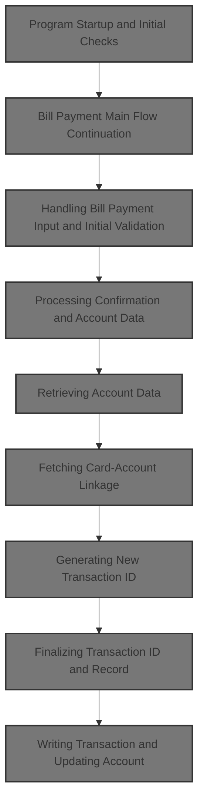
```mermaid
flowchart TD
    node1["Program Startup and Initial Checks"]:::HeadingStyle
    click node1 goToHeading "Program Startup and Initial Checks"
    node1 --> node2["Bill Payment Main Flow Continuation"]:::HeadingStyle
    click node2 goToHeading "Bill Payment Main Flow Continuation"
    node2 --> node3["Handling Bill Payment Input and Initial Validation"]:::HeadingStyle
    click node3 goToHeading "Handling Bill Payment Input and Initial Validation"
    node3 --> node4["Processing Confirmation and Account Data"]:::HeadingStyle
    click node4 goToHeading "Processing Confirmation and Account Data"
    node4 --> node5["Retrieving Account Data"]:::HeadingStyle
    click node5 goToHeading "Retrieving Account Data"
    node5 --> node6["Fetching Card-Account Linkage"]:::HeadingStyle
    click node6 goToHeading "Fetching Card-Account Linkage"
    node6 --> node7["Generating New Transaction ID"]:::HeadingStyle
    click node7 goToHeading "Generating New Transaction ID"
    node7 --> node8["Finalizing Transaction ID and Record"]:::HeadingStyle
    click node8 goToHeading "Finalizing Transaction ID and Record"
    node8 --> node9["Writing Transaction and Updating Account"]:::HeadingStyle
    click node9 goToHeading "Writing Transaction and Updating Account"
classDef HeadingStyle fill:#777777,stroke:#333,stroke-width:2px;
```

## Dependencies

### Programs

- COBIL00C (app/cbl/COBIL00C.cbl)
- CB00
- COMEN01C (app/cbl/COMEN01C.cbl)
- CM00
- COSGN00C (app/cbl/COSGN00C.cbl)
- CDEMO-FROM-PROGRAM

### Copybooks

- COCOM01Y (app/cpy/COCOM01Y.cpy)
- COMEN02Y (app/cpy/COMEN02Y.cpy)
- COMEN01 (app/cpy-bms/COMEN01.CPY)
- COTTL01Y (app/cpy/COTTL01Y.cpy)
- CSDAT01Y (app/cpy/CSDAT01Y.cpy)
- CSMSG01Y (app/cpy/CSMSG01Y.cpy)
- CSUSR01Y (app/cpy/CSUSR01Y.cpy)
- DFHAID
- DFHBMSCA
- COBIL00 (app/cpy-bms/COBIL00.CPY)
- CVACT01Y (app/cpy/CVACT01Y.cpy)
- CVACT03Y (app/cpy/CVACT03Y.cpy)
- CVTRA05Y (app/cpy/CVTRA05Y.cpy)

## Input and Output Tables/Files used in the Program

| Table / File Name | Type | Description                                                   | Usage Mode   | Key Fields / Layout Highlights |
| ----------------- | ---- | ------------------------------------------------------------- | ------------ | ------------------------------ |
| WS-ACCTDAT-FILE   | File | Account details: balance, status, limits, dates.              | Input/Output | File resource                  |
| WS-CXACAIX-FILE   | File | Card-to-account cross-reference: card, customer, account IDs. | Input        | File resource                  |
| WS-TRANSACT-FILE  | File | Transaction history: payments, merchant, amounts, timestamps. | Output       | File resource                  |

&nbsp;

# Workflow

# Program Startup and Initial Checks

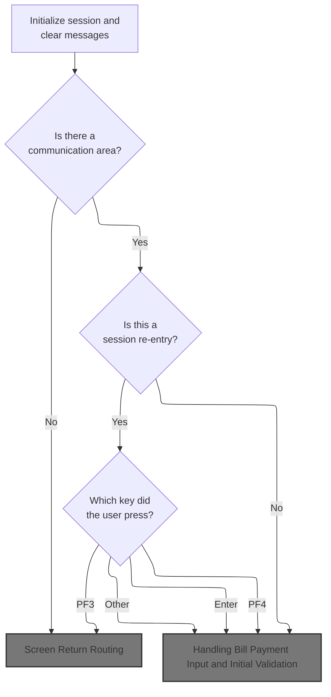
```mermaid
%%{init: {"flowchart": {"defaultRenderer": "elk"}} }%%
flowchart TD
    node1["Initialize session and 
 clear messages"]
    click node1 openCode "app/cbl/COBIL00C.cbl:99:105"
    node1 --> node2{"Is there a 
 communication area?"}
    click node2 openCode "app/cbl/COBIL00C.cbl:107:109"
    node2 -->|"No"| node3["Screen Return Routing"]
    
    node2 -->|"Yes"| node4{"Is this a 
 session re-entry?"}
    click node4 openCode "app/cbl/COBIL00C.cbl:112:113"
    node4 -->|"No"| node5["Handling Bill Payment Input and Initial Validation"]
    
    node4 -->|"Yes"| node6{"Which key did 
 the user press?"}
    click node6 openCode "app/cbl/COBIL00C.cbl:125:142"
    node6 -->|"Enter"| node5
    node6 -->|"PF3"| node3
    node6 -->|"PF4"| node5
    node6 -->|"Other"| node5

classDef HeadingStyle fill:#777777,stroke:#333,stroke-width:2px;
click node3 goToHeading "Screen Return Routing"
node3:::HeadingStyle
click node5 goToHeading "Handling Bill Payment Input and Initial Validation"
node5:::HeadingStyle
```

This section governs the startup and initial session checks for the CardDemo application, ensuring users are properly routed and session state is initialized before further processing.

| Rule ID | Code Location | Category       | Rule Name                          | Description                                                                                                                                                                                                                      | Conditions                                                                            | Remarks                                                                                                                                                                                                                                |
| ------- | ------------- | -------------- | ---------------------------------- | -------------------------------------------------------------------------------------------------------------------------------------------------------------------------------------------------------------------------------- | ------------------------------------------------------------------------------------- | -------------------------------------------------------------------------------------------------------------------------------------------------------------------------------------------------------------------------------------- |
| BR-001  | MAIN-PARA     | Business logic | Session Initialization             | At program startup, all error flags and user modification flags are reset to indicate a clean session state, and any previous messages are cleared from the message area.                                                        | Whenever the program starts (entry to MAIN-PARA).                                     | Error flag is set to 'N', user modification flag is set to 'N', and message area is set to spaces (blank). These are internal flags but their effect is to ensure the user sees no residual errors or messages from previous sessions. |
| BR-002  | MAIN-PARA     | Business logic | Signon Redirect on Missing Session | If there is no communication area present at startup, the user is redirected to the signon screen to establish a valid session.                                                                                                  | When EIBCALEN equals zero at program startup.                                         | The next program is set to 'COSGN00C' (the signon screen). This ensures that users without a valid session cannot proceed further.                                                                                                     |
| BR-003  | MAIN-PARA     | Business logic | Session Re-entry Key Routing       | When a session re-entry is detected, the program determines the next action based on which key the user pressed, routing to either the bill payment input, returning to the previous screen, or handling other keys accordingly. | When session context indicates re-entry (CDEMO-PGM-CONTEXT = 1) and a key is pressed. | Key values handled include Enter, PF3, PF4, and others. The message for invalid keys is 'Invalid key pressed. Please see below...         '.                                                                                           |

<SwmSnippet path="/app/cbl/COBIL00C.cbl" line="99" repo-id="Z2l0aHViJTNBJTNBa3luZHJ5bC1hd3MtbWFpbmZyYW1lLW1vZGVybml6YXRpb24tY2FyZGRlbW8lM0ElM0FTd2ltbS1EZW1v">

---

In `MAIN-PARA` this is where the program starts. It resets error and user-modified flags, clears the message area, and checks if EIBCALEN is zero. If so, it sets up to jump to the signon screen. Otherwise, it prepares to process user input or continue the flow based on the communication area.

```cobol
       MAIN-PARA.

           SET ERR-FLG-OFF     TO TRUE
           SET USR-MODIFIED-NO TO TRUE

           MOVE SPACES TO WS-MESSAGE
                          ERRMSGO OF COBIL0AO
```

---

</SwmSnippet>

<SwmSnippet path="/app/cbl/COBIL00C.cbl" line="107" repo-id="Z2l0aHViJTNBJTNBa3luZHJ5bC1hd3MtbWFpbmZyYW1lLW1vZGVybml6YXRpb24tY2FyZGRlbW8lM0ElM0FTd2ltbS1EZW1v">

---

If EIBCALEN is zero, we set the next program to 'COSGN00C' and call RETURN-TO-PREV-SCREEN. This hands off control to the signon screen, so the user is redirected there when there's no input data.

```cobol
           IF EIBCALEN = 0
               MOVE 'COSGN00C' TO CDEMO-TO-PROGRAM
               PERFORM RETURN-TO-PREV-SCREEN
```

---

</SwmSnippet>

## Screen Return Routing

This section manages the logic for returning the user to a previous screen, ensuring there is always a valid navigation target and that the correct context is passed to the next program.

| Rule ID | Code Location         | Category       | Rule Name                          | Description                                                                                                                                                                                                                                        | Conditions                                                                 | Remarks                                                                                                                                                                                      |
| ------- | --------------------- | -------------- | ---------------------------------- | -------------------------------------------------------------------------------------------------------------------------------------------------------------------------------------------------------------------------------------------------- | -------------------------------------------------------------------------- | -------------------------------------------------------------------------------------------------------------------------------------------------------------------------------------------- |
| BR-001  | RETURN-TO-PREV-SCREEN | Business logic | Default to Signon Screen           | If the target program is not set (i.e., it contains only low values or spaces), the system defaults the target program to the signon screen. This ensures that the user is always routed to a valid screen and avoids navigation dead ends.        | The target program field is either all low values or all spaces.           | The default target program is 'COSGN00C', which is an 8-character alphanumeric string. The check for unset is performed against both low values and spaces.                                  |
| BR-002  | RETURN-TO-PREV-SCREEN | Business logic | Update Communication Context       | Before transferring control to the target program, the system updates the communication area with the current program and transaction identifiers. This ensures that the next program has the correct context about where the user is coming from. | Whenever a screen return is being processed.                               | The program identifier is an 8-character alphanumeric string ('COBIL00C'), and the transaction identifier is a 4-character alphanumeric string ('CB00'). The program context is set to zero. |
| BR-003  | RETURN-TO-PREV-SCREEN | Technical step | Transfer Control to Target Program | The system transfers control to the target program, passing the updated communication area. This action hands off user control and context to the next program, ensuring seamless navigation.                                                      | After the communication area is updated and a valid target program is set. | The transfer is performed using XCTL, which does not return control to the current program. The communication area is passed as a parameter.                                                 |

<SwmSnippet path="/app/cbl/COBIL00C.cbl" line="273" repo-id="Z2l0aHViJTNBJTNBa3luZHJ5bC1hd3MtbWFpbmZyYW1lLW1vZGVybml6YXRpb24tY2FyZGRlbW8lM0ElM0FTd2ltbS1EZW1v">

---

In `RETURN-TO-PREV-SCREEN` we check if the target program is set. If not, we default to the signon screen. This makes sure the user always has somewhere to go back to, avoiding dead ends.

```cobol
       RETURN-TO-PREV-SCREEN.

           IF CDEMO-TO-PROGRAM = LOW-VALUES OR SPACES
               MOVE 'COSGN00C' TO CDEMO-TO-PROGRAM
           END-IF
```

---

</SwmSnippet>

<SwmSnippet path="/app/cbl/COBIL00C.cbl" line="278" repo-id="Z2l0aHViJTNBJTNBa3luZHJ5bC1hd3MtbWFpbmZyYW1lLW1vZGVybml6YXRpb24tY2FyZGRlbW8lM0ElM0FTd2ltbS1EZW1v">

---

After setting up the communication area, we use XCTL to transfer control to the target program. This hands off everything and doesn't return, so the next program (like the signon or menu) takes over.

```cobol
           MOVE WS-TRANID    TO CDEMO-FROM-TRANID
           MOVE WS-PGMNAME   TO CDEMO-FROM-PROGRAM
           MOVE ZEROS        TO CDEMO-PGM-CONTEXT
           EXEC CICS
               XCTL PROGRAM(CDEMO-TO-PROGRAM)
               COMMAREA(CARDDEMO-COMMAREA)
           END-EXEC.
```

---

</SwmSnippet>

## Menu Entry and User Routing

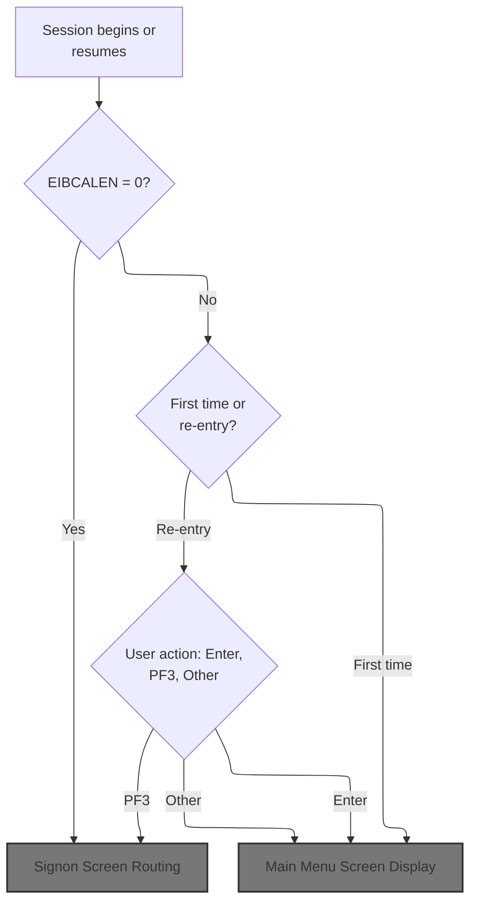
```mermaid
%%{init: {"flowchart": {"defaultRenderer": "elk"}} }%%
flowchart TD
    node1["Session begins or 
 resumes"]
    click node1 openCode "app/cbl/COMEN01C.cbl:75:106"
    node1 --> node2{"EIBCALEN = 0?"}
    click node2 openCode "app/cbl/COMEN01C.cbl:82:85"
    node2 -->|"Yes"| node3["Signon Screen Routing"]
    
    node2 -->|"No"| node4{"First time or 
 re-entry?"}
    click node4 openCode "app/cbl/COMEN01C.cbl:87:104"
    node4 -->|"First time"| node5["Main Menu Screen Display"]
    
    node4 -->|"Re-entry"| node6{"User action: Enter, 
 PF3, Other"}
    click node6 openCode "app/cbl/COMEN01C.cbl:93:103"
    node6 -->|"Enter"| node5
    node6 -->|"PF3"| node3
    node6 -->|"Other"| node5
classDef HeadingStyle fill:#777777,stroke:#333,stroke-width:2px;
click node3 goToHeading "Signon Screen Routing"
node3:::HeadingStyle
click node5 goToHeading "Main Menu Screen Display"
node5:::HeadingStyle
click node3 goToHeading "Signon Screen Routing"
node3:::HeadingStyle
click node5 goToHeading "Main Menu Screen Display"
node5:::HeadingStyle
```

This section manages user routing between the signon screen and main menu, handling session initialization, menu display, and user input actions to control navigation and error messaging.

| Rule ID | Code Location | Category        | Rule Name                      | Description                                                                                                                                                                                                                   | Conditions                                               | Remarks                                                                                                                                                                                            |
| ------- | ------------- | --------------- | ------------------------------ | ----------------------------------------------------------------------------------------------------------------------------------------------------------------------------------------------------------------------------- | -------------------------------------------------------- | -------------------------------------------------------------------------------------------------------------------------------------------------------------------------------------------------- |
| BR-001  | MAIN-PARA     | Data validation | Menu State Initialization      | At the start of the main paragraph, the error flag is reset to 'N' and all messages are cleared to ensure a clean state for each menu interaction.                                                                            | Each time MAIN-PARA is entered.                          | Error flag is set to 'N' (string, 1 character). Message fields are cleared to spaces.                                                                                                              |
| BR-002  | MAIN-PARA     | Business logic  | Session Initialization Routing | If the session length is zero, the user is routed to the signon screen and the originating program name is set to 'COSGN00C (Signon Screen Handling)'.                                                                        | Session length (EIBCALEN) is zero.                       | The originating program name is set to 'COSGN00C' (string, 8 characters). This triggers routing to the signon screen.                                                                              |
| BR-003  | MAIN-PARA     | Business logic  | First Entry Menu Display       | If this is the user's first entry (not a re-entry), the menu screen is displayed after clearing the output area and setting the re-entry flag.                                                                                | Session length is not zero and re-entry flag is not set. | The output area is cleared to low-values (binary zeroes), and the re-entry flag is set to true (CDEMO-PGM-CONTEXT = 1).                                                                            |
| BR-004  | MAIN-PARA     | Business logic  | Menu Action Routing            | When the user is re-entering, the system processes the menu screen and routes based on the user's action: Enter displays the menu, PF3 routes to signon, and any other key triggers an error message and redisplays the menu. | Session length is not zero and re-entry flag is set.     | PF3 sets the next program to 'COSGN00C' (string, 8 characters). Invalid keys set the error flag to 'Y' and display the message 'Invalid key pressed. Please see below...' (string, 50 characters). |
| BR-005  | MAIN-PARA     | Error handling  | Invalid Key Error Handling     | If the user presses a key other than Enter or PF3 on the menu screen, an error flag is set and the message 'Invalid key pressed. Please see below...' is displayed.                                                           | User action is not Enter or PF3 during menu re-entry.    | Error flag is set to 'Y' (string, 1 character). Error message is 'Invalid key pressed. Please see below...' (string, 50 characters).                                                               |

<SwmSnippet path="/app/cbl/COMEN01C.cbl" line="75" repo-id="Z2l0aHViJTNBJTNBa3luZHJ5bC1hd3MtbWFpbmZyYW1lLW1vZGVybml6YXRpb24tY2FyZGRlbW8lM0ElM0FTd2ltbS1EZW1v">

---

`MAIN-PARA` in COMEN01C.cbl checks if this is a first entry or a re-entry. If first entry, it sets up to return to signon. If not, it processes the communication area, handles the menu screen, and routes based on user actions (enter, PF3, or invalid key).

```cobol
       MAIN-PARA.

           SET ERR-FLG-OFF TO TRUE

           MOVE SPACES TO WS-MESSAGE
                          ERRMSGO OF COMEN1AO

           IF EIBCALEN = 0
               MOVE 'COSGN00C' TO CDEMO-FROM-PROGRAM
               PERFORM RETURN-TO-SIGNON-SCREEN
           ELSE
               MOVE DFHCOMMAREA(1:EIBCALEN) TO CARDDEMO-COMMAREA
               IF NOT CDEMO-PGM-REENTER
                   SET CDEMO-PGM-REENTER    TO TRUE
                   MOVE LOW-VALUES          TO COMEN1AO
                   PERFORM SEND-MENU-SCREEN
               ELSE
                   PERFORM RECEIVE-MENU-SCREEN
                   EVALUATE EIBAID
                       WHEN DFHENTER
                           PERFORM PROCESS-ENTER-KEY
                       WHEN DFHPF3
                           MOVE 'COSGN00C' TO CDEMO-TO-PROGRAM
                           PERFORM RETURN-TO-SIGNON-SCREEN
                       WHEN OTHER
                           MOVE 'Y'                       TO WS-ERR-FLG
                           MOVE CCDA-MSG-INVALID-KEY      TO WS-MESSAGE
                           PERFORM SEND-MENU-SCREEN
                   END-EVALUATE
               END-IF
           END-IF

           EXEC CICS RETURN
                     TRANSID (WS-TRANID)
                     COMMAREA (CARDDEMO-COMMAREA)
           END-EXEC.
```

---

</SwmSnippet>

### Signon Screen Routing

This section ensures that users are always routed to a valid screen in the CardDemo application by defaulting to the signon handler if no target program is specified and transferring control to the appropriate program.

| Rule ID | Code Location           | Category       | Rule Name                  | Description                                                                                                   | Conditions                                                         | Remarks                                                                                                                                                                  |
| ------- | ----------------------- | -------------- | -------------------------- | ------------------------------------------------------------------------------------------------------------- | ------------------------------------------------------------------ | ------------------------------------------------------------------------------------------------------------------------------------------------------------------------ |
| BR-001  | RETURN-TO-SIGNON-SCREEN | Business logic | Default to signon handler  | If the target program field is empty or contains low values, the user is routed to the signon handler screen. | The target program field is empty (spaces) or contains low values. | The signon handler program name is 'COSGN00C', which is an 8-character alphanumeric string. The target program field must be set to this value if it is not already set. |
| BR-002  | RETURN-TO-SIGNON-SCREEN | Business logic | Route to specified program | The user is always routed to the program specified in the target program field, regardless of how it was set. | The target program field contains a valid program name.            | The program name must be an 8-character alphanumeric string. The routing is performed regardless of how the field was set (either by default or explicitly).             |

<SwmSnippet path="/app/cbl/COMEN01C.cbl" line="170" repo-id="Z2l0aHViJTNBJTNBa3luZHJ5bC1hd3MtbWFpbmZyYW1lLW1vZGVybml6YXRpb24tY2FyZGRlbW8lM0ElM0FTd2ltbS1EZW1v">

---

`RETURN-TO-SIGNON-SCREEN` checks if the target program is set. If not, it defaults to the signon handler and uses XCTL to transfer control there, so the user always lands on a valid screen.

```cobol
       RETURN-TO-SIGNON-SCREEN.

           IF CDEMO-TO-PROGRAM = LOW-VALUES OR SPACES
               MOVE 'COSGN00C' TO CDEMO-TO-PROGRAM
           END-IF
           EXEC CICS
               XCTL PROGRAM(CDEMO-TO-PROGRAM)
           END-EXEC.
```

---

</SwmSnippet>

### Signon Screen Main Logic

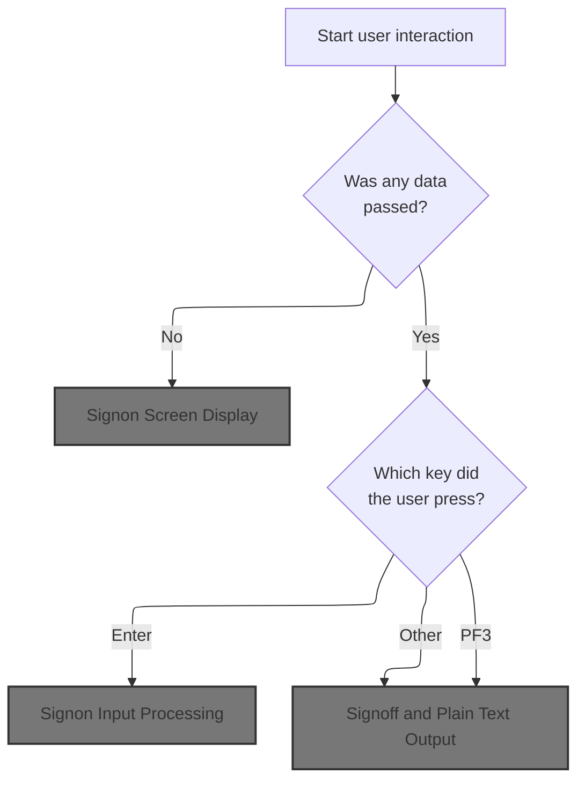
```mermaid
%%{init: {"flowchart": {"defaultRenderer": "elk"}} }%%
flowchart TD
  node1["Start user interaction"]
  click node1 openCode "app/cbl/COSGN00C.cbl:73:74"
  node1 --> node2{"Was any data 
 passed?"}
  click node2 openCode "app/cbl/COSGN00C.cbl:80:96"
  node2 -->|"No"| node3["Signon Screen Display"]
  
  node2 -->|"Yes"| node4{"Which key did 
 the user press?"}
  click node4 openCode "app/cbl/COSGN00C.cbl:85:95"
  node4 -->|"Enter"| node5["Signon Input Processing"]
  
  node4 -->|"PF3"| node6["Signoff and Plain Text Output"]
  
  node4 -->|"Other"| node6

classDef HeadingStyle fill:#777777,stroke:#333,stroke-width:2px;
click node3 goToHeading "Signon Screen Display"
node3:::HeadingStyle
click node5 goToHeading "Signon Input Processing"
node5:::HeadingStyle
click node6 goToHeading "Signoff and Plain Text Output"
node6:::HeadingStyle
```

This section manages the main user interaction flow for the signon screen, determining which screen or message to display based on user input and key presses.

| Rule ID | Code Location | Category       | Rule Name                     | Description                                                                                                                                                 | Conditions                                                         | Remarks                                                                                                                                                                                                                                     |
| ------- | ------------- | -------------- | ----------------------------- | ----------------------------------------------------------------------------------------------------------------------------------------------------------- | ------------------------------------------------------------------ | ------------------------------------------------------------------------------------------------------------------------------------------------------------------------------------------------------------------------------------------- |
| BR-001  | MAIN-PARA     | Business logic | Initial signon screen display | When no user data is passed to the signon screen, the system clears the signon area and displays the signon screen for the user to enter credentials.       | No user data is passed (input length is zero).                     | The signon area is cleared and the signon screen is displayed. The output format is the full signon screen, with all fields reset to their initial state. No error message is shown.                                                        |
| BR-002  | MAIN-PARA     | Business logic | Signon input processing       | When the user presses the Enter key, the system processes the signon input, which includes validating credentials and routing the user accordingly.         | User data is present and the Enter key is pressed.                 | The system processes the entered credentials. The output may be a successful signon, an error message, or further routing, depending on the validation outcome. The format of the output is determined by the result of the signon process. |
| BR-003  | MAIN-PARA     | Business logic | Signoff and thank you message | When the user presses the PF3 key, the system displays a thank you message and initiates signoff.                                                           | User data is present and the PF3 key is pressed.                   | The thank you message is 'Thank you for using CardDemo application...      ' (50 characters, left aligned, padded with spaces). The output is plain text.                                                                                   |
| BR-004  | MAIN-PARA     | Error handling | Invalid key error handling    | When the user presses any key other than Enter or PF3, the system displays an invalid key message and redisplays the signon screen, setting the error flag. | User data is present and a key other than Enter or PF3 is pressed. | The invalid key message is 'Invalid key pressed. Please see below...         ' (50 characters, left aligned, padded with spaces). The error flag is set to 'Y'. The signon screen is redisplayed with the error message.                    |

<SwmSnippet path="/app/cbl/COSGN00C.cbl" line="73" repo-id="Z2l0aHViJTNBJTNBa3luZHJ5bC1hd3MtbWFpbmZyYW1lLW1vZGVybml6YXRpb24tY2FyZGRlbW8lM0ElM0FTd2ltbS1EZW1v">

---

`MAIN-PARA` in COSGN00C.cbl handles the signon screen. On first entry, it clears the signon area and shows the screen. On input, it routes based on the key pressed: Enter processes signon, PF3 shows a thank you, anything else shows an invalid key message and redisplays the screen.

```cobol
       MAIN-PARA.

           SET ERR-FLG-OFF TO TRUE

           MOVE SPACES TO WS-MESSAGE
                          ERRMSGO OF COSGN0AO

           IF EIBCALEN = 0
               MOVE LOW-VALUES TO COSGN0AO
               MOVE -1       TO USERIDL OF COSGN0AI
               PERFORM SEND-SIGNON-SCREEN
           ELSE
               EVALUATE EIBAID
                   WHEN DFHENTER
                       PERFORM PROCESS-ENTER-KEY
                   WHEN DFHPF3
                       MOVE CCDA-MSG-THANK-YOU        TO WS-MESSAGE
                       PERFORM SEND-PLAIN-TEXT
                   WHEN OTHER
                       MOVE 'Y'                       TO WS-ERR-FLG
                       MOVE CCDA-MSG-INVALID-KEY      TO WS-MESSAGE
                       PERFORM SEND-SIGNON-SCREEN
               END-EVALUATE
           END-IF.

           EXEC CICS RETURN
                     TRANSID (WS-TRANID)
                     COMMAREA (CARDDEMO-COMMAREA)
                     LENGTH(LENGTH OF CARDDEMO-COMMAREA)
           END-EXEC.
```

---

</SwmSnippet>

#### Signon Screen Display

This section is responsible for preparing and displaying the signon screen to the user, including all relevant header information and any messages, using options that ensure a clean and interactive experience.

| Rule ID | Code Location        | Category       | Rule Name                      | Description                                                                                                                                 | Conditions                                                                                                         | Remarks                                                                                                                                                                                            |
| ------- | -------------------- | -------------- | ------------------------------ | ------------------------------------------------------------------------------------------------------------------------------------------- | ------------------------------------------------------------------------------------------------------------------ | -------------------------------------------------------------------------------------------------------------------------------------------------------------------------------------------------- |
| BR-001  | POPULATE-HEADER-INFO | Business logic | Header information display     | The signon screen must display the current date and time, program name, transaction ID, application ID, and system ID in the header fields. | Whenever the signon screen is sent to the user.                                                                    | Date is displayed in MM-DD-YY format; time is displayed in HH-MM-SS format. Program name is 8 characters, transaction ID is 4 characters, application ID and system ID are system-assigned values. |
| BR-002  | SEND-SIGNON-SCREEN   | Business logic | Message display in error field | Any message present must be displayed in the error field of the signon screen.                                                              | Whenever WS-MESSAGE contains a value (including blank), it is copied to the error field before the screen is sent. | Message field is 80 characters, left-aligned, padded with spaces if shorter.                                                                                                                       |
| BR-003  | SEND-SIGNON-SCREEN   | Business logic | Screen send options            | The signon screen must be sent to the user with ERASE and CURSOR options to ensure a clean display and allow user interaction.              | Whenever the signon screen is sent to the user.                                                                    | Screen is sent with ERASE (clears previous content) and CURSOR (positions cursor for input) options.                                                                                               |

<SwmSnippet path="/app/cbl/COSGN00C.cbl" line="145" repo-id="Z2l0aHViJTNBJTNBa3luZHJ5bC1hd3MtbWFpbmZyYW1lLW1vZGVybml6YXRpb24tY2FyZGRlbW8lM0ElM0FTd2ltbS1EZW1v">

---

`SEND-SIGNON-SCREEN` sets up the header info, copies any message to the error field, and sends the signon screen to the user with ERASE and CURSOR options.

```cobol
       SEND-SIGNON-SCREEN.

           PERFORM POPULATE-HEADER-INFO

           MOVE WS-MESSAGE TO ERRMSGO OF COSGN0AO

           EXEC CICS SEND
                     MAP('COSGN0A')
                     MAPSET('COSGN00')
                     FROM(COSGN0AO)
                     ERASE
                     CURSOR
           END-EXEC.
```

---

</SwmSnippet>

<SwmSnippet path="/app/cbl/COSGN00C.cbl" line="177" repo-id="Z2l0aHViJTNBJTNBa3luZHJ5bC1hd3MtbWFpbmZyYW1lLW1vZGVybml6YXRpb24tY2FyZGRlbW8lM0ElM0FTd2ltbS1EZW1v">

---

`POPULATE-HEADER-INFO` fills in the header fields with the current date, time, program name, transaction ID, and assigns application/system IDs for the signon screen display.

```cobol
       POPULATE-HEADER-INFO.

           MOVE FUNCTION CURRENT-DATE  TO WS-CURDATE-DATA

           MOVE CCDA-TITLE01           TO TITLE01O OF COSGN0AO
           MOVE CCDA-TITLE02           TO TITLE02O OF COSGN0AO
           MOVE WS-TRANID              TO TRNNAMEO OF COSGN0AO
           MOVE WS-PGMNAME             TO PGMNAMEO OF COSGN0AO

           MOVE WS-CURDATE-MONTH       TO WS-CURDATE-MM
           MOVE WS-CURDATE-DAY         TO WS-CURDATE-DD
           MOVE WS-CURDATE-YEAR(3:2)   TO WS-CURDATE-YY

           MOVE WS-CURDATE-MM-DD-YY    TO CURDATEO OF COSGN0AO

           MOVE WS-CURTIME-HOURS       TO WS-CURTIME-HH
           MOVE WS-CURTIME-MINUTE      TO WS-CURTIME-MM
           MOVE WS-CURTIME-SECOND      TO WS-CURTIME-SS

           MOVE WS-CURTIME-HH-MM-SS    TO CURTIMEO OF COSGN0AO

           EXEC CICS ASSIGN
               APPLID(APPLIDO OF COSGN0AO)
           END-EXEC

           EXEC CICS ASSIGN
               SYSID(SYSIDO OF COSGN0AO)
           END-EXEC.
```

---

</SwmSnippet>

#### Signon Input Processing

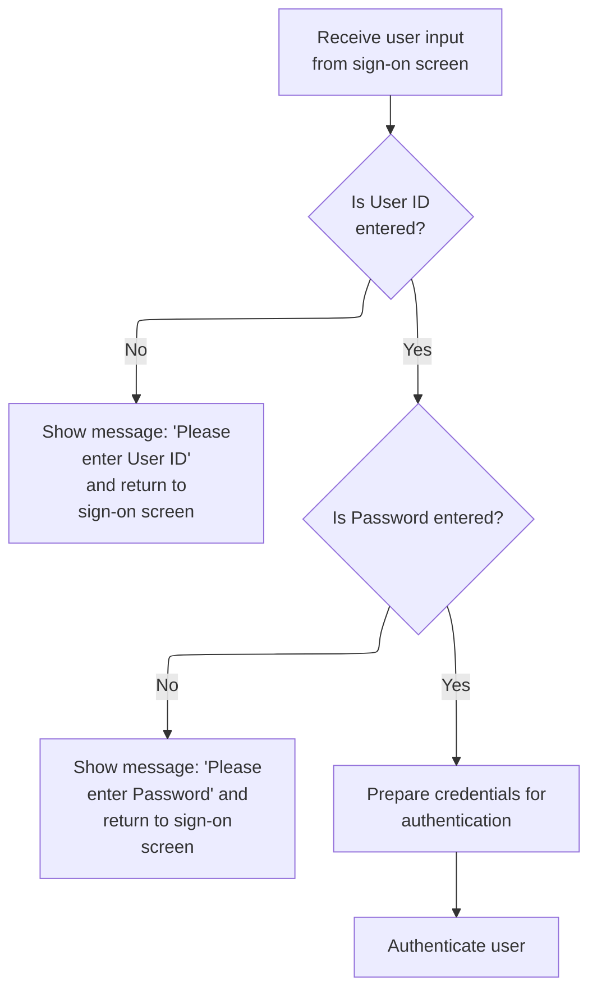
```mermaid
%%{init: {"flowchart": {"defaultRenderer": "elk"}} }%%
flowchart TD
  node1["Receive user input 
 from sign-on screen"]
  click node1 openCode "app/cbl/COSGN00C.cbl:110:115"
  node2{"Is User ID 
 entered?"}
  click node2 openCode "app/cbl/COSGN00C.cbl:117:122"
  node3["Show message: 'Please 
 enter User ID' 
 and return to 
 sign-on screen"]
  click node3 openCode "app/cbl/COSGN00C.cbl:119:122"
  node4{"Is Password entered?"}
  click node4 openCode "app/cbl/COSGN00C.cbl:123:127"
  node5["Show message: 'Please 
 enter Password' and 
 return to sign-on 
 screen"]
  click node5 openCode "app/cbl/COSGN00C.cbl:124:127"
  node6["Prepare credentials for 
 authentication"]
  click node6 openCode "app/cbl/COSGN00C.cbl:132:136"
  node7["Authenticate user"]
  click node7 openCode "app/cbl/COSGN00C.cbl:139:140"

  node1 --> node2
  node2 -- No --> node3
  node2 -- Yes --> node4
  node4 -- No --> node5
  node4 -- Yes --> node6
  node6 --> node7
classDef HeadingStyle fill:#777777,stroke:#333,stroke-width:2px;
```

This section processes user input from the sign-on screen, validates required fields, standardizes credentials, and initiates authentication if inputs are valid.

| Rule ID | Code Location     | Category        | Rule Name                  | Description                                                                                                                                                                        | Conditions                                                                                      | Remarks                                                                                                                                                                                          |
| ------- | ----------------- | --------------- | -------------------------- | ---------------------------------------------------------------------------------------------------------------------------------------------------------------------------------- | ----------------------------------------------------------------------------------------------- | ------------------------------------------------------------------------------------------------------------------------------------------------------------------------------------------------ |
| BR-001  | PROCESS-ENTER-KEY | Data validation | User ID required           | If the User ID field is empty or contains only spaces or low-values, the system must display the message 'Please enter User ID ...' and prompt the user to re-enter credentials.   | The User ID field is empty, contains only spaces, or contains only low-values.                  | The error flag is set to 'Y'. The message displayed is 'Please enter User ID ...'. The User ID input field is reset to position -1 for re-entry. The message is shown on the sign-on screen.     |
| BR-002  | PROCESS-ENTER-KEY | Data validation | Password required          | If the Password field is empty or contains only spaces or low-values, the system must display the message 'Please enter Password ...' and prompt the user to re-enter credentials. | The Password field is empty, contains only spaces, or contains only low-values.                 | The error flag is set to 'Y'. The message displayed is 'Please enter Password ...'. The Password input field is reset to position -1 for re-entry. The message is shown on the sign-on screen.   |
| BR-003  | PROCESS-ENTER-KEY | Business logic  | Credential standardization | If both User ID and Password are provided, the system must convert both fields to uppercase before initiating authentication.                                                      | Both User ID and Password fields are present and valid (not empty, not spaces, not low-values). | User ID and Password are converted to uppercase before authentication. The standardized credentials are used for authentication. The format for both fields is alphanumeric, up to 8 characters. |
| BR-004  | PROCESS-ENTER-KEY | Business logic  | Authentication trigger     | If no error flag is set after input validation, the system must initiate user authentication using the standardized credentials.                                                   | No error flag is set after input validation (error flag is 'N').                                | Authentication is initiated only if both User ID and Password are present and standardized. The credentials used are uppercase, alphanumeric, up to 8 characters.                                |

<SwmSnippet path="/app/cbl/COSGN00C.cbl" line="108" repo-id="Z2l0aHViJTNBJTNBa3luZHJ5bC1hd3MtbWFpbmZyYW1lLW1vZGVybml6YXRpb24tY2FyZGRlbW8lM0ElM0FTd2ltbS1EZW1v">

---

`PROCESS-ENTER-KEY` receives user input, checks for missing user ID or password, sets errors if needed, converts input to uppercase, and if valid, calls READ-USER-SEC-FILE for authentication.

```cobol
       PROCESS-ENTER-KEY.

           EXEC CICS RECEIVE
                     MAP('COSGN0A')
                     MAPSET('COSGN00')
                     RESP(WS-RESP-CD)
                     RESP2(WS-REAS-CD)
           END-EXEC.

           EVALUATE TRUE
               WHEN USERIDI OF COSGN0AI = SPACES OR LOW-VALUES
                   MOVE 'Y'      TO WS-ERR-FLG
                   MOVE 'Please enter User ID ...' TO WS-MESSAGE
                   MOVE -1       TO USERIDL OF COSGN0AI
                   PERFORM SEND-SIGNON-SCREEN
               WHEN PASSWDI OF COSGN0AI = SPACES OR LOW-VALUES
                   MOVE 'Y'      TO WS-ERR-FLG
                   MOVE 'Please enter Password ...' TO WS-MESSAGE
                   MOVE -1       TO PASSWDL OF COSGN0AI
                   PERFORM SEND-SIGNON-SCREEN
               WHEN OTHER
                   CONTINUE
           END-EVALUATE.

           MOVE FUNCTION UPPER-CASE(USERIDI OF COSGN0AI) TO
                           WS-USER-ID
                           CDEMO-USER-ID
           MOVE FUNCTION UPPER-CASE(PASSWDI OF COSGN0AI) TO
                           WS-USER-PWD

           IF NOT ERR-FLG-ON
               PERFORM READ-USER-SEC-FILE
           END-IF.
```

---

</SwmSnippet>

#### User Authentication and Routing

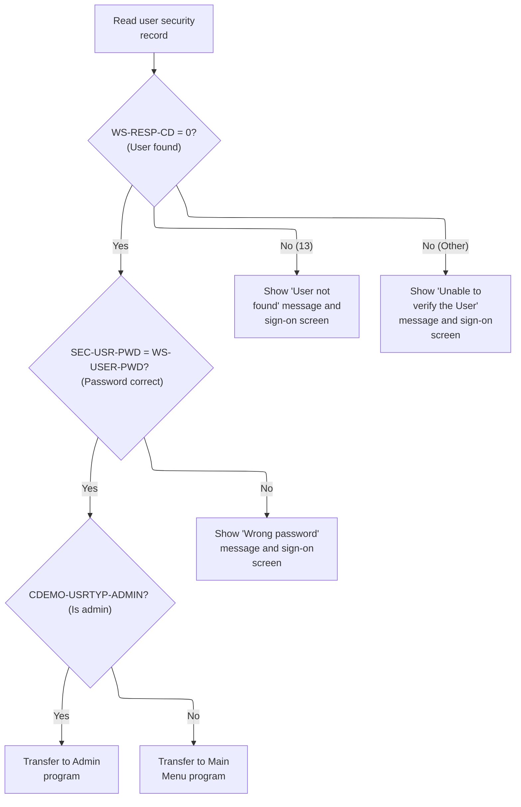
```mermaid
%%{init: {"flowchart": {"defaultRenderer": "elk"}} }%%
flowchart TD
  node1["Read user security 
 record"] --> node2{"WS-RESP-CD = 0? 
 (User found)"}
  click node1 openCode "app/cbl/COSGN00C.cbl:211:219"
  node2 -->|"Yes"| node3{"SEC-USR-PWD = WS-USER-PWD? 
 (Password correct)"}
  click node2 openCode "app/cbl/COSGN00C.cbl:221:222"
  node2 -->|"No (13)"| node6["Show 'User not 
 found' message and 
 sign-on screen"]
  click node6 openCode "app/cbl/COSGN00C.cbl:248:251"
  node2 -->|"No (Other)"| node9["Show 'Unable to 
 verify the User' 
 message and sign-on 
 screen"]
  click node9 openCode "app/cbl/COSGN00C.cbl:253:256"
  node3 -->|"Yes"| node4{"CDEMO-USRTYP-ADMIN? (Is admin)"}
  click node3 openCode "app/cbl/COSGN00C.cbl:223:224"
  node3 -->|"No"| node7["Show 'Wrong password' 
 message and sign-on 
 screen"]
  click node7 openCode "app/cbl/COSGN00C.cbl:242:245"
  node4 -->|"Yes"| node5["Transfer to Admin 
 program"]
  click node4 openCode "app/cbl/COSGN00C.cbl:230:234"
  node4 -->|"No"| node8["Transfer to Main 
 Menu program"]
  click node8 openCode "app/cbl/COSGN00C.cbl:236:239"
  click node5 openCode "app/cbl/COSGN00C.cbl:230:234"
classDef HeadingStyle fill:#777777,stroke:#333,stroke-width:2px;
```

This section authenticates users and routes them to the appropriate program based on their credentials and user type, or displays error messages if authentication fails.

| Rule ID | Code Location      | Category       | Rule Name               | Description                                                                                                                                                        | Conditions                                                                                        | Remarks                                                                                                                             |
| ------- | ------------------ | -------------- | ----------------------- | ------------------------------------------------------------------------------------------------------------------------------------------------------------------ | ------------------------------------------------------------------------------------------------- | ----------------------------------------------------------------------------------------------------------------------------------- |
| BR-001  | READ-USER-SEC-FILE | Business logic | Admin user routing      | If the user is authenticated and is an admin, transfer the user to the admin program.                                                                              | The user ID exists, the password matches, and the user type is 'A' (admin).                       | Admin user type is represented by 'A'. The user is routed to the admin program.                                                     |
| BR-002  | READ-USER-SEC-FILE | Business logic | Standard user routing   | If the user is authenticated and is not an admin, transfer the user to the main menu program.                                                                      | The user ID exists, the password matches, and the user type is not 'A'.                           | Standard user type is represented by any value other than 'A'. The user is routed to the main menu program.                         |
| BR-003  | READ-USER-SEC-FILE | Error handling | User not found error    | If the user ID does not exist in the security file, display a 'User not found. Try again ...' message and redisplay the sign-on screen.                            | The user ID provided does not match any record in the security file, and the response code is 13. | The error message is 'User not found. Try again ...'. The response code for this scenario is 13. The sign-on screen is redisplayed. |
| BR-004  | READ-USER-SEC-FILE | Error handling | Wrong password error    | If the password provided does not match the password stored for the user, display a 'Wrong Password. Try again ...' message and redisplay the sign-on screen.      | The user ID exists, but the password entered does not match the stored password.                  | The error message is 'Wrong Password. Try again ...'. The sign-on screen is redisplayed.                                            |
| BR-005  | READ-USER-SEC-FILE | Error handling | User verification error | If the user security file lookup fails for reasons other than user not found, display an 'Unable to verify the User ...' message and redisplay the sign-on screen. | The user security file lookup returns a response code other than 0 or 13.                         | The error message is 'Unable to verify the User ...'. The sign-on screen is redisplayed.                                            |

<SwmSnippet path="/app/cbl/COSGN00C.cbl" line="209" repo-id="Z2l0aHViJTNBJTNBa3luZHJ5bC1hd3MtbWFpbmZyYW1lLW1vZGVybml6YXRpb24tY2FyZGRlbW8lM0ElM0FTd2ltbS1EZW1v">

---

`READ-USER-SEC-FILE` reads user data from the security file, checks the password, and routes to the admin or main menu program based on user type. If the user isn't found or the password is wrong, it shows an error and redisplays the signon screen.

```cobol
       READ-USER-SEC-FILE.

           EXEC CICS READ
                DATASET   (WS-USRSEC-FILE)
                INTO      (SEC-USER-DATA)
                LENGTH    (LENGTH OF SEC-USER-DATA)
                RIDFLD    (WS-USER-ID)
                KEYLENGTH (LENGTH OF WS-USER-ID)
                RESP      (WS-RESP-CD)
                RESP2     (WS-REAS-CD)
           END-EXEC.

           EVALUATE WS-RESP-CD
               WHEN 0
                   IF SEC-USR-PWD = WS-USER-PWD
                       MOVE WS-TRANID    TO CDEMO-FROM-TRANID
                       MOVE WS-PGMNAME   TO CDEMO-FROM-PROGRAM
                       MOVE WS-USER-ID   TO CDEMO-USER-ID
                       MOVE SEC-USR-TYPE TO CDEMO-USER-TYPE
                       MOVE ZEROS        TO CDEMO-PGM-CONTEXT

                       IF CDEMO-USRTYP-ADMIN
                            EXEC CICS XCTL
                              PROGRAM ('COADM01C')
                              COMMAREA(CARDDEMO-COMMAREA)
                            END-EXEC
                       ELSE
                            EXEC CICS XCTL
                              PROGRAM ('COMEN01C')
                              COMMAREA(CARDDEMO-COMMAREA)
                            END-EXEC
                       END-IF
                   ELSE
                       MOVE 'Wrong Password. Try again ...' TO
                                                          WS-MESSAGE
                       MOVE -1       TO PASSWDL OF COSGN0AI
                       PERFORM SEND-SIGNON-SCREEN
                   END-IF
               WHEN 13
                   MOVE 'Y'      TO WS-ERR-FLG
                   MOVE 'User not found. Try again ...' TO WS-MESSAGE
                   MOVE -1       TO USERIDL OF COSGN0AI
                   PERFORM SEND-SIGNON-SCREEN
               WHEN OTHER
                   MOVE 'Y'      TO WS-ERR-FLG
                   MOVE 'Unable to verify the User ...' TO WS-MESSAGE
                   MOVE -1       TO USERIDL OF COSGN0AI
                   PERFORM SEND-SIGNON-SCREEN
           END-EVALUATE.
```

---

</SwmSnippet>

#### Admin Menu Entry and Routing


```mermaid
%%{init: {"flowchart": {"defaultRenderer": "elk"}} }%%
flowchart TD
    node1["Session begins or 
 resumes"]
    click node1 openCode "app/cbl/COMEN01C.cbl:75:106"
    node1 --> node2{"EIBCALEN = 0?"}
    click node2 openCode "app/cbl/COMEN01C.cbl:82:85"
    node2 -->|"Yes"| node3["Signon Screen Routing"]
    
    node2 -->|"No"| node4{"First time or 
 re-entry?"}
    click node4 openCode "app/cbl/COMEN01C.cbl:87:104"
    node4 -->|"First time"| node5["Main Menu Screen Display"]
    
    node4 -->|"Re-entry"| node6{"User action: Enter, 
 PF3, Other"}
    click node6 openCode "app/cbl/COMEN01C.cbl:93:103"
    node6 -->|"Enter"| node5
    node6 -->|"PF3"| node3
    node6 -->|"Other"| node5
classDef HeadingStyle fill:#777777,stroke:#333,stroke-width:2px;
click node3 goToHeading "Signon Screen Routing"
node3:::HeadingStyle
click node5 goToHeading "Main Menu Screen Display"
node5:::HeadingStyle
click node3 goToHeading "Signon Screen Routing"
node3:::HeadingStyle
click node5 goToHeading "Main Menu Screen Display"
node5:::HeadingStyle
```

This section manages user routing between the signon screen and main menu, handling session initialization, menu display, and user input actions to control navigation and error messaging.

| Rule ID | Code Location | Category        | Rule Name                      | Description                                                                                                                                                                                                                   | Conditions                                               | Remarks                                                                                                                                                                                            |
| ------- | ------------- | --------------- | ------------------------------ | ----------------------------------------------------------------------------------------------------------------------------------------------------------------------------------------------------------------------------- | -------------------------------------------------------- | -------------------------------------------------------------------------------------------------------------------------------------------------------------------------------------------------- |
| BR-001  | MAIN-PARA     | Data validation | Menu State Initialization      | At the start of the main paragraph, the error flag is reset to 'N' and all messages are cleared to ensure a clean state for each menu interaction.                                                                            | Each time MAIN-PARA is entered.                          | Error flag is set to 'N' (string, 1 character). Message fields are cleared to spaces.                                                                                                              |
| BR-002  | MAIN-PARA     | Business logic  | Session Initialization Routing | If the session length is zero, the user is routed to the signon screen and the originating program name is set to 'COSGN00C (Signon Screen Handling)'.                                                                        | Session length (EIBCALEN) is zero.                       | The originating program name is set to 'COSGN00C' (string, 8 characters). This triggers routing to the signon screen.                                                                              |
| BR-003  | MAIN-PARA     | Business logic  | First Entry Menu Display       | If this is the user's first entry (not a re-entry), the menu screen is displayed after clearing the output area and setting the re-entry flag.                                                                                | Session length is not zero and re-entry flag is not set. | The output area is cleared to low-values (binary zeroes), and the re-entry flag is set to true (CDEMO-PGM-CONTEXT = 1).                                                                            |
| BR-004  | MAIN-PARA     | Business logic  | Menu Action Routing            | When the user is re-entering, the system processes the menu screen and routes based on the user's action: Enter displays the menu, PF3 routes to signon, and any other key triggers an error message and redisplays the menu. | Session length is not zero and re-entry flag is set.     | PF3 sets the next program to 'COSGN00C' (string, 8 characters). Invalid keys set the error flag to 'Y' and display the message 'Invalid key pressed. Please see below...' (string, 50 characters). |
| BR-005  | MAIN-PARA     | Error handling  | Invalid Key Error Handling     | If the user presses a key other than Enter or PF3 on the menu screen, an error flag is set and the message 'Invalid key pressed. Please see below...' is displayed.                                                           | User action is not Enter or PF3 during menu re-entry.    | Error flag is set to 'Y' (string, 1 character). Error message is 'Invalid key pressed. Please see below...' (string, 50 characters).                                                               |

<SwmSnippet path="/app/cbl/COADM01C.cbl" line="75" repo-id="Z2l0aHViJTNBJTNBa3luZHJ5bC1hd3MtbWFpbmZyYW1lLW1vZGVybml6YXRpb24tY2FyZGRlbW8lM0ElM0FTd2ltbS1EZW1v">

---

`MAIN-PARA` in COADM01C.cbl checks if this is a first entry or a re-entry. If first entry, it sets up to return to signon. If not, it processes the communication area, handles the admin menu screen, and routes based on user actions (enter, PF3, or invalid key).

```cobol
       MAIN-PARA.

           SET ERR-FLG-OFF TO TRUE

           MOVE SPACES TO WS-MESSAGE
                          ERRMSGO OF COADM1AO

           IF EIBCALEN = 0
               MOVE 'COSGN00C' TO CDEMO-FROM-PROGRAM
               PERFORM RETURN-TO-SIGNON-SCREEN
           ELSE
               MOVE DFHCOMMAREA(1:EIBCALEN) TO CARDDEMO-COMMAREA
               IF NOT CDEMO-PGM-REENTER
                   SET CDEMO-PGM-REENTER    TO TRUE
                   MOVE LOW-VALUES          TO COADM1AO
                   PERFORM SEND-MENU-SCREEN
               ELSE
                   PERFORM RECEIVE-MENU-SCREEN
                   EVALUATE EIBAID
                       WHEN DFHENTER
                           PERFORM PROCESS-ENTER-KEY
                       WHEN DFHPF3
                           MOVE 'COSGN00C' TO CDEMO-TO-PROGRAM
                           PERFORM RETURN-TO-SIGNON-SCREEN
                       WHEN OTHER
                           MOVE 'Y'                       TO WS-ERR-FLG
                           MOVE CCDA-MSG-INVALID-KEY      TO WS-MESSAGE
                           PERFORM SEND-MENU-SCREEN
                   END-EVALUATE
               END-IF
           END-IF

           EXEC CICS RETURN
                     TRANSID (WS-TRANID)
                     COMMAREA (CARDDEMO-COMMAREA)
           END-EXEC.
```

---

</SwmSnippet>

<SwmSnippet path="/app/cbl/COADM01C.cbl" line="160" repo-id="Z2l0aHViJTNBJTNBa3luZHJ5bC1hd3MtbWFpbmZyYW1lLW1vZGVybml6YXRpb24tY2FyZGRlbW8lM0ElM0FTd2ltbS1EZW1v">

---

`RETURN-TO-SIGNON-SCREEN` checks if the target program is set. If not, it defaults to the signon handler and uses XCTL to transfer control there, so the user always lands on a valid screen.

```cobol
       RETURN-TO-SIGNON-SCREEN.

           IF CDEMO-TO-PROGRAM = LOW-VALUES OR SPACES
               MOVE 'COSGN00C' TO CDEMO-TO-PROGRAM
           END-IF
           EXEC CICS
               XCTL PROGRAM(CDEMO-TO-PROGRAM)
           END-EXEC.
```

---

</SwmSnippet>

##### Admin Menu Screen Display

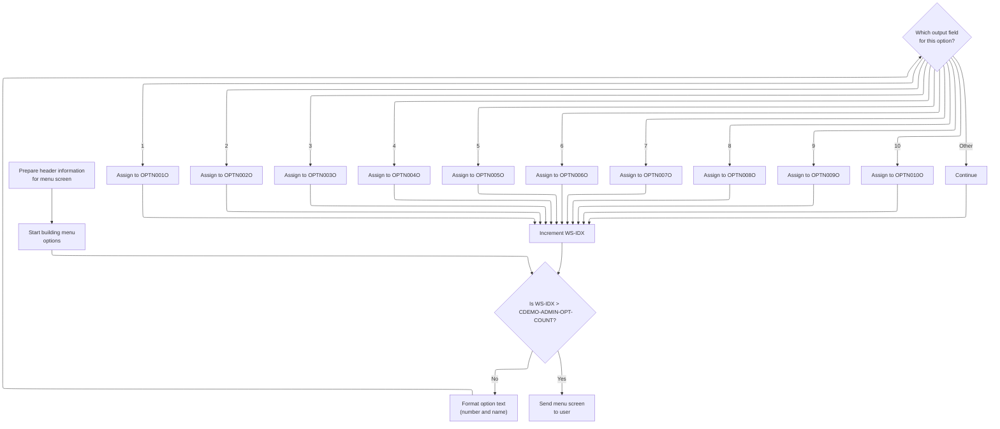
```mermaid
%%{init: {"flowchart": {"defaultRenderer": "elk"}} }%%
flowchart TD
    node1["Prepare header information 
 for menu screen"]
    click node1 openCode "app/cbl/COADM01C.cbl:202:221"
    node1 --> node2["Start building menu 
 options"]
    click node2 openCode "app/cbl/COADM01C.cbl:226:227"
    node2 --> node6{"Is WS-IDX > 
 CDEMO-ADMIN-OPT-COUNT?"}
    click node6 openCode "app/cbl/COADM01C.cbl:228:229"
    node6 -->|"No"| node3["Format option text 
 (number and name)"]
    click node3 openCode "app/cbl/COADM01C.cbl:231:236"
    node3 --> node4{"Which output field 
 for this option?"}
    click node4 openCode "app/cbl/COADM01C.cbl:238:261"
    node4 -->|"1"| node41["Assign to OPTN001O"]
    click node41 openCode "app/cbl/COADM01C.cbl:240:240"
    node4 -->|"2"| node42["Assign to OPTN002O"]
    click node42 openCode "app/cbl/COADM01C.cbl:242:242"
    node4 -->|"3"| node43["Assign to OPTN003O"]
    click node43 openCode "app/cbl/COADM01C.cbl:244:244"
    node4 -->|"4"| node44["Assign to OPTN004O"]
    click node44 openCode "app/cbl/COADM01C.cbl:246:246"
    node4 -->|"5"| node45["Assign to OPTN005O"]
    click node45 openCode "app/cbl/COADM01C.cbl:248:248"
    node4 -->|"6"| node46["Assign to OPTN006O"]
    click node46 openCode "app/cbl/COADM01C.cbl:250:250"
    node4 -->|"7"| node47["Assign to OPTN007O"]
    click node47 openCode "app/cbl/COADM01C.cbl:252:252"
    node4 -->|"8"| node48["Assign to OPTN008O"]
    click node48 openCode "app/cbl/COADM01C.cbl:254:254"
    node4 -->|"9"| node49["Assign to OPTN009O"]
    click node49 openCode "app/cbl/COADM01C.cbl:256:256"
    node4 -->|"10"| node410["Assign to OPTN010O"]
    click node410 openCode "app/cbl/COADM01C.cbl:258:258"
    node4 -->|"Other"| node411["Continue"]
    click node411 openCode "app/cbl/COADM01C.cbl:260:260"
    node41 --> node5["Increment WS-IDX"]
    node42 --> node5
    node43 --> node5
    node44 --> node5
    node45 --> node5
    node46 --> node5
    node47 --> node5
    node48 --> node5
    node49 --> node5
    node410 --> node5
    node411 --> node5
    click node5 openCode "app/cbl/COADM01C.cbl:263:263"
    node5 --> node6
    node6 -->|"Yes"| node7["Send menu screen 
 to user"]
    click node7 openCode "app/cbl/COADM01C.cbl:177:184"

classDef HeadingStyle fill:#777777,stroke:#333,stroke-width:2px;
```

This section prepares and displays the Admin Menu Screen, presenting header information, a list of admin menu options, and any message to the user.

| Rule ID | Code Location        | Category       | Rule Name                 | Description                                                                                                                                                 | Conditions                                                      | Remarks                                                                                                                                                                                |
| ------- | -------------------- | -------------- | ------------------------- | ----------------------------------------------------------------------------------------------------------------------------------------------------------- | --------------------------------------------------------------- | -------------------------------------------------------------------------------------------------------------------------------------------------------------------------------------- |
| BR-001  | POPULATE-HEADER-INFO | Business logic | Header composition        | The admin menu screen header must display the current date, current time, program name, transaction ID, and static titles.                                  | Whenever the admin menu screen is displayed.                    | Date and time are formatted as MM-DD-YY and HH-MM-SS respectively. Program name is 'COADM01C'. Transaction ID is 'CA00'. Titles are static strings from CCDA-TITLE01 and CCDA-TITLE02. |
| BR-002  | BUILD-MENU-OPTIONS   | Business logic | Menu option formatting    | Each admin menu option must be displayed as a formatted string consisting of its number, a period, a space, and its name (e.g., '1. User List (Security)'). | For each admin menu option up to the maximum count.             | Option text format: '<number>. <name>' as a string, maximum length 40 characters. Up to 10 options are supported.                                                                      |
| BR-003  | BUILD-MENU-OPTIONS   | Business logic | Menu option field mapping | Each formatted menu option must be assigned to its corresponding output field, with options 1-10 mapped to OPTN001O through OPTN010O respectively.          | For each menu option index from 1 to 10.                        | Options are mapped to output fields OPTN001O to OPTN010O. If more than 10 options exist, additional options are ignored in this section.                                               |
| BR-004  | SEND-MENU-SCREEN     | Business logic | Message display           | Any message present must be copied to the error message field on the admin menu screen for display to the user.                                             | Whenever WS-MESSAGE contains a value.                           | Message field is 80 characters. If WS-MESSAGE is blank, the error field will be blank.                                                                                                 |
| BR-005  | SEND-MENU-SCREEN     | Business logic | Screen output             | The admin menu screen, including header, menu options, and message, must be sent to the user using the CICS SEND MAP operation.                             | After header and menu options are populated and message is set. | Screen is sent using MAP 'COADM1A' and MAPSET 'COADM01'. The output includes all populated fields.                                                                                     |

<SwmSnippet path="/app/cbl/COADM01C.cbl" line="172" repo-id="Z2l0aHViJTNBJTNBa3luZHJ5bC1hd3MtbWFpbmZyYW1lLW1vZGVybml6YXRpb24tY2FyZGRlbW8lM0ElM0FTd2ltbS1EZW1v">

---

`SEND-MENU-SCREEN` sets up the header, builds the list of admin menu options, copies any message to the error field, and sends the admin menu screen to the user.

```cobol
       SEND-MENU-SCREEN.

           PERFORM POPULATE-HEADER-INFO
           PERFORM BUILD-MENU-OPTIONS

           MOVE WS-MESSAGE TO ERRMSGO OF COADM1AO

           EXEC CICS SEND
                     MAP('COADM1A')
                     MAPSET('COADM01')
                     FROM(COADM1AO)
                     ERASE
           END-EXEC.
```

---

</SwmSnippet>

<SwmSnippet path="/app/cbl/COADM01C.cbl" line="202" repo-id="Z2l0aHViJTNBJTNBa3luZHJ5bC1hd3MtbWFpbmZyYW1lLW1vZGVybml6YXRpb24tY2FyZGRlbW8lM0ElM0FTd2ltbS1EZW1v">

---

`POPULATE-HEADER-INFO` fills in the admin menu header with the current date, time, program name, transaction ID, and static titles for display.

```cobol
       POPULATE-HEADER-INFO.

           MOVE FUNCTION CURRENT-DATE  TO WS-CURDATE-DATA

           MOVE CCDA-TITLE01           TO TITLE01O OF COADM1AO
           MOVE CCDA-TITLE02           TO TITLE02O OF COADM1AO
           MOVE WS-TRANID              TO TRNNAMEO OF COADM1AO
           MOVE WS-PGMNAME             TO PGMNAMEO OF COADM1AO

           MOVE WS-CURDATE-MONTH       TO WS-CURDATE-MM
           MOVE WS-CURDATE-DAY         TO WS-CURDATE-DD
           MOVE WS-CURDATE-YEAR(3:2)   TO WS-CURDATE-YY

           MOVE WS-CURDATE-MM-DD-YY    TO CURDATEO OF COADM1AO

           MOVE WS-CURTIME-HOURS       TO WS-CURTIME-HH
           MOVE WS-CURTIME-MINUTE      TO WS-CURTIME-MM
           MOVE WS-CURTIME-SECOND      TO WS-CURTIME-SS

           MOVE WS-CURTIME-HH-MM-SS    TO CURTIMEO OF COADM1AO.
```

---

</SwmSnippet>

<SwmSnippet path="/app/cbl/COADM01C.cbl" line="226" repo-id="Z2l0aHViJTNBJTNBa3luZHJ5bC1hd3MtbWFpbmZyYW1lLW1vZGVybml6YXRpb24tY2FyZGRlbW8lM0ElM0FTd2ltbS1EZW1v">

---

`BUILD-MENU-OPTIONS` loops through the admin options, builds formatted strings like '1. User List (Security)', and assigns them to the output fields for display.

```cobol
       BUILD-MENU-OPTIONS.

           PERFORM VARYING WS-IDX FROM 1 BY 1 UNTIL
                           WS-IDX > CDEMO-ADMIN-OPT-COUNT

               MOVE SPACES             TO WS-ADMIN-OPT-TXT

               STRING CDEMO-ADMIN-OPT-NUM(WS-IDX)  DELIMITED BY SIZE
                      '. '                         DELIMITED BY SIZE
                      CDEMO-ADMIN-OPT-NAME(WS-IDX) DELIMITED BY SIZE
                 INTO WS-ADMIN-OPT-TXT

               EVALUATE WS-IDX
                   WHEN 1
                       MOVE WS-ADMIN-OPT-TXT TO OPTN001O
                   WHEN 2
                       MOVE WS-ADMIN-OPT-TXT TO OPTN002O
                   WHEN 3
                       MOVE WS-ADMIN-OPT-TXT TO OPTN003O
                   WHEN 4
                       MOVE WS-ADMIN-OPT-TXT TO OPTN004O
                   WHEN 5
                       MOVE WS-ADMIN-OPT-TXT TO OPTN005O
                   WHEN 6
                       MOVE WS-ADMIN-OPT-TXT TO OPTN006O
                   WHEN 7
                       MOVE WS-ADMIN-OPT-TXT TO OPTN007O
                   WHEN 8
                       MOVE WS-ADMIN-OPT-TXT TO OPTN008O
                   WHEN 9
                       MOVE WS-ADMIN-OPT-TXT TO OPTN009O
                   WHEN 10
                       MOVE WS-ADMIN-OPT-TXT TO OPTN010O
                   WHEN OTHER
                       CONTINUE
               END-EVALUATE

           END-PERFORM.
```

---

</SwmSnippet>

##### Admin Menu Input Handling

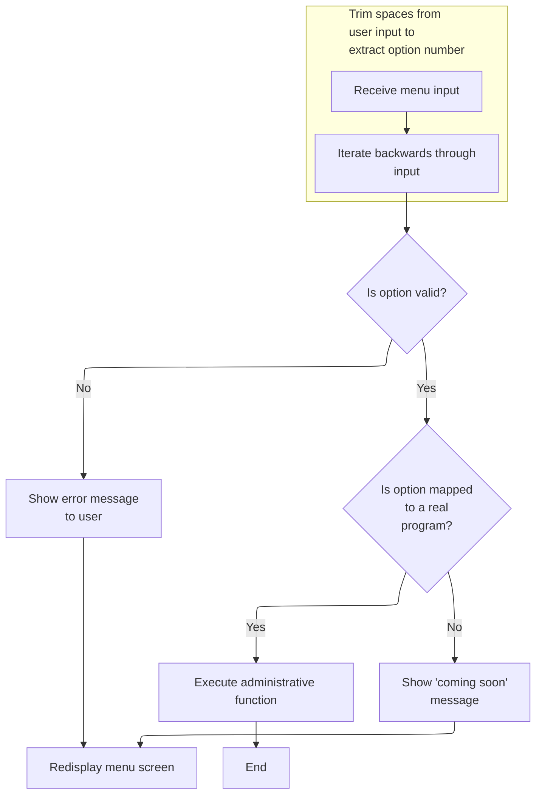
```mermaid
%%{init: {"flowchart": {"defaultRenderer": "elk"}} }%%
flowchart TD
    node1["Receive menu input"]
    click node1 openCode "app/cbl/COADM01C.cbl:191:197"
    subgraph loop1["Trim spaces from 
 user input to 
 extract option number"]
        node1 --> node2["Iterate backwards through 
 input"]
        click node2 openCode "app/cbl/COADM01C.cbl:117:121"
    end
    node2 --> node3{"Is option valid?"}
    click node3 openCode "app/cbl/COADM01C.cbl:127:130"
    node3 -->|"No"| node4["Show error message 
 to user"]
    click node4 openCode "app/cbl/COADM01C.cbl:131:134"
    node4 --> node8["Redisplay menu screen"]
    click node8 openCode "app/cbl/COADM01C.cbl:134:134"
    node3 -->|"Yes"| node5{"Is option mapped 
 to a real 
 program?"}
    click node5 openCode "app/cbl/COADM01C.cbl:138:146"
    node5 -->|"Yes"| node6["Execute administrative function"]
    click node6 openCode "app/cbl/COADM01C.cbl:142:145"
    node6 --> node9["End"]
    node5 -->|"No"| node7["Show 'coming soon' 
 message"]
    click node7 openCode "app/cbl/COADM01C.cbl:147:154"
    node7 --> node8
classDef HeadingStyle fill:#777777,stroke:#333,stroke-width:2px;
```

This section manages the handling of user input from the admin menu, ensuring that selections are validated, appropriate feedback is provided, and administrative functions are executed or announced as coming soon.

| Rule ID | Code Location     | Category        | Rule Name                   | Description                                                                                                                                                                 | Conditions                                                                                                                      | Remarks                                                                                                                                                                                                                                                |
| ------- | ----------------- | --------------- | --------------------------- | --------------------------------------------------------------------------------------------------------------------------------------------------------------------------- | ------------------------------------------------------------------------------------------------------------------------------- | ------------------------------------------------------------------------------------------------------------------------------------------------------------------------------------------------------------------------------------------------------ |
| BR-001  | PROCESS-ENTER-KEY | Data validation | Invalid option error        | If the user's menu selection is not a valid number, is zero, or exceeds the maximum allowed option count, an error message is displayed and the menu screen is redisplayed. | The user's input is not numeric, is zero, or is greater than the maximum allowed option count.                                  | The maximum allowed option count is defined by the constant CDEMO-ADMIN-OPT-COUNT. The error message displayed is 'Please enter a valid option number...'. The message is shown in a string format, left-aligned, and padded to fit the message field. |
| BR-002  | PROCESS-ENTER-KEY | Data validation | Input normalization         | User input is trimmed of trailing spaces and left-padded with zeros before validation and processing.                                                                       | Whenever a user enters an option number in the admin menu.                                                                      | Trailing spaces are removed from the input, and any remaining spaces are replaced with zeros. The normalized input is then used for validation and further processing. The final format is a two-digit string, right-aligned, with zeros as needed.    |
| BR-003  | PROCESS-ENTER-KEY | Business logic  | Mapped option execution     | If the user's menu selection corresponds to a mapped administrative function, the selected function is executed and control is transferred to the corresponding program.    | The user's input is a valid option number and the option is mapped to a real administrative program (not a placeholder).        | The mapping is determined by checking if the program name for the selected option does not start with 'DUMMY'. The function is executed by transferring control to the mapped program.                                                                 |
| BR-004  | PROCESS-ENTER-KEY | Business logic  | Placeholder option feedback | If the user's menu selection is valid but mapped to a placeholder (not yet implemented), a 'coming soon' message is displayed and the menu screen is redisplayed.           | The user's input is a valid option number but the option is mapped to a placeholder program (program name starts with 'DUMMY'). | The message displayed is 'This option is coming soon ...'. The message is constructed as a string and shown in the message field, left-aligned and padded as needed.                                                                                   |

<SwmSnippet path="/app/cbl/COADM01C.cbl" line="189" repo-id="Z2l0aHViJTNBJTNBa3luZHJ5bC1hd3MtbWFpbmZyYW1lLW1vZGVybml6YXRpb24tY2FyZGRlbW8lM0ElM0FTd2ltbS1EZW1v">

---

Get the user's input from the admin menu screen.

```cobol
       RECEIVE-MENU-SCREEN.

           EXEC CICS RECEIVE
                     MAP('COADM1A')
                     MAPSET('COADM01')
                     INTO(COADM1AI)
                     RESP(WS-RESP-CD)
                     RESP2(WS-REAS-CD)
           END-EXEC.
```

---

</SwmSnippet>

<SwmSnippet path="/app/cbl/COADM01C.cbl" line="115" repo-id="Z2l0aHViJTNBJTNBa3luZHJ5bC1hd3MtbWFpbmZyYW1lLW1vZGVybml6YXRpb24tY2FyZGRlbW8lM0ElM0FTd2ltbS1EZW1v">

---

`PROCESS-ENTER-KEY` trims and zero-fills the input, validates the option, and if valid, transfers control to the selected admin program. If the option is a placeholder, it shows a 'coming soon' message.

```cobol
       PROCESS-ENTER-KEY.

           PERFORM VARYING WS-IDX
                   FROM LENGTH OF OPTIONI OF COADM1AI BY -1 UNTIL
                   OPTIONI OF COADM1AI(WS-IDX:1) NOT = SPACES OR
                   WS-IDX = 1
           END-PERFORM
           MOVE OPTIONI OF COADM1AI(1:WS-IDX) TO WS-OPTION-X
           INSPECT WS-OPTION-X REPLACING ALL ' ' BY '0'
           MOVE WS-OPTION-X              TO WS-OPTION
           MOVE WS-OPTION                TO OPTIONO OF COADM1AO

           IF WS-OPTION IS NOT NUMERIC OR
              WS-OPTION > CDEMO-ADMIN-OPT-COUNT OR
              WS-OPTION = ZEROS
               MOVE 'Y'     TO WS-ERR-FLG
               MOVE 'Please enter a valid option number...' TO
                                       WS-MESSAGE
               PERFORM SEND-MENU-SCREEN
           END-IF


           IF NOT ERR-FLG-ON
               IF CDEMO-ADMIN-OPT-PGMNAME(WS-OPTION)(1:5) NOT = 'DUMMY'
                   MOVE WS-TRANID    TO CDEMO-FROM-TRANID
                   MOVE WS-PGMNAME   TO CDEMO-FROM-PROGRAM
                   MOVE ZEROS        TO CDEMO-PGM-CONTEXT
                   EXEC CICS
                       XCTL PROGRAM(CDEMO-ADMIN-OPT-PGMNAME(WS-OPTION))
                       COMMAREA(CARDDEMO-COMMAREA)
                   END-EXEC
               END-IF
               MOVE SPACES             TO WS-MESSAGE
               MOVE DFHGREEN           TO ERRMSGC  OF COADM1AO
               STRING 'This option '       DELIMITED BY SIZE
      *                CDEMO-ADMIN-OPT-NAME(WS-OPTION)
      *                                DELIMITED BY SIZE
                       'is coming soon ...'   DELIMITED BY SIZE
                  INTO WS-MESSAGE
               PERFORM SEND-MENU-SCREEN
           END-IF.
```

---

</SwmSnippet>

#### Signoff and Plain Text Output

This section is responsible for displaying a final message to the user, clearing the screen, releasing the keyboard, and ending the session in the CardDemo application.

| Rule ID | Code Location   | Category       | Rule Name                                     | Description                                                                                                                                                                                                                               | Conditions                                                                         | Remarks                                                                                                                                                                                                             |
| ------- | --------------- | -------------- | --------------------------------------------- | ----------------------------------------------------------------------------------------------------------------------------------------------------------------------------------------------------------------------------------------- | ---------------------------------------------------------------------------------- | ------------------------------------------------------------------------------------------------------------------------------------------------------------------------------------------------------------------- |
| BR-001  | SEND-PLAIN-TEXT | Business logic | Plain text message display                    | When the program reaches the signoff section, a plain text message is displayed to the user. The message content is determined by the value stored in the message variable, which may be a thank you note or an invalid key notification. | The program reaches the signoff section and the message variable contains a value. | Message content is either 'Thank you for using CardDemo application...      ' or 'Invalid key pressed. Please see below...         ', both are strings of length 50. The output message is displayed as plain text. |
| BR-002  | SEND-PLAIN-TEXT | Business logic | Session termination and user interaction lock | After displaying the plain text message, the screen is cleared and the keyboard is released, ensuring the user cannot interact further with the application.                                                                              | The plain text message has been sent to the user.                                  | The screen is cleared and the keyboard is released immediately after the message is displayed. No further user input is accepted.                                                                                   |
| BR-003  | SEND-PLAIN-TEXT | Business logic | Program termination                           | Once the message is displayed and the session is terminated, the program ends and control is returned to the system.                                                                                                                      | The message has been sent, the screen cleared, and the keyboard released.          | The program ends with a RETURN statement, signaling the end of the session.                                                                                                                                         |

<SwmSnippet path="/app/cbl/COSGN00C.cbl" line="162" repo-id="Z2l0aHViJTNBJTNBa3luZHJ5bC1hd3MtbWFpbmZyYW1lLW1vZGVybml6YXRpb24tY2FyZGRlbW8lM0ElM0FTd2ltbS1EZW1v">

---

`SEND-PLAIN-TEXT` sends a plain message to the user (like 'Thank you'), clears the screen, releases the keyboard, and ends the program with RETURN.

```cobol
       SEND-PLAIN-TEXT.

           EXEC CICS SEND TEXT
                     FROM(WS-MESSAGE)
                     LENGTH(LENGTH OF WS-MESSAGE)
                     ERASE
                     FREEKB
           END-EXEC.

           EXEC CICS RETURN
           END-EXEC.
```

---

</SwmSnippet>

### Main Menu Screen Display

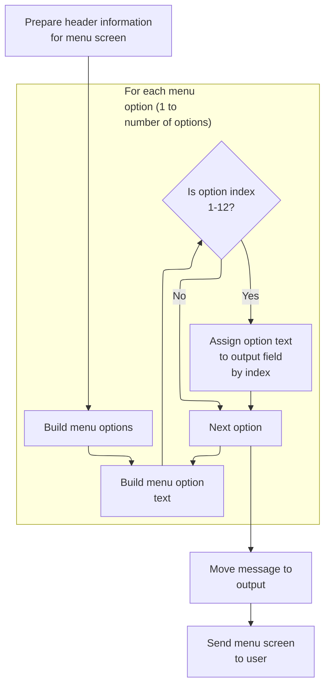
```mermaid
%%{init: {"flowchart": {"defaultRenderer": "elk"}} }%%
flowchart TD
    node1["Prepare header information 
 for menu screen"]
    click node1 openCode "app/cbl/COMEN01C.cbl:212:231"
    node1 --> node2["Build menu options"]
    click node2 openCode "app/cbl/COMEN01C.cbl:236:277"
    
    subgraph loop1["For each menu 
 option (1 to 
 number of options)"]
        node2 --> node5["Build menu option 
 text"]
        click node5 openCode "app/cbl/COMEN01C.cbl:241:246"
        node5 --> node6{"Is option index 
 1-12?"}
        click node6 openCode "app/cbl/COMEN01C.cbl:248:274"
        node6 -->|"Yes"| node7["Assign option text 
 to output field 
 by index"]
        click node7 openCode "app/cbl/COMEN01C.cbl:250:272"
        node7 --> node8["Next option"]
        node6 -->|"No"| node8
        node8 --> node5
    end
    node8 --> node3["Move message to 
 output"]
    click node3 openCode "app/cbl/COMEN01C.cbl:187:187"
    node3 --> node4["Send menu screen 
 to user"]
    click node4 openCode "app/cbl/COMEN01C.cbl:189:194"

classDef HeadingStyle fill:#777777,stroke:#333,stroke-width:2px;
```

This section constructs and displays the main menu screen for the CardDemo application, presenting header information, a list of menu options, and any relevant messages to the user.

| Rule ID | Code Location        | Category       | Rule Name                            | Description                                                                                                                                                                                   | Conditions                                                                     | Remarks                                                                                                                                                                                                                              |
| ------- | -------------------- | -------------- | ------------------------------------ | --------------------------------------------------------------------------------------------------------------------------------------------------------------------------------------------- | ------------------------------------------------------------------------------ | ------------------------------------------------------------------------------------------------------------------------------------------------------------------------------------------------------------------------------------ |
| BR-001  | POPULATE-HEADER-INFO | Business logic | Menu header composition              | The main menu header must display the current date, current time, program name, transaction ID, and two static titles. These values are shown at the top of the menu screen for user context. | Whenever the main menu screen is displayed.                                    | Date is shown in MM-DD-YY format (6 characters), time in HH-MM-SS format (8 characters), program name is 8 characters, transaction ID is 4 characters, and each title is a string. All fields are left-aligned and padded as needed. |
| BR-002  | BUILD-MENU-OPTIONS   | Business logic | Menu option display limit and format | Up to 12 menu options are displayed, each formatted as '<number>. <option name>' (e.g., '1. Account View'). Only options with index 1 to 12 are shown; any additional options are ignored.    | Whenever the main menu screen is displayed and there are menu options to show. | Maximum of 12 options. Each option is formatted as a string: number (1-12), period, space, option name. Each option field is 40 characters, left-aligned and padded with spaces.                                                     |
| BR-003  | SEND-MENU-SCREEN     | Business logic | Message display                      | Any message present is displayed in the error/message field of the menu screen. If no message is present, the field is left blank.                                                            | Whenever the main menu screen is displayed.                                    | Message field is 80 characters, left-aligned and padded with spaces. If no message, field is blank.                                                                                                                                  |
| BR-004  | SEND-MENU-SCREEN     | Business logic | Menu screen delivery                 | The menu screen is sent to the user after all header, menu options, and message fields are populated.                                                                                         | Whenever the main menu screen is ready for display.                            | The output includes all populated fields: header, menu options, and message. The screen is sent using the defined output structure.                                                                                                  |

<SwmSnippet path="/app/cbl/COMEN01C.cbl" line="182" repo-id="Z2l0aHViJTNBJTNBa3luZHJ5bC1hd3MtbWFpbmZyYW1lLW1vZGVybml6YXRpb24tY2FyZGRlbW8lM0ElM0FTd2ltbS1EZW1v">

---

`SEND-MENU-SCREEN` sets up the header, builds the list of menu options, copies any message to the error field, and sends the main menu screen to the user.

```cobol
       SEND-MENU-SCREEN.

           PERFORM POPULATE-HEADER-INFO
           PERFORM BUILD-MENU-OPTIONS

           MOVE WS-MESSAGE TO ERRMSGO OF COMEN1AO

           EXEC CICS SEND
                     MAP('COMEN1A')
                     MAPSET('COMEN01')
                     FROM(COMEN1AO)
                     ERASE
           END-EXEC.
```

---

</SwmSnippet>

<SwmSnippet path="/app/cbl/COMEN01C.cbl" line="212" repo-id="Z2l0aHViJTNBJTNBa3luZHJ5bC1hd3MtbWFpbmZyYW1lLW1vZGVybml6YXRpb24tY2FyZGRlbW8lM0ElM0FTd2ltbS1EZW1v">

---

`POPULATE-HEADER-INFO` fills in the main menu header with the current date, time, program name, transaction ID, and static titles for display.

```cobol
       POPULATE-HEADER-INFO.

           MOVE FUNCTION CURRENT-DATE  TO WS-CURDATE-DATA

           MOVE CCDA-TITLE01           TO TITLE01O OF COMEN1AO
           MOVE CCDA-TITLE02           TO TITLE02O OF COMEN1AO
           MOVE WS-TRANID              TO TRNNAMEO OF COMEN1AO
           MOVE WS-PGMNAME             TO PGMNAMEO OF COMEN1AO

           MOVE WS-CURDATE-MONTH       TO WS-CURDATE-MM
           MOVE WS-CURDATE-DAY         TO WS-CURDATE-DD
           MOVE WS-CURDATE-YEAR(3:2)   TO WS-CURDATE-YY

           MOVE WS-CURDATE-MM-DD-YY    TO CURDATEO OF COMEN1AO

           MOVE WS-CURTIME-HOURS       TO WS-CURTIME-HH
           MOVE WS-CURTIME-MINUTE      TO WS-CURTIME-MM
           MOVE WS-CURTIME-SECOND      TO WS-CURTIME-SS

           MOVE WS-CURTIME-HH-MM-SS    TO CURTIMEO OF COMEN1AO.
```

---

</SwmSnippet>

<SwmSnippet path="/app/cbl/COMEN01C.cbl" line="236" repo-id="Z2l0aHViJTNBJTNBa3luZHJ5bC1hd3MtbWFpbmZyYW1lLW1vZGVybml6YXRpb24tY2FyZGRlbW8lM0ElM0FTd2ltbS1EZW1v">

---

`BUILD-MENU-OPTIONS` loops through the main menu options, builds formatted strings like '1. Account View', and assigns them to the output fields for display.

```cobol
       BUILD-MENU-OPTIONS.

           PERFORM VARYING WS-IDX FROM 1 BY 1 UNTIL
                           WS-IDX > CDEMO-MENU-OPT-COUNT

               MOVE SPACES             TO WS-MENU-OPT-TXT

               STRING CDEMO-MENU-OPT-NUM(WS-IDX)  DELIMITED BY SIZE
                      '. '                         DELIMITED BY SIZE
                      CDEMO-MENU-OPT-NAME(WS-IDX) DELIMITED BY SIZE
                 INTO WS-MENU-OPT-TXT

               EVALUATE WS-IDX
                   WHEN 1
                       MOVE WS-MENU-OPT-TXT TO OPTN001O
                   WHEN 2
                       MOVE WS-MENU-OPT-TXT TO OPTN002O
                   WHEN 3
                       MOVE WS-MENU-OPT-TXT TO OPTN003O
                   WHEN 4
                       MOVE WS-MENU-OPT-TXT TO OPTN004O
                   WHEN 5
                       MOVE WS-MENU-OPT-TXT TO OPTN005O
                   WHEN 6
                       MOVE WS-MENU-OPT-TXT TO OPTN006O
                   WHEN 7
                       MOVE WS-MENU-OPT-TXT TO OPTN007O
                   WHEN 8
                       MOVE WS-MENU-OPT-TXT TO OPTN008O
                   WHEN 9
                       MOVE WS-MENU-OPT-TXT TO OPTN009O
                   WHEN 10
                       MOVE WS-MENU-OPT-TXT TO OPTN010O
                   WHEN 11
                       MOVE WS-MENU-OPT-TXT TO OPTN011O
                   WHEN 12
                       MOVE WS-MENU-OPT-TXT TO OPTN012O
                   WHEN OTHER
                       CONTINUE
               END-EVALUATE

           END-PERFORM.
```

---

</SwmSnippet>

### Main Menu Input Handling

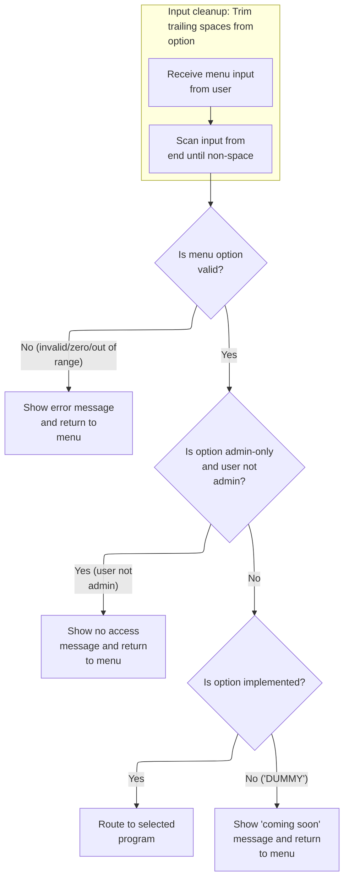
```mermaid
%%{init: {"flowchart": {"defaultRenderer": "elk"}} }%%
flowchart TD
    node1["Receive menu input 
 from user"]
    click node1 openCode "app/cbl/COMEN01C.cbl:201:207"
    
    subgraph loop1["Input cleanup: Trim 
 trailing spaces from 
 option"]
      node1 --> node2["Scan input from 
 end until non-space"]
      click node2 openCode "app/cbl/COMEN01C.cbl:117:121"
    end
    node2 --> node3{"Is menu option 
 valid?"}
    click node3 openCode "app/cbl/COMEN01C.cbl:127:129"
    node3 -->|"No (invalid/zero/out of 
 range)"| node4["Show error message 
 and return to 
 menu"]
    click node4 openCode "app/cbl/COMEN01C.cbl:130:134"
    node3 -->|"Yes"| node5{"Is option admin-only 
 and user not 
 admin?"}
    click node5 openCode "app/cbl/COMEN01C.cbl:136:137"
    node5 -->|"Yes (user not 
 admin)"| node6["Show no access 
 message and return 
 to menu"]
    click node6 openCode "app/cbl/COMEN01C.cbl:138:143"
    node5 -->|"No"| node7{"Is option implemented?"}
    click node7 openCode "app/cbl/COMEN01C.cbl:146:146"
    node7 -->|"Yes"| node8["Route to selected 
 program"]
    click node8 openCode "app/cbl/COMEN01C.cbl:147:155"
    node7 -->|"No ('DUMMY')"| node9["Show 'coming soon' 
 message and return 
 to menu"]
    click node9 openCode "app/cbl/COMEN01C.cbl:157:164"
classDef HeadingStyle fill:#777777,stroke:#333,stroke-width:2px;
```

This section manages the user's main menu selection, ensuring the input is valid, access rights are respected, and the user is routed appropriately or shown relevant feedback.

| Rule ID | Code Location     | Category        | Rule Name                               | Description                                                                                                                                                                               | Conditions                                                                                                | Remarks                                                                                                                                                                                      |
| ------- | ----------------- | --------------- | --------------------------------------- | ----------------------------------------------------------------------------------------------------------------------------------------------------------------------------------------- | --------------------------------------------------------------------------------------------------------- | -------------------------------------------------------------------------------------------------------------------------------------------------------------------------------------------- |
| BR-001  | PROCESS-ENTER-KEY | Data validation | Menu option validation                  | If the menu option entered by the user is not numeric, is zero, or exceeds the maximum allowed menu option count, an error message is displayed and the user is returned to the menu.     | The user's menu selection is not a number, is zero, or is greater than the value of CDEMO-MENU-OPT-COUNT. | CDEMO-MENU-OPT-COUNT is the maximum allowed menu option number. The error message displayed is: 'Please enter a valid option number...'. The message is shown in the main menu message area. |
| BR-002  | PROCESS-ENTER-KEY | Data validation | Admin-only option access control        | If the selected menu option is marked as admin-only and the current user is not an admin, a 'No access - Admin Only option...' message is displayed and the user is returned to the menu. | The selected menu option is flagged as admin-only and the user's type is not admin.                       | Admin-only options are indicated by 'A'. User types are 'A' for admin and 'U' for regular users. The message displayed is: 'No access - Admin Only option... '.                              |
| BR-003  | PROCESS-ENTER-KEY | Data validation | Input cleanup                           | Trailing spaces in the user's menu input are removed before validation and processing.                                                                                                    | The user's menu selection contains trailing spaces.                                                       | Trailing spaces are removed from the input before further validation. The cleaned input is then used for all subsequent checks.                                                              |
| BR-004  | PROCESS-ENTER-KEY | Business logic  | Program routing for implemented options | If the selected menu option is implemented (not marked as 'DUMMY'), the user is routed to the corresponding program.                                                                      | The selected menu option's program name does not start with 'DUMMY' and no error flag is set.             | Implemented options have a program name that does not start with 'DUMMY'. The routing is performed via a program transfer, passing the communication area.                                   |
| BR-005  | PROCESS-ENTER-KEY | Business logic  | Unimplemented option handling           | If the selected menu option is not implemented (marked as 'DUMMY'), a 'coming soon' message is displayed and the user is returned to the menu.                                            | The selected menu option's program name starts with 'DUMMY' and no error flag is set.                     | Unimplemented options have a program name starting with 'DUMMY'. The message displayed is: 'This option <option name> is coming soon ...'. The option name is inserted dynamically.          |

<SwmSnippet path="/app/cbl/COMEN01C.cbl" line="199" repo-id="Z2l0aHViJTNBJTNBa3luZHJ5bC1hd3MtbWFpbmZyYW1lLW1vZGVybml6YXRpb24tY2FyZGRlbW8lM0ElM0FTd2ltbS1EZW1v">

---

Get the user's input from the main menu screen.

```cobol
       RECEIVE-MENU-SCREEN.

           EXEC CICS RECEIVE
                     MAP('COMEN1A')
                     MAPSET('COMEN01')
                     INTO(COMEN1AI)
                     RESP(WS-RESP-CD)
                     RESP2(WS-REAS-CD)
           END-EXEC.
```

---

</SwmSnippet>

<SwmSnippet path="/app/cbl/COMEN01C.cbl" line="115" repo-id="Z2l0aHViJTNBJTNBa3luZHJ5bC1hd3MtbWFpbmZyYW1lLW1vZGVybml6YXRpb24tY2FyZGRlbW8lM0ElM0FTd2ltbS1EZW1v">

---

`PROCESS-ENTER-KEY` cleans up and validates the user's menu input, checks for access rights, and either transfers to the selected program or shows an error or 'coming soon' message.

```cobol
       PROCESS-ENTER-KEY.

           PERFORM VARYING WS-IDX
                   FROM LENGTH OF OPTIONI OF COMEN1AI BY -1 UNTIL
                   OPTIONI OF COMEN1AI(WS-IDX:1) NOT = SPACES OR
                   WS-IDX = 1
           END-PERFORM
           MOVE OPTIONI OF COMEN1AI(1:WS-IDX) TO WS-OPTION-X
           INSPECT WS-OPTION-X REPLACING ALL ' ' BY '0'
           MOVE WS-OPTION-X              TO WS-OPTION
           MOVE WS-OPTION                TO OPTIONO OF COMEN1AO

           IF WS-OPTION IS NOT NUMERIC OR
              WS-OPTION > CDEMO-MENU-OPT-COUNT OR
              WS-OPTION = ZEROS
               MOVE 'Y'     TO WS-ERR-FLG
               MOVE 'Please enter a valid option number...' TO
                               WS-MESSAGE
               PERFORM SEND-MENU-SCREEN
           END-IF

           IF CDEMO-USRTYP-USER AND
              CDEMO-MENU-OPT-USRTYPE(WS-OPTION) = 'A'
               SET ERR-FLG-ON          TO TRUE
               MOVE SPACES             TO WS-MESSAGE
               MOVE 'No access - Admin Only option... ' TO
                                       WS-MESSAGE
               PERFORM SEND-MENU-SCREEN
           END-IF

           IF NOT ERR-FLG-ON
               IF CDEMO-MENU-OPT-PGMNAME(WS-OPTION)(1:5) NOT = 'DUMMY'
                   MOVE WS-TRANID    TO CDEMO-FROM-TRANID
                   MOVE WS-PGMNAME   TO CDEMO-FROM-PROGRAM
      *            MOVE WS-USER-ID   TO CDEMO-USER-ID
      *            MOVE SEC-USR-TYPE TO CDEMO-USER-TYPE
                   MOVE ZEROS        TO CDEMO-PGM-CONTEXT
                   EXEC CICS
                       XCTL PROGRAM(CDEMO-MENU-OPT-PGMNAME(WS-OPTION))
                       COMMAREA(CARDDEMO-COMMAREA)
                   END-EXEC
               END-IF
               MOVE SPACES             TO WS-MESSAGE
               MOVE DFHGREEN           TO ERRMSGC  OF COMEN1AO
               STRING 'This option '       DELIMITED BY SIZE
                       CDEMO-MENU-OPT-NAME(WS-OPTION)
                                       DELIMITED BY SPACE
                       'is coming soon ...'   DELIMITED BY SIZE
                  INTO WS-MESSAGE
               PERFORM SEND-MENU-SCREEN
           END-IF.
```

---

</SwmSnippet>

## Bill Payment Main Flow Continuation

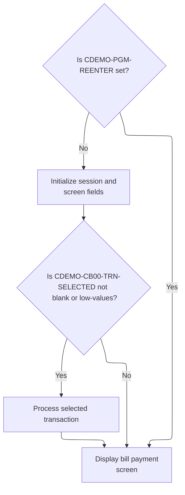
```mermaid
%%{init: {"flowchart": {"defaultRenderer": "elk"}} }%%
flowchart TD
    node2{"Is CDEMO-PGM-REENTER set?"}
    click node2 openCode "app/cbl/COBIL00C.cbl:112:113"
    node2 -->|"No"| node3["Initialize session and 
 screen fields"]
    click node3 openCode "app/cbl/COBIL00C.cbl:114:115"
    node2 -->|"Yes"| node5["Display bill payment 
 screen"]
    click node5 openCode "app/cbl/COBIL00C.cbl:122:122"
    node3 --> node4{"Is CDEMO-CB00-TRN-SELECTED not 
 blank or low-values?"}
    click node4 openCode "app/cbl/COBIL00C.cbl:116:117"
    node4 -->|"Yes"| node6["Process selected transaction"]
    click node6 openCode "app/cbl/COBIL00C.cbl:120:120"
    node4 -->|"No"| node5
    node6 --> node5
classDef HeadingStyle fill:#777777,stroke:#333,stroke-width:2px;
```

This section manages the continuation of the bill payment main flow, determining whether to initialize the session, process a selected transaction, or display the bill payment screen based on user context.

| Rule ID | Code Location | Category       | Rule Name                             | Description                                                                                                                                                                 | Conditions                                                                                                    | Remarks                                                                                                                                                                                                                      |
| ------- | ------------- | -------------- | ------------------------------------- | --------------------------------------------------------------------------------------------------------------------------------------------------------------------------- | ------------------------------------------------------------------------------------------------------------- | ---------------------------------------------------------------------------------------------------------------------------------------------------------------------------------------------------------------------------- |
| BR-001  | MAIN-PARA     | Business logic | Session initialization on first entry | If the user is not re-entering the bill payment screen, the session and screen fields are initialized before displaying the bill payment screen.                            | The user is not re-entering the bill payment screen (CDEMO-PGM-REENTER is not set).                           | Session initialization involves setting the re-enter flag to TRUE, clearing the screen fields to blank/low-values, and setting the account ID input length to -1. The re-enter flag is represented by CDEMO-PGM-REENTER = 1. |
| BR-002  | MAIN-PARA     | Business logic | Immediate transaction processing      | If a transaction is already selected and its value is not blank or low-values, the selected transaction is processed immediately before displaying the bill payment screen. | A transaction is selected (CDEMO-CB00-TRN-SELECTED is not blank or low-values) during session initialization. | The transaction selection field must not be blank (all spaces) or low-values (binary zeros). The selected transaction is processed before the bill payment screen is displayed.                                              |
| BR-003  | MAIN-PARA     | Business logic | Bill payment screen display           | After session initialization or transaction processing, the bill payment screen is displayed to the user.                                                                   | Session initialization or transaction processing has completed.                                               | The bill payment screen is displayed regardless of whether the user is re-entering or entering for the first time, after any required initialization or transaction processing.                                              |

<SwmSnippet path="/app/cbl/COBIL00C.cbl" line="110" repo-id="Z2l0aHViJTNBJTNBa3luZHJ5bC1hd3MtbWFpbmZyYW1lLW1vZGVybml6YXRpb24tY2FyZGRlbW8lM0ElM0FTd2ltbS1EZW1v">

---

After RETURN-TO-PREV-SCREEN, MAIN-PARA checks if we're re-entering. If not, it sets up for the first display, and if a transaction is already selected, it processes it right away by calling PROCESS-ENTER-KEY. This keeps the flow smooth for the user.

```cobol
           ELSE
               MOVE DFHCOMMAREA(1:EIBCALEN) TO CARDDEMO-COMMAREA
               IF NOT CDEMO-PGM-REENTER
                   SET CDEMO-PGM-REENTER    TO TRUE
                   MOVE LOW-VALUES          TO COBIL0AO
                   MOVE -1       TO ACTIDINL OF COBIL0AI
                   IF CDEMO-CB00-TRN-SELECTED NOT =
                                              SPACES AND LOW-VALUES
                       MOVE CDEMO-CB00-TRN-SELECTED TO
                            ACTIDINI OF COBIL0AI
                       PERFORM PROCESS-ENTER-KEY
                   END-IF
                   PERFORM SEND-BILLPAY-SCREEN
```

---

</SwmSnippet>

## Handling Bill Payment Input and Initial Validation

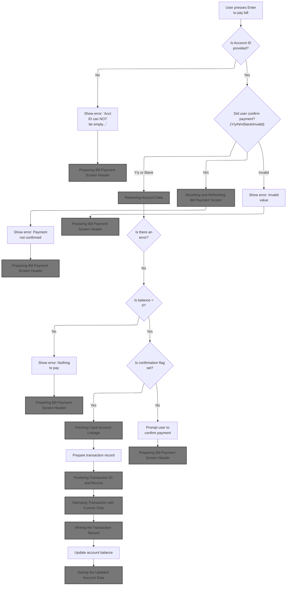
```mermaid
%%{init: {"flowchart": {"defaultRenderer": "elk"}} }%%
flowchart TD
    node1["User presses Enter 
 to pay bill"] --> node2{"Is Account ID 
 provided?"}
    click node1 openCode "app/cbl/COBIL00C.cbl:154:167"
    node2 -->|"No"| node3["Show error: 'Acct 
 ID can NOT 
 be empty...'"]
    click node2 openCode "app/cbl/COBIL00C.cbl:158:167"
    node3 --> node4["Preparing Bill Payment Screen Header"]
    click node3 openCode "app/cbl/COBIL00C.cbl:160:164"
    
    node2 -->|"Yes"| node5{"Did user confirm 
 payment? (Y/y/N/n/blank/invalid)"}
    click node5 openCode "app/cbl/COBIL00C.cbl:173:191"
    node5 -->|"Y/y or Blank"| node6["Retrieving Account Data"]
    
    node5 -->|"N/n"| node7["Resetting and Refreshing Bill Payment Screen"]
    
    node7 --> node8["Show error: Payment 
 not confirmed"]
    click node8 openCode "app/cbl/COBIL00C.cbl:181:181"
    node8 --> node9["Preparing Bill Payment Screen Header"]
    
    node5 -->|"Invalid"| node10["Show error: Invalid 
 value"]
    click node10 openCode "app/cbl/COBIL00C.cbl:186:190"
    node10 --> node11["Preparing Bill Payment Screen Header"]
    
    node6 --> node12{"Is there an 
 error?"}
    click node12 openCode "app/cbl/COBIL00C.cbl:169:172"
    node12 -->|"No"| node13{"Is balance > 
 0?"}
    click node13 openCode "app/cbl/COBIL00C.cbl:197:206"
    node13 -->|"No"| node14["Show error: Nothing 
 to pay"]
    click node14 openCode "app/cbl/COBIL00C.cbl:200:204"
    node14 --> node15["Preparing Bill Payment Screen Header"]
    
    node13 -->|"Yes"| node16{"Is confirmation flag 
 set?"}
    click node16 openCode "app/cbl/COBIL00C.cbl:210:211"
    node16 -->|"Yes"| node17["Fetching Card-Account Linkage"]
    
    node17 --> node18["Prepare transaction record"]
    click node18 openCode "app/cbl/COBIL00C.cbl:212:229"
    node18 --> node19["Finalizing Transaction ID and Record"]
    
    node19 --> node20["Stamping Transaction with Current Time"]
    
    node20 --> node21["Writing the Transaction Record"]
    
    node21 --> node22["Update account balance"]
    click node22 openCode "app/cbl/COBIL00C.cbl:234:234"
    node22 --> node23["Saving the Updated Account Data"]
    
    node16 -->|"No"| node24["Prompt user to 
 confirm payment"]
    click node24 openCode "app/cbl/COBIL00C.cbl:237:239"
    node24 --> node25["Preparing Bill Payment Screen Header"]
    
classDef HeadingStyle fill:#777777,stroke:#333,stroke-width:2px;
click node4 goToHeading "Preparing Bill Payment Screen Header"
node4:::HeadingStyle
click node6 goToHeading "Retrieving Account Data"
node6:::HeadingStyle
click node7 goToHeading "Resetting and Refreshing Bill Payment Screen"
node7:::HeadingStyle
click node9 goToHeading "Preparing Bill Payment Screen Header"
node9:::HeadingStyle
click node11 goToHeading "Preparing Bill Payment Screen Header"
node11:::HeadingStyle
click node15 goToHeading "Preparing Bill Payment Screen Header"
node15:::HeadingStyle
click node17 goToHeading "Fetching Card-Account Linkage"
node17:::HeadingStyle
click node19 goToHeading "Finalizing Transaction ID and Record"
node19:::HeadingStyle
click node20 goToHeading "Stamping Transaction with Current Time"
node20:::HeadingStyle
click node21 goToHeading "Writing the Transaction Record"
node21:::HeadingStyle
click node23 goToHeading "Saving the Updated Account Data"
node23:::HeadingStyle
click node25 goToHeading "Preparing Bill Payment Screen Header"
node25:::HeadingStyle
```

This section governs the initial validation and handling of user input for bill payment, ensuring required fields are present, user intent is confirmed, and only valid payment requests proceed to further processing.

| Rule ID | Code Location     | Category        | Rule Name                     | Description                                                                                                                                                                | Conditions                                                                                           | Remarks                                                                                                                                                                                                                                                                                         |
| ------- | ----------------- | --------------- | ----------------------------- | -------------------------------------------------------------------------------------------------------------------------------------------------------------------------- | ---------------------------------------------------------------------------------------------------- | ----------------------------------------------------------------------------------------------------------------------------------------------------------------------------------------------------------------------------------------------------------------------------------------------- |
| BR-001  | PROCESS-ENTER-KEY | Data validation | Account ID Required           | If the account ID is not provided, the system must display an error message and prevent the user from proceeding with bill payment.                                        | User attempts to pay a bill and the account ID field is empty or contains only spaces or low-values. | Error message displayed: 'Acct ID can NOT be empty...'. The message is shown in a string format up to 80 characters. The flow is halted and the bill payment screen is refreshed.                                                                                                               |
| BR-002  | PROCESS-ENTER-KEY | Data validation | Payment Confirmation Required | The system requires explicit user confirmation before proceeding with bill payment. If confirmation is not provided, the user is prompted to confirm or an error is shown. | User attempts to pay a bill and the confirmation flag is not set to 'Y', 'y', or blank.              | Accepted confirmation values: 'Y', 'y', or blank. If the value is 'N' or 'n', the system resets the screen and shows an error: 'Payment not confirmed'. If the value is invalid, the system shows an error: 'Invalid value'. Error messages are displayed in string format up to 80 characters. |
| BR-003  | PROCESS-ENTER-KEY | Data validation | Nonzero Balance Required      | If the account balance is zero or negative, the system must display an error message indicating there is nothing to pay and prevent further payment processing.            | User has provided a valid account ID and confirmed payment, but the account balance is zero or less. | Error message displayed: 'Nothing to pay'. The message is shown in a string format up to 80 characters. The flow is halted and the bill payment screen is refreshed.                                                                                                                            |

<SwmSnippet path="/app/cbl/COBIL00C.cbl" line="154" repo-id="Z2l0aHViJTNBJTNBa3luZHJ5bC1hd3MtbWFpbmZyYW1lLW1vZGVybml6YXRpb24tY2FyZGRlbW8lM0ElM0FTd2ltbS1EZW1v">

---

In `PROCESS-ENTER-KEY`, we start by marking payment as not confirmed, then check if the account ID is empty. If it is, we set an error flag, prepare an error message, and call SEND-BILLPAY-SCREEN to show the error and halt the flow. This stops users from moving forward without entering an account ID.

```cobol
       PROCESS-ENTER-KEY.

           SET CONF-PAY-NO TO TRUE

           EVALUATE TRUE
               WHEN ACTIDINI OF COBIL0AI = SPACES OR LOW-VALUES
                   MOVE 'Y'     TO WS-ERR-FLG
                   MOVE 'Acct ID can NOT be empty...' TO
                                   WS-MESSAGE
                   MOVE -1       TO ACTIDINL OF COBIL0AI
                   PERFORM SEND-BILLPAY-SCREEN
               WHEN OTHER
                   CONTINUE
           END-EVALUATE
```

---

</SwmSnippet>

### Preparing Bill Payment Screen Header

This section prepares and displays the bill payment screen header, ensuring users see the correct titles, date, time, program and transaction identifiers, and any error messages before interacting with the screen.

| Rule ID | Code Location        | Category       | Rule Name                     | Description                                                                                                                                                     | Conditions                                                                                                    | Remarks                                                                                                                                                                                          |
| ------- | -------------------- | -------------- | ----------------------------- | --------------------------------------------------------------------------------------------------------------------------------------------------------------- | ------------------------------------------------------------------------------------------------------------- | ------------------------------------------------------------------------------------------------------------------------------------------------------------------------------------------------ |
| BR-001  | POPULATE-HEADER-INFO | Business logic | Header context display        | The bill payment screen header must display two static titles, the program name, and the transaction ID to provide context for the user.                        | Whenever the bill payment screen is prepared for display.                                                     | Title 1 and Title 2 are static strings. Program name is an 8-character string ('COBIL00C'). Transaction ID is a 4-character string ('CB00'). These are displayed in the header area.             |
| BR-002  | POPULATE-HEADER-INFO | Business logic | Current date and time display | The bill payment screen header must display the current date in MM/DD/YY format and the current time in HH:MM:SS format.                                        | Whenever the bill payment screen is prepared for display.                                                     | Date is shown as a string in MM/DD/YY format. Time is shown as a string in HH:MM:SS format. Both are derived from the system's current date and time.                                            |
| BR-003  | SEND-BILLPAY-SCREEN  | Business logic | Screen display with context   | The bill payment screen must be displayed with the prepared header and error message, using the specified map and mapset, and the cursor positioned as defined. | Whenever the bill payment screen is sent to the user.                                                         | Screen is displayed using map 'COBIL0A' and mapset 'COBIL00'. The output structure includes all header fields and error message. The screen is erased and the cursor is positioned as specified. |
| BR-004  | SEND-BILLPAY-SCREEN  | Error handling | Error message display         | Any message present in the workspace message variable must be displayed in the error message field of the bill payment screen.                                  | Whenever the bill payment screen is prepared for display and the workspace message variable contains a value. | Error message is an 80-character string. If no message is present, the field is blank (spaces).                                                                                                  |

<SwmSnippet path="/app/cbl/COBIL00C.cbl" line="289" repo-id="Z2l0aHViJTNBJTNBa3luZHJ5bC1hd3MtbWFpbmZyYW1lLW1vZGVybml6YXRpb24tY2FyZGRlbW8lM0ElM0FTd2ltbS1EZW1v">

---

In `SEND-BILLPAY-SCREEN`, we call POPULATE-HEADER-INFO to set up the header fields—like titles, date, time, and IDs—so the screen shows the right context before it's sent to the user.

```cobol
       SEND-BILLPAY-SCREEN.

           PERFORM POPULATE-HEADER-INFO
```

---

</SwmSnippet>

<SwmSnippet path="/app/cbl/COBIL00C.cbl" line="319" repo-id="Z2l0aHViJTNBJTNBa3luZHJ5bC1hd3MtbWFpbmZyYW1lLW1vZGVybml6YXRpb24tY2FyZGRlbW8lM0ElM0FTd2ltbS1EZW1v">

---

`POPULATE-HEADER-INFO` fills in the screen header with static titles, current date/time, program name, and transaction ID. It formats the date and time and moves everything into the output structure for display.

```cobol
       POPULATE-HEADER-INFO.

           MOVE FUNCTION CURRENT-DATE  TO WS-CURDATE-DATA

           MOVE CCDA-TITLE01           TO TITLE01O OF COBIL0AO
           MOVE CCDA-TITLE02           TO TITLE02O OF COBIL0AO
           MOVE WS-TRANID              TO TRNNAMEO OF COBIL0AO
           MOVE WS-PGMNAME             TO PGMNAMEO OF COBIL0AO

           MOVE WS-CURDATE-MONTH       TO WS-CURDATE-MM
           MOVE WS-CURDATE-DAY         TO WS-CURDATE-DD
           MOVE WS-CURDATE-YEAR(3:2)   TO WS-CURDATE-YY

           MOVE WS-CURDATE-MM-DD-YY    TO CURDATEO OF COBIL0AO

           MOVE WS-CURTIME-HOURS       TO WS-CURTIME-HH
           MOVE WS-CURTIME-MINUTE      TO WS-CURTIME-MM
           MOVE WS-CURTIME-SECOND      TO WS-CURTIME-SS

           MOVE WS-CURTIME-HH-MM-SS    TO CURTIMEO OF COBIL0AO.
```

---

</SwmSnippet>

<SwmSnippet path="/app/cbl/COBIL00C.cbl" line="293" repo-id="Z2l0aHViJTNBJTNBa3luZHJ5bC1hd3MtbWFpbmZyYW1lLW1vZGVybml6YXRpb24tY2FyZGRlbW8lM0ElM0FTd2ltbS1EZW1v">

---

Back in SEND-BILLPAY-SCREEN, after setting up the header, we copy any message to the error field and use EXEC CICS SEND to display the bill payment screen with the right layout and cursor position.

```cobol
           MOVE WS-MESSAGE TO ERRMSGO OF COBIL0AO

           EXEC CICS SEND
                     MAP('COBIL0A')
                     MAPSET('COBIL00')
                     FROM(COBIL0AO)
                     ERASE
                     CURSOR
           END-EXEC.
```

---

</SwmSnippet>

### Processing Confirmation and Account Data

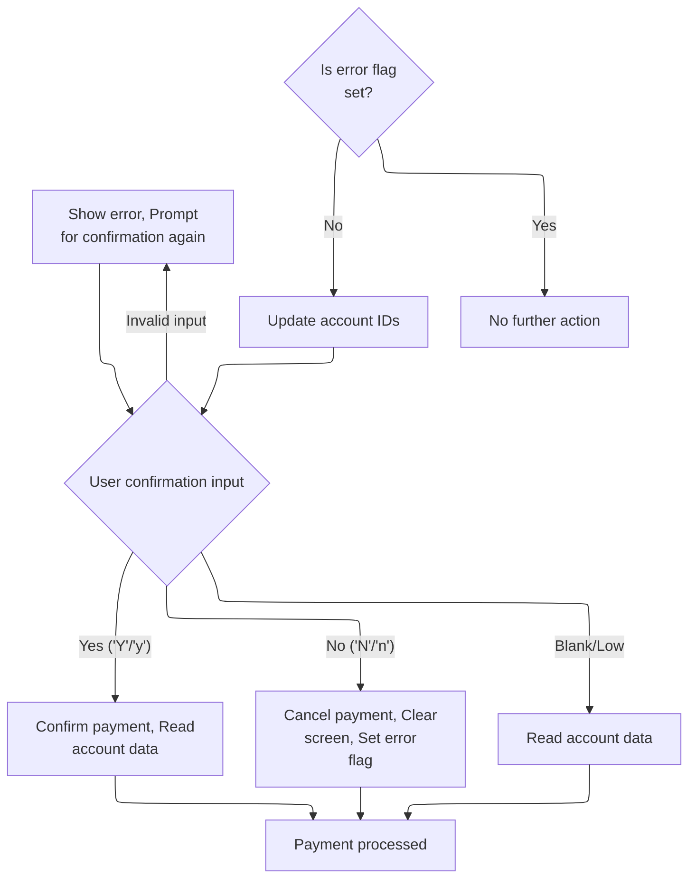
```mermaid
%%{init: {"flowchart": {"defaultRenderer": "elk"}} }%%
flowchart TD
    node1{"Is error flag 
 set?"}
    click node1 openCode "app/cbl/COBIL00C.cbl:169:169"
    node1 -->|"No"| node2["Update account IDs"]
    click node2 openCode "app/cbl/COBIL00C.cbl:170:171"
    node1 -->|"Yes"| node7["No further action"]
    click node7 openCode "app/cbl/COBIL00C.cbl:169:169"
    node2 --> node3{"User confirmation input"}
    click node3 openCode "app/cbl/COBIL00C.cbl:173:191"
    node3 -->|"Yes ('Y'/'y')"| node4["Confirm payment, Read 
 account data"]
    click node4 openCode "app/cbl/COBIL00C.cbl:176:177"
    node3 -->|"No ('N'/'n')"| node5["Cancel payment, Clear 
 screen, Set error 
 flag"]
    click node5 openCode "app/cbl/COBIL00C.cbl:180:181"
    node3 -->|"Blank/Low"| node6["Read account data"]
    click node6 openCode "app/cbl/COBIL00C.cbl:184:184"
    node3 -->|"Invalid input"| node8["Show error, Prompt 
 for confirmation again"]
    click node8 openCode "app/cbl/COBIL00C.cbl:186:190"
    node4 --> node9["Payment processed"]
    click node9 openCode "app/cbl/COBIL00C.cbl:191:191"
    node5 --> node9
    node6 --> node9
    node8 --> node3
classDef HeadingStyle fill:#777777,stroke:#333,stroke-width:2px;
```

This section manages the processing of user confirmation input for bill payments, updates account identifiers, and handles payment confirmation, cancellation, and error messaging based on user actions.

| Rule ID | Code Location | Category        | Rule Name                  | Description                                                                                                                                       | Conditions                                                               | Remarks                                                                                                                                                                                        |
| ------- | ------------- | --------------- | -------------------------- | ------------------------------------------------------------------------------------------------------------------------------------------------- | ------------------------------------------------------------------------ | ---------------------------------------------------------------------------------------------------------------------------------------------------------------------------------------------- |
| BR-001  | MAIN-LOGIC    | Data validation | Invalid confirmation input | If the user input is not 'Y', 'y', 'N', 'n', blank, or low values, an error message is displayed and the user is prompted for confirmation again. | User confirmation input is not 'Y', 'y', 'N', 'n', blank, or low values. | Invalid input triggers an error message: 'Invalid value. Valid values are (Y/N)...'. The error flag is set to 'Y'. The confirmation input is reset and the bill payment screen is redisplayed. |
| BR-002  | MAIN-LOGIC    | Business logic  | Account ID update          | When no error flag is set, the account ID is updated with the initial account ID value before processing confirmation input.                      | The error flag is not set ('N') when entering this section.              | The account ID is updated to match the initial account ID value. The account ID is an 11-digit number.                                                                                         |
| BR-003  | MAIN-LOGIC    | Business logic  | Payment confirmation       | If the user confirms payment with 'Y' or 'y', the payment is confirmed and account data is read for further processing.                           | User confirmation input is 'Y' or 'y'.                                   | Accepted confirmation values are 'Y' or 'y'. Payment is confirmed and account data is read.                                                                                                    |
| BR-004  | MAIN-LOGIC    | Business logic  | Payment cancellation       | If the user cancels payment with 'N' or 'n', the payment is cancelled, the screen is cleared, and the error flag is set.                          | User confirmation input is 'N' or 'n'.                                   | Accepted cancellation values are 'N' or 'n'. The error flag is set to 'Y' and the screen is cleared.                                                                                           |
| BR-005  | MAIN-LOGIC    | Business logic  | Blank input handling       | If the user input is blank or contains low values, account data is read without confirming or cancelling payment.                                 | User confirmation input is blank or contains low values.                 | Accepted values are blank or low values. Account data is read.                                                                                                                                 |
| BR-006  | MAIN-LOGIC    | Error handling  | Error flag halt            | If the error flag is set, no further processing is performed for account updates or confirmation input.                                           | The error flag is set to 'Y' when entering this section.                 | The error flag is represented by the value 'Y'. No account updates or confirmation processing occurs if this flag is set.                                                                      |

<SwmSnippet path="/app/cbl/COBIL00C.cbl" line="169" repo-id="Z2l0aHViJTNBJTNBa3luZHJ5bC1hd3MtbWFpbmZyYW1lLW1vZGVybml6YXRpb24tY2FyZGRlbW8lM0ElM0FTd2ltbS1EZW1v">

---

After returning from SEND-BILLPAY-SCREEN in PROCESS-ENTER-KEY, we check the confirmation input. If it's 'Y' or blank, we read the account data to continue. If it's 'N', we clear the screen. Anything else triggers an error and redisplays the screen.

```cobol
           IF NOT ERR-FLG-ON
               MOVE ACTIDINI  OF COBIL0AI TO ACCT-ID
                                             XREF-ACCT-ID

               EVALUATE CONFIRMI OF COBIL0AI
                   WHEN 'Y'
                   WHEN 'y'
                       SET CONF-PAY-YES TO TRUE
                       PERFORM READ-ACCTDAT-FILE
                   WHEN 'N'
                   WHEN 'n'
                       PERFORM CLEAR-CURRENT-SCREEN
                       MOVE 'Y'     TO WS-ERR-FLG
                   WHEN SPACES
                   WHEN LOW-VALUES
                       PERFORM READ-ACCTDAT-FILE
                   WHEN OTHER
                       MOVE 'Y'     TO WS-ERR-FLG
                       MOVE 'Invalid value. Valid values are (Y/N)...'
                                    TO WS-MESSAGE
                       MOVE -1      TO CONFIRML OF COBIL0AI
                       PERFORM SEND-BILLPAY-SCREEN
               END-EVALUATE
```

---

</SwmSnippet>

### Retrieving Account Data

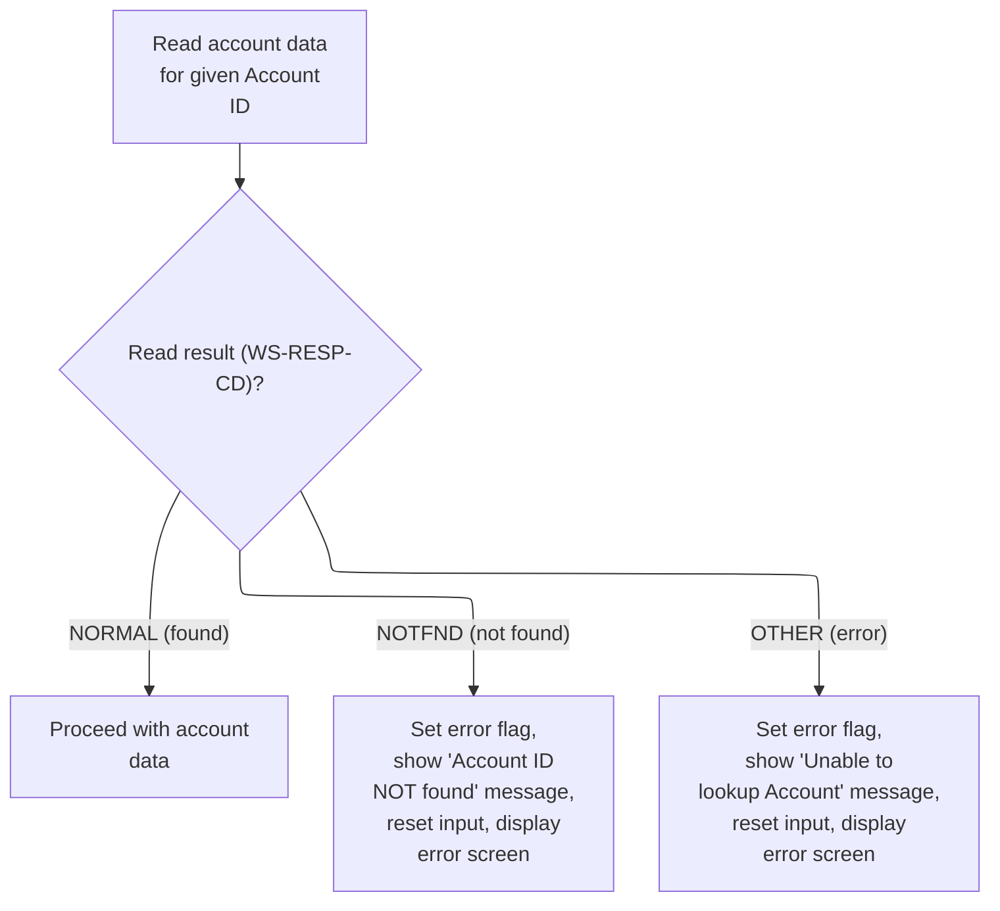
```mermaid
%%{init: {"flowchart": {"defaultRenderer": "elk"}} }%%
flowchart TD
    node1["Read account data 
 for given Account 
 ID"] --> node2{"Read result (WS-RESP-CD)?"}
    click node1 openCode "app/cbl/COBIL00C.cbl:343:354"
    node2 -->|"NORMAL (found)"| node3["Proceed with account 
 data"]
    click node2 openCode "app/cbl/COBIL00C.cbl:356:372"
    node2 -->|"NOTFND (not found)"| node4["Set error flag, 
 show 'Account ID 
 NOT found' message, 
 reset input, display 
 error screen"]
    node2 -->|"OTHER (error)"| node5["Set error flag, 
 show 'Unable to 
 lookup Account' message, 
 reset input, display 
 error screen"]
    click node3 openCode "app/cbl/COBIL00C.cbl:357:359"
    click node4 openCode "app/cbl/COBIL00C.cbl:360:364"
    click node5 openCode "app/cbl/COBIL00C.cbl:366:371"
classDef HeadingStyle fill:#777777,stroke:#333,stroke-width:2px;
```

This section retrieves account data for a given Account ID and determines the business outcome based on whether the account is found, not found, or an error occurs.

| Rule ID | Code Location     | Category       | Rule Name                        | Description                                                                                                                                                                                                  | Conditions                                                                 | Remarks                                                                                                                                                         |
| ------- | ----------------- | -------------- | -------------------------------- | ------------------------------------------------------------------------------------------------------------------------------------------------------------------------------------------------------------ | -------------------------------------------------------------------------- | --------------------------------------------------------------------------------------------------------------------------------------------------------------- |
| BR-001  | READ-ACCTDAT-FILE | Business logic | Successful account retrieval     | When account data is successfully retrieved for the provided Account ID, the system proceeds with the account data and does not display any error message.                                                   | The account data is found and the response code indicates a normal result. | No error flag is set (error flag remains 'N'). No error message is displayed. The account data is made available for further processing.                        |
| BR-002  | READ-ACCTDAT-FILE | Error handling | Account not found error handling | If the provided Account ID does not match any account record, the system sets an error flag, displays the message 'Account ID NOT found...', resets the input field, and shows the error screen to the user. | The response code indicates that the account was not found.                | Error flag is set to 'Y'. The message displayed is 'Account ID NOT found...'. The input field for Account ID is reset to -1. The error screen is displayed.     |
| BR-003  | READ-ACCTDAT-FILE | Error handling | Account lookup error handling    | If an unexpected error occurs during account lookup, the system sets an error flag, displays the message 'Unable to lookup Account...', resets the input field, and shows the error screen to the user.      | The response code indicates an error other than 'not found' or 'normal'.   | Error flag is set to 'Y'. The message displayed is 'Unable to lookup Account...'. The input field for Account ID is reset to -1. The error screen is displayed. |

<SwmSnippet path="/app/cbl/COBIL00C.cbl" line="343" repo-id="Z2l0aHViJTNBJTNBa3luZHJ5bC1hd3MtbWFpbmZyYW1lLW1vZGVybml6YXRpb24tY2FyZGRlbW8lM0ElM0FTd2ltbS1EZW1v">

---

In `READ-ACCTDAT-FILE`, we read the account record from the CICS dataset using the account ID, and set up for possible updates by using the UPDATE option.

```cobol
       READ-ACCTDAT-FILE.

           EXEC CICS READ
                DATASET   (WS-ACCTDAT-FILE)
                INTO      (ACCOUNT-RECORD)
                LENGTH    (LENGTH OF ACCOUNT-RECORD)
                RIDFLD    (ACCT-ID)
                KEYLENGTH (LENGTH OF ACCT-ID)
                UPDATE
                RESP      (WS-RESP-CD)
                RESP2     (WS-REAS-CD)
           END-EXEC
```

---

</SwmSnippet>

<SwmSnippet path="/app/cbl/COBIL00C.cbl" line="356" repo-id="Z2l0aHViJTNBJTNBa3luZHJ5bC1hd3MtbWFpbmZyYW1lLW1vZGVybml6YXRpb24tY2FyZGRlbW8lM0ElM0FTd2ltbS1EZW1v">

---

After reading the account data, we check the response code. If there's an error or the account isn't found, we set the error message and call SEND-BILLPAY-SCREEN to show it to the user.

```cobol
           EVALUATE WS-RESP-CD
               WHEN DFHRESP(NORMAL)
                   CONTINUE
               WHEN DFHRESP(NOTFND)
                   MOVE 'Y'     TO WS-ERR-FLG
                   MOVE 'Account ID NOT found...' TO
                                   WS-MESSAGE
                   MOVE -1       TO ACTIDINL OF COBIL0AI
                   PERFORM SEND-BILLPAY-SCREEN
               WHEN OTHER
                   DISPLAY 'RESP:' WS-RESP-CD 'REAS:' WS-REAS-CD
                   MOVE 'Y'     TO WS-ERR-FLG
                   MOVE 'Unable to lookup Account...' TO
                                   WS-MESSAGE
                   MOVE -1       TO ACTIDINL OF COBIL0AI
                   PERFORM SEND-BILLPAY-SCREEN
           END-EVALUATE.
```

---

</SwmSnippet>

### Resetting and Refreshing Bill Payment Screen

This section ensures that the bill payment screen is reset to a default state and refreshed for the user, providing a clean starting point for new actions.

| Rule ID | Code Location         | Category       | Rule Name                  | Description                                                                                                                                                                             | Conditions                                                                                | Remarks                                                                                                                                                                                                                                                                              |
| ------- | --------------------- | -------------- | -------------------------- | --------------------------------------------------------------------------------------------------------------------------------------------------------------------------------------- | ----------------------------------------------------------------------------------------- | ------------------------------------------------------------------------------------------------------------------------------------------------------------------------------------------------------------------------------------------------------------------------------------ |
| BR-001  | INITIALIZE-ALL-FIELDS | Business logic | Screen field reset         | When the bill payment screen is reset, all user input fields, account selection, balance, confirmation, and message fields are cleared so that no previous data is visible to the user. | Triggered whenever the bill payment screen is reset via the CLEAR-CURRENT-SCREEN section. | Account selection is set to -1 (meaning no account is selected). All other fields (account ID, balance, confirmation, message) are set to blank (empty string). The output format for the screen is: account selection as a number (-1 for none), all other fields as blank strings. |
| BR-002  | CLEAR-CURRENT-SCREEN  | Business logic | Screen refresh after reset | After resetting all fields, the bill payment screen is immediately refreshed and displayed to the user, ensuring they see the cleared state before taking any further action.           | Triggered after all fields have been reset in the CLEAR-CURRENT-SCREEN section.           | The refreshed screen displays all fields in their default state: account selection as -1, all other fields as blank strings.                                                                                                                                                         |

<SwmSnippet path="/app/cbl/COBIL00C.cbl" line="552" repo-id="Z2l0aHViJTNBJTNBa3luZHJ5bC1hd3MtbWFpbmZyYW1lLW1vZGVybml6YXRpb24tY2FyZGRlbW8lM0ElM0FTd2ltbS1EZW1v">

---

In CLEAR-CURRENT-SCREEN, we reset all fields by calling INITIALIZE-ALL-FIELDS, then refresh the UI by sending the bill payment screen again.

```cobol
       CLEAR-CURRENT-SCREEN.

           PERFORM INITIALIZE-ALL-FIELDS
           PERFORM SEND-BILLPAY-SCREEN.
```

---

</SwmSnippet>

<SwmSnippet path="/app/cbl/COBIL00C.cbl" line="560" repo-id="Z2l0aHViJTNBJTNBa3luZHJ5bC1hd3MtbWFpbmZyYW1lLW1vZGVybml6YXRpb24tY2FyZGRlbW8lM0ElM0FTd2ltbS1EZW1v">

---

`INITIALIZE-ALL-FIELDS` wipes out all relevant fields—sets ACTIDINL to -1, clears account ID, balance, confirmation, and message—so nothing from the previous state lingers.

```cobol
       INITIALIZE-ALL-FIELDS.

           MOVE -1              TO ACTIDINL OF COBIL0AI
           MOVE SPACES          TO ACTIDINI OF COBIL0AI
                                   CURBALI  OF COBIL0AI
                                   CONFIRMI OF COBIL0AI
                                   WS-MESSAGE.
```

---

</SwmSnippet>

<SwmSnippet path="/app/cbl/COBIL00C.cbl" line="552" repo-id="Z2l0aHViJTNBJTNBa3luZHJ5bC1hd3MtbWFpbmZyYW1lLW1vZGVybml6YXRpb24tY2FyZGRlbW8lM0ElM0FTd2ltbS1EZW1v">

---

After returning from INITIALIZE-ALL-FIELDS in CLEAR-CURRENT-SCREEN, we send the bill payment screen again so the user gets a clean slate for their next action.

```cobol
       CLEAR-CURRENT-SCREEN.

           PERFORM INITIALIZE-ALL-FIELDS
           PERFORM SEND-BILLPAY-SCREEN.
```

---

</SwmSnippet>

### Updating Displayed Account Balance

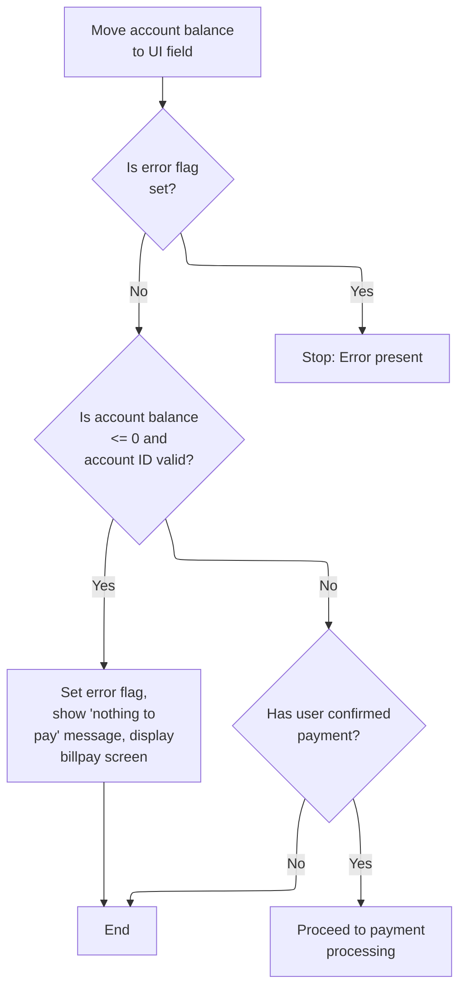
```mermaid
%%{init: {"flowchart": {"defaultRenderer": "elk"}} }%%
flowchart TD
    node1["Move account balance 
 to UI field"] --> node2{"Is error flag 
 set?"}
    click node1 openCode "app/cbl/COBIL00C.cbl:193:194"
    node2 -->|"No"| node3{"Is account balance 
 <= 0 and 
 account ID valid?"}
    click node2 openCode "app/cbl/COBIL00C.cbl:197:206"
    node2 -->|"Yes"| node8["Stop: Error present"]
    click node8 openCode "app/cbl/COBIL00C.cbl:197:206"
    node3 -->|"Yes"| node4["Set error flag, 
 show 'nothing to 
 pay' message, display 
 billpay screen"]
    click node3 openCode "app/cbl/COBIL00C.cbl:198:205"
    node3 -->|"No"| node5{"Has user confirmed 
 payment?"}
    node4 --> node9["End"]
    click node4 openCode "app/cbl/COBIL00C.cbl:200:204"
    node5 -->|"Yes"| node6["Proceed to payment 
 processing"]
    click node5 openCode "app/cbl/COBIL00C.cbl:210:211"
    node5 -->|"No"| node9["End"]
    click node6 openCode "app/cbl/COBIL00C.cbl:210:211"
    click node9 openCode "app/cbl/COBIL00C.cbl:211:211"
classDef HeadingStyle fill:#777777,stroke:#333,stroke-width:2px;
```

This section manages the display and validation of the account balance on the bill payment screen, controls error handling for zero or negative balances, and determines when payment processing can proceed based on user confirmation and error status.

| Rule ID | Code Location | Category        | Rule Name                          | Description                                                                                                                                                                                                | Conditions                                                                                                                  | Remarks                                                                                                                                                                               |
| ------- | ------------- | --------------- | ---------------------------------- | ---------------------------------------------------------------------------------------------------------------------------------------------------------------------------------------------------------- | --------------------------------------------------------------------------------------------------------------------------- | ------------------------------------------------------------------------------------------------------------------------------------------------------------------------------------- |
| BR-001  | MAIN-LOGIC    | Data validation | Prevent payment for zero balance   | If the account balance is zero or negative and the account ID is valid, the user is prevented from making a payment, an error message is displayed, and the bill payment screen is shown with input reset. | Account balance is less than or equal to zero AND account ID is not blank or low-values AND no error flag is currently set. | The error message displayed is: 'You have nothing to pay...'. The input field for account ID is reset to a value of -1. The bill payment screen is refreshed to show the error state. |
| BR-002  | MAIN-LOGIC    | Business logic  | Display current balance            | The current account balance is displayed to the user on the bill payment screen whenever the screen is refreshed or the payment flow is initiated.                                                         | The payment flow is initiated and the screen is refreshed.                                                                  | The displayed balance is a numeric value with up to 12 digits including 2 decimal places, right-aligned, and shown in the designated UI field for account balance.                    |
| BR-003  | MAIN-LOGIC    | Business logic  | Proceed to payment on confirmation | If the user confirms payment and no error flag is set, the system proceeds to payment processing by reading the cross-reference file to retrieve necessary card/account information.                       | User has confirmed payment AND no error flag is set.                                                                        | Payment processing is only initiated if the user explicitly confirms and there are no errors. Card/account information is retrieved from the cross-reference file before proceeding.  |
| BR-004  | MAIN-LOGIC    | Error handling  | Stop flow on error                 | If an error flag is set at any point in this section, the payment flow is stopped and no further processing occurs.                                                                                        | Error flag is set.                                                                                                          | When the error flag is set, the flow does not proceed to payment confirmation or processing.                                                                                          |

<SwmSnippet path="/app/cbl/COBIL00C.cbl" line="193" repo-id="Z2l0aHViJTNBJTNBa3luZHJ5bC1hd3MtbWFpbmZyYW1lLW1vZGVybml6YXRpb24tY2FyZGRlbW8lM0ElM0FTd2ltbS1EZW1v">

---

After CLEAR-CURRENT-SCREEN in PROCESS-ENTER-KEY, we update the displayed balance so the user sees the current value on the bill payment screen.

```cobol
               MOVE ACCT-CURR-BAL TO WS-CURR-BAL
               MOVE WS-CURR-BAL   TO CURBALI    OF COBIL0AI
           END-IF
```

---

</SwmSnippet>

<SwmSnippet path="/app/cbl/COBIL00C.cbl" line="197" repo-id="Z2l0aHViJTNBJTNBa3luZHJ5bC1hd3MtbWFpbmZyYW1lLW1vZGVybml6YXRpb24tY2FyZGRlbW8lM0ElM0FTd2ltbS1EZW1v">

---

After updating the balance, we check if it's zero or less. If so, we show an error and reset the input, stopping the payment flow.

```cobol
           IF NOT ERR-FLG-ON
               IF ACCT-CURR-BAL <= ZEROS AND
                  ACTIDINI OF COBIL0AI NOT = SPACES AND LOW-VALUES
                   MOVE 'Y'     TO WS-ERR-FLG
                   MOVE 'You have nothing to pay...' TO
                                   WS-MESSAGE
                   MOVE -1       TO ACTIDINL OF COBIL0AI
                   PERFORM SEND-BILLPAY-SCREEN
               END-IF
           END-IF
```

---

</SwmSnippet>

<SwmSnippet path="/app/cbl/COBIL00C.cbl" line="208" repo-id="Z2l0aHViJTNBJTNBa3luZHJ5bC1hd3MtbWFpbmZyYW1lLW1vZGVybml6YXRpb24tY2FyZGRlbW8lM0ElM0FTd2ltbS1EZW1v">

---

If payment is confirmed, we read the cross-reference file to get card/account info needed for the transaction record before moving on.

```cobol
           IF NOT ERR-FLG-ON

               IF CONF-PAY-YES
                   PERFORM READ-CXACAIX-FILE
```

---

</SwmSnippet>

### Fetching Card-Account Linkage

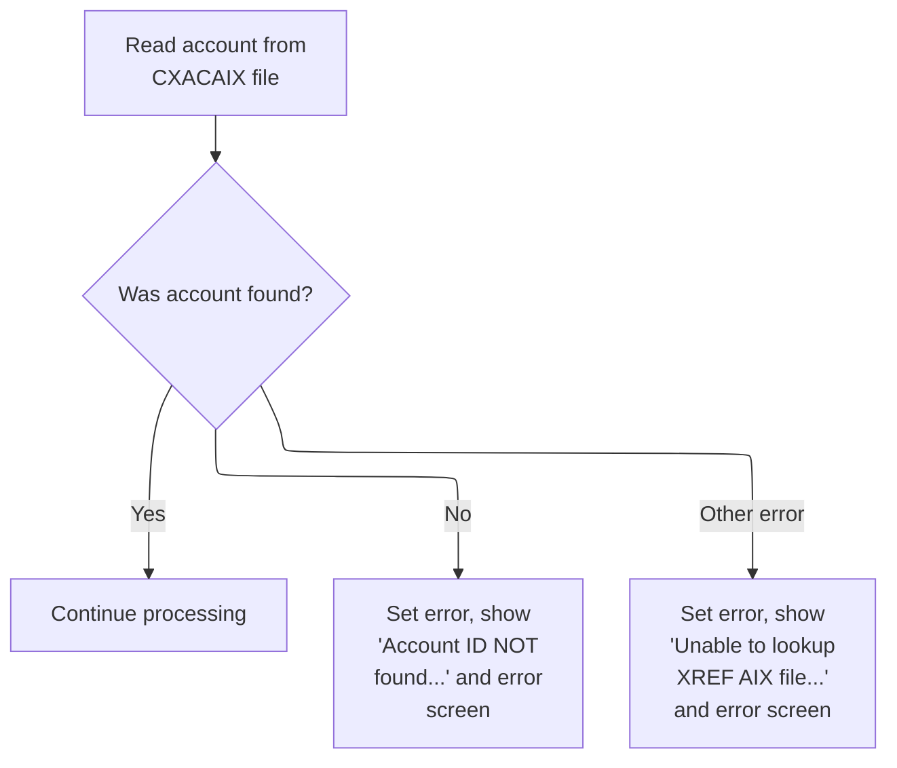
```mermaid
%%{init: {"flowchart": {"defaultRenderer": "elk"}} }%%
flowchart TD
    node1["Read account from 
 CXACAIX file"] --> node2{"Was account found?"}
    click node1 openCode "app/cbl/COBIL00C.cbl:410:418"
    node2 -->|"Yes"| node3["Continue processing"]
    click node2 openCode "app/cbl/COBIL00C.cbl:420:436"
    node2 -->|"No"| node4["Set error, show 
 'Account ID NOT 
 found...' and error 
 screen"]
    click node4 openCode "app/cbl/COBIL00C.cbl:424:428"
    node2 -->|"Other error"| node5["Set error, show 
 'Unable to lookup 
 XREF AIX file...' 
 and error screen"]
    click node5 openCode "app/cbl/COBIL00C.cbl:431:435"
classDef HeadingStyle fill:#777777,stroke:#333,stroke-width:2px;
```

This section governs the business logic for linking a card to an account by reading the card-account cross-reference file and handling the outcomes of the lookup operation.

| Rule ID | Code Location     | Category       | Rule Name                  | Description                                                                                                                                                                                                              | Conditions                                                                                  | Remarks                                                                                                                                                                                                       |
| ------- | ----------------- | -------------- | -------------------------- | ------------------------------------------------------------------------------------------------------------------------------------------------------------------------------------------------------------------------ | ------------------------------------------------------------------------------------------- | ------------------------------------------------------------------------------------------------------------------------------------------------------------------------------------------------------------- |
| BR-001  | READ-CXACAIX-FILE | Business logic | Successful account linkage | If the account ID is found in the card-account cross-reference file, the system continues processing without displaying any error message.                                                                               | The account ID exists in the CXACAIX file and the response code indicates a normal result.  | No error message is shown. The process continues as normal. The response code value for success is DFHRESP(NORMAL).                                                                                           |
| BR-002  | READ-CXACAIX-FILE | Error handling | Account not found error    | If the account ID is not found in the card-account cross-reference file, the system sets an error flag, displays the message 'Account ID NOT found...', and shows the error screen to the user.                          | The account ID does not exist in the CXACAIX file and the response code indicates 'NOTFND'. | The error flag is set to 'Y'. The error message displayed is 'Account ID NOT found...'. The error screen is shown. The response code value for not found is DFHRESP(NOTFND).                                  |
| BR-003  | READ-CXACAIX-FILE | Error handling | General lookup error       | If there is any other error during the lookup of the card-account cross-reference file, the system sets an error flag, displays the message 'Unable to lookup XREF AIX file...', and shows the error screen to the user. | Any error occurs during the lookup that is not a normal result or not found.                | The error flag is set to 'Y'. The error message displayed is 'Unable to lookup XREF AIX file...'. The error screen is shown. This applies to any response code other than DFHRESP(NORMAL) or DFHRESP(NOTFND). |

<SwmSnippet path="/app/cbl/COBIL00C.cbl" line="408" repo-id="Z2l0aHViJTNBJTNBa3luZHJ5bC1hd3MtbWFpbmZyYW1lLW1vZGVybml6YXRpb24tY2FyZGRlbW8lM0ElM0FTd2ltbS1EZW1v">

---

In `READ-CXACAIX-FILE`, we read the card-account mapping from the VSAM dataset using the account ID as the key, so we can link the transaction to the right card.

```cobol
       READ-CXACAIX-FILE.

           EXEC CICS READ
                DATASET   (WS-CXACAIX-FILE)
                INTO      (CARD-XREF-RECORD)
                LENGTH    (LENGTH OF CARD-XREF-RECORD)
                RIDFLD    (XREF-ACCT-ID)
                KEYLENGTH (LENGTH OF XREF-ACCT-ID)
                RESP      (WS-RESP-CD)
                RESP2     (WS-REAS-CD)
           END-EXEC
```

---

</SwmSnippet>

<SwmSnippet path="/app/cbl/COBIL00C.cbl" line="420" repo-id="Z2l0aHViJTNBJTNBa3luZHJ5bC1hd3MtbWFpbmZyYW1lLW1vZGVybml6YXRpb24tY2FyZGRlbW8lM0ElM0FTd2ltbS1EZW1v">

---

After reading the cross-reference file, we check the response code. If there's an error or no mapping, we show the error on the bill payment screen.

```cobol
           EVALUATE WS-RESP-CD
               WHEN DFHRESP(NORMAL)
                   CONTINUE
               WHEN DFHRESP(NOTFND)
                   MOVE 'Y'     TO WS-ERR-FLG
                   MOVE 'Account ID NOT found...' TO
                                   WS-MESSAGE
                   MOVE -1       TO ACTIDINL OF COBIL0AI
                   PERFORM SEND-BILLPAY-SCREEN
               WHEN OTHER
                   DISPLAY 'RESP:' WS-RESP-CD 'REAS:' WS-REAS-CD
                   MOVE 'Y'     TO WS-ERR-FLG
                   MOVE 'Unable to lookup XREF AIX file...' TO
                                   WS-MESSAGE
                   MOVE -1       TO ACTIDINL OF COBIL0AI
                   PERFORM SEND-BILLPAY-SCREEN
           END-EVALUATE.
```

---

</SwmSnippet>

### Generating New Transaction ID

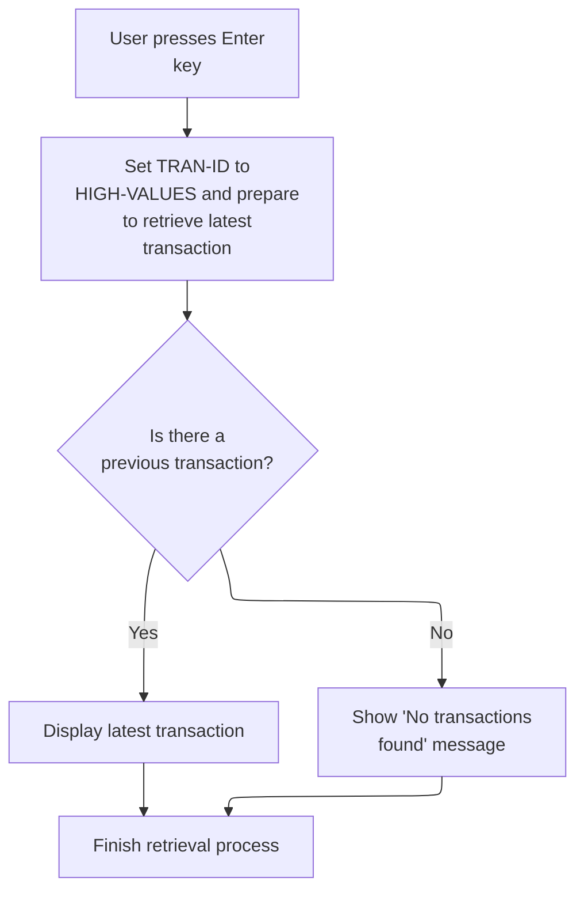
```mermaid
%%{init: {"flowchart": {"defaultRenderer": "elk"}} }%%
flowchart TD
    node1["User presses Enter 
 key"] --> node2["Set TRAN-ID to 
 HIGH-VALUES and prepare 
 to retrieve latest 
 transaction"]
    click node1 openCode "app/cbl/COBIL00C.cbl:212:212"
    click node2 openCode "app/cbl/COBIL00C.cbl:212:213"
    node2 --> node3{"Is there a 
 previous transaction?"}
    click node3 openCode "app/cbl/COBIL00C.cbl:214:214"
    node3 -->|"Yes"| node4["Display latest transaction"]
    click node4 openCode "app/cbl/COBIL00C.cbl:214:214"
    node3 -->|"No"| node5["Show 'No transactions 
 found' message"]
    click node5 openCode "app/cbl/COBIL00C.cbl:214:214"
    node4 --> node6["Finish retrieval process"]
    click node6 openCode "app/cbl/COBIL00C.cbl:215:215"
    node5 --> node6
classDef HeadingStyle fill:#777777,stroke:#333,stroke-width:2px;
```

This section governs the process for generating a new transaction ID by determining the latest transaction for an account and handling the outcomes of that retrieval.

| Rule ID | Code Location                                 | Category       | Rule Name                                | Description                                                                                                                                                                                                     | Conditions                                                                         | Remarks                                                                                                                                                                                                                   |
| ------- | --------------------------------------------- | -------------- | ---------------------------------------- | --------------------------------------------------------------------------------------------------------------------------------------------------------------------------------------------------------------- | ---------------------------------------------------------------------------------- | ------------------------------------------------------------------------------------------------------------------------------------------------------------------------------------------------------------------------- |
| BR-001  | MAIN-LOGIC                                    | Business logic | Prepare for latest transaction retrieval | When the user initiates the process to create a new transaction, the system sets the transaction ID to the highest possible value to prepare for retrieving the latest transaction associated with the account. | User initiates new transaction creation (e.g., presses Enter)                      | The constant HIGH-VALUES is used to set the transaction ID to its maximum possible value. The transaction ID field is 16 alphanumeric characters.                                                                         |
| BR-002  | STARTBR-TRANSACT-FILE, READPREV-TRANSACT-FILE | Business logic | Display latest transaction if found      | After preparing for retrieval, the system browses the transaction file backwards to locate the most recent transaction for the account. If a previous transaction exists, it is displayed to the user.          | A previous transaction exists for the account after browsing the transaction file  | The transaction record includes a transaction ID (16 alphanumeric characters) and other transaction details. The output format for display is not specified in the code, but the transaction record structure is defined. |
| BR-003  | READPREV-TRANSACT-FILE                        | Error handling | No transactions found message            | If no previous transaction is found during the browse, the system displays a message indicating that no transactions were found for the account.                                                                | No previous transaction exists for the account after browsing the transaction file | The message format is not specified in the code, but the business outcome is a user-facing message indicating no transactions exist.                                                                                      |
| BR-004  | ENDBR-TRANSACT-FILE                           | Technical step | Finish transaction retrieval process     | After displaying the latest transaction or the 'No transactions found' message, the system completes the retrieval process and ends the browse operation on the transaction file.                               | After displaying transaction details or 'No transactions found' message            | No specific output format is defined for this step; it marks the end of the retrieval process.                                                                                                                            |

<SwmSnippet path="/app/cbl/COBIL00C.cbl" line="212" repo-id="Z2l0aHViJTNBJTNBa3luZHJ5bC1hd3MtbWFpbmZyYW1lLW1vZGVybml6YXRpb24tY2FyZGRlbW8lM0ElM0FTd2ltbS1EZW1v">

---

After getting the card/account mapping, we start a browse on the transaction file to find the latest transaction ID before creating a new one.

```cobol
                   MOVE HIGH-VALUES TO TRAN-ID
                   PERFORM STARTBR-TRANSACT-FILE
                   PERFORM READPREV-TRANSACT-FILE
                   PERFORM ENDBR-TRANSACT-FILE
```

---

</SwmSnippet>

### Starting Transaction File Browse

```mermaid
%%{init: {"flowchart": {"defaultRenderer": "elk"}} }%%
flowchart TD
    node1["Attempt to find 
 transaction by ID"] --> node2{"Was transaction found?"}
    click node1 openCode "app/cbl/COBIL00C.cbl:443:449"
    node2 -->|"Yes"| node3["End: Transaction found"]
    click node2 openCode "app/cbl/COBIL00C.cbl:451:467"
    node2 -->|"No"| node4["Set error flag 
 and message: Transaction 
 not found"]
    node2 -->|"Any other error"| node5["Set error flag 
 and message: Unable 
 to lookup transaction"]
    click node4 openCode "app/cbl/COBIL00C.cbl:455:457"
    click node5 openCode "app/cbl/COBIL00C.cbl:462:464"
    node4 --> node6["Show error screen 
 to user"]
    node5 --> node6
    click node6 openCode "app/cbl/COBIL00C.cbl:459:466"
    node3:::end
    click node3 openCode "app/cbl/COBIL00C.cbl:453:453"

classDef HeadingStyle fill:#777777,stroke:#333,stroke-width:2px;
```

This section manages the process of browsing the transaction file by transaction ID and handles the outcomes, including success, not found, and error scenarios, by setting appropriate flags and displaying messages to the user.

| Rule ID | Code Location         | Category       | Rule Name                   | Description                                                                                                                                                                              | Conditions                                                                      | Remarks                                                                                                                                                                   |
| ------- | --------------------- | -------------- | --------------------------- | ---------------------------------------------------------------------------------------------------------------------------------------------------------------------------------------- | ------------------------------------------------------------------------------- | ------------------------------------------------------------------------------------------------------------------------------------------------------------------------- |
| BR-001  | STARTBR-TRANSACT-FILE | Business logic | Transaction found success   | If the transaction is found using the provided transaction ID, the process continues without setting any error flags or displaying error messages.                                       | The response code from the transaction file browse is 'NORMAL'.                 | No error flag is set (remains 'N'). No error message is displayed. The process continues as normal.                                                                       |
| BR-002  | STARTBR-TRANSACT-FILE | Error handling | Transaction not found error | If the transaction is not found using the provided transaction ID, an error flag is set and a message 'Transaction ID NOT found...' is displayed to the user on the bill payment screen. | The response code from the transaction file browse is 'NOTFND'.                 | Error flag is set to 'Y'. Error message is 'Transaction ID NOT found...'. The message is displayed on the bill payment screen. The input field ACTIDINL is set to -1.     |
| BR-003  | STARTBR-TRANSACT-FILE | Error handling | Transaction lookup error    | If any other error occurs during the transaction lookup, an error flag is set and a message 'Unable to lookup Transaction...' is displayed to the user on the bill payment screen.       | The response code from the transaction file browse is not 'NORMAL' or 'NOTFND'. | Error flag is set to 'Y'. Error message is 'Unable to lookup Transaction...'. The message is displayed on the bill payment screen. The input field ACTIDINL is set to -1. |

<SwmSnippet path="/app/cbl/COBIL00C.cbl" line="441" repo-id="Z2l0aHViJTNBJTNBa3luZHJ5bC1hd3MtbWFpbmZyYW1lLW1vZGVybml6YXRpb24tY2FyZGRlbW8lM0ElM0FTd2ltbS1EZW1v">

---

We set up to browse the transaction file at the right spot.

```cobol
       STARTBR-TRANSACT-FILE.

           EXEC CICS STARTBR
                DATASET   (WS-TRANSACT-FILE)
                RIDFLD    (TRAN-ID)
                KEYLENGTH (LENGTH OF TRAN-ID)
                RESP      (WS-RESP-CD)
                RESP2     (WS-REAS-CD)
           END-EXEC
```

---

</SwmSnippet>

<SwmSnippet path="/app/cbl/COBIL00C.cbl" line="451" repo-id="Z2l0aHViJTNBJTNBa3luZHJ5bC1hd3MtbWFpbmZyYW1lLW1vZGVybml6YXRpb24tY2FyZGRlbW8lM0ElM0FTd2ltbS1EZW1v">

---

After starting the browse, we check the response code. If there's an error or the transaction ID isn't found, we show the error on the bill payment screen.

```cobol
           EVALUATE WS-RESP-CD
               WHEN DFHRESP(NORMAL)
                   CONTINUE
               WHEN DFHRESP(NOTFND)
                   MOVE 'Y'     TO WS-ERR-FLG
                   MOVE 'Transaction ID NOT found...' TO
                                   WS-MESSAGE
                   MOVE -1       TO ACTIDINL OF COBIL0AI
                   PERFORM SEND-BILLPAY-SCREEN
               WHEN OTHER
                   DISPLAY 'RESP:' WS-RESP-CD 'REAS:' WS-REAS-CD
                   MOVE 'Y'     TO WS-ERR-FLG
                   MOVE 'Unable to lookup Transaction...' TO
                                   WS-MESSAGE
                   MOVE -1       TO ACTIDINL OF COBIL0AI
                   PERFORM SEND-BILLPAY-SCREEN
           END-EVALUATE.
```

---

</SwmSnippet>

### Reading Previous Transaction Record

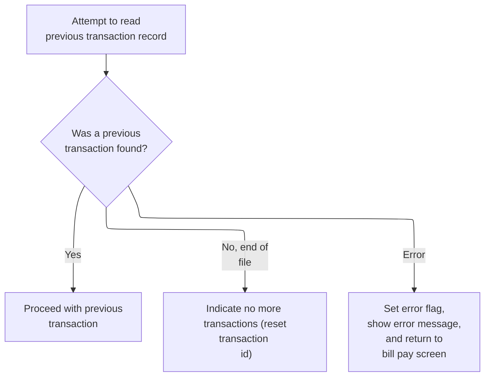
```mermaid
%%{init: {"flowchart": {"defaultRenderer": "elk"}} }%%
flowchart TD
    node1["Attempt to read 
 previous transaction record"]
    click node1 openCode "app/cbl/COBIL00C.cbl:474:482"
    node1 --> node2{"Was a previous 
 transaction found?"}
    click node2 openCode "app/cbl/COBIL00C.cbl:484:496"
    node2 -->|"Yes"| node3["Proceed with previous 
 transaction"]
    click node3 openCode "app/cbl/COBIL00C.cbl:486:486"
    node2 -->|"No, end of 
 file"| node4["Indicate no more 
 transactions (reset transaction 
 id)"]
    click node4 openCode "app/cbl/COBIL00C.cbl:488:489"
    node2 -->|"Error"| node5["Set error flag, 
 show error message, 
 and return to 
 bill pay screen"]
    click node5 openCode "app/cbl/COBIL00C.cbl:490:495"
classDef HeadingStyle fill:#777777,stroke:#333,stroke-width:2px;
```

This section manages the retrieval of the previous transaction record, determines the outcome of the read operation, and handles user-facing responses for success, end of file, or error scenarios.

| Rule ID | Code Location          | Category       | Rule Name                  | Description                                                                                                                                                 | Conditions                                                               | Remarks                                                                                                                                                                                                                                                                                                                                                                                                                                                                                                                                                                                                                                     |
| ------- | ---------------------- | -------------- | -------------------------- | ----------------------------------------------------------------------------------------------------------------------------------------------------------- | ------------------------------------------------------------------------ | ------------------------------------------------------------------------------------------------------------------------------------------------------------------------------------------------------------------------------------------------------------------------------------------------------------------------------------------------------------------------------------------------------------------------------------------------------------------------------------------------------------------------------------------------------------------------------------------------------------------------------------------- |
| BR-001  | READPREV-TRANSACT-FILE | Business logic | Previous transaction found | If a previous transaction record is found, the system proceeds with the transaction and makes the record available for further processing.                  | The response code from the read operation is DFHRESP(NORMAL).            | The transaction record is made available for further processing. The record format is: transaction ID (string, 16 bytes), transaction type code (string, 2 bytes), transaction category code (number, 4 digits), transaction source (string, 10 bytes), transaction description (string, 100 bytes), transaction amount (number, 11 digits with 2 decimals), merchant ID (number, 9 digits), merchant name (string, 50 bytes), merchant city (string, 50 bytes), merchant zip (string, 10 bytes), card number (string, 16 bytes), original timestamp (string, 26 bytes), processed timestamp (string, 26 bytes), filler (string, 20 bytes). |
| BR-002  | READPREV-TRANSACT-FILE | Business logic | No more transactions       | If there are no more previous transactions, the system resets the transaction ID to zeros to indicate the end of available records.                         | The response code from the read operation is DFHRESP(ENDFILE).           | The transaction ID is set to zeros (string, 16 bytes: '0000000000000000'). This signals that there are no more previous transactions to process.                                                                                                                                                                                                                                                                                                                                                                                                                                                                                            |
| BR-003  | READPREV-TRANSACT-FILE | Error handling | Read error handling        | If an error occurs during the read operation, the system sets an error flag, displays an error message to the user, and returns to the bill payment screen. | The response code from the read operation is neither NORMAL nor ENDFILE. | The error flag is set to 'Y'. The error message displayed is 'Unable to lookup Transaction...'. The message is shown on the bill payment screen. The transaction input field is set to -1 to indicate an error state.                                                                                                                                                                                                                                                                                                                                                                                                                       |

<SwmSnippet path="/app/cbl/COBIL00C.cbl" line="472" repo-id="Z2l0aHViJTNBJTNBa3luZHJ5bC1hd3MtbWFpbmZyYW1lLW1vZGVybml6YXRpb24tY2FyZGRlbW8lM0ElM0FTd2ltbS1EZW1v">

---

In READPREV-TRANSACT-FILE, we read the previous transaction record to get the latest transaction ID for incrementing. If there are no records or an error, we handle it and show the error on the screen.

```cobol
       READPREV-TRANSACT-FILE.

           EXEC CICS READPREV
                DATASET   (WS-TRANSACT-FILE)
                INTO      (TRAN-RECORD)
                LENGTH    (LENGTH OF TRAN-RECORD)
                RIDFLD    (TRAN-ID)
                KEYLENGTH (LENGTH OF TRAN-ID)
                RESP      (WS-RESP-CD)
                RESP2     (WS-REAS-CD)
           END-EXEC
```

---

</SwmSnippet>

<SwmSnippet path="/app/cbl/COBIL00C.cbl" line="484" repo-id="Z2l0aHViJTNBJTNBa3luZHJ5bC1hd3MtbWFpbmZyYW1lLW1vZGVybml6YXRpb24tY2FyZGRlbW8lM0ElM0FTd2ltbS1EZW1v">

---

After reading the previous transaction, we check the response code. If there's an error or no records, we show the error on the bill payment screen.

```cobol
           EVALUATE WS-RESP-CD
               WHEN DFHRESP(NORMAL)
                   CONTINUE
               WHEN DFHRESP(ENDFILE)
                   MOVE ZEROS TO TRAN-ID
               WHEN OTHER
                   DISPLAY 'RESP:' WS-RESP-CD 'REAS:' WS-REAS-CD
                   MOVE 'Y'     TO WS-ERR-FLG
                   MOVE 'Unable to lookup Transaction...' TO
                                   WS-MESSAGE
                   MOVE -1       TO ACTIDINL OF COBIL0AI
                   PERFORM SEND-BILLPAY-SCREEN
           END-EVALUATE.
```

---

</SwmSnippet>

### Finalizing Transaction ID and Record

```mermaid
%%{init: {"flowchart": {"defaultRenderer": "elk"}} }%%
flowchart TD
    node1["Prepare to browse 
 transaction file"] --> node2["Read previous transaction 
 record"]
    click node1 openCode "app/cbl/COBIL00C.cbl:212:213"
    node2["Read previous transaction 
 record"] --> node3["End browse of 
 transaction file"]
    click node2 openCode "app/cbl/COBIL00C.cbl:214:214"
    node3["End browse of 
 transaction file"] --> node4["Increment transaction ID"]
    click node3 openCode "app/cbl/COBIL00C.cbl:215:215"
    node4["Increment transaction ID"] --> node5["Initialize new transaction 
 record"]
    click node4 openCode "app/cbl/COBIL00C.cbl:216:217"
    node5["Initialize new transaction 
 record"] --> node6["Set transaction details: 
 type Bill Payment 
 (02), category 2, 
 source POS TERM, 
 description BILL PAYMENT 
 - ONLINE, amount 
 = current account 
 balance, card info, 
 merchant info"]
    click node5 openCode "app/cbl/COBIL00C.cbl:218:218"
    click node6 openCode "app/cbl/COBIL00C.cbl:219:229"
classDef HeadingStyle fill:#777777,stroke:#333,stroke-width:2px;
```

This section finalizes the transaction ID and prepares a new transaction record for bill payment, ensuring all required fields are populated with standardized values and the record is stamped with the current timestamp.

| Rule ID | Code Location     | Category       | Rule Name                                | Description                                                                                                                                                                                              | Conditions                                                                             | Remarks                                                                                                                                                                                                                |
| ------- | ----------------- | -------------- | ---------------------------------------- | -------------------------------------------------------------------------------------------------------------------------------------------------------------------------------------------------------- | -------------------------------------------------------------------------------------- | ---------------------------------------------------------------------------------------------------------------------------------------------------------------------------------------------------------------------- |
| BR-001  | PROCESS-ENTER-KEY | Business logic | Sequential transaction ID assignment     | Each new transaction record is assigned a transaction ID that is one greater than the previous transaction ID.                                                                                           | When preparing a new transaction record after reading the previous transaction record. | Transaction ID is a string of up to 16 characters, incremented by 1 from the previous value.                                                                                                                           |
| BR-002  | PROCESS-ENTER-KEY | Business logic | Bill payment transaction categorization  | All new bill payment transactions are categorized with type code '02', category code 2, source 'POS TERM', and description 'BILL PAYMENT - ONLINE'.                                                      | When creating a new transaction record for a bill payment.                             | Type code is '02' (2 characters), category code is 2 (numeric, up to 4 digits), source is 'POS TERM' (10 characters), description is 'BILL PAYMENT - ONLINE' (up to 100 characters).                                   |
| BR-003  | PROCESS-ENTER-KEY | Business logic | Transaction amount assignment            | The transaction amount for a bill payment is set to the current account balance at the time of transaction creation.                                                                                     | When initializing a new bill payment transaction record.                               | Amount is a signed numeric value with up to 9 digits and 2 decimal places.                                                                                                                                             |
| BR-004  | PROCESS-ENTER-KEY | Business logic | Merchant and card information population | The transaction record must include card and merchant information: card number from cross-reference, merchant ID set to 999999999, merchant name 'BILL PAYMENT', and merchant city and zip set to 'N/A'. | When creating a new bill payment transaction record.                                   | Card number is a string of up to 16 characters; merchant ID is 999999999 (9 digits); merchant name is 'BILL PAYMENT' (up to 50 characters); merchant city and zip are 'N/A' (up to 50 and 10 characters respectively). |
| BR-005  | PROCESS-ENTER-KEY | Business logic | Transaction timestamping                 | Each new transaction record is stamped with the current timestamp for tracking and audit purposes.                                                                                                       | After all transaction details have been set for a new record.                          | Timestamp format is determined by the GET-CURRENT-TIMESTAMP routine, typically a string of up to 26 characters representing date and time.                                                                             |

<SwmSnippet path="/app/cbl/COBIL00C.cbl" line="212" repo-id="Z2l0aHViJTNBJTNBa3luZHJ5bC1hd3MtbWFpbmZyYW1lLW1vZGVybml6YXRpb24tY2FyZGRlbW8lM0ElM0FTd2ltbS1EZW1v">

---

After reading the previous transaction in PROCESS-ENTER-KEY, we end the browse to release the file before moving on to record creation.

```cobol
                   MOVE HIGH-VALUES TO TRAN-ID
                   PERFORM STARTBR-TRANSACT-FILE
                   PERFORM READPREV-TRANSACT-FILE
                   PERFORM ENDBR-TRANSACT-FILE
```

---

</SwmSnippet>

<SwmSnippet path="/app/cbl/COBIL00C.cbl" line="501" repo-id="Z2l0aHViJTNBJTNBa3luZHJ5bC1hd3MtbWFpbmZyYW1lLW1vZGVybml6YXRpb24tY2FyZGRlbW8lM0ElM0FTd2ltbS1EZW1v">

---

`ENDBR-TRANSACT-FILE` just releases the transaction file resource in CICS so we can update or write new records.

```cobol
       ENDBR-TRANSACT-FILE.

           EXEC CICS ENDBR
                DATASET   (WS-TRANSACT-FILE)
           END-EXEC.
```

---

</SwmSnippet>

<SwmSnippet path="/app/cbl/COBIL00C.cbl" line="216" repo-id="Z2l0aHViJTNBJTNBa3luZHJ5bC1hd3MtbWFpbmZyYW1lLW1vZGVybml6YXRpb24tY2FyZGRlbW8lM0ElM0FTd2ltbS1EZW1v">

---

After ENDBR-TRANSACT-FILE in PROCESS-ENTER-KEY, we bump the transaction ID, initialize the record, and fill in all the transaction details.

```cobol
                   MOVE TRAN-ID     TO WS-TRAN-ID-NUM
                   ADD 1 TO WS-TRAN-ID-NUM
                   INITIALIZE TRAN-RECORD
                   MOVE WS-TRAN-ID-NUM       TO TRAN-ID
                   MOVE '02'                 TO TRAN-TYPE-CD
                   MOVE 2                    TO TRAN-CAT-CD
                   MOVE 'POS TERM'           TO TRAN-SOURCE
                   MOVE 'BILL PAYMENT - ONLINE' TO TRAN-DESC
                   MOVE ACCT-CURR-BAL        TO TRAN-AMT
                   MOVE XREF-CARD-NUM        TO TRAN-CARD-NUM
                   MOVE 999999999            TO TRAN-MERCHANT-ID
                   MOVE 'BILL PAYMENT'       TO TRAN-MERCHANT-NAME
                   MOVE 'N/A'                TO TRAN-MERCHANT-CITY
                   MOVE 'N/A'                TO TRAN-MERCHANT-ZIP
```

---

</SwmSnippet>

<SwmSnippet path="/app/cbl/COBIL00C.cbl" line="230" repo-id="Z2l0aHViJTNBJTNBa3luZHJ5bC1hd3MtbWFpbmZyYW1lLW1vZGVybml6YXRpb24tY2FyZGRlbW8lM0ElM0FTd2ltbS1EZW1v">

---

After setting up the transaction record, we call GET-CURRENT-TIMESTAMP to stamp the record with the current date and time for tracking.

```cobol
                   PERFORM GET-CURRENT-TIMESTAMP
```

---

</SwmSnippet>

### Stamping Transaction with Current Time

This section stamps each transaction with the current system time, formatted according to business requirements for audit and traceability.

| Rule ID | Code Location         | Category       | Rule Name                      | Description                                                                                                                                                                                           | Conditions                                                           | Remarks                                                                                                                                                        |
| ------- | --------------------- | -------------- | ------------------------------ | ----------------------------------------------------------------------------------------------------------------------------------------------------------------------------------------------------- | -------------------------------------------------------------------- | -------------------------------------------------------------------------------------------------------------------------------------------------------------- |
| BR-001  | GET-CURRENT-TIMESTAMP | Business logic | Current system time stamping   | Each transaction must be stamped with the current system date and time as retrieved from the system clock at the moment of processing.                                                                | Whenever a transaction record is created or updated in this section. | The date and time are sourced from the system clock using CICS ASKTIME and FORMATTIME. The timestamp reflects the exact system time at the moment of stamping. |
| BR-002  | GET-CURRENT-TIMESTAMP | Business logic | Timestamp format specification | The transaction timestamp must be formatted as a string in the pattern 'YYYY-MM-DD HH:MM:SS:00', with the date and time separated by a space, and all fields zero-padded to their respective lengths. | Whenever a transaction timestamp is created in this section.         | Format: 'YYYY-MM-DD HH:MM:SS:00'.                                                                                                                              |

- Date: 10 characters, zero-padded year (4 digits), month (2 digits), day (2 digits), separated by '-'.
- Time: 8 characters, zero-padded hour (2 digits), minute (2 digits), second (2 digits), separated by ':'.
- Milliseconds: always '00'. | | BR-003  | GET-CURRENT-TIMESTAMP | Business logic | Milliseconds zeroing           | Milliseconds in the transaction timestamp must always be set to zero, regardless of the actual system time.                                                                                           | Whenever a transaction timestamp is created in this section.         | Milliseconds portion of the timestamp is always '00', ensuring uniformity across all transaction records.                                                                                                                                                                         |

<SwmSnippet path="/app/cbl/COBIL00C.cbl" line="249" repo-id="Z2l0aHViJTNBJTNBa3luZHJ5bC1hd3MtbWFpbmZyYW1lLW1vZGVybml6YXRpb24tY2FyZGRlbW8lM0ElM0FTd2ltbS1EZW1v">

---

In GET-CURRENT-TIMESTAMP, we call ASKTIME to get the system time and FORMATTIME to format it for the transaction record.

```cobol
       GET-CURRENT-TIMESTAMP.

           EXEC CICS ASKTIME
             ABSTIME(WS-ABS-TIME)
           END-EXEC

           EXEC CICS FORMATTIME
             ABSTIME(WS-ABS-TIME)
             YYYYMMDD(WS-CUR-DATE-X10)
             DATESEP('-')
             TIME(WS-CUR-TIME-X08)
             TIMESEP(':')
           END-EXEC
```

---

</SwmSnippet>

<SwmSnippet path="/app/cbl/COBIL00C.cbl" line="263" repo-id="Z2l0aHViJTNBJTNBa3luZHJ5bC1hd3MtbWFpbmZyYW1lLW1vZGVybml6YXRpb24tY2FyZGRlbW8lM0ElM0FTd2ltbS1EZW1v">

---

After formatting, we initialize WS-TIMESTAMP and fill it with the date and time, then set milliseconds to zero for the transaction record.

```cobol
           INITIALIZE WS-TIMESTAMP
           MOVE WS-CUR-DATE-X10 TO WS-TIMESTAMP(01:10)
           MOVE WS-CUR-TIME-X08 TO WS-TIMESTAMP(12:08)
           MOVE ZEROS           TO WS-TIMESTAMP-TM-MS6
           .
```

---

</SwmSnippet>

### Writing Transaction and Updating Account

This section handles the recording of a transaction and the updating of the associated account balance and account data file to ensure data consistency after a payment is processed.

| Rule ID | Code Location       | Category       | Rule Name                  | Description                                                                                                                                          | Conditions                                                                | Remarks                                                                                                                                                                                                                                                                                                                                          |
| ------- | ------------------- | -------------- | -------------------------- | ---------------------------------------------------------------------------------------------------------------------------------------------------- | ------------------------------------------------------------------------- | ------------------------------------------------------------------------------------------------------------------------------------------------------------------------------------------------------------------------------------------------------------------------------------------------------------------------------------------------ |
| BR-001  | WRITE-TRANSACT-FILE | Business logic | Transaction record writing | When a transaction is processed, the transaction record must be written to the transaction file with the original and processed timestamps included. | A transaction is being processed and both timestamps are available.       | The transaction record must include fields such as transaction ID (16 characters), transaction type code (2 characters), transaction category code (4 digits), transaction amount (signed number with 2 decimal places), merchant details, card number (16 characters), and two timestamps (each 26 characters). The record length is 350 bytes. |
| BR-002  | MAIN-LOGIC          | Business logic | Account balance deduction  | When a transaction is processed, the transaction amount must be deducted from the account's current balance.                                         | A transaction is being processed and the transaction amount is available. | The account balance is a signed number with 2 decimal places, stored in a field of 12 digits (S9(10)V99).                                                                                                                                                                                                                                        |
| BR-003  | UPDATE-ACCTDAT-FILE | Business logic | Account data file update   | After the account balance is updated, the account data file must be updated to reflect the new balance.                                              | The account balance has been changed due to a processed transaction.      | The account record includes fields such as account ID (11 digits), active status (1 character), current balance (12 digits, signed, 2 decimal places), credit limits, dates, and other account details. The record length is 300 bytes.                                                                                                          |

<SwmSnippet path="/app/cbl/COBIL00C.cbl" line="231" repo-id="Z2l0aHViJTNBJTNBa3luZHJ5bC1hd3MtbWFpbmZyYW1lLW1vZGVybml6YXRpb24tY2FyZGRlbW8lM0ElM0FTd2ltbS1EZW1v">

---

After getting the timestamp in PROCESS-ENTER-KEY, we write the transaction record, deduct the payment from the account balance, and update the account data file to keep everything in sync.

```cobol
                   MOVE WS-TIMESTAMP         TO TRAN-ORIG-TS
                                                TRAN-PROC-TS
                   PERFORM WRITE-TRANSACT-FILE
                   COMPUTE ACCT-CURR-BAL = ACCT-CURR-BAL - TRAN-AMT
                   PERFORM UPDATE-ACCTDAT-FILE
```

---

</SwmSnippet>

### Writing the Transaction Record

```mermaid
%%{init: {"flowchart": {"defaultRenderer": "elk"}} }%%
flowchart TD
    node1["Attempt to write 
 transaction record"] --> node2{"Response code?"}
    click node1 openCode "app/cbl/COBIL00C.cbl:510:520"
    click node2 openCode "app/cbl/COBIL00C.cbl:522:547"
    node2 -->|"NORMAL"| node3["Show success message 
 with Transaction ID, 
 clear message, reset 
 fields, send bill 
 pay screen"]
    click node3 openCode "app/cbl/COBIL00C.cbl:523:532"
    node2 -->|"DUPKEY or DUPREC"| node4["Set error flag, 
 show duplicate transaction 
 message, send bill 
 pay screen"]
    click node4 openCode "app/cbl/COBIL00C.cbl:533:539"
    node2 -->|"OTHER"| node5["Set error flag, 
 show generic failure 
 message, send bill 
 pay screen"]
    click node5 openCode "app/cbl/COBIL00C.cbl:540:546"
classDef HeadingStyle fill:#777777,stroke:#333,stroke-width:2px;
```

This section handles the writing of transaction records to the TRANSACT file and manages user-facing outcomes based on the result of the write operation, ensuring clear feedback and error handling for all possible scenarios.

| Rule ID | Code Location       | Category       | Rule Name                         | Description                                                                                                                                                                                                                                               | Conditions                                                                         | Remarks                                                                                                                                                                                                                                              |
| ------- | ------------------- | -------------- | --------------------------------- | --------------------------------------------------------------------------------------------------------------------------------------------------------------------------------------------------------------------------------------------------------- | ---------------------------------------------------------------------------------- | ---------------------------------------------------------------------------------------------------------------------------------------------------------------------------------------------------------------------------------------------------- |
| BR-001  | WRITE-TRANSACT-FILE | Business logic | Successful transaction write      | When a transaction record is successfully written to the TRANSACT file, the user is shown a success message including the transaction ID, all input fields are cleared, the message area is reset, and the bill payment screen is updated.                | The response code from the write operation is 'NORMAL'.                            | The success message format is: 'Payment successful. Your Transaction ID is <transaction-id>.' The message is left-aligned, up to 80 characters. The transaction ID is up to 16 alphanumeric characters. The message area is cleared (set to spaces). |
| BR-002  | WRITE-TRANSACT-FILE | Error handling | Duplicate transaction error       | If the transaction write fails due to a duplicate key or record, the user is shown an error message indicating the transaction ID already exists, the error flag is set, the transaction ID is marked as invalid, and the bill payment screen is updated. | The response code from the write operation is 'DUPKEY' or 'DUPREC'.                | The error message format is: 'Tran ID already exist...' The message is left-aligned, up to 80 characters. The error flag is set to 'Y'. The transaction ID input field is marked as invalid (-1).                                                    |
| BR-003  | WRITE-TRANSACT-FILE | Error handling | Generic transaction write failure | If the transaction write fails for any reason other than duplicate key or record, the user is shown a generic failure message, the error flag is set, the transaction ID is marked as invalid, and the bill payment screen is updated.                    | The response code from the write operation is not 'NORMAL', 'DUPKEY', or 'DUPREC'. | The error message format is: 'Unable to Add Bill pay Transaction...' The message is left-aligned, up to 80 characters. The error flag is set to 'Y'. The transaction ID input field is marked as invalid (-1).                                       |

<SwmSnippet path="/app/cbl/COBIL00C.cbl" line="510" repo-id="Z2l0aHViJTNBJTNBa3luZHJ5bC1hd3MtbWFpbmZyYW1lLW1vZGVybml6YXRpb24tY2FyZGRlbW8lM0ElM0FTd2ltbS1EZW1v">

---

In `WRITE-TRANSACT-FILE`, we use EXEC CICS WRITE to add the new transaction record to the TRANSACT file. The transaction ID is used as the key, and the result of the operation is captured in WS-RESP-CD and WS-REAS-CD for later error handling. This is where the transaction actually gets persisted.

```cobol
       WRITE-TRANSACT-FILE.

           EXEC CICS WRITE
                DATASET   (WS-TRANSACT-FILE)
                FROM      (TRAN-RECORD)
                LENGTH    (LENGTH OF TRAN-RECORD)
                RIDFLD    (TRAN-ID)
                KEYLENGTH (LENGTH OF TRAN-ID)
                RESP      (WS-RESP-CD)
                RESP2     (WS-REAS-CD)
           END-EXEC
```

---

</SwmSnippet>

<SwmSnippet path="/app/cbl/COBIL00C.cbl" line="522" repo-id="Z2l0aHViJTNBJTNBa3luZHJ5bC1hd3MtbWFpbmZyYW1lLW1vZGVybml6YXRpb24tY2FyZGRlbW8lM0ElM0FTd2ltbS1EZW1v">

---

After writing the transaction, we check the response code. If it's normal, we clear all input fields (INITIALIZE-ALL-FIELDS), reset the message area, build a success message with the transaction ID, and send the updated bill payment screen. This keeps the UI clean and gives the user feedback.

```cobol
           EVALUATE WS-RESP-CD
               WHEN DFHRESP(NORMAL)
                   PERFORM INITIALIZE-ALL-FIELDS
                   MOVE SPACES             TO WS-MESSAGE
                   MOVE DFHGREEN           TO ERRMSGC  OF COBIL0AO
                   STRING 'Payment successful. '     DELIMITED BY SIZE
                     ' Your Transaction ID is ' DELIMITED BY SIZE
                          TRAN-ID  DELIMITED BY SPACE
                          '.' DELIMITED BY SIZE
                     INTO WS-MESSAGE
                   PERFORM SEND-BILLPAY-SCREEN
```

---

</SwmSnippet>

<SwmSnippet path="/app/cbl/COBIL00C.cbl" line="522" repo-id="Z2l0aHViJTNBJTNBa3luZHJ5bC1hd3MtbWFpbmZyYW1lLW1vZGVybml6YXRpb24tY2FyZGRlbW8lM0ElM0FTd2ltbS1EZW1v">

---

Back in WRITE-TRANSACT-FILE, after clearing all fields, we build the success message and call SEND-BILLPAY-SCREEN. This pushes the result (success or error) to the user right away, keeping the flow tight and responsive.

```cobol
           EVALUATE WS-RESP-CD
               WHEN DFHRESP(NORMAL)
                   PERFORM INITIALIZE-ALL-FIELDS
                   MOVE SPACES             TO WS-MESSAGE
                   MOVE DFHGREEN           TO ERRMSGC  OF COBIL0AO
                   STRING 'Payment successful. '     DELIMITED BY SIZE
                     ' Your Transaction ID is ' DELIMITED BY SIZE
                          TRAN-ID  DELIMITED BY SPACE
                          '.' DELIMITED BY SIZE
                     INTO WS-MESSAGE
                   PERFORM SEND-BILLPAY-SCREEN
```

---

</SwmSnippet>

<SwmSnippet path="/app/cbl/COBIL00C.cbl" line="533" repo-id="Z2l0aHViJTNBJTNBa3luZHJ5bC1hd3MtbWFpbmZyYW1lLW1vZGVybml6YXRpb24tY2FyZGRlbW8lM0ElM0FTd2ltbS1EZW1v">

---

After SEND-BILLPAY-SCREEN in WRITE-TRANSACT-FILE, if we hit a duplicate key or record, we set the error flag, update the message, mark the transaction ID as invalid, and re-display the bill payment screen with the error. The user sees exactly what went wrong.

```cobol
               WHEN DFHRESP(DUPKEY)
               WHEN DFHRESP(DUPREC)
                   MOVE 'Y'     TO WS-ERR-FLG
                   MOVE 'Tran ID already exist...' TO
                                   WS-MESSAGE
                   MOVE -1       TO ACTIDINL OF COBIL0AI
                   PERFORM SEND-BILLPAY-SCREEN
```

---

</SwmSnippet>

<SwmSnippet path="/app/cbl/COBIL00C.cbl" line="540" repo-id="Z2l0aHViJTNBJTNBa3luZHJ5bC1hd3MtbWFpbmZyYW1lLW1vZGVybml6YXRpb24tY2FyZGRlbW8lM0ElM0FTd2ltbS1EZW1v">

---

When WRITE-TRANSACT-FILE finishes, it either shows a success message, a duplicate error, or a generic error on the bill payment screen. The error flag and ACTIDINL field are set for error cases, and all outcomes are surfaced to the user right away.

```cobol
               WHEN OTHER
                   DISPLAY 'RESP:' WS-RESP-CD 'REAS:' WS-REAS-CD
                   MOVE 'Y'     TO WS-ERR-FLG
                   MOVE 'Unable to Add Bill pay Transaction...' TO
                                   WS-MESSAGE
                   MOVE -1       TO ACTIDINL OF COBIL0AI
                   PERFORM SEND-BILLPAY-SCREEN
           END-EVALUATE.
```

---

</SwmSnippet>

### Updating the Account Balance

This section is responsible for updating the account balance after a transaction is processed and ensuring that the account data remains consistent with the transaction record.

| Rule ID | Code Location     | Category       | Rule Name                                | Description                                                                                                                                              | Conditions                                                | Remarks                                                                                                                                                                                                                                                                                                         |
| ------- | ----------------- | -------------- | ---------------------------------------- | -------------------------------------------------------------------------------------------------------------------------------------------------------- | --------------------------------------------------------- | --------------------------------------------------------------------------------------------------------------------------------------------------------------------------------------------------------------------------------------------------------------------------------------------------------------- |
| BR-001  | PROCESS-ENTER-KEY | Business logic | Account balance update after transaction | After a transaction is written, the payment amount is subtracted from the account's current balance to reflect the new balance.                          | A transaction has been successfully written.              | The account balance is a signed number with up to 10 digits before the decimal and 2 digits after the decimal (e.g., -9999999999.99 to +9999999999.99). The transaction amount is a signed number with up to 9 digits before the decimal and 2 digits after the decimal (e.g., -999999999.99 to +999999999.99). |
| BR-002  | PROCESS-ENTER-KEY | Business logic | Account data synchronization             | After updating the account balance, the account data is synchronized to ensure it reflects the new balance resulting from the transaction.               | The account balance has been updated after a transaction. | The account data file is updated to reflect the new account balance. The account record includes the account ID (11 digits), active status (1 character), and current balance (signed number, 10 digits before decimal, 2 digits after decimal).                                                                |
| BR-003  | PROCESS-ENTER-KEY | Business logic | Transaction timestamp recording          | The transaction record must include both the original and processed timestamps to ensure traceability of when the transaction was created and processed. | A transaction is being written.                           | Both timestamps are strings of 26 characters, representing date and time information for the transaction.                                                                                                                                                                                                       |

<SwmSnippet path="/app/cbl/COBIL00C.cbl" line="231" repo-id="Z2l0aHViJTNBJTNBa3luZHJ5bC1hd3MtbWFpbmZyYW1lLW1vZGVybml6YXRpb24tY2FyZGRlbW8lM0ElM0FTd2ltbS1EZW1v">

---

Back in PROCESS-ENTER-KEY, after writing the transaction, we subtract the payment amount from the account balance and call UPDATE-ACCTDAT-FILE. This keeps the account data in sync with the new transaction.

```cobol
                   MOVE WS-TIMESTAMP         TO TRAN-ORIG-TS
                                                TRAN-PROC-TS
                   PERFORM WRITE-TRANSACT-FILE
                   COMPUTE ACCT-CURR-BAL = ACCT-CURR-BAL - TRAN-AMT
                   PERFORM UPDATE-ACCTDAT-FILE
```

---

</SwmSnippet>

### Saving the Updated Account Data

```mermaid
%%{init: {"flowchart": {"defaultRenderer": "elk"}} }%%
flowchart TD
    node1["Update account record 
 in account data 
 file"]
    click node1 openCode "app/cbl/COBIL00C.cbl:379:385"
    node1 --> node2{"Update result (response 
 code)?"}
    click node2 openCode "app/cbl/COBIL00C.cbl:387:403"
    node2 -->|"NORMAL"| node3["No action needed"]
    click node3 openCode "app/cbl/COBIL00C.cbl:388:389"
    node2 -->|"NOTFND"| node4["Show 'Account ID 
 NOT found', set 
 error, send bill 
 pay screen"]
    click node4 openCode "app/cbl/COBIL00C.cbl:390:395"
    node2 -->|"OTHER"| node5["Show 'Unable to 
 Update Account', set 
 error, send bill 
 pay screen"]
    click node5 openCode "app/cbl/COBIL00C.cbl:396:402"

classDef HeadingStyle fill:#777777,stroke:#333,stroke-width:2px;
```

This section manages the saving of updated account data and handles the result of the update operation, ensuring appropriate user feedback and error handling based on the outcome.

| Rule ID | Code Location       | Category       | Rule Name                 | Description                                                                                                                                                                                                       | Conditions                                                                | Remarks                                                                                                                                                                                                          |
| ------- | ------------------- | -------------- | ------------------------- | ----------------------------------------------------------------------------------------------------------------------------------------------------------------------------------------------------------------- | ------------------------------------------------------------------------- | ---------------------------------------------------------------------------------------------------------------------------------------------------------------------------------------------------------------- |
| BR-001  | UPDATE-ACCTDAT-FILE | Business logic | Successful account update | If the account update operation is successful, no error is set and no user-facing message is displayed. The process continues without interruption.                                                               | The update operation returns a response code indicating NORMAL.           | No error flag is set (error flag remains 'N'). No message is displayed to the user. The process continues to the next step.                                                                                      |
| BR-002  | UPDATE-ACCTDAT-FILE | Error handling | Account not found error   | If the account update operation fails because the account ID is not found, an error is set, a specific message 'Account ID NOT found...' is displayed, and the bill payment screen is shown with the error.       | The update operation returns a response code indicating NOTFND.           | Error flag is set to 'Y'. Message displayed is 'Account ID NOT found...'. Input is marked as invalid (-1). Bill payment screen is shown with the error message. Message format: string, up to 80 characters.     |
| BR-003  | UPDATE-ACCTDAT-FILE | Error handling | General update error      | If the account update operation fails for any reason other than 'not found', an error is set, a specific message 'Unable to Update Account...' is displayed, and the bill payment screen is shown with the error. | The update operation returns a response code other than NORMAL or NOTFND. | Error flag is set to 'Y'. Message displayed is 'Unable to Update Account...'. Input is marked as invalid (-1). Bill payment screen is shown with the error message. Message format: string, up to 80 characters. |

<SwmSnippet path="/app/cbl/COBIL00C.cbl" line="377" repo-id="Z2l0aHViJTNBJTNBa3luZHJ5bC1hd3MtbWFpbmZyYW1lLW1vZGVybml6YXRpb24tY2FyZGRlbW8lM0ElM0FTd2ltbS1EZW1v">

---

In UPDATE-ACCTDAT-FILE, we use EXEC CICS REWRITE to update the account record with the new balance. The response codes are checked right after to see if the update worked or if we need to show an error.

```cobol
       UPDATE-ACCTDAT-FILE.

           EXEC CICS REWRITE
                DATASET   (WS-ACCTDAT-FILE)
                FROM      (ACCOUNT-RECORD)
                LENGTH    (LENGTH OF ACCOUNT-RECORD)
                RESP      (WS-RESP-CD)
                RESP2     (WS-REAS-CD)
           END-EXEC
```

---

</SwmSnippet>

<SwmSnippet path="/app/cbl/COBIL00C.cbl" line="387" repo-id="Z2l0aHViJTNBJTNBa3luZHJ5bC1hd3MtbWFpbmZyYW1lLW1vZGVybml6YXRpb24tY2FyZGRlbW8lM0ElM0FTd2ltbS1EZW1v">

---

After UPDATE-ACCTDAT-FILE, if the update fails (not found or other error), we set the error flag, update the message, mark the input as invalid, and show the bill payment screen with the error. If it works, we just continue.

```cobol
           EVALUATE WS-RESP-CD
               WHEN DFHRESP(NORMAL)
                   CONTINUE
               WHEN DFHRESP(NOTFND)
                   MOVE 'Y'     TO WS-ERR-FLG
                   MOVE 'Account ID NOT found...' TO
                                   WS-MESSAGE
                   MOVE -1       TO ACTIDINL OF COBIL0AI
                   PERFORM SEND-BILLPAY-SCREEN
               WHEN OTHER
                   DISPLAY 'RESP:' WS-RESP-CD 'REAS:' WS-REAS-CD
                   MOVE 'Y'     TO WS-ERR-FLG
                   MOVE 'Unable to Update Account...' TO
                                   WS-MESSAGE
                   MOVE -1       TO ACTIDINL OF COBIL0AI
                   PERFORM SEND-BILLPAY-SCREEN
           END-EVALUATE.
```

---

</SwmSnippet>

### Prompting for Confirmation or Final Screen Update

This section manages the user interaction for bill payment confirmation, ensuring users are prompted when necessary and always see the latest bill payment screen.

| Rule ID | Code Location     | Category       | Rule Name                          | Description                                                                                                                                                                 | Conditions                                                                                        | Remarks                                                                                                                                               |
| ------- | ----------------- | -------------- | ---------------------------------- | --------------------------------------------------------------------------------------------------------------------------------------------------------------------------- | ------------------------------------------------------------------------------------------------- | ----------------------------------------------------------------------------------------------------------------------------------------------------- |
| BR-001  | PROCESS-ENTER-KEY | Business logic | Bill payment confirmation prompt   | If the bill payment has not been confirmed, the user is prompted with a message to confirm the payment before proceeding.                                                   | The bill payment confirmation flag is not set to 'Y' (confirmed).                                 | The prompt message is: 'Confirm to make a bill payment...'. The message is displayed as a string to the user.                                         |
| BR-002  | PROCESS-ENTER-KEY | Business logic | Bill payment screen refresh        | After processing the confirmation logic, the bill payment screen is always updated to reflect the latest state or message, regardless of whether the payment was confirmed. | After the confirmation logic is executed, regardless of the outcome.                              | The bill payment screen is updated to show the latest message or state. The format and content depend on the current message and confirmation status. |
| BR-003  | PROCESS-ENTER-KEY | Business logic | Reset confirmation field on prompt | When prompting for bill payment confirmation, the confirmation field is reset to indicate that confirmation is required.                                                    | The bill payment confirmation flag is not set to 'Y' (confirmed) and the prompt message is shown. | The confirmation field is set to -1 to indicate that confirmation is required. This is a numeric value used internally to track confirmation status.  |

<SwmSnippet path="/app/cbl/COBIL00C.cbl" line="236" repo-id="Z2l0aHViJTNBJTNBa3luZHJ5bC1hd3MtbWFpbmZyYW1lLW1vZGVybml6YXRpb24tY2FyZGRlbW8lM0ElM0FTd2ltbS1EZW1v">

---

After UPDATE-ACCTDAT-FILE in PROCESS-ENTER-KEY, if the payment isn't confirmed, we prompt the user to confirm the bill payment and reset the confirmation field. No matter what, we send the bill payment screen so the user sees the latest state or message.

```cobol
               ELSE
                   MOVE 'Confirm to make a bill payment...' TO
                                   WS-MESSAGE
                   MOVE -1       TO CONFIRML OF COBIL0AI
               END-IF

               PERFORM SEND-BILLPAY-SCREEN

           END-IF.
```

---

</SwmSnippet>

## Initial Bill Payment Screen Display and Input Routing

```mermaid
%%{init: {"flowchart": {"defaultRenderer": "elk"}} }%%
flowchart TD
    node2{"Is CDEMO-PGM-REENTER set?"}
    click node2 openCode "app/cbl/COBIL00C.cbl:112:113"
    node2 -->|"No"| node3["Initialize session and 
 screen fields"]
    click node3 openCode "app/cbl/COBIL00C.cbl:114:115"
    node2 -->|"Yes"| node5["Display bill payment 
 screen"]
    click node5 openCode "app/cbl/COBIL00C.cbl:122:122"
    node3 --> node4{"Is CDEMO-CB00-TRN-SELECTED not 
 blank or low-values?"}
    click node4 openCode "app/cbl/COBIL00C.cbl:116:117"
    node4 -->|"Yes"| node6["Process selected transaction"]
    click node6 openCode "app/cbl/COBIL00C.cbl:120:120"
    node4 -->|"No"| node5
    node6 --> node5
classDef HeadingStyle fill:#777777,stroke:#333,stroke-width:2px;
```

This section manages the continuation of the bill payment main flow, determining whether to initialize the session, process a selected transaction, or display the bill payment screen based on user context.

| Rule ID | Code Location | Category       | Rule Name                             | Description                                                                                                                                                                 | Conditions                                                                                                    | Remarks                                                                                                                                                                                                                      |
| ------- | ------------- | -------------- | ------------------------------------- | --------------------------------------------------------------------------------------------------------------------------------------------------------------------------- | ------------------------------------------------------------------------------------------------------------- | ---------------------------------------------------------------------------------------------------------------------------------------------------------------------------------------------------------------------------- |
| BR-001  | MAIN-PARA     | Business logic | Session initialization on first entry | If the user is not re-entering the bill payment screen, the session and screen fields are initialized before displaying the bill payment screen.                            | The user is not re-entering the bill payment screen (CDEMO-PGM-REENTER is not set).                           | Session initialization involves setting the re-enter flag to TRUE, clearing the screen fields to blank/low-values, and setting the account ID input length to -1. The re-enter flag is represented by CDEMO-PGM-REENTER = 1. |
| BR-002  | MAIN-PARA     | Business logic | Immediate transaction processing      | If a transaction is already selected and its value is not blank or low-values, the selected transaction is processed immediately before displaying the bill payment screen. | A transaction is selected (CDEMO-CB00-TRN-SELECTED is not blank or low-values) during session initialization. | The transaction selection field must not be blank (all spaces) or low-values (binary zeros). The selected transaction is processed before the bill payment screen is displayed.                                              |
| BR-003  | MAIN-PARA     | Business logic | Bill payment screen display           | After session initialization or transaction processing, the bill payment screen is displayed to the user.                                                                   | Session initialization or transaction processing has completed.                                               | The bill payment screen is displayed regardless of whether the user is re-entering or entering for the first time, after any required initialization or transaction processing.                                              |

<SwmSnippet path="/app/cbl/COBIL00C.cbl" line="110" repo-id="Z2l0aHViJTNBJTNBa3luZHJ5bC1hd3MtbWFpbmZyYW1lLW1vZGVybml6YXRpb24tY2FyZGRlbW8lM0ElM0FTd2ltbS1EZW1v">

---

Back in MAIN-PARA, after PROCESS-ENTER-KEY, we send the bill payment screen so the user sees the latest state, whether it's after a transaction, an error, or just the initial entry. The CDEMO-PGM-REENTER flag decides if we're in first entry or handling a return from the screen.

```cobol
           ELSE
               MOVE DFHCOMMAREA(1:EIBCALEN) TO CARDDEMO-COMMAREA
               IF NOT CDEMO-PGM-REENTER
                   SET CDEMO-PGM-REENTER    TO TRUE
                   MOVE LOW-VALUES          TO COBIL0AO
                   MOVE -1       TO ACTIDINL OF COBIL0AI
                   IF CDEMO-CB00-TRN-SELECTED NOT =
                                              SPACES AND LOW-VALUES
                       MOVE CDEMO-CB00-TRN-SELECTED TO
                            ACTIDINI OF COBIL0AI
                       PERFORM PROCESS-ENTER-KEY
                   END-IF
                   PERFORM SEND-BILLPAY-SCREEN
```

---

</SwmSnippet>

<SwmSnippet path="/app/cbl/COBIL00C.cbl" line="123" repo-id="Z2l0aHViJTNBJTNBa3luZHJ5bC1hd3MtbWFpbmZyYW1lLW1vZGVybml6YXRpb24tY2FyZGRlbW8lM0ElM0FTd2ltbS1EZW1v">

---

After SEND-BILLPAY-SCREEN in MAIN-PARA, we call RECEIVE-BILLPAY-SCREEN to get the user's input from the screen and figure out what action to process next.

```cobol
               ELSE
                   PERFORM RECEIVE-BILLPAY-SCREEN
```

---

</SwmSnippet>

<SwmSnippet path="/app/cbl/COBIL00C.cbl" line="306" repo-id="Z2l0aHViJTNBJTNBa3luZHJ5bC1hd3MtbWFpbmZyYW1lLW1vZGVybml6YXRpb24tY2FyZGRlbW8lM0ElM0FTd2ltbS1EZW1v">

---

RECEIVE-BILLPAY-SCREEN grabs all the user's input from the bill payment screen using EXEC CICS RECEIVE, storing it in COBIL0AI. The response codes are checked to see if the receive worked or if there was an issue.

```cobol
       RECEIVE-BILLPAY-SCREEN.

           EXEC CICS RECEIVE
                     MAP('COBIL0A')
                     MAPSET('COBIL00')
                     INTO(COBIL0AI)
                     RESP(WS-RESP-CD)
                     RESP2(WS-REAS-CD)
           END-EXEC.
```

---

</SwmSnippet>

<SwmSnippet path="/app/cbl/COBIL00C.cbl" line="125" repo-id="Z2l0aHViJTNBJTNBa3luZHJ5bC1hd3MtbWFpbmZyYW1lLW1vZGVybml6YXRpb24tY2FyZGRlbW8lM0ElM0FTd2ltbS1EZW1v">

---

After RECEIVE-BILLPAY-SCREEN in MAIN-PARA, we check EIBAID to see what the user did. If it's PF4, we clear the current screen by calling CLEAR-CURRENT-SCREEN. Other keys trigger their own routines or error handling.

```cobol
                   EVALUATE EIBAID
                       WHEN DFHENTER
                           PERFORM PROCESS-ENTER-KEY
                       WHEN DFHPF3
                           IF CDEMO-FROM-PROGRAM = SPACES OR LOW-VALUES
                               MOVE 'COMEN01C' TO CDEMO-TO-PROGRAM
                           ELSE
                               MOVE CDEMO-FROM-PROGRAM TO
                               CDEMO-TO-PROGRAM
                           END-IF
                           PERFORM RETURN-TO-PREV-SCREEN
                       WHEN DFHPF4
                           PERFORM CLEAR-CURRENT-SCREEN
                       WHEN OTHER
                           MOVE 'Y'                       TO WS-ERR-FLG
                           MOVE CCDA-MSG-INVALID-KEY      TO WS-MESSAGE
                           PERFORM SEND-BILLPAY-SCREEN
                   END-EVALUATE
```

---

</SwmSnippet>

<SwmSnippet path="/app/cbl/COBIL00C.cbl" line="146" repo-id="Z2l0aHViJTNBJTNBa3luZHJ5bC1hd3MtbWFpbmZyYW1lLW1vZGVybml6YXRpb24tY2FyZGRlbW8lM0ElM0FTd2ltbS1EZW1v">

---

After CLEAR-CURRENT-SCREEN (or any other action), MAIN-PARA wraps up by returning control to CICS with the current communication area. This hands off the latest state for the next interaction or program.

```cobol
           EXEC CICS RETURN
                     TRANSID (WS-TRANID)
                     COMMAREA (CARDDEMO-COMMAREA)
           END-EXEC.
```

---

</SwmSnippet>

&nbsp;

*This is an auto-generated document by Swimm 🌊 and has not yet been verified by a human*

<SwmMeta version="3.0.0"><sup>Powered by [Swimm](https://staging.swimm.cloud/)</sup></SwmMeta>
