# Overview

This document describes how users search, browse, and interact with credit card records on the card list screen. Users can filter results, navigate pages, and select cards for further actions.

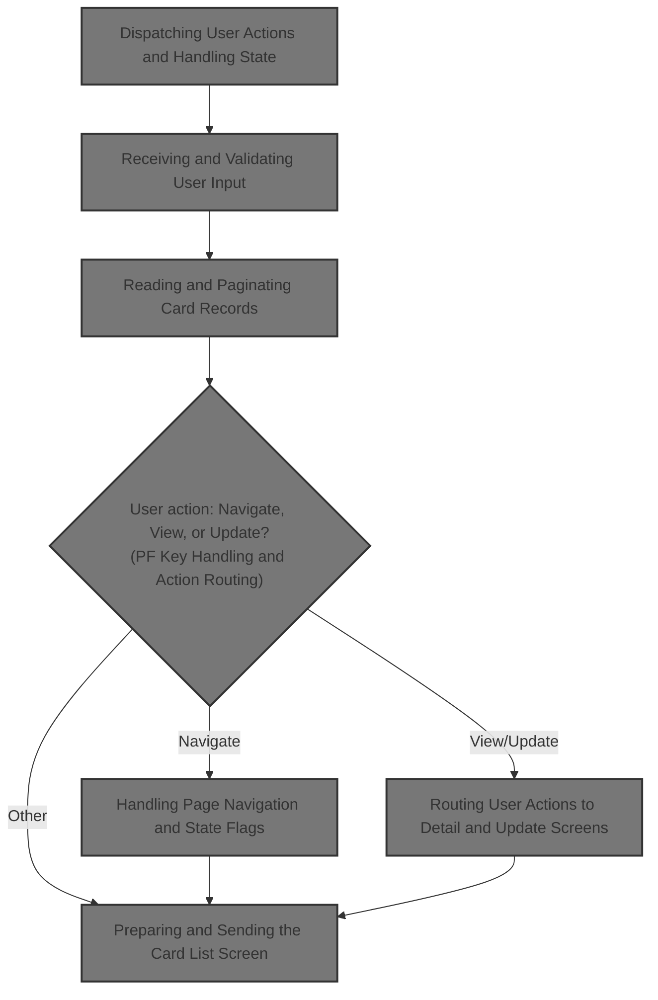
```mermaid
flowchart TD
    node1["Dispatching User Actions and Handling State"]:::HeadingStyle --> node2["Receiving and Validating User Input"]:::HeadingStyle
    click node1 goToHeading "Dispatching User Actions and Handling State"
    click node2 goToHeading "Receiving and Validating User Input"
    node2 --> node3["Reading and Paginating Card Records"]:::HeadingStyle
    click node3 goToHeading "Reading and Paginating Card Records"
    node3 --> node4{"User action: Navigate, View, or Update?
(PF Key Handling and Action Routing)"}:::HeadingStyle
    node4 -->|"Navigate"| node5["Handling Page Navigation and State Flags"]:::HeadingStyle
    node4 -->|"View/Update"| node6["Routing User Actions to Detail and Update Screens"]:::HeadingStyle
    node4 -->|"Other"| node7["Preparing and Sending the Card List Screen"]:::HeadingStyle
    click node4 goToHeading "PF Key Handling and Action Routing"
    click node5 goToHeading "Handling Page Navigation and State Flags"
    click node6 goToHeading "Routing User Actions to Detail and Update Screens"
    click node7 goToHeading "Preparing and Sending the Card List Screen"
    node5 --> node7
    node6 --> node7
classDef HeadingStyle fill:#777777,stroke:#333,stroke-width:2px;
```

## Dependencies

### Programs

- COCRDLIC (app/cbl/COCRDLIC.cbl)
- COMEN01C (app/cbl/COMEN01C.cbl)
- CM00
- COSGN00C (app/cbl/COSGN00C.cbl)
- CC00
- COADM01C (app/cbl/COADM01C.cbl)
- CA00
- LIT-THISPGM
- LIT-CARDDTLPGM
- LIT-CARDUPDPGM
- CCLI

### Copybooks

- COCOM01Y (app/cpy/COCOM01Y.cpy)
- COADM02Y (app/cpy/COADM02Y.cpy)
- COADM01 (app/cpy-bms/COADM01.CPY)
- COTTL01Y (app/cpy/COTTL01Y.cpy)
- CSDAT01Y (app/cpy/CSDAT01Y.cpy)
- CSMSG01Y (app/cpy/CSMSG01Y.cpy)
- CSUSR01Y (app/cpy/CSUSR01Y.cpy)
- DFHAID
- DFHBMSCA
- COSGN00 (app/cpy-bms/COSGN00.CPY)
- COMEN02Y (app/cpy/COMEN02Y.cpy)
- COMEN01 (app/cpy-bms/COMEN01.CPY)
- CVCRD01Y (app/cpy/CVCRD01Y.cpy)
- COCRDLI (app/cpy-bms/COCRDLI.CPY)
- CVACT02Y (app/cpy/CVACT02Y.cpy)
- CSSTRPFY (app/cpy/CSSTRPFY.cpy)

# Workflow

# Dispatching User Actions and Handling State

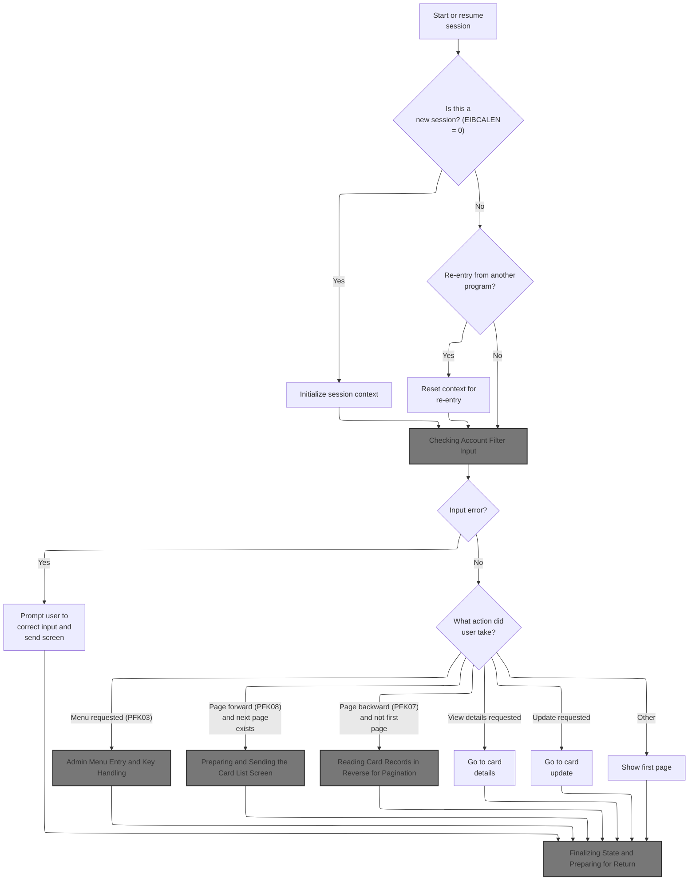
```mermaid
%%{init: {"flowchart": {"defaultRenderer": "elk"}} }%%
flowchart TD
    node1["Start or resume 
 session"]
    click node1 openCode "app/cbl/COCRDLIC.cbl:298:315"
    node1 --> node2{"Is this a 
 new session? (EIBCALEN 
 = 0)"}
    click node2 openCode "app/cbl/COCRDLIC.cbl:315:332"
    node2 -->|"Yes"| node3["Initialize session context"]
    click node3 openCode "app/cbl/COCRDLIC.cbl:315:332"
    node2 -->|"No"| node4{"Re-entry from another 
 program?"}
    click node4 openCode "app/cbl/COCRDLIC.cbl:336:343"
    node3 --> node5["Checking Account Filter Input"]
    
    node4 -->|"Yes"| node6["Reset context for 
 re-entry"]
    click node6 openCode "app/cbl/COCRDLIC.cbl:336:343"
    node4 -->|"No"| node5
    node6 --> node5
    node5 --> node7{"Input error?"}
    click node7 openCode "app/cbl/COCRDLIC.cbl:418:438"
    node7 -->|"Yes"| node8["Prompt user to 
 correct input and 
 send screen"]
    click node8 openCode "app/cbl/COCRDLIC.cbl:418:438"
    node8 --> node14["Finalizing State and Preparing for Return"]
    node7 -->|"No"| node9{"What action did 
 user take?"}
    click node9 openCode "app/cbl/COCRDLIC.cbl:370:405"
    node9 -->|"Menu requested (PFK03)"| node10["Admin Menu Entry and Key Handling"]
    
    node9 -->|"Page forward (PFK08) 
 and next page 
 exists"| node11["Preparing and Sending the Card List Screen"]
    
    node9 -->|"Page backward (PFK07) 
 and not first 
 page"| node12["Reading Card Records in Reverse for Pagination"]
    
    node9 -->|"View details requested"| node13["Go to card 
 details"]
    click node13 openCode "app/cbl/COCRDLIC.cbl:517:541"
    node9 -->|"Update requested"| node15["Go to card 
 update"]
    click node15 openCode "app/cbl/COCRDLIC.cbl:545:569"
    node9 -->|"Other"| node16["Show first page"]
    click node16 openCode "app/cbl/COCRDLIC.cbl:572:582"
    node10 --> node14["Finalizing State and Preparing for Return"]
    node11 --> node14
    node12 --> node14
    node13 --> node14
    node15 --> node14
    node16 --> node14
    
classDef HeadingStyle fill:#777777,stroke:#333,stroke-width:2px;
click node5 goToHeading "Receiving and Validating User Input"
node5:::HeadingStyle
click node5 goToHeading "Getting Screen Data from the User"
node5:::HeadingStyle
click node5 goToHeading "Validating and Editing User Inputs"
node5:::HeadingStyle
click node5 goToHeading "Checking Account Filter Input"
node5:::HeadingStyle
click node10 goToHeading "Admin Menu Entry and Key Handling"
node10:::HeadingStyle
click node11 goToHeading "Preparing and Sending the Card List Screen"
node11:::HeadingStyle
click node12 goToHeading "Reading Card Records in Reverse for Pagination"
node12:::HeadingStyle
click node14 goToHeading "Finalizing State and Preparing for Return"
node14:::HeadingStyle
```

This section manages the dispatching of user actions and session state for the card list screen, ensuring correct initialization, restoration, and interpretation of user input to drive the application's flow.

| Rule ID | Code Location    | Category       | Rule Name                 | Description                                                                                                                                                                                                                                                | Conditions                                                                                               | Remarks                                                                                                                                                                                                                                                           |
| ------- | ---------------- | -------------- | ------------------------- | ---------------------------------------------------------------------------------------------------------------------------------------------------------------------------------------------------------------------------------------------------------- | -------------------------------------------------------------------------------------------------------- | ----------------------------------------------------------------------------------------------------------------------------------------------------------------------------------------------------------------------------------------------------------------- |
| BR-001  | 0000-MAIN        | Business logic | Session initialization    | When a new session is started (no prior context), the system must initialize all session context fields to their default values, set the user type to 'U', mark the entry as a fresh start, and set the screen to the first page with last page not shown. | Session is new (EIBCALEN = 0)                                                                            | User type is set to 'U'. Entry is marked as fresh (CDEMO-PGM-ENTER = TRUE). Screen is set to first page (CA-FIRST-PAGE = TRUE, which means WS-CA-SCREEN-NUM = 1). Last page not shown (CA-LAST-PAGE-NOT-SHOWN = TRUE, which means WS-CA-LAST-PAGE-DISPLAYED = 9). |
| BR-002  | 0000-MAIN        | Business logic | Session restoration       | When resuming a session, the system must restore the user's previous context from the commarea, ensuring continuity of state such as page number and selection.                                                                                            | Session is resumed (EIBCALEN > 0)                                                                        | Restores CARDDEMO-COMMAREA and WS-THIS-PROGCOMMAREA from DFHCOMMAREA. Maintains previous page and selection state.                                                                                                                                                |
| BR-003  | 0000-MAIN        | Business logic | Context reset on re-entry | If the user is re-entering from another program, the system must reset the program-specific context and set up the screen for a fresh start, preventing old state from affecting the new session.                                                          | User is re-entering (CDEMO-PGM-ENTER is TRUE and CDEMO-FROM-PROGRAM not equal to current program)        | Program-specific context is reinitialized. Entry is marked as fresh. Screen is set to first page and last page not shown.                                                                                                                                         |
| BR-004  | YYYY-STORE-PFKEY | Business logic | User action mapping       | The system must interpret user actions by mapping raw terminal key input (AID) to internal action flags, enabling consistent handling of PF keys, ENTER, CLEAR, and PA keys regardless of which physical key was pressed.                                  | Any user input is received from the terminal                                                             | PF keys 1-12 and 13-24 are mapped to internal flags PFK01-PFK12. ENTER, CLEAR, PA1, PA2 are mapped to their respective flags. All mappings are handled via EVALUATE TRUE logic.                                                                                   |
| BR-005  | 0000-MAIN        | Business logic | Screen input processing   | When returning from this program and user input is present, the system must receive and process the user's screen input to determine the next action.                                                                                                      | Session is resumed (EIBCALEN > 0) and returning from this program (CDEMO-FROM-PROGRAM = current program) | Receives and processes screen input for further action dispatch.                                                                                                                                                                                                  |

<SwmSnippet path="/app/cbl/COCRDLIC.cbl" line="298" repo-id="Z2l0aHViJTNBJTNBa3luZHJ5bC1hd3MtbWFpbmZyYW1lLW1vZGVybml6YXRpb24tY2FyZGRlbW8lM0ElM0FTd2ltbS1EZW1v">

---

In `0000-MAIN` this is the entry point for the card list screen logic. It sets up working storage and the commarea, clears any error messages, and gets ready to process user input. The rest of the flow will branch based on what the user did (PF keys, ENTER, etc.) and the current state. This is where the dispatcher logic starts.

```cobol
       0000-MAIN.                                                               
                                                                                
           INITIALIZE CC-WORK-AREA                                              
                      WS-MISC-STORAGE                                           
                      WS-COMMAREA                                               
                                                                                
      *****************************************************************         
      * Store our context                                                       
      *****************************************************************         
           MOVE LIT-THISTRANID       TO WS-TRANID                               
      *****************************************************************         
      * Ensure error message is cleared                               *         
      *****************************************************************         
           SET WS-ERROR-MSG-OFF  TO TRUE                                        
```

---

</SwmSnippet>

<SwmSnippet path="/app/cbl/COCRDLIC.cbl" line="315" repo-id="Z2l0aHViJTNBJTNBa3luZHJ5bC1hd3MtbWFpbmZyYW1lLW1vZGVybml6YXRpb24tY2FyZGRlbW8lM0ElM0FTd2ltbS1EZW1v">

---

Here the code checks if this is the first entry (EIBCALEN = 0). If so, it initializes both the shared and program-specific commareas with defaults. Otherwise, it restores state from the commarea, so the user's context (like page and selection) is kept across screen interactions. This is what lets the UI remember where the user was.

```cobol
           IF EIBCALEN = 0
              INITIALIZE CARDDEMO-COMMAREA
                         WS-THIS-PROGCOMMAREA 
              MOVE LIT-THISTRANID        TO CDEMO-FROM-TRANID                   
              MOVE LIT-THISPGM           TO CDEMO-FROM-PROGRAM                  
              SET CDEMO-USRTYP-USER      TO TRUE                                
              SET CDEMO-PGM-ENTER        TO TRUE                                
              MOVE LIT-THISMAP           TO CDEMO-LAST-MAP                      
              MOVE LIT-THISMAPSET        TO CDEMO-LAST-MAPSET                   
              SET CA-FIRST-PAGE          TO TRUE                                
              SET CA-LAST-PAGE-NOT-SHOWN TO TRUE                                
           ELSE
              MOVE DFHCOMMAREA (1:LENGTH OF CARDDEMO-COMMAREA) TO               
                                CARDDEMO-COMMAREA                               
              MOVE DFHCOMMAREA(LENGTH OF CARDDEMO-COMMAREA + 1:                 
                               LENGTH OF WS-THIS-PROGCOMMAREA )TO               
                                WS-THIS-PROGCOMMAREA                            
           END-IF                                                               
```

---

</SwmSnippet>

<SwmSnippet path="/app/cbl/COCRDLIC.cbl" line="336" repo-id="Z2l0aHViJTNBJTNBa3luZHJ5bC1hd3MtbWFpbmZyYW1lLW1vZGVybml6YXRpb24tY2FyZGRlbW8lM0ElM0FTd2ltbS1EZW1v">

---

This part checks if the user is entering from the menu (not returning from this program). If so, it resets the program-specific commarea and sets up the screen for a fresh start. This prevents old state from leaking into a new session.

```cobol
           IF (CDEMO-PGM-ENTER                                                  
           AND CDEMO-FROM-PROGRAM NOT EQUAL LIT-THISPGM)                        
               INITIALIZE WS-THIS-PROGCOMMAREA
               SET CDEMO-PGM-ENTER      TO TRUE                                 
               MOVE LIT-THISMAP         TO CDEMO-LAST-MAP                       
               SET CA-FIRST-PAGE        TO TRUE                                 
               SET CA-LAST-PAGE-NOT-SHOWN TO TRUE                               
           END-IF 
```

---

</SwmSnippet>

<SwmSnippet path="/app/cbl/COCRDLIC.cbl" line="349" repo-id="Z2l0aHViJTNBJTNBa3luZHJ5bC1hd3MtbWFpbmZyYW1lLW1vZGVybml6YXRpb24tY2FyZGRlbW8lM0ElM0FTd2ltbS1EZW1v">

---

Here we call YYYY-STORE-PFKEY (in app/cpy/CSSTRPFY.cpy) to map the raw terminal key input to internal flags. This makes it easy for the rest of the code to check which PF key or action was pressed.

```cobol
           PERFORM YYYY-STORE-PFKEY                                             
              THRU YYYY-STORE-PFKEY-EXIT                                        
```

---

</SwmSnippet>

<SwmSnippet path="/app/cpy/CSSTRPFY.cpy" line="17" repo-id="Z2l0aHViJTNBJTNBa3luZHJ5bC1hd3MtbWFpbmZyYW1lLW1vZGVybml6YXRpb24tY2FyZGRlbW8lM0ElM0FTd2ltbS1EZW1v">

---

`YYYY-STORE-PFKEY` maps the raw terminal AID (EIBAID) to internal PFKey flags using an EVALUATE TRUE block. It handles all PF keys, ENTER, CLEAR, and PA keys, and folds PF13-24 back onto PF1-12 so the rest of the code doesn't care which physical key was pressed.

```cobol
       YYYY-STORE-PFKEY.                                                        
      *****************************************************************         
      * Map AID to PFKey in COMMON Area                                         
      *****************************************************************         
           EVALUATE TRUE                                                        
             WHEN EIBAID IS EQUAL TO DFHENTER                                   
               SET CCARD-AID-ENTER TO TRUE                                      
             WHEN EIBAID IS EQUAL TO DFHCLEAR                                   
               SET CCARD-AID-CLEAR TO TRUE                                      
             WHEN EIBAID IS EQUAL TO DFHPA1                                     
               SET CCARD-AID-PA1  TO TRUE                                       
             WHEN EIBAID IS EQUAL TO DFHPA2                                     
               SET CCARD-AID-PA2  TO TRUE                                       
             WHEN EIBAID IS EQUAL TO DFHPF1                                     
               SET CCARD-AID-PFK01 TO TRUE                                      
             WHEN EIBAID IS EQUAL TO DFHPF2                                     
               SET CCARD-AID-PFK02 TO TRUE                                      
             WHEN EIBAID IS EQUAL TO DFHPF3                                     
               SET CCARD-AID-PFK03 TO TRUE                                      
             WHEN EIBAID IS EQUAL TO DFHPF4                                     
               SET CCARD-AID-PFK04 TO TRUE                                      
             WHEN EIBAID IS EQUAL TO DFHPF5                                     
               SET CCARD-AID-PFK05 TO TRUE                                      
             WHEN EIBAID IS EQUAL TO DFHPF6                                     
               SET CCARD-AID-PFK06 TO TRUE                                      
             WHEN EIBAID IS EQUAL TO DFHPF7                                     
               SET CCARD-AID-PFK07 TO TRUE                                      
             WHEN EIBAID IS EQUAL TO DFHPF8                                     
               SET CCARD-AID-PFK08 TO TRUE                                      
             WHEN EIBAID IS EQUAL TO DFHPF9                                     
               SET CCARD-AID-PFK09 TO TRUE                                      
             WHEN EIBAID IS EQUAL TO DFHPF10                                    
               SET CCARD-AID-PFK10 TO TRUE                                      
             WHEN EIBAID IS EQUAL TO DFHPF11                                    
               SET CCARD-AID-PFK11 TO TRUE                                      
             WHEN EIBAID IS EQUAL TO DFHPF12                                    
               SET CCARD-AID-PFK12 TO TRUE                                      
             WHEN EIBAID IS EQUAL TO DFHPF13                                    
               SET CCARD-AID-PFK01 TO TRUE                                      
             WHEN EIBAID IS EQUAL TO DFHPF14                                    
               SET CCARD-AID-PFK02 TO TRUE                                      
             WHEN EIBAID IS EQUAL TO DFHPF15                                    
               SET CCARD-AID-PFK03 TO TRUE                                      
             WHEN EIBAID IS EQUAL TO DFHPF16                                    
               SET CCARD-AID-PFK04 TO TRUE                                      
             WHEN EIBAID IS EQUAL TO DFHPF17                                    
               SET CCARD-AID-PFK05 TO TRUE                                      
             WHEN EIBAID IS EQUAL TO DFHPF18                                    
               SET CCARD-AID-PFK06 TO TRUE                                      
             WHEN EIBAID IS EQUAL TO DFHPF19                                    
               SET CCARD-AID-PFK07 TO TRUE                                      
             WHEN EIBAID IS EQUAL TO DFHPF20                                    
               SET CCARD-AID-PFK08 TO TRUE                                      
             WHEN EIBAID IS EQUAL TO DFHPF21                                    
               SET CCARD-AID-PFK09 TO TRUE                                      
             WHEN EIBAID IS EQUAL TO DFHPF22                                    
               SET CCARD-AID-PFK10 TO TRUE                                      
             WHEN EIBAID IS EQUAL TO DFHPF23                                    
               SET CCARD-AID-PFK11 TO TRUE                                      
             WHEN EIBAID IS EQUAL TO DFHPF24                                    
               SET CCARD-AID-PFK12 TO TRUE                                      
           END-EVALUATE                                                         
```

---

</SwmSnippet>

<SwmSnippet path="/app/cbl/COCRDLIC.cbl" line="357" repo-id="Z2l0aHViJTNBJTNBa3luZHJ5bC1hd3MtbWFpbmZyYW1lLW1vZGVybml6YXRpb24tY2FyZGRlbW8lM0ElM0FTd2ltbS1EZW1v">

---

After mapping the key, we grab the user's screen input if we're returning from this program.

```cobol
           IF  EIBCALEN > 0                                                     
           AND CDEMO-FROM-PROGRAM  EQUAL LIT-THISPGM                            
               PERFORM 2000-RECEIVE-MAP                                         
               THRU    2000-RECEIVE-MAP-EXIT                                    
                                                                                
           END-IF                                                               
```

---

</SwmSnippet>

## Receiving and Validating User Input

This section orchestrates the reception and validation of user input, ensuring that data from the screen is properly handled before further processing.

| Rule ID | Code Location    | Category       | Rule Name                    | Description                                                                                                                                                            | Conditions                                                                        | Remarks                                                       |
| ------- | ---------------- | -------------- | ---------------------------- | ---------------------------------------------------------------------------------------------------------------------------------------------------------------------- | --------------------------------------------------------------------------------- | ------------------------------------------------------------- |
| BR-001  | 2000-RECEIVE-MAP | Business logic | Input Reception Prerequisite | User input must be received from the screen before any validation or processing occurs. This ensures that only data provided by the user is considered for validation. | Whenever user data is to be processed, it must first be received from the screen. | No specific constants or formats are defined in this section. |
| BR-002  | 2000-RECEIVE-MAP | Business logic | Input Validation Requirement | All user input must be validated after reception and before further processing. This ensures that only valid data is used in subsequent operations.                    | After user data is received, it must be validated before any further processing.  | No specific constants or formats are defined in this section. |
| BR-003  | 2000-RECEIVE-MAP | Business logic | Modular Input Handling       | The process of receiving and validating user input is modularized into distinct steps, ensuring separation of concerns and maintainability.                            | User input handling is divided into separate steps for reception and validation.  | No specific constants or formats are defined in this section. |

<SwmSnippet path="/app/cbl/COCRDLIC.cbl" line="951" repo-id="Z2l0aHViJTNBJTNBa3luZHJ5bC1hd3MtbWFpbmZyYW1lLW1vZGVybml6YXRpb24tY2FyZGRlbW8lM0ElM0FTd2ltbS1EZW1v">

---

`2000-RECEIVE-MAP` controls the input flow: first it calls 2100-RECEIVE-SCREEN to get user data from the screen, then it calls 2200-EDIT-INPUTS to validate and process that data. This keeps input handling clean and modular.

```cobol
       2000-RECEIVE-MAP.                                                        
           PERFORM 2100-RECEIVE-SCREEN                                          
              THRU 2100-RECEIVE-SCREEN-EXIT                                     
                                                                                
           PERFORM 2200-EDIT-INPUTS                                             
            THRU   2200-EDIT-INPUTS-EXIT                                        
```

---

</SwmSnippet>

## Getting Screen Data from the User

This section receives user input from the CICS screen and maps it to internal variables for further business processing.

| Rule ID | Code Location       | Category       | Rule Name                 | Description                                                                                                        | Conditions                                                                                           | Remarks                                                                                                                                             |
| ------- | ------------------- | -------------- | ------------------------- | ------------------------------------------------------------------------------------------------------------------ | ---------------------------------------------------------------------------------------------------- | --------------------------------------------------------------------------------------------------------------------------------------------------- |
| BR-001  | 2100-RECEIVE-SCREEN | Business logic | Account ID Capture        | The user's account ID entered on the screen is captured and stored for subsequent processing.                      | Whenever the user enters an account ID on the screen and the RECEIVE MAP operation is performed.     | The account ID is stored as an alphanumeric string of length 11. Initial value is spaces.                                                           |
| BR-002  | 2100-RECEIVE-SCREEN | Business logic | Card Number Capture       | The user's card number entered on the screen is captured and stored for subsequent processing.                     | Whenever the user enters a card number on the screen and the RECEIVE MAP operation is performed.     | The card number is stored as an alphanumeric string of length 16. Initial value is spaces.                                                          |
| BR-003  | 2100-RECEIVE-SCREEN | Business logic | Selection Choices Capture | Up to seven selection choices entered by the user on the screen are captured and stored for subsequent processing. | Whenever the user enters selection choices on the screen and the RECEIVE MAP operation is performed. | Each selection choice is stored as a single alphanumeric character. There are seven possible selection fields, each mapped to an internal variable. |

<SwmSnippet path="/app/cbl/COCRDLIC.cbl" line="962" repo-id="Z2l0aHViJTNBJTNBa3luZHJ5bC1hd3MtbWFpbmZyYW1lLW1vZGVybml6YXRpb24tY2FyZGRlbW8lM0ElM0FTd2ltbS1EZW1v">

---

In `2100-RECEIVE-SCREEN` we use EXEC CICS RECEIVE MAP to pull all user-entered data from the screen into the CCRDLIAI structure. This is how we get the user's account, card, and selection inputs.

```cobol
       2100-RECEIVE-SCREEN.                                                     
           EXEC CICS RECEIVE MAP(LIT-THISMAP)                                   
                          MAPSET(LIT-THISMAPSET)                                
                          INTO(CCRDLIAI)                                        
                          RESP(WS-RESP-CD)                                      
           END-EXEC                                                             
```

---

</SwmSnippet>

<SwmSnippet path="/app/cbl/COCRDLIC.cbl" line="969" repo-id="Z2l0aHViJTNBJTNBa3luZHJ5bC1hd3MtbWFpbmZyYW1lLW1vZGVybml6YXRpb24tY2FyZGRlbW8lM0ElM0FTd2ltbS1EZW1v">

---

This is where we copy the user's account, card, and selection choices into variables for later logic.

```cobol
           MOVE ACCTSIDI OF CCRDLIAI  TO CC-ACCT-ID                             
           MOVE CARDSIDI OF CCRDLIAI  TO CC-CARD-NUM                            
                                                                                
           MOVE CRDSEL1I OF CCRDLIAI  TO WS-EDIT-SELECT(1)                      
           MOVE CRDSEL2I OF CCRDLIAI  TO WS-EDIT-SELECT(2)                      
           MOVE CRDSEL3I OF CCRDLIAI  TO WS-EDIT-SELECT(3)                      
           MOVE CRDSEL4I OF CCRDLIAI  TO WS-EDIT-SELECT(4)                      
           MOVE CRDSEL5I OF CCRDLIAI  TO WS-EDIT-SELECT(5)                      
           MOVE CRDSEL6I OF CCRDLIAI  TO WS-EDIT-SELECT(6)                      
           MOVE CRDSEL7I OF CCRDLIAI  TO WS-EDIT-SELECT(7)                      
           .                                                                    
```

---

</SwmSnippet>

## Validating and Editing User Inputs

This section is responsible for validating and editing user inputs for account, card, and selection rows, ensuring that each input is checked for errors and marked as valid or invalid before further processing.

| Rule ID | Code Location    | Category        | Rule Name                   | Description                                                                                                                                          | Conditions                      | Remarks                                                                                                                               |
| ------- | ---------------- | --------------- | --------------------------- | ---------------------------------------------------------------------------------------------------------------------------------------------------- | ------------------------------- | ------------------------------------------------------------------------------------------------------------------------------------- |
| BR-001  | 2200-EDIT-INPUTS | Data validation | Initial input OK status     | When editing begins, the input is marked as OK, indicating that validation will proceed unless errors are found in subsequent steps.                 | Editing of inputs is initiated. | The input OK status is represented by a flag that can be '0', ' ', or LOW-VALUES to indicate OK, and '1' to indicate error.           |
| BR-002  | 2200-EDIT-INPUTS | Data validation | Sequential input validation | Account, card, and selection inputs are validated in sequence, ensuring that each type of input is checked for errors before proceeding to the next. | Editing of inputs is initiated. | Validation is performed in the order: account, card, selection. Each validation step may update flags to indicate errors or validity. |
| BR-003  | 2200-EDIT-INPUTS | Business logic  | Selection rows editable     | Selection rows are made editable at the start of input editing, allowing users to modify their choices.                                              | Editing of inputs is initiated. | The editable status is controlled by a flag set to '0' to indicate rows are not protected.                                            |

<SwmSnippet path="/app/cbl/COCRDLIC.cbl" line="985" repo-id="Z2l0aHViJTNBJTNBa3luZHJ5bC1hd3MtbWFpbmZyYW1lLW1vZGVybml6YXRpb24tY2FyZGRlbW8lM0ElM0FTd2ltbS1EZW1v">

---

`2200-EDIT-INPUTS` starts by marking input as OK and making selection rows editable. Then it runs validation for account, card, and selection inputs in order, so each gets checked for errors before moving on.

```cobol
       2200-EDIT-INPUTS.                                                        
           SET INPUT-OK                   TO TRUE                               
           SET FLG-PROTECT-SELECT-ROWS-NO TO TRUE                               
                                                                                
           PERFORM 2210-EDIT-ACCOUNT                                            
              THRU 2210-EDIT-ACCOUNT-EXIT                                       
                                                                                
           PERFORM 2220-EDIT-CARD                                               
              THRU 2220-EDIT-CARD-EXIT                                          
                                                                                
           PERFORM 2250-EDIT-ARRAY                                              
              THRU 2250-EDIT-ARRAY-EXIT                                         
```

---

</SwmSnippet>

## Checking Account Filter Input

This section validates the account ID input for the account filter, determining whether it is blank, invalid, or valid, and sets the output and error status accordingly.

| Rule ID | Code Location     | Category        | Rule Name                    | Description                                                                                                                               | Conditions                                                                             | Remarks                                                                                                                            |
| ------- | ----------------- | --------------- | ---------------------------- | ----------------------------------------------------------------------------------------------------------------------------------------- | -------------------------------------------------------------------------------------- | ---------------------------------------------------------------------------------------------------------------------------------- |
| BR-001  | 2210-EDIT-ACCOUNT | Data validation | Blank account ID handling    | If the account ID is not provided (blank, spaces, low-values, or zeros), it is treated as blank and the output account ID is set to zero. | The account ID field is blank, contains only spaces, is set to low-values, or is zero. | Blank is defined as spaces, low-values, or zeros. The output account ID is set to the numeric value zero (11 digits, zero-padded). |
| BR-002  | 2210-EDIT-ACCOUNT | Data validation | Non-numeric account ID error | If the account ID is provided but contains non-numeric characters, the input is marked as invalid and an error message is set.            | The account ID field is not blank and contains non-numeric characters.                 | Account ID must be numeric (11 digits). If not, an error flag is set and an error message is generated.                            |
| BR-003  | 2210-EDIT-ACCOUNT | Business logic  | Valid account ID acceptance  | If the account ID is provided and is numeric, it is accepted as valid and copied to the output.                                           | The account ID field is not blank and contains only numeric characters.                | Account ID must be numeric (11 digits). The valid account ID is copied to the output communication area.                           |

<SwmSnippet path="/app/cbl/COCRDLIC.cbl" line="1003" repo-id="Z2l0aHViJTNBJTNBa3luZHJ5bC1hd3MtbWFpbmZyYW1lLW1vZGVybml6YXRpb24tY2FyZGRlbW8lM0ElM0FTd2ltbS1EZW1v">

---

In `2210-EDIT-ACCOUNT` we check if the account ID is blank or zero, and if so, mark it as blank and set the commarea field to zero. If it's not blank, we check if it's numeric; if not, we set error flags and an error message. If it's valid, we copy it to the commarea and mark it as valid.

```cobol
       2210-EDIT-ACCOUNT.                                                       
           SET FLG-ACCTFILTER-BLANK TO TRUE                                     
                                                                                
      *    Not supplied                                                         
           IF CC-ACCT-ID   EQUAL LOW-VALUES                                     
           OR CC-ACCT-ID   EQUAL SPACES                                         
           OR CC-ACCT-ID-N EQUAL ZEROS                                          
              SET FLG-ACCTFILTER-BLANK  TO TRUE                                 
              MOVE ZEROES       TO CDEMO-ACCT-ID                                
              GO TO  2210-EDIT-ACCOUNT-EXIT                                     
           END-IF                                                               
```

---

</SwmSnippet>

### Checking Card Filter Input

This section validates the card number input for the card filter, ensuring that blank or zero values are handled appropriately before further processing.

| Rule ID | Code Location  | Category        | Rule Name                       | Description                                                                                                                                                                                                                 | Conditions                                                          | Remarks                                                                                                                                                                                                 |
| ------- | -------------- | --------------- | ------------------------------- | --------------------------------------------------------------------------------------------------------------------------------------------------------------------------------------------------------------------------- | ------------------------------------------------------------------- | ------------------------------------------------------------------------------------------------------------------------------------------------------------------------------------------------------- |
| BR-001  | 2220-EDIT-CARD | Data validation | Blank card number handling      | If the card number input is blank, contains only spaces, low-values, or is all zeros, it is considered not supplied. The card filter is marked as blank and the card number field in the communication area is set to zero. | The card number input is equal to low-values, spaces, or zeros.     | Blank is defined as any of the following: low-values, spaces, or zeros. The card number field in the communication area is set to the numeric value zero (16 digits, right-aligned, padded with zeros). |
| BR-002  | 2220-EDIT-CARD | Business logic  | Non-blank card number deferment | If the card number input is not blank, spaces, low-values, or zeros, the card filter is not marked as blank and further validation is deferred to later logic.                                                              | The card number input is not equal to low-values, spaces, or zeros. | No changes are made to the card filter flag or the communication area card number field in this section. Further validation is not performed here.                                                      |

<SwmSnippet path="/app/cbl/COCRDLIC.cbl" line="1036" repo-id="Z2l0aHViJTNBJTNBa3luZHJ5bC1hd3MtbWFpbmZyYW1lLW1vZGVybml6YXRpb24tY2FyZGRlbW8lM0ElM0FTd2ltbS1EZW1v">

---

In `2220-EDIT-CARD` we check if the card number is blank or zero, and if so, mark it as blank and set the commarea field to zero. If it's not blank, further validation happens later.

```cobol
       2220-EDIT-CARD.                                                          
      *    Not numeric                                                          
      *    Not 16 characters                                                    
           SET FLG-CARDFILTER-BLANK TO TRUE                                     
                                                                                
      *    Not supplied                                                         
           IF CC-CARD-NUM   EQUAL LOW-VALUES                                    
           OR CC-CARD-NUM   EQUAL SPACES                                        
           OR CC-CARD-NUM-N EQUAL ZEROS                                         
              SET FLG-CARDFILTER-BLANK  TO TRUE                                 
              MOVE ZEROES       TO CDEMO-CARD-NUM                               
              GO TO  2220-EDIT-CARD-EXIT                                        
           END-IF                                                               
```

---

</SwmSnippet>

#### Validating Selection Array

This section validates the selection array and determines whether to proceed with reading records for display based on input validity.

| Rule ID | Code Location   | Category        | Rule Name                 | Description                                                                                      | Conditions                                                                    | Remarks                                                                                                                                                  |
| ------- | --------------- | --------------- | ------------------------- | ------------------------------------------------------------------------------------------------ | ----------------------------------------------------------------------------- | -------------------------------------------------------------------------------------------------------------------------------------------------------- |
| BR-001  | 2250-EDIT-ARRAY | Data validation | Early exit on input error | If an input error is detected, the process exits early and does not read or display any records. | The input error flag is set (INPUT-ERROR is true, i.e., WS-INPUT-FLAG = '1'). | The input error flag is defined as WS-INPUT-FLAG = '1'. No records are read or displayed if this flag is set. No output format is produced in this case. |

<SwmSnippet path="/app/cbl/COCRDLIC.cbl" line="1073" repo-id="Z2l0aHViJTNBJTNBa3luZHJ5bC1hd3MtbWFpbmZyYW1lLW1vZGVybml6YXRpb24tY2FyZGRlbW8lM0ElM0FTd2ltbS1EZW1v">

---

In `2250-EDIT-ARRAY` we check if there's an input error. If so, we exit early and don't read records. If not, we move on to reading records for display.

```cobol
       2250-EDIT-ARRAY.                                                         
                                                                                
           IF INPUT-ERROR                                                       
              GO TO 2250-EDIT-ARRAY-EXIT                                        
           END-IF                                                               
```

---

</SwmSnippet>

##### Reading and Paginating Card Records

This section manages the reading, filtering, and paginating of card records for display to the user. It ensures that only the relevant records are shown, up to a maximum of 7 per page, and supports navigation through multiple pages of results.

| Rule ID | Code Location                          | Category       | Rule Name                                      | Description                                                                                                                                                  | Conditions                                                 | Remarks                                                                                                                                                                                                                                                                                                        |
| ------- | -------------------------------------- | -------------- | ---------------------------------------------- | ------------------------------------------------------------------------------------------------------------------------------------------------------------ | ---------------------------------------------------------- | -------------------------------------------------------------------------------------------------------------------------------------------------------------------------------------------------------------------------------------------------------------------------------------------------------------- |
| BR-001  | 9000-READ-FORWARD                      | Business logic | Clear display buffer on page load              | When a new page of card records is requested, the display buffer is cleared before any records are read or shown.                                            | A new page of card records is being requested for display. | The display buffer is cleared to ensure no residual data from previous pages is shown. The buffer is sized to hold up to 7 records, each with account number (11 characters), card number (16 characters), and card status (1 character), for a total of 28 characters per record and 196 characters in total. |
| BR-002  | 9000-READ-FORWARD                      | Business logic | Start card file browse on page request         | When a page of card records is requested, a browse is started on the card file from the current position, preparing to read records in order.                | A page of card records is requested for display.           | The card file used is 'CARDDAT '. The browse is started from the current key position, and records are read in ascending order.                                                                                                                                                                                |
| BR-003  | 9000-READ-FORWARD                      | Business logic | Paginate card records and set navigation flags | The screen buffer is populated with up to 7 card records per page, and flags are set to indicate if more records are available for pagination.               | A page of card records is being read for display.          | A maximum of 7 records are shown per page. The navigation flag for 'next page exists' is set to 'Y' if more records are available, otherwise it is set to a null value.                                                                                                                                        |
| BR-004  | 9000-READ-FORWARD, 9500-FILTER-RECORDS | Business logic | Apply user filters to card records             | Each card record read from the file is filtered according to user-specified criteria, and only records that pass the filter are added to the display buffer. | A card record is read from the file during pagination.     | Filtering criteria are determined by user input and only records matching these criteria are displayed. The details of the filter logic are implemented in the called filter routine.                                                                                                                          |

<SwmSnippet path="/app/cbl/COCRDLIC.cbl" line="1123" repo-id="Z2l0aHViJTNBJTNBa3luZHJ5bC1hd3MtbWFpbmZyYW1lLW1vZGVybml6YXRpb24tY2FyZGRlbW8lM0ElM0FTd2ltbS1EZW1v">

---

In `9000-READ-FORWARD` we clear the screen buffer, start a CICS browse on the card file, and get ready to read records for display. This sets up the pagination logic.

```cobol
       9000-READ-FORWARD.                                                       
           MOVE LOW-VALUES           TO WS-ALL-ROWS                             
                                                                                
      *****************************************************************         
      *    Start Browse                                                         
      *****************************************************************         
           EXEC CICS STARTBR                                                    
                DATASET(LIT-CARD-FILE)                                          
                RIDFLD(WS-CARD-RID-CARDNUM)                                     
                KEYLENGTH(LENGTH OF WS-CARD-RID-CARDNUM)                        
                GTEQ                                                            
                RESP(WS-RESP-CD)                                                
                RESP2(WS-REAS-CD)                                               
           END-EXEC                                                             
```

---

</SwmSnippet>

<SwmSnippet path="/app/cbl/COCRDLIC.cbl" line="1140" repo-id="Z2l0aHViJTNBJTNBa3luZHJ5bC1hd3MtbWFpbmZyYW1lLW1vZGVybml6YXRpb24tY2FyZGRlbW8lM0ElM0FTd2ltbS1EZW1v">

---

After starting the browse, we reset the screen counter and set flags to indicate we're ready to read records for this page. This is what controls how many records get shown.

```cobol
           MOVE ZEROES TO WS-SCRN-COUNTER                                       
           SET CA-NEXT-PAGE-EXISTS    TO TRUE                                   
           SET MORE-RECORDS-TO-READ   TO TRUE                                   
```

---

</SwmSnippet>

<SwmSnippet path="/app/cbl/COCRDLIC.cbl" line="1144" repo-id="Z2l0aHViJTNBJTNBa3luZHJ5bC1hd3MtbWFpbmZyYW1lLW1vZGVybml6YXRpb24tY2FyZGRlbW8lM0ElM0FTd2ltbS1EZW1v">

---

Here we start the loop to read records one at a time using CICS READNEXT. This is how we fill the screen buffer for the current page.

```cobol
           PERFORM UNTIL READ-LOOP-EXIT                                         
                                                                                
           EXEC CICS READNEXT                                                   
                DATASET(LIT-CARD-FILE)                                          
                INTO (CARD-RECORD)                                              
                LENGTH(LENGTH OF CARD-RECORD)                                   
                RIDFLD(WS-CARD-RID-CARDNUM)                                     
                KEYLENGTH(LENGTH OF WS-CARD-RID-CARDNUM)                        
                RESP(WS-RESP-CD)                                                
                RESP2(WS-REAS-CD)                                               
           END-EXEC                                                             
```

---

</SwmSnippet>

<SwmSnippet path="/app/cbl/COCRDLIC.cbl" line="1157" repo-id="Z2l0aHViJTNBJTNBa3luZHJ5bC1hd3MtbWFpbmZyYW1lLW1vZGVybml6YXRpb24tY2FyZGRlbW8lM0ElM0FTd2ltbS1EZW1v">

---

After reading a record, we call 9500-FILTER-RECORDS to check if it matches the user's filters. Only records that pass get added to the screen buffer.

```cobol
               WHEN DFHRESP(NORMAL)                                             
               WHEN DFHRESP(DUPREC)                                             
                   PERFORM 9500-FILTER-RECORDS                                  
                      THRU 9500-FILTER-RECORDS-EXIT                             
```

---

</SwmSnippet>

###### Filtering Card Records

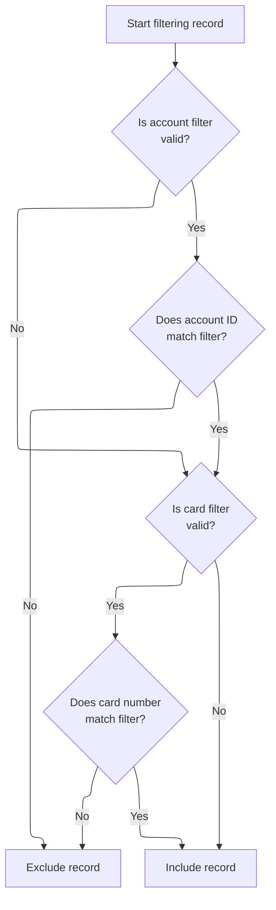
```mermaid
%%{init: {"flowchart": {"defaultRenderer": "elk"}} }%%
flowchart TD
  node1["Start filtering record"]
  click node1 openCode "app/cbl/COCRDLIC.cbl:1382:1384"
  node1 --> node2{"Is account filter 
 valid?"}
  click node2 openCode "app/cbl/COCRDLIC.cbl:1385:1394"
  node2 -->|"No"| node5{"Is card filter 
 valid?"}
  node2 -->|"Yes"| node3{"Does account ID 
 match filter?"}
  click node3 openCode "app/cbl/COCRDLIC.cbl:1386:1391"
  node3 -->|"No"| node4["Exclude record"]
  click node4 openCode "app/cbl/COCRDLIC.cbl:1389:1390"
  node3 -->|"Yes"| node5
  node5 -->|"No"| node8["Include record"]
  click node8 openCode "app/cbl/COCRDLIC.cbl:1394:1394"
  node5 -->|"Yes"| node6{"Does card number 
 match filter?"}
  click node6 openCode "app/cbl/COCRDLIC.cbl:1397:1402"
  node6 -->|"No"| node4
  node6 -->|"Yes"| node8

classDef HeadingStyle fill:#777777,stroke:#333,stroke-width:2px;
```

This section determines which card records are included or excluded based on active account and card number filters. It enforces business rules for filtering records according to user-specified criteria.

| Rule ID | Code Location       | Category       | Rule Name                      | Description                                                                                                                             | Conditions                                                                                       | Remarks                                                                                                                                                                                                                    |
| ------- | ------------------- | -------------- | ------------------------------ | --------------------------------------------------------------------------------------------------------------------------------------- | ------------------------------------------------------------------------------------------------ | -------------------------------------------------------------------------------------------------------------------------------------------------------------------------------------------------------------------------- |
| BR-001  | 9500-FILTER-RECORDS | Business logic | Account filter match required  | When the account filter is active, only card records with an account ID matching the filter value are considered for inclusion.         | The account filter is active (account filter flag is set to '1').                                | The account filter flag is considered active when its value is '1'. The account ID is an 11-character string. Only records with account ID exactly matching the filter value are considered for further filtering.         |
| BR-002  | 9500-FILTER-RECORDS | Business logic | Card filter match required     | When the card filter is active, only card records with a card number matching the filter value are considered for inclusion.            | The card filter is active (card filter flag is set to '1').                                      | The card filter flag is considered active when its value is '1'. The card number is a 16-character string. Only records with card number exactly matching the filter value are considered for inclusion.                   |
| BR-003  | 9500-FILTER-RECORDS | Business logic | Both filters must match        | If both account and card filters are active, a card record must match both the account ID and card number filter values to be included. | Both the account filter and card filter are active (both filter flags are set to '1').           | Both filter flags must be '1' for this rule to apply. The account ID is an 11-character string and the card number is a 16-character string. Both must match their respective filter values for the record to be included. |
| BR-004  | 9500-FILTER-RECORDS | Business logic | No filter includes all records | If neither the account filter nor the card filter is active, all card records are included.                                             | Neither the account filter nor the card filter is active (both filter flags are not set to '1'). | If both filter flags are not '1', all records are included regardless of account ID or card number.                                                                                                                        |

<SwmSnippet path="/app/cbl/COCRDLIC.cbl" line="1382" repo-id="Z2l0aHViJTNBJTNBa3luZHJ5bC1hd3MtbWFpbmZyYW1lLW1vZGVybml6YXRpb24tY2FyZGRlbW8lM0ElM0FTd2ltbS1EZW1v">

---

In `9500-FILTER-RECORDS` we check if account and card filters are active, and exclude records that don't match. If both filters are set, both must match for the record to be included.

```cobol
       9500-FILTER-RECORDS.                                                     
           SET WS-DONOT-EXCLUDE-THIS-RECORD TO TRUE                             
                                                                                
           IF FLG-ACCTFILTER-ISVALID                                            
              IF  CARD-ACCT-ID = CC-ACCT-ID                                     
                  CONTINUE                                                      
              ELSE                                                              
                  SET WS-EXCLUDE-THIS-RECORD  TO TRUE                           
                  GO TO 9500-FILTER-RECORDS-EXIT                                
              END-IF                                                            
           ELSE                                                                 
             CONTINUE                                                           
           END-IF                                                               
```

---

</SwmSnippet>

<SwmSnippet path="/app/cbl/COCRDLIC.cbl" line="1396" repo-id="Z2l0aHViJTNBJTNBa3luZHJ5bC1hd3MtbWFpbmZyYW1lLW1vZGVybml6YXRpb24tY2FyZGRlbW8lM0ElM0FTd2ltbS1EZW1v">

---

This is where we finish filtering by card number if that filter is active.

```cobol
           IF FLG-CARDFILTER-ISVALID                                            
              IF  CARD-NUM = CC-CARD-NUM-N                                      
                  CONTINUE                                                      
              ELSE                                                              
                  SET WS-EXCLUDE-THIS-RECORD TO TRUE                            
                  GO TO 9500-FILTER-RECORDS-EXIT                                
              END-IF                                                            
           ELSE                                                                 
             CONTINUE                                                           
           END-IF                                                               
```

---

</SwmSnippet>

###### Populating Screen Buffer and Tracking Pagination

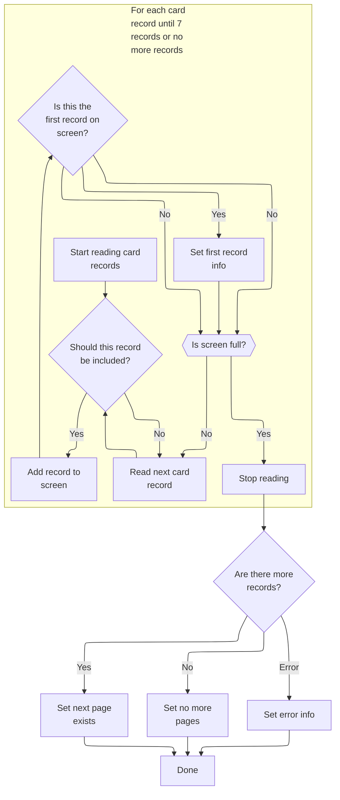
```mermaid
%%{init: {"flowchart": {"defaultRenderer": "elk"}} }%%
flowchart TD
    node1["Start reading card 
 records"]
    click node1 openCode "app/cbl/COCRDLIC.cbl:1162:1162"
    subgraph loop1["For each card 
 record until 7 
 records or no 
 more records"]
        node1 --> node2{"Should this record 
 be included?"}
        click node2 openCode "app/cbl/COCRDLIC.cbl:1162:1187"
        node2 -->|"Yes"| node3["Add record to 
 screen"]
        click node3 openCode "app/cbl/COCRDLIC.cbl:1163:1171"
        node2 -->|"No"| node8["Read next card 
 record"]
        node3 --> node4{"Is this the 
 first record on 
 screen?"}
        click node4 openCode "app/cbl/COCRDLIC.cbl:1173:1181"
        node4 -->|"Yes"| node5["Set first record 
 info"]
        click node5 openCode "app/cbl/COCRDLIC.cbl:1174:1176"
        node4 -->|"No"| node6{"Is screen full?"}
        node5 --> node6
        node4 -->|"No"| node6
        node6{{Is screen full?}}
        click node6 openCode "app/cbl/COCRDLIC.cbl:1191:1192"
        node6 -->|"Yes"| node7["Stop reading"]
        click node7 openCode "app/cbl/COCRDLIC.cbl:1192:1192"
        node6 -->|"No"| node8
        node8["Read next card 
 record"]
        click node8 openCode "app/cbl/COCRDLIC.cbl:1197:1205"
        node8 --> node2
    end
    node7 --> node9{"Are there more 
 records?"}
    click node9 openCode "app/cbl/COCRDLIC.cbl:1207:1232"
    node9 -->|"Yes"| node10["Set next page 
 exists"]
    click node10 openCode "app/cbl/COCRDLIC.cbl:1210:1211"
    node9 -->|"No"| node11["Set no more 
 pages"]
    click node11 openCode "app/cbl/COCRDLIC.cbl:1215:1216"
    node9 -->|"Error"| node12["Set error info"]
    click node12 openCode "app/cbl/COCRDLIC.cbl:1222:1230"
    node10 --> node13["Done"]
    node11 --> node13
    node12 --> node13
    node13["Done"]
    click node13 openCode "app/cbl/COCRDLIC.cbl:1255:1259"

classDef HeadingStyle fill:#777777,stroke:#333,stroke-width:2px;
```

This section reads card records, filters them, populates a screen buffer for display, and manages pagination and error handling for the card list page.

| Rule ID | Code Location     | Category       | Rule Name              | Description                                                                                                                                                                                                 | Conditions                                                                                                                                        | Remarks                                                                                                                                                                                                                                                  |
| ------- | ----------------- | -------------- | ---------------------- | ----------------------------------------------------------------------------------------------------------------------------------------------------------------------------------------------------------- | ------------------------------------------------------------------------------------------------------------------------------------------------- | -------------------------------------------------------------------------------------------------------------------------------------------------------------------------------------------------------------------------------------------------------- |
| BR-001  | 9000-READ-FORWARD | Business logic | Filter inclusion       | Only card records that pass the filter are included in the screen buffer for display. Records that do not pass the filter are skipped and not shown to the user.                                            | A card record is included if the filter flag is set to '1' for that record.                                                                       | The filter flag is WS-DONOT-EXCLUDE-THIS-RECORD = '1'. Only records with this flag are shown. Each row in the buffer is formatted as account number (11 chars, left-aligned, padded), card number (16 chars, left-aligned, padded), and status (1 char). |
| BR-002  | 9000-READ-FORWARD | Business logic | Page size limit        | No more than 7 card records are shown per page. Once the buffer reaches 7 records, reading stops and pagination state is updated.                                                                           | The screen buffer is full when 7 records have been added.                                                                                         | Maximum records per page is 7 (WS-MAX-SCREEN-LINES = 7). Each row is formatted as account number (11 chars), card number (16 chars), status (1 char).                                                                                                    |
| BR-003  | 9000-READ-FORWARD | Business logic | Pagination tracking    | The account ID and card number of the first and last records shown on the page are tracked for pagination and navigation purposes.                                                                          | When a record is added as the first or last on the page, its account ID and card number are saved.                                                | First record: account ID (11 digits), card number (16 chars) saved when buffer counter is 1. Last record: account ID and card number saved when buffer is full (7 records).                                                                              |
| BR-004  | 9000-READ-FORWARD | Business logic | Next page existence    | If there are more records available after the current page, a flag is set to indicate that a next page exists. If no more records are available, a flag is set to indicate that there are no further pages. | After reading the buffer, perform an extra read. If the response is NORMAL or DUPREC, set next page exists. If ENDFILE, set next page not exists. | Next page exists: CA-NEXT-PAGE-EXISTS (WS-CA-NEXT-PAGE-IND = 'Y'). Next page not exists: CA-NEXT-PAGE-NOT-EXISTS (WS-CA-NEXT-PAGE-IND = LOW-VALUES).                                                                                                     |
| BR-005  | 9000-READ-FORWARD | Error handling | No records found error | If no records are found for the current search condition, an error message is set to inform the user.                                                                                                       | If the buffer is empty after reading and the screen number is 1, set the no records found flag and error message.                                 | Error message: 'NO RECORDS TO SHOW' or 'NO RECORDS FOUND FOR THIS SEARCH CONDITION.'                                                                                                                                                                     |
| BR-006  | 9000-READ-FORWARD | Error handling | File error handling    | If a file error occurs during reading, an error message is set and the operation is terminated.                                                                                                             | If the file read response is not NORMAL, DUPREC, or ENDFILE, set error info and terminate reading.                                                | Error message is set from WS-FILE-ERROR-MESSAGE. Error operation name, file, and response codes are also set.                                                                                                                                            |

<SwmSnippet path="/app/cbl/COCRDLIC.cbl" line="1162" repo-id="Z2l0aHViJTNBJTNBa3luZHJ5bC1hd3MtbWFpbmZyYW1lLW1vZGVybml6YXRpb24tY2FyZGRlbW8lM0ElM0FTd2ltbS1EZW1v">

---

Back in `9000-READ-FORWARD`, after filtering, we add passing records to the screen buffer and track the first and last card/account IDs for pagination. This is how we build the page and enable navigation.

```cobol
                   IF WS-DONOT-EXCLUDE-THIS-RECORD                              
                      ADD 1             TO WS-SCRN-COUNTER                      
                                                                                
                      MOVE CARD-NUM     TO WS-ROW-CARD-NUM(                     
                      WS-SCRN-COUNTER)                                          
                      MOVE CARD-ACCT-ID TO                                      
                      WS-ROW-ACCTNO(WS-SCRN-COUNTER)                            
                      MOVE CARD-ACTIVE-STATUS                                   
                                        TO WS-ROW-CARD-STATUS(                  
                                        WS-SCRN-COUNTER)                        
                                                                                
                      IF WS-SCRN-COUNTER = 1                                    
                         MOVE CARD-ACCT-ID                                      
                                        TO WS-CA-FIRST-CARD-ACCT-ID             
                         MOVE CARD-NUM  TO WS-CA-FIRST-CARD-NUM                 
                         IF   WS-CA-SCREEN-NUM = 0                              
                           ADD   +1     TO WS-CA-SCREEN-NUM                     
                         ELSE                                                   
                           CONTINUE                                             
                         END-IF                                                 
                      ELSE                                                      
                         CONTINUE                                               
                      END-IF                                                    
```

---

</SwmSnippet>

<SwmSnippet path="/app/cbl/COCRDLIC.cbl" line="1185" repo-id="Z2l0aHViJTNBJTNBa3luZHJ5bC1hd3MtbWFpbmZyYW1lLW1vZGVybml6YXRpb24tY2FyZGRlbW8lM0ElM0FTd2ltbS1EZW1v">

---

If a record is excluded by the filter, we just continue and don't add it to the buffer. Only passing records get shown.

```cobol
                   ELSE                                                         
                       CONTINUE                                                 
                   END-IF                                                       
```

---

</SwmSnippet>

<SwmSnippet path="/app/cbl/COCRDLIC.cbl" line="1191" repo-id="Z2l0aHViJTNBJTNBa3luZHJ5bC1hd3MtbWFpbmZyYW1lLW1vZGVybml6YXRpb24tY2FyZGRlbW8lM0ElM0FTd2ltbS1EZW1v">

---

When the buffer hits max lines, we save the last card/account IDs and do an extra READNEXT to check for more records. This sets the flag for next page navigation.

```cobol
                   IF WS-SCRN-COUNTER = WS-MAX-SCREEN-LINES                     
                      SET READ-LOOP-EXIT  TO TRUE                               
                                                                                
                      MOVE CARD-ACCT-ID     TO WS-CA-LAST-CARD-ACCT-ID          
                      MOVE CARD-NUM         TO WS-CA-LAST-CARD-NUM              
                                                                                
                      EXEC CICS READNEXT                                        
                        DATASET(LIT-CARD-FILE)                                  
                        INTO (CARD-RECORD)                                      
                        LENGTH(LENGTH OF CARD-RECORD)                           
                        RIDFLD(WS-CARD-RID-CARDNUM)                             
                        KEYLENGTH(LENGTH OF WS-CARD-RID-CARDNUM)                
                        RESP(WS-RESP-CD)                                        
                        RESP2(WS-REAS-CD)                                       
                      END-EXEC                                                  
                                                                                
                      EVALUATE WS-RESP-CD                                       
                         WHEN DFHRESP(NORMAL)                                   
                         WHEN DFHRESP(DUPREC)                                   
                              SET CA-NEXT-PAGE-EXISTS                           
                                                TO TRUE                         
                              MOVE CARD-ACCT-ID TO                              
                                   WS-CA-LAST-CARD-ACCT-ID                      
                              MOVE CARD-NUM     TO WS-CA-LAST-CARD-NUM          
                        WHEN DFHRESP(ENDFILE)                                   
                            SET CA-NEXT-PAGE-NOT-EXISTS     TO TRUE             
                                                                                
                            IF WS-ERROR-MSG-OFF                                 
                                MOVE 'NO MORE RECORDS TO SHOW'                  
                                                TO WS-ERROR-MSG                 
                            END-IF                                              
                            WHEN OTHER                                          
      *                     This is some kind of error. Change to END BR        
      *                     And exit                                            
                            SET READ-LOOP-EXIT      TO TRUE                     
                            MOVE 'READ'              TO ERROR-OPNAME            
                            MOVE LIT-CARD-FILE       TO ERROR-FILE              
                            MOVE WS-RESP-CD          TO ERROR-RESP              
                            MOVE WS-REAS-CD          TO ERROR-RESP2             
                          MOVE WS-FILE-ERROR-MESSAGE TO WS-ERROR-MSG            
                      END-EVALUATE                                              
                  END-IF                                                        
```

---

</SwmSnippet>

<SwmSnippet path="/app/cbl/COCRDLIC.cbl" line="1233" repo-id="Z2l0aHViJTNBJTNBa3luZHJ5bC1hd3MtbWFpbmZyYW1lLW1vZGVybml6YXRpb24tY2FyZGRlbW8lM0ElM0FTd2ltbS1EZW1v">

---

If we hit end-of-file, we set flags to show there's no next page, save the last IDs, and if no records were found, set an error message.

```cobol
               WHEN DFHRESP(ENDFILE)                                            
                  SET READ-LOOP-EXIT              TO TRUE                       
                  SET CA-NEXT-PAGE-NOT-EXISTS     TO TRUE                       
                  MOVE CARD-ACCT-ID     TO WS-CA-LAST-CARD-ACCT-ID              
                  MOVE CARD-NUM         TO WS-CA-LAST-CARD-NUM                  
                  IF WS-ERROR-MSG-OFF                                           
                     MOVE 'NO MORE RECORDS TO SHOW'  TO WS-ERROR-MSG            
                  END-IF                                                        
                  IF WS-CA-SCREEN-NUM = 1                                       
                  AND WS-SCRN-COUNTER = 0                                       
      *               MOVE 'NO RECORDS TO SHOW'  TO WS-ERROR-MSG                
                      SET WS-NO-RECORDS-FOUND    TO TRUE                        
                  END-IF                                                        
```

---

</SwmSnippet>

<SwmSnippet path="/app/cbl/COCRDLIC.cbl" line="1246" repo-id="Z2l0aHViJTNBJTNBa3luZHJ5bC1hd3MtbWFpbmZyYW1lLW1vZGVybml6YXRpb24tY2FyZGRlbW8lM0ElM0FTd2ltbS1EZW1v">

---

After reading records, we handle any errors, set error messages, and end the browse with ENDBR. This wraps up the record reading phase.

```cobol
               WHEN OTHER                                                       
      *           This is some kind of error. Change to END BR                  
      *           And exit                                                      
                  SET READ-LOOP-EXIT             TO TRUE                        
                  MOVE 'READ'                     TO ERROR-OPNAME               
                  MOVE LIT-CARD-FILE              TO ERROR-FILE                 
                  MOVE WS-RESP-CD                 TO ERROR-RESP                 
                  MOVE WS-REAS-CD                 TO ERROR-RESP2                
                  MOVE WS-FILE-ERROR-MESSAGE      TO WS-ERROR-MSG               
           END-EVALUATE                                                         
           END-PERFORM                                                          
                                                                                
           EXEC CICS ENDBR FILE(LIT-CARD-FILE)                                  
           END-EXEC                                                             
```

---

</SwmSnippet>

##### Checking Selection Validity

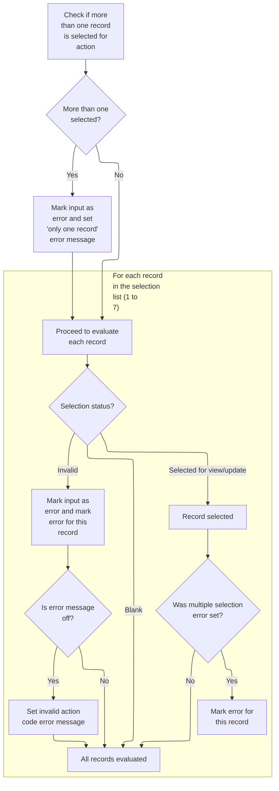
```mermaid
%%{init: {"flowchart": {"defaultRenderer": "elk"}} }%%
flowchart TD
    node1["Check if more 
 than one record 
 is selected for 
 action"]
    click node1 openCode "app/cbl/COCRDLIC.cbl:1079:1095"
    node1 --> node2{"More than one 
 selected?"}
    click node2 openCode "app/cbl/COCRDLIC.cbl:1084:1084"
    node2 -->|"Yes"| node3["Mark input as 
 error and set 
 'only one record' 
 error message"]
    click node3 openCode "app/cbl/COCRDLIC.cbl:1085:1086"
    node2 -->|"No"| node4["Proceed to evaluate 
 each record"]
    click node4 openCode "app/cbl/COCRDLIC.cbl:1097:1098"
    node3 --> node4
    
    subgraph loop1["For each record 
 in the selection 
 list (1 to 
 7)"]
      node4 --> node5{"Selection status?"}
      click node5 openCode "app/cbl/COCRDLIC.cbl:1100:1100"
      node5 -->|"Selected for view/update"| node6["Record selected"]
      click node6 openCode "app/cbl/COCRDLIC.cbl:1102:1102"
      node6 --> node7{"Was multiple selection 
 error set?"}
      click node7 openCode "app/cbl/COCRDLIC.cbl:1103:1103"
      node7 -->|"Yes"| node8["Mark error for 
 this record"]
      click node8 openCode "app/cbl/COCRDLIC.cbl:1104:1104"
      node7 -->|"No"| node13["Next record"]
      node5 -->|"Blank"| node13
      node5 -->|"Invalid"| node10["Mark input as 
 error and mark 
 error for this 
 record"]
      click node10 openCode "app/cbl/COCRDLIC.cbl:1109:1110"
      node10 --> node11{"Is error message 
 off?"}
      click node11 openCode "app/cbl/COCRDLIC.cbl:1111:1111"
      node11 -->|"Yes"| node12["Set invalid action 
 code error message"]
      click node12 openCode "app/cbl/COCRDLIC.cbl:1112:1112"
      node11 -->|"No"| node13
      node12 --> node13
    end
    node13["All records evaluated"]
    click node13 openCode "app/cbl/COCRDLIC.cbl:1115:1115"
classDef HeadingStyle fill:#777777,stroke:#333,stroke-width:2px;
```

This section validates the user's selection of records for view or update actions, ensuring only one record is selected and marking errors for invalid or multiple selections.

| Rule ID | Code Location   | Category        | Rule Name                            | Description                                                                                                                                                                                                                                   | Conditions                                                                                                       | Remarks                                                                                                                                                                                               |
| ------- | --------------- | --------------- | ------------------------------------ | --------------------------------------------------------------------------------------------------------------------------------------------------------------------------------------------------------------------------------------------- | ---------------------------------------------------------------------------------------------------------------- | ----------------------------------------------------------------------------------------------------------------------------------------------------------------------------------------------------- |
| BR-001  | 2250-EDIT-ARRAY | Data validation | Single selection enforcement         | If the user selects more than one record for action (view or update), the input is marked as an error and an error message instructing the user to select only one record is set. All selected records are flagged as erroneous for the UI.   | More than one record in the selection array is marked as selected for view ('S') or update ('U').                | Maximum selectable records: 7. Valid selection codes: 'S' (view), 'U' (update). Error message: 'PLEASE SELECT ONLY ONE RECORD TO VIEW OR UPDATE'. Error flag for each record: '1' (string, length 1). |
| BR-002  | 2250-EDIT-ARRAY | Data validation | Invalid selection code handling      | If a record's selection code is invalid (not 'S', 'U', blank, or low-values), the input is marked as an error, the specific record is flagged as erroneous, and if error messages are enabled, an 'INVALID ACTION CODE' error message is set. | A record in the selection array contains a value other than 'S', 'U', blank, or low-values.                      | Valid selection codes: 'S', 'U', blank (' '), low-values. Error flag for each record: '1' (string, length 1). Error message: 'INVALID ACTION CODE'.                                                   |
| BR-003  | 2250-EDIT-ARRAY | Data validation | Multiple selection row error marking | If a record is selected for view or update and the 'more than one action' error flag is set, the specific record is flagged as erroneous for the UI.                                                                                          | A record is marked as selected for view ('S') or update ('U'), and the 'more than one action' error flag is set. | Error flag for each record: '1' (string, length 1).                                                                                                                                                   |

<SwmSnippet path="/app/cbl/COCRDLIC.cbl" line="1079" repo-id="Z2l0aHViJTNBJTNBa3luZHJ5bC1hd3MtbWFpbmZyYW1lLW1vZGVybml6YXRpb24tY2FyZGRlbW8lM0ElM0FTd2ltbS1EZW1v">

---

Back in `2250-EDIT-ARRAY`, after reading records, we check if the user selected more than one record for action. If so, we set error flags and mark the invalid selections for the UI.

```cobol
           INSPECT  WS-EDIT-SELECT-FLAGS                                        
           TALLYING I                                                           
           FOR ALL 'S'                                                          
               ALL 'U'                                                          
                                                                                
           IF I > +1                                                            
               SET INPUT-ERROR      TO TRUE                                     
               SET WS-MORE-THAN-1-ACTION TO TRUE                                
                                                                                
               MOVE WS-EDIT-SELECT-FLAGS                                        
                                   TO WS-EDIT-SELECT-ERROR-FLAGS                
               INSPECT WS-EDIT-SELECT-ERROR-FLAGS                               
                 REPLACING ALL 'S' BY '1'                                       
                           ALL 'U' BY '1'                                       
                 CHARACTERS        BY '0'                                       
                                                                                
           END-IF                                                               
```

---

</SwmSnippet>

<SwmSnippet path="/app/cbl/COCRDLIC.cbl" line="1097" repo-id="Z2l0aHViJTNBJTNBa3luZHJ5bC1hd3MtbWFpbmZyYW1lLW1vZGVybml6YXRpb24tY2FyZGRlbW8lM0ElM0FTd2ltbS1EZW1v">

---

After checking for multiple selections, we loop through the selection array to find which record is picked. If there's an invalid code or too many selections, we set error flags and mark the rows.

```cobol
           MOVE ZERO TO I-SELECTED                                              
                                                                                
           PERFORM VARYING I FROM 1 BY 1 UNTIL I > 7                            
               EVALUATE TRUE                                                    
                 WHEN SELECT-OK(I)                                              
                   MOVE I TO I-SELECTED                                         
                   IF WS-MORE-THAN-1-ACTION                                     
                      MOVE '1' TO WS-ROW-CRDSELECT-ERROR(I)                     
                   END-IF                                                       
                 WHEN SELECT-BLANK(I)                                           
                   CONTINUE                                                     
                 WHEN OTHER                                                     
                   SET INPUT-ERROR TO TRUE                                      
                   MOVE '1' TO WS-ROW-CRDSELECT-ERROR(I)                        
                   IF WS-ERROR-MSG-OFF                                          
                      SET WS-INVALID-ACTION-CODE TO TRUE                        
                   END-IF                                                       
              END-EVALUATE                                                      
           END-PERFORM                                                          
```

---

</SwmSnippet>

#### Validating Card Number Format

This section validates the format of the card number entered by the user, ensuring only valid numeric card numbers are accepted and handling errors appropriately.

| Rule ID | Code Location       | Category        | Rule Name                   | Description                                                                                                                                                   | Conditions                                                                          | Remarks                                                                                                                                                                                                 |
| ------- | ------------------- | --------------- | --------------------------- | ------------------------------------------------------------------------------------------------------------------------------------------------------------- | ----------------------------------------------------------------------------------- | ------------------------------------------------------------------------------------------------------------------------------------------------------------------------------------------------------- |
| BR-001  | 2220-EDIT-CARD-EXIT | Data validation | Card number must be numeric | If the card number entered is not a numeric value, the system will reject the input, display an error message to the user, and clear the card number field.   | The card number input contains any non-numeric characters or is not a valid number. | The error message displayed is: 'CARD ID FILTER,IF SUPPLIED MUST BE A 16 DIGIT NUMBER'. The card number field is cleared to zero. The expected format for a valid card number is a string of 16 digits. |
| BR-002  | 2220-EDIT-CARD-EXIT | Business logic  | Accept valid card number    | If the card number entered is valid (numeric), the system will accept the input, store the card number in the communication area, and mark it as valid.       | The card number input is a numeric value.                                           | A valid card number is a string of 16 digits. The card number is stored in the communication area for further processing.                                                                               |
| BR-003  | 2220-EDIT-CARD-EXIT | Error handling  | Error state protection      | When an invalid card number is detected, the system sets error flags that prevent further processing and protect the selection of rows in the user interface. | The card number input is not numeric.                                               | Error flags are set to prevent further actions and protect the selection of rows. This ensures that invalid data does not propagate through the system.                                                 |

<SwmSnippet path="/app/cbl/COCRDLIC.cbl" line="1052" repo-id="Z2l0aHViJTNBJTNBa3luZHJ5bC1hd3MtbWFpbmZyYW1lLW1vZGVybml6YXRpb24tY2FyZGRlbW8lM0ElM0FTd2ltbS1EZW1v">

---

This is where we check if the card number is valid and flag errors if not.

```cobol
           IF CC-CARD-NUM  IS NOT NUMERIC                                       
              SET INPUT-ERROR TO TRUE                                           
              SET FLG-CARDFILTER-NOT-OK TO TRUE                                 
              SET FLG-PROTECT-SELECT-ROWS-YES TO TRUE                           
              IF WS-ERROR-MSG-OFF                                               
                 MOVE                                                           
              'CARD ID FILTER,IF SUPPLIED MUST BE A 16 DIGIT NUMBER'            
                              TO WS-ERROR-MSG                                   
              END-IF                                                            
              MOVE ZERO       TO CDEMO-CARD-NUM                                 
              GO TO 2220-EDIT-CARD-EXIT                                         
```

---

</SwmSnippet>

<SwmSnippet path="/app/cbl/COCRDLIC.cbl" line="1063" repo-id="Z2l0aHViJTNBJTNBa3luZHJ5bC1hd3MtbWFpbmZyYW1lLW1vZGVybml6YXRpb24tY2FyZGRlbW8lM0ElM0FTd2ltbS1EZW1v">

---

If the card number is valid, we copy it to the commarea and mark it as valid. If not, we set error flags and zero out the field.

```cobol
           ELSE                                                                 
              MOVE CC-CARD-NUM-N TO CDEMO-CARD-NUM                              
              SET FLG-CARDFILTER-ISVALID TO TRUE                                
           END-IF                                                               
```

---

</SwmSnippet>

### Final Account Filter Validation

This section performs the final validation of the account filter input, ensuring that only valid numeric account IDs are accepted and controlling error messaging and UI selection behavior based on the validation outcome.

| Rule ID | Code Location     | Category        | Rule Name                     | Description                                                                                                                                                                                                                                   | Conditions                                                                    | Remarks                                                                                                                                                                                                                                         |
| ------- | ----------------- | --------------- | ----------------------------- | --------------------------------------------------------------------------------------------------------------------------------------------------------------------------------------------------------------------------------------------- | ----------------------------------------------------------------------------- | ----------------------------------------------------------------------------------------------------------------------------------------------------------------------------------------------------------------------------------------------- |
| BR-001  | 2210-EDIT-ACCOUNT | Data validation | Account ID numeric validation | If the account ID is supplied and is not a numeric value, the system sets error flags, displays an error message stating that the account filter must be an 11-digit number, disables row selection, and resets the account ID value to zero. | The account ID field contains a non-numeric value after initial edits.        | The error message shown is: 'ACCOUNT FILTER,IF SUPPLIED MUST BE A 11 DIGIT NUMBER'. The account ID is reset to zero (numeric value). The error flags and selection protection flags are set to indicate an error and prevent further selection. |
| BR-002  | 2210-EDIT-ACCOUNT | Business logic  | Valid account ID acceptance   | If the account ID is valid (numeric), the system copies the value to the communication area and marks the account filter as valid, allowing further selection.                                                                                | The account ID field contains a numeric value after initial edits.            | The account ID is copied to the communication area as an 11-digit number. The account filter valid flag is set to indicate acceptance.                                                                                                          |
| BR-003  | 2210-EDIT-ACCOUNT | Error handling  | Selection protection on error | When an account ID validation error occurs, the system disables row selection in the UI to prevent further actions until the error is resolved.                                                                                               | An account ID validation error has been detected (account ID is not numeric). | The selection protection flag is set to indicate that row selection is disabled. This prevents the user from proceeding until the error is corrected.                                                                                           |

<SwmSnippet path="/app/cbl/COCRDLIC.cbl" line="1017" repo-id="Z2l0aHViJTNBJTNBa3luZHJ5bC1hd3MtbWFpbmZyYW1lLW1vZGVybml6YXRpb24tY2FyZGRlbW8lM0ElM0FTd2ltbS1EZW1v">

---

After returning from 2220-EDIT-CARD, 2210-EDIT-ACCOUNT does a final check on the account ID. If it's not numeric, it sets error flags, shows an error message, disables selection, and resets the account ID. If it's valid, it copies the value to the commarea and marks it as valid. The flags here control what the UI allows next and how errors are shown.

```cobol
           IF CC-ACCT-ID  IS NOT NUMERIC                                        
              SET INPUT-ERROR TO TRUE                                           
              SET FLG-ACCTFILTER-NOT-OK TO TRUE                                 
              SET FLG-PROTECT-SELECT-ROWS-YES TO TRUE                           
              MOVE                                                              
              'ACCOUNT FILTER,IF SUPPLIED MUST BE A 11 DIGIT NUMBER'            
                              TO WS-ERROR-MSG                                   
              MOVE ZERO       TO CDEMO-ACCT-ID                                  
              GO TO 2210-EDIT-ACCOUNT-EXIT                                      
           ELSE                                                                 
              MOVE CC-ACCT-ID TO CDEMO-ACCT-ID                                  
              SET FLG-ACCTFILTER-ISVALID TO TRUE                                
           END-IF                                                               
```

---

</SwmSnippet>

## PF Key Handling and Action Routing

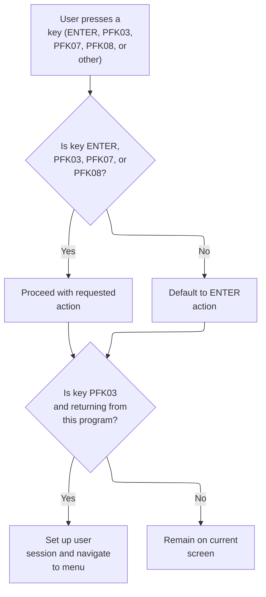
```mermaid
%%{init: {"flowchart": {"defaultRenderer": "elk"}} }%%
flowchart TD
    node1["User presses a 
 key (ENTER, PFK03, 
 PFK07, PFK08, or 
 other)"] --> node2{"Is key ENTER, 
 PFK03, PFK07, or 
 PFK08?"}
    click node1 openCode "app/cbl/COCRDLIC.cbl:370:371"
    node2 -->|"Yes"| node3["Proceed with requested 
 action"]
    click node2 openCode "app/cbl/COCRDLIC.cbl:371:376"
    node2 -->|"No"| node4["Default to ENTER 
 action"]
    click node4 openCode "app/cbl/COCRDLIC.cbl:378:380"
    node3 --> node5{"Is key PFK03 
 and returning from 
 this program?"}
    click node5 openCode "app/cbl/COCRDLIC.cbl:384:385"
    node4 --> node5
    node5 -->|"Yes"| node6["Set up user 
 session and navigate 
 to menu"]
    click node6 openCode "app/cbl/COCRDLIC.cbl:386:405"
    node5 -->|"No"| node7["Remain on current 
 screen"]
    click node7 openCode "app/cbl/COCRDLIC.cbl:370:405"
classDef HeadingStyle fill:#777777,stroke:#333,stroke-width:2px;
```

This section manages user input via PF keys and routes actions accordingly, including validation of accepted keys, defaulting to error handling for unsupported keys, and navigation to the main menu when appropriate.

| Rule ID | Code Location | Category       | Rule Name                | Description                                                                                                                                                                                                              | Conditions                                                             | Remarks                                                                                                                                                                  |
| ------- | ------------- | -------------- | ------------------------ | ------------------------------------------------------------------------------------------------------------------------------------------------------------------------------------------------------------------------ | ---------------------------------------------------------------------- | ------------------------------------------------------------------------------------------------------------------------------------------------------------------------ |
| BR-001  | 0000-MAIN     | Business logic | Accepted key routing     | Only the keys ENTER, PF3, PF7, and PF8 are accepted for direct action routing. If any of these keys are pressed, the system marks the key as valid and proceeds with the requested action.                               | User presses ENTER, PF3, PF7, or PF8.                                  | Accepted keys are: 'ENTER', 'PFK03', 'PFK07', 'PFK08'. Any other key is not accepted for direct routing.                                                                 |
| BR-002  | 0000-MAIN     | Business logic | PF3 menu navigation      | When PF3 is pressed and the user is returning from the same program, the system sets up the user session and navigates to the main menu. This includes updating session context and passing control to the menu program. | User presses PF3 and is returning from the same program.               | PF3 is 'PFK03'. The program context must match the current program ('COCRDLIC'). Navigation is performed by passing control to 'COMEN01C' with the current session data. |
| BR-003  | 0000-MAIN     | Business logic | Remain on current screen | If PF3 is not pressed or the user is not returning from the same program, the system remains on the current screen and does not navigate to the menu.                                                                    | PF3 is not pressed or the user is not returning from the same program. | The system does not update session context or transfer control to the menu program in this case.                                                                         |
| BR-004  | 0000-MAIN     | Error handling | Default to ENTER action  | If the user presses any key other than ENTER, PF3, PF7, or PF8, the system defaults to the ENTER action. This ensures that unrecognized keys trigger the standard error handling and redisplay flow.                     | User presses a key that is not ENTER, PF3, PF7, or PF8.                | Any key not in the accepted set ('ENTER', 'PFK03', 'PFK07', 'PFK08') will be treated as ENTER for routing purposes.                                                      |

<SwmSnippet path="/app/cbl/COCRDLIC.cbl" line="370" repo-id="Z2l0aHViJTNBJTNBa3luZHJ5bC1hd3MtbWFpbmZyYW1lLW1vZGVybml6YXRpb24tY2FyZGRlbW8lM0ElM0FTd2ltbS1EZW1v">

---

After returning from 2000-RECEIVE-MAP, 0000-MAIN sets PFK-INVALID by default, then checks if the user pressed ENTER, PF3, PF7, or PF8. If so, it marks the key as valid. This is where the main action routing starts based on user input.

```cobol
           SET PFK-INVALID TO TRUE                                              
           IF CCARD-AID-ENTER OR                                                
              CCARD-AID-PFK03 OR                                                
              CCARD-AID-PFK07 OR                                                
              CCARD-AID-PFK08                                                   
               SET PFK-VALID TO TRUE                                            
           END-IF                                                               
```

---

</SwmSnippet>

<SwmSnippet path="/app/cbl/COCRDLIC.cbl" line="378" repo-id="Z2l0aHViJTNBJTNBa3luZHJ5bC1hd3MtbWFpbmZyYW1lLW1vZGVybml6YXRpb24tY2FyZGRlbW8lM0ElM0FTd2ltbS1EZW1v">

---

If the PF key is still marked invalid, we force the ENTER action so the rest of the flow can handle errors and redisplay the screen as needed. This keeps the error path simple.

```cobol
           IF PFK-INVALID                                                       
              SET CCARD-AID-ENTER TO TRUE                                       
           END-IF                                                               
```

---

</SwmSnippet>

<SwmSnippet path="/app/cbl/COCRDLIC.cbl" line="384" repo-id="Z2l0aHViJTNBJTNBa3luZHJ5bC1hd3MtbWFpbmZyYW1lLW1vZGVybml6YXRpb24tY2FyZGRlbW8lM0ElM0FTd2ltbS1EZW1v">

---

On PF3, if we're coming back to this program, we prep the commarea and set up to jump to the menu.

```cobol
           IF  (CCARD-AID-PFK03                                                 
           AND CDEMO-FROM-PROGRAM  EQUAL LIT-THISPGM)                           
              MOVE LIT-THISTRANID   TO CDEMO-FROM-TRANID                        
              MOVE LIT-THISPGM      TO CDEMO-FROM-PROGRAM                       
              SET  CDEMO-USRTYP-USER TO TRUE                                    
              SET  CDEMO-PGM-ENTER  TO TRUE                                     
              MOVE LIT-THISMAPSET   TO CDEMO-LAST-MAPSET                        
              MOVE LIT-THISMAP      TO CDEMO-LAST-MAP                           
              MOVE LIT-MENUPGM      TO CDEMO-TO-PROGRAM                         
                                                                                
              MOVE LIT-MENUMAPSET   TO CCARD-NEXT-MAPSET                        
              MOVE LIT-THISMAP      TO CCARD-NEXT-MAP                           
              SET WS-EXIT-MESSAGE            TO TRUE                            
                                                                                
      *       CALL MENU PROGRAM                                                 
      *                                                                         
              SET CDEMO-PGM-ENTER   TO TRUE                                     
```

---

</SwmSnippet>

<SwmSnippet path="/app/cbl/COCRDLIC.cbl" line="402" repo-id="Z2l0aHViJTNBJTNBa3luZHJ5bC1hd3MtbWFpbmZyYW1lLW1vZGVybml6YXRpb24tY2FyZGRlbW8lM0ElM0FTd2ltbS1EZW1v">

---

Here we call COMEN01C using XCTL, which jumps to the main menu program and passes the commarea. The current program doesn't resume after this.

```cobol
              EXEC CICS XCTL                                                    
                        PROGRAM (LIT-MENUPGM)                                   
                        COMMAREA(CARDDEMO-COMMAREA)                             
              END-EXEC                                                          
```

---

</SwmSnippet>

## Menu Entry and Key Handling

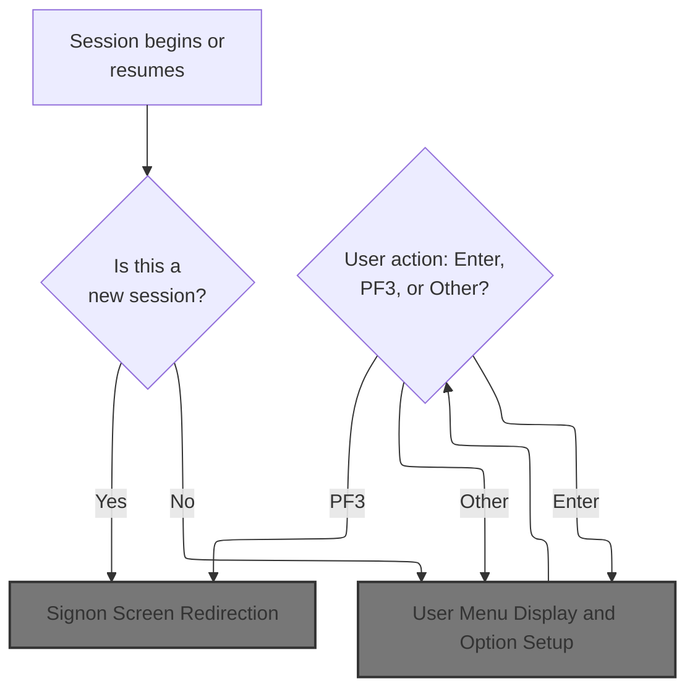
```mermaid
%%{init: {"flowchart": {"defaultRenderer": "elk"}} }%%
flowchart TD
  node1["Session begins or 
 resumes"]
  click node1 openCode "app/cbl/COMEN01C.cbl:75:81"
  node1 --> node2{"Is this a 
 new session?"}
  click node2 openCode "app/cbl/COMEN01C.cbl:82:85"
  node2 -->|"Yes"| node3["Signon Screen Redirection"]
  
  node2 -->|"No"| node4["User Menu Display and Option Setup"]
  
  node4 --> node5{"User action: Enter, 
 PF3, or Other?"}
  click node5 openCode "app/cbl/COMEN01C.cbl:93:103"
  node5 -->|"Enter"| node4
  node5 -->|"PF3"| node3
  node5 -->|"Other"| node4
classDef HeadingStyle fill:#777777,stroke:#333,stroke-width:2px;
click node3 goToHeading "Signon Screen Redirection"
node3:::HeadingStyle
click node4 goToHeading "User Menu Display and Option Setup"
node4:::HeadingStyle
```

This section manages the entry and key handling for the CardDemo application's main menu, determining when to display the menu, redirect to signon, and how to respond to user key input.

| Rule ID | Code Location | Category       | Rule Name                             | Description                                                                                                                      | Conditions                                                                          | Remarks                                                                                                                                                                                |
| ------- | ------------- | -------------- | ------------------------------------- | -------------------------------------------------------------------------------------------------------------------------------- | ----------------------------------------------------------------------------------- | -------------------------------------------------------------------------------------------------------------------------------------------------------------------------------------- |
| BR-001  | MAIN-PARA     | Business logic | Signon screen redirect on new session | If the session context length is zero, the user is redirected to the signon screen.                                              | Session context length (EIBCALEN) is zero.                                          | The signon screen is triggered by setting the next program to 'COSGN00C'. The output format for the program name is an 8-character string, left-aligned and space-padded if necessary. |
| BR-002  | MAIN-PARA     | Business logic | Menu display on first entry           | If the session is not a new session and the reentry flag is not set, the menu screen is displayed and the reentry flag is set.   | Session context length is not zero and reentry flag (CDEMO-PGM-REENTER) is not set. | The menu screen is displayed after clearing the output area to low values. The reentry flag is set to 1 (CDEMO-PGM-CONTEXT = 1).                                                       |
| BR-003  | MAIN-PARA     | Business logic | Process menu selection on ENTER       | When the user presses the ENTER key on the menu screen, the system processes the menu selection.                                 | User key input (EIBAID) is ENTER while on the menu screen.                          | ENTER key is identified by the constant DFHENTER. The menu selection is processed by invoking the menu processing logic.                                                               |
| BR-004  | MAIN-PARA     | Business logic | Signon screen redirect on PF3         | When the user presses PF3 on the menu screen, the user is redirected to the signon screen.                                       | User key input (EIBAID) is PF3 while on the menu screen.                            | PF3 key is identified by the constant DFHPF3. The signon screen is triggered by setting the next program to 'COSGN00C'.                                                                |
| BR-005  | MAIN-PARA     | Error handling | Invalid key error handling            | If the user presses any key other than ENTER or PF3 on the menu screen, an error message is displayed and the error flag is set. | User key input (EIBAID) is not ENTER or PF3 while on the menu screen.               | Error flag is set to 'Y'. The error message is set to 'Invalid key pressed. Please see below...         ' (50-character string, left-aligned, space-padded).                           |

<SwmSnippet path="/app/cbl/COMEN01C.cbl" line="75" repo-id="Z2l0aHViJTNBJTNBa3luZHJ5bC1hd3MtbWFpbmZyYW1lLW1vZGVybml6YXRpb24tY2FyZGRlbW8lM0ElM0FTd2ltbS1EZW1v">

---

MAIN-PARA checks if we're entering the menu for the first time or reentering. It uses EIBCALEN and CDEMO-PGM-REENTER to decide whether to send the menu screen or process user input. Key handling is done with EVALUATE, routing ENTER and PF3 to their actions and showing errors for anything else.

```cobol
       MAIN-PARA.

           SET ERR-FLG-OFF TO TRUE

           MOVE SPACES TO WS-MESSAGE
                          ERRMSGO OF COMEN1AO

           IF EIBCALEN = 0
               MOVE 'COSGN00C' TO CDEMO-FROM-PROGRAM
               PERFORM RETURN-TO-SIGNON-SCREEN
           ELSE
               MOVE DFHCOMMAREA(1:EIBCALEN) TO CARDDEMO-COMMAREA
               IF NOT CDEMO-PGM-REENTER
                   SET CDEMO-PGM-REENTER    TO TRUE
                   MOVE LOW-VALUES          TO COMEN1AO
                   PERFORM SEND-MENU-SCREEN
               ELSE
                   PERFORM RECEIVE-MENU-SCREEN
                   EVALUATE EIBAID
                       WHEN DFHENTER
                           PERFORM PROCESS-ENTER-KEY
                       WHEN DFHPF3
                           MOVE 'COSGN00C' TO CDEMO-TO-PROGRAM
                           PERFORM RETURN-TO-SIGNON-SCREEN
                       WHEN OTHER
                           MOVE 'Y'                       TO WS-ERR-FLG
                           MOVE CCDA-MSG-INVALID-KEY      TO WS-MESSAGE
                           PERFORM SEND-MENU-SCREEN
                   END-EVALUATE
               END-IF
           END-IF

           EXEC CICS RETURN
                     TRANSID (WS-TRANID)
                     COMMAREA (CARDDEMO-COMMAREA)
           END-EXEC.
```

---

</SwmSnippet>

### Signon Screen Redirection

This section manages redirection to the signon screen, ensuring users are sent to the signon handler program when appropriate.

| Rule ID | Code Location           | Category       | Rule Name                         | Description                                                                                                                                                                                | Conditions                                              | Remarks                                                                                               |
| ------- | ----------------------- | -------------- | --------------------------------- | ------------------------------------------------------------------------------------------------------------------------------------------------------------------------------------------ | ------------------------------------------------------- | ----------------------------------------------------------------------------------------------------- |
| BR-001  | RETURN-TO-SIGNON-SCREEN | Business logic | Default signon handler assignment | If the next program to execute is not set (either blank or filled with low-values), the system will set it to the default signon handler program name 'COSGN00C (Signon Screen Handling)'. | The next program field is blank or contains low-values. | The default signon handler program name is 'COSGN00C', which is an 8-character alphanumeric string.   |
| BR-002  | RETURN-TO-SIGNON-SCREEN | Business logic | Signon screen redirection         | The system will transfer control to the program specified in the next program field, which may be the default signon handler if it was set in this section.                                | The next program field contains a valid program name.   | The program name is an 8-character alphanumeric string. If not previously set, it will be 'COSGN00C'. |

<SwmSnippet path="/app/cbl/COMEN01C.cbl" line="170" repo-id="Z2l0aHViJTNBJTNBa3luZHJ5bC1hd3MtbWFpbmZyYW1lLW1vZGVybml6YXRpb24tY2FyZGRlbW8lM0ElM0FTd2ltbS1EZW1v">

---

RETURN-TO-SIGNON-SCREEN checks if the next program is set. If not, it sets it to COSGN00C (the signon handler) and calls it using XCTL, which jumps to the signon logic and ends this program.

```cobol
       RETURN-TO-SIGNON-SCREEN.

           IF CDEMO-TO-PROGRAM = LOW-VALUES OR SPACES
               MOVE 'COSGN00C' TO CDEMO-TO-PROGRAM
           END-IF
           EXEC CICS
               XCTL PROGRAM(CDEMO-TO-PROGRAM)
           END-EXEC.
```

---

</SwmSnippet>

### Signon Screen Entry and Key Handling

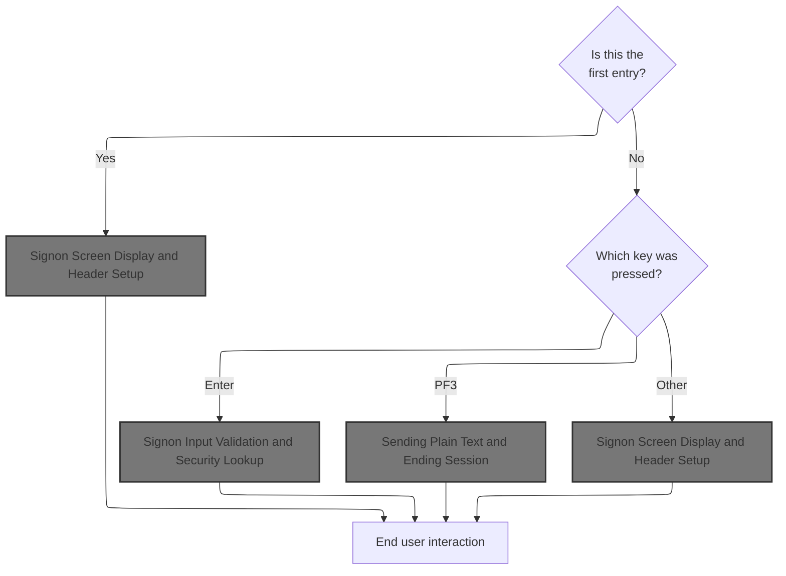
```mermaid
%%{init: {"flowchart": {"defaultRenderer": "elk"}} }%%
flowchart TD
  node1{"Is this the 
 first entry?"}
  click node1 openCode "app/cbl/COSGN00C.cbl:80:84"
  node1 -->|"Yes"| node2["Signon Screen Display and Header Setup"]
  
  node1 -->|"No"| node3{"Which key was 
 pressed?"}
  click node3 openCode "app/cbl/COSGN00C.cbl:85:95"
  node3 -->|"Enter"| node4["Signon Input Validation and Security Lookup"]
  
  node3 -->|"PF3"| node5["Sending Plain Text and Ending Session"]
  
  node3 -->|"Other"| node6["Signon Screen Display and Header Setup"]
  
  node2 --> node7["End user interaction"]
  node4 --> node7
  node5 --> node7
  node6 --> node7
  click node7 openCode "app/cbl/COSGN00C.cbl:98:102"
classDef HeadingStyle fill:#777777,stroke:#333,stroke-width:2px;
click node2 goToHeading "Signon Screen Display and Header Setup"
node2:::HeadingStyle
click node4 goToHeading "Signon Input Validation and Security Lookup"
node4:::HeadingStyle
click node5 goToHeading "Sending Plain Text and Ending Session"
node5:::HeadingStyle
click node6 goToHeading "Signon Screen Display and Header Setup"
node6:::HeadingStyle
```

This section manages the initial entry and key handling logic for the signon screen in the CardDemo application, determining what the user sees and how their input is processed.

| Rule ID | Code Location | Category       | Rule Name                            | Description                                                                                                                                                                                       | Conditions                                                                          | Remarks                                                                                                                                                                                                                |
| ------- | ------------- | -------------- | ------------------------------------ | ------------------------------------------------------------------------------------------------------------------------------------------------------------------------------------------------- | ----------------------------------------------------------------------------------- | ---------------------------------------------------------------------------------------------------------------------------------------------------------------------------------------------------------------------- |
| BR-001  | MAIN-PARA     | Business logic | First Entry Initialization           | When the signon screen is entered for the first time, the signon area is cleared, the user ID field is set to blank, and the signon screen is displayed to the user.                              | The communication area length is zero, indicating first entry to the signon screen. | The signon area is cleared to all low-values, and the user ID field is set to blank (represented as -1). The signon screen is then displayed. No user message is shown at this point.                                  |
| BR-002  | MAIN-PARA     | Business logic | Enter Key Triggers Signon Validation | When the user presses the ENTER key on the signon screen (not on first entry), the program proceeds to validate the signon input and perform security lookup.                                     | The communication area length is not zero and the key pressed is ENTER.             | No user message is shown at this point; the program proceeds to signon validation logic. The specifics of validation are handled in another paragraph.                                                                 |
| BR-003  | MAIN-PARA     | Business logic | PF3 Key Ends Session with Thank You  | When the user presses the PF3 key on the signon screen (not on first entry), a thank you message is displayed and the session is ended.                                                           | The communication area length is not zero and the key pressed is PF3.               | The message displayed is 'Thank you for using CardDemo application...      ' (50 characters, left aligned, padded with spaces). The session is ended after displaying the message.                                     |
| BR-004  | MAIN-PARA     | Error handling | Invalid Key Handling                 | When the user presses any key other than ENTER or PF3 on the signon screen (not on first entry), an error flag is set, an invalid key message is displayed, and the signon screen is redisplayed. | The communication area length is not zero and the key pressed is not ENTER or PF3.  | The error flag is set to 'Y'. The message displayed is 'Invalid key pressed. Please see below...         ' (50 characters, left aligned, padded with spaces). The signon screen is redisplayed with the error message. |

<SwmSnippet path="/app/cbl/COSGN00C.cbl" line="73" repo-id="Z2l0aHViJTNBJTNBa3luZHJ5bC1hd3MtbWFpbmZyYW1lLW1vZGVybml6YXRpb24tY2FyZGRlbW8lM0ElM0FTd2ltbS1EZW1v">

---

MAIN-PARA in COSGN00C checks if we're entering for the first time or reentering. On first entry, it clears the signon area and shows the signon screen. On reentry, it routes key input: ENTER runs signon logic, PF3 shows a thank you and exits, anything else shows an error and redisplays the screen.

```cobol
       MAIN-PARA.

           SET ERR-FLG-OFF TO TRUE

           MOVE SPACES TO WS-MESSAGE
                          ERRMSGO OF COSGN0AO

           IF EIBCALEN = 0
               MOVE LOW-VALUES TO COSGN0AO
               MOVE -1       TO USERIDL OF COSGN0AI
               PERFORM SEND-SIGNON-SCREEN
           ELSE
               EVALUATE EIBAID
                   WHEN DFHENTER
                       PERFORM PROCESS-ENTER-KEY
                   WHEN DFHPF3
                       MOVE CCDA-MSG-THANK-YOU        TO WS-MESSAGE
                       PERFORM SEND-PLAIN-TEXT
                   WHEN OTHER
                       MOVE 'Y'                       TO WS-ERR-FLG
                       MOVE CCDA-MSG-INVALID-KEY      TO WS-MESSAGE
                       PERFORM SEND-SIGNON-SCREEN
               END-EVALUATE
           END-IF.

           EXEC CICS RETURN
                     TRANSID (WS-TRANID)
                     COMMAREA (CARDDEMO-COMMAREA)
                     LENGTH(LENGTH OF CARDDEMO-COMMAREA)
           END-EXEC.
```

---

</SwmSnippet>

#### Signon Screen Display and Header Setup

This section is responsible for preparing and displaying the signon screen to the user, ensuring that all relevant header information and messages are shown consistently.

| Rule ID | Code Location        | Category       | Rule Name                         | Description                                                                                                            | Conditions                                         | Remarks                                                                                                                                                                                                    |
| ------- | -------------------- | -------------- | --------------------------------- | ---------------------------------------------------------------------------------------------------------------------- | -------------------------------------------------- | ---------------------------------------------------------------------------------------------------------------------------------------------------------------------------------------------------------- |
| BR-001  | SEND-SIGNON-SCREEN   | Business logic | Display message in error field    | Any message present is displayed to the user in the error message field on the signon screen.                          | When a message is present in the message variable. | The message is up to 80 characters, left-aligned, and shown in the designated error field on the signon screen.                                                                                            |
| BR-002  | POPULATE-HEADER-INFO | Business logic | Header information display        | The signon screen header always displays the current date and time, program name, transaction name, and screen titles. | Whenever the signon screen is displayed.           | The header includes: current date (MM-DD-YY), current time (HH-MM-SS), program name (8 characters), transaction name (4 characters), and two title lines. All are left-aligned in their respective fields. |
| BR-003  | POPULATE-HEADER-INFO | Business logic | Display environment IDs           | The signon screen displays the application and system environment IDs to the user.                                     | Whenever the signon screen is displayed.           | The application ID and system ID are shown in their respective fields on the signon screen, as assigned by the CICS environment.                                                                           |
| BR-004  | SEND-SIGNON-SCREEN   | Technical step | Screen send with erase and cursor | The signon screen is always sent to the terminal with the screen erased and the cursor positioned for user input.      | Whenever the signon screen is sent.                | The screen is cleared before display, and the cursor is positioned for user input.                                                                                                                         |

<SwmSnippet path="/app/cbl/COSGN00C.cbl" line="145" repo-id="Z2l0aHViJTNBJTNBa3luZHJ5bC1hd3MtbWFpbmZyYW1lLW1vZGVybml6YXRpb24tY2FyZGRlbW8lM0ElM0FTd2ltbS1EZW1v">

---

SEND-SIGNON-SCREEN sets up the header info, copies any message to the error field, and sends the signon screen to the terminal. This is how we show errors and info to the user.

```cobol
       SEND-SIGNON-SCREEN.

           PERFORM POPULATE-HEADER-INFO

           MOVE WS-MESSAGE TO ERRMSGO OF COSGN0AO

           EXEC CICS SEND
                     MAP('COSGN0A')
                     MAPSET('COSGN00')
                     FROM(COSGN0AO)
                     ERASE
                     CURSOR
           END-EXEC.
```

---

</SwmSnippet>

<SwmSnippet path="/app/cbl/COSGN00C.cbl" line="177" repo-id="Z2l0aHViJTNBJTNBa3luZHJ5bC1hd3MtbWFpbmZyYW1lLW1vZGVybml6YXRpb24tY2FyZGRlbW8lM0ElM0FTd2ltbS1EZW1v">

---

POPULATE-HEADER-INFO builds the header with current date/time, program and transaction names, and titles. It also sets CICS environment IDs for display. This keeps the screen info consistent.

```cobol
       POPULATE-HEADER-INFO.

           MOVE FUNCTION CURRENT-DATE  TO WS-CURDATE-DATA

           MOVE CCDA-TITLE01           TO TITLE01O OF COSGN0AO
           MOVE CCDA-TITLE02           TO TITLE02O OF COSGN0AO
           MOVE WS-TRANID              TO TRNNAMEO OF COSGN0AO
           MOVE WS-PGMNAME             TO PGMNAMEO OF COSGN0AO

           MOVE WS-CURDATE-MONTH       TO WS-CURDATE-MM
           MOVE WS-CURDATE-DAY         TO WS-CURDATE-DD
           MOVE WS-CURDATE-YEAR(3:2)   TO WS-CURDATE-YY

           MOVE WS-CURDATE-MM-DD-YY    TO CURDATEO OF COSGN0AO

           MOVE WS-CURTIME-HOURS       TO WS-CURTIME-HH
           MOVE WS-CURTIME-MINUTE      TO WS-CURTIME-MM
           MOVE WS-CURTIME-SECOND      TO WS-CURTIME-SS

           MOVE WS-CURTIME-HH-MM-SS    TO CURTIMEO OF COSGN0AO

           EXEC CICS ASSIGN
               APPLID(APPLIDO OF COSGN0AO)
           END-EXEC

           EXEC CICS ASSIGN
               SYSID(SYSIDO OF COSGN0AO)
           END-EXEC.
```

---

</SwmSnippet>

#### Signon Input Validation and Security Lookup

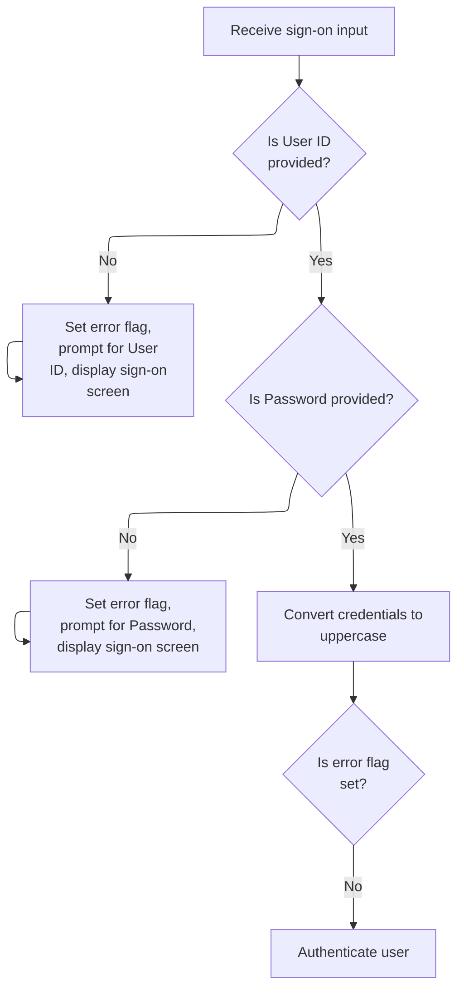
```mermaid
%%{init: {"flowchart": {"defaultRenderer": "elk"}} }%%
flowchart TD
    node1["Receive sign-on input"]
    click node1 openCode "app/cbl/COSGN00C.cbl:110:115"
    node1 --> node2{"Is User ID 
 provided?"}
    click node2 openCode "app/cbl/COSGN00C.cbl:118:122"
    node2 -->|"No"| node3["Set error flag, 
 prompt for User 
 ID, display sign-on 
 screen"]
    click node3 openCode "app/cbl/COSGN00C.cbl:119:122"
    node2 -->|"Yes"| node4{"Is Password provided?"}
    click node4 openCode "app/cbl/COSGN00C.cbl:123:127"
    node4 -->|"No"| node5["Set error flag, 
 prompt for Password, 
 display sign-on screen"]
    click node5 openCode "app/cbl/COSGN00C.cbl:124:127"
    node4 -->|"Yes"| node6["Convert credentials to 
 uppercase"]
    click node6 openCode "app/cbl/COSGN00C.cbl:132:136"
    node6 --> node7{"Is error flag 
 set?"}
    click node7 openCode "app/cbl/COSGN00C.cbl:138:140"
    node7 -->|"No"| node8["Authenticate user"]
    click node8 openCode "app/cbl/COSGN00C.cbl:139:140"
    node3 --> node3
    node5 --> node5
classDef HeadingStyle fill:#777777,stroke:#333,stroke-width:2px;
```

This section validates sign-on input and prepares credentials for authentication, ensuring required fields are present and normalized before attempting user authentication.

| Rule ID | Code Location     | Category        | Rule Name                | Description                                                                                                                                                              | Conditions                                                                | Remarks                                                                                                                           |
| ------- | ----------------- | --------------- | ------------------------ | ------------------------------------------------------------------------------------------------------------------------------------------------------------------------ | ------------------------------------------------------------------------- | --------------------------------------------------------------------------------------------------------------------------------- |
| BR-001  | PROCESS-ENTER-KEY | Data validation | User ID required         | If the User ID field is blank or contains only low-values, the system sets an error flag, displays a message prompting for User ID, and redisplays the sign-on screen.   | User ID field is blank or contains only low-values.                       | Error flag is set to 'Y'. Message displayed is 'Please enter User ID ...'. User ID field length is 8 characters (alphanumeric).   |
| BR-002  | PROCESS-ENTER-KEY | Data validation | Password required        | If the Password field is blank or contains only low-values, the system sets an error flag, displays a message prompting for Password, and redisplays the sign-on screen. | Password field is blank or contains only low-values.                      | Error flag is set to 'Y'. Message displayed is 'Please enter Password ...'. Password field length is 8 characters (alphanumeric). |
| BR-003  | PROCESS-ENTER-KEY | Business logic  | Credential normalization | When both User ID and Password are provided, the system converts both credentials to uppercase before passing them to authentication.                                    | Both User ID and Password fields are present and not blank or low-values. | Credentials are normalized to uppercase. User ID and Password are each 8 characters (alphanumeric).                               |
| BR-004  | PROCESS-ENTER-KEY | Business logic  | Authentication trigger   | If no error flag is set after input validation, the system proceeds to authenticate the user using the normalized credentials.                                           | Error flag is not set after input validation.                             | Authentication is only attempted if error flag is 'N'.                                                                            |

<SwmSnippet path="/app/cbl/COSGN00C.cbl" line="108" repo-id="Z2l0aHViJTNBJTNBa3luZHJ5bC1hd3MtbWFpbmZyYW1lLW1vZGVybml6YXRpb24tY2FyZGRlbW8lM0ElM0FTd2ltbS1EZW1v">

---

PROCESS-ENTER-KEY grabs the user ID and password from the screen, checks for blanks, and shows errors if needed. If both are present, it uppercases them and calls the security file lookup for authentication.

```cobol
       PROCESS-ENTER-KEY.

           EXEC CICS RECEIVE
                     MAP('COSGN0A')
                     MAPSET('COSGN00')
                     RESP(WS-RESP-CD)
                     RESP2(WS-REAS-CD)
           END-EXEC.

           EVALUATE TRUE
               WHEN USERIDI OF COSGN0AI = SPACES OR LOW-VALUES
                   MOVE 'Y'      TO WS-ERR-FLG
                   MOVE 'Please enter User ID ...' TO WS-MESSAGE
                   MOVE -1       TO USERIDL OF COSGN0AI
                   PERFORM SEND-SIGNON-SCREEN
               WHEN PASSWDI OF COSGN0AI = SPACES OR LOW-VALUES
                   MOVE 'Y'      TO WS-ERR-FLG
                   MOVE 'Please enter Password ...' TO WS-MESSAGE
                   MOVE -1       TO PASSWDL OF COSGN0AI
                   PERFORM SEND-SIGNON-SCREEN
               WHEN OTHER
                   CONTINUE
           END-EVALUATE.

           MOVE FUNCTION UPPER-CASE(USERIDI OF COSGN0AI) TO
                           WS-USER-ID
                           CDEMO-USER-ID
           MOVE FUNCTION UPPER-CASE(PASSWDI OF COSGN0AI) TO
                           WS-USER-PWD

           IF NOT ERR-FLG-ON
               PERFORM READ-USER-SEC-FILE
           END-IF.
```

---

</SwmSnippet>

#### User Authentication and Routing

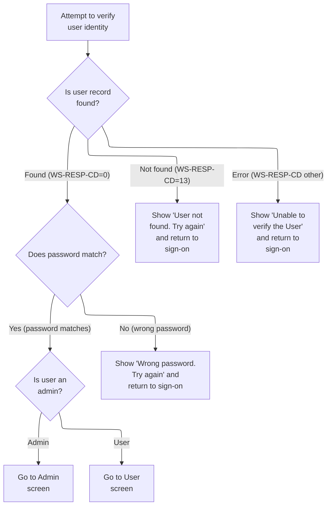
```mermaid
%%{init: {"flowchart": {"defaultRenderer": "elk"}} }%%
flowchart TD
    node1["Attempt to verify 
 user identity"] --> node2{"Is user record 
 found?"}
    click node1 openCode "app/cbl/COSGN00C.cbl:211:219"
    node2 -->|"Found (WS-RESP-CD=0)"| node3{"Does password match?"}
    click node2 openCode "app/cbl/COSGN00C.cbl:221:222"
    node2 -->|"Not found (WS-RESP-CD=13)"| node6["Show 'User not 
 found. Try again' 
 and return to 
 sign-on"]
    click node6 openCode "app/cbl/COSGN00C.cbl:247:251"
    node2 -->|"Error (WS-RESP-CD other)"| node7["Show 'Unable to 
 verify the User' 
 and return to 
 sign-on"]
    click node7 openCode "app/cbl/COSGN00C.cbl:252:256"
    node3 -->|"Yes (password matches)"| node4{"Is user an 
 admin?"}
    click node3 openCode "app/cbl/COSGN00C.cbl:223:230"
    node3 -->|"No (wrong password)"| node5["Show 'Wrong password. 
 Try again' and 
 return to sign-on"]
    click node5 openCode "app/cbl/COSGN00C.cbl:241:246"
    node4 -->|"Admin"| node8["Go to Admin 
 screen"]
    click node8 openCode "app/cbl/COSGN00C.cbl:231:234"
    node4 -->|"User"| node9["Go to User 
 screen"]
    click node9 openCode "app/cbl/COSGN00C.cbl:236:239"
classDef HeadingStyle fill:#777777,stroke:#333,stroke-width:2px;
```

This section authenticates users by verifying their credentials and routes them to the appropriate menu based on their access level. It also handles error scenarios by displaying relevant messages and returning users to the sign-on screen.

| Rule ID | Code Location      | Category       | Rule Name                       | Description                                                                                                                                                                            | Conditions                                                                                               | Remarks                                                                                            |
| ------- | ------------------ | -------------- | ------------------------------- | -------------------------------------------------------------------------------------------------------------------------------------------------------------------------------------- | -------------------------------------------------------------------------------------------------------- | -------------------------------------------------------------------------------------------------- |
| BR-001  | READ-USER-SEC-FILE | Business logic | User type routing               | If the user record is found and the password matches, the user must be routed to the admin menu if their user type is 'A', or to the user menu if their user type is 'U'.              | The user record is found (response code 0) and the password matches.                                     | User type 'A' is routed to the admin menu. User type 'U' is routed to the user menu.               |
| BR-002  | READ-USER-SEC-FILE | Error handling | User not found message          | If the user record is not found in the user security file, the system must display the message 'User not found. Try again ...' and return the user to the sign-on screen.              | The user record lookup response code is 13 (not found).                                                  | The error message is: 'User not found. Try again ...'. The user is returned to the sign-on screen. |
| BR-003  | READ-USER-SEC-FILE | Error handling | Wrong password message          | If the user record is found but the password does not match, the system must display the message 'Wrong Password. Try again ...' and return the user to the sign-on screen.            | The user record is found (response code 0), but the entered password does not match the stored password. | The error message is: 'Wrong Password. Try again ...'. The user is returned to the sign-on screen. |
| BR-004  | READ-USER-SEC-FILE | Error handling | General user verification error | If the user record lookup returns any response code other than 0 or 13, the system must display the message 'Unable to verify the User ...' and return the user to the sign-on screen. | The user record lookup response code is not 0 (found) or 13 (not found).                                 | The error message is: 'Unable to verify the User ...'. The user is returned to the sign-on screen. |

<SwmSnippet path="/app/cbl/COSGN00C.cbl" line="209" repo-id="Z2l0aHViJTNBJTNBa3luZHJ5bC1hd3MtbWFpbmZyYW1lLW1vZGVybml6YXRpb24tY2FyZGRlbW8lM0ElM0FTd2ltbS1EZW1v">

---

READ-USER-SEC-FILE reads the user security record, checks the password, and routes to either the admin or user menu program using XCTL. If the user isn't found or the password is wrong, it shows an error and redisplays the signon screen.

```cobol
       READ-USER-SEC-FILE.

           EXEC CICS READ
                DATASET   (WS-USRSEC-FILE)
                INTO      (SEC-USER-DATA)
                LENGTH    (LENGTH OF SEC-USER-DATA)
                RIDFLD    (WS-USER-ID)
                KEYLENGTH (LENGTH OF WS-USER-ID)
                RESP      (WS-RESP-CD)
                RESP2     (WS-REAS-CD)
           END-EXEC.

           EVALUATE WS-RESP-CD
               WHEN 0
                   IF SEC-USR-PWD = WS-USER-PWD
                       MOVE WS-TRANID    TO CDEMO-FROM-TRANID
                       MOVE WS-PGMNAME   TO CDEMO-FROM-PROGRAM
                       MOVE WS-USER-ID   TO CDEMO-USER-ID
                       MOVE SEC-USR-TYPE TO CDEMO-USER-TYPE
                       MOVE ZEROS        TO CDEMO-PGM-CONTEXT

                       IF CDEMO-USRTYP-ADMIN
                            EXEC CICS XCTL
                              PROGRAM ('COADM01C')
                              COMMAREA(CARDDEMO-COMMAREA)
                            END-EXEC
                       ELSE
                            EXEC CICS XCTL
                              PROGRAM ('COMEN01C')
                              COMMAREA(CARDDEMO-COMMAREA)
                            END-EXEC
                       END-IF
                   ELSE
                       MOVE 'Wrong Password. Try again ...' TO
                                                          WS-MESSAGE
                       MOVE -1       TO PASSWDL OF COSGN0AI
                       PERFORM SEND-SIGNON-SCREEN
                   END-IF
               WHEN 13
                   MOVE 'Y'      TO WS-ERR-FLG
                   MOVE 'User not found. Try again ...' TO WS-MESSAGE
                   MOVE -1       TO USERIDL OF COSGN0AI
                   PERFORM SEND-SIGNON-SCREEN
               WHEN OTHER
                   MOVE 'Y'      TO WS-ERR-FLG
                   MOVE 'Unable to verify the User ...' TO WS-MESSAGE
                   MOVE -1       TO USERIDL OF COSGN0AI
                   PERFORM SEND-SIGNON-SCREEN
           END-EVALUATE.
```

---

</SwmSnippet>

#### Admin Menu Entry and Key Handling

This section manages the entry and key handling for the CardDemo application's main menu, determining when to display the menu, redirect to signon, and how to respond to user key input.

| Rule ID | Code Location | Category       | Rule Name                             | Description                                                                                                                      | Conditions                                                                          | Remarks                                                                                                                                                                                |
| ------- | ------------- | -------------- | ------------------------------------- | -------------------------------------------------------------------------------------------------------------------------------- | ----------------------------------------------------------------------------------- | -------------------------------------------------------------------------------------------------------------------------------------------------------------------------------------- |
| BR-001  | MAIN-PARA     | Business logic | Signon screen redirect on new session | If the session context length is zero, the user is redirected to the signon screen.                                              | Session context length (EIBCALEN) is zero.                                          | The signon screen is triggered by setting the next program to 'COSGN00C'. The output format for the program name is an 8-character string, left-aligned and space-padded if necessary. |
| BR-002  | MAIN-PARA     | Business logic | Menu display on first entry           | If the session is not a new session and the reentry flag is not set, the menu screen is displayed and the reentry flag is set.   | Session context length is not zero and reentry flag (CDEMO-PGM-REENTER) is not set. | The menu screen is displayed after clearing the output area to low values. The reentry flag is set to 1 (CDEMO-PGM-CONTEXT = 1).                                                       |
| BR-003  | MAIN-PARA     | Business logic | Process menu selection on ENTER       | When the user presses the ENTER key on the menu screen, the system processes the menu selection.                                 | User key input (EIBAID) is ENTER while on the menu screen.                          | ENTER key is identified by the constant DFHENTER. The menu selection is processed by invoking the menu processing logic.                                                               |
| BR-004  | MAIN-PARA     | Business logic | Signon screen redirect on PF3         | When the user presses PF3 on the menu screen, the user is redirected to the signon screen.                                       | User key input (EIBAID) is PF3 while on the menu screen.                            | PF3 key is identified by the constant DFHPF3. The signon screen is triggered by setting the next program to 'COSGN00C'.                                                                |
| BR-005  | MAIN-PARA     | Error handling | Invalid key error handling            | If the user presses any key other than ENTER or PF3 on the menu screen, an error message is displayed and the error flag is set. | User key input (EIBAID) is not ENTER or PF3 while on the menu screen.               | Error flag is set to 'Y'. The error message is set to 'Invalid key pressed. Please see below...         ' (50-character string, left-aligned, space-padded).                           |

<SwmSnippet path="/app/cbl/COADM01C.cbl" line="75" repo-id="Z2l0aHViJTNBJTNBa3luZHJ5bC1hd3MtbWFpbmZyYW1lLW1vZGVybml6YXRpb24tY2FyZGRlbW8lM0ElM0FTd2ltbS1EZW1v">

---

MAIN-PARA in COADM01C checks if we're entering for the first time or reentering. It uses EIBCALEN and CDEMO-PGM-REENTER to decide whether to send the admin menu screen or process user input. Key handling is done with EVALUATE, routing ENTER and PF3 to their actions and showing errors for anything else.

```cobol
       MAIN-PARA.

           SET ERR-FLG-OFF TO TRUE

           MOVE SPACES TO WS-MESSAGE
                          ERRMSGO OF COADM1AO

           IF EIBCALEN = 0
               MOVE 'COSGN00C' TO CDEMO-FROM-PROGRAM
               PERFORM RETURN-TO-SIGNON-SCREEN
           ELSE
               MOVE DFHCOMMAREA(1:EIBCALEN) TO CARDDEMO-COMMAREA
               IF NOT CDEMO-PGM-REENTER
                   SET CDEMO-PGM-REENTER    TO TRUE
                   MOVE LOW-VALUES          TO COADM1AO
                   PERFORM SEND-MENU-SCREEN
               ELSE
                   PERFORM RECEIVE-MENU-SCREEN
                   EVALUATE EIBAID
                       WHEN DFHENTER
                           PERFORM PROCESS-ENTER-KEY
                       WHEN DFHPF3
                           MOVE 'COSGN00C' TO CDEMO-TO-PROGRAM
                           PERFORM RETURN-TO-SIGNON-SCREEN
                       WHEN OTHER
                           MOVE 'Y'                       TO WS-ERR-FLG
                           MOVE CCDA-MSG-INVALID-KEY      TO WS-MESSAGE
                           PERFORM SEND-MENU-SCREEN
                   END-EVALUATE
               END-IF
           END-IF

           EXEC CICS RETURN
                     TRANSID (WS-TRANID)
                     COMMAREA (CARDDEMO-COMMAREA)
           END-EXEC.
```

---

</SwmSnippet>

<SwmSnippet path="/app/cbl/COADM01C.cbl" line="160" repo-id="Z2l0aHViJTNBJTNBa3luZHJ5bC1hd3MtbWFpbmZyYW1lLW1vZGVybml6YXRpb24tY2FyZGRlbW8lM0ElM0FTd2ltbS1EZW1v">

---

RETURN-TO-SIGNON-SCREEN checks if the next program is set. If not, it sets it to COSGN00C (the signon handler) and calls it using XCTL, which jumps to the signon logic and ends this program.

```cobol
       RETURN-TO-SIGNON-SCREEN.

           IF CDEMO-TO-PROGRAM = LOW-VALUES OR SPACES
               MOVE 'COSGN00C' TO CDEMO-TO-PROGRAM
           END-IF
           EXEC CICS
               XCTL PROGRAM(CDEMO-TO-PROGRAM)
           END-EXEC.
```

---

</SwmSnippet>

##### Admin Menu Display and Option Setup

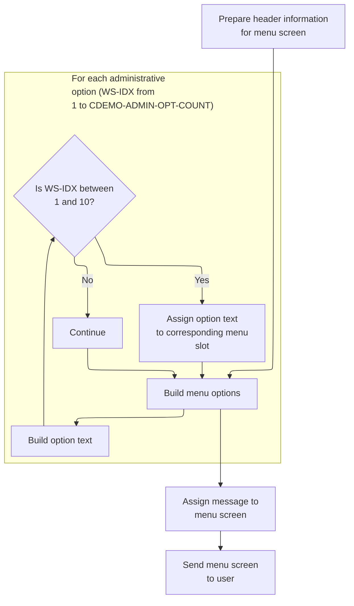
```mermaid
%%{init: {"flowchart": {"defaultRenderer": "elk"}} }%%
flowchart TD
    node1["Prepare header information 
 for menu screen"]
    click node1 openCode "app/cbl/COADM01C.cbl:202:221"
    node1 --> node2["Build menu options"]
    click node2 openCode "app/cbl/COADM01C.cbl:226:263"
    subgraph loop1["For each administrative 
 option (WS-IDX from 
 1 to CDEMO-ADMIN-OPT-COUNT)"]
        node2 --> node3["Build option text"]
        click node3 openCode "app/cbl/COADM01C.cbl:231:236"
        node3 --> node4{"Is WS-IDX between 
 1 and 10?"}
        click node4 openCode "app/cbl/COADM01C.cbl:238:259"
        node4 -->|"Yes"| node5["Assign option text 
 to corresponding menu 
 slot"]
        click node5 openCode "app/cbl/COADM01C.cbl:240:258"
        node4 -->|"No"| node6["Continue"]
        click node6 openCode "app/cbl/COADM01C.cbl:260:260"
        node5 --> node2
        node6 --> node2
    end
    node2 --> node7["Assign message to 
 menu screen"]
    click node7 openCode "app/cbl/COADM01C.cbl:177:177"
    node7 --> node8["Send menu screen 
 to user"]
    click node8 openCode "app/cbl/COADM01C.cbl:179:184"
classDef HeadingStyle fill:#777777,stroke:#333,stroke-width:2px;
```

This section is responsible for constructing and displaying the administrative menu screen, including the header, menu options, and any messages to the user.

| Rule ID | Code Location        | Category       | Rule Name                            | Description                                                                                                                                                           | Conditions                                                                                   | Remarks                                                                                                                                                                                                                 |
| ------- | -------------------- | -------------- | ------------------------------------ | --------------------------------------------------------------------------------------------------------------------------------------------------------------------- | -------------------------------------------------------------------------------------------- | ----------------------------------------------------------------------------------------------------------------------------------------------------------------------------------------------------------------------- |
| BR-001  | POPULATE-HEADER-INFO | Business logic | Menu header display                  | The menu header must display the current date, time, program name, transaction name, and predefined titles to ensure users see up-to-date and consistent information. | Whenever the administrative menu is shown to the user.                                       | The header includes: current date (MM-DD-YY), current time (HH:MM:SS), program name (8 characters), transaction name (4 characters), and two title lines. All fields are left-aligned and padded with spaces as needed. |
| BR-002  | BUILD-MENU-OPTIONS   | Business logic | Menu option display limit and format | The menu can display up to 10 administrative options, each with a number, period, space, and option name, in the format 'N. Option Name'.                             | For each administrative option in the list, as long as the option index is between 1 and 10. | Maximum of 10 options. Each option is formatted as: number (1-2 digits), period, space, option name (up to 40 characters total). Options beyond the 10th are not displayed.                                             |
| BR-003  | SEND-MENU-SCREEN     | Business logic | Menu message display                 | Any message to be shown to the user is copied to the message area of the menu screen, allowing for error or informational messages to be displayed.                   | Whenever a message is present to be shown to the user (including blank messages).            | The message area is 80 characters, left-aligned, and padded with spaces if shorter. If no message is present, the area is blank.                                                                                        |

<SwmSnippet path="/app/cbl/COADM01C.cbl" line="172" repo-id="Z2l0aHViJTNBJTNBa3luZHJ5bC1hd3MtbWFpbmZyYW1lLW1vZGVybml6YXRpb24tY2FyZGRlbW8lM0ElM0FTd2ltbS1EZW1v">

---

SEND-MENU-SCREEN sets up the header info and menu options, copies any message to the error field, and sends the admin menu screen to the terminal. This is how we show errors and info to the user.

```cobol
       SEND-MENU-SCREEN.

           PERFORM POPULATE-HEADER-INFO
           PERFORM BUILD-MENU-OPTIONS

           MOVE WS-MESSAGE TO ERRMSGO OF COADM1AO

           EXEC CICS SEND
                     MAP('COADM1A')
                     MAPSET('COADM01')
                     FROM(COADM1AO)
                     ERASE
           END-EXEC.
```

---

</SwmSnippet>

<SwmSnippet path="/app/cbl/COADM01C.cbl" line="202" repo-id="Z2l0aHViJTNBJTNBa3luZHJ5bC1hd3MtbWFpbmZyYW1lLW1vZGVybml6YXRpb24tY2FyZGRlbW8lM0ElM0FTd2ltbS1EZW1v">

---

POPULATE-HEADER-INFO builds the header with current date/time, program and transaction names, and titles. This keeps the screen info consistent for the admin menu.

```cobol
       POPULATE-HEADER-INFO.

           MOVE FUNCTION CURRENT-DATE  TO WS-CURDATE-DATA

           MOVE CCDA-TITLE01           TO TITLE01O OF COADM1AO
           MOVE CCDA-TITLE02           TO TITLE02O OF COADM1AO
           MOVE WS-TRANID              TO TRNNAMEO OF COADM1AO
           MOVE WS-PGMNAME             TO PGMNAMEO OF COADM1AO

           MOVE WS-CURDATE-MONTH       TO WS-CURDATE-MM
           MOVE WS-CURDATE-DAY         TO WS-CURDATE-DD
           MOVE WS-CURDATE-YEAR(3:2)   TO WS-CURDATE-YY

           MOVE WS-CURDATE-MM-DD-YY    TO CURDATEO OF COADM1AO

           MOVE WS-CURTIME-HOURS       TO WS-CURTIME-HH
           MOVE WS-CURTIME-MINUTE      TO WS-CURTIME-MM
           MOVE WS-CURTIME-SECOND      TO WS-CURTIME-SS

           MOVE WS-CURTIME-HH-MM-SS    TO CURTIMEO OF COADM1AO.
```

---

</SwmSnippet>

<SwmSnippet path="/app/cbl/COADM01C.cbl" line="226" repo-id="Z2l0aHViJTNBJTNBa3luZHJ5bC1hd3MtbWFpbmZyYW1lLW1vZGVybml6YXRpb24tY2FyZGRlbW8lM0ElM0FTd2ltbS1EZW1v">

---

BUILD-MENU-OPTIONS loops through the admin options, builds the display text for each, and assigns it to the right output field. This keeps the menu flexible if options change.

```cobol
       BUILD-MENU-OPTIONS.

           PERFORM VARYING WS-IDX FROM 1 BY 1 UNTIL
                           WS-IDX > CDEMO-ADMIN-OPT-COUNT

               MOVE SPACES             TO WS-ADMIN-OPT-TXT

               STRING CDEMO-ADMIN-OPT-NUM(WS-IDX)  DELIMITED BY SIZE
                      '. '                         DELIMITED BY SIZE
                      CDEMO-ADMIN-OPT-NAME(WS-IDX) DELIMITED BY SIZE
                 INTO WS-ADMIN-OPT-TXT

               EVALUATE WS-IDX
                   WHEN 1
                       MOVE WS-ADMIN-OPT-TXT TO OPTN001O
                   WHEN 2
                       MOVE WS-ADMIN-OPT-TXT TO OPTN002O
                   WHEN 3
                       MOVE WS-ADMIN-OPT-TXT TO OPTN003O
                   WHEN 4
                       MOVE WS-ADMIN-OPT-TXT TO OPTN004O
                   WHEN 5
                       MOVE WS-ADMIN-OPT-TXT TO OPTN005O
                   WHEN 6
                       MOVE WS-ADMIN-OPT-TXT TO OPTN006O
                   WHEN 7
                       MOVE WS-ADMIN-OPT-TXT TO OPTN007O
                   WHEN 8
                       MOVE WS-ADMIN-OPT-TXT TO OPTN008O
                   WHEN 9
                       MOVE WS-ADMIN-OPT-TXT TO OPTN009O
                   WHEN 10
                       MOVE WS-ADMIN-OPT-TXT TO OPTN010O
                   WHEN OTHER
                       CONTINUE
               END-EVALUATE

           END-PERFORM.
```

---

</SwmSnippet>

##### Receiving Admin Menu Input

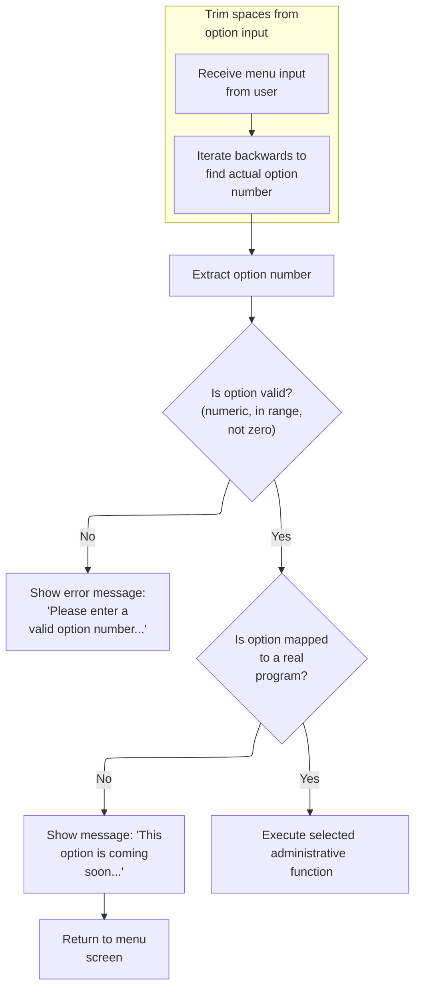
```mermaid
%%{init: {"flowchart": {"defaultRenderer": "elk"}} }%%
flowchart TD
    node1["Receive menu input 
 from user"]
    click node1 openCode "app/cbl/COADM01C.cbl:191:197"
    subgraph loop1["Trim spaces from 
 option input"]
        node1 --> node2["Iterate backwards to 
 find actual option 
 number"]
        click node2 openCode "app/cbl/COADM01C.cbl:117:121"
    end
    node2 --> node3["Extract option number"]
    click node3 openCode "app/cbl/COADM01C.cbl:122:124"
    node3 --> node4{"Is option valid? 
 (numeric, in range, 
 not zero)"}
    click node4 openCode "app/cbl/COADM01C.cbl:127:129"
    node4 -->|"No"| node5["Show error message: 
 'Please enter a 
 valid option number...'"]
    click node5 openCode "app/cbl/COADM01C.cbl:130:134"
    node4 -->|"Yes"| node6{"Is option mapped 
 to a real 
 program?"}
    click node6 openCode "app/cbl/COADM01C.cbl:138:146"
    node6 -->|"No"| node7["Show message: 'This 
 option is coming 
 soon...'"]
    click node7 openCode "app/cbl/COADM01C.cbl:147:154"
    node7 --> node9["Return to menu 
 screen"]
    click node9 openCode "app/cbl/COADM01C.cbl:154:155"
    node6 -->|"Yes"| node8["Execute selected administrative 
 function"]
    click node8 openCode "app/cbl/COADM01C.cbl:142:145"
classDef HeadingStyle fill:#777777,stroke:#333,stroke-width:2px;
```

This section manages the receipt and validation of admin menu input, ensuring only valid options are processed and providing clear feedback to users for invalid or unimplemented selections.

| Rule ID | Code Location     | Category        | Rule Name                     | Description                                                                                                                                                                                                        | Conditions                                                                                       | Remarks                                                                                                                                                                                                                                    |
| ------- | ----------------- | --------------- | ----------------------------- | ------------------------------------------------------------------------------------------------------------------------------------------------------------------------------------------------------------------ | ------------------------------------------------------------------------------------------------ | ------------------------------------------------------------------------------------------------------------------------------------------------------------------------------------------------------------------------------------------ |
| BR-001  | PROCESS-ENTER-KEY | Data validation | Option input validation       | If the entered option is not numeric, is zero, or exceeds the maximum allowed option count, the system displays an error message prompting the user to enter a valid option number and returns to the menu screen. | The entered option is not numeric, is zero, or is greater than the maximum allowed option count. | The error message displayed is: 'Please enter a valid option number...'. The maximum allowed option count is determined by the value of CDEMO-ADMIN-OPT-COUNT. The option must be a number between 1 and CDEMO-ADMIN-OPT-COUNT, inclusive. |
| BR-002  | PROCESS-ENTER-KEY | Business logic  | Unimplemented option handling | If the entered option is valid but not mapped to a real program, the system displays an informational message indicating that the option is coming soon and returns to the menu screen.                            | The entered option is valid but the corresponding program name is 'DUMMY'.                       | The informational message displayed is: 'This option is coming soon ...'. The message is constructed using the option name and the phrase 'is coming soon ...'.                                                                            |
| BR-003  | PROCESS-ENTER-KEY | Business logic  | Option execution              | If the entered option is valid and mapped to a real program, the system executes the corresponding administrative function by transferring control to the selected program.                                        | The entered option is valid and the corresponding program name is not 'DUMMY'.                   | The system transfers control to the selected program using the program name mapped to the option. The communication area CARDDEMO-COMMAREA is passed to the program.                                                                       |

<SwmSnippet path="/app/cbl/COADM01C.cbl" line="189" repo-id="Z2l0aHViJTNBJTNBa3luZHJ5bC1hd3MtbWFpbmZyYW1lLW1vZGVybml6YXRpb24tY2FyZGRlbW8lM0ElM0FTd2ltbS1EZW1v">

---

RECEIVE-MENU-SCREEN grabs the admin menu input from the terminal and puts it in the data area, with response codes for error checking.

```cobol
       RECEIVE-MENU-SCREEN.

           EXEC CICS RECEIVE
                     MAP('COADM1A')
                     MAPSET('COADM01')
                     INTO(COADM1AI)
                     RESP(WS-RESP-CD)
                     RESP2(WS-REAS-CD)
           END-EXEC.
```

---

</SwmSnippet>

<SwmSnippet path="/app/cbl/COADM01C.cbl" line="115" repo-id="Z2l0aHViJTNBJTNBa3luZHJ5bC1hd3MtbWFpbmZyYW1lLW1vZGVybml6YXRpb24tY2FyZGRlbW8lM0ElM0FTd2ltbS1EZW1v">

---

PROCESS-ENTER-KEY scans the option input, cleans it up, validates it's a number and in range, and then either jumps to the selected program or shows a 'coming soon' message if it's not implemented.

```cobol
       PROCESS-ENTER-KEY.

           PERFORM VARYING WS-IDX
                   FROM LENGTH OF OPTIONI OF COADM1AI BY -1 UNTIL
                   OPTIONI OF COADM1AI(WS-IDX:1) NOT = SPACES OR
                   WS-IDX = 1
           END-PERFORM
           MOVE OPTIONI OF COADM1AI(1:WS-IDX) TO WS-OPTION-X
           INSPECT WS-OPTION-X REPLACING ALL ' ' BY '0'
           MOVE WS-OPTION-X              TO WS-OPTION
           MOVE WS-OPTION                TO OPTIONO OF COADM1AO

           IF WS-OPTION IS NOT NUMERIC OR
              WS-OPTION > CDEMO-ADMIN-OPT-COUNT OR
              WS-OPTION = ZEROS
               MOVE 'Y'     TO WS-ERR-FLG
               MOVE 'Please enter a valid option number...' TO
                                       WS-MESSAGE
               PERFORM SEND-MENU-SCREEN
           END-IF


           IF NOT ERR-FLG-ON
               IF CDEMO-ADMIN-OPT-PGMNAME(WS-OPTION)(1:5) NOT = 'DUMMY'
                   MOVE WS-TRANID    TO CDEMO-FROM-TRANID
                   MOVE WS-PGMNAME   TO CDEMO-FROM-PROGRAM
                   MOVE ZEROS        TO CDEMO-PGM-CONTEXT
                   EXEC CICS
                       XCTL PROGRAM(CDEMO-ADMIN-OPT-PGMNAME(WS-OPTION))
                       COMMAREA(CARDDEMO-COMMAREA)
                   END-EXEC
               END-IF
               MOVE SPACES             TO WS-MESSAGE
               MOVE DFHGREEN           TO ERRMSGC  OF COADM1AO
               STRING 'This option '       DELIMITED BY SIZE
      *                CDEMO-ADMIN-OPT-NAME(WS-OPTION)
      *                                DELIMITED BY SIZE
                       'is coming soon ...'   DELIMITED BY SIZE
                  INTO WS-MESSAGE
               PERFORM SEND-MENU-SCREEN
           END-IF.
```

---

</SwmSnippet>

#### Sending Plain Text and Ending Session

This section is responsible for displaying a plain text message to the user and ending the session. It is typically used for exit or thank you screens.

| Rule ID | Code Location   | Category       | Rule Name                        | Description                                                                                                                                                               | Conditions                                          | Remarks                                                                                                                                      |
| ------- | --------------- | -------------- | -------------------------------- | ------------------------------------------------------------------------------------------------------------------------------------------------------------------------- | --------------------------------------------------- | -------------------------------------------------------------------------------------------------------------------------------------------- |
| BR-001  | SEND-PLAIN-TEXT | Business logic | Display plain text message       | A plain text message is displayed to the user at the terminal. The message content is determined by the value set in the message variable prior to invoking this section. | This rule applies whenever this section is invoked. | The message is displayed as a string. The maximum length of the message is determined by the length of the message variable (80 characters). |
| BR-002  | SEND-PLAIN-TEXT | Business logic | Clear screen and unlock keyboard | When the message is displayed, the screen is cleared and the keyboard is unlocked for the user.                                                                           | This rule applies whenever this section is invoked. | The screen is cleared (ERASE) and the keyboard is unlocked (FREEKB) as part of the message display operation.                                |
| BR-003  | SEND-PLAIN-TEXT | Business logic | End session after message        | After the message is displayed, the session is ended and control is returned to the system.                                                                               | This rule applies whenever this section is invoked. | The session is ended immediately after the message is displayed.                                                                             |

<SwmSnippet path="/app/cbl/COSGN00C.cbl" line="162" repo-id="Z2l0aHViJTNBJTNBa3luZHJ5bC1hd3MtbWFpbmZyYW1lLW1vZGVybml6YXRpb24tY2FyZGRlbW8lM0ElM0FTd2ltbS1EZW1v">

---

SEND-PLAIN-TEXT sends a plain message to the terminal and ends the session. It's used for exit or thank you screens.

```cobol
       SEND-PLAIN-TEXT.

           EXEC CICS SEND TEXT
                     FROM(WS-MESSAGE)
                     LENGTH(LENGTH OF WS-MESSAGE)
                     ERASE
                     FREEKB
           END-EXEC.

           EXEC CICS RETURN
           END-EXEC.
```

---

</SwmSnippet>

### User Menu Display and Option Setup

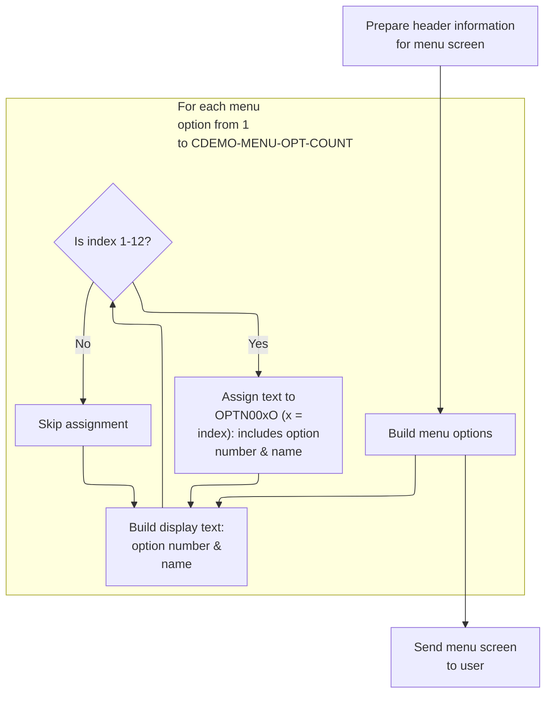
```mermaid
%%{init: {"flowchart": {"defaultRenderer": "elk"}} }%%
flowchart TD
    node1["Prepare header information 
 for menu screen"]
    click node1 openCode "app/cbl/COMEN01C.cbl:212:231"
    node1 --> node2["Build menu options"]
    click node2 openCode "app/cbl/COMEN01C.cbl:236:277"
    
    subgraph loop1["For each menu 
 option from 1 
 to CDEMO-MENU-OPT-COUNT"]
        node2 --> node3["Build display text: 
 option number & 
 name"]
        click node3 openCode "app/cbl/COMEN01C.cbl:243:246"
        node3 --> node4{"Is index 1-12?"}
        click node4 openCode "app/cbl/COMEN01C.cbl:248:272"
        node4 -->|"Yes"| node5["Assign text to 
 OPTN00xO (x = 
 index): includes option 
 number & name"]
        click node5 openCode "app/cbl/COMEN01C.cbl:250:272"
        node4 -->|"No"| node6["Skip assignment"]
        click node6 openCode "app/cbl/COMEN01C.cbl:273:274"
        node5 --> node3
        node6 --> node3
    end
    node2 --> node7["Send menu screen 
 to user"]
    click node7 openCode "app/cbl/COMEN01C.cbl:189:194"

classDef HeadingStyle fill:#777777,stroke:#333,stroke-width:2px;
```

This section prepares and displays the user menu screen, including header information, menu options, and any message to the user. It ensures the user always sees up-to-date information and available actions.

| Rule ID | Code Location        | Category       | Rule Name                 | Description                                                                                                                                                                                                          | Conditions                                                                | Remarks                                                                                                                                                                              |
| ------- | -------------------- | -------------- | ------------------------- | -------------------------------------------------------------------------------------------------------------------------------------------------------------------------------------------------------------------- | ------------------------------------------------------------------------- | ------------------------------------------------------------------------------------------------------------------------------------------------------------------------------------ |
| BR-001  | POPULATE-HEADER-INFO | Business logic | Menu header display       | The menu screen header must display the current date, current time, program name, transaction name, and two title lines. These values are always shown at the top of the menu screen.                                | Whenever the menu screen is displayed to the user.                        | The header includes: current date (MM-DD-YY), current time (HH-MM-SS), program name (8 characters), transaction name (4 characters), and two title lines (each up to 40 characters). |
| BR-002  | BUILD-MENU-OPTIONS   | Business logic | Menu option display limit | Up to 12 menu options are displayed on the menu screen, each showing its option number, a period, a space, and the option name. Only options with index 1 to 12 are displayed; any additional options are not shown. | Whenever the menu screen is displayed and there are menu options defined. | Each menu option is displayed as: option number (1-2 digits), period, space, option name (up to 40 characters total). Only the first 12 options are displayed.                       |
| BR-003  | SEND-MENU-SCREEN     | Business logic | Message display           | Any message to be displayed to the user is shown in the designated error/info field on the menu screen. If no message is present, the field is left blank.                                                           | Whenever the menu screen is displayed and a message is present.           | The message field can display up to 80 characters. If no message is present, the field contains spaces.                                                                              |
| BR-004  | SEND-MENU-SCREEN     | Technical step | Menu screen send          | The menu screen is sent to the user terminal after header information, menu options, and any message have been populated.                                                                                            | Whenever the menu screen is ready to be displayed.                        | The screen includes all populated fields: header, menu options (up to 12), and message.                                                                                              |

<SwmSnippet path="/app/cbl/COMEN01C.cbl" line="182" repo-id="Z2l0aHViJTNBJTNBa3luZHJ5bC1hd3MtbWFpbmZyYW1lLW1vZGVybml6YXRpb24tY2FyZGRlbW8lM0ElM0FTd2ltbS1EZW1v">

---

SEND-MENU-SCREEN sets up the header info and menu options, copies any message to the error field, and sends the user menu screen to the terminal. This is how we show errors and info to the user.

```cobol
       SEND-MENU-SCREEN.

           PERFORM POPULATE-HEADER-INFO
           PERFORM BUILD-MENU-OPTIONS

           MOVE WS-MESSAGE TO ERRMSGO OF COMEN1AO

           EXEC CICS SEND
                     MAP('COMEN1A')
                     MAPSET('COMEN01')
                     FROM(COMEN1AO)
                     ERASE
           END-EXEC.
```

---

</SwmSnippet>

<SwmSnippet path="/app/cbl/COMEN01C.cbl" line="212" repo-id="Z2l0aHViJTNBJTNBa3luZHJ5bC1hd3MtbWFpbmZyYW1lLW1vZGVybml6YXRpb24tY2FyZGRlbW8lM0ElM0FTd2ltbS1EZW1v">

---

POPULATE-HEADER-INFO builds the header with current date/time, program and transaction names, and titles. This keeps the screen info consistent for the user menu.

```cobol
       POPULATE-HEADER-INFO.

           MOVE FUNCTION CURRENT-DATE  TO WS-CURDATE-DATA

           MOVE CCDA-TITLE01           TO TITLE01O OF COMEN1AO
           MOVE CCDA-TITLE02           TO TITLE02O OF COMEN1AO
           MOVE WS-TRANID              TO TRNNAMEO OF COMEN1AO
           MOVE WS-PGMNAME             TO PGMNAMEO OF COMEN1AO

           MOVE WS-CURDATE-MONTH       TO WS-CURDATE-MM
           MOVE WS-CURDATE-DAY         TO WS-CURDATE-DD
           MOVE WS-CURDATE-YEAR(3:2)   TO WS-CURDATE-YY

           MOVE WS-CURDATE-MM-DD-YY    TO CURDATEO OF COMEN1AO

           MOVE WS-CURTIME-HOURS       TO WS-CURTIME-HH
           MOVE WS-CURTIME-MINUTE      TO WS-CURTIME-MM
           MOVE WS-CURTIME-SECOND      TO WS-CURTIME-SS

           MOVE WS-CURTIME-HH-MM-SS    TO CURTIMEO OF COMEN1AO.
```

---

</SwmSnippet>

<SwmSnippet path="/app/cbl/COMEN01C.cbl" line="236" repo-id="Z2l0aHViJTNBJTNBa3luZHJ5bC1hd3MtbWFpbmZyYW1lLW1vZGVybml6YXRpb24tY2FyZGRlbW8lM0ElM0FTd2ltbS1EZW1v">

---

BUILD-MENU-OPTIONS loops through the user menu options, builds the display text for each, and assigns it to the right output field. This keeps the menu flexible if options change.

```cobol
       BUILD-MENU-OPTIONS.

           PERFORM VARYING WS-IDX FROM 1 BY 1 UNTIL
                           WS-IDX > CDEMO-MENU-OPT-COUNT

               MOVE SPACES             TO WS-MENU-OPT-TXT

               STRING CDEMO-MENU-OPT-NUM(WS-IDX)  DELIMITED BY SIZE
                      '. '                         DELIMITED BY SIZE
                      CDEMO-MENU-OPT-NAME(WS-IDX) DELIMITED BY SIZE
                 INTO WS-MENU-OPT-TXT

               EVALUATE WS-IDX
                   WHEN 1
                       MOVE WS-MENU-OPT-TXT TO OPTN001O
                   WHEN 2
                       MOVE WS-MENU-OPT-TXT TO OPTN002O
                   WHEN 3
                       MOVE WS-MENU-OPT-TXT TO OPTN003O
                   WHEN 4
                       MOVE WS-MENU-OPT-TXT TO OPTN004O
                   WHEN 5
                       MOVE WS-MENU-OPT-TXT TO OPTN005O
                   WHEN 6
                       MOVE WS-MENU-OPT-TXT TO OPTN006O
                   WHEN 7
                       MOVE WS-MENU-OPT-TXT TO OPTN007O
                   WHEN 8
                       MOVE WS-MENU-OPT-TXT TO OPTN008O
                   WHEN 9
                       MOVE WS-MENU-OPT-TXT TO OPTN009O
                   WHEN 10
                       MOVE WS-MENU-OPT-TXT TO OPTN010O
                   WHEN 11
                       MOVE WS-MENU-OPT-TXT TO OPTN011O
                   WHEN 12
                       MOVE WS-MENU-OPT-TXT TO OPTN012O
                   WHEN OTHER
                       CONTINUE
               END-EVALUATE

           END-PERFORM.
```

---

</SwmSnippet>

### Receiving User Menu Input

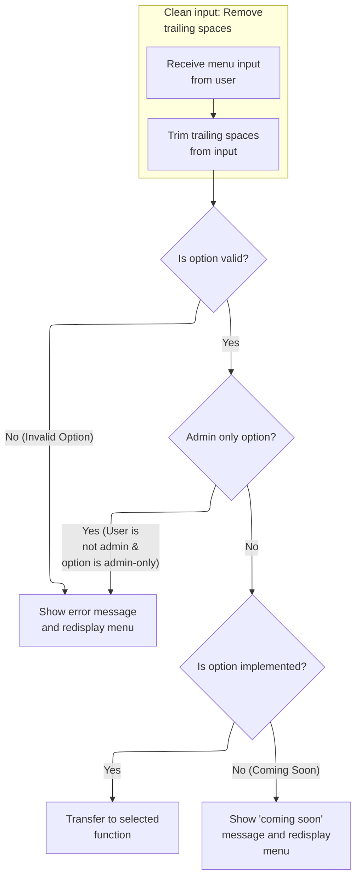
```mermaid
%%{init: {"flowchart": {"defaultRenderer": "elk"}} }%%
flowchart TD
    node1["Receive menu input 
 from user"]
    click node1 openCode "app/cbl/COMEN01C.cbl:201:207"
    subgraph loop1["Clean input: Remove 
 trailing spaces"]
        node1 --> node2["Trim trailing spaces 
 from input"]
        click node2 openCode "app/cbl/COMEN01C.cbl:117:121"
    end
    node2 --> node3{"Is option valid?"}
    click node3 openCode "app/cbl/COMEN01C.cbl:127:134"
    node3 -->|"Yes"| node4{"Admin only option?"}
    click node4 openCode "app/cbl/COMEN01C.cbl:136:143"
    node3 -->|"No (Invalid Option)"| node7["Show error message 
 and redisplay menu"]
    click node7 openCode "app/cbl/COMEN01C.cbl:130:134"
    node4 -->|"No"| node5{"Is option implemented?"}
    click node5 openCode "app/cbl/COMEN01C.cbl:145:165"
    node4 -->|"Yes (User is 
 not admin & 
 option is admin-only)"| node7
    node5 -->|"Yes"| node6["Transfer to selected 
 function"]
    click node6 openCode "app/cbl/COMEN01C.cbl:147:155"
    node5 -->|"No (Coming Soon)"| node8["Show 'coming soon' 
 message and redisplay 
 menu"]
    click node8 openCode "app/cbl/COMEN01C.cbl:157:164"
classDef HeadingStyle fill:#777777,stroke:#333,stroke-width:2px;
```

This section manages the processing of user input from the main menu, including validation, access control, and navigation to selected functions or display of appropriate messages.

| Rule ID | Code Location     | Category        | Rule Name                         | Description                                                                                                                                                               | Conditions                                                                                                 | Remarks                                                                                                                                                                                                                                                                   |
| ------- | ----------------- | --------------- | --------------------------------- | ------------------------------------------------------------------------------------------------------------------------------------------------------------------------- | ---------------------------------------------------------------------------------------------------------- | ------------------------------------------------------------------------------------------------------------------------------------------------------------------------------------------------------------------------------------------------------------------------- |
| BR-001  | PROCESS-ENTER-KEY | Data validation | Menu option validation            | If the user enters a menu option that is not a number, is outside the valid range of menu options, or is zero, an error message is displayed and the menu is redisplayed. | The entered menu option is not numeric, greater than the maximum allowed menu option, or equal to zero.    | The valid menu option range is from 1 to the value of CDEMO-MENU-OPT-COUNT. The error message displayed is: 'Please enter a valid option number...'. The message is shown as a string to the user.                                                                        |
| BR-002  | PROCESS-ENTER-KEY | Data validation | Admin-only option restriction     | If a regular user selects a menu option that is restricted to administrators, an error message is displayed and the menu is redisplayed.                                  | The user is not an administrator and the selected menu option is marked as admin-only.                     | Admin-only options are identified by a user type value of 'A'. The error message displayed is: 'No access - Admin Only option... '. The message is shown as a string to the user.                                                                                         |
| BR-003  | PROCESS-ENTER-KEY | Business logic  | Unimplemented option notification | If the selected menu option is valid and permitted but not yet implemented, a 'coming soon' message is displayed and the menu is redisplayed.                             | The selected menu option is valid and permitted, but the associated program name begins with 'DUMMY'.      | Unimplemented options are identified by a program name starting with 'DUMMY'. The message displayed is: 'This option \[option name\] is coming soon ...', where \[option name\] is the display name of the selected option. The message is shown as a string to the user. |
| BR-004  | PROCESS-ENTER-KEY | Business logic  | Menu option transfer              | If the selected menu option is valid, permitted, and implemented, the application transfers control to the corresponding function.                                        | The selected menu option is valid, permitted, and the associated program name does not start with 'DUMMY'. | The transfer is to the program associated with the selected menu option. The communication area is passed to the new program. No user-facing message is displayed in this case.                                                                                           |

<SwmSnippet path="/app/cbl/COMEN01C.cbl" line="199" repo-id="Z2l0aHViJTNBJTNBa3luZHJ5bC1hd3MtbWFpbmZyYW1lLW1vZGVybml6YXRpb24tY2FyZGRlbW8lM0ElM0FTd2ltbS1EZW1v">

---

RECEIVE-MENU-SCREEN grabs the user menu input from the terminal and puts it in the data area, with response codes for error checking.

```cobol
       RECEIVE-MENU-SCREEN.

           EXEC CICS RECEIVE
                     MAP('COMEN1A')
                     MAPSET('COMEN01')
                     INTO(COMEN1AI)
                     RESP(WS-RESP-CD)
                     RESP2(WS-REAS-CD)
           END-EXEC.
```

---

</SwmSnippet>

<SwmSnippet path="/app/cbl/COMEN01C.cbl" line="115" repo-id="Z2l0aHViJTNBJTNBa3luZHJ5bC1hd3MtbWFpbmZyYW1lLW1vZGVybml6YXRpb24tY2FyZGRlbW8lM0ElM0FTd2ltbS1EZW1v">

---

PROCESS-ENTER-KEY scans the option input, cleans it up, validates it's a number and in range, blocks admin-only options for regular users, and then either jumps to the selected program or shows a 'coming soon' message if it's not implemented.

```cobol
       PROCESS-ENTER-KEY.

           PERFORM VARYING WS-IDX
                   FROM LENGTH OF OPTIONI OF COMEN1AI BY -1 UNTIL
                   OPTIONI OF COMEN1AI(WS-IDX:1) NOT = SPACES OR
                   WS-IDX = 1
           END-PERFORM
           MOVE OPTIONI OF COMEN1AI(1:WS-IDX) TO WS-OPTION-X
           INSPECT WS-OPTION-X REPLACING ALL ' ' BY '0'
           MOVE WS-OPTION-X              TO WS-OPTION
           MOVE WS-OPTION                TO OPTIONO OF COMEN1AO

           IF WS-OPTION IS NOT NUMERIC OR
              WS-OPTION > CDEMO-MENU-OPT-COUNT OR
              WS-OPTION = ZEROS
               MOVE 'Y'     TO WS-ERR-FLG
               MOVE 'Please enter a valid option number...' TO
                               WS-MESSAGE
               PERFORM SEND-MENU-SCREEN
           END-IF

           IF CDEMO-USRTYP-USER AND
              CDEMO-MENU-OPT-USRTYPE(WS-OPTION) = 'A'
               SET ERR-FLG-ON          TO TRUE
               MOVE SPACES             TO WS-MESSAGE
               MOVE 'No access - Admin Only option... ' TO
                                       WS-MESSAGE
               PERFORM SEND-MENU-SCREEN
           END-IF

           IF NOT ERR-FLG-ON
               IF CDEMO-MENU-OPT-PGMNAME(WS-OPTION)(1:5) NOT = 'DUMMY'
                   MOVE WS-TRANID    TO CDEMO-FROM-TRANID
                   MOVE WS-PGMNAME   TO CDEMO-FROM-PROGRAM
      *            MOVE WS-USER-ID   TO CDEMO-USER-ID
      *            MOVE SEC-USR-TYPE TO CDEMO-USER-TYPE
                   MOVE ZEROS        TO CDEMO-PGM-CONTEXT
                   EXEC CICS
                       XCTL PROGRAM(CDEMO-MENU-OPT-PGMNAME(WS-OPTION))
                       COMMAREA(CARDDEMO-COMMAREA)
                   END-EXEC
               END-IF
               MOVE SPACES             TO WS-MESSAGE
               MOVE DFHGREEN           TO ERRMSGC  OF COMEN1AO
               STRING 'This option '       DELIMITED BY SIZE
                       CDEMO-MENU-OPT-NAME(WS-OPTION)
                                       DELIMITED BY SPACE
                       'is coming soon ...'   DELIMITED BY SIZE
                  INTO WS-MESSAGE
               PERFORM SEND-MENU-SCREEN
           END-IF.
```

---

</SwmSnippet>

## Handling Page Navigation and State Flags

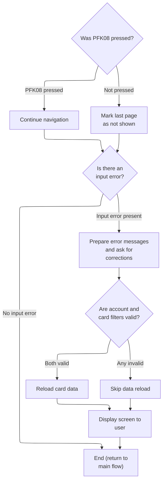
```mermaid
%%{init: {"flowchart": {"defaultRenderer": "elk"}} }%%
flowchart TD
    node1{"Was PFK08 pressed?"}
    click node1 openCode "app/cbl/COCRDLIC.cbl:410:412"
    node1 -->|"PFK08 pressed"| node2["Continue navigation"]
    click node2 openCode "app/cbl/COCRDLIC.cbl:411:411"
    node1 -->|"Not pressed"| node3["Mark last page 
 as not shown"]
    click node3 openCode "app/cbl/COCRDLIC.cbl:413:414"
    node2 --> node4{"Is there an 
 input error?"}
    node3 --> node4
    click node4 openCode "app/cbl/COCRDLIC.cbl:419:419"
    node4 -->|"Input error present"| node5["Prepare error messages 
 and ask for 
 corrections"]
    click node5 openCode "app/cbl/COCRDLIC.cbl:423:430"
    node5 --> node6{"Are account and 
 card filters valid?"}
    click node6 openCode "app/cbl/COCRDLIC.cbl:431:432"
    node6 -->|"Both valid"| node7["Reload card data"]
    click node7 openCode "app/cbl/COCRDLIC.cbl:433:434"
    node6 -->|"Any invalid"| node8["Skip data reload"]
    click node8 openCode "app/cbl/COCRDLIC.cbl:435:435"
    node7 --> node9["Display screen to 
 user"]
    node8 --> node9
    click node9 openCode "app/cbl/COCRDLIC.cbl:436:437"
    node9 --> node10["End (return to 
 main flow)"]
    click node10 openCode "app/cbl/COCRDLIC.cbl:438:438"
    node4 -->|"No input error"| node10
classDef HeadingStyle fill:#777777,stroke:#333,stroke-width:2px;
```

This section manages page navigation and state flags after returning from the menu, ensuring correct paging behavior, handling input errors, validating filters, and controlling what is displayed to the user.

| Rule ID | Code Location | Category        | Rule Name                         | Description                                                                                                                                                                             | Conditions                                                               | Remarks                                                                                                                                                 |
| ------- | ------------- | --------------- | --------------------------------- | --------------------------------------------------------------------------------------------------------------------------------------------------------------------------------------- | ------------------------------------------------------------------------ | ------------------------------------------------------------------------------------------------------------------------------------------------------- |
| BR-001  | 0000-MAIN     | Data validation | Filter Validation for Data Reload | If both the account filter and card filter are valid after an input error, the system reloads the card data for display. If either filter is invalid, data reload is skipped.           | After an input error, when both account and card filters are valid.      | Both filters must be valid (not 'NOT-OK') for data reload to occur. No data reload is performed if either filter is invalid.                            |
| BR-002  | 0000-MAIN     | Business logic  | Last Page Not Shown Flag          | If the Page Down (PFK08) key is not pressed during navigation, the system marks that the last page has not been shown. This ensures users cannot navigate past the last available page. | When the Page Down (PFK08) key is not pressed during a navigation event. | The constant value for 'last page not shown' is 9. This flag is used to track whether the last page has been displayed to the user.                     |
| BR-003  | 0000-MAIN     | Business logic  | Screen Display After Navigation   | After handling input errors and any necessary data reloads, the system displays the current screen to the user and returns to the main flow.                                            | After input errors are handled and data reload (if any) is completed.    | The screen is displayed to the user regardless of whether data reload occurred. The display includes any error messages or updated data as appropriate. |
| BR-004  | 0000-MAIN     | Error handling  | Input Error Correction Prompt     | If there is an input error present, the system prepares error messages and prompts the user to correct their input before proceeding.                                                   | When an input error is detected after navigation.                        | Error messages are prepared and displayed to the user. The format of the error message is a string up to 75 characters.                                 |

<SwmSnippet path="/app/cbl/COCRDLIC.cbl" line="410" repo-id="Z2l0aHViJTNBJTNBa3luZHJ5bC1hd3MtbWFpbmZyYW1lLW1vZGVybml6YXRpb24tY2FyZGRlbW8lM0ElM0FTd2ltbS1EZW1v">

---

We just returned from COMEN01C.cbl, so 0000-MAIN is now handling navigation after the menu. Here, the code checks if PF8 (Page Down) was pressed. If not, it sets CA-LAST-PAGE-NOT-SHOWN to TRUE, which is used to track if the last page has been displayed. This logic works with the page navigation flags to make sure users can't go past the last page or before the first page.

```cobol
           IF CCARD-AID-PFK08                                                   
              CONTINUE                                                          
           ELSE                                                                 
              SET CA-LAST-PAGE-NOT-SHOWN   TO TRUE                              
           END-IF                                                               
```

---

</SwmSnippet>

<SwmSnippet path="/app/cbl/COCRDLIC.cbl" line="418" repo-id="Z2l0aHViJTNBJTNBa3luZHJ5bC1hd3MtbWFpbmZyYW1lLW1vZGVybml6YXRpb24tY2FyZGRlbW8lM0ElM0FTd2ltbS1EZW1v">

---

After checking for input errors, if both account and card filters are OK, we call 9000-READ-FORWARD to fetch and buffer the card records for display. If there are errors, we skip reading and just send the screen so the user can fix their input.

```cobol
           EVALUATE TRUE                                                        
               WHEN INPUT-ERROR                                                 
      *****************************************************************         
      *        ASK FOR CORRECTIONS TO INPUTS                                    
      *****************************************************************         
                    MOVE WS-ERROR-MSG    TO CCARD-ERROR-MSG                     
                    MOVE LIT-THISPGM     TO CDEMO-FROM-PROGRAM                  
                    MOVE LIT-THISMAPSET  TO CDEMO-LAST-MAPSET                   
                    MOVE LIT-THISMAP     TO CDEMO-LAST-MAP                      
                                                                                
                    MOVE LIT-THISPGM     TO CCARD-NEXT-PROG                     
                    MOVE LIT-THISMAPSET  TO CCARD-NEXT-MAPSET                   
                    MOVE LIT-THISMAP     TO CCARD-NEXT-MAP                      
                    IF  NOT FLG-ACCTFILTER-NOT-OK                               
                    AND NOT FLG-CARDFILTER-NOT-OK                               
                       PERFORM 9000-READ-FORWARD                                
                          THRU 9000-READ-FORWARD-EXIT                           
                    END-IF                                                      
                    PERFORM 1000-SEND-MAP                                       
                       THRU 1000-SEND-MAP                                       
                    GO TO COMMON-RETURN                                         
```

---

</SwmSnippet>

## Preparing and Sending the Card List Screen

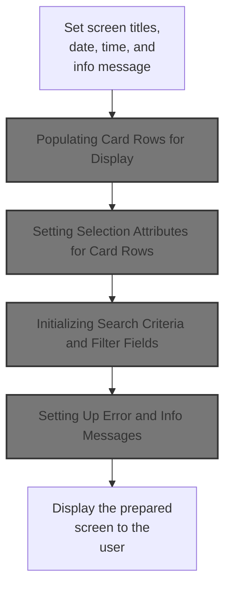
```mermaid
%%{init: {"flowchart": {"defaultRenderer": "elk"}} }%%
flowchart TD
    node1["Set screen titles, 
 date, time, and 
 info message"] --> node2["Populating Card Rows for Display"]
    click node1 openCode "app/cbl/COCRDLIC.cbl:642:672"
    node2 --> node3["Setting Selection Attributes for Card Rows"]
    
    node3 --> node4["Initializing Search Criteria and Filter Fields"]
    
    node4 --> node5["Setting Up Error and Info Messages"]
    
    node5 --> node6["Display the prepared 
 screen to the 
 user"]
    
    click node6 openCode "app/cbl/COCRDLIC.cbl:938:946"

classDef HeadingStyle fill:#777777,stroke:#333,stroke-width:2px;
click node2 goToHeading "Populating Card Rows for Display"
node2:::HeadingStyle
click node3 goToHeading "Setting Selection Attributes for Card Rows"
node3:::HeadingStyle
click node4 goToHeading "Initializing Search Criteria and Filter Fields"
node4:::HeadingStyle
click node5 goToHeading "Setting Up Error and Info Messages"
node5:::HeadingStyle
```

This section prepares and sends the card list screen, ensuring all header information, card rows, attributes, and messages are set before displaying the screen to the user.

| Rule ID | Code Location    | Category       | Rule Name                     | Description                                                                                                                            | Conditions                                             | Remarks                                                                                                                          |
| ------- | ---------------- | -------------- | ----------------------------- | -------------------------------------------------------------------------------------------------------------------------------------- | ------------------------------------------------------ | -------------------------------------------------------------------------------------------------------------------------------- |
| BR-001  | 1100-SCREEN-INIT | Business logic | Header date and time display  | The card list screen must display the current date and time in the header, formatted as MM-DD-YY and HH-MM-SS respectively.            | Whenever the card list screen is prepared for display. | Date format: MM-DD-YY (month, day, year as two digits each). Time format: HH-MM-SS (hours, minutes, seconds as two digits each). |
| BR-002  | 1100-SCREEN-INIT | Business logic | Header titles and identifiers | The card list screen must display the designated screen titles, program name, and transaction name in the header.                      | Whenever the card list screen is prepared for display. | Screen titles: Title 1 and Title 2 (alphanumeric strings). Program name and transaction name (alphanumeric strings).             |
| BR-003  | 1100-SCREEN-INIT | Business logic | Header page number display    | The card list screen must display the current page number in the header.                                                               | Whenever the card list screen is prepared for display. | Page number: numeric value, displayed in the header.                                                                             |
| BR-004  | 1100-SCREEN-INIT | Business logic | Info message display          | An informational message must be displayed in the designated area of the card list screen, with its color attribute set appropriately. | Whenever the card list screen is prepared for display. | Info message: alphanumeric string. Color attribute: value set to DFHBMDAR.                                                       |
| BR-005  | 1000-SEND-MAP    | Business logic | Screen send after preparation | The card list screen must be fully prepared and sent to the user after all header, card row, attribute, and message fields are set.    | After all screen fields and attributes have been set.  | Screen is sent to the user after all preparation steps are complete.                                                             |

<SwmSnippet path="/app/cbl/COCRDLIC.cbl" line="624" repo-id="Z2l0aHViJTNBJTNBa3luZHJ5bC1hd3MtbWFpbmZyYW1lLW1vZGVybml6YXRpb24tY2FyZGRlbW8lM0ElM0FTd2ltbS1EZW1v">

---

1000-SEND-MAP chains together all the routines needed to prep the card list screen. It starts with 1100-SCREEN-INIT to set up the header and basic info, then moves through array setup, attribute config, message prep, and finally sends the screen out. Each PERFORM is a separate chunk of screen setup.

```cobol
       1000-SEND-MAP.                                                           
           PERFORM 1100-SCREEN-INIT                                             
              THRU 1100-SCREEN-INIT-EXIT                                        
           PERFORM 1200-SCREEN-ARRAY-INIT                                       
              THRU 1200-SCREEN-ARRAY-INIT-EXIT                                  
           PERFORM 1250-SETUP-ARRAY-ATTRIBS                                     
              THRU 1250-SETUP-ARRAY-ATTRIBS-EXIT                                
           PERFORM 1300-SETUP-SCREEN-ATTRS                                      
              THRU 1300-SETUP-SCREEN-ATTRS-EXIT                                 
           PERFORM 1400-SETUP-MESSAGE                                           
              THRU 1400-SETUP-MESSAGE-EXIT                                      
           PERFORM 1500-SEND-SCREEN                                             
              THRU 1500-SEND-SCREEN-EXIT                                        
```

---

</SwmSnippet>

<SwmSnippet path="/app/cbl/COCRDLIC.cbl" line="642" repo-id="Z2l0aHViJTNBJTNBa3luZHJ5bC1hd3MtbWFpbmZyYW1lLW1vZGVybml6YXRpb24tY2FyZGRlbW8lM0ElM0FTd2ltbS1EZW1v">

---

1100-SCREEN-INIT wipes the output buffer, sets up the titles, program and transaction names, formats the current date and time, sets the page number, and drops in the info message and its color. This is all about prepping the header and meta info for the card list screen.

```cobol
       1100-SCREEN-INIT.                                                        
           MOVE LOW-VALUES             TO CCRDLIAO                              
                                                                                
           MOVE FUNCTION CURRENT-DATE  TO WS-CURDATE-DATA                       
                                                                                
           MOVE CCDA-TITLE01           TO TITLE01O OF CCRDLIAO                  
           MOVE CCDA-TITLE02           TO TITLE02O OF CCRDLIAO                  
           MOVE LIT-THISTRANID         TO TRNNAMEO OF CCRDLIAO                  
           MOVE LIT-THISPGM            TO PGMNAMEO OF CCRDLIAO                  
                                                                                
           MOVE FUNCTION CURRENT-DATE  TO WS-CURDATE-DATA                       
                                                                                
           MOVE WS-CURDATE-MONTH       TO WS-CURDATE-MM                         
           MOVE WS-CURDATE-DAY         TO WS-CURDATE-DD                         
           MOVE WS-CURDATE-YEAR(3:2)   TO WS-CURDATE-YY                         
                                                                                
           MOVE WS-CURDATE-MM-DD-YY    TO CURDATEO OF CCRDLIAO                  
                                                                                
           MOVE WS-CURTIME-HOURS       TO WS-CURTIME-HH                         
           MOVE WS-CURTIME-MINUTE      TO WS-CURTIME-MM                         
           MOVE WS-CURTIME-SECOND      TO WS-CURTIME-SS                         
                                                                                
           MOVE WS-CURTIME-HH-MM-SS    TO CURTIMEO OF CCRDLIAO                  
      *    PAGE NUMBER                                                          
      *                                                                         
           MOVE WS-CA-SCREEN-NUM       TO PAGENOO  OF CCRDLIAO                  
                                                                                
           SET WS-NO-INFO-MESSAGE      TO TRUE                                  
           MOVE WS-INFO-MSG            TO INFOMSGO OF CCRDLIAO                  
           MOVE DFHBMDAR               TO INFOMSGC OF CCRDLIAO                  
           .                                                                    
```

---

</SwmSnippet>

### Populating Card Rows for Display

This section populates the display buffer with card data for up to 7 card slots, ensuring only non-empty slots are shown and that each displayed row contains select, account number, card number, and status information.

| Rule ID | Code Location          | Category       | Rule Name              | Description                                                                                                                                               | Conditions                                                                                                                        | Remarks                                                                                                                                                                                                                           |
| ------- | ---------------------- | -------------- | ---------------------- | --------------------------------------------------------------------------------------------------------------------------------------------------------- | --------------------------------------------------------------------------------------------------------------------------------- | --------------------------------------------------------------------------------------------------------------------------------------------------------------------------------------------------------------------------------- |
| BR-001  | 1200-SCREEN-ARRAY-INIT | Business logic | Non-empty card display | Card data for a row is displayed only if the card slot is not empty. An empty card slot is defined as having all fields set to the lowest possible value. | For each card slot (1 to 7), if the card data is not empty (not LOW-VALUES), the row is displayed.                                | There are 7 card slots. 'Empty' is defined as all fields in the slot being set to LOW-VALUES. Displayed rows contain select (1 character), account number (11 characters), card number (16 characters), and status (1 character). |
| BR-002  | 1200-SCREEN-ARRAY-INIT | Business logic | Card row field mapping | For each non-empty card slot, the select, account number, card number, and status fields are mapped to the corresponding output row for display.          | For each card slot (1 to 7) that is not empty, copy the select, account number, card number, and status fields to the output row. | Each output row contains: select (1 character), account number (11 characters), card number (16 characters), status (1 character). The mapping is direct from input to output for each field.                                     |
| BR-003  | 1200-SCREEN-ARRAY-INIT | Business logic | Skip empty card rows   | Empty card slots are not displayed in the output buffer; only non-empty slots are shown.                                                                  | If a card slot is empty (all fields are LOW-VALUES), it is not included in the output buffer.                                     | There are 7 possible card slots. Only slots with data are displayed; empty slots are ignored.                                                                                                                                     |

<SwmSnippet path="/app/cbl/COCRDLIC.cbl" line="678" repo-id="Z2l0aHViJTNBJTNBa3luZHJ5bC1hd3MtbWFpbmZyYW1lLW1vZGVybml6YXRpb24tY2FyZGRlbW8lM0ElM0FTd2ltbS1EZW1v">

---

In 1200-SCREEN-ARRAY-INIT, we loop through each card slot (1 to 7). If the card data isn't empty, we copy the select, account, card number, and status fields into the output buffer for display. Empty slots are skipped.

```cobol
       1200-SCREEN-ARRAY-INIT.                                                  
      *    USE REDEFINES AND CLEAN UP REPETITIVE CODE !!                        
           IF   WS-EACH-CARD(1)            EQUAL LOW-VALUES                     
              CONTINUE                                                          
           ELSE                                                                 
              MOVE WS-EDIT-SELECT(1)       TO CRDSEL1O OF CCRDLIAO              
              MOVE WS-ROW-ACCTNO(1)        TO ACCTNO1O OF CCRDLIAO              
              MOVE WS-ROW-CARD-NUM(1)      TO CRDNUM1O OF CCRDLIAO              
              MOVE WS-ROW-CARD-STATUS(1)   TO CRDSTS1O OF CCRDLIAO              
           END-IF                                                               
```

---

</SwmSnippet>

<SwmSnippet path="/app/cbl/COCRDLIC.cbl" line="689" repo-id="Z2l0aHViJTNBJTNBa3luZHJ5bC1hd3MtbWFpbmZyYW1lLW1vZGVybml6YXRpb24tY2FyZGRlbW8lM0ElM0FTd2ltbS1EZW1v">

---

This chunk does the same as the previous one, but for card index 2. If the card isn't empty, it copies the select, account, card number, and status fields for row 2.

```cobol
           IF   WS-EACH-CARD(2)        EQUAL LOW-VALUES                         
              CONTINUE                                                          
           ELSE                                                                 
              MOVE WS-EDIT-SELECT(2)       TO CRDSEL2O OF CCRDLIAO              
              MOVE WS-ROW-ACCTNO(2)        TO ACCTNO2O OF CCRDLIAO              
              MOVE WS-ROW-CARD-NUM(2)      TO CRDNUM2O OF CCRDLIAO              
              MOVE WS-ROW-CARD-STATUS(2)   TO CRDSTS2O OF CCRDLIAO              
           END-IF                                                               
```

---

</SwmSnippet>

<SwmSnippet path="/app/cbl/COCRDLIC.cbl" line="698" repo-id="Z2l0aHViJTNBJTNBa3luZHJ5bC1hd3MtbWFpbmZyYW1lLW1vZGVybml6YXRpb24tY2FyZGRlbW8lM0ElM0FTd2ltbS1EZW1v">

---

This part does the same row copy for card 3, just like the previous blocks. No difference in logic, just a new index.

```cobol
           IF   WS-EACH-CARD(3)        EQUAL LOW-VALUES                         
              CONTINUE                                                          
           ELSE                                                                 
              MOVE WS-EDIT-SELECT(3)       TO CRDSEL3O OF CCRDLIAO              
              MOVE WS-ROW-ACCTNO(3)        TO ACCTNO3O OF CCRDLIAO              
              MOVE WS-ROW-CARD-NUM(3)      TO CRDNUM3O OF CCRDLIAO              
              MOVE WS-ROW-CARD-STATUS(3)   TO CRDSTS3O OF CCRDLIAO              
           END-IF                                                               
```

---

</SwmSnippet>

<SwmSnippet path="/app/cbl/COCRDLIC.cbl" line="707" repo-id="Z2l0aHViJTNBJTNBa3luZHJ5bC1hd3MtbWFpbmZyYW1lLW1vZGVybml6YXRpb24tY2FyZGRlbW8lM0ElM0FTd2ltbS1EZW1v">

---

This is the same repetitive copy logic, now for card 4. Still just copying fields if the row isn't empty.

```cobol
           IF   WS-EACH-CARD(4)        EQUAL LOW-VALUES                         
              CONTINUE                                                          
           ELSE                                                                 
              MOVE WS-EDIT-SELECT(4)       TO CRDSEL4O OF CCRDLIAO              
              MOVE WS-ROW-ACCTNO(4)        TO ACCTNO4O OF CCRDLIAO              
              MOVE WS-ROW-CARD-NUM(4)      TO CRDNUM4O OF CCRDLIAO              
              MOVE WS-ROW-CARD-STATUS(4)   TO CRDSTS4O OF CCRDLIAO              
           END-IF                                                               
```

---

</SwmSnippet>

<SwmSnippet path="/app/cbl/COCRDLIC.cbl" line="716" repo-id="Z2l0aHViJTNBJTNBa3luZHJ5bC1hd3MtbWFpbmZyYW1lLW1vZGVybml6YXRpb24tY2FyZGRlbW8lM0ElM0FTd2ltbS1EZW1v">

---

This is the same row copy logic for card 5. Only non-empty rows get copied to the output.

```cobol
           IF   WS-EACH-CARD(5)        EQUAL LOW-VALUES                         
              CONTINUE                                                          
           ELSE                                                                 
              MOVE WS-EDIT-SELECT(5)       TO CRDSEL5O OF CCRDLIAO              
              MOVE WS-ROW-ACCTNO(5)        TO ACCTNO5O OF CCRDLIAO              
              MOVE WS-ROW-CARD-NUM(5)      TO CRDNUM5O OF CCRDLIAO              
              MOVE WS-ROW-CARD-STATUS(5)   TO CRDSTS5O OF CCRDLIAO              
           END-IF                                                               
```

---

</SwmSnippet>

<SwmSnippet path="/app/cbl/COCRDLIC.cbl" line="726" repo-id="Z2l0aHViJTNBJTNBa3luZHJ5bC1hd3MtbWFpbmZyYW1lLW1vZGVybml6YXRpb24tY2FyZGRlbW8lM0ElM0FTd2ltbS1EZW1v">

---

This is the same repetitive logic for card 6. Still just copying fields if the row isn't empty.

```cobol
           IF   WS-EACH-CARD(6)        EQUAL LOW-VALUES                         
              CONTINUE                                                          
           ELSE                                                                 
              MOVE WS-EDIT-SELECT(6)       TO CRDSEL6O OF CCRDLIAO              
              MOVE WS-ROW-ACCTNO(6)        TO ACCTNO6O OF CCRDLIAO              
              MOVE WS-ROW-CARD-NUM(6)      TO CRDNUM6O OF CCRDLIAO              
              MOVE WS-ROW-CARD-STATUS(6)   TO CRDSTS6O OF CCRDLIAO              
           END-IF                                                               
```

---

</SwmSnippet>

<SwmSnippet path="/app/cbl/COCRDLIC.cbl" line="735" repo-id="Z2l0aHViJTNBJTNBa3luZHJ5bC1hd3MtbWFpbmZyYW1lLW1vZGVybml6YXRpb24tY2FyZGRlbW8lM0ElM0FTd2ltbS1EZW1v">

---

After looping through all 7 card slots, the output buffer is filled with card data for each non-empty row. Empty rows are ignored.

```cobol
           IF   WS-EACH-CARD(7)        EQUAL LOW-VALUES                         
              CONTINUE                                                          
           ELSE                                                                 
              MOVE WS-EDIT-SELECT(7)       TO CRDSEL7O OF CCRDLIAO              
              MOVE WS-ROW-ACCTNO(7)        TO ACCTNO7O OF CCRDLIAO              
              MOVE WS-ROW-CARD-NUM(7)      TO CRDNUM7O OF CCRDLIAO              
              MOVE WS-ROW-CARD-STATUS(7)   TO CRDSTS7O OF CCRDLIAO              
           END-IF                                                               
```

---

</SwmSnippet>

### Setting Selection Attributes for Card Rows

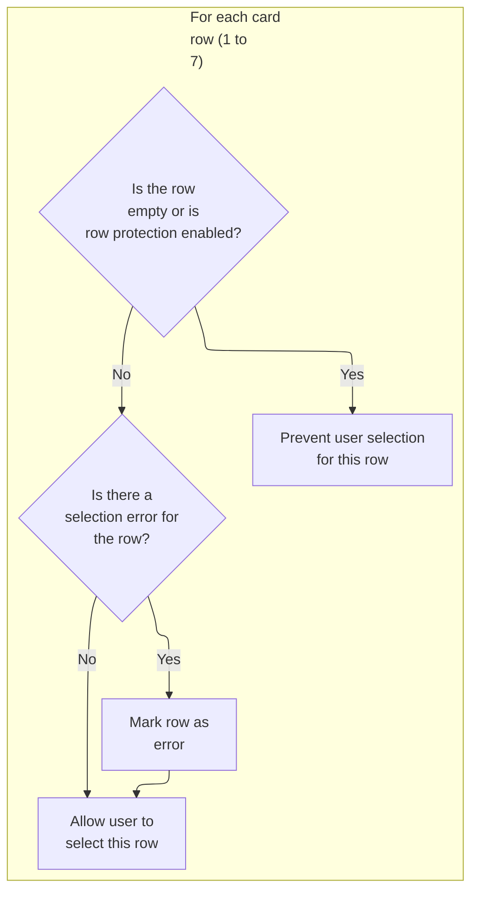
```mermaid
%%{init: {"flowchart": {"defaultRenderer": "elk"}} }%%
flowchart TD
    subgraph loop1["For each card 
 row (1 to 
 7)"]
        node2{"Is the row 
 empty or is 
 row protection enabled?"}
        click node2 openCode "app/cbl/COCRDLIC.cbl:751:752"
        node2 -->|"Yes"| node3["Prevent user selection 
 for this row"]
        click node3 openCode "app/cbl/COCRDLIC.cbl:753:753"
        node2 -->|"No"| node4{"Is there a 
 selection error for 
 the row?"}
        click node4 openCode "app/cbl/COCRDLIC.cbl:755:755"
        node4 -->|"Yes"| node5["Mark row as 
 error"]
        click node5 openCode "app/cbl/COCRDLIC.cbl:756:758"
        node5 --> node6["Allow user to 
 select this row"]
        click node6 openCode "app/cbl/COCRDLIC.cbl:761:761"
        node4 -->|"No"| node6
    end
classDef HeadingStyle fill:#777777,stroke:#333,stroke-width:2px;
```

This section sets the selection and display attributes for each card row on the screen, determining whether each row is editable, protected, or marked as having an error based on its state and associated flags.

| Rule ID | Code Location            | Category       | Rule Name          | Description                                                                                                                 | Conditions                                                                                              | Remarks                                                                                                                                                                                                                                                                           |
| ------- | ------------------------ | -------------- | ------------------ | --------------------------------------------------------------------------------------------------------------------------- | ------------------------------------------------------------------------------------------------------- | --------------------------------------------------------------------------------------------------------------------------------------------------------------------------------------------------------------------------------------------------------------------------------- |
| BR-001  | 1250-SETUP-ARRAY-ATTRIBS | Business logic | Row protection     | If a card row is empty or row protection is enabled, the user cannot select or edit that row.                               | The card row data is empty (equal to LOW-VALUES) or the row protection flag is enabled (equal to '1').  | The constant 'DFHBMPRO' is used to set the row as protected. This applies to each of the 7 card rows. The output format is that the selection field for the row is set to protected, preventing user edits.                                                                       |
| BR-002  | 1250-SETUP-ARRAY-ATTRIBS | Business logic | Editable row       | If a card row is not empty, not protected, and has no selection error, the row is editable and can be selected by the user. | The card row data is not empty, row protection is not enabled, and the selection error flag is not set. | The constant 'DFHBMFSE' is used to set the row as editable. This applies to each of the 7 card rows. The output format is that the selection field for the row is set to editable, allowing user selection.                                                                       |
| BR-003  | 1250-SETUP-ARRAY-ATTRIBS | Error handling | Error highlighting | If a card row has a selection error, the row is highlighted in red and flagged as having an error.                          | The selection error flag for the row is set to '1'.                                                     | The constant 'DFHRED' is used to highlight the row in red. The error flag is set to '\*', and the length field is set to -1 for error display. This applies to each of the 7 card rows. The output format is that the selection field for the row is visually marked as an error. |

<SwmSnippet path="/app/cbl/COCRDLIC.cbl" line="748" repo-id="Z2l0aHViJTNBJTNBa3luZHJ5bC1hd3MtbWFpbmZyYW1lLW1vZGVybml6YXRpb24tY2FyZGRlbW8lM0ElM0FTd2ltbS1EZW1v">

---

In 1250-SETUP-ARRAY-ATTRIBS, we set up the selection field attributes for card 1. If the row is empty or protected, it's non-editable. If there's a selection error, we highlight it in red and mark it. Otherwise, it's editable.

```cobol
       1250-SETUP-ARRAY-ATTRIBS.                                                
      *    USE REDEFINES AND CLEAN UP REPETITIVE CODE !!                        
                                                                                
           IF   WS-EACH-CARD(1)            EQUAL LOW-VALUES                     
           OR   FLG-PROTECT-SELECT-ROWS-YES                                     
              MOVE DFHBMPRF                TO CRDSEL1A OF CCRDLIAI              
           ELSE                                                                 
              IF WS-ROW-CRDSELECT-ERROR(1) = '1'                                
                 MOVE DFHRED               TO CRDSEL1C OF CCRDLIAO              
                 IF WS-EDIT-SELECT(1) = SPACE OR LOW-VALUES                     
                    MOVE '*'               TO CRDSEL1O OF CCRDLIAO              
                 END-IF                                                         
              END-IF                                                            
              MOVE DFHBMFSE                TO CRDSEL1A OF CCRDLIAI              
           END-IF                                                               
```

---

</SwmSnippet>

<SwmSnippet path="/app/cbl/COCRDLIC.cbl" line="764" repo-id="Z2l0aHViJTNBJTNBa3luZHJ5bC1hd3MtbWFpbmZyYW1lLW1vZGVybml6YXRpb24tY2FyZGRlbW8lM0ElM0FTd2ltbS1EZW1v">

---

This block does the same attribute setup for card 2. If there's an error, it sets the color to red and marks the length field for error display.

```cobol
           IF   WS-EACH-CARD(2)            EQUAL LOW-VALUES                     
           OR   FLG-PROTECT-SELECT-ROWS-YES                                     
              MOVE DFHBMPRO                TO CRDSEL2A OF CCRDLIAI              
           ELSE                                                                 
              IF WS-ROW-CRDSELECT-ERROR(2) = '1'                                
                 MOVE DFHRED               TO CRDSEL2C OF CCRDLIAO              
                 MOVE -1                   TO CRDSEL2L OF CCRDLIAI              
              END-IF                                                            
              MOVE DFHBMFSE                TO CRDSEL2A OF CCRDLIAI              
           END-IF                                                               
```

---

</SwmSnippet>

<SwmSnippet path="/app/cbl/COCRDLIC.cbl" line="775" repo-id="Z2l0aHViJTNBJTNBa3luZHJ5bC1hd3MtbWFpbmZyYW1lLW1vZGVybml6YXRpb24tY2FyZGRlbW8lM0ElM0FTd2ltbS1EZW1v">

---

This is the same attribute setup for card 3. Errors get highlighted and marked, otherwise the field is editable or protected.

```cobol
           IF   WS-EACH-CARD(3)            EQUAL LOW-VALUES                     
           OR   FLG-PROTECT-SELECT-ROWS-YES                                     
              MOVE DFHBMPRO                TO CRDSEL3A OF CCRDLIAI              
                                                                                
           ELSE                                                                 
              IF WS-ROW-CRDSELECT-ERROR(3) = '1'                                
                 MOVE DFHRED               TO CRDSEL3C OF CCRDLIAO              
                 MOVE -1                   TO CRDSEL3L OF CCRDLIAI              
              END-IF                                                            
              MOVE DFHBMFSE                TO CRDSEL3A OF CCRDLIAI              
           END-IF                                                               
```

---

</SwmSnippet>

<SwmSnippet path="/app/cbl/COCRDLIC.cbl" line="787" repo-id="Z2l0aHViJTNBJTNBa3luZHJ5bC1hd3MtbWFpbmZyYW1lLW1vZGVybml6YXRpb24tY2FyZGRlbW8lM0ElM0FTd2ltbS1EZW1v">

---

Same attribute setup for card 4. The extra 'I' line is probably a typo, but the logic matches the other rows.

```cobol
           IF   WS-EACH-CARD(4)            EQUAL LOW-VALUES                     
           OR   FLG-PROTECT-SELECT-ROWS-YES                                     
              MOVE DFHBMPRO                TO CRDSEL4A OF CCRDLIAI              
              I                                                                 
           ELSE                                                                 
              IF WS-ROW-CRDSELECT-ERROR(4) = '1'                                
                 MOVE DFHRED               TO CRDSEL4C OF CCRDLIAO              
                 MOVE -1                   TO CRDSEL4L OF CCRDLIAI              
              END-IF                                                            
              MOVE DFHBMFSE                TO CRDSEL4A OF CCRDLIAI              
           END-IF                                                               
```

---

</SwmSnippet>

<SwmSnippet path="/app/cbl/COCRDLIC.cbl" line="799" repo-id="Z2l0aHViJTNBJTNBa3luZHJ5bC1hd3MtbWFpbmZyYW1lLW1vZGVybml6YXRpb24tY2FyZGRlbW8lM0ElM0FTd2ltbS1EZW1v">

---

This is the same attribute setup for card 5. Errors get marked, protection is set if needed.

```cobol
           IF   WS-EACH-CARD(5)            EQUAL LOW-VALUES                     
           OR   FLG-PROTECT-SELECT-ROWS-YES                                     
              MOVE DFHBMPRO                TO CRDSEL5A OF CCRDLIAI              
           ELSE                                                                 
              IF WS-ROW-CRDSELECT-ERROR(5) = '1'                                
                 MOVE DFHRED               TO CRDSEL5C OF CCRDLIAO              
                 MOVE -1                   TO CRDSEL5L OF CCRDLIAI              
              END-IF                                                            
              MOVE DFHBMFSE                TO CRDSEL5A OF CCRDLIAI              
           END-IF                                                               
```

---

</SwmSnippet>

<SwmSnippet path="/app/cbl/COCRDLIC.cbl" line="810" repo-id="Z2l0aHViJTNBJTNBa3luZHJ5bC1hd3MtbWFpbmZyYW1lLW1vZGVybml6YXRpb24tY2FyZGRlbW8lM0ElM0FTd2ltbS1EZW1v">

---

Same attribute setup for card 6. Still just marking errors and setting protection as needed.

```cobol
           IF   WS-EACH-CARD(6)            EQUAL LOW-VALUES                     
           OR   FLG-PROTECT-SELECT-ROWS-YES                                     
              MOVE DFHBMPRO                TO CRDSEL6A OF CCRDLIAI              
                                                                                
           ELSE                                                                 
              IF WS-ROW-CRDSELECT-ERROR(6) = '1'                                
                 MOVE DFHRED               TO CRDSEL6C OF CCRDLIAO              
                 MOVE -1                   TO CRDSEL6L OF CCRDLIAI              
              END-IF                                                            
              MOVE DFHBMFSE                TO CRDSEL6A OF CCRDLIAI              
           END-IF                                                               
```

---

</SwmSnippet>

<SwmSnippet path="/app/cbl/COCRDLIC.cbl" line="822" repo-id="Z2l0aHViJTNBJTNBa3luZHJ5bC1hd3MtbWFpbmZyYW1lLW1vZGVybml6YXRpb24tY2FyZGRlbW8lM0ElM0FTd2ltbS1EZW1v">

---

After looping through all 7 card rows, each selection field has its display and error attributes set. Protected, editable, or error-highlighted as needed.

```cobol
           IF   WS-EACH-CARD(7)            EQUAL LOW-VALUES                     
           OR   FLG-PROTECT-SELECT-ROWS-YES                                     
              MOVE DFHBMPRO                TO CRDSEL7A OF CCRDLIAI              
           ELSE                                                                 
              IF WS-ROW-CRDSELECT-ERROR(7) = '1'                                
                 MOVE DFHRED               TO CRDSEL7C OF CCRDLIAO              
                 MOVE -1                   TO CRDSEL7L OF CCRDLIAI              
              END-IF                                                            
              MOVE DFHBMFSE                TO CRDSEL7A OF CCRDLIAI              
           END-IF                                                               
```

---

</SwmSnippet>

### Initializing Search Criteria and Filter Fields

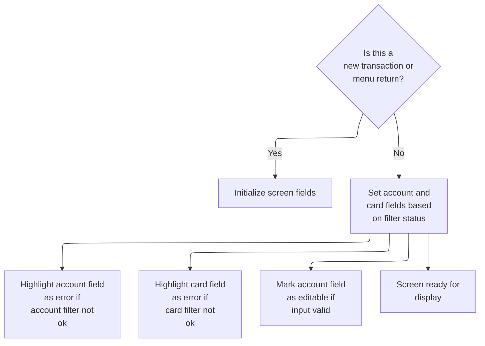
```mermaid
%%{init: {"flowchart": {"defaultRenderer": "elk"}} }%%
flowchart TD
    node1{"Is this a 
 new transaction or 
 menu return?"}
    click node1 openCode "app/cbl/COCRDLIC.cbl:839:842"
    node1 -->|"Yes"| node2["Initialize screen fields"]
    click node2 openCode "app/cbl/COCRDLIC.cbl:839:842"
    node1 -->|"No"| node3["Set account and 
 card fields based 
 on filter status"]
    click node3 openCode "app/cbl/COCRDLIC.cbl:843:867"
    node3 --> node4["Highlight account field 
 as error if 
 account filter not 
 ok"]
    click node4 openCode "app/cbl/COCRDLIC.cbl:872:875"
    node3 --> node5["Highlight card field 
 as error if 
 card filter not 
 ok"]
    click node5 openCode "app/cbl/COCRDLIC.cbl:877:880"
    node3 --> node6["Mark account field 
 as editable if 
 input valid"]
    click node6 openCode "app/cbl/COCRDLIC.cbl:884:886"
    node3 --> node7["Screen ready for 
 display"]
    click node7 openCode "app/cbl/COCRDLIC.cbl:867:886"

classDef HeadingStyle fill:#777777,stroke:#333,stroke-width:2px;
```

This section prepares the screen for display by initializing or updating account and card fields, handling filter status, and managing error highlighting and cursor placement based on transaction context and filter flags.

| Rule ID | Code Location           | Category       | Rule Name                                | Description                                                                                                                                                                                | Conditions                                                                                                                               | Remarks                                                                                                                                     |
| ------- | ----------------------- | -------------- | ---------------------------------------- | ------------------------------------------------------------------------------------------------------------------------------------------------------------------------------------------ | ---------------------------------------------------------------------------------------------------------------------------------------- | ------------------------------------------------------------------------------------------------------------------------------------------- |
| BR-001  | 1300-SETUP-SCREEN-ATTRS | Business logic | Initial screen setup                     | When the user enters the screen for a new transaction or returns from the menu, all search criteria and filter fields are initialized, and no filter setup is performed.                   | The transaction context indicates a new entry (input length is zero or program context is 'enter' and from-program is the menu program). | Menu program constant is 'COMEN01C'. No filter setup occurs in this scenario; fields are initialized to their default states.               |
| BR-002  | 1300-SETUP-SCREEN-ATTRS | Business logic | Account filter output logic              | If the account filter is valid or not OK, the account field is set to the working value; if the input value is zero, the field is cleared; otherwise, the field is set to the input value. | Account filter validity flag is set or not OK, or account input value is zero, or other input value is present.                          | Account ID field is 11 characters, alphanumeric. Validity flags: '1' for valid, '0' for not OK. Zero input triggers clearing (LOW-VALUES).  |
| BR-003  | 1300-SETUP-SCREEN-ATTRS | Business logic | Card filter output logic                 | If the card filter is valid or not OK, the card field is set to the working value; if the input value is zero, the field is cleared; otherwise, the field is set to the input value.       | Card filter validity flag is set or not OK, or card input value is zero, or other input value is present.                                | Card number field is 16 characters, alphanumeric. Validity flags: '1' for valid, '0' for not OK. Zero input triggers clearing (LOW-VALUES). |
| BR-004  | 1300-SETUP-SCREEN-ATTRS | Business logic | Default cursor placement for valid input | If the input is valid, the cursor is placed on the account field to allow the user to begin editing.                                                                                       | Input OK flag is set.                                                                                                                    | Cursor is set to -1 for the account field when input is valid.                                                                              |
| BR-005  | 1300-SETUP-SCREEN-ATTRS | Error handling | Account filter error highlighting        | If the account filter is not OK, the account field is highlighted in red and the cursor is placed on it to indicate an error to the user.                                                  | Account filter not OK flag is set.                                                                                                       | Error highlighting uses color constant 'DFHRED'. Cursor is set to -1 for the account field.                                                 |
| BR-006  | 1300-SETUP-SCREEN-ATTRS | Error handling | Card filter error highlighting           | If the card filter is not OK, the card field is highlighted in red and the cursor is placed on it to indicate an error to the user.                                                        | Card filter not OK flag is set.                                                                                                          | Error highlighting uses color constant 'DFHRED'. Cursor is set to -1 for the card field.                                                    |

<SwmSnippet path="/app/cbl/COCRDLIC.cbl" line="837" repo-id="Z2l0aHViJTNBJTNBa3luZHJ5bC1hd3MtbWFpbmZyYW1lLW1vZGVybml6YXRpb24tY2FyZGRlbW8lM0ElM0FTd2ltbS1EZW1v">

---

In 1300-SETUP-SCREEN-ATTRS, we check if this is a first or menu entry. If so, we skip filter setup. Otherwise, we use filter flags to decide what values and attributes to show for account and card fields.

```cobol
       1300-SETUP-SCREEN-ATTRS.                                                 
      *    INITIALIZE SEARCH CRITERIA                                           
           IF EIBCALEN = 0                                                      
           OR (CDEMO-PGM-ENTER                                                  
           AND CDEMO-FROM-PROGRAM = LIT-MENUPGM)                                
              CONTINUE                                                          
```

---

</SwmSnippet>

<SwmSnippet path="/app/cbl/COCRDLIC.cbl" line="843" repo-id="Z2l0aHViJTNBJTNBa3luZHJ5bC1hd3MtbWFpbmZyYW1lLW1vZGVybml6YXRpb24tY2FyZGRlbW8lM0ElM0FTd2ltbS1EZW1v">

---

This block sets the account filter output field based on filter validity and input value. Valid or not OK gets the working value, zero gets LOW-VALUES, otherwise it uses the commarea value.

```cobol
           ELSE                                                                 
              EVALUATE TRUE                                                     
                  WHEN FLG-ACCTFILTER-ISVALID                                   
                  WHEN FLG-ACCTFILTER-NOT-OK                                    
                     MOVE CC-ACCT-ID   TO ACCTSIDO OF CCRDLIAO                  
                     MOVE DFHBMFSE     TO ACCTSIDA OF CCRDLIAI                  
                  WHEN CDEMO-ACCT-ID = 0                                        
                     MOVE LOW-VALUES   TO ACCTSIDO OF CCRDLIAO                  
                  WHEN OTHER                                                    
                    MOVE CDEMO-ACCT-ID TO ACCTSIDO OF CCRDLIAO                  
                    MOVE DFHBMFSE      TO ACCTSIDA OF CCRDLIAI                  
              END-EVALUATE                                                      
```

---

</SwmSnippet>

<SwmSnippet path="/app/cbl/COCRDLIC.cbl" line="856" repo-id="Z2l0aHViJTNBJTNBa3luZHJ5bC1hd3MtbWFpbmZyYW1lLW1vZGVybml6YXRpb24tY2FyZGRlbW8lM0ElM0FTd2ltbS1EZW1v">

---

This block does the same for the card filter field—sets the output based on filter flags and input value, just like the account filter.

```cobol
              EVALUATE TRUE                                                     
                  WHEN FLG-CARDFILTER-ISVALID                                   
                  WHEN FLG-CARDFILTER-NOT-OK                                    
                     MOVE CC-CARD-NUM  TO CARDSIDO OF CCRDLIAO                  
                     MOVE DFHBMFSE     TO CARDSIDA OF CCRDLIAI                  
                  WHEN CDEMO-CARD-NUM = 0                                       
                     MOVE LOW-VALUES   TO CARDSIDO OF CCRDLIAO                  
                  WHEN OTHER                                                    
                    MOVE CDEMO-CARD-NUM                                         
                                       TO CARDSIDO OF CCRDLIAO                  
                    MOVE DFHBMFSE      TO CARDSIDA OF CCRDLIAI                  
              END-EVALUATE                                                      
```

---

</SwmSnippet>

<SwmSnippet path="/app/cbl/COCRDLIC.cbl" line="872" repo-id="Z2l0aHViJTNBJTNBa3luZHJ5bC1hd3MtbWFpbmZyYW1lLW1vZGVybml6YXRpb24tY2FyZGRlbW8lM0ElM0FTd2ltbS1EZW1v">

---

If the account filter isn't OK, we set the cursor and color for the account ID field to red so the user knows where to fix input.

```cobol
           IF FLG-ACCTFILTER-NOT-OK                                             
              MOVE  DFHRED             TO ACCTSIDC OF CCRDLIAO                  
              MOVE  -1                 TO ACCTSIDL OF CCRDLIAI                  
           END-IF                                                               
```

---

</SwmSnippet>

<SwmSnippet path="/app/cbl/COCRDLIC.cbl" line="877" repo-id="Z2l0aHViJTNBJTNBa3luZHJ5bC1hd3MtbWFpbmZyYW1lLW1vZGVybml6YXRpb24tY2FyZGRlbW8lM0ElM0FTd2ltbS1EZW1v">

---

Same logic for the card filter—if it's not OK, we highlight the card number field and set the cursor.

```cobol
           IF FLG-CARDFILTER-NOT-OK                                             
              MOVE  DFHRED             TO CARDSIDC OF CCRDLIAO                  
              MOVE  -1                 TO CARDSIDL OF CCRDLIAI                  
           END-IF                                                               
```

---

</SwmSnippet>

<SwmSnippet path="/app/cbl/COCRDLIC.cbl" line="884" repo-id="Z2l0aHViJTNBJTNBa3luZHJ5bC1hd3MtbWFpbmZyYW1lLW1vZGVybml6YXRpb24tY2FyZGRlbW8lM0ElM0FTd2ltbS1EZW1v">

---

If input is OK, we set the cursor to the account ID field by default so the user can start there.

```cobol
           IF INPUT-OK                                                          
             MOVE   -1                 TO ACCTSIDL OF CCRDLIAI                  
           END-IF                                                               
```

---

</SwmSnippet>

### Setting Up Error and Info Messages

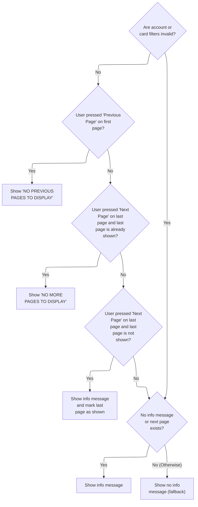
```mermaid
%%{init: {"flowchart": {"defaultRenderer": "elk"}} }%%
flowchart TD
    node1{"Are account or 
 card filters invalid?"}
    click node1 openCode "app/cbl/COCRDLIC.cbl:898:900"
    node2{"User pressed 'Previous 
 Page' on first 
 page?"}
    click node2 openCode "app/cbl/COCRDLIC.cbl:901:904"
    node3["Show 'NO PREVIOUS 
 PAGES TO DISPLAY'"]
    click node3 openCode "app/cbl/COCRDLIC.cbl:903:904"
    node4{"User pressed 'Next 
 Page' on last 
 page and last 
 page is already 
 shown?"}
    click node4 openCode "app/cbl/COCRDLIC.cbl:905:909"
    node5["Show 'NO MORE 
 PAGES TO DISPLAY'"]
    click node5 openCode "app/cbl/COCRDLIC.cbl:908:909"
    node6{"User pressed 'Next 
 Page' on last 
 page and last 
 page is not 
 shown?"}
    click node6 openCode "app/cbl/COCRDLIC.cbl:910:916"
    node7["Show info message 
 and mark last 
 page as shown"]
    click node7 openCode "app/cbl/COCRDLIC.cbl:912:915"
    node8{"No info message 
 or next page 
 exists?"}
    click node8 openCode "app/cbl/COCRDLIC.cbl:917:919"
    node9["Show info message"]
    click node9 openCode "app/cbl/COCRDLIC.cbl:919:929"
    node10["Show no info 
 message (fallback)"]
    click node10 openCode "app/cbl/COCRDLIC.cbl:921:921"
    node1 -->|"Yes"| node8
    node1 -->|"No"| node2
    node2 -->|"Yes"| node3
    node2 -->|"No"| node4
    node4 -->|"Yes"| node5
    node4 -->|"No"| node6
    node6 -->|"Yes"| node7
    node6 -->|"No"| node8
    node8 -->|"Yes"| node9
    node8 -->|"No (Otherwise)"| node10
classDef HeadingStyle fill:#777777,stroke:#333,stroke-width:2px;
```

This section determines which error or informational message is displayed to the user based on navigation actions and filter validity, ensuring clear communication about navigation boundaries and available actions.

| Rule ID | Code Location      | Category       | Rule Name                 | Description                                                                                                                                                                  | Conditions                                                                                                                                                                | Remarks                                                                                                                                                                                  |
| ------- | ------------------ | -------------- | ------------------------- | ---------------------------------------------------------------------------------------------------------------------------------------------------------------------------- | ------------------------------------------------------------------------------------------------------------------------------------------------------------------------- | ---------------------------------------------------------------------------------------------------------------------------------------------------------------------------------------- |
| BR-001  | 1400-SETUP-MESSAGE | Business logic | Invalid filter no message | If the account or card filter is invalid, no error or info message is displayed to the user. The system continues without setting a message.                                 | Account filter is invalid (WS-EDIT-ACCT-FLAG = '0') or card filter is invalid (WS-EDIT-CARD-FLAG = '0').                                                                  | No message is shown. The filter validity is determined by the value '0' for either filter flag.                                                                                          |
| BR-002  | 1400-SETUP-MESSAGE | Business logic | Last page info message    | If the user attempts to go to the next page when no next page exists and the last page has not been shown, display an informational message and mark the last page as shown. | User presses 'Next Page' (CCARD-AID = 'PFK08'), no next page exists (WS-CA-NEXT-PAGE-IND = LOW-VALUES), and last page has not been shown (WS-CA-LAST-PAGE-DISPLAYED = 9). | Info message shown: 'TYPE S FOR DETAIL, U TO UPDATE ANY RECORD'. The last page is marked as shown for future navigation.                                                                 |
| BR-003  | 1400-SETUP-MESSAGE | Business logic | Show record actions info  | If there is a next page or no info message is set, display the informational message 'TYPE S FOR DETAIL, U TO UPDATE ANY RECORD'.                                            | Next page exists (WS-CA-NEXT-PAGE-IND = 'Y') or no info message is set (WS-INFO-MSG is SPACES or LOW-VALUES).                                                             | Info message shown: 'TYPE S FOR DETAIL, U TO UPDATE ANY RECORD'.                                                                                                                         |
| BR-004  | 1400-SETUP-MESSAGE | Business logic | No info message fallback  | If none of the above conditions are met, no informational message is displayed to the user.                                                                                  | None of the navigation or filter error conditions match, and no next page exists.                                                                                         | No info message is shown. The absence of a message is indicated by setting the info message to blank.                                                                                    |
| BR-005  | 1400-SETUP-MESSAGE | Business logic | Single message output     | Only one message (error or info) is displayed to the user at a time, depending on the flags set by the above rules.                                                          | After message selection logic completes, output buffer is updated with either error or info message, but not both.                                                        | Error message format: string, e.g., 'NO PREVIOUS PAGES TO DISPLAY'. Info message format: string, e.g., 'TYPE S FOR DETAIL, U TO UPDATE ANY RECORD'. Only one message is shown at a time. |
| BR-006  | 1400-SETUP-MESSAGE | Error handling | No previous page error    | If the user attempts to go to the previous page while already on the first page, display the message 'NO PREVIOUS PAGES TO DISPLAY'.                                         | User presses 'Previous Page' (CCARD-AID = 'PFK07') and is on the first page (WS-CA-SCREEN-NUM = 1).                                                                       | Message shown: 'NO PREVIOUS PAGES TO DISPLAY'. The message is displayed as a string to the user.                                                                                         |
| BR-007  | 1400-SETUP-MESSAGE | Error handling | No next page error        | If the user attempts to go to the next page when no next page exists and the last page is already shown, display the message 'NO MORE PAGES TO DISPLAY'.                     | User presses 'Next Page' (CCARD-AID = 'PFK08'), no next page exists (WS-CA-NEXT-PAGE-IND = LOW-VALUES), and last page is already shown (WS-CA-LAST-PAGE-DISPLAYED = 0).   | Message shown: 'NO MORE PAGES TO DISPLAY'. The message is displayed as a string to the user.                                                                                             |

<SwmSnippet path="/app/cbl/COCRDLIC.cbl" line="895" repo-id="Z2l0aHViJTNBJTNBa3luZHJ5bC1hd3MtbWFpbmZyYW1lLW1vZGVybml6YXRpb24tY2FyZGRlbW8lM0ElM0FTd2ltbS1EZW1v">

---

1400-SETUP-MESSAGE uses EVALUATE TRUE to pick which error or info message to show. If the user tries to page up on the first page, it sets 'NO PREVIOUS PAGES TO DISPLAY'. If they try to page down with no next page and the last page is shown, it sets 'NO MORE PAGES TO DISPLAY'.

```cobol
       1400-SETUP-MESSAGE.                                                      
      *    SETUP MESSAGE                                                        
           EVALUATE TRUE                                                        
                WHEN FLG-ACCTFILTER-NOT-OK                                      
                WHEN FLG-CARDFILTER-NOT-OK                                      
                  CONTINUE                                                      
                WHEN CCARD-AID-PFK07                                            
                    AND CA-FIRST-PAGE                                           
                  MOVE 'NO PREVIOUS PAGES TO DISPLAY'                           
                  TO WS-ERROR-MSG                                               
```

---

</SwmSnippet>

<SwmSnippet path="/app/cbl/COCRDLIC.cbl" line="905" repo-id="Z2l0aHViJTNBJTNBa3luZHJ5bC1hd3MtbWFpbmZyYW1lLW1vZGVybml6YXRpb24tY2FyZGRlbW8lM0ElM0FTd2ltbS1EZW1v">

---

If the user tries to page down and there's no next page but the last page hasn't been shown, we set WS-INFORM-REC-ACTIONS to TRUE and update the last page flag. This tells the UI to show info instead of an error.

```cobol
                WHEN CCARD-AID-PFK08                                            
                 AND CA-NEXT-PAGE-NOT-EXISTS                                    
                 AND CA-LAST-PAGE-SHOWN                                         
                  MOVE 'NO MORE PAGES TO DISPLAY'                               
                  TO WS-ERROR-MSG                                               
```

---

</SwmSnippet>

<SwmSnippet path="/app/cbl/COCRDLIC.cbl" line="910" repo-id="Z2l0aHViJTNBJTNBa3luZHJ5bC1hd3MtbWFpbmZyYW1lLW1vZGVybml6YXRpb24tY2FyZGRlbW8lM0ElM0FTd2ltbS1EZW1v">

---

If none of the navigation or error conditions match, we set WS-NO-INFO-MESSAGE to TRUE so the UI doesn't show any info message. If there's a next page, we set WS-INFORM-REC-ACTIONS to TRUE to show record actions info.

```cobol
                WHEN CCARD-AID-PFK08                                            
                 AND CA-NEXT-PAGE-NOT-EXISTS                                    
                  SET WS-INFORM-REC-ACTIONS TO TRUE                             
                  IF  CA-LAST-PAGE-NOT-SHOWN                                    
                  AND CA-NEXT-PAGE-NOT-EXISTS                                   
                      SET CA-LAST-PAGE-SHOWN TO TRUE                            
                  END-IF                                                        
```

---

</SwmSnippet>

<SwmSnippet path="/app/cbl/COCRDLIC.cbl" line="917" repo-id="Z2l0aHViJTNBJTNBa3luZHJ5bC1hd3MtbWFpbmZyYW1lLW1vZGVybml6YXRpb24tY2FyZGRlbW8lM0ElM0FTd2ltbS1EZW1v">

---

If nothing else matches, we just set WS-NO-INFO-MESSAGE to TRUE so the UI doesn't show any info message. If there's a next page, we set WS-INFORM-REC-ACTIONS to TRUE.

```cobol
                WHEN WS-NO-INFO-MESSAGE                                         
                WHEN CA-NEXT-PAGE-EXISTS                                        
                  SET WS-INFORM-REC-ACTIONS TO TRUE                             
                WHEN OTHER                                                      
                   SET WS-NO-INFO-MESSAGE TO TRUE                               
           END-EVALUATE                                                         
```

---

</SwmSnippet>

<SwmSnippet path="/app/cbl/COCRDLIC.cbl" line="924" repo-id="Z2l0aHViJTNBJTNBa3luZHJ5bC1hd3MtbWFpbmZyYW1lLW1vZGVybml6YXRpb24tY2FyZGRlbW8lM0ElM0FTd2ltbS1EZW1v">

---

After picking the right message, we move it to the output buffer for display. Only one message (error or info) is shown depending on the flags.

```cobol
           MOVE WS-ERROR-MSG          TO ERRMSGO OF CCRDLIAO                    
                                                                                
           IF  NOT WS-NO-INFO-MESSAGE                                           
           AND NOT WS-NO-RECORDS-FOUND                                          
              MOVE WS-INFO-MSG        TO INFOMSGO OF CCRDLIAO                   
              MOVE DFHNEUTR           TO INFOMSGC OF CCRDLIAO                   
           END-IF                                                               
```

---

</SwmSnippet>

### Sending the Screen to the User

This section is responsible for delivering the card list screen to the user's terminal, ensuring a clean interface, correct cursor placement, and immediate keyboard availability for user interaction.

| Rule ID | Code Location    | Category       | Rule Name                 | Description                                                                                                                                                 | Conditions                                    | Remarks                                                                                                                                                                                      |
| ------- | ---------------- | -------------- | ------------------------- | ----------------------------------------------------------------------------------------------------------------------------------------------------------- | --------------------------------------------- | -------------------------------------------------------------------------------------------------------------------------------------------------------------------------------------------- |
| BR-001  | 1500-SEND-SCREEN | Business logic | Card list screen delivery | The system sends the card list screen to the user's terminal using the specified map and mapset, ensuring the correct screen layout and data are displayed. | Whenever the SEND SCREEN section is executed. | The map and mapset names are provided by the system and must match the expected screen format for the card list. The data sent must conform to the expected layout for the card list screen. |
| BR-002  | 1500-SEND-SCREEN | Business logic | Cursor positioning        | The system positions the cursor on the card list screen so the user can immediately begin interacting with the screen.                                      | Whenever the SEND SCREEN section is executed. | The cursor is set to the default position as defined by the map layout.                                                                                                                      |
| BR-003  | 1500-SEND-SCREEN | Business logic | Screen erasure            | The system erases any previous content from the user's terminal before displaying the card list screen, ensuring a clean and clear user interface.          | Whenever the SEND SCREEN section is executed. | The screen is cleared before the new card list screen is displayed.                                                                                                                          |
| BR-004  | 1500-SEND-SCREEN | Business logic | Keyboard enablement       | The system enables the keyboard for user input after sending the card list screen, allowing the user to interact with the application immediately.          | Whenever the SEND SCREEN section is executed. | The keyboard is freed for input after the screen is sent.                                                                                                                                    |

<SwmSnippet path="/app/cbl/COCRDLIC.cbl" line="938" repo-id="Z2l0aHViJTNBJTNBa3luZHJ5bC1hd3MtbWFpbmZyYW1lLW1vZGVybml6YXRpb24tY2FyZGRlbW8lM0ElM0FTd2ltbS1EZW1v">

---

1500-SEND-SCREEN uses EXEC CICS SEND MAP to push the card list screen to the user's terminal. It sends the right map and data, sets the cursor, erases the screen, and frees the keyboard for user input.

```cobol
       1500-SEND-SCREEN.                                                        
           EXEC CICS SEND MAP(LIT-THISMAP)                                      
                          MAPSET(LIT-THISMAPSET)                                
                          FROM(CCRDLIAO)                                        
                          CURSOR                                                
                          ERASE                                                 
                          RESP(WS-RESP-CD)                                      
                          FREEKB                                                
           END-EXEC                                                             
```

---

</SwmSnippet>

## Wrapping Up and Returning Control

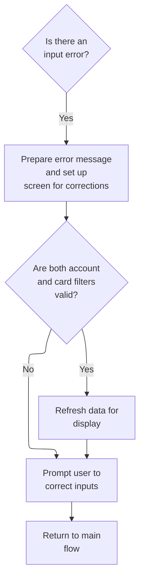
```mermaid
%%{init: {"flowchart": {"defaultRenderer": "elk"}} }%%
flowchart TD
    node1{"Is there an 
 input error?"}
    click node1 openCode "app/cbl/COCRDLIC.cbl:419:419"
    node1 -->|"Yes"| node2["Prepare error message 
 and set up 
 screen for corrections"]
    click node2 openCode "app/cbl/COCRDLIC.cbl:423:430"
    node2 --> node3{"Are both account 
 and card filters 
 valid?"}
    click node3 openCode "app/cbl/COCRDLIC.cbl:431:432"
    node3 -->|"Yes"| node4["Refresh data for 
 display"]
    click node4 openCode "app/cbl/COCRDLIC.cbl:433:434"
    node4 --> node5["Prompt user to 
 correct inputs"]
    click node5 openCode "app/cbl/COCRDLIC.cbl:436:437"
    node3 -->|"No"| node5
    node5 --> node6["Return to main 
 flow"]
    click node6 openCode "app/cbl/COCRDLIC.cbl:438:438"
classDef HeadingStyle fill:#777777,stroke:#333,stroke-width:2px;
```

This section manages the final steps after an input error is detected, including preparing error messages, refreshing display data if filters are valid, prompting the user for corrections, and returning control to the main flow.

| Rule ID | Code Location | Category       | Rule Name                              | Description                                                                                                                                        | Conditions                                                                | Remarks                                                                                                                                |
| ------- | ------------- | -------------- | -------------------------------------- | -------------------------------------------------------------------------------------------------------------------------------------------------- | ------------------------------------------------------------------------- | -------------------------------------------------------------------------------------------------------------------------------------- |
| BR-001  | MAIN-LOGIC    | Business logic | Valid filter data refresh              | If both the account and card filters are valid, the display data is refreshed before prompting the user to correct inputs.                         | Input error is present AND both account filter and card filter are valid. | Account filter validity is indicated by the flag not being '0'. Card filter validity is indicated by the flag not being '0'.           |
| BR-002  | MAIN-LOGIC    | Business logic | Prompt for input correction and return | After preparing the error message and optionally refreshing data, the user is prompted to correct inputs and control is returned to the main flow. | Input error is present.                                                   | The prompt is displayed using the current program, mapset, and map names. Control is returned to the main flow after the prompt.       |
| BR-003  | MAIN-LOGIC    | Error handling | Input error correction prompt          | If an input error is detected, an error message is prepared and the screen is set up to prompt the user for corrections.                           | An input error is present (input error flag is set).                      | The error message is up to 75 characters. The screen is set up using the program name 'COCRDLIC', mapset 'COCRDLI', and map 'CCRDLIA'. |

<SwmSnippet path="/app/cbl/COCRDLIC.cbl" line="418" repo-id="Z2l0aHViJTNBJTNBa3luZHJ5bC1hd3MtbWFpbmZyYW1lLW1vZGVybml6YXRpb24tY2FyZGRlbW8lM0ElM0FTd2ltbS1EZW1v">

---

After returning from 1000-SEND-MAP, 0000-MAIN calls COMMON-RETURN to wrap up and hand control back to CICS or the next program. This is where cleanup and exit logic happens.

```cobol
           EVALUATE TRUE                                                        
               WHEN INPUT-ERROR                                                 
      *****************************************************************         
      *        ASK FOR CORRECTIONS TO INPUTS                                    
      *****************************************************************         
                    MOVE WS-ERROR-MSG    TO CCARD-ERROR-MSG                     
                    MOVE LIT-THISPGM     TO CDEMO-FROM-PROGRAM                  
                    MOVE LIT-THISMAPSET  TO CDEMO-LAST-MAPSET                   
                    MOVE LIT-THISMAP     TO CDEMO-LAST-MAP                      
                                                                                
                    MOVE LIT-THISPGM     TO CCARD-NEXT-PROG                     
                    MOVE LIT-THISMAPSET  TO CCARD-NEXT-MAPSET                   
                    MOVE LIT-THISMAP     TO CCARD-NEXT-MAP                      
                    IF  NOT FLG-ACCTFILTER-NOT-OK                               
                    AND NOT FLG-CARDFILTER-NOT-OK                               
                       PERFORM 9000-READ-FORWARD                                
                          THRU 9000-READ-FORWARD-EXIT                           
                    END-IF                                                      
                    PERFORM 1000-SEND-MAP                                       
                       THRU 1000-SEND-MAP                                       
                    GO TO COMMON-RETURN                                         
```

---

</SwmSnippet>

## Finalizing State and Preparing for Return

This section finalizes the application's state and prepares the communication area to ensure all necessary context and data are passed to the next transaction, enabling seamless continuation of the user's workflow.

| Rule ID | Code Location | Category       | Rule Name                      | Description                                                                                                                                                                                                   | Conditions                                                                                        | Remarks                                                                                                                                                                                                                                                                                                            |
| ------- | ------------- | -------------- | ------------------------------ | ------------------------------------------------------------------------------------------------------------------------------------------------------------------------------------------------------------- | ------------------------------------------------------------------------------------------------- | ------------------------------------------------------------------------------------------------------------------------------------------------------------------------------------------------------------------------------------------------------------------------------------------------------------------ |
| BR-001  | COMMON-RETURN | Business logic | Context identifiers inclusion  | The communication area must include the current transaction ID ('CCLI'), program name ('COCRDLIC'), mapset name ('COCRDLI'), and map name ('CCRDLIA') to ensure the next step has the correct context.        | When preparing to return control to CICS and initiate the next transaction.                       | The transaction ID is a 4-character string ('CCLI'), the program name is an 8-character string ('COCRDLIC'), the mapset name is a 7-character string ('COCRDLI'), and the map name is a 7-character string ('CCRDLIA'). These are included in the general info section of the commarea.                            |
| BR-002  | COMMON-RETURN | Business logic | Application state preservation | The application-specific state must be preserved and included in the communication area so that the next transaction can access all relevant user, account, and card information.                             | When finalizing the commarea before returning control to CICS.                                    | The commarea includes user ID (8 characters), user type (1 character), customer ID (9 digits), customer names (25 characters each for first, middle, last), account ID (11 digits), account status (1 character), card number (16 digits), and other context fields as defined in the CARDDEMO-COMMAREA structure. |
| BR-003  | COMMON-RETURN | Business logic | Extended state inclusion       | The communication area must be extended to include any additional program-specific state beyond the standard CardDemo fields, ensuring continuity of context for the next transaction.                        | When additional program-specific state is present and needs to be passed to the next transaction. | The extended state is appended to the commarea starting at the byte immediately after the standard CardDemo commarea, with a length equal to the program-specific state size.                                                                                                                                      |
| BR-004  | COMMON-RETURN | Business logic | Transaction continuation       | Upon finalizing the communication area, control must be returned to CICS with the combined commarea and the next transaction ('CCLI') specified, ensuring the user's workflow continues without interruption. | When the commarea is fully prepared and ready to be passed to the next transaction.               | The next transaction ID is 'CCLI', and the commarea is passed with its full length as calculated at runtime.                                                                                                                                                                                                       |

<SwmSnippet path="/app/cbl/COCRDLIC.cbl" line="604" repo-id="Z2l0aHViJTNBJTNBa3luZHJ5bC1hd3MtbWFpbmZyYW1lLW1vZGVybml6YXRpb24tY2FyZGRlbW8lM0ElM0FTd2ltbS1EZW1v">

---

`COMMON-RETURN` sets up the commarea with the current program and transaction context, then appends the program-specific state so everything needed for the next step is in one place.

```cobol
       COMMON-RETURN.                                                           
           MOVE  LIT-THISTRANID TO CDEMO-FROM-TRANID                            
           MOVE  LIT-THISPGM     TO CDEMO-FROM-PROGRAM                          
           MOVE  LIT-THISMAPSET  TO CDEMO-LAST-MAPSET                           
           MOVE  LIT-THISMAP     TO CDEMO-LAST-MAP                              
           MOVE  CARDDEMO-COMMAREA    TO WS-COMMAREA                            
           MOVE  WS-THIS-PROGCOMMAREA TO                                        
                  WS-COMMAREA(LENGTH OF CARDDEMO-COMMAREA + 1:                  
                               LENGTH OF WS-THIS-PROGCOMMAREA )                 
```

---

</SwmSnippet>

<SwmSnippet path="/app/cbl/COCRDLIC.cbl" line="615" repo-id="Z2l0aHViJTNBJTNBa3luZHJ5bC1hd3MtbWFpbmZyYW1lLW1vZGVybml6YXRpb24tY2FyZGRlbW8lM0ElM0FTd2ltbS1EZW1v">

---

EXEC CICS RETURN hands control back to CICS, telling it to start the CCLI transaction and pass along the combined commarea. This keeps the user's state and context intact for the next step.

```cobol
           EXEC CICS RETURN                                                     
                TRANSID (LIT-THISTRANID)                                        
                COMMAREA (WS-COMMAREA)                                          
                LENGTH(LENGTH OF WS-COMMAREA)                                   
           END-EXEC                                                             
```

---

</SwmSnippet>

## Handling Page Navigation and Special Actions

```mermaid
%%{init: {"flowchart": {"defaultRenderer": "elk"}} }%%
flowchart TD
    node1{"Which PF key 
 was pressed?"}
    click node1 openCode "app/cbl/COCRDLIC.cbl:439:513"
    node1 -->|"PF7 + First 
 Page"| node2["Stay on first 
 page, reload data"]
    click node2 openCode "app/cbl/COCRDLIC.cbl:446:453"
    node2 --> node6["Update screen"]
    click node6 openCode "app/cbl/COCRDLIC.cbl:452:453"
    node6 --> node7["Return to caller"]
    click node7 openCode "app/cbl/COCRDLIC.cbl:454:454"
    node1 -->|"PF3 + Returning 
 from another program"| node3["Reset view, set 
 to first page, 
 reload data"]
    click node3 openCode "app/cbl/COCRDLIC.cbl:462:474"
    node3 --> node6
    node1 -->|"PF8 + Next 
 Page Exists"| node4["Increment page number, 
 go to next 
 page, reload data"]
    click node4 openCode "app/cbl/COCRDLIC.cbl:488:496"
    node4 --> node6
    node1 -->|"PF7 + Not 
 First Page"| node5["Decrement page number, 
 go to previous 
 page, reload data"]
    click node5 openCode "app/cbl/COCRDLIC.cbl:504:512"
    node5 --> node6
    node6 --> node7
classDef HeadingStyle fill:#777777,stroke:#333,stroke-width:2px;
```

This section manages user navigation on the card listing screen, handling page up, page down, and return actions based on PF key input and current page state.

| Rule ID | Code Location | Category       | Rule Name                 | Description                                                                                                                                                                                         | Conditions                                                                                     | Remarks                                                                                                                                                                                 |
| ------- | ------------- | -------------- | ------------------------- | --------------------------------------------------------------------------------------------------------------------------------------------------------------------------------------------------- | ---------------------------------------------------------------------------------------------- | --------------------------------------------------------------------------------------------------------------------------------------------------------------------------------------- |
| BR-001  | 0000-MAIN     | Business logic | First Page Up Refresh     | When the user presses PF7 (Page Up) and is already on the first page, the first page is reloaded and displayed again without any error message.                                                     | PF7 key is pressed and the current page is the first page.                                     | The first page is defined by the screen number being 1. No error message is shown; the screen is simply refreshed with the first page's data.                                           |
| BR-002  | 0000-MAIN     | Business logic | Return From Program Reset | When the user presses PF3 (Exit) and is returning from another program, the view is reset: the communication area and program state are re-initialized, and the first page is loaded and displayed. | PF3 key is pressed and the user is re-entering from another program (not the current program). | The program checks that the context is 're-enter' and the previous program is not the current one. The communication area and program state are reset, and the first page is displayed. |
| BR-003  | 0000-MAIN     | Business logic | Next Page Navigation      | When the user presses PF8 (Page Down) and a next page exists, the page number is incremented, the next page's records are loaded, and the new page is displayed.                                    | PF8 key is pressed and a next page exists.                                                     | A next page exists if the next page indicator is 'Y'. The page number is incremented by 1. The next page's data is loaded and displayed.                                                |
| BR-004  | 0000-MAIN     | Business logic | Previous Page Navigation  | When the user presses PF7 (Page Up) and is not on the first page, the page number is decremented, the previous page's records are loaded, and the previous page is displayed.                       | PF7 key is pressed and the current page is not the first page.                                 | The first page is defined by the screen number being 1. If not on the first page, the page number is decremented by 1 and the previous page's data is loaded and displayed.             |

<SwmSnippet path="/app/cbl/COCRDLIC.cbl" line="439" repo-id="Z2l0aHViJTNBJTNBa3luZHJ5bC1hd3MtbWFpbmZyYW1lLW1vZGVybml6YXRpb24tY2FyZGRlbW8lM0ElM0FTd2ltbS1EZW1v">

---

Back in `0000-MAIN`, after returning from COMMON-RETURN, this block handles PF7 (Page Up) when already on the first page. It reloads the first page by resetting the card number, reading records, sending the map, and then returns again via COMMON-RETURN. No error is shown, just a refresh.

```cobol
               WHEN CCARD-AID-PFK07                                             
                    AND CA-FIRST-PAGE                                           
      *****************************************************************         
      *        PAGE UP - PF7 - BUT ALREADY ON FIRST PAGE                        
      *****************************************************************         
               WHEN CCARD-AID-PFK07                                             
                    AND CA-FIRST-PAGE                                           
                    MOVE WS-CA-FIRST-CARD-NUM                                   
                                  TO WS-CARD-RID-CARDNUM                        
      *             MOVE WS-CA-FIRST-CARD-ACCT-ID                               
      *                           TO WS-CARD-RID-ACCT-ID                        
                    PERFORM 9000-READ-FORWARD                                   
                       THRU 9000-READ-FORWARD-EXIT                              
                    PERFORM 1000-SEND-MAP                                       
                       THRU 1000-SEND-MAP                                       
                    GO TO COMMON-RETURN                                         
```

---

</SwmSnippet>

<SwmSnippet path="/app/cbl/COCRDLIC.cbl" line="458" repo-id="Z2l0aHViJTNBJTNBa3luZHJ5bC1hd3MtbWFpbmZyYW1lLW1vZGVybml6YXRpb24tY2FyZGRlbW8lM0ElM0FTd2ltbS1EZW1v">

---

This block in `0000-MAIN` handles PF3 (exit) when reentering from another program. It resets the commarea and program state, sets up for the first page, and preps everything for a clean reload.

```cobol
               WHEN CCARD-AID-PFK03                                             
               WHEN CDEMO-PGM-REENTER AND                                       
                    CDEMO-FROM-PROGRAM NOT EQUAL LIT-THISPGM                    
                                                                                
                    INITIALIZE CARDDEMO-COMMAREA                                
                               WS-THIS-PROGCOMMAREA                             
                    MOVE LIT-THISTRANID      TO CDEMO-FROM-TRANID               
                    MOVE LIT-THISPGM         TO CDEMO-FROM-PROGRAM              
                    SET CDEMO-USRTYP-USER    TO TRUE                            
                    SET CDEMO-PGM-ENTER      TO TRUE                            
                    MOVE LIT-THISMAP         TO CDEMO-LAST-MAP                  
                    MOVE LIT-THISMAPSET      TO CDEMO-LAST-MAPSET               
                    SET CA-FIRST-PAGE        TO TRUE                            
                    SET CA-LAST-PAGE-NOT-SHOWN TO TRUE                          
                                                                                
                    MOVE WS-CA-FIRST-CARD-NUM                                   
                                  TO WS-CARD-RID-CARDNUM                        
```

---

</SwmSnippet>

<SwmSnippet path="/app/cbl/COCRDLIC.cbl" line="478" repo-id="Z2l0aHViJTNBJTNBa3luZHJ5bC1hd3MtbWFpbmZyYW1lLW1vZGVybml6YXRpb24tY2FyZGRlbW8lM0ElM0FTd2ltbS1EZW1v">

---

After resetting state, we read the first page of card data and send the map to the user. Then we return control, so the user sees a clean first page.

```cobol
                    PERFORM 9000-READ-FORWARD                                   
                       THRU 9000-READ-FORWARD-EXIT                              
                    PERFORM 1000-SEND-MAP                                       
                       THRU 1000-SEND-MAP                                       
                    GO TO COMMON-RETURN                                         
```

---

</SwmSnippet>

<SwmSnippet path="/app/cbl/COCRDLIC.cbl" line="486" repo-id="Z2l0aHViJTNBJTNBa3luZHJ5bC1hd3MtbWFpbmZyYW1lLW1vZGVybml6YXRpb24tY2FyZGRlbW8lM0ElM0FTd2ltbS1EZW1v">

---

This block handles PF8 (Page Down) when a next page exists. It bumps the page number, loads the next set of records, displays them, and returns control.

```cobol
               WHEN CCARD-AID-PFK08                                             
                    AND CA-NEXT-PAGE-EXISTS                                     
                    MOVE WS-CA-LAST-CARD-NUM                                    
                                  TO WS-CARD-RID-CARDNUM                        
      *             MOVE WS-CA-LAST-CARD-ACCT-ID                                
      *                           TO WS-CARD-RID-ACCT-ID                        
                    ADD   +1       TO WS-CA-SCREEN-NUM                          
                    PERFORM 9000-READ-FORWARD                                   
                       THRU 9000-READ-FORWARD-EXIT                              
                    PERFORM 1000-SEND-MAP                                       
                       THRU 1000-SEND-MAP-EXIT                                  
                    GO TO COMMON-RETURN                                         
```

---

</SwmSnippet>

<SwmSnippet path="/app/cbl/COCRDLIC.cbl" line="501" repo-id="Z2l0aHViJTNBJTNBa3luZHJ5bC1hd3MtbWFpbmZyYW1lLW1vZGVybml6YXRpb24tY2FyZGRlbW8lM0ElM0FTd2ltbS1EZW1v">

---

This block handles PF7 (Page Up) when not on the first page. It sets up the starting key, decrements the page number, and calls 9100-READ-BACKWARDS to load the previous page's records. This keeps navigation smooth in both directions.

```cobol
               WHEN CCARD-AID-PFK07                                             
                    AND NOT CA-FIRST-PAGE                                       
                                                                                
                    MOVE WS-CA-FIRST-CARD-NUM                                   
                                  TO WS-CARD-RID-CARDNUM                        
      *             MOVE WS-CA-FIRST-CARD-ACCT-ID                               
      *                           TO WS-CARD-RID-ACCT-ID                        
                    SUBTRACT 1    FROM WS-CA-SCREEN-NUM                         
                    PERFORM 9100-READ-BACKWARDS                                 
                       THRU 9100-READ-BACKWARDS-EXIT                            
                    PERFORM 1000-SEND-MAP                                       
                       THRU 1000-SEND-MAP-EXIT                                  
                    GO TO COMMON-RETURN                                         
```

---

</SwmSnippet>

## Reading Card Records in Reverse for Pagination

```mermaid
%%{init: {"flowchart": {"defaultRenderer": "elk"}} }%%
flowchart TD
    node1["Prepare to display 
 cards in reverse 
 order"]
    click node1 openCode "app/cbl/COCRDLIC.cbl:1266:1268"
    node1 --> node2["Begin card browse"]
    click node2 openCode "app/cbl/COCRDLIC.cbl:1273:1280"
    node2 --> node3["Read previous card 
 record"]
    click node3 openCode "app/cbl/COCRDLIC.cbl:1294:1302"
    
    subgraph loop1["For each card 
 record read backwards"]
        node3 --> node4{"Was record read 
 successfully?"}
        click node4 openCode "app/cbl/COCRDLIC.cbl:1304:1318"
        node4 -->|"Yes"| node5["Apply business filter"]
        click node5 openCode "app/cbl/COCRDLIC.cbl:1335:1336"
        node4 -->|"No (no more 
 records or error)"| node10["End card browse 
 and exit"]
        node5 --> node6{"Does record meet 
 criteria?"}
        click node6 openCode "app/cbl/COCRDLIC.cbl:1337:1356"
        node6 -->|"Yes"| node7["Store card info 
 for display"]
        click node7 openCode "app/cbl/COCRDLIC.cbl:1338:1356"
        node6 -->|"No"| node8["Skip record"]
        click node8 openCode "app/cbl/COCRDLIC.cbl:1357:1359"
        node7 --> node9{"Is screen full? 
 (screen counter = 
 0)"}
        click node9 openCode "app/cbl/COCRDLIC.cbl:1347:1348"
        node9 -->|"Yes"| node10
        node9 -->|"No"| node3
        node8 --> node3
    end
    node10["End card browse 
 and exit"]
    click node10 openCode "app/cbl/COCRDLIC.cbl:1374:1380"

classDef HeadingStyle fill:#777777,stroke:#333,stroke-width:2px;
```

This section manages the logic for reading card records in reverse order to support paginated display in the user interface. It ensures that only the correct records are shown, handles pagination state, and manages errors during the read process.

| Rule ID | Code Location       | Category       | Rule Name                         | Description                                                                                                                                                                     | Conditions                                                                            | Remarks                                                                                                                           |
| ------- | ------------------- | -------------- | --------------------------------- | ------------------------------------------------------------------------------------------------------------------------------------------------------------------------------- | ------------------------------------------------------------------------------------- | --------------------------------------------------------------------------------------------------------------------------------- |
| BR-001  | 9100-READ-BACKWARDS | Business logic | Prepare Reverse Pagination        | When preparing to display cards in reverse order, the display buffer is cleared and the starting key for the backwards read is set to the last card key from the previous page. | Triggered whenever a backwards page read is initiated.                                | The display buffer is 196 bytes (7 rows x 28 bytes per row). The starting key is set to the last card key from the previous page. |
| BR-002  | 9100-READ-BACKWARDS | Business logic | Page Size and Next Page Detection | A maximum of 7 card records are displayed per page. The system reads one extra record (8th) to determine if more pages exist, enabling or disabling the 'next page' navigation. | Applies during every backwards page read operation.                                   | The maximum number of display lines is 7. The screen counter is initialized to 8 (7 + 1) to check for an additional record.       |
| BR-003  | 9100-READ-BACKWARDS | Business logic | Apply Business Filter             | Only card records that pass the business filter criteria are displayed. Records not matching the filter are skipped and not shown to the user.                                  | For each card record read during the backwards browse.                                | Filtering is performed by a dedicated filter routine. Only records passing the filter are copied to the display buffer.           |
| BR-004  | 9100-READ-BACKWARDS | Business logic | Save Pagination State             | When the screen buffer is full (after 7 records), the keys of the last displayed record are saved to enable correct pagination for the next backwards read.                     | Triggered when the 7th record is added to the display buffer during a backwards read. | The keys saved are the account ID and card number of the last displayed record.                                                   |
| BR-005  | 9100-READ-BACKWARDS | Error handling | Read Error Handling               | If a read operation fails (response code is not normal or duplicate record), the browse is ended, error information is set, and no further records are read for this page.      | Occurs when a CICS read returns an error response code.                               | Error information includes the operation name ('READ'), file name ('CARDDAT '), response codes, and an error message.             |

<SwmSnippet path="/app/cbl/COCRDLIC.cbl" line="1264" repo-id="Z2l0aHViJTNBJTNBa3luZHJ5bC1hd3MtbWFpbmZyYW1lLW1vZGVybml6YXRpb24tY2FyZGRlbW8lM0ElM0FTd2ltbS1EZW1v">

---

In `9100-READ-BACKWARDS`, we clear the screen buffer, set up the starting key for the backwards read, start a CICS browse at that key, and prep the screen counter for pagination. This sets up the backwards read loop and flags for page navigation.

```cobol
       9100-READ-BACKWARDS.                                                     
                                                                                
           MOVE LOW-VALUES           TO WS-ALL-ROWS                             
                                                                                
           MOVE WS-CA-FIRST-CARDKEY  TO WS-CA-LAST-CARDKEY                      
                                                                                
      *****************************************************************         
      *    Start Browse                                                         
      *****************************************************************         
           EXEC CICS STARTBR                                                    
                DATASET(LIT-CARD-FILE)                                          
                RIDFLD(WS-CARD-RID-CARDNUM)                                     
                KEYLENGTH(LENGTH OF WS-CARD-RID-CARDNUM)                        
                GTEQ                                                            
                RESP(WS-RESP-CD)                                                
                RESP2(WS-REAS-CD)                                               
           END-EXEC                                                             
```

---

</SwmSnippet>

<SwmSnippet path="/app/cbl/COCRDLIC.cbl" line="1284" repo-id="Z2l0aHViJTNBJTNBa3luZHJ5bC1hd3MtbWFpbmZyYW1lLW1vZGVybml6YXRpb24tY2FyZGRlbW8lM0ElM0FTd2ltbS1EZW1v">

---

Here we set the screen counter to 8 (one more than the 7 display lines) and set the flag to indicate more pages exist. This is how the program knows if it should enable page up/down navigation.

```cobol
           COMPUTE WS-SCRN-COUNTER =                                            
                                   WS-MAX-SCREEN-LINES + 1                      
           END-COMPUTE                                                          
           SET CA-NEXT-PAGE-EXISTS    TO TRUE                                   
           SET MORE-RECORDS-TO-READ   TO TRUE                                   
```

---

</SwmSnippet>

<SwmSnippet path="/app/cbl/COCRDLIC.cbl" line="1294" repo-id="Z2l0aHViJTNBJTNBa3luZHJ5bC1hd3MtbWFpbmZyYW1lLW1vZGVybml6YXRpb24tY2FyZGRlbW8lM0ElM0FTd2ltbS1EZW1v">

---

This is where we actually read the previous record from the file using CICS READPREV. This is the core of the backwards paging logic.

```cobol
           EXEC CICS READPREV                                                   
                DATASET(LIT-CARD-FILE)                                          
                INTO (CARD-RECORD)                                              
                LENGTH(LENGTH OF CARD-RECORD)                                   
                RIDFLD(WS-CARD-RID-CARDNUM)                                     
                KEYLENGTH(LENGTH OF WS-CARD-RID-CARDNUM)                        
                RESP(WS-RESP-CD)                                                
                RESP2(WS-REAS-CD)                                               
           END-EXEC                                                             
```

---

</SwmSnippet>

<SwmSnippet path="/app/cbl/COCRDLIC.cbl" line="1304" repo-id="Z2l0aHViJTNBJTNBa3luZHJ5bC1hd3MtbWFpbmZyYW1lLW1vZGVybml6YXRpb24tY2FyZGRlbW8lM0ElM0FTd2ltbS1EZW1v">

---

After each read, we check the response code. If it's not normal or duplicate record, we bail out and jump to 9100-READ-BACKWARDS-EXIT to clean up and exit the loop.

```cobol
           EVALUATE WS-RESP-CD                                                  
               WHEN DFHRESP(NORMAL)                                             
               WHEN DFHRESP(DUPREC)                                             
                   SUBTRACT 1          FROM WS-SCRN-COUNTER                     
               WHEN OTHER                                                       
      *           This is some kind of error. Change to END BR                  
      *           And exit                                                      
                  SET READ-LOOP-EXIT             TO TRUE                        
                  MOVE 'READ'                     TO ERROR-OPNAME               
                  MOVE LIT-CARD-FILE              TO ERROR-FILE                 
                  MOVE WS-RESP-CD                 TO ERROR-RESP                 
                  MOVE WS-REAS-CD                 TO ERROR-RESP2                
                  MOVE WS-FILE-ERROR-MESSAGE      TO WS-ERROR-MSG               
                  GO TO 9100-READ-BACKWARDS-EXIT                                
           END-EVALUATE                                                         
```

---

</SwmSnippet>

<SwmSnippet path="/app/cbl/COCRDLIC.cbl" line="1374" repo-id="Z2l0aHViJTNBJTNBa3luZHJ5bC1hd3MtbWFpbmZyYW1lLW1vZGVybml6YXRpb24tY2FyZGRlbW8lM0ElM0FTd2ltbS1EZW1v">

---

`9100-READ-BACKWARDS-EXIT` ends the CICS browse on the card file with ENDBR, releasing the file and cleaning up after the backwards read.

```cobol
       9100-READ-BACKWARDS-EXIT.                                                
           EXEC CICS                                                            
                ENDBR FILE(LIT-CARD-FILE)                                       
           END-EXEC                                                             
                                                                                
           EXIT                                                                 
           .                                                                    
```

---

</SwmSnippet>

<SwmSnippet path="/app/cbl/COCRDLIC.cbl" line="1320" repo-id="Z2l0aHViJTNBJTNBa3luZHJ5bC1hd3MtbWFpbmZyYW1lLW1vZGVybml6YXRpb24tY2FyZGRlbW8lM0ElM0FTd2ltbS1EZW1v">

---

After the backwards read loop, we're done and ready to display the data.

```cobol
           PERFORM UNTIL READ-LOOP-EXIT                                         
                                                                                
           EXEC CICS READPREV                                                   
                DATASET(LIT-CARD-FILE)                                          
                INTO (CARD-RECORD)                                              
                LENGTH(LENGTH OF CARD-RECORD)                                   
                RIDFLD(WS-CARD-RID-CARDNUM)                                     
                KEYLENGTH(LENGTH OF WS-CARD-RID-CARDNUM)                        
                RESP(WS-RESP-CD)                                                
                RESP2(WS-REAS-CD)                                               
           END-EXEC                                                             
```

---

</SwmSnippet>

<SwmSnippet path="/app/cbl/COCRDLIC.cbl" line="1333" repo-id="Z2l0aHViJTNBJTNBa3luZHJ5bC1hd3MtbWFpbmZyYW1lLW1vZGVybml6YXRpb24tY2FyZGRlbW8lM0ElM0FTd2ltbS1EZW1v">

---

For each record read, we call 9500-FILTER-RECORDS to see if it matches the user's filters. Only passing records get added to the screen data array and shown to the user.

```cobol
               WHEN DFHRESP(NORMAL)                                             
               WHEN DFHRESP(DUPREC)                                             
                   PERFORM 9500-FILTER-RECORDS                                  
                      THRU 9500-FILTER-RECORDS-EXIT                             
```

---

</SwmSnippet>

<SwmSnippet path="/app/cbl/COCRDLIC.cbl" line="1337" repo-id="Z2l0aHViJTNBJTNBa3luZHJ5bC1hd3MtbWFpbmZyYW1lLW1vZGVybml6YXRpb24tY2FyZGRlbW8lM0ElM0FTd2ltbS1EZW1v">

---

After filtering, if the record passes, we copy its fields into the screen data array at the current position. If the page is full, we save the keys for pagination so the next backwards read starts at the right spot.

```cobol
                   IF WS-DONOT-EXCLUDE-THIS-RECORD                              
                      MOVE CARD-NUM                                             
                                  TO WS-ROW-CARD-NUM(WS-SCRN-COUNTER)           
                      MOVE CARD-ACCT-ID                                         
                                  TO WS-ROW-ACCTNO(WS-SCRN-COUNTER)             
                      MOVE CARD-ACTIVE-STATUS                                   
                                  TO                                            
                                  WS-ROW-CARD-STATUS(WS-SCRN-COUNTER)           
                                                                                
                      SUBTRACT 1  FROM WS-SCRN-COUNTER                          
                      IF WS-SCRN-COUNTER = 0                                    
                         SET READ-LOOP-EXIT  TO TRUE                            
                                                                                
                         MOVE CARD-ACCT-ID                                      
                                  TO WS-CA-FIRST-CARD-ACCT-ID                   
                         MOVE CARD-NUM                                          
                                  TO WS-CA-FIRST-CARD-NUM                       
                      ELSE                                                      
                         CONTINUE                                               
                      END-IF                                                    
```

---

</SwmSnippet>

<SwmSnippet path="/app/cbl/COCRDLIC.cbl" line="1357" repo-id="Z2l0aHViJTNBJTNBa3luZHJ5bC1hd3MtbWFpbmZyYW1lLW1vZGVybml6YXRpb24tY2FyZGRlbW8lM0ElM0FTd2ltbS1EZW1v">

---

If a record doesn't pass the filter, we just skip it and keep going. Only matching records get displayed.

```cobol
                   ELSE                                                         
                       CONTINUE                                                 
                   END-IF                                                       
```

---

</SwmSnippet>

<SwmSnippet path="/app/cbl/COCRDLIC.cbl" line="1361" repo-id="Z2l0aHViJTNBJTNBa3luZHJ5bC1hd3MtbWFpbmZyYW1lLW1vZGVybml6YXRpb24tY2FyZGRlbW8lM0ElM0FTd2ltbS1EZW1v">

---

After the read loop, the function either has a full page of records ready or sets error info if something failed. The screen is ready for display or error handling.

```cobol
               WHEN OTHER                                                       
      *           This is some kind of error. Change to END BR                  
      *           And exit                                                      
                  SET READ-LOOP-EXIT             TO TRUE                        
                  MOVE 'READ'                     TO ERROR-OPNAME               
                  MOVE LIT-CARD-FILE              TO ERROR-FILE                 
                  MOVE WS-RESP-CD                 TO ERROR-RESP                 
                  MOVE WS-REAS-CD                 TO ERROR-RESP2                
                  MOVE WS-FILE-ERROR-MESSAGE      TO WS-ERROR-MSG               
           END-EVALUATE                                                         
           END-PERFORM                                                          
```

---

</SwmSnippet>

## Routing User Actions to Detail and Update Screens

```mermaid
%%{init: {"flowchart": {"defaultRenderer": "elk"}} }%%
flowchart TD
    node1{"User pressed ENTER 
 and requested to 
 view card details?"}
    click node1 openCode "app/cbl/COCRDLIC.cbl:517:534"
    node1 -->|"Yes"| node2["Prepare and route 
 to card detail 
 screen"]
    click node2 openCode "app/cbl/COCRDLIC.cbl:520:534"
    node2 --> node3["Show card detail 
 screen"]
    click node3 openCode "app/cbl/COCRDLIC.cbl:538:541"
    node3 --> node10["Return to main 
 screen"]
    click node10 openCode "app/cbl/COCRDLIC.cbl:582:602"
    node1 -->|"No"| node4{"User pressed ENTER 
 and requested to 
 update card information?"}
    click node4 openCode "app/cbl/COCRDLIC.cbl:545:562"
    node4 -->|"Yes"| node5["Prepare and route 
 to card update 
 screen"]
    click node5 openCode "app/cbl/COCRDLIC.cbl:548:562"
    node5 --> node6["Show card update 
 screen"]
    click node6 openCode "app/cbl/COCRDLIC.cbl:566:569"
    node6 --> node10
    node4 -->|"No"| node7{"Is there an 
 input error?"}
    click node7 openCode "app/cbl/COCRDLIC.cbl:586:598"
    node7 -->|"Yes"| node8["Show error message 
 and stay on 
 card list"]
    click node8 openCode "app/cbl/COCRDLIC.cbl:587:597"
    node8 --> node10
    node7 -->|"No"| node9["Load next set 
 of cards and 
 refresh card list 
 screen"]
    click node9 openCode "app/cbl/COCRDLIC.cbl:574:582"
    node9 --> node10
classDef HeadingStyle fill:#777777,stroke:#333,stroke-width:2px;
```

This section determines how user actions on the card list screen are routed to detail, update, or error handling screens, ensuring the correct navigation and user experience based on their input.

| Rule ID | Code Location | Category       | Rule Name                 | Description                                                                                                                                                                                            | Conditions                                                                                                                    | Remarks                                                                                                                                                                                                     |
| ------- | ------------- | -------------- | ------------------------- | ------------------------------------------------------------------------------------------------------------------------------------------------------------------------------------------------------ | ----------------------------------------------------------------------------------------------------------------------------- | ----------------------------------------------------------------------------------------------------------------------------------------------------------------------------------------------------------- |
| BR-001  | Lines 517-534 | Business logic | Route to Card Detail      | When the user presses ENTER and requests to view card details for a selected row, the system routes the user to the card detail screen, passing along the selected card and account information.       | User action is ENTER, view is requested on the selected row, and the current program context matches the card list program.   | The card detail program is 'COCRDSLC', the mapset is 'COCRDSL', and the map is 'CCRDSLA'. The selected card and account identifiers are passed to the detail screen. The routing includes the user's state. |
| BR-002  | Lines 545-562 | Business logic | Route to Card Update      | When the user presses ENTER and requests to update card information for a selected row, the system routes the user to the card update screen, passing along the selected card and account information. | User action is ENTER, update is requested on the selected row, and the current program context matches the card list program. | The card update program is 'COCRDUPC', the mapset is 'COCRDUP', and the map is 'CCRDUPA'. The selected card and account identifiers are passed to the update screen. The routing includes the user's state. |
| BR-003  | Lines 572-582 | Business logic | Default Card List Refresh | If the user action does not match any specific routing case (view, update, or input error), the system reloads the first page of the card list and refreshes the screen.                               | User action does not match view, update, or input error cases.                                                                | The card list is refreshed to the first page. The program and map context remain as 'COCRDLIC' and 'COCRDLI'/'CCRDLIA' respectively.                                                                        |
| BR-004  | Lines 586-598 | Error handling | Show Input Error          | If there is an input error, the system displays an error message and remains on the card list screen.                                                                                                  | Input error flag is set.                                                                                                      | The error message is displayed on the card list screen. The program and map context remain as 'COCRDLIC' and 'COCRDLI'/'CCRDLIA' respectively. The error message is up to 75 characters.                    |

<SwmSnippet path="/app/cbl/COCRDLIC.cbl" line="517" repo-id="Z2l0aHViJTNBJTNBa3luZHJ5bC1hd3MtbWFpbmZyYW1lLW1vZGVybml6YXRpb24tY2FyZGRlbW8lM0ElM0FTd2ltbS1EZW1v">

---

After returning from 9100-READ-BACKWARDS-EXIT, if the user pressed ENTER and picked a row for view, we set up the commarea with the selected card/account and use XCTL to jump to the detail program. The user's state goes with them.

```cobol
               WHEN CCARD-AID-ENTER                                             
                AND VIEW-REQUESTED-ON(I-SELECTED)                               
                AND CDEMO-FROM-PROGRAM  EQUAL LIT-THISPGM                       
                   MOVE LIT-THISTRANID    TO CDEMO-FROM-TRANID                  
                   MOVE LIT-THISPGM       TO CDEMO-FROM-PROGRAM                 
                   SET  CDEMO-USRTYP-USER TO TRUE                               
                   SET  CDEMO-PGM-ENTER   TO TRUE                               
                   MOVE LIT-THISMAPSET    TO CDEMO-LAST-MAPSET                  
                   MOVE LIT-THISMAP       TO CDEMO-LAST-MAP                     
                   MOVE LIT-CARDDTLPGM    TO CCARD-NEXT-PROG                    
                                                                                
                   MOVE LIT-CARDDTLMAPSET TO CCARD-NEXT-MAPSET                  
                   MOVE LIT-CARDDTLMAP    TO CCARD-NEXT-MAP                     
                                                                                
                   MOVE WS-ROW-ACCTNO (I-SELECTED)                              
                                          TO CDEMO-ACCT-ID                      
                   MOVE WS-ROW-CARD-NUM (I-SELECTED)                            
                                          TO CDEMO-CARD-NUM                     
```

---

</SwmSnippet>

<SwmSnippet path="/app/cbl/COCRDLIC.cbl" line="538" repo-id="Z2l0aHViJTNBJTNBa3luZHJ5bC1hd3MtbWFpbmZyYW1lLW1vZGVybml6YXRpb24tY2FyZGRlbW8lM0ElM0FTd2ltbS1EZW1v">

---

This block is just like the view transfer, but for update. If the user picked update, we set up the commarea and XCTL to the update program instead.

```cobol
                   EXEC CICS XCTL                                               
                        PROGRAM (CCARD-NEXT-PROG)                               
                        COMMAREA(CARDDEMO-COMMAREA)                             
                   END-EXEC                                                     
```

---

</SwmSnippet>

<SwmSnippet path="/app/cbl/COCRDLIC.cbl" line="545" repo-id="Z2l0aHViJTNBJTNBa3luZHJ5bC1hd3MtbWFpbmZyYW1lLW1vZGVybml6YXRpb24tY2FyZGRlbW8lM0ElM0FTd2ltbS1EZW1v">

---

If none of the specific cases match, we just reload the first page and send the map again. This keeps the UI from breaking on weird input.

```cobol
               WHEN CCARD-AID-ENTER                                             
                AND UPDATE-REQUESTED-ON(I-SELECTED)                             
                AND CDEMO-FROM-PROGRAM  EQUAL LIT-THISPGM                       
                   MOVE LIT-THISTRANID    TO CDEMO-FROM-TRANID                  
                   MOVE LIT-THISPGM       TO CDEMO-FROM-PROGRAM                 
                   SET  CDEMO-USRTYP-USER TO TRUE                               
                   SET  CDEMO-PGM-ENTER   TO TRUE                               
                   MOVE LIT-THISMAPSET    TO CDEMO-LAST-MAPSET                  
                   MOVE LIT-THISMAP       TO CDEMO-LAST-MAP                     
                   MOVE LIT-CARDUPDPGM    TO CCARD-NEXT-PROG                    
                                                                                
                   MOVE LIT-CARDUPDMAPSET TO CCARD-NEXT-MAPSET                  
                   MOVE LIT-CARDUPDMAP    TO CCARD-NEXT-MAP                     
                                                                                
                   MOVE WS-ROW-ACCTNO (I-SELECTED)                              
                                          TO CDEMO-ACCT-ID                      
                   MOVE WS-ROW-CARD-NUM (I-SELECTED)                            
                                          TO CDEMO-CARD-NUM                     
```

---

</SwmSnippet>

<SwmSnippet path="/app/cbl/COCRDLIC.cbl" line="566" repo-id="Z2l0aHViJTNBJTNBa3luZHJ5bC1hd3MtbWFpbmZyYW1lLW1vZGVybml6YXRpb24tY2FyZGRlbW8lM0ElM0FTd2ltbS1EZW1v">

---

Just like with view, if update is requested, we set up the commarea and XCTL to the update program. The user's selection and state go along for the ride.

```cobol
                   EXEC CICS XCTL                                               
                        PROGRAM (CCARD-NEXT-PROG)                               
                        COMMAREA(CARDDEMO-COMMAREA)                             
                   END-EXEC                                                     
```

---

</SwmSnippet>

<SwmSnippet path="/app/cbl/COCRDLIC.cbl" line="572" repo-id="Z2l0aHViJTNBJTNBa3luZHJ5bC1hd3MtbWFpbmZyYW1lLW1vZGVybml6YXRpb24tY2FyZGRlbW8lM0ElM0FTd2ltbS1EZW1v">

---

In the default case, we reload the first page and send the map. This is a catch-all to keep the UI from breaking if something unexpected happens.

```cobol
               WHEN OTHER                                                       
      *****************************************************************         
                    MOVE WS-CA-FIRST-CARD-NUM                                   
                                  TO WS-CARD-RID-CARDNUM                        
      *             MOVE WS-CA-FIRST-CARD-ACCT-ID                               
      *                           TO WS-CARD-RID-ACCT-ID                        
                    PERFORM 9000-READ-FORWARD                                   
                       THRU 9000-READ-FORWARD-EXIT                              
                    PERFORM 1000-SEND-MAP                                       
                       THRU 1000-SEND-MAP                                       
                    GO TO COMMON-RETURN                                         
           END-EVALUATE                                                         
```

---

</SwmSnippet>

<SwmSnippet path="/app/cbl/COCRDLIC.cbl" line="586" repo-id="Z2l0aHViJTNBJTNBa3luZHJ5bC1hd3MtbWFpbmZyYW1lLW1vZGVybml6YXRpb24tY2FyZGRlbW8lM0ElM0FTd2ltbS1EZW1v">

---

If there's an input error, we set the error message and program context, then return. The map send is commented out, so the error gets handled on the next screen.

```cobol
           IF INPUT-ERROR                                                       
              MOVE WS-ERROR-MSG   TO CCARD-ERROR-MSG                            
              MOVE LIT-THISPGM     TO CDEMO-FROM-PROGRAM                        
              MOVE LIT-THISMAPSET  TO CDEMO-LAST-MAPSET                         
              MOVE LIT-THISMAP     TO CDEMO-LAST-MAP                            
                                                                                
              MOVE LIT-THISPGM     TO CCARD-NEXT-PROG                           
              MOVE LIT-THISMAPSET  TO CCARD-NEXT-MAPSET                         
              MOVE LIT-THISMAP     TO CCARD-NEXT-MAP                            
      *       PERFORM 1000-SEND-MAP                                             
      *          THRU 1000-SEND-MAP                                             
              GO TO COMMON-RETURN                                               
           END-IF                                                               
```

---

</SwmSnippet>

<SwmSnippet path="/app/cbl/COCRDLIC.cbl" line="600" repo-id="Z2l0aHViJTNBJTNBa3luZHJ5bC1hd3MtbWFpbmZyYW1lLW1vZGVybml6YXRpb24tY2FyZGRlbW8lM0ElM0FTd2ltbS1EZW1v">

---

At the end, we set the next program and return control.

```cobol
           MOVE LIT-THISPGM        TO CCARD-NEXT-PROG                           
           GO TO COMMON-RETURN                                                  
           .                                                                    
```

---

</SwmSnippet>

&nbsp;

*This is an auto-generated document by Swimm 🌊 and has not yet been verified by a human*

<SwmMeta version="3.0.0"><sup>Powered by [Swimm](https://staging.swimm.cloud/)</sup></SwmMeta>
