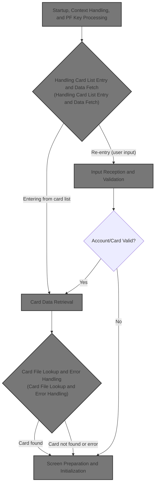
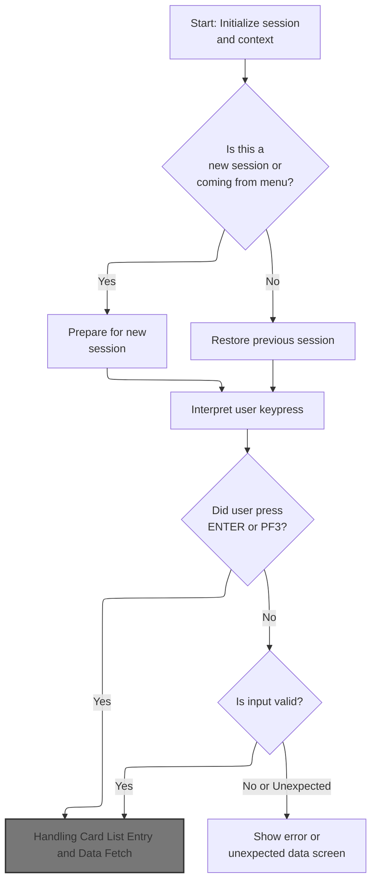
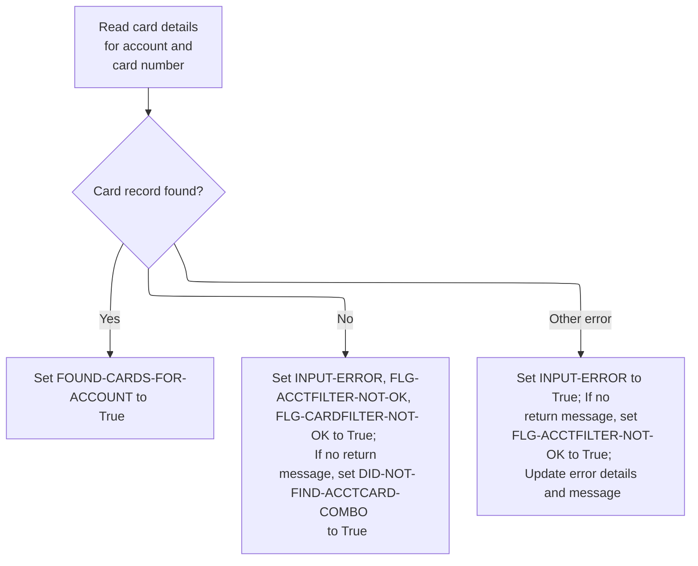
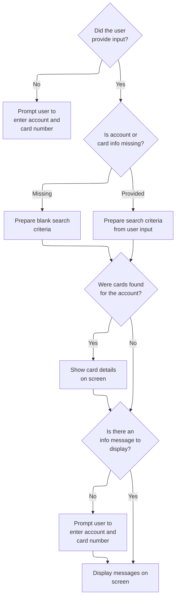
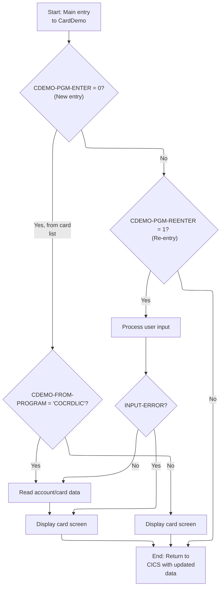
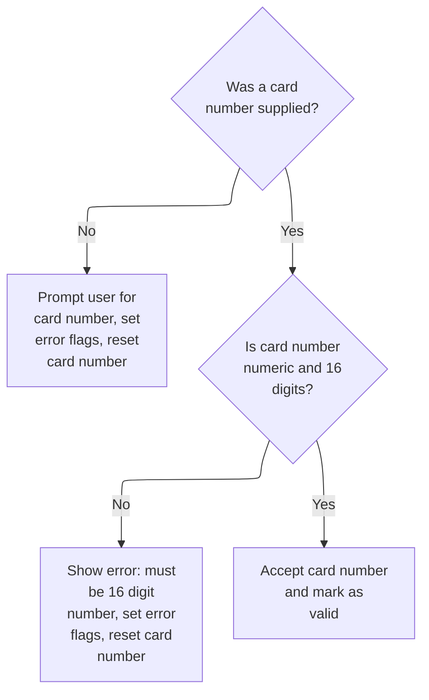
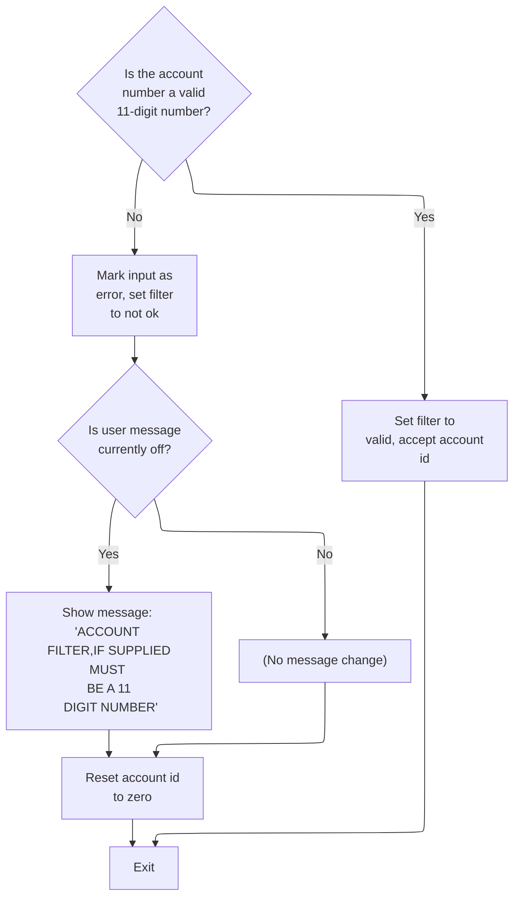
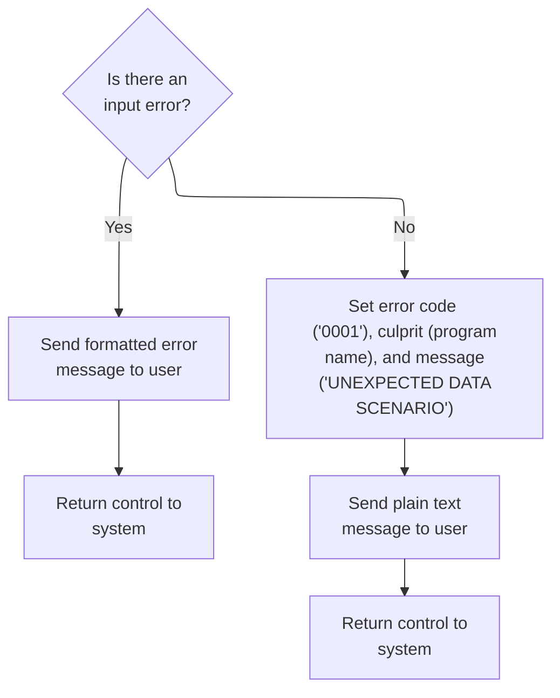

# Overview

This document explains the flow for handling card detail inquiries. Users enter account and card numbers to search for card information, with the system validating input, retrieving card data, and providing feedback or error messages as needed.



## Dependencies

### Programs

- COCRDSLC (app/cbl/COCRDSLC.cbl)
- LIT-MENUPGM
- CDEMO-FROM-PROGRAM
- CCDL

### Copybooks

- CVCRD01Y (app/cpy/CVCRD01Y.cpy)
- COCOM01Y (app/cpy/COCOM01Y.cpy)
- DFHBMSCA
- DFHAID
- COTTL01Y (app/cpy/COTTL01Y.cpy)
- COCRDSL (app/cpy-bms/COCRDSL.CPY)
- CSDAT01Y (app/cpy/CSDAT01Y.cpy)
- CSMSG01Y (app/cpy/CSMSG01Y.cpy)
- CSMSG02Y (app/cpy/CSMSG02Y.cpy)
- CSUSR01Y (app/cpy/CSUSR01Y.cpy)
- CVACT02Y (app/cpy/CVACT02Y.cpy)
- CVCUS01Y (app/cpy/CVCUS01Y.cpy)
- CSSTRPFY (app/cpy/CSSTRPFY.cpy)

## Input and Output Tables/Files used in the Program

| Table / File Name          | Type | Description                                               | Usage Mode | Key Fields / Layout Highlights |
| -------------------------- | ---- | --------------------------------------------------------- | ---------- | ------------------------------ |
| LIT-CARDFILENAME           | File | Credit card details: number, account, CVV, expiry, status | Input      | File resource                  |
| LIT-CARDFILENAME-ACCT-PATH | File | Credit card details accessed by account ID index          | Input      | File resource                  |

&nbsp;

# Workflow

# Startup, Context Handling, and PF Key Processing



This section is responsible for initializing the session and context, interpreting user keypresses, and determining the next action based on session state and user input. It ensures that only valid actions are processed, context is managed correctly, and control is transferred appropriately between application modules.

| Rule ID | Code Location               | Category        | Rule Name                        | Description                                                                                                                                                                                 | Conditions                                                                                                               | Remarks                                                                                                                                                                                                                  |
| ------- | --------------------------- | --------------- | -------------------------------- | ------------------------------------------------------------------------------------------------------------------------------------------------------------------------------------------- | ------------------------------------------------------------------------------------------------------------------------ | ------------------------------------------------------------------------------------------------------------------------------------------------------------------------------------------------------------------------ |
| BR-001  | 0000-MAIN, YYYY-STORE-PFKEY | Data validation | PF Key Validation and Defaulting | User keypresses are interpreted so that only ENTER and PF3 are considered valid actions at this stage; all other keys are treated as invalid and defaulted to ENTER.                        | Any user keypress is received.                                                                                           | PF keys 13-24 are mapped to PF keys 1-12. Only ENTER and PF3 are valid; all others are treated as ENTER.                                                                                                                 |
| BR-002  | 0000-MAIN                   | Business logic  | New Session Initialization       | If the session is new (no communication area) or the user is returning from the menu, the application must initialize both the global and program-specific context areas to default values. | The communication area length is zero, or the context indicates the user is returning from the menu and not re-entering. | Default values are set for all fields in the global and program-specific context areas. The global area includes user, account, and card information; the program-specific area holds local state.                       |
| BR-003  | 0000-MAIN                   | Business logic  | Session Context Restoration      | If the session is not new, the application must restore both the global and program-specific context areas from the communication area, preserving user and session state.                  | The communication area length is not zero and the user is not returning from the menu or is re-entering.                 | The communication area is split into a global context area and a program-specific area, each with defined lengths and field formats.                                                                                     |
| BR-004  | 0000-MAIN                   | Business logic  | PF3 Program Transfer             | If PF3 is pressed, the application must transfer control to either the main menu or the calling program, updating the context to reflect the transfer.                                      | PF3 key is pressed.                                                                                                      | If the context is empty, transfer to the menu program and transaction; otherwise, transfer to the calling program and transaction. The context is updated with the current program and transaction as the 'from' fields. |
| BR-005  | 0000-MAIN                   | Business logic  | Card Data Fetch on Entry         | If the user is entering from the card list, the application must fetch card data and display the appropriate screen.                                                                        | The context indicates program entry and the previous program was the card list.                                          | The account and card numbers are copied from the context to the working area, then card data is fetched and the screen is displayed.                                                                                     |
| BR-006  | 0000-MAIN                   | Technical step  | ABEND Handler Registration       | If an abnormal termination (ABEND) occurs at any point, the application must transfer control to the ABEND handler routine.                                                                 | Program start.                                                                                                           | The ABEND handler is registered at program start to catch all abnormal terminations.                                                                                                                                     |

<SwmSnippet path="/app/cbl/COCRDSLC.cbl" line="248" repo-id="Z2l0aHViJTNBJTNBa3luZHJ5bC1hd3MtbWFpbmZyYW1lLW1vZGVybml6YXRpb24tY2FyZGRlbW8lM0ElM0FTd2ltbS1EZW1v">

---

In `0000-MAIN` this is just the entry point where the ABEND handler is registered. It means any abnormal termination (ABEND) will jump to ABEND-ROUTINE, so the program can handle errors from the very beginning.

```cobol
       0000-MAIN.                                                               
                                                                                
           EXEC CICS HANDLE ABEND                                               
                     LABEL(ABEND-ROUTINE)                                       
           END-EXEC                                                             
```

---

</SwmSnippet>

<SwmSnippet path="/app/cbl/COCRDSLC.cbl" line="254" repo-id="Z2l0aHViJTNBJTNBa3luZHJ5bC1hd3MtbWFpbmZyYW1lLW1vZGVybml6YXRpb24tY2FyZGRlbW8lM0ElM0FTd2ltbS1EZW1v">

---

This is just prepping all the working storage and clearing error state before doing anything else.

```cobol
           INITIALIZE CC-WORK-AREA                                              
                      WS-MISC-STORAGE                                           
                      WS-COMMAREA                                               
      *****************************************************************         
      * Store our context                                                       
      *****************************************************************         
           MOVE LIT-THISTRANID       TO WS-TRANID                               
      *****************************************************************         
      * Ensure error message is cleared                               *         
      *****************************************************************         
           SET WS-RETURN-MSG-OFF  TO TRUE                                       
```

---

</SwmSnippet>

<SwmSnippet path="/app/cbl/COCRDSLC.cbl" line="268" repo-id="Z2l0aHViJTNBJTNBa3luZHJ5bC1hd3MtbWFpbmZyYW1lLW1vZGVybml6YXRpb24tY2FyZGRlbW8lM0ElM0FTd2ltbS1EZW1v">

---

Here we check if there's any input data or if we're coming from the menu. If not, we initialize both the global and program-specific communication areas. Otherwise, we split the DFHCOMMAREA into CARDDEMO-COMMAREA (global) and WS-THIS-PROGCOMMAREA (local), so we can keep both shared and program-specific state.

```cobol
           IF EIBCALEN IS EQUAL TO 0                                            
               OR (CDEMO-FROM-PROGRAM = LIT-MENUPGM
               AND NOT CDEMO-PGM-REENTER)                               
              INITIALIZE CARDDEMO-COMMAREA                                      
                         WS-THIS-PROGCOMMAREA                                   
           ELSE                                                                 
              MOVE DFHCOMMAREA (1:LENGTH OF CARDDEMO-COMMAREA)  TO              
                                CARDDEMO-COMMAREA                               
              MOVE DFHCOMMAREA(LENGTH OF CARDDEMO-COMMAREA + 1:                 
                               LENGTH OF WS-THIS-PROGCOMMAREA ) TO              
                                WS-THIS-PROGCOMMAREA                            
           END-IF                                                               
```

---

</SwmSnippet>

<SwmSnippet path="/app/cbl/COCRDSLC.cbl" line="284" repo-id="Z2l0aHViJTNBJTNBa3luZHJ5bC1hd3MtbWFpbmZyYW1lLW1vZGVybml6YXRpb24tY2FyZGRlbW8lM0ElM0FTd2ltbS1EZW1v">

---

Next we call the PF key remapping routine (YYYY-STORE-PFKEY in app/cpy/CSSTRPFY.cpy). This translates the raw AID value from the terminal into a set of boolean flags, so we can handle key actions in a uniform way later.

```cobol
           PERFORM YYYY-STORE-PFKEY                                             
              THRU YYYY-STORE-PFKEY-EXIT                                        
```

---

</SwmSnippet>

<SwmSnippet path="/app/cpy/CSSTRPFY.cpy" line="17" repo-id="Z2l0aHViJTNBJTNBa3luZHJ5bC1hd3MtbWFpbmZyYW1lLW1vZGVybml6YXRpb24tY2FyZGRlbW8lM0ElM0FTd2ltbS1EZW1v">

---

`YYYY-STORE-PFKEY` checks the EIBAID value and sets the corresponding CCARD-AID flag. PFKeys 13-24 are mapped back to PFKeys 1-12, so the program only has to handle 12 logical PF keys, no matter what the terminal sends.

```cobol
       YYYY-STORE-PFKEY.                                                        
      *****************************************************************         
      * Map AID to PFKey in COMMON Area                                         
      *****************************************************************         
           EVALUATE TRUE                                                        
             WHEN EIBAID IS EQUAL TO DFHENTER                                   
               SET CCARD-AID-ENTER TO TRUE                                      
             WHEN EIBAID IS EQUAL TO DFHCLEAR                                   
               SET CCARD-AID-CLEAR TO TRUE                                      
             WHEN EIBAID IS EQUAL TO DFHPA1                                     
               SET CCARD-AID-PA1  TO TRUE                                       
             WHEN EIBAID IS EQUAL TO DFHPA2                                     
               SET CCARD-AID-PA2  TO TRUE                                       
             WHEN EIBAID IS EQUAL TO DFHPF1                                     
               SET CCARD-AID-PFK01 TO TRUE                                      
             WHEN EIBAID IS EQUAL TO DFHPF2                                     
               SET CCARD-AID-PFK02 TO TRUE                                      
             WHEN EIBAID IS EQUAL TO DFHPF3                                     
               SET CCARD-AID-PFK03 TO TRUE                                      
             WHEN EIBAID IS EQUAL TO DFHPF4                                     
               SET CCARD-AID-PFK04 TO TRUE                                      
             WHEN EIBAID IS EQUAL TO DFHPF5                                     
               SET CCARD-AID-PFK05 TO TRUE                                      
             WHEN EIBAID IS EQUAL TO DFHPF6                                     
               SET CCARD-AID-PFK06 TO TRUE                                      
             WHEN EIBAID IS EQUAL TO DFHPF7                                     
               SET CCARD-AID-PFK07 TO TRUE                                      
             WHEN EIBAID IS EQUAL TO DFHPF8                                     
               SET CCARD-AID-PFK08 TO TRUE                                      
             WHEN EIBAID IS EQUAL TO DFHPF9                                     
               SET CCARD-AID-PFK09 TO TRUE                                      
             WHEN EIBAID IS EQUAL TO DFHPF10                                    
               SET CCARD-AID-PFK10 TO TRUE                                      
             WHEN EIBAID IS EQUAL TO DFHPF11                                    
               SET CCARD-AID-PFK11 TO TRUE                                      
             WHEN EIBAID IS EQUAL TO DFHPF12                                    
               SET CCARD-AID-PFK12 TO TRUE                                      
             WHEN EIBAID IS EQUAL TO DFHPF13                                    
               SET CCARD-AID-PFK01 TO TRUE                                      
             WHEN EIBAID IS EQUAL TO DFHPF14                                    
               SET CCARD-AID-PFK02 TO TRUE                                      
             WHEN EIBAID IS EQUAL TO DFHPF15                                    
               SET CCARD-AID-PFK03 TO TRUE                                      
             WHEN EIBAID IS EQUAL TO DFHPF16                                    
               SET CCARD-AID-PFK04 TO TRUE                                      
             WHEN EIBAID IS EQUAL TO DFHPF17                                    
               SET CCARD-AID-PFK05 TO TRUE                                      
             WHEN EIBAID IS EQUAL TO DFHPF18                                    
               SET CCARD-AID-PFK06 TO TRUE                                      
             WHEN EIBAID IS EQUAL TO DFHPF19                                    
               SET CCARD-AID-PFK07 TO TRUE                                      
             WHEN EIBAID IS EQUAL TO DFHPF20                                    
               SET CCARD-AID-PFK08 TO TRUE                                      
             WHEN EIBAID IS EQUAL TO DFHPF21                                    
               SET CCARD-AID-PFK09 TO TRUE                                      
             WHEN EIBAID IS EQUAL TO DFHPF22                                    
               SET CCARD-AID-PFK10 TO TRUE                                      
             WHEN EIBAID IS EQUAL TO DFHPF23                                    
               SET CCARD-AID-PFK11 TO TRUE                                      
             WHEN EIBAID IS EQUAL TO DFHPF24                                    
               SET CCARD-AID-PFK12 TO TRUE                                      
           END-EVALUATE                                                         
```

---

</SwmSnippet>

<SwmSnippet path="/app/cbl/COCRDSLC.cbl" line="291" repo-id="Z2l0aHViJTNBJTNBa3luZHJ5bC1hd3MtbWFpbmZyYW1lLW1vZGVybml6YXRpb24tY2FyZGRlbW8lM0ElM0FTd2ltbS1EZW1v">

---

Back in `0000-MAIN`, after returning from the PF key mapping routine, we assume the key is invalid, then check if it's ENTER or PFK03 and mark it as valid if so. This narrows down the allowed actions to just those two keys.

```cobol
           SET PFK-INVALID TO TRUE                                              
           IF CCARD-AID-ENTER OR                                                
              CCARD-AID-PFK03                                                   
              SET PFK-VALID TO TRUE                                             
           END-IF                                                               
```

---

</SwmSnippet>

<SwmSnippet path="/app/cbl/COCRDSLC.cbl" line="297" repo-id="Z2l0aHViJTNBJTNBa3luZHJ5bC1hd3MtbWFpbmZyYW1lLW1vZGVybml6YXRpb24tY2FyZGRlbW8lM0ElM0FTd2ltbS1EZW1v">

---

If the key is still marked invalid after all checks, we just force the ENTER flag on. This way, the program doesn't get stuck or crash on unsupported keys.

```cobol
           IF PFK-INVALID                                                       
              SET CCARD-AID-ENTER TO TRUE                                       
           END-IF                                                               
```

---

</SwmSnippet>

<SwmSnippet path="/app/cbl/COCRDSLC.cbl" line="304" repo-id="Z2l0aHViJTNBJTNBa3luZHJ5bC1hd3MtbWFpbmZyYW1lLW1vZGVybml6YXRpb24tY2FyZGRlbW8lM0ElM0FTd2ltbS1EZW1v">

---

Now we hit the main EVALUATE block. If PFK03 is pressed, we prep for a program transfer (XCTL) to either the menu or the calling program, updating the communication area as needed. Other branches handle data reads and map sends based on context.

```cobol
           EVALUATE TRUE                                                        
              WHEN CCARD-AID-PFK03                                              
      ******************************************************************        
      *            XCTL TO CALLING PROGRAM OR MAIN MENU                         
      ******************************************************************        
                   IF CDEMO-FROM-TRANID    EQUAL LOW-VALUES                     
                   OR CDEMO-FROM-TRANID    EQUAL SPACES                         
                      MOVE LIT-MENUTRANID  TO CDEMO-TO-TRANID                   
                   ELSE                                                         
                      MOVE CDEMO-FROM-TRANID  TO CDEMO-TO-TRANID                
                   END-IF                                                       
```

---

</SwmSnippet>

<SwmSnippet path="/app/cbl/COCRDSLC.cbl" line="316" repo-id="Z2l0aHViJTNBJTNBa3luZHJ5bC1hd3MtbWFpbmZyYW1lLW1vZGVybml6YXRpb24tY2FyZGRlbW8lM0ElM0FTd2ltbS1EZW1v">

---

Here we figure out which program to transfer to. If the context is empty, we default to the menu program; otherwise, we use the calling program from the context.

```cobol
                   IF CDEMO-FROM-PROGRAM   EQUAL LOW-VALUES                     
                   OR CDEMO-FROM-PROGRAM   EQUAL SPACES                         
                      MOVE LIT-MENUPGM     TO CDEMO-TO-PROGRAM                  
                   ELSE                                                         
                      MOVE CDEMO-FROM-PROGRAM TO CDEMO-TO-PROGRAM               
                   END-IF                                                       
```

---

</SwmSnippet>

<SwmSnippet path="/app/cbl/COCRDSLC.cbl" line="323" repo-id="Z2l0aHViJTNBJTNBa3luZHJ5bC1hd3MtbWFpbmZyYW1lLW1vZGVybml6YXRpb24tY2FyZGRlbW8lM0ElM0FTd2ltbS1EZW1v">

---

Before transferring control, we update the 'from' fields in the communication area, set user type and context, and record the last map and mapset. Then we call XCTL to jump to the target program with the updated context.

```cobol
                   MOVE LIT-THISTRANID     TO CDEMO-FROM-TRANID                 
                   MOVE LIT-THISPGM        TO CDEMO-FROM-PROGRAM                
                                                                                
                   SET  CDEMO-USRTYP-USER  TO TRUE                              
                   SET  CDEMO-PGM-ENTER    TO TRUE                              
                   MOVE LIT-THISMAPSET     TO CDEMO-LAST-MAPSET                 
                   MOVE LIT-THISMAP        TO CDEMO-LAST-MAP                    
      *                                                                         
                   EXEC CICS XCTL                                               
                             PROGRAM (CDEMO-TO-PROGRAM)                         
                             COMMAREA(CARDDEMO-COMMAREA)                        
                   END-EXEC                                                     
```

---

</SwmSnippet>

<SwmSnippet path="/app/cbl/COCRDSLC.cbl" line="339" repo-id="Z2l0aHViJTNBJTNBa3luZHJ5bC1hd3MtbWFpbmZyYW1lLW1vZGVybml6YXRpb24tY2FyZGRlbW8lM0ElM0FTd2ltbS1EZW1v">

---

This is where we fetch card data before showing the screen.

```cobol
              WHEN CDEMO-PGM-ENTER                                              
               AND CDEMO-FROM-PROGRAM  EQUAL LIT-CCLISTPGM                      
                   SET INPUT-OK TO TRUE                                         
                   MOVE CDEMO-ACCT-ID       TO CC-ACCT-ID-N                     
                   MOVE CDEMO-CARD-NUM      TO CC-CARD-NUM-N                    
                   PERFORM 9000-READ-DATA                                       
                      THRU 9000-READ-DATA-EXIT                                  
                   PERFORM 1000-SEND-MAP                                        
                     THRU 1000-SEND-MAP-EXIT                                    
                   GO TO COMMON-RETURN                                          
```

---

</SwmSnippet>

## Card Data Retrieval

This section handles the retrieval of card data by delegating the lookup to a dedicated logic block, ensuring modularity and reusability in card data access.

| Rule ID | Code Location                           | Category       | Rule Name             | Description                                                                                                                                        | Conditions                                  | Remarks                                                                                                                                        |
| ------- | --------------------------------------- | -------------- | --------------------- | -------------------------------------------------------------------------------------------------------------------------------------------------- | ------------------------------------------- | ---------------------------------------------------------------------------------------------------------------------------------------------- |
| BR-001  | 9000-READ-DATA, 9100-GETCARD-BYACCTCARD | Business logic | Delegated card lookup | When a card data retrieval is requested, the system delegates the lookup to a dedicated card retrieval logic to ensure modularity and reusability. | A card data retrieval request is initiated. | The retrieval logic is modular, allowing for reuse in other contexts. No specific output format or constants are defined in the provided code. |

<SwmSnippet path="/app/cbl/COCRDSLC.cbl" line="726" repo-id="Z2l0aHViJTNBJTNBa3luZHJ5bC1hd3MtbWFpbmZyYW1lLW1vZGVybml6YXRpb24tY2FyZGRlbW8lM0ElM0FTd2ltbS1EZW1v">

---

`9000-READ-DATA` just delegates to 9100-GETCARD-BYACCTCARD, which does the actual card lookup. This keeps the logic modular and easy to reuse.

```cobol
       9000-READ-DATA.                                                          
                                                                                
           PERFORM 9100-GETCARD-BYACCTCARD                                      
              THRU 9100-GETCARD-BYACCTCARD-EXIT                                 
           .                                                                    
```

---

</SwmSnippet>

## Card File Lookup and Error Handling



This section handles the lookup of card records by account and card number, and sets business-level flags and messages based on whether the record is found, not found, or an error occurs.

| Rule ID | Code Location           | Category       | Rule Name             | Description                                                                                                                                                                                                  | Conditions                                                                                                        | Remarks                                                                                                                                                                                                                                                                                            |
| ------- | ----------------------- | -------------- | --------------------- | ------------------------------------------------------------------------------------------------------------------------------------------------------------------------------------------------------------ | ----------------------------------------------------------------------------------------------------------------- | -------------------------------------------------------------------------------------------------------------------------------------------------------------------------------------------------------------------------------------------------------------------------------------------------- |
| BR-001  | 9100-GETCARD-BYACCTCARD | Business logic | Card record found     | When a card record is found for the provided account and card number, the system marks that cards were found for the account.                                                                                | A card record exists in the CARDDAT file for the given account and card number, and the response code is NORMAL.  | The flag FOUND-CARDS-FOR-ACCOUNT is set to True, which is represented by the output message '   Displaying requested details'.                                                                                                                                                                     |
| BR-002  | 9100-GETCARD-BYACCTCARD | Error handling | Card record not found | If no card record is found for the provided account and card number, the system sets error flags for both account and card, and if no return message is present, sets a 'did not find' message for the user. | No card record exists in the CARDDAT file for the given account and card number, and the response code is NOTFND. | The flags INPUT-ERROR, FLG-ACCTFILTER-NOT-OK, and FLG-CARDFILTER-NOT-OK are set to True. If no return message is present (WS-RETURN-MSG-OFF), the message 'Did not find cards for this search condition' is set.                                                                                   |
| BR-003  | 9100-GETCARD-BYACCTCARD | Error handling | Other card file error | If an error other than 'not found' occurs during card lookup, the system sets the input error flag, updates error details, and sets a generic file error message for the user interface.                     | An error occurs during card lookup that is not a NORMAL or NOTFND response code.                                  | The flag INPUT-ERROR is set to True. If no return message is present (WS-RETURN-MSG-OFF), the account filter not ok flag is set to True. The error details are updated with operation name 'READ', file name 'CARDDAT ', and the response codes. The generic file error message is set for the UI. |

<SwmSnippet path="/app/cbl/COCRDSLC.cbl" line="736" repo-id="Z2l0aHViJTNBJTNBa3luZHJ5bC1hd3MtbWFpbmZyYW1lLW1vZGVybml6YXRpb24tY2FyZGRlbW8lM0ElM0FTd2ltbS1EZW1v">

---

In `9100-GETCARD-BYACCTCARD`, we prep the card number as the key, then do a CICS READ on the CARDDAT file. The result goes into CARD-RECORD, and we capture the response codes for later error handling.

```cobol
       9100-GETCARD-BYACCTCARD.                                                 
      *    Read the Card file                                                   
      *                                                                         
      *    MOVE CC-ACCT-ID-N      TO WS-CARD-RID-ACCT-ID                        
           MOVE CC-CARD-NUM       TO WS-CARD-RID-CARDNUM                        
                                                                                
           EXEC CICS READ                                                       
                FILE      (LIT-CARDFILENAME)                                    
                RIDFLD    (WS-CARD-RID-CARDNUM)                                 
                KEYLENGTH (LENGTH OF WS-CARD-RID-CARDNUM)                       
                INTO      (CARD-RECORD)                                         
                LENGTH    (LENGTH OF CARD-RECORD)                               
                RESP      (WS-RESP-CD)                                          
                RESP2     (WS-REAS-CD)                                          
           END-EXEC                                                             
```

---

</SwmSnippet>

<SwmSnippet path="/app/cbl/COCRDSLC.cbl" line="752" repo-id="Z2l0aHViJTNBJTNBa3luZHJ5bC1hd3MtbWFpbmZyYW1lLW1vZGVybml6YXRpb24tY2FyZGRlbW8lM0ElM0FTd2ltbS1EZW1v">

---

After the READ, we check the response code. If it's NORMAL, we mark that cards were found for the account. If it's NOTFND, we set error flags and, if needed, set a 'not found' message.

```cobol
           EVALUATE WS-RESP-CD                                                  
               WHEN DFHRESP(NORMAL)                                             
                  SET FOUND-CARDS-FOR-ACCOUNT TO TRUE                           
```

---

</SwmSnippet>

<SwmSnippet path="/app/cbl/COCRDSLC.cbl" line="755" repo-id="Z2l0aHViJTNBJTNBa3luZHJ5bC1hd3MtbWFpbmZyYW1lLW1vZGVybml6YXRpb24tY2FyZGRlbW8lM0ElM0FTd2ltbS1EZW1v">

---

If the card isn't found, we set input error flags for both account and card, and only set the 'did not find' message if nothing else is already set.

```cobol
               WHEN DFHRESP(NOTFND)                                             
                  SET INPUT-ERROR                    TO TRUE                    
                  SET FLG-ACCTFILTER-NOT-OK          TO TRUE                    
                  SET FLG-CARDFILTER-NOT-OK          TO TRUE                    
                  IF  WS-RETURN-MSG-OFF                                         
                      SET DID-NOT-FIND-ACCTCARD-COMBO TO TRUE                   
                  END-IF                                                        
```

---

</SwmSnippet>

<SwmSnippet path="/app/cbl/COCRDSLC.cbl" line="762" repo-id="Z2l0aHViJTNBJTNBa3luZHJ5bC1hd3MtbWFpbmZyYW1lLW1vZGVybml6YXRpb24tY2FyZGRlbW8lM0ElM0FTd2ltbS1EZW1v">

---

For any other response, we set input error, fill in all the error details, and set a generic file error message for the UI.

```cobol
               WHEN OTHER                                                       
                  SET INPUT-ERROR                    TO TRUE                    
                  IF  WS-RETURN-MSG-OFF                                         
                      SET FLG-ACCTFILTER-NOT-OK      TO TRUE                    
                  END-IF                                                        
                  MOVE 'READ'                        TO ERROR-OPNAME            
                  MOVE LIT-CARDFILENAME                TO ERROR-FILE            
                  MOVE WS-RESP-CD                    TO ERROR-RESP              
                  MOVE WS-REAS-CD                    TO ERROR-RESP2             
                  MOVE WS-FILE-ERROR-MESSAGE         TO WS-RETURN-MSG           
           END-EVALUATE                                                         
```

---

</SwmSnippet>

## Screen Preparation and Initialization

This section prepares and sends the screen to the user, ensuring that all displayed information is up-to-date and relevant for each session.

| Rule ID | Code Location    | Category       | Rule Name                            | Description                                                                                                                                                                     | Conditions                                             | Remarks                                                                                                                                                             |
| ------- | ---------------- | -------------- | ------------------------------------ | ------------------------------------------------------------------------------------------------------------------------------------------------------------------------------- | ------------------------------------------------------ | ------------------------------------------------------------------------------------------------------------------------------------------------------------------- |
| BR-001  | 1100-SCREEN-INIT | Business logic | Screen data reset                    | Each time the screen is prepared, the display fields are reset to blank values before new data is populated. This ensures that no residual data from previous screens is shown. | Whenever the screen preparation sequence is initiated. | All display fields are set to blank (low-value) before new content is added. This applies to the entire screen output structure.                                    |
| BR-002  | 1100-SCREEN-INIT | Business logic | Current date and time display        | The screen always displays the current date and time, formatted as MM-DD-YY and HH:MM:SS respectively, so users see accurate session information.                               | Whenever the screen is initialized and sent.           | Date is formatted as two-digit month, two-digit day, two-digit year (MM-DD-YY). Time is formatted as two-digit hour, two-digit minute, two-digit second (HH:MM:SS). |
| BR-003  | 1100-SCREEN-INIT | Business logic | Program and transaction info display | The screen displays the current program name, transaction name, and two title lines, ensuring users know which program and transaction they are interacting with.               | Whenever the screen is initialized and sent.           | Titles and identifiers are set using predefined constant values. The format is alphanumeric, left-aligned, and sized to fit the designated screen fields.           |

<SwmSnippet path="/app/cbl/COCRDSLC.cbl" line="412" repo-id="Z2l0aHViJTNBJTNBa3luZHJ5bC1hd3MtbWFpbmZyYW1lLW1vZGVybml6YXRpb24tY2FyZGRlbW8lM0ElM0FTd2ltbS1EZW1v">

---

`1000-SEND-MAP` runs the full sequence to prep and send the screen: initialize, set up variables, set up attributes, and finally send the map. Each step is modular so you can tweak them independently.

```cobol
       1000-SEND-MAP.                                                           
           PERFORM 1100-SCREEN-INIT                                             
              THRU 1100-SCREEN-INIT-EXIT                                        
           PERFORM 1200-SETUP-SCREEN-VARS                                       
              THRU 1200-SETUP-SCREEN-VARS-EXIT                                  
           PERFORM 1300-SETUP-SCREEN-ATTRS                                      
              THRU 1300-SETUP-SCREEN-ATTRS-EXIT                                 
           PERFORM 1400-SEND-SCREEN                                             
              THRU 1400-SEND-SCREEN-EXIT                                        
```

---

</SwmSnippet>

<SwmSnippet path="/app/cbl/COCRDSLC.cbl" line="427" repo-id="Z2l0aHViJTNBJTNBa3luZHJ5bC1hd3MtbWFpbmZyYW1lLW1vZGVybml6YXRpb24tY2FyZGRlbW8lM0ElM0FTd2ltbS1EZW1v">

---

`1100-SCREEN-INIT` resets the screen data, grabs the current date and time, formats them, and fills in the title and program info so the screen always shows up-to-date details.

```cobol
       1100-SCREEN-INIT.                                                        
           MOVE LOW-VALUES TO CCRDSLAO                                          
                                                                                
           MOVE FUNCTION CURRENT-DATE  TO WS-CURDATE-DATA                       
                                                                                
           MOVE CCDA-TITLE01           TO TITLE01O OF CCRDSLAO                  
           MOVE CCDA-TITLE02           TO TITLE02O OF CCRDSLAO                  
           MOVE LIT-THISTRANID         TO TRNNAMEO OF CCRDSLAO                  
           MOVE LIT-THISPGM            TO PGMNAMEO OF CCRDSLAO                  
                                                                                
           MOVE FUNCTION CURRENT-DATE  TO WS-CURDATE-DATA                       
                                                                                
           MOVE WS-CURDATE-MONTH       TO WS-CURDATE-MM                         
           MOVE WS-CURDATE-DAY         TO WS-CURDATE-DD                         
           MOVE WS-CURDATE-YEAR(3:2)   TO WS-CURDATE-YY                         
                                                                                
           MOVE WS-CURDATE-MM-DD-YY    TO CURDATEO OF CCRDSLAO                  
                                                                                
           MOVE WS-CURTIME-HOURS       TO WS-CURTIME-HH                         
           MOVE WS-CURTIME-MINUTE      TO WS-CURTIME-MM                         
           MOVE WS-CURTIME-SECOND      TO WS-CURTIME-SS                         
                                                                                
           MOVE WS-CURTIME-HH-MM-SS    TO CURTIMEO OF CCRDSLAO                  
                                                                                
           .                                                                    
```

---

</SwmSnippet>

### Screen Variable Setup



This section prepares the screen variables for the card search display, ensuring that user input is validated, fields are populated or cleared as needed, card details are shown when available, and feedback messages are displayed to guide the user.

| Rule ID | Code Location          | Category        | Rule Name                            | Description                                                                                                                                                            | Conditions                                                   | Remarks                                                                                                                                                                                                 |
| ------- | ---------------------- | --------------- | ------------------------------------ | ---------------------------------------------------------------------------------------------------------------------------------------------------------------------- | ------------------------------------------------------------ | ------------------------------------------------------------------------------------------------------------------------------------------------------------------------------------------------------- |
| BR-001  | 1200-SETUP-SCREEN-VARS | Data validation | Prompt for missing input             | If no input is provided by the user, the system prompts the user to enter account and card number before proceeding.                                                   | No input is detected (input length is zero).                 | The prompt is triggered when input length is zero. The prompt message is 'Please enter Account and Card Number'.                                                                                        |
| BR-002  | 1200-SETUP-SCREEN-VARS | Data validation | Clear fields for zero values         | If the account or card number is zero, the corresponding screen field is cleared to avoid displaying invalid or placeholder data.                                      | Account number or card number is zero.                       | Zero values are treated as missing and result in blank fields on the screen. The cleared field is set to blank (LOW-VALUES).                                                                            |
| BR-003  | 1200-SETUP-SCREEN-VARS | Business logic  | Populate fields with provided values | If valid account and card numbers are provided, the corresponding screen fields are populated with these values for the user to review.                                | Account number and/or card number are provided and not zero. | Account and card numbers are displayed as entered by the user. Field formats: account number (string, 11 characters), card number (string, 16 characters).                                              |
| BR-004  | 1200-SETUP-SCREEN-VARS | Business logic  | Display card details when found      | If cards are found for the provided account, all card details (embossed name, expiry date, expiry month/year, active status) are displayed on the screen for the user. | Cards are found for the account.                             | Card details include: embossed name (string, 50 characters), expiry date (string, 10 characters), expiry month (number, 2 digits), expiry year (number, 4 digits), active status (string, 1 character). |
| BR-005  | 1200-SETUP-SCREEN-VARS | Error handling  | Prompt when no info message          | If there is no info message to display, the system prompts the user to enter account and card number again.                                                            | No info message is present.                                  | No info message is defined as the info message field being blank or set to LOW-VALUES.                                                                                                                  |
| BR-006  | 1200-SETUP-SCREEN-VARS | Error handling  | Display feedback messages            | At the end of the setup, the latest error and info messages are displayed on the screen to provide feedback to the user.                                               | Error or info messages are present.                          | Error message (string, up to 75 characters), info message (string, up to 75 characters) are displayed in dedicated screen fields.                                                                       |

<SwmSnippet path="/app/cbl/COCRDSLC.cbl" line="457" repo-id="Z2l0aHViJTNBJTNBa3luZHJ5bC1hd3MtbWFpbmZyYW1lLW1vZGVybml6YXRpb24tY2FyZGRlbW8lM0ElM0FTd2ltbS1EZW1v">

---

In `1200-SETUP-SCREEN-VARS`, if there's no input, we set a flag to prompt the user. Otherwise, we fill in the account and card fields based on the input or clear them if they're zero.

```cobol
       1200-SETUP-SCREEN-VARS.                                                  
      *    INITIALIZE SEARCH CRITERIA                                           
           IF EIBCALEN = 0                                                      
              SET  WS-PROMPT-FOR-INPUT TO TRUE                                  
```

---

</SwmSnippet>

<SwmSnippet path="/app/cbl/COCRDSLC.cbl" line="461" repo-id="Z2l0aHViJTNBJTNBa3luZHJ5bC1hd3MtbWFpbmZyYW1lLW1vZGVybml6YXRpb24tY2FyZGRlbW8lM0ElM0FTd2ltbS1EZW1v">

---

If the account or card number is zero, we clear the corresponding screen fields; otherwise, we fill them in with the actual values. Keeps the display clean.

```cobol
           ELSE                                                                 
              IF CDEMO-ACCT-ID = 0                                              
                 MOVE LOW-VALUES   TO ACCTSIDO OF CCRDSLAO                      
              ELSE                                                              
                 MOVE CC-ACCT-ID   TO ACCTSIDO OF CCRDSLAO                      
              END-IF                                                            
                                                                                
              IF CDEMO-CARD-NUM = 0                                             
                MOVE LOW-VALUES   TO CARDSIDO OF CCRDSLAO                       
              ELSE                                                              
                MOVE CC-CARD-NUM  TO CARDSIDO OF CCRDSLAO                       
              END-IF                                                            
```

---

</SwmSnippet>

<SwmSnippet path="/app/cbl/COCRDSLC.cbl" line="474" repo-id="Z2l0aHViJTNBJTNBa3luZHJ5bC1hd3MtbWFpbmZyYW1lLW1vZGVybml6YXRpb24tY2FyZGRlbW8lM0ElM0FTd2ltbS1EZW1v">

---

If we found cards for the account, we fill in all the card details (name, expiry, status, etc.) on the screen for the user to see.

```cobol
              IF FOUND-CARDS-FOR-ACCOUNT                                        
                 MOVE CARD-EMBOSSED-NAME                                        
                                        TO CRDNAMEO OF CCRDSLAO                 
                 MOVE CARD-EXPIRAION-DATE                                       
                                        TO CARD-EXPIRAION-DATE-X                
                                                                                
                 MOVE CARD-EXPIRY-MONTH TO EXPMONO  OF CCRDSLAO                 
                                                                                
                 MOVE CARD-EXPIRY-YEAR  TO EXPYEARO OF CCRDSLAO                 
                                                                                
                 MOVE CARD-ACTIVE-STATUS TO CRDSTCDO OF CCRDSLAO                
              END-IF                                                            
```

---

</SwmSnippet>

<SwmSnippet path="/app/cbl/COCRDSLC.cbl" line="490" repo-id="Z2l0aHViJTNBJTNBa3luZHJ5bC1hd3MtbWFpbmZyYW1lLW1vZGVybml6YXRpb24tY2FyZGRlbW8lM0ElM0FTd2ltbS1EZW1v">

---

If there's no info message, we prompt the user for input. We also move the error and info messages into the screen fields so the user sees the right feedback.

```cobol
           IF WS-NO-INFO-MESSAGE                                                
             SET WS-PROMPT-FOR-INPUT TO TRUE                                    
           END-IF                                                               
```

---

</SwmSnippet>

<SwmSnippet path="/app/cbl/COCRDSLC.cbl" line="494" repo-id="Z2l0aHViJTNBJTNBa3luZHJ5bC1hd3MtbWFpbmZyYW1lLW1vZGVybml6YXRpb24tY2FyZGRlbW8lM0ElM0FTd2ltbS1EZW1v">

---

At the end, we move the error and info messages into the screen fields so the user sees the latest feedback.

```cobol
           MOVE WS-RETURN-MSG          TO ERRMSGO OF CCRDSLAO                   
                                                                                
           MOVE WS-INFO-MSG            TO INFOMSGO OF CCRDSLAO                  
           .                                                                    
```

---

</SwmSnippet>

### Screen Attribute and Cursor Setup

```mermaid
%%{init: {"flowchart": {"defaultRenderer": "elk"}} }%%
flowchart TD
    node1{"Is user returning 
 from card list 
 screen?"}
    click node1 openCode "app/cbl/COCRDSLC.cbl:505:512"
    node1 -->|"Yes"| node2["Set account and 
 card fields to 
 protected"]
    click node2 openCode "app/cbl/COCRDSLC.cbl:507:508"
    node1 -->|"No"| node3["Set account and 
 card fields to 
 editable"]
    click node3 openCode "app/cbl/COCRDSLC.cbl:510:511"

    subgraph group1["Account and Card 
 Filter Handling"]
        node4{"Is account filter 
 invalid or blank?"}
        click node4 openCode "app/cbl/COCRDSLC.cbl:516:518"
        node4 -->|"Yes"| node5["Highlight account field 
 as error"]
        click node5 openCode "app/cbl/COCRDSLC.cbl:518:518"
        node4 -->|"No"| node6[ ]

        node7{"Is card filter 
 invalid or blank?"}
        click node7 openCode "app/cbl/COCRDSLC.cbl:519:521"
        node7 -->|"Yes"| node8["Highlight card field 
 as error"]
        click node8 openCode "app/cbl/COCRDSLC.cbl:521:521"
        node7 -->|"No"| node9[ ]

        node10{"Is account filter 
 blank and program 
 re-entered?"}
        click node10 openCode "app/cbl/COCRDSLC.cbl:541:545"
        node10 -->|"Yes"| node11["Show '*' and 
 set account column 
 to red"]
        click node11 openCode "app/cbl/COCRDSLC.cbl:543:544"
        node10 -->|"No"| node12[ ]

        node13{"Is card filter 
 blank and program 
 re-entered?"}
        click node13 openCode "app/cbl/COCRDSLC.cbl:547:551"
        node13 -->|"Yes"| node14["Show '*' and 
 set card column 
 to red"]
        click node14 openCode "app/cbl/COCRDSLC.cbl:549:550"
        node13 -->|"No"| node15[ ]
    end

    node16{"Is user returning 
 from card list 
 screen?"}
    click node16 openCode "app/cbl/COCRDSLC.cbl:527:531"
    node16 -->|"Yes"| node17["Set account and 
 card column attributes"]
    click node17 openCode "app/cbl/COCRDSLC.cbl:529:530"
    node16 -->|"No"| node18[ ]

    node19{"Is account filter 
 invalid?"}
    click node19 openCode "app/cbl/COCRDSLC.cbl:533:535"
    node19 -->|"Yes"| node20["Set account column 
 to red"]
    click node20 openCode "app/cbl/COCRDSLC.cbl:534:534"
    node19 -->|"No"| node21[ ]

    node22{"Is card filter 
 invalid?"}
    click node22 openCode "app/cbl/COCRDSLC.cbl:537:539"
    node22 -->|"Yes"| node23["Set card column 
 to red"]
    click node23 openCode "app/cbl/COCRDSLC.cbl:538:538"
    node22 -->|"No"| node24[ ]

    node25{"Is there no 
 informational message?"}
    click node25 openCode "app/cbl/COCRDSLC.cbl:553:557"
    node25 -->|"Yes"| node26["Show dark attribute 
 on info message"]
    click node26 openCode "app/cbl/COCRDSLC.cbl:554:554"
    node25 -->|"No"| node27["Show neutral attribute 
 on info message"]
    click node27 openCode "app/cbl/COCRDSLC.cbl:556:556"

classDef HeadingStyle fill:#777777,stroke:#333,stroke-width:2px;
```



This section sets up the visual state of the account and card filter fields and info message area, guiding user interaction by highlighting errors, indicating required fields, and controlling editability based on navigation context.

| Rule ID | Code Location           | Category        | Rule Name                         | Description                                                                                                                                          | Conditions                                                                                    | Remarks                                                                                                                       |
| ------- | ----------------------- | --------------- | --------------------------------- | ---------------------------------------------------------------------------------------------------------------------------------------------------- | --------------------------------------------------------------------------------------------- | ----------------------------------------------------------------------------------------------------------------------------- |
| BR-001  | 1300-SETUP-SCREEN-ATTRS | Data validation | Account filter error highlighting | If the account filter is invalid or blank, the account field is visually highlighted as an error and the cursor is positioned there.                 | Account filter flag indicates invalid or blank state                                          | Field is highlighted using a special error attribute (e.g., red color DFHRED). Cursor is positioned to the account field.     |
| BR-002  | 1300-SETUP-SCREEN-ATTRS | Data validation | Card filter error highlighting    | If the card filter is invalid or blank, the card field is visually highlighted as an error and the cursor is positioned there.                       | Card filter flag indicates invalid or blank state                                             | Field is highlighted using a special error attribute (e.g., red color DFHRED). Cursor is positioned to the card field.        |
| BR-003  | 1300-SETUP-SCREEN-ATTRS | Data validation | Blank filter re-enter indication  | If the account or card filter is blank and the program is in re-enter mode, a '\*' is displayed in the field and the field is highlighted in red.    | Filter is blank and program is in re-enter mode                                               | Asterisk ('\*') is shown in the field and the field is colored red (DFHRED) to indicate required input.                       |
| BR-004  | 1300-SETUP-SCREEN-ATTRS | Business logic  | Card list return protection       | When the user returns from the card list screen, the account and card filter fields are set to protected, preventing editing.                        | User navigated from the card list screen (last mapset and from-program match specific values) | Fields are set to protected using the constant for protected attribute (DFHBMPRF). This prevents editing of these fields.     |
| BR-005  | 1300-SETUP-SCREEN-ATTRS | Business logic  | Card list return color reset      | When the user returns from the card list screen, the account and card column colors are set to the default color.                                    | User navigated from the card list screen (last mapset and from-program match specific values) | Fields are set to default color using DFHDFCOL.                                                                               |
| BR-006  | 1300-SETUP-SCREEN-ATTRS | Business logic  | Info message color handling       | If there is no informational message, the info message area is displayed with a dark attribute; otherwise, it is displayed with a neutral attribute. | Presence or absence of informational message                                                  | Info message area uses DFHBMDAR for dark attribute when no message, DFHNEUTR for neutral attribute when a message is present. |

<SwmSnippet path="/app/cbl/COCRDSLC.cbl" line="502" repo-id="Z2l0aHViJTNBJTNBa3luZHJ5bC1hd3MtbWFpbmZyYW1lLW1vZGVybml6YXRpb24tY2FyZGRlbW8lM0ElM0FTd2ltbS1EZW1v">

---

In `1300-SETUP-SCREEN-ATTRS`, we set the account and card fields to protected or unprotected based on where the user came from. This controls whether the user can edit those fields.

```cobol
       1300-SETUP-SCREEN-ATTRS.                                                 
                                                                                
      *    PROTECT OR UNPROTECT BASED ON CONTEXT                                
           IF  CDEMO-LAST-MAPSET  EQUAL LIT-CCLISTMAPSET 
           AND CDEMO-FROM-PROGRAM EQUAL LIT-CCLISTPGM                           
              MOVE DFHBMPRF     TO ACCTSIDA OF CCRDSLAI                         
              MOVE DFHBMPRF     TO CARDSIDA OF CCRDSLAI                         
           ELSE                                                                 
              MOVE DFHBMFSE      TO ACCTSIDA OF CCRDSLAI                        
              MOVE DFHBMFSE      TO CARDSIDA OF CCRDSLAI                        
           END-IF                                                               
```

---

</SwmSnippet>

<SwmSnippet path="/app/cbl/COCRDSLC.cbl" line="515" repo-id="Z2l0aHViJTNBJTNBa3luZHJ5bC1hd3MtbWFpbmZyYW1lLW1vZGVybml6YXRpb24tY2FyZGRlbW8lM0ElM0FTd2ltbS1EZW1v">

---

Here we set the cursor position based on which input field needs fixing. If there's an error or blank, the cursor lands there; otherwise, it defaults to the account field.

```cobol
           EVALUATE TRUE                                                        
              WHEN FLG-ACCTFILTER-NOT-OK                                        
              WHEN FLG-ACCTFILTER-BLANK                                         
                   MOVE -1             TO ACCTSIDL OF CCRDSLAI                  
              WHEN FLG-CARDFILTER-NOT-OK                                        
              WHEN FLG-CARDFILTER-BLANK                                         
                   MOVE -1             TO CARDSIDL OF CCRDSLAI                  
              WHEN OTHER                                                        
                   MOVE -1             TO ACCTSIDL OF CCRDSLAI                  
           END-EVALUATE                                                         
```

---

</SwmSnippet>

<SwmSnippet path="/app/cbl/COCRDSLC.cbl" line="527" repo-id="Z2l0aHViJTNBJTNBa3luZHJ5bC1hd3MtbWFpbmZyYW1lLW1vZGVybml6YXRpb24tY2FyZGRlbW8lM0ElM0FTd2ltbS1EZW1v">

---

If we're coming from the card list, we set the field colors to default. If there's an error, we set the color to red to highlight the problem.

```cobol
           IF  CDEMO-LAST-MAPSET   EQUAL LIT-CCLISTMAPSET
           AND CDEMO-FROM-PROGRAM  EQUAL LIT-CCLISTPGM                          
              MOVE DFHDFCOL     TO ACCTSIDC OF CCRDSLAO                         
              MOVE DFHDFCOL     TO CARDSIDC OF CCRDSLAO                         
           END-IF                                                               
```

---

</SwmSnippet>

<SwmSnippet path="/app/cbl/COCRDSLC.cbl" line="533" repo-id="Z2l0aHViJTNBJTNBa3luZHJ5bC1hd3MtbWFpbmZyYW1lLW1vZGVybml6YXRpb24tY2FyZGRlbW8lM0ElM0FTd2ltbS1EZW1v">

---

If the account filter is bad, we set the account field color to red. Simple visual cue for the user.

```cobol
           IF FLG-ACCTFILTER-NOT-OK                                             
              MOVE DFHRED              TO ACCTSIDC OF CCRDSLAO                  
           END-IF                                                               
```

---

</SwmSnippet>

<SwmSnippet path="/app/cbl/COCRDSLC.cbl" line="537" repo-id="Z2l0aHViJTNBJTNBa3luZHJ5bC1hd3MtbWFpbmZyYW1lLW1vZGVybml6YXRpb24tY2FyZGRlbW8lM0ElM0FTd2ltbS1EZW1v">

---

Same deal for the card field—if the filter is bad, we color it red.

```cobol
           IF FLG-CARDFILTER-NOT-OK                                             
              MOVE DFHRED              TO CARDSIDC OF CCRDSLAO                  
           END-IF                                                               
```

---

</SwmSnippet>

<SwmSnippet path="/app/cbl/COCRDSLC.cbl" line="541" repo-id="Z2l0aHViJTNBJTNBa3luZHJ5bC1hd3MtbWFpbmZyYW1lLW1vZGVybml6YXRpb24tY2FyZGRlbW8lM0ElM0FTd2ltbS1EZW1v">

---

If the account field is blank and we're in reenter mode, we show a '\*' and color it red to make it obvious it's required.

```cobol
           IF  FLG-ACCTFILTER-BLANK                                             
           AND CDEMO-PGM-REENTER                                                
               MOVE '*'                TO ACCTSIDO OF CCRDSLAO                  
               MOVE DFHRED             TO ACCTSIDC OF CCRDSLAO                  
           END-IF                                                               
```

---

</SwmSnippet>

<SwmSnippet path="/app/cbl/COCRDSLC.cbl" line="547" repo-id="Z2l0aHViJTNBJTNBa3luZHJ5bC1hd3MtbWFpbmZyYW1lLW1vZGVybml6YXRpb24tY2FyZGRlbW8lM0ElM0FTd2ltbS1EZW1v">

---

Same logic for the card field—blank and in reenter mode gets a '\*' and red color.

```cobol
           IF  FLG-CARDFILTER-BLANK                                             
           AND CDEMO-PGM-REENTER                                                
               MOVE '*'                TO CARDSIDO OF CCRDSLAO                  
               MOVE DFHRED             TO CARDSIDC OF CCRDSLAO                  
           END-IF                                                               
```

---

</SwmSnippet>

<SwmSnippet path="/app/cbl/COCRDSLC.cbl" line="553" repo-id="Z2l0aHViJTNBJTNBa3luZHJ5bC1hd3MtbWFpbmZyYW1lLW1vZGVybml6YXRpb24tY2FyZGRlbW8lM0ElM0FTd2ltbS1EZW1v">

---

At the end, we set the info message color based on whether there's a message or not. Makes info stand out when needed.

```cobol
           IF  WS-NO-INFO-MESSAGE                                               
               MOVE DFHBMDAR           TO INFOMSGC OF CCRDSLAO                  
           ELSE                                                                 
               MOVE DFHNEUTR           TO INFOMSGC OF CCRDSLAO                  
           END-IF                                                               
```

---

</SwmSnippet>

### Screen Send and Finalization

This section prepares and sends the next screen to the user, ensuring the correct map and session state are set and the screen is displayed with optimal user experience options.

| Rule ID | Code Location    | Category       | Rule Name                | Description                                                                                                                 | Conditions                                                           | Remarks                                                                                                                                                                                                                                            |
| ------- | ---------------- | -------------- | ------------------------ | --------------------------------------------------------------------------------------------------------------------------- | -------------------------------------------------------------------- | -------------------------------------------------------------------------------------------------------------------------------------------------------------------------------------------------------------------------------------------------- |
| BR-001  | 1400-SEND-SCREEN | Business logic | Screen map selection     | The next screen to be displayed must use the mapset and map names specified by the current session context.                 | When preparing to send a screen to the terminal.                     | The mapset and map names are set to the values of LIT-THISMAPSET and LIT-THISMAP, which are constants representing the current screen context. These are alphanumeric strings.                                                                     |
| BR-002  | 1400-SEND-SCREEN | Business logic | Session re-entry marking | The session must be marked as re-entering to maintain continuity and proper state management for the user's interaction.    | When sending a screen to the terminal as part of a user interaction. | The session re-entry flag is set to TRUE, indicating the program should treat the next interaction as a continuation.                                                                                                                              |
| BR-003  | 1400-SEND-SCREEN | Business logic | Screen send options      | The screen must be sent to the terminal with cursor positioning, previous screen erased, and keyboard freed for user input. | Whenever a screen is sent to the terminal.                           | The screen is sent with the following options: cursor positioning (places the cursor at the specified location), erase (clears the previous screen), and free keyboard (allows user input). These options are set as part of the SEND MAP command. |

<SwmSnippet path="/app/cbl/COCRDSLC.cbl" line="563" repo-id="Z2l0aHViJTNBJTNBa3luZHJ5bC1hd3MtbWFpbmZyYW1lLW1vZGVybml6YXRpb24tY2FyZGRlbW8lM0ElM0FTd2ltbS1EZW1v">

---

`1400-SEND-SCREEN` sets up the next map and mapset, marks the program as re-entering, and sends the screen to the terminal with all the right options (cursor, erase, free keyboard, etc.).

```cobol
       1400-SEND-SCREEN.                                                        
                                                                                
           MOVE LIT-THISMAPSET         TO CCARD-NEXT-MAPSET                     
           MOVE LIT-THISMAP            TO CCARD-NEXT-MAP                        
           SET  CDEMO-PGM-REENTER TO TRUE                                       
                                                                                
           EXEC CICS SEND MAP(CCARD-NEXT-MAP)                                   
                          MAPSET(CCARD-NEXT-MAPSET)                             
                          FROM(CCRDSLAO)                                        
                          CURSOR                                                
                          ERASE                                                 
                          FREEKB                                                
                          RESP(WS-RESP-CD)                                      
           END-EXEC                                                             
```

---

</SwmSnippet>

## Handling Card List Entry and Data Fetch



This section governs how the CardDemo screen is entered, how account/card data is fetched and displayed, how user input is processed, and how messages and state are returned to CICS.

| Rule ID | Code Location | Category       | Rule Name                        | Description                                                                                                                                                                                                                                                                                                                                               | Conditions                                                                                                             | Remarks                                                                                                                                                                                                              |
| ------- | ------------- | -------------- | -------------------------------- | --------------------------------------------------------------------------------------------------------------------------------------------------------------------------------------------------------------------------------------------------------------------------------------------------------------------------------------------------------- | ---------------------------------------------------------------------------------------------------------------------- | -------------------------------------------------------------------------------------------------------------------------------------------------------------------------------------------------------------------- |
| BR-001  | 0000-MAIN     | Business logic | Card list entry data fetch       | When the user enters the CardDemo screen from the card list, the system must fetch the account and card data for the provided account and card numbers, display the card screen, and return control to CICS with any status or error messages.                                                                                                            | Entry context is new (CDEMO-PGM-ENTER = 0) and originating program is the card list (CDEMO-FROM-PROGRAM = 'COCRDLIC'). | Originating program must be 'COCRDLIC'. Account ID and card number are passed as numeric strings (account: 11 digits, card: 16 digits). Status and error messages are returned in a 75-character alphanumeric field. |
| BR-002  | 0000-MAIN     | Business logic | Other context entry display      | When the user enters the CardDemo screen from any context other than the card list, the system must display the card screen and return control to CICS without fetching account/card data.                                                                                                                                                                | Entry context is new (CDEMO-PGM-ENTER = 0) and originating program is not the card list.                               | No data fetch occurs. The card screen is displayed with any existing messages or state. Status and error messages are returned in a 75-character alphanumeric field.                                                 |
| BR-003  | 0000-MAIN     | Business logic | Re-entry input processing        | When the user re-enters the CardDemo screen (for example, after submitting input), the system must process the input, validate it, and either display the card screen with error messages if validation fails, or fetch and display account/card data if validation succeeds. In both cases, control is returned to CICS with updated messages and state. | Entry context is re-entry (CDEMO-PGM-REENTER = 1).                                                                     | Input validation status is indicated by a flag ('0' for OK, '1' for error). Error messages are returned in a 75-character alphanumeric field. Account and card data are fetched only if input is valid.              |
| BR-004  | COMMON-RETURN | Error handling | Return message and state to CICS | Whenever control is returned to CICS, the system must ensure that any status or error messages are included in the communication area, and that all relevant state is passed back for the next transaction step.                                                                                                                                          | Any branch that ends with a return to CICS.                                                                            | Status and error messages are returned in a 75-character alphanumeric field. The communication area combines global and program-specific data. Transaction ID is 'CCDL'.                                             |

<SwmSnippet path="/app/cbl/COCRDSLC.cbl" line="339" repo-id="Z2l0aHViJTNBJTNBa3luZHJ5bC1hd3MtbWFpbmZyYW1lLW1vZGVybml6YXRpb24tY2FyZGRlbW8lM0ElM0FTd2ltbS1EZW1v">

---

After sending the map, we call COMMON-RETURN to finalize the communication area and return control to CICS, making sure any error or status messages are passed back.

```cobol
              WHEN CDEMO-PGM-ENTER                                              
               AND CDEMO-FROM-PROGRAM  EQUAL LIT-CCLISTPGM                      
                   SET INPUT-OK TO TRUE                                         
                   MOVE CDEMO-ACCT-ID       TO CC-ACCT-ID-N                     
                   MOVE CDEMO-CARD-NUM      TO CC-CARD-NUM-N                    
                   PERFORM 9000-READ-DATA                                       
                      THRU 9000-READ-DATA-EXIT                                  
                   PERFORM 1000-SEND-MAP                                        
                     THRU 1000-SEND-MAP-EXIT                                    
                   GO TO COMMON-RETURN                                          
```

---

</SwmSnippet>

<SwmSnippet path="/app/cbl/COCRDSLC.cbl" line="394" repo-id="Z2l0aHViJTNBJTNBa3luZHJ5bC1hd3MtbWFpbmZyYW1lLW1vZGVybml6YXRpb24tY2FyZGRlbW8lM0ElM0FTd2ltbS1EZW1v">

---

COMMON-RETURN moves any return message into the error message field, then combines the global and program-specific commareas into WS-COMMAREA. It calls EXEC CICS RETURN with the transaction ID, the combined commarea, and its length, so all state and messages are handed back to CICS for the next step.

```cobol
       COMMON-RETURN.                                                           
           MOVE WS-RETURN-MSG     TO CCARD-ERROR-MSG                            
                                                                                
           MOVE  CARDDEMO-COMMAREA    TO WS-COMMAREA                            
           MOVE  WS-THIS-PROGCOMMAREA TO                                        
                  WS-COMMAREA(LENGTH OF CARDDEMO-COMMAREA + 1:                  
                               LENGTH OF WS-THIS-PROGCOMMAREA )                 
                                                                                
           EXEC CICS RETURN                                                     
                TRANSID (LIT-THISTRANID)                                        
                COMMAREA (WS-COMMAREA)                                          
                LENGTH(LENGTH OF WS-COMMAREA)                                   
           END-EXEC                                                             
```

---

</SwmSnippet>

<SwmSnippet path="/app/cbl/COCRDSLC.cbl" line="349" repo-id="Z2l0aHViJTNBJTNBa3luZHJ5bC1hd3MtbWFpbmZyYW1lLW1vZGVybml6YXRpb24tY2FyZGRlbW8lM0ElM0FTd2ltbS1EZW1v">

---

After returning from COMMON-RETURN in 0000-MAIN, this branch handles the case where the user pressed ENTER but didn't come from the card list. We just send the map and return, so the user sees the screen again with any updated messages or state.

```cobol
              WHEN CDEMO-PGM-ENTER                                              
      ******************************************************************        
      *            COMING FROM SOME OTHER CONTEXT                               
      *            SELECTION CRITERIA TO BE GATHERED                            
      ******************************************************************        
                   PERFORM 1000-SEND-MAP THRU                                   
                           1000-SEND-MAP-EXIT                                   
                   GO TO COMMON-RETURN                                          
```

---

</SwmSnippet>

<SwmSnippet path="/app/cbl/COCRDSLC.cbl" line="357" repo-id="Z2l0aHViJTNBJTNBa3luZHJ5bC1hd3MtbWFpbmZyYW1lLW1vZGVybml6YXRpb24tY2FyZGRlbW8lM0ElM0FTd2ltbS1EZW1v">

---

In this branch, when the context is reenter, we call 2000-PROCESS-INPUTS to grab and validate the user's input. If there's an error, we send the map again with error messages; otherwise, we fetch data and send the map with results.

```cobol
              WHEN CDEMO-PGM-REENTER                                            
                   PERFORM 2000-PROCESS-INPUTS                                  
                      THRU 2000-PROCESS-INPUTS-EXIT                             
                   IF INPUT-ERROR                                               
                      PERFORM 1000-SEND-MAP                                     
                         THRU 1000-SEND-MAP-EXIT                                
                      GO TO COMMON-RETURN                                       
                   ELSE                                                         
                      PERFORM 9000-READ-DATA                                    
                         THRU 9000-READ-DATA-EXIT                               
                      PERFORM 1000-SEND-MAP                                     
                         THRU 1000-SEND-MAP-EXIT                                
                      GO TO COMMON-RETURN                                       
                                                                                
                   END-IF                                                       
```

---

</SwmSnippet>

## Input Reception and Validation

This section is responsible for receiving user input from a CICS map and validating it before any further business logic is executed. It ensures that only valid and successfully received input is processed by the system.

| Rule ID | Code Location                             | Category        | Rule Name                      | Description                                                                                                                                               | Conditions                                                                                                       | Remarks                                                                                                                                      |
| ------- | ----------------------------------------- | --------------- | ------------------------------ | --------------------------------------------------------------------------------------------------------------------------------------------------------- | ---------------------------------------------------------------------------------------------------------------- | -------------------------------------------------------------------------------------------------------------------------------------------- |
| BR-001  | 2000-PROCESS-INPUTS, 2200-EDIT-MAP-INPUTS | Data validation | Input Validation Enforcement   | Input data must be validated and cleaned before further processing. If validation fails, an error flag is set and further business logic is not executed. | After input is received, validation and cleanup are performed. If validation fails, the input error flag is set. | Input flag values: '0' (valid), '1' (error), LOW-VALUES (pending). Validation is performed in the 2200-EDIT-MAP-INPUTS section.              |
| BR-002  | 2100-RECEIVE-MAP                          | Error handling  | Input Reception Error Handling | Response codes from the input reception must be captured and used to determine if the input was successfully received or if an error occurred.            | Whenever input is received, response codes are checked to determine success or failure.                          | Response code variables: WS-RESP-CD and WS-REAS-CD (numeric, 9 digits, COMP).                                                                |
| BR-003  | 2000-PROCESS-INPUTS, 2100-RECEIVE-MAP     | Technical step  | Input Reception Requirement    | User input must be received from the specified map and mapset before any validation or processing occurs.                                                 | Whenever the section is entered, input is received from the map 'CCRDSLA' and mapset 'COCRDSL '.                 | Map name: 'CCRDSLA' (string, 7 characters). Mapset name: 'COCRDSL ' (string, 8 characters). Program name: 'COCRDSLC' (string, 8 characters). |

<SwmSnippet path="/app/cbl/COCRDSLC.cbl" line="582" repo-id="Z2l0aHViJTNBJTNBa3luZHJ5bC1hd3MtbWFpbmZyYW1lLW1vZGVybml6YXRpb24tY2FyZGRlbW8lM0ElM0FTd2ltbS1EZW1v">

---

In 2000-PROCESS-INPUTS, we first call 2100-RECEIVE-MAP to pull in the user's input from the screen, then 2200-EDIT-MAP-INPUTS to validate and clean up the data. This way, we don't mix up raw input handling with validation logic.

```cobol
       2000-PROCESS-INPUTS.                                                     
           PERFORM 2100-RECEIVE-MAP                                             
              THRU 2100-RECEIVE-MAP-EXIT                                        
           PERFORM 2200-EDIT-MAP-INPUTS                                         
              THRU 2200-EDIT-MAP-INPUTS-EXIT                                    
```

---

</SwmSnippet>

<SwmSnippet path="/app/cbl/COCRDSLC.cbl" line="596" repo-id="Z2l0aHViJTNBJTNBa3luZHJ5bC1hd3MtbWFpbmZyYW1lLW1vZGVybml6YXRpb24tY2FyZGRlbW8lM0ElM0FTd2ltbS1EZW1v">

---

2100-RECEIVE-MAP calls EXEC CICS RECEIVE MAP to grab the user's input from the terminal, storing it in CCRDSLAI. It also captures response codes so we know if the receive worked or failed.

```cobol
       2100-RECEIVE-MAP.                                                        
           EXEC CICS RECEIVE MAP(LIT-THISMAP)                                   
                     MAPSET(LIT-THISMAPSET)                                     
                     INTO(CCRDSLAI)                                             
                     RESP(WS-RESP-CD)                                           
                     RESP2(WS-REAS-CD)                                          
           END-EXEC                                                             
```

---

</SwmSnippet>

### Input Field Cleanup and Validation

This section cleans up and validates account and card filter input fields, ensuring that downstream logic receives consistently formatted and validated data for further processing.

| Rule ID | Code Location                           | Category        | Rule Name                    | Description                                                                                                                                                                 | Conditions                                    | Remarks                                                                                                                                                                                                                                                                              |
| ------- | --------------------------------------- | --------------- | ---------------------------- | --------------------------------------------------------------------------------------------------------------------------------------------------------------------------- | --------------------------------------------- | ------------------------------------------------------------------------------------------------------------------------------------------------------------------------------------------------------------------------------------------------------------------------------------ |
| BR-001  | 2200-EDIT-MAP-INPUTS, 2210-EDIT-ACCOUNT | Data validation | Account filter validation    | After input normalization, account filter validation is triggered to check for blanks, non-numeric, or zero values, and sets validity flags and error messages accordingly. | After account filter input is normalized.     | Validation checks for blank, non-numeric, or zero values. Flags are set to indicate validity or blank status. Error messages are set if validation fails. The output includes flags for 'valid', 'blank', or 'not ok' status.                                                        |
| BR-002  | 2200-EDIT-MAP-INPUTS, 2220-EDIT-CARD    | Data validation | Card filter validation       | After input normalization, card filter validation is triggered to check for blanks, non-numeric, or zero values, and sets validity flags and error messages accordingly.    | After card filter input is normalized.        | Validation checks for blank, non-numeric, or zero values. Flags are set to indicate validity or blank status. Error messages are set if validation fails. The output includes flags for 'valid', 'blank', or 'not ok' status.                                                        |
| BR-003  | 2200-EDIT-MAP-INPUTS                    | Business logic  | Account filter normalization | If the account filter input is '\*' or blank, it is normalized to a blank value for downstream processing.                                                                  | Account filter input equals '\*' or is blank. | The normalization uses the constant LOW-VALUES to represent a blank value. This ensures that later logic treats both '\*' and blank as missing criteria. The output format for the account ID is an 11-character string, which will be set to all blanks (LOW-VALUES) if normalized. |
| BR-004  | 2200-EDIT-MAP-INPUTS                    | Business logic  | Card filter normalization    | If the card filter input is '\*' or blank, it is normalized to a blank value for downstream processing.                                                                     | Card filter input equals '\*' or is blank.    | The normalization uses the constant LOW-VALUES to represent a blank value. This ensures that later logic treats both '\*' and blank as missing criteria. The output format for the card number is a 16-character string, which will be set to all blanks (LOW-VALUES) if normalized. |
| BR-005  | 2200-EDIT-MAP-INPUTS                    | Business logic  | Initial input flags setup    | Input flags for overall validity, account filter validity, and card filter validity are set to indicate initial acceptance before normalization and validation.             | At the start of input cleanup and validation. | Flags are set to TRUE to indicate initial acceptance. These flags are used to track validity throughout the input processing steps.                                                                                                                                                  |

<SwmSnippet path="/app/cbl/COCRDSLC.cbl" line="608" repo-id="Z2l0aHViJTNBJTNBa3luZHJ5bC1hd3MtbWFpbmZyYW1lLW1vZGVybml6YXRpb24tY2FyZGRlbW8lM0ElM0FTd2ltbS1EZW1v">

---

In 2200-EDIT-MAP-INPUTS, we set up the input flags, then normalize '\*' or blank fields to LOW-VALUES for both account and card. This makes later checks simpler and more consistent.

```cobol
       2200-EDIT-MAP-INPUTS.                                                    
                                                                                
           SET INPUT-OK                  TO TRUE                                
           SET FLG-CARDFILTER-ISVALID    TO TRUE                                
           SET FLG-ACCTFILTER-ISVALID    TO TRUE                                
                                                                                
      *    REPLACE * WITH LOW-VALUES                                            
           IF  ACCTSIDI OF CCRDSLAI = '*'                                       
           OR  ACCTSIDI OF CCRDSLAI = SPACES                                    
               MOVE LOW-VALUES           TO  CC-ACCT-ID                         
           ELSE                                                                 
               MOVE ACCTSIDI OF CCRDSLAI TO  CC-ACCT-ID                         
           END-IF                                                               
```

---

</SwmSnippet>

<SwmSnippet path="/app/cbl/COCRDSLC.cbl" line="622" repo-id="Z2l0aHViJTNBJTNBa3luZHJ5bC1hd3MtbWFpbmZyYW1lLW1vZGVybml6YXRpb24tY2FyZGRlbW8lM0ElM0FTd2ltbS1EZW1v">

---

Here we do the same normalization for the card number—'\*' or blank gets turned into LOW-VALUES, so the rest of the code doesn't have to care about the original input format.

```cobol
           IF  CARDSIDI OF CCRDSLAI = '*'                                       
           OR  CARDSIDI OF CCRDSLAI = SPACES                                    
               MOVE LOW-VALUES           TO  CC-CARD-NUM                        
           ELSE                                                                 
               MOVE CARDSIDI OF CCRDSLAI TO  CC-CARD-NUM                        
           END-IF                                                               
```

---

</SwmSnippet>

<SwmSnippet path="/app/cbl/COCRDSLC.cbl" line="630" repo-id="Z2l0aHViJTNBJTNBa3luZHJ5bC1hd3MtbWFpbmZyYW1lLW1vZGVybml6YXRpb24tY2FyZGRlbW8lM0ElM0FTd2ltbS1EZW1v">

---

After cleaning up the input fields, we call 2210-EDIT-ACCOUNT to validate the account filter. This checks for blanks, non-numeric, or zero values and sets the right flags and error messages.

```cobol
           PERFORM 2210-EDIT-ACCOUNT                                            
              THRU 2210-EDIT-ACCOUNT-EXIT                                       
                                                                                
           PERFORM 2220-EDIT-CARD                                               
              THRU 2220-EDIT-CARD-EXIT                                          
```

---

</SwmSnippet>

#### Account Field Validation

This section validates the account field to ensure it is present and correctly formatted before proceeding with further processing. If the account field is missing or invalid, appropriate error handling and user prompts are triggered.

| Rule ID | Code Location     | Category        | Rule Name                    | Description                                                                                                                                                                      | Conditions                                                                                   | Remarks                                                                                                                                                                                                                                                                                                                                 |
| ------- | ----------------- | --------------- | ---------------------------- | -------------------------------------------------------------------------------------------------------------------------------------------------------------------------------- | -------------------------------------------------------------------------------------------- | --------------------------------------------------------------------------------------------------------------------------------------------------------------------------------------------------------------------------------------------------------------------------------------------------------------------------------------- |
| BR-001  | 2210-EDIT-ACCOUNT | Data validation | Account field required       | If the account field is blank, zero, or contains low-values, the system marks the input as invalid, sets error flags, and may prompt the user to provide a valid account number. | The account field is blank (all spaces), zero (all digits are zero), or contains low-values. | Blank is defined as all spaces in an 11-character alphanumeric string. Zero is defined as all digits being zero in an 11-digit numeric string. Low-values is a COBOL constant representing the lowest possible value for each byte, typically used to indicate uninitialized data. The prompt message is 'Account number not provided'. |
| BR-002  | 2210-EDIT-ACCOUNT | Business logic  | Invalid account output reset | When the account field is invalid, the system sets the output account field to zero to prevent further processing with an invalid account number.                                | The account field is blank, zero, or contains low-values.                                    | The output account field is set to zero, which is an 11-digit numeric string with all digits as zero.                                                                                                                                                                                                                                   |
| BR-003  | 2210-EDIT-ACCOUNT | Error handling  | Prompt for missing account   | If the account field is invalid and no return message is currently set, the system prompts the user to provide a valid account number.                                           | The account field is blank, zero, or contains low-values, and the return message is off.     | The prompt message is 'Account number not provided'.                                                                                                                                                                                                                                                                                    |

<SwmSnippet path="/app/cbl/COCRDSLC.cbl" line="647" repo-id="Z2l0aHViJTNBJTNBa3luZHJ5bC1hd3MtbWFpbmZyYW1lLW1vZGVybml6YXRpb24tY2FyZGRlbW8lM0ElM0FTd2ltbS1EZW1v">

---

In 2210-EDIT-ACCOUNT, we check if the account field is blank or zero, and if so, set error flags and maybe prompt the user. Then we move on to card validation.

```cobol
       2210-EDIT-ACCOUNT.                                                       
           SET FLG-ACCTFILTER-NOT-OK TO TRUE                                    
                                                                                
      *    Not supplied                                                         
           IF CC-ACCT-ID   EQUAL LOW-VALUES                                     
           OR CC-ACCT-ID   EQUAL SPACES                                         
           OR CC-ACCT-ID-N EQUAL ZEROS                                          
              SET INPUT-ERROR           TO TRUE                                 
              SET FLG-ACCTFILTER-BLANK  TO TRUE                                 
              IF WS-RETURN-MSG-OFF                                              
                 SET WS-PROMPT-FOR-ACCT TO TRUE                                 
              END-IF                                                            
              MOVE ZEROES       TO CDEMO-ACCT-ID                                
              GO TO  2210-EDIT-ACCOUNT-EXIT                                     
           END-IF                                                               
```

---

</SwmSnippet>

##### Card Field Validation



This section validates the card number field to ensure it meets business requirements for presence, format, and validity before accepting it for further processing.

| Rule ID | Code Location  | Category        | Rule Name                     | Description                                                                                                                                                                                                             | Conditions                                                             | Remarks                                                                                                                                                                                                                                           |
| ------- | -------------- | --------------- | ----------------------------- | ----------------------------------------------------------------------------------------------------------------------------------------------------------------------------------------------------------------------- | ---------------------------------------------------------------------- | ------------------------------------------------------------------------------------------------------------------------------------------------------------------------------------------------------------------------------------------------- |
| BR-001  | 2220-EDIT-CARD | Data validation | Card number required          | A card number must be supplied by the user; if the card number is blank, contains only spaces, or is zero, the system will prompt the user to provide a card number, set error flags, and reset the card number field.  | The card number field is blank, contains only spaces, or is zero.      | The card number is considered 'not supplied' if it is blank, contains only spaces, or is zero. The prompt message is triggered if the return message is currently off. The card number field is reset to zero in this scenario.                   |
| BR-002  | 2220-EDIT-CARD | Data validation | Card number format validation | A supplied card number must be a numeric value and exactly 16 digits long; if the card number is not numeric or not 16 digits, the system will show an error message, set error flags, and reset the card number field. | The card number field is supplied but is not numeric or not 16 digits. | The card number must be a numeric value and exactly 16 digits. If this condition is not met, an error message 'CARD ID FILTER,IF SUPPLIED MUST BE A 16 DIGIT NUMBER' is set if the return message is off. The card number field is reset to zero. |
| BR-003  | 2220-EDIT-CARD | Business logic  | Valid card number acceptance  | If the card number passes all validation checks, it is accepted and marked as valid for further processing.                                                                                                             | The card number is supplied, numeric, and 16 digits long.              | A valid card number is moved to the communication area and the valid flag is set. The card number must be exactly 16 digits and numeric.                                                                                                          |

<SwmSnippet path="/app/cbl/COCRDSLC.cbl" line="685" repo-id="Z2l0aHViJTNBJTNBa3luZHJ5bC1hd3MtbWFpbmZyYW1lLW1vZGVybml6YXRpb24tY2FyZGRlbW8lM0ElM0FTd2ltbS1EZW1v">

---

In 2220-EDIT-CARD, we check if the card number is blank or zero, and if so, set error flags and maybe prompt the user. If not, we move on to numeric and length validation.

```cobol
       2220-EDIT-CARD.                                                          
      *    Not numeric                                                          
      *    Not 16 characters                                                    
           SET FLG-CARDFILTER-NOT-OK TO TRUE                                    
                                                                                
      *    Not supplied                                                         
           IF CC-CARD-NUM   EQUAL LOW-VALUES                                    
           OR CC-CARD-NUM   EQUAL SPACES                                        
           OR CC-CARD-NUM-N EQUAL ZEROS                                         
              SET INPUT-ERROR           TO TRUE                                 
              SET FLG-CARDFILTER-BLANK  TO TRUE                                 
              IF WS-RETURN-MSG-OFF                                              
                 SET WS-PROMPT-FOR-CARD TO TRUE                                 
              END-IF                                                            
                                                                                
              MOVE ZEROES       TO CDEMO-CARD-NUM                               
              GO TO  2220-EDIT-CARD-EXIT                                        
           END-IF                                                               
```

---

</SwmSnippet>

<SwmSnippet path="/app/cbl/COCRDSLC.cbl" line="706" repo-id="Z2l0aHViJTNBJTNBa3luZHJ5bC1hd3MtbWFpbmZyYW1lLW1vZGVybml6YXRpb24tY2FyZGRlbW8lM0ElM0FTd2ltbS1EZW1v">

---

After checking for blanks, 2220-EDIT-CARD validates that the card number is numeric. If not, we set error flags and an error message, then bail out. If it's good, we move it to the commarea and mark it valid.

```cobol
           IF CC-CARD-NUM  IS NOT NUMERIC                                       
              SET INPUT-ERROR TO TRUE                                           
              SET FLG-CARDFILTER-NOT-OK TO TRUE                                 
              IF WS-RETURN-MSG-OFF                                              
                 MOVE                                                           
              'CARD ID FILTER,IF SUPPLIED MUST BE A 16 DIGIT NUMBER'            
                              TO WS-RETURN-MSG                                  
              END-IF                                                            
              MOVE ZERO       TO CDEMO-CARD-NUM                                 
              GO TO 2220-EDIT-CARD-EXIT                                         
```

---

</SwmSnippet>

<SwmSnippet path="/app/cbl/COCRDSLC.cbl" line="716" repo-id="Z2l0aHViJTNBJTNBa3luZHJ5bC1hd3MtbWFpbmZyYW1lLW1vZGVybml6YXRpb24tY2FyZGRlbW8lM0ElM0FTd2ltbS1EZW1v">

---

If the card number passes all checks, we move it to the commarea and set the valid flag. Otherwise, we already bailed out with errors.

```cobol
           ELSE                                                                 
              MOVE CC-CARD-NUM-N TO CDEMO-CARD-NUM                              
              SET FLG-CARDFILTER-ISVALID TO TRUE                                
           END-IF                                                               
```

---

</SwmSnippet>

##### Account Field Numeric Validation



This section validates the account number field to ensure it meets business requirements for format and numeric content, and handles error messaging and output accordingly.

| Rule ID | Code Location     | Category        | Rule Name                         | Description                                                                                                                                                                                         | Conditions                                                             | Remarks                                                                                                                               |
| ------- | ----------------- | --------------- | --------------------------------- | --------------------------------------------------------------------------------------------------------------------------------------------------------------------------------------------------- | ---------------------------------------------------------------------- | ------------------------------------------------------------------------------------------------------------------------------------- |
| BR-001  | 2210-EDIT-ACCOUNT | Data validation | Account number numeric validation | If the account number is supplied, it must be a valid 11-digit numeric value. If it is not numeric, the input is marked as error, the filter is set to not ok, and the account id is reset to zero. | The account number field is supplied and is not numeric.               | The account number must be exactly 11 digits, numeric only. If invalid, the account id is reset to zero (numeric value 0, 11 digits). |
| BR-002  | 2210-EDIT-ACCOUNT | Business logic  | Account number acceptance         | If the account number passes validation as a numeric 11-digit value, it is accepted and marked as valid, and moved to the communication area for further processing.                                | The account number is supplied and is a valid 11-digit numeric value.  | The accepted account id is exactly 11 digits, numeric only, and is moved to the communication area for use by downstream processes.   |
| BR-003  | 2210-EDIT-ACCOUNT | Error handling  | Account number error messaging    | If the account number is invalid and user messages are currently off, display the message: 'ACCOUNT FILTER,IF SUPPLIED MUST BE A 11 DIGIT NUMBER'.                                                  | The account number is not numeric and user messages are currently off. | The error message displayed is: 'ACCOUNT FILTER,IF SUPPLIED MUST BE A 11 DIGIT NUMBER'.                                               |

<SwmSnippet path="/app/cbl/COCRDSLC.cbl" line="665" repo-id="Z2l0aHViJTNBJTNBa3luZHJ5bC1hd3MtbWFpbmZyYW1lLW1vZGVybml6YXRpb24tY2FyZGRlbW8lM0ElM0FTd2ltbS1EZW1v">

---

After card validation, 2210-EDIT-ACCOUNT checks if the account ID is numeric. If not, we set error flags and an error message, then bail out. If it's good, we move it to the commarea and mark it valid.

```cobol
           IF CC-ACCT-ID  IS NOT NUMERIC                                        
              SET INPUT-ERROR TO TRUE                                           
              SET FLG-ACCTFILTER-NOT-OK TO TRUE                                 
              IF WS-RETURN-MSG-OFF                                              
                MOVE                                                            
              'ACCOUNT FILTER,IF SUPPLIED MUST BE A 11 DIGIT NUMBER'            
                              TO WS-RETURN-MSG                                  
              END-IF                                                            
              MOVE ZERO       TO CDEMO-ACCT-ID                                  
              GO TO 2210-EDIT-ACCOUNT-EXIT                                      
```

---

</SwmSnippet>

<SwmSnippet path="/app/cbl/COCRDSLC.cbl" line="675" repo-id="Z2l0aHViJTNBJTNBa3luZHJ5bC1hd3MtbWFpbmZyYW1lLW1vZGVybml6YXRpb24tY2FyZGRlbW8lM0ElM0FTd2ltbS1EZW1v">

---

If the account ID passes all checks, we move it to the commarea and set the valid flag. Otherwise, we already bailed out with errors.

```cobol
           ELSE                                                                 
              MOVE CC-ACCT-ID TO CDEMO-ACCT-ID                                  
              SET FLG-ACCTFILTER-ISVALID TO TRUE                                
           END-IF                                                               
```

---

</SwmSnippet>

#### Cross-Field Input Checks

<SwmSnippet path="/app/cbl/COCRDSLC.cbl" line="637" repo-id="Z2l0aHViJTNBJTNBa3luZHJ5bC1hd3MtbWFpbmZyYW1lLW1vZGVybml6YXRpb24tY2FyZGRlbW8lM0ElM0FTd2ltbS1EZW1v">

---

After running both field validations, 2200-EDIT-MAP-INPUTS checks if both filters are blank. If so, we set a flag so the rest of the program knows no search criteria was entered.

```cobol
           IF  FLG-ACCTFILTER-BLANK                                             
           AND FLG-CARDFILTER-BLANK                                             
               SET NO-SEARCH-CRITERIA-RECEIVED TO TRUE                          
           END-IF                                                               
```

---

</SwmSnippet>

### Post-Validation Setup

This section sets up the next navigation targets and displays any return message after input validation, ensuring the UI and application flow remain consistent and informative for the user.

| Rule ID | Code Location       | Category       | Rule Name              | Description                                                                                                                                       | Conditions                                                     | Remarks                                                                                                                                                       |
| ------- | ------------------- | -------------- | ---------------------- | ------------------------------------------------------------------------------------------------------------------------------------------------- | -------------------------------------------------------------- | ------------------------------------------------------------------------------------------------------------------------------------------------------------- |
| BR-001  | 2000-PROCESS-INPUTS | Business logic | Return message display | After input validation, any return message generated by the previous processing is displayed to the user in the error message field.              | A return message exists after input validation and processing. | The error message field is a string of up to 75 characters. Any message present in the return message field is copied to the error message field for display. |
| BR-002  | 2000-PROCESS-INPUTS | Business logic | Next program setup     | After input validation, the next program to be executed is set to 'COCRDSLC', ensuring the UI flow continues in the intended application context. | Post-validation, regardless of input outcome.                  | The next program field is a string of 8 characters, set to 'COCRDSLC'.                                                                                        |
| BR-003  | 2000-PROCESS-INPUTS | Business logic | Next mapset setup      | After input validation, the next mapset for UI navigation is set to 'COCRDSL ', ensuring the correct screen context is prepared.                  | Post-validation, regardless of input outcome.                  | The next mapset field is a string of 8 characters, set to 'COCRDSL '.                                                                                         |
| BR-004  | 2000-PROCESS-INPUTS | Business logic | Next map setup         | After input validation, the next map for UI navigation is set to 'CCRDSLA', ensuring the correct screen is displayed to the user.                 | Post-validation, regardless of input outcome.                  | The next map field is a string of 7 characters, set to 'CCRDSLA'.                                                                                             |

<SwmSnippet path="/app/cbl/COCRDSLC.cbl" line="587" repo-id="Z2l0aHViJTNBJTNBa3luZHJ5bC1hd3MtbWFpbmZyYW1lLW1vZGVybml6YXRpb24tY2FyZGRlbW8lM0ElM0FTd2ltbS1EZW1v">

---

After input validation, 2000-PROCESS-INPUTS sets up the next program, mapset, and map, and moves any return message to the error field for display. This keeps the UI and flow in sync with what just happened.

```cobol
           MOVE WS-RETURN-MSG  TO CCARD-ERROR-MSG                               
           MOVE LIT-THISPGM    TO CCARD-NEXT-PROG                               
           MOVE LIT-THISMAPSET TO CCARD-NEXT-MAPSET                             
           MOVE LIT-THISMAP    TO CCARD-NEXT-MAP                                
           .                                                                    
```

---

</SwmSnippet>

## Error Handling and Fallback



This section manages error handling and fallback logic after main processing, ensuring users are informed of input errors or unexpected scenarios and can take corrective action or restart as needed.

| Rule ID | Code Location   | Category       | Rule Name                          | Description                                                                                                                                                                                                             | Conditions                                                                                     | Remarks                                                                                                                                                                                                                                          |
| ------- | --------------- | -------------- | ---------------------------------- | ----------------------------------------------------------------------------------------------------------------------------------------------------------------------------------------------------------------------- | ---------------------------------------------------------------------------------------------- | ------------------------------------------------------------------------------------------------------------------------------------------------------------------------------------------------------------------------------------------------ |
| BR-001  | MAIN-LOGIC      | Error handling | Input error feedback               | If an input error is detected, the system displays a formatted error message to the user and allows them to correct their input by resending the input map.                                                             | Triggered when the input error flag is set (INPUT-ERROR).                                      | The error message is copied to the screen and the input map is resent. The error message format is alphanumeric, up to 75 characters, left-aligned, and padded with spaces if shorter.                                                           |
| BR-002  | MAIN-LOGIC      | Error handling | Unexpected data scenario reporting | If an unexpected data scenario occurs, the system sets a standard error code ('0001'), identifies the culprit as the current program, and displays a plain text error message ('UNEXPECTED DATA SCENARIO') to the user. | Triggered when none of the expected error conditions match (WHEN OTHER in EVALUATE statement). | Error code is '0001' (string, 4 bytes), culprit is the program name ('COCRDSLC', string, 8 bytes), reason is blank (string, 50 bytes), and the message is 'UNEXPECTED DATA SCENARIO' (string, up to 75 bytes, left-aligned, padded with spaces). |
| BR-003  | SEND-PLAIN-TEXT | Error handling | Plain text error delivery          | When a plain text error message is sent to the user, the system erases the screen, frees the keyboard, and returns control to the system, ensuring the user sees the error and can restart the process.                 | Triggered when SEND-PLAIN-TEXT is performed after an unexpected data scenario.                 | The error message is sent as plain text, up to 75 characters, left-aligned, padded with spaces. The screen is erased and the keyboard is freed before returning control.                                                                         |

<SwmSnippet path="/app/cbl/COCRDSLC.cbl" line="373" repo-id="Z2l0aHViJTNBJTNBa3luZHJ5bC1hd3MtbWFpbmZyYW1lLW1vZGVybml6YXRpb24tY2FyZGRlbW8lM0ElM0FTd2ltbS1EZW1v">

---

After all the main logic in 0000-MAIN, if we hit an unexpected scenario, we set up an ABEND code and message, then call SEND-PLAIN-TEXT to show the error directly to the user. This way, they see what went wrong instead of a blank screen.

```cobol
              WHEN OTHER                                                        
                   MOVE LIT-THISPGM    TO ABEND-CULPRIT                         
                   MOVE '0001'         TO ABEND-CODE                            
                   MOVE SPACES         TO ABEND-REASON                          
                   MOVE 'UNEXPECTED DATA SCENARIO'                              
                                       TO WS-RETURN-MSG                         
                   PERFORM SEND-PLAIN-TEXT                                      
                      THRU SEND-PLAIN-TEXT-EXIT                                 
           END-EVALUATE                                                         
```

---

</SwmSnippet>

<SwmSnippet path="/app/cbl/COCRDSLC.cbl" line="838" repo-id="Z2l0aHViJTNBJTNBa3luZHJ5bC1hd3MtbWFpbmZyYW1lLW1vZGVybml6YXRpb24tY2FyZGRlbW8lM0ElM0FTd2ltbS1EZW1v">

---

SEND-PLAIN-TEXT sends the WS-RETURN-MSG as plain text to the terminal, erasing the screen and freeing the keyboard. Then it returns control to CICS, so the user sees the error and can start over.

```cobol
       SEND-PLAIN-TEXT.                                                         
           EXEC CICS SEND TEXT                                                  
                     FROM(WS-RETURN-MSG)                                        
                     LENGTH(LENGTH OF WS-RETURN-MSG)                            
                     ERASE                                                      
                     FREEKB                                                     
           END-EXEC                                                             
                                                                                
           EXEC CICS RETURN                                                     
           END-EXEC                                                             
```

---

</SwmSnippet>

<SwmSnippet path="/app/cbl/COCRDSLC.cbl" line="386" repo-id="Z2l0aHViJTNBJTNBa3luZHJ5bC1hd3MtbWFpbmZyYW1lLW1vZGVybml6YXRpb24tY2FyZGRlbW8lM0ElM0FTd2ltbS1EZW1v">

---

After sending a plain text error, 0000-MAIN checks if there was an input error. If so, it copies the error message to the screen and sends the map again, so the user gets another shot at fixing their input.

```cobol
           IF INPUT-ERROR                                                       
              MOVE WS-RETURN-MSG  TO CCARD-ERROR-MSG                            
              PERFORM 1000-SEND-MAP                                             
                 THRU 1000-SEND-MAP-EXIT                                        
              GO TO COMMON-RETURN                                               
           END-IF                                                               
```

---

</SwmSnippet>

&nbsp;

*This is an auto-generated document by Swimm 🌊 and has not yet been verified by a human*

<SwmMeta version="3.0.0"><sup>Powered by [Swimm](https://staging.swimm.cloud/)</sup></SwmMeta>
