# Overview

This document explains the flow for updating credit card details. Users can search for a card, view and edit its details, and submit updates. The flow validates input, checks for concurrent changes, and provides user feedback at each step.

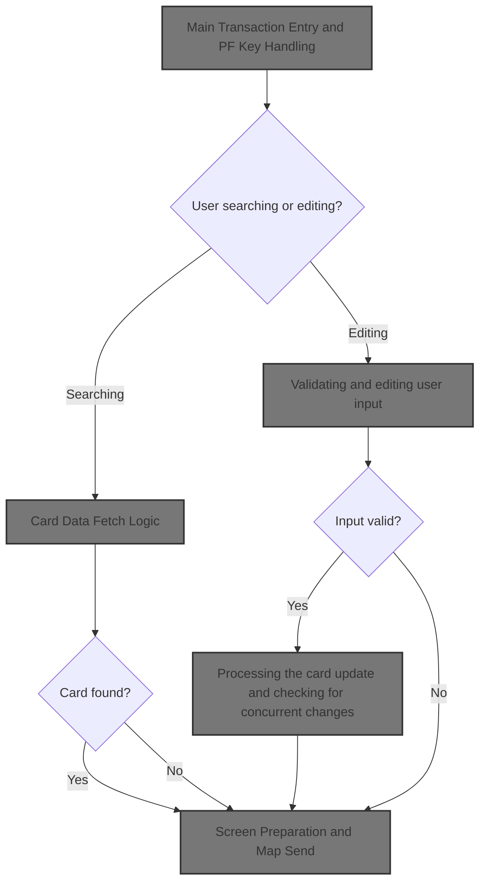

## Dependencies

### Programs

- COCRDUPC (app/cbl/COCRDUPC.cbl)
- LIT-MENUPGM
- CDEMO-FROM-PROGRAM
- CCUP

### Copybooks

- CVCRD01Y (app/cpy/CVCRD01Y.cpy)
- COCOM01Y (app/cpy/COCOM01Y.cpy)
- DFHBMSCA
- DFHAID
- COTTL01Y (app/cpy/COTTL01Y.cpy)
- COCRDUP (app/cpy-bms/COCRDUP.CPY)
- CSDAT01Y (app/cpy/CSDAT01Y.cpy)
- CSMSG01Y (app/cpy/CSMSG01Y.cpy)
- CSMSG02Y (app/cpy/CSMSG02Y.cpy)
- CSUSR01Y (app/cpy/CSUSR01Y.cpy)
- CVACT02Y (app/cpy/CVACT02Y.cpy)
- CVCUS01Y (app/cpy/CVCUS01Y.cpy)
- CSSTRPFY (app/cpy/CSSTRPFY.cpy)

## Input and Output Tables/Files used in the Program

| Table / File Name | Type | Description                                               | Usage Mode   | Key Fields / Layout Highlights |
| ----------------- | ---- | --------------------------------------------------------- | ------------ | ------------------------------ |
| LIT-CARDFILENAME  | File | Credit card details: number, account, CVV, expiry, status | Input/Output | File resource                  |

&nbsp;

# Workflow

# Main Transaction Entry and PF Key Handling

This section manages the main entry point for transaction processing, including error handling, context initialization, PF key decoding, validation, and routing to the appropriate business logic based on user input and program state.

| Rule ID | Code Location    | Category       | Rule Name                      | Description                                                                                                                                                                                                     | Conditions                                                                                                    | Remarks                                                                                                                                       |
| ------- | ---------------- | -------------- | ------------------------------ | --------------------------------------------------------------------------------------------------------------------------------------------------------------------------------------------------------------- | ------------------------------------------------------------------------------------------------------------- | --------------------------------------------------------------------------------------------------------------------------------------------- |
| BR-001  | 0000-MAIN        | Business logic | New transaction initialization | If the transaction is new (no commarea or returning from the menu program without re-entry), both the global and program-specific context areas are initialized, and the program is marked as entered.          | EIBCALEN is zero, or the previous program is the menu program and not a re-entry.                             | The menu program is identified by the constant 'COMEN01C'. The program is marked as entered by setting the context flag to 0.                 |
| BR-002  | YYYY-STORE-PFKEY | Business logic | PF key mapping                 | The program decodes the user's PF key or AID input and sets the corresponding action flag. PF keys 13-24 are mapped to the same flags as PF keys 1-12, so the program does not distinguish between them.        | Any user PF key or AID input is received.                                                                     | PF keys 1-12 and 13-24 are mapped to the same action flags (e.g., PF13 is treated as PF1). Action flags are set as boolean values.            |
| BR-003  | 0000-MAIN        | Business logic | Exit or transfer routing       | When the user requests to exit (PF3) or completes an update, the program sets the target program and transaction for transfer, updates the context, and clears account and card IDs if leaving the list screen. | User presses PF3, or changes are completed or failed on the list screen.                                      | The list screen is identified by mapset 'COCRDLI'. The menu program is 'COMEN01C'. Account and card IDs are cleared by setting them to zeros. |
| BR-004  | 0000-MAIN        | Business logic | Fetch card details on re-entry | When re-entering from the card list or after PF12, the program fetches card details for update and displays the details screen.                                                                                 | Program is entered or PF12 is pressed, and the previous program is the card list program.                     | The card list program is 'COCRDLIC'. The details are fetched by calling 9000-READ-DATA and displayed by calling 3000-SEND-MAP.                |
| BR-005  | 0000-MAIN        | Error handling | Invalid PF key fallback        | If the detected PF key is not valid for the current program state, the program sets the invalid flag and falls back to treating the input as an ENTER action.                                                   | A PF key is pressed that is not ENTER, PF3, PF5 (with changes not confirmed), or PF12 (with details fetched). | The fallback action is to set the ENTER flag to TRUE. Valid PF keys are explicitly checked in the IF statement.                               |

<SwmSnippet path="/app/cbl/COCRDUPC.cbl" line="367" repo-id="Z2l0aHViJTNBJTNBa3luZHJ5bC1hd3MtbWFpbmZyYW1lLW1vZGVybml6YXRpb24tY2FyZGRlbW8lM0ElM0FTd2ltbS1EZW1v">

---

In `0000-MAIN` this is the entry point for the transaction. The code sets up a CICS ABEND handler so any abnormal end is caught and handled by ABEND-ROUTINE. This is the first thing done to make sure the program can recover or report errors if something goes wrong.

```cobol
       0000-MAIN.                                                               
                                                                                
                                                                                
           EXEC CICS HANDLE ABEND                                               
                     LABEL(ABEND-ROUTINE)                                       
           END-EXEC                                                             
```

---

</SwmSnippet>

<SwmSnippet path="/app/cbl/COCRDUPC.cbl" line="374" repo-id="Z2l0aHViJTNBJTNBa3luZHJ5bC1hd3MtbWFpbmZyYW1lLW1vZGVybml6YXRpb24tY2FyZGRlbW8lM0ElM0FTd2ltbS1EZW1v">

---

After setting up error handling, the code initializes all working storage and commarea areas, sets the transaction ID, and clears any error message. This preps the environment for a clean transaction run, making sure no stale data or messages leak into the new flow.

```cobol
           INITIALIZE CC-WORK-AREA                                              
                      WS-MISC-STORAGE                                           
                      WS-COMMAREA                                               
      *****************************************************************         
      * Store our context                                                       
      *****************************************************************         
           MOVE LIT-THISTRANID       TO WS-TRANID                               
      *****************************************************************         
      * Ensure error message is cleared                               *         
      *****************************************************************         
           SET WS-RETURN-MSG-OFF  TO TRUE                                       
```

---

</SwmSnippet>

<SwmSnippet path="/app/cbl/COCRDUPC.cbl" line="388" repo-id="Z2l0aHViJTNBJTNBa3luZHJ5bC1hd3MtbWFpbmZyYW1lLW1vZGVybml6YXRpb24tY2FyZGRlbW8lM0ElM0FTd2ltbS1EZW1v">

---

Here the code checks if this is a new transaction or a re-entry. If it's new, it initializes both the global and program-specific commareas. If not, it splits the incoming DFHCOMMAREA into CARDDEMO-COMMAREA (global) and WS-THIS-PROGCOMMAREA (local) using substring moves. This keeps transaction and program state separate and consistent across calls.

```cobol
           IF EIBCALEN IS EQUAL TO 0                                            
               OR (CDEMO-FROM-PROGRAM = LIT-MENUPGM                             
               AND NOT CDEMO-PGM-REENTER)                                       
              INITIALIZE CARDDEMO-COMMAREA                                      
                         WS-THIS-PROGCOMMAREA                                   
              SET CDEMO-PGM-ENTER TO TRUE                                       
              SET CCUP-DETAILS-NOT-FETCHED TO TRUE                              
           ELSE                                                                 
              MOVE DFHCOMMAREA (1:LENGTH OF CARDDEMO-COMMAREA)  TO              
                                CARDDEMO-COMMAREA                               
              MOVE DFHCOMMAREA(LENGTH OF CARDDEMO-COMMAREA + 1:                 
                               LENGTH OF WS-THIS-PROGCOMMAREA ) TO              
                                WS-THIS-PROGCOMMAREA                            
           END-IF                                                               
```

---

</SwmSnippet>

<SwmSnippet path="/app/cbl/COCRDUPC.cbl" line="406" repo-id="Z2l0aHViJTNBJTNBa3luZHJ5bC1hd3MtbWFpbmZyYW1lLW1vZGVybml6YXRpb24tY2FyZGRlbW8lM0ElM0FTd2ltbS1EZW1v">

---

After setting up the commarea, we call YYYY-STORE-PFKEY (in app/cpy/CSSTRPFY.cpy). This routine decodes which PF key or AID was pressed and sets the corresponding flags in the common area, so the rest of the logic can branch based on user input.

```cobol
           PERFORM YYYY-STORE-PFKEY                                             
              THRU YYYY-STORE-PFKEY-EXIT                                        
```

---

</SwmSnippet>

<SwmSnippet path="/app/cpy/CSSTRPFY.cpy" line="17" repo-id="Z2l0aHViJTNBJTNBa3luZHJ5bC1hd3MtbWFpbmZyYW1lLW1vZGVybml6YXRpb24tY2FyZGRlbW8lM0ElM0FTd2ltbS1EZW1v">

---

`YYYY-STORE-PFKEY` checks the EIBAID value and sets the matching CCARD-AID flag (like ENTER, CLEAR, PF01, etc.) to TRUE. PF keys 13-24 are mapped to the same flags as 1-12, so the program doesn't distinguish between them. This makes it easy for the rest of the code to check which key was pressed.

```cobol
       YYYY-STORE-PFKEY.                                                        
      *****************************************************************         
      * Map AID to PFKey in COMMON Area                                         
      *****************************************************************         
           EVALUATE TRUE                                                        
             WHEN EIBAID IS EQUAL TO DFHENTER                                   
               SET CCARD-AID-ENTER TO TRUE                                      
             WHEN EIBAID IS EQUAL TO DFHCLEAR                                   
               SET CCARD-AID-CLEAR TO TRUE                                      
             WHEN EIBAID IS EQUAL TO DFHPA1                                     
               SET CCARD-AID-PA1  TO TRUE                                       
             WHEN EIBAID IS EQUAL TO DFHPA2                                     
               SET CCARD-AID-PA2  TO TRUE                                       
             WHEN EIBAID IS EQUAL TO DFHPF1                                     
               SET CCARD-AID-PFK01 TO TRUE                                      
             WHEN EIBAID IS EQUAL TO DFHPF2                                     
               SET CCARD-AID-PFK02 TO TRUE                                      
             WHEN EIBAID IS EQUAL TO DFHPF3                                     
               SET CCARD-AID-PFK03 TO TRUE                                      
             WHEN EIBAID IS EQUAL TO DFHPF4                                     
               SET CCARD-AID-PFK04 TO TRUE                                      
             WHEN EIBAID IS EQUAL TO DFHPF5                                     
               SET CCARD-AID-PFK05 TO TRUE                                      
             WHEN EIBAID IS EQUAL TO DFHPF6                                     
               SET CCARD-AID-PFK06 TO TRUE                                      
             WHEN EIBAID IS EQUAL TO DFHPF7                                     
               SET CCARD-AID-PFK07 TO TRUE                                      
             WHEN EIBAID IS EQUAL TO DFHPF8                                     
               SET CCARD-AID-PFK08 TO TRUE                                      
             WHEN EIBAID IS EQUAL TO DFHPF9                                     
               SET CCARD-AID-PFK09 TO TRUE                                      
             WHEN EIBAID IS EQUAL TO DFHPF10                                    
               SET CCARD-AID-PFK10 TO TRUE                                      
             WHEN EIBAID IS EQUAL TO DFHPF11                                    
               SET CCARD-AID-PFK11 TO TRUE                                      
             WHEN EIBAID IS EQUAL TO DFHPF12                                    
               SET CCARD-AID-PFK12 TO TRUE                                      
             WHEN EIBAID IS EQUAL TO DFHPF13                                    
               SET CCARD-AID-PFK01 TO TRUE                                      
             WHEN EIBAID IS EQUAL TO DFHPF14                                    
               SET CCARD-AID-PFK02 TO TRUE                                      
             WHEN EIBAID IS EQUAL TO DFHPF15                                    
               SET CCARD-AID-PFK03 TO TRUE                                      
             WHEN EIBAID IS EQUAL TO DFHPF16                                    
               SET CCARD-AID-PFK04 TO TRUE                                      
             WHEN EIBAID IS EQUAL TO DFHPF17                                    
               SET CCARD-AID-PFK05 TO TRUE                                      
             WHEN EIBAID IS EQUAL TO DFHPF18                                    
               SET CCARD-AID-PFK06 TO TRUE                                      
             WHEN EIBAID IS EQUAL TO DFHPF19                                    
               SET CCARD-AID-PFK07 TO TRUE                                      
             WHEN EIBAID IS EQUAL TO DFHPF20                                    
               SET CCARD-AID-PFK08 TO TRUE                                      
             WHEN EIBAID IS EQUAL TO DFHPF21                                    
               SET CCARD-AID-PFK09 TO TRUE                                      
             WHEN EIBAID IS EQUAL TO DFHPF22                                    
               SET CCARD-AID-PFK10 TO TRUE                                      
             WHEN EIBAID IS EQUAL TO DFHPF23                                    
               SET CCARD-AID-PFK11 TO TRUE                                      
             WHEN EIBAID IS EQUAL TO DFHPF24                                    
               SET CCARD-AID-PFK12 TO TRUE                                      
           END-EVALUATE                                                         
```

---

</SwmSnippet>

<SwmSnippet path="/app/cbl/COCRDUPC.cbl" line="413" repo-id="Z2l0aHViJTNBJTNBa3luZHJ5bC1hd3MtbWFpbmZyYW1lLW1vZGVybml6YXRpb24tY2FyZGRlbW8lM0ElM0FTd2ltbS1EZW1v">

---

Back in `0000-MAIN`, after returning from the PF key mapping routine, the code checks if the pressed key is valid for the current state. If not, it sets the invalid flag. This keeps the flow on track and prevents unsupported actions.

```cobol
           SET PFK-INVALID TO TRUE                                              
           IF CCARD-AID-ENTER OR                                                
              CCARD-AID-PFK03 OR                                                
              (CCARD-AID-PFK05 AND CCUP-CHANGES-OK-NOT-CONFIRMED)               
                              OR                                                
              (CCARD-AID-PFK12 AND NOT CCUP-DETAILS-NOT-FETCHED)                
              SET PFK-VALID TO TRUE                                             
           END-IF                                                               
```

---

</SwmSnippet>

<SwmSnippet path="/app/cbl/COCRDUPC.cbl" line="422" repo-id="Z2l0aHViJTNBJTNBa3luZHJ5bC1hd3MtbWFpbmZyYW1lLW1vZGVybml6YXRpb24tY2FyZGRlbW8lM0ElM0FTd2ltbS1EZW1v">

---

If the PF key is invalid, the code in `0000-MAIN` sets the ENTER flag so the flow continues as if ENTER was pressed. This is a fallback to keep the transaction in a safe state.

```cobol
           IF PFK-INVALID                                                       
              SET CCARD-AID-ENTER TO TRUE                                       
           END-IF                                                               
```

---

</SwmSnippet>

<SwmSnippet path="/app/cbl/COCRDUPC.cbl" line="429" repo-id="Z2l0aHViJTNBJTNBa3luZHJ5bC1hd3MtbWFpbmZyYW1lLW1vZGVybml6YXRpb24tY2FyZGRlbW8lM0ElM0FTd2ltbS1EZW1v">

---

This is the main decision block in `0000-MAIN`. It checks which PF key was pressed and the current program state, then routes the flow to the right branch: exit, fetch details, prompt for keys, or process updates. Each WHEN handles a specific user action or state transition.

```cobol
           EVALUATE TRUE                                                        
      ******************************************************************        
      *       USER PRESSES PF03 TO EXIT                                         
      *  OR   USER IS DONE WITH UPDATE                                          
      *            XCTL TO CALLING PROGRAM OR MAIN MENU                         
      ******************************************************************        
              WHEN CCARD-AID-PFK03                                              
              WHEN (CCUP-CHANGES-OKAYED-AND-DONE                                
               AND  CDEMO-LAST-MAPSET   EQUAL LIT-CCLISTMAPSET)                 
              WHEN (CCUP-CHANGES-FAILED                                         
               AND  CDEMO-LAST-MAPSET   EQUAL LIT-CCLISTMAPSET)                 
                   SET CCARD-AID-PFK03     TO TRUE                              
                                                                                
                   IF CDEMO-FROM-TRANID    EQUAL LOW-VALUES                     
                   OR CDEMO-FROM-TRANID    EQUAL SPACES                         
                      MOVE LIT-MENUTRANID  TO CDEMO-TO-TRANID                   
                   ELSE                                                         
                      MOVE CDEMO-FROM-TRANID  TO CDEMO-TO-TRANID                
                   END-IF                                                       
```

---

</SwmSnippet>

<SwmSnippet path="/app/cbl/COCRDUPC.cbl" line="449" repo-id="Z2l0aHViJTNBJTNBa3luZHJ5bC1hd3MtbWFpbmZyYW1lLW1vZGVybml6YXRpb24tY2FyZGRlbW8lM0ElM0FTd2ltbS1EZW1v">

---

After deciding to exit or transfer, the code sets up the target program name (CDEMO-TO-PROGRAM) based on whether we're coming from a menu or another program. This keeps the return path straight for program chaining.

```cobol
                   IF CDEMO-FROM-PROGRAM   EQUAL LOW-VALUES                     
                   OR CDEMO-FROM-PROGRAM   EQUAL SPACES                         
                      MOVE LIT-MENUPGM     TO CDEMO-TO-PROGRAM                  
                   ELSE                                                         
                      MOVE CDEMO-FROM-PROGRAM TO CDEMO-TO-PROGRAM               
                   END-IF                                                       
```

---

</SwmSnippet>

<SwmSnippet path="/app/cbl/COCRDUPC.cbl" line="456" repo-id="Z2l0aHViJTNBJTNBa3luZHJ5bC1hd3MtbWFpbmZyYW1lLW1vZGVybml6YXRpb24tY2FyZGRlbW8lM0ElM0FTd2ltbS1EZW1v">

---

Before transferring control, the code updates the FROM fields to track where we're coming from, and if we're leaving the list screen, it clears the account and card IDs to reset the search state.

```cobol
                   MOVE LIT-THISTRANID     TO CDEMO-FROM-TRANID                 
                   MOVE LIT-THISPGM        TO CDEMO-FROM-PROGRAM                
                                                                                
                   IF CDEMO-LAST-MAPSET    EQUAL LIT-CCLISTMAPSET               
                       MOVE ZEROS          TO CDEMO-ACCT-ID                     
                                              CDEMO-CARD-NUM                    
                   END-IF                                                       
```

---

</SwmSnippet>

<SwmSnippet path="/app/cbl/COCRDUPC.cbl" line="464" repo-id="Z2l0aHViJTNBJTNBa3luZHJ5bC1hd3MtbWFpbmZyYW1lLW1vZGVybml6YXRpb24tY2FyZGRlbW8lM0ElM0FTd2ltbS1EZW1v">

---

Right before transferring control, the code sets user type, marks the program as entered, updates the map and mapset names, and calls SYNCPOINT to commit any changes. This keeps the transaction state consistent.

```cobol
                   SET  CDEMO-USRTYP-USER  TO TRUE                              
                   SET  CDEMO-PGM-ENTER    TO TRUE                              
                   MOVE LIT-THISMAPSET     TO CDEMO-LAST-MAPSET                 
                   MOVE LIT-THISMAP        TO CDEMO-LAST-MAP                    
                                                                                
                   EXEC CICS                                                    
                        SYNCPOINT                                               
                   END-EXEC                                                     
```

---

</SwmSnippet>

<SwmSnippet path="/app/cbl/COCRDUPC.cbl" line="473" repo-id="Z2l0aHViJTNBJTNBa3luZHJ5bC1hd3MtbWFpbmZyYW1lLW1vZGVybml6YXRpb24tY2FyZGRlbW8lM0ElM0FTd2ltbS1EZW1v">

---

Here we use EXEC CICS XCTL to transfer control to the target program, passing along the commarea. This hands off the transaction and doesn't return.

```cobol
                   EXEC CICS XCTL                                               
                        PROGRAM (CDEMO-TO-PROGRAM)                              
                        COMMAREA(CARDDEMO-COMMAREA)                             
                   END-EXEC                                                     
```

---

</SwmSnippet>

<SwmSnippet path="/app/cbl/COCRDUPC.cbl" line="482" repo-id="Z2l0aHViJTNBJTNBa3luZHJ5bC1hd3MtbWFpbmZyYW1lLW1vZGVybml6YXRpb24tY2FyZGRlbW8lM0ElM0FTd2ltbS1EZW1v">

---

When the flow detects a re-entry from the card list or PF12, it calls 9000-READ-DATA to fetch card details for update. This only happens in those cases; otherwise, the user is prompted for search keys.

```cobol
              WHEN CDEMO-PGM-ENTER                                              
               AND CDEMO-FROM-PROGRAM  EQUAL LIT-CCLISTPGM                      
              WHEN CCARD-AID-PFK12                                              
               AND CDEMO-FROM-PROGRAM  EQUAL LIT-CCLISTPGM                      
                   SET CDEMO-PGM-REENTER    TO TRUE                             
                   SET INPUT-OK             TO TRUE                             
                   SET FLG-ACCTFILTER-ISVALID  TO TRUE                          
                   SET FLG-CARDFILTER-ISVALID  TO TRUE                          
                   MOVE CDEMO-ACCT-ID       TO CC-ACCT-ID-N                     
                   MOVE CDEMO-CARD-NUM      TO CC-CARD-NUM-N                    
                   PERFORM 9000-READ-DATA                                       
                      THRU 9000-READ-DATA-EXIT                                  
                   SET CCUP-SHOW-DETAILS TO TRUE                                
                   PERFORM 3000-SEND-MAP                                        
                      THRU 3000-SEND-MAP-EXIT                                   
                   GO TO COMMON-RETURN                                          
```

---

</SwmSnippet>

## Card Data Fetch Logic

This section is responsible for preparing and fetching card details based on provided account and card identifiers. It ensures that the correct data is copied, initialized, and retrieved for further processing.

| Rule ID | Code Location  | Category       | Rule Name                                | Description                                                                                                                                                                     | Conditions                                                                        | Remarks                                                                                                                                                                 |
| ------- | -------------- | -------------- | ---------------------------------------- | ------------------------------------------------------------------------------------------------------------------------------------------------------------------------------- | --------------------------------------------------------------------------------- | ----------------------------------------------------------------------------------------------------------------------------------------------------------------------- |
| BR-001  | 9000-READ-DATA | Business logic | Prepare card fetch input                 | When a card data fetch is initiated, the system must copy the provided account ID and card number into the old details structure before attempting to retrieve the card record. | A card data fetch is requested in this section.                                   | Account ID is an alphanumeric string of length 11. Card number is an alphanumeric string of length 16. Both must be copied exactly as provided.                         |
| BR-002  | 9000-READ-DATA | Business logic | Fetch card record by account and card ID | The system must fetch the card record using the provided account ID and card number, populating the old details structure with the card's attributes if found.                  | A card data fetch is requested and account ID and card number have been prepared. | Card record includes: card number (16 chars), account ID (11 chars), CVV code (3 digits), embossed name (50 chars), expiration date (10 chars), active status (1 char). |
| BR-003  | 9000-READ-DATA | Business logic | Initialize card details structure        | The old details structure must be initialized before copying account and card identifiers and fetching the card record.                                                         | A card data fetch is requested in this section.                                   | All fields in the old details structure are set to their default values (typically spaces or low-values) before new data is copied in.                                  |

<SwmSnippet path="/app/cbl/COCRDUPC.cbl" line="1343" repo-id="Z2l0aHViJTNBJTNBa3luZHJ5bC1hd3MtbWFpbmZyYW1lLW1vZGVybml6YXRpb24tY2FyZGRlbW8lM0ElM0FTd2ltbS1EZW1v">

---

In `9000-READ-DATA`, we prep the old details and copy the account/card IDs, then call 9100-GETCARD-BYACCTCARD to actually read the card record from the file. This is where the data fetch happens.

```cobol
       9000-READ-DATA.                                                          
                                                                                
           INITIALIZE CCUP-OLD-DETAILS                                          
           MOVE CC-ACCT-ID              TO CCUP-OLD-ACCTID                      
           MOVE CC-CARD-NUM             TO CCUP-OLD-CARDID                      
                                                                                
           PERFORM 9100-GETCARD-BYACCTCARD                                      
              THRU 9100-GETCARD-BYACCTCARD-EXIT                                 
```

---

</SwmSnippet>

### Card File Read and Result Handling

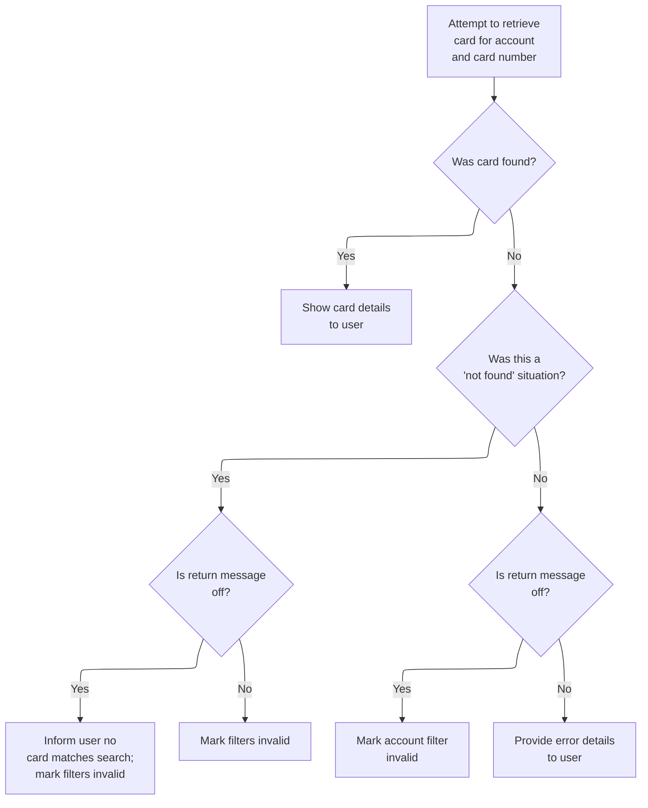

This section retrieves card details for a given account and card number, and provides user-facing feedback about the result, including handling not found and error cases.

| Rule ID | Code Location           | Category       | Rule Name                      | Description                                                                                                                                                                                                 | Conditions                                                                                                                          | Remarks                                                                                                                                                                                                                                                                                                                          |
| ------- | ----------------------- | -------------- | ------------------------------ | ----------------------------------------------------------------------------------------------------------------------------------------------------------------------------------------------------------- | ----------------------------------------------------------------------------------------------------------------------------------- | -------------------------------------------------------------------------------------------------------------------------------------------------------------------------------------------------------------------------------------------------------------------------------------------------------------------------------- |
| BR-001  | 9100-GETCARD-BYACCTCARD | Business logic | Card found result              | When a card matching the provided account ID and card number is found in the card file, the system marks the card as found and prepares the card details for display to the user.                           | A card record exists in the card file for the given account ID and card number, and the response code from the file read is NORMAL. | The card file name is 'CARDDAT '. The found flag is set to TRUE, which results in the message 'Details of selected card shown above' being prepared for the user.                                                                                                                                                                |
| BR-002  | 9100-GETCARD-BYACCTCARD | Error handling | Card not found handling        | If no card is found for the given account ID and card number, the system marks input and filter errors, and if return messages are enabled, informs the user that no card matches the search condition.     | No card record exists for the given account ID and card number, and the response code from the file read is NOTFND.                 | The card file name is 'CARDDAT '. Input error flag is set to TRUE ('1'). Account and card filter flags are set to NOT-OK ('0'). If return message is off (WS-RETURN-MSG-OFF = SPACES), the message 'Did not find cards for this search condition' is set for the user.                                                           |
| BR-003  | 9100-GETCARD-BYACCTCARD | Error handling | Card file read error reporting | If an error other than 'not found' occurs during the card file read, the system marks input and account filter errors, and sets error reporting fields to provide diagnostic information and user messages. | An error occurs during the card file read that is not a 'not found' situation (response code is OTHER).                             | The card file name is 'CARDDAT '. Input error flag is set to TRUE ('1'). Account filter flag may be set to NOT-OK ('0') if return message is off. Error reporting fields are populated: operation name is 'READ', file name is 'CARDDAT ', response code and reason code are set, and an error message is prepared for the user. |

<SwmSnippet path="/app/cbl/COCRDUPC.cbl" line="1376" repo-id="Z2l0aHViJTNBJTNBa3luZHJ5bC1hd3MtbWFpbmZyYW1lLW1vZGVybml6YXRpb24tY2FyZGRlbW8lM0ElM0FTd2ltbS1EZW1v">

---

In `9100-GETCARD-BYACCTCARD`, we set up the card number for the read (handling wildcards/blanks), then do a CICS READ on the card file. The response code is checked later to set flags for found, not found, or error cases.

```cobol
       9100-GETCARD-BYACCTCARD.                                                 
      *    Read the Card file                                                   
      *                                                                         
      *    MOVE CC-ACCT-ID-N            TO WS-CARD-RID-ACCT-ID                  
           MOVE CC-CARD-NUM             TO WS-CARD-RID-CARDNUM                  
                                                                                
           EXEC CICS READ                                                       
                FILE      (LIT-CARDFILENAME)                                    
                RIDFLD    (WS-CARD-RID-CARDNUM)                                 
                KEYLENGTH (LENGTH OF WS-CARD-RID-CARDNUM)                       
                INTO      (CARD-RECORD)                                         
                LENGTH    (LENGTH OF CARD-RECORD)                               
                RESP      (WS-RESP-CD)                                          
                RESP2     (WS-REAS-CD)                                          
           END-EXEC                                                             
```

---

</SwmSnippet>

<SwmSnippet path="/app/cbl/COCRDUPC.cbl" line="1392" repo-id="Z2l0aHViJTNBJTNBa3luZHJ5bC1hd3MtbWFpbmZyYW1lLW1vZGVybml6YXRpb24tY2FyZGRlbW8lM0ElM0FTd2ltbS1EZW1v">

---

After the file read, the code checks the response code. If it's NORMAL, it sets the found flag so the rest of the flow knows the card was located.

```cobol
           EVALUATE WS-RESP-CD                                                  
               WHEN DFHRESP(NORMAL)                                             
                  SET FOUND-CARDS-FOR-ACCOUNT TO TRUE                           
```

---

</SwmSnippet>

<SwmSnippet path="/app/cbl/COCRDUPC.cbl" line="1395" repo-id="Z2l0aHViJTNBJTNBa3luZHJ5bC1hd3MtbWFpbmZyYW1lLW1vZGVybml6YXRpb24tY2FyZGRlbW8lM0ElM0FTd2ltbS1EZW1v">

---

If the card isn't found, the code sets error flags for input, account, and card filters, and may set a 'not found' message for the user.

```cobol
               WHEN DFHRESP(NOTFND)                                             
                  SET INPUT-ERROR                    TO TRUE                    
                  SET FLG-ACCTFILTER-NOT-OK          TO TRUE                    
                  SET FLG-CARDFILTER-NOT-OK          TO TRUE                    
                  IF  WS-RETURN-MSG-OFF                                         
                     SET DID-NOT-FIND-ACCTCARD-COMBO TO TRUE                    
                  END-IF                                                        
```

---

</SwmSnippet>

<SwmSnippet path="/app/cbl/COCRDUPC.cbl" line="1402" repo-id="Z2l0aHViJTNBJTNBa3luZHJ5bC1hd3MtbWFpbmZyYW1lLW1vZGVybml6YXRpb24tY2FyZGRlbW8lM0ElM0FTd2ltbS1EZW1v">

---

For any other error, the code sets input and account filter errors, and fills out error reporting fields so diagnostics and user messages are set up.

```cobol
               WHEN OTHER                                                       
                  SET INPUT-ERROR                    TO TRUE                    
                  IF  WS-RETURN-MSG-OFF                                         
                      SET FLG-ACCTFILTER-NOT-OK      TO TRUE                    
                  END-IF                                                        
                  MOVE 'READ'                        TO ERROR-OPNAME            
                  MOVE LIT-CARDFILENAME              TO ERROR-FILE              
                  MOVE WS-RESP-CD                    TO ERROR-RESP              
                  MOVE WS-REAS-CD                    TO ERROR-RESP2             
                  MOVE WS-FILE-ERROR-MESSAGE         TO WS-RETURN-MSG           
           END-EVALUATE                                                         
```

---

</SwmSnippet>

### Card Data Post-Read Processing

This section handles the post-processing of card data after a successful card lookup, ensuring that card details are transferred, formatted, and parsed for further business use.

| Rule ID | Code Location | Category       | Rule Name                            | Description                                                                                                                                                                                | Conditions                                                                                                       | Remarks                                                                                                                                                                                                                                                                          |
| ------- | ------------- | -------------- | ------------------------------------ | ------------------------------------------------------------------------------------------------------------------------------------------------------------------------------------------ | ---------------------------------------------------------------------------------------------------------------- | -------------------------------------------------------------------------------------------------------------------------------------------------------------------------------------------------------------------------------------------------------------------------------- |
| BR-001  | MAIN-LOGIC    | Business logic | Card details transfer on found       | When a card is found for the account, the card's CVV, cardholder name, expiration date, and active status are copied to the corresponding output fields for further processing or display. | This rule applies when the card lookup operation indicates a card was found for the account (found flag is set). | The output fields for CVV, cardholder name, expiration year, month, day, and active status are updated. The cardholder name is converted to uppercase before being copied. The expiration date is parsed into a 4-character year, 2-character month, and 2-character day string. |
| BR-002  | MAIN-LOGIC    | Business logic | Cardholder name uppercase conversion | The cardholder name is always converted to uppercase before being stored in the output field, ensuring consistent formatting for display or downstream processing.                         | This rule applies when a card is found for the account and the cardholder name is present.                       | The conversion uses the constants 'abcdefghijklmnopqrstuvwxyz' and 'ABCDEFGHIJKLMNOPQRSTUVWXYZ' to map lowercase to uppercase letters. The output field for the cardholder name is a 50-character string.                                                                        |
| BR-003  | MAIN-LOGIC    | Business logic | Expiration date parsing              | The card expiration date is parsed into separate year, month, and day fields for use in business logic, validation, or display.                                                            | This rule applies when a card is found for the account and the expiration date is present.                       | The expiration date is parsed as follows: year is the first 4 characters, month is characters 6-7, and day is characters 9-10. The output fields are a 4-character string for year, a 2-character string for month, and a 2-character string for day.                            |

<SwmSnippet path="/app/cbl/COCRDUPC.cbl" line="1352" repo-id="Z2l0aHViJTNBJTNBa3luZHJ5bC1hd3MtbWFpbmZyYW1lLW1vZGVybml6YXRpb24tY2FyZGRlbW8lM0ElM0FTd2ltbS1EZW1v">

---

After returning from `9100-GETCARD-BYACCTCARD`, if the card was found, we copy the details to the old fields, convert the card name to uppercase, and parse the expiration date into year, month, and day fields. This only happens if the found flag is set.

```cobol
           IF FOUND-CARDS-FOR-ACCOUNT                                           
                                                                                
              MOVE CARD-CVV-CD          TO CCUP-OLD-CVV-CD                      
                                                                                
              INSPECT CARD-EMBOSSED-NAME                                        
              CONVERTING LIT-LOWER                                              
                      TO LIT-UPPER                                              
                                                                                
              MOVE CARD-EMBOSSED-NAME   TO CCUP-OLD-CRDNAME                     
              MOVE CARD-EXPIRAION-DATE(1:4)                                     
                                        TO CCUP-OLD-EXPYEAR                     
              MOVE CARD-EXPIRAION-DATE(6:2)                                     
                                        TO CCUP-OLD-EXPMON                      
              MOVE CARD-EXPIRAION-DATE(9:2)                                     
                                        TO CCUP-OLD-EXPDAY                      
              MOVE CARD-ACTIVE-STATUS   TO CCUP-OLD-CRDSTCD                     
                                                                                
           END-IF                                                               
```

---

</SwmSnippet>

## Screen Preparation and Map Send

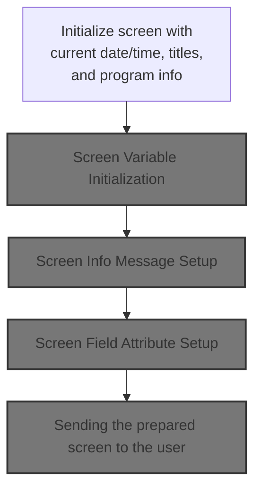

This section prepares and sends the main user screen, ensuring it displays current date/time, program context, static titles, and all necessary info and attributes for user interaction.

| Rule ID | Code Location    | Category       | Rule Name                              | Description                                                                                                           | Conditions                                                  | Remarks                                                                                                                                                  |
| ------- | ---------------- | -------------- | -------------------------------------- | --------------------------------------------------------------------------------------------------------------------- | ----------------------------------------------------------- | -------------------------------------------------------------------------------------------------------------------------------------------------------- |
| BR-001  | 3100-SCREEN-INIT | Business logic | Current date and time display          | The screen must display the current date and time, formatted for user readability, each time it is prepared and sent. | Whenever the screen is initialized for display to the user. | Date is shown in MM-DD-YY format; time is shown in HH-MM-SS format. These are alphanumeric strings, left-aligned, with no padding specified in the code. |
| BR-002  | 3100-SCREEN-INIT | Business logic | Static titles and program info display | The screen must display static titles and program identifiers to provide context for the user.                        | Whenever the screen is initialized for display to the user. | Titles and program IDs are alphanumeric strings, left-aligned, with no padding specified in the code. The values are sourced from constants.             |
| BR-003  | 3100-SCREEN-INIT | Business logic | Screen clearing before display         | The screen must be cleared of previous data before new information is displayed.                                      | Whenever the screen is initialized for display to the user. | All fields are reset to their lowest possible value (blank or zero) before new data is populated.                                                        |
| BR-004  | 3000-SEND-MAP    | Business logic | Screen variable and attribute setup    | Screen variables, info messages, and field attributes must be set up before the screen is sent to the user.           | Whenever the screen is prepared for display.                | Variables, info messages, and attributes are set up in modular steps, ensuring all necessary context and formatting is applied before display.           |

<SwmSnippet path="/app/cbl/COCRDUPC.cbl" line="1035" repo-id="Z2l0aHViJTNBJTNBa3luZHJ5bC1hd3MtbWFpbmZyYW1lLW1vZGVybml6YXRpb24tY2FyZGRlbW8lM0ElM0FTd2ltbS1EZW1v">

---

`3000-SEND-MAP` runs a sequence of routines to prep and send the screen: it initializes the screen, sets up variables, info messages, attributes, and finally sends the map. Each step is modular for clarity and maintenance.

```cobol
       3000-SEND-MAP.                                                           
           PERFORM 3100-SCREEN-INIT                                             
              THRU 3100-SCREEN-INIT-EXIT                                        
           PERFORM 3200-SETUP-SCREEN-VARS                                       
              THRU 3200-SETUP-SCREEN-VARS-EXIT                                  
           PERFORM 3250-SETUP-INFOMSG                                           
              THRU 3250-SETUP-INFOMSG-EXIT                                      
           PERFORM 3300-SETUP-SCREEN-ATTRS                                      
              THRU 3300-SETUP-SCREEN-ATTRS-EXIT                                 
           PERFORM 3400-SEND-SCREEN                                             
              THRU 3400-SEND-SCREEN-EXIT                                        
```

---

</SwmSnippet>

<SwmSnippet path="/app/cbl/COCRDUPC.cbl" line="1052" repo-id="Z2l0aHViJTNBJTNBa3luZHJ5bC1hd3MtbWFpbmZyYW1lLW1vZGVybml6YXRpb24tY2FyZGRlbW8lM0ElM0FTd2ltbS1EZW1v">

---

`3100-SCREEN-INIT` clears the screen data, sets the current date and time in display format, and fills in static titles and program IDs. This gets the screen ready with up-to-date info and context.

```cobol
       3100-SCREEN-INIT.                                                        
           MOVE LOW-VALUES TO CCRDUPAO                                          
                                                                                
           MOVE FUNCTION CURRENT-DATE     TO WS-CURDATE-DATA                    
                                                                                
           MOVE CCDA-TITLE01              TO TITLE01O OF CCRDUPAO               
           MOVE CCDA-TITLE02              TO TITLE02O OF CCRDUPAO               
           MOVE LIT-THISTRANID            TO TRNNAMEO OF CCRDUPAO               
           MOVE LIT-THISPGM               TO PGMNAMEO OF CCRDUPAO               
                                                                                
           MOVE FUNCTION CURRENT-DATE     TO WS-CURDATE-DATA                    
                                                                                
           MOVE WS-CURDATE-MONTH          TO WS-CURDATE-MM                      
           MOVE WS-CURDATE-DAY            TO WS-CURDATE-DD                      
           MOVE WS-CURDATE-YEAR(3:2)      TO WS-CURDATE-YY                      
                                                                                
           MOVE WS-CURDATE-MM-DD-YY       TO CURDATEO OF CCRDUPAO               
                                                                                
           MOVE WS-CURTIME-HOURS          TO WS-CURTIME-HH                      
           MOVE WS-CURTIME-MINUTE         TO WS-CURTIME-MM                      
           MOVE WS-CURTIME-SECOND         TO WS-CURTIME-SS                      
                                                                                
           MOVE WS-CURTIME-HH-MM-SS       TO CURTIMEO OF CCRDUPAO               
                                                                                
           .                                                                    
```

---

</SwmSnippet>

### Screen Variable Initialization

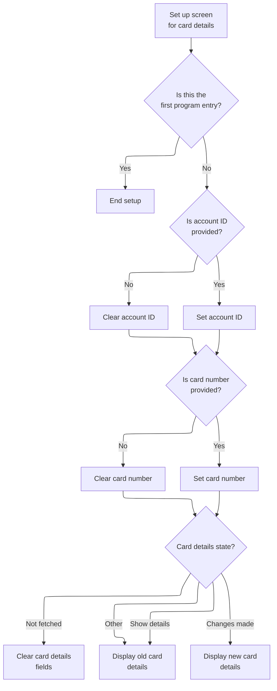

This section initializes the screen variables for card details, ensuring the UI displays the correct account and card information based on entry context and workflow state.

| Rule ID | Code Location          | Category       | Rule Name                         | Description                                                                                                                                                                    | Conditions                                                                   | Remarks                                                                                                                                                                                                                                                                                                                                                                                          |
| ------- | ---------------------- | -------------- | --------------------------------- | ------------------------------------------------------------------------------------------------------------------------------------------------------------------------------ | ---------------------------------------------------------------------------- | ------------------------------------------------------------------------------------------------------------------------------------------------------------------------------------------------------------------------------------------------------------------------------------------------------------------------------------------------------------------------------------------------ |
| BR-001  | 3200-SETUP-SCREEN-VARS | Business logic | First entry screen skip           | If this is the first entry into the program, no account or card details are set up on the screen.                                                                              | Program entry context indicates first entry (CDEMO-PGM-CONTEXT = 0).         | No account or card details are shown; all fields remain in their default state.                                                                                                                                                                                                                                                                                                                  |
| BR-002  | 3200-SETUP-SCREEN-VARS | Business logic | Account/card field clearing       | If the account ID or card number is zero, the corresponding screen field is cleared; otherwise, the actual value is shown.                                                     | Account ID or card number is zero.                                           | Cleared fields are set to the lowest possible value (LOW-VALUES). Displayed fields show the actual account ID (up to 11 digits) or card number (up to 16 digits).                                                                                                                                                                                                                                |
| BR-003  | 3200-SETUP-SCREEN-VARS | Business logic | Card details display state        | The card details fields are cleared, populated with old values, or updated with new values depending on the workflow state: not fetched, show details, changes made, or other. | Workflow state is one of: not fetched, show details, changes made, or other. | If not fetched, all card detail fields (name, status code, expiration day/month/year) are cleared (set to LOW-VALUES). If showing details or other, old values are displayed. If changes made, new values are shown except expiration day, which always shows the old value. Name: up to 50 characters, status code: 1 character, expiration: day (2 digits), month (2 digits), year (4 digits). |
| BR-004  | 3200-SETUP-SCREEN-VARS | Business logic | Expiration day update restriction | When changes are made to card details, the expiration day field is not updated and always displays the old value.                                                              | Workflow state is 'changes made'.                                            | Expiration day field (2 digits) always shows the old value, even if new data is present.                                                                                                                                                                                                                                                                                                         |

<SwmSnippet path="/app/cbl/COCRDUPC.cbl" line="1082" repo-id="Z2l0aHViJTNBJTNBa3luZHJ5bC1hd3MtbWFpbmZyYW1lLW1vZGVybml6YXRpb24tY2FyZGRlbW8lM0ElM0FTd2ltbS1EZW1v">

---

In `3200-SETUP-SCREEN-VARS`, we check if this is a first-time entry. If not, we either clear or pre-populate the account and card fields based on whether the numeric values are zero. This keeps the screen clean or filled as needed.

```cobol
       3200-SETUP-SCREEN-VARS.                                                  
      *    INITIALIZE SEARCH CRITERIA                                           
           IF CDEMO-PGM-ENTER                                                   
              CONTINUE                                                          
```

---

</SwmSnippet>

<SwmSnippet path="/app/cbl/COCRDUPC.cbl" line="1086" repo-id="Z2l0aHViJTNBJTNBa3luZHJ5bC1hd3MtbWFpbmZyYW1lLW1vZGVybml6YXRpb24tY2FyZGRlbW8lM0ElM0FTd2ltbS1EZW1v">

---

If the numeric account or card fields are zero, we clear the corresponding screen fields; otherwise, we show the actual values. This keeps the UI clean and avoids junk data.

```cobol
           ELSE                                                                 
              IF CC-ACCT-ID-N = 0                                               
                 MOVE LOW-VALUES          TO ACCTSIDO OF CCRDUPAO               
              ELSE                                                              
                 MOVE CC-ACCT-ID          TO ACCTSIDO OF CCRDUPAO               
              END-IF                                                            
                                                                                
              IF CC-CARD-NUM-N = 0                                              
                MOVE LOW-VALUES           TO CARDSIDO OF CCRDUPAO               
              ELSE                                                              
                MOVE CC-CARD-NUM          TO CARDSIDO OF CCRDUPAO               
              END-IF                                                            
```

---

</SwmSnippet>

<SwmSnippet path="/app/cbl/COCRDUPC.cbl" line="1099" repo-id="Z2l0aHViJTNBJTNBa3luZHJ5bC1hd3MtbWFpbmZyYW1lLW1vZGVybml6YXRpb24tY2FyZGRlbW8lM0ElM0FTd2ltbS1EZW1v">

---

The EVALUATE TRUE here picks which card details to show based on the state: blank if not fetched, old if showing details, new if changes made, or old for any other case. This keeps the screen in sync with the workflow.

```cobol
              EVALUATE TRUE                                                     
                  WHEN CCUP-DETAILS-NOT-FETCHED                                 
                       MOVE LOW-VALUES         TO CRDNAMEO OF CCRDUPAO          
                                                  CRDNAMEO OF CCRDUPAO          
                                                  CRDSTCDO OF CCRDUPAO          
                                                  EXPDAYO  OF CCRDUPAO          
                                                  EXPMONO  OF CCRDUPAO          
                                                  EXPYEARO OF CCRDUPAO          
```

---

</SwmSnippet>

<SwmSnippet path="/app/cbl/COCRDUPC.cbl" line="1107" repo-id="Z2l0aHViJTNBJTNBa3luZHJ5bC1hd3MtbWFpbmZyYW1lLW1vZGVybml6YXRpb24tY2FyZGRlbW8lM0ElM0FTd2ltbS1EZW1v">

---

We show old or new details depending on whether we're editing or just displaying.

```cobol
                  WHEN CCUP-SHOW-DETAILS                                        
                      MOVE CCUP-OLD-CRDNAME    TO CRDNAMEO OF CCRDUPAO          
                      MOVE CCUP-OLD-CRDSTCD    TO CRDSTCDO OF CCRDUPAO          
                      MOVE CCUP-OLD-EXPDAY     TO EXPDAYO  OF CCRDUPAO          
                      MOVE CCUP-OLD-EXPMON     TO EXPMONO  OF CCRDUPAO          
                      MOVE CCUP-OLD-EXPYEAR    TO EXPYEARO OF CCRDUPAO          
```

---

</SwmSnippet>

<SwmSnippet path="/app/cbl/COCRDUPC.cbl" line="1113" repo-id="Z2l0aHViJTNBJTNBa3luZHJ5bC1hd3MtbWFpbmZyYW1lLW1vZGVybml6YXRpb24tY2FyZGRlbW8lM0ElM0FTd2ltbS1EZW1v">

---

In the 'CHANGES MADE' case, the code skips updating the expiration day (commented out) and always shows the old value. This means the UI doesn't let users change that field right now.

```cobol
                  WHEN CCUP-CHANGES-MADE                                        
                      MOVE CCUP-NEW-CRDNAME    TO CRDNAMEO OF CCRDUPAO          
                      MOVE CCUP-NEW-CRDSTCD    TO CRDSTCDO OF CCRDUPAO          
                      MOVE CCUP-NEW-EXPMON     TO EXPMONO  OF CCRDUPAO          
                      MOVE CCUP-NEW-EXPYEAR    TO EXPYEARO OF CCRDUPAO          
      ******************************************************************        
      *               MOVE OLD VALUES TO NON-DISPLAY FIELDS                     
      *               THAT WE ARE NOT ALLOWING USER TO CHANGE(FOR NOW)          
      *****************************************************************         
      *               MOVE CCUP-NEW-EXPDAY     TO EXPDAYO  OF CCRDUPAO          
                      MOVE CCUP-OLD-EXPDAY     TO EXPDAYO  OF CCRDUPAO          
```

---

</SwmSnippet>

<SwmSnippet path="/app/cbl/COCRDUPC.cbl" line="1124" repo-id="Z2l0aHViJTNBJTNBa3luZHJ5bC1hd3MtbWFpbmZyYW1lLW1vZGVybml6YXRpb24tY2FyZGRlbW8lM0ElM0FTd2ltbS1EZW1v">

---

If none of the special states match, we just show the old card details. This is the fallback so the screen always has something consistent to display.

```cobol
                  WHEN OTHER                                                    
                      MOVE CCUP-OLD-CRDNAME    TO CRDNAMEO OF CCRDUPAO          
                      MOVE CCUP-OLD-CRDSTCD    TO CRDSTCDO OF CCRDUPAO          
                      MOVE CCUP-OLD-EXPDAY     TO EXPDAYO  OF CCRDUPAO          
                      MOVE CCUP-OLD-EXPMON     TO EXPMONO  OF CCRDUPAO          
                      MOVE CCUP-OLD-EXPYEAR    TO EXPYEARO OF CCRDUPAO          
              END-EVALUATE                                                      
```

---

</SwmSnippet>

### Screen Info Message Setup

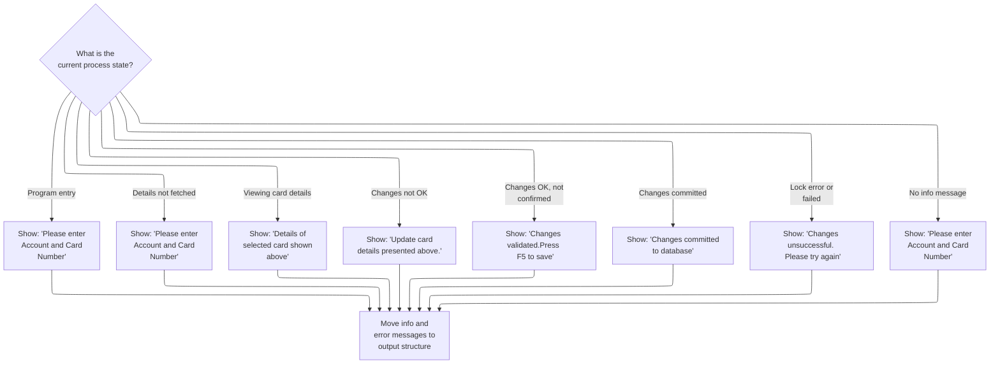

This section sets up the informational message for the card update UI, ensuring the correct message is displayed to the user based on the current workflow state.

| Rule ID | Code Location      | Category       | Rule Name                  | Description                                                                                                                   | Conditions                                                                                                                                                                                             | Remarks                                                                                                                                         |
| ------- | ------------------ | -------------- | -------------------------- | ----------------------------------------------------------------------------------------------------------------------------- | ------------------------------------------------------------------------------------------------------------------------------------------------------------------------------------------------------ | ----------------------------------------------------------------------------------------------------------------------------------------------- |
| BR-001  | 3250-SETUP-INFOMSG | Business logic | Prompt for search keys     | When the process is at program entry or details have not been fetched, the user is prompted to enter account and card number. | If the process state is program entry (CDEMO-PGM-CONTEXT = 0) or details not fetched (CCUP-CHANGE-ACTION is LOW-VALUES or SPACES), or if no info message is set (WS-INFO-MSG is SPACES or LOW-VALUES). | The message shown is: 'Please enter Account and Card Number'. This is a string and is moved to the output field for display.                    |
| BR-002  | 3250-SETUP-INFOMSG | Business logic | Show card details message  | When the user is viewing card details, the message shown is 'Details of selected card shown above'.                           | If the process state is viewing card details (CCUP-CHANGE-ACTION = 'S').                                                                                                                               | The message shown is: 'Details of selected card shown above'. This is a string and is moved to the output field for display.                    |
| BR-003  | 3250-SETUP-INFOMSG | Business logic | Prompt for changes         | When changes to card details are not OK, the message shown is 'Update card details presented above.'                          | If the process state is changes not OK (CCUP-CHANGE-ACTION = 'E').                                                                                                                                     | The message shown is: 'Update card details presented above.'. This is a string and is moved to the output field for display.                    |
| BR-004  | 3250-SETUP-INFOMSG | Business logic | Prompt for confirmation    | When changes are validated but not yet confirmed, the message shown is 'Changes validated.Press F5 to save'.                  | If the process state is changes OK but not confirmed (CCUP-CHANGE-ACTION = 'N').                                                                                                                       | The message shown is: 'Changes validated.Press F5 to save'. This is a string and is moved to the output field for display.                      |
| BR-005  | 3250-SETUP-INFOMSG | Business logic | Confirm update success     | When changes are committed, the message shown is 'Changes committed to database'.                                             | If the process state is changes committed (CCUP-CHANGE-ACTION = 'C').                                                                                                                                  | The message shown is: 'Changes committed to database'. This is a string and is moved to the output field for display.                           |
| BR-006  | 3250-SETUP-INFOMSG | Business logic | Inform failure             | When a lock error or failed update occurs, the message shown is 'Changes unsuccessful. Please try again'.                     | If the process state is lock error (CCUP-CHANGE-ACTION = 'L') or failed update (CCUP-CHANGE-ACTION = 'F').                                                                                             | The message shown is: 'Changes unsuccessful. Please try again'. This is a string and is moved to the output field for display.                  |
| BR-007  | 3250-SETUP-INFOMSG | Business logic | Single active info message | Only one informational message is active at a time, corresponding to the current workflow state.                              | Whenever the process state changes, only the message for that state is set active.                                                                                                                     | The output message is a string, and only one message is set at a time based on the workflow state.                                              |
| BR-008  | 3250-SETUP-INFOMSG | Business logic | Move messages to output    | The selected informational message and any error message are moved to the output structure for use by the UI.                 | After the informational message is selected for the current workflow state.                                                                                                                            | The informational message and error message are both strings. They are moved to the output fields INFOMSGO and ERRMSGO of the output structure. |

<SwmSnippet path="/app/cbl/COCRDUPC.cbl" line="1138" repo-id="Z2l0aHViJTNBJTNBa3luZHJ5bC1hd3MtbWFpbmZyYW1lLW1vZGVybml6YXRpb24tY2FyZGRlbW8lM0ElM0FTd2ltbS1EZW1v">

---

In `3250-SETUP-INFOMSG`, the code checks the program state and sets the right info message flag for the UI. Only one message is active at a time, matching the current workflow state.

```cobol
       3250-SETUP-INFOMSG.                                                      
      *    SETUP INFORMATION MESSAGE                                            
           EVALUATE TRUE                                                        
               WHEN CDEMO-PGM-ENTER                                             
                    SET  PROMPT-FOR-SEARCH-KEYS TO TRUE                         
               WHEN CCUP-DETAILS-NOT-FETCHED                                    
                   SET PROMPT-FOR-SEARCH-KEYS      TO TRUE                      
               WHEN CCUP-SHOW-DETAILS                                           
                    SET FOUND-CARDS-FOR-ACCOUNT    TO TRUE                      
               WHEN CCUP-CHANGES-NOT-OK                                         
                    SET PROMPT-FOR-CHANGES         TO TRUE                      
               WHEN CCUP-CHANGES-OK-NOT-CONFIRMED                               
                    SET PROMPT-FOR-CONFIRMATION    TO TRUE                      
               WHEN CCUP-CHANGES-OKAYED-AND-DONE                                
                    SET CONFIRM-UPDATE-SUCCESS     TO TRUE                      
               WHEN CCUP-CHANGES-OKAYED-LOCK-ERROR                              
                    SET INFORM-FAILURE             TO TRUE                      
               WHEN CCUP-CHANGES-OKAYED-BUT-FAILED                              
                    SET INFORM-FAILURE             TO TRUE                      
               WHEN WS-NO-INFO-MESSAGE                                          
                   SET PROMPT-FOR-SEARCH-KEYS      TO TRUE                      
           END-EVALUATE                                                         
```

---

</SwmSnippet>

<SwmSnippet path="/app/cbl/COCRDUPC.cbl" line="1161" repo-id="Z2l0aHViJTNBJTNBa3luZHJ5bC1hd3MtbWFpbmZyYW1lLW1vZGVybml6YXRpb24tY2FyZGRlbW8lM0ElM0FTd2ltbS1EZW1v">

---

After picking the message, we move the info and error strings to the output fields in the commarea. That's how the UI gets what to display.

```cobol
           MOVE WS-INFO-MSG                    TO INFOMSGO OF CCRDUPAO          
                                                                                
           MOVE WS-RETURN-MSG                  TO ERRMSGO OF CCRDUPAO           
           .                                                                    
```

---

</SwmSnippet>

### Screen Field Attribute Setup

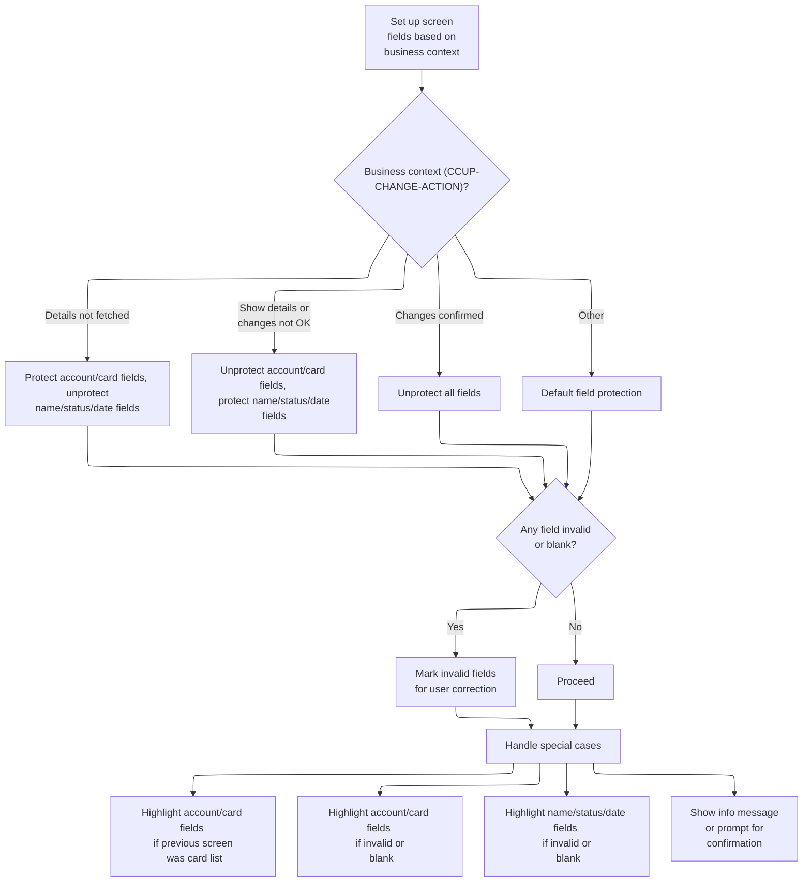

This section configures the screen field attributes for the card/account update UI, determining which fields are editable, how errors and missing data are highlighted, and how the UI guides the user to correct input based on the current business context.

| Rule ID | Code Location           | Category       | Rule Name                                          | Description                                                                                                                                                                                                                                                                           | Conditions                                                                                               | Remarks                                                                                                                                                                                                            |
| ------- | ----------------------- | -------------- | -------------------------------------------------- | ------------------------------------------------------------------------------------------------------------------------------------------------------------------------------------------------------------------------------------------------------------------------------------- | -------------------------------------------------------------------------------------------------------- | ------------------------------------------------------------------------------------------------------------------------------------------------------------------------------------------------------------------ |
| BR-001  | 3300-SETUP-SCREEN-ATTRS | Business logic | Details not fetched field protection               | When card/account details have not been fetched (action is blank or low-values), the account and card ID fields are protected from editing, while the card name, status, and expiry fields are editable. This ensures users cannot modify account/card IDs before details are loaded. | Business context is 'details not fetched' (action is blank or low-values).                               | Account ID and Card ID fields are protected (not editable). Card Name, Card Status, Expiry Month, and Expiry Year fields are editable. Field protection is binary: protected fields cannot be changed by the user. |
| BR-002  | 3300-SETUP-SCREEN-ATTRS | Business logic | Show details and changes not OK field protection   | When showing details or when changes are not OK (action is 'S' or 'E'), the account and card ID fields are editable, while the card name, status, and expiry fields are protected. This allows users to correct account/card IDs but not other fields.                                | Business context is 'show details' (action is 'S') or 'changes not OK' (action is 'E').                  | Account ID and Card ID fields are editable. Card Name, Card Status, Expiry Month, and Expiry Year fields are protected (not editable).                                                                             |
| BR-003  | 3300-SETUP-SCREEN-ATTRS | Business logic | Changes confirmed field editability                | When changes are confirmed or completed (action is 'N' or 'C'), all fields are editable. This allows users to review or make final changes before saving.                                                                                                                             | Business context is 'changes OK not confirmed' (action is 'N') or 'changes OK and done' (action is 'C'). | All fields (Account ID, Card ID, Card Name, Card Status, Expiry Month, Expiry Year) are editable.                                                                                                                  |
| BR-004  | 3300-SETUP-SCREEN-ATTRS | Business logic | Default field protection                           | If none of the specific business states match, the default is to protect account and card ID fields and unprotect name, status, and expiry fields. This prevents accidental editing in unknown states.                                                                                | Business context does not match any explicit state.                                                      | Account ID and Card ID fields are protected. Card Name, Card Status, Expiry Month, and Expiry Year fields are editable.                                                                                            |
| BR-005  | 3300-SETUP-SCREEN-ATTRS | Business logic | Cursor placement for invalid or blank fields       | If any field is invalid or blank, the cursor is placed on the first such field in a fixed order (account, card, name, status, expiry month/year) to guide the user to correct input.                                                                                                  | Any field is invalid or blank.                                                                           | Cursor is placed on the first field needing correction. Order: account ID, card ID, card name, card status, expiry month, expiry year.                                                                             |
| BR-006  | 3300-SETUP-SCREEN-ATTRS | Business logic | Reset field color after card list                  | If the previous screen was the card list, the account and card ID fields are reset to the default color to avoid carrying over error highlights.                                                                                                                                      | Previous screen was card list.                                                                           | Account ID and Card ID fields are set to default color (DFHDFCOL).                                                                                                                                                 |
| BR-007  | 3300-SETUP-SCREEN-ATTRS | Business logic | Expiration day field non-editable                  | The expiration day field is always set to dark, making it non-editable for users.                                                                                                                                                                                                     | Always applies.                                                                                          | Expiration day field color is set to dark (DFHBMDAR), indicating non-editability.                                                                                                                                  |
| BR-008  | 3300-SETUP-SCREEN-ATTRS | Business logic | Info message and confirmation prompt highlighting  | If there is no info message, the info message area is set to dark. If there is an info message, it is set to bright. If user confirmation is needed, the function key area is set to bright as a visual cue.                                                                          | Presence or absence of info message; need for user confirmation.                                         | Info message area color: dark (DFHBMDAR) if no message, bright (DFHBMBRY) if message present. Function key area color: bright (DFHBMBRY) if confirmation needed.                                                   |
| BR-009  | 3300-SETUP-SCREEN-ATTRS | Error handling | Error highlighting for invalid account/card filter | If the account or card filter is invalid, the corresponding field is highlighted in red to indicate an error.                                                                                                                                                                         | Account or card filter is invalid.                                                                       | Field color is set to red (DFHRED) for invalid account or card filter.                                                                                                                                             |
| BR-010  | 3300-SETUP-SCREEN-ATTRS | Error handling | Blank field prompt for account/card ID             | If the account or card ID is blank and the user is re-entering, a '\*' is displayed in the field and the field is colored red to prompt for input.                                                                                                                                    | Account or card ID is blank and user is re-entering.                                                     | Field displays '\*' and is colored red (DFHRED) for blank account or card ID during re-entry.                                                                                                                      |
| BR-011  | 3300-SETUP-SCREEN-ATTRS | Error handling | Error highlighting and prompt for card details     | If the card name, status, expiry month, or expiry year is invalid or blank and the user is editing, the field is highlighted in red and displays a '\*' if blank. This prompts the user to correct or fill in the field.                                                              | Card name, status, expiry month, or expiry year is invalid or blank and user is editing.                 | Field color is set to red (DFHRED) for invalid or blank card details. Blank fields display '\*' as a prompt.                                                                                                       |

<SwmSnippet path="/app/cbl/COCRDUPC.cbl" line="1168" repo-id="Z2l0aHViJTNBJTNBa3luZHJ5bC1hd3MtbWFpbmZyYW1lLW1vZGVybml6YXRpb24tY2FyZGRlbW8lM0ElM0FTd2ltbS1EZW1v">

---

In `3300-SETUP-SCREEN-ATTRS`, the code picks which fields are protected or editable based on the current action state. This keeps the UI in sync with what the user is allowed to change.

```cobol
       3300-SETUP-SCREEN-ATTRS.                                                 
                                                                                
                                                                                
      *    PROTECT OR UNPROTECT BASED ON CONTEXT                                
           EVALUATE TRUE                                                        
              WHEN CCUP-DETAILS-NOT-FETCHED                                     
                   MOVE DFHBMFSE      TO ACCTSIDA OF CCRDUPAI                   
                                         CARDSIDA OF CCRDUPAI                   
                   MOVE DFHBMPRF      TO CRDNAMEA OF CCRDUPAI                   
                                         CRDSTCDA OF CCRDUPAI                   
      *                                  EXPDAYA  OF CCRDUPAI                   
                                         EXPMONA  OF CCRDUPAI                   
                                         EXPYEARA OF CCRDUPAI                   
```

---

</SwmSnippet>

<SwmSnippet path="/app/cbl/COCRDUPC.cbl" line="1181" repo-id="Z2l0aHViJTNBJTNBa3luZHJ5bC1hd3MtbWFpbmZyYW1lLW1vZGVybml6YXRpb24tY2FyZGRlbW8lM0ElM0FTd2ltbS1EZW1v">

---

For the 'show details' and 'changes not ok' states, we unprotect the account and card IDs but protect the name and status fields. This matches what the user should be able to edit now.

```cobol
              WHEN  CCUP-SHOW-DETAILS                                           
              WHEN  CCUP-CHANGES-NOT-OK                                         
                   MOVE DFHBMPRF      TO ACCTSIDA OF CCRDUPAI                   
                                         CARDSIDA OF CCRDUPAI                   
      *                                  EXPDAYA  OF CCRDUPAI                   
                   MOVE DFHBMFSE      TO CRDNAMEA OF CCRDUPAI                   
                                         CRDSTCDA OF CCRDUPAI                   
                                                                                
                                         EXPMONA  OF CCRDUPAI                   
                                         EXPYEARA OF CCRDUPAI                   
```

---

</SwmSnippet>

<SwmSnippet path="/app/cbl/COCRDUPC.cbl" line="1191" repo-id="Z2l0aHViJTNBJTNBa3luZHJ5bC1hd3MtbWFpbmZyYW1lLW1vZGVybml6YXRpb24tY2FyZGRlbW8lM0ElM0FTd2ltbS1EZW1v">

---

When we're confirming changes or just finished, all fields are unprotected so the user can review or edit as needed. This is only for those states.

```cobol
              WHEN CCUP-CHANGES-OK-NOT-CONFIRMED                                
              WHEN CCUP-CHANGES-OKAYED-AND-DONE                                 
                   MOVE DFHBMPRF      TO ACCTSIDA OF CCRDUPAI                   
                                         CARDSIDA OF CCRDUPAI                   
                                         CRDNAMEA OF CCRDUPAI                   
                                         CRDSTCDA OF CCRDUPAI                   
      *                                  EXPDAYA  OF CCRDUPAI                   
                                         EXPMONA  OF CCRDUPAI                   
                                         EXPYEARA OF CCRDUPAI                   
```

---

</SwmSnippet>

<SwmSnippet path="/app/cbl/COCRDUPC.cbl" line="1200" repo-id="Z2l0aHViJTNBJTNBa3luZHJ5bC1hd3MtbWFpbmZyYW1lLW1vZGVybml6YXRpb24tY2FyZGRlbW8lM0ElM0FTd2ltbS1EZW1v">

---

In this part of 3300-SETUP-SCREEN-ATTRS, the code handles the default case for field protection. If none of the specific states match, it protects the account and card ID fields and unprotects the name, status, and expiry fields. This is the fallback so the UI doesn't accidentally leave fields open for editing in an unknown state. It fits right after the explicit state checks and before the cursor logic.

```cobol
              WHEN OTHER                                                        
                   MOVE DFHBMFSE      TO ACCTSIDA OF CCRDUPAI                   
                                         CARDSIDA OF CCRDUPAI                   
                   MOVE DFHBMPRF      TO CRDNAMEA OF CCRDUPAI                   
                                         CRDSTCDA OF CCRDUPAI                   
      *                                  EXPDAYA  OF CCRDUPAI                   
                                         EXPMONA  OF CCRDUPAI                   
                                         EXPYEARA OF CCRDUPAI                   
           END-EVALUATE                                                         
```

---

</SwmSnippet>

<SwmSnippet path="/app/cbl/COCRDUPC.cbl" line="1211" repo-id="Z2l0aHViJTNBJTNBa3luZHJ5bC1hd3MtbWFpbmZyYW1lLW1vZGVybml6YXRpb24tY2FyZGRlbW8lM0ElM0FTd2ltbS1EZW1v">

---

Here the code picks where to put the cursor on the screen after setting up field attributes. It checks for errors or required input in a fixed order (account, card, name, status, expiry month/year) and moves the cursor to the first field that needs attention. This comes right after field protection and before any color highlighting.

```cobol
           EVALUATE TRUE                                                        
              WHEN FOUND-CARDS-FOR-ACCOUNT                                      
              WHEN NO-CHANGES-DETECTED                                          
                  MOVE -1              TO CRDNAMEL OF CCRDUPAI                  
              WHEN FLG-ACCTFILTER-NOT-OK                                        
              WHEN FLG-ACCTFILTER-BLANK                                         
                   MOVE -1             TO ACCTSIDL OF CCRDUPAI                  
              WHEN FLG-CARDFILTER-NOT-OK                                        
              WHEN FLG-CARDFILTER-BLANK                                         
                   MOVE -1             TO CARDSIDL OF CCRDUPAI                  
              WHEN FLG-CARDNAME-NOT-OK                                          
              WHEN FLG-CARDNAME-BLANK                                           
                  MOVE -1              TO CRDNAMEL OF  CCRDUPAI                 
              WHEN FLG-CARDSTATUS-NOT-OK                                        
              WHEN FLG-CARDSTATUS-BLANK                                         
                  MOVE -1              TO CRDSTCDL OF  CCRDUPAI                 
              WHEN FLG-CARDEXPMON-NOT-OK                                        
              WHEN FLG-CARDEXPMON-BLANK                                         
                  MOVE -1              TO EXPMONL  OF  CCRDUPAI                 
              WHEN FLG-CARDEXPYEAR-NOT-OK                                       
              WHEN FLG-CARDEXPYEAR-BLANK                                        
                  MOVE -1              TO EXPYEARL OF  CCRDUPAI                 
              WHEN OTHER                                                        
                  MOVE -1              TO ACCTSIDL OF CCRDUPAI                  
           END-EVALUATE                                                         
```

---

</SwmSnippet>

<SwmSnippet path="/app/cbl/COCRDUPC.cbl" line="1238" repo-id="Z2l0aHViJTNBJTNBa3luZHJ5bC1hd3MtbWFpbmZyYW1lLW1vZGVybml6YXRpb24tY2FyZGRlbW8lM0ElM0FTd2ltbS1EZW1v">

---

This part checks if the last mapset was the card list screen. If so, it resets the color attributes for the account and card ID fields to the default color. This keeps the UI clean when switching screens.

```cobol
           IF CDEMO-LAST-MAPSET   EQUAL LIT-CCLISTMAPSET                        
              MOVE DFHDFCOL            TO ACCTSIDC OF CCRDUPAO                  
              MOVE DFHDFCOL            TO CARDSIDC OF CCRDUPAO                  
           END-IF                                                               
```

---

</SwmSnippet>

<SwmSnippet path="/app/cbl/COCRDUPC.cbl" line="1243" repo-id="Z2l0aHViJTNBJTNBa3luZHJ5bC1hd3MtbWFpbmZyYW1lLW1vZGVybml6YXRpb24tY2FyZGRlbW8lM0ElM0FTd2ltbS1EZW1v">

---

If the account filter isn't valid, we set the account ID field color to red. This highlights the error for the user right after the default color logic.

```cobol
           IF FLG-ACCTFILTER-NOT-OK                                             
              MOVE DFHRED              TO ACCTSIDC OF CCRDUPAO                  
           END-IF                                                               
```

---

</SwmSnippet>

<SwmSnippet path="/app/cbl/COCRDUPC.cbl" line="1247" repo-id="Z2l0aHViJTNBJTNBa3luZHJ5bC1hd3MtbWFpbmZyYW1lLW1vZGVybml6YXRpb24tY2FyZGRlbW8lM0ElM0FTd2ltbS1EZW1v">

---

If the account ID is blank and we're re-entering, we put a '\*' in the field and color it red. This is a clear visual cue for missing input, right after the basic error coloring.

```cobol
           IF  FLG-ACCTFILTER-BLANK                                             
           AND CDEMO-PGM-REENTER                                                
               MOVE '*'                TO ACCTSIDO OF CCRDUPAO                  
               MOVE DFHRED             TO ACCTSIDC OF CCRDUPAO                  
           END-IF                                                               
```

---

</SwmSnippet>

<SwmSnippet path="/app/cbl/COCRDUPC.cbl" line="1253" repo-id="Z2l0aHViJTNBJTNBa3luZHJ5bC1hd3MtbWFpbmZyYW1lLW1vZGVybml6YXRpb24tY2FyZGRlbW8lM0ElM0FTd2ltbS1EZW1v">

---

If the card filter isn't valid, we set the card ID field color to red. This is just like the account field error handling.

```cobol
           IF FLG-CARDFILTER-NOT-OK                                             
              MOVE DFHRED              TO CARDSIDC OF CCRDUPAO                  
           END-IF                                                               
```

---

</SwmSnippet>

<SwmSnippet path="/app/cbl/COCRDUPC.cbl" line="1257" repo-id="Z2l0aHViJTNBJTNBa3luZHJ5bC1hd3MtbWFpbmZyYW1lLW1vZGVybml6YXRpb24tY2FyZGRlbW8lM0ElM0FTd2ltbS1EZW1v">

---

If the card ID is blank and we're re-entering, we put a '\*' in the field and color it red. Same pattern as the account field, just for card ID.

```cobol
           IF  FLG-CARDFILTER-BLANK                                             
           AND CDEMO-PGM-REENTER                                                
               MOVE '*'                TO CARDSIDO OF CCRDUPAO                  
               MOVE DFHRED             TO CARDSIDC OF CCRDUPAO                  
           END-IF                                                               
```

---

</SwmSnippet>

<SwmSnippet path="/app/cbl/COCRDUPC.cbl" line="1263" repo-id="Z2l0aHViJTNBJTNBa3luZHJ5bC1hd3MtbWFpbmZyYW1lLW1vZGVybml6YXRpb24tY2FyZGRlbW8lM0ElM0FTd2ltbS1EZW1v">

---

If the card name is invalid and we're in the 'changes not OK' state, the field turns red. This only happens during editing, not in other states.

```cobol
           IF FLG-CARDNAME-NOT-OK                                               
           AND CCUP-CHANGES-NOT-OK                                              
              MOVE DFHRED              TO CRDNAMEC OF CCRDUPAO                  
           END-IF                                                               
```

---

</SwmSnippet>

<SwmSnippet path="/app/cbl/COCRDUPC.cbl" line="1268" repo-id="Z2l0aHViJTNBJTNBa3luZHJ5bC1hd3MtbWFpbmZyYW1lLW1vZGVybml6YXRpb24tY2FyZGRlbW8lM0ElM0FTd2ltbS1EZW1v">

---

If the card name is blank and we're editing, we put a '\*' in the field and color it red. This is a prompt to fill in the missing name, just like other fields.

```cobol
           IF  FLG-CARDNAME-BLANK                                               
           AND CCUP-CHANGES-NOT-OK                                              
               MOVE '*'                TO CRDNAMEO OF CCRDUPAO                  
               MOVE DFHRED             TO CRDNAMEC OF CCRDUPAO                  
           END-IF                                                               
```

---

</SwmSnippet>

<SwmSnippet path="/app/cbl/COCRDUPC.cbl" line="1274" repo-id="Z2l0aHViJTNBJTNBa3luZHJ5bC1hd3MtbWFpbmZyYW1lLW1vZGVybml6YXRpb24tY2FyZGRlbW8lM0ElM0FTd2ltbS1EZW1v">

---

If the card status is invalid and we're editing, the field turns red. Same logic as the card name field.

```cobol
           IF FLG-CARDSTATUS-NOT-OK                                             
           AND CCUP-CHANGES-NOT-OK                                              
              MOVE DFHRED              TO CRDSTCDC OF CCRDUPAO                  
           END-IF                                                               
```

---

</SwmSnippet>

<SwmSnippet path="/app/cbl/COCRDUPC.cbl" line="1279" repo-id="Z2l0aHViJTNBJTNBa3luZHJ5bC1hd3MtbWFpbmZyYW1lLW1vZGVybml6YXRpb24tY2FyZGRlbW8lM0ElM0FTd2ltbS1EZW1v">

---

If the card status is blank and we're editing, we put a '\*' in the field and color it red. This is a prompt for the user to fill it in, just like other fields.

```cobol
           IF  FLG-CARDSTATUS-BLANK                                             
           AND CCUP-CHANGES-NOT-OK                                              
               MOVE '*'                TO CRDSTCDO OF CCRDUPAO                  
               MOVE DFHRED             TO CRDSTCDC OF CCRDUPAO                  
           END-IF                                                               
```

---

</SwmSnippet>

<SwmSnippet path="/app/cbl/COCRDUPC.cbl" line="1285" repo-id="Z2l0aHViJTNBJTNBa3luZHJ5bC1hd3MtbWFpbmZyYW1lLW1vZGVybml6YXRpb24tY2FyZGRlbW8lM0ElM0FTd2ltbS1EZW1v">

---

The expiration day field is always set to dark, so users can't edit it. This is consistent with the UI not letting users change that field.

```cobol
           MOVE DFHBMDAR               TO EXPDAYC  OF CCRDUPAO                  
                                                                                
           IF FLG-CARDEXPMON-NOT-OK                                             
           AND CCUP-CHANGES-NOT-OK                                              
              MOVE DFHRED              TO EXPMONC  OF CCRDUPAO                  
           END-IF                                                               
```

---

</SwmSnippet>

<SwmSnippet path="/app/cbl/COCRDUPC.cbl" line="1292" repo-id="Z2l0aHViJTNBJTNBa3luZHJ5bC1hd3MtbWFpbmZyYW1lLW1vZGVybml6YXRpb24tY2FyZGRlbW8lM0ElM0FTd2ltbS1EZW1v">

---

If the expiration month is blank and we're editing, we put a '\*' in the field and color it red. Same as the other fields for missing input.

```cobol
           IF  FLG-CARDEXPMON-BLANK                                             
           AND CCUP-CHANGES-NOT-OK                                              
               MOVE '*'                TO EXPMONO  OF CCRDUPAO                  
               MOVE DFHRED             TO EXPMONC  OF CCRDUPAO                  
           END-IF                                                               
```

---

</SwmSnippet>

<SwmSnippet path="/app/cbl/COCRDUPC.cbl" line="1298" repo-id="Z2l0aHViJTNBJTNBa3luZHJ5bC1hd3MtbWFpbmZyYW1lLW1vZGVybml6YXRpb24tY2FyZGRlbW8lM0ElM0FTd2ltbS1EZW1v">

---

If the expiration year is invalid and we're editing, the field turns red. Same as the other editable fields.

```cobol
           IF  FLG-CARDEXPYEAR-NOT-OK                                           
           AND CCUP-CHANGES-NOT-OK                                              
              MOVE DFHRED              TO EXPYEARC OF CCRDUPAO                  
           END-IF                                                               
```

---

</SwmSnippet>

<SwmSnippet path="/app/cbl/COCRDUPC.cbl" line="1303" repo-id="Z2l0aHViJTNBJTNBa3luZHJ5bC1hd3MtbWFpbmZyYW1lLW1vZGVybml6YXRpb24tY2FyZGRlbW8lM0ElM0FTd2ltbS1EZW1v">

---

If the expiration year is blank and we're editing, we put a '\*' in the field and color it red. This is the same pattern as the other editable fields.

```cobol
           IF  FLG-CARDEXPYEAR-BLANK                                            
           AND CCUP-CHANGES-NOT-OK                                              
               MOVE '*'                TO EXPYEARO OF CCRDUPAO                  
               MOVE DFHRED             TO EXPYEARC OF CCRDUPAO                  
           END-IF                                                               
```

---

</SwmSnippet>

<SwmSnippet path="/app/cbl/COCRDUPC.cbl" line="1309" repo-id="Z2l0aHViJTNBJTNBa3luZHJ5bC1hd3MtbWFpbmZyYW1lLW1vZGVybml6YXRpb24tY2FyZGRlbW8lM0ElM0FTd2ltbS1EZW1v">

---

If there's no info message, the area is dark. If there is, it's bright. If the user needs to confirm something, the function key area is also set to bright. This is all about visual cues for the user.

```cobol
           IF  WS-NO-INFO-MESSAGE                                               
               MOVE DFHBMDAR           TO INFOMSGA OF CCRDUPAI                  
           ELSE                                                                 
               MOVE DFHBMBRY           TO INFOMSGA OF CCRDUPAI                  
           END-IF                                                               
```

---

</SwmSnippet>

<SwmSnippet path="/app/cbl/COCRDUPC.cbl" line="1315" repo-id="Z2l0aHViJTNBJTNBa3luZHJ5bC1hd3MtbWFpbmZyYW1lLW1vZGVybml6YXRpb24tY2FyZGRlbW8lM0ElM0FTd2ltbS1EZW1v">

---

If the program needs confirmation from the user, it sets the function key area to bright. This is the last visual tweak before sending the screen, making sure the user knows to respond.

```cobol
           IF PROMPT-FOR-CONFIRMATION                                           
              MOVE DFHBMBRY            TO FKEYSCA  OF CCRDUPAI                  
           END-IF                                                               
```

---

</SwmSnippet>

### Sending the prepared screen to the user

This section is responsible for sending the prepared user interface screen to the user, ensuring the correct layout, content, and input conditions are presented.

| Rule ID | Code Location    | Category       | Rule Name                           | Description                                                                                                                               | Conditions                                                                                                                 | Remarks                                                                                                                                                                             |
| ------- | ---------------- | -------------- | ----------------------------------- | ----------------------------------------------------------------------------------------------------------------------------------------- | -------------------------------------------------------------------------------------------------------------------------- | ----------------------------------------------------------------------------------------------------------------------------------------------------------------------------------- |
| BR-001  | 3400-SEND-SCREEN | Business logic | Screen display with selected layout | The user interface screen is displayed using the specified map and mapset, ensuring the correct layout and content are shown to the user. | When the section is executed, the map and mapset identifiers are set to their respective values before sending the screen. | The map and mapset are set to constant values before sending. The output format is determined by the selected map and mapset, which define the screen layout and field arrangement. |
| BR-002  | 3400-SEND-SCREEN | Business logic | Screen clearing before display      | The screen is cleared before displaying the new user interface, ensuring no residual data from previous screens is visible.               | Whenever the screen is sent to the user, the clear option is applied.                                                      | The 'clear' option is always applied when sending the screen, resulting in a blank slate before the new content is shown.                                                           |
| BR-003  | 3400-SEND-SCREEN | Business logic | Cursor positioning on display       | The cursor is positioned on the screen when the user interface is displayed, allowing the user to begin input immediately.                | Whenever the screen is sent, the cursor is positioned according to the prepared output area.                               | The cursor is set as part of the send command, ensuring user input starts at the intended location.                                                                                 |
| BR-004  | 3400-SEND-SCREEN | Business logic | Keyboard buffer clearing            | The keyboard buffer is freed when the screen is displayed, ensuring that any previous input does not affect the new screen.               | Whenever the screen is sent, the keyboard buffer is freed.                                                                 | The keyboard buffer is cleared as part of the send command, preventing unintended input carryover.                                                                                  |

<SwmSnippet path="/app/cbl/COCRDUPC.cbl" line="1324" repo-id="Z2l0aHViJTNBJTNBa3luZHJ5bC1hd3MtbWFpbmZyYW1lLW1vZGVybml6YXRpb24tY2FyZGRlbW8lM0ElM0FTd2ltbS1EZW1v">

---

3400-SEND-SCREEN sets up which map and mapset to send, then calls CICS SEND MAP to actually display the screen to the user. It uses the prepared output area, sets the cursor, clears the screen, and frees the keyboard buffer. This is the last step before the user sees the UI.

```cobol
       3400-SEND-SCREEN.                                                        
                                                                                
           MOVE LIT-THISMAPSET         TO CCARD-NEXT-MAPSET                     
           MOVE LIT-THISMAP            TO CCARD-NEXT-MAP                        
                                                                                
           EXEC CICS SEND MAP(CCARD-NEXT-MAP)                                   
                          MAPSET(CCARD-NEXT-MAPSET)                             
                          FROM(CCRDUPAO)                                        
                          CURSOR                                                
                          ERASE                                                 
                          FREEKB                                                
                          RESP(WS-RESP-CD)                                      
           END-EXEC                                                             
```

---

</SwmSnippet>

## Branching after sending the screen

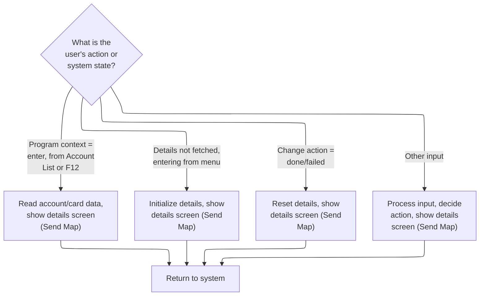

This section manages the branching logic after sending the details screen, ensuring the user is presented with the correct state and screen based on their previous action or system context.

| Rule ID | Code Location | Category       | Rule Name                                  | Description                                                                                                                                                                                    | Conditions                                                                                                                   | Remarks                                                                                                                                                                                                       |
| ------- | ------------- | -------------- | ------------------------------------------ | ---------------------------------------------------------------------------------------------------------------------------------------------------------------------------------------------- | ---------------------------------------------------------------------------------------------------------------------------- | ------------------------------------------------------------------------------------------------------------------------------------------------------------------------------------------------------------- |
| BR-001  | 0000-MAIN     | Business logic | Fetch details on account list entry or F12 | When the user enters from the account list program or presses F12 from the account list, the system fetches account and card details, marks filters as valid, and displays the details screen. | Program context is 'enter' and previous program is account list, or F12 key is pressed and previous program is account list. | Account list program is 'COCRDLIC'. F12 key is 'PFK12'. Account ID and Card Number are copied and used to fetch details. Filters are marked valid ('1'). Details screen is displayed using the map 'CCRDUPA'. |
| BR-002  | 0000-MAIN     | Business logic | Initialize details on menu entry           | When details have not been fetched and the user is entering from the menu, the system initializes the details area, prompts for input, and displays the details screen.                        | Details not fetched, program context is 'enter', previous program is menu, and not re-entering.                              | Menu program is 'COMEN01C'. Details area is initialized. Details screen is displayed using the map 'CCRDUPA'.                                                                                                 |
| BR-003  | 0000-MAIN     | Business logic | Reset details after change action          | After a change action (either successful or failed), the system resets all account/card fields and working storage, sets the state to expect a new entry, and prompts for new search keys.     | Change action is done ('C') or failed ('L' or 'F').                                                                          | Change action values: 'C' (done), 'L' (lock error), 'F' (failed). All relevant fields are initialized. Details screen is displayed using the map 'CCRDUPA'.                                                   |
| BR-004  | 0000-MAIN     | Business logic | Process other user input                   | For any other user input, the system processes the input, decides the next action, displays the details screen, and returns control to the system.                                             | None of the special cases for entry, menu, or change action apply.                                                           | Input is processed and next action is decided. Details screen is displayed using the map 'CCRDUPA'.                                                                                                           |
| BR-005  | COMMON-RETURN | Technical step | Return control to CICS with updated state  | After sending the screen, the system copies any return message to the error field, builds the combined communication area, and returns control to CICS for the next transaction.               | After any branch that sends the details screen.                                                                              | Return message is copied to error field (string, 75 bytes). Communication area is built from global and program-specific areas. Control is returned to transaction 'CCUP'.                                    |

<SwmSnippet path="/app/cbl/COCRDUPC.cbl" line="482" repo-id="Z2l0aHViJTNBJTNBa3luZHJ5bC1hd3MtbWFpbmZyYW1lLW1vZGVybml6YXRpb24tY2FyZGRlbW8lM0ElM0FTd2ltbS1EZW1v">

---

Back in 0000-MAIN, after sending the map, we immediately call COMMON-RETURN. This hands control back to CICS, so the user can interact with the screen. The logic here decides if we just fetched details for update or are prompting for keys, and then exits cleanly.

```cobol
              WHEN CDEMO-PGM-ENTER                                              
               AND CDEMO-FROM-PROGRAM  EQUAL LIT-CCLISTPGM                      
              WHEN CCARD-AID-PFK12                                              
               AND CDEMO-FROM-PROGRAM  EQUAL LIT-CCLISTPGM                      
                   SET CDEMO-PGM-REENTER    TO TRUE                             
                   SET INPUT-OK             TO TRUE                             
                   SET FLG-ACCTFILTER-ISVALID  TO TRUE                          
                   SET FLG-CARDFILTER-ISVALID  TO TRUE                          
                   MOVE CDEMO-ACCT-ID       TO CC-ACCT-ID-N                     
                   MOVE CDEMO-CARD-NUM      TO CC-CARD-NUM-N                    
                   PERFORM 9000-READ-DATA                                       
                      THRU 9000-READ-DATA-EXIT                                  
                   SET CCUP-SHOW-DETAILS TO TRUE                                
                   PERFORM 3000-SEND-MAP                                        
                      THRU 3000-SEND-MAP-EXIT                                   
                   GO TO COMMON-RETURN                                          
```

---

</SwmSnippet>

<SwmSnippet path="/app/cbl/COCRDUPC.cbl" line="546" repo-id="Z2l0aHViJTNBJTNBa3luZHJ5bC1hd3MtbWFpbmZyYW1lLW1vZGVybml6YXRpb24tY2FyZGRlbW8lM0ElM0FTd2ltbS1EZW1v">

---

COMMON-RETURN copies any return message to the error field, then builds a combined commarea from the global and program-specific areas. It then calls CICS RETURN to hand off control and data to the next transaction. This is how state is preserved and passed along.

```cobol
       COMMON-RETURN.                                                           
           MOVE WS-RETURN-MSG     TO CCARD-ERROR-MSG                            
                                                                                
           MOVE  CARDDEMO-COMMAREA    TO WS-COMMAREA                            
           MOVE  WS-THIS-PROGCOMMAREA TO                                        
                  WS-COMMAREA(LENGTH OF CARDDEMO-COMMAREA + 1:                  
                               LENGTH OF WS-THIS-PROGCOMMAREA )                 
                                                                                
           EXEC CICS RETURN                                                     
                TRANSID (LIT-THISTRANID)                                        
                COMMAREA (WS-COMMAREA)                                          
                LENGTH(LENGTH OF WS-COMMAREA)                                   
           END-EXEC                                                             
```

---

</SwmSnippet>

<SwmSnippet path="/app/cbl/COCRDUPC.cbl" line="502" repo-id="Z2l0aHViJTNBJTNBa3luZHJ5bC1hd3MtbWFpbmZyYW1lLW1vZGVybml6YXRpb24tY2FyZGRlbW8lM0ElM0FTd2ltbS1EZW1v">

---

After coming back from COMMON-RETURN in 0000-MAIN, the code checks if it needs to prompt for keys or fetch details. If it's a new entry or coming from the menu, it resets state and prompts for input, then returns again. This keeps the flow clean for the next user action.

```cobol
              WHEN CCUP-DETAILS-NOT-FETCHED                                     
               AND CDEMO-PGM-ENTER                                              
              WHEN CDEMO-FROM-PROGRAM   EQUAL LIT-MENUPGM                       
               AND NOT CDEMO-PGM-REENTER                                        
                   INITIALIZE WS-THIS-PROGCOMMAREA                              
                   PERFORM 3000-SEND-MAP THRU                                   
                           3000-SEND-MAP-EXIT                                   
                   SET CDEMO-PGM-REENTER        TO TRUE                         
                   SET CCUP-DETAILS-NOT-FETCHED TO TRUE                         
                   GO TO COMMON-RETURN                                          
```

---

</SwmSnippet>

<SwmSnippet path="/app/cbl/COCRDUPC.cbl" line="517" repo-id="Z2l0aHViJTNBJTNBa3luZHJ5bC1hd3MtbWFpbmZyYW1lLW1vZGVybml6YXRpb24tY2FyZGRlbW8lM0ElM0FTd2ltbS1EZW1v">

---

After an update (whether it worked or not), the code resets all the account/card fields and working storage, sets the state to expect a new entry, and prompts for new search keys. This avoids stale data and keeps the flow clean.

```cobol
              WHEN CCUP-CHANGES-OKAYED-AND-DONE                                 
              WHEN CCUP-CHANGES-FAILED                                          
                   INITIALIZE WS-THIS-PROGCOMMAREA                              
                              WS-MISC-STORAGE                                   
                              CDEMO-ACCT-ID                                     
                              CDEMO-CARD-NUM                                    
                   SET CDEMO-PGM-ENTER            TO TRUE                       
                   PERFORM 3000-SEND-MAP THRU                                   
                           3000-SEND-MAP-EXIT                                   
                   SET CDEMO-PGM-REENTER          TO TRUE                       
                   SET CCUP-DETAILS-NOT-FETCHED   TO TRUE                       
                   GO TO COMMON-RETURN                                          
```

---

</SwmSnippet>

<SwmSnippet path="/app/cbl/COCRDUPC.cbl" line="535" repo-id="Z2l0aHViJTNBJTNBa3luZHJ5bC1hd3MtbWFpbmZyYW1lLW1vZGVybml6YXRpb24tY2FyZGRlbW8lM0ElM0FTd2ltbS1EZW1v">

---

At the end of 0000-MAIN, if none of the special cases match, we process user input, decide what to do next, send the screen, and return. The EVALUATE block is the main state machine for the transaction.

```cobol
              WHEN OTHER                                                        
                   PERFORM 1000-PROCESS-INPUTS                                  
                      THRU 1000-PROCESS-INPUTS-EXIT                             
                   PERFORM 2000-DECIDE-ACTION                                   
                      THRU 2000-DECIDE-ACTION-EXIT                              
                   PERFORM 3000-SEND-MAP                                        
                      THRU 3000-SEND-MAP-EXIT                                   
                   GO TO COMMON-RETURN                                          
           END-EVALUATE                                                         
```

---

</SwmSnippet>

# Processing user input from the screen

This section is responsible for receiving user input from the screen, validating and editing the inputs, handling error messaging, and setting navigation targets for subsequent screens or programs.

| Rule ID | Code Location        | Category        | Rule Name                        | Description                                                                                                                                                                                | Conditions                                                       | Remarks                                                                                                                                                                                                                                                                                                |
| ------- | -------------------- | --------------- | -------------------------------- | ------------------------------------------------------------------------------------------------------------------------------------------------------------------------------------------ | ---------------------------------------------------------------- | ------------------------------------------------------------------------------------------------------------------------------------------------------------------------------------------------------------------------------------------------------------------------------------------------------ |
| BR-001  | 1200-EDIT-MAP-INPUTS | Data validation | Input field validation status    | When user input is received from the screen, each input field is validated and flagged as valid, invalid, or blank. The validation status is tracked using dedicated flags for each field. | User input is present and mapped into working storage variables. | Validation flags for each field use the following values: '1' for valid, '0' for not OK, and ' ' (space) for blank. Fields include account ID (11 alphanumeric), card number (16 alphanumeric), customer ID (9 alphanumeric), card name, card status, card expiration month, and card expiration year. |
| BR-002  | 1000-PROCESS-INPUTS  | Business logic  | Navigation target assignment     | After input validation and editing, navigation targets for the next screen, mapset, and program are set using predefined constants.                                                        | Input processing is complete and navigation is required.         | Navigation targets are set using the following constants: next map ('CCRDUPA', 7 alphanumeric), next mapset ('COCRDUP ', 7 alphanumeric), next program ('COCRDUPC', 8 alphanumeric).                                                                                                                   |
| BR-003  | 1200-EDIT-MAP-INPUTS | Error handling  | Error messaging on invalid input | If any input field fails validation, an error message is set and made available for display to the user.                                                                                   | At least one input field is flagged as invalid ('0').            | Error messages are stored in a 75-character alphanumeric field. The error message variable is CCARD-ERROR-MSG, which is equal to WS-RETURN-MSG.                                                                                                                                                        |

<SwmSnippet path="/app/cbl/COCRDUPC.cbl" line="564" repo-id="Z2l0aHViJTNBJTNBa3luZHJ5bC1hd3MtbWFpbmZyYW1lLW1vZGVybml6YXRpb24tY2FyZGRlbW8lM0ElM0FTd2ltbS1EZW1v">

---

In 1000-PROCESS-INPUTS, we first receive the map data from the screen, then validate and edit the inputs. This keeps input handling clean and modular.

```cobol
       1000-PROCESS-INPUTS.                                                     
           PERFORM 1100-RECEIVE-MAP                                             
              THRU 1100-RECEIVE-MAP-EXIT                                        
           PERFORM 1200-EDIT-MAP-INPUTS                                         
              THRU 1200-EDIT-MAP-INPUTS-EXIT                                    
```

---

</SwmSnippet>

## Receiving and normalizing screen input

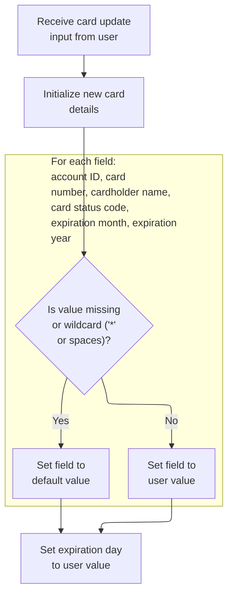

This section receives card update input from the user and normalizes all fields, ensuring that missing or wildcard values are standardized to a default for reliable downstream processing.

| Rule ID | Code Location    | Category       | Rule Name                      | Description                                                                                                                                                       | Conditions                                                          | Remarks                                                                                                                                                                  |
| ------- | ---------------- | -------------- | ------------------------------ | ----------------------------------------------------------------------------------------------------------------------------------------------------------------- | ------------------------------------------------------------------- | ------------------------------------------------------------------------------------------------------------------------------------------------------------------------ |
| BR-001  | 1100-RECEIVE-MAP | Business logic | Account ID normalization       | If the account ID field is missing or contains a wildcard ('\*' or spaces), it is set to the default value. Otherwise, the user-provided value is retained.       | Triggered when the account ID input is either '\*' or spaces.       | Default value is LOW-VALUES. Wildcard is represented by '\*'. Missing is represented by spaces. Output format for account ID is an 11-character alphanumeric string.     |
| BR-002  | 1100-RECEIVE-MAP | Business logic | Card number normalization      | If the card number field is missing or contains a wildcard ('\*' or spaces), it is set to the default value. Otherwise, the user-provided value is retained.      | Triggered when the card number input is either '\*' or spaces.      | Default value is LOW-VALUES. Wildcard is represented by '\*'. Missing is represented by spaces. Output format for card number is a 16-character alphanumeric string.     |
| BR-003  | 1100-RECEIVE-MAP | Business logic | Cardholder name normalization  | If the cardholder name field is missing or contains a wildcard ('\*' or spaces), it is set to the default value. Otherwise, the user-provided value is retained.  | Triggered when the cardholder name input is either '\*' or spaces.  | Default value is LOW-VALUES. Wildcard is represented by '\*'. Missing is represented by spaces. Output format for cardholder name is a 50-character alphanumeric string. |
| BR-004  | 1100-RECEIVE-MAP | Business logic | Card status code normalization | If the card status code field is missing or contains a wildcard ('\*' or spaces), it is set to the default value. Otherwise, the user-provided value is retained. | Triggered when the card status code input is either '\*' or spaces. | Default value is LOW-VALUES. Wildcard is represented by '\*'. Missing is represented by spaces. Output format for card status code is a 1-character alphanumeric string. |
| BR-005  | 1100-RECEIVE-MAP | Business logic | Expiration day passthrough     | The expiration day field is always set to the user-provided value, regardless of its content.                                                                     | Triggered whenever expiration day input is present.                 | No normalization is performed. Output format for expiration day is a 2-character alphanumeric string.                                                                    |
| BR-006  | 1100-RECEIVE-MAP | Business logic | Expiration month normalization | If the expiration month field is missing or contains a wildcard ('\*' or spaces), it is set to the default value. Otherwise, the user-provided value is retained. | Triggered when the expiration month input is either '\*' or spaces. | Default value is LOW-VALUES. Wildcard is represented by '\*'. Missing is represented by spaces. Output format for expiration month is a 2-character alphanumeric string. |
| BR-007  | 1100-RECEIVE-MAP | Business logic | Expiration year normalization  | If the expiration year field is missing or contains a wildcard ('\*' or spaces), it is set to the default value. Otherwise, the user-provided value is retained.  | Triggered when the expiration year input is either '\*' or spaces.  | Default value is LOW-VALUES. Wildcard is represented by '\*'. Missing is represented by spaces. Output format for expiration year is a 4-character alphanumeric string.  |

<SwmSnippet path="/app/cbl/COCRDUPC.cbl" line="578" repo-id="Z2l0aHViJTNBJTNBa3luZHJ5bC1hd3MtbWFpbmZyYW1lLW1vZGVybml6YXRpb24tY2FyZGRlbW8lM0ElM0FTd2ltbS1EZW1v">

---

In 1100-RECEIVE-MAP, we grab the screen data into CCRDUPAI, then normalize all the fields: '\*' and spaces become LOW-VALUES, everything else is copied as-is. This makes later validation easier.

```cobol
       1100-RECEIVE-MAP.                                                        
           EXEC CICS RECEIVE MAP(LIT-THISMAP)                                   
                     MAPSET(LIT-THISMAPSET)                                     
                     INTO(CCRDUPAI)                                             
                     RESP(WS-RESP-CD)                                           
                     RESP2(WS-REAS-CD)                                          
           END-EXEC                                                             
```

---

</SwmSnippet>

<SwmSnippet path="/app/cbl/COCRDUPC.cbl" line="586" repo-id="Z2l0aHViJTNBJTNBa3luZHJ5bC1hd3MtbWFpbmZyYW1lLW1vZGVybml6YXRpb24tY2FyZGRlbW8lM0ElM0FTd2ltbS1EZW1v">

---

Right after receiving the map, we clear out the new details structure, then start normalizing each field. This avoids any junk data from previous screens.

```cobol
           INITIALIZE CCUP-NEW-DETAILS                                          
                                                                                
      *    REPLACE * WITH LOW-VALUES                                            
           IF  ACCTSIDI OF CCRDUPAI = '*'                                       
           OR  ACCTSIDI OF CCRDUPAI = SPACES                                    
               MOVE LOW-VALUES           TO  CC-ACCT-ID                         
                                             CCUP-NEW-ACCTID                    
           ELSE                                                                 
               MOVE ACCTSIDI OF CCRDUPAI TO  CC-ACCT-ID                         
                                             CCUP-NEW-ACCTID                    
           END-IF                                                               
```

---

</SwmSnippet>

<SwmSnippet path="/app/cbl/COCRDUPC.cbl" line="598" repo-id="Z2l0aHViJTNBJTNBa3luZHJ5bC1hd3MtbWFpbmZyYW1lLW1vZGVybml6YXRpb24tY2FyZGRlbW8lM0ElM0FTd2ltbS1EZW1v">

---

Card ID input is normalized just like account ID: blanks and '\*' become LOW-VALUES, otherwise we copy the value. Keeps things consistent for validation.

```cobol
           IF  CARDSIDI OF CCRDUPAI = '*'                                       
           OR  CARDSIDI OF CCRDUPAI = SPACES                                    
               MOVE LOW-VALUES           TO  CC-CARD-NUM                        
                                             CCUP-NEW-CARDID                    
           ELSE                                                                 
               MOVE CARDSIDI OF CCRDUPAI TO  CC-CARD-NUM                        
                                             CCUP-NEW-CARDID                    
           END-IF                                                               
```

---

</SwmSnippet>

<SwmSnippet path="/app/cbl/COCRDUPC.cbl" line="607" repo-id="Z2l0aHViJTNBJTNBa3luZHJ5bC1hd3MtbWFpbmZyYW1lLW1vZGVybml6YXRpb24tY2FyZGRlbW8lM0ElM0FTd2ltbS1EZW1v">

---

Card name input is checked for '\*' and spaces, and normalized to LOW-VALUES if found. Same pattern as account/card IDs.

```cobol
           IF  CRDNAMEI OF CCRDUPAI = '*'                                       
           OR  CRDNAMEI OF CCRDUPAI = SPACES                                    
               MOVE LOW-VALUES           TO  CCUP-NEW-CRDNAME                   
           ELSE                                                                 
               MOVE CRDNAMEI OF CCRDUPAI TO  CCUP-NEW-CRDNAME                   
           END-IF                                                               
```

---

</SwmSnippet>

<SwmSnippet path="/app/cbl/COCRDUPC.cbl" line="614" repo-id="Z2l0aHViJTNBJTNBa3luZHJ5bC1hd3MtbWFpbmZyYW1lLW1vZGVybml6YXRpb24tY2FyZGRlbW8lM0ElM0FTd2ltbS1EZW1v">

---

Card status input is checked for '\*' and spaces, and normalized to LOW-VALUES if found. Same as the other fields.

```cobol
           IF  CRDSTCDI OF CCRDUPAI = '*'                                       
           OR  CRDSTCDI OF CCRDUPAI = SPACES                                    
               MOVE LOW-VALUES           TO  CCUP-NEW-CRDSTCD                   
           ELSE                                                                 
               MOVE CRDSTCDI OF CCRDUPAI TO  CCUP-NEW-CRDSTCD                   
           END-IF                                                               
```

---

</SwmSnippet>

<SwmSnippet path="/app/cbl/COCRDUPC.cbl" line="621" repo-id="Z2l0aHViJTNBJTNBa3luZHJ5bC1hd3MtbWFpbmZyYW1lLW1vZGVybml6YXRpb24tY2FyZGRlbW8lM0ElM0FTd2ltbS1EZW1v">

---

Expiration day is just copied over, no normalization. The rest of the expiry fields get the usual '\*' and space check.

```cobol
           MOVE EXPDAYI     OF CCRDUPAI  TO  CCUP-NEW-EXPDAY                    
                                                                                
           IF  EXPMONI OF CCRDUPAI = '*'                                        
           OR  EXPMONI OF CCRDUPAI = SPACES                                     
               MOVE LOW-VALUES           TO  CCUP-NEW-EXPMON                    
           ELSE                                                                 
               MOVE EXPMONI OF CCRDUPAI  TO  CCUP-NEW-EXPMON                    
           END-IF                                                               
```

---

</SwmSnippet>

<SwmSnippet path="/app/cbl/COCRDUPC.cbl" line="630" repo-id="Z2l0aHViJTNBJTNBa3luZHJ5bC1hd3MtbWFpbmZyYW1lLW1vZGVybml6YXRpb24tY2FyZGRlbW8lM0ElM0FTd2ltbS1EZW1v">

---

At the end of 1100-RECEIVE-MAP, all input fields are normalized so blanks and '\*' are LOW-VALUES. This makes later validation and edits much simpler and more reliable.

```cobol
           IF  EXPYEARI OF CCRDUPAI = '*'                                       
           OR  EXPYEARI OF CCRDUPAI = SPACES                                    
               MOVE LOW-VALUES           TO  CCUP-NEW-EXPYEAR                   
           ELSE                                                                 
               MOVE EXPYEARI OF CCRDUPAI TO  CCUP-NEW-EXPYEAR                   
           END-IF                                                               
```

---

</SwmSnippet>

## Validating and editing user input

This section validates and edits user input for account and card search criteria, determining whether to proceed with further edits or exit based on the presence and validity of input data.

| Rule ID | Code Location                                           | Category        | Rule Name                                        | Description                                                                                                                                                                  | Conditions                                                                                | Remarks                                                                                                                       |
| ------- | ------------------------------------------------------- | --------------- | ------------------------------------------------ | ---------------------------------------------------------------------------------------------------------------------------------------------------------------------------- | ----------------------------------------------------------------------------------------- | ----------------------------------------------------------------------------------------------------------------------------- |
| BR-001  | 1200-EDIT-MAP-INPUTS, 1210-EDIT-ACCOUNT, 1220-EDIT-CARD | Data validation | No search criteria provided                      | If both account and card search keys are blank when details have not been fetched, the system sets a 'no search criteria received' message and exits the validation process. | Details have not been fetched AND both account and card search keys are blank.            | The message 'No input received' is set as the status output. The process does not proceed with further validation or editing. |
| BR-002  | 1200-EDIT-MAP-INPUTS, 1210-EDIT-ACCOUNT, 1220-EDIT-CARD | Data validation | Search key validation on initial input           | When details have not been fetched, the system validates the account and card search keys individually. If either key is present, further edits are skipped.                 | Details have not been fetched AND at least one of account or card search keys is present. | Validation is performed on each key. If valid, the process skips further edits and proceeds.                                  |
| BR-003  | 1200-EDIT-MAP-INPUTS                                    | Data validation | Selective field validation after details fetched | If details have already been fetched, the system checks for changes and validates only the fields that have been modified.                                                   | Details have already been fetched.                                                        | Only fields that have changed are validated. No validation is performed on unchanged fields.                                  |

<SwmSnippet path="/app/cbl/COCRDUPC.cbl" line="641" repo-id="Z2l0aHViJTNBJTNBa3luZHJ5bC1hd3MtbWFpbmZyYW1lLW1vZGVybml6YXRpb24tY2FyZGRlbW8lM0ElM0FTd2ltbS1EZW1v">

---

In 1200-EDIT-MAP-INPUTS, if details aren't fetched, we validate the account and card keys first. If both are blank, we set a 'no search criteria' flag and exit. Otherwise, we skip further edits. If details are already fetched, we check for changes and validate only the fields that matter.

```cobol
       1200-EDIT-MAP-INPUTS.                                                    
                                                                                
           SET INPUT-OK                  TO TRUE                                
                                                                                
           IF  CCUP-DETAILS-NOT-FETCHED                                         
      *        VALIDATE THE SEARCH KEYS                                         
               PERFORM 1210-EDIT-ACCOUNT                                        
                  THRU 1210-EDIT-ACCOUNT-EXIT                                   
                                                                                
               PERFORM 1220-EDIT-CARD                                           
                  THRU 1220-EDIT-CARD-EXIT                                      
```

---

</SwmSnippet>

### Account key validation

This section validates the account ID input by the user, ensuring that it is present and meets basic requirements before allowing further processing.

| Rule ID | Code Location     | Category        | Rule Name                     | Description                                                                                                                                                                                                                                | Conditions                                                                                             | Remarks                                                                                                                                                                  |
| ------- | ----------------- | --------------- | ----------------------------- | ------------------------------------------------------------------------------------------------------------------------------------------------------------------------------------------------------------------------------------------ | ------------------------------------------------------------------------------------------------------ | ------------------------------------------------------------------------------------------------------------------------------------------------------------------------ |
| BR-001  | 1210-EDIT-ACCOUNT | Data validation | Account ID required           | If the account ID is not provided (i.e., it is blank, contains only spaces, or is set to the system's lowest possible value), the system marks the input as invalid, sets an error flag, and prompts the user to enter a valid account ID. | The account ID is blank, contains only spaces, or is set to LOW-VALUES.                                | Blank is defined as all spaces; LOW-VALUES is a system constant representing the lowest possible value for a field. The prompt message is 'Account number not provided'. |
| BR-002  | 1210-EDIT-ACCOUNT | Error handling  | Reset invalid account ID      | When the account ID is missing or invalid, the system resets the account ID fields to zeroes and LOW-VALUES to prevent further processing with invalid data.                                                                               | The account ID is blank, contains only spaces, or is set to LOW-VALUES.                                | Account ID is reset to zeroes (numeric value 0 for all digits); new account ID is set to LOW-VALUES (lowest possible value for the field).                               |
| BR-003  | 1210-EDIT-ACCOUNT | Error handling  | Prompt for missing account ID | If the account ID is missing or invalid and the return message is not already set, the system prompts the user to enter an account number.                                                                                                 | The account ID is blank, contains only spaces, or is set to LOW-VALUES, and the return message is off. | Prompt message is 'Account number not provided'.                                                                                                                         |

<SwmSnippet path="/app/cbl/COCRDUPC.cbl" line="721" repo-id="Z2l0aHViJTNBJTNBa3luZHJ5bC1hd3MtbWFpbmZyYW1lLW1vZGVybml6YXRpb24tY2FyZGRlbW8lM0ElM0FTd2ltbS1EZW1v">

---

In 1210-EDIT-ACCOUNT, we check if the account ID is blank or non-numeric, set the right error flags, and prompt the user if needed. If it's valid, we copy it to all the relevant fields for later use. Next up is card key validation.

```cobol
       1210-EDIT-ACCOUNT.                                                       
           SET FLG-ACCTFILTER-NOT-OK TO TRUE                                    
                                                                                
      *    Not supplied                                                         
           IF CC-ACCT-ID   EQUAL LOW-VALUES                                     
           OR CC-ACCT-ID   EQUAL SPACES                                         
           OR CC-ACCT-ID-N EQUAL ZEROS                                          
              SET INPUT-ERROR           TO TRUE                                 
              SET FLG-ACCTFILTER-BLANK  TO TRUE                                 
              IF WS-RETURN-MSG-OFF                                              
                 SET WS-PROMPT-FOR-ACCT TO TRUE                                 
              END-IF                                                            
              MOVE ZEROES       TO CDEMO-ACCT-ID                                
              MOVE LOW-VALUES   TO CCUP-NEW-ACCTID                              
              GO TO  1210-EDIT-ACCOUNT-EXIT                                     
           END-IF                                                               
```

---

</SwmSnippet>

#### Validating the card number input

This section validates the card number input, ensuring it is present, numeric, and the correct length before allowing further processing.

| Rule ID | Code Location  | Category        | Rule Name                     | Description                                                                                                                                                                                                           | Conditions                                                                    | Remarks                                                                                                                                                                |
| ------- | -------------- | --------------- | ----------------------------- | --------------------------------------------------------------------------------------------------------------------------------------------------------------------------------------------------------------------- | ----------------------------------------------------------------------------- | ---------------------------------------------------------------------------------------------------------------------------------------------------------------------- |
| BR-001  | 1220-EDIT-CARD | Data validation | Card number required          | If the card number is missing (blank, low-values, or all zeros), the system marks the input as an error, sets the blank flag, prompts the user for input if no return message is present, and clears the card fields. | The card number is blank, low-values, or all zeros.                           | A blank card number is defined as all spaces, low-values, or all zeros. The output fields for the card number are cleared (set to zeroes) when this rule is triggered. |
| BR-002  | 1220-EDIT-CARD | Data validation | Card number format validation | If the card number is not numeric or not exactly 16 characters, the system marks the card as invalid, sets the not-ok flag, and clears the card fields.                                                               | The card number contains non-numeric characters or is not 16 characters long. | A valid card number must be numeric and exactly 16 characters. If invalid, the output fields for the card number are cleared (set to zeroes).                          |
| BR-003  | 1220-EDIT-CARD | Business logic  | Valid card number acceptance  | If the card number passes all validation checks, the system copies the card number to the output and marks it as valid.                                                                                               | The card number is provided, numeric, and exactly 16 characters.              | A valid card number is copied to the output field and the valid flag is set. The output format is a 16-digit numeric string.                                           |

<SwmSnippet path="/app/cbl/COCRDUPC.cbl" line="762" repo-id="Z2l0aHViJTNBJTNBa3luZHJ5bC1hd3MtbWFpbmZyYW1lLW1vZGVybml6YXRpb24tY2FyZGRlbW8lM0ElM0FTd2ltbS1EZW1v">

---

In `1220-EDIT-CARD`, we check if the card number is missing or invalid. If it's blank, we set error flags, prompt for input, and clear the card fields. If it's not numeric or not 16 characters, we set error flags and clear the fields too. Only if it's valid do we copy it to the output and set the valid flag. The flags let other routines know the validation result without re-checking.

```cobol
       1220-EDIT-CARD.                                                          
      *    Not numeric                                                          
      *    Not 16 characters                                                    
           SET FLG-CARDFILTER-NOT-OK TO TRUE                                    
                                                                                
      *    Not supplied                                                         
           IF CC-CARD-NUM   EQUAL LOW-VALUES                                    
           OR CC-CARD-NUM   EQUAL SPACES                                        
           OR CC-CARD-NUM-N EQUAL ZEROS                                         
              SET INPUT-ERROR           TO TRUE                                 
              SET FLG-CARDFILTER-BLANK  TO TRUE                                 
              IF WS-RETURN-MSG-OFF                                              
                 SET WS-PROMPT-FOR-CARD TO TRUE                                 
              END-IF                                                            
```

---

</SwmSnippet>

<SwmSnippet path="/app/cbl/COCRDUPC.cbl" line="777" repo-id="Z2l0aHViJTNBJTNBa3luZHJ5bC1hd3MtbWFpbmZyYW1lLW1vZGVybml6YXRpb24tY2FyZGRlbW8lM0ElM0FTd2ltbS1EZW1v">

---

After handling blank or invalid card numbers, we clear the card fields and exit. This keeps the output clean and avoids showing bad data. Next up is card name validation, which only runs if the card number passed its checks.

```cobol
              MOVE ZEROES        TO CDEMO-CARD-NUM                              
                                   CCUP-NEW-CARDID                              
              GO TO  1220-EDIT-CARD-EXIT                                        
           END-IF                                                               
```

---

</SwmSnippet>

##### Validating the card name input

This section validates the card name input to ensure it is provided before allowing further card validation steps. It enforces business rules for required input and error handling.

| Rule ID | Code Location  | Category        | Rule Name                         | Description                                                                                                                                                                                                                                             | Conditions                                                                         | Remarks                                                                                                                                                                                                    |
| ------- | -------------- | --------------- | --------------------------------- | ------------------------------------------------------------------------------------------------------------------------------------------------------------------------------------------------------------------------------------------------------- | ---------------------------------------------------------------------------------- | ---------------------------------------------------------------------------------------------------------------------------------------------------------------------------------------------------------- |
| BR-001  | 1230-EDIT-NAME | Data validation | Card name required                | If the card name input is blank, not supplied (LOW-VALUES), all spaces, or all zeros, the system must set the error state and indicate that the card name is blank. If the return message is off, the system must prompt the user to enter a card name. | The card name input is blank, not supplied (LOW-VALUES), all spaces, or all zeros. | Blank is defined as a string of spaces, not supplied is defined as LOW-VALUES, and zeros is a string of zeros. The card name field is up to 50 characters. The prompt message is 'Card name not provided'. |
| BR-002  | 1230-EDIT-NAME | Business logic  | Proceed to card status validation | If the card name input is not blank, not supplied, or zeros, the system prepares to validate the card status in the next step.                                                                                                                          | The card name input is present and not blank, not supplied, or zeros.              | The card name field must contain at least one non-space, non-zero, non-LOW-VALUES character to proceed.                                                                                                    |

<SwmSnippet path="/app/cbl/COCRDUPC.cbl" line="806" repo-id="Z2l0aHViJTNBJTNBa3luZHJ5bC1hd3MtbWFpbmZyYW1lLW1vZGVybml6YXRpb24tY2FyZGRlbW8lM0ElM0FTd2ltbS1EZW1v">

---

In `1230-EDIT-NAME`, we check if the card name is blank or not supplied. If it is, we set error flags and may prompt for name input, then exit. If not, we prep for the next step, which is validating card status, so we only move forward if the name is okay.

```cobol
       1230-EDIT-NAME.                                                          
      *    Not BLANK                                                            
           SET FLG-CARDNAME-NOT-OK      TO TRUE                                 
                                                                                
      *    Not supplied                                                         
           IF CCUP-NEW-CRDNAME   EQUAL LOW-VALUES                               
           OR CCUP-NEW-CRDNAME   EQUAL SPACES                                   
           OR CCUP-NEW-CRDNAME   EQUAL ZEROS                                    
              SET INPUT-ERROR           TO TRUE                                 
              SET FLG-CARDNAME-BLANK  TO TRUE                                   
              IF WS-RETURN-MSG-OFF                                              
                 SET WS-PROMPT-FOR-NAME TO TRUE                                 
              END-IF                                                            
              GO TO  1230-EDIT-NAME-EXIT                                        
           END-IF                                                               
```

---

</SwmSnippet>

###### Validating the card status input

This section validates the card status input during a card update operation, ensuring that the field is present and contains an acceptable value before allowing further processing.

| Rule ID | Code Location        | Category        | Rule Name                    | Description                                                                                                                                                    | Conditions                                                                       | Remarks                                                                                                                                                       |
| ------- | -------------------- | --------------- | ---------------------------- | -------------------------------------------------------------------------------------------------------------------------------------------------------------- | -------------------------------------------------------------------------------- | ------------------------------------------------------------------------------------------------------------------------------------------------------------- |
| BR-001  | 1240-EDIT-CARDSTATUS | Data validation | Card status required         | If the card status input is missing (blank, all zeros, or low-values), an error is triggered and the user is prompted to provide a valid card status.          | The card status input is blank, all zeros, or low-values.                        | A valid card status must be provided. Blank, all zeros, or low-values are considered missing. The error message shown is 'Card Active Status must be Y or N'. |
| BR-002  | 1240-EDIT-CARDSTATUS | Data validation | Card status value validation | The card status input must be either 'Y' or 'N'. Any other value is considered invalid and triggers an error message.                                          | The card status input is provided but is not 'Y' or 'N'.                         | Valid values for card status are 'Y' (active) or 'N' (inactive). Any other value is invalid. The error message shown is 'Card Active Status must be Y or N'.  |
| BR-003  | 1240-EDIT-CARDSTATUS | Error handling  | Card status error messaging  | When the card status input is invalid or missing, an error message 'Card Active Status must be Y or N' is triggered to inform the user of the required format. | The card status input is missing or invalid, and the return message flag is off. | The error message is 'Card Active Status must be Y or N'. This message is only set if the return message flag is off.                                         |

<SwmSnippet path="/app/cbl/COCRDUPC.cbl" line="845" repo-id="Z2l0aHViJTNBJTNBa3luZHJ5bC1hd3MtbWFpbmZyYW1lLW1vZGVybml6YXRpb24tY2FyZGRlbW8lM0ElM0FTd2ltbS1EZW1v">

---

In `1240-EDIT-CARDSTATUS`, we check if the card status is blank or not 'Y'/'N'. If it's blank, we set error flags and may prompt for input. If it's not valid, we set error flags and trigger a message. If it's good, we move on to expiry month validation.

```cobol
       1240-EDIT-CARDSTATUS.                                                    
      *    Must be Y or N                                                       
           SET FLG-CARDSTATUS-NOT-OK      TO TRUE                               
                                                                                
      *    Not supplied                                                         
           IF CCUP-NEW-CRDSTCD   EQUAL LOW-VALUES                               
           OR CCUP-NEW-CRDSTCD   EQUAL SPACES                                   
           OR CCUP-NEW-CRDSTCD   EQUAL ZEROS                                    
              SET INPUT-ERROR           TO TRUE                                 
              SET FLG-CARDSTATUS-BLANK  TO TRUE                                 
              IF WS-RETURN-MSG-OFF                                              
                 SET CARD-STATUS-MUST-BE-YES-NO TO TRUE                         
              END-IF                                                            
              GO TO  1240-EDIT-CARDSTATUS-EXIT                                  
           END-IF                                                               
```

---

</SwmSnippet>

####### Validating the expiry month input

This section validates the expiry month input for a card update, ensuring that blank or default values are flagged as errors and appropriate error messages are set before proceeding to further validation.

| Rule ID | Code Location        | Category        | Rule Name                             | Description                                                                                                                                                                                                                       | Conditions                                                                                | Remarks                                                                                                                                                                                    |
| ------- | -------------------- | --------------- | ------------------------------------- | --------------------------------------------------------------------------------------------------------------------------------------------------------------------------------------------------------------------------------- | ----------------------------------------------------------------------------------------- | ------------------------------------------------------------------------------------------------------------------------------------------------------------------------------------------ |
| BR-001  | 1250-EDIT-EXPIRY-MON | Data validation | Blank expiry month error              | If the expiry month input is blank or contains default values (spaces, zeros, or low-values), the system marks the input as invalid, sets error flags, and may trigger an error message indicating the expiry month is not valid. | The expiry month input is equal to spaces, zeros, or low-values.                          | Error message is set to 'Card expiry month must be between 1 and 12'. Flags set include INPUT-ERROR, FLG-CARDEXPMON-BLANK, and CARD-EXPIRY-MONTH-NOT-VALID (if WS-RETURN-MSG-OFF is true). |
| BR-002  | 1250-EDIT-EXPIRY-MON | Business logic  | Expiry month validation exit on error | If the expiry month input is blank or invalid, the system does not proceed to expiry year validation and exits the expiry month validation logic.                                                                                 | The expiry month input is blank or contains default values.                               | The validation logic for expiry year is only reached if the expiry month input passes validation.                                                                                          |
| BR-003  | 1250-EDIT-EXPIRY-MON | Error handling  | Expiry month error messaging          | When the expiry month input is blank or invalid, the system may display an error message to the user stating that the expiry month must be between 1 and 12.                                                                      | The expiry month input is blank or contains default values and WS-RETURN-MSG-OFF is true. | Error message format: 'Card expiry month must be between 1 and 12'. This message is triggered when the expiry month is not valid and the return message flag is off.                       |

<SwmSnippet path="/app/cbl/COCRDUPC.cbl" line="877" repo-id="Z2l0aHViJTNBJTNBa3luZHJ5bC1hd3MtbWFpbmZyYW1lLW1vZGVybml6YXRpb24tY2FyZGRlbW8lM0ElM0FTd2ltbS1EZW1v">

---

In `1250-EDIT-EXPIRY-MON`, we check if the expiry month is blank or invalid. If it's blank, we set error flags and may trigger a message. If it's valid, we move on to expiry year validation.

```cobol
       1250-EDIT-EXPIRY-MON.                                                    
                                                                                
                                                                                
           SET FLG-CARDEXPMON-NOT-OK      TO TRUE                               
                                                                                
      *    Not supplied                                                         
           IF CCUP-NEW-EXPMON   EQUAL LOW-VALUES                                
           OR CCUP-NEW-EXPMON   EQUAL SPACES                                    
           OR CCUP-NEW-EXPMON   EQUAL ZEROS                                     
              SET INPUT-ERROR           TO TRUE                                 
              SET FLG-CARDEXPMON-BLANK  TO TRUE                                 
              IF WS-RETURN-MSG-OFF                                              
                 SET CARD-EXPIRY-MONTH-NOT-VALID TO TRUE                        
              END-IF                                                            
              GO TO  1250-EDIT-EXPIRY-MON-EXIT                                  
           END-IF                                                               
```

---

</SwmSnippet>

######## Validating the expiry year input

This section validates the expiry year input for card updates, ensuring that missing or invalid values are flagged and appropriate error messages are set before further processing.

| Rule ID | Code Location         | Category        | Rule Name                         | Description                                                                                                                                               | Conditions                                                                               | Remarks                                                                                                                                                                                                                            |
| ------- | --------------------- | --------------- | --------------------------------- | --------------------------------------------------------------------------------------------------------------------------------------------------------- | ---------------------------------------------------------------------------------------- | ---------------------------------------------------------------------------------------------------------------------------------------------------------------------------------------------------------------------------------- |
| BR-001  | 1260-EDIT-EXPIRY-YEAR | Data validation | Expiry year required              | If the expiry year input is blank, zero, or contains low-values, the system marks the input as invalid and sets an error state for the expiry year field. | The expiry year input is blank, zero, or contains low-values.                            | Blank is defined as a string of spaces, zero as a string of zeros, and low-values as the lowest possible value for the field. The error state is indicated by setting an error flag and a specific flag for the expiry year field. |
| BR-002  | 1260-EDIT-EXPIRY-YEAR | Error handling  | Invalid expiry year messaging     | If the expiry year input is invalid and the return message flag is off, the system sets a message indicating the card expiry year is not valid.           | The expiry year input is blank, zero, or low-values, and the return message flag is off. | The message 'Invalid card expiry year' is set when the error condition is met and the return message flag is off.                                                                                                                  |
| BR-003  | 1260-EDIT-EXPIRY-YEAR | Error handling  | Early exit on invalid expiry year | When the expiry year input is missing or invalid, the system exits the expiry year validation section without proceeding to further processing.           | The expiry year input is blank, zero, or low-values.                                     | The validation section is exited immediately after setting error flags and messages.                                                                                                                                               |

<SwmSnippet path="/app/cbl/COCRDUPC.cbl" line="913" repo-id="Z2l0aHViJTNBJTNBa3luZHJ5bC1hd3MtbWFpbmZyYW1lLW1vZGVybml6YXRpb24tY2FyZGRlbW8lM0ElM0FTd2ltbS1EZW1v">

---

In `1260-EDIT-EXPIRY-YEAR`, we check if the expiry year is blank or invalid. If it's blank, we set error flags and may trigger a message. If it's valid, we move on to deciding what action to take next.

```cobol
       1260-EDIT-EXPIRY-YEAR.                                                   
                                                                                
      *    Not supplied                                                         
           IF CCUP-NEW-EXPYEAR   EQUAL LOW-VALUES                               
           OR CCUP-NEW-EXPYEAR   EQUAL SPACES                                   
           OR CCUP-NEW-EXPYEAR   EQUAL ZEROS                                    
              SET INPUT-ERROR           TO TRUE                                 
              SET FLG-CARDEXPYEAR-BLANK  TO TRUE                                
              IF WS-RETURN-MSG-OFF                                              
                 SET CARD-EXPIRY-YEAR-NOT-VALID TO TRUE                         
              END-IF                                                            
              GO TO  1260-EDIT-EXPIRY-YEAR-EXIT                                 
           END-IF                                                               
```

---

</SwmSnippet>

######### Deciding the next action based on user input and state

This section determines the next action in the card update workflow based on user input and current state, handling transitions between search, edit, confirmation, and save states, as well as error handling and validation.

| Rule ID | Code Location      | Category        | Rule Name                               | Description                                                                                                                                                                                                 | Conditions                                                                                    | Remarks                                                                                                                                                                                                                                                                          |
| ------- | ------------------ | --------------- | --------------------------------------- | ----------------------------------------------------------------------------------------------------------------------------------------------------------------------------------------------------------- | --------------------------------------------------------------------------------------------- | -------------------------------------------------------------------------------------------------------------------------------------------------------------------------------------------------------------------------------------------------------------------------------- |
| BR-001  | 2000-DECIDE-ACTION | Data validation | Block Progress on Invalid Changes       | If changes are not confirmed as OK, the system does not proceed and waits for the user to resolve input errors or make valid changes.                                                                       | Changes are not OK.                                                                           | Changes are not OK when the flag is set to 'E'. The output is to continue waiting for user correction, with no state transition.                                                                                                                                                 |
| BR-002  | 2000-DECIDE-ACTION | Business logic  | Transition to Edit Mode on Valid Search | When no card details are shown and the user presses PFK12 with valid account and card filters, the system fetches card details and transitions to the detail edit screen if details are found.              | Details are not fetched; user action is PFK12; account filter is valid; card filter is valid. | PFK12 corresponds to the value 'PFK12'. Account and card filters are valid when their respective flags are '1'. The output is the transition to the detail edit state, indicated by the flag for showing details set to TRUE.                                                    |
| BR-003  | 2000-DECIDE-ACTION | Business logic  | Require Confirmation Before Save        | When card details are shown and changes are detected with no input errors, the system requires user confirmation before saving changes.                                                                     | Details are shown; no input errors; changes detected.                                         | Details are shown when the flag is set to 'S'. Input errors are absent when the input error flag is not set. Changes are detected when the 'no changes detected' flag is not set. The output is the confirmation-required state, indicated by the confirmation flag set to TRUE. |
| BR-004  | 2000-DECIDE-ACTION | Business logic  | Save and Set Outcome State              | When the user confirms changes by pressing PFK05, the system attempts to save and sets the next state based on the result: lock error, update failed, data changed before update, or successful completion. | Changes are OK but not confirmed; user action is PFK05.                                       | PFK05 corresponds to the value 'PFK05'. The output state is set based on the result: lock error ('L'), update failed ('F'), data changed before update (show details), or done ('C').                                                                                            |

<SwmSnippet path="/app/cbl/COCRDUPC.cbl" line="948" repo-id="Z2l0aHViJTNBJTNBa3luZHJ5bC1hd3MtbWFpbmZyYW1lLW1vZGVybml6YXRpb24tY2FyZGRlbW8lM0ElM0FTd2ltbS1EZW1v">

---

In `2000-DECIDE-ACTION`, we check if details aren't fetched and the user pressed PFK12 with valid filters. If so, we call 9000-READ-DATA to fetch card details and show them if found. This is how we move from search to edit mode.

```cobol
       2000-DECIDE-ACTION.                                                      
           EVALUATE TRUE                                                        
      ******************************************************************        
      *       NO DETAILS SHOWN.                                                 
      *       SO GET THEM AND SETUP DETAIL EDIT SCREEN                          
      ******************************************************************        
              WHEN CCUP-DETAILS-NOT-FETCHED                                     
      ******************************************************************        
      *       CHANGES MADE. BUT USER CANCELS                                    
      ******************************************************************        
              WHEN CCARD-AID-PFK12                                              
                 IF  FLG-ACCTFILTER-ISVALID                                     
                 AND FLG-CARDFILTER-ISVALID                                     
                     PERFORM 9000-READ-DATA                                     
                        THRU 9000-READ-DATA-EXIT                                
                     IF FOUND-CARDS-FOR-ACCOUNT                                 
                        SET CCUP-SHOW-DETAILS    TO TRUE                        
                     END-IF                                                     
                 END-IF                                                         
```

---

</SwmSnippet>

<SwmSnippet path="/app/cbl/COCRDUPC.cbl" line="971" repo-id="Z2l0aHViJTNBJTNBa3luZHJ5bC1hd3MtbWFpbmZyYW1lLW1vZGVybml6YXRpb24tY2FyZGRlbW8lM0ElM0FTd2ltbS1EZW1v">

---

Back in `2000-DECIDE-ACTION` after returning from 9000-READ-DATA, if we're showing details and changes are detected with no input errors, we set the confirmation flag so the user has to confirm before saving. This prevents accidental updates.

```cobol
              WHEN CCUP-SHOW-DETAILS                                            
                 IF INPUT-ERROR                                                 
                 OR NO-CHANGES-DETECTED                                         
                    CONTINUE                                                    
                 ELSE                                                           
                    SET CCUP-CHANGES-OK-NOT-CONFIRMED TO TRUE                   
                 END-IF                                                         
```

---

</SwmSnippet>

<SwmSnippet path="/app/cbl/COCRDUPC.cbl" line="982" repo-id="Z2l0aHViJTNBJTNBa3luZHJ5bC1hd3MtbWFpbmZyYW1lLW1vZGVybml6YXRpb24tY2FyZGRlbW8lM0ElM0FTd2ltbS1EZW1v">

---

If changes aren't OK, we just continue and wait for the user to fix the input. The flow doesn't move forward until the errors are resolved.

```cobol
              WHEN CCUP-CHANGES-NOT-OK                                          
                  CONTINUE                                                      
```

---

</SwmSnippet>

<SwmSnippet path="/app/cbl/COCRDUPC.cbl" line="988" repo-id="Z2l0aHViJTNBJTNBa3luZHJ5bC1hd3MtbWFpbmZyYW1lLW1vZGVybml6YXRpb24tY2FyZGRlbW8lM0ElM0FTd2ltbS1EZW1v">

---

When the user confirms, we save and set the next state based on the result: lock error, failed, changed, or done.

```cobol
              WHEN CCUP-CHANGES-OK-NOT-CONFIRMED                                
               AND CCARD-AID-PFK05                                              
                 PERFORM 9200-WRITE-PROCESSING                                  
                    THRU 9200-WRITE-PROCESSING-EXIT                             
                 EVALUATE TRUE                                                  
                    WHEN COULD-NOT-LOCK-FOR-UPDATE                              
                         SET CCUP-CHANGES-OKAYED-LOCK-ERROR TO TRUE             
                    WHEN LOCKED-BUT-UPDATE-FAILED                               
                       SET CCUP-CHANGES-OKAYED-BUT-FAILED TO TRUE               
                    WHEN DATA-WAS-CHANGED-BEFORE-UPDATE                         
                        SET CCUP-SHOW-DETAILS            TO TRUE                
                    WHEN OTHER                                                  
                       SET CCUP-CHANGES-OKAYED-AND-DONE   TO TRUE               
                 END-EVALUATE                                                   
```

---

</SwmSnippet>

########## Processing the card update and checking for concurrent changes

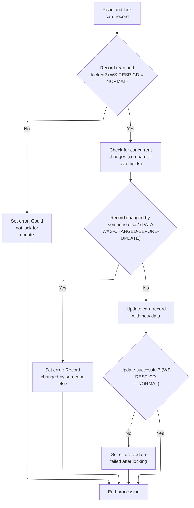

This section manages the update of card records, ensuring that updates are only performed if the record can be locked and has not been changed by another user. It sets error states for lock failures, concurrent changes, and update failures, and updates the record when all conditions are met.

| Rule ID | Code Location                                   | Category        | Rule Name                   | Description                                                                                                                                                                                                                         | Conditions                                                                                                                                                                            | Remarks                                                                                                                                                                                                                                                                  |
| ------- | ----------------------------------------------- | --------------- | --------------------------- | ----------------------------------------------------------------------------------------------------------------------------------------------------------------------------------------------------------------------------------- | ------------------------------------------------------------------------------------------------------------------------------------------------------------------------------------- | ------------------------------------------------------------------------------------------------------------------------------------------------------------------------------------------------------------------------------------------------------------------------ |
| BR-001  | 9300-CHECK-CHANGE-IN-REC, 9200-WRITE-PROCESSING | Data validation | Concurrent change detection | Before updating a card record, all relevant fields are compared to the user's last-read values. If any field has changed, the update is aborted and an error message is set indicating that the record was changed by someone else. | After successfully locking the card record, before updating, compare all card fields (CVV, embossed name, expiration year, month, day, active status) to the user's last-read values. | The error message set is 'Record changed by some one else. Please review'. The fields compared are: CVV code (3 digits), embossed name (50 characters), expiration year (4 digits), expiration month (2 digits), expiration day (2 digits), active status (1 character). |
| BR-002  | 9200-WRITE-PROCESSING                           | Business logic  | Successful card update      | If no concurrent changes are detected and the record is successfully locked, the card record is updated with the new data provided by the user.                                                                                     | After passing the record lock and concurrent change checks, and preparing the update record.                                                                                          | The updated fields include: card number (16 characters), account ID (11 digits), CVV code (3 digits), embossed name (50 characters), expiration date (formatted as 'YYYY-MM-DD', 10 characters), active status (1 character).                                            |
| BR-003  | 9200-WRITE-PROCESSING                           | Error handling  | Record lock failure         | If the card record cannot be locked for update, the update process is aborted and an error message is set indicating that the record could not be locked for update.                                                                | When attempting to read and lock the card record for update, if the response code is not NORMAL.                                                                                      | The error message set is 'Could not lock record for update'. This is reflected in the COULD-NOT-LOCK-FOR-UPDATE flag and the WS-RETURN-MSG variable.                                                                                                                     |
| BR-004  | 9200-WRITE-PROCESSING                           | Error handling  | Update failure after lock   | If the update to the card record fails after the record has been locked, an error message is set indicating that the update failed.                                                                                                 | After preparing the update record and attempting to write it to the database, if the response code is not NORMAL.                                                                     | The error message set is 'Update of record failed'. This is reflected in the LOCKED-BUT-UPDATE-FAILED flag and the WS-RETURN-MSG variable.                                                                                                                               |

<SwmSnippet path="/app/cbl/COCRDUPC.cbl" line="1420" repo-id="Z2l0aHViJTNBJTNBa3luZHJ5bC1hd3MtbWFpbmZyYW1lLW1vZGVybml6YXRpb24tY2FyZGRlbW8lM0ElM0FTd2ltbS1EZW1v">

---

We read the record for update, then check for concurrent changes before writing.

```cobol
       9200-WRITE-PROCESSING.                                                   
                                                                                
      *    Read the Card file                                                   
      *                                                                         
      *    MOVE CC-ACCT-ID-N            TO WS-CARD-RID-ACCT-ID                  
           MOVE CC-CARD-NUM             TO WS-CARD-RID-CARDNUM                  
                                                                                
           EXEC CICS READ                                                       
                FILE      (LIT-CARDFILENAME)                                    
                UPDATE                                                          
                RIDFLD    (WS-CARD-RID-CARDNUM)                                 
                KEYLENGTH (LENGTH OF WS-CARD-RID-CARDNUM)                       
                INTO      (CARD-RECORD)                                         
                LENGTH    (LENGTH OF CARD-RECORD)                               
                RESP      (WS-RESP-CD)                                          
                RESP2     (WS-REAS-CD)                                          
           END-EXEC                                                             
```

---

</SwmSnippet>

<SwmSnippet path="/app/cbl/COCRDUPC.cbl" line="1441" repo-id="Z2l0aHViJTNBJTNBa3luZHJ5bC1hd3MtbWFpbmZyYW1lLW1vZGVybml6YXRpb24tY2FyZGRlbW8lM0ElM0FTd2ltbS1EZW1v">

---

If the record can't be locked for update, we set error flags and exit. If the read is successful, we keep going and check for concurrent changes.

```cobol
           IF WS-RESP-CD EQUAL TO DFHRESP(NORMAL)                               
              CONTINUE                                                          
           ELSE                                                                 
              SET INPUT-ERROR                    TO TRUE                        
              IF  WS-RETURN-MSG-OFF                                             
                  SET COULD-NOT-LOCK-FOR-UPDATE  TO TRUE                        
              END-IF                                                            
              GO TO 9200-WRITE-PROCESSING-EXIT                                  
           END-IF                                                               
```

---

</SwmSnippet>

<SwmSnippet path="/app/cbl/COCRDUPC.cbl" line="1453" repo-id="Z2l0aHViJTNBJTNBa3luZHJ5bC1hd3MtbWFpbmZyYW1lLW1vZGVybml6YXRpb24tY2FyZGRlbW8lM0ElM0FTd2ltbS1EZW1v">

---

Before updating, we call 9300-CHECK-CHANGE-IN-REC to see if the record was changed by someone else. If it was, we abort and refresh the old values so the user doesn't overwrite someone else's changes.

```cobol
           PERFORM 9300-CHECK-CHANGE-IN-REC                                     
              THRU 9300-CHECK-CHANGE-IN-REC-EXIT                                
```

---

</SwmSnippet>

<SwmSnippet path="/app/cbl/COCRDUPC.cbl" line="1498" repo-id="Z2l0aHViJTNBJTNBa3luZHJ5bC1hd3MtbWFpbmZyYW1lLW1vZGVybml6YXRpb24tY2FyZGRlbW8lM0ElM0FTd2ltbS1EZW1v">

---

We compare all fields with the old values, and if anything changed, we set the flag and update the old fields.

```cobol
       9300-CHECK-CHANGE-IN-REC.                                                
           INSPECT CARD-EMBOSSED-NAME                                           
           CONVERTING LIT-LOWER                                                 
                   TO LIT-UPPER                                                 
                                                                                
           IF  CARD-CVV-CD              EQUAL  TO CCUP-OLD-CVV-CD               
           AND CARD-EMBOSSED-NAME       EQUAL  TO CCUP-OLD-CRDNAME              
           AND CARD-EXPIRAION-DATE(1:4) EQUAL  TO CCUP-OLD-EXPYEAR              
           AND CARD-EXPIRAION-DATE(6:2) EQUAL  TO CCUP-OLD-EXPMON               
           AND CARD-EXPIRAION-DATE(9:2) EQUAL  TO CCUP-OLD-EXPDAY               
           AND CARD-ACTIVE-STATUS       EQUAL  TO CCUP-OLD-CRDSTCD              
               CONTINUE                                                         
           ELSE                                                                 
              SET DATA-WAS-CHANGED-BEFORE-UPDATE TO TRUE                        
              MOVE CARD-CVV-CD                 TO CCUP-OLD-CVV-CD               
              MOVE CARD-EMBOSSED-NAME          TO CCUP-OLD-CRDNAME              
              MOVE CARD-EXPIRAION-DATE(1:4)    TO CCUP-OLD-EXPYEAR              
              MOVE CARD-EXPIRAION-DATE(6:2)    TO CCUP-OLD-EXPMON               
              MOVE CARD-EXPIRAION-DATE(9:2)    TO CCUP-OLD-EXPDAY               
              MOVE CARD-ACTIVE-STATUS          TO CCUP-OLD-CRDSTCD              
              GO TO 9200-WRITE-PROCESSING-EXIT                                  
           END-IF EXIT                                                          
           .                                                                    
```

---

</SwmSnippet>

<SwmSnippet path="/app/cbl/COCRDUPC.cbl" line="1455" repo-id="Z2l0aHViJTNBJTNBa3luZHJ5bC1hd3MtbWFpbmZyYW1lLW1vZGVybml6YXRpb24tY2FyZGRlbW8lM0ElM0FTd2ltbS1EZW1v">

---

After checking for changes, if anything was updated by someone else, we bail out and skip the update.

```cobol
           IF DATA-WAS-CHANGED-BEFORE-UPDATE                                    
              GO TO 9200-WRITE-PROCESSING-EXIT                                  
           END-IF                                                               
```

---

</SwmSnippet>

<SwmSnippet path="/app/cbl/COCRDUPC.cbl" line="1461" repo-id="Z2l0aHViJTNBJTNBa3luZHJ5bC1hd3MtbWFpbmZyYW1lLW1vZGVybml6YXRpb24tY2FyZGRlbW8lM0ElM0FTd2ltbS1EZW1v">

---

After passing the concurrency check, we build the update record by copying all the new values and constructing the expiration date string. This sets up the record for the actual write to the database.

```cobol
           INITIALIZE CARD-UPDATE-RECORD                                        
           MOVE CCUP-NEW-CARDID             TO CARD-UPDATE-NUM                  
           MOVE CC-ACCT-ID-N                TO CARD-UPDATE-ACCT-ID              
           MOVE CCUP-NEW-CVV-CD             TO CARD-CVV-CD-X                    
           MOVE CARD-CVV-CD-N               TO CARD-UPDATE-CVV-CD               
           MOVE CCUP-NEW-CRDNAME            TO CARD-UPDATE-EMBOSSED-NAME        
           STRING  CCUP-NEW-EXPYEAR                                             
                   '-'                                                          
                   CCUP-NEW-EXPMON                                              
                   '-'                                                          
                   CCUP-NEW-EXPDAY                                              
                   DELIMITED BY SIZE                                            
              INTO CARD-UPDATE-EXPIRAION-DATE                                   
           END-STRING                                                           
           MOVE CCUP-NEW-CRDSTCD            TO CARD-UPDATE-ACTIVE-STATUS        
```

---

</SwmSnippet>

<SwmSnippet path="/app/cbl/COCRDUPC.cbl" line="1477" repo-id="Z2l0aHViJTNBJTNBa3luZHJ5bC1hd3MtbWFpbmZyYW1lLW1vZGVybml6YXRpb24tY2FyZGRlbW8lM0ElM0FTd2ltbS1EZW1v">

---

After prepping the update record, we use EXEC CICS REWRITE to write it to the database. If it fails, we set the error flag and handle it in the next step.

```cobol
           EXEC CICS                                                            
                REWRITE FILE(LIT-CARDFILENAME)                                  
                        FROM(CARD-UPDATE-RECORD)                                
                        LENGTH(LENGTH OF CARD-UPDATE-RECORD)                    
                        RESP      (WS-RESP-CD)                                  
                        RESP2     (WS-REAS-CD)                                  
           END-EXEC.                                                            
```

---

</SwmSnippet>

<SwmSnippet path="/app/cbl/COCRDUPC.cbl" line="1488" repo-id="Z2l0aHViJTNBJTNBa3luZHJ5bC1hd3MtbWFpbmZyYW1lLW1vZGVybml6YXRpb24tY2FyZGRlbW8lM0ElM0FTd2ltbS1EZW1v">

---

After the write, if it fails, we set the update failed flag so the next state can handle the error and inform the user.

```cobol
           IF WS-RESP-CD EQUAL TO DFHRESP(NORMAL)                               
             CONTINUE                                                           
           ELSE                                                                 
             SET LOCKED-BUT-UPDATE-FAILED    TO TRUE                            
           END-IF                                                               
```

---

</SwmSnippet>

########## Handling post-update states and errors

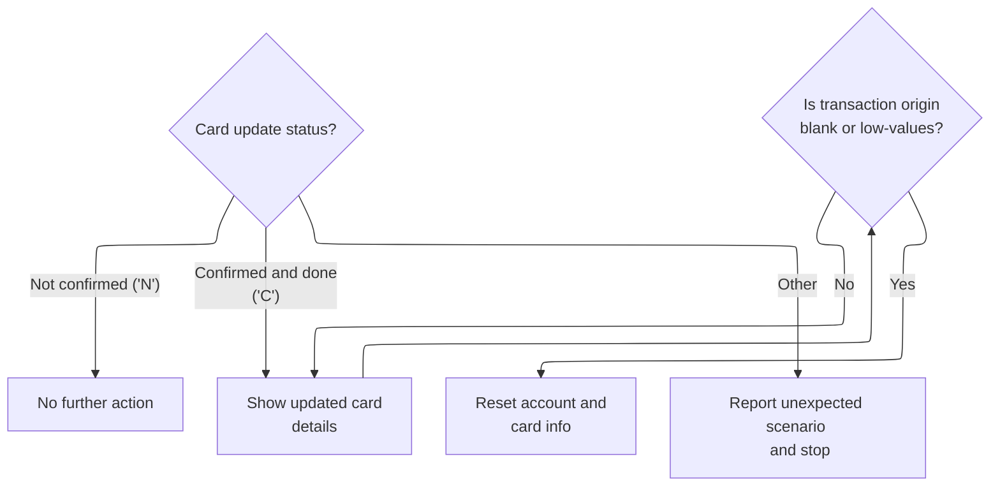

This section manages the post-update state of card records, determining what happens after an update attempt based on the status code and ensuring proper error handling for unexpected scenarios.

| Rule ID | Code Location | Category       | Rule Name                           | Description                                                                                                                                                                                                                                                        | Conditions                                                                                 | Remarks                                                                                                                                                                                                                                                                   |
| ------- | ------------- | -------------- | ----------------------------------- | ------------------------------------------------------------------------------------------------------------------------------------------------------------------------------------------------------------------------------------------------------------------ | ------------------------------------------------------------------------------------------ | ------------------------------------------------------------------------------------------------------------------------------------------------------------------------------------------------------------------------------------------------------------------------- |
| BR-001  | MAIN-LOGIC    | Business logic | Awaiting confirmation               | If the card update status is 'not confirmed', no further action is taken and the system waits for user confirmation.                                                                                                                                               | Card update status is 'N' (not confirmed).                                                 | The status code 'N' is used to indicate that changes are not yet confirmed. No output or state change occurs in this scenario.                                                                                                                                            |
| BR-002  | MAIN-LOGIC    | Business logic | Post-update display and reset       | If the card update status is 'confirmed and done', the updated card details are shown to the user. If the transaction origin is blank or contains low-values, the account and card information is reset to prepare for a new entry.                                | Card update status is 'C' (confirmed and done). Transaction origin is blank or low-values. | The status code 'C' triggers display of updated details. If transaction origin is blank or low-values, account ID and card number are set to zeroes, and account status is set to low-values. Account ID: 11 digits, Card number: 16 digits, Account status: 1 character. |
| BR-003  | MAIN-LOGIC    | Error handling | Unexpected scenario error reporting | If the card update status is not recognized as 'not confirmed' or 'confirmed and done', an error is reported and processing is stopped. The error report includes the program name, error code '0001', a blank reason, and the message 'UNEXPECTED DATA SCENARIO'. | Card update status is not 'N' or 'C'.                                                      | Error report fields: Program name (8 characters), Error code ('0001', 4 characters), Reason (blank, 50 characters), Message ('UNEXPECTED DATA SCENARIO', 72 characters).                                                                                                  |

<SwmSnippet path="/app/cbl/COCRDUPC.cbl" line="1006" repo-id="Z2l0aHViJTNBJTNBa3luZHJ5bC1hd3MtbWFpbmZyYW1lLW1vZGVybml6YXRpb24tY2FyZGRlbW8lM0ElM0FTd2ltbS1EZW1v">

---

After update processing, if we're still confirming, we just wait for the user.

```cobol
              WHEN CCUP-CHANGES-OK-NOT-CONFIRMED                                
                  CONTINUE                                                      
```

---

</SwmSnippet>

<SwmSnippet path="/app/cbl/COCRDUPC.cbl" line="1011" repo-id="Z2l0aHViJTNBJTNBa3luZHJ5bC1hd3MtbWFpbmZyYW1lLW1vZGVybml6YXRpb24tY2FyZGRlbW8lM0ElM0FTd2ltbS1EZW1v">

---

After a successful update, we reset the account and card fields if we're coming from a new transaction. This keeps the screen clean for the next entry.

```cobol
              WHEN CCUP-CHANGES-OKAYED-AND-DONE                                 
                  SET CCUP-SHOW-DETAILS TO TRUE                                 
                  IF CDEMO-FROM-TRANID    EQUAL LOW-VALUES                      
                  OR CDEMO-FROM-TRANID    EQUAL SPACES                          
                     MOVE ZEROES       TO CDEMO-ACCT-ID                         
                                          CDEMO-CARD-NUM                        
                     MOVE LOW-VALUES   TO CDEMO-ACCT-STATUS                     
                  END-IF                                                        
```

---

</SwmSnippet>

<SwmSnippet path="/app/cbl/COCRDUPC.cbl" line="1019" repo-id="Z2l0aHViJTNBJTNBa3luZHJ5bC1hd3MtbWFpbmZyYW1lLW1vZGVybml6YXRpb24tY2FyZGRlbW8lM0ElM0FTd2ltbS1EZW1v">

---

If none of the expected states match, we call ABEND-ROUTINE to catch and report the error. This stops the program from running in an undefined state.

```cobol
              WHEN OTHER                                                        
                   MOVE LIT-THISPGM    TO ABEND-CULPRIT                         
                   MOVE '0001'         TO ABEND-CODE                            
                   MOVE SPACES         TO ABEND-REASON                          
                   MOVE 'UNEXPECTED DATA SCENARIO'                              
                                       TO ABEND-MSG                             
                   PERFORM ABEND-ROUTINE                                        
                      THRU ABEND-ROUTINE-EXIT                                   
           END-EVALUATE                                                         
```

---

</SwmSnippet>

######### Handling unexpected errors and abnormal ends

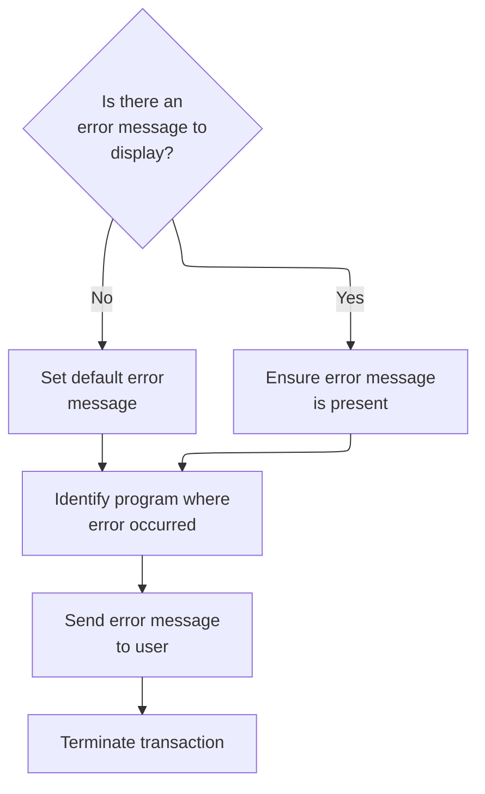

This section manages unexpected errors and abnormal ends by ensuring users receive clear error messages, identifying the source program, notifying users, and terminating transactions cleanly.

| Rule ID | Code Location | Category       | Rule Name                              | Description                                                                                                                                                              | Conditions                                             | Remarks                                                                                                                                                                                                |
| ------- | ------------- | -------------- | -------------------------------------- | ------------------------------------------------------------------------------------------------------------------------------------------------------------------------ | ------------------------------------------------------ | ------------------------------------------------------------------------------------------------------------------------------------------------------------------------------------------------------ |
| BR-001  | ABEND-ROUTINE | Error handling | Default abend message                  | If no error message is present during an abnormal end, a default message 'UNEXPECTED ABEND OCCURRED.' is provided to ensure the user receives a meaningful error report. | An abnormal end occurs and the error message is empty. | The default message is 'UNEXPECTED ABEND OCCURRED.' (23 characters, alphanumeric, left-aligned, padded with spaces if shorter than the field size).                                                    |
| BR-002  | ABEND-ROUTINE | Error handling | Program identification in error report | The program name is included in the error report to identify the source of the abnormal end.                                                                             | An abnormal end occurs.                                | The program name is set to 'COCRDUPC' (8 characters, alphanumeric, left-aligned, padded with spaces if shorter than the field size).                                                                   |
| BR-003  | ABEND-ROUTINE | Error handling | User notification of abend             | The error message and related abend data are sent to the user interface to inform the user of the abnormal end.                                                          | An abnormal end occurs.                                | The error message and abend data are sent as a string of up to 134 bytes (sum of ABEND-CODE, ABEND-CULPRIT, ABEND-REASON, ABEND-MSG), left-aligned, padded with spaces if shorter than the field size. |
| BR-004  | ABEND-ROUTINE | Error handling | Force transaction termination          | Any existing abend handling is cancelled before forcibly terminating the transaction with a specific error code ('9999') to prevent recursive error handling.            | An abnormal end occurs.                                | The transaction is terminated with error code '9999' (4 characters, alphanumeric).                                                                                                                     |

<SwmSnippet path="/app/cbl/COCRDUPC.cbl" line="1531" repo-id="Z2l0aHViJTNBJTNBa3luZHJ5bC1hd3MtbWFpbmZyYW1lLW1vZGVybml6YXRpb24tY2FyZGRlbW8lM0ElM0FTd2ltbS1EZW1v">

---

In `ABEND-ROUTINE`, if the abend message is empty, we set it to 'UNEXPECTED ABEND OCCURRED.' so there's always something useful in the error report.

```cobol
       ABEND-ROUTINE.                                                           
                                                                                
           IF ABEND-MSG EQUAL LOW-VALUES                                        
              MOVE 'UNEXPECTED ABEND OCCURRED.' TO ABEND-MSG                    
           END-IF                                                               
```

---

</SwmSnippet>

<SwmSnippet path="/app/cbl/COCRDUPC.cbl" line="1537" repo-id="Z2l0aHViJTNBJTNBa3luZHJ5bC1hd3MtbWFpbmZyYW1lLW1vZGVybml6YXRpb24tY2FyZGRlbW8lM0ElM0FTd2ltbS1EZW1v">

---

We mark the program as the culprit, send the abend data to the terminal with NOHANDLE and ERASE, cancel any existing abend handling, and force an abend with code '9999'. This makes error reporting clear and avoids recursive abends.

```cobol
           MOVE LIT-THISPGM       TO ABEND-CULPRIT                              
                                                                                
           EXEC CICS SEND                                                       
                            FROM (ABEND-DATA)                                   
                            LENGTH(LENGTH OF ABEND-DATA)                        
                            NOHANDLE                                            
                            ERASE                                               
           END-EXEC                                                             
                                                                                
           EXEC CICS HANDLE ABEND                                               
                CANCEL                                                          
           END-EXEC                                                             
                                                                                
           EXEC CICS ABEND                                                      
                ABCODE('9999')                                                  
           END-EXEC                                                             
```

---

</SwmSnippet>

######### Finalizing expiry year validation and moving to next step

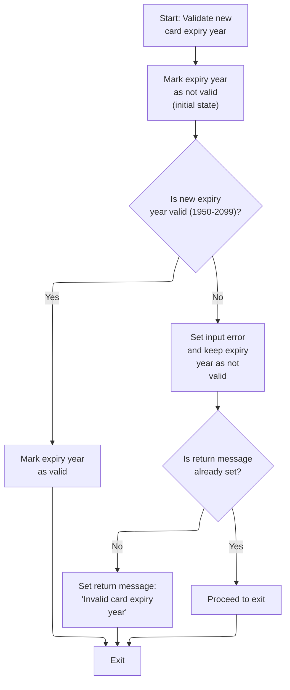

This section validates the new card expiry year entered by the user, determines if it is within the acceptable range, and sets appropriate flags and messages for downstream processing or user feedback.

| Rule ID | Code Location         | Category        | Rule Name                              | Description                                                                                                                               | Conditions                                                                                                               | Remarks                                                                                                                             |
| ------- | --------------------- | --------------- | -------------------------------------- | ----------------------------------------------------------------------------------------------------------------------------------------- | ------------------------------------------------------------------------------------------------------------------------ | ----------------------------------------------------------------------------------------------------------------------------------- |
| BR-001  | 1260-EDIT-EXPIRY-YEAR | Data validation | Expiry year range validation           | The new card expiry year must be within the range 1950 to 2099 (inclusive) to be considered valid.                                        | This rule applies whenever a new card expiry year is provided for validation in this section.                            | The valid range is 1950 to 2099, inclusive. The year is expected as a four-digit number.                                            |
| BR-002  | 1260-EDIT-EXPIRY-YEAR | Business logic  | Mark valid expiry year                 | If the new card expiry year is valid, the expiry year is marked as valid for further processing.                                          | This rule applies when the new card expiry year passes the range validation (i.e., is between 1950 and 2099, inclusive). | The expiry year validity flag is set to 'valid'.                                                                                    |
| BR-003  | 1260-EDIT-EXPIRY-YEAR | Error handling  | Invalid expiry year error flagging     | If the new card expiry year is not valid, an input error is flagged and the expiry year is marked as not valid.                           | This rule applies when the new card expiry year fails the range validation (i.e., is not between 1950 and 2099).         | The error flag is set to indicate invalid input. The expiry year validity flag is set to 'not valid'.                               |
| BR-004  | 1260-EDIT-EXPIRY-YEAR | Error handling  | Expiry year invalid message precedence | If the new card expiry year is not valid and no return message has been set yet, the return message is set to 'Invalid card expiry year'. | This rule applies when the expiry year is invalid and the return message is currently unset (i.e., blank or spaces).     | The return message is set to the string 'Invalid card expiry year'. This message is only set if no other return message is present. |

<SwmSnippet path="/app/cbl/COCRDUPC.cbl" line="930" repo-id="Z2l0aHViJTNBJTNBa3luZHJ5bC1hd3MtbWFpbmZyYW1lLW1vZGVybml6YXRpb24tY2FyZGRlbW8lM0ElM0FTd2ltbS1EZW1v">

---

Back in `1260-EDIT-EXPIRY-YEAR` after deciding the action, we check if the year is valid (1950-2099). If not, we set error flags and prompt for correction.

```cobol
           SET FLG-CARDEXPYEAR-NOT-OK      TO TRUE                              
                                                                                
           MOVE CCUP-NEW-EXPYEAR           TO CARD-YEAR-CHECK                   
                                                                                
           IF VALID-YEAR                                                        
              SET FLG-CARDEXPYEAR-ISVALID  TO TRUE                              
           ELSE                                                                 
              SET INPUT-ERROR              TO TRUE                              
              SET FLG-CARDEXPYEAR-NOT-OK   TO TRUE                              
              IF WS-RETURN-MSG-OFF                                              
                 SET CARD-EXPIRY-YEAR-NOT-VALID  TO TRUE                        
              END-IF                                                            
              GO TO  1260-EDIT-EXPIRY-YEAR-EXIT                                 
           END-IF                                                               
```

---

</SwmSnippet>

######## Finalizing expiry month validation and moving to next step

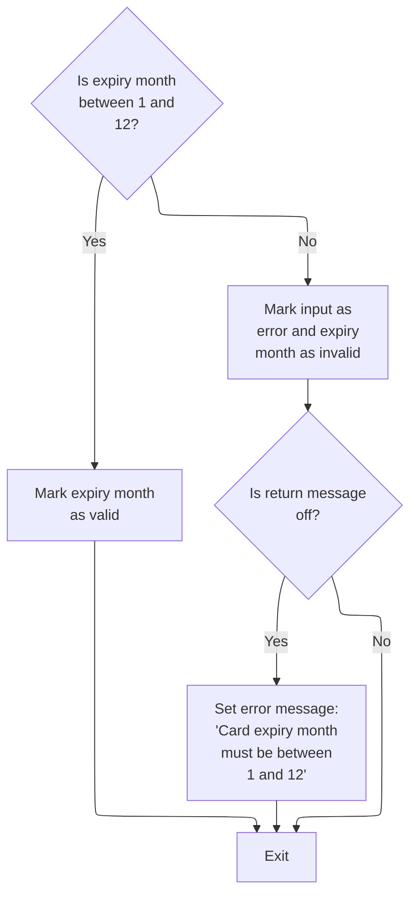

This section validates the expiry month entered for a card and determines the appropriate business response, including error handling and messaging.

| Rule ID | Code Location        | Category        | Rule Name                     | Description                                                                                                                                                             | Conditions                                                                         | Remarks                                                                                                                                                           |
| ------- | -------------------- | --------------- | ----------------------------- | ----------------------------------------------------------------------------------------------------------------------------------------------------------------------- | ---------------------------------------------------------------------------------- | ----------------------------------------------------------------------------------------------------------------------------------------------------------------- |
| BR-001  | 1250-EDIT-EXPIRY-MON | Data validation | Expiry month valid range      | The expiry month is considered valid if its value is between 1 and 12, inclusive. When valid, the system marks the expiry month as valid and proceeds to the next step. | The expiry month value is greater than or equal to 1 and less than or equal to 12. | The valid range for the expiry month is 1 to 12, inclusive. The output is a validation status indicating the expiry month is valid.                               |
| BR-002  | 1250-EDIT-EXPIRY-MON | Error handling  | Invalid expiry month handling | If the expiry month is not between 1 and 12, the system marks the input as erroneous and the expiry month as invalid.                                                   | The expiry month value is less than 1 or greater than 12.                          | The valid range for the expiry month is 1 to 12, inclusive. If the value is outside this range, the input is marked as erroneous and the expiry month as invalid. |
| BR-003  | 1250-EDIT-EXPIRY-MON | Error handling  | Expiry month error message    | When the expiry month is invalid and the return message flag is off, the system sets the error message to 'Card expiry month must be between 1 and 12'.                 | The expiry month is invalid and the return message flag is off.                    | The error message set is: 'Card expiry month must be between 1 and 12'. The message is only set if the return message flag is off.                                |

<SwmSnippet path="/app/cbl/COCRDUPC.cbl" line="896" repo-id="Z2l0aHViJTNBJTNBa3luZHJ5bC1hd3MtbWFpbmZyYW1lLW1vZGVybml6YXRpb24tY2FyZGRlbW8lM0ElM0FTd2ltbS1EZW1v">

---

Back in `1250-EDIT-EXPIRY-MON` after validating the year, we check if the month is valid (1-12). If not, we set error flags and prompt for correction.

```cobol
           MOVE CCUP-NEW-EXPMON           TO CARD-MONTH-CHECK                   
                                                                                
           IF VALID-MONTH                                                       
              SET FLG-CARDEXPMON-ISVALID  TO TRUE                               
           ELSE                                                                 
              SET INPUT-ERROR             TO TRUE                               
              SET FLG-CARDEXPMON-NOT-OK   TO TRUE                               
              IF WS-RETURN-MSG-OFF                                              
                 SET CARD-EXPIRY-MONTH-NOT-VALID  TO TRUE                       
              END-IF                                                            
              GO TO  1250-EDIT-EXPIRY-MON-EXIT                                  
           END-IF                                                               
```

---

</SwmSnippet>

####### Finalizing card status validation and moving to next step

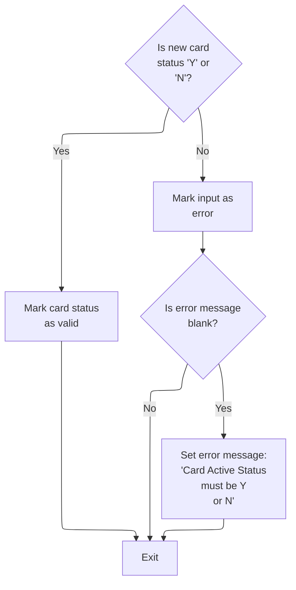

This section validates the new card status input during card update, ensuring only accepted values are processed and appropriate error handling is performed for invalid inputs.

| Rule ID | Code Location        | Category        | Rule Name                           | Description                                                                                                              | Conditions                                                                             | Remarks                                                                                                |
| ------- | -------------------- | --------------- | ----------------------------------- | ------------------------------------------------------------------------------------------------------------------------ | -------------------------------------------------------------------------------------- | ------------------------------------------------------------------------------------------------------ |
| BR-001  | 1240-EDIT-CARDSTATUS | Data validation | Card status value requirement       | The card status must be either 'Y' (active) or 'N' (inactive) to be considered valid. Any other value is rejected.       | When a new card status is provided during card update.                                 | Accepted values: 'Y' or 'N'. Any other value is invalid. The card status is a single-character string. |
| BR-002  | 1240-EDIT-CARDSTATUS | Business logic  | Valid card status progression       | When the card status is valid, the process moves to the next step without setting any error flags or messages.           | When the card status input is 'Y' or 'N'.                                              | No error message is generated and the card status is marked as valid.                                  |
| BR-003  | 1240-EDIT-CARDSTATUS | Error handling  | Invalid card status error messaging | If the card status is invalid, an error message is generated to inform the user that the card status must be 'Y' or 'N'. | When the card status input is not 'Y' or 'N' and the error message is currently blank. | Error message: 'Card Active Status must be Y or N'. The message is a string displayed to the user.     |

<SwmSnippet path="/app/cbl/COCRDUPC.cbl" line="861" repo-id="Z2l0aHViJTNBJTNBa3luZHJ5bC1hd3MtbWFpbmZyYW1lLW1vZGVybml6YXRpb24tY2FyZGRlbW8lM0ElM0FTd2ltbS1EZW1v">

---

Back in `1240-EDIT-CARDSTATUS` after validating the expiry month, we check if the card status is valid ('Y' or 'N'). If not, we set error flags and prompt for correction.

```cobol
           MOVE CCUP-NEW-CRDSTCD          TO FLG-YES-NO-CHECK                   
                                                                                
           IF FLG-YES-NO-VALID                                                  
              SET FLG-CARDSTATUS-ISVALID  TO TRUE                               
           ELSE                                                                 
              SET INPUT-ERROR             TO TRUE                               
              SET FLG-CARDSTATUS-NOT-OK   TO TRUE                               
              IF WS-RETURN-MSG-OFF                                              
                 SET CARD-STATUS-MUST-BE-YES-NO  TO TRUE                        
              END-IF                                                            
              GO TO  1240-EDIT-CARDSTATUS-EXIT                                  
           END-IF                                                               
```

---

</SwmSnippet>

###### Finalizing card name validation and moving to next step

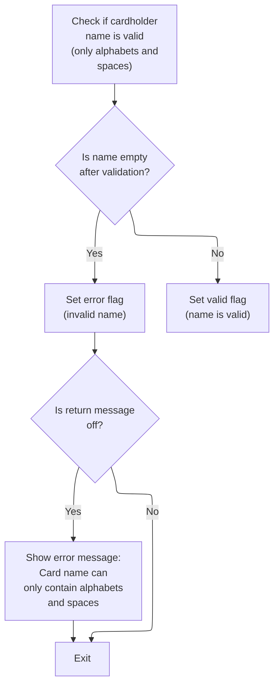

This section validates the cardholder name during the card update process, ensuring it meets business requirements and providing appropriate error handling and messaging.

| Rule ID | Code Location  | Category        | Rule Name                             | Description                                                                                                                                        | Conditions                                                                                             | Remarks                                                                                                                                                                   |
| ------- | -------------- | --------------- | ------------------------------------- | -------------------------------------------------------------------------------------------------------------------------------------------------- | ------------------------------------------------------------------------------------------------------ | ------------------------------------------------------------------------------------------------------------------------------------------------------------------------- |
| BR-001  | 1230-EDIT-NAME | Data validation | Cardholder name character restriction | The cardholder name must contain only alphabetic characters (A-Z, a-z) and spaces. Any other character is considered invalid.                      | When a cardholder name is provided for validation.                                                     | Allowed characters: uppercase and lowercase English letters (A-Z, a-z) and spaces. The name field is up to 50 characters in length. Any other character is not permitted. |
| BR-002  | 1230-EDIT-NAME | Business logic  | Valid cardholder name acceptance      | If the cardholder name passes validation, it is marked as valid and accepted for further processing.                                               | After validating the cardholder name, if the result is not empty and contains only allowed characters. | The valid flag is set to indicate the name is accepted. The name can be up to 50 characters, containing only letters and spaces.                                          |
| BR-003  | 1230-EDIT-NAME | Error handling  | Invalid cardholder name handling      | If the cardholder name is empty or contains invalid characters, an error flag is set and the name is marked as not valid.                          | After validating the cardholder name, if the result is empty or contains invalid characters.           | Error flags are set to indicate invalid input. The name is not accepted for further processing.                                                                           |
| BR-004  | 1230-EDIT-NAME | Error handling  | Cardholder name error messaging       | If the cardholder name is invalid and the return message is enabled, display the error message: 'Card name can only contain alphabets and spaces'. | When the cardholder name is invalid and the return message flag is enabled.                            | Error message displayed: 'Card name can only contain alphabets and spaces'.                                                                                               |

<SwmSnippet path="/app/cbl/COCRDUPC.cbl" line="823" repo-id="Z2l0aHViJTNBJTNBa3luZHJ5bC1hd3MtbWFpbmZyYW1lLW1vZGVybml6YXRpb24tY2FyZGRlbW8lM0ElM0FTd2ltbS1EZW1v">

---

Back in `1230-EDIT-NAME` after validating the card status, we check if the card name contains only alphabets and spaces. If not, we set error flags and prompt for correction. If it's valid, we set the valid flag.

```cobol
           MOVE CCUP-NEW-CRDNAME        TO CARD-NAME-CHECK                      
           INSPECT CARD-NAME-CHECK                                              
             CONVERTING LIT-ALL-ALPHA-FROM                                      
                     TO LIT-ALL-SPACES-TO                                       
                                                                                
           IF FUNCTION LENGTH(FUNCTION TRIM(CARD-NAME-CHECK)) = 0               
              CONTINUE                                                          
           ELSE                                                                 
              SET INPUT-ERROR           TO TRUE                                 
              SET FLG-CARDNAME-NOT-OK   TO TRUE                                 
              IF WS-RETURN-MSG-OFF                                              
                 SET WS-NAME-MUST-BE-ALPHA  TO TRUE                             
              END-IF                                                            
              GO TO  1230-EDIT-NAME-EXIT                                        
           END-IF                                                               
                                                                                
           SET FLG-CARDNAME-ISVALID     TO TRUE                                 
           .                                                                    
```

---

</SwmSnippet>

##### Validating the card number input and handling errors

This section validates the card number input and handles errors to ensure only valid card numbers are processed. It sets error flags and displays messages for invalid input, and propagates valid card numbers for further use.

| Rule ID | Code Location  | Category        | Rule Name                         | Description                                                                                                                                                                                                                                                                                    | Conditions                                                                        | Remarks                                                                                                                                                                                                                                                                                      |
| ------- | -------------- | --------------- | --------------------------------- | ---------------------------------------------------------------------------------------------------------------------------------------------------------------------------------------------------------------------------------------------------------------------------------------------- | --------------------------------------------------------------------------------- | -------------------------------------------------------------------------------------------------------------------------------------------------------------------------------------------------------------------------------------------------------------------------------------------- |
| BR-001  | 1220-EDIT-CARD | Data validation | Card number must be numeric       | If the card number input is not a numeric value, the system sets error flags, displays an error message stating 'CARD ID FILTER,IF SUPPLIED MUST BE A 16 DIGIT NUMBER', clears the card number fields, and exits the section. This prevents invalid card numbers from being processed further. | Triggered when the card number input contains any non-numeric characters.         | The error message displayed is 'CARD ID FILTER,IF SUPPLIED MUST BE A 16 DIGIT NUMBER'. The card number field is expected to be a string of 16 digits. When an error is detected, the card number output field is set to zero and the new card ID field is set to low values (binary zeroes). |
| BR-002  | 1220-EDIT-CARD | Business logic  | Valid card number propagation     | When the card number input passes all validation checks, the system copies the numeric and string representations of the card number to output fields and sets a flag indicating the card number is valid. This enables downstream processes to use the validated card number.                 | Triggered when the card number input is numeric and passes all validation checks. | The card number is copied as both a numeric value and a string of 16 digits to the output fields. The valid flag is set to indicate the card number is ready for use in subsequent processing.                                                                                               |
| BR-003  | 1220-EDIT-CARD | Error handling  | Error exit on invalid card number | If an error is detected during card number validation, the system prevents further processing of the card number by exiting the section immediately after setting error flags and clearing fields.                                                                                             | Triggered when the card number input fails validation checks.                     | After error flags are set and fields are cleared, the section is exited to prevent further processing of invalid data.                                                                                                                                                                       |

<SwmSnippet path="/app/cbl/COCRDUPC.cbl" line="784" repo-id="Z2l0aHViJTNBJTNBa3luZHJ5bC1hd3MtbWFpbmZyYW1lLW1vZGVybml6YXRpb24tY2FyZGRlbW8lM0ElM0FTd2ltbS1EZW1v">

---

Right after coming back from 1230-EDIT-NAME in 1220-EDIT-CARD, if the card number isn't numeric, we set error flags, show an error message, clear the card number fields, and exit. This makes sure only valid card numbers get processed and the UI doesn't show junk data.

```cobol
           IF CC-CARD-NUM  IS NOT NUMERIC                                       
              SET INPUT-ERROR TO TRUE                                           
              SET FLG-CARDFILTER-NOT-OK TO TRUE                                 
              IF WS-RETURN-MSG-OFF                                              
                 MOVE                                                           
              'CARD ID FILTER,IF SUPPLIED MUST BE A 16 DIGIT NUMBER'            
                                 TO WS-RETURN-MSG                               
              END-IF                                                            
              MOVE ZERO          TO CDEMO-CARD-NUM                              
              MOVE LOW-VALUES    TO CCUP-NEW-CARDID                             
              GO TO 1220-EDIT-CARD-EXIT                                         
```

---

</SwmSnippet>

<SwmSnippet path="/app/cbl/COCRDUPC.cbl" line="795" repo-id="Z2l0aHViJTNBJTNBa3luZHJ5bC1hd3MtbWFpbmZyYW1lLW1vZGVybml6YXRpb24tY2FyZGRlbW8lM0ElM0FTd2ltbS1EZW1v">

---

If the card number passes all checks in 1220-EDIT-CARD, we copy the numeric and string values to the output fields and set the valid flag. This lets the rest of the flow know the card number is good and ready for use.

```cobol
           ELSE                                                                 
              MOVE CC-CARD-NUM-N TO CDEMO-CARD-NUM                              
              MOVE CC-CARD-NUM   TO CCUP-NEW-CARDID                             
              SET FLG-CARDFILTER-ISVALID TO TRUE                                
           END-IF                                                               
```

---

</SwmSnippet>

#### Validating the account number input and handling errors

This section validates the account number input after editing card details and ensures that only valid, numeric account numbers are accepted for further processing. It handles errors by setting appropriate flags, displaying messages, and clearing invalid data.

| Rule ID | Code Location     | Category        | Rule Name                           | Description                                                                                                                                                                                                                        | Conditions                                                                           | Remarks                                                                                                                                                                                                 |
| ------- | ----------------- | --------------- | ----------------------------------- | ---------------------------------------------------------------------------------------------------------------------------------------------------------------------------------------------------------------------------------- | ------------------------------------------------------------------------------------ | ------------------------------------------------------------------------------------------------------------------------------------------------------------------------------------------------------- |
| BR-001  | 1210-EDIT-ACCOUNT | Data validation | Account number must be numeric      | If the account number input is not numeric, the system must set error flags, display an error message stating 'ACCOUNT FILTER,IF SUPPLIED MUST BE A 11 DIGIT NUMBER', clear the account fields, and exit the account edit routine. | This rule applies when the account number input contains any non-numeric characters. | The error message is: 'ACCOUNT FILTER,IF SUPPLIED MUST BE A 11 DIGIT NUMBER'. The account number field must be 11 digits, numeric. When invalid, output fields are cleared (set to zero or low-values). |
| BR-002  | 1210-EDIT-ACCOUNT | Business logic  | Valid account number propagation    | If the account number input passes all checks (is numeric), the system must copy the account number to the output fields and set the valid flag to indicate the account number is ready for use.                                   | This rule applies when the account number input is numeric.                          | The account number is copied to output fields as an 11-digit numeric value. The valid flag is set to indicate the account number is ready for use in subsequent processing.                             |
| BR-003  | 1210-EDIT-ACCOUNT | Error handling  | Clear invalid account number fields | When an account number input error is detected, the system must clear the account number fields to prevent invalid data from being used in subsequent operations.                                                                  | This rule applies when the account number input is found to be non-numeric.          | The account number output fields are set to zero or low-values to ensure no invalid data is retained.                                                                                                   |

<SwmSnippet path="/app/cbl/COCRDUPC.cbl" line="740" repo-id="Z2l0aHViJTNBJTNBa3luZHJ5bC1hd3MtbWFpbmZyYW1lLW1vZGVybml6YXRpb24tY2FyZGRlbW8lM0ElM0FTd2ltbS1EZW1v">

---

After coming back from 1220-EDIT-CARD in 1210-EDIT-ACCOUNT, if the account number isn't numeric, we set error flags, show an error message, clear the account fields, and exit. This keeps the UI and data clean.

```cobol
           IF CC-ACCT-ID  IS NOT NUMERIC                                        
              SET INPUT-ERROR TO TRUE                                           
              SET FLG-ACCTFILTER-NOT-OK TO TRUE                                 
              IF WS-RETURN-MSG-OFF                                              
                MOVE                                                            
              'ACCOUNT FILTER,IF SUPPLIED MUST BE A 11 DIGIT NUMBER'            
                              TO WS-RETURN-MSG                                  
              END-IF                                                            
              MOVE ZERO       TO CDEMO-ACCT-ID                                  
              MOVE LOW-VALUES TO CCUP-NEW-ACCTID                                
              GO TO 1210-EDIT-ACCOUNT-EXIT                                      
```

---

</SwmSnippet>

<SwmSnippet path="/app/cbl/COCRDUPC.cbl" line="751" repo-id="Z2l0aHViJTNBJTNBa3luZHJ5bC1hd3MtbWFpbmZyYW1lLW1vZGVybml6YXRpb24tY2FyZGRlbW8lM0ElM0FTd2ltbS1EZW1v">

---

If the account number passes all checks in 1210-EDIT-ACCOUNT, we copy it to the output fields and set the valid flag. This lets the rest of the flow know the account number is good and ready for use.

```cobol
           ELSE                                                                 
              MOVE CC-ACCT-ID TO CDEMO-ACCT-ID                                  
                                 CCUP-NEW-ACCTID                                
              SET FLG-ACCTFILTER-ISVALID TO TRUE                                
           END-IF                                                               
```

---

</SwmSnippet>

### Checking for missing search criteria and skipping further edits

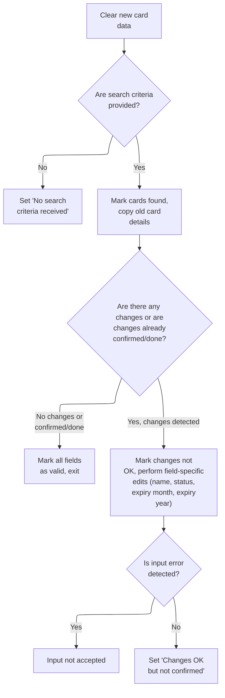

This section manages the initial edit and validation logic for card update requests, determining when to skip edits, copy existing details, perform field-specific validations, and set status flags based on user input and detected changes.

| Rule ID | Code Location        | Category        | Rule Name                             | Description                                                                                                                                                                                             | Conditions                                                              | Remarks                                                                                                                                                                                                                  |
| ------- | -------------------- | --------------- | ------------------------------------- | ------------------------------------------------------------------------------------------------------------------------------------------------------------------------------------------------------- | ----------------------------------------------------------------------- | ------------------------------------------------------------------------------------------------------------------------------------------------------------------------------------------------------------------------ |
| BR-001  | 1200-EDIT-MAP-INPUTS | Data validation | Missing search criteria skip          | If both account and card search criteria are missing, the system will skip all further edits and set the status to indicate that no search criteria were received.                                      | Both account filter and card filter are blank.                          | The status message 'No input received' is set when both filters are blank. No further edits or validations are performed in this case.                                                                                   |
| BR-002  | 1200-EDIT-MAP-INPUTS | Data validation | Field-specific edits on change        | If changes are detected in the card data, the system marks the changes as not OK and performs field-specific edits for name, status, expiry month, and expiry year.                                     | Changes detected in card data.                                          | Field-specific edits are performed in sequence: name, status, expiry month, expiry year. Each field is validated according to its own rules (not detailed in this section).                                              |
| BR-003  | 1200-EDIT-MAP-INPUTS | Business logic  | Copy old card details on valid search | When valid search criteria are provided, the system copies the existing card details to the output fields and marks the card as found, allowing the user to view current details without further edits. | At least one search criterion (account or card filter) is provided.     | The card details copied include account ID (11 digits), card number (16 digits), embossed name (50 characters), active status (1 character), expiry day (2 digits), expiry month (2 digits), and expiry year (4 digits). |
| BR-004  | 1200-EDIT-MAP-INPUTS | Business logic  | No changes detected skip edits        | If no changes are detected in the card data or changes are already confirmed/done, all field validation flags are set to valid and no further edits are performed.                                      | No changes detected in card data OR changes are already confirmed/done. | All field validation flags (name, status, expiry month, expiry year) are set to valid ('1'). The process exits without further edits.                                                                                    |
| BR-005  | 1200-EDIT-MAP-INPUTS | Business logic  | Changes OK but not confirmed          | After all field-specific edits, if no input errors are detected, the system sets the status to indicate that changes are OK but not yet confirmed.                                                      | All field-specific edits completed and no input errors detected.        | The status 'Changes OK but not confirmed' is set when all edits pass without error. This signals readiness for user confirmation.                                                                                        |

<SwmSnippet path="/app/cbl/COCRDUPC.cbl" line="653" repo-id="Z2l0aHViJTNBJTNBa3luZHJ5bC1hd3MtbWFpbmZyYW1lLW1vZGVybml6YXRpb24tY2FyZGRlbW8lM0ElM0FTd2ltbS1EZW1v">

---

If both filters are blank, 1200-EDIT-MAP-INPUTS sets the flag and skips further edits.

```cobol
               MOVE LOW-VALUES                 TO CCUP-NEW-CARDDATA             
                                                                                
      *       IF THE SEARCH CONDITIONS HAVE PROBLEMS SKIP OTHER EDITS           
               IF  FLG-ACCTFILTER-BLANK                                         
               AND FLG-CARDFILTER-BLANK                                         
                   SET NO-SEARCH-CRITERIA-RECEIVED TO TRUE                      
               END-IF                                                           
```

---

</SwmSnippet>

<SwmSnippet path="/app/cbl/COCRDUPC.cbl" line="663" repo-id="Z2l0aHViJTNBJTNBa3luZHJ5bC1hd3MtbWFpbmZyYW1lLW1vZGVybml6YXRpb24tY2FyZGRlbW8lM0ElM0FTd2ltbS1EZW1v">

---

If the blank filter check fails, we just CONTINUE and move on to the next validation step. This keeps the logic clear and avoids unnecessary branching.

```cobol
           ELSE                                                                 
               CONTINUE                                                         
           END-IF                                                               
```

---

</SwmSnippet>

<SwmSnippet path="/app/cbl/COCRDUPC.cbl" line="668" repo-id="Z2l0aHViJTNBJTNBa3luZHJ5bC1hd3MtbWFpbmZyYW1lLW1vZGVybml6YXRpb24tY2FyZGRlbW8lM0ElM0FTd2ltbS1EZW1v">

---

If details are already fetched, we set all the valid flags and copy the old card data to the output fields. This lets the UI show the current details without running more edits.

```cobol
           SET FOUND-CARDS-FOR-ACCOUNT TO TRUE                                  
           SET FLG-ACCTFILTER-ISVALID  TO TRUE                                  
           SET FLG-CARDFILTER-ISVALID  TO TRUE                                  
           MOVE CCUP-OLD-ACCTID     TO CDEMO-ACCT-ID                            
           MOVE CCUP-OLD-CARDID     TO CDEMO-CARD-NUM                           
           MOVE CCUP-OLD-CRDNAME    TO CARD-EMBOSSED-NAME                       
           MOVE CCUP-OLD-CRDSTCD    TO CARD-ACTIVE-STATUS                       
           MOVE CCUP-OLD-EXPDAY     TO CARD-EXPIRY-DAY                          
           MOVE CCUP-OLD-EXPMON     TO CARD-EXPIRY-MONTH                        
           MOVE CCUP-OLD-EXPYEAR    TO CARD-EXPIRY-YEAR                         
```

---

</SwmSnippet>

<SwmSnippet path="/app/cbl/COCRDUPC.cbl" line="680" repo-id="Z2l0aHViJTNBJTNBa3luZHJ5bC1hd3MtbWFpbmZyYW1lLW1vZGVybml6YXRpb24tY2FyZGRlbW8lM0ElM0FTd2ltbS1EZW1v">

---

Here we use FUNCTION UPPER-CASE to compare new and old card data. If they're the same, we set the no changes flag, so the flow knows nothing was modified.

```cobol
           IF  (FUNCTION UPPER-CASE(CCUP-NEW-CARDDATA) EQUAL                    
                FUNCTION UPPER-CASE(CCUP-OLD-CARDDATA))                         
               SET NO-CHANGES-DETECTED TO TRUE                                  
           END-IF                                                               
```

---

</SwmSnippet>

<SwmSnippet path="/app/cbl/COCRDUPC.cbl" line="685" repo-id="Z2l0aHViJTNBJTNBa3luZHJ5bC1hd3MtbWFpbmZyYW1lLW1vZGVybml6YXRpb24tY2FyZGRlbW8lM0ElM0FTd2ltbS1EZW1v">

---

If no changes are detected or edits are already confirmed/done, we set all the validation flags to true and exit. This skips unnecessary checks.

```cobol
           IF  NO-CHANGES-DETECTED                                              
           OR  CCUP-CHANGES-OK-NOT-CONFIRMED                                    
           OR  CCUP-CHANGES-OKAYED-AND-DONE                                     
               SET FLG-CARDNAME-ISVALID    TO TRUE                              
               SET FLG-CARDSTATUS-ISVALID  TO TRUE                              
               SET FLG-CARDEXPMON-ISVALID  TO TRUE                              
               SET FLG-CARDEXPYEAR-ISVALID TO TRUE                              
               GO TO 1200-EDIT-MAP-INPUTS-EXIT                                  
           END-IF                                                               
```

---

</SwmSnippet>

<SwmSnippet path="/app/cbl/COCRDUPC.cbl" line="696" repo-id="Z2l0aHViJTNBJTNBa3luZHJ5bC1hd3MtbWFpbmZyYW1lLW1vZGVybml6YXRpb24tY2FyZGRlbW8lM0ElM0FTd2ltbS1EZW1v">

---

Once changes are detected, we call 1230-EDIT-NAME to validate the name field, then move on to status and expiry fields. This makes sure all edits are checked in order.

```cobol
           SET CCUP-CHANGES-NOT-OK    TO TRUE                                   
                                                                                
           PERFORM 1230-EDIT-NAME                                               
              THRU 1230-EDIT-NAME-EXIT                                          
                                                                                
           PERFORM 1240-EDIT-CARDSTATUS                                         
              THRU 1240-EDIT-CARDSTATUS-EXIT                                    
                                                                                
           PERFORM 1250-EDIT-EXPIRY-MON                                         
              THRU 1250-EDIT-EXPIRY-MON-EXIT                                    
                                                                                
           PERFORM 1260-EDIT-EXPIRY-YEAR                                        
              THRU 1260-EDIT-EXPIRY-YEAR-EXIT                                   
```

---

</SwmSnippet>

<SwmSnippet path="/app/cbl/COCRDUPC.cbl" line="710" repo-id="Z2l0aHViJTNBJTNBa3luZHJ5bC1hd3MtbWFpbmZyYW1lLW1vZGVybml6YXRpb24tY2FyZGRlbW8lM0ElM0FTd2ltbS1EZW1v">

---

After finishing all field edits (just returned from 1260-EDIT-EXPIRY-YEAR), if there are no input errors, we set the changes-not-confirmed flag so the flow knows we're ready for confirmation.

```cobol
           IF INPUT-ERROR                                                       
              CONTINUE                                                          
           ELSE                                                                 
              SET CCUP-CHANGES-OK-NOT-CONFIRMED TO TRUE                         
           END-IF                                                               
```

---

</SwmSnippet>

## Finalizing input processing and setting up next screen

This section finalizes input processing by displaying any error messages to the user and setting up the navigation context for the next screen in the application.

| Rule ID | Code Location       | Category       | Rule Name                   | Description                                                                                                                                           | Conditions                                                                                                         | Remarks                                                                                                                                                                                                                          |
| ------- | ------------------- | -------------- | --------------------------- | ----------------------------------------------------------------------------------------------------------------------------------------------------- | ------------------------------------------------------------------------------------------------------------------ | -------------------------------------------------------------------------------------------------------------------------------------------------------------------------------------------------------------------------------- |
| BR-001  | 1000-PROCESS-INPUTS | Business logic | Display input error message | Any message resulting from input editing is displayed to the user as an error or informational message on the next screen.                            | After returning from input editing, if a message exists, it is transferred to the error message field for display. | The error message field is a string of up to 75 characters. Any message, regardless of type, is shown to the user in this field.                                                                                                 |
| BR-002  | 1000-PROCESS-INPUTS | Business logic | Set next screen navigation  | The next screen context is set up by assigning the program, mapset, and map values, ensuring the user interface navigates to the correct next screen. | After input processing, the next program, mapset, and map fields are assigned fixed values for navigation.         | The next program is set to 'COCRDUPC' (8 characters), the next mapset to 'COCRDUP ' (8 characters, padded with a space), and the next map to 'CCRDUPA' (7 characters). These values determine the next screen shown to the user. |

<SwmSnippet path="/app/cbl/COCRDUPC.cbl" line="569" repo-id="Z2l0aHViJTNBJTNBa3luZHJ5bC1hd3MtbWFpbmZyYW1lLW1vZGVybml6YXRpb24tY2FyZGRlbW8lM0ElM0FTd2ltbS1EZW1v">

---

After returning from 1200-EDIT-MAP-INPUTS in 1000-PROCESS-INPUTS, we move any return message to the error field and set up the next program, mapset, and map. This preps the UI for the next screen and makes sure any errors are shown to the user.

```cobol
           MOVE WS-RETURN-MSG  TO CCARD-ERROR-MSG                               
           MOVE LIT-THISPGM    TO CCARD-NEXT-PROG                               
           MOVE LIT-THISMAPSET TO CCARD-NEXT-MAPSET                             
           MOVE LIT-THISMAP    TO CCARD-NEXT-MAP                                
           .                                                                    
```

---

</SwmSnippet>

&nbsp;

*This is an auto-generated document by Swimm 🌊 and has not yet been verified by a human*

<SwmMeta version="3.0.0"><sup>Powered by [Swimm](https://staging.swimm.cloud/)</sup></SwmMeta>
