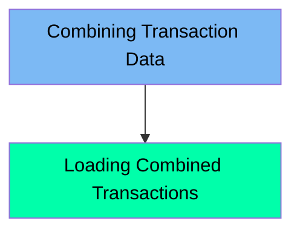

The COMBTRAN job is responsible for sorting and combining transaction data from backup and system-generated files into a new combined dataset. This combined data is then loaded into a VSAM Key-Sequenced Data Set (KSDS) to ensure efficient data organization and retrieval for transaction processing within the CARDDEMO mainframe application.

For example, the job takes transaction data from `AWS.M2.CARDDEMO.TRANSACT.BKUP` and `AWS.M2.CARDDEMO.SYSTRAN`, sorts it by transaction ID, and combines it into `AWS.M2.CARDDEMO.TRANSACT.COMBINED`. This combined file is then loaded into `AWS.M2.CARDDEMO.TRANSACT.VSAM.KSDS` for further processing.

Here is a high level diagram of the file:

## Combining Transaction Data

Steps in this section: `STEP05R`.

This section is about sorting and combining transaction data from backup and system-generated files into a new combined dataset. The combined data is then used for further processing within the CARDDEMO application.

## Loading Combined Transactions

Steps in this section: `STEP10`.

This section is responsible for loading the combined transaction data into a VSAM Key-Sequenced Data Set (KSDS) to ensure efficient data organization and retrieval for transaction processing within the CARDDEMO mainframe application.

&nbsp;

*This is an auto-generated document by Swimm 🌊 and has not yet been verified by a human*

<SwmMeta version="3.0.0" repo-id="Z2l0aHViJTNBJTNBa3luZHJ5bC1hd3MtbWFpbmZyYW1lLW1vZGVybml6YXRpb24tY2FyZGRlbW8lM0ElM0FTd2ltbS1EZW1v" repo-name="kyndryl-aws-mainframe-modernization-carddemo">Powered by [Swimm](/)</SwmMeta>
