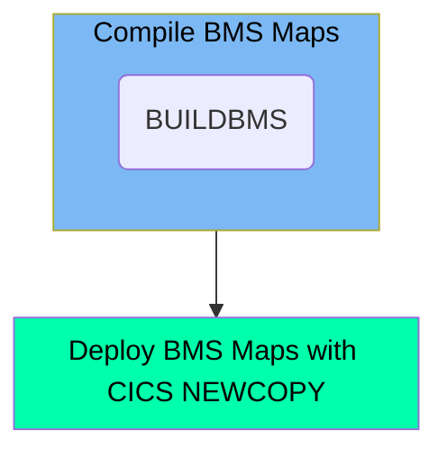

The CBLDBMS job is designed to compile and deploy BMS maps within the mainframe environment. This job sets the necessary parameters and executes the compile process using the BUILDBMS procedure to update the program in the CICS region. Additionally, it ensures that the latest compiled version of the program is loaded and used by the system by executing the CICS NEWCOPY command in batch mode.

For instance, the job compiles a BMS map named 'CICSMAP' and then refreshes the program in the CICS region to ensure the updated map is in use.

Here is a high level diagram of the file:

## Compile BMS Maps

Steps in this section: `STEP1`.

This section is responsible for compiling and generating BMS maps using the BUILDBMS procedure. It sets the necessary parameters and executes the compile process to update the program in the CICS region.

## Deploy BMS Maps with CICS NEWCOPY

Steps in this section: `SDSF1`.

This section is about executing the CICS NEWCOPY command in batch mode to refresh the program in the CICS region, ensuring that the latest compiled version of the program is loaded and used by the system.

&nbsp;

*This is an auto-generated document by Swimm 🌊 and has not yet been verified by a human*

<SwmMeta version="3.0.0" repo-id="Z2l0aHViJTNBJTNBa3luZHJ5bC1hd3MtbWFpbmZyYW1lLW1vZGVybml6YXRpb24tY2FyZGRlbW8lM0ElM0FTd2ltbS1EZW1v" repo-name="kyndryl-aws-mainframe-modernization-carddemo">Powered by [Swimm](/)</SwmMeta>
