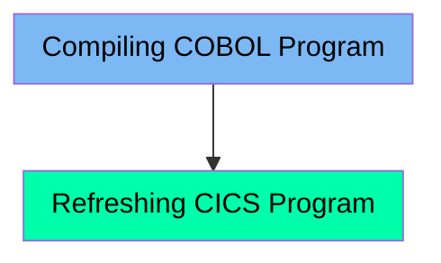

This document describes the CICCMP job, which is responsible for compiling COBOL programs and refreshing CICS programs. The job ensures that COBOL programs are compiled and linked correctly using the BUILDONL procedure, and then performs a NEWCOPY operation to load the latest compiled version into the CICS environment.

For example, after making changes to a COBOL program, the CICCMP job will compile the updated code and refresh the program in the CICS environment to ensure the changes take effect.

Here is a high level diagram of the file:

## Compiling COBOL Program

Steps in this section: `CICSCMP`.

This section is responsible for compiling COBOL programs to ensure they are ready for execution in a CICS environment. It uses the BUILDONL procedure to compile and link the programs.

## Refreshing CICS Program

Steps in this section: `NEWCOPY`.

This section is about performing a NEWCOPY operation on a CICS program to refresh it. The operation ensures that the latest compiled version of the program is loaded and active in the CICS environment.

&nbsp;

*This is an auto-generated document by Swimm 🌊 and has not yet been verified by a human*

<SwmMeta version="3.0.0" repo-id="Z2l0aHViJTNBJTNBa3luZHJ5bC1hd3MtbWFpbmZyYW1lLW1vZGVybml6YXRpb24tY2FyZGRlbW8lM0ElM0FTd2ltbS1EZW1v" repo-name="kyndryl-aws-mainframe-modernization-carddemo">Powered by [Swimm](/)</SwmMeta>
