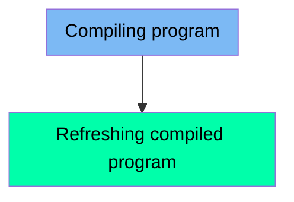

The CICCMP job is used for compiling and refreshing CICS COBOL programs. This process involves setting up the necessary parameters, compiling the COBOL code, and then executing a CICS command to ensure the latest version of the program is used in the CICS environment. The input to this flow includes the program name and high-level qualifier, and the output is a compiled and refreshed CICS program.

Here is a high level diagram of the file:

## Compiling program

Steps in this section: `CICSCMP`.

This section is about setting up and compiling CICS COBOL programs. It includes instructions for changing the program name, setting the high-level qualifier, and compiling the COBOL code using the BUILDONL procedure.

## Refreshing compiled program

Steps in this section: `NEWCOPY`.

This section is about refreshing a compiled CICS program in the CICS environment. It executes a CICS command to perform a NEWCOPY operation, ensuring that the latest version of the program is used.

&nbsp;

*This is an auto-generated document by Swimm 🌊 and has not yet been verified by a human*

<SwmMeta version="3.0.0" repo-id="Z2l0aHViJTNBJTNBa3luZHJ5bC1hd3MtbWFpbmZyYW1lLW1vZGVybml6YXRpb24tY2FyZGRlbW8lM0ElM0FTd2ltbS1EZW1v" repo-name="kyndryl-aws-mainframe-modernization-carddemo">Powered by [Swimm](/)</SwmMeta>
