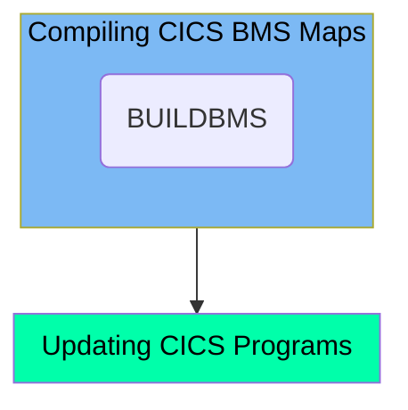

This document explains the process of compiling and updating CICS BMS maps for the Mainframe application. The CBLDBMS job is responsible for setting up parameters, compiling, and link-editing a BMS map using the BUILDBMS procedure. Additionally, it ensures that the latest compiled version of the CICS program (CICSMAP) is used in the system by executing a command to update the program.

Here is a high level diagram of the file:

## Compiling CICS BMS Maps

Steps in this section: `STEP1`.

This section is about setting up parameters and compiling CICS BMS maps for the Mainframe application. It involves using the BUILDBMS procedure to compile and link-edit a BMS map, ensuring the generated copybook is up-to-date.

## Updating CICS Programs

Steps in this section: `SDSF1`.

This section is about executing a command to update the CICS program (CICSMAP) to ensure that the latest compiled version is used in the system.

&nbsp;

*This is an auto-generated document by Swimm 🌊 and has not yet been verified by a human*

<SwmMeta version="3.0.0" repo-id="Z2l0aHViJTNBJTNBa3luZHJ5bC1hd3MtbWFpbmZyYW1lLW1vZGVybml6YXRpb24tY2FyZGRlbW8lM0ElM0FTd2ltbS1EZW1v" repo-name="kyndryl-aws-mainframe-modernization-carddemo">Powered by [Swimm](/)</SwmMeta>
