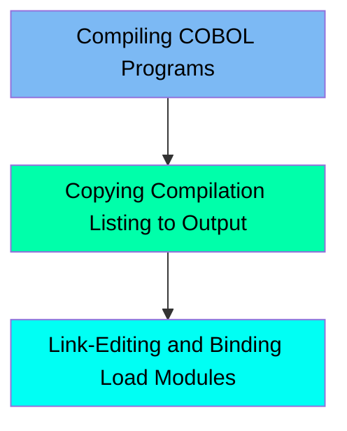

The BLDBAT job is used to compile batch programs within the mainframe application. This process involves compiling COBOL programs, copying the compilation listing to the system output, and link-editing the compiled load modules into an executable load library. The job sets up the necessary libraries, source code, and copybooks, allocates the required space for the compilation process, and ensures that the compilation results are available for review and debugging purposes.

For instance, when a COBOL program is compiled, the source code is translated into executable machine code, the compilation listing is copied to the system output for review, and the compiled load modules are linked and bound into an executable load library.

Here is a high level diagram of the file:

## Compiling COBOL Programs

Steps in this section: `COMPILE`.

This section is responsible for compiling COBOL programs by translating the source code into executable machine code. It sets up the necessary libraries, source code, and copybooks, and allocates the required space for the compilation process.

## Copying Compilation Listing to Output

Steps in this section: `CBLPRINT`.

This section is responsible for copying the compilation listing dataset to the system output using the IEBGENER utility. This ensures that the compilation results are available for review and debugging purposes.

## Link-Editing and Binding Load Modules

Steps in this section: `LKED`.

This section is responsible for linking and binding the compiled load modules into an executable load library. It uses various system libraries and datasets to ensure that the load modules are correctly linked and ready for execution.

&nbsp;

*This is an auto-generated document by Swimm 🌊 and has not yet been verified by a human*

<SwmMeta version="3.0.0" repo-id="Z2l0aHViJTNBJTNBa3luZHJ5bC1hd3MtbWFpbmZyYW1lLW1vZGVybml6YXRpb24tY2FyZGRlbW8lM0ElM0FTd2ltbS1EZW1v" repo-name="kyndryl-aws-mainframe-modernization-carddemo">Powered by [Swimm](/)</SwmMeta>
