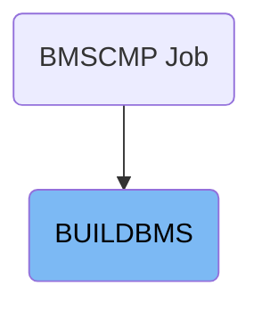
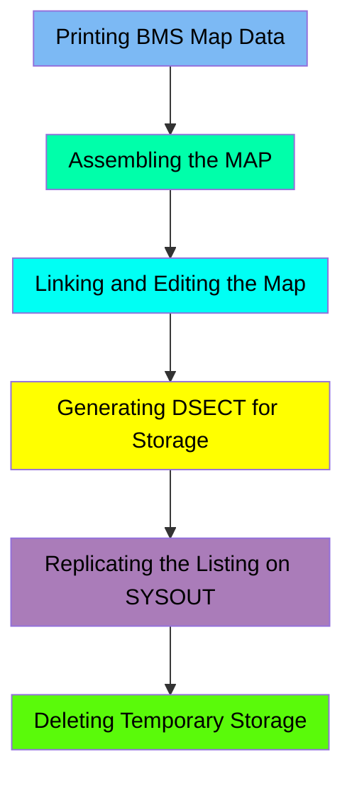

The BUILDBMS job is used to compile BMS maps in the mainframe application. This process involves several steps, including printing BMS map data, assembling the map, linking and editing the map, generating DSECT for storage, replicating the listing on SYSOUT, and deleting temporary storage. The job starts with the BMSCMP flow and ensures that the BMS maps are correctly compiled and stored for further use in the application.

For instance, the job takes the BMS map source code as input, processes it through various stages like assembly and linking, and outputs the compiled map to the specified load library. Additionally, it generates storage mappings and replicates the listing for review.

# Where is this JCL used?

This JCL is used once, in a flow starting from `BMSCMP` as represented in the following diagram:

Here is a high level diagram of the file:

## Printing BMS Map Data

Steps in this section: `PRINT`.

This section is responsible for printing the BMS map data using the IEBGENER utility. It involves copying the BMS map data from the source code location to a temporary storage area for further processing.

## Assembling the MAP

Steps in this section: `MAP`.

This section is about assembling the MAP by processing intermediate data to generate machine code. The program uses the ASMA90 assembler to convert the source code into executable machine code, utilizing various macro libraries and temporary storage areas for the process.

## Linking and Editing the Map

Steps in this section: `LKED`.

This section is responsible for linking and editing the compiled BMS maps, ensuring they are correctly stored in the specified load library for further use in the application.

## Generating DSECT for Storage

Steps in this section: `DSECT`.

This section is responsible for generating DSECT (Data Section) using the ASMA90 assembler program. It sets up the necessary environment and parameters to create storage mappings, which are essential for understanding and managing memory layout in mainframe applications.

## Replicating the Listing on SYSOUT

Steps in this section: `DISPLIST`.

This section is responsible for copying the listing of the compiled BMS map to the system output. It uses the IEBGENER utility to achieve this, ensuring that the listing is available for review and debugging purposes.

## Deleting Temporary Storage

Steps in this section: `DELTEMP`.

This section is responsible for deleting temporary storage areas used during the processing to ensure that no unnecessary data is left behind, maintaining efficient use of storage resources.

&nbsp;

*This is an auto-generated document by Swimm 🌊 and has not yet been verified by a human*

<SwmMeta version="3.0.0" repo-id="Z2l0aHViJTNBJTNBa3luZHJ5bC1hd3MtbWFpbmZyYW1lLW1vZGVybml6YXRpb24tY2FyZGRlbW8lM0ElM0FTd2ltbS1EZW1v" repo-name="kyndryl-aws-mainframe-modernization-carddemo">Powered by [Swimm](/)</SwmMeta>
