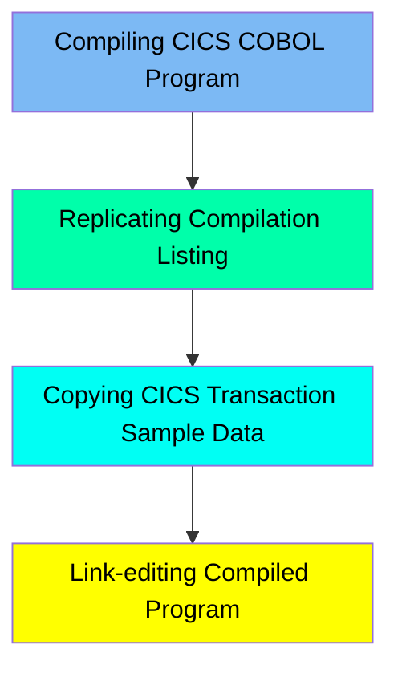

The BLDONL job is responsible for compiling COBOL programs intended to run within the CICS environment. It sets up the necessary libraries and datasets, specifies compilation parameters, and allocates space for the compilation process. Additionally, it replicates the compilation listings from a dataset to the system output, ensuring that the listings are available for review and debugging purposes. The job also copies the contents of a CICS transaction sample from the DFHSAMP dataset to a temporary dataset for further processing. Finally, it link-edits the compiled programs, ensuring that all necessary modules and libraries are correctly referenced and included for successful execution.

For example, when a COBOL program is compiled, the BLDONL job sets up the required libraries and datasets, compiles the program, replicates the compilation listing for review, copies necessary CICS transaction sample data, and link-edits the compiled program to ensure it is ready for execution.

Here is a high level diagram of the file:

## Compiling CICS COBOL Program

Steps in this section: `COB`.

This section is responsible for compiling COBOL programs that are intended to run within the CICS environment. It sets up the necessary libraries and datasets, specifies compilation parameters, and allocates space for the compilation process.

## Replicating Compilation Listing

Steps in this section: `DISPLIST`.

This section is responsible for replicating the compilation listings from a dataset to the system output. It uses the IEBGENER utility to copy the data, ensuring that the listings are available for review and debugging purposes.

## Copying CICS Transaction Sample Data

Steps in this section: `COPYLINK`.

This section is responsible for copying the contents of a CICS transaction sample from the DFHSAMP dataset to a temporary dataset for further processing in the build procedure.

## Link-editing Compiled Program

Steps in this section: `LKED`.

This section is responsible for link-editing compiled programs. It uses the HEWL program to link-edit the compiled COBOL programs, ensuring that all necessary modules and libraries are correctly referenced and included for successful execution.

&nbsp;

*This is an auto-generated document by Swimm 🌊 and has not yet been verified by a human*

<SwmMeta version="3.0.0" repo-id="Z2l0aHViJTNBJTNBa3luZHJ5bC1hd3MtbWFpbmZyYW1lLW1vZGVybml6YXRpb24tY2FyZGRlbW8lM0ElM0FTd2ltbS1EZW1v" repo-name="kyndryl-aws-mainframe-modernization-carddemo">Powered by [Swimm](/)</SwmMeta>
