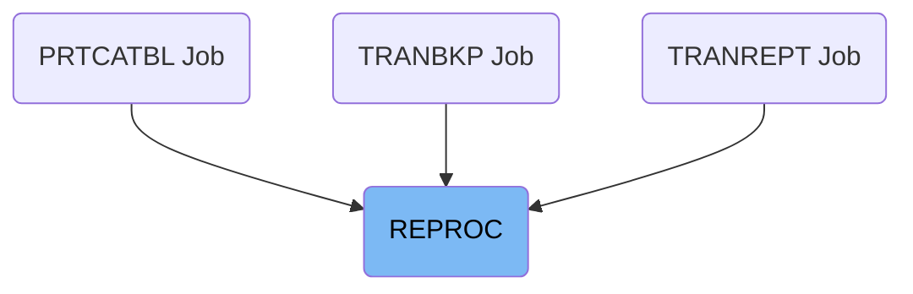

The REPROC job is responsible for copying data between VSAM files using the IDCAMS utility. This process involves reading data from an input VSAM file and writing it to an output VSAM file, facilitated by a control library member.

For instance, when the application needs to transfer transaction data from one VSAM file to another, the REPROC job is executed to handle this data copying operation efficiently.

# Where is this JCL used?

This JCL is used multiple times in the codebase as represented in the following diagram:

## Copying data between VSAM files

Steps in this section: `PRC001`.

This section is responsible for copying data from an input VSAM file to an output VSAM file using the IDCAMS utility. It utilizes a control library member to facilitate the data copying operations.

&nbsp;

*This is an auto-generated document by Swimm 🌊 and has not yet been verified by a human*

<SwmMeta version="3.0.0" repo-id="Z2l0aHViJTNBJTNBa3luZHJ5bC1hd3MtbWFpbmZyYW1lLW1vZGVybml6YXRpb24tY2FyZGRlbW8lM0ElM0FTd2ltbS1EZW1v" repo-name="kyndryl-aws-mainframe-modernization-carddemo">Powered by [Swimm](/)</SwmMeta>
