# Overview

This document describes the flow for requesting and printing transaction reports. Users select a report type and date range, confirm their request, and the system validates input and submits a batch job to generate the report. Confirmation or error messages are displayed to guide the user.

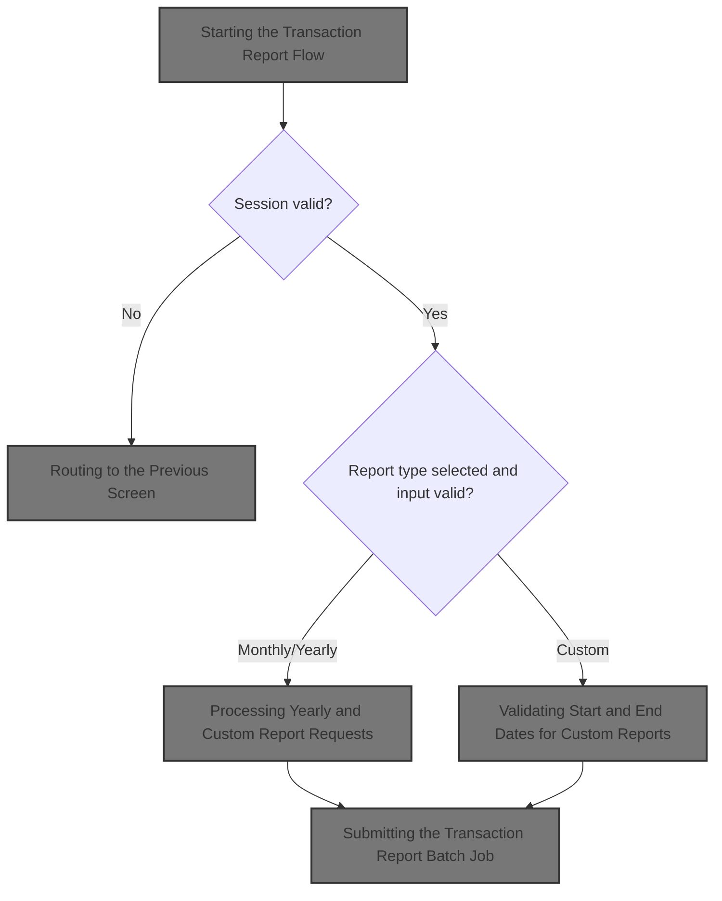

## Dependencies

### Programs

- CORPT00C (app/cbl/CORPT00C.cbl)
- CR00
- CSUTLDTC (app/cbl/CSUTLDTC.cbl)
- CEEDAYS
- COMEN01C (app/cbl/COMEN01C.cbl)
- CM00
- COSGN00C (app/cbl/COSGN00C.cbl)

### Copybooks

- COCOM01Y (app/cpy/COCOM01Y.cpy)
- COMEN02Y (app/cpy/COMEN02Y.cpy)
- COMEN01 (app/cpy-bms/COMEN01.CPY)
- COTTL01Y (app/cpy/COTTL01Y.cpy)
- CSDAT01Y (app/cpy/CSDAT01Y.cpy)
- CSMSG01Y (app/cpy/CSMSG01Y.cpy)
- CSUSR01Y (app/cpy/CSUSR01Y.cpy)
- DFHAID
- DFHBMSCA
- CORPT00 (app/cpy-bms/CORPT00.CPY)
- CVTRA05Y (app/cpy/CVTRA05Y.cpy)

# Workflow

# Starting the Transaction Report Flow

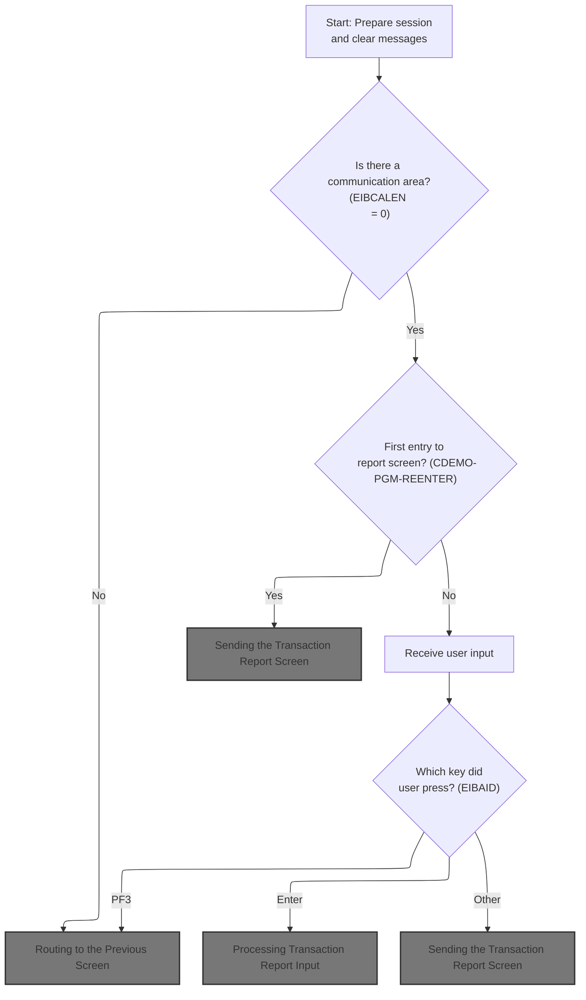

This section initializes the transaction report flow, determines session validity, and controls routing and screen display for the CardDemo application.

| Rule ID | Code Location | Category       | Rule Name                     | Description                                                                                                                                          | Conditions                                                         | Remarks                                                                                                                                                                                              |
| ------- | ------------- | -------------- | ----------------------------- | ---------------------------------------------------------------------------------------------------------------------------------------------------- | ------------------------------------------------------------------ | ---------------------------------------------------------------------------------------------------------------------------------------------------------------------------------------------------- |
| BR-001  | MAIN-PARA     | Business logic | Commarea required for session | If there is no communication area present, the user is routed to the previous screen (signon).                                                       | The communication area length (EIBCALEN) is zero.                  | The communication area is required for session continuity. If absent, the program sets the next program to 'COSGN00C' and routes to signon. The output is a screen transition to the signon program. |
| BR-002  | MAIN-PARA     | Business logic | Session state initialization  | On entry to the transaction report flow, error and EOF flags are reset, the screen is set to erase on next send, and any message fields are cleared. | Whenever the transaction report flow is started.                   | Error flag is set to 'N', EOF flag is set to 'N', send erase flag is set to 'Y', and message fields are set to spaces. Output is a clean screen state for the user.                                  |
| BR-003  | MAIN-PARA     | Business logic | First entry screen send       | If this is the first entry to the transaction report screen, the transaction report screen is sent to the user.                                      | Session context indicates first entry (CDEMO-PGM-REENTER is true). | On first entry, the output is the transaction report screen. The session context is determined by the value of CDEMO-PGM-REENTER (CDEMO-PGM-CONTEXT = 1).                                            |

<SwmSnippet path="/app/cbl/CORPT00C.cbl" line="163" repo-id="Z2l0aHViJTNBJTNBa3luZHJ5bC1hd3MtbWFpbmZyYW1lLW1vZGVybml6YXRpb24tY2FyZGRlbW8lM0ElM0FTd2ltbS1EZW1v">

---

In `MAIN-PARA` this is the setup for the transaction report flow. It resets error and EOF flags, sets up the screen to be erased on the next send, and clears any message fields. This is the entry point for handling both new and returning sessions, and the next step is to check if we have a communication area (EIBCALEN) to decide if we continue or bounce to signon.

```cobol
       MAIN-PARA.

           SET ERR-FLG-OFF TO TRUE
           SET TRANSACT-NOT-EOF TO TRUE
           SET SEND-ERASE-YES TO TRUE

           MOVE SPACES TO WS-MESSAGE
                          ERRMSGO OF CORPT0AO
```

---

</SwmSnippet>

<SwmSnippet path="/app/cbl/CORPT00C.cbl" line="172" repo-id="Z2l0aHViJTNBJTNBa3luZHJ5bC1hd3MtbWFpbmZyYW1lLW1vZGVybml6YXRpb24tY2FyZGRlbW8lM0ElM0FTd2ltbS1EZW1v">

---

If there's no commarea, we set up to jump to signon by calling RETURN-TO-PREV-SCREEN, which handles the transfer.

```cobol
           IF EIBCALEN = 0
               MOVE 'COSGN00C' TO CDEMO-TO-PROGRAM
               PERFORM RETURN-TO-PREV-SCREEN
```

---

</SwmSnippet>

## Routing to the Previous Screen

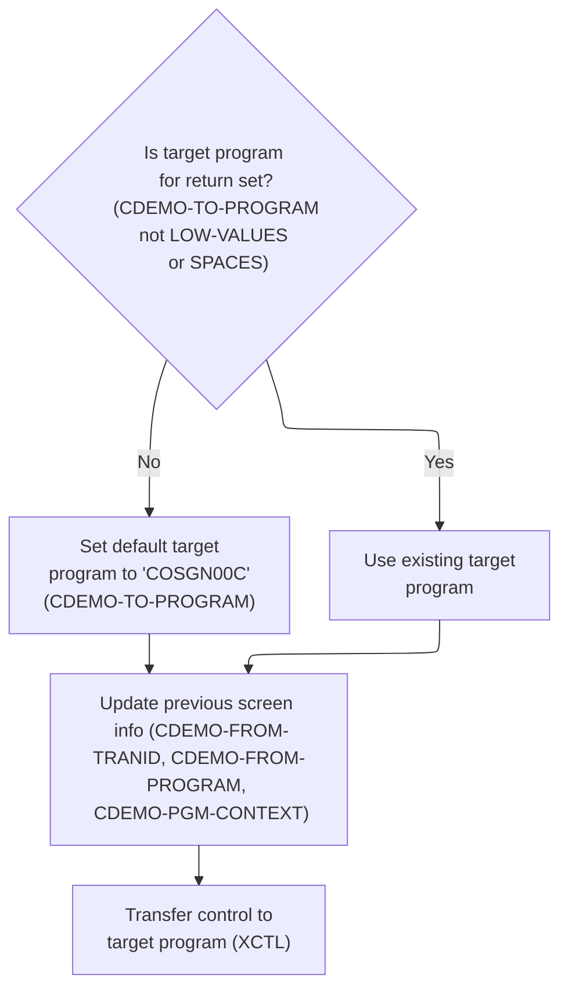

This section manages routing the user to the previous screen, ensuring a valid target program is set, navigation context is recorded, and control is transferred appropriately.

| Rule ID | Code Location         | Category       | Rule Name                         | Description                                                                                                                                                                                       | Conditions                                                                    | Remarks                                                                                                                                                                                |
| ------- | --------------------- | -------------- | --------------------------------- | ------------------------------------------------------------------------------------------------------------------------------------------------------------------------------------------------- | ----------------------------------------------------------------------------- | -------------------------------------------------------------------------------------------------------------------------------------------------------------------------------------- |
| BR-001  | RETURN-TO-PREV-SCREEN | Business logic | Default signon routing            | If the target program for return is not set (either blank or all low-values), the system defaults the target program to the signon program, ensuring the user is always routed to a valid screen. | The target program for return is blank or contains only low-values.           | The default program name is 'COSGN00C', which is an 8-character alphanumeric string. The target program field must be set to this value if unset.                                      |
| BR-002  | RETURN-TO-PREV-SCREEN | Business logic | Previous screen context recording | Whenever routing to the previous screen, the system records the current transaction ID and program name as the previous screen context, and resets the program context indicator.                 | Routing to the previous screen is initiated.                                  | The previous transaction ID is a 4-character alphanumeric string, and the previous program name is an 8-character alphanumeric string. The program context indicator is reset to zero. |
| BR-003  | RETURN-TO-PREV-SCREEN | Business logic | Program transfer with context     | After updating the navigation context, the system transfers control to the target program, passing along the current communication area to maintain session state.                                | The target program for return is set and navigation context has been updated. | The program transfer uses the target program name (8-character alphanumeric) and passes the entire communication area structure.                                                       |

<SwmSnippet path="/app/cbl/CORPT00C.cbl" line="540" repo-id="Z2l0aHViJTNBJTNBa3luZHJ5bC1hd3MtbWFpbmZyYW1lLW1vZGVybml6YXRpb24tY2FyZGRlbW8lM0ElM0FTd2ltbS1EZW1v">

---

In `RETURN-TO-PREV-SCREEN` we check if the target program is unset (LOW-VALUES or SPACES). If so, we default it to 'COSGN00C' so the user always gets routed somewhere valid, usually the signon screen.

```cobol
       RETURN-TO-PREV-SCREEN.

           IF CDEMO-TO-PROGRAM = LOW-VALUES OR SPACES
               MOVE 'COSGN00C' TO CDEMO-TO-PROGRAM
           END-IF
```

---

</SwmSnippet>

<SwmSnippet path="/app/cbl/CORPT00C.cbl" line="545" repo-id="Z2l0aHViJTNBJTNBa3luZHJ5bC1hd3MtbWFpbmZyYW1lLW1vZGVybml6YXRpb24tY2FyZGRlbW8lM0ElM0FTd2ltbS1EZW1v">

---

After making sure the target program is set, we record where we're coming from (transaction and program), reset the program context, and use XCTL to transfer control to the next program, passing along the commarea. This is how we jump to signon or main menu cleanly.

```cobol
           MOVE WS-TRANID    TO CDEMO-FROM-TRANID
           MOVE WS-PGMNAME   TO CDEMO-FROM-PROGRAM
           MOVE ZEROS        TO CDEMO-PGM-CONTEXT
           EXEC CICS
               XCTL PROGRAM(CDEMO-TO-PROGRAM)
               COMMAREA(CARDDEMO-COMMAREA)
           END-EXEC.
```

---

</SwmSnippet>

## Main Menu Entry and User Input Handling

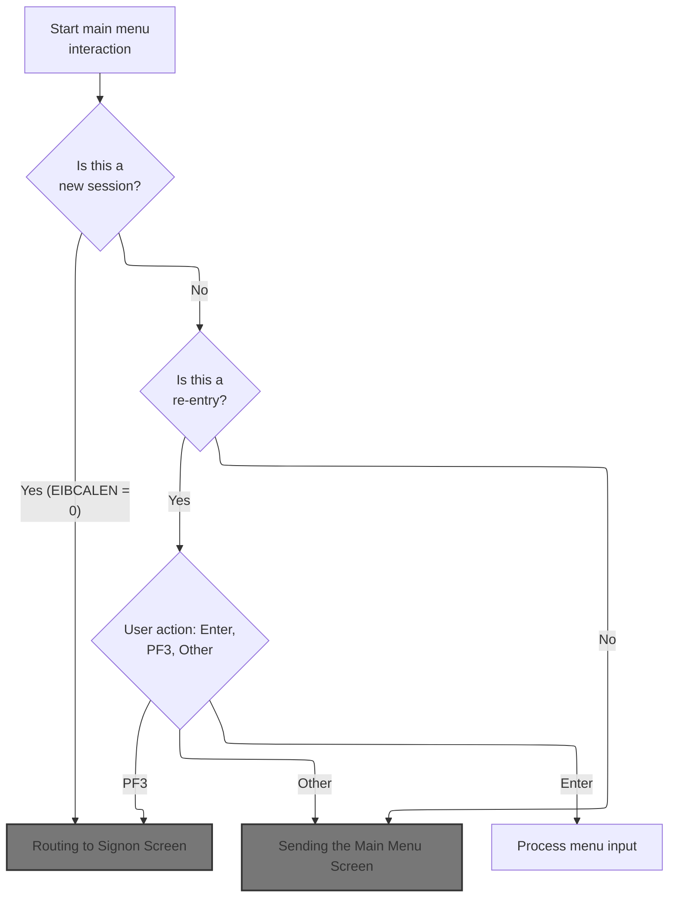

This section manages the entry point to the CardDemo application's main menu, determining whether to show the signon screen or main menu, and handling user actions such as Enter, PF3, or invalid keys.

| Rule ID | Code Location | Category       | Rule Name                      | Description                                                                                                                           | Conditions                                                                               | Remarks                                                                                                                                  |
| ------- | ------------- | -------------- | ------------------------------ | ------------------------------------------------------------------------------------------------------------------------------------- | ---------------------------------------------------------------------------------------- | ---------------------------------------------------------------------------------------------------------------------------------------- |
| BR-001  | MAIN-PARA     | Business logic | New session signon routing     | If the session is new, the user is routed to the signon screen before accessing the main menu.                                        | Session context length is zero (EIBCALEN = 0).                                           | The signon screen is shown before any menu options are presented. The routing is triggered by EIBCALEN = 0.                              |
| BR-002  | MAIN-PARA     | Business logic | Initial menu display           | If the session is not a re-entry, the main menu screen is sent to the user.                                                           | Session context length is not zero (EIBCALEN ≠ 0) and session is not marked as re-entry. | The main menu screen is displayed to the user. The re-entry flag is checked before sending the menu.                                     |
| BR-003  | MAIN-PARA     | Business logic | Menu input processing on Enter | When the user presses Enter on the main menu, their input is processed according to menu logic.                                       | Session is a re-entry and user action is Enter.                                          | User input is processed for menu navigation. The Enter key triggers menu logic.                                                          |
| BR-004  | MAIN-PARA     | Business logic | PF3 signon routing             | When the user presses PF3 on the main menu, they are routed to the signon screen.                                                     | Session is a re-entry and user action is PF3.                                            | PF3 key triggers routing to the signon screen. The next program is set to the signon program.                                            |
| BR-005  | MAIN-PARA     | Error handling | Invalid key error handling     | If the user presses any key other than Enter or PF3 on the main menu, an error message is displayed and the main menu is shown again. | Session is a re-entry and user action is neither Enter nor PF3.                          | Error flag is set to 'Y'. Error message is 'Invalid key pressed. Please see below...         '. The main menu screen is displayed again. |

<SwmSnippet path="/app/cbl/COMEN01C.cbl" line="75" repo-id="Z2l0aHViJTNBJTNBa3luZHJ5bC1hd3MtbWFpbmZyYW1lLW1vZGVybml6YXRpb24tY2FyZGRlbW8lM0ElM0FTd2ltbS1EZW1v">

---

We decide if we're showing the menu or handling input, and route based on what the user does (Enter, PF3, or invalid key).

```cobol
       MAIN-PARA.

           SET ERR-FLG-OFF TO TRUE

           MOVE SPACES TO WS-MESSAGE
                          ERRMSGO OF COMEN1AO

           IF EIBCALEN = 0
               MOVE 'COSGN00C' TO CDEMO-FROM-PROGRAM
               PERFORM RETURN-TO-SIGNON-SCREEN
           ELSE
               MOVE DFHCOMMAREA(1:EIBCALEN) TO CARDDEMO-COMMAREA
               IF NOT CDEMO-PGM-REENTER
                   SET CDEMO-PGM-REENTER    TO TRUE
                   MOVE LOW-VALUES          TO COMEN1AO
                   PERFORM SEND-MENU-SCREEN
               ELSE
                   PERFORM RECEIVE-MENU-SCREEN
                   EVALUATE EIBAID
                       WHEN DFHENTER
                           PERFORM PROCESS-ENTER-KEY
                       WHEN DFHPF3
                           MOVE 'COSGN00C' TO CDEMO-TO-PROGRAM
                           PERFORM RETURN-TO-SIGNON-SCREEN
                       WHEN OTHER
                           MOVE 'Y'                       TO WS-ERR-FLG
                           MOVE CCDA-MSG-INVALID-KEY      TO WS-MESSAGE
                           PERFORM SEND-MENU-SCREEN
                   END-EVALUATE
               END-IF
           END-IF

           EXEC CICS RETURN
                     TRANSID (WS-TRANID)
                     COMMAREA (CARDDEMO-COMMAREA)
           END-EXEC.
```

---

</SwmSnippet>

### Routing to Signon Screen

This section determines the next program to route the user to, defaulting to the signon screen if no valid destination is set.

| Rule ID | Code Location           | Category       | Rule Name                  | Description                                                                                                                                                                                 | Conditions                                                               | Remarks                                                                                                                                                                  |
| ------- | ----------------------- | -------------- | -------------------------- | ------------------------------------------------------------------------------------------------------------------------------------------------------------------------------------------- | ------------------------------------------------------------------------ | ------------------------------------------------------------------------------------------------------------------------------------------------------------------------ |
| BR-001  | RETURN-TO-SIGNON-SCREEN | Business logic | Default to signon screen   | If the next program field is unset (contains spaces or low values), the system will route the user to the signon screen by setting the next program to 'COSGN00C (Signon Screen Handling)'. | The next program field is either spaces or low values.                   | The signon screen program name is 'COSGN00C', which is an 8-character alphanumeric string. Spaces and low values are considered unset values for the next program field. |
| BR-002  | RETURN-TO-SIGNON-SCREEN | Business logic | Route to specified program | If the next program field is set to a valid value, the system will route the user to that specified program.                                                                                | The next program field contains a value other than spaces or low values. | The next program field must be an 8-character alphanumeric string representing a valid program name.                                                                     |

<SwmSnippet path="/app/cbl/COMEN01C.cbl" line="170" repo-id="Z2l0aHViJTNBJTNBa3luZHJ5bC1hd3MtbWFpbmZyYW1lLW1vZGVybml6YXRpb24tY2FyZGRlbW8lM0ElM0FTd2ltbS1EZW1v">

---

We make sure the next program is set, default to signon if not, and transfer control with XCTL.

```cobol
       RETURN-TO-SIGNON-SCREEN.

           IF CDEMO-TO-PROGRAM = LOW-VALUES OR SPACES
               MOVE 'COSGN00C' TO CDEMO-TO-PROGRAM
           END-IF
           EXEC CICS
               XCTL PROGRAM(CDEMO-TO-PROGRAM)
           END-EXEC.
```

---

</SwmSnippet>

### Signon Screen Entry and Input Handling

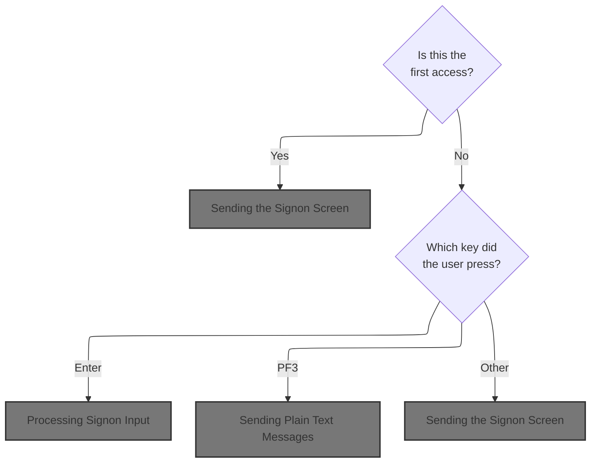

This section manages the display and input handling for the signon screen in the CardDemo application, determining what the user sees and how their actions are processed during authentication.

| Rule ID | Code Location | Category       | Rule Name                    | Description                                                                                                                          | Conditions                                                                                         | Remarks                                                                                                                                                                                                                        |
| ------- | ------------- | -------------- | ---------------------------- | ------------------------------------------------------------------------------------------------------------------------------------ | -------------------------------------------------------------------------------------------------- | ------------------------------------------------------------------------------------------------------------------------------------------------------------------------------------------------------------------------------ |
| BR-001  | MAIN-PARA     | Business logic | Initial access signon screen | If this is the user's first access (no communication area present), the signon screen is displayed and the user ID field is cleared. | Triggered when the communication area length is zero.                                              | The signon screen is displayed with all fields cleared. The user ID field is set to -1 (invalid/empty).                                                                                                                        |
| BR-002  | MAIN-PARA     | Business logic | Enter key signon processing  | When the user presses the Enter key on the signon screen, the system processes the signon input.                                     | Triggered when the user presses the Enter key while the signon screen is active.                   | The signon input is processed, which may include authentication and routing to the next application area. No message is displayed at this point unless there is an error in the signon process (handled in called paragraphs). |
| BR-003  | MAIN-PARA     | Business logic | PF3 thank you message        | When the user presses the PF3 key, a thank you message is displayed.                                                                 | Triggered when the user presses the PF3 key while the signon screen is active.                     | The message displayed is: 'Thank you for using CardDemo application...      ' (50 characters, left-aligned, padded with spaces).                                                                                               |
| BR-004  | MAIN-PARA     | Error handling | Invalid key error message    | When the user presses any key other than Enter or PF3, an error flag is set and an invalid key message is displayed.                 | Triggered when the user presses any key other than Enter or PF3 while the signon screen is active. | The error flag is set to 'Y'. The message displayed is: 'Invalid key pressed. Please see below...         ' (50 characters, left-aligned, padded with spaces).                                                                 |

<SwmSnippet path="/app/cbl/COSGN00C.cbl" line="73" repo-id="Z2l0aHViJTNBJTNBa3luZHJ5bC1hd3MtbWFpbmZyYW1lLW1vZGVybml6YXRpb24tY2FyZGRlbW8lM0ElM0FTd2ltbS1EZW1v">

---

`MAIN-PARA` in COSGN00C.cbl checks if there's a commarea. If not, it clears the screen and sends signon. If there is, it processes user input: Enter runs signon, PF3 shows a thank you, anything else shows an error. Finally, it returns control to CICS with the commarea.

```cobol
       MAIN-PARA.

           SET ERR-FLG-OFF TO TRUE

           MOVE SPACES TO WS-MESSAGE
                          ERRMSGO OF COSGN0AO

           IF EIBCALEN = 0
               MOVE LOW-VALUES TO COSGN0AO
               MOVE -1       TO USERIDL OF COSGN0AI
               PERFORM SEND-SIGNON-SCREEN
           ELSE
               EVALUATE EIBAID
                   WHEN DFHENTER
                       PERFORM PROCESS-ENTER-KEY
                   WHEN DFHPF3
                       MOVE CCDA-MSG-THANK-YOU        TO WS-MESSAGE
                       PERFORM SEND-PLAIN-TEXT
                   WHEN OTHER
                       MOVE 'Y'                       TO WS-ERR-FLG
                       MOVE CCDA-MSG-INVALID-KEY      TO WS-MESSAGE
                       PERFORM SEND-SIGNON-SCREEN
               END-EVALUATE
           END-IF.

           EXEC CICS RETURN
                     TRANSID (WS-TRANID)
                     COMMAREA (CARDDEMO-COMMAREA)
                     LENGTH(LENGTH OF CARDDEMO-COMMAREA)
           END-EXEC.
```

---

</SwmSnippet>

#### Sending the Signon Screen

This section is responsible for presenting the signon screen to the user, ensuring all required header information, context, and messages are displayed, and that the screen is ready for user input.

| Rule ID | Code Location        | Category       | Rule Name                           | Description                                                                                                                                | Conditions                                                                            | Remarks                                                                                                                                                |
| ------- | -------------------- | -------------- | ----------------------------------- | ------------------------------------------------------------------------------------------------------------------------------------------ | ------------------------------------------------------------------------------------- | ------------------------------------------------------------------------------------------------------------------------------------------------------ |
| BR-001  | POPULATE-HEADER-INFO | Business logic | Header date and time display        | The signon screen must display the current date and time in the header area, formatted as MM-DD-YY for the date and HH-MM-SS for the time. | Whenever the signon screen is sent to the user.                                       | Date is shown as a string in MM-DD-YY format; time is shown as a string in HH-MM-SS format. These are derived from the system's current date and time. |
| BR-002  | SEND-SIGNON-SCREEN   | Business logic | Message display                     | Any message intended for the user must be displayed in the error/message field of the signon screen.                                       | Whenever a message is present in the message variable when the signon screen is sent. | Message is shown as an alphanumeric string up to 80 characters in the error/message field.                                                             |
| BR-003  | POPULATE-HEADER-INFO | Business logic | Context identifier display          | The signon screen must display the application and system identifiers for context.                                                         | Whenever the signon screen is sent to the user.                                       | Application ID and System ID are shown as alphanumeric strings in their respective fields on the signon screen.                                        |
| BR-004  | POPULATE-HEADER-INFO | Business logic | Program and transaction ID display  | The signon screen must display the program name and transaction ID in the header area.                                                     | Whenever the signon screen is sent to the user.                                       | Program name is shown as an 8-character string ('COSGN00C'); transaction ID is shown as a 4-character string ('CC00').                                 |
| BR-005  | POPULATE-HEADER-INFO | Business logic | Header title display                | The signon screen must display the title lines in the header area.                                                                         | Whenever the signon screen is sent to the user.                                       | Title lines are shown as alphanumeric strings in the header area.                                                                                      |
| BR-006  | SEND-SIGNON-SCREEN   | Business logic | Screen erase and cursor positioning | When the signon screen is sent, the screen must be erased and the cursor positioned for user input.                                        | Whenever the signon screen is sent to the user.                                       | The screen is cleared and the cursor is positioned at the default input location.                                                                      |

<SwmSnippet path="/app/cbl/COSGN00C.cbl" line="145" repo-id="Z2l0aHViJTNBJTNBa3luZHJ5bC1hd3MtbWFpbmZyYW1lLW1vZGVybml6YXRpb24tY2FyZGRlbW8lM0ElM0FTd2ltbS1EZW1v">

---

`SEND-SIGNON-SCREEN` fills in the header info, copies any message to the error field, and sends the signon screen map to the terminal, erasing the screen and positioning the cursor. This is how the user sees the signon UI.

```cobol
       SEND-SIGNON-SCREEN.

           PERFORM POPULATE-HEADER-INFO

           MOVE WS-MESSAGE TO ERRMSGO OF COSGN0AO

           EXEC CICS SEND
                     MAP('COSGN0A')
                     MAPSET('COSGN00')
                     FROM(COSGN0AO)
                     ERASE
                     CURSOR
           END-EXEC.
```

---

</SwmSnippet>

<SwmSnippet path="/app/cbl/COSGN00C.cbl" line="177" repo-id="Z2l0aHViJTNBJTNBa3luZHJ5bC1hd3MtbWFpbmZyYW1lLW1vZGVybml6YXRpb24tY2FyZGRlbW8lM0ElM0FTd2ltbS1EZW1v">

---

`POPULATE-HEADER-INFO` grabs the current date and time, formats them, and fills in the header fields (titles, program/transaction IDs, date, time) in the output area. It also assigns the CICS application and system IDs for context.

```cobol
       POPULATE-HEADER-INFO.

           MOVE FUNCTION CURRENT-DATE  TO WS-CURDATE-DATA

           MOVE CCDA-TITLE01           TO TITLE01O OF COSGN0AO
           MOVE CCDA-TITLE02           TO TITLE02O OF COSGN0AO
           MOVE WS-TRANID              TO TRNNAMEO OF COSGN0AO
           MOVE WS-PGMNAME             TO PGMNAMEO OF COSGN0AO

           MOVE WS-CURDATE-MONTH       TO WS-CURDATE-MM
           MOVE WS-CURDATE-DAY         TO WS-CURDATE-DD
           MOVE WS-CURDATE-YEAR(3:2)   TO WS-CURDATE-YY

           MOVE WS-CURDATE-MM-DD-YY    TO CURDATEO OF COSGN0AO

           MOVE WS-CURTIME-HOURS       TO WS-CURTIME-HH
           MOVE WS-CURTIME-MINUTE      TO WS-CURTIME-MM
           MOVE WS-CURTIME-SECOND      TO WS-CURTIME-SS

           MOVE WS-CURTIME-HH-MM-SS    TO CURTIMEO OF COSGN0AO

           EXEC CICS ASSIGN
               APPLID(APPLIDO OF COSGN0AO)
           END-EXEC

           EXEC CICS ASSIGN
               SYSID(SYSIDO OF COSGN0AO)
           END-EXEC.
```

---

</SwmSnippet>

#### Processing Signon Input

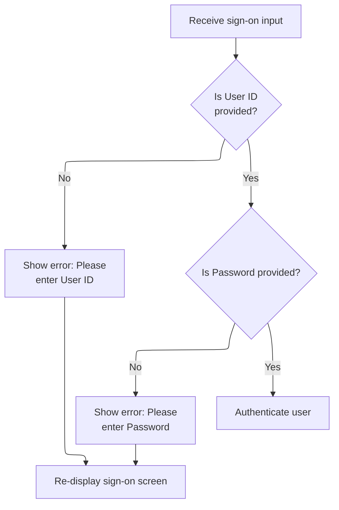

This section governs the validation and initial processing of user sign-on input, ensuring required fields are present and normalized before triggering authentication.

| Rule ID | Code Location     | Category        | Rule Name                | Description                                                                                                                                                                                               | Conditions                                                                   | Remarks                                                                                                                                                                           |
| ------- | ----------------- | --------------- | ------------------------ | --------------------------------------------------------------------------------------------------------------------------------------------------------------------------------------------------------- | ---------------------------------------------------------------------------- | --------------------------------------------------------------------------------------------------------------------------------------------------------------------------------- |
| BR-001  | PROCESS-ENTER-KEY | Data validation | User ID required         | If the User ID field is empty or contains only blank or non-printable values, the system will display an error message prompting the user to enter their User ID and will redisplay the sign-on screen.   | The User ID field is empty, blank, or contains only non-printable values.    | The error message shown is: 'Please enter User ID ...'. The User ID field is expected to be a string up to 8 characters. The sign-on screen is redisplayed for user correction.   |
| BR-002  | PROCESS-ENTER-KEY | Data validation | Password required        | If the Password field is empty or contains only blank or non-printable values, the system will display an error message prompting the user to enter their Password and will redisplay the sign-on screen. | The Password field is empty, blank, or contains only non-printable values.   | The error message shown is: 'Please enter Password ...'. The Password field is expected to be a string up to 8 characters. The sign-on screen is redisplayed for user correction. |
| BR-003  | PROCESS-ENTER-KEY | Business logic  | Credential normalization | If both User ID and Password fields are present, the system will convert both fields to uppercase before proceeding to authenticate the user.                                                             | Both User ID and Password fields are present and not blank or non-printable. | Both User ID and Password are normalized to uppercase strings before authentication. Each field is up to 8 characters.                                                            |
| BR-004  | PROCESS-ENTER-KEY | Business logic  | Trigger authentication   | If no error flag is set after validation, the system will proceed to authenticate the user credentials.                                                                                                   | No error flag is set after validating User ID and Password fields.           | Authentication is only triggered if both required fields are present and normalized. The authentication process is performed in a separate step.                                  |

<SwmSnippet path="/app/cbl/COSGN00C.cbl" line="108" repo-id="Z2l0aHViJTNBJTNBa3luZHJ5bC1hd3MtbWFpbmZyYW1lLW1vZGVybml6YXRpb24tY2FyZGRlbW8lM0ElM0FTd2ltbS1EZW1v">

---

`PROCESS-ENTER-KEY` receives the signon input, checks if User ID and Password are present, and prompts again if not. If both are filled, it uppercases them and moves on to user authentication by calling READ-USER-SEC-FILE.

```cobol
       PROCESS-ENTER-KEY.

           EXEC CICS RECEIVE
                     MAP('COSGN0A')
                     MAPSET('COSGN00')
                     RESP(WS-RESP-CD)
                     RESP2(WS-REAS-CD)
           END-EXEC.

           EVALUATE TRUE
               WHEN USERIDI OF COSGN0AI = SPACES OR LOW-VALUES
                   MOVE 'Y'      TO WS-ERR-FLG
                   MOVE 'Please enter User ID ...' TO WS-MESSAGE
                   MOVE -1       TO USERIDL OF COSGN0AI
                   PERFORM SEND-SIGNON-SCREEN
               WHEN PASSWDI OF COSGN0AI = SPACES OR LOW-VALUES
                   MOVE 'Y'      TO WS-ERR-FLG
                   MOVE 'Please enter Password ...' TO WS-MESSAGE
                   MOVE -1       TO PASSWDL OF COSGN0AI
                   PERFORM SEND-SIGNON-SCREEN
               WHEN OTHER
                   CONTINUE
           END-EVALUATE.

           MOVE FUNCTION UPPER-CASE(USERIDI OF COSGN0AI) TO
                           WS-USER-ID
                           CDEMO-USER-ID
           MOVE FUNCTION UPPER-CASE(PASSWDI OF COSGN0AI) TO
                           WS-USER-PWD

           IF NOT ERR-FLG-ON
               PERFORM READ-USER-SEC-FILE
           END-IF.
```

---

</SwmSnippet>

#### Authenticating User Credentials

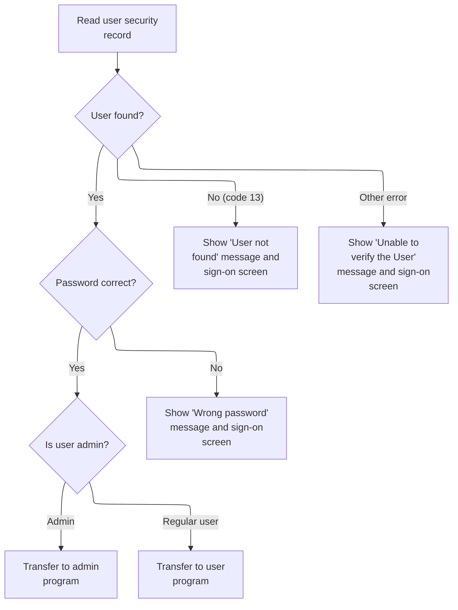

This section authenticates user credentials by verifying the user ID and password against the security file, then routes the user to the appropriate program or displays error messages based on the outcome.

| Rule ID | Code Location      | Category       | Rule Name                             | Description                                                                                                                                                               | Conditions                                                            | Remarks                                                                                                                                                                                                                                                                                                                                                             |
| ------- | ------------------ | -------------- | ------------------------------------- | ------------------------------------------------------------------------------------------------------------------------------------------------------------------------- | --------------------------------------------------------------------- | ------------------------------------------------------------------------------------------------------------------------------------------------------------------------------------------------------------------------------------------------------------------------------------------------------------------------------------------------------------------- |
| BR-001  | READ-USER-SEC-FILE | Business logic | Successful authentication and routing | If the user record is found and the password matches, the user is authenticated and routed to the appropriate program based on their user type (admin or regular user).   | User record is found (response code 0) and password matches.          | Admin users are identified by user type 'A', regular users by 'U'. The routing is to 'COADM01C' for admin and 'COMEN01C' for regular users. The communication area fields are set with the transaction ID (string, 4 chars), program name (string, 8 chars), user ID (string, 8 chars), user type (string, 1 char), and program context (number, 1 digit, value 0). |
| BR-002  | READ-USER-SEC-FILE | Error handling | Wrong password error                  | If the user record is found but the password does not match, an error message 'Wrong Password. Try again ...' is displayed and the sign-on screen is shown again.         | User record is found (response code 0) but password does not match.   | The error message is 'Wrong Password. Try again ...' (string, up to 80 chars). The password field on the sign-on screen is reset to -1.                                                                                                                                                                                                                             |
| BR-003  | READ-USER-SEC-FILE | Error handling | User not found error                  | If the user record is not found (response code 13), an error message 'User not found. Try again ...' is displayed and the sign-on screen is shown again.                  | User record is not found (response code 13).                          | The error message is 'User not found. Try again ...' (string, up to 80 chars). The user ID field on the sign-on screen is reset to -1. The error flag is set to 'Y'.                                                                                                                                                                                                |
| BR-004  | READ-USER-SEC-FILE | Error handling | General user verification error       | If an error occurs during user record lookup other than 'not found', an error message 'Unable to verify the User ...' is displayed and the sign-on screen is shown again. | Any error during user record lookup other than response code 0 or 13. | The error message is 'Unable to verify the User ...' (string, up to 80 chars). The user ID field on the sign-on screen is reset to -1. The error flag is set to 'Y'.                                                                                                                                                                                                |

<SwmSnippet path="/app/cbl/COSGN00C.cbl" line="209" repo-id="Z2l0aHViJTNBJTNBa3luZHJ5bC1hd3MtbWFpbmZyYW1lLW1vZGVybml6YXRpb24tY2FyZGRlbW8lM0ElM0FTd2ltbS1EZW1v">

---

`READ-USER-SEC-FILE` reads the user record from the security file. If found and the password matches, we set up the commarea and route to admin or main menu based on user type. If not found or password is wrong, we show an error and redisplay signon.

```cobol
       READ-USER-SEC-FILE.

           EXEC CICS READ
                DATASET   (WS-USRSEC-FILE)
                INTO      (SEC-USER-DATA)
                LENGTH    (LENGTH OF SEC-USER-DATA)
                RIDFLD    (WS-USER-ID)
                KEYLENGTH (LENGTH OF WS-USER-ID)
                RESP      (WS-RESP-CD)
                RESP2     (WS-REAS-CD)
           END-EXEC.

           EVALUATE WS-RESP-CD
               WHEN 0
                   IF SEC-USR-PWD = WS-USER-PWD
                       MOVE WS-TRANID    TO CDEMO-FROM-TRANID
                       MOVE WS-PGMNAME   TO CDEMO-FROM-PROGRAM
                       MOVE WS-USER-ID   TO CDEMO-USER-ID
                       MOVE SEC-USR-TYPE TO CDEMO-USER-TYPE
                       MOVE ZEROS        TO CDEMO-PGM-CONTEXT

                       IF CDEMO-USRTYP-ADMIN
                            EXEC CICS XCTL
                              PROGRAM ('COADM01C')
                              COMMAREA(CARDDEMO-COMMAREA)
                            END-EXEC
                       ELSE
                            EXEC CICS XCTL
                              PROGRAM ('COMEN01C')
                              COMMAREA(CARDDEMO-COMMAREA)
                            END-EXEC
                       END-IF
                   ELSE
                       MOVE 'Wrong Password. Try again ...' TO
                                                          WS-MESSAGE
                       MOVE -1       TO PASSWDL OF COSGN0AI
                       PERFORM SEND-SIGNON-SCREEN
                   END-IF
               WHEN 13
                   MOVE 'Y'      TO WS-ERR-FLG
                   MOVE 'User not found. Try again ...' TO WS-MESSAGE
                   MOVE -1       TO USERIDL OF COSGN0AI
                   PERFORM SEND-SIGNON-SCREEN
               WHEN OTHER
                   MOVE 'Y'      TO WS-ERR-FLG
                   MOVE 'Unable to verify the User ...' TO WS-MESSAGE
                   MOVE -1       TO USERIDL OF COSGN0AI
                   PERFORM SEND-SIGNON-SCREEN
           END-EVALUATE.
```

---

</SwmSnippet>

#### Admin Menu Entry and Input Handling

This section manages the entry point and input handling for the admin menu, determining whether to display the menu, process user actions, or route the user to the appropriate next step based on their input and session state.

| Rule ID | Code Location                      | Category       | Rule Name                         | Description                                                                                                            | Conditions                                                      | Remarks                                                                                                                     |
| ------- | ---------------------------------- | -------------- | --------------------------------- | ---------------------------------------------------------------------------------------------------------------------- | --------------------------------------------------------------- | --------------------------------------------------------------------------------------------------------------------------- |
| BR-001  | MAIN-PARA, RETURN-TO-SIGNON-SCREEN | Business logic | Missing session routes to sign-on | If no communication area is present (input length is zero), the user is routed to the sign-on screen.                  | The communication area length is zero.                          | The sign-on program name is 'COSGN00C'. The routing is to the sign-on screen.                                               |
| BR-002  | MAIN-PARA                          | Business logic | Initial admin menu display        | When the admin menu is first entered (not a re-entry), the menu screen is displayed with all fields cleared.           | The program is not being re-entered (re-entry flag is not set). | All fields on the menu screen are cleared (set to low values).                                                              |
| BR-003  | MAIN-PARA                          | Business logic | Enter key processes input         | If the user presses the Enter key while on the admin menu, the input is processed accordingly.                         | The user input is the Enter key.                                | Processing is delegated to the logic for handling Enter key input.                                                          |
| BR-004  | MAIN-PARA                          | Business logic | PF3 routes to sign-on             | If the user presses PF3, the user is routed to the sign-on screen.                                                     | The user input is PF3.                                          | The sign-on program name is 'COSGN00C'.                                                                                     |
| BR-005  | RETURN-TO-SIGNON-SCREEN            | Business logic | Default next program to sign-on   | Before transferring control to another program, if the next program is not set, it defaults to the sign-on program.    | The next program is blank or contains low values.               | The sign-on program name is 'COSGN00C'.                                                                                     |
| BR-006  | MAIN-PARA                          | Error handling | Invalid key error message         | If the user presses any key other than Enter or PF3, an error message is displayed and the menu screen is shown again. | The user input is not Enter or PF3.                             | The error message is 'Invalid key pressed. Please see below...         ' (50 characters, left-aligned, padded with spaces). |

<SwmSnippet path="/app/cbl/COADM01C.cbl" line="75" repo-id="Z2l0aHViJTNBJTNBa3luZHJ5bC1hd3MtbWFpbmZyYW1lLW1vZGVybml6YXRpb24tY2FyZGRlbW8lM0ElM0FTd2ltbS1EZW1v">

---

We decide if we're showing the admin menu or handling input, and route based on what the user does (Enter, PF3, or invalid key).

```cobol
       MAIN-PARA.

           SET ERR-FLG-OFF TO TRUE

           MOVE SPACES TO WS-MESSAGE
                          ERRMSGO OF COADM1AO

           IF EIBCALEN = 0
               MOVE 'COSGN00C' TO CDEMO-FROM-PROGRAM
               PERFORM RETURN-TO-SIGNON-SCREEN
           ELSE
               MOVE DFHCOMMAREA(1:EIBCALEN) TO CARDDEMO-COMMAREA
               IF NOT CDEMO-PGM-REENTER
                   SET CDEMO-PGM-REENTER    TO TRUE
                   MOVE LOW-VALUES          TO COADM1AO
                   PERFORM SEND-MENU-SCREEN
               ELSE
                   PERFORM RECEIVE-MENU-SCREEN
                   EVALUATE EIBAID
                       WHEN DFHENTER
                           PERFORM PROCESS-ENTER-KEY
                       WHEN DFHPF3
                           MOVE 'COSGN00C' TO CDEMO-TO-PROGRAM
                           PERFORM RETURN-TO-SIGNON-SCREEN
                       WHEN OTHER
                           MOVE 'Y'                       TO WS-ERR-FLG
                           MOVE CCDA-MSG-INVALID-KEY      TO WS-MESSAGE
                           PERFORM SEND-MENU-SCREEN
                   END-EVALUATE
               END-IF
           END-IF

           EXEC CICS RETURN
                     TRANSID (WS-TRANID)
                     COMMAREA (CARDDEMO-COMMAREA)
           END-EXEC.
```

---

</SwmSnippet>

<SwmSnippet path="/app/cbl/COADM01C.cbl" line="160" repo-id="Z2l0aHViJTNBJTNBa3luZHJ5bC1hd3MtbWFpbmZyYW1lLW1vZGVybml6YXRpb24tY2FyZGRlbW8lM0ElM0FTd2ltbS1EZW1v">

---

We make sure the next program is set, default to signon if not, and transfer control with XCTL.

```cobol
       RETURN-TO-SIGNON-SCREEN.

           IF CDEMO-TO-PROGRAM = LOW-VALUES OR SPACES
               MOVE 'COSGN00C' TO CDEMO-TO-PROGRAM
           END-IF
           EXEC CICS
               XCTL PROGRAM(CDEMO-TO-PROGRAM)
           END-EXEC.
```

---

</SwmSnippet>

##### Sending the Admin Menu Screen

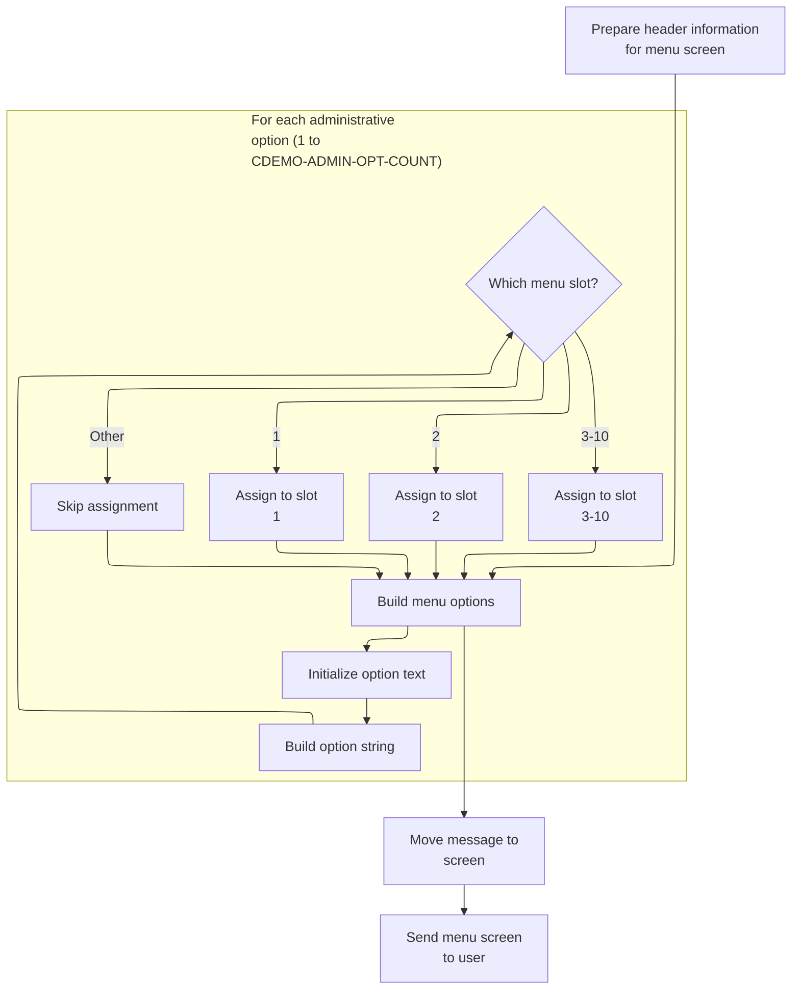

This section prepares and sends the administrative menu screen to the user, ensuring the header, menu options, and any messages are correctly displayed and the screen is refreshed.

| Rule ID | Code Location        | Category       | Rule Name                      | Description                                                                                                                                                                                                          | Conditions                                                                                       | Remarks                                                                                                                                                                                                              |
| ------- | -------------------- | -------------- | ------------------------------ | -------------------------------------------------------------------------------------------------------------------------------------------------------------------------------------------------------------------- | ------------------------------------------------------------------------------------------------ | -------------------------------------------------------------------------------------------------------------------------------------------------------------------------------------------------------------------- |
| BR-001  | POPULATE-HEADER-INFO | Business logic | Header information display     | The header of the admin menu screen must display the current date and time, along with the program title, transaction ID, and program name.                                                                          | Whenever the admin menu screen is sent to the user.                                              | Date is displayed in MM-DD-YY format; time is displayed in HH-MM-SS format. Titles, program name, and transaction ID are shown as strings. All fields are left-aligned and padded as needed for display.             |
| BR-002  | BUILD-MENU-OPTIONS   | Business logic | Menu option assignment         | Up to 10 administrative menu options are displayed, each formatted as '<option number>. <option name>'. Only options with numbers 1 through 10 are assigned to menu slots; any option outside this range is skipped. | For each administrative option in the input list, when building the menu options for the screen. | Maximum of 10 options. Each option string is formatted as: number (1-10), period, space, option name (e.g., '1. User List (Security)'). Each option field is up to 40 characters, left-aligned and padded as needed. |
| BR-003  | SEND-MENU-SCREEN     | Business logic | Message display in error field | Any message present is displayed in the error field of the admin menu screen. If no message is present, the error field remains blank.                                                                               | Whenever the admin menu screen is sent and a message is present in the input.                    | Message field is up to 80 characters, left-aligned and padded as needed. If the message is blank, the error field is blank.                                                                                          |
| BR-004  | SEND-MENU-SCREEN     | Business logic | Screen erase and send          | The admin menu screen is sent to the user's terminal, erasing any previous content on the screen.                                                                                                                    | Whenever the admin menu screen is sent.                                                          | The entire screen is refreshed and replaced with the new menu content.                                                                                                                                               |

<SwmSnippet path="/app/cbl/COADM01C.cbl" line="172" repo-id="Z2l0aHViJTNBJTNBa3luZHJ5bC1hd3MtbWFpbmZyYW1lLW1vZGVybml6YXRpb24tY2FyZGRlbW8lM0ElM0FTd2ltbS1EZW1v">

---

`SEND-MENU-SCREEN` fills in the header, builds the admin menu options, copies any message to the error field, and sends the admin menu map to the terminal, erasing the screen. This is how the admin sees the menu UI.

```cobol
       SEND-MENU-SCREEN.

           PERFORM POPULATE-HEADER-INFO
           PERFORM BUILD-MENU-OPTIONS

           MOVE WS-MESSAGE TO ERRMSGO OF COADM1AO

           EXEC CICS SEND
                     MAP('COADM1A')
                     MAPSET('COADM01')
                     FROM(COADM1AO)
                     ERASE
           END-EXEC.
```

---

</SwmSnippet>

<SwmSnippet path="/app/cbl/COADM01C.cbl" line="202" repo-id="Z2l0aHViJTNBJTNBa3luZHJ5bC1hd3MtbWFpbmZyYW1lLW1vZGVybml6YXRpb24tY2FyZGRlbW8lM0ElM0FTd2ltbS1EZW1v">

---

`POPULATE-HEADER-INFO` grabs the current date and time, formats them, and fills in the header fields (titles, program/transaction IDs, date, time) in the output area for the admin menu.

```cobol
       POPULATE-HEADER-INFO.

           MOVE FUNCTION CURRENT-DATE  TO WS-CURDATE-DATA

           MOVE CCDA-TITLE01           TO TITLE01O OF COADM1AO
           MOVE CCDA-TITLE02           TO TITLE02O OF COADM1AO
           MOVE WS-TRANID              TO TRNNAMEO OF COADM1AO
           MOVE WS-PGMNAME             TO PGMNAMEO OF COADM1AO

           MOVE WS-CURDATE-MONTH       TO WS-CURDATE-MM
           MOVE WS-CURDATE-DAY         TO WS-CURDATE-DD
           MOVE WS-CURDATE-YEAR(3:2)   TO WS-CURDATE-YY

           MOVE WS-CURDATE-MM-DD-YY    TO CURDATEO OF COADM1AO

           MOVE WS-CURTIME-HOURS       TO WS-CURTIME-HH
           MOVE WS-CURTIME-MINUTE      TO WS-CURTIME-MM
           MOVE WS-CURTIME-SECOND      TO WS-CURTIME-SS

           MOVE WS-CURTIME-HH-MM-SS    TO CURTIMEO OF COADM1AO.
```

---

</SwmSnippet>

<SwmSnippet path="/app/cbl/COADM01C.cbl" line="226" repo-id="Z2l0aHViJTNBJTNBa3luZHJ5bC1hd3MtbWFpbmZyYW1lLW1vZGVybml6YXRpb24tY2FyZGRlbW8lM0ElM0FTd2ltbS1EZW1v">

---

`BUILD-MENU-OPTIONS` loops through the admin options (up to 4), builds a string for each (like '1. User List (Security)'), and assigns it to the output fields for display on the admin menu screen.

```cobol
       BUILD-MENU-OPTIONS.

           PERFORM VARYING WS-IDX FROM 1 BY 1 UNTIL
                           WS-IDX > CDEMO-ADMIN-OPT-COUNT

               MOVE SPACES             TO WS-ADMIN-OPT-TXT

               STRING CDEMO-ADMIN-OPT-NUM(WS-IDX)  DELIMITED BY SIZE
                      '. '                         DELIMITED BY SIZE
                      CDEMO-ADMIN-OPT-NAME(WS-IDX) DELIMITED BY SIZE
                 INTO WS-ADMIN-OPT-TXT

               EVALUATE WS-IDX
                   WHEN 1
                       MOVE WS-ADMIN-OPT-TXT TO OPTN001O
                   WHEN 2
                       MOVE WS-ADMIN-OPT-TXT TO OPTN002O
                   WHEN 3
                       MOVE WS-ADMIN-OPT-TXT TO OPTN003O
                   WHEN 4
                       MOVE WS-ADMIN-OPT-TXT TO OPTN004O
                   WHEN 5
                       MOVE WS-ADMIN-OPT-TXT TO OPTN005O
                   WHEN 6
                       MOVE WS-ADMIN-OPT-TXT TO OPTN006O
                   WHEN 7
                       MOVE WS-ADMIN-OPT-TXT TO OPTN007O
                   WHEN 8
                       MOVE WS-ADMIN-OPT-TXT TO OPTN008O
                   WHEN 9
                       MOVE WS-ADMIN-OPT-TXT TO OPTN009O
                   WHEN 10
                       MOVE WS-ADMIN-OPT-TXT TO OPTN010O
                   WHEN OTHER
                       CONTINUE
               END-EVALUATE

           END-PERFORM.
```

---

</SwmSnippet>

##### Receiving and Processing Admin Menu Input

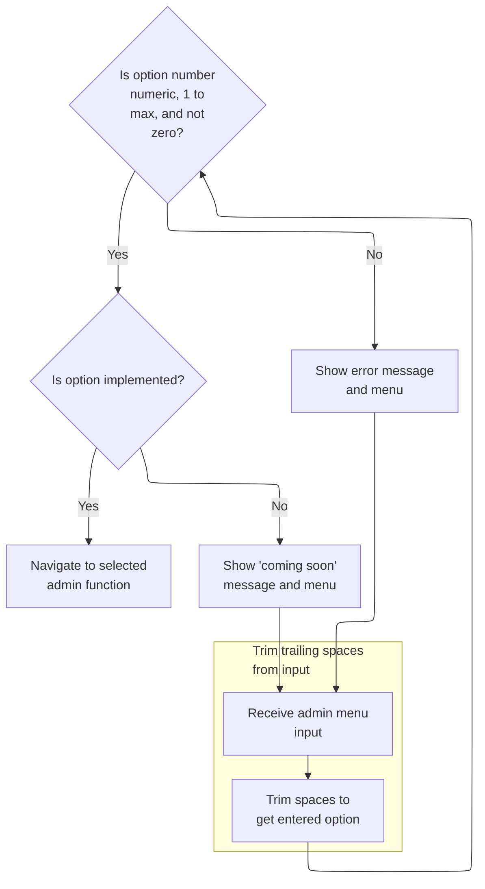

This section manages the receipt and processing of admin menu input, validating the user's selection and routing them to the appropriate admin function or displaying feedback messages.

| Rule ID | Code Location     | Category        | Rule Name                     | Description                                                                                                                                                     | Conditions                                                                                              | Remarks                                                                                                                                                                                                                                       |
| ------- | ----------------- | --------------- | ----------------------------- | --------------------------------------------------------------------------------------------------------------------------------------------------------------- | ------------------------------------------------------------------------------------------------------- | --------------------------------------------------------------------------------------------------------------------------------------------------------------------------------------------------------------------------------------------- |
| BR-001  | PROCESS-ENTER-KEY | Data validation | Menu option validation        | If the entered option number is not numeric, is zero, or exceeds the maximum allowed option count, an error message is displayed and the menu is redisplayed.   | The entered option number is not numeric, is zero, or is greater than the maximum allowed option count. | The maximum allowed option count is defined by the constant CDEMO-ADMIN-OPT-COUNT. The error message displayed is 'Please enter a valid option number...'. The option number must be a number between 1 and CDEMO-ADMIN-OPT-COUNT, inclusive. |
| BR-002  | PROCESS-ENTER-KEY | Business logic  | Unimplemented option handling | If the entered option number is valid but the selected admin function is not yet implemented, a 'coming soon' message is displayed and the menu is redisplayed. | The entered option number is valid, but the corresponding admin function is marked as not implemented.  | An option is considered not implemented if its program name starts with 'DUMMY'. The message displayed is 'This option is coming soon ...'.                                                                                                   |
| BR-003  | PROCESS-ENTER-KEY | Business logic  | Admin function navigation     | If the entered option number is valid and the selected admin function is implemented, the user is navigated to the corresponding admin function.                | The entered option number is valid and the corresponding admin function is implemented.                 | Navigation is performed to the admin function associated with the selected option. The function is considered implemented if its program name does not start with 'DUMMY'.                                                                    |

<SwmSnippet path="/app/cbl/COADM01C.cbl" line="189" repo-id="Z2l0aHViJTNBJTNBa3luZHJ5bC1hd3MtbWFpbmZyYW1lLW1vZGVybml6YXRpb24tY2FyZGRlbW8lM0ElM0FTd2ltbS1EZW1v">

---

We receive the admin menu input from the screen for processing.

```cobol
       RECEIVE-MENU-SCREEN.

           EXEC CICS RECEIVE
                     MAP('COADM1A')
                     MAPSET('COADM01')
                     INTO(COADM1AI)
                     RESP(WS-RESP-CD)
                     RESP2(WS-REAS-CD)
           END-EXEC.
```

---

</SwmSnippet>

<SwmSnippet path="/app/cbl/COADM01C.cbl" line="115" repo-id="Z2l0aHViJTNBJTNBa3luZHJ5bC1hd3MtbWFpbmZyYW1lLW1vZGVybml6YXRpb24tY2FyZGRlbW8lM0ElM0FTd2ltbS1EZW1v">

---

`PROCESS-ENTER-KEY` trims and parses the user's menu input, validates it's a number and in range, and either routes to the selected admin program (if implemented) or shows an error/coming soon message and redisplays the menu.

```cobol
       PROCESS-ENTER-KEY.

           PERFORM VARYING WS-IDX
                   FROM LENGTH OF OPTIONI OF COADM1AI BY -1 UNTIL
                   OPTIONI OF COADM1AI(WS-IDX:1) NOT = SPACES OR
                   WS-IDX = 1
           END-PERFORM
           MOVE OPTIONI OF COADM1AI(1:WS-IDX) TO WS-OPTION-X
           INSPECT WS-OPTION-X REPLACING ALL ' ' BY '0'
           MOVE WS-OPTION-X              TO WS-OPTION
           MOVE WS-OPTION                TO OPTIONO OF COADM1AO

           IF WS-OPTION IS NOT NUMERIC OR
              WS-OPTION > CDEMO-ADMIN-OPT-COUNT OR
              WS-OPTION = ZEROS
               MOVE 'Y'     TO WS-ERR-FLG
               MOVE 'Please enter a valid option number...' TO
                                       WS-MESSAGE
               PERFORM SEND-MENU-SCREEN
           END-IF


           IF NOT ERR-FLG-ON
               IF CDEMO-ADMIN-OPT-PGMNAME(WS-OPTION)(1:5) NOT = 'DUMMY'
                   MOVE WS-TRANID    TO CDEMO-FROM-TRANID
                   MOVE WS-PGMNAME   TO CDEMO-FROM-PROGRAM
                   MOVE ZEROS        TO CDEMO-PGM-CONTEXT
                   EXEC CICS
                       XCTL PROGRAM(CDEMO-ADMIN-OPT-PGMNAME(WS-OPTION))
                       COMMAREA(CARDDEMO-COMMAREA)
                   END-EXEC
               END-IF
               MOVE SPACES             TO WS-MESSAGE
               MOVE DFHGREEN           TO ERRMSGC  OF COADM1AO
               STRING 'This option '       DELIMITED BY SIZE
      *                CDEMO-ADMIN-OPT-NAME(WS-OPTION)
      *                                DELIMITED BY SIZE
                       'is coming soon ...'   DELIMITED BY SIZE
                  INTO WS-MESSAGE
               PERFORM SEND-MENU-SCREEN
           END-IF.
```

---

</SwmSnippet>

#### Sending Plain Text Messages

This section is responsible for delivering plain text messages to the terminal, ensuring the screen is cleared and the keyboard is available for user input, before returning control to the transaction system.

| Rule ID | Code Location   | Category       | Rule Name                            | Description                                                                                                                                            | Conditions                                        | Remarks                                                                                                                                                                                                                                                                                     |
| ------- | --------------- | -------------- | ------------------------------------ | ------------------------------------------------------------------------------------------------------------------------------------------------------ | ------------------------------------------------- | ------------------------------------------------------------------------------------------------------------------------------------------------------------------------------------------------------------------------------------------------------------------------------------------- |
| BR-001  | SEND-PLAIN-TEXT | Business logic | Plain text message delivery          | When sending a message to the terminal, the contents of the message are taken from the current value of the message field and displayed as plain text. | Whenever the SEND-PLAIN-TEXT section is executed. | The message is sent as a string, with a maximum length of 80 characters. The actual length is determined by the content of the message field at the time of sending. Example messages include 'Thank you for using CardDemo application...' and 'Invalid key pressed. Please see below...'. |
| BR-002  | SEND-PLAIN-TEXT | Business logic | Screen erase before message          | When a message is sent to the terminal, the screen is erased before the message is displayed.                                                          | Whenever the SEND-PLAIN-TEXT section is executed. | The erase action ensures that any previous content on the terminal is removed before the new message is displayed.                                                                                                                                                                          |
| BR-003  | SEND-PLAIN-TEXT | Business logic | Free keyboard after message          | After sending the message, the keyboard is freed to allow user input.                                                                                  | Whenever the SEND-PLAIN-TEXT section is executed. | The keyboard is made available for user input after the message is displayed.                                                                                                                                                                                                               |
| BR-004  | SEND-PLAIN-TEXT | Business logic | Return control to transaction system | After the message is sent and the screen is prepared, control is returned to the transaction system.                                                   | Whenever the SEND-PLAIN-TEXT section is executed. | Control is returned to CICS after the message is sent and the screen is prepared.                                                                                                                                                                                                           |

<SwmSnippet path="/app/cbl/COSGN00C.cbl" line="162" repo-id="Z2l0aHViJTNBJTNBa3luZHJ5bC1hd3MtbWFpbmZyYW1lLW1vZGVybml6YXRpb24tY2FyZGRlbW8lM0ElM0FTd2ltbS1EZW1v">

---

`SEND-PLAIN-TEXT` sends the WS-MESSAGE as plain text to the terminal, erasing the screen and freeing the keyboard, then returns control to CICS.

```cobol
       SEND-PLAIN-TEXT.

           EXEC CICS SEND TEXT
                     FROM(WS-MESSAGE)
                     LENGTH(LENGTH OF WS-MESSAGE)
                     ERASE
                     FREEKB
           END-EXEC.

           EXEC CICS RETURN
           END-EXEC.
```

---

</SwmSnippet>

### Sending the Main Menu Screen

This section prepares and sends the main menu screen to the user's terminal, ensuring that all required header information, menu options, and messages are displayed in a clear and consistent format.

| Rule ID | Code Location        | Category       | Rule Name                                 | Description                                                                                                                                       | Conditions                                                                             | Remarks                                                                                                                                                                          |
| ------- | -------------------- | -------------- | ----------------------------------------- | ------------------------------------------------------------------------------------------------------------------------------------------------- | -------------------------------------------------------------------------------------- | -------------------------------------------------------------------------------------------------------------------------------------------------------------------------------- |
| BR-001  | POPULATE-HEADER-INFO | Business logic | Header date and time display              | The main menu screen must display the current date and time in the header area, formatted as MM-DD-YY for the date and HH-MM-SS for the time.     | Whenever the main menu screen is sent to the user.                                     | Date is formatted as MM-DD-YY (month, day, two-digit year). Time is formatted as HH-MM-SS (hours, minutes, seconds). Both are shown in the header area.                          |
| BR-002  | BUILD-MENU-OPTIONS   | Business logic | Menu options display and format           | The main menu screen must display up to 12 menu options, each formatted as '<number>. <option name>' (e.g., '1. Account View'), in the menu area. | Whenever the main menu screen is sent, for each menu option up to the count specified. | Each menu option is formatted as a string: number (1-12), period, space, option name. Maximum of 12 options are displayed. Each option is placed in its respective output field. |
| BR-003  | SEND-MENU-SCREEN     | Business logic | Error/message field population            | Any message present must be displayed in the error/message field of the main menu screen.                                                         | Whenever the main menu screen is sent and a message is present.                        | The message is up to 80 characters. If present, it is shown in the error/message field of the main menu screen.                                                                  |
| BR-004  | POPULATE-HEADER-INFO | Business logic | Header program and transaction ID display | The main menu screen must display the program name and transaction ID in the header area.                                                         | Whenever the main menu screen is sent.                                                 | Program name is up to 8 characters, transaction ID is up to 4 characters. Both are shown in the header area.                                                                     |
| BR-005  | POPULATE-HEADER-INFO | Business logic | Header title lines display                | The main menu screen must display two title lines in the header area.                                                                             | Whenever the main menu screen is sent.                                                 | Two title lines are shown in the header area, each up to the length defined by the output field.                                                                                 |
| BR-006  | SEND-MENU-SCREEN     | Business logic | Screen erase before display               | When the main menu screen is sent, the terminal display is cleared before the new screen is shown.                                                | Whenever the main menu screen is sent.                                                 | The terminal display is cleared before the new main menu screen is shown.                                                                                                        |

<SwmSnippet path="/app/cbl/COMEN01C.cbl" line="182" repo-id="Z2l0aHViJTNBJTNBa3luZHJ5bC1hd3MtbWFpbmZyYW1lLW1vZGVybml6YXRpb24tY2FyZGRlbW8lM0ElM0FTd2ltbS1EZW1v">

---

`SEND-MENU-SCREEN` fills in the header, builds the main menu options, copies any message to the error field, and sends the main menu map to the terminal, erasing the screen. This is how the user sees the main menu UI.

```cobol
       SEND-MENU-SCREEN.

           PERFORM POPULATE-HEADER-INFO
           PERFORM BUILD-MENU-OPTIONS

           MOVE WS-MESSAGE TO ERRMSGO OF COMEN1AO

           EXEC CICS SEND
                     MAP('COMEN1A')
                     MAPSET('COMEN01')
                     FROM(COMEN1AO)
                     ERASE
           END-EXEC.
```

---

</SwmSnippet>

<SwmSnippet path="/app/cbl/COMEN01C.cbl" line="212" repo-id="Z2l0aHViJTNBJTNBa3luZHJ5bC1hd3MtbWFpbmZyYW1lLW1vZGVybml6YXRpb24tY2FyZGRlbW8lM0ElM0FTd2ltbS1EZW1v">

---

`POPULATE-HEADER-INFO` grabs the current date and time, formats them, and fills in the header fields (titles, program/transaction IDs, date, time) in the output area for the main menu.

```cobol
       POPULATE-HEADER-INFO.

           MOVE FUNCTION CURRENT-DATE  TO WS-CURDATE-DATA

           MOVE CCDA-TITLE01           TO TITLE01O OF COMEN1AO
           MOVE CCDA-TITLE02           TO TITLE02O OF COMEN1AO
           MOVE WS-TRANID              TO TRNNAMEO OF COMEN1AO
           MOVE WS-PGMNAME             TO PGMNAMEO OF COMEN1AO

           MOVE WS-CURDATE-MONTH       TO WS-CURDATE-MM
           MOVE WS-CURDATE-DAY         TO WS-CURDATE-DD
           MOVE WS-CURDATE-YEAR(3:2)   TO WS-CURDATE-YY

           MOVE WS-CURDATE-MM-DD-YY    TO CURDATEO OF COMEN1AO

           MOVE WS-CURTIME-HOURS       TO WS-CURTIME-HH
           MOVE WS-CURTIME-MINUTE      TO WS-CURTIME-MM
           MOVE WS-CURTIME-SECOND      TO WS-CURTIME-SS

           MOVE WS-CURTIME-HH-MM-SS    TO CURTIMEO OF COMEN1AO.
```

---

</SwmSnippet>

<SwmSnippet path="/app/cbl/COMEN01C.cbl" line="236" repo-id="Z2l0aHViJTNBJTNBa3luZHJ5bC1hd3MtbWFpbmZyYW1lLW1vZGVybml6YXRpb24tY2FyZGRlbW8lM0ElM0FTd2ltbS1EZW1v">

---

`BUILD-MENU-OPTIONS` loops through the main menu options (up to 10), builds a string for each (like '1. Account View'), and assigns it to the output fields for display on the main menu screen.

```cobol
       BUILD-MENU-OPTIONS.

           PERFORM VARYING WS-IDX FROM 1 BY 1 UNTIL
                           WS-IDX > CDEMO-MENU-OPT-COUNT

               MOVE SPACES             TO WS-MENU-OPT-TXT

               STRING CDEMO-MENU-OPT-NUM(WS-IDX)  DELIMITED BY SIZE
                      '. '                         DELIMITED BY SIZE
                      CDEMO-MENU-OPT-NAME(WS-IDX) DELIMITED BY SIZE
                 INTO WS-MENU-OPT-TXT

               EVALUATE WS-IDX
                   WHEN 1
                       MOVE WS-MENU-OPT-TXT TO OPTN001O
                   WHEN 2
                       MOVE WS-MENU-OPT-TXT TO OPTN002O
                   WHEN 3
                       MOVE WS-MENU-OPT-TXT TO OPTN003O
                   WHEN 4
                       MOVE WS-MENU-OPT-TXT TO OPTN004O
                   WHEN 5
                       MOVE WS-MENU-OPT-TXT TO OPTN005O
                   WHEN 6
                       MOVE WS-MENU-OPT-TXT TO OPTN006O
                   WHEN 7
                       MOVE WS-MENU-OPT-TXT TO OPTN007O
                   WHEN 8
                       MOVE WS-MENU-OPT-TXT TO OPTN008O
                   WHEN 9
                       MOVE WS-MENU-OPT-TXT TO OPTN009O
                   WHEN 10
                       MOVE WS-MENU-OPT-TXT TO OPTN010O
                   WHEN 11
                       MOVE WS-MENU-OPT-TXT TO OPTN011O
                   WHEN 12
                       MOVE WS-MENU-OPT-TXT TO OPTN012O
                   WHEN OTHER
                       CONTINUE
               END-EVALUATE

           END-PERFORM.
```

---

</SwmSnippet>

### Receiving and Processing Main Menu Input

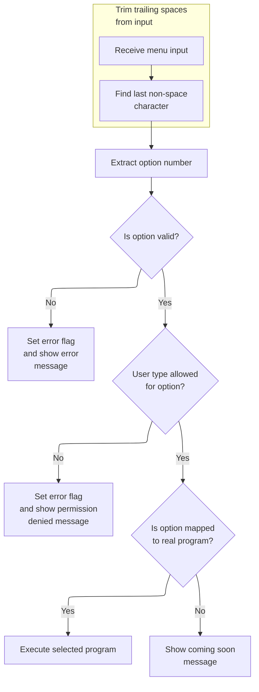

This section governs how main menu input is received, validated, and processed, including user access control and handling of unimplemented options. It ensures users receive appropriate feedback or are routed to the correct program based on their input and permissions.

| Rule ID | Code Location     | Category        | Rule Name                      | Description                                                                                                                                                                                   | Conditions                                                                                           | Remarks                                                                                                                                                                                                                                                                     |
| ------- | ----------------- | --------------- | ------------------------------ | --------------------------------------------------------------------------------------------------------------------------------------------------------------------------------------------- | ---------------------------------------------------------------------------------------------------- | --------------------------------------------------------------------------------------------------------------------------------------------------------------------------------------------------------------------------------------------------------------------------- |
| BR-001  | PROCESS-ENTER-KEY | Data validation | Menu Option Validation         | If the menu option entered by the user is not numeric, is greater than the maximum allowed option count, or is zero, an error message is displayed and the menu is redisplayed.               | The user enters a menu option that is not a number, is greater than the allowed maximum, or is zero. | The maximum allowed option count is defined by the constant CDEMO-MENU-OPT-COUNT. The error message displayed is: 'Please enter a valid option number...'. The menu is redisplayed after the error.                                                                         |
| BR-002  | PROCESS-ENTER-KEY | Data validation | Admin Option Access Control    | If a regular user selects a menu option that is restricted to admin users, a permission denied message is displayed and the menu is redisplayed.                                              | The user is of type 'U' (regular user) and selects a menu option that is marked as admin-only.       | User type 'U' is a regular user, and 'A' is admin. The message displayed is: 'No access - Admin Only option... '. The menu is redisplayed after the message.                                                                                                                |
| BR-003  | PROCESS-ENTER-KEY | Business logic  | Option Implementation Handling | If the selected menu option is implemented (i.e., mapped to a real program), the corresponding program is executed. If not, a 'coming soon' message is displayed and the menu is redisplayed. | The user selects a valid and permitted menu option.                                                  | An option is considered implemented if its program name does not start with 'DUMMY'. The 'coming soon' message format is: 'This option <option name> is coming soon ...', where <option name> is the display name of the option. The menu is redisplayed after the message. |

<SwmSnippet path="/app/cbl/COMEN01C.cbl" line="199" repo-id="Z2l0aHViJTNBJTNBa3luZHJ5bC1hd3MtbWFpbmZyYW1lLW1vZGVybml6YXRpb24tY2FyZGRlbW8lM0ElM0FTd2ltbS1EZW1v">

---

We receive the main menu input from the screen for processing.

```cobol
       RECEIVE-MENU-SCREEN.

           EXEC CICS RECEIVE
                     MAP('COMEN1A')
                     MAPSET('COMEN01')
                     INTO(COMEN1AI)
                     RESP(WS-RESP-CD)
                     RESP2(WS-REAS-CD)
           END-EXEC.
```

---

</SwmSnippet>

<SwmSnippet path="/app/cbl/COMEN01C.cbl" line="115" repo-id="Z2l0aHViJTNBJTNBa3luZHJ5bC1hd3MtbWFpbmZyYW1lLW1vZGVybml6YXRpb24tY2FyZGRlbW8lM0ElM0FTd2ltbS1EZW1v">

---

`PROCESS-ENTER-KEY` trims and parses the user's menu input, validates it's a number and in range, checks if the user is allowed to access the option, and either routes to the selected program (if implemented and allowed) or shows an error/coming soon message and redisplays the menu.

```cobol
       PROCESS-ENTER-KEY.

           PERFORM VARYING WS-IDX
                   FROM LENGTH OF OPTIONI OF COMEN1AI BY -1 UNTIL
                   OPTIONI OF COMEN1AI(WS-IDX:1) NOT = SPACES OR
                   WS-IDX = 1
           END-PERFORM
           MOVE OPTIONI OF COMEN1AI(1:WS-IDX) TO WS-OPTION-X
           INSPECT WS-OPTION-X REPLACING ALL ' ' BY '0'
           MOVE WS-OPTION-X              TO WS-OPTION
           MOVE WS-OPTION                TO OPTIONO OF COMEN1AO

           IF WS-OPTION IS NOT NUMERIC OR
              WS-OPTION > CDEMO-MENU-OPT-COUNT OR
              WS-OPTION = ZEROS
               MOVE 'Y'     TO WS-ERR-FLG
               MOVE 'Please enter a valid option number...' TO
                               WS-MESSAGE
               PERFORM SEND-MENU-SCREEN
           END-IF

           IF CDEMO-USRTYP-USER AND
              CDEMO-MENU-OPT-USRTYPE(WS-OPTION) = 'A'
               SET ERR-FLG-ON          TO TRUE
               MOVE SPACES             TO WS-MESSAGE
               MOVE 'No access - Admin Only option... ' TO
                                       WS-MESSAGE
               PERFORM SEND-MENU-SCREEN
           END-IF

           IF NOT ERR-FLG-ON
               IF CDEMO-MENU-OPT-PGMNAME(WS-OPTION)(1:5) NOT = 'DUMMY'
                   MOVE WS-TRANID    TO CDEMO-FROM-TRANID
                   MOVE WS-PGMNAME   TO CDEMO-FROM-PROGRAM
      *            MOVE WS-USER-ID   TO CDEMO-USER-ID
      *            MOVE SEC-USR-TYPE TO CDEMO-USER-TYPE
                   MOVE ZEROS        TO CDEMO-PGM-CONTEXT
                   EXEC CICS
                       XCTL PROGRAM(CDEMO-MENU-OPT-PGMNAME(WS-OPTION))
                       COMMAREA(CARDDEMO-COMMAREA)
                   END-EXEC
               END-IF
               MOVE SPACES             TO WS-MESSAGE
               MOVE DFHGREEN           TO ERRMSGC  OF COMEN1AO
               STRING 'This option '       DELIMITED BY SIZE
                       CDEMO-MENU-OPT-NAME(WS-OPTION)
                                       DELIMITED BY SPACE
                       'is coming soon ...'   DELIMITED BY SIZE
                  INTO WS-MESSAGE
               PERFORM SEND-MENU-SCREEN
           END-IF.
```

---

</SwmSnippet>

## Handling Transaction Report User Input

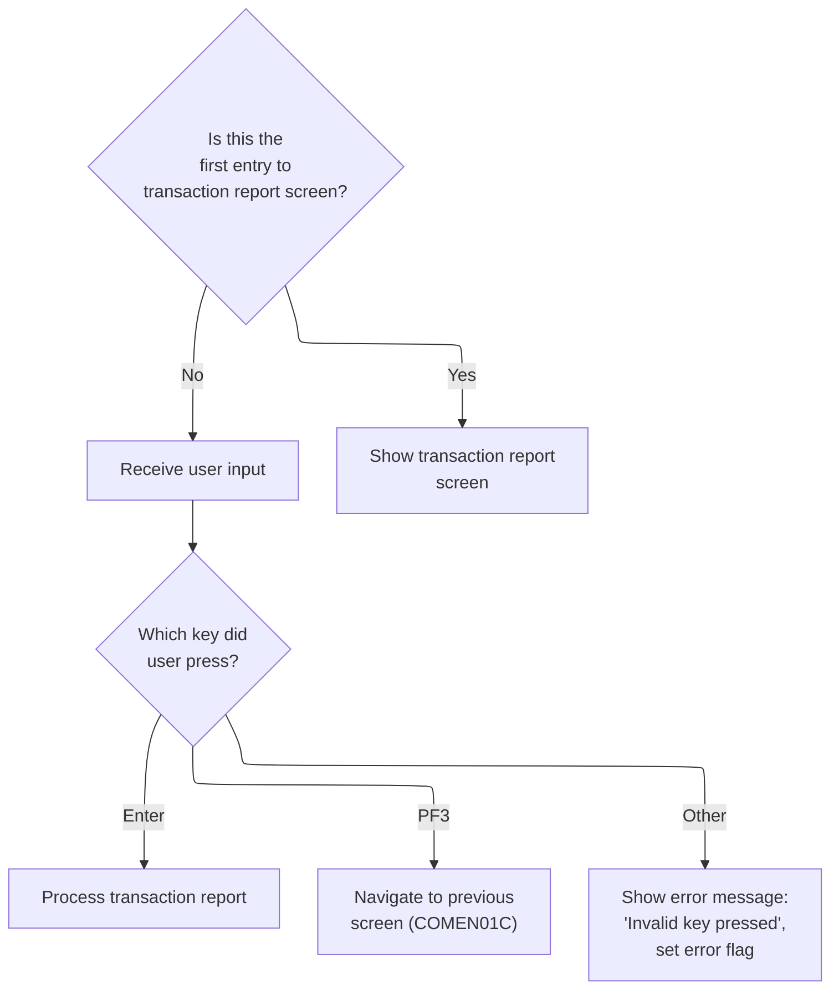

This section manages the user interaction flow for the transaction report screen, determining when the screen is displayed, how user input is handled, and what actions are taken based on specific key presses.

| Rule ID | Code Location         | Category       | Rule Name                           | Description                                                                                                                                                   | Conditions                                                                                 | Remarks                                                                                                                                                         |
| ------- | --------------------- | -------------- | ----------------------------------- | ------------------------------------------------------------------------------------------------------------------------------------------------------------- | ------------------------------------------------------------------------------------------ | --------------------------------------------------------------------------------------------------------------------------------------------------------------- |
| BR-001  | SEND-TRNRPT-SCREEN    | Business logic | Initial transaction report display  | When the user enters the transaction report screen for the first time, the transaction report screen is displayed to the user.                                | The communication area indicates this is the first entry to the transaction report screen. | No error flag is set. The transaction report screen is displayed. The output format is the standard transaction report screen layout.                           |
| BR-002  | RECEIVE-TRNRPT-SCREEN | Business logic | User input handling on re-entry     | When the user re-enters the transaction report screen, the system receives user input and determines the next action based on the key pressed.                | The communication area indicates this is a re-entry to the transaction report screen.      | User input is received. The next action depends on the key pressed (Enter, PF3, or other).                                                                      |
| BR-003  | PROCESS-ENTER-KEY     | Business logic | Process transaction report on Enter | If the user presses the Enter key after re-entering the transaction report screen, the transaction report is processed.                                       | User re-entered the transaction report screen and pressed the Enter key.                   | The transaction report is processed according to business logic. No error message is displayed.                                                                 |
| BR-004  | RETURN-TO-PREV-SCREEN | Business logic | Navigate to previous screen on PF3  | If the user presses the PF3 key after re-entering the transaction report screen, the system navigates to the previous screen.                                 | User re-entered the transaction report screen and pressed the PF3 key.                     | The system navigates to the previous screen (COMEN01C). No error message is displayed.                                                                          |
| BR-005  | SEND-TRNRPT-SCREEN    | Error handling | Invalid key error handling          | If the user presses any key other than Enter or PF3 after re-entering the transaction report screen, an error message is displayed and the error flag is set. | User re-entered the transaction report screen and pressed a key other than Enter or PF3.   | The error flag is set to 'Y'. The error message 'Invalid key pressed. Please see below...         ' is displayed. The transaction report screen is redisplayed. |

<SwmSnippet path="/app/cbl/CORPT00C.cbl" line="175" repo-id="Z2l0aHViJTNBJTNBa3luZHJ5bC1hd3MtbWFpbmZyYW1lLW1vZGVybml6YXRpb24tY2FyZGRlbW8lM0ElM0FTd2ltbS1EZW1v">

---

Back in MAIN-PARA after RETURN-TO-PREV-SCREEN, if we have a commarea, we check if this is the first entry or a re-entry. If it's the first, we send the transaction report screen. If it's a re-entry, we receive user input and handle Enter (process), PF3 (return to menu), or anything else (show error and redisplay).

```cobol
           ELSE
               MOVE DFHCOMMAREA(1:EIBCALEN) TO CARDDEMO-COMMAREA
               IF NOT CDEMO-PGM-REENTER
                   SET CDEMO-PGM-REENTER    TO TRUE
                   MOVE LOW-VALUES          TO CORPT0AO
                   MOVE -1       TO MONTHLYL OF CORPT0AI
                   PERFORM SEND-TRNRPT-SCREEN
               ELSE
                   PERFORM RECEIVE-TRNRPT-SCREEN
                   EVALUATE EIBAID
                       WHEN DFHENTER
                           PERFORM PROCESS-ENTER-KEY
                       WHEN DFHPF3
                           MOVE 'COMEN01C' TO CDEMO-TO-PROGRAM
                           PERFORM RETURN-TO-PREV-SCREEN
                       WHEN OTHER
                           MOVE 'Y'                       TO WS-ERR-FLG
                           MOVE -1       TO MONTHLYL OF CORPT0AI
                           MOVE CCDA-MSG-INVALID-KEY      TO WS-MESSAGE
                           PERFORM SEND-TRNRPT-SCREEN
                   END-EVALUATE
               END-IF
```

---

</SwmSnippet>

## Sending the Transaction Report Screen

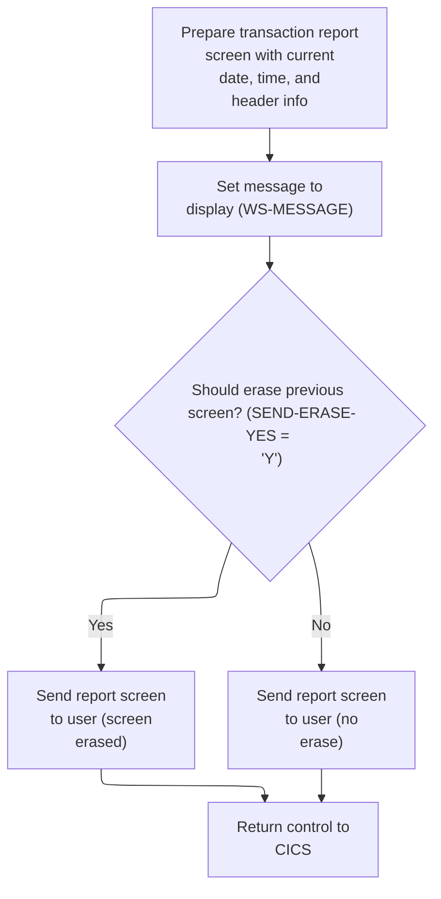

This section is responsible for preparing and displaying the transaction report screen to the user, ensuring all header and message information is current, and managing the screen erase logic and session context.

| Rule ID | Code Location                            | Category       | Rule Name                          | Description                                                                                                                                                                  | Conditions                                                                         | Remarks                                                                                                                                                                                                                            |
| ------- | ---------------------------------------- | -------------- | ---------------------------------- | ---------------------------------------------------------------------------------------------------------------------------------------------------------------------------- | ---------------------------------------------------------------------------------- | ---------------------------------------------------------------------------------------------------------------------------------------------------------------------------------------------------------------------------------- |
| BR-001  | SEND-TRNRPT-SCREEN, POPULATE-HEADER-INFO | Business logic | Current header information         | The transaction report screen header must always display the current date, time, main title, subtitle, program name, and transaction ID when the screen is sent to the user. | Whenever the transaction report screen is about to be sent to the user.            | The header includes: date (MM-DD-YY), time (HH-MM-SS), main title, subtitle, program name (8 characters), and transaction ID (4 characters). These are always updated to reflect the current values at the time of screen display. |
| BR-002  | SEND-TRNRPT-SCREEN                       | Business logic | Display message to user            | The message area on the transaction report screen must display the current status or error message, if any, when the screen is sent.                                         | Whenever the transaction report screen is sent to the user.                        | The message area is 80 characters long and displays the current status or error message. If there is no message, it is blank.                                                                                                      |
| BR-003  | SEND-TRNRPT-SCREEN                       | Business logic | Conditional screen erase           | The transaction report screen must be erased before display if the erase flag is set to 'Y'; otherwise, the screen is sent without erasing.                                  | When sending the transaction report screen, check if the erase flag is set to 'Y'. | The erase flag is set to 'Y' for erase, 'N' for no erase. If erased, the screen is cleared before the new content is displayed.                                                                                                    |
| BR-004  | SEND-TRNRPT-SCREEN, RETURN-TO-CICS       | Technical step | Preserve session context on return | After sending the transaction report screen, control must be returned to CICS with the current transaction ID and session context preserved.                                 | After the transaction report screen is sent to the user.                           | The transaction ID is 4 characters; the session context is passed in the communication area structure.                                                                                                                             |

<SwmSnippet path="/app/cbl/CORPT00C.cbl" line="556" repo-id="Z2l0aHViJTNBJTNBa3luZHJ5bC1hd3MtbWFpbmZyYW1lLW1vZGVybml6YXRpb24tY2FyZGRlbW8lM0ElM0FTd2ltbS1EZW1v">

---

In `SEND-TRNRPT-SCREEN` we kick off the process of sending the transaction report screen by performing POPULATE-HEADER-INFO. This step updates all the header fields in CORPT0AO (date, time, titles, etc.) so the screen shows current info when displayed. Without this, the user would see outdated or blank header data.

```cobol
       SEND-TRNRPT-SCREEN.

           PERFORM POPULATE-HEADER-INFO
```

---

</SwmSnippet>

<SwmSnippet path="/app/cbl/CORPT00C.cbl" line="609" repo-id="Z2l0aHViJTNBJTNBa3luZHJ5bC1hd3MtbWFpbmZyYW1lLW1vZGVybml6YXRpb24tY2FyZGRlbW8lM0ElM0FTd2ltbS1EZW1v">

---

`POPULATE-HEADER-INFO` grabs the current date and time, formats them, and fills out the header fields in CORPT0AO. It also sets the main and subtitle, program name, and transaction ID. The date and time are split into pieces and reassembled to fit the screen format.

```cobol
       POPULATE-HEADER-INFO.

           MOVE FUNCTION CURRENT-DATE  TO WS-CURDATE-DATA

           MOVE CCDA-TITLE01           TO TITLE01O OF CORPT0AO
           MOVE CCDA-TITLE02           TO TITLE02O OF CORPT0AO
           MOVE WS-TRANID              TO TRNNAMEO OF CORPT0AO
           MOVE WS-PGMNAME             TO PGMNAMEO OF CORPT0AO

           MOVE WS-CURDATE-MONTH       TO WS-CURDATE-MM
           MOVE WS-CURDATE-DAY         TO WS-CURDATE-DD
           MOVE WS-CURDATE-YEAR(3:2)   TO WS-CURDATE-YY

           MOVE WS-CURDATE-MM-DD-YY    TO CURDATEO OF CORPT0AO

           MOVE WS-CURTIME-HOURS       TO WS-CURTIME-HH
           MOVE WS-CURTIME-MINUTE      TO WS-CURTIME-MM
           MOVE WS-CURTIME-SECOND      TO WS-CURTIME-SS

           MOVE WS-CURTIME-HH-MM-SS    TO CURTIMEO OF CORPT0AO.
```

---

</SwmSnippet>

<SwmSnippet path="/app/cbl/CORPT00C.cbl" line="560" repo-id="Z2l0aHViJTNBJTNBa3luZHJ5bC1hd3MtbWFpbmZyYW1lLW1vZGVybml6YXRpb24tY2FyZGRlbW8lM0ElM0FTd2ltbS1EZW1v">

---

After returning from POPULATE-HEADER-INFO, SEND-TRNRPT-SCREEN sets any error or status message, then sends the CORPT0A map to the terminal. It checks if we need to erase the screen first, then positions the cursor. Finally, it jumps to RETURN-TO-CICS to hand control back to CICS.

```cobol
           MOVE WS-MESSAGE TO ERRMSGO OF CORPT0AO

           IF SEND-ERASE-YES
               EXEC CICS SEND
                         MAP('CORPT0A')
                         MAPSET('CORPT00')
                         FROM(CORPT0AO)
                         ERASE
                         CURSOR
               END-EXEC
           ELSE
               EXEC CICS SEND
                         MAP('CORPT0A')
                         MAPSET('CORPT00')
                         FROM(CORPT0AO)
      *                  ERASE
                         CURSOR
               END-EXEC
           END-IF.

           GO TO RETURN-TO-CICS.
```

---

</SwmSnippet>

<SwmSnippet path="/app/cbl/CORPT00C.cbl" line="585" repo-id="Z2l0aHViJTNBJTNBa3luZHJ5bC1hd3MtbWFpbmZyYW1lLW1vZGVybml6YXRpb24tY2FyZGRlbW8lM0ElM0FTd2ltbS1EZW1v">

---

`RETURN-TO-CICS` hands control back to CICS, passing along the transaction ID and the CARDDEMO-COMMAREA so the next program gets all the session context it needs.

```cobol
       RETURN-TO-CICS.

           EXEC CICS RETURN
                     TRANSID (WS-TRANID)
                     COMMAREA (CARDDEMO-COMMAREA)
      *              LENGTH(LENGTH OF CARDDEMO-COMMAREA)
           END-EXEC.
```

---

</SwmSnippet>

## Receiving Transaction Report User Input

This section is responsible for capturing user input from the transaction report screen and recording system response codes for error handling.

| Rule ID | Code Location         | Category       | Rule Name               | Description                                                                                                         | Conditions                                              | Remarks                                                                                                                                                                               |
| ------- | --------------------- | -------------- | ----------------------- | ------------------------------------------------------------------------------------------------------------------- | ------------------------------------------------------- | ------------------------------------------------------------------------------------------------------------------------------------------------------------------------------------- |
| BR-001  | RECEIVE-TRNRPT-SCREEN | Technical step | Screen Input Capture    | User input from the CORPT0A screen must be captured and stored in the designated input area for further processing. | Whenever the RECEIVE-TRNRPT-SCREEN section is executed. | The input is mapped from the CORPT0A screen to the CORPT0AI area. The screen name is 'CORPT0A' and the mapset is 'CORPT00'. The input area is a structured buffer for user data.      |
| BR-002  | RECEIVE-TRNRPT-SCREEN | Technical step | Response Code Recording | The system must record the response code and reason code from the input operation for subsequent error handling.    | Whenever the RECEIVE-TRNRPT-SCREEN section is executed. | The response code is stored in a numeric field (WS-RESP-CD) and the reason code in another numeric field (WS-REAS-CD). Both are used for error detection and handling in later logic. |

<SwmSnippet path="/app/cbl/CORPT00C.cbl" line="596" repo-id="Z2l0aHViJTNBJTNBa3luZHJ5bC1hd3MtbWFpbmZyYW1lLW1vZGVybml6YXRpb24tY2FyZGRlbW8lM0ElM0FTd2ltbS1EZW1v">

---

`RECEIVE-TRNRPT-SCREEN` grabs user input from the CORPT0A screen and puts it into CORPT0AI. It also records response codes so we can check for errors right after.

```cobol
       RECEIVE-TRNRPT-SCREEN.

           EXEC CICS RECEIVE
                     MAP('CORPT0A')
                     MAPSET('CORPT00')
                     INTO(CORPT0AI)
                     RESP(WS-RESP-CD)
                     RESP2(WS-REAS-CD)
           END-EXEC.
```

---

</SwmSnippet>

## Processing Transaction Report Input

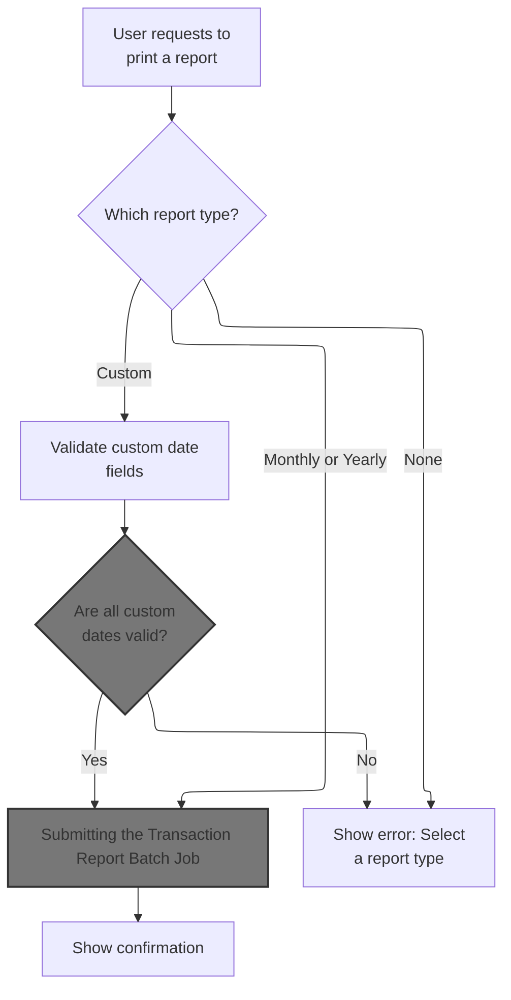

This section processes user input for transaction report generation, determines the report type, validates input, calculates report periods, and submits batch jobs for report creation.

| Rule ID | Code Location     | Category        | Rule Name                                | Description                                                                                                                                                                                      | Conditions                                                                         | Remarks                                                                                                                                                                                                                |
| ------- | ----------------- | --------------- | ---------------------------------------- | ------------------------------------------------------------------------------------------------------------------------------------------------------------------------------------------------ | ---------------------------------------------------------------------------------- | ---------------------------------------------------------------------------------------------------------------------------------------------------------------------------------------------------------------------- |
| BR-001  | PROCESS-ENTER-KEY | Data validation | Report type selection required           | If the user does not select any report type, the system displays an error message prompting the user to select a report type.                                                                    | No report type (monthly, yearly, or custom) is selected by the user.               | The error message is displayed to the user. No batch job is submitted.                                                                                                                                                 |
| BR-002  | PROCESS-ENTER-KEY | Business logic  | Monthly report date calculation          | If the user selects the monthly report type, the system generates a report for the current month, setting the start date to the first day and the end date to the last day of the current month. | The monthly report type is selected by the user.                                   | The start date is set to the first day ('01') of the current month and year. The end date is calculated as the last day of the current month, accounting for month/year rollover. Dates are formatted as 'YYYY-MM-DD'. |
| BR-003  | PROCESS-ENTER-KEY | Business logic  | Month/year rollover for end date         | When calculating the end date for the monthly report, if incrementing the month results in a value greater than 12, the year is incremented and the month is reset to January.                   | The calculated month for the end date exceeds 12 during monthly report processing. | If the month value is greater than 12, the year is increased by 1 and the month is set to 1 (January).                                                                                                                 |
| BR-004  | PROCESS-ENTER-KEY | Business logic  | Batch job submission and confirmation    | When the user selects a report type and all required fields are valid, the system submits a batch job to generate the report and displays a confirmation message.                                | A valid report type is selected and all required fields are valid.                 | The batch job is submitted with the calculated parameters. A confirmation message is shown to the user.                                                                                                                |
| BR-005  | PROCESS-ENTER-KEY | Technical step  | Date arithmetic using integer conversion | The system uses integer-to-date and date-to-integer conversions to perform date arithmetic for calculating report periods.                                                                       | Date calculations are required for determining report start and end dates.         | The system uses intrinsic functions to convert dates to integers for arithmetic, then back to date format for output. Dates are formatted as 'YYYYMMDD' for calculations.                                              |

<SwmSnippet path="/app/cbl/CORPT00C.cbl" line="208" repo-id="Z2l0aHViJTNBJTNBa3luZHJ5bC1hd3MtbWFpbmZyYW1lLW1vZGVybml6YXRpb24tY2FyZGRlbW8lM0ElM0FTd2ltbS1EZW1v">

---

In `PROCESS-ENTER-KEY` we use EVALUATE TRUE to figure out which report type the user picked (monthly, yearly, or custom) by checking which input field is set. Each branch sets up the right parameters for the batch job or throws an error if nothing is selected.

```cobol
       PROCESS-ENTER-KEY.

           DISPLAY 'PROCESS ENTER KEY'

           EVALUATE TRUE
```

---

</SwmSnippet>

<SwmSnippet path="/app/cbl/CORPT00C.cbl" line="213" repo-id="Z2l0aHViJTNBJTNBa3luZHJ5bC1hd3MtbWFpbmZyYW1lLW1vZGVybml6YXRpb24tY2FyZGRlbW8lM0ElM0FTd2ltbS1EZW1v">

---

After picking Monthly, we set the report name, grab the current date, set the start date to the first, and use date math to get the last day of the month for the end date. These get moved into the job parameters.

```cobol
               WHEN MONTHLYI OF CORPT0AI NOT = SPACES AND LOW-VALUES
                   MOVE 'Monthly'   TO WS-REPORT-NAME
                   MOVE FUNCTION CURRENT-DATE  TO WS-CURDATE-DATA

                   MOVE WS-CURDATE-YEAR     TO WS-START-DATE-YYYY
                   MOVE WS-CURDATE-MONTH    TO WS-START-DATE-MM
                   MOVE '01'                TO WS-START-DATE-DD
                   MOVE WS-START-DATE       TO PARM-START-DATE-1
                                               PARM-START-DATE-2

                   MOVE 1              TO WS-CURDATE-DAY
                   ADD 1               TO WS-CURDATE-MONTH
```

---

</SwmSnippet>

<SwmSnippet path="/app/cbl/CORPT00C.cbl" line="225" repo-id="Z2l0aHViJTNBJTNBa3luZHJ5bC1hd3MtbWFpbmZyYW1lLW1vZGVybml6YXRpb24tY2FyZGRlbW8lM0ElM0FTd2ltbS1EZW1v">

---

Here we handle the edge case where adding 1 to the month pushes us into the next year. If so, we bump the year and reset the month to January.

```cobol
                   IF WS-CURDATE-MONTH > 12
                       ADD 1           TO WS-CURDATE-YEAR
                       MOVE 1          TO WS-CURDATE-MONTH
                   END-IF
```

---

</SwmSnippet>

<SwmSnippet path="/app/cbl/CORPT00C.cbl" line="229" repo-id="Z2l0aHViJTNBJTNBa3luZHJ5bC1hd3MtbWFpbmZyYW1lLW1vZGVybml6YXRpb24tY2FyZGRlbW8lM0ElM0FTd2ltbS1EZW1v">

---

We submit the job to the batch system to start report generation.

```cobol
                   COMPUTE WS-CURDATE-N = FUNCTION DATE-OF-INTEGER(
                           FUNCTION INTEGER-OF-DATE(WS-CURDATE-N) - 1)

                   MOVE WS-CURDATE-YEAR     TO WS-END-DATE-YYYY
                   MOVE WS-CURDATE-MONTH    TO WS-END-DATE-MM
                   MOVE WS-CURDATE-DAY      TO WS-END-DATE-DD
                   MOVE WS-END-DATE         TO PARM-END-DATE-1
                                               PARM-END-DATE-2

                   PERFORM SUBMIT-JOB-TO-INTRDR
```

---

</SwmSnippet>

### Submitting the Transaction Report Batch Job

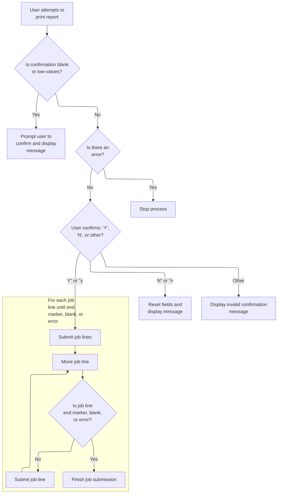

This section manages the submission of transaction report batch jobs, including user confirmation, error handling, field initialization, and controlled job line submission.

| Rule ID | Code Location                               | Category        | Rule Name                           | Description                                                                                                                                                                                                        | Conditions                                                                            | Remarks                                                                                                                                                       |
| ------- | ------------------------------------------- | --------------- | ----------------------------------- | ------------------------------------------------------------------------------------------------------------------------------------------------------------------------------------------------------------------ | ------------------------------------------------------------------------------------- | ------------------------------------------------------------------------------------------------------------------------------------------------------------- |
| BR-001  | SUBMIT-JOB-TO-INTRDR                        | Data validation | User confirmation required          | A user must explicitly confirm their intent to print the report before the batch job is submitted. If confirmation is blank or contains low-values, the system prompts the user to confirm and displays a message. | User attempts to print report and confirmation field is blank or contains low-values. | The confirmation field must not be blank or contain low-values. The prompt message includes the report name and is displayed as a string up to 80 characters. |
| BR-002  | SUBMIT-JOB-TO-INTRDR                        | Data validation | Invalid confirmation value handling | If the user enters an invalid confirmation value (not 'Y', 'y', 'N', or 'n'), the system displays an error message indicating the value is not valid and prompts the user to re-enter confirmation.                | User enters a confirmation value other than 'Y', 'y', 'N', or 'n'.                    | The error message includes the invalid value and is displayed as a string up to 80 characters. Only 'Y', 'y', 'N', or 'n' are accepted confirmation values.   |
| BR-003  | SUBMIT-JOB-TO-INTRDR                        | Business logic  | Job line submission limits          | Job lines are submitted one by one until an end marker ('/\*EOF'), a blank line, or an error is encountered, or until 1000 lines have been processed.                                                              | Job submission is confirmed and no error flag is set.                                 | Each job line is up to 80 characters. Submission stops at '/\*EOF', blank, or after 1000 lines.                                                               |
| BR-004  | INITIALIZE-ALL-FIELDS                       | Business logic  | Field initialization on reset       | When fields are initialized, all input fields and messages are reset to their default values, and the report selection is set to unselected.                                                                       | Field initialization is triggered, such as after cancellation.                        | All input fields, including dates and report selection, are reset to default values. The message field is cleared.                                            |
| BR-005  | SUBMIT-JOB-TO-INTRDR, INITIALIZE-ALL-FIELDS | Error handling  | Cancel operation resets fields      | If the user cancels the operation by entering 'N' or 'n', all input fields are reset to their default values and the user is prompted again.                                                                       | User enters 'N' or 'n' as confirmation value.                                         | All input fields, including date and report selection, are reset. The confirmation field is set to its default unselected state.                              |
| BR-006  | SUBMIT-JOB-TO-INTRDR                        | Error handling  | Stop on error                       | If an error flag is set during the process, job submission is stopped and no further lines are processed.                                                                                                          | Error flag is set during job submission.                                              | Job submission halts immediately when an error is detected.                                                                                                   |

<SwmSnippet path="/app/cbl/CORPT00C.cbl" line="462" repo-id="Z2l0aHViJTNBJTNBa3luZHJ5bC1hd3MtbWFpbmZyYW1lLW1vZGVybml6YXRpb24tY2FyZGRlbW8lM0ElM0FTd2ltbS1EZW1v">

---

In `SUBMIT-JOB-TO-INTRDR` we check if the user confirmed printing. If not, we prompt them with a message and send the screen again for input.

```cobol
       SUBMIT-JOB-TO-INTRDR.

           IF CONFIRMI OF CORPT0AI = SPACES OR LOW-VALUES
               STRING
                 'Please confirm to print the '
                                   DELIMITED BY SIZE
                 WS-REPORT-NAME    DELIMITED BY SPACE
                 ' report...'      DELIMITED BY SIZE
                 INTO WS-MESSAGE
               MOVE 'Y'     TO WS-ERR-FLG
               MOVE -1       TO CONFIRML OF CORPT0AI
               PERFORM SEND-TRNRPT-SCREEN
           END-IF
```

---

</SwmSnippet>

<SwmSnippet path="/app/cbl/CORPT00C.cbl" line="476" repo-id="Z2l0aHViJTNBJTNBa3luZHJ5bC1hd3MtbWFpbmZyYW1lLW1vZGVybml6YXRpb24tY2FyZGRlbW8lM0ElM0FTd2ltbS1EZW1v">

---

After sending the confirmation screen, if the user cancels, we reset all fields and set the error flag, then send the screen again to let them restart or exit.

```cobol
           IF NOT ERR-FLG-ON
               EVALUATE TRUE
                   WHEN CONFIRMI OF CORPT0AI = 'Y' OR 'y'
                       CONTINUE
                   WHEN CONFIRMI OF CORPT0AI = 'N' OR 'n'
                       PERFORM INITIALIZE-ALL-FIELDS
                       MOVE 'Y'     TO WS-ERR-FLG
                       PERFORM SEND-TRNRPT-SCREEN
                   WHEN OTHER
                       STRING
                         '"'               DELIMITED BY SIZE
                         CONFIRMI OF CORPT0AI    DELIMITED BY SPACE
                         '" is not a valid value to confirm...'
                                           DELIMITED BY SIZE
                         INTO WS-MESSAGE
                       MOVE 'Y'     TO WS-ERR-FLG
                       MOVE -1       TO CONFIRML OF CORPT0AI
                       PERFORM SEND-TRNRPT-SCREEN
               END-EVALUATE
```

---

</SwmSnippet>

<SwmSnippet path="/app/cbl/CORPT00C.cbl" line="633" repo-id="Z2l0aHViJTNBJTNBa3luZHJ5bC1hd3MtbWFpbmZyYW1lLW1vZGVybml6YXRpb24tY2FyZGRlbW8lM0ElM0FTd2ltbS1EZW1v">

---

`INITIALIZE-ALL-FIELDS` resets all the input fields and message to their default values, and sets MONTHLYL to -1 so we know nothing is selected yet.

```cobol
       INITIALIZE-ALL-FIELDS.

           MOVE -1              TO MONTHLYL OF CORPT0AI
           INITIALIZE              MONTHLYI OF CORPT0AI
                                   YEARLYI  OF CORPT0AI
                                   CUSTOMI  OF CORPT0AI
                                   SDTMMI   OF CORPT0AI
                                   SDTDDI   OF CORPT0AI
                                   SDTYYYYI OF CORPT0AI
                                   EDTMMI   OF CORPT0AI
                                   EDTDDI   OF CORPT0AI
                                   EDTYYYYI OF CORPT0AI
                                   CONFIRMI OF CORPT0AI
                                   WS-MESSAGE.
```

---

</SwmSnippet>

<SwmSnippet path="/app/cbl/CORPT00C.cbl" line="496" repo-id="Z2l0aHViJTNBJTNBa3luZHJ5bC1hd3MtbWFpbmZyYW1lLW1vZGVybml6YXRpb24tY2FyZGRlbW8lM0ElM0FTd2ltbS1EZW1v">

---

After initializing fields, SUBMIT-JOB-TO-INTRDR loops through the job lines, moving each to JCL-RECORD and calling WIRTE-JOBSUB-TDQ to submit them. The loop stops at '/\*EOF', spaces, or after 1000 lines.

```cobol
               SET END-LOOP-NO TO TRUE

               PERFORM VARYING WS-IDX FROM 1 BY 1 UNTIL WS-IDX > 1000 OR
                                      END-LOOP-YES  OR ERR-FLG-ON

                   MOVE JOB-LINES(WS-IDX) TO JCL-RECORD
                   IF JCL-RECORD = '/*EOF' OR
                      JCL-RECORD = SPACES OR LOW-VALUES
                       SET END-LOOP-YES TO TRUE
                   END-IF

                   PERFORM WIRTE-JOBSUB-TDQ
               END-PERFORM

           END-IF.
```

---

</SwmSnippet>

### Writing Job Submission to the Queue

This section manages the submission of job records to the queue and handles both successful and failed submissions, ensuring users are notified of errors and appropriate corrective actions are taken.

| Rule ID | Code Location    | Category       | Rule Name                     | Description                                                                                                                                                                                 | Conditions                                                                    | Remarks                                                                                                                                                                    |
| ------- | ---------------- | -------------- | ----------------------------- | ------------------------------------------------------------------------------------------------------------------------------------------------------------------------------------------- | ----------------------------------------------------------------------------- | -------------------------------------------------------------------------------------------------------------------------------------------------------------------------- |
| BR-001  | WIRTE-JOBSUB-TDQ | Business logic | Successful job submission     | If the job record is successfully written to the 'JOBS' queue, no error is flagged and processing continues without user notification.                                                      | The response code from the queue write operation indicates normal completion. | The response code must match the value for normal completion (DFHRESP(NORMAL)). No changes are made to the error flag or message fields.                                   |
| BR-002  | WIRTE-JOBSUB-TDQ | Error handling | Job submission error handling | If the job record cannot be written to the 'JOBS' queue, an error is flagged, a message is displayed to the user, a specific field is reset, and the screen is refreshed to show the error. | The response code from the queue write operation is not normal.               | The error flag is set to 'Y'. The message displayed is 'Unable to Write TDQ (JOBS)...'. The monthly field is reset to -1. The screen is refreshed to show the error state. |
| BR-003  | WIRTE-JOBSUB-TDQ | Error handling | Error message content         | When an error occurs during job submission, the error message displayed to the user is a fixed string: 'Unable to Write TDQ (JOBS)...'.                                                     | The response code from the queue write operation is not normal.               | The error message is a string of up to 80 characters, left-aligned, with the content 'Unable to Write TDQ (JOBS)...'.                                                      |

<SwmSnippet path="/app/cbl/CORPT00C.cbl" line="515" repo-id="Z2l0aHViJTNBJTNBa3luZHJ5bC1hd3MtbWFpbmZyYW1lLW1vZGVybml6YXRpb24tY2FyZGRlbW8lM0ElM0FTd2ltbS1EZW1v">

---

In `WIRTE-JOBSUB-TDQ` we write each job record to the 'JOBS' transient data queue and grab response codes to check for errors.

```cobol
       WIRTE-JOBSUB-TDQ.

           EXEC CICS WRITEQ TD
             QUEUE ('JOBS')
             FROM (JCL-RECORD)
             LENGTH (LENGTH OF JCL-RECORD)
             RESP(WS-RESP-CD)
             RESP2(WS-REAS-CD)
           END-EXEC.
```

---

</SwmSnippet>

<SwmSnippet path="/app/cbl/CORPT00C.cbl" line="525" repo-id="Z2l0aHViJTNBJTNBa3luZHJ5bC1hd3MtbWFpbmZyYW1lLW1vZGVybml6YXRpb24tY2FyZGRlbW8lM0ElM0FTd2ltbS1EZW1v">

---

After writing to the queue, we check the response code. If it's not normal, we set the error flag, update the message, reset the monthly field, and send the screen again to show the error.

```cobol
           EVALUATE WS-RESP-CD
               WHEN DFHRESP(NORMAL)
                   CONTINUE
               WHEN OTHER
                   DISPLAY 'RESP:' WS-RESP-CD 'REAS:' WS-REAS-CD
                   MOVE 'Y'     TO WS-ERR-FLG
                   MOVE 'Unable to Write TDQ (JOBS)...' TO
                                   WS-MESSAGE
                   MOVE -1       TO MONTHLYL OF CORPT0AI
                   PERFORM SEND-TRNRPT-SCREEN
           END-EVALUATE.
```

---

</SwmSnippet>

### Processing Yearly and Custom Report Requests

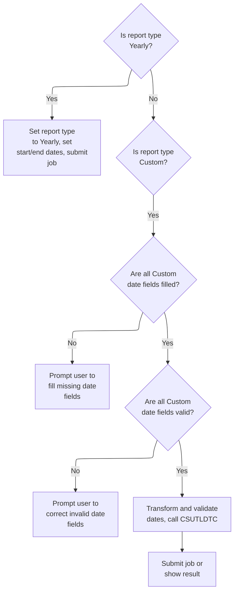

This section handles user requests for Yearly and Custom transaction reports, validating input, transforming dates, and submitting jobs or prompting for corrections as needed.

| Rule ID | Code Location          | Category        | Rule Name                               | Description                                                                                                                                                                                                                                          | Conditions                                                                                                         | Remarks                                                                                                                                                                                                               |
| ------- | ---------------------- | --------------- | --------------------------------------- | ---------------------------------------------------------------------------------------------------------------------------------------------------------------------------------------------------------------------------------------------------- | ------------------------------------------------------------------------------------------------------------------ | --------------------------------------------------------------------------------------------------------------------------------------------------------------------------------------------------------------------- |
| BR-001  | Lines 258-300          | Data validation | Custom report required fields           | For Custom reports, all start and end date fields (month, day, year) must be filled; if any are missing (blank or low-values), the system prompts the user to fill the missing field and displays an error message.                                  | The report type input is Custom (not blank or low-values). Any of the date fields are blank or low-values.         | Required fields: Start Month, Start Day, Start Year, End Month, End Day, End Year. Error messages specify which field is missing.                                                                                     |
| BR-002  | Lines 329-379          | Data validation | Custom report date field validation     | For Custom reports, each date field must be valid: months must be numeric and <= 12, days must be numeric and <= 31, years must be numeric. If any field is invalid, the system prompts the user to correct the field and displays an error message. | The report type input is Custom and all date fields are filled. Any field is not numeric or exceeds allowed range. | Month: numeric, 1-12; Day: numeric, 1-31; Year: numeric. Error messages specify which field is invalid.                                                                                                               |
| BR-003  | Lines 381-394          | Data validation | Custom date calendar validation         | For Custom reports, after all date fields are validated and converted, the system calls an external date validation routine (CSUTLDTC) to ensure the dates are valid calendar dates. If the result code is not '0000', an error is set.              | The report type input is Custom, all date fields are filled and pass basic validation.                             | Date fields are passed as 'YYYY-MM-DD' strings. The result code '0000' indicates success; any other value triggers an error.                                                                                          |
| BR-004  | Lines 239-255          | Business logic  | Yearly report setup                     | If the user requests a Yearly report, the system sets the report type to 'Yearly', assigns the current year as both the start and end year, sets the start date to January 1 and the end date to December 31, and submits the job.                   | The report type input is Yearly (not blank or low-values).                                                         | The start date is set to January 1 (MM='01', DD='01') of the current year; the end date is set to December 31 (MM='12', DD='31') of the current year. Dates are formatted as 'YYYY-MM-DD' strings for job parameters. |
| BR-005  | Lines 305-327          | Business logic  | Custom date string-to-number conversion | For Custom reports, after all date fields are filled and pass basic validation, the system converts each field from string to numeric using currency-aware conversion before further processing.                                                     | The report type input is Custom and all date fields are filled.                                                    | Conversion uses currency-aware string-to-number logic, handling possible formatting or currency symbols.                                                                                                              |
| BR-006  | Lines 261-299, 331-378 | Error handling  | Error handling and user prompt          | If any required field is missing or invalid, the system sets an error flag and displays a specific error message to the user, prompting correction before proceeding.                                                                                | Any required field is missing or invalid during Custom report processing.                                          | Error flag is set to 'Y'. Error messages are specific to the field and issue.                                                                                                                                         |

<SwmSnippet path="/app/cbl/CORPT00C.cbl" line="239" repo-id="Z2l0aHViJTNBJTNBa3luZHJ5bC1hd3MtbWFpbmZyYW1lLW1vZGVybml6YXRpb24tY2FyZGRlbW8lM0ElM0FTd2ltbS1EZW1v">

---

After submitting the monthly job, PROCESS-ENTER-KEY handles the yearly report by setting up start and end dates for the full year and then submitting the batch job.

```cobol
               WHEN YEARLYI OF CORPT0AI NOT = SPACES AND LOW-VALUES
                   MOVE 'Yearly'   TO WS-REPORT-NAME
                   MOVE FUNCTION CURRENT-DATE  TO WS-CURDATE-DATA

                   MOVE WS-CURDATE-YEAR     TO WS-START-DATE-YYYY
                                               WS-END-DATE-YYYY
                   MOVE '01'                TO WS-START-DATE-MM
                                               WS-START-DATE-DD
                   MOVE WS-START-DATE       TO PARM-START-DATE-1
                                               PARM-START-DATE-2

                   MOVE '12'                TO WS-END-DATE-MM
                   MOVE '31'                TO WS-END-DATE-DD
                   MOVE WS-END-DATE         TO PARM-END-DATE-1
                                               PARM-END-DATE-2

                   PERFORM SUBMIT-JOB-TO-INTRDR
```

---

</SwmSnippet>

<SwmSnippet path="/app/cbl/CORPT00C.cbl" line="256" repo-id="Z2l0aHViJTNBJTNBa3luZHJ5bC1hd3MtbWFpbmZyYW1lLW1vZGVybml6YXRpb24tY2FyZGRlbW8lM0ElM0FTd2ltbS1EZW1v">

---

For custom reports, we validate each date field one by one. If any are empty, we set an error message and send the screen again so the user can fix it.

```cobol
               WHEN CUSTOMI OF CORPT0AI NOT = SPACES AND LOW-VALUES

                   EVALUATE TRUE
                       WHEN SDTMMI OF CORPT0AI = SPACES OR
                                                   LOW-VALUES
                           MOVE 'Start Date - Month can NOT be empty...'
                             TO WS-MESSAGE
                           MOVE 'Y'     TO WS-ERR-FLG
                           MOVE -1       TO SDTMML OF CORPT0AI
                           PERFORM SEND-TRNRPT-SCREEN
```

---

</SwmSnippet>

<SwmSnippet path="/app/cbl/CORPT00C.cbl" line="266" repo-id="Z2l0aHViJTNBJTNBa3luZHJ5bC1hd3MtbWFpbmZyYW1lLW1vZGVybml6YXRpb24tY2FyZGRlbW8lM0ElM0FTd2ltbS1EZW1v">

---

After sending the screen for a missing month, PROCESS-ENTER-KEY does the same for missing day, showing an error and letting the user fix it.

```cobol
                       WHEN SDTDDI OF CORPT0AI = SPACES OR
                                                   LOW-VALUES
                           MOVE 'Start Date - Day can NOT be empty...'
                             TO WS-MESSAGE
                           MOVE 'Y'     TO WS-ERR-FLG
                           MOVE -1       TO SDTDDL OF CORPT0AI
                           PERFORM SEND-TRNRPT-SCREEN
```

---

</SwmSnippet>

<SwmSnippet path="/app/cbl/CORPT00C.cbl" line="273" repo-id="Z2l0aHViJTNBJTNBa3luZHJ5bC1hd3MtbWFpbmZyYW1lLW1vZGVybml6YXRpb24tY2FyZGRlbW8lM0ElM0FTd2ltbS1EZW1v">

---

Same as before, if the start year is missing, we set the error message and send the screen for correction.

```cobol
                       WHEN SDTYYYYI OF CORPT0AI = SPACES OR
                                                   LOW-VALUES
                           MOVE 'Start Date - Year can NOT be empty...'
                             TO WS-MESSAGE
                           MOVE 'Y'     TO WS-ERR-FLG
                           MOVE -1       TO SDTYYYYL OF CORPT0AI
                           PERFORM SEND-TRNRPT-SCREEN
```

---

</SwmSnippet>

<SwmSnippet path="/app/cbl/CORPT00C.cbl" line="280" repo-id="Z2l0aHViJTNBJTNBa3luZHJ5bC1hd3MtbWFpbmZyYW1lLW1vZGVybml6YXRpb24tY2FyZGRlbW8lM0ElM0FTd2ltbS1EZW1v">

---

If the end month is missing, we set the error message and send the screen for correction, just like with the start date fields.

```cobol
                       WHEN EDTMMI OF CORPT0AI = SPACES OR
                                                   LOW-VALUES
                           MOVE 'End Date - Month can NOT be empty...'
                             TO WS-MESSAGE
                           MOVE 'Y'     TO WS-ERR-FLG
                           MOVE -1       TO EDTMML OF CORPT0AI
                           PERFORM SEND-TRNRPT-SCREEN
```

---

</SwmSnippet>

<SwmSnippet path="/app/cbl/CORPT00C.cbl" line="287" repo-id="Z2l0aHViJTNBJTNBa3luZHJ5bC1hd3MtbWFpbmZyYW1lLW1vZGVybml6YXRpb24tY2FyZGRlbW8lM0ElM0FTd2ltbS1EZW1v">

---

If the end day is missing, we set the error message and send the screen for correction, just like with the other fields.

```cobol
                       WHEN EDTDDI OF CORPT0AI = SPACES OR
                                                   LOW-VALUES
                           MOVE 'End Date - Day can NOT be empty...'
                             TO WS-MESSAGE
                           MOVE 'Y'     TO WS-ERR-FLG
                           MOVE -1       TO EDTDDL OF CORPT0AI
                           PERFORM SEND-TRNRPT-SCREEN
```

---

</SwmSnippet>

<SwmSnippet path="/app/cbl/CORPT00C.cbl" line="294" repo-id="Z2l0aHViJTNBJTNBa3luZHJ5bC1hd3MtbWFpbmZyYW1lLW1vZGVybml6YXRpb24tY2FyZGRlbW8lM0ElM0FTd2ltbS1EZW1v">

---

If the end year is missing, we set the error message and send the screen for correction, just like with the other fields.

```cobol
                       WHEN EDTYYYYI OF CORPT0AI = SPACES OR
                                                   LOW-VALUES
                           MOVE 'End Date - Year can NOT be empty...'
                             TO WS-MESSAGE
                           MOVE 'Y'     TO WS-ERR-FLG
                           MOVE -1       TO EDTYYYYL OF CORPT0AI
                           PERFORM SEND-TRNRPT-SCREEN
```

---

</SwmSnippet>

<SwmSnippet path="/app/cbl/CORPT00C.cbl" line="301" repo-id="Z2l0aHViJTNBJTNBa3luZHJ5bC1hd3MtbWFpbmZyYW1lLW1vZGVybml6YXRpb24tY2FyZGRlbW8lM0ElM0FTd2ltbS1EZW1v">

---

If all fields are filled, we move on to converting and validating the input before job submission.

```cobol
                       WHEN OTHER
                           CONTINUE
                   END-EVALUATE
```

---

</SwmSnippet>

<SwmSnippet path="/app/cbl/CORPT00C.cbl" line="305" repo-id="Z2l0aHViJTNBJTNBa3luZHJ5bC1hd3MtbWFpbmZyYW1lLW1vZGVybml6YXRpb24tY2FyZGRlbW8lM0ElM0FTd2ltbS1EZW1v">

---

Here we convert each custom date field from string to numeric so we can validate and use them for job submission.

```cobol
                   COMPUTE WS-NUM-99 = FUNCTION NUMVAL-C
                                         (SDTMMI OF CORPT0AI)
                   MOVE WS-NUM-99      TO SDTMMI OF CORPT0AI

                   COMPUTE WS-NUM-99 = FUNCTION NUMVAL-C
                                         (SDTDDI OF CORPT0AI)
                   MOVE WS-NUM-99      TO SDTDDI OF CORPT0AI

                   COMPUTE WS-NUM-9999 = FUNCTION NUMVAL-C
                                           (SDTYYYYI OF CORPT0AI)
                   MOVE WS-NUM-9999      TO SDTYYYYI OF CORPT0AI

                   COMPUTE WS-NUM-99 = FUNCTION NUMVAL-C
                                         (EDTMMI OF CORPT0AI)
                   MOVE WS-NUM-99      TO EDTMMI OF CORPT0AI

                   COMPUTE WS-NUM-99 = FUNCTION NUMVAL-C
                                         (EDTDDI OF CORPT0AI)
                   MOVE WS-NUM-99      TO EDTDDI OF CORPT0AI

                   COMPUTE WS-NUM-9999 = FUNCTION NUMVAL-C
                                           (EDTYYYYI OF CORPT0AI)
                   MOVE WS-NUM-9999      TO EDTYYYYI OF CORPT0AI
```

---

</SwmSnippet>

<SwmSnippet path="/app/cbl/CORPT00C.cbl" line="329" repo-id="Z2l0aHViJTNBJTNBa3luZHJ5bC1hd3MtbWFpbmZyYW1lLW1vZGVybml6YXRpb24tY2FyZGRlbW8lM0ElM0FTd2ltbS1EZW1v">

---

We check if the start month is valid (numeric and <= 12). If not, we show an error and let the user fix it.

```cobol
                   IF SDTMMI OF CORPT0AI IS NOT NUMERIC OR
                      SDTMMI OF CORPT0AI > '12'
                       MOVE 'Start Date - Not a valid Month...'
                         TO WS-MESSAGE
                       MOVE 'Y'     TO WS-ERR-FLG
                       MOVE -1       TO SDTMML OF CORPT0AI
                       PERFORM SEND-TRNRPT-SCREEN
                   END-IF
```

---

</SwmSnippet>

<SwmSnippet path="/app/cbl/CORPT00C.cbl" line="338" repo-id="Z2l0aHViJTNBJTNBa3luZHJ5bC1hd3MtbWFpbmZyYW1lLW1vZGVybml6YXRpb24tY2FyZGRlbW8lM0ElM0FTd2ltbS1EZW1v">

---

We check if the start day is valid (numeric and <= 31). If not, we show an error and let the user fix it.

```cobol
                   IF SDTDDI OF CORPT0AI IS NOT NUMERIC OR
                      SDTDDI OF CORPT0AI > '31'
                       MOVE 'Start Date - Not a valid Day...'
                         TO WS-MESSAGE
                       MOVE 'Y'     TO WS-ERR-FLG
                       MOVE -1       TO SDTDDL OF CORPT0AI
                       PERFORM SEND-TRNRPT-SCREEN
                   END-IF
```

---

</SwmSnippet>

<SwmSnippet path="/app/cbl/CORPT00C.cbl" line="347" repo-id="Z2l0aHViJTNBJTNBa3luZHJ5bC1hd3MtbWFpbmZyYW1lLW1vZGVybml6YXRpb24tY2FyZGRlbW8lM0ElM0FTd2ltbS1EZW1v">

---

We check if the start year is valid (numeric). If not, we show an error and let the user fix it.

```cobol
                   IF SDTYYYYI OF CORPT0AI IS NOT NUMERIC
                       MOVE 'Start Date - Not a valid Year...'
                         TO WS-MESSAGE
                       MOVE 'Y'     TO WS-ERR-FLG
                       MOVE -1       TO SDTYYYYL OF CORPT0AI
                       PERFORM SEND-TRNRPT-SCREEN
                   END-IF
```

---

</SwmSnippet>

<SwmSnippet path="/app/cbl/CORPT00C.cbl" line="355" repo-id="Z2l0aHViJTNBJTNBa3luZHJ5bC1hd3MtbWFpbmZyYW1lLW1vZGVybml6YXRpb24tY2FyZGRlbW8lM0ElM0FTd2ltbS1EZW1v">

---

We check if the end month is valid (numeric and <= 12). If not, we show an error and let the user fix it.

```cobol
                   IF EDTMMI OF CORPT0AI IS NOT NUMERIC OR
                      EDTMMI OF CORPT0AI > '12'
                       MOVE 'End Date - Not a valid Month...'
                         TO WS-MESSAGE
                       MOVE 'Y'     TO WS-ERR-FLG
                       MOVE -1       TO EDTMML OF CORPT0AI
                       PERFORM SEND-TRNRPT-SCREEN
                   END-IF
```

---

</SwmSnippet>

<SwmSnippet path="/app/cbl/CORPT00C.cbl" line="364" repo-id="Z2l0aHViJTNBJTNBa3luZHJ5bC1hd3MtbWFpbmZyYW1lLW1vZGVybml6YXRpb24tY2FyZGRlbW8lM0ElM0FTd2ltbS1EZW1v">

---

We check if the end day is valid (numeric and <= 31). If not, we show an error and let the user fix it.

```cobol
                   IF EDTDDI OF CORPT0AI IS NOT NUMERIC OR
                      EDTDDI OF CORPT0AI > '31'
                       MOVE 'End Date - Not a valid Day...'
                         TO WS-MESSAGE
                       MOVE 'Y'     TO WS-ERR-FLG
                       MOVE -1       TO EDTDDL OF CORPT0AI
                       PERFORM SEND-TRNRPT-SCREEN
                   END-IF
```

---

</SwmSnippet>

<SwmSnippet path="/app/cbl/CORPT00C.cbl" line="373" repo-id="Z2l0aHViJTNBJTNBa3luZHJ5bC1hd3MtbWFpbmZyYW1lLW1vZGVybml6YXRpb24tY2FyZGRlbW8lM0ElM0FTd2ltbS1EZW1v">

---

We check if the end year is valid (numeric). If not, we show an error and let the user fix it.

```cobol
                   IF EDTYYYYI OF CORPT0AI IS NOT NUMERIC
                       MOVE 'End Date - Not a valid Year...'
                         TO WS-MESSAGE
                       MOVE 'Y'     TO WS-ERR-FLG
                       MOVE -1       TO EDTYYYYL OF CORPT0AI
                       PERFORM SEND-TRNRPT-SCREEN
                   END-IF
```

---

</SwmSnippet>

<SwmSnippet path="/app/cbl/CORPT00C.cbl" line="381" repo-id="Z2l0aHViJTNBJTNBa3luZHJ5bC1hd3MtbWFpbmZyYW1lLW1vZGVybml6YXRpb24tY2FyZGRlbW8lM0ElM0FTd2ltbS1EZW1v">

---

After prepping the custom dates, we call CSUTLDTC to validate them as real calendar dates. If the result code isn't '0000', we set an error message.

```cobol
                   MOVE SDTYYYYI OF CORPT0AI TO WS-START-DATE-YYYY
                   MOVE SDTMMI   OF CORPT0AI TO WS-START-DATE-MM
                   MOVE SDTDDI   OF CORPT0AI TO WS-START-DATE-DD
                   MOVE EDTYYYYI OF CORPT0AI TO WS-END-DATE-YYYY
                   MOVE EDTMMI   OF CORPT0AI TO WS-END-DATE-MM
                   MOVE EDTDDI   OF CORPT0AI TO WS-END-DATE-DD

                   MOVE WS-START-DATE        TO CSUTLDTC-DATE
                   MOVE WS-DATE-FORMAT       TO CSUTLDTC-DATE-FORMAT
                   MOVE SPACES               TO CSUTLDTC-RESULT

                   CALL 'CSUTLDTC' USING   CSUTLDTC-DATE
                                           CSUTLDTC-DATE-FORMAT
                                           CSUTLDTC-RESULT
```

---

</SwmSnippet>

### Validating Dates with the Utility Routine

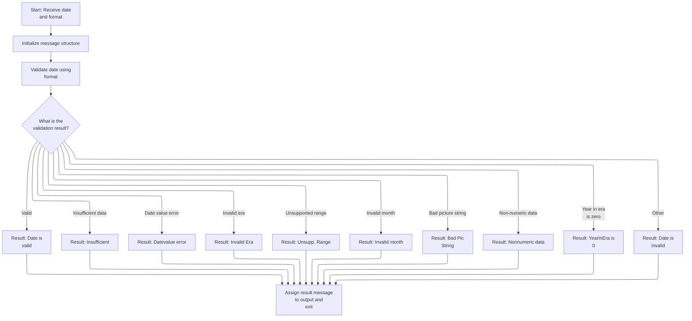

This section validates a date input against a specified format and outputs a result message and severity code based on the outcome of the validation.

| Rule ID | Code Location      | Category       | Rule Name                        | Description                                                                                                                            | Conditions                                                                                               | Remarks                                                                                                                                  |
| ------- | ------------------ | -------------- | -------------------------------- | -------------------------------------------------------------------------------------------------------------------------------------- | -------------------------------------------------------------------------------------------------------- | ---------------------------------------------------------------------------------------------------------------------------------------- |
| BR-001  | A000-MAIN          | Business logic | Valid date recognition           | If the date input matches the expected format and passes all checks, the result message will indicate that the date is valid.          | The feedback code from the CEEDAYS utility routine indicates a valid date.                               | The result message is set to 'Date is valid', which is a string of up to 15 characters, left-aligned and space-padded if shorter.        |
| BR-002  | PROCEDURE DIVISION | Business logic | Result output assignment         | The result message and severity code are assigned to the output structure after validation is complete.                                | Date validation has completed and a result message has been set.                                         | The output structure contains the result message (up to 15 characters, left-aligned, space-padded) and a severity code (up to 4 digits). |
| BR-003  | A000-MAIN          | Error handling | Insufficient data detection      | If the date input does not contain enough data to perform validation, the result message will indicate insufficient data.              | The feedback code from the CEEDAYS utility routine indicates insufficient data.                          | The result message is set to 'Insufficient', which is a string of up to 15 characters, left-aligned and space-padded if shorter.         |
| BR-004  | A000-MAIN          | Error handling | Date value error reporting       | If the date input contains an invalid value, such as an out-of-range day or year, the result message will indicate a date value error. | The feedback code from the CEEDAYS utility routine indicates a bad date value.                           | The result message is set to 'Datevalue error', which is a string of up to 15 characters, left-aligned and space-padded if shorter.      |
| BR-005  | A000-MAIN          | Error handling | Invalid era reporting            | If the date input contains an invalid era, the result message will indicate an invalid era.                                            | The feedback code from the CEEDAYS utility routine indicates an invalid era.                             | The result message is set to 'Invalid Era    ', which is a string of up to 15 characters, left-aligned and space-padded if shorter.      |
| BR-006  | A000-MAIN          | Error handling | Unsupported range reporting      | If the date input is outside the supported range, the result message will indicate an unsupported range.                               | The feedback code from the CEEDAYS utility routine indicates an unsupported range.                       | The result message is set to 'Unsupp. Range  ', which is a string of up to 15 characters, left-aligned and space-padded if shorter.      |
| BR-007  | A000-MAIN          | Error handling | Invalid month reporting          | If the date input contains an invalid month, the result message will indicate an invalid month.                                        | The feedback code from the CEEDAYS utility routine indicates an invalid month.                           | The result message is set to 'Invalid month  ', which is a string of up to 15 characters, left-aligned and space-padded if shorter.      |
| BR-008  | A000-MAIN          | Error handling | Bad picture string reporting     | If the date format string is invalid, the result message will indicate a bad picture string.                                           | The feedback code from the CEEDAYS utility routine indicates a bad picture string.                       | The result message is set to 'Bad Pic String ', which is a string of up to 15 characters, left-aligned and space-padded if shorter.      |
| BR-009  | A000-MAIN          | Error handling | Non-numeric data reporting       | If the date input contains non-numeric data, the result message will indicate non-numeric data.                                        | The feedback code from the CEEDAYS utility routine indicates non-numeric data.                           | The result message is set to 'Nonnumeric data', which is a string of up to 15 characters, left-aligned and space-padded if shorter.      |
| BR-010  | A000-MAIN          | Error handling | Year in era zero reporting       | If the year in the era is zero, the result message will indicate that the year in the era is zero.                                     | The feedback code from the CEEDAYS utility routine indicates the year in the era is zero.                | The result message is set to 'YearInEra is 0 ', which is a string of up to 15 characters, left-aligned and space-padded if shorter.      |
| BR-011  | A000-MAIN          | Error handling | Catch-all invalid date reporting | If the feedback code does not match any known error or valid condition, the result message will indicate that the date is invalid.     | The feedback code from the CEEDAYS utility routine does not match any specific error or valid condition. | The result message is set to 'Date is invalid', which is a string of up to 15 characters, left-aligned and space-padded if shorter.      |

<SwmSnippet path="/app/cbl/CSUTLDTC.cbl" line="88" repo-id="Z2l0aHViJTNBJTNBa3luZHJ5bC1hd3MtbWFpbmZyYW1lLW1vZGVybml6YXRpb24tY2FyZGRlbW8lM0ElM0FTd2ltbS1EZW1v">

---

In PROCEDURE DIVISION of CSUTLDTC, we set up the message structure, clear the date, run the main validation routine, and then move the result and severity code out before exiting.

```cobol
       PROCEDURE DIVISION USING LS-DATE, LS-DATE-FORMAT, LS-RESULT.             
           
           INITIALIZE WS-MESSAGE
           MOVE SPACES TO WS-DATE
                                                                        
           PERFORM A000-MAIN                                                    
              THRU A000-MAIN-EXIT                                               

      *    DISPLAY WS-MESSAGE                                                   
           MOVE WS-MESSAGE                 TO LS-RESULT 
           MOVE WS-SEVERITY-N              TO RETURN-CODE          
                                                                                
           EXIT PROGRAM                                                         
      *    GOBACK                                                               
           .                                                                    
```

---

</SwmSnippet>

<SwmSnippet path="/app/cbl/CSUTLDTC.cbl" line="103" repo-id="Z2l0aHViJTNBJTNBa3luZHJ5bC1hd3MtbWFpbmZyYW1lLW1vZGVybml6YXRpb24tY2FyZGRlbW8lM0ElM0FTd2ltbS1EZW1v">

---

In A000-MAIN, we prep the date and format as VSTRINGs, call CEEDAYS to validate, then interpret the feedback code to set a result message. This covers all error cases and gives a clear status.

```cobol
       A000-MAIN.                                                               
                                                                                
           MOVE LENGTH OF LS-DATE                                               
                        TO VSTRING-LENGTH  OF WS-DATE-TO-TEST                   
           MOVE LS-DATE TO VSTRING-TEXT    OF WS-DATE-TO-TEST
                           WS-DATE                  
           MOVE LENGTH OF LS-DATE-FORMAT                                        
                         TO VSTRING-LENGTH OF WS-DATE-FORMAT                    
           MOVE LS-DATE-FORMAT                                                  
                         TO VSTRING-TEXT   OF WS-DATE-FORMAT   
                            WS-DATE-FMT  
           MOVE 0        TO OUTPUT-LILLIAN                              
                                                                        
           CALL "CEEDAYS" USING                                                 
                  WS-DATE-TO-TEST,                                              
                  WS-DATE-FORMAT,                                               
                  OUTPUT-LILLIAN,                                               
                  FEEDBACK-CODE                                                 
                                                                                
           MOVE WS-DATE-TO-TEST            TO WS-DATE                           
           MOVE SEVERITY OF FEEDBACK-CODE  TO WS-SEVERITY-N                     
           MOVE MSG-NO OF FEEDBACK-CODE    TO WS-MSG-NO-N                       
                                                                 
      *    WS-RESULT IS 15 CHARACTERS                                           
      *                123456789012345'                                         
           EVALUATE TRUE                                                        
              WHEN FC-INVALID-DATE                                   
                 MOVE 'Date is valid'      TO WS-RESULT              
              WHEN FC-INSUFFICIENT-DATA                              
                 MOVE 'Insufficient'       TO WS-RESULT              
              WHEN FC-BAD-DATE-VALUE                                 
                 MOVE 'Datevalue error'    TO WS-RESULT              
              WHEN FC-INVALID-ERA                                    
                 MOVE 'Invalid Era    '    TO WS-RESULT              
              WHEN FC-UNSUPP-RANGE                                   
                 MOVE 'Unsupp. Range  '    TO WS-RESULT              
              WHEN FC-INVALID-MONTH                                  
                 MOVE 'Invalid month  '    TO WS-RESULT              
              WHEN FC-BAD-PIC-STRING                                 
                 MOVE 'Bad Pic String '    TO WS-RESULT              
              WHEN FC-NON-NUMERIC-DATA                               
                 MOVE 'Nonnumeric data'    TO WS-RESULT              
              WHEN FC-YEAR-IN-ERA-ZERO                               
                 MOVE 'YearInEra is 0 '    TO WS-RESULT              
              WHEN OTHER                                             
                 MOVE 'Date is invalid'    TO WS-RESULT 
           END-EVALUATE                                                         
                                                                                
           .                                                                    
```

---

</SwmSnippet>

### Validating Start and End Dates for Custom Reports

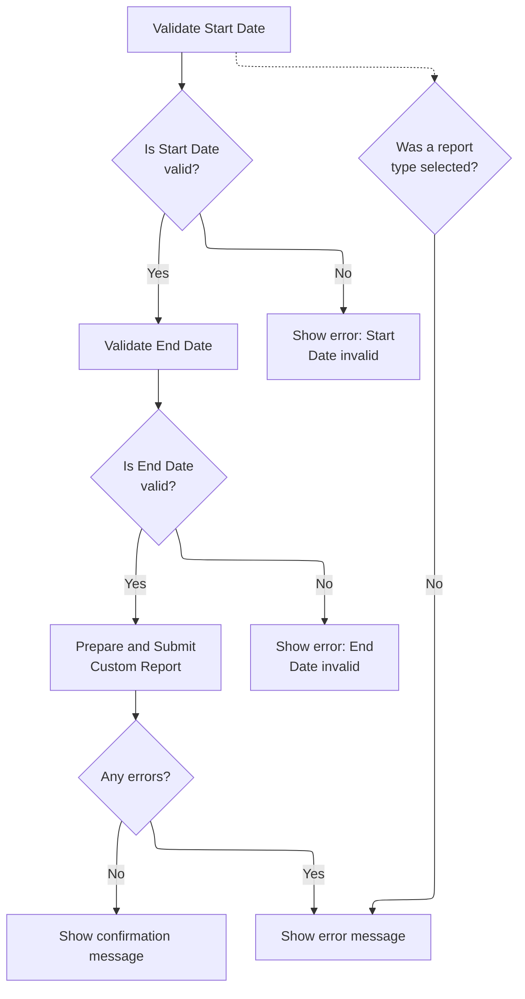

This section validates user input for custom report generation, ensuring that start and end dates are valid, a report type is selected, and providing appropriate feedback for errors or successful submission.

| Rule ID | Code Location     | Category        | Rule Name                                 | Description                                                                                                                                                                                                                               | Conditions                                                                                                          | Remarks                                                                                                                                                                     |
| ------- | ----------------- | --------------- | ----------------------------------------- | ----------------------------------------------------------------------------------------------------------------------------------------------------------------------------------------------------------------------------------------- | ------------------------------------------------------------------------------------------------------------------- | --------------------------------------------------------------------------------------------------------------------------------------------------------------------------- |
| BR-001  | PROCESS-ENTER-KEY | Data validation | Start date validation                     | If the start date entered by the user is not valid, an error message is displayed, the error flag is set, the start date field is highlighted, and the transaction report screen is redisplayed for correction.                           | The start date is submitted and the date validation result code is not '0000' and the message number is not '2513'. | Error message: 'Start Date - Not a valid date...'. The error flag is set to 'Y'. The start date field is highlighted. The transaction report screen is redisplayed.         |
| BR-002  | PROCESS-ENTER-KEY | Data validation | End date validation                       | If the end date entered by the user is not valid, an error message is displayed, the error flag is set, the end date field is highlighted, and the transaction report screen is redisplayed for correction.                               | The end date is submitted and the date validation result code is not '0000' and the message number is not '2513'.   | Error message: 'End Date - Not a valid date...'. The error flag is set to 'Y'. The end date field is highlighted. The transaction report screen is redisplayed.             |
| BR-003  | PROCESS-ENTER-KEY | Data validation | Report type selection required            | A report cannot be submitted unless a report type is selected. If no report type is chosen, an error message is displayed, the error flag is set, the report type field is highlighted, and the transaction report screen is redisplayed. | No report type is selected when attempting to submit a report.                                                      | Error message: 'Select a report type to print report...'. The error flag is set to 'Y'. The report type field is highlighted. The transaction report screen is redisplayed. |
| BR-004  | PROCESS-ENTER-KEY | Business logic  | Successful report submission confirmation | If both start and end dates are valid and a report type is selected, the report is submitted and a confirmation message is displayed to the user indicating successful submission.                                                        | Start date and end date are valid, a report type is selected, and no error flag is set.                             | Confirmation message format: '\[Report Name\] report submitted for printing ...' in green. All fields are reset after submission.                                           |

<SwmSnippet path="/app/cbl/CORPT00C.cbl" line="396" repo-id="Z2l0aHViJTNBJTNBa3luZHJ5bC1hd3MtbWFpbmZyYW1lLW1vZGVybml6YXRpb24tY2FyZGRlbW8lM0ElM0FTd2ltbS1EZW1v">

---

We just returned from calling CSUTLDTC in PROCESS-ENTER-KEY to validate the start date. If the result code isn't '0000' and the message number isn't '2513', we set an error message, flag the error, highlight the start date field, and send the transaction report screen again. This gives the user immediate feedback and a chance to fix their input.

```cobol
                   IF CSUTLDTC-RESULT-SEV-CD = '0000'
                       CONTINUE
                   ELSE
                       IF CSUTLDTC-RESULT-MSG-NUM NOT = '2513'
                           MOVE 'Start Date - Not a valid date...'
                             TO WS-MESSAGE
                           MOVE 'Y'     TO WS-ERR-FLG
                           MOVE -1       TO SDTMML OF CORPT0AI
                           PERFORM SEND-TRNRPT-SCREEN
                       END-IF
                   END-IF
```

---

</SwmSnippet>

<SwmSnippet path="/app/cbl/CORPT00C.cbl" line="408" repo-id="Z2l0aHViJTNBJTNBa3luZHJ5bC1hd3MtbWFpbmZyYW1lLW1vZGVybml6YXRpb24tY2FyZGRlbW8lM0ElM0FTd2ltbS1EZW1v">

---

After handling the start date, PROCESS-ENTER-KEY now moves the end date into CSUTLDTC-DATE, sets the format, and calls CSUTLDTC again. If the end date isn't valid, it sets an error message, flags the error, highlights the end date field, and redisplays the screen. This keeps the report logic clean by only allowing valid date ranges.

```cobol
                   MOVE WS-END-DATE          TO CSUTLDTC-DATE
                   MOVE WS-DATE-FORMAT       TO CSUTLDTC-DATE-FORMAT
                   MOVE SPACES               TO CSUTLDTC-RESULT

                   CALL 'CSUTLDTC' USING   CSUTLDTC-DATE
                                           CSUTLDTC-DATE-FORMAT
                                           CSUTLDTC-RESULT

                   IF CSUTLDTC-RESULT-SEV-CD = '0000'
                       CONTINUE
                   ELSE
                       IF CSUTLDTC-RESULT-MSG-NUM NOT = '2513'
                           MOVE 'End Date - Not a valid date...'
                             TO WS-MESSAGE
                           MOVE 'Y'     TO WS-ERR-FLG
                           MOVE -1       TO EDTMML OF CORPT0AI
                           PERFORM SEND-TRNRPT-SCREEN
                       END-IF
                   END-IF
```

---

</SwmSnippet>

<SwmSnippet path="/app/cbl/CORPT00C.cbl" line="429" repo-id="Z2l0aHViJTNBJTNBa3luZHJ5bC1hd3MtbWFpbmZyYW1lLW1vZGVybml6YXRpb24tY2FyZGRlbW8lM0ElM0FTd2ltbS1EZW1v">

---

After both dates are validated, PROCESS-ENTER-KEY copies them into the job parameter fields, sets the report name to 'Custom', and if no error flag is set, it calls SUBMIT-JOB-TO-INTRDR to actually submit the job. If there was an error, nothing is submitted.

```cobol
                   MOVE WS-START-DATE       TO PARM-START-DATE-1
                                               PARM-START-DATE-2
                   MOVE WS-END-DATE         TO PARM-END-DATE-1
                                               PARM-END-DATE-2
                   MOVE 'Custom'   TO WS-REPORT-NAME
                   IF NOT ERR-FLG-ON
                       PERFORM SUBMIT-JOB-TO-INTRDR
                   END-IF
```

---

</SwmSnippet>

<SwmSnippet path="/app/cbl/CORPT00C.cbl" line="437" repo-id="Z2l0aHViJTNBJTNBa3luZHJ5bC1hd3MtbWFpbmZyYW1lLW1vZGVybml6YXRpb24tY2FyZGRlbW8lM0ElM0FTd2ltbS1EZW1v">

---

If the user doesn't pick any report type, PROCESS-ENTER-KEY sets an error message, flags the error, highlights the field, and sends the screen again. This makes sure the user can't submit a report without choosing an option.

```cobol
               WHEN OTHER
                   MOVE 'Select a report type to print report...' TO
                                   WS-MESSAGE
                   MOVE 'Y'     TO WS-ERR-FLG
                   MOVE -1       TO MONTHLYL OF CORPT0AI
                   PERFORM SEND-TRNRPT-SCREEN
           END-EVALUATE
```

---

</SwmSnippet>

<SwmSnippet path="/app/cbl/CORPT00C.cbl" line="445" repo-id="Z2l0aHViJTNBJTNBa3luZHJ5bC1hd3MtbWFpbmZyYW1lLW1vZGVybml6YXRpb24tY2FyZGRlbW8lM0ElM0FTd2ltbS1EZW1v">

---

If there were no errors, PROCESS-ENTER-KEY resets all fields, sets a green success message with the report type, and sends the screen again. This gives the user clear feedback that their report was submitted.

```cobol
           IF NOT ERR-FLG-ON

               PERFORM INITIALIZE-ALL-FIELDS
               MOVE DFHGREEN           TO ERRMSGC  OF CORPT0AO
               STRING WS-REPORT-NAME   DELIMITED BY SPACE
                 ' report submitted for printing ...'
                                       DELIMITED BY SIZE
                 INTO WS-MESSAGE
               MOVE -1       TO MONTHLYL OF CORPT0AI
               PERFORM SEND-TRNRPT-SCREEN

           END-IF.
```

---

</SwmSnippet>

## Returning Control to CICS After Report Processing


<SwmSnippet path="/app/cbl/CORPT00C.cbl" line="199" repo-id="Z2l0aHViJTNBJTNBa3luZHJ5bC1hd3MtbWFpbmZyYW1lLW1vZGVybml6YXRpb24tY2FyZGRlbW8lM0ElM0FTd2ltbS1EZW1v">

---

After PROCESS-ENTER-KEY (or any other user action), MAIN-PARA wraps up by returning control to CICS with the current transaction ID and commarea. This keeps the session state and lets the next screen or program pick up where we left off.

```cobol
           EXEC CICS RETURN
                     TRANSID (WS-TRANID)
                     COMMAREA (CARDDEMO-COMMAREA)
           END-EXEC.
```

---

</SwmSnippet>

&nbsp;

*This is an auto-generated document by Swimm 🌊 and has not yet been verified by a human*

<SwmMeta version="3.0.0"><sup>Powered by [Swimm](https://staging.swimm.cloud/)</sup></SwmMeta>
