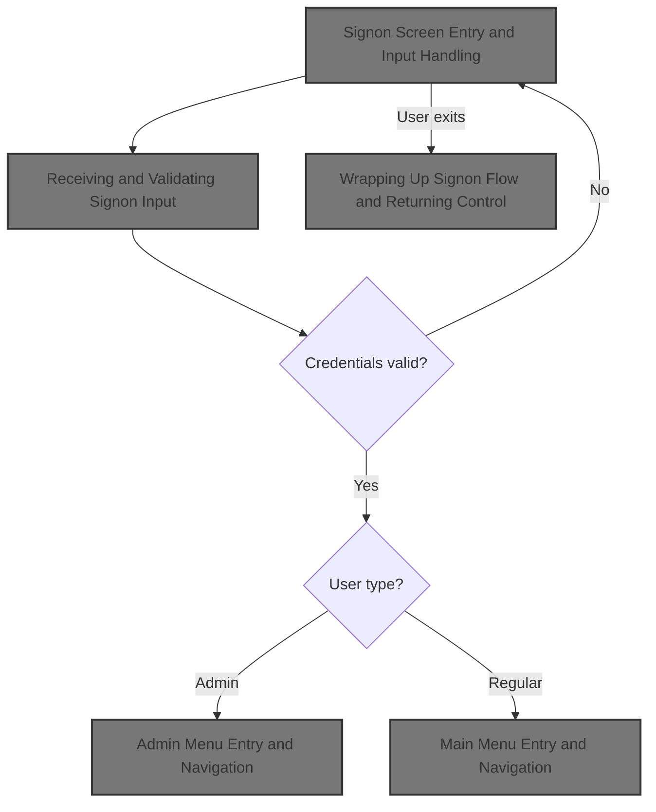
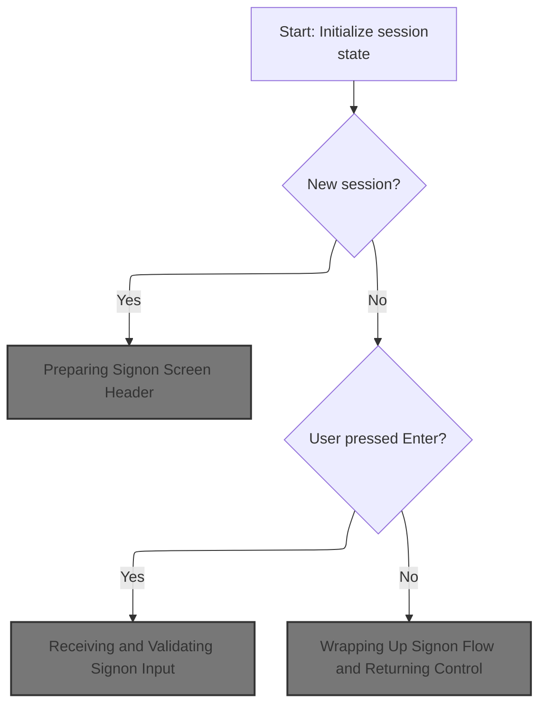
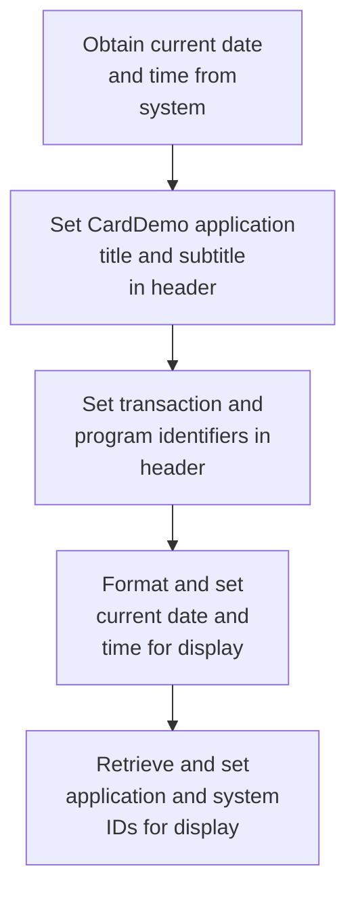
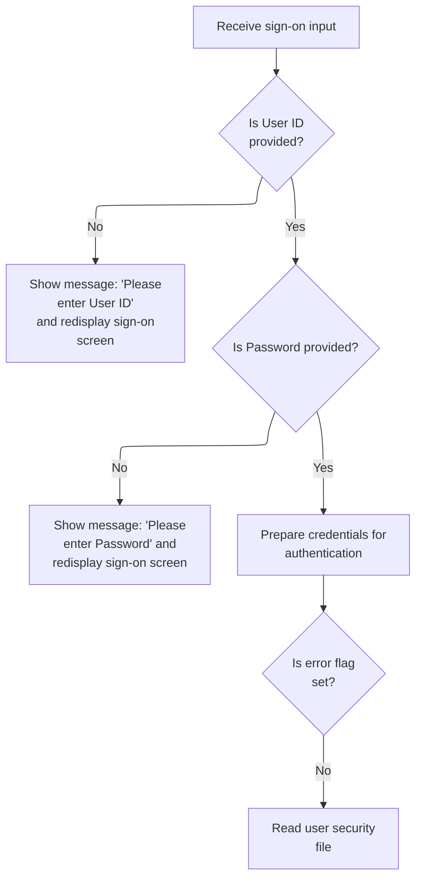
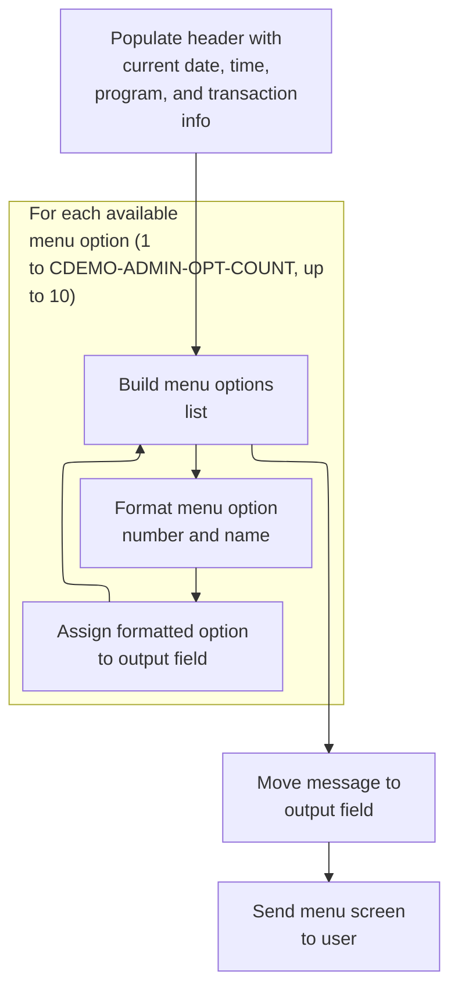
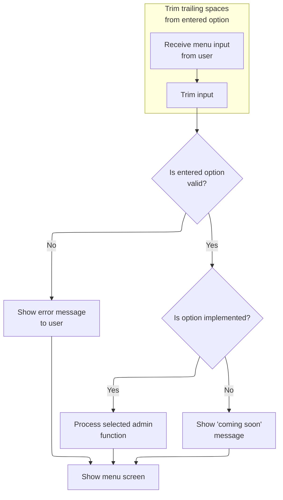
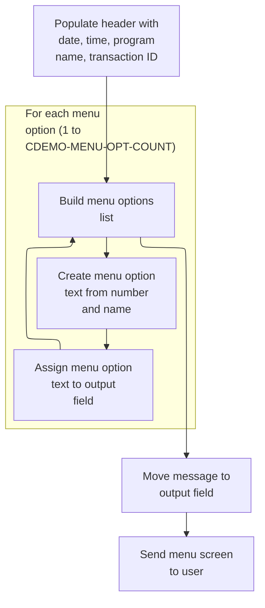
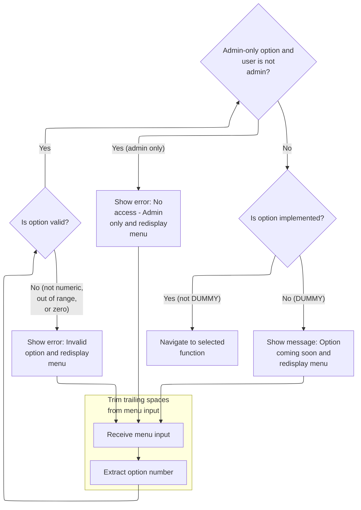

# Overview

This document describes the flow for user signon and authentication in the CardDemo application. Users enter their credentials, which are validated and authenticated. Based on the outcome, users are routed to the appropriate menu or prompted to re-enter their credentials.



## Dependencies

### Programs

- COSGN00C (app/cbl/COSGN00C.cbl)
- CC00
- COADM01C (app/cbl/COADM01C.cbl)
- CA00
- COMEN01C (app/cbl/COMEN01C.cbl)
- CM00

### Copybooks

- COCOM01Y (app/cpy/COCOM01Y.cpy)
- COADM02Y (app/cpy/COADM02Y.cpy)
- COADM01 (app/cpy-bms/COADM01.CPY)
- COTTL01Y (app/cpy/COTTL01Y.cpy)
- CSDAT01Y (app/cpy/CSDAT01Y.cpy)
- CSMSG01Y (app/cpy/CSMSG01Y.cpy)
- CSUSR01Y (app/cpy/CSUSR01Y.cpy)
- DFHAID
- DFHBMSCA
- COMEN02Y (app/cpy/COMEN02Y.cpy)
- COMEN01 (app/cpy-bms/COMEN01.CPY)
- COSGN00 (app/cpy-bms/COSGN00.CPY)

# Where is this program used?

This program is used multiple times in the codebase as represented in the following diagram:

```mermaid
graph TD
  m9m4u("(COTRN00C) Listing Transactions") --> irca3("(COSGN00C) Signon Screen Processing"):::currentEntity
click m9m4u openCode "app/cbl/COTRN00C.cbl:1"
5ebur("(COUSR00C) Listing Users from User Security File") --> irca3("(COSGN00C) Signon Screen Processing"):::currentEntity
click 5ebur openCode "app/cbl/COUSR00C.cbl:1"
3v9j2("(COTRN01C) Viewing a Transaction") --> irca3("(COSGN00C) Signon Screen Processing"):::currentEntity
click 3v9j2 openCode "app/cbl/COTRN01C.cbl:1"
u9dyc("(COUSR01C) Adding User to Security File") --> irca3("(COSGN00C) Signon Screen Processing"):::currentEntity
click u9dyc openCode "app/cbl/COUSR01C.cbl:1"
6y9p2("(COBIL00C) Bill Payment Processing") --> irca3("(COSGN00C) Signon Screen Processing"):::currentEntity
click 6y9p2 openCode "app/cbl/COBIL00C.cbl:1"
1m11q("(COUSR03C) Deleting User") --> irca3("(COSGN00C) Signon Screen Processing"):::currentEntity
click 1m11q openCode "app/cbl/COUSR03C.cbl:1"
p312u("(COUSR02C) Updating User Information") --> irca3("(COSGN00C) Signon Screen Processing"):::currentEntity
click p312u openCode "app/cbl/COUSR02C.cbl:1"
g4npb("COTRN02C Adding a Transaction") --> irca3("(COSGN00C) Signon Screen Processing"):::currentEntity
click g4npb openCode "app/cbl/COTRN02C.cbl:1"
zaou5("(CORPT00C) Printing Transaction Report Batch Job Submission") --> irca3("(COSGN00C) Signon Screen Processing"):::currentEntity
click zaou5 openCode "app/cbl/CORPT00C.cbl:1"
h3r7s("(COADM01C) Admin Menu for Admin users") --> irca3("(COSGN00C) Signon Screen Processing"):::currentEntity
click h3r7s openCode "app/cbl/COADM01C.cbl:1"
ff5e0("(COMEN01C) Main Menu for Regular Users") --> irca3("(COSGN00C) Signon Screen Processing"):::currentEntity
click ff5e0 openCode "app/cbl/COMEN01C.cbl:1"
  
  
click irca3 openCode "app/cbl/COSGN00C.cbl:1"
    classDef currentEntity color:#000000,fill:#7CB9F4
```



## Input and Output Tables/Files used in the Program

| Table / File Name | Type | Description                                 | Usage Mode | Key Fields / Layout Highlights |
| ----------------- | ---- | ------------------------------------------- | ---------- | ------------------------------ |
| WS-USRSEC-FILE    | File | User authentication credentials for sign-on | Input      | File resource                  |

&nbsp;

# Workflow

# Signon Screen Entry and Input Handling



This section manages the initial signon flow, determining when to display the signon screen, how to process user input, and what messages to show based on user actions.

| Rule ID | Code Location | Category       | Rule Name                    | Description                                                                                                                | Conditions                                                          | Remarks                                                                                                                                                           |
| ------- | ------------- | -------------- | ---------------------------- | -------------------------------------------------------------------------------------------------------------------------- | ------------------------------------------------------------------- | ----------------------------------------------------------------------------------------------------------------------------------------------------------------- |
| BR-001  | MAIN-PARA     | Business logic | Signon screen on new session | When a new session is detected (no input received), the signon screen is displayed to prompt the user for credentials.     | Session input length is zero (EIBCALEN = 0).                        | The signon screen is displayed with all fields cleared. The user ID field is set to -1, and the output area is filled with low values. No error message is shown. |
| BR-002  | MAIN-PARA     | Business logic | Process signon on Enter      | When the user presses the Enter key, the system processes the signon input and proceeds with authentication.               | User input is present and Enter key is pressed (EIBAID = DFHENTER). | The system processes the entered credentials and routes the user accordingly. No error or informational message is shown at this point.                           |
| BR-003  | MAIN-PARA     | Business logic | Thank you on PF3             | When the user presses PF3, a thank you message is displayed and the session is ended.                                      | User input is present and PF3 key is pressed (EIBAID = DFHPF3).     | The thank you message displayed is: 'Thank you for using CardDemo application...      '. The message is shown as plain text.                                      |
| BR-004  | MAIN-PARA     | Error handling | Invalid key error            | When the user presses any key other than Enter or PF3, an error message is displayed and the signon screen is redisplayed. | User input is present and a key other than Enter or PF3 is pressed. | The error message displayed is: 'Invalid key pressed. Please see below...         '. The error flag is set to 'Y'. The signon screen is redisplayed.              |

<SwmSnippet path="/app/cbl/COSGN00C.cbl" line="73" repo-id="Z2l0aHViJTNBJTNBa3luZHJ5bC1hd3MtbWFpbmZyYW1lLW1vZGVybml6YXRpb24tY2FyZGRlbW8lM0ElM0FTd2ltbS1EZW1v">

---

MAIN-PARA checks if there's input. If not, it resets the sign-on state and calls SEND-SIGNON-SCREEN to show the prompt. If there is input, it routes based on the key pressed: Enter processes input, PF3 says thanks, anything else shows an error and redisplays the sign-on screen.

```cobol
       MAIN-PARA.

           SET ERR-FLG-OFF TO TRUE

           MOVE SPACES TO WS-MESSAGE
                          ERRMSGO OF COSGN0AO

           IF EIBCALEN = 0
               MOVE LOW-VALUES TO COSGN0AO
               MOVE -1       TO USERIDL OF COSGN0AI
               PERFORM SEND-SIGNON-SCREEN
           ELSE
               EVALUATE EIBAID
                   WHEN DFHENTER
                       PERFORM PROCESS-ENTER-KEY
                   WHEN DFHPF3
                       MOVE CCDA-MSG-THANK-YOU        TO WS-MESSAGE
                       PERFORM SEND-PLAIN-TEXT
                   WHEN OTHER
                       MOVE 'Y'                       TO WS-ERR-FLG
                       MOVE CCDA-MSG-INVALID-KEY      TO WS-MESSAGE
                       PERFORM SEND-SIGNON-SCREEN
               END-EVALUATE
           END-IF.
```

---

</SwmSnippet>

## Preparing Signon Screen Header

This section ensures that the signon screen header is correctly prepared and displays current information to the user before authentication begins.

| Rule ID | Code Location                            | Category        | Rule Name                    | Description                                                                                                                                     | Conditions                                                                     | Remarks                                                                                                                                                                                                          |
| ------- | ---------------------------------------- | --------------- | ---------------------------- | ----------------------------------------------------------------------------------------------------------------------------------------------- | ------------------------------------------------------------------------------ | ---------------------------------------------------------------------------------------------------------------------------------------------------------------------------------------------------------------- |
| BR-001  | SEND-SIGNON-SCREEN                       | Data validation | Message Field Initialization | The message field in the header must be initialized to blank spaces before any user interaction occurs on the signon screen.                    | Whenever the signon screen is prepared and before any user input is processed. | Message field is an 80-character string, initialized to spaces, left-aligned, and padded as necessary.                                                                                                           |
| BR-002  | SEND-SIGNON-SCREEN, POPULATE-HEADER-INFO | Business logic  | Header Information Display   | The signon screen header must display the current program name, transaction ID, and message to the user before authentication begins.           | Whenever the signon screen is prepared for display.                            | Program name is an 8-character string, transaction ID is a 4-character string, and message is an 80-character string. These fields are left-aligned and padded with spaces if shorter than their maximum length. |
| BR-003  | SEND-SIGNON-SCREEN, POPULATE-HEADER-INFO | Business logic  | Header Refresh Requirement   | The header must be populated with up-to-date information each time the signon screen is displayed, ensuring no stale data is shown to the user. | Each time the signon screen is about to be displayed.                          | All header fields (program name, transaction ID, message) must reflect the current session context and not retain values from previous sessions.                                                                 |

<SwmSnippet path="/app/cbl/COSGN00C.cbl" line="145" repo-id="Z2l0aHViJTNBJTNBa3luZHJ5bC1hd3MtbWFpbmZyYW1lLW1vZGVybml6YXRpb24tY2FyZGRlbW8lM0ElM0FTd2ltbS1EZW1v">

---

SEND-SIGNON-SCREEN kicks off by calling POPULATE-HEADER-INFO to make sure the header fields are up-to-date before the screen is displayed.

```cobol
       SEND-SIGNON-SCREEN.

           PERFORM POPULATE-HEADER-INFO
```

---

</SwmSnippet>

### Filling Header Metadata



This section ensures the CardDemo application header is populated with all required metadata, providing users with clear context about the application, transaction, date/time, and system information.

| Rule ID                                                                                                | Code Location        | Category       | Rule Name                              | Description                                                                                                                                                                                                              | Conditions                                                            | Remarks                                                                                                                             |
| ------------------------------------------------------------------------------------------------------ | -------------------- | -------------- | -------------------------------------- | ------------------------------------------------------------------------------------------------------------------------------------------------------------------------------------------------------------------------ | --------------------------------------------------------------------- | ----------------------------------------------------------------------------------------------------------------------------------- |
| BR-001                                                                                                 | POPULATE-HEADER-INFO | Business logic | Application Title and Subtitle Display | The header must display the application title as '      AWS Mainframe Modernization       ' and the subtitle as '              CardDemo                  '. These values are fixed and must always appear in the header. | Whenever the header is populated for the CardDemo application screen. | Title: '      AWS Mainframe Modernization       ' (40 characters, left-aligned, padded with spaces)                                 |
| Subtitle: '              CardDemo                  ' (40 characters, left-aligned, padded with spaces) |                      |                |                                        |                                                                                                                                                                                                                          |                                                                       |                                                                                                                                     |
| BR-002                                                                                                 | POPULATE-HEADER-INFO | Business logic | Transaction and Program Identification | The header must display the transaction ID as 'CC00' and the program identifier as 'COSGN00C (Signon Screen Processing)'. These values identify the current transaction and program context for the user.                | Whenever the header is populated for the CardDemo application screen. | Transaction ID: 'CC00' (4 characters, left-aligned, padded with spaces)                                                             |
| Program Name: 'COSGN00C' (8 characters, left-aligned, padded with spaces)                              |                      |                |                                        |                                                                                                                                                                                                                          |                                                                       |                                                                                                                                     |
| BR-003                                                                                                 | POPULATE-HEADER-INFO | Business logic | Current Date and Time Display          | The header must display the current date in MM/DD/YY format and the current time in HH:MM:SS format, reflecting the system date and time at the moment the header is populated.                                          | Whenever the header is populated for the CardDemo application screen. | Date format: MM/DD/YY (2 digits month, '/', 2 digits day, '/', 2 digits year)                                                       |
| Time format: HH:MM:SS (2 digits hour, ':', 2 digits minute, ':', 2 digits second)                      |                      |                |                                        |                                                                                                                                                                                                                          |                                                                       |                                                                                                                                     |
| BR-004                                                                                                 | POPULATE-HEADER-INFO | Business logic | Application and System ID Display      | The header must display the application ID and system ID assigned by CICS, allowing users and systems to track which application and system instance is running the session.                                             | Whenever the header is populated for the CardDemo application screen. | Application ID and System ID are assigned by CICS and must be displayed as provided, typically as 4-character alphanumeric strings. |

<SwmSnippet path="/app/cbl/COSGN00C.cbl" line="177" repo-id="Z2l0aHViJTNBJTNBa3luZHJ5bC1hd3MtbWFpbmZyYW1lLW1vZGVybml6YXRpb24tY2FyZGRlbW8lM0ElM0FTd2ltbS1EZW1v">

---

POPULATE-HEADER-INFO sets up the header with the current date, time, program name, transaction ID, and titles so the screen always shows the right context.

```cobol
       POPULATE-HEADER-INFO.

           MOVE FUNCTION CURRENT-DATE  TO WS-CURDATE-DATA

           MOVE CCDA-TITLE01           TO TITLE01O OF COSGN0AO
           MOVE CCDA-TITLE02           TO TITLE02O OF COSGN0AO
           MOVE WS-TRANID              TO TRNNAMEO OF COSGN0AO
           MOVE WS-PGMNAME             TO PGMNAMEO OF COSGN0AO

           MOVE WS-CURDATE-MONTH       TO WS-CURDATE-MM
           MOVE WS-CURDATE-DAY         TO WS-CURDATE-DD
           MOVE WS-CURDATE-YEAR(3:2)   TO WS-CURDATE-YY

           MOVE WS-CURDATE-MM-DD-YY    TO CURDATEO OF COSGN0AO

           MOVE WS-CURTIME-HOURS       TO WS-CURTIME-HH
           MOVE WS-CURTIME-MINUTE      TO WS-CURTIME-MM
           MOVE WS-CURTIME-SECOND      TO WS-CURTIME-SS

           MOVE WS-CURTIME-HH-MM-SS    TO CURTIMEO OF COSGN0AO
```

---

</SwmSnippet>

<SwmSnippet path="/app/cbl/COSGN00C.cbl" line="198" repo-id="Z2l0aHViJTNBJTNBa3luZHJ5bC1hd3MtbWFpbmZyYW1lLW1vZGVybml6YXRpb24tY2FyZGRlbW8lM0ElM0FTd2ltbS1EZW1v">

---

After filling the header fields, POPULATE-HEADER-INFO uses CICS ASSIGN to set APPLID and SYSID in the output structure. These are for CICS to track which app and system is running the session.

```cobol
           EXEC CICS ASSIGN
               APPLID(APPLIDO OF COSGN0AO)
           END-EXEC

           EXEC CICS ASSIGN
               SYSID(SYSIDO OF COSGN0AO)
           END-EXEC.
```

---

</SwmSnippet>

### Sending the Signon Screen to the User

This section is responsible for presenting the signon screen to the user, including any error messages, and ensuring the screen is ready for input.

| Rule ID | Code Location      | Category       | Rule Name                   | Description                                                                                                                      | Conditions                                          | Remarks                                                                                                                                                               |
| ------- | ------------------ | -------------- | --------------------------- | -------------------------------------------------------------------------------------------------------------------------------- | --------------------------------------------------- | --------------------------------------------------------------------------------------------------------------------------------------------------------------------- |
| BR-001  | SEND-SIGNON-SCREEN | Business logic | Display error message       | If there is a message present in the workspace message variable, it is displayed in the error message area of the signon screen. | A message exists in the workspace message variable. | The message is up to 80 characters, alphanumeric, and is shown in the error message area of the signon screen. If the message is blank, the error area will be empty. |
| BR-002  | SEND-SIGNON-SCREEN | Business logic | Send signon screen          | The signon screen is always sent to the user, regardless of whether an error message is present.                                 | Whenever the SEND-SIGNON-SCREEN logic is executed.  | The signon screen uses the map 'COSGN0A' and mapset 'COSGN00'. The screen format is determined by these definitions and includes all fields in COSGN0AO.              |
| BR-003  | SEND-SIGNON-SCREEN | Business logic | Clear screen before display | The signon screen is cleared before being displayed to the user.                                                                 | Whenever the signon screen is sent to the user.     | The screen is erased, meaning all previous content is removed before the new screen is shown.                                                                         |
| BR-004  | SEND-SIGNON-SCREEN | Business logic | Set cursor position         | The cursor is positioned for user input when the signon screen is displayed.                                                     | Whenever the signon screen is sent to the user.     | The cursor is set to the default input position as defined by the screen map.                                                                                         |

<SwmSnippet path="/app/cbl/COSGN00C.cbl" line="149" repo-id="Z2l0aHViJTNBJTNBa3luZHJ5bC1hd3MtbWFpbmZyYW1lLW1vZGVybml6YXRpb24tY2FyZGRlbW8lM0ElM0FTd2ltbS1EZW1v">

---

After returning from POPULATE-HEADER-INFO, SEND-SIGNON-SCREEN copies any message from WS-MESSAGE into the error message area, then sends the signon screen to the user with CICS SEND. ERASE clears the screen, and CURSOR sets the cursor position.

```cobol
           MOVE WS-MESSAGE TO ERRMSGO OF COSGN0AO

           EXEC CICS SEND
                     MAP('COSGN0A')
                     MAPSET('COSGN00')
                     FROM(COSGN0AO)
                     ERASE
                     CURSOR
           END-EXEC.
```

---

</SwmSnippet>

## Receiving and Validating Signon Input



This section manages the receipt and validation of user sign-on input, ensuring required fields are present and preparing credentials for authentication.

| Rule ID | Code Location     | Category        | Rule Name                | Description                                                                                                                                                                            | Conditions                                                                      | Remarks                                                                                                                                                                              |
| ------- | ----------------- | --------------- | ------------------------ | -------------------------------------------------------------------------------------------------------------------------------------------------------------------------------------- | ------------------------------------------------------------------------------- | ------------------------------------------------------------------------------------------------------------------------------------------------------------------------------------ |
| BR-001  | PROCESS-ENTER-KEY | Data validation | User ID required         | If the user ID field is empty or contains only spaces or low-values, the system must display the message 'Please enter User ID ...' and prompt the user to re-enter the information.   | The user ID field is empty, contains only spaces, or contains only low-values.  | Error flag is set to 'Y'. The error message is 'Please enter User ID ...' (up to 80 characters). The user ID field is 8 characters, left-aligned, padded with spaces if necessary.   |
| BR-002  | PROCESS-ENTER-KEY | Data validation | Password required        | If the password field is empty or contains only spaces or low-values, the system must display the message 'Please enter Password ...' and prompt the user to re-enter the information. | The password field is empty, contains only spaces, or contains only low-values. | Error flag is set to 'Y'. The error message is 'Please enter Password ...' (up to 80 characters). The password field is 8 characters, left-aligned, padded with spaces if necessary. |
| BR-003  | PROCESS-ENTER-KEY | Business logic  | Uppercase credentials    | If both user ID and password are provided, the system must convert both fields to uppercase before preparing them for authentication.                                                  | Both user ID and password fields are present and error flag is not set.         | User ID and password are converted to uppercase and stored as 8-character strings, left-aligned, padded with spaces if necessary.                                                    |
| BR-004  | PROCESS-ENTER-KEY | Business logic  | Authenticate credentials | If no error flag is set after validation, the system must attempt to authenticate the user by reading the user security file.                                                          | Error flag is not set after validation of user ID and password.                 | Authentication is attempted only if both fields are present and error flag is 'N'.                                                                                                   |

<SwmSnippet path="/app/cbl/COSGN00C.cbl" line="108" repo-id="Z2l0aHViJTNBJTNBa3luZHJ5bC1hd3MtbWFpbmZyYW1lLW1vZGVybml6YXRpb24tY2FyZGRlbW8lM0ElM0FTd2ltbS1EZW1v">

---

In PROCESS-ENTER-KEY, the code receives the user input (user ID and password) from the signon screen and stores it for validation. Response codes are set for error handling.

```cobol
       PROCESS-ENTER-KEY.

           EXEC CICS RECEIVE
                     MAP('COSGN0A')
                     MAPSET('COSGN00')
                     RESP(WS-RESP-CD)
                     RESP2(WS-REAS-CD)
           END-EXEC.
```

---

</SwmSnippet>

<SwmSnippet path="/app/cbl/COSGN00C.cbl" line="117" repo-id="Z2l0aHViJTNBJTNBa3luZHJ5bC1hd3MtbWFpbmZyYW1lLW1vZGVybml6YXRpb24tY2FyZGRlbW8lM0ElM0FTd2ltbS1EZW1v">

---

After receiving input, the code checks if user ID or password is empty. If so, it sets an error, updates the message, and calls SEND-SIGNON-SCREEN to prompt the user again with the error message.

```cobol
           EVALUATE TRUE
               WHEN USERIDI OF COSGN0AI = SPACES OR LOW-VALUES
                   MOVE 'Y'      TO WS-ERR-FLG
                   MOVE 'Please enter User ID ...' TO WS-MESSAGE
                   MOVE -1       TO USERIDL OF COSGN0AI
                   PERFORM SEND-SIGNON-SCREEN
               WHEN PASSWDI OF COSGN0AI = SPACES OR LOW-VALUES
                   MOVE 'Y'      TO WS-ERR-FLG
                   MOVE 'Please enter Password ...' TO WS-MESSAGE
                   MOVE -1       TO PASSWDL OF COSGN0AI
                   PERFORM SEND-SIGNON-SCREEN
               WHEN OTHER
                   CONTINUE
           END-EVALUATE.
```

---

</SwmSnippet>

<SwmSnippet path="/app/cbl/COSGN00C.cbl" line="132" repo-id="Z2l0aHViJTNBJTNBa3luZHJ5bC1hd3MtbWFpbmZyYW1lLW1vZGVybml6YXRpb24tY2FyZGRlbW8lM0ElM0FTd2ltbS1EZW1v">

---

After returning from SEND-SIGNON-SCREEN (if there was an error), PROCESS-ENTER-KEY continues by uppercasing the user ID and password. If there are no errors, it calls READ-USER-SEC-FILE to check the credentials against the security file.

```cobol
           MOVE FUNCTION UPPER-CASE(USERIDI OF COSGN0AI) TO
                           WS-USER-ID
                           CDEMO-USER-ID
           MOVE FUNCTION UPPER-CASE(PASSWDI OF COSGN0AI) TO
                           WS-USER-PWD

           IF NOT ERR-FLG-ON
               PERFORM READ-USER-SEC-FILE
           END-IF.
```

---

</SwmSnippet>

## User Credential Verification

This section verifies user credentials during sign-on and determines navigation within the CardDemo application based on authentication results and user type.

| Rule ID | Code Location      | Category       | Rule Name                                | Description                                                                                                                                     | Conditions                                                                                         | Remarks                                                                                                                                                                                                         |
| ------- | ------------------ | -------------- | ---------------------------------------- | ----------------------------------------------------------------------------------------------------------------------------------------------- | -------------------------------------------------------------------------------------------------- | --------------------------------------------------------------------------------------------------------------------------------------------------------------------------------------------------------------- |
| BR-001  | READ-USER-SEC-FILE | Business logic | Successful authentication and navigation | If the user ID exists and the password matches, the user is authenticated and navigated to the appropriate menu based on user type.             | User security record is found (response code = 0) and password matches the stored password.        | User type is determined by a 1-character field: 'A' for admin, 'U' for regular user. User ID and password are both 8-character alphanumeric fields. Navigation is to the admin menu for 'A', main menu for 'U'. |
| BR-002  | READ-USER-SEC-FILE | Business logic | User type-based menu navigation          | User type determines which menu the authenticated user is navigated to: admin users are sent to the admin menu, regular users to the main menu. | User is authenticated and user type is either 'A' (admin) or 'U' (user).                           | Admin menu program is 'COADM01C', main menu program is 'COMEN01C'. User type is a 1-character field: 'A' for admin, 'U' for user.                                                                               |
| BR-003  | READ-USER-SEC-FILE | Error handling | Password mismatch handling               | If the password does not match the stored password for a found user ID, the user is not authenticated and is prompted to retry sign-on.         | User security record is found (response code = 0) but password does not match the stored password. | Error flag is set and the sign-on screen is displayed again. No navigation to menus occurs.                                                                                                                     |

<SwmSnippet path="/app/cbl/COSGN00C.cbl" line="209" repo-id="Z2l0aHViJTNBJTNBa3luZHJ5bC1hd3MtbWFpbmZyYW1lLW1vZGVybml6YXRpb24tY2FyZGRlbW8lM0ElM0FTd2ltbS1EZW1v">

---

In READ-USER-SEC-FILE, the code reads the user's security record from the dataset using the user ID. The response code tells us if the user was found, not found, or if there was an error.

```cobol
       READ-USER-SEC-FILE.

           EXEC CICS READ
                DATASET   (WS-USRSEC-FILE)
                INTO      (SEC-USER-DATA)
                LENGTH    (LENGTH OF SEC-USER-DATA)
                RIDFLD    (WS-USER-ID)
                KEYLENGTH (LENGTH OF WS-USER-ID)
                RESP      (WS-RESP-CD)
                RESP2     (WS-REAS-CD)
           END-EXEC.
```

---

</SwmSnippet>

<SwmSnippet path="/app/cbl/COSGN00C.cbl" line="222" repo-id="Z2l0aHViJTNBJTNBa3luZHJ5bC1hd3MtbWFpbmZyYW1lLW1vZGVybml6YXRpb24tY2FyZGRlbW8lM0ElM0FTd2ltbS1EZW1v">

---

If the user is found and the password matches, the code sets up the communication area and checks the user type. Admins get sent to COADM01C, regular users to COMEN01C. If the password is wrong, it sets an error and calls SEND-SIGNON-SCREEN again.

```cobol
               WHEN 0
                   IF SEC-USR-PWD = WS-USER-PWD
                       MOVE WS-TRANID    TO CDEMO-FROM-TRANID
                       MOVE WS-PGMNAME   TO CDEMO-FROM-PROGRAM
                       MOVE WS-USER-ID   TO CDEMO-USER-ID
                       MOVE SEC-USR-TYPE TO CDEMO-USER-TYPE
                       MOVE ZEROS        TO CDEMO-PGM-CONTEXT

                       IF CDEMO-USRTYP-ADMIN
                            EXEC CICS XCTL
                              PROGRAM ('COADM01C')
                              COMMAREA(CARDDEMO-COMMAREA)
                            END-EXEC
                       ELSE
                            EXEC CICS XCTL
                              PROGRAM ('COMEN01C')
                              COMMAREA(CARDDEMO-COMMAREA)
                            END-EXEC
                       END-IF
```

---

</SwmSnippet>

### Admin Menu Entry and Navigation

This section manages the entry, navigation, and error handling for the admin menu in the CardDemo application, ensuring users are properly redirected, menu options are processed, and invalid inputs are handled with clear feedback.

| Rule ID | Code Location                      | Category       | Rule Name               | Description                                                                                                            | Conditions                                                                  | Remarks                                                                                                           |
| ------- | ---------------------------------- | -------------- | ----------------------- | ---------------------------------------------------------------------------------------------------------------------- | --------------------------------------------------------------------------- | ----------------------------------------------------------------------------------------------------------------- |
| BR-001  | MAIN-PARA, RETURN-TO-SIGNON-SCREEN | Business logic | Fresh entry redirect    | If the session is a fresh entry (no communication area), the user is redirected to the signon screen.                  | Session communication area length is zero.                                  | The signon program name is 'COSGN00C'. The communication area is not present when EIBCALEN = 0.                   |
| BR-002  | MAIN-PARA                          | Business logic | Process menu option     | When the user presses Enter on the menu screen, the selected admin option is processed.                                | User input key is Enter while on the menu screen.                           | The Enter key is detected as DFHENTER. The menu screen must be active.                                            |
| BR-003  | MAIN-PARA, RETURN-TO-SIGNON-SCREEN | Business logic | PF3 returns to signon   | When the user presses PF3, they are redirected to the signon screen.                                                   | User input key is PF3 while on the menu screen.                             | PF3 key is detected as DFHPF3. The signon program name is 'COSGN00C'.                                             |
| BR-004  | RETURN-TO-SIGNON-SCREEN            | Business logic | Default signon transfer | If the next program to transfer to is not set, the system defaults to the signon program before transferring control.  | Next program name is blank or contains low values when returning to signon. | The signon program name is 'COSGN00C'. The next program is checked for blank or low values.                       |
| BR-005  | MAIN-PARA                          | Error handling | Invalid key error       | If the user presses any key other than Enter or PF3, an error message is displayed and the menu screen is redisplayed. | User input key is not Enter or PF3 while on the menu screen.                | The error message displayed is 'Invalid key pressed. Please see below...         '. The error flag is set to 'Y'. |

<SwmSnippet path="/app/cbl/COADM01C.cbl" line="75" repo-id="Z2l0aHViJTNBJTNBa3luZHJ5bC1hd3MtbWFpbmZyYW1lLW1vZGVybml6YXRpb24tY2FyZGRlbW8lM0ElM0FTd2ltbS1EZW1v">

---

In MAIN-PARA, the code checks if this is a fresh entry (EIBCALEN = 0). If so, it sets up to return to the signon screen. Otherwise, it loads the communication area, checks if the program is being reentered, and either sends or receives the menu screen. User input is handled by key: Enter processes the option, PF3 returns to signon, anything else shows an error and redisplays the menu.

```cobol
       MAIN-PARA.

           SET ERR-FLG-OFF TO TRUE

           MOVE SPACES TO WS-MESSAGE
                          ERRMSGO OF COADM1AO

           IF EIBCALEN = 0
               MOVE 'COSGN00C' TO CDEMO-FROM-PROGRAM
               PERFORM RETURN-TO-SIGNON-SCREEN
           ELSE
               MOVE DFHCOMMAREA(1:EIBCALEN) TO CARDDEMO-COMMAREA
               IF NOT CDEMO-PGM-REENTER
                   SET CDEMO-PGM-REENTER    TO TRUE
                   MOVE LOW-VALUES          TO COADM1AO
                   PERFORM SEND-MENU-SCREEN
               ELSE
                   PERFORM RECEIVE-MENU-SCREEN
                   EVALUATE EIBAID
                       WHEN DFHENTER
                           PERFORM PROCESS-ENTER-KEY
                       WHEN DFHPF3
                           MOVE 'COSGN00C' TO CDEMO-TO-PROGRAM
                           PERFORM RETURN-TO-SIGNON-SCREEN
                       WHEN OTHER
                           MOVE 'Y'                       TO WS-ERR-FLG
                           MOVE CCDA-MSG-INVALID-KEY      TO WS-MESSAGE
                           PERFORM SEND-MENU-SCREEN
                   END-EVALUATE
               END-IF
           END-IF

           EXEC CICS RETURN
                     TRANSID (WS-TRANID)
                     COMMAREA (CARDDEMO-COMMAREA)
           END-EXEC.
```

---

</SwmSnippet>

<SwmSnippet path="/app/cbl/COADM01C.cbl" line="160" repo-id="Z2l0aHViJTNBJTNBa3luZHJ5bC1hd3MtbWFpbmZyYW1lLW1vZGVybml6YXRpb24tY2FyZGRlbW8lM0ElM0FTd2ltbS1EZW1v">

---

RETURN-TO-SIGNON-SCREEN checks if the next program is set. If not, it defaults to the signon program and uses XCTL to transfer control, so the user always lands on a valid screen.

```cobol
       RETURN-TO-SIGNON-SCREEN.

           IF CDEMO-TO-PROGRAM = LOW-VALUES OR SPACES
               MOVE 'COSGN00C' TO CDEMO-TO-PROGRAM
           END-IF
           EXEC CICS
               XCTL PROGRAM(CDEMO-TO-PROGRAM)
           END-EXEC.
```

---

</SwmSnippet>

#### Building and Sending Admin Menu



This section builds and sends the admin menu screen, including header information, menu options, and any message, to the user terminal.

| Rule ID | Code Location        | Category       | Rule Name             | Description                                                                                                                                                                                                                                | Conditions                                                    | Remarks                                                                                                                                                                                                                              |
| ------- | -------------------- | -------------- | --------------------- | ------------------------------------------------------------------------------------------------------------------------------------------------------------------------------------------------------------------------------------------ | ------------------------------------------------------------- | ------------------------------------------------------------------------------------------------------------------------------------------------------------------------------------------------------------------------------------ |
| BR-001  | POPULATE-HEADER-INFO | Business logic | Header display format | The admin menu header must display the current date and time, static titles, and program/transaction identifiers. The date is formatted as MM-DD-YY and the time as HH-MM-SS.                                                              | Whenever the admin menu screen is built and sent to the user. | Date is formatted as MM-DD-YY (string, 8 bytes), time as HH-MM-SS (string, 8 bytes). Titles and identifiers are static strings. Program name is 'COADM01C', transaction ID is 'CA00'.                                                |
| BR-002  | BUILD-MENU-OPTIONS   | Business logic | Menu options display  | The admin menu must display a list of available options, each formatted as '<option number>. <option name>' and assigned to the corresponding output field. Only the first CDEMO-ADMIN-OPT-COUNT options are shown, up to a maximum of 10. | Whenever the admin menu screen is built and sent to the user. | Each menu option is formatted as a string: option number (1-10), period, space, option name (up to 40 bytes total). Only options 1 to CDEMO-ADMIN-OPT-COUNT are displayed; CDEMO-ADMIN-OPT-COUNT is typically 4 but can be up to 10. |
| BR-003  | SEND-MENU-SCREEN     | Business logic | Message display       | Any message present in the message field is displayed in the error/message area of the admin menu screen.                                                                                                                                  | Whenever the admin menu screen is built and sent to the user. | Message is a string up to 80 bytes. If no message is present, the field is blank.                                                                                                                                                    |
| BR-004  | SEND-MENU-SCREEN     | Business logic | Menu screen delivery  | The admin menu screen is sent to the user after the header, menu options, and message fields are populated.                                                                                                                                | Whenever the admin menu screen is built and sent to the user. | The screen is sent using the CICS SEND MAP command with ERASE option, ensuring the display is refreshed.                                                                                                                             |

<SwmSnippet path="/app/cbl/COADM01C.cbl" line="172" repo-id="Z2l0aHViJTNBJTNBa3luZHJ5bC1hd3MtbWFpbmZyYW1lLW1vZGVybml6YXRpb24tY2FyZGRlbW8lM0ElM0FTd2ltbS1EZW1v">

---

SEND-MENU-SCREEN calls POPULATE-HEADER-INFO and BUILD-MENU-OPTIONS to set up the header and menu options, then sends the admin menu screen to the terminal. Any message is copied to the error field before display.

```cobol
       SEND-MENU-SCREEN.

           PERFORM POPULATE-HEADER-INFO
           PERFORM BUILD-MENU-OPTIONS

           MOVE WS-MESSAGE TO ERRMSGO OF COADM1AO

           EXEC CICS SEND
                     MAP('COADM1A')
                     MAPSET('COADM01')
                     FROM(COADM1AO)
                     ERASE
           END-EXEC.
```

---

</SwmSnippet>

<SwmSnippet path="/app/cbl/COADM01C.cbl" line="202" repo-id="Z2l0aHViJTNBJTNBa3luZHJ5bC1hd3MtbWFpbmZyYW1lLW1vZGVybml6YXRpb24tY2FyZGRlbW8lM0ElM0FTd2ltbS1EZW1v">

---

POPULATE-HEADER-INFO sets up the admin menu header with the current date/time, static titles, and program/transaction IDs. Date and time are formatted for display.

```cobol
       POPULATE-HEADER-INFO.

           MOVE FUNCTION CURRENT-DATE  TO WS-CURDATE-DATA

           MOVE CCDA-TITLE01           TO TITLE01O OF COADM1AO
           MOVE CCDA-TITLE02           TO TITLE02O OF COADM1AO
           MOVE WS-TRANID              TO TRNNAMEO OF COADM1AO
           MOVE WS-PGMNAME             TO PGMNAMEO OF COADM1AO

           MOVE WS-CURDATE-MONTH       TO WS-CURDATE-MM
           MOVE WS-CURDATE-DAY         TO WS-CURDATE-DD
           MOVE WS-CURDATE-YEAR(3:2)   TO WS-CURDATE-YY

           MOVE WS-CURDATE-MM-DD-YY    TO CURDATEO OF COADM1AO

           MOVE WS-CURTIME-HOURS       TO WS-CURTIME-HH
           MOVE WS-CURTIME-MINUTE      TO WS-CURTIME-MM
           MOVE WS-CURTIME-SECOND      TO WS-CURTIME-SS

           MOVE WS-CURTIME-HH-MM-SS    TO CURTIMEO OF COADM1AO.
```

---

</SwmSnippet>

<SwmSnippet path="/app/cbl/COADM01C.cbl" line="226" repo-id="Z2l0aHViJTNBJTNBa3luZHJ5bC1hd3MtbWFpbmZyYW1lLW1vZGVybml6YXRpb24tY2FyZGRlbW8lM0ElM0FTd2ltbS1EZW1v">

---

BUILD-MENU-OPTIONS loops through the admin options, builds each menu string, and assigns it to the right output field for display. Only the first 4 are used since that's the configured count.

```cobol
       BUILD-MENU-OPTIONS.

           PERFORM VARYING WS-IDX FROM 1 BY 1 UNTIL
                           WS-IDX > CDEMO-ADMIN-OPT-COUNT

               MOVE SPACES             TO WS-ADMIN-OPT-TXT

               STRING CDEMO-ADMIN-OPT-NUM(WS-IDX)  DELIMITED BY SIZE
                      '. '                         DELIMITED BY SIZE
                      CDEMO-ADMIN-OPT-NAME(WS-IDX) DELIMITED BY SIZE
                 INTO WS-ADMIN-OPT-TXT

               EVALUATE WS-IDX
                   WHEN 1
                       MOVE WS-ADMIN-OPT-TXT TO OPTN001O
                   WHEN 2
                       MOVE WS-ADMIN-OPT-TXT TO OPTN002O
                   WHEN 3
                       MOVE WS-ADMIN-OPT-TXT TO OPTN003O
                   WHEN 4
                       MOVE WS-ADMIN-OPT-TXT TO OPTN004O
                   WHEN 5
                       MOVE WS-ADMIN-OPT-TXT TO OPTN005O
                   WHEN 6
                       MOVE WS-ADMIN-OPT-TXT TO OPTN006O
                   WHEN 7
                       MOVE WS-ADMIN-OPT-TXT TO OPTN007O
                   WHEN 8
                       MOVE WS-ADMIN-OPT-TXT TO OPTN008O
                   WHEN 9
                       MOVE WS-ADMIN-OPT-TXT TO OPTN009O
                   WHEN 10
                       MOVE WS-ADMIN-OPT-TXT TO OPTN010O
                   WHEN OTHER
                       CONTINUE
               END-EVALUATE

           END-PERFORM.
```

---

</SwmSnippet>

#### Receiving and Processing Admin Menu Input



This section manages the reception and processing of admin menu input, ensuring only valid and implemented options are executed, while providing clear feedback for invalid or unimplemented selections.

| Rule ID | Code Location     | Category        | Rule Name                     | Description                                                                                                                                                                                                             | Conditions                                                                                         | Remarks                                                                                                                                                                                                   |
| ------- | ----------------- | --------------- | ----------------------------- | ----------------------------------------------------------------------------------------------------------------------------------------------------------------------------------------------------------------------- | -------------------------------------------------------------------------------------------------- | --------------------------------------------------------------------------------------------------------------------------------------------------------------------------------------------------------- |
| BR-001  | PROCESS-ENTER-KEY | Data validation | Menu option validation        | If the entered menu option is not numeric, is zero, or exceeds the maximum allowed option count, the system displays an error message prompting the user to enter a valid option number and redisplays the menu screen. | The entered option is not numeric, is zero, or is greater than the value of CDEMO-ADMIN-OPT-COUNT. | CDEMO-ADMIN-OPT-COUNT is the maximum allowed option number. The error message displayed is: 'Please enter a valid option number...'. The message is shown as a string and the menu screen is redisplayed. |
| BR-002  | PROCESS-ENTER-KEY | Business logic  | Unimplemented option handling | If the entered menu option is valid but corresponds to an unimplemented function (marked as 'DUMMY'), the system displays a 'coming soon' message and redisplays the menu screen.                                       | The entered option is valid and the associated program name starts with 'DUMMY'.                   | The message displayed is: 'This option is coming soon ...'. The message is constructed as a string and the menu screen is redisplayed.                                                                    |
| BR-003  | PROCESS-ENTER-KEY | Business logic  | Admin function routing        | If the entered menu option is valid and corresponds to an implemented function, the system transfers control to the selected admin function program.                                                                    | The entered option is valid and the associated program name does not start with 'DUMMY'.           | The program name is determined by the selected option. Control is transferred to the program using the CICS XCTL command, passing the communication area.                                                 |

<SwmSnippet path="/app/cbl/COADM01C.cbl" line="189" repo-id="Z2l0aHViJTNBJTNBa3luZHJ5bC1hd3MtbWFpbmZyYW1lLW1vZGVybml6YXRpb24tY2FyZGRlbW8lM0ElM0FTd2ltbS1EZW1v">

---

RECEIVE-MENU-SCREEN gets the admin's selected option and other input from the menu screen, storing it for further checks and actions.

```cobol
       RECEIVE-MENU-SCREEN.

           EXEC CICS RECEIVE
                     MAP('COADM1A')
                     MAPSET('COADM01')
                     INTO(COADM1AI)
                     RESP(WS-RESP-CD)
                     RESP2(WS-REAS-CD)
           END-EXEC.
```

---

</SwmSnippet>

<SwmSnippet path="/app/cbl/COADM01C.cbl" line="115" repo-id="Z2l0aHViJTNBJTNBa3luZHJ5bC1hd3MtbWFpbmZyYW1lLW1vZGVybml6YXRpb24tY2FyZGRlbW8lM0ElM0FTd2ltbS1EZW1v">

---

PROCESS-ENTER-KEY trims the input option, validates it, and checks if it's a real program or just a placeholder. If valid, it transfers control to the selected program. If 'DUMMY', it shows a 'coming soon' message and redisplays the menu.

```cobol
       PROCESS-ENTER-KEY.

           PERFORM VARYING WS-IDX
                   FROM LENGTH OF OPTIONI OF COADM1AI BY -1 UNTIL
                   OPTIONI OF COADM1AI(WS-IDX:1) NOT = SPACES OR
                   WS-IDX = 1
           END-PERFORM
           MOVE OPTIONI OF COADM1AI(1:WS-IDX) TO WS-OPTION-X
           INSPECT WS-OPTION-X REPLACING ALL ' ' BY '0'
           MOVE WS-OPTION-X              TO WS-OPTION
           MOVE WS-OPTION                TO OPTIONO OF COADM1AO

           IF WS-OPTION IS NOT NUMERIC OR
              WS-OPTION > CDEMO-ADMIN-OPT-COUNT OR
              WS-OPTION = ZEROS
               MOVE 'Y'     TO WS-ERR-FLG
               MOVE 'Please enter a valid option number...' TO
                                       WS-MESSAGE
               PERFORM SEND-MENU-SCREEN
           END-IF


           IF NOT ERR-FLG-ON
               IF CDEMO-ADMIN-OPT-PGMNAME(WS-OPTION)(1:5) NOT = 'DUMMY'
                   MOVE WS-TRANID    TO CDEMO-FROM-TRANID
                   MOVE WS-PGMNAME   TO CDEMO-FROM-PROGRAM
                   MOVE ZEROS        TO CDEMO-PGM-CONTEXT
                   EXEC CICS
                       XCTL PROGRAM(CDEMO-ADMIN-OPT-PGMNAME(WS-OPTION))
                       COMMAREA(CARDDEMO-COMMAREA)
                   END-EXEC
               END-IF
               MOVE SPACES             TO WS-MESSAGE
               MOVE DFHGREEN           TO ERRMSGC  OF COADM1AO
               STRING 'This option '       DELIMITED BY SIZE
      *                CDEMO-ADMIN-OPT-NAME(WS-OPTION)
      *                                DELIMITED BY SIZE
                       'is coming soon ...'   DELIMITED BY SIZE
                  INTO WS-MESSAGE
               PERFORM SEND-MENU-SCREEN
           END-IF.
```

---

</SwmSnippet>

### Main Menu Entry and Navigation

This section manages the main menu entry and navigation for the CardDemo application, handling user input, error messaging, and program flow to ensure a smooth user experience.

| Rule ID | Code Location           | Category        | Rule Name                    | Description                                                                                                                                   | Conditions                                                                        | Remarks                                                                                                                                                   |
| ------- | ----------------------- | --------------- | ---------------------------- | --------------------------------------------------------------------------------------------------------------------------------------------- | --------------------------------------------------------------------------------- | --------------------------------------------------------------------------------------------------------------------------------------------------------- |
| BR-001  | RETURN-TO-SIGNON-SCREEN | Data validation | Next program validation      | Before transferring control to another program, the next program is validated to ensure it is set. If not, it defaults to the signon program. | Control is about to be transferred to another program.                            | If the next program is blank or contains low values, it is set to 'COSGN00C' before transfer.                                                             |
| BR-002  | MAIN-PARA               | Business logic  | First entry redirect         | If the user enters the application for the first time, they are redirected to the signon screen.                                              | The communication area length is zero (first entry).                              | The signon program is identified as 'COSGN00C'. The communication area is not loaded in this case.                                                        |
| BR-003  | MAIN-PARA               | Business logic  | Process menu option on Enter | When the user presses the Enter key on the menu screen, their selected option is processed.                                                   | The menu screen is displayed and the user presses the Enter key.                  | The Enter key is identified by the value DFHENTER. The selected option is processed according to business logic in PROCESS-ENTER-KEY.                     |
| BR-004  | MAIN-PARA               | Business logic  | PF3 returns to signon        | When the user presses PF3, they are returned to the signon screen.                                                                            | The menu screen is displayed and the user presses the PF3 key.                    | PF3 is identified by the value DFHPF3. The signon program is 'COSGN00C'.                                                                                  |
| BR-005  | MAIN-PARA               | Error handling  | Invalid key error message    | If the user presses any key other than Enter or PF3, an error message is displayed and the menu screen is redisplayed.                        | The menu screen is displayed and the user presses a key that is not Enter or PF3. | The error message is 'Invalid key pressed. Please see below...         ' (50 characters, left aligned, padded with spaces). The error flag is set to 'Y'. |

<SwmSnippet path="/app/cbl/COMEN01C.cbl" line="75" repo-id="Z2l0aHViJTNBJTNBa3luZHJ5bC1hd3MtbWFpbmZyYW1lLW1vZGVybml6YXRpb24tY2FyZGRlbW8lM0ElM0FTd2ltbS1EZW1v">

---

MAIN-PARA in COMEN01C checks if this is a first entry (EIBCALEN = 0). If so, it sets up to return to the signon screen. Otherwise, it loads the communication area, checks if the program is being reentered, and either sends or receives the menu screen. User input is handled by key: Enter processes the option, PF3 returns to signon, anything else shows an error and redisplays the menu.

```cobol
       MAIN-PARA.

           SET ERR-FLG-OFF TO TRUE

           MOVE SPACES TO WS-MESSAGE
                          ERRMSGO OF COMEN1AO

           IF EIBCALEN = 0
               MOVE 'COSGN00C' TO CDEMO-FROM-PROGRAM
               PERFORM RETURN-TO-SIGNON-SCREEN
           ELSE
               MOVE DFHCOMMAREA(1:EIBCALEN) TO CARDDEMO-COMMAREA
               IF NOT CDEMO-PGM-REENTER
                   SET CDEMO-PGM-REENTER    TO TRUE
                   MOVE LOW-VALUES          TO COMEN1AO
                   PERFORM SEND-MENU-SCREEN
               ELSE
                   PERFORM RECEIVE-MENU-SCREEN
                   EVALUATE EIBAID
                       WHEN DFHENTER
                           PERFORM PROCESS-ENTER-KEY
                       WHEN DFHPF3
                           MOVE 'COSGN00C' TO CDEMO-TO-PROGRAM
                           PERFORM RETURN-TO-SIGNON-SCREEN
                       WHEN OTHER
                           MOVE 'Y'                       TO WS-ERR-FLG
                           MOVE CCDA-MSG-INVALID-KEY      TO WS-MESSAGE
                           PERFORM SEND-MENU-SCREEN
                   END-EVALUATE
               END-IF
           END-IF

           EXEC CICS RETURN
                     TRANSID (WS-TRANID)
                     COMMAREA (CARDDEMO-COMMAREA)
           END-EXEC.
```

---

</SwmSnippet>

<SwmSnippet path="/app/cbl/COMEN01C.cbl" line="170" repo-id="Z2l0aHViJTNBJTNBa3luZHJ5bC1hd3MtbWFpbmZyYW1lLW1vZGVybml6YXRpb24tY2FyZGRlbW8lM0ElM0FTd2ltbS1EZW1v">

---

RETURN-TO-SIGNON-SCREEN checks if the next program is set. If not, it defaults to the signon program and uses XCTL to transfer control, so the user always lands on a valid screen.

```cobol
       RETURN-TO-SIGNON-SCREEN.

           IF CDEMO-TO-PROGRAM = LOW-VALUES OR SPACES
               MOVE 'COSGN00C' TO CDEMO-TO-PROGRAM
           END-IF
           EXEC CICS
               XCTL PROGRAM(CDEMO-TO-PROGRAM)
           END-EXEC.
```

---

</SwmSnippet>

#### Building and Sending Main Menu



This section constructs and displays the main menu screen for the CardDemo application, ensuring that users see the current context, available options, and any relevant messages.

| Rule ID | Code Location        | Category       | Rule Name                      | Description                                                                                                                                                 | Conditions                                                                                                  | Remarks                                                                                                                                                                                                            |
| ------- | -------------------- | -------------- | ------------------------------ | ----------------------------------------------------------------------------------------------------------------------------------------------------------- | ----------------------------------------------------------------------------------------------------------- | ------------------------------------------------------------------------------------------------------------------------------------------------------------------------------------------------------------------ |
| BR-001  | POPULATE-HEADER-INFO | Business logic | Header Information Display     | The main menu header must display the current date and time, the program name, and the transaction ID, formatted for user readability.                      | Whenever the main menu screen is built and sent to the user.                                                | The date is formatted as MM-DD-YY and the time as HH:MM:SS. The program name is 8 characters, and the transaction ID is 4 characters. These are displayed in designated header fields.                             |
| BR-002  | BUILD-MENU-OPTIONS   | Business logic | Menu Options List Construction | The main menu must display a list of menu options, each consisting of a number, a period, a space, and the option name, with a maximum of 10 options shown. | Whenever the main menu screen is built and sent to the user.                                                | Each menu option is formatted as: \[number\]. \[option name\], e.g., '1. View Accounts'. Only the first 10 options (as determined by CDEMO-MENU-OPT-COUNT) are displayed. Each option text is up to 40 characters. |
| BR-003  | SEND-MENU-SCREEN     | Business logic | Message Display in Menu        | Any message present in the message field must be displayed to the user in the designated error/message area of the menu screen.                             | Whenever the main menu screen is built and sent to the user, and a message is present in the message field. | The message is up to 80 characters and is displayed in the error/message area of the menu screen. If no message is present, the field is blank (spaces).                                                           |
| BR-004  | SEND-MENU-SCREEN     | Technical step | Menu Screen Transmission       | The main menu screen must be sent to the user's terminal after all header, menu options, and message fields are populated.                                  | Whenever the main menu screen is built and ready for display.                                               | The screen is sent using the CICS SEND MAP command, with the populated output structure. The screen is erased before display to ensure a clean presentation.                                                       |

<SwmSnippet path="/app/cbl/COMEN01C.cbl" line="182" repo-id="Z2l0aHViJTNBJTNBa3luZHJ5bC1hd3MtbWFpbmZyYW1lLW1vZGVybml6YXRpb24tY2FyZGRlbW8lM0ElM0FTd2ltbS1EZW1v">

---

SEND-MENU-SCREEN calls POPULATE-HEADER-INFO and BUILD-MENU-OPTIONS to set up the header and menu options, then sends the main menu screen to the terminal. Any message is copied to the error field before display.

```cobol
       SEND-MENU-SCREEN.

           PERFORM POPULATE-HEADER-INFO
           PERFORM BUILD-MENU-OPTIONS

           MOVE WS-MESSAGE TO ERRMSGO OF COMEN1AO

           EXEC CICS SEND
                     MAP('COMEN1A')
                     MAPSET('COMEN01')
                     FROM(COMEN1AO)
                     ERASE
           END-EXEC.
```

---

</SwmSnippet>

<SwmSnippet path="/app/cbl/COMEN01C.cbl" line="212" repo-id="Z2l0aHViJTNBJTNBa3luZHJ5bC1hd3MtbWFpbmZyYW1lLW1vZGVybml6YXRpb24tY2FyZGRlbW8lM0ElM0FTd2ltbS1EZW1v">

---

POPULATE-HEADER-INFO sets up the main menu header with the current date/time, static titles, and program/transaction IDs. Date and time are formatted for display.

```cobol
       POPULATE-HEADER-INFO.

           MOVE FUNCTION CURRENT-DATE  TO WS-CURDATE-DATA

           MOVE CCDA-TITLE01           TO TITLE01O OF COMEN1AO
           MOVE CCDA-TITLE02           TO TITLE02O OF COMEN1AO
           MOVE WS-TRANID              TO TRNNAMEO OF COMEN1AO
           MOVE WS-PGMNAME             TO PGMNAMEO OF COMEN1AO

           MOVE WS-CURDATE-MONTH       TO WS-CURDATE-MM
           MOVE WS-CURDATE-DAY         TO WS-CURDATE-DD
           MOVE WS-CURDATE-YEAR(3:2)   TO WS-CURDATE-YY

           MOVE WS-CURDATE-MM-DD-YY    TO CURDATEO OF COMEN1AO

           MOVE WS-CURTIME-HOURS       TO WS-CURTIME-HH
           MOVE WS-CURTIME-MINUTE      TO WS-CURTIME-MM
           MOVE WS-CURTIME-SECOND      TO WS-CURTIME-SS

           MOVE WS-CURTIME-HH-MM-SS    TO CURTIMEO OF COMEN1AO.
```

---

</SwmSnippet>

<SwmSnippet path="/app/cbl/COMEN01C.cbl" line="236" repo-id="Z2l0aHViJTNBJTNBa3luZHJ5bC1hd3MtbWFpbmZyYW1lLW1vZGVybml6YXRpb24tY2FyZGRlbW8lM0ElM0FTd2ltbS1EZW1v">

---

BUILD-MENU-OPTIONS loops through the main menu options, builds each menu string, and assigns it to the right output field for display. Only the first 10 are used since that's the configured count.

```cobol
       BUILD-MENU-OPTIONS.

           PERFORM VARYING WS-IDX FROM 1 BY 1 UNTIL
                           WS-IDX > CDEMO-MENU-OPT-COUNT

               MOVE SPACES             TO WS-MENU-OPT-TXT

               STRING CDEMO-MENU-OPT-NUM(WS-IDX)  DELIMITED BY SIZE
                      '. '                         DELIMITED BY SIZE
                      CDEMO-MENU-OPT-NAME(WS-IDX) DELIMITED BY SIZE
                 INTO WS-MENU-OPT-TXT

               EVALUATE WS-IDX
                   WHEN 1
                       MOVE WS-MENU-OPT-TXT TO OPTN001O
                   WHEN 2
                       MOVE WS-MENU-OPT-TXT TO OPTN002O
                   WHEN 3
                       MOVE WS-MENU-OPT-TXT TO OPTN003O
                   WHEN 4
                       MOVE WS-MENU-OPT-TXT TO OPTN004O
                   WHEN 5
                       MOVE WS-MENU-OPT-TXT TO OPTN005O
                   WHEN 6
                       MOVE WS-MENU-OPT-TXT TO OPTN006O
                   WHEN 7
                       MOVE WS-MENU-OPT-TXT TO OPTN007O
                   WHEN 8
                       MOVE WS-MENU-OPT-TXT TO OPTN008O
                   WHEN 9
                       MOVE WS-MENU-OPT-TXT TO OPTN009O
                   WHEN 10
                       MOVE WS-MENU-OPT-TXT TO OPTN010O
                   WHEN 11
                       MOVE WS-MENU-OPT-TXT TO OPTN011O
                   WHEN 12
                       MOVE WS-MENU-OPT-TXT TO OPTN012O
                   WHEN OTHER
                       CONTINUE
               END-EVALUATE

           END-PERFORM.
```

---

</SwmSnippet>

#### Receiving and Processing Main Menu Input



This section manages the user's interaction with the main menu, validating input, enforcing access control, handling unimplemented options, and navigating to the selected function.

| Rule ID | Code Location     | Category        | Rule Name                         | Description                                                                                                                                                               | Conditions                                                                                                                                    | Remarks                                                                                                                                                                                                                               |
| ------- | ----------------- | --------------- | --------------------------------- | ------------------------------------------------------------------------------------------------------------------------------------------------------------------------- | --------------------------------------------------------------------------------------------------------------------------------------------- | ------------------------------------------------------------------------------------------------------------------------------------------------------------------------------------------------------------------------------------- |
| BR-001  | PROCESS-ENTER-KEY | Data validation | Menu option validation            | If the user's menu option input is not numeric, is zero, or is greater than the maximum allowed option number, an error message is displayed and the menu is redisplayed. | The user's input for the menu option is received and trimmed; the value is checked for being numeric, non-zero, and within the allowed range. | The maximum allowed option number is defined by the constant CDEMO-MENU-OPT-COUNT. The error message displayed is 'Please enter a valid option number...'. The option must be a number between 1 and CDEMO-MENU-OPT-COUNT, inclusive. |
| BR-002  | PROCESS-ENTER-KEY | Data validation | Admin-only access control         | If a non-admin user selects an option that is restricted to admin users, a 'No access - Admin Only option...' message is displayed and the menu is redisplayed.           | The user's type is 'User' and the selected option is flagged as admin-only.                                                                   | Admin-only options are identified by the value 'A' in the option's user type field. The error message displayed is 'No access - Admin Only option... '.                                                                               |
| BR-003  | PROCESS-ENTER-KEY | Business logic  | Unimplemented option notification | If the selected menu option is not implemented, a message indicating the option is 'coming soon' is displayed and the menu is redisplayed.                                | The selected option's program name starts with 'DUMMY'.                                                                                       | Unimplemented options are identified by the program name starting with 'DUMMY'. The message format is: 'This option <option name> is coming soon ...', where <option name> is the display name of the option.                         |
| BR-004  | PROCESS-ENTER-KEY | Business logic  | Menu navigation                   | If the selected menu option is valid, accessible, and implemented, the application navigates to the corresponding function.                                               | The selected option is valid, not admin-only for non-admin users, and is implemented (program name does not start with 'DUMMY').              | Navigation is performed by transferring control to the program associated with the selected option. The communication area is passed to the next program.                                                                             |

<SwmSnippet path="/app/cbl/COMEN01C.cbl" line="199" repo-id="Z2l0aHViJTNBJTNBa3luZHJ5bC1hd3MtbWFpbmZyYW1lLW1vZGVybml6YXRpb24tY2FyZGRlbW8lM0ElM0FTd2ltbS1EZW1v">

---

RECEIVE-MENU-SCREEN gets the user's selected option and other input from the main menu screen, storing it for further checks and actions.

```cobol
       RECEIVE-MENU-SCREEN.

           EXEC CICS RECEIVE
                     MAP('COMEN1A')
                     MAPSET('COMEN01')
                     INTO(COMEN1AI)
                     RESP(WS-RESP-CD)
                     RESP2(WS-REAS-CD)
           END-EXEC.
```

---

</SwmSnippet>

<SwmSnippet path="/app/cbl/COMEN01C.cbl" line="115" repo-id="Z2l0aHViJTNBJTNBa3luZHJ5bC1hd3MtbWFpbmZyYW1lLW1vZGVybml6YXRpb24tY2FyZGRlbW8lM0ElM0FTd2ltbS1EZW1v">

---

PROCESS-ENTER-KEY trims and validates the user's menu option, checks for access control, and either transfers control to the selected program or shows a 'coming soon' or 'no access' message.

```cobol
       PROCESS-ENTER-KEY.

           PERFORM VARYING WS-IDX
                   FROM LENGTH OF OPTIONI OF COMEN1AI BY -1 UNTIL
                   OPTIONI OF COMEN1AI(WS-IDX:1) NOT = SPACES OR
                   WS-IDX = 1
           END-PERFORM
           MOVE OPTIONI OF COMEN1AI(1:WS-IDX) TO WS-OPTION-X
           INSPECT WS-OPTION-X REPLACING ALL ' ' BY '0'
           MOVE WS-OPTION-X              TO WS-OPTION
           MOVE WS-OPTION                TO OPTIONO OF COMEN1AO

           IF WS-OPTION IS NOT NUMERIC OR
              WS-OPTION > CDEMO-MENU-OPT-COUNT OR
              WS-OPTION = ZEROS
               MOVE 'Y'     TO WS-ERR-FLG
               MOVE 'Please enter a valid option number...' TO
                               WS-MESSAGE
               PERFORM SEND-MENU-SCREEN
           END-IF

           IF CDEMO-USRTYP-USER AND
              CDEMO-MENU-OPT-USRTYPE(WS-OPTION) = 'A'
               SET ERR-FLG-ON          TO TRUE
               MOVE SPACES             TO WS-MESSAGE
               MOVE 'No access - Admin Only option... ' TO
                                       WS-MESSAGE
               PERFORM SEND-MENU-SCREEN
           END-IF

           IF NOT ERR-FLG-ON
               IF CDEMO-MENU-OPT-PGMNAME(WS-OPTION)(1:5) NOT = 'DUMMY'
                   MOVE WS-TRANID    TO CDEMO-FROM-TRANID
                   MOVE WS-PGMNAME   TO CDEMO-FROM-PROGRAM
      *            MOVE WS-USER-ID   TO CDEMO-USER-ID
      *            MOVE SEC-USR-TYPE TO CDEMO-USER-TYPE
                   MOVE ZEROS        TO CDEMO-PGM-CONTEXT
                   EXEC CICS
                       XCTL PROGRAM(CDEMO-MENU-OPT-PGMNAME(WS-OPTION))
                       COMMAREA(CARDDEMO-COMMAREA)
                   END-EXEC
               END-IF
               MOVE SPACES             TO WS-MESSAGE
               MOVE DFHGREEN           TO ERRMSGC  OF COMEN1AO
               STRING 'This option '       DELIMITED BY SIZE
                       CDEMO-MENU-OPT-NAME(WS-OPTION)
                                       DELIMITED BY SPACE
                       'is coming soon ...'   DELIMITED BY SIZE
                  INTO WS-MESSAGE
               PERFORM SEND-MENU-SCREEN
           END-IF.
```

---

</SwmSnippet>

### Credential Error Handling

This section manages error handling for user credential validation during sign-on, ensuring users receive clear feedback and guidance when their credentials cannot be verified.

| Rule ID | Code Location      | Category       | Rule Name                          | Description                                                                                                                                                    | Conditions                                                                                                                                                | Remarks                                                                                                                                                    |
| ------- | ------------------ | -------------- | ---------------------------------- | -------------------------------------------------------------------------------------------------------------------------------------------------------------- | --------------------------------------------------------------------------------------------------------------------------------------------------------- | ---------------------------------------------------------------------------------------------------------------------------------------------------------- |
| BR-001  | READ-USER-SEC-FILE | Error handling | Incorrect password message         | If the password entered by the user is incorrect, display the message 'Wrong Password. Try again ...' and prompt the user to re-enter credentials.             | Triggered when the password check fails after returning from the user security file lookup routine.                                                       | The error message displayed is 'Wrong Password. Try again ...'. The password input field is reset to -1. The sign-on screen is redisplayed for user input. |
| BR-002  | READ-USER-SEC-FILE | Error handling | User not found message             | If the user ID entered does not match any user in the system, display the message 'User not found. Try again ...' and prompt the user to re-enter credentials. | Triggered when the response code from the user security file lookup is 13.                                                                                | The error message displayed is 'User not found. Try again ...'. The user ID input field is reset to -1. The sign-on screen is redisplayed for user input.  |
| BR-003  | READ-USER-SEC-FILE | Error handling | General verification error message | If any other error occurs during user verification, display the message 'Unable to verify the User ...' and prompt the user to re-enter credentials.           | Triggered when the response code from the user security file lookup is not recognized as a specific error (i.e., not a password error or user not found). | The error message displayed is 'Unable to verify the User ...'. The user ID input field is reset to -1. The sign-on screen is redisplayed for user input.  |

<SwmSnippet path="/app/cbl/COSGN00C.cbl" line="241" repo-id="Z2l0aHViJTNBJTNBa3luZHJ5bC1hd3MtbWFpbmZyYW1lLW1vZGVybml6YXRpb24tY2FyZGRlbW8lM0ElM0FTd2ltbS1EZW1v">

---

After returning from COMEN01C, READ-USER-SEC-FILE checks the password. If it's wrong, it sets an error message and calls SEND-SIGNON-SCREEN to prompt the user again.

```cobol
                   ELSE
                       MOVE 'Wrong Password. Try again ...' TO
                                                          WS-MESSAGE
                       MOVE -1       TO PASSWDL OF COSGN0AI
                       PERFORM SEND-SIGNON-SCREEN
                   END-IF
```

---

</SwmSnippet>

<SwmSnippet path="/app/cbl/COSGN00C.cbl" line="247" repo-id="Z2l0aHViJTNBJTNBa3luZHJ5bC1hd3MtbWFpbmZyYW1lLW1vZGVybml6YXRpb24tY2FyZGRlbW8lM0ElM0FTd2ltbS1EZW1v">

---

After returning from SEND-SIGNON-SCREEN, READ-USER-SEC-FILE handles user-not-found and other errors by setting an error and redisplaying the signon screen with a message.

```cobol
               WHEN 13
                   MOVE 'Y'      TO WS-ERR-FLG
                   MOVE 'User not found. Try again ...' TO WS-MESSAGE
                   MOVE -1       TO USERIDL OF COSGN0AI
                   PERFORM SEND-SIGNON-SCREEN
```

---

</SwmSnippet>

<SwmSnippet path="/app/cbl/COSGN00C.cbl" line="252" repo-id="Z2l0aHViJTNBJTNBa3luZHJ5bC1hd3MtbWFpbmZyYW1lLW1vZGVybml6YXRpb24tY2FyZGRlbW8lM0ElM0FTd2ltbS1EZW1v">

---

READ-USER-SEC-FILE uses the response code to decide what happens next: successful login routes to the right menu, user not found or other errors set an error and redisplay the signon screen.

```cobol
               WHEN OTHER
                   MOVE 'Y'      TO WS-ERR-FLG
                   MOVE 'Unable to verify the User ...' TO WS-MESSAGE
                   MOVE -1       TO USERIDL OF COSGN0AI
                   PERFORM SEND-SIGNON-SCREEN
           END-EVALUATE.
```

---

</SwmSnippet>

## Wrapping Up Signon Flow and Returning Control

This section governs how the application wraps up the signon flow, communicates final messages to the user, and returns control to the transaction system with the necessary session information.

| Rule ID | Code Location   | Category       | Rule Name                              | Description                                                                                                                                             | Conditions                                                                     | Remarks                                                                                                                                                                                  |
| ------- | --------------- | -------------- | -------------------------------------- | ------------------------------------------------------------------------------------------------------------------------------------------------------- | ------------------------------------------------------------------------------ | ---------------------------------------------------------------------------------------------------------------------------------------------------------------------------------------- |
| BR-001  | SEND-PLAIN-TEXT | Business logic | Thank you message on exit              | When the user exits the signon flow, display a thank you message to the user before ending the session.                                                 | The user has completed the signon flow and is exiting the application.         | The message displayed is: 'Thank you for using CardDemo application...      '. The message is a string of 50 characters, left-aligned and padded with spaces to fill the length.         |
| BR-002  | MAIN-PARA       | Business logic | Session termination and control return | After displaying the final message, end the session and return control to the transaction system, passing the transaction identifier and session state. | The final message has been displayed to the user.                              | The transaction identifier is a string of 4 characters. The session state is passed as a communication area, with its length specified. No user-facing output is generated by this rule. |
| BR-003  | SEND-PLAIN-TEXT | Error handling | Invalid key error message              | When the user presses an invalid key, display an error message informing them of the invalid input.                                                     | The user presses a key that is not recognized as valid during the signon flow. | The message displayed is: 'Invalid key pressed. Please see below...         '. The message is a string of 50 characters, left-aligned and padded with spaces to fill the length.         |

<SwmSnippet path="/app/cbl/COSGN00C.cbl" line="162" repo-id="Z2l0aHViJTNBJTNBa3luZHJ5bC1hd3MtbWFpbmZyYW1lLW1vZGVybml6YXRpb24tY2FyZGRlbW8lM0ElM0FTd2ltbS1EZW1v">

---

SEND-PLAIN-TEXT just sends whatever is in WS-MESSAGE as a plain text message to the terminal using EXEC CICS SEND TEXT. ERASE clears the screen, and FREEKB lets the user type after the message if needed. Right after, EXEC CICS RETURN ends the program and hands control back to CICS. This is used for cases like showing a thank you message when the user exits.

```cobol
       SEND-PLAIN-TEXT.

           EXEC CICS SEND TEXT
                     FROM(WS-MESSAGE)
                     LENGTH(LENGTH OF WS-MESSAGE)
                     ERASE
                     FREEKB
           END-EXEC.

           EXEC CICS RETURN
           END-EXEC.
```

---

</SwmSnippet>

<SwmSnippet path="/app/cbl/COSGN00C.cbl" line="98" repo-id="Z2l0aHViJTNBJTNBa3luZHJ5bC1hd3MtbWFpbmZyYW1lLW1vZGVybml6YXRpb24tY2FyZGRlbW8lM0ElM0FTd2ltbS1EZW1v">

---

After returning from SEND-PLAIN-TEXT, MAIN-PARA wraps up by returning control to CICS using EXEC CICS RETURN. It passes WS-TRANID and CARDDEMO-COMMAREA so CICS knows which transaction to run next and what state to keep. This is the last thing the signon flow does, no matter how the user exited.

```cobol
           EXEC CICS RETURN
                     TRANSID (WS-TRANID)
                     COMMAREA (CARDDEMO-COMMAREA)
                     LENGTH(LENGTH OF CARDDEMO-COMMAREA)
           END-EXEC.
```

---

</SwmSnippet>

&nbsp;

*This is an auto-generated document by Swimm 🌊 and has not yet been verified by a human*

<SwmMeta version="3.0.0"><sup>Powered by [Swimm](https://staging.swimm.cloud/)</sup></SwmMeta>
