# Overview

This document describes how users can view and navigate a paginated list of transactions. Users can move between pages and select a transaction to view its details. The flow manages user navigation and updates the transaction list display based on user actions.


## Dependencies

### Programs

- COTRN00C (app/cbl/COTRN00C.cbl)
- CT00
- COMEN01C (app/cbl/COMEN01C.cbl)
- CM00
- COSGN00C (app/cbl/COSGN00C.cbl)
- COTRN01C (app/cbl/COTRN01C.cbl)
- CT01
- CDEMO-FROM-PROGRAM

### Copybooks

- COCOM01Y (app/cpy/COCOM01Y.cpy)
- COMEN02Y (app/cpy/COMEN02Y.cpy)
- COMEN01 (app/cpy-bms/COMEN01.CPY)
- COTTL01Y (app/cpy/COTTL01Y.cpy)
- CSDAT01Y (app/cpy/CSDAT01Y.cpy)
- CSMSG01Y (app/cpy/CSMSG01Y.cpy)
- CSUSR01Y (app/cpy/CSUSR01Y.cpy)
- DFHAID
- DFHBMSCA
- COTRN01 (app/cpy-bms/COTRN01.CPY)
- CVTRA05Y (app/cpy/CVTRA05Y.cpy)
- COTRN00 (app/cpy-bms/COTRN00.CPY)

# Where is this program used?

This program is used once, as represented in the following diagram:


# Workflow

# Initializing transaction list view


This section initializes the transaction list view, manages navigation based on context and user actions, and ensures error handling for invalid inputs in the CardDemo application.

| Rule ID | Code Location | Category       | Rule Name                          | Description                                                                                                                                                                                                             | Conditions                                                                             | Remarks                                                                                                                                                                                                            |
| ------- | ------------- | -------------- | ---------------------------------- | ----------------------------------------------------------------------------------------------------------------------------------------------------------------------------------------------------------------------- | -------------------------------------------------------------------------------------- | ------------------------------------------------------------------------------------------------------------------------------------------------------------------------------------------------------------------ |
| BR-001  | MAIN-PARA     | Business logic | Screen and variable initialization | When the transaction list view is initialized, all error and navigation flags are reset, any messages are cleared, and the transaction ID is set to -1 to ensure a clean slate before processing user input or context. | Whenever MAIN-PARA is entered to start the transaction list logic.                     | Error flag is set to 'N', navigation flags to 'N' or 'Y' as appropriate, message field is cleared to spaces, and transaction ID is set to -1. Message field is an 80-character string, transaction ID is a number. |
| BR-002  | MAIN-PARA     | Business logic | No context routing                 | If there is no incoming context (EIBCALEN = 0), the user is routed to the main menu by setting the next program to 'COSGN00C (Signon Screen Handling)' and performing a return to the previous screen.                  | When EIBCALEN equals zero during initialization.                                       | The next program is set to 'COSGN00C', an 8-character string. Routing is performed immediately after.                                                                                                              |
| BR-003  | MAIN-PARA     | Error handling | Invalid key error message          | If the user presses a key that is not Enter, PF3, PF7, or PF8, an error message 'Invalid key pressed. Please see below...' is displayed and the transaction list screen is shown again.                                 | When user action (EIBAID) is not Enter, PF3, PF7, or PF8 during transaction list view. | Error message is set to 'Invalid key pressed. Please see below...         ', a 50-character string as defined in CCDA-MSG-INVALID-KEY.                                                                             |

<SwmSnippet path="/app/cbl/COTRN00C.cbl" line="95" repo-id="Z2l0aHViJTNBJTNBa3luZHJ5bC1hd3MtbWFpbmZyYW1lLW1vZGVybml6YXRpb24tY2FyZGRlbW8lM0ElM0FTd2ltbS1EZW1v">

---

In `MAIN-PARA` we're kicking off the transaction list logic by resetting all the error and navigation flags, clearing any messages, and setting the transaction ID to -1. This sets up a clean slate before we check if there's any incoming data (EIBCALEN).

```cobol
       MAIN-PARA.

           SET ERR-FLG-OFF TO TRUE
           SET TRANSACT-NOT-EOF TO TRUE
           SET NEXT-PAGE-NO TO TRUE
           SET SEND-ERASE-YES TO TRUE

           MOVE SPACES TO WS-MESSAGE
                          ERRMSGO OF COTRN0AO

           MOVE -1       TO TRNIDINL OF COTRN0AI
```

---

</SwmSnippet>

<SwmSnippet path="/app/cbl/COTRN00C.cbl" line="107" repo-id="Z2l0aHViJTNBJTNBa3luZHJ5bC1hd3MtbWFpbmZyYW1lLW1vZGVybml6YXRpb24tY2FyZGRlbW8lM0ElM0FTd2ltbS1EZW1v">

---

Here we check if EIBCALEN is zero. If it is, we set up to call the signon handler ('COSGN00C') and jump out by calling RETURN-TO-PREV-SCREEN. This is how we handle cases where there's no incoming context.

```cobol
           IF EIBCALEN = 0
               MOVE 'COSGN00C' TO CDEMO-TO-PROGRAM
               PERFORM RETURN-TO-PREV-SCREEN
```

---

</SwmSnippet>

## Routing to previous screen


This section governs the logic for routing users to the previous screen, ensuring that the correct program is invoked and that session context is properly maintained.

| Rule ID | Code Location         | Category       | Rule Name                 | Description                                                                                                                                                        | Conditions                                                                          | Remarks                                                                                                                                                                           |
| ------- | --------------------- | -------------- | ------------------------- | ------------------------------------------------------------------------------------------------------------------------------------------------------------------ | ----------------------------------------------------------------------------------- | --------------------------------------------------------------------------------------------------------------------------------------------------------------------------------- |
| BR-001  | RETURN-TO-PREV-SCREEN | Business logic | Default routing to signon | If the target program for routing is blank or uninitialized, the system routes the user to the default signon screen.                                              | The target program field in the communication area is blank or contains low values. | The default program name is 'COSGN00C', which is 8 characters, left-aligned, space-padded if necessary.                                                                           |
| BR-002  | RETURN-TO-PREV-SCREEN | Business logic | Update routing context    | Before routing to the previous screen, the system updates the communication area with the current transaction ID and program name, and resets the program context. | Any time routing to the previous screen is initiated.                               | Transaction ID is 4 characters, program name is 8 characters, both left-aligned and space-padded. Program context is reset to zero.                                               |
| BR-003  | RETURN-TO-PREV-SCREEN | Business logic | Transition to next screen | The system transitions to the next program (either specified or default) using the updated communication area, ensuring all context data is passed.                | After updating the communication area for routing.                                  | The communication area contains all session and context data, including transaction ID, program name, and context. The transition is performed using a program control mechanism. |

<SwmSnippet path="/app/cbl/COTRN00C.cbl" line="510" repo-id="Z2l0aHViJTNBJTNBa3luZHJ5bC1hd3MtbWFpbmZyYW1lLW1vZGVybml6YXRpb24tY2FyZGRlbW8lM0ElM0FTd2ltbS1EZW1v">

---

In `RETURN-TO-PREV-SCREEN` we make sure the next program is set. If it's blank or uninitialized, we default to the signon handler ('COSGN00C').

```cobol
       RETURN-TO-PREV-SCREEN.

           IF CDEMO-TO-PROGRAM = LOW-VALUES OR SPACES
               MOVE 'COSGN00C' TO CDEMO-TO-PROGRAM
           END-IF
```

---

</SwmSnippet>

<SwmSnippet path="/app/cbl/COTRN00C.cbl" line="515" repo-id="Z2l0aHViJTNBJTNBa3luZHJ5bC1hd3MtbWFpbmZyYW1lLW1vZGVybml6YXRpb24tY2FyZGRlbW8lM0ElM0FTd2ltbS1EZW1v">

---

Here we wrap up by tagging the communication area with the current transaction and program, reset the context, and call XCTL to jump to the next program (usually signon or menu), passing all the context data.

```cobol
           MOVE WS-TRANID    TO CDEMO-FROM-TRANID
           MOVE WS-PGMNAME   TO CDEMO-FROM-PROGRAM
           MOVE ZEROS        TO CDEMO-PGM-CONTEXT
           EXEC CICS
               XCTL PROGRAM(CDEMO-TO-PROGRAM)
               COMMAREA(CARDDEMO-COMMAREA)
           END-EXEC.
```

---

</SwmSnippet>

## Main menu entry and routing


This section manages the entry and routing logic for the CardDemo application's main menu, determining whether users are presented with the signon screen or the main menu and handling user actions on the menu.

| Rule ID | Code Location | Category       | Rule Name                                       | Description                                                                                                     | Conditions                                               | Remarks                                                                                                                                                             |
| ------- | ------------- | -------------- | ----------------------------------------------- | --------------------------------------------------------------------------------------------------------------- | -------------------------------------------------------- | ------------------------------------------------------------------------------------------------------------------------------------------------------------------- |
| BR-001  | MAIN-PARA     | Business logic | Signon routing for new session                  | If the session is new, the user is routed to the signon screen before accessing any menu options.               | Session is new (session length is zero).                 | Session is considered new when the session length is zero. The signon screen is presented before any menu options are available.                                    |
| BR-002  | MAIN-PARA     | Business logic | PF3 signon routing                              | When the user presses PF3 on the main menu, they are routed back to the signon screen.                          | User action is PF3 on the main menu screen.              | PF3 triggers routing to the signon screen. The originating program is set to 'COSGN00C'.                                                                            |
| BR-003  | MAIN-PARA     | Business logic | ENTER key menu processing                       | When the user presses ENTER on the main menu, the menu screen is processed and redisplayed.                     | User action is ENTER on the main menu screen.            | ENTER triggers processing of the menu selection and redisplay of the menu screen.                                                                                   |
| BR-004  | MAIN-PARA     | Business logic | Initial main menu display for returning session | When the session is not new and the program is not in reenter mode, the main menu screen is displayed.          | Session is not new and program is not in reenter mode.   | The main menu screen is displayed with all fields initialized to low values.                                                                                        |
| BR-005  | MAIN-PARA     | Error handling | Invalid key error handling                      | When the user presses an invalid key on the main menu, an error message is displayed and the error flag is set. | User action is not ENTER or PF3 on the main menu screen. | The error message displayed is 'Invalid key pressed. Please see below...         ' (50 characters, left aligned, padded with spaces). The error flag is set to 'Y'. |

<SwmSnippet path="/app/cbl/COMEN01C.cbl" line="75" repo-id="Z2l0aHViJTNBJTNBa3luZHJ5bC1hd3MtbWFpbmZyYW1lLW1vZGVybml6YXRpb24tY2FyZGRlbW8lM0ElM0FTd2ltbS1EZW1v">

---

`MAIN-PARA` in COMEN01C.cbl checks if we're coming in fresh (EIBCALEN=0), sets up for signon if so, or loads the communication area and decides whether to show the menu or process user input depending on the reenter flag.

```cobol
       MAIN-PARA.

           SET ERR-FLG-OFF TO TRUE

           MOVE SPACES TO WS-MESSAGE
                          ERRMSGO OF COMEN1AO

           IF EIBCALEN = 0
               MOVE 'COSGN00C' TO CDEMO-FROM-PROGRAM
               PERFORM RETURN-TO-SIGNON-SCREEN
           ELSE
               MOVE DFHCOMMAREA(1:EIBCALEN) TO CARDDEMO-COMMAREA
               IF NOT CDEMO-PGM-REENTER
                   SET CDEMO-PGM-REENTER    TO TRUE
                   MOVE LOW-VALUES          TO COMEN1AO
                   PERFORM SEND-MENU-SCREEN
               ELSE
                   PERFORM RECEIVE-MENU-SCREEN
                   EVALUATE EIBAID
                       WHEN DFHENTER
                           PERFORM PROCESS-ENTER-KEY
                       WHEN DFHPF3
                           MOVE 'COSGN00C' TO CDEMO-TO-PROGRAM
                           PERFORM RETURN-TO-SIGNON-SCREEN
                       WHEN OTHER
                           MOVE 'Y'                       TO WS-ERR-FLG
                           MOVE CCDA-MSG-INVALID-KEY      TO WS-MESSAGE
                           PERFORM SEND-MENU-SCREEN
                   END-EVALUATE
               END-IF
           END-IF

           EXEC CICS RETURN
                     TRANSID (WS-TRANID)
                     COMMAREA (CARDDEMO-COMMAREA)
           END-EXEC.
```

---

</SwmSnippet>

### Returning to signon screen


This section determines which program the user is redirected to when returning to the sign-on screen, defaulting to the sign-on program if no target is specified.

| Rule ID | Code Location           | Category       | Rule Name                     | Description                                                                                                         | Conditions                                                                 | Remarks                                                                                                                                 |
| ------- | ----------------------- | -------------- | ----------------------------- | ------------------------------------------------------------------------------------------------------------------- | -------------------------------------------------------------------------- | --------------------------------------------------------------------------------------------------------------------------------------- |
| BR-001  | RETURN-TO-SIGNON-SCREEN | Business logic | Default sign-on redirection   | If the target program field is blank or contains low-values, the user is redirected to the default sign-on program. | The target program field is blank or contains low-values.                  | The default sign-on program is 'COSGN00C'. The target program field is an alphanumeric string of length 8.                              |
| BR-002  | RETURN-TO-SIGNON-SCREEN | Business logic | Specified program redirection | If the target program field contains a valid program name, the user is redirected to that program.                  | The target program field contains a non-blank, non-low-value program name. | The target program field is an alphanumeric string of length 8. Any non-blank, non-low-value value is considered valid for redirection. |

<SwmSnippet path="/app/cbl/COMEN01C.cbl" line="170" repo-id="Z2l0aHViJTNBJTNBa3luZHJ5bC1hd3MtbWFpbmZyYW1lLW1vZGVybml6YXRpb24tY2FyZGRlbW8lM0ElM0FTd2ltbS1EZW1v">

---

In `RETURN-TO-SIGNON-SCREEN` we make sure the next program is set, defaulting to signon if blank, and then call XCTL to jump to it.

```cobol
       RETURN-TO-SIGNON-SCREEN.

           IF CDEMO-TO-PROGRAM = LOW-VALUES OR SPACES
               MOVE 'COSGN00C' TO CDEMO-TO-PROGRAM
           END-IF
           EXEC CICS
               XCTL PROGRAM(CDEMO-TO-PROGRAM)
           END-EXEC.
```

---

</SwmSnippet>

### Signon screen entry and input handling


This section manages the entry and input handling for the signon screen in the CardDemo application, determining what is displayed to the user based on their actions.

| Rule ID | Code Location | Category       | Rule Name                        | Description                                                                                                                     | Conditions                                                         | Remarks                                                                                                                                                                       |
| ------- | ------------- | -------------- | -------------------------------- | ------------------------------------------------------------------------------------------------------------------------------- | ------------------------------------------------------------------ | ----------------------------------------------------------------------------------------------------------------------------------------------------------------------------- |
| BR-001  | MAIN-PARA     | Business logic | Initial signon screen display    | If no user data is provided, the signon screen is displayed to prompt for user credentials.                                     | No user data present (EIBCALEN = 0).                               | The signon screen is prepared with all fields set to their initial values. The user ID field is set to -1, and the output area is cleared to LOW-VALUES.                      |
| BR-002  | MAIN-PARA     | Business logic | Signon input processing on Enter | If the user presses the Enter key after providing data, the system processes the signon input and proceeds with authentication. | User data is present and Enter key is pressed (EIBAID = DFHENTER). | The system processes the provided credentials and routes the user accordingly. No message is displayed at this point unless further validation fails in the called paragraph. |
| BR-003  | MAIN-PARA     | Business logic | Thank you message on PF3         | If the user presses PF3, a thank you message is displayed and the session ends.                                                 | User data is present and PF3 key is pressed (EIBAID = DFHPF3).     | The message displayed is 'Thank you for using CardDemo application...      ' (50 characters, left aligned, padded with spaces).                                               |
| BR-004  | MAIN-PARA     | Error handling | Invalid key error handling       | If the user presses any key other than Enter or PF3, an error flag is set and an invalid key message is displayed.              | User data is present and a key other than Enter or PF3 is pressed. | The error flag is set to 'Y'. The message displayed is 'Invalid key pressed. Please see below...         ' (50 characters, left aligned, padded with spaces).                 |

<SwmSnippet path="/app/cbl/COSGN00C.cbl" line="73" repo-id="Z2l0aHViJTNBJTNBa3luZHJ5bC1hd3MtbWFpbmZyYW1lLW1vZGVybml6YXRpb24tY2FyZGRlbW8lM0ElM0FTd2ltbS1EZW1v">

---

`MAIN-PARA` in COSGN00C.cbl checks if we're coming in fresh (EIBCALEN=0), sets up the signon screen, or if we're reentered, processes the key pressed and routes to the right handler.

```cobol
       MAIN-PARA.

           SET ERR-FLG-OFF TO TRUE

           MOVE SPACES TO WS-MESSAGE
                          ERRMSGO OF COSGN0AO

           IF EIBCALEN = 0
               MOVE LOW-VALUES TO COSGN0AO
               MOVE -1       TO USERIDL OF COSGN0AI
               PERFORM SEND-SIGNON-SCREEN
           ELSE
               EVALUATE EIBAID
                   WHEN DFHENTER
                       PERFORM PROCESS-ENTER-KEY
                   WHEN DFHPF3
                       MOVE CCDA-MSG-THANK-YOU        TO WS-MESSAGE
                       PERFORM SEND-PLAIN-TEXT
                   WHEN OTHER
                       MOVE 'Y'                       TO WS-ERR-FLG
                       MOVE CCDA-MSG-INVALID-KEY      TO WS-MESSAGE
                       PERFORM SEND-SIGNON-SCREEN
               END-EVALUATE
           END-IF.

           EXEC CICS RETURN
                     TRANSID (WS-TRANID)
                     COMMAREA (CARDDEMO-COMMAREA)
                     LENGTH(LENGTH OF CARDDEMO-COMMAREA)
           END-EXEC.
```

---

</SwmSnippet>

#### Preparing and sending signon screen

This section prepares and sends the signon screen to the user, ensuring the header is populated with current system information and any error messages are displayed. It also clears previous screen content to present a clean signon interface.

| Rule ID | Code Location        | Category       | Rule Name                                   | Description                                                                                                                                                 | Conditions                                      | Remarks                                                                                                                          |
| ------- | -------------------- | -------------- | ------------------------------------------- | ----------------------------------------------------------------------------------------------------------------------------------------------------------- | ----------------------------------------------- | -------------------------------------------------------------------------------------------------------------------------------- |
| BR-001  | POPULATE-HEADER-INFO | Business logic | Header date and time display                | The signon screen header must display the current date and time, formatted as MM-DD-YY and HH-MM-SS respectively.                                           | Whenever the signon screen is sent to the user. | Date is formatted as MM-DD-YY (month, day, year) and time as HH-MM-SS (hours, minutes, seconds). These are alphanumeric strings. |
| BR-002  | POPULATE-HEADER-INFO | Business logic | Header application and system ID display    | The signon screen header must display the application ID and system ID for user reference.                                                                  | Whenever the signon screen is sent to the user. | Application ID and system ID are alphanumeric strings assigned by the system and displayed in the header.                        |
| BR-003  | POPULATE-HEADER-INFO | Business logic | Header program and transaction name display | The signon screen must display the program name and transaction name in the header for user reference.                                                      | Whenever the signon screen is sent to the user. | Program name is an alphanumeric string of 8 characters, transaction name is an alphanumeric string of 4 characters.              |
| BR-004  | SEND-SIGNON-SCREEN   | Business logic | Clear previous screen content               | When the signon screen is sent, any previous screen content must be cleared to ensure only the current signon information is visible.                       | Whenever the signon screen is sent to the user. | The ERASE option ensures all previous content is removed before displaying the new screen.                                       |
| BR-005  | SEND-SIGNON-SCREEN   | Error handling | Error message display and clearing          | Any error message to be displayed on the signon screen must be set before the screen is sent, and if no error is present, the message area must be cleared. | Whenever the signon screen is sent to the user. | Error message is an alphanumeric string up to 80 characters. If no error, the message area is set to spaces.                     |

<SwmSnippet path="/app/cbl/COSGN00C.cbl" line="145" repo-id="Z2l0aHViJTNBJTNBa3luZHJ5bC1hd3MtbWFpbmZyYW1lLW1vZGVybml6YXRpb24tY2FyZGRlbW8lM0ElM0FTd2ltbS1EZW1v">

---

`SEND-SIGNON-SCREEN` calls POPULATE-HEADER-INFO to set up the header, clears any error message, and sends the signon screen to the user with ERASE to wipe the previous content.

```cobol
       SEND-SIGNON-SCREEN.

           PERFORM POPULATE-HEADER-INFO

           MOVE WS-MESSAGE TO ERRMSGO OF COSGN0AO

           EXEC CICS SEND
                     MAP('COSGN0A')
                     MAPSET('COSGN00')
                     FROM(COSGN0AO)
                     ERASE
                     CURSOR
           END-EXEC.
```

---

</SwmSnippet>

<SwmSnippet path="/app/cbl/COSGN00C.cbl" line="177" repo-id="Z2l0aHViJTNBJTNBa3luZHJ5bC1hd3MtbWFpbmZyYW1lLW1vZGVybml6YXRpb24tY2FyZGRlbW8lM0ElM0FTd2ltbS1EZW1v">

---

POPULATE-HEADER-INFO grabs the current date/time, formats them, sets up the titles, transaction, and program names, and pulls in system IDs for the header display.

```cobol
       POPULATE-HEADER-INFO.

           MOVE FUNCTION CURRENT-DATE  TO WS-CURDATE-DATA

           MOVE CCDA-TITLE01           TO TITLE01O OF COSGN0AO
           MOVE CCDA-TITLE02           TO TITLE02O OF COSGN0AO
           MOVE WS-TRANID              TO TRNNAMEO OF COSGN0AO
           MOVE WS-PGMNAME             TO PGMNAMEO OF COSGN0AO

           MOVE WS-CURDATE-MONTH       TO WS-CURDATE-MM
           MOVE WS-CURDATE-DAY         TO WS-CURDATE-DD
           MOVE WS-CURDATE-YEAR(3:2)   TO WS-CURDATE-YY

           MOVE WS-CURDATE-MM-DD-YY    TO CURDATEO OF COSGN0AO

           MOVE WS-CURTIME-HOURS       TO WS-CURTIME-HH
           MOVE WS-CURTIME-MINUTE      TO WS-CURTIME-MM
           MOVE WS-CURTIME-SECOND      TO WS-CURTIME-SS

           MOVE WS-CURTIME-HH-MM-SS    TO CURTIMEO OF COSGN0AO

           EXEC CICS ASSIGN
               APPLID(APPLIDO OF COSGN0AO)
           END-EXEC

           EXEC CICS ASSIGN
               SYSID(SYSIDO OF COSGN0AO)
           END-EXEC.
```

---

</SwmSnippet>

#### Processing signon input


This section manages the initial sign-on process, ensuring required fields are present, normalizing credentials, and controlling when authentication is attempted based on input validation.

| Rule ID | Code Location                         | Category        | Rule Name                     | Description                                                                                                                                            | Conditions                                                                                       | Remarks                                                                                                                             |
| ------- | ------------------------------------- | --------------- | ----------------------------- | ------------------------------------------------------------------------------------------------------------------------------------------------------ | ------------------------------------------------------------------------------------------------ | ----------------------------------------------------------------------------------------------------------------------------------- |
| BR-001  | PROCESS-ENTER-KEY, SEND-SIGNON-SCREEN | Data validation | User ID required              | If the User ID field is blank or contains only low-values, the user is prompted to enter a User ID and cannot proceed until this field is completed.   | User ID field is blank or contains only low-values when sign-on input is received.               | The prompt message is 'Please enter User ID ...'. The User ID field must be a non-blank, non-low-value string up to 8 characters.   |
| BR-002  | PROCESS-ENTER-KEY, SEND-SIGNON-SCREEN | Data validation | Password required             | If the Password field is blank or contains only low-values, the user is prompted to enter a Password and cannot proceed until this field is completed. | Password field is blank or contains only low-values when sign-on input is received.              | The prompt message is 'Please enter Password ...'. The Password field must be a non-blank, non-low-value string up to 8 characters. |
| BR-003  | PROCESS-ENTER-KEY                     | Business logic  | Credential normalization      | When both User ID and Password are provided, the credentials are normalized to uppercase before authentication is attempted.                           | Both User ID and Password fields are non-blank and non-low-value when sign-on input is received. | User ID and Password are converted to uppercase before being used for authentication. Both fields are up to 8 characters.           |
| BR-004  | PROCESS-ENTER-KEY, READ-USER-SEC-FILE | Error handling  | Error prevents authentication | If an error flag is set due to missing User ID or Password, authentication is not attempted and the user is prompted to correct the input.             | Error flag is set after validation of User ID and Password.                                      | Authentication is only attempted if no error flag is set. The error flag value is 'Y' when an error is present.                     |

<SwmSnippet path="/app/cbl/COSGN00C.cbl" line="108" repo-id="Z2l0aHViJTNBJTNBa3luZHJ5bC1hd3MtbWFpbmZyYW1lLW1vZGVybml6YXRpb24tY2FyZGRlbW8lM0ElM0FTd2ltbS1EZW1v">

---

PROCESS-ENTER-KEY grabs the user input from the signon screen, checks for blanks, normalizes to uppercase, and if all is good, calls READ-USER-SEC-FILE to validate credentials.

```cobol
       PROCESS-ENTER-KEY.

           EXEC CICS RECEIVE
                     MAP('COSGN0A')
                     MAPSET('COSGN00')
                     RESP(WS-RESP-CD)
                     RESP2(WS-REAS-CD)
           END-EXEC.

           EVALUATE TRUE
               WHEN USERIDI OF COSGN0AI = SPACES OR LOW-VALUES
                   MOVE 'Y'      TO WS-ERR-FLG
                   MOVE 'Please enter User ID ...' TO WS-MESSAGE
                   MOVE -1       TO USERIDL OF COSGN0AI
                   PERFORM SEND-SIGNON-SCREEN
               WHEN PASSWDI OF COSGN0AI = SPACES OR LOW-VALUES
                   MOVE 'Y'      TO WS-ERR-FLG
                   MOVE 'Please enter Password ...' TO WS-MESSAGE
                   MOVE -1       TO PASSWDL OF COSGN0AI
                   PERFORM SEND-SIGNON-SCREEN
               WHEN OTHER
                   CONTINUE
           END-EVALUATE.

           MOVE FUNCTION UPPER-CASE(USERIDI OF COSGN0AI) TO
                           WS-USER-ID
                           CDEMO-USER-ID
           MOVE FUNCTION UPPER-CASE(PASSWDI OF COSGN0AI) TO
                           WS-USER-PWD

           IF NOT ERR-FLG-ON
               PERFORM READ-USER-SEC-FILE
           END-IF.
```

---

</SwmSnippet>

#### Authenticating user credentials

```mermaid
%%{init: {"flowchart": {"defaultRenderer": "elk"}} }%%
flowchart TD
  node1["Attempt to read 
 user security record"] --> node2{"Was user found?"}
  click node1 openCode "app/cbl/COSGN00C.cbl:211:219"
  node2 -->|"Yes"| node3{"Does password match?"}
  click node2 openCode "app/cbl/COSGN00C.cbl:221:222"
  node3 -->|"Yes"| node4{"Is user an 
 admin?"}
  click node3 openCode "app/cbl/COSGN00C.cbl:223:224"
  node4 -->|"Admin"| node5["Show admin menu"]
  click node4 openCode "app/cbl/COSGN00C.cbl:230:234"
  node4 -->|"User"| node6["Show user menu"]
  click node6 openCode "app/cbl/COSGN00C.cbl:235:239"
  node3 -->|"No"| node7["Display wrong password 
 message and sign-on 
 screen"]
  click node7 openCode "app/cbl/COSGN00C.cbl:241:246"
  node2 -->|"No"| node8{"Reason?"}
  click node8 openCode "app/cbl/COSGN00C.cbl:247:252"
  node8 -->|"User not found"| node9["Display user not 
 found message and 
 sign-on screen"]
  click node9 openCode "app/cbl/COSGN00C.cbl:248:251"
  node8 -->|"Other error"| node10["Display generic error 
 message and sign-on 
 screen"]
  click node10 openCode "app/cbl/COSGN00C.cbl:253:256"
classDef HeadingStyle fill:#777777,stroke:#333,stroke-width:2px;
```



This section authenticates user credentials during sign-on, determines the user's access level, and handles error scenarios by displaying appropriate messages and returning to the sign-on screen if authentication fails.

| Rule ID | Code Location      | Category       | Rule Name                                  | Description                                                                                                                                                                                                                 | Conditions                                                                              | Remarks                                                                                                                                                                                              |
| ------- | ------------------ | -------------- | ------------------------------------------ | --------------------------------------------------------------------------------------------------------------------------------------------------------------------------------------------------------------------------- | --------------------------------------------------------------------------------------- | ---------------------------------------------------------------------------------------------------------------------------------------------------------------------------------------------------- |
| BR-001  | READ-USER-SEC-FILE | Business logic | Successful authentication and menu routing | If the user ID is found and the password matches, the user is authenticated and routed to the appropriate menu based on their user type. Admin users are shown the admin menu, while regular users are shown the user menu. | User record is found (response code 0) and password matches the stored password.        | Admin users are identified by user type 'A'. Regular users are identified by user type 'U'. The output is a transition to either the admin menu or user menu program. No error message is displayed. |
| BR-002  | READ-USER-SEC-FILE | Error handling | Wrong password handling                    | If the user ID is found but the password does not match, an error message is displayed indicating a wrong password and the sign-on screen is shown again.                                                                   | User record is found (response code 0) but password does not match the stored password. | The error message displayed is 'Wrong Password. Try again ...'. The password field is reset to -1. The sign-on screen is shown again.                                                                |
| BR-003  | READ-USER-SEC-FILE | Error handling | User not found handling                    | If the user ID is not found, an error message is displayed indicating the user was not found and the sign-on screen is shown again.                                                                                         | User record is not found (response code 13).                                            | The error message displayed is 'User not found. Try again ...'. The user ID field is reset to -1. The sign-on screen is shown again.                                                                 |
| BR-004  | READ-USER-SEC-FILE | Error handling | Generic error handling                     | If an error occurs other than user not found, a generic error message is displayed and the sign-on screen is shown again.                                                                                                   | Any error response code other than 0 (success) or 13 (user not found).                  | The error message displayed is 'Unable to verify the User ...'. The user ID field is reset to -1. The sign-on screen is shown again.                                                                 |

<SwmSnippet path="/app/cbl/COSGN00C.cbl" line="209" repo-id="Z2l0aHViJTNBJTNBa3luZHJ5bC1hd3MtbWFpbmZyYW1lLW1vZGVybml6YXRpb24tY2FyZGRlbW8lM0ElM0FTd2ltbS1EZW1v">

---

READ-USER-SEC-FILE reads the user record, checks the password, and jumps to either the admin or regular menu program depending on user type. If anything fails, we show the right error message and send the signon screen again.

```cobol
       READ-USER-SEC-FILE.

           EXEC CICS READ
                DATASET   (WS-USRSEC-FILE)
                INTO      (SEC-USER-DATA)
                LENGTH    (LENGTH OF SEC-USER-DATA)
                RIDFLD    (WS-USER-ID)
                KEYLENGTH (LENGTH OF WS-USER-ID)
                RESP      (WS-RESP-CD)
                RESP2     (WS-REAS-CD)
           END-EXEC.

           EVALUATE WS-RESP-CD
               WHEN 0
                   IF SEC-USR-PWD = WS-USER-PWD
                       MOVE WS-TRANID    TO CDEMO-FROM-TRANID
                       MOVE WS-PGMNAME   TO CDEMO-FROM-PROGRAM
                       MOVE WS-USER-ID   TO CDEMO-USER-ID
                       MOVE SEC-USR-TYPE TO CDEMO-USER-TYPE
                       MOVE ZEROS        TO CDEMO-PGM-CONTEXT

                       IF CDEMO-USRTYP-ADMIN
                            EXEC CICS XCTL
                              PROGRAM ('COADM01C')
                              COMMAREA(CARDDEMO-COMMAREA)
                            END-EXEC
                       ELSE
                            EXEC CICS XCTL
                              PROGRAM ('COMEN01C')
                              COMMAREA(CARDDEMO-COMMAREA)
                            END-EXEC
                       END-IF
                   ELSE
                       MOVE 'Wrong Password. Try again ...' TO
                                                          WS-MESSAGE
                       MOVE -1       TO PASSWDL OF COSGN0AI
                       PERFORM SEND-SIGNON-SCREEN
                   END-IF
               WHEN 13
                   MOVE 'Y'      TO WS-ERR-FLG
                   MOVE 'User not found. Try again ...' TO WS-MESSAGE
                   MOVE -1       TO USERIDL OF COSGN0AI
                   PERFORM SEND-SIGNON-SCREEN
               WHEN OTHER
                   MOVE 'Y'      TO WS-ERR-FLG
                   MOVE 'Unable to verify the User ...' TO WS-MESSAGE
                   MOVE -1       TO USERIDL OF COSGN0AI
                   PERFORM SEND-SIGNON-SCREEN
           END-EVALUATE.
```

---

</SwmSnippet>

#### Admin menu entry and routing


This section manages the entry and routing logic for the CardDemo application's main menu, determining whether users are presented with the signon screen or the main menu and handling user actions on the menu.

| Rule ID | Code Location | Category       | Rule Name                                       | Description                                                                                                     | Conditions                                               | Remarks                                                                                                                                                             |
| ------- | ------------- | -------------- | ----------------------------------------------- | --------------------------------------------------------------------------------------------------------------- | -------------------------------------------------------- | ------------------------------------------------------------------------------------------------------------------------------------------------------------------- |
| BR-001  | MAIN-PARA     | Business logic | Signon routing for new session                  | If the session is new, the user is routed to the signon screen before accessing any menu options.               | Session is new (session length is zero).                 | Session is considered new when the session length is zero. The signon screen is presented before any menu options are available.                                    |
| BR-002  | MAIN-PARA     | Business logic | PF3 signon routing                              | When the user presses PF3 on the main menu, they are routed back to the signon screen.                          | User action is PF3 on the main menu screen.              | PF3 triggers routing to the signon screen. The originating program is set to 'COSGN00C'.                                                                            |
| BR-003  | MAIN-PARA     | Business logic | ENTER key menu processing                       | When the user presses ENTER on the main menu, the menu screen is processed and redisplayed.                     | User action is ENTER on the main menu screen.            | ENTER triggers processing of the menu selection and redisplay of the menu screen.                                                                                   |
| BR-004  | MAIN-PARA     | Business logic | Initial main menu display for returning session | When the session is not new and the program is not in reenter mode, the main menu screen is displayed.          | Session is not new and program is not in reenter mode.   | The main menu screen is displayed with all fields initialized to low values.                                                                                        |
| BR-005  | MAIN-PARA     | Error handling | Invalid key error handling                      | When the user presses an invalid key on the main menu, an error message is displayed and the error flag is set. | User action is not ENTER or PF3 on the main menu screen. | The error message displayed is 'Invalid key pressed. Please see below...         ' (50 characters, left aligned, padded with spaces). The error flag is set to 'Y'. |

<SwmSnippet path="/app/cbl/COADM01C.cbl" line="75" repo-id="Z2l0aHViJTNBJTNBa3luZHJ5bC1hd3MtbWFpbmZyYW1lLW1vZGVybml6YXRpb24tY2FyZGRlbW8lM0ElM0FTd2ltbS1EZW1v">

---

`MAIN-PARA` in COADM01C.cbl checks if we're coming in fresh (EIBCALEN=0), sets up for signon if so, or loads the communication area and decides whether to show the admin menu or process input depending on the reenter flag.

```cobol
       MAIN-PARA.

           SET ERR-FLG-OFF TO TRUE

           MOVE SPACES TO WS-MESSAGE
                          ERRMSGO OF COADM1AO

           IF EIBCALEN = 0
               MOVE 'COSGN00C' TO CDEMO-FROM-PROGRAM
               PERFORM RETURN-TO-SIGNON-SCREEN
           ELSE
               MOVE DFHCOMMAREA(1:EIBCALEN) TO CARDDEMO-COMMAREA
               IF NOT CDEMO-PGM-REENTER
                   SET CDEMO-PGM-REENTER    TO TRUE
                   MOVE LOW-VALUES          TO COADM1AO
                   PERFORM SEND-MENU-SCREEN
               ELSE
                   PERFORM RECEIVE-MENU-SCREEN
                   EVALUATE EIBAID
                       WHEN DFHENTER
                           PERFORM PROCESS-ENTER-KEY
                       WHEN DFHPF3
                           MOVE 'COSGN00C' TO CDEMO-TO-PROGRAM
                           PERFORM RETURN-TO-SIGNON-SCREEN
                       WHEN OTHER
                           MOVE 'Y'                       TO WS-ERR-FLG
                           MOVE CCDA-MSG-INVALID-KEY      TO WS-MESSAGE
                           PERFORM SEND-MENU-SCREEN
                   END-EVALUATE
               END-IF
           END-IF

           EXEC CICS RETURN
                     TRANSID (WS-TRANID)
                     COMMAREA (CARDDEMO-COMMAREA)
           END-EXEC.
```

---

</SwmSnippet>

<SwmSnippet path="/app/cbl/COADM01C.cbl" line="160" repo-id="Z2l0aHViJTNBJTNBa3luZHJ5bC1hd3MtbWFpbmZyYW1lLW1vZGVybml6YXRpb24tY2FyZGRlbW8lM0ElM0FTd2ltbS1EZW1v">

---

In `RETURN-TO-SIGNON-SCREEN` we make sure the next program is set, defaulting to signon if blank, and then call XCTL to jump to it.

```cobol
       RETURN-TO-SIGNON-SCREEN.

           IF CDEMO-TO-PROGRAM = LOW-VALUES OR SPACES
               MOVE 'COSGN00C' TO CDEMO-TO-PROGRAM
           END-IF
           EXEC CICS
               XCTL PROGRAM(CDEMO-TO-PROGRAM)
           END-EXEC.
```

---

</SwmSnippet>

##### Preparing and sending admin menu screen

This section prepares and sends the admin menu screen to the user, including header information, menu options, and error message handling.

| Rule ID | Code Location        | Category       | Rule Name                  | Description                                                                                                                                                                                      | Conditions                                                                                     | Remarks                                                                                                                                                                                                            |
| ------- | -------------------- | -------------- | -------------------------- | ------------------------------------------------------------------------------------------------------------------------------------------------------------------------------------------------ | ---------------------------------------------------------------------------------------------- | ------------------------------------------------------------------------------------------------------------------------------------------------------------------------------------------------------------------ |
| BR-001  | POPULATE-HEADER-INFO | Business logic | Header information display | The header of the admin menu screen must display the current date and time, the program name, transaction name, and two title lines, all formatted and placed in their respective output fields. | Whenever the admin menu screen is prepared for sending.                                        | Date is formatted as MM-DD-YY and time as HH-MM-SS. Program name is 'COADM01C', transaction name is 'CA00'. Titles are sourced from CCDA-TITLE01 and CCDA-TITLE02. All fields are alphanumeric strings.            |
| BR-002  | BUILD-MENU-OPTIONS   | Business logic | Admin menu options display | The admin menu screen must display up to 10 admin options, each formatted as '<option number>. <option name>' and mapped to its corresponding output field.                                      | Whenever the admin menu screen is prepared for sending and there are admin options to display. | Up to 10 options are supported. Each option is formatted as a string: option number (numeric), period, space, option name (alphanumeric). Each option is mapped to a separate output field (OPTN001O to OPTN010O). |
| BR-003  | SEND-MENU-SCREEN     | Business logic | Screen erase before send   | The admin menu screen must be sent to the user with previous content erased, ensuring only the current menu is visible.                                                                          | Whenever the admin menu screen is sent to the user.                                            | The ERASE option is used when sending the screen, ensuring the previous content is cleared.                                                                                                                        |
| BR-004  | SEND-MENU-SCREEN     | Error handling | Error message clearing     | Any error message to be displayed on the admin menu screen must be cleared before the screen is sent to the user.                                                                                | Whenever the admin menu screen is prepared for sending.                                        | The error message field is set to the value of WS-MESSAGE, which is initialized to spaces (empty). The output field for error messages is ERRMSGO.                                                                 |

<SwmSnippet path="/app/cbl/COADM01C.cbl" line="172" repo-id="Z2l0aHViJTNBJTNBa3luZHJ5bC1hd3MtbWFpbmZyYW1lLW1vZGVybml6YXRpb24tY2FyZGRlbW8lM0ElM0FTd2ltbS1EZW1v">

---

SEND-MENU-SCREEN calls POPULATE-HEADER-INFO for the header, builds the admin options, clears any error message, and sends the admin menu screen to the user with ERASE to wipe the previous content.

```cobol
       SEND-MENU-SCREEN.

           PERFORM POPULATE-HEADER-INFO
           PERFORM BUILD-MENU-OPTIONS

           MOVE WS-MESSAGE TO ERRMSGO OF COADM1AO

           EXEC CICS SEND
                     MAP('COADM1A')
                     MAPSET('COADM01')
                     FROM(COADM1AO)
                     ERASE
           END-EXEC.
```

---

</SwmSnippet>

<SwmSnippet path="/app/cbl/COADM01C.cbl" line="202" repo-id="Z2l0aHViJTNBJTNBa3luZHJ5bC1hd3MtbWFpbmZyYW1lLW1vZGVybml6YXRpb24tY2FyZGRlbW8lM0ElM0FTd2ltbS1EZW1v">

---

POPULATE-HEADER-INFO grabs the current date/time, formats them, sets up the titles, transaction, and program names for the admin menu header.

```cobol
       POPULATE-HEADER-INFO.

           MOVE FUNCTION CURRENT-DATE  TO WS-CURDATE-DATA

           MOVE CCDA-TITLE01           TO TITLE01O OF COADM1AO
           MOVE CCDA-TITLE02           TO TITLE02O OF COADM1AO
           MOVE WS-TRANID              TO TRNNAMEO OF COADM1AO
           MOVE WS-PGMNAME             TO PGMNAMEO OF COADM1AO

           MOVE WS-CURDATE-MONTH       TO WS-CURDATE-MM
           MOVE WS-CURDATE-DAY         TO WS-CURDATE-DD
           MOVE WS-CURDATE-YEAR(3:2)   TO WS-CURDATE-YY

           MOVE WS-CURDATE-MM-DD-YY    TO CURDATEO OF COADM1AO

           MOVE WS-CURTIME-HOURS       TO WS-CURTIME-HH
           MOVE WS-CURTIME-MINUTE      TO WS-CURTIME-MM
           MOVE WS-CURTIME-SECOND      TO WS-CURTIME-SS

           MOVE WS-CURTIME-HH-MM-SS    TO CURTIMEO OF COADM1AO.
```

---

</SwmSnippet>

<SwmSnippet path="/app/cbl/COADM01C.cbl" line="226" repo-id="Z2l0aHViJTNBJTNBa3luZHJ5bC1hd3MtbWFpbmZyYW1lLW1vZGVybml6YXRpb24tY2FyZGRlbW8lM0ElM0FTd2ltbS1EZW1v">

---

BUILD-MENU-OPTIONS loops through the admin options, builds each option string, and assigns it to the right output field for the menu display.

```cobol
       BUILD-MENU-OPTIONS.

           PERFORM VARYING WS-IDX FROM 1 BY 1 UNTIL
                           WS-IDX > CDEMO-ADMIN-OPT-COUNT

               MOVE SPACES             TO WS-ADMIN-OPT-TXT

               STRING CDEMO-ADMIN-OPT-NUM(WS-IDX)  DELIMITED BY SIZE
                      '. '                         DELIMITED BY SIZE
                      CDEMO-ADMIN-OPT-NAME(WS-IDX) DELIMITED BY SIZE
                 INTO WS-ADMIN-OPT-TXT

               EVALUATE WS-IDX
                   WHEN 1
                       MOVE WS-ADMIN-OPT-TXT TO OPTN001O
                   WHEN 2
                       MOVE WS-ADMIN-OPT-TXT TO OPTN002O
                   WHEN 3
                       MOVE WS-ADMIN-OPT-TXT TO OPTN003O
                   WHEN 4
                       MOVE WS-ADMIN-OPT-TXT TO OPTN004O
                   WHEN 5
                       MOVE WS-ADMIN-OPT-TXT TO OPTN005O
                   WHEN 6
                       MOVE WS-ADMIN-OPT-TXT TO OPTN006O
                   WHEN 7
                       MOVE WS-ADMIN-OPT-TXT TO OPTN007O
                   WHEN 8
                       MOVE WS-ADMIN-OPT-TXT TO OPTN008O
                   WHEN 9
                       MOVE WS-ADMIN-OPT-TXT TO OPTN009O
                   WHEN 10
                       MOVE WS-ADMIN-OPT-TXT TO OPTN010O
                   WHEN OTHER
                       CONTINUE
               END-EVALUATE

           END-PERFORM.
```

---

</SwmSnippet>

##### Receiving and processing admin menu input


This section manages the receipt and processing of admin menu input, ensuring that user selections are validated, normalized, and routed to the appropriate admin function or error handling path.

| Rule ID | Code Location     | Category        | Rule Name                     | Description                                                                                                                                                                    | Conditions                                                               | Remarks                                                                                                                                                                                                                      |
| ------- | ----------------- | --------------- | ----------------------------- | ------------------------------------------------------------------------------------------------------------------------------------------------------------------------------ | ------------------------------------------------------------------------ | ---------------------------------------------------------------------------------------------------------------------------------------------------------------------------------------------------------------------------- |
| BR-001  | PROCESS-ENTER-KEY | Data validation | Menu option validation        | Menu option input must be numeric, within the allowed range, and not zero. If the input fails any of these checks, an error message is displayed and the menu is redisplayed.  | Whenever a user submits a menu option from the admin menu screen.        | The option must be numeric, greater than zero, and less than or equal to the value of CDEMO-ADMIN-OPT-COUNT. If invalid, the error message 'Please enter a valid option number...' is shown.                                 |
| BR-002  | PROCESS-ENTER-KEY | Business logic  | Input normalization           | User input is trimmed of trailing spaces and all remaining spaces are replaced with zeros before validation. This ensures that the input is normalized for further processing. | Whenever a user submits a menu option from the admin menu screen.        | Input is trimmed of trailing spaces, then all spaces are replaced with zeros. The normalized input is used for validation and routing. Input is treated as a string and then converted to a numeric value for validation.    |
| BR-003  | PROCESS-ENTER-KEY | Business logic  | Unimplemented option handling | If the selected menu option is valid but not yet implemented (marked as 'DUMMY'), a 'coming soon' message is displayed and the menu is redisplayed.                            | Whenever a user submits a valid menu option that is not yet implemented. | If the selected option's program name starts with 'DUMMY', the message 'This option is coming soon ...' is displayed. The message is constructed by concatenating 'This option ', the option name, and 'is coming soon ...'. |
| BR-004  | PROCESS-ENTER-KEY | Business logic  | Admin function routing        | If the selected menu option is valid and implemented, the user is routed to the corresponding admin function.                                                                  | Whenever a user submits a valid and implemented menu option.             | Routing is based on the selected option's program name. The communication area is passed to the next program. No error message is shown.                                                                                     |

<SwmSnippet path="/app/cbl/COADM01C.cbl" line="189" repo-id="Z2l0aHViJTNBJTNBa3luZHJ5bC1hd3MtbWFpbmZyYW1lLW1vZGVybml6YXRpb24tY2FyZGRlbW8lM0ElM0FTd2ltbS1EZW1v">

---

RECEIVE-MENU-SCREEN grabs the user's input from the admin menu screen using EXEC CICS RECEIVE and puts it into the data structure for validation.

```cobol
       RECEIVE-MENU-SCREEN.

           EXEC CICS RECEIVE
                     MAP('COADM1A')
                     MAPSET('COADM01')
                     INTO(COADM1AI)
                     RESP(WS-RESP-CD)
                     RESP2(WS-REAS-CD)
           END-EXEC.
```

---

</SwmSnippet>

<SwmSnippet path="/app/cbl/COADM01C.cbl" line="115" repo-id="Z2l0aHViJTNBJTNBa3luZHJ5bC1hd3MtbWFpbmZyYW1lLW1vZGVybml6YXRpb24tY2FyZGRlbW8lM0ElM0FTd2ltbS1EZW1v">

---

PROCESS-ENTER-KEY trims and normalizes the user's input, checks if it's a valid option, and either jumps to the selected admin program or shows a 'coming soon' message if the option isn't implemented.

```cobol
       PROCESS-ENTER-KEY.

           PERFORM VARYING WS-IDX
                   FROM LENGTH OF OPTIONI OF COADM1AI BY -1 UNTIL
                   OPTIONI OF COADM1AI(WS-IDX:1) NOT = SPACES OR
                   WS-IDX = 1
           END-PERFORM
           MOVE OPTIONI OF COADM1AI(1:WS-IDX) TO WS-OPTION-X
           INSPECT WS-OPTION-X REPLACING ALL ' ' BY '0'
           MOVE WS-OPTION-X              TO WS-OPTION
           MOVE WS-OPTION                TO OPTIONO OF COADM1AO

           IF WS-OPTION IS NOT NUMERIC OR
              WS-OPTION > CDEMO-ADMIN-OPT-COUNT OR
              WS-OPTION = ZEROS
               MOVE 'Y'     TO WS-ERR-FLG
               MOVE 'Please enter a valid option number...' TO
                                       WS-MESSAGE
               PERFORM SEND-MENU-SCREEN
           END-IF


           IF NOT ERR-FLG-ON
               IF CDEMO-ADMIN-OPT-PGMNAME(WS-OPTION)(1:5) NOT = 'DUMMY'
                   MOVE WS-TRANID    TO CDEMO-FROM-TRANID
                   MOVE WS-PGMNAME   TO CDEMO-FROM-PROGRAM
                   MOVE ZEROS        TO CDEMO-PGM-CONTEXT
                   EXEC CICS
                       XCTL PROGRAM(CDEMO-ADMIN-OPT-PGMNAME(WS-OPTION))
                       COMMAREA(CARDDEMO-COMMAREA)
                   END-EXEC
               END-IF
               MOVE SPACES             TO WS-MESSAGE
               MOVE DFHGREEN           TO ERRMSGC  OF COADM1AO
               STRING 'This option '       DELIMITED BY SIZE
      *                CDEMO-ADMIN-OPT-NAME(WS-OPTION)
      *                                DELIMITED BY SIZE
                       'is coming soon ...'   DELIMITED BY SIZE
                  INTO WS-MESSAGE
               PERFORM SEND-MENU-SCREEN
           END-IF.
```

---

</SwmSnippet>

#### Sending plain text messages

This section is responsible for sending plain text messages to the user's terminal and ending the session immediately after the message is displayed.

| Rule ID | Code Location   | Category       | Rule Name                     | Description                                                                                                                                                    | Conditions                                                                | Remarks                                                                                                                                                                                                                                    |
| ------- | --------------- | -------------- | ----------------------------- | -------------------------------------------------------------------------------------------------------------------------------------------------------------- | ------------------------------------------------------------------------- | ------------------------------------------------------------------------------------------------------------------------------------------------------------------------------------------------------------------------------------------ |
| BR-001  | SEND-PLAIN-TEXT | Business logic | Send message to terminal      | When this section is invoked, the message contained in the message buffer is sent to the user's terminal as plain text.                                        | This rule applies whenever the SEND-PLAIN-TEXT section is executed.       | The message is sent as a string, with its length determined by the actual content of the message buffer. The message may contain up to 80 characters, as defined by the buffer size. Any content beyond this length will not be displayed. |
| BR-002  | SEND-PLAIN-TEXT | Business logic | Erase previous screen content | The message sent to the user's terminal will erase any previous content displayed on the screen before showing the new message.                                | This rule applies whenever a message is sent using this section.          | The ERASE parameter ensures that the terminal screen is cleared before the new message is displayed. The new message will be shown in place of any previous content.                                                                       |
| BR-003  | SEND-PLAIN-TEXT | Business logic | End session after message     | After the message is sent, the session ends and control is returned to the transaction manager, preventing further interaction until a new session is started. | This rule applies immediately after a message is sent using this section. | The session is terminated after the message is displayed. No further user input is accepted in this session.                                                                                                                               |

<SwmSnippet path="/app/cbl/COSGN00C.cbl" line="162" repo-id="Z2l0aHViJTNBJTNBa3luZHJ5bC1hd3MtbWFpbmZyYW1lLW1vZGVybml6YXRpb24tY2FyZGRlbW8lM0ElM0FTd2ltbS1EZW1v">

---

SEND-PLAIN-TEXT sends a raw message to the user's terminal and then returns control to CICS, ending the current program.

```cobol
       SEND-PLAIN-TEXT.

           EXEC CICS SEND TEXT
                     FROM(WS-MESSAGE)
                     LENGTH(LENGTH OF WS-MESSAGE)
                     ERASE
                     FREEKB
           END-EXEC.

           EXEC CICS RETURN
           END-EXEC.
```

---

</SwmSnippet>

### Preparing and sending main menu screen


This section prepares and sends the main menu screen to the user, including header information, menu options, and message handling.

| Rule ID | Code Location        | Category       | Rule Name                  | Description                                                                                                                                  | Conditions                                                                                                                                   | Remarks                                                                                                                                                                                                 |
| ------- | -------------------- | -------------- | -------------------------- | -------------------------------------------------------------------------------------------------------------------------------------------- | -------------------------------------------------------------------------------------------------------------------------------------------- | ------------------------------------------------------------------------------------------------------------------------------------------------------------------------------------------------------- |
| BR-001  | POPULATE-HEADER-INFO | Business logic | Header information display | The main menu screen must display a header containing the application title, transaction name, program name, current date, and current time. | Whenever the main menu screen is prepared for display.                                                                                       | The header includes: title (string, up to 20 characters), transaction name (string, 4 characters), program name (string, 8 characters), date (formatted as MM-DD-YY), and time (formatted as HH-MM-SS). |
| BR-002  | BUILD-MENU-OPTIONS   | Business logic | Menu options display       | The main menu screen must display up to 12 menu options, each formatted as: option number, a period, a space, and the option name.           | Whenever the main menu screen is prepared for display; for each menu option from 1 to the configured count (CDEMO-MENU-OPT-COUNT), up to 12. | Each menu option is formatted as: number (1-12), period, space, option name (string, up to 40 characters). Only options with index 1-12 are displayed.                                                  |
| BR-003  | SEND-MENU-SCREEN     | Business logic | Erase previous screen      | When the main menu screen is sent to the user, the previous screen content must be erased.                                                   | Whenever the main menu screen is sent to the user.                                                                                           | The ERASE feature is used to clear the previous screen before displaying the new menu.                                                                                                                  |
| BR-004  | SEND-MENU-SCREEN     | Error handling | Clear message field        | The message field on the main menu screen must be cleared (set to blank) before the screen is sent to the user.                              | Whenever the main menu screen is prepared for display.                                                                                       | The message field is a string of up to 80 characters, set to blank (spaces) before display.                                                                                                             |

<SwmSnippet path="/app/cbl/COMEN01C.cbl" line="182" repo-id="Z2l0aHViJTNBJTNBa3luZHJ5bC1hd3MtbWFpbmZyYW1lLW1vZGVybml6YXRpb24tY2FyZGRlbW8lM0ElM0FTd2ltbS1EZW1v">

---

SEND-MENU-SCREEN calls POPULATE-HEADER-INFO for the header, builds the user options, clears any error message, and sends the main menu screen to the user with ERASE to wipe the previous content.

```cobol
       SEND-MENU-SCREEN.

           PERFORM POPULATE-HEADER-INFO
           PERFORM BUILD-MENU-OPTIONS

           MOVE WS-MESSAGE TO ERRMSGO OF COMEN1AO

           EXEC CICS SEND
                     MAP('COMEN1A')
                     MAPSET('COMEN01')
                     FROM(COMEN1AO)
                     ERASE
           END-EXEC.
```

---

</SwmSnippet>

<SwmSnippet path="/app/cbl/COMEN01C.cbl" line="212" repo-id="Z2l0aHViJTNBJTNBa3luZHJ5bC1hd3MtbWFpbmZyYW1lLW1vZGVybml6YXRpb24tY2FyZGRlbW8lM0ElM0FTd2ltbS1EZW1v">

---

POPULATE-HEADER-INFO grabs the current date/time, formats them, sets up the titles, transaction, and program names for the main menu header.

```cobol
       POPULATE-HEADER-INFO.

           MOVE FUNCTION CURRENT-DATE  TO WS-CURDATE-DATA

           MOVE CCDA-TITLE01           TO TITLE01O OF COMEN1AO
           MOVE CCDA-TITLE02           TO TITLE02O OF COMEN1AO
           MOVE WS-TRANID              TO TRNNAMEO OF COMEN1AO
           MOVE WS-PGMNAME             TO PGMNAMEO OF COMEN1AO

           MOVE WS-CURDATE-MONTH       TO WS-CURDATE-MM
           MOVE WS-CURDATE-DAY         TO WS-CURDATE-DD
           MOVE WS-CURDATE-YEAR(3:2)   TO WS-CURDATE-YY

           MOVE WS-CURDATE-MM-DD-YY    TO CURDATEO OF COMEN1AO

           MOVE WS-CURTIME-HOURS       TO WS-CURTIME-HH
           MOVE WS-CURTIME-MINUTE      TO WS-CURTIME-MM
           MOVE WS-CURTIME-SECOND      TO WS-CURTIME-SS

           MOVE WS-CURTIME-HH-MM-SS    TO CURTIMEO OF COMEN1AO.
```

---

</SwmSnippet>

<SwmSnippet path="/app/cbl/COMEN01C.cbl" line="236" repo-id="Z2l0aHViJTNBJTNBa3luZHJ5bC1hd3MtbWFpbmZyYW1lLW1vZGVybml6YXRpb24tY2FyZGRlbW8lM0ElM0FTd2ltbS1EZW1v">

---

BUILD-MENU-OPTIONS loops through the main menu options, builds each option string, and assigns it to the right output field for the menu display.

```cobol
       BUILD-MENU-OPTIONS.

           PERFORM VARYING WS-IDX FROM 1 BY 1 UNTIL
                           WS-IDX > CDEMO-MENU-OPT-COUNT

               MOVE SPACES             TO WS-MENU-OPT-TXT

               STRING CDEMO-MENU-OPT-NUM(WS-IDX)  DELIMITED BY SIZE
                      '. '                         DELIMITED BY SIZE
                      CDEMO-MENU-OPT-NAME(WS-IDX) DELIMITED BY SIZE
                 INTO WS-MENU-OPT-TXT

               EVALUATE WS-IDX
                   WHEN 1
                       MOVE WS-MENU-OPT-TXT TO OPTN001O
                   WHEN 2
                       MOVE WS-MENU-OPT-TXT TO OPTN002O
                   WHEN 3
                       MOVE WS-MENU-OPT-TXT TO OPTN003O
                   WHEN 4
                       MOVE WS-MENU-OPT-TXT TO OPTN004O
                   WHEN 5
                       MOVE WS-MENU-OPT-TXT TO OPTN005O
                   WHEN 6
                       MOVE WS-MENU-OPT-TXT TO OPTN006O
                   WHEN 7
                       MOVE WS-MENU-OPT-TXT TO OPTN007O
                   WHEN 8
                       MOVE WS-MENU-OPT-TXT TO OPTN008O
                   WHEN 9
                       MOVE WS-MENU-OPT-TXT TO OPTN009O
                   WHEN 10
                       MOVE WS-MENU-OPT-TXT TO OPTN010O
                   WHEN 11
                       MOVE WS-MENU-OPT-TXT TO OPTN011O
                   WHEN 12
                       MOVE WS-MENU-OPT-TXT TO OPTN012O
                   WHEN OTHER
                       CONTINUE
               END-EVALUATE

           END-PERFORM.
```

---

</SwmSnippet>

### Receiving and processing main menu input


This section manages the reception and processing of main menu input, ensuring that user selections are valid, authorized, and actionable, and providing appropriate feedback for invalid or unavailable options.

| Rule ID | Code Location     | Category        | Rule Name                     | Description                                                                                                                                                          | Conditions                                                                                        | Remarks                                                                                                                                                                                |
| ------- | ----------------- | --------------- | ----------------------------- | -------------------------------------------------------------------------------------------------------------------------------------------------------------------- | ------------------------------------------------------------------------------------------------- | -------------------------------------------------------------------------------------------------------------------------------------------------------------------------------------- |
| BR-001  | PROCESS-ENTER-KEY | Data validation | Menu option validation        | If the user's menu option input is not numeric, is zero, or exceeds the number of available menu options, an error message is displayed and the menu is redisplayed. | The user's input is not numeric, is zero, or is greater than the allowed menu option count.       | The error message displayed is 'Please enter a valid option number...'. The valid menu option range is 1 to CDEMO-MENU-OPT-COUNT (constant). Input must be a number within this range. |
| BR-002  | PROCESS-ENTER-KEY | Data validation | Admin-only option restriction | If a regular user selects an admin-only menu option, a 'No access - Admin Only option...' message is displayed and the menu is redisplayed.                          | The user's type is 'U' (regular user) and the selected menu option is marked as admin-only ('A'). | Admin-only options are marked with 'A'. Regular users are marked with 'U'. The error message displayed is 'No access - Admin Only option... '.                                         |
| BR-003  | PROCESS-ENTER-KEY | Business logic  | Coming soon option handling   | If the selected menu option is not implemented (marked as 'DUMMY'), a 'coming soon' message is displayed and the menu is redisplayed.                                | The selected menu option's program name starts with 'DUMMY'.                                      | Unimplemented options are identified by program names starting with 'DUMMY'. The message format is: 'This option <option name> is coming soon ...'.                                    |
| BR-004  | PROCESS-ENTER-KEY | Technical step  | Menu input normalization      | Menu input is normalized by trimming trailing spaces and replacing all spaces with zeros before validation.                                                          | Any menu input received from the user.                                                            | Trailing spaces are removed, and all remaining spaces are replaced with '0'. The normalized input is used for subsequent validation.                                                   |

<SwmSnippet path="/app/cbl/COMEN01C.cbl" line="199" repo-id="Z2l0aHViJTNBJTNBa3luZHJ5bC1hd3MtbWFpbmZyYW1lLW1vZGVybml6YXRpb24tY2FyZGRlbW8lM0ElM0FTd2ltbS1EZW1v">

---

RECEIVE-MENU-SCREEN grabs the user's input from the main menu screen using EXEC CICS RECEIVE and puts it into the data structure for validation.

```cobol
       RECEIVE-MENU-SCREEN.

           EXEC CICS RECEIVE
                     MAP('COMEN1A')
                     MAPSET('COMEN01')
                     INTO(COMEN1AI)
                     RESP(WS-RESP-CD)
                     RESP2(WS-REAS-CD)
           END-EXEC.
```

---

</SwmSnippet>

<SwmSnippet path="/app/cbl/COMEN01C.cbl" line="115" repo-id="Z2l0aHViJTNBJTNBa3luZHJ5bC1hd3MtbWFpbmZyYW1lLW1vZGVybml6YXRpb24tY2FyZGRlbW8lM0ElM0FTd2ltbS1EZW1v">

---

PROCESS-ENTER-KEY trims and normalizes the user's input, checks if it's a valid option, blocks admin-only options for regular users, and either jumps to the selected program or shows a 'coming soon' message if the option isn't implemented.

```cobol
       PROCESS-ENTER-KEY.

           PERFORM VARYING WS-IDX
                   FROM LENGTH OF OPTIONI OF COMEN1AI BY -1 UNTIL
                   OPTIONI OF COMEN1AI(WS-IDX:1) NOT = SPACES OR
                   WS-IDX = 1
           END-PERFORM
           MOVE OPTIONI OF COMEN1AI(1:WS-IDX) TO WS-OPTION-X
           INSPECT WS-OPTION-X REPLACING ALL ' ' BY '0'
           MOVE WS-OPTION-X              TO WS-OPTION
           MOVE WS-OPTION                TO OPTIONO OF COMEN1AO

           IF WS-OPTION IS NOT NUMERIC OR
              WS-OPTION > CDEMO-MENU-OPT-COUNT OR
              WS-OPTION = ZEROS
               MOVE 'Y'     TO WS-ERR-FLG
               MOVE 'Please enter a valid option number...' TO
                               WS-MESSAGE
               PERFORM SEND-MENU-SCREEN
           END-IF

           IF CDEMO-USRTYP-USER AND
              CDEMO-MENU-OPT-USRTYPE(WS-OPTION) = 'A'
               SET ERR-FLG-ON          TO TRUE
               MOVE SPACES             TO WS-MESSAGE
               MOVE 'No access - Admin Only option... ' TO
                                       WS-MESSAGE
               PERFORM SEND-MENU-SCREEN
           END-IF

           IF NOT ERR-FLG-ON
               IF CDEMO-MENU-OPT-PGMNAME(WS-OPTION)(1:5) NOT = 'DUMMY'
                   MOVE WS-TRANID    TO CDEMO-FROM-TRANID
                   MOVE WS-PGMNAME   TO CDEMO-FROM-PROGRAM
      *            MOVE WS-USER-ID   TO CDEMO-USER-ID
      *            MOVE SEC-USR-TYPE TO CDEMO-USER-TYPE
                   MOVE ZEROS        TO CDEMO-PGM-CONTEXT
                   EXEC CICS
                       XCTL PROGRAM(CDEMO-MENU-OPT-PGMNAME(WS-OPTION))
                       COMMAREA(CARDDEMO-COMMAREA)
                   END-EXEC
               END-IF
               MOVE SPACES             TO WS-MESSAGE
               MOVE DFHGREEN           TO ERRMSGC  OF COMEN1AO
               STRING 'This option '       DELIMITED BY SIZE
                       CDEMO-MENU-OPT-NAME(WS-OPTION)
                                       DELIMITED BY SPACE
                       'is coming soon ...'   DELIMITED BY SIZE
                  INTO WS-MESSAGE
               PERFORM SEND-MENU-SCREEN
           END-IF.
```

---

</SwmSnippet>

## Viewing a transaction record

This section manages the user experience for viewing a transaction record, including screen setup, navigation, error messaging, and handling user actions based on key presses.

| Rule ID | Code Location                    | Category       | Rule Name                         | Description                                                                                                                          | Conditions                                                                                               | Remarks                                                                                                                                                   |
| ------- | -------------------------------- | -------------- | --------------------------------- | ------------------------------------------------------------------------------------------------------------------------------------ | -------------------------------------------------------------------------------------------------------- | --------------------------------------------------------------------------------------------------------------------------------------------------------- |
| BR-001  | MAIN-PARA, RETURN-TO-PREV-SCREEN | Business logic | Signon redirect on empty commarea | If the transaction view is entered with no communication area data, the user is redirected to the signon screen.                     | The communication area length is zero when entering the transaction view.                                | The signon program is 'COSGN00C'. The communication area is a structured block containing session and navigation context.                                 |
| BR-002  | RETURN-TO-PREV-SCREEN            | Business logic | Default previous screen to signon | When returning to the previous screen, if the target program is not specified, the system defaults to the signon screen.             | The target program for navigation is blank or contains low values when returning to the previous screen. | The signon program is 'COSGN00C'. The target program field is 8 characters, left aligned, padded with spaces or low values.                               |
| BR-003  | MAIN-PARA                        | Business logic | PF3 return navigation             | When the user presses PF3 to return, the system navigates to the previous program if specified, otherwise defaults to the main menu. | User presses PF3 while viewing the transaction screen.                                                   | If the previous program is blank or low values, the main menu program is 'COMEN01C'. Otherwise, navigation returns to the specified previous program.     |
| BR-004  | MAIN-PARA                        | Business logic | PF4 clear screen                  | When the user presses PF4, the transaction view screen is cleared.                                                                   | User presses PF4 while viewing the transaction screen.                                                   | Clearing the screen removes any displayed transaction data and resets the view.                                                                           |
| BR-005  | MAIN-PARA                        | Business logic | PF5 transaction list navigation   | When the user presses PF5, the system navigates to the transaction list screen.                                                      | User presses PF5 while viewing the transaction screen.                                                   | The transaction list program is 'COTRN00C'.                                                                                                               |
| BR-006  | MAIN-PARA                        | Error handling | Invalid key error messaging       | When an invalid key is pressed on the transaction view screen, an error message is displayed and the error flag is set.              | User presses a key that is not Enter, PF3, PF4, or PF5 while viewing the transaction screen.             | The error message is 'Invalid key pressed. Please see below...         ' (50 characters, left aligned, padded with spaces). The error flag is set to 'Y'. |

<SwmSnippet path="/app/cbl/COTRN01C.cbl" line="86" repo-id="Z2l0aHViJTNBJTNBa3luZHJ5bC1hd3MtbWFpbmZyYW1lLW1vZGVybml6YXRpb24tY2FyZGRlbW8lM0ElM0FTd2ltbS1EZW1v">

---

MAIN-PARA in COTRN01C.cbl sets up the transaction view, checks if we're coming in fresh or reentered, and then handles user actions like viewing, returning, clearing, or error messaging based on the key pressed.

```cobol
       MAIN-PARA.

           SET ERR-FLG-OFF     TO TRUE
           SET USR-MODIFIED-NO TO TRUE

           MOVE SPACES TO WS-MESSAGE
                          ERRMSGO OF COTRN1AO

           IF EIBCALEN = 0
               MOVE 'COSGN00C' TO CDEMO-TO-PROGRAM
               PERFORM RETURN-TO-PREV-SCREEN
           ELSE
               MOVE DFHCOMMAREA(1:EIBCALEN) TO CARDDEMO-COMMAREA
               IF NOT CDEMO-PGM-REENTER
                   SET CDEMO-PGM-REENTER    TO TRUE
                   MOVE LOW-VALUES          TO COTRN1AO
                   MOVE -1       TO TRNIDINL OF COTRN1AI
                   IF CDEMO-CT01-TRN-SELECTED NOT =
                                              SPACES AND LOW-VALUES
                       MOVE CDEMO-CT01-TRN-SELECTED TO
                            TRNIDINI OF COTRN1AI
                       PERFORM PROCESS-ENTER-KEY
                   END-IF
                   PERFORM SEND-TRNVIEW-SCREEN
               ELSE
                   PERFORM RECEIVE-TRNVIEW-SCREEN
                   EVALUATE EIBAID
                       WHEN DFHENTER
                           PERFORM PROCESS-ENTER-KEY
                       WHEN DFHPF3
                           IF CDEMO-FROM-PROGRAM = SPACES OR LOW-VALUES
                               MOVE 'COMEN01C' TO CDEMO-TO-PROGRAM
                           ELSE
                               MOVE CDEMO-FROM-PROGRAM TO
                               CDEMO-TO-PROGRAM
                           END-IF
                           PERFORM RETURN-TO-PREV-SCREEN
                       WHEN DFHPF4
                           PERFORM CLEAR-CURRENT-SCREEN
                       WHEN DFHPF5
                           MOVE 'COTRN00C' TO CDEMO-TO-PROGRAM
                           PERFORM RETURN-TO-PREV-SCREEN
                       WHEN OTHER
                           MOVE 'Y'                       TO WS-ERR-FLG
                           MOVE CCDA-MSG-INVALID-KEY      TO WS-MESSAGE
                           PERFORM SEND-TRNVIEW-SCREEN
                   END-EVALUATE
               END-IF
           END-IF

           EXEC CICS RETURN
                     TRANSID (WS-TRANID)
                     COMMAREA (CARDDEMO-COMMAREA)
           END-EXEC.
```

---

</SwmSnippet>

<SwmSnippet path="/app/cbl/COTRN01C.cbl" line="197" repo-id="Z2l0aHViJTNBJTNBa3luZHJ5bC1hd3MtbWFpbmZyYW1lLW1vZGVybml6YXRpb24tY2FyZGRlbW8lM0ElM0FTd2ltbS1EZW1v">

---

RETURN-TO-PREV-SCREEN sets up the jump to the next program, defaults to signon if needed, tags the commarea with source info, resets context, and calls XCTL to transfer control.

```cobol
       RETURN-TO-PREV-SCREEN.

           IF CDEMO-TO-PROGRAM = LOW-VALUES OR SPACES
               MOVE 'COSGN00C' TO CDEMO-TO-PROGRAM
           END-IF
           MOVE WS-TRANID    TO CDEMO-FROM-TRANID
           MOVE WS-PGMNAME   TO CDEMO-FROM-PROGRAM
           MOVE ZEROS        TO CDEMO-PGM-CONTEXT
           EXEC CICS
               XCTL PROGRAM(CDEMO-TO-PROGRAM)
               COMMAREA(CARDDEMO-COMMAREA)
           END-EXEC.
```

---

</SwmSnippet>

### Validating and displaying transaction details

This section validates the transaction ID input, manages error handling, clears and loads transaction fields, reads transaction data, and displays transaction details or error messages to the user.

| Rule ID | Code Location     | Category        | Rule Name                               | Description                                                                                                                                                                    | Conditions                                                                                                | Remarks                                                                                                                                                                                                                                                                                                                                                                                                                                                                                                                                                                   |
| ------- | ----------------- | --------------- | --------------------------------------- | ------------------------------------------------------------------------------------------------------------------------------------------------------------------------------ | --------------------------------------------------------------------------------------------------------- | ------------------------------------------------------------------------------------------------------------------------------------------------------------------------------------------------------------------------------------------------------------------------------------------------------------------------------------------------------------------------------------------------------------------------------------------------------------------------------------------------------------------------------------------------------------------------- |
| BR-001  | PROCESS-ENTER-KEY | Data validation | Transaction ID required                 | If the transaction ID input is blank or contains only low-values, an error message is displayed and the transaction details are not shown.                                     | The transaction ID input is blank or contains only low-values.                                            | The error message displayed is 'Tran ID can NOT be empty...'. The error flag is set to 'Y'. The input field is marked as invalid by setting its length to -1. The error screen is triggered.                                                                                                                                                                                                                                                                                                                                                                              |
| BR-002  | PROCESS-ENTER-KEY | Business logic  | Clear transaction fields before display | When the transaction ID input is valid, all transaction detail fields are cleared before loading and displaying the transaction details.                                       | The transaction ID input is not blank or low-values and no error flag is set.                             | All transaction detail fields are cleared (set to blank or spaces) before loading new data. This ensures that no residual data is displayed from previous transactions.                                                                                                                                                                                                                                                                                                                                                                                                   |
| BR-003  | PROCESS-ENTER-KEY | Business logic  | Display transaction details             | If the transaction record is successfully read and no error flag is set, the transaction details are mapped to the display fields and the transaction details screen is shown. | The transaction ID input is valid and the transaction record is successfully read (no error flag is set). | Transaction details displayed include: transaction amount (numeric, up to 11 digits with 2 decimals), transaction ID (string, 16 characters), card number (string, 16 characters), type code (string, 2 characters), category code (number, 4 digits), source (string, 10 characters), description (string, 100 characters), original timestamp (string, 26 characters), processed timestamp (string, 26 characters), merchant ID (number, 9 digits), merchant name (string, 50 characters), merchant city (string, 50 characters), merchant zip (string, 10 characters). |
| BR-004  | PROCESS-ENTER-KEY | Error handling  | Error screen on failure                 | If an error occurs at any step after input validation, the error screen is displayed to the user.                                                                              | Any error flag is set during processing.                                                                  | The error screen is triggered whenever the error flag is set, regardless of the step at which the error occurs.                                                                                                                                                                                                                                                                                                                                                                                                                                                           |

<SwmSnippet path="/app/cbl/COTRN01C.cbl" line="144" repo-id="Z2l0aHViJTNBJTNBa3luZHJ5bC1hd3MtbWFpbmZyYW1lLW1vZGVybml6YXRpb24tY2FyZGRlbW8lM0ElM0FTd2ltbS1EZW1v">

---

PROCESS-ENTER-KEY checks if the transaction ID input is blank or low-values. If so, it sets an error flag and message, marks the input as invalid, and sends the error screen. If the input is valid, it clears all transaction fields, loads the transaction ID, reads the transaction file, and if successful, maps the transaction record fields to the screen and displays the details. If there's an error at any step, it sends the error screen.

```cobol
       PROCESS-ENTER-KEY.

           EVALUATE TRUE
               WHEN TRNIDINI OF COTRN1AI = SPACES OR LOW-VALUES
                   MOVE 'Y'     TO WS-ERR-FLG
                   MOVE 'Tran ID can NOT be empty...' TO
                                   WS-MESSAGE
                   MOVE -1       TO TRNIDINL OF COTRN1AI
                   PERFORM SEND-TRNVIEW-SCREEN
               WHEN OTHER
                   MOVE -1       TO TRNIDINL OF COTRN1AI
                   CONTINUE
           END-EVALUATE

           IF NOT ERR-FLG-ON
               MOVE SPACES      TO TRNIDI   OF COTRN1AI
                                   CARDNUMI OF COTRN1AI
                                   TTYPCDI  OF COTRN1AI
                                   TCATCDI  OF COTRN1AI
                                   TRNSRCI  OF COTRN1AI
                                   TRNAMTI  OF COTRN1AI
                                   TDESCI   OF COTRN1AI
                                   TORIGDTI OF COTRN1AI
                                   TPROCDTI OF COTRN1AI
                                   MIDI     OF COTRN1AI
                                   MNAMEI   OF COTRN1AI
                                   MCITYI   OF COTRN1AI
                                   MZIPI    OF COTRN1AI
               MOVE TRNIDINI  OF COTRN1AI TO TRAN-ID
               PERFORM READ-TRANSACT-FILE
           END-IF.

           IF NOT ERR-FLG-ON
               MOVE TRAN-AMT TO WS-TRAN-AMT
               MOVE TRAN-ID      TO TRNIDI    OF COTRN1AI
               MOVE TRAN-CARD-NUM      TO CARDNUMI    OF COTRN1AI
               MOVE TRAN-TYPE-CD        TO TTYPCDI   OF COTRN1AI
               MOVE TRAN-CAT-CD        TO TCATCDI   OF COTRN1AI
               MOVE TRAN-SOURCE       TO TRNSRCI  OF COTRN1AI
               MOVE WS-TRAN-AMT      TO TRNAMTI    OF COTRN1AI
               MOVE TRAN-DESC      TO TDESCI    OF COTRN1AI
               MOVE TRAN-ORIG-TS        TO TORIGDTI   OF COTRN1AI
               MOVE TRAN-PROC-TS       TO TPROCDTI  OF COTRN1AI
               MOVE TRAN-MERCHANT-ID       TO MIDI  OF COTRN1AI
               MOVE TRAN-MERCHANT-NAME       TO MNAMEI  OF COTRN1AI
               MOVE TRAN-MERCHANT-CITY       TO MCITYI  OF COTRN1AI
               MOVE TRAN-MERCHANT-ZIP       TO MZIPI  OF COTRN1AI
               PERFORM SEND-TRNVIEW-SCREEN
           END-IF.
```

---

</SwmSnippet>

#### Rendering the transaction view screen

This section is responsible for rendering the transaction view screen, ensuring that the header information, error messages, and screen clearing behavior meet business requirements for user-facing display.

| Rule ID | Code Location        | Category       | Rule Name                  | Description                                                                                                                        | Conditions                                                                                               | Remarks                                                                                                                                                                                                                                  |
| ------- | -------------------- | -------------- | -------------------------- | ---------------------------------------------------------------------------------------------------------------------------------- | -------------------------------------------------------------------------------------------------------- | ---------------------------------------------------------------------------------------------------------------------------------------------------------------------------------------------------------------------------------------- |
| BR-001  | POPULATE-HEADER-INFO | Business logic | Header information display | The transaction view screen header must always display the current date and time, transaction ID, program name, and static titles. | Whenever the transaction view screen is rendered.                                                        | The program name is set to 'COTRN01C' (8 characters), transaction ID to 'CT01' (4 characters), and message field to 80 characters. Date is formatted as MM/DD/YY and time as HH:MM:SS. Static titles are sourced from predefined values. |
| BR-002  | SEND-TRNVIEW-SCREEN  | Business logic | Error message display      | Any message present must be displayed in the error field of the transaction view screen.                                           | Whenever a message is present in the message field at the time of rendering the transaction view screen. | The error message field is 80 characters long. If no message is present, the field is blank.                                                                                                                                             |
| BR-003  | SEND-TRNVIEW-SCREEN  | Business logic | Screen erase before render | The transaction view screen must be cleared before displaying new information to the user.                                         | Whenever the transaction view screen is rendered.                                                        | The ERASE option ensures that any previous screen content is removed before the new screen is displayed.                                                                                                                                 |

<SwmSnippet path="/app/cbl/COTRN01C.cbl" line="213" repo-id="Z2l0aHViJTNBJTNBa3luZHJ5bC1hd3MtbWFpbmZyYW1lLW1vZGVybml6YXRpb24tY2FyZGRlbW8lM0ElM0FTd2ltbS1EZW1v">

---

SEND-TRNVIEW-SCREEN sets up the header info by calling POPULATE-HEADER-INFO, moves any message to the error field, and sends the transaction view screen to the terminal using CICS SEND MAP. The ERASE option clears the previous screen before displaying the new one.

```cobol
       SEND-TRNVIEW-SCREEN.

           PERFORM POPULATE-HEADER-INFO

           MOVE WS-MESSAGE TO ERRMSGO OF COTRN1AO

           EXEC CICS SEND
                     MAP('COTRN1A')
                     MAPSET('COTRN01')
                     FROM(COTRN1AO)
                     ERASE
                     CURSOR
           END-EXEC.
```

---

</SwmSnippet>

<SwmSnippet path="/app/cbl/COTRN01C.cbl" line="243" repo-id="Z2l0aHViJTNBJTNBa3luZHJ5bC1hd3MtbWFpbmZyYW1lLW1vZGVybml6YXRpb24tY2FyZGRlbW8lM0ElM0FTd2ltbS1EZW1v">

---

POPULATE-HEADER-INFO fills out the header fields in COTRN1AO with the current date/time, transaction ID, program name, and static titles. It formats the date and time for display and sets up the header for the transaction view screen.

```cobol
       POPULATE-HEADER-INFO.

           MOVE FUNCTION CURRENT-DATE  TO WS-CURDATE-DATA

           MOVE CCDA-TITLE01           TO TITLE01O OF COTRN1AO
           MOVE CCDA-TITLE02           TO TITLE02O OF COTRN1AO
           MOVE WS-TRANID              TO TRNNAMEO OF COTRN1AO
           MOVE WS-PGMNAME             TO PGMNAMEO OF COTRN1AO

           MOVE WS-CURDATE-MONTH       TO WS-CURDATE-MM
           MOVE WS-CURDATE-DAY         TO WS-CURDATE-DD
           MOVE WS-CURDATE-YEAR(3:2)   TO WS-CURDATE-YY

           MOVE WS-CURDATE-MM-DD-YY    TO CURDATEO OF COTRN1AO

           MOVE WS-CURTIME-HOURS       TO WS-CURTIME-HH
           MOVE WS-CURTIME-MINUTE      TO WS-CURTIME-MM
           MOVE WS-CURTIME-SECOND      TO WS-CURTIME-SS

           MOVE WS-CURTIME-HH-MM-SS    TO CURTIMEO OF COTRN1AO.
```

---

</SwmSnippet>

#### Reading transaction data from the file


This section manages the retrieval of transaction records by ID, handling successful lookups, not found cases, and other errors by updating user-facing messages and system flags.

| Rule ID | Code Location      | Category       | Rule Name                               | Description                                                                                                                                                                                                                           | Conditions                                                                           | Remarks                                                                                                                                                      |
| ------- | ------------------ | -------------- | --------------------------------------- | ------------------------------------------------------------------------------------------------------------------------------------------------------------------------------------------------------------------------------------- | ------------------------------------------------------------------------------------ | ------------------------------------------------------------------------------------------------------------------------------------------------------------ |
| BR-001  | READ-TRANSACT-FILE | Business logic | Transaction found processing            | If the transaction record is found for the provided transaction ID, the system continues processing without displaying an error message or setting the error flag.                                                                    | The transaction file lookup returns a normal response code.                          | No error message is shown. The error flag remains unset ('N'). The transaction ID remains as provided. No changes are made to the transaction record fields. |
| BR-002  | READ-TRANSACT-FILE | Error handling | Transaction not found handling          | If the transaction record is not found for the provided transaction ID, the system displays the message 'Transaction ID NOT found...', sets the error flag, resets the transaction ID to -1, and displays the error screen.           | The transaction file lookup returns a 'NOTFND' response code.                        | Error flag is set to 'Y'. Error message is 'Transaction ID NOT found...'. Transaction ID is set to -1. The error screen is displayed to the user.            |
| BR-003  | READ-TRANSACT-FILE | Error handling | Other transaction lookup error handling | If an error other than 'not found' occurs during the transaction file lookup, the system displays the message 'Unable to lookup Transaction...', sets the error flag, resets the transaction ID to -1, and displays the error screen. | The transaction file lookup returns a response code other than 'NORMAL' or 'NOTFND'. | Error flag is set to 'Y'. Error message is 'Unable to lookup Transaction...'. Transaction ID is set to -1. The error screen is displayed to the user.        |

<SwmSnippet path="/app/cbl/COTRN01C.cbl" line="267" repo-id="Z2l0aHViJTNBJTNBa3luZHJ5bC1hd3MtbWFpbmZyYW1lLW1vZGVybml6YXRpb24tY2FyZGRlbW8lM0ElM0FTd2ltbS1EZW1v">

---

READ-TRANSACT-FILE reads the transaction record, handles not found and error cases by updating the error message and sending the error screen.

```cobol
       READ-TRANSACT-FILE.

           EXEC CICS READ
                DATASET   (WS-TRANSACT-FILE)
                INTO      (TRAN-RECORD)
                LENGTH    (LENGTH OF TRAN-RECORD)
                RIDFLD    (TRAN-ID)
                KEYLENGTH (LENGTH OF TRAN-ID)
                UPDATE
                RESP      (WS-RESP-CD)
                RESP2     (WS-REAS-CD)
           END-EXEC.

           EVALUATE WS-RESP-CD
               WHEN DFHRESP(NORMAL)
                   CONTINUE
               WHEN DFHRESP(NOTFND)
                   MOVE 'Y'     TO WS-ERR-FLG
                   MOVE 'Transaction ID NOT found...' TO
                                   WS-MESSAGE
                   MOVE -1       TO TRNIDINL OF COTRN1AI
                   PERFORM SEND-TRNVIEW-SCREEN
               WHEN OTHER
                   DISPLAY 'RESP:' WS-RESP-CD 'REAS:' WS-REAS-CD
                   MOVE 'Y'     TO WS-ERR-FLG
                   MOVE 'Unable to lookup Transaction...' TO
                                   WS-MESSAGE
                   MOVE -1       TO TRNIDINL OF COTRN1AI
                   PERFORM SEND-TRNVIEW-SCREEN
           END-EVALUATE.
```

---

</SwmSnippet>

### Receiving transaction view input

This section is responsible for receiving and mapping user input from the transaction view screen into the application's internal data structure, enabling subsequent processing of the transaction data.

| Rule ID | Code Location          | Category        | Rule Name                           | Description                                                                                                                    | Conditions                                                                            | Remarks                                                                                                                                                                                                                          |
| ------- | ---------------------- | --------------- | ----------------------------------- | ------------------------------------------------------------------------------------------------------------------------------ | ------------------------------------------------------------------------------------- | -------------------------------------------------------------------------------------------------------------------------------------------------------------------------------------------------------------------------------- |
| BR-001  | RECEIVE-TRNVIEW-SCREEN | Data validation | Screen submission response handling | The transaction view input is only accepted if the screen submission is received successfully, as indicated by response codes. | When the transaction view screen is submitted and the RECEIVE operation is performed. | The response codes are stored in numeric fields. Successful receipt is determined by the values of these codes, though specific values are not shown in this section.                                                            |
| BR-002  | RECEIVE-TRNVIEW-SCREEN | Business logic  | Transaction view input capture      | User input from the transaction view screen is captured and stored in the application's data structure for further processing. | Whenever the transaction view screen is submitted by the user.                        | The screen data is mapped using the map name 'COTRN1A' and mapset name 'COTRN01'. The input is stored in a structure that matches the screen fields, with each field mapped to its corresponding location in the data structure. |

<SwmSnippet path="/app/cbl/COTRN01C.cbl" line="230" repo-id="Z2l0aHViJTNBJTNBa3luZHJ5bC1hd3MtbWFpbmZyYW1lLW1vZGVybml6YXRpb24tY2FyZGRlbW8lM0ElM0FTd2ltbS1EZW1v">

---

RECEIVE-TRNVIEW-SCREEN receives user input from the transaction view screen into the data structure.

```cobol
       RECEIVE-TRNVIEW-SCREEN.

           EXEC CICS RECEIVE
                     MAP('COTRN1A')
                     MAPSET('COTRN01')
                     INTO(COTRN1AI)
                     RESP(WS-RESP-CD)
                     RESP2(WS-REAS-CD)
           END-EXEC.
```

---

</SwmSnippet>

## Resetting transaction view screen

This section resets the transaction view screen, clearing all fields and preparing the UI for new user input or actions.

| Rule ID | Code Location         | Category       | Rule Name              | Description                                                                                                                                                                              | Conditions                                                                                                                    | Remarks                                                                                                                                                                                                             |
| ------- | --------------------- | -------------- | ---------------------- | ---------------------------------------------------------------------------------------------------------------------------------------------------------------------------------------- | ----------------------------------------------------------------------------------------------------------------------------- | ------------------------------------------------------------------------------------------------------------------------------------------------------------------------------------------------------------------- |
| BR-001  | INITIALIZE-ALL-FIELDS | Business logic | Transaction view reset | When the transaction view is reset, all transaction input and output fields are cleared, and any previous messages are removed. This ensures the user sees a clean screen for new input. | Triggered whenever the transaction view needs to be cleared, such as after completing a transaction or encountering an error. | All transaction fields are set to blank (spaces), and the transaction ID is set to -1. The message field is also cleared. Field formats: alphanumeric fields are set to blank, numeric transaction ID is set to -1. |
| BR-002  | CLEAR-CURRENT-SCREEN  | Business logic | Send refreshed screen  | After resetting all transaction fields, the refreshed transaction view screen is sent to the user, ensuring the UI reflects the cleared state.                                           | Occurs immediately after all transaction fields have been cleared.                                                            | The output screen displays all fields as blank and the transaction ID as -1, with no message present.                                                                                                               |
| BR-003  | INITIALIZE-ALL-FIELDS | Business logic | Transaction ID reset   | The transaction ID is reset to the value -1 whenever the transaction view is cleared, indicating no active transaction is present.                                                       | Triggered as part of the transaction view reset process.                                                                      | The transaction ID is set to the constant value -1, which represents the absence of an active transaction.                                                                                                          |

<SwmSnippet path="/app/cbl/COTRN01C.cbl" line="301" repo-id="Z2l0aHViJTNBJTNBa3luZHJ5bC1hd3MtbWFpbmZyYW1lLW1vZGVybml6YXRpb24tY2FyZGRlbW8lM0ElM0FTd2ltbS1EZW1v">

---

CLEAR-CURRENT-SCREEN resets all transaction view fields by calling INITIALIZE-ALL-FIELDS, then sends the refreshed screen to the user. This keeps the UI clean and ready for new input.

```cobol
       CLEAR-CURRENT-SCREEN.

           PERFORM INITIALIZE-ALL-FIELDS.
           PERFORM SEND-TRNVIEW-SCREEN.
```

---

</SwmSnippet>

<SwmSnippet path="/app/cbl/COTRN01C.cbl" line="309" repo-id="Z2l0aHViJTNBJTNBa3luZHJ5bC1hd3MtbWFpbmZyYW1lLW1vZGVybml6YXRpb24tY2FyZGRlbW8lM0ElM0FTd2ltbS1EZW1v">

---

INITIALIZE-ALL-FIELDS sets TRNIDINL to -1 and clears all transaction input/output fields and WS-MESSAGE. This preps the data structure for a new transaction or resets it after an error.

```cobol
       INITIALIZE-ALL-FIELDS.

           MOVE -1              TO TRNIDINL OF COTRN1AI
           MOVE SPACES          TO TRNIDINI OF COTRN1AI
                                   TRNIDI   OF COTRN1AI
                                   CARDNUMI OF COTRN1AI
                                   TTYPCDI  OF COTRN1AI
                                   TCATCDI  OF COTRN1AI
                                   TRNSRCI  OF COTRN1AI
                                   TRNAMTI  OF COTRN1AI
                                   TDESCI   OF COTRN1AI
                                   TORIGDTI OF COTRN1AI
                                   TPROCDTI OF COTRN1AI
                                   MIDI     OF COTRN1AI
                                   MNAMEI   OF COTRN1AI
                                   MCITYI   OF COTRN1AI
                                   MZIPI    OF COTRN1AI
                                   WS-MESSAGE.
```

---

</SwmSnippet>

<SwmSnippet path="/app/cbl/COTRN01C.cbl" line="301" repo-id="Z2l0aHViJTNBJTNBa3luZHJ5bC1hd3MtbWFpbmZyYW1lLW1vZGVybml6YXRpb24tY2FyZGRlbW8lM0ElM0FTd2ltbS1EZW1v">

---

We just returned from CLEAR-CURRENT-SCREEN in COTRN01C.cbl, which resets all fields and sends a fresh transaction view screen. This keeps the UI ready for the next user action or input.

```cobol
       CLEAR-CURRENT-SCREEN.

           PERFORM INITIALIZE-ALL-FIELDS.
           PERFORM SEND-TRNVIEW-SCREEN.
```

---

</SwmSnippet>

## Handling transaction list entry and user actions


This section manages the entry and display logic for the transaction list screen, determining whether to initialize a new session or continue an existing one based on user context.

| Rule ID | Code Location | Category       | Rule Name                     | Description                                                                                                                                                                                                             | Conditions                                                                                                          | Remarks                                                                                                                                                                                                                                                                                                             |
| ------- | ------------- | -------------- | ----------------------------- | ----------------------------------------------------------------------------------------------------------------------------------------------------------------------------------------------------------------------- | ------------------------------------------------------------------------------------------------------------------- | ------------------------------------------------------------------------------------------------------------------------------------------------------------------------------------------------------------------------------------------------------------------------------------------------------------------- |
| BR-001  | MAIN-PARA     | Business logic | New session initialization    | When a user session is detected as new (not a re-entry), the session is marked as started, the transaction list screen is reset, and the initial entry is processed before displaying the transaction list to the user. | The session is not marked as re-entered (CDEMO-PGM-REENTER is FALSE) after moving DFHCOMMAREA to CARDDEMO-COMMAREA. | The session is marked as started by setting CDEMO-PGM-REENTER to TRUE. The transaction list screen is reset by moving LOW-VALUES to the output area. The transaction list is displayed after processing the enter key. No specific output format is enforced, but the screen is cleared and refreshed for the user. |
| BR-002  | MAIN-PARA     | Business logic | Re-entry session continuation | When a user session is detected as a re-entry, no initialization actions are performed, and the session continues with the existing context.                                                                            | The session is marked as re-entered (CDEMO-PGM-REENTER is TRUE) after moving DFHCOMMAREA to CARDDEMO-COMMAREA.      | No changes are made to the session state or screen. The user continues from where they left off.                                                                                                                                                                                                                    |
| BR-003  | MAIN-PARA     | Business logic | Transaction list display      | The transaction list screen is always displayed to the user after processing the initial entry for a new session.                                                                                                       | The session is detected as new and initialization actions are performed.                                            | The transaction list is displayed after the screen is reset and the enter key is processed. The output is a refreshed transaction list screen.                                                                                                                                                                      |

<SwmSnippet path="/app/cbl/COTRN00C.cbl" line="110" repo-id="Z2l0aHViJTNBJTNBa3luZHJ5bC1hd3MtbWFpbmZyYW1lLW1vZGVybml6YXRpb24tY2FyZGRlbW8lM0ElM0FTd2ltbS1EZW1v">

---

After RETURN-TO-PREV-SCREEN in MAIN-PARA, we check EIBCALEN to see if we're coming in fresh or with context. If not re-entering, we set the reenter flag, clear the output area, process the enter key, and send the transaction list screen. If re-entering, we receive the screen and handle user input.

```cobol
           ELSE
               MOVE DFHCOMMAREA(1:EIBCALEN) TO CARDDEMO-COMMAREA
               IF NOT CDEMO-PGM-REENTER
                   SET CDEMO-PGM-REENTER    TO TRUE
                   MOVE LOW-VALUES          TO COTRN0AO
                   PERFORM PROCESS-ENTER-KEY
                   PERFORM SEND-TRNLST-SCREEN
```

---

</SwmSnippet>

## Detecting transaction selection from the list


This section manages user interaction with the transaction list screen, including selection detection, validation, and error handling for transaction viewing and paging.

| Rule ID | Code Location     | Category        | Rule Name                           | Description                                                                                                                                                                                                                                                                                                    | Conditions                                                     | Remarks                                                                                                                                           |
| ------- | ----------------- | --------------- | ----------------------------------- | -------------------------------------------------------------------------------------------------------------------------------------------------------------------------------------------------------------------------------------------------------------------------------------------------------------- | -------------------------------------------------------------- | ------------------------------------------------------------------------------------------------------------------------------------------------- |
| BR-001  | PROCESS-ENTER-KEY | Data validation | Valid selection enforcement         | A selection is considered valid only if both the selection flag and selected transaction ID are not blank. If the selection flag is 'S' (case-insensitive), the system transitions to the transaction viewing program. Otherwise, an error message is displayed indicating that only 'S' is a valid selection. | Selection flag and selected transaction ID are both not blank. | Valid selection flag values: 'S' or 's'. Error message: 'Invalid selection. Valid value is S'.                                                    |
| BR-002  | PROCESS-ENTER-KEY | Data validation | Transaction ID input validation     | If the user enters a transaction ID directly, it must be numeric. If the field is blank, the transaction ID is set to a default value. If the input is not numeric, an error message is displayed and the input field is marked in error.                                                                      | User enters a value in the transaction ID input field.         | Error message for non-numeric input: 'Tran ID must be Numeric ...'. Blank input sets transaction ID to low-values.                                |
| BR-003  | PROCESS-ENTER-KEY | Business logic  | Transaction row selection detection | When the user presses Enter on the transaction list screen, the first non-blank selection flag among the 10 available rows is used to determine the selected transaction. If no selection is made, both the selection flag and selected transaction ID are set to blank.                                       | User presses Enter on the transaction list screen.             | Up to 10 selection flags are checked in order. If all are blank, the selection flag and selected transaction ID are set to blank (spaces).        |
| BR-004  | PROCESS-ENTER-KEY | Error handling  | Error message display               | When an invalid selection or transaction ID input is detected, the system displays an error message on the transaction list screen and marks the input field in error.                                                                                                                                         | Invalid selection flag or non-numeric transaction ID input.    | Error messages: 'Invalid selection. Valid value is S', 'Tran ID must be Numeric ...'. Input field is marked in error by setting its length to -1. |

<SwmSnippet path="/app/cbl/COTRN00C.cbl" line="146" repo-id="Z2l0aHViJTNBJTNBa3luZHJ5bC1hd3MtbWFpbmZyYW1lLW1vZGVybml6YXRpb24tY2FyZGRlbW8lM0ElM0FTd2ltbS1EZW1v">

---

PROCESS-ENTER-KEY loops through the selection fields in COTRN0AI, grabs the first non-blank selection, and sets the selection flag and selected transaction ID. If nothing is selected, both are set to spaces.

```cobol
       PROCESS-ENTER-KEY.

           EVALUATE TRUE
               WHEN SEL0001I OF COTRN0AI NOT = SPACES AND LOW-VALUES
                   MOVE SEL0001I OF COTRN0AI TO CDEMO-CT00-TRN-SEL-FLG
                   MOVE TRNID01I OF COTRN0AI TO CDEMO-CT00-TRN-SELECTED
               WHEN SEL0002I OF COTRN0AI NOT = SPACES AND LOW-VALUES
                   MOVE SEL0002I OF COTRN0AI TO CDEMO-CT00-TRN-SEL-FLG
                   MOVE TRNID02I OF COTRN0AI TO CDEMO-CT00-TRN-SELECTED
               WHEN SEL0003I OF COTRN0AI NOT = SPACES AND LOW-VALUES
                   MOVE SEL0003I OF COTRN0AI TO CDEMO-CT00-TRN-SEL-FLG
                   MOVE TRNID03I OF COTRN0AI TO CDEMO-CT00-TRN-SELECTED
               WHEN SEL0004I OF COTRN0AI NOT = SPACES AND LOW-VALUES
                   MOVE SEL0004I OF COTRN0AI TO CDEMO-CT00-TRN-SEL-FLG
                   MOVE TRNID04I OF COTRN0AI TO CDEMO-CT00-TRN-SELECTED
               WHEN SEL0005I OF COTRN0AI NOT = SPACES AND LOW-VALUES
                   MOVE SEL0005I OF COTRN0AI TO CDEMO-CT00-TRN-SEL-FLG
                   MOVE TRNID05I OF COTRN0AI TO CDEMO-CT00-TRN-SELECTED
               WHEN SEL0006I OF COTRN0AI NOT = SPACES AND LOW-VALUES
                   MOVE SEL0006I OF COTRN0AI TO CDEMO-CT00-TRN-SEL-FLG
                   MOVE TRNID06I OF COTRN0AI TO CDEMO-CT00-TRN-SELECTED
               WHEN SEL0007I OF COTRN0AI NOT = SPACES AND LOW-VALUES
                   MOVE SEL0007I OF COTRN0AI TO CDEMO-CT00-TRN-SEL-FLG
                   MOVE TRNID07I OF COTRN0AI TO CDEMO-CT00-TRN-SELECTED
               WHEN SEL0008I OF COTRN0AI NOT = SPACES AND LOW-VALUES
                   MOVE SEL0008I OF COTRN0AI TO CDEMO-CT00-TRN-SEL-FLG
                   MOVE TRNID08I OF COTRN0AI TO CDEMO-CT00-TRN-SELECTED
               WHEN SEL0009I OF COTRN0AI NOT = SPACES AND LOW-VALUES
                   MOVE SEL0009I OF COTRN0AI TO CDEMO-CT00-TRN-SEL-FLG
                   MOVE TRNID09I OF COTRN0AI TO CDEMO-CT00-TRN-SELECTED
               WHEN SEL0010I OF COTRN0AI NOT = SPACES AND LOW-VALUES
                   MOVE SEL0010I OF COTRN0AI TO CDEMO-CT00-TRN-SEL-FLG
                   MOVE TRNID10I OF COTRN0AI TO CDEMO-CT00-TRN-SELECTED
               WHEN OTHER
                   MOVE SPACES   TO CDEMO-CT00-TRN-SEL-FLG
                   MOVE SPACES   TO CDEMO-CT00-TRN-SELECTED
           END-EVALUATE
```

---

</SwmSnippet>

<SwmSnippet path="/app/cbl/COTRN00C.cbl" line="183" repo-id="Z2l0aHViJTNBJTNBa3luZHJ5bC1hd3MtbWFpbmZyYW1lLW1vZGVybml6YXRpb24tY2FyZGRlbW8lM0ElM0FTd2ltbS1EZW1v">

---

After a selection, PROCESS-ENTER-KEY checks if the selection is valid. If it's 'S', it sets up the commarea and calls XCTL to jump to COTRN01C for transaction viewing. If not, it sets an error message and marks the input as invalid.

```cobol
           IF (CDEMO-CT00-TRN-SEL-FLG NOT = SPACES AND LOW-VALUES) AND
              (CDEMO-CT00-TRN-SELECTED NOT = SPACES AND LOW-VALUES)
               EVALUATE CDEMO-CT00-TRN-SEL-FLG
                   WHEN 'S'
                   WHEN 's'
                        MOVE 'COTRN01C'   TO CDEMO-TO-PROGRAM
                        MOVE WS-TRANID    TO CDEMO-FROM-TRANID
                        MOVE WS-PGMNAME   TO CDEMO-FROM-PROGRAM
                        MOVE 0        TO CDEMO-PGM-CONTEXT
                        EXEC CICS
                            XCTL PROGRAM(CDEMO-TO-PROGRAM)
                            COMMAREA(CARDDEMO-COMMAREA)
                        END-EXEC
                   WHEN OTHER
      *                SET TRANSACT-EOF TO TRUE
                       MOVE
                       'Invalid selection. Valid value is S' TO
                                       WS-MESSAGE
                       MOVE -1       TO TRNIDINL OF COTRN0AI
      *                PERFORM SEND-TRNLST-SCREEN
               END-EVALUATE
```

---

</SwmSnippet>

<SwmSnippet path="/app/cbl/COTRN00C.cbl" line="206" repo-id="Z2l0aHViJTNBJTNBa3luZHJ5bC1hd3MtbWFpbmZyYW1lLW1vZGVybml6YXRpb24tY2FyZGRlbW8lM0ElM0FTd2ltbS1EZW1v">

---

After returning from COTRN01C.cbl, PROCESS-ENTER-KEY checks if the user entered a transaction ID directly. If it's blank, it sets TRAN-ID to low-values. If it's numeric, it loads it. If not, it sets an error flag, displays an error message, and sends the error screen.

```cobol
           IF TRNIDINI OF COTRN0AI = SPACES OR LOW-VALUES
               MOVE LOW-VALUES TO TRAN-ID
```

---

</SwmSnippet>

<SwmSnippet path="/app/cbl/COTRN00C.cbl" line="208" repo-id="Z2l0aHViJTNBJTNBa3luZHJ5bC1hd3MtbWFpbmZyYW1lLW1vZGVybml6YXRpb24tY2FyZGRlbW8lM0ElM0FTd2ltbS1EZW1v">

---

If the transaction ID input isn't numeric, PROCESS-ENTER-KEY sets an error flag, updates the message, marks the input field in error, and calls SEND-TRNLST-SCREEN to display the error.

```cobol
           ELSE
               IF TRNIDINI  OF COTRN0AI IS NUMERIC
                   MOVE TRNIDINI  OF COTRN0AI    TO TRAN-ID
               ELSE
                   MOVE 'Y'                       TO WS-ERR-FLG
                   MOVE
                   'Tran ID must be Numeric ...' TO
                                   WS-MESSAGE
                   MOVE -1                 TO TRNIDINL OF COTRN0AI
                   PERFORM SEND-TRNLST-SCREEN
               END-IF
           END-IF
```

---

</SwmSnippet>

### Displaying the transaction list screen

This section is responsible for preparing and displaying the transaction list screen, including formatting the header, displaying error messages, and determining whether the screen should be cleared before display.

| Rule ID | Code Location        | Category       | Rule Name                     | Description                                                                                                                                                                                                | Conditions                                                                         | Remarks                                                                                                                                                               |
| ------- | -------------------- | -------------- | ----------------------------- | ---------------------------------------------------------------------------------------------------------------------------------------------------------------------------------------------------------- | ---------------------------------------------------------------------------------- | --------------------------------------------------------------------------------------------------------------------------------------------------------------------- |
| BR-001  | POPULATE-HEADER-INFO | Business logic | Header information formatting | The header of the transaction list screen must display the current date and time, the program name, the transaction ID, and two static titles. The date is formatted as MM/DD/YY and the time as HH:MM:SS. | Whenever the transaction list screen is displayed.                                 | Program name is 'COTRN00C', transaction ID is 'CT00', titles are static values. Date format is MM/DD/YY (string, 8 bytes), time format is HH:MM:SS (string, 8 bytes). |
| BR-002  | SEND-TRNLST-SCREEN   | Business logic | Screen erase condition        | If the erase flag is set to 'Y', the transaction list screen must be cleared before displaying the updated information; otherwise, only the map is updated.                                                | When displaying the transaction list screen and the erase flag is set to 'Y'.      | Erase flag is 'Y' for erase, 'N' for no erase. When erased, the screen is cleared before new data is shown.                                                           |
| BR-003  | SEND-TRNLST-SCREEN   | Error handling | Error message display         | Any error message present must be displayed in the designated error field on the transaction list screen.                                                                                                  | Whenever the transaction list screen is displayed and an error message is present. | Error message field is 80 bytes, alphanumeric. If no error message is present, the field is blank.                                                                    |

<SwmSnippet path="/app/cbl/COTRN00C.cbl" line="527" repo-id="Z2l0aHViJTNBJTNBa3luZHJ5bC1hd3MtbWFpbmZyYW1lLW1vZGVybml6YXRpb24tY2FyZGRlbW8lM0ElM0FTd2ltbS1EZW1v">

---

SEND-TRNLST-SCREEN starts by calling POPULATE-HEADER-INFO to set up the header info before sending the transaction list screen to the user.

```cobol
       SEND-TRNLST-SCREEN.

           PERFORM POPULATE-HEADER-INFO
```

---

</SwmSnippet>

<SwmSnippet path="/app/cbl/COTRN00C.cbl" line="567" repo-id="Z2l0aHViJTNBJTNBa3luZHJ5bC1hd3MtbWFpbmZyYW1lLW1vZGVybml6YXRpb24tY2FyZGRlbW8lM0ElM0FTd2ltbS1EZW1v">

---

POPULATE-HEADER-INFO fills out the header fields in COTRN0AO with the current date/time, transaction ID, program name, and static titles. It formats the date and time for display and sets up the header for the transaction list screen.

```cobol
       POPULATE-HEADER-INFO.

           MOVE FUNCTION CURRENT-DATE  TO WS-CURDATE-DATA

           MOVE CCDA-TITLE01           TO TITLE01O OF COTRN0AO
           MOVE CCDA-TITLE02           TO TITLE02O OF COTRN0AO
           MOVE WS-TRANID              TO TRNNAMEO OF COTRN0AO
           MOVE WS-PGMNAME             TO PGMNAMEO OF COTRN0AO

           MOVE WS-CURDATE-MONTH       TO WS-CURDATE-MM
           MOVE WS-CURDATE-DAY         TO WS-CURDATE-DD
           MOVE WS-CURDATE-YEAR(3:2)   TO WS-CURDATE-YY

           MOVE WS-CURDATE-MM-DD-YY    TO CURDATEO OF COTRN0AO

           MOVE WS-CURTIME-HOURS       TO WS-CURTIME-HH
           MOVE WS-CURTIME-MINUTE      TO WS-CURTIME-MM
           MOVE WS-CURTIME-SECOND      TO WS-CURTIME-SS

           MOVE WS-CURTIME-HH-MM-SS    TO CURTIMEO OF COTRN0AO.
```

---

</SwmSnippet>

<SwmSnippet path="/app/cbl/COTRN00C.cbl" line="531" repo-id="Z2l0aHViJTNBJTNBa3luZHJ5bC1hd3MtbWFpbmZyYW1lLW1vZGVybml6YXRpb24tY2FyZGRlbW8lM0ElM0FTd2ltbS1EZW1v">

---

After POPULATE-HEADER-INFO, SEND-TRNLST-SCREEN moves any message to the error field and sends the transaction list screen using CICS SEND. If SEND-ERASE-YES is set, the screen is cleared before displaying; otherwise, it just updates the map.

```cobol
           MOVE WS-MESSAGE TO ERRMSGO OF COTRN0AO

           IF SEND-ERASE-YES
               EXEC CICS SEND
                         MAP('COTRN0A')
                         MAPSET('COTRN00')
                         FROM(COTRN0AO)
                         ERASE
                         CURSOR
               END-EXEC
           ELSE
               EXEC CICS SEND
                         MAP('COTRN0A')
                         MAPSET('COTRN00')
                         FROM(COTRN0AO)
      *                  ERASE
                         CURSOR
               END-EXEC
           END-IF.
```

---

</SwmSnippet>

### Resetting input and paging forward

This section manages the user experience after sending the transaction list screen by resetting the input field, setting the page number to zero, and refreshing the transaction list display.

| Rule ID | Code Location     | Category       | Rule Name                    | Description                                                                                                                                     | Conditions                                                            | Remarks                                                                             |
| ------- | ----------------- | -------------- | ---------------------------- | ----------------------------------------------------------------------------------------------------------------------------------------------- | --------------------------------------------------------------------- | ----------------------------------------------------------------------------------- |
| BR-001  | PROCESS-ENTER-KEY | Business logic | Input field reset on paging  | When the transaction list screen is sent and the user triggers a reset (such as pressing Enter), the input field is reset to its default value. | Triggered after SEND-TRNLST-SCREEN and PROCESS-ENTER-KEY is executed. | The input field is set to -1, which is the designated reset value for this context. |
| BR-002  | PROCESS-ENTER-KEY | Business logic | Page number reset on refresh | After resetting the input field, the page number for the transaction list is set to zero to display the first page.                             | Triggered after input field reset in the paging process.              | The page number is set to 0, indicating the first page of the transaction list.     |
| BR-003  | PROCESS-ENTER-KEY | Business logic | Transaction list refresh     | After resetting the input and page number, the transaction list is refreshed to reflect the new state.                                          | Triggered after input and page number are reset.                      | The transaction list is refreshed by performing the PROCESS-PAGE-FORWARD operation. |

<SwmSnippet path="/app/cbl/COTRN00C.cbl" line="221" repo-id="Z2l0aHViJTNBJTNBa3luZHJ5bC1hd3MtbWFpbmZyYW1lLW1vZGVybml6YXRpb24tY2FyZGRlbW8lM0ElM0FTd2ltbS1EZW1v">

---

After SEND-TRNLST-SCREEN, PROCESS-ENTER-KEY resets the input field, sets the page number to zero, and calls PROCESS-PAGE-FORWARD to refresh the transaction list. If there's no error, it clears the output field.

```cobol
           MOVE -1       TO TRNIDINL OF COTRN0AI


           MOVE 0       TO CDEMO-CT00-PAGE-NUM
           PERFORM PROCESS-PAGE-FORWARD
```

---

</SwmSnippet>

### Paging forward through transactions


This section manages the paging forward operation in the transaction listing screen, determining how many transactions are shown per page, handling error and end-of-file conditions, and updating the UI to reflect page availability.

| Rule ID | Code Location        | Category        | Rule Name                        | Description                                                                                                                                                                       | Conditions                                                                                         | Remarks                                                                                                 |
| ------- | -------------------- | --------------- | -------------------------------- | --------------------------------------------------------------------------------------------------------------------------------------------------------------------------------- | -------------------------------------------------------------------------------------------------- | ------------------------------------------------------------------------------------------------------- |
| BR-001  | PROCESS-PAGE-FORWARD | Data validation | Error flag gating                | Paging forward is only allowed if no error flag is set. If an error is present, the next page number is set and the UI is updated to reflect that paging forward is not possible. | Paging forward is requested and the error flag is ON ('Y').                                        | Error flag values: 'Y' (error present), 'N' (no error). Next page indicator: 'N' (no next page).        |
| BR-002  | PROCESS-PAGE-FORWARD | Business logic  | Transaction page size limit      | A maximum of 10 transactions are displayed per page when paging forward. If fewer than 10 records are available before end-of-file or error, only those records are shown.        | Paging forward is requested and no error or end-of-file is encountered before 10 records are read. | Maximum transactions per page: 10. Transaction slots are cleared and then filled with up to 10 records. |
| BR-003  | PROCESS-PAGE-FORWARD | Business logic  | Next page availability indicator | If more transaction records are available after filling the current page, the next page indicator is set to 'Y' and the UI is updated to allow further paging.                    | Paging forward is requested, fewer than 10 records are shown, and more records are available.      | Next page indicator: 'Y' (more records available), 'N' (no more records).                               |
| BR-004  | PROCESS-PAGE-FORWARD | Error handling  | End-of-file handling             | If the end of the transaction file is reached while paging forward, the next page indicator is set to 'N' and the UI is updated to show that no further pages are available.      | Paging forward is requested and end-of-file is encountered during transaction record fetching.     | End-of-file flag: 'Y'. Next page indicator: 'N'.                                                        |

<SwmSnippet path="/app/cbl/COTRN00C.cbl" line="279" repo-id="Z2l0aHViJTNBJTNBa3luZHJ5bC1hd3MtbWFpbmZyYW1lLW1vZGVybml6YXRpb24tY2FyZGRlbW8lM0ElM0FTd2ltbS1EZW1v">

---

PROCESS-PAGE-FORWARD kicks off by starting a browse on the transaction file, then reads up to 10 transactions for the next page. It updates the page number and next page flags, then sends the refreshed transaction list screen.

```cobol
       PROCESS-PAGE-FORWARD.

           PERFORM STARTBR-TRANSACT-FILE
```

---

</SwmSnippet>

#### Starting browse on transaction file


This section manages the initiation of browsing on the transaction file, handling the outcomes of the file positioning attempt and updating the user interface and internal state based on the result.

| Rule ID | Code Location         | Category       | Rule Name                     | Description                                                                                                                                                                                                                             | Conditions                                                                          | Remarks                                                                                                                                                                            |
| ------- | --------------------- | -------------- | ----------------------------- | --------------------------------------------------------------------------------------------------------------------------------------------------------------------------------------------------------------------------------------- | ----------------------------------------------------------------------------------- | ---------------------------------------------------------------------------------------------------------------------------------------------------------------------------------- |
| BR-001  | STARTBR-TRANSACT-FILE | Business logic | Successful browse positioning | If a transaction record is found when attempting to position the transaction file for browsing, browsing can continue and no user message or error flag is set.                                                                         | The response code from the file positioning operation is NORMAL.                    | No message is displayed to the user. No error flag is set. The transaction list screen is not refreshed in this case.                                                              |
| BR-002  | STARTBR-TRANSACT-FILE | Error handling | End-of-file handling          | If no transaction record is found when attempting to position the transaction file for browsing, the end-of-file flag is set, a message 'You are at the top of the page...' is displayed, and the transaction list screen is refreshed. | The response code from the file positioning operation is NOTFND.                    | The end-of-file flag is set to 'Y'. The message displayed is 'You are at the top of the page...'. The transaction list screen is refreshed. The input field TRNIDINL is set to -1. |
| BR-003  | STARTBR-TRANSACT-FILE | Error handling | General error handling        | If an error other than 'not found' occurs when attempting to position the transaction file for browsing, the error flag is set, a message 'Unable to lookup transaction...' is displayed, and the transaction list screen is refreshed. | The response code from the file positioning operation is neither NORMAL nor NOTFND. | The error flag is set to 'Y'. The message displayed is 'Unable to lookup transaction...'. The transaction list screen is refreshed. The input field TRNIDINL is set to -1.         |

<SwmSnippet path="/app/cbl/COTRN00C.cbl" line="591" repo-id="Z2l0aHViJTNBJTNBa3luZHJ5bC1hd3MtbWFpbmZyYW1lLW1vZGVybml6YXRpb24tY2FyZGRlbW8lM0ElM0FTd2ltbS1EZW1v">

---

STARTBR-TRANSACT-FILE uses EXEC CICS STARTBR to start a browse on the TRANSACT file at the transaction ID. This sets up the file pointer for reading the next set of transactions.

```cobol
       STARTBR-TRANSACT-FILE.

           EXEC CICS STARTBR
                DATASET   (WS-TRANSACT-FILE)
                RIDFLD    (TRAN-ID)
                KEYLENGTH (LENGTH OF TRAN-ID)
      *         GTEQ
                RESP      (WS-RESP-CD)
                RESP2     (WS-REAS-CD)
           END-EXEC.
```

---

</SwmSnippet>

<SwmSnippet path="/app/cbl/COTRN00C.cbl" line="602" repo-id="Z2l0aHViJTNBJTNBa3luZHJ5bC1hd3MtbWFpbmZyYW1lLW1vZGVybml6YXRpb24tY2FyZGRlbW8lM0ElM0FTd2ltbS1EZW1v">

---

After STARTBR-TRANSACT-FILE, if the record isn't found or there's an error, we set the EOF or error flag, update the message, and call SEND-TRNLST-SCREEN to refresh the UI and show the status.

```cobol
           EVALUATE WS-RESP-CD
               WHEN DFHRESP(NORMAL)
                   CONTINUE
               WHEN DFHRESP(NOTFND)
                   CONTINUE
                   SET TRANSACT-EOF TO TRUE
                   MOVE 'You are at the top of the page...' TO
                                   WS-MESSAGE
                   MOVE -1       TO TRNIDINL OF COTRN0AI
                   PERFORM SEND-TRNLST-SCREEN
               WHEN OTHER
                   DISPLAY 'RESP:' WS-RESP-CD 'REAS:' WS-REAS-CD
                   MOVE 'Y'     TO WS-ERR-FLG
                   MOVE 'Unable to lookup transaction...' TO
                                   WS-MESSAGE
                   MOVE -1       TO TRNIDINL OF COTRN0AI
                   PERFORM SEND-TRNLST-SCREEN
           END-EVALUATE.
```

---

</SwmSnippet>

#### Reading next transaction records

This section determines whether to read the next transaction record based on the current error status and user navigation actions.

| Rule ID | Code Location        | Category       | Rule Name                                 | Description                                                                                                                   | Conditions                                                  | Remarks                                                                                                                                                                                  |
| ------- | -------------------- | -------------- | ----------------------------------------- | ----------------------------------------------------------------------------------------------------------------------------- | ----------------------------------------------------------- | ---------------------------------------------------------------------------------------------------------------------------------------------------------------------------------------- |
| BR-001  | PROCESS-PAGE-FORWARD | Business logic | Read next transaction on valid navigation | If there is no error present and the user action is not Enter, PF7, or PF3, the system will read the next transaction record. | No error is present; user action is not Enter, PF7, or PF3. | Error status is considered 'no error' when the error flag is set to 'N'. User actions are identified by specific codes for Enter, PF7, and PF3. Any other user action triggers the read. |
| BR-002  | PROCESS-PAGE-FORWARD | Business logic | Navigation keys do not trigger read       | User actions Enter, PF7, and PF3 do not trigger reading the next transaction record.                                          | User action is Enter, PF7, or PF3.                          | User actions are identified by specific codes for Enter, PF7, and PF3.                                                                                                                   |
| BR-003  | PROCESS-PAGE-FORWARD | Error handling | Block read on error                       | If an error is present, the system will not read the next transaction record regardless of user action.                       | Error is present.                                           | Error status is considered 'error present' when the error flag is set to 'Y'.                                                                                                            |

<SwmSnippet path="/app/cbl/COTRN00C.cbl" line="283" repo-id="Z2l0aHViJTNBJTNBa3luZHJ5bC1hd3MtbWFpbmZyYW1lLW1vZGVybml6YXRpb24tY2FyZGRlbW8lM0ElM0FTd2ltbS1EZW1v">

---

After STARTBR-TRANSACT-FILE, PROCESS-PAGE-FORWARD checks the input key. If it's not Enter, PF7, or PF3, it calls READNEXT-TRANSACT-FILE to read the next transaction record.

```cobol
           IF NOT ERR-FLG-ON

               IF EIBAID NOT = DFHENTER AND DFHPF7 AND DFHPF3
                   PERFORM READNEXT-TRANSACT-FILE
               END-IF
```

---

</SwmSnippet>

#### Fetching the next transaction record


This section handles fetching the next transaction record and determines the user-facing outcome based on whether the fetch was successful, reached the end of the file, or encountered an error.

| Rule ID | Code Location          | Category       | Rule Name                  | Description                                                                                                                                                                                        | Conditions                                                                      | Remarks                                                                                                                                                 |
| ------- | ---------------------- | -------------- | -------------------------- | -------------------------------------------------------------------------------------------------------------------------------------------------------------------------------------------------- | ------------------------------------------------------------------------------- | ------------------------------------------------------------------------------------------------------------------------------------------------------- |
| BR-001  | READNEXT-TRANSACT-FILE | Business logic | Successful fetch no action | When a transaction record is successfully fetched, no message is shown and no further action is taken in this section.                                                                             | The fetch operation returns a normal response code.                             | No user-facing message is displayed. The transaction record is available for further processing.                                                        |
| BR-002  | READNEXT-TRANSACT-FILE | Business logic | End of file notification   | When the end of the transaction file is reached, the system sets the end-of-file status, displays the message 'You have reached the bottom of the page...', and shows the transaction list screen. | The fetch operation returns an end-of-file response code.                       | The message 'You have reached the bottom of the page...' is displayed to the user. The end-of-file status is set. The transaction list screen is shown. |
| BR-003  | READNEXT-TRANSACT-FILE | Error handling | Fetch error notification   | When an error occurs during the fetch operation, the system sets the error status, displays the message 'Unable to lookup transaction...', and shows the transaction list screen.                  | The fetch operation returns any response code other than normal or end-of-file. | The message 'Unable to lookup transaction...' is displayed to the user. The error status is set. The transaction list screen is shown.                  |

<SwmSnippet path="/app/cbl/COTRN00C.cbl" line="624" repo-id="Z2l0aHViJTNBJTNBa3luZHJ5bC1hd3MtbWFpbmZyYW1lLW1vZGVybml6YXRpb24tY2FyZGRlbW8lM0ElM0FTd2ltbS1EZW1v">

---

READNEXT-TRANSACT-FILE uses EXEC CICS READNEXT to fetch the next transaction record. If ENDFILE or error, it sets the EOF or error flag, updates the message, and calls SEND-TRNLST-SCREEN to show the status.

```cobol
       READNEXT-TRANSACT-FILE.

           EXEC CICS READNEXT
                DATASET   (WS-TRANSACT-FILE)
                INTO      (TRAN-RECORD)
                LENGTH    (LENGTH OF TRAN-RECORD)
                RIDFLD    (TRAN-ID)
                KEYLENGTH (LENGTH OF TRAN-ID)
                RESP      (WS-RESP-CD)
                RESP2     (WS-REAS-CD)
           END-EXEC.
```

---

</SwmSnippet>

<SwmSnippet path="/app/cbl/COTRN00C.cbl" line="636" repo-id="Z2l0aHViJTNBJTNBa3luZHJ5bC1hd3MtbWFpbmZyYW1lLW1vZGVybml6YXRpb24tY2FyZGRlbW8lM0ElM0FTd2ltbS1EZW1v">

---

After finishing READNEXT-TRANSACT-FILE, if we hit end-of-file or error, we set the appropriate flags and message, then call SEND-TRNLST-SCREEN to show the user what's up.

```cobol
           EVALUATE WS-RESP-CD
               WHEN DFHRESP(NORMAL)
                   CONTINUE
               WHEN DFHRESP(ENDFILE)
                   CONTINUE
                   SET TRANSACT-EOF TO TRUE
                   MOVE 'You have reached the bottom of the page...' TO
                                   WS-MESSAGE
                   MOVE -1       TO TRNIDINL OF COTRN0AI
                   PERFORM SEND-TRNLST-SCREEN
               WHEN OTHER
                   DISPLAY 'RESP:' WS-RESP-CD 'REAS:' WS-REAS-CD
                   MOVE 'Y'     TO WS-ERR-FLG
                   MOVE 'Unable to lookup transaction...' TO
                                   WS-MESSAGE
                   MOVE -1       TO TRNIDINL OF COTRN0AI
                   PERFORM SEND-TRNLST-SCREEN
           END-EVALUATE.
```

---

</SwmSnippet>

#### Initializing transaction slots for the page

This section prepares transaction slots for the next page, ensuring that up to 10 slots are initialized only when there are more transactions to process and no error has occurred.

| Rule ID | Code Location        | Category       | Rule Name                                      | Description                                                                                                         | Conditions                                                                                        | Remarks                                                                                                                                     |
| ------- | -------------------- | -------------- | ---------------------------------------------- | ------------------------------------------------------------------------------------------------------------------- | ------------------------------------------------------------------------------------------------- | ------------------------------------------------------------------------------------------------------------------------------------------- |
| BR-001  | PROCESS-PAGE-FORWARD | Business logic | Transaction slot initialization                | When there are more transactions to process and no error flag is set, initialize 10 transaction slots for the page. | There are more transactions to process (TRANSACT-NOT-EOF) and no error flag is set (ERR-FLG-OFF). | The number of transaction slots to initialize is 10. Initialization occurs only when the error flag is 'N' and the end-of-file flag is 'N'. |
| BR-002  | PROCESS-PAGE-FORWARD | Business logic | End-of-file prevention for slot initialization | Transaction slot initialization is prevented if there are no more transactions to process.                          | The end-of-file flag is set (TRANSACT-EOF).                                                       | Initialization of transaction slots does not occur if the end-of-file flag is 'Y'.                                                          |
| BR-003  | PROCESS-PAGE-FORWARD | Error handling | Error prevention for slot initialization       | Transaction slot initialization is prevented if an error flag is set.                                               | The error flag is set (ERR-FLG-ON).                                                               | Initialization of transaction slots does not occur if the error flag is 'Y'.                                                                |

<SwmSnippet path="/app/cbl/COTRN00C.cbl" line="289" repo-id="Z2l0aHViJTNBJTNBa3luZHJ5bC1hd3MtbWFpbmZyYW1lLW1vZGVybml6YXRpb24tY2FyZGRlbW8lM0ElM0FTd2ltbS1EZW1v">

---

After READNEXT-TRANSACT-FILE, PROCESS-PAGE-FORWARD loops through 10 transaction slots, calling INITIALIZE-TRAN-DATA for each to prep the data structure for the new page.

```cobol
               IF TRANSACT-NOT-EOF AND ERR-FLG-OFF
                  PERFORM VARYING WS-IDX FROM 1 BY 1 UNTIL WS-IDX > 10
                      PERFORM INITIALIZE-TRAN-DATA
                  END-PERFORM
               END-IF
```

---

</SwmSnippet>

#### Clearing transaction slots for the page

This section ensures that transaction slots on the page are properly cleared before new data is loaded, maintaining data integrity and preventing display of outdated information.

| Rule ID | Code Location        | Category       | Rule Name                          | Description                                                                                                                                                                                                               | Conditions                                                      | Remarks                                                                                                                                                                                                                                                                      |
| ------- | -------------------- | -------------- | ---------------------------------- | ------------------------------------------------------------------------------------------------------------------------------------------------------------------------------------------------------------------------- | --------------------------------------------------------------- | ---------------------------------------------------------------------------------------------------------------------------------------------------------------------------------------------------------------------------------------------------------------------------- |
| BR-001  | INITIALIZE-TRAN-DATA | Business logic | Slot clearing by index             | When a transaction slot is selected by its index (from 1 to 10), all four fields associated with that slottransaction ID, transaction date, transaction description, and transaction amountare cleared to blank values. | The slot index is an integer value between 1 and 10, inclusive. | The slot index must be between 1 and 10. The cleared fields are set to blank values (spaces). The affected fields are: transaction ID (string), transaction date (string), transaction description (string), transaction amount (string or numeric, but set to blanks here). |
| BR-002  | INITIALIZE-TRAN-DATA | Business logic | No clearing for invalid slot index | If the slot index is not between 1 and 10, no transaction fields are cleared and the operation is skipped.                                                                                                                | The slot index is any value other than 1 through 10.            | No fields are modified if the index is outside the range 1-10. The operation is a no-op for invalid indexes.                                                                                                                                                                 |

<SwmSnippet path="/app/cbl/COTRN00C.cbl" line="450" repo-id="Z2l0aHViJTNBJTNBa3luZHJ5bC1hd3MtbWFpbmZyYW1lLW1vZGVybml6YXRpb24tY2FyZGRlbW8lM0ElM0FTd2ltbS1EZW1v">

---

In `INITIALIZE-TRAN-DATA`, we're clearing out the transaction fields for the slot indicated by WS-IDX. For each value from 1 to 10, it wipes the corresponding TRNIDxxI, TDATExxI, TDESCxxI, and TAMTxxxI fields in COTRN0AI by moving spaces in. If WS-IDX isn't 1-10, nothing happens. This keeps each transaction slot clean before loading new data for the page.

```cobol
       INITIALIZE-TRAN-DATA.

           EVALUATE WS-IDX
               WHEN 1
                   MOVE SPACES TO TRNID01I OF COTRN0AI
                   MOVE SPACES TO TDATE01I OF COTRN0AI
                   MOVE SPACES TO TDESC01I OF COTRN0AI
                   MOVE SPACES TO TAMT001I OF COTRN0AI
```

---

</SwmSnippet>

<SwmSnippet path="/app/cbl/COTRN00C.cbl" line="458" repo-id="Z2l0aHViJTNBJTNBa3luZHJ5bC1hd3MtbWFpbmZyYW1lLW1vZGVybml6YXRpb24tY2FyZGRlbW8lM0ElM0FTd2ltbS1EZW1v">

---

This is just the same clearing logic for slot 2same as slot 1, but for the TRNID02I, TDATE02I, TDESC02I, and TAMT002I fields. Each WHEN branch handles a different slot.

```cobol
               WHEN 2
                   MOVE SPACES TO TRNID02I OF COTRN0AI
                   MOVE SPACES TO TDATE02I OF COTRN0AI
                   MOVE SPACES TO TDESC02I OF COTRN0AI
                   MOVE SPACES TO TAMT002I OF COTRN0AI
```

---

</SwmSnippet>

<SwmSnippet path="/app/cbl/COTRN00C.cbl" line="463" repo-id="Z2l0aHViJTNBJTNBa3luZHJ5bC1hd3MtbWFpbmZyYW1lLW1vZGVybml6YXRpb24tY2FyZGRlbW8lM0ElM0FTd2ltbS1EZW1v">

---

This is the clearing logic for slot 3same pattern, just for the TRNID03I, TDATE03I, TDESC03I, and TAMT003I fields. Each WHEN is for a different slot.

```cobol
               WHEN 3
                   MOVE SPACES TO TRNID03I OF COTRN0AI
                   MOVE SPACES TO TDATE03I OF COTRN0AI
                   MOVE SPACES TO TDESC03I OF COTRN0AI
                   MOVE SPACES TO TAMT003I OF COTRN0AI
```

---

</SwmSnippet>

<SwmSnippet path="/app/cbl/COTRN00C.cbl" line="468" repo-id="Z2l0aHViJTNBJTNBa3luZHJ5bC1hd3MtbWFpbmZyYW1lLW1vZGVybml6YXRpb24tY2FyZGRlbW8lM0ElM0FTd2ltbS1EZW1v">

---

This is the clearing logic for slot 4same as before, just for the TRNID04I, TDATE04I, TDESC04I, and TAMT004I fields. Each WHEN is for a specific slot.

```cobol
               WHEN 4
                   MOVE SPACES TO TRNID04I OF COTRN0AI
                   MOVE SPACES TO TDATE04I OF COTRN0AI
                   MOVE SPACES TO TDESC04I OF COTRN0AI
                   MOVE SPACES TO TAMT004I OF COTRN0AI
```

---

</SwmSnippet>

<SwmSnippet path="/app/cbl/COTRN00C.cbl" line="473" repo-id="Z2l0aHViJTNBJTNBa3luZHJ5bC1hd3MtbWFpbmZyYW1lLW1vZGVybml6YXRpb24tY2FyZGRlbW8lM0ElM0FTd2ltbS1EZW1v">

---

This is the clearing logic for slot 5same as the others, just for the TRNID05I, TDATE05I, TDESC05I, and TAMT005I fields. Each WHEN is for a slot.

```cobol
               WHEN 5
                   MOVE SPACES TO TRNID05I OF COTRN0AI
                   MOVE SPACES TO TDATE05I OF COTRN0AI
                   MOVE SPACES TO TDESC05I OF COTRN0AI
                   MOVE SPACES TO TAMT005I OF COTRN0AI
```

---

</SwmSnippet>

<SwmSnippet path="/app/cbl/COTRN00C.cbl" line="478" repo-id="Z2l0aHViJTNBJTNBa3luZHJ5bC1hd3MtbWFpbmZyYW1lLW1vZGVybml6YXRpb24tY2FyZGRlbW8lM0ElM0FTd2ltbS1EZW1v">

---

This is the clearing logic for slot 6same as before, just for the TRNID06I, TDATE06I, TDESC06I, and TAMT006I fields. Each WHEN is for a slot.

```cobol
               WHEN 6
                   MOVE SPACES TO TRNID06I OF COTRN0AI
                   MOVE SPACES TO TDATE06I OF COTRN0AI
                   MOVE SPACES TO TDESC06I OF COTRN0AI
                   MOVE SPACES TO TAMT006I OF COTRN0AI
```

---

</SwmSnippet>

<SwmSnippet path="/app/cbl/COTRN00C.cbl" line="483" repo-id="Z2l0aHViJTNBJTNBa3luZHJ5bC1hd3MtbWFpbmZyYW1lLW1vZGVybml6YXRpb24tY2FyZGRlbW8lM0ElM0FTd2ltbS1EZW1v">

---

This is the clearing logic for slot 7same as before, just for the TRNID07I, TDATE07I, TDESC07I, and TAMT007I fields. Each WHEN is for a slot.

```cobol
               WHEN 7
                   MOVE SPACES TO TRNID07I OF COTRN0AI
                   MOVE SPACES TO TDATE07I OF COTRN0AI
                   MOVE SPACES TO TDESC07I OF COTRN0AI
                   MOVE SPACES TO TAMT007I OF COTRN0AI
```

---

</SwmSnippet>

<SwmSnippet path="/app/cbl/COTRN00C.cbl" line="488" repo-id="Z2l0aHViJTNBJTNBa3luZHJ5bC1hd3MtbWFpbmZyYW1lLW1vZGVybml6YXRpb24tY2FyZGRlbW8lM0ElM0FTd2ltbS1EZW1v">

---

This is the clearing logic for slot 8same as before, just for the TRNID08I, TDATE08I, TDESC08I, and TAMT008I fields. Each WHEN is for a slot.

```cobol
               WHEN 8
                   MOVE SPACES TO TRNID08I OF COTRN0AI
                   MOVE SPACES TO TDATE08I OF COTRN0AI
                   MOVE SPACES TO TDESC08I OF COTRN0AI
                   MOVE SPACES TO TAMT008I OF COTRN0AI
```

---

</SwmSnippet>

<SwmSnippet path="/app/cbl/COTRN00C.cbl" line="493" repo-id="Z2l0aHViJTNBJTNBa3luZHJ5bC1hd3MtbWFpbmZyYW1lLW1vZGVybml6YXRpb24tY2FyZGRlbW8lM0ElM0FTd2ltbS1EZW1v">

---

This is the clearing logic for slot 9same as before, just for the TRNID09I, TDATE09I, TDESC09I, and TAMT009I fields. Each WHEN is for a slot.

```cobol
               WHEN 9
                   MOVE SPACES TO TRNID09I OF COTRN0AI
                   MOVE SPACES TO TDATE09I OF COTRN0AI
                   MOVE SPACES TO TDESC09I OF COTRN0AI
                   MOVE SPACES TO TAMT009I OF COTRN0AI
```

---

</SwmSnippet>

<SwmSnippet path="/app/cbl/COTRN00C.cbl" line="498" repo-id="Z2l0aHViJTNBJTNBa3luZHJ5bC1hd3MtbWFpbmZyYW1lLW1vZGVybml6YXRpb24tY2FyZGRlbW8lM0ElM0FTd2ltbS1EZW1v">

---

This is the clearing logic for slot 10same as before, just for the TRNID10I, TDATE10I, TDESC10I, and TAMT010I fields. The naming pattern with leading zeros keeps things consistent.

```cobol
               WHEN 10
                   MOVE SPACES TO TRNID10I OF COTRN0AI
                   MOVE SPACES TO TDATE10I OF COTRN0AI
                   MOVE SPACES TO TDESC10I OF COTRN0AI
                   MOVE SPACES TO TAMT010I OF COTRN0AI
```

---

</SwmSnippet>

<SwmSnippet path="/app/cbl/COTRN00C.cbl" line="503" repo-id="Z2l0aHViJTNBJTNBa3luZHJ5bC1hd3MtbWFpbmZyYW1lLW1vZGVybml6YXRpb24tY2FyZGRlbW8lM0ElM0FTd2ltbS1EZW1v">

---

After all the WHEN branches, if WS-IDX isn't 1-10, CONTINUE just skips clearing. So only valid slots get wiped, and nothing breaks if the index is out of range.

```cobol
               WHEN OTHER
                   CONTINUE
           END-EVALUATE.
```

---

</SwmSnippet>

#### Reading and populating transactions for the page


This section is responsible for reading and populating up to 10 transaction records for display on a page, ensuring that only valid records are shown and handling errors or end-of-file conditions appropriately.

| Rule ID | Code Location        | Category       | Rule Name                                 | Description                                                                                                                                                                              | Conditions                                                                           | Remarks                                                                                                                                                                        |
| ------- | -------------------- | -------------- | ----------------------------------------- | ---------------------------------------------------------------------------------------------------------------------------------------------------------------------------------------- | ------------------------------------------------------------------------------------ | ------------------------------------------------------------------------------------------------------------------------------------------------------------------------------ |
| BR-001  | PROCESS-PAGE-FORWARD | Business logic | Maximum transactions per page             | A maximum of 10 transaction records can be loaded and displayed on a single page. If fewer than 10 records are available, only the available records are shown.                          | The record index is less than 11, and neither the end-of-file nor error flag is set. | The maximum number of records per page is 10. The index starts at 1 and increments up to 10. Each transaction record is populated into a slot corresponding to its index.      |
| BR-002  | PROCESS-PAGE-FORWARD | Business logic | Transaction read eligibility              | Transaction records are only read and populated if the end-of-file flag is not set and no error flag is present. If either condition is met, no further records are loaded for the page. | End-of-file flag is not set and error flag is not present.                           | End-of-file is indicated by WS-TRANSACT-EOF = 'Y'. Error is indicated by WS-ERR-FLG = 'Y'. Only when both are not set does the program read and populate a transaction record. |
| BR-003  | PROCESS-PAGE-FORWARD | Error handling | Early termination on error or end-of-file | If an error occurs or the end-of-file is reached during reading, the page loading process is terminated early and no further transaction records are populated.                          | Error flag is present or end-of-file flag is set during the loading process.         | Error is indicated by WS-ERR-FLG = 'Y'. End-of-file is indicated by WS-TRANSACT-EOF = 'Y'. The loading process stops immediately when either is true.                          |

<SwmSnippet path="/app/cbl/COTRN00C.cbl" line="295" repo-id="Z2l0aHViJTNBJTNBa3luZHJ5bC1hd3MtbWFpbmZyYW1lLW1vZGVybml6YXRpb24tY2FyZGRlbW8lM0ElM0FTd2ltbS1EZW1v">

---

Back in PROCESS-PAGE-FORWARD, after clearing the slots, we loop up to 10 times (or until end-of-file or error). Each time, we read the next transaction and, if successful, call POPULATE-TRAN-DATA to fill the slot for the current WS-IDX. This is how we load the page with up to 10 transactions.

```cobol
               MOVE 1             TO  WS-IDX

               PERFORM UNTIL WS-IDX >= 11 OR TRANSACT-EOF OR ERR-FLG-ON
                   PERFORM READNEXT-TRANSACT-FILE
                   IF TRANSACT-NOT-EOF AND ERR-FLG-OFF
                       PERFORM POPULATE-TRAN-DATA
                       COMPUTE WS-IDX = WS-IDX + 1
                   END-IF
               END-PERFORM
```

---

</SwmSnippet>

#### Filling transaction slots with data

```mermaid
%%{init: {"flowchart": {"defaultRenderer": "elk"}} }%%
flowchart TD
    node1["Format transaction amount 
 and date for 
 display"]
    click node1 openCode "app/cbl/COTRN00C.cbl:383:388"
    node1 --> node2{"Which transaction slot 
 (1-10)?"}
    click node2 openCode "app/cbl/COTRN00C.cbl:390:445"
    node2 -->|"1"| node3["Populate first slot 
 with transaction details 
 (amount, date, description, 
 ID) and set 
 first transaction ID"]
    click node3 openCode "app/cbl/COTRN00C.cbl:391:396"
    node2 -->|"2-9"| node4["Populate selected slot 
 with transaction details 
 (amount, date, description, 
 ID)"]
    click node4 openCode "app/cbl/COTRN00C.cbl:397:436"
    node2 -->|"10"| node5["Populate last slot 
 with transaction details 
 (amount, date, description, 
 ID) and set 
 last transaction ID"]
    click node5 openCode "app/cbl/COTRN00C.cbl:437:442"
    node2 -->|"Other"| node6["No action"]
    click node6 openCode "app/cbl/COTRN00C.cbl:443:445"

classDef HeadingStyle fill:#777777,stroke:#333,stroke-width:2px;
```

This section prepares and populates transaction data into display slots for the card demo application, ensuring each slot is filled with formatted transaction details and navigation markers are set for the first and last slots.

| Rule ID | Code Location      | Category       | Rule Name                                   | Description                                                                                                                                                                                                | Conditions                                                                     | Remarks                                                                                                                                                                                                                      |
| ------- | ------------------ | -------------- | ------------------------------------------- | ---------------------------------------------------------------------------------------------------------------------------------------------------------------------------------------------------------- | ------------------------------------------------------------------------------ | ---------------------------------------------------------------------------------------------------------------------------------------------------------------------------------------------------------------------------- |
| BR-001  | POPULATE-TRAN-DATA | Business logic | Transaction data formatting                 | Transaction details (amount, date, description, ID) are formatted and prepared for display before being assigned to a slot. The date is formatted as MM/DD/YY and the amount is formatted as +99999999.99. | Whenever a transaction is to be displayed in a slot (WS-IDX between 1 and 10). | Date is formatted as MM/DD/YY (8 characters, zero-padded if necessary). Amount is formatted as +99999999.99 (12 characters, right-aligned, leading plus sign).                                                               |
| BR-002  | POPULATE-TRAN-DATA | Business logic | First slot population and navigation marker | When the slot index is 1, the first transaction slot is populated with the current transaction's details and the first transaction ID marker is set for navigation.                                        | WS-IDX equals 1.                                                               | Slot 1 fields: transaction ID (16 characters), date (8 characters, MM/DD/YY), description (100 characters), amount (12 characters, +99999999.99). Navigation marker CDEMO-CT00-TRNID-FIRST is set to current transaction ID. |
| BR-003  | POPULATE-TRAN-DATA | Business logic | Middle slot population                      | When the slot index is between 2 and 9, the corresponding transaction slot is populated with the current transaction's details.                                                                            | WS-IDX equals 2 through 9.                                                     | Slots 2-9 fields: transaction ID (16 characters), date (8 characters, MM/DD/YY), description (100 characters), amount (12 characters, +99999999.99).                                                                         |
| BR-004  | POPULATE-TRAN-DATA | Business logic | Last slot population and navigation marker  | When the slot index is 10, the last transaction slot is populated with the current transaction's details and the last transaction ID marker is set for navigation.                                         | WS-IDX equals 10.                                                              | Slot 10 fields: transaction ID (16 characters), date (8 characters, MM/DD/YY), description (100 characters), amount (12 characters, +99999999.99). Navigation marker CDEMO-CT00-TRNID-LAST is set to current transaction ID. |
| BR-005  | POPULATE-TRAN-DATA | Error handling | Out-of-range slot handling                  | If the slot index is not between 1 and 10, no transaction slot is populated and no action is taken.                                                                                                        | WS-IDX is less than 1 or greater than 10.                                      | No slot fields are populated. No error is raised; the operation is skipped.                                                                                                                                                  |

<SwmSnippet path="/app/cbl/COTRN00C.cbl" line="381" repo-id="Z2l0aHViJTNBJTNBa3luZHJ5bC1hd3MtbWFpbmZyYW1lLW1vZGVybml6YXRpb24tY2FyZGRlbW8lM0ElM0FTd2ltbS1EZW1v">

---

In POPULATE-TRAN-DATA, we prep the transaction data for display. We move the amount and timestamp into working storage, extract and format the date as MM/DD/YY, and get ready to fill the right slot in COTRN0AI based on WS-IDX.

```cobol
       POPULATE-TRAN-DATA.

           MOVE TRAN-AMT                  TO WS-TRAN-AMT
           MOVE TRAN-ORIG-TS              TO WS-TIMESTAMP
           MOVE WS-TIMESTAMP-DT-YYYY(3:2) TO WS-CURDATE-YY
           MOVE WS-TIMESTAMP-DT-MM        TO WS-CURDATE-MM
           MOVE WS-TIMESTAMP-DT-DD        TO WS-CURDATE-DD
           MOVE WS-CURDATE-MM-DD-YY       TO WS-TRAN-DATE
```

---

</SwmSnippet>

<SwmSnippet path="/app/cbl/COTRN00C.cbl" line="390" repo-id="Z2l0aHViJTNBJTNBa3luZHJ5bC1hd3MtbWFpbmZyYW1lLW1vZGVybml6YXRpb24tY2FyZGRlbW8lM0ElM0FTd2ltbS1EZW1v">

---

For WS-IDX=1, we fill the first transaction slot and also set CDEMO-CT00-TRNID-FIRST to the current TRAN-ID. This marks the start of the page for navigation.

```cobol
           EVALUATE WS-IDX
               WHEN 1
                   MOVE TRAN-ID    TO TRNID01I OF COTRN0AI
                                         CDEMO-CT00-TRNID-FIRST
                   MOVE WS-TRAN-DATE TO TDATE01I OF COTRN0AI
                   MOVE TRAN-DESC TO TDESC01I OF COTRN0AI
                   MOVE WS-TRAN-AMT  TO TAMT001I OF COTRN0AI
```

---

</SwmSnippet>

<SwmSnippet path="/app/cbl/COTRN00C.cbl" line="397" repo-id="Z2l0aHViJTNBJTNBa3luZHJ5bC1hd3MtbWFpbmZyYW1lLW1vZGVybml6YXRpb24tY2FyZGRlbW8lM0ElM0FTd2ltbS1EZW1v">

---

For WS-IDX=2, we fill the second transaction slot with the current transaction's data. Same as slot 1, but no special handling for FIRST or LAST here.

```cobol
               WHEN 2
                   MOVE TRAN-ID    TO TRNID02I OF COTRN0AI
                   MOVE WS-TRAN-DATE TO TDATE02I OF COTRN0AI
                   MOVE TRAN-DESC TO TDESC02I OF COTRN0AI
                   MOVE WS-TRAN-AMT  TO TAMT002I OF COTRN0AI
```

---

</SwmSnippet>

<SwmSnippet path="/app/cbl/COTRN00C.cbl" line="402" repo-id="Z2l0aHViJTNBJTNBa3luZHJ5bC1hd3MtbWFpbmZyYW1lLW1vZGVybml6YXRpb24tY2FyZGRlbW8lM0ElM0FTd2ltbS1EZW1v">

---

For WS-IDX=3, we fill the third transaction slot. Same logic as beforejust populating the next set of fields.

```cobol
               WHEN 3
                   MOVE TRAN-ID    TO TRNID03I OF COTRN0AI
                   MOVE WS-TRAN-DATE TO TDATE03I OF COTRN0AI
                   MOVE TRAN-DESC TO TDESC03I OF COTRN0AI
                   MOVE WS-TRAN-AMT  TO TAMT003I OF COTRN0AI
```

---

</SwmSnippet>

<SwmSnippet path="/app/cbl/COTRN00C.cbl" line="407" repo-id="Z2l0aHViJTNBJTNBa3luZHJ5bC1hd3MtbWFpbmZyYW1lLW1vZGVybml6YXRpb24tY2FyZGRlbW8lM0ElM0FTd2ltbS1EZW1v">

---

For WS-IDX=4, we fill the fourth transaction slot. Same as the others, just for the next set of fields.

```cobol
               WHEN 4
                   MOVE TRAN-ID    TO TRNID04I OF COTRN0AI
                   MOVE WS-TRAN-DATE TO TDATE04I OF COTRN0AI
                   MOVE TRAN-DESC TO TDESC04I OF COTRN0AI
                   MOVE WS-TRAN-AMT  TO TAMT004I OF COTRN0AI
```

---

</SwmSnippet>

<SwmSnippet path="/app/cbl/COTRN00C.cbl" line="412" repo-id="Z2l0aHViJTNBJTNBa3luZHJ5bC1hd3MtbWFpbmZyYW1lLW1vZGVybml6YXRpb24tY2FyZGRlbW8lM0ElM0FTd2ltbS1EZW1v">

---

For WS-IDX=5, we fill the fifth transaction slot. Same as before, just for the next set of fields.

```cobol
               WHEN 5
                   MOVE TRAN-ID    TO TRNID05I OF COTRN0AI
                   MOVE WS-TRAN-DATE TO TDATE05I OF COTRN0AI
                   MOVE TRAN-DESC TO TDESC05I OF COTRN0AI
                   MOVE WS-TRAN-AMT  TO TAMT005I OF COTRN0AI
```

---

</SwmSnippet>

<SwmSnippet path="/app/cbl/COTRN00C.cbl" line="417" repo-id="Z2l0aHViJTNBJTNBa3luZHJ5bC1hd3MtbWFpbmZyYW1lLW1vZGVybml6YXRpb24tY2FyZGRlbW8lM0ElM0FTd2ltbS1EZW1v">

---

For WS-IDX=6, we fill the sixth transaction slot. Same as before, just for the next set of fields.

```cobol
               WHEN 6
                   MOVE TRAN-ID    TO TRNID06I OF COTRN0AI
                   MOVE WS-TRAN-DATE TO TDATE06I OF COTRN0AI
                   MOVE TRAN-DESC TO TDESC06I OF COTRN0AI
                   MOVE WS-TRAN-AMT  TO TAMT006I OF COTRN0AI
```

---

</SwmSnippet>

<SwmSnippet path="/app/cbl/COTRN00C.cbl" line="422" repo-id="Z2l0aHViJTNBJTNBa3luZHJ5bC1hd3MtbWFpbmZyYW1lLW1vZGVybml6YXRpb24tY2FyZGRlbW8lM0ElM0FTd2ltbS1EZW1v">

---

For WS-IDX=7, we fill the seventh transaction slot. Same as before, just for the next set of fields.

```cobol
               WHEN 7
                   MOVE TRAN-ID    TO TRNID07I OF COTRN0AI
                   MOVE WS-TRAN-DATE TO TDATE07I OF COTRN0AI
                   MOVE TRAN-DESC TO TDESC07I OF COTRN0AI
                   MOVE WS-TRAN-AMT  TO TAMT007I OF COTRN0AI
```

---

</SwmSnippet>

<SwmSnippet path="/app/cbl/COTRN00C.cbl" line="427" repo-id="Z2l0aHViJTNBJTNBa3luZHJ5bC1hd3MtbWFpbmZyYW1lLW1vZGVybml6YXRpb24tY2FyZGRlbW8lM0ElM0FTd2ltbS1EZW1v">

---

For WS-IDX=8, we fill the eighth transaction slot. Same as before, just for the next set of fields.

```cobol
               WHEN 8
                   MOVE TRAN-ID    TO TRNID08I OF COTRN0AI
                   MOVE WS-TRAN-DATE TO TDATE08I OF COTRN0AI
                   MOVE TRAN-DESC TO TDESC08I OF COTRN0AI
                   MOVE WS-TRAN-AMT  TO TAMT008I OF COTRN0AI
```

---

</SwmSnippet>

<SwmSnippet path="/app/cbl/COTRN00C.cbl" line="432" repo-id="Z2l0aHViJTNBJTNBa3luZHJ5bC1hd3MtbWFpbmZyYW1lLW1vZGVybml6YXRpb24tY2FyZGRlbW8lM0ElM0FTd2ltbS1EZW1v">

---

For WS-IDX=9, we fill the ninth transaction slot. Same as before, just for the next set of fields.

```cobol
               WHEN 9
                   MOVE TRAN-ID    TO TRNID09I OF COTRN0AI
                   MOVE WS-TRAN-DATE TO TDATE09I OF COTRN0AI
                   MOVE TRAN-DESC TO TDESC09I OF COTRN0AI
                   MOVE WS-TRAN-AMT  TO TAMT009I OF COTRN0AI
```

---

</SwmSnippet>

<SwmSnippet path="/app/cbl/COTRN00C.cbl" line="437" repo-id="Z2l0aHViJTNBJTNBa3luZHJ5bC1hd3MtbWFpbmZyYW1lLW1vZGVybml6YXRpb24tY2FyZGRlbW8lM0ElM0FTd2ltbS1EZW1v">

---

For WS-IDX=10, we fill the tenth transaction slot and set CDEMO-CT00-TRNID-LAST to the current TRAN-ID. This marks the end of the page for navigation.

```cobol
               WHEN 10
                   MOVE TRAN-ID    TO TRNID10I OF COTRN0AI
                                         CDEMO-CT00-TRNID-LAST
                   MOVE WS-TRAN-DATE TO TDATE10I OF COTRN0AI
                   MOVE TRAN-DESC TO TDESC10I OF COTRN0AI
                   MOVE WS-TRAN-AMT  TO TAMT010I OF COTRN0AI
```

---

</SwmSnippet>

<SwmSnippet path="/app/cbl/COTRN00C.cbl" line="443" repo-id="Z2l0aHViJTNBJTNBa3luZHJ5bC1hd3MtbWFpbmZyYW1lLW1vZGVybml6YXRpb24tY2FyZGRlbW8lM0ElM0FTd2ltbS1EZW1v">

---

After all the WHEN branches, if WS-IDX isn't 1-10, CONTINUE just skips populating. So only valid slots get filled, and nothing breaks if the index is out of range.

```cobol
               WHEN OTHER
                   CONTINUE
           END-EVALUATE.
```

---

</SwmSnippet>

#### Updating page navigation state

```mermaid
%%{init: {"flowchart": {"defaultRenderer": "elk"}} }%%
flowchart TD
    node1{"Is transaction file 
 not at end 
 and no error?"}
    click node1 openCode "app/cbl/COTRN00C.cbl:305:306"
    node1 -->|"Yes"| node2["Increment page number"]
    click node2 openCode "app/cbl/COTRN00C.cbl:306:307"
    node2 --> node3["Read next transactions"]
    click node3 openCode "app/cbl/COTRN00C.cbl:308:308"
    node3 --> node4{"Is transaction file 
 still not at 
 end and no 
 error?"}
    click node4 openCode "app/cbl/COTRN00C.cbl:309:310"
    node4 -->|"Yes"| node5["Set next page 
 available"]
    click node5 openCode "app/cbl/COTRN00C.cbl:310:310"
    node4 -->|"No"| node6["Set next page 
 not available"]
    click node6 openCode "app/cbl/COTRN00C.cbl:312:312"
    node1 -->|"No"| node6
    node6 --> node7{"Is index > 
 1?"}
    click node7 openCode "app/cbl/COTRN00C.cbl:316:316"
    node7 -->|"Yes"| node8["Increment page number"]
    click node8 openCode "app/cbl/COTRN00C.cbl:317:318"
    node7 -->|"No"| node9["Prepare transaction list 
 screen"]
    click node9 openCode "app/cbl/COTRN00C.cbl:324:326"
    node8 --> node9
    node5 --> node9
    node6 --> node9
classDef HeadingStyle fill:#777777,stroke:#333,stroke-width:2px;
```

This section manages the state transitions and UI updates required when a user navigates forward through the paginated transaction list. It ensures the page number and navigation flags are correctly updated, resources are released, and the UI reflects the new state.

| Rule ID | Code Location                             | Category       | Rule Name                          | Description                                                                                                                                                                                                                         | Conditions                                            | Remarks                                                                                                                                                                          |
| ------- | ----------------------------------------- | -------------- | ---------------------------------- | ----------------------------------------------------------------------------------------------------------------------------------------------------------------------------------------------------------------------------------- | ----------------------------------------------------- | -------------------------------------------------------------------------------------------------------------------------------------------------------------------------------- |
| BR-001  | PROCESS-PAGE-FORWARD                      | Business logic | Advance page if more transactions  | If the transaction file is not at end and there is no error, increment the page number, attempt to read the next set of transactions, and set the 'next page available' flag if more transactions exist; otherwise, clear the flag. | Transaction file is not at end and error flag is off. | The 'next page available' flag is set to 'Y' if more transactions exist, otherwise set to 'N'. The page number is incremented by 1. The flag is a single character ('Y' or 'N'). |
| BR-002  | PROCESS-PAGE-FORWARD                      | Business logic | No more pages available            | If the transaction file is at end or there is an error, set the 'next page available' flag to 'N'. If at least one transaction was read (index > 1), increment the page number to keep the UI in sync.                              | Transaction file is at end or error flag is on.       | The 'next page available' flag is set to 'N'. The page number is incremented by 1 if at least one transaction was read (index > 1).                                              |
| BR-003  | PROCESS-PAGE-FORWARD                      | Business logic | Update UI after navigation         | After navigation, update the UI by moving the new page number to the output field, clearing the transaction ID input, and displaying the refreshed transaction list.                                                                | After page navigation and resource release.           | The page number is moved to the UI field, the transaction ID input is cleared (set to spaces), and the transaction list screen is displayed.                                     |
| BR-004  | PROCESS-PAGE-FORWARD, ENDBR-TRANSACT-FILE | Technical step | Release resources after navigation | After updating the page navigation state, the transaction file browse must be closed to release CICS resources.                                                                                                                     | After page navigation logic completes.                | The file browse is closed using a CICS ENDBR operation.                                                                                                                          |

<SwmSnippet path="/app/cbl/COTRN00C.cbl" line="305" repo-id="Z2l0aHViJTNBJTNBa3luZHJ5bC1hd3MtbWFpbmZyYW1lLW1vZGVybml6YXRpb24tY2FyZGRlbW8lM0ElM0FTd2ltbS1EZW1v">

---

Back in PROCESS-PAGE-FORWARD, after filling the slots, we check if there's another transaction. If so, we bump the page number and set NEXT-PAGE-YES. If not, we set NEXT-PAGE-NO. If we read at least one transaction, we still increment the page number.

```cobol
               IF TRANSACT-NOT-EOF AND ERR-FLG-OFF
                   COMPUTE CDEMO-CT00-PAGE-NUM =
                           CDEMO-CT00-PAGE-NUM + 1
                   PERFORM READNEXT-TRANSACT-FILE
                   IF TRANSACT-NOT-EOF AND ERR-FLG-OFF
                       SET NEXT-PAGE-YES TO TRUE
                   ELSE
                       SET NEXT-PAGE-NO TO TRUE
                   END-IF
```

---

</SwmSnippet>

<SwmSnippet path="/app/cbl/COTRN00C.cbl" line="314" repo-id="Z2l0aHViJTNBJTNBa3luZHJ5bC1hd3MtbWFpbmZyYW1lLW1vZGVybml6YXRpb24tY2FyZGRlbW8lM0ElM0FTd2ltbS1EZW1v">

---

If there are no more transactions, we set NEXT-PAGE-NO. If we filled at least one slot (WS-IDX > 1), we still increment the page number to keep the UI in sync.

```cobol
               ELSE
                   SET NEXT-PAGE-NO TO TRUE
                   IF WS-IDX > 1
                       COMPUTE CDEMO-CT00-PAGE-NUM = CDEMO-CT00-PAGE-NUM
                        + 1
                   END-IF
               END-IF
```

---

</SwmSnippet>

<SwmSnippet path="/app/cbl/COTRN00C.cbl" line="322" repo-id="Z2l0aHViJTNBJTNBa3luZHJ5bC1hd3MtbWFpbmZyYW1lLW1vZGVybml6YXRpb24tY2FyZGRlbW8lM0ElM0FTd2ltbS1EZW1v">

---

After updating the page state, we call ENDBR-TRANSACT-FILE to close out the file browse. This is required by CICS to release resources before we update the UI.

```cobol
               PERFORM ENDBR-TRANSACT-FILE
```

---

</SwmSnippet>

<SwmSnippet path="/app/cbl/COTRN00C.cbl" line="692" repo-id="Z2l0aHViJTNBJTNBa3luZHJ5bC1hd3MtbWFpbmZyYW1lLW1vZGVybml6YXRpb24tY2FyZGRlbW8lM0ElM0FTd2ltbS1EZW1v">

---

ENDBR-TRANSACT-FILE calls EXEC CICS ENDBR to close the transaction file. This is required to free up CICS resources after a browse operation.

```cobol
       ENDBR-TRANSACT-FILE.

           EXEC CICS ENDBR
                DATASET   (WS-TRANSACT-FILE)
           END-EXEC.
```

---

</SwmSnippet>

<SwmSnippet path="/app/cbl/COTRN00C.cbl" line="324" repo-id="Z2l0aHViJTNBJTNBa3luZHJ5bC1hd3MtbWFpbmZyYW1lLW1vZGVybml6YXRpb24tY2FyZGRlbW8lM0ElM0FTd2ltbS1EZW1v">

---

After closing the file browse, we update the page number and clear the transaction ID input, then call SEND-TRNLST-SCREEN to show the user the refreshed transaction list. This wraps up PROCESS-PAGE-FORWARD.

```cobol
               MOVE CDEMO-CT00-PAGE-NUM TO PAGENUMI  OF COTRN0AI
               MOVE SPACE   TO TRNIDINO  OF COTRN0AO
               PERFORM SEND-TRNLST-SCREEN

           END-IF.
```

---

</SwmSnippet>

### Finalizing input handling and screen update

<SwmSnippet path="/app/cbl/COTRN00C.cbl" line="227" repo-id="Z2l0aHViJTNBJTNBa3luZHJ5bC1hd3MtbWFpbmZyYW1lLW1vZGVybml6YXRpb24tY2FyZGRlbW8lM0ElM0FTd2ltbS1EZW1v">

---

After PROCESS-PAGE-FORWARD, if there's no error, we clear the transaction ID output field. This keeps the UI clean after a successful action in PROCESS-ENTER-KEY.

```cobol
           IF NOT ERR-FLG-ON
               MOVE SPACE   TO TRNIDINO  OF COTRN0AO
           END-IF.
```

---

</SwmSnippet>

## Routing and screen handling after input processing

```mermaid
%%{init: {"flowchart": {"defaultRenderer": "elk"}} }%%
flowchart TD
    node1{"Is this a 
 new user session? 
 (NOT CDEMO-PGM-REENTER)"}
    click node1 openCode "app/cbl/COTRN00C.cbl:112:112"
    node1 -->|"Yes"| node2["Mark session as 
 started"]
    click node2 openCode "app/cbl/COTRN00C.cbl:113:113"
    node2 --> node3["Reset the screen 
 for user"]
    click node3 openCode "app/cbl/COTRN00C.cbl:114:114"
    node3 --> node4["Process initial entry"]
    click node4 openCode "app/cbl/COTRN00C.cbl:115:115"
    node4 --> node5["Show transaction list 
 to user"]
    click node5 openCode "app/cbl/COTRN00C.cbl:116:116"
    node1 -->|"No"| node6["Session already initialized 
 (no action)"]
    click node6 openCode "app/cbl/COTRN00C.cbl:110:110"
classDef HeadingStyle fill:#777777,stroke:#333,stroke-width:2px;
```

This section manages the entry and display logic for the transaction list screen, determining whether to initialize a new session or continue an existing one based on user context.

| Rule ID | Code Location | Category       | Rule Name                     | Description                                                                                                                                                                                                             | Conditions                                                                                                          | Remarks                                                                                                                                                                                                                                                                                                             |
| ------- | ------------- | -------------- | ----------------------------- | ----------------------------------------------------------------------------------------------------------------------------------------------------------------------------------------------------------------------- | ------------------------------------------------------------------------------------------------------------------- | ------------------------------------------------------------------------------------------------------------------------------------------------------------------------------------------------------------------------------------------------------------------------------------------------------------------- |
| BR-001  | MAIN-PARA     | Business logic | New session initialization    | When a user session is detected as new (not a re-entry), the session is marked as started, the transaction list screen is reset, and the initial entry is processed before displaying the transaction list to the user. | The session is not marked as re-entered (CDEMO-PGM-REENTER is FALSE) after moving DFHCOMMAREA to CARDDEMO-COMMAREA. | The session is marked as started by setting CDEMO-PGM-REENTER to TRUE. The transaction list screen is reset by moving LOW-VALUES to the output area. The transaction list is displayed after processing the enter key. No specific output format is enforced, but the screen is cleared and refreshed for the user. |
| BR-002  | MAIN-PARA     | Business logic | Re-entry session continuation | When a user session is detected as a re-entry, no initialization actions are performed, and the session continues with the existing context.                                                                            | The session is marked as re-entered (CDEMO-PGM-REENTER is TRUE) after moving DFHCOMMAREA to CARDDEMO-COMMAREA.      | No changes are made to the session state or screen. The user continues from where they left off.                                                                                                                                                                                                                    |
| BR-003  | MAIN-PARA     | Business logic | Transaction list display      | The transaction list screen is always displayed to the user after processing the initial entry for a new session.                                                                                                       | The session is detected as new and initialization actions are performed.                                            | The transaction list is displayed after the screen is reset and the enter key is processed. The output is a refreshed transaction list screen.                                                                                                                                                                      |

<SwmSnippet path="/app/cbl/COTRN00C.cbl" line="110" repo-id="Z2l0aHViJTNBJTNBa3luZHJ5bC1hd3MtbWFpbmZyYW1lLW1vZGVybml6YXRpb24tY2FyZGRlbW8lM0ElM0FTd2ltbS1EZW1v">

---

After PROCESS-ENTER-KEY in MAIN-PARA, we send the transaction list screen to show the user the latest state. This happens after input is processed and before waiting for the next user action.

```cobol
           ELSE
               MOVE DFHCOMMAREA(1:EIBCALEN) TO CARDDEMO-COMMAREA
               IF NOT CDEMO-PGM-REENTER
                   SET CDEMO-PGM-REENTER    TO TRUE
                   MOVE LOW-VALUES          TO COTRN0AO
                   PERFORM PROCESS-ENTER-KEY
                   PERFORM SEND-TRNLST-SCREEN
```

---

</SwmSnippet>

<SwmSnippet path="/app/cbl/COTRN00C.cbl" line="117" repo-id="Z2l0aHViJTNBJTNBa3luZHJ5bC1hd3MtbWFpbmZyYW1lLW1vZGVybml6YXRpb24tY2FyZGRlbW8lM0ElM0FTd2ltbS1EZW1v">

---

After sending the transaction list screen, MAIN-PARA checks if we're re-entering. If so, we call RECEIVE-TRNLST-SCREEN to grab the user's input, then handle the key pressed accordingly.

```cobol
               ELSE
                   PERFORM RECEIVE-TRNLST-SCREEN
                   EVALUATE EIBAID
                       WHEN DFHENTER
                           PERFORM PROCESS-ENTER-KEY
                       WHEN DFHPF3
                           MOVE 'COMEN01C' TO CDEMO-TO-PROGRAM
                           PERFORM RETURN-TO-PREV-SCREEN
                       WHEN DFHPF7
                           PERFORM PROCESS-PF7-KEY
                       WHEN DFHPF8
                           PERFORM PROCESS-PF8-KEY
                       WHEN OTHER
                           MOVE 'Y'                       TO WS-ERR-FLG
                           MOVE -1       TO TRNIDINL OF COTRN0AI
                           MOVE CCDA-MSG-INVALID-KEY      TO WS-MESSAGE
                           PERFORM SEND-TRNLST-SCREEN
                   END-EVALUATE
               END-IF
```

---

</SwmSnippet>

<SwmSnippet path="/app/cbl/COTRN00C.cbl" line="554" repo-id="Z2l0aHViJTNBJTNBa3luZHJ5bC1hd3MtbWFpbmZyYW1lLW1vZGVybml6YXRpb24tY2FyZGRlbW8lM0ElM0FTd2ltbS1EZW1v">

---

RECEIVE-TRNLST-SCREEN uses EXEC CICS RECEIVE to pull user input from the transaction list screen (COTRN0A/COTRN00) into COTRN0AI. It also grabs response codes for error checking.

```cobol
       RECEIVE-TRNLST-SCREEN.

           EXEC CICS RECEIVE
                     MAP('COTRN0A')
                     MAPSET('COTRN00')
                     INTO(COTRN0AI)
                     RESP(WS-RESP-CD)
                     RESP2(WS-REAS-CD)
           END-EXEC.
```

---

</SwmSnippet>

## Paging backward through the transaction list

```mermaid
%%{init: {"flowchart": {"defaultRenderer": "elk"}} }%%
flowchart TD
    node1{"Is transaction ID 
 blank or invalid?"}
    click node1 openCode "app/cbl/COTRN00C.cbl:236:240"
    node1 -->|"Yes"| node2["Set transaction ID 
 to blank"]
    click node2 openCode "app/cbl/COTRN00C.cbl:237:237"
    node1 -->|"No"| node3["Use provided transaction 
 ID"]
    click node3 openCode "app/cbl/COTRN00C.cbl:239:239"
    node2 --> node4["Prepare for page 
 navigation"]
    node3 --> node4
    click node4 openCode "app/cbl/COTRN00C.cbl:242:243"
    node4 --> node5{"Is current page 
 number > 1?"}
    click node5 openCode "app/cbl/COTRN00C.cbl:245:245"
    node5 -->|"Yes"| node6["Move to previous 
 page"]
    click node6 openCode "app/cbl/COTRN00C.cbl:246:246"
    node5 -->|"No"| node7["Show message: Already 
 at top of 
 page and display 
 screen"]
    click node7 openCode "app/cbl/COTRN00C.cbl:248:251"
classDef HeadingStyle fill:#777777,stroke:#333,stroke-width:2px;
```

This section manages the logic for paging backward through a transaction list, ensuring users can navigate to previous pages when possible and receive appropriate feedback when at the top of the list.

| Rule ID | Code Location   | Category        | Rule Name                      | Description                                                                                                                                                                                                           | Conditions                                                                                 | Remarks                                                                                                                                                                                |
| ------- | --------------- | --------------- | ------------------------------ | --------------------------------------------------------------------------------------------------------------------------------------------------------------------------------------------------------------------- | ------------------------------------------------------------------------------------------ | -------------------------------------------------------------------------------------------------------------------------------------------------------------------------------------- |
| BR-001  | PROCESS-PF7-KEY | Data validation | Blank transaction ID reset     | If the first transaction ID on the current page is blank or invalid, the system resets the transaction ID to indicate the start of the transaction list before attempting to page backward.                           | The first transaction ID on the current page is blank or contains low-values.              | A blank transaction ID is represented by spaces or low-values. The transaction ID field is a string of up to 16 characters.                                                            |
| BR-002  | PROCESS-PF7-KEY | Business logic  | Valid transaction ID paging    | If the first transaction ID on the current page is valid, the system uses it to set up paging backward from the current position.                                                                                     | The first transaction ID on the current page is not blank and does not contain low-values. | A valid transaction ID is any non-blank, non-low-value string up to 16 characters.                                                                                                     |
| BR-003  | PROCESS-PF7-KEY | Business logic  | Top of list paging restriction | Paging backward is only allowed if the current page number is greater than 1. If the user is already at the top of the transaction list (page 1), the system displays a message and does not move to a previous page. | The current page number is less than or equal to 1.                                        | The page number is a numeric value. The message displayed is: 'You are already at the top of the page...'. The message field is a string of up to 80 characters.                       |
| BR-004  | PROCESS-PF7-KEY | Error handling  | Top of list message display    | When the user is already at the top of the transaction list and attempts to page backward, the system displays a specific message and refreshes the screen without erasing previous content.                          | The user attempts to page backward while on the first page.                                | The message displayed is: 'You are already at the top of the page...'. The message field is a string of up to 80 characters. The screen is refreshed without erasing previous content. |

<SwmSnippet path="/app/cbl/COTRN00C.cbl" line="234" repo-id="Z2l0aHViJTNBJTNBa3luZHJ5bC1hd3MtbWFpbmZyYW1lLW1vZGVybml6YXRpb24tY2FyZGRlbW8lM0ElM0FTd2ltbS1EZW1v">

---

In `PROCESS-PF7-KEY`, we check if CDEMO-CT00-TRNID-FIRST is blank or low-values. If so, we reset TRAN-ID to low-values to indicate we're at the start of the transaction list. Otherwise, we set TRAN-ID to the first transaction ID from the current page, prepping for a backward page fetch.

```cobol
       PROCESS-PF7-KEY.

           IF CDEMO-CT00-TRNID-FIRST = SPACES OR LOW-VALUES
               MOVE LOW-VALUES TO TRAN-ID
           ELSE
               MOVE CDEMO-CT00-TRNID-FIRST TO TRAN-ID
           END-IF
```

---

</SwmSnippet>

<SwmSnippet path="/app/cbl/COTRN00C.cbl" line="242" repo-id="Z2l0aHViJTNBJTNBa3luZHJ5bC1hd3MtbWFpbmZyYW1lLW1vZGVybml6YXRpb24tY2FyZGRlbW8lM0ElM0FTd2ltbS1EZW1v">

---

After setting up the flags for paging, we check if we're past the first page. If so, we call PROCESS-PAGE-BACKWARD to fetch the previous set of transactions. If not, we just show a message that we're already at the top and refresh the screen without erasing it.

```cobol
           SET NEXT-PAGE-YES TO TRUE
           MOVE -1       TO TRNIDINL OF COTRN0AI

           IF CDEMO-CT00-PAGE-NUM > 1
               PERFORM PROCESS-PAGE-BACKWARD
           ELSE
               MOVE 'You are already at the top of the page...' TO
                               WS-MESSAGE
               SET SEND-ERASE-NO TO TRUE
               PERFORM SEND-TRNLST-SCREEN
           END-IF.
```

---

</SwmSnippet>

## Fetching previous transactions for pagination

This section manages the logic for fetching previous transaction records to support backward pagination in the transaction history view, based on user navigation input and error state.

| Rule ID | Code Location         | Category        | Rule Name                                | Description                                                                                                                 | Conditions                                               | Remarks                                                                                                                            |
| ------- | --------------------- | --------------- | ---------------------------------------- | --------------------------------------------------------------------------------------------------------------------------- | -------------------------------------------------------- | ---------------------------------------------------------------------------------------------------------------------------------- |
| BR-001  | PROCESS-PAGE-BACKWARD | Data validation | User input restricts backward pagination | Backward pagination is not performed if the user input is ENTER or PF8.                                                     | User input is ENTER or PF8.                              | User input must be ENTER or PF8. No previous transaction record is fetched.                                                        |
| BR-002  | PROCESS-PAGE-BACKWARD | Business logic  | Backward pagination trigger              | Previous transaction records are only fetched for pagination if no error is present and the user input is not ENTER or PF8. | No error flag is set and user input is not ENTER or PF8. | Error flag must be 'N' (no error). User input must not be ENTER or PF8. The previous transaction record is fetched for pagination. |
| BR-003  | PROCESS-PAGE-BACKWARD | Error handling  | Error prevents backward pagination       | If an error flag is set, backward pagination is not performed and no previous transaction record is fetched.                | Error flag is set.                                       | Error flag must be 'Y' (error present). No previous transaction record is fetched.                                                 |

<SwmSnippet path="/app/cbl/COTRN00C.cbl" line="333" repo-id="Z2l0aHViJTNBJTNBa3luZHJ5bC1hd3MtbWFpbmZyYW1lLW1vZGVybml6YXRpb24tY2FyZGRlbW8lM0ElM0FTd2ltbS1EZW1v">

---

In `PROCESS-PAGE-BACKWARD`, we kick things off by calling STARTBR-TRANSACT-FILE to position the file pointer at the current transaction. This sets us up to read previous records for pagination.

```cobol
       PROCESS-PAGE-BACKWARD.

           PERFORM STARTBR-TRANSACT-FILE
```

---

</SwmSnippet>

<SwmSnippet path="/app/cbl/COTRN00C.cbl" line="337" repo-id="Z2l0aHViJTNBJTNBa3luZHJ5bC1hd3MtbWFpbmZyYW1lLW1vZGVybml6YXRpb24tY2FyZGRlbW8lM0ElM0FTd2ltbS1EZW1v">

---

Back in PROCESS-PAGE-BACKWARD, after starting the browse, we check for errors. If everything's good and the user didn't hit ENTER or PF8, we call READPREV-TRANSACT-FILE to grab the previous transaction record.

```cobol
           IF NOT ERR-FLG-ON

               IF EIBAID NOT = DFHENTER AND DFHPF8
                   PERFORM READPREV-TRANSACT-FILE
               END-IF
```

---

</SwmSnippet>

### Reading the previous transaction record

```mermaid
%%{init: {"flowchart": {"defaultRenderer": "elk"}} }%%
flowchart TD
    node1["Attempt to read 
 previous transaction record"]
    click node1 openCode "app/cbl/COTRN00C.cbl:658:668"
    node1 --> node2{"Result of read 
 operation?"}
    click node2 openCode "app/cbl/COTRN00C.cbl:670:687"
    node2 -->|"Successful"| node3["Continue to previous 
 record (no user 
 notification)"]
    click node3 openCode "app/cbl/COTRN00C.cbl:671:672"
    node2 -->|"End of file"| node4["Set end-of-file, show 
 message: 'You have 
 reached the top 
 of the page...', 
 display transaction list"]
    click node4 openCode "app/cbl/COTRN00C.cbl:673:679"
    node2 -->|"Error"| node5["Set error flag, 
 show error message: 
 'Unable to lookup 
 transaction...', display transaction 
 list"]
    click node5 openCode "app/cbl/COTRN00C.cbl:680:686"

classDef HeadingStyle fill:#777777,stroke:#333,stroke-width:2px;
```

This section manages the process of reading the previous transaction record from the transaction file and determines the user-facing outcome based on the result of the read operation.

| Rule ID | Code Location          | Category       | Rule Name                               | Description                                                                                                                                                                                                                      | Conditions                                                                            | Remarks                                                                                                                                                                                |
| ------- | ---------------------- | -------------- | --------------------------------------- | -------------------------------------------------------------------------------------------------------------------------------------------------------------------------------------------------------------------------------- | ------------------------------------------------------------------------------------- | -------------------------------------------------------------------------------------------------------------------------------------------------------------------------------------- |
| BR-001  | READPREV-TRANSACT-FILE | Business logic | Silent successful previous record read  | When the previous transaction record is successfully read, the system continues to the previous record without notifying the user or displaying any message.                                                                     | The read operation returns a response code indicating success (DFHRESP(NORMAL)).      | No user message is displayed. No error flag is set. The transaction list screen is not shown.                                                                                          |
| BR-002  | READPREV-TRANSACT-FILE | Error handling | End-of-file notification                | When the end of the transaction file is reached while reading the previous record, the system sets the end-of-file state, displays the message 'You have reached the top of the page...', and shows the transaction list screen. | The read operation returns a response code indicating end-of-file (DFHRESP(ENDFILE)). | The message displayed is: 'You have reached the top of the page...'. The end-of-file state is set. The transaction list screen is displayed. The transaction input field is set to -1. |
| BR-003  | READPREV-TRANSACT-FILE | Error handling | Previous record read error notification | When an error occurs during the attempt to read the previous transaction record, the system sets the error flag, displays the message 'Unable to lookup transaction...', and shows the transaction list screen.                  | The read operation returns a response code other than success or end-of-file.         | The message displayed is: 'Unable to lookup transaction...'. The error flag is set to 'Y'. The transaction input field is set to -1. The transaction list screen is displayed.         |

<SwmSnippet path="/app/cbl/COTRN00C.cbl" line="658" repo-id="Z2l0aHViJTNBJTNBa3luZHJ5bC1hd3MtbWFpbmZyYW1lLW1vZGVybml6YXRpb24tY2FyZGRlbW8lM0ElM0FTd2ltbS1EZW1v">

---

In READPREV-TRANSACT-FILE, we use EXEC CICS READPREV to fetch the previous transaction record from the TRANSACT file, storing it in TRAN-RECORD and grabbing response codes for error handling.

```cobol
       READPREV-TRANSACT-FILE.

           EXEC CICS READPREV
                DATASET   (WS-TRANSACT-FILE)
                INTO      (TRAN-RECORD)
                LENGTH    (LENGTH OF TRAN-RECORD)
                RIDFLD    (TRAN-ID)
                KEYLENGTH (LENGTH OF TRAN-ID)
                RESP      (WS-RESP-CD)
                RESP2     (WS-REAS-CD)
           END-EXEC.
```

---

</SwmSnippet>

<SwmSnippet path="/app/cbl/COTRN00C.cbl" line="670" repo-id="Z2l0aHViJTNBJTNBa3luZHJ5bC1hd3MtbWFpbmZyYW1lLW1vZGVybml6YXRpb24tY2FyZGRlbW8lM0ElM0FTd2ltbS1EZW1v">

---

After checking the response code, if we hit end-of-file or get an error, we set the right flags and message, then call SEND-TRNLST-SCREEN to show the user what's up.

```cobol
           EVALUATE WS-RESP-CD
               WHEN DFHRESP(NORMAL)
                   CONTINUE
               WHEN DFHRESP(ENDFILE)
                   CONTINUE
                   SET TRANSACT-EOF TO TRUE
                   MOVE 'You have reached the top of the page...' TO
                                   WS-MESSAGE
                   MOVE -1       TO TRNIDINL OF COTRN0AI
                   PERFORM SEND-TRNLST-SCREEN
               WHEN OTHER
                   DISPLAY 'RESP:' WS-RESP-CD 'REAS:' WS-REAS-CD
                   MOVE 'Y'     TO WS-ERR-FLG
                   MOVE 'Unable to lookup transaction...' TO
                                   WS-MESSAGE
                   MOVE -1       TO TRNIDINL OF COTRN0AI
                   PERFORM SEND-TRNLST-SCREEN
           END-EVALUATE.
```

---

</SwmSnippet>

### Preparing transaction slots for backward paging

```mermaid
%%{init: {"flowchart": {"defaultRenderer": "elk"}} }%%
flowchart TD
  node1{"Are there previous 
 records and no 
 error?"}
  click node1 openCode "app/cbl/COTRN00C.cbl:343:347"
  node1 -->|"Yes"| loop1
  node1 -->|"No"| node12
  subgraph loop1["Prepare previous page"]
    node2["Initialize transaction data 
 for each slot"]
    click node2 openCode "app/cbl/COTRN00C.cbl:344:346"
    node2 --> loop2
    subgraph loop2["Read and populate 
 previous records"]
      node4{"Continue reading previous 
 records?"}
      click node4 openCode "app/cbl/COTRN00C.cbl:351:357"
      node4 -->|"Yes"| node5["Read and populate 
 transaction data, decrement 
 index"]
      click node5 openCode "app/cbl/COTRN00C.cbl:352:355"
      node5 --> node4
      node4 -->|"No"| node6
    end
    loop2 --> node6
  end
  node6{"Are there previous 
 records and no 
 error?"}
  click node6 openCode "app/cbl/COTRN00C.cbl:359:369"
  node6 -->|"Yes"| node7["Read previous record"]
  click node7 openCode "app/cbl/COTRN00C.cbl:360:360"
  node7 --> node8{"Is paging allowed?"}
  click node8 openCode "app/cbl/COTRN00C.cbl:361:368"
  node8 -->|"Yes"| node9{"Can we decrement 
 page number?"}
  click node9 openCode "app/cbl/COTRN00C.cbl:362:367"
  node9 -->|"Yes"| node10["Decrement page number"]
  click node10 openCode "app/cbl/COTRN00C.cbl:364:364"
  node9 -->|"No"| node11["Reset page number 
 to 1"]
  click node11 openCode "app/cbl/COTRN00C.cbl:366:366"
  node8 -->|"No"| node12
  node6 -->|"No"| node12
  node10 --> node12
  node11 --> node12
  node12["Move page number 
 to screen, display 
 transaction list"]
  click node12 openCode "app/cbl/COTRN00C.cbl:373:374"
classDef HeadingStyle fill:#777777,stroke:#333,stroke-width:2px;
```

This section manages the logic for preparing and displaying the previous page of transactions in the CardDemo application, ensuring correct slot initialization, data population, page navigation, and error handling.

| Rule ID | Code Location         | Category       | Rule Name                              | Description                                                                                                                                                                         | Conditions                                                                                                        | Remarks                                                                                                                                                          |
| ------- | --------------------- | -------------- | -------------------------------------- | ----------------------------------------------------------------------------------------------------------------------------------------------------------------------------------- | ----------------------------------------------------------------------------------------------------------------- | ---------------------------------------------------------------------------------------------------------------------------------------------------------------- |
| BR-001  | PROCESS-PAGE-BACKWARD | Business logic | Clear transaction slots before paging  | When preparing to display the previous page of transactions, all transaction slots must be cleared before loading new data.                                                         | Triggered when there are previous records and no error is present.                                                | The number of transaction slots is 10. Each slot is cleared before new data is loaded.                                                                           |
| BR-002  | PROCESS-PAGE-BACKWARD | Business logic | Populate previous transaction slots    | When paging backward, up to 10 previous transactions are loaded into the transaction slots, starting from the last slot and moving backward.                                        | Triggered after clearing slots, while there are previous records, no error, and the slot index is greater than 0. | Maximum of 10 transaction slots are populated per page. Data is loaded in reverse order (from slot 10 down to 1).                                                |
| BR-003  | PROCESS-PAGE-BACKWARD | Business logic | Adjust page number for backward paging | After populating transaction slots, if there are more previous records and paging is allowed, the page number is decremented unless already at page 1; otherwise, it is reset to 1. | Triggered after populating slots, when there are previous records, no error, and paging is allowed.               | Page number is decremented by 1 if greater than 1; otherwise, set to 1. Paging is allowed if NEXT-PAGE-YES is set ('Y').                                         |
| BR-004  | PROCESS-PAGE-BACKWARD | Business logic | Display updated transaction list       | After preparing the transaction slots and adjusting the page number, the updated page number is displayed to the user along with the transaction list.                              | Triggered after transaction slots are populated and page number is set.                                           | The page number is moved to the output structure and the transaction list is displayed. Output format includes the page number and up to 10 transaction records. |
| BR-005  | PROCESS-PAGE-BACKWARD | Error handling | Handle no previous records or error    | If there are no previous records or an error is present, the transaction list is displayed without paging backward.                                                                 | Triggered when there are no previous records or an error is present.                                              | No paging occurs if end-of-file or error flag is set. The transaction list is displayed as-is.                                                                   |

<SwmSnippet path="/app/cbl/COTRN00C.cbl" line="343" repo-id="Z2l0aHViJTNBJTNBa3luZHJ5bC1hd3MtbWFpbmZyYW1lLW1vZGVybml6YXRpb24tY2FyZGRlbW8lM0ElM0FTd2ltbS1EZW1v">

---

Back in PROCESS-PAGE-BACKWARD, after reading the previous transaction, we loop through all 10 slots and call INITIALIZE-TRAN-DATA to clear them out before loading new data.

```cobol
               IF TRANSACT-NOT-EOF AND ERR-FLG-OFF
                  PERFORM VARYING WS-IDX FROM 1 BY 1 UNTIL WS-IDX > 10
                     PERFORM INITIALIZE-TRAN-DATA
                  END-PERFORM
               END-IF
```

---

</SwmSnippet>

<SwmSnippet path="/app/cbl/COTRN00C.cbl" line="349" repo-id="Z2l0aHViJTNBJTNBa3luZHJ5bC1hd3MtbWFpbmZyYW1lLW1vZGVybml6YXRpb24tY2FyZGRlbW8lM0ElM0FTd2ltbS1EZW1v">

---

After clearing the slots, we set WS-IDX to 10 and loop down, reading previous transactions and calling POPULATE-TRAN-DATA to fill each slot as we go.

```cobol
               MOVE 10          TO  WS-IDX

               PERFORM UNTIL WS-IDX <= 0 OR TRANSACT-EOF OR ERR-FLG-ON
                   PERFORM READPREV-TRANSACT-FILE
                   IF TRANSACT-NOT-EOF AND ERR-FLG-OFF
                       PERFORM POPULATE-TRAN-DATA
                       COMPUTE WS-IDX = WS-IDX - 1
                   END-IF
               END-PERFORM
```

---

</SwmSnippet>

<SwmSnippet path="/app/cbl/COTRN00C.cbl" line="359" repo-id="Z2l0aHViJTNBJTNBa3luZHJ5bC1hd3MtbWFpbmZyYW1lLW1vZGVybml6YXRpb24tY2FyZGRlbW8lM0ElM0FTd2ltbS1EZW1v">

---

After filling the slots, we read one more transaction to see if there's another page. If NEXT-PAGE-YES is set and we're not on the first page, we decrement the page number. Otherwise, we set it to 1.

```cobol
               IF TRANSACT-NOT-EOF AND ERR-FLG-OFF
                  PERFORM READPREV-TRANSACT-FILE
                  IF NEXT-PAGE-YES
                     IF TRANSACT-NOT-EOF AND ERR-FLG-OFF AND
                        CDEMO-CT00-PAGE-NUM > 1
                        SUBTRACT 1 FROM CDEMO-CT00-PAGE-NUM
                     ELSE
                        MOVE 1 TO CDEMO-CT00-PAGE-NUM
                     END-IF
                  END-IF
               END-IF
```

---

</SwmSnippet>

<SwmSnippet path="/app/cbl/COTRN00C.cbl" line="371" repo-id="Z2l0aHViJTNBJTNBa3luZHJ5bC1hd3MtbWFpbmZyYW1lLW1vZGVybml6YXRpb24tY2FyZGRlbW8lM0ElM0FTd2ltbS1EZW1v">

---

After adjusting the page number, we call ENDBR-TRANSACT-FILE to close out the browse and free up resources before updating the UI.

```cobol
               PERFORM ENDBR-TRANSACT-FILE
```

---

</SwmSnippet>

<SwmSnippet path="/app/cbl/COTRN00C.cbl" line="373" repo-id="Z2l0aHViJTNBJTNBa3luZHJ5bC1hd3MtbWFpbmZyYW1lLW1vZGVybml6YXRpb24tY2FyZGRlbW8lM0ElM0FTd2ltbS1EZW1v">

---

After closing the file browse, we move the updated page number to the output structure and call SEND-TRNLST-SCREEN to show the user the new page.

```cobol
               MOVE CDEMO-CT00-PAGE-NUM TO PAGENUMI  OF COTRN0AI
               PERFORM SEND-TRNLST-SCREEN

           END-IF.
```

---

</SwmSnippet>

## Paging forward through the transaction list

```mermaid
%%{init: {"flowchart": {"defaultRenderer": "elk"}} }%%
flowchart TD
    node1["Determine last transaction 
 ID"]
    click node1 openCode "app/cbl/COTRN00C.cbl:259:263"
    node1 --> node2{"Is last transaction 
 ID present?"}
    click node2 openCode "app/cbl/COTRN00C.cbl:259:263"
    node2 -->|"No"| node3["No valid last 
 transaction ID"]
    click node3 openCode "app/cbl/COTRN00C.cbl:260:260"
    node2 -->|"Yes"| node4["Use last transaction 
 ID"]
    click node4 openCode "app/cbl/COTRN00C.cbl:262:262"
    node3 --> node5{"Is there a 
 next page?"}
    click node5 openCode "app/cbl/COTRN00C.cbl:267:267"
    node4 --> node5
    node5 -->|"Yes"| node6["Advance to next 
 page"]
    click node6 openCode "app/cbl/COTRN00C.cbl:268:268"
    node5 -->|"No"| node7["Show message: Already 
 at bottom"]
    click node7 openCode "app/cbl/COTRN00C.cbl:270:271"
    node7 --> node8["Display transaction list 
 screen"]
    click node8 openCode "app/cbl/COTRN00C.cbl:273:273"
classDef HeadingStyle fill:#777777,stroke:#333,stroke-width:2px;
```

This section manages the user experience when paging forward through the transaction list, including handling end-of-list detection, advancing to the next page, and notifying the user when no further pages are available.

| Rule ID | Code Location   | Category       | Rule Name                         | Description                                                                                                                                                                                       | Conditions                                               | Remarks                                                                                                                                                                          |
| ------- | --------------- | -------------- | --------------------------------- | ------------------------------------------------------------------------------------------------------------------------------------------------------------------------------------------------- | -------------------------------------------------------- | -------------------------------------------------------------------------------------------------------------------------------------------------------------------------------- |
| BR-001  | PROCESS-PF8-KEY | Business logic | End of transaction list detection | If the last transaction ID is blank or contains low-values, the system interprets this as being at the end of the transaction list and prepares to show the last available page.                  | The last transaction ID is blank or contains low-values. | Blank is represented by all spaces; low-values is a system constant representing the lowest possible value for a string. The output is prepared to show the last available page. |
| BR-002  | PROCESS-PF8-KEY | Business logic | Advance to next page              | If there is a next page available, the system advances to the next page of transactions.                                                                                                          | The next page flag is set to 'Y'.                        | The next page flag is set to 'Y' to indicate that paging forward is possible.                                                                                                    |
| BR-003  | PROCESS-PF8-KEY | Error handling | Already at bottom notification    | If there is no next page available, the system displays a message to the user indicating that they are already at the bottom of the transaction list and refreshes the screen without erasing it. | The next page flag is not set to 'Y'.                    | The message displayed is: 'You are already at the bottom of the page...'. The screen is refreshed without erasing previous content.                                              |

<SwmSnippet path="/app/cbl/COTRN00C.cbl" line="257" repo-id="Z2l0aHViJTNBJTNBa3luZHJ5bC1hd3MtbWFpbmZyYW1lLW1vZGVybml6YXRpb24tY2FyZGRlbW8lM0ElM0FTd2ltbS1EZW1v">

---

In PROCESS-PF8-KEY, we check if CDEMO-CT00-TRNID-LAST is blank or low-values. If so, we set TRAN-ID to high-values to indicate we're at the end of the list. Otherwise, we use the last transaction ID from the current page to prep for paging forward.

```cobol
       PROCESS-PF8-KEY.

           IF CDEMO-CT00-TRNID-LAST = SPACES OR LOW-VALUES
               MOVE HIGH-VALUES TO TRAN-ID
           ELSE
               MOVE CDEMO-CT00-TRNID-LAST TO TRAN-ID
           END-IF
```

---

</SwmSnippet>

<SwmSnippet path="/app/cbl/COTRN00C.cbl" line="265" repo-id="Z2l0aHViJTNBJTNBa3luZHJ5bC1hd3MtbWFpbmZyYW1lLW1vZGVybml6YXRpb24tY2FyZGRlbW8lM0ElM0FTd2ltbS1EZW1v">

---

After prepping the input field, we check if NEXT-PAGE-YES is set. If so, we call PROCESS-PAGE-FORWARD to get the next page. If not, we show a message that we're already at the bottom and refresh the screen without erasing it.

```cobol
           MOVE -1       TO TRNIDINL OF COTRN0AI

           IF NEXT-PAGE-YES
               PERFORM PROCESS-PAGE-FORWARD
           ELSE
               MOVE 'You are already at the bottom of the page...' TO
                               WS-MESSAGE
               SET SEND-ERASE-NO TO TRUE
               PERFORM SEND-TRNLST-SCREEN
           END-IF.
```

---

</SwmSnippet>

## Wrapping up transaction list handling

<SwmSnippet path="/app/cbl/COTRN00C.cbl" line="138" repo-id="Z2l0aHViJTNBJTNBa3luZHJ5bC1hd3MtbWFpbmZyYW1lLW1vZGVybml6YXRpb24tY2FyZGRlbW8lM0ElM0FTd2ltbS1EZW1v">

---

At the end of MAIN-PARA, after handling all the user actions (including PF8), we call EXEC CICS RETURN to pass control and context back to CICS for the next step.

```cobol
           EXEC CICS RETURN
                     TRANSID (WS-TRANID)
                     COMMAREA (CARDDEMO-COMMAREA)
           END-EXEC.
```

---

</SwmSnippet>

&nbsp;

*This is an auto-generated document by Swimm  and has not yet been verified by a human*

<SwmMeta version="3.0.0"><sup>Powered by [Swimm](https://staging.swimm.cloud/)</sup></SwmMeta>
