# Overview

This document describes the flow for viewing a transaction in the CardDemo application. Users can select a transaction from a list or enter a transaction ID to view its details. The system validates the input, retrieves and displays the transaction if found, or shows an error message if not.

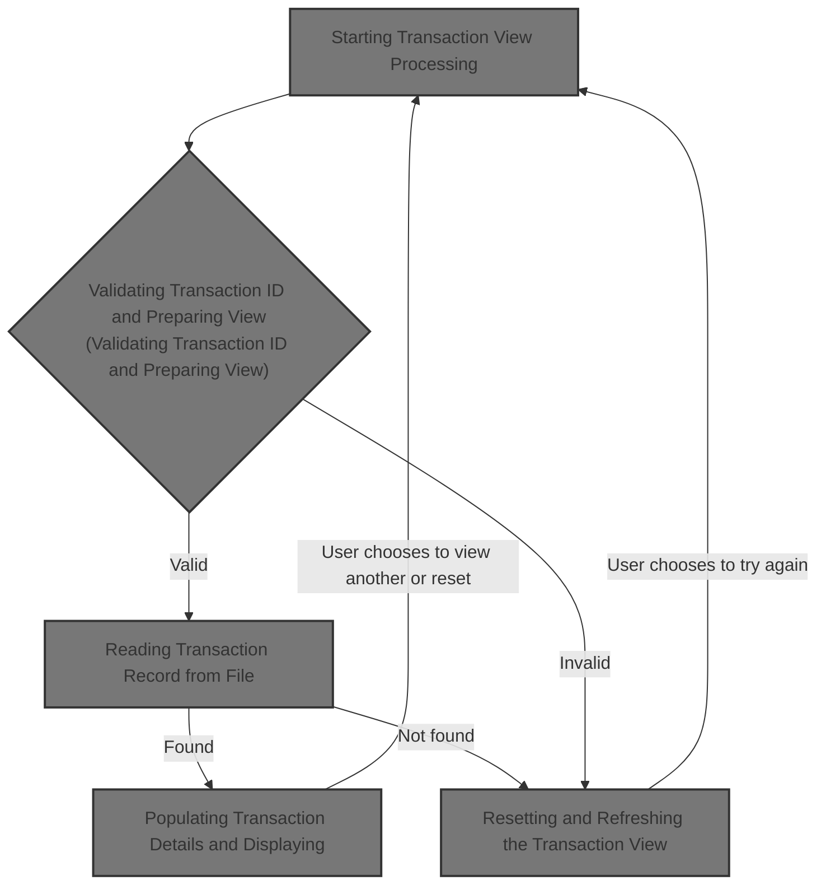

## Dependencies

### Programs

- COTRN01C (app/cbl/COTRN01C.cbl)
- CT01
- COMEN01C (app/cbl/COMEN01C.cbl)
- CM00
- COSGN00C (app/cbl/COSGN00C.cbl)
- CDEMO-FROM-PROGRAM
- COTRN00C (app/cbl/COTRN00C.cbl)
- CT00

### Copybooks

- COCOM01Y (app/cpy/COCOM01Y.cpy)
- COMEN02Y (app/cpy/COMEN02Y.cpy)
- COMEN01 (app/cpy-bms/COMEN01.CPY)
- COTTL01Y (app/cpy/COTTL01Y.cpy)
- CSDAT01Y (app/cpy/CSDAT01Y.cpy)
- CSMSG01Y (app/cpy/CSMSG01Y.cpy)
- CSUSR01Y (app/cpy/CSUSR01Y.cpy)
- DFHAID
- DFHBMSCA
- COTRN00 (app/cpy-bms/COTRN00.CPY)
- CVTRA05Y (app/cpy/CVTRA05Y.cpy)
- COTRN01 (app/cpy-bms/COTRN01.CPY)

# Where is this program used?

This program is used once, as represented in the following diagram:

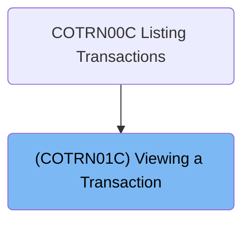

## Input and Output Tables/Files used in the Program

| Table / File Name | Type | Description                                  | Usage Mode | Key Fields / Layout Highlights |
| ----------------- | ---- | -------------------------------------------- | ---------- | ------------------------------ |
| WS-TRANSACT-FILE  | File | Credit card transaction records for CardDemo | Input      | File resource                  |

&nbsp;

# Workflow

# Starting Transaction View Processing

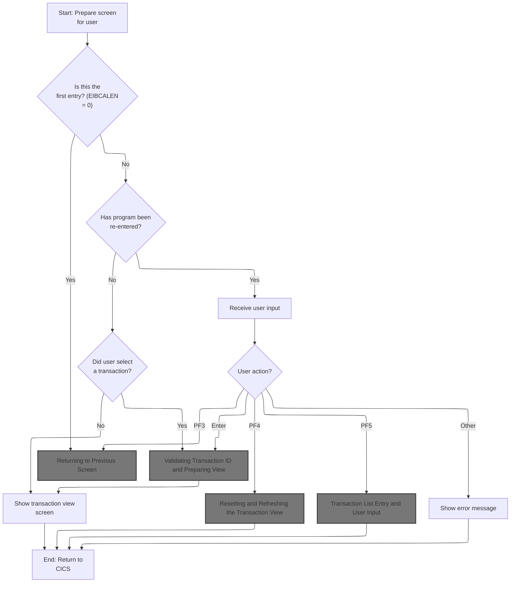

This section governs the initialization and navigation logic for the transaction view screen, ensuring users are presented with a clean interface, redirected appropriately based on input, and informed of invalid actions.

| Rule ID | Code Location | Category       | Rule Name                                | Description                                                                                                                                                                             | Conditions                                                                                                                  | Remarks                                                                                                                                                                                                              |
| ------- | ------------- | -------------- | ---------------------------------------- | --------------------------------------------------------------------------------------------------------------------------------------------------------------------------------------- | --------------------------------------------------------------------------------------------------------------------------- | -------------------------------------------------------------------------------------------------------------------------------------------------------------------------------------------------------------------- |
| BR-001  | MAIN-PARA     | Business logic | Screen state initialization              | When the transaction view screen is initialized, any previous error flags and user-modified indicators are reset, and the message area is cleared to ensure a clean state for the user. | Whenever the transaction view logic is started.                                                                             | Error flag is set to 'N' (off), user-modified indicator is set to 'N' (no), and the message area is cleared to spaces. These are internal representations but result in no error or message being shown to the user. |
| BR-002  | MAIN-PARA     | Business logic | Return to previous screen on empty input | If the user enters the transaction view and there is no input data, the system immediately returns the user to the previous screen, typically the signon screen.                        | When the input length is zero (EIBCALEN = 0) at entry to the transaction view.                                              | The next program is set to 'COSGN00C', indicating a return to the signon screen. This is a business outcome that ensures users without valid input are redirected appropriately.                                     |
| BR-003  | MAIN-PARA     | Error handling | Invalid key error message                | If the user presses an invalid key while on the transaction view screen, an error message is displayed to inform the user of the invalid action.                                        | When the user action does not match any recognized key (such as Enter, PF3, PF4, PF5) while on the transaction view screen. | The error message displayed is 'Invalid key pressed. Please see below...         ', which is a 50-character string shown to the user.                                                                                |

<SwmSnippet path="/app/cbl/COTRN01C.cbl" line="86" repo-id="Z2l0aHViJTNBJTNBa3luZHJ5bC1hd3MtbWFpbmZyYW1lLW1vZGVybml6YXRpb24tY2FyZGRlbW8lM0ElM0FTd2ltbS1EZW1v">

---

In `MAIN-PARA`, we kick off the transaction view logic by resetting error and user-modified flags, and clearing any message area. This sets up a clean state before checking if there's any input data (EIBCALEN). If there's no input, we prep for an immediate return to the signon screen. Otherwise, we move the input commarea into our working structure and continue with the transaction view logic.

```cobol
       MAIN-PARA.

           SET ERR-FLG-OFF     TO TRUE
           SET USR-MODIFIED-NO TO TRUE

           MOVE SPACES TO WS-MESSAGE
                          ERRMSGO OF COTRN1AO
```

---

</SwmSnippet>

<SwmSnippet path="/app/cbl/COTRN01C.cbl" line="94" repo-id="Z2l0aHViJTNBJTNBa3luZHJ5bC1hd3MtbWFpbmZyYW1lLW1vZGVybml6YXRpb24tY2FyZGRlbW8lM0ElM0FTd2ltbS1EZW1v">

---

Here we check if EIBCALEN is zero. If it is, we set up the next program as 'COSGN00C' and call RETURN-TO-PREV-SCREEN to bail out and hand control back to the signon screen logic.

```cobol
           IF EIBCALEN = 0
               MOVE 'COSGN00C' TO CDEMO-TO-PROGRAM
               PERFORM RETURN-TO-PREV-SCREEN
```

---

</SwmSnippet>

## Returning to Previous Screen

This section manages the logic for returning to the previous screen in the CardDemo application, ensuring a valid transition and continuity of user context.

| Rule ID | Code Location         | Category       | Rule Name                            | Description                                                                                                                                                                    | Conditions                                                                     | Remarks                                                                                                                                                                                             |
| ------- | --------------------- | -------------- | ------------------------------------ | ------------------------------------------------------------------------------------------------------------------------------------------------------------------------------ | ------------------------------------------------------------------------------ | --------------------------------------------------------------------------------------------------------------------------------------------------------------------------------------------------- |
| BR-001  | RETURN-TO-PREV-SCREEN | Business logic | Default previous program fallback    | If the target program name for returning to the previous screen is empty or uninitialized, it must be set to 'COSGN00C (Signon Screen Handling)' to ensure a valid transition. | The target program name is either empty or contains only uninitialized values. | The default program name used is 'COSGN00C', which is an 8-character alphanumeric string.                                                                                                           |
| BR-002  | RETURN-TO-PREV-SCREEN | Business logic | Update source context for transition | When returning to the previous screen, the communication area must be updated to reflect the current transaction and program as the source for the transition.                 | A return to the previous screen is initiated.                                  | The source transaction identifier is a 4-character alphanumeric string; the source program identifier is an 8-character alphanumeric string.                                                        |
| BR-003  | RETURN-TO-PREV-SCREEN | Business logic | Reset program context on return      | Before transferring control to the previous program, the program context must be reset to indicate a fresh entry.                                                              | A return to the previous screen is initiated.                                  | The program context is reset to zero, indicating a fresh entry. This is a single-digit numeric field.                                                                                               |
| BR-004  | RETURN-TO-PREV-SCREEN | Business logic | Pass context to next program         | When returning to the previous screen, all relevant context information must be passed to the next program to ensure continuity of user experience.                            | A return to the previous screen is initiated.                                  | All fields in the communication area are passed to the next program. The format includes transaction and program identifiers, user information, account and card details, and other context fields. |

<SwmSnippet path="/app/cbl/COTRN01C.cbl" line="197" repo-id="Z2l0aHViJTNBJTNBa3luZHJ5bC1hd3MtbWFpbmZyYW1lLW1vZGVybml6YXRpb24tY2FyZGRlbW8lM0ElM0FTd2ltbS1EZW1v">

---

In `RETURN-TO-PREV-SCREEN`, we check if the target program name is empty or uninitialized. If so, we set it to 'COSGN00C' to make sure we always transfer control to a valid program.

```cobol
       RETURN-TO-PREV-SCREEN.

           IF CDEMO-TO-PROGRAM = LOW-VALUES OR SPACES
               MOVE 'COSGN00C' TO CDEMO-TO-PROGRAM
           END-IF
```

---

</SwmSnippet>

<SwmSnippet path="/app/cbl/COTRN01C.cbl" line="202" repo-id="Z2l0aHViJTNBJTNBa3luZHJ5bC1hd3MtbWFpbmZyYW1lLW1vZGVybml6YXRpb24tY2FyZGRlbW8lM0ElM0FTd2ltbS1EZW1v">

---

Here we set the source transaction and program fields, reset the program context, and call XCTL to transfer control to the next program, passing the commarea so the next program has all the context it needs.

```cobol
           MOVE WS-TRANID    TO CDEMO-FROM-TRANID
           MOVE WS-PGMNAME   TO CDEMO-FROM-PROGRAM
           MOVE ZEROS        TO CDEMO-PGM-CONTEXT
           EXEC CICS
               XCTL PROGRAM(CDEMO-TO-PROGRAM)
               COMMAREA(CARDDEMO-COMMAREA)
           END-EXEC.
```

---

</SwmSnippet>

## Main Menu Entry and User Input

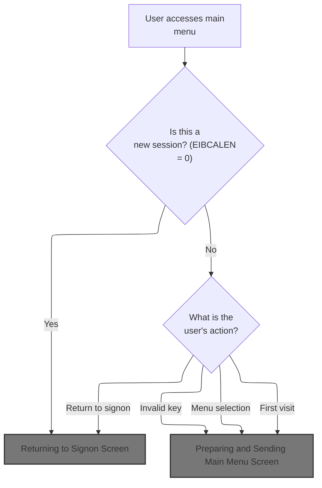

This section governs the entry to the main menu of the CardDemo application, determining whether to present the menu, return to signon, or display error messages based on session state and user input.

| Rule ID | Code Location | Category        | Rule Name                     | Description                                                                                                                                | Conditions                                                                                                   | Remarks                                                                                                                                                             |
| ------- | ------------- | --------------- | ----------------------------- | ------------------------------------------------------------------------------------------------------------------------------------------ | ------------------------------------------------------------------------------------------------------------ | ------------------------------------------------------------------------------------------------------------------------------------------------------------------- |
| BR-001  | MAIN-PARA     | Data validation | Menu Entry Error State Reset  | Whenever the main menu is entered, the error flag and message fields are reset to their default values.                                    | Each time MAIN-PARA is entered.                                                                              | The error flag is set to 'N'. The message field is set to spaces (80 characters).                                                                                   |
| BR-002  | MAIN-PARA     | Business logic  | New Session Signon Redirect   | If the session is new (no input data is present), the user is routed to the signon screen.                                                 | The communication area length is zero (EIBCALEN = 0).                                                        | The signon program name is 'COSGN00C'. The communication area is empty in this scenario.                                                                            |
| BR-003  | MAIN-PARA     | Business logic  | First Visit Menu Presentation | If the session is ongoing and this is the user's first visit to the menu, the main menu screen is presented.                               | The communication area is present (EIBCALEN > 0) and the program reenter flag is not set.                    | The main menu screen is presented with all fields initialized to default (low values).                                                                              |
| BR-004  | MAIN-PARA     | Business logic  | Menu Selection Processing     | If the user presses the Enter key on the main menu, the system processes the menu selection.                                               | The session is ongoing, the program reenter flag is set, and the user pressed the Enter key.                 | The system processes the user's menu selection according to the business logic defined in the menu processing routine.                                              |
| BR-005  | MAIN-PARA     | Business logic  | Return to Signon on PF3       | If the user presses the PF3 key, the user is routed back to the signon screen.                                                             | The session is ongoing, the program reenter flag is set, and the user pressed the PF3 key.                   | The signon program name is 'COSGN00C'.                                                                                                                              |
| BR-006  | MAIN-PARA     | Error handling  | Invalid Key Error Handling    | If the user presses any key other than Enter or PF3, an error flag is set and an invalid key message is displayed on the main menu screen. | The session is ongoing, the program reenter flag is set, and the user pressed a key other than Enter or PF3. | The error flag is set to 'Y'. The error message displayed is 'Invalid key pressed. Please see below...         ' (50 characters, left-aligned, padded with spaces). |

<SwmSnippet path="/app/cbl/COMEN01C.cbl" line="75" repo-id="Z2l0aHViJTNBJTNBa3luZHJ5bC1hd3MtbWFpbmZyYW1lLW1vZGVybml6YXRpb24tY2FyZGRlbW8lM0ElM0FTd2ltbS1EZW1v">

---

`MAIN-PARA` in COMEN01C.cbl checks if there's any input data. If not, it sets up for a return to signon. If there is, it moves the commarea, checks if we're reentering, and either sends the menu or processes user input based on the key pressed.

```cobol
       MAIN-PARA.

           SET ERR-FLG-OFF TO TRUE

           MOVE SPACES TO WS-MESSAGE
                          ERRMSGO OF COMEN1AO

           IF EIBCALEN = 0
               MOVE 'COSGN00C' TO CDEMO-FROM-PROGRAM
               PERFORM RETURN-TO-SIGNON-SCREEN
           ELSE
               MOVE DFHCOMMAREA(1:EIBCALEN) TO CARDDEMO-COMMAREA
               IF NOT CDEMO-PGM-REENTER
                   SET CDEMO-PGM-REENTER    TO TRUE
                   MOVE LOW-VALUES          TO COMEN1AO
                   PERFORM SEND-MENU-SCREEN
               ELSE
                   PERFORM RECEIVE-MENU-SCREEN
                   EVALUATE EIBAID
                       WHEN DFHENTER
                           PERFORM PROCESS-ENTER-KEY
                       WHEN DFHPF3
                           MOVE 'COSGN00C' TO CDEMO-TO-PROGRAM
                           PERFORM RETURN-TO-SIGNON-SCREEN
                       WHEN OTHER
                           MOVE 'Y'                       TO WS-ERR-FLG
                           MOVE CCDA-MSG-INVALID-KEY      TO WS-MESSAGE
                           PERFORM SEND-MENU-SCREEN
                   END-EVALUATE
               END-IF
           END-IF

           EXEC CICS RETURN
                     TRANSID (WS-TRANID)
                     COMMAREA (CARDDEMO-COMMAREA)
           END-EXEC.
```

---

</SwmSnippet>

### Returning to Signon Screen

This section determines the next program to transfer control to when returning to the signon screen, ensuring a default handler is used if none is specified.

| Rule ID | Code Location           | Category       | Rule Name                        | Description                                                                                                                                      | Conditions                                                                          | Remarks                                                                                                              |
| ------- | ----------------------- | -------------- | -------------------------------- | ------------------------------------------------------------------------------------------------------------------------------------------------ | ----------------------------------------------------------------------------------- | -------------------------------------------------------------------------------------------------------------------- |
| BR-001  | RETURN-TO-SIGNON-SCREEN | Business logic | Default to Signon Handler        | If the next program field is empty or contains only low values or spaces, the system must default to the signon handler program.                 | The next program field is empty, contains only spaces, or contains only low values. | The default signon handler program is 'COSGN00C', which is an 8-character alphanumeric string.                       |
| BR-002  | RETURN-TO-SIGNON-SCREEN | Business logic | Transfer Control to Next Program | The system must transfer control to the program specified in the next program field, whether it was set previously or defaulted in this section. | The next program field contains a valid program name.                               | The program name is an 8-character alphanumeric string. The transfer is performed using a program control mechanism. |

<SwmSnippet path="/app/cbl/COMEN01C.cbl" line="170" repo-id="Z2l0aHViJTNBJTNBa3luZHJ5bC1hd3MtbWFpbmZyYW1lLW1vZGVybml6YXRpb24tY2FyZGRlbW8lM0ElM0FTd2ltbS1EZW1v">

---

In `RETURN-TO-SIGNON-SCREEN`, we check if the next program is set. If not, we default to the signon handler and use XCTL to jump there.

```cobol
       RETURN-TO-SIGNON-SCREEN.

           IF CDEMO-TO-PROGRAM = LOW-VALUES OR SPACES
               MOVE 'COSGN00C' TO CDEMO-TO-PROGRAM
           END-IF
           EXEC CICS
               XCTL PROGRAM(CDEMO-TO-PROGRAM)
           END-EXEC.
```

---

</SwmSnippet>

### Signon Screen Display and Input

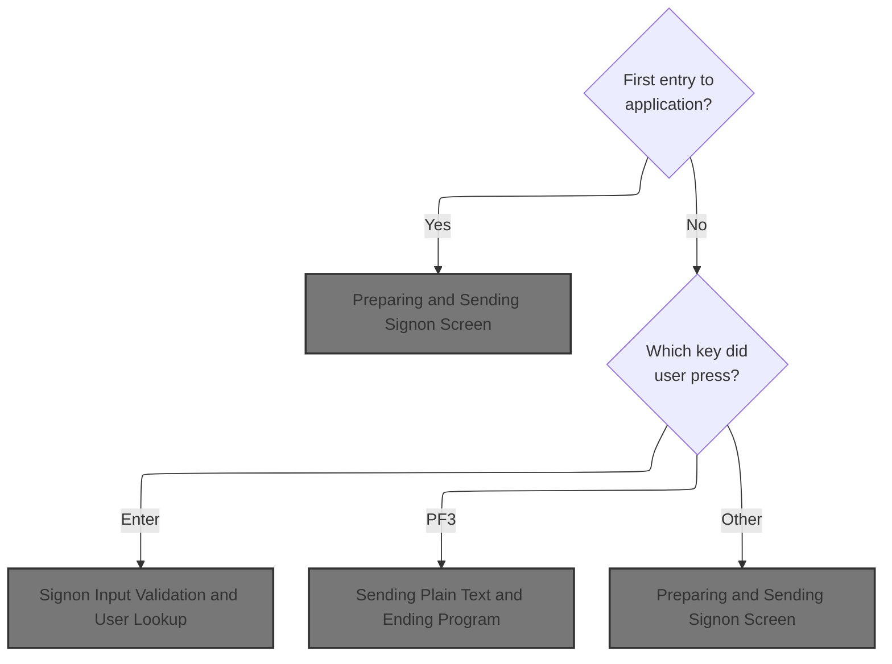

This section manages the display and input handling for the signon screen in the CardDemo application, determining what the user sees based on their actions and providing appropriate feedback or error messages.

| Rule ID | Code Location | Category       | Rule Name                          | Description                                                                                                                                               | Conditions                                                                                    | Remarks                                                                                                                                                                                         |
| ------- | ------------- | -------------- | ---------------------------------- | --------------------------------------------------------------------------------------------------------------------------------------------------------- | --------------------------------------------------------------------------------------------- | ----------------------------------------------------------------------------------------------------------------------------------------------------------------------------------------------- |
| BR-001  | MAIN-PARA     | Business logic | Fresh signon screen on first entry | When the application is first entered and no input is present, the signon screen is cleared and prepared for a fresh signon attempt.                      | Triggered when the input length is zero (EIBCALEN = 0).                                       | The signon screen is cleared by setting all fields to their lowest possible values. The user ID field is set to -1 to indicate no user is present. No error message is displayed at this point. |
| BR-002  | MAIN-PARA     | Business logic | Signon validation on Enter key     | When the user presses the Enter key, the application initiates signon input validation and user lookup.                                                   | Triggered when the input length is not zero and the key pressed is Enter (EIBAID = DFHENTER). | This rule triggers the signon validation and user lookup process. The specifics of validation and lookup are handled in the PROCESS-ENTER-KEY paragraph, not shown here.                        |
| BR-003  | MAIN-PARA     | Business logic | Thank you message on PF3 key       | When the user presses the PF3 key, the application displays a thank you message and ends the session.                                                     | Triggered when the input length is not zero and the key pressed is PF3 (EIBAID = DFHPF3).     | The thank you message is 'Thank you for using CardDemo application...      ' (50 characters, left aligned, padded with spaces).                                                                 |
| BR-004  | MAIN-PARA     | Error handling | Invalid key error message          | When the user presses any key other than Enter or PF3, the application displays an error message indicating an invalid key press and sets the error flag. | Triggered when the input length is not zero and the key pressed is not Enter or PF3.          | The error message is 'Invalid key pressed. Please see below...         ' (50 characters, left aligned, padded with spaces). The error flag is set to 'Y'.                                       |

<SwmSnippet path="/app/cbl/COSGN00C.cbl" line="73" repo-id="Z2l0aHViJTNBJTNBa3luZHJ5bC1hd3MtbWFpbmZyYW1lLW1vZGVybml6YXRpb24tY2FyZGRlbW8lM0ElM0FTd2ltbS1EZW1v">

---

`MAIN-PARA` in COSGN00C.cbl handles the signon screen. If there's no input, it clears the screen and sets up for a fresh signon. If there's input, it branches based on the key pressed: enter triggers signon validation, PF3 shows a thank you, anything else shows an error.

```cobol
       MAIN-PARA.

           SET ERR-FLG-OFF TO TRUE

           MOVE SPACES TO WS-MESSAGE
                          ERRMSGO OF COSGN0AO

           IF EIBCALEN = 0
               MOVE LOW-VALUES TO COSGN0AO
               MOVE -1       TO USERIDL OF COSGN0AI
               PERFORM SEND-SIGNON-SCREEN
           ELSE
               EVALUATE EIBAID
                   WHEN DFHENTER
                       PERFORM PROCESS-ENTER-KEY
                   WHEN DFHPF3
                       MOVE CCDA-MSG-THANK-YOU        TO WS-MESSAGE
                       PERFORM SEND-PLAIN-TEXT
                   WHEN OTHER
                       MOVE 'Y'                       TO WS-ERR-FLG
                       MOVE CCDA-MSG-INVALID-KEY      TO WS-MESSAGE
                       PERFORM SEND-SIGNON-SCREEN
               END-EVALUATE
           END-IF.

           EXEC CICS RETURN
                     TRANSID (WS-TRANID)
                     COMMAREA (CARDDEMO-COMMAREA)
                     LENGTH(LENGTH OF CARDDEMO-COMMAREA)
           END-EXEC.
```

---

</SwmSnippet>

#### Preparing and Sending Signon Screen

This section prepares and sends the signon screen to the user, ensuring the header is populated with current system information and any error message is displayed.

| Rule ID | Code Location        | Category       | Rule Name                            | Description                                                                                                          | Conditions                                      | Remarks                                                                                                                                                                             |
| ------- | -------------------- | -------------- | ------------------------------------ | -------------------------------------------------------------------------------------------------------------------- | ----------------------------------------------- | ----------------------------------------------------------------------------------------------------------------------------------------------------------------------------------- |
| BR-001  | POPULATE-HEADER-INFO | Business logic | Current date and time display        | The signon screen header must display the current date and time, as retrieved at the moment the screen is prepared.  | Whenever the signon screen is sent to the user. | Date is formatted as MM-DD-YY and time as HH-MM-SS. These are alphanumeric strings, with month, day, year, hour, minute, and second components extracted from the system date/time. |
| BR-002  | POPULATE-HEADER-INFO | Business logic | Program and transaction name display | The signon screen must display the program name and transaction name in the header.                                  | Whenever the signon screen is sent to the user. | Program name is an 8-character string ('COSGN00C'), transaction name is a 4-character string ('CC00'). Both are left-aligned alphanumeric fields.                                   |
| BR-003  | POPULATE-HEADER-INFO | Business logic | Application and system ID display    | The signon screen must display the application ID and system ID in the header, as assigned by the system at runtime. | Whenever the signon screen is sent to the user. | Application ID and system ID are assigned by the system and displayed as alphanumeric strings in the header.                                                                        |
| BR-004  | POPULATE-HEADER-INFO | Business logic | Screen title display                 | The signon screen must display the screen titles in the header, using predefined title strings.                      | Whenever the signon screen is sent to the user. | Title01 and Title02 are predefined alphanumeric strings, displayed in the header.                                                                                                   |
| BR-005  | SEND-SIGNON-SCREEN   | Error handling | Error message display                | The signon screen must display an error message if one is present; otherwise, the error message field is blank.      | Whenever the signon screen is sent to the user. | Error message is an 80-character alphanumeric string. If no error is present, the field contains spaces.                                                                            |

<SwmSnippet path="/app/cbl/COSGN00C.cbl" line="145" repo-id="Z2l0aHViJTNBJTNBa3luZHJ5bC1hd3MtbWFpbmZyYW1lLW1vZGVybml6YXRpb24tY2FyZGRlbW8lM0ElM0FTd2ltbS1EZW1v">

---

`SEND-SIGNON-SCREEN` sets up the header, clears or sets the error message, and sends the signon screen to the user using CICS SEND with ERASE and CURSOR.

```cobol
       SEND-SIGNON-SCREEN.

           PERFORM POPULATE-HEADER-INFO

           MOVE WS-MESSAGE TO ERRMSGO OF COSGN0AO

           EXEC CICS SEND
                     MAP('COSGN0A')
                     MAPSET('COSGN00')
                     FROM(COSGN0AO)
                     ERASE
                     CURSOR
           END-EXEC.
```

---

</SwmSnippet>

<SwmSnippet path="/app/cbl/COSGN00C.cbl" line="177" repo-id="Z2l0aHViJTNBJTNBa3luZHJ5bC1hd3MtbWFpbmZyYW1lLW1vZGVybml6YXRpb24tY2FyZGRlbW8lM0ElM0FTd2ltbS1EZW1v">

---

`POPULATE-HEADER-INFO` grabs the current date and time, sets up the screen titles, transaction and program names, and fetches the application and system IDs for the header.

```cobol
       POPULATE-HEADER-INFO.

           MOVE FUNCTION CURRENT-DATE  TO WS-CURDATE-DATA

           MOVE CCDA-TITLE01           TO TITLE01O OF COSGN0AO
           MOVE CCDA-TITLE02           TO TITLE02O OF COSGN0AO
           MOVE WS-TRANID              TO TRNNAMEO OF COSGN0AO
           MOVE WS-PGMNAME             TO PGMNAMEO OF COSGN0AO

           MOVE WS-CURDATE-MONTH       TO WS-CURDATE-MM
           MOVE WS-CURDATE-DAY         TO WS-CURDATE-DD
           MOVE WS-CURDATE-YEAR(3:2)   TO WS-CURDATE-YY

           MOVE WS-CURDATE-MM-DD-YY    TO CURDATEO OF COSGN0AO

           MOVE WS-CURTIME-HOURS       TO WS-CURTIME-HH
           MOVE WS-CURTIME-MINUTE      TO WS-CURTIME-MM
           MOVE WS-CURTIME-SECOND      TO WS-CURTIME-SS

           MOVE WS-CURTIME-HH-MM-SS    TO CURTIMEO OF COSGN0AO

           EXEC CICS ASSIGN
               APPLID(APPLIDO OF COSGN0AO)
           END-EXEC

           EXEC CICS ASSIGN
               SYSID(SYSIDO OF COSGN0AO)
           END-EXEC.
```

---

</SwmSnippet>

#### Signon Input Validation and User Lookup

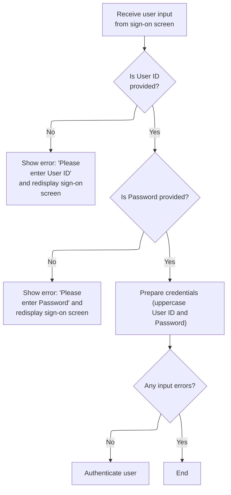

This section validates user input from the sign-on screen, displays error messages for missing fields, normalizes credentials, and triggers user authentication lookup if validation passes.

| Rule ID | Code Location     | Category        | Rule Name                | Description                                                                                                                                                                              | Conditions                                                                            | Remarks                                                                                                                                                                                      |
| ------- | ----------------- | --------------- | ------------------------ | ---------------------------------------------------------------------------------------------------------------------------------------------------------------------------------------- | ------------------------------------------------------------------------------------- | -------------------------------------------------------------------------------------------------------------------------------------------------------------------------------------------- |
| BR-001  | PROCESS-ENTER-KEY | Data validation | User ID required         | If the User ID field is empty or contains only spaces or low-values, the system displays an error message prompting the user to enter their User ID and redisplays the sign-on screen.   | User ID input is empty, contains only spaces, or contains only low-values.            | Error message displayed: 'Please enter User ID ...'. The User ID field is expected to be an alphanumeric string up to 8 characters. The sign-on screen is redisplayed for user correction.   |
| BR-002  | PROCESS-ENTER-KEY | Data validation | Password required        | If the Password field is empty or contains only spaces or low-values, the system displays an error message prompting the user to enter their Password and redisplays the sign-on screen. | Password input is empty, contains only spaces, or contains only low-values.           | Error message displayed: 'Please enter Password ...'. The Password field is expected to be an alphanumeric string up to 8 characters. The sign-on screen is redisplayed for user correction. |
| BR-003  | PROCESS-ENTER-KEY | Business logic  | Credential normalization | When both User ID and Password are provided, the system converts both inputs to uppercase before proceeding with authentication.                                                         | User ID and Password inputs are present and valid (not empty, spaces, or low-values). | User ID and Password are converted to uppercase. Both fields are expected to be alphanumeric strings up to 8 characters. The normalized credentials are used for authentication lookup.      |
| BR-004  | PROCESS-ENTER-KEY | Business logic  | Authentication trigger   | If no input errors are detected after validation, the system proceeds to authenticate the user by looking up the credentials.                                                            | No input errors are present after validation (error flag is not set).                 | Authentication is performed using the normalized (uppercased) User ID and Password. The lookup is triggered only if both fields are valid.                                                   |

<SwmSnippet path="/app/cbl/COSGN00C.cbl" line="108" repo-id="Z2l0aHViJTNBJTNBa3luZHJ5bC1hd3MtbWFpbmZyYW1lLW1vZGVybml6YXRpb24tY2FyZGRlbW8lM0ElM0FTd2ltbS1EZW1v">

---

`PROCESS-ENTER-KEY` receives user input, checks for missing User ID or Password, sets error messages if needed, converts input to uppercase, and if all is good, calls READ-USER-SEC-FILE to look up the user.

```cobol
       PROCESS-ENTER-KEY.

           EXEC CICS RECEIVE
                     MAP('COSGN0A')
                     MAPSET('COSGN00')
                     RESP(WS-RESP-CD)
                     RESP2(WS-REAS-CD)
           END-EXEC.

           EVALUATE TRUE
               WHEN USERIDI OF COSGN0AI = SPACES OR LOW-VALUES
                   MOVE 'Y'      TO WS-ERR-FLG
                   MOVE 'Please enter User ID ...' TO WS-MESSAGE
                   MOVE -1       TO USERIDL OF COSGN0AI
                   PERFORM SEND-SIGNON-SCREEN
               WHEN PASSWDI OF COSGN0AI = SPACES OR LOW-VALUES
                   MOVE 'Y'      TO WS-ERR-FLG
                   MOVE 'Please enter Password ...' TO WS-MESSAGE
                   MOVE -1       TO PASSWDL OF COSGN0AI
                   PERFORM SEND-SIGNON-SCREEN
               WHEN OTHER
                   CONTINUE
           END-EVALUATE.

           MOVE FUNCTION UPPER-CASE(USERIDI OF COSGN0AI) TO
                           WS-USER-ID
                           CDEMO-USER-ID
           MOVE FUNCTION UPPER-CASE(PASSWDI OF COSGN0AI) TO
                           WS-USER-PWD

           IF NOT ERR-FLG-ON
               PERFORM READ-USER-SEC-FILE
           END-IF.
```

---

</SwmSnippet>

#### User Authentication and Routing

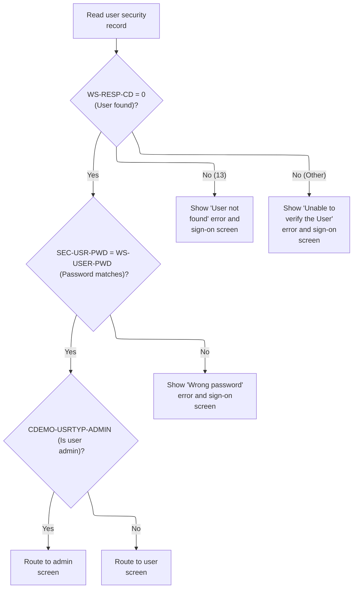

This section authenticates users by validating their credentials against a security file and routes them to the appropriate interface based on their access level. It also handles error scenarios by displaying specific messages and redisplaying the sign-on screen.

| Rule ID | Code Location      | Category       | Rule Name                   | Description                                                                                                                                                                                    | Conditions                                                                                               | Remarks                                                                                                       |
| ------- | ------------------ | -------------- | --------------------------- | ---------------------------------------------------------------------------------------------------------------------------------------------------------------------------------------------- | -------------------------------------------------------------------------------------------------------- | ------------------------------------------------------------------------------------------------------------- |
| BR-001  | READ-USER-SEC-FILE | Business logic | Admin user routing          | If the user ID is found and the password matches, the user is routed to the admin screen if their user type is 'A'.                                                                            | The user security record is found (response code 0), the password matches, and the user type is 'A'.     | Admin user type is represented by the value 'A'. The admin program routed to is 'COADM01C'.                   |
| BR-002  | READ-USER-SEC-FILE | Business logic | Regular user routing        | If the user ID is found and the password matches, the user is routed to the main menu screen if their user type is not 'A'.                                                                    | The user security record is found (response code 0), the password matches, and the user type is not 'A'. | Regular user type is any value other than 'A' (typically 'U'). The main menu program routed to is 'COMEN01C'. |
| BR-003  | READ-USER-SEC-FILE | Error handling | Wrong password error        | If the user ID is found but the password does not match, an error message 'Wrong Password. Try again ...' is displayed and the sign-on screen is redisplayed.                                  | The user security record is found (response code 0), but the password does not match.                    | The error message displayed is 'Wrong Password. Try again ...'. The sign-on screen is redisplayed.            |
| BR-004  | READ-USER-SEC-FILE | Error handling | User not found error        | If the user ID is not found (response code 13), an error message 'User not found. Try again ...' is displayed and the sign-on screen is redisplayed.                                           | The user security record is not found (response code 13).                                                | The error message displayed is 'User not found. Try again ...'. The sign-on screen is redisplayed.            |
| BR-005  | READ-USER-SEC-FILE | Error handling | Technical user lookup error | If the user lookup fails for any reason other than not found (response code not 0 or 13), an error message 'Unable to verify the User ...' is displayed and the sign-on screen is redisplayed. | The user security record lookup fails with a response code other than 0 or 13.                           | The error message displayed is 'Unable to verify the User ...'. The sign-on screen is redisplayed.            |

<SwmSnippet path="/app/cbl/COSGN00C.cbl" line="209" repo-id="Z2l0aHViJTNBJTNBa3luZHJ5bC1hd3MtbWFpbmZyYW1lLW1vZGVybml6YXRpb24tY2FyZGRlbW8lM0ElM0FTd2ltbS1EZW1v">

---

`READ-USER-SEC-FILE` reads the user record, checks the password, and routes the user to either the admin or main menu program. If anything fails, it sets the right error message and redisplays the signon screen.

```cobol
       READ-USER-SEC-FILE.

           EXEC CICS READ
                DATASET   (WS-USRSEC-FILE)
                INTO      (SEC-USER-DATA)
                LENGTH    (LENGTH OF SEC-USER-DATA)
                RIDFLD    (WS-USER-ID)
                KEYLENGTH (LENGTH OF WS-USER-ID)
                RESP      (WS-RESP-CD)
                RESP2     (WS-REAS-CD)
           END-EXEC.

           EVALUATE WS-RESP-CD
               WHEN 0
                   IF SEC-USR-PWD = WS-USER-PWD
                       MOVE WS-TRANID    TO CDEMO-FROM-TRANID
                       MOVE WS-PGMNAME   TO CDEMO-FROM-PROGRAM
                       MOVE WS-USER-ID   TO CDEMO-USER-ID
                       MOVE SEC-USR-TYPE TO CDEMO-USER-TYPE
                       MOVE ZEROS        TO CDEMO-PGM-CONTEXT

                       IF CDEMO-USRTYP-ADMIN
                            EXEC CICS XCTL
                              PROGRAM ('COADM01C')
                              COMMAREA(CARDDEMO-COMMAREA)
                            END-EXEC
                       ELSE
                            EXEC CICS XCTL
                              PROGRAM ('COMEN01C')
                              COMMAREA(CARDDEMO-COMMAREA)
                            END-EXEC
                       END-IF
                   ELSE
                       MOVE 'Wrong Password. Try again ...' TO
                                                          WS-MESSAGE
                       MOVE -1       TO PASSWDL OF COSGN0AI
                       PERFORM SEND-SIGNON-SCREEN
                   END-IF
               WHEN 13
                   MOVE 'Y'      TO WS-ERR-FLG
                   MOVE 'User not found. Try again ...' TO WS-MESSAGE
                   MOVE -1       TO USERIDL OF COSGN0AI
                   PERFORM SEND-SIGNON-SCREEN
               WHEN OTHER
                   MOVE 'Y'      TO WS-ERR-FLG
                   MOVE 'Unable to verify the User ...' TO WS-MESSAGE
                   MOVE -1       TO USERIDL OF COSGN0AI
                   PERFORM SEND-SIGNON-SCREEN
           END-EVALUATE.
```

---

</SwmSnippet>

#### Admin Menu Entry and User Input


This section governs the entry to the main menu of the CardDemo application, determining whether to present the menu, return to signon, or display error messages based on session state and user input.

| Rule ID | Code Location | Category        | Rule Name                     | Description                                                                                                                                | Conditions                                                                                                   | Remarks                                                                                                                                                             |
| ------- | ------------- | --------------- | ----------------------------- | ------------------------------------------------------------------------------------------------------------------------------------------ | ------------------------------------------------------------------------------------------------------------ | ------------------------------------------------------------------------------------------------------------------------------------------------------------------- |
| BR-001  | MAIN-PARA     | Data validation | Menu Entry Error State Reset  | Whenever the main menu is entered, the error flag and message fields are reset to their default values.                                    | Each time MAIN-PARA is entered.                                                                              | The error flag is set to 'N'. The message field is set to spaces (80 characters).                                                                                   |
| BR-002  | MAIN-PARA     | Business logic  | New Session Signon Redirect   | If the session is new (no input data is present), the user is routed to the signon screen.                                                 | The communication area length is zero (EIBCALEN = 0).                                                        | The signon program name is 'COSGN00C'. The communication area is empty in this scenario.                                                                            |
| BR-003  | MAIN-PARA     | Business logic  | First Visit Menu Presentation | If the session is ongoing and this is the user's first visit to the menu, the main menu screen is presented.                               | The communication area is present (EIBCALEN > 0) and the program reenter flag is not set.                    | The main menu screen is presented with all fields initialized to default (low values).                                                                              |
| BR-004  | MAIN-PARA     | Business logic  | Menu Selection Processing     | If the user presses the Enter key on the main menu, the system processes the menu selection.                                               | The session is ongoing, the program reenter flag is set, and the user pressed the Enter key.                 | The system processes the user's menu selection according to the business logic defined in the menu processing routine.                                              |
| BR-005  | MAIN-PARA     | Business logic  | Return to Signon on PF3       | If the user presses the PF3 key, the user is routed back to the signon screen.                                                             | The session is ongoing, the program reenter flag is set, and the user pressed the PF3 key.                   | The signon program name is 'COSGN00C'.                                                                                                                              |
| BR-006  | MAIN-PARA     | Error handling  | Invalid Key Error Handling    | If the user presses any key other than Enter or PF3, an error flag is set and an invalid key message is displayed on the main menu screen. | The session is ongoing, the program reenter flag is set, and the user pressed a key other than Enter or PF3. | The error flag is set to 'Y'. The error message displayed is 'Invalid key pressed. Please see below...         ' (50 characters, left-aligned, padded with spaces). |

<SwmSnippet path="/app/cbl/COADM01C.cbl" line="75" repo-id="Z2l0aHViJTNBJTNBa3luZHJ5bC1hd3MtbWFpbmZyYW1lLW1vZGVybml6YXRpb24tY2FyZGRlbW8lM0ElM0FTd2ltbS1EZW1v">

---

`MAIN-PARA` in COADM01C.cbl checks if there's any input data. If not, it sets up for a return to signon. If there is, it moves the commarea, checks if we're reentering, and either sends the admin menu or processes user input based on the key pressed.

```cobol
       MAIN-PARA.

           SET ERR-FLG-OFF TO TRUE

           MOVE SPACES TO WS-MESSAGE
                          ERRMSGO OF COADM1AO

           IF EIBCALEN = 0
               MOVE 'COSGN00C' TO CDEMO-FROM-PROGRAM
               PERFORM RETURN-TO-SIGNON-SCREEN
           ELSE
               MOVE DFHCOMMAREA(1:EIBCALEN) TO CARDDEMO-COMMAREA
               IF NOT CDEMO-PGM-REENTER
                   SET CDEMO-PGM-REENTER    TO TRUE
                   MOVE LOW-VALUES          TO COADM1AO
                   PERFORM SEND-MENU-SCREEN
               ELSE
                   PERFORM RECEIVE-MENU-SCREEN
                   EVALUATE EIBAID
                       WHEN DFHENTER
                           PERFORM PROCESS-ENTER-KEY
                       WHEN DFHPF3
                           MOVE 'COSGN00C' TO CDEMO-TO-PROGRAM
                           PERFORM RETURN-TO-SIGNON-SCREEN
                       WHEN OTHER
                           MOVE 'Y'                       TO WS-ERR-FLG
                           MOVE CCDA-MSG-INVALID-KEY      TO WS-MESSAGE
                           PERFORM SEND-MENU-SCREEN
                   END-EVALUATE
               END-IF
           END-IF

           EXEC CICS RETURN
                     TRANSID (WS-TRANID)
                     COMMAREA (CARDDEMO-COMMAREA)
           END-EXEC.
```

---

</SwmSnippet>

<SwmSnippet path="/app/cbl/COADM01C.cbl" line="160" repo-id="Z2l0aHViJTNBJTNBa3luZHJ5bC1hd3MtbWFpbmZyYW1lLW1vZGVybml6YXRpb24tY2FyZGRlbW8lM0ElM0FTd2ltbS1EZW1v">

---

In `RETURN-TO-SIGNON-SCREEN`, we check if the next program is set. If not, we default to the signon handler and use XCTL to jump there.

```cobol
       RETURN-TO-SIGNON-SCREEN.

           IF CDEMO-TO-PROGRAM = LOW-VALUES OR SPACES
               MOVE 'COSGN00C' TO CDEMO-TO-PROGRAM
           END-IF
           EXEC CICS
               XCTL PROGRAM(CDEMO-TO-PROGRAM)
           END-EXEC.
```

---

</SwmSnippet>

##### Preparing and Sending Admin Menu Screen

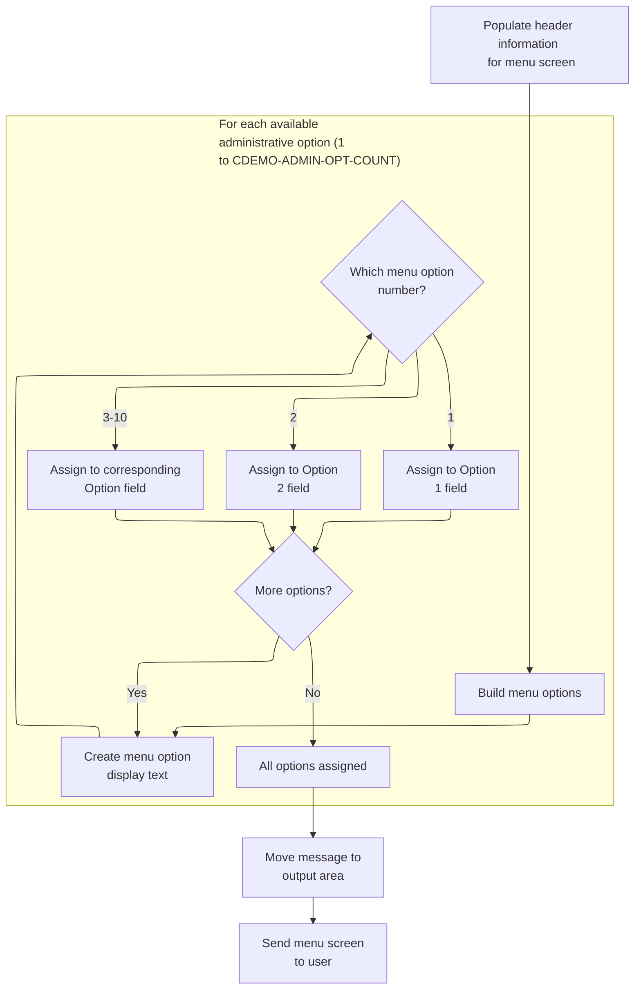

This section prepares and sends the administrative menu screen, ensuring the user sees the current header information, a numbered list of available admin options, any relevant message, and receives the completed screen for interaction.

| Rule ID | Code Location        | Category       | Rule Name                             | Description                                                                                                                                                                       | Conditions                                                                                 | Remarks                                                                                                                                                                                                                                                             |
| ------- | -------------------- | -------------- | ------------------------------------- | --------------------------------------------------------------------------------------------------------------------------------------------------------------------------------- | ------------------------------------------------------------------------------------------ | ------------------------------------------------------------------------------------------------------------------------------------------------------------------------------------------------------------------------------------------------------------------- |
| BR-001  | POPULATE-HEADER-INFO | Business logic | Header Information Population         | The header of the admin menu screen must display the current date, current time, the transaction name, the program name, and two title lines.                                     | Whenever the admin menu screen is prepared for display.                                    | The date is shown in MM-DD-YY format, the time in HH-MM-SS format. The transaction name is 4 characters, the program name is 8 characters, and each title line is as defined in the title constants. All fields are left-aligned in their respective display areas. |
| BR-002  | BUILD-MENU-OPTIONS   | Business logic | Menu Option Formatting and Assignment | Each available administrative menu option (up to 10) must be displayed as a numbered entry in the format: option number, period, space, option name (e.g., '1. User Management'). | For each available admin option, when preparing the admin menu screen.                     | Menu options are numbered 1 to 10. Each option is formatted as: \[number\]\[period\]\[space\]\[option name\], e.g., '2. System Settings'. Each option display field is 40 characters, left-aligned. Only up to 10 options are displayed.                            |
| BR-003  | SEND-MENU-SCREEN     | Business logic | Message Display                       | Any message present must be displayed in the designated message area of the admin menu screen.                                                                                    | When a message is present in the message variable at the time the menu screen is prepared. | The message area is 80 characters, left-aligned. If no message is present, the area is blank.                                                                                                                                                                       |
| BR-004  | SEND-MENU-SCREEN     | Technical step | Send Menu Screen                      | The completed admin menu screen, including header, options, and message, must be sent to the user for display.                                                                    | After the menu screen has been fully prepared.                                             | The screen sent includes all populated fields: header, up to 10 options, and the message area. The screen is erased before display to ensure no residual data is shown.                                                                                             |

<SwmSnippet path="/app/cbl/COADM01C.cbl" line="172" repo-id="Z2l0aHViJTNBJTNBa3luZHJ5bC1hd3MtbWFpbmZyYW1lLW1vZGVybml6YXRpb24tY2FyZGRlbW8lM0ElM0FTd2ltbS1EZW1v">

---

`SEND-MENU-SCREEN` sets up the header, builds the admin menu options, moves any message to the error field, and sends the admin menu screen to the user.

```cobol
       SEND-MENU-SCREEN.

           PERFORM POPULATE-HEADER-INFO
           PERFORM BUILD-MENU-OPTIONS

           MOVE WS-MESSAGE TO ERRMSGO OF COADM1AO

           EXEC CICS SEND
                     MAP('COADM1A')
                     MAPSET('COADM01')
                     FROM(COADM1AO)
                     ERASE
           END-EXEC.
```

---

</SwmSnippet>

<SwmSnippet path="/app/cbl/COADM01C.cbl" line="202" repo-id="Z2l0aHViJTNBJTNBa3luZHJ5bC1hd3MtbWFpbmZyYW1lLW1vZGVybml6YXRpb24tY2FyZGRlbW8lM0ElM0FTd2ltbS1EZW1v">

---

`POPULATE-HEADER-INFO` grabs the current date and time, sets up the screen titles, transaction and program names, and fills the header fields for the admin menu.

```cobol
       POPULATE-HEADER-INFO.

           MOVE FUNCTION CURRENT-DATE  TO WS-CURDATE-DATA

           MOVE CCDA-TITLE01           TO TITLE01O OF COADM1AO
           MOVE CCDA-TITLE02           TO TITLE02O OF COADM1AO
           MOVE WS-TRANID              TO TRNNAMEO OF COADM1AO
           MOVE WS-PGMNAME             TO PGMNAMEO OF COADM1AO

           MOVE WS-CURDATE-MONTH       TO WS-CURDATE-MM
           MOVE WS-CURDATE-DAY         TO WS-CURDATE-DD
           MOVE WS-CURDATE-YEAR(3:2)   TO WS-CURDATE-YY

           MOVE WS-CURDATE-MM-DD-YY    TO CURDATEO OF COADM1AO

           MOVE WS-CURTIME-HOURS       TO WS-CURTIME-HH
           MOVE WS-CURTIME-MINUTE      TO WS-CURTIME-MM
           MOVE WS-CURTIME-SECOND      TO WS-CURTIME-SS

           MOVE WS-CURTIME-HH-MM-SS    TO CURTIMEO OF COADM1AO.
```

---

</SwmSnippet>

<SwmSnippet path="/app/cbl/COADM01C.cbl" line="226" repo-id="Z2l0aHViJTNBJTNBa3luZHJ5bC1hd3MtbWFpbmZyYW1lLW1vZGVybml6YXRpb24tY2FyZGRlbW8lM0ElM0FTd2ltbS1EZW1v">

---

`BUILD-MENU-OPTIONS` loops through the admin options, builds formatted strings for each, and assigns them to the right output fields for display.

```cobol
       BUILD-MENU-OPTIONS.

           PERFORM VARYING WS-IDX FROM 1 BY 1 UNTIL
                           WS-IDX > CDEMO-ADMIN-OPT-COUNT

               MOVE SPACES             TO WS-ADMIN-OPT-TXT

               STRING CDEMO-ADMIN-OPT-NUM(WS-IDX)  DELIMITED BY SIZE
                      '. '                         DELIMITED BY SIZE
                      CDEMO-ADMIN-OPT-NAME(WS-IDX) DELIMITED BY SIZE
                 INTO WS-ADMIN-OPT-TXT

               EVALUATE WS-IDX
                   WHEN 1
                       MOVE WS-ADMIN-OPT-TXT TO OPTN001O
                   WHEN 2
                       MOVE WS-ADMIN-OPT-TXT TO OPTN002O
                   WHEN 3
                       MOVE WS-ADMIN-OPT-TXT TO OPTN003O
                   WHEN 4
                       MOVE WS-ADMIN-OPT-TXT TO OPTN004O
                   WHEN 5
                       MOVE WS-ADMIN-OPT-TXT TO OPTN005O
                   WHEN 6
                       MOVE WS-ADMIN-OPT-TXT TO OPTN006O
                   WHEN 7
                       MOVE WS-ADMIN-OPT-TXT TO OPTN007O
                   WHEN 8
                       MOVE WS-ADMIN-OPT-TXT TO OPTN008O
                   WHEN 9
                       MOVE WS-ADMIN-OPT-TXT TO OPTN009O
                   WHEN 10
                       MOVE WS-ADMIN-OPT-TXT TO OPTN010O
                   WHEN OTHER
                       CONTINUE
               END-EVALUATE

           END-PERFORM.
```

---

</SwmSnippet>

##### Receiving and Processing Admin Menu Input

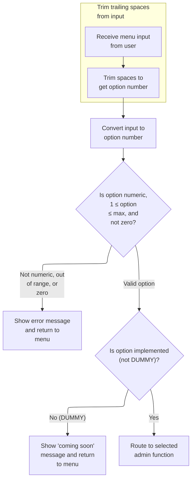

This section manages the reception and validation of admin menu input, ensuring users can only select valid and implemented options, and provides appropriate feedback for invalid or unimplemented selections.

| Rule ID | Code Location       | Category        | Rule Name                     | Description                                                                                                                                                                   | Conditions                                                                                                                         | Remarks                                                                                                                                                                                                                                        |
| ------- | ------------------- | --------------- | ----------------------------- | ----------------------------------------------------------------------------------------------------------------------------------------------------------------------------- | ---------------------------------------------------------------------------------------------------------------------------------- | ---------------------------------------------------------------------------------------------------------------------------------------------------------------------------------------------------------------------------------------------- |
| BR-001  | PROCESS-ENTER-KEY   | Data validation | Menu option validation        | If the entered menu option is not a number, is zero, or is greater than the maximum allowed option count, an error message is displayed and the user is returned to the menu. | The entered option is not numeric, or is zero, or exceeds the maximum allowed option count.                                        | The error message displayed is: 'Please enter a valid option number...'. The maximum allowed option count is determined by the value of CDEMO-ADMIN-OPT-COUNT. The option must be a number between 1 and the maximum allowed value, inclusive. |
| BR-002  | PROCESS-ENTER-KEY   | Business logic  | Unimplemented option handling | If the entered menu option is valid but not yet implemented, a 'coming soon' message is displayed and the user is returned to the menu.                                       | The entered option is valid but the corresponding program name starts with 'DUMMY'.                                                | The message displayed is: 'This option is coming soon ...'. The option name is included in the message. The check for implementation is based on the first five characters of the program name being 'DUMMY'.                                  |
| BR-003  | PROCESS-ENTER-KEY   | Business logic  | Admin function routing        | If the entered menu option is valid and implemented, the user is routed to the corresponding admin function.                                                                  | The entered option is numeric, within the allowed range, not zero, and the corresponding program name does not start with 'DUMMY'. | Routing is performed to the admin function associated with the selected option. The communication area is passed to the next program. No user-facing message is displayed in this case.                                                        |
| BR-004  | RECEIVE-MENU-SCREEN | Technical step  | Menu input reception          | The admin menu input is received from the terminal and response codes are captured for error handling.                                                                        | The admin menu screen is displayed and the user enters input.                                                                      | Input is received from the terminal using the admin menu screen. Response codes are captured for potential error handling. The input is stored for further processing.                                                                         |

<SwmSnippet path="/app/cbl/COADM01C.cbl" line="189" repo-id="Z2l0aHViJTNBJTNBa3luZHJ5bC1hd3MtbWFpbmZyYW1lLW1vZGVybml6YXRpb24tY2FyZGRlbW8lM0ElM0FTd2ltbS1EZW1v">

---

`RECEIVE-MENU-SCREEN` grabs the admin menu input from the terminal, using CICS RECEIVE and capturing response codes for error handling.

```cobol
       RECEIVE-MENU-SCREEN.

           EXEC CICS RECEIVE
                     MAP('COADM1A')
                     MAPSET('COADM01')
                     INTO(COADM1AI)
                     RESP(WS-RESP-CD)
                     RESP2(WS-REAS-CD)
           END-EXEC.
```

---

</SwmSnippet>

<SwmSnippet path="/app/cbl/COADM01C.cbl" line="115" repo-id="Z2l0aHViJTNBJTNBa3luZHJ5bC1hd3MtbWFpbmZyYW1lLW1vZGVybml6YXRpb24tY2FyZGRlbW8lM0ElM0FTd2ltbS1EZW1v">

---

`PROCESS-ENTER-KEY` scans the input option, trims spaces, zero-pads it, checks if it's valid, and either jumps to the selected admin program or shows a 'coming soon' message if the option isn't implemented.

```cobol
       PROCESS-ENTER-KEY.

           PERFORM VARYING WS-IDX
                   FROM LENGTH OF OPTIONI OF COADM1AI BY -1 UNTIL
                   OPTIONI OF COADM1AI(WS-IDX:1) NOT = SPACES OR
                   WS-IDX = 1
           END-PERFORM
           MOVE OPTIONI OF COADM1AI(1:WS-IDX) TO WS-OPTION-X
           INSPECT WS-OPTION-X REPLACING ALL ' ' BY '0'
           MOVE WS-OPTION-X              TO WS-OPTION
           MOVE WS-OPTION                TO OPTIONO OF COADM1AO

           IF WS-OPTION IS NOT NUMERIC OR
              WS-OPTION > CDEMO-ADMIN-OPT-COUNT OR
              WS-OPTION = ZEROS
               MOVE 'Y'     TO WS-ERR-FLG
               MOVE 'Please enter a valid option number...' TO
                                       WS-MESSAGE
               PERFORM SEND-MENU-SCREEN
           END-IF


           IF NOT ERR-FLG-ON
               IF CDEMO-ADMIN-OPT-PGMNAME(WS-OPTION)(1:5) NOT = 'DUMMY'
                   MOVE WS-TRANID    TO CDEMO-FROM-TRANID
                   MOVE WS-PGMNAME   TO CDEMO-FROM-PROGRAM
                   MOVE ZEROS        TO CDEMO-PGM-CONTEXT
                   EXEC CICS
                       XCTL PROGRAM(CDEMO-ADMIN-OPT-PGMNAME(WS-OPTION))
                       COMMAREA(CARDDEMO-COMMAREA)
                   END-EXEC
               END-IF
               MOVE SPACES             TO WS-MESSAGE
               MOVE DFHGREEN           TO ERRMSGC  OF COADM1AO
               STRING 'This option '       DELIMITED BY SIZE
      *                CDEMO-ADMIN-OPT-NAME(WS-OPTION)
      *                                DELIMITED BY SIZE
                       'is coming soon ...'   DELIMITED BY SIZE
                  INTO WS-MESSAGE
               PERFORM SEND-MENU-SCREEN
           END-IF.
```

---

</SwmSnippet>

#### Sending Plain Text and Ending Program

This section is responsible for sending a plain text message to the terminal and then ending the program session. It ensures that the user receives a final message before the session is terminated.

| Rule ID | Code Location   | Category       | Rule Name                 | Description                                                                                                           | Conditions                                                            | Remarks                                                                                                                                                                                                                                                                 |
| ------- | --------------- | -------------- | ------------------------- | --------------------------------------------------------------------------------------------------------------------- | --------------------------------------------------------------------- | ----------------------------------------------------------------------------------------------------------------------------------------------------------------------------------------------------------------------------------------------------------------------- |
| BR-001  | SEND-PLAIN-TEXT | Business logic | Send plain text message   | A plain text message is sent to the terminal, displaying the content that was previously set in the message variable. | Whenever this section is executed, regardless of the message content. | The message can be up to 80 characters in length. The output is plain text, left-aligned, and padded with spaces if shorter than 80 characters. Standard messages include 'Thank you for using CardDemo application...' and 'Invalid key pressed. Please see below...'. |
| BR-002  | SEND-PLAIN-TEXT | Business logic | End program after message | After the message is sent to the terminal, the program ends and returns control.                                      | Whenever this section is executed after sending the message.          | No additional output is produced after the message. The session ends immediately after the message is displayed.                                                                                                                                                        |

<SwmSnippet path="/app/cbl/COSGN00C.cbl" line="162" repo-id="Z2l0aHViJTNBJTNBa3luZHJ5bC1hd3MtbWFpbmZyYW1lLW1vZGVybml6YXRpb24tY2FyZGRlbW8lM0ElM0FTd2ltbS1EZW1v">

---

`SEND-PLAIN-TEXT` sends a plain message to the terminal and then returns control, ending the program.

```cobol
       SEND-PLAIN-TEXT.

           EXEC CICS SEND TEXT
                     FROM(WS-MESSAGE)
                     LENGTH(LENGTH OF WS-MESSAGE)
                     ERASE
                     FREEKB
           END-EXEC.

           EXEC CICS RETURN
           END-EXEC.
```

---

</SwmSnippet>

### Preparing and Sending Main Menu Screen

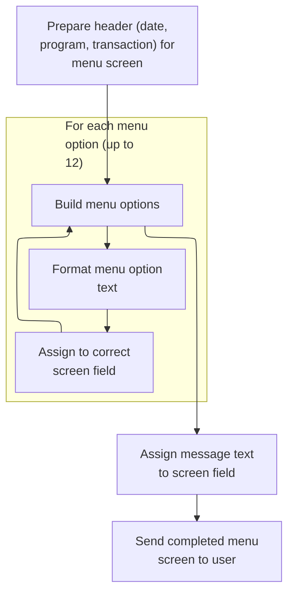

This section prepares and sends the main menu screen to the user, ensuring all required information (header, menu options, message) is correctly displayed.

| Rule ID | Code Location        | Category       | Rule Name                  | Description                                                                                                                                                            | Conditions                                                                            | Remarks                                                                                                                                                                 |
| ------- | -------------------- | -------------- | -------------------------- | ---------------------------------------------------------------------------------------------------------------------------------------------------------------------- | ------------------------------------------------------------------------------------- | ----------------------------------------------------------------------------------------------------------------------------------------------------------------------- |
| BR-001  | POPULATE-HEADER-INFO | Business logic | Header Information Display | The main menu screen header must display the current date, current time, program name, and transaction name, ensuring users always see up-to-date context information. | Whenever the main menu screen is prepared for display.                                | The program name is 8 characters, the transaction name is 4 characters. The date and time are displayed in standard formats (MM-DD-YY for date, HH-MM-SS for time).     |
| BR-002  | BUILD-MENU-OPTIONS   | Business logic | Menu Options Formatting    | The main menu screen must display up to 12 menu options, each formatted as a number, a period, a space, and the option name (e.g., '1. View Cards').                   | Whenever the main menu screen is prepared for display and menu options are available. | Each menu option is formatted as: \[number\]\[period\]\[space\]\[option name\]. The maximum number of options displayed is 12. Each option text is up to 40 characters. |
| BR-003  | SEND-MENU-SCREEN     | Business logic | Message Area Population    | Any message text must be displayed in the designated message area of the main menu screen. If no message is present, the area is left blank.                           | Whenever the main menu screen is prepared for display.                                | The message area is 80 characters. If no message is present, it is filled with spaces.                                                                                  |
| BR-004  | SEND-MENU-SCREEN     | Technical step | Send Menu Screen           | The completed main menu screen, including header, menu options, and message area, must be sent to the user for display.                                                | After all header, menu options, and message fields are populated.                     | The screen is sent using the defined map and mapset. All fields must be populated before sending.                                                                       |

<SwmSnippet path="/app/cbl/COMEN01C.cbl" line="182" repo-id="Z2l0aHViJTNBJTNBa3luZHJ5bC1hd3MtbWFpbmZyYW1lLW1vZGVybml6YXRpb24tY2FyZGRlbW8lM0ElM0FTd2ltbS1EZW1v">

---

`SEND-MENU-SCREEN` sets up the header, builds the main menu options, moves any message to the error field, and sends the main menu screen to the user.

```cobol
       SEND-MENU-SCREEN.

           PERFORM POPULATE-HEADER-INFO
           PERFORM BUILD-MENU-OPTIONS

           MOVE WS-MESSAGE TO ERRMSGO OF COMEN1AO

           EXEC CICS SEND
                     MAP('COMEN1A')
                     MAPSET('COMEN01')
                     FROM(COMEN1AO)
                     ERASE
           END-EXEC.
```

---

</SwmSnippet>

<SwmSnippet path="/app/cbl/COMEN01C.cbl" line="212" repo-id="Z2l0aHViJTNBJTNBa3luZHJ5bC1hd3MtbWFpbmZyYW1lLW1vZGVybml6YXRpb24tY2FyZGRlbW8lM0ElM0FTd2ltbS1EZW1v">

---

`POPULATE-HEADER-INFO` grabs the current date and time, sets up the screen titles, transaction and program names, and fills the header fields for the main menu.

```cobol
       POPULATE-HEADER-INFO.

           MOVE FUNCTION CURRENT-DATE  TO WS-CURDATE-DATA

           MOVE CCDA-TITLE01           TO TITLE01O OF COMEN1AO
           MOVE CCDA-TITLE02           TO TITLE02O OF COMEN1AO
           MOVE WS-TRANID              TO TRNNAMEO OF COMEN1AO
           MOVE WS-PGMNAME             TO PGMNAMEO OF COMEN1AO

           MOVE WS-CURDATE-MONTH       TO WS-CURDATE-MM
           MOVE WS-CURDATE-DAY         TO WS-CURDATE-DD
           MOVE WS-CURDATE-YEAR(3:2)   TO WS-CURDATE-YY

           MOVE WS-CURDATE-MM-DD-YY    TO CURDATEO OF COMEN1AO

           MOVE WS-CURTIME-HOURS       TO WS-CURTIME-HH
           MOVE WS-CURTIME-MINUTE      TO WS-CURTIME-MM
           MOVE WS-CURTIME-SECOND      TO WS-CURTIME-SS

           MOVE WS-CURTIME-HH-MM-SS    TO CURTIMEO OF COMEN1AO.
```

---

</SwmSnippet>

<SwmSnippet path="/app/cbl/COMEN01C.cbl" line="236" repo-id="Z2l0aHViJTNBJTNBa3luZHJ5bC1hd3MtbWFpbmZyYW1lLW1vZGVybml6YXRpb24tY2FyZGRlbW8lM0ElM0FTd2ltbS1EZW1v">

---

`BUILD-MENU-OPTIONS` loops through the main menu options, builds formatted strings for each, and assigns them to the right output fields for display.

```cobol
       BUILD-MENU-OPTIONS.

           PERFORM VARYING WS-IDX FROM 1 BY 1 UNTIL
                           WS-IDX > CDEMO-MENU-OPT-COUNT

               MOVE SPACES             TO WS-MENU-OPT-TXT

               STRING CDEMO-MENU-OPT-NUM(WS-IDX)  DELIMITED BY SIZE
                      '. '                         DELIMITED BY SIZE
                      CDEMO-MENU-OPT-NAME(WS-IDX) DELIMITED BY SIZE
                 INTO WS-MENU-OPT-TXT

               EVALUATE WS-IDX
                   WHEN 1
                       MOVE WS-MENU-OPT-TXT TO OPTN001O
                   WHEN 2
                       MOVE WS-MENU-OPT-TXT TO OPTN002O
                   WHEN 3
                       MOVE WS-MENU-OPT-TXT TO OPTN003O
                   WHEN 4
                       MOVE WS-MENU-OPT-TXT TO OPTN004O
                   WHEN 5
                       MOVE WS-MENU-OPT-TXT TO OPTN005O
                   WHEN 6
                       MOVE WS-MENU-OPT-TXT TO OPTN006O
                   WHEN 7
                       MOVE WS-MENU-OPT-TXT TO OPTN007O
                   WHEN 8
                       MOVE WS-MENU-OPT-TXT TO OPTN008O
                   WHEN 9
                       MOVE WS-MENU-OPT-TXT TO OPTN009O
                   WHEN 10
                       MOVE WS-MENU-OPT-TXT TO OPTN010O
                   WHEN 11
                       MOVE WS-MENU-OPT-TXT TO OPTN011O
                   WHEN 12
                       MOVE WS-MENU-OPT-TXT TO OPTN012O
                   WHEN OTHER
                       CONTINUE
               END-EVALUATE

           END-PERFORM.
```

---

</SwmSnippet>

### Receiving and Processing Main Menu Input

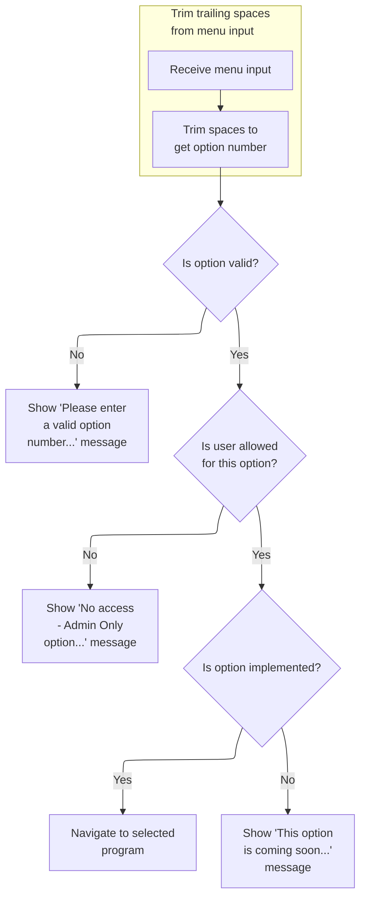

This section manages the reception and processing of main menu input, validating user selections, enforcing access restrictions, and determining the appropriate response or navigation based on the selected option.

| Rule ID | Code Location     | Category        | Rule Name                        | Description                                                                                                                                                                                               | Conditions                                                                                          | Remarks                                                                                                                                                                                                                 |
| ------- | ----------------- | --------------- | -------------------------------- | --------------------------------------------------------------------------------------------------------------------------------------------------------------------------------------------------------- | --------------------------------------------------------------------------------------------------- | ----------------------------------------------------------------------------------------------------------------------------------------------------------------------------------------------------------------------- |
| BR-001  | PROCESS-ENTER-KEY | Data validation | Menu option validity             | If the entered menu option is not numeric, is greater than the maximum allowed option count, or is zero, an error message is displayed to the user indicating that a valid option number must be entered. | The entered option is not numeric, or is greater than the maximum allowed option count, or is zero. | The error message displayed is: 'Please enter a valid option number...'. The option number is expected to be a two-digit number, zero-padded if necessary.                                                              |
| BR-002  | PROCESS-ENTER-KEY | Data validation | Admin-only option access control | If a regular user selects an option that is restricted to admin users, an access denied message is displayed and the user cannot proceed with that option.                                                | The user type is 'User' and the selected option is marked as admin-only.                            | The access denied message displayed is: 'No access - Admin Only option... '. User types are 'A' for Admin and 'U' for User.                                                                                             |
| BR-003  | PROCESS-ENTER-KEY | Data validation | Menu input normalization         | Trailing spaces in the menu input are trimmed and replaced with zeros to ensure the option number is correctly formatted before validation.                                                               | Menu input contains trailing spaces.                                                                | Trailing spaces are replaced with zeros. The option number is formatted as a two-digit, zero-padded string.                                                                                                             |
| BR-004  | PROCESS-ENTER-KEY | Business logic  | Option implementation status     | If the selected menu option is implemented, the user is navigated to the corresponding program; otherwise, a message is displayed indicating that the option is coming soon.                              | The error flag is not set and the selected option's program name does not start with 'DUMMY'.       | If the option is not implemented, the message displayed is: 'This option <option name> is coming soon ...'. The option name is inserted dynamically. Implemented options have a program name not starting with 'DUMMY'. |

<SwmSnippet path="/app/cbl/COMEN01C.cbl" line="199" repo-id="Z2l0aHViJTNBJTNBa3luZHJ5bC1hd3MtbWFpbmZyYW1lLW1vZGVybml6YXRpb24tY2FyZGRlbW8lM0ElM0FTd2ltbS1EZW1v">

---

`RECEIVE-MENU-SCREEN` grabs the main menu input from the terminal, using CICS RECEIVE and capturing response codes for error handling.

```cobol
       RECEIVE-MENU-SCREEN.

           EXEC CICS RECEIVE
                     MAP('COMEN1A')
                     MAPSET('COMEN01')
                     INTO(COMEN1AI)
                     RESP(WS-RESP-CD)
                     RESP2(WS-REAS-CD)
           END-EXEC.
```

---

</SwmSnippet>

<SwmSnippet path="/app/cbl/COMEN01C.cbl" line="115" repo-id="Z2l0aHViJTNBJTNBa3luZHJ5bC1hd3MtbWFpbmZyYW1lLW1vZGVybml6YXRpb24tY2FyZGRlbW8lM0ElM0FTd2ltbS1EZW1v">

---

`PROCESS-ENTER-KEY` scans the input option, trims spaces, zero-pads it, checks if it's valid, blocks admin-only options for regular users, and either jumps to the selected program or shows a 'coming soon' message if the option isn't implemented.

```cobol
       PROCESS-ENTER-KEY.

           PERFORM VARYING WS-IDX
                   FROM LENGTH OF OPTIONI OF COMEN1AI BY -1 UNTIL
                   OPTIONI OF COMEN1AI(WS-IDX:1) NOT = SPACES OR
                   WS-IDX = 1
           END-PERFORM
           MOVE OPTIONI OF COMEN1AI(1:WS-IDX) TO WS-OPTION-X
           INSPECT WS-OPTION-X REPLACING ALL ' ' BY '0'
           MOVE WS-OPTION-X              TO WS-OPTION
           MOVE WS-OPTION                TO OPTIONO OF COMEN1AO

           IF WS-OPTION IS NOT NUMERIC OR
              WS-OPTION > CDEMO-MENU-OPT-COUNT OR
              WS-OPTION = ZEROS
               MOVE 'Y'     TO WS-ERR-FLG
               MOVE 'Please enter a valid option number...' TO
                               WS-MESSAGE
               PERFORM SEND-MENU-SCREEN
           END-IF

           IF CDEMO-USRTYP-USER AND
              CDEMO-MENU-OPT-USRTYPE(WS-OPTION) = 'A'
               SET ERR-FLG-ON          TO TRUE
               MOVE SPACES             TO WS-MESSAGE
               MOVE 'No access - Admin Only option... ' TO
                                       WS-MESSAGE
               PERFORM SEND-MENU-SCREEN
           END-IF

           IF NOT ERR-FLG-ON
               IF CDEMO-MENU-OPT-PGMNAME(WS-OPTION)(1:5) NOT = 'DUMMY'
                   MOVE WS-TRANID    TO CDEMO-FROM-TRANID
                   MOVE WS-PGMNAME   TO CDEMO-FROM-PROGRAM
      *            MOVE WS-USER-ID   TO CDEMO-USER-ID
      *            MOVE SEC-USR-TYPE TO CDEMO-USER-TYPE
                   MOVE ZEROS        TO CDEMO-PGM-CONTEXT
                   EXEC CICS
                       XCTL PROGRAM(CDEMO-MENU-OPT-PGMNAME(WS-OPTION))
                       COMMAREA(CARDDEMO-COMMAREA)
                   END-EXEC
               END-IF
               MOVE SPACES             TO WS-MESSAGE
               MOVE DFHGREEN           TO ERRMSGC  OF COMEN1AO
               STRING 'This option '       DELIMITED BY SIZE
                       CDEMO-MENU-OPT-NAME(WS-OPTION)
                                       DELIMITED BY SPACE
                       'is coming soon ...'   DELIMITED BY SIZE
                  INTO WS-MESSAGE
               PERFORM SEND-MENU-SCREEN
           END-IF.
```

---

</SwmSnippet>

## Transaction List Entry and User Input

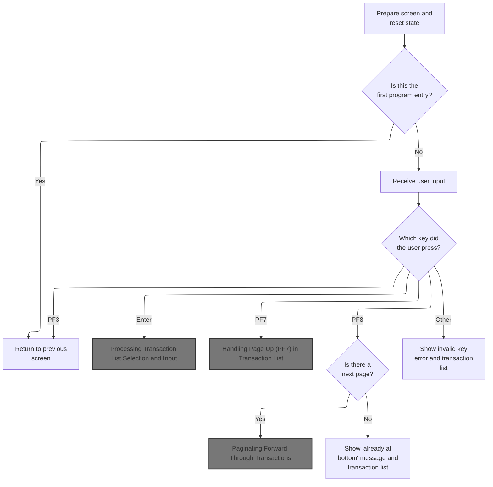

This section manages the transaction list screen entry and user input handling, including navigation, error messaging, and pagination for the CardDemo application.

| Rule ID | Code Location                    | Category       | Rule Name                      | Description                                                                                                                                         | Conditions                                                 | Remarks                                                                                                                                                   |
| ------- | -------------------------------- | -------------- | ------------------------------ | --------------------------------------------------------------------------------------------------------------------------------------------------- | ---------------------------------------------------------- | --------------------------------------------------------------------------------------------------------------------------------------------------------- |
| BR-001  | MAIN-PARA, RETURN-TO-PREV-SCREEN | Business logic | First entry returns to signon  | If the program is entered for the first time (no input data is present), the user is returned to the signon screen.                                 | Program entry with no input data (EIBCALEN = 0).           | The signon program name is 'COSGN00C'. The output is a navigation to the signon screen, passing the current communication area context.                   |
| BR-002  | MAIN-PARA, RETURN-TO-PREV-SCREEN | Business logic | PF3 returns to previous screen | If the user presses PF3, the application navigates to the main menu or previous screen.                                                             | User input key is PF3.                                     | The main menu program name is 'COMEN01C'. The output is a navigation to the main menu, passing the current communication area context.                    |
| BR-003  | PROCESS-PF8-KEY                  | Business logic | Already at bottom message      | If the user presses PF8 and there is no next page of transactions, a message is displayed indicating the user is already at the bottom of the list. | User input key is PF8 and there is no next page available. | The output is a message indicating no further pages are available and the transaction list is shown again.                                                |
| BR-004  | MAIN-PARA                        | Error handling | Invalid key error message      | If the user presses a key other than Enter, PF3, PF7, or PF8, an error message is displayed and the transaction list screen is shown again.         | User input key is not Enter, PF3, PF7, or PF8.             | The error message is 'Invalid key pressed. Please see below...         ' (50 characters, left aligned, padded with spaces). The error flag is set to 'Y'. |

<SwmSnippet path="/app/cbl/COTRN00C.cbl" line="95" repo-id="Z2l0aHViJTNBJTNBa3luZHJ5bC1hd3MtbWFpbmZyYW1lLW1vZGVybml6YXRpb24tY2FyZGRlbW8lM0ElM0FTd2ltbS1EZW1v">

---

`MAIN-PARA` in COTRN00C.cbl checks if there's any input data. If not, it sets up for a return to signon. If there is, it moves the commarea, checks if we're reentering, and either sends the transaction list or processes user input based on the key pressed.

```cobol
       MAIN-PARA.

           SET ERR-FLG-OFF TO TRUE
           SET TRANSACT-NOT-EOF TO TRUE
           SET NEXT-PAGE-NO TO TRUE
           SET SEND-ERASE-YES TO TRUE

           MOVE SPACES TO WS-MESSAGE
                          ERRMSGO OF COTRN0AO

           MOVE -1       TO TRNIDINL OF COTRN0AI

           IF EIBCALEN = 0
               MOVE 'COSGN00C' TO CDEMO-TO-PROGRAM
               PERFORM RETURN-TO-PREV-SCREEN
           ELSE
               MOVE DFHCOMMAREA(1:EIBCALEN) TO CARDDEMO-COMMAREA
               IF NOT CDEMO-PGM-REENTER
                   SET CDEMO-PGM-REENTER    TO TRUE
                   MOVE LOW-VALUES          TO COTRN0AO
                   PERFORM PROCESS-ENTER-KEY
                   PERFORM SEND-TRNLST-SCREEN
               ELSE
                   PERFORM RECEIVE-TRNLST-SCREEN
                   EVALUATE EIBAID
                       WHEN DFHENTER
                           PERFORM PROCESS-ENTER-KEY
                       WHEN DFHPF3
                           MOVE 'COMEN01C' TO CDEMO-TO-PROGRAM
                           PERFORM RETURN-TO-PREV-SCREEN
                       WHEN DFHPF7
                           PERFORM PROCESS-PF7-KEY
                       WHEN DFHPF8
                           PERFORM PROCESS-PF8-KEY
                       WHEN OTHER
                           MOVE 'Y'                       TO WS-ERR-FLG
                           MOVE -1       TO TRNIDINL OF COTRN0AI
                           MOVE CCDA-MSG-INVALID-KEY      TO WS-MESSAGE
                           PERFORM SEND-TRNLST-SCREEN
                   END-EVALUATE
               END-IF
           END-IF

           EXEC CICS RETURN
                     TRANSID (WS-TRANID)
                     COMMAREA (CARDDEMO-COMMAREA)
           END-EXEC.
```

---

</SwmSnippet>

<SwmSnippet path="/app/cbl/COTRN00C.cbl" line="510" repo-id="Z2l0aHViJTNBJTNBa3luZHJ5bC1hd3MtbWFpbmZyYW1lLW1vZGVybml6YXRpb24tY2FyZGRlbW8lM0ElM0FTd2ltbS1EZW1v">

---

RETURN-TO-PREV-SCREEN in COTRN00C checks if the next program is set. If not, it defaults to 'COSGN00C' (signon handler). It then stamps the commarea with the current transaction and program names, resets the program context, and uses XCTL to transfer control to the next program, passing all context. This is how we jump to the main menu or signon logic (like COMEN01C) after finishing up here.

```cobol
       RETURN-TO-PREV-SCREEN.

           IF CDEMO-TO-PROGRAM = LOW-VALUES OR SPACES
               MOVE 'COSGN00C' TO CDEMO-TO-PROGRAM
           END-IF
           MOVE WS-TRANID    TO CDEMO-FROM-TRANID
           MOVE WS-PGMNAME   TO CDEMO-FROM-PROGRAM
           MOVE ZEROS        TO CDEMO-PGM-CONTEXT
           EXEC CICS
               XCTL PROGRAM(CDEMO-TO-PROGRAM)
               COMMAREA(CARDDEMO-COMMAREA)
           END-EXEC.
```

---

</SwmSnippet>

### Processing Transaction List Selection and Input

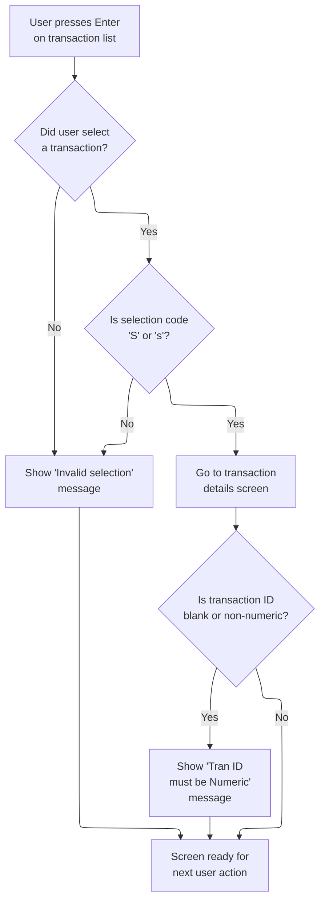

This section manages user input on the transaction list screen, validating selections and transaction IDs, handling errors, and preparing the screen for the next user action.

| Rule ID | Code Location     | Category        | Rule Name                         | Description                                                                                                                                                     | Conditions                                                                                                                                | Remarks                                                                                                                                  |
| ------- | ----------------- | --------------- | --------------------------------- | --------------------------------------------------------------------------------------------------------------------------------------------------------------- | ----------------------------------------------------------------------------------------------------------------------------------------- | ---------------------------------------------------------------------------------------------------------------------------------------- |
| BR-001  | PROCESS-ENTER-KEY | Data validation | Transaction ID numeric validation | If the user enters a transaction ID manually, the system checks if the ID is blank or contains non-numeric characters. If so, an error message is displayed.    | User enters a transaction ID manually and the ID is blank or contains non-numeric characters.                                             | Error message displayed: 'Tran ID must be Numeric ...'. The transaction list screen is refreshed for the next action.                    |
| BR-002  | PROCESS-ENTER-KEY | Business logic  | Valid transaction selection       | If the user selects a transaction and the selection code is 'S' or 's', the system navigates to the transaction details screen for the selected transaction.    | User has selected a transaction (selection flag and transaction ID are not blank or low-values) and the selection code is 'S' or 's'.     | Valid selection codes are 'S' and 's'. The system navigates to the transaction details screen by setting the next program to 'COTRN01C'. |
| BR-003  | PROCESS-ENTER-KEY | Business logic  | Screen reset after input          | After handling user input, the system resets the transaction list screen and prepares it for the next user action.                                              | Any user input is processed, regardless of outcome (valid selection, invalid selection, or input error).                                  | The transaction list screen is refreshed and page number is reset to 0. The output is ready for the next user action.                    |
| BR-004  | PROCESS-ENTER-KEY | Error handling  | Invalid selection code error      | If the user selects a transaction but the selection code is not 'S' or 's', the system displays an error message indicating that only 'S' is a valid selection. | User has selected a transaction (selection flag and transaction ID are not blank or low-values) but the selection code is not 'S' or 's'. | Error message displayed: 'Invalid selection. Valid value is S'. The transaction list screen is refreshed for the next action.            |

<SwmSnippet path="/app/cbl/COTRN00C.cbl" line="146" repo-id="Z2l0aHViJTNBJTNBa3luZHJ5bC1hd3MtbWFpbmZyYW1lLW1vZGVybml6YXRpb24tY2FyZGRlbW8lM0ElM0FTd2ltbS1EZW1v">

---

PROCESS-ENTER-KEY in COTRN00C checks which transaction the user selected from the list (or if they entered a transaction ID manually). If a selection is made and it's 'S', we set up the commarea and jump to COTRN01C to show the transaction details. If the input is invalid, we show an error. After handling input, we reset the page and refresh the list for the next action.

```cobol
       PROCESS-ENTER-KEY.

           EVALUATE TRUE
               WHEN SEL0001I OF COTRN0AI NOT = SPACES AND LOW-VALUES
                   MOVE SEL0001I OF COTRN0AI TO CDEMO-CT00-TRN-SEL-FLG
                   MOVE TRNID01I OF COTRN0AI TO CDEMO-CT00-TRN-SELECTED
               WHEN SEL0002I OF COTRN0AI NOT = SPACES AND LOW-VALUES
                   MOVE SEL0002I OF COTRN0AI TO CDEMO-CT00-TRN-SEL-FLG
                   MOVE TRNID02I OF COTRN0AI TO CDEMO-CT00-TRN-SELECTED
               WHEN SEL0003I OF COTRN0AI NOT = SPACES AND LOW-VALUES
                   MOVE SEL0003I OF COTRN0AI TO CDEMO-CT00-TRN-SEL-FLG
                   MOVE TRNID03I OF COTRN0AI TO CDEMO-CT00-TRN-SELECTED
               WHEN SEL0004I OF COTRN0AI NOT = SPACES AND LOW-VALUES
                   MOVE SEL0004I OF COTRN0AI TO CDEMO-CT00-TRN-SEL-FLG
                   MOVE TRNID04I OF COTRN0AI TO CDEMO-CT00-TRN-SELECTED
               WHEN SEL0005I OF COTRN0AI NOT = SPACES AND LOW-VALUES
                   MOVE SEL0005I OF COTRN0AI TO CDEMO-CT00-TRN-SEL-FLG
                   MOVE TRNID05I OF COTRN0AI TO CDEMO-CT00-TRN-SELECTED
               WHEN SEL0006I OF COTRN0AI NOT = SPACES AND LOW-VALUES
                   MOVE SEL0006I OF COTRN0AI TO CDEMO-CT00-TRN-SEL-FLG
                   MOVE TRNID06I OF COTRN0AI TO CDEMO-CT00-TRN-SELECTED
               WHEN SEL0007I OF COTRN0AI NOT = SPACES AND LOW-VALUES
                   MOVE SEL0007I OF COTRN0AI TO CDEMO-CT00-TRN-SEL-FLG
                   MOVE TRNID07I OF COTRN0AI TO CDEMO-CT00-TRN-SELECTED
               WHEN SEL0008I OF COTRN0AI NOT = SPACES AND LOW-VALUES
                   MOVE SEL0008I OF COTRN0AI TO CDEMO-CT00-TRN-SEL-FLG
                   MOVE TRNID08I OF COTRN0AI TO CDEMO-CT00-TRN-SELECTED
               WHEN SEL0009I OF COTRN0AI NOT = SPACES AND LOW-VALUES
                   MOVE SEL0009I OF COTRN0AI TO CDEMO-CT00-TRN-SEL-FLG
                   MOVE TRNID09I OF COTRN0AI TO CDEMO-CT00-TRN-SELECTED
               WHEN SEL0010I OF COTRN0AI NOT = SPACES AND LOW-VALUES
                   MOVE SEL0010I OF COTRN0AI TO CDEMO-CT00-TRN-SEL-FLG
                   MOVE TRNID10I OF COTRN0AI TO CDEMO-CT00-TRN-SELECTED
               WHEN OTHER
                   MOVE SPACES   TO CDEMO-CT00-TRN-SEL-FLG
                   MOVE SPACES   TO CDEMO-CT00-TRN-SELECTED
           END-EVALUATE
           IF (CDEMO-CT00-TRN-SEL-FLG NOT = SPACES AND LOW-VALUES) AND
              (CDEMO-CT00-TRN-SELECTED NOT = SPACES AND LOW-VALUES)
               EVALUATE CDEMO-CT00-TRN-SEL-FLG
                   WHEN 'S'
                   WHEN 's'
                        MOVE 'COTRN01C'   TO CDEMO-TO-PROGRAM
                        MOVE WS-TRANID    TO CDEMO-FROM-TRANID
                        MOVE WS-PGMNAME   TO CDEMO-FROM-PROGRAM
                        MOVE 0        TO CDEMO-PGM-CONTEXT
                        EXEC CICS
                            XCTL PROGRAM(CDEMO-TO-PROGRAM)
                            COMMAREA(CARDDEMO-COMMAREA)
                        END-EXEC
                   WHEN OTHER
      *                SET TRANSACT-EOF TO TRUE
                       MOVE
                       'Invalid selection. Valid value is S' TO
                                       WS-MESSAGE
                       MOVE -1       TO TRNIDINL OF COTRN0AI
      *                PERFORM SEND-TRNLST-SCREEN
               END-EVALUATE
           END-IF

           IF TRNIDINI OF COTRN0AI = SPACES OR LOW-VALUES
               MOVE LOW-VALUES TO TRAN-ID
           ELSE
               IF TRNIDINI  OF COTRN0AI IS NUMERIC
                   MOVE TRNIDINI  OF COTRN0AI    TO TRAN-ID
               ELSE
                   MOVE 'Y'                       TO WS-ERR-FLG
                   MOVE
                   'Tran ID must be Numeric ...' TO
                                   WS-MESSAGE
                   MOVE -1                 TO TRNIDINL OF COTRN0AI
                   PERFORM SEND-TRNLST-SCREEN
               END-IF
           END-IF

           MOVE -1       TO TRNIDINL OF COTRN0AI


           MOVE 0       TO CDEMO-CT00-PAGE-NUM
           PERFORM PROCESS-PAGE-FORWARD

           IF NOT ERR-FLG-ON
               MOVE SPACE   TO TRNIDINO  OF COTRN0AO
           END-IF.
```

---

</SwmSnippet>

### Preparing and Sending Transaction List Screen

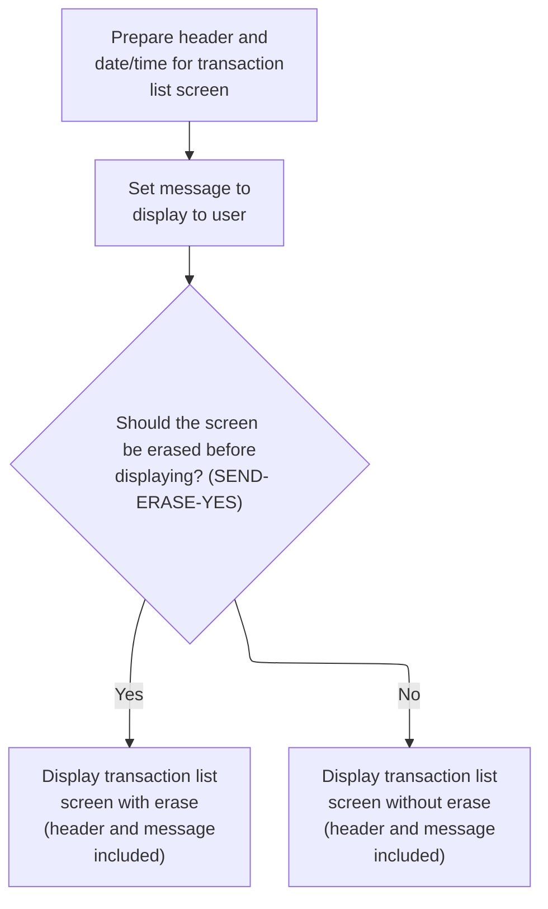

This section prepares and sends the transaction list screen to the user, ensuring the header and message are displayed correctly and the screen is optionally erased based on a flag.

| Rule ID | Code Location        | Category       | Rule Name                | Description                                                                                                                                                                                        | Conditions                                                                    | Remarks                                                                                                                                                                                                                                          |
| ------- | -------------------- | -------------- | ------------------------ | -------------------------------------------------------------------------------------------------------------------------------------------------------------------------------------------------- | ----------------------------------------------------------------------------- | ------------------------------------------------------------------------------------------------------------------------------------------------------------------------------------------------------------------------------------------------ |
| BR-001  | POPULATE-HEADER-INFO | Business logic | Header Population        | The header section of the transaction list screen must always display the current date, current time, program name, transaction name, and predefined titles before the screen is sent to the user. | Whenever the transaction list screen is to be displayed.                      | The header includes: two title strings (up to 40 characters each), a program name (8 characters), a transaction name (4 characters), the current date in MM-DD-YY format (8 characters), and the current time in HH-MM-SS format (8 characters). |
| BR-002  | SEND-TRNLST-SCREEN   | Business logic | User Message Display     | Any message intended for the user must be displayed in the error message area of the transaction list screen.                                                                                      | Whenever a message is present to be shown to the user.                        | The message area can display up to 80 characters. If no message is present, the area is blank.                                                                                                                                                   |
| BR-003  | SEND-TRNLST-SCREEN   | Business logic | Conditional Screen Erase | The transaction list screen must be erased (cleared) before displaying new content if the erase flag is set to 'Y'. If the flag is not set, the screen is updated without erasing.                 | When displaying the transaction list screen, and the erase flag is evaluated. | The erase flag is set to 'Y' for erase, 'N' for no erase. When erased, the screen is cleared before new content is shown.                                                                                                                        |

<SwmSnippet path="/app/cbl/COTRN00C.cbl" line="527" repo-id="Z2l0aHViJTNBJTNBa3luZHJ5bC1hd3MtbWFpbmZyYW1lLW1vZGVybml6YXRpb24tY2FyZGRlbW8lM0ElM0FTd2ltbS1EZW1v">

---

SEND-TRNLST-SCREEN sets up the header info, copies any message to the error field, and sends the transaction list screen to the user. ERASE clears the screen if needed, so the display is always fresh.

```cobol
       SEND-TRNLST-SCREEN.

           PERFORM POPULATE-HEADER-INFO

           MOVE WS-MESSAGE TO ERRMSGO OF COTRN0AO

           IF SEND-ERASE-YES
               EXEC CICS SEND
                         MAP('COTRN0A')
                         MAPSET('COTRN00')
                         FROM(COTRN0AO)
                         ERASE
                         CURSOR
               END-EXEC
           ELSE
               EXEC CICS SEND
                         MAP('COTRN0A')
                         MAPSET('COTRN00')
                         FROM(COTRN0AO)
      *                  ERASE
                         CURSOR
               END-EXEC
           END-IF.
```

---

</SwmSnippet>

<SwmSnippet path="/app/cbl/COTRN00C.cbl" line="567" repo-id="Z2l0aHViJTNBJTNBa3luZHJ5bC1hd3MtbWFpbmZyYW1lLW1vZGVybml6YXRpb24tY2FyZGRlbW8lM0ElM0FTd2ltbS1EZW1v">

---

POPULATE-HEADER-INFO sets up the header with the right titles, date, time, and program info before the screen is sent.

```cobol
       POPULATE-HEADER-INFO.

           MOVE FUNCTION CURRENT-DATE  TO WS-CURDATE-DATA

           MOVE CCDA-TITLE01           TO TITLE01O OF COTRN0AO
           MOVE CCDA-TITLE02           TO TITLE02O OF COTRN0AO
           MOVE WS-TRANID              TO TRNNAMEO OF COTRN0AO
           MOVE WS-PGMNAME             TO PGMNAMEO OF COTRN0AO

           MOVE WS-CURDATE-MONTH       TO WS-CURDATE-MM
           MOVE WS-CURDATE-DAY         TO WS-CURDATE-DD
           MOVE WS-CURDATE-YEAR(3:2)   TO WS-CURDATE-YY

           MOVE WS-CURDATE-MM-DD-YY    TO CURDATEO OF COTRN0AO

           MOVE WS-CURTIME-HOURS       TO WS-CURTIME-HH
           MOVE WS-CURTIME-MINUTE      TO WS-CURTIME-MM
           MOVE WS-CURTIME-SECOND      TO WS-CURTIME-SS

           MOVE WS-CURTIME-HH-MM-SS    TO CURTIMEO OF COTRN0AO.
```

---

</SwmSnippet>

### Paginating Forward Through Transactions

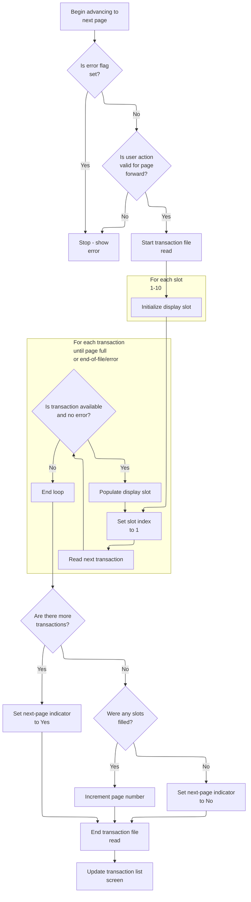

This section manages the logic for paginating forward through a transaction list, handling user actions, slot management, error and end-of-file conditions, and updating the transaction list screen for the user.

| Rule ID | Code Location                                                  | Category        | Rule Name                          | Description                                                                                                                                                                               | Conditions                                                                         | Remarks                                                                                                                                                                                                            |
| ------- | -------------------------------------------------------------- | --------------- | ---------------------------------- | ----------------------------------------------------------------------------------------------------------------------------------------------------------------------------------------- | ---------------------------------------------------------------------------------- | ------------------------------------------------------------------------------------------------------------------------------------------------------------------------------------------------------------------ |
| BR-001  | PROCESS-PAGE-FORWARD                                           | Data validation | Valid user action for page forward | Pagination forward is only allowed if the user action corresponds to a valid page forward request (such as pressing PF7 or PF3).                                                          | User action is not DFHENTER and is either DFHPF7 or DFHPF3.                        | Valid actions for page forward: PF7, PF3. Other actions do not trigger pagination.                                                                                                                                 |
| BR-002  | PROCESS-PAGE-FORWARD, INITIALIZE-TRAN-DATA, POPULATE-TRAN-DATA | Business logic  | Transaction slot management        | Up to 10 transaction slots are initialized and populated for each page. If fewer than 10 transactions are available, only those slots are filled.                                         | Pagination is triggered and transactions are available (not end-of-file or error). | Maximum slots per page: 10. Each slot contains transaction ID (string, 4 bytes), date (string, 8 bytes), description (string, variable length), and amount (number, 10 bytes). Unused slots are cleared to spaces. |
| BR-003  | PROCESS-PAGE-FORWARD                                           | Business logic  | Next-page availability             | If transactions remain after filling the current page, the next-page indicator is set to 'Yes', allowing the user to continue paging forward.                                             | After populating slots, more transactions are available and no error is present.   | Next-page indicator values: 'Y' (yes), 'N' (no).                                                                                                                                                                   |
| BR-004  | PROCESS-PAGE-FORWARD                                           | Business logic  | No transactions available          | If no transactions are available to fill any slots, the next-page indicator is set to 'No' and the page number is not incremented.                                                        | After attempting to fill slots, WS-IDX is still 1 (no slots filled).               | Next-page indicator values: 'Y' (yes), 'N' (no). Page number remains unchanged.                                                                                                                                    |
| BR-005  | PROCESS-PAGE-FORWARD                                           | Business logic  | Screen refresh after pagination    | After pagination, the transaction list screen is refreshed to display the updated slots, page number, and navigation indicators.                                                          | Pagination logic completes, regardless of error or end-of-file.                    | Screen fields include up to 10 transaction slots, page number (integer), and next-page indicator ('Y'/'N').                                                                                                        |
| BR-006  | PROCESS-PAGE-FORWARD                                           | Error handling  | Error flag halt                    | If an error flag is set before attempting to page forward, the system halts pagination and displays an error message to the user.                                                         | The error flag is set ('Y') before page forward logic begins.                      | Error flag values: 'Y' (on), 'N' (off). The error message is displayed on the transaction list screen.                                                                                                             |
| BR-007  | READNEXT-TRANSACT-FILE                                         | Error handling  | End-of-file handling               | If the end of the transaction file is reached during pagination, the system sets the next-page indicator to 'No' and displays a message indicating the user is at the bottom of the page. | End-of-file is detected during transaction read.                                   | Next-page indicator values: 'Y' (yes), 'N' (no). Message: 'You have reached the bottom of the page...'.                                                                                                            |

<SwmSnippet path="/app/cbl/COTRN00C.cbl" line="279" repo-id="Z2l0aHViJTNBJTNBa3luZHJ5bC1hd3MtbWFpbmZyYW1lLW1vZGVybml6YXRpb24tY2FyZGRlbW8lM0ElM0FTd2ltbS1EZW1v">

---

PROCESS-PAGE-FORWARD handles reading the next set of transactions for the list. It starts the file browse, clears out the display slots, reads up to 10 records, updates the page number, and sets flags for next-page navigation. Finally, it updates the commarea and sends the refreshed screen to the user.

```cobol
       PROCESS-PAGE-FORWARD.

           PERFORM STARTBR-TRANSACT-FILE

           IF NOT ERR-FLG-ON

               IF EIBAID NOT = DFHENTER AND DFHPF7 AND DFHPF3
                   PERFORM READNEXT-TRANSACT-FILE
               END-IF

               IF TRANSACT-NOT-EOF AND ERR-FLG-OFF
                  PERFORM VARYING WS-IDX FROM 1 BY 1 UNTIL WS-IDX > 10
                      PERFORM INITIALIZE-TRAN-DATA
                  END-PERFORM
               END-IF

               MOVE 1             TO  WS-IDX

               PERFORM UNTIL WS-IDX >= 11 OR TRANSACT-EOF OR ERR-FLG-ON
                   PERFORM READNEXT-TRANSACT-FILE
                   IF TRANSACT-NOT-EOF AND ERR-FLG-OFF
                       PERFORM POPULATE-TRAN-DATA
                       COMPUTE WS-IDX = WS-IDX + 1
                   END-IF
               END-PERFORM

               IF TRANSACT-NOT-EOF AND ERR-FLG-OFF
                   COMPUTE CDEMO-CT00-PAGE-NUM =
                           CDEMO-CT00-PAGE-NUM + 1
                   PERFORM READNEXT-TRANSACT-FILE
                   IF TRANSACT-NOT-EOF AND ERR-FLG-OFF
                       SET NEXT-PAGE-YES TO TRUE
                   ELSE
                       SET NEXT-PAGE-NO TO TRUE
                   END-IF
               ELSE
                   SET NEXT-PAGE-NO TO TRUE
                   IF WS-IDX > 1
                       COMPUTE CDEMO-CT00-PAGE-NUM = CDEMO-CT00-PAGE-NUM
                        + 1
                   END-IF
               END-IF

               PERFORM ENDBR-TRANSACT-FILE

               MOVE CDEMO-CT00-PAGE-NUM TO PAGENUMI  OF COTRN0AI
               MOVE SPACE   TO TRNIDINO  OF COTRN0AO
               PERFORM SEND-TRNLST-SCREEN

           END-IF.
```

---

</SwmSnippet>

<SwmSnippet path="/app/cbl/COTRN00C.cbl" line="591" repo-id="Z2l0aHViJTNBJTNBa3luZHJ5bC1hd3MtbWFpbmZyYW1lLW1vZGVybml6YXRpb24tY2FyZGRlbW8lM0ElM0FTd2ltbS1EZW1v">

---

STARTBR-TRANSACT-FILE kicks off a browse on the TRANSACT file at the given transaction ID. If no record is found, we set a message and show the user they're at the top of the page. Errors are handled with a message and a screen update.

```cobol
       STARTBR-TRANSACT-FILE.

           EXEC CICS STARTBR
                DATASET   (WS-TRANSACT-FILE)
                RIDFLD    (TRAN-ID)
                KEYLENGTH (LENGTH OF TRAN-ID)
      *         GTEQ
                RESP      (WS-RESP-CD)
                RESP2     (WS-REAS-CD)
           END-EXEC.

           EVALUATE WS-RESP-CD
               WHEN DFHRESP(NORMAL)
                   CONTINUE
               WHEN DFHRESP(NOTFND)
                   CONTINUE
                   SET TRANSACT-EOF TO TRUE
                   MOVE 'You are at the top of the page...' TO
                                   WS-MESSAGE
                   MOVE -1       TO TRNIDINL OF COTRN0AI
                   PERFORM SEND-TRNLST-SCREEN
               WHEN OTHER
                   DISPLAY 'RESP:' WS-RESP-CD 'REAS:' WS-REAS-CD
                   MOVE 'Y'     TO WS-ERR-FLG
                   MOVE 'Unable to lookup transaction...' TO
                                   WS-MESSAGE
                   MOVE -1       TO TRNIDINL OF COTRN0AI
                   PERFORM SEND-TRNLST-SCREEN
           END-EVALUATE.
```

---

</SwmSnippet>

<SwmSnippet path="/app/cbl/COTRN00C.cbl" line="624" repo-id="Z2l0aHViJTNBJTNBa3luZHJ5bC1hd3MtbWFpbmZyYW1lLW1vZGVybml6YXRpb24tY2FyZGRlbW8lM0ElM0FTd2ltbS1EZW1v">

---

READNEXT-TRANSACT-FILE reads the next transaction record. If we're at the end, it sets a message and shows the user they're at the bottom of the page. Errors are handled with a message and a screen update.

```cobol
       READNEXT-TRANSACT-FILE.

           EXEC CICS READNEXT
                DATASET   (WS-TRANSACT-FILE)
                INTO      (TRAN-RECORD)
                LENGTH    (LENGTH OF TRAN-RECORD)
                RIDFLD    (TRAN-ID)
                KEYLENGTH (LENGTH OF TRAN-ID)
                RESP      (WS-RESP-CD)
                RESP2     (WS-REAS-CD)
           END-EXEC.

           EVALUATE WS-RESP-CD
               WHEN DFHRESP(NORMAL)
                   CONTINUE
               WHEN DFHRESP(ENDFILE)
                   CONTINUE
                   SET TRANSACT-EOF TO TRUE
                   MOVE 'You have reached the bottom of the page...' TO
                                   WS-MESSAGE
                   MOVE -1       TO TRNIDINL OF COTRN0AI
                   PERFORM SEND-TRNLST-SCREEN
               WHEN OTHER
                   DISPLAY 'RESP:' WS-RESP-CD 'REAS:' WS-REAS-CD
                   MOVE 'Y'     TO WS-ERR-FLG
                   MOVE 'Unable to lookup transaction...' TO
                                   WS-MESSAGE
                   MOVE -1       TO TRNIDINL OF COTRN0AI
                   PERFORM SEND-TRNLST-SCREEN
           END-EVALUATE.
```

---

</SwmSnippet>

<SwmSnippet path="/app/cbl/COTRN00C.cbl" line="450" repo-id="Z2l0aHViJTNBJTNBa3luZHJ5bC1hd3MtbWFpbmZyYW1lLW1vZGVybml6YXRpb24tY2FyZGRlbW8lM0ElM0FTd2ltbS1EZW1v">

---

INITIALIZE-TRAN-DATA uses WS-IDX to clear out the fields for a specific transaction slot in the input structure. This keeps each slot clean before loading new data for the page.

```cobol
       INITIALIZE-TRAN-DATA.

           EVALUATE WS-IDX
               WHEN 1
                   MOVE SPACES TO TRNID01I OF COTRN0AI
                   MOVE SPACES TO TDATE01I OF COTRN0AI
                   MOVE SPACES TO TDESC01I OF COTRN0AI
                   MOVE SPACES TO TAMT001I OF COTRN0AI
               WHEN 2
                   MOVE SPACES TO TRNID02I OF COTRN0AI
                   MOVE SPACES TO TDATE02I OF COTRN0AI
                   MOVE SPACES TO TDESC02I OF COTRN0AI
                   MOVE SPACES TO TAMT002I OF COTRN0AI
               WHEN 3
                   MOVE SPACES TO TRNID03I OF COTRN0AI
                   MOVE SPACES TO TDATE03I OF COTRN0AI
                   MOVE SPACES TO TDESC03I OF COTRN0AI
                   MOVE SPACES TO TAMT003I OF COTRN0AI
               WHEN 4
                   MOVE SPACES TO TRNID04I OF COTRN0AI
                   MOVE SPACES TO TDATE04I OF COTRN0AI
                   MOVE SPACES TO TDESC04I OF COTRN0AI
                   MOVE SPACES TO TAMT004I OF COTRN0AI
               WHEN 5
                   MOVE SPACES TO TRNID05I OF COTRN0AI
                   MOVE SPACES TO TDATE05I OF COTRN0AI
                   MOVE SPACES TO TDESC05I OF COTRN0AI
                   MOVE SPACES TO TAMT005I OF COTRN0AI
               WHEN 6
                   MOVE SPACES TO TRNID06I OF COTRN0AI
                   MOVE SPACES TO TDATE06I OF COTRN0AI
                   MOVE SPACES TO TDESC06I OF COTRN0AI
                   MOVE SPACES TO TAMT006I OF COTRN0AI
               WHEN 7
                   MOVE SPACES TO TRNID07I OF COTRN0AI
                   MOVE SPACES TO TDATE07I OF COTRN0AI
                   MOVE SPACES TO TDESC07I OF COTRN0AI
                   MOVE SPACES TO TAMT007I OF COTRN0AI
               WHEN 8
                   MOVE SPACES TO TRNID08I OF COTRN0AI
                   MOVE SPACES TO TDATE08I OF COTRN0AI
                   MOVE SPACES TO TDESC08I OF COTRN0AI
                   MOVE SPACES TO TAMT008I OF COTRN0AI
               WHEN 9
                   MOVE SPACES TO TRNID09I OF COTRN0AI
                   MOVE SPACES TO TDATE09I OF COTRN0AI
                   MOVE SPACES TO TDESC09I OF COTRN0AI
                   MOVE SPACES TO TAMT009I OF COTRN0AI
               WHEN 10
                   MOVE SPACES TO TRNID10I OF COTRN0AI
                   MOVE SPACES TO TDATE10I OF COTRN0AI
                   MOVE SPACES TO TDESC10I OF COTRN0AI
                   MOVE SPACES TO TAMT010I OF COTRN0AI
               WHEN OTHER
                   CONTINUE
           END-EVALUATE.
```

---

</SwmSnippet>

<SwmSnippet path="/app/cbl/COTRN00C.cbl" line="381" repo-id="Z2l0aHViJTNBJTNBa3luZHJ5bC1hd3MtbWFpbmZyYW1lLW1vZGVybml6YXRpb24tY2FyZGRlbW8lM0ElM0FTd2ltbS1EZW1v">

---

POPULATE-TRAN-DATA takes the current transaction record, formats the date, and fills in the right slot in the transaction list structure based on WS-IDX. It also marks the first and last transaction IDs for paging logic.

```cobol
       POPULATE-TRAN-DATA.

           MOVE TRAN-AMT                  TO WS-TRAN-AMT
           MOVE TRAN-ORIG-TS              TO WS-TIMESTAMP
           MOVE WS-TIMESTAMP-DT-YYYY(3:2) TO WS-CURDATE-YY
           MOVE WS-TIMESTAMP-DT-MM        TO WS-CURDATE-MM
           MOVE WS-TIMESTAMP-DT-DD        TO WS-CURDATE-DD
           MOVE WS-CURDATE-MM-DD-YY       TO WS-TRAN-DATE

           EVALUATE WS-IDX
               WHEN 1
                   MOVE TRAN-ID    TO TRNID01I OF COTRN0AI
                                         CDEMO-CT00-TRNID-FIRST
                   MOVE WS-TRAN-DATE TO TDATE01I OF COTRN0AI
                   MOVE TRAN-DESC TO TDESC01I OF COTRN0AI
                   MOVE WS-TRAN-AMT  TO TAMT001I OF COTRN0AI
               WHEN 2
                   MOVE TRAN-ID    TO TRNID02I OF COTRN0AI
                   MOVE WS-TRAN-DATE TO TDATE02I OF COTRN0AI
                   MOVE TRAN-DESC TO TDESC02I OF COTRN0AI
                   MOVE WS-TRAN-AMT  TO TAMT002I OF COTRN0AI
               WHEN 3
                   MOVE TRAN-ID    TO TRNID03I OF COTRN0AI
                   MOVE WS-TRAN-DATE TO TDATE03I OF COTRN0AI
                   MOVE TRAN-DESC TO TDESC03I OF COTRN0AI
                   MOVE WS-TRAN-AMT  TO TAMT003I OF COTRN0AI
               WHEN 4
                   MOVE TRAN-ID    TO TRNID04I OF COTRN0AI
                   MOVE WS-TRAN-DATE TO TDATE04I OF COTRN0AI
                   MOVE TRAN-DESC TO TDESC04I OF COTRN0AI
                   MOVE WS-TRAN-AMT  TO TAMT004I OF COTRN0AI
               WHEN 5
                   MOVE TRAN-ID    TO TRNID05I OF COTRN0AI
                   MOVE WS-TRAN-DATE TO TDATE05I OF COTRN0AI
                   MOVE TRAN-DESC TO TDESC05I OF COTRN0AI
                   MOVE WS-TRAN-AMT  TO TAMT005I OF COTRN0AI
               WHEN 6
                   MOVE TRAN-ID    TO TRNID06I OF COTRN0AI
                   MOVE WS-TRAN-DATE TO TDATE06I OF COTRN0AI
                   MOVE TRAN-DESC TO TDESC06I OF COTRN0AI
                   MOVE WS-TRAN-AMT  TO TAMT006I OF COTRN0AI
               WHEN 7
                   MOVE TRAN-ID    TO TRNID07I OF COTRN0AI
                   MOVE WS-TRAN-DATE TO TDATE07I OF COTRN0AI
                   MOVE TRAN-DESC TO TDESC07I OF COTRN0AI
                   MOVE WS-TRAN-AMT  TO TAMT007I OF COTRN0AI
               WHEN 8
                   MOVE TRAN-ID    TO TRNID08I OF COTRN0AI
                   MOVE WS-TRAN-DATE TO TDATE08I OF COTRN0AI
                   MOVE TRAN-DESC TO TDESC08I OF COTRN0AI
                   MOVE WS-TRAN-AMT  TO TAMT008I OF COTRN0AI
               WHEN 9
                   MOVE TRAN-ID    TO TRNID09I OF COTRN0AI
                   MOVE WS-TRAN-DATE TO TDATE09I OF COTRN0AI
                   MOVE TRAN-DESC TO TDESC09I OF COTRN0AI
                   MOVE WS-TRAN-AMT  TO TAMT009I OF COTRN0AI
               WHEN 10
                   MOVE TRAN-ID    TO TRNID10I OF COTRN0AI
                                         CDEMO-CT00-TRNID-LAST
                   MOVE WS-TRAN-DATE TO TDATE10I OF COTRN0AI
                   MOVE TRAN-DESC TO TDESC10I OF COTRN0AI
                   MOVE WS-TRAN-AMT  TO TAMT010I OF COTRN0AI
               WHEN OTHER
                   CONTINUE
           END-EVALUATE.
```

---

</SwmSnippet>

<SwmSnippet path="/app/cbl/COTRN00C.cbl" line="692" repo-id="Z2l0aHViJTNBJTNBa3luZHJ5bC1hd3MtbWFpbmZyYW1lLW1vZGVybml6YXRpb24tY2FyZGRlbW8lM0ElM0FTd2ltbS1EZW1v">

---

ENDBR-TRANSACT-FILE just ends the browse on the transaction file. This is cleanup so we don't leave the file open or locked after paging.

```cobol
       ENDBR-TRANSACT-FILE.

           EXEC CICS ENDBR
                DATASET   (WS-TRANSACT-FILE)
           END-EXEC.
```

---

</SwmSnippet>

### Receiving Transaction List Input

This section is responsible for receiving and storing user input from the transaction list screen, enabling the application to process user commands and selections.

| Rule ID | Code Location         | Category       | Rule Name                  | Description                                                                                                                                                            | Conditions                                                                               | Remarks                                                                                                                                                                        |
| ------- | --------------------- | -------------- | -------------------------- | ---------------------------------------------------------------------------------------------------------------------------------------------------------------------- | ---------------------------------------------------------------------------------------- | ------------------------------------------------------------------------------------------------------------------------------------------------------------------------------ |
| BR-001  | RECEIVE-TRNLST-SCREEN | Business logic | Capture user input         | When the transaction list screen is displayed, the user's input is captured and stored in the input buffer for further processing.                                     | The transaction list screen is active and the RECEIVE-TRNLST-SCREEN section is executed. | The input buffer is a structured area sized to hold all fields from the transaction list screen. The buffer format matches the screen map definition and is alphanumeric.      |
| BR-002  | RECEIVE-TRNLST-SCREEN | Error handling | Track input capture status | The status of the input capture operation is tracked using response codes, which are used to determine if the input was received successfully or if an error occurred. | The RECEIVE command is executed to capture user input.                                   | Response codes are numeric values indicating the status of the receive operation. RESP and RESP2 are used to differentiate between standard and extended response information. |

<SwmSnippet path="/app/cbl/COTRN00C.cbl" line="554" repo-id="Z2l0aHViJTNBJTNBa3luZHJ5bC1hd3MtbWFpbmZyYW1lLW1vZGVybml6YXRpb24tY2FyZGRlbW8lM0ElM0FTd2ltbS1EZW1v">

---

RECEIVE-TRNLST-SCREEN grabs the user's input from the transaction list screen using CICS RECEIVE. This is how we get the next command or selection from the user.

```cobol
       RECEIVE-TRNLST-SCREEN.

           EXEC CICS RECEIVE
                     MAP('COTRN0A')
                     MAPSET('COTRN00')
                     INTO(COTRN0AI)
                     RESP(WS-RESP-CD)
                     RESP2(WS-REAS-CD)
           END-EXEC.
```

---

</SwmSnippet>

### Handling Page Up (PF7) in Transaction List

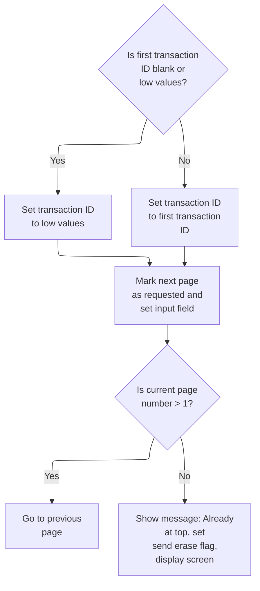

This section manages the behavior when a user presses the Page Up (PF7) key in the transaction list. It determines whether to move to a previous page or display a message if the user is already at the top of the list.

| Rule ID | Code Location   | Category        | Rule Name                     | Description                                                                                                                                                                                                          | Conditions                                                                                     | Remarks                                                                                                                                                     |
| ------- | --------------- | --------------- | ----------------------------- | -------------------------------------------------------------------------------------------------------------------------------------------------------------------------------------------------------------------- | ---------------------------------------------------------------------------------------------- | ----------------------------------------------------------------------------------------------------------------------------------------------------------- |
| BR-001  | PROCESS-PF7-KEY | Data validation | Reset Transaction ID on Blank | If the first transaction ID is blank or contains only low values, the system resets the transaction ID to low values before attempting to page up.                                                                   | The first transaction ID is blank or contains only low values when the Page Up key is pressed. | A blank transaction ID is represented by all spaces; low values are the lowest possible byte values. The transaction ID is a string of up to 16 characters. |
| BR-002  | PROCESS-PF7-KEY | Business logic  | Request Previous Page         | When the Page Up key is pressed, the system marks that the next page is requested and updates the input field to indicate a backward page request.                                                                   | The Page Up key is pressed, regardless of the current page number.                             | The system sets an internal flag to 'Y' to indicate a next page request and updates the input field to -1 to signal a backward navigation.                  |
| BR-003  | PROCESS-PF7-KEY | Business logic  | Navigate to Previous Page     | If the current page number is greater than 1, the system moves to the previous page of transactions.                                                                                                                 | The current page number is greater than 1 when the Page Up key is pressed.                     | Page numbers are positive integers. Navigation to a previous page is only allowed if the current page number is greater than 1.                             |
| BR-004  | PROCESS-PF7-KEY | Error handling  | Top of List Message           | If the current page number is not greater than 1, the system displays a message to the user indicating that they are already at the top of the transaction list, sets the send erase flag, and refreshes the screen. | The current page number is less than or equal to 1 when the Page Up key is pressed.            | The message displayed is: 'You are already at the top of the page...'. The send erase flag is set to 'N'. The screen is refreshed to show the message.      |

<SwmSnippet path="/app/cbl/COTRN00C.cbl" line="234" repo-id="Z2l0aHViJTNBJTNBa3luZHJ5bC1hd3MtbWFpbmZyYW1lLW1vZGVybml6YXRpb24tY2FyZGRlbW8lM0ElM0FTd2ltbS1EZW1v">

---

PROCESS-PF7-KEY checks if we're at the top of the transaction list. If not, it pages back; if we are, it shows a message so the user knows they can't go further up.

```cobol
       PROCESS-PF7-KEY.

           IF CDEMO-CT00-TRNID-FIRST = SPACES OR LOW-VALUES
               MOVE LOW-VALUES TO TRAN-ID
           ELSE
               MOVE CDEMO-CT00-TRNID-FIRST TO TRAN-ID
           END-IF

           SET NEXT-PAGE-YES TO TRUE
           MOVE -1       TO TRNIDINL OF COTRN0AI

           IF CDEMO-CT00-PAGE-NUM > 1
               PERFORM PROCESS-PAGE-BACKWARD
           ELSE
               MOVE 'You are already at the top of the page...' TO
                               WS-MESSAGE
               SET SEND-ERASE-NO TO TRUE
               PERFORM SEND-TRNLST-SCREEN
           END-IF.
```

---

</SwmSnippet>

### Paginating Backward Through Transactions

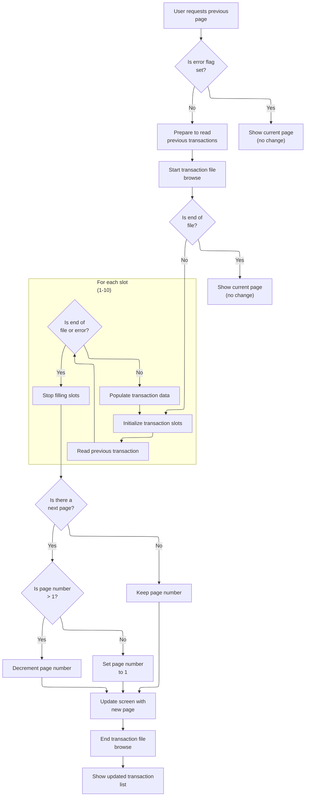

This section manages the logic for paginating backward through a user's transaction list, handling navigation, error conditions, and updating the displayed records and page number.

| Rule ID | Code Location          | Category       | Rule Name                                 | Description                                                                                                                                                                                      | Conditions                                                                                                                                 | Remarks                                                                                                                           |
| ------- | ---------------------- | -------------- | ----------------------------------------- | ------------------------------------------------------------------------------------------------------------------------------------------------------------------------------------------------ | ------------------------------------------------------------------------------------------------------------------------------------------ | --------------------------------------------------------------------------------------------------------------------------------- |
| BR-001  | PROCESS-PAGE-BACKWARD  | Business logic | Populate up to 10 transaction slots       | Up to 10 transaction slots are populated with previous transaction records when the user navigates backward, unless an error or end-of-file is encountered.                                      | The error flag is not set and the transaction file is not at end-of-file when paginating backward.                                         | A maximum of 10 transaction records are displayed per page. If fewer than 10 records are available, only those are shown.         |
| BR-002  | PROCESS-PAGE-BACKWARD  | Business logic | Page number decrement logic               | When navigating backward and there is a next page, the page number is decremented by 1 if it is greater than 1; otherwise, it is set to 1.                                                       | The next page flag is 'Y', the transaction file is not at end-of-file, no error is present, and the current page number is greater than 1. | Page numbers are positive integers. If the current page number is greater than 1, it is decremented by 1; if not, it is set to 1. |
| BR-003  | PROCESS-PAGE-BACKWARD  | Error handling | Error flag blocks navigation              | If an error flag is set, the previous page navigation is blocked and the current transaction list is shown without changes.                                                                      | The error flag is set to 'Y' (ERR-FLG-ON) when the user requests the previous page.                                                        | The error flag value is 'Y'. No changes are made to the transaction list or page number when this condition is met.               |
| BR-004  | READPREV-TRANSACT-FILE | Error handling | End-of-file top message                   | If the end of the transaction file is reached while paginating backward, a message is shown to the user indicating they are at the top of the transaction list and no further navigation occurs. | The transaction file returns an end-of-file response during a previous page request.                                                       | The message shown is 'You have reached the top of the page...'. The transaction list is not updated and the navigation stops.     |
| BR-005  | READPREV-TRANSACT-FILE | Error handling | Error message on transaction read failure | If an error occurs while reading a previous transaction, an error message is shown to the user and the transaction list is not updated.                                                          | A non-normal response code is returned when reading a previous transaction record.                                                         | The error message shown is 'Unable to lookup transaction...'. The transaction list is not updated and navigation stops.           |

<SwmSnippet path="/app/cbl/COTRN00C.cbl" line="333" repo-id="Z2l0aHViJTNBJTNBa3luZHJ5bC1hd3MtbWFpbmZyYW1lLW1vZGVybml6YXRpb24tY2FyZGRlbW8lM0ElM0FTd2ltbS1EZW1v">

---

PROCESS-PAGE-BACKWARD handles reading the previous set of transactions for the list. It starts the file browse, clears out the display slots, reads up to 10 previous records, updates the page number, and sets flags for previous-page navigation. Finally, it updates the commarea and sends the refreshed screen to the user.

```cobol
       PROCESS-PAGE-BACKWARD.

           PERFORM STARTBR-TRANSACT-FILE

           IF NOT ERR-FLG-ON

               IF EIBAID NOT = DFHENTER AND DFHPF8
                   PERFORM READPREV-TRANSACT-FILE
               END-IF

               IF TRANSACT-NOT-EOF AND ERR-FLG-OFF
                  PERFORM VARYING WS-IDX FROM 1 BY 1 UNTIL WS-IDX > 10
                     PERFORM INITIALIZE-TRAN-DATA
                  END-PERFORM
               END-IF

               MOVE 10          TO  WS-IDX

               PERFORM UNTIL WS-IDX <= 0 OR TRANSACT-EOF OR ERR-FLG-ON
                   PERFORM READPREV-TRANSACT-FILE
                   IF TRANSACT-NOT-EOF AND ERR-FLG-OFF
                       PERFORM POPULATE-TRAN-DATA
                       COMPUTE WS-IDX = WS-IDX - 1
                   END-IF
               END-PERFORM

               IF TRANSACT-NOT-EOF AND ERR-FLG-OFF
                  PERFORM READPREV-TRANSACT-FILE
                  IF NEXT-PAGE-YES
                     IF TRANSACT-NOT-EOF AND ERR-FLG-OFF AND
                        CDEMO-CT00-PAGE-NUM > 1
                        SUBTRACT 1 FROM CDEMO-CT00-PAGE-NUM
                     ELSE
                        MOVE 1 TO CDEMO-CT00-PAGE-NUM
                     END-IF
                  END-IF
               END-IF

               PERFORM ENDBR-TRANSACT-FILE

               MOVE CDEMO-CT00-PAGE-NUM TO PAGENUMI  OF COTRN0AI
               PERFORM SEND-TRNLST-SCREEN

           END-IF.
```

---

</SwmSnippet>

<SwmSnippet path="/app/cbl/COTRN00C.cbl" line="658" repo-id="Z2l0aHViJTNBJTNBa3luZHJ5bC1hd3MtbWFpbmZyYW1lLW1vZGVybml6YXRpb24tY2FyZGRlbW8lM0ElM0FTd2ltbS1EZW1v">

---

READPREV-TRANSACT-FILE reads the previous transaction record. If we're at the top, it sets a message and shows the user they're at the top of the page. Errors are handled with a message and a screen update.

```cobol
       READPREV-TRANSACT-FILE.

           EXEC CICS READPREV
                DATASET   (WS-TRANSACT-FILE)
                INTO      (TRAN-RECORD)
                LENGTH    (LENGTH OF TRAN-RECORD)
                RIDFLD    (TRAN-ID)
                KEYLENGTH (LENGTH OF TRAN-ID)
                RESP      (WS-RESP-CD)
                RESP2     (WS-REAS-CD)
           END-EXEC.

           EVALUATE WS-RESP-CD
               WHEN DFHRESP(NORMAL)
                   CONTINUE
               WHEN DFHRESP(ENDFILE)
                   CONTINUE
                   SET TRANSACT-EOF TO TRUE
                   MOVE 'You have reached the top of the page...' TO
                                   WS-MESSAGE
                   MOVE -1       TO TRNIDINL OF COTRN0AI
                   PERFORM SEND-TRNLST-SCREEN
               WHEN OTHER
                   DISPLAY 'RESP:' WS-RESP-CD 'REAS:' WS-REAS-CD
                   MOVE 'Y'     TO WS-ERR-FLG
                   MOVE 'Unable to lookup transaction...' TO
                                   WS-MESSAGE
                   MOVE -1       TO TRNIDINL OF COTRN0AI
                   PERFORM SEND-TRNLST-SCREEN
           END-EVALUATE.
```

---

</SwmSnippet>

### Handling Page Down (PF8) in Transaction List

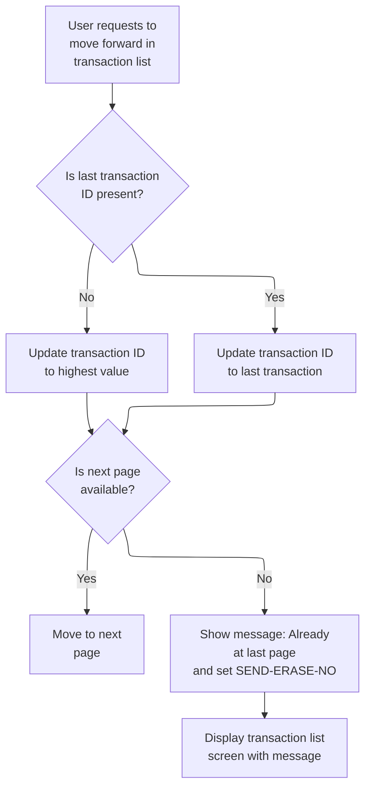

This section manages the user's request to page down in the transaction list, determining whether paging forward is possible and providing appropriate feedback or actions based on the transaction list state.

| Rule ID | Code Location   | Category       | Rule Name                            | Description                                                                                                                                                                                                                | Conditions                                                                               | Remarks                                                                                                                                                                     |
| ------- | --------------- | -------------- | ------------------------------------ | -------------------------------------------------------------------------------------------------------------------------------------------------------------------------------------------------------------------------- | ---------------------------------------------------------------------------------------- | --------------------------------------------------------------------------------------------------------------------------------------------------------------------------- |
| BR-001  | PROCESS-PF8-KEY | Business logic | Missing last transaction ID handling | When the user requests to page down in the transaction list, if the last transaction ID is not present, the system sets the transaction ID to the highest possible value to ensure paging starts from the end of the list. | User requests to page down and last transaction ID is blank or contains low-values.      | The transaction ID is set to the highest possible value. 'Blank' means all spaces; 'low-values' is a system constant representing the lowest possible value for a field.    |
| BR-002  | PROCESS-PF8-KEY | Business logic | Last transaction ID present handling | When the user requests to page down and the last transaction ID is present, the system sets the transaction ID to the value of the last transaction to continue paging from the correct position.                          | User requests to page down and last transaction ID is present (not blank or low-values). | The transaction ID is set to the value of the last transaction ID, which is a 4-character alphanumeric string.                                                              |
| BR-003  | PROCESS-PF8-KEY | Business logic | Next page available paging           | If the next page is available after updating the transaction ID, the system moves to the next page in the transaction list.                                                                                                | User requests to page down and next page is available.                                   | The system moves to the next page in the transaction list. No message is shown to the user in this case.                                                                    |
| BR-004  | PROCESS-PF8-KEY | Error handling | End of transaction list notification | If the next page is not available after updating the transaction ID, the system displays a message to the user indicating they are already at the last page and sets the SEND-ERASE-NO flag.                               | User requests to page down and next page is not available.                               | The message displayed is: 'You are already at the bottom of the page...'. The SEND-ERASE-NO flag is set to TRUE. The transaction list screen is displayed with the message. |

<SwmSnippet path="/app/cbl/COTRN00C.cbl" line="257" repo-id="Z2l0aHViJTNBJTNBa3luZHJ5bC1hd3MtbWFpbmZyYW1lLW1vZGVybml6YXRpb24tY2FyZGRlbW8lM0ElM0FTd2ltbS1EZW1v">

---

PROCESS-PF8-KEY checks if we're at the bottom of the transaction list. If not, it pages forward; if we are, it shows a message so the user knows they can't go further down.

```cobol
       PROCESS-PF8-KEY.

           IF CDEMO-CT00-TRNID-LAST = SPACES OR LOW-VALUES
               MOVE HIGH-VALUES TO TRAN-ID
           ELSE
               MOVE CDEMO-CT00-TRNID-LAST TO TRAN-ID
           END-IF

           MOVE -1       TO TRNIDINL OF COTRN0AI

           IF NEXT-PAGE-YES
               PERFORM PROCESS-PAGE-FORWARD
           ELSE
               MOVE 'You are already at the bottom of the page...' TO
                               WS-MESSAGE
               SET SEND-ERASE-NO TO TRUE
               PERFORM SEND-TRNLST-SCREEN
           END-IF.
```

---

</SwmSnippet>

## Handling Program Reentry and Initial Transaction Selection

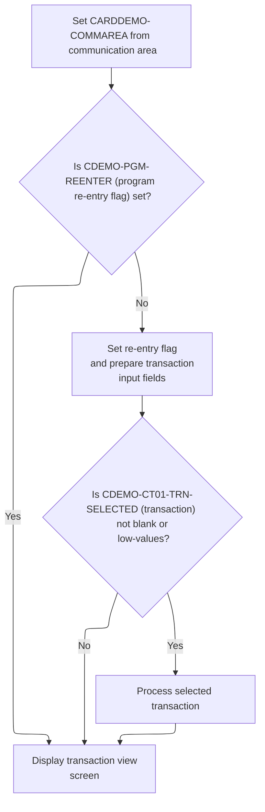

This section manages the logic for handling initial entry and reentry to the CardDemo transaction screen, ensuring the correct setup and flow for user transactions.

| Rule ID | Code Location | Category       | Rule Name                        | Description                                                                                                                                                                                  | Conditions                                                                                      | Remarks                                                                                                                                                                                                                                       |
| ------- | ------------- | -------------- | -------------------------------- | -------------------------------------------------------------------------------------------------------------------------------------------------------------------------------------------- | ----------------------------------------------------------------------------------------------- | --------------------------------------------------------------------------------------------------------------------------------------------------------------------------------------------------------------------------------------------- |
| BR-001  | MAIN-PARA     | Business logic | First entry initialization       | On first entry to the transaction screen, the system initializes transaction input fields and sets the program reentry flag to indicate subsequent entries are reentries.                    | When the program reentry flag is not set in the communication area upon entry.                  | The reentry flag is set when CDEMO-PGM-CONTEXT = 1 (CDEMO-PGM-REENTER). Transaction input fields are initialized to low-values and -1. This ensures the screen is prepared for user input and subsequent entries are recognized as reentries. |
| BR-002  | MAIN-PARA     | Business logic | Immediate transaction processing | If a transaction was previously selected, the system immediately processes and displays that transaction upon first entry to the screen.                                                     | When entering for the first time and the selected transaction field is not blank or low-values. | A transaction is considered selected if the field is not blank (spaces) or low-values. The selected transaction is processed and displayed immediately, streamlining the workflow for users coming from the transaction list.                 |
| BR-003  | MAIN-PARA     | Business logic | Reentry screen display           | On program reentry, the system bypasses initialization and proceeds directly to display the transaction view screen, allowing the user to continue interacting with the current transaction. | When the program reentry flag is set in the communication area.                                 | Reentry is indicated by CDEMO-PGM-CONTEXT = 1 (CDEMO-PGM-REENTER). No initialization of transaction fields occurs; the screen is displayed as-is for continued user interaction.                                                              |

<SwmSnippet path="/app/cbl/COTRN01C.cbl" line="97" repo-id="Z2l0aHViJTNBJTNBa3luZHJ5bC1hd3MtbWFpbmZyYW1lLW1vZGVybml6YXRpb24tY2FyZGRlbW8lM0ElM0FTd2ltbS1EZW1v">

---

We just returned from RETURN-TO-PREV-SCREEN. In MAIN-PARA, if EIBCALEN is zero, we bail out to signon. Otherwise, we move the commarea in, check if this is a first entry or a reentry (CDEMO-PGM-REENTER). On first entry, we prep the screen and, if a transaction was selected (CDEMO-CT01-TRN-SELECTED is set), we call PROCESS-ENTER-KEY to immediately process and show that transaction. This keeps the flow tight when coming from the transaction list. On reentry, we just receive the screen input and process commands as usual.

```cobol
           ELSE
               MOVE DFHCOMMAREA(1:EIBCALEN) TO CARDDEMO-COMMAREA
               IF NOT CDEMO-PGM-REENTER
                   SET CDEMO-PGM-REENTER    TO TRUE
                   MOVE LOW-VALUES          TO COTRN1AO
                   MOVE -1       TO TRNIDINL OF COTRN1AI
                   IF CDEMO-CT01-TRN-SELECTED NOT =
                                              SPACES AND LOW-VALUES
                       MOVE CDEMO-CT01-TRN-SELECTED TO
                            TRNIDINI OF COTRN1AI
                       PERFORM PROCESS-ENTER-KEY
                   END-IF
                   PERFORM SEND-TRNVIEW-SCREEN
```

---

</SwmSnippet>

## Validating Transaction ID and Preparing View

```mermaid
%%{init: {"flowchart": {"defaultRenderer": "elk"}} }%%
flowchart TD
    node1["User enters transaction 
 ID"]
    click node1 openCode "app/cbl/COTRN01C.cbl:144:146"
    node1 --> node2{"Is transaction ID 
 empty or invalid?"}
    click node2 openCode "app/cbl/COTRN01C.cbl:147:147"
    node2 -->|"Yes"| node3["Set error flag 
 and message"]
    click node3 openCode "app/cbl/COTRN01C.cbl:148:151"
    node3 --> node4["Preparing and Sending Transaction View Screen"]
    
    node2 -->|"No"| node5["Reading Transaction Record from File"]
    

classDef HeadingStyle fill:#777777,stroke:#333,stroke-width:2px;
click node4 goToHeading "Preparing and Sending Transaction View Screen"
node4:::HeadingStyle
click node5 goToHeading "Reading Transaction Record from File"
node5:::HeadingStyle
```

This section validates the transaction ID entered by the user and determines whether to display an error message or proceed with viewing the transaction record.

| Rule ID | Code Location     | Category        | Rule Name                                | Description                                                                                                                                                                                                                                   | Conditions                                                             | Remarks                                                                                                                                                                                        |
| ------- | ----------------- | --------------- | ---------------------------------------- | --------------------------------------------------------------------------------------------------------------------------------------------------------------------------------------------------------------------------------------------- | ---------------------------------------------------------------------- | ---------------------------------------------------------------------------------------------------------------------------------------------------------------------------------------------- |
| BR-001  | PROCESS-ENTER-KEY | Data validation | Transaction ID required                  | If the transaction ID entered by the user is empty or contains only non-printable values, the system must prevent further processing and immediately display an error message to the user indicating that the transaction ID cannot be empty. | The transaction ID input is empty or contains only low-values.         | The error flag is set to 'Y'. The error message displayed is 'Tran ID can NOT be empty...'. The transaction ID length is set to -1. The error message is shown on the transaction view screen. |
| BR-002  | PROCESS-ENTER-KEY | Business logic  | Accept valid transaction ID              | If the transaction ID input is not empty and does not contain low-values, the system must accept the input and proceed to the next step in processing the transaction view request.                                                           | The transaction ID input is not empty and does not contain low-values. | The transaction ID length is set to -1, indicating readiness for further processing. No error message is set.                                                                                  |
| BR-003  | PROCESS-ENTER-KEY | Error handling  | Error feedback on invalid transaction ID | When the transaction ID input is invalid, the system must display the transaction view screen with the error message, allowing the user to correct their input.                                                                               | The transaction ID input is empty or contains only low-values.         | The transaction view screen is displayed with the error message 'Tran ID can NOT be empty...'. The error flag is set to 'Y'.                                                                   |

<SwmSnippet path="/app/cbl/COTRN01C.cbl" line="144" repo-id="Z2l0aHViJTNBJTNBa3luZHJ5bC1hd3MtbWFpbmZyYW1lLW1vZGVybml6YXRpb24tY2FyZGRlbW8lM0ElM0FTd2ltbS1EZW1v">

---

In PROCESS-ENTER-KEY, we check if the transaction ID input is empty. If it is, we set an error, prep the error message, and call SEND-TRNVIEW-SCREEN to show the user what's wrong. If not, we just set the length and keep going. This stops bad input from going any further and gives instant feedback.

```cobol
       PROCESS-ENTER-KEY.

           EVALUATE TRUE
               WHEN TRNIDINI OF COTRN1AI = SPACES OR LOW-VALUES
                   MOVE 'Y'     TO WS-ERR-FLG
                   MOVE 'Tran ID can NOT be empty...' TO
                                   WS-MESSAGE
                   MOVE -1       TO TRNIDINL OF COTRN1AI
                   PERFORM SEND-TRNVIEW-SCREEN
               WHEN OTHER
                   MOVE -1       TO TRNIDINL OF COTRN1AI
                   CONTINUE
           END-EVALUATE
```

---

</SwmSnippet>

### Preparing and Sending Transaction View Screen

```mermaid
%%{init: {"flowchart": {"defaultRenderer": "elk"}} }%%
flowchart TD
    node1["Prepare header info: 
 date, time, transaction 
 ID, program name"] --> node2{"Is there a 
 message to display?"}
    click node1 openCode "app/cbl/COTRN01C.cbl:243:262"
    node2 -->|"Yes"| node3["Include message for 
 user"]
    click node2 openCode "app/cbl/COTRN01C.cbl:217:217"
    click node3 openCode "app/cbl/COTRN01C.cbl:217:217"
    node2 -->|"No"| node4["Skip message"]
    node3 --> node5["Display transaction view 
 screen to user"]
    node4 --> node5
    click node5 openCode "app/cbl/COTRN01C.cbl:219:225"
classDef HeadingStyle fill:#777777,stroke:#333,stroke-width:2px;
```

This section prepares and sends the transaction view screen to the user, ensuring the header is up-to-date, any relevant messages are displayed, and the screen is presented cleanly for user interaction.

| Rule ID | Code Location                             | Category       | Rule Name                                  | Description                                                                                                                                                                               | Conditions                                                    | Remarks                                                                                                                                                                                                                     |
| ------- | ----------------------------------------- | -------------- | ------------------------------------------ | ----------------------------------------------------------------------------------------------------------------------------------------------------------------------------------------- | ------------------------------------------------------------- | --------------------------------------------------------------------------------------------------------------------------------------------------------------------------------------------------------------------------- |
| BR-001  | SEND-TRNVIEW-SCREEN, POPULATE-HEADER-INFO | Business logic | Header information display                 | The transaction view screen must always display a header containing the current date, time, transaction ID, and program name to ensure the user sees up-to-date and relevant information. | Whenever the transaction view screen is prepared for display. | Header includes: program name (8 characters, left-aligned), transaction ID (4 characters, left-aligned), date (formatted as MM/DD/YY), time (formatted as HH:MM:SS). These values are updated each time the screen is sent. |
| BR-002  | SEND-TRNVIEW-SCREEN                       | Business logic | User message display                       | If there is a message to display (such as an error or informational message), it must be shown to the user in the designated message area of the transaction view screen.                 | When the message field contains a value other than spaces.    | Message field is 80 characters, left-aligned. If no message is present, the field remains blank.                                                                                                                            |
| BR-003  | SEND-TRNVIEW-SCREEN                       | Business logic | Screen presentation and cursor positioning | The transaction view screen must be sent to the user with a clean display and the cursor positioned for immediate user interaction.                                                       | Whenever the transaction view screen is sent to the user.     | Screen is erased before display; cursor is positioned for user input. The output map is 'COTRN1A' from mapset 'COTRN01'.                                                                                                    |

<SwmSnippet path="/app/cbl/COTRN01C.cbl" line="213" repo-id="Z2l0aHViJTNBJTNBa3luZHJ5bC1hd3MtbWFpbmZyYW1lLW1vZGVybml6YXRpb24tY2FyZGRlbW8lM0ElM0FTd2ltbS1EZW1v">

---

In SEND-TRNVIEW-SCREEN, we call POPULATE-HEADER-INFO to set up the header fields (titles, date, time, etc.) before sending the screen. This keeps the display consistent and up-to-date for the user.

```cobol
       SEND-TRNVIEW-SCREEN.

           PERFORM POPULATE-HEADER-INFO
```

---

</SwmSnippet>

<SwmSnippet path="/app/cbl/COTRN01C.cbl" line="243" repo-id="Z2l0aHViJTNBJTNBa3luZHJ5bC1hd3MtbWFpbmZyYW1lLW1vZGVybml6YXRpb24tY2FyZGRlbW8lM0ElM0FTd2ltbS1EZW1v">

---

POPULATE-HEADER-INFO sets up the header with the right titles, date, time, and program info before the screen is sent.

```cobol
       POPULATE-HEADER-INFO.

           MOVE FUNCTION CURRENT-DATE  TO WS-CURDATE-DATA

           MOVE CCDA-TITLE01           TO TITLE01O OF COTRN1AO
           MOVE CCDA-TITLE02           TO TITLE02O OF COTRN1AO
           MOVE WS-TRANID              TO TRNNAMEO OF COTRN1AO
           MOVE WS-PGMNAME             TO PGMNAMEO OF COTRN1AO

           MOVE WS-CURDATE-MONTH       TO WS-CURDATE-MM
           MOVE WS-CURDATE-DAY         TO WS-CURDATE-DD
           MOVE WS-CURDATE-YEAR(3:2)   TO WS-CURDATE-YY

           MOVE WS-CURDATE-MM-DD-YY    TO CURDATEO OF COTRN1AO

           MOVE WS-CURTIME-HOURS       TO WS-CURTIME-HH
           MOVE WS-CURTIME-MINUTE      TO WS-CURTIME-MM
           MOVE WS-CURTIME-SECOND      TO WS-CURTIME-SS

           MOVE WS-CURTIME-HH-MM-SS    TO CURTIMEO OF COTRN1AO.
```

---

</SwmSnippet>

<SwmSnippet path="/app/cbl/COTRN01C.cbl" line="217" repo-id="Z2l0aHViJTNBJTNBa3luZHJ5bC1hd3MtbWFpbmZyYW1lLW1vZGVybml6YXRpb24tY2FyZGRlbW8lM0ElM0FTd2ltbS1EZW1v">

---

We just finished POPULATE-HEADER-INFO, so now in SEND-TRNVIEW-SCREEN we move any message (error or info) into the screen's message field and send the transaction view screen to the terminal. ERASE makes sure the screen is clean, and CURSOR puts the cursor in the right spot for the user.

```cobol
           MOVE WS-MESSAGE TO ERRMSGO OF COTRN1AO

           EXEC CICS SEND
                     MAP('COTRN1A')
                     MAPSET('COTRN01')
                     FROM(COTRN1AO)
                     ERASE
                     CURSOR
           END-EXEC.
```

---

</SwmSnippet>

### Clearing Input and Reading Transaction Data

This section manages the clearing of transaction input fields and the retrieval of transaction data for display, based on the current error status.

| Rule ID | Code Location     | Category       | Rule Name                             | Description                                                                                                                 | Conditions                                   | Remarks                                                                                                                                                                                                                                                                                    |
| ------- | ----------------- | -------------- | ------------------------------------- | --------------------------------------------------------------------------------------------------------------------------- | -------------------------------------------- | ------------------------------------------------------------------------------------------------------------------------------------------------------------------------------------------------------------------------------------------------------------------------------------------ |
| BR-001  | PROCESS-ENTER-KEY | Business logic | Clear transaction fields on success   | When there is no error flagged, all transaction detail fields are cleared before fetching new transaction data for display. | No error is flagged (error flag is not set). | Fields cleared include transaction ID, card number, type code, category code, source, amount, description, original date, processed date, merchant ID, merchant name, merchant city, and merchant zip. All fields are cleared to empty strings or spaces, depending on their type.         |
| BR-002  | PROCESS-ENTER-KEY | Business logic | Fetch transaction data on valid input | Transaction data is fetched for display only when no error is flagged.                                                      | No error is flagged (error flag is not set). | Transaction data includes all fields defined in the transaction record, such as transaction ID, type code, category code, source, description, amount, merchant details, card number, and timestamps. Data is fetched in its native format as defined in the transaction record structure. |
| BR-003  | PROCESS-ENTER-KEY | Error handling | Prevent data update on error          | If an error is flagged, transaction detail fields are not cleared and transaction data is not fetched.                      | Error flag is set.                           | No changes are made to transaction detail fields or displayed data when an error is flagged.                                                                                                                                                                                               |

<SwmSnippet path="/app/cbl/COTRN01C.cbl" line="158" repo-id="Z2l0aHViJTNBJTNBa3luZHJ5bC1hd3MtbWFpbmZyYW1lLW1vZGVybml6YXRpb24tY2FyZGRlbW8lM0ElM0FTd2ltbS1EZW1v">

---

After showing the screen, PROCESS-ENTER-KEY clears out the detail fields and fetches the transaction data for display.

```cobol
           IF NOT ERR-FLG-ON
               MOVE SPACES      TO TRNIDI   OF COTRN1AI
                                   CARDNUMI OF COTRN1AI
                                   TTYPCDI  OF COTRN1AI
                                   TCATCDI  OF COTRN1AI
                                   TRNSRCI  OF COTRN1AI
                                   TRNAMTI  OF COTRN1AI
                                   TDESCI   OF COTRN1AI
                                   TORIGDTI OF COTRN1AI
                                   TPROCDTI OF COTRN1AI
                                   MIDI     OF COTRN1AI
                                   MNAMEI   OF COTRN1AI
                                   MCITYI   OF COTRN1AI
                                   MZIPI    OF COTRN1AI
               MOVE TRNIDINI  OF COTRN1AI TO TRAN-ID
               PERFORM READ-TRANSACT-FILE
           END-IF.
```

---

</SwmSnippet>

### Reading Transaction Record from File

```mermaid
%%{init: {"flowchart": {"defaultRenderer": "elk"}} }%%
flowchart TD
  node1["Attempt to read 
 transaction record by 
 ID"]
  click node1 openCode "app/cbl/COTRN01C.cbl:267:278"
  node1 --> node2{"Read result"}
  click node2 openCode "app/cbl/COTRN01C.cbl:280:296"
  node2 -->|"Record found"| node3["Transaction found, no 
 error, continue"]
  click node3 openCode "app/cbl/COTRN01C.cbl:281:282"
  node2 -->|"Not found"| node4["Set error flag, 
 message: 'Transaction ID 
 NOT found', display 
 transaction view to 
 user"]
  click node4 openCode "app/cbl/COTRN01C.cbl:283:288"
  node2 -->|"Other error"| node5["Set error flag, 
 message: 'Unable to 
 lookup Transaction', display 
 transaction view to 
 user"]
  click node5 openCode "app/cbl/COTRN01C.cbl:289:295"

classDef HeadingStyle fill:#777777,stroke:#333,stroke-width:2px;
```

This section manages the retrieval of transaction records by ID and handles user-facing error messaging when records are not found or technical errors occur.

| Rule ID | Code Location      | Category       | Rule Name                   | Description                                                                                                                                                                                                       | Conditions                                                                                      | Remarks                                                                                                                                                                                                                                       |
| ------- | ------------------ | -------------- | --------------------------- | ----------------------------------------------------------------------------------------------------------------------------------------------------------------------------------------------------------------- | ----------------------------------------------------------------------------------------------- | --------------------------------------------------------------------------------------------------------------------------------------------------------------------------------------------------------------------------------------------- |
| BR-001  | READ-TRANSACT-FILE | Business logic | Transaction found           | If the transaction record is found for the provided transaction ID, no error is set and processing continues without displaying an error message to the user.                                                     | The response code from the read operation is NORMAL.                                            | No error flag is set (WS-ERR-FLG remains 'N'). No message is displayed to the user. The transaction record is available for further processing.                                                                                               |
| BR-002  | READ-TRANSACT-FILE | Error handling | Transaction not found error | If the transaction record is not found for the provided transaction ID, an error flag is set, the message 'Transaction ID NOT found...' is displayed to the user, and the transaction view screen is shown again. | The response code from the read operation is NOTFND.                                            | Error flag is set to 'Y'. Message displayed is 'Transaction ID NOT found...'. The transaction view screen is shown again. The input field for transaction ID is set to -1.                                                                    |
| BR-003  | READ-TRANSACT-FILE | Error handling | Technical lookup error      | If any other error occurs during the transaction record lookup, an error flag is set, the message 'Unable to lookup Transaction...' is displayed to the user, and the transaction view screen is shown again.     | The response code from the read operation is neither NORMAL nor NOTFND (i.e., any other error). | Error flag is set to 'Y'. Message displayed is 'Unable to lookup Transaction...'. The transaction view screen is shown again. The input field for transaction ID is set to -1. The response and reason codes are displayed in the system log. |

<SwmSnippet path="/app/cbl/COTRN01C.cbl" line="267" repo-id="Z2l0aHViJTNBJTNBa3luZHJ5bC1hd3MtbWFpbmZyYW1lLW1vZGVybml6YXRpb24tY2FyZGRlbW8lM0ElM0FTd2ltbS1EZW1v">

---

READ-TRANSACT-FILE fetches the transaction record by ID and locks it for update.

```cobol
       READ-TRANSACT-FILE.

           EXEC CICS READ
                DATASET   (WS-TRANSACT-FILE)
                INTO      (TRAN-RECORD)
                LENGTH    (LENGTH OF TRAN-RECORD)
                RIDFLD    (TRAN-ID)
                KEYLENGTH (LENGTH OF TRAN-ID)
                UPDATE
                RESP      (WS-RESP-CD)
                RESP2     (WS-REAS-CD)
           END-EXEC.
```

---

</SwmSnippet>

<SwmSnippet path="/app/cbl/COTRN01C.cbl" line="280" repo-id="Z2l0aHViJTNBJTNBa3luZHJ5bC1hd3MtbWFpbmZyYW1lLW1vZGVybml6YXRpb24tY2FyZGRlbW8lM0ElM0FTd2ltbS1EZW1v">

---

After trying to read the transaction, we check the result. If the record isn't found or there's an error, we set the error message and show the transaction view screen again with the error so the user knows what went wrong.

```cobol
           EVALUATE WS-RESP-CD
               WHEN DFHRESP(NORMAL)
                   CONTINUE
               WHEN DFHRESP(NOTFND)
                   MOVE 'Y'     TO WS-ERR-FLG
                   MOVE 'Transaction ID NOT found...' TO
                                   WS-MESSAGE
                   MOVE -1       TO TRNIDINL OF COTRN1AI
                   PERFORM SEND-TRNVIEW-SCREEN
               WHEN OTHER
                   DISPLAY 'RESP:' WS-RESP-CD 'REAS:' WS-REAS-CD
                   MOVE 'Y'     TO WS-ERR-FLG
                   MOVE 'Unable to lookup Transaction...' TO
                                   WS-MESSAGE
                   MOVE -1       TO TRNIDINL OF COTRN1AI
                   PERFORM SEND-TRNVIEW-SCREEN
           END-EVALUATE.
```

---

</SwmSnippet>

### Populating Transaction Details and Displaying

This section ensures that, upon a successful transaction file read, all relevant transaction details are populated into the application's input structure and immediately displayed to the user for review.

| Rule ID | Code Location | Category       | Rule Name                   | Description                                                                                                                                   | Conditions                                                                                           | Remarks                                                                                                                                                                                                                                                                                                                                                                                                                                                                                                                                                                                                                               |
| ------- | ------------- | -------------- | --------------------------- | --------------------------------------------------------------------------------------------------------------------------------------------- | ---------------------------------------------------------------------------------------------------- | ------------------------------------------------------------------------------------------------------------------------------------------------------------------------------------------------------------------------------------------------------------------------------------------------------------------------------------------------------------------------------------------------------------------------------------------------------------------------------------------------------------------------------------------------------------------------------------------------------------------------------------- |
| BR-001  | MAIN-LOGIC    | Business logic | Populate on successful read | Transaction details are populated into the application's input structure only if no error is flagged after reading the transaction file.      | No error flag is set after reading the transaction file (ERR-FLG-ON is false).                       | The error flag is represented by a single character ('Y' for error, 'N' for no error). Transaction details are only populated when the flag is 'N'.                                                                                                                                                                                                                                                                                                                                                                                                                                                                                   |
| BR-002  | MAIN-LOGIC    | Business logic | Transfer transaction fields | All transaction fields from the transaction record are transferred to the application's input structure for display when no error is present. | No error flag is set after reading the transaction file.                                             | Fields transferred include: Transaction Amount (number, up to 11 digits with 2 decimals), Transaction ID (string, 16 characters), Card Number (string, 16 characters), Transaction Type Code (string, 2 characters), Transaction Category Code (number, 4 digits), Transaction Source (string, 10 characters), Transaction Description (string, 100 characters), Transaction Original Timestamp (string, 26 characters), Transaction Processed Timestamp (string, 26 characters), Merchant ID (number, 9 digits), Merchant Name (string, 50 characters), Merchant City (string, 50 characters), Merchant ZIP (string, 10 characters). |
| BR-003  | MAIN-LOGIC    | Business logic | Display transaction view    | The transaction view screen is displayed to the user immediately after transaction details are populated, provided no error occurred.         | No error flag is set after reading the transaction file and transaction details have been populated. | The transaction view screen presents all populated transaction fields to the user in a structured format.                                                                                                                                                                                                                                                                                                                                                                                                                                                                                                                             |

<SwmSnippet path="/app/cbl/COTRN01C.cbl" line="176" repo-id="Z2l0aHViJTNBJTNBa3luZHJ5bC1hd3MtbWFpbmZyYW1lLW1vZGVybml6YXRpb24tY2FyZGRlbW8lM0ElM0FTd2ltbS1EZW1v">

---

We just returned from READ-TRANSACT-FILE. If there was no error, we copy all the transaction fields into the input structure and show the transaction view screen so the user sees the details right away.

```cobol
           IF NOT ERR-FLG-ON
               MOVE TRAN-AMT TO WS-TRAN-AMT
               MOVE TRAN-ID      TO TRNIDI    OF COTRN1AI
               MOVE TRAN-CARD-NUM      TO CARDNUMI    OF COTRN1AI
               MOVE TRAN-TYPE-CD        TO TTYPCDI   OF COTRN1AI
               MOVE TRAN-CAT-CD        TO TCATCDI   OF COTRN1AI
               MOVE TRAN-SOURCE       TO TRNSRCI  OF COTRN1AI
               MOVE WS-TRAN-AMT      TO TRNAMTI    OF COTRN1AI
               MOVE TRAN-DESC      TO TDESCI    OF COTRN1AI
               MOVE TRAN-ORIG-TS        TO TORIGDTI   OF COTRN1AI
               MOVE TRAN-PROC-TS       TO TPROCDTI  OF COTRN1AI
               MOVE TRAN-MERCHANT-ID       TO MIDI  OF COTRN1AI
               MOVE TRAN-MERCHANT-NAME       TO MNAMEI  OF COTRN1AI
               MOVE TRAN-MERCHANT-CITY       TO MCITYI  OF COTRN1AI
               MOVE TRAN-MERCHANT-ZIP       TO MZIPI  OF COTRN1AI
               PERFORM SEND-TRNVIEW-SCREEN
           END-IF.
```

---

</SwmSnippet>

## Displaying Transaction View After Input Processing

```mermaid
%%{init: {"flowchart": {"defaultRenderer": "elk"}} }%%
flowchart TD
    node1["Set CARDDEMO-COMMAREA from 
 communication area"]
    click node1 openCode "app/cbl/COTRN01C.cbl:98:98"
    node1 --> node2{"Is CDEMO-PGM-REENTER (program 
 re-entry flag) set?"}
    click node2 openCode "app/cbl/COTRN01C.cbl:99:100"
    node2 -->|"No"| node3["Set re-entry flag 
 and prepare transaction 
 input fields"]
    click node3 openCode "app/cbl/COTRN01C.cbl:101:102"
    node3 --> node4{"Is CDEMO-CT01-TRN-SELECTED (transaction) 
 not blank or 
 low-values?"}
    click node4 openCode "app/cbl/COTRN01C.cbl:103:107"
    node4 -->|"Yes"| node5["Process selected transaction"]
    click node5 openCode "app/cbl/COTRN01C.cbl:107:107"
    node5 --> node6["Display transaction view 
 screen"]
    click node6 openCode "app/cbl/COTRN01C.cbl:109:109"
    node4 -->|"No"| node6
    node2 -->|"Yes"| node6
    click node6 openCode "app/cbl/COTRN01C.cbl:109:109"
classDef HeadingStyle fill:#777777,stroke:#333,stroke-width:2px;
```

This section manages the logic for handling initial entry and reentry to the CardDemo transaction screen, ensuring the correct setup and flow for user transactions.

| Rule ID | Code Location | Category       | Rule Name                        | Description                                                                                                                                                                                  | Conditions                                                                                      | Remarks                                                                                                                                                                                                                                       |
| ------- | ------------- | -------------- | -------------------------------- | -------------------------------------------------------------------------------------------------------------------------------------------------------------------------------------------- | ----------------------------------------------------------------------------------------------- | --------------------------------------------------------------------------------------------------------------------------------------------------------------------------------------------------------------------------------------------- |
| BR-001  | MAIN-PARA     | Business logic | First entry initialization       | On first entry to the transaction screen, the system initializes transaction input fields and sets the program reentry flag to indicate subsequent entries are reentries.                    | When the program reentry flag is not set in the communication area upon entry.                  | The reentry flag is set when CDEMO-PGM-CONTEXT = 1 (CDEMO-PGM-REENTER). Transaction input fields are initialized to low-values and -1. This ensures the screen is prepared for user input and subsequent entries are recognized as reentries. |
| BR-002  | MAIN-PARA     | Business logic | Immediate transaction processing | If a transaction was previously selected, the system immediately processes and displays that transaction upon first entry to the screen.                                                     | When entering for the first time and the selected transaction field is not blank or low-values. | A transaction is considered selected if the field is not blank (spaces) or low-values. The selected transaction is processed and displayed immediately, streamlining the workflow for users coming from the transaction list.                 |
| BR-003  | MAIN-PARA     | Business logic | Reentry screen display           | On program reentry, the system bypasses initialization and proceeds directly to display the transaction view screen, allowing the user to continue interacting with the current transaction. | When the program reentry flag is set in the communication area.                                 | Reentry is indicated by CDEMO-PGM-CONTEXT = 1 (CDEMO-PGM-REENTER). No initialization of transaction fields occurs; the screen is displayed as-is for continued user interaction.                                                              |

<SwmSnippet path="/app/cbl/COTRN01C.cbl" line="97" repo-id="Z2l0aHViJTNBJTNBa3luZHJ5bC1hd3MtbWFpbmZyYW1lLW1vZGVybml6YXRpb24tY2FyZGRlbW8lM0ElM0FTd2ltbS1EZW1v">

---

After handling input, MAIN-PARA always sends the transaction view screen to keep the UI up to date.

```cobol
           ELSE
               MOVE DFHCOMMAREA(1:EIBCALEN) TO CARDDEMO-COMMAREA
               IF NOT CDEMO-PGM-REENTER
                   SET CDEMO-PGM-REENTER    TO TRUE
                   MOVE LOW-VALUES          TO COTRN1AO
                   MOVE -1       TO TRNIDINL OF COTRN1AI
                   IF CDEMO-CT01-TRN-SELECTED NOT =
                                              SPACES AND LOW-VALUES
                       MOVE CDEMO-CT01-TRN-SELECTED TO
                            TRNIDINI OF COTRN1AI
                       PERFORM PROCESS-ENTER-KEY
                   END-IF
                   PERFORM SEND-TRNVIEW-SCREEN
```

---

</SwmSnippet>

<SwmSnippet path="/app/cbl/COTRN01C.cbl" line="110" repo-id="Z2l0aHViJTNBJTNBa3luZHJ5bC1hd3MtbWFpbmZyYW1lLW1vZGVybml6YXRpb24tY2FyZGRlbW8lM0ElM0FTd2ltbS1EZW1v">

---

We just returned from SEND-TRNVIEW-SCREEN in MAIN-PARA. Now we call RECEIVE-TRNVIEW-SCREEN to wait for the user's next input, keeping the flow interactive.

```cobol
               ELSE
                   PERFORM RECEIVE-TRNVIEW-SCREEN
```

---

</SwmSnippet>

<SwmSnippet path="/app/cbl/COTRN01C.cbl" line="230" repo-id="Z2l0aHViJTNBJTNBa3luZHJ5bC1hd3MtbWFpbmZyYW1lLW1vZGVybml6YXRpb24tY2FyZGRlbW8lM0ElM0FTd2ltbS1EZW1v">

---

RECEIVE-TRNVIEW-SCREEN is where we grab the user's input from the transaction view screen. The EXEC CICS RECEIVE command pulls the data from the 'COTRN1A' map in the 'COTRN01' mapset and puts it into COTRN1AI. We also capture the response codes (WS-RESP-CD and WS-REAS-CD) so we can handle any errors or special cases from the terminal interaction.

```cobol
       RECEIVE-TRNVIEW-SCREEN.

           EXEC CICS RECEIVE
                     MAP('COTRN1A')
                     MAPSET('COTRN01')
                     INTO(COTRN1AI)
                     RESP(WS-RESP-CD)
                     RESP2(WS-REAS-CD)
           END-EXEC.
```

---

</SwmSnippet>

<SwmSnippet path="/app/cbl/COTRN01C.cbl" line="112" repo-id="Z2l0aHViJTNBJTNBa3luZHJ5bC1hd3MtbWFpbmZyYW1lLW1vZGVybml6YXRpb24tY2FyZGRlbW8lM0ElM0FTd2ltbS1EZW1v">

---

Back in MAIN-PARA, after we return from RECEIVE-TRNVIEW-SCREEN, we check EIBAID to see what the user did. If it's Enter, we process the transaction ID. If it's PF3, we set up to return to the previous screen. PF4 clears the screen, PF5 exits to another program, and anything else triggers an error message and resends the screen.

```cobol
                   EVALUATE EIBAID
                       WHEN DFHENTER
                           PERFORM PROCESS-ENTER-KEY
```

---

</SwmSnippet>

<SwmSnippet path="/app/cbl/COTRN01C.cbl" line="115" repo-id="Z2l0aHViJTNBJTNBa3luZHJ5bC1hd3MtbWFpbmZyYW1lLW1vZGVybml6YXRpb24tY2FyZGRlbW8lM0ElM0FTd2ltbS1EZW1v">

---

When PF3 is pressed, MAIN-PARA checks if CDEMO-FROM-PROGRAM is set. If not, it defaults to 'COMEN01C' (main menu). Then it calls RETURN-TO-PREV-SCREEN to handle the actual screen switch. This fits between handling Enter and the other PF keys.

```cobol
                       WHEN DFHPF3
                           IF CDEMO-FROM-PROGRAM = SPACES OR LOW-VALUES
                               MOVE 'COMEN01C' TO CDEMO-TO-PROGRAM
                           ELSE
                               MOVE CDEMO-FROM-PROGRAM TO
                               CDEMO-TO-PROGRAM
                           END-IF
                           PERFORM RETURN-TO-PREV-SCREEN
```

---

</SwmSnippet>

<SwmSnippet path="/app/cbl/COTRN01C.cbl" line="123" repo-id="Z2l0aHViJTNBJTNBa3luZHJ5bC1hd3MtbWFpbmZyYW1lLW1vZGVybml6YXRpb24tY2FyZGRlbW8lM0ElM0FTd2ltbS1EZW1v">

---

When PF4 is pressed, we call CLEAR-CURRENT-SCREEN to wipe out any old data and reset the screen. This makes sure the next display is clean and doesn't show stale info. After that, we send the cleared screen to the user.

```cobol
                       WHEN DFHPF4
                           PERFORM CLEAR-CURRENT-SCREEN
                       WHEN DFHPF5
                           MOVE 'COTRN00C' TO CDEMO-TO-PROGRAM
                           PERFORM RETURN-TO-PREV-SCREEN
```

---

</SwmSnippet>

## Resetting and Refreshing the Transaction View

This section ensures that when a user requests a reset of the transaction view, all fields are cleared, the transaction is marked as invalid, and the user is presented with a refreshed, blank screen.

| Rule ID | Code Location         | Category       | Rule Name                  | Description                                                                                                                                             | Conditions                                                              | Remarks                                                                                                                                |
| ------- | --------------------- | -------------- | -------------------------- | ------------------------------------------------------------------------------------------------------------------------------------------------------- | ----------------------------------------------------------------------- | -------------------------------------------------------------------------------------------------------------------------------------- |
| BR-001  | INITIALIZE-ALL-FIELDS | Business logic | Transaction view reset     | Whenever the transaction view is reset, all fields in the transaction view must be cleared so that no previous transaction data is visible to the user. | Triggered when the user requests a screen reset (e.g., via PF4 action). | All transaction fields are cleared to blank values. The message area is also cleared. No previous data should be visible in any field. |
| BR-002  | INITIALIZE-ALL-FIELDS | Business logic | Invalid transaction marker | After resetting the transaction view, the transaction ID must be set to an invalid value (-1) to indicate that no transaction is currently active.      | Triggered whenever the transaction view is reset.                       | The transaction ID is set to -1, which is not a valid transaction identifier.                                                          |
| BR-003  | CLEAR-CURRENT-SCREEN  | Business logic | Present refreshed view     | After all fields are cleared, the refreshed transaction view must be immediately presented to the user so they can confirm the reset was successful.    | Triggered after the transaction view is reset.                          | The user is shown a blank transaction view screen. No residual data should be visible.                                                 |

<SwmSnippet path="/app/cbl/COTRN01C.cbl" line="301" repo-id="Z2l0aHViJTNBJTNBa3luZHJ5bC1hd3MtbWFpbmZyYW1lLW1vZGVybml6YXRpb24tY2FyZGRlbW8lM0ElM0FTd2ltbS1EZW1v">

---

In CLEAR-CURRENT-SCREEN, we first call INITIALIZE-ALL-FIELDS to reset every field in the transaction view data structure. This wipes out any old values so the screen is clean. After that, we send the cleared screen to the user with SEND-TRNVIEW-SCREEN.

```cobol
       CLEAR-CURRENT-SCREEN.

           PERFORM INITIALIZE-ALL-FIELDS.
           PERFORM SEND-TRNVIEW-SCREEN.
```

---

</SwmSnippet>

<SwmSnippet path="/app/cbl/COTRN01C.cbl" line="309" repo-id="Z2l0aHViJTNBJTNBa3luZHJ5bC1hd3MtbWFpbmZyYW1lLW1vZGVybml6YXRpb24tY2FyZGRlbW8lM0ElM0FTd2ltbS1EZW1v">

---

INITIALIZE-ALL-FIELDS sets TRNIDINL to -1 (so we know it's not a valid transaction yet) and clears all the other fields in COTRN1AI, including the message area. This makes sure nothing old leaks into the new screen display.

```cobol
       INITIALIZE-ALL-FIELDS.

           MOVE -1              TO TRNIDINL OF COTRN1AI
           MOVE SPACES          TO TRNIDINI OF COTRN1AI
                                   TRNIDI   OF COTRN1AI
                                   CARDNUMI OF COTRN1AI
                                   TTYPCDI  OF COTRN1AI
                                   TCATCDI  OF COTRN1AI
                                   TRNSRCI  OF COTRN1AI
                                   TRNAMTI  OF COTRN1AI
                                   TDESCI   OF COTRN1AI
                                   TORIGDTI OF COTRN1AI
                                   TPROCDTI OF COTRN1AI
                                   MIDI     OF COTRN1AI
                                   MNAMEI   OF COTRN1AI
                                   MCITYI   OF COTRN1AI
                                   MZIPI    OF COTRN1AI
                                   WS-MESSAGE.
```

---

</SwmSnippet>

<SwmSnippet path="/app/cbl/COTRN01C.cbl" line="301" repo-id="Z2l0aHViJTNBJTNBa3luZHJ5bC1hd3MtbWFpbmZyYW1lLW1vZGVybml6YXRpb24tY2FyZGRlbW8lM0ElM0FTd2ltbS1EZW1v">

---

After INITIALIZE-ALL-FIELDS finishes, CLEAR-CURRENT-SCREEN immediately calls SEND-TRNVIEW-SCREEN. This pushes the blanked-out screen to the user so they see a fresh state and know their PF4 action worked.

```cobol
       CLEAR-CURRENT-SCREEN.

           PERFORM INITIALIZE-ALL-FIELDS.
           PERFORM SEND-TRNVIEW-SCREEN.
```

---

</SwmSnippet>

## Handling Invalid Keys and User Feedback

This section manages user feedback for unsupported key presses, ensuring users are promptly informed of errors and their session context is preserved for continued interaction.

| Rule ID | Code Location | Category       | Rule Name                         | Description                                                                                                                                                 | Conditions                                                                                                     | Remarks                                                                                                                                                                                                                 |
| ------- | ------------- | -------------- | --------------------------------- | ----------------------------------------------------------------------------------------------------------------------------------------------------------- | -------------------------------------------------------------------------------------------------------------- | ----------------------------------------------------------------------------------------------------------------------------------------------------------------------------------------------------------------------- |
| BR-001  | MAIN-PARA     | Business logic | Session context preservation      | After handling an invalid key, the system preserves the user's transaction context and session data for subsequent interactions.                            | Any time the transaction view screen is re-displayed after an invalid key press.                               | The user's context is maintained in the communication area (CARDDEMO-COMMAREA), which includes transaction IDs, program names, user IDs, and other session data. The CICS RETURN statement passes this context forward. |
| BR-002  | MAIN-PARA     | Business logic | Standardized error message format | The error message for invalid key presses is standardized and always consists of 50 characters, left-aligned and padded with spaces.                        | Whenever an invalid key is detected and feedback is required.                                                  | The error message is: 'Invalid key pressed. Please see below...         ' (50 characters, left-aligned, padded with spaces).                                                                                            |
| BR-003  | MAIN-PARA     | Error handling | Invalid key feedback              | If the user presses an unsupported key, the system sets an error flag and displays a standardized error message to inform the user that the key is invalid. | User presses a key that is not explicitly handled by the application logic (falls into the WHEN OTHER branch). | The error message displayed is: 'Invalid key pressed. Please see below...         ' (50 characters, left-aligned, padded with spaces). The error flag is set to 'Y'.                                                    |

<SwmSnippet path="/app/cbl/COTRN01C.cbl" line="128" repo-id="Z2l0aHViJTNBJTNBa3luZHJ5bC1hd3MtbWFpbmZyYW1lLW1vZGVybml6YXRpb24tY2FyZGRlbW8lM0ElM0FTd2ltbS1EZW1v">

---

After CLEAR-CURRENT-SCREEN, if the user presses an unsupported key, MAIN-PARA sets the error flag, loads the invalid key message, and sends the transaction view screen again. This gives instant feedback and keeps the user in the right context.

```cobol
                       WHEN OTHER
                           MOVE 'Y'                       TO WS-ERR-FLG
                           MOVE CCDA-MSG-INVALID-KEY      TO WS-MESSAGE
                           PERFORM SEND-TRNVIEW-SCREEN
                   END-EVALUATE
```

---

</SwmSnippet>

<SwmSnippet path="/app/cbl/COTRN01C.cbl" line="136" repo-id="Z2l0aHViJTNBJTNBa3luZHJ5bC1hd3MtbWFpbmZyYW1lLW1vZGVybml6YXRpb24tY2FyZGRlbW8lM0ElM0FTd2ltbS1EZW1v">

---

MAIN-PARA wraps up by issuing a CICS RETURN, handing off the transaction ID and the current state in CARDDEMO-COMMAREA. This keeps the user's context and data intact for the next step in the flow.

```cobol
           EXEC CICS RETURN
                     TRANSID (WS-TRANID)
                     COMMAREA (CARDDEMO-COMMAREA)
           END-EXEC.
```

---

</SwmSnippet>

&nbsp;

*This is an auto-generated document by Swimm 🌊 and has not yet been verified by a human*

<SwmMeta version="3.0.0"><sup>Powered by [Swimm](https://staging.swimm.cloud/)</sup></SwmMeta>
