# Overview

This document describes the flow for adding a new transaction. Users enter transaction details, which are validated for completeness and correctness. Upon confirmation, a unique transaction record is created and stored. The flow provides user feedback and supports screen reset and copying previous transaction data.

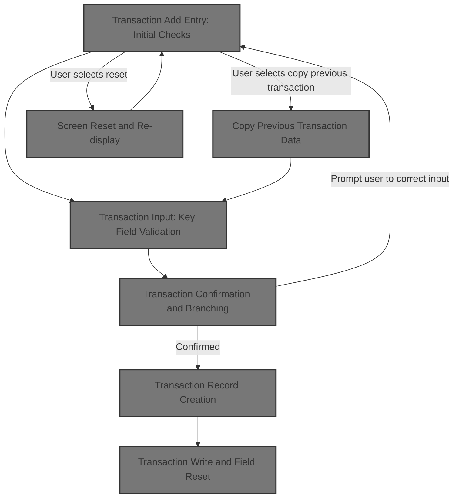
```mermaid
flowchart TD
    node1["Transaction Add Entry: Initial Checks"]:::HeadingStyle --> node2["Transaction Input: Key Field Validation"]:::HeadingStyle
    node2 --> node3["Transaction Confirmation and Branching"]:::HeadingStyle
    node3 -->|"Confirmed"| node4["Transaction Record Creation"]:::HeadingStyle
    node4 --> node5["Transaction Write and Field Reset"]:::HeadingStyle
    node3 -->|"Prompt user to correct input"| node1
    node1 -->|"User selects copy previous transaction"| node6["Copy Previous Transaction Data"]:::HeadingStyle
    node6 --> node2
    node1 -->|"User selects reset"| node7["Screen Reset and Re-display"]:::HeadingStyle
    node7 --> node1

    click node1 goToHeading "Transaction Add Entry: Initial Checks"
    click node2 goToHeading "Transaction Input: Key Field Validation"
    click node3 goToHeading "Transaction Confirmation and Branching"
    click node4 goToHeading "Transaction Record Creation"
    click node5 goToHeading "Transaction Write and Field Reset"
    click node6 goToHeading "Copy Previous Transaction Data"
    click node7 goToHeading "Screen Reset and Re-display"
classDef HeadingStyle fill:#777777,stroke:#333,stroke-width:2px;
```

## Dependencies

### Programs

- COTRN02C (app/cbl/COTRN02C.cbl)
- CT02
- CSUTLDTC (app/cbl/CSUTLDTC.cbl)
- CEEDAYS
- COMEN01C (app/cbl/COMEN01C.cbl)
- CM00
- COSGN00C (app/cbl/COSGN00C.cbl)
- CDEMO-FROM-PROGRAM

### Copybooks

- COCOM01Y (app/cpy/COCOM01Y.cpy)
- COMEN02Y (app/cpy/COMEN02Y.cpy)
- COMEN01 (app/cpy-bms/COMEN01.CPY)
- COTTL01Y (app/cpy/COTTL01Y.cpy)
- CSDAT01Y (app/cpy/CSDAT01Y.cpy)
- CSMSG01Y (app/cpy/CSMSG01Y.cpy)
- CSUSR01Y (app/cpy/CSUSR01Y.cpy)
- DFHAID
- DFHBMSCA
- COTRN02 (app/cpy-bms/COTRN02.CPY)
- CVTRA05Y (app/cpy/CVTRA05Y.cpy)
- CVACT01Y (app/cpy/CVACT01Y.cpy)
- CVACT03Y (app/cpy/CVACT03Y.cpy)

## Input and Output Tables/Files used in the Program

| Table / File Name | Type | Description                                         | Usage Mode | Key Fields / Layout Highlights |
| ----------------- | ---- | --------------------------------------------------- | ---------- | ------------------------------ |
| WS-CCXREF-FILE    | File | Card-to-account cross-reference for card lookups    | Input      | File resource                  |
| WS-CXACAIX-FILE   | File | Card-to-account cross-reference for account lookups | Input      | File resource                  |
| WS-TRANSACT-FILE  | File | Credit card transaction history records             | Output     | File resource                  |

&nbsp;

# Workflow

# Transaction Add Entry: Initial Checks

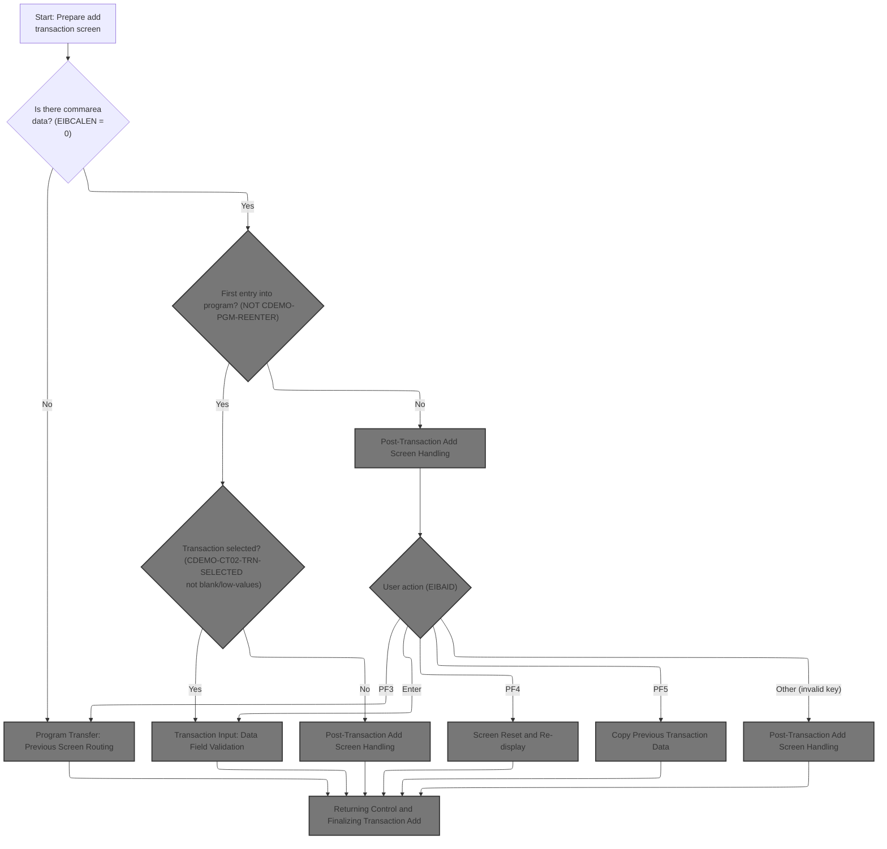
```mermaid
%%{init: {"flowchart": {"defaultRenderer": "elk"}} }%%
flowchart TD
    node1["Start: Prepare add 
 transaction screen"] --> node2{"Is there commarea 
 data? (EIBCALEN = 
 0)"}
    click node1 openCode "app/cbl/COTRN02C.cbl:107:113"
    node2 -->|"No"| node3["Program Transfer: Previous Screen Routing"]
    click node2 openCode "app/cbl/COTRN02C.cbl:115:117"
    
    node2 -->|"Yes"| node4{"First entry into 
 program? (NOT CDEMO-PGM-REENTER)"}
    
    node4 -->|"Yes"| node5{"Transaction selected? (CDEMO-CT02-TRN-SELECTED 
 not blank/low-values)"}
    
    node5 -->|"Yes"| node6["Transaction Input: Data Field Validation"]
    
    node5 -->|"No"| node7["Post-Transaction Add Screen Handling"]
    
    node4 -->|"No"| node8["Post-Transaction Add Screen Handling"]
    
    node8 --> node9{"User action (EIBAID)"}
    
    node9 -->|"Enter"| node6
    node9 -->|"PF3"| node3
    node9 -->|"PF4"| node10["Screen Reset and Re-display"]
    
    node9 -->|"PF5"| node11["Copy Previous Transaction Data"]
    
    node9 -->|"Other (invalid key)"| node13["Post-Transaction Add Screen Handling"]
    
    node3 --> node12["Returning Control and Finalizing Transaction Add"]
    node6 --> node12
    node7 --> node12
    node10 --> node12
    node11 --> node12
    node13 --> node12
    
classDef HeadingStyle fill:#777777,stroke:#333,stroke-width:2px;
click node3 goToHeading "Program Transfer: Previous Screen Routing"
node3:::HeadingStyle
click node4 goToHeading "Post-Transaction Add Screen Handling"
node4:::HeadingStyle
click node5 goToHeading "Post-Transaction Add Screen Handling"
node5:::HeadingStyle
click node6 goToHeading "Transaction Input: Data Field Validation"
node6:::HeadingStyle
click node7 goToHeading "Post-Transaction Add Screen Handling"
node7:::HeadingStyle
click node8 goToHeading "Post-Transaction Add Screen Handling"
node8:::HeadingStyle
click node9 goToHeading "Post-Transaction Add Screen Handling"
node9:::HeadingStyle
click node10 goToHeading "Screen Reset and Re-display"
node10:::HeadingStyle
click node11 goToHeading "Copy Previous Transaction Data"
node11:::HeadingStyle
click node12 goToHeading "Returning Control and Finalizing Transaction Add"
node12:::HeadingStyle
click node13 goToHeading "Post-Transaction Add Screen Handling"
node13:::HeadingStyle
```

This section governs the initial checks and setup when a user begins the process of adding a new transaction, ensuring proper routing, state initialization, and user feedback for invalid actions.

| Rule ID | Code Location                        | Category       | Rule Name                          | Description                                                                                                                                         | Conditions                                                                                                                 | Remarks                                                                                                                                        |
| ------- | ------------------------------------ | -------------- | ---------------------------------- | --------------------------------------------------------------------------------------------------------------------------------------------------- | -------------------------------------------------------------------------------------------------------------------------- | ---------------------------------------------------------------------------------------------------------------------------------------------- |
| BR-001  | MAIN-PARA, RETURN-TO-PREV-SCREEN     | Business logic | Signon Routing on Missing Commarea | If no communication area data is present, the user is routed to the signon program and the transaction add flow is not started.                     | This rule applies when the communication area length is zero (EIBCALEN = 0) at the start of the transaction add entry.     | The program name for signon routing is 'COSGN00C'. The output is a program transfer to this program, and no transaction add logic is executed. |
| BR-002  | Post-Transaction Add Screen Handling | Error handling | Invalid Key Press Handling         | If the user presses an invalid function key during the transaction add entry, an error message is displayed indicating the invalid key press.       | This rule applies when the user action does not match Enter, PF3, PF4, or PF5 during the transaction add entry.            | The error message displayed is 'Invalid key pressed. Please see below...         ' (50 characters, left-aligned, padded with spaces).          |
| BR-003  | MAIN-PARA                            | Technical step | Clean Slate Initialization         | Before starting the transaction add flow, any previous error flags, user modification indicators, and messages are cleared to ensure a clean state. | This rule applies at the very start of the transaction add entry, before any user input or transaction logic is processed. | The error flag is set to 'N', the user modified indicator is set to 'N', and the message field is set to spaces (blank).                       |

<SwmSnippet path="/app/cbl/COTRN02C.cbl" line="107" repo-id="Z2l0aHViJTNBJTNBa3luZHJ5bC1hd3MtbWFpbmZyYW1lLW1vZGVybml6YXRpb24tY2FyZGRlbW8lM0ElM0FTd2ltbS1EZW1v">

---

In MAIN-PARA, we kick off by resetting the error flag, marking the user as modified, and clearing out any existing messages. This sets up a clean slate for the transaction add flow, making sure no leftover state interferes with the new operation.

```cobol
       MAIN-PARA.

           SET ERR-FLG-OFF     TO TRUE
           SET USR-MODIFIED-NO TO TRUE

           MOVE SPACES TO WS-MESSAGE
                          ERRMSGO OF COTRN2AO
```

---

</SwmSnippet>

<SwmSnippet path="/app/cbl/COTRN02C.cbl" line="115" repo-id="Z2l0aHViJTNBJTNBa3luZHJ5bC1hd3MtbWFpbmZyYW1lLW1vZGVybml6YXRpb24tY2FyZGRlbW8lM0ElM0FTd2ltbS1EZW1v">

---

Here we check if EIBCALEN is zero, which means no communication area was passed in. If that's the case, we set up to jump to the signon program ('COSGN00C') and call RETURN-TO-PREV-SCREEN to hand control back, skipping any transaction logic.

```cobol
           IF EIBCALEN = 0
               MOVE 'COSGN00C' TO CDEMO-TO-PROGRAM
               PERFORM RETURN-TO-PREV-SCREEN
```

---

</SwmSnippet>

## Program Transfer: Previous Screen Routing

This section ensures that when returning to a previous screen, the application always has a valid target program, maintains the correct context, and reliably passes all necessary information to the next program for seamless user navigation.

| Rule ID | Code Location         | Category       | Rule Name                           | Description                                                                                                                                                                           | Conditions                                                 | Remarks                                                                                                                                                                              |
| ------- | --------------------- | -------------- | ----------------------------------- | ------------------------------------------------------------------------------------------------------------------------------------------------------------------------------------- | ---------------------------------------------------------- | ------------------------------------------------------------------------------------------------------------------------------------------------------------------------------------ |
| BR-001  | RETURN-TO-PREV-SCREEN | Business logic | Default Target Program              | If the target program field is empty or contains only spaces, it must be set to the default program name 'COSGN00C' to ensure a valid destination for the program transfer.           | The target program field is empty or contains only spaces. | The default program name is 'COSGN00C', which is an alphanumeric string of length 8. The target program field must always contain a valid program name before transfer.              |
| BR-002  | RETURN-TO-PREV-SCREEN | Business logic | Set Context Fields for Transfer     | Before transferring control to the next program, the transaction and program context fields in the communication area must be updated to reflect the current program and transaction. | A program transfer is about to occur.                      | The transaction ID is 'CT02' (alphanumeric, length 4) and the program name is 'COTRN02C' (alphanumeric, length 8). The context field is a numeric value set to zero before transfer. |
| BR-003  | RETURN-TO-PREV-SCREEN | Business logic | Pass Communication Area on Transfer | When transferring control to another program, the entire communication area must be passed to ensure all necessary information is available to the next screen.                       | A program transfer is initiated.                           | The communication area structure is defined by CARDDEMO-COMMAREA, which includes all relevant fields for user, account, and transaction context.                                     |

<SwmSnippet path="/app/cbl/COTRN02C.cbl" line="500" repo-id="Z2l0aHViJTNBJTNBa3luZHJ5bC1hd3MtbWFpbmZyYW1lLW1vZGVybml6YXRpb24tY2FyZGRlbW8lM0ElM0FTd2ltbS1EZW1v">

---

In RETURN-TO-PREV-SCREEN, we check if the target program field is empty or just spaces. If so, we set it to 'COSGN00C' to make sure we always have a valid destination for the XCTL transfer.

```cobol
       RETURN-TO-PREV-SCREEN.

           IF CDEMO-TO-PROGRAM = LOW-VALUES OR SPACES
               MOVE 'COSGN00C' TO CDEMO-TO-PROGRAM
           END-IF
```

---

</SwmSnippet>

<SwmSnippet path="/app/cbl/COTRN02C.cbl" line="505" repo-id="Z2l0aHViJTNBJTNBa3luZHJ5bC1hd3MtbWFpbmZyYW1lLW1vZGVybml6YXRpb24tY2FyZGRlbW8lM0ElM0FTd2ltbS1EZW1v">

---

We finish up RETURN-TO-PREV-SCREEN by setting the transaction and program context fields, zeroing out the context, and then using XCTL to jump to the next program, passing the commarea so the next screen has all the info it needs.

```cobol
           MOVE WS-TRANID    TO CDEMO-FROM-TRANID
           MOVE WS-PGMNAME   TO CDEMO-FROM-PROGRAM
           MOVE ZEROS        TO CDEMO-PGM-CONTEXT
           EXEC CICS
               XCTL PROGRAM(CDEMO-TO-PROGRAM)
               COMMAREA(CARDDEMO-COMMAREA)
           END-EXEC.
```

---

</SwmSnippet>

## Main Menu Entry: Initial and Reentry Handling

```mermaid
%%{init: {"flowchart": {"defaultRenderer": "elk"}} }%%
flowchart TD
    node1["Start: Prepare menu 
 and clear messages"]
    click node1 openCode "app/cbl/COMEN01C.cbl:75:82"
    node1 --> node2{"New session?"}
    click node2 openCode "app/cbl/COMEN01C.cbl:82:85"
    node2 -->|"Yes"| node3["Signon Screen Routing"]
    
    node2 -->|"No"| node4{"First entry to 
 menu?"}
    click node4 openCode "app/cbl/COMEN01C.cbl:87:91"
    node4 -->|"Yes"| node5["Main Menu Display: Header and Options Setup"]
    
    node4 -->|"No"| node6["Main Menu Display: Header and Options Setup"]
    
    nodeMappings: [
      {"nodeId": "node3", "type": "functionCall", "functionName": "RETURN-TO-SIGNON-SCREEN", "sectionId": "RETURN-TO-SIGNON-SCREEN-170"},
      {"nodeId": "node5", "type": "functionCall", "functionName": "SEND-MENU-SCREEN", "sectionId": "SEND-MENU-SCREEN-182"}
    ]
classDef HeadingStyle fill:#777777,stroke:#333,stroke-width:2px;
click node3 goToHeading "Signon Screen Routing"
node3:::HeadingStyle
click node5 goToHeading "Main Menu Display: Header and Options Setup"
node5:::HeadingStyle
click node6 goToHeading "Main Menu Display: Header and Options Setup"
node6:::HeadingStyle
click node3 goToHeading "Signon Screen Routing"
node3:::HeadingStyle
click node5 goToHeading "Main Menu Display: Header and Options Setup"
node5:::HeadingStyle
click node6 goToHeading "Main Menu Display: Header and Options Setup"
node6:::HeadingStyle
```

This section governs how the main menu is presented to users, handling both new and ongoing sessions, and providing clear routing and error feedback based on user actions.

| Rule ID | Code Location | Category       | Rule Name                    | Description                                                                                                                           | Conditions                                                                                    | Remarks                                                                                                                                                             |
| ------- | ------------- | -------------- | ---------------------------- | ------------------------------------------------------------------------------------------------------------------------------------- | --------------------------------------------------------------------------------------------- | ------------------------------------------------------------------------------------------------------------------------------------------------------------------- |
| BR-001  | MAIN-PARA     | Business logic | Fresh Session Signon Routing | If the session is a fresh entry (no communication area), the user is routed to the signon screen.                                     | The communication area length is zero (EIBCALEN = 0).                                         | The signon screen is triggered by setting the next program to 'COSGN00C'. The communication area is not populated in this case.                                     |
| BR-002  | MAIN-PARA     | Business logic | First Entry Menu Display     | If the session is not a fresh entry and it is the first time entering the menu, the main menu is displayed with a cleared screen.     | The communication area is present (EIBCALEN > 0) and the program reentry flag is not set.     | The main menu is displayed by clearing the output area and sending the menu screen. The reentry flag is set to indicate the session is now ongoing.                 |
| BR-003  | MAIN-PARA     | Business logic | PF3 Signoff Routing          | If the session is ongoing and the user presses PF3, the session is routed to the signon screen.                                       | The session is ongoing, the menu screen is received, and the key pressed is PF3.              | The signon screen is triggered by setting the next program to 'COSGN00C'.                                                                                           |
| BR-004  | MAIN-PARA     | Error handling | Invalid Key Error Handling   | If the session is ongoing and the user presses an invalid key on the menu, an error message is displayed and the menu is redisplayed. | The session is ongoing, the menu screen is received, and the key pressed is not ENTER or PF3. | The error message displayed is 'Invalid key pressed. Please see below...         ' (50 characters, left-aligned, padded with spaces). The error flag is set to 'Y'. |

<SwmSnippet path="/app/cbl/COMEN01C.cbl" line="75" repo-id="Z2l0aHViJTNBJTNBa3luZHJ5bC1hd3MtbWFpbmZyYW1lLW1vZGVybml6YXRpb24tY2FyZGRlbW8lM0ElM0FTd2ltbS1EZW1v">

---

MAIN-PARA in COMEN01C.cbl handles both first-time entry and reentry. If it's a fresh entry (EIBCALEN = 0), we set up for signon. Otherwise, we check if the session is new or ongoing, send or receive the menu screen, and process user input based on the key pressed.

```cobol
       MAIN-PARA.

           SET ERR-FLG-OFF TO TRUE

           MOVE SPACES TO WS-MESSAGE
                          ERRMSGO OF COMEN1AO

           IF EIBCALEN = 0
               MOVE 'COSGN00C' TO CDEMO-FROM-PROGRAM
               PERFORM RETURN-TO-SIGNON-SCREEN
           ELSE
               MOVE DFHCOMMAREA(1:EIBCALEN) TO CARDDEMO-COMMAREA
               IF NOT CDEMO-PGM-REENTER
                   SET CDEMO-PGM-REENTER    TO TRUE
                   MOVE LOW-VALUES          TO COMEN1AO
                   PERFORM SEND-MENU-SCREEN
               ELSE
                   PERFORM RECEIVE-MENU-SCREEN
                   EVALUATE EIBAID
                       WHEN DFHENTER
                           PERFORM PROCESS-ENTER-KEY
                       WHEN DFHPF3
                           MOVE 'COSGN00C' TO CDEMO-TO-PROGRAM
                           PERFORM RETURN-TO-SIGNON-SCREEN
                       WHEN OTHER
                           MOVE 'Y'                       TO WS-ERR-FLG
                           MOVE CCDA-MSG-INVALID-KEY      TO WS-MESSAGE
                           PERFORM SEND-MENU-SCREEN
                   END-EVALUATE
               END-IF
           END-IF

           EXEC CICS RETURN
                     TRANSID (WS-TRANID)
                     COMMAREA (CARDDEMO-COMMAREA)
           END-EXEC.
```

---

</SwmSnippet>

### Signon Screen Routing

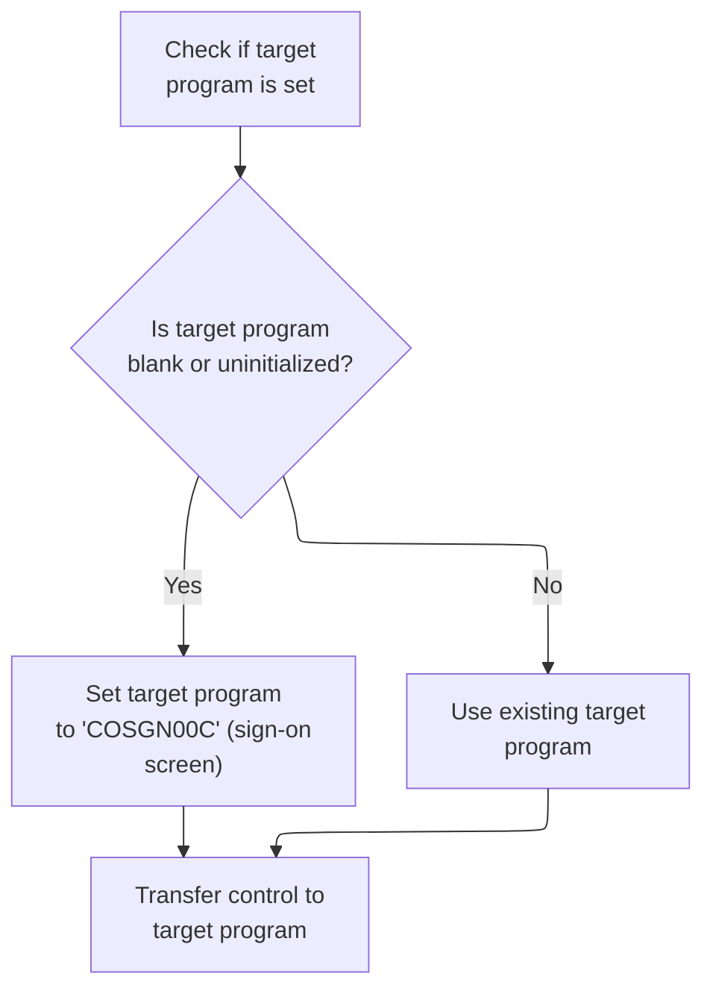
```mermaid
%%{init: {"flowchart": {"defaultRenderer": "elk"}} }%%
flowchart TD
    node1["Check if target 
 program is set"]
    click node1 openCode "app/cbl/COMEN01C.cbl:172:172"
    node1 --> node2{"Is target program 
 blank or uninitialized?"}
    click node2 openCode "app/cbl/COMEN01C.cbl:172:172"
    node2 -->|"Yes"| node3["Set target program 
 to 'COSGN00C' (sign-on 
 screen)"]
    click node3 openCode "app/cbl/COMEN01C.cbl:173:173"
    node2 -->|"No"| node4["Use existing target 
 program"]
    click node4 openCode "app/cbl/COMEN01C.cbl:172:172"
    node3 --> node5["Transfer control to 
 target program"]
    node4 --> node5["Transfer control to 
 target program"]
    click node5 openCode "app/cbl/COMEN01C.cbl:175:177"
classDef HeadingStyle fill:#777777,stroke:#333,stroke-width:2px;
```

The 'Signon Screen Routing' section ensures that users are always routed to a valid application screen, defaulting to the sign-on screen if no target program is specified. This maintains application stability and a consistent user experience.

| Rule ID | Code Location           | Category       | Rule Name                  | Description                                                                                                                                                              | Conditions                                                                                                          | Remarks                                                                                                                                                                       |
| ------- | ----------------------- | -------------- | -------------------------- | ------------------------------------------------------------------------------------------------------------------------------------------------------------------------ | ------------------------------------------------------------------------------------------------------------------- | ----------------------------------------------------------------------------------------------------------------------------------------------------------------------------- |
| BR-001  | RETURN-TO-SIGNON-SCREEN | Business logic | Default to Signon Program  | If the target program field is blank or contains low-values, the system sets it to the sign-on program ('COSGN00C') to ensure the user is routed to a valid entry point. | The target program field is blank or contains low-values.                                                           | The sign-on program name is 'COSGN00C', which is an 8-character alphanumeric string. The target program field must be set to a valid 8-character program name before routing. |
| BR-002  | RETURN-TO-SIGNON-SCREEN | Business logic | Transfer to Target Program | The system always transfers control to the program specified in the target program field, ensuring the user is routed to the intended application screen.                | The target program field contains a valid program name (either originally set or defaulted to the sign-on program). | The program name must be an 8-character alphanumeric string. The transfer is unconditional after the target program field is set.                                             |

<SwmSnippet path="/app/cbl/COMEN01C.cbl" line="170" repo-id="Z2l0aHViJTNBJTNBa3luZHJ5bC1hd3MtbWFpbmZyYW1lLW1vZGVybml6YXRpb24tY2FyZGRlbW8lM0ElM0FTd2ltbS1EZW1v">

---

RETURN-TO-SIGNON-SCREEN checks if the next program is set. If not, it defaults to signon ('COSGN00C') and uses XCTL to transfer control, making sure the user always lands somewhere valid.

```cobol
       RETURN-TO-SIGNON-SCREEN.

           IF CDEMO-TO-PROGRAM = LOW-VALUES OR SPACES
               MOVE 'COSGN00C' TO CDEMO-TO-PROGRAM
           END-IF
           EXEC CICS
               XCTL PROGRAM(CDEMO-TO-PROGRAM)
           END-EXEC.
```

---

</SwmSnippet>

### Signon Entry: User Authentication Flow

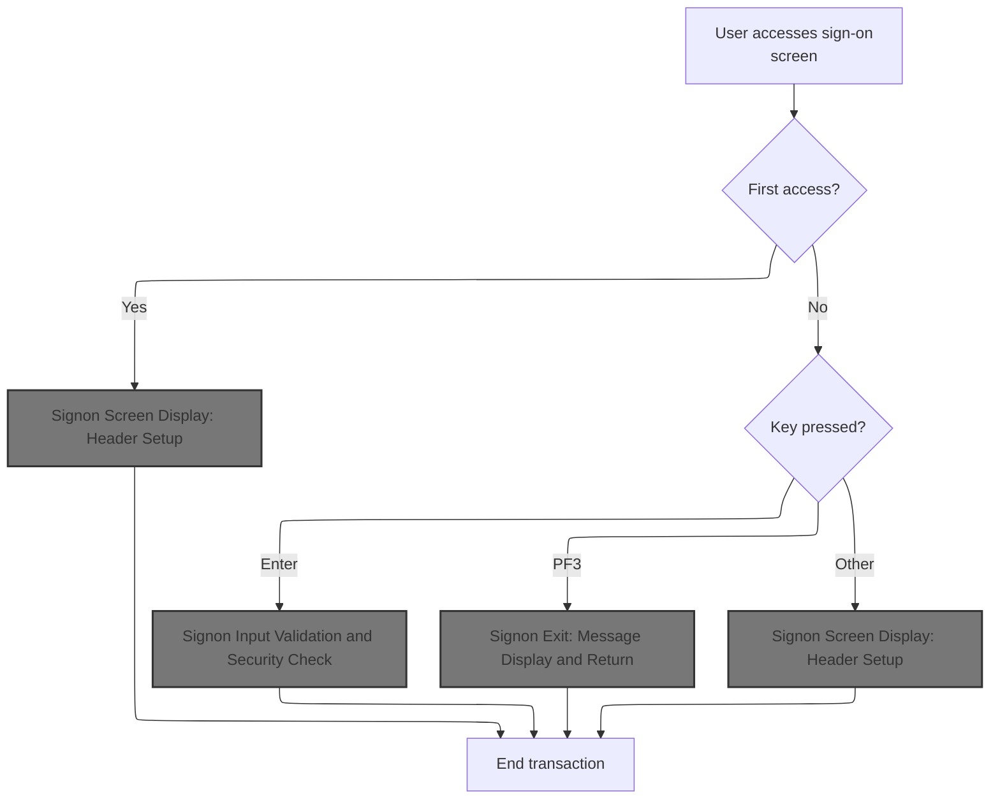
```mermaid
%%{init: {"flowchart": {"defaultRenderer": "elk"}} }%%
flowchart TD
    node1["User accesses sign-on 
 screen"] --> node2{"First access?"}
    click node1 openCode "app/cbl/COSGN00C.cbl:73:102"
    node2 -->|"Yes"| node3["Signon Screen Display: Header Setup"]
    click node2 openCode "app/cbl/COSGN00C.cbl:80:84"
    node2 -->|"No"| node4{"Key pressed?"}
    
    node4 -->|"Enter"| node5["Signon Input Validation and Security Check"]
    click node4 openCode "app/cbl/COSGN00C.cbl:85:87"
    node4 -->|"PF3"| node6["Signon Exit: Message Display and Return"]
    
    node4 -->|"Other"| node7["Signon Screen Display: Header Setup"]
    
    node3 --> node8["End transaction"]
    node5 --> node8
    node6 --> node8
    node7 --> node8
    
    click node8 openCode "app/cbl/COSGN00C.cbl:98:102"
classDef HeadingStyle fill:#777777,stroke:#333,stroke-width:2px;
click node3 goToHeading "Signon Screen Display: Header Setup"
node3:::HeadingStyle
click node5 goToHeading "Signon Input Validation and Security Check"
node5:::HeadingStyle
click node6 goToHeading "Signon Exit: Message Display and Return"
node6:::HeadingStyle
click node7 goToHeading "Signon Screen Display: Header Setup"
node7:::HeadingStyle
```

This section manages the user authentication flow for the CardDemo application's sign-on screen, handling initial access, user key input, and appropriate messaging and screen display based on user actions.

| Rule ID | Code Location | Category       | Rule Name                                   | Description                                                                                                                                                                                                    | Conditions                                                                                                                                                 | Remarks                                                                                                                                                                                                                                                             |
| ------- | ------------- | -------------- | ------------------------------------------- | -------------------------------------------------------------------------------------------------------------------------------------------------------------------------------------------------------------- | ---------------------------------------------------------------------------------------------------------------------------------------------------------- | ------------------------------------------------------------------------------------------------------------------------------------------------------------------------------------------------------------------------------------------------------------------- |
| BR-001  | MAIN-PARA     | Business logic | Initial Sign-on Screen Display              | If the user accesses the sign-on screen for the first time (no communication area data), the screen is cleared, the user ID field is set to accept input, and the sign-on screen is displayed for fresh input. | The communication area length is zero (EIBCALEN = 0), indicating a new session or first access.                                                            | The sign-on screen is displayed with all fields cleared (set to low-values), and the user ID field is set to accept input (set to -1). No error message is shown. The format of the screen is determined by the sign-on screen layout, which is not specified here. |
| BR-002  | MAIN-PARA     | Business logic | Sign-on Input Validation and Security Check | If the user presses the Enter key on the sign-on screen, the system performs input validation and a security check for the sign-on credentials.                                                                | The user is not on their first access (communication area length is not zero), and the key pressed is Enter (EIBAID = DFHENTER).                           | The system proceeds to validate the input and check credentials. The details of validation and security check are handled in the PROCESS-ENTER-KEY paragraph, which is invoked here but not shown in this code section.                                             |
| BR-003  | MAIN-PARA     | Business logic | Sign-on Exit with Thank You Message         | If the user presses the PF3 key on the sign-on screen, a thank you message is displayed and the transaction ends.                                                                                              | The user is not on their first access (communication area length is not zero), and the key pressed is PF3 (EIBAID = DFHPF3).                               | The message displayed is 'Thank you for using CardDemo application...      ' (50 characters, left-aligned, padded with spaces).                                                                                                                                     |
| BR-004  | MAIN-PARA     | Error handling | Invalid Key Handling on Sign-on Screen      | If the user presses any key other than Enter or PF3 on the sign-on screen, an error flag is set, an invalid key message is displayed, and the sign-on screen is re-displayed for input.                        | The user is not on their first access (communication area length is not zero), and the key pressed is not Enter or PF3 (EIBAID is not DFHENTER or DFHPF3). | The error flag is set to 'Y'. The message displayed is 'Invalid key pressed. Please see below...         ' (50 characters, left-aligned, padded with spaces). The sign-on screen is re-displayed with the error message.                                            |

<SwmSnippet path="/app/cbl/COSGN00C.cbl" line="73" repo-id="Z2l0aHViJTNBJTNBa3luZHJ5bC1hd3MtbWFpbmZyYW1lLW1vZGVybml6YXRpb24tY2FyZGRlbW8lM0ElM0FTd2ltbS1EZW1v">

---

MAIN-PARA in COSGN00C.cbl handles both new signon and ongoing sessions. If it's a new signon (EIBCALEN = 0), we clear the screen and set up for fresh input. Otherwise, we process user key input, handling Enter, PF3, or invalid keys accordingly.

```cobol
       MAIN-PARA.

           SET ERR-FLG-OFF TO TRUE

           MOVE SPACES TO WS-MESSAGE
                          ERRMSGO OF COSGN0AO

           IF EIBCALEN = 0
               MOVE LOW-VALUES TO COSGN0AO
               MOVE -1       TO USERIDL OF COSGN0AI
               PERFORM SEND-SIGNON-SCREEN
           ELSE
               EVALUATE EIBAID
                   WHEN DFHENTER
                       PERFORM PROCESS-ENTER-KEY
                   WHEN DFHPF3
                       MOVE CCDA-MSG-THANK-YOU        TO WS-MESSAGE
                       PERFORM SEND-PLAIN-TEXT
                   WHEN OTHER
                       MOVE 'Y'                       TO WS-ERR-FLG
                       MOVE CCDA-MSG-INVALID-KEY      TO WS-MESSAGE
                       PERFORM SEND-SIGNON-SCREEN
               END-EVALUATE
           END-IF.

           EXEC CICS RETURN
                     TRANSID (WS-TRANID)
                     COMMAREA (CARDDEMO-COMMAREA)
                     LENGTH(LENGTH OF CARDDEMO-COMMAREA)
           END-EXEC.
```

---

</SwmSnippet>

#### Signon Screen Display: Header Setup

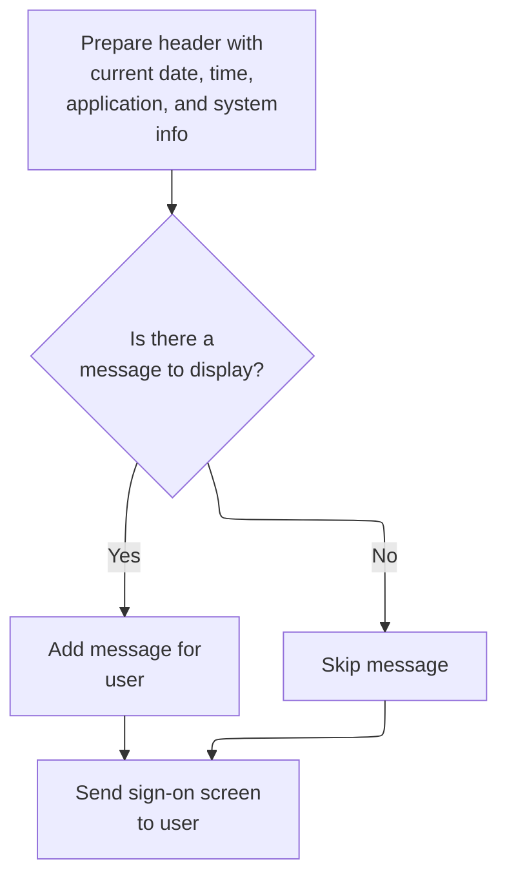
```mermaid
%%{init: {"flowchart": {"defaultRenderer": "elk"}} }%%
flowchart TD
    node1["Prepare header with 
 current date, time, 
 application, and system 
 info"]
    click node1 openCode "app/cbl/COSGN00C.cbl:177:204"
    node1 --> node2{"Is there a 
 message to display?"}
    click node2 openCode "app/cbl/COSGN00C.cbl:149:149"
    node2 -->|"Yes"| node3["Add message for 
 user"]
    click node3 openCode "app/cbl/COSGN00C.cbl:149:149"
    node2 -->|"No"| node4["Skip message"]
    click node4 openCode "app/cbl/COSGN00C.cbl:149:149"
    node3 --> node5["Send sign-on screen 
 to user"]
    node4 --> node5
    click node5 openCode "app/cbl/COSGN00C.cbl:151:157"

classDef HeadingStyle fill:#777777,stroke:#333,stroke-width:2px;
```

This section prepares and displays the signon screen header for the CardDemo application, ensuring users see up-to-date context and any relevant messages when signing on.

| Rule ID | Code Location        | Category       | Rule Name              | Description                                                                                                                                                  | Conditions                                                | Remarks                                                                                                                                                                                                                                                                     |
| ------- | -------------------- | -------------- | ---------------------- | ------------------------------------------------------------------------------------------------------------------------------------------------------------ | --------------------------------------------------------- | --------------------------------------------------------------------------------------------------------------------------------------------------------------------------------------------------------------------------------------------------------------------------- |
| BR-001  | POPULATE-HEADER-INFO | Business logic | Header context display | The signon screen header must display the current date and time, application name, transaction ID, and system ID to provide up-to-date context to the user.  | Whenever the signon screen is sent to the user.           | Application name: 'COSGN00C' (8 characters), Transaction ID: 'CC00' (4 characters), Date and time are formatted as MM-DD-YY and HH-MM-SS respectively, System ID and Application ID are dynamically assigned. All fields are left-aligned and padded as needed for display. |
| BR-002  | SEND-SIGNON-SCREEN   | Business logic | User message display   | If a message is present, it must be displayed to the user in the designated message area of the signon screen.                                               | When the message field contains any non-space characters. | Message area is 80 characters, left-aligned, padded with spaces if shorter. If no message is present, the area remains blank.                                                                                                                                               |
| BR-003  | SEND-SIGNON-SCREEN   | Business logic | Signon screen delivery | The signon screen must be sent to the user's terminal with the header and message fields populated, the screen cleared, and the cursor positioned for input. | Whenever the signon screen is triggered for display.      | Screen is cleared (ERASE), cursor is positioned (CURSOR), and the signon map ('COSGN0A') from mapset ('COSGN00') is sent. All header and message fields are populated as described above.                                                                                   |

<SwmSnippet path="/app/cbl/COSGN00C.cbl" line="145" repo-id="Z2l0aHViJTNBJTNBa3luZHJ5bC1hd3MtbWFpbmZyYW1lLW1vZGVybml6YXRpb24tY2FyZGRlbW8lM0ElM0FTd2ltbS1EZW1v">

---

SEND-SIGNON-SCREEN first calls POPULATE-HEADER-INFO to set up the header fields, then moves any message to the error field, and finally sends the signon map to the terminal, clearing the screen and positioning the cursor.

```cobol
       SEND-SIGNON-SCREEN.

           PERFORM POPULATE-HEADER-INFO

           MOVE WS-MESSAGE TO ERRMSGO OF COSGN0AO

           EXEC CICS SEND
                     MAP('COSGN0A')
                     MAPSET('COSGN00')
                     FROM(COSGN0AO)
                     ERASE
                     CURSOR
           END-EXEC.
```

---

</SwmSnippet>

<SwmSnippet path="/app/cbl/COSGN00C.cbl" line="177" repo-id="Z2l0aHViJTNBJTNBa3luZHJ5bC1hd3MtbWFpbmZyYW1lLW1vZGVybml6YXRpb24tY2FyZGRlbW8lM0ElM0FTd2ltbS1EZW1v">

---

POPULATE-HEADER-INFO grabs the current date and time, formats them, and fills in the header fields with titles, program info, and system IDs, so the signon screen always shows up-to-date context.

```cobol
       POPULATE-HEADER-INFO.

           MOVE FUNCTION CURRENT-DATE  TO WS-CURDATE-DATA

           MOVE CCDA-TITLE01           TO TITLE01O OF COSGN0AO
           MOVE CCDA-TITLE02           TO TITLE02O OF COSGN0AO
           MOVE WS-TRANID              TO TRNNAMEO OF COSGN0AO
           MOVE WS-PGMNAME             TO PGMNAMEO OF COSGN0AO

           MOVE WS-CURDATE-MONTH       TO WS-CURDATE-MM
           MOVE WS-CURDATE-DAY         TO WS-CURDATE-DD
           MOVE WS-CURDATE-YEAR(3:2)   TO WS-CURDATE-YY

           MOVE WS-CURDATE-MM-DD-YY    TO CURDATEO OF COSGN0AO

           MOVE WS-CURTIME-HOURS       TO WS-CURTIME-HH
           MOVE WS-CURTIME-MINUTE      TO WS-CURTIME-MM
           MOVE WS-CURTIME-SECOND      TO WS-CURTIME-SS

           MOVE WS-CURTIME-HH-MM-SS    TO CURTIMEO OF COSGN0AO

           EXEC CICS ASSIGN
               APPLID(APPLIDO OF COSGN0AO)
           END-EXEC

           EXEC CICS ASSIGN
               SYSID(SYSIDO OF COSGN0AO)
           END-EXEC.
```

---

</SwmSnippet>

#### Signon Input Validation and Security Check

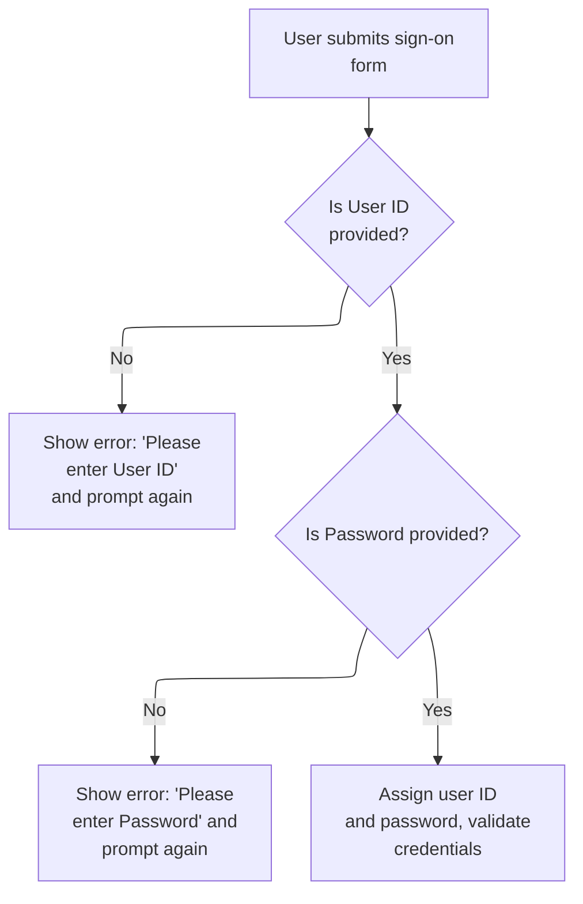
```mermaid
%%{init: {"flowchart": {"defaultRenderer": "elk"}} }%%
flowchart TD
    node1["User submits sign-on 
 form"] --> node2{"Is User ID 
 provided?"}
    click node1 openCode "app/cbl/COSGN00C.cbl:110:115"
    node2 -->|"No"| node3["Show error: 'Please 
 enter User ID' 
 and prompt again"]
    click node2 openCode "app/cbl/COSGN00C.cbl:117:123"
    node2 -->|"Yes"| node4{"Is Password provided?"}
    click node3 openCode "app/cbl/COSGN00C.cbl:119:123"
    node4 -->|"No"| node5["Show error: 'Please 
 enter Password' and 
 prompt again"]
    click node4 openCode "app/cbl/COSGN00C.cbl:123:127"
    node4 -->|"Yes"| node6["Assign user ID 
 and password, validate 
 credentials"]
    click node5 openCode "app/cbl/COSGN00C.cbl:124:127"
    click node6 openCode "app/cbl/COSGN00C.cbl:132:140"

classDef HeadingStyle fill:#777777,stroke:#333,stroke-width:2px;
```

This section governs the validation of user input during the sign-on process, ensuring that both User ID and Password are provided and normalized before credentials are validated against the security dataset. It also manages error messaging and user prompting for missing information.

| Rule ID | Code Location     | Category        | Rule Name                     | Description                                                                                                                                                                                                             | Conditions                                                                                                                                   | Remarks                                                                                                                                                                                               |
| ------- | ----------------- | --------------- | ----------------------------- | ----------------------------------------------------------------------------------------------------------------------------------------------------------------------------------------------------------------------- | -------------------------------------------------------------------------------------------------------------------------------------------- | ----------------------------------------------------------------------------------------------------------------------------------------------------------------------------------------------------- |
| BR-001  | PROCESS-ENTER-KEY | Data validation | User ID Required              | If the User ID field is blank or contains only non-printable values, the system must display an error message prompting the user to enter a User ID and must not proceed to password validation or credential checking. | The User ID field is blank or contains only non-printable values when the user submits the sign-on form.                                     | The error message displayed is 'Please enter User ID ...'. The prompt is repeated until a valid User ID is entered. The User ID field is expected to be an alphanumeric string up to 8 characters.    |
| BR-002  | PROCESS-ENTER-KEY | Data validation | Password Required             | If the Password field is blank or contains only non-printable values, the system must display an error message prompting the user to enter a Password and must not proceed to credential checking.                      | The Password field is blank or contains only non-printable values when the user submits the sign-on form and the User ID field is not blank. | The error message displayed is 'Please enter Password ...'. The prompt is repeated until a valid Password is entered. The Password field is expected to be an alphanumeric string up to 8 characters. |
| BR-003  | PROCESS-ENTER-KEY | Business logic  | Credential Normalization      | If both User ID and Password are provided, the system must convert both values to uppercase before validating credentials against the security dataset.                                                                 | Both User ID and Password fields are provided and not blank or non-printable when the user submits the sign-on form.                         | User ID and Password are converted to uppercase before validation. Both fields are expected to be alphanumeric strings up to 8 characters.                                                            |
| BR-004  | PROCESS-ENTER-KEY | Business logic  | Credential Validation Trigger | If both User ID and Password are provided and no error flag is set, the system must validate the credentials against the security dataset.                                                                              | Both User ID and Password fields are provided and not blank or non-printable, and no error flag is set.                                      | Credential validation is performed only if both fields are present and no error has been detected in prior checks.                                                                                    |

<SwmSnippet path="/app/cbl/COSGN00C.cbl" line="108" repo-id="Z2l0aHViJTNBJTNBa3luZHJ5bC1hd3MtbWFpbmZyYW1lLW1vZGVybml6YXRpb24tY2FyZGRlbW8lM0ElM0FTd2ltbS1EZW1v">

---

PROCESS-ENTER-KEY receives user input from the signon screen, checks for blanks, converts credentials to uppercase, and if everything looks good, calls READ-USER-SEC-FILE to validate the user against the security dataset.

```cobol
       PROCESS-ENTER-KEY.

           EXEC CICS RECEIVE
                     MAP('COSGN0A')
                     MAPSET('COSGN00')
                     RESP(WS-RESP-CD)
                     RESP2(WS-REAS-CD)
           END-EXEC.

           EVALUATE TRUE
               WHEN USERIDI OF COSGN0AI = SPACES OR LOW-VALUES
                   MOVE 'Y'      TO WS-ERR-FLG
                   MOVE 'Please enter User ID ...' TO WS-MESSAGE
                   MOVE -1       TO USERIDL OF COSGN0AI
                   PERFORM SEND-SIGNON-SCREEN
               WHEN PASSWDI OF COSGN0AI = SPACES OR LOW-VALUES
                   MOVE 'Y'      TO WS-ERR-FLG
                   MOVE 'Please enter Password ...' TO WS-MESSAGE
                   MOVE -1       TO PASSWDL OF COSGN0AI
                   PERFORM SEND-SIGNON-SCREEN
               WHEN OTHER
                   CONTINUE
           END-EVALUATE.

           MOVE FUNCTION UPPER-CASE(USERIDI OF COSGN0AI) TO
                           WS-USER-ID
                           CDEMO-USER-ID
           MOVE FUNCTION UPPER-CASE(PASSWDI OF COSGN0AI) TO
                           WS-USER-PWD

           IF NOT ERR-FLG-ON
               PERFORM READ-USER-SEC-FILE
           END-IF.
```

---

</SwmSnippet>

#### User Security Validation and Program Routing

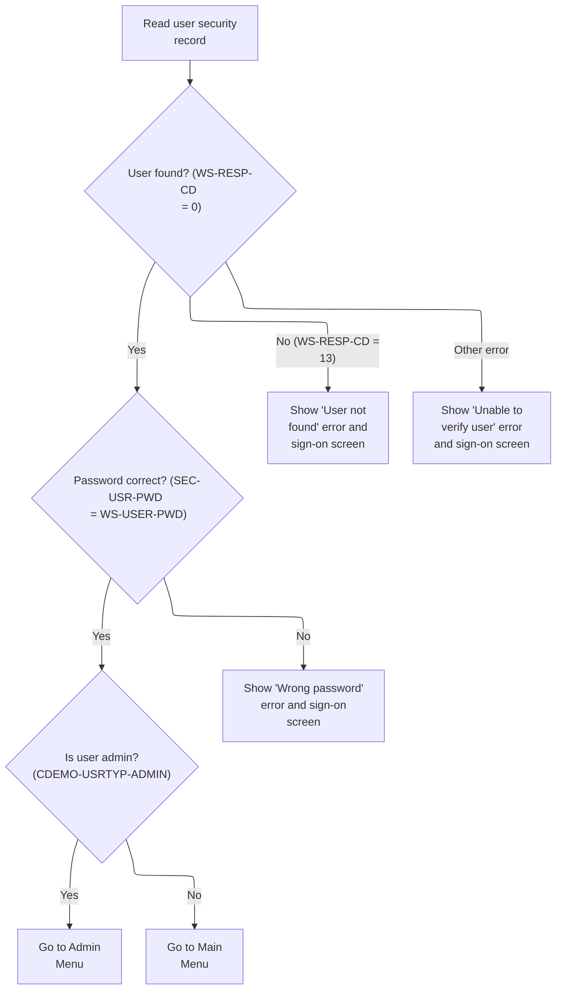
```mermaid
%%{init: {"flowchart": {"defaultRenderer": "elk"}} }%%
flowchart TD
    node1["Read user security 
 record"] --> node2{"User found? (WS-RESP-CD 
 = 0)"}
    click node1 openCode "app/cbl/COSGN00C.cbl:211:219"
    node2 -->|"Yes"| node3{"Password correct? (SEC-USR-PWD 
 = WS-USER-PWD)"}
    click node2 openCode "app/cbl/COSGN00C.cbl:221:222"
    node2 -->|"No (WS-RESP-CD = 
 13)"| node6["Show 'User not 
 found' error and 
 sign-on screen"]
    click node6 openCode "app/cbl/COSGN00C.cbl:247:251"
    node2 -->|"Other error"| node7["Show 'Unable to 
 verify user' error 
 and sign-on screen"]
    click node7 openCode "app/cbl/COSGN00C.cbl:252:256"
    node3 -->|"Yes"| node4{"Is user admin? 
 (CDEMO-USRTYP-ADMIN)"}
    click node3 openCode "app/cbl/COSGN00C.cbl:223:230"
    node3 -->|"No"| node5["Show 'Wrong password' 
 error and sign-on 
 screen"]
    click node5 openCode "app/cbl/COSGN00C.cbl:241:246"
    node4 -->|"Yes"| node8["Go to Admin 
 Menu"]
    click node8 openCode "app/cbl/COSGN00C.cbl:231:234"
    node4 -->|"No"| node9["Go to Main 
 Menu"]
    click node9 openCode "app/cbl/COSGN00C.cbl:236:239"
classDef HeadingStyle fill:#777777,stroke:#333,stroke-width:2px;
```

This section validates user credentials and routes users to the appropriate menu based on their role, or displays error messages if validation fails.

| Rule ID | Code Location      | Category       | Rule Name                       | Description                                                                                                                                                                            | Conditions                                                                                                   | Remarks                                                                                                                                               |
| ------- | ------------------ | -------------- | ------------------------------- | -------------------------------------------------------------------------------------------------------------------------------------------------------------------------------------- | ------------------------------------------------------------------------------------------------------------ | ----------------------------------------------------------------------------------------------------------------------------------------------------- |
| BR-001  | READ-USER-SEC-FILE | Business logic | User Role Routing               | If a user is found and the password matches, the user is routed to the Admin Menu if their user type is 'A' (admin), otherwise to the Main Menu.                                       | A user record is found for the entered user ID, and the entered password matches the stored password.        | User type 'A' is considered admin; any other value is treated as a regular user. Admins are routed to the Admin Menu, regular users to the Main Menu. |
| BR-002  | READ-USER-SEC-FILE | Error handling | Wrong Password Error            | If a user is found but the password does not match, an error message 'Wrong Password. Try again ...' is displayed and the sign-on screen is shown again.                               | A user record is found for the entered user ID, but the entered password does not match the stored password. | The error message is: 'Wrong Password. Try again ...'. The sign-on screen is re-displayed for another attempt.                                        |
| BR-003  | READ-USER-SEC-FILE | Error handling | User Not Found Error            | If no user is found for the entered user ID, an error message 'User not found. Try again ...' is displayed and the sign-on screen is shown again.                                      | No user record is found for the entered user ID (response code 13).                                          | The error message is: 'User not found. Try again ...'. The sign-on screen is re-displayed for another attempt.                                        |
| BR-004  | READ-USER-SEC-FILE | Error handling | General User Verification Error | If an error occurs during user verification that is not a 'user not found' error, an error message 'Unable to verify the User ...' is displayed and the sign-on screen is shown again. | A user verification error occurs that is not a 'user not found' error (response code other than 0 or 13).    | The error message is: 'Unable to verify the User ...'. The sign-on screen is re-displayed for another attempt.                                        |

<SwmSnippet path="/app/cbl/COSGN00C.cbl" line="209" repo-id="Z2l0aHViJTNBJTNBa3luZHJ5bC1hd3MtbWFpbmZyYW1lLW1vZGVybml6YXRpb24tY2FyZGRlbW8lM0ElM0FTd2ltbS1EZW1v">

---

READ-USER-SEC-FILE reads the user record, checks the password, and then routes admins to COADM01C and users to COMEN01C. If anything fails, we show an error and resend the signon screen.

```cobol
       READ-USER-SEC-FILE.

           EXEC CICS READ
                DATASET   (WS-USRSEC-FILE)
                INTO      (SEC-USER-DATA)
                LENGTH    (LENGTH OF SEC-USER-DATA)
                RIDFLD    (WS-USER-ID)
                KEYLENGTH (LENGTH OF WS-USER-ID)
                RESP      (WS-RESP-CD)
                RESP2     (WS-REAS-CD)
           END-EXEC.

           EVALUATE WS-RESP-CD
               WHEN 0
                   IF SEC-USR-PWD = WS-USER-PWD
                       MOVE WS-TRANID    TO CDEMO-FROM-TRANID
                       MOVE WS-PGMNAME   TO CDEMO-FROM-PROGRAM
                       MOVE WS-USER-ID   TO CDEMO-USER-ID
                       MOVE SEC-USR-TYPE TO CDEMO-USER-TYPE
                       MOVE ZEROS        TO CDEMO-PGM-CONTEXT

                       IF CDEMO-USRTYP-ADMIN
                            EXEC CICS XCTL
                              PROGRAM ('COADM01C')
                              COMMAREA(CARDDEMO-COMMAREA)
                            END-EXEC
                       ELSE
                            EXEC CICS XCTL
                              PROGRAM ('COMEN01C')
                              COMMAREA(CARDDEMO-COMMAREA)
                            END-EXEC
                       END-IF
                   ELSE
                       MOVE 'Wrong Password. Try again ...' TO
                                                          WS-MESSAGE
                       MOVE -1       TO PASSWDL OF COSGN0AI
                       PERFORM SEND-SIGNON-SCREEN
                   END-IF
               WHEN 13
                   MOVE 'Y'      TO WS-ERR-FLG
                   MOVE 'User not found. Try again ...' TO WS-MESSAGE
                   MOVE -1       TO USERIDL OF COSGN0AI
                   PERFORM SEND-SIGNON-SCREEN
               WHEN OTHER
                   MOVE 'Y'      TO WS-ERR-FLG
                   MOVE 'Unable to verify the User ...' TO WS-MESSAGE
                   MOVE -1       TO USERIDL OF COSGN0AI
                   PERFORM SEND-SIGNON-SCREEN
           END-EVALUATE.
```

---

</SwmSnippet>

#### Admin Menu Entry: Initial and Reentry Handling

```mermaid
%%{init: {"flowchart": {"defaultRenderer": "elk"}} }%%
flowchart TD
    node1["Start: Prepare menu 
 and clear messages"]
    click node1 openCode "app/cbl/COMEN01C.cbl:75:82"
    node1 --> node2{"New session?"}
    click node2 openCode "app/cbl/COMEN01C.cbl:82:85"
    node2 -->|"Yes"| node3["Signon Screen Routing"]
    
    node2 -->|"No"| node4{"First entry to 
 menu?"}
    click node4 openCode "app/cbl/COMEN01C.cbl:87:91"
    node4 -->|"Yes"| node5["Main Menu Display: Header and Options Setup"]
    
    node4 -->|"No"| node6["Main Menu Display: Header and Options Setup"]
    
    nodeMappings: [
      {"nodeId": "node3", "type": "functionCall", "functionName": "RETURN-TO-SIGNON-SCREEN", "sectionId": "RETURN-TO-SIGNON-SCREEN-170"},
      {"nodeId": "node5", "type": "functionCall", "functionName": "SEND-MENU-SCREEN", "sectionId": "SEND-MENU-SCREEN-182"}
    ]
classDef HeadingStyle fill:#777777,stroke:#333,stroke-width:2px;
click node3 goToHeading "Signon Screen Routing"
node3:::HeadingStyle
click node5 goToHeading "Main Menu Display: Header and Options Setup"
node5:::HeadingStyle
click node6 goToHeading "Main Menu Display: Header and Options Setup"
node6:::HeadingStyle
click node3 goToHeading "Signon Screen Routing"
node3:::HeadingStyle
click node5 goToHeading "Main Menu Display: Header and Options Setup"
node5:::HeadingStyle
click node6 goToHeading "Main Menu Display: Header and Options Setup"
node6:::HeadingStyle
```

This section governs how the main menu is presented to users, handling both new and ongoing sessions, and providing clear routing and error feedback based on user actions.

| Rule ID | Code Location | Category       | Rule Name                    | Description                                                                                                                           | Conditions                                                                                    | Remarks                                                                                                                                                             |
| ------- | ------------- | -------------- | ---------------------------- | ------------------------------------------------------------------------------------------------------------------------------------- | --------------------------------------------------------------------------------------------- | ------------------------------------------------------------------------------------------------------------------------------------------------------------------- |
| BR-001  | MAIN-PARA     | Business logic | Fresh Session Signon Routing | If the session is a fresh entry (no communication area), the user is routed to the signon screen.                                     | The communication area length is zero (EIBCALEN = 0).                                         | The signon screen is triggered by setting the next program to 'COSGN00C'. The communication area is not populated in this case.                                     |
| BR-002  | MAIN-PARA     | Business logic | First Entry Menu Display     | If the session is not a fresh entry and it is the first time entering the menu, the main menu is displayed with a cleared screen.     | The communication area is present (EIBCALEN > 0) and the program reentry flag is not set.     | The main menu is displayed by clearing the output area and sending the menu screen. The reentry flag is set to indicate the session is now ongoing.                 |
| BR-003  | MAIN-PARA     | Business logic | PF3 Signoff Routing          | If the session is ongoing and the user presses PF3, the session is routed to the signon screen.                                       | The session is ongoing, the menu screen is received, and the key pressed is PF3.              | The signon screen is triggered by setting the next program to 'COSGN00C'.                                                                                           |
| BR-004  | MAIN-PARA     | Error handling | Invalid Key Error Handling   | If the session is ongoing and the user presses an invalid key on the menu, an error message is displayed and the menu is redisplayed. | The session is ongoing, the menu screen is received, and the key pressed is not ENTER or PF3. | The error message displayed is 'Invalid key pressed. Please see below...         ' (50 characters, left-aligned, padded with spaces). The error flag is set to 'Y'. |

<SwmSnippet path="/app/cbl/COADM01C.cbl" line="75" repo-id="Z2l0aHViJTNBJTNBa3luZHJ5bC1hd3MtbWFpbmZyYW1lLW1vZGVybml6YXRpb24tY2FyZGRlbW8lM0ElM0FTd2ltbS1EZW1v">

---

MAIN-PARA in COADM01C.cbl handles both first-time entry and reentry. If it's a fresh entry (EIBCALEN = 0), we set up for signon. Otherwise, we check if the session is new or ongoing, send or receive the admin menu screen, and process user input based on the key pressed.

```cobol
       MAIN-PARA.

           SET ERR-FLG-OFF TO TRUE

           MOVE SPACES TO WS-MESSAGE
                          ERRMSGO OF COADM1AO

           IF EIBCALEN = 0
               MOVE 'COSGN00C' TO CDEMO-FROM-PROGRAM
               PERFORM RETURN-TO-SIGNON-SCREEN
           ELSE
               MOVE DFHCOMMAREA(1:EIBCALEN) TO CARDDEMO-COMMAREA
               IF NOT CDEMO-PGM-REENTER
                   SET CDEMO-PGM-REENTER    TO TRUE
                   MOVE LOW-VALUES          TO COADM1AO
                   PERFORM SEND-MENU-SCREEN
               ELSE
                   PERFORM RECEIVE-MENU-SCREEN
                   EVALUATE EIBAID
                       WHEN DFHENTER
                           PERFORM PROCESS-ENTER-KEY
                       WHEN DFHPF3
                           MOVE 'COSGN00C' TO CDEMO-TO-PROGRAM
                           PERFORM RETURN-TO-SIGNON-SCREEN
                       WHEN OTHER
                           MOVE 'Y'                       TO WS-ERR-FLG
                           MOVE CCDA-MSG-INVALID-KEY      TO WS-MESSAGE
                           PERFORM SEND-MENU-SCREEN
                   END-EVALUATE
               END-IF
           END-IF

           EXEC CICS RETURN
                     TRANSID (WS-TRANID)
                     COMMAREA (CARDDEMO-COMMAREA)
           END-EXEC.
```

---

</SwmSnippet>

<SwmSnippet path="/app/cbl/COADM01C.cbl" line="160" repo-id="Z2l0aHViJTNBJTNBa3luZHJ5bC1hd3MtbWFpbmZyYW1lLW1vZGVybml6YXRpb24tY2FyZGRlbW8lM0ElM0FTd2ltbS1EZW1v">

---

RETURN-TO-SIGNON-SCREEN checks if the next program is set. If not, it defaults to signon ('COSGN00C') and uses XCTL to transfer control, making sure the user always lands somewhere valid.

```cobol
       RETURN-TO-SIGNON-SCREEN.

           IF CDEMO-TO-PROGRAM = LOW-VALUES OR SPACES
               MOVE 'COSGN00C' TO CDEMO-TO-PROGRAM
           END-IF
           EXEC CICS
               XCTL PROGRAM(CDEMO-TO-PROGRAM)
           END-EXEC.
```

---

</SwmSnippet>

##### Admin Menu Display: Header and Options Setup

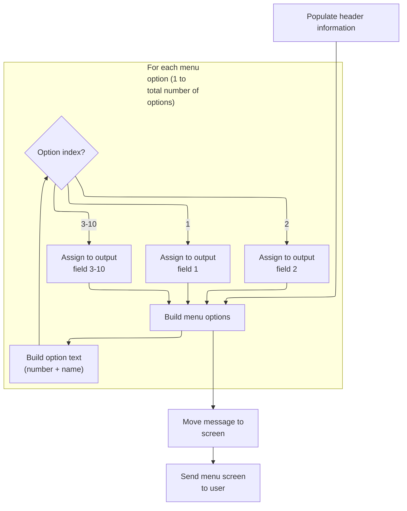
```mermaid
%%{init: {"flowchart": {"defaultRenderer": "elk"}} }%%
flowchart TD
    node1["Populate header information"]
    click node1 openCode "app/cbl/COADM01C.cbl:202:221"
    node1 --> node2["Build menu options"]
    click node2 openCode "app/cbl/COADM01C.cbl:226:263"
    
    subgraph loop1["For each menu 
 option (1 to 
 total number of 
 options)"]
        node2 --> node5["Build option text 
 (number + name)"]
        click node5 openCode "app/cbl/COADM01C.cbl:233:236"
        node5 --> node6{"Option index?"}
        click node6 openCode "app/cbl/COADM01C.cbl:238:259"
        node6 -->|"1"| node7["Assign to output 
 field 1"]
        click node7 openCode "app/cbl/COADM01C.cbl:240:240"
        node6 -->|"2"| node8["Assign to output 
 field 2"]
        click node8 openCode "app/cbl/COADM01C.cbl:242:242"
        node6 -->|"3-10"| node9["Assign to output 
 field 3-10"]
        click node9 openCode "app/cbl/COADM01C.cbl:244:258"
        node7 --> node2
        node8 --> node2
        node9 --> node2
    end
    
    node2 --> node3["Move message to 
 screen"]
    click node3 openCode "app/cbl/COADM01C.cbl:177:177"
    node3 --> node4["Send menu screen 
 to user"]
    click node4 openCode "app/cbl/COADM01C.cbl:179:184"

classDef HeadingStyle fill:#777777,stroke:#333,stroke-width:2px;
```

This section prepares and displays the Admin Menu screen, ensuring the header is up-to-date, menu options are clearly listed, any message is shown, and the screen is cleared before display.

| Rule ID | Code Location        | Category       | Rule Name                             | Description                                                                                                                                                                                                                     | Conditions                                                                                   | Remarks                                                                                                                                                                                                                        |
| ------- | -------------------- | -------------- | ------------------------------------- | ------------------------------------------------------------------------------------------------------------------------------------------------------------------------------------------------------------------------------- | -------------------------------------------------------------------------------------------- | ------------------------------------------------------------------------------------------------------------------------------------------------------------------------------------------------------------------------------ |
| BR-001  | POPULATE-HEADER-INFO | Business logic | Dynamic header display                | The header of the admin menu screen must always display the current date, current time, the program name, transaction ID, and predefined titles, ensuring users see up-to-date context information each time the menu is shown. | Whenever the admin menu screen is displayed.                                                 | Date is shown in MM-DD-YY format; time is shown in HH-MM-SS format; program name is 8 characters; transaction ID is 4 characters; titles are predefined strings. All fields are left-aligned and padded with spaces as needed. |
| BR-002  | BUILD-MENU-OPTIONS   | Business logic | Menu option formatting and assignment | The admin menu must display a list of options, each formatted as the option number, a dot, a space, and the option name (e.g., '1. User Management'), with up to 10 options shown in order.                                     | Whenever the admin menu screen is displayed and there are one or more admin options defined. | Each menu option is formatted as: number (1-2 digits), dot, space, name (up to 40 characters total). Up to 10 options are displayed, each in its own output field.                                                             |
| BR-003  | SEND-MENU-SCREEN     | Business logic | Message display                       | Any message text present must be displayed in the designated message area of the admin menu screen.                                                                                                                             | Whenever the admin menu screen is displayed and a message is present.                        | Message area is 80 characters, left-aligned, padded with spaces if shorter.                                                                                                                                                    |
| BR-004  | SEND-MENU-SCREEN     | Business logic | Screen clear before display           | The admin menu screen must always be cleared before being displayed to the user, ensuring no residual data from previous screens is visible.                                                                                    | Whenever the admin menu screen is sent to the user terminal.                                 | The entire screen is cleared before the new menu is displayed.                                                                                                                                                                 |

<SwmSnippet path="/app/cbl/COADM01C.cbl" line="172" repo-id="Z2l0aHViJTNBJTNBa3luZHJ5bC1hd3MtbWFpbmZyYW1lLW1vZGVybml6YXRpb24tY2FyZGRlbW8lM0ElM0FTd2ltbS1EZW1v">

---

SEND-MENU-SCREEN first calls POPULATE-HEADER-INFO to set up the header, then BUILD-MENU-OPTIONS to fill in the admin menu choices, moves any message to the error field, and finally sends the admin menu map to the terminal, clearing the screen.

```cobol
       SEND-MENU-SCREEN.

           PERFORM POPULATE-HEADER-INFO
           PERFORM BUILD-MENU-OPTIONS

           MOVE WS-MESSAGE TO ERRMSGO OF COADM1AO

           EXEC CICS SEND
                     MAP('COADM1A')
                     MAPSET('COADM01')
                     FROM(COADM1AO)
                     ERASE
           END-EXEC.
```

---

</SwmSnippet>

<SwmSnippet path="/app/cbl/COADM01C.cbl" line="202" repo-id="Z2l0aHViJTNBJTNBa3luZHJ5bC1hd3MtbWFpbmZyYW1lLW1vZGVybml6YXRpb24tY2FyZGRlbW8lM0ElM0FTd2ltbS1EZW1v">

---

POPULATE-HEADER-INFO grabs the current date and time, formats them, and fills in the header fields with titles and program info, so the admin menu screen always shows up-to-date context.

```cobol
       POPULATE-HEADER-INFO.

           MOVE FUNCTION CURRENT-DATE  TO WS-CURDATE-DATA

           MOVE CCDA-TITLE01           TO TITLE01O OF COADM1AO
           MOVE CCDA-TITLE02           TO TITLE02O OF COADM1AO
           MOVE WS-TRANID              TO TRNNAMEO OF COADM1AO
           MOVE WS-PGMNAME             TO PGMNAMEO OF COADM1AO

           MOVE WS-CURDATE-MONTH       TO WS-CURDATE-MM
           MOVE WS-CURDATE-DAY         TO WS-CURDATE-DD
           MOVE WS-CURDATE-YEAR(3:2)   TO WS-CURDATE-YY

           MOVE WS-CURDATE-MM-DD-YY    TO CURDATEO OF COADM1AO

           MOVE WS-CURTIME-HOURS       TO WS-CURTIME-HH
           MOVE WS-CURTIME-MINUTE      TO WS-CURTIME-MM
           MOVE WS-CURTIME-SECOND      TO WS-CURTIME-SS

           MOVE WS-CURTIME-HH-MM-SS    TO CURTIMEO OF COADM1AO.
```

---

</SwmSnippet>

<SwmSnippet path="/app/cbl/COADM01C.cbl" line="226" repo-id="Z2l0aHViJTNBJTNBa3luZHJ5bC1hd3MtbWFpbmZyYW1lLW1vZGVybml6YXRpb24tY2FyZGRlbW8lM0ElM0FTd2ltbS1EZW1v">

---

BUILD-MENU-OPTIONS loops through the admin options, builds the display text for each, and assigns it to the right output field so the menu shows the correct choices.

```cobol
       BUILD-MENU-OPTIONS.

           PERFORM VARYING WS-IDX FROM 1 BY 1 UNTIL
                           WS-IDX > CDEMO-ADMIN-OPT-COUNT

               MOVE SPACES             TO WS-ADMIN-OPT-TXT

               STRING CDEMO-ADMIN-OPT-NUM(WS-IDX)  DELIMITED BY SIZE
                      '. '                         DELIMITED BY SIZE
                      CDEMO-ADMIN-OPT-NAME(WS-IDX) DELIMITED BY SIZE
                 INTO WS-ADMIN-OPT-TXT

               EVALUATE WS-IDX
                   WHEN 1
                       MOVE WS-ADMIN-OPT-TXT TO OPTN001O
                   WHEN 2
                       MOVE WS-ADMIN-OPT-TXT TO OPTN002O
                   WHEN 3
                       MOVE WS-ADMIN-OPT-TXT TO OPTN003O
                   WHEN 4
                       MOVE WS-ADMIN-OPT-TXT TO OPTN004O
                   WHEN 5
                       MOVE WS-ADMIN-OPT-TXT TO OPTN005O
                   WHEN 6
                       MOVE WS-ADMIN-OPT-TXT TO OPTN006O
                   WHEN 7
                       MOVE WS-ADMIN-OPT-TXT TO OPTN007O
                   WHEN 8
                       MOVE WS-ADMIN-OPT-TXT TO OPTN008O
                   WHEN 9
                       MOVE WS-ADMIN-OPT-TXT TO OPTN009O
                   WHEN 10
                       MOVE WS-ADMIN-OPT-TXT TO OPTN010O
                   WHEN OTHER
                       CONTINUE
               END-EVALUATE

           END-PERFORM.
```

---

</SwmSnippet>

##### Admin Menu Input: Screen Receive

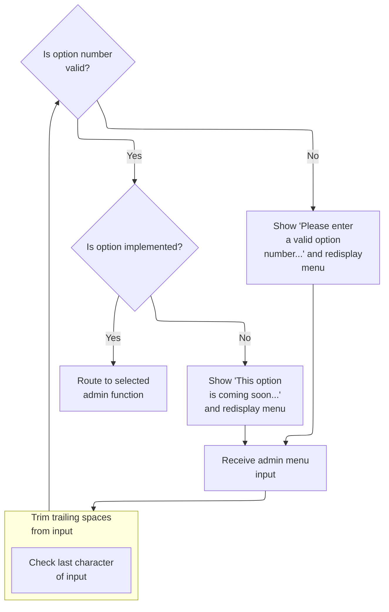
```mermaid
%%{init: {"flowchart": {"defaultRenderer": "elk"}} }%%
flowchart TD
    node1["Receive admin menu 
 input"]
    click node1 openCode "app/cbl/COADM01C.cbl:191:197"
    subgraph loop1["Trim trailing spaces 
 from input"]
        node2["Check last character 
 of input"]
        click node2 openCode "app/cbl/COADM01C.cbl:117:121"
    end
    node1 --> loop1
    loop1 --> node3{"Is option number 
 valid?"}
    click node3 openCode "app/cbl/COADM01C.cbl:127:129"
    node3 -->|"Yes"| node5{"Is option implemented?"}
    click node5 openCode "app/cbl/COADM01C.cbl:138:146"
    node3 -->|"No"| node4["Show 'Please enter 
 a valid option 
 number...' and redisplay 
 menu"]
    click node4 openCode "app/cbl/COADM01C.cbl:130:134"
    node5 -->|"Yes"| node6["Route to selected 
 admin function"]
    click node6 openCode "app/cbl/COADM01C.cbl:142:145"
    node5 -->|"No"| node7["Show 'This option 
 is coming soon...' 
 and redisplay menu"]
    click node7 openCode "app/cbl/COADM01C.cbl:147:154"
    node4 --> node1
    node7 --> node1
classDef HeadingStyle fill:#777777,stroke:#333,stroke-width:2px;
```

This section handles the processing of admin menu input, including validation, error handling, and routing to admin functions or displaying appropriate messages.

| Rule ID | Code Location     | Category        | Rule Name                        | Description                                                                                                                                                                                                                      | Conditions                                                                                           | Remarks                                                                                                                                                                                                       |
| ------- | ----------------- | --------------- | -------------------------------- | -------------------------------------------------------------------------------------------------------------------------------------------------------------------------------------------------------------------------------- | ---------------------------------------------------------------------------------------------------- | ------------------------------------------------------------------------------------------------------------------------------------------------------------------------------------------------------------- |
| BR-001  | PROCESS-ENTER-KEY | Data validation | Invalid Option Number            | If the user enters a menu option that is not numeric, is zero, or exceeds the maximum allowed option number, the system displays the message 'Please enter a valid option number...' and redisplays the admin menu.              | The entered option is not numeric, or is zero, or is greater than the maximum allowed option number. | The error message displayed is 'Please enter a valid option number...'. The maximum allowed option number is determined by the value of CDEMO-ADMIN-OPT-COUNT. The option is expected to be a 2-digit number. |
| BR-002  | PROCESS-ENTER-KEY | Data validation | Ignore Trailing Spaces           | Trailing spaces in the user's menu input are ignored when determining the selected option.                                                                                                                                       | The user's menu input contains trailing spaces.                                                      | The input is trimmed from the right before being processed as a menu option. The final option is expected to be a 2-digit number, right-aligned, with spaces replaced by zeros.                               |
| BR-003  | PROCESS-ENTER-KEY | Business logic  | Unimplemented Option Placeholder | If the user selects a valid menu option that is not yet implemented (i.e., the program name for the option starts with 'DUMMY'), the system displays the message 'This option is coming soon ...' and redisplays the admin menu. | The entered option is valid, but the associated program name starts with 'DUMMY'.                    | The placeholder message is 'This option is coming soon ...'. The check for implementation is based on the first 5 characters of the program name for the selected option.                                     |
| BR-004  | PROCESS-ENTER-KEY | Business logic  | Route to Admin Function          | If the user selects a valid and implemented menu option, the system routes the user to the corresponding admin function.                                                                                                         | The entered option is valid and the associated program name does not start with 'DUMMY'.             | The routing is determined by the program name associated with the selected option. The program name is an 8-character string.                                                                                 |

<SwmSnippet path="/app/cbl/COADM01C.cbl" line="189" repo-id="Z2l0aHViJTNBJTNBa3luZHJ5bC1hd3MtbWFpbmZyYW1lLW1vZGVybml6YXRpb24tY2FyZGRlbW8lM0ElM0FTd2ltbS1EZW1v">

---

We grab the user's menu input from the screen for processing.

```cobol
       RECEIVE-MENU-SCREEN.

           EXEC CICS RECEIVE
                     MAP('COADM1A')
                     MAPSET('COADM01')
                     INTO(COADM1AI)
                     RESP(WS-RESP-CD)
                     RESP2(WS-REAS-CD)
           END-EXEC.
```

---

</SwmSnippet>

<SwmSnippet path="/app/cbl/COADM01C.cbl" line="115" repo-id="Z2l0aHViJTNBJTNBa3luZHJ5bC1hd3MtbWFpbmZyYW1lLW1vZGVybml6YXRpb24tY2FyZGRlbW8lM0ElM0FTd2ltbS1EZW1v">

---

PROCESS-ENTER-KEY extracts and validates the user's menu option, checks if it's numeric and in range, and if valid, uses XCTL to transfer to the selected program unless it's 'DUMMY', in which case we show a placeholder message.

```cobol
       PROCESS-ENTER-KEY.

           PERFORM VARYING WS-IDX
                   FROM LENGTH OF OPTIONI OF COADM1AI BY -1 UNTIL
                   OPTIONI OF COADM1AI(WS-IDX:1) NOT = SPACES OR
                   WS-IDX = 1
           END-PERFORM
           MOVE OPTIONI OF COADM1AI(1:WS-IDX) TO WS-OPTION-X
           INSPECT WS-OPTION-X REPLACING ALL ' ' BY '0'
           MOVE WS-OPTION-X              TO WS-OPTION
           MOVE WS-OPTION                TO OPTIONO OF COADM1AO

           IF WS-OPTION IS NOT NUMERIC OR
              WS-OPTION > CDEMO-ADMIN-OPT-COUNT OR
              WS-OPTION = ZEROS
               MOVE 'Y'     TO WS-ERR-FLG
               MOVE 'Please enter a valid option number...' TO
                                       WS-MESSAGE
               PERFORM SEND-MENU-SCREEN
           END-IF


           IF NOT ERR-FLG-ON
               IF CDEMO-ADMIN-OPT-PGMNAME(WS-OPTION)(1:5) NOT = 'DUMMY'
                   MOVE WS-TRANID    TO CDEMO-FROM-TRANID
                   MOVE WS-PGMNAME   TO CDEMO-FROM-PROGRAM
                   MOVE ZEROS        TO CDEMO-PGM-CONTEXT
                   EXEC CICS
                       XCTL PROGRAM(CDEMO-ADMIN-OPT-PGMNAME(WS-OPTION))
                       COMMAREA(CARDDEMO-COMMAREA)
                   END-EXEC
               END-IF
               MOVE SPACES             TO WS-MESSAGE
               MOVE DFHGREEN           TO ERRMSGC  OF COADM1AO
               STRING 'This option '       DELIMITED BY SIZE
      *                CDEMO-ADMIN-OPT-NAME(WS-OPTION)
      *                                DELIMITED BY SIZE
                       'is coming soon ...'   DELIMITED BY SIZE
                  INTO WS-MESSAGE
               PERFORM SEND-MENU-SCREEN
           END-IF.
```

---

</SwmSnippet>

#### Signon Exit: Message Display and Return

This section is responsible for displaying a plain text message to the user at the end of the signon flow and then returning control, ending the signon process.

| Rule ID | Code Location   | Category       | Rule Name                        | Description                                                                                                                   | Conditions                                                        | Remarks                                                                                                                                                                                                                |
| ------- | --------------- | -------------- | -------------------------------- | ----------------------------------------------------------------------------------------------------------------------------- | ----------------------------------------------------------------- | ---------------------------------------------------------------------------------------------------------------------------------------------------------------------------------------------------------------------- |
| BR-001  | SEND-PLAIN-TEXT | Business logic | Display signon message           | A plain text message, up to 80 characters, is displayed to the user at the end of the signon flow.                            | When the signon flow reaches the message display and return step. | The message is a string with a maximum length of 80 characters. Example messages include 'Thank you for using CardDemo application...      ' and 'Invalid key pressed. Please see below...         '.                  |
| BR-002  | SEND-PLAIN-TEXT | Business logic | End signon flow after message    | After the message is displayed, the signon flow ends and control is returned to the system.                                   | After the message has been displayed to the user.                 | No additional output is produced after the message is displayed; the flow ends.                                                                                                                                        |
| BR-003  | SEND-PLAIN-TEXT | Business logic | Use predefined message constants | The message displayed to the user may use predefined message constants, such as the thank you message or invalid key message. | When a message is to be displayed at the end of the signon flow.  | Predefined messages include: 'Thank you for using CardDemo application...      ' and 'Invalid key pressed. Please see below...         ', each up to 50 characters. The message variable can hold up to 80 characters. |

<SwmSnippet path="/app/cbl/COSGN00C.cbl" line="162" repo-id="Z2l0aHViJTNBJTNBa3luZHJ5bC1hd3MtbWFpbmZyYW1lLW1vZGVybml6YXRpb24tY2FyZGRlbW8lM0ElM0FTd2ltbS1EZW1v">

---

SEND-PLAIN-TEXT sends a plain message to the user and then returns control, ending the signon flow.

```cobol
       SEND-PLAIN-TEXT.

           EXEC CICS SEND TEXT
                     FROM(WS-MESSAGE)
                     LENGTH(LENGTH OF WS-MESSAGE)
                     ERASE
                     FREEKB
           END-EXEC.

           EXEC CICS RETURN
           END-EXEC.
```

---

</SwmSnippet>

### Main Menu Display: Header and Options Setup

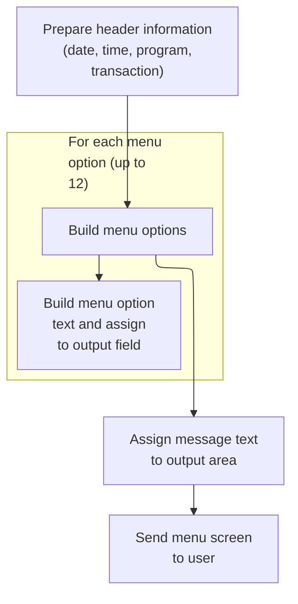
```mermaid
%%{init: {"flowchart": {"defaultRenderer": "elk"}} }%%
flowchart TD
    node1["Prepare header information 
 (date, time, program, 
 transaction)"]
    click node1 openCode "app/cbl/COMEN01C.cbl:212:231"
    node1 --> node2["Build menu options"]
    click node2 openCode "app/cbl/COMEN01C.cbl:236:277"
    
    subgraph loop1["For each menu 
 option (up to 
 12)"]
        node2 --> node4["Build menu option 
 text and assign 
 to output field"]
        click node4 openCode "app/cbl/COMEN01C.cbl:241:275"
    end
    node2 --> node5["Assign message text 
 to output area"]
    click node5 openCode "app/cbl/COMEN01C.cbl:187:187"
    node5 --> node3["Send menu screen 
 to user"]
    click node3 openCode "app/cbl/COMEN01C.cbl:189:194"

classDef HeadingStyle fill:#777777,stroke:#333,stroke-width:2px;
```

This section prepares and displays the main menu screen for the CardDemo application, ensuring users always see up-to-date context, available menu options, and any relevant messages in a clear and consistent format.

| Rule ID | Code Location        | Category       | Rule Name                   | Description                                                                                                                                                                   | Conditions                                                                                 | Remarks                                                                                                                                                                                                                  |
| ------- | -------------------- | -------------- | --------------------------- | ----------------------------------------------------------------------------------------------------------------------------------------------------------------------------- | ------------------------------------------------------------------------------------------ | ------------------------------------------------------------------------------------------------------------------------------------------------------------------------------------------------------------------------ |
| BR-001  | POPULATE-HEADER-INFO | Business logic | Header Context Display      | The main menu header always displays the current date, time, program name, and transaction ID, ensuring users see up-to-date context information each time the menu is shown. | Whenever the main menu screen is displayed.                                                | The header includes: program name (8 characters), transaction ID (4 characters), current date (MM-DD-YY), and current time (HH:MM:SS). All fields are alphanumeric and left-aligned as per the output field definitions. |
| BR-002  | BUILD-MENU-OPTIONS   | Business logic | Menu Option List            | The main menu displays up to 12 options, each with a number, period, and option name, ensuring users can select from all available choices.                                   | Whenever the main menu screen is displayed and there are one or more menu options defined. | Each menu option is formatted as: option number (1-2 digits), period, space, option name (up to 40 characters total). Options are displayed in order, up to a maximum of 12.                                             |
| BR-003  | SEND-MENU-SCREEN     | Business logic | Message Display             | Any message text present is displayed in the designated message area of the main menu screen, ensuring users are informed of relevant status or errors.                       | Whenever the main menu screen is displayed and a message is present.                       | The message area is 80 characters, alphanumeric, left-aligned. If no message is present, the area is blank.                                                                                                              |
| BR-004  | SEND-MENU-SCREEN     | Business logic | Screen Erase Before Display | The main menu screen is always cleared before being displayed, ensuring no residual data from previous screens is visible to the user.                                        | Whenever the main menu screen is sent to the terminal.                                     | The screen is cleared using the ERASE operation before the new menu is displayed.                                                                                                                                        |

<SwmSnippet path="/app/cbl/COMEN01C.cbl" line="182" repo-id="Z2l0aHViJTNBJTNBa3luZHJ5bC1hd3MtbWFpbmZyYW1lLW1vZGVybml6YXRpb24tY2FyZGRlbW8lM0ElM0FTd2ltbS1EZW1v">

---

SEND-MENU-SCREEN first calls POPULATE-HEADER-INFO to set up the header, then BUILD-MENU-OPTIONS to fill in the main menu choices, moves any message to the error field, and finally sends the main menu map to the terminal, clearing the screen.

```cobol
       SEND-MENU-SCREEN.

           PERFORM POPULATE-HEADER-INFO
           PERFORM BUILD-MENU-OPTIONS

           MOVE WS-MESSAGE TO ERRMSGO OF COMEN1AO

           EXEC CICS SEND
                     MAP('COMEN1A')
                     MAPSET('COMEN01')
                     FROM(COMEN1AO)
                     ERASE
           END-EXEC.
```

---

</SwmSnippet>

<SwmSnippet path="/app/cbl/COMEN01C.cbl" line="212" repo-id="Z2l0aHViJTNBJTNBa3luZHJ5bC1hd3MtbWFpbmZyYW1lLW1vZGVybml6YXRpb24tY2FyZGRlbW8lM0ElM0FTd2ltbS1EZW1v">

---

POPULATE-HEADER-INFO grabs the current date and time, formats them, and fills in the header fields with titles and program info, so the main menu screen always shows up-to-date context.

```cobol
       POPULATE-HEADER-INFO.

           MOVE FUNCTION CURRENT-DATE  TO WS-CURDATE-DATA

           MOVE CCDA-TITLE01           TO TITLE01O OF COMEN1AO
           MOVE CCDA-TITLE02           TO TITLE02O OF COMEN1AO
           MOVE WS-TRANID              TO TRNNAMEO OF COMEN1AO
           MOVE WS-PGMNAME             TO PGMNAMEO OF COMEN1AO

           MOVE WS-CURDATE-MONTH       TO WS-CURDATE-MM
           MOVE WS-CURDATE-DAY         TO WS-CURDATE-DD
           MOVE WS-CURDATE-YEAR(3:2)   TO WS-CURDATE-YY

           MOVE WS-CURDATE-MM-DD-YY    TO CURDATEO OF COMEN1AO

           MOVE WS-CURTIME-HOURS       TO WS-CURTIME-HH
           MOVE WS-CURTIME-MINUTE      TO WS-CURTIME-MM
           MOVE WS-CURTIME-SECOND      TO WS-CURTIME-SS

           MOVE WS-CURTIME-HH-MM-SS    TO CURTIMEO OF COMEN1AO.
```

---

</SwmSnippet>

<SwmSnippet path="/app/cbl/COMEN01C.cbl" line="236" repo-id="Z2l0aHViJTNBJTNBa3luZHJ5bC1hd3MtbWFpbmZyYW1lLW1vZGVybml6YXRpb24tY2FyZGRlbW8lM0ElM0FTd2ltbS1EZW1v">

---

BUILD-MENU-OPTIONS loops through the main menu options, builds the display text for each, and assigns it to the right output field so the menu shows the correct choices.

```cobol
       BUILD-MENU-OPTIONS.

           PERFORM VARYING WS-IDX FROM 1 BY 1 UNTIL
                           WS-IDX > CDEMO-MENU-OPT-COUNT

               MOVE SPACES             TO WS-MENU-OPT-TXT

               STRING CDEMO-MENU-OPT-NUM(WS-IDX)  DELIMITED BY SIZE
                      '. '                         DELIMITED BY SIZE
                      CDEMO-MENU-OPT-NAME(WS-IDX) DELIMITED BY SIZE
                 INTO WS-MENU-OPT-TXT

               EVALUATE WS-IDX
                   WHEN 1
                       MOVE WS-MENU-OPT-TXT TO OPTN001O
                   WHEN 2
                       MOVE WS-MENU-OPT-TXT TO OPTN002O
                   WHEN 3
                       MOVE WS-MENU-OPT-TXT TO OPTN003O
                   WHEN 4
                       MOVE WS-MENU-OPT-TXT TO OPTN004O
                   WHEN 5
                       MOVE WS-MENU-OPT-TXT TO OPTN005O
                   WHEN 6
                       MOVE WS-MENU-OPT-TXT TO OPTN006O
                   WHEN 7
                       MOVE WS-MENU-OPT-TXT TO OPTN007O
                   WHEN 8
                       MOVE WS-MENU-OPT-TXT TO OPTN008O
                   WHEN 9
                       MOVE WS-MENU-OPT-TXT TO OPTN009O
                   WHEN 10
                       MOVE WS-MENU-OPT-TXT TO OPTN010O
                   WHEN 11
                       MOVE WS-MENU-OPT-TXT TO OPTN011O
                   WHEN 12
                       MOVE WS-MENU-OPT-TXT TO OPTN012O
                   WHEN OTHER
                       CONTINUE
               END-EVALUATE

           END-PERFORM.
```

---

</SwmSnippet>

### Main Menu Input: Screen Receive

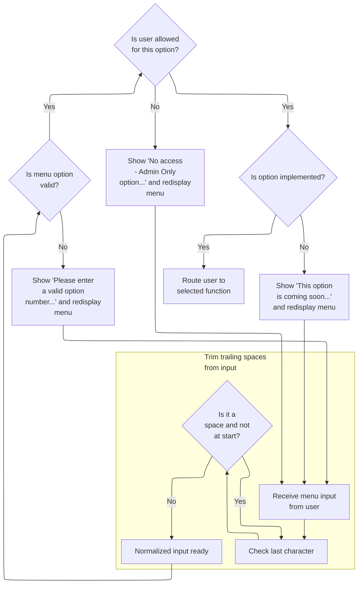
```mermaid
%%{init: {"flowchart": {"defaultRenderer": "elk"}} }%%
flowchart TD
    node1["Receive menu input 
 from user"]
    click node1 openCode "app/cbl/COMEN01C.cbl:201:207"
    subgraph loop1["Trim trailing spaces 
 from input"]
        node1 --> node2["Check last character"]
        click node2 openCode "app/cbl/COMEN01C.cbl:117:121"
        node2 --> node3{"Is it a 
 space and not 
 at start?"}
        click node3 openCode "app/cbl/COMEN01C.cbl:118:120"
        node3 -->|"Yes"| node2
        node3 -->|"No"| node4["Normalized input ready"]
        click node4 openCode "app/cbl/COMEN01C.cbl:122:124"
    end
    node4 --> node5{"Is menu option 
 valid?"}
    click node5 openCode "app/cbl/COMEN01C.cbl:127:129"
    node5 -->|"No"| node6["Show 'Please enter 
 a valid option 
 number...' and redisplay 
 menu"]
    click node6 openCode "app/cbl/COMEN01C.cbl:130:134"
    node5 -->|"Yes"| node7{"Is user allowed 
 for this option?"}
    click node7 openCode "app/cbl/COMEN01C.cbl:136:137"
    node7 -->|"No"| node8["Show 'No access 
 - Admin Only 
 option...' and redisplay 
 menu"]
    click node8 openCode "app/cbl/COMEN01C.cbl:138:143"
    node7 -->|"Yes"| node9{"Is option implemented?"}
    click node9 openCode "app/cbl/COMEN01C.cbl:146:146"
    node9 -->|"Yes"| node10["Route user to 
 selected function"]
    click node10 openCode "app/cbl/COMEN01C.cbl:147:155"
    node9 -->|"No"| node11["Show 'This option 
 is coming soon...' 
 and redisplay menu"]
    click node11 openCode "app/cbl/COMEN01C.cbl:157:164"
    node6 --> node1
    node8 --> node1
    node11 --> node1

classDef HeadingStyle fill:#777777,stroke:#333,stroke-width:2px;
```

This section processes the user's main menu input, validates it, enforces access restrictions, handles unimplemented options, and routes the user to the selected function or displays appropriate messages.

| Rule ID | Code Location     | Category        | Rule Name                       | Description                                                                                                                                                                                                                                                      | Conditions                                                                       | Remarks                                                                                                                                   |
| ------- | ----------------- | --------------- | ------------------------------- | ---------------------------------------------------------------------------------------------------------------------------------------------------------------------------------------------------------------------------------------------------------------- | -------------------------------------------------------------------------------- | ----------------------------------------------------------------------------------------------------------------------------------------- |
| BR-001  | PROCESS-ENTER-KEY | Data validation | Menu Option Input Normalization | User input for the menu option is normalized by trimming trailing spaces and padding with zeros on the left to ensure a two-character numeric string before validation.                                                                                          | Whenever a user submits a menu option from the main menu screen.                 | The normalized menu option is a two-character string, left-padded with zeros if necessary. For example, input ' 5' becomes '05'.          |
| BR-002  | PROCESS-ENTER-KEY | Data validation | Menu Option Validation          | A menu option is considered valid only if it is numeric, within the allowed range (greater than zero and less than or equal to the maximum menu option count), and not zero. If the input is invalid, an error message is displayed and the menu is redisplayed. | Whenever a normalized menu option is submitted.                                  | The maximum allowed menu option is the value of CDEMO-MENU-OPT-COUNT. The error message shown is 'Please enter a valid option number...'. |
| BR-003  | PROCESS-ENTER-KEY | Data validation | Admin-Only Option Enforcement   | If a user with a non-admin role selects a menu option that is restricted to admin users, an access denied message is displayed and the menu is redisplayed.                                                                                                      | Whenever a non-admin user selects a menu option designated as admin-only.        | Admin-only options are identified by user type 'A'. The error message shown is 'No access - Admin Only option... '.                       |
| BR-004  | PROCESS-ENTER-KEY | Business logic  | Menu Option Routing             | If the selected menu option is valid, allowed for the user, and implemented, the user is routed to the corresponding function.                                                                                                                                   | Whenever a valid, allowed, and implemented menu option is selected.              | Routing is performed by transferring control to the program associated with the selected menu option.                                     |
| BR-005  | PROCESS-ENTER-KEY | Error handling  | Unimplemented Option Handling   | If the selected menu option is not yet implemented (i.e., its program name starts with 'DUMMY'), a placeholder message is displayed and the menu is redisplayed.                                                                                                 | Whenever a valid menu option is selected whose program name starts with 'DUMMY'. | The placeholder message format is: 'This option <option name> is coming soon ...'. The option name is dynamically inserted.               |

<SwmSnippet path="/app/cbl/COMEN01C.cbl" line="199" repo-id="Z2l0aHViJTNBJTNBa3luZHJ5bC1hd3MtbWFpbmZyYW1lLW1vZGVybml6YXRpb24tY2FyZGRlbW8lM0ElM0FTd2ltbS1EZW1v">

---

We grab the user's menu input from the screen for processing.

```cobol
       RECEIVE-MENU-SCREEN.

           EXEC CICS RECEIVE
                     MAP('COMEN1A')
                     MAPSET('COMEN01')
                     INTO(COMEN1AI)
                     RESP(WS-RESP-CD)
                     RESP2(WS-REAS-CD)
           END-EXEC.
```

---

</SwmSnippet>

<SwmSnippet path="/app/cbl/COMEN01C.cbl" line="115" repo-id="Z2l0aHViJTNBJTNBa3luZHJ5bC1hd3MtbWFpbmZyYW1lLW1vZGVybml6YXRpb24tY2FyZGRlbW8lM0ElM0FTd2ltbS1EZW1v">

---

PROCESS-ENTER-KEY extracts and validates the user's menu option, checks for admin-only restrictions, and if valid, uses XCTL to transfer to the selected program unless it's 'DUMMY', in which case we show a placeholder message.

```cobol
       PROCESS-ENTER-KEY.

           PERFORM VARYING WS-IDX
                   FROM LENGTH OF OPTIONI OF COMEN1AI BY -1 UNTIL
                   OPTIONI OF COMEN1AI(WS-IDX:1) NOT = SPACES OR
                   WS-IDX = 1
           END-PERFORM
           MOVE OPTIONI OF COMEN1AI(1:WS-IDX) TO WS-OPTION-X
           INSPECT WS-OPTION-X REPLACING ALL ' ' BY '0'
           MOVE WS-OPTION-X              TO WS-OPTION
           MOVE WS-OPTION                TO OPTIONO OF COMEN1AO

           IF WS-OPTION IS NOT NUMERIC OR
              WS-OPTION > CDEMO-MENU-OPT-COUNT OR
              WS-OPTION = ZEROS
               MOVE 'Y'     TO WS-ERR-FLG
               MOVE 'Please enter a valid option number...' TO
                               WS-MESSAGE
               PERFORM SEND-MENU-SCREEN
           END-IF

           IF CDEMO-USRTYP-USER AND
              CDEMO-MENU-OPT-USRTYPE(WS-OPTION) = 'A'
               SET ERR-FLG-ON          TO TRUE
               MOVE SPACES             TO WS-MESSAGE
               MOVE 'No access - Admin Only option... ' TO
                                       WS-MESSAGE
               PERFORM SEND-MENU-SCREEN
           END-IF

           IF NOT ERR-FLG-ON
               IF CDEMO-MENU-OPT-PGMNAME(WS-OPTION)(1:5) NOT = 'DUMMY'
                   MOVE WS-TRANID    TO CDEMO-FROM-TRANID
                   MOVE WS-PGMNAME   TO CDEMO-FROM-PROGRAM
      *            MOVE WS-USER-ID   TO CDEMO-USER-ID
      *            MOVE SEC-USR-TYPE TO CDEMO-USER-TYPE
                   MOVE ZEROS        TO CDEMO-PGM-CONTEXT
                   EXEC CICS
                       XCTL PROGRAM(CDEMO-MENU-OPT-PGMNAME(WS-OPTION))
                       COMMAREA(CARDDEMO-COMMAREA)
                   END-EXEC
               END-IF
               MOVE SPACES             TO WS-MESSAGE
               MOVE DFHGREEN           TO ERRMSGC  OF COMEN1AO
               STRING 'This option '       DELIMITED BY SIZE
                       CDEMO-MENU-OPT-NAME(WS-OPTION)
                                       DELIMITED BY SPACE
                       'is coming soon ...'   DELIMITED BY SIZE
                  INTO WS-MESSAGE
               PERFORM SEND-MENU-SCREEN
           END-IF.
```

---

</SwmSnippet>

## Transaction Add: Reentry and Input Processing

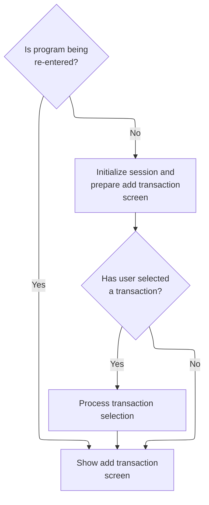
```mermaid
%%{init: {"flowchart": {"defaultRenderer": "elk"}} }%%
flowchart TD
    node2{"Is program being 
 re-entered?"}
    click node2 openCode "app/cbl/COTRN02C.cbl:120:121"
    node2 -->|"No"| node3["Initialize session and 
 prepare add transaction 
 screen"]
    click node3 openCode "app/cbl/COTRN02C.cbl:119:123"
    node3 --> node4{"Has user selected 
 a transaction?"}
    click node4 openCode "app/cbl/COTRN02C.cbl:124:125"
    node4 -->|"Yes"| node5["Process transaction selection"]
    click node5 openCode "app/cbl/COTRN02C.cbl:126:128"
    node4 -->|"No"| node6["Show add transaction 
 screen"]
    click node6 openCode "app/cbl/COTRN02C.cbl:130:130"
    node5 --> node6
    node2 -->|"Yes"| node6
classDef HeadingStyle fill:#777777,stroke:#333,stroke-width:2px;
```

This section manages the logic for initializing the Add Transaction screen, handling program re-entry, and processing user input for transaction selection in the CardDemo application.

| Rule ID | Code Location                | Category       | Rule Name                             | Description                                                                                                                 | Conditions                                                                | Remarks                                                                                                                              |
| ------- | ---------------------------- | -------------- | ------------------------------------- | --------------------------------------------------------------------------------------------------------------------------- | ------------------------------------------------------------------------- | ------------------------------------------------------------------------------------------------------------------------------------ |
| BR-001  | app/cbl/COTRN02C.cbl:120:123 | Business logic | Session Initialization on First Entry | If the program is not being re-entered, the session is initialized and the add transaction screen is prepared for the user. | The program is not being re-entered.                                      | Session initialization includes clearing the output area and setting the input field for account ID to its initial state (e.g., -1). |
| BR-002  | app/cbl/COTRN02C.cbl:124:128 | Business logic | Process Transaction Selection         | If a transaction is selected by the user, the system processes the transaction selection.                                   | A transaction selection is present and not blank or at its initial value. | A transaction selection is considered present if it is not blank (spaces) and not at its initial value (low-values).                 |
| BR-003  | app/cbl/COTRN02C.cbl:130     | Business logic | Display Add Transaction Screen        | If the program is being re-entered or no transaction is selected, the add transaction screen is displayed to the user.      | The program is being re-entered, or no transaction selection is present.  | The add transaction screen is displayed regardless of whether the user is re-entering or has not made a transaction selection.       |

<SwmSnippet path="/app/cbl/COTRN02C.cbl" line="118" repo-id="Z2l0aHViJTNBJTNBa3luZHJ5bC1hd3MtbWFpbmZyYW1lLW1vZGVybml6YXRpb24tY2FyZGRlbW8lM0ElM0FTd2ltbS1EZW1v">

---

After coming back from RETURN-TO-PREV-SCREEN in MAIN-PARA, we check if we're reentered. If not, we prep the screen and, if a transaction is selected, call PROCESS-ENTER-KEY to handle the input. Otherwise, we just send the transaction add screen.

```cobol
           ELSE
               MOVE DFHCOMMAREA(1:EIBCALEN) TO CARDDEMO-COMMAREA
               IF NOT CDEMO-PGM-REENTER
                   SET CDEMO-PGM-REENTER    TO TRUE
                   MOVE LOW-VALUES          TO COTRN2AO
                   MOVE -1       TO ACTIDINL OF COTRN2AI
                   IF CDEMO-CT02-TRN-SELECTED NOT =
                                              SPACES AND LOW-VALUES
                       MOVE CDEMO-CT02-TRN-SELECTED TO
                            CARDNINI OF COTRN2AI
                       PERFORM PROCESS-ENTER-KEY
                   END-IF
                   PERFORM SEND-TRNADD-SCREEN
```

---

</SwmSnippet>

## Transaction Input: Key Field Validation

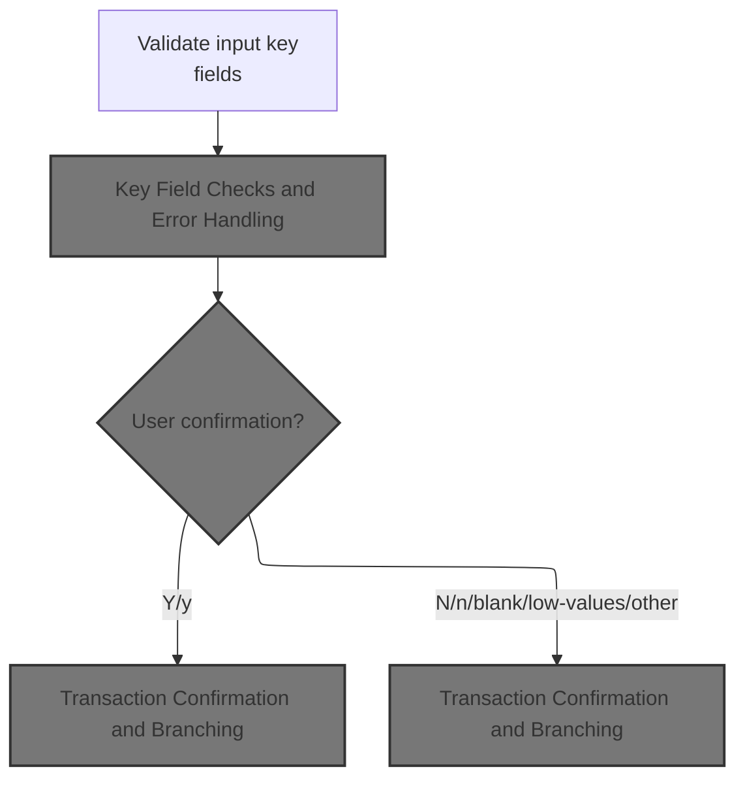
```mermaid
%%{init: {"flowchart": {"defaultRenderer": "elk"}} }%%
flowchart TD
  node1["Validate input key 
 fields"] --> node2["Key Field Checks and Error Handling"]
  click node1 openCode "app/cbl/COTRN02C.cbl:164:167"
  node2 --> node3{"User confirmation?"}
  
  node3 -->|"Y/y"| node4["Transaction Confirmation and Branching"]
  
  
  node3 -->|"N/n/blank/low-values/other"| node5["Transaction Confirmation and Branching"]
  

classDef HeadingStyle fill:#777777,stroke:#333,stroke-width:2px;
click node2 goToHeading "Key Field Checks and Error Handling"
node2:::HeadingStyle
click node3 goToHeading "Transaction Confirmation and Branching"
node3:::HeadingStyle
click node4 goToHeading "Transaction Confirmation and Branching"
node4:::HeadingStyle
click node5 goToHeading "Transaction Confirmation and Branching"
node5:::HeadingStyle
click node2 goToHeading "Key Field Checks and Error Handling"
node2:::HeadingStyle
click node3 goToHeading "Transaction Confirmation and Branching"
node3:::HeadingStyle
click node4 goToHeading "Transaction Confirmation and Branching"
node4:::HeadingStyle
click node5 goToHeading "Transaction Confirmation and Branching"
node5:::HeadingStyle
```

This section ensures that transaction processing only continues if the user provides a valid account ID or card number. It prevents further validation and processing if these key fields are missing or invalid, and signals errors to the user when necessary.

| Rule ID | Code Location             | Category        | Rule Name                     | Description                                                                                                                 | Conditions                                                                                                                | Remarks                                                                                                                                                                                                                                                             |
| ------- | ------------------------- | --------------- | ----------------------------- | --------------------------------------------------------------------------------------------------------------------------- | ------------------------------------------------------------------------------------------------------------------------- | ------------------------------------------------------------------------------------------------------------------------------------------------------------------------------------------------------------------------------------------------------------------- |
| BR-001  | PROCESS-ENTER-KEY         | Data validation | Key Field Required Validation | If the key fields (account ID or card number) are not valid, the transaction processing is halted and an error is signaled. | This rule applies when the user submits a transaction and neither a valid account ID nor a valid card number is provided. | The error flag is set to 'Y' to indicate an error. The error message is set to a non-blank value. The account ID is expected to be an 11-digit number, and the card number is a 16-digit number, but the specific format validation is not visible in this section. |
| BR-002  | PROCESS-ENTER-KEY         | Data validation | Key Field Gating              | Further transaction field validation is only performed if the key fields are valid.                                         | This rule applies when the user submits a transaction and the key fields pass validation.                                 | No further validation or processing occurs unless the key fields are valid. The gating is enforced by the sequence of PERFORM statements.                                                                                                                           |
| BR-003  | VALIDATE-INPUT-KEY-FIELDS | Error handling  | Key Field Error Signaling     | If a key field validation error occurs, an error flag is set and an error message is prepared for the user.                 | This rule applies when the key field validation fails during transaction input.                                           | The error flag is set to 'Y' (ERR-FLG-ON), and the error message is set to a non-blank value. The error flag is initialized to 'N' (ERR-FLG-OFF) before validation.                                                                                                 |

<SwmSnippet path="/app/cbl/COTRN02C.cbl" line="164" repo-id="Z2l0aHViJTNBJTNBa3luZHJ5bC1hd3MtbWFpbmZyYW1lLW1vZGVybml6YXRpb24tY2FyZGRlbW8lM0ElM0FTd2ltbS1EZW1v">

---

In PROCESS-ENTER-KEY, we start by running VALIDATE-INPUT-KEY-FIELDS to make sure the user provided a valid account ID or card number. If these aren't valid, we bail out early and show an error, so we don't waste time checking the rest of the transaction data. Only if the keys pass do we move on to validating the other fields.

```cobol
       PROCESS-ENTER-KEY.

           PERFORM VALIDATE-INPUT-KEY-FIELDS
           PERFORM VALIDATE-INPUT-DATA-FIELDS.
```

---

</SwmSnippet>

### Key Field Checks and Error Handling

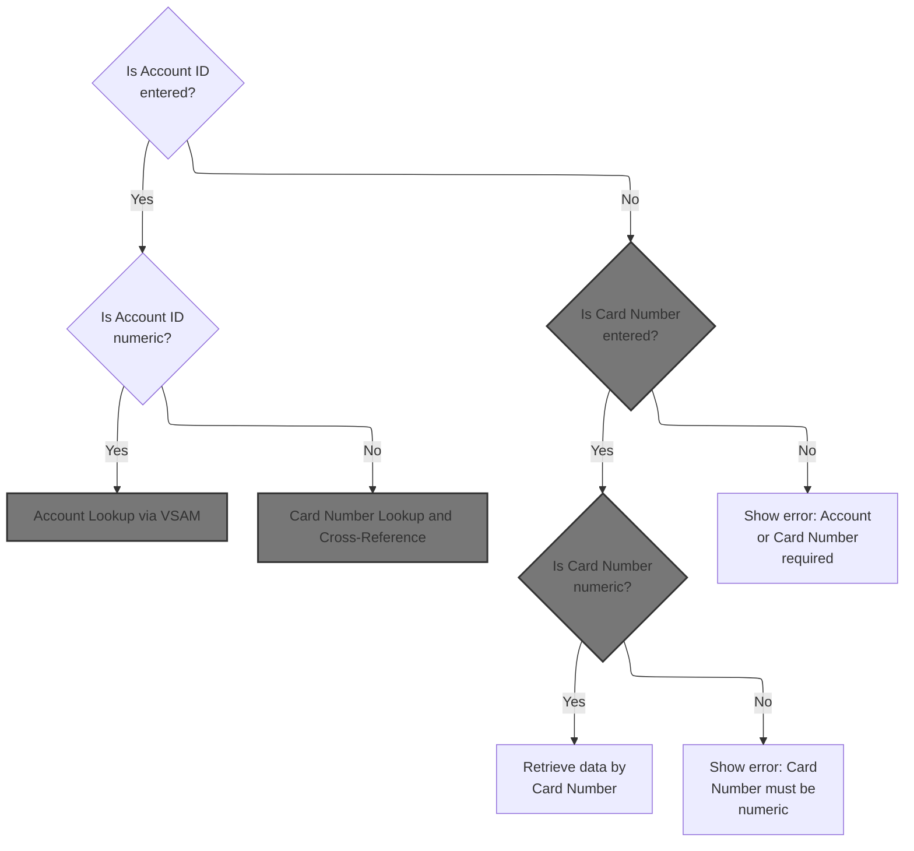
```mermaid
%%{init: {"flowchart": {"defaultRenderer": "elk"}} }%%
flowchart TD
    node1{"Is Account ID 
 entered?"}
    click node1 openCode "app/cbl/COTRN02C.cbl:195:209"
    node1 -->|"Yes"| node2{"Is Account ID 
 numeric?"}
    click node2 openCode "app/cbl/COTRN02C.cbl:197:203"
    node2 -->|"Yes"| node3["Account Lookup via VSAM"]
    
    node2 -->|"No"| node4["Card Number Lookup and Cross-Reference"]
    
    node1 -->|"No"| node5{"Is Card Number 
 entered?"}
    
    node5 -->|"Yes"| node6{"Is Card Number 
 numeric?"}
    
    node6 -->|"Yes"| node7["Retrieve data by 
 Card Number"]
    click node7 openCode "app/cbl/COTRN02C.cbl:218:223"
    node6 -->|"No"| node8["Show error: Card 
 Number must be 
 numeric"]
    click node8 openCode "app/cbl/COTRN02C.cbl:212:216"
    node5 -->|"No"| node9["Show error: Account 
 or Card Number 
 required"]
    click node9 openCode "app/cbl/COTRN02C.cbl:225:229"

classDef HeadingStyle fill:#777777,stroke:#333,stroke-width:2px;
click node3 goToHeading "Account Lookup via VSAM"
node3:::HeadingStyle
click node4 goToHeading "Card Number Lookup and Cross-Reference"
node4:::HeadingStyle
click node5 goToHeading "Card Lookup via VSAM"
node5:::HeadingStyle
click node6 goToHeading "Screen Preparation and Header Population"
node6:::HeadingStyle
```

This section ensures that either an Account ID or Card Number is provided and that any provided value is numeric. It provides user-facing error messages when these requirements are not met, preventing further processing until valid input is received.

| Rule ID | Code Location             | Category        | Rule Name                      | Description                                                                                                                                                                                                                                     | Conditions                                                                   | Remarks                                                                                                                      |
| ------- | ------------------------- | --------------- | ------------------------------ | ----------------------------------------------------------------------------------------------------------------------------------------------------------------------------------------------------------------------------------------------- | ---------------------------------------------------------------------------- | ---------------------------------------------------------------------------------------------------------------------------- |
| BR-001  | VALIDATE-INPUT-KEY-FIELDS | Data validation | Account ID Numeric Validation  | If the Account ID field is present, it must contain only numeric characters. If it contains any non-numeric characters, an error message is displayed to the user indicating that the Account ID must be numeric, and no lookup is performed.   | The Account ID field is present (not blank or low-values).                   | The error message shown is: 'Account ID must be Numeric...'. The Account ID must consist only of numeric characters (0-9).   |
| BR-002  | VALIDATE-INPUT-KEY-FIELDS | Data validation | Key Field Presence Requirement | If the Account ID field is not present, the Card Number field must be provided. If neither field is present, an error message is displayed to the user indicating that either Account ID or Card Number is required.                            | Both Account ID and Card Number fields are blank or contain only low-values. | The error message shown is: 'Account or Card Number required'. At least one of the two fields must be provided.              |
| BR-003  | VALIDATE-INPUT-KEY-FIELDS | Data validation | Card Number Numeric Validation | If the Card Number field is present, it must contain only numeric characters. If it contains any non-numeric characters, an error message is displayed to the user indicating that the Card Number must be numeric, and no lookup is performed. | The Card Number field is present (not blank or low-values).                  | The error message shown is: 'Card Number must be Numeric...'. The Card Number must consist only of numeric characters (0-9). |

<SwmSnippet path="/app/cbl/COTRN02C.cbl" line="193" repo-id="Z2l0aHViJTNBJTNBa3luZHJ5bC1hd3MtbWFpbmZyYW1lLW1vZGVybml6YXRpb24tY2FyZGRlbW8lM0ElM0FTd2ltbS1EZW1v">

---

In VALIDATE-INPUT-KEY-FIELDS, we check if the account or card number is present and numeric. If not, we set up an error and call SEND-TRNADD-SCREEN to show the user what went wrong. If the field is good, we convert it and kick off a file read to pull related info.

```cobol
       VALIDATE-INPUT-KEY-FIELDS.

           EVALUATE TRUE
               WHEN ACTIDINI OF COTRN2AI NOT = SPACES AND LOW-VALUES
                   IF ACTIDINI OF COTRN2AI IS NOT NUMERIC
                       MOVE 'Y'     TO WS-ERR-FLG
                       MOVE 'Account ID must be Numeric...' TO
                                       WS-MESSAGE
                       MOVE -1       TO ACTIDINL OF COTRN2AI
                       PERFORM SEND-TRNADD-SCREEN
                   END-IF
                   COMPUTE WS-ACCT-ID-N = FUNCTION NUMVAL(ACTIDINI OF
                   COTRN2AI)
                   MOVE WS-ACCT-ID-N            TO XREF-ACCT-ID
                                                ACTIDINI OF COTRN2AI
                   PERFORM READ-CXACAIX-FILE
                   MOVE XREF-CARD-NUM         TO CARDNINI OF COTRN2AI
```

---

</SwmSnippet>

#### Screen Preparation and Header Population

This section prepares and sends the transaction add screen, ensuring all header fields are populated with current and branded information, error messages are displayed, and user context is maintained for seamless transaction processing.

| Rule ID | Code Location        | Category       | Rule Name                        | Description                                                                                                                                       | Conditions                                                                            | Remarks                                                                                                                                                                                                  |
| ------- | -------------------- | -------------- | -------------------------------- | ------------------------------------------------------------------------------------------------------------------------------------------------- | ------------------------------------------------------------------------------------- | -------------------------------------------------------------------------------------------------------------------------------------------------------------------------------------------------------- |
| BR-001  | POPULATE-HEADER-INFO | Business logic | Current Date and Time Display    | Every transaction add screen must display the current date and time in the header, ensuring users see up-to-date context information.             | Whenever the transaction add screen is prepared for sending.                          | Date is formatted as MM-DD-YY and time as HH-MM-SS. These are displayed in designated header fields. The date and time are derived from the system's current values at the moment of screen preparation. |
| BR-002  | POPULATE-HEADER-INFO | Business logic | Branded Header Information       | Each transaction add screen must display branded static titles and program information in the header to maintain consistent application identity. | Whenever the transaction add screen is prepared for sending.                          | Titles and program info are static strings: TITLE01, TITLE02, program name (COTRN02C), and transaction ID (CT02). These are displayed in designated header fields.                                       |
| BR-003  | SEND-TRNADD-SCREEN   | Business logic | Screen Clear and Cursor Position | Every transaction add screen must be cleared and the cursor positioned for user input before display.                                             | Whenever the transaction add screen is sent to the terminal.                          | Screen is cleared and cursor is positioned at the start of the input area.                                                                                                                               |
| BR-004  | SEND-TRNADD-SCREEN   | Business logic | Transaction Context Continuity   | The current transaction context must be passed to the next step to ensure continuity of user session and data.                                    | Whenever returning from the transaction add screen to the next transaction step.      | Context is passed via commarea, which contains all relevant session and transaction data.                                                                                                                |
| BR-005  | SEND-TRNADD-SCREEN   | Error handling | Error Message Display            | If an error message is present, it must be displayed in the designated error field on the transaction add screen.                                 | Whenever WS-MESSAGE contains an error message (not spaces) during screen preparation. | Error message is up to 80 characters, left-aligned, and displayed in the error field. If no error, the field is blank.                                                                                   |

<SwmSnippet path="/app/cbl/COTRN02C.cbl" line="516" repo-id="Z2l0aHViJTNBJTNBa3luZHJ5bC1hd3MtbWFpbmZyYW1lLW1vZGVybml6YXRpb24tY2FyZGRlbW8lM0ElM0FTd2ltbS1EZW1v">

---

In SEND-TRNADD-SCREEN, we call POPULATE-HEADER-INFO to fill in the header fields before sending the map. This makes sure every screen has the right titles, date, time, and program info up top.

```cobol
       SEND-TRNADD-SCREEN.

           PERFORM POPULATE-HEADER-INFO
```

---

</SwmSnippet>

<SwmSnippet path="/app/cbl/COTRN02C.cbl" line="552" repo-id="Z2l0aHViJTNBJTNBa3luZHJ5bC1hd3MtbWFpbmZyYW1lLW1vZGVybml6YXRpb24tY2FyZGRlbW8lM0ElM0FTd2ltbS1EZW1v">

---

POPULATE-HEADER-INFO grabs the current date and time, formats them, and fills in the header fields with static titles and program info. This keeps the screen context fresh and branded.

```cobol
       POPULATE-HEADER-INFO.

           MOVE FUNCTION CURRENT-DATE  TO WS-CURDATE-DATA

           MOVE CCDA-TITLE01           TO TITLE01O OF COTRN2AO
           MOVE CCDA-TITLE02           TO TITLE02O OF COTRN2AO
           MOVE WS-TRANID              TO TRNNAMEO OF COTRN2AO
           MOVE WS-PGMNAME             TO PGMNAMEO OF COTRN2AO

           MOVE WS-CURDATE-MONTH       TO WS-CURDATE-MM
           MOVE WS-CURDATE-DAY         TO WS-CURDATE-DD
           MOVE WS-CURDATE-YEAR(3:2)   TO WS-CURDATE-YY

           MOVE WS-CURDATE-MM-DD-YY    TO CURDATEO OF COTRN2AO

           MOVE WS-CURTIME-HOURS       TO WS-CURTIME-HH
           MOVE WS-CURTIME-MINUTE      TO WS-CURTIME-MM
           MOVE WS-CURTIME-SECOND      TO WS-CURTIME-SS

           MOVE WS-CURTIME-HH-MM-SS    TO CURTIMEO OF COTRN2AO.
```

---

</SwmSnippet>

<SwmSnippet path="/app/cbl/COTRN02C.cbl" line="520" repo-id="Z2l0aHViJTNBJTNBa3luZHJ5bC1hd3MtbWFpbmZyYW1lLW1vZGVybml6YXRpb24tY2FyZGRlbW8lM0ElM0FTd2ltbS1EZW1v">

---

Back in SEND-TRNADD-SCREEN, after setting up the header, we send the transaction add map to the terminal, clear the screen, and position the cursor. WS-MESSAGE gets moved to the error field so any error shows up. Then we RETURN to the transaction, passing the commarea so the next step has all the context.

```cobol
           MOVE WS-MESSAGE TO ERRMSGO OF COTRN2AO

           EXEC CICS SEND
                     MAP('COTRN2A')
                     MAPSET('COTRN02')
                     FROM(COTRN2AO)
                     ERASE
                     CURSOR
           END-EXEC.

           EXEC CICS RETURN
                     TRANSID (WS-TRANID)
                     COMMAREA (CARDDEMO-COMMAREA)
      *              LENGTH(LENGTH OF CARDDEMO-COMMAREA)
           END-EXEC.
```

---

</SwmSnippet>

#### Account Lookup via VSAM

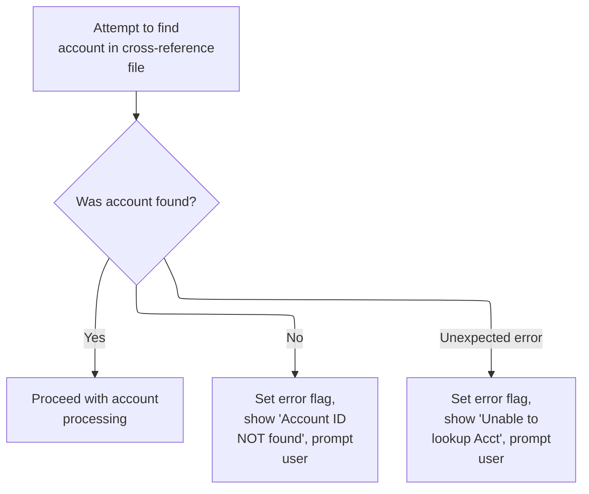
```mermaid
%%{init: {"flowchart": {"defaultRenderer": "elk"}} }%%
flowchart TD
    node1["Attempt to find 
 account in cross-reference 
 file"]
    click node1 openCode "app/cbl/COTRN02C.cbl:578:586"
    node1 --> node2{"Was account found?"}
    click node2 openCode "app/cbl/COTRN02C.cbl:588:604"
    node2 -->|"Yes"| node3["Proceed with account 
 processing"]
    click node3 openCode "app/cbl/COTRN02C.cbl:590:590"
    node2 -->|"No"| node4["Set error flag, 
 show 'Account ID 
 NOT found', prompt 
 user"]
    click node4 openCode "app/cbl/COTRN02C.cbl:592:596"
    node2 -->|"Unexpected error"| node5["Set error flag, 
 show 'Unable to 
 lookup Acct', prompt 
 user"]
    click node5 openCode "app/cbl/COTRN02C.cbl:599:603"

classDef HeadingStyle fill:#777777,stroke:#333,stroke-width:2px;
```

This section governs the business logic and user experience for looking up an account by account ID in the VSAM cross-reference file, handling both successful and error outcomes.

| Rule ID | Code Location     | Category       | Rule Name               | Description                                                                                                                                                                                                                                  | Conditions                                                                                           | Remarks                                                                                                                                                                                                                                                              |
| ------- | ----------------- | -------------- | ----------------------- | -------------------------------------------------------------------------------------------------------------------------------------------------------------------------------------------------------------------------------------------- | ---------------------------------------------------------------------------------------------------- | -------------------------------------------------------------------------------------------------------------------------------------------------------------------------------------------------------------------------------------------------------------------- |
| BR-001  | READ-CXACAIX-FILE | Business logic | Account Found Success   | If the account ID is found in the cross-reference file, the system proceeds with account processing without displaying any error message to the user.                                                                                        | The response code from the VSAM read operation is NORMAL.                                            | No error message is shown. The process continues to the next step in account processing. The error flag remains 'N' (off).                                                                                                                                           |
| BR-002  | READ-CXACAIX-FILE | Error handling | Account Not Found Error | If the account ID is not found in the cross-reference file, the system sets the error flag, displays the message 'Account ID NOT found...', marks the account ID field as invalid, and prompts the user to correct the input.                | The response code from the VSAM read operation is NOTFND.                                            | The error flag is set to 'Y'. The message 'Account ID NOT found...' is displayed to the user. The account ID input field is marked as invalid (set to -1). The user is prompted to correct the input. Message format: string, up to 80 characters.                   |
| BR-003  | READ-CXACAIX-FILE | Error handling | Unexpected Lookup Error | If an unexpected error occurs during the account lookup, the system sets the error flag, displays the message 'Unable to lookup Acct in XREF AIX file...', marks the account ID field as invalid, and prompts the user to correct the input. | The response code from the VSAM read operation is neither NORMAL nor NOTFND (i.e., any other error). | The error flag is set to 'Y'. The message 'Unable to lookup Acct in XREF AIX file...' is displayed to the user. The account ID input field is marked as invalid (set to -1). The user is prompted to correct the input. Message format: string, up to 80 characters. |

<SwmSnippet path="/app/cbl/COTRN02C.cbl" line="576" repo-id="Z2l0aHViJTNBJTNBa3luZHJ5bC1hd3MtbWFpbmZyYW1lLW1vZGVybml6YXRpb24tY2FyZGRlbW8lM0ElM0FTd2ltbS1EZW1v">

---

In READ-CXACAIX-FILE, we use EXEC CICS READ to pull the card/account cross-reference record from the VSAM dataset using the account ID as the key. Response codes tell us if the lookup worked or not.

```cobol
       READ-CXACAIX-FILE.

           EXEC CICS READ
                DATASET   (WS-CXACAIX-FILE)
                INTO      (CARD-XREF-RECORD)
                LENGTH    (LENGTH OF CARD-XREF-RECORD)
                RIDFLD    (XREF-ACCT-ID)
                KEYLENGTH (LENGTH OF XREF-ACCT-ID)
                RESP      (WS-RESP-CD)
                RESP2     (WS-REAS-CD)
           END-EXEC
```

---

</SwmSnippet>

<SwmSnippet path="/app/cbl/COTRN02C.cbl" line="588" repo-id="Z2l0aHViJTNBJTNBa3luZHJ5bC1hd3MtbWFpbmZyYW1lLW1vZGVybml6YXRpb24tY2FyZGRlbW8lM0ElM0FTd2ltbS1EZW1v">

---

After reading the account record, we check the response code. If it's not found or there's an error, we set up the error message, mark the field as invalid, and call SEND-TRNADD-SCREEN so the user can see and fix the problem.

```cobol
           EVALUATE WS-RESP-CD
               WHEN DFHRESP(NORMAL)
                   CONTINUE
               WHEN DFHRESP(NOTFND)
                   MOVE 'Y'     TO WS-ERR-FLG
                   MOVE 'Account ID NOT found...' TO
                                   WS-MESSAGE
                   MOVE -1       TO ACTIDINL OF COTRN2AI
                   PERFORM SEND-TRNADD-SCREEN
               WHEN OTHER
                   DISPLAY 'RESP:' WS-RESP-CD 'REAS:' WS-REAS-CD
                   MOVE 'Y'     TO WS-ERR-FLG
                   MOVE 'Unable to lookup Acct in XREF AIX file...' TO
                                   WS-MESSAGE
                   MOVE -1       TO ACTIDINL OF COTRN2AI
                   PERFORM SEND-TRNADD-SCREEN
           END-EVALUATE.
```

---

</SwmSnippet>

#### Card Number Lookup and Cross-Reference

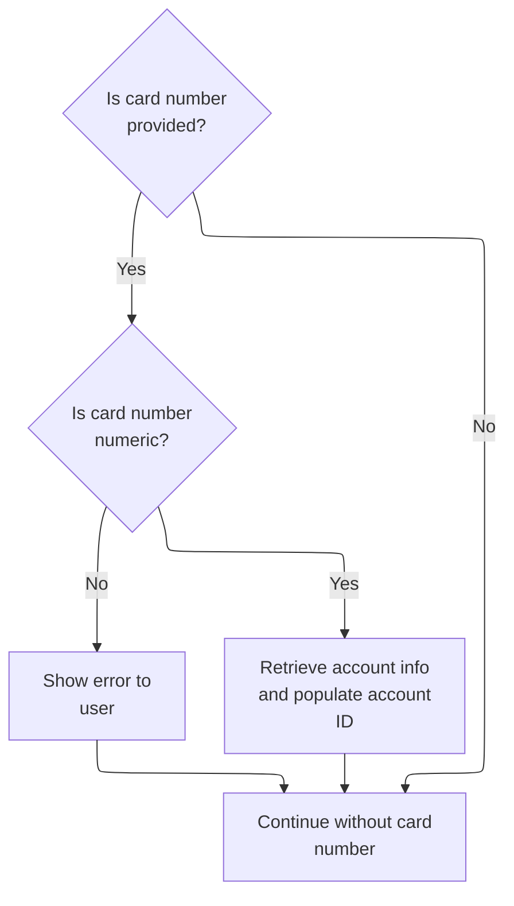
```mermaid
%%{init: {"flowchart": {"defaultRenderer": "elk"}} }%%
flowchart TD
    node1{"Is card number 
 provided?"}
    click node1 openCode "app/cbl/COTRN02C.cbl:210:210"
    node1 -->|"Yes"| node2{"Is card number 
 numeric?"}
    click node2 openCode "app/cbl/COTRN02C.cbl:211:211"
    node1 -->|"No"| node5["Continue without card 
 number"]
    click node5 openCode "app/cbl/COTRN02C.cbl:210:210"
    node2 -->|"No"| node3["Show error to 
 user"]
    click node3 openCode "app/cbl/COTRN02C.cbl:212:216"
    node2 -->|"Yes"| node4["Retrieve account info 
 and populate account 
 ID"]
    click node4 openCode "app/cbl/COTRN02C.cbl:218:223"
    node3 --> node5
    node4 --> node5
classDef HeadingStyle fill:#777777,stroke:#333,stroke-width:2px;
```

This section manages the validation and cross-referencing of card numbers, ensuring that user input is correct and that card/account fields are synchronized for downstream business processes.

| Rule ID | Code Location      | Category        | Rule Name                           | Description                                                                                                                                                                     | Conditions                                                       | Remarks                                                                                                                                                                                    |
| ------- | ------------------ | --------------- | ----------------------------------- | ------------------------------------------------------------------------------------------------------------------------------------------------------------------------------- | ---------------------------------------------------------------- | ------------------------------------------------------------------------------------------------------------------------------------------------------------------------------------------ |
| BR-001  | SEND-TRNADD-SCREEN | Data validation | Card Number Numeric Validation      | If a card number is provided, it must be numeric. If it is not numeric, an error message is displayed to the user and the card number field is reset.                           | Card number field is not empty or all spaces and not low-values. | Error message displayed: 'Card Number must be Numeric...'. Card number field is reset to length -1. Error flag is set to 'Y'. Card number field format: up to 16 characters, alphanumeric. |
| BR-002  | READ-CCXREF-FILE   | Business logic  | Card Number Account Cross-Reference | If a valid numeric card number is provided, the system retrieves the associated account information and synchronizes the account ID field with the cross-referenced account ID. | Card number field is present and numeric.                        | Card number format: up to 16 digits. Account ID format: up to 11 digits. Card and account fields are synchronized after lookup.                                                            |
| BR-003  | MAIN-LOGIC         | Business logic  | Card Number Optional Input          | If no card number is provided, the process continues without performing card number validation or account cross-reference lookup.                                               | Card number field is empty, all spaces, or low-values.           | No error is shown and no cross-reference lookup is performed. Card number field format: up to 16 characters, may be empty.                                                                 |

<SwmSnippet path="/app/cbl/COTRN02C.cbl" line="210" repo-id="Z2l0aHViJTNBJTNBa3luZHJ5bC1hd3MtbWFpbmZyYW1lLW1vZGVybml6YXRpb24tY2FyZGRlbW8lM0ElM0FTd2ltbS1EZW1v">

---

After coming back from READ-CXACAIX-FILE in VALIDATE-INPUT-KEY-FIELDS, if the card number is provided, we check if it's numeric and then kick off READ-CCXREF-FILE to pull the card/account cross-reference. This keeps both fields in sync and validated.

```cobol
               WHEN CARDNINI OF COTRN2AI NOT = SPACES AND LOW-VALUES
                   IF CARDNINI OF COTRN2AI IS NOT NUMERIC
                       MOVE 'Y'     TO WS-ERR-FLG
                       MOVE 'Card Number must be Numeric...' TO
                                       WS-MESSAGE
                       MOVE -1       TO CARDNINL OF COTRN2AI
                       PERFORM SEND-TRNADD-SCREEN
                   END-IF
                   COMPUTE WS-CARD-NUM-N = FUNCTION NUMVAL(CARDNINI OF
                   COTRN2AI)
                   MOVE WS-CARD-NUM-N        TO XREF-CARD-NUM
                                                CARDNINI OF COTRN2AI
                   PERFORM READ-CCXREF-FILE
                   MOVE XREF-ACCT-ID         TO ACTIDINI OF COTRN2AI
```

---

</SwmSnippet>

#### Card Lookup via VSAM

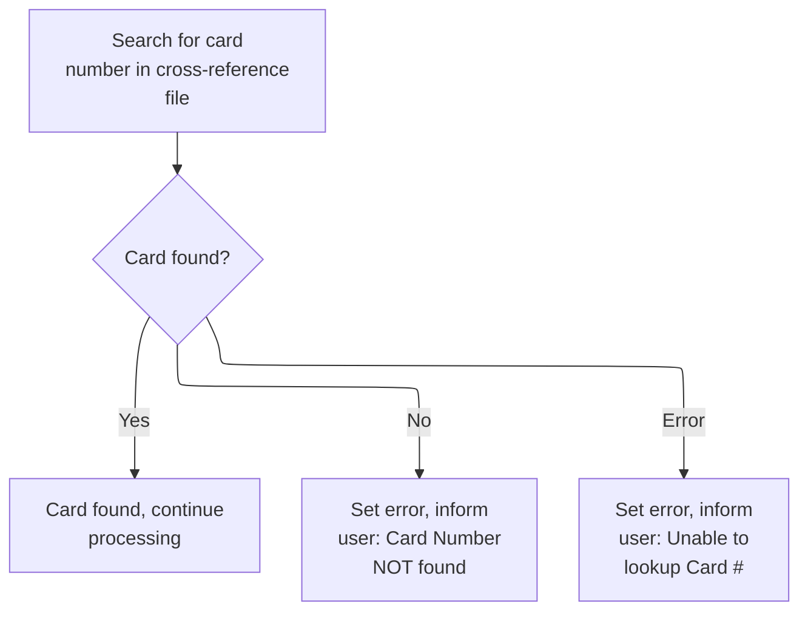
```mermaid
%%{init: {"flowchart": {"defaultRenderer": "elk"}} }%%
flowchart TD
    node1["Search for card 
 number in cross-reference 
 file"] --> node2{"Card found?"}
    click node1 openCode "app/cbl/COTRN02C.cbl:611:619"
    node2 -->|"Yes"| node3["Card found, continue 
 processing"]
    click node2 openCode "app/cbl/COTRN02C.cbl:621:637"
    node2 -->|"No"| node4["Set error, inform 
 user: Card Number 
 NOT found"]
    node2 -->|"Error"| node5["Set error, inform 
 user: Unable to 
 lookup Card #"]
    click node3 openCode "app/cbl/COTRN02C.cbl:623:623"
    click node4 openCode "app/cbl/COTRN02C.cbl:625:629"
    click node5 openCode "app/cbl/COTRN02C.cbl:632:636"
classDef HeadingStyle fill:#777777,stroke:#333,stroke-width:2px;
```

This section governs the business logic and error handling for looking up a card number in the cross-reference file, determining whether processing continues or the user is prompted to correct input based on the lookup result.

| Rule ID | Code Location    | Category       | Rule Name                   | Description                                                                                                                                                                                                                                      | Conditions                                                                                 | Remarks                                                                                                                                                                                                  |
| ------- | ---------------- | -------------- | --------------------------- | ------------------------------------------------------------------------------------------------------------------------------------------------------------------------------------------------------------------------------------------------ | ------------------------------------------------------------------------------------------ | -------------------------------------------------------------------------------------------------------------------------------------------------------------------------------------------------------- |
| BR-001  | READ-CCXREF-FILE | Business logic | Card Found Success          | If the card number exists in the cross-reference file, the system continues processing without displaying an error to the user.                                                                                                                  | The card number is found in the cross-reference file and the response code is NORMAL.      | No error flag is set. No error message is displayed. The process continues normally.                                                                                                                     |
| BR-002  | READ-CCXREF-FILE | Error handling | Card Not Found Error        | If the card number does not exist in the cross-reference file, the system sets an error flag, displays a message 'Card Number NOT found...', marks the card input field as invalid, and prompts the user to correct the input.                   | The card number is not found in the cross-reference file and the response code is NOTFND.  | Error flag is set to 'Y'. Error message is 'Card Number NOT found...'. Card input field is marked invalid by setting its length to -1. The error message is a string up to 80 characters.                |
| BR-003  | READ-CCXREF-FILE | Error handling | Card Lookup Technical Error | If an error occurs during the card lookup (other than not found), the system sets an error flag, displays a message 'Unable to lookup Card # in XREF file...', marks the card input field as invalid, and prompts the user to correct the input. | An error occurs during the card lookup and the response code is neither NORMAL nor NOTFND. | Error flag is set to 'Y'. Error message is 'Unable to lookup Card # in XREF file...'. Card input field is marked invalid by setting its length to -1. The error message is a string up to 80 characters. |

<SwmSnippet path="/app/cbl/COTRN02C.cbl" line="609" repo-id="Z2l0aHViJTNBJTNBa3luZHJ5bC1hd3MtbWFpbmZyYW1lLW1vZGVybml6YXRpb24tY2FyZGRlbW8lM0ElM0FTd2ltbS1EZW1v">

---

In READ-CCXREF-FILE, we use EXEC CICS READ to pull the card cross-reference record using the card number as the key. If the lookup fails, we handle it with error flags and messages.

```cobol
       READ-CCXREF-FILE.

           EXEC CICS READ
                DATASET   (WS-CCXREF-FILE)
                INTO      (CARD-XREF-RECORD)
                LENGTH    (LENGTH OF CARD-XREF-RECORD)
                RIDFLD    (XREF-CARD-NUM)
                KEYLENGTH (LENGTH OF XREF-CARD-NUM)
                RESP      (WS-RESP-CD)
                RESP2     (WS-REAS-CD)
           END-EXEC
```

---

</SwmSnippet>

<SwmSnippet path="/app/cbl/COTRN02C.cbl" line="621" repo-id="Z2l0aHViJTNBJTNBa3luZHJ5bC1hd3MtbWFpbmZyYW1lLW1vZGVybml6YXRpb24tY2FyZGRlbW8lM0ElM0FTd2ltbS1EZW1v">

---

After trying to read the card record, if it's not found or there's an error, we set up the error message, mark the card field as invalid, and call SEND-TRNADD-SCREEN so the user can fix it.

```cobol
           EVALUATE WS-RESP-CD
               WHEN DFHRESP(NORMAL)
                   CONTINUE
               WHEN DFHRESP(NOTFND)
                   MOVE 'Y'     TO WS-ERR-FLG
                   MOVE 'Card Number NOT found...' TO
                                   WS-MESSAGE
                   MOVE -1       TO CARDNINL OF COTRN2AI
                   PERFORM SEND-TRNADD-SCREEN
               WHEN OTHER
                   DISPLAY 'RESP:' WS-RESP-CD 'REAS:' WS-REAS-CD
                   MOVE 'Y'     TO WS-ERR-FLG
                   MOVE 'Unable to lookup Card # in XREF file...' TO
                                   WS-MESSAGE
                   MOVE -1       TO CARDNINL OF COTRN2AI
                   PERFORM SEND-TRNADD-SCREEN
           END-EVALUATE.
```

---

</SwmSnippet>

#### Missing Key Field Error Handling

This section ensures that users provide at least one key field (account ID or card number) when entering transaction data, and provides error feedback and prompts if both are missing.

| Rule ID | Code Location             | Category        | Rule Name                 | Description                                                                                                                                                                            | Conditions                                                                                                                                                           | Remarks                                                                                                                                                                                                                                                                    |
| ------- | ------------------------- | --------------- | ------------------------- | -------------------------------------------------------------------------------------------------------------------------------------------------------------------------------------- | -------------------------------------------------------------------------------------------------------------------------------------------------------------------- | -------------------------------------------------------------------------------------------------------------------------------------------------------------------------------------------------------------------------------------------------------------------------- |
| BR-001  | VALIDATE-INPUT-KEY-FIELDS | Data validation | Key Field Required Prompt | If neither the account ID nor the card number is provided by the user, an error message is displayed and the user is prompted to enter at least one of these fields before proceeding. | This rule applies when both the account ID and card number fields are empty or zero after returning from the cross-reference file read in the input validation step. | The error message displayed is: 'Account or Card Number must be entered...'. The message is shown on the transaction input screen. The account ID is an 11-digit number, and the card number is a 16-digit number. Both fields must be non-zero to be considered provided. |

<SwmSnippet path="/app/cbl/COTRN02C.cbl" line="224" repo-id="Z2l0aHViJTNBJTNBa3luZHJ5bC1hd3MtbWFpbmZyYW1lLW1vZGVybml6YXRpb24tY2FyZGRlbW8lM0ElM0FTd2ltbS1EZW1v">

---

After coming back from READ-CCXREF-FILE in VALIDATE-INPUT-KEY-FIELDS, if neither key field is provided, we set up an error and send the screen back to prompt the user for input.

```cobol
               WHEN OTHER
                   MOVE 'Y'     TO WS-ERR-FLG
                   MOVE 'Account or Card Number must be entered...' TO
                                   WS-MESSAGE
                   MOVE -1       TO ACTIDINL OF COTRN2AI
                   PERFORM SEND-TRNADD-SCREEN
           END-EVALUATE.
```

---

</SwmSnippet>

### Transaction Input: Data Field Validation


```mermaid
%%{init: {"flowchart": {"defaultRenderer": "elk"}} }%%
flowchart TD
  node1["Validate input key 
 fields"] --> node2["Key Field Checks and Error Handling"]
  click node1 openCode "app/cbl/COTRN02C.cbl:164:167"
  node2 --> node3{"User confirmation?"}
  
  node3 -->|"Y/y"| node4["Transaction Confirmation and Branching"]
  
  
  node3 -->|"N/n/blank/low-values/other"| node5["Transaction Confirmation and Branching"]
  

classDef HeadingStyle fill:#777777,stroke:#333,stroke-width:2px;
click node2 goToHeading "Key Field Checks and Error Handling"
node2:::HeadingStyle
click node3 goToHeading "Transaction Confirmation and Branching"
node3:::HeadingStyle
click node4 goToHeading "Transaction Confirmation and Branching"
node4:::HeadingStyle
click node5 goToHeading "Transaction Confirmation and Branching"
node5:::HeadingStyle
click node2 goToHeading "Key Field Checks and Error Handling"
node2:::HeadingStyle
click node3 goToHeading "Transaction Confirmation and Branching"
node3:::HeadingStyle
click node4 goToHeading "Transaction Confirmation and Branching"
node4:::HeadingStyle
click node5 goToHeading "Transaction Confirmation and Branching"
node5:::HeadingStyle
```

This section ensures that transaction processing only continues if the user provides a valid account ID or card number. It prevents further validation and processing if these key fields are missing or invalid, and signals errors to the user when necessary.

| Rule ID | Code Location             | Category        | Rule Name                     | Description                                                                                                                 | Conditions                                                                                                                | Remarks                                                                                                                                                                                                                                                             |
| ------- | ------------------------- | --------------- | ----------------------------- | --------------------------------------------------------------------------------------------------------------------------- | ------------------------------------------------------------------------------------------------------------------------- | ------------------------------------------------------------------------------------------------------------------------------------------------------------------------------------------------------------------------------------------------------------------- |
| BR-001  | PROCESS-ENTER-KEY         | Data validation | Key Field Required Validation | If the key fields (account ID or card number) are not valid, the transaction processing is halted and an error is signaled. | This rule applies when the user submits a transaction and neither a valid account ID nor a valid card number is provided. | The error flag is set to 'Y' to indicate an error. The error message is set to a non-blank value. The account ID is expected to be an 11-digit number, and the card number is a 16-digit number, but the specific format validation is not visible in this section. |
| BR-002  | PROCESS-ENTER-KEY         | Data validation | Key Field Gating              | Further transaction field validation is only performed if the key fields are valid.                                         | This rule applies when the user submits a transaction and the key fields pass validation.                                 | No further validation or processing occurs unless the key fields are valid. The gating is enforced by the sequence of PERFORM statements.                                                                                                                           |
| BR-003  | VALIDATE-INPUT-KEY-FIELDS | Error handling  | Key Field Error Signaling     | If a key field validation error occurs, an error flag is set and an error message is prepared for the user.                 | This rule applies when the key field validation fails during transaction input.                                           | The error flag is set to 'Y' (ERR-FLG-ON), and the error message is set to a non-blank value. The error flag is initialized to 'N' (ERR-FLG-OFF) before validation.                                                                                                 |

<SwmSnippet path="/app/cbl/COTRN02C.cbl" line="164" repo-id="Z2l0aHViJTNBJTNBa3luZHJ5bC1hd3MtbWFpbmZyYW1lLW1vZGVybml6YXRpb24tY2FyZGRlbW8lM0ElM0FTd2ltbS1EZW1v">

---

After finishing key field validation in PROCESS-ENTER-KEY, we move on to VALIDATE-INPUT-DATA-FIELDS to check all the other transaction fields. This way, we only bother with data validation if the keys are good.

```cobol
       PROCESS-ENTER-KEY.

           PERFORM VALIDATE-INPUT-KEY-FIELDS
           PERFORM VALIDATE-INPUT-DATA-FIELDS.
```

---

</SwmSnippet>

### Field-by-Field Transaction Data Checks

This section enforces field-by-field validation for transaction data entry, ensuring all required fields are present, correctly formatted, and valid before processing. It provides immediate user feedback and prevents further processing of invalid data.

| Rule ID | Code Location              | Category        | Rule Name                       | Description                                                                                                                                                                                             | Conditions                                                                                         | Remarks                                                                                                                                                                                                          |
| ------- | -------------------------- | --------------- | ------------------------------- | ------------------------------------------------------------------------------------------------------------------------------------------------------------------------------------------------------- | -------------------------------------------------------------------------------------------------- | ---------------------------------------------------------------------------------------------------------------------------------------------------------------------------------------------------------------- |
| BR-001  | VALIDATE-INPUT-DATA-FIELDS | Data validation | Required Fields                 | Each transaction field is required and cannot be left blank. If a field is empty, an error message specific to that field is displayed, and the user is prompted to correct the input.                  | Any transaction field is empty (contains only spaces or low-values).                               | Error messages are unique per field, e.g., 'Type CD can NOT be empty...', 'Category CD can NOT be empty...', etc.                                                                                                |
| BR-002  | VALIDATE-INPUT-DATA-FIELDS | Data validation | Numeric Type and Category Codes | Type Code and Category Code fields must contain only numeric values. If a non-numeric value is entered, an error message is displayed and the user is prompted to correct the input.                    | Type Code or Category Code field contains non-numeric characters.                                  | Error messages: 'Type CD must be Numeric...', 'Category CD must be Numeric...'.                                                                                                                                  |
| BR-003  | VALIDATE-INPUT-DATA-FIELDS | Data validation | Amount Field Format             | The Amount field must be in the format '+99999999.99' or '-99999999.99'. If the format is incorrect, an error message is displayed and the user is prompted to correct the input.                       | Amount field does not match the required format (sign, digits, decimal point, two decimal places). | Amount must start with '+' or '-', followed by 8 digits, a decimal point, and 2 digits. Example: '+00001234.56'. Error message: 'Amount should be in format -99999999.99'.                                       |
| BR-004  | VALIDATE-INPUT-DATA-FIELDS | Data validation | Date Field Format               | Origin Date and Process Date fields must be in the format 'YYYY-MM-DD'. If the format is incorrect, an error message is displayed and the user is prompted to correct the input.                        | Origin Date or Process Date field does not match the required format.                              | Date must be 10 characters: 4 digits, dash, 2 digits, dash, 2 digits. Example: '2023-12-31'. Error messages: 'Orig Date should be in format YYYY-MM-DD', 'Proc Date should be in format YYYY-MM-DD'.             |
| BR-005  | VALIDATE-INPUT-DATA-FIELDS | Data validation | Date Validity Check             | After passing format checks, Origin Date and Process Date fields are validated for actual date correctness using an external validation routine. If the date is invalid, an error message is displayed. | Origin Date or Process Date passes format check but is not a valid date.                           | Date is checked using an external routine after format validation. Error message is set if the date is not valid.                                                                                                |
| BR-006  | VALIDATE-INPUT-DATA-FIELDS | Error handling  | Clear Fields on Error           | If any transaction field is flagged as invalid, all transaction fields are cleared to prevent the user from working with invalid data.                                                                  | An error flag is set for any transaction field during validation.                                  | All transaction fields are set to blank (spaces). This applies to type code, category code, source, amount, description, origin date, process date, merchant ID, merchant name, merchant city, and merchant zip. |

<SwmSnippet path="/app/cbl/COTRN02C.cbl" line="235" repo-id="Z2l0aHViJTNBJTNBa3luZHJ5bC1hd3MtbWFpbmZyYW1lLW1vZGVybml6YXRpb24tY2FyZGRlbW8lM0ElM0FTd2ltbS1EZW1v">

---

In VALIDATE-INPUT-DATA-FIELDS, if there's an error flagged, we clear out all the transaction fields so the user doesn't keep working with invalid data.

```cobol
       VALIDATE-INPUT-DATA-FIELDS.

           IF ERR-FLG-ON
               MOVE SPACES      TO TTYPCDI  OF COTRN2AI
                                   TCATCDI  OF COTRN2AI
                                   TRNSRCI  OF COTRN2AI
                                   TRNAMTI  OF COTRN2AI
                                   TDESCI   OF COTRN2AI
                                   TORIGDTI OF COTRN2AI
                                   TPROCDTI OF COTRN2AI
                                   MIDI     OF COTRN2AI
                                   MNAMEI   OF COTRN2AI
                                   MCITYI   OF COTRN2AI
                                   MZIPI    OF COTRN2AI
           END-IF.
```

---

</SwmSnippet>

<SwmSnippet path="/app/cbl/COTRN02C.cbl" line="251" repo-id="Z2l0aHViJTNBJTNBa3luZHJ5bC1hd3MtbWFpbmZyYW1lLW1vZGVybml6YXRpb24tY2FyZGRlbW8lM0ElM0FTd2ltbS1EZW1v">

---

For each transaction field, we check if it's empty or invalid. If so, we set up an error, mark the field, and call SEND-TRNADD-SCREEN to show the user exactly what needs fixing.

```cobol
           EVALUATE TRUE
               WHEN TTYPCDI OF COTRN2AI = SPACES OR LOW-VALUES
                   MOVE 'Y'     TO WS-ERR-FLG
                   MOVE 'Type CD can NOT be empty...' TO
                                   WS-MESSAGE
                   MOVE -1       TO TTYPCDL OF COTRN2AI
                   PERFORM SEND-TRNADD-SCREEN
```

---

</SwmSnippet>

<SwmSnippet path="/app/cbl/COTRN02C.cbl" line="258" repo-id="Z2l0aHViJTNBJTNBa3luZHJ5bC1hd3MtbWFpbmZyYW1lLW1vZGVybml6YXRpb24tY2FyZGRlbW8lM0ElM0FTd2ltbS1EZW1v">

---

After sending the error screen for one field in VALIDATE-INPUT-DATA-FIELDS, we move on to check the next field, repeating the same error handling if needed.

```cobol
               WHEN TCATCDI OF COTRN2AI = SPACES OR LOW-VALUES
                   MOVE 'Y'     TO WS-ERR-FLG
                   MOVE 'Category CD can NOT be empty...' TO
                                   WS-MESSAGE
                   MOVE -1       TO TCATCDL OF COTRN2AI
                   PERFORM SEND-TRNADD-SCREEN
```

---

</SwmSnippet>

<SwmSnippet path="/app/cbl/COTRN02C.cbl" line="264" repo-id="Z2l0aHViJTNBJTNBa3luZHJ5bC1hd3MtbWFpbmZyYW1lLW1vZGVybml6YXRpb24tY2FyZGRlbW8lM0ElM0FTd2ltbS1EZW1v">

---

We keep running through each field in VALIDATE-INPUT-DATA-FIELDS, checking for errors and sending the screen if anything's wrong. It's the same pattern for every field.

```cobol
               WHEN TRNSRCI OF COTRN2AI = SPACES OR LOW-VALUES
                   MOVE 'Y'     TO WS-ERR-FLG
                   MOVE 'Source can NOT be empty...' TO
                                   WS-MESSAGE
                   MOVE -1       TO TRNSRCL OF COTRN2AI
                   PERFORM SEND-TRNADD-SCREEN
```

---

</SwmSnippet>

<SwmSnippet path="/app/cbl/COTRN02C.cbl" line="270" repo-id="Z2l0aHViJTNBJTNBa3luZHJ5bC1hd3MtbWFpbmZyYW1lLW1vZGVybml6YXRpb24tY2FyZGRlbW8lM0ElM0FTd2ltbS1EZW1v">

---

For each field in VALIDATE-INPUT-DATA-FIELDS, we set a unique error message and mark the field if it's empty, then send the screen for correction.

```cobol
               WHEN TDESCI OF COTRN2AI = SPACES OR LOW-VALUES
                   MOVE 'Y'     TO WS-ERR-FLG
                   MOVE 'Description can NOT be empty...' TO
                                   WS-MESSAGE
                   MOVE -1       TO TDESCL OF COTRN2AI
                   PERFORM SEND-TRNADD-SCREEN
```

---

</SwmSnippet>

<SwmSnippet path="/app/cbl/COTRN02C.cbl" line="276" repo-id="Z2l0aHViJTNBJTNBa3luZHJ5bC1hd3MtbWFpbmZyYW1lLW1vZGVybml6YXRpb24tY2FyZGRlbW8lM0ElM0FTd2ltbS1EZW1v">

---

When we hit the amount field in VALIDATE-INPUT-DATA-FIELDS, we check for both emptiness and format, and send a detailed error if it's not right.

```cobol
               WHEN TRNAMTI OF COTRN2AI = SPACES OR LOW-VALUES
                   MOVE 'Y'     TO WS-ERR-FLG
                   MOVE 'Amount can NOT be empty...' TO
                                   WS-MESSAGE
                   MOVE -1       TO TRNAMTL OF COTRN2AI
                   PERFORM SEND-TRNADD-SCREEN
```

---

</SwmSnippet>

<SwmSnippet path="/app/cbl/COTRN02C.cbl" line="282" repo-id="Z2l0aHViJTNBJTNBa3luZHJ5bC1hd3MtbWFpbmZyYW1lLW1vZGVybml6YXRpb24tY2FyZGRlbW8lM0ElM0FTd2ltbS1EZW1v">

---

For date fields in VALIDATE-INPUT-DATA-FIELDS, we check the format and then use an external routine to make sure the date is valid. If not, we show an error and send the screen.

```cobol
               WHEN TORIGDTI OF COTRN2AI = SPACES OR LOW-VALUES
                   MOVE 'Y'     TO WS-ERR-FLG
                   MOVE 'Orig Date can NOT be empty...' TO
                                   WS-MESSAGE
                   MOVE -1       TO TORIGDTL OF COTRN2AI
                   PERFORM SEND-TRNADD-SCREEN
```

---

</SwmSnippet>

<SwmSnippet path="/app/cbl/COTRN02C.cbl" line="288" repo-id="Z2l0aHViJTNBJTNBa3luZHJ5bC1hd3MtbWFpbmZyYW1lLW1vZGVybml6YXRpb24tY2FyZGRlbW8lM0ElM0FTd2ltbS1EZW1v">

---

For Proc Date in VALIDATE-INPUT-DATA-FIELDS, we use the same format checks and error handling as Orig Date, so the user gets a consistent experience.

```cobol
               WHEN TPROCDTI OF COTRN2AI = SPACES OR LOW-VALUES
                   MOVE 'Y'     TO WS-ERR-FLG
                   MOVE 'Proc Date can NOT be empty...' TO
                                   WS-MESSAGE
                   MOVE -1       TO TPROCDTL OF COTRN2AI
                   PERFORM SEND-TRNADD-SCREEN
```

---

</SwmSnippet>

<SwmSnippet path="/app/cbl/COTRN02C.cbl" line="294" repo-id="Z2l0aHViJTNBJTNBa3luZHJ5bC1hd3MtbWFpbmZyYW1lLW1vZGVybml6YXRpb24tY2FyZGRlbW8lM0ElM0FTd2ltbS1EZW1v">

---

We keep running through each field in VALIDATE-INPUT-DATA-FIELDS, using modular checks and error handling for every field.

```cobol
               WHEN MIDI OF COTRN2AI = SPACES OR LOW-VALUES
                   MOVE 'Y'     TO WS-ERR-FLG
                   MOVE 'Merchant ID can NOT be empty...' TO
                                   WS-MESSAGE
                   MOVE -1       TO MIDL OF COTRN2AI
                   PERFORM SEND-TRNADD-SCREEN
```

---

</SwmSnippet>

<SwmSnippet path="/app/cbl/COTRN02C.cbl" line="300" repo-id="Z2l0aHViJTNBJTNBa3luZHJ5bC1hd3MtbWFpbmZyYW1lLW1vZGVybml6YXRpb24tY2FyZGRlbW8lM0ElM0FTd2ltbS1EZW1v">

---

For merchant fields in VALIDATE-INPUT-DATA-FIELDS, we check each one separately and show a specific error if it's empty.

```cobol
               WHEN MNAMEI OF COTRN2AI = SPACES OR LOW-VALUES
                   MOVE 'Y'     TO WS-ERR-FLG
                   MOVE 'Merchant Name can NOT be empty...' TO
                                   WS-MESSAGE
                   MOVE -1       TO MNAMEL OF COTRN2AI
                   PERFORM SEND-TRNADD-SCREEN
```

---

</SwmSnippet>

<SwmSnippet path="/app/cbl/COTRN02C.cbl" line="306" repo-id="Z2l0aHViJTNBJTNBa3luZHJ5bC1hd3MtbWFpbmZyYW1lLW1vZGVybml6YXRpb24tY2FyZGRlbW8lM0ElM0FTd2ltbS1EZW1v">

---

For merchant city and zip in VALIDATE-INPUT-DATA-FIELDS, we check each for emptiness and show a unique error if needed.

```cobol
               WHEN MCITYI OF COTRN2AI = SPACES OR LOW-VALUES
                   MOVE 'Y'     TO WS-ERR-FLG
                   MOVE 'Merchant City can NOT be empty...' TO
                                   WS-MESSAGE
                   MOVE -1       TO MCITYL OF COTRN2AI
                   PERFORM SEND-TRNADD-SCREEN
```

---

</SwmSnippet>

<SwmSnippet path="/app/cbl/COTRN02C.cbl" line="312" repo-id="Z2l0aHViJTNBJTNBa3luZHJ5bC1hd3MtbWFpbmZyYW1lLW1vZGVybml6YXRpb24tY2FyZGRlbW8lM0ElM0FTd2ltbS1EZW1v">

---

For every field in VALIDATE-INPUT-DATA-FIELDS, we use the same error handling pattern, so the user always knows what to fix.

```cobol
               WHEN MZIPI OF COTRN2AI = SPACES OR LOW-VALUES
                   MOVE 'Y'     TO WS-ERR-FLG
                   MOVE 'Merchant Zip can NOT be empty...' TO
                                   WS-MESSAGE
                   MOVE -1       TO MZIPL OF COTRN2AI
                   PERFORM SEND-TRNADD-SCREEN
```

---

</SwmSnippet>

<SwmSnippet path="/app/cbl/COTRN02C.cbl" line="318" repo-id="Z2l0aHViJTNBJTNBa3luZHJ5bC1hd3MtbWFpbmZyYW1lLW1vZGVybml6YXRpb24tY2FyZGRlbW8lM0ElM0FTd2ltbS1EZW1v">

---

If all fields pass validation in VALIDATE-INPUT-DATA-FIELDS, we just continue to the next step without showing any errors.

```cobol
               WHEN OTHER
                   CONTINUE
           END-EVALUATE.
```

---

</SwmSnippet>

<SwmSnippet path="/app/cbl/COTRN02C.cbl" line="322" repo-id="Z2l0aHViJTNBJTNBa3luZHJ5bC1hd3MtbWFpbmZyYW1lLW1vZGVybml6YXRpb24tY2FyZGRlbW8lM0ElM0FTd2ltbS1EZW1v">

---

After checking for blanks, we validate numeric format for Type CD and Category CD, and show an error if the format is off.

```cobol
           EVALUATE TRUE
               WHEN TTYPCDI OF COTRN2AI NOT NUMERIC
                   MOVE 'Y'     TO WS-ERR-FLG
                   MOVE 'Type CD must be Numeric...' TO
                                   WS-MESSAGE
                   MOVE -1       TO TTYPCDL OF COTRN2AI
                   PERFORM SEND-TRNADD-SCREEN
               WHEN TCATCDI OF COTRN2AI NOT NUMERIC
                   MOVE 'Y'     TO WS-ERR-FLG
                   MOVE 'Category CD must be Numeric...' TO
                                   WS-MESSAGE
                   MOVE -1       TO TCATCDL OF COTRN2AI
                   PERFORM SEND-TRNADD-SCREEN
               WHEN OTHER
                   CONTINUE
           END-EVALUATE
```

---

</SwmSnippet>

<SwmSnippet path="/app/cbl/COTRN02C.cbl" line="339" repo-id="Z2l0aHViJTNBJTNBa3luZHJ5bC1hd3MtbWFpbmZyYW1lLW1vZGVybml6YXRpb24tY2FyZGRlbW8lM0ElM0FTd2ltbS1EZW1v">

---

For the amount field, we check the format down to each character. If it's off, we show a detailed error; if it's good, we convert and reformat the value for display.

```cobol
           EVALUATE TRUE
               WHEN TRNAMTI OF COTRN2AI(1:1) NOT EQUAL '-' AND '+'
               WHEN TRNAMTI OF COTRN2AI(2:8) NOT NUMERIC
               WHEN TRNAMTI OF COTRN2AI(10:1) NOT = '.'
               WHEN TRNAMTI OF COTRN2AI(11:2) IS NOT NUMERIC
                   MOVE 'Y'     TO WS-ERR-FLG
                   MOVE 'Amount should be in format -99999999.99' TO
                                   WS-MESSAGE
                   MOVE -1       TO TRNAMTL OF COTRN2AI
                   PERFORM SEND-TRNADD-SCREEN
               WHEN OTHER
                   CONTINUE
           END-EVALUATE
```

---

</SwmSnippet>

<SwmSnippet path="/app/cbl/COTRN02C.cbl" line="353" repo-id="Z2l0aHViJTNBJTNBa3luZHJ5bC1hd3MtbWFpbmZyYW1lLW1vZGVybml6YXRpb24tY2FyZGRlbW8lM0ElM0FTd2ltbS1EZW1v">

---

After basic format checks for the date, we call CSUTLDTC to make sure the date is actually valid. If it fails, we show a specific error message.

```cobol
           EVALUATE TRUE
               WHEN TORIGDTI OF COTRN2AI(1:4) IS NOT NUMERIC
               WHEN TORIGDTI OF COTRN2AI(5:1) NOT EQUAL '-'
               WHEN TORIGDTI OF COTRN2AI(6:2) NOT NUMERIC
               WHEN TORIGDTI OF COTRN2AI(8:1) NOT EQUAL '-'
               WHEN TORIGDTI OF COTRN2AI(9:2) NOT NUMERIC
                   MOVE 'Y'     TO WS-ERR-FLG
                   MOVE 'Orig Date should be in format YYYY-MM-DD' TO
                                   WS-MESSAGE
                   MOVE -1       TO TORIGDTL OF COTRN2AI
                   PERFORM SEND-TRNADD-SCREEN
               WHEN OTHER
                   CONTINUE
           END-EVALUATE
```

---

</SwmSnippet>

<SwmSnippet path="/app/cbl/COTRN02C.cbl" line="368" repo-id="Z2l0aHViJTNBJTNBa3luZHJ5bC1hd3MtbWFpbmZyYW1lLW1vZGVybml6YXRpb24tY2FyZGRlbW8lM0ElM0FTd2ltbS1EZW1v">

---

For date fields in VALIDATE-INPUT-DATA-FIELDS, we check the format and then use an external routine to make sure the date is valid. If not, we show an error and send the screen.

```cobol
           EVALUATE TRUE
               WHEN TPROCDTI OF COTRN2AI(1:4) IS NOT NUMERIC
               WHEN TPROCDTI OF COTRN2AI(5:1) NOT EQUAL '-'
               WHEN TPROCDTI OF COTRN2AI(6:2) NOT NUMERIC
               WHEN TPROCDTI OF COTRN2AI(8:1) NOT EQUAL '-'
               WHEN TPROCDTI OF COTRN2AI(9:2) NOT NUMERIC
                   MOVE 'Y'     TO WS-ERR-FLG
                   MOVE 'Proc Date should be in format YYYY-MM-DD' TO
                                   WS-MESSAGE
                   MOVE -1       TO TPROCDTL OF COTRN2AI
                   PERFORM SEND-TRNADD-SCREEN
               WHEN OTHER
                   CONTINUE
           END-EVALUATE
```

---

</SwmSnippet>

<SwmSnippet path="/app/cbl/COTRN02C.cbl" line="383" repo-id="Z2l0aHViJTNBJTNBa3luZHJ5bC1hd3MtbWFpbmZyYW1lLW1vZGVybml6YXRpb24tY2FyZGRlbW8lM0ElM0FTd2ltbS1EZW1v">

---

After basic format checks for the date, we call CSUTLDTC to make sure the date is actually valid. If it fails, we show a specific error message.

```cobol
           COMPUTE WS-TRAN-AMT-N = FUNCTION NUMVAL-C(TRNAMTI OF
           COTRN2AI)
           MOVE WS-TRAN-AMT-N TO WS-TRAN-AMT-E
           MOVE WS-TRAN-AMT-E TO TRNAMTI OF COTRN2AI


           MOVE TORIGDTI OF COTRN2AI TO CSUTLDTC-DATE
           MOVE WS-DATE-FORMAT       TO CSUTLDTC-DATE-FORMAT
           MOVE SPACES               TO CSUTLDTC-RESULT

           CALL 'CSUTLDTC' USING   CSUTLDTC-DATE
                                   CSUTLDTC-DATE-FORMAT
                                   CSUTLDTC-RESULT
```

---

</SwmSnippet>

#### Date Validation Routine Entry

```mermaid
%%{init: {"flowchart": {"defaultRenderer": "elk"}} }%%
flowchart TD
    node1["Start: Prepare message 
 and date fields"]
    click node1 openCode "app/cbl/CSUTLDTC.cbl:90:92"
    node1 --> node2["Validate date input"]
    click node2 openCode "app/cbl/CSUTLDTC.cbl:93:124"
    node2 --> node3{"What is the 
 validation result?"}
    click node3 openCode "app/cbl/CSUTLDTC.cbl:128:149"
    node3 -->|"Date is valid"| node4["Set result message: 
 'Date is valid'"]
    node3 -->|"Insufficient data"| node5["Set result message: 
 'Insufficient'"]
    node3 -->|"Date value error"| node6["Set result message: 
 'Datevalue error'"]
    node3 -->|"Invalid era"| node7["Set result message: 
 'Invalid Era'"]
    node3 -->|"Unsupported range"| node8["Set result message: 
 'Unsupp. Range'"]
    node3 -->|"Invalid month"| node9["Set result message: 
 'Invalid month'"]
    node3 -->|"Bad picture string"| node10["Set result message: 
 'Bad Pic String'"]
    node3 -->|"Non-numeric data"| node11["Set result message: 
 'Nonnumeric data'"]
    node3 -->|"Year in era 
 is zero"| node12["Set result message: 
 'YearInEra is 0'"]
    node3 -->|"Other"| node13["Set result message: 
 'Date is invalid'"]
    node4 --> node14["Return result message"]
    node5 --> node14
    node6 --> node14
    node7 --> node14
    node8 --> node14
    node9 --> node14
    node10 --> node14
    node11 --> node14
    node12 --> node14
    node13 --> node14
    click node4 openCode "app/cbl/CSUTLDTC.cbl:130:130"
    click node5 openCode "app/cbl/CSUTLDTC.cbl:132:132"
    click node6 openCode "app/cbl/CSUTLDTC.cbl:134:134"
    click node7 openCode "app/cbl/CSUTLDTC.cbl:136:136"
    click node8 openCode "app/cbl/CSUTLDTC.cbl:138:138"
    click node9 openCode "app/cbl/CSUTLDTC.cbl:140:140"
    click node10 openCode "app/cbl/CSUTLDTC.cbl:142:142"
    click node11 openCode "app/cbl/CSUTLDTC.cbl:144:144"
    click node12 openCode "app/cbl/CSUTLDTC.cbl:146:146"
    click node13 openCode "app/cbl/CSUTLDTC.cbl:148:148"
    click node14 openCode "app/cbl/CSUTLDTC.cbl:97:100"
classDef HeadingStyle fill:#777777,stroke:#333,stroke-width:2px;
```

This section validates a date input and returns a result message and severity code that indicate the outcome of the validation. It provides clear, user-facing messages for each type of validation result.

| Rule ID | Code Location      | Category       | Rule Name                    | Description                                                                                                         | Conditions                                                                           | Remarks                                                                                   |
| ------- | ------------------ | -------------- | ---------------------------- | ------------------------------------------------------------------------------------------------------------------- | ------------------------------------------------------------------------------------ | ----------------------------------------------------------------------------------------- |
| BR-001  | A000-MAIN          | Business logic | Valid date message           | If the date input is valid, the result message must be set to 'Date is valid'.                                      | The validation result indicates a valid date.                                        | The result message is the string 'Date is valid', left-aligned in a 15-character field.   |
| BR-002  | PROCEDURE DIVISION | Business logic | Return result and severity   | The result message and severity code must be returned to the caller after validation.                               | Date validation has completed.                                                       | The result message is a 15-character string. The severity code is a 4-digit number.       |
| BR-003  | A000-MAIN          | Error handling | Insufficient data message    | If the date input is missing required data, the result message must be set to 'Insufficient'.                       | The validation result indicates insufficient data for date validation.               | The result message is the string 'Insufficient', left-aligned in a 15-character field.    |
| BR-004  | A000-MAIN          | Error handling | Date value error message     | If the date input contains an invalid value, the result message must be set to 'Datevalue error'.                   | The validation result indicates an invalid date value.                               | The result message is the string 'Datevalue error', left-aligned in a 15-character field. |
| BR-005  | A000-MAIN          | Error handling | Invalid era message          | If the date input contains an invalid era, the result message must be set to 'Invalid Era'.                         | The validation result indicates an invalid era in the date input.                    | The result message is the string 'Invalid Era', left-aligned in a 15-character field.     |
| BR-006  | A000-MAIN          | Error handling | Unsupported range message    | If the date input is outside the supported range, the result message must be set to 'Unsupp. Range'.                | The validation result indicates the date is outside the supported range.             | The result message is the string 'Unsupp. Range', left-aligned in a 15-character field.   |
| BR-007  | A000-MAIN          | Error handling | Invalid month message        | If the date input contains an invalid month, the result message must be set to 'Invalid month'.                     | The validation result indicates an invalid month in the date input.                  | The result message is the string 'Invalid month', left-aligned in a 15-character field.   |
| BR-008  | A000-MAIN          | Error handling | Bad picture string message   | If the date input contains a bad picture string, the result message must be set to 'Bad Pic String'.                | The validation result indicates a bad picture string in the date input.              | The result message is the string 'Bad Pic String', left-aligned in a 15-character field.  |
| BR-009  | A000-MAIN          | Error handling | Non-numeric data message     | If the date input contains non-numeric data, the result message must be set to 'Nonnumeric data'.                   | The validation result indicates non-numeric data in the date input.                  | The result message is the string 'Nonnumeric data', left-aligned in a 15-character field. |
| BR-010  | A000-MAIN          | Error handling | Year in era zero message     | If the year in the era is zero, the result message must be set to 'YearInEra is 0'.                                 | The validation result indicates the year in the era is zero.                         | The result message is the string 'YearInEra is 0', left-aligned in a 15-character field.  |
| BR-011  | A000-MAIN          | Error handling | Generic invalid date message | If the date input does not match any specific error condition, the result message must be set to 'Date is invalid'. | The validation result does not match any of the explicitly handled error conditions. | The result message is the string 'Date is invalid', left-aligned in a 15-character field. |

<SwmSnippet path="/app/cbl/CSUTLDTC.cbl" line="88" repo-id="Z2l0aHViJTNBJTNBa3luZHJ5bC1hd3MtbWFpbmZyYW1lLW1vZGVybml6YXRpb24tY2FyZGRlbW8lM0ElM0FTd2ltbS1EZW1v">

---

This is the entry for date validation: it sets up the message, runs the main logic, and returns the result and severity code.

```cobol
       PROCEDURE DIVISION USING LS-DATE, LS-DATE-FORMAT, LS-RESULT.             
           
           INITIALIZE WS-MESSAGE
           MOVE SPACES TO WS-DATE
                                                                        
           PERFORM A000-MAIN                                                    
              THRU A000-MAIN-EXIT                                               

      *    DISPLAY WS-MESSAGE                                                   
           MOVE WS-MESSAGE                 TO LS-RESULT 
           MOVE WS-SEVERITY-N              TO RETURN-CODE          
                                                                                
           EXIT PROGRAM                                                         
      *    GOBACK                                                               
           .                                                                    
```

---

</SwmSnippet>

<SwmSnippet path="/app/cbl/CSUTLDTC.cbl" line="103" repo-id="Z2l0aHViJTNBJTNBa3luZHJ5bC1hd3MtbWFpbmZyYW1lLW1vZGVybml6YXRpb24tY2FyZGRlbW8lM0ElM0FTd2ltbS1EZW1v">

---

A000-MAIN in CSUTLDTC.cbl sets up the date and format, calls CEEDAYS to validate the date, and then interprets the feedback code. It maps the result to a message string using an EVALUATE statement, so the caller gets a clear status like 'Date is valid' or a specific error.

```cobol
       A000-MAIN.                                                               
                                                                                
           MOVE LENGTH OF LS-DATE                                               
                        TO VSTRING-LENGTH  OF WS-DATE-TO-TEST                   
           MOVE LS-DATE TO VSTRING-TEXT    OF WS-DATE-TO-TEST
                           WS-DATE                  
           MOVE LENGTH OF LS-DATE-FORMAT                                        
                         TO VSTRING-LENGTH OF WS-DATE-FORMAT                    
           MOVE LS-DATE-FORMAT                                                  
                         TO VSTRING-TEXT   OF WS-DATE-FORMAT   
                            WS-DATE-FMT  
           MOVE 0        TO OUTPUT-LILLIAN                              
                                                                        
           CALL "CEEDAYS" USING                                                 
                  WS-DATE-TO-TEST,                                              
                  WS-DATE-FORMAT,                                               
                  OUTPUT-LILLIAN,                                               
                  FEEDBACK-CODE                                                 
                                                                                
           MOVE WS-DATE-TO-TEST            TO WS-DATE                           
           MOVE SEVERITY OF FEEDBACK-CODE  TO WS-SEVERITY-N                     
           MOVE MSG-NO OF FEEDBACK-CODE    TO WS-MSG-NO-N                       
                                                                 
      *    WS-RESULT IS 15 CHARACTERS                                           
      *                123456789012345'                                         
           EVALUATE TRUE                                                        
              WHEN FC-INVALID-DATE                                   
                 MOVE 'Date is valid'      TO WS-RESULT              
              WHEN FC-INSUFFICIENT-DATA                              
                 MOVE 'Insufficient'       TO WS-RESULT              
              WHEN FC-BAD-DATE-VALUE                                 
                 MOVE 'Datevalue error'    TO WS-RESULT              
              WHEN FC-INVALID-ERA                                    
                 MOVE 'Invalid Era    '    TO WS-RESULT              
              WHEN FC-UNSUPP-RANGE                                   
                 MOVE 'Unsupp. Range  '    TO WS-RESULT              
              WHEN FC-INVALID-MONTH                                  
                 MOVE 'Invalid month  '    TO WS-RESULT              
              WHEN FC-BAD-PIC-STRING                                 
                 MOVE 'Bad Pic String '    TO WS-RESULT              
              WHEN FC-NON-NUMERIC-DATA                               
                 MOVE 'Nonnumeric data'    TO WS-RESULT              
              WHEN FC-YEAR-IN-ERA-ZERO                               
                 MOVE 'YearInEra is 0 '    TO WS-RESULT              
              WHEN OTHER                                             
                 MOVE 'Date is invalid'    TO WS-RESULT 
           END-EVALUATE                                                         
                                                                                
           .                                                                    
```

---

</SwmSnippet>

#### Post-Date Validation Checks

```mermaid
%%{init: {"flowchart": {"defaultRenderer": "elk"}} }%%
flowchart TD
    node1["Start input validation"] --> node2{"Is original date 
 valid?"}
    click node1 openCode "app/cbl/COTRN02C.cbl:397:397"
    node2 -->|"Yes"| node3{"Is processed date 
 valid?"}
    click node2 openCode "app/cbl/COTRN02C.cbl:397:407"
    node2 -->|"No"| node4{"Is error code 
 2513?"}
    click node4 openCode "app/cbl/COTRN02C.cbl:400:406"
    node4 -->|"No"| node5["Show 'Original Date 
 - Not a 
 valid date', set 
 error flag, prompt 
 user to correct 
 input"]
    click node5 openCode "app/cbl/COTRN02C.cbl:401:405"
    node4 -->|"Yes"| node3
    node3 -->|"Yes"| node6{"Is merchant ID 
 numeric?"}
    click node3 openCode "app/cbl/COTRN02C.cbl:409:427"
    node3 -->|"No"| node7{"Is error code 
 2513?"}
    click node7 openCode "app/cbl/COTRN02C.cbl:420:425"
    node7 -->|"No"| node8["Show 'Processed Date 
 - Not a 
 valid date', set 
 error flag, prompt 
 user to correct 
 input"]
    click node8 openCode "app/cbl/COTRN02C.cbl:421:425"
    node7 -->|"Yes"| node6
    node6 -->|"Yes"| node9["All fields valid"]
    click node6 openCode "app/cbl/COTRN02C.cbl:430:436"
    node6 -->|"No"| node10["Show 'Merchant ID 
 must be Numeric', 
 set error flag, 
 prompt user to 
 correct input"]
    click node10 openCode "app/cbl/COTRN02C.cbl:431:435"
classDef HeadingStyle fill:#777777,stroke:#333,stroke-width:2px;
```

This section validates transaction dates and merchant ID after date processing, ensuring only valid data is accepted and guiding users to correct invalid entries.

| Rule ID | Code Location              | Category        | Rule Name                      | Description                                                                                                                                                                                                                                            | Conditions                                                                                               | Remarks                                                                                                                                                                                                       |
| ------- | -------------------------- | --------------- | ------------------------------ | ------------------------------------------------------------------------------------------------------------------------------------------------------------------------------------------------------------------------------------------------------ | -------------------------------------------------------------------------------------------------------- | ------------------------------------------------------------------------------------------------------------------------------------------------------------------------------------------------------------- |
| BR-001  | VALIDATE-INPUT-DATA-FIELDS | Data validation | Original Date Validity         | If the original transaction date is not valid and the error code is not 2513, display an error message 'Orig Date - Not a valid date...', set the error flag, mark the original date field for correction, and prompt the user to correct the input.   | The original transaction date fails validation in CSUTLDTC and the result message number is not '2513'.  | Error code constant: '2513'. Error flag value: 'Y'. Error message format: string ('Orig Date - Not a valid date...'). Field marking: original date field is marked for correction (generic field indicator).  |
| BR-002  | VALIDATE-INPUT-DATA-FIELDS | Data validation | Processed Date Validity        | If the processed transaction date is not valid and the error code is not 2513, display an error message 'Proc Date - Not a valid date...', set the error flag, mark the processed date field for correction, and prompt the user to correct the input. | The processed transaction date fails validation in CSUTLDTC and the result message number is not '2513'. | Error code constant: '2513'. Error flag value: 'Y'. Error message format: string ('Proc Date - Not a valid date...'). Field marking: processed date field is marked for correction (generic field indicator). |
| BR-003  | VALIDATE-INPUT-DATA-FIELDS | Data validation | Merchant ID Numeric Validation | If the merchant ID is not numeric, display an error message 'Merchant ID must be Numeric...', set the error flag, mark the merchant ID field for correction, and prompt the user to correct the input.                                                 | The merchant ID field contains non-numeric characters.                                                   | Error flag value: 'Y'. Error message format: string ('Merchant ID must be Numeric...'). Field marking: merchant ID field is marked for correction (generic field indicator).                                  |

<SwmSnippet path="/app/cbl/COTRN02C.cbl" line="397" repo-id="Z2l0aHViJTNBJTNBa3luZHJ5bC1hd3MtbWFpbmZyYW1lLW1vZGVybml6YXRpb24tY2FyZGRlbW8lM0ElM0FTd2ltbS1EZW1v">

---

After returning from CSUTLDTC.cbl in VALIDATE-INPUT-DATA-FIELDS, we check the result severity and message number. If the date isn't valid and it's not just a known warning, we set an error, mark the field, and send the screen for correction.

```cobol
           IF CSUTLDTC-RESULT-SEV-CD = '0000'
               CONTINUE
           ELSE
               IF CSUTLDTC-RESULT-MSG-NUM NOT = '2513'
                   MOVE 'Orig Date - Not a valid date...'
                     TO WS-MESSAGE
                   MOVE 'Y'     TO WS-ERR-FLG
                   MOVE -1       TO TORIGDTL OF COTRN2AI
                   PERFORM SEND-TRNADD-SCREEN
               END-IF
           END-IF
```

---

</SwmSnippet>

<SwmSnippet path="/app/cbl/COTRN02C.cbl" line="409" repo-id="Z2l0aHViJTNBJTNBa3luZHJ5bC1hd3MtbWFpbmZyYW1lLW1vZGVybml6YXRpb24tY2FyZGRlbW8lM0ElM0FTd2ltbS1EZW1v">

---

After handling Orig Date, we do the same for Proc Date: move the value, call CSUTLDTC, and check the result. If it's not valid, we set the error, mark the field, and send the screen for correction.

```cobol
           MOVE TPROCDTI OF COTRN2AI TO CSUTLDTC-DATE
           MOVE WS-DATE-FORMAT       TO CSUTLDTC-DATE-FORMAT
           MOVE SPACES               TO CSUTLDTC-RESULT

           CALL 'CSUTLDTC' USING   CSUTLDTC-DATE
                                   CSUTLDTC-DATE-FORMAT
                                   CSUTLDTC-RESULT

           IF CSUTLDTC-RESULT-SEV-CD = '0000'
               CONTINUE
           ELSE
               IF CSUTLDTC-RESULT-MSG-NUM NOT = '2513'
                   MOVE 'Proc Date - Not a valid date...'
                     TO WS-MESSAGE
                   MOVE 'Y'     TO WS-ERR-FLG
                   MOVE -1       TO TPROCDTL OF COTRN2AI
                   PERFORM SEND-TRNADD-SCREEN
               END-IF
           END-IF
```

---

</SwmSnippet>

<SwmSnippet path="/app/cbl/COTRN02C.cbl" line="430" repo-id="Z2l0aHViJTNBJTNBa3luZHJ5bC1hd3MtbWFpbmZyYW1lLW1vZGVybml6YXRpb24tY2FyZGRlbW8lM0ElM0FTd2ltbS1EZW1v">

---

Whenever a field fails validation in VALIDATE-INPUT-DATA-FIELDS, we set the error flag, set the message, mark the field, and call SEND-TRNADD-SCREEN to show the error to the user.

```cobol
           IF MIDI OF COTRN2AI IS NOT NUMERIC
               MOVE 'Y'     TO WS-ERR-FLG
               MOVE 'Merchant ID must be Numeric...' TO
                               WS-MESSAGE
               MOVE -1       TO MIDL OF COTRN2AI
               PERFORM SEND-TRNADD-SCREEN
           END-IF
```

---

</SwmSnippet>

### Transaction Confirmation and Branching

This section determines the application's response to the user's confirmation input after data validation, either proceeding with the transaction or prompting the user to correct their input.

| Rule ID | Code Location     | Category        | Rule Name                          | Description                                                                                                                                                       | Conditions                                                                 | Remarks                                                                                                                                                    |
| ------- | ----------------- | --------------- | ---------------------------------- | ----------------------------------------------------------------------------------------------------------------------------------------------------------------- | -------------------------------------------------------------------------- | ---------------------------------------------------------------------------------------------------------------------------------------------------------- |
| BR-001  | PROCESS-ENTER-KEY | Data validation | Prompt on No or Blank Confirmation | If the confirmation input is 'N', 'n', blank, or contains only low-values, an error message is displayed prompting the user to confirm the transaction.           | The confirmation input is exactly 'N', 'n', blank (spaces), or low-values. | Valid confirmation values for prompting are 'N', 'n', blank (spaces), and low-values. The error message displayed is 'Confirm to add this transaction...'. |
| BR-002  | PROCESS-ENTER-KEY | Data validation | Reject Invalid Confirmation Value  | If the confirmation input is any value other than 'Y', 'y', 'N', 'n', blank, or low-values, an error message is displayed indicating valid values are 'Y' or 'N'. | The confirmation input is not 'Y', 'y', 'N', 'n', blank, or low-values.    | Invalid confirmation values trigger the error message: 'Invalid value. Valid values are (Y/N)...'.                                                         |
| BR-003  | PROCESS-ENTER-KEY | Business logic  | Proceed on Confirmation Yes        | If the confirmation input is 'Y' or 'y', the transaction addition process is initiated.                                                                           | The confirmation input is exactly 'Y' or 'y'.                              | Valid confirmation values for proceeding are 'Y' and 'y' (case-insensitive yes).                                                                           |

<SwmSnippet path="/app/cbl/COTRN02C.cbl" line="169" repo-id="Z2l0aHViJTNBJTNBa3luZHJ5bC1hd3MtbWFpbmZyYW1lLW1vZGVybml6YXRpb24tY2FyZGRlbW8lM0ElM0FTd2ltbS1EZW1v">

---

After returning from VALIDATE-INPUT-DATA-FIELDS in PROCESS-ENTER-KEY, we check the confirmation input. If it's 'Y' or 'y', we go straight to ADD-TRANSACTION. Otherwise, we set up the error and send the screen for correction.

```cobol
           EVALUATE CONFIRMI OF COTRN2AI
               WHEN 'Y'
               WHEN 'y'
                   PERFORM ADD-TRANSACTION
               WHEN 'N'
               WHEN 'n'
               WHEN SPACES
               WHEN LOW-VALUES
                   MOVE 'Y'     TO WS-ERR-FLG
                   MOVE 'Confirm to add this transaction...'
                                TO WS-MESSAGE
                   MOVE -1      TO CONFIRML OF COTRN2AI
                   PERFORM SEND-TRNADD-SCREEN
               WHEN OTHER
                   MOVE 'Y'     TO WS-ERR-FLG
                   MOVE 'Invalid value. Valid values are (Y/N)...'
                                TO WS-MESSAGE
                   MOVE -1      TO CONFIRML OF COTRN2AI
                   PERFORM SEND-TRNADD-SCREEN
           END-EVALUATE.
```

---

</SwmSnippet>

## Transaction Record Creation

This section is responsible for preparing the system to add a new transaction by positioning at the end of the transaction file and retrieving the last transaction record, ensuring that the next transaction ID is assigned sequentially and uniquely.

| Rule ID | Code Location   | Category       | Rule Name                            | Description                                                                                                                                                           | Conditions                                                                                            | Remarks                                                                                                                                                                                                       |
| ------- | --------------- | -------------- | ------------------------------------ | --------------------------------------------------------------------------------------------------------------------------------------------------------------------- | ----------------------------------------------------------------------------------------------------- | ------------------------------------------------------------------------------------------------------------------------------------------------------------------------------------------------------------- |
| BR-001  | ADD-TRANSACTION | Business logic | Sequential Transaction ID Assignment | When adding a new transaction, the system must determine the next transaction ID by referencing the highest existing transaction ID in the transaction file.          | A request to add a new transaction is received.                                                       | The transaction ID is a string of 16 characters. The special value HIGH-VALUES is used to position at the logical end of the file. The next transaction ID is determined based on the highest existing value. |
| BR-002  | ADD-TRANSACTION | Business logic | End-of-File Browse Positioning       | The transaction ID field must be set to the maximum possible value before starting the browse to ensure the browse begins at the logical end of the transaction file. | A new transaction is being added and the system needs to determine the next available transaction ID. | The transaction ID field is 16 characters. The value HIGH-VALUES is used to guarantee the browse starts at the end.                                                                                           |

<SwmSnippet path="/app/cbl/COTRN02C.cbl" line="442" repo-id="Z2l0aHViJTNBJTNBa3luZHJ5bC1hd3MtbWFpbmZyYW1lLW1vZGVybml6YXRpb24tY2FyZGRlbW8lM0ElM0FTd2ltbS1EZW1v">

---

In ADD-TRANSACTION, we set TRAN-ID to HIGH-VALUES to position at the end, then start a browse, read the previous record, and end the browse. This sets us up to generate the next transaction ID.

```cobol
       ADD-TRANSACTION.

           MOVE HIGH-VALUES TO TRAN-ID
           PERFORM STARTBR-TRANSACT-FILE
           PERFORM READPREV-TRANSACT-FILE
           PERFORM ENDBR-TRANSACT-FILE
```

---

</SwmSnippet>

### Transaction File Browse Start

```mermaid
%%{init: {"flowchart": {"defaultRenderer": "elk"}} }%%
flowchart TD
    node1["Attempt to read 
 transaction by ID"]
    click node1 openCode "app/cbl/COTRN02C.cbl:642:651"
    node1 --> node2{"What was the 
 result?"}
    click node2 openCode "app/cbl/COTRN02C.cbl:652:668"
    node2 -->|"NORMAL (found)"| node3["Continue (no error)"]
    click node3 openCode "app/cbl/COTRN02C.cbl:654:654"
    node2 -->|"NOTFND (not found)"| node4["Set error flag, 
 show 'Transaction ID 
 NOT found...' to 
 user, display add 
 screen"]
    click node4 openCode "app/cbl/COTRN02C.cbl:655:661"
    node2 -->|"OTHER (error)"| node5["Set error flag, 
 show 'Unable to 
 lookup Transaction...' to 
 user, display add 
 screen"]
    click node5 openCode "app/cbl/COTRN02C.cbl:662:667"

classDef HeadingStyle fill:#777777,stroke:#333,stroke-width:2px;
```

This section governs the initial attempt to browse the transaction file by transaction ID, handling the outcomes of the browse operation and determining the user feedback and next steps based on whether the transaction is found, not found, or an error occurs.

| Rule ID | Code Location         | Category       | Rule Name                       | Description                                                                                                                                                                                        | Conditions                                                                                            | Remarks                                                                                                                                                                                                                   |
| ------- | --------------------- | -------------- | ------------------------------- | -------------------------------------------------------------------------------------------------------------------------------------------------------------------------------------------------- | ----------------------------------------------------------------------------------------------------- | ------------------------------------------------------------------------------------------------------------------------------------------------------------------------------------------------------------------------- |
| BR-001  | STARTBR-TRANSACT-FILE | Business logic | Transaction Found Success       | If the transaction is found when browsing by ID, the process continues without error and no error message is shown to the user.                                                                    | The response code from the browse operation is 'NORMAL' (transaction found).                          | No error flag is set (remains 'N'), no user message is displayed, and the process continues. The error flag is a single character ('Y' for error, 'N' for no error).                                                      |
| BR-002  | STARTBR-TRANSACT-FILE | Error handling | Transaction Not Found Error     | If the transaction is not found when browsing by ID, an error flag is set, the message 'Transaction ID NOT found...' is shown to the user, and the add/correction screen is displayed.             | The response code from the browse operation is 'NOTFND' (transaction not found).                      | The error flag is set to 'Y'. The user message is 'Transaction ID NOT found...'. The add/correction screen is displayed. The error flag is a single character ('Y' for error). The message is an 80-character string.     |
| BR-003  | STARTBR-TRANSACT-FILE | Error handling | Transaction Lookup System Error | If an error other than 'not found' occurs during the browse, an error flag is set, the message 'Unable to lookup Transaction...' is shown to the user, and the add/correction screen is displayed. | The response code from the browse operation is neither 'NORMAL' nor 'NOTFND' (i.e., any other error). | The error flag is set to 'Y'. The user message is 'Unable to lookup Transaction...'. The add/correction screen is displayed. The error flag is a single character ('Y' for error). The message is an 80-character string. |

<SwmSnippet path="/app/cbl/COTRN02C.cbl" line="642" repo-id="Z2l0aHViJTNBJTNBa3luZHJ5bC1hd3MtbWFpbmZyYW1lLW1vZGVybml6YXRpb24tY2FyZGRlbW8lM0ElM0FTd2ltbS1EZW1v">

---

In STARTBR-TRANSACT-FILE, we kick off a browse on the transaction file using TRAN-ID as the key. This lets us read records in order and get the last one for ID generation.

```cobol
       STARTBR-TRANSACT-FILE.

           EXEC CICS STARTBR
                DATASET   (WS-TRANSACT-FILE)
                RIDFLD    (TRAN-ID)
                KEYLENGTH (LENGTH OF TRAN-ID)
                RESP      (WS-RESP-CD)
                RESP2     (WS-REAS-CD)
           END-EXEC
```

---

</SwmSnippet>

<SwmSnippet path="/app/cbl/COTRN02C.cbl" line="652" repo-id="Z2l0aHViJTNBJTNBa3luZHJ5bC1hd3MtbWFpbmZyYW1lLW1vZGVybml6YXRpb24tY2FyZGRlbW8lM0ElM0FTd2ltbS1EZW1v">

---

After starting the browse, we check the response code. If the record isn't found or there's an error, we set up the error and send the screen for correction.

```cobol
           EVALUATE WS-RESP-CD
               WHEN DFHRESP(NORMAL)
                   CONTINUE
               WHEN DFHRESP(NOTFND)
                   MOVE 'Y'     TO WS-ERR-FLG
                   MOVE 'Transaction ID NOT found...' TO
                                   WS-MESSAGE
                   MOVE -1       TO ACTIDINL OF COTRN2AI
                   PERFORM SEND-TRNADD-SCREEN
               WHEN OTHER
                   DISPLAY 'RESP:' WS-RESP-CD 'REAS:' WS-REAS-CD
                   MOVE 'Y'     TO WS-ERR-FLG
                   MOVE 'Unable to lookup Transaction...' TO
                                   WS-MESSAGE
                   MOVE -1       TO ACTIDINL OF COTRN2AI
                   PERFORM SEND-TRNADD-SCREEN
           END-EVALUATE.
```

---

</SwmSnippet>

### Read Previous Transaction Record

```mermaid
%%{init: {"flowchart": {"defaultRenderer": "elk"}} }%%
flowchart TD
    node1["Read previous transaction 
 record"] --> node2{"What is the 
 result?"}
    click node1 openCode "app/cbl/COTRN02C.cbl:675:683"
    node2 -->|"Record found"| node3["Continue processing with 
 previous transaction data"]
    click node2 openCode "app/cbl/COTRN02C.cbl:685:687"
    node2 -->|"End of file"| node4["Clear transaction id"]
    click node4 openCode "app/cbl/COTRN02C.cbl:689:690"
    node2 -->|"Error"| node5["Show error message, 
 set error flag, 
 display add screen"]
    click node5 openCode "app/cbl/COTRN02C.cbl:691:696"
classDef HeadingStyle fill:#777777,stroke:#333,stroke-width:2px;
```

This section governs how the system responds when attempting to read the previous transaction record, ensuring appropriate user feedback and system state for each possible outcome.

| Rule ID | Code Location          | Category       | Rule Name                           | Description                                                                                                                                                                                    | Conditions                                                                       | Remarks                                                                                                                                                                                                                                                                                                                                                                                                                                                     |
| ------- | ---------------------- | -------------- | ----------------------------------- | ---------------------------------------------------------------------------------------------------------------------------------------------------------------------------------------------- | -------------------------------------------------------------------------------- | ----------------------------------------------------------------------------------------------------------------------------------------------------------------------------------------------------------------------------------------------------------------------------------------------------------------------------------------------------------------------------------------------------------------------------------------------------------- |
| BR-001  | READPREV-TRANSACT-FILE | Business logic | Continue on Record Found            | When a previous transaction record is successfully found, the system continues processing using the data from that record.                                                                     | A previous transaction record exists and is successfully retrieved.              | The transaction record includes fields such as transaction ID (16 characters), type code (2 characters), category code (4 digits), source (10 characters), description (100 characters), amount (up to 9 digits with 2 decimals), merchant ID (9 digits), merchant name (50 characters), merchant city (50 characters), merchant zip (10 characters), card number (16 characters), original timestamp (26 characters), processed timestamp (26 characters). |
| BR-002  | READPREV-TRANSACT-FILE | Business logic | Clear Transaction ID on End of File | If the end of the transaction file is reached when attempting to read the previous record, the system clears the transaction ID to indicate there are no more previous records.                | The response code indicates end of file when reading the previous transaction.   | The transaction ID is a 16-character alphanumeric field. Clearing means setting all characters to zero.                                                                                                                                                                                                                                                                                                                                                     |
| BR-003  | READPREV-TRANSACT-FILE | Error handling | Error Handling on Read Failure      | If an error occurs while reading the previous transaction record, the system displays an error message, sets an error flag, and returns the user to the add transaction screen for correction. | Any error other than 'normal' or 'end of file' occurs during the read operation. | The error flag is set to 'Y'. The error message displayed is 'Unable to lookup Transaction...'. The add transaction screen is displayed for user correction.                                                                                                                                                                                                                                                                                                |

<SwmSnippet path="/app/cbl/COTRN02C.cbl" line="673" repo-id="Z2l0aHViJTNBJTNBa3luZHJ5bC1hd3MtbWFpbmZyYW1lLW1vZGVybml6YXRpb24tY2FyZGRlbW8lM0ElM0FTd2ltbS1EZW1v">

---

In READPREV-TRANSACT-FILE, we read the previous record from the transaction file to get the last transaction's details and ID.

```cobol
       READPREV-TRANSACT-FILE.

           EXEC CICS READPREV
                DATASET   (WS-TRANSACT-FILE)
                INTO      (TRAN-RECORD)
                LENGTH    (LENGTH OF TRAN-RECORD)
                RIDFLD    (TRAN-ID)
                KEYLENGTH (LENGTH OF TRAN-ID)
                RESP      (WS-RESP-CD)
                RESP2     (WS-REAS-CD)
           END-EXEC
```

---

</SwmSnippet>

<SwmSnippet path="/app/cbl/COTRN02C.cbl" line="685" repo-id="Z2l0aHViJTNBJTNBa3luZHJ5bC1hd3MtbWFpbmZyYW1lLW1vZGVybml6YXRpb24tY2FyZGRlbW8lM0ElM0FTd2ltbS1EZW1v">

---

After reading the previous record, we check the response. If we're at the end of the file, we clear the transaction ID. If there's an error, we set up the error and send the screen for correction.

```cobol
           EVALUATE WS-RESP-CD
               WHEN DFHRESP(NORMAL)
                   CONTINUE
               WHEN DFHRESP(ENDFILE)
                   MOVE ZEROS TO TRAN-ID
               WHEN OTHER
                   DISPLAY 'RESP:' WS-RESP-CD 'REAS:' WS-REAS-CD
                   MOVE 'Y'     TO WS-ERR-FLG
                   MOVE 'Unable to lookup Transaction...' TO
                                   WS-MESSAGE
                   MOVE -1       TO ACTIDINL OF COTRN2AI
                   PERFORM SEND-TRNADD-SCREEN
           END-EVALUATE.
```

---

</SwmSnippet>

### Transaction Record Initialization

This section is responsible for preparing the system to add a new transaction by positioning at the end of the transaction file and retrieving the last transaction record, ensuring that the next transaction ID is assigned sequentially and uniquely.

| Rule ID | Code Location   | Category       | Rule Name                            | Description                                                                                                                                                           | Conditions                                                                                            | Remarks                                                                                                                                                                                                       |
| ------- | --------------- | -------------- | ------------------------------------ | --------------------------------------------------------------------------------------------------------------------------------------------------------------------- | ----------------------------------------------------------------------------------------------------- | ------------------------------------------------------------------------------------------------------------------------------------------------------------------------------------------------------------- |
| BR-001  | ADD-TRANSACTION | Business logic | Sequential Transaction ID Assignment | When adding a new transaction, the system must determine the next transaction ID by referencing the highest existing transaction ID in the transaction file.          | A request to add a new transaction is received.                                                       | The transaction ID is a string of 16 characters. The special value HIGH-VALUES is used to position at the logical end of the file. The next transaction ID is determined based on the highest existing value. |
| BR-002  | ADD-TRANSACTION | Business logic | End-of-File Browse Positioning       | The transaction ID field must be set to the maximum possible value before starting the browse to ensure the browse begins at the logical end of the transaction file. | A new transaction is being added and the system needs to determine the next available transaction ID. | The transaction ID field is 16 characters. The value HIGH-VALUES is used to guarantee the browse starts at the end.                                                                                           |

<SwmSnippet path="/app/cbl/COTRN02C.cbl" line="442" repo-id="Z2l0aHViJTNBJTNBa3luZHJ5bC1hd3MtbWFpbmZyYW1lLW1vZGVybml6YXRpb24tY2FyZGRlbW8lM0ElM0FTd2ltbS1EZW1v">

---

After reading the previous record in ADD-TRANSACTION, we end the browse to release the file, then move on to increment the transaction ID and prep the new record for writing.

```cobol
       ADD-TRANSACTION.

           MOVE HIGH-VALUES TO TRAN-ID
           PERFORM STARTBR-TRANSACT-FILE
           PERFORM READPREV-TRANSACT-FILE
           PERFORM ENDBR-TRANSACT-FILE
```

---

</SwmSnippet>

<SwmSnippet path="/app/cbl/COTRN02C.cbl" line="702" repo-id="Z2l0aHViJTNBJTNBa3luZHJ5bC1hd3MtbWFpbmZyYW1lLW1vZGVybml6YXRpb24tY2FyZGRlbW8lM0ElM0FTd2ltbS1EZW1v">

---

ENDBR-TRANSACT-FILE closes the browse so we can update the file. It's a cleanup step before writing the new transaction.

```cobol
       ENDBR-TRANSACT-FILE.

           EXEC CICS ENDBR
                DATASET   (WS-TRANSACT-FILE)
           END-EXEC.
```

---

</SwmSnippet>

<SwmSnippet path="/app/cbl/COTRN02C.cbl" line="448" repo-id="Z2l0aHViJTNBJTNBa3luZHJ5bC1hd3MtbWFpbmZyYW1lLW1vZGVybml6YXRpb24tY2FyZGRlbW8lM0ElM0FTd2ltbS1EZW1v">

---

After ending the browse in ADD-TRANSACTION, we increment the last transaction ID, initialize the new record, map all fields from input, convert the amount to numeric, and then write the new record.

```cobol
           MOVE TRAN-ID     TO WS-TRAN-ID-N
           ADD 1 TO WS-TRAN-ID-N
           INITIALIZE TRAN-RECORD
           MOVE WS-TRAN-ID-N         TO TRAN-ID
           MOVE TTYPCDI  OF COTRN2AI TO TRAN-TYPE-CD
           MOVE TCATCDI  OF COTRN2AI TO TRAN-CAT-CD
           MOVE TRNSRCI  OF COTRN2AI TO TRAN-SOURCE
           MOVE TDESCI   OF COTRN2AI TO TRAN-DESC
           COMPUTE WS-TRAN-AMT-N = FUNCTION NUMVAL-C(TRNAMTI OF
           COTRN2AI)
           MOVE WS-TRAN-AMT-N TO TRAN-AMT
           MOVE CARDNINI OF COTRN2AI TO TRAN-CARD-NUM
           MOVE MIDI     OF COTRN2AI TO TRAN-MERCHANT-ID
           MOVE MNAMEI   OF COTRN2AI TO TRAN-MERCHANT-NAME
           MOVE MCITYI   OF COTRN2AI TO TRAN-MERCHANT-CITY
           MOVE MZIPI    OF COTRN2AI TO TRAN-MERCHANT-ZIP
           MOVE TORIGDTI OF COTRN2AI TO TRAN-ORIG-TS
           MOVE TPROCDTI OF COTRN2AI TO TRAN-PROC-TS
           PERFORM WRITE-TRANSACT-FILE.
```

---

</SwmSnippet>

## Transaction Write and Field Reset

```mermaid
%%{init: {"flowchart": {"defaultRenderer": "elk"}} }%%
flowchart TD
    node1["Attempt to add 
 transaction to file"] --> node2{"What is the 
 result?"}
    click node1 openCode "app/cbl/COTRN02C.cbl:711:721"
    node2 -->|"Success"| node3["Reset input fields 
 and show success 
 message with Transaction 
 ID"]
    click node2 openCode "app/cbl/COTRN02C.cbl:723:749"
    node2 -->|"Duplicate"| node4["Set error flag 
 and show duplicate 
 transaction message"]
    node2 -->|"Other error"| node5["Set error flag 
 and show error 
 message"]
    node3 --> node6["Show transaction add 
 screen"]
    node4 --> node6
    node5 --> node6
    click node3 openCode "app/cbl/COTRN02C.cbl:724:734"
    click node4 openCode "app/cbl/COTRN02C.cbl:735:741"
    click node5 openCode "app/cbl/COTRN02C.cbl:742:748"
    click node6 openCode "app/cbl/COTRN02C.cbl:734:734"

classDef HeadingStyle fill:#777777,stroke:#333,stroke-width:2px;
```

This section governs the business rules for handling the result of adding a transaction, including user feedback and field management after success or failure.

| Rule ID | Code Location                              | Category       | Rule Name                       | Description                                                                                                                                                                                                                                                      | Conditions                                                                                 | Remarks                                                                                                                                                                                                                                                  |
| ------- | ------------------------------------------ | -------------- | ------------------------------- | ---------------------------------------------------------------------------------------------------------------------------------------------------------------------------------------------------------------------------------------------------------------- | ------------------------------------------------------------------------------------------ | -------------------------------------------------------------------------------------------------------------------------------------------------------------------------------------------------------------------------------------------------------- |
| BR-001  | WRITE-TRANSACT-FILE, INITIALIZE-ALL-FIELDS | Business logic | Successful Transaction Add      | When a transaction is successfully added, all input fields are reset, the message area is cleared, a success message including the new transaction ID is displayed, and the transaction add screen is shown to the user.                                         | The transaction write operation returns a normal response code.                            | The success message is: 'Transaction added successfully. Your Tran ID is <transaction id>.' The message is left-aligned and padded with spaces to fill the message area. All input fields are cleared to spaces, and the account ID length is set to -1. |
| BR-002  | WRITE-TRANSACT-FILE                        | Error handling | Duplicate Transaction Handling  | If the transaction write operation detects a duplicate transaction (by key or record), the system sets the error flag, displays a duplicate transaction message, resets the account ID length, and shows the transaction add screen for user correction.         | The transaction write operation returns a duplicate key or duplicate record response code. | The duplicate error message is: 'Tran ID already exist...'. The error flag is set to 'Y'. The account ID length is set to -1. The message is left-aligned and padded with spaces to fill the message area.                                               |
| BR-003  | WRITE-TRANSACT-FILE                        | Error handling | General Transaction Add Failure | If the transaction write operation fails for any reason other than duplicate, the system logs the response codes, sets the error flag, displays a generic error message, resets the account ID length, and shows the transaction add screen for user correction. | The transaction write operation returns any response code other than normal or duplicate.  | The general error message is: 'Unable to Add Transaction...'. The error flag is set to 'Y'. The account ID length is set to -1. The message is left-aligned and padded with spaces to fill the message area.                                             |

<SwmSnippet path="/app/cbl/COTRN02C.cbl" line="711" repo-id="Z2l0aHViJTNBJTNBa3luZHJ5bC1hd3MtbWFpbmZyYW1lLW1vZGVybml6YXRpb24tY2FyZGRlbW8lM0ElM0FTd2ltbS1EZW1v">

---

In WRITE-TRANSACT-FILE, we write the new transaction record. If successful, we reset all fields, clear the message, build a success message, and send the screen. If there's a duplicate or error, we set up the error and show it to the user.

```cobol
       WRITE-TRANSACT-FILE.

           EXEC CICS WRITE
                DATASET   (WS-TRANSACT-FILE)
                FROM      (TRAN-RECORD)
                LENGTH    (LENGTH OF TRAN-RECORD)
                RIDFLD    (TRAN-ID)
                KEYLENGTH (LENGTH OF TRAN-ID)
                RESP      (WS-RESP-CD)
                RESP2     (WS-REAS-CD)
           END-EXEC
```

---

</SwmSnippet>

<SwmSnippet path="/app/cbl/COTRN02C.cbl" line="723" repo-id="Z2l0aHViJTNBJTNBa3luZHJ5bC1hd3MtbWFpbmZyYW1lLW1vZGVybml6YXRpb24tY2FyZGRlbW8lM0ElM0FTd2ltbS1EZW1v">

---

After a successful write, we reset all fields, clear the message, build a success message with the new transaction ID, and send the screen so the user can start fresh.

```cobol
           EVALUATE WS-RESP-CD
               WHEN DFHRESP(NORMAL)
                   PERFORM INITIALIZE-ALL-FIELDS
                   MOVE SPACES             TO WS-MESSAGE
                   MOVE DFHGREEN           TO ERRMSGC  OF COTRN2AO
                   STRING 'Transaction added successfully. '
                                               DELIMITED BY SIZE
                     ' Your Tran ID is ' DELIMITED BY SIZE
                          TRAN-ID  DELIMITED BY SPACE
                          '.' DELIMITED BY SIZE
                     INTO WS-MESSAGE
                   PERFORM SEND-TRNADD-SCREEN
```

---

</SwmSnippet>

<SwmSnippet path="/app/cbl/COTRN02C.cbl" line="762" repo-id="Z2l0aHViJTNBJTNBa3luZHJ5bC1hd3MtbWFpbmZyYW1lLW1vZGVybml6YXRpb24tY2FyZGRlbW8lM0ElM0FTd2ltbS1EZW1v">

---

INITIALIZE-ALL-FIELDS sets ACTIDINL to -1 and clears all other fields to spaces, prepping everything for new input and making sure no old data sticks around.

```cobol
       INITIALIZE-ALL-FIELDS.

           MOVE -1              TO ACTIDINL OF COTRN2AI
           MOVE SPACES          TO ACTIDINI OF COTRN2AI
                                   CARDNINI OF COTRN2AI
                                   TTYPCDI  OF COTRN2AI
                                   TCATCDI  OF COTRN2AI
                                   TRNSRCI  OF COTRN2AI
                                   TRNAMTI  OF COTRN2AI
                                   TDESCI   OF COTRN2AI
                                   TORIGDTI OF COTRN2AI
                                   TPROCDTI OF COTRN2AI
                                   MIDI     OF COTRN2AI
                                   MNAMEI   OF COTRN2AI
                                   MCITYI   OF COTRN2AI
                                   MZIPI    OF COTRN2AI
                                   CONFIRMI OF COTRN2AI
                                   WS-MESSAGE.
```

---

</SwmSnippet>

<SwmSnippet path="/app/cbl/COTRN02C.cbl" line="723" repo-id="Z2l0aHViJTNBJTNBa3luZHJ5bC1hd3MtbWFpbmZyYW1lLW1vZGVybml6YXRpb24tY2FyZGRlbW8lM0ElM0FTd2ltbS1EZW1v">

---

After resetting all fields in WRITE-TRANSACT-FILE, we send the transaction add screen so the user sees the success message and gets a clean slate for the next transaction.

```cobol
           EVALUATE WS-RESP-CD
               WHEN DFHRESP(NORMAL)
                   PERFORM INITIALIZE-ALL-FIELDS
                   MOVE SPACES             TO WS-MESSAGE
                   MOVE DFHGREEN           TO ERRMSGC  OF COTRN2AO
                   STRING 'Transaction added successfully. '
                                               DELIMITED BY SIZE
                     ' Your Tran ID is ' DELIMITED BY SIZE
                          TRAN-ID  DELIMITED BY SPACE
                          '.' DELIMITED BY SIZE
                     INTO WS-MESSAGE
                   PERFORM SEND-TRNADD-SCREEN
```

---

</SwmSnippet>

<SwmSnippet path="/app/cbl/COTRN02C.cbl" line="735" repo-id="Z2l0aHViJTNBJTNBa3luZHJ5bC1hd3MtbWFpbmZyYW1lLW1vZGVybml6YXRpb24tY2FyZGRlbW8lM0ElM0FTd2ltbS1EZW1v">

---

After sending the transaction add screen in WRITE-TRANSACT-FILE, if we hit a duplicate key, we set the error, mark the field, and show the error screen for the user to fix.

```cobol
               WHEN DFHRESP(DUPKEY)
               WHEN DFHRESP(DUPREC)
                   MOVE 'Y'     TO WS-ERR-FLG
                   MOVE 'Tran ID already exist...' TO
                                   WS-MESSAGE
                   MOVE -1       TO ACTIDINL OF COTRN2AI
                   PERFORM SEND-TRNADD-SCREEN
```

---

</SwmSnippet>

<SwmSnippet path="/app/cbl/COTRN02C.cbl" line="742" repo-id="Z2l0aHViJTNBJTNBa3luZHJ5bC1hd3MtbWFpbmZyYW1lLW1vZGVybml6YXRpb24tY2FyZGRlbW8lM0ElM0FTd2ltbS1EZW1v">

---

If the write fails for any reason other than duplicate, we log the codes, set the error, mark the field, and show the error screen for the user to fix.

```cobol
               WHEN OTHER
                   DISPLAY 'RESP:' WS-RESP-CD 'REAS:' WS-REAS-CD
                   MOVE 'Y'     TO WS-ERR-FLG
                   MOVE 'Unable to Add Transaction...' TO
                                   WS-MESSAGE
                   MOVE -1       TO ACTIDINL OF COTRN2AI
                   PERFORM SEND-TRNADD-SCREEN
           END-EVALUATE.
```

---

</SwmSnippet>

## Post-Transaction Add Screen Handling

```mermaid
%%{init: {"flowchart": {"defaultRenderer": "elk"}} }%%
flowchart TD
    node2{"Is program being 
 re-entered?"}
    click node2 openCode "app/cbl/COTRN02C.cbl:120:121"
    node2 -->|"No"| node3["Initialize session and 
 prepare add transaction 
 screen"]
    click node3 openCode "app/cbl/COTRN02C.cbl:119:123"
    node3 --> node4{"Has user selected 
 a transaction?"}
    click node4 openCode "app/cbl/COTRN02C.cbl:124:125"
    node4 -->|"Yes"| node5["Process transaction selection"]
    click node5 openCode "app/cbl/COTRN02C.cbl:126:128"
    node4 -->|"No"| node6["Show add transaction 
 screen"]
    click node6 openCode "app/cbl/COTRN02C.cbl:130:130"
    node5 --> node6
    node2 -->|"Yes"| node6
classDef HeadingStyle fill:#777777,stroke:#333,stroke-width:2px;
```

This section manages the logic for initializing the Add Transaction screen, handling program re-entry, and processing user input for transaction selection in the CardDemo application.

| Rule ID | Code Location                | Category       | Rule Name                             | Description                                                                                                                 | Conditions                                                                | Remarks                                                                                                                              |
| ------- | ---------------------------- | -------------- | ------------------------------------- | --------------------------------------------------------------------------------------------------------------------------- | ------------------------------------------------------------------------- | ------------------------------------------------------------------------------------------------------------------------------------ |
| BR-001  | app/cbl/COTRN02C.cbl:120:123 | Business logic | Session Initialization on First Entry | If the program is not being re-entered, the session is initialized and the add transaction screen is prepared for the user. | The program is not being re-entered.                                      | Session initialization includes clearing the output area and setting the input field for account ID to its initial state (e.g., -1). |
| BR-002  | app/cbl/COTRN02C.cbl:124:128 | Business logic | Process Transaction Selection         | If a transaction is selected by the user, the system processes the transaction selection.                                   | A transaction selection is present and not blank or at its initial value. | A transaction selection is considered present if it is not blank (spaces) and not at its initial value (low-values).                 |
| BR-003  | app/cbl/COTRN02C.cbl:130     | Business logic | Display Add Transaction Screen        | If the program is being re-entered or no transaction is selected, the add transaction screen is displayed to the user.      | The program is being re-entered, or no transaction selection is present.  | The add transaction screen is displayed regardless of whether the user is re-entering or has not made a transaction selection.       |

<SwmSnippet path="/app/cbl/COTRN02C.cbl" line="118" repo-id="Z2l0aHViJTNBJTNBa3luZHJ5bC1hd3MtbWFpbmZyYW1lLW1vZGVybml6YXRpb24tY2FyZGRlbW8lM0ElM0FTd2ltbS1EZW1v">

---

After returning from PROCESS-ENTER-KEY in MAIN-PARA, if we're not reentered, we set up the screen and send it so the user gets feedback or a fresh form.

```cobol
           ELSE
               MOVE DFHCOMMAREA(1:EIBCALEN) TO CARDDEMO-COMMAREA
               IF NOT CDEMO-PGM-REENTER
                   SET CDEMO-PGM-REENTER    TO TRUE
                   MOVE LOW-VALUES          TO COTRN2AO
                   MOVE -1       TO ACTIDINL OF COTRN2AI
                   IF CDEMO-CT02-TRN-SELECTED NOT =
                                              SPACES AND LOW-VALUES
                       MOVE CDEMO-CT02-TRN-SELECTED TO
                            CARDNINI OF COTRN2AI
                       PERFORM PROCESS-ENTER-KEY
                   END-IF
                   PERFORM SEND-TRNADD-SCREEN
```

---

</SwmSnippet>

<SwmSnippet path="/app/cbl/COTRN02C.cbl" line="131" repo-id="Z2l0aHViJTNBJTNBa3luZHJ5bC1hd3MtbWFpbmZyYW1lLW1vZGVybml6YXRpb24tY2FyZGRlbW8lM0ElM0FTd2ltbS1EZW1v">

---

After sending the add screen in MAIN-PARA, we receive the screen to grab user input and then branch based on the key pressed.

```cobol
               ELSE
                   PERFORM RECEIVE-TRNADD-SCREEN
```

---

</SwmSnippet>

<SwmSnippet path="/app/cbl/COTRN02C.cbl" line="539" repo-id="Z2l0aHViJTNBJTNBa3luZHJ5bC1hd3MtbWFpbmZyYW1lLW1vZGVybml6YXRpb24tY2FyZGRlbW8lM0ElM0FTd2ltbS1EZW1v">

---

We grab the user's input from the screen for the next step.

```cobol
       RECEIVE-TRNADD-SCREEN.

           EXEC CICS RECEIVE
                     MAP('COTRN2A')
                     MAPSET('COTRN02')
                     INTO(COTRN2AI)
                     RESP(WS-RESP-CD)
                     RESP2(WS-REAS-CD)
           END-EXEC.
```

---

</SwmSnippet>

<SwmSnippet path="/app/cbl/COTRN02C.cbl" line="133" repo-id="Z2l0aHViJTNBJTNBa3luZHJ5bC1hd3MtbWFpbmZyYW1lLW1vZGVybml6YXRpb24tY2FyZGRlbW8lM0ElM0FTd2ltbS1EZW1v">

---

After receiving input in MAIN-PARA, we branch on the key pressed. PF4 triggers CLEAR-CURRENT-SCREEN to reset everything and show a blank form.

```cobol
                   EVALUATE EIBAID
                       WHEN DFHENTER
                           PERFORM PROCESS-ENTER-KEY
                       WHEN DFHPF3
                           IF CDEMO-FROM-PROGRAM = SPACES OR LOW-VALUES
                               MOVE 'COMEN01C' TO CDEMO-TO-PROGRAM
                           ELSE
                               MOVE CDEMO-FROM-PROGRAM TO
                               CDEMO-TO-PROGRAM
                           END-IF
                           PERFORM RETURN-TO-PREV-SCREEN
                       WHEN DFHPF4
                           PERFORM CLEAR-CURRENT-SCREEN
                       WHEN DFHPF5
                           PERFORM COPY-LAST-TRAN-DATA
                       WHEN OTHER
                           MOVE 'Y'                       TO WS-ERR-FLG
                           MOVE CCDA-MSG-INVALID-KEY      TO WS-MESSAGE
                           PERFORM SEND-TRNADD-SCREEN
                   END-EVALUATE
```

---

</SwmSnippet>

## Screen Reset and Re-display

This section ensures that when the user requests to reset the transaction add screen, all fields are cleared and the screen is re-displayed as a blank form, providing a consistent starting point for new data entry.

| Rule ID | Code Location        | Category       | Rule Name                     | Description                                                                                                                          | Conditions                                                            | Remarks                                                                                                                                                                      |
| ------- | -------------------- | -------------- | ----------------------------- | ------------------------------------------------------------------------------------------------------------------------------------ | --------------------------------------------------------------------- | ---------------------------------------------------------------------------------------------------------------------------------------------------------------------------- |
| BR-001  | CLEAR-CURRENT-SCREEN | Business logic | Screen field reset            | All fields on the transaction add screen must be reset to their default (blank) state before the screen is re-displayed to the user. | Whenever the CLEAR-CURRENT-SCREEN process is invoked.                 | The rule applies to all fields on the transaction add screen. The default state is blank for all fields; no specific field formats or values are referenced in this section. |
| BR-002  | CLEAR-CURRENT-SCREEN | Business logic | Screen re-display after reset | After all fields are reset, the transaction add screen must be displayed to the user as a blank form.                                | After all fields have been reset by the CLEAR-CURRENT-SCREEN process. | The transaction add screen is displayed in its default state, with all fields blank. No specific output format or field alignment is referenced in this section.             |

<SwmSnippet path="/app/cbl/COTRN02C.cbl" line="754" repo-id="Z2l0aHViJTNBJTNBa3luZHJ5bC1hd3MtbWFpbmZyYW1lLW1vZGVybml6YXRpb24tY2FyZGRlbW8lM0ElM0FTd2ltbS1EZW1v">

---

CLEAR-CURRENT-SCREEN resets all fields and then sends the transaction add screen so the user sees a blank form.

```cobol
       CLEAR-CURRENT-SCREEN.

           PERFORM INITIALIZE-ALL-FIELDS.
           PERFORM SEND-TRNADD-SCREEN.
```

---

</SwmSnippet>

<SwmSnippet path="/app/cbl/COTRN02C.cbl" line="754" repo-id="Z2l0aHViJTNBJTNBa3luZHJ5bC1hd3MtbWFpbmZyYW1lLW1vZGVybml6YXRpb24tY2FyZGRlbW8lM0ElM0FTd2ltbS1EZW1v">

---

After clearing all fields in CLEAR-CURRENT-SCREEN, we send the transaction add screen so the user gets a blank slate.

```cobol
       CLEAR-CURRENT-SCREEN.

           PERFORM INITIALIZE-ALL-FIELDS.
           PERFORM SEND-TRNADD-SCREEN.
```

---

</SwmSnippet>

## Copy Previous Transaction Data

```mermaid
%%{init: {"flowchart": {"defaultRenderer": "elk"}} }%%
flowchart TD
    node1["Validate input key 
 fields"] --> node2["Retrieve last transaction"]
    click node1 openCode "app/cbl/COTRN02C.cbl:473:473"
    click node2 openCode "app/cbl/COTRN02C.cbl:475:478"
    node2 --> node3{"Was transaction retrieval 
 successful?"}
    click node3 openCode "app/cbl/COTRN02C.cbl:480:480"
    node3 -->|"Yes"| node4["Copy last transaction 
 details (amount, type, 
 category, source, description, 
 timestamps, merchant info)"]
    click node4 openCode "app/cbl/COTRN02C.cbl:481:492"
    node3 -->|"No"| node5["Process user action"]
    node4 --> node5
    click node5 openCode "app/cbl/COTRN02C.cbl:495:495"
classDef HeadingStyle fill:#777777,stroke:#333,stroke-width:2px;
```

This section enables users to quickly duplicate their most recent transaction into the current entry, streamlining repeat or similar transactions and ensuring consistency in data entry.

| Rule ID | Code Location       | Category        | Rule Name                           | Description                                                                                                                                                                                                                           | Conditions                                                                                          | Remarks                                                                                                                                                                                                                                                                                                                                                                                                    |
| ------- | ------------------- | --------------- | ----------------------------------- | ------------------------------------------------------------------------------------------------------------------------------------------------------------------------------------------------------------------------------------- | --------------------------------------------------------------------------------------------------- | ---------------------------------------------------------------------------------------------------------------------------------------------------------------------------------------------------------------------------------------------------------------------------------------------------------------------------------------------------------------------------------------------------------- |
| BR-001  | COPY-LAST-TRAN-DATA | Data validation | Key Field Validation                | All required key fields must be validated before attempting to copy the previous transaction data.                                                                                                                                    | This rule applies whenever the user initiates the copy previous transaction action.                 | Validation is performed before any attempt to retrieve or copy transaction data. The specific key fields are not listed in the code excerpt, but their validation is mandatory.                                                                                                                                                                                                                            |
| BR-002  | COPY-LAST-TRAN-DATA | Business logic  | Copy Previous Transaction Fields    | If the previous transaction is successfully retrieved (no error flag is set), all relevant transaction fields (amount, type, category, source, description, timestamps, merchant info) are copied into the current transaction entry. | This rule applies after a successful retrieval of the previous transaction (error flag is not set). | The following fields are copied: amount (number, signed, 2 decimals), type (string, 2 chars), category (number, 4 digits), source (string, 10 chars), description (string, 100 chars), original timestamp (string, 26 chars), processed timestamp (string, 26 chars), merchant ID (number, 9 digits), merchant name (string, 50 chars), merchant city (string, 50 chars), merchant zip (string, 10 chars). |
| BR-003  | COPY-LAST-TRAN-DATA | Business logic  | Process Transaction Entry           | After copying the previous transaction data (if available), or if no data is copied, the system processes the transaction entry as if it was entered manually by the user.                                                            | This rule applies after the copy operation (or its bypass) is complete.                             | The transaction entry is processed using the same logic as manual entry, ensuring consistency in validation and business rules.                                                                                                                                                                                                                                                                            |
| BR-004  | COPY-LAST-TRAN-DATA | Error handling  | Handle Missing Previous Transaction | If the previous transaction cannot be retrieved (error flag is set), the system does not copy any transaction data and proceeds to process the user action.                                                                           | This rule applies when the retrieval of the previous transaction fails (error flag is set).         | No transaction fields are copied if the error flag is set ('Y'). The system continues to process the user action as normal.                                                                                                                                                                                                                                                                                |

<SwmSnippet path="/app/cbl/COTRN02C.cbl" line="471" repo-id="Z2l0aHViJTNBJTNBa3luZHJ5bC1hd3MtbWFpbmZyYW1lLW1vZGVybml6YXRpb24tY2FyZGRlbW8lM0ElM0FTd2ltbS1EZW1v">

---

COPY-LAST-TRAN-DATA starts by validating key fields, then sets up to read the previous transaction record so we can copy its data if everything checks out.

```cobol
       COPY-LAST-TRAN-DATA.

           PERFORM VALIDATE-INPUT-KEY-FIELDS
```

---

</SwmSnippet>

<SwmSnippet path="/app/cbl/COTRN02C.cbl" line="475" repo-id="Z2l0aHViJTNBJTNBa3luZHJ5bC1hd3MtbWFpbmZyYW1lLW1vZGVybml6YXRpb24tY2FyZGRlbW8lM0ElM0FTd2ltbS1EZW1v">

---

After validating keys in COPY-LAST-TRAN-DATA, we set TRAN-ID to HIGH-VALUES and start a browse so we can read the last transaction for copying.

```cobol
           MOVE HIGH-VALUES TO TRAN-ID
           PERFORM STARTBR-TRANSACT-FILE
           PERFORM READPREV-TRANSACT-FILE
           PERFORM ENDBR-TRANSACT-FILE
```

---

</SwmSnippet>

<SwmSnippet path="/app/cbl/COTRN02C.cbl" line="475" repo-id="Z2l0aHViJTNBJTNBa3luZHJ5bC1hd3MtbWFpbmZyYW1lLW1vZGVybml6YXRpb24tY2FyZGRlbW8lM0ElM0FTd2ltbS1EZW1v">

---

After reading the previous record in COPY-LAST-TRAN-DATA, we end the browse to release the file and then move on to copy the data if everything checks out.

```cobol
           MOVE HIGH-VALUES TO TRAN-ID
           PERFORM STARTBR-TRANSACT-FILE
           PERFORM READPREV-TRANSACT-FILE
           PERFORM ENDBR-TRANSACT-FILE
```

---

</SwmSnippet>

<SwmSnippet path="/app/cbl/COTRN02C.cbl" line="480" repo-id="Z2l0aHViJTNBJTNBa3luZHJ5bC1hd3MtbWFpbmZyYW1lLW1vZGVybml6YXRpb24tY2FyZGRlbW8lM0ElM0FTd2ltbS1EZW1v">

---

After closing the browse in COPY-LAST-TRAN-DATA, we copy the previous transaction's fields into the input structure if there was no error, then immediately run PROCESS-ENTER-KEY to validate and process the copied data just like a manual entry.

```cobol
           IF NOT ERR-FLG-ON
               MOVE TRAN-AMT TO WS-TRAN-AMT-E
               MOVE TRAN-TYPE-CD        TO TTYPCDI  OF COTRN2AI
               MOVE TRAN-CAT-CD         TO TCATCDI  OF COTRN2AI
               MOVE TRAN-SOURCE         TO TRNSRCI  OF COTRN2AI
               MOVE WS-TRAN-AMT-E       TO TRNAMTI  OF COTRN2AI
               MOVE TRAN-DESC           TO TDESCI   OF COTRN2AI
               MOVE TRAN-ORIG-TS        TO TORIGDTI OF COTRN2AI
               MOVE TRAN-PROC-TS        TO TPROCDTI OF COTRN2AI
               MOVE TRAN-MERCHANT-ID    TO MIDI     OF COTRN2AI
               MOVE TRAN-MERCHANT-NAME  TO MNAMEI   OF COTRN2AI
               MOVE TRAN-MERCHANT-CITY  TO MCITYI   OF COTRN2AI
               MOVE TRAN-MERCHANT-ZIP   TO MZIPI    OF COTRN2AI
           END-IF

           PERFORM PROCESS-ENTER-KEY.
```

---

</SwmSnippet>

## Returning Control and Finalizing Transaction Add

<SwmSnippet path="/app/cbl/COTRN02C.cbl" line="156" repo-id="Z2l0aHViJTNBJTNBa3luZHJ5bC1hd3MtbWFpbmZyYW1lLW1vZGVybml6YXRpb24tY2FyZGRlbW8lM0ElM0FTd2ltbS1EZW1v">

---

Right after coming back from COPY-LAST-TRAN-DATA in MAIN-PARA, we hit EXEC CICS RETURN. This sends the current transaction ID and the updated communication area back to CICS, making sure any changes from the copy logic are included in the next step. It's the final handoff for the transaction add flow.

```cobol
           EXEC CICS RETURN
                     TRANSID (WS-TRANID)
                     COMMAREA (CARDDEMO-COMMAREA)
           END-EXEC.
```

---

</SwmSnippet>

&nbsp;

*This is an auto-generated document by Swimm 🌊 and has not yet been verified by a human*

<SwmMeta version="3.0.0"><sup>Powered by [Swimm](https://staging.swimm.cloud/)</sup></SwmMeta>
