# Overview

This document explains the flow of adding a new transaction to the CardDemo system. Users enter transaction details, which are validated and cross-referenced. The system confirms the transaction and, if approved, generates a unique transaction ID and saves the record. Users receive feedback and can continue entering transactions.

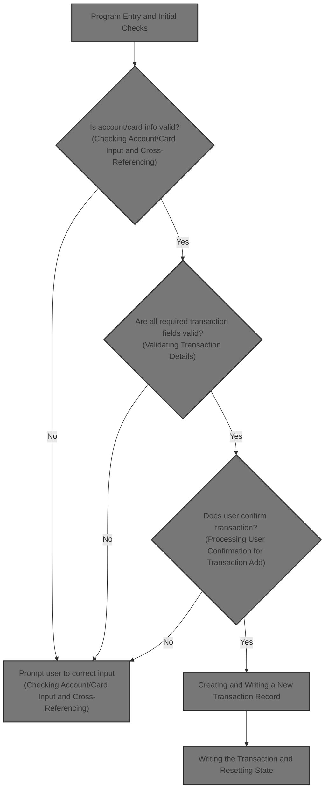
```mermaid
flowchart TD
    node1["Program Entry and Initial Checks"]:::HeadingStyle
    click node1 goToHeading "Program Entry and Initial Checks"
    node1 --> node2{"Is account/card info valid?
(Checking Account/Card Input and Cross-Referencing)"}:::HeadingStyle
    click node2 goToHeading "Checking Account/Card Input and Cross-Referencing"
    node2 -->|"Yes"| node3{"Are all required transaction fields valid?
(Validating Transaction Details)"}:::HeadingStyle
    click node3 goToHeading "Validating Transaction Details"
    node2 -->|"No"| node6["Prompt user to correct input
(Checking Account/Card Input and Cross-Referencing)"]:::HeadingStyle
    click node6 goToHeading "Checking Account/Card Input and Cross-Referencing"
    node3 -->|"Yes"| node4{"Does user confirm transaction?
(Processing User Confirmation for Transaction Add)"}:::HeadingStyle
    click node4 goToHeading "Processing User Confirmation for Transaction Add"
    node3 -->|"No"| node6
    node4 -->|"Yes"| node5["Creating and Writing a New Transaction Record"]:::HeadingStyle
    click node5 goToHeading "Creating and Writing a New Transaction Record"
    node4 -->|"No"| node6
    node5 --> node7["Writing the Transaction and Resetting State"]:::HeadingStyle
    click node7 goToHeading "Writing the Transaction and Resetting State"
classDef HeadingStyle fill:#777777,stroke:#333,stroke-width:2px;
```

## Dependencies

### Programs

- COTRN02C (app/cbl/COTRN02C.cbl)
- CT02
- CSUTLDTC (app/cbl/CSUTLDTC.cbl)
- CEEDAYS
- COMEN01C (app/cbl/COMEN01C.cbl)
- CM00
- COSGN00C (app/cbl/COSGN00C.cbl)
- CDEMO-FROM-PROGRAM

### Copybooks

- COCOM01Y (app/cpy/COCOM01Y.cpy)
- COMEN02Y (app/cpy/COMEN02Y.cpy)
- COMEN01 (app/cpy-bms/COMEN01.CPY)
- COTTL01Y (app/cpy/COTTL01Y.cpy)
- CSDAT01Y (app/cpy/CSDAT01Y.cpy)
- CSMSG01Y (app/cpy/CSMSG01Y.cpy)
- CSUSR01Y (app/cpy/CSUSR01Y.cpy)
- DFHAID
- DFHBMSCA
- COTRN02 (app/cpy-bms/COTRN02.CPY)
- CVTRA05Y (app/cpy/CVTRA05Y.cpy)
- CVACT01Y (app/cpy/CVACT01Y.cpy)
- CVACT03Y (app/cpy/CVACT03Y.cpy)

## Input and Output Tables/Files used in the Program

| Table / File Name | Type | Description                                        | Usage Mode | Key Fields / Layout Highlights |
| ----------------- | ---- | -------------------------------------------------- | ---------- | ------------------------------ |
| WS-CCXREF-FILE    | File | Card-to-account cross-reference for card lookup    | Input      | File resource                  |
| WS-CXACAIX-FILE   | File | Card-to-account cross-reference for account lookup | Input      | File resource                  |
| WS-TRANSACT-FILE  | File | Credit card transaction history records            | Output     | File resource                  |

&nbsp;

# Workflow

# Program Entry and Initial Checks

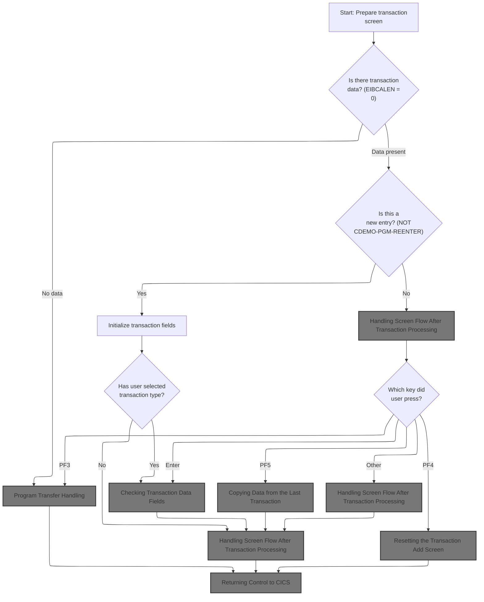
```mermaid
%%{init: {"flowchart": {"defaultRenderer": "elk"}} }%%
flowchart TD
    node1["Start: Prepare transaction 
 screen"]
    click node1 openCode "app/cbl/COTRN02C.cbl:107:113"
    node1 --> node2{"Is there transaction 
 data? (EIBCALEN = 
 0)"}
    click node2 openCode "app/cbl/COTRN02C.cbl:115:117"
    node2 -->|"No data"| node3["Program Transfer Handling"]
    
    node3 --> node11["Returning Control to CICS"]
    
    node2 -->|"Data present"| node4{"Is this a 
 new entry? (NOT 
 CDEMO-PGM-REENTER)"}
    click node4 openCode "app/cbl/COTRN02C.cbl:120:121"
    node4 -->|"Yes"| node5["Initialize transaction fields"]
    click node5 openCode "app/cbl/COTRN02C.cbl:122:123"
    node5 --> node6{"Has user selected 
 transaction type?"}
    click node6 openCode "app/cbl/COTRN02C.cbl:124:128"
    node6 -->|"Yes"| node7["Checking Transaction Data Fields"]
    
    node7 --> node8["Handling Screen Flow After Transaction Processing"]
    
    node6 -->|"No"| node8
    node4 -->|"No"| node9["Handling Screen Flow After Transaction Processing"]
    
    node9 --> node10{"Which key did 
 user press?"}
    click node10 openCode "app/cbl/COTRN02C.cbl:133:152"
    node10 -->|"Enter"| node7
    node10 -->|"PF3"| node3
    node10 -->|"PF4"| node12["Resetting the Transaction Add Screen"]
    
    node12 --> node11
    node10 -->|"PF5"| node13["Copying Data from the Last Transaction"]
    
    node13 --> node8
    node10 -->|"Other"| node14["Handling Screen Flow After Transaction Processing"]
    
    node14 --> node8
    node8 --> node11
classDef HeadingStyle fill:#777777,stroke:#333,stroke-width:2px;
click node3 goToHeading "Program Transfer Handling"
node3:::HeadingStyle
click node7 goToHeading "Checking Transaction Data Fields"
node7:::HeadingStyle
click node8 goToHeading "Handling Screen Flow After Transaction Processing"
node8:::HeadingStyle
click node9 goToHeading "Handling Screen Flow After Transaction Processing"
node9:::HeadingStyle
click node12 goToHeading "Resetting the Transaction Add Screen"
node12:::HeadingStyle
click node13 goToHeading "Copying Data from the Last Transaction"
node13:::HeadingStyle
click node14 goToHeading "Handling Screen Flow After Transaction Processing"
node14:::HeadingStyle
click node11 goToHeading "Returning Control to CICS"
node11:::HeadingStyle
```

This section governs the initial entry and setup logic for the transaction program, ensuring the user is authenticated, the session is clean, and the interface is ready for further input or processing.

| Rule ID | Code Location | Category       | Rule Name                          | Description                                                                                                          | Conditions                                   | Remarks                                                                                                                                               |
| ------- | ------------- | -------------- | ---------------------------------- | -------------------------------------------------------------------------------------------------------------------- | -------------------------------------------- | ----------------------------------------------------------------------------------------------------------------------------------------------------- |
| BR-001  | MAIN-PARA     | Business logic | Sign-on transfer on empty input    | If no transaction data is present, the program must transfer control to the sign-on program before proceeding.       | EIBCALEN = 0 (no transaction data present)   | The target program for transfer is 'COSGN00C', which is an 8-character string. This transfer is required before any transaction processing can occur. |
| BR-002  | MAIN-PARA     | Business logic | Reset error and modification flags | On program entry, all error flags and user-modified flags must be reset to ensure a clean state for the transaction. | Program entry (always at start of MAIN-PARA) | Error flag is set to 'N' (ERR-FLG-OFF), user-modified flag is set to 'N' (USR-MODIFIED-NO). These are single-character values.                        |
| BR-003  | MAIN-PARA     | Business logic | Clear user messages on entry       | Any user-facing messages must be cleared at the start of a new transaction session.                                  | Program entry (always at start of MAIN-PARA) | Message field is set to spaces (blank string). Message field is 80 characters in length.                                                              |

<SwmSnippet path="/app/cbl/COTRN02C.cbl" line="107" repo-id="Z2l0aHViJTNBJTNBa3luZHJ5bC1hd3MtbWFpbmZyYW1lLW1vZGVybml6YXRpb24tY2FyZGRlbW8lM0ElM0FTd2ltbS1EZW1v">

---

In `MAIN-PARA`, this is where the program starts. It resets error and user-modified flags, clears out any messages, and checks if EIBCALEN is zero. If so, it sets up to transfer control to the sign-on program. Otherwise, it loads the communication area, checks if this is a reentry, and either initializes the context and screen or handles user input depending on the state.

```cobol
       MAIN-PARA.

           SET ERR-FLG-OFF     TO TRUE
           SET USR-MODIFIED-NO TO TRUE

           MOVE SPACES TO WS-MESSAGE
                          ERRMSGO OF COTRN2AO
```

---

</SwmSnippet>

<SwmSnippet path="/app/cbl/COTRN02C.cbl" line="115" repo-id="Z2l0aHViJTNBJTNBa3luZHJ5bC1hd3MtbWFpbmZyYW1lLW1vZGVybml6YXRpb24tY2FyZGRlbW8lM0ElM0FTd2ltbS1EZW1v">

---

After checking EIBCALEN, if it's zero, we set up to transfer to 'COSGN00C' and call RETURN-TO-PREV-SCREEN. This handles the actual program transfer and keeps the return logic in one place.

```cobol
           IF EIBCALEN = 0
               MOVE 'COSGN00C' TO CDEMO-TO-PROGRAM
               PERFORM RETURN-TO-PREV-SCREEN
```

---

</SwmSnippet>

## Program Transfer Handling

This section manages the transfer of control between screens/programs in the CardDemo application, ensuring that navigation is safe, predictable, and maintains the correct session context.

| Rule ID | Code Location         | Category       | Rule Name                  | Description                                                                                                                                                                                                                               | Conditions                                                | Remarks                                                                                                                  |
| ------- | --------------------- | -------------- | -------------------------- | ----------------------------------------------------------------------------------------------------------------------------------------------------------------------------------------------------------------------------------------- | --------------------------------------------------------- | ------------------------------------------------------------------------------------------------------------------------ |
| BR-001  | RETURN-TO-PREV-SCREEN | Business logic | Default program fallback   | If the target program name for transfer is empty or contains only spaces, set the target program name to 'COSGN00C' before transferring control. This ensures that the application always has a valid destination program for navigation. | The target program name is empty or contains only spaces. | The default program name used is 'COSGN00C', which is an 8-character alphanumeric string.                                |
| BR-002  | RETURN-TO-PREV-SCREEN | Business logic | Transaction context update | Before transferring control to another program, update the communication area with the current transaction and program information. This ensures that the receiving program has the correct context for processing.                       | A program transfer is about to occur.                     | The transaction ID is a 4-character string (e.g., 'CT02'). The program name is an 8-character string (e.g., 'COTRN02C'). |
| BR-003  | RETURN-TO-PREV-SCREEN | Business logic | Program context reset      | Reset the program context indicator to zero before transferring control. This signals to the receiving program that it is a fresh entry rather than a re-entry.                                                                           | A program transfer is about to occur.                     | The program context indicator is set to zero, which is a single-digit numeric value.                                     |

<SwmSnippet path="/app/cbl/COTRN02C.cbl" line="500" repo-id="Z2l0aHViJTNBJTNBa3luZHJ5bC1hd3MtbWFpbmZyYW1lLW1vZGVybml6YXRpb24tY2FyZGRlbW8lM0ElM0FTd2ltbS1EZW1v">

---

In `RETURN-TO-PREV-SCREEN`, we check if the target program name is empty and set it to 'COSGN00C' if needed. This avoids issues with transferring control to an undefined program.

```cobol
       RETURN-TO-PREV-SCREEN.

           IF CDEMO-TO-PROGRAM = LOW-VALUES OR SPACES
               MOVE 'COSGN00C' TO CDEMO-TO-PROGRAM
           END-IF
```

---

</SwmSnippet>

<SwmSnippet path="/app/cbl/COTRN02C.cbl" line="505" repo-id="Z2l0aHViJTNBJTNBa3luZHJ5bC1hd3MtbWFpbmZyYW1lLW1vZGVybml6YXRpb24tY2FyZGRlbW8lM0ElM0FTd2ltbS1EZW1v">

---

After prepping the commarea with the current transaction and program info, and resetting the context, we call XCTL to transfer control to the next program (usually the menu or sign-on). This hands off the state cleanly for the next screen.

```cobol
           MOVE WS-TRANID    TO CDEMO-FROM-TRANID
           MOVE WS-PGMNAME   TO CDEMO-FROM-PROGRAM
           MOVE ZEROS        TO CDEMO-PGM-CONTEXT
           EXEC CICS
               XCTL PROGRAM(CDEMO-TO-PROGRAM)
               COMMAREA(CARDDEMO-COMMAREA)
           END-EXEC.
```

---

</SwmSnippet>

## Menu Program Entry and Routing

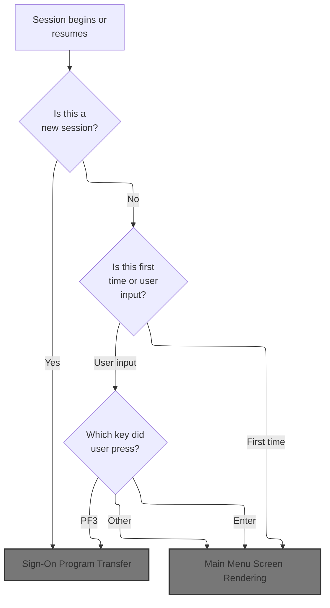
```mermaid
%%{init: {"flowchart": {"defaultRenderer": "elk"}} }%%
flowchart TD
    node1["Session begins or 
 resumes"]
    click node1 openCode "app/cbl/COMEN01C.cbl:75:106"
    node1 --> node2{"Is this a 
 new session?"}
    click node2 openCode "app/cbl/COMEN01C.cbl:82:85"
    node2 -->|"Yes"| node3["Sign-On Program Transfer"]
    
    node2 -->|"No"| node4{"Is this first 
 time or user 
 input?"}
    click node4 openCode "app/cbl/COMEN01C.cbl:86:105"
    node4 -->|"First time"| node5["Main Menu Screen Rendering"]
    
    node4 -->|"User input"| node6{"Which key did 
 user press?"}
    click node6 openCode "app/cbl/COMEN01C.cbl:93:103"
    node6 -->|"Enter"| node5
    node6 -->|"PF3"| node3
    node6 -->|"Other"| node5
classDef HeadingStyle fill:#777777,stroke:#333,stroke-width:2px;
click node3 goToHeading "Sign-On Program Transfer"
node3:::HeadingStyle
click node5 goToHeading "Main Menu Screen Rendering"
node5:::HeadingStyle
click node3 goToHeading "Sign-On Program Transfer"
node3:::HeadingStyle
click node5 goToHeading "Main Menu Screen Rendering"
node5:::HeadingStyle
```

This section manages the entry and routing logic for the CardDemo application's main menu, determining whether to show the sign-on screen, render the main menu, or process user input based on session state and actions.

| Rule ID | Code Location | Category       | Rule Name                              | Description                                                                                                                                                                                        | Conditions                                                                | Remarks                                                                                                                                                                                                                                |
| ------- | ------------- | -------------- | -------------------------------------- | -------------------------------------------------------------------------------------------------------------------------------------------------------------------------------------------------- | ------------------------------------------------------------------------- | -------------------------------------------------------------------------------------------------------------------------------------------------------------------------------------------------------------------------------------- |
| BR-001  | MAIN-PARA     | Business logic | New session sign-on routing            | If the session is new (no communication area is present), the user is routed to the sign-on screen.                                                                                                | Session begins and communication area length is zero.                     | The communication area length is checked using EIBCALEN = 0. The sign-on program name is set to 'COSGN00C'.                                                                                                                            |
| BR-002  | MAIN-PARA     | Business logic | First time menu rendering              | If the session is resumed and it is the user's first time in the menu, the main menu screen is rendered.                                                                                           | Session resumes (communication area present) and reentry flag is not set. | The reentry flag is checked using CDEMO-PGM-REENTER. The main menu screen is rendered with default values.                                                                                                                             |
| BR-003  | MAIN-PARA     | Business logic | Menu input routing and error messaging | If the session is resumed and the user provides input, the system processes the key pressed and routes accordingly: Enter shows the menu, PF3 routes to sign-on, other keys show an error message. | Session resumes, reentry flag is set, and user input is received.         | Key codes are checked: Enter (DFHENTER), PF3 (DFHPF3), other keys. The error message for invalid keys is 'Invalid key pressed. Please see below...         ' (50 characters, left aligned). Error flag is set to 'Y' for invalid keys. |

<SwmSnippet path="/app/cbl/COMEN01C.cbl" line="75" repo-id="Z2l0aHViJTNBJTNBa3luZHJ5bC1hd3MtbWFpbmZyYW1lLW1vZGVybml6YXRpb24tY2FyZGRlbW8lM0ElM0FTd2ltbS1EZW1v">

---

`MAIN-PARA` in COMEN01C handles both first-time entry and reentry. It checks if there's a commarea, sets up for sign-on if not, or continues with menu logic. It uses the reentry flag to decide if it should show the menu or process user input, and branches based on what key the user pressed.

```cobol
       MAIN-PARA.

           SET ERR-FLG-OFF TO TRUE

           MOVE SPACES TO WS-MESSAGE
                          ERRMSGO OF COMEN1AO

           IF EIBCALEN = 0
               MOVE 'COSGN00C' TO CDEMO-FROM-PROGRAM
               PERFORM RETURN-TO-SIGNON-SCREEN
           ELSE
               MOVE DFHCOMMAREA(1:EIBCALEN) TO CARDDEMO-COMMAREA
               IF NOT CDEMO-PGM-REENTER
                   SET CDEMO-PGM-REENTER    TO TRUE
                   MOVE LOW-VALUES          TO COMEN1AO
                   PERFORM SEND-MENU-SCREEN
               ELSE
                   PERFORM RECEIVE-MENU-SCREEN
                   EVALUATE EIBAID
                       WHEN DFHENTER
                           PERFORM PROCESS-ENTER-KEY
                       WHEN DFHPF3
                           MOVE 'COSGN00C' TO CDEMO-TO-PROGRAM
                           PERFORM RETURN-TO-SIGNON-SCREEN
                       WHEN OTHER
                           MOVE 'Y'                       TO WS-ERR-FLG
                           MOVE CCDA-MSG-INVALID-KEY      TO WS-MESSAGE
                           PERFORM SEND-MENU-SCREEN
                   END-EVALUATE
               END-IF
           END-IF

           EXEC CICS RETURN
                     TRANSID (WS-TRANID)
                     COMMAREA (CARDDEMO-COMMAREA)
           END-EXEC.
```

---

</SwmSnippet>

### Sign-On Program Transfer

This section ensures users are reliably transferred to the sign-on screen program, defaulting to a known program name if not set, and governs navigation flow within the CardDemo application.

| Rule ID | Code Location           | Category       | Rule Name                         | Description                                                                                                                                                        | Conditions                                                               | Remarks                                                                                                                                   |
| ------- | ----------------------- | -------------- | --------------------------------- | ------------------------------------------------------------------------------------------------------------------------------------------------------------------ | ------------------------------------------------------------------------ | ----------------------------------------------------------------------------------------------------------------------------------------- |
| BR-001  | RETURN-TO-SIGNON-SCREEN | Business logic | Default sign-on program selection | If the target program name is not set (either blank or filled with low values), the system will default to using 'COSGN00C' as the program to transfer control to. | The target program name is either blank (spaces) or contains low values. | The default program name is 'COSGN00C', which is an 8-character alphanumeric string. The field for the program name is 8 characters long. |
| BR-002  | RETURN-TO-SIGNON-SCREEN | Business logic | Program transfer destination      | When transferring control, the system will always use the value in the target program name field, which may be set by previous logic or defaulted to 'COSGN00C'.   | The target program name field contains a valid program name.             | The program name used for transfer is an 8-character alphanumeric string. If not set, it will be 'COSGN00C'.                              |
| BR-003  | RETURN-TO-SIGNON-SCREEN | Business logic | Sign-on screen navigation trigger | The transfer to the sign-on screen is triggered whenever the RETURN-TO-SIGNON-SCREEN section is executed, regardless of the previous program context.              | The RETURN-TO-SIGNON-SCREEN section is invoked.                          | No additional constants. The transfer is unconditional once the section is entered.                                                       |

<SwmSnippet path="/app/cbl/COMEN01C.cbl" line="170" repo-id="Z2l0aHViJTNBJTNBa3luZHJ5bC1hd3MtbWFpbmZyYW1lLW1vZGVybml6YXRpb24tY2FyZGRlbW8lM0ElM0FTd2ltbS1EZW1v">

---

`RETURN-TO-SIGNON-SCREEN` checks if the target program is set, defaults to 'COSGN00C' if not, and uses XCTL to jump to the sign-on screen. This keeps the navigation safe and predictable.

```cobol
       RETURN-TO-SIGNON-SCREEN.

           IF CDEMO-TO-PROGRAM = LOW-VALUES OR SPACES
               MOVE 'COSGN00C' TO CDEMO-TO-PROGRAM
           END-IF
           EXEC CICS
               XCTL PROGRAM(CDEMO-TO-PROGRAM)
           END-EXEC.
```

---

</SwmSnippet>

### Sign-On Screen Entry and Input Handling

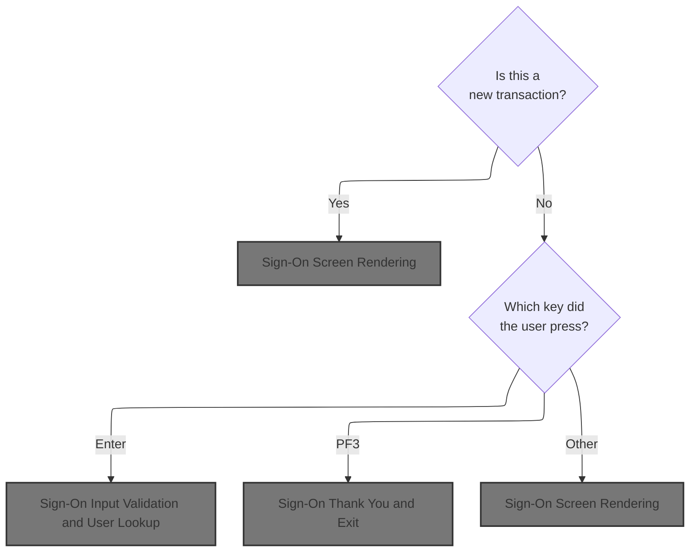
```mermaid
%%{init: {"flowchart": {"defaultRenderer": "elk"}} }%%
flowchart TD
    node1{"Is this a 
 new transaction?"}
    click node1 openCode "app/cbl/COSGN00C.cbl:80:84"
    node1 -->|"Yes"| node2["Sign-On Screen Rendering"]
    
    node1 -->|"No"| node3{"Which key did 
 the user press?"}
    click node3 openCode "app/cbl/COSGN00C.cbl:85:95"
    node3 -->|"Enter"| node4["Sign-On Input Validation and User Lookup"]
    
    node3 -->|"PF3"| node5["Sign-On Thank You and Exit"]
    
    node3 -->|"Other"| node6["Sign-On Screen Rendering"]
    

classDef HeadingStyle fill:#777777,stroke:#333,stroke-width:2px;
click node2 goToHeading "Sign-On Screen Rendering"
node2:::HeadingStyle
click node4 goToHeading "Sign-On Input Validation and User Lookup"
node4:::HeadingStyle
click node5 goToHeading "Sign-On Thank You and Exit"
node5:::HeadingStyle
click node6 goToHeading "Sign-On Screen Rendering"
node6:::HeadingStyle
```

This section manages the initial entry and input handling for the sign-on screen in the CardDemo application, determining what the user sees based on their actions.

| Rule ID | Code Location | Category       | Rule Name                     | Description                                                                                                                                            | Conditions                                                              | Remarks                                                                                                                                                                    |
| ------- | ------------- | -------------- | ----------------------------- | ------------------------------------------------------------------------------------------------------------------------------------------------------ | ----------------------------------------------------------------------- | -------------------------------------------------------------------------------------------------------------------------------------------------------------------------- |
| BR-001  | MAIN-PARA     | Business logic | Sign-On Screen Initialization | If there is no input data for the transaction, the sign-on screen is rendered for the user to begin the sign-on process.                               | No input data is present for the transaction (input length is zero).    | The sign-on screen is rendered with all fields cleared. The output format is the standard sign-on screen layout for CardDemo, with all fields set to their initial values. |
| BR-002  | MAIN-PARA     | Business logic | Sign-On Input Processing      | If the user presses the Enter key, the system proceeds to validate the sign-on input and attempts to look up the user.                                 | User presses the Enter key while on the sign-on screen.                 | The system transitions to input validation and user lookup. The output depends on the result of validation and lookup, which is handled in the next section.               |
| BR-003  | MAIN-PARA     | Business logic | Sign-On Exit and Thank You    | If the user presses the PF3 key, the system displays a thank you message and exits the sign-on process.                                                | User presses the PF3 key while on the sign-on screen.                   | The thank you message is: 'Thank you for using CardDemo application...      '. The output format is a plain text message displayed to the user.                            |
| BR-004  | MAIN-PARA     | Error handling | Invalid Key Error Handling    | If the user presses any key other than Enter or PF3, the system displays an error message indicating an invalid key and re-renders the sign-on screen. | User presses a key other than Enter or PF3 while on the sign-on screen. | The error message is: 'Invalid key pressed. Please see below...         '. The output format is the sign-on screen with the error message displayed.                       |

<SwmSnippet path="/app/cbl/COSGN00C.cbl" line="73" repo-id="Z2l0aHViJTNBJTNBa3luZHJ5bC1hd3MtbWFpbmZyYW1lLW1vZGVybml6YXRpb24tY2FyZGRlbW8lM0ElM0FTd2ltbS1EZW1v">

---

`MAIN-PARA` in COSGN00C checks if there's input, clears the screen and sets up for sign-on if not, then branches on the user action (enter, PF3, or other) to handle input, show a message, or display an error. It always returns control to CICS at the end.

```cobol
       MAIN-PARA.

           SET ERR-FLG-OFF TO TRUE

           MOVE SPACES TO WS-MESSAGE
                          ERRMSGO OF COSGN0AO

           IF EIBCALEN = 0
               MOVE LOW-VALUES TO COSGN0AO
               MOVE -1       TO USERIDL OF COSGN0AI
               PERFORM SEND-SIGNON-SCREEN
           ELSE
               EVALUATE EIBAID
                   WHEN DFHENTER
                       PERFORM PROCESS-ENTER-KEY
                   WHEN DFHPF3
                       MOVE CCDA-MSG-THANK-YOU        TO WS-MESSAGE
                       PERFORM SEND-PLAIN-TEXT
                   WHEN OTHER
                       MOVE 'Y'                       TO WS-ERR-FLG
                       MOVE CCDA-MSG-INVALID-KEY      TO WS-MESSAGE
                       PERFORM SEND-SIGNON-SCREEN
               END-EVALUATE
           END-IF.

           EXEC CICS RETURN
                     TRANSID (WS-TRANID)
                     COMMAREA (CARDDEMO-COMMAREA)
                     LENGTH(LENGTH OF CARDDEMO-COMMAREA)
           END-EXEC.
```

---

</SwmSnippet>

#### Sign-On Screen Rendering

This section is responsible for rendering the sign-on screen for the CardDemo application, ensuring all necessary context and messaging is presented to the user.

| Rule ID | Code Location        | Category       | Rule Name                                 | Description                                                                                                               | Conditions                                                        | Remarks                                                                                                                                                                     |
| ------- | -------------------- | -------------- | ----------------------------------------- | ------------------------------------------------------------------------------------------------------------------------- | ----------------------------------------------------------------- | --------------------------------------------------------------------------------------------------------------------------------------------------------------------------- |
| BR-001  | POPULATE-HEADER-INFO | Business logic | Header date and time display              | The sign-on screen must display the current date and time in the header, formatted as MM-DD-YY and HH-MM-SS respectively. | Whenever the sign-on screen is rendered.                          | Date is displayed as a string in MM-DD-YY format; time is displayed as a string in HH-MM-SS format. These are derived from the system's current date and time.              |
| BR-002  | POPULATE-HEADER-INFO | Business logic | Header program and transaction ID display | The sign-on screen must display the program name and transaction ID in the header for user context.                       | Whenever the sign-on screen is rendered.                          | Program name is 'COSGN00C' (8 characters, left-aligned, padded with spaces if needed). Transaction ID is 'CC00' (4 characters, left-aligned, padded with spaces if needed). |
| BR-003  | SEND-SIGNON-SCREEN   | Business logic | Message display                           | Any message present must be displayed in the designated error/message field on the sign-on screen.                        | Whenever the sign-on screen is rendered and a message is present. | Message field is 80 characters, left-aligned, padded with spaces if message is shorter. If no message is present, the field is blank.                                       |
| BR-004  | POPULATE-HEADER-INFO | Business logic | System context display                    | The sign-on screen must display the application ID (APPLID) and system ID (SYSID) for system context and traceability.    | Whenever the sign-on screen is rendered.                          | APPLID and SYSID are system-assigned identifiers, displayed as strings in their respective fields.                                                                          |
| BR-005  | SEND-SIGNON-SCREEN   | Business logic | Screen rendering and cursor positioning   | The sign-on screen must be sent to the user's terminal with the screen cleared and the cursor positioned for input.       | Whenever the sign-on screen is rendered.                          | The screen is cleared before rendering, and the cursor is positioned for user input. The entire sign-on map is sent to the terminal.                                        |

<SwmSnippet path="/app/cbl/COSGN00C.cbl" line="145" repo-id="Z2l0aHViJTNBJTNBa3luZHJ5bC1hd3MtbWFpbmZyYW1lLW1vZGVybml6YXRpb24tY2FyZGRlbW8lM0ElM0FTd2ltbS1EZW1v">

---

`SEND-SIGNON-SCREEN` calls POPULATE-HEADER-INFO to fill in header data, moves any message to the error field, and sends the sign-on map to the terminal, clearing the screen and setting the cursor.

```cobol
       SEND-SIGNON-SCREEN.

           PERFORM POPULATE-HEADER-INFO

           MOVE WS-MESSAGE TO ERRMSGO OF COSGN0AO

           EXEC CICS SEND
                     MAP('COSGN0A')
                     MAPSET('COSGN00')
                     FROM(COSGN0AO)
                     ERASE
                     CURSOR
           END-EXEC.
```

---

</SwmSnippet>

<SwmSnippet path="/app/cbl/COSGN00C.cbl" line="177" repo-id="Z2l0aHViJTNBJTNBa3luZHJ5bC1hd3MtbWFpbmZyYW1lLW1vZGVybml6YXRpb24tY2FyZGRlbW8lM0ElM0FTd2ltbS1EZW1v">

---

`POPULATE-HEADER-INFO` fills in the header with the current date, time, titles, transaction ID, and program name, and sets APPLID and SYSID using CICS ASSIGN. This gives the screen all the context info it needs.

```cobol
       POPULATE-HEADER-INFO.

           MOVE FUNCTION CURRENT-DATE  TO WS-CURDATE-DATA

           MOVE CCDA-TITLE01           TO TITLE01O OF COSGN0AO
           MOVE CCDA-TITLE02           TO TITLE02O OF COSGN0AO
           MOVE WS-TRANID              TO TRNNAMEO OF COSGN0AO
           MOVE WS-PGMNAME             TO PGMNAMEO OF COSGN0AO

           MOVE WS-CURDATE-MONTH       TO WS-CURDATE-MM
           MOVE WS-CURDATE-DAY         TO WS-CURDATE-DD
           MOVE WS-CURDATE-YEAR(3:2)   TO WS-CURDATE-YY

           MOVE WS-CURDATE-MM-DD-YY    TO CURDATEO OF COSGN0AO

           MOVE WS-CURTIME-HOURS       TO WS-CURTIME-HH
           MOVE WS-CURTIME-MINUTE      TO WS-CURTIME-MM
           MOVE WS-CURTIME-SECOND      TO WS-CURTIME-SS

           MOVE WS-CURTIME-HH-MM-SS    TO CURTIMEO OF COSGN0AO

           EXEC CICS ASSIGN
               APPLID(APPLIDO OF COSGN0AO)
           END-EXEC

           EXEC CICS ASSIGN
               SYSID(SYSIDO OF COSGN0AO)
           END-EXEC.
```

---

</SwmSnippet>

#### Sign-On Input Validation and User Lookup

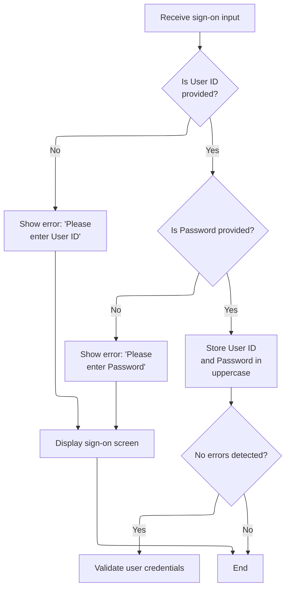
```mermaid
%%{init: {"flowchart": {"defaultRenderer": "elk"}} }%%
flowchart TD
    node1["Receive sign-on input"] --> node2{"Is User ID 
 provided?"}
    click node1 openCode "app/cbl/COSGN00C.cbl:110:115"
    node2 -->|"No"| node3["Show error: 'Please 
 enter User ID'"]
    click node2 openCode "app/cbl/COSGN00C.cbl:117:123"
    node3 --> node7["Display sign-on screen"]
    click node3 openCode "app/cbl/COSGN00C.cbl:119:123"
    node2 -->|"Yes"| node4{"Is Password provided?"}
    click node4 openCode "app/cbl/COSGN00C.cbl:123:127"
    node4 -->|"No"| node5["Show error: 'Please 
 enter Password'"]
    click node5 openCode "app/cbl/COSGN00C.cbl:124:127"
    node5 --> node7
    node4 -->|"Yes"| node6["Store User ID 
 and Password in 
 uppercase"]
    click node6 openCode "app/cbl/COSGN00C.cbl:132:137"
    node6 --> node8{"No errors detected?"}
    click node8 openCode "app/cbl/COSGN00C.cbl:138:140"
    node8 -->|"Yes"| node9["Validate user credentials"]
    click node9 openCode "app/cbl/COSGN00C.cbl:139:140"
    node8 -->|"No"| node10["End"]
    click node10 openCode "app/cbl/COSGN00C.cbl:140:140"
    node7 --> node10
classDef HeadingStyle fill:#777777,stroke:#333,stroke-width:2px;
```

This section validates sign-on input for the CardDemo application, ensuring required fields are present, normalizing input, and gating user credential validation based on input completeness.

| Rule ID | Code Location     | Category        | Rule Name                        | Description                                                                                                                                                                                       | Conditions                                                                 | Remarks                                                                                                                                                                                           |
| ------- | ----------------- | --------------- | -------------------------------- | ------------------------------------------------------------------------------------------------------------------------------------------------------------------------------------------------- | -------------------------------------------------------------------------- | ------------------------------------------------------------------------------------------------------------------------------------------------------------------------------------------------- |
| BR-001  | PROCESS-ENTER-KEY | Data validation | User ID required                 | If the User ID field is empty or contains only blank or non-printable values, the system must display the message 'Please enter User ID ...' and prompt the user to re-enter their credentials.   | The User ID field is empty, blank, or contains only non-printable values.  | The error message shown is 'Please enter User ID ...'. The User ID field is expected to be a string up to 8 characters. The prompt is triggered immediately upon detection of missing User ID.    |
| BR-002  | PROCESS-ENTER-KEY | Data validation | Password required                | If the Password field is empty or contains only blank or non-printable values, the system must display the message 'Please enter Password ...' and prompt the user to re-enter their credentials. | The Password field is empty, blank, or contains only non-printable values. | The error message shown is 'Please enter Password ...'. The Password field is expected to be a string up to 8 characters. The prompt is triggered immediately upon detection of missing Password. |
| BR-003  | PROCESS-ENTER-KEY | Business logic  | Input normalization to uppercase | When both User ID and Password are provided, the system must convert both fields to uppercase before storing and using them for user lookup.                                                      | Both User ID and Password fields are present and no error flag is set.     | Both User ID and Password are normalized to uppercase strings (up to 8 characters each) before being stored and used for lookup.                                                                  |
| BR-004  | PROCESS-ENTER-KEY | Business logic  | Credential validation gating     | User credential validation is triggered only if no errors have been detected in the input fields.                                                                                                 | No error flag is set after input validation.                               | Credential validation is performed only when both User ID and Password are present and normalized. No error message is shown if validation proceeds.                                              |

<SwmSnippet path="/app/cbl/COSGN00C.cbl" line="108" repo-id="Z2l0aHViJTNBJTNBa3luZHJ5bC1hd3MtbWFpbmZyYW1lLW1vZGVybml6YXRpb24tY2FyZGRlbW8lM0ElM0FTd2ltbS1EZW1v">

---

`PROCESS-ENTER-KEY` receives the sign-on input, checks for missing user ID or password, sets errors if needed, and uppercases the input before looking up the user if everything is filled in.

```cobol
       PROCESS-ENTER-KEY.

           EXEC CICS RECEIVE
                     MAP('COSGN0A')
                     MAPSET('COSGN00')
                     RESP(WS-RESP-CD)
                     RESP2(WS-REAS-CD)
           END-EXEC.

           EVALUATE TRUE
               WHEN USERIDI OF COSGN0AI = SPACES OR LOW-VALUES
                   MOVE 'Y'      TO WS-ERR-FLG
                   MOVE 'Please enter User ID ...' TO WS-MESSAGE
                   MOVE -1       TO USERIDL OF COSGN0AI
                   PERFORM SEND-SIGNON-SCREEN
               WHEN PASSWDI OF COSGN0AI = SPACES OR LOW-VALUES
                   MOVE 'Y'      TO WS-ERR-FLG
                   MOVE 'Please enter Password ...' TO WS-MESSAGE
                   MOVE -1       TO PASSWDL OF COSGN0AI
                   PERFORM SEND-SIGNON-SCREEN
               WHEN OTHER
                   CONTINUE
           END-EVALUATE.

           MOVE FUNCTION UPPER-CASE(USERIDI OF COSGN0AI) TO
                           WS-USER-ID
                           CDEMO-USER-ID
           MOVE FUNCTION UPPER-CASE(PASSWDI OF COSGN0AI) TO
                           WS-USER-PWD

           IF NOT ERR-FLG-ON
               PERFORM READ-USER-SEC-FILE
           END-IF.
```

---

</SwmSnippet>

#### User Authentication and Program Routing

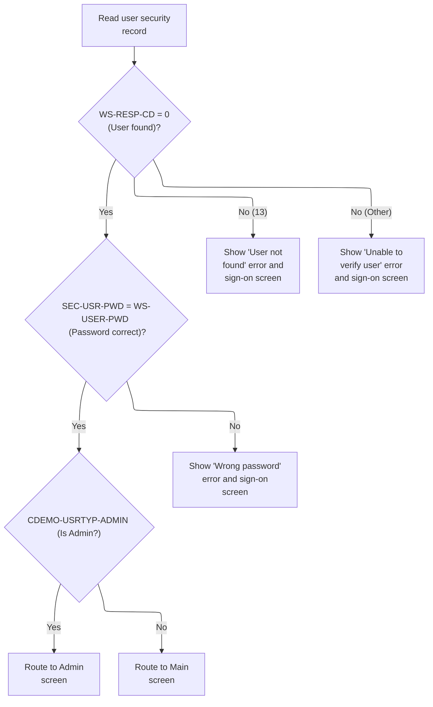
```mermaid
%%{init: {"flowchart": {"defaultRenderer": "elk"}} }%%
flowchart TD
    node1["Read user security 
 record"] --> node2{"WS-RESP-CD = 0 
 (User found)?"}
    click node1 openCode "app/cbl/COSGN00C.cbl:211:219"
    node2 -->|"Yes"| node3{"SEC-USR-PWD = WS-USER-PWD 
 (Password correct)?"}
    click node2 openCode "app/cbl/COSGN00C.cbl:221:222"
    node2 -->|"No (13)"| node6["Show 'User not 
 found' error and 
 sign-on screen"]
    click node6 openCode "app/cbl/COSGN00C.cbl:248:251"
    node2 -->|"No (Other)"| node9["Show 'Unable to 
 verify user' error 
 and sign-on screen"]
    click node9 openCode "app/cbl/COSGN00C.cbl:253:256"
    node3 -->|"Yes"| node4{"CDEMO-USRTYP-ADMIN (Is Admin?)"}
    click node3 openCode "app/cbl/COSGN00C.cbl:223:224"
    node3 -->|"No"| node7["Show 'Wrong password' 
 error and sign-on 
 screen"]
    click node7 openCode "app/cbl/COSGN00C.cbl:242:245"
    node4 -->|"Yes"| node5["Route to Admin 
 screen"]
    click node5 openCode "app/cbl/COSGN00C.cbl:230:234"
    node4 -->|"No"| node8["Route to Main 
 screen"]
    click node8 openCode "app/cbl/COSGN00C.cbl:236:239"
classDef HeadingStyle fill:#777777,stroke:#333,stroke-width:2px;
```

This section authenticates users and routes them to the appropriate application area (admin or main screen) based on their credentials and user type, or displays error messages if authentication fails.

| Rule ID | Code Location      | Category       | Rule Name                             | Description                                                                                                                                     | Conditions                                                     | Remarks                                                                                                                                                                |
| ------- | ------------------ | -------------- | ------------------------------------- | ----------------------------------------------------------------------------------------------------------------------------------------------- | -------------------------------------------------------------- | ---------------------------------------------------------------------------------------------------------------------------------------------------------------------- |
| BR-001  | READ-USER-SEC-FILE | Business logic | Successful authentication and routing | If a user is found and the password matches, the user is routed to either the admin or main screen depending on their user type.                | User record exists and password matches the stored password.   | User type 'A' routes to admin screen, user type 'U' routes to main screen. User ID and type are 8 and 1 character strings respectively. No error message is displayed. |
| BR-002  | READ-USER-SEC-FILE | Business logic | User type routing                     | Admin users are routed to the admin screen, while regular users are routed to the main screen after successful authentication.                  | User is authenticated and user type is determined.             | User type 'A' (admin) routes to admin screen, user type 'U' (regular) routes to main screen. User type is a single character string.                                   |
| BR-003  | READ-USER-SEC-FILE | Error handling | Wrong password error                  | If a user is found but the password does not match, an error message is displayed and the sign-on screen is redisplayed.                        | User record exists but password does not match.                | Error message: 'Wrong Password. Try again ...' is displayed. The password field is reset. Error flag is not set.                                                       |
| BR-004  | READ-USER-SEC-FILE | Error handling | User not found error                  | If the user record is not found, an error message is displayed and the sign-on screen is redisplayed.                                           | User record lookup returns response code 13.                   | Error message: 'User not found. Try again ...' is displayed. The user ID field is reset. Error flag is set to 'Y'.                                                     |
| BR-005  | READ-USER-SEC-FILE | Error handling | Unable to verify user error           | If the user record lookup fails for reasons other than 'not found', a generic error message is displayed and the sign-on screen is redisplayed. | User record lookup returns a response code other than 0 or 13. | Error message: 'Unable to verify the User ...' is displayed. The user ID field is reset. Error flag is set to 'Y'.                                                     |

<SwmSnippet path="/app/cbl/COSGN00C.cbl" line="209" repo-id="Z2l0aHViJTNBJTNBa3luZHJ5bC1hd3MtbWFpbmZyYW1lLW1vZGVybml6YXRpb24tY2FyZGRlbW8lM0ElM0FTd2ltbS1EZW1v">

---

`READ-USER-SEC-FILE` looks up the user by ID, checks the password, and sends admins to the admin menu and regular users to the main menu. If the user isn't found or the password is wrong, it shows an error and redisplays the sign-on screen.

```cobol
       READ-USER-SEC-FILE.

           EXEC CICS READ
                DATASET   (WS-USRSEC-FILE)
                INTO      (SEC-USER-DATA)
                LENGTH    (LENGTH OF SEC-USER-DATA)
                RIDFLD    (WS-USER-ID)
                KEYLENGTH (LENGTH OF WS-USER-ID)
                RESP      (WS-RESP-CD)
                RESP2     (WS-REAS-CD)
           END-EXEC.

           EVALUATE WS-RESP-CD
               WHEN 0
                   IF SEC-USR-PWD = WS-USER-PWD
                       MOVE WS-TRANID    TO CDEMO-FROM-TRANID
                       MOVE WS-PGMNAME   TO CDEMO-FROM-PROGRAM
                       MOVE WS-USER-ID   TO CDEMO-USER-ID
                       MOVE SEC-USR-TYPE TO CDEMO-USER-TYPE
                       MOVE ZEROS        TO CDEMO-PGM-CONTEXT

                       IF CDEMO-USRTYP-ADMIN
                            EXEC CICS XCTL
                              PROGRAM ('COADM01C')
                              COMMAREA(CARDDEMO-COMMAREA)
                            END-EXEC
                       ELSE
                            EXEC CICS XCTL
                              PROGRAM ('COMEN01C')
                              COMMAREA(CARDDEMO-COMMAREA)
                            END-EXEC
                       END-IF
                   ELSE
                       MOVE 'Wrong Password. Try again ...' TO
                                                          WS-MESSAGE
                       MOVE -1       TO PASSWDL OF COSGN0AI
                       PERFORM SEND-SIGNON-SCREEN
                   END-IF
               WHEN 13
                   MOVE 'Y'      TO WS-ERR-FLG
                   MOVE 'User not found. Try again ...' TO WS-MESSAGE
                   MOVE -1       TO USERIDL OF COSGN0AI
                   PERFORM SEND-SIGNON-SCREEN
               WHEN OTHER
                   MOVE 'Y'      TO WS-ERR-FLG
                   MOVE 'Unable to verify the User ...' TO WS-MESSAGE
                   MOVE -1       TO USERIDL OF COSGN0AI
                   PERFORM SEND-SIGNON-SCREEN
           END-EVALUATE.
```

---

</SwmSnippet>

#### Admin Menu Entry and Routing


```mermaid
%%{init: {"flowchart": {"defaultRenderer": "elk"}} }%%
flowchart TD
    node1["Session begins or 
 resumes"]
    click node1 openCode "app/cbl/COMEN01C.cbl:75:106"
    node1 --> node2{"Is this a 
 new session?"}
    click node2 openCode "app/cbl/COMEN01C.cbl:82:85"
    node2 -->|"Yes"| node3["Sign-On Program Transfer"]
    
    node2 -->|"No"| node4{"Is this first 
 time or user 
 input?"}
    click node4 openCode "app/cbl/COMEN01C.cbl:86:105"
    node4 -->|"First time"| node5["Main Menu Screen Rendering"]
    
    node4 -->|"User input"| node6{"Which key did 
 user press?"}
    click node6 openCode "app/cbl/COMEN01C.cbl:93:103"
    node6 -->|"Enter"| node5
    node6 -->|"PF3"| node3
    node6 -->|"Other"| node5
classDef HeadingStyle fill:#777777,stroke:#333,stroke-width:2px;
click node3 goToHeading "Sign-On Program Transfer"
node3:::HeadingStyle
click node5 goToHeading "Main Menu Screen Rendering"
node5:::HeadingStyle
click node3 goToHeading "Sign-On Program Transfer"
node3:::HeadingStyle
click node5 goToHeading "Main Menu Screen Rendering"
node5:::HeadingStyle
```

This section manages entry and routing for the admin menu, determining whether to redirect users to sign-on, render the main menu, or display error messages based on session context and user input.

| Rule ID | Code Location                      | Category       | Rule Name                    | Description                                                                                                                          | Conditions                                                                                  | Remarks                                                                                                                                                                    |
| ------- | ---------------------------------- | -------------- | ---------------------------- | ------------------------------------------------------------------------------------------------------------------------------------ | ------------------------------------------------------------------------------------------- | -------------------------------------------------------------------------------------------------------------------------------------------------------------------------- |
| BR-001  | MAIN-PARA, RETURN-TO-SIGNON-SCREEN | Business logic | New session sign-on redirect | If the session is new (no communication area length), the user is redirected to the sign-on program before accessing the admin menu. | Session context indicates a new session (communication area length is zero).                | The sign-on program is identified by the constant 'COSGN00C'. The output is a program transfer to the sign-on screen.                                                      |
| BR-002  | MAIN-PARA                          | Business logic | First entry menu rendering   | If the session is resumed and it is the user's first entry to the admin menu, the main menu screen is rendered.                      | Session context indicates a resumed session and not a reentry (CDEMO-PGM-REENTER is false). | The main menu screen is rendered with default values (low-values) and no error message.                                                                                    |
| BR-003  | MAIN-PARA                          | Business logic | Enter key menu processing    | When the user provides input, pressing the Enter key on the admin menu processes the input and re-renders the main menu.             | User input is received and the Enter key is pressed.                                        | The main menu screen is re-rendered after processing the Enter key.                                                                                                        |
| BR-004  | MAIN-PARA, RETURN-TO-SIGNON-SCREEN | Business logic | PF3 sign-on redirect         | When the user presses PF3, the system redirects the user to the sign-on program.                                                     | User input is received and the PF3 key is pressed.                                          | The sign-on program is identified by the constant 'COSGN00C'. The output is a program transfer to the sign-on screen.                                                      |
| BR-005  | RETURN-TO-SIGNON-SCREEN            | Business logic | Sign-on program defaulting   | When returning to the sign-on screen, if the target program is not set, it defaults to the sign-on program.                          | Target program for sign-on is not set (low-values or spaces).                               | The sign-on program is identified by the constant 'COSGN00C'.                                                                                                              |
| BR-006  | MAIN-PARA                          | Error handling | Invalid key error handling   | If the user presses any key other than Enter or PF3, an error flag is set and an error message is displayed on the main menu screen. | User input is received and a key other than Enter or PF3 is pressed.                        | The error flag is set to 'Y'. The error message displayed is 'Invalid key pressed. Please see below...         '. The main menu screen is rendered with the error message. |

<SwmSnippet path="/app/cbl/COADM01C.cbl" line="75" repo-id="Z2l0aHViJTNBJTNBa3luZHJ5bC1hd3MtbWFpbmZyYW1lLW1vZGVybml6YXRpb24tY2FyZGRlbW8lM0ElM0FTd2ltbS1EZW1v">

---

`MAIN-PARA` in COADM01C checks if we're coming in fresh or as a reentry, sets up for sign-on if needed, or continues with admin menu logic. It branches on the user action to process input, return to sign-on, or show an error.

```cobol
       MAIN-PARA.

           SET ERR-FLG-OFF TO TRUE

           MOVE SPACES TO WS-MESSAGE
                          ERRMSGO OF COADM1AO

           IF EIBCALEN = 0
               MOVE 'COSGN00C' TO CDEMO-FROM-PROGRAM
               PERFORM RETURN-TO-SIGNON-SCREEN
           ELSE
               MOVE DFHCOMMAREA(1:EIBCALEN) TO CARDDEMO-COMMAREA
               IF NOT CDEMO-PGM-REENTER
                   SET CDEMO-PGM-REENTER    TO TRUE
                   MOVE LOW-VALUES          TO COADM1AO
                   PERFORM SEND-MENU-SCREEN
               ELSE
                   PERFORM RECEIVE-MENU-SCREEN
                   EVALUATE EIBAID
                       WHEN DFHENTER
                           PERFORM PROCESS-ENTER-KEY
                       WHEN DFHPF3
                           MOVE 'COSGN00C' TO CDEMO-TO-PROGRAM
                           PERFORM RETURN-TO-SIGNON-SCREEN
                       WHEN OTHER
                           MOVE 'Y'                       TO WS-ERR-FLG
                           MOVE CCDA-MSG-INVALID-KEY      TO WS-MESSAGE
                           PERFORM SEND-MENU-SCREEN
                   END-EVALUATE
               END-IF
           END-IF

           EXEC CICS RETURN
                     TRANSID (WS-TRANID)
                     COMMAREA (CARDDEMO-COMMAREA)
           END-EXEC.
```

---

</SwmSnippet>

<SwmSnippet path="/app/cbl/COADM01C.cbl" line="160" repo-id="Z2l0aHViJTNBJTNBa3luZHJ5bC1hd3MtbWFpbmZyYW1lLW1vZGVybml6YXRpb24tY2FyZGRlbW8lM0ElM0FTd2ltbS1EZW1v">

---

`RETURN-TO-SIGNON-SCREEN` checks if the target program is set, defaults to 'COSGN00C' if not, and uses XCTL to jump to the sign-on screen. This keeps the navigation safe and predictable.

```cobol
       RETURN-TO-SIGNON-SCREEN.

           IF CDEMO-TO-PROGRAM = LOW-VALUES OR SPACES
               MOVE 'COSGN00C' TO CDEMO-TO-PROGRAM
           END-IF
           EXEC CICS
               XCTL PROGRAM(CDEMO-TO-PROGRAM)
           END-EXEC.
```

---

</SwmSnippet>

##### Admin Menu Screen Rendering

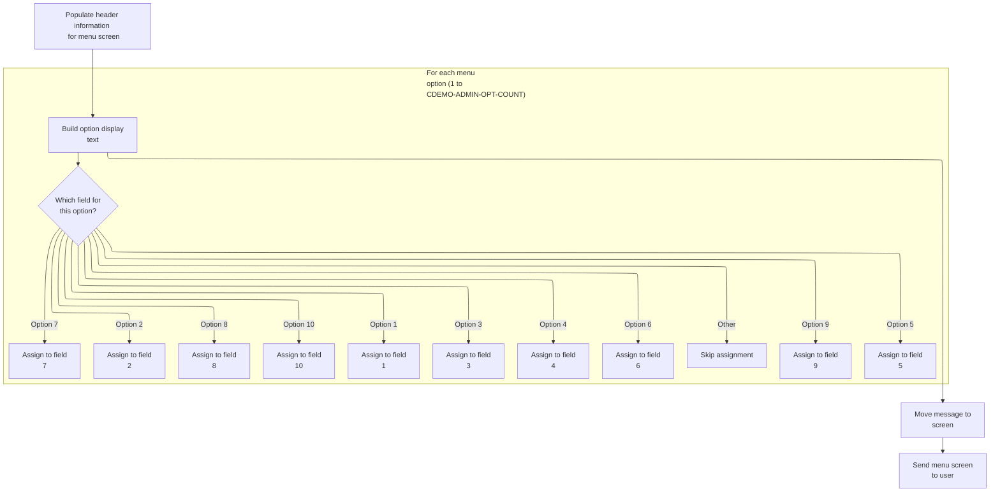
```mermaid
%%{init: {"flowchart": {"defaultRenderer": "elk"}} }%%
flowchart TD
    node1["Populate header information 
 for menu screen"]
    click node1 openCode "app/cbl/COADM01C.cbl:202:221"
    node1 --> node2
    
    subgraph loop1["For each menu 
 option (1 to 
 CDEMO-ADMIN-OPT-COUNT)"]
        node2["Build option display 
 text"]
        click node2 openCode "app/cbl/COADM01C.cbl:226:263"
        node2 --> node3{"Which field for 
 this option?"}
        click node3 openCode "app/cbl/COADM01C.cbl:238:261"
        node3 -->|"Option 1"| node4["Assign to field 
 1"]
        click node4 openCode "app/cbl/COADM01C.cbl:240:240"
        node3 -->|"Option 2"| node5["Assign to field 
 2"]
        click node5 openCode "app/cbl/COADM01C.cbl:242:242"
        node3 -->|"Option 3"| node6["Assign to field 
 3"]
        click node6 openCode "app/cbl/COADM01C.cbl:244:244"
        node3 -->|"Option 4"| node7["Assign to field 
 4"]
        click node7 openCode "app/cbl/COADM01C.cbl:246:246"
        node3 -->|"Option 5"| node8["Assign to field 
 5"]
        click node8 openCode "app/cbl/COADM01C.cbl:248:248"
        node3 -->|"Option 6"| node9["Assign to field 
 6"]
        click node9 openCode "app/cbl/COADM01C.cbl:250:250"
        node3 -->|"Option 7"| node10["Assign to field 
 7"]
        click node10 openCode "app/cbl/COADM01C.cbl:252:252"
        node3 -->|"Option 8"| node11["Assign to field 
 8"]
        click node11 openCode "app/cbl/COADM01C.cbl:254:254"
        node3 -->|"Option 9"| node12["Assign to field 
 9"]
        click node12 openCode "app/cbl/COADM01C.cbl:256:256"
        node3 -->|"Option 10"| node13["Assign to field 
 10"]
        click node13 openCode "app/cbl/COADM01C.cbl:258:258"
        node3 -->|"Other"| node14["Skip assignment"]
        click node14 openCode "app/cbl/COADM01C.cbl:260:260"
    end
    
    node2 --> node15["Move message to 
 screen"]
    click node15 openCode "app/cbl/COADM01C.cbl:177:177"
    node15 --> node16["Send menu screen 
 to user"]
    click node16 openCode "app/cbl/COADM01C.cbl:179:184"

classDef HeadingStyle fill:#777777,stroke:#333,stroke-width:2px;
```

This section prepares and renders the Admin Menu screen for the CardDemo application, ensuring the header, menu options, and message fields are correctly populated and the screen is sent to the user.

| Rule ID | Code Location        | Category       | Rule Name                          | Description                                                                                                                                                                               | Conditions                                                    | Remarks                                                                                                                                                                                                                   |
| ------- | -------------------- | -------------- | ---------------------------------- | ----------------------------------------------------------------------------------------------------------------------------------------------------------------------------------------- | ------------------------------------------------------------- | ------------------------------------------------------------------------------------------------------------------------------------------------------------------------------------------------------------------------- |
| BR-001  | POPULATE-HEADER-INFO | Business logic | Header information display         | The admin menu header must display the current date, time, transaction ID, program name, and static titles. The date and time are formatted for display.                                  | Whenever the admin menu screen is rendered.                   | Date is formatted as MM-DD-YY, time as HH-MM-SS. Transaction ID is a 4-character string, program name is an 8-character string, titles are static strings. All fields are left-aligned and padded as needed for display.  |
| BR-002  | BUILD-MENU-OPTIONS   | Business logic | Menu option display and assignment | Up to 10 admin menu options are displayed, each with its number and name, formatted as 'N. OptionName'. Each option is assigned to a specific output field corresponding to its position. | For each menu option where the index is between 1 and 10.     | Menu option text is formatted as: number (string), period and space, option name (string). Each option is assigned to a numbered output field (1-10). If there are more than 10 options, only the first 10 are displayed. |
| BR-003  | BUILD-MENU-OPTIONS   | Business logic | Menu option display limit          | If there are more than 10 admin menu options, options beyond the tenth are not displayed on the menu screen.                                                                              | When the number of admin menu options exceeds 10.             | Only options 1 through 10 are assigned to output fields. Options beyond 10 are skipped and not shown.                                                                                                                     |
| BR-004  | SEND-MENU-SCREEN     | Business logic | Message field clearing             | The message field on the admin menu screen is cleared (set to blank) before the screen is sent to the user.                                                                               | Whenever the admin menu screen is rendered.                   | Message field is an 80-character string, left-aligned and padded with spaces if blank.                                                                                                                                    |
| BR-005  | SEND-MENU-SCREEN     | Business logic | Screen transmission                | After all fields are populated, the admin menu screen is sent to the user, erasing any previous screen content.                                                                           | After header, menu options, and message fields are populated. | Screen is sent using the map 'COADM1A' and mapset 'COADM01'. The ERASE option ensures previous content is cleared.                                                                                                        |

<SwmSnippet path="/app/cbl/COADM01C.cbl" line="172" repo-id="Z2l0aHViJTNBJTNBa3luZHJ5bC1hd3MtbWFpbmZyYW1lLW1vZGVybml6YXRpb24tY2FyZGRlbW8lM0ElM0FTd2ltbS1EZW1v">

---

`SEND-MENU-SCREEN` calls POPULATE-HEADER-INFO and BUILD-MENU-OPTIONS to prep the header and menu options, clears any message, and sends the admin menu screen to the user.

```cobol
       SEND-MENU-SCREEN.

           PERFORM POPULATE-HEADER-INFO
           PERFORM BUILD-MENU-OPTIONS

           MOVE WS-MESSAGE TO ERRMSGO OF COADM1AO

           EXEC CICS SEND
                     MAP('COADM1A')
                     MAPSET('COADM01')
                     FROM(COADM1AO)
                     ERASE
           END-EXEC.
```

---

</SwmSnippet>

<SwmSnippet path="/app/cbl/COADM01C.cbl" line="202" repo-id="Z2l0aHViJTNBJTNBa3luZHJ5bC1hd3MtbWFpbmZyYW1lLW1vZGVybml6YXRpb24tY2FyZGRlbW8lM0ElM0FTd2ltbS1EZW1v">

---

`POPULATE-HEADER-INFO` fills in the admin menu header with the current date, time, transaction ID, program name, and static titles. It formats the date and time for display.

```cobol
       POPULATE-HEADER-INFO.

           MOVE FUNCTION CURRENT-DATE  TO WS-CURDATE-DATA

           MOVE CCDA-TITLE01           TO TITLE01O OF COADM1AO
           MOVE CCDA-TITLE02           TO TITLE02O OF COADM1AO
           MOVE WS-TRANID              TO TRNNAMEO OF COADM1AO
           MOVE WS-PGMNAME             TO PGMNAMEO OF COADM1AO

           MOVE WS-CURDATE-MONTH       TO WS-CURDATE-MM
           MOVE WS-CURDATE-DAY         TO WS-CURDATE-DD
           MOVE WS-CURDATE-YEAR(3:2)   TO WS-CURDATE-YY

           MOVE WS-CURDATE-MM-DD-YY    TO CURDATEO OF COADM1AO

           MOVE WS-CURTIME-HOURS       TO WS-CURTIME-HH
           MOVE WS-CURTIME-MINUTE      TO WS-CURTIME-MM
           MOVE WS-CURTIME-SECOND      TO WS-CURTIME-SS

           MOVE WS-CURTIME-HH-MM-SS    TO CURTIMEO OF COADM1AO.
```

---

</SwmSnippet>

<SwmSnippet path="/app/cbl/COADM01C.cbl" line="226" repo-id="Z2l0aHViJTNBJTNBa3luZHJ5bC1hd3MtbWFpbmZyYW1lLW1vZGVybml6YXRpb24tY2FyZGRlbW8lM0ElM0FTd2ltbS1EZW1v">

---

`BUILD-MENU-OPTIONS` loops through the admin options, builds each menu string, and assigns it to the right output field for display. This keeps the menu flexible and easy to update.

```cobol
       BUILD-MENU-OPTIONS.

           PERFORM VARYING WS-IDX FROM 1 BY 1 UNTIL
                           WS-IDX > CDEMO-ADMIN-OPT-COUNT

               MOVE SPACES             TO WS-ADMIN-OPT-TXT

               STRING CDEMO-ADMIN-OPT-NUM(WS-IDX)  DELIMITED BY SIZE
                      '. '                         DELIMITED BY SIZE
                      CDEMO-ADMIN-OPT-NAME(WS-IDX) DELIMITED BY SIZE
                 INTO WS-ADMIN-OPT-TXT

               EVALUATE WS-IDX
                   WHEN 1
                       MOVE WS-ADMIN-OPT-TXT TO OPTN001O
                   WHEN 2
                       MOVE WS-ADMIN-OPT-TXT TO OPTN002O
                   WHEN 3
                       MOVE WS-ADMIN-OPT-TXT TO OPTN003O
                   WHEN 4
                       MOVE WS-ADMIN-OPT-TXT TO OPTN004O
                   WHEN 5
                       MOVE WS-ADMIN-OPT-TXT TO OPTN005O
                   WHEN 6
                       MOVE WS-ADMIN-OPT-TXT TO OPTN006O
                   WHEN 7
                       MOVE WS-ADMIN-OPT-TXT TO OPTN007O
                   WHEN 8
                       MOVE WS-ADMIN-OPT-TXT TO OPTN008O
                   WHEN 9
                       MOVE WS-ADMIN-OPT-TXT TO OPTN009O
                   WHEN 10
                       MOVE WS-ADMIN-OPT-TXT TO OPTN010O
                   WHEN OTHER
                       CONTINUE
               END-EVALUATE

           END-PERFORM.
```

---

</SwmSnippet>

##### Admin Menu Input Handling

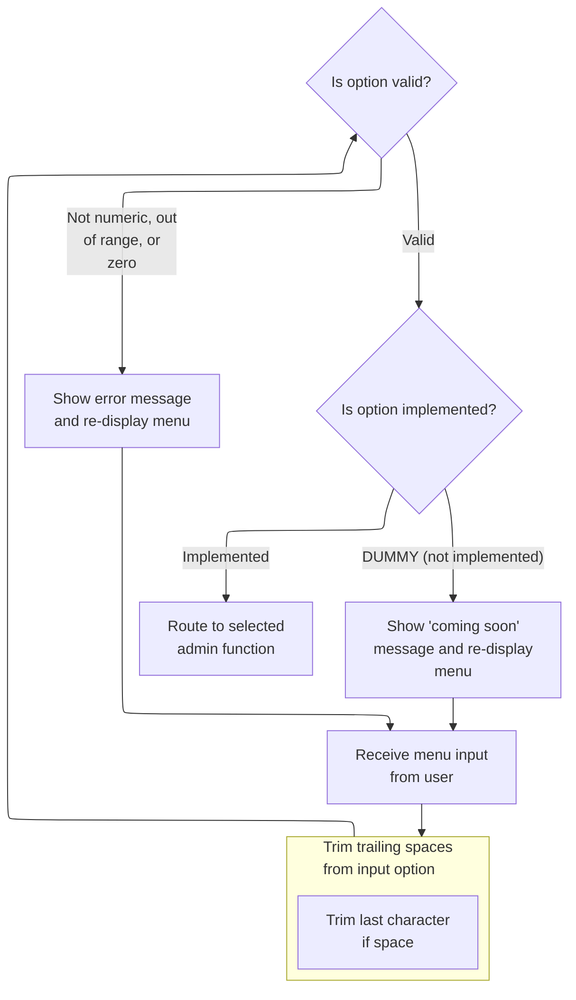
```mermaid
%%{init: {"flowchart": {"defaultRenderer": "elk"}} }%%
flowchart TD
    node1["Receive menu input 
 from user"]
    click node1 openCode "app/cbl/COADM01C.cbl:191:197"
    subgraph loop1["Trim trailing spaces 
 from input option"]
      node2["Trim last character 
 if space"]
      click node2 openCode "app/cbl/COADM01C.cbl:117:121"
    end
    node1 --> loop1
    loop1 --> node3{"Is option valid?"}
    click node3 openCode "app/cbl/COADM01C.cbl:127:129"
    node3 -->|"Not numeric, out 
 of range, or 
 zero"| node4["Show error message 
 and re-display menu"]
    click node4 openCode "app/cbl/COADM01C.cbl:130:134"
    node3 -->|"Valid"| node5{"Is option implemented?"}
    click node5 openCode "app/cbl/COADM01C.cbl:138:146"
    node5 -->|"Implemented"| node6["Route to selected 
 admin function"]
    click node6 openCode "app/cbl/COADM01C.cbl:142:145"
    node5 -->|"DUMMY (not implemented)"| node7["Show 'coming soon' 
 message and re-display 
 menu"]
    click node7 openCode "app/cbl/COADM01C.cbl:147:154"
    node4 --> node1
    node7 --> node1
classDef HeadingStyle fill:#777777,stroke:#333,stroke-width:2px;
```

This section manages the handling of admin menu input, including validation, error messaging, and routing to admin functions or displaying status messages for unimplemented options.

| Rule ID | Code Location       | Category        | Rule Name                     | Description                                                                                                                                                             | Conditions                                                                                    | Remarks                                                                                                                                                                                                                                                                     |
| ------- | ------------------- | --------------- | ----------------------------- | ----------------------------------------------------------------------------------------------------------------------------------------------------------------------- | --------------------------------------------------------------------------------------------- | --------------------------------------------------------------------------------------------------------------------------------------------------------------------------------------------------------------------------------------------------------------------------- |
| BR-001  | PROCESS-ENTER-KEY   | Data validation | Menu option validation        | If the entered menu option is not numeric, is zero, or is greater than the maximum allowed option count, the system displays an error message and re-displays the menu. | The entered option is not numeric, or is zero, or exceeds the value of CDEMO-ADMIN-OPT-COUNT. | The error message displayed is 'Please enter a valid option number...'. The valid range for options is 1 to the value of CDEMO-ADMIN-OPT-COUNT (constant defined elsewhere in the program). The output message is a string, left-aligned, and displayed on the menu screen. |
| BR-002  | PROCESS-ENTER-KEY   | Data validation | Input trimming                | The system trims trailing spaces from the entered menu option before validation.                                                                                        | The entered option contains trailing spaces.                                                  | Trailing spaces are removed from the input option before further processing. The trimmed value is right-aligned and zero-filled for validation.                                                                                                                             |
| BR-003  | PROCESS-ENTER-KEY   | Business logic  | Admin function routing        | If the entered menu option is valid and implemented, the system routes the user to the corresponding admin function.                                                    | The entered option is valid and the corresponding program name does not start with 'DUMMY'.   | The routing is performed by transferring control to the selected program, passing the communication area. The output is the invocation of the selected admin function.                                                                                                      |
| BR-004  | PROCESS-ENTER-KEY   | Error handling  | Unimplemented option handling | If the entered menu option is valid but not yet implemented (marked as 'DUMMY'), the system displays a 'coming soon' message and re-displays the menu.                  | The entered option is valid, but the corresponding program name starts with 'DUMMY'.          | The message displayed is 'This option is coming soon ...'. The output message is a string, left-aligned, and displayed on the menu screen. The option name is concatenated in the message if available.                                                                     |
| BR-005  | RECEIVE-MENU-SCREEN | Technical step  | Menu input reception          | The system receives the admin menu input from the user via the terminal interface using a defined map and mapset.                                                       | The user submits input on the admin menu screen.                                              | Input is received using the map 'COADM1A' and mapset 'COADM01'. The response codes are stored for error handling. The input is a string representing the selected option.                                                                                                   |

<SwmSnippet path="/app/cbl/COADM01C.cbl" line="189" repo-id="Z2l0aHViJTNBJTNBa3luZHJ5bC1hd3MtbWFpbmZyYW1lLW1vZGVybml6YXRpb24tY2FyZGRlbW8lM0ElM0FTd2ltbS1EZW1v">

---

`RECEIVE-MENU-SCREEN` gets the admin menu input from the terminal using the map and mapset, and stores the response codes for error handling.

```cobol
       RECEIVE-MENU-SCREEN.

           EXEC CICS RECEIVE
                     MAP('COADM1A')
                     MAPSET('COADM01')
                     INTO(COADM1AI)
                     RESP(WS-RESP-CD)
                     RESP2(WS-REAS-CD)
           END-EXEC.
```

---

</SwmSnippet>

<SwmSnippet path="/app/cbl/COADM01C.cbl" line="115" repo-id="Z2l0aHViJTNBJTNBa3luZHJ5bC1hd3MtbWFpbmZyYW1lLW1vZGVybml6YXRpb24tY2FyZGRlbW8lM0ElM0FTd2ltbS1EZW1v">

---

`PROCESS-ENTER-KEY` trims the input, zero-fills it, validates the option, and either jumps to the selected program or shows a 'coming soon' message if the option isn't implemented.

```cobol
       PROCESS-ENTER-KEY.

           PERFORM VARYING WS-IDX
                   FROM LENGTH OF OPTIONI OF COADM1AI BY -1 UNTIL
                   OPTIONI OF COADM1AI(WS-IDX:1) NOT = SPACES OR
                   WS-IDX = 1
           END-PERFORM
           MOVE OPTIONI OF COADM1AI(1:WS-IDX) TO WS-OPTION-X
           INSPECT WS-OPTION-X REPLACING ALL ' ' BY '0'
           MOVE WS-OPTION-X              TO WS-OPTION
           MOVE WS-OPTION                TO OPTIONO OF COADM1AO

           IF WS-OPTION IS NOT NUMERIC OR
              WS-OPTION > CDEMO-ADMIN-OPT-COUNT OR
              WS-OPTION = ZEROS
               MOVE 'Y'     TO WS-ERR-FLG
               MOVE 'Please enter a valid option number...' TO
                                       WS-MESSAGE
               PERFORM SEND-MENU-SCREEN
           END-IF


           IF NOT ERR-FLG-ON
               IF CDEMO-ADMIN-OPT-PGMNAME(WS-OPTION)(1:5) NOT = 'DUMMY'
                   MOVE WS-TRANID    TO CDEMO-FROM-TRANID
                   MOVE WS-PGMNAME   TO CDEMO-FROM-PROGRAM
                   MOVE ZEROS        TO CDEMO-PGM-CONTEXT
                   EXEC CICS
                       XCTL PROGRAM(CDEMO-ADMIN-OPT-PGMNAME(WS-OPTION))
                       COMMAREA(CARDDEMO-COMMAREA)
                   END-EXEC
               END-IF
               MOVE SPACES             TO WS-MESSAGE
               MOVE DFHGREEN           TO ERRMSGC  OF COADM1AO
               STRING 'This option '       DELIMITED BY SIZE
      *                CDEMO-ADMIN-OPT-NAME(WS-OPTION)
      *                                DELIMITED BY SIZE
                       'is coming soon ...'   DELIMITED BY SIZE
                  INTO WS-MESSAGE
               PERFORM SEND-MENU-SCREEN
           END-IF.
```

---

</SwmSnippet>

#### Sign-On Thank You and Exit

This section is responsible for displaying plain text messages to the user's terminal, clearing the screen, releasing the keyboard, and returning control to CICS. It governs the user experience at sign-on completion and error scenarios.

| Rule ID | Code Location   | Category       | Rule Name                         | Description                                                                                                                                                                    | Conditions                                                                              | Remarks                                                                                                                                                                                                    |
| ------- | --------------- | -------------- | --------------------------------- | ------------------------------------------------------------------------------------------------------------------------------------------------------------------------------ | --------------------------------------------------------------------------------------- | ---------------------------------------------------------------------------------------------------------------------------------------------------------------------------------------------------------- |
| BR-001  | SEND-PLAIN-TEXT | Business logic | Thank You Message                 | When the user completes the sign-on process, a thank you message is displayed to the terminal. The message content is: 'Thank you for using CardDemo application...      '.    | The message variable is set to the thank you message before this section is executed.   | The thank you message is a string of 50 characters: 'Thank you for using CardDemo application...      '. The message is displayed as plain text, left-aligned, and padded with spaces to fill the field.   |
| BR-002  | SEND-PLAIN-TEXT | Business logic | Invalid Key Message               | If the user presses an invalid key, an invalid key message is displayed to the terminal. The message content is: 'Invalid key pressed. Please see below...         '.          | The message variable is set to the invalid key message before this section is executed. | The invalid key message is a string of 50 characters: 'Invalid key pressed. Please see below...         '. The message is displayed as plain text, left-aligned, and padded with spaces to fill the field. |
| BR-003  | SEND-PLAIN-TEXT | Business logic | Screen Clear and Keyboard Release | Whenever a message is sent to the terminal, the screen is cleared and the keyboard is released, ensuring the user sees only the current message and can proceed without input. | Any time a message is sent using this section.                                          | The screen is cleared and the keyboard is released as part of the user experience. This is done for all messages sent using this section.                                                                  |

<SwmSnippet path="/app/cbl/COSGN00C.cbl" line="162" repo-id="Z2l0aHViJTNBJTNBa3luZHJ5bC1hd3MtbWFpbmZyYW1lLW1vZGVybml6YXRpb24tY2FyZGRlbW8lM0ElM0FTd2ltbS1EZW1v">

---

`SEND-PLAIN-TEXT` sends a plain message to the terminal, clears the screen, releases the keyboard, and then returns control to CICS.

```cobol
       SEND-PLAIN-TEXT.

           EXEC CICS SEND TEXT
                     FROM(WS-MESSAGE)
                     LENGTH(LENGTH OF WS-MESSAGE)
                     ERASE
                     FREEKB
           END-EXEC.

           EXEC CICS RETURN
           END-EXEC.
```

---

</SwmSnippet>

### Main Menu Screen Rendering

This section is responsible for rendering the main menu screen, including the header, menu options, and message area, ensuring that users see up-to-date information and available actions.

| Rule ID | Code Location        | Category       | Rule Name                     | Description                                                                                                                                                                | Conditions                                                                    | Remarks                                                                                                                                                                                                                                                                                                       |
| ------- | -------------------- | -------------- | ----------------------------- | -------------------------------------------------------------------------------------------------------------------------------------------------------------------------- | ----------------------------------------------------------------------------- | ------------------------------------------------------------------------------------------------------------------------------------------------------------------------------------------------------------------------------------------------------------------------------------------------------------- |
| BR-001  | POPULATE-HEADER-INFO | Business logic | Header information display    | The main menu header displays the current date in MM-DD-YY format and the current time in HH-MM-SS format, along with the transaction ID, program name, and static titles. | Whenever the main menu screen is rendered.                                    | Date is displayed in MM-DD-YY format (2 digits for month, 2 digits for day, 2 digits for year). Time is displayed in HH-MM-SS format (2 digits for hour, 2 digits for minute, 2 digits for second). Transaction ID is a 4-character string. Program name is an 8-character string. Titles are static strings. |
| BR-002  | BUILD-MENU-OPTIONS   | Business logic | Menu options display          | The main menu displays up to 12 options, each formatted as '<option number>. <option name>', and each assigned to a specific output field for display.                     | Whenever the main menu screen is rendered and there are menu options defined. | Up to 12 menu options are supported. Each option is displayed as a string: '<number>. <name>' (number is 1-12, name is the menu option name). Each option is mapped to a separate output field.                                                                                                               |
| BR-003  | SEND-MENU-SCREEN     | Business logic | Message area blank by default | The message area on the main menu screen is cleared and displays a blank message unless a message is set elsewhere before rendering.                                       | Whenever the main menu screen is rendered and no message is set.              | Message area is an 80-character string, default value is blank (spaces).                                                                                                                                                                                                                                      |

<SwmSnippet path="/app/cbl/COMEN01C.cbl" line="182" repo-id="Z2l0aHViJTNBJTNBa3luZHJ5bC1hd3MtbWFpbmZyYW1lLW1vZGVybml6YXRpb24tY2FyZGRlbW8lM0ElM0FTd2ltbS1EZW1v">

---

`SEND-MENU-SCREEN` calls POPULATE-HEADER-INFO and BUILD-MENU-OPTIONS to prep the header and menu options, clears any message, and sends the main menu screen to the user.

```cobol
       SEND-MENU-SCREEN.

           PERFORM POPULATE-HEADER-INFO
           PERFORM BUILD-MENU-OPTIONS

           MOVE WS-MESSAGE TO ERRMSGO OF COMEN1AO

           EXEC CICS SEND
                     MAP('COMEN1A')
                     MAPSET('COMEN01')
                     FROM(COMEN1AO)
                     ERASE
           END-EXEC.
```

---

</SwmSnippet>

<SwmSnippet path="/app/cbl/COMEN01C.cbl" line="212" repo-id="Z2l0aHViJTNBJTNBa3luZHJ5bC1hd3MtbWFpbmZyYW1lLW1vZGVybml6YXRpb24tY2FyZGRlbW8lM0ElM0FTd2ltbS1EZW1v">

---

`POPULATE-HEADER-INFO` fills in the main menu header with the current date, time, transaction ID, program name, and static titles. It formats the date and time for display.

```cobol
       POPULATE-HEADER-INFO.

           MOVE FUNCTION CURRENT-DATE  TO WS-CURDATE-DATA

           MOVE CCDA-TITLE01           TO TITLE01O OF COMEN1AO
           MOVE CCDA-TITLE02           TO TITLE02O OF COMEN1AO
           MOVE WS-TRANID              TO TRNNAMEO OF COMEN1AO
           MOVE WS-PGMNAME             TO PGMNAMEO OF COMEN1AO

           MOVE WS-CURDATE-MONTH       TO WS-CURDATE-MM
           MOVE WS-CURDATE-DAY         TO WS-CURDATE-DD
           MOVE WS-CURDATE-YEAR(3:2)   TO WS-CURDATE-YY

           MOVE WS-CURDATE-MM-DD-YY    TO CURDATEO OF COMEN1AO

           MOVE WS-CURTIME-HOURS       TO WS-CURTIME-HH
           MOVE WS-CURTIME-MINUTE      TO WS-CURTIME-MM
           MOVE WS-CURTIME-SECOND      TO WS-CURTIME-SS

           MOVE WS-CURTIME-HH-MM-SS    TO CURTIMEO OF COMEN1AO.
```

---

</SwmSnippet>

<SwmSnippet path="/app/cbl/COMEN01C.cbl" line="236" repo-id="Z2l0aHViJTNBJTNBa3luZHJ5bC1hd3MtbWFpbmZyYW1lLW1vZGVybml6YXRpb24tY2FyZGRlbW8lM0ElM0FTd2ltbS1EZW1v">

---

`BUILD-MENU-OPTIONS` loops through the main menu options, builds each menu string, and assigns it to the right output field for display. This keeps the menu flexible and easy to update.

```cobol
       BUILD-MENU-OPTIONS.

           PERFORM VARYING WS-IDX FROM 1 BY 1 UNTIL
                           WS-IDX > CDEMO-MENU-OPT-COUNT

               MOVE SPACES             TO WS-MENU-OPT-TXT

               STRING CDEMO-MENU-OPT-NUM(WS-IDX)  DELIMITED BY SIZE
                      '. '                         DELIMITED BY SIZE
                      CDEMO-MENU-OPT-NAME(WS-IDX) DELIMITED BY SIZE
                 INTO WS-MENU-OPT-TXT

               EVALUATE WS-IDX
                   WHEN 1
                       MOVE WS-MENU-OPT-TXT TO OPTN001O
                   WHEN 2
                       MOVE WS-MENU-OPT-TXT TO OPTN002O
                   WHEN 3
                       MOVE WS-MENU-OPT-TXT TO OPTN003O
                   WHEN 4
                       MOVE WS-MENU-OPT-TXT TO OPTN004O
                   WHEN 5
                       MOVE WS-MENU-OPT-TXT TO OPTN005O
                   WHEN 6
                       MOVE WS-MENU-OPT-TXT TO OPTN006O
                   WHEN 7
                       MOVE WS-MENU-OPT-TXT TO OPTN007O
                   WHEN 8
                       MOVE WS-MENU-OPT-TXT TO OPTN008O
                   WHEN 9
                       MOVE WS-MENU-OPT-TXT TO OPTN009O
                   WHEN 10
                       MOVE WS-MENU-OPT-TXT TO OPTN010O
                   WHEN 11
                       MOVE WS-MENU-OPT-TXT TO OPTN011O
                   WHEN 12
                       MOVE WS-MENU-OPT-TXT TO OPTN012O
                   WHEN OTHER
                       CONTINUE
               END-EVALUATE

           END-PERFORM.
```

---

</SwmSnippet>

### Main Menu Input Handling

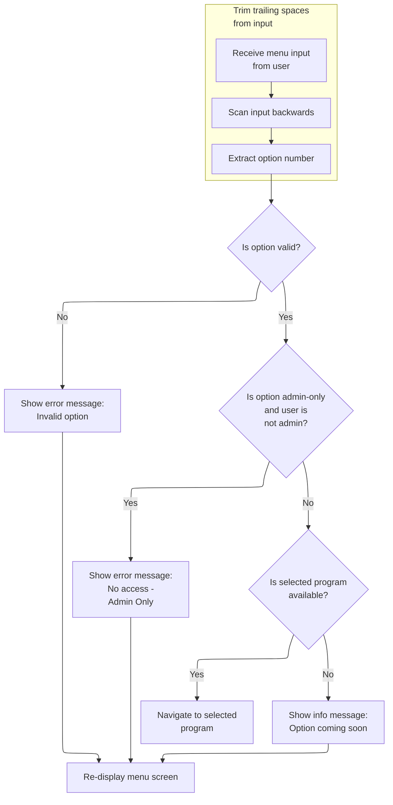
```mermaid
%%{init: {"flowchart": {"defaultRenderer": "elk"}} }%%
flowchart TD
    node1["Receive menu input 
 from user"]
    click node1 openCode "app/cbl/COMEN01C.cbl:199:207"
    subgraph loop1["Trim trailing spaces 
 from input"]
        node1 --> node2["Scan input backwards"]
        click node2 openCode "app/cbl/COMEN01C.cbl:117:121"
        node2 --> node3["Extract option number"]
        click node3 openCode "app/cbl/COMEN01C.cbl:122:124"
    end
    node3 --> node4{"Is option valid?"}
    click node4 openCode "app/cbl/COMEN01C.cbl:127:134"
    node4 -->|"No"| node5["Show error message: 
 Invalid option"]
    click node5 openCode "app/cbl/COMEN01C.cbl:130:133"
    node5 --> node11["Re-display menu screen"]
    click node11 openCode "app/cbl/COMEN01C.cbl:133:134"
    node4 -->|"Yes"| node6{"Is option admin-only 
 and user is 
 not admin?"}
    click node6 openCode "app/cbl/COMEN01C.cbl:136:143"
    node6 -->|"Yes"| node7["Show error message: 
 No access - 
 Admin Only"]
    click node7 openCode "app/cbl/COMEN01C.cbl:138:143"
    node7 --> node11
    node6 -->|"No"| node8{"Is selected program 
 available?"}
    click node8 openCode "app/cbl/COMEN01C.cbl:146:156"
    node8 -->|"Yes"| node9["Navigate to selected 
 program"]
    click node9 openCode "app/cbl/COMEN01C.cbl:147:155"
    node8 -->|"No"| node10["Show info message: 
 Option coming soon"]
    click node10 openCode "app/cbl/COMEN01C.cbl:157:164"
    node10 --> node11

classDef HeadingStyle fill:#777777,stroke:#333,stroke-width:2px;
```

This section manages the main menu input handling, validating user selections, enforcing access controls, and determining whether to launch a program or display an appropriate message to the user.

| Rule ID | Code Location     | Category        | Rule Name                       | Description                                                                                                                                                                     | Conditions                                                                                           | Remarks                                                                                                                                                                                                                                                                                               |
| ------- | ----------------- | --------------- | ------------------------------- | ------------------------------------------------------------------------------------------------------------------------------------------------------------------------------- | ---------------------------------------------------------------------------------------------------- | ----------------------------------------------------------------------------------------------------------------------------------------------------------------------------------------------------------------------------------------------------------------------------------------------------- |
| BR-001  | PROCESS-ENTER-KEY | Data validation | Menu option validation          | If the entered menu option is not numeric, is greater than the maximum allowed option count, or is zero, an error message is displayed and the menu screen is re-shown.         | The entered option is not numeric, or is greater than the value of CDEMO-MENU-OPT-COUNT, or is zero. | CDEMO-MENU-OPT-COUNT is the constant representing the maximum valid menu option number. The error message displayed is 'Please enter a valid option number...'. The output message is a string up to 80 characters, left-aligned, padded with spaces if shorter.                                      |
| BR-002  | PROCESS-ENTER-KEY | Data validation | Admin-only option restriction   | If a non-admin user selects an admin-only menu option, an error message is displayed and the menu screen is re-shown.                                                           | The user type is 'U' (non-admin) and the selected option is marked as admin-only ('A').              | User type 'U' represents a standard user, while 'A' represents admin. The error message displayed is 'No access - Admin Only option... '. The output message is a string up to 80 characters, left-aligned, padded with spaces if shorter.                                                            |
| BR-003  | PROCESS-ENTER-KEY | Business logic  | Program navigation              | If the selected menu option corresponds to a program that is available (not marked as 'DUMMY'), the user is navigated to that program.                                          | The error flag is not set and the selected program name does not start with 'DUMMY'.                 | Program names are strings of up to 8 characters. The navigation is performed via XCTL to the selected program, passing the communication area.                                                                                                                                                        |
| BR-004  | PROCESS-ENTER-KEY | Business logic  | Unavailable option notification | If the selected menu option corresponds to a program that is not yet available (marked as 'DUMMY'), an informational message is displayed indicating the option is coming soon. | The error flag is not set and the selected program name starts with 'DUMMY'.                         | Program names are strings of up to 8 characters. The informational message displayed is 'This option <option name> is coming soon ...', where <option name> is the name of the selected menu option. The output message is a string up to 80 characters, left-aligned, padded with spaces if shorter. |

<SwmSnippet path="/app/cbl/COMEN01C.cbl" line="199" repo-id="Z2l0aHViJTNBJTNBa3luZHJ5bC1hd3MtbWFpbmZyYW1lLW1vZGVybml6YXRpb24tY2FyZGRlbW8lM0ElM0FTd2ltbS1EZW1v">

---

`RECEIVE-MENU-SCREEN` gets the main menu input from the terminal using the map and mapset, and stores the response codes for error handling.

```cobol
       RECEIVE-MENU-SCREEN.

           EXEC CICS RECEIVE
                     MAP('COMEN1A')
                     MAPSET('COMEN01')
                     INTO(COMEN1AI)
                     RESP(WS-RESP-CD)
                     RESP2(WS-REAS-CD)
           END-EXEC.
```

---

</SwmSnippet>

<SwmSnippet path="/app/cbl/COMEN01C.cbl" line="115" repo-id="Z2l0aHViJTNBJTNBa3luZHJ5bC1hd3MtbWFpbmZyYW1lLW1vZGVybml6YXRpb24tY2FyZGRlbW8lM0ElM0FTd2ltbS1EZW1v">

---

`PROCESS-ENTER-KEY` trims and zero-fills the input, validates the option, checks user type for access, and either jumps to the selected program or shows a message if the option is invalid or not implemented.

```cobol
       PROCESS-ENTER-KEY.

           PERFORM VARYING WS-IDX
                   FROM LENGTH OF OPTIONI OF COMEN1AI BY -1 UNTIL
                   OPTIONI OF COMEN1AI(WS-IDX:1) NOT = SPACES OR
                   WS-IDX = 1
           END-PERFORM
           MOVE OPTIONI OF COMEN1AI(1:WS-IDX) TO WS-OPTION-X
           INSPECT WS-OPTION-X REPLACING ALL ' ' BY '0'
           MOVE WS-OPTION-X              TO WS-OPTION
           MOVE WS-OPTION                TO OPTIONO OF COMEN1AO

           IF WS-OPTION IS NOT NUMERIC OR
              WS-OPTION > CDEMO-MENU-OPT-COUNT OR
              WS-OPTION = ZEROS
               MOVE 'Y'     TO WS-ERR-FLG
               MOVE 'Please enter a valid option number...' TO
                               WS-MESSAGE
               PERFORM SEND-MENU-SCREEN
           END-IF

           IF CDEMO-USRTYP-USER AND
              CDEMO-MENU-OPT-USRTYPE(WS-OPTION) = 'A'
               SET ERR-FLG-ON          TO TRUE
               MOVE SPACES             TO WS-MESSAGE
               MOVE 'No access - Admin Only option... ' TO
                                       WS-MESSAGE
               PERFORM SEND-MENU-SCREEN
           END-IF

           IF NOT ERR-FLG-ON
               IF CDEMO-MENU-OPT-PGMNAME(WS-OPTION)(1:5) NOT = 'DUMMY'
                   MOVE WS-TRANID    TO CDEMO-FROM-TRANID
                   MOVE WS-PGMNAME   TO CDEMO-FROM-PROGRAM
      *            MOVE WS-USER-ID   TO CDEMO-USER-ID
      *            MOVE SEC-USR-TYPE TO CDEMO-USER-TYPE
                   MOVE ZEROS        TO CDEMO-PGM-CONTEXT
                   EXEC CICS
                       XCTL PROGRAM(CDEMO-MENU-OPT-PGMNAME(WS-OPTION))
                       COMMAREA(CARDDEMO-COMMAREA)
                   END-EXEC
               END-IF
               MOVE SPACES             TO WS-MESSAGE
               MOVE DFHGREEN           TO ERRMSGC  OF COMEN1AO
               STRING 'This option '       DELIMITED BY SIZE
                       CDEMO-MENU-OPT-NAME(WS-OPTION)
                                       DELIMITED BY SPACE
                       'is coming soon ...'   DELIMITED BY SIZE
                  INTO WS-MESSAGE
               PERFORM SEND-MENU-SCREEN
           END-IF.
```

---

</SwmSnippet>

## Handling Post-Return Logic and Transaction Selection

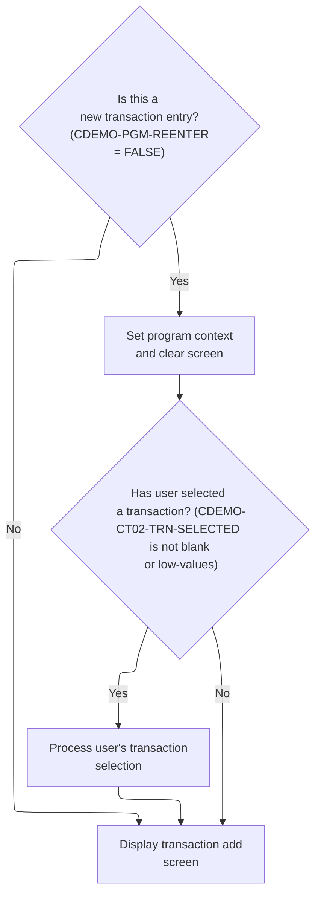
```mermaid
%%{init: {"flowchart": {"defaultRenderer": "elk"}} }%%
flowchart TD
    node2{"Is this a 
 new transaction entry? 
 (CDEMO-PGM-REENTER = FALSE)"}
    click node2 openCode "app/cbl/COTRN02C.cbl:120:121"
    node2 -->|"Yes"| node3["Set program context 
 and clear screen"]
    click node3 openCode "app/cbl/COTRN02C.cbl:121:123"
    node3 --> node4{"Has user selected 
 a transaction? (CDEMO-CT02-TRN-SELECTED 
 is not blank 
 or low-values)"}
    click node4 openCode "app/cbl/COTRN02C.cbl:124:128"
    node4 -->|"Yes"| node5["Process user's transaction 
 selection"]
    click node5 openCode "app/cbl/COTRN02C.cbl:128:129"
    node4 -->|"No"| node6["Display transaction add 
 screen"]
    node5 --> node6
    node2 -->|"No"| node6["Display transaction add 
 screen"]
    click node6 openCode "app/cbl/COTRN02C.cbl:130:130"

classDef HeadingStyle fill:#777777,stroke:#333,stroke-width:2px;
```

This section manages the logic for handling user entry and reentry into the transaction flow, determining whether to process a selected transaction or display the transaction add screen based on user context and selection.

| Rule ID | Code Location | Category        | Rule Name                              | Description                                                                                                                                                                                                                                                                   | Conditions                                                                   | Remarks                                                                                                                                                                                                                                                                             |
| ------- | ------------- | --------------- | -------------------------------------- | ----------------------------------------------------------------------------------------------------------------------------------------------------------------------------------------------------------------------------------------------------------------------------- | ---------------------------------------------------------------------------- | ----------------------------------------------------------------------------------------------------------------------------------------------------------------------------------------------------------------------------------------------------------------------------------- |
| BR-001  | MAIN-PARA     | Data validation | Transaction selection validation       | A transaction selection is considered valid only if the selection field is neither blank nor filled with low-values. If a valid selection is present during first entry, the system processes the transaction immediately.                                                    | The transaction selection field is not blank and not filled with low-values. | Blank is defined as all spaces; low-values is the lowest possible value for the field. The selection field must contain a valid transaction identifier to be processed.                                                                                                             |
| BR-002  | MAIN-PARA     | Business logic  | First entry transaction handling       | When the user enters the transaction flow for the first time, the system prepares the screen for a new transaction entry. If the user has already selected a transaction, the system processes that selection immediately; otherwise, it displays the transaction add screen. | The program context indicates a first entry (not reentry).                   | The program context for first entry is defined as CDEMO-PGM-REENTER = FALSE (CDEMO-PGM-CONTEXT = 0). Transaction selection is considered present if the selection field is not blank or filled with low-values. The transaction add screen is displayed if no selection is present. |
| BR-003  | MAIN-PARA     | Business logic  | Reentry transaction add screen display | If the user is re-entering the transaction flow, the system displays the transaction add screen without processing any transaction selection.                                                                                                                                 | The program context indicates reentry (CDEMO-PGM-REENTER = TRUE).            | Reentry is defined as CDEMO-PGM-REENTER = TRUE (CDEMO-PGM-CONTEXT = 1). The transaction add screen is always displayed in this case.                                                                                                                                                |

<SwmSnippet path="/app/cbl/COTRN02C.cbl" line="118" repo-id="Z2l0aHViJTNBJTNBa3luZHJ5bC1hd3MtbWFpbmZyYW1lLW1vZGVybml6YXRpb24tY2FyZGRlbW8lM0ElM0FTd2ltbS1EZW1v">

---

Back in MAIN-PARA after RETURN-TO-PREV-SCREEN, we check if this is a first entry or reentry using CDEMO-PGM-REENTER. On first entry, we prep the screen and, if a transaction is selected, call PROCESS-ENTER-KEY to handle it right away. Otherwise, we just send the transaction add screen.

```cobol
           ELSE
               MOVE DFHCOMMAREA(1:EIBCALEN) TO CARDDEMO-COMMAREA
               IF NOT CDEMO-PGM-REENTER
                   SET CDEMO-PGM-REENTER    TO TRUE
                   MOVE LOW-VALUES          TO COTRN2AO
                   MOVE -1       TO ACTIDINL OF COTRN2AI
                   IF CDEMO-CT02-TRN-SELECTED NOT =
                                              SPACES AND LOW-VALUES
                       MOVE CDEMO-CT02-TRN-SELECTED TO
                            CARDNINI OF COTRN2AI
                       PERFORM PROCESS-ENTER-KEY
                   END-IF
                   PERFORM SEND-TRNADD-SCREEN
```

---

</SwmSnippet>

## Handling Transaction Input and Confirmation

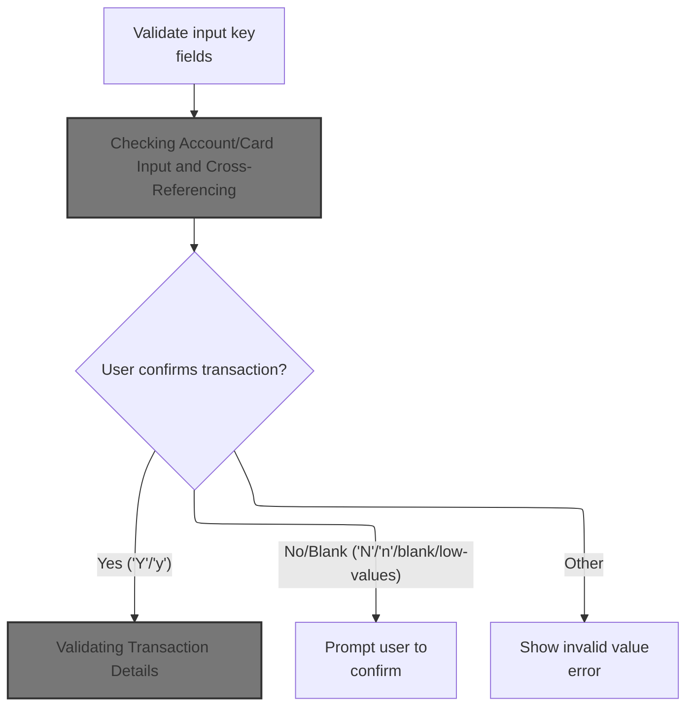
```mermaid
%%{init: {"flowchart": {"defaultRenderer": "elk"}} }%%
flowchart TD
    node1["Validate input key 
 fields"]
    click node1 openCode "app/cbl/COTRN02C.cbl:164:167"
    node1 --> node2["Checking Account/Card Input and Cross-Referencing"]
    
    node2 --> node3{"User confirms transaction?"}
    click node3 openCode "app/cbl/COTRN02C.cbl:169:188"
    node3 -->|"Yes ('Y'/'y')"| node4["Validating Transaction Details"]
    
    node3 -->|"No/Blank ('N'/'n'/blank/low-values)"| node5["Prompt user to 
 confirm"]
    click node5 openCode "app/cbl/COTRN02C.cbl:177:181"
    node3 -->|"Other"| node6["Show invalid value 
 error"]
    click node6 openCode "app/cbl/COTRN02C.cbl:183:187"
classDef HeadingStyle fill:#777777,stroke:#333,stroke-width:2px;
click node2 goToHeading "Checking Account/Card Input and Cross-Referencing"
node2:::HeadingStyle
click node4 goToHeading "Validating Transaction Details"
node4:::HeadingStyle
click node2 goToHeading "Checking Account/Card Input and Cross-Referencing"
node2:::HeadingStyle
click node4 goToHeading "Validating Transaction Details"
node4:::HeadingStyle
```

This section manages the validation of transaction input fields and user confirmation, ensuring only valid transactions are processed and users are prompted or notified of errors as appropriate.

| Rule ID | Code Location     | Category        | Rule Name                               | Description                                                                                                                                                                                                | Conditions                                                                    | Remarks                                                                                                                                                    |
| ------- | ----------------- | --------------- | --------------------------------------- | ---------------------------------------------------------------------------------------------------------------------------------------------------------------------------------------------------------- | ----------------------------------------------------------------------------- | ---------------------------------------------------------------------------------------------------------------------------------------------------------- |
| BR-001  | PROCESS-ENTER-KEY | Data validation | Key field precedence                    | Key fields (account number and card number) must be validated before any other transaction data is processed. If these fields are invalid, no further validation or processing occurs for the transaction. | When a transaction input is received.                                         | Account number is an 11-digit number; card number is a 16-digit number. Validation must occur before any other transaction data is checked.                |
| BR-002  | PROCESS-ENTER-KEY | Data validation | Conditional transaction data validation | Transaction data fields are validated only after key fields have passed validation. If key fields are invalid, transaction data validation does not occur.                                                 | After key fields have been validated and found valid.                         | Transaction data fields may include amount, date, and other details. These are validated only if key fields are valid.                                     |
| BR-003  | PROCESS-ENTER-KEY | Business logic  | Confirmation input handling             | User confirmation input must be either 'Y'/'y' to proceed with the transaction, 'N'/'n'/blank/low-values to prompt the user again, or any other value triggers an invalid value error.                     | When user confirmation input is received after validation.                    | Valid confirmation values: 'Y', 'y'. Prompt values: 'N', 'n', blank, low-values. Invalid values: any other input. Error message is set for invalid values. |
| BR-004  | PROCESS-ENTER-KEY | Error handling  | Invalid confirmation error              | If an invalid confirmation value is entered, an error message is displayed and the error flag is set.                                                                                                      | When user confirmation input is not 'Y', 'y', 'N', 'n', blank, or low-values. | Error flag is set to 'Y'. Error message is set to indicate invalid confirmation value.                                                                     |

<SwmSnippet path="/app/cbl/COTRN02C.cbl" line="164" repo-id="Z2l0aHViJTNBJTNBa3luZHJ5bC1hd3MtbWFpbmZyYW1lLW1vZGVybml6YXRpb24tY2FyZGRlbW8lM0ElM0FTd2ltbS1EZW1v">

---

In `PROCESS-ENTER-KEY`, we kick off by validating the key fields (account and card number) and then the rest of the transaction data. We call VALIDATE-INPUT-KEY-FIELDS first because if those are wrong, nothing else matters—no point in checking the rest. Only after both sets of validations pass do we even look at the confirmation input to decide if we add the transaction or prompt the user again.

```cobol
       PROCESS-ENTER-KEY.

           PERFORM VALIDATE-INPUT-KEY-FIELDS
           PERFORM VALIDATE-INPUT-DATA-FIELDS.
```

---

</SwmSnippet>

### Checking Account/Card Input and Cross-Referencing

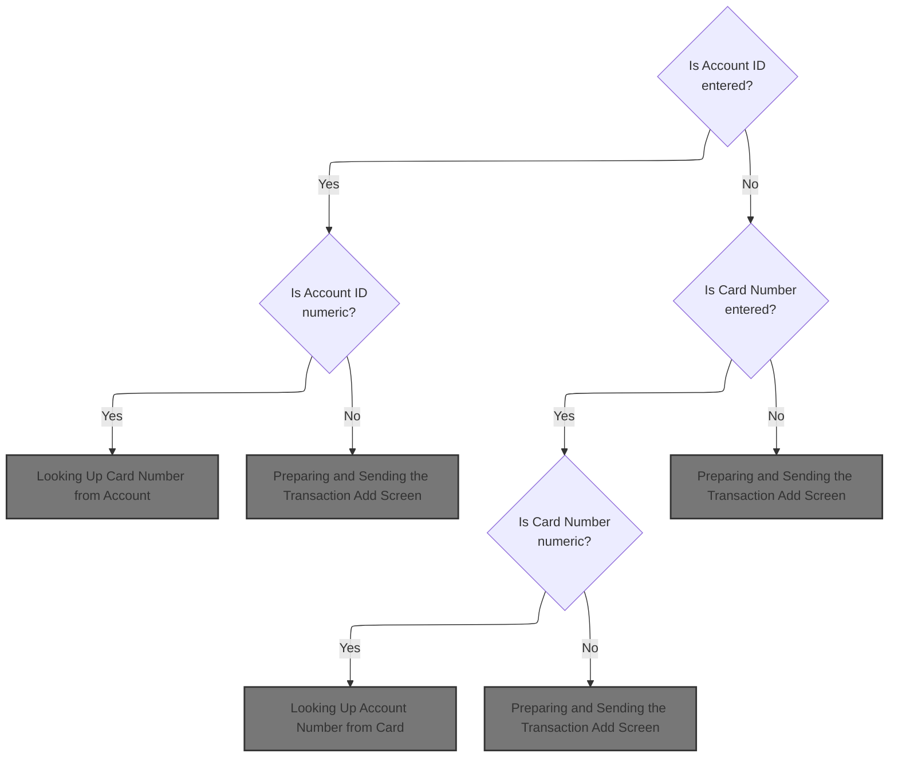
```mermaid
%%{init: {"flowchart": {"defaultRenderer": "elk"}} }%%
flowchart TD
    node1{"Is Account ID 
 entered?"}
    click node1 openCode "app/cbl/COTRN02C.cbl:195:196"
    node1 -->|"Yes"| node2{"Is Account ID 
 numeric?"}
    click node2 openCode "app/cbl/COTRN02C.cbl:197:197"
    node2 -->|"Yes"| node3["Looking Up Card Number from Account"]
    
    node2 -->|"No"| node4["Preparing and Sending the Transaction Add Screen"]
    
    node1 -->|"No"| node5{"Is Card Number 
 entered?"}
    click node5 openCode "app/cbl/COTRN02C.cbl:210:210"
    node5 -->|"Yes"| node6{"Is Card Number 
 numeric?"}
    click node6 openCode "app/cbl/COTRN02C.cbl:211:211"
    node6 -->|"Yes"| node7["Looking Up Account Number from Card"]
    
    node6 -->|"No"| node8["Preparing and Sending the Transaction Add Screen"]
    
    node5 -->|"No"| node9["Preparing and Sending the Transaction Add Screen"]
    

classDef HeadingStyle fill:#777777,stroke:#333,stroke-width:2px;
click node3 goToHeading "Looking Up Card Number from Account"
node3:::HeadingStyle
click node4 goToHeading "Preparing and Sending the Transaction Add Screen"
node4:::HeadingStyle
click node7 goToHeading "Looking Up Account Number from Card"
node7:::HeadingStyle
click node8 goToHeading "Preparing and Sending the Transaction Add Screen"
node8:::HeadingStyle
click node9 goToHeading "Preparing and Sending the Transaction Add Screen"
node9:::HeadingStyle
```

This section validates user input for account and card numbers, ensures at least one is provided and numeric, and cross-references the values to support transaction processing. Errors are handled by prompting the user to correct invalid input.

| Rule ID | Code Location             | Category        | Rule Name                                   | Description                                                                                                                                                                                         | Conditions                                                      | Remarks                                                                                                                                                                                                                            |
| ------- | ------------------------- | --------------- | ------------------------------------------- | --------------------------------------------------------------------------------------------------------------------------------------------------------------------------------------------------- | --------------------------------------------------------------- | ---------------------------------------------------------------------------------------------------------------------------------------------------------------------------------------------------------------------------------- |
| BR-001  | VALIDATE-INPUT-KEY-FIELDS | Data validation | Account ID Numeric Validation               | If the account ID is entered, it must contain only numeric characters. If it contains non-numeric characters, an error message is displayed and the user is prompted to correct the input.          | Account ID field is not blank or low-values.                    | Error message displayed: 'Account ID must be Numeric...'. The error flag is set to 'Y'. The account ID input field is reset to length -1. The transaction add screen is shown for user correction.                                 |
| BR-002  | VALIDATE-INPUT-KEY-FIELDS | Data validation | Card Number Numeric Validation              | If the card number is entered, it must contain only numeric characters. If it contains non-numeric characters, an error message is displayed and the user is prompted to correct the input.         | Card number field is not blank or low-values.                   | Error message displayed: 'Card Number must be Numeric...'. The error flag is set to 'Y'. The card number input field is reset to length -1. The transaction add screen is shown for user correction.                               |
| BR-003  | VALIDATE-INPUT-KEY-FIELDS | Data validation | Required Key Field Entry                    | If neither account ID nor card number is entered, the system displays the transaction add screen to prompt the user to enter at least one key field.                                                | Both account ID and card number fields are blank or low-values. | No error message is set, but the transaction add screen is displayed for user input.                                                                                                                                               |
| BR-004  | VALIDATE-INPUT-KEY-FIELDS | Business logic  | Account to Card Cross-Reference             | If the account ID is entered and is numeric, the system will look up the corresponding card number using the account-to-card cross-reference file.                                                  | Account ID field is present and numeric.                        | The account ID is converted from string to number using a numeric conversion function before lookup. The cross-referenced card number is retrieved and populated in the card number field.                                         |
| BR-005  | VALIDATE-INPUT-KEY-FIELDS | Business logic  | Card to Account Cross-Reference             | If the card number is entered and is numeric, the system will look up the corresponding account number using the card-to-account cross-reference file.                                              | Card number field is present and numeric.                       | The card number is converted from string to number using a numeric conversion function before lookup. The cross-referenced account number is retrieved and populated in the account ID field.                                      |
| BR-006  | VALIDATE-INPUT-KEY-FIELDS | Business logic  | String to Numeric Conversion for Key Fields | When converting account ID or card number input from string to numeric, the system uses a numeric conversion function to ensure the value is suitable for cross-referencing and further processing. | Account ID or card number field is present and numeric.         | Conversion uses a numeric conversion function to transform string input into a numeric value for lookup and processing. Account ID is converted to a number up to 11 digits; card number is converted to a number up to 16 digits. |

<SwmSnippet path="/app/cbl/COTRN02C.cbl" line="193" repo-id="Z2l0aHViJTNBJTNBa3luZHJ5bC1hd3MtbWFpbmZyYW1lLW1vZGVybml6YXRpb24tY2FyZGRlbW8lM0ElM0FTd2ltbS1EZW1v">

---

In `VALIDATE-INPUT-KEY-FIELDS`, we check if the user entered an account or card number, make sure it's numeric, and then cross-reference to get the other value. If the input is bad, we set an error and call SEND-TRNADD-SCREEN to show the user what went wrong and let them fix it.

```cobol
       VALIDATE-INPUT-KEY-FIELDS.

           EVALUATE TRUE
               WHEN ACTIDINI OF COTRN2AI NOT = SPACES AND LOW-VALUES
                   IF ACTIDINI OF COTRN2AI IS NOT NUMERIC
                       MOVE 'Y'     TO WS-ERR-FLG
                       MOVE 'Account ID must be Numeric...' TO
                                       WS-MESSAGE
                       MOVE -1       TO ACTIDINL OF COTRN2AI
                       PERFORM SEND-TRNADD-SCREEN
                   END-IF
                   COMPUTE WS-ACCT-ID-N = FUNCTION NUMVAL(ACTIDINI OF
                   COTRN2AI)
                   MOVE WS-ACCT-ID-N            TO XREF-ACCT-ID
                                                ACTIDINI OF COTRN2AI
                   PERFORM READ-CXACAIX-FILE
                   MOVE XREF-CARD-NUM         TO CARDNINI OF COTRN2AI
```

---

</SwmSnippet>

#### Preparing and Sending the Transaction Add Screen

This section prepares and sends the Transaction Add screen, ensuring users see up-to-date header information and any relevant messages, and that control is properly managed for continued workflow.

| Rule ID | Code Location        | Category       | Rule Name                     | Description                                                                                                                                                                                                                               | Conditions                                                                            | Remarks                                                                                                                                                                          |
| ------- | -------------------- | -------------- | ----------------------------- | ----------------------------------------------------------------------------------------------------------------------------------------------------------------------------------------------------------------------------------------- | ------------------------------------------------------------------------------------- | -------------------------------------------------------------------------------------------------------------------------------------------------------------------------------- |
| BR-001  | POPULATE-HEADER-INFO | Business logic | Header information display    | The Transaction Add screen header must display the current date and time, the screen titles, the transaction name, and the program name. This ensures that users always see accurate and contextual information at the top of the screen. | Whenever the Transaction Add screen is prepared for sending.                          | Date is displayed in MM-DD-YY format, time in HH-MM-SS format. Titles are alphanumeric strings. Transaction name is a 4-character string, program name is an 8-character string. |
| BR-002  | SEND-TRNADD-SCREEN   | Business logic | Message display               | Any message intended for the user, such as errors or informational notes, must be displayed in the designated message area of the Transaction Add screen.                                                                                 | Whenever a message is present for the user before sending the Transaction Add screen. | Message area is an 80-character alphanumeric string. If no message is present, the area is blank.                                                                                |
| BR-003  | SEND-TRNADD-SCREEN   | Business logic | Screen send and clear         | The Transaction Add screen must be sent to the user's terminal with the display cleared and the cursor positioned for user input.                                                                                                         | Whenever the Transaction Add screen is sent to the user.                              | Screen is sent with ERASE and CURSOR options to ensure a fresh display and ready for input.                                                                                      |
| BR-004  | SEND-TRNADD-SCREEN   | Business logic | Return control to transaction | After sending the Transaction Add screen, control must be returned to the transaction, allowing the user to continue with their workflow.                                                                                                 | After the Transaction Add screen is sent.                                             | Control is returned with the transaction ID and communication area preserved.                                                                                                    |

<SwmSnippet path="/app/cbl/COTRN02C.cbl" line="516" repo-id="Z2l0aHViJTNBJTNBa3luZHJ5bC1hd3MtbWFpbmZyYW1lLW1vZGVybml6YXRpb24tY2FyZGRlbW8lM0ElM0FTd2ltbS1EZW1v">

---

In `SEND-TRNADD-SCREEN`, we call POPULATE-HEADER-INFO to fill in the header fields (date, time, titles, etc.) before sending the screen. This makes sure the user sees all the context info up top.

```cobol
       SEND-TRNADD-SCREEN.

           PERFORM POPULATE-HEADER-INFO
```

---

</SwmSnippet>

<SwmSnippet path="/app/cbl/COTRN02C.cbl" line="552" repo-id="Z2l0aHViJTNBJTNBa3luZHJ5bC1hd3MtbWFpbmZyYW1lLW1vZGVybml6YXRpb24tY2FyZGRlbW8lM0ElM0FTd2ltbS1EZW1v">

---

`POPULATE-HEADER-INFO` grabs the current date and time, sets up the screen titles, and fills in the transaction and program names. It formats everything for display so the header is always up-to-date and clear.

```cobol
       POPULATE-HEADER-INFO.

           MOVE FUNCTION CURRENT-DATE  TO WS-CURDATE-DATA

           MOVE CCDA-TITLE01           TO TITLE01O OF COTRN2AO
           MOVE CCDA-TITLE02           TO TITLE02O OF COTRN2AO
           MOVE WS-TRANID              TO TRNNAMEO OF COTRN2AO
           MOVE WS-PGMNAME             TO PGMNAMEO OF COTRN2AO

           MOVE WS-CURDATE-MONTH       TO WS-CURDATE-MM
           MOVE WS-CURDATE-DAY         TO WS-CURDATE-DD
           MOVE WS-CURDATE-YEAR(3:2)   TO WS-CURDATE-YY

           MOVE WS-CURDATE-MM-DD-YY    TO CURDATEO OF COTRN2AO

           MOVE WS-CURTIME-HOURS       TO WS-CURTIME-HH
           MOVE WS-CURTIME-MINUTE      TO WS-CURTIME-MM
           MOVE WS-CURTIME-SECOND      TO WS-CURTIME-SS

           MOVE WS-CURTIME-HH-MM-SS    TO CURTIMEO OF COTRN2AO.
```

---

</SwmSnippet>

<SwmSnippet path="/app/cbl/COTRN02C.cbl" line="520" repo-id="Z2l0aHViJTNBJTNBa3luZHJ5bC1hd3MtbWFpbmZyYW1lLW1vZGVybml6YXRpb24tY2FyZGRlbW8lM0ElM0FTd2ltbS1EZW1v">

---

Back in SEND-TRNADD-SCREEN after filling the header, we move any message to the error field, send the screen to the terminal (clearing it first), and return control to the transaction. The user sees any errors or info right away.

```cobol
           MOVE WS-MESSAGE TO ERRMSGO OF COTRN2AO

           EXEC CICS SEND
                     MAP('COTRN2A')
                     MAPSET('COTRN02')
                     FROM(COTRN2AO)
                     ERASE
                     CURSOR
           END-EXEC.

           EXEC CICS RETURN
                     TRANSID (WS-TRANID)
                     COMMAREA (CARDDEMO-COMMAREA)
      *              LENGTH(LENGTH OF CARDDEMO-COMMAREA)
           END-EXEC.
```

---

</SwmSnippet>

#### Looking Up Card Number from Account

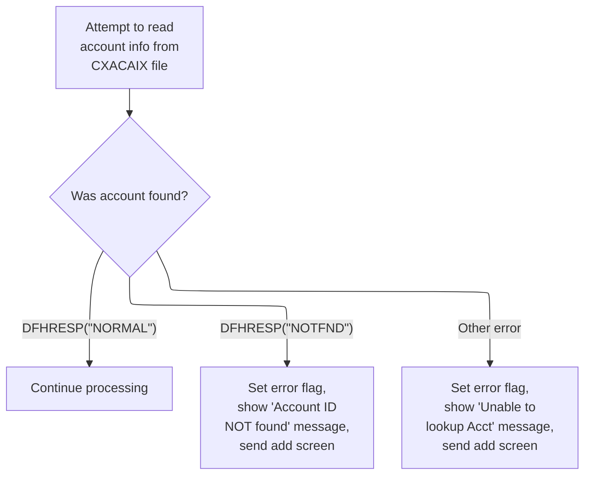
```mermaid
%%{init: {"flowchart": {"defaultRenderer": "elk"}} }%%
flowchart TD
    node1["Attempt to read 
 account info from 
 CXACAIX file"]
    click node1 openCode "app/cbl/COTRN02C.cbl:576:586"
    node1 --> node2{"Was account found?"}
    click node2 openCode "app/cbl/COTRN02C.cbl:588:604"
    node2 -->|"DFHRESP(#quot;NORMAL#quot;)"| node3["Continue processing"]
    click node3 openCode "app/cbl/COTRN02C.cbl:590:590"
    node2 -->|"DFHRESP(#quot;NOTFND#quot;)"| node4["Set error flag, 
 show 'Account ID 
 NOT found' message, 
 send add screen"]
    click node4 openCode "app/cbl/COTRN02C.cbl:592:596"
    node2 -->|"Other error"| node5["Set error flag, 
 show 'Unable to 
 lookup Acct' message, 
 send add screen"]
    click node5 openCode "app/cbl/COTRN02C.cbl:599:603"

classDef HeadingStyle fill:#777777,stroke:#333,stroke-width:2px;
```

This section governs the business logic for looking up a card number using an account ID, handling both successful and error scenarios for the user.

| Rule ID | Code Location     | Category       | Rule Name                    | Description                                                                                                                                                                                                   | Conditions                                                                                     | Remarks                                                                                                                                                                       |
| ------- | ----------------- | -------------- | ---------------------------- | ------------------------------------------------------------------------------------------------------------------------------------------------------------------------------------------------------------- | ---------------------------------------------------------------------------------------------- | ----------------------------------------------------------------------------------------------------------------------------------------------------------------------------- |
| BR-001  | READ-CXACAIX-FILE | Business logic | Successful account lookup    | If the account ID is found in the cross-reference file, processing continues without displaying an error message to the user.                                                                                 | The response code from the file read operation is DFHRESP(NORMAL).                             | No error message is displayed. The error flag remains 'N'. Processing continues as normal.                                                                                    |
| BR-002  | READ-CXACAIX-FILE | Error handling | Account not found error      | If the account ID is not found in the cross-reference file, an error flag is set, the message 'Account ID NOT found...' is displayed, and the user is prompted to add the account.                            | The response code from the file read operation is DFHRESP(NOTFND).                             | Error flag is set to 'Y'. Message displayed is 'Account ID NOT found...'. The input length for account ID is set to -1. The add screen is sent to the user.                   |
| BR-003  | READ-CXACAIX-FILE | Error handling | General account lookup error | If an error other than 'not found' occurs during the account lookup, an error flag is set, the message 'Unable to lookup Acct in XREF AIX file...' is displayed, and the user is prompted to add the account. | The response code from the file read operation is neither DFHRESP(NORMAL) nor DFHRESP(NOTFND). | Error flag is set to 'Y'. Message displayed is 'Unable to lookup Acct in XREF AIX file...'. The input length for account ID is set to -1. The add screen is sent to the user. |

<SwmSnippet path="/app/cbl/COTRN02C.cbl" line="576" repo-id="Z2l0aHViJTNBJTNBa3luZHJ5bC1hd3MtbWFpbmZyYW1lLW1vZGVybml6YXRpb24tY2FyZGRlbW8lM0ElM0FTd2ltbS1EZW1v">

---

In `READ-CXACAIX-FILE`, we use CICS to read the cross-reference file for the account ID. If the record isn't found, we handle the error right away and update the screen.

```cobol
       READ-CXACAIX-FILE.

           EXEC CICS READ
                DATASET   (WS-CXACAIX-FILE)
                INTO      (CARD-XREF-RECORD)
                LENGTH    (LENGTH OF CARD-XREF-RECORD)
                RIDFLD    (XREF-ACCT-ID)
                KEYLENGTH (LENGTH OF XREF-ACCT-ID)
                RESP      (WS-RESP-CD)
                RESP2     (WS-REAS-CD)
           END-EXEC
```

---

</SwmSnippet>

<SwmSnippet path="/app/cbl/COTRN02C.cbl" line="588" repo-id="Z2l0aHViJTNBJTNBa3luZHJ5bC1hd3MtbWFpbmZyYW1lLW1vZGVybml6YXRpb24tY2FyZGRlbW8lM0ElM0FTd2ltbS1EZW1v">

---

After reading the cross-reference file, we check the response code. If the account isn't found or there's another error, we set the error message and send the screen back so the user can correct their input.

```cobol
           EVALUATE WS-RESP-CD
               WHEN DFHRESP(NORMAL)
                   CONTINUE
               WHEN DFHRESP(NOTFND)
                   MOVE 'Y'     TO WS-ERR-FLG
                   MOVE 'Account ID NOT found...' TO
                                   WS-MESSAGE
                   MOVE -1       TO ACTIDINL OF COTRN2AI
                   PERFORM SEND-TRNADD-SCREEN
               WHEN OTHER
                   DISPLAY 'RESP:' WS-RESP-CD 'REAS:' WS-REAS-CD
                   MOVE 'Y'     TO WS-ERR-FLG
                   MOVE 'Unable to lookup Acct in XREF AIX file...' TO
                                   WS-MESSAGE
                   MOVE -1       TO ACTIDINL OF COTRN2AI
                   PERFORM SEND-TRNADD-SCREEN
           END-EVALUATE.
```

---

</SwmSnippet>

#### Cross-Referencing Card to Account

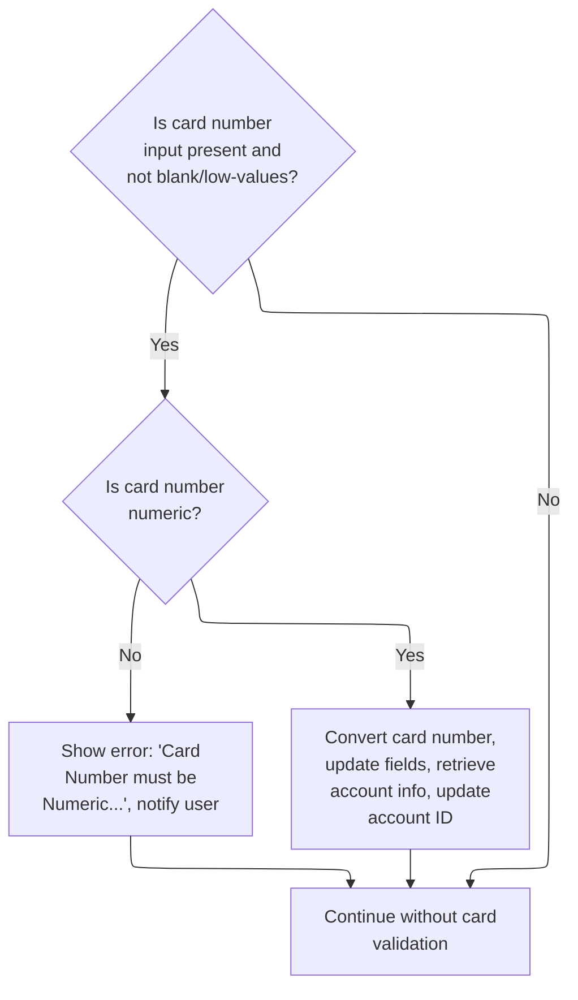
```mermaid
%%{init: {"flowchart": {"defaultRenderer": "elk"}} }%%
flowchart TD
  node1{"Is card number 
 input present and 
 not blank/low-values?"}
  click node1 openCode "app/cbl/COTRN02C.cbl:210:210"
  node1 -->|"No"| node2["Continue without card 
 validation"]
  click node2 openCode "app/cbl/COTRN02C.cbl:210:210"
  node1 -->|"Yes"| node3{"Is card number 
 numeric?"}
  click node3 openCode "app/cbl/COTRN02C.cbl:211:211"
  node3 -->|"No"| node4["Show error: 'Card 
 Number must be 
 Numeric...', notify user"]
  click node4 openCode "app/cbl/COTRN02C.cbl:212:216"
  node3 -->|"Yes"| node5["Convert card number, 
 update fields, retrieve 
 account info, update 
 account ID"]
  click node5 openCode "app/cbl/COTRN02C.cbl:218:223"
  node4 --> node2
  node5 --> node2
classDef HeadingStyle fill:#777777,stroke:#333,stroke-width:2px;
```

This section governs the process of validating a card number input, converting it to a numeric value, and cross-referencing it to retrieve and update the associated account information. It ensures that user input is properly validated and that errors are communicated clearly, supporting accurate and efficient data processing.

| Rule ID | Code Location             | Category        | Rule Name                               | Description                                                                                                                                                                                                                                                                     | Conditions                                                      | Remarks                                                                                                                                                                                                                                 |
| ------- | ------------------------- | --------------- | --------------------------------------- | ------------------------------------------------------------------------------------------------------------------------------------------------------------------------------------------------------------------------------------------------------------------------------- | --------------------------------------------------------------- | --------------------------------------------------------------------------------------------------------------------------------------------------------------------------------------------------------------------------------------- |
| BR-001  | VALIDATE-INPUT-KEY-FIELDS | Data validation | Card number numeric validation          | If a card number is provided and is not blank or filled with low-values, the system will validate whether the card number is numeric. If the card number is not numeric, an error message is displayed to the user and further processing is halted for this input.             | A card number is present and not blank or low-values.           | The error message shown is 'Card Number must be Numeric...'. The error flag is set to 'Y'. The card number field is set to -1 to indicate invalid input. The error message is displayed to the user.                                    |
| BR-002  | VALIDATE-INPUT-KEY-FIELDS | Data validation | Card number optional input              | If no card number is provided (blank or low-values), the system continues processing without attempting card validation or cross-referencing, relying on other available input fields.                                                                                          | Card number field is blank or contains low-values.              | No error is triggered and no card validation or cross-referencing is performed. The system proceeds with other available input fields.                                                                                                  |
| BR-003  | VALIDATE-INPUT-KEY-FIELDS | Business logic  | Card to account cross-reference         | When a valid numeric card number is provided, the system converts the card number from a string to a numeric value for processing, updates the relevant fields, retrieves the associated account information, and updates the account ID field with the cross-referenced value. | A card number is present, not blank/low-values, and is numeric. | The card number is converted using a string-to-number conversion. The account ID is retrieved and updated in the output fields. The card number field is 16 characters (alphanumeric), and the account ID field is 11 digits (numeric). |
| BR-004  | VALIDATE-INPUT-KEY-FIELDS | Business logic  | Card number string-to-number conversion | The system converts the card number from a string to a numeric value before processing, ensuring that numeric operations and cross-referencing are performed on valid data types.                                                                                               | Card number is present and numeric.                             | Conversion is performed using a string-to-number function. The output is a numeric value suitable for further processing and cross-referencing.                                                                                         |

<SwmSnippet path="/app/cbl/COTRN02C.cbl" line="210" repo-id="Z2l0aHViJTNBJTNBa3luZHJ5bC1hd3MtbWFpbmZyYW1lLW1vZGVybml6YXRpb24tY2FyZGRlbW8lM0ElM0FTd2ltbS1EZW1v">

---

Back in VALIDATE-INPUT-KEY-FIELDS after reading the account cross-ref, if the user gave us a card number instead, we validate and cross-reference it by reading the card file. This way, we always end up with both fields filled in, no matter what the user started with.

```cobol
               WHEN CARDNINI OF COTRN2AI NOT = SPACES AND LOW-VALUES
                   IF CARDNINI OF COTRN2AI IS NOT NUMERIC
                       MOVE 'Y'     TO WS-ERR-FLG
                       MOVE 'Card Number must be Numeric...' TO
                                       WS-MESSAGE
                       MOVE -1       TO CARDNINL OF COTRN2AI
                       PERFORM SEND-TRNADD-SCREEN
                   END-IF
                   COMPUTE WS-CARD-NUM-N = FUNCTION NUMVAL(CARDNINI OF
                   COTRN2AI)
                   MOVE WS-CARD-NUM-N        TO XREF-CARD-NUM
                                                CARDNINI OF COTRN2AI
                   PERFORM READ-CCXREF-FILE
                   MOVE XREF-ACCT-ID         TO ACTIDINI OF COTRN2AI
```

---

</SwmSnippet>

#### Looking Up Account Number from Card

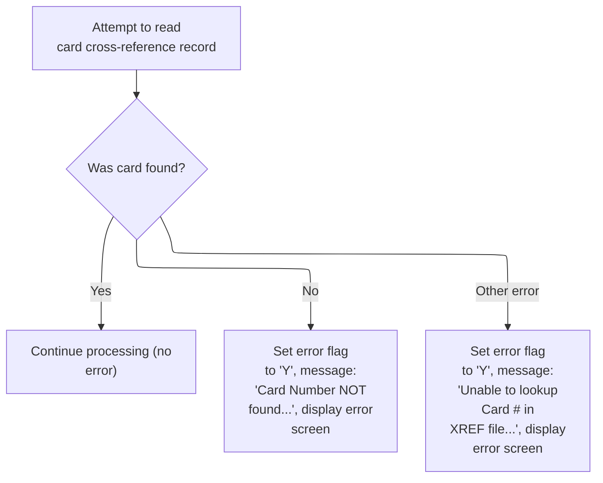
```mermaid
%%{init: {"flowchart": {"defaultRenderer": "elk"}} }%%
flowchart TD
    node1["Attempt to read 
 card cross-reference record"] --> node2{"Was card found?"}
    click node1 openCode "app/cbl/COTRN02C.cbl:611:619"
    node2 -->|"Yes"| node3["Continue processing (no 
 error)"]
    click node2 openCode "app/cbl/COTRN02C.cbl:621:637"
    node2 -->|"No"| node4["Set error flag 
 to 'Y', message: 
 'Card Number NOT 
 found...', display error 
 screen"]
    node2 -->|"Other error"| node5["Set error flag 
 to 'Y', message: 
 'Unable to lookup 
 Card # in 
 XREF file...', display 
 error screen"]
    click node3 openCode "app/cbl/COTRN02C.cbl:623:623"
    click node4 openCode "app/cbl/COTRN02C.cbl:625:629"
    click node5 openCode "app/cbl/COTRN02C.cbl:632:636"
classDef HeadingStyle fill:#777777,stroke:#333,stroke-width:2px;
```

This section governs the business logic and error handling for looking up an account number using a card number, ensuring appropriate user feedback for successful lookups and error scenarios.

| Rule ID | Code Location    | Category       | Rule Name                 | Description                                                                                                                                                                          | Conditions                                                                             | Remarks                                                                                                                                                                         |
| ------- | ---------------- | -------------- | ------------------------- | ------------------------------------------------------------------------------------------------------------------------------------------------------------------------------------ | -------------------------------------------------------------------------------------- | ------------------------------------------------------------------------------------------------------------------------------------------------------------------------------- |
| BR-001  | READ-CCXREF-FILE | Business logic | Successful card lookup    | If the card number is found in the cross-reference file, processing continues without displaying an error to the user.                                                               | The response code from the cross-reference file read is 'NORMAL'.                      | No error flag is set. No message is displayed to the user. The process continues as normal.                                                                                     |
| BR-002  | READ-CCXREF-FILE | Error handling | Card not found error      | If the card number is not found in the cross-reference file, an error flag is set, a message 'Card Number NOT found...' is displayed, and the error screen is shown to the user.     | The response code from the cross-reference file read is 'NOTFND'.                      | Error flag is set to 'Y'. Message displayed is 'Card Number NOT found...'. The error screen is triggered. The message format is a string of up to 80 characters.                |
| BR-003  | READ-CCXREF-FILE | Error handling | General card lookup error | If any other error occurs during the card lookup, an error flag is set, a message 'Unable to lookup Card # in XREF file...' is displayed, and the error screen is shown to the user. | The response code from the cross-reference file read is neither 'NORMAL' nor 'NOTFND'. | Error flag is set to 'Y'. Message displayed is 'Unable to lookup Card # in XREF file...'. The error screen is triggered. The message format is a string of up to 80 characters. |

<SwmSnippet path="/app/cbl/COTRN02C.cbl" line="609" repo-id="Z2l0aHViJTNBJTNBa3luZHJ5bC1hd3MtbWFpbmZyYW1lLW1vZGVybml6YXRpb24tY2FyZGRlbW8lM0ElM0FTd2ltbS1EZW1v">

---

In `READ-CCXREF-FILE`, we use CICS to read the cross-reference file for the card number. If the record isn't found, we handle the error right away and update the screen.

```cobol
       READ-CCXREF-FILE.

           EXEC CICS READ
                DATASET   (WS-CCXREF-FILE)
                INTO      (CARD-XREF-RECORD)
                LENGTH    (LENGTH OF CARD-XREF-RECORD)
                RIDFLD    (XREF-CARD-NUM)
                KEYLENGTH (LENGTH OF XREF-CARD-NUM)
                RESP      (WS-RESP-CD)
                RESP2     (WS-REAS-CD)
           END-EXEC
```

---

</SwmSnippet>

<SwmSnippet path="/app/cbl/COTRN02C.cbl" line="621" repo-id="Z2l0aHViJTNBJTNBa3luZHJ5bC1hd3MtbWFpbmZyYW1lLW1vZGVybml6YXRpb24tY2FyZGRlbW8lM0ElM0FTd2ltbS1EZW1v">

---

After reading the card cross-reference file, we check the response code. If the card isn't found or there's another error, we set the error message and send the screen back so the user can correct their input.

```cobol
           EVALUATE WS-RESP-CD
               WHEN DFHRESP(NORMAL)
                   CONTINUE
               WHEN DFHRESP(NOTFND)
                   MOVE 'Y'     TO WS-ERR-FLG
                   MOVE 'Card Number NOT found...' TO
                                   WS-MESSAGE
                   MOVE -1       TO CARDNINL OF COTRN2AI
                   PERFORM SEND-TRNADD-SCREEN
               WHEN OTHER
                   DISPLAY 'RESP:' WS-RESP-CD 'REAS:' WS-REAS-CD
                   MOVE 'Y'     TO WS-ERR-FLG
                   MOVE 'Unable to lookup Card # in XREF file...' TO
                                   WS-MESSAGE
                   MOVE -1       TO CARDNINL OF COTRN2AI
                   PERFORM SEND-TRNADD-SCREEN
           END-EVALUATE.
```

---

</SwmSnippet>

#### Handling Missing Account/Card Input

This section ensures that users provide at least one of account number or card number before proceeding, and converts input strings to numeric values for validation.

| Rule ID | Code Location             | Category        | Rule Name                         | Description                                                                                                                                                                 | Conditions                                                                               | Remarks                                                                                                                                                                                     |
| ------- | ------------------------- | --------------- | --------------------------------- | --------------------------------------------------------------------------------------------------------------------------------------------------------------------------- | ---------------------------------------------------------------------------------------- | ------------------------------------------------------------------------------------------------------------------------------------------------------------------------------------------- |
| BR-001  | VALIDATE-INPUT-KEY-FIELDS | Data validation | Required account or card input    | If neither account number nor card number is entered by the user, an error message is displayed and the user cannot proceed until at least one of these fields is provided. | Both account number and card number fields are empty or contain only non-numeric values. | The error message displayed is: 'Account or Card Number must be entered...'. The error flag is set to 'Y'. The screen is returned for user correction.                                      |
| BR-002  | VALIDATE-INPUT-KEY-FIELDS | Business logic  | Input string-to-number conversion | User-entered account number and card number fields are converted from string format to numeric format before validation and processing.                                     | User enters account number or card number as a string in the input fields.               | Input fields may contain numeric strings. These are converted to numeric values for validation and further processing. If the string is not a valid number, the conversion results in zero. |

<SwmSnippet path="/app/cbl/COTRN02C.cbl" line="224" repo-id="Z2l0aHViJTNBJTNBa3luZHJ5bC1hd3MtbWFpbmZyYW1lLW1vZGVybml6YXRpb24tY2FyZGRlbW8lM0ElM0FTd2ltbS1EZW1v">

---

Back in VALIDATE-INPUT-KEY-FIELDS after the cross-ref lookups, if neither account nor card number is entered, we set an error and send the screen back. The user can't proceed without at least one of these fields.

```cobol
               WHEN OTHER
                   MOVE 'Y'     TO WS-ERR-FLG
                   MOVE 'Account or Card Number must be entered...' TO
                                   WS-MESSAGE
                   MOVE -1       TO ACTIDINL OF COTRN2AI
                   PERFORM SEND-TRNADD-SCREEN
           END-EVALUATE.
```

---

</SwmSnippet>

### Checking Transaction Data Fields


```mermaid
%%{init: {"flowchart": {"defaultRenderer": "elk"}} }%%
flowchart TD
    node1["Validate input key 
 fields"]
    click node1 openCode "app/cbl/COTRN02C.cbl:164:167"
    node1 --> node2["Checking Account/Card Input and Cross-Referencing"]
    
    node2 --> node3{"User confirms transaction?"}
    click node3 openCode "app/cbl/COTRN02C.cbl:169:188"
    node3 -->|"Yes ('Y'/'y')"| node4["Validating Transaction Details"]
    
    node3 -->|"No/Blank ('N'/'n'/blank/low-values)"| node5["Prompt user to 
 confirm"]
    click node5 openCode "app/cbl/COTRN02C.cbl:177:181"
    node3 -->|"Other"| node6["Show invalid value 
 error"]
    click node6 openCode "app/cbl/COTRN02C.cbl:183:187"
classDef HeadingStyle fill:#777777,stroke:#333,stroke-width:2px;
click node2 goToHeading "Checking Account/Card Input and Cross-Referencing"
node2:::HeadingStyle
click node4 goToHeading "Validating Transaction Details"
node4:::HeadingStyle
click node2 goToHeading "Checking Account/Card Input and Cross-Referencing"
node2:::HeadingStyle
click node4 goToHeading "Validating Transaction Details"
node4:::HeadingStyle
```

This section manages the validation of transaction input fields and user confirmation, ensuring only valid transactions are processed and users are prompted or notified of errors as appropriate.

| Rule ID | Code Location     | Category        | Rule Name                               | Description                                                                                                                                                                                                | Conditions                                                                    | Remarks                                                                                                                                                    |
| ------- | ----------------- | --------------- | --------------------------------------- | ---------------------------------------------------------------------------------------------------------------------------------------------------------------------------------------------------------- | ----------------------------------------------------------------------------- | ---------------------------------------------------------------------------------------------------------------------------------------------------------- |
| BR-001  | PROCESS-ENTER-KEY | Data validation | Key field precedence                    | Key fields (account number and card number) must be validated before any other transaction data is processed. If these fields are invalid, no further validation or processing occurs for the transaction. | When a transaction input is received.                                         | Account number is an 11-digit number; card number is a 16-digit number. Validation must occur before any other transaction data is checked.                |
| BR-002  | PROCESS-ENTER-KEY | Data validation | Conditional transaction data validation | Transaction data fields are validated only after key fields have passed validation. If key fields are invalid, transaction data validation does not occur.                                                 | After key fields have been validated and found valid.                         | Transaction data fields may include amount, date, and other details. These are validated only if key fields are valid.                                     |
| BR-003  | PROCESS-ENTER-KEY | Business logic  | Confirmation input handling             | User confirmation input must be either 'Y'/'y' to proceed with the transaction, 'N'/'n'/blank/low-values to prompt the user again, or any other value triggers an invalid value error.                     | When user confirmation input is received after validation.                    | Valid confirmation values: 'Y', 'y'. Prompt values: 'N', 'n', blank, low-values. Invalid values: any other input. Error message is set for invalid values. |
| BR-004  | PROCESS-ENTER-KEY | Error handling  | Invalid confirmation error              | If an invalid confirmation value is entered, an error message is displayed and the error flag is set.                                                                                                      | When user confirmation input is not 'Y', 'y', 'N', 'n', blank, or low-values. | Error flag is set to 'Y'. Error message is set to indicate invalid confirmation value.                                                                     |

<SwmSnippet path="/app/cbl/COTRN02C.cbl" line="164" repo-id="Z2l0aHViJTNBJTNBa3luZHJ5bC1hd3MtbWFpbmZyYW1lLW1vZGVybml6YXRpb24tY2FyZGRlbW8lM0ElM0FTd2ltbS1EZW1v">

---

Back in PROCESS-ENTER-KEY after checking the key fields, we move on to validating the rest of the transaction data. If anything's wrong, we bail out and show the user the error right away.

```cobol
       PROCESS-ENTER-KEY.

           PERFORM VALIDATE-INPUT-KEY-FIELDS
           PERFORM VALIDATE-INPUT-DATA-FIELDS.
```

---

</SwmSnippet>

### Validating Transaction Details

This section validates transaction input fields to ensure all required information is present, correctly formatted, and ready for further processing. It provides immediate feedback to users when corrections are needed.

| Rule ID | Code Location              | Category        | Rule Name                 | Description                                                                                                                                                                                                                                           | Conditions                                                                                           | Remarks                                                                                                                                                                                      |
| ------- | -------------------------- | --------------- | ------------------------- | ----------------------------------------------------------------------------------------------------------------------------------------------------------------------------------------------------------------------------------------------------- | ---------------------------------------------------------------------------------------------------- | -------------------------------------------------------------------------------------------------------------------------------------------------------------------------------------------- |
| BR-001  | VALIDATE-INPUT-DATA-FIELDS | Data validation | Required field validation | If any required transaction field (Type CD, Category CD, Source, Description, Amount, Orig Date, Proc Date, Merchant ID, Merchant Name, Merchant City, Merchant Zip) is empty, an error is set and the user is prompted to fill in the missing field. | Any of the required fields is empty (contains only spaces or low-values).                            | Required fields: Type CD, Category CD, Source, Description, Amount, Orig Date, Proc Date, Merchant ID, Merchant Name, Merchant City, Merchant Zip. Empty is defined as spaces or low-values. |
| BR-002  | VALIDATE-INPUT-DATA-FIELDS | Data validation | Numeric field validation  | If Type CD or Category CD is not numeric, an error is set and the user is prompted to enter a numeric value.                                                                                                                                          | Type CD or Category CD contains non-numeric characters.                                              | Type CD and Category CD must be numeric values.                                                                                                                                              |
| BR-003  | VALIDATE-INPUT-DATA-FIELDS | Data validation | Amount format validation  | If the Amount field is not in the format -99999999.99 (sign, 8 digits, decimal point, 2 digits), an error is set and the user is prompted to correct the format.                                                                                      | Amount field does not match the required format: sign (+/-), 8 digits, decimal point, 2 digits.      | Amount format required: -99999999.99 (sign, 8 digits, decimal point, 2 digits).                                                                                                              |
| BR-004  | VALIDATE-INPUT-DATA-FIELDS | Data validation | Date format validation    | If Orig Date or Proc Date is not in the format YYYY-MM-DD, an error is set and the user is prompted to correct the format.                                                                                                                            | Orig Date or Proc Date does not match the required format: 4 digits, dash, 2 digits, dash, 2 digits. | Date format required: YYYY-MM-DD (4 digits, dash, 2 digits, dash, 2 digits).                                                                                                                 |
| BR-005  | VALIDATE-INPUT-DATA-FIELDS | Business logic  | Amount normalization      | After passing format checks, the Amount field is normalized by converting the currency-formatted string to a numeric value for further processing.                                                                                                    | Amount field passes format validation.                                                               | Normalization uses currency string-to-number conversion, handling currency symbols and formatting.                                                                                           |
| BR-006  | VALIDATE-INPUT-DATA-FIELDS | Business logic  | Date validity check       | After passing format checks, Orig Date is validated using an external date validation routine to ensure the date is valid beyond simple format checks.                                                                                                | Orig Date passes format validation.                                                                  | Date format used: 'YYYY-MM-DD'. External routine checks for valid calendar dates.                                                                                                            |

<SwmSnippet path="/app/cbl/COTRN02C.cbl" line="235" repo-id="Z2l0aHViJTNBJTNBa3luZHJ5bC1hd3MtbWFpbmZyYW1lLW1vZGVybml6YXRpb24tY2FyZGRlbW8lM0ElM0FTd2ltbS1EZW1v">

---

In `VALIDATE-INPUT-DATA-FIELDS`, we check every required field for emptiness and make sure the numeric fields are actually numbers. If anything's missing or wrong, we set an error and send the screen back with a message pointing to the problem.

```cobol
       VALIDATE-INPUT-DATA-FIELDS.

           IF ERR-FLG-ON
               MOVE SPACES      TO TTYPCDI  OF COTRN2AI
                                   TCATCDI  OF COTRN2AI
                                   TRNSRCI  OF COTRN2AI
                                   TRNAMTI  OF COTRN2AI
                                   TDESCI   OF COTRN2AI
                                   TORIGDTI OF COTRN2AI
                                   TPROCDTI OF COTRN2AI
                                   MIDI     OF COTRN2AI
                                   MNAMEI   OF COTRN2AI
                                   MCITYI   OF COTRN2AI
                                   MZIPI    OF COTRN2AI
           END-IF.
```

---

</SwmSnippet>

<SwmSnippet path="/app/cbl/COTRN02C.cbl" line="251" repo-id="Z2l0aHViJTNBJTNBa3luZHJ5bC1hd3MtbWFpbmZyYW1lLW1vZGVybml6YXRpb24tY2FyZGRlbW8lM0ElM0FTd2ltbS1EZW1v">

---

Here we check if the Type CD field is empty. If it is, we set an error, update the message, and send the screen back so the user can fill it in.

```cobol
           EVALUATE TRUE
               WHEN TTYPCDI OF COTRN2AI = SPACES OR LOW-VALUES
                   MOVE 'Y'     TO WS-ERR-FLG
                   MOVE 'Type CD can NOT be empty...' TO
                                   WS-MESSAGE
                   MOVE -1       TO TTYPCDL OF COTRN2AI
                   PERFORM SEND-TRNADD-SCREEN
```

---

</SwmSnippet>

<SwmSnippet path="/app/cbl/COTRN02C.cbl" line="258" repo-id="Z2l0aHViJTNBJTNBa3luZHJ5bC1hd3MtbWFpbmZyYW1lLW1vZGVybml6YXRpb24tY2FyZGRlbW8lM0ElM0FTd2ltbS1EZW1v">

---

Back in VALIDATE-INPUT-DATA-FIELDS, after sending the screen for a missing Type CD, we do the same check for Category CD. If it's empty, we set the error and send the screen again.

```cobol
               WHEN TCATCDI OF COTRN2AI = SPACES OR LOW-VALUES
                   MOVE 'Y'     TO WS-ERR-FLG
                   MOVE 'Category CD can NOT be empty...' TO
                                   WS-MESSAGE
                   MOVE -1       TO TCATCDL OF COTRN2AI
                   PERFORM SEND-TRNADD-SCREEN
```

---

</SwmSnippet>

<SwmSnippet path="/app/cbl/COTRN02C.cbl" line="264" repo-id="Z2l0aHViJTNBJTNBa3luZHJ5bC1hd3MtbWFpbmZyYW1lLW1vZGVybml6YXRpb24tY2FyZGRlbW8lM0ElM0FTd2ltbS1EZW1v">

---

After checking Category CD, we move on to Source. If that's empty, we set the error and send the screen back, just like before.

```cobol
               WHEN TRNSRCI OF COTRN2AI = SPACES OR LOW-VALUES
                   MOVE 'Y'     TO WS-ERR-FLG
                   MOVE 'Source can NOT be empty...' TO
                                   WS-MESSAGE
                   MOVE -1       TO TRNSRCL OF COTRN2AI
                   PERFORM SEND-TRNADD-SCREEN
```

---

</SwmSnippet>

<SwmSnippet path="/app/cbl/COTRN02C.cbl" line="270" repo-id="Z2l0aHViJTNBJTNBa3luZHJ5bC1hd3MtbWFpbmZyYW1lLW1vZGVybml6YXRpb24tY2FyZGRlbW8lM0ElM0FTd2ltbS1EZW1v">

---

After Source, we check Description. If that's empty, same deal: error, message, send the screen.

```cobol
               WHEN TDESCI OF COTRN2AI = SPACES OR LOW-VALUES
                   MOVE 'Y'     TO WS-ERR-FLG
                   MOVE 'Description can NOT be empty...' TO
                                   WS-MESSAGE
                   MOVE -1       TO TDESCL OF COTRN2AI
                   PERFORM SEND-TRNADD-SCREEN
```

---

</SwmSnippet>

<SwmSnippet path="/app/cbl/COTRN02C.cbl" line="276" repo-id="Z2l0aHViJTNBJTNBa3luZHJ5bC1hd3MtbWFpbmZyYW1lLW1vZGVybml6YXRpb24tY2FyZGRlbW8lM0ElM0FTd2ltbS1EZW1v">

---

Next up is Amount. If it's empty, we set the error and send the screen, just like the other fields.

```cobol
               WHEN TRNAMTI OF COTRN2AI = SPACES OR LOW-VALUES
                   MOVE 'Y'     TO WS-ERR-FLG
                   MOVE 'Amount can NOT be empty...' TO
                                   WS-MESSAGE
                   MOVE -1       TO TRNAMTL OF COTRN2AI
                   PERFORM SEND-TRNADD-SCREEN
```

---

</SwmSnippet>

<SwmSnippet path="/app/cbl/COTRN02C.cbl" line="282" repo-id="Z2l0aHViJTNBJTNBa3luZHJ5bC1hd3MtbWFpbmZyYW1lLW1vZGVybml6YXRpb24tY2FyZGRlbW8lM0ElM0FTd2ltbS1EZW1v">

---

Now we check Orig Date. If it's empty, we set the error and send the screen. Same pattern as before.

```cobol
               WHEN TORIGDTI OF COTRN2AI = SPACES OR LOW-VALUES
                   MOVE 'Y'     TO WS-ERR-FLG
                   MOVE 'Orig Date can NOT be empty...' TO
                                   WS-MESSAGE
                   MOVE -1       TO TORIGDTL OF COTRN2AI
                   PERFORM SEND-TRNADD-SCREEN
```

---

</SwmSnippet>

<SwmSnippet path="/app/cbl/COTRN02C.cbl" line="288" repo-id="Z2l0aHViJTNBJTNBa3luZHJ5bC1hd3MtbWFpbmZyYW1lLW1vZGVybml6YXRpb24tY2FyZGRlbW8lM0ElM0FTd2ltbS1EZW1v">

---

After Orig Date, we check Proc Date. If that's empty, we set the error and send the screen.

```cobol
               WHEN TPROCDTI OF COTRN2AI = SPACES OR LOW-VALUES
                   MOVE 'Y'     TO WS-ERR-FLG
                   MOVE 'Proc Date can NOT be empty...' TO
                                   WS-MESSAGE
                   MOVE -1       TO TPROCDTL OF COTRN2AI
                   PERFORM SEND-TRNADD-SCREEN
```

---

</SwmSnippet>

<SwmSnippet path="/app/cbl/COTRN02C.cbl" line="294" repo-id="Z2l0aHViJTNBJTNBa3luZHJ5bC1hd3MtbWFpbmZyYW1lLW1vZGVybml6YXRpb24tY2FyZGRlbW8lM0ElM0FTd2ltbS1EZW1v">

---

Now we check Merchant ID. If it's empty, we set the error and send the screen, just like the other fields.

```cobol
               WHEN MIDI OF COTRN2AI = SPACES OR LOW-VALUES
                   MOVE 'Y'     TO WS-ERR-FLG
                   MOVE 'Merchant ID can NOT be empty...' TO
                                   WS-MESSAGE
                   MOVE -1       TO MIDL OF COTRN2AI
                   PERFORM SEND-TRNADD-SCREEN
```

---

</SwmSnippet>

<SwmSnippet path="/app/cbl/COTRN02C.cbl" line="300" repo-id="Z2l0aHViJTNBJTNBa3luZHJ5bC1hd3MtbWFpbmZyYW1lLW1vZGVybml6YXRpb24tY2FyZGRlbW8lM0ElM0FTd2ltbS1EZW1v">

---

After Merchant ID, we check Merchant Name. If that's empty, we set the error and send the screen.

```cobol
               WHEN MNAMEI OF COTRN2AI = SPACES OR LOW-VALUES
                   MOVE 'Y'     TO WS-ERR-FLG
                   MOVE 'Merchant Name can NOT be empty...' TO
                                   WS-MESSAGE
                   MOVE -1       TO MNAMEL OF COTRN2AI
                   PERFORM SEND-TRNADD-SCREEN
```

---

</SwmSnippet>

<SwmSnippet path="/app/cbl/COTRN02C.cbl" line="306" repo-id="Z2l0aHViJTNBJTNBa3luZHJ5bC1hd3MtbWFpbmZyYW1lLW1vZGVybml6YXRpb24tY2FyZGRlbW8lM0ElM0FTd2ltbS1EZW1v">

---

After Merchant Name, we check Merchant City. If that's empty, we set the error and send the screen.

```cobol
               WHEN MCITYI OF COTRN2AI = SPACES OR LOW-VALUES
                   MOVE 'Y'     TO WS-ERR-FLG
                   MOVE 'Merchant City can NOT be empty...' TO
                                   WS-MESSAGE
                   MOVE -1       TO MCITYL OF COTRN2AI
                   PERFORM SEND-TRNADD-SCREEN
```

---

</SwmSnippet>

<SwmSnippet path="/app/cbl/COTRN02C.cbl" line="312" repo-id="Z2l0aHViJTNBJTNBa3luZHJ5bC1hd3MtbWFpbmZyYW1lLW1vZGVybml6YXRpb24tY2FyZGRlbW8lM0ElM0FTd2ltbS1EZW1v">

---

After Merchant City, we check Merchant Zip. If that's empty, we set the error and send the screen.

```cobol
               WHEN MZIPI OF COTRN2AI = SPACES OR LOW-VALUES
                   MOVE 'Y'     TO WS-ERR-FLG
                   MOVE 'Merchant Zip can NOT be empty...' TO
                                   WS-MESSAGE
                   MOVE -1       TO MZIPL OF COTRN2AI
                   PERFORM SEND-TRNADD-SCREEN
```

---

</SwmSnippet>

<SwmSnippet path="/app/cbl/COTRN02C.cbl" line="318" repo-id="Z2l0aHViJTNBJTNBa3luZHJ5bC1hd3MtbWFpbmZyYW1lLW1vZGVybml6YXRpb24tY2FyZGRlbW8lM0ElM0FTd2ltbS1EZW1v">

---

If none of the fields are empty, we continue to the next validation steps (numeric checks, format checks, etc.).

```cobol
               WHEN OTHER
                   CONTINUE
           END-EVALUATE.
```

---

</SwmSnippet>

<SwmSnippet path="/app/cbl/COTRN02C.cbl" line="322" repo-id="Z2l0aHViJTNBJTNBa3luZHJ5bC1hd3MtbWFpbmZyYW1lLW1vZGVybml6YXRpb24tY2FyZGRlbW8lM0ElM0FTd2ltbS1EZW1v">

---

Now we check if Type CD and Category CD are numeric. If not, we set the error and send the screen.

```cobol
           EVALUATE TRUE
               WHEN TTYPCDI OF COTRN2AI NOT NUMERIC
                   MOVE 'Y'     TO WS-ERR-FLG
                   MOVE 'Type CD must be Numeric...' TO
                                   WS-MESSAGE
                   MOVE -1       TO TTYPCDL OF COTRN2AI
                   PERFORM SEND-TRNADD-SCREEN
               WHEN TCATCDI OF COTRN2AI NOT NUMERIC
                   MOVE 'Y'     TO WS-ERR-FLG
                   MOVE 'Category CD must be Numeric...' TO
                                   WS-MESSAGE
                   MOVE -1       TO TCATCDL OF COTRN2AI
                   PERFORM SEND-TRNADD-SCREEN
               WHEN OTHER
                   CONTINUE
           END-EVALUATE
```

---

</SwmSnippet>

<SwmSnippet path="/app/cbl/COTRN02C.cbl" line="339" repo-id="Z2l0aHViJTNBJTNBa3luZHJ5bC1hd3MtbWFpbmZyYW1lLW1vZGVybml6YXRpb24tY2FyZGRlbW8lM0ElM0FTd2ltbS1EZW1v">

---

Now we validate the amount format. If it's not in the right format (-99999999.99), we set the error and send the screen.

```cobol
           EVALUATE TRUE
               WHEN TRNAMTI OF COTRN2AI(1:1) NOT EQUAL '-' AND '+'
               WHEN TRNAMTI OF COTRN2AI(2:8) NOT NUMERIC
               WHEN TRNAMTI OF COTRN2AI(10:1) NOT = '.'
               WHEN TRNAMTI OF COTRN2AI(11:2) IS NOT NUMERIC
                   MOVE 'Y'     TO WS-ERR-FLG
                   MOVE 'Amount should be in format -99999999.99' TO
                                   WS-MESSAGE
                   MOVE -1       TO TRNAMTL OF COTRN2AI
                   PERFORM SEND-TRNADD-SCREEN
               WHEN OTHER
                   CONTINUE
           END-EVALUATE
```

---

</SwmSnippet>

<SwmSnippet path="/app/cbl/COTRN02C.cbl" line="353" repo-id="Z2l0aHViJTNBJTNBa3luZHJ5bC1hd3MtbWFpbmZyYW1lLW1vZGVybml6YXRpb24tY2FyZGRlbW8lM0ElM0FTd2ltbS1EZW1v">

---

Now we check Orig Date for the right format. If it's not YYYY-MM-DD, we set the error and send the screen.

```cobol
           EVALUATE TRUE
               WHEN TORIGDTI OF COTRN2AI(1:4) IS NOT NUMERIC
               WHEN TORIGDTI OF COTRN2AI(5:1) NOT EQUAL '-'
               WHEN TORIGDTI OF COTRN2AI(6:2) NOT NUMERIC
               WHEN TORIGDTI OF COTRN2AI(8:1) NOT EQUAL '-'
               WHEN TORIGDTI OF COTRN2AI(9:2) NOT NUMERIC
                   MOVE 'Y'     TO WS-ERR-FLG
                   MOVE 'Orig Date should be in format YYYY-MM-DD' TO
                                   WS-MESSAGE
                   MOVE -1       TO TORIGDTL OF COTRN2AI
                   PERFORM SEND-TRNADD-SCREEN
               WHEN OTHER
                   CONTINUE
           END-EVALUATE
```

---

</SwmSnippet>

<SwmSnippet path="/app/cbl/COTRN02C.cbl" line="368" repo-id="Z2l0aHViJTNBJTNBa3luZHJ5bC1hd3MtbWFpbmZyYW1lLW1vZGVybml6YXRpb24tY2FyZGRlbW8lM0ElM0FTd2ltbS1EZW1v">

---

After Orig Date, we check Proc Date for the right format. If it's not YYYY-MM-DD, we set the error and send the screen.

```cobol
           EVALUATE TRUE
               WHEN TPROCDTI OF COTRN2AI(1:4) IS NOT NUMERIC
               WHEN TPROCDTI OF COTRN2AI(5:1) NOT EQUAL '-'
               WHEN TPROCDTI OF COTRN2AI(6:2) NOT NUMERIC
               WHEN TPROCDTI OF COTRN2AI(8:1) NOT EQUAL '-'
               WHEN TPROCDTI OF COTRN2AI(9:2) NOT NUMERIC
                   MOVE 'Y'     TO WS-ERR-FLG
                   MOVE 'Proc Date should be in format YYYY-MM-DD' TO
                                   WS-MESSAGE
                   MOVE -1       TO TPROCDTL OF COTRN2AI
                   PERFORM SEND-TRNADD-SCREEN
               WHEN OTHER
                   CONTINUE
           END-EVALUATE
```

---

</SwmSnippet>

<SwmSnippet path="/app/cbl/COTRN02C.cbl" line="383" repo-id="Z2l0aHViJTNBJTNBa3luZHJ5bC1hd3MtbWFpbmZyYW1lLW1vZGVybml6YXRpb24tY2FyZGRlbW8lM0ElM0FTd2ltbS1EZW1v">

---

After all the format checks, we normalize the amount field and call out to the CSUTLDTC date validation routine. This catches any weird or invalid dates that a simple format check would miss.

```cobol
           COMPUTE WS-TRAN-AMT-N = FUNCTION NUMVAL-C(TRNAMTI OF
           COTRN2AI)
           MOVE WS-TRAN-AMT-N TO WS-TRAN-AMT-E
           MOVE WS-TRAN-AMT-E TO TRNAMTI OF COTRN2AI


           MOVE TORIGDTI OF COTRN2AI TO CSUTLDTC-DATE
           MOVE WS-DATE-FORMAT       TO CSUTLDTC-DATE-FORMAT
           MOVE SPACES               TO CSUTLDTC-RESULT

           CALL 'CSUTLDTC' USING   CSUTLDTC-DATE
                                   CSUTLDTC-DATE-FORMAT
                                   CSUTLDTC-RESULT
```

---

</SwmSnippet>

#### Validating and Interpreting Date Input

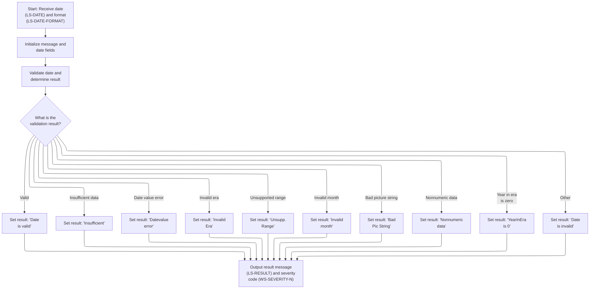
```mermaid
%%{init: {"flowchart": {"defaultRenderer": "elk"}} }%%
flowchart TD
    node1["Start: Receive date 
 (LS-DATE) and format 
 (LS-DATE-FORMAT)"] --> node2["Initialize message and 
 date fields"]
    click node1 openCode "app/cbl/CSUTLDTC.cbl:88:89"
    click node2 openCode "app/cbl/CSUTLDTC.cbl:90:91"
    node2 --> node3["Validate date and 
 determine result"]
    click node3 openCode "app/cbl/CSUTLDTC.cbl:93:124"
    node3 --> node4{"What is the 
 validation result?"}
    click node4 openCode "app/cbl/CSUTLDTC.cbl:128:149"
    node4 -->|"Valid"| node5["Set result: 'Date 
 is valid'"]
    click node5 openCode "app/cbl/CSUTLDTC.cbl:130:130"
    node4 -->|"Insufficient data"| node6["Set result: 'Insufficient'"]
    click node6 openCode "app/cbl/CSUTLDTC.cbl:132:132"
    node4 -->|"Date value error"| node7["Set result: 'Datevalue 
 error'"]
    click node7 openCode "app/cbl/CSUTLDTC.cbl:134:134"
    node4 -->|"Invalid era"| node8["Set result: 'Invalid 
 Era'"]
    click node8 openCode "app/cbl/CSUTLDTC.cbl:136:136"
    node4 -->|"Unsupported range"| node9["Set result: 'Unsupp. 
 Range'"]
    click node9 openCode "app/cbl/CSUTLDTC.cbl:138:138"
    node4 -->|"Invalid month"| node10["Set result: 'Invalid 
 month'"]
    click node10 openCode "app/cbl/CSUTLDTC.cbl:140:140"
    node4 -->|"Bad picture string"| node11["Set result: 'Bad 
 Pic String'"]
    click node11 openCode "app/cbl/CSUTLDTC.cbl:142:142"
    node4 -->|"Nonnumeric data"| node12["Set result: 'Nonnumeric 
 data'"]
    click node12 openCode "app/cbl/CSUTLDTC.cbl:144:144"
    node4 -->|"Year in era 
 is zero"| node13["Set result: 'YearInEra 
 is 0'"]
    click node13 openCode "app/cbl/CSUTLDTC.cbl:146:146"
    node4 -->|"Other"| node14["Set result: 'Date 
 is invalid'"]
    click node14 openCode "app/cbl/CSUTLDTC.cbl:148:148"
    node5 --> node15["Output result message 
 (LS-RESULT) and severity 
 code (WS-SEVERITY-N)"]
    node6 --> node15
    node7 --> node15
    node8 --> node15
    node9 --> node15
    node10 --> node15
    node11 --> node15
    node12 --> node15
    node13 --> node15
    node14 --> node15
    click node15 openCode "app/cbl/CSUTLDTC.cbl:97:100"
classDef HeadingStyle fill:#777777,stroke:#333,stroke-width:2px;
```

This section validates a date input and interprets the result, mapping validation outcomes to business-facing messages and codes for downstream processing.

| Rule ID | Code Location | Category       | Rule Name                  | Description                                                                                                                        | Conditions                                                                              | Remarks                                                                                                                                                                             |
| ------- | ------------- | -------------- | -------------------------- | ---------------------------------------------------------------------------------------------------------------------------------- | --------------------------------------------------------------------------------------- | ----------------------------------------------------------------------------------------------------------------------------------------------------------------------------------- |
| BR-001  | A000-MAIN     | Business logic | Valid date result          | If the date input is valid according to the validation logic, the output result message must be set to 'Date is valid'.            | The feedback code from the date validation indicates a valid date.                      | The output message is 'Date is valid', a string of up to 15 characters, left-aligned and space-padded if shorter. Severity and message number are also set in the output structure. |
| BR-002  | A000-MAIN     | Business logic | Insufficient data result   | If the date input is missing required data, the output result message must be set to 'Insufficient'.                               | The feedback code from the date validation indicates insufficient data.                 | The output message is 'Insufficient', a string of up to 15 characters, left-aligned and space-padded if shorter.                                                                    |
| BR-003  | A000-MAIN     | Business logic | Date value error result    | If the date input contains an invalid value, the output result message must be set to 'Datevalue error'.                           | The feedback code from the date validation indicates a bad date value.                  | The output message is 'Datevalue error', a string of up to 15 characters, left-aligned and space-padded if shorter.                                                                 |
| BR-004  | A000-MAIN     | Business logic | Invalid era result         | If the date input contains an invalid era, the output result message must be set to 'Invalid Era'.                                 | The feedback code from the date validation indicates an invalid era.                    | The output message is 'Invalid Era', a string of up to 15 characters, left-aligned and space-padded if shorter.                                                                     |
| BR-005  | A000-MAIN     | Business logic | Unsupported range result   | If the date input is outside the supported range, the output result message must be set to 'Unsupp. Range'.                        | The feedback code from the date validation indicates an unsupported range.              | The output message is 'Unsupp. Range', a string of up to 15 characters, left-aligned and space-padded if shorter.                                                                   |
| BR-006  | A000-MAIN     | Business logic | Invalid month result       | If the date input contains an invalid month, the output result message must be set to 'Invalid month'.                             | The feedback code from the date validation indicates an invalid month.                  | The output message is 'Invalid month', a string of up to 15 characters, left-aligned and space-padded if shorter.                                                                   |
| BR-007  | A000-MAIN     | Business logic | Bad picture string result  | If the date input contains a bad picture string, the output result message must be set to 'Bad Pic String'.                        | The feedback code from the date validation indicates a bad picture string.              | The output message is 'Bad Pic String', a string of up to 15 characters, left-aligned and space-padded if shorter.                                                                  |
| BR-008  | A000-MAIN     | Business logic | Nonnumeric data result     | If the date input contains non-numeric data, the output result message must be set to 'Nonnumeric data'.                           | The feedback code from the date validation indicates non-numeric data.                  | The output message is 'Nonnumeric data', a string of up to 15 characters, left-aligned and space-padded if shorter.                                                                 |
| BR-009  | A000-MAIN     | Business logic | Year in era is zero result | If the year in the era is zero, the output result message must be set to 'YearInEra is 0'.                                         | The feedback code from the date validation indicates the year in the era is zero.       | The output message is 'YearInEra is 0', a string of up to 15 characters, left-aligned and space-padded if shorter.                                                                  |
| BR-010  | A000-MAIN     | Business logic | Other invalid date result  | If the date input does not match any of the specific error conditions, the output result message must be set to 'Date is invalid'. | The feedback code from the date validation does not match any of the listed conditions. | The output message is 'Date is invalid', a string of up to 15 characters, left-aligned and space-padded if shorter.                                                                 |

<SwmSnippet path="/app/cbl/CSUTLDTC.cbl" line="88" repo-id="Z2l0aHViJTNBJTNBa3luZHJ5bC1hd3MtbWFpbmZyYW1lLW1vZGVybml6YXRpb24tY2FyZGRlbW8lM0ElM0FTd2ltbS1EZW1v">

---

PROCEDURE DIVISION in CSUTLDTC.cbl sets up the date validation call. It initializes the message structure, clears the working date, and then runs A000-MAIN, which does the actual validation. After that, it copies the result message (with severity, code, and text) to the output parameter and sets the return code. This is where we call out to the date validation logic so we don't have to duplicate it everywhere else.

```cobol
       PROCEDURE DIVISION USING LS-DATE, LS-DATE-FORMAT, LS-RESULT.             
           
           INITIALIZE WS-MESSAGE
           MOVE SPACES TO WS-DATE
                                                                        
           PERFORM A000-MAIN                                                    
              THRU A000-MAIN-EXIT                                               

      *    DISPLAY WS-MESSAGE                                                   
           MOVE WS-MESSAGE                 TO LS-RESULT 
           MOVE WS-SEVERITY-N              TO RETURN-CODE          
                                                                                
           EXIT PROGRAM                                                         
      *    GOBACK                                                               
           .                                                                    
```

---

</SwmSnippet>

<SwmSnippet path="/app/cbl/CSUTLDTC.cbl" line="103" repo-id="Z2l0aHViJTNBJTNBa3luZHJ5bC1hd3MtbWFpbmZyYW1lLW1vZGVybml6YXRpb24tY2FyZGRlbW8lM0ElM0FTd2ltbS1EZW1v">

---

A000-MAIN in CSUTLDTC.cbl builds the variable-length date and format strings, calls the CEEDAYS API to validate the date, and then interprets the feedback code. It maps the result to a readable message, so the caller knows if the date is valid, missing, or has some other issue. This is where all the actual date validation happens, and why we call this routine from the main transaction logic.

```cobol
       A000-MAIN.                                                               
                                                                                
           MOVE LENGTH OF LS-DATE                                               
                        TO VSTRING-LENGTH  OF WS-DATE-TO-TEST                   
           MOVE LS-DATE TO VSTRING-TEXT    OF WS-DATE-TO-TEST
                           WS-DATE                  
           MOVE LENGTH OF LS-DATE-FORMAT                                        
                         TO VSTRING-LENGTH OF WS-DATE-FORMAT                    
           MOVE LS-DATE-FORMAT                                                  
                         TO VSTRING-TEXT   OF WS-DATE-FORMAT   
                            WS-DATE-FMT  
           MOVE 0        TO OUTPUT-LILLIAN                              
                                                                        
           CALL "CEEDAYS" USING                                                 
                  WS-DATE-TO-TEST,                                              
                  WS-DATE-FORMAT,                                               
                  OUTPUT-LILLIAN,                                               
                  FEEDBACK-CODE                                                 
                                                                                
           MOVE WS-DATE-TO-TEST            TO WS-DATE                           
           MOVE SEVERITY OF FEEDBACK-CODE  TO WS-SEVERITY-N                     
           MOVE MSG-NO OF FEEDBACK-CODE    TO WS-MSG-NO-N                       
                                                                 
      *    WS-RESULT IS 15 CHARACTERS                                           
      *                123456789012345'                                         
           EVALUATE TRUE                                                        
              WHEN FC-INVALID-DATE                                   
                 MOVE 'Date is valid'      TO WS-RESULT              
              WHEN FC-INSUFFICIENT-DATA                              
                 MOVE 'Insufficient'       TO WS-RESULT              
              WHEN FC-BAD-DATE-VALUE                                 
                 MOVE 'Datevalue error'    TO WS-RESULT              
              WHEN FC-INVALID-ERA                                    
                 MOVE 'Invalid Era    '    TO WS-RESULT              
              WHEN FC-UNSUPP-RANGE                                   
                 MOVE 'Unsupp. Range  '    TO WS-RESULT              
              WHEN FC-INVALID-MONTH                                  
                 MOVE 'Invalid month  '    TO WS-RESULT              
              WHEN FC-BAD-PIC-STRING                                 
                 MOVE 'Bad Pic String '    TO WS-RESULT              
              WHEN FC-NON-NUMERIC-DATA                               
                 MOVE 'Nonnumeric data'    TO WS-RESULT              
              WHEN FC-YEAR-IN-ERA-ZERO                               
                 MOVE 'YearInEra is 0 '    TO WS-RESULT              
              WHEN OTHER                                             
                 MOVE 'Date is invalid'    TO WS-RESULT 
           END-EVALUATE                                                         
                                                                                
           .                                                                    
```

---

</SwmSnippet>

#### Handling Date Validation Results

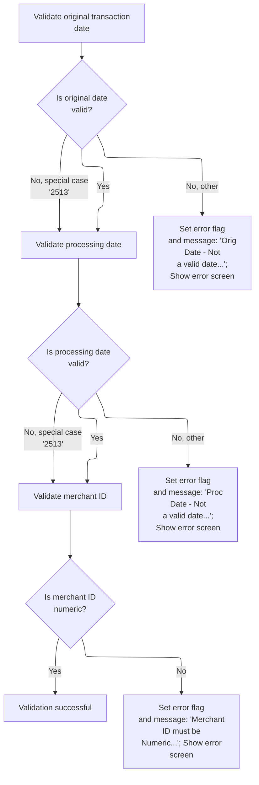
```mermaid
%%{init: {"flowchart": {"defaultRenderer": "elk"}} }%%
flowchart TD
    node1["Validate original transaction 
 date"] --> node2{"Is original date 
 valid?"}
    click node1 openCode "app/cbl/COTRN02C.cbl:397:407"
    node2 -->|"Yes"| node3["Validate processing date"]
    click node2 openCode "app/cbl/COTRN02C.cbl:397:407"
    node2 -->|"No, special case 
 '2513'"| node3
    node2 -->|"No, other"| node4["Set error flag 
 and message: 'Orig 
 Date - Not 
 a valid date...'; 
 Show error screen"]
    click node4 openCode "app/cbl/COTRN02C.cbl:401:405"
    node3 --> node5{"Is processing date 
 valid?"}
    click node3 openCode "app/cbl/COTRN02C.cbl:409:427"
    node5 -->|"Yes"| node6["Validate merchant ID"]
    click node5 openCode "app/cbl/COTRN02C.cbl:417:427"
    node5 -->|"No, special case 
 '2513'"| node6
    node5 -->|"No, other"| node7["Set error flag 
 and message: 'Proc 
 Date - Not 
 a valid date...'; 
 Show error screen"]
    click node7 openCode "app/cbl/COTRN02C.cbl:421:425"
    node6 --> node8{"Is merchant ID 
 numeric?"}
    click node6 openCode "app/cbl/COTRN02C.cbl:430:436"
    node8 -->|"Yes"| node9["Validation successful"]
    click node8 openCode "app/cbl/COTRN02C.cbl:430:436"
    node8 -->|"No"| node10["Set error flag 
 and message: 'Merchant 
 ID must be 
 Numeric...'; Show error 
 screen"]
    click node10 openCode "app/cbl/COTRN02C.cbl:432:435"
classDef HeadingStyle fill:#777777,stroke:#333,stroke-width:2px;
```

This section validates transaction input fields, ensuring dates and merchant IDs meet business requirements and that transaction amounts are correctly interpreted for processing.

| Rule ID | Code Location              | Category        | Rule Name                             | Description                                                                                                                                                                                                              | Conditions                                                                                                      | Remarks                                                                                                                                                                                                                                                     |
| ------- | -------------------------- | --------------- | ------------------------------------- | ------------------------------------------------------------------------------------------------------------------------------------------------------------------------------------------------------------------------ | --------------------------------------------------------------------------------------------------------------- | ----------------------------------------------------------------------------------------------------------------------------------------------------------------------------------------------------------------------------------------------------------- |
| BR-001  | VALIDATE-INPUT-DATA-FIELDS | Data validation | Original date validity enforcement    | If the original transaction date is not valid and the validation message number is not '2513', an error is flagged, the field is marked as invalid, and the user is shown the message 'Orig Date - Not a valid date...'. | The original transaction date fails validation (severity code not '0000') and the message number is not '2513'. | Error message displayed: 'Orig Date - Not a valid date...'. The field is marked as invalid and the error flag is set. The error screen is shown to the user.                                                                                                |
| BR-002  | VALIDATE-INPUT-DATA-FIELDS | Data validation | Processing date validity enforcement  | If the processing date is not valid and the validation message number is not '2513', an error is flagged, the field is marked as invalid, and the user is shown the message 'Proc Date - Not a valid date...'.           | The processing date fails validation (severity code not '0000') and the message number is not '2513'.           | Error message displayed: 'Proc Date - Not a valid date...'. The field is marked as invalid and the error flag is set. The error screen is shown to the user.                                                                                                |
| BR-003  | VALIDATE-INPUT-DATA-FIELDS | Data validation | Merchant ID numeric enforcement       | If the merchant ID is not numeric, an error is flagged, the field is marked as invalid, and the user is shown the message 'Merchant ID must be Numeric...'.                                                              | The merchant ID field contains non-numeric characters.                                                          | Error message displayed: 'Merchant ID must be Numeric...'. The field is marked as invalid and the error flag is set. The error screen is shown to the user.                                                                                                 |
| BR-004  | MAIN-LOGIC                 | Business logic  | Currency string to numeric conversion | Currency-formatted transaction amount strings are converted to numeric values for processing, allowing for correct handling of currency symbols and formatting.                                                          | A transaction amount is provided as a currency-formatted string.                                                | The conversion handles currency symbols and formatting, ensuring the numeric value is accurate for further processing. Input format: currency string (may include symbols, commas, decimal points). Output format: numeric value suitable for calculations. |

<SwmSnippet path="/app/cbl/COTRN02C.cbl" line="397" repo-id="Z2l0aHViJTNBJTNBa3luZHJ5bC1hd3MtbWFpbmZyYW1lLW1vZGVybml6YXRpb24tY2FyZGRlbW8lM0ElM0FTd2ltbS1EZW1v">

---

We just got back from calling CSUTLDTC.cbl for Orig Date validation in VALIDATE-INPUT-DATA-FIELDS. If the severity code isn't '0000' and the message number isn't '2513', we set an error, update the message, mark the field as invalid, and send the screen back to the user. Otherwise, we keep going.

```cobol
           IF CSUTLDTC-RESULT-SEV-CD = '0000'
               CONTINUE
           ELSE
               IF CSUTLDTC-RESULT-MSG-NUM NOT = '2513'
                   MOVE 'Orig Date - Not a valid date...'
                     TO WS-MESSAGE
                   MOVE 'Y'     TO WS-ERR-FLG
                   MOVE -1       TO TORIGDTL OF COTRN2AI
                   PERFORM SEND-TRNADD-SCREEN
               END-IF
           END-IF
```

---

</SwmSnippet>

<SwmSnippet path="/app/cbl/COTRN02C.cbl" line="409" repo-id="Z2l0aHViJTNBJTNBa3luZHJ5bC1hd3MtbWFpbmZyYW1lLW1vZGVybml6YXRpb24tY2FyZGRlbW8lM0ElM0FTd2ltbS1EZW1v">

---

Here VALIDATE-INPUT-DATA-FIELDS does the same date validation for Proc Date by calling CSUTLDTC. If the result isn't '0000' and the message number isn't '2513', it flags an error, updates the message, marks the field, and sends the screen. Otherwise, it keeps going with the rest of the validation.

```cobol
           MOVE TPROCDTI OF COTRN2AI TO CSUTLDTC-DATE
           MOVE WS-DATE-FORMAT       TO CSUTLDTC-DATE-FORMAT
           MOVE SPACES               TO CSUTLDTC-RESULT

           CALL 'CSUTLDTC' USING   CSUTLDTC-DATE
                                   CSUTLDTC-DATE-FORMAT
                                   CSUTLDTC-RESULT

           IF CSUTLDTC-RESULT-SEV-CD = '0000'
               CONTINUE
           ELSE
               IF CSUTLDTC-RESULT-MSG-NUM NOT = '2513'
                   MOVE 'Proc Date - Not a valid date...'
                     TO WS-MESSAGE
                   MOVE 'Y'     TO WS-ERR-FLG
                   MOVE -1       TO TPROCDTL OF COTRN2AI
                   PERFORM SEND-TRNADD-SCREEN
               END-IF
           END-IF
```

---

</SwmSnippet>

<SwmSnippet path="/app/cbl/COTRN02C.cbl" line="430" repo-id="Z2l0aHViJTNBJTNBa3luZHJ5bC1hd3MtbWFpbmZyYW1lLW1vZGVybml6YXRpb24tY2FyZGRlbW8lM0ElM0FTd2ltbS1EZW1v">

---

After all the date checks, VALIDATE-INPUT-DATA-FIELDS moves on to check if Merchant ID is numeric. If not, it flags an error, sets the message, marks the field, and sends the screen. Otherwise, it returns and lets the flow continue.

```cobol
           IF MIDI OF COTRN2AI IS NOT NUMERIC
               MOVE 'Y'     TO WS-ERR-FLG
               MOVE 'Merchant ID must be Numeric...' TO
                               WS-MESSAGE
               MOVE -1       TO MIDL OF COTRN2AI
               PERFORM SEND-TRNADD-SCREEN
           END-IF
```

---

</SwmSnippet>

### Processing User Confirmation for Transaction Add

This section governs how user confirmation input is processed to either add a transaction or prompt the user for correction, ensuring only valid confirmations result in transaction addition.

| Rule ID | Code Location | Category        | Rule Name                                                | Description                                                                                                                                            | Conditions                                                                                | Remarks                                                                                                                                                                   |
| ------- | ------------- | --------------- | -------------------------------------------------------- | ------------------------------------------------------------------------------------------------------------------------------------------------------ | ----------------------------------------------------------------------------------------- | ------------------------------------------------------------------------------------------------------------------------------------------------------------------------- |
| BR-001  | MAIN-LOGIC    | Data validation | Invalid confirmation value triggers error and guidance   | If the user enters any other value for confirmation, an error is set and a message is shown indicating valid values are 'Y' or 'N'.                    | User confirmation input is any value other than 'Y', 'y', 'N', 'n', blank, or low-values. | Invalid confirmation values are any not listed above. The error flag is set to 'Y'. The message shown is 'Invalid value. Valid values are (Y/N)...'.                      |
| BR-002  | MAIN-LOGIC    | Business logic  | Positive confirmation triggers add                       | If the user confirms the transaction by entering 'Y' or 'y', the transaction is added to the system.                                                   | User confirmation input is 'Y' or 'y'.                                                    | Valid confirmation values for adding are 'Y' and 'y'.                                                                                                                     |
| BR-003  | MAIN-LOGIC    | Error handling  | Negative or blank confirmation triggers error and prompt | If the user declines the transaction by entering 'N', 'n', blank, or a low-value character, an error is set and the user is prompted to confirm again. | User confirmation input is 'N', 'n', blank (spaces), or low-value character.              | Valid negative confirmation values are 'N', 'n', blank (spaces), and low-values. The error flag is set to 'Y'. The message shown is 'Confirm to add this transaction...'. |

<SwmSnippet path="/app/cbl/COTRN02C.cbl" line="169" repo-id="Z2l0aHViJTNBJTNBa3luZHJ5bC1hd3MtbWFpbmZyYW1lLW1vZGVybml6YXRpb24tY2FyZGRlbW8lM0ElM0FTd2ltbS1EZW1v">

---

We just finished all the field validation in PROCESS-ENTER-KEY. Now, it checks the user's confirmation input. If it's 'Y' or 'y', we call ADD-TRANSACTION to actually add the record. If it's 'N', blank, or something else, we set an error, update the message, and send the screen back for correction. This step is what actually triggers the add or asks for confirmation again.

```cobol
           EVALUATE CONFIRMI OF COTRN2AI
               WHEN 'Y'
               WHEN 'y'
                   PERFORM ADD-TRANSACTION
               WHEN 'N'
               WHEN 'n'
               WHEN SPACES
               WHEN LOW-VALUES
                   MOVE 'Y'     TO WS-ERR-FLG
                   MOVE 'Confirm to add this transaction...'
                                TO WS-MESSAGE
                   MOVE -1      TO CONFIRML OF COTRN2AI
                   PERFORM SEND-TRNADD-SCREEN
               WHEN OTHER
                   MOVE 'Y'     TO WS-ERR-FLG
                   MOVE 'Invalid value. Valid values are (Y/N)...'
                                TO WS-MESSAGE
                   MOVE -1      TO CONFIRML OF COTRN2AI
                   PERFORM SEND-TRNADD-SCREEN
           END-EVALUATE.
```

---

</SwmSnippet>

## Creating and Writing a New Transaction Record

This section is responsible for creating and writing a new transaction record, ensuring that all fields are populated correctly and that the transaction ID is unique.

| Rule ID | Code Location   | Category       | Rule Name                             | Description                                                                                                                                                                                               | Conditions                                                              | Remarks                                                                                                                                                                                                                                                                                                                                                                                                                                             |
| ------- | --------------- | -------------- | ------------------------------------- | --------------------------------------------------------------------------------------------------------------------------------------------------------------------------------------------------------- | ----------------------------------------------------------------------- | --------------------------------------------------------------------------------------------------------------------------------------------------------------------------------------------------------------------------------------------------------------------------------------------------------------------------------------------------------------------------------------------------------------------------------------------------- |
| BR-001  | ADD-TRANSACTION | Business logic | Unique transaction ID generation      | When creating a new transaction record, the transaction ID must be generated to be unique by referencing the highest existing transaction ID in the transaction file.                                     | A new transaction record is being created.                              | The transaction ID field is a string of 16 characters. Uniqueness is ensured by referencing the previous highest transaction ID in the file.                                                                                                                                                                                                                                                                                                        |
| BR-002  | ADD-TRANSACTION | Business logic | Currency string to numeric conversion | The transaction amount input must be converted from a currency-formatted string to a numeric value before being stored in the transaction record.                                                         | A transaction amount is provided as input for a new transaction record. | The transaction amount field is a signed numeric value with 9 digits and 2 decimal places. The conversion handles currency symbols and formatting.                                                                                                                                                                                                                                                                                                  |
| BR-003  | ADD-TRANSACTION | Business logic | Transaction record field mapping      | All input fields for the transaction record must be mapped to their corresponding fields in the transaction record structure, ensuring that the output record matches the defined format and field sizes. | A new transaction record is being created.                              | The transaction record consists of fields with specific sizes and types: transaction ID (16 chars), type code (2 chars), category code (4 digits), source (10 chars), description (100 chars), amount (signed 9 digits, 2 decimals), merchant ID (9 digits), merchant name (50 chars), merchant city (50 chars), merchant zip (10 chars), card number (16 chars), original timestamp (26 chars), processed timestamp (26 chars), filler (20 chars). |

<SwmSnippet path="/app/cbl/COTRN02C.cbl" line="442" repo-id="Z2l0aHViJTNBJTNBa3luZHJ5bC1hd3MtbWFpbmZyYW1lLW1vZGVybml6YXRpb24tY2FyZGRlbW8lM0ElM0FTd2ltbS1EZW1v">

---

In ADD-TRANSACTION, we set TRAN-ID to HIGH-VALUES, then start a browse on the transaction file, read the previous record to get the last transaction ID, and end the browse. This sets us up to generate the next unique transaction ID before we build and write the new record.

```cobol
       ADD-TRANSACTION.

           MOVE HIGH-VALUES TO TRAN-ID
           PERFORM STARTBR-TRANSACT-FILE
           PERFORM READPREV-TRANSACT-FILE
           PERFORM ENDBR-TRANSACT-FILE
```

---

</SwmSnippet>

### Opening Transaction File for Browse

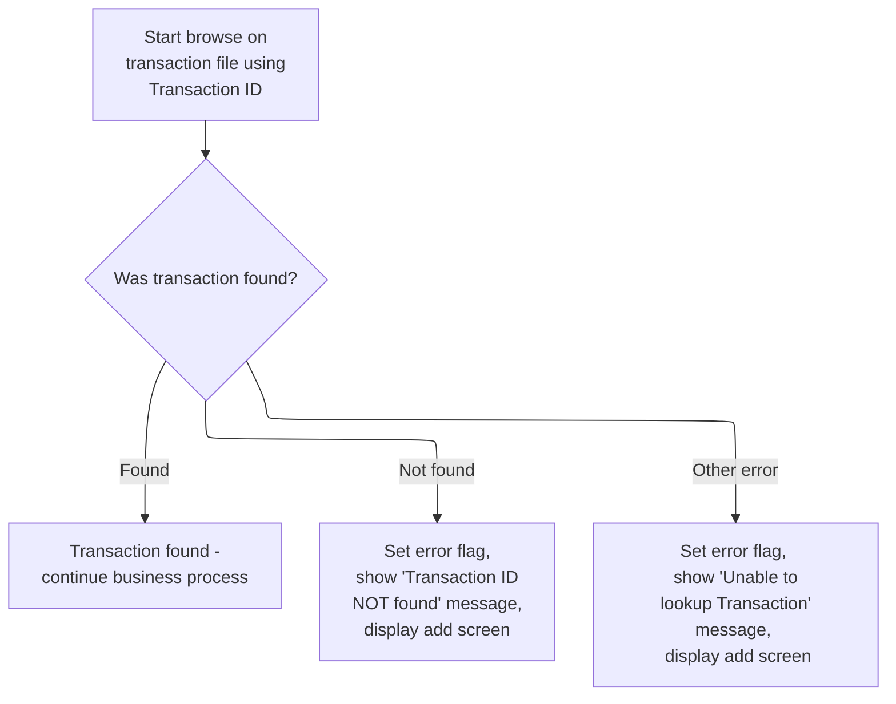
```mermaid
%%{init: {"flowchart": {"defaultRenderer": "elk"}} }%%
flowchart TD
    node1["Start browse on 
 transaction file using 
 Transaction ID"] --> node2{"Was transaction found?"}
    click node1 openCode "app/cbl/COTRN02C.cbl:642:651"
    node2 -->|"Found"| node3["Transaction found - 
 continue business process"]
    click node2 openCode "app/cbl/COTRN02C.cbl:652:668"
    node2 -->|"Not found"| node4["Set error flag, 
 show 'Transaction ID 
 NOT found' message, 
 display add screen"]
    click node4 openCode "app/cbl/COTRN02C.cbl:655:661"
    node2 -->|"Other error"| node5["Set error flag, 
 show 'Unable to 
 lookup Transaction' message, 
 display add screen"]
    click node5 openCode "app/cbl/COTRN02C.cbl:662:667"
classDef HeadingStyle fill:#777777,stroke:#333,stroke-width:2px;
```

This section manages the process of browsing the transaction file using a Transaction ID, handling successful lookups, not found cases, and general errors to ensure appropriate user feedback and flow.

| Rule ID | Code Location         | Category       | Rule Name                                 | Description                                                                                                                                                                                                                                                  | Conditions                                                                | Remarks                                                                                                                                                                                                                      |
| ------- | --------------------- | -------------- | ----------------------------------------- | ------------------------------------------------------------------------------------------------------------------------------------------------------------------------------------------------------------------------------------------------------------ | ------------------------------------------------------------------------- | ---------------------------------------------------------------------------------------------------------------------------------------------------------------------------------------------------------------------------- |
| BR-001  | STARTBR-TRANSACT-FILE | Business logic | Successful transaction lookup             | If the transaction file browse operation using the provided Transaction ID is successful, the business process continues without setting any error flags or displaying error messages.                                                                       | The response code from the browse operation is NORMAL.                    | No error flag is set (WS-ERR-FLG remains 'N'). No error message is displayed. The process continues as normal.                                                                                                               |
| BR-002  | STARTBR-TRANSACT-FILE | Error handling | Transaction not found handling            | If the transaction file browse operation does not find a record for the provided Transaction ID, an error flag is set, a message 'Transaction ID NOT found...' is displayed, the input field is marked, and the add transaction screen is shown.             | The response code from the browse operation is NOTFND.                    | Error flag is set to 'Y'. Error message is set to 'Transaction ID NOT found...'. Input field is marked with value -1. The add transaction screen is displayed.                                                               |
| BR-003  | STARTBR-TRANSACT-FILE | Error handling | General transaction lookup error handling | If the transaction file browse operation fails for any reason other than not finding the Transaction ID, an error flag is set, a message 'Unable to lookup Transaction...' is displayed, the input field is marked, and the add transaction screen is shown. | The response code from the browse operation is neither NORMAL nor NOTFND. | Error flag is set to 'Y'. Error message is set to 'Unable to lookup Transaction...'. Input field is marked with value -1. The add transaction screen is displayed. The response and reason codes are logged for diagnostics. |

<SwmSnippet path="/app/cbl/COTRN02C.cbl" line="642" repo-id="Z2l0aHViJTNBJTNBa3luZHJ5bC1hd3MtbWFpbmZyYW1lLW1vZGVybml6YXRpb24tY2FyZGRlbW8lM0ElM0FTd2ltbS1EZW1v">

---

In STARTBR-TRANSACT-FILE, we kick off a CICS STARTBR to open the transaction file for browsing, using TRAN-ID as the key. This is the setup for reading the last transaction record.

```cobol
       STARTBR-TRANSACT-FILE.

           EXEC CICS STARTBR
                DATASET   (WS-TRANSACT-FILE)
                RIDFLD    (TRAN-ID)
                KEYLENGTH (LENGTH OF TRAN-ID)
                RESP      (WS-RESP-CD)
                RESP2     (WS-REAS-CD)
           END-EXEC
```

---

</SwmSnippet>

<SwmSnippet path="/app/cbl/COTRN02C.cbl" line="652" repo-id="Z2l0aHViJTNBJTNBa3luZHJ5bC1hd3MtbWFpbmZyYW1lLW1vZGVybml6YXRpb24tY2FyZGRlbW8lM0ElM0FTd2ltbS1EZW1v">

---

After STARTBR-TRANSACT-FILE, we check the response code. If it's NORMAL, we keep going. If it's NOTFND, we set an error, update the message, mark the field, and send the screen. For any other error, we log the codes, set the error, and send the screen too. This keeps the flow safe if the file isn't ready or the key isn't found.

```cobol
           EVALUATE WS-RESP-CD
               WHEN DFHRESP(NORMAL)
                   CONTINUE
               WHEN DFHRESP(NOTFND)
                   MOVE 'Y'     TO WS-ERR-FLG
                   MOVE 'Transaction ID NOT found...' TO
                                   WS-MESSAGE
                   MOVE -1       TO ACTIDINL OF COTRN2AI
                   PERFORM SEND-TRNADD-SCREEN
               WHEN OTHER
                   DISPLAY 'RESP:' WS-RESP-CD 'REAS:' WS-REAS-CD
                   MOVE 'Y'     TO WS-ERR-FLG
                   MOVE 'Unable to lookup Transaction...' TO
                                   WS-MESSAGE
                   MOVE -1       TO ACTIDINL OF COTRN2AI
                   PERFORM SEND-TRNADD-SCREEN
           END-EVALUATE.
```

---

</SwmSnippet>

### Reading the Last Transaction Record

```mermaid
%%{init: {"flowchart": {"defaultRenderer": "elk"}} }%%
flowchart TD
  node1["Retrieve previous transaction 
 record"]
  click node1 openCode "app/cbl/COTRN02C.cbl:675:683"
  node1 --> node2{"What is the 
 result?"}
  click node2 openCode "app/cbl/COTRN02C.cbl:685:697"
  node2 -->|"Success"| node3["No changes needed, 
 continue"]
  click node3 openCode "app/cbl/COTRN02C.cbl:687:687"
  node2 -->|"End of file"| node4["Clear transaction ID"]
  click node4 openCode "app/cbl/COTRN02C.cbl:689:689"
  node2 -->|"Error"| node5["Set error flag, 
 show message, update 
 screen"]
  click node5 openCode "app/cbl/COTRN02C.cbl:691:696"

classDef HeadingStyle fill:#777777,stroke:#333,stroke-width:2px;
```

This section manages the retrieval of the last transaction record to determine the next transaction ID, handling success, end-of-file, and error scenarios according to business rules.

| Rule ID | Code Location          | Category       | Rule Name                            | Description                                                                                                                                                                                   | Conditions                                                 | Remarks                                                                                                                                                       |
| ------- | ---------------------- | -------------- | ------------------------------------ | --------------------------------------------------------------------------------------------------------------------------------------------------------------------------------------------- | ---------------------------------------------------------- | ------------------------------------------------------------------------------------------------------------------------------------------------------------- |
| BR-001  | READPREV-TRANSACT-FILE | Business logic | Successful transaction retrieval     | If the previous transaction record is successfully retrieved, the system continues processing without making changes to the transaction ID or displaying any error messages.                  | The file read response code is NORMAL.                     | No changes are made to the transaction ID (string, 16 bytes) or error flag ('N' for no error).                                                                |
| BR-002  | READPREV-TRANSACT-FILE | Business logic | End of file handling                 | If the end of the transaction file is reached when attempting to retrieve the previous record, the system clears the transaction ID to indicate that no previous transaction exists.          | The file read response code is ENDFILE.                    | The transaction ID is set to zeros (string, 16 bytes).                                                                                                        |
| BR-003  | READPREV-TRANSACT-FILE | Error handling | Transaction retrieval error handling | If an error occurs during the attempt to retrieve the previous transaction record, the system sets an error flag, displays an error message, updates the screen, and logs the response codes. | The file read response code is neither NORMAL nor ENDFILE. | The error flag is set to 'Y'. The error message is set to 'Unable to lookup Transaction...'. The screen is updated. The response and reason codes are logged. |

<SwmSnippet path="/app/cbl/COTRN02C.cbl" line="673" repo-id="Z2l0aHViJTNBJTNBa3luZHJ5bC1hd3MtbWFpbmZyYW1lLW1vZGVybml6YXRpb24tY2FyZGRlbW8lM0ElM0FTd2ltbS1EZW1v">

---

In READPREV-TRANSACT-FILE, we use EXEC CICS READPREV to grab the last transaction record by key. This is how we find the highest transaction ID so we can increment it for the new record.

```cobol
       READPREV-TRANSACT-FILE.

           EXEC CICS READPREV
                DATASET   (WS-TRANSACT-FILE)
                INTO      (TRAN-RECORD)
                LENGTH    (LENGTH OF TRAN-RECORD)
                RIDFLD    (TRAN-ID)
                KEYLENGTH (LENGTH OF TRAN-ID)
                RESP      (WS-RESP-CD)
                RESP2     (WS-REAS-CD)
           END-EXEC
```

---

</SwmSnippet>

<SwmSnippet path="/app/cbl/COTRN02C.cbl" line="685" repo-id="Z2l0aHViJTNBJTNBa3luZHJ5bC1hd3MtbWFpbmZyYW1lLW1vZGVybml6YXRpb24tY2FyZGRlbW8lM0ElM0FTd2ltbS1EZW1v">

---

After READPREV-TRANSACT-FILE, we check the response. If it's NORMAL, we keep going. If it's ENDFILE, we reset TRAN-ID to zeros. For any other error, we log the codes, set the error, and send the screen. This keeps the flow from breaking if something goes wrong with the file read.

```cobol
           EVALUATE WS-RESP-CD
               WHEN DFHRESP(NORMAL)
                   CONTINUE
               WHEN DFHRESP(ENDFILE)
                   MOVE ZEROS TO TRAN-ID
               WHEN OTHER
                   DISPLAY 'RESP:' WS-RESP-CD 'REAS:' WS-REAS-CD
                   MOVE 'Y'     TO WS-ERR-FLG
                   MOVE 'Unable to lookup Transaction...' TO
                                   WS-MESSAGE
                   MOVE -1       TO ACTIDINL OF COTRN2AI
                   PERFORM SEND-TRNADD-SCREEN
           END-EVALUATE.
```

---

</SwmSnippet>

### Building and Finalizing the New Transaction

```mermaid
%%{init: {"flowchart": {"defaultRenderer": "elk"}} }%%
flowchart TD
    node1["Start: Prepare to 
 add new transaction"]
    click node1 openCode "app/cbl/COTRN02C.cbl:442:444"
    node1 --> node2["Assign unique transaction 
 ID"]
    click node2 openCode "app/cbl/COTRN02C.cbl:444:449"
    node2 --> node3["Initialize transaction record"]
    click node3 openCode "app/cbl/COTRN02C.cbl:450:450"
    node3 --> node4["Populate all transaction 
 details from input 
 data"]
    click node4 openCode "app/cbl/COTRN02C.cbl:451:465"
    node4 --> node5["Save transaction record 
 to file"]
    click node5 openCode "app/cbl/COTRN02C.cbl:466:466"

classDef HeadingStyle fill:#777777,stroke:#333,stroke-width:2px;
```

This section is responsible for creating and writing a new transaction record, ensuring that all fields are populated correctly and that the transaction ID is unique.

| Rule ID | Code Location   | Category       | Rule Name                             | Description                                                                                                                                                                                               | Conditions                                                              | Remarks                                                                                                                                                                                                                                                                                                                                                                                                                                             |
| ------- | --------------- | -------------- | ------------------------------------- | --------------------------------------------------------------------------------------------------------------------------------------------------------------------------------------------------------- | ----------------------------------------------------------------------- | --------------------------------------------------------------------------------------------------------------------------------------------------------------------------------------------------------------------------------------------------------------------------------------------------------------------------------------------------------------------------------------------------------------------------------------------------- |
| BR-001  | ADD-TRANSACTION | Business logic | Unique transaction ID generation      | When creating a new transaction record, the transaction ID must be generated to be unique by referencing the highest existing transaction ID in the transaction file.                                     | A new transaction record is being created.                              | The transaction ID field is a string of 16 characters. Uniqueness is ensured by referencing the previous highest transaction ID in the file.                                                                                                                                                                                                                                                                                                        |
| BR-002  | ADD-TRANSACTION | Business logic | Currency string to numeric conversion | The transaction amount input must be converted from a currency-formatted string to a numeric value before being stored in the transaction record.                                                         | A transaction amount is provided as input for a new transaction record. | The transaction amount field is a signed numeric value with 9 digits and 2 decimal places. The conversion handles currency symbols and formatting.                                                                                                                                                                                                                                                                                                  |
| BR-003  | ADD-TRANSACTION | Business logic | Transaction record field mapping      | All input fields for the transaction record must be mapped to their corresponding fields in the transaction record structure, ensuring that the output record matches the defined format and field sizes. | A new transaction record is being created.                              | The transaction record consists of fields with specific sizes and types: transaction ID (16 chars), type code (2 chars), category code (4 digits), source (10 chars), description (100 chars), amount (signed 9 digits, 2 decimals), merchant ID (9 digits), merchant name (50 chars), merchant city (50 chars), merchant zip (10 chars), card number (16 chars), original timestamp (26 chars), processed timestamp (26 chars), filler (20 chars). |

<SwmSnippet path="/app/cbl/COTRN02C.cbl" line="442" repo-id="Z2l0aHViJTNBJTNBa3luZHJ5bC1hd3MtbWFpbmZyYW1lLW1vZGVybml6YXRpb24tY2FyZGRlbW8lM0ElM0FTd2ltbS1EZW1v">

---

Back in ADD-TRANSACTION after reading the last record, we increment the transaction ID, initialize the new record, fill in all the fields from the input, and then call ENDBR-TRANSACT-FILE to close out the browse before writing the new record. This keeps the file state clean and ready for the write.

```cobol
       ADD-TRANSACTION.

           MOVE HIGH-VALUES TO TRAN-ID
           PERFORM STARTBR-TRANSACT-FILE
           PERFORM READPREV-TRANSACT-FILE
           PERFORM ENDBR-TRANSACT-FILE
```

---

</SwmSnippet>

<SwmSnippet path="/app/cbl/COTRN02C.cbl" line="702" repo-id="Z2l0aHViJTNBJTNBa3luZHJ5bC1hd3MtbWFpbmZyYW1lLW1vZGVybml6YXRpb24tY2FyZGRlbW8lM0ElM0FTd2ltbS1EZW1v">

---

ENDBR-TRANSACT-FILE just issues the CICS ENDBR command to close the browse on the transaction file. This is cleanup so we don't leave the file in browse mode before writing.

```cobol
       ENDBR-TRANSACT-FILE.

           EXEC CICS ENDBR
                DATASET   (WS-TRANSACT-FILE)
           END-EXEC.
```

---

</SwmSnippet>

<SwmSnippet path="/app/cbl/COTRN02C.cbl" line="448" repo-id="Z2l0aHViJTNBJTNBa3luZHJ5bC1hd3MtbWFpbmZyYW1lLW1vZGVybml6YXRpb24tY2FyZGRlbW8lM0ElM0FTd2ltbS1EZW1v">

---

Back in ADD-TRANSACTION after closing the browse, we increment the transaction ID, fill in all the fields for the new transaction from the input, convert the amount, and then call WRITE-TRANSACT-FILE to actually write the record. This is where the new transaction gets persisted.

```cobol
           MOVE TRAN-ID     TO WS-TRAN-ID-N
           ADD 1 TO WS-TRAN-ID-N
           INITIALIZE TRAN-RECORD
           MOVE WS-TRAN-ID-N         TO TRAN-ID
           MOVE TTYPCDI  OF COTRN2AI TO TRAN-TYPE-CD
           MOVE TCATCDI  OF COTRN2AI TO TRAN-CAT-CD
           MOVE TRNSRCI  OF COTRN2AI TO TRAN-SOURCE
           MOVE TDESCI   OF COTRN2AI TO TRAN-DESC
           COMPUTE WS-TRAN-AMT-N = FUNCTION NUMVAL-C(TRNAMTI OF
           COTRN2AI)
           MOVE WS-TRAN-AMT-N TO TRAN-AMT
           MOVE CARDNINI OF COTRN2AI TO TRAN-CARD-NUM
           MOVE MIDI     OF COTRN2AI TO TRAN-MERCHANT-ID
           MOVE MNAMEI   OF COTRN2AI TO TRAN-MERCHANT-NAME
           MOVE MCITYI   OF COTRN2AI TO TRAN-MERCHANT-CITY
           MOVE MZIPI    OF COTRN2AI TO TRAN-MERCHANT-ZIP
           MOVE TORIGDTI OF COTRN2AI TO TRAN-ORIG-TS
           MOVE TPROCDTI OF COTRN2AI TO TRAN-PROC-TS
           PERFORM WRITE-TRANSACT-FILE.
```

---

</SwmSnippet>

## Writing the Transaction and Resetting State

```mermaid
%%{init: {"flowchart": {"defaultRenderer": "elk"}} }%%
flowchart TD
    node1["Add transaction to 
 file"] --> node2{"Result of add 
 operation?"}
    click node1 openCode "app/cbl/COTRN02C.cbl:713:721"
    node2 -->|"Success"| node3["Notify user: Transaction 
 added successfully. Show 
 Tran ID"]
    click node2 openCode "app/cbl/COTRN02C.cbl:723:749"
    click node3 openCode "app/cbl/COTRN02C.cbl:724:734"
    node2 -->|"Duplicate Tran ID"| node4["Notify user: Transaction 
 ID already exists. 
 Error flagged"]
    click node4 openCode "app/cbl/COTRN02C.cbl:735:741"
    node2 -->|"Other failure"| node5["Notify user: Unable 
 to add transaction. 
 Error flagged"]
    click node5 openCode "app/cbl/COTRN02C.cbl:742:748"

classDef HeadingStyle fill:#777777,stroke:#333,stroke-width:2px;
```

This section manages the process of adding a new transaction to the file, handling success, duplicate transaction ID errors, and other failures, and resetting the input state for the next transaction.

| Rule ID | Code Location                              | Category       | Rule Name                       | Description                                                                                                                                                                                                                              | Conditions                                                                                      | Remarks                                                                                                                                                                                                                                 |
| ------- | ------------------------------------------ | -------------- | ------------------------------- | ---------------------------------------------------------------------------------------------------------------------------------------------------------------------------------------------------------------------------------------- | ----------------------------------------------------------------------------------------------- | --------------------------------------------------------------------------------------------------------------------------------------------------------------------------------------------------------------------------------------- |
| BR-001  | WRITE-TRANSACT-FILE, INITIALIZE-ALL-FIELDS | Business logic | Successful transaction addition | When a new transaction is successfully added to the file, the user is notified with a success message that includes the transaction ID, and all input fields are reset to their initial state.                                           | The transaction write operation returns a NORMAL response code.                                 | The success message format is: 'Transaction added successfully. Your Tran ID is <transaction id>.' The transaction ID is a string of up to 16 characters. All input fields are reset to blanks or -1, and the error flag is set to 'N'. |
| BR-002  | WRITE-TRANSACT-FILE                        | Error handling | Duplicate transaction ID error  | If the transaction write operation fails due to a duplicate transaction ID, the user is notified with an error message indicating that the transaction ID already exists, the error flag is set, and the relevant input field is marked. | The transaction write operation returns a DUPKEY or DUPREC response code.                       | The error message format is: 'Tran ID already exist...' The error flag is set to 'Y'. The transaction ID input field is marked with -1.                                                                                                 |
| BR-003  | WRITE-TRANSACT-FILE                        | Error handling | General transaction write error | If the transaction write operation fails for any reason other than a duplicate transaction ID, the user is notified with a generic error message, the error flag is set, and the relevant input field is marked.                         | The transaction write operation returns any response code other than NORMAL, DUPKEY, or DUPREC. | The error message format is: 'Unable to Add Transaction...' The error flag is set to 'Y'. The transaction ID input field is marked with -1. The response and reason codes are logged for diagnostic purposes.                           |

<SwmSnippet path="/app/cbl/COTRN02C.cbl" line="711" repo-id="Z2l0aHViJTNBJTNBa3luZHJ5bC1hd3MtbWFpbmZyYW1lLW1vZGVybml6YXRpb24tY2FyZGRlbW8lM0ElM0FTd2ltbS1EZW1v">

---

In WRITE-TRANSACT-FILE, we use EXEC CICS WRITE to write the new transaction record to the file, using TRAN-ID as the key. The response codes tell us if it worked or if there was a problem like a duplicate key.

```cobol
       WRITE-TRANSACT-FILE.

           EXEC CICS WRITE
                DATASET   (WS-TRANSACT-FILE)
                FROM      (TRAN-RECORD)
                LENGTH    (LENGTH OF TRAN-RECORD)
                RIDFLD    (TRAN-ID)
                KEYLENGTH (LENGTH OF TRAN-ID)
                RESP      (WS-RESP-CD)
                RESP2     (WS-REAS-CD)
           END-EXEC
```

---

</SwmSnippet>

<SwmSnippet path="/app/cbl/COTRN02C.cbl" line="723" repo-id="Z2l0aHViJTNBJTNBa3luZHJ5bC1hd3MtbWFpbmZyYW1lLW1vZGVybml6YXRpb24tY2FyZGRlbW8lM0ElM0FTd2ltbS1EZW1v">

---

After a successful write in WRITE-TRANSACT-FILE, we reset all the fields, clear the message, set a green success message with the new transaction ID, and send the screen to the user. This is the happy path for adding a transaction.

```cobol
           EVALUATE WS-RESP-CD
               WHEN DFHRESP(NORMAL)
                   PERFORM INITIALIZE-ALL-FIELDS
                   MOVE SPACES             TO WS-MESSAGE
                   MOVE DFHGREEN           TO ERRMSGC  OF COTRN2AO
                   STRING 'Transaction added successfully. '
                                               DELIMITED BY SIZE
                     ' Your Tran ID is ' DELIMITED BY SIZE
                          TRAN-ID  DELIMITED BY SPACE
                          '.' DELIMITED BY SIZE
                     INTO WS-MESSAGE
                   PERFORM SEND-TRNADD-SCREEN
```

---

</SwmSnippet>

<SwmSnippet path="/app/cbl/COTRN02C.cbl" line="762" repo-id="Z2l0aHViJTNBJTNBa3luZHJ5bC1hd3MtbWFpbmZyYW1lLW1vZGVybml6YXRpb24tY2FyZGRlbW8lM0ElM0FTd2ltbS1EZW1v">

---

INITIALIZE-ALL-FIELDS just resets all the fields in COTRN2AI to blanks or -1, and clears WS-MESSAGE. This makes sure the next transaction starts with a clean slate.

```cobol
       INITIALIZE-ALL-FIELDS.

           MOVE -1              TO ACTIDINL OF COTRN2AI
           MOVE SPACES          TO ACTIDINI OF COTRN2AI
                                   CARDNINI OF COTRN2AI
                                   TTYPCDI  OF COTRN2AI
                                   TCATCDI  OF COTRN2AI
                                   TRNSRCI  OF COTRN2AI
                                   TRNAMTI  OF COTRN2AI
                                   TDESCI   OF COTRN2AI
                                   TORIGDTI OF COTRN2AI
                                   TPROCDTI OF COTRN2AI
                                   MIDI     OF COTRN2AI
                                   MNAMEI   OF COTRN2AI
                                   MCITYI   OF COTRN2AI
                                   MZIPI    OF COTRN2AI
                                   CONFIRMI OF COTRN2AI
                                   WS-MESSAGE.
```

---

</SwmSnippet>

<SwmSnippet path="/app/cbl/COTRN02C.cbl" line="723" repo-id="Z2l0aHViJTNBJTNBa3luZHJ5bC1hd3MtbWFpbmZyYW1lLW1vZGVybml6YXRpb24tY2FyZGRlbW8lM0ElM0FTd2ltbS1EZW1v">

---

Back in WRITE-TRANSACT-FILE after initializing all fields, we set up the success message and send the transaction add screen to the user. This is how the user sees confirmation that their transaction was added.

```cobol
           EVALUATE WS-RESP-CD
               WHEN DFHRESP(NORMAL)
                   PERFORM INITIALIZE-ALL-FIELDS
                   MOVE SPACES             TO WS-MESSAGE
                   MOVE DFHGREEN           TO ERRMSGC  OF COTRN2AO
                   STRING 'Transaction added successfully. '
                                               DELIMITED BY SIZE
                     ' Your Tran ID is ' DELIMITED BY SIZE
                          TRAN-ID  DELIMITED BY SPACE
                          '.' DELIMITED BY SIZE
                     INTO WS-MESSAGE
                   PERFORM SEND-TRNADD-SCREEN
```

---

</SwmSnippet>

<SwmSnippet path="/app/cbl/COTRN02C.cbl" line="735" repo-id="Z2l0aHViJTNBJTNBa3luZHJ5bC1hd3MtbWFpbmZyYW1lLW1vZGVybml6YXRpb24tY2FyZGRlbW8lM0ElM0FTd2ltbS1EZW1v">

---

After SEND-TRNADD-SCREEN, WRITE-TRANSACT-FILE checks for duplicate key or record errors. If found, it sets the error flag, updates the message, marks the field, and sends the screen to let the user know the transaction ID already exists.

```cobol
               WHEN DFHRESP(DUPKEY)
               WHEN DFHRESP(DUPREC)
                   MOVE 'Y'     TO WS-ERR-FLG
                   MOVE 'Tran ID already exist...' TO
                                   WS-MESSAGE
                   MOVE -1       TO ACTIDINL OF COTRN2AI
                   PERFORM SEND-TRNADD-SCREEN
```

---

</SwmSnippet>

<SwmSnippet path="/app/cbl/COTRN02C.cbl" line="742" repo-id="Z2l0aHViJTNBJTNBa3luZHJ5bC1hd3MtbWFpbmZyYW1lLW1vZGVybml6YXRpb24tY2FyZGRlbW8lM0ElM0FTd2ltbS1EZW1v">

---

For any other error in WRITE-TRANSACT-FILE, we log the response and reason codes, set the error flag, update the message, mark the field, and send the screen. This covers any unexpected issues when writing the transaction.

```cobol
               WHEN OTHER
                   DISPLAY 'RESP:' WS-RESP-CD 'REAS:' WS-REAS-CD
                   MOVE 'Y'     TO WS-ERR-FLG
                   MOVE 'Unable to Add Transaction...' TO
                                   WS-MESSAGE
                   MOVE -1       TO ACTIDINL OF COTRN2AI
                   PERFORM SEND-TRNADD-SCREEN
           END-EVALUATE.
```

---

</SwmSnippet>

## Handling Screen Flow After Transaction Processing

```mermaid
%%{init: {"flowchart": {"defaultRenderer": "elk"}} }%%
flowchart TD
    node2{"Is this a 
 new transaction entry? 
 (CDEMO-PGM-REENTER = FALSE)"}
    click node2 openCode "app/cbl/COTRN02C.cbl:120:121"
    node2 -->|"Yes"| node3["Set program context 
 and clear screen"]
    click node3 openCode "app/cbl/COTRN02C.cbl:121:123"
    node3 --> node4{"Has user selected 
 a transaction? (CDEMO-CT02-TRN-SELECTED 
 is not blank 
 or low-values)"}
    click node4 openCode "app/cbl/COTRN02C.cbl:124:128"
    node4 -->|"Yes"| node5["Process user's transaction 
 selection"]
    click node5 openCode "app/cbl/COTRN02C.cbl:128:129"
    node4 -->|"No"| node6["Display transaction add 
 screen"]
    node5 --> node6
    node2 -->|"No"| node6["Display transaction add 
 screen"]
    click node6 openCode "app/cbl/COTRN02C.cbl:130:130"

classDef HeadingStyle fill:#777777,stroke:#333,stroke-width:2px;
```

This section manages the logic for handling user entry and reentry into the transaction flow, determining whether to process a selected transaction or display the transaction add screen based on user context and selection.

| Rule ID | Code Location | Category        | Rule Name                              | Description                                                                                                                                                                                                                                                                   | Conditions                                                                   | Remarks                                                                                                                                                                                                                                                                             |
| ------- | ------------- | --------------- | -------------------------------------- | ----------------------------------------------------------------------------------------------------------------------------------------------------------------------------------------------------------------------------------------------------------------------------- | ---------------------------------------------------------------------------- | ----------------------------------------------------------------------------------------------------------------------------------------------------------------------------------------------------------------------------------------------------------------------------------- |
| BR-001  | MAIN-PARA     | Data validation | Transaction selection validation       | A transaction selection is considered valid only if the selection field is neither blank nor filled with low-values. If a valid selection is present during first entry, the system processes the transaction immediately.                                                    | The transaction selection field is not blank and not filled with low-values. | Blank is defined as all spaces; low-values is the lowest possible value for the field. The selection field must contain a valid transaction identifier to be processed.                                                                                                             |
| BR-002  | MAIN-PARA     | Business logic  | First entry transaction handling       | When the user enters the transaction flow for the first time, the system prepares the screen for a new transaction entry. If the user has already selected a transaction, the system processes that selection immediately; otherwise, it displays the transaction add screen. | The program context indicates a first entry (not reentry).                   | The program context for first entry is defined as CDEMO-PGM-REENTER = FALSE (CDEMO-PGM-CONTEXT = 0). Transaction selection is considered present if the selection field is not blank or filled with low-values. The transaction add screen is displayed if no selection is present. |
| BR-003  | MAIN-PARA     | Business logic  | Reentry transaction add screen display | If the user is re-entering the transaction flow, the system displays the transaction add screen without processing any transaction selection.                                                                                                                                 | The program context indicates reentry (CDEMO-PGM-REENTER = TRUE).            | Reentry is defined as CDEMO-PGM-REENTER = TRUE (CDEMO-PGM-CONTEXT = 1). The transaction add screen is always displayed in this case.                                                                                                                                                |

<SwmSnippet path="/app/cbl/COTRN02C.cbl" line="118" repo-id="Z2l0aHViJTNBJTNBa3luZHJ5bC1hd3MtbWFpbmZyYW1lLW1vZGVybml6YXRpb24tY2FyZGRlbW8lM0ElM0FTd2ltbS1EZW1v">

---

Back in MAIN-PARA after PROCESS-ENTER-KEY, we check if this is the first entry or a reentry. On first entry, we set up the screen and, if a transaction is selected, call PROCESS-ENTER-KEY right away. Otherwise, we just send the transaction add screen so the user can start entering data.

```cobol
           ELSE
               MOVE DFHCOMMAREA(1:EIBCALEN) TO CARDDEMO-COMMAREA
               IF NOT CDEMO-PGM-REENTER
                   SET CDEMO-PGM-REENTER    TO TRUE
                   MOVE LOW-VALUES          TO COTRN2AO
                   MOVE -1       TO ACTIDINL OF COTRN2AI
                   IF CDEMO-CT02-TRN-SELECTED NOT =
                                              SPACES AND LOW-VALUES
                       MOVE CDEMO-CT02-TRN-SELECTED TO
                            CARDNINI OF COTRN2AI
                       PERFORM PROCESS-ENTER-KEY
                   END-IF
                   PERFORM SEND-TRNADD-SCREEN
```

---

</SwmSnippet>

<SwmSnippet path="/app/cbl/COTRN02C.cbl" line="131" repo-id="Z2l0aHViJTNBJTNBa3luZHJ5bC1hd3MtbWFpbmZyYW1lLW1vZGVybml6YXRpb24tY2FyZGRlbW8lM0ElM0FTd2ltbS1EZW1v">

---

MAIN-PARA receives user input from the screen if we're in a reentry state.

```cobol
               ELSE
                   PERFORM RECEIVE-TRNADD-SCREEN
```

---

</SwmSnippet>

<SwmSnippet path="/app/cbl/COTRN02C.cbl" line="539" repo-id="Z2l0aHViJTNBJTNBa3luZHJ5bC1hd3MtbWFpbmZyYW1lLW1vZGVybml6YXRpb24tY2FyZGRlbW8lM0ElM0FTd2ltbS1EZW1v">

---

RECEIVE-TRNADD-SCREEN uses EXEC CICS RECEIVE to grab the user's input from the transaction add screen and puts it into COTRN2AI. The response codes tell us if the receive worked or if there was a problem.

```cobol
       RECEIVE-TRNADD-SCREEN.

           EXEC CICS RECEIVE
                     MAP('COTRN2A')
                     MAPSET('COTRN02')
                     INTO(COTRN2AI)
                     RESP(WS-RESP-CD)
                     RESP2(WS-REAS-CD)
           END-EXEC.
```

---

</SwmSnippet>

<SwmSnippet path="/app/cbl/COTRN02C.cbl" line="133" repo-id="Z2l0aHViJTNBJTNBa3luZHJ5bC1hd3MtbWFpbmZyYW1lLW1vZGVybml6YXRpb24tY2FyZGRlbW8lM0ElM0FTd2ltbS1EZW1v">

---

After RECEIVE-TRNADD-SCREEN, MAIN-PARA checks what the user did (enter, PF3, PF4, PF5, or something else). Based on the key, it either processes the transaction, returns to the previous screen, clears the screen, copies the last transaction, or shows an error. This is the main user action handler for the transaction add screen.

```cobol
                   EVALUATE EIBAID
                       WHEN DFHENTER
                           PERFORM PROCESS-ENTER-KEY
                       WHEN DFHPF3
                           IF CDEMO-FROM-PROGRAM = SPACES OR LOW-VALUES
                               MOVE 'COMEN01C' TO CDEMO-TO-PROGRAM
                           ELSE
                               MOVE CDEMO-FROM-PROGRAM TO
                               CDEMO-TO-PROGRAM
                           END-IF
                           PERFORM RETURN-TO-PREV-SCREEN
                       WHEN DFHPF4
                           PERFORM CLEAR-CURRENT-SCREEN
                       WHEN DFHPF5
                           PERFORM COPY-LAST-TRAN-DATA
                       WHEN OTHER
                           MOVE 'Y'                       TO WS-ERR-FLG
                           MOVE CCDA-MSG-INVALID-KEY      TO WS-MESSAGE
                           PERFORM SEND-TRNADD-SCREEN
                   END-EVALUATE
```

---

</SwmSnippet>

## Resetting the Transaction Add Screen

This section ensures that when the transaction add screen is reset, the user is presented with a blank form, free of any previously entered data, ready for new transaction input.

| Rule ID | Code Location        | Category       | Rule Name               | Description                                                                                                                                                  | Conditions                                               | Remarks                                                                                                                                                                                |
| ------- | -------------------- | -------------- | ----------------------- | ------------------------------------------------------------------------------------------------------------------------------------------------------------ | -------------------------------------------------------- | -------------------------------------------------------------------------------------------------------------------------------------------------------------------------------------- |
| BR-001  | CLEAR-CURRENT-SCREEN | Business logic | Screen Reset Blank Form | When the transaction add screen is reset, all previously entered data is removed and the user is presented with a blank form for entering a new transaction. | The user triggers a reset of the transaction add screen. | All fields on the transaction add screen are cleared to their default blank state. The format of the screen is unchanged, but all input fields are empty and ready for new data entry. |

<SwmSnippet path="/app/cbl/COTRN02C.cbl" line="754" repo-id="Z2l0aHViJTNBJTNBa3luZHJ5bC1hd3MtbWFpbmZyYW1lLW1vZGVybml6YXRpb24tY2FyZGRlbW8lM0ElM0FTd2ltbS1EZW1v">

---

In CLEAR-CURRENT-SCREEN, we reset all the fields and then send the transaction add screen. This wipes out any previous data and gives the user a blank form to start over.

```cobol
       CLEAR-CURRENT-SCREEN.

           PERFORM INITIALIZE-ALL-FIELDS.
           PERFORM SEND-TRNADD-SCREEN.
```

---

</SwmSnippet>

<SwmSnippet path="/app/cbl/COTRN02C.cbl" line="754" repo-id="Z2l0aHViJTNBJTNBa3luZHJ5bC1hd3MtbWFpbmZyYW1lLW1vZGVybml6YXRpb24tY2FyZGRlbW8lM0ElM0FTd2ltbS1EZW1v">

---

After initializing all fields in CLEAR-CURRENT-SCREEN, we send the transaction add screen to the user. This is the final step to make sure the UI is clean and ready for new input.

```cobol
       CLEAR-CURRENT-SCREEN.

           PERFORM INITIALIZE-ALL-FIELDS.
           PERFORM SEND-TRNADD-SCREEN.
```

---

</SwmSnippet>

## Copying Data from the Last Transaction

```mermaid
%%{init: {"flowchart": {"defaultRenderer": "elk"}} }%%
flowchart TD
    node1["Validate input key 
 fields"] --> node2["Prepare, read, and 
 close transaction file"]
    click node1 openCode "app/cbl/COTRN02C.cbl:473:473"
    click node2 openCode "app/cbl/COTRN02C.cbl:475:478"
    node2 --> node3{"Was there an 
 error?"}
    click node3 openCode "app/cbl/COTRN02C.cbl:480:480"
    node3 -->|"No"| node4["Copy last transaction 
 details to working 
 area"]
    click node4 openCode "app/cbl/COTRN02C.cbl:481:492"
    node3 -->|"Yes"| node5["Process user action"]
    node4 --> node5
    click node5 openCode "app/cbl/COTRN02C.cbl:495:495"
classDef HeadingStyle fill:#777777,stroke:#333,stroke-width:2px;
```

This section automates the retrieval and copying of the last transaction data for a given account or card, ensuring that only valid requests are processed and that users receive immediate feedback or error handling.

| Rule ID | Code Location             | Category        | Rule Name                               | Description                                                                                                                                                                                                   | Conditions                                                                                                  | Remarks                                                                                                                                                                                                                                                                                                                                                                                                                                                                                               |
| ------- | ------------------------- | --------------- | --------------------------------------- | ------------------------------------------------------------------------------------------------------------------------------------------------------------------------------------------------------------- | ----------------------------------------------------------------------------------------------------------- | ----------------------------------------------------------------------------------------------------------------------------------------------------------------------------------------------------------------------------------------------------------------------------------------------------------------------------------------------------------------------------------------------------------------------------------------------------------------------------------------------------- |
| BR-001  | VALIDATE-INPUT-KEY-FIELDS | Data validation | Input key validation                    | Input key fields must be validated before attempting to retrieve the last transaction data. If the keys are invalid, no transaction data is copied and error handling is triggered.                           | Whenever a request is made to copy the last transaction data for an account or card.                        | Validation occurs before any file operations. No transaction data is copied if validation fails. Error flag is set to 'Y' if validation fails.                                                                                                                                                                                                                                                                                                                                                        |
| BR-002  | COPY-LAST-TRAN-DATA       | Business logic  | Copy transaction data on success        | If no error occurs during the retrieval of the last transaction record, all relevant transaction fields are copied to the working area for immediate processing or display.                                   | After input key validation and successful retrieval of the last transaction record (error flag is not set). | Fields copied include transaction amount (number, up to 11 digits with 2 decimals), type code (string, 2 characters), category code (number, 4 digits), source (string, 10 characters), description (string, 100 characters), original and processed timestamps (string, 26 characters each), merchant ID (number, 9 digits), merchant name (string, 50 characters), merchant city (string, 50 characters), and merchant ZIP (string, 10 characters). Transaction amount is formatted before copying. |
| BR-003  | PROCESS-ENTER-KEY         | Business logic  | Immediate user action processing        | After copying the last transaction data, the system immediately processes the user action as if the user had entered the data themselves, validating and handling any issues without requiring further input. | After transaction data is copied to the working area.                                                       | User action is processed automatically after data copy, without waiting for additional user input.                                                                                                                                                                                                                                                                                                                                                                                                    |
| BR-004  | COPY-LAST-TRAN-DATA       | Error handling  | Error handling on transaction retrieval | If an error occurs during the retrieval of the last transaction record, transaction data is not copied and user action is processed to handle the error.                                                      | After attempting to retrieve the last transaction record and the error flag is set.                         | Error flag is set to 'Y' if an error occurs. No transaction data is copied in this case.                                                                                                                                                                                                                                                                                                                                                                                                              |

<SwmSnippet path="/app/cbl/COTRN02C.cbl" line="471" repo-id="Z2l0aHViJTNBJTNBa3luZHJ5bC1hd3MtbWFpbmZyYW1lLW1vZGVybml6YXRpb24tY2FyZGRlbW8lM0ElM0FTd2ltbS1EZW1v">

---

In COPY-LAST-TRAN-DATA, we start by validating the input key fields. This makes sure we have a valid account or card before we try to pull the last transaction data. If the keys are good, we move on to file operations to fetch the last record.

```cobol
       COPY-LAST-TRAN-DATA.

           PERFORM VALIDATE-INPUT-KEY-FIELDS
```

---

</SwmSnippet>

<SwmSnippet path="/app/cbl/COTRN02C.cbl" line="475" repo-id="Z2l0aHViJTNBJTNBa3luZHJ5bC1hd3MtbWFpbmZyYW1lLW1vZGVybml6YXRpb24tY2FyZGRlbW8lM0ElM0FTd2ltbS1EZW1v">

---

After validating the keys in COPY-LAST-TRAN-DATA, we set TRAN-ID to HIGH-VALUES, start a browse on the transaction file, read the previous record, and end the browse. This sequence gets us the last transaction for the given account/card.

```cobol
           MOVE HIGH-VALUES TO TRAN-ID
           PERFORM STARTBR-TRANSACT-FILE
           PERFORM READPREV-TRANSACT-FILE
           PERFORM ENDBR-TRANSACT-FILE
```

---

</SwmSnippet>

<SwmSnippet path="/app/cbl/COTRN02C.cbl" line="475" repo-id="Z2l0aHViJTNBJTNBa3luZHJ5bC1hd3MtbWFpbmZyYW1lLW1vZGVybml6YXRpb24tY2FyZGRlbW8lM0ElM0FTd2ltbS1EZW1v">

---

After reading the last transaction in COPY-LAST-TRAN-DATA, we end the browse on the file. This is cleanup before we move any data or process the key.

```cobol
           MOVE HIGH-VALUES TO TRAN-ID
           PERFORM STARTBR-TRANSACT-FILE
           PERFORM READPREV-TRANSACT-FILE
           PERFORM ENDBR-TRANSACT-FILE
```

---

</SwmSnippet>

<SwmSnippet path="/app/cbl/COTRN02C.cbl" line="480" repo-id="Z2l0aHViJTNBJTNBa3luZHJ5bC1hd3MtbWFpbmZyYW1lLW1vZGVybml6YXRpb24tY2FyZGRlbW8lM0ElM0FTd2ltbS1EZW1v">

---

We just got back from ENDBR-TRANSACT-FILE, which means the browse on the transaction file is closed. If there was no error (ERR-FLG-ON is false), we move all the relevant fields from TRAN-RECORD into COTRN2AI, prepping the screen with the last transaction's data. The transaction amount goes through WS-TRAN-AMT-E before landing in the screen field, probably for formatting or conversion. Finally, we call PROCESS-ENTER-KEY to immediately validate and process the copied data, so the user doesn't have to hit enter again—any issues are flagged right away, or the flow continues as if the user had just entered the data themselves.

```cobol
           IF NOT ERR-FLG-ON
               MOVE TRAN-AMT TO WS-TRAN-AMT-E
               MOVE TRAN-TYPE-CD        TO TTYPCDI  OF COTRN2AI
               MOVE TRAN-CAT-CD         TO TCATCDI  OF COTRN2AI
               MOVE TRAN-SOURCE         TO TRNSRCI  OF COTRN2AI
               MOVE WS-TRAN-AMT-E       TO TRNAMTI  OF COTRN2AI
               MOVE TRAN-DESC           TO TDESCI   OF COTRN2AI
               MOVE TRAN-ORIG-TS        TO TORIGDTI OF COTRN2AI
               MOVE TRAN-PROC-TS        TO TPROCDTI OF COTRN2AI
               MOVE TRAN-MERCHANT-ID    TO MIDI     OF COTRN2AI
               MOVE TRAN-MERCHANT-NAME  TO MNAMEI   OF COTRN2AI
               MOVE TRAN-MERCHANT-CITY  TO MCITYI   OF COTRN2AI
               MOVE TRAN-MERCHANT-ZIP   TO MZIPI    OF COTRN2AI
           END-IF

           PERFORM PROCESS-ENTER-KEY.
```

---

</SwmSnippet>

## Returning Control to CICS

<SwmSnippet path="/app/cbl/COTRN02C.cbl" line="156" repo-id="Z2l0aHViJTNBJTNBa3luZHJ5bC1hd3MtbWFpbmZyYW1lLW1vZGVybml6YXRpb24tY2FyZGRlbW8lM0ElM0FTd2ltbS1EZW1v">

---

We just came back from COPY-LAST-TRAN-DATA, so MAIN-PARA is wrapping up. Here, we return control to CICS using the current TRANSID and COMMAREA. This hands off all the session state, so when the user interacts with the screen again, everything is preserved and the flow can continue without losing context.

```cobol
           EXEC CICS RETURN
                     TRANSID (WS-TRANID)
                     COMMAREA (CARDDEMO-COMMAREA)
           END-EXEC.
```

---

</SwmSnippet>

&nbsp;

*This is an auto-generated document by Swimm 🌊 and has not yet been verified by a human*

<SwmMeta version="3.0.0"><sup>Powered by [Swimm](https://staging.swimm.cloud/)</sup></SwmMeta>
