# Overview

This document explains the flow for adding a new transaction. Users enter transaction details, confirm their intent, and the system validates and saves the transaction, providing feedback and navigation options throughout the process.

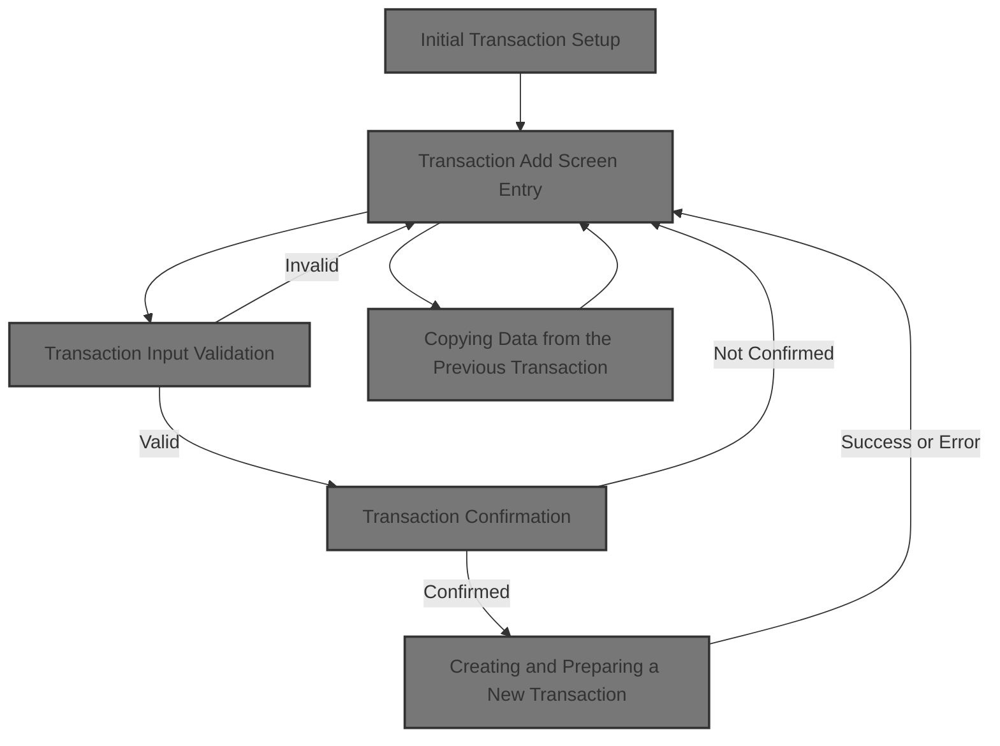

## Dependencies

### Programs

- COTRN02C (app/cbl/COTRN02C.cbl)
- CT02
- CSUTLDTC (app/cbl/CSUTLDTC.cbl)
- CEEDAYS
- COMEN01C (app/cbl/COMEN01C.cbl)
- CM00
- COSGN00C (app/cbl/COSGN00C.cbl)
- CDEMO-FROM-PROGRAM

### Copybooks

- COCOM01Y (app/cpy/COCOM01Y.cpy)
- COMEN02Y (app/cpy/COMEN02Y.cpy)
- COMEN01 (app/cpy-bms/COMEN01.CPY)
- COTTL01Y (app/cpy/COTTL01Y.cpy)
- CSDAT01Y (app/cpy/CSDAT01Y.cpy)
- CSMSG01Y (app/cpy/CSMSG01Y.cpy)
- CSUSR01Y (app/cpy/CSUSR01Y.cpy)
- DFHAID
- DFHBMSCA
- COTRN02 (app/cpy-bms/COTRN02.CPY)
- CVTRA05Y (app/cpy/CVTRA05Y.cpy)
- CVACT01Y (app/cpy/CVACT01Y.cpy)
- CVACT03Y (app/cpy/CVACT03Y.cpy)

## Input and Output Tables/Files used in the Program

| Table / File Name | Type | Description                                               | Usage Mode | Key Fields / Layout Highlights |
| ----------------- | ---- | --------------------------------------------------------- | ---------- | ------------------------------ |
| WS-CCXREF-FILE    | File | Card-to-account cross-reference for lookup by card number | Input      | File resource                  |
| WS-CXACAIX-FILE   | File | Card-to-account cross-reference for lookup by account ID  | Input      | File resource                  |
| WS-TRANSACT-FILE  | File | Credit card transaction history and details               | Output     | File resource                  |

&nbsp;

# Workflow

# Initial Transaction Setup

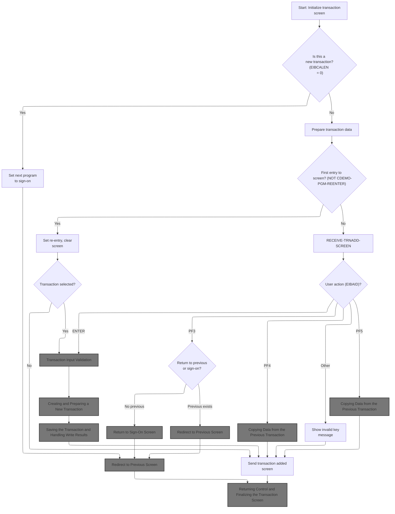

This section governs the initial setup and user interaction logic for the transaction screen, ensuring proper error handling, navigation, and user feedback.

| Rule ID | Code Location | Category       | Rule Name                               | Description                                                                                                                                            | Conditions                                                                   | Remarks                                                                                                                                  |
| ------- | ------------- | -------------- | --------------------------------------- | ------------------------------------------------------------------------------------------------------------------------------------------------------ | ---------------------------------------------------------------------------- | ---------------------------------------------------------------------------------------------------------------------------------------- |
| BR-001  | MAIN-PARA     | Business logic | Redirect to sign-on for new transaction | If the transaction is new and no input is provided, the system sets the next program to the sign-on screen and redirects the user accordingly.         | No input is provided (EIBCALEN = 0) during transaction setup.                | Next program is set to 'COSGN00C'. The user is redirected to the sign-on screen.                                                         |
| BR-002  | MAIN-PARA     | Error handling | Reset error and message fields          | Whenever the transaction screen is initialized, all error flags are reset and message fields are cleared to ensure the user starts with a clean state. | The transaction screen is being initialized.                                 | Error flag is set to 'N'. Message fields are set to spaces. This ensures no residual error or message is shown from previous operations. |
| BR-003  | MAIN-PARA     | Error handling | Invalid key message display             | When a user presses an invalid key during transaction setup, the system displays a specific invalid key message to inform the user.                    | User presses a key that is not recognized as valid during transaction setup. | Message displayed: 'Invalid key pressed. Please see below...         ' (50 characters, left aligned, padded with spaces).                |

<SwmSnippet path="/app/cbl/COTRN02C.cbl" line="107" repo-id="Z2l0aHViJTNBJTNBa3luZHJ5bC1hd3MtbWFpbmZyYW1lLW1vZGVybml6YXRpb24tY2FyZGRlbW8lM0ElM0FTd2ltbS1EZW1v">

---

We start by resetting error flags and clearing message fields to prep for transaction logic.

```cobol
       MAIN-PARA.

           SET ERR-FLG-OFF     TO TRUE
           SET USR-MODIFIED-NO TO TRUE

           MOVE SPACES TO WS-MESSAGE
                          ERRMSGO OF COTRN2AO
```

---

</SwmSnippet>

<SwmSnippet path="/app/cbl/COTRN02C.cbl" line="115" repo-id="Z2l0aHViJTNBJTNBa3luZHJ5bC1hd3MtbWFpbmZyYW1lLW1vZGVybml6YXRpb24tY2FyZGRlbW8lM0ElM0FTd2ltbS1EZW1v">

---

If there's no input, we set the next program and call RETURN-TO-PREV-SCREEN to handle the redirect.

```cobol
           IF EIBCALEN = 0
               MOVE 'COSGN00C' TO CDEMO-TO-PROGRAM
               PERFORM RETURN-TO-PREV-SCREEN
```

---

</SwmSnippet>

## Redirect to Previous Screen

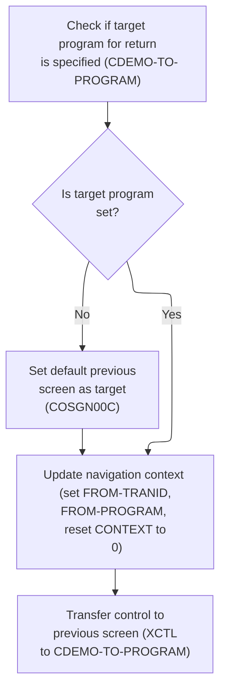

This section manages the logic for redirecting the user to the previous screen in the CardDemo application, ensuring navigation context is properly maintained and the user is sent to the correct program.

| Rule ID | Code Location         | Category       | Rule Name                          | Description                                                                                                                                                                                       | Conditions                                                                        | Remarks                                                                                                                                                        |
| ------- | --------------------- | -------------- | ---------------------------------- | ------------------------------------------------------------------------------------------------------------------------------------------------------------------------------------------------- | --------------------------------------------------------------------------------- | -------------------------------------------------------------------------------------------------------------------------------------------------------------- |
| BR-001  | RETURN-TO-PREV-SCREEN | Business logic | Default Previous Screen Assignment | If the target program for return is not specified (i.e., it is blank or contains low values), the system must set the default previous screen program as the target.                              | The target program for return is blank or contains low values.                    | The default previous screen program is 'COSGN00C', an 8-character string.                                                                                      |
| BR-002  | RETURN-TO-PREV-SCREEN | Business logic | Navigation Context Update          | Before transferring control to the previous screen, the navigation context must be updated to reflect the current program and transaction as the source, and the context indicator must be reset. | A transfer to the previous screen is about to occur.                              | The source program and transaction are set to the current program ('COTRN02C') and transaction ('CT02'), both as strings. The context indicator is reset to 0. |
| BR-003  | RETURN-TO-PREV-SCREEN | Business logic | Transfer to Target Program         | The system must transfer control to the program specified as the target for return, using the updated navigation context.                                                                         | The target program for return is set (either specified by the user or defaulted). | The transfer uses the navigation context as communication data. The target program is an 8-character string.                                                   |

<SwmSnippet path="/app/cbl/COTRN02C.cbl" line="500" repo-id="Z2l0aHViJTNBJTNBa3luZHJ5bC1hd3MtbWFpbmZyYW1lLW1vZGVybml6YXRpb24tY2FyZGRlbW8lM0ElM0FTd2ltbS1EZW1v">

---

We check if the next program is set, and if not, we assign a default before moving on.

```cobol
       RETURN-TO-PREV-SCREEN.

           IF CDEMO-TO-PROGRAM = LOW-VALUES OR SPACES
               MOVE 'COSGN00C' TO CDEMO-TO-PROGRAM
           END-IF
```

---

</SwmSnippet>

<SwmSnippet path="/app/cbl/COTRN02C.cbl" line="505" repo-id="Z2l0aHViJTNBJTNBa3luZHJ5bC1hd3MtbWFpbmZyYW1lLW1vZGVybml6YXRpb24tY2FyZGRlbW8lM0ElM0FTd2ltbS1EZW1v">

---

We prep the commarea and use XCTL to jump to COMEN01C.cbl for the next screen.

```cobol
           MOVE WS-TRANID    TO CDEMO-FROM-TRANID
           MOVE WS-PGMNAME   TO CDEMO-FROM-PROGRAM
           MOVE ZEROS        TO CDEMO-PGM-CONTEXT
           EXEC CICS
               XCTL PROGRAM(CDEMO-TO-PROGRAM)
               COMMAREA(CARDDEMO-COMMAREA)
           END-EXEC.
```

---

</SwmSnippet>

## Menu Screen Entry

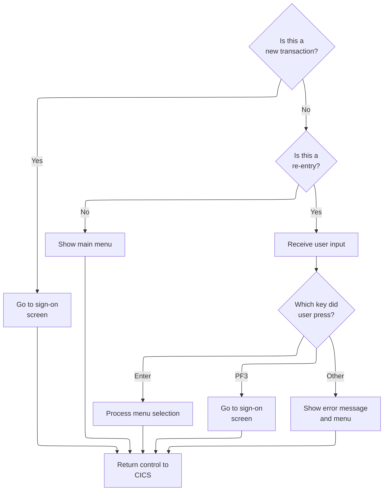

This section determines which screen is shown to the user and how user input is handled when entering the main menu, including error handling for invalid actions.

| Rule ID | Code Location | Category       | Rule Name                        | Description                                                                                                                      | Conditions                                                                            | Remarks                                                                                                                                                                                           |
| ------- | ------------- | -------------- | -------------------------------- | -------------------------------------------------------------------------------------------------------------------------------- | ------------------------------------------------------------------------------------- | ------------------------------------------------------------------------------------------------------------------------------------------------------------------------------------------------- |
| BR-001  | MAIN-PARA     | Business logic | New Transaction Sign-On Redirect | If the transaction is new, the user is redirected to the sign-on screen before accessing the menu.                               | The transaction communication area length is zero.                                    | The sign-on screen is triggered when the communication area length is zero. The program name for sign-on is 'COSGN00C'.                                                                           |
| BR-002  | MAIN-PARA     | Business logic | Re-Entry Menu Processing         | If the transaction is a re-entry, the application receives user input and processes the menu selection based on the key pressed. | The transaction communication area is present and the context is set to re-entry.     | Menu selection is processed when the context is re-entry. The keys handled are Enter, PF3, and others. The error message for invalid keys is 'Invalid key pressed. Please see below...         '. |
| BR-003  | MAIN-PARA     | Business logic | Show Main Menu on First Entry    | If the transaction is not a re-entry, the main menu is shown to the user.                                                        | The transaction communication area is present and the context is not set to re-entry. | The main menu is shown when the context is not re-entry. The screen is cleared before displaying the menu.                                                                                        |
| BR-004  | MAIN-PARA     | Error handling | Invalid Key Error Message        | If the user presses a key other than Enter or PF3 on the menu screen, an error message is displayed and the menu is shown again. | User input is received and the key pressed is not Enter or PF3.                       | The error flag is set to 'Y' and the error message is 'Invalid key pressed. Please see below...         '. The message is a string of 50 characters, left aligned, padded with spaces.            |

<SwmSnippet path="/app/cbl/COMEN01C.cbl" line="75" repo-id="Z2l0aHViJTNBJTNBa3luZHJ5bC1hd3MtbWFpbmZyYW1lLW1vZGVybml6YXRpb24tY2FyZGRlbW8lM0ElM0FTd2ltbS1EZW1v">

---

We decide whether to show the menu or handle user input, depending on the program state.

```cobol
       MAIN-PARA.

           SET ERR-FLG-OFF TO TRUE

           MOVE SPACES TO WS-MESSAGE
                          ERRMSGO OF COMEN1AO

           IF EIBCALEN = 0
               MOVE 'COSGN00C' TO CDEMO-FROM-PROGRAM
               PERFORM RETURN-TO-SIGNON-SCREEN
           ELSE
               MOVE DFHCOMMAREA(1:EIBCALEN) TO CARDDEMO-COMMAREA
               IF NOT CDEMO-PGM-REENTER
                   SET CDEMO-PGM-REENTER    TO TRUE
                   MOVE LOW-VALUES          TO COMEN1AO
                   PERFORM SEND-MENU-SCREEN
               ELSE
                   PERFORM RECEIVE-MENU-SCREEN
                   EVALUATE EIBAID
                       WHEN DFHENTER
                           PERFORM PROCESS-ENTER-KEY
                       WHEN DFHPF3
                           MOVE 'COSGN00C' TO CDEMO-TO-PROGRAM
                           PERFORM RETURN-TO-SIGNON-SCREEN
                       WHEN OTHER
                           MOVE 'Y'                       TO WS-ERR-FLG
                           MOVE CCDA-MSG-INVALID-KEY      TO WS-MESSAGE
                           PERFORM SEND-MENU-SCREEN
                   END-EVALUATE
               END-IF
           END-IF

           EXEC CICS RETURN
                     TRANSID (WS-TRANID)
                     COMMAREA (CARDDEMO-COMMAREA)
           END-EXEC.
```

---

</SwmSnippet>

## Return to Sign-On Screen

This section ensures that users are always redirected to the sign-on screen by validating and setting the target program name before transferring control. It maintains application flow integrity by enforcing a consistent return path to the sign-on process.

| Rule ID | Code Location           | Category       | Rule Name                          | Description                                                                                                                                                                                       | Conditions                                                                                                        | Remarks                                                                                                                                                                                |
| ------- | ----------------------- | -------------- | ---------------------------------- | ------------------------------------------------------------------------------------------------------------------------------------------------------------------------------------------------- | ----------------------------------------------------------------------------------------------------------------- | -------------------------------------------------------------------------------------------------------------------------------------------------------------------------------------- |
| BR-001  | RETURN-TO-SIGNON-SCREEN | Business logic | Default sign-on program assignment | If the target program name in the communication area is empty or contains only low-values or spaces, it must be set to the default sign-on program name ('COSGN00C') before transferring control. | This rule applies when the target program field in the communication area is either all low-values or all spaces. | The default sign-on program name is 'COSGN00C', which is an 8-character alphanumeric string. The field must be set to this value if it is empty or contains only low-values or spaces. |
| BR-002  | RETURN-TO-SIGNON-SCREEN | Business logic | Transfer to sign-on program        | The system must always transfer control to the program specified in the target program field of the communication area, which will be the sign-on program in this context.                        | This rule applies after the target program field has been validated and set to a valid program name.              | The transfer is made to the program name specified in the communication area, which will be 'COSGN00C' if the field was previously empty or invalid.                                   |

<SwmSnippet path="/app/cbl/COMEN01C.cbl" line="170" repo-id="Z2l0aHViJTNBJTNBa3luZHJ5bC1hd3MtbWFpbmZyYW1lLW1vZGVybml6YXRpb24tY2FyZGRlbW8lM0ElM0FTd2ltbS1EZW1v">

---

We make sure the next program is set, then transfer control to the sign-on screen.

```cobol
       RETURN-TO-SIGNON-SCREEN.

           IF CDEMO-TO-PROGRAM = LOW-VALUES OR SPACES
               MOVE 'COSGN00C' TO CDEMO-TO-PROGRAM
           END-IF
           EXEC CICS
               XCTL PROGRAM(CDEMO-TO-PROGRAM)
           END-EXEC.
```

---

</SwmSnippet>

## Sign-On Screen Display

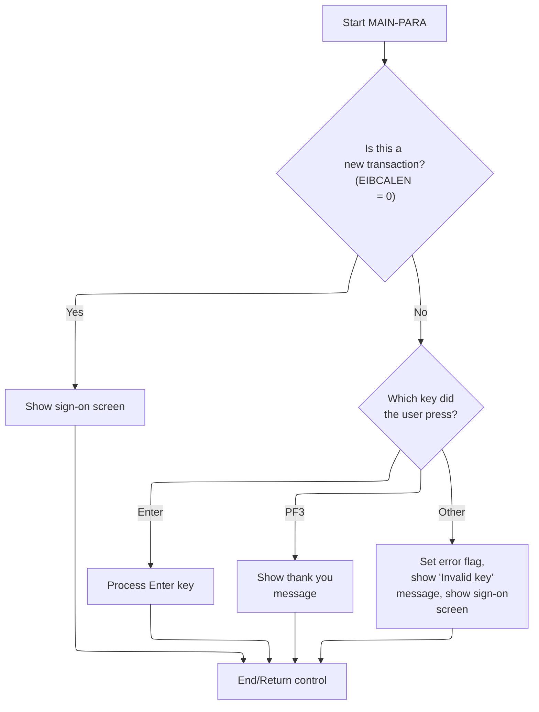

This section governs the display and user interaction logic for the sign-on screen, ensuring users are presented with the correct interface and feedback based on their actions.

| Rule ID | Code Location                 | Category       | Rule Name                  | Description                                                                                                                                                    | Conditions                                                                                                       | Remarks                                                                                                                                                                                             |
| ------- | ----------------------------- | -------------- | -------------------------- | -------------------------------------------------------------------------------------------------------------------------------------------------------------- | ---------------------------------------------------------------------------------------------------------------- | --------------------------------------------------------------------------------------------------------------------------------------------------------------------------------------------------- |
| BR-001  | MAIN-PARA, SEND-SIGNON-SCREEN | Business logic | New Transaction Sign-On    | When a new transaction is detected, the system must display a clean sign-on screen to the user, ensuring all fields are reset and ready for input.             | Triggered when the transaction length is zero (EIBCALEN = 0).                                                    | The sign-on screen is sent with all fields reset. The user ID field is set to -1, and the output screen is initialized with low values. No error message is shown.                                  |
| BR-002  | MAIN-PARA                     | Business logic | Enter Key Processing       | When the user presses the Enter key, the system must process the Enter key action according to the business logic for sign-on.                                 | Triggered when the transaction is not new (EIBCALEN > 0) and the user pressed the Enter key (EIBAID = DFHENTER). | No error or thank you message is shown in this context. The system proceeds to process the Enter key action.                                                                                        |
| BR-003  | MAIN-PARA                     | Business logic | PF3 Thank You Message      | When the user presses the PF3 key, the system must display a thank you message to the user.                                                                    | Triggered when the transaction is not new (EIBCALEN > 0) and the user pressed the PF3 key (EIBAID = DFHPF3).     | The thank you message is a string of 50 characters: 'Thank you for using CardDemo application...      '.                                                                                            |
| BR-004  | MAIN-PARA, SEND-SIGNON-SCREEN | Error handling | Invalid Key Error Handling | When the user presses any key other than Enter or PF3, the system must set an error flag, display an 'Invalid key' message, and re-display the sign-on screen. | Triggered when the transaction is not new (EIBCALEN > 0) and the user pressed a key other than Enter or PF3.     | The error flag is set to 'Y'. The invalid key message is a string of 50 characters: 'Invalid key pressed. Please see below...         '. The sign-on screen is re-displayed with the error message. |

<SwmSnippet path="/app/cbl/COSGN00C.cbl" line="73" repo-id="Z2l0aHViJTNBJTNBa3luZHJ5bC1hd3MtbWFpbmZyYW1lLW1vZGVybml6YXRpb24tY2FyZGRlbW8lM0ElM0FTd2ltbS1EZW1v">

---

We decide whether to show the sign-on screen or handle user actions, depending on input.

```cobol
       MAIN-PARA.

           SET ERR-FLG-OFF TO TRUE

           MOVE SPACES TO WS-MESSAGE
                          ERRMSGO OF COSGN0AO

           IF EIBCALEN = 0
               MOVE LOW-VALUES TO COSGN0AO
               MOVE -1       TO USERIDL OF COSGN0AI
               PERFORM SEND-SIGNON-SCREEN
           ELSE
               EVALUATE EIBAID
                   WHEN DFHENTER
                       PERFORM PROCESS-ENTER-KEY
                   WHEN DFHPF3
                       MOVE CCDA-MSG-THANK-YOU        TO WS-MESSAGE
                       PERFORM SEND-PLAIN-TEXT
                   WHEN OTHER
                       MOVE 'Y'                       TO WS-ERR-FLG
                       MOVE CCDA-MSG-INVALID-KEY      TO WS-MESSAGE
                       PERFORM SEND-SIGNON-SCREEN
               END-EVALUATE
           END-IF.

           EXEC CICS RETURN
                     TRANSID (WS-TRANID)
                     COMMAREA (CARDDEMO-COMMAREA)
                     LENGTH(LENGTH OF CARDDEMO-COMMAREA)
           END-EXEC.
```

---

</SwmSnippet>

<SwmSnippet path="/app/cbl/COSGN00C.cbl" line="145" repo-id="Z2l0aHViJTNBJTNBa3luZHJ5bC1hd3MtbWFpbmZyYW1lLW1vZGVybml6YXRpb24tY2FyZGRlbW8lM0ElM0FTd2ltbS1EZW1v">

---

We prep the sign-on screen and send it to the user, making sure it's clean and ready for input.

```cobol
       SEND-SIGNON-SCREEN.

           PERFORM POPULATE-HEADER-INFO

           MOVE WS-MESSAGE TO ERRMSGO OF COSGN0AO

           EXEC CICS SEND
                     MAP('COSGN0A')
                     MAPSET('COSGN00')
                     FROM(COSGN0AO)
                     ERASE
                     CURSOR
           END-EXEC.
```

---

</SwmSnippet>

## Sign-On Input Handling

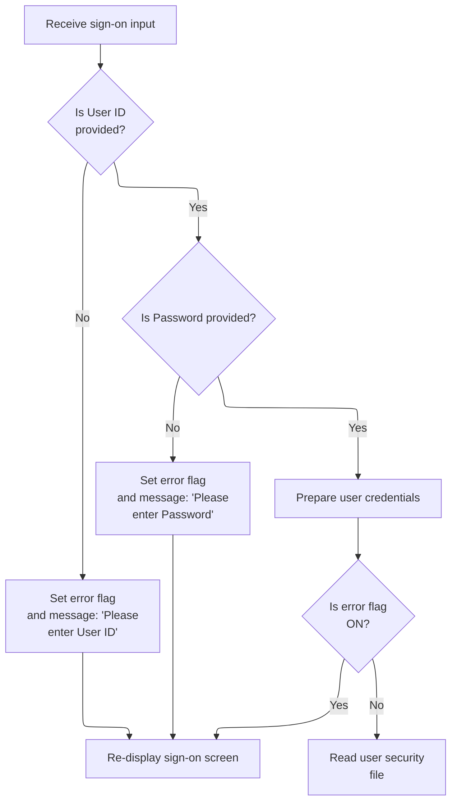

This section governs the validation and preparation of user credentials during the sign-on process, ensuring required fields are provided and standardized before authentication is attempted.

| Rule ID | Code Location     | Category        | Rule Name                 | Description                                                                                                                                                                                             | Conditions                                                                        | Remarks                                                                                                                                                                     |
| ------- | ----------------- | --------------- | ------------------------- | ------------------------------------------------------------------------------------------------------------------------------------------------------------------------------------------------------- | --------------------------------------------------------------------------------- | --------------------------------------------------------------------------------------------------------------------------------------------------------------------------- |
| BR-001  | PROCESS-ENTER-KEY | Data validation | User ID Required          | If the User ID field is empty or contains only blank or low-value characters, the system sets an error flag and displays the message 'Please enter User ID ...', then re-displays the sign-on screen.   | User ID field is empty, blank, or contains low-value characters.                  | Error flag is set to 'Y'. Message displayed is 'Please enter User ID ...'. The sign-on screen is re-displayed. No further processing occurs until valid input is provided.  |
| BR-002  | PROCESS-ENTER-KEY | Data validation | Password Required         | If the Password field is empty or contains only blank or low-value characters, the system sets an error flag and displays the message 'Please enter Password ...', then re-displays the sign-on screen. | Password field is empty, blank, or contains low-value characters.                 | Error flag is set to 'Y'. Message displayed is 'Please enter Password ...'. The sign-on screen is re-displayed. No further processing occurs until valid input is provided. |
| BR-003  | PROCESS-ENTER-KEY | Business logic  | Credentials Preparation   | If both User ID and Password are provided, the system prepares the credentials by converting them to uppercase before proceeding.                                                                       | Both User ID and Password fields are provided and valid (not blank or low-value). | User ID and Password are converted to uppercase before being stored for further processing. The format is alphanumeric, up to 8 characters for each field.                  |
| BR-004  | PROCESS-ENTER-KEY | Business logic  | User Security File Lookup | If no error flag is set after input validation and credentials preparation, the system proceeds to read the user security file for authentication.                                                      | Error flag is not set ('N') after input validation and credentials preparation.   | The user security file is accessed only if both User ID and Password are valid and no error flag is set. The error flag must be 'N' for this step to occur.                 |

<SwmSnippet path="/app/cbl/COSGN00C.cbl" line="108" repo-id="Z2l0aHViJTNBJTNBa3luZHJ5bC1hd3MtbWFpbmZyYW1lLW1vZGVybml6YXRpb24tY2FyZGRlbW8lM0ElM0FTd2ltbS1EZW1v">

---

We validate user input and either prompt again or continue to user file lookup.

```cobol
       PROCESS-ENTER-KEY.

           EXEC CICS RECEIVE
                     MAP('COSGN0A')
                     MAPSET('COSGN00')
                     RESP(WS-RESP-CD)
                     RESP2(WS-REAS-CD)
           END-EXEC.

           EVALUATE TRUE
               WHEN USERIDI OF COSGN0AI = SPACES OR LOW-VALUES
                   MOVE 'Y'      TO WS-ERR-FLG
                   MOVE 'Please enter User ID ...' TO WS-MESSAGE
                   MOVE -1       TO USERIDL OF COSGN0AI
                   PERFORM SEND-SIGNON-SCREEN
               WHEN PASSWDI OF COSGN0AI = SPACES OR LOW-VALUES
                   MOVE 'Y'      TO WS-ERR-FLG
                   MOVE 'Please enter Password ...' TO WS-MESSAGE
                   MOVE -1       TO PASSWDL OF COSGN0AI
                   PERFORM SEND-SIGNON-SCREEN
               WHEN OTHER
                   CONTINUE
           END-EVALUATE.

           MOVE FUNCTION UPPER-CASE(USERIDI OF COSGN0AI) TO
                           WS-USER-ID
                           CDEMO-USER-ID
           MOVE FUNCTION UPPER-CASE(PASSWDI OF COSGN0AI) TO
                           WS-USER-PWD

           IF NOT ERR-FLG-ON
               PERFORM READ-USER-SEC-FILE
           END-IF.
```

---

</SwmSnippet>

## User Security File Lookup

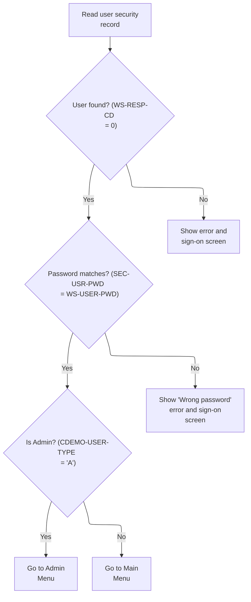

This section validates user credentials against the user security file and determines whether to grant access to the admin menu, main menu, or display error messages based on the outcome.

| Rule ID | Code Location      | Category       | Rule Name                              | Description                                                                                                                                                                                | Conditions                                                                                                 | Remarks                                                                                                                                                                                                                     |
| ------- | ------------------ | -------------- | -------------------------------------- | ------------------------------------------------------------------------------------------------------------------------------------------------------------------------------------------ | ---------------------------------------------------------------------------------------------------------- | --------------------------------------------------------------------------------------------------------------------------------------------------------------------------------------------------------------------------- |
| BR-001  | READ-USER-SEC-FILE | Business logic | User authentication and menu branching | If the user ID exists in the user security file and the password matches, the user is granted access. If the user type is 'A', the admin menu is shown; otherwise, the main menu is shown. | User ID is found in the security file (response code = 0) and password matches the stored password.        | User type 'A' grants access to the admin menu; user type 'U' grants access to the main menu. User ID and password are both 8-character alphanumeric strings. The admin menu and main menu are distinct application screens. |
| BR-002  | READ-USER-SEC-FILE | Error handling | Password mismatch error                | If the user ID exists but the password does not match, an error message 'Wrong Password. Try again ...' is displayed and the sign-on screen is shown again.                                | User ID is found in the security file (response code = 0) but password does not match the stored password. | Error message: 'Wrong Password. Try again ...' (string, left-aligned, up to 80 characters). The sign-on screen is re-displayed.                                                                                             |
| BR-003  | READ-USER-SEC-FILE | Error handling | User not found error                   | If the user ID is not found in the user security file, an error message 'User not found. Try again ...' is displayed and the sign-on screen is shown again.                                | User ID is not found in the security file (response code = 13).                                            | Error message: 'User not found. Try again ...' (string, left-aligned, up to 80 characters). The sign-on screen is re-displayed.                                                                                             |
| BR-004  | READ-USER-SEC-FILE | Error handling | Unexpected error handling              | If an unexpected error occurs during the user security file lookup, an error message 'Unable to verify the User ...' is displayed and the sign-on screen is shown again.                   | Any response code other than 0 or 13 is returned from the user security file lookup.                       | Error message: 'Unable to verify the User ...' (string, left-aligned, up to 80 characters). The sign-on screen is re-displayed.                                                                                             |

<SwmSnippet path="/app/cbl/COSGN00C.cbl" line="209" repo-id="Z2l0aHViJTNBJTNBa3luZHJ5bC1hd3MtbWFpbmZyYW1lLW1vZGVybml6YXRpb24tY2FyZGRlbW8lM0ElM0FTd2ltbS1EZW1v">

---

We validate credentials and branch to admin or user menu, or show errors if needed.

```cobol
       READ-USER-SEC-FILE.

           EXEC CICS READ
                DATASET   (WS-USRSEC-FILE)
                INTO      (SEC-USER-DATA)
                LENGTH    (LENGTH OF SEC-USER-DATA)
                RIDFLD    (WS-USER-ID)
                KEYLENGTH (LENGTH OF WS-USER-ID)
                RESP      (WS-RESP-CD)
                RESP2     (WS-REAS-CD)
           END-EXEC.

           EVALUATE WS-RESP-CD
               WHEN 0
                   IF SEC-USR-PWD = WS-USER-PWD
                       MOVE WS-TRANID    TO CDEMO-FROM-TRANID
                       MOVE WS-PGMNAME   TO CDEMO-FROM-PROGRAM
                       MOVE WS-USER-ID   TO CDEMO-USER-ID
                       MOVE SEC-USR-TYPE TO CDEMO-USER-TYPE
                       MOVE ZEROS        TO CDEMO-PGM-CONTEXT

                       IF CDEMO-USRTYP-ADMIN
                            EXEC CICS XCTL
                              PROGRAM ('COADM01C')
                              COMMAREA(CARDDEMO-COMMAREA)
                            END-EXEC
                       ELSE
                            EXEC CICS XCTL
                              PROGRAM ('COMEN01C')
                              COMMAREA(CARDDEMO-COMMAREA)
                            END-EXEC
                       END-IF
                   ELSE
                       MOVE 'Wrong Password. Try again ...' TO
                                                          WS-MESSAGE
                       MOVE -1       TO PASSWDL OF COSGN0AI
                       PERFORM SEND-SIGNON-SCREEN
                   END-IF
               WHEN 13
                   MOVE 'Y'      TO WS-ERR-FLG
                   MOVE 'User not found. Try again ...' TO WS-MESSAGE
                   MOVE -1       TO USERIDL OF COSGN0AI
                   PERFORM SEND-SIGNON-SCREEN
               WHEN OTHER
                   MOVE 'Y'      TO WS-ERR-FLG
                   MOVE 'Unable to verify the User ...' TO WS-MESSAGE
                   MOVE -1       TO USERIDL OF COSGN0AI
                   PERFORM SEND-SIGNON-SCREEN
           END-EVALUATE.
```

---

</SwmSnippet>

## Admin Menu Entry

This section manages the entry point for the admin menu, determining whether to display the menu, process user input, or return to the sign-on screen based on session state and user actions.

| Rule ID | Code Location                      | Category       | Rule Name                        | Description                                                                                                                                         | Conditions                                                                  | Remarks                                                                                                               |
| ------- | ---------------------------------- | -------------- | -------------------------------- | --------------------------------------------------------------------------------------------------------------------------------------------------- | --------------------------------------------------------------------------- | --------------------------------------------------------------------------------------------------------------------- |
| BR-001  | MAIN-PARA, RETURN-TO-SIGNON-SCREEN | Business logic | Sign-on Fallback                 | If no communication area is received (input length is zero), the system must set the next program to the sign-on screen and transfer control to it. | The communication area length is zero.                                      | The sign-on program name is 'COSGN00C'. The communication area is not present, so the next program is set explicitly. |
| BR-002  | MAIN-PARA                          | Business logic | Initial Menu Display             | When the program is entered for the first time (not a re-entry), the admin menu screen must be displayed with all fields cleared.                   | The program context does not indicate re-entry.                             | All fields on the admin menu screen are set to their default (blank or low-value) state.                              |
| BR-003  | MAIN-PARA                          | Business logic | Process Enter Key                | When the user presses the ENTER key, the system processes the input according to the admin menu logic.                                              | The user action is ENTER.                                                   | The specific processing logic is handled in the PROCESS-ENTER-KEY paragraph.                                          |
| BR-004  | MAIN-PARA, RETURN-TO-SIGNON-SCREEN | Business logic | PF3 Returns to Sign-on           | When the user presses the PF3 key, the system must set the next program to the sign-on screen and transfer control to it.                           | The user action is PF3.                                                     | The sign-on program name is 'COSGN00C'.                                                                               |
| BR-005  | RETURN-TO-SIGNON-SCREEN            | Business logic | Default Next Program for Sign-on | When transferring control to the sign-on screen, if the next program is not already set, it must be set to the sign-on program name.                | The next program is blank or contains low values when returning to sign-on. | The sign-on program name is 'COSGN00C'.                                                                               |
| BR-006  | MAIN-PARA                          | Error handling | Invalid Key Error                | If the user presses any key other than ENTER or PF3, the system must display an error message and re-display the admin menu screen.                 | The user action is not ENTER or PF3.                                        | The error message is 'Invalid key pressed. Please see below...         '. The error flag is set to 'Y'.               |

<SwmSnippet path="/app/cbl/COADM01C.cbl" line="75" repo-id="Z2l0aHViJTNBJTNBa3luZHJ5bC1hd3MtbWFpbmZyYW1lLW1vZGVybml6YXRpb24tY2FyZGRlbW8lM0ElM0FTd2ltbS1EZW1v">

---

We decide whether to display the admin menu or handle input, then act based on what the user does.

```cobol
       MAIN-PARA.

           SET ERR-FLG-OFF TO TRUE

           MOVE SPACES TO WS-MESSAGE
                          ERRMSGO OF COADM1AO

           IF EIBCALEN = 0
               MOVE 'COSGN00C' TO CDEMO-FROM-PROGRAM
               PERFORM RETURN-TO-SIGNON-SCREEN
           ELSE
               MOVE DFHCOMMAREA(1:EIBCALEN) TO CARDDEMO-COMMAREA
               IF NOT CDEMO-PGM-REENTER
                   SET CDEMO-PGM-REENTER    TO TRUE
                   MOVE LOW-VALUES          TO COADM1AO
                   PERFORM SEND-MENU-SCREEN
               ELSE
                   PERFORM RECEIVE-MENU-SCREEN
                   EVALUATE EIBAID
                       WHEN DFHENTER
                           PERFORM PROCESS-ENTER-KEY
                       WHEN DFHPF3
                           MOVE 'COSGN00C' TO CDEMO-TO-PROGRAM
                           PERFORM RETURN-TO-SIGNON-SCREEN
                       WHEN OTHER
                           MOVE 'Y'                       TO WS-ERR-FLG
                           MOVE CCDA-MSG-INVALID-KEY      TO WS-MESSAGE
                           PERFORM SEND-MENU-SCREEN
                   END-EVALUATE
               END-IF
           END-IF

           EXEC CICS RETURN
                     TRANSID (WS-TRANID)
                     COMMAREA (CARDDEMO-COMMAREA)
           END-EXEC.
```

---

</SwmSnippet>

<SwmSnippet path="/app/cbl/COADM01C.cbl" line="160" repo-id="Z2l0aHViJTNBJTNBa3luZHJ5bC1hd3MtbWFpbmZyYW1lLW1vZGVybml6YXRpb24tY2FyZGRlbW8lM0ElM0FTd2ltbS1EZW1v">

---

We make sure the next program is set, then transfer control to the sign-on screen.

```cobol
       RETURN-TO-SIGNON-SCREEN.

           IF CDEMO-TO-PROGRAM = LOW-VALUES OR SPACES
               MOVE 'COSGN00C' TO CDEMO-TO-PROGRAM
           END-IF
           EXEC CICS
               XCTL PROGRAM(CDEMO-TO-PROGRAM)
           END-EXEC.
```

---

</SwmSnippet>

### Admin Menu Screen Construction

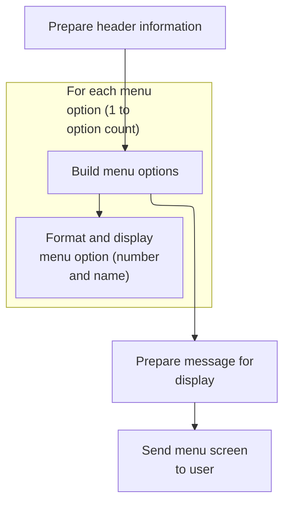

This section is responsible for constructing and displaying the admin menu screen, including formatting up to 10 menu options and ensuring the message area is populated.

| Rule ID | Code Location      | Category       | Rule Name                  | Description                                                                                                                                                         | Conditions                                                                             | Remarks                                                                                                                                                                                                                                                            |
| ------- | ------------------ | -------------- | -------------------------- | ------------------------------------------------------------------------------------------------------------------------------------------------------------------- | -------------------------------------------------------------------------------------- | ------------------------------------------------------------------------------------------------------------------------------------------------------------------------------------------------------------------------------------------------------------------ |
| BR-001  | BUILD-MENU-OPTIONS | Business logic | Maximum of 10 Menu Options | The admin menu screen displays up to 10 menu options, each with a unique number and name. If there are fewer than 10 options, only the available options are shown. | When constructing the admin menu screen and the menu option count is between 1 and 10. | The menu can display a maximum of 10 options. Each option is formatted as: \[number\]. \[name\], where \[number\] is the option's sequence number and \[name\] is the option's display name. If there are fewer than 10 options, only those options are displayed. |
| BR-002  | BUILD-MENU-OPTIONS | Business logic | Menu Option Formatting     | Each menu option is displayed as a string consisting of its number, a period and space, and its name (e.g., '1. Option Name').                                      | When displaying each menu option on the admin menu screen.                             | Each option is formatted as: \[number\]. \[name\], where \[number\] is the option's sequence number and \[name\] is the option's display name. The formatted string is up to 40 characters.                                                                        |
| BR-003  | SEND-MENU-SCREEN   | Business logic | Message Area Assignment    | The message area on the admin menu screen is always populated with the current message string before the screen is sent to the user.                                | When preparing the admin menu screen for display.                                      | The message area is an 80-character string. If no message is set, it is filled with spaces.                                                                                                                                                                        |

<SwmSnippet path="/app/cbl/COADM01C.cbl" line="172" repo-id="Z2l0aHViJTNBJTNBa3luZHJ5bC1hd3MtbWFpbmZyYW1lLW1vZGVybml6YXRpb24tY2FyZGRlbW8lM0ElM0FTd2ltbS1EZW1v">

---

We prep and send the admin menu screen with built options.

```cobol
       SEND-MENU-SCREEN.

           PERFORM POPULATE-HEADER-INFO
           PERFORM BUILD-MENU-OPTIONS

           MOVE WS-MESSAGE TO ERRMSGO OF COADM1AO

           EXEC CICS SEND
                     MAP('COADM1A')
                     MAPSET('COADM01')
                     FROM(COADM1AO)
                     ERASE
           END-EXEC.
```

---

</SwmSnippet>

<SwmSnippet path="/app/cbl/COADM01C.cbl" line="226" repo-id="Z2l0aHViJTNBJTNBa3luZHJ5bC1hd3MtbWFpbmZyYW1lLW1vZGVybml6YXRpb24tY2FyZGRlbW8lM0ElM0FTd2ltbS1EZW1v">

---

We build and assign up to 10 menu option strings for the admin menu.

```cobol
       BUILD-MENU-OPTIONS.

           PERFORM VARYING WS-IDX FROM 1 BY 1 UNTIL
                           WS-IDX > CDEMO-ADMIN-OPT-COUNT

               MOVE SPACES             TO WS-ADMIN-OPT-TXT

               STRING CDEMO-ADMIN-OPT-NUM(WS-IDX)  DELIMITED BY SIZE
                      '. '                         DELIMITED BY SIZE
                      CDEMO-ADMIN-OPT-NAME(WS-IDX) DELIMITED BY SIZE
                 INTO WS-ADMIN-OPT-TXT

               EVALUATE WS-IDX
                   WHEN 1
                       MOVE WS-ADMIN-OPT-TXT TO OPTN001O
                   WHEN 2
                       MOVE WS-ADMIN-OPT-TXT TO OPTN002O
                   WHEN 3
                       MOVE WS-ADMIN-OPT-TXT TO OPTN003O
                   WHEN 4
                       MOVE WS-ADMIN-OPT-TXT TO OPTN004O
                   WHEN 5
                       MOVE WS-ADMIN-OPT-TXT TO OPTN005O
                   WHEN 6
                       MOVE WS-ADMIN-OPT-TXT TO OPTN006O
                   WHEN 7
                       MOVE WS-ADMIN-OPT-TXT TO OPTN007O
                   WHEN 8
                       MOVE WS-ADMIN-OPT-TXT TO OPTN008O
                   WHEN 9
                       MOVE WS-ADMIN-OPT-TXT TO OPTN009O
                   WHEN 10
                       MOVE WS-ADMIN-OPT-TXT TO OPTN010O
                   WHEN OTHER
                       CONTINUE
               END-EVALUATE

           END-PERFORM.
```

---

</SwmSnippet>

### Admin Menu Option Selection

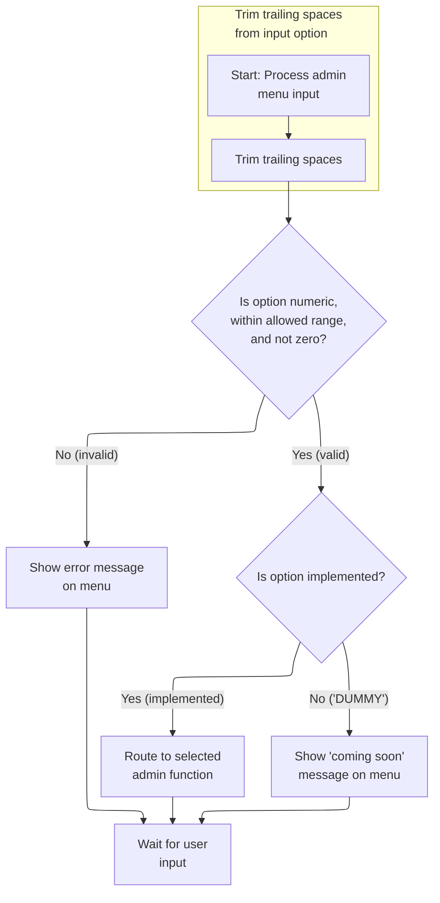

This section governs how the admin menu processes user input, validates the selection, and determines whether to route to an admin function, display an error, or show a placeholder for unimplemented options.

| Rule ID | Code Location     | Category        | Rule Name                              | Description                                                                                                                                                                                                       | Conditions                                                                                                                     | Remarks                                                                                                                                                                                                                    |
| ------- | ----------------- | --------------- | -------------------------------------- | ----------------------------------------------------------------------------------------------------------------------------------------------------------------------------------------------------------------- | ------------------------------------------------------------------------------------------------------------------------------ | -------------------------------------------------------------------------------------------------------------------------------------------------------------------------------------------------------------------------- |
| BR-001  | PROCESS-ENTER-KEY | Data validation | Admin menu option validation           | If the menu option entered by the user is not numeric, is greater than the maximum allowed option number, or is zero, an error message is displayed on the menu and the user is prompted to enter a valid option. | The user input is not numeric, or the numeric value is greater than the allowed maximum, or the value is zero.                 | The maximum allowed option number is determined by the value of CDEMO-ADMIN-OPT-COUNT. The error message displayed is: 'Please enter a valid option number...'. The message is shown in a string field on the menu screen. |
| BR-002  | PROCESS-ENTER-KEY | Data validation | Trim trailing spaces from input        | Trailing spaces in the user's menu input are removed before validation and processing.                                                                                                                            | The user input contains trailing spaces.                                                                                       | All trailing spaces are removed from the input before further processing. The cleaned input is then used for validation and routing.                                                                                       |
| BR-003  | PROCESS-ENTER-KEY | Business logic  | Unimplemented admin option placeholder | If the menu option entered by the user is valid but corresponds to an unimplemented function (marked as 'DUMMY'), a 'coming soon' message is displayed on the menu.                                               | The user input is numeric, within the allowed range, not zero, and the corresponding program name starts with 'DUMMY'.         | The placeholder message is constructed as: 'This option is coming soon ...' and displayed in a string field on the menu screen.                                                                                            |
| BR-004  | PROCESS-ENTER-KEY | Business logic  | Admin function routing                 | If the menu option entered by the user is valid and corresponds to an implemented function, the system routes the user to the selected admin function.                                                            | The user input is numeric, within the allowed range, not zero, and the corresponding program name does not start with 'DUMMY'. | The routing is performed by transferring control to the program associated with the selected option. The communication area is passed to the new program.                                                                  |

<SwmSnippet path="/app/cbl/COADM01C.cbl" line="115" repo-id="Z2l0aHViJTNBJTNBa3luZHJ5bC1hd3MtbWFpbmZyYW1lLW1vZGVybml6YXRpb24tY2FyZGRlbW8lM0ElM0FTd2ltbS1EZW1v">

---

We clean up the user's input, validate it, and either transfer control or show a placeholder message.

```cobol
       PROCESS-ENTER-KEY.

           PERFORM VARYING WS-IDX
                   FROM LENGTH OF OPTIONI OF COADM1AI BY -1 UNTIL
                   OPTIONI OF COADM1AI(WS-IDX:1) NOT = SPACES OR
                   WS-IDX = 1
           END-PERFORM
           MOVE OPTIONI OF COADM1AI(1:WS-IDX) TO WS-OPTION-X
           INSPECT WS-OPTION-X REPLACING ALL ' ' BY '0'
           MOVE WS-OPTION-X              TO WS-OPTION
           MOVE WS-OPTION                TO OPTIONO OF COADM1AO

           IF WS-OPTION IS NOT NUMERIC OR
              WS-OPTION > CDEMO-ADMIN-OPT-COUNT OR
              WS-OPTION = ZEROS
               MOVE 'Y'     TO WS-ERR-FLG
               MOVE 'Please enter a valid option number...' TO
                                       WS-MESSAGE
               PERFORM SEND-MENU-SCREEN
           END-IF


           IF NOT ERR-FLG-ON
               IF CDEMO-ADMIN-OPT-PGMNAME(WS-OPTION)(1:5) NOT = 'DUMMY'
                   MOVE WS-TRANID    TO CDEMO-FROM-TRANID
                   MOVE WS-PGMNAME   TO CDEMO-FROM-PROGRAM
                   MOVE ZEROS        TO CDEMO-PGM-CONTEXT
                   EXEC CICS
                       XCTL PROGRAM(CDEMO-ADMIN-OPT-PGMNAME(WS-OPTION))
                       COMMAREA(CARDDEMO-COMMAREA)
                   END-EXEC
               END-IF
               MOVE SPACES             TO WS-MESSAGE
               MOVE DFHGREEN           TO ERRMSGC  OF COADM1AO
               STRING 'This option '       DELIMITED BY SIZE
      *                CDEMO-ADMIN-OPT-NAME(WS-OPTION)
      *                                DELIMITED BY SIZE
                       'is coming soon ...'   DELIMITED BY SIZE
                  INTO WS-MESSAGE
               PERFORM SEND-MENU-SCREEN
           END-IF.
```

---

</SwmSnippet>

## Transaction Add Screen Entry

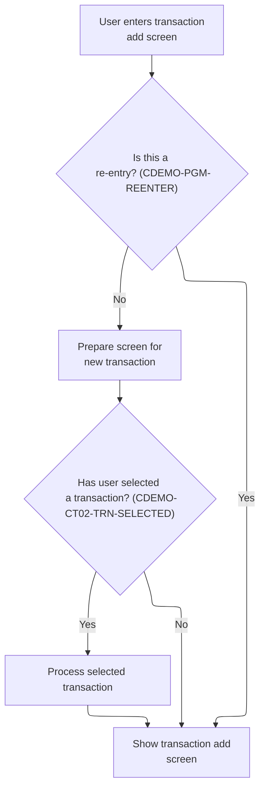

This section manages the logic for entering the Transaction Add screen, ensuring the correct state is presented to the user based on whether they are re-entering or selecting a transaction.

| Rule ID | Code Location | Category       | Rule Name                      | Description                                                                                                                                                                            | Conditions                                                                                                                | Remarks                                                                                                                              |
| ------- | ------------- | -------------- | ------------------------------ | -------------------------------------------------------------------------------------------------------------------------------------------------------------------------------------- | ------------------------------------------------------------------------------------------------------------------------- | ------------------------------------------------------------------------------------------------------------------------------------ |
| BR-001  | MAIN-LOGIC    | Business logic | Prepare New Transaction Screen | When the user enters the Transaction Add screen and it is not a re-entry, the screen is prepared for a new transaction by clearing all fields and setting the initial cursor position. | User enters Transaction Add screen and re-entry flag is not set.                                                          | Fields are cleared to their default values (e.g., blank or low-values). The initial cursor position is set to the first input field. |
| BR-002  | MAIN-LOGIC    | Business logic | Process Selected Transaction   | If the user has selected a transaction when entering the screen, the selected transaction data is loaded and processed before displaying the screen.                                   | User enters Transaction Add screen and a transaction is selected (selected transaction field is not blank or low-values). | Selected transaction data is loaded into the input fields before the screen is displayed.                                            |
| BR-003  | MAIN-LOGIC    | Business logic | Display Transaction Add Screen | After preparing the screen or processing a selected transaction, the Transaction Add screen is displayed to the user for further interaction.                                          | Screen preparation or transaction processing is complete.                                                                 | The Transaction Add screen is displayed with either cleared fields or pre-filled transaction data, depending on prior actions.       |

<SwmSnippet path="/app/cbl/COTRN02C.cbl" line="118" repo-id="Z2l0aHViJTNBJTNBa3luZHJ5bC1hd3MtbWFpbmZyYW1lLW1vZGVybml6YXRpb24tY2FyZGRlbW8lM0ElM0FTd2ltbS1EZW1v">

---

After returning, we check for a selected transaction and call PROCESS-ENTER-KEY to handle it.

```cobol
           ELSE
               MOVE DFHCOMMAREA(1:EIBCALEN) TO CARDDEMO-COMMAREA
               IF NOT CDEMO-PGM-REENTER
                   SET CDEMO-PGM-REENTER    TO TRUE
                   MOVE LOW-VALUES          TO COTRN2AO
                   MOVE -1       TO ACTIDINL OF COTRN2AI
                   IF CDEMO-CT02-TRN-SELECTED NOT =
                                              SPACES AND LOW-VALUES
                       MOVE CDEMO-CT02-TRN-SELECTED TO
                            CARDNINI OF COTRN2AI
                       PERFORM PROCESS-ENTER-KEY
                   END-IF
                   PERFORM SEND-TRNADD-SCREEN
```

---

</SwmSnippet>

## Transaction Input Validation

This section ensures that transaction inputs are validated for key fields and all other data fields, setting error flags and messages as needed to maintain data integrity before further processing.

| Rule ID | Code Location     | Category        | Rule Name                            | Description                                                                                                                                                                        | Conditions                                                | Remarks                                                                                                                                         |
| ------- | ----------------- | --------------- | ------------------------------------ | ---------------------------------------------------------------------------------------------------------------------------------------------------------------------------------- | --------------------------------------------------------- | ----------------------------------------------------------------------------------------------------------------------------------------------- |
| BR-001  | PROCESS-ENTER-KEY | Data validation | Key Field Validation First           | Key transaction fields must be validated before any other data fields are checked. If any key field fails validation, the error flag is set and an error message may be generated. | When transaction input is received for validation.        | The error flag is set to 'Y' if a key field fails validation. The message field may be populated with an error description up to 80 characters. |
| BR-002  | PROCESS-ENTER-KEY | Data validation | Complete Input Validation            | All transaction input fields, including both key and data fields, must be checked for validity before the transaction is accepted for further processing.                          | When transaction input is received for processing.        | Validation covers all fields relevant to the transaction. No transaction is accepted unless all fields pass validation.                         |
| BR-003  | PROCESS-ENTER-KEY | Error handling  | Error Flagging on Validation Failure | If any validation rule is violated during input checking, the error flag is set to 'Y' and the message field may be updated to describe the error.                                 | When a validation rule is violated during input checking. | Error flag is set to 'Y' (ERR-FLG-ON). Message field can contain up to 80 characters describing the error.                                      |

<SwmSnippet path="/app/cbl/COTRN02C.cbl" line="164" repo-id="Z2l0aHViJTNBJTNBa3luZHJ5bC1hd3MtbWFpbmZyYW1lLW1vZGVybml6YXRpb24tY2FyZGRlbW8lM0ElM0FTd2ltbS1EZW1v">

---

We validate key fields first, then check the rest of the data.

```cobol
       PROCESS-ENTER-KEY.

           PERFORM VALIDATE-INPUT-KEY-FIELDS
           PERFORM VALIDATE-INPUT-DATA-FIELDS.
```

---

</SwmSnippet>

### Account/Card Key Validation

This section validates user input for Account ID and Card Number fields, ensuring they are numeric and performing cross-references to retrieve associated account or card information.

| Rule ID | Code Location             | Category        | Rule Name                      | Description                                                                                                                                                   | Conditions                                                                                     | Remarks                                                                                                                                                |
| ------- | ------------------------- | --------------- | ------------------------------ | ------------------------------------------------------------------------------------------------------------------------------------------------------------- | ---------------------------------------------------------------------------------------------- | ------------------------------------------------------------------------------------------------------------------------------------------------------ |
| BR-001  | VALIDATE-INPUT-KEY-FIELDS | Data validation | Account ID Numeric Validation  | If the Account ID field is present and contains non-numeric characters, an error is triggered and the user is notified that the Account ID must be numeric.   | Account ID field is not blank or filled with low-values, and contains non-numeric characters.  | Error flag is set to 'Y'. Error message is 'Account ID must be Numeric...'. The Account ID field is expected to be numeric and up to 11 digits.        |
| BR-002  | VALIDATE-INPUT-KEY-FIELDS | Data validation | Card Number Numeric Validation | If the Card Number field is present and contains non-numeric characters, an error is triggered and the user is notified that the Card Number must be numeric. | Card Number field is not blank or filled with low-values, and contains non-numeric characters. | Error flag is set to 'Y'. Error message is 'Card Number must be Numeric...'. The Card Number field is expected to be numeric and up to 16 digits.      |
| BR-003  | VALIDATE-INPUT-KEY-FIELDS | Business logic  | Account ID Lookup              | If the Account ID field is present and numeric, the system will cross-reference and retrieve the associated Card Number.                                      | Account ID field is present, not blank or low-values, and contains only numeric characters.    | Account ID is converted to a numeric value and mapped to the corresponding Card Number. Card Number is up to 16 digits, Account ID is up to 11 digits. |
| BR-004  | VALIDATE-INPUT-KEY-FIELDS | Business logic  | Card Number Lookup             | If the Card Number field is present and numeric, the system will cross-reference and retrieve the associated Account ID.                                      | Card Number field is present, not blank or low-values, and contains only numeric characters.   | Card Number is converted to a numeric value and mapped to the corresponding Account ID. Card Number is up to 16 digits, Account ID is up to 11 digits. |

<SwmSnippet path="/app/cbl/COTRN02C.cbl" line="193" repo-id="Z2l0aHViJTNBJTNBa3luZHJ5bC1hd3MtbWFpbmZyYW1lLW1vZGVybml6YXRpb24tY2FyZGRlbW8lM0ElM0FTd2ltbS1EZW1v">

---

We validate Account ID and look up the card if it's good.

```cobol
       VALIDATE-INPUT-KEY-FIELDS.

           EVALUATE TRUE
               WHEN ACTIDINI OF COTRN2AI NOT = SPACES AND LOW-VALUES
                   IF ACTIDINI OF COTRN2AI IS NOT NUMERIC
                       MOVE 'Y'     TO WS-ERR-FLG
                       MOVE 'Account ID must be Numeric...' TO
                                       WS-MESSAGE
                       MOVE -1       TO ACTIDINL OF COTRN2AI
                       PERFORM SEND-TRNADD-SCREEN
                   END-IF
                   COMPUTE WS-ACCT-ID-N = FUNCTION NUMVAL(ACTIDINI OF
                   COTRN2AI)
                   MOVE WS-ACCT-ID-N            TO XREF-ACCT-ID
                                                ACTIDINI OF COTRN2AI
                   PERFORM READ-CXACAIX-FILE
                   MOVE XREF-CARD-NUM         TO CARDNINI OF COTRN2AI
```

---

</SwmSnippet>

<SwmSnippet path="/app/cbl/COTRN02C.cbl" line="210" repo-id="Z2l0aHViJTNBJTNBa3luZHJ5bC1hd3MtbWFpbmZyYW1lLW1vZGVybml6YXRpb24tY2FyZGRlbW8lM0ElM0FTd2ltbS1EZW1v">

---

We validate Card Number and look up the account if it's good.

```cobol
               WHEN CARDNINI OF COTRN2AI NOT = SPACES AND LOW-VALUES
                   IF CARDNINI OF COTRN2AI IS NOT NUMERIC
                       MOVE 'Y'     TO WS-ERR-FLG
                       MOVE 'Card Number must be Numeric...' TO
                                       WS-MESSAGE
                       MOVE -1       TO CARDNINL OF COTRN2AI
                       PERFORM SEND-TRNADD-SCREEN
                   END-IF
                   COMPUTE WS-CARD-NUM-N = FUNCTION NUMVAL(CARDNINI OF
                   COTRN2AI)
                   MOVE WS-CARD-NUM-N        TO XREF-CARD-NUM
                                                CARDNINI OF COTRN2AI
                   PERFORM READ-CCXREF-FILE
                   MOVE XREF-ACCT-ID         TO ACTIDINI OF COTRN2AI
```

---

</SwmSnippet>

#### Card-to-Account Lookup

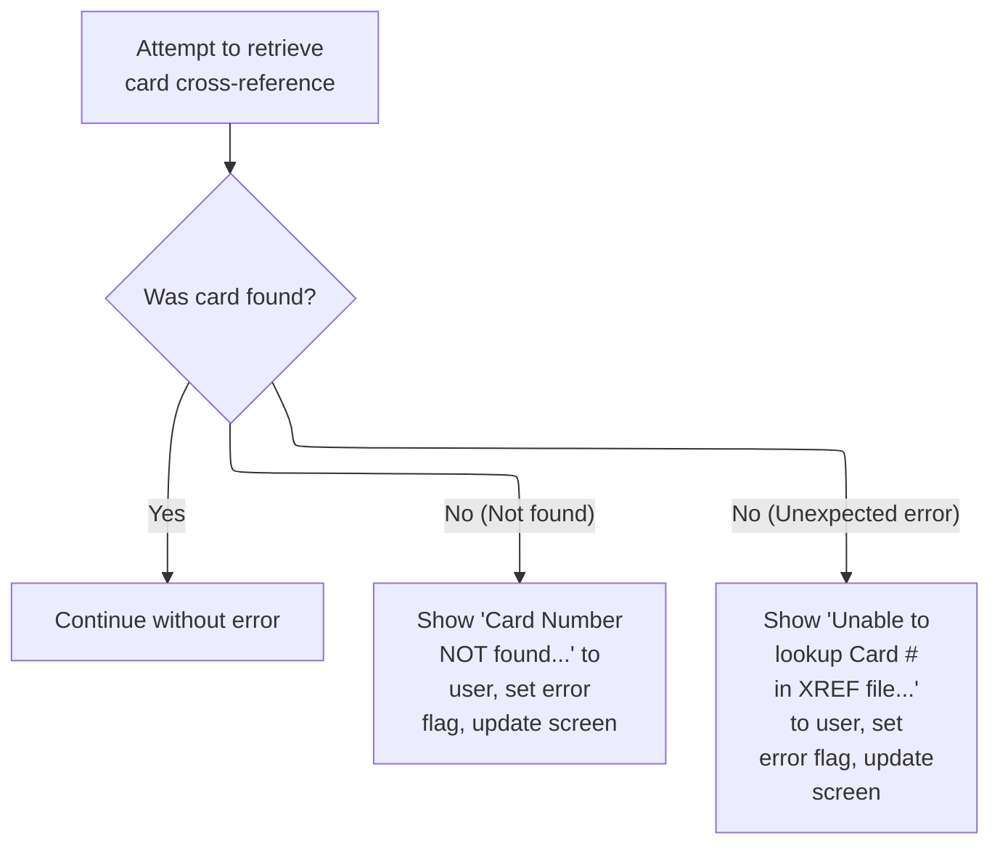

This section governs the business logic and error handling for looking up an account based on a card number using a cross-reference file. It defines the user-facing outcomes for successful lookups, card-not-found errors, and unexpected errors.

| Rule ID | Code Location    | Category       | Rule Name                    | Description                                                                                                                                                                                                                                      | Conditions                                                                                        | Remarks                                                                                                                                                                      |
| ------- | ---------------- | -------------- | ---------------------------- | ------------------------------------------------------------------------------------------------------------------------------------------------------------------------------------------------------------------------------------------------ | ------------------------------------------------------------------------------------------------- | ---------------------------------------------------------------------------------------------------------------------------------------------------------------------------- |
| BR-001  | READ-CCXREF-FILE | Business logic | Successful Card Lookup       | If the card number is found in the cross-reference file, the process continues without displaying any error message or updating the error flag.                                                                                                  | The card number exists in the cross-reference file and the response code is NORMAL.               | No error message is shown. The error flag remains at its default value ('N'). No screen update is triggered.                                                                 |
| BR-002  | READ-CCXREF-FILE | Error handling | Card Not Found Error         | If the card number is not found in the cross-reference file, an error flag is set, the message 'Card Number NOT found...' is displayed to the user, the input field is marked for correction, and the transaction add screen is updated.         | The card number does not exist in the cross-reference file and the response code is NOTFND.       | The error flag is set to 'Y'. The message 'Card Number NOT found...' is displayed. The input field index is set to -1. The transaction add screen is updated.                |
| BR-003  | READ-CCXREF-FILE | Error handling | Unexpected Card Lookup Error | If an unexpected error occurs during the card lookup, an error flag is set, the message 'Unable to lookup Card # in XREF file...' is displayed to the user, the input field is marked for correction, and the transaction add screen is updated. | An error other than NOTFND or NORMAL occurs during the card-to-account cross-reference file read. | The error flag is set to 'Y'. The message 'Unable to lookup Card # in XREF file...' is displayed. The input field index is set to -1. The transaction add screen is updated. |

<SwmSnippet path="/app/cbl/COTRN02C.cbl" line="609" repo-id="Z2l0aHViJTNBJTNBa3luZHJ5bC1hd3MtbWFpbmZyYW1lLW1vZGVybml6YXRpb24tY2FyZGRlbW8lM0ElM0FTd2ltbS1EZW1v">

---

We read the card/account link from the cross-reference file using the card number.

```cobol
       READ-CCXREF-FILE.

           EXEC CICS READ
                DATASET   (WS-CCXREF-FILE)
                INTO      (CARD-XREF-RECORD)
                LENGTH    (LENGTH OF CARD-XREF-RECORD)
                RIDFLD    (XREF-CARD-NUM)
                KEYLENGTH (LENGTH OF XREF-CARD-NUM)
                RESP      (WS-RESP-CD)
                RESP2     (WS-REAS-CD)
           END-EXEC
```

---

</SwmSnippet>

<SwmSnippet path="/app/cbl/COTRN02C.cbl" line="621" repo-id="Z2l0aHViJTNBJTNBa3luZHJ5bC1hd3MtbWFpbmZyYW1lLW1vZGVybml6YXRpb24tY2FyZGRlbW8lM0ElM0FTd2ltbS1EZW1v">

---

If the card lookup fails, we show an error and prompt the user to try again.

```cobol
           EVALUATE WS-RESP-CD
               WHEN DFHRESP(NORMAL)
                   CONTINUE
               WHEN DFHRESP(NOTFND)
                   MOVE 'Y'     TO WS-ERR-FLG
                   MOVE 'Card Number NOT found...' TO
                                   WS-MESSAGE
                   MOVE -1       TO CARDNINL OF COTRN2AI
                   PERFORM SEND-TRNADD-SCREEN
               WHEN OTHER
                   DISPLAY 'RESP:' WS-RESP-CD 'REAS:' WS-REAS-CD
                   MOVE 'Y'     TO WS-ERR-FLG
                   MOVE 'Unable to lookup Card # in XREF file...' TO
                                   WS-MESSAGE
                   MOVE -1       TO CARDNINL OF COTRN2AI
                   PERFORM SEND-TRNADD-SCREEN
           END-EVALUATE.
```

---

</SwmSnippet>

#### Key Field Error Handling

This section ensures that users cannot proceed without entering at least one key field (account or card number), enforcing data integrity and preventing incomplete transactions.

| Rule ID | Code Location      | Category        | Rule Name          | Description                                                                                                                                             | Conditions                                                                                                               | Remarks                                                                                                                                                                                                                                      |
| ------- | ------------------ | --------------- | ------------------ | ------------------------------------------------------------------------------------------------------------------------------------------------------- | ------------------------------------------------------------------------------------------------------------------------ | -------------------------------------------------------------------------------------------------------------------------------------------------------------------------------------------------------------------------------------------- |
| BR-001  | SEND-TRNADD-SCREEN | Data validation | Key Field Required | If neither an account number nor a card number is entered, an error is triggered, and the user is prompted to provide at least one of these key fields. | This rule applies when both the account number and card number fields are empty or zero at the time of input validation. | The error flag is set to 'Y'. The error message displayed is 'Account or Card Number must be entered...'. The message is up to 80 characters. The input fields are numeric: account number (up to 11 digits), card number (up to 16 digits). |

<SwmSnippet path="/app/cbl/COTRN02C.cbl" line="224" repo-id="Z2l0aHViJTNBJTNBa3luZHJ5bC1hd3MtbWFpbmZyYW1lLW1vZGVybml6YXRpb24tY2FyZGRlbW8lM0ElM0FTd2ltbS1EZW1v">

---

If no key fields are entered, we show an error and prompt for input.

```cobol
               WHEN OTHER
                   MOVE 'Y'     TO WS-ERR-FLG
                   MOVE 'Account or Card Number must be entered...' TO
                                   WS-MESSAGE
                   MOVE -1       TO ACTIDINL OF COTRN2AI
                   PERFORM SEND-TRNADD-SCREEN
           END-EVALUATE.
```

---

</SwmSnippet>

### Transaction Confirmation

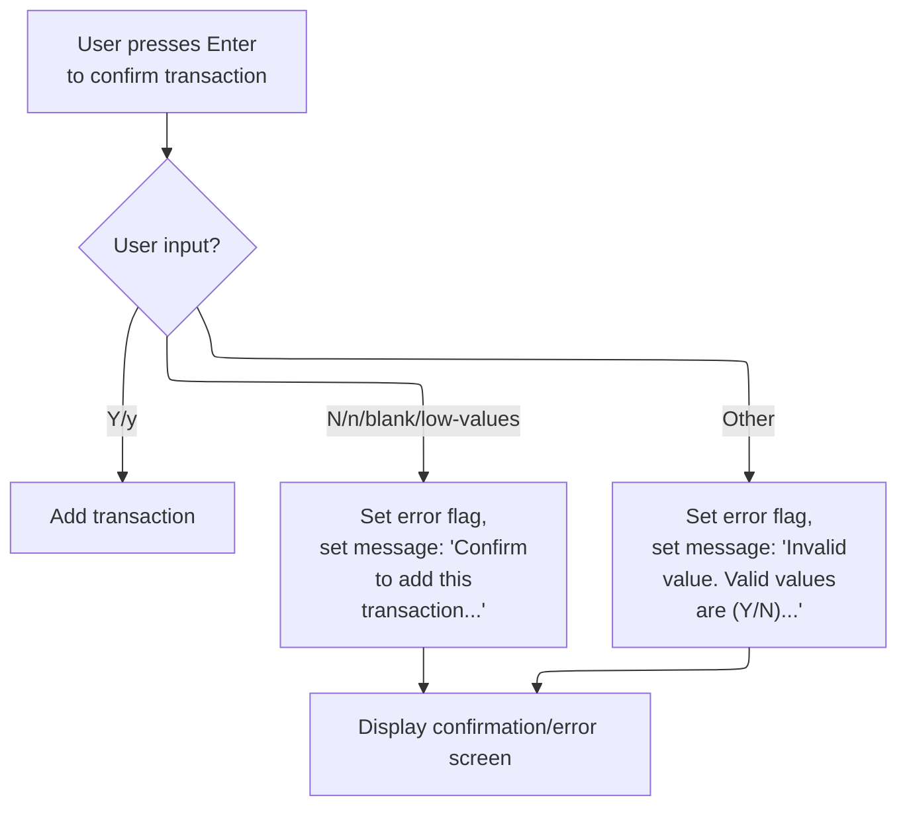

This section manages the confirmation step for adding a transaction, ensuring that only explicit user confirmation results in the transaction being added, and that users are guided with appropriate messages for negative, blank, or invalid inputs.

| Rule ID | Code Location | Category        | Rule Name                                      | Description                                                                                                                                        | Conditions                                                                    | Remarks                                                                                                                                                                                   |
| ------- | ------------- | --------------- | ---------------------------------------------- | -------------------------------------------------------------------------------------------------------------------------------------------------- | ----------------------------------------------------------------------------- | ----------------------------------------------------------------------------------------------------------------------------------------------------------------------------------------- |
| BR-001  | MAIN-LOGIC    | Data validation | Confirmation Prompt on Negative or Blank Input | If the user enters 'N', 'n', blank, or low-values, the transaction is not added and the user is prompted to confirm.                               | The user enters 'N', 'n', blank, or low-values as confirmation.               | Valid negative confirmation values are 'N', 'n', blank (spaces), and low-values. The error message displayed is 'Confirm to add this transaction...' (up to 80 characters, left-aligned). |
| BR-002  | MAIN-LOGIC    | Data validation | Invalid Confirmation Value Handling            | If the user enters any value other than 'Y', 'y', 'N', 'n', blank, or low-values, an error message is displayed indicating valid values are (Y/N). | The user enters any value not among 'Y', 'y', 'N', 'n', blank, or low-values. | The error message displayed is 'Invalid value. Valid values are (Y/N)...' (up to 80 characters, left-aligned).                                                                            |
| BR-003  | MAIN-LOGIC    | Business logic  | Positive Confirmation Required                 | A transaction is added only if the user confirms with 'Y' or 'y'.                                                                                  | The user enters 'Y' or 'y' as confirmation.                                   | Valid confirmation values for adding the transaction are 'Y' and 'y'.                                                                                                                     |

<SwmSnippet path="/app/cbl/COTRN02C.cbl" line="169" repo-id="Z2l0aHViJTNBJTNBa3luZHJ5bC1hd3MtbWFpbmZyYW1lLW1vZGVybml6YXRpb24tY2FyZGRlbW8lM0ElM0FTd2ltbS1EZW1v">

---

We check for confirmation and only add the transaction if the user says yes.

```cobol
           EVALUATE CONFIRMI OF COTRN2AI
               WHEN 'Y'
               WHEN 'y'
                   PERFORM ADD-TRANSACTION
               WHEN 'N'
               WHEN 'n'
               WHEN SPACES
               WHEN LOW-VALUES
                   MOVE 'Y'     TO WS-ERR-FLG
                   MOVE 'Confirm to add this transaction...'
                                TO WS-MESSAGE
                   MOVE -1      TO CONFIRML OF COTRN2AI
                   PERFORM SEND-TRNADD-SCREEN
               WHEN OTHER
                   MOVE 'Y'     TO WS-ERR-FLG
                   MOVE 'Invalid value. Valid values are (Y/N)...'
                                TO WS-MESSAGE
                   MOVE -1      TO CONFIRML OF COTRN2AI
                   PERFORM SEND-TRNADD-SCREEN
           END-EVALUATE.
```

---

</SwmSnippet>

## Creating and Preparing a New Transaction

This section is responsible for creating a new transaction record, assigning it a unique ID, populating all required fields from input, and persisting the record to the transaction file.

| Rule ID | Code Location   | Category       | Rule Name                        | Description                                                                                                                             | Conditions                                                      | Remarks                                                                                                                                                                                                            |
| ------- | --------------- | -------------- | -------------------------------- | --------------------------------------------------------------------------------------------------------------------------------------- | --------------------------------------------------------------- | ------------------------------------------------------------------------------------------------------------------------------------------------------------------------------------------------------------------ |
| BR-001  | ADD-TRANSACTION | Business logic | Unique Transaction ID Assignment | Each new transaction must be assigned a unique transaction ID that is one greater than the highest existing transaction ID in the file. | A new transaction is being created.                             | The transaction ID is a string of 16 characters (see TRAN-RECORD definition). The new ID is calculated by reading the last used ID, converting it to a number, adding 1, and storing it as the new transaction ID. |
| BR-002  | ADD-TRANSACTION | Business logic | Transaction Field Population     | All transaction record fields must be populated with the corresponding input values provided for the new transaction.                   | A new transaction is being created and input data is available. | Field formats are as follows (from TRAN-RECORD):                                                                                                                                                                   |

- TRAN-TYPE-CD: 2 alphanumeric characters
- TRAN-CAT-CD: 4 digits
- TRAN-SOURCE: 10 alphanumeric characters
- TRAN-DESC: 100 alphanumeric characters
- TRAN-AMT: signed numeric, 9 digits with 2 decimals
- TRAN-MERCHANT-ID: 9 digits
- TRAN-MERCHANT-NAME: 50 alphanumeric characters
- TRAN-MERCHANT-CITY: 50 alphanumeric characters
- TRAN-MERCHANT-ZIP: 10 alphanumeric characters
- TRAN-CARD-NUM: 16 alphanumeric characters
- TRAN-ORIG-TS: 26 alphanumeric characters
- TRAN-PROC-TS: 26 alphanumeric characters | | BR-003  | ADD-TRANSACTION | Business logic | Transaction Record Persistence   | The new transaction record must be written to the transaction file after all fields are populated.                                      | A new transaction record has been fully prepared with all required fields. | The transaction record is 350 bytes in length, as defined by the TRAN-RECORD structure.                                                                                                                                                                                                                                                                                                                                                                                                                                                                                     |

<SwmSnippet path="/app/cbl/COTRN02C.cbl" line="442" repo-id="Z2l0aHViJTNBJTNBa3luZHJ5bC1hd3MtbWFpbmZyYW1lLW1vZGVybml6YXRpb24tY2FyZGRlbW8lM0ElM0FTd2ltbS1EZW1v">

---

In `ADD-TRANSACTION`, we reset the transaction ID, position the file to the start, and read the previous record to figure out the last used transaction ID. This sets us up to generate the next unique ID for the new transaction.

```cobol
       ADD-TRANSACTION.

           MOVE HIGH-VALUES TO TRAN-ID
           PERFORM STARTBR-TRANSACT-FILE
           PERFORM READPREV-TRANSACT-FILE
           PERFORM ENDBR-TRANSACT-FILE
```

---

</SwmSnippet>

<SwmSnippet path="/app/cbl/COTRN02C.cbl" line="448" repo-id="Z2l0aHViJTNBJTNBa3luZHJ5bC1hd3MtbWFpbmZyYW1lLW1vZGVybml6YXRpb24tY2FyZGRlbW8lM0ElM0FTd2ltbS1EZW1v">

---

After prepping the new transaction record and copying all the relevant fields, we call WRITE-TRANSACT-FILE to actually save the transaction to the file.

```cobol
           MOVE TRAN-ID     TO WS-TRAN-ID-N
           ADD 1 TO WS-TRAN-ID-N
           INITIALIZE TRAN-RECORD
           MOVE WS-TRAN-ID-N         TO TRAN-ID
           MOVE TTYPCDI  OF COTRN2AI TO TRAN-TYPE-CD
           MOVE TCATCDI  OF COTRN2AI TO TRAN-CAT-CD
           MOVE TRNSRCI  OF COTRN2AI TO TRAN-SOURCE
           MOVE TDESCI   OF COTRN2AI TO TRAN-DESC
           COMPUTE WS-TRAN-AMT-N = FUNCTION NUMVAL-C(TRNAMTI OF
           COTRN2AI)
           MOVE WS-TRAN-AMT-N TO TRAN-AMT
           MOVE CARDNINI OF COTRN2AI TO TRAN-CARD-NUM
           MOVE MIDI     OF COTRN2AI TO TRAN-MERCHANT-ID
           MOVE MNAMEI   OF COTRN2AI TO TRAN-MERCHANT-NAME
           MOVE MCITYI   OF COTRN2AI TO TRAN-MERCHANT-CITY
           MOVE MZIPI    OF COTRN2AI TO TRAN-MERCHANT-ZIP
           MOVE TORIGDTI OF COTRN2AI TO TRAN-ORIG-TS
           MOVE TPROCDTI OF COTRN2AI TO TRAN-PROC-TS
           PERFORM WRITE-TRANSACT-FILE.
```

---

</SwmSnippet>

## Saving the Transaction and Handling Write Results

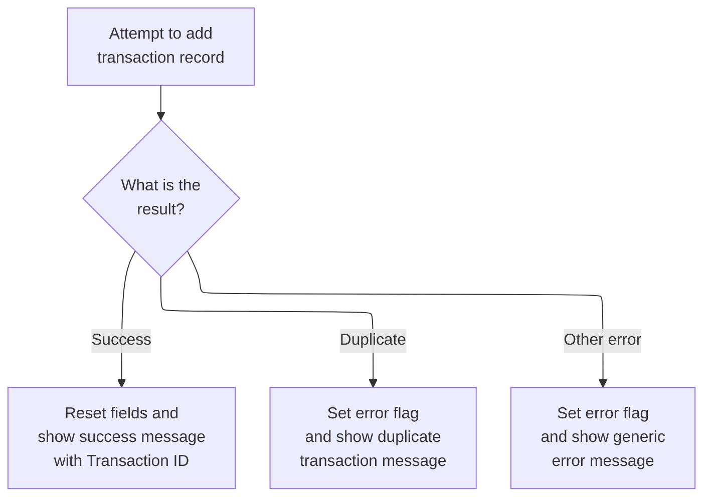

This section governs how the system responds to attempts to save a new transaction, including handling success, duplicate transaction IDs, and other write errors. The rules ensure users receive clear feedback and guidance based on the outcome of their transaction submission.

| Rule ID | Code Location       | Category       | Rule Name                       | Description                                                                                                                                                                                                | Conditions                                                                                 | Remarks                                                                                                                                                                                      |
| ------- | ------------------- | -------------- | ------------------------------- | ---------------------------------------------------------------------------------------------------------------------------------------------------------------------------------------------------------- | ------------------------------------------------------------------------------------------ | -------------------------------------------------------------------------------------------------------------------------------------------------------------------------------------------- |
| BR-001  | WRITE-TRANSACT-FILE | Business logic | Successful Transaction Creation | When a transaction is successfully saved, all input fields are reset, a success message is displayed to the user including the new transaction ID, and the message is shown in green.                      | The transaction write operation returns a normal response code.                            | The success message format is: 'Transaction added successfully. Your Tran ID is <transaction ID>.' The transaction ID is a string of up to 16 characters. The message is displayed in green. |
| BR-002  | WRITE-TRANSACT-FILE | Error handling | Duplicate Transaction ID        | If the transaction ID already exists, an error flag is set, a duplicate transaction message is displayed to the user, and the input field for the transaction ID is highlighted for correction.            | The transaction write operation returns a duplicate key or duplicate record response code. | The duplicate message is: 'Tran ID already exist...'. The transaction ID input field is set to -1 to indicate focus or error. The error flag is set to 'Y'.                                  |
| BR-003  | WRITE-TRANSACT-FILE | Error handling | Generic Transaction Write Error | If the transaction cannot be saved for any other reason, an error flag is set, a generic error message is displayed to the user, and the input field for the transaction ID is highlighted for correction. | The transaction write operation returns any response code other than normal or duplicate.  | The generic error message is: 'Unable to Add Transaction...'. The transaction ID input field is set to -1 to indicate focus or error. The error flag is set to 'Y'.                          |

<SwmSnippet path="/app/cbl/COTRN02C.cbl" line="711" repo-id="Z2l0aHViJTNBJTNBa3luZHJ5bC1hd3MtbWFpbmZyYW1lLW1vZGVybml6YXRpb24tY2FyZGRlbW8lM0ElM0FTd2ltbS1EZW1v">

---

In `WRITE-TRANSACT-FILE`, we use CICS WRITE to save the transaction record and set up response codes so we can handle success or failure right after.

```cobol
       WRITE-TRANSACT-FILE.

           EXEC CICS WRITE
                DATASET   (WS-TRANSACT-FILE)
                FROM      (TRAN-RECORD)
                LENGTH    (LENGTH OF TRAN-RECORD)
                RIDFLD    (TRAN-ID)
                KEYLENGTH (LENGTH OF TRAN-ID)
                RESP      (WS-RESP-CD)
                RESP2     (WS-REAS-CD)
           END-EXEC
```

---

</SwmSnippet>

<SwmSnippet path="/app/cbl/COTRN02C.cbl" line="723" repo-id="Z2l0aHViJTNBJTNBa3luZHJ5bC1hd3MtbWFpbmZyYW1lLW1vZGVybml6YXRpb24tY2FyZGRlbW8lM0ElM0FTd2ltbS1EZW1v">

---

After a successful write, we reset fields, build a success message with the new transaction ID, set the message color, and update the UI.

```cobol
           EVALUATE WS-RESP-CD
               WHEN DFHRESP(NORMAL)
                   PERFORM INITIALIZE-ALL-FIELDS
                   MOVE SPACES             TO WS-MESSAGE
                   MOVE DFHGREEN           TO ERRMSGC  OF COTRN2AO
                   STRING 'Transaction added successfully. '
                                               DELIMITED BY SIZE
                     ' Your Tran ID is ' DELIMITED BY SIZE
                          TRAN-ID  DELIMITED BY SPACE
                          '.' DELIMITED BY SIZE
                     INTO WS-MESSAGE
                   PERFORM SEND-TRNADD-SCREEN
```

---

</SwmSnippet>

<SwmSnippet path="/app/cbl/COTRN02C.cbl" line="735" repo-id="Z2l0aHViJTNBJTNBa3luZHJ5bC1hd3MtbWFpbmZyYW1lLW1vZGVybml6YXRpb24tY2FyZGRlbW8lM0ElM0FTd2ltbS1EZW1v">

---

If the transaction ID is a duplicate, we set the error flag, show a duplicate message, and refresh the screen to let the user know.

```cobol
               WHEN DFHRESP(DUPKEY)
               WHEN DFHRESP(DUPREC)
                   MOVE 'Y'     TO WS-ERR-FLG
                   MOVE 'Tran ID already exist...' TO
                                   WS-MESSAGE
                   MOVE -1       TO ACTIDINL OF COTRN2AI
                   PERFORM SEND-TRNADD-SCREEN
```

---

</SwmSnippet>

<SwmSnippet path="/app/cbl/COTRN02C.cbl" line="742" repo-id="Z2l0aHViJTNBJTNBa3luZHJ5bC1hd3MtbWFpbmZyYW1lLW1vZGVybml6YXRpb24tY2FyZGRlbW8lM0ElM0FTd2ltbS1EZW1v">

---

For any other write error, we log the response codes, set the error flag, show a generic error message, and refresh the screen.

```cobol
               WHEN OTHER
                   DISPLAY 'RESP:' WS-RESP-CD 'REAS:' WS-REAS-CD
                   MOVE 'Y'     TO WS-ERR-FLG
                   MOVE 'Unable to Add Transaction...' TO
                                   WS-MESSAGE
                   MOVE -1       TO ACTIDINL OF COTRN2AI
                   PERFORM SEND-TRNADD-SCREEN
           END-EVALUATE.
```

---

</SwmSnippet>

## Handling Screen Input After Transaction Processing

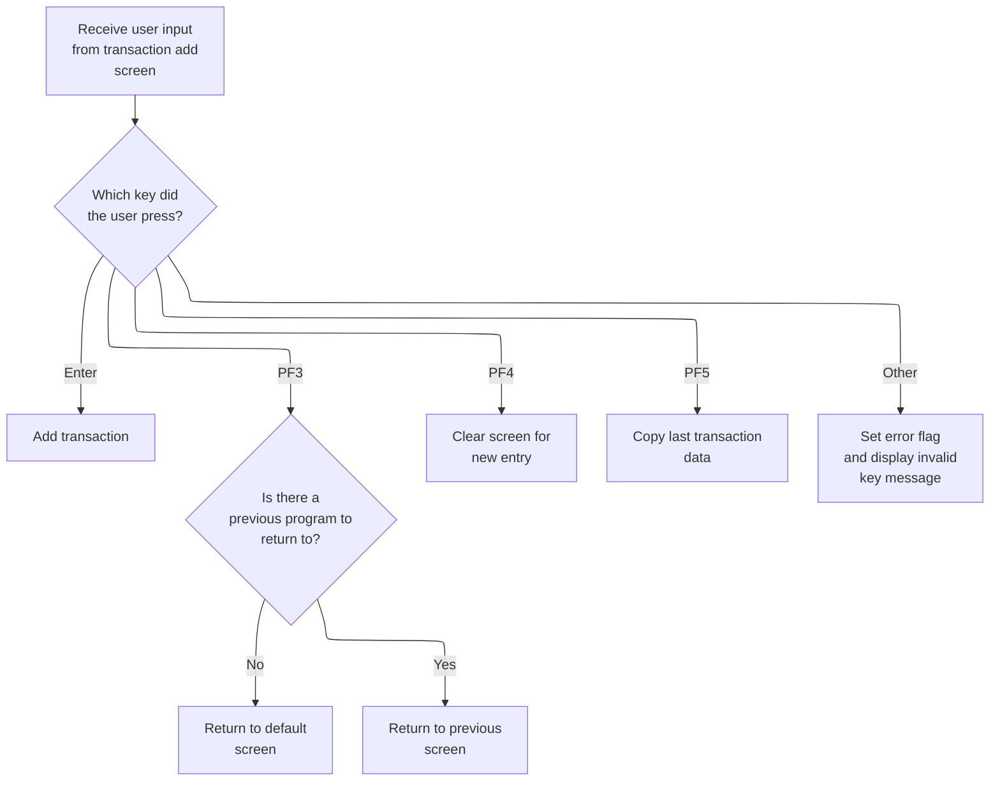

This section governs how the application responds to user key presses after a transaction is processed on the add transaction screen, determining navigation, data manipulation, and error handling behaviors.

| Rule ID | Code Location                                | Category       | Rule Name                  | Description                                                                                                                                                  | Conditions                                                                             | Remarks                                                                                                                                                            |
| ------- | -------------------------------------------- | -------------- | -------------------------- | ------------------------------------------------------------------------------------------------------------------------------------------------------------ | -------------------------------------------------------------------------------------- | ------------------------------------------------------------------------------------------------------------------------------------------------------------------ |
| BR-001  | RECEIVE-TRNADD-SCREEN, PROCESS-ENTER-KEY     | Business logic | Process transaction entry  | When the user presses Enter on the transaction add screen, the system processes the transaction entry.                                                       | User presses Enter key (DFHENTER) on the transaction add screen.                       | No constants are used for this rule. The output is the processing of the transaction entry, which may involve updating records or confirming the transaction.      |
| BR-002  | RECEIVE-TRNADD-SCREEN, RETURN-TO-PREV-SCREEN | Business logic | Screen navigation on PF3   | When the user presses PF3, the system navigates to either the previous screen or the default screen depending on whether a previous program is specified.    | User presses PF3 key (DFHPF3) on the transaction add screen.                           | If no previous program is specified (field is blank or low-values), the system navigates to 'COMEN01C'. Otherwise, it navigates to the specified previous program. |
| BR-003  | RECEIVE-TRNADD-SCREEN, CLEAR-CURRENT-SCREEN  | Business logic | Clear screen for new entry | When the user presses PF4, the system clears the transaction add screen to allow entry of a new transaction.                                                 | User presses PF4 key (DFHPF4) on the transaction add screen.                           | No constants are used for this rule. The output is a cleared screen ready for new input.                                                                           |
| BR-004  | RECEIVE-TRNADD-SCREEN, COPY-LAST-TRAN-DATA   | Business logic | Copy last transaction data | When the user presses PF5, the system copies the last transaction's data into the input fields, allowing the user to reuse or edit the previous transaction. | User presses PF5 key (DFHPF5) on the transaction add screen.                           | No constants are used for this rule. The output is the input fields populated with the last transaction's data.                                                    |
| BR-005  | RECEIVE-TRNADD-SCREEN, SEND-TRNADD-SCREEN    | Error handling | Invalid key error handling | When the user presses any key other than Enter, PF3, PF4, or PF5, the system sets an error flag and displays an invalid key message.                         | User presses any key other than Enter, PF3, PF4, or PF5 on the transaction add screen. | The error flag is set to 'Y'. The message displayed is 'Invalid key pressed. Please see below...         ' (50 characters, left aligned, padded with spaces).      |

<SwmSnippet path="/app/cbl/COTRN02C.cbl" line="131" repo-id="Z2l0aHViJTNBJTNBa3luZHJ5bC1hd3MtbWFpbmZyYW1lLW1vZGVybml6YXRpb24tY2FyZGRlbW8lM0ElM0FTd2ltbS1EZW1v">

---

Back in MAIN-PARA, after PROCESS-ENTER-KEY runs, we either continue with the transaction or prompt the user for more input using RECEIVE-TRNADD-SCREEN.

```cobol
               ELSE
                   PERFORM RECEIVE-TRNADD-SCREEN
```

---

</SwmSnippet>

<SwmSnippet path="/app/cbl/COTRN02C.cbl" line="133" repo-id="Z2l0aHViJTNBJTNBa3luZHJ5bC1hd3MtbWFpbmZyYW1lLW1vZGVybml6YXRpb24tY2FyZGRlbW8lM0ElM0FTd2ltbS1EZW1v">

---

When PF5 is pressed, we call COPY-LAST-TRAN-DATA to fill the input fields with the last transaction's info, so users can reuse or edit it.

```cobol
                   EVALUATE EIBAID
                       WHEN DFHENTER
                           PERFORM PROCESS-ENTER-KEY
                       WHEN DFHPF3
                           IF CDEMO-FROM-PROGRAM = SPACES OR LOW-VALUES
                               MOVE 'COMEN01C' TO CDEMO-TO-PROGRAM
                           ELSE
                               MOVE CDEMO-FROM-PROGRAM TO
                               CDEMO-TO-PROGRAM
                           END-IF
                           PERFORM RETURN-TO-PREV-SCREEN
                       WHEN DFHPF4
                           PERFORM CLEAR-CURRENT-SCREEN
                       WHEN DFHPF5
                           PERFORM COPY-LAST-TRAN-DATA
                       WHEN OTHER
                           MOVE 'Y'                       TO WS-ERR-FLG
                           MOVE CCDA-MSG-INVALID-KEY      TO WS-MESSAGE
                           PERFORM SEND-TRNADD-SCREEN
                   END-EVALUATE
```

---

</SwmSnippet>

## Copying Data from the Previous Transaction

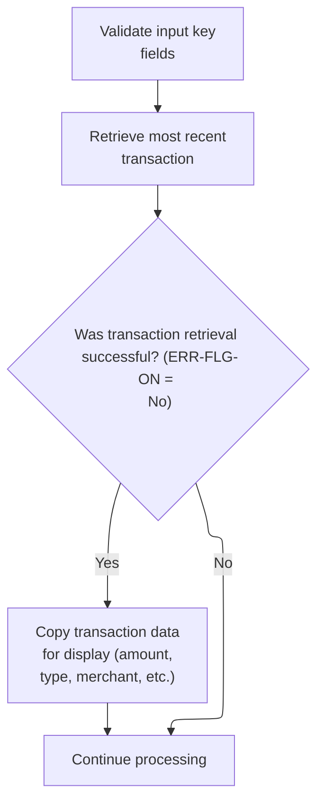

This section governs the process of copying data from the most recent transaction into the current transaction input fields, ensuring that only valid and successfully retrieved data is used for user review or editing.

| Rule ID | Code Location       | Category        | Rule Name                         | Description                                                                                                                                                                                                                                                                                                         | Conditions                                                                                               | Remarks                                                                                                                                                                                                                                                                                                                                                                                              |
| ------- | ------------------- | --------------- | --------------------------------- | ------------------------------------------------------------------------------------------------------------------------------------------------------------------------------------------------------------------------------------------------------------------------------------------------------------------- | -------------------------------------------------------------------------------------------------------- | ---------------------------------------------------------------------------------------------------------------------------------------------------------------------------------------------------------------------------------------------------------------------------------------------------------------------------------------------------------------------------------------------------- |
| BR-001  | COPY-LAST-TRAN-DATA | Data validation | Key Field Validation              | The system must validate all required key fields before attempting to retrieve and copy the previous transaction's data.                                                                                                                                                                                            | This rule applies whenever the user initiates the copy-last-transaction-data process.                    | All key fields required for transaction retrieval must be present and valid. The specific fields are not listed in this section, but validation is performed before any data retrieval.                                                                                                                                                                                                              |
| BR-002  | COPY-LAST-TRAN-DATA | Business logic  | Copy Transaction Data on Success  | If the most recent transaction is successfully retrieved, the system must copy the transaction amount, type, category, source, description, original and processed timestamps, merchant ID, merchant name, merchant city, and merchant ZIP code into the corresponding input fields for the user to review or edit. | This rule applies when the previous transaction retrieval does not set the error flag (ERR-FLG-ON = No). | The following fields are copied: amount (number, +99999999.99), type (string, 2 chars), category (number, 4 digits), source (string, 10 chars), description (string, 100 chars), original timestamp (string, 26 chars), processed timestamp (string, 26 chars), merchant ID (number, 9 digits), merchant name (string, 50 chars), merchant city (string, 50 chars), merchant ZIP (string, 10 chars). |
| BR-003  | COPY-LAST-TRAN-DATA | Error handling  | No Data Copy on Retrieval Failure | If the most recent transaction cannot be retrieved (error flag is set), the system must not copy any transaction data and should continue processing without updating the input fields.                                                                                                                             | This rule applies when the previous transaction retrieval sets the error flag (ERR-FLG-ON = Yes).        | No transaction fields are updated if retrieval fails. The process continues to the next step without modifying input fields.                                                                                                                                                                                                                                                                         |

<SwmSnippet path="/app/cbl/COTRN02C.cbl" line="471" repo-id="Z2l0aHViJTNBJTNBa3luZHJ5bC1hd3MtbWFpbmZyYW1lLW1vZGVybml6YXRpb24tY2FyZGRlbW8lM0ElM0FTd2ltbS1EZW1v">

---

In COPY-LAST-TRAN-DATA, we kick off by validating the key fields to make sure we're about to copy legit transaction data.

```cobol
       COPY-LAST-TRAN-DATA.

           PERFORM VALIDATE-INPUT-KEY-FIELDS
```

---

</SwmSnippet>

<SwmSnippet path="/app/cbl/COTRN02C.cbl" line="475" repo-id="Z2l0aHViJTNBJTNBa3luZHJ5bC1hd3MtbWFpbmZyYW1lLW1vZGVybml6YXRpb24tY2FyZGRlbW8lM0ElM0FTd2ltbS1EZW1v">

---

After validating in COPY-LAST-TRAN-DATA, we grab the previous transaction's data from the file so we can copy it into the input fields.

```cobol
           MOVE HIGH-VALUES TO TRAN-ID
           PERFORM STARTBR-TRANSACT-FILE
           PERFORM READPREV-TRANSACT-FILE
           PERFORM ENDBR-TRANSACT-FILE
```

---

</SwmSnippet>

<SwmSnippet path="/app/cbl/COTRN02C.cbl" line="480" repo-id="Z2l0aHViJTNBJTNBa3luZHJ5bC1hd3MtbWFpbmZyYW1lLW1vZGVybml6YXRpb24tY2FyZGRlbW8lM0ElM0FTd2ltbS1EZW1v">

---

After copying the last transaction's data, we update the input fields and call PROCESS-ENTER-KEY so the user can process or edit the copied info right away.

```cobol
           IF NOT ERR-FLG-ON
               MOVE TRAN-AMT TO WS-TRAN-AMT-E
               MOVE TRAN-TYPE-CD        TO TTYPCDI  OF COTRN2AI
               MOVE TRAN-CAT-CD         TO TCATCDI  OF COTRN2AI
               MOVE TRAN-SOURCE         TO TRNSRCI  OF COTRN2AI
               MOVE WS-TRAN-AMT-E       TO TRNAMTI  OF COTRN2AI
               MOVE TRAN-DESC           TO TDESCI   OF COTRN2AI
               MOVE TRAN-ORIG-TS        TO TORIGDTI OF COTRN2AI
               MOVE TRAN-PROC-TS        TO TPROCDTI OF COTRN2AI
               MOVE TRAN-MERCHANT-ID    TO MIDI     OF COTRN2AI
               MOVE TRAN-MERCHANT-NAME  TO MNAMEI   OF COTRN2AI
               MOVE TRAN-MERCHANT-CITY  TO MCITYI   OF COTRN2AI
               MOVE TRAN-MERCHANT-ZIP   TO MZIPI    OF COTRN2AI
           END-IF

           PERFORM PROCESS-ENTER-KEY.
```

---

</SwmSnippet>

## Returning Control and Finalizing the Transaction Screen

<SwmSnippet path="/app/cbl/COTRN02C.cbl" line="156" repo-id="Z2l0aHViJTNBJTNBa3luZHJ5bC1hd3MtbWFpbmZyYW1lLW1vZGVybml6YXRpb24tY2FyZGRlbW8lM0ElM0FTd2ltbS1EZW1v">

---

After COPY-LAST-TRAN-DATA finishes in MAIN-PARA, we use EXEC CICS RETURN to pass control and the current context back to CICS for the next step.

```cobol
           EXEC CICS RETURN
                     TRANSID (WS-TRANID)
                     COMMAREA (CARDDEMO-COMMAREA)
           END-EXEC.
```

---

</SwmSnippet>

&nbsp;

*This is an auto-generated document by Swimm 🌊 and has not yet been verified by a human*

<SwmMeta version="3.0.0"><sup>Powered by [Swimm](https://staging.swimm.cloud/)</sup></SwmMeta>
