# Overview

This document explains the flow for listing and navigating users in the CardDemo application. Users interact with a paginated list, can select users for update or deletion, and navigate between pages using function keys.

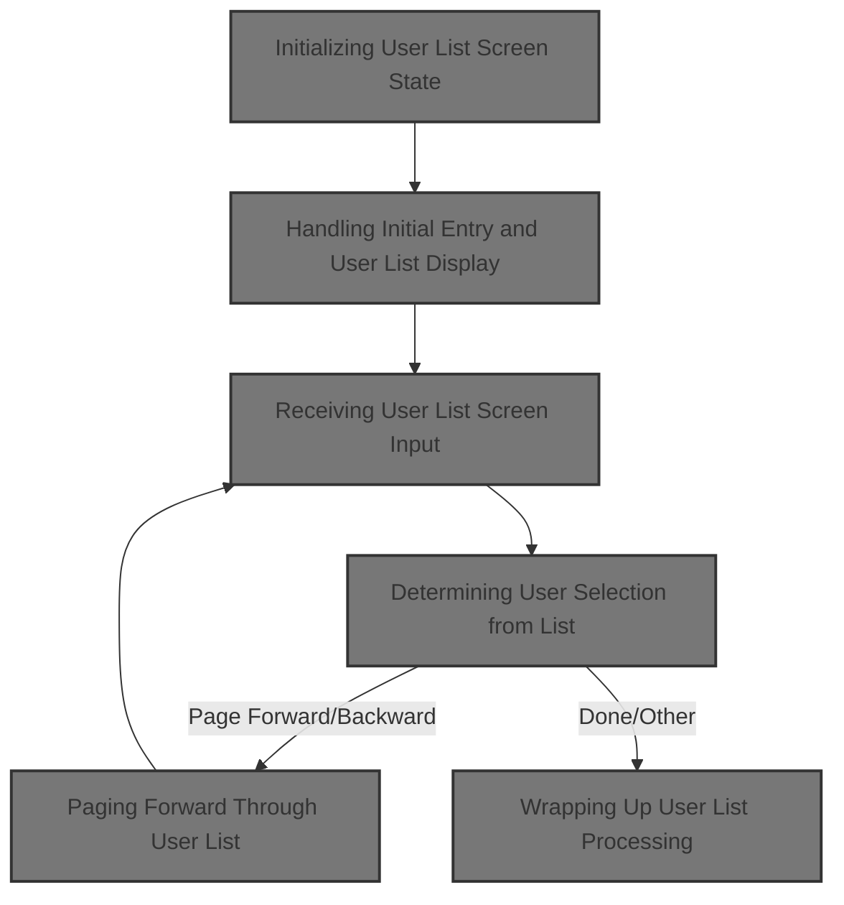
```mermaid
flowchart TD
    node1["Initializing User List Screen State"]:::HeadingStyle
    click node1 goToHeading "Initializing User List Screen State"
    node1 --> node2["Handling Initial Entry and User List Display"]:::HeadingStyle
    click node2 goToHeading "Handling Initial Entry and User List Display"
    node2 --> node3["Receiving User List Screen Input"]:::HeadingStyle
    click node3 goToHeading "Receiving User List Screen Input"
    node3 --> node4["Determining User Selection from List"]:::HeadingStyle
    click node4 goToHeading "Determining User Selection from List"
    node4 -->|"Page Forward/Backward"| node5["Paging Forward Through User List"]:::HeadingStyle
    click node5 goToHeading "Paging Forward Through User List"
    node5 --> node3
    node4 -->|"Done/Other"| node6["Wrapping Up User List Processing"]:::HeadingStyle
    click node6 goToHeading "Wrapping Up User List Processing"
classDef HeadingStyle fill:#777777,stroke:#333,stroke-width:2px;
```

## Dependencies

### Programs

- COUSR00C (app/cbl/COUSR00C.cbl)
- CU00
- COADM01C (app/cbl/COADM01C.cbl)
- CA00
- COSGN00C (app/cbl/COSGN00C.cbl)
- COUSR02C (app/cbl/COUSR02C.cbl)
- CU02
- CDEMO-FROM-PROGRAM
- COUSR03C (app/cbl/COUSR03C.cbl)
- CU03

### Copybooks

- COCOM01Y (app/cpy/COCOM01Y.cpy)
- COADM02Y (app/cpy/COADM02Y.cpy)
- COADM01 (app/cpy-bms/COADM01.CPY)
- COTTL01Y (app/cpy/COTTL01Y.cpy)
- CSDAT01Y (app/cpy/CSDAT01Y.cpy)
- CSMSG01Y (app/cpy/CSMSG01Y.cpy)
- CSUSR01Y (app/cpy/CSUSR01Y.cpy)
- DFHAID
- DFHBMSCA
- COUSR02 (app/cpy-bms/COUSR02.CPY)
- COUSR03 (app/cpy-bms/COUSR03.CPY)
- COUSR00 (app/cpy-bms/COUSR00.CPY)

# Workflow

# Initializing User List Screen State

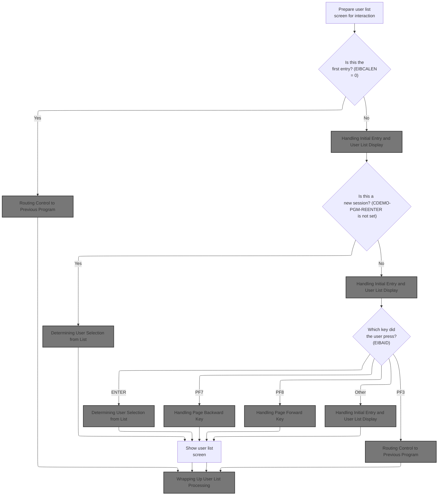
```mermaid
%%{init: {"flowchart": {"defaultRenderer": "elk"}} }%%
flowchart TD
  node1["Prepare user list 
 screen for interaction"] --> node2{"Is this the 
 first entry? (EIBCALEN 
 = 0)"}
  click node1 openCode "app/cbl/COUSR00C.cbl:98:108"
  node2 -->|"Yes"| node3["Routing Control to Previous Program"]
  click node2 openCode "app/cbl/COUSR00C.cbl:110:112"
  
  node3 --> node16["Wrapping Up User List Processing"]
  node2 -->|"No"| node4["Handling Initial Entry and User List Display"]
  
  node4 --> node5{"Is this a 
 new session? (CDEMO-PGM-REENTER 
 is not set)"}
  click node5 openCode "app/cbl/COUSR00C.cbl:115:115"
  node5 -->|"Yes"| node6["Determining User Selection from List"]
  
  node6 --> node14["Show user list 
 screen"]
  click node14 openCode "app/cbl/COUSR00C.cbl:119:119"
  node14 --> node16
  node5 -->|"No"| node7["Handling Initial Entry and User List Display"]
  
  node7 --> node8{"Which key did 
 the user press? 
 (EIBAID)"}
  click node8 openCode "app/cbl/COUSR00C.cbl:122:137"
  node8 -->|"ENTER"| node9["Determining User Selection from List"]
  
  node9 --> node14
  node8 -->|"PF3"| node10["Routing Control to Previous Program"]
  
  node10 --> node16
  node8 -->|"PF7"| node11["Handling Page Backward Key"]
  
  node11 --> node14
  node8 -->|"PF8"| node12["Handling Page Forward Key"]
  
  node12 --> node14
  node8 -->|"Other"| node13["Handling Initial Entry and User List Display"]
  
  node13 --> node14
  node14 --> node16
  node16["Wrapping Up User List Processing"]
  
classDef HeadingStyle fill:#777777,stroke:#333,stroke-width:2px;
click node3 goToHeading "Routing Control to Previous Program"
node3:::HeadingStyle
click node4 goToHeading "Handling Initial Entry and User List Display"
node4:::HeadingStyle
click node6 goToHeading "Determining User Selection from List"
node6:::HeadingStyle
click node7 goToHeading "Handling Initial Entry and User List Display"
node7:::HeadingStyle
click node9 goToHeading "Determining User Selection from List"
node9:::HeadingStyle
click node10 goToHeading "Routing Control to Previous Program"
node10:::HeadingStyle
click node11 goToHeading "Handling Page Backward Key"
node11:::HeadingStyle
click node12 goToHeading "Handling Page Forward Key"
node12:::HeadingStyle
click node13 goToHeading "Handling Initial Entry and User List Display"
node13:::HeadingStyle
click node16 goToHeading "Wrapping Up User List Processing"
node16:::HeadingStyle
```

This section initializes the user list screen state, ensuring a clean slate for user interaction and handling navigation when no input is present.

| Rule ID | Code Location | Category       | Rule Name                           | Description                                                                                                                                                                        | Conditions                                                               | Remarks                                                                                                                                                                                                                                    |
| ------- | ------------- | -------------- | ----------------------------------- | ---------------------------------------------------------------------------------------------------------------------------------------------------------------------------------- | ------------------------------------------------------------------------ | ------------------------------------------------------------------------------------------------------------------------------------------------------------------------------------------------------------------------------------------ |
| BR-001  | MAIN-PARA     | Business logic | Screen State Reset                  | When the user list screen is initialized, all error flags, paging state, and message fields are reset to ensure the user sees a clean screen without any stale errors or messages. | Whenever the user list screen is initialized, regardless of prior state. | Error flag is set to 'off', paging state is set to 'not end of file', next page flag is set to 'no', erase flag is set to 'yes', and message fields are cleared to spaces. This ensures the screen is free of previous errors or messages. |
| BR-002  | MAIN-PARA     | Business logic | No Input Routing                    | If there is no incoming user data, control is routed to the previous program, effectively exiting the user list screen and returning to the signon handler.                        | When the input length is zero (EIBCALEN = 0).                            | If no input is present, the next program is set to 'COSGN00C' and the user is returned to the previous screen.                                                                                                                             |
| BR-003  | MAIN-PARA     | Business logic | User Selection Field Initialization | On initialization, the user selection input field is set to an invalid value to prevent accidental selection before user action.                                                   | Whenever the user list screen is initialized.                            | User selection input field is set to -1, which is not a valid user index.                                                                                                                                                                  |

<SwmSnippet path="/app/cbl/COUSR00C.cbl" line="98" repo-id="Z2l0aHViJTNBJTNBa3luZHJ5bC1hd3MtbWFpbmZyYW1lLW1vZGVybml6YXRpb24tY2FyZGRlbW8lM0ElM0FTd2ltbS1EZW1v">

---

In `MAIN-PARA`, we kick off the user list logic by resetting error flags, paging state, and message fields. This sets up a clean slate before any user or system input is processed, so the screen doesn't show stale errors or messages.

```cobol
       MAIN-PARA.

           SET ERR-FLG-OFF TO TRUE
           SET USER-SEC-NOT-EOF TO TRUE
           SET NEXT-PAGE-NO TO TRUE
           SET SEND-ERASE-YES TO TRUE

           MOVE SPACES TO WS-MESSAGE
                          ERRMSGO OF COUSR0AO

           MOVE -1       TO USRIDINL OF COUSR0AI
```

---

</SwmSnippet>

<SwmSnippet path="/app/cbl/COUSR00C.cbl" line="110" repo-id="Z2l0aHViJTNBJTNBa3luZHJ5bC1hd3MtbWFpbmZyYW1lLW1vZGVybml6YXRpb24tY2FyZGRlbW8lM0ElM0FTd2ltbS1EZW1v">

---

Here we check EIBCALEN to see if there's any incoming data. If not, we set up to jump to the signon handler ('COSGN00C') and call RETURN-TO-PREV-SCREEN to exit early.

```cobol
           IF EIBCALEN = 0
               MOVE 'COSGN00C' TO CDEMO-TO-PROGRAM
               PERFORM RETURN-TO-PREV-SCREEN
```

---

</SwmSnippet>

## Routing Control to Previous Program

This section manages the routing of control to the appropriate next program in the CardDemo application, ensuring navigation continuity and proper context propagation.

| Rule ID | Code Location         | Category       | Rule Name                 | Description                                                                                                                                                                   | Conditions                                                   | Remarks                                                                                                                                                                                                             |
| ------- | --------------------- | -------------- | ------------------------- | ----------------------------------------------------------------------------------------------------------------------------------------------------------------------------- | ------------------------------------------------------------ | ------------------------------------------------------------------------------------------------------------------------------------------------------------------------------------------------------------------- |
| BR-001  | RETURN-TO-PREV-SCREEN | Business logic | Default to Signon Handler | If the next program to be invoked is not specified (i.e., it is blank or contains only low values), the system will default to routing control to the signon handler program. | The next program field is blank or contains only low values. | The signon handler program is identified as 'COSGN00C', which is an 8-character string. The next program field must be set to this value if no other program is specified.                                          |
| BR-002  | RETURN-TO-PREV-SCREEN | Business logic | Record Current Context    | Before transferring control to the next program, the system records the current transaction and program names in the communication area for context tracking.                 | Control is about to be transferred to the next program.      | The transaction name is a 4-character string ('CU00'), and the program name is an 8-character string ('COUSR00C'). These values are set in the communication area fields for 'from transaction' and 'from program'. |
| BR-003  | RETURN-TO-PREV-SCREEN | Business logic | Clear Program Context     | The program context field is cleared before transferring control to the next program, ensuring that no residual context affects the next program's behavior.                  | Control is about to be transferred to the next program.      | The program context field is set to zero, indicating a fresh context for the next program.                                                                                                                          |

<SwmSnippet path="/app/cbl/COUSR00C.cbl" line="506" repo-id="Z2l0aHViJTNBJTNBa3luZHJ5bC1hd3MtbWFpbmZyYW1lLW1vZGVybml6YXRpb24tY2FyZGRlbW8lM0ElM0FTd2ltbS1EZW1v">

---

In `RETURN-TO-PREV-SCREEN`, we check if the next program is set. If not, we default to the signon handler so the user isn't left hanging.

```cobol
       RETURN-TO-PREV-SCREEN.

           IF CDEMO-TO-PROGRAM = LOW-VALUES OR SPACES
               MOVE 'COSGN00C' TO CDEMO-TO-PROGRAM
           END-IF
```

---

</SwmSnippet>

<SwmSnippet path="/app/cbl/COUSR00C.cbl" line="511" repo-id="Z2l0aHViJTNBJTNBa3luZHJ5bC1hd3MtbWFpbmZyYW1lLW1vZGVybml6YXRpb24tY2FyZGRlbW8lM0ElM0FTd2ltbS1EZW1v">

---

Here we wrap up by setting transaction and program info, clearing context, and calling XCTL to jump to the next program, passing all the state in CARDDEMO-COMMAREA.

```cobol
           MOVE WS-TRANID    TO CDEMO-FROM-TRANID
           MOVE WS-PGMNAME   TO CDEMO-FROM-PROGRAM
           MOVE ZEROS        TO CDEMO-PGM-CONTEXT
           EXEC CICS
               XCTL PROGRAM(CDEMO-TO-PROGRAM)
               COMMAREA(CARDDEMO-COMMAREA)
           END-EXEC.
```

---

</SwmSnippet>

## Admin Menu Entry and Input Handling

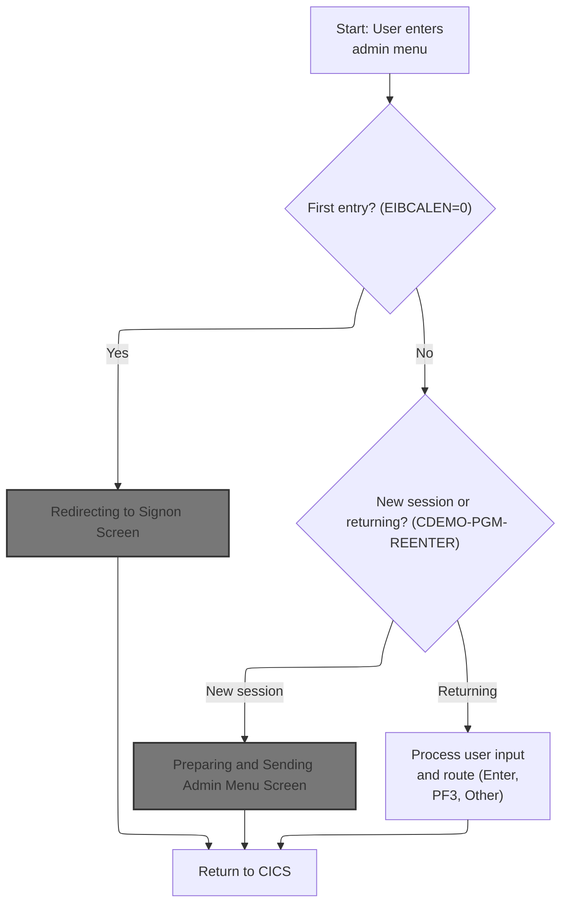
```mermaid
%%{init: {"flowchart": {"defaultRenderer": "elk"}} }%%
flowchart TD
    node1["Start: User enters 
 admin menu"]
    click node1 openCode "app/cbl/COADM01C.cbl:75:81"
    node1 --> node2{"First entry? (EIBCALEN=0)"}
    click node2 openCode "app/cbl/COADM01C.cbl:82:85"
    node2 -->|"Yes"| node3["Redirecting to Signon Screen"]
    
    node2 -->|"No"| node4{"New session or 
 returning? (CDEMO-PGM-REENTER)"}
    click node4 openCode "app/cbl/COADM01C.cbl:87:92"
    node4 -->|"New session"| node5["Preparing and Sending Admin Menu Screen"]
    
    node4 -->|"Returning"| node6["Process user input 
 and route (Enter, 
 PF3, Other)"]
    click node6 openCode "app/cbl/COADM01C.cbl:92:103"
    node3 --> node7["Return to CICS"]
    click node7 openCode "app/cbl/COADM01C.cbl:107:110"
    node5 --> node7
    node6 --> node7
classDef HeadingStyle fill:#777777,stroke:#333,stroke-width:2px;
click node3 goToHeading "Redirecting to Signon Screen"
node3:::HeadingStyle
click node5 goToHeading "Preparing and Sending Admin Menu Screen"
node5:::HeadingStyle
click node3 goToHeading "Redirecting to Signon Screen"
node3:::HeadingStyle
click node5 goToHeading "Preparing and Sending Admin Menu Screen"
node5:::HeadingStyle
```

This section manages the entry and input handling for the admin menu in the CardDemo application, determining when to display the menu, process user actions, and handle errors or redirections.

| Rule ID | Code Location | Category       | Rule Name                  | Description                                                                                                                  | Conditions                                                                                           | Remarks                                                                                                                                                             |
| ------- | ------------- | -------------- | -------------------------- | ---------------------------------------------------------------------------------------------------------------------------- | ---------------------------------------------------------------------------------------------------- | ------------------------------------------------------------------------------------------------------------------------------------------------------------------- |
| BR-001  | MAIN-PARA     | Business logic | Signon Redirection         | If the user enters the admin menu without a communication area, they are redirected to the signon screen.                    | User enters admin menu and communication area length is zero.                                        | The communication area is considered absent if its length (EIBCALEN) is zero. The user is redirected to the signon screen identified by program name 'COSGN00C'.    |
| BR-002  | MAIN-PARA     | Business logic | Admin Menu Initialization  | When starting a new admin menu session, the menu screen is prepared and displayed to the user.                               | User enters admin menu with a valid communication area and is not returning from a previous session. | The admin menu screen is displayed after clearing previous screen values (LOW-VALUES) and setting the session context to 're-enter'.                                |
| BR-003  | MAIN-PARA     | Business logic | Enter Key Processing       | When the user presses the Enter key on the admin menu, their input is processed according to the selected option.            | User is returning to the admin menu and presses the Enter key.                                       | Processing is triggered by the Enter key (DFHENTER). The specific admin option selected is handled in the PROCESS-ENTER-KEY paragraph (not shown in this section).  |
| BR-004  | MAIN-PARA     | Business logic | PF3 Redirection            | When the user presses PF3 on the admin menu, they are redirected to the signon screen.                                       | User is returning to the admin menu and presses the PF3 key.                                         | PF3 key (DFHPF3) triggers redirection to the signon screen, identified by program name 'COSGN00C'.                                                                  |
| BR-005  | MAIN-PARA     | Error handling | Invalid Key Error Handling | If the user presses any key other than Enter or PF3, an error message is displayed and the admin menu screen is shown again. | User is returning to the admin menu and presses a key that is not Enter or PF3.                      | The error message displayed is 'Invalid key pressed. Please see below...         ' (50 characters, left aligned, padded with spaces). The error flag is set to 'Y'. |

<SwmSnippet path="/app/cbl/COADM01C.cbl" line="75" repo-id="Z2l0aHViJTNBJTNBa3luZHJ5bC1hd3MtbWFpbmZyYW1lLW1vZGVybml6YXRpb24tY2FyZGRlbW8lM0ElM0FTd2ltbS1EZW1v">

---

`MAIN-PARA` in COADM01C.cbl checks if we're starting fresh or coming back after input. It sets up the admin menu, handles user actions, and routes to the right screen or shows errors.

```cobol
       MAIN-PARA.

           SET ERR-FLG-OFF TO TRUE

           MOVE SPACES TO WS-MESSAGE
                          ERRMSGO OF COADM1AO

           IF EIBCALEN = 0
               MOVE 'COSGN00C' TO CDEMO-FROM-PROGRAM
               PERFORM RETURN-TO-SIGNON-SCREEN
           ELSE
               MOVE DFHCOMMAREA(1:EIBCALEN) TO CARDDEMO-COMMAREA
               IF NOT CDEMO-PGM-REENTER
                   SET CDEMO-PGM-REENTER    TO TRUE
                   MOVE LOW-VALUES          TO COADM1AO
                   PERFORM SEND-MENU-SCREEN
               ELSE
                   PERFORM RECEIVE-MENU-SCREEN
                   EVALUATE EIBAID
                       WHEN DFHENTER
                           PERFORM PROCESS-ENTER-KEY
                       WHEN DFHPF3
                           MOVE 'COSGN00C' TO CDEMO-TO-PROGRAM
                           PERFORM RETURN-TO-SIGNON-SCREEN
                       WHEN OTHER
                           MOVE 'Y'                       TO WS-ERR-FLG
                           MOVE CCDA-MSG-INVALID-KEY      TO WS-MESSAGE
                           PERFORM SEND-MENU-SCREEN
                   END-EVALUATE
               END-IF
           END-IF

           EXEC CICS RETURN
                     TRANSID (WS-TRANID)
                     COMMAREA (CARDDEMO-COMMAREA)
           END-EXEC.
```

---

</SwmSnippet>

### Redirecting to Signon Screen

This section ensures that users are always redirected to a valid screen, defaulting to the signon screen if no next program is specified.

| Rule ID | Code Location           | Category       | Rule Name                | Description                                                                                                                                                                | Conditions                                                   | Remarks                                                                                                                                                                   |
| ------- | ----------------------- | -------------- | ------------------------ | -------------------------------------------------------------------------------------------------------------------------------------------------------------------------- | ------------------------------------------------------------ | ------------------------------------------------------------------------------------------------------------------------------------------------------------------------- |
| BR-001  | RETURN-TO-SIGNON-SCREEN | Business logic | Default to Signon Screen | If the next program to be executed is not specified (i.e., it is blank or contains only low values), the system will default to redirecting the user to the signon screen. | The next program field is blank or contains only low values. | The signon screen program name is 'COSGN00C', which is an 8-character alphanumeric string. If the next program is not set, this value is used as the default destination. |

<SwmSnippet path="/app/cbl/COADM01C.cbl" line="160" repo-id="Z2l0aHViJTNBJTNBa3luZHJ5bC1hd3MtbWFpbmZyYW1lLW1vZGVybml6YXRpb24tY2FyZGRlbW8lM0ElM0FTd2ltbS1EZW1v">

---

`RETURN-TO-SIGNON-SCREEN` checks if the next program is set. If not, it defaults to signon and uses XCTL to jump there, so the user always lands somewhere safe.

```cobol
       RETURN-TO-SIGNON-SCREEN.

           IF CDEMO-TO-PROGRAM = LOW-VALUES OR SPACES
               MOVE 'COSGN00C' TO CDEMO-TO-PROGRAM
           END-IF
           EXEC CICS
               XCTL PROGRAM(CDEMO-TO-PROGRAM)
           END-EXEC.
```

---

</SwmSnippet>

### Signon Screen Setup and Input Processing

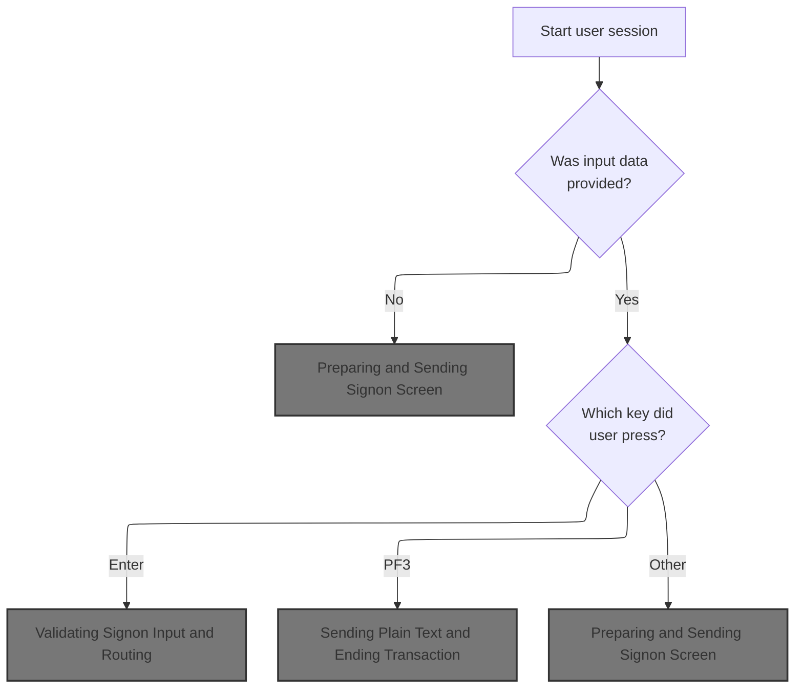
```mermaid
%%{init: {"flowchart": {"defaultRenderer": "elk"}} }%%
flowchart TD
  node1["Start user session"]
  click node1 openCode "app/cbl/COSGN00C.cbl:73:74"
  node1 --> node2{"Was input data 
 provided?"}
  click node2 openCode "app/cbl/COSGN00C.cbl:80:96"
  node2 -->|"No"| node3["Preparing and Sending Signon Screen"]
  
  node2 -->|"Yes"| node4{"Which key did 
 user press?"}
  click node4 openCode "app/cbl/COSGN00C.cbl:85:95"
  node4 -->|"Enter"| node5["Validating Signon Input and Routing"]
  
  node4 -->|"PF3"| node6["Sending Plain Text and Ending Transaction"]
  
  node4 -->|"Other"| node7["Preparing and Sending Signon Screen"]
  

classDef HeadingStyle fill:#777777,stroke:#333,stroke-width:2px;
click node3 goToHeading "Preparing and Sending Signon Screen"
node3:::HeadingStyle
click node5 goToHeading "Validating Signon Input and Routing"
node5:::HeadingStyle
click node6 goToHeading "Sending Plain Text and Ending Transaction"
node6:::HeadingStyle
click node7 goToHeading "Preparing and Sending Signon Screen"
node7:::HeadingStyle
```

This section manages the initial signon screen setup, processes user input, and routes the user based on the key pressed, displaying appropriate messages and ending the transaction when required.

| Rule ID | Code Location | Category       | Rule Name                             | Description                                                                                                                       | Conditions                                                         | Remarks                                                                                                                                                                                                                                                    |
| ------- | ------------- | -------------- | ------------------------------------- | --------------------------------------------------------------------------------------------------------------------------------- | ------------------------------------------------------------------ | ---------------------------------------------------------------------------------------------------------------------------------------------------------------------------------------------------------------------------------------------------------- |
| BR-001  | MAIN-PARA     | Business logic | Initial Signon Screen Display         | If no input data is provided when starting a user session, the signon screen is prepared and displayed to the user.               | No input data is present at session start.                         | The signon screen is displayed with all fields cleared. The output format includes the signon screen fields set to blank or default values.                                                                                                                |
| BR-002  | MAIN-PARA     | Business logic | Signon Input Validation and Routing   | When the user presses the Enter key after providing input, the system validates the signon input and routes the user accordingly. | User has provided input and pressed the Enter key.                 | The system proceeds to validate the user credentials and route the user to the appropriate application area or display error messages as needed. The output format depends on the result of the validation, but this rule only covers the routing trigger. |
| BR-003  | MAIN-PARA     | Business logic | Thank You Message and Transaction End | When the user presses the PF3 key, a thank you message is displayed and the transaction is ended.                                 | User has provided input and pressed the PF3 key.                   | The thank you message is: 'Thank you for using CardDemo application...      ' (string, 50 characters, left aligned, padded with spaces). The transaction is ended after displaying the message.                                                            |
| BR-004  | MAIN-PARA     | Error handling | Invalid Key Error Message             | If the user presses any key other than Enter or PF3, an error message is displayed and the signon screen is shown again.          | User has provided input and pressed a key other than Enter or PF3. | The error message is: 'Invalid key pressed. Please see below...         ' (string, 50 characters, left aligned, padded with spaces). The signon screen is displayed again after the error message.                                                         |

<SwmSnippet path="/app/cbl/COSGN00C.cbl" line="73" repo-id="Z2l0aHViJTNBJTNBa3luZHJ5bC1hd3MtbWFpbmZyYW1lLW1vZGVybml6YXRpb24tY2FyZGRlbW8lM0ElM0FTd2ltbS1EZW1v">

---

`MAIN-PARA` in COSGN00C.cbl sets up the signon screen, handles user input, and routes to the right handler or shows messages. It returns to CICS when done.

```cobol
       MAIN-PARA.

           SET ERR-FLG-OFF TO TRUE

           MOVE SPACES TO WS-MESSAGE
                          ERRMSGO OF COSGN0AO

           IF EIBCALEN = 0
               MOVE LOW-VALUES TO COSGN0AO
               MOVE -1       TO USERIDL OF COSGN0AI
               PERFORM SEND-SIGNON-SCREEN
           ELSE
               EVALUATE EIBAID
                   WHEN DFHENTER
                       PERFORM PROCESS-ENTER-KEY
                   WHEN DFHPF3
                       MOVE CCDA-MSG-THANK-YOU        TO WS-MESSAGE
                       PERFORM SEND-PLAIN-TEXT
                   WHEN OTHER
                       MOVE 'Y'                       TO WS-ERR-FLG
                       MOVE CCDA-MSG-INVALID-KEY      TO WS-MESSAGE
                       PERFORM SEND-SIGNON-SCREEN
               END-EVALUATE
           END-IF.

           EXEC CICS RETURN
                     TRANSID (WS-TRANID)
                     COMMAREA (CARDDEMO-COMMAREA)
                     LENGTH(LENGTH OF CARDDEMO-COMMAREA)
           END-EXEC.
```

---

</SwmSnippet>

#### Preparing and Sending Signon Screen

This section prepares and sends the signon screen to the user's terminal, ensuring that all required header information, system/application identifiers, and user messages are correctly displayed.

| Rule ID | Code Location        | Category       | Rule Name                            | Description                                                                                                                           | Conditions                                                          | Remarks                                                                                                                                                                                 |
| ------- | -------------------- | -------------- | ------------------------------------ | ------------------------------------------------------------------------------------------------------------------------------------- | ------------------------------------------------------------------- | --------------------------------------------------------------------------------------------------------------------------------------------------------------------------------------- |
| BR-001  | POPULATE-HEADER-INFO | Business logic | Header date and time display         | The signon screen must display the current date and time in the header, formatted as MM-DD-YY for the date and HH-MM-SS for the time. | Whenever the signon screen is prepared and sent to the terminal.    | Date is shown as a string in MM-DD-YY format; time is shown as a string in HH-MM-SS format. These are derived from the system's current date and time at the moment the screen is sent. |
| BR-002  | POPULATE-HEADER-INFO | Business logic | Program and transaction info display | The signon screen must display the program name ('COSGN00C (Signon Screen Handling)') and transaction ID ('CC00') in the header.      | Whenever the signon screen is prepared and sent to the terminal.    | Program name is an 8-character string ('COSGN00C'); transaction ID is a 4-character string ('CC00'). Both are shown in the header area of the signon screen.                            |
| BR-003  | POPULATE-HEADER-INFO | Business logic | System and application ID display    | The signon screen must display system and application identifiers assigned by CICS.                                                   | Whenever the signon screen is prepared and sent to the terminal.    | System ID and application ID are assigned by CICS and displayed as strings in the header area.                                                                                          |
| BR-004  | SEND-SIGNON-SCREEN   | Business logic | User message display                 | Any message to be displayed to the user must be shown in the designated message area of the signon screen, up to 80 characters.       | Whenever WS-MESSAGE contains a value and the signon screen is sent. | Message is an 80-character string. If no message is present, the area is blank (spaces).                                                                                                |
| BR-005  | POPULATE-HEADER-INFO | Business logic | Header titles display                | The signon screen must display two header titles as defined in the application configuration.                                         | Whenever the signon screen is prepared and sent to the terminal.    | Titles are shown as strings in the header area. The actual content is sourced from configuration variables.                                                                             |

<SwmSnippet path="/app/cbl/COSGN00C.cbl" line="145" repo-id="Z2l0aHViJTNBJTNBa3luZHJ5bC1hd3MtbWFpbmZyYW1lLW1vZGVybml6YXRpb24tY2FyZGRlbW8lM0ElM0FTd2ltbS1EZW1v">

---

`SEND-SIGNON-SCREEN` calls the header setup, moves the message to the error field, and sends the signon map to the terminal, clearing the screen and setting the cursor.

```cobol
       SEND-SIGNON-SCREEN.

           PERFORM POPULATE-HEADER-INFO

           MOVE WS-MESSAGE TO ERRMSGO OF COSGN0AO

           EXEC CICS SEND
                     MAP('COSGN0A')
                     MAPSET('COSGN00')
                     FROM(COSGN0AO)
                     ERASE
                     CURSOR
           END-EXEC.
```

---

</SwmSnippet>

<SwmSnippet path="/app/cbl/COSGN00C.cbl" line="177" repo-id="Z2l0aHViJTNBJTNBa3luZHJ5bC1hd3MtbWFpbmZyYW1lLW1vZGVybml6YXRpb24tY2FyZGRlbW8lM0ElM0FTd2ltbS1EZW1v">

---

`POPULATE-HEADER-INFO` grabs the current date/time, sets up titles, program, and transaction info, and assigns system/app IDs for the signon screen header.

```cobol
       POPULATE-HEADER-INFO.

           MOVE FUNCTION CURRENT-DATE  TO WS-CURDATE-DATA

           MOVE CCDA-TITLE01           TO TITLE01O OF COSGN0AO
           MOVE CCDA-TITLE02           TO TITLE02O OF COSGN0AO
           MOVE WS-TRANID              TO TRNNAMEO OF COSGN0AO
           MOVE WS-PGMNAME             TO PGMNAMEO OF COSGN0AO

           MOVE WS-CURDATE-MONTH       TO WS-CURDATE-MM
           MOVE WS-CURDATE-DAY         TO WS-CURDATE-DD
           MOVE WS-CURDATE-YEAR(3:2)   TO WS-CURDATE-YY

           MOVE WS-CURDATE-MM-DD-YY    TO CURDATEO OF COSGN0AO

           MOVE WS-CURTIME-HOURS       TO WS-CURTIME-HH
           MOVE WS-CURTIME-MINUTE      TO WS-CURTIME-MM
           MOVE WS-CURTIME-SECOND      TO WS-CURTIME-SS

           MOVE WS-CURTIME-HH-MM-SS    TO CURTIMEO OF COSGN0AO

           EXEC CICS ASSIGN
               APPLID(APPLIDO OF COSGN0AO)
           END-EXEC

           EXEC CICS ASSIGN
               SYSID(SYSIDO OF COSGN0AO)
           END-EXEC.
```

---

</SwmSnippet>

#### Validating Signon Input and Routing

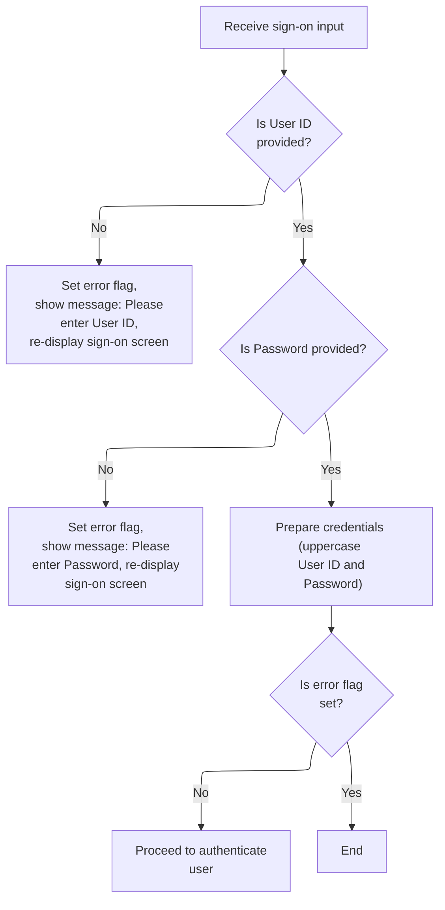
```mermaid
%%{init: {"flowchart": {"defaultRenderer": "elk"}} }%%
flowchart TD
  node1["Receive sign-on input"]
  click node1 openCode "app/cbl/COSGN00C.cbl:110:115"
  node1 --> node2{"Is User ID 
 provided?"}
  click node2 openCode "app/cbl/COSGN00C.cbl:117:123"
  node2 -->|"No"| node3["Set error flag, 
 show message: Please 
 enter User ID, 
 re-display sign-on screen"]
  click node3 openCode "app/cbl/COSGN00C.cbl:119:122"
  node2 -->|"Yes"| node4{"Is Password provided?"}
  click node4 openCode "app/cbl/COSGN00C.cbl:123:127"
  node4 -->|"No"| node5["Set error flag, 
 show message: Please 
 enter Password, re-display 
 sign-on screen"]
  click node5 openCode "app/cbl/COSGN00C.cbl:125:127"
  node4 -->|"Yes"| node6["Prepare credentials (uppercase 
 User ID and 
 Password)"]
  click node6 openCode "app/cbl/COSGN00C.cbl:132:136"
  node6 --> node7{"Is error flag 
 set?"}
  click node7 openCode "app/cbl/COSGN00C.cbl:138:140"
  node7 -->|"No"| node8["Proceed to authenticate 
 user"]
  click node8 openCode "app/cbl/COSGN00C.cbl:139:140"
  node7 -->|"Yes"| node9["End"]
  click node9 openCode "app/cbl/COSGN00C.cbl:140:140"
classDef HeadingStyle fill:#777777,stroke:#333,stroke-width:2px;
```

This section validates user sign-on input, displays error messages for missing fields, normalizes credentials, and routes the flow to authentication or error handling based on input validity.

| Rule ID | Code Location     | Category        | Rule Name                       | Description                                                                                                                                                       | Conditions                                                         | Remarks                                                                                                                                      |
| ------- | ----------------- | --------------- | ------------------------------- | ----------------------------------------------------------------------------------------------------------------------------------------------------------------- | ------------------------------------------------------------------ | -------------------------------------------------------------------------------------------------------------------------------------------- |
| BR-001  | PROCESS-ENTER-KEY | Data validation | Required User ID                | If the User ID field is missing or blank, the system must display an error message prompting the user to enter their User ID and re-display the sign-on screen.   | The User ID field is blank or contains only spaces or low-values.  | The error message displayed is: 'Please enter User ID ...'. The User ID field is expected to be an alphanumeric string up to 8 characters.   |
| BR-002  | PROCESS-ENTER-KEY | Data validation | Required Password               | If the Password field is missing or blank, the system must display an error message prompting the user to enter their Password and re-display the sign-on screen. | The Password field is blank or contains only spaces or low-values. | The error message displayed is: 'Please enter Password ...'. The Password field is expected to be an alphanumeric string up to 8 characters. |
| BR-003  | PROCESS-ENTER-KEY | Business logic  | Credential Normalization        | When both User ID and Password are provided, the system must convert both fields to uppercase before passing them to the authentication process.                  | Both User ID and Password fields are present and not blank.        | User ID and Password are normalized to uppercase. Both fields are expected to be alphanumeric strings up to 8 characters.                    |
| BR-004  | PROCESS-ENTER-KEY | Business logic  | Authentication Routing          | If no error flag is set after input validation, the system must proceed to authenticate the user using the normalized credentials.                                | No error flag is set after validating User ID and Password.        | Authentication is only attempted if both fields are present and valid. Credentials are passed in uppercase format.                           |
| BR-005  | PROCESS-ENTER-KEY | Error handling  | Error Handling on Invalid Input | If an error flag is set during input validation, the system must not proceed to authentication and must end the current process.                                  | Error flag is set due to missing or invalid User ID or Password.   | No authentication is attempted if input validation fails.                                                                                    |

<SwmSnippet path="/app/cbl/COSGN00C.cbl" line="108" repo-id="Z2l0aHViJTNBJTNBa3luZHJ5bC1hd3MtbWFpbmZyYW1lLW1vZGVybml6YXRpb24tY2FyZGRlbW8lM0ElM0FTd2ltbS1EZW1v">

---

`PROCESS-ENTER-KEY` receives the signon input, checks for missing fields, normalizes credentials to uppercase, and if all's good, calls the user security file reader.

```cobol
       PROCESS-ENTER-KEY.

           EXEC CICS RECEIVE
                     MAP('COSGN0A')
                     MAPSET('COSGN00')
                     RESP(WS-RESP-CD)
                     RESP2(WS-REAS-CD)
           END-EXEC.

           EVALUATE TRUE
               WHEN USERIDI OF COSGN0AI = SPACES OR LOW-VALUES
                   MOVE 'Y'      TO WS-ERR-FLG
                   MOVE 'Please enter User ID ...' TO WS-MESSAGE
                   MOVE -1       TO USERIDL OF COSGN0AI
                   PERFORM SEND-SIGNON-SCREEN
               WHEN PASSWDI OF COSGN0AI = SPACES OR LOW-VALUES
                   MOVE 'Y'      TO WS-ERR-FLG
                   MOVE 'Please enter Password ...' TO WS-MESSAGE
                   MOVE -1       TO PASSWDL OF COSGN0AI
                   PERFORM SEND-SIGNON-SCREEN
               WHEN OTHER
                   CONTINUE
           END-EVALUATE.

           MOVE FUNCTION UPPER-CASE(USERIDI OF COSGN0AI) TO
                           WS-USER-ID
                           CDEMO-USER-ID
           MOVE FUNCTION UPPER-CASE(PASSWDI OF COSGN0AI) TO
                           WS-USER-PWD

           IF NOT ERR-FLG-ON
               PERFORM READ-USER-SEC-FILE
           END-IF.
```

---

</SwmSnippet>

#### Authenticating User and Routing to Menu

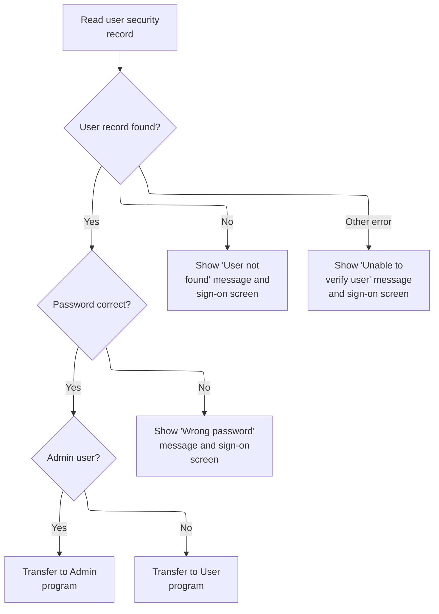
```mermaid
%%{init: {"flowchart": {"defaultRenderer": "elk"}} }%%
flowchart TD
    node1["Read user security 
 record"] --> node2{"User record found?"}
    click node1 openCode "app/cbl/COSGN00C.cbl:211:219"
    node2 -->|"Yes"| node3{"Password correct?"}
    click node2 openCode "app/cbl/COSGN00C.cbl:221:222"
    node2 -->|"No"| node6["Show 'User not 
 found' message and 
 sign-on screen"]
    click node6 openCode "app/cbl/COSGN00C.cbl:247:251"
    node2 -->|"Other error"| node9["Show 'Unable to 
 verify user' message 
 and sign-on screen"]
    click node9 openCode "app/cbl/COSGN00C.cbl:252:256"
    node3 -->|"Yes"| node4{"Admin user?"}
    click node3 openCode "app/cbl/COSGN00C.cbl:223:224"
    node3 -->|"No"| node7["Show 'Wrong password' 
 message and sign-on 
 screen"]
    click node7 openCode "app/cbl/COSGN00C.cbl:241:246"
    node4 -->|"Yes"| node5["Transfer to Admin 
 program"]
    click node5 openCode "app/cbl/COSGN00C.cbl:230:234"
    node4 -->|"No"| node8["Transfer to User 
 program"]
    click node8 openCode "app/cbl/COSGN00C.cbl:235:239"
classDef HeadingStyle fill:#777777,stroke:#333,stroke-width:2px;
```

This section authenticates users by validating their credentials and routes them to the appropriate menu based on their user type. It also handles error scenarios by displaying relevant messages and prompting the user to try again.

| Rule ID | Code Location      | Category       | Rule Name                       | Description                                                                                                                                                                                                       | Conditions                                                                                    | Remarks                                                                                                                                                                                |
| ------- | ------------------ | -------------- | ------------------------------- | ----------------------------------------------------------------------------------------------------------------------------------------------------------------------------------------------------------------- | --------------------------------------------------------------------------------------------- | -------------------------------------------------------------------------------------------------------------------------------------------------------------------------------------- |
| BR-001  | READ-USER-SEC-FILE | Business logic | User authentication and routing | If a user record is found and the password matches, the user is routed to the appropriate menu based on their user type: admin users are routed to the admin menu, and regular users are routed to the main menu. | A user record is found (response code 0) and the password matches the stored password.        | Admin users are identified by user type 'A', regular users by 'U'. Admin users are routed to the admin menu program ('COADM01C'), regular users to the main menu program ('COMEN01C'). |
| BR-002  | READ-USER-SEC-FILE | Error handling | Wrong password error            | If a user record is found but the password does not match, an error message is displayed indicating a wrong password, and the sign-on screen is shown again.                                                      | A user record is found (response code 0) but the password does not match the stored password. | The error message displayed is 'Wrong Password. Try again ...'. The sign-on screen is re-displayed for another attempt.                                                                |
| BR-003  | READ-USER-SEC-FILE | Error handling | User not found error            | If no user record is found for the provided user ID, an error message is displayed indicating the user was not found, and the sign-on screen is shown again.                                                      | The user record lookup returns response code 13 (user not found).                             | The error message displayed is 'User not found. Try again ...'. The sign-on screen is re-displayed for another attempt.                                                                |
| BR-004  | READ-USER-SEC-FILE | Error handling | User verification error         | If an error occurs during user record lookup other than 'user not found', an error message is displayed indicating the user could not be verified, and the sign-on screen is shown again.                         | The user record lookup returns a response code other than 0 or 13.                            | The error message displayed is 'Unable to verify the User ...'. The sign-on screen is re-displayed for another attempt.                                                                |

<SwmSnippet path="/app/cbl/COSGN00C.cbl" line="209" repo-id="Z2l0aHViJTNBJTNBa3luZHJ5bC1hd3MtbWFpbmZyYW1lLW1vZGVybml6YXRpb24tY2FyZGRlbW8lM0ElM0FTd2ltbS1EZW1v">

---

`READ-USER-SEC-FILE` reads the user record, checks the password, and sends the user to either the admin or main menu program using XCTL. If there's an error, it shows the right message and prompts again.

```cobol
       READ-USER-SEC-FILE.

           EXEC CICS READ
                DATASET   (WS-USRSEC-FILE)
                INTO      (SEC-USER-DATA)
                LENGTH    (LENGTH OF SEC-USER-DATA)
                RIDFLD    (WS-USER-ID)
                KEYLENGTH (LENGTH OF WS-USER-ID)
                RESP      (WS-RESP-CD)
                RESP2     (WS-REAS-CD)
           END-EXEC.

           EVALUATE WS-RESP-CD
               WHEN 0
                   IF SEC-USR-PWD = WS-USER-PWD
                       MOVE WS-TRANID    TO CDEMO-FROM-TRANID
                       MOVE WS-PGMNAME   TO CDEMO-FROM-PROGRAM
                       MOVE WS-USER-ID   TO CDEMO-USER-ID
                       MOVE SEC-USR-TYPE TO CDEMO-USER-TYPE
                       MOVE ZEROS        TO CDEMO-PGM-CONTEXT

                       IF CDEMO-USRTYP-ADMIN
                            EXEC CICS XCTL
                              PROGRAM ('COADM01C')
                              COMMAREA(CARDDEMO-COMMAREA)
                            END-EXEC
                       ELSE
                            EXEC CICS XCTL
                              PROGRAM ('COMEN01C')
                              COMMAREA(CARDDEMO-COMMAREA)
                            END-EXEC
                       END-IF
                   ELSE
                       MOVE 'Wrong Password. Try again ...' TO
                                                          WS-MESSAGE
                       MOVE -1       TO PASSWDL OF COSGN0AI
                       PERFORM SEND-SIGNON-SCREEN
                   END-IF
               WHEN 13
                   MOVE 'Y'      TO WS-ERR-FLG
                   MOVE 'User not found. Try again ...' TO WS-MESSAGE
                   MOVE -1       TO USERIDL OF COSGN0AI
                   PERFORM SEND-SIGNON-SCREEN
               WHEN OTHER
                   MOVE 'Y'      TO WS-ERR-FLG
                   MOVE 'Unable to verify the User ...' TO WS-MESSAGE
                   MOVE -1       TO USERIDL OF COSGN0AI
                   PERFORM SEND-SIGNON-SCREEN
           END-EVALUATE.
```

---

</SwmSnippet>

#### Main Menu Entry and Input Handling


```mermaid
%%{init: {"flowchart": {"defaultRenderer": "elk"}} }%%
flowchart TD
    node1["Start: User enters 
 admin menu"]
    click node1 openCode "app/cbl/COADM01C.cbl:75:81"
    node1 --> node2{"First entry? (EIBCALEN=0)"}
    click node2 openCode "app/cbl/COADM01C.cbl:82:85"
    node2 -->|"Yes"| node3["Redirecting to Signon Screen"]
    
    node2 -->|"No"| node4{"New session or 
 returning? (CDEMO-PGM-REENTER)"}
    click node4 openCode "app/cbl/COADM01C.cbl:87:92"
    node4 -->|"New session"| node5["Preparing and Sending Admin Menu Screen"]
    
    node4 -->|"Returning"| node6["Process user input 
 and route (Enter, 
 PF3, Other)"]
    click node6 openCode "app/cbl/COADM01C.cbl:92:103"
    node3 --> node7["Return to CICS"]
    click node7 openCode "app/cbl/COADM01C.cbl:107:110"
    node5 --> node7
    node6 --> node7
classDef HeadingStyle fill:#777777,stroke:#333,stroke-width:2px;
click node3 goToHeading "Redirecting to Signon Screen"
node3:::HeadingStyle
click node5 goToHeading "Preparing and Sending Admin Menu Screen"
node5:::HeadingStyle
click node3 goToHeading "Redirecting to Signon Screen"
node3:::HeadingStyle
click node5 goToHeading "Preparing and Sending Admin Menu Screen"
node5:::HeadingStyle
```

This section manages the entry and input handling for the admin menu in the CardDemo application, determining when to display the menu, process user actions, and handle errors or redirections.

| Rule ID | Code Location | Category       | Rule Name                  | Description                                                                                                                  | Conditions                                                                                           | Remarks                                                                                                                                                             |
| ------- | ------------- | -------------- | -------------------------- | ---------------------------------------------------------------------------------------------------------------------------- | ---------------------------------------------------------------------------------------------------- | ------------------------------------------------------------------------------------------------------------------------------------------------------------------- |
| BR-001  | MAIN-PARA     | Business logic | Signon Redirection         | If the user enters the admin menu without a communication area, they are redirected to the signon screen.                    | User enters admin menu and communication area length is zero.                                        | The communication area is considered absent if its length (EIBCALEN) is zero. The user is redirected to the signon screen identified by program name 'COSGN00C'.    |
| BR-002  | MAIN-PARA     | Business logic | Admin Menu Initialization  | When starting a new admin menu session, the menu screen is prepared and displayed to the user.                               | User enters admin menu with a valid communication area and is not returning from a previous session. | The admin menu screen is displayed after clearing previous screen values (LOW-VALUES) and setting the session context to 're-enter'.                                |
| BR-003  | MAIN-PARA     | Business logic | Enter Key Processing       | When the user presses the Enter key on the admin menu, their input is processed according to the selected option.            | User is returning to the admin menu and presses the Enter key.                                       | Processing is triggered by the Enter key (DFHENTER). The specific admin option selected is handled in the PROCESS-ENTER-KEY paragraph (not shown in this section).  |
| BR-004  | MAIN-PARA     | Business logic | PF3 Redirection            | When the user presses PF3 on the admin menu, they are redirected to the signon screen.                                       | User is returning to the admin menu and presses the PF3 key.                                         | PF3 key (DFHPF3) triggers redirection to the signon screen, identified by program name 'COSGN00C'.                                                                  |
| BR-005  | MAIN-PARA     | Error handling | Invalid Key Error Handling | If the user presses any key other than Enter or PF3, an error message is displayed and the admin menu screen is shown again. | User is returning to the admin menu and presses a key that is not Enter or PF3.                      | The error message displayed is 'Invalid key pressed. Please see below...         ' (50 characters, left aligned, padded with spaces). The error flag is set to 'Y'. |

<SwmSnippet path="/app/cbl/COMEN01C.cbl" line="75" repo-id="Z2l0aHViJTNBJTNBa3luZHJ5bC1hd3MtbWFpbmZyYW1lLW1vZGVybml6YXRpb24tY2FyZGRlbW8lM0ElM0FTd2ltbS1EZW1v">

---

`MAIN-PARA` in COMEN01C.cbl checks if we're starting fresh or coming back after input. It sets up the main menu, handles user actions, and routes to the right screen or shows errors.

```cobol
       MAIN-PARA.

           SET ERR-FLG-OFF TO TRUE

           MOVE SPACES TO WS-MESSAGE
                          ERRMSGO OF COMEN1AO

           IF EIBCALEN = 0
               MOVE 'COSGN00C' TO CDEMO-FROM-PROGRAM
               PERFORM RETURN-TO-SIGNON-SCREEN
           ELSE
               MOVE DFHCOMMAREA(1:EIBCALEN) TO CARDDEMO-COMMAREA
               IF NOT CDEMO-PGM-REENTER
                   SET CDEMO-PGM-REENTER    TO TRUE
                   MOVE LOW-VALUES          TO COMEN1AO
                   PERFORM SEND-MENU-SCREEN
               ELSE
                   PERFORM RECEIVE-MENU-SCREEN
                   EVALUATE EIBAID
                       WHEN DFHENTER
                           PERFORM PROCESS-ENTER-KEY
                       WHEN DFHPF3
                           MOVE 'COSGN00C' TO CDEMO-TO-PROGRAM
                           PERFORM RETURN-TO-SIGNON-SCREEN
                       WHEN OTHER
                           MOVE 'Y'                       TO WS-ERR-FLG
                           MOVE CCDA-MSG-INVALID-KEY      TO WS-MESSAGE
                           PERFORM SEND-MENU-SCREEN
                   END-EVALUATE
               END-IF
           END-IF

           EXEC CICS RETURN
                     TRANSID (WS-TRANID)
                     COMMAREA (CARDDEMO-COMMAREA)
           END-EXEC.
```

---

</SwmSnippet>

<SwmSnippet path="/app/cbl/COMEN01C.cbl" line="170" repo-id="Z2l0aHViJTNBJTNBa3luZHJ5bC1hd3MtbWFpbmZyYW1lLW1vZGVybml6YXRpb24tY2FyZGRlbW8lM0ElM0FTd2ltbS1EZW1v">

---

`RETURN-TO-SIGNON-SCREEN` checks if the next program is set. If not, it defaults to signon and uses XCTL to jump there, so the user always lands somewhere safe.

```cobol
       RETURN-TO-SIGNON-SCREEN.

           IF CDEMO-TO-PROGRAM = LOW-VALUES OR SPACES
               MOVE 'COSGN00C' TO CDEMO-TO-PROGRAM
           END-IF
           EXEC CICS
               XCTL PROGRAM(CDEMO-TO-PROGRAM)
           END-EXEC.
```

---

</SwmSnippet>

##### Preparing and Sending Main Menu Screen

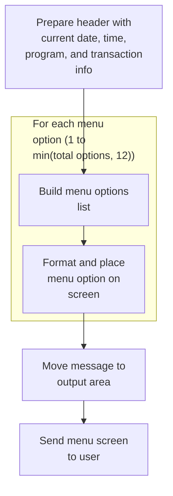
```mermaid
%%{init: {"flowchart": {"defaultRenderer": "elk"}} }%%
flowchart TD
    node1["Prepare header with 
 current date, time, 
 program, and transaction 
 info"]
    click node1 openCode "app/cbl/COMEN01C.cbl:212:231"
    node1 --> node2["Build menu options 
 list"]
    click node2 openCode "app/cbl/COMEN01C.cbl:236:277"
    
    subgraph loop1["For each menu 
 option (1 to 
 min(total options, 12))"]
        node2 --> node3["Format and place 
 menu option on 
 screen"]
        click node3 openCode "app/cbl/COMEN01C.cbl:241:275"
    end
    node3 --> node4["Move message to 
 output area"]
    click node4 openCode "app/cbl/COMEN01C.cbl:187:187"
    node4 --> node5["Send menu screen 
 to user"]
    click node5 openCode "app/cbl/COMEN01C.cbl:189:194"
classDef HeadingStyle fill:#777777,stroke:#333,stroke-width:2px;
```

This section prepares and sends the main menu screen to the user, ensuring the header, menu options, and any messages are correctly formatted and displayed.

| Rule ID | Code Location        | Category       | Rule Name                    | Description                                                                                                             | Conditions                                                                                                         | Remarks                                                                                                                                                                                                                          |
| ------- | -------------------- | -------------- | ---------------------------- | ----------------------------------------------------------------------------------------------------------------------- | ------------------------------------------------------------------------------------------------------------------ | -------------------------------------------------------------------------------------------------------------------------------------------------------------------------------------------------------------------------------- |
| BR-001  | POPULATE-HEADER-INFO | Business logic | Header information display   | The main menu screen must display a header containing the current date, current time, program name, and transaction ID. | Whenever the main menu screen is prepared and sent.                                                                | Date is formatted as MM-DD-YY, time as HH-MM-SS, program name is 8 characters, transaction ID is 4 characters. All fields are left-aligned and padded with spaces if necessary.                                                  |
| BR-002  | BUILD-MENU-OPTIONS   | Business logic | Menu options display         | The main menu screen must display up to 12 menu options, each formatted as '<option number>. <option name>'.            | Whenever the main menu screen is prepared and sent; applies for each menu option from 1 to min(total options, 12). | Maximum of 12 options. Each option string is constructed as: option number (string), period and space, option name (string). Each option is placed in a separate output field, left-aligned and padded with spaces if necessary. |
| BR-003  | SEND-MENU-SCREEN     | Business logic | Message display              | Any message present must be displayed in the designated message area of the main menu screen.                           | Whenever the main menu screen is prepared and sent; if a message is present.                                       | Message area is 80 characters, left-aligned and padded with spaces if necessary.                                                                                                                                                 |
| BR-004  | SEND-MENU-SCREEN     | Business logic | Screen clearing on menu send | When the main menu screen is sent, the screen must be cleared so that only the new menu and message are visible.        | Whenever the main menu screen is sent to the user.                                                                 | The screen is cleared before displaying the new menu. This ensures no residual data from previous screens is visible.                                                                                                            |

<SwmSnippet path="/app/cbl/COMEN01C.cbl" line="182" repo-id="Z2l0aHViJTNBJTNBa3luZHJ5bC1hd3MtbWFpbmZyYW1lLW1vZGVybml6YXRpb24tY2FyZGRlbW8lM0ElM0FTd2ltbS1EZW1v">

---

`SEND-MENU-SCREEN` sets up the header, builds the menu options, moves the message to the error field, and sends the main menu map to the terminal, clearing the screen.

```cobol
       SEND-MENU-SCREEN.

           PERFORM POPULATE-HEADER-INFO
           PERFORM BUILD-MENU-OPTIONS

           MOVE WS-MESSAGE TO ERRMSGO OF COMEN1AO

           EXEC CICS SEND
                     MAP('COMEN1A')
                     MAPSET('COMEN01')
                     FROM(COMEN1AO)
                     ERASE
           END-EXEC.
```

---

</SwmSnippet>

<SwmSnippet path="/app/cbl/COMEN01C.cbl" line="212" repo-id="Z2l0aHViJTNBJTNBa3luZHJ5bC1hd3MtbWFpbmZyYW1lLW1vZGVybml6YXRpb24tY2FyZGRlbW8lM0ElM0FTd2ltbS1EZW1v">

---

`POPULATE-HEADER-INFO` grabs the current date/time, sets up titles, program, and transaction info for the main menu header.

```cobol
       POPULATE-HEADER-INFO.

           MOVE FUNCTION CURRENT-DATE  TO WS-CURDATE-DATA

           MOVE CCDA-TITLE01           TO TITLE01O OF COMEN1AO
           MOVE CCDA-TITLE02           TO TITLE02O OF COMEN1AO
           MOVE WS-TRANID              TO TRNNAMEO OF COMEN1AO
           MOVE WS-PGMNAME             TO PGMNAMEO OF COMEN1AO

           MOVE WS-CURDATE-MONTH       TO WS-CURDATE-MM
           MOVE WS-CURDATE-DAY         TO WS-CURDATE-DD
           MOVE WS-CURDATE-YEAR(3:2)   TO WS-CURDATE-YY

           MOVE WS-CURDATE-MM-DD-YY    TO CURDATEO OF COMEN1AO

           MOVE WS-CURTIME-HOURS       TO WS-CURTIME-HH
           MOVE WS-CURTIME-MINUTE      TO WS-CURTIME-MM
           MOVE WS-CURTIME-SECOND      TO WS-CURTIME-SS

           MOVE WS-CURTIME-HH-MM-SS    TO CURTIMEO OF COMEN1AO.
```

---

</SwmSnippet>

<SwmSnippet path="/app/cbl/COMEN01C.cbl" line="236" repo-id="Z2l0aHViJTNBJTNBa3luZHJ5bC1hd3MtbWFpbmZyYW1lLW1vZGVybml6YXRpb24tY2FyZGRlbW8lM0ElM0FTd2ltbS1EZW1v">

---

`BUILD-MENU-OPTIONS` loops through the menu options, builds the display strings, and assigns them to the output fields for the main menu screen.

```cobol
       BUILD-MENU-OPTIONS.

           PERFORM VARYING WS-IDX FROM 1 BY 1 UNTIL
                           WS-IDX > CDEMO-MENU-OPT-COUNT

               MOVE SPACES             TO WS-MENU-OPT-TXT

               STRING CDEMO-MENU-OPT-NUM(WS-IDX)  DELIMITED BY SIZE
                      '. '                         DELIMITED BY SIZE
                      CDEMO-MENU-OPT-NAME(WS-IDX) DELIMITED BY SIZE
                 INTO WS-MENU-OPT-TXT

               EVALUATE WS-IDX
                   WHEN 1
                       MOVE WS-MENU-OPT-TXT TO OPTN001O
                   WHEN 2
                       MOVE WS-MENU-OPT-TXT TO OPTN002O
                   WHEN 3
                       MOVE WS-MENU-OPT-TXT TO OPTN003O
                   WHEN 4
                       MOVE WS-MENU-OPT-TXT TO OPTN004O
                   WHEN 5
                       MOVE WS-MENU-OPT-TXT TO OPTN005O
                   WHEN 6
                       MOVE WS-MENU-OPT-TXT TO OPTN006O
                   WHEN 7
                       MOVE WS-MENU-OPT-TXT TO OPTN007O
                   WHEN 8
                       MOVE WS-MENU-OPT-TXT TO OPTN008O
                   WHEN 9
                       MOVE WS-MENU-OPT-TXT TO OPTN009O
                   WHEN 10
                       MOVE WS-MENU-OPT-TXT TO OPTN010O
                   WHEN 11
                       MOVE WS-MENU-OPT-TXT TO OPTN011O
                   WHEN 12
                       MOVE WS-MENU-OPT-TXT TO OPTN012O
                   WHEN OTHER
                       CONTINUE
               END-EVALUATE

           END-PERFORM.
```

---

</SwmSnippet>

##### Receiving and Processing Main Menu Input

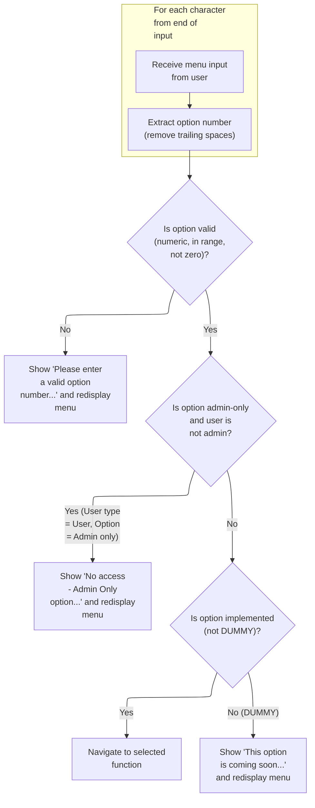
```mermaid
%%{init: {"flowchart": {"defaultRenderer": "elk"}} }%%
flowchart TD
    node1["Receive menu input 
 from user"]
    click node1 openCode "app/cbl/COMEN01C.cbl:201:207"
    subgraph loop1["For each character 
 from end of 
 input"]
        node1 --> node2["Extract option number 
 (remove trailing spaces)"]
        click node2 openCode "app/cbl/COMEN01C.cbl:117:123"
    end
    node2 --> node3{"Is option valid 
 (numeric, in range, 
 not zero)?"}
    click node3 openCode "app/cbl/COMEN01C.cbl:127:134"
    node3 -->|"No"| node4["Show 'Please enter 
 a valid option 
 number...' and redisplay 
 menu"]
    click node4 openCode "app/cbl/COMEN01C.cbl:130:134"
    node3 -->|"Yes"| node5{"Is option admin-only 
 and user is 
 not admin?"}
    click node5 openCode "app/cbl/COMEN01C.cbl:136:143"
    node5 -->|"Yes (User type 
 = User, Option 
 = Admin only)"| node6["Show 'No access 
 - Admin Only 
 option...' and redisplay 
 menu"]
    click node6 openCode "app/cbl/COMEN01C.cbl:138:143"
    node5 -->|"No"| node7{"Is option implemented 
 (not DUMMY)?"}
    click node7 openCode "app/cbl/COMEN01C.cbl:146:156"
    node7 -->|"Yes"| node8["Navigate to selected 
 function"]
    click node8 openCode "app/cbl/COMEN01C.cbl:147:155"
    node7 -->|"No (DUMMY)"| node9["Show 'This option 
 is coming soon...' 
 and redisplay menu"]
    click node9 openCode "app/cbl/COMEN01C.cbl:157:164"
classDef HeadingStyle fill:#777777,stroke:#333,stroke-width:2px;
```

This section receives and processes the user's main menu input, validating the selection, enforcing access controls, and routing the user to the appropriate function or displaying relevant messages.

| Rule ID | Code Location     | Category        | Rule Name                         | Description                                                                                                                                                                                                           | Conditions                                                                                        | Remarks                                                                                                                                                                                                                  |
| ------- | ----------------- | --------------- | --------------------------------- | --------------------------------------------------------------------------------------------------------------------------------------------------------------------------------------------------------------------- | ------------------------------------------------------------------------------------------------- | ------------------------------------------------------------------------------------------------------------------------------------------------------------------------------------------------------------------------ |
| BR-001  | PROCESS-ENTER-KEY | Data validation | Menu option validation            | If the user's menu input is not a valid number, is zero, or exceeds the maximum allowed option count, the system displays an error message prompting the user to enter a valid option number and redisplays the menu. | The user's input is not numeric, is zero, or is greater than the maximum menu option count.       | The maximum menu option count is determined by the constant CDEMO-MENU-OPT-COUNT. The error message displayed is: 'Please enter a valid option number...'. The message is shown as a string and the menu is redisplayed. |
| BR-002  | PROCESS-ENTER-KEY | Data validation | Admin-only option restriction     | If a user selects a menu option that is restricted to administrators and the current user is not an administrator, the system displays a 'No access - Admin Only option...' message and redisplays the menu.          | The selected menu option is marked as admin-only and the user type is 'User' (not 'Admin').       | User types are 'A' for Admin and 'U' for User. The message displayed is: 'No access - Admin Only option... '. The message is shown as a string and the menu is redisplayed.                                              |
| BR-003  | PROCESS-ENTER-KEY | Business logic  | Unimplemented option notification | If the selected menu option is not yet implemented (marked as 'DUMMY'), the system displays a message indicating that the option is coming soon and redisplays the menu.                                              | The selected menu option's program name starts with 'DUMMY'.                                      | The message displayed is: 'This option <option name> is coming soon ...'. The option name is inserted dynamically. The message is shown as a string and the menu is redisplayed.                                         |
| BR-004  | PROCESS-ENTER-KEY | Business logic  | Menu option navigation            | If the selected menu option is valid, permitted, and implemented, the system navigates the user to the corresponding function.                                                                                        | The selected menu option is valid, not admin-only for non-admin users, and not marked as 'DUMMY'. | Navigation is performed to the program associated with the selected option. The communication area is passed to the next program. No user-facing message is displayed in this case.                                      |

<SwmSnippet path="/app/cbl/COMEN01C.cbl" line="199" repo-id="Z2l0aHViJTNBJTNBa3luZHJ5bC1hd3MtbWFpbmZyYW1lLW1vZGVybml6YXRpb24tY2FyZGRlbW8lM0ElM0FTd2ltbS1EZW1v">

---

We grab the user's menu input from the screen.

```cobol
       RECEIVE-MENU-SCREEN.

           EXEC CICS RECEIVE
                     MAP('COMEN1A')
                     MAPSET('COMEN01')
                     INTO(COMEN1AI)
                     RESP(WS-RESP-CD)
                     RESP2(WS-REAS-CD)
           END-EXEC.
```

---

</SwmSnippet>

<SwmSnippet path="/app/cbl/COMEN01C.cbl" line="115" repo-id="Z2l0aHViJTNBJTNBa3luZHJ5bC1hd3MtbWFpbmZyYW1lLW1vZGVybml6YXRpb24tY2FyZGRlbW8lM0ElM0FTd2ltbS1EZW1v">

---

`PROCESS-ENTER-KEY` trims and validates the user's menu choice, checks access rights, and either routes to the selected program or shows an error/message if the option is invalid or restricted.

```cobol
       PROCESS-ENTER-KEY.

           PERFORM VARYING WS-IDX
                   FROM LENGTH OF OPTIONI OF COMEN1AI BY -1 UNTIL
                   OPTIONI OF COMEN1AI(WS-IDX:1) NOT = SPACES OR
                   WS-IDX = 1
           END-PERFORM
           MOVE OPTIONI OF COMEN1AI(1:WS-IDX) TO WS-OPTION-X
           INSPECT WS-OPTION-X REPLACING ALL ' ' BY '0'
           MOVE WS-OPTION-X              TO WS-OPTION
           MOVE WS-OPTION                TO OPTIONO OF COMEN1AO

           IF WS-OPTION IS NOT NUMERIC OR
              WS-OPTION > CDEMO-MENU-OPT-COUNT OR
              WS-OPTION = ZEROS
               MOVE 'Y'     TO WS-ERR-FLG
               MOVE 'Please enter a valid option number...' TO
                               WS-MESSAGE
               PERFORM SEND-MENU-SCREEN
           END-IF

           IF CDEMO-USRTYP-USER AND
              CDEMO-MENU-OPT-USRTYPE(WS-OPTION) = 'A'
               SET ERR-FLG-ON          TO TRUE
               MOVE SPACES             TO WS-MESSAGE
               MOVE 'No access - Admin Only option... ' TO
                                       WS-MESSAGE
               PERFORM SEND-MENU-SCREEN
           END-IF

           IF NOT ERR-FLG-ON
               IF CDEMO-MENU-OPT-PGMNAME(WS-OPTION)(1:5) NOT = 'DUMMY'
                   MOVE WS-TRANID    TO CDEMO-FROM-TRANID
                   MOVE WS-PGMNAME   TO CDEMO-FROM-PROGRAM
      *            MOVE WS-USER-ID   TO CDEMO-USER-ID
      *            MOVE SEC-USR-TYPE TO CDEMO-USER-TYPE
                   MOVE ZEROS        TO CDEMO-PGM-CONTEXT
                   EXEC CICS
                       XCTL PROGRAM(CDEMO-MENU-OPT-PGMNAME(WS-OPTION))
                       COMMAREA(CARDDEMO-COMMAREA)
                   END-EXEC
               END-IF
               MOVE SPACES             TO WS-MESSAGE
               MOVE DFHGREEN           TO ERRMSGC  OF COMEN1AO
               STRING 'This option '       DELIMITED BY SIZE
                       CDEMO-MENU-OPT-NAME(WS-OPTION)
                                       DELIMITED BY SPACE
                       'is coming soon ...'   DELIMITED BY SIZE
                  INTO WS-MESSAGE
               PERFORM SEND-MENU-SCREEN
           END-IF.
```

---

</SwmSnippet>

#### Sending Plain Text and Ending Transaction

This section is responsible for displaying a plain text message to the user's terminal and ending the transaction, ensuring a clear and concise user experience.

| Rule ID | Code Location   | Category       | Rule Name                              | Description                                                                                                                         | Conditions                                                                                     | Remarks                                                                                                                                                                                                                                                                                                                                                                                                                                                              |
| ------- | --------------- | -------------- | -------------------------------------- | ----------------------------------------------------------------------------------------------------------------------------------- | ---------------------------------------------------------------------------------------------- | -------------------------------------------------------------------------------------------------------------------------------------------------------------------------------------------------------------------------------------------------------------------------------------------------------------------------------------------------------------------------------------------------------------------------------------------------------------------- |
| BR-001  | SEND-PLAIN-TEXT | Business logic | Display plain text message             | When this section is executed, the message currently set in the message variable is displayed to the user's terminal as plain text. | This rule applies whenever this section is executed and the message variable contains a value. | The message is displayed as a string. The length of the message is determined by the actual length of the message variable at the time of execution. The message may be up to 80 characters, left-aligned, and padded with spaces if shorter. Example messages include 'Thank you for using CardDemo application...      ' and 'Invalid key pressed. Please see below...         ', each up to 50 characters, but the message variable can hold up to 80 characters. |
| BR-002  | SEND-PLAIN-TEXT | Business logic | End transaction after message          | After displaying the message, the transaction is ended and control is returned to the system.                                       | This rule applies immediately after the message is displayed to the user's terminal.           | No additional output is produced after the message. The transaction is terminated and the user's session ends.                                                                                                                                                                                                                                                                                                                                                       |
| BR-003  | SEND-PLAIN-TEXT | Business logic | Erase screen before displaying message | The message sent to the terminal is erased from the screen before being displayed, ensuring that only the new message is visible.   | This rule applies whenever a message is sent to the terminal in this section.                  | The screen is cleared before the message is displayed, so only the new message appears to the user.                                                                                                                                                                                                                                                                                                                                                                  |
| BR-004  | SEND-PLAIN-TEXT | Business logic | Unlock keyboard after message          | After the message is displayed, the keyboard is unlocked so the user can enter input if needed.                                     | This rule applies whenever a message is sent to the terminal in this section.                  | The keyboard is unlocked after the message is displayed, allowing user input if the transaction continues.                                                                                                                                                                                                                                                                                                                                                           |

<SwmSnippet path="/app/cbl/COSGN00C.cbl" line="162" repo-id="Z2l0aHViJTNBJTNBa3luZHJ5bC1hd3MtbWFpbmZyYW1lLW1vZGVybml6YXRpb24tY2FyZGRlbW8lM0ElM0FTd2ltbS1EZW1v">

---

`SEND-PLAIN-TEXT` sends a simple message to the terminal and then returns control to CICS, ending the transaction.

```cobol
       SEND-PLAIN-TEXT.

           EXEC CICS SEND TEXT
                     FROM(WS-MESSAGE)
                     LENGTH(LENGTH OF WS-MESSAGE)
                     ERASE
                     FREEKB
           END-EXEC.

           EXEC CICS RETURN
           END-EXEC.
```

---

</SwmSnippet>

### Preparing and Sending Admin Menu Screen

This section prepares and sends the admin menu screen to the user, including header information, menu options, and any messages, ensuring the display is clear and up-to-date.

| Rule ID | Code Location        | Category       | Rule Name                   | Description                                                                                                                                 | Conditions                                                                                  | Remarks                                                                                                                                                                                     |
| ------- | -------------------- | -------------- | --------------------------- | ------------------------------------------------------------------------------------------------------------------------------------------- | ------------------------------------------------------------------------------------------- | ------------------------------------------------------------------------------------------------------------------------------------------------------------------------------------------- |
| BR-001  | POPULATE-HEADER-INFO | Business logic | Header information display  | The admin menu screen must display the current date and time in the header section, along with the program name and transaction identifier. | Whenever the admin menu screen is prepared and sent.                                        | The date is formatted as MM-DD-YY and the time as HH-MM-SS. The program name is 8 characters, and the transaction identifier is 4 characters.                                               |
| BR-002  | BUILD-MENU-OPTIONS   | Business logic | Menu options display        | The admin menu screen must display up to 10 admin menu options, each formatted as '<option number>. <option name>'.                         | Whenever the admin menu screen is prepared and sent, and there are admin options available. | Each option is formatted as a string: option number (1-10), a period and space, then the option name. Each option is displayed in a separate output field. Maximum of 10 options supported. |
| BR-003  | SEND-MENU-SCREEN     | Business logic | Message display             | Any message to be communicated to the user must be displayed in the error/message field of the admin menu screen.                           | Whenever the admin menu screen is prepared and sent, and a message is present.              | The message is up to 80 characters and is displayed in the error/message field of the screen.                                                                                               |
| BR-004  | SEND-MENU-SCREEN     | Technical step | Screen clear before display | The admin menu screen must be cleared before displaying new content to ensure no residual data is shown.                                    | Whenever the admin menu screen is sent to the terminal.                                     | The screen is cleared before the new admin menu is displayed.                                                                                                                               |

<SwmSnippet path="/app/cbl/COADM01C.cbl" line="172" repo-id="Z2l0aHViJTNBJTNBa3luZHJ5bC1hd3MtbWFpbmZyYW1lLW1vZGVybml6YXRpb24tY2FyZGRlbW8lM0ElM0FTd2ltbS1EZW1v">

---

`SEND-MENU-SCREEN` sets up the header, builds the admin menu options, moves the message to the error field, and sends the admin menu map to the terminal, clearing the screen.

```cobol
       SEND-MENU-SCREEN.

           PERFORM POPULATE-HEADER-INFO
           PERFORM BUILD-MENU-OPTIONS

           MOVE WS-MESSAGE TO ERRMSGO OF COADM1AO

           EXEC CICS SEND
                     MAP('COADM1A')
                     MAPSET('COADM01')
                     FROM(COADM1AO)
                     ERASE
           END-EXEC.
```

---

</SwmSnippet>

<SwmSnippet path="/app/cbl/COADM01C.cbl" line="202" repo-id="Z2l0aHViJTNBJTNBa3luZHJ5bC1hd3MtbWFpbmZyYW1lLW1vZGVybml6YXRpb24tY2FyZGRlbW8lM0ElM0FTd2ltbS1EZW1v">

---

`POPULATE-HEADER-INFO` grabs the current date/time, sets up titles, program, and transaction info for the admin menu header.

```cobol
       POPULATE-HEADER-INFO.

           MOVE FUNCTION CURRENT-DATE  TO WS-CURDATE-DATA

           MOVE CCDA-TITLE01           TO TITLE01O OF COADM1AO
           MOVE CCDA-TITLE02           TO TITLE02O OF COADM1AO
           MOVE WS-TRANID              TO TRNNAMEO OF COADM1AO
           MOVE WS-PGMNAME             TO PGMNAMEO OF COADM1AO

           MOVE WS-CURDATE-MONTH       TO WS-CURDATE-MM
           MOVE WS-CURDATE-DAY         TO WS-CURDATE-DD
           MOVE WS-CURDATE-YEAR(3:2)   TO WS-CURDATE-YY

           MOVE WS-CURDATE-MM-DD-YY    TO CURDATEO OF COADM1AO

           MOVE WS-CURTIME-HOURS       TO WS-CURTIME-HH
           MOVE WS-CURTIME-MINUTE      TO WS-CURTIME-MM
           MOVE WS-CURTIME-SECOND      TO WS-CURTIME-SS

           MOVE WS-CURTIME-HH-MM-SS    TO CURTIMEO OF COADM1AO.
```

---

</SwmSnippet>

<SwmSnippet path="/app/cbl/COADM01C.cbl" line="226" repo-id="Z2l0aHViJTNBJTNBa3luZHJ5bC1hd3MtbWFpbmZyYW1lLW1vZGVybml6YXRpb24tY2FyZGRlbW8lM0ElM0FTd2ltbS1EZW1v">

---

`BUILD-MENU-OPTIONS` loops through the admin options, builds the display strings, and assigns them to the output fields for the admin menu screen.

```cobol
       BUILD-MENU-OPTIONS.

           PERFORM VARYING WS-IDX FROM 1 BY 1 UNTIL
                           WS-IDX > CDEMO-ADMIN-OPT-COUNT

               MOVE SPACES             TO WS-ADMIN-OPT-TXT

               STRING CDEMO-ADMIN-OPT-NUM(WS-IDX)  DELIMITED BY SIZE
                      '. '                         DELIMITED BY SIZE
                      CDEMO-ADMIN-OPT-NAME(WS-IDX) DELIMITED BY SIZE
                 INTO WS-ADMIN-OPT-TXT

               EVALUATE WS-IDX
                   WHEN 1
                       MOVE WS-ADMIN-OPT-TXT TO OPTN001O
                   WHEN 2
                       MOVE WS-ADMIN-OPT-TXT TO OPTN002O
                   WHEN 3
                       MOVE WS-ADMIN-OPT-TXT TO OPTN003O
                   WHEN 4
                       MOVE WS-ADMIN-OPT-TXT TO OPTN004O
                   WHEN 5
                       MOVE WS-ADMIN-OPT-TXT TO OPTN005O
                   WHEN 6
                       MOVE WS-ADMIN-OPT-TXT TO OPTN006O
                   WHEN 7
                       MOVE WS-ADMIN-OPT-TXT TO OPTN007O
                   WHEN 8
                       MOVE WS-ADMIN-OPT-TXT TO OPTN008O
                   WHEN 9
                       MOVE WS-ADMIN-OPT-TXT TO OPTN009O
                   WHEN 10
                       MOVE WS-ADMIN-OPT-TXT TO OPTN010O
                   WHEN OTHER
                       CONTINUE
               END-EVALUATE

           END-PERFORM.
```

---

</SwmSnippet>

### Receiving and Processing Admin Menu Input

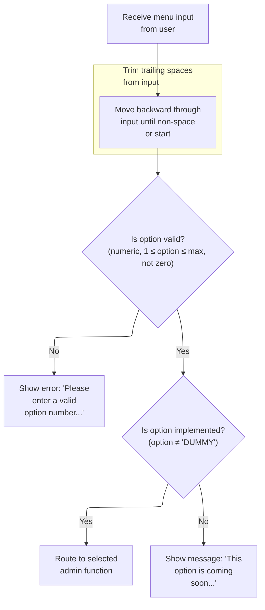
```mermaid
%%{init: {"flowchart": {"defaultRenderer": "elk"}} }%%
flowchart TD
    node1["Receive menu input 
 from user"]
    click node1 openCode "app/cbl/COADM01C.cbl:191:197"
    subgraph loop1["Trim trailing spaces 
 from input"]
        node2["Move backward through 
 input until non-space 
 or start"]
        click node2 openCode "app/cbl/COADM01C.cbl:117:121"
    end
    node1 --> node2
    node2 --> node3{"Is option valid?
(numeric, 1 ≤ option ≤ max, not zero)"}
    click node3 openCode "app/cbl/COADM01C.cbl:127:129"
    node3 -->|"No"| node4["Show error: 'Please 
 enter a valid 
 option number...'"]
    click node4 openCode "app/cbl/COADM01C.cbl:130:134"
    node3 -->|"Yes"| node5{"Is option implemented?
(option ≠ 'DUMMY')"}
    click node5 openCode "app/cbl/COADM01C.cbl:138:146"
    node5 -->|"Yes"| node6["Route to selected 
 admin function"]
    click node6 openCode "app/cbl/COADM01C.cbl:142:145"
    node5 -->|"No"| node7["Show message: 'This 
 option is coming 
 soon...'"]
    click node7 openCode "app/cbl/COADM01C.cbl:147:154"
classDef HeadingStyle fill:#777777,stroke:#333,stroke-width:2px;
```

This section receives and processes the admin menu input, ensuring that only valid and implemented options are accepted, and provides appropriate feedback to the user for invalid or unavailable selections.

| Rule ID | Code Location     | Category        | Rule Name                         | Description                                                                                                                                                                               | Conditions                                                                                       | Remarks                                                                                                                                                                                                              |
| ------- | ----------------- | --------------- | --------------------------------- | ----------------------------------------------------------------------------------------------------------------------------------------------------------------------------------------- | ------------------------------------------------------------------------------------------------ | -------------------------------------------------------------------------------------------------------------------------------------------------------------------------------------------------------------------- |
| BR-001  | PROCESS-ENTER-KEY | Data validation | Menu option validation            | If the entered menu option is not a valid number, is zero, or exceeds the maximum allowed option, the system displays an error message prompting the user to enter a valid option number. | The entered option is not numeric, is zero, or is greater than the maximum allowed option count. | The error message displayed is: 'Please enter a valid option number...'. The valid option range is 1 to the value of the maximum option count constant. The output message is a string displayed on the menu screen. |
| BR-002  | PROCESS-ENTER-KEY | Data validation | Input trimming                    | Trailing spaces in the menu input are removed before validation and processing.                                                                                                           | The input contains trailing spaces.                                                              | Trailing spaces are removed from the input before further validation. The cleaned input is used for all subsequent checks and actions.                                                                               |
| BR-003  | PROCESS-ENTER-KEY | Business logic  | Unimplemented option notification | If the entered menu option is valid but not yet implemented, the system displays a message indicating that the option is coming soon.                                                     | The entered option is valid but the corresponding program name is marked as 'DUMMY'.             | The message displayed is: 'This option is coming soon ...'. The output message is a string displayed on the menu screen, constructed by concatenating the option name and the phrase 'is coming soon ...'.           |
| BR-004  | PROCESS-ENTER-KEY | Business logic  | Admin function routing            | If the entered menu option is valid and implemented, the system routes the user to the selected admin function.                                                                           | The entered option is valid and the corresponding program name is not 'DUMMY'.                   | Routing is performed to the admin function associated with the selected option. The routing uses the program name and transaction ID associated with the option. No user-facing message is displayed in this case.   |

<SwmSnippet path="/app/cbl/COADM01C.cbl" line="189" repo-id="Z2l0aHViJTNBJTNBa3luZHJ5bC1hd3MtbWFpbmZyYW1lLW1vZGVybml6YXRpb24tY2FyZGRlbW8lM0ElM0FTd2ltbS1EZW1v">

---

We grab the user's admin menu input from the screen.

```cobol
       RECEIVE-MENU-SCREEN.

           EXEC CICS RECEIVE
                     MAP('COADM1A')
                     MAPSET('COADM01')
                     INTO(COADM1AI)
                     RESP(WS-RESP-CD)
                     RESP2(WS-REAS-CD)
           END-EXEC.
```

---

</SwmSnippet>

<SwmSnippet path="/app/cbl/COADM01C.cbl" line="115" repo-id="Z2l0aHViJTNBJTNBa3luZHJ5bC1hd3MtbWFpbmZyYW1lLW1vZGVybml6YXRpb24tY2FyZGRlbW8lM0ElM0FTd2ltbS1EZW1v">

---

`PROCESS-ENTER-KEY` trims and validates the admin's menu choice, and either routes to the selected program or shows an error/message if the option is invalid or not implemented.

```cobol
       PROCESS-ENTER-KEY.

           PERFORM VARYING WS-IDX
                   FROM LENGTH OF OPTIONI OF COADM1AI BY -1 UNTIL
                   OPTIONI OF COADM1AI(WS-IDX:1) NOT = SPACES OR
                   WS-IDX = 1
           END-PERFORM
           MOVE OPTIONI OF COADM1AI(1:WS-IDX) TO WS-OPTION-X
           INSPECT WS-OPTION-X REPLACING ALL ' ' BY '0'
           MOVE WS-OPTION-X              TO WS-OPTION
           MOVE WS-OPTION                TO OPTIONO OF COADM1AO

           IF WS-OPTION IS NOT NUMERIC OR
              WS-OPTION > CDEMO-ADMIN-OPT-COUNT OR
              WS-OPTION = ZEROS
               MOVE 'Y'     TO WS-ERR-FLG
               MOVE 'Please enter a valid option number...' TO
                                       WS-MESSAGE
               PERFORM SEND-MENU-SCREEN
           END-IF


           IF NOT ERR-FLG-ON
               IF CDEMO-ADMIN-OPT-PGMNAME(WS-OPTION)(1:5) NOT = 'DUMMY'
                   MOVE WS-TRANID    TO CDEMO-FROM-TRANID
                   MOVE WS-PGMNAME   TO CDEMO-FROM-PROGRAM
                   MOVE ZEROS        TO CDEMO-PGM-CONTEXT
                   EXEC CICS
                       XCTL PROGRAM(CDEMO-ADMIN-OPT-PGMNAME(WS-OPTION))
                       COMMAREA(CARDDEMO-COMMAREA)
                   END-EXEC
               END-IF
               MOVE SPACES             TO WS-MESSAGE
               MOVE DFHGREEN           TO ERRMSGC  OF COADM1AO
               STRING 'This option '       DELIMITED BY SIZE
      *                CDEMO-ADMIN-OPT-NAME(WS-OPTION)
      *                                DELIMITED BY SIZE
                       'is coming soon ...'   DELIMITED BY SIZE
                  INTO WS-MESSAGE
               PERFORM SEND-MENU-SCREEN
           END-IF.
```

---

</SwmSnippet>

## User Update Screen Entry and Input Handling

This section manages the entry and input handling for the User Update screen, ensuring users are routed correctly, errors are communicated clearly, and user actions are processed according to business requirements.

| Rule ID | Code Location         | Category       | Rule Name                               | Description                                                                                                                                                                                                           | Conditions                                                                                                             | Remarks                                                                                                                                                               |
| ------- | --------------------- | -------------- | --------------------------------------- | --------------------------------------------------------------------------------------------------------------------------------------------------------------------------------------------------------------------- | ---------------------------------------------------------------------------------------------------------------------- | --------------------------------------------------------------------------------------------------------------------------------------------------------------------- |
| BR-001  | RETURN-TO-PREV-SCREEN | Business logic | Default routing to signon               | If the user requests to return to a previous screen and the target program is not specified, the system routes the user to the signon screen ('COSGN00C (Signon Screen Handling)') to guarantee a valid destination.  | User triggers a return to previous screen and the target program field is empty or contains only spaces or low-values. | The default program routed to is 'COSGN00C' (8 characters, left aligned, padded with spaces).                                                                         |
| BR-002  | MAIN-PARA             | Business logic | PF3/PF12 admin routing                  | When the user presses PF3 or PF12, the system routes the user to the administration screen ('COADM01C (Admin Menu for Admin users)') unless a previous program is specified, in which case it routes to that program. | User presses PF3 or PF12 while on the User Update screen.                                                              | The administration program is 'COADM01C' (8 characters, left aligned, padded with spaces). If a previous program is specified, it is used as the routing destination. |
| BR-003  | MAIN-PARA             | Business logic | Auto-populate and process selected user | On initial entry to the User Update screen, if a user is pre-selected, the system automatically populates the user ID field and processes the entry as if the Enter key was pressed.                                  | First entry to the User Update screen and a user is pre-selected (user selected field is not spaces or low-values).    | User ID field is populated with the selected user value (8 characters, left aligned, padded with spaces).                                                             |
| BR-004  | MAIN-PARA             | Business logic | Enter key triggers user update          | When the Enter key is pressed, the system processes the user input for updating user information, validating the data and updating the security file as needed.                                                       | User presses the Enter key while on the User Update screen.                                                            | User input is validated and, if valid, user information is updated in the security file.                                                                              |
| BR-005  | MAIN-PARA             | Error handling | Invalid key error messaging             | If the user input is not recognized as a valid action key (Enter, PF3, PF4, PF5, PF12), an error flag is set and the message 'Invalid key pressed. Please see below...' is displayed to the user.                     | User presses a key that is not Enter, PF3, PF4, PF5, or PF12 while on the User Update screen.                          | The error message is 'Invalid key pressed. Please see below...' (50 characters, left aligned, padded with spaces). The error flag is set to 'Y'.                      |

<SwmSnippet path="/app/cbl/COUSR02C.cbl" line="82" repo-id="Z2l0aHViJTNBJTNBa3luZHJ5bC1hd3MtbWFpbmZyYW1lLW1vZGVybml6YXRpb24tY2FyZGRlbW8lM0ElM0FTd2ltbS1EZW1v">

---

`MAIN-PARA` in COUSR02C.cbl checks if we're starting fresh or coming back after input. It sets up the user update screen, handles user actions, and routes to the right screen or shows errors.

```cobol
       MAIN-PARA.

           SET ERR-FLG-OFF     TO TRUE
           SET USR-MODIFIED-NO TO TRUE

           MOVE SPACES TO WS-MESSAGE
                          ERRMSGO OF COUSR2AO

           IF EIBCALEN = 0
               MOVE 'COSGN00C' TO CDEMO-TO-PROGRAM
               PERFORM RETURN-TO-PREV-SCREEN
           ELSE
               MOVE DFHCOMMAREA(1:EIBCALEN) TO CARDDEMO-COMMAREA
               IF NOT CDEMO-PGM-REENTER
                   SET CDEMO-PGM-REENTER    TO TRUE
                   MOVE LOW-VALUES          TO COUSR2AO
                   MOVE -1       TO USRIDINL OF COUSR2AI
                   IF CDEMO-CU02-USR-SELECTED NOT =
                                              SPACES AND LOW-VALUES
                       MOVE CDEMO-CU02-USR-SELECTED TO
                            USRIDINI OF COUSR2AI
                       PERFORM PROCESS-ENTER-KEY
                   END-IF
                   PERFORM SEND-USRUPD-SCREEN
               ELSE
                   PERFORM RECEIVE-USRUPD-SCREEN
                   EVALUATE EIBAID
                       WHEN DFHENTER
                           PERFORM PROCESS-ENTER-KEY
                       WHEN DFHPF3
                           PERFORM UPDATE-USER-INFO
                           IF CDEMO-FROM-PROGRAM = SPACES OR LOW-VALUES
                               MOVE 'COADM01C' TO CDEMO-TO-PROGRAM
                           ELSE
                               MOVE CDEMO-FROM-PROGRAM TO
                               CDEMO-TO-PROGRAM
                           END-IF
                           PERFORM RETURN-TO-PREV-SCREEN
                       WHEN DFHPF4
                           PERFORM CLEAR-CURRENT-SCREEN
                       WHEN DFHPF5
                           PERFORM UPDATE-USER-INFO
                       WHEN DFHPF12
                           MOVE 'COADM01C' TO CDEMO-TO-PROGRAM
                           PERFORM RETURN-TO-PREV-SCREEN
                       WHEN OTHER
                           MOVE 'Y'                       TO WS-ERR-FLG
                           MOVE CCDA-MSG-INVALID-KEY      TO WS-MESSAGE
                           PERFORM SEND-USRUPD-SCREEN
                   END-EVALUATE
               END-IF
           END-IF

           EXEC CICS RETURN
                     TRANSID (WS-TRANID)
                     COMMAREA (CARDDEMO-COMMAREA)
           END-EXEC.
```

---

</SwmSnippet>

<SwmSnippet path="/app/cbl/COUSR02C.cbl" line="250" repo-id="Z2l0aHViJTNBJTNBa3luZHJ5bC1hd3MtbWFpbmZyYW1lLW1vZGVybml6YXRpb24tY2FyZGRlbW8lM0ElM0FTd2ltbS1EZW1v">

---

In `RETURN-TO-PREV-SCREEN`, we check if CDEMO-TO-PROGRAM is empty or just spaces. If so, we set it to 'COSGN00C' (the signon handler). We then update the communication area with the current transaction and program name, clear the program context, and use XCTL to jump to the next program, passing along all the state. This is how we handle returning to a previous screen or routing out of the update flow, and it guarantees the user always ends up somewhere valid (never stuck).

```cobol
       RETURN-TO-PREV-SCREEN.

           IF CDEMO-TO-PROGRAM = LOW-VALUES OR SPACES
               MOVE 'COSGN00C' TO CDEMO-TO-PROGRAM
           END-IF
           MOVE WS-TRANID    TO CDEMO-FROM-TRANID
           MOVE WS-PGMNAME   TO CDEMO-FROM-PROGRAM
           MOVE ZEROS        TO CDEMO-PGM-CONTEXT
           EXEC CICS
               XCTL PROGRAM(CDEMO-TO-PROGRAM)
               COMMAREA(CARDDEMO-COMMAREA)
           END-EXEC.
```

---

</SwmSnippet>

### Validating and Loading User Data

This section validates the User ID input, manages error messaging, and loads user details from the security file for display on the screen.

| Rule ID | Code Location     | Category        | Rule Name        | Description                                                                                                                                                          | Conditions                                                                                | Remarks                                                                                                                                                                                                                  |
| ------- | ----------------- | --------------- | ---------------- | -------------------------------------------------------------------------------------------------------------------------------------------------------------------- | ----------------------------------------------------------------------------------------- | ------------------------------------------------------------------------------------------------------------------------------------------------------------------------------------------------------------------------ |
| BR-001  | PROCESS-ENTER-KEY | Data validation | User ID Required | If the User ID field is blank or contains only low-values, an error is triggered and a message is displayed to the user indicating that the User ID cannot be empty. | The User ID field is blank or contains only low-values.                                   | The error flag is set to 'Y', and the message 'User ID can NOT be empty...' is displayed. The message is an alphanumeric string up to 80 characters. The User ID field is marked as invalid by setting its length to -1. |
| BR-002  | PROCESS-ENTER-KEY | Business logic  | User Data Lookup | If the User ID is valid (not blank or low-values), the user input fields are cleared and the User ID is used to look up user details in the security file.           | The User ID field is not blank and does not contain low-values, and no error flag is set. | User input fields for first name, last name, password, and user type are cleared (set to blank). The User ID is used for lookup in the user security file.                                                               |
| BR-003  | PROCESS-ENTER-KEY | Business logic  | User Data Load   | If the user data lookup is successful and no error flag is set, the user details are loaded into the screen fields and the display is updated.                       | No error flag is set after user data lookup.                                              | User details including first name (up to 20 characters), last name (up to 20 characters), password (up to 8 characters), and user type (1 character) are loaded into the respective fields and displayed to the user.    |

<SwmSnippet path="/app/cbl/COUSR02C.cbl" line="143" repo-id="Z2l0aHViJTNBJTNBa3luZHJ5bC1hd3MtbWFpbmZyYW1lLW1vZGVybml6YXRpb24tY2FyZGRlbW8lM0ElM0FTd2ltbS1EZW1v">

---

`PROCESS-ENTER-KEY` checks if the User ID is blank or low-values, sets an error and message if so, and updates the screen. If the input is valid, it clears the user fields, copies the User ID for lookup, reads the user security file, and if successful, loads the user details into the screen and updates the display.

```cobol
       PROCESS-ENTER-KEY.

           EVALUATE TRUE
               WHEN USRIDINI OF COUSR2AI = SPACES OR LOW-VALUES
                   MOVE 'Y'     TO WS-ERR-FLG
                   MOVE 'User ID can NOT be empty...' TO
                                   WS-MESSAGE
                   MOVE -1       TO USRIDINL OF COUSR2AI
                   PERFORM SEND-USRUPD-SCREEN
               WHEN OTHER
                   MOVE -1       TO USRIDINL OF COUSR2AI
                   CONTINUE
           END-EVALUATE

           IF NOT ERR-FLG-ON
               MOVE SPACES      TO FNAMEI   OF COUSR2AI
                                   LNAMEI   OF COUSR2AI
                                   PASSWDI  OF COUSR2AI
                                   USRTYPEI OF COUSR2AI
               MOVE USRIDINI  OF COUSR2AI TO SEC-USR-ID
               PERFORM READ-USER-SEC-FILE
           END-IF.

           IF NOT ERR-FLG-ON
               MOVE SEC-USR-FNAME      TO FNAMEI    OF COUSR2AI
               MOVE SEC-USR-LNAME      TO LNAMEI    OF COUSR2AI
               MOVE SEC-USR-PWD        TO PASSWDI   OF COUSR2AI
               MOVE SEC-USR-TYPE       TO USRTYPEI  OF COUSR2AI
               PERFORM SEND-USRUPD-SCREEN
           END-IF.
```

---

</SwmSnippet>

#### Preparing and Sending User Update Screen

This section prepares and sends the User Update screen to the terminal, ensuring that header information, messages, and screen state are correctly presented for user interaction.

| Rule ID | Code Location        | Category       | Rule Name                  | Description                                                                                                                                                     | Conditions                                                                                                           | Remarks                                                                                                                                                                                                                                      |
| ------- | -------------------- | -------------- | -------------------------- | --------------------------------------------------------------------------------------------------------------------------------------------------------------- | -------------------------------------------------------------------------------------------------------------------- | -------------------------------------------------------------------------------------------------------------------------------------------------------------------------------------------------------------------------------------------- |
| BR-001  | POPULATE-HEADER-INFO | Business logic | Header information display | The header of the User Update screen must display the current date and time, program name, transaction ID, and screen titles as part of the header information. | Whenever the User Update screen is sent to the terminal.                                                             | Program name is 'COUSR02C' (8 characters), transaction ID is 'CU02' (4 characters), titles are sourced from constants, date and time are formatted for display. Date and time are shown in standard numeric formats (MM-DD-YY and HH-MM-SS). |
| BR-002  | SEND-USRUPD-SCREEN   | Business logic | Error message display      | Any message present must be displayed in the error field of the User Update screen.                                                                             | Whenever WS-MESSAGE contains a value (including spaces, which means no message), and the User Update screen is sent. | Message field is 80 characters, left-aligned, padded with spaces if shorter. If no message is present, the field is blank.                                                                                                                   |
| BR-003  | SEND-USRUPD-SCREEN   | Business logic | Screen ready state         | The User Update screen must be presented in a cleared state with the cursor set for user input.                                                                 | Whenever the User Update screen is sent to the terminal.                                                             | Screen is cleared before display; cursor is set to the default input position. No residual data from previous screens is shown.                                                                                                              |

<SwmSnippet path="/app/cbl/COUSR02C.cbl" line="266" repo-id="Z2l0aHViJTNBJTNBa3luZHJ5bC1hd3MtbWFpbmZyYW1lLW1vZGVybml6YXRpb24tY2FyZGRlbW8lM0ElM0FTd2ltbS1EZW1v">

---

`SEND-USRUPD-SCREEN` sets up the header info, copies any message to the error field, and sends the user update screen map to the terminal, clearing the display and setting the cursor.

```cobol
       SEND-USRUPD-SCREEN.

           PERFORM POPULATE-HEADER-INFO

           MOVE WS-MESSAGE TO ERRMSGO OF COUSR2AO

           EXEC CICS SEND
                     MAP('COUSR2A')
                     MAPSET('COUSR02')
                     FROM(COUSR2AO)
                     ERASE
                     CURSOR
           END-EXEC.
```

---

</SwmSnippet>

<SwmSnippet path="/app/cbl/COUSR02C.cbl" line="296" repo-id="Z2l0aHViJTNBJTNBa3luZHJ5bC1hd3MtbWFpbmZyYW1lLW1vZGVybml6YXRpb24tY2FyZGRlbW8lM0ElM0FTd2ltbS1EZW1v">

---

`POPULATE-HEADER-INFO` grabs the current date/time, sets up the screen titles, transaction ID, and program name, formats the date and time, and moves everything into the output structure for display in the header.

```cobol
       POPULATE-HEADER-INFO.

           MOVE FUNCTION CURRENT-DATE  TO WS-CURDATE-DATA

           MOVE CCDA-TITLE01           TO TITLE01O OF COUSR2AO
           MOVE CCDA-TITLE02           TO TITLE02O OF COUSR2AO
           MOVE WS-TRANID              TO TRNNAMEO OF COUSR2AO
           MOVE WS-PGMNAME             TO PGMNAMEO OF COUSR2AO

           MOVE WS-CURDATE-MONTH       TO WS-CURDATE-MM
           MOVE WS-CURDATE-DAY         TO WS-CURDATE-DD
           MOVE WS-CURDATE-YEAR(3:2)   TO WS-CURDATE-YY

           MOVE WS-CURDATE-MM-DD-YY    TO CURDATEO OF COUSR2AO

           MOVE WS-CURTIME-HOURS       TO WS-CURTIME-HH
           MOVE WS-CURTIME-MINUTE      TO WS-CURTIME-MM
           MOVE WS-CURTIME-SECOND      TO WS-CURTIME-SS

           MOVE WS-CURTIME-HH-MM-SS    TO CURTIMEO OF COUSR2AO.
```

---

</SwmSnippet>

#### Reading User Security File and Handling Response

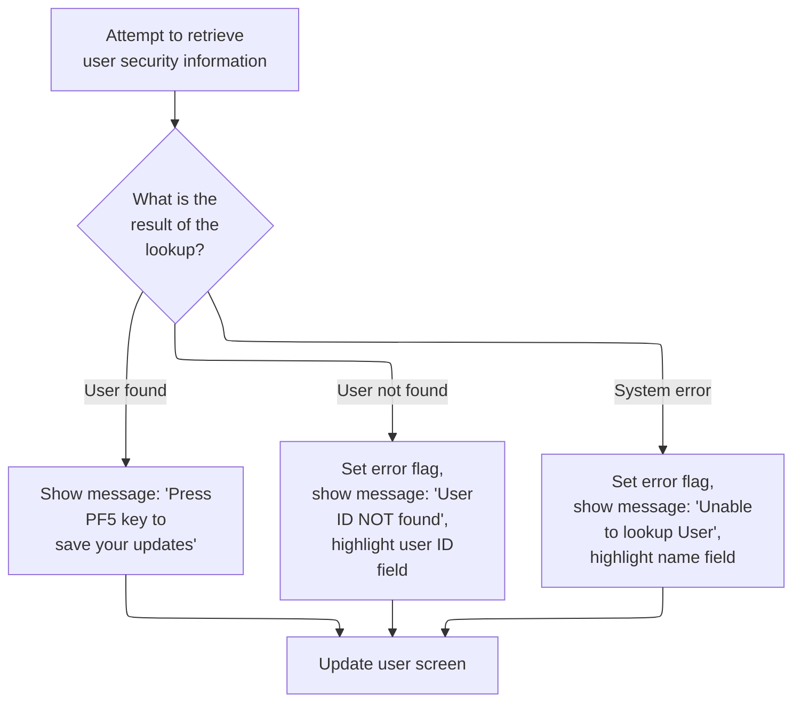
```mermaid
%%{init: {"flowchart": {"defaultRenderer": "elk"}} }%%
flowchart TD
  node1["Attempt to retrieve 
 user security information"]
  click node1 openCode "app/cbl/COUSR02C.cbl:320:331"
  node1 --> node2{"What is the 
 result of the 
 lookup?"}
  click node2 openCode "app/cbl/COUSR02C.cbl:333:353"
  node2 -->|"User found"| node3["Show message: 'Press 
 PF5 key to 
 save your updates'"]
  click node3 openCode "app/cbl/COUSR02C.cbl:335:339"
  node2 -->|"User not found"| node4["Set error flag, 
 show message: 'User 
 ID NOT found', 
 highlight user ID 
 field"]
  click node4 openCode "app/cbl/COUSR02C.cbl:341:345"
  node2 -->|"System error"| node5["Set error flag, 
 show message: 'Unable 
 to lookup User', 
 highlight name field"]
  click node5 openCode "app/cbl/COUSR02C.cbl:347:352"
  node3 --> node6["Update user screen"]
  click node6 openCode "app/cbl/COUSR02C.cbl:339:339"
  node4 --> node6
  node5 --> node6
classDef HeadingStyle fill:#777777,stroke:#333,stroke-width:2px;
```

This section manages the retrieval of user security information and determines the user interface response based on the outcome of the lookup. It ensures that users receive clear feedback for successful lookups, missing users, and system errors.

| Rule ID | Code Location      | Category       | Rule Name                     | Description                                                                                                                                                                                               | Conditions                                                       | Remarks                                                                                                                                                                                                |
| ------- | ------------------ | -------------- | ----------------------------- | --------------------------------------------------------------------------------------------------------------------------------------------------------------------------------------------------------- | ---------------------------------------------------------------- | ------------------------------------------------------------------------------------------------------------------------------------------------------------------------------------------------------ |
| BR-001  | READ-USER-SEC-FILE | Business logic | Successful user lookup prompt | When a user security record is successfully retrieved, the system displays the message 'Press PF5 key to save your updates ...' and updates the user screen without setting any error flag.               | The user security record is found in the user security file.     | The message shown is 'Press PF5 key to save your updates ...'. No error flag is set. The screen is updated. The message is up to 80 characters, left-aligned.                                          |
| BR-002  | READ-USER-SEC-FILE | Error handling | User not found error          | If the user security record is not found, the system sets the error flag, displays the message 'User ID NOT found...', highlights the user ID field, and updates the user screen.                         | The user security record is not found in the user security file. | The error flag is set to 'Y'. The message shown is 'User ID NOT found...'. The user ID field is highlighted (by setting its cursor position to -1). The message is up to 80 characters, left-aligned.  |
| BR-003  | READ-USER-SEC-FILE | Error handling | System error handling         | If a system error occurs during the user security record lookup, the system sets the error flag, displays the message 'Unable to lookup User...', highlights the name field, and updates the user screen. | A system error occurs during the user security file lookup.      | The error flag is set to 'Y'. The message shown is 'Unable to lookup User...'. The name field is highlighted (by setting its cursor position to -1). The message is up to 80 characters, left-aligned. |

<SwmSnippet path="/app/cbl/COUSR02C.cbl" line="320" repo-id="Z2l0aHViJTNBJTNBa3luZHJ5bC1hd3MtbWFpbmZyYW1lLW1vZGVybml6YXRpb24tY2FyZGRlbW8lM0ElM0FTd2ltbS1EZW1v">

---

`READ-USER-SEC-FILE` reads the user record with an update lock, checks the response code, and either prompts the user to save changes, shows a not-found error, or displays a generic error with debug info, then updates the screen accordingly.

```cobol
       READ-USER-SEC-FILE.

           EXEC CICS READ
                DATASET   (WS-USRSEC-FILE)
                INTO      (SEC-USER-DATA)
                LENGTH    (LENGTH OF SEC-USER-DATA)
                RIDFLD    (SEC-USR-ID)
                KEYLENGTH (LENGTH OF SEC-USR-ID)
                UPDATE
                RESP      (WS-RESP-CD)
                RESP2     (WS-REAS-CD)
           END-EXEC.

           EVALUATE WS-RESP-CD
               WHEN DFHRESP(NORMAL)
                   CONTINUE
                   MOVE 'Press PF5 key to save your updates ...' TO
                                   WS-MESSAGE
                   MOVE DFHNEUTR       TO ERRMSGC  OF COUSR2AO
                   PERFORM SEND-USRUPD-SCREEN
               WHEN DFHRESP(NOTFND)
                   MOVE 'Y'     TO WS-ERR-FLG
                   MOVE 'User ID NOT found...' TO
                                   WS-MESSAGE
                   MOVE -1       TO USRIDINL OF COUSR2AI
                   PERFORM SEND-USRUPD-SCREEN
               WHEN OTHER
                   DISPLAY 'RESP:' WS-RESP-CD 'REAS:' WS-REAS-CD
                   MOVE 'Y'     TO WS-ERR-FLG
                   MOVE 'Unable to lookup User...' TO
                                   WS-MESSAGE
                   MOVE -1       TO FNAMEL OF COUSR2AI
                   PERFORM SEND-USRUPD-SCREEN
           END-EVALUATE.
```

---

</SwmSnippet>

### Receiving User Update Screen Input

This section is responsible for receiving user input from the update screen and storing it in the input structure, while also capturing response codes for error handling.

| Rule ID | Code Location         | Category       | Rule Name              | Description                                                                                                        | Conditions                                                       | Remarks                                                                                                                                                                    |
| ------- | --------------------- | -------------- | ---------------------- | ------------------------------------------------------------------------------------------------------------------ | ---------------------------------------------------------------- | -------------------------------------------------------------------------------------------------------------------------------------------------------------------------- |
| BR-001  | RECEIVE-USRUPD-SCREEN | Business logic | Capture user input     | User input from the update screen is captured and stored in the designated input structure for further processing. | Whenever the update screen is submitted by the user.             | Input is mapped from the 'COUSR2A' map and 'COUSR02' mapset. The captured data is stored in the input structure, which is defined to hold all relevant user update fields. |
| BR-002  | RECEIVE-USRUPD-SCREEN | Error handling | Capture response codes | Response codes are captured to indicate the success or failure of the input retrieval operation.                   | Whenever the RECEIVE operation is performed to fetch user input. | Response codes are stored in designated fields for error handling. These codes are used to determine if the input was successfully received or if an error occurred.       |

<SwmSnippet path="/app/cbl/COUSR02C.cbl" line="283" repo-id="Z2l0aHViJTNBJTNBa3luZHJ5bC1hd3MtbWFpbmZyYW1lLW1vZGVybml6YXRpb24tY2FyZGRlbW8lM0ElM0FTd2ltbS1EZW1v">

---

`RECEIVE-USRUPD-SCREEN` grabs user input from the update screen map and stores it in the input structure, capturing response codes for error handling.

```cobol
       RECEIVE-USRUPD-SCREEN.

           EXEC CICS RECEIVE
                     MAP('COUSR2A')
                     MAPSET('COUSR02')
                     INTO(COUSR2AI)
                     RESP(WS-RESP-CD)
                     RESP2(WS-REAS-CD)
           END-EXEC.
```

---

</SwmSnippet>

## Validating and Updating User Information

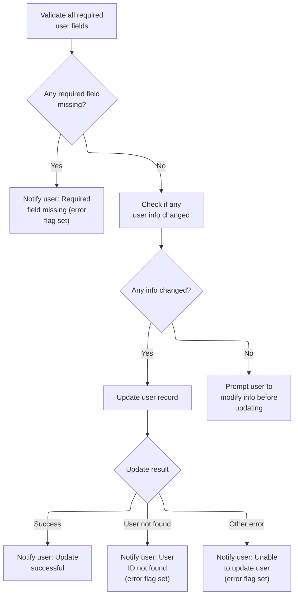
```mermaid
%%{init: {"flowchart": {"defaultRenderer": "elk"}} }%%
flowchart TD
  node1["Validate all required 
 user fields"] --> node2{"Any required field 
 missing?"}
  click node1 openCode "app/cbl/COUSR02C.cbl:179:213"
  node2 -->|"Yes"| node3["Notify user: Required 
 field missing (error 
 flag set)"]
  click node2 openCode "app/cbl/COUSR02C.cbl:180:209"
  click node3 openCode "app/cbl/COUSR02C.cbl:181:209"
  node2 -->|"No"| node4["Check if any 
 user info changed"]
  click node4 openCode "app/cbl/COUSR02C.cbl:215:234"
  node4 --> node5{"Any info changed?"}
  node5 -->|"Yes"| node6["Update user record"]
  click node5 openCode "app/cbl/COUSR02C.cbl:236:237"
  click node6 openCode "app/cbl/COUSR02C.cbl:358:390"
  node5 -->|"No"| node7["Prompt user to 
 modify info before 
 updating"]
  click node7 openCode "app/cbl/COUSR02C.cbl:239:242"
  node6 --> node8{"Update result"}
  node8 -->|"Success"| node9["Notify user: Update 
 successful"]
  click node9 openCode "app/cbl/COUSR02C.cbl:370:376"
  node8 -->|"User not found"| node10["Notify user: User 
 ID not found 
 (error flag set)"]
  click node10 openCode "app/cbl/COUSR02C.cbl:378:382"
  node8 -->|"Other error"| node11["Notify user: Unable 
 to update user 
 (error flag set)"]
  click node11 openCode "app/cbl/COUSR02C.cbl:385:389"
classDef HeadingStyle fill:#777777,stroke:#333,stroke-width:2px;
```

This section validates user input fields, checks for changes, updates user records if needed, and provides user notifications for success, errors, or required modifications.

| Rule ID | Code Location        | Category        | Rule Name                                    | Description                                                                                                                                                                                                | Conditions                                                                                        | Remarks                                                                                                                                                                                                                                                         |
| ------- | -------------------- | --------------- | -------------------------------------------- | ---------------------------------------------------------------------------------------------------------------------------------------------------------------------------------------------------------- | ------------------------------------------------------------------------------------------------- | --------------------------------------------------------------------------------------------------------------------------------------------------------------------------------------------------------------------------------------------------------------- |
| BR-001  | UPDATE-USER-INFO     | Data validation | Required field validation                    | If any required user field (User ID, First Name, Last Name, Password, User Type) is blank or contains only low-values, the system sets an error flag and notifies the user that the field cannot be empty. | Any of the required fields is blank or contains only low-values.                                  | Required fields: User ID (string, 8 bytes), First Name (string, 20 bytes), Last Name (string, 20 bytes), Password (string, 8 bytes), User Type (string, 1 byte). Error message is set to a specific string for each field, e.g., 'User ID can NOT be empty...'. |
| BR-002  | UPDATE-USER-INFO     | Business logic  | User information change detection and update | If no required fields are missing and any user information field has changed compared to the stored record, the system updates the user record.                                                            | All required fields are present and at least one field value differs from the stored user record. | Fields compared: User ID, First Name, Last Name, Password, User Type. Update is performed only if at least one field is modified.                                                                                                                               |
| BR-003  | UPDATE-USER-INFO     | Business logic  | No change prompt                             | If no user information has changed, the system prompts the user to modify information before updating.                                                                                                     | All required fields are present and no field value differs from the stored user record.           | Prompt message: 'Please modify to update ...' is displayed to the user.                                                                                                                                                                                         |
| BR-004  | UPDATE-USER-SEC-FILE | Error handling  | Update success notification                  | If the user record update is successful, the system notifies the user that the update was successful.                                                                                                      | User record update operation returns a success response.                                          | Success message format: 'User <User ID> has been updated ...' displayed to the user. Message is constructed as a string.                                                                                                                                        |
| BR-005  | UPDATE-USER-SEC-FILE | Error handling  | User not found error notification            | If the user record update fails because the user ID is not found, the system sets an error flag and notifies the user that the user ID was not found.                                                      | User record update operation returns a not-found response.                                        | Error message: 'User ID NOT found...' displayed to the user.                                                                                                                                                                                                    |
| BR-006  | UPDATE-USER-SEC-FILE | Error handling  | Generic update error notification            | If the user record update fails for any other reason, the system sets an error flag and notifies the user that the update could not be completed.                                                          | User record update operation returns any error response other than not-found.                     | Error message: 'Unable to Update User...' displayed to the user.                                                                                                                                                                                                |

<SwmSnippet path="/app/cbl/COUSR02C.cbl" line="177" repo-id="Z2l0aHViJTNBJTNBa3luZHJ5bC1hd3MtbWFpbmZyYW1lLW1vZGVybml6YXRpb24tY2FyZGRlbW8lM0ElM0FTd2ltbS1EZW1v">

---

`UPDATE-USER-INFO` checks all input fields for blanks, sets errors and messages if needed, reads the current user data, compares each field, updates if anything changed, and either saves the update or prompts the user to make changes.

```cobol
       UPDATE-USER-INFO.

           EVALUATE TRUE
               WHEN USRIDINI OF COUSR2AI = SPACES OR LOW-VALUES
                   MOVE 'Y'     TO WS-ERR-FLG
                   MOVE 'User ID can NOT be empty...' TO
                                   WS-MESSAGE
                   MOVE -1       TO USRIDINL OF COUSR2AI
                   PERFORM SEND-USRUPD-SCREEN
               WHEN FNAMEI OF COUSR2AI = SPACES OR LOW-VALUES
                   MOVE 'Y'     TO WS-ERR-FLG
                   MOVE 'First Name can NOT be empty...' TO
                                   WS-MESSAGE
                   MOVE -1       TO FNAMEL OF COUSR2AI
                   PERFORM SEND-USRUPD-SCREEN
               WHEN LNAMEI OF COUSR2AI = SPACES OR LOW-VALUES
                   MOVE 'Y'     TO WS-ERR-FLG
                   MOVE 'Last Name can NOT be empty...' TO
                                   WS-MESSAGE
                   MOVE -1       TO LNAMEL OF COUSR2AI
                   PERFORM SEND-USRUPD-SCREEN
               WHEN PASSWDI OF COUSR2AI = SPACES OR LOW-VALUES
                   MOVE 'Y'     TO WS-ERR-FLG
                   MOVE 'Password can NOT be empty...' TO
                                   WS-MESSAGE
                   MOVE -1       TO PASSWDL OF COUSR2AI
                   PERFORM SEND-USRUPD-SCREEN
               WHEN USRTYPEI OF COUSR2AI = SPACES OR LOW-VALUES
                   MOVE 'Y'     TO WS-ERR-FLG
                   MOVE 'User Type can NOT be empty...' TO
                                   WS-MESSAGE
                   MOVE -1       TO USRTYPEL OF COUSR2AI
                   PERFORM SEND-USRUPD-SCREEN
               WHEN OTHER
                   MOVE -1       TO FNAMEL OF COUSR2AI
                   CONTINUE
           END-EVALUATE

           IF NOT ERR-FLG-ON
               MOVE USRIDINI  OF COUSR2AI TO SEC-USR-ID
               PERFORM READ-USER-SEC-FILE

               IF FNAMEI  OF COUSR2AI NOT = SEC-USR-FNAME
                   MOVE FNAMEI   OF COUSR2AI TO SEC-USR-FNAME
                   SET USR-MODIFIED-YES TO TRUE
               END-IF
               IF LNAMEI  OF COUSR2AI NOT = SEC-USR-LNAME
                   MOVE LNAMEI   OF COUSR2AI TO SEC-USR-LNAME
                   SET USR-MODIFIED-YES TO TRUE
               END-IF
               IF PASSWDI  OF COUSR2AI NOT = SEC-USR-PWD
                   MOVE PASSWDI  OF COUSR2AI TO SEC-USR-PWD
                   SET USR-MODIFIED-YES TO TRUE
               END-IF
               IF USRTYPEI  OF COUSR2AI NOT = SEC-USR-TYPE
                   MOVE USRTYPEI OF COUSR2AI TO SEC-USR-TYPE
                   SET USR-MODIFIED-YES TO TRUE
               END-IF

               IF USR-MODIFIED-YES
                   PERFORM UPDATE-USER-SEC-FILE
               ELSE
                   MOVE 'Please modify to update ...' TO
                                   WS-MESSAGE
                   MOVE DFHRED       TO ERRMSGC  OF COUSR2AO
                   PERFORM SEND-USRUPD-SCREEN
               END-IF

           END-IF.
```

---

</SwmSnippet>

<SwmSnippet path="/app/cbl/COUSR02C.cbl" line="358" repo-id="Z2l0aHViJTNBJTNBa3luZHJ5bC1hd3MtbWFpbmZyYW1lLW1vZGVybml6YXRpb24tY2FyZGRlbW8lM0ElM0FTd2ltbS1EZW1v">

---

`UPDATE-USER-SEC-FILE` rewrites the user record in the security file, checks the response, and either shows a success message, a not-found error, or a generic error, then updates the screen.

```cobol
       UPDATE-USER-SEC-FILE.

           EXEC CICS REWRITE
                DATASET   (WS-USRSEC-FILE)
                FROM      (SEC-USER-DATA)
                LENGTH    (LENGTH OF SEC-USER-DATA)
                RESP      (WS-RESP-CD)
                RESP2     (WS-REAS-CD)
           END-EXEC.

           EVALUATE WS-RESP-CD
               WHEN DFHRESP(NORMAL)
                   MOVE SPACES             TO WS-MESSAGE
                   MOVE DFHGREEN           TO ERRMSGC  OF COUSR2AO
                   STRING 'User '     DELIMITED BY SIZE
                          SEC-USR-ID  DELIMITED BY SPACE
                          ' has been updated ...' DELIMITED BY SIZE
                     INTO WS-MESSAGE
                   PERFORM SEND-USRUPD-SCREEN
               WHEN DFHRESP(NOTFND)
                   MOVE 'Y'     TO WS-ERR-FLG
                   MOVE 'User ID NOT found...' TO
                                   WS-MESSAGE
                   MOVE -1       TO USRIDINL OF COUSR2AI
                   PERFORM SEND-USRUPD-SCREEN
               WHEN OTHER
                   DISPLAY 'RESP:' WS-RESP-CD 'REAS:' WS-REAS-CD
                   MOVE 'Y'     TO WS-ERR-FLG
                   MOVE 'Unable to Update User...' TO
                                   WS-MESSAGE
                   MOVE -1       TO FNAMEL OF COUSR2AI
                   PERFORM SEND-USRUPD-SCREEN
           END-EVALUATE.
```

---

</SwmSnippet>

## Resetting User Update Screen State

This section ensures that the user update screen is reset to a clean state before new input is accepted, maintaining data integrity and a consistent user experience.

| Rule ID | Code Location         | Category       | Rule Name                     | Description                                                                                                                               | Conditions                                               | Remarks                                                                                                                               |
| ------- | --------------------- | -------------- | ----------------------------- | ----------------------------------------------------------------------------------------------------------------------------------------- | -------------------------------------------------------- | ------------------------------------------------------------------------------------------------------------------------------------- |
| BR-001  | INITIALIZE-ALL-FIELDS | Business logic | Clear user input fields       | All user input fields on the update screen must be cleared to blank values before presenting the screen for new input.                    | Whenever the update screen is reset for a new operation. | Fields cleared include: user ID, first name, last name, password, user type, and message. All are set to blank (empty string) values. |
| BR-002  | INITIALIZE-ALL-FIELDS | Business logic | Invalidate user ID length     | The user ID length must be marked as invalid when the update screen is reset, preventing accidental acceptance of stale user ID data.     | Whenever the update screen is reset for a new operation. | User ID length is set to -1 to indicate invalid state.                                                                                |
| BR-003  | CLEAR-CURRENT-SCREEN  | Business logic | Present cleared update screen | After all fields are cleared and the user ID length is invalidated, the update screen must be presented to the user in its cleared state. | After all fields have been reset for a new operation.    | The update screen is sent to the user with all fields blank and user ID length invalid.                                               |

<SwmSnippet path="/app/cbl/COUSR02C.cbl" line="395" repo-id="Z2l0aHViJTNBJTNBa3luZHJ5bC1hd3MtbWFpbmZyYW1lLW1vZGVybml6YXRpb24tY2FyZGRlbW8lM0ElM0FTd2ltbS1EZW1v">

---

In `CLEAR-CURRENT-SCREEN`, we reset all user fields to their defaults and then send the update screen to the user, making sure everything is cleared out before new input.

```cobol
       CLEAR-CURRENT-SCREEN.

           PERFORM INITIALIZE-ALL-FIELDS.
           PERFORM SEND-USRUPD-SCREEN.
```

---

</SwmSnippet>

<SwmSnippet path="/app/cbl/COUSR02C.cbl" line="403" repo-id="Z2l0aHViJTNBJTNBa3luZHJ5bC1hd3MtbWFpbmZyYW1lLW1vZGVybml6YXRpb24tY2FyZGRlbW8lM0ElM0FTd2ltbS1EZW1v">

---

`INITIALIZE-ALL-FIELDS` sets all user input fields to blank and marks the user ID length as invalid, making sure the screen starts clean for the next operation.

```cobol
       INITIALIZE-ALL-FIELDS.

           MOVE -1              TO USRIDINL OF COUSR2AI
           MOVE SPACES          TO USRIDINI OF COUSR2AI
                                   FNAMEI   OF COUSR2AI
                                   LNAMEI   OF COUSR2AI
                                   PASSWDI  OF COUSR2AI
                                   USRTYPEI OF COUSR2AI
                                   WS-MESSAGE.
```

---

</SwmSnippet>

<SwmSnippet path="/app/cbl/COUSR02C.cbl" line="395" repo-id="Z2l0aHViJTNBJTNBa3luZHJ5bC1hd3MtbWFpbmZyYW1lLW1vZGVybml6YXRpb24tY2FyZGRlbW8lM0ElM0FTd2ltbS1EZW1v">

---

We just returned from `CLEAR-CURRENT-SCREEN` in COUSR02C.cbl, which resets all fields and redraws the update screen. This keeps the UI clean for the next user action.

```cobol
       CLEAR-CURRENT-SCREEN.

           PERFORM INITIALIZE-ALL-FIELDS.
           PERFORM SEND-USRUPD-SCREEN.
```

---

</SwmSnippet>

## User Deletion Screen Entry and Navigation

This section manages the entry, navigation, and user actions for the user deletion screen, determining routing, error messaging, and user deletion based on user input and session context.

| Rule ID | Code Location         | Category       | Rule Name                      | Description                                                                                                                                                          | Conditions                                                                                                   | Remarks                                                                                                                                                                     |
| ------- | --------------------- | -------------- | ------------------------------ | -------------------------------------------------------------------------------------------------------------------------------------------------------------------- | ------------------------------------------------------------------------------------------------------------ | --------------------------------------------------------------------------------------------------------------------------------------------------------------------------- |
| BR-001  | MAIN-PARA             | Business logic | Session initialization routing | When the session is started with no communication area, the system routes the user to the signon screen.                                                             | The session is started and the communication area length is zero.                                            | The next program is set to 'COSGN00C' (signon screen, 8 characters).                                                                                                        |
| BR-002  | MAIN-PARA             | Business logic | PF3/PF12 navigation            | When the user presses PF3 or PF12, the system routes the user to the previous or administration screen, depending on session context.                                | The user presses PF3 or PF12 while on the user deletion screen.                                              | PF3: If the previous program is not set, route to 'COADM01C' (admin screen, 8 characters); otherwise, route to the previous program. PF12 always routes to 'COADM01C'.      |
| BR-003  | MAIN-PARA             | Business logic | PF5 triggers user deletion     | When the user presses PF5, the system initiates the user deletion process.                                                                                           | The user presses PF5 while on the user deletion screen.                                                      | PF5 is mapped to the delete action for the selected user.                                                                                                                   |
| BR-004  | MAIN-PARA             | Business logic | PF4 clears screen              | When the user presses PF4, the system clears the current user deletion screen.                                                                                       | The user presses PF4 while on the user deletion screen.                                                      | PF4 is mapped to the clear screen action.                                                                                                                                   |
| BR-005  | MAIN-PARA             | Business logic | Reentry pre-populates user ID  | When the session is reentered and a user is selected, the system pre-populates the user deletion screen with the selected user ID.                                   | The session is reentered and a user ID is present in the session context.                                    | The user ID is an alphanumeric string of up to 8 characters, left-aligned, padded with spaces.                                                                              |
| BR-006  | RETURN-TO-PREV-SCREEN | Business logic | Default routing to signon      | When routing to the previous screen, if the next program is not set, the system defaults to the signon screen.                                                       | The system is routing to the previous screen and the next program is not set (blank or low values).          | The next program is set to 'COSGN00C' (signon screen, 8 characters).                                                                                                        |
| BR-007  | MAIN-PARA             | Error handling | Invalid key error messaging    | When the user presses an unrecognized function key, the system displays an error message stating 'Invalid key pressed. Please see below...' and sets the error flag. | The user presses a function key that is not Enter, PF3, PF4, PF5, or PF12 while on the user deletion screen. | The error message is a string: 'Invalid key pressed. Please see below...         ' (length: 50 characters, left-aligned, padded with spaces). The error flag is set to 'Y'. |

<SwmSnippet path="/app/cbl/COUSR03C.cbl" line="82" repo-id="Z2l0aHViJTNBJTNBa3luZHJ5bC1hd3MtbWFpbmZyYW1lLW1vZGVybml6YXRpb24tY2FyZGRlbW8lM0ElM0FTd2ltbS1EZW1v">

---

`MAIN-PARA` in COUSR03C.cbl sets up the user deletion flow, checks if we're starting fresh or reentering, handles user commands (Enter, PF3, PF4, PF5, PF12), and routes to the right screen or deletes the user. It wraps up by returning control to CICS.

```cobol
       MAIN-PARA.

           SET ERR-FLG-OFF     TO TRUE
           SET USR-MODIFIED-NO TO TRUE

           MOVE SPACES TO WS-MESSAGE
                          ERRMSGO OF COUSR3AO

           IF EIBCALEN = 0
               MOVE 'COSGN00C' TO CDEMO-TO-PROGRAM
               PERFORM RETURN-TO-PREV-SCREEN
           ELSE
               MOVE DFHCOMMAREA(1:EIBCALEN) TO CARDDEMO-COMMAREA
               IF NOT CDEMO-PGM-REENTER
                   SET CDEMO-PGM-REENTER    TO TRUE
                   MOVE LOW-VALUES          TO COUSR3AO
                   MOVE -1       TO USRIDINL OF COUSR3AI
                   IF CDEMO-CU03-USR-SELECTED NOT =
                                              SPACES AND LOW-VALUES
                       MOVE CDEMO-CU03-USR-SELECTED TO
                            USRIDINI OF COUSR3AI
                       PERFORM PROCESS-ENTER-KEY
                   END-IF
                   PERFORM SEND-USRDEL-SCREEN
               ELSE
                   PERFORM RECEIVE-USRDEL-SCREEN
                   EVALUATE EIBAID
                       WHEN DFHENTER
                           PERFORM PROCESS-ENTER-KEY
                       WHEN DFHPF3
                           IF CDEMO-FROM-PROGRAM = SPACES OR LOW-VALUES
                               MOVE 'COADM01C' TO CDEMO-TO-PROGRAM
                           ELSE
                               MOVE CDEMO-FROM-PROGRAM TO
                               CDEMO-TO-PROGRAM
                           END-IF
                           PERFORM RETURN-TO-PREV-SCREEN
                       WHEN DFHPF4
                           PERFORM CLEAR-CURRENT-SCREEN
                       WHEN DFHPF5
                           PERFORM DELETE-USER-INFO
                       WHEN DFHPF12
                           MOVE 'COADM01C' TO CDEMO-TO-PROGRAM
                           PERFORM RETURN-TO-PREV-SCREEN
                       WHEN OTHER
                           MOVE 'Y'                       TO WS-ERR-FLG
                           MOVE CCDA-MSG-INVALID-KEY      TO WS-MESSAGE
                           PERFORM SEND-USRDEL-SCREEN
                   END-EVALUATE
               END-IF
           END-IF

           EXEC CICS RETURN
                     TRANSID (WS-TRANID)
                     COMMAREA (CARDDEMO-COMMAREA)
           END-EXEC.
```

---

</SwmSnippet>

<SwmSnippet path="/app/cbl/COUSR03C.cbl" line="197" repo-id="Z2l0aHViJTNBJTNBa3luZHJ5bC1hd3MtbWFpbmZyYW1lLW1vZGVybml6YXRpb24tY2FyZGRlbW8lM0ElM0FTd2ltbS1EZW1v">

---

`RETURN-TO-PREV-SCREEN` checks if the next program is set, defaults to signon if not, updates the commarea with source info, resets context, and uses XCTL to jump to the next program, passing all state.

```cobol
       RETURN-TO-PREV-SCREEN.

           IF CDEMO-TO-PROGRAM = LOW-VALUES OR SPACES
               MOVE 'COSGN00C' TO CDEMO-TO-PROGRAM
           END-IF
           MOVE WS-TRANID    TO CDEMO-FROM-TRANID
           MOVE WS-PGMNAME   TO CDEMO-FROM-PROGRAM
           MOVE ZEROS        TO CDEMO-PGM-CONTEXT
           EXEC CICS
               XCTL PROGRAM(CDEMO-TO-PROGRAM)
               COMMAREA(CARDDEMO-COMMAREA)
           END-EXEC.
```

---

</SwmSnippet>

### Validating and Loading User Data for Deletion

This section validates the user ID input for a delete operation, manages error messaging, loads user details if the input is valid, and updates the display to guide the user through the deletion process.

| Rule ID | Code Location     | Category        | Rule Name                         | Description                                                                                                                                                   | Conditions                                                                                                                         | Remarks                                                                                                                                                                                                                        |
| ------- | ----------------- | --------------- | --------------------------------- | ------------------------------------------------------------------------------------------------------------------------------------------------------------- | ---------------------------------------------------------------------------------------------------------------------------------- | ------------------------------------------------------------------------------------------------------------------------------------------------------------------------------------------------------------------------------ |
| BR-001  | PROCESS-ENTER-KEY | Data validation | User ID required                  | If the user ID is blank, contains only spaces, or contains only low-values, an error message is displayed and the deletion operation does not proceed.        | The user initiates a delete operation and the user ID field is blank, contains only spaces, or contains only low-values.           | The error message displayed is: 'User ID can NOT be empty...'. The error flag is set to 'Y'. The user ID input field is set to -1 to indicate an error state.                                                                  |
| BR-002  | PROCESS-ENTER-KEY | Business logic  | Load user details for deletion    | If the user ID is valid, the user details are cleared, the user ID is copied for lookup, and the user security file is read to load user details for display. | The user initiates a delete operation and the user ID is not blank, spaces, or low-values, and no error flag is set.               | User details loaded include first name (string, up to 20 characters), last name (string, up to 20 characters), and user type (string, 1 character). These are populated from the user security file and displayed to the user. |
| BR-003  | PROCESS-ENTER-KEY | Business logic  | Display user details for deletion | When user details are successfully loaded, the display is updated to show the user's first name, last name, and user type.                                    | The user initiates a delete operation, the user ID is valid, and user details are successfully loaded from the user security file. | The display fields are populated as follows: first name (string, up to 20 characters), last name (string, up to 20 characters), user type (string, 1 character).                                                               |

<SwmSnippet path="/app/cbl/COUSR03C.cbl" line="142" repo-id="Z2l0aHViJTNBJTNBa3luZHJ5bC1hd3MtbWFpbmZyYW1lLW1vZGVybml6YXRpb24tY2FyZGRlbW8lM0ElM0FTd2ltbS1EZW1v">

---

`PROCESS-ENTER-KEY` checks if the user ID is blank, sets an error and message if so, and updates the screen. If valid, it clears user fields, copies the ID for lookup, reads the user security file, and if successful, loads the user details and updates the display.

```cobol
       PROCESS-ENTER-KEY.

           EVALUATE TRUE
               WHEN USRIDINI OF COUSR3AI = SPACES OR LOW-VALUES
                   MOVE 'Y'     TO WS-ERR-FLG
                   MOVE 'User ID can NOT be empty...' TO
                                   WS-MESSAGE
                   MOVE -1       TO USRIDINL OF COUSR3AI
                   PERFORM SEND-USRDEL-SCREEN
               WHEN OTHER
                   MOVE -1       TO USRIDINL OF COUSR3AI
                   CONTINUE
           END-EVALUATE

           IF NOT ERR-FLG-ON
               MOVE SPACES      TO FNAMEI   OF COUSR3AI
                                   LNAMEI   OF COUSR3AI
                                   USRTYPEI OF COUSR3AI
               MOVE USRIDINI  OF COUSR3AI TO SEC-USR-ID
               PERFORM READ-USER-SEC-FILE
           END-IF.

           IF NOT ERR-FLG-ON
               MOVE SEC-USR-FNAME      TO FNAMEI    OF COUSR3AI
               MOVE SEC-USR-LNAME      TO LNAMEI    OF COUSR3AI
               MOVE SEC-USR-TYPE       TO USRTYPEI  OF COUSR3AI
               PERFORM SEND-USRDEL-SCREEN
           END-IF.
```

---

</SwmSnippet>

#### Preparing and Sending User Delete Screen

This section prepares and sends the User Delete screen to the terminal, ensuring that header information, error messages, and user experience elements are correctly presented.

| Rule ID | Code Location        | Category       | Rule Name                   | Description                                                                                                                                                                      | Conditions                                                                   | Remarks                                                                                                                                                                                                                      |
| ------- | -------------------- | -------------- | --------------------------- | -------------------------------------------------------------------------------------------------------------------------------------------------------------------------------- | ---------------------------------------------------------------------------- | ---------------------------------------------------------------------------------------------------------------------------------------------------------------------------------------------------------------------------- |
| BR-001  | POPULATE-HEADER-INFO | Business logic | Header information display  | Whenever the User Delete screen is sent, the header must display the current date and time, the transaction ID ('CU03'), and the program name ('COUSR03C (Deleting User Data)'). | The User Delete screen is being prepared for display.                        | The transaction ID is always 'CU03' (4 characters), the program name is always 'COUSR03C' (8 characters). The date and time are formatted as MM-DD-YY and HH-MM-SS respectively. All header fields are alphanumeric strings. |
| BR-002  | SEND-USRDEL-SCREEN   | Business logic | Error message display       | If a message is present, it must be displayed in the error field of the User Delete screen.                                                                                      | A message exists in the message field when preparing the User Delete screen. | The message field is an alphanumeric string of up to 80 characters. If no message is present, the field remains blank.                                                                                                       |
| BR-003  | SEND-USRDEL-SCREEN   | Business logic | Screen clear and cursor set | When the User Delete screen is sent, the display must be cleared and the cursor positioned for user input.                                                                       | The User Delete screen is being sent to the terminal.                        | The screen is cleared before display and the cursor is set for user interaction. This ensures no residual data from previous screens is visible.                                                                             |

<SwmSnippet path="/app/cbl/COUSR03C.cbl" line="213" repo-id="Z2l0aHViJTNBJTNBa3luZHJ5bC1hd3MtbWFpbmZyYW1lLW1vZGVybml6YXRpb24tY2FyZGRlbW8lM0ElM0FTd2ltbS1EZW1v">

---

`SEND-USRDEL-SCREEN` sets up the header info, copies any message to the error field, and sends the user delete screen map to the terminal, clearing the display and setting the cursor.

```cobol
       SEND-USRDEL-SCREEN.

           PERFORM POPULATE-HEADER-INFO

           MOVE WS-MESSAGE TO ERRMSGO OF COUSR3AO

           EXEC CICS SEND
                     MAP('COUSR3A')
                     MAPSET('COUSR03')
                     FROM(COUSR3AO)
                     ERASE
                     CURSOR
           END-EXEC.
```

---

</SwmSnippet>

<SwmSnippet path="/app/cbl/COUSR03C.cbl" line="243" repo-id="Z2l0aHViJTNBJTNBa3luZHJ5bC1hd3MtbWFpbmZyYW1lLW1vZGVybml6YXRpb24tY2FyZGRlbW8lM0ElM0FTd2ltbS1EZW1v">

---

`POPULATE-HEADER-INFO` grabs the current date/time, sets up the screen titles, transaction ID, and program name, formats the date and time, and moves everything into the output structure for display in the header.

```cobol
       POPULATE-HEADER-INFO.

           MOVE FUNCTION CURRENT-DATE  TO WS-CURDATE-DATA

           MOVE CCDA-TITLE01           TO TITLE01O OF COUSR3AO
           MOVE CCDA-TITLE02           TO TITLE02O OF COUSR3AO
           MOVE WS-TRANID              TO TRNNAMEO OF COUSR3AO
           MOVE WS-PGMNAME             TO PGMNAMEO OF COUSR3AO

           MOVE WS-CURDATE-MONTH       TO WS-CURDATE-MM
           MOVE WS-CURDATE-DAY         TO WS-CURDATE-DD
           MOVE WS-CURDATE-YEAR(3:2)   TO WS-CURDATE-YY

           MOVE WS-CURDATE-MM-DD-YY    TO CURDATEO OF COUSR3AO

           MOVE WS-CURTIME-HOURS       TO WS-CURTIME-HH
           MOVE WS-CURTIME-MINUTE      TO WS-CURTIME-MM
           MOVE WS-CURTIME-SECOND      TO WS-CURTIME-SS

           MOVE WS-CURTIME-HH-MM-SS    TO CURTIMEO OF COUSR3AO.
```

---

</SwmSnippet>

#### Reading User Security File for Deletion and Handling Response

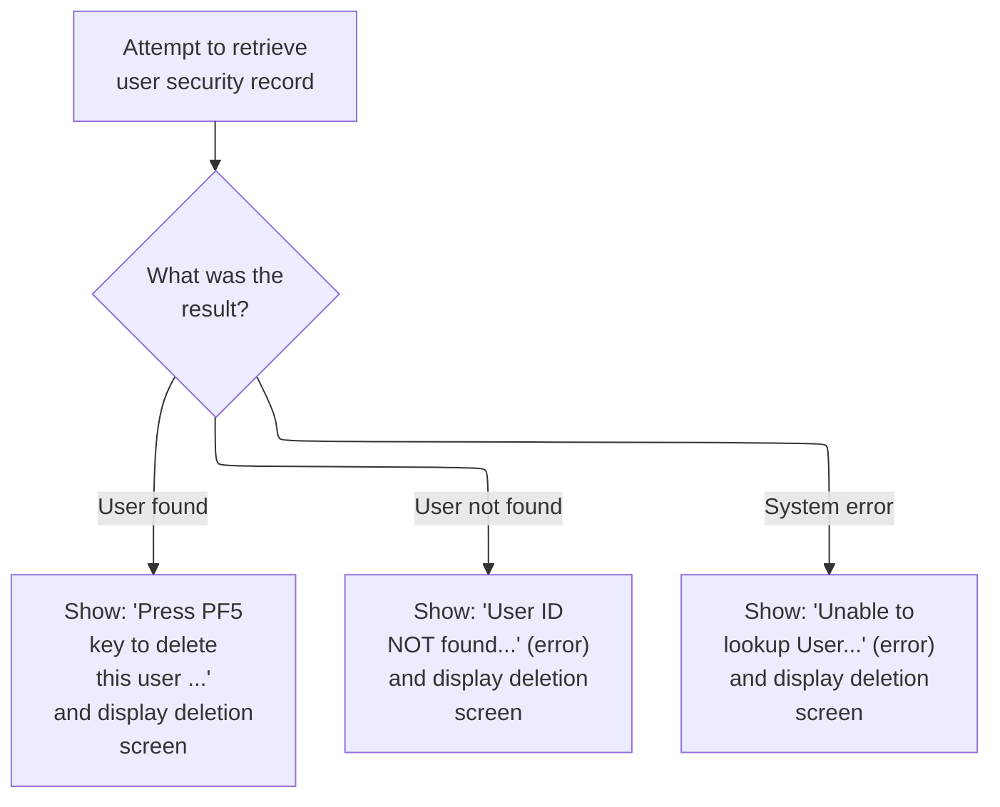
```mermaid
%%{init: {"flowchart": {"defaultRenderer": "elk"}} }%%
flowchart TD
  node1["Attempt to retrieve 
 user security record"] --> node2{"What was the 
 result?"}
  click node1 openCode "app/cbl/COUSR03C.cbl:269:279"
  node2 -->|"User found"| node3["Show: 'Press PF5 
 key to delete 
 this user ...' 
 and display deletion 
 screen"]
  click node2 openCode "app/cbl/COUSR03C.cbl:280:300"
  node2 -->|"User not found"| node4["Show: 'User ID 
 NOT found...' (error) 
 and display deletion 
 screen"]
  node2 -->|"System error"| node5["Show: 'Unable to 
 lookup User...' (error) 
 and display deletion 
 screen"]
  click node3 openCode "app/cbl/COUSR03C.cbl:282:286"
  click node4 openCode "app/cbl/COUSR03C.cbl:288:292"
  click node5 openCode "app/cbl/COUSR03C.cbl:294:299"
classDef HeadingStyle fill:#777777,stroke:#333,stroke-width:2px;
```

This section manages the process of reading a user security record for deletion and determines the appropriate user-facing message and screen update based on the outcome of the read operation.

| Rule ID | Code Location      | Category       | Rule Name                | Description                                                                                                                                                                 | Conditions                                                                                        | Remarks                                                                                                                                                                                                                  |
| ------- | ------------------ | -------------- | ------------------------ | --------------------------------------------------------------------------------------------------------------------------------------------------------------------------- | ------------------------------------------------------------------------------------------------- | ------------------------------------------------------------------------------------------------------------------------------------------------------------------------------------------------------------------------ |
| BR-001  | READ-USER-SEC-FILE | Business logic | Prompt for User Deletion | When a user security record is successfully found, the system prompts the user with a message to press PF5 to delete the user and displays the deletion screen.             | The user security record is found (response code is NORMAL).                                      | The message shown is: 'Press PF5 key to delete this user ...'. The message is up to 80 characters, left-aligned, padded with spaces if shorter. No error flag is set.                                                    |
| BR-002  | READ-USER-SEC-FILE | Error handling | User Not Found Error     | If the user security record is not found, the system displays an error message indicating the user ID was not found, sets the error flag, and displays the deletion screen. | The user security record is not found (response code is NOTFND).                                  | The error message shown is: 'User ID NOT found...'. The message is up to 80 characters, left-aligned, padded with spaces if shorter. The error flag is set to 'Y'.                                                       |
| BR-003  | READ-USER-SEC-FILE | Error handling | System Error Handling    | If a system error occurs during the user record lookup, the system displays a generic error message, sets the error flag, and displays the deletion screen.                 | A system error occurs during the user record lookup (response code is neither NORMAL nor NOTFND). | The error message shown is: 'Unable to lookup User...'. The message is up to 80 characters, left-aligned, padded with spaces if shorter. The error flag is set to 'Y'. Debug information is displayed in the system log. |

<SwmSnippet path="/app/cbl/COUSR03C.cbl" line="267" repo-id="Z2l0aHViJTNBJTNBa3luZHJ5bC1hd3MtbWFpbmZyYW1lLW1vZGVybml6YXRpb24tY2FyZGRlbW8lM0ElM0FTd2ltbS1EZW1v">

---

`READ-USER-SEC-FILE` reads and locks the user record for deletion, checks the response code, and either prompts the user to delete, shows a not-found error, or displays a generic error with debug info, then updates the screen.

```cobol
       READ-USER-SEC-FILE.

           EXEC CICS READ
                DATASET   (WS-USRSEC-FILE)
                INTO      (SEC-USER-DATA)
                LENGTH    (LENGTH OF SEC-USER-DATA)
                RIDFLD    (SEC-USR-ID)
                KEYLENGTH (LENGTH OF SEC-USR-ID)
                UPDATE
                RESP      (WS-RESP-CD)
                RESP2     (WS-REAS-CD)
           END-EXEC.

           EVALUATE WS-RESP-CD
               WHEN DFHRESP(NORMAL)
                   CONTINUE
                   MOVE 'Press PF5 key to delete this user ...' TO
                                   WS-MESSAGE
                   MOVE DFHNEUTR       TO ERRMSGC  OF COUSR3AO
                   PERFORM SEND-USRDEL-SCREEN
               WHEN DFHRESP(NOTFND)
                   MOVE 'Y'     TO WS-ERR-FLG
                   MOVE 'User ID NOT found...' TO
                                   WS-MESSAGE
                   MOVE -1       TO USRIDINL OF COUSR3AI
                   PERFORM SEND-USRDEL-SCREEN
               WHEN OTHER
                   DISPLAY 'RESP:' WS-RESP-CD 'REAS:' WS-REAS-CD
                   MOVE 'Y'     TO WS-ERR-FLG
                   MOVE 'Unable to lookup User...' TO
                                   WS-MESSAGE
                   MOVE -1       TO FNAMEL OF COUSR3AI
                   PERFORM SEND-USRDEL-SCREEN
           END-EVALUATE.
```

---

</SwmSnippet>

### Receiving User Delete Screen Input

This section is responsible for receiving and capturing user input from the delete screen, as well as collecting response codes for error handling and further processing.

| Rule ID | Code Location         | Category       | Rule Name                                 | Description                                                                                                          | Conditions                                                                          | Remarks                                                                                                                                                                                   |
| ------- | --------------------- | -------------- | ----------------------------------------- | -------------------------------------------------------------------------------------------------------------------- | ----------------------------------------------------------------------------------- | ----------------------------------------------------------------------------------------------------------------------------------------------------------------------------------------- |
| BR-001  | RECEIVE-USRDEL-SCREEN | Business logic | Capture user delete screen input          | User input from the delete screen map must be captured and stored in the input structure for further processing.     | Whenever the delete screen map ('COUSR3A') is presented and the user submits input. | The input structure is populated with values from the screen map. The format of the input structure matches the map definition, which is not detailed here but is referenced as COUSR3AI. |
| BR-002  | RECEIVE-USRDEL-SCREEN | Error handling | Capture response codes for error handling | Response codes from the RECEIVE operation must be captured to determine if any errors occurred during input capture. | Whenever the RECEIVE command is executed for the delete screen map.                 | Response codes are stored as numbers. WS-RESP-CD and WS-REAS-CD are used to capture the primary and secondary response codes, respectively.                                               |

<SwmSnippet path="/app/cbl/COUSR03C.cbl" line="230" repo-id="Z2l0aHViJTNBJTNBa3luZHJ5bC1hd3MtbWFpbmZyYW1lLW1vZGVybml6YXRpb24tY2FyZGRlbW8lM0ElM0FTd2ltbS1EZW1v">

---

`RECEIVE-USRDEL-SCREEN` grabs user input from the delete screen map and stores it in the input structure, capturing response codes for error handling.

```cobol
       RECEIVE-USRDEL-SCREEN.

           EXEC CICS RECEIVE
                     MAP('COUSR3A')
                     MAPSET('COUSR03')
                     INTO(COUSR3AI)
                     RESP(WS-RESP-CD)
                     RESP2(WS-REAS-CD)
           END-EXEC.
```

---

</SwmSnippet>

## Resetting User Delete Screen State

This section ensures that the user delete screen is fully reset and presented in a clean state before any new user input is accepted.

| Rule ID | Code Location         | Category       | Rule Name                  | Description                                                                                                                                                 | Conditions                                          | Remarks                                                                                                                                                                                                     |
| ------- | --------------------- | -------------- | -------------------------- | ----------------------------------------------------------------------------------------------------------------------------------------------------------- | --------------------------------------------------- | ----------------------------------------------------------------------------------------------------------------------------------------------------------------------------------------------------------- |
| BR-001  | INITIALIZE-ALL-FIELDS | Business logic | Clear user input fields    | When resetting the user delete screen, all user input fields must be cleared to blank values to ensure no residual data is present for the next operation.  | Triggered whenever the user delete screen is reset. | All input fields are set to blank (spaces). This includes the user ID, first name, last name, and user type fields. The format for each field is alphanumeric, and all characters are replaced with spaces. |
| BR-002  | INITIALIZE-ALL-FIELDS | Business logic | Invalidate user ID length  | When resetting the user delete screen, the user ID length must be set to an invalid value to prevent accidental processing of stale or incomplete user IDs. | Triggered whenever the user delete screen is reset. | The user ID length is set to -1, which is considered invalid. This is a numeric field.                                                                                                                      |
| BR-003  | INITIALIZE-ALL-FIELDS | Business logic | Clear message area         | When resetting the user delete screen, the message area must be cleared to ensure no previous messages are displayed to the user.                           | Triggered whenever the user delete screen is reset. | The message area is set to blank (spaces). The format is alphanumeric and all characters are replaced with spaces.                                                                                          |
| BR-004  | CLEAR-CURRENT-SCREEN  | Business logic | Send cleared delete screen | After all fields are reset, the delete screen must be sent to the user to display the cleared state and prompt for new input.                               | Triggered after all fields have been reset.         | The delete screen is sent with all fields blank and the user ID length set to -1. The format is the standard user delete screen layout.                                                                     |

<SwmSnippet path="/app/cbl/COUSR03C.cbl" line="341" repo-id="Z2l0aHViJTNBJTNBa3luZHJ5bC1hd3MtbWFpbmZyYW1lLW1vZGVybml6YXRpb24tY2FyZGRlbW8lM0ElM0FTd2ltbS1EZW1v">

---

In `CLEAR-CURRENT-SCREEN`, we reset all user fields to their defaults and then send the delete screen to the user, making sure everything is cleared out before new input.

```cobol
       CLEAR-CURRENT-SCREEN.

           PERFORM INITIALIZE-ALL-FIELDS.
           PERFORM SEND-USRDEL-SCREEN.
```

---

</SwmSnippet>

<SwmSnippet path="/app/cbl/COUSR03C.cbl" line="349" repo-id="Z2l0aHViJTNBJTNBa3luZHJ5bC1hd3MtbWFpbmZyYW1lLW1vZGVybml6YXRpb24tY2FyZGRlbW8lM0ElM0FTd2ltbS1EZW1v">

---

`INITIALIZE-ALL-FIELDS` sets all user input fields to blank and marks the user ID length as invalid, making sure the screen starts clean for the next operation.

```cobol
       INITIALIZE-ALL-FIELDS.

           MOVE -1              TO USRIDINL OF COUSR3AI
           MOVE SPACES          TO USRIDINI OF COUSR3AI
                                   FNAMEI   OF COUSR3AI
                                   LNAMEI   OF COUSR3AI
                                   USRTYPEI OF COUSR3AI
                                   WS-MESSAGE.
```

---

</SwmSnippet>

<SwmSnippet path="/app/cbl/COUSR03C.cbl" line="341" repo-id="Z2l0aHViJTNBJTNBa3luZHJ5bC1hd3MtbWFpbmZyYW1lLW1vZGVybml6YXRpb24tY2FyZGRlbW8lM0ElM0FTd2ltbS1EZW1v">

---

We just returned from `CLEAR-CURRENT-SCREEN` in COUSR03C.cbl, which resets all fields and redraws the delete screen. This keeps the UI clean for the next user action.

```cobol
       CLEAR-CURRENT-SCREEN.

           PERFORM INITIALIZE-ALL-FIELDS.
           PERFORM SEND-USRDEL-SCREEN.
```

---

</SwmSnippet>

## Validating and Deleting User Information

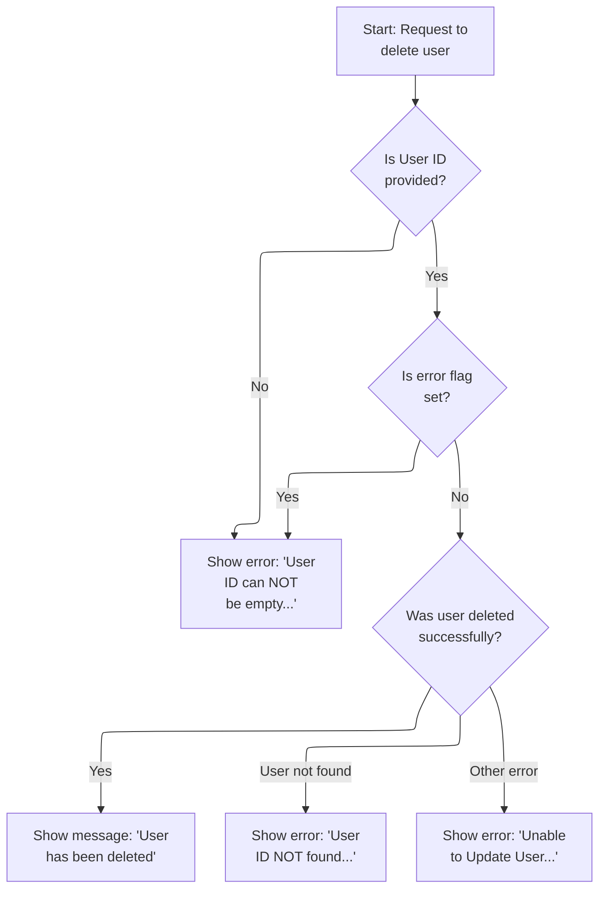
```mermaid
%%{init: {"flowchart": {"defaultRenderer": "elk"}} }%%
flowchart TD
  node1["Start: Request to 
 delete user"]
  click node1 openCode "app/cbl/COUSR03C.cbl:174:176"
  node1 --> node2{"Is User ID 
 provided?"}
  click node2 openCode "app/cbl/COUSR03C.cbl:177:183"
  node2 -->|"No"| node3["Show error: 'User 
 ID can NOT 
 be empty...'"]
  click node3 openCode "app/cbl/COUSR03C.cbl:178:182"
  node2 -->|"Yes"| node4{"Is error flag 
 set?"}
  click node4 openCode "app/cbl/COUSR03C.cbl:188:191"
  node4 -->|"No"| node5{"Was user deleted 
 successfully?"}
  click node5 openCode "app/cbl/COUSR03C.cbl:313:336"
  node5 -->|"Yes"| node6["Show message: 'User 
 has been deleted'"]
  click node6 openCode "app/cbl/COUSR03C.cbl:315:322"
  node5 -->|"User not found"| node7["Show error: 'User 
 ID NOT found...'"]
  click node7 openCode "app/cbl/COUSR03C.cbl:324:328"
  node5 -->|"Other error"| node8["Show error: 'Unable 
 to Update User...'"]
  click node8 openCode "app/cbl/COUSR03C.cbl:331:335"
  node4 -->|"Yes"| node3
classDef HeadingStyle fill:#777777,stroke:#333,stroke-width:2px;
```

This section validates the input for user deletion requests and manages the deletion process, providing clear feedback to the user based on the outcome.

| Rule ID | Code Location        | Category        | Rule Name                             | Description                                                                                                                                                                | Conditions                                                                                                                          | Remarks                                                                                                                                                                                                   |
| ------- | -------------------- | --------------- | ------------------------------------- | -------------------------------------------------------------------------------------------------------------------------------------------------------------------------- | ----------------------------------------------------------------------------------------------------------------------------------- | --------------------------------------------------------------------------------------------------------------------------------------------------------------------------------------------------------- |
| BR-001  | DELETE-USER-INFO     | Data validation | User ID required validation           | If the User ID is blank or contains only spaces or low-values, an error message is displayed stating that the User ID cannot be empty, and the deletion process is halted. | Triggered when a delete user request is received and the User ID field is blank, contains only spaces, or contains only low-values. | Error message displayed: 'User ID can NOT be empty...'. The message is shown in an 80-character string field. The User ID field is 8 characters, left-aligned, padded with spaces if shorter.             |
| BR-002  | DELETE-USER-SEC-FILE | Business logic  | Successful user deletion confirmation | If the user record is deleted successfully, a confirmation message is displayed indicating the user has been deleted.                                                      | Triggered when the delete operation returns a normal response code after a valid User ID is provided.                               | Success message displayed: 'User \[User ID\] has been deleted ...'. The message is shown in an 80-character string field. The User ID field is 8 characters, left-aligned, padded with spaces if shorter. |
| BR-003  | DELETE-USER-SEC-FILE | Error handling  | User not found error                  | If the user record is not found during the deletion attempt, an error message is displayed indicating the User ID was not found.                                           | Triggered when the delete operation returns a 'not found' response code after a valid User ID is provided.                          | Error message displayed: 'User ID NOT found...'. The message is shown in an 80-character string field. The User ID field is 8 characters, left-aligned, padded with spaces if shorter.                    |
| BR-004  | DELETE-USER-SEC-FILE | Error handling  | Generic deletion failure error        | If the deletion attempt fails for reasons other than 'not found', a generic error message is displayed indicating the user could not be updated.                           | Triggered when the delete operation returns any response code other than 'normal' or 'not found' after a valid User ID is provided. | Error message displayed: 'Unable to Update User...'. The message is shown in an 80-character string field. The User ID field is 8 characters, left-aligned, padded with spaces if shorter.                |

<SwmSnippet path="/app/cbl/COUSR03C.cbl" line="174" repo-id="Z2l0aHViJTNBJTNBa3luZHJ5bC1hd3MtbWFpbmZyYW1lLW1vZGVybml6YXRpb24tY2FyZGRlbW8lM0ElM0FTd2ltbS1EZW1v">

---

`DELETE-USER-INFO` checks if the user ID is blank, sets an error and message if so, and updates the screen. If valid, it copies the ID, reads the user record, and then deletes it.

```cobol
       DELETE-USER-INFO.

           EVALUATE TRUE
               WHEN USRIDINI OF COUSR3AI = SPACES OR LOW-VALUES
                   MOVE 'Y'     TO WS-ERR-FLG
                   MOVE 'User ID can NOT be empty...' TO
                                   WS-MESSAGE
                   MOVE -1       TO USRIDINL OF COUSR3AI
                   PERFORM SEND-USRDEL-SCREEN
               WHEN OTHER
                   MOVE -1       TO USRIDINL OF COUSR3AI
                   CONTINUE
           END-EVALUATE

           IF NOT ERR-FLG-ON
               MOVE USRIDINI  OF COUSR3AI TO SEC-USR-ID
               PERFORM READ-USER-SEC-FILE
               PERFORM DELETE-USER-SEC-FILE
           END-IF.
```

---

</SwmSnippet>

<SwmSnippet path="/app/cbl/COUSR03C.cbl" line="305" repo-id="Z2l0aHViJTNBJTNBa3luZHJ5bC1hd3MtbWFpbmZyYW1lLW1vZGVybml6YXRpb24tY2FyZGRlbW8lM0ElM0FTd2ltbS1EZW1v">

---

`DELETE-USER-SEC-FILE` deletes the user record, checks the response, and either shows a success message, a not-found error, or a generic error, then updates the screen.

```cobol
       DELETE-USER-SEC-FILE.

           EXEC CICS DELETE
                DATASET   (WS-USRSEC-FILE)
                RESP      (WS-RESP-CD)
                RESP2     (WS-REAS-CD)
           END-EXEC.

           EVALUATE WS-RESP-CD
               WHEN DFHRESP(NORMAL)
                   PERFORM INITIALIZE-ALL-FIELDS
                   MOVE SPACES             TO WS-MESSAGE
                   MOVE DFHGREEN           TO ERRMSGC  OF COUSR3AO
                   STRING 'User '     DELIMITED BY SIZE
                          SEC-USR-ID  DELIMITED BY SPACE
                          ' has been deleted ...' DELIMITED BY SIZE
                     INTO WS-MESSAGE
                   PERFORM SEND-USRDEL-SCREEN
               WHEN DFHRESP(NOTFND)
                   MOVE 'Y'     TO WS-ERR-FLG
                   MOVE 'User ID NOT found...' TO
                                   WS-MESSAGE
                   MOVE -1       TO USRIDINL OF COUSR3AI
                   PERFORM SEND-USRDEL-SCREEN
               WHEN OTHER
                   DISPLAY 'RESP:' WS-RESP-CD 'REAS:' WS-REAS-CD
                   MOVE 'Y'     TO WS-ERR-FLG
                   MOVE 'Unable to Update User...' TO
                                   WS-MESSAGE
                   MOVE -1       TO FNAMEL OF COUSR3AI
                   PERFORM SEND-USRDEL-SCREEN
           END-EVALUATE.
```

---

</SwmSnippet>

## Receiving User List Screen Input

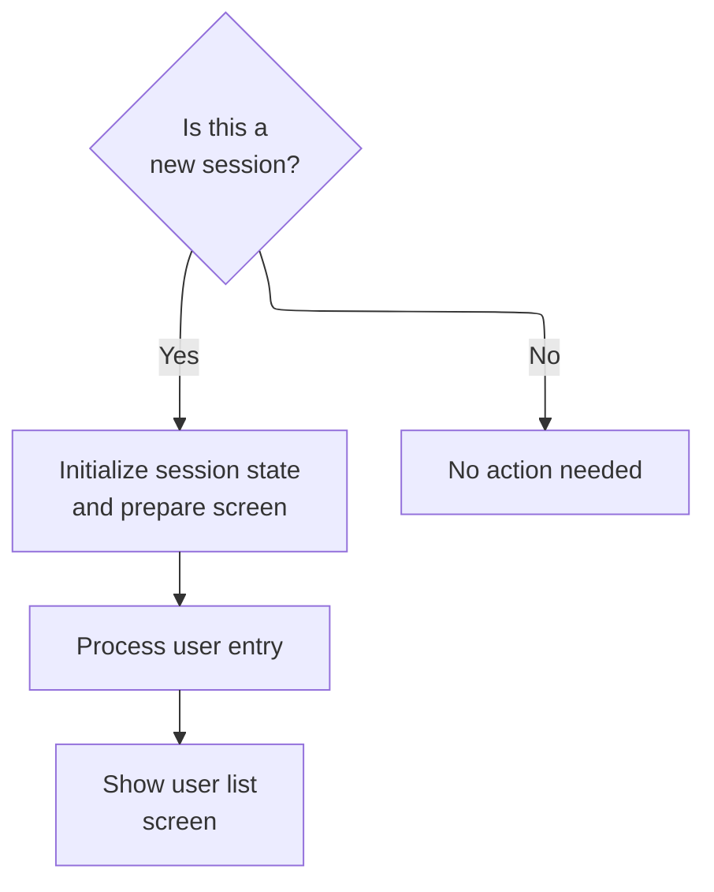
```mermaid
%%{init: {"flowchart": {"defaultRenderer": "elk"}} }%%
flowchart TD
    node1{"Is this a 
 new session?"}
    click node1 openCode "app/cbl/COUSR00C.cbl:115:115"
    node1 -->|"Yes"| node2["Initialize session state 
 and prepare screen"]
    click node2 openCode "app/cbl/COUSR00C.cbl:114:117"
    node2 --> node3["Process user entry"]
    click node3 openCode "app/cbl/COUSR00C.cbl:118:118"
    node3 --> node4["Show user list 
 screen"]
    click node4 openCode "app/cbl/COUSR00C.cbl:119:119"
    node1 -->|"No"| node5["No action needed"]
    click node5 openCode "app/cbl/COUSR00C.cbl:113:113"
classDef HeadingStyle fill:#777777,stroke:#333,stroke-width:2px;
```

This section manages the transition between new and reentry sessions for the user list screen, ensuring that session state and user input are handled appropriately based on the session context.

| Rule ID | Code Location | Category       | Rule Name                  | Description                                                                                                                                                                                                                    | Conditions                                                                                          | Remarks                                                                                                                                                                              |
| ------- | ------------- | -------------- | -------------------------- | ------------------------------------------------------------------------------------------------------------------------------------------------------------------------------------------------------------------------------ | --------------------------------------------------------------------------------------------------- | ------------------------------------------------------------------------------------------------------------------------------------------------------------------------------------ |
| BR-001  | MAIN-PARA     | Business logic | New session initialization | When a user accesses the user list screen and the session is new, the session state must be initialized, the screen must be prepared for input, and the user's entry must be processed before displaying the user list screen. | The session is identified as new (not a reentry) when the session state flag indicates a new entry. | Session state is determined by a context flag. Initialization includes setting the screen to its default state and preparing for user input. The user list screen is then displayed. |
| BR-002  | MAIN-PARA     | Business logic | Reentry session bypass     | If the session is a reentry, no initialization or screen preparation is performed and no user entry is processed.                                                                                                              | The session is identified as a reentry when the session state flag indicates reentry.               | Reentry is determined by the context flag. No changes are made to the session state or screen.                                                                                       |
| BR-003  | MAIN-PARA     | Business logic | Commarea data transfer     | When processing a new session, commarea data must be copied to the session context to ensure the correct user and session information is available.                                                                            | Commarea data is present and the session is being initialized.                                      | Commarea data includes user and session information. The data is transferred in its entirety to the session context.                                                                 |

<SwmSnippet path="/app/cbl/COUSR00C.cbl" line="113" repo-id="Z2l0aHViJTNBJTNBa3luZHJ5bC1hd3MtbWFpbmZyYW1lLW1vZGVybml6YXRpb24tY2FyZGRlbW8lM0ElM0FTd2ltbS1EZW1v">

---

After RETURN-TO-PREV-SCREEN, `MAIN-PARA` checks if there's commarea data, sets up the screen for first entry or reentry, and calls PROCESS-ENTER-KEY to handle user selection and input.

```cobol
           ELSE
               MOVE DFHCOMMAREA(1:EIBCALEN) TO CARDDEMO-COMMAREA
               IF NOT CDEMO-PGM-REENTER
                   SET CDEMO-PGM-REENTER    TO TRUE
                   MOVE LOW-VALUES          TO COUSR0AO
                   PERFORM PROCESS-ENTER-KEY
                   PERFORM SEND-USRLST-SCREEN
```

---

</SwmSnippet>

## Determining User Selection from List

This section processes user selections from a displayed list, determines the intended action (update or delete), validates input, handles errors, and refreshes the user list to keep the interface in sync with user actions.

| Rule ID | Code Location     | Category        | Rule Name                | Description                                                                                                                                                                                                                       | Conditions                                                                                                                | Remarks                                                                                                                                                                                                                                                                                                    |
| ------- | ----------------- | --------------- | ------------------------ | --------------------------------------------------------------------------------------------------------------------------------------------------------------------------------------------------------------------------------- | ------------------------------------------------------------------------------------------------------------------------- | ---------------------------------------------------------------------------------------------------------------------------------------------------------------------------------------------------------------------------------------------------------------------------------------------------------- |
| BR-001  | PROCESS-ENTER-KEY | Data validation | User ID input validation | If the user ID input field is blank or low-values, the system clears the user ID context; otherwise, it copies the input to the user ID context.                                                                                  | Triggered after selection processing, when the user ID input field is checked.                                            | User ID format: 8-character alphanumeric string. Blank or low-values result in clearing the user ID context.                                                                                                                                                                                               |
| BR-002  | PROCESS-ENTER-KEY | Business logic  | First user selection     | When the user presses enter, the first non-blank and non-low-value selection flag from the list is used to determine which user is selected for further action. If no selection flag is set, the selection variables are cleared. | Triggered when any of the selection flags SEL0001I to SEL0010I are not blank and not low-values.                          | Selection flags are checked in order from SEL0001I to SEL0010I. The selected flag and corresponding user ID are copied to the selection variables. If none are set, both are set to blank (spaces). Selection flag format: single alphanumeric character. User ID format: 8-character alphanumeric string. |
| BR-003  | PROCESS-ENTER-KEY | Business logic  | Update user navigation   | If a user is selected and the selection flag is 'U' or 'u', the system prepares for an update and navigates to the user update screen.                                                                                            | Triggered when the selection flag is 'U' or 'u' and both selection flag and selected user ID are not blank or low-values. | Valid selection flag for update: 'U' or 'u'. Navigation is to the update program. Selection flag format: single character ('U' or 'u').                                                                                                                                                                    |
| BR-004  | PROCESS-ENTER-KEY | Business logic  | Delete user navigation   | If a user is selected and the selection flag is 'D' or 'd', the system prepares for a delete and navigates to the user delete screen.                                                                                             | Triggered when the selection flag is 'D' or 'd' and both selection flag and selected user ID are not blank or low-values. | Valid selection flag for delete: 'D' or 'd'. Navigation is to the delete program. Selection flag format: single character ('D' or 'd').                                                                                                                                                                    |
| BR-005  | PROCESS-ENTER-KEY | Business logic  | User list refresh        | After processing selection and navigation, the system resets the page number and refreshes the user list from the top.                                                                                                            | Triggered after selection and navigation logic is complete.                                                               | Page number is set to 0. User list is refreshed by calling the page forward logic.                                                                                                                                                                                                                         |
| BR-006  | PROCESS-ENTER-KEY | Error handling  | Invalid selection error  | If the selection flag is set to any value other than 'U', 'u', 'D', or 'd', the system displays an error message and resets the input field.                                                                                      | Triggered when the selection flag is not 'U', 'u', 'D', or 'd', but is not blank or low-values.                           | Error message: 'Invalid selection. Valid values are U and D'. Input field is reset to -1. Message format: 80-character string.                                                                                                                                                                             |

<SwmSnippet path="/app/cbl/COUSR00C.cbl" line="149" repo-id="Z2l0aHViJTNBJTNBa3luZHJ5bC1hd3MtbWFpbmZyYW1lLW1vZGVybml6YXRpb24tY2FyZGRlbW8lM0ElM0FTd2ltbS1EZW1v">

---

`PROCESS-ENTER-KEY` finds the first selected user and sets the selection variables for the next step.

```cobol
       PROCESS-ENTER-KEY.

           EVALUATE TRUE
               WHEN SEL0001I OF COUSR0AI NOT = SPACES AND LOW-VALUES
                   MOVE SEL0001I OF COUSR0AI TO CDEMO-CU00-USR-SEL-FLG
                   MOVE USRID01I OF COUSR0AI TO CDEMO-CU00-USR-SELECTED
               WHEN SEL0002I OF COUSR0AI NOT = SPACES AND LOW-VALUES
                   MOVE SEL0002I OF COUSR0AI TO CDEMO-CU00-USR-SEL-FLG
                   MOVE USRID02I OF COUSR0AI TO CDEMO-CU00-USR-SELECTED
               WHEN SEL0003I OF COUSR0AI NOT = SPACES AND LOW-VALUES
                   MOVE SEL0003I OF COUSR0AI TO CDEMO-CU00-USR-SEL-FLG
                   MOVE USRID03I OF COUSR0AI TO CDEMO-CU00-USR-SELECTED
               WHEN SEL0004I OF COUSR0AI NOT = SPACES AND LOW-VALUES
                   MOVE SEL0004I OF COUSR0AI TO CDEMO-CU00-USR-SEL-FLG
                   MOVE USRID04I OF COUSR0AI TO CDEMO-CU00-USR-SELECTED
               WHEN SEL0005I OF COUSR0AI NOT = SPACES AND LOW-VALUES
                   MOVE SEL0005I OF COUSR0AI TO CDEMO-CU00-USR-SEL-FLG
                   MOVE USRID05I OF COUSR0AI TO CDEMO-CU00-USR-SELECTED
               WHEN SEL0006I OF COUSR0AI NOT = SPACES AND LOW-VALUES
                   MOVE SEL0006I OF COUSR0AI TO CDEMO-CU00-USR-SEL-FLG
                   MOVE USRID06I OF COUSR0AI TO CDEMO-CU00-USR-SELECTED
               WHEN SEL0007I OF COUSR0AI NOT = SPACES AND LOW-VALUES
                   MOVE SEL0007I OF COUSR0AI TO CDEMO-CU00-USR-SEL-FLG
                   MOVE USRID07I OF COUSR0AI TO CDEMO-CU00-USR-SELECTED
               WHEN SEL0008I OF COUSR0AI NOT = SPACES AND LOW-VALUES
                   MOVE SEL0008I OF COUSR0AI TO CDEMO-CU00-USR-SEL-FLG
                   MOVE USRID08I OF COUSR0AI TO CDEMO-CU00-USR-SELECTED
               WHEN SEL0009I OF COUSR0AI NOT = SPACES AND LOW-VALUES
                   MOVE SEL0009I OF COUSR0AI TO CDEMO-CU00-USR-SEL-FLG
                   MOVE USRID09I OF COUSR0AI TO CDEMO-CU00-USR-SELECTED
               WHEN SEL0010I OF COUSR0AI NOT = SPACES AND LOW-VALUES
                   MOVE SEL0010I OF COUSR0AI TO CDEMO-CU00-USR-SEL-FLG
                   MOVE USRID10I OF COUSR0AI TO CDEMO-CU00-USR-SELECTED
               WHEN OTHER
                   MOVE SPACES   TO CDEMO-CU00-USR-SEL-FLG
                   MOVE SPACES   TO CDEMO-CU00-USR-SELECTED
           END-EVALUATE
```

---

</SwmSnippet>

<SwmSnippet path="/app/cbl/COUSR00C.cbl" line="187" repo-id="Z2l0aHViJTNBJTNBa3luZHJ5bC1hd3MtbWFpbmZyYW1lLW1vZGVybml6YXRpb24tY2FyZGRlbW8lM0ElM0FTd2ltbS1EZW1v">

---

After a user is selected, the code checks if the selection flag is 'U' or 'D' (case-insensitive). If it's 'U', we prep the commarea and use XCTL to jump to COUSR02C for updating. If it's 'D', we do the same but jump to COUSR03C for deleting. This is how the program decides which user maintenance screen to show next. If the flag is invalid, we set an error message and reset the input field. This keeps the flow tight and only routes to valid actions.

```cobol
           IF (CDEMO-CU00-USR-SEL-FLG NOT = SPACES AND LOW-VALUES) AND
              (CDEMO-CU00-USR-SELECTED NOT = SPACES AND LOW-VALUES)
               EVALUATE CDEMO-CU00-USR-SEL-FLG
                   WHEN 'U'
                   WHEN 'u'
                        MOVE 'COUSR02C'   TO CDEMO-TO-PROGRAM
                        MOVE WS-TRANID    TO CDEMO-FROM-TRANID
                        MOVE WS-PGMNAME   TO CDEMO-FROM-PROGRAM
                        MOVE 0        TO CDEMO-PGM-CONTEXT
                        EXEC CICS
                            XCTL PROGRAM(CDEMO-TO-PROGRAM)
                            COMMAREA(CARDDEMO-COMMAREA)
                        END-EXEC
```

---

</SwmSnippet>

<SwmSnippet path="/app/cbl/COUSR00C.cbl" line="200" repo-id="Z2l0aHViJTNBJTNBa3luZHJ5bC1hd3MtbWFpbmZyYW1lLW1vZGVybml6YXRpb24tY2FyZGRlbW8lM0ElM0FTd2ltbS1EZW1v">

---

We just got back from COUSR03C.cbl, so PROCESS-ENTER-KEY checks if the selection was for delete ('D' or 'd'). If so, it sets up the commarea and uses XCTL to jump back into COUSR03C for another delete operation. This keeps the flow consistent if the user is working through multiple deletes or if the previous delete didn't finish cleanly.

```cobol
                   WHEN 'D'
                   WHEN 'd'
                        MOVE 'COUSR03C'   TO CDEMO-TO-PROGRAM
                        MOVE WS-TRANID    TO CDEMO-FROM-TRANID
                        MOVE WS-PGMNAME   TO CDEMO-FROM-PROGRAM
                        MOVE 0        TO CDEMO-PGM-CONTEXT
                        EXEC CICS
                            XCTL PROGRAM(CDEMO-TO-PROGRAM)
                            COMMAREA(CARDDEMO-COMMAREA)
                        END-EXEC
```

---

</SwmSnippet>

<SwmSnippet path="/app/cbl/COUSR00C.cbl" line="210" repo-id="Z2l0aHViJTNBJTNBa3luZHJ5bC1hd3MtbWFpbmZyYW1lLW1vZGVybml6YXRpb24tY2FyZGRlbW8lM0ElM0FTd2ltbS1EZW1v">

---

If the selection flag isn't 'U' or 'D', we set an error message and reset the input field. This is the fallback path in PROCESS-ENTER-KEY, making sure only valid actions are processed. The next step after this is to refresh the screen so the user can try again.

```cobol
                   WHEN OTHER
                       MOVE
                       'Invalid selection. Valid values are U and D' TO
                                       WS-MESSAGE
                       MOVE -1       TO USRIDINL OF COUSR0AI
               END-EVALUATE
```

---

</SwmSnippet>

<SwmSnippet path="/app/cbl/COUSR00C.cbl" line="218" repo-id="Z2l0aHViJTNBJTNBa3luZHJ5bC1hd3MtbWFpbmZyYW1lLW1vZGVybml6YXRpb24tY2FyZGRlbW8lM0ElM0FTd2ltbS1EZW1v">

---

Here we check if the user ID input is blank or low-values. If so, we clear SEC-USR-ID; otherwise, we copy the input. This prevents bogus lookups and keeps the user context clean for the next operation.

```cobol
           IF USRIDINI OF COUSR0AI = SPACES OR LOW-VALUES
               MOVE LOW-VALUES TO SEC-USR-ID
           ELSE
               MOVE USRIDINI  OF COUSR0AI TO SEC-USR-ID
           END-IF
```

---

</SwmSnippet>

<SwmSnippet path="/app/cbl/COUSR00C.cbl" line="224" repo-id="Z2l0aHViJTNBJTNBa3luZHJ5bC1hd3MtbWFpbmZyYW1lLW1vZGVybml6YXRpb24tY2FyZGRlbW8lM0ElM0FTd2ltbS1EZW1v">

---

After handling selection and navigation, we reset the page number and call PROCESS-PAGE-FORWARD. This refreshes the user list from the top, making sure the display is always in sync with the latest state.

```cobol
           MOVE -1       TO USRIDINL OF COUSR0AI


           MOVE 0       TO CDEMO-CU00-PAGE-NUM
           PERFORM PROCESS-PAGE-FORWARD
```

---

</SwmSnippet>

### Paging Forward Through User List

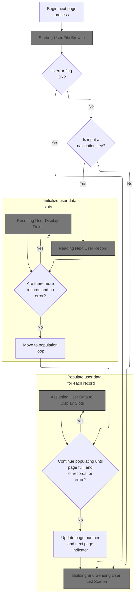
```mermaid
%%{init: {"flowchart": {"defaultRenderer": "elk"}} }%%
flowchart TD
    node1["Begin next page 
 process"]
    click node1 openCode "app/cbl/COUSR00C.cbl:282:284"
    node1 --> node2["Starting User File Browse"]
    
    node2 --> node3{"Is error flag 
 ON?"}
    click node3 openCode "app/cbl/COUSR00C.cbl:286:287"
    node3 -->|"No"| node4{"Is input a 
 navigation key?"}
    click node4 openCode "app/cbl/COUSR00C.cbl:288:289"
    node4 -->|"Yes"| node5["Reading Next User Record"]
    
    node4 -->|"No"| node10["Building and Sending User List Screen"]
    node3 -->|"Yes"| node10
    subgraph loop1["Initialize user data 
 slots"]
      node5 --> node6{"Are there more 
 records and no 
 error?"}
      click node6 openCode "app/cbl/COUSR00C.cbl:292:293"
      node6 -->|"Yes"| node7["Resetting User Display Fields"]
      
      node7 --> node6
      node6 -->|"No"| node8["Move to population 
 loop"]
    end
    subgraph loop2["Populate user data 
 for each record"]
      node8 --> node9{"Continue populating until 
 page full, end 
 of records, or 
 error?"}
      click node9 openCode "app/cbl/COUSR00C.cbl:298:306"
      node9 -->|"Yes"| node11["Assigning User Data to Display Slots"]
      
      node11 --> node9
      node9 -->|"No"| node12["Update page number 
 and next page 
 indicator"]
      click node12 openCode "app/cbl/COUSR00C.cbl:308:316"
      node12 --> node10["Building and Sending User List Screen"]
      
    end
classDef HeadingStyle fill:#777777,stroke:#333,stroke-width:2px;
click node2 goToHeading "Starting User File Browse"
node2:::HeadingStyle
click node5 goToHeading "Reading Next User Record"
node5:::HeadingStyle
click node7 goToHeading "Resetting User Display Fields"
node7:::HeadingStyle
click node10 goToHeading "Building and Sending User List Screen"
node10:::HeadingStyle
click node11 goToHeading "Assigning User Data to Display Slots"
node11:::HeadingStyle
```

This section manages the process of paging forward through the user list, handling navigation, reading user records, and updating the user list screen in the CardDemo application.

| Rule ID | Code Location        | Category       | Rule Name                              | Description                                                                                                                                                                                | Conditions                                                                          | Remarks                                                                                                                     |
| ------- | -------------------- | -------------- | -------------------------------------- | ------------------------------------------------------------------------------------------------------------------------------------------------------------------------------------------ | ----------------------------------------------------------------------------------- | --------------------------------------------------------------------------------------------------------------------------- |
| BR-001  | PROCESS-PAGE-FORWARD | Business logic | Start user file browse on page forward | When the user initiates a page forward action and there is no error, the system begins a browse on the user security file to prepare for reading the next set of user records.             | User initiates page forward and error flag is OFF.                                  | The error flag must be 'N'. The browse is started before any user records are read for the new page.                        |
| BR-002  | PROCESS-PAGE-FORWARD | Business logic | Populate next page with user records   | When a navigation key is detected and there is no error, the system reads the next user record and continues until either the page is full, there are no more records, or an error occurs. | Navigation key is pressed, error flag is OFF, and user security file is not at end. | Page is filled with user records up to the maximum display slots. If end of file or error is encountered, population stops. |
| BR-003  | PROCESS-PAGE-FORWARD | Business logic | End of user records disables next page | If there are no more user records to read or an error occurs during population, the next page indicator is set to 'N' and the page number is updated accordingly.                          | End of user records or error encountered during page population.                    | Next page indicator is set to 'N'. Page number is updated to reflect the last available page.                               |
| BR-004  | PROCESS-PAGE-FORWARD | Business logic | Send user list screen after paging     | After populating the user list for the current page, the system builds and sends the user list screen to the user, reflecting the current page contents and navigation indicators.         | User list for the page has been populated or an error/end of records has occurred.  | Screen includes user data for the current page, page number, and next page indicator ('Y' or 'N').                          |
| BR-005  | PROCESS-PAGE-FORWARD | Error handling | Error prevents page forward            | If an error flag is ON at the start of paging forward, the user list screen is built and sent without attempting to read new user records.                                                 | Error flag is ON when paging forward is initiated.                                  | Error flag must be 'Y'. No new user records are read; the output reflects the error state.                                  |

<SwmSnippet path="/app/cbl/COUSR00C.cbl" line="282" repo-id="Z2l0aHViJTNBJTNBa3luZHJ5bC1hd3MtbWFpbmZyYW1lLW1vZGVybml6YXRpb24tY2FyZGRlbW8lM0ElM0FTd2ltbS1EZW1v">

---

In PROCESS-PAGE-FORWARD, we start by calling STARTBR-USER-SEC-FILE. This sets up a browse on the user security file so we can start reading user records for the current page. Without this, we wouldn't have a cursor to read the next set of users for display.

```cobol
       PROCESS-PAGE-FORWARD.

           PERFORM STARTBR-USER-SEC-FILE
```

---

</SwmSnippet>

#### Starting User File Browse

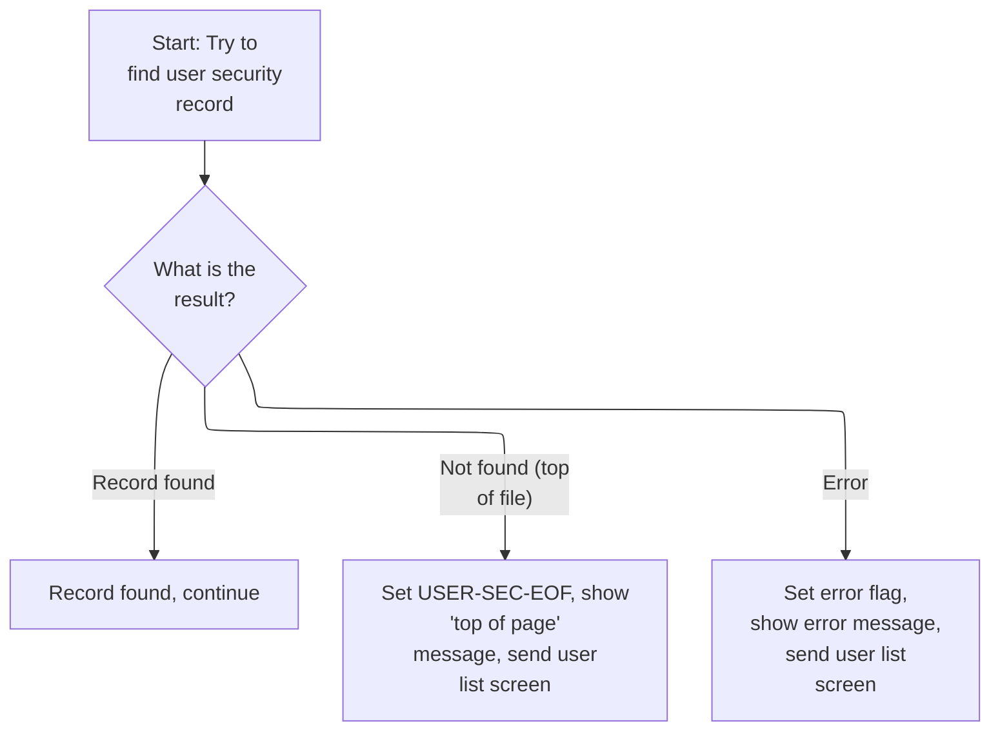
```mermaid
%%{init: {"flowchart": {"defaultRenderer": "elk"}} }%%
flowchart TD
    node1["Start: Try to 
 find user security 
 record"]
    click node1 openCode "app/cbl/COUSR00C.cbl:586:595"
    node1 --> node2{"What is the 
 result?"}
    click node2 openCode "app/cbl/COUSR00C.cbl:597:614"
    node2 -->|"Record found"| node3["Record found, continue"]
    click node3 openCode "app/cbl/COUSR00C.cbl:598:599"
    node2 -->|"Not found (top 
 of file)"| node4["Set USER-SEC-EOF, show 
 'top of page' 
 message, send user 
 list screen"]
    click node4 openCode "app/cbl/COUSR00C.cbl:600:606"
    node2 -->|"Error"| node5["Set error flag, 
 show error message, 
 send user list 
 screen"]
    click node5 openCode "app/cbl/COUSR00C.cbl:607:613"

classDef HeadingStyle fill:#777777,stroke:#333,stroke-width:2px;
```

This section manages the initiation of a browse operation on the user security file, handling the outcomes of the operation and updating the user interface to reflect the result. It ensures users are informed when they reach the top of the file or when an error occurs, and allows normal processing to continue when a record is found.

| Rule ID | Code Location         | Category       | Rule Name                | Description                                                                                                                                                                                                    | Conditions                                                                                 | Remarks                                                                                                                                                                                            |
| ------- | --------------------- | -------------- | ------------------------ | -------------------------------------------------------------------------------------------------------------------------------------------------------------------------------------------------------------- | ------------------------------------------------------------------------------------------ | -------------------------------------------------------------------------------------------------------------------------------------------------------------------------------------------------- |
| BR-001  | STARTBR-USER-SEC-FILE | Business logic | Continue on Record Found | If a user security record is found at the specified key, the system continues processing without displaying any message or updating the user list screen.                                                      | A user security record exists at the specified key and the response code is NORMAL.        | No message is displayed and no error or end-of-file flags are set. Processing continues as normal.                                                                                                 |
| BR-002  | STARTBR-USER-SEC-FILE | Error handling | Top of File Handling     | If no user security record is found at the specified key (top of file), the system sets the end-of-file condition, displays the message 'You are at the top of the page...', and updates the user list screen. | No user security record exists at the specified key and the response code is NOTFND.       | The end-of-file flag is set to 'Y'. The message displayed is 'You are at the top of the page...'. The user list screen is updated. The input field is set to -1 (indicating a reset or highlight). |
| BR-003  | STARTBR-USER-SEC-FILE | Error handling | Browse Error Handling    | If an error occurs during the browse operation (other than not found), the system sets the error flag, displays the message 'Unable to lookup User...', and updates the user list screen.                      | An error occurs during the browse operation and the response code is not NORMAL or NOTFND. | The error flag is set to 'Y'. The message displayed is 'Unable to lookup User...'. The user list screen is updated. The input field is set to -1.                                                  |

<SwmSnippet path="/app/cbl/COUSR00C.cbl" line="586" repo-id="Z2l0aHViJTNBJTNBa3luZHJ5bC1hd3MtbWFpbmZyYW1lLW1vZGVybml6YXRpb24tY2FyZGRlbW8lM0ElM0FTd2ltbS1EZW1v">

---

In STARTBR-USER-SEC-FILE, we use EXEC CICS STARTBR to start a browse on the USRSEC file at the key in SEC-USR-ID. This positions us to read user records from a specific point, which is needed for paging through the user list.

```cobol
       STARTBR-USER-SEC-FILE.

           EXEC CICS STARTBR
                DATASET   (WS-USRSEC-FILE)
                RIDFLD    (SEC-USR-ID)
                KEYLENGTH (LENGTH OF SEC-USR-ID)
      *         GTEQ
                RESP      (WS-RESP-CD)
                RESP2     (WS-REAS-CD)
           END-EXEC.
```

---

</SwmSnippet>

<SwmSnippet path="/app/cbl/COUSR00C.cbl" line="597" repo-id="Z2l0aHViJTNBJTNBa3luZHJ5bC1hd3MtbWFpbmZyYW1lLW1vZGVybml6YXRpb24tY2FyZGRlbW8lM0ElM0FTd2ltbS1EZW1v">

---

After STARTBR-USER-SEC-FILE, we check the response code. If it's NOTFND, we set the end-of-file flag, show a 'top of page' message, and update the screen with SEND-USRLST-SCREEN. If there's any other error, we set the error flag, display an error message, and also update the screen. This keeps the user informed if there are no records or if something went wrong.

```cobol
           EVALUATE WS-RESP-CD
               WHEN DFHRESP(NORMAL)
                   CONTINUE
               WHEN DFHRESP(NOTFND)
                   CONTINUE
                   SET USER-SEC-EOF TO TRUE
                   MOVE 'You are at the top of the page...' TO
                                   WS-MESSAGE
                   MOVE -1       TO USRIDINL OF COUSR0AI
                   PERFORM SEND-USRLST-SCREEN
               WHEN OTHER
                   DISPLAY 'RESP:' WS-RESP-CD 'REAS:' WS-REAS-CD
                   MOVE 'Y'     TO WS-ERR-FLG
                   MOVE 'Unable to lookup User...' TO
                                   WS-MESSAGE
                   MOVE -1       TO USRIDINL OF COUSR0AI
                   PERFORM SEND-USRLST-SCREEN
           END-EVALUATE.
```

---

</SwmSnippet>

#### Building and Sending User List Screen

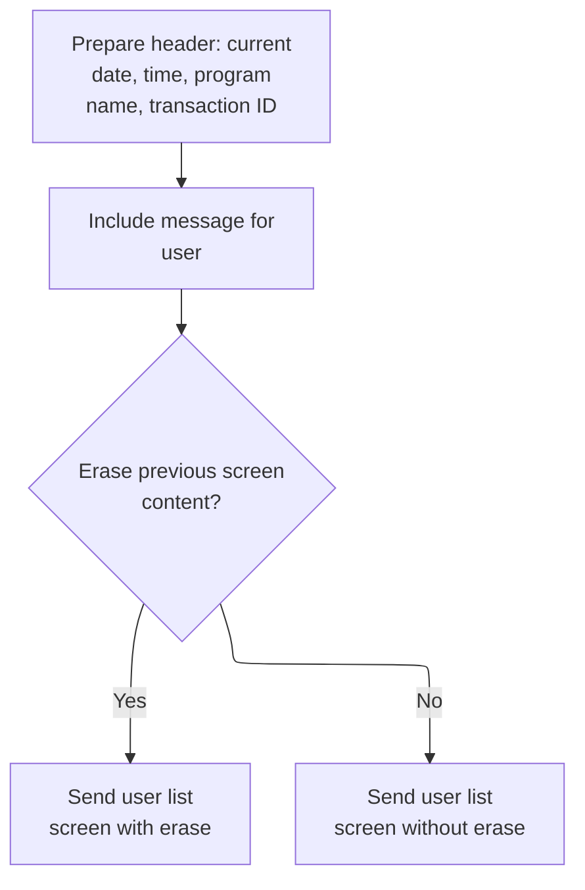
```mermaid
%%{init: {"flowchart": {"defaultRenderer": "elk"}} }%%
flowchart TD
    node1["Prepare header: current 
 date, time, program 
 name, transaction ID"]
    click node1 openCode "app/cbl/COUSR00C.cbl:562:581"
    node1 --> node5["Include message for 
 user"]
    click node5 openCode "app/cbl/COUSR00C.cbl:526:526"
    node5 --> node2{"Erase previous screen 
 content?"}
    click node2 openCode "app/cbl/COUSR00C.cbl:528:544"
    node2 -->|"Yes"| node3["Send user list 
 screen with erase"]
    click node3 openCode "app/cbl/COUSR00C.cbl:529:535"
    node2 -->|"No"| node4["Send user list 
 screen without erase"]
    click node4 openCode "app/cbl/COUSR00C.cbl:537:543"
classDef HeadingStyle fill:#777777,stroke:#333,stroke-width:2px;
```

This section prepares and sends the user list screen to the terminal, ensuring the header is up-to-date, any user message is displayed, and the screen is refreshed according to the erase flag.

| Rule ID | Code Location                            | Category       | Rule Name                | Description                                                                                                                                     | Conditions                                                                | Remarks                                                                                                                                                                                                                                                                                 |
| ------- | ---------------------------------------- | -------------- | ------------------------ | ----------------------------------------------------------------------------------------------------------------------------------------------- | ------------------------------------------------------------------------- | --------------------------------------------------------------------------------------------------------------------------------------------------------------------------------------------------------------------------------------------------------------------------------------- |
| BR-001  | SEND-USRLST-SCREEN, POPULATE-HEADER-INFO | Business logic | Header Context Display   | The header of the user list screen must always display the current date, time, program name, and transaction ID to provide context to the user. | Whenever the user list screen is sent to the terminal.                    | The program name is set to 'COUSR00C' (8 characters), the transaction ID is 'CU00' (4 characters). The date and time are formatted as strings and displayed in the header area. The header also includes two title lines. All fields are left-aligned and padded with spaces as needed. |
| BR-002  | SEND-USRLST-SCREEN                       | Business logic | User Message Display     | Any message intended for the user must be displayed in the designated message area of the user list screen.                                     | Whenever a message is present to be shown to the user.                    | The message area is 80 characters, left-aligned, and padded with spaces if the message is shorter. If no message is present, the area is filled with spaces.                                                                                                                            |
| BR-003  | SEND-USRLST-SCREEN                       | Business logic | Conditional Screen Erase | The user list screen must be sent with or without erasing previous content, depending on the value of the erase flag.                           | When sending the user list screen, check if the erase flag is set to 'Y'. | If the erase flag is 'Y', the screen is cleared before displaying the new content. If the flag is 'N', the screen is updated without clearing. The erase flag is a single character ('Y' or 'N').                                                                                       |

<SwmSnippet path="/app/cbl/COUSR00C.cbl" line="522" repo-id="Z2l0aHViJTNBJTNBa3luZHJ5bC1hd3MtbWFpbmZyYW1lLW1vZGVybml6YXRpb24tY2FyZGRlbW8lM0ElM0FTd2ltbS1EZW1v">

---

In SEND-USRLST-SCREEN, we call POPULATE-HEADER-INFO to fill in the header fields (titles, date, program info) before sending the user list screen. This makes sure the display always has the right context and labels.

```cobol
       SEND-USRLST-SCREEN.

           PERFORM POPULATE-HEADER-INFO
```

---

</SwmSnippet>

<SwmSnippet path="/app/cbl/COUSR00C.cbl" line="562" repo-id="Z2l0aHViJTNBJTNBa3luZHJ5bC1hd3MtbWFpbmZyYW1lLW1vZGVybml6YXRpb24tY2FyZGRlbW8lM0ElM0FTd2ltbS1EZW1v">

---

We set up the header with the current date, time, and app titles before sending the screen.

```cobol
       POPULATE-HEADER-INFO.

           MOVE FUNCTION CURRENT-DATE  TO WS-CURDATE-DATA

           MOVE CCDA-TITLE01           TO TITLE01O OF COUSR0AO
           MOVE CCDA-TITLE02           TO TITLE02O OF COUSR0AO
           MOVE WS-TRANID              TO TRNNAMEO OF COUSR0AO
           MOVE WS-PGMNAME             TO PGMNAMEO OF COUSR0AO

           MOVE WS-CURDATE-MONTH       TO WS-CURDATE-MM
           MOVE WS-CURDATE-DAY         TO WS-CURDATE-DD
           MOVE WS-CURDATE-YEAR(3:2)   TO WS-CURDATE-YY

           MOVE WS-CURDATE-MM-DD-YY    TO CURDATEO OF COUSR0AO

           MOVE WS-CURTIME-HOURS       TO WS-CURTIME-HH
           MOVE WS-CURTIME-MINUTE      TO WS-CURTIME-MM
           MOVE WS-CURTIME-SECOND      TO WS-CURTIME-SS

           MOVE WS-CURTIME-HH-MM-SS    TO CURTIMEO OF COUSR0AO.
```

---

</SwmSnippet>

<SwmSnippet path="/app/cbl/COUSR00C.cbl" line="526" repo-id="Z2l0aHViJTNBJTNBa3luZHJ5bC1hd3MtbWFpbmZyYW1lLW1vZGVybml6YXRpb24tY2FyZGRlbW8lM0ElM0FTd2ltbS1EZW1v">

---

After POPULATE-HEADER-INFO, SEND-USRLST-SCREEN moves any message into the error field for display. Then, depending on the erase flag, it sends the user list screen to the terminal, either clearing the screen first or just updating it. This is how messages and screen refreshes are handled for the user.

```cobol
           MOVE WS-MESSAGE TO ERRMSGO OF COUSR0AO

           IF SEND-ERASE-YES
               EXEC CICS SEND
                         MAP('COUSR0A')
                         MAPSET('COUSR00')
                         FROM(COUSR0AO)
                         ERASE
                         CURSOR
               END-EXEC
           ELSE
               EXEC CICS SEND
                         MAP('COUSR0A')
                         MAPSET('COUSR00')
                         FROM(COUSR0AO)
      *                  ERASE
                         CURSOR
               END-EXEC
           END-IF.
```

---

</SwmSnippet>

#### Handling Page Read and Input Keys

This section manages user navigation through pages of user records, determining when to advance to the next batch based on error state and input key.

| Rule ID | Code Location        | Category        | Rule Name                  | Description                                                                                                                                         | Conditions                                                        | Remarks                                                                                                                           |
| ------- | -------------------- | --------------- | -------------------------- | --------------------------------------------------------------------------------------------------------------------------------------------------- | ----------------------------------------------------------------- | --------------------------------------------------------------------------------------------------------------------------------- |
| BR-001  | PROCESS-PAGE-FORWARD | Data validation | Input key restricts paging | Paging forward to the next batch of user records is only performed if the input key is not ENTER, PF7, or PF3.                                      | The input key pressed by the user is not ENTER, PF7, or PF3.      | Allowed keys for paging forward exclude ENTER, PF7, and PF3. Other keys trigger paging.                                           |
| BR-002  | PROCESS-PAGE-FORWARD | Business logic  | Advance browse cursor      | When both no error is present and the input key is not ENTER, PF7, or PF3, the system advances the browse cursor to the next batch of user records. | No error flag is set and the input key is not ENTER, PF7, or PF3. | Paging forward is performed only when both conditions are met. The operation prepares the next batch of user records for display. |
| BR-003  | PROCESS-PAGE-FORWARD | Error handling  | Error prevents paging      | If an error is present, paging forward to the next batch of user records is not performed.                                                          | An error flag is set for the current operation.                   | The error flag is represented by the value 'Y'. No paging occurs if this flag is set.                                             |

<SwmSnippet path="/app/cbl/COUSR00C.cbl" line="286" repo-id="Z2l0aHViJTNBJTNBa3luZHJ5bC1hd3MtbWFpbmZyYW1lLW1vZGVybml6YXRpb24tY2FyZGRlbW8lM0ElM0FTd2ltbS1EZW1v">

---

After STARTBR-USER-SEC-FILE, PROCESS-PAGE-FORWARD checks for errors. If there are none and the input key isn't ENTER, PF7, or PF3, we call READNEXT-USER-SEC-FILE to move the browse cursor forward. This is how we handle paging and input navigation, prepping for the next batch of user records.

```cobol
           IF NOT ERR-FLG-ON

               IF EIBAID NOT = DFHENTER AND DFHPF7 AND DFHPF3
                   PERFORM READNEXT-USER-SEC-FILE
               END-IF
```

---

</SwmSnippet>

#### Reading Next User Record

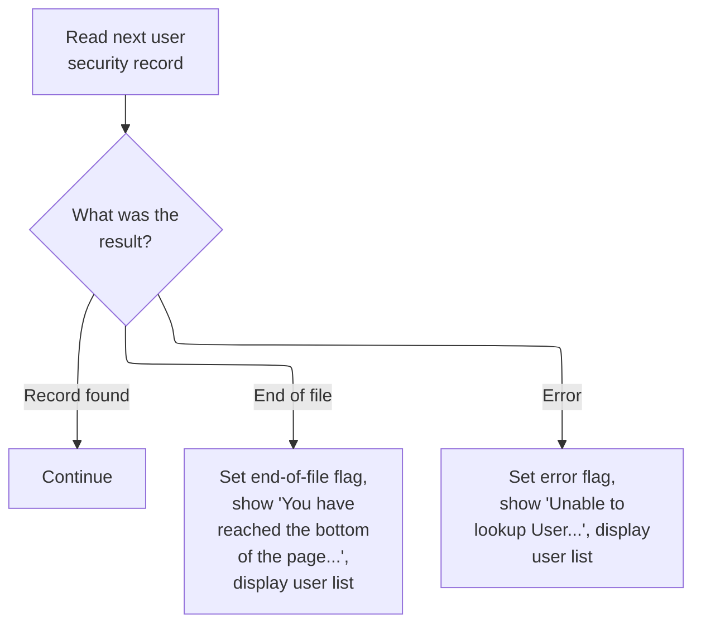
```mermaid
%%{init: {"flowchart": {"defaultRenderer": "elk"}} }%%
flowchart TD
    node1["Read next user 
 security record"] --> node2{"What was the 
 result?"}
    click node1 openCode "app/cbl/COUSR00C.cbl:619:629"
    click node2 openCode "app/cbl/COUSR00C.cbl:631:648"
    node2 -->|"Record found"| node3["Continue"]
    click node3 openCode "app/cbl/COUSR00C.cbl:633:633"
    node2 -->|"End of file"| node4["Set end-of-file flag, 
 show 'You have 
 reached the bottom 
 of the page...', 
 display user list"]
    click node4 openCode "app/cbl/COUSR00C.cbl:634:640"
    node2 -->|"Error"| node5["Set error flag, 
 show 'Unable to 
 lookup User...', display 
 user list"]
    click node5 openCode "app/cbl/COUSR00C.cbl:641:647"

classDef HeadingStyle fill:#777777,stroke:#333,stroke-width:2px;
```

This section manages the process of reading the next user security record from the file and determines the user-facing outcome based on the result of the read operation.

| Rule ID | Code Location          | Category       | Rule Name                   | Description                                                                                                                                                                                   | Conditions                                                               | Remarks                                                                                                                                                                                                              |
| ------- | ---------------------- | -------------- | --------------------------- | --------------------------------------------------------------------------------------------------------------------------------------------------------------------------------------------- | ------------------------------------------------------------------------ | -------------------------------------------------------------------------------------------------------------------------------------------------------------------------------------------------------------------- |
| BR-001  | READNEXT-USER-SEC-FILE | Business logic | Successful user record read | When a user record is successfully read from the user security file, the system continues processing without displaying any special message or changing the user interface.                   | The read operation returns a NORMAL response code.                       | No message is displayed to the user. No flags are set or changed. The system proceeds to the next step in the workflow.                                                                                              |
| BR-002  | READNEXT-USER-SEC-FILE | Error handling | End-of-file handling        | When the end of the user security file is reached, the system sets the end-of-file flag, displays the message 'You have reached the bottom of the page...', and updates the user list screen. | The read operation returns an ENDFILE response code.                     | The message displayed is: 'You have reached the bottom of the page...'. The end-of-file flag is set to true. The user list screen is refreshed. The message format is a string of up to 80 characters, left aligned. |
| BR-003  | READNEXT-USER-SEC-FILE | Error handling | Read error handling         | When an error occurs during the read operation, the system sets the error flag, displays the message 'Unable to lookup User...', and updates the user list screen.                            | The read operation returns a response code other than NORMAL or ENDFILE. | The message displayed is: 'Unable to lookup User...'. The error flag is set to true. The user list screen is refreshed. The message format is a string of up to 80 characters, left aligned.                         |

<SwmSnippet path="/app/cbl/COUSR00C.cbl" line="619" repo-id="Z2l0aHViJTNBJTNBa3luZHJ5bC1hd3MtbWFpbmZyYW1lLW1vZGVybml6YXRpb24tY2FyZGRlbW8lM0ElM0FTd2ltbS1EZW1v">

---

In READNEXT-USER-SEC-FILE, we use EXEC CICS READNEXT to grab the next user record from the USRSEC file into SEC-USER-DATA. The response codes tell us if we got a record, hit end-of-file, or had an error. This is the main way we step through user records for paging.

```cobol
       READNEXT-USER-SEC-FILE.

           EXEC CICS READNEXT
                DATASET   (WS-USRSEC-FILE)
                INTO      (SEC-USER-DATA)
                LENGTH    (LENGTH OF SEC-USER-DATA)
                RIDFLD    (SEC-USR-ID)
                KEYLENGTH (LENGTH OF SEC-USR-ID)
                RESP      (WS-RESP-CD)
                RESP2     (WS-REAS-CD)
           END-EXEC.
```

---

</SwmSnippet>

<SwmSnippet path="/app/cbl/COUSR00C.cbl" line="631" repo-id="Z2l0aHViJTNBJTNBa3luZHJ5bC1hd3MtbWFpbmZyYW1lLW1vZGVybml6YXRpb24tY2FyZGRlbW8lM0ElM0FTd2ltbS1EZW1v">

---

After READNEXT-USER-SEC-FILE, we check the response. If it's ENDFILE, we set the end-of-file flag, show a 'bottom of page' message, and update the screen. For other errors, we set the error flag, display an error message, and update the screen too. This keeps the user in the loop if there are no more records or if something broke.

```cobol
           EVALUATE WS-RESP-CD
               WHEN DFHRESP(NORMAL)
                   CONTINUE
               WHEN DFHRESP(ENDFILE)
                   CONTINUE
                   SET USER-SEC-EOF TO TRUE
                   MOVE 'You have reached the bottom of the page...' TO
                                   WS-MESSAGE
                   MOVE -1       TO USRIDINL OF COUSR0AI
                   PERFORM SEND-USRLST-SCREEN
               WHEN OTHER
                   DISPLAY 'RESP:' WS-RESP-CD 'REAS:' WS-REAS-CD
                   MOVE 'Y'     TO WS-ERR-FLG
                   MOVE 'Unable to lookup User...' TO
                                   WS-MESSAGE
                   MOVE -1       TO USRIDINL OF COUSR0AI
                   PERFORM SEND-USRLST-SCREEN
           END-EVALUATE.
```

---

</SwmSnippet>

#### Clearing User List Display Slots

This section ensures that user list display slots are cleared before loading new user data, preventing the display of outdated information and maintaining a consistent user interface.

| Rule ID | Code Location        | Category       | Rule Name                      | Description                                                                                                                                       | Conditions                                                                                                         | Remarks                                                                                                                                                                                                                                                                                                                  |
| ------- | -------------------- | -------------- | ------------------------------ | ------------------------------------------------------------------------------------------------------------------------------------------------- | ------------------------------------------------------------------------------------------------------------------ | ------------------------------------------------------------------------------------------------------------------------------------------------------------------------------------------------------------------------------------------------------------------------------------------------------------------------ |
| BR-001  | PROCESS-PAGE-FORWARD | Business logic | Conditional user list clearing | Clear all user list display slots before loading new user data, but only if the user security file is not at end-of-file and no error is present. | The user security file is not at end-of-file (WS-USER-SEC-EOF = 'N') and the error flag is off (WS-ERR-FLG = 'N'). | The slot range is 1 to 10, inclusive. The error flag values are 'N' for no error and 'Y' for error. The end-of-file flag values are 'N' for not at end-of-file and 'Y' for end-of-file. Each slot is cleared by calling the initialization routine, but the format of the cleared data is not specified in this section. |
| BR-002  | PROCESS-PAGE-FORWARD | Business logic | Fixed slot count clearing      | Exactly 10 user list display slots are cleared during the operation, ensuring a consistent user interface.                                        | The clearing operation is triggered (see previous rule's conditions).                                              | The slot index runs from 1 to 10, inclusive. This is a fixed range and does not vary based on input or other conditions in this section.                                                                                                                                                                                 |
| BR-003  | PROCESS-PAGE-FORWARD | Business logic | No clearing on EOF or error    | No clearing of user list display slots occurs if the user security file is at end-of-file or if an error is present.                              | The user security file is at end-of-file (WS-USER-SEC-EOF = 'Y') or the error flag is on (WS-ERR-FLG = 'Y').       | If either condition is met, the clearing operation is skipped entirely and no slots are cleared.                                                                                                                                                                                                                         |

<SwmSnippet path="/app/cbl/COUSR00C.cbl" line="292" repo-id="Z2l0aHViJTNBJTNBa3luZHJ5bC1hd3MtbWFpbmZyYW1lLW1vZGVybml6YXRpb24tY2FyZGRlbW8lM0ElM0FTd2ltbS1EZW1v">

---

After READNEXT-USER-SEC-FILE, PROCESS-PAGE-FORWARD checks if we're not at end-of-file and no error. If so, it loops through the display slots (1 to 10) and calls INITIALIZE-USER-DATA for each. This clears out the user list fields before loading new data, so we don't show stale info.

```cobol
               IF USER-SEC-NOT-EOF AND ERR-FLG-OFF
               PERFORM VARYING WS-IDX FROM 1 BY 1 UNTIL WS-IDX > 10
                   PERFORM INITIALIZE-USER-DATA
               END-PERFORM
               END-IF
```

---

</SwmSnippet>

#### Resetting User Display Fields

This section is responsible for resetting the user display fields for a specific slot, ensuring that the display is clean before new user data is loaded.

| Rule ID | Code Location        | Category       | Rule Name                      | Description                                                                                                                                               | Conditions                                                    | Remarks                                                                                                                                                                                 |
| ------- | -------------------- | -------------- | ------------------------------ | --------------------------------------------------------------------------------------------------------------------------------------------------------- | ------------------------------------------------------------- | --------------------------------------------------------------------------------------------------------------------------------------------------------------------------------------- |
| BR-001  | INITIALIZE-USER-DATA | Business logic | User slot field clearing       | When the slot index is between 1 and 10, the user ID, first name, last name, and user type fields for the corresponding slot are cleared to blank values. | The slot index (WS-IDX) is an integer value from 1 to 10.     | The slot index must be in the range 1-10. The affected fields are: user ID (string), first name (string), last name (string), user type (string). All fields are set to blank (spaces). |
| BR-002  | INITIALIZE-USER-DATA | Business logic | Ignore out-of-range slot index | If the slot index is not between 1 and 10, no user display fields are cleared and the routine continues without making changes.                           | The slot index (WS-IDX) is not an integer value from 1 to 10. | Slot indices outside the range 1-10 are ignored. No fields are cleared for these indices.                                                                                               |

<SwmSnippet path="/app/cbl/COUSR00C.cbl" line="446" repo-id="Z2l0aHViJTNBJTNBa3luZHJ5bC1hd3MtbWFpbmZyYW1lLW1vZGVybml6YXRpb24tY2FyZGRlbW8lM0ElM0FTd2ltbS1EZW1v">

---

In INITIALIZE-USER-DATA, we use WS-IDX to pick which user display slot to clear. For each index 1 to 10, we blank out the user ID, first name, last name, and user type fields. This keeps the display clean before loading new data.

```cobol
       INITIALIZE-USER-DATA.

           EVALUATE WS-IDX
               WHEN 1
                   MOVE SPACES TO USRID01I OF COUSR0AI
                   MOVE SPACES TO FNAME01I OF COUSR0AI
                   MOVE SPACES TO LNAME01I OF COUSR0AI
                   MOVE SPACES TO UTYPE01I OF COUSR0AI
```

---

</SwmSnippet>

<SwmSnippet path="/app/cbl/COUSR00C.cbl" line="454" repo-id="Z2l0aHViJTNBJTNBa3luZHJ5bC1hd3MtbWFpbmZyYW1lLW1vZGVybml6YXRpb24tY2FyZGRlbW8lM0ElM0FTd2ltbS1EZW1v">

---

This is just the next case in INITIALIZE-USER-DATA. For WS-IDX = 2, we clear the second set of user fields. The pattern repeats for each slot.

```cobol
               WHEN 2
                   MOVE SPACES TO USRID02I OF COUSR0AI
                   MOVE SPACES TO FNAME02I OF COUSR0AI
                   MOVE SPACES TO LNAME02I OF COUSR0AI
                   MOVE SPACES TO UTYPE02I OF COUSR0AI
```

---

</SwmSnippet>

<SwmSnippet path="/app/cbl/COUSR00C.cbl" line="459" repo-id="Z2l0aHViJTNBJTNBa3luZHJ5bC1hd3MtbWFpbmZyYW1lLW1vZGVybml6YXRpb24tY2FyZGRlbW8lM0ElM0FTd2ltbS1EZW1v">

---

This is the third slot in INITIALIZE-USER-DATA. For WS-IDX = 3, we blank out the third set of user fields. Same pattern as before.

```cobol
               WHEN 3
                   MOVE SPACES TO USRID03I OF COUSR0AI
                   MOVE SPACES TO FNAME03I OF COUSR0AI
                   MOVE SPACES TO LNAME03I OF COUSR0AI
                   MOVE SPACES TO UTYPE03I OF COUSR0AI
```

---

</SwmSnippet>

<SwmSnippet path="/app/cbl/COUSR00C.cbl" line="464" repo-id="Z2l0aHViJTNBJTNBa3luZHJ5bC1hd3MtbWFpbmZyYW1lLW1vZGVybml6YXRpb24tY2FyZGRlbW8lM0ElM0FTd2ltbS1EZW1v">

---

This is the fourth slot in INITIALIZE-USER-DATA. For WS-IDX = 4, we clear out the fourth set of user fields. Still following the same pattern.

```cobol
               WHEN 4
                   MOVE SPACES TO USRID04I OF COUSR0AI
                   MOVE SPACES TO FNAME04I OF COUSR0AI
                   MOVE SPACES TO LNAME04I OF COUSR0AI
                   MOVE SPACES TO UTYPE04I OF COUSR0AI
```

---

</SwmSnippet>

<SwmSnippet path="/app/cbl/COUSR00C.cbl" line="469" repo-id="Z2l0aHViJTNBJTNBa3luZHJ5bC1hd3MtbWFpbmZyYW1lLW1vZGVybml6YXRpb24tY2FyZGRlbW8lM0ElM0FTd2ltbS1EZW1v">

---

This is the fifth slot in INITIALIZE-USER-DATA. For WS-IDX = 5, we blank out the fifth set of user fields. The pattern continues for each slot.

```cobol
               WHEN 5
                   MOVE SPACES TO USRID05I OF COUSR0AI
                   MOVE SPACES TO FNAME05I OF COUSR0AI
                   MOVE SPACES TO LNAME05I OF COUSR0AI
                   MOVE SPACES TO UTYPE05I OF COUSR0AI
```

---

</SwmSnippet>

<SwmSnippet path="/app/cbl/COUSR00C.cbl" line="474" repo-id="Z2l0aHViJTNBJTNBa3luZHJ5bC1hd3MtbWFpbmZyYW1lLW1vZGVybml6YXRpb24tY2FyZGRlbW8lM0ElM0FTd2ltbS1EZW1v">

---

This is the sixth slot in INITIALIZE-USER-DATA. For WS-IDX = 6, we clear the sixth set of user fields. Same as before, just a new slot.

```cobol
               WHEN 6
                   MOVE SPACES TO USRID06I OF COUSR0AI
                   MOVE SPACES TO FNAME06I OF COUSR0AI
                   MOVE SPACES TO LNAME06I OF COUSR0AI
                   MOVE SPACES TO UTYPE06I OF COUSR0AI
```

---

</SwmSnippet>

<SwmSnippet path="/app/cbl/COUSR00C.cbl" line="479" repo-id="Z2l0aHViJTNBJTNBa3luZHJ5bC1hd3MtbWFpbmZyYW1lLW1vZGVybml6YXRpb24tY2FyZGRlbW8lM0ElM0FTd2ltbS1EZW1v">

---

This is the seventh slot in INITIALIZE-USER-DATA. For WS-IDX = 7, we blank out the seventh set of user fields. Still following the same pattern.

```cobol
               WHEN 7
                   MOVE SPACES TO USRID07I OF COUSR0AI
                   MOVE SPACES TO FNAME07I OF COUSR0AI
                   MOVE SPACES TO LNAME07I OF COUSR0AI
                   MOVE SPACES TO UTYPE07I OF COUSR0AI
```

---

</SwmSnippet>

<SwmSnippet path="/app/cbl/COUSR00C.cbl" line="484" repo-id="Z2l0aHViJTNBJTNBa3luZHJ5bC1hd3MtbWFpbmZyYW1lLW1vZGVybml6YXRpb24tY2FyZGRlbW8lM0ElM0FTd2ltbS1EZW1v">

---

This is the eighth slot in INITIALIZE-USER-DATA. For WS-IDX = 8, we clear the eighth set of user fields. Same repetitive pattern.

```cobol
               WHEN 8
                   MOVE SPACES TO USRID08I OF COUSR0AI
                   MOVE SPACES TO FNAME08I OF COUSR0AI
                   MOVE SPACES TO LNAME08I OF COUSR0AI
                   MOVE SPACES TO UTYPE08I OF COUSR0AI
```

---

</SwmSnippet>

<SwmSnippet path="/app/cbl/COUSR00C.cbl" line="489" repo-id="Z2l0aHViJTNBJTNBa3luZHJ5bC1hd3MtbWFpbmZyYW1lLW1vZGVybml6YXRpb24tY2FyZGRlbW8lM0ElM0FTd2ltbS1EZW1v">

---

This is the ninth slot in INITIALIZE-USER-DATA. For WS-IDX = 9, we blank out the ninth set of user fields. Still the same pattern.

```cobol
               WHEN 9
                   MOVE SPACES TO USRID09I OF COUSR0AI
                   MOVE SPACES TO FNAME09I OF COUSR0AI
                   MOVE SPACES TO LNAME09I OF COUSR0AI
                   MOVE SPACES TO UTYPE09I OF COUSR0AI
```

---

</SwmSnippet>

<SwmSnippet path="/app/cbl/COUSR00C.cbl" line="494" repo-id="Z2l0aHViJTNBJTNBa3luZHJ5bC1hd3MtbWFpbmZyYW1lLW1vZGVybml6YXRpb24tY2FyZGRlbW8lM0ElM0FTd2ltbS1EZW1v">

---

This is the tenth slot in INITIALIZE-USER-DATA. For WS-IDX = 10, we clear the tenth set of user fields. This is the last slot handled in this routine.

```cobol
               WHEN 10
                   MOVE SPACES TO USRID10I OF COUSR0AI
                   MOVE SPACES TO FNAME10I OF COUSR0AI
                   MOVE SPACES TO LNAME10I OF COUSR0AI
                   MOVE SPACES TO UTYPE10I OF COUSR0AI
```

---

</SwmSnippet>

<SwmSnippet path="/app/cbl/COUSR00C.cbl" line="499" repo-id="Z2l0aHViJTNBJTNBa3luZHJ5bC1hd3MtbWFpbmZyYW1lLW1vZGVybml6YXRpb24tY2FyZGRlbW8lM0ElM0FTd2ltbS1EZW1v">

---

After all the cases, if WS-IDX isn't 1-10, we just continue. So only slots 1-10 get cleared; anything else is ignored. This keeps the routine tight and avoids accidental overwrites.

```cobol
               WHEN OTHER
                   CONTINUE
           END-EVALUATE.
```

---

</SwmSnippet>

#### Loading User Records Into Display

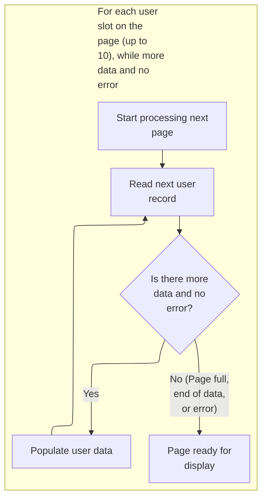
```mermaid
%%{init: {"flowchart": {"defaultRenderer": "elk"}} }%%
flowchart TD
    node1["Start processing next 
 page"]
    subgraph loop1["For each user 
 slot on the 
 page (up to 
 10), while more 
 data and no 
 error"]
        node1 --> node2["Read next user 
 record"]
        click node2 openCode "app/cbl/COUSR00C.cbl:301:301"
        node2 --> node3{"Is there more 
 data and no 
 error?"}
        click node3 openCode "app/cbl/COUSR00C.cbl:302:302"
        node3 -->|"Yes"| node4["Populate user data"]
        click node4 openCode "app/cbl/COUSR00C.cbl:303:304"
        node4 --> node2
        node3 -->|"No (Page full, 
 end of data, 
 or error)"| node5["Page ready for 
 display"]
        click node5 openCode "app/cbl/COUSR00C.cbl:306:306"
    end
classDef HeadingStyle fill:#777777,stroke:#333,stroke-width:2px;
```

This section manages the loading of user records into display slots for paginated viewing, ensuring that up to 10 users are shown per page and handling cases where fewer records are available due to errors or end-of-file.

| Rule ID | Code Location        | Category       | Rule Name                                    | Description                                                                                                                                                                                 | Conditions                                                                                                            | Remarks                                                                                                                 |
| ------- | -------------------- | -------------- | -------------------------------------------- | ------------------------------------------------------------------------------------------------------------------------------------------------------------------------------------------- | --------------------------------------------------------------------------------------------------------------------- | ----------------------------------------------------------------------------------------------------------------------- |
| BR-001  | PROCESS-PAGE-FORWARD | Business logic | Maximum users per page                       | A maximum of 10 user records are loaded into the display slots for each page. If fewer than 10 records are available due to end-of-file or an error, only the available records are loaded. | When processing a new page for display, and while there are user records available and no error condition is present. | The maximum number of user records per page is 10. Display slots are filled sequentially from index 1 to 10.            |
| BR-002  | PROCESS-PAGE-FORWARD | Business logic | User record loading condition                | User records are loaded into display slots only if there is more data to read and no error condition is present.                                                                            | When reading user records for display, and the end-of-file flag is not set and the error flag is not set.             | Records are loaded only when both USER-SEC-NOT-EOF (WS-USER-SEC-EOF = 'N') and ERR-FLG-OFF (WS-ERR-FLG = 'N') are true. |
| BR-003  | PROCESS-PAGE-FORWARD | Error handling | Partial page display on error or end-of-file | If the end-of-file is reached or an error occurs before 10 records are loaded, the page is prepared for display with only the records that were successfully loaded.                        | When the loop terminates due to end-of-file or error before reaching 10 records.                                      | The page may contain fewer than 10 user records if the data source is exhausted or an error is encountered.             |

<SwmSnippet path="/app/cbl/COUSR00C.cbl" line="298" repo-id="Z2l0aHViJTNBJTNBa3luZHJ5bC1hd3MtbWFpbmZyYW1lLW1vZGVybml6YXRpb24tY2FyZGRlbW8lM0ElM0FTd2ltbS1EZW1v">

---

After INITIALIZE-USER-DATA, PROCESS-PAGE-FORWARD sets WS-IDX to 1 and loops, reading user records and calling POPULATE-USER-DATA for each. This loads the actual user data into the cleared display slots, one per index, until we hit 10 users, end-of-file, or an error.

```cobol
               MOVE 1             TO  WS-IDX

               PERFORM UNTIL WS-IDX >= 11 OR USER-SEC-EOF OR ERR-FLG-ON
                   PERFORM READNEXT-USER-SEC-FILE
                   IF USER-SEC-NOT-EOF AND ERR-FLG-OFF
                       PERFORM POPULATE-USER-DATA
                       COMPUTE WS-IDX = WS-IDX + 1
                   END-IF
               END-PERFORM
```

---

</SwmSnippet>

#### Assigning User Data to Display Slots

```mermaid
%%{init: {"flowchart": {"defaultRenderer": "elk"}} }%%
flowchart TD
    node1{"Which user index 
 is being processed?"}
    click node1 openCode "app/cbl/COUSR00C.cbl:386:441"
    node1 -->|"1"| node2["Populate user 1 
 data fields (ID, 
 first name, last 
 name, type) and 
 set as first 
 user ID"]
    click node2 openCode "app/cbl/COUSR00C.cbl:388:391"
    node1 -->|"2-9"| node3["Populate user 2-9 
 data fields (ID, 
 first name, last 
 name, type)"]
    click node3 openCode "app/cbl/COUSR00C.cbl:394:432"
    node1 -->|"10"| node4["Populate user 10 
 data fields (ID, 
 first name, last 
 name, type) and 
 set as last 
 user ID"]
    click node4 openCode "app/cbl/COUSR00C.cbl:434:437"
    node1 -->|"Other"| node5["No action"]
    click node5 openCode "app/cbl/COUSR00C.cbl:439:440"
classDef HeadingStyle fill:#777777,stroke:#333,stroke-width:2px;
```

This section assigns user data to specific display slots based on the user index, ensuring that each user's information is shown in the correct position on the screen and that the first and last user IDs are tracked for the session.

| Rule ID | Code Location      | Category       | Rule Name                   | Description                                                                                                                                | Conditions                                        | Remarks                                                                                                                                                                                                                                                                                             |
| ------- | ------------------ | -------------- | --------------------------- | ------------------------------------------------------------------------------------------------------------------------------------------ | ------------------------------------------------- | --------------------------------------------------------------------------------------------------------------------------------------------------------------------------------------------------------------------------------------------------------------------------------------------------- |
| BR-001  | POPULATE-USER-DATA | Business logic | First user slot assignment  | When the user index is 1, the user data is assigned to the first display slot and the user ID is set as the first user ID for the session. | The user index equals 1.                          | The user ID, first name, last name, and user type are assigned to the first display slot. The user ID is also set as the session's first user ID. All fields are alphanumeric strings with the following sizes: user ID (8 bytes), first name (20 bytes), last name (20 bytes), user type (1 byte). |
| BR-002  | POPULATE-USER-DATA | Business logic | Middle user slot assignment | When the user index is between 2 and 9, the user data is assigned to the corresponding display slot for that index.                        | The user index is between 2 and 9, inclusive.     | The user ID, first name, last name, and user type are assigned to the display slot matching the user index (slots 2-9). All fields are alphanumeric strings with the following sizes: user ID (8 bytes), first name (20 bytes), last name (20 bytes), user type (1 byte).                           |
| BR-003  | POPULATE-USER-DATA | Business logic | Last user slot assignment   | When the user index is 10, the user data is assigned to the tenth display slot and the user ID is set as the last user ID for the session. | The user index equals 10.                         | The user ID, first name, last name, and user type are assigned to the tenth display slot. The user ID is also set as the session's last user ID. All fields are alphanumeric strings with the following sizes: user ID (8 bytes), first name (20 bytes), last name (20 bytes), user type (1 byte).  |
| BR-004  | POPULATE-USER-DATA | Business logic | Out-of-range index handling | If the user index is not between 1 and 10, no user data is assigned to any display slot.                                                   | The user index is less than 1 or greater than 10. | No user data is assigned to any display slot if the index is outside the range 1-10.                                                                                                                                                                                                                |

<SwmSnippet path="/app/cbl/COUSR00C.cbl" line="384" repo-id="Z2l0aHViJTNBJTNBa3luZHJ5bC1hd3MtbWFpbmZyYW1lLW1vZGVybml6YXRpb24tY2FyZGRlbW8lM0ElM0FTd2ltbS1EZW1v">

---

In POPULATE-USER-DATA, we use WS-IDX to pick which display slot to fill. For each index 1 to 10, we move the user ID, first name, last name, and user type from SEC-USER-DATA into the corresponding COUSR0AI fields. This is how each user record gets shown on the screen.

```cobol
       POPULATE-USER-DATA.

           EVALUATE WS-IDX
               WHEN 1
                   MOVE SEC-USR-ID    TO USRID01I OF COUSR0AI
                                         CDEMO-CU00-USRID-FIRST
                   MOVE SEC-USR-FNAME TO FNAME01I OF COUSR0AI
                   MOVE SEC-USR-LNAME TO LNAME01I OF COUSR0AI
                   MOVE SEC-USR-TYPE  TO UTYPE01I OF COUSR0AI
```

---

</SwmSnippet>

<SwmSnippet path="/app/cbl/COUSR00C.cbl" line="393" repo-id="Z2l0aHViJTNBJTNBa3luZHJ5bC1hd3MtbWFpbmZyYW1lLW1vZGVybml6YXRpb24tY2FyZGRlbW8lM0ElM0FTd2ltbS1EZW1v">

---

This is the second slot in POPULATE-USER-DATA. For WS-IDX = 2, we move the user data into the second set of fields. The pattern repeats for each slot.

```cobol
               WHEN 2
                   MOVE SEC-USR-ID    TO USRID02I OF COUSR0AI
                   MOVE SEC-USR-FNAME TO FNAME02I OF COUSR0AI
                   MOVE SEC-USR-LNAME TO LNAME02I OF COUSR0AI
                   MOVE SEC-USR-TYPE  TO UTYPE02I OF COUSR0AI
```

---

</SwmSnippet>

<SwmSnippet path="/app/cbl/COUSR00C.cbl" line="398" repo-id="Z2l0aHViJTNBJTNBa3luZHJ5bC1hd3MtbWFpbmZyYW1lLW1vZGVybml6YXRpb24tY2FyZGRlbW8lM0ElM0FTd2ltbS1EZW1v">

---

This is the third slot in POPULATE-USER-DATA. For WS-IDX = 3, we move the user data into the third set of fields. Same pattern as before.

```cobol
               WHEN 3
                   MOVE SEC-USR-ID    TO USRID03I OF COUSR0AI
                   MOVE SEC-USR-FNAME TO FNAME03I OF COUSR0AI
                   MOVE SEC-USR-LNAME TO LNAME03I OF COUSR0AI
                   MOVE SEC-USR-TYPE  TO UTYPE03I OF COUSR0AI
```

---

</SwmSnippet>

<SwmSnippet path="/app/cbl/COUSR00C.cbl" line="403" repo-id="Z2l0aHViJTNBJTNBa3luZHJ5bC1hd3MtbWFpbmZyYW1lLW1vZGVybml6YXRpb24tY2FyZGRlbW8lM0ElM0FTd2ltbS1EZW1v">

---

This is the fourth slot in POPULATE-USER-DATA. For WS-IDX = 4, we move the user data into the fourth set of fields. Still following the same pattern.

```cobol
               WHEN 4
                   MOVE SEC-USR-ID    TO USRID04I OF COUSR0AI
                   MOVE SEC-USR-FNAME TO FNAME04I OF COUSR0AI
                   MOVE SEC-USR-LNAME TO LNAME04I OF COUSR0AI
                   MOVE SEC-USR-TYPE  TO UTYPE04I OF COUSR0AI
```

---

</SwmSnippet>

<SwmSnippet path="/app/cbl/COUSR00C.cbl" line="408" repo-id="Z2l0aHViJTNBJTNBa3luZHJ5bC1hd3MtbWFpbmZyYW1lLW1vZGVybml6YXRpb24tY2FyZGRlbW8lM0ElM0FTd2ltbS1EZW1v">

---

Here we're handling the fifth slot in POPULATE-USER-DATA. We move the user ID, first name, last name, and user type from SEC-USER-DATA into the fifth set of display fields in COUSR0AI. This follows the same pattern as the previous slots, just targeting slot 5.

```cobol
               WHEN 5
                   MOVE SEC-USR-ID    TO USRID05I OF COUSR0AI
                   MOVE SEC-USR-FNAME TO FNAME05I OF COUSR0AI
                   MOVE SEC-USR-LNAME TO LNAME05I OF COUSR0AI
                   MOVE SEC-USR-TYPE  TO UTYPE05I OF COUSR0AI
```

---

</SwmSnippet>

<SwmSnippet path="/app/cbl/COUSR00C.cbl" line="413" repo-id="Z2l0aHViJTNBJTNBa3luZHJ5bC1hd3MtbWFpbmZyYW1lLW1vZGVybml6YXRpb24tY2FyZGRlbW8lM0ElM0FTd2ltbS1EZW1v">

---

Next up is slot 6 in POPULATE-USER-DATA. We move the user data into the sixth set of fields in COUSR0AI, same as the previous cases.

```cobol
               WHEN 6
                   MOVE SEC-USR-ID    TO USRID06I OF COUSR0AI
                   MOVE SEC-USR-FNAME TO FNAME06I OF COUSR0AI
                   MOVE SEC-USR-LNAME TO LNAME06I OF COUSR0AI
                   MOVE SEC-USR-TYPE  TO UTYPE06I OF COUSR0AI
```

---

</SwmSnippet>

<SwmSnippet path="/app/cbl/COUSR00C.cbl" line="418" repo-id="Z2l0aHViJTNBJTNBa3luZHJ5bC1hd3MtbWFpbmZyYW1lLW1vZGVybml6YXRpb24tY2FyZGRlbW8lM0ElM0FTd2ltbS1EZW1v">

---

Here we're handling slot 7 in POPULATE-USER-DATA. We move the user data into the seventh set of display fields, same as before.

```cobol
               WHEN 7
                   MOVE SEC-USR-ID    TO USRID07I OF COUSR0AI
                   MOVE SEC-USR-FNAME TO FNAME07I OF COUSR0AI
                   MOVE SEC-USR-LNAME TO LNAME07I OF COUSR0AI
                   MOVE SEC-USR-TYPE  TO UTYPE07I OF COUSR0AI
```

---

</SwmSnippet>

<SwmSnippet path="/app/cbl/COUSR00C.cbl" line="423" repo-id="Z2l0aHViJTNBJTNBa3luZHJ5bC1hd3MtbWFpbmZyYW1lLW1vZGVybml6YXRpb24tY2FyZGRlbW8lM0ElM0FTd2ltbS1EZW1v">

---

Now we're on slot 8 in POPULATE-USER-DATA. We move the user data into the eighth set of fields in COUSR0AI, keeping the same structure as before.

```cobol
               WHEN 8
                   MOVE SEC-USR-ID    TO USRID08I OF COUSR0AI
                   MOVE SEC-USR-FNAME TO FNAME08I OF COUSR0AI
                   MOVE SEC-USR-LNAME TO LNAME08I OF COUSR0AI
                   MOVE SEC-USR-TYPE  TO UTYPE08I OF COUSR0AI
```

---

</SwmSnippet>

<SwmSnippet path="/app/cbl/COUSR00C.cbl" line="428" repo-id="Z2l0aHViJTNBJTNBa3luZHJ5bC1hd3MtbWFpbmZyYW1lLW1vZGVybml6YXRpb24tY2FyZGRlbW8lM0ElM0FTd2ltbS1EZW1v">

---

This is slot 9 in POPULATE-USER-DATA. We move the user data into the ninth set of display fields, following the same pattern.

```cobol
               WHEN 9
                   MOVE SEC-USR-ID    TO USRID09I OF COUSR0AI
                   MOVE SEC-USR-FNAME TO FNAME09I OF COUSR0AI
                   MOVE SEC-USR-LNAME TO LNAME09I OF COUSR0AI
                   MOVE SEC-USR-TYPE  TO UTYPE09I OF COUSR0AI
```

---

</SwmSnippet>

<SwmSnippet path="/app/cbl/COUSR00C.cbl" line="433" repo-id="Z2l0aHViJTNBJTNBa3luZHJ5bC1hd3MtbWFpbmZyYW1lLW1vZGVybml6YXRpb24tY2FyZGRlbW8lM0ElM0FTd2ltbS1EZW1v">

---

This is the tenth and final slot in POPULATE-USER-DATA. We move the user data into the tenth set of fields, and the comment marks this as the last user ID field.

```cobol
               WHEN 10
                   MOVE SEC-USR-ID    TO USRID10I OF COUSR0AI
                                         CDEMO-CU00-USRID-LAST
                   MOVE SEC-USR-FNAME TO FNAME10I OF COUSR0AI
                   MOVE SEC-USR-LNAME TO LNAME10I OF COUSR0AI
                   MOVE SEC-USR-TYPE  TO UTYPE10I OF COUSR0AI
```

---

</SwmSnippet>

<SwmSnippet path="/app/cbl/COUSR00C.cbl" line="439" repo-id="Z2l0aHViJTNBJTNBa3luZHJ5bC1hd3MtbWFpbmZyYW1lLW1vZGVybml6YXRpb24tY2FyZGRlbW8lM0ElM0FTd2ltbS1EZW1v">

---

After all the explicit cases, if WS-IDX isn't 1-10, we just continue. Only the first ten slots get filled; anything else is ignored.

```cobol
               WHEN OTHER
                   CONTINUE
           END-EVALUATE.
```

---

</SwmSnippet>

#### Finalizing Page Forward and Setting Navigation Flags

```mermaid
%%{init: {"flowchart": {"defaultRenderer": "elk"}} }%%
flowchart TD
    node1{"More user security 
 data and no 
 error?"}
    click node1 openCode "app/cbl/COUSR00C.cbl:308:308"
    node1 -->|"Yes"| node2["Increment page number 
 and read next 
 records"]
    click node2 openCode "app/cbl/COUSR00C.cbl:309:311"
    node2 --> node3{"Still more data 
 and no error 
 after read?"}
    click node3 openCode "app/cbl/COUSR00C.cbl:312:312"
    node3 -->|"Yes"| node4["Set next page 
 available"]
    click node4 openCode "app/cbl/COUSR00C.cbl:313:313"
    node3 -->|"No"| node5["Set next page 
 not available"]
    click node5 openCode "app/cbl/COUSR00C.cbl:315:315"
    node1 -->|"No"| node6["Set next page 
 not available"]
    click node6 openCode "app/cbl/COUSR00C.cbl:318:318"
    node6 --> node7{"Index > 1?"}
    click node7 openCode "app/cbl/COUSR00C.cbl:319:319"
    node7 -->|"Yes"| node8["Increment page number"]
    click node8 openCode "app/cbl/COUSR00C.cbl:320:321"
    node7 -->|"No"| node9["Prepare and send 
 updated user list 
 screen"]
    click node9 openCode "app/cbl/COUSR00C.cbl:327:329"
    node4 --> node9
    node5 --> node9
    node8 --> node9
classDef HeadingStyle fill:#777777,stroke:#333,stroke-width:2px;
```

This section manages the logic for paging forward in the user list, including updating navigation flags, page number, and refreshing the UI to reflect the new state.

| Rule ID | Code Location                             | Category       | Rule Name                        | Description                                                                                                                                                                          | Conditions                                                                                                    | Remarks                                                                                                                          |
| ------- | ----------------------------------------- | -------------- | -------------------------------- | ------------------------------------------------------------------------------------------------------------------------------------------------------------------------------------ | ------------------------------------------------------------------------------------------------------------- | -------------------------------------------------------------------------------------------------------------------------------- |
| BR-001  | PROCESS-PAGE-FORWARD                      | Business logic | Page increment on available data | If there are more user records available and no error is present, increment the page number and attempt to read the next set of user records.                                        | More user records are available (USER-SEC-NOT-EOF) and no error is present (ERR-FLG-OFF).                     | The page number is incremented by 1. The flag for more data is USER-SEC-NOT-EOF = 'N'. The error flag is ERR-FLG-OFF = 'N'.      |
| BR-002  | PROCESS-PAGE-FORWARD                      | Business logic | Next page availability flag      | After attempting to read the next user records, set the 'next page available' flag if more data is present and no error occurred; otherwise, set the 'next page not available' flag. | After reading next user records, check if more data is present (USER-SEC-NOT-EOF) and no error (ERR-FLG-OFF). | The next page flag is set to 'Y' (NEXT-PAGE-YES) if more data is available, otherwise set to 'N' (NEXT-PAGE-NO).                 |
| BR-003  | PROCESS-PAGE-FORWARD                      | Business logic | User list screen refresh         | After updating navigation flags and page number, refresh the user list screen with the new page data and clear the user ID input field.                                              | After navigation flags and page number are updated.                                                           | The page number is moved to the UI field. The user ID input field is cleared (set to spaces). The user list screen is refreshed. |
| BR-004  | PROCESS-PAGE-FORWARD                      | Error handling | No more data or error handling   | If there are no more user records or an error is present, set the 'next page not available' flag. If the current index is greater than 1, increment the page number.                 | No more user records (not USER-SEC-NOT-EOF) or error is present.                                              | The next page flag is set to 'N' (NEXT-PAGE-NO). If index is greater than 1, the page number is incremented by 1.                |
| BR-005  | PROCESS-PAGE-FORWARD, ENDBR-USER-SEC-FILE | Technical step | Resource release after browse    | After finishing the user record browse, release resources by ending the browse on the user security file.                                                                            | After all user records have been processed for page forward.                                                  | The browse is ended using the ENDBR operation on the user security file.                                                         |

<SwmSnippet path="/app/cbl/COUSR00C.cbl" line="308" repo-id="Z2l0aHViJTNBJTNBa3luZHJ5bC1hd3MtbWFpbmZyYW1lLW1vZGVybml6YXRpb24tY2FyZGRlbW8lM0ElM0FTd2ltbS1EZW1v">

---

After returning from POPULATE-USER-DATA in PROCESS-PAGE-FORWARD, we bump the page number, try to read the next user record, and set the next-page flags based on whether more data is available. This sets up navigation for the user list.

```cobol
               IF USER-SEC-NOT-EOF AND ERR-FLG-OFF
                   COMPUTE CDEMO-CU00-PAGE-NUM =
                           CDEMO-CU00-PAGE-NUM + 1
                   PERFORM READNEXT-USER-SEC-FILE
                   IF USER-SEC-NOT-EOF AND ERR-FLG-OFF
                       SET NEXT-PAGE-YES TO TRUE
                   ELSE
                       SET NEXT-PAGE-NO TO TRUE
                   END-IF
```

---

</SwmSnippet>

<SwmSnippet path="/app/cbl/COUSR00C.cbl" line="317" repo-id="Z2l0aHViJTNBJTNBa3luZHJ5bC1hd3MtbWFpbmZyYW1lLW1vZGVybml6YXRpb24tY2FyZGRlbW8lM0ElM0FTd2ltbS1EZW1v">

---

We handle the case where there are no more users or an error, and update the page number if needed.

```cobol
               ELSE
                   SET NEXT-PAGE-NO TO TRUE
                   IF WS-IDX > 1
                       COMPUTE CDEMO-CU00-PAGE-NUM = CDEMO-CU00-PAGE-NUM
                        + 1
                   END-IF
               END-IF
```

---

</SwmSnippet>

<SwmSnippet path="/app/cbl/COUSR00C.cbl" line="325" repo-id="Z2l0aHViJTNBJTNBa3luZHJ5bC1hd3MtbWFpbmZyYW1lLW1vZGVybml6YXRpb24tY2FyZGRlbW8lM0ElM0FTd2ltbS1EZW1v">

---

We call ENDBR-USER-SEC-FILE here to close out the file browse and free up CICS resources after we're done reading user records.

```cobol
               PERFORM ENDBR-USER-SEC-FILE
```

---

</SwmSnippet>

<SwmSnippet path="/app/cbl/COUSR00C.cbl" line="687" repo-id="Z2l0aHViJTNBJTNBa3luZHJ5bC1hd3MtbWFpbmZyYW1lLW1vZGVybml6YXRpb24tY2FyZGRlbW8lM0ElM0FTd2ltbS1EZW1v">

---

ENDBR-USER-SEC-FILE just issues the EXEC CICS ENDBR command to close out the browse on the user security file. This is how we tell CICS we're done with the file and avoid resource leaks.

```cobol
       ENDBR-USER-SEC-FILE.

           EXEC CICS ENDBR
                DATASET   (WS-USRSEC-FILE)
           END-EXEC.
```

---

</SwmSnippet>

<SwmSnippet path="/app/cbl/COUSR00C.cbl" line="327" repo-id="Z2l0aHViJTNBJTNBa3luZHJ5bC1hd3MtbWFpbmZyYW1lLW1vZGVybml6YXRpb24tY2FyZGRlbW8lM0ElM0FTd2ltbS1EZW1v">

---

After ENDBR-USER-SEC-FILE in PROCESS-PAGE-FORWARD, we update the page number, clear the user ID input, and call SEND-USRLST-SCREEN to refresh the UI with the new page data.

```cobol
               MOVE CDEMO-CU00-PAGE-NUM TO PAGENUMI  OF COUSR0AI
               MOVE SPACE   TO USRIDINO  OF COUSR0AO
               PERFORM SEND-USRLST-SCREEN

           END-IF.
```

---

</SwmSnippet>

### Cleaning Up After Page Navigation

<SwmSnippet path="/app/cbl/COUSR00C.cbl" line="230" repo-id="Z2l0aHViJTNBJTNBa3luZHJ5bC1hd3MtbWFpbmZyYW1lLW1vZGVybml6YXRpb24tY2FyZGRlbW8lM0ElM0FTd2ltbS1EZW1v">

---

After PROCESS-PAGE-FORWARD in PROCESS-ENTER-KEY, if there's no error, we clear the user ID input field so the screen is ready for the next action.

```cobol
           IF NOT ERR-FLG-ON
               MOVE SPACE   TO USRIDINO  OF COUSR0AO
           END-IF.
```

---

</SwmSnippet>

## Handling Initial Entry and User List Display

```mermaid
%%{init: {"flowchart": {"defaultRenderer": "elk"}} }%%
flowchart TD
    node1{"Is this a 
 new session?"}
    click node1 openCode "app/cbl/COUSR00C.cbl:115:115"
    node1 -->|"Yes"| node2["Initialize session state 
 and prepare screen"]
    click node2 openCode "app/cbl/COUSR00C.cbl:114:117"
    node2 --> node3["Process user entry"]
    click node3 openCode "app/cbl/COUSR00C.cbl:118:118"
    node3 --> node4["Show user list 
 screen"]
    click node4 openCode "app/cbl/COUSR00C.cbl:119:119"
    node1 -->|"No"| node5["No action needed"]
    click node5 openCode "app/cbl/COUSR00C.cbl:113:113"
classDef HeadingStyle fill:#777777,stroke:#333,stroke-width:2px;
```

This section manages the transition between new and reentry sessions for the user list screen, ensuring that session state and user input are handled appropriately based on the session context.

| Rule ID | Code Location | Category       | Rule Name                  | Description                                                                                                                                                                                                                    | Conditions                                                                                          | Remarks                                                                                                                                                                              |
| ------- | ------------- | -------------- | -------------------------- | ------------------------------------------------------------------------------------------------------------------------------------------------------------------------------------------------------------------------------ | --------------------------------------------------------------------------------------------------- | ------------------------------------------------------------------------------------------------------------------------------------------------------------------------------------ |
| BR-001  | MAIN-PARA     | Business logic | New session initialization | When a user accesses the user list screen and the session is new, the session state must be initialized, the screen must be prepared for input, and the user's entry must be processed before displaying the user list screen. | The session is identified as new (not a reentry) when the session state flag indicates a new entry. | Session state is determined by a context flag. Initialization includes setting the screen to its default state and preparing for user input. The user list screen is then displayed. |
| BR-002  | MAIN-PARA     | Business logic | Reentry session bypass     | If the session is a reentry, no initialization or screen preparation is performed and no user entry is processed.                                                                                                              | The session is identified as a reentry when the session state flag indicates reentry.               | Reentry is determined by the context flag. No changes are made to the session state or screen.                                                                                       |
| BR-003  | MAIN-PARA     | Business logic | Commarea data transfer     | When processing a new session, commarea data must be copied to the session context to ensure the correct user and session information is available.                                                                            | Commarea data is present and the session is being initialized.                                      | Commarea data includes user and session information. The data is transferred in its entirety to the session context.                                                                 |

<SwmSnippet path="/app/cbl/COUSR00C.cbl" line="113" repo-id="Z2l0aHViJTNBJTNBa3luZHJ5bC1hd3MtbWFpbmZyYW1lLW1vZGVybml6YXRpb24tY2FyZGRlbW8lM0ElM0FTd2ltbS1EZW1v">

---

After PROCESS-ENTER-KEY in MAIN-PARA, we send the user list screen to update the UI with the latest state and any messages from the last action.

```cobol
           ELSE
               MOVE DFHCOMMAREA(1:EIBCALEN) TO CARDDEMO-COMMAREA
               IF NOT CDEMO-PGM-REENTER
                   SET CDEMO-PGM-REENTER    TO TRUE
                   MOVE LOW-VALUES          TO COUSR0AO
                   PERFORM PROCESS-ENTER-KEY
                   PERFORM SEND-USRLST-SCREEN
```

---

</SwmSnippet>

<SwmSnippet path="/app/cbl/COUSR00C.cbl" line="120" repo-id="Z2l0aHViJTNBJTNBa3luZHJ5bC1hd3MtbWFpbmZyYW1lLW1vZGVybml6YXRpb24tY2FyZGRlbW8lM0ElM0FTd2ltbS1EZW1v">

---

After SEND-USRLST-SCREEN in MAIN-PARA, we call RECEIVE-USRLST-SCREEN to grab the user's next input and figure out what action to take based on the key pressed.

```cobol
               ELSE
                   PERFORM RECEIVE-USRLST-SCREEN
                   EVALUATE EIBAID
                       WHEN DFHENTER
                           PERFORM PROCESS-ENTER-KEY
                       WHEN DFHPF3
                           MOVE 'COADM01C' TO CDEMO-TO-PROGRAM
                           PERFORM RETURN-TO-PREV-SCREEN
                       WHEN DFHPF7
                           PERFORM PROCESS-PF7-KEY
                       WHEN DFHPF8
                           PERFORM PROCESS-PF8-KEY
                       WHEN OTHER
                           MOVE 'Y'                       TO WS-ERR-FLG
                           MOVE -1       TO USRIDINL OF COUSR0AI
                           MOVE CCDA-MSG-INVALID-KEY      TO WS-MESSAGE
                           PERFORM SEND-USRLST-SCREEN
                   END-EVALUATE
               END-IF
```

---

</SwmSnippet>

<SwmSnippet path="/app/cbl/COUSR00C.cbl" line="549" repo-id="Z2l0aHViJTNBJTNBa3luZHJ5bC1hd3MtbWFpbmZyYW1lLW1vZGVybml6YXRpb24tY2FyZGRlbW8lM0ElM0FTd2ltbS1EZW1v">

---

RECEIVE-USRLST-SCREEN uses EXEC CICS RECEIVE to grab user input from the terminal and store it in COUSR0AI. Response codes are captured for error handling.

```cobol
       RECEIVE-USRLST-SCREEN.

           EXEC CICS RECEIVE
                     MAP('COUSR0A')
                     MAPSET('COUSR00')
                     INTO(COUSR0AI)
                     RESP(WS-RESP-CD)
                     RESP2(WS-REAS-CD)
           END-EXEC.
```

---

</SwmSnippet>

## Handling Page Backward Key

```mermaid
%%{init: {"flowchart": {"defaultRenderer": "elk"}} }%%
flowchart TD
    node1{"Is user ID 
 present?"}
    node1 -->|"No"| node2["Set user ID 
 to blank"]
    node1 -->|"Yes"| node2["Set user ID 
 from input"]
    click node1 openCode "app/cbl/COUSR00C.cbl:239:243"
    click node2 openCode "app/cbl/COUSR00C.cbl:240:242"
    node2 --> node3["Prepare for previous 
 page navigation"]
    click node3 openCode "app/cbl/COUSR00C.cbl:245:246"
    node3 --> node4{"Is current page 
 number > 1?"}
    click node4 openCode "app/cbl/COUSR00C.cbl:248:248"
    node4 -->|"Yes"| node5["Go to previous 
 page"]
    click node5 openCode "app/cbl/COUSR00C.cbl:249:249"
    node4 -->|"No"| node6["Show message: 'Already 
 at top of 
 page' and display 
 user list"]
    click node6 openCode "app/cbl/COUSR00C.cbl:251:254"
classDef HeadingStyle fill:#777777,stroke:#333,stroke-width:2px;
```

This section manages the logic for handling the Page Backward key event, determining whether to navigate to a previous page in the user list or display a message if already at the top.

| Rule ID | Code Location                          | Category       | Rule Name                       | Description                                                                                                                                        | Conditions                                                                                     | Remarks                                                                                                                                                                                  |
| ------- | -------------------------------------- | -------------- | ------------------------------- | -------------------------------------------------------------------------------------------------------------------------------------------------- | ---------------------------------------------------------------------------------------------- | ---------------------------------------------------------------------------------------------------------------------------------------------------------------------------------------- |
| BR-001  | PROCESS-PF7-KEY                        | Business logic | Clear user ID for navigation    | If the user ID is blank or contains only low-values, the user ID for navigation is cleared before attempting to go to the previous page.           | Triggered when the user ID field is blank or contains low-values upon Page Backward key event. | Blank is defined as all spaces; low-values is the lowest possible value for each character in the field. The user ID field is 8 characters, left-aligned, padded with spaces if shorter. |
| BR-002  | PROCESS-PF7-KEY, PROCESS-PAGE-BACKWARD | Business logic | Backward navigation allowed     | Backward page navigation is only performed if the current page number is greater than 1.                                                           | Triggered when the current page number is greater than 1 upon Page Backward key event.         | Page numbers are positive integers. Navigation to previous page is only allowed if current page > 1.                                                                                     |
| BR-003  | PROCESS-PF7-KEY                        | Business logic | Prepare for backward navigation | When preparing for backward navigation, the navigation flag is set to indicate that a page change is requested and the user ID index is set to -1. | Triggered whenever the Page Backward key event is processed.                                   | Navigation flag is set to 'Y' (NEXT-PAGE-YES). User ID index is set to -1. These values indicate a request for previous page navigation.                                                 |
| BR-004  | PROCESS-PF7-KEY, SEND-USRLST-SCREEN    | Error handling | Top of page message             | If the user is already at the first page, a message is displayed indicating that they are at the top of the page and the user list is shown.       | Triggered when the current page number is not greater than 1 upon Page Backward key event.     | The message displayed is: 'You are already at the top of the page...'. The message field is 80 characters, left-aligned, padded with spaces if shorter.                                  |

<SwmSnippet path="/app/cbl/COUSR00C.cbl" line="237" repo-id="Z2l0aHViJTNBJTNBa3luZHJ5bC1hd3MtbWFpbmZyYW1lLW1vZGVybml6YXRpb24tY2FyZGRlbW8lM0ElM0FTd2ltbS1EZW1v">

---

In PROCESS-PF7-KEY, we check if the first user ID is blank or low-values. If so, we clear SEC-USR-ID; otherwise, we prep it for the backward page read.

```cobol
       PROCESS-PF7-KEY.

           IF CDEMO-CU00-USRID-FIRST = SPACES OR LOW-VALUES
               MOVE LOW-VALUES TO SEC-USR-ID
           ELSE
               MOVE CDEMO-CU00-USRID-FIRST TO SEC-USR-ID
           END-IF
```

---

</SwmSnippet>

<SwmSnippet path="/app/cbl/COUSR00C.cbl" line="245" repo-id="Z2l0aHViJTNBJTNBa3luZHJ5bC1hd3MtbWFpbmZyYW1lLW1vZGVybml6YXRpb24tY2FyZGRlbW8lM0ElM0FTd2ltbS1EZW1v">

---

After prepping the user ID in PROCESS-PF7-KEY, we set NEXT-PAGE-YES and USRIDINL to -1. If we're not on the first page, we call PROCESS-PAGE-BACKWARD; otherwise, we show a message that we're already at the top.

```cobol
           SET NEXT-PAGE-YES TO TRUE
           MOVE -1       TO USRIDINL OF COUSR0AI

           IF CDEMO-CU00-PAGE-NUM > 1
               PERFORM PROCESS-PAGE-BACKWARD
           ELSE
               MOVE 'You are already at the top of the page...' TO
                               WS-MESSAGE
               SET SEND-ERASE-NO TO TRUE
               PERFORM SEND-USRLST-SCREEN
           END-IF.
```

---

</SwmSnippet>

## Paging Backward Through User List

This section manages the business logic for paging backward through the user list, allowing users to view previous records when navigating the user list in the CardDemo application.

| Rule ID | Code Location         | Category        | Rule Name                          | Description                                                                                                                                                                  | Conditions                                                                                                            | Remarks                                                                                                                      |
| ------- | --------------------- | --------------- | ---------------------------------- | ---------------------------------------------------------------------------------------------------------------------------------------------------------------------------- | --------------------------------------------------------------------------------------------------------------------- | ---------------------------------------------------------------------------------------------------------------------------- |
| BR-001  | PROCESS-PAGE-BACKWARD | Data validation | Error flag blocks paging backward  | Paging backward through the user list is only initiated if no error flag is set. If an error is present, paging backward is blocked and no previous user records are loaded. | Paging backward is requested and the error flag is not set (ERR-FLG-ON is false).                                     | ERR-FLG-ON is defined as WS-ERR-FLG = 'Y'. ERR-FLG-OFF is defined as WS-ERR-FLG = 'N'.                                       |
| BR-002  | PROCESS-PAGE-BACKWARD | Business logic  | PF8 triggers paging backward       | Paging backward through the user list is triggered when the user presses PF8, provided no error flag is set and the user did not press the Enter key.                        | User presses PF8 (DFHPF8 is true), Enter key is not pressed (EIBAID not equal to DFHENTER), and no error flag is set. | PF8 is the designated key for paging backward. The error flag must be off (WS-ERR-FLG = 'N').                                |
| BR-003  | PROCESS-PAGE-BACKWARD | Business logic  | Read previous user record for page | When paging backward is triggered, the previous user record is read and prepared for display on the page.                                                                    | Paging backward is triggered by PF8 and no error flag is set.                                                         | The previous user record is loaded for display. The format and number of records per page are not specified in this section. |

<SwmSnippet path="/app/cbl/COUSR00C.cbl" line="336" repo-id="Z2l0aHViJTNBJTNBa3luZHJ5bC1hd3MtbWFpbmZyYW1lLW1vZGVybml6YXRpb24tY2FyZGRlbW8lM0ElM0FTd2ltbS1EZW1v">

---

In PROCESS-PAGE-BACKWARD, we start by calling STARTBR-USER-SEC-FILE to set up the file browse so we can read previous user records for the page.

```cobol
       PROCESS-PAGE-BACKWARD.

           PERFORM STARTBR-USER-SEC-FILE
```

---

</SwmSnippet>

<SwmSnippet path="/app/cbl/COUSR00C.cbl" line="340" repo-id="Z2l0aHViJTNBJTNBa3luZHJ5bC1hd3MtbWFpbmZyYW1lLW1vZGVybml6YXRpb24tY2FyZGRlbW8lM0ElM0FTd2ltbS1EZW1v">

---

After STARTBR-USER-SEC-FILE in PROCESS-PAGE-BACKWARD, we check if the user pressed PF8 (page back). If so, we read the previous user record to prep for loading the page.

```cobol
           IF NOT ERR-FLG-ON

               IF EIBAID NOT = DFHENTER  AND DFHPF8
                   PERFORM READPREV-USER-SEC-FILE
               END-IF
```

---

</SwmSnippet>

### Reading Previous User Record

```mermaid
%%{init: {"flowchart": {"defaultRenderer": "elk"}} }%%
flowchart TD
    node1["Attempt to read 
 previous user security 
 record"]
    click node1 openCode "app/cbl/COUSR00C.cbl:653:663"
    node1 --> node2{"Result of read 
 operation?"}
    click node2 openCode "app/cbl/COUSR00C.cbl:665:682"
    node2 -->|"Record found"| node3["No special action, 
 continue browsing"]
    click node3 openCode "app/cbl/COUSR00C.cbl:666:667"
    node2 -->|"End of file"| node4["Show 'You have 
 reached the top 
 of the page...' 
 message, mark end 
 of file, display 
 user list screen"]
    click node4 openCode "app/cbl/COUSR00C.cbl:668:674"
    node2 -->|"Error"| node5["Show 'Unable to 
 lookup User...' message, 
 mark error, display 
 user list screen"]
    click node5 openCode "app/cbl/COUSR00C.cbl:675:681"

classDef HeadingStyle fill:#777777,stroke:#333,stroke-width:2px;
```

This section manages the user experience when browsing previous user security records, handling successful reads, end-of-file conditions, and errors by updating the user interface and system state accordingly.

| Rule ID | Code Location          | Category       | Rule Name                           | Description                                                                                                                                                                                                       | Conditions                                                              | Remarks                                                                                                                                                                            |
| ------- | ---------------------- | -------------- | ----------------------------------- | ----------------------------------------------------------------------------------------------------------------------------------------------------------------------------------------------------------------- | ----------------------------------------------------------------------- | ---------------------------------------------------------------------------------------------------------------------------------------------------------------------------------- |
| BR-001  | READPREV-USER-SEC-FILE | Business logic | Continue browsing on record found   | When the previous user record is successfully found, the system continues browsing without displaying any special message or updating the user list screen.                                                       | The previous user record is found and the response code is NORMAL.      | No message is displayed and no flags are set. The system simply continues to the next operation.                                                                                   |
| BR-002  | READPREV-USER-SEC-FILE | Business logic | End-of-file notification            | When the end of the file is reached while browsing previous user records, the system displays a message 'You have reached the top of the page...', marks the end-of-file state, and updates the user list screen. | The response code from the read operation is ENDFILE.                   | The message displayed is 'You have reached the top of the page...'. The end-of-file flag is set to 'Y'. The user list screen is updated. The input field for user ID is set to -1. |
| BR-003  | READPREV-USER-SEC-FILE | Error handling | Error notification on failed lookup | When an error occurs during the attempt to read the previous user record, the system displays an error message 'Unable to lookup User...', marks the error state, and updates the user list screen.               | Any response code from the read operation other than NORMAL or ENDFILE. | The error flag is set to 'Y'. The message displayed is 'Unable to lookup User...'. The user ID input field is set to -1. The user list screen is updated.                          |

<SwmSnippet path="/app/cbl/COUSR00C.cbl" line="653" repo-id="Z2l0aHViJTNBJTNBa3luZHJ5bC1hd3MtbWFpbmZyYW1lLW1vZGVybml6YXRpb24tY2FyZGRlbW8lM0ElM0FTd2ltbS1EZW1v">

---

In READPREV-USER-SEC-FILE, we use EXEC CICS READPREV to fetch the previous user record into SEC-USER-DATA, using SEC-USR-ID as the key. Response codes are checked to handle normal, end-of-file, or error cases.

```cobol
       READPREV-USER-SEC-FILE.

           EXEC CICS READPREV
                DATASET   (WS-USRSEC-FILE)
                INTO      (SEC-USER-DATA)
                LENGTH    (LENGTH OF SEC-USER-DATA)
                RIDFLD    (SEC-USR-ID)
                KEYLENGTH (LENGTH OF SEC-USR-ID)
                RESP      (WS-RESP-CD)
                RESP2     (WS-REAS-CD)
           END-EXEC.
```

---

</SwmSnippet>

<SwmSnippet path="/app/cbl/COUSR00C.cbl" line="665" repo-id="Z2l0aHViJTNBJTNBa3luZHJ5bC1hd3MtbWFpbmZyYW1lLW1vZGVybml6YXRpb24tY2FyZGRlbW8lM0ElM0FTd2ltbS1EZW1v">

---

After handling the response in READPREV-USER-SEC-FILE, if we hit end-of-file or an error, we update the screen with SEND-USRLST-SCREEN so the user sees what's going on.

```cobol
           EVALUATE WS-RESP-CD
               WHEN DFHRESP(NORMAL)
                   CONTINUE
               WHEN DFHRESP(ENDFILE)
                   CONTINUE
                   SET USER-SEC-EOF TO TRUE
                   MOVE 'You have reached the top of the page...' TO
                                   WS-MESSAGE
                   MOVE -1       TO USRIDINL OF COUSR0AI
                   PERFORM SEND-USRLST-SCREEN
               WHEN OTHER
                   DISPLAY 'RESP:' WS-RESP-CD 'REAS:' WS-REAS-CD
                   MOVE 'Y'     TO WS-ERR-FLG
                   MOVE 'Unable to lookup User...' TO
                                   WS-MESSAGE
                   MOVE -1       TO USRIDINL OF COUSR0AI
                   PERFORM SEND-USRLST-SCREEN
           END-EVALUATE.
```

---

</SwmSnippet>

### Clearing and Populating User Slots for Backward Page

```mermaid
%%{init: {"flowchart": {"defaultRenderer": "elk"}} }%%
flowchart TD
    node1{"Are there more 
 user records and 
 no error? (USER-SEC-NOT-EOF 
 = Y, ERR-FLG-OFF 
 = Y)"}
    click node1 openCode "app/cbl/COUSR00C.cbl:346:350"
    node1 -->|"Yes"| node2["Initialize user data 
 slots"]
    click node2 openCode "app/cbl/COUSR00C.cbl:347:349"
    node2 --> node3["Set up for 
 populating page"]
    click node3 openCode "app/cbl/COUSR00C.cbl:352:352"
    
    subgraph loop1["While there are 
 more records, no 
 error, and slots 
 remain"]
        node3 --> node4["Read previous user 
 record"]
        click node4 openCode "app/cbl/COUSR00C.cbl:355:355"
        node4 --> node5{"Are there more 
 user records and 
 no error? (USER-SEC-NOT-EOF 
 = Y, ERR-FLG-OFF 
 = Y)"}
        click node5 openCode "app/cbl/COUSR00C.cbl:356:359"
        node5 -->|"Yes"| node6["Populate user data 
 slot"]
        click node6 openCode "app/cbl/COUSR00C.cbl:357:358"
        node6 --> node3
        node5 -->|"No"| node7["Exit loop"]
        click node7 openCode "app/cbl/COUSR00C.cbl:360:360"
    end
    node3 --> node8{"Are there more 
 user records and 
 no error? (USER-SEC-NOT-EOF 
 = Y, ERR-FLG-OFF 
 = Y)"}
    click node8 openCode "app/cbl/COUSR00C.cbl:362:372"
    node8 -->|"Yes"| node9["Read previous user 
 record"]
    click node9 openCode "app/cbl/COUSR00C.cbl:363:363"
    node9 --> node10{"Is next page 
 requested? (NEXT-PAGE-YES = 
 Y)"}
    click node10 openCode "app/cbl/COUSR00C.cbl:364:371"
    node10 -->|"Yes"| node11{"Is current page 
 number > 1?"}
    click node11 openCode "app/cbl/COUSR00C.cbl:365:370"
    node11 -->|"Yes"| node12["Decrement page number"]
    click node12 openCode "app/cbl/COUSR00C.cbl:367:367"
    node11 -->|"No"| node13["Set page number 
 to 1"]
    click node13 openCode "app/cbl/COUSR00C.cbl:369:369"
    node12 --> node14["Display user list 
 screen"]
    click node14 openCode "app/cbl/COUSR00C.cbl:376:377"
    node13 --> node14
    node10 -->|"No"| node14
    node8 -->|"No"| node14
    node1 -->|"No"| node14

classDef HeadingStyle fill:#777777,stroke:#333,stroke-width:2px;
```

This section manages the logic for displaying the previous page of user records in the user list, including clearing display slots, populating them with previous records, adjusting the page number, and refreshing the UI.

| Rule ID | Code Location         | Category       | Rule Name                                 | Description                                                                                                                                                                                                                     | Conditions                                                                                               | Remarks                                                                                                              |
| ------- | --------------------- | -------------- | ----------------------------------------- | ------------------------------------------------------------------------------------------------------------------------------------------------------------------------------------------------------------------------------- | -------------------------------------------------------------------------------------------------------- | -------------------------------------------------------------------------------------------------------------------- |
| BR-001  | PROCESS-PAGE-BACKWARD | Business logic | Clear user display slots                  | When navigating backward through the user list, all user display slots must be cleared before populating them with new user records.                                                                                            | Triggered when there are more user records to display and no error is present.                           | There are 10 user display slots. Each slot is cleared before new data is populated.                                  |
| BR-002  | PROCESS-PAGE-BACKWARD | Business logic | Populate user slots with previous records | When displaying the previous page, user records are read and populated into display slots from the bottom up, up to a maximum of 10 slots, unless there are no more records or an error occurs.                                 | Triggered after clearing slots, while there are more records, no error, and slots remain.                | Up to 10 user records are displayed per page. Records are read and populated into slots starting from the last slot. |
| BR-003  | PROCESS-PAGE-BACKWARD | Business logic | Adjust page number on backward navigation | When navigating backward, if there are more user records and no error, the page number is decremented by 1 if the next page is requested and the current page number is greater than 1; otherwise, the page number is set to 1. | Triggered after populating slots, if the next page is requested and there are more records and no error. | Page number is decremented by 1 if greater than 1, otherwise set to 1. Page number is a numeric value.               |
| BR-004  | PROCESS-PAGE-BACKWARD | Business logic | Refresh user list screen                  | After processing backward navigation, the user list screen is refreshed to display the updated user records and page number.                                                                                                    | Triggered after page number adjustment and slot population.                                              | The user list screen displays up to 10 user records and the current page number.                                     |

<SwmSnippet path="/app/cbl/COUSR00C.cbl" line="346" repo-id="Z2l0aHViJTNBJTNBa3luZHJ5bC1hd3MtbWFpbmZyYW1lLW1vZGVybml6YXRpb24tY2FyZGRlbW8lM0ElM0FTd2ltbS1EZW1v">

---

After reading the previous record in PROCESS-PAGE-BACKWARD, we loop through and clear all user display slots with INITIALIZE-USER-DATA so the next page starts clean.

```cobol
               IF USER-SEC-NOT-EOF AND ERR-FLG-OFF
               PERFORM VARYING WS-IDX FROM 1 BY 1 UNTIL WS-IDX > 10
                   PERFORM INITIALIZE-USER-DATA
               END-PERFORM
               END-IF
```

---

</SwmSnippet>

<SwmSnippet path="/app/cbl/COUSR00C.cbl" line="352" repo-id="Z2l0aHViJTNBJTNBa3luZHJ5bC1hd3MtbWFpbmZyYW1lLW1vZGVybml6YXRpb24tY2FyZGRlbW8lM0ElM0FTd2ltbS1EZW1v">

---

After clearing the slots in PROCESS-PAGE-BACKWARD, we set WS-IDX to 10 and loop, reading previous records and calling POPULATE-USER-DATA to fill each slot from the bottom up.

```cobol
               MOVE 10          TO  WS-IDX

               PERFORM UNTIL WS-IDX <= 0 OR USER-SEC-EOF OR ERR-FLG-ON
                   PERFORM READPREV-USER-SEC-FILE
                   IF USER-SEC-NOT-EOF AND ERR-FLG-OFF
                       PERFORM POPULATE-USER-DATA
                       COMPUTE WS-IDX = WS-IDX - 1
                   END-IF
               END-PERFORM
```

---

</SwmSnippet>

<SwmSnippet path="/app/cbl/COUSR00C.cbl" line="362" repo-id="Z2l0aHViJTNBJTNBa3luZHJ5bC1hd3MtbWFpbmZyYW1lLW1vZGVybml6YXRpb24tY2FyZGRlbW8lM0ElM0FTd2ltbS1EZW1v">

---

After filling all slots in PROCESS-PAGE-BACKWARD, we read one more previous record to see if there's another page, and adjust the page number if needed based on the navigation flags.

```cobol
               IF USER-SEC-NOT-EOF AND ERR-FLG-OFF
               PERFORM READPREV-USER-SEC-FILE
               IF NEXT-PAGE-YES
                   IF USER-SEC-NOT-EOF AND ERR-FLG-OFF AND
                       CDEMO-CU00-PAGE-NUM > 1
                       SUBTRACT 1 FROM CDEMO-CU00-PAGE-NUM
                   ELSE
                       MOVE 1 TO CDEMO-CU00-PAGE-NUM
                   END-IF
               END-IF
               END-IF
```

---

</SwmSnippet>

<SwmSnippet path="/app/cbl/COUSR00C.cbl" line="374" repo-id="Z2l0aHViJTNBJTNBa3luZHJ5bC1hd3MtbWFpbmZyYW1lLW1vZGVybml6YXRpb24tY2FyZGRlbW8lM0ElM0FTd2ltbS1EZW1v">

---

We call ENDBR-USER-SEC-FILE here to close the browse and release resources after paging backward.

```cobol
               PERFORM ENDBR-USER-SEC-FILE
```

---

</SwmSnippet>

<SwmSnippet path="/app/cbl/COUSR00C.cbl" line="376" repo-id="Z2l0aHViJTNBJTNBa3luZHJ5bC1hd3MtbWFpbmZyYW1lLW1vZGVybml6YXRpb24tY2FyZGRlbW8lM0ElM0FTd2ltbS1EZW1v">

---

After ENDBR-USER-SEC-FILE in PROCESS-PAGE-BACKWARD, we update the page number and call SEND-USRLST-SCREEN to refresh the UI with the new page data.

```cobol
               MOVE CDEMO-CU00-PAGE-NUM TO PAGENUMI  OF COUSR0AI
               PERFORM SEND-USRLST-SCREEN

           END-IF.
```

---

</SwmSnippet>

## Handling Page Forward Key

```mermaid
%%{init: {"flowchart": {"defaultRenderer": "elk"}} }%%
flowchart TD
    node1{"Is last user 
 ID present?"}
    click node1 openCode "app/cbl/COUSR00C.cbl:262:266"
    node1 -->|"No"| node2["Set SEC-USR-ID to 
 HIGH-VALUES"]
    click node2 openCode "app/cbl/COUSR00C.cbl:263:263"
    node1 -->|"Yes"| node3["Set SEC-USR-ID to 
 last user ID"]
    click node3 openCode "app/cbl/COUSR00C.cbl:265:265"
    node2 --> node4{"Is there a 
 next page?"}
    node3 --> node4
    click node4 openCode "app/cbl/COUSR00C.cbl:270:277"
    node4 -->|"Yes"| node5["Advance to next 
 page"]
    click node5 openCode "app/cbl/COUSR00C.cbl:271:271"
    node4 -->|"No"| node6["Show message: 'Already 
 at bottom of 
 page'"]
    click node6 openCode "app/cbl/COUSR00C.cbl:273:274"
    node6 --> node7["Set SEND-ERASE-NO"]
    click node7 openCode "app/cbl/COUSR00C.cbl:275:275"
    node7 --> node8["Display user list 
 screen"]
    click node8 openCode "app/cbl/COUSR00C.cbl:276:276"

classDef HeadingStyle fill:#777777,stroke:#333,stroke-width:2px;
```

This section manages the logic for handling the Page Forward key on the user list screen, including paging, user ID management, and error messaging when the end of the list is reached.

| Rule ID | Code Location   | Category       | Rule Name                 | Description                                                                                                                                                  | Conditions                                                                                          | Remarks                                                                                                                                                                        |
| ------- | --------------- | -------------- | ------------------------- | ------------------------------------------------------------------------------------------------------------------------------------------------------------ | --------------------------------------------------------------------------------------------------- | ------------------------------------------------------------------------------------------------------------------------------------------------------------------------------ |
| BR-001  | PROCESS-PF8-KEY | Business logic | End-of-list marker        | If the last user ID is blank or contains low-values, the system marks the end of the user list by setting the next user ID to a special high-value marker.   | The last user ID is blank or contains low-values when the Page Forward key is pressed.              | The high-value marker is used to indicate the end of the user list. The user ID field is an 8-character alphanumeric string.                                                   |
| BR-002  | PROCESS-PF8-KEY | Business logic | Advance to next page      | If there is a next page available, the system advances to the next page of the user list.                                                                    | The next page flag is set to 'Y' when the Page Forward key is pressed.                              | The next page flag is checked to determine if more user records are available. The user list is paginated.                                                                     |
| BR-003  | PROCESS-PF8-KEY | Business logic | Prepare next page user ID | If the last user ID is present, the system prepares for the next page by setting the next user ID to the last user ID.                                       | The last user ID is not blank and does not contain low-values when the Page Forward key is pressed. | The user ID field is an 8-character alphanumeric string.                                                                                                                       |
| BR-004  | PROCESS-PF8-KEY | Error handling | Bottom-of-list message    | If there is no next page available, the system displays a message indicating that the user is already at the bottom of the list and prevents further paging. | The next page flag is not set to 'Y' when the Page Forward key is pressed.                          | The message displayed is 'You are already at the bottom of the page...'. The message field is an 80-character string. The SEND-ERASE-NO flag is set to prevent screen erasure. |

<SwmSnippet path="/app/cbl/COUSR00C.cbl" line="260" repo-id="Z2l0aHViJTNBJTNBa3luZHJ5bC1hd3MtbWFpbmZyYW1lLW1vZGVybml6YXRpb24tY2FyZGRlbW8lM0ElM0FTd2ltbS1EZW1v">

---

In PROCESS-PF8-KEY, we check if the last user ID is blank or low-values. If so, we set SEC-USR-ID to high-values to mark the end; otherwise, we prep it for the next page read.

```cobol
       PROCESS-PF8-KEY.

           IF CDEMO-CU00-USRID-LAST = SPACES OR LOW-VALUES
               MOVE HIGH-VALUES TO SEC-USR-ID
           ELSE
               MOVE CDEMO-CU00-USRID-LAST TO SEC-USR-ID
           END-IF
```

---

</SwmSnippet>

<SwmSnippet path="/app/cbl/COUSR00C.cbl" line="268" repo-id="Z2l0aHViJTNBJTNBa3luZHJ5bC1hd3MtbWFpbmZyYW1lLW1vZGVybml6YXRpb24tY2FyZGRlbW8lM0ElM0FTd2ltbS1EZW1v">

---

After prepping the user ID in PROCESS-PF8-KEY, we set USRIDINL to -1. If there's a next page, we call PROCESS-PAGE-FORWARD; otherwise, we show a message that we're already at the bottom.

```cobol
           MOVE -1       TO USRIDINL OF COUSR0AI

           IF NEXT-PAGE-YES
               PERFORM PROCESS-PAGE-FORWARD
           ELSE
               MOVE 'You are already at the bottom of the page...' TO
                               WS-MESSAGE
               SET SEND-ERASE-NO TO TRUE
               PERFORM SEND-USRLST-SCREEN
           END-IF.
```

---

</SwmSnippet>

## Wrapping Up User List Processing

<SwmSnippet path="/app/cbl/COUSR00C.cbl" line="141" repo-id="Z2l0aHViJTNBJTNBa3luZHJ5bC1hd3MtbWFpbmZyYW1lLW1vZGVybml6YXRpb24tY2FyZGRlbW8lM0ElM0FTd2ltbS1EZW1v">

---

After handling all the user list logic in MAIN-PARA, we return control to CICS with the transaction ID and commarea so the next step in the app can run.

```cobol
           EXEC CICS RETURN
                     TRANSID (WS-TRANID)
                     COMMAREA (CARDDEMO-COMMAREA)
           END-EXEC.
```

---

</SwmSnippet>

&nbsp;

*This is an auto-generated document by Swimm 🌊 and has not yet been verified by a human*

<SwmMeta version="3.0.0"><sup>Powered by [Swimm](https://staging.swimm.cloud/)</sup></SwmMeta>
