# Overview

This document describes the flow for adding new users to the CardDemo application. Administrators enter user details, which are validated and saved to the secure user file. The flow provides confirmation or prompts for corrections as needed.

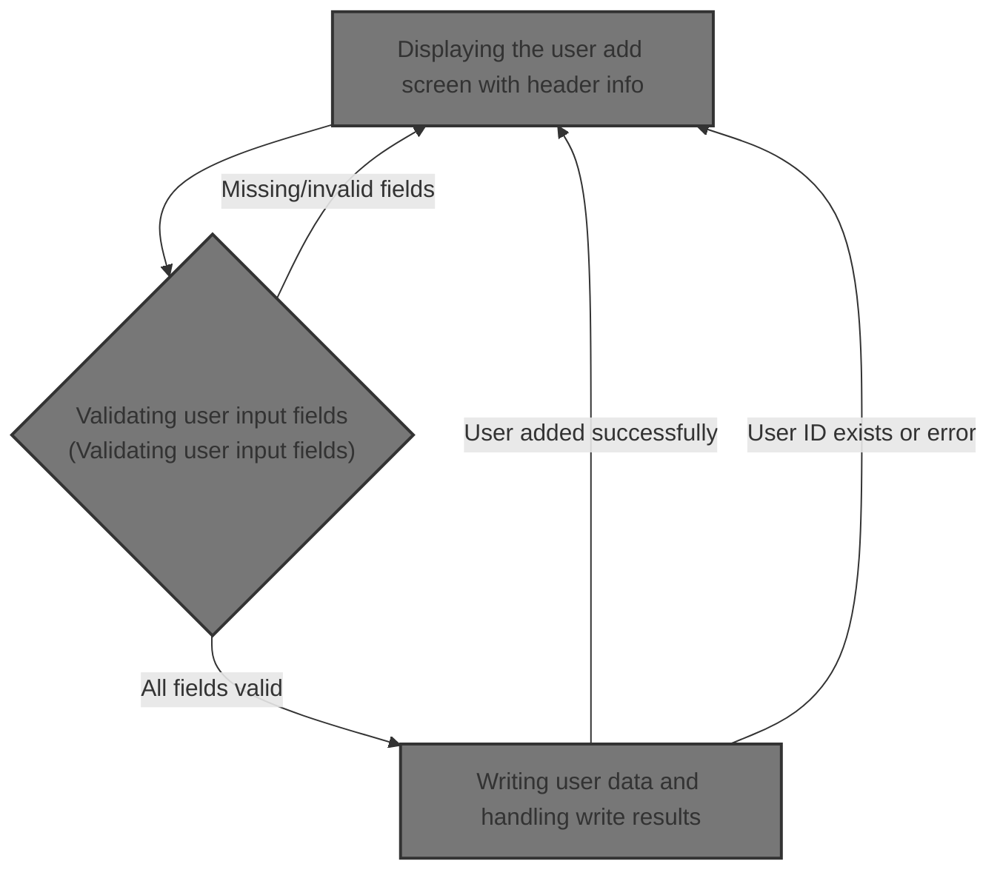

## Dependencies

### Programs

- COUSR01C (app/cbl/COUSR01C.cbl)
- CU01
- COADM01C (app/cbl/COADM01C.cbl)
- CA00
- COSGN00C (app/cbl/COSGN00C.cbl)

### Copybooks

- COCOM01Y (app/cpy/COCOM01Y.cpy)
- COADM02Y (app/cpy/COADM02Y.cpy)
- COADM01 (app/cpy-bms/COADM01.CPY)
- COTTL01Y (app/cpy/COTTL01Y.cpy)
- CSDAT01Y (app/cpy/CSDAT01Y.cpy)
- CSMSG01Y (app/cpy/CSMSG01Y.cpy)
- CSUSR01Y (app/cpy/CSUSR01Y.cpy)
- DFHAID
- DFHBMSCA
- COUSR01 (app/cpy-bms/COUSR01.CPY)

## Input and Output Tables/Files used in the Program

| Table / File Name | Type | Description                                    | Usage Mode | Key Fields / Layout Highlights |
| ----------------- | ---- | ---------------------------------------------- | ---------- | ------------------------------ |
| WS-USRSEC-FILE    | File | User credentials and roles for CardDemo access | Output     | File resource                  |

&nbsp;

# Workflow

# Starting the user add flow

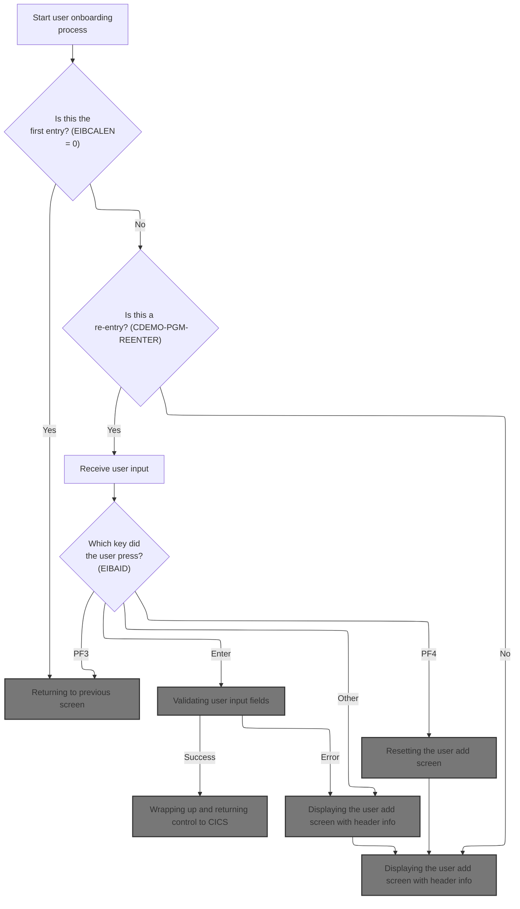

This section initializes the user add flow, ensuring a clean state and determining whether to proceed with onboarding or redirect the user to the signon screen based on session context.

| Rule ID | Code Location | Category       | Rule Name                                        | Description                                                                                                                                                               | Conditions                                                                                   | Remarks                                                                                                                                         |
| ------- | ------------- | -------------- | ------------------------------------------------ | ------------------------------------------------------------------------------------------------------------------------------------------------------------------------- | -------------------------------------------------------------------------------------------- | ----------------------------------------------------------------------------------------------------------------------------------------------- |
| BR-001  | MAIN-PARA     | Business logic | Initialize error and message state               | The error flag is reset and any message fields are cleared at the start of the user add flow to ensure a clean state for the user interaction.                            | Whenever the user add flow is started, regardless of prior state.                            | The error flag is set to 'N' (off), and the message field is set to all spaces. The message field is 80 characters, left-aligned, space-padded. |
| BR-002  | MAIN-PARA     | Business logic | Redirect to signon on missing communication area | If there is no communication area present (EIBCALEN = 0), the user is redirected to the signon screen and the next program is set to 'COSGN00C (Signon Screen Handling)'. | When the communication area length is zero (EIBCALEN = 0) at the start of the user add flow. | The next program is set to 'COSGN00C' (the signon handler).                                                                                     |

<SwmSnippet path="/app/cbl/COUSR01C.cbl" line="71" repo-id="Z2l0aHViJTNBJTNBa3luZHJ5bC1hd3MtbWFpbmZyYW1lLW1vZGVybml6YXRpb24tY2FyZGRlbW8lM0ElM0FTd2ltbS1EZW1v">

---

In `MAIN-PARA` we're kicking off the user add flow by resetting the error flag and clearing any message fields. This sets up a clean state before we check if there's a communication area. If not, we bail out and prep to return to the signon screen. Otherwise, we move on to process user add logic.

```cobol
       MAIN-PARA.

           SET ERR-FLG-OFF TO TRUE

           MOVE SPACES TO WS-MESSAGE
                          ERRMSGO OF COUSR1AO
```

---

</SwmSnippet>

<SwmSnippet path="/app/cbl/COUSR01C.cbl" line="78" repo-id="Z2l0aHViJTNBJTNBa3luZHJ5bC1hd3MtbWFpbmZyYW1lLW1vZGVybml6YXRpb24tY2FyZGRlbW8lM0ElM0FTd2ltbS1EZW1v">

---

Here we check if EIBCALEN is zero. If it is, we set up the next program as 'COSGN00C' (the signon handler) and call RETURN-TO-PREV-SCREEN to exit out and send the user back to signon.

```cobol
           IF EIBCALEN = 0
               MOVE 'COSGN00C' TO CDEMO-TO-PROGRAM
               PERFORM RETURN-TO-PREV-SCREEN
```

---

</SwmSnippet>

## Returning to previous screen

This section manages the logic for returning to a previous screen in the CardDemo application, ensuring that navigation is handled smoothly and that all necessary information is passed to the next program.

| Rule ID | Code Location         | Category       | Rule Name                             | Description                                                                                                                                  | Conditions                                                         | Remarks                                                                                                                                                                                                 |
| ------- | --------------------- | -------------- | ------------------------------------- | -------------------------------------------------------------------------------------------------------------------------------------------- | ------------------------------------------------------------------ | ------------------------------------------------------------------------------------------------------------------------------------------------------------------------------------------------------- |
| BR-001  | RETURN-TO-PREV-SCREEN | Business logic | Default target program                | If the target program field is blank or unset, set it to 'COSGN00C (Signon Screen Handling)' to ensure a valid destination for the transfer. | The target program field is blank (spaces) or contains low-values. | The default value for the target program is 'COSGN00C', which is an 8-character alphanumeric string. This ensures that the transfer always has a valid destination.                                     |
| BR-002  | RETURN-TO-PREV-SCREEN | Business logic | Populate identifiers for transfer     | When returning to the previous screen, populate the communication area with the current transaction and program identifiers.                 | A transfer to the previous screen is initiated.                    | The transaction identifier is a 4-character string ('CU01'), and the program identifier is an 8-character string ('COUSR01C'). These are copied into the communication area before transfer.            |
| BR-003  | RETURN-TO-PREV-SCREEN | Business logic | Clear program context before transfer | Clear the program context in the communication area before transferring control.                                                             | A transfer to the previous screen is initiated.                    | The program context is set to zero, which is a single-digit numeric value. This ensures that the next program receives a clean context.                                                                 |
| BR-004  | RETURN-TO-PREV-SCREEN | Business logic | Transfer control to target program    | Transfer control to the target program, passing the updated communication area.                                                              | The communication area is prepared and the target program is set.  | The transfer is performed using XCTL, passing the communication area structure. The target program is an 8-character string, and the communication area contains all necessary identifiers and context. |

<SwmSnippet path="/app/cbl/COUSR01C.cbl" line="165" repo-id="Z2l0aHViJTNBJTNBa3luZHJ5bC1hd3MtbWFpbmZyYW1lLW1vZGVybml6YXRpb24tY2FyZGRlbW8lM0ElM0FTd2ltbS1EZW1v">

---

In `RETURN-TO-PREV-SCREEN` we check if the target program is blank or unset. If so, we default it to 'COSGN00C' so we always have a valid destination for the XCTL call.

```cobol
       RETURN-TO-PREV-SCREEN.

           IF CDEMO-TO-PROGRAM = LOW-VALUES OR SPACES
               MOVE 'COSGN00C' TO CDEMO-TO-PROGRAM
           END-IF
```

---

</SwmSnippet>

<SwmSnippet path="/app/cbl/COUSR01C.cbl" line="170" repo-id="Z2l0aHViJTNBJTNBa3luZHJ5bC1hd3MtbWFpbmZyYW1lLW1vZGVybml6YXRpb24tY2FyZGRlbW8lM0ElM0FTd2ltbS1EZW1v">

---

After setting up the target program, we fill in the transaction and program IDs, clear the context, and call XCTL to transfer control to the next program, passing along the communication area.

```cobol
           MOVE WS-TRANID    TO CDEMO-FROM-TRANID
           MOVE WS-PGMNAME   TO CDEMO-FROM-PROGRAM
      *    MOVE WS-USER-ID   TO CDEMO-USER-ID
      *    MOVE SEC-USR-TYPE TO CDEMO-USER-TYPE
           MOVE ZEROS        TO CDEMO-PGM-CONTEXT
           EXEC CICS
               XCTL PROGRAM(CDEMO-TO-PROGRAM)
               COMMAREA(CARDDEMO-COMMAREA)
           END-EXEC.
```

---

</SwmSnippet>

## Admin menu entry and screen logic

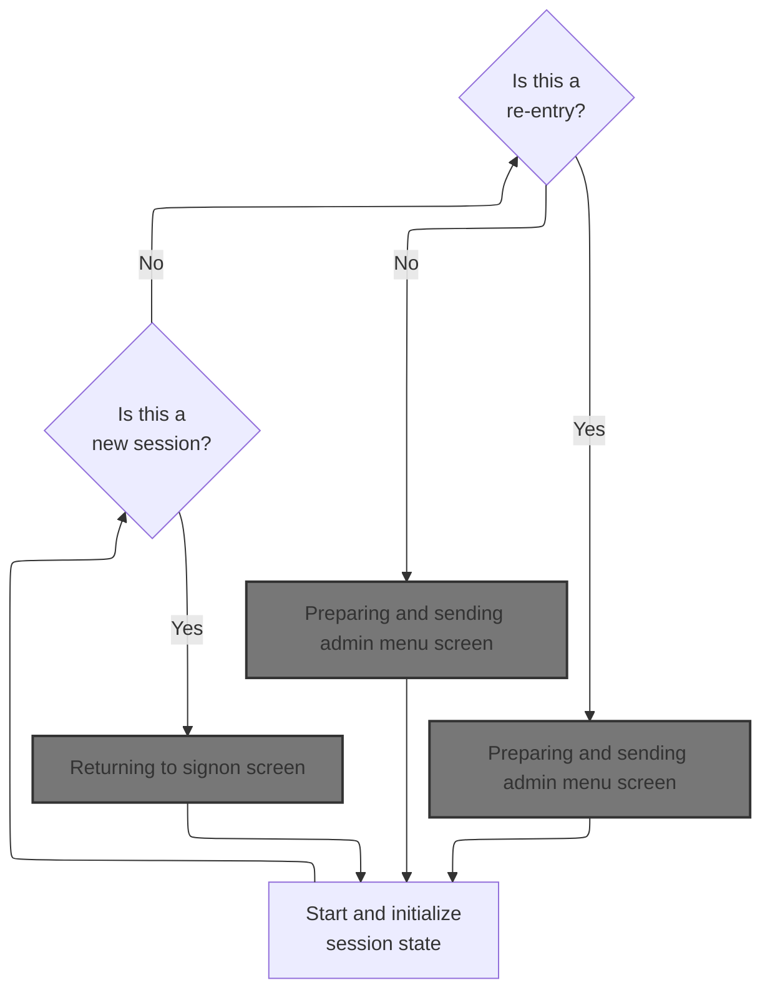

This section manages the entry and main menu logic for the admin interface, determining whether users are shown the signon screen, the admin menu, or error messages based on session state and user actions.

| Rule ID | Code Location | Category       | Rule Name                      | Description                                                                                                                                          | Conditions                                                              | Remarks                                                                                                                                                 |
| ------- | ------------- | -------------- | ------------------------------ | ---------------------------------------------------------------------------------------------------------------------------------------------------- | ----------------------------------------------------------------------- | ------------------------------------------------------------------------------------------------------------------------------------------------------- |
| BR-001  | MAIN-PARA     | Business logic | Session initialization routing | If the session does not contain a communication area, the user is routed to the signon screen.                                                       | Session communication area length is zero.                              | The communication area is considered missing if its length is zero. The signon screen is triggered by routing to the signon program.                    |
| BR-002  | MAIN-PARA     | Business logic | First-time admin menu display  | If the session is active and the user is entering the admin menu for the first time, the admin menu screen is displayed.                             | Session communication area is present and re-entry flag is not set.     | The admin menu screen is displayed when the session is active and the user has not previously entered the menu in this session.                         |
| BR-003  | MAIN-PARA     | Business logic | Admin menu re-entry display    | If the session is active and the user is re-entering the admin menu, the admin menu screen is displayed again.                                       | Session communication area is present and re-entry flag is set.         | The admin menu screen is displayed again if the user has previously entered the menu in this session.                                                   |
| BR-004  | MAIN-PARA     | Business logic | Admin menu option selection    | If the user presses the Enter key while on the admin menu, the system processes the selected admin option.                                           | User action is Enter key while on the admin menu.                       | The Enter key triggers processing of the selected admin menu option.                                                                                    |
| BR-005  | MAIN-PARA     | Business logic | PF3 signon routing             | If the user presses PF3 while on the admin menu, the system routes the user to the signon screen.                                                    | User action is PF3 key while on the admin menu.                         | PF3 key triggers routing to the signon program.                                                                                                         |
| BR-006  | MAIN-PARA     | Error handling | Invalid key error handling     | If the user presses any key other than Enter or PF3 while on the admin menu, an error message is displayed and the admin menu screen is shown again. | User action is any key other than Enter or PF3 while on the admin menu. | The error message displayed is 'Invalid key pressed. Please see below...         '. The error flag is set to 'Y'. The admin menu screen is shown again. |

<SwmSnippet path="/app/cbl/COADM01C.cbl" line="75" repo-id="Z2l0aHViJTNBJTNBa3luZHJ5bC1hd3MtbWFpbmZyYW1lLW1vZGVybml6YXRpb24tY2FyZGRlbW8lM0ElM0FTd2ltbS1EZW1v">

---

`MAIN-PARA` in COADM01C.cbl checks if we have a communication area. If not, we set up to return to signon. If we do, we move the data, check if we're reentering, and either send the menu or process user input based on the key pressed.

```cobol
       MAIN-PARA.

           SET ERR-FLG-OFF TO TRUE

           MOVE SPACES TO WS-MESSAGE
                          ERRMSGO OF COADM1AO

           IF EIBCALEN = 0
               MOVE 'COSGN00C' TO CDEMO-FROM-PROGRAM
               PERFORM RETURN-TO-SIGNON-SCREEN
           ELSE
               MOVE DFHCOMMAREA(1:EIBCALEN) TO CARDDEMO-COMMAREA
               IF NOT CDEMO-PGM-REENTER
                   SET CDEMO-PGM-REENTER    TO TRUE
                   MOVE LOW-VALUES          TO COADM1AO
                   PERFORM SEND-MENU-SCREEN
               ELSE
                   PERFORM RECEIVE-MENU-SCREEN
                   EVALUATE EIBAID
                       WHEN DFHENTER
                           PERFORM PROCESS-ENTER-KEY
                       WHEN DFHPF3
                           MOVE 'COSGN00C' TO CDEMO-TO-PROGRAM
                           PERFORM RETURN-TO-SIGNON-SCREEN
                       WHEN OTHER
                           MOVE 'Y'                       TO WS-ERR-FLG
                           MOVE CCDA-MSG-INVALID-KEY      TO WS-MESSAGE
                           PERFORM SEND-MENU-SCREEN
                   END-EVALUATE
               END-IF
           END-IF

           EXEC CICS RETURN
                     TRANSID (WS-TRANID)
                     COMMAREA (CARDDEMO-COMMAREA)
           END-EXEC.
```

---

</SwmSnippet>

### Returning to signon screen

This section manages the process of returning the user to the signon screen, ensuring the correct program is targeted and the necessary context is provided for authentication.

| Rule ID | Code Location           | Category       | Rule Name                         | Description                                                                                                                                                                                             | Conditions                                                                          | Remarks                                                                                                                                                                     |
| ------- | ----------------------- | -------------- | --------------------------------- | ------------------------------------------------------------------------------------------------------------------------------------------------------------------------------------------------------- | ----------------------------------------------------------------------------------- | --------------------------------------------------------------------------------------------------------------------------------------------------------------------------- |
| BR-001  | RETURN-TO-SIGNON-SCREEN | Business logic | Default signon program assignment | If the target program for signon is blank or contains only low values, the system sets the target program to 'COSGN00C (Signon Screen Handling)' before transferring control to the signon handler.     | The target program field in the communication area is blank or contains low values. | The default signon program name is 'COSGN00C', which is an 8-character alphanumeric string. The check applies to the field used to indicate the target program for signon.  |
| BR-002  | RETURN-TO-SIGNON-SCREEN | Business logic | Signon handler invocation         | When returning to the signon screen, control is transferred to the program specified in the target program field of the communication area, and the communication area is passed to the signon handler. | The section is executed to return to the signon screen.                             | The program name used for signon is an 8-character alphanumeric string. The communication area contains user, account, and card information, and is passed in its entirety. |

<SwmSnippet path="/app/cbl/COADM01C.cbl" line="160" repo-id="Z2l0aHViJTNBJTNBa3luZHJ5bC1hd3MtbWFpbmZyYW1lLW1vZGVybml6YXRpb24tY2FyZGRlbW8lM0ElM0FTd2ltbS1EZW1v">

---

In `RETURN-TO-SIGNON-SCREEN` we check if the target program is blank or unset. If so, we set it to 'COSGN00C' and use XCTL to transfer control to the signon handler, passing the communication area.

```cobol
       RETURN-TO-SIGNON-SCREEN.

           IF CDEMO-TO-PROGRAM = LOW-VALUES OR SPACES
               MOVE 'COSGN00C' TO CDEMO-TO-PROGRAM
           END-IF
           EXEC CICS
               XCTL PROGRAM(CDEMO-TO-PROGRAM)
           END-EXEC.
```

---

</SwmSnippet>

### Signon screen entry and logic

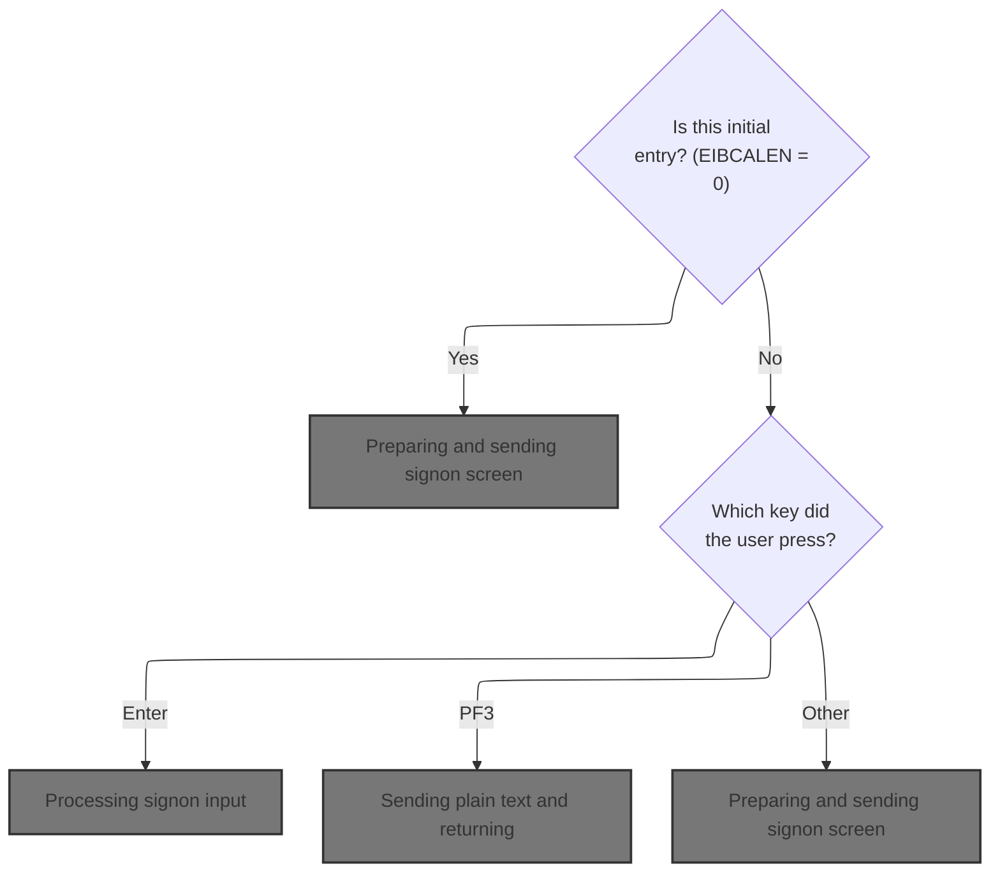

This section manages the initial entry and user interaction for the signon screen, determining what is displayed to the user based on their actions.

| Rule ID | Code Location | Category       | Rule Name                   | Description                                                                                                                               | Conditions                                                                                                                | Remarks                                                                                                                                                                                          |
| ------- | ------------- | -------------- | --------------------------- | ----------------------------------------------------------------------------------------------------------------------------------------- | ------------------------------------------------------------------------------------------------------------------------- | ------------------------------------------------------------------------------------------------------------------------------------------------------------------------------------------------ |
| BR-001  | MAIN-PARA     | Business logic | Initial entry signon prompt | When the user first enters the application (no data in the communication area), the signon screen is displayed to prompt for credentials. | Triggered when the communication area length is zero (EIBCALEN = 0).                                                      | The signon screen is displayed with all fields cleared. The user ID field is set to -1 to indicate a fresh entry. All output fields are reset to their default values.                           |
| BR-002  | MAIN-PARA     | Business logic | Enter key processes signon  | When the user presses the Enter key on the signon screen, their input is processed for authentication.                                    | Triggered when the user presses the Enter key (EIBAID = DFHENTER) and not on initial entry.                               | The user's credentials are processed. If valid, the user is routed to the next application area. If invalid, an error message is shown (handled in another section).                             |
| BR-003  | MAIN-PARA     | Business logic | PF3 thank you message       | When the user presses the PF3 key, a thank you message is displayed and the session ends.                                                 | Triggered when the user presses the PF3 key (EIBAID = DFHPF3) and not on initial entry.                                   | The message displayed is: 'Thank you for using CardDemo application...      ' (50 characters, left aligned, padded with spaces).                                                                 |
| BR-004  | MAIN-PARA     | Error handling | Invalid key error message   | When the user presses any key other than Enter or PF3, an error message is displayed and the signon screen is shown again.                | Triggered when the user presses any key other than Enter or PF3 (EIBAID not DFHENTER or DFHPF3) and not on initial entry. | The error flag is set to 'Y'. The message displayed is: 'Invalid key pressed. Please see below...         ' (50 characters, left aligned, padded with spaces). The signon screen is redisplayed. |

<SwmSnippet path="/app/cbl/COSGN00C.cbl" line="73" repo-id="Z2l0aHViJTNBJTNBa3luZHJ5bC1hd3MtbWFpbmZyYW1lLW1vZGVybml6YXRpb24tY2FyZGRlbW8lM0ElM0FTd2ltbS1EZW1v">

---

We decide what to do based on user input, either showing signon, thank you, or error.

```cobol
       MAIN-PARA.

           SET ERR-FLG-OFF TO TRUE

           MOVE SPACES TO WS-MESSAGE
                          ERRMSGO OF COSGN0AO

           IF EIBCALEN = 0
               MOVE LOW-VALUES TO COSGN0AO
               MOVE -1       TO USERIDL OF COSGN0AI
               PERFORM SEND-SIGNON-SCREEN
           ELSE
               EVALUATE EIBAID
                   WHEN DFHENTER
                       PERFORM PROCESS-ENTER-KEY
                   WHEN DFHPF3
                       MOVE CCDA-MSG-THANK-YOU        TO WS-MESSAGE
                       PERFORM SEND-PLAIN-TEXT
                   WHEN OTHER
                       MOVE 'Y'                       TO WS-ERR-FLG
                       MOVE CCDA-MSG-INVALID-KEY      TO WS-MESSAGE
                       PERFORM SEND-SIGNON-SCREEN
               END-EVALUATE
           END-IF.

           EXEC CICS RETURN
                     TRANSID (WS-TRANID)
                     COMMAREA (CARDDEMO-COMMAREA)
                     LENGTH(LENGTH OF CARDDEMO-COMMAREA)
           END-EXEC.
```

---

</SwmSnippet>

#### Preparing and sending signon screen

This section prepares and sends the signon screen to the user terminal, ensuring all relevant header information, messages, and identifiers are displayed, and the screen is ready for user input.

| Rule ID | Code Location        | Category       | Rule Name                                   | Description                                                                                                          | Conditions                                                                                 | Remarks                                                                                                             |
| ------- | -------------------- | -------------- | ------------------------------------------- | -------------------------------------------------------------------------------------------------------------------- | ------------------------------------------------------------------------------------------ | ------------------------------------------------------------------------------------------------------------------- |
| BR-001  | POPULATE-HEADER-INFO | Business logic | Display current date and time               | The signon screen header must display the current date and time, formatted as MM-DD-YY and HH:MM:SS, respectively.   | Whenever the signon screen is prepared for display.                                        | Date is shown as a 6-character string in MM-DD-YY format. Time is shown as a 6-character string in HH:MM:SS format. |
| BR-002  | POPULATE-HEADER-INFO | Business logic | Display program and transaction identifiers | The signon screen must display the program name and transaction ID in the header.                                    | Whenever the signon screen is prepared for display.                                        | Program name is an 8-character string ('COSGN00C'). Transaction ID is a 4-character string ('CC00').                |
| BR-003  | SEND-SIGNON-SCREEN   | Business logic | Display message in error area               | Any message present in the message field must be displayed in the error message area of the signon screen.           | Whenever the signon screen is prepared for display and the message field contains a value. | The message is an 80-character string. If no message is present, the field is blank.                                |
| BR-004  | POPULATE-HEADER-INFO | Business logic | Display system and application IDs          | The signon screen must display the system ID and application ID in the header, as assigned by the system.            | Whenever the signon screen is prepared for display.                                        | System ID and Application ID are assigned by the system and displayed as alphanumeric strings.                      |
| BR-005  | SEND-SIGNON-SCREEN   | Technical step | Clear screen and set cursor                 | When the signon screen is sent to the terminal, the screen must be cleared and the cursor positioned for user input. | Whenever the signon screen is sent to the terminal.                                        | The screen is cleared and the cursor is positioned at the default input location.                                   |

<SwmSnippet path="/app/cbl/COSGN00C.cbl" line="145" repo-id="Z2l0aHViJTNBJTNBa3luZHJ5bC1hd3MtbWFpbmZyYW1lLW1vZGVybml6YXRpb24tY2FyZGRlbW8lM0ElM0FTd2ltbS1EZW1v">

---

In `SEND-SIGNON-SCREEN` we call POPULATE-HEADER-INFO to set up the header, move any message to the error field, and send the signon map to the terminal, clearing the screen and setting the cursor.

```cobol
       SEND-SIGNON-SCREEN.

           PERFORM POPULATE-HEADER-INFO

           MOVE WS-MESSAGE TO ERRMSGO OF COSGN0AO

           EXEC CICS SEND
                     MAP('COSGN0A')
                     MAPSET('COSGN00')
                     FROM(COSGN0AO)
                     ERASE
                     CURSOR
           END-EXEC.
```

---

</SwmSnippet>

<SwmSnippet path="/app/cbl/COSGN00C.cbl" line="177" repo-id="Z2l0aHViJTNBJTNBa3luZHJ5bC1hd3MtbWFpbmZyYW1lLW1vZGVybml6YXRpb24tY2FyZGRlbW8lM0ElM0FTd2ltbS1EZW1v">

---

POPULATE-HEADER-INFO grabs the current date and time, formats them, and fills in the header fields with titles, program name, transaction ID, and system/app IDs using CICS ASSIGN.

```cobol
       POPULATE-HEADER-INFO.

           MOVE FUNCTION CURRENT-DATE  TO WS-CURDATE-DATA

           MOVE CCDA-TITLE01           TO TITLE01O OF COSGN0AO
           MOVE CCDA-TITLE02           TO TITLE02O OF COSGN0AO
           MOVE WS-TRANID              TO TRNNAMEO OF COSGN0AO
           MOVE WS-PGMNAME             TO PGMNAMEO OF COSGN0AO

           MOVE WS-CURDATE-MONTH       TO WS-CURDATE-MM
           MOVE WS-CURDATE-DAY         TO WS-CURDATE-DD
           MOVE WS-CURDATE-YEAR(3:2)   TO WS-CURDATE-YY

           MOVE WS-CURDATE-MM-DD-YY    TO CURDATEO OF COSGN0AO

           MOVE WS-CURTIME-HOURS       TO WS-CURTIME-HH
           MOVE WS-CURTIME-MINUTE      TO WS-CURTIME-MM
           MOVE WS-CURTIME-SECOND      TO WS-CURTIME-SS

           MOVE WS-CURTIME-HH-MM-SS    TO CURTIMEO OF COSGN0AO

           EXEC CICS ASSIGN
               APPLID(APPLIDO OF COSGN0AO)
           END-EXEC

           EXEC CICS ASSIGN
               SYSID(SYSIDO OF COSGN0AO)
           END-EXEC.
```

---

</SwmSnippet>

#### Processing signon input

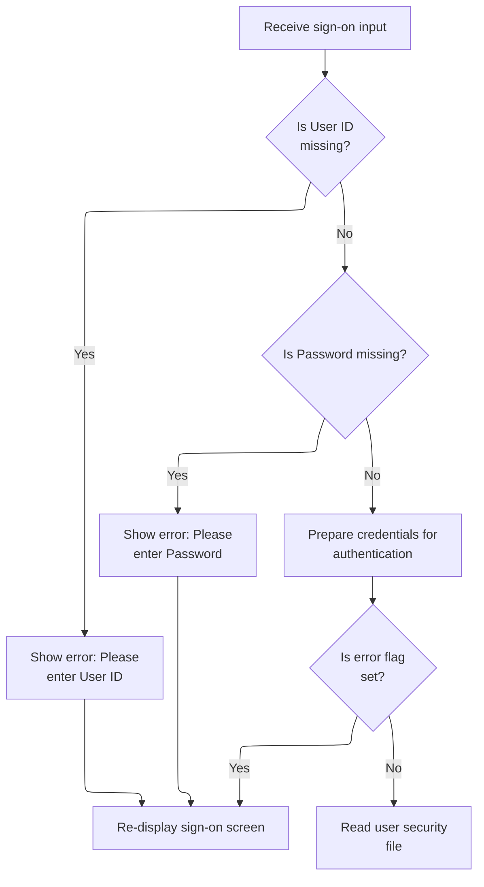

This section handles the initial processing of sign-on input, ensuring required fields are present and normalized before attempting authentication.

| Rule ID | Code Location     | Category        | Rule Name                     | Description                                                                                                                                                                                         | Conditions                                                                                                | Remarks                                                                                                                                                                               |
| ------- | ----------------- | --------------- | ----------------------------- | --------------------------------------------------------------------------------------------------------------------------------------------------------------------------------------------------- | --------------------------------------------------------------------------------------------------------- | ------------------------------------------------------------------------------------------------------------------------------------------------------------------------------------- |
| BR-001  | PROCESS-ENTER-KEY | Data validation | User ID Required              | If the User ID field is missing or contains only spaces or non-printable values, an error message is displayed prompting the user to enter their User ID, and the sign-on screen is re-displayed.   | The User ID field is empty, contains only spaces, or contains only non-printable (low-value) characters.  | The error message displayed is 'Please enter User ID ...'. The User ID field is expected to be an alphanumeric string up to 8 characters, left-aligned and space-padded if shorter.   |
| BR-002  | PROCESS-ENTER-KEY | Data validation | Password Required             | If the Password field is missing or contains only spaces or non-printable values, an error message is displayed prompting the user to enter their Password, and the sign-on screen is re-displayed. | The Password field is empty, contains only spaces, or contains only non-printable (low-value) characters. | The error message displayed is 'Please enter Password ...'. The Password field is expected to be an alphanumeric string up to 8 characters, left-aligned and space-padded if shorter. |
| BR-003  | PROCESS-ENTER-KEY | Business logic  | Uppercase Credentials         | If both User ID and Password are present, the input values are converted to uppercase before being used for authentication.                                                                         | Both User ID and Password fields are present and not empty or low-value.                                  | Both User ID and Password are normalized to uppercase. The maximum length for each is 8 characters, left-aligned and space-padded if shorter.                                         |
| BR-004  | PROCESS-ENTER-KEY | Business logic  | Authenticate Only If No Error | Authentication is attempted only if no error flag is set after input validation.                                                                                                                    | No error flag is set after validating User ID and Password fields.                                        | The error flag is set to 'Y' if any validation fails. Authentication is performed only if the flag remains unset ('N').                                                               |

<SwmSnippet path="/app/cbl/COSGN00C.cbl" line="108" repo-id="Z2l0aHViJTNBJTNBa3luZHJ5bC1hd3MtbWFpbmZyYW1lLW1vZGVybml6YXRpb24tY2FyZGRlbW8lM0ElM0FTd2ltbS1EZW1v">

---

PROCESS-ENTER-KEY receives user input from the signon screen, checks if User ID and Password are present, converts them to uppercase, and if valid, calls READ-USER-SEC-FILE to check credentials.

```cobol
       PROCESS-ENTER-KEY.

           EXEC CICS RECEIVE
                     MAP('COSGN0A')
                     MAPSET('COSGN00')
                     RESP(WS-RESP-CD)
                     RESP2(WS-REAS-CD)
           END-EXEC.

           EVALUATE TRUE
               WHEN USERIDI OF COSGN0AI = SPACES OR LOW-VALUES
                   MOVE 'Y'      TO WS-ERR-FLG
                   MOVE 'Please enter User ID ...' TO WS-MESSAGE
                   MOVE -1       TO USERIDL OF COSGN0AI
                   PERFORM SEND-SIGNON-SCREEN
               WHEN PASSWDI OF COSGN0AI = SPACES OR LOW-VALUES
                   MOVE 'Y'      TO WS-ERR-FLG
                   MOVE 'Please enter Password ...' TO WS-MESSAGE
                   MOVE -1       TO PASSWDL OF COSGN0AI
                   PERFORM SEND-SIGNON-SCREEN
               WHEN OTHER
                   CONTINUE
           END-EVALUATE.

           MOVE FUNCTION UPPER-CASE(USERIDI OF COSGN0AI) TO
                           WS-USER-ID
                           CDEMO-USER-ID
           MOVE FUNCTION UPPER-CASE(PASSWDI OF COSGN0AI) TO
                           WS-USER-PWD

           IF NOT ERR-FLG-ON
               PERFORM READ-USER-SEC-FILE
           END-IF.
```

---

</SwmSnippet>

#### Authenticating user credentials

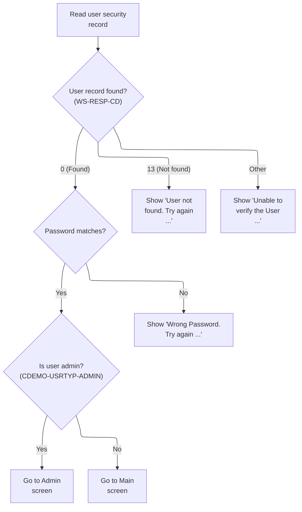

This section authenticates user credentials by reading the user record from the security file, validating the password, and routing the user to the appropriate menu or displaying error messages based on the outcome.

| Rule ID | Code Location      | Category       | Rule Name                             | Description                                                                                                                                   | Conditions                                                          | Remarks                                                                                                                                                                                                         |
| ------- | ------------------ | -------------- | ------------------------------------- | --------------------------------------------------------------------------------------------------------------------------------------------- | ------------------------------------------------------------------- | --------------------------------------------------------------------------------------------------------------------------------------------------------------------------------------------------------------- |
| BR-001  | READ-USER-SEC-FILE | Business logic | Successful authentication and routing | If the user record is found and the password matches, the user is authenticated and routed to the appropriate menu based on user type.        | User record is found (response code 0) and password matches.        | Admin users are identified by user type 'A'. Regular users are identified by user type 'U'. The routing is determined by the value of user type: 'A' routes to the admin screen, 'U' routes to the main screen. |
| BR-002  | READ-USER-SEC-FILE | Error handling | Wrong password error                  | If the user record is found but the password does not match, an error message is displayed and the sign-on screen is redisplayed.             | User record is found (response code 0) and password does not match. | The error message displayed is 'Wrong Password. Try again ...'. The password field is reset to -1 before redisplaying the sign-on screen.                                                                       |
| BR-003  | READ-USER-SEC-FILE | Error handling | User not found error                  | If the user record is not found, an error message is displayed and the sign-on screen is redisplayed.                                         | User record is not found (response code 13).                        | The error message displayed is 'User not found. Try again ...'. The user ID field is reset to -1 before redisplaying the sign-on screen.                                                                        |
| BR-004  | READ-USER-SEC-FILE | Error handling | Unable to verify user error           | If the user record cannot be verified due to an unexpected error, a generic error message is displayed and the sign-on screen is redisplayed. | Any response code other than 0 or 13 when reading the user record.  | The error message displayed is 'Unable to verify the User ...'. The user ID field is reset to -1 before redisplaying the sign-on screen.                                                                        |

<SwmSnippet path="/app/cbl/COSGN00C.cbl" line="209" repo-id="Z2l0aHViJTNBJTNBa3luZHJ5bC1hd3MtbWFpbmZyYW1lLW1vZGVybml6YXRpb24tY2FyZGRlbW8lM0ElM0FTd2ltbS1EZW1v">

---

READ-USER-SEC-FILE reads the user record from the security file, checks the password, and routes to admin or main menu based on user type. If not found or wrong password, we show an error and re-display signon.

```cobol
       READ-USER-SEC-FILE.

           EXEC CICS READ
                DATASET   (WS-USRSEC-FILE)
                INTO      (SEC-USER-DATA)
                LENGTH    (LENGTH OF SEC-USER-DATA)
                RIDFLD    (WS-USER-ID)
                KEYLENGTH (LENGTH OF WS-USER-ID)
                RESP      (WS-RESP-CD)
                RESP2     (WS-REAS-CD)
           END-EXEC.

           EVALUATE WS-RESP-CD
               WHEN 0
                   IF SEC-USR-PWD = WS-USER-PWD
                       MOVE WS-TRANID    TO CDEMO-FROM-TRANID
                       MOVE WS-PGMNAME   TO CDEMO-FROM-PROGRAM
                       MOVE WS-USER-ID   TO CDEMO-USER-ID
                       MOVE SEC-USR-TYPE TO CDEMO-USER-TYPE
                       MOVE ZEROS        TO CDEMO-PGM-CONTEXT

                       IF CDEMO-USRTYP-ADMIN
                            EXEC CICS XCTL
                              PROGRAM ('COADM01C')
                              COMMAREA(CARDDEMO-COMMAREA)
                            END-EXEC
                       ELSE
                            EXEC CICS XCTL
                              PROGRAM ('COMEN01C')
                              COMMAREA(CARDDEMO-COMMAREA)
                            END-EXEC
                       END-IF
                   ELSE
                       MOVE 'Wrong Password. Try again ...' TO
                                                          WS-MESSAGE
                       MOVE -1       TO PASSWDL OF COSGN0AI
                       PERFORM SEND-SIGNON-SCREEN
                   END-IF
               WHEN 13
                   MOVE 'Y'      TO WS-ERR-FLG
                   MOVE 'User not found. Try again ...' TO WS-MESSAGE
                   MOVE -1       TO USERIDL OF COSGN0AI
                   PERFORM SEND-SIGNON-SCREEN
               WHEN OTHER
                   MOVE 'Y'      TO WS-ERR-FLG
                   MOVE 'Unable to verify the User ...' TO WS-MESSAGE
                   MOVE -1       TO USERIDL OF COSGN0AI
                   PERFORM SEND-SIGNON-SCREEN
           END-EVALUATE.
```

---

</SwmSnippet>

#### Main menu entry and screen logic


This section governs the main entry and menu navigation logic for the CardDemo application, determining whether users are redirected to signon, presented with the admin menu, or shown error messages based on session state and user input.

| Rule ID | Code Location                      | Category       | Rule Name                   | Description                                                                                                                                                 | Conditions                                                                     | Remarks                                                                                                                                                   |
| ------- | ---------------------------------- | -------------- | --------------------------- | ----------------------------------------------------------------------------------------------------------------------------------------------------------- | ------------------------------------------------------------------------------ | --------------------------------------------------------------------------------------------------------------------------------------------------------- |
| BR-001  | MAIN-PARA, RETURN-TO-SIGNON-SCREEN | Business logic | New session signon redirect | If the session is new (no communication area data is present), the user is redirected to the signon screen.                                                 | Session communication area length is zero.                                     | The communication area is considered empty if its length is zero. The signon program name is 'COSGN00C'.                                                  |
| BR-002  | MAIN-PARA                          | Business logic | Initial menu presentation   | If the session is not new and the program is not in re-entry mode, the admin menu screen is prepared and sent to the user.                                  | Session communication area is present and re-entry flag is not set.            | The admin menu is sent when the re-entry flag is not set. The communication area is updated with low values before sending the menu.                      |
| BR-003  | MAIN-PARA                          | Business logic | Re-entry menu presentation  | If the session is not new and the program is in re-entry mode, the admin menu screen is prepared and sent to the user.                                      | Session communication area is present and re-entry flag is set.                | The admin menu is sent when the re-entry flag is set. The communication area is not cleared before sending the menu.                                      |
| BR-004  | MAIN-PARA                          | Business logic | Enter key processing        | If the user presses the Enter key while on the menu screen, the program processes the Enter key action.                                                     | User keypress is Enter while on the menu screen.                               | The Enter key triggers further processing, such as menu selection.                                                                                        |
| BR-005  | MAIN-PARA, RETURN-TO-SIGNON-SCREEN | Business logic | PF3 signon redirect         | If the user presses PF3 while on the menu screen, the user is redirected to the signon screen.                                                              | User keypress is PF3 while on the menu screen.                                 | PF3 triggers a transition to the signon program 'COSGN00C'.                                                                                               |
| BR-006  | RETURN-TO-SIGNON-SCREEN            | Business logic | Signon program defaulting   | When returning to the signon screen, if the target program is blank or unset, it is set to 'COSGN00C (Signon Screen Handling)' before transferring control. | Target program field is blank or contains low values when returning to signon. | The signon program name is 'COSGN00C'.                                                                                                                    |
| BR-007  | MAIN-PARA                          | Error handling | Invalid key error handling  | If the user presses any key other than Enter or PF3 while on the menu screen, an error message is displayed and the error flag is set.                      | User keypress is not Enter or PF3 while on the menu screen.                    | The error flag is set to 'Y'. The error message is 'Invalid key pressed. Please see below...         ' (50 characters, left aligned, padded with spaces). |

<SwmSnippet path="/app/cbl/COMEN01C.cbl" line="75" repo-id="Z2l0aHViJTNBJTNBa3luZHJ5bC1hd3MtbWFpbmZyYW1lLW1vZGVybml6YXRpb24tY2FyZGRlbW8lM0ElM0FTd2ltbS1EZW1v">

---

`MAIN-PARA` in COMEN01C.cbl checks if we have a communication area. If not, we set up to return to signon. If we do, we move the data, check if we're reentering, and either send the menu or process user input based on the key pressed.

```cobol
       MAIN-PARA.

           SET ERR-FLG-OFF TO TRUE

           MOVE SPACES TO WS-MESSAGE
                          ERRMSGO OF COMEN1AO

           IF EIBCALEN = 0
               MOVE 'COSGN00C' TO CDEMO-FROM-PROGRAM
               PERFORM RETURN-TO-SIGNON-SCREEN
           ELSE
               MOVE DFHCOMMAREA(1:EIBCALEN) TO CARDDEMO-COMMAREA
               IF NOT CDEMO-PGM-REENTER
                   SET CDEMO-PGM-REENTER    TO TRUE
                   MOVE LOW-VALUES          TO COMEN1AO
                   PERFORM SEND-MENU-SCREEN
               ELSE
                   PERFORM RECEIVE-MENU-SCREEN
                   EVALUATE EIBAID
                       WHEN DFHENTER
                           PERFORM PROCESS-ENTER-KEY
                       WHEN DFHPF3
                           MOVE 'COSGN00C' TO CDEMO-TO-PROGRAM
                           PERFORM RETURN-TO-SIGNON-SCREEN
                       WHEN OTHER
                           MOVE 'Y'                       TO WS-ERR-FLG
                           MOVE CCDA-MSG-INVALID-KEY      TO WS-MESSAGE
                           PERFORM SEND-MENU-SCREEN
                   END-EVALUATE
               END-IF
           END-IF

           EXEC CICS RETURN
                     TRANSID (WS-TRANID)
                     COMMAREA (CARDDEMO-COMMAREA)
           END-EXEC.
```

---

</SwmSnippet>

<SwmSnippet path="/app/cbl/COMEN01C.cbl" line="170" repo-id="Z2l0aHViJTNBJTNBa3luZHJ5bC1hd3MtbWFpbmZyYW1lLW1vZGVybml6YXRpb24tY2FyZGRlbW8lM0ElM0FTd2ltbS1EZW1v">

---

In `RETURN-TO-SIGNON-SCREEN` we check if the target program is blank or unset. If so, we set it to 'COSGN00C' and use XCTL to transfer control to the signon handler, passing the communication area.

```cobol
       RETURN-TO-SIGNON-SCREEN.

           IF CDEMO-TO-PROGRAM = LOW-VALUES OR SPACES
               MOVE 'COSGN00C' TO CDEMO-TO-PROGRAM
           END-IF
           EXEC CICS
               XCTL PROGRAM(CDEMO-TO-PROGRAM)
           END-EXEC.
```

---

</SwmSnippet>

##### Preparing and sending main menu screen

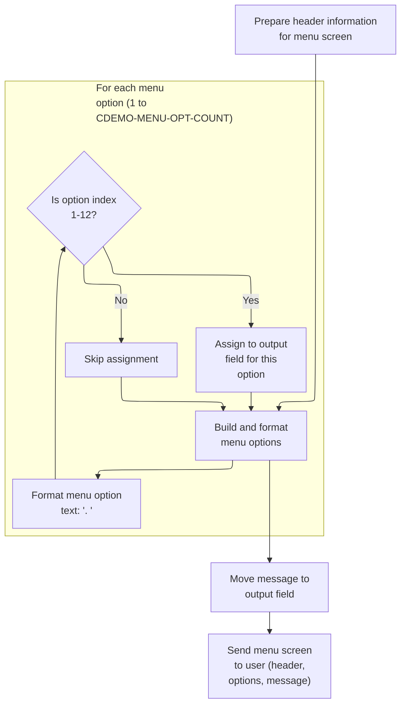

This section prepares and sends the main menu screen to the user, including header information, up to 12 menu options, and a message field.

| Rule ID | Code Location        | Category       | Rule Name                          | Description                                                                                                                             | Conditions                                                                                                                                    | Remarks                                                                                                                                                          |
| ------- | -------------------- | -------------- | ---------------------------------- | --------------------------------------------------------------------------------------------------------------------------------------- | --------------------------------------------------------------------------------------------------------------------------------------------- | ---------------------------------------------------------------------------------------------------------------------------------------------------------------- |
| BR-001  | POPULATE-HEADER-INFO | Business logic | Header information display         | The menu screen must display header information including two titles, the program name, transaction ID, current date, and current time. | Whenever the menu screen is prepared for display.                                                                                             | Titles are strings; program name is an 8-character string; transaction ID is a 4-character string; date is formatted as MM-DD-YY; time is formatted as HH-MM-SS. |
| BR-002  | BUILD-MENU-OPTIONS   | Business logic | Menu options display limit         | The menu screen must display up to 12 menu options, each formatted as '<number>. <name>'.                                               | Whenever the menu screen is prepared, for each menu option from 1 up to the value of CDEMO-MENU-OPT-COUNT, but only for indices 1 through 12. | Maximum of 12 options; each option is formatted as a string: number (1-12), period, space, name; assigned to output fields for options 1-12.                     |
| BR-003  | BUILD-MENU-OPTIONS   | Business logic | Menu option exclusion beyond limit | Menu options with indices greater than 12 are not displayed on the menu screen.                                                         | Whenever the menu screen is prepared and there are more than 12 menu options.                                                                 | Options with indices above 12 are skipped and not assigned to output fields.                                                                                     |
| BR-004  | SEND-MENU-SCREEN     | Business logic | Message field population           | The message field on the menu screen is populated with the current message value before sending the screen to the user.                 | Whenever the menu screen is prepared for display.                                                                                             | Message field is an 80-character string; default value is spaces unless set elsewhere.                                                                           |
| BR-005  | SEND-MENU-SCREEN     | Business logic | Menu screen transmission           | The menu screen is sent to the user with all populated fields, erasing any previous screen content.                                     | Whenever the menu screen is ready to be displayed.                                                                                            | Screen is sent with header, options, and message fields; previous content is erased.                                                                             |

<SwmSnippet path="/app/cbl/COMEN01C.cbl" line="182" repo-id="Z2l0aHViJTNBJTNBa3luZHJ5bC1hd3MtbWFpbmZyYW1lLW1vZGVybml6YXRpb24tY2FyZGRlbW8lM0ElM0FTd2ltbS1EZW1v">

---

POPULATE-HEADER-INFO grabs the current date and time, formats them, and fills in the header fields with titles, program name, and transaction ID for the menu screen.

```cobol
       SEND-MENU-SCREEN.

           PERFORM POPULATE-HEADER-INFO
           PERFORM BUILD-MENU-OPTIONS

           MOVE WS-MESSAGE TO ERRMSGO OF COMEN1AO

           EXEC CICS SEND
                     MAP('COMEN1A')
                     MAPSET('COMEN01')
                     FROM(COMEN1AO)
                     ERASE
           END-EXEC.
```

---

</SwmSnippet>

<SwmSnippet path="/app/cbl/COMEN01C.cbl" line="212" repo-id="Z2l0aHViJTNBJTNBa3luZHJ5bC1hd3MtbWFpbmZyYW1lLW1vZGVybml6YXRpb24tY2FyZGRlbW8lM0ElM0FTd2ltbS1EZW1v">

---

BUILD-MENU-OPTIONS loops through each menu option, builds the display string, and assigns it to the right output field for the menu screen.

```cobol
       POPULATE-HEADER-INFO.

           MOVE FUNCTION CURRENT-DATE  TO WS-CURDATE-DATA

           MOVE CCDA-TITLE01           TO TITLE01O OF COMEN1AO
           MOVE CCDA-TITLE02           TO TITLE02O OF COMEN1AO
           MOVE WS-TRANID              TO TRNNAMEO OF COMEN1AO
           MOVE WS-PGMNAME             TO PGMNAMEO OF COMEN1AO

           MOVE WS-CURDATE-MONTH       TO WS-CURDATE-MM
           MOVE WS-CURDATE-DAY         TO WS-CURDATE-DD
           MOVE WS-CURDATE-YEAR(3:2)   TO WS-CURDATE-YY

           MOVE WS-CURDATE-MM-DD-YY    TO CURDATEO OF COMEN1AO

           MOVE WS-CURTIME-HOURS       TO WS-CURTIME-HH
           MOVE WS-CURTIME-MINUTE      TO WS-CURTIME-MM
           MOVE WS-CURTIME-SECOND      TO WS-CURTIME-SS

           MOVE WS-CURTIME-HH-MM-SS    TO CURTIMEO OF COMEN1AO.
```

---

</SwmSnippet>

<SwmSnippet path="/app/cbl/COMEN01C.cbl" line="236" repo-id="Z2l0aHViJTNBJTNBa3luZHJ5bC1hd3MtbWFpbmZyYW1lLW1vZGVybml6YXRpb24tY2FyZGRlbW8lM0ElM0FTd2ltbS1EZW1v">

---

RECEIVE-MENU-SCREEN grabs user input from the menu screen using CICS RECEIVE, storing it in the input area and checking response codes.

```cobol
       BUILD-MENU-OPTIONS.

           PERFORM VARYING WS-IDX FROM 1 BY 1 UNTIL
                           WS-IDX > CDEMO-MENU-OPT-COUNT

               MOVE SPACES             TO WS-MENU-OPT-TXT

               STRING CDEMO-MENU-OPT-NUM(WS-IDX)  DELIMITED BY SIZE
                      '. '                         DELIMITED BY SIZE
                      CDEMO-MENU-OPT-NAME(WS-IDX) DELIMITED BY SIZE
                 INTO WS-MENU-OPT-TXT

               EVALUATE WS-IDX
                   WHEN 1
                       MOVE WS-MENU-OPT-TXT TO OPTN001O
                   WHEN 2
                       MOVE WS-MENU-OPT-TXT TO OPTN002O
                   WHEN 3
                       MOVE WS-MENU-OPT-TXT TO OPTN003O
                   WHEN 4
                       MOVE WS-MENU-OPT-TXT TO OPTN004O
                   WHEN 5
                       MOVE WS-MENU-OPT-TXT TO OPTN005O
                   WHEN 6
                       MOVE WS-MENU-OPT-TXT TO OPTN006O
                   WHEN 7
                       MOVE WS-MENU-OPT-TXT TO OPTN007O
                   WHEN 8
                       MOVE WS-MENU-OPT-TXT TO OPTN008O
                   WHEN 9
                       MOVE WS-MENU-OPT-TXT TO OPTN009O
                   WHEN 10
                       MOVE WS-MENU-OPT-TXT TO OPTN010O
                   WHEN 11
                       MOVE WS-MENU-OPT-TXT TO OPTN011O
                   WHEN 12
                       MOVE WS-MENU-OPT-TXT TO OPTN012O
                   WHEN OTHER
                       CONTINUE
               END-EVALUATE

           END-PERFORM.
```

---

</SwmSnippet>

##### Receiving main menu input

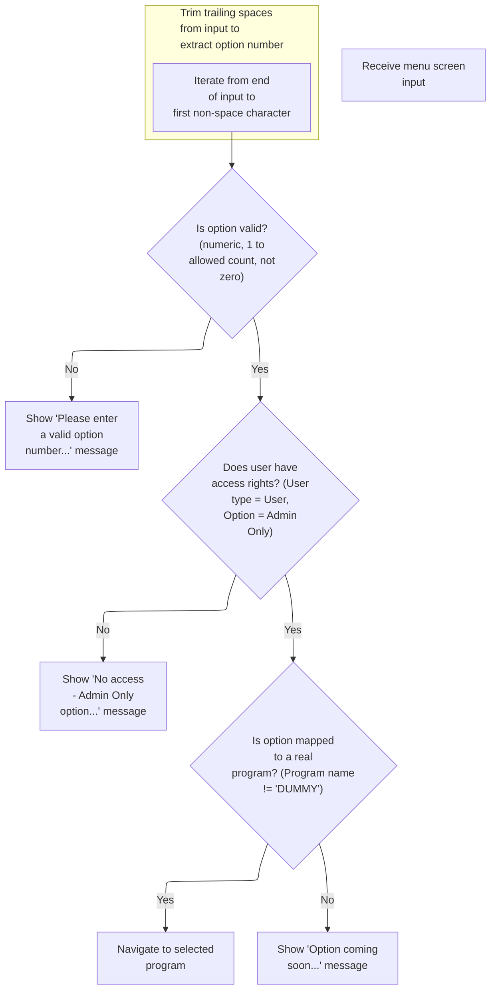

This section receives and processes the user's main menu selection, validating the input, enforcing access control, and determining whether to navigate to a selected program or display an appropriate message.

| Rule ID | Code Location     | Category        | Rule Name                           | Description                                                                                                                                                                                                        | Conditions                                                                                      | Remarks                                                                                                                                                                                                                                            |
| ------- | ----------------- | --------------- | ----------------------------------- | ------------------------------------------------------------------------------------------------------------------------------------------------------------------------------------------------------------------ | ----------------------------------------------------------------------------------------------- | -------------------------------------------------------------------------------------------------------------------------------------------------------------------------------------------------------------------------------------------------- |
| BR-001  | PROCESS-ENTER-KEY | Data validation | Menu option validity check          | If the user's menu option input is not numeric, is zero, or exceeds the allowed option count, the system displays the message 'Please enter a valid option number...' and does not proceed to the selected option. | The user's input is not a number, is zero, or is greater than the maximum allowed option count. | The valid option range is 1 to the value of CDEMO-MENU-OPT-COUNT. The error message displayed is 'Please enter a valid option number...'. The option input is treated as a string, trimmed of trailing spaces, and padded with zeros if necessary. |
| BR-002  | PROCESS-ENTER-KEY | Data validation | Admin-only option access control    | If a regular user selects a menu option that is restricted to administrators, the system displays the message 'No access - Admin Only option...' and does not proceed to the selected option.                      | User type is 'User' and the selected option is marked as 'Admin Only'.                          | User types are 'A' for Admin and 'U' for User. The error message displayed is 'No access - Admin Only option...'.                                                                                                                                  |
| BR-003  | PROCESS-ENTER-KEY | Business logic  | Program navigation for valid option | If the selected menu option is mapped to a real program (not marked as 'DUMMY'), the system navigates to the corresponding program.                                                                                | No error flag is set and the selected option's program name is not 'DUMMY'.                     | Program names are compared to the string 'DUMMY'. Navigation is performed using the XCTL command to the program name associated with the selected option.                                                                                          |
| BR-004  | PROCESS-ENTER-KEY | Business logic  | Coming soon option messaging        | If the selected menu option is not mapped to a real program (program name is 'DUMMY'), the system displays a message indicating the option is coming soon.                                                         | No error flag is set and the selected option's program name is 'DUMMY'.                         | Program names equal to 'DUMMY' indicate the option is not yet available. The message format is 'This option <option name> is coming soon ...', where <option name> is the display name of the selected option.                                     |

<SwmSnippet path="/app/cbl/COMEN01C.cbl" line="199" repo-id="Z2l0aHViJTNBJTNBa3luZHJ5bC1hd3MtbWFpbmZyYW1lLW1vZGVybml6YXRpb24tY2FyZGRlbW8lM0ElM0FTd2ltbS1EZW1v">

---

RECEIVE-MENU-SCREEN grabs user input from the menu screen using CICS RECEIVE, storing it in the input area and checking response codes.

```cobol
       RECEIVE-MENU-SCREEN.

           EXEC CICS RECEIVE
                     MAP('COMEN1A')
                     MAPSET('COMEN01')
                     INTO(COMEN1AI)
                     RESP(WS-RESP-CD)
                     RESP2(WS-REAS-CD)
           END-EXEC.
```

---

</SwmSnippet>

<SwmSnippet path="/app/cbl/COMEN01C.cbl" line="115" repo-id="Z2l0aHViJTNBJTNBa3luZHJ5bC1hd3MtbWFpbmZyYW1lLW1vZGVybml6YXRpb24tY2FyZGRlbW8lM0ElM0FTd2ltbS1EZW1v">

---

PROCESS-ENTER-KEY extracts and validates the user's menu option input, checks access control, and if valid, transfers control to the selected program. If not, it shows an error or 'coming soon' message.

```cobol
       PROCESS-ENTER-KEY.

           PERFORM VARYING WS-IDX
                   FROM LENGTH OF OPTIONI OF COMEN1AI BY -1 UNTIL
                   OPTIONI OF COMEN1AI(WS-IDX:1) NOT = SPACES OR
                   WS-IDX = 1
           END-PERFORM
           MOVE OPTIONI OF COMEN1AI(1:WS-IDX) TO WS-OPTION-X
           INSPECT WS-OPTION-X REPLACING ALL ' ' BY '0'
           MOVE WS-OPTION-X              TO WS-OPTION
           MOVE WS-OPTION                TO OPTIONO OF COMEN1AO

           IF WS-OPTION IS NOT NUMERIC OR
              WS-OPTION > CDEMO-MENU-OPT-COUNT OR
              WS-OPTION = ZEROS
               MOVE 'Y'     TO WS-ERR-FLG
               MOVE 'Please enter a valid option number...' TO
                               WS-MESSAGE
               PERFORM SEND-MENU-SCREEN
           END-IF

           IF CDEMO-USRTYP-USER AND
              CDEMO-MENU-OPT-USRTYPE(WS-OPTION) = 'A'
               SET ERR-FLG-ON          TO TRUE
               MOVE SPACES             TO WS-MESSAGE
               MOVE 'No access - Admin Only option... ' TO
                                       WS-MESSAGE
               PERFORM SEND-MENU-SCREEN
           END-IF

           IF NOT ERR-FLG-ON
               IF CDEMO-MENU-OPT-PGMNAME(WS-OPTION)(1:5) NOT = 'DUMMY'
                   MOVE WS-TRANID    TO CDEMO-FROM-TRANID
                   MOVE WS-PGMNAME   TO CDEMO-FROM-PROGRAM
      *            MOVE WS-USER-ID   TO CDEMO-USER-ID
      *            MOVE SEC-USR-TYPE TO CDEMO-USER-TYPE
                   MOVE ZEROS        TO CDEMO-PGM-CONTEXT
                   EXEC CICS
                       XCTL PROGRAM(CDEMO-MENU-OPT-PGMNAME(WS-OPTION))
                       COMMAREA(CARDDEMO-COMMAREA)
                   END-EXEC
               END-IF
               MOVE SPACES             TO WS-MESSAGE
               MOVE DFHGREEN           TO ERRMSGC  OF COMEN1AO
               STRING 'This option '       DELIMITED BY SIZE
                       CDEMO-MENU-OPT-NAME(WS-OPTION)
                                       DELIMITED BY SPACE
                       'is coming soon ...'   DELIMITED BY SIZE
                  INTO WS-MESSAGE
               PERFORM SEND-MENU-SCREEN
           END-IF.
```

---

</SwmSnippet>

#### Sending plain text and returning

This section is responsible for sending a plain text message to the terminal and returning control to CICS. It governs how messages are displayed to the user and how the application flow continues after the message is sent.

| Rule ID | Code Location   | Category       | Rule Name                  | Description                                                                                                                                                                                   | Conditions                                                                                                            | Remarks                                                                                                                                                                                                                                                            |
| ------- | --------------- | -------------- | -------------------------- | --------------------------------------------------------------------------------------------------------------------------------------------------------------------------------------------- | --------------------------------------------------------------------------------------------------------------------- | ------------------------------------------------------------------------------------------------------------------------------------------------------------------------------------------------------------------------------------------------------------------ |
| BR-001  | SEND-PLAIN-TEXT | Business logic | Send plain text message    | When this section is executed, the contents of the message variable are sent as a plain text message to the terminal.                                                                         | This rule applies whenever this section is executed and the message variable contains any value.                      | The message is sent as a string, with a maximum length of 80 characters. The message is displayed as-is, without additional formatting or padding. The ERASE option clears the screen before displaying the message, and the FREEKB option enables keyboard input. |
| BR-002  | SEND-PLAIN-TEXT | Business logic | Predefined message content | The message sent to the terminal may contain predefined informational or error messages, such as 'Thank you for using CardDemo application...' or 'Invalid key pressed. Please see below...'. | This rule applies when the message variable is set to one of the predefined messages before this section is executed. | Predefined messages are strings of up to 50 characters, such as 'Thank you for using CardDemo application...      ' and 'Invalid key pressed. Please see below...         '. These messages are displayed exactly as defined.                                      |
| BR-003  | SEND-PLAIN-TEXT | Technical step | Return control to CICS     | After sending the message, control is returned to CICS, allowing the application to continue processing or terminate as appropriate.                                                          | This rule applies immediately after the message is sent to the terminal.                                              | No output is produced by this action; it is a control flow operation. The RETURN command signals to CICS that this section has completed its work.                                                                                                                 |

<SwmSnippet path="/app/cbl/COSGN00C.cbl" line="162" repo-id="Z2l0aHViJTNBJTNBa3luZHJ5bC1hd3MtbWFpbmZyYW1lLW1vZGVybml6YXRpb24tY2FyZGRlbW8lM0ElM0FTd2ltbS1EZW1v">

---

SEND-PLAIN-TEXT sends a plain message to the terminal using SEND TEXT, then returns control to CICS.

```cobol
       SEND-PLAIN-TEXT.

           EXEC CICS SEND TEXT
                     FROM(WS-MESSAGE)
                     LENGTH(LENGTH OF WS-MESSAGE)
                     ERASE
                     FREEKB
           END-EXEC.

           EXEC CICS RETURN
           END-EXEC.
```

---

</SwmSnippet>

### Preparing and sending admin menu screen

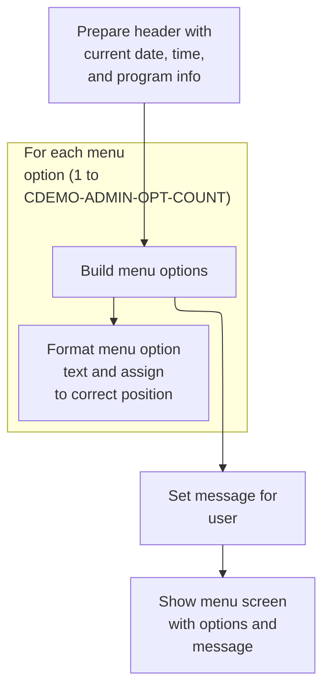

This section prepares and sends the admin menu screen, ensuring the user sees the current header information, all available admin options, and any relevant message.

| Rule ID | Code Location        | Category       | Rule Name                  | Description                                                                                                         | Conditions                                                                                  | Remarks                                                                                                                                                                                                           |
| ------- | -------------------- | -------------- | -------------------------- | ------------------------------------------------------------------------------------------------------------------- | ------------------------------------------------------------------------------------------- | ----------------------------------------------------------------------------------------------------------------------------------------------------------------------------------------------------------------- |
| BR-001  | POPULATE-HEADER-INFO | Business logic | Header information display | The header of the admin menu screen must display the current date, current time, program name, and transaction ID.  | Whenever the admin menu screen is prepared and sent.                                        | Date is displayed in MM-DD-YY format, time in HH-MM-SS format. Program name is 'COADM01C', transaction ID is 'CA00'. All fields are alphanumeric strings, left-aligned.                                           |
| BR-002  | BUILD-MENU-OPTIONS   | Business logic | Menu options listing       | All available admin menu options must be displayed to the user, each formatted as '<option number>. <option name>'. | Whenever the admin menu screen is prepared and sent.                                        | Up to 10 options are supported (CDEMO-ADMIN-OPT-COUNT). Each option is displayed as a string: option number (numeric), period, space, option name (alphanumeric), left-aligned, maximum 40 characters per option. |
| BR-003  | SEND-MENU-SCREEN     | Business logic | User message display       | Any message intended for the user must be displayed in the message area of the admin menu screen.                   | Whenever a message is present in the message variable when preparing the admin menu screen. | Message is an alphanumeric string up to 80 characters, left-aligned. If no message is present, the area is blank.                                                                                                 |
| BR-004  | SEND-MENU-SCREEN     | Business logic | Menu screen delivery       | The admin menu screen must be sent to the user's terminal, clearing any previous content.                           | Whenever the admin menu screen is prepared and ready to be displayed.                       | The screen is sent using a terminal map, with the ERASE option ensuring previous content is cleared. All fields are displayed as specified in the header, options, and message rules.                             |

<SwmSnippet path="/app/cbl/COADM01C.cbl" line="172" repo-id="Z2l0aHViJTNBJTNBa3luZHJ5bC1hd3MtbWFpbmZyYW1lLW1vZGVybml6YXRpb24tY2FyZGRlbW8lM0ElM0FTd2ltbS1EZW1v">

---

SEND-MENU-SCREEN calls POPULATE-HEADER-INFO and BUILD-MENU-OPTIONS to set up the header and admin menu options, moves any message to the error field, and sends the admin menu map to the terminal, clearing the screen.

```cobol
       SEND-MENU-SCREEN.

           PERFORM POPULATE-HEADER-INFO
           PERFORM BUILD-MENU-OPTIONS

           MOVE WS-MESSAGE TO ERRMSGO OF COADM1AO

           EXEC CICS SEND
                     MAP('COADM1A')
                     MAPSET('COADM01')
                     FROM(COADM1AO)
                     ERASE
           END-EXEC.
```

---

</SwmSnippet>

<SwmSnippet path="/app/cbl/COADM01C.cbl" line="202" repo-id="Z2l0aHViJTNBJTNBa3luZHJ5bC1hd3MtbWFpbmZyYW1lLW1vZGVybml6YXRpb24tY2FyZGRlbW8lM0ElM0FTd2ltbS1EZW1v">

---

POPULATE-HEADER-INFO grabs the current date and time, formats them, and fills in the header fields with titles, program name, and transaction ID for the admin menu screen.

```cobol
       POPULATE-HEADER-INFO.

           MOVE FUNCTION CURRENT-DATE  TO WS-CURDATE-DATA

           MOVE CCDA-TITLE01           TO TITLE01O OF COADM1AO
           MOVE CCDA-TITLE02           TO TITLE02O OF COADM1AO
           MOVE WS-TRANID              TO TRNNAMEO OF COADM1AO
           MOVE WS-PGMNAME             TO PGMNAMEO OF COADM1AO

           MOVE WS-CURDATE-MONTH       TO WS-CURDATE-MM
           MOVE WS-CURDATE-DAY         TO WS-CURDATE-DD
           MOVE WS-CURDATE-YEAR(3:2)   TO WS-CURDATE-YY

           MOVE WS-CURDATE-MM-DD-YY    TO CURDATEO OF COADM1AO

           MOVE WS-CURTIME-HOURS       TO WS-CURTIME-HH
           MOVE WS-CURTIME-MINUTE      TO WS-CURTIME-MM
           MOVE WS-CURTIME-SECOND      TO WS-CURTIME-SS

           MOVE WS-CURTIME-HH-MM-SS    TO CURTIMEO OF COADM1AO.
```

---

</SwmSnippet>

<SwmSnippet path="/app/cbl/COADM01C.cbl" line="226" repo-id="Z2l0aHViJTNBJTNBa3luZHJ5bC1hd3MtbWFpbmZyYW1lLW1vZGVybml6YXRpb24tY2FyZGRlbW8lM0ElM0FTd2ltbS1EZW1v">

---

BUILD-MENU-OPTIONS loops through each admin menu option, builds the display string, and assigns it to the right output field for the admin menu screen.

```cobol
       BUILD-MENU-OPTIONS.

           PERFORM VARYING WS-IDX FROM 1 BY 1 UNTIL
                           WS-IDX > CDEMO-ADMIN-OPT-COUNT

               MOVE SPACES             TO WS-ADMIN-OPT-TXT

               STRING CDEMO-ADMIN-OPT-NUM(WS-IDX)  DELIMITED BY SIZE
                      '. '                         DELIMITED BY SIZE
                      CDEMO-ADMIN-OPT-NAME(WS-IDX) DELIMITED BY SIZE
                 INTO WS-ADMIN-OPT-TXT

               EVALUATE WS-IDX
                   WHEN 1
                       MOVE WS-ADMIN-OPT-TXT TO OPTN001O
                   WHEN 2
                       MOVE WS-ADMIN-OPT-TXT TO OPTN002O
                   WHEN 3
                       MOVE WS-ADMIN-OPT-TXT TO OPTN003O
                   WHEN 4
                       MOVE WS-ADMIN-OPT-TXT TO OPTN004O
                   WHEN 5
                       MOVE WS-ADMIN-OPT-TXT TO OPTN005O
                   WHEN 6
                       MOVE WS-ADMIN-OPT-TXT TO OPTN006O
                   WHEN 7
                       MOVE WS-ADMIN-OPT-TXT TO OPTN007O
                   WHEN 8
                       MOVE WS-ADMIN-OPT-TXT TO OPTN008O
                   WHEN 9
                       MOVE WS-ADMIN-OPT-TXT TO OPTN009O
                   WHEN 10
                       MOVE WS-ADMIN-OPT-TXT TO OPTN010O
                   WHEN OTHER
                       CONTINUE
               END-EVALUATE

           END-PERFORM.
```

---

</SwmSnippet>

### Receiving admin menu input

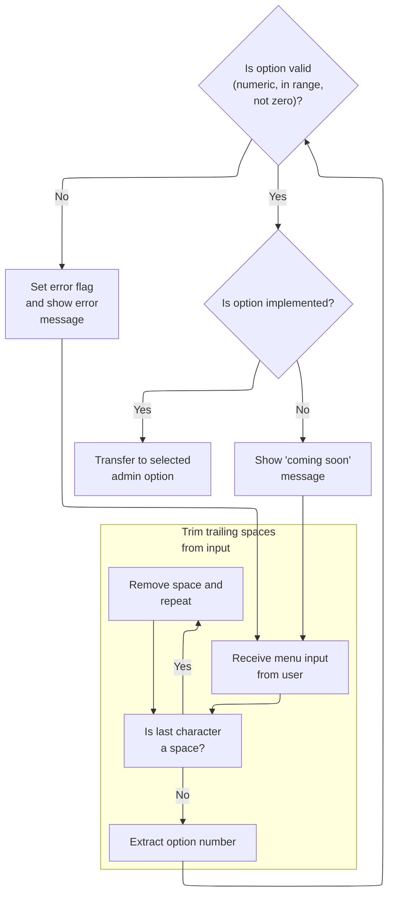

This section manages the receipt and validation of admin menu input, ensuring users can only select valid and implemented options, and providing appropriate feedback for invalid or unavailable choices.

| Rule ID | Code Location     | Category        | Rule Name                   | Description                                                                                                                                                                                                                 | Conditions                                                                     | Remarks                                                                                                                                                                                                     |
| ------- | ----------------- | --------------- | --------------------------- | --------------------------------------------------------------------------------------------------------------------------------------------------------------------------------------------------------------------------- | ------------------------------------------------------------------------------ | ----------------------------------------------------------------------------------------------------------------------------------------------------------------------------------------------------------- |
| BR-001  | PROCESS-ENTER-KEY | Data validation | Trim trailing spaces        | Trailing spaces in the admin menu option input are removed before the option is processed. This ensures that user input is normalized and only the meaningful part of the input is considered for validation and selection. | Whenever the user enters an option on the admin menu screen and presses enter. | Input is normalized by removing all trailing spaces. The normalized option is then used for further validation and processing.                                                                              |
| BR-002  | PROCESS-ENTER-KEY | Data validation | Option validity check       | The admin menu option entered by the user must be numeric, within the allowed range, and not zero. If the input fails any of these checks, an error message is displayed and the user is prompted to enter a valid option.  | Whenever the user submits an option on the admin menu screen.                  | The option must be a number between 1 and the value of CDEMO-ADMIN-OPT-COUNT (the maximum allowed option number). Zero is not accepted. The error message shown is 'Please enter a valid option number...'. |
| BR-003  | PROCESS-ENTER-KEY | Business logic  | Option implementation check | If the selected admin menu option is implemented, control is transferred to the corresponding program for that option. If the option is not implemented, a 'coming soon' message is displayed to the user.                  | Whenever the user enters a valid option number.                                | An option is considered implemented if its associated program name does not start with 'DUMMY'. If not implemented, the message 'This option is coming soon ...' is displayed.                              |

<SwmSnippet path="/app/cbl/COADM01C.cbl" line="189" repo-id="Z2l0aHViJTNBJTNBa3luZHJ5bC1hd3MtbWFpbmZyYW1lLW1vZGVybml6YXRpb24tY2FyZGRlbW8lM0ElM0FTd2ltbS1EZW1v">

---

RECEIVE-MENU-SCREEN grabs user input from the admin menu screen using CICS RECEIVE, storing it in the input area and checking response codes.

```cobol
       RECEIVE-MENU-SCREEN.

           EXEC CICS RECEIVE
                     MAP('COADM1A')
                     MAPSET('COADM01')
                     INTO(COADM1AI)
                     RESP(WS-RESP-CD)
                     RESP2(WS-REAS-CD)
           END-EXEC.
```

---

</SwmSnippet>

<SwmSnippet path="/app/cbl/COADM01C.cbl" line="115" repo-id="Z2l0aHViJTNBJTNBa3luZHJ5bC1hd3MtbWFpbmZyYW1lLW1vZGVybml6YXRpb24tY2FyZGRlbW8lM0ElM0FTd2ltbS1EZW1v">

---

PROCESS-ENTER-KEY trims and validates the admin menu option input, checks if the option is implemented, and if valid, transfers control to the selected program. If not, it shows an error or 'coming soon' message.

```cobol
       PROCESS-ENTER-KEY.

           PERFORM VARYING WS-IDX
                   FROM LENGTH OF OPTIONI OF COADM1AI BY -1 UNTIL
                   OPTIONI OF COADM1AI(WS-IDX:1) NOT = SPACES OR
                   WS-IDX = 1
           END-PERFORM
           MOVE OPTIONI OF COADM1AI(1:WS-IDX) TO WS-OPTION-X
           INSPECT WS-OPTION-X REPLACING ALL ' ' BY '0'
           MOVE WS-OPTION-X              TO WS-OPTION
           MOVE WS-OPTION                TO OPTIONO OF COADM1AO

           IF WS-OPTION IS NOT NUMERIC OR
              WS-OPTION > CDEMO-ADMIN-OPT-COUNT OR
              WS-OPTION = ZEROS
               MOVE 'Y'     TO WS-ERR-FLG
               MOVE 'Please enter a valid option number...' TO
                                       WS-MESSAGE
               PERFORM SEND-MENU-SCREEN
           END-IF


           IF NOT ERR-FLG-ON
               IF CDEMO-ADMIN-OPT-PGMNAME(WS-OPTION)(1:5) NOT = 'DUMMY'
                   MOVE WS-TRANID    TO CDEMO-FROM-TRANID
                   MOVE WS-PGMNAME   TO CDEMO-FROM-PROGRAM
                   MOVE ZEROS        TO CDEMO-PGM-CONTEXT
                   EXEC CICS
                       XCTL PROGRAM(CDEMO-ADMIN-OPT-PGMNAME(WS-OPTION))
                       COMMAREA(CARDDEMO-COMMAREA)
                   END-EXEC
               END-IF
               MOVE SPACES             TO WS-MESSAGE
               MOVE DFHGREEN           TO ERRMSGC  OF COADM1AO
               STRING 'This option '       DELIMITED BY SIZE
      *                CDEMO-ADMIN-OPT-NAME(WS-OPTION)
      *                                DELIMITED BY SIZE
                       'is coming soon ...'   DELIMITED BY SIZE
                  INTO WS-MESSAGE
               PERFORM SEND-MENU-SCREEN
           END-IF.
```

---

</SwmSnippet>

## Initializing user add screen after returning

This section is responsible for preparing the user add screen for new input after returning from a previous screen, ensuring all fields are cleared and the user is prompted to enter new information.

| Rule ID | Code Location | Category       | Rule Name               | Description                                                                                                                                                         | Conditions                                                                                                         | Remarks                                                                                                                                                      |
| ------- | ------------- | -------------- | ----------------------- | ------------------------------------------------------------------------------------------------------------------------------------------------------------------- | ------------------------------------------------------------------------------------------------------------------ | ------------------------------------------------------------------------------------------------------------------------------------------------------------ |
| BR-001  | MAIN-PARA     | Business logic | User add screen reset   | When returning to the main screen and the program is not in a reenter state, the user add screen must be initialized by clearing all previous user add output data. | Triggered after returning to the main screen, if the program is not in a reenter state.                            | All fields in the user add output area are cleared using a 'low values' constant, which means all bytes are set to the lowest possible value for their type. |
| BR-002  | MAIN-PARA     | Business logic | First name length unset | When initializing the user add screen, the first name length must be set to -1 to indicate that no name has been entered yet.                                       | Triggered during user add screen initialization after returning from the previous screen and not in reenter state. | The first name length is set to the constant value -1, which signals that the field is empty and ready for new input.                                        |
| BR-003  | MAIN-PARA     | Business logic | Prompt for user input   | After initializing the user add screen, the system must prompt the user to enter new user information.                                                              | Triggered after the user add screen is reset and first name length is set to -1.                                   | The prompt is triggered by performing the user add screen send operation, which displays the input fields to the user.                                       |

<SwmSnippet path="/app/cbl/COUSR01C.cbl" line="81" repo-id="Z2l0aHViJTNBJTNBa3luZHJ5bC1hd3MtbWFpbmZyYW1lLW1vZGVybml6YXRpb24tY2FyZGRlbW8lM0ElM0FTd2ltbS1EZW1v">

---

Back in MAIN-PARA after RETURN-TO-PREV-SCREEN, if we're not reentering, we set up the user add screen by clearing COUSR1AO, marking FNAMEL as -1, and calling SEND-USRADD-SCREEN to prompt for user input.

```cobol
           ELSE
               MOVE DFHCOMMAREA(1:EIBCALEN) TO CARDDEMO-COMMAREA
               IF NOT CDEMO-PGM-REENTER
                   SET CDEMO-PGM-REENTER    TO TRUE
                   MOVE LOW-VALUES          TO COUSR1AO
                   MOVE -1       TO FNAMEL OF COUSR1AI
                   PERFORM SEND-USRADD-SCREEN
```

---

</SwmSnippet>

## Displaying the user add screen with header info

This section prepares and displays the user add screen, ensuring that header information and any relevant messages are shown to the user for context and feedback.

| Rule ID | Code Location        | Category       | Rule Name                                       | Description                                                                                                                                                 | Conditions                                                                                                             | Remarks                                                                                                                                                                                                             |
| ------- | -------------------- | -------------- | ----------------------------------------------- | ----------------------------------------------------------------------------------------------------------------------------------------------------------- | ---------------------------------------------------------------------------------------------------------------------- | ------------------------------------------------------------------------------------------------------------------------------------------------------------------------------------------------------------------- |
| BR-001  | POPULATE-HEADER-INFO | Business logic | Current date and time in header                 | The user add screen must display the current date and time in the header each time it is shown, ensuring users see up-to-date context information.          | Whenever the user add screen is displayed via SEND-USRADD-SCREEN.                                                      | Date and time are formatted and displayed in the header. The date format is MM-DD-YY and the time format is HH-MM-SS, both as strings. These are derived from the system's current date and time.                   |
| BR-002  | POPULATE-HEADER-INFO | Business logic | Static titles and program identifiers in header | The user add screen must display static titles and program identifiers in the header to provide branding and context for the user.                          | Whenever the user add screen is displayed via SEND-USRADD-SCREEN.                                                      | Titles and program identifiers are static strings. Title01 and Title02 are set from constants, program name is 'COUSR01C', and transaction ID is 'CU01'. These are displayed as alphanumeric strings in the header. |
| BR-003  | SEND-USRADD-SCREEN   | Business logic | Display error or informational message          | Any error or informational message present must be displayed at the top of the user add screen, ensuring users are informed of relevant issues or statuses. | Whenever WS-MESSAGE contains a value (including spaces, which means no message), and the user add screen is displayed. | The message field is an 80-character alphanumeric string. If no message is present, it is filled with spaces.                                                                                                       |

<SwmSnippet path="/app/cbl/COUSR01C.cbl" line="184" repo-id="Z2l0aHViJTNBJTNBa3luZHJ5bC1hd3MtbWFpbmZyYW1lLW1vZGVybml6YXRpb24tY2FyZGRlbW8lM0ElM0FTd2ltbS1EZW1v">

---

In `SEND-USRADD-SCREEN` we kick off by performing POPULATE-HEADER-INFO. This sets up all the header fields in COUSR1AO—like the date, time, program name, and titles—so when we send the user add screen, it shows the right context and branding. Without this, the screen would be missing key info up top.

```cobol
       SEND-USRADD-SCREEN.

           PERFORM POPULATE-HEADER-INFO
```

---

</SwmSnippet>

<SwmSnippet path="/app/cbl/COUSR01C.cbl" line="214" repo-id="Z2l0aHViJTNBJTNBa3luZHJ5bC1hd3MtbWFpbmZyYW1lLW1vZGVybml6YXRpb24tY2FyZGRlbW8lM0ElM0FTd2ltbS1EZW1v">

---

`POPULATE-HEADER-INFO` fills out the header fields in COUSR1AO: it grabs the current date and time, formats them, and sets the static titles and program identifiers. This way, every time we send the user add screen, it shows the right titles and up-to-date info.

```cobol
       POPULATE-HEADER-INFO.

           MOVE FUNCTION CURRENT-DATE  TO WS-CURDATE-DATA

           MOVE CCDA-TITLE01           TO TITLE01O OF COUSR1AO
           MOVE CCDA-TITLE02           TO TITLE02O OF COUSR1AO
           MOVE WS-TRANID              TO TRNNAMEO OF COUSR1AO
           MOVE WS-PGMNAME             TO PGMNAMEO OF COUSR1AO

           MOVE WS-CURDATE-MONTH       TO WS-CURDATE-MM
           MOVE WS-CURDATE-DAY         TO WS-CURDATE-DD
           MOVE WS-CURDATE-YEAR(3:2)   TO WS-CURDATE-YY

           MOVE WS-CURDATE-MM-DD-YY    TO CURDATEO OF COUSR1AO

           MOVE WS-CURTIME-HOURS       TO WS-CURTIME-HH
           MOVE WS-CURTIME-MINUTE      TO WS-CURTIME-MM
           MOVE WS-CURTIME-SECOND      TO WS-CURTIME-SS

           MOVE WS-CURTIME-HH-MM-SS    TO CURTIMEO OF COUSR1AO.
```

---

</SwmSnippet>

<SwmSnippet path="/app/cbl/COUSR01C.cbl" line="188" repo-id="Z2l0aHViJTNBJTNBa3luZHJ5bC1hd3MtbWFpbmZyYW1lLW1vZGVybml6YXRpb24tY2FyZGRlbW8lM0ElM0FTd2ltbS1EZW1v">

---

Back in SEND-USRADD-SCREEN after returning from POPULATE-HEADER-INFO, we move WS-MESSAGE into ERRMSGO so any error or info message shows up on the screen. Then we send the COUSR1A map using EXEC CICS SEND, which displays the user add screen and clears the terminal before showing it.

```cobol
           MOVE WS-MESSAGE TO ERRMSGO OF COUSR1AO

           EXEC CICS SEND
                     MAP('COUSR1A')
                     MAPSET('COUSR01')
                     FROM(COUSR1AO)
                     ERASE
                     CURSOR
           END-EXEC.
```

---

</SwmSnippet>

## Handling user input and key events after screen display

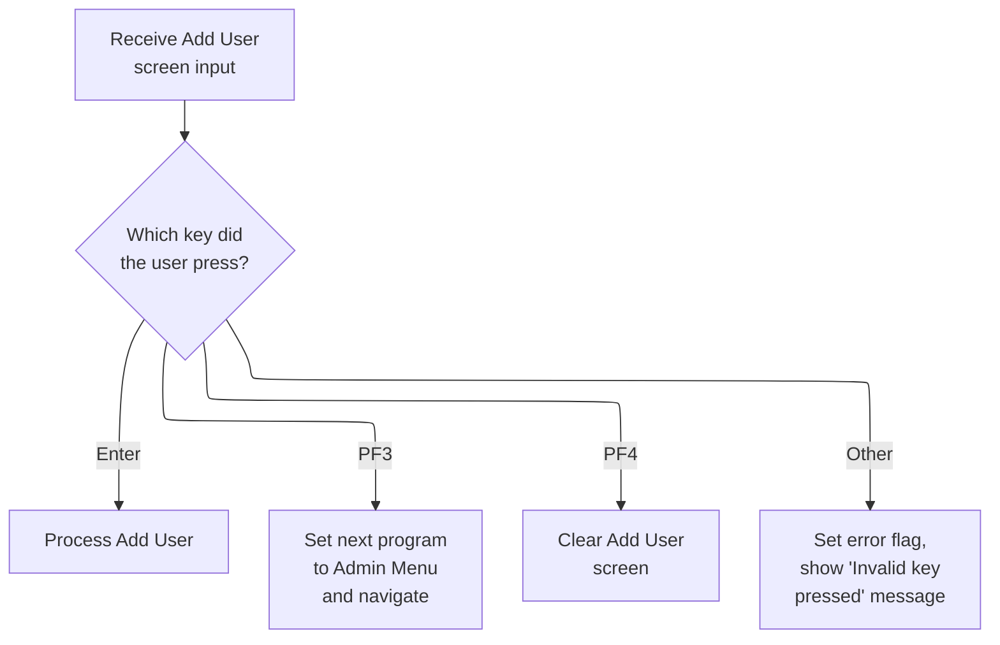

This section manages user input and key events after the Add User screen is displayed, determining the appropriate business action based on which key the user presses.

| Rule ID | Code Location | Category       | Rule Name                     | Description                                                                                                                                                                                                              | Conditions                                                                                 | Remarks                                                                                                                                                                                                                                   |
| ------- | ------------- | -------------- | ----------------------------- | ------------------------------------------------------------------------------------------------------------------------------------------------------------------------------------------------------------------------ | ------------------------------------------------------------------------------------------ | ----------------------------------------------------------------------------------------------------------------------------------------------------------------------------------------------------------------------------------------- |
| BR-001  | MAIN-PARA     | Business logic | Process Add User on Enter     | When the user presses the Enter key after the Add User screen is displayed, the system processes the Add User input.                                                                                                     | User presses the Enter key (DFHENTER) after the Add User screen is displayed.              | No constants are directly referenced in this rule. The output is the processing of the Add User input, which may involve further validation or actions not shown in this section.                                                         |
| BR-002  | MAIN-PARA     | Business logic | Navigate to Admin Menu on PF3 | When the user presses the PF3 key after the Add User screen is displayed, the system sets the next program to Admin Menu and navigates to it.                                                                            | User presses the PF3 key (DFHPF3) after the Add User screen is displayed.                  | The next program is set to 'COADM01C'. This triggers navigation to the Admin Menu.                                                                                                                                                        |
| BR-003  | MAIN-PARA     | Business logic | Clear Add User Screen on PF4  | When the user presses the PF4 key after the Add User screen is displayed, the system clears the Add User screen.                                                                                                         | User presses the PF4 key (DFHPF4) after the Add User screen is displayed.                  | No constants are directly referenced in this rule. The output is the clearing of the Add User screen.                                                                                                                                     |
| BR-004  | MAIN-PARA     | Error handling | Invalid Key Error Handling    | When the user presses any key other than Enter, PF3, or PF4 after the Add User screen is displayed, the system sets an error flag, marks the first name field as invalid, and displays an 'Invalid key pressed' message. | User presses any key other than Enter, PF3, or PF4 after the Add User screen is displayed. | The error flag is set to 'Y'. The first name field is marked as invalid by setting its value to -1. The error message displayed is 'Invalid key pressed. Please see below...         ' (50 characters, left aligned, padded with spaces). |

<SwmSnippet path="/app/cbl/COUSR01C.cbl" line="88" repo-id="Z2l0aHViJTNBJTNBa3luZHJ5bC1hd3MtbWFpbmZyYW1lLW1vZGVybml6YXRpb24tY2FyZGRlbW8lM0ElM0FTd2ltbS1EZW1v">

---

After returning from SEND-USRADD-SCREEN in MAIN-PARA, we check if we're reentering. If so, we call RECEIVE-USRADD-SCREEN to grab user input and then use EIBAID to figure out which key was pressed. Depending on the key, we either process the input, jump to the admin menu, clear the screen, or show an invalid key error.

```cobol
               ELSE
                   PERFORM RECEIVE-USRADD-SCREEN
                   EVALUATE EIBAID
                       WHEN DFHENTER
                           PERFORM PROCESS-ENTER-KEY
                       WHEN DFHPF3
                           MOVE 'COADM01C' TO CDEMO-TO-PROGRAM
                           PERFORM RETURN-TO-PREV-SCREEN
                       WHEN DFHPF4
                           PERFORM CLEAR-CURRENT-SCREEN
                       WHEN OTHER
                           MOVE 'Y'                       TO WS-ERR-FLG
                           MOVE -1       TO FNAMEL OF COUSR1AI
                           MOVE CCDA-MSG-INVALID-KEY      TO WS-MESSAGE
                           PERFORM SEND-USRADD-SCREEN
                   END-EVALUATE
               END-IF
```

---

</SwmSnippet>

<SwmSnippet path="/app/cbl/COUSR01C.cbl" line="201" repo-id="Z2l0aHViJTNBJTNBa3luZHJ5bC1hd3MtbWFpbmZyYW1lLW1vZGVybml6YXRpb24tY2FyZGRlbW8lM0ElM0FTd2ltbS1EZW1v">

---

`RECEIVE-USRADD-SCREEN` uses EXEC CICS RECEIVE to pull user input from the COUSR1A map into COUSR1AI. It also grabs response codes so we can check if the receive worked or if there was an issue.

```cobol
       RECEIVE-USRADD-SCREEN.

           EXEC CICS RECEIVE
                     MAP('COUSR1A')
                     MAPSET('COUSR01')
                     INTO(COUSR1AI)
                     RESP(WS-RESP-CD)
                     RESP2(WS-REAS-CD)
           END-EXEC.
```

---

</SwmSnippet>

## Validating user input fields

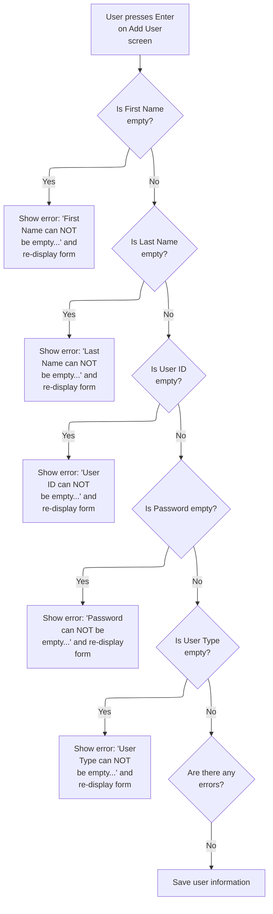

This section validates user input fields on the Add User screen, ensuring all required fields are provided before saving the new user to the security file.

| Rule ID | Code Location     | Category        | Rule Name           | Description                                                                                                                                                                                | Conditions                                                                                   | Remarks                                                                                                                                                                                            |
| ------- | ----------------- | --------------- | ------------------- | ------------------------------------------------------------------------------------------------------------------------------------------------------------------------------------------ | -------------------------------------------------------------------------------------------- | -------------------------------------------------------------------------------------------------------------------------------------------------------------------------------------------------- |
| BR-001  | PROCESS-ENTER-KEY | Data validation | First Name Required | If the First Name field is empty, the system must display an error message stating that First Name cannot be empty, mark the field for correction, and re-display the form for user input. | Triggered when the First Name field is empty or contains only blank or non-printable values. | Error message: 'First Name can NOT be empty...'. The First Name field is a string of up to 20 characters. The form is re-displayed for correction.                                                 |
| BR-002  | PROCESS-ENTER-KEY | Data validation | Last Name Required  | If the Last Name field is empty, the system must display an error message stating that Last Name cannot be empty, mark the field for correction, and re-display the form for user input.   | Triggered when the Last Name field is empty or contains only blank or non-printable values.  | Error message: 'Last Name can NOT be empty...'. The Last Name field is a string of up to 20 characters. The form is re-displayed for correction.                                                   |
| BR-003  | PROCESS-ENTER-KEY | Data validation | User ID Required    | If the User ID field is empty, the system must display an error message stating that User ID cannot be empty, mark the field for correction, and re-display the form for user input.       | Triggered when the User ID field is empty or contains only blank or non-printable values.    | Error message: 'User ID can NOT be empty...'. The User ID field is a string of up to 8 characters. The form is re-displayed for correction.                                                        |
| BR-004  | PROCESS-ENTER-KEY | Data validation | Password Required   | If the Password field is empty, the system must display an error message stating that Password cannot be empty, mark the field for correction, and re-display the form for user input.     | Triggered when the Password field is empty or contains only blank or non-printable values.   | Error message: 'Password can NOT be empty...'. The Password field is a string of up to 8 characters. The form is re-displayed for correction.                                                      |
| BR-005  | PROCESS-ENTER-KEY | Data validation | User Type Required  | If the User Type field is empty, the system must display an error message stating that User Type cannot be empty, mark the field for correction, and re-display the form for user input.   | Triggered when the User Type field is empty or contains only blank or non-printable values.  | Error message: 'User Type can NOT be empty...'. The User Type field is a string of 1 character. The form is re-displayed for correction.                                                           |
| BR-006  | PROCESS-ENTER-KEY | Business logic  | Save Valid User     | If all required fields are provided and no errors are detected, the system must save the user information to the security file.                                                            | Triggered when none of the required fields are empty and no error flag is set.               | User information includes User ID (8 characters), First Name (20 characters), Last Name (20 characters), Password (8 characters), and User Type (1 character). Data is saved to the security file. |

<SwmSnippet path="/app/cbl/COUSR01C.cbl" line="115" repo-id="Z2l0aHViJTNBJTNBa3luZHJ5bC1hd3MtbWFpbmZyYW1lLW1vZGVybml6YXRpb24tY2FyZGRlbW8lM0ElM0FTd2ltbS1EZW1v">

---

In `PROCESS-ENTER-KEY` we start by validating each input field. If First Name is empty, we set the error flag, set an error message, mark FNAMEL as -1, and call SEND-USRADD-SCREEN to show the error and prompt the user again.

```cobol
       PROCESS-ENTER-KEY.

           EVALUATE TRUE
               WHEN FNAMEI OF COUSR1AI = SPACES OR LOW-VALUES
                   MOVE 'Y'     TO WS-ERR-FLG
                   MOVE 'First Name can NOT be empty...' TO
                                   WS-MESSAGE
                   MOVE -1       TO FNAMEL OF COUSR1AI
                   PERFORM SEND-USRADD-SCREEN
```

---

</SwmSnippet>

<SwmSnippet path="/app/cbl/COUSR01C.cbl" line="124" repo-id="Z2l0aHViJTNBJTNBa3luZHJ5bC1hd3MtbWFpbmZyYW1lLW1vZGVybml6YXRpb24tY2FyZGRlbW8lM0ElM0FTd2ltbS1EZW1v">

---

After returning from SEND-USRADD-SCREEN in PROCESS-ENTER-KEY, we move on to check Last Name. If it's empty, we set the error flag, set the message, mark LNAMEL as -1, and resend the screen so the user sees which field needs fixing.

```cobol
               WHEN LNAMEI OF COUSR1AI = SPACES OR LOW-VALUES
                   MOVE 'Y'     TO WS-ERR-FLG
                   MOVE 'Last Name can NOT be empty...' TO
                                   WS-MESSAGE
                   MOVE -1       TO LNAMEL OF COUSR1AI
                   PERFORM SEND-USRADD-SCREEN
```

---

</SwmSnippet>

<SwmSnippet path="/app/cbl/COUSR01C.cbl" line="130" repo-id="Z2l0aHViJTNBJTNBa3luZHJ5bC1hd3MtbWFpbmZyYW1lLW1vZGVybml6YXRpb24tY2FyZGRlbW8lM0ElM0FTd2ltbS1EZW1v">

---

After handling Last Name, we check User ID. If it's empty, we set the error flag, set the error message, mark USERIDL as -1, and resend the screen so the user can fix it.

```cobol
               WHEN USERIDI OF COUSR1AI = SPACES OR LOW-VALUES
                   MOVE 'Y'     TO WS-ERR-FLG
                   MOVE 'User ID can NOT be empty...' TO
                                   WS-MESSAGE
                   MOVE -1       TO USERIDL OF COUSR1AI
                   PERFORM SEND-USRADD-SCREEN
```

---

</SwmSnippet>

<SwmSnippet path="/app/cbl/COUSR01C.cbl" line="136" repo-id="Z2l0aHViJTNBJTNBa3luZHJ5bC1hd3MtbWFpbmZyYW1lLW1vZGVybml6YXRpb24tY2FyZGRlbW8lM0ElM0FTd2ltbS1EZW1v">

---

After User ID, we check Password. If it's empty, we set the error flag, set the error message, mark PASSWDL as -1, and resend the screen so the user can fix it.

```cobol
               WHEN PASSWDI OF COUSR1AI = SPACES OR LOW-VALUES
                   MOVE 'Y'     TO WS-ERR-FLG
                   MOVE 'Password can NOT be empty...' TO
                                   WS-MESSAGE
                   MOVE -1       TO PASSWDL OF COUSR1AI
                   PERFORM SEND-USRADD-SCREEN
```

---

</SwmSnippet>

<SwmSnippet path="/app/cbl/COUSR01C.cbl" line="142" repo-id="Z2l0aHViJTNBJTNBa3luZHJ5bC1hd3MtbWFpbmZyYW1lLW1vZGVybml6YXRpb24tY2FyZGRlbW8lM0ElM0FTd2ltbS1EZW1v">

---

After Password, we check User Type. If it's empty, we set the error flag, set the error message, mark USRTYPEL as -1, and resend the screen so the user can fix it.

```cobol
               WHEN USRTYPEI OF COUSR1AI = SPACES OR LOW-VALUES
                   MOVE 'Y'     TO WS-ERR-FLG
                   MOVE 'User Type can NOT be empty...' TO
                                   WS-MESSAGE
                   MOVE -1       TO USRTYPEL OF COUSR1AI
                   PERFORM SEND-USRADD-SCREEN
```

---

</SwmSnippet>

<SwmSnippet path="/app/cbl/COUSR01C.cbl" line="148" repo-id="Z2l0aHViJTNBJTNBa3luZHJ5bC1hd3MtbWFpbmZyYW1lLW1vZGVybml6YXRpb24tY2FyZGRlbW8lM0ElM0FTd2ltbS1EZW1v">

---

After checking all the input fields, if none of the error cases match, we hit WHEN OTHER, set FNAMEL to -1, and just continue. This means no specific error, just a generic reset for the field.

```cobol
               WHEN OTHER
                   MOVE -1       TO FNAMEL OF COUSR1AI
                   CONTINUE
           END-EVALUATE
```

---

</SwmSnippet>

<SwmSnippet path="/app/cbl/COUSR01C.cbl" line="153" repo-id="Z2l0aHViJTNBJTNBa3luZHJ5bC1hd3MtbWFpbmZyYW1lLW1vZGVybml6YXRpb24tY2FyZGRlbW8lM0ElM0FTd2ltbS1EZW1v">

---

Once we've validated all the fields in PROCESS-ENTER-KEY and found no errors, we copy the user input into SEC-USER-DATA and call WRITE-USER-SEC-FILE to save the new user to the security file.

```cobol
           IF NOT ERR-FLG-ON
               MOVE USERIDI  OF COUSR1AI TO SEC-USR-ID
               MOVE FNAMEI   OF COUSR1AI TO SEC-USR-FNAME
               MOVE LNAMEI   OF COUSR1AI TO SEC-USR-LNAME
               MOVE PASSWDI  OF COUSR1AI TO SEC-USR-PWD
               MOVE USRTYPEI OF COUSR1AI TO SEC-USR-TYPE
               PERFORM WRITE-USER-SEC-FILE
           END-IF.
```

---

</SwmSnippet>

## Writing user data and handling write results

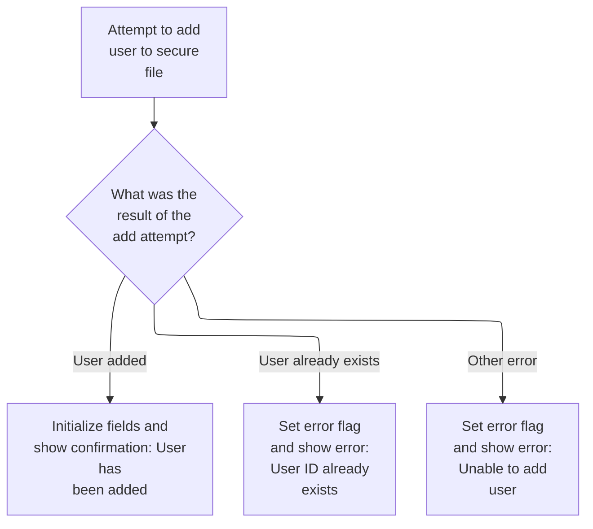

This section manages the process of adding a user to a secure file, handling the outcomes of the write operation, and updating the user interface with appropriate messages and field resets based on the result.

| Rule ID | Code Location                              | Category       | Rule Name                 | Description                                                                                                                                                                                                                 | Conditions                                                                                        | Remarks                                                                                                                                                                                                        |
| ------- | ------------------------------------------ | -------------- | ------------------------- | --------------------------------------------------------------------------------------------------------------------------------------------------------------------------------------------------------------------------- | ------------------------------------------------------------------------------------------------- | -------------------------------------------------------------------------------------------------------------------------------------------------------------------------------------------------------------- |
| BR-001  | WRITE-USER-SEC-FILE, INITIALIZE-ALL-FIELDS | Business logic | Successful user addition  | When a user is successfully added to the secure file, all input fields are cleared, a confirmation message is displayed, and the user add screen is resent with a green message indicator.                                  | The write operation to the secure file returns a normal response code.                            | The confirmation message format is: 'User <user id> has been added ...' (string, left-aligned, padded as needed). The message color is set to green. All input fields are reset to blank or -1 as appropriate. |
| BR-002  | INITIALIZE-ALL-FIELDS                      | Business logic | Field reset after success | After a successful user addition, all input fields are reset to blank or default values to prepare for the next user entry.                                                                                                 | Triggered after a successful user addition.                                                       | All input fields (user ID, first name, last name, password, user type) are set to blank. The first name length field is set to -1.                                                                             |
| BR-003  | WRITE-USER-SEC-FILE                        | Error handling | Duplicate user ID error   | If the user ID already exists in the secure file, an error flag is set, an error message is displayed, the user ID field is marked for correction, and the user add screen is resent.                                       | The write operation to the secure file returns a duplicate key or duplicate record response code. | The error message is: 'User ID already exist...' (string, left-aligned, padded as needed). The error flag is set to 'Y'. The user ID field is marked with -1 to indicate correction is needed.                 |
| BR-004  | WRITE-USER-SEC-FILE                        | Error handling | Generic write error       | If the write operation fails for reasons other than duplicate user ID, a generic error flag is set, a generic error message is displayed, the first name field is marked for correction, and the user add screen is resent. | The write operation to the secure file returns any response code other than normal or duplicate.  | The error message is: 'Unable to Add User...' (string, left-aligned, padded as needed). The error flag is set to 'Y'. The first name field is marked with -1 to indicate correction is needed.                 |

<SwmSnippet path="/app/cbl/COUSR01C.cbl" line="238" repo-id="Z2l0aHViJTNBJTNBa3luZHJ5bC1hd3MtbWFpbmZyYW1lLW1vZGVybml6YXRpb24tY2FyZGRlbW8lM0ElM0FTd2ltbS1EZW1v">

---

In WRITE-USER-SEC-FILE we use EXEC CICS WRITE to save the user data to the USRSEC file, keyed by user ID. We grab response codes to see if the write worked or if there was a duplicate or other error.

```cobol
       WRITE-USER-SEC-FILE.

           EXEC CICS WRITE
                DATASET   (WS-USRSEC-FILE)
                FROM      (SEC-USER-DATA)
                LENGTH    (LENGTH OF SEC-USER-DATA)
                RIDFLD    (SEC-USR-ID)
                KEYLENGTH (LENGTH OF SEC-USR-ID)
                RESP      (WS-RESP-CD)
                RESP2     (WS-REAS-CD)
           END-EXEC.
```

---

</SwmSnippet>

<SwmSnippet path="/app/cbl/COUSR01C.cbl" line="250" repo-id="Z2l0aHViJTNBJTNBa3luZHJ5bC1hd3MtbWFpbmZyYW1lLW1vZGVybml6YXRpb24tY2FyZGRlbW8lM0ElM0FTd2ltbS1EZW1v">

---

After writing the user data, we check the response code. If the write was successful, we call INITIALIZE-ALL-FIELDS to clear out all input fields, set a success message, and resend the user add screen. If there's a duplicate or other error, we set the error flag, set the right message, and resend the screen.

```cobol
           EVALUATE WS-RESP-CD
               WHEN DFHRESP(NORMAL)
                   PERFORM INITIALIZE-ALL-FIELDS
                   MOVE SPACES             TO WS-MESSAGE
                   MOVE DFHGREEN           TO ERRMSGC  OF COUSR1AO
                   STRING 'User '     DELIMITED BY SIZE
                          SEC-USR-ID  DELIMITED BY SPACE
                          ' has been added ...' DELIMITED BY SIZE
                     INTO WS-MESSAGE
                   PERFORM SEND-USRADD-SCREEN
```

---

</SwmSnippet>

<SwmSnippet path="/app/cbl/COUSR01C.cbl" line="287" repo-id="Z2l0aHViJTNBJTNBa3luZHJ5bC1hd3MtbWFpbmZyYW1lLW1vZGVybml6YXRpb24tY2FyZGRlbW8lM0ElM0FTd2ltbS1EZW1v">

---

`INITIALIZE-ALL-FIELDS` resets all the input fields in COUSR1AI to spaces and sets FNAMEL to -1. This clears out any previous user data or messages so the next screen starts fresh.

```cobol
       INITIALIZE-ALL-FIELDS.

           MOVE -1              TO FNAMEL OF COUSR1AI
           MOVE SPACES          TO USERIDI  OF COUSR1AI
                                   FNAMEI   OF COUSR1AI
                                   LNAMEI   OF COUSR1AI
                                   PASSWDI  OF COUSR1AI
                                   USRTYPEI OF COUSR1AI
                                   WS-MESSAGE.
```

---

</SwmSnippet>

<SwmSnippet path="/app/cbl/COUSR01C.cbl" line="250" repo-id="Z2l0aHViJTNBJTNBa3luZHJ5bC1hd3MtbWFpbmZyYW1lLW1vZGVybml6YXRpb24tY2FyZGRlbW8lM0ElM0FTd2ltbS1EZW1v">

---

After returning from INITIALIZE-ALL-FIELDS in WRITE-USER-SEC-FILE, we clear the message, set the message color to green, build the success message, and resend the user add screen so the user sees confirmation. For errors, we set the error flag and resend the screen with the right message.

```cobol
           EVALUATE WS-RESP-CD
               WHEN DFHRESP(NORMAL)
                   PERFORM INITIALIZE-ALL-FIELDS
                   MOVE SPACES             TO WS-MESSAGE
                   MOVE DFHGREEN           TO ERRMSGC  OF COUSR1AO
                   STRING 'User '     DELIMITED BY SIZE
                          SEC-USR-ID  DELIMITED BY SPACE
                          ' has been added ...' DELIMITED BY SIZE
                     INTO WS-MESSAGE
                   PERFORM SEND-USRADD-SCREEN
```

---

</SwmSnippet>

<SwmSnippet path="/app/cbl/COUSR01C.cbl" line="260" repo-id="Z2l0aHViJTNBJTNBa3luZHJ5bC1hd3MtbWFpbmZyYW1lLW1vZGVybml6YXRpb24tY2FyZGRlbW8lM0ElM0FTd2ltbS1EZW1v">

---

After returning from SEND-USRADD-SCREEN in WRITE-USER-SEC-FILE, if the write failed due to duplicate user ID, we set the error flag, set the error message, mark USERIDL as -1, and resend the screen so the user can try again.

```cobol
               WHEN DFHRESP(DUPKEY)
               WHEN DFHRESP(DUPREC)
                   MOVE 'Y'     TO WS-ERR-FLG
                   MOVE 'User ID already exist...' TO
                                   WS-MESSAGE
                   MOVE -1       TO USERIDL OF COUSR1AI
                   PERFORM SEND-USRADD-SCREEN
```

---

</SwmSnippet>

<SwmSnippet path="/app/cbl/COUSR01C.cbl" line="267" repo-id="Z2l0aHViJTNBJTNBa3luZHJ5bC1hd3MtbWFpbmZyYW1lLW1vZGVybml6YXRpb24tY2FyZGRlbW8lM0ElM0FTd2ltbS1EZW1v">

---

If the write fails for reasons other than duplicate, we set the error flag, set a generic error message, mark FNAMEL as -1, and resend the screen so the user knows something went wrong and can try again.

```cobol
               WHEN OTHER
      *            DISPLAY 'RESP:' WS-RESP-CD 'REAS:' WS-REAS-CD
                   MOVE 'Y'     TO WS-ERR-FLG
                   MOVE 'Unable to Add User...' TO
                                   WS-MESSAGE
                   MOVE -1       TO FNAMEL OF COUSR1AI
                   PERFORM SEND-USRADD-SCREEN
           END-EVALUATE.
```

---

</SwmSnippet>

## Resetting the user add screen

This section ensures that the user add screen is reset and presented in a clean state, allowing users to enter new data without interference from previous entries.

| Rule ID | Code Location        | Category       | Rule Name                     | Description                                                                                                                        | Conditions                                                                                       | Remarks                                                                                                                                                                                |
| ------- | -------------------- | -------------- | ----------------------------- | ---------------------------------------------------------------------------------------------------------------------------------- | ------------------------------------------------------------------------------------------------ | -------------------------------------------------------------------------------------------------------------------------------------------------------------------------------------- |
| BR-001  | CLEAR-CURRENT-SCREEN | Business logic | Clear input fields on reset   | Whenever the user add screen is reset, all input fields must be cleared so that no previously entered data is visible to the user. | This rule applies whenever the user add screen is being reset for new data entry.                | All input fields are set to their initial empty state. The format for each field is determined by its definition in the user add screen, typically as empty strings or default values. |
| BR-002  | CLEAR-CURRENT-SCREEN | Business logic | Display fresh user add screen | After clearing all input fields, the user add screen must be displayed so the user can begin entering new data.                    | This rule applies immediately after all input fields have been cleared during the reset process. | The user add screen is presented in its standard format, with all fields empty and ready for input.                                                                                    |

<SwmSnippet path="/app/cbl/COUSR01C.cbl" line="279" repo-id="Z2l0aHViJTNBJTNBa3luZHJ5bC1hd3MtbWFpbmZyYW1lLW1vZGVybml6YXRpb24tY2FyZGRlbW8lM0ElM0FTd2ltbS1EZW1v">

---

In CLEAR-CURRENT-SCREEN we start by calling INITIALIZE-ALL-FIELDS to reset all input fields, then call SEND-USRADD-SCREEN to display a fresh user add screen for new input.

```cobol
       CLEAR-CURRENT-SCREEN.

           PERFORM INITIALIZE-ALL-FIELDS.
           PERFORM SEND-USRADD-SCREEN.
```

---

</SwmSnippet>

<SwmSnippet path="/app/cbl/COUSR01C.cbl" line="279" repo-id="Z2l0aHViJTNBJTNBa3luZHJ5bC1hd3MtbWFpbmZyYW1lLW1vZGVybml6YXRpb24tY2FyZGRlbW8lM0ElM0FTd2ltbS1EZW1v">

---

After returning from INITIALIZE-ALL-FIELDS in CLEAR-CURRENT-SCREEN, we immediately call SEND-USRADD-SCREEN so the user sees a fresh screen and can start entering new data.

```cobol
       CLEAR-CURRENT-SCREEN.

           PERFORM INITIALIZE-ALL-FIELDS.
           PERFORM SEND-USRADD-SCREEN.
```

---

</SwmSnippet>

## Wrapping up and returning control to CICS

<SwmSnippet path="/app/cbl/COUSR01C.cbl" line="107" repo-id="Z2l0aHViJTNBJTNBa3luZHJ5bC1hd3MtbWFpbmZyYW1lLW1vZGVybml6YXRpb24tY2FyZGRlbW8lM0ElM0FTd2ltbS1EZW1v">

---

After returning from CLEAR-CURRENT-SCREEN in MAIN-PARA, we wrap up by calling EXEC CICS RETURN, passing the transaction ID and communication area back to CICS so control goes to the next step or program.

```cobol
           EXEC CICS RETURN
                     TRANSID (WS-TRANID)
                     COMMAREA (CARDDEMO-COMMAREA)
           END-EXEC.
```

---

</SwmSnippet>

&nbsp;

*This is an auto-generated document by Swimm 🌊 and has not yet been verified by a human*

<SwmMeta version="3.0.0"><sup>Powered by [Swimm](https://staging.swimm.cloud/)</sup></SwmMeta>
