# Overview

This document describes the flow for updating user information in the CardDemo application's user management system. Administrators can select a user, edit their details, and save changes to the security file. The flow validates input, loads current user data, applies updates, and provides feedback for errors or successful operations.

```mermaid
flowchart TD
    node1["Starting User Update Flow"]:::HeadingStyle --> node2["Validating User ID and Routing for Update
(Validating User ID and Routing for Update)"]:::HeadingStyle
    node2 --> node3{"Is User ID valid?
(Validating User ID and Routing for Update)"}:::HeadingStyle
    node3 -->|"No"|node2
    node3 -->|"Yes"|node4["Fetching User Record from Security File
(Fetching User Record from Security File)"]:::HeadingStyle
    node4 --> node5{"Was user found?
(Fetching User Record from Security File)"}:::HeadingStyle
    node5 -->|"No"|node2
    node5 -->|"Yes"|node6["Populating User Info After Lookup"]:::HeadingStyle
    node6 --> node7["Validating and Applying User Updates
(Validating and Applying User Updates)"]:::HeadingStyle
    node7 --> node8{"Were any fields changed?
(Validating and Applying User Updates)"}:::HeadingStyle
    node8 -->|"No"|node7
    node8 -->|"Yes"|node9["Saving User Updates to Security File
(Saving User Updates to Security File)"]:::HeadingStyle
    node9 --> node10{"Was update successful?
(Saving User Updates to Security File)"}:::HeadingStyle
    node10 -->|"No"|node7
    node10 -->|"Yes"|node11["Handling Function Keys After User Update"]:::HeadingStyle

    click node1 goToHeading "Starting User Update Flow"
    click node2 goToHeading "Validating User ID and Routing for Update"
    click node3 goToHeading "Validating User ID and Routing for Update"
    click node4 goToHeading "Fetching User Record from Security File"
    click node5 goToHeading "Fetching User Record from Security File"
    click node6 goToHeading "Populating User Info After Lookup"
    click node7 goToHeading "Validating and Applying User Updates"
    click node8 goToHeading "Validating and Applying User Updates"
    click node9 goToHeading "Saving User Updates to Security File"
    click node10 goToHeading "Saving User Updates to Security File"
    click node11 goToHeading "Handling Function Keys After User Update"
classDef HeadingStyle fill:#777777,stroke:#333,stroke-width:2px;
```

## Dependencies

### Programs

- COUSR02C (app/cbl/COUSR02C.cbl)
- CU02
- COADM01C (app/cbl/COADM01C.cbl)
- CA00
- COSGN00C (app/cbl/COSGN00C.cbl)
- CDEMO-FROM-PROGRAM

### Copybooks

- COCOM01Y (app/cpy/COCOM01Y.cpy)
- COADM02Y (app/cpy/COADM02Y.cpy)
- COADM01 (app/cpy-bms/COADM01.CPY)
- COTTL01Y (app/cpy/COTTL01Y.cpy)
- CSDAT01Y (app/cpy/CSDAT01Y.cpy)
- CSMSG01Y (app/cpy/CSMSG01Y.cpy)
- CSUSR01Y (app/cpy/CSUSR01Y.cpy)
- DFHAID
- DFHBMSCA
- COUSR02 (app/cpy-bms/COUSR02.CPY)

# Where is this program used?

This program is used once, as represented in the following diagram:

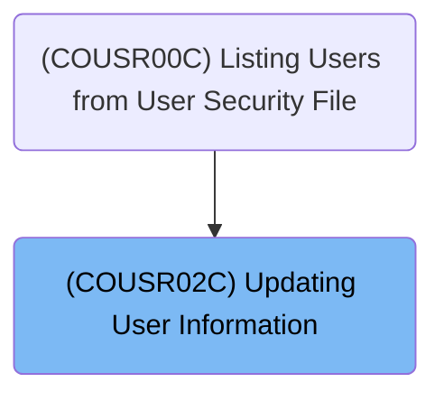

## Input and Output Tables/Files used in the Program

| Table / File Name | Type | Description                               | Usage Mode   | Key Fields / Layout Highlights |
| ----------------- | ---- | ----------------------------------------- | ------------ | ------------------------------ |
| WS-USRSEC-FILE    | File | User security credentials and access type | Input/Output | File resource                  |

&nbsp;

# Workflow

# Starting User Update Flow

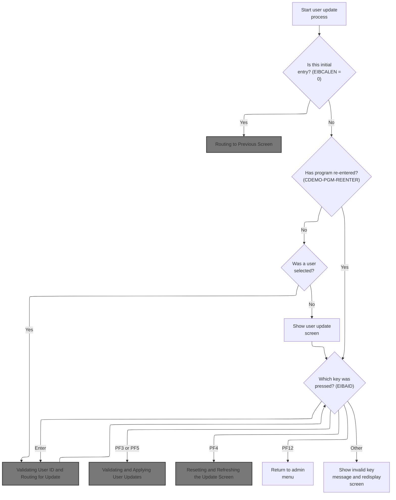

This section manages the initial logic for updating a user, including routing decisions, error state resets, and handling invalid user actions. It ensures users are properly authenticated and provides feedback for unsupported actions.

| Rule ID | Code Location | Category       | Rule Name                          | Description                                                                                                                                                            | Conditions                                                                           | Remarks                                                                                                                           |
| ------- | ------------- | -------------- | ---------------------------------- | ---------------------------------------------------------------------------------------------------------------------------------------------------------------------- | ------------------------------------------------------------------------------------ | --------------------------------------------------------------------------------------------------------------------------------- |
| BR-001  | MAIN-PARA     | Business logic | Initial entry routing              | If the program is entered without any context (EIBCALEN = 0), the user is routed to the signon program and returned to the previous screen.                            | EIBCALEN is equal to 0 at program start.                                             | The program name routed to is 'COSGN00C'. This ensures users are authenticated before proceeding.                                 |
| BR-002  | MAIN-PARA     | Business logic | Reset error and modification state | At the start of the user update flow, any previous error flag and user modification flag are reset, and any previous message is cleared.                               | Program enters MAIN-PARA at the start of the update flow.                            | Error flag is set to 'N', user modification flag is set to 'N', and the message field is cleared to spaces.                       |
| BR-003  | MAIN-PARA     | Error handling | Invalid key handling               | If an invalid key is pressed during the user update flow, the system displays the message 'Invalid key pressed. Please see below...' and redisplays the update screen. | User presses a key that is not Enter, PF3, PF4, PF5, or PF12 during the update flow. | The invalid key message is 'Invalid key pressed. Please see below...         ' (50 characters, left aligned, padded with spaces). |

<SwmSnippet path="/app/cbl/COUSR02C.cbl" line="82" repo-id="Z2l0aHViJTNBJTNBa3luZHJ5bC1hd3MtbWFpbmZyYW1lLW1vZGVybml6YXRpb24tY2FyZGRlbW8lM0ElM0FTd2ltbS1EZW1v">

---

In `MAIN-PARA` we're kicking off the user update logic: error and user-modified flags are reset, and any previous message is cleared. This is just the setup before we check if we're starting fresh or coming back into the program.

```cobol
       MAIN-PARA.

           SET ERR-FLG-OFF     TO TRUE
           SET USR-MODIFIED-NO TO TRUE

           MOVE SPACES TO WS-MESSAGE
                          ERRMSGO OF COUSR2AO
```

---

</SwmSnippet>

<SwmSnippet path="/app/cbl/COUSR02C.cbl" line="90" repo-id="Z2l0aHViJTNBJTNBa3luZHJ5bC1hd3MtbWFpbmZyYW1lLW1vZGVybml6YXRpb24tY2FyZGRlbW8lM0ElM0FTd2ltbS1EZW1v">

---

Here we check if EIBCALEN is zero. If so, we set up to jump to the signon program ('COSGN00C') and call RETURN-TO-PREV-SCREEN. This handles the case where the program is started without any context, so we just send the user back to signon.

```cobol
           IF EIBCALEN = 0
               MOVE 'COSGN00C' TO CDEMO-TO-PROGRAM
               PERFORM RETURN-TO-PREV-SCREEN
```

---

</SwmSnippet>

## Routing to Previous Screen

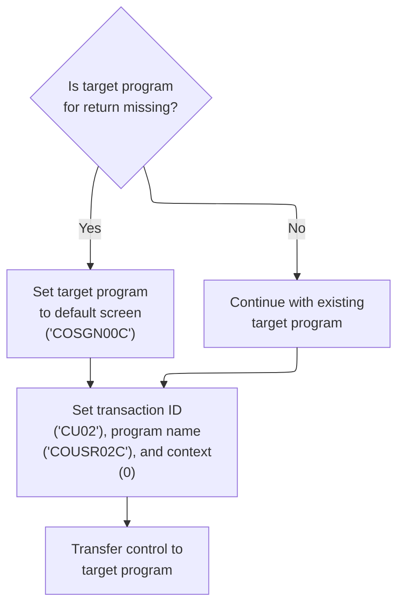

This section manages navigation to the previous screen in the CardDemo application, ensuring a valid destination is always set, session context is updated, and control is transferred seamlessly to the appropriate program.

| Rule ID | Code Location         | Category       | Rule Name                                | Description                                                                                                                                                                                                    | Conditions                                                                                | Remarks                                                                                                                                                                              |
| ------- | --------------------- | -------------- | ---------------------------------------- | -------------------------------------------------------------------------------------------------------------------------------------------------------------------------------------------------------------- | ----------------------------------------------------------------------------------------- | ------------------------------------------------------------------------------------------------------------------------------------------------------------------------------------ |
| BR-001  | RETURN-TO-PREV-SCREEN | Business logic | Default destination for missing target   | If the target program for return navigation is missing or blank, set the destination to the default signon screen ('COSGN00C (Signon Screen Handling)') to ensure a valid navigation target.                   | The target program for return navigation is empty or contains only blank values.          | The default destination is the signon screen, represented by the string 'COSGN00C' (8 characters, left-aligned, padded with spaces if necessary).                                    |
| BR-002  | RETURN-TO-PREV-SCREEN | Business logic | Session context update before navigation | Before transferring control, update the session context in the communication area with the current transaction ID ('CU02'), program name ('COUSR02C (Updating User Information)'), and reset the context to 0. | A navigation event to the previous screen is triggered.                                   | Transaction ID is set to 'CU02' (4 characters), program name to 'COUSR02C' (8 characters), and context to 0 (single digit number). All values are left-aligned and padded as needed. |
| BR-003  | RETURN-TO-PREV-SCREEN | Business logic | Transfer control to target program       | Transfer control to the determined target program, passing the updated communication area to maintain session state and context.                                                                               | The target program for navigation has been determined and the communication area updated. | The transfer uses the CICS XCTL command, passing the program name (8 characters) and the full communication area structure.                                                          |

<SwmSnippet path="/app/cbl/COUSR02C.cbl" line="250" repo-id="Z2l0aHViJTNBJTNBa3luZHJ5bC1hd3MtbWFpbmZyYW1lLW1vZGVybml6YXRpb24tY2FyZGRlbW8lM0ElM0FTd2ltbS1EZW1v">

---

In `RETURN-TO-PREV-SCREEN`, we check if the target program is empty. If it is, we set it to 'COSGN00C' (signon). This makes sure we always have a valid destination for navigation.

```cobol
       RETURN-TO-PREV-SCREEN.

           IF CDEMO-TO-PROGRAM = LOW-VALUES OR SPACES
               MOVE 'COSGN00C' TO CDEMO-TO-PROGRAM
           END-IF
```

---

</SwmSnippet>

<SwmSnippet path="/app/cbl/COUSR02C.cbl" line="255" repo-id="Z2l0aHViJTNBJTNBa3luZHJ5bC1hd3MtbWFpbmZyYW1lLW1vZGVybml6YXRpb24tY2FyZGRlbW8lM0ElM0FTd2ltbS1EZW1v">

---

After setting up the target program, we update the commarea with the current transaction and program, reset the context, and use XCTL to jump to the next program, passing along all state info. This hands off control cleanly to the next screen or module.

```cobol
           MOVE WS-TRANID    TO CDEMO-FROM-TRANID
           MOVE WS-PGMNAME   TO CDEMO-FROM-PROGRAM
           MOVE ZEROS        TO CDEMO-PGM-CONTEXT
           EXEC CICS
               XCTL PROGRAM(CDEMO-TO-PROGRAM)
               COMMAREA(CARDDEMO-COMMAREA)
           END-EXEC.
```

---

</SwmSnippet>

## Admin Menu Entry

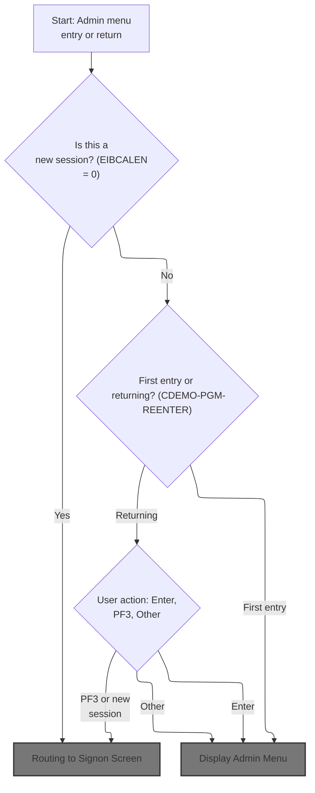

This section manages the entry, display, and user interaction logic for the Admin Menu in the CardDemo application, including routing to authentication, handling menu display, and error messaging for invalid actions.

| Rule ID | Code Location | Category       | Rule Name                  | Description                                                                                                    | Conditions                                                                 | Remarks                                                                                                                                                             |
| ------- | ------------- | -------------- | -------------------------- | -------------------------------------------------------------------------------------------------------------- | -------------------------------------------------------------------------- | ------------------------------------------------------------------------------------------------------------------------------------------------------------------- |
| BR-001  | MAIN-PARA     | Business logic | New session signon routing | If the session is new, the user is routed to the signon screen before accessing the admin menu.                | Session length is zero (new session detected).                             | The session is considered new if the session length is zero. The user is routed to the signon screen identified by program 'COSGN00C'.                              |
| BR-002  | MAIN-PARA     | Business logic | First entry menu display   | On first entry to the admin menu, the menu is displayed and the communication area is initialized.             | Session is not new and user is entering the admin menu for the first time. | First entry is determined by the context value (CDEMO-PGM-REENTER is false). The admin menu is displayed and the communication area is set to initial values.       |
| BR-003  | MAIN-PARA     | Business logic | PF3 signon routing         | If the user presses PF3 while on the admin menu, the session is routed to the signon screen.                   | User action is PF3 while on the admin menu.                                | PF3 key triggers routing to the signon screen identified by program 'COSGN00C'.                                                                                     |
| BR-004  | MAIN-PARA     | Business logic | Enter key menu processing  | If the user presses Enter while on the admin menu, the menu is processed and redisplayed.                      | User action is Enter while on the admin menu.                              | Enter key triggers menu processing logic and redisplays the admin menu.                                                                                             |
| BR-005  | MAIN-PARA     | Error handling | Invalid key error handling | If the user presses an invalid key on the admin menu, an error message is displayed and the error flag is set. | User action is neither Enter nor PF3 while on the admin menu.              | The error message displayed is 'Invalid key pressed. Please see below...         ' (50 characters, left aligned, padded with spaces). The error flag is set to 'Y'. |

<SwmSnippet path="/app/cbl/COADM01C.cbl" line="75" repo-id="Z2l0aHViJTNBJTNBa3luZHJ5bC1hd3MtbWFpbmZyYW1lLW1vZGVybml6YXRpb24tY2FyZGRlbW8lM0ElM0FTd2ltbS1EZW1v">

---

We check if we're starting or reentering, send or receive the menu screen, and handle user actions based on input.

```cobol
       MAIN-PARA.

           SET ERR-FLG-OFF TO TRUE

           MOVE SPACES TO WS-MESSAGE
                          ERRMSGO OF COADM1AO

           IF EIBCALEN = 0
               MOVE 'COSGN00C' TO CDEMO-FROM-PROGRAM
               PERFORM RETURN-TO-SIGNON-SCREEN
           ELSE
               MOVE DFHCOMMAREA(1:EIBCALEN) TO CARDDEMO-COMMAREA
               IF NOT CDEMO-PGM-REENTER
                   SET CDEMO-PGM-REENTER    TO TRUE
                   MOVE LOW-VALUES          TO COADM1AO
                   PERFORM SEND-MENU-SCREEN
               ELSE
                   PERFORM RECEIVE-MENU-SCREEN
                   EVALUATE EIBAID
                       WHEN DFHENTER
                           PERFORM PROCESS-ENTER-KEY
                       WHEN DFHPF3
                           MOVE 'COSGN00C' TO CDEMO-TO-PROGRAM
                           PERFORM RETURN-TO-SIGNON-SCREEN
                       WHEN OTHER
                           MOVE 'Y'                       TO WS-ERR-FLG
                           MOVE CCDA-MSG-INVALID-KEY      TO WS-MESSAGE
                           PERFORM SEND-MENU-SCREEN
                   END-EVALUATE
               END-IF
           END-IF

           EXEC CICS RETURN
                     TRANSID (WS-TRANID)
                     COMMAREA (CARDDEMO-COMMAREA)
           END-EXEC.
```

---

</SwmSnippet>

### Routing to Signon Screen

This section ensures users are always routed to a valid application screen, defaulting to the signon screen if no target program is specified.

| Rule ID | Code Location           | Category       | Rule Name                  | Description                                                                                           | Conditions                                                                 | Remarks                                                                                                                                      |
| ------- | ----------------------- | -------------- | -------------------------- | ----------------------------------------------------------------------------------------------------- | -------------------------------------------------------------------------- | -------------------------------------------------------------------------------------------------------------------------------------------- |
| BR-001  | RETURN-TO-SIGNON-SCREEN | Business logic | Default to signon screen   | If the target program field is empty or contains low values, the user is routed to the signon screen. | The target program field is empty or contains low values.                  | The signon program name is 'COSGN00C', which is an 8-character alphanumeric string. The target program field is also 8 characters in length. |
| BR-002  | RETURN-TO-SIGNON-SCREEN | Business logic | Route to specified program | If the target program field contains a valid program name, the user is routed to that program.        | The target program field contains a non-empty, non-low-value program name. | The target program field is an 8-character alphanumeric string. The program name must fit within this format.                                |

<SwmSnippet path="/app/cbl/COADM01C.cbl" line="160" repo-id="Z2l0aHViJTNBJTNBa3luZHJ5bC1hd3MtbWFpbmZyYW1lLW1vZGVybml6YXRpb24tY2FyZGRlbW8lM0ElM0FTd2ltbS1EZW1v">

---

`RETURN-TO-SIGNON-SCREEN` checks if the target program is empty and sets it to signon if needed, then uses XCTL to jump to that program. This guarantees the user always lands somewhere valid, usually the signon screen.

```cobol
       RETURN-TO-SIGNON-SCREEN.

           IF CDEMO-TO-PROGRAM = LOW-VALUES OR SPACES
               MOVE 'COSGN00C' TO CDEMO-TO-PROGRAM
           END-IF
           EXEC CICS
               XCTL PROGRAM(CDEMO-TO-PROGRAM)
           END-EXEC.
```

---

</SwmSnippet>

### Signon Screen Entry

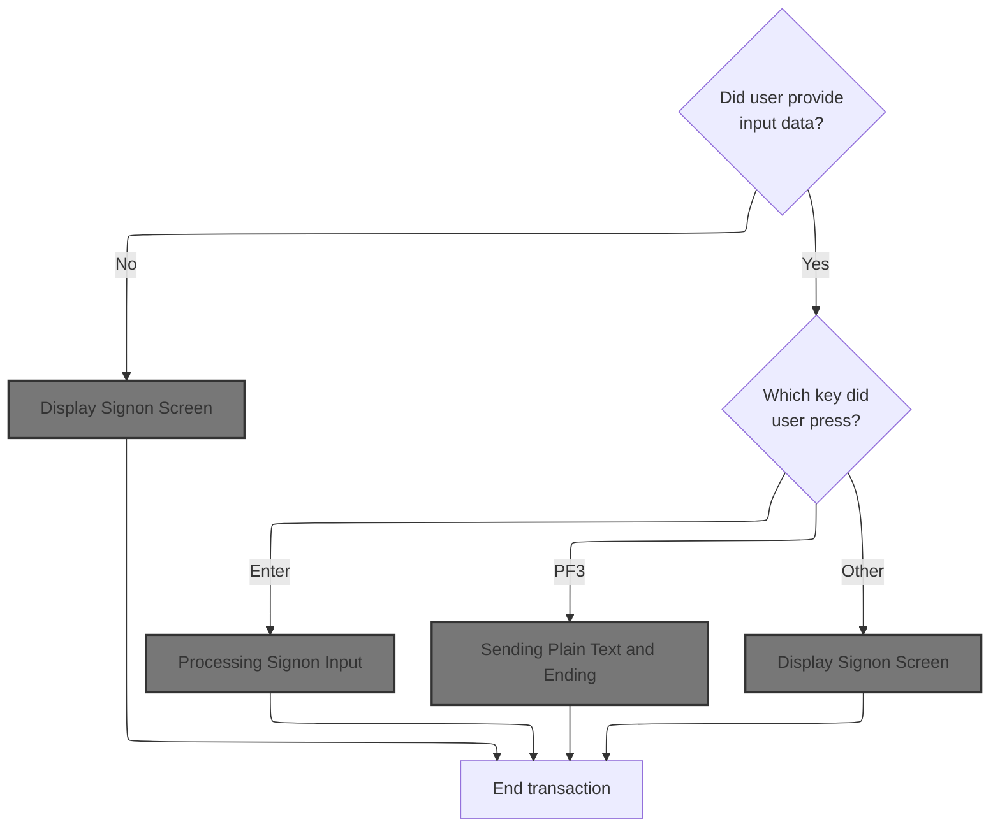

This section governs the initial user interaction with the CardDemo application's signon screen, determining what is displayed and what messages are shown based on user input and key presses.

| Rule ID | Code Location | Category       | Rule Name                        | Description                                                                                                                                           | Conditions                                                             | Remarks                                                                                                                                                                              |
| ------- | ------------- | -------------- | -------------------------------- | ----------------------------------------------------------------------------------------------------------------------------------------------------- | ---------------------------------------------------------------------- | ------------------------------------------------------------------------------------------------------------------------------------------------------------------------------------ |
| BR-001  | MAIN-PARA     | Business logic | Initial signon screen display    | If the transaction is initiated without any input data, the signon screen is displayed to the user.                                                   | EIBCALEN equals 0 (no input data provided at transaction start).       | The signon screen is displayed with all fields set to their initial values. The user ID field is set to -1, and the output area is cleared to LOW-VALUES. No error message is shown. |
| BR-002  | MAIN-PARA     | Business logic | Signon input processing on Enter | If the user presses the Enter key after providing input, the system processes the signon input.                                                       | EIBAID equals DFHENTER (user pressed Enter key after providing input). | Signon input is processed, which may include authentication and routing, but the details are handled in the PROCESS-ENTER-KEY paragraph (not shown here).                            |
| BR-003  | MAIN-PARA     | Business logic | Thank you message on PF3         | If the user presses the PF3 key, a thank you message is displayed and the transaction ends.                                                           | EIBAID equals DFHPF3 (user pressed PF3 key).                           | The thank you message displayed is: 'Thank you for using CardDemo application...      '. The message is shown as plain text.                                                         |
| BR-004  | MAIN-PARA     | Error handling | Invalid key error handling       | If the user presses any key other than Enter or PF3, an error flag is set, an invalid key message is displayed, and the signon screen is shown again. | EIBAID is not DFHENTER or DFHPF3 (user pressed any other key).         | The error flag is set to 'Y'. The invalid key message displayed is: 'Invalid key pressed. Please see below...         '. The signon screen is re-displayed with the error message.   |
| BR-005  | MAIN-PARA     | Technical step | Transaction return               | After any user action is processed, the transaction ends and the communication area and transaction ID are returned to CICS.                          | Any path through MAIN-PARA after user action is processed.             | The communication area and transaction ID are returned to CICS. The communication area length is set to the length of the CARDDEMO-COMMAREA structure.                               |

<SwmSnippet path="/app/cbl/COSGN00C.cbl" line="73" repo-id="Z2l0aHViJTNBJTNBa3luZHJ5bC1hd3MtbWFpbmZyYW1lLW1vZGVybml6YXRpb24tY2FyZGRlbW8lM0ElM0FTd2ltbS1EZW1v">

---

In `MAIN-PARA` of COSGN00C.cbl, we check if we're starting fresh (EIBCALEN=0) and show the signon screen. Otherwise, we handle user actions: Enter processes signon, PF3 shows a thank you, and other keys show an error. The flow ends with a RETURN to CICS, passing back the commarea and transaction ID.

```cobol
       MAIN-PARA.

           SET ERR-FLG-OFF TO TRUE

           MOVE SPACES TO WS-MESSAGE
                          ERRMSGO OF COSGN0AO

           IF EIBCALEN = 0
               MOVE LOW-VALUES TO COSGN0AO
               MOVE -1       TO USERIDL OF COSGN0AI
               PERFORM SEND-SIGNON-SCREEN
           ELSE
               EVALUATE EIBAID
                   WHEN DFHENTER
                       PERFORM PROCESS-ENTER-KEY
                   WHEN DFHPF3
                       MOVE CCDA-MSG-THANK-YOU        TO WS-MESSAGE
                       PERFORM SEND-PLAIN-TEXT
                   WHEN OTHER
                       MOVE 'Y'                       TO WS-ERR-FLG
                       MOVE CCDA-MSG-INVALID-KEY      TO WS-MESSAGE
                       PERFORM SEND-SIGNON-SCREEN
               END-EVALUATE
           END-IF.

           EXEC CICS RETURN
                     TRANSID (WS-TRANID)
                     COMMAREA (CARDDEMO-COMMAREA)
                     LENGTH(LENGTH OF CARDDEMO-COMMAREA)
           END-EXEC.
```

---

</SwmSnippet>

#### Display Signon Screen

This section displays the signon screen to the user, ensuring that all required header information and messages are presented, and the interface is ready for user input.

| Rule ID | Code Location        | Category       | Rule Name                        | Description                                                                                                                                                                                                                                 | Conditions                                                                                        | Remarks                                                                                                                                                                                                               |
| ------- | -------------------- | -------------- | -------------------------------- | ------------------------------------------------------------------------------------------------------------------------------------------------------------------------------------------------------------------------------------------- | ------------------------------------------------------------------------------------------------- | --------------------------------------------------------------------------------------------------------------------------------------------------------------------------------------------------------------------- |
| BR-001  | POPULATE-HEADER-INFO | Business logic | Dynamic header information       | The signon screen header must display the current date and time, program and transaction names, system ID, and application ID, as well as two title lines. All header fields are dynamically populated at the time the screen is displayed. | Whenever the signon screen is displayed.                                                          | Date is formatted as MM-DD-YY, time as HH-MM-SS. Program name is 8 characters, transaction name is 4 characters, system and application IDs are as assigned by the system. Titles are two lines of alphanumeric text. |
| BR-002  | SEND-SIGNON-SCREEN   | Business logic | User message display             | Any message intended for the user, such as an error or informational message, must be displayed in the designated message field on the signon screen.                                                                                       | Whenever a message is present in the message variable at the time the signon screen is displayed. | Message field is 80 characters, left-aligned, padded with spaces if shorter.                                                                                                                                          |
| BR-003  | SEND-SIGNON-SCREEN   | Technical step | Screen clear and cursor position | The signon screen must be cleared before displaying new information, and the cursor must be positioned for user input.                                                                                                                      | Whenever the signon screen is sent to the terminal.                                               | Screen is cleared of previous content before new display. Cursor is positioned at the default input location.                                                                                                         |

<SwmSnippet path="/app/cbl/COSGN00C.cbl" line="145" repo-id="Z2l0aHViJTNBJTNBa3luZHJ5bC1hd3MtbWFpbmZyYW1lLW1vZGVybml6YXRpb24tY2FyZGRlbW8lM0ElM0FTd2ltbS1EZW1v">

---

`SEND-SIGNON-SCREEN` calls POPULATE-HEADER-INFO to set up the header, moves the message to the error field, and sends the signon map to the terminal. ERASE clears the screen, and CURSOR sets the cursor position.

```cobol
       SEND-SIGNON-SCREEN.

           PERFORM POPULATE-HEADER-INFO

           MOVE WS-MESSAGE TO ERRMSGO OF COSGN0AO

           EXEC CICS SEND
                     MAP('COSGN0A')
                     MAPSET('COSGN00')
                     FROM(COSGN0AO)
                     ERASE
                     CURSOR
           END-EXEC.
```

---

</SwmSnippet>

<SwmSnippet path="/app/cbl/COSGN00C.cbl" line="177" repo-id="Z2l0aHViJTNBJTNBa3luZHJ5bC1hd3MtbWFpbmZyYW1lLW1vZGVybml6YXRpb24tY2FyZGRlbW8lM0ElM0FTd2ltbS1EZW1v">

---

`POPULATE-HEADER-INFO` fills in the header fields with current date, time, titles, program and transaction names, and system IDs. It uses FUNCTION CURRENT-DATE and CICS ASSIGN to get all the dynamic info needed for the signon screen header.

```cobol
       POPULATE-HEADER-INFO.

           MOVE FUNCTION CURRENT-DATE  TO WS-CURDATE-DATA

           MOVE CCDA-TITLE01           TO TITLE01O OF COSGN0AO
           MOVE CCDA-TITLE02           TO TITLE02O OF COSGN0AO
           MOVE WS-TRANID              TO TRNNAMEO OF COSGN0AO
           MOVE WS-PGMNAME             TO PGMNAMEO OF COSGN0AO

           MOVE WS-CURDATE-MONTH       TO WS-CURDATE-MM
           MOVE WS-CURDATE-DAY         TO WS-CURDATE-DD
           MOVE WS-CURDATE-YEAR(3:2)   TO WS-CURDATE-YY

           MOVE WS-CURDATE-MM-DD-YY    TO CURDATEO OF COSGN0AO

           MOVE WS-CURTIME-HOURS       TO WS-CURTIME-HH
           MOVE WS-CURTIME-MINUTE      TO WS-CURTIME-MM
           MOVE WS-CURTIME-SECOND      TO WS-CURTIME-SS

           MOVE WS-CURTIME-HH-MM-SS    TO CURTIMEO OF COSGN0AO

           EXEC CICS ASSIGN
               APPLID(APPLIDO OF COSGN0AO)
           END-EXEC

           EXEC CICS ASSIGN
               SYSID(SYSIDO OF COSGN0AO)
           END-EXEC.
```

---

</SwmSnippet>

#### Processing Signon Input

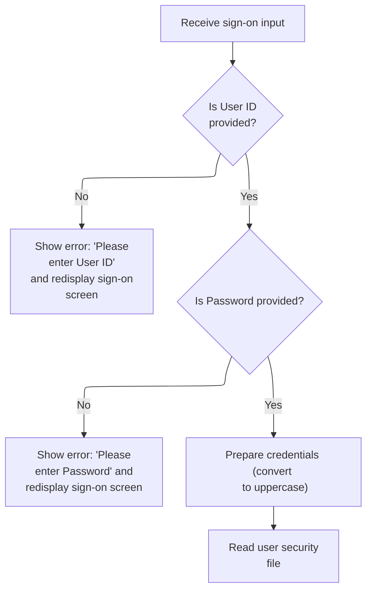

This section validates sign-on input, provides user feedback for missing credentials, normalizes input, and initiates authentication if validation passes.

| Rule ID | Code Location     | Category        | Rule Name                 | Description                                                                                                                                                                                   | Conditions                                                                   | Remarks                                                                                                                                      |
| ------- | ----------------- | --------------- | ------------------------- | --------------------------------------------------------------------------------------------------------------------------------------------------------------------------------------------- | ---------------------------------------------------------------------------- | -------------------------------------------------------------------------------------------------------------------------------------------- |
| BR-001  | PROCESS-ENTER-KEY | Data validation | User ID required          | If the User ID field is empty or contains only blank or non-printable values, the system displays an error message prompting the user to enter a User ID and redisplays the sign-on screen.   | The User ID field is empty, blank, or contains only non-printable values.    | The error message displayed is: 'Please enter User ID ...'. The User ID field is expected to be an alphanumeric string up to 8 characters.   |
| BR-002  | PROCESS-ENTER-KEY | Data validation | Password required         | If the Password field is empty or contains only blank or non-printable values, the system displays an error message prompting the user to enter a Password and redisplays the sign-on screen. | The Password field is empty, blank, or contains only non-printable values.   | The error message displayed is: 'Please enter Password ...'. The Password field is expected to be an alphanumeric string up to 8 characters. |
| BR-003  | PROCESS-ENTER-KEY | Business logic  | Credential normalization  | When both User ID and Password are provided, the system converts both credentials to uppercase before proceeding with authentication.                                                         | Both User ID and Password fields are present and not blank or non-printable. | Credentials are normalized to uppercase. The normalized User ID and Password are each up to 8 alphanumeric characters.                       |
| BR-004  | PROCESS-ENTER-KEY | Business logic  | Proceed to authentication | If no error has been set during input validation, the system proceeds to authenticate the user by reading the user security file.                                                             | No error flag is set after input validation.                                 | Authentication is attempted only if both User ID and Password are present and normalized.                                                    |

<SwmSnippet path="/app/cbl/COSGN00C.cbl" line="108" repo-id="Z2l0aHViJTNBJTNBa3luZHJ5bC1hd3MtbWFpbmZyYW1lLW1vZGVybml6YXRpb24tY2FyZGRlbW8lM0ElM0FTd2ltbS1EZW1v">

---

`PROCESS-ENTER-KEY` receives the signon input, checks for missing user ID or password, and shows errors if needed. If both are present, it uppercases the credentials and calls READ-USER-SEC-FILE to check authentication.

```cobol
       PROCESS-ENTER-KEY.

           EXEC CICS RECEIVE
                     MAP('COSGN0A')
                     MAPSET('COSGN00')
                     RESP(WS-RESP-CD)
                     RESP2(WS-REAS-CD)
           END-EXEC.

           EVALUATE TRUE
               WHEN USERIDI OF COSGN0AI = SPACES OR LOW-VALUES
                   MOVE 'Y'      TO WS-ERR-FLG
                   MOVE 'Please enter User ID ...' TO WS-MESSAGE
                   MOVE -1       TO USERIDL OF COSGN0AI
                   PERFORM SEND-SIGNON-SCREEN
               WHEN PASSWDI OF COSGN0AI = SPACES OR LOW-VALUES
                   MOVE 'Y'      TO WS-ERR-FLG
                   MOVE 'Please enter Password ...' TO WS-MESSAGE
                   MOVE -1       TO PASSWDL OF COSGN0AI
                   PERFORM SEND-SIGNON-SCREEN
               WHEN OTHER
                   CONTINUE
           END-EVALUATE.

           MOVE FUNCTION UPPER-CASE(USERIDI OF COSGN0AI) TO
                           WS-USER-ID
                           CDEMO-USER-ID
           MOVE FUNCTION UPPER-CASE(PASSWDI OF COSGN0AI) TO
                           WS-USER-PWD

           IF NOT ERR-FLG-ON
               PERFORM READ-USER-SEC-FILE
           END-IF.
```

---

</SwmSnippet>

#### Authenticating User

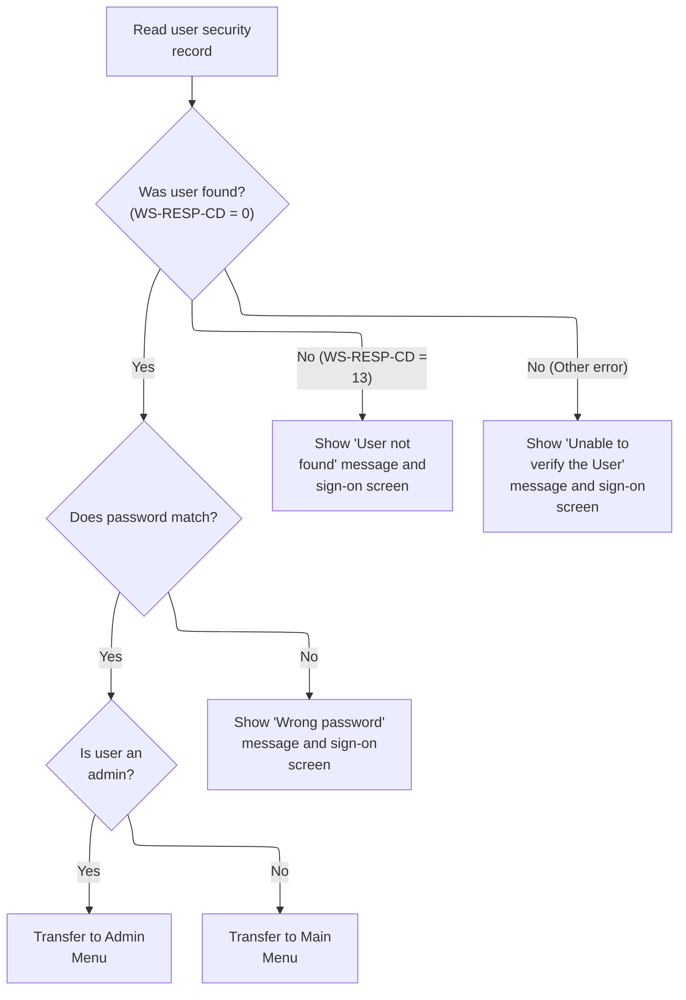

This section authenticates users by verifying their credentials and routes them to the appropriate menu or displays error messages based on the outcome.

| Rule ID | Code Location      | Category       | Rule Name                             | Description                                                                                                                                                                                                                         | Conditions                                                                   | Remarks                                                                                                                                                                      |
| ------- | ------------------ | -------------- | ------------------------------------- | ----------------------------------------------------------------------------------------------------------------------------------------------------------------------------------------------------------------------------------- | ---------------------------------------------------------------------------- | ---------------------------------------------------------------------------------------------------------------------------------------------------------------------------- |
| BR-001  | READ-USER-SEC-FILE | Business logic | Successful authentication and routing | If the user ID is found and the password matches, the user is authenticated and routed to the appropriate menu based on their user type. Admin users are routed to the Admin Menu, while regular users are routed to the Main Menu. | User security record is found (response code 0) and password matches.        | Admin users are identified by user type 'A'. Regular users are identified by user type 'U'. Routing is to either the Admin Menu or Main Menu. No error message is displayed. |
| BR-002  | READ-USER-SEC-FILE | Error handling | Wrong password error                  | If the user ID is found but the password does not match, an error message 'Wrong Password. Try again ...' is displayed and the sign-on screen is shown again.                                                                       | User security record is found (response code 0) but password does not match. | Error message displayed is 'Wrong Password. Try again ...' (string, left aligned). The sign-on screen is redisplayed.                                                        |
| BR-003  | READ-USER-SEC-FILE | Error handling | User not found error                  | If the user ID is not found (response code 13), an error message 'User not found. Try again ...' is displayed and the sign-on screen is shown again.                                                                                | User security record is not found (response code 13).                        | Error message displayed is 'User not found. Try again ...' (string, left aligned). The sign-on screen is redisplayed.                                                        |
| BR-004  | READ-USER-SEC-FILE | Error handling | Generic authentication error          | If an error occurs other than user not found, a generic error message 'Unable to verify the User ...' is displayed and the sign-on screen is shown again.                                                                           | Any error response other than 0 (success) or 13 (user not found).            | Error message displayed is 'Unable to verify the User ...' (string, left aligned). The sign-on screen is redisplayed.                                                        |

<SwmSnippet path="/app/cbl/COSGN00C.cbl" line="209" repo-id="Z2l0aHViJTNBJTNBa3luZHJ5bC1hd3MtbWFpbmZyYW1lLW1vZGVybml6YXRpb24tY2FyZGRlbW8lM0ElM0FTd2ltbS1EZW1v">

---

`READ-USER-SEC-FILE` reads the user record by ID, checks the password, and routes the user to the admin or main menu based on their type. If the password is wrong or the user isn't found, we show an error and redisplay the signon screen. Other errors get a generic error message.

```cobol
       READ-USER-SEC-FILE.

           EXEC CICS READ
                DATASET   (WS-USRSEC-FILE)
                INTO      (SEC-USER-DATA)
                LENGTH    (LENGTH OF SEC-USER-DATA)
                RIDFLD    (WS-USER-ID)
                KEYLENGTH (LENGTH OF WS-USER-ID)
                RESP      (WS-RESP-CD)
                RESP2     (WS-REAS-CD)
           END-EXEC.

           EVALUATE WS-RESP-CD
               WHEN 0
                   IF SEC-USR-PWD = WS-USER-PWD
                       MOVE WS-TRANID    TO CDEMO-FROM-TRANID
                       MOVE WS-PGMNAME   TO CDEMO-FROM-PROGRAM
                       MOVE WS-USER-ID   TO CDEMO-USER-ID
                       MOVE SEC-USR-TYPE TO CDEMO-USER-TYPE
                       MOVE ZEROS        TO CDEMO-PGM-CONTEXT

                       IF CDEMO-USRTYP-ADMIN
                            EXEC CICS XCTL
                              PROGRAM ('COADM01C')
                              COMMAREA(CARDDEMO-COMMAREA)
                            END-EXEC
                       ELSE
                            EXEC CICS XCTL
                              PROGRAM ('COMEN01C')
                              COMMAREA(CARDDEMO-COMMAREA)
                            END-EXEC
                       END-IF
                   ELSE
                       MOVE 'Wrong Password. Try again ...' TO
                                                          WS-MESSAGE
                       MOVE -1       TO PASSWDL OF COSGN0AI
                       PERFORM SEND-SIGNON-SCREEN
                   END-IF
               WHEN 13
                   MOVE 'Y'      TO WS-ERR-FLG
                   MOVE 'User not found. Try again ...' TO WS-MESSAGE
                   MOVE -1       TO USERIDL OF COSGN0AI
                   PERFORM SEND-SIGNON-SCREEN
               WHEN OTHER
                   MOVE 'Y'      TO WS-ERR-FLG
                   MOVE 'Unable to verify the User ...' TO WS-MESSAGE
                   MOVE -1       TO USERIDL OF COSGN0AI
                   PERFORM SEND-SIGNON-SCREEN
           END-EVALUATE.
```

---

</SwmSnippet>

#### Main Menu Entry


This section manages the entry and navigation logic for the admin menu in the CardDemo application, determining when to route users to signon, display the menu, or show error messages based on session context and user actions.

| Rule ID | Code Location                      | Category       | Rule Name                      | Description                                                                                                                           | Conditions                                                                    | Remarks                                                                                                                                                   |
| ------- | ---------------------------------- | -------------- | ------------------------------ | ------------------------------------------------------------------------------------------------------------------------------------- | ----------------------------------------------------------------------------- | --------------------------------------------------------------------------------------------------------------------------------------------------------- |
| BR-001  | MAIN-PARA, RETURN-TO-SIGNON-SCREEN | Business logic | New session signon routing     | If the session is new, the user is routed to the signon screen before accessing the admin menu.                                       | Session length is zero (EIBCALEN = 0).                                        | The signon program name is 'COSGN00C'. The routing is triggered before any menu is displayed.                                                             |
| BR-002  | MAIN-PARA                          | Business logic | First entry menu display       | If the session is not new and this is the user's first entry, the admin menu is displayed.                                            | Session length is not zero and CDEMO-PGM-REENTER is false.                    | The admin menu is displayed using the SEND-MENU-SCREEN logic. The communication area is initialized with low values before display.                       |
| BR-003  | MAIN-PARA, RETURN-TO-SIGNON-SCREEN | Business logic | PF3/new session signon routing | If the user presses PF3 or requests a new session while returning, they are routed to the signon screen.                              | Session is not new, user is returning, and user action is PF3 or new session. | The signon program name is 'COSGN00C'. Routing is triggered by PF3 key or new session request.                                                            |
| BR-004  | MAIN-PARA                          | Error handling | Invalid key error message      | If the user presses any key other than Enter or PF3 while returning, an error message is displayed and the admin menu is shown again. | Session is not new, user is returning, and user action is not Enter or PF3.   | The error message is 'Invalid key pressed. Please see below...         ' (50 characters, left aligned, padded with spaces). The error flag is set to 'Y'. |

<SwmSnippet path="/app/cbl/COMEN01C.cbl" line="75" repo-id="Z2l0aHViJTNBJTNBa3luZHJ5bC1hd3MtbWFpbmZyYW1lLW1vZGVybml6YXRpb24tY2FyZGRlbW8lM0ElM0FTd2ltbS1EZW1v">

---

We check if we're starting or reentering, send or receive the menu screen, and handle user actions based on input.

```cobol
       MAIN-PARA.

           SET ERR-FLG-OFF TO TRUE

           MOVE SPACES TO WS-MESSAGE
                          ERRMSGO OF COMEN1AO

           IF EIBCALEN = 0
               MOVE 'COSGN00C' TO CDEMO-FROM-PROGRAM
               PERFORM RETURN-TO-SIGNON-SCREEN
           ELSE
               MOVE DFHCOMMAREA(1:EIBCALEN) TO CARDDEMO-COMMAREA
               IF NOT CDEMO-PGM-REENTER
                   SET CDEMO-PGM-REENTER    TO TRUE
                   MOVE LOW-VALUES          TO COMEN1AO
                   PERFORM SEND-MENU-SCREEN
               ELSE
                   PERFORM RECEIVE-MENU-SCREEN
                   EVALUATE EIBAID
                       WHEN DFHENTER
                           PERFORM PROCESS-ENTER-KEY
                       WHEN DFHPF3
                           MOVE 'COSGN00C' TO CDEMO-TO-PROGRAM
                           PERFORM RETURN-TO-SIGNON-SCREEN
                       WHEN OTHER
                           MOVE 'Y'                       TO WS-ERR-FLG
                           MOVE CCDA-MSG-INVALID-KEY      TO WS-MESSAGE
                           PERFORM SEND-MENU-SCREEN
                   END-EVALUATE
               END-IF
           END-IF

           EXEC CICS RETURN
                     TRANSID (WS-TRANID)
                     COMMAREA (CARDDEMO-COMMAREA)
           END-EXEC.
```

---

</SwmSnippet>

<SwmSnippet path="/app/cbl/COMEN01C.cbl" line="170" repo-id="Z2l0aHViJTNBJTNBa3luZHJ5bC1hd3MtbWFpbmZyYW1lLW1vZGVybml6YXRpb24tY2FyZGRlbW8lM0ElM0FTd2ltbS1EZW1v">

---

`RETURN-TO-SIGNON-SCREEN` checks if the target program is empty and sets it to signon if needed, then uses XCTL to jump to that program. This guarantees the user always lands somewhere valid, usually the signon screen.

```cobol
       RETURN-TO-SIGNON-SCREEN.

           IF CDEMO-TO-PROGRAM = LOW-VALUES OR SPACES
               MOVE 'COSGN00C' TO CDEMO-TO-PROGRAM
           END-IF
           EXEC CICS
               XCTL PROGRAM(CDEMO-TO-PROGRAM)
           END-EXEC.
```

---

</SwmSnippet>

##### Display Main Menu

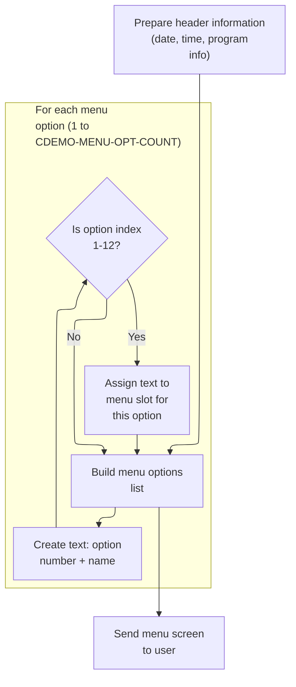

This section prepares and displays the main menu screen for the CardDemo application, including header information and a list of selectable menu options.

| Rule ID | Code Location        | Category       | Rule Name                    | Description                                                                                                                                                                                                       | Conditions                           | Remarks                                                                                                                                                                                                            |
| ------- | -------------------- | -------------- | ---------------------------- | ----------------------------------------------------------------------------------------------------------------------------------------------------------------------------------------------------------------- | ------------------------------------ | ------------------------------------------------------------------------------------------------------------------------------------------------------------------------------------------------------------------ |
| BR-001  | POPULATE-HEADER-INFO | Business logic | Menu header information      | The menu header must display the current date and time, the program name, the transaction name, and two title lines. The date and time are formatted for display and updated each time the menu is shown.         | Whenever the main menu is displayed. | Date is formatted as MM-DD-YY, time as HH-MM-SS. Program name is 8 characters, transaction name is 4 characters, each title line is alphanumeric. All fields are left-aligned and padded with spaces if necessary. |
| BR-002  | BUILD-MENU-OPTIONS   | Business logic | Menu option count and format | The menu must display up to 12 options, each consisting of an option number followed by a period, a space, and the option name. Only options with indices 1 through 12 are assigned to output fields for display. | Whenever the main menu is displayed. | Maximum of 12 options. Each option is formatted as: option number (1-12), period, space, option name (alphanumeric). Each option string is up to 40 characters, left-aligned and padded with spaces if necessary.  |
| BR-003  | SEND-MENU-SCREEN     | Business logic | Menu screen output           | The menu screen is sent to the user after the header and menu options are populated. The output includes all header and menu option fields, and any message text if present.                                      | Whenever the main menu is displayed. | The output includes header fields (date, time, program name, transaction name, titles), up to 12 menu options, and a message field (up to 80 characters, left-aligned, padded with spaces).                        |

<SwmSnippet path="/app/cbl/COMEN01C.cbl" line="182" repo-id="Z2l0aHViJTNBJTNBa3luZHJ5bC1hd3MtbWFpbmZyYW1lLW1vZGVybml6YXRpb24tY2FyZGRlbW8lM0ElM0FTd2ltbS1EZW1v">

---

`POPULATE-HEADER-INFO` fills in the menu header with the current date, time, titles, transaction, and program names. It formats the date and time for display and updates the header fields in the commarea.

```cobol
       SEND-MENU-SCREEN.

           PERFORM POPULATE-HEADER-INFO
           PERFORM BUILD-MENU-OPTIONS

           MOVE WS-MESSAGE TO ERRMSGO OF COMEN1AO

           EXEC CICS SEND
                     MAP('COMEN1A')
                     MAPSET('COMEN01')
                     FROM(COMEN1AO)
                     ERASE
           END-EXEC.
```

---

</SwmSnippet>

<SwmSnippet path="/app/cbl/COMEN01C.cbl" line="212" repo-id="Z2l0aHViJTNBJTNBa3luZHJ5bC1hd3MtbWFpbmZyYW1lLW1vZGVybml6YXRpb24tY2FyZGRlbW8lM0ElM0FTd2ltbS1EZW1v">

---

`BUILD-MENU-OPTIONS` loops through all menu options, builds the display string for each (number + name), and assigns them to the output fields used by the menu screen. This keeps the menu flexible and easy to update.

```cobol
       POPULATE-HEADER-INFO.

           MOVE FUNCTION CURRENT-DATE  TO WS-CURDATE-DATA

           MOVE CCDA-TITLE01           TO TITLE01O OF COMEN1AO
           MOVE CCDA-TITLE02           TO TITLE02O OF COMEN1AO
           MOVE WS-TRANID              TO TRNNAMEO OF COMEN1AO
           MOVE WS-PGMNAME             TO PGMNAMEO OF COMEN1AO

           MOVE WS-CURDATE-MONTH       TO WS-CURDATE-MM
           MOVE WS-CURDATE-DAY         TO WS-CURDATE-DD
           MOVE WS-CURDATE-YEAR(3:2)   TO WS-CURDATE-YY

           MOVE WS-CURDATE-MM-DD-YY    TO CURDATEO OF COMEN1AO

           MOVE WS-CURTIME-HOURS       TO WS-CURTIME-HH
           MOVE WS-CURTIME-MINUTE      TO WS-CURTIME-MM
           MOVE WS-CURTIME-SECOND      TO WS-CURTIME-SS

           MOVE WS-CURTIME-HH-MM-SS    TO CURTIMEO OF COMEN1AO.
```

---

</SwmSnippet>

<SwmSnippet path="/app/cbl/COMEN01C.cbl" line="236" repo-id="Z2l0aHViJTNBJTNBa3luZHJ5bC1hd3MtbWFpbmZyYW1lLW1vZGVybml6YXRpb24tY2FyZGRlbW8lM0ElM0FTd2ltbS1EZW1v">

---

`RECEIVE-MENU-SCREEN` gets the user's input from the menu screen into the commarea, capturing response codes for error handling.

```cobol
       BUILD-MENU-OPTIONS.

           PERFORM VARYING WS-IDX FROM 1 BY 1 UNTIL
                           WS-IDX > CDEMO-MENU-OPT-COUNT

               MOVE SPACES             TO WS-MENU-OPT-TXT

               STRING CDEMO-MENU-OPT-NUM(WS-IDX)  DELIMITED BY SIZE
                      '. '                         DELIMITED BY SIZE
                      CDEMO-MENU-OPT-NAME(WS-IDX) DELIMITED BY SIZE
                 INTO WS-MENU-OPT-TXT

               EVALUATE WS-IDX
                   WHEN 1
                       MOVE WS-MENU-OPT-TXT TO OPTN001O
                   WHEN 2
                       MOVE WS-MENU-OPT-TXT TO OPTN002O
                   WHEN 3
                       MOVE WS-MENU-OPT-TXT TO OPTN003O
                   WHEN 4
                       MOVE WS-MENU-OPT-TXT TO OPTN004O
                   WHEN 5
                       MOVE WS-MENU-OPT-TXT TO OPTN005O
                   WHEN 6
                       MOVE WS-MENU-OPT-TXT TO OPTN006O
                   WHEN 7
                       MOVE WS-MENU-OPT-TXT TO OPTN007O
                   WHEN 8
                       MOVE WS-MENU-OPT-TXT TO OPTN008O
                   WHEN 9
                       MOVE WS-MENU-OPT-TXT TO OPTN009O
                   WHEN 10
                       MOVE WS-MENU-OPT-TXT TO OPTN010O
                   WHEN 11
                       MOVE WS-MENU-OPT-TXT TO OPTN011O
                   WHEN 12
                       MOVE WS-MENU-OPT-TXT TO OPTN012O
                   WHEN OTHER
                       CONTINUE
               END-EVALUATE

           END-PERFORM.
```

---

</SwmSnippet>

##### Processing Menu Selection

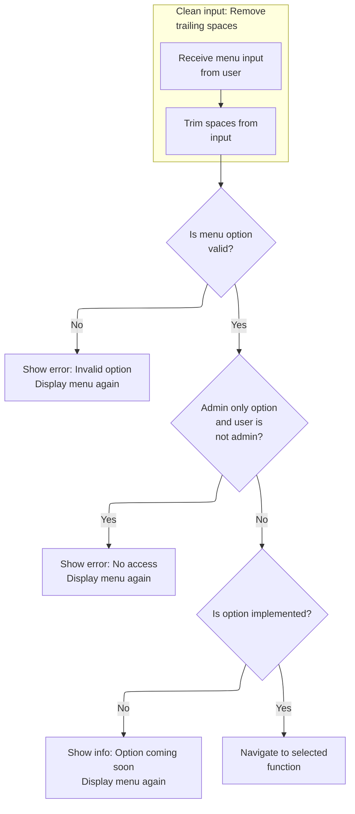

This section processes the user's menu selection input, validating the choice, enforcing access control, and determining whether to navigate to the selected function or display an appropriate message.

| Rule ID | Code Location     | Category        | Rule Name                         | Description                                                                                                                                                                                           | Conditions                                                                                | Remarks                                                                                                                                                                                            |
| ------- | ----------------- | --------------- | --------------------------------- | ----------------------------------------------------------------------------------------------------------------------------------------------------------------------------------------------------- | ----------------------------------------------------------------------------------------- | -------------------------------------------------------------------------------------------------------------------------------------------------------------------------------------------------- |
| BR-001  | PROCESS-ENTER-KEY | Data validation | Menu option validation            | If the user's menu selection is not a valid numeric option within the allowed range, or is zero, the system displays an error message and prompts the user to enter a valid option.                   | The user's input is not numeric, or exceeds the maximum allowed option count, or is zero. | The maximum allowed option count is defined by CDEMO-MENU-OPT-COUNT. The error message displayed is 'Please enter a valid option number...'. The message is shown on the menu screen.              |
| BR-002  | PROCESS-ENTER-KEY | Data validation | Admin-only option access control  | If the selected menu option is restricted to administrators and the current user is not an administrator, the system displays an access denied message and prompts the user to select another option. | The selected menu option requires admin access and the user is not an admin.              | Admin-only options are indicated by 'A' in the user type field for the menu option. The access denied message is 'No access - Admin Only option... '. The message is shown on the menu screen.     |
| BR-003  | PROCESS-ENTER-KEY | Data validation | Input cleaning                    | Trailing spaces in the user's menu selection input are removed before validation to ensure accurate processing.                                                                                       | The user's input contains trailing spaces.                                                | Trailing spaces are removed from the input before further processing. The cleaned input is used for validation and navigation.                                                                     |
| BR-004  | PROCESS-ENTER-KEY | Business logic  | Unimplemented option notification | If the selected menu option is not yet implemented, the system displays a 'coming soon' message and prompts the user to select another option.                                                        | The selected menu option's program name starts with 'DUMMY'.                              | Unimplemented options are indicated by the program name starting with 'DUMMY'. The message displayed is 'This option \[option name\] is coming soon ...'. The message is shown on the menu screen. |
| BR-005  | PROCESS-ENTER-KEY | Business logic  | Menu navigation                   | If the selected menu option is valid, accessible, and implemented, the system navigates to the corresponding function.                                                                                | The selected menu option is valid, the user has access, and the option is implemented.    | Navigation is performed by transferring control to the program associated with the selected option. The communication area is passed to the next program.                                          |

<SwmSnippet path="/app/cbl/COMEN01C.cbl" line="199" repo-id="Z2l0aHViJTNBJTNBa3luZHJ5bC1hd3MtbWFpbmZyYW1lLW1vZGVybml6YXRpb24tY2FyZGRlbW8lM0ElM0FTd2ltbS1EZW1v">

---

`RECEIVE-MENU-SCREEN` gets the user's input from the menu screen into the commarea, capturing response codes for error handling.

```cobol
       RECEIVE-MENU-SCREEN.

           EXEC CICS RECEIVE
                     MAP('COMEN1A')
                     MAPSET('COMEN01')
                     INTO(COMEN1AI)
                     RESP(WS-RESP-CD)
                     RESP2(WS-REAS-CD)
           END-EXEC.
```

---

</SwmSnippet>

<SwmSnippet path="/app/cbl/COMEN01C.cbl" line="115" repo-id="Z2l0aHViJTNBJTNBa3luZHJ5bC1hd3MtbWFpbmZyYW1lLW1vZGVybml6YXRpb24tY2FyZGRlbW8lM0ElM0FTd2ltbS1EZW1v">

---

`PROCESS-ENTER-KEY` scans the user's menu input, validates it's a number in range, checks access rights, and either routes to the selected program or shows an error or 'coming soon' message if the option isn't available.

```cobol
       PROCESS-ENTER-KEY.

           PERFORM VARYING WS-IDX
                   FROM LENGTH OF OPTIONI OF COMEN1AI BY -1 UNTIL
                   OPTIONI OF COMEN1AI(WS-IDX:1) NOT = SPACES OR
                   WS-IDX = 1
           END-PERFORM
           MOVE OPTIONI OF COMEN1AI(1:WS-IDX) TO WS-OPTION-X
           INSPECT WS-OPTION-X REPLACING ALL ' ' BY '0'
           MOVE WS-OPTION-X              TO WS-OPTION
           MOVE WS-OPTION                TO OPTIONO OF COMEN1AO

           IF WS-OPTION IS NOT NUMERIC OR
              WS-OPTION > CDEMO-MENU-OPT-COUNT OR
              WS-OPTION = ZEROS
               MOVE 'Y'     TO WS-ERR-FLG
               MOVE 'Please enter a valid option number...' TO
                               WS-MESSAGE
               PERFORM SEND-MENU-SCREEN
           END-IF

           IF CDEMO-USRTYP-USER AND
              CDEMO-MENU-OPT-USRTYPE(WS-OPTION) = 'A'
               SET ERR-FLG-ON          TO TRUE
               MOVE SPACES             TO WS-MESSAGE
               MOVE 'No access - Admin Only option... ' TO
                                       WS-MESSAGE
               PERFORM SEND-MENU-SCREEN
           END-IF

           IF NOT ERR-FLG-ON
               IF CDEMO-MENU-OPT-PGMNAME(WS-OPTION)(1:5) NOT = 'DUMMY'
                   MOVE WS-TRANID    TO CDEMO-FROM-TRANID
                   MOVE WS-PGMNAME   TO CDEMO-FROM-PROGRAM
      *            MOVE WS-USER-ID   TO CDEMO-USER-ID
      *            MOVE SEC-USR-TYPE TO CDEMO-USER-TYPE
                   MOVE ZEROS        TO CDEMO-PGM-CONTEXT
                   EXEC CICS
                       XCTL PROGRAM(CDEMO-MENU-OPT-PGMNAME(WS-OPTION))
                       COMMAREA(CARDDEMO-COMMAREA)
                   END-EXEC
               END-IF
               MOVE SPACES             TO WS-MESSAGE
               MOVE DFHGREEN           TO ERRMSGC  OF COMEN1AO
               STRING 'This option '       DELIMITED BY SIZE
                       CDEMO-MENU-OPT-NAME(WS-OPTION)
                                       DELIMITED BY SPACE
                       'is coming soon ...'   DELIMITED BY SIZE
                  INTO WS-MESSAGE
               PERFORM SEND-MENU-SCREEN
           END-IF.
```

---

</SwmSnippet>

#### Sending Plain Text and Ending

This section is responsible for displaying a plain text message to the user, resetting the terminal state, and ending the session.

| Rule ID | Code Location   | Category       | Rule Name                  | Description                                                                                                                                                                           | Conditions                                                          | Remarks                                                                                                                                                                                                                                                                                  |
| ------- | --------------- | -------------- | -------------------------- | ------------------------------------------------------------------------------------------------------------------------------------------------------------------------------------- | ------------------------------------------------------------------- | ---------------------------------------------------------------------------------------------------------------------------------------------------------------------------------------------------------------------------------------------------------------------------------------- |
| BR-001  | SEND-PLAIN-TEXT | Business logic | Display plain text message | When this section is executed, a plain text message is displayed to the user terminal. The message content is determined by the value set in the message variable prior to execution. | This rule applies whenever the SEND-PLAIN-TEXT section is executed. | The message displayed is a string, with a maximum length determined by the message variable (up to 80 characters). Example messages include 'Thank you for using CardDemo application...      ' (50 characters) and 'Invalid key pressed. Please see below...         ' (50 characters). |
| BR-002  | SEND-PLAIN-TEXT | Business logic | Reset terminal state       | After displaying the message, the terminal screen is cleared and the keyboard is released, allowing the user to interact with the terminal again.                                     | This rule applies whenever the SEND-PLAIN-TEXT section is executed. | The screen is cleared and the keyboard is released immediately after the message is displayed. No additional input is required from the user.                                                                                                                                            |
| BR-003  | SEND-PLAIN-TEXT | Business logic | End session after message  | Once the message is displayed and the terminal is reset, the session is ended and control is returned to the calling environment.                                                     | This rule applies whenever the SEND-PLAIN-TEXT section is executed. | The session ends immediately after the message is displayed and the terminal is reset. No further actions are performed in this section.                                                                                                                                                 |

<SwmSnippet path="/app/cbl/COSGN00C.cbl" line="162" repo-id="Z2l0aHViJTNBJTNBa3luZHJ5bC1hd3MtbWFpbmZyYW1lLW1vZGVybml6YXRpb24tY2FyZGRlbW8lM0ElM0FTd2ltbS1EZW1v">

---

`SEND-PLAIN-TEXT` sends a plain text message to the terminal (like a thank you), clears the screen, releases the keyboard, and then ends the program with RETURN.

```cobol
       SEND-PLAIN-TEXT.

           EXEC CICS SEND TEXT
                     FROM(WS-MESSAGE)
                     LENGTH(LENGTH OF WS-MESSAGE)
                     ERASE
                     FREEKB
           END-EXEC.

           EXEC CICS RETURN
           END-EXEC.
```

---

</SwmSnippet>

### Display Admin Menu

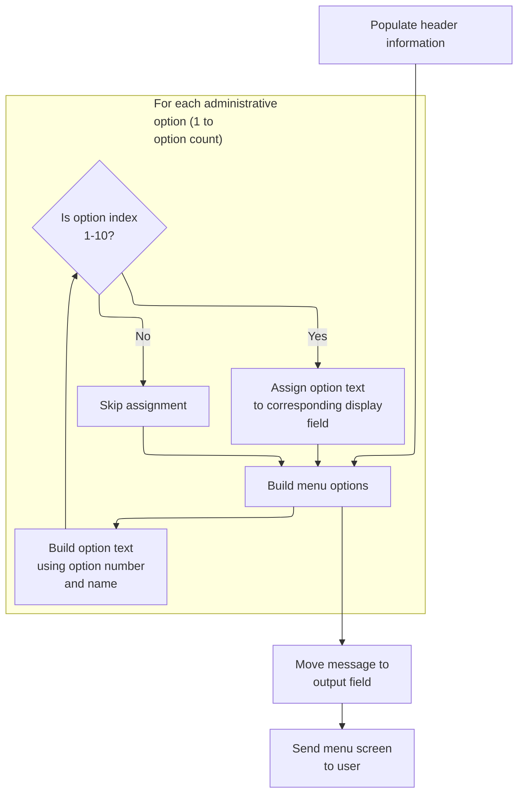

This section displays the administrative menu to the user, including header information, up to 10 menu options, and an optional message. It ensures the menu is formatted and transmitted correctly for user interaction.

| Rule ID | Code Location        | Category       | Rule Name                 | Description                                                                                                                                                                | Conditions                                               | Remarks                                                                                                                                                                                |
| ------- | -------------------- | -------------- | ------------------------- | -------------------------------------------------------------------------------------------------------------------------------------------------------------------------- | -------------------------------------------------------- | -------------------------------------------------------------------------------------------------------------------------------------------------------------------------------------- |
| BR-001  | POPULATE-HEADER-INFO | Business logic | Header display formatting | The header of the administrative menu must display the current date, current time, menu titles, transaction name, and program name, formatted for user readability.        | Whenever the administrative menu is displayed.           | Date is formatted as MM-DD-YY, time as HH-MM-SS. Titles, transaction name, and program name are displayed as strings. All fields are left-aligned and padded as needed for display.    |
| BR-002  | BUILD-MENU-OPTIONS   | Business logic | Menu option display limit | The administrative menu must display up to 10 options, each formatted as '<option number>. <option name>'. Only options with index 1 to 10 are assigned to display fields. | Whenever the administrative menu is built and displayed. | Each option is formatted as a string: option number (numeric), a period and space, then option name (string). Only the first 10 options are displayed; additional options are ignored. |
| BR-003  | SEND-MENU-SCREEN     | Business logic | Menu message display      | The message field on the administrative menu screen must display the current message value, which defaults to blank unless set elsewhere.                                  | Whenever the administrative menu is displayed.           | Message is a string up to 80 characters, left-aligned and padded with spaces if shorter. If no message is set, the field is blank.                                                     |
| BR-004  | SEND-MENU-SCREEN     | Technical step | Menu screen transmission  | The administrative menu screen must be sent to the user terminal, including all populated fields and with the screen cleared before display.                               | Whenever the administrative menu is displayed.           | All output fields (header, options, message) are included in the transmission. The screen is cleared before the menu is displayed.                                                     |

<SwmSnippet path="/app/cbl/COADM01C.cbl" line="172" repo-id="Z2l0aHViJTNBJTNBa3luZHJ5bC1hd3MtbWFpbmZyYW1lLW1vZGVybml6YXRpb24tY2FyZGRlbW8lM0ElM0FTd2ltbS1EZW1v">

---

`SEND-MENU-SCREEN` sets up the header, builds the admin menu options, moves the message to the error field, and sends the admin menu map to the terminal. ERASE clears the screen before displaying the menu.

```cobol
       SEND-MENU-SCREEN.

           PERFORM POPULATE-HEADER-INFO
           PERFORM BUILD-MENU-OPTIONS

           MOVE WS-MESSAGE TO ERRMSGO OF COADM1AO

           EXEC CICS SEND
                     MAP('COADM1A')
                     MAPSET('COADM01')
                     FROM(COADM1AO)
                     ERASE
           END-EXEC.
```

---

</SwmSnippet>

<SwmSnippet path="/app/cbl/COADM01C.cbl" line="202" repo-id="Z2l0aHViJTNBJTNBa3luZHJ5bC1hd3MtbWFpbmZyYW1lLW1vZGVybml6YXRpb24tY2FyZGRlbW8lM0ElM0FTd2ltbS1EZW1v">

---

`POPULATE-HEADER-INFO` fills in the admin menu header with the current date, time, titles, transaction, and program names. It formats the date and time for display and updates the header fields in the commarea.

```cobol
       POPULATE-HEADER-INFO.

           MOVE FUNCTION CURRENT-DATE  TO WS-CURDATE-DATA

           MOVE CCDA-TITLE01           TO TITLE01O OF COADM1AO
           MOVE CCDA-TITLE02           TO TITLE02O OF COADM1AO
           MOVE WS-TRANID              TO TRNNAMEO OF COADM1AO
           MOVE WS-PGMNAME             TO PGMNAMEO OF COADM1AO

           MOVE WS-CURDATE-MONTH       TO WS-CURDATE-MM
           MOVE WS-CURDATE-DAY         TO WS-CURDATE-DD
           MOVE WS-CURDATE-YEAR(3:2)   TO WS-CURDATE-YY

           MOVE WS-CURDATE-MM-DD-YY    TO CURDATEO OF COADM1AO

           MOVE WS-CURTIME-HOURS       TO WS-CURTIME-HH
           MOVE WS-CURTIME-MINUTE      TO WS-CURTIME-MM
           MOVE WS-CURTIME-SECOND      TO WS-CURTIME-SS

           MOVE WS-CURTIME-HH-MM-SS    TO CURTIMEO OF COADM1AO.
```

---

</SwmSnippet>

<SwmSnippet path="/app/cbl/COADM01C.cbl" line="226" repo-id="Z2l0aHViJTNBJTNBa3luZHJ5bC1hd3MtbWFpbmZyYW1lLW1vZGVybml6YXRpb24tY2FyZGRlbW8lM0ElM0FTd2ltbS1EZW1v">

---

`BUILD-MENU-OPTIONS` loops through all admin menu options, builds the display string for each (number + name), and assigns them to the output fields used by the admin menu screen. This keeps the menu flexible and easy to update.

```cobol
       BUILD-MENU-OPTIONS.

           PERFORM VARYING WS-IDX FROM 1 BY 1 UNTIL
                           WS-IDX > CDEMO-ADMIN-OPT-COUNT

               MOVE SPACES             TO WS-ADMIN-OPT-TXT

               STRING CDEMO-ADMIN-OPT-NUM(WS-IDX)  DELIMITED BY SIZE
                      '. '                         DELIMITED BY SIZE
                      CDEMO-ADMIN-OPT-NAME(WS-IDX) DELIMITED BY SIZE
                 INTO WS-ADMIN-OPT-TXT

               EVALUATE WS-IDX
                   WHEN 1
                       MOVE WS-ADMIN-OPT-TXT TO OPTN001O
                   WHEN 2
                       MOVE WS-ADMIN-OPT-TXT TO OPTN002O
                   WHEN 3
                       MOVE WS-ADMIN-OPT-TXT TO OPTN003O
                   WHEN 4
                       MOVE WS-ADMIN-OPT-TXT TO OPTN004O
                   WHEN 5
                       MOVE WS-ADMIN-OPT-TXT TO OPTN005O
                   WHEN 6
                       MOVE WS-ADMIN-OPT-TXT TO OPTN006O
                   WHEN 7
                       MOVE WS-ADMIN-OPT-TXT TO OPTN007O
                   WHEN 8
                       MOVE WS-ADMIN-OPT-TXT TO OPTN008O
                   WHEN 9
                       MOVE WS-ADMIN-OPT-TXT TO OPTN009O
                   WHEN 10
                       MOVE WS-ADMIN-OPT-TXT TO OPTN010O
                   WHEN OTHER
                       CONTINUE
               END-EVALUATE

           END-PERFORM.
```

---

</SwmSnippet>

### Processing Admin Menu Selection

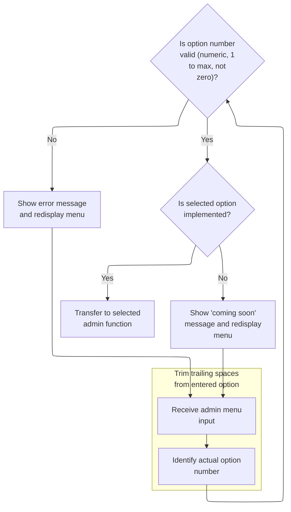

This section processes the admin's menu selection, validating the input, handling unimplemented options, and routing to the selected admin function.

| Rule ID | Code Location     | Category        | Rule Name                     | Description                                                                                                                                                 | Conditions                                                                                       | Remarks                                                                                                                                                                                                                               |
| ------- | ----------------- | --------------- | ----------------------------- | ----------------------------------------------------------------------------------------------------------------------------------------------------------- | ------------------------------------------------------------------------------------------------ | ------------------------------------------------------------------------------------------------------------------------------------------------------------------------------------------------------------------------------------- |
| BR-001  | PROCESS-ENTER-KEY | Data validation | Menu option validation        | If the entered menu option is not numeric, is zero, or exceeds the maximum allowed option count, an error message is displayed and the menu is redisplayed. | The entered option is not numeric, is zero, or is greater than the maximum allowed option count. | The maximum allowed option count is defined by the value of CDEMO-ADMIN-OPT-COUNT. The error message displayed is 'Please enter a valid option number...'. The message is shown in the menu message area and the menu is redisplayed. |
| BR-002  | PROCESS-ENTER-KEY | Business logic  | Unimplemented option handling | If the selected menu option is valid but not yet implemented, a 'coming soon' message is displayed and the menu is redisplayed.                             | The entered option is valid but the corresponding program name starts with 'DUMMY'.              | The 'coming soon' message is constructed as 'This option is coming soon ...' and displayed in the menu message area. The menu is redisplayed after showing the message.                                                               |
| BR-003  | PROCESS-ENTER-KEY | Business logic  | Admin function routing        | If the selected menu option is valid and implemented, the system transfers control to the corresponding admin function.                                     | The entered option is valid and the corresponding program name does not start with 'DUMMY'.      | The transfer is performed to the program name associated with the selected option. The communication area is passed to the target program.                                                                                            |

<SwmSnippet path="/app/cbl/COADM01C.cbl" line="189" repo-id="Z2l0aHViJTNBJTNBa3luZHJ5bC1hd3MtbWFpbmZyYW1lLW1vZGVybml6YXRpb24tY2FyZGRlbW8lM0ElM0FTd2ltbS1EZW1v">

---

`RECEIVE-MENU-SCREEN` gets the admin's input from the menu screen into the commarea, capturing response codes for error handling.

```cobol
       RECEIVE-MENU-SCREEN.

           EXEC CICS RECEIVE
                     MAP('COADM1A')
                     MAPSET('COADM01')
                     INTO(COADM1AI)
                     RESP(WS-RESP-CD)
                     RESP2(WS-REAS-CD)
           END-EXEC.
```

---

</SwmSnippet>

<SwmSnippet path="/app/cbl/COADM01C.cbl" line="115" repo-id="Z2l0aHViJTNBJTNBa3luZHJ5bC1hd3MtbWFpbmZyYW1lLW1vZGVybml6YXRpb24tY2FyZGRlbW8lM0ElM0FTd2ltbS1EZW1v">

---

`PROCESS-ENTER-KEY` trims and validates the admin's menu input, checks if it's a valid option, and either routes to the selected program or shows an error or 'coming soon' message if the option isn't available.

```cobol
       PROCESS-ENTER-KEY.

           PERFORM VARYING WS-IDX
                   FROM LENGTH OF OPTIONI OF COADM1AI BY -1 UNTIL
                   OPTIONI OF COADM1AI(WS-IDX:1) NOT = SPACES OR
                   WS-IDX = 1
           END-PERFORM
           MOVE OPTIONI OF COADM1AI(1:WS-IDX) TO WS-OPTION-X
           INSPECT WS-OPTION-X REPLACING ALL ' ' BY '0'
           MOVE WS-OPTION-X              TO WS-OPTION
           MOVE WS-OPTION                TO OPTIONO OF COADM1AO

           IF WS-OPTION IS NOT NUMERIC OR
              WS-OPTION > CDEMO-ADMIN-OPT-COUNT OR
              WS-OPTION = ZEROS
               MOVE 'Y'     TO WS-ERR-FLG
               MOVE 'Please enter a valid option number...' TO
                                       WS-MESSAGE
               PERFORM SEND-MENU-SCREEN
           END-IF


           IF NOT ERR-FLG-ON
               IF CDEMO-ADMIN-OPT-PGMNAME(WS-OPTION)(1:5) NOT = 'DUMMY'
                   MOVE WS-TRANID    TO CDEMO-FROM-TRANID
                   MOVE WS-PGMNAME   TO CDEMO-FROM-PROGRAM
                   MOVE ZEROS        TO CDEMO-PGM-CONTEXT
                   EXEC CICS
                       XCTL PROGRAM(CDEMO-ADMIN-OPT-PGMNAME(WS-OPTION))
                       COMMAREA(CARDDEMO-COMMAREA)
                   END-EXEC
               END-IF
               MOVE SPACES             TO WS-MESSAGE
               MOVE DFHGREEN           TO ERRMSGC  OF COADM1AO
               STRING 'This option '       DELIMITED BY SIZE
      *                CDEMO-ADMIN-OPT-NAME(WS-OPTION)
      *                                DELIMITED BY SIZE
                       'is coming soon ...'   DELIMITED BY SIZE
                  INTO WS-MESSAGE
               PERFORM SEND-MENU-SCREEN
           END-IF.
```

---

</SwmSnippet>

## Continuing User Update Flow

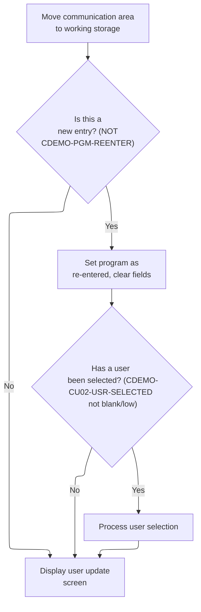

This section manages the flow for updating a user, including initializing the update session, handling user selection, and displaying the update screen.

| Rule ID | Code Location | Category       | Rule Name                  | Description                                                                                                                                                                                | Conditions                                                                   | Remarks                                                                                                                                                          |
| ------- | ------------- | -------------- | -------------------------- | ------------------------------------------------------------------------------------------------------------------------------------------------------------------------------------------ | ---------------------------------------------------------------------------- | ---------------------------------------------------------------------------------------------------------------------------------------------------------------- |
| BR-001  | MAIN-PARA     | Business logic | Initialize new user update | When the update flow is started and the program is not in a re-entered state, the program context is set to re-entered, and all user input fields are cleared to prepare for a new update. | The program is not in a re-entered state when entering the update flow.      | The 're-entered' state is represented by CDEMO-PGM-CONTEXT = 1. Fields are cleared by setting them to their lowest possible values (e.g., blank or binary zero). |
| BR-002  | MAIN-PARA     | Business logic | Process selected user      | If a user has been selected during the update flow, the selected user's identifier is loaded into the input area and the user selection is processed.                                      | A user has been selected and the selection is not blank or low-value.        | A valid user selection is any value not equal to spaces or binary zero. The selected user's identifier is loaded into the input area for processing.             |
| BR-003  | MAIN-PARA     | Business logic | Display user update screen | After initializing the update flow or processing a user selection, the user update screen is displayed to the user.                                                                        | The update flow has been initialized or a user selection has been processed. | The user update screen is displayed regardless of whether a new entry is being initialized or a user selection is being processed.                               |

<SwmSnippet path="/app/cbl/COUSR02C.cbl" line="93" repo-id="Z2l0aHViJTNBJTNBa3luZHJ5bC1hd3MtbWFpbmZyYW1lLW1vZGVybml6YXRpb24tY2FyZGRlbW8lM0ElM0FTd2ltbS1EZW1v">

---

After RETURN-TO-PREV-SCREEN, MAIN-PARA checks if we're reentering. If not, we prep for a new update and, if a user selection exists, call PROCESS-ENTER-KEY to handle it. This keeps the update flow consistent whether we're starting fresh or coming back.

```cobol
           ELSE
               MOVE DFHCOMMAREA(1:EIBCALEN) TO CARDDEMO-COMMAREA
               IF NOT CDEMO-PGM-REENTER
                   SET CDEMO-PGM-REENTER    TO TRUE
                   MOVE LOW-VALUES          TO COUSR2AO
                   MOVE -1       TO USRIDINL OF COUSR2AI
                   IF CDEMO-CU02-USR-SELECTED NOT =
                                              SPACES AND LOW-VALUES
                       MOVE CDEMO-CU02-USR-SELECTED TO
                            USRIDINI OF COUSR2AI
                       PERFORM PROCESS-ENTER-KEY
                   END-IF
                   PERFORM SEND-USRUPD-SCREEN
```

---

</SwmSnippet>

## Validating User ID and Routing for Update

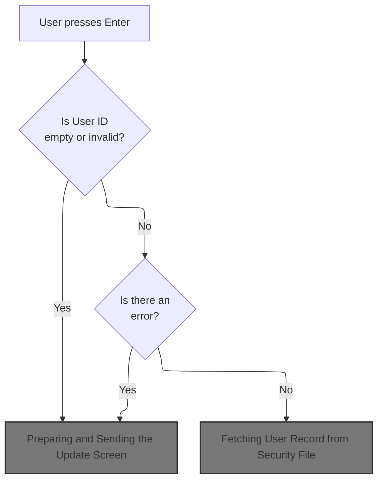

This section validates the User ID input during the user update process, ensuring that users cannot proceed with an empty or invalid User ID and are notified of any errors.

| Rule ID | Code Location     | Category        | Rule Name                             | Description                                                                                                                           | Conditions                                                                               | Remarks                                                                                                                                                                                       |
| ------- | ----------------- | --------------- | ------------------------------------- | ------------------------------------------------------------------------------------------------------------------------------------- | ---------------------------------------------------------------------------------------- | --------------------------------------------------------------------------------------------------------------------------------------------------------------------------------------------- |
| BR-001  | PROCESS-ENTER-KEY | Data validation | User ID required                      | If the User ID is empty or contains only low-values, an error is triggered and the user is notified that the User ID cannot be empty. | The User ID field is empty or contains only low-values when the user presses Enter.      | The error flag is set to 'Y' (single character), and the error message is set to 'User ID can NOT be empty...' (string, up to 80 characters). The User ID input length is set to -1 (number). |
| BR-002  | PROCESS-ENTER-KEY | Business logic  | Valid User ID proceeds                | If the User ID is not empty or low-values, the update process continues without setting an error.                                     | The User ID field contains a non-empty, non-low-value value when the user presses Enter. | No error flag is set, and the User ID input length is set to -1 (number).                                                                                                                     |
| BR-003  | PROCESS-ENTER-KEY | Error handling  | Error notification on invalid User ID | When an error is detected due to an invalid User ID, the update screen is sent to the user with the error message.                    | An error flag is set due to an empty or low-value User ID.                               | The update screen is sent with the error message 'User ID can NOT be empty...' (string, up to 80 characters).                                                                                 |

<SwmSnippet path="/app/cbl/COUSR02C.cbl" line="143" repo-id="Z2l0aHViJTNBJTNBa3luZHJ5bC1hd3MtbWFpbmZyYW1lLW1vZGVybml6YXRpb24tY2FyZGRlbW8lM0ElM0FTd2ltbS1EZW1v">

---

We check if the User ID is empty or low-values, and if so, we set an error and call SEND-USRUPD-SCREEN to show the error. If not, we just keep going.

```cobol
       PROCESS-ENTER-KEY.

           EVALUATE TRUE
               WHEN USRIDINI OF COUSR2AI = SPACES OR LOW-VALUES
                   MOVE 'Y'     TO WS-ERR-FLG
                   MOVE 'User ID can NOT be empty...' TO
                                   WS-MESSAGE
                   MOVE -1       TO USRIDINL OF COUSR2AI
                   PERFORM SEND-USRUPD-SCREEN
               WHEN OTHER
                   MOVE -1       TO USRIDINL OF COUSR2AI
                   CONTINUE
           END-EVALUATE
```

---

</SwmSnippet>

### Preparing and Sending the Update Screen

This section ensures that the user always sees the most current header information and any relevant messages when the update screen is sent, providing an up-to-date and informative user experience.

| Rule ID | Code Location                            | Category       | Rule Name                  | Description                                                                                                                                                                                                         | Conditions                                                        | Remarks                                                                                                                                                                                           |
| ------- | ---------------------------------------- | -------------- | -------------------------- | ------------------------------------------------------------------------------------------------------------------------------------------------------------------------------------------------------------------- | ----------------------------------------------------------------- | ------------------------------------------------------------------------------------------------------------------------------------------------------------------------------------------------- |
| BR-001  | SEND-USRUPD-SCREEN, POPULATE-HEADER-INFO | Business logic | Refresh header information | Whenever the update screen is sent, the header fields (date, time, titles, transaction name, and program name) must be refreshed to reflect the most current values so the user always sees up-to-date information. | When preparing to send the update screen to the user.             | The header includes: date (formatted as MM-DD-YY), time (formatted as HH-MM-SS), title 1 and title 2 (strings), transaction name (string, 4 characters), and program name (string, 8 characters). |
| BR-002  | SEND-USRUPD-SCREEN                       | Business logic | Display user message       | Any message (error or informational) that is relevant to the user must be displayed in the message area of the update screen when the screen is sent.                                                               | When sending the update screen, if there is a message to display. | The message area is a string field with a length of 80 characters. If no message is present, the field is filled with spaces.                                                                     |
| BR-003  | SEND-USRUPD-SCREEN                       | Business logic | Send update screen to user | The update screen must be sent to the user's terminal with the refreshed header and message fields, ensuring the display is cleared and the cursor is positioned for user interaction.                              | After header and message fields are refreshed.                    | The screen is sent using the 'COUSR2A' map and 'COUSR02' mapset, with the output area containing all refreshed fields. The display is erased and the cursor is positioned for user input.         |

<SwmSnippet path="/app/cbl/COUSR02C.cbl" line="266" repo-id="Z2l0aHViJTNBJTNBa3luZHJ5bC1hd3MtbWFpbmZyYW1lLW1vZGVybml6YXRpb24tY2FyZGRlbW8lM0ElM0FTd2ltbS1EZW1v">

---

In `SEND-USRUPD-SCREEN`, we call POPULATE-HEADER-INFO to refresh the header fields (date, time, titles, etc.) before actually sending the screen. This keeps the display up-to-date for the user.

```cobol
       SEND-USRUPD-SCREEN.

           PERFORM POPULATE-HEADER-INFO
```

---

</SwmSnippet>

<SwmSnippet path="/app/cbl/COUSR02C.cbl" line="296" repo-id="Z2l0aHViJTNBJTNBa3luZHJ5bC1hd3MtbWFpbmZyYW1lLW1vZGVybml6YXRpb24tY2FyZGRlbW8lM0ElM0FTd2ltbS1EZW1v">

---

We fill in the header with the latest date, time, and titles so the user always sees current info.

```cobol
       POPULATE-HEADER-INFO.

           MOVE FUNCTION CURRENT-DATE  TO WS-CURDATE-DATA

           MOVE CCDA-TITLE01           TO TITLE01O OF COUSR2AO
           MOVE CCDA-TITLE02           TO TITLE02O OF COUSR2AO
           MOVE WS-TRANID              TO TRNNAMEO OF COUSR2AO
           MOVE WS-PGMNAME             TO PGMNAMEO OF COUSR2AO

           MOVE WS-CURDATE-MONTH       TO WS-CURDATE-MM
           MOVE WS-CURDATE-DAY         TO WS-CURDATE-DD
           MOVE WS-CURDATE-YEAR(3:2)   TO WS-CURDATE-YY

           MOVE WS-CURDATE-MM-DD-YY    TO CURDATEO OF COUSR2AO

           MOVE WS-CURTIME-HOURS       TO WS-CURTIME-HH
           MOVE WS-CURTIME-MINUTE      TO WS-CURTIME-MM
           MOVE WS-CURTIME-SECOND      TO WS-CURTIME-SS

           MOVE WS-CURTIME-HH-MM-SS    TO CURTIMEO OF COUSR2AO.
```

---

</SwmSnippet>

<SwmSnippet path="/app/cbl/COUSR02C.cbl" line="270" repo-id="Z2l0aHViJTNBJTNBa3luZHJ5bC1hd3MtbWFpbmZyYW1lLW1vZGVybml6YXRpb24tY2FyZGRlbW8lM0ElM0FTd2ltbS1EZW1v">

---

We just came back from POPULATE-HEADER-INFO, so now in SEND-USRUPD-SCREEN we move the latest message into the error field and send the update screen to the terminal. The user sees the updated header and any message (error/info) right away.

```cobol
           MOVE WS-MESSAGE TO ERRMSGO OF COUSR2AO

           EXEC CICS SEND
                     MAP('COUSR2A')
                     MAPSET('COUSR02')
                     FROM(COUSR2AO)
                     ERASE
                     CURSOR
           END-EXEC.
```

---

</SwmSnippet>

### Reading User Data for Update

This section prepares user data for update by clearing input fields, copying the User ID for security file access, and loading the latest user data if no error is present.

| Rule ID | Code Location     | Category       | Rule Name                                   | Description                                                                                                                                                                          | Conditions                                                                   | Remarks                                                                                                                                                         |
| ------- | ----------------- | -------------- | ------------------------------------------- | ------------------------------------------------------------------------------------------------------------------------------------------------------------------------------------ | ---------------------------------------------------------------------------- | --------------------------------------------------------------------------------------------------------------------------------------------------------------- |
| BR-001  | PROCESS-ENTER-KEY | Business logic | Clear user input fields on successful entry | If there is no error after the SEND-USRUPD-SCREEN operation, all user input fields for first name, last name, password, and user type are cleared before proceeding with the update. | No error is present (error flag is not set to 'Y') after SEND-USRUPD-SCREEN. | The error flag uses 'Y' for error and 'N' for no error. The cleared fields are first name, last name, password, and user type, which are set to blank (spaces). |
| BR-002  | PROCESS-ENTER-KEY | Business logic | Copy User ID for security file access       | If there is no error, the User ID from the input area is copied to the security file key to prepare for loading the latest user data.                                                | No error is present (error flag is not set to 'Y') after SEND-USRUPD-SCREEN. | The User ID is an alphanumeric string of up to 8 characters. It is copied from the input area to the security file key field.                                   |
| BR-003  | PROCESS-ENTER-KEY | Business logic | Load latest user data for update            | If there is no error, the latest user data is loaded for update by accessing the security file using the copied User ID.                                                             | No error is present (error flag is not set to 'Y') after SEND-USRUPD-SCREEN. | The user data loaded includes first name (up to 20 characters), last name (up to 20 characters), password (up to 8 characters), and user type (1 character).    |

<SwmSnippet path="/app/cbl/COUSR02C.cbl" line="157" repo-id="Z2l0aHViJTNBJTNBa3luZHJ5bC1hd3MtbWFpbmZyYW1lLW1vZGVybml6YXRpb24tY2FyZGRlbW8lM0ElM0FTd2ltbS1EZW1v">

---

After SEND-USRUPD-SCREEN, if there's no error, PROCESS-ENTER-KEY clears out the user fields, copies the User ID to the security file key, and calls READ-USER-SEC-FILE to load the latest user data for update.

```cobol
           IF NOT ERR-FLG-ON
               MOVE SPACES      TO FNAMEI   OF COUSR2AI
                                   LNAMEI   OF COUSR2AI
                                   PASSWDI  OF COUSR2AI
                                   USRTYPEI OF COUSR2AI
               MOVE USRIDINI  OF COUSR2AI TO SEC-USR-ID
               PERFORM READ-USER-SEC-FILE
           END-IF.
```

---

</SwmSnippet>

### Fetching User Record from Security File

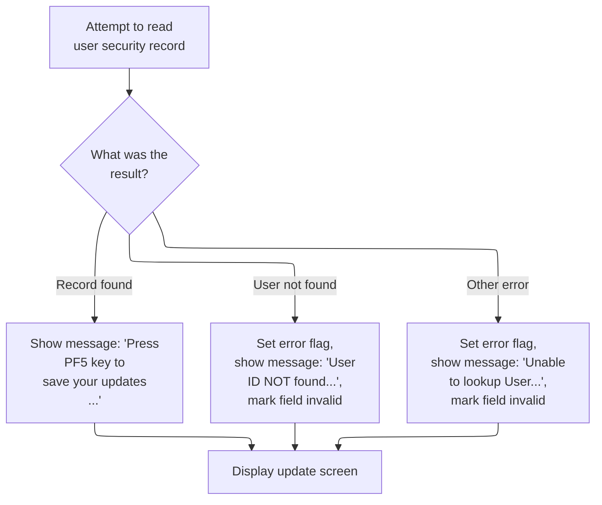

This section governs the business rules for fetching a user record from the security file, handling the result, and providing appropriate user feedback and interface updates based on the outcome.

| Rule ID | Code Location      | Category       | Rule Name                     | Description                                                                                                                                                                                                  | Conditions                                                                              | Remarks                                                                                                                                                                                                              |
| ------- | ------------------ | -------------- | ----------------------------- | ------------------------------------------------------------------------------------------------------------------------------------------------------------------------------------------------------------ | --------------------------------------------------------------------------------------- | -------------------------------------------------------------------------------------------------------------------------------------------------------------------------------------------------------------------- |
| BR-001  | READ-USER-SEC-FILE | Business logic | User record found prompt      | When a user record is successfully found in the security file, the user is prompted with a message to save their updates. The update screen is displayed to allow further actions.                           | The user record is found in the security file (response code is NORMAL).                | The message shown is: 'Press PF5 key to save your updates ...'. The message is an alphanumeric string of up to 80 characters. No error flag is set in this scenario.                                                 |
| BR-002  | READ-USER-SEC-FILE | Error handling | User not found error handling | If the user record is not found in the security file, an error flag is set, a message indicating the user was not found is displayed, and the update screen is shown with the relevant field marked invalid. | The user record is not found in the security file (response code is NOTFND).            | The error flag is set to 'Y'. The message shown is: 'User ID NOT found...'. The relevant input field is marked invalid by setting its value to -1. The message is an alphanumeric string of up to 80 characters.     |
| BR-003  | READ-USER-SEC-FILE | Error handling | Generic error handling        | If any other error occurs during the fetch operation, an error flag is set, a generic error message is displayed, and the update screen is shown with the relevant field marked invalid.                     | Any error occurs during the fetch operation that is not a normal or not found response. | The error flag is set to 'Y'. The message shown is: 'Unable to lookup User...'. The relevant input field is marked invalid by setting its value to -1. The message is an alphanumeric string of up to 80 characters. |

<SwmSnippet path="/app/cbl/COUSR02C.cbl" line="320" repo-id="Z2l0aHViJTNBJTNBa3luZHJ5bC1hd3MtbWFpbmZyYW1lLW1vZGVybml6YXRpb24tY2FyZGRlbW8lM0ElM0FTd2ltbS1EZW1v">

---

In `READ-USER-SEC-FILE`, we read the user record from the security file using the User ID as the key, and we use UPDATE to lock the record for editing. This avoids concurrent updates messing with the data.

```cobol
       READ-USER-SEC-FILE.

           EXEC CICS READ
                DATASET   (WS-USRSEC-FILE)
                INTO      (SEC-USER-DATA)
                LENGTH    (LENGTH OF SEC-USER-DATA)
                RIDFLD    (SEC-USR-ID)
                KEYLENGTH (LENGTH OF SEC-USR-ID)
                UPDATE
                RESP      (WS-RESP-CD)
                RESP2     (WS-REAS-CD)
           END-EXEC.
```

---

</SwmSnippet>

<SwmSnippet path="/app/cbl/COUSR02C.cbl" line="333" repo-id="Z2l0aHViJTNBJTNBa3luZHJ5bC1hd3MtbWFpbmZyYW1lLW1vZGVybml6YXRpb24tY2FyZGRlbW8lM0ElM0FTd2ltbS1EZW1v">

---

After reading the user record, we check the response code. If found, we prompt the user to save updates. If not found or there's an error, we set an error message and call SEND-USRUPD-SCREEN to show the result on the screen.

```cobol
           EVALUATE WS-RESP-CD
               WHEN DFHRESP(NORMAL)
                   CONTINUE
                   MOVE 'Press PF5 key to save your updates ...' TO
                                   WS-MESSAGE
                   MOVE DFHNEUTR       TO ERRMSGC  OF COUSR2AO
                   PERFORM SEND-USRUPD-SCREEN
```

---

</SwmSnippet>

<SwmSnippet path="/app/cbl/COUSR02C.cbl" line="340" repo-id="Z2l0aHViJTNBJTNBa3luZHJ5bC1hd3MtbWFpbmZyYW1lLW1vZGVybml6YXRpb24tY2FyZGRlbW8lM0ElM0FTd2ltbS1EZW1v">

---

We just got back from SEND-USRUPD-SCREEN in READ-USER-SEC-FILE. If the user wasn't found, we set the error flag, prep an error message, and show it to the user immediately by sending the update screen again.

```cobol
               WHEN DFHRESP(NOTFND)
                   MOVE 'Y'     TO WS-ERR-FLG
                   MOVE 'User ID NOT found...' TO
                                   WS-MESSAGE
                   MOVE -1       TO USRIDINL OF COUSR2AI
                   PERFORM SEND-USRUPD-SCREEN
```

---

</SwmSnippet>

<SwmSnippet path="/app/cbl/COUSR02C.cbl" line="346" repo-id="Z2l0aHViJTNBJTNBa3luZHJ5bC1hd3MtbWFpbmZyYW1lLW1vZGVybml6YXRpb24tY2FyZGRlbW8lM0ElM0FTd2ltbS1EZW1v">

---

If there's any other error (not found or system), we log the response codes, set the error flag, and show a generic error message on the update screen. The user gets immediate feedback and can try again.

```cobol
               WHEN OTHER
                   DISPLAY 'RESP:' WS-RESP-CD 'REAS:' WS-REAS-CD
                   MOVE 'Y'     TO WS-ERR-FLG
                   MOVE 'Unable to lookup User...' TO
                                   WS-MESSAGE
                   MOVE -1       TO FNAMEL OF COUSR2AI
                   PERFORM SEND-USRUPD-SCREEN
           END-EVALUATE.
```

---

</SwmSnippet>

### Populating User Info After Lookup

This section manages the display and editing of user information after a user security file lookup. It ensures that user details are only shown and editable if the lookup is successful and no error is present.

| Rule ID | Code Location     | Category       | Rule Name                                     | Description                                                                                                                                                                                   | Conditions                                                                                                        | Remarks                                                                                                                                                                                                                                                     |
| ------- | ----------------- | -------------- | --------------------------------------------- | --------------------------------------------------------------------------------------------------------------------------------------------------------------------------------------------- | ----------------------------------------------------------------------------------------------------------------- | ----------------------------------------------------------------------------------------------------------------------------------------------------------------------------------------------------------------------------------------------------------- |
| BR-001  | PROCESS-ENTER-KEY | Business logic | Populate user info on successful lookup       | When the user security file lookup completes without error, the user's first name, last name, password, and user type are populated into the corresponding input fields on the update screen. | The user security file lookup completes and no error is present.                                                  | The fields populated are: first name (string, up to 20 characters), last name (string, up to 20 characters), password (string, up to 8 characters), and user type (string, 1 character). These are displayed in the corresponding input fields for editing. |
| BR-002  | PROCESS-ENTER-KEY | Business logic | Send update screen after populating user info | After populating the user's information into the input fields, the update screen is sent to the user, allowing them to edit their details.                                                    | The user's information has been populated into the input fields following a successful lookup (no error present). | The update screen displays the user's first name, last name, password, and user type in editable fields.                                                                                                                                                    |
| BR-003  | PROCESS-ENTER-KEY | Error handling | Do not populate or send screen on error       | If an error is present after the user security file lookup, the user's information is not populated into the input fields and the update screen is not sent for editing.                      | An error is present after the user security file lookup.                                                          | No user information is displayed or editable if an error is present.                                                                                                                                                                                        |

<SwmSnippet path="/app/cbl/COUSR02C.cbl" line="166" repo-id="Z2l0aHViJTNBJTNBa3luZHJ5bC1hd3MtbWFpbmZyYW1lLW1vZGVybml6YXRpb24tY2FyZGRlbW8lM0ElM0FTd2ltbS1EZW1v">

---

After READ-USER-SEC-FILE, if there's no error, PROCESS-ENTER-KEY copies the user info (name, password, type) into the input fields and sends the update screen again so the user can edit their details.

```cobol
           IF NOT ERR-FLG-ON
               MOVE SEC-USR-FNAME      TO FNAMEI    OF COUSR2AI
               MOVE SEC-USR-LNAME      TO LNAMEI    OF COUSR2AI
               MOVE SEC-USR-PWD        TO PASSWDI   OF COUSR2AI
               MOVE SEC-USR-TYPE       TO USRTYPEI  OF COUSR2AI
               PERFORM SEND-USRUPD-SCREEN
           END-IF.
```

---

</SwmSnippet>

## Handling Program Entry and User Selection


This section manages the flow for updating a user, including initializing the update session, handling user selection, and displaying the update screen.

| Rule ID | Code Location | Category       | Rule Name                  | Description                                                                                                                                                                                | Conditions                                                                   | Remarks                                                                                                                                                          |
| ------- | ------------- | -------------- | -------------------------- | ------------------------------------------------------------------------------------------------------------------------------------------------------------------------------------------ | ---------------------------------------------------------------------------- | ---------------------------------------------------------------------------------------------------------------------------------------------------------------- |
| BR-001  | MAIN-PARA     | Business logic | Initialize new user update | When the update flow is started and the program is not in a re-entered state, the program context is set to re-entered, and all user input fields are cleared to prepare for a new update. | The program is not in a re-entered state when entering the update flow.      | The 're-entered' state is represented by CDEMO-PGM-CONTEXT = 1. Fields are cleared by setting them to their lowest possible values (e.g., blank or binary zero). |
| BR-002  | MAIN-PARA     | Business logic | Process selected user      | If a user has been selected during the update flow, the selected user's identifier is loaded into the input area and the user selection is processed.                                      | A user has been selected and the selection is not blank or low-value.        | A valid user selection is any value not equal to spaces or binary zero. The selected user's identifier is loaded into the input area for processing.             |
| BR-003  | MAIN-PARA     | Business logic | Display user update screen | After initializing the update flow or processing a user selection, the user update screen is displayed to the user.                                                                        | The update flow has been initialized or a user selection has been processed. | The user update screen is displayed regardless of whether a new entry is being initialized or a user selection is being processed.                               |

<SwmSnippet path="/app/cbl/COUSR02C.cbl" line="93" repo-id="Z2l0aHViJTNBJTNBa3luZHJ5bC1hd3MtbWFpbmZyYW1lLW1vZGVybml6YXRpb24tY2FyZGRlbW8lM0ElM0FTd2ltbS1EZW1v">

---

After PROCESS-ENTER-KEY in MAIN-PARA, we either initialize for a new entry or handle a user selection. No matter what, we send the update screen so the user always sees the current state.

```cobol
           ELSE
               MOVE DFHCOMMAREA(1:EIBCALEN) TO CARDDEMO-COMMAREA
               IF NOT CDEMO-PGM-REENTER
                   SET CDEMO-PGM-REENTER    TO TRUE
                   MOVE LOW-VALUES          TO COUSR2AO
                   MOVE -1       TO USRIDINL OF COUSR2AI
                   IF CDEMO-CU02-USR-SELECTED NOT =
                                              SPACES AND LOW-VALUES
                       MOVE CDEMO-CU02-USR-SELECTED TO
                            USRIDINI OF COUSR2AI
                       PERFORM PROCESS-ENTER-KEY
                   END-IF
                   PERFORM SEND-USRUPD-SCREEN
```

---

</SwmSnippet>

<SwmSnippet path="/app/cbl/COUSR02C.cbl" line="106" repo-id="Z2l0aHViJTNBJTNBa3luZHJ5bC1hd3MtbWFpbmZyYW1lLW1vZGVybml6YXRpb24tY2FyZGRlbW8lM0ElM0FTd2ltbS1EZW1v">

---

After SEND-USRUPD-SCREEN in MAIN-PARA, we immediately call RECEIVE-USRUPD-SCREEN to get the user's input from the screen. This is how we capture what the user wants to do next.

```cobol
               ELSE
                   PERFORM RECEIVE-USRUPD-SCREEN
```

---

</SwmSnippet>

<SwmSnippet path="/app/cbl/COUSR02C.cbl" line="283" repo-id="Z2l0aHViJTNBJTNBa3luZHJ5bC1hd3MtbWFpbmZyYW1lLW1vZGVybml6YXRpb24tY2FyZGRlbW8lM0ElM0FTd2ltbS1EZW1v">

---

`RECEIVE-USRUPD-SCREEN` grabs the user's input from the update screen using CICS RECEIVE, and stores it in the input structure. Response codes are set for error handling if needed.

```cobol
       RECEIVE-USRUPD-SCREEN.

           EXEC CICS RECEIVE
                     MAP('COUSR2A')
                     MAPSET('COUSR02')
                     INTO(COUSR2AI)
                     RESP(WS-RESP-CD)
                     RESP2(WS-REAS-CD)
           END-EXEC.
```

---

</SwmSnippet>

<SwmSnippet path="/app/cbl/COUSR02C.cbl" line="108" repo-id="Z2l0aHViJTNBJTNBa3luZHJ5bC1hd3MtbWFpbmZyYW1lLW1vZGVybml6YXRpb24tY2FyZGRlbW8lM0ElM0FTd2ltbS1EZW1v">

---

We check which key was pressed and run the matching logic (update, clear, return, etc.).

```cobol
                   EVALUATE EIBAID
                       WHEN DFHENTER
                           PERFORM PROCESS-ENTER-KEY
```

---

</SwmSnippet>

<SwmSnippet path="/app/cbl/COUSR02C.cbl" line="111" repo-id="Z2l0aHViJTNBJTNBa3luZHJ5bC1hd3MtbWFpbmZyYW1lLW1vZGVybml6YXRpb24tY2FyZGRlbW8lM0ElM0FTd2ltbS1EZW1v">

---

When PF3 is pressed, we update the user info, set the next program, and return to the previous screen. This makes sure any changes are saved before navigating away.

```cobol
                       WHEN DFHPF3
                           PERFORM UPDATE-USER-INFO
                           IF CDEMO-FROM-PROGRAM = SPACES OR LOW-VALUES
                               MOVE 'COADM01C' TO CDEMO-TO-PROGRAM
                           ELSE
                               MOVE CDEMO-FROM-PROGRAM TO
                               CDEMO-TO-PROGRAM
                           END-IF
                           PERFORM RETURN-TO-PREV-SCREEN
```

---

</SwmSnippet>

## Validating and Applying User Updates

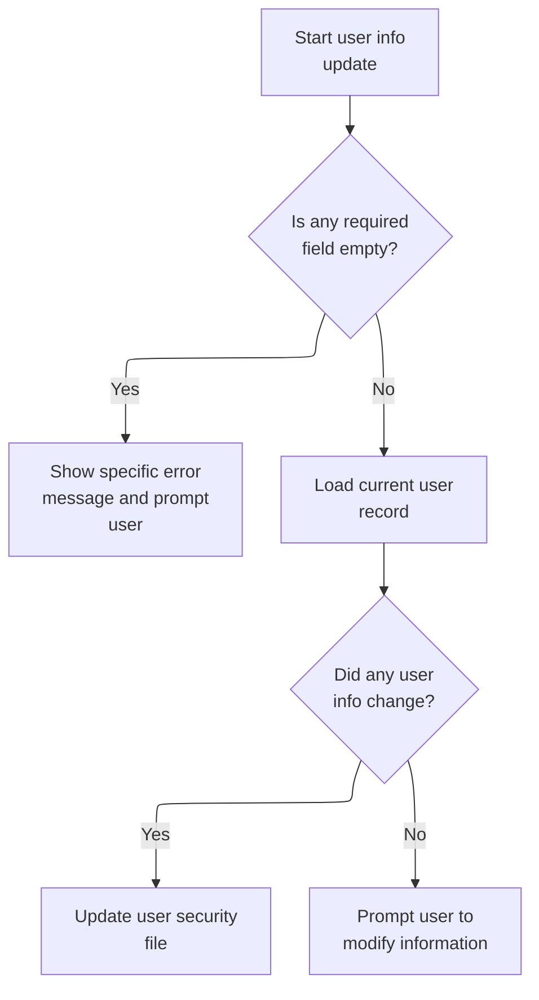

This section validates user input fields during a user update operation and applies changes to the user record only if modifications are detected. It provides immediate feedback for missing fields and ensures only changed data is updated.

| Rule ID | Code Location    | Category        | Rule Name                            | Description                                                                                                                                                                                                 | Conditions                                                                                           | Remarks                                                                                                                                                                          |
| ------- | ---------------- | --------------- | ------------------------------------ | ----------------------------------------------------------------------------------------------------------------------------------------------------------------------------------------------------------- | ---------------------------------------------------------------------------------------------------- | -------------------------------------------------------------------------------------------------------------------------------------------------------------------------------- |
| BR-001  | UPDATE-USER-INFO | Data validation | User ID required                     | If the User ID field is empty, the user is shown an error message stating that User ID cannot be empty and is prompted to correct the input.                                                                | User ID field is empty (blank or low-values) during user update.                                     | Error message: 'User ID can NOT be empty...'. The message is shown immediately and the user is prompted to correct the field.                                                    |
| BR-002  | UPDATE-USER-INFO | Data validation | First Name required                  | If the First Name field is empty, the user is shown an error message stating that First Name cannot be empty and is prompted to correct the input.                                                          | First Name field is empty (blank or low-values) during user update.                                  | Error message: 'First Name can NOT be empty...'. The message is shown immediately and the user is prompted to correct the field.                                                 |
| BR-003  | UPDATE-USER-INFO | Data validation | Last Name required                   | If the Last Name field is empty, the user is shown an error message stating that Last Name cannot be empty and is prompted to correct the input.                                                            | Last Name field is empty (blank or low-values) during user update.                                   | Error message: 'Last Name can NOT be empty...'. The message is shown immediately and the user is prompted to correct the field.                                                  |
| BR-004  | UPDATE-USER-INFO | Data validation | Password required                    | If the Password field is empty, the user is shown an error message stating that Password cannot be empty and is prompted to correct the input.                                                              | Password field is empty (blank or low-values) during user update.                                    | Error message: 'Password can NOT be empty...'. The message is shown immediately and the user is prompted to correct the field.                                                   |
| BR-005  | UPDATE-USER-INFO | Data validation | User Type required                   | If the User Type field is empty, the user is shown an error message stating that User Type cannot be empty and is prompted to correct the input.                                                            | User Type field is empty (blank or low-values) during user update.                                   | Error message: 'User Type can NOT be empty...'. The message is shown immediately and the user is prompted to correct the field.                                                  |
| BR-006  | UPDATE-USER-INFO | Business logic  | Update only changed fields           | If any user information field (First Name, Last Name, Password, or User Type) is changed from its current value, only the changed fields are updated in the user record and the user is marked as modified. | Any input field value differs from the current user record after validation.                         | Fields checked: First Name (max 20 chars), Last Name (max 20 chars), Password (max 8 chars), User Type (1 char). Only changed fields are updated; unchanged fields remain as is. |
| BR-007  | UPDATE-USER-INFO | Business logic  | Prompt for modification if unchanged | If no user information fields are changed, the user is prompted to modify information before an update can occur.                                                                                           | No input field value differs from the current user record after validation.                          | Prompt message: 'Please modify to update ...'. The message is shown immediately and the user is prompted to make a change.                                                       |
| BR-008  | UPDATE-USER-INFO | Error handling  | Error flag for missing fields        | If any required field is missing, an error flag is set and the user is shown a specific error message for the missing field.                                                                                | Any required field (User ID, First Name, Last Name, Password, User Type) is empty during validation. | Error flag is set to 'Y' when any required field is missing. The user is shown a specific error message for each missing field.                                                  |

<SwmSnippet path="/app/cbl/COUSR02C.cbl" line="177" repo-id="Z2l0aHViJTNBJTNBa3luZHJ5bC1hd3MtbWFpbmZyYW1lLW1vZGVybml6YXRpb24tY2FyZGRlbW8lM0ElM0FTd2ltbS1EZW1v">

---

In UPDATE-USER-INFO, we validate each input field one by one. If any are missing, we set an error message and call SEND-USRUPD-SCREEN to show the user exactly what's wrong so they can fix it.

```cobol
       UPDATE-USER-INFO.

           EVALUATE TRUE
               WHEN USRIDINI OF COUSR2AI = SPACES OR LOW-VALUES
                   MOVE 'Y'     TO WS-ERR-FLG
                   MOVE 'User ID can NOT be empty...' TO
                                   WS-MESSAGE
                   MOVE -1       TO USRIDINL OF COUSR2AI
                   PERFORM SEND-USRUPD-SCREEN
```

---

</SwmSnippet>

<SwmSnippet path="/app/cbl/COUSR02C.cbl" line="186" repo-id="Z2l0aHViJTNBJTNBa3luZHJ5bC1hd3MtbWFpbmZyYW1lLW1vZGVybml6YXRpb24tY2FyZGRlbW8lM0ElM0FTd2ltbS1EZW1v">

---

After SEND-USRUPD-SCREEN in UPDATE-USER-INFO, we keep validating the next field. Each missing field triggers its own error and screen update, so the user gets feedback right away.

```cobol
               WHEN FNAMEI OF COUSR2AI = SPACES OR LOW-VALUES
                   MOVE 'Y'     TO WS-ERR-FLG
                   MOVE 'First Name can NOT be empty...' TO
                                   WS-MESSAGE
                   MOVE -1       TO FNAMEL OF COUSR2AI
                   PERFORM SEND-USRUPD-SCREEN
```

---

</SwmSnippet>

<SwmSnippet path="/app/cbl/COUSR02C.cbl" line="192" repo-id="Z2l0aHViJTNBJTNBa3luZHJ5bC1hd3MtbWFpbmZyYW1lLW1vZGVybml6YXRpb24tY2FyZGRlbW8lM0ElM0FTd2ltbS1EZW1v">

---

After checking the first name, we do the same for last name—if it's missing, we set a specific error and update the screen. Each field gets its own check and message.

```cobol
               WHEN LNAMEI OF COUSR2AI = SPACES OR LOW-VALUES
                   MOVE 'Y'     TO WS-ERR-FLG
                   MOVE 'Last Name can NOT be empty...' TO
                                   WS-MESSAGE
                   MOVE -1       TO LNAMEL OF COUSR2AI
                   PERFORM SEND-USRUPD-SCREEN
```

---

</SwmSnippet>

<SwmSnippet path="/app/cbl/COUSR02C.cbl" line="198" repo-id="Z2l0aHViJTNBJTNBa3luZHJ5bC1hd3MtbWFpbmZyYW1lLW1vZGVybml6YXRpb24tY2FyZGRlbW8lM0ElM0FTd2ltbS1EZW1v">

---

After last name, we check the password field. If it's empty, we set a password-specific error and update the screen. Each field is handled separately for clear feedback.

```cobol
               WHEN PASSWDI OF COUSR2AI = SPACES OR LOW-VALUES
                   MOVE 'Y'     TO WS-ERR-FLG
                   MOVE 'Password can NOT be empty...' TO
                                   WS-MESSAGE
                   MOVE -1       TO PASSWDL OF COUSR2AI
                   PERFORM SEND-USRUPD-SCREEN
```

---

</SwmSnippet>

<SwmSnippet path="/app/cbl/COUSR02C.cbl" line="204" repo-id="Z2l0aHViJTNBJTNBa3luZHJ5bC1hd3MtbWFpbmZyYW1lLW1vZGVybml6YXRpb24tY2FyZGRlbW8lM0ElM0FTd2ltbS1EZW1v">

---

After password, we check user type. If it's missing, we set a user type error and update the screen. Each field gets its own validation and message.

```cobol
               WHEN USRTYPEI OF COUSR2AI = SPACES OR LOW-VALUES
                   MOVE 'Y'     TO WS-ERR-FLG
                   MOVE 'User Type can NOT be empty...' TO
                                   WS-MESSAGE
                   MOVE -1       TO USRTYPEL OF COUSR2AI
                   PERFORM SEND-USRUPD-SCREEN
```

---

</SwmSnippet>

<SwmSnippet path="/app/cbl/COUSR02C.cbl" line="210" repo-id="Z2l0aHViJTNBJTNBa3luZHJ5bC1hd3MtbWFpbmZyYW1lLW1vZGVybml6YXRpb24tY2FyZGRlbW8lM0ElM0FTd2ltbS1EZW1v">

---

If none of the fields are missing, we just continue. The validation block ends and we move on to checking for changes.

```cobol
               WHEN OTHER
                   MOVE -1       TO FNAMEL OF COUSR2AI
                   CONTINUE
           END-EVALUATE
```

---

</SwmSnippet>

<SwmSnippet path="/app/cbl/COUSR02C.cbl" line="215" repo-id="Z2l0aHViJTNBJTNBa3luZHJ5bC1hd3MtbWFpbmZyYW1lLW1vZGVybml6YXRpb24tY2FyZGRlbW8lM0ElM0FTd2ltbS1EZW1v">

---

After validation, we read the current user data from the security file and compare each field. If any input is different, we update the field and mark the user as modified.

```cobol
           IF NOT ERR-FLG-ON
               MOVE USRIDINI  OF COUSR2AI TO SEC-USR-ID
               PERFORM READ-USER-SEC-FILE
```

---

</SwmSnippet>

<SwmSnippet path="/app/cbl/COUSR02C.cbl" line="219" repo-id="Z2l0aHViJTNBJTNBa3luZHJ5bC1hd3MtbWFpbmZyYW1lLW1vZGVybml6YXRpb24tY2FyZGRlbW8lM0ElM0FTd2ltbS1EZW1v">

---

After reading the security file in UPDATE-USER-INFO, we check if the first name changed. If so, we update it and set the modified flag. This is done for each field, so only changed data is updated.

```cobol
               IF FNAMEI  OF COUSR2AI NOT = SEC-USR-FNAME
                   MOVE FNAMEI   OF COUSR2AI TO SEC-USR-FNAME
                   SET USR-MODIFIED-YES TO TRUE
               END-IF
```

---

</SwmSnippet>

<SwmSnippet path="/app/cbl/COUSR02C.cbl" line="223" repo-id="Z2l0aHViJTNBJTNBa3luZHJ5bC1hd3MtbWFpbmZyYW1lLW1vZGVybml6YXRpb24tY2FyZGRlbW8lM0ElM0FTd2ltbS1EZW1v">

---

After first name, we do the same for last name—if it's changed, we update it and set the modified flag. All fields are checked in sequence.

```cobol
               IF LNAMEI  OF COUSR2AI NOT = SEC-USR-LNAME
                   MOVE LNAMEI   OF COUSR2AI TO SEC-USR-LNAME
                   SET USR-MODIFIED-YES TO TRUE
               END-IF
```

---

</SwmSnippet>

<SwmSnippet path="/app/cbl/COUSR02C.cbl" line="227" repo-id="Z2l0aHViJTNBJTNBa3luZHJ5bC1hd3MtbWFpbmZyYW1lLW1vZGVybml6YXRpb24tY2FyZGRlbW8lM0ElM0FTd2ltbS1EZW1v">

---

Password is checked next—if it's different, we update it and set the modified flag. The logic is the same for all fields.

```cobol
               IF PASSWDI  OF COUSR2AI NOT = SEC-USR-PWD
                   MOVE PASSWDI  OF COUSR2AI TO SEC-USR-PWD
                   SET USR-MODIFIED-YES TO TRUE
               END-IF
```

---

</SwmSnippet>

<SwmSnippet path="/app/cbl/COUSR02C.cbl" line="231" repo-id="Z2l0aHViJTNBJTNBa3luZHJ5bC1hd3MtbWFpbmZyYW1lLW1vZGVybml6YXRpb24tY2FyZGRlbW8lM0ElM0FTd2ltbS1EZW1v">

---

User type is checked last—if it's changed, we update it and set the modified flag. All fields are handled the same way for updates.

```cobol
               IF USRTYPEI  OF COUSR2AI NOT = SEC-USR-TYPE
                   MOVE USRTYPEI OF COUSR2AI TO SEC-USR-TYPE
                   SET USR-MODIFIED-YES TO TRUE
               END-IF
```

---

</SwmSnippet>

<SwmSnippet path="/app/cbl/COUSR02C.cbl" line="236" repo-id="Z2l0aHViJTNBJTNBa3luZHJ5bC1hd3MtbWFpbmZyYW1lLW1vZGVybml6YXRpb24tY2FyZGRlbW8lM0ElM0FTd2ltbS1EZW1v">

---

If any field was changed, we update the user security file. If not, we prompt the user to actually modify something and update the screen with that message.

```cobol
               IF USR-MODIFIED-YES
                   PERFORM UPDATE-USER-SEC-FILE
               ELSE
                   MOVE 'Please modify to update ...' TO
                                   WS-MESSAGE
                   MOVE DFHRED       TO ERRMSGC  OF COUSR2AO
                   PERFORM SEND-USRUPD-SCREEN
               END-IF

           END-IF.
```

---

</SwmSnippet>

## Saving User Updates to Security File

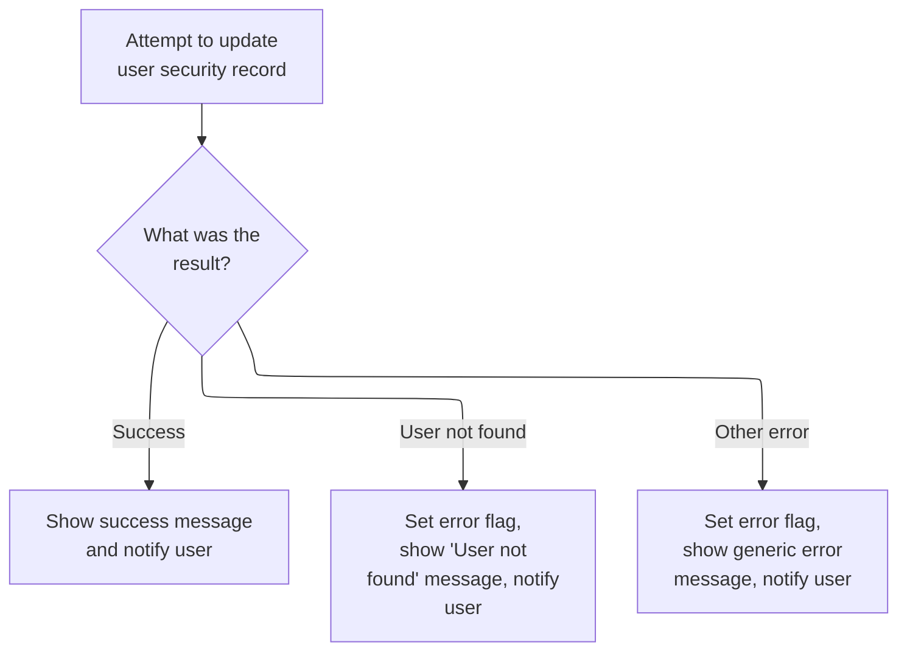

This section manages the process of saving user updates to the security file and provides immediate feedback to the user based on the outcome of the update attempt.

| Rule ID | Code Location        | Category       | Rule Name                     | Description                                                                                                                                                                               | Conditions                                                                | Remarks                                                                                                                                                                                                          |
| ------- | -------------------- | -------------- | ----------------------------- | ----------------------------------------------------------------------------------------------------------------------------------------------------------------------------------------- | ------------------------------------------------------------------------- | ---------------------------------------------------------------------------------------------------------------------------------------------------------------------------------------------------------------- |
| BR-001  | UPDATE-USER-SEC-FILE | Business logic | Successful update feedback    | When a user security record update is successful, the system displays a green success message to the user and updates the screen to reflect the change.                                   | The update operation returns a response code indicating NORMAL.           | The success message format is: 'User <user-id> has been updated ...' (string, up to 80 characters, left-aligned, padded with spaces if shorter). The message is displayed in green (DFHGREEN).                   |
| BR-002  | UPDATE-USER-SEC-FILE | Error handling | User not found error feedback | If the user ID is not found during the update attempt, the system sets an error flag, displays a 'User ID NOT found...' message, and updates the screen so the user can try again.        | The update operation returns a response code indicating NOTFND.           | The error flag is set to 'Y'. The error message is: 'User ID NOT found...' (string, up to 80 characters, left-aligned, padded with spaces if shorter). The input field for user ID is reset to -1.               |
| BR-003  | UPDATE-USER-SEC-FILE | Error handling | Generic update error feedback | If any other error occurs during the update attempt, the system logs the response codes, sets an error flag, displays a generic error message, and updates the screen to inform the user. | The update operation returns a response code other than NORMAL or NOTFND. | The error flag is set to 'Y'. The generic error message is: 'Unable to Update User...' (string, up to 80 characters, left-aligned, padded with spaces if shorter). The input field for user name is reset to -1. |

<SwmSnippet path="/app/cbl/COUSR02C.cbl" line="358" repo-id="Z2l0aHViJTNBJTNBa3luZHJ5bC1hd3MtbWFpbmZyYW1lLW1vZGVybml6YXRpb24tY2FyZGRlbW8lM0ElM0FTd2ltbS1EZW1v">

---

In UPDATE-USER-SEC-FILE, we update the user record in the security file. If it works, we show a success message. If not, we show an error message and update the screen so the user knows what happened.

```cobol
       UPDATE-USER-SEC-FILE.

           EXEC CICS REWRITE
                DATASET   (WS-USRSEC-FILE)
                FROM      (SEC-USER-DATA)
                LENGTH    (LENGTH OF SEC-USER-DATA)
                RESP      (WS-RESP-CD)
                RESP2     (WS-REAS-CD)
           END-EXEC.
```

---

</SwmSnippet>

<SwmSnippet path="/app/cbl/COUSR02C.cbl" line="368" repo-id="Z2l0aHViJTNBJTNBa3luZHJ5bC1hd3MtbWFpbmZyYW1lLW1vZGVybml6YXRpb24tY2FyZGRlbW8lM0ElM0FTd2ltbS1EZW1v">

---

After trying to update the user record, we check the result. If it worked, we show a green success message. If not, we show an error. Either way, we update the screen so the user knows what happened.

```cobol
           EVALUATE WS-RESP-CD
               WHEN DFHRESP(NORMAL)
                   MOVE SPACES             TO WS-MESSAGE
                   MOVE DFHGREEN           TO ERRMSGC  OF COUSR2AO
                   STRING 'User '     DELIMITED BY SIZE
                          SEC-USR-ID  DELIMITED BY SPACE
                          ' has been updated ...' DELIMITED BY SIZE
                     INTO WS-MESSAGE
                   PERFORM SEND-USRUPD-SCREEN
```

---

</SwmSnippet>

<SwmSnippet path="/app/cbl/COUSR02C.cbl" line="377" repo-id="Z2l0aHViJTNBJTNBa3luZHJ5bC1hd3MtbWFpbmZyYW1lLW1vZGVybml6YXRpb24tY2FyZGRlbW8lM0ElM0FTd2ltbS1EZW1v">

---

After SEND-USRUPD-SCREEN in UPDATE-USER-SEC-FILE, if the record wasn't found, we set an error message and show the update screen again so the user can try again.

```cobol
               WHEN DFHRESP(NOTFND)
                   MOVE 'Y'     TO WS-ERR-FLG
                   MOVE 'User ID NOT found...' TO
                                   WS-MESSAGE
                   MOVE -1       TO USRIDINL OF COUSR2AI
                   PERFORM SEND-USRUPD-SCREEN
```

---

</SwmSnippet>

<SwmSnippet path="/app/cbl/COUSR02C.cbl" line="383" repo-id="Z2l0aHViJTNBJTNBa3luZHJ5bC1hd3MtbWFpbmZyYW1lLW1vZGVybml6YXRpb24tY2FyZGRlbW8lM0ElM0FTd2ltbS1EZW1v">

---

If there's any other error during update, we log the response codes, set the error flag, and show a generic error message on the update screen. The user gets immediate feedback and can try again.

```cobol
               WHEN OTHER
                   DISPLAY 'RESP:' WS-RESP-CD 'REAS:' WS-REAS-CD
                   MOVE 'Y'     TO WS-ERR-FLG
                   MOVE 'Unable to Update User...' TO
                                   WS-MESSAGE
                   MOVE -1       TO FNAMEL OF COUSR2AI
                   PERFORM SEND-USRUPD-SCREEN
           END-EVALUATE.
```

---

</SwmSnippet>

## Handling Function Keys After User Update

This section manages the actions taken after a user update operation based on which function key is pressed, ensuring the user interface remains predictable and responsive.

| Rule ID | Code Location | Category       | Rule Name                   | Description                                                                                                                                                                                                                                    | Conditions                             | Remarks                                                                                                                              |
| ------- | ------------- | -------------- | --------------------------- | ---------------------------------------------------------------------------------------------------------------------------------------------------------------------------------------------------------------------------------------------- | -------------------------------------- | ------------------------------------------------------------------------------------------------------------------------------------ |
| BR-001  | MAIN-PARA     | Business logic | Clear screen on PF4         | When the user presses PF4 after updating user information, all fields and messages on the screen are cleared to provide a clean slate for further operations.                                                                                  | PF4 key is pressed after user update.  | No output data is retained; all fields and messages are reset. This ensures no stale data is visible to the user.                    |
| BR-002  | MAIN-PARA     | Business logic | Repeat update on PF5        | When the user presses PF5 after updating user information, the update operation is triggered again, allowing the user to make further changes.                                                                                                 | PF5 key is pressed after user update.  | The update operation is re-invoked, enabling the user to continue modifying information as needed.                                   |
| BR-003  | MAIN-PARA     | Business logic | Route to admin menu on PF12 | When the user presses PF12 after updating user information, the application routes the user back to the admin menu by setting the next program to 'COADM01C (Admin Menu for Admin users)' and performing the return to previous screen action. | PF12 key is pressed after user update. | The next program is set to 'COADM01C' (admin menu). The routing ensures the user can return to administrative functions efficiently. |

<SwmSnippet path="/app/cbl/COUSR02C.cbl" line="120" repo-id="Z2l0aHViJTNBJTNBa3luZHJ5bC1hd3MtbWFpbmZyYW1lLW1vZGVybml6YXRpb24tY2FyZGRlbW8lM0ElM0FTd2ltbS1EZW1v">

---

We just returned from UPDATE-USER-INFO in MAIN-PARA. Here, the code checks which function key was pressed. If PF4 is hit, we call CLEAR-CURRENT-SCREEN to wipe all fields and messages, so the user gets a clean slate. This is necessary to avoid any stale data from previous operations. PF5 triggers another update, and PF12 routes back to the admin menu. Each key is mapped to a specific action to keep the UI predictable.

```cobol
                       WHEN DFHPF4
                           PERFORM CLEAR-CURRENT-SCREEN
                       WHEN DFHPF5
                           PERFORM UPDATE-USER-INFO
                       WHEN DFHPF12
                           MOVE 'COADM01C' TO CDEMO-TO-PROGRAM
                           PERFORM RETURN-TO-PREV-SCREEN
```

---

</SwmSnippet>

## Resetting and Refreshing the Update Screen

This section ensures that the update screen is reset and presented to the user in a blank state, ready for new input. It guarantees that all previous data and messages are cleared before the user interacts with the form.

| Rule ID | Code Location         | Category       | Rule Name                       | Description                                                                                                                            | Conditions                                                                | Remarks                                                                                                                                                                                                                                                                          |
| ------- | --------------------- | -------------- | ------------------------------- | -------------------------------------------------------------------------------------------------------------------------------------- | ------------------------------------------------------------------------- | -------------------------------------------------------------------------------------------------------------------------------------------------------------------------------------------------------------------------------------------------------------------------------- |
| BR-001  | INITIALIZE-ALL-FIELDS | Business logic | Clear input fields and messages | When the update screen is reset, all input fields and messages must be cleared so that the user sees a blank form ready for new input. | Whenever the update screen is being reset for a new user interaction.     | All input fields (user ID, first name, last name, password, user type) and the message field are set to blank (spaces). The user ID indicator is set to -1 to denote an unset state. Fields are cleared to empty strings or spaces, and the indicator is set to the constant -1. |
| BR-002  | CLEAR-CURRENT-SCREEN  | Business logic | Display refreshed update screen | After clearing all fields, the update screen must be displayed to the user in its refreshed state.                                     | After all fields and messages have been cleared during the reset process. | The refreshed screen contains only blank fields and no messages. The user ID indicator is set to -1. The format is a blank form ready for new input.                                                                                                                             |
| BR-003  | INITIALIZE-ALL-FIELDS | Business logic | Unset user ID indicator         | The user ID indicator must be set to -1 to signify that no user is currently selected for update.                                      | Whenever the update screen is reset and all fields are cleared.           | The user ID indicator is set to the constant value -1, which denotes an unset or uninitialized state.                                                                                                                                                                            |

<SwmSnippet path="/app/cbl/COUSR02C.cbl" line="395" repo-id="Z2l0aHViJTNBJTNBa3luZHJ5bC1hd3MtbWFpbmZyYW1lLW1vZGVybml6YXRpb24tY2FyZGRlbW8lM0ElM0FTd2ltbS1EZW1v">

---

In CLEAR-CURRENT-SCREEN, we first call INITIALIZE-ALL-FIELDS to blank out all the input fields and messages. This wipes any previous data, so the next screen the user sees is fresh and ready for new input. After that, we send the update screen to the terminal.

```cobol
       CLEAR-CURRENT-SCREEN.

           PERFORM INITIALIZE-ALL-FIELDS.
           PERFORM SEND-USRUPD-SCREEN.
```

---

</SwmSnippet>

<SwmSnippet path="/app/cbl/COUSR02C.cbl" line="403" repo-id="Z2l0aHViJTNBJTNBa3luZHJ5bC1hd3MtbWFpbmZyYW1lLW1vZGVybml6YXRpb24tY2FyZGRlbW8lM0ElM0FTd2ltbS1EZW1v">

---

INITIALIZE-ALL-FIELDS sets USRIDINL to -1 (so we know it's not set yet), and blanks out all the input fields and the message. This guarantees the next screen starts with no leftover data or messages.

```cobol
       INITIALIZE-ALL-FIELDS.

           MOVE -1              TO USRIDINL OF COUSR2AI
           MOVE SPACES          TO USRIDINI OF COUSR2AI
                                   FNAMEI   OF COUSR2AI
                                   LNAMEI   OF COUSR2AI
                                   PASSWDI  OF COUSR2AI
                                   USRTYPEI OF COUSR2AI
                                   WS-MESSAGE.
```

---

</SwmSnippet>

<SwmSnippet path="/app/cbl/COUSR02C.cbl" line="395" repo-id="Z2l0aHViJTNBJTNBa3luZHJ5bC1hd3MtbWFpbmZyYW1lLW1vZGVybml6YXRpb24tY2FyZGRlbW8lM0ElM0FTd2ltbS1EZW1v">

---

We just returned from INITIALIZE-ALL-FIELDS in CLEAR-CURRENT-SCREEN. Now we call SEND-USRUPD-SCREEN to push the cleared state to the terminal, so the user sees a blank update form right away.

```cobol
       CLEAR-CURRENT-SCREEN.

           PERFORM INITIALIZE-ALL-FIELDS.
           PERFORM SEND-USRUPD-SCREEN.
```

---

</SwmSnippet>

## Handling Invalid Keys and Finalizing the Flow

This section manages error handling for invalid user input and ensures the transaction state is properly finalized and handed off for continued processing in the CardDemo application.

| Rule ID | Code Location | Category       | Rule Name                | Description                                                                                                                                                                                                  | Conditions                                                                           | Remarks                                                                                                                                                                                                                                                        |
| ------- | ------------- | -------------- | ------------------------ | ------------------------------------------------------------------------------------------------------------------------------------------------------------------------------------------------------------ | ------------------------------------------------------------------------------------ | -------------------------------------------------------------------------------------------------------------------------------------------------------------------------------------------------------------------------------------------------------------- |
| BR-001  | MAIN-PARA     | Business logic | Transaction finalization | After handling user input, the system finalizes the transaction by returning control to CICS, passing the transaction ID and the current communication area state for the next step in the application flow. | The section completes its processing of user input and is ready to hand off control. | The communication area contains all relevant transaction and user state information, including program name, user ID, account info, and card info. The transaction ID is a 4-character string. The communication area is passed as a contiguous block of data. |
| BR-002  | MAIN-PARA     | Error handling | Invalid key handling     | If the user presses an unmapped key, the system sets an error flag, displays an invalid key message to the user, and sends the update screen again, allowing the user to retry.                              | The user presses a key that is not mapped to any valid action in the application.    | The error message displayed is 'Invalid key pressed. Please see below...         ', which is a 50-character string, left-aligned and space-padded. The error flag is set to 'Y'.                                                                               |

<SwmSnippet path="/app/cbl/COUSR02C.cbl" line="127" repo-id="Z2l0aHViJTNBJTNBa3luZHJ5bC1hd3MtbWFpbmZyYW1lLW1vZGVybml6YXRpb24tY2FyZGRlbW8lM0ElM0FTd2ltbS1EZW1v">

---

We just returned from CLEAR-CURRENT-SCREEN in MAIN-PARA. If the user pressed an unmapped key, we set the error flag, show the invalid key message, and send the update screen again. This keeps the user in the loop and ready to retry.

```cobol
                       WHEN OTHER
                           MOVE 'Y'                       TO WS-ERR-FLG
                           MOVE CCDA-MSG-INVALID-KEY      TO WS-MESSAGE
                           PERFORM SEND-USRUPD-SCREEN
                   END-EVALUATE
```

---

</SwmSnippet>

<SwmSnippet path="/app/cbl/COUSR02C.cbl" line="135" repo-id="Z2l0aHViJTNBJTNBa3luZHJ5bC1hd3MtbWFpbmZyYW1lLW1vZGVybml6YXRpb24tY2FyZGRlbW8lM0ElM0FTd2ltbS1EZW1v">

---

MAIN-PARA ends by returning control to CICS, passing back the transaction ID and the communication area. This hands off all the current state for the next step in the flow.

```cobol
           EXEC CICS RETURN
                     TRANSID (WS-TRANID)
                     COMMAREA (CARDDEMO-COMMAREA)
           END-EXEC.
```

---

</SwmSnippet>

&nbsp;

*This is an auto-generated document by Swimm 🌊 and has not yet been verified by a human*

<SwmMeta version="3.0.0"><sup>Powered by [Swimm](https://staging.swimm.cloud/)</sup></SwmMeta>
